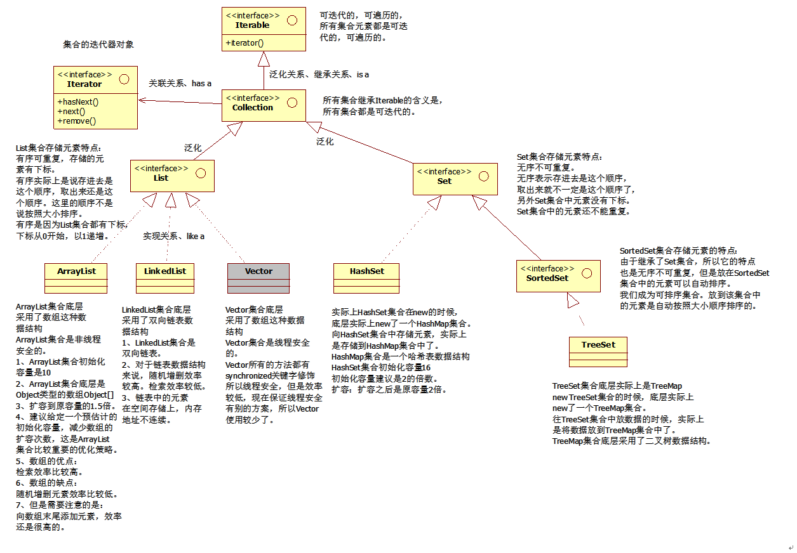
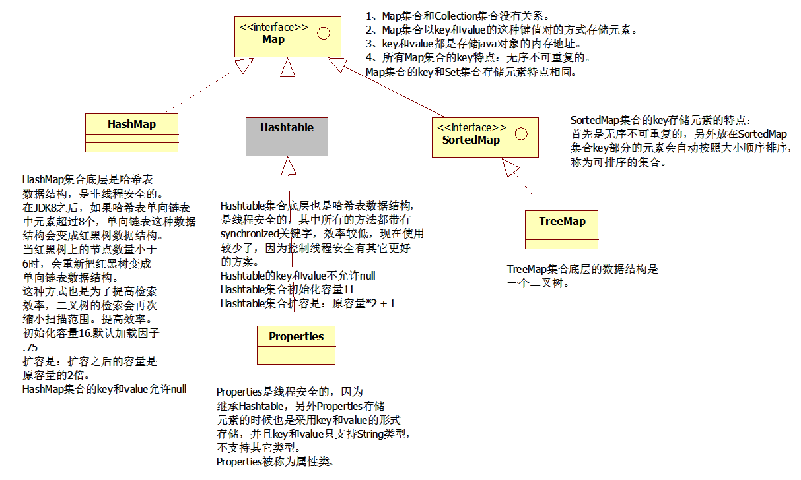

## 一  初识JAVA

#### 1 计算机概述

1. 从今天开始我就是Java软件工程师了！！！

2. 什么是软件工程师呢？

   + 是一种职位的名称
   + 通常是通过计算机的 某种编程语言 完成软件的开发

3. 什么是软件呢

   + 我们眼前的笔记本电脑就是一台计算机

   + 计算机包括两部分

     + 硬件：鼠标、键盘、显示器、主机箱内部的CPU、内存条、硬盘等...

       注意：计算机只有硬件是无法工作的，需要软件驱动硬件才能工作

     + 软件：

       + 软件包括：系统软件和应用软件

       + 系统软件：直接和硬件交互的软件，如window7、winxp、win8、win10、Linux操作系统

       + 应用软件：应用软件通常运行在系统软件中，例如：QQ运行在windows操作系统上。

         QQ就是应用软件，win10就是操作系统软件

我们通常所说的软件开发一般都是指使用计算机编程语言完成“应用软件”的开发

4. 开发软件需要计算机编程语言，计算机编程语言很多，例如：C语言、C++、Java、NET、C#、php、......

   我们主要学Java编程语言，Java系列的技术

   通过学习 Java 系列的技术完成应用软件的开发

5. Java软件工程师：通过Java编程语言完成应用软件的开发

   我们不是搞硬件的，我们是搞软件开发的。

#### 2 常用DOS命令

1. 作为程序员要求掌握最基本的windows相关的DOS命令：
   1. DOS命令在哪里编写？
      + 在DOS命令窗口当中编写DOS命令
   2. DOS命令窗口怎么打开呢？
      + win+R  --> 输入 cmd  --> 回车 【默认打开的是黑色的命令窗口，这就是DOS窗口】
   3. 常见的DOS命令？
      + exit  退出当前DOS命令窗口
      + cls   清屏
      + DOS窗口中的内容如何复制：
        + 在DOS窗口的任意位置，点击鼠标右键，然后选择标记，接下来选中要复制的内容，在DOS窗口的任意位置点击鼠标右键，此时被复制的内容已经到剪切板了。在需要粘贴的位置粘贴即可
      + dir   列出当前目录下所有的子文件 / 子目录
      + cd 命令
        + cd 命令表示：change directory 【改变目录】
        + cd 用法（语法）：cd 目录的路径
        + 但是路径包括绝对路径和相对路径
        + 绝对路径：表示该路径从某个磁盘的盘符下作为出发点的路径（cd C:\Users\Amadeus\Desktop）
        + 相对路径：表示该路径从当前所在的路径下作为出发点的路径（cd Desktop）
      + cd .. :回到上级目录
      + cd \  :直接回到根目录
      + 怎么切换盘符：
        + c:
        + e:
        + k:
        + x:
   
2. 怎么查看本机的IP地址？

   什么是IP地址？有什么用呢？

   ​	A计算机在网络当中要想定位到(连接到)B计算机，那么必须要先知道B计算机的IP地址，IP地址也可以看做计算机在同一个网络当中的身份证号(唯一标识）。l

   ​	IP地址就相当于电话号码

   ​	ipconfig (IP地址的配置信息)

   ​	ipconfig /all (IP地址的更详细的信息)，该命令后面添加一个 /all 参数可以查看更详细的网络信息。这个详细信息中包括网卡的物理地址，例如:70-8B-CD-A7-BA-25
   这个物理地址具有全球唯一性。物理地址通常叫做MAC地址。

3. 怎么查看两台计算机是否可以正常通信？

   ping命令

   语法格式：ping  域名/IP地址

   例: ping  www.baidu.com

   ​	 ping   60.135.169.121  -t   (-t 参数表示一直ping)

   ​	一直ping的目的可以查看网络是否稳定。
   ​	在一个DOS命令窗口中如果有一个命令一直在执行，想强行终止怎么办?
   ​	用ctrl + c 组合键

#### 3 Java概述

##### 3.1 计算机语言发展史

1. 什么是计算机<编程>语言？
   
   + 提前的、人为的、制定好的一套交流规则，有的时候，有的语法是需要死记硬背的，不需要问为什么。而只要遵守这套语法规则。那么人和计算机之间就可以很好的沟通、交流。这就是计算机编程语言。计算机编程语言包括C语言、C++、Java、PHP......
   
2. 计算机语言发展史

   + 第一代语言：机器语言

     ​	主要编写二进制码，直接编写0101这样的二进制

     ​    已打孔机为代表

   + 第二代语言：低级语言

     ​	主要以汇编语言为代表

     ​    在低级语言当中已经引入了一些英语单词，例如变量赋值采用mv

   + 第三代语言：高级语言

     ​	几乎和人类的语言完全相同，即使没有学习过计算机编程，只要看到这段代码就知道该代码主要完成什么功能。

     ​	例如：C语言、C++、Java......

     总之，大家看到了编程语言的发展方向是:向着人类更加容易理解的方向发展。

##### 3.2 Java语言发展史

+ Java语言诞生于1995年

+ 其实在1995年之前sun公司（太阳微电子公司：该公司目前被Oracle（甲骨文：做数据库的）收购），为了占领智能电子消费产品市场，派James Gosling领导团队开发了一个Oak（橡树）语言。

+ 1996年，JDK1.0 诞生

  + 什么是JDK？

    ​	Java开发工具包
  
    ​	做Java开发必须安装的一个工具包,该工具包需要从官网下载。
    ​	
  
    ​	目前sun被oracle收购了,所以下载需要去oracle下载。http://www.oracle.com
  
  + 目前JDK常用版本：Java8、JDK1.8、JDK8
  
  + Java包括三大块：
  
    ​	JavaSE：Java标准版（基础）
  
    ​	JavaEE：Java企业版（主攻方向）
  
    ​	JavaME：Java微型版

##### 3.3 Java语言特性

​	**开源、免费、跨平台、纯面向对象**

1. 简单性：

   ​	是相对而言的，例如java中不再支持多继承，c++是支持多继承的，多继承比较复杂	c++中有指针，Java中屏蔽了指针的概念。
   ​	所以相对来说Java是简单的。

   ​	Java语言底层是C++实现的，不是C语言

2. 面向对象

   ​	Java语言是纯面向对象的，更符合人的思维模式，更容易理解。

3. 可移植性（跨平台）

   + 什么是可移植性？	

     + java程序可以做到一次编译，到处运行。
     + 也就是说java程序可以在windows操作系统上运行，不做任何修改，同样的java程序可以直接放到Linux操作系统上运行，这个被称为Java程序的可移植性,或者叫做跨平台。

     + 原因：Windows操作系统内核和Linux操作系统的内核肯定不同，它们这两个操作系统执行指令的方式也是不一样的。
     + 结论：显然Java程序不能直接和操作系统打交道。因为Java程序只有一份。操作系统执行原理都不同。
     + SUN团队很聪明，他们想了一个办法，他们让Java程序运行在一台虚拟的计算机当中，这个虚拟的计算机叫做Java虚拟机，简称JVM。Java虚拟机再和底层的操作系统打交道。

4. 多线程

5. 健壮性

   ​	和自动垃圾回收机制有关,自动垃圾回收机制简称GC机制。
   ​	Java语言运行过程中产生的垃圾是自动回收的，不需要程序员关心。

6. 安全性

   ......

##### 3.4 Java的加载与执行

+ Java程序的运行包括两个非常重要的阶段：**编译阶段** 和 **执行阶段**

+ **编译阶段**：

  编译阶段主要的任务是检查Java源程序是否符合Java语法，符合Java语法则能够生成正常的字节码文件(xxx.class)，不符合Java语法规则则无法生成字节码文件
  字节码文件中不是纯粹的二进制，这种文件无法在操作系统当中直接执行。
  
+ **编译阶段**的过程：

  + 程序员需要在硬盘的某个位置<位置随意>新建一个.java扩展名的文件，该文件被称为Java源文件，源文件当中编写的是Java源代码/源程序。
    而这个源程序是不能随意编写，必须符合Java语法规则<Java语法规则是需要记忆的>

  + Java程序员需要使用JDK当中自带的javac.exe命令进行Java程序的编译

  + javac怎么用呢?在哪用呢?

    ​    -javac的使用规则:
    ​	javac java源文件的路径

    ​    -在Dos命令窗口中使用。
    ​	javac是一个java编译器工具/命令。

  + 一个java源文件可以编译生成多个.class文件。【以后再说】

  + 字节码文件.class文件是最终要执行的文件，所以说class文件生成之后，java源文件删除并不会影响java程序的执行。但是一般java源程序不要删除，因为class文件最终执行效果可能不是我们想要的，那么这个时候需要回头再重新修改java源程序，然后将java源程序重新编译生成新的class文件,然后再运行这个class程序，生成新的效果。

  + 编译结束之后，可以将class文件拷贝到其他操作系统当中执行。

+ **执行阶段**：

  -JDK安装之后，除了自带一个javac.exe之外，还有另一个工具/命令，叫做java.exe，java.exe命令主要负责运行阶段。

  -java.exe在哪里用?怎么用?
  -在Dos窗口中使用。

  ​    java.exe怎么用呢?         **java  【类名】**
  例如:
  硬盘上有一个A.class,那么就这样用:  **java A**

  硬盘上有一个B.class,那么就这样用:  **java B**

  硬盘上有一个C.class,那么就这样用: **java C**
  千万要注意:不要写成这样: **java A.class** 【这种方式是错误的，大家记住就行】

+ **执行阶段**的过程：

  * 打开DOS命令窗口
  * 输入：java A
  * java.exe命令会启动Java虚拟机（JVM)，JVM会启动类加载器ClassLoader
  * ClassLoader会去硬盘上搜索A.class文件，找到该文件则将该字节码文件装载到VM当中。
  * JVM将A.class字节码文件解释成二进制1010101010这样的数据
  * 然后操作系统执行二进制和底层硬件平台进行交互。

#####  3.5 开始第一个Java程序

+ 保证计算机当中已经安装了文本编辑器Notepad++

+ 安装JDK【JDK一般需要从oracle的官网下载】，我们这里讲解的是JDK8

+ JDK、JRE、JVM的关系搞清楚

  + JDK：Java开发工具包

  + JRE：Java运行环境

  + JVM：Java虚拟机

  + JDK包括JRE、JRE包括JVM

  + JVM是不能独立安装的，JDK和JRE都是可以独立安装的。有单独的JDK安装包。也有单独的JRE安装包。没有单独的JVM安装包。

  + 安装JDK的时候，JRE就自动安装了，同时JRE内部的JVM也就自动安装了。

    安装JRE的时候，JVM也就自动安装了。

  + 问题:
    假设你在软件公司开发了一个新的软件，现在要去客户那边给客户把项目部署一下,把项目跑起来,你需要安装JDK吗?
    
    只需要安装JRE就行了，JRE体积很小，安装非常便捷快速。
    
  + 问题：为什么安装JDK的时候会自带一个JRE?
    
    因为java程序员开发完程序之后，要测试这个程序，让这个程序运行起来，需要JRE；所以JDK安装的时候内部自带一个JRE。

+ JDK目录的介绍:
  JDK/bin:该目录下存放了很多命令，例如 javac.exe【负责编译】 和 java.exe【负责执行】
  
+ 开发**HelloWorld.java** 源程序

+ ```java
  public class HelloWorld{
  	public static void main(String[] args){
  		System.Out.Println("Hello World！");
  	}
  }
  ```

+ 将HelloWorld.java源程序通过javac工具进行编译:

  1. 首先需要解决的问题是:javac命令是否可用
     ​    
  
  2. 打开DOs命令窗口,直接输入javac，然后回车，出现以下:
     ​          
  
     'javac'不是内部或外部命令,也不是可运行的程序或批处理文件。
     ​    出现以上问题是因为: Windows操作系统无法找到javac命令文件

  3. 怎么解决以上javac不可用的问题?
     ​       
  
      Windows操作系统是如何搜索硬盘上某个命令的呢?
     ​            *首先会从当前目录下搜索
  
  ​            *当前目录搜索不到的话，会从环境变量PATH指定的路径当中搜索某个命令
  
  ​            *如果都搜索不到，则报以上的错误。 
  
  ​    4 配置环境变量path
  
  ​		*注意：path环境变量和java语言没有关系，path环境变量是属于windows操作系统的一个知识点。path环境变量是专门给windows操作系统指路的。
  ​		*javac要想能随意使用，需要将javac所在的目录配置到环境变量path当中:
  ​			path=xxxx;C: \Program FileslJavaljdk1.7.0_80\bin
  
  ​	5 Javac命令怎么用?
  
  ​		**java java源文件路径**【注意:路径包括相对路径和绝对路径,都可以。】
  
+ 运行java程序:
      -需要使用java.exe命令

  ​    -首先测试 java命令是否可用

  ​    -使用方式: **java   类名**
  ​    硬盘上有HelloWorld.class，那么类名就是:**HelloWorld**

  ​    **java HelloWorld**
  ​    一定要注意:java命令后面跟的不是文件路径，是一个类的名字。

  ​    -首先你需要先将Dos窗口中的目录切换到 HelloWorld.class 文件所在目录。

+ 总结：打开Dos命令窗口，进入HelloWorld.java所在的文件目录下，输入**javac HelloWorld** 命令，编译源程序； 生成HelloWorld.class文件，而后输入**java  HelloWorld**命令，执行字节码(.class)文件

#### 4 Java语法

##### 4.1 注释

+ 什么是注释？注释的作用是什么？

  ​	-出现在java的源程序当中,对java源代码的解释说明

  ​	-注释不会被编译到.class字节码文件当中

  ​	-一个好的开发习惯应该是多写注释，这样程序的可读性增强。

+ java中的注释怎么写

  ```java
  单行注释 
  //单行注释，只注释当前行
  
  多行注释  /**/
  /*
  	多行注释
  	多行注释
  */
  
  javadoc 注释（文档注释）【比较专业的注释】
  
  /**
  *javadoc注释
  *javadoc注释
  *javadoc注释
  */
  
  注意：这种注释是比较专业的注释，该注释信息会被javadoc.exe工具解析提取并生成帮助文档。
  ```

  

##### 4.2 HelloWorld程序解释

```java
//public表示公开的
//class表示定义一个类
//HelloWorld表示一个类名
public class HelloWorld{//表示定义一个公开的类，类名为HelloWorld
    //类体中不允许直接编写java语句【除声明变最之外】
    // System.out.println ( "Hello world! ");

    //类体【记住】
    /*
    	public表示公开的
    	static表示静态的
    	void表示空
	    main表示方法名是main
		(String[] args)是一个main方法的形式参数列表
		需要记住的是:以下的方法是一个程序的主方法,是程序的执行入口，是sun公司规定的固定编写方式
    */
	public static void main(String[] args){//表示定义一个公开的静态的主方法
        //方法体
        //方法体
        
        //java语句【java语句以";"终止，分号必须是半角分号】
        //先记住:以下这样代码的作用是向控制台输出一段信息
        //以下的双引号必须是半角的双引号【是java语法的一部分】
        //java中所有的"字符串"都是用双引号括起来的
		System.Out.println("Hello World！");
	}
}
```

+ public class 和 class

  + 一个java源文件当中可以定义多个class

  + 一个java源文件当中 public 的 class 不是必须的

  + 一个class会定义生成一个xxx.class字节码文件

  + 一个java源文件当中定义公开的类的话，只能有一个，并且该类名称必须和java源文件名称一致。

  + 每一个class当中都可以编写main方法，都可以设定程序的入口，想执行B.class中的main方法: **java B**

  + ★注意:当在命令窗口中执行java Hello，那么要求Hello.class当中必须有(main)主方法。没有主方法会出现运行阶段的错误：

    D:lcourse\JavaProjects\02-JavaSElday02>java Hello

    错误：在类B中找不到主方法，请将主方法定义为:
    public static void main (string[ ]  args)

#### 5 总结

+ 能够自己搭建java的开发环境
+ 能够独立编写Helloworld程序,编译并运行
+ 掌握环境变量path的原理以及如何配置
+ 掌握环境变量classpath的原理以及如何配置
+ java中的注释
+ public class和class 的区别

------

## 二 Java语言基础

#### 1 标识符

1. 什么是标识符？

   - 在java源程序当中凡是程序员有权利自已命名的单词都是标识符。

   - 标识符可以标识什么元素呢?
     类名、方法名、变量名、接口名、常量名......

2. 标识符的命名规则？【不按照这个规则来，编译器会报错，这是语法】

   + 一个合法的标识符只能由 “**数字、字母、下划线_ 、美元符号$** "组成，不能含有其它符号
   + 不能数字开头
   + 严格区分大小写
   + 关键字不能做标识符

3. 标识符的命名规范？【只是一种规范，不属于语法，不遵守规范编译器不会报错】

   + 最好见名之意

     ```java
     public class UserService{
     	public void login(String userName, String passWord){
     	
     	}
     }
     ```

   + 遵守驼峰命名方式

     SystemService、UserService、CustomerService

   + 类名、接口名：首字母大写，后面每个单词首字母大写

   + 变量名、方法名：首字母小写，后面每个单词首字母大写

   + 常量名：全部大写

4. 合法和不合法的标识符

   合法                    不合法

   _123Test             123Test

   HelloWorld           HelloWorld!

   A_B_C                 A_B_C#

   $ABC                   Hello World

   class1                  calss

   public0                 public

#### 2 关键字

1. 什么是关键字？

   这是sun公司开发Java语言的时候，提前定义好了一些具有特殊含义的单词，这些单词全部小写，具有特殊含义，不能用作标识符

2. 切记：Java语言中的关键字全部小写。

   注意：Java语言中是严格区分大小写的。如：public 和 Public 不一样的

3. 常见关键字：int, byte, while, for, public, static, void, switch, case......(不强制要求记忆)

#### 3 数据类型概述

1. 数据类型有什么用？

   数据类型用来声明变量，程序在运行过程中根据不同的数据类型分配不同大小的空间。

   int i = 10;
   double d = 1.23;
   i变量和d变量类型不同,空间大小不同。

2. 数据类型在Java语言中包括两种：

   ```java
   第一种:基本数据类型
   基本数据类型又可以划分为4大类8小种:
   	第一类:整数型
   		byte, short, int, long
   	第二类:浮点型
   		float, double
   	第三类:布尔型
   		boolean （true,false）（1bit）
   	第四类:字符型
   		char
   8小种:
   	byte, short, int, long, float, double, boolean, char
   
   第二种:引用数据类型
   	字符串型string属于引用数据类型。
   	string字符串不属于基本数据类型范畴。
   	java中除了基本数据类型之外，剩下的都是引用数据类型。
   	引用数据类型后期面向对象的时候才会接触。
   ```

3. 8种基本数据类型中

   ```   
   整数型:byte short int long有什么区别?
   浮点型:float和double有什么区别?
   区别:占用的空间大小不同.
   
   关于计算机存储单位?
   计算机只能识别二进制。(1001101100...）
   1字节 = 8bit（8比特） -->  1byte = 8bit
   1bit就是一个1或0 .
   1KB = 1024byte
   1MB = 1024KB
   1GB = 1024MB
   1TB = 1024GB
   byte b = 2;//在计算机中是这样表示的:oo000010
   short s = 2;//在计算机中是这样表示的: 00000000 00000000 00000000 00000010
   
   类型            字节占用字节数量(byte)         取值范围
   -------------------------------------------------------
   byte               1                        -128 - 127
   short              2                        -32768 - 32767
   int                4                        -2147483648 - 2147483647
   long               8
   float              4
   double             8
   boolean            1  
   char               2                        0 - 65535
   
   关于二进制?
   	十进制转换成二进制？
   	二进制转换成十进制？
   ```

4. byte类型的取值范围？

   ```
   byte 是 [-128 ~ 127] 共可以标识256个不同的数字。
   byte类型的最大值是怎么计算出来的?
   	byte是1个字节，是8个比特位，所以byte可以存储的最大值是:01111111
   	注意:在计算机当中，一个二进制位最左边的是符号位，当为0时表示正数，当为1时表示负数。
   	所以byte类型最大值是: 01111111 
   	相当于等于  1 0000 0000 - 1
   short和char实际上容量相同，不过char可以表示更大的数字。
   因为char表示的是文字，文字没有正负之分，所以char可以表示更大的数字
   ```

#### 4 字符编码

对于8种基本数据类型来说：

```
其中byte,short, int,long,float, double ,boolean，这7种类型计算机表示起来比较容易，因为他们都是数字。其中布尔类型只有两个值true和false，实际上true和false分别在c++中对应的是1和0，1为true，false为0。

对于char类型来说计算机表示起来比较麻烦，因为char对应的是文字，每一个国家的文字不一样，文字不能直接通过"自然算法"转换成二进制。这个时候怎么办?
	字符编码诞生了.
什么是字符编码?
	字符编码是人为的定义的一套转换表。
	在字符编码中规定了一系列的文字对应的二进制。
	字符编码其实本质上就是一本字典，该字段中描述了文字与二进制之间的对照关系。
	字符编码是人为规定的。(是某个计算机协会规定的。)
字符编码涉及到编码和解码两个过程，编码和解码的时候必须采用同一套字符编码方式,不然就会出现乱码。

关于字符编码的发展社程?
	起初的时候计算机是不支持文字的，只支持科学计算。实际上计算机起初是为了战争而开发的,计算导弹的轨道....
	后来随着计算机的发展，计算机开始支持文字，最先支持的文字是英文，英文对应的字符编码方式是:ASCII码
	ASCII码采用1byte进行存储，因为英文字母是26个。(键盘上所有的键全部算上也超不过256个。1byte可以表示256种不同的情况。所以英文本身在计算机方面就占有优势。)
	'a' --> 97 (0110 0001)
	'A' --> 65
	'0' --> 48
	'a'-->0110 0001 为编码
	0110 0001-->'a' 为解码
	
随着计算机语言的发展，后来国际标准组织制定了IS0-8859-1编码方式，
又称为latin-1编码方式，向上兼容ASCII码。但不支持中文。

后来发展到亚洲，才支持中文，日文,韩文....
中文这块的编码方式:GB2312<GBK<GB18030(容量的关系)
以上编码方式是简体中文。

繁体中文：big5 （台湾使用的是大五码）

在java中，java语言为了支持全球所有的文字，采用了一种字符编码方式叫做unicode编码。
unicode编码统一了全球所有的文字，支持所有文字。具体的实现包括:UTF-8 UTF-16 
UTF-32....
```

#### 5 变量

1. 关于程序当中的数据？

   开发软件是为了解决现实世界中的问题。而现实世界当中，有很多问题都是使用数据进行描述的。所以软件执行过程中最主要就是对数据的处理。

   软件在处理数据之前需要能够表示数据,在java代码中怎么去表示数据呢?在java中有这样的一个概念：**字面量**。

   注意:在java语言中 “数据" 被称为 "字面量” 

   -10   1.23   true   false   'a'    "abc"
   以上这些都是数据,在程序中都被叫做”字面量"。

   字面量可以分为很多种类：
​		整数型字面量:1 2 3 100  -100   -20 ...
   
   ​		浮点型字面量:1.3  1.2  3.14...
​		布尔型字面量: true、false没有其它值了，表示真和假,true表示真，false表示假		
   
   ​		字符型字面量:  'a' 、 'b' 、 '中'
   ​		字符串型字面量:"abc"  、 "a" 、"b" 、"中国"

   ​	其中字符型和字符串型都是描述了现实世界中的文字
   ​	需要注意的是:
   ​		所有的**字符型**只能使用单引号括起来

   ​		所有的**字符串型**只能使用双引号括起来.

   ​        字符型一定是单个字符才能成为"字符型"

   ​	在语法级别上怎么区分字符型和字符串型?
   ​		主要看是双引号还是单引号-
   ​		单引号的一定是字符型.
   ​		双引号的一定是字符串型。

   ```java
   public class VarTest01{
   	public static void main(String[] args){
   		System.out.println(3.14);//浮点型
   		System.out.println(100);//整型
   		System.out.println(true);//布尔值  真
   		System.out.println(false);//布尔值  假
   		System.out.println('1');//字符型
   		System.out.println('中');//字符型
   		System.out.println("abc");
   		System.out.println("国");//字符串型
   	}
   }
   ```

2. 思考：如果只有字面量，没有变量机制的话，有什么问题？

   ```java
   //以下虽然都是10，但是这3个10占用不同的内存空间
   System.out.println(10);
   System.out.println(10);
   System.out.println(10);
   
   //定义一个变量i
   int i = 1000;
   //以下3次访问都是访问的同一块内存空间
   System.out.println(i);
   System.out.println(i);
   System.out.println(i);
   ```

3. 变量的定义？

   变量其实就是内存当中存储数据的最基本的单元。（变量就是一个存储数据的盒子）
   在java语言当中任何数据都是有数据类型的，其中整数型是: int

   当然，在java中除了数据类型int之外，还有其它的类型，例如带小数的: double等。。

   数据类型有啥用？

   ​	记住:不同的数据类型,在内存中分配的空间大小不同。
   ​	也就是说，Java虚报机到底给这个数据分配多大的空间，主要还是看这个变量的数	据类型根据不同的类型，分配不同大小的空间。

   一个字节 = 8个比特位

   一个比特位就是一个 1 或 0. 注意：比特位就是二进制位。

   一个 int 位 = 4个字节 = 32比特位

4. 变量的三要素: **数据类型、变量名、变量值**

   ​	数据类型  变量名  =  初始值; //变量的声明和赋值

   ​	int a = 10;//0000000 00000000 00000000 00001010

   类型决定空间的大小.
   起个名字是为了以后方便访问。(以后在程序中访问这个数据是通过名称来访问的。）

   变量值是变量保存的数据。

   注意：在java语言中有一个规定，变量必须先声明，再赋值才能访问。(没有值相当于给这个变量开辟空间。）
   
   变量就是可以变化的量。
   
5. 注意：方法体当中的代码遵循自上而下的顺序依次逐行执行.

   ```java
   System.out.println(i);
   int i = 0;//编译错误
   ```

   ```java
   public static void main(String[] args){
   	int age = 10;
   	System.out.printfln(age);
   	//给变量重新赋值
   	age = 20;//true
   	System.out.printfln(age);
   	
   	int age = 30;//编译报错
       //结论：变量可以重新赋值，但是在同一个域当中，变量名不能重名
       
       int a = 10;
       double a = 1.2;//报错
       //与类型无关变量也不能重名
       
       //可以在一行声明多个变量
       int a, b, c = 100;
       System.out.printfln(a);//报错，a没有被赋值
       System.out.printfln(b);//报错，b没有被赋值
       System.out.printfln(c);//正确，只有c被赋值
       //可以改为 int a = 10, b=100, c=100;
   }
   ```

6. 变量的分类

   ```java
   /*
   	变量根据出现的位置进行划分：
   		在方法体当中声明的变量:局部变量.
   		在方法体之外，类体内声明的变量:成员变量.
   */
   public class A{
       int b;//成员变量
       public static void main(String[] args){
           int a;//局部变量
       }
   }
   ```

7. 变量的作用域

   ```java
   /*
   变量的作用域?
   	1、什么是作用域?变量的有效范围。
   	2、关于变量的作用域,大家可以记住一句话:出了大括号就不认识了.
   	原则：就近原则
   */
   public static void main (string []args){
   	//局都变量
   	int i - 100; 1/这个i的有效范围是main方法。
   }
   public static void x(o){
   	//在这个位置上能访问i吗?
       //错误:找不到符号
   	//System.out.println(i) ; //i是无法访问的-
   	//可以定义一个变量起名i吗?
   	//这个i的有效范围是x方法。
       //局部变量
   	int i = 200;//所以这个i和main方法中的i不在同一个域当中，不冲突。
   }
   ```

#### 6 数据类型详解

1. 字符串

```java
    //char 可以存储一个汉字
    //因为一个汉字占用两个字节，Java中char类型占用两个字节，刚好。
    char c1 = '中'；
    char c2 = 'a';
    char c3 = '1';
    //char c4 = "a";//报错 
    
	//关于Java中的转义字符
		char c1 = 't';
		char c2 = '\t';//编译不会报错
     // \t 实际上是1个字符，不属于字符串
   	 //两个字符合在一起表示一个字符，\t 表示“制表符Tab”,相当于键盘上的Tab键
	//System.out.println(); 换行
	//System.out.print(); 不换行 
	System.out.println("abc\tdef");//abc	def
	System.out.print("abc");
	System.out.print("def");//abcdef
	// '\n' 表示换行符     
	// 假设现在想在控制台输出一个 ' 字符怎么办？  System.out.println('\'');
	// 假设现在想在控制台输出一个 \ 字符怎么办？  System.out.println('\\');
	// 在java中两个反斜杠代表了一个“普通的反斜杠字符”。
	System.out.println("\"test\"");//"test"
	System.out.println("“test”");//“tets” 内部的双引号可以用中文的符号
	System.out.println("'");// '  这个不需要专门转义

	char x = '4e2d';//编译报错
	char x1= '\u4e2d';//中   
	//反斜杠u表示后面的是一个字符的unicode编码，unicode编码是十六进制的。
	/*
		十六进制：满16进1
		1 2 3 4 5 6 7 8 9 a b c d e f
	*/
```

2. 整数型

```java
/*
整数型在java语言中共4种类型:
byte  1个字节
short 2个字节
int   4个字节
long  8个字节
1个字节 = 8个二进制位 1byte = 8bit
对于以上的四个类型来说,最常用的是int.
开发的时候不用斤斤计较,直接选择使用int就行了

在java语言中整数型字面量有4种表示形式:
十进制:最常用的。
二进制
八进制
十六进制
*/
	int a = 10;//十进制
	int b = 010;//八进制
	int c = 0x10;//十六进制
	int d = 0b10;//二进制 Java8新特性

	/*
		在java中有一条非常重要的结论,必须记住:
			在任何情况下，整数型的"字面量/数据"默认被当做int类型处理。(记住就行)
			如果希望该"整数型字面量"被当做long类型来处理，需要在"字面量n后面添加L/l
			建议使用大写L，因为大写I 和小写l 傻傻分不清
	*/
	//分析这个代码存在类型转换吗,以下代码什么意思?
	//不存在类型转换
	//100这个字面量被当做int类型处理
	//a变量是int类型,所以不存在类型的转换。
	//int类型的字面量城值给int类型的变量。
	int a = 100;
	
	//分析这个程序是否存在类型转换?
	//分析:200这个字面量默认被当做int类型来处理
	//b变量是long类型，int类型占4个字节，long类型占8个字节
	//小容量可以自动转换成大容量，这种操作被称为:自动类型转换。
	long b = 200;
	
	//分析这个是否存在类型转换?这个不存在类型转换.
	//在整数型字面量300后面添加一个L之后，300L联合起来就是一个long类型的字面量
	//c变量是1ong类型，long类型赋值给long类型不存在类型转换
	long c = 300L;

	//题目:
	//可以吗?存在类型转换吗?
	//2147483647默认被当做int来处理
	//d变量是long类型，小容量可以自动赋值给大容量，自动类型转换
	long d = 2147483647; // 2147483647是int最大值。

	//编译器会报错吗?为什么?
	//在java中，整数型字面量一上来编译器就会将它看做int类型
	//而2147483648已经超出了int的范围，所以在没有赋值之前就出错了。
	//记住，不是e放不下2147483648，e是long类型，完全可以容纳2147483648
	//只不过2147483648本身已经超出了int范围。
	//错误:整数太大
	//long e = 2147483648;

	//怎么解决这个问题呢？
	long e = 2147483648L;

/*
1.小容量可以直接赋值给大容量，称为自动类型转换
2.大容量不能直接赋值给小容量，需要使用强制类型转换符进行强转。但需要注意的是:加强制类型转换符之后，虽然编译通过了，但是运行的时候可能会损失精度-
*/
	//不存在类型转换
	//100L是long类型字面量，x是long类型字面量。
	long x = 100L;
	
	//x是long类型，占用8个字节，而y变量是int类型，占用4个字节在
	//java语言中,大容量可以"直接"赋值给小容量吗？不可以，没有这种语法
	//编译错误信息:错误:不兼容的类型:从long转换到int可能会有损失
	//int y = x ;
	
	//大容量转换成小容量，要想编译通过，必须加强制类型转换符，进行强制类型转换。
	//这个(int)就是强制类型转换符，加上去就能编译通过。
	//但是要记住:编译虽然过了，但是运行时可能损失精度。
	//long 100L:00000000 00000000 00000000 00000000 00000000 00000000 00000000 01100100
	//int 100: 00000000 00000000 00000000 01100100;
	iny y = (int) x;

	//定义变量a int类型,城值100int a = 100 ;
	int b = a; //将变量a中保存的值100复制一份给b变量。

	//分析:以下代码编译可以通过吗?300被默认当做int类型
	//b变量是byte类型
	//大容量转换成小容量，要想编译通过，必须使用强制类型转换符
	//错误:不兼容的类型:从int转换到byte可能会有损失
	//short b = 300;
	
/*
	java中有一个语法规则:
		当这个整数型字面量没有超出byte或short的取值范围，那么这个
		整数型字面量可以直接赋值给byte或short类型的变量。
*/
	//要想让以上的程序编译通过,必须加强制类型转换符
	//虽然编译通过了，但是可能精度损失-
	//300这个int类型对应的二进制:00000000 00000000 00000001 00101100
	//byte占用1个字节，砍掉前3个字节，结果是: 00101100 
	short b = (byte) 300;
	System.out.println(b);//44

	//这个编译能通过吗?
	//1是int类型,默认被当做int类型来看。
	//x是byte类型,1个字节，大容量无法直接转换成小容量。
	//按说是编译报错的。
	byte b = 1;//编译没有报错
	byte z = 128;//编译报错 

/*
	1、整数能否直接赋值给char
	2、char x = 97 ;
	这个java语句是允许的,并且输出的结果是'a',经过这个测试得出两个结论:
		第一个结论:当一个整数赋值给char类型变量的时候，会自动转换成char字符型，
				 最终的结果是一个字符.
		第二个结论:当一个整数没有超出byte short char的取值范围的时候，这个整数
		直接赋值给byte short char类型的变量。
*/
	char c1 = 'a';
	System.out.println (c1) ;//a
	//这里会做类型转换吗?
	//97是int类型(这是java中规定，默认当做int处理)
	//c2是char类型
	char c2 = 97;
	system. out.println (c2) ;//'a'

	//har类型取值范围:[0~65535]
	char c3 = 65535; //最终是一个"看不懂”的字符。

	//错误:不兼容的类型:从int转换到char可能会有损失
	//char c4 = 65536;
	char c4 = (char) 65536;//可以正常执行

/*
	1、计算机在任何情况下都只能识别二进制
	2、计算机在底层存储数据的时候，一律存储的是"二进制的补码形式”
	   计算机采用补码形式存储数据的原因是:补码形式效率最高。
	3、什么是补码呢?
		实际上是这样的,二进制有:原码反码补码
	4、记住:
	对于一个正数来说:二进制原码、反码、补码是同一个，完全相同。
	int i-1;
	对应的二进制原码: 00000000 00000000 00000000 00000001
	对应的二进制反码: 00000000 00000000 00000000 00000001
	对应的二进制补码: 00000000 00000000 00000000 00000001
	对于一个负数来说:二进制原码、反码、补码是什么关系呢?
	byte i =-1;
	对应的二进制原码: 10000001
	对应的二进制反码（符号位不变，其它位取反） : 11111110
	对应的二进制补码(反码+1): 11111111
	5、分析byte b =(byte) 150 ;这个b是多少?
	int类型的4个字节的150的二进制码是什么?
		00000000 00000000 00000000 10010110
	将以上的int类型强制类型转为1个字节的byte，最终在计算机中的二进制码是:10010110
	千万要注意:计算机永远存储的都是二进制补码形式。也就是说上面10010110 这个是一个二进制补码形式，你可以采用逆推导的方式推算出这个二进制补码对应的原码是啥!! !! !!
	10010110(补码) --> 11101010（源码）--> -106
*/

	char c1 = 'a';
	byte b = 1;
	//注意：这里的"+"表示运算求和
	System.out.println(c1 + b);//98
	//错误：不兼容的类型:从int转换到short可能会有损失
	//short s = c1 + b;
	short s = (short)(c1 + b);
	//结论: byte、char、short做混合运算的时候，各自先转换成int再做运算。

	long a = 10L;
	char c = 'a';
	short s = 100;
	int i = 30;
	//求和
	System.out.println(a + c + s = i);//237  计算结果为long类型
	/*
		结论:多种数据类型做混合运算的时候，最终的结果是"最大容量"对应的类型。
		char+short+byte这个除外-
		因为char + short + byte混合运算的时候，会各自先转换成int再做运算。
	*/
	//以下程序执行结果是?
	//java中规定，int类型和int类型最终的结果还是int类型。
	int temp = 10 / 3; // /是除号。(最终取整)
	System.out.println(temp); // 3.33333吗? 结果是:3

```

3. 浮点型

   ```java
   /*
   关于java语言中的浮点型数据
   浮点型包括:
   	float	4个字节
   	double	8个字节
   float是单精度
   double是双精度
   double更精确比如说:
   	10.0 / 3 如果采用float来存储的话结果可能是:3.33333
   	10.0 / 3 如果采用double来存储的话结果可能是:3.3333333333333
   	但是需要注意的是，如果用在银行方面或者说使用在财务方面，double也是远远不够的，在java中提供了一种精度更高的类型，这种类型专门使用在财务软件方面:java.math.BigDecimal (不是基本数据类型，属于引用数据类型)
   	
   float和double存储数据的时候都是存储的近似值。为什么?
   	因为现实世界中有这种无线循环的数据，例如:3.3333333333333. . . .
   	数据实际上是无限循环，但是计算机的内存有限，用一个有限的资源
   	表示无限的数据,只能存储近似值-
   
   long类型占用8个字节。
   float类型占用4个字节。哪个容量大?
   	注意:任意一个浮点型都比整数型空间大。
   	float容量> long容量。
   	
   java中规定，任何一个浮点型数据默认被当做double来处理。
   如果想让这个浮点型字面量被当做float类型来处理，那么请在字面量后面添加F/f
   */
   	//这个不存在类型转换
   	//3.1415926是double类型
   	//pi是double类型
   	double pi - 3.1415926;
   
   	//这个可以吗?
   	//错误:不兼容的类型:从double转换到f1oat可能会有损失
   	//float f = 3.14 ;
   	
   	//怎么修改以上的代码呢?
   	//第一种方式:在字面量后面添加F/f
   	f1oat f1 = 3.14f;
   	f1oat f2 = 3.14F;
   	//第二种方式:强制类型转换，但可能损失精度。谨慎使用。
   	float f3 = (float) 3.14 ;
   
   	//分析这个程序,可町以编译通过吗?
   	//错误:不兼容的类型:从double转换到int可能会有损失
   	//原理:先将5转换成double类型，然后再做运算，结果是double
   	//大容量无法直接赋值给小容量,需要强转。
   	//int i = 10.0 / 5;
   	//怎么修改
   	int i = (int) 10.0 / 5;
   	int i1 = 10 / 3;//这个不会报错
   	System.out.println(i); //2
   	//可以这样修改吗?可以，强转的时候只留下小数位。
   	int x = (int) (10.0 / 5);
   	System.out.println (x) ; //2
   ```

4. 布尔类型

   ```java
   /*
   	1、在java语言中boolean类型只有两个值，没有其他值: true 和 false.
   		不像c或者C++，c语言中1和0也可以表示布尔类型。
   	2、boolean类型在实际开发中使用在哪里呢?
   		使用在逻辑判断当中,通常放到条件的位置上(充当条件）
   */
   ```

5. 基本数据类型转换规则

   ```java
   第一条:八种基本数据类型中，除 boolean 类型不能转换，剩下七种类型之间都可以进行转换:
   第二条:如果整数型字面量没有超出byte , short,char 的取值范围，可以直接将其赋值给 byte ,short, char 类型的变量;
   第三条:小容量向大容量转换称为自动类型转换，容量从小到大的排序为:byte < short(char) < int < long < float < double ，其中 short 和 char 都占用两个字节,但是 char 可以表示更大的正整数:
   第四条:大容量转换成小容量，称为强制类型转换，编写时必须添加"强制类型转换符",但运行时可町能出现精度损失,谨慎使用:
   第五条: byte, short, char 类型混合运算时，先各自转换成 int 类型再做运算:
   第六条:多种数据类型混合运算，各自先转换成容量最大的那一种再做运算。
   ```

#### 7 运算符

1. 算数运算符

   ```java
   +      求和
   -      相减
   *      乘积
   /      商
   %      求余数（求模）
   
   ++     自加1
   --     自减1
   对于++运算符来说:
   	可以出现在变量前,也可以出现在变量后.
   	不管出现在变量前还是后，总之++执行结束之后，变量的值一定会自加1。l
   
   int a = 10 ;
   int b = 3 ;
   System.out.println(a + b); //13
   System.out.println(a - b); //7
   System.out.println(a * b); //30
   System.out.println(a / b); //3
   System.out.println(a % b); //1
   
   int i = 10;
   //i变量自加1
   i++;
   System.out.println(i); //11
   
   int k = 10;
   //k变量自加1
   ++k;
   System.out.println(k); //11
   
   //研究:出现在变量前和变量后有什么区别?
   //先看++出现在变量后
   //语法:当++出现在变量后,会先做赋值运算，再自加1
   int m = 20;
   int n = m++;
   System.out.println(n); //20
   System.out.println(m) ; //21
   //++出现在变量前呢?
   //语法规则:当++出现在变量前的时候，会先进行自加1的运算，然后再赋值运算。
   int x = 100;
   int y = ++x;
   System.out.println(x); //101
   System.out.println(y); //101
   ```

2.  关系运算符

   ```java
   >         大于
   <         小于
   >=        大于等于
   <=        小于等于
   ==        等于
   !=        不等于
   
   一定要记住一个规则:
   	所有的关系运算符的运算结果都是布尔类型,不是true就是false，不可能是其他值
   	在java语言中:
   		= :赋值运算符
   		== :关系运算符,判断是否相等
        注意:关系运算符中如果有两个符号的话，两个符号之间不能有空格。
   
   int a = 10;
   int b = 10;
   System.out.println(a > b);//fasle
   System.out.println(a >= b);//true
   System.out.println(a < b);//false
   System.out.println(a <= b);//true
   System.out.println(a == b);//true
   System.out.println(a != b);//false
   ```

3. 逻辑运算符

   ```java
   /*
   &           逻辑与（并且）
   |           逻辑或（或者）
   ！          逻辑非（取反）
   &&          短路与
   ||          短路或
   
   用普通话描述的话: 100 大于 99 并且 100 大于 98，有道理
   用代码描述的话: 100 > 99 & 100 > 98 --> true
   
   非常重要:
   	逻辑运算符两边要求都是布尔类型，并且最终的运算结果也是布尔类型.
   	这是逻辑运算符的特点
   	100 &true不行,语法错误。]
   	100 & 200不行,没有这种语法
   	true & false这样可以.
   */
   
   //对于逻辑与 & 运算符来说，只要有一边是false，结果就是false.
   //只有两边同时为true,结果才是true  (有0为0，全1为1)
   System.out.println(true & true);//true
   System.out.println(true & false);//false
   System.out.println(false & false);//false
   
   //对于逻辑或 只要有一边是 true，结果就是true
   //两边都是false，结果就是false   (有1为1，全0为0)
   System.out.println(true | true);//true
   System.out.println(true | false);//true
   System.out.println(false | false);//fasle
   
   System.out.println(!true);//false
   System.out.println(!false);//true
   
   /*
   	对于短路与 &&, 短路或 ||
       	
       短路与 和 逻辑与 的区别？
       	首先这两个运算符的运算结果没有任何区别，完全相同。只不过 "短路与&&" 会发生短路现象-
   	什么是短路现象呢? 什么时候会发生“短路”
   		右边表达式不执行,这种现象叫做短路现象。
   	什么时候使用 &&, 什么时候使用 &?
   		从效率方面来说，&& 比 & 的效率高一些.
   		因为逻辑与 & 不管第一个表达式结果是什么，第二个表达式一定会执行。
   	
   	以后的开发中,短路与&&和逻辑与还是需要同时并存的。
   		大部分情况下都建议使用 短路与&&
   		只有当既需要左边表达式执行，又需要右边表达式执行的时候，才会选择 逻辑与&
   	
   	问题:什么时候发生短路或现象?
   		"或"的时候只要有一边是true，结果就是true.
   		所以，当左边的表达式结果是true的时候，右边的表达式不需要执行，此时会短路。
   */
   ```

4. 赋值运算符

   ```java
   /*
   赋值运算符:
   	1、赋值运算符包括"基本赋值运算符"和"扩展赋值运算符":基本的、扩展的。
   	2、基本城值运算符?       =
   		int a = 10;
   		赋值运算符“=”右边优先级比较高，先执行右边的表达式
   		然后将表达式执行结束的结果放到左边的“盒子”当中.(赋值)
   	3、扩展的城值运算符?     += -= *= /= %=
   		int b = 10;
   		b += 10;
   		System.out.println(b);//20  b变量追加10  类似于 b = b + 10;
   	注意:扩展赋值运算符在编写的时候，两个符号之间不能有空格。
   	很重要的语法机制:使用扩展赋值运算符的时候，永远都不会改变运算结果类型。
   */
   //研究:
   //i += 10 和i = i+10 真的是完全一样吗?
   //答案:不一样，只能说相似，其实本质上并不是完全相同。
   byte x = 100; // 100没有超出byte类型取值范围,可以直接赋值
   System.out.println(x);//100
   
   //分析:这个代码是否能够编译通过?
   //错误:不兼容的类型:从int转换到byte可能会有损失
   // x = x+1;//编译器检测到 x+1 是int类型，int类型可以直接赋值给byte类型的变量
   
   //使用扩展城值运算符可以吗?
   //可以的,所以得出结论: x += 1 和 x = x+1 不一样。/
   // 其实 x += 1 等同于: x = (byte)(x + 1);
   x += 1;
   System.out.println(x);//101
   
   a += 3; //a = a + 3;
   b -= 5; //b = b + 5;
   c *= 3; //c = c * 3;
   d /= 6; //d = d / 6;
   e %= 9; //e = e % 9;
   f &= 9; //f = f & 9;与
   g |= 10;//g = g | 10;或
   h ^= 15;//h = h ^ 15;异或
   ```

5. 三目运算符（条件运算符）?:

   ```java
   /*
   条件表达式：
   					    true     false
   	语法格式：布尔表达式 ? 表达式1 : 表达式2
   	执行原理：
   		布尔表达式的结果为true时，表达式1的执行结果作为整个表达式的结果。
   		布尔表达式的结果为false时，表达式2的执行结果作为整个表达式的结果。
   */
   ```

6. 字符串连接运算符 =

   ```java
   /*
   +运算符:
   	1、+ 运算符在java语言中有两个作用。
   		作用1:求和
   		作用2:字符串拼接
   	2、什么时候求和? 什么时候进行字符串的拼接呢?
   		当 + 运算符 两边都是数字类型的时候,求和。
   		当 + 运算符 两边的任意一边是字符串类型，那么这个 + 会进行字符串拼接操作。
   	3、一定要记住:字符串拼接完之后的结果还是一个字符串。
   
   */
   int age = 35;
   //这里的 + 进行字符串的拼接操作
   System.out.println("age is" + age);//age is 35
   
   int a = 100, b = 200;
   //这里的 + 两边都是数字，所以做加法运算
   System.out.println(a+b);//300
   
   //注意:当一个表达式当中有多个加号的时候
   //遵循"自左向右”的顺序依次执行。(除非额外添加了小括号，小括号的优先级高)
   //第一个 + 先运算，由于第一个 + 左右两边都是数字，所以会进行求和。
   // 求和之后结果是300，代码就变成了: System.out.println(300 + "110");
   //那么这个时候，由于 + 的右边是 字符串"110"，所以此时的 + 会进行字符串拼接。
   System.out.println(a + b + "110");//最后一定是一个字符串:"300110"
   
   //先执行小括号当中的程序: b + "110"，这里的+会进行字符串的拼接，
   //拼接之后的结果是:"200110"，这个结果是一个字符串类型。
   //代码就变成了:system.out.println(a + "200110") ;
   //这个时候的+还是进行字符串的拼接。最终结果是:"100200110"
   System.out.println (a +(b + "110"));
   
   //在控制台上输出 "100 + 200 = 300"
   System.out.println(a + " + " + b + " = " + (a+b));
   
   //在Java语言中怎么定义 字符串类型的变量呢？
   //Sring是字符串类型，并且string类型不属于基本数据类型范畴，属于引用类型
   //name是变量名,只要是合法的标识符就行。
   //"Jack” 是一个字符串字面量
   String name = "Jack";//String类型是字符串类型，其中S是大写，不是:string
   //字符串的拼接
   System.out.println("登录成功欢迎" + name + "回来！");
   ```

7. 接收用户键盘输入

   ```java
   /*
   1、输出信息到控制台：
   	System.out.println(...);
   2、在java中怎么接收键盘的输入呢？
   	前提：java.util.Scanner s = new java.util.Scanner(System.in); 
   	接收一个整数怎么办？
   		int num = s.nextInt();
   		
   	接收一个字符串怎么办？
   		String str = s.next();
   */
   public class KeyInput{
   	public static void main(String[] args){
   		// 创建一个键盘扫描器对象
   		// s 变量名，可以修改。其它不能改。 
   		java.util.Scanner s = new java.util.Scanner(System.in); //这行代码写一次就行了。
   
   		// 接收用户的输入，从键盘上接收一个int类型的数据
   		// 解释这行代码，尽量让大家明白：代码执行到这里的时候，会暂停下来
   		// 等待用户的输入，用户可以从键盘上输入一个整数，然后回车，回车之后
   		// i变量就有值了。并且i变量中保存的这个值是用户输入的数字。
   		// i变量就是接收键盘数据的。
   		int i = s.nextInt(); // i是变量名，s是上面的变量名
   		System.out.println("您输入的数字是：" + i);//您输入的数字是：123
   
   		// 代码执行到此处又会停下来，等待用户的输入。
   		// 敲完回车，s.nextInt();代码执行结束。
   		int j = s.nextInt();
   		System.out.println("您输入的数字是：" + j);
   
   		// 如果输入的不是数字，那么会出异常：InputMismatchException （输入不匹配异常）
   		int m = s.nextInt();
   		System.out.println("您输入的数字是：" + m);
   
   		// 我怎么从键盘上接收一个字符串呢？
   		// 程序执行到此处会停下来，等待用户的输入，用户可以输入字符串。
   		String str = s.next();
   		System.out.println("您输入了：" + str);
   
   		// 完整的。
   		System.out.print("请输入用户名：");
   		String name = s.next();//小明
   		System.out.println("欢迎"+name+"回来");//欢迎小明回来
   	}
   }
   
   ```

   ```java
   /*
   Scanner 类位于 java.util 包中，我们在类的外面需要使用
   import java.util.Scanner 来导入这个类
   */
   import java.util.Scanner;//导包
   // 更有交互性
   public class KeyInput2{
   	public static void main(String[] args){
   		// 创建键盘扫描器对象
   		Scanner s = new Scanner(System.in);
   		// 输出一个欢迎信息
   		System.out.println("欢迎使用小型迷你计算器");
   		System.out.print("请输入第1个数字：");
   		int num1 = s.nextInt();
   		System.out.print("请输入第2个数字：");
   		int num2 = s.nextInt();
   		System.out.println(num1 + "+" + num2 + "=" + (num1 + num2));
   	}
   }
   ```

#### 8 控制语句

```java
1.控制语句的出现可以让我们的程序具有逻辑性和条理性，可以使用控制语句来实现一个"业务"了。
2.控制语句的分类？
	三类：选择语句、循环语句、转向语句
3.选择语句：也叫分支语句： if 语句、 switch 语句
4.循环语句：主要循环反复的去执行某段特定的代码块
	 for 循环、 while 循环、 do ...while 循环
  什么是循环语句，为什么要使用这种语句？
	因为在现实世界当中，有很多事情都是需要反复/重复的去做。
	对应到程序当中，如果有一块代码需要重复执行，此时为了减少
	代码量，我们使用循环语句。
5.转向语句： break 、 continue 、 return
```

##### 8.1 if 语句

```java
/*
	if语句的语法结构以及运行原理？
		if语句是分支语句，也可以叫做条件语句。
		if语句的语法格式：
			第一种写法：
				int a = 100;
				int b = 200;
				if(布尔表达式){
					java语句;
					java语句;
				}
				这里的一个大括号{} 叫做一个分支。
				if 这个单词翻译为如果，所以又叫做条件语句。
				该语法的执行原理是：
					如果布尔表达式的结果是true，则执行大括
					号中的程序，否则大括号中代码不执行。
			第二种写法：
				if(布尔表达式){  // 分支1
					java语句;     
				}else{            // 分支2
					java语句;
				}
				执行原理：如果布尔表达式的结果是true，则执行
				分支1，分支2不执行。如果布尔表达式的结果是false，
				分支1不执行，执行分支2.
				以上的这个语句可以保证一定会有一个分支执行。
				else表示其它。
			第三种写法：
				if(布尔表达式1){ // 分支1
					java语句;
				}else if(布尔表达式2){ // 分支2
					java语句;
				}else if(布尔表达式3){
					java语句;
				}else if(布尔表达式4){
					java语句;
				}....
				以上if语句的执行原理？
					先判断“布尔表达式1”，如果“布尔表达式1”为true，则执行分支1，
					然后if语句结束了。
					当“布尔表达式1”结果是false，那么会继续判断布尔表达式2的结果，
					如果布尔表达式2的结果是true，则执行分支2，然后整个if就结束了。

					从上往下依次判断，主要看第一个true发生在哪个分支上。
					第一个true对应的分支执行，只要一个分支执行，整个if结束。
			第四种写法：
				if(布尔表达式1){ // 分支1
					java语句;
				}else if(布尔表达式2){ // 分支2
					java语句;
				}else if(布尔表达式3){
					java语句;
				}else if(布尔表达式4){
					java语句;
				}else{
					java语句; // 以上条件没有一个成立的。这个else就执行了。
				}
		注意：
			1、对于if语句来说，在任何情况下只能有1个分支执行，不可能
				存在2个或者更多个分支执行。if语句中只要有1个分支执行了，
				整个if语句就结束了。（对于1个完整的if语句来说的。）
				
			2、以上4种语法机制中，凡是带有else分支的，一定可以保证会有
			一个分支执行。以上4种当中，第一种和第三种没有else分支，这样
			的语句可能会导致最后一个分支都不执行。第二种和第四种肯定会有
			1个分支执行。
			
			3、当分支当中“java语句;”只有1条，那么大括号{}可以省略，但为了
			可读性，最好不要省略。（有的程序员在编写代码的时候，可能会故意
			将大括号{}省略，你能看懂就行。）

			4、控制语句和控制语句之间是可以嵌套的，但是嵌套的时候大家最好
			一个语句一个语句进行分析，不要冗杂在一起分析。
*/
public class IfTest01{
	public static void main(String[] args){
		// 定义一个布尔类型的变量，表示性别。
		//boolean sex = true;
		boolean sex = false;

		//业务：当sex为true时表示男，为false时表示女。
		/*
		if(sex == true){ // == 是关系运算符，不是赋值运算符，== 双等号是用来判断是否相等的。
			System.out.println("男");
		}else{
			System.out.println("女");
		}
		*/

		// 改良。
		sex = true;
		if(sex){
			System.out.println("男");
		}else{
			System.out.println("女");
		}

		// 可以再进一步改良
		// 可以使用三目运算符
		sex = false;
		System.out.println(sex ? "男" : "女");

		// 代码可以这样写吗？
		// ()小括号当中最终取的值是sex变量的值。
		// 而sex是布尔类型，所以这个可以通过。
		sex = false;
		if(sex = true){ // 以前sex不管是true还是false，走到这一行sex一定是true。
			System.out.println("男"); // 输出"男"
		}else{
			// 虽然这种语法可以，但是会导致else分支永远不能执行。
			System.out.println("女");
		}

		int i = 100;
		if(i == 100){
			System.out.println("i是100");
		}

		/*
		//错误: 不兼容的类型: int无法转换为boolean
		if(i = 100){ // (i = 100)整体执行完之后是一个int类型，不是布尔类型。
			System.out.println("i是100");
		}
		*/

		// 当分支中只有一条java语句的话，大括号可以省略。
		if(sex) 
			System.out.println("男"); 
		else 
			System.out.println("女");
		
		// 判断以下程序会出现问题吗？会出什么问题？第几行代码报错？？？？
		if(sex)
			System.out.println("男");
			System.out.println("HelloWorld!"); // 以上的这3行代码没有问题，合乎语法。
		/*
		else // 这一行编译报错，因为else缺少if
			System.out.println("女");
		*/
	}
}
```

```java
练习：
/*
	业务要求：
		1、从键盘上接收一个人的年龄。
		2、年龄要求为[0-150]，其它值表示非法，需要提示非法信息。
		3、根据人的年龄来动态的判断这个人属于生命的哪个阶段？
			[0-5] 婴幼儿
			[6-10] 少儿
			[11-18] 少年
			[19-35] 青年
			[36-55] 中年
			[56-150] 老年
		4、请使用if语句完成以上的业务逻辑。
*/
public class IfTest02{
	public static void main(String[] args){
		java.util.Scanner s = new java.util.Scanner(System.in);
		System.out.print("请输入年龄：");
		int age = s.nextInt();
		//System.out.println("测试以下，您输入的年龄是：" + age);
		/*
		if(age < 0 || age > 150){
			System.out.println("对不起，年龄值不合法");
		} else {
			// 能够走到这个分支当中，说明年龄是合法的。
			// 可以进一步使用嵌套的if语句进行判断。
			//if(age >= 0 && age <= 5){}
			// 当前先使用if嵌套的方式，当然，嵌套不是必须的。可以有其它写法。
			//System.out.println("年龄值合法");
			// 年龄值合法的情况下，继续判断年龄属于哪个阶段的！！！！
			//if(age >= 0 && age <= 5){} // 这样写代码比较啰嗦了。
			if(age <= 5){
				System.out.println("婴幼儿");
			} else if(age <= 10){
				System.out.println("少儿");
			} else if(age <= 18){
				System.out.println("少年");
			} else if(age <= 35){
				System.out.println("青年");
			} else if(age <= 55){
				System.out.println("中年");
			} else {
				System.out.println("老年");
			}
		}
		*/

		// 可以不嵌套吗？可以
		/*
		if(age < 0 || age > 150){
			System.out.println("对不起，年龄值不合法");
		} else if(age <= 5){
			System.out.println("婴幼儿");
		} else if(age <= 10){
			System.out.println("少儿");
		} else if(age <= 18){
			System.out.println("少年");
		} else if(age <= 35){
			System.out.println("青年");
		} else if(age <= 55){
			System.out.println("中年");
		} else {
			System.out.println("老年");
		}
		*/

		// 进一步改良
		String str = "老年"; // 字符串变量默认值是“老年”
		if(age < 0 || age > 150){
			System.out.println("对不起，年龄值不合法");
			// 既然不合法，你就别让程序往下继续执行了，怎么终止程序执行
			//return;
		} else if(age <= 5){
			str = "婴幼儿";
		} else if(age <= 10){
			str = "少儿";
		} else if(age <= 18){
			str = "少年";
		} else if(age <= 35){
			str = "青年";
		} else if(age <= 55){
			str = "中年";
		} 
		System.out.println(str);
	
		// 对于初学者来说可能代码会写成这样，这是正常的。
		// 代码的经验需要一步一步的积累，慢慢的代码就会越来越漂亮了。
		// 需要时间，需要积累代码经验。最好的代码是：最少的代码量，最高的效率。
		/*
		if(age >= 0 && age <= 5){
		
		}else if(age >= 6 && age <= 10){
		
		}else if.....
		*/
	}
}
```

```java
/*
	题目：
		1、系统接收一个学生的考试成绩，根据考试成绩输出成绩的等级。
		2、等级：
			优：[90~100]
			良：[80~90) 
			中：[70-80)
			及格：[60~70)
			不及格：[0-60)
		3、要求成绩是一个合法的数字，成绩必须在[0-100]之间，成绩可能带有小数。
*/
public class IfTest03{
	public static void main(String[] args){
		// 键盘扫描器对象
		java.util.Scanner s = new java.util.Scanner(System.in);
		System.out.print("请输入您的考试成绩：");
		// 考试成绩带有小数
		double score = s.nextDouble(); //程序到这里停下了，等待用户的输入。
		// 判断考试成绩
		String str = "优";
		if(score < 0 || score > 100){
			str = "成绩不合法!!!";
		}else if(score < 60){
			str = "不及格";
		}else if(score < 70){
			str = "及格";
		}else if(score < 80){
			str = "中";
		}else if(score < 90){
			str = "良";
		}
		System.out.println(str);
	}
}
```

```java
/*
	题目：
		业务：
			从键盘上接收天气的信息：
				1表示：雨天
				0表示：晴天
			同时从键盘上接收性别的信息：
				1表示：男
				0表示：女
			业务要求：
				当天气是雨天的时候：
					男的：打一把大黑伞
					女的：打一把小花伞
				当天气是晴天的时候：
					男的：直接走起，出去玩耍
					女的：擦点防晒霜，出去玩耍
		
		需要使用if语句以及嵌套的方式展现这个业务。

		可以在程序的开始，接收两个数据，一个数据是天气，一个数据是性别。
		然后将这两个数据保存到变量中。
*/
public class IfTest04{
	public static void main(String[] args){
		// 接收用户键盘输入
		java.util.Scanner s = new java.util.Scanner(System.in);
		// 提示信息
		System.out.print("请输入您的性别，输入1表示男，输入0表示女：");
		// 程序停下来等待用户的输入
		int gender = s.nextInt();
		//System.out.println(gender);
		// 提示信息
		System.out.print("请输入当前的天气，1表示雨天，0表示晴天：");
		// 等待用户的输入
		int weather = s.nextInt();
		// 开发要不断的进行测试，不要期望一次把程序写好。
		//System.out.println(weather);
		if(weather == 1){
			//System.out.println("雨天");
			if(gender == 1){
				// 男
				System.out.println("下雨了，小哥哥，出门的时候记得拿一把大黑伞哦！");
			}else if(gender == 0){
				// 女
				System.out.println("下雨了，小姐姐，出门的时候记得带一把小花伞哦！");
			}
		}else if(weather == 0){
			//System.out.println("晴天");
			if(gender == 1){
				// 男
				System.out.println("外面的天气不错，老铁们出去玩耍吧！");
			}else if(gender == 0){
				// 女
				System.out.println("外面的天气晴朗，小姐姐要保护好皮肤哦，擦点防晒霜！");
			}
		}
	}
}
```

##### 8.2 switch 语句

```java
/*
	switch语句：
		1、switch语句也是选择语句，也可以叫做分支语句。
		2、switch语句的语法格式
			switch(值){
			case 值1:
				java语句;
				java语句;...
				break;
			case 值2:
				java语句;
				java语句;...
				break;
			default:
				java语句;
			}
				以上是一个完整的switch语句：
				其中：break;语句不是必须的。default分支也不是必须的。

			switch语句支持的值有哪些？
				支持int类型以及String类型。
				但一定要注意JDK的版本，JDK8之前不支持String类型，只支持int。
				在JDK8之后，switch语句开始支持字符串String类型。

				switch语句本质上是只支持int和String，但是byte,short,char也可以
				使用在switch语句当中，因为byte short char可以进行自动类型转换。

				switch语句中“值”与“值1”、“值2”比较的时候会使用“==”进行比较。

		3、switch语句的执行原理
			拿“值”与“值1”进行比较，如果相同，则执行该分支中的java语句，
			然后遇到"break;"语句，switch语句就结束了。

			如果“值”与“值1”不相等，会继续拿“值”与“值2”进行比较，如果相同，
			则执行该分支中的java语句，然后遇到break;语句，switch结束。

			注意：如果分支执行了，但是分支最后没有“break;”，此时会发生case
			穿透现象。

			所有的case都没有匹配成功，那么最后default分支会执行。
*/
public class SwitchTest01{
	public static void main(String[] args){
		// 分析这个程序是否能够编译通过？
		// switch只支持int和String类型。
		
		long x = 100L;
		switch(x){}   //错误: 不兼容的类型: 从long转换到int可能会有损失
		
		long x = 100L;
		switch((int)x){} //强制类型转换之后编译成功
		
		byte b = 100;
		switch(b){} //byte
		
		short s = 100;
		switch(s){} //short
		
		switch('a'){} //char 本质上是 ASCII码的转换 
		
		//switch也支持字符串String类型。
		switch("abc"){}
		
		// 写一个完整的switch语句
		// 接收键盘输入，根据输入的数字来判断星期几。
		// 0 星期日
		// 1 星期一
		// ....
		// 假设输入的数字就是正确的。0到6
		java.util.Scanner s = new java.util.Scanner(System.in);
		System.out.print("请输入[0-6]的整数：");
		int num = s.nextInt();
		switch(num){
			case 0:
				System.out.println("星期日");
				break;
			case 1:
				System.out.println("星期一");
				break;
			case 2:
				System.out.println("星期二");
				break;
			case 3:
				System.out.println("星期三");
				break;
			case 4:
				System.out.println("星期四");
				break;
			case 5:
				System.out.println("星期五");
				break;
			case 6:
				System.out.println("星期六");
		}
		//case穿透现象
		switch(num){
		case 0:
			System.out.println("星期日");
			break;
		case 1:
			System.out.println("星期一");
		case 2:
			System.out.println("星期二");
		case 3:
			System.out.println("星期三");
		case 4:
			System.out.println("星期四");
		case 5:
			System.out.println("星期五");
			break;
		case 6:
			System.out.println("星期六");
		}
		
		// 关于default语句，当所有的case都没有匹配上的时候，执行default语句。
		switch(num){
		case 1:
			System.out.println("星期一");
			break;
		case 2:
			System.out.println("星期二");
			break;
		case 3:
			System.out.println("星期三");
			break;
		case 4:
			System.out.println("星期四");
			break;
		case 5:
			System.out.println("星期五");
			break;
		case 6:
			System.out.println("星期六");
			break;
		default:
			System.out.println("星期日");
		}
		
		// 关于case合并的问题
		switch(num){
		case 1: case 2: case 3:
			System.out.println("星期一");
			break;
		case 4:
			System.out.println("星期二");
			break;
		case 5:
			System.out.println("星期三");
			break;
		case 6:
			System.out.println("星期四");
			break;
		case 7:
			System.out.println("星期五");
			break;
		case 8:
			System.out.println("星期六");
			break;
		default:
			System.out.println("星期日");
		}
	}
}
```

```java
练习：
/*
题目：
		1、系统接收一个学生的考试成绩，根据考试成绩输出成绩的等级。
		2、等级：
			优：[90~100]
			良：[80~90) 
			中：[70-80)
			及格：[60~70)
			不及格：[0-60)
		3、要求成绩是一个合法的数字，成绩必须在[0-100]之间，成绩可能带有小数。

		必须使用switch语句来完成，你该怎么办？
*/
public class SwitchTest02{
	public static void main(String[] args){
		// 提示用户输入学生成绩
		java.util.Scanner s = new java.util.Scanner(System.in);
		System.out.print("请输入学生成绩：");
		double score = s.nextDouble();
		//System.out.println(score);
		if(score < 0 || score > 100){
			System.out.println("您输入的学生成绩不合法，再见！");
			return; // 这个代码的执行，会让main结束。后面会讲。
		}
		// 程序能够执行到这里说明成绩一定是合法的。
		// grade的值可能是：0 1 2 3 4 5 6 7 8 9 10
		// 0 1 2 3 4 5 不及格
		// 6 及格
		// 7 中
		// 8 良
		// 9 10 优
		int grade = (int)(score / 10); // 95.5/10结果9.55，强转为int结果是9
		String str = "不及格";
		switch(grade){
		case 10: case 9:
			str = "优";
			break;
		case 8: 
			str = "良";
			break;
		case 7:
			str = "中";
			break;
		case 6:
			str = "及格";
		}
		System.out.println("该学生的成绩等级为：" + str);
	}
}
```

##### 8.3 for 循环语句

```java
// 演示一下：为什么要使用循环
// 循环语句的出现就是为了解决代码的复用性。
public class ForTest01{
	public static void main(String[] args){
		// 要求在控制台上输出100个100
		System.out.println(100);
		System.out.println(100);
		System.out.println(100);
		System.out.println(100);
		System.out.println(100);
		System.out.println(100);
		System.out.println(100);
		System.out.println(100);
		System.out.println(100);
		System.out.println(100);
		......
		
		// .... 重复的代码太多了
		// 简化一下以上的代码，可以使用循环
		// 什么时候可以考虑使用循环呢？相同的代码重复出现的时候，可以使用循环语句。
		for(int i = 0; i < 100; i++){
			System.out.println(100);
		}
	}
}
```

```java
/*
	1、for循环的语法机制以及运行原理？
		语法机制：
			for(初始化表达式; 条件（布尔）表达式; 更新表达式){
				循环体; // 循环体由java语句构成
				java语句;
				java语句;
				....
			}
			注意：
				第一：初始化表达式最先执行，并且在整个循环中只执行一次。
				第二：条件表达式结果必须是一个布尔类型，也就是：true或false
			执行原理：
				先执行初始化表达式，并且初始化表达式只执行1次。
				然后判断条件表达式的结果，如果条件表达式结果为true，
				则执行循环体。
				循环体结束之后，执行更新表达式。
				更新完之后，再判断条件表达式的结果，
				如果还是true，继续执行循环体。
				直到更新表达式执行结束之后，再次判断条件时，条件为false，
				for循环终止。
			
			更新表达式的作用是：控制循环的次数，换句话说，更新表达式会更新
			某个变量的值，这样条件表达式的结果才有可能从true变成false，从而
			终止for循环的执行，如果缺失更新表达式，很有可能会导致死循环。
*/
public class ForTest02{
	public static void main(String[] args){
		// 最简练的for循环怎么写?
		// 初始化表达式、条件表达式、更新表达式 其实都不是必须的！！！
		for(;;){
			System.out.println("死循环");
		}
		// 最常见的for循环
		// 循环10次，输出0~9
		/*
			i = 0
			i = 1
			i = 2
			i = 3
			i = 4
			i = 5
			i = 6
			i = 7
			i = 8
			i = 9
			强调一下：对于以下的这个for循环，其中‘int i = 0;’最先执行，并且只执行一次，而且i变量属于for循环
			的局部变量，for循环结束之后i的内存就释放了。
		    这个i变量只能在for循环中使用。
			这个i变量属于for循环域。在main方法中没有办法直接使用。
		*/
		for(int i = 0;i < 10;i++){
			System.out.println("i = " + i); // 0 1 2 3....9
		}
		//System.out.println(i);//错误: 找不到符号

		// i变量的作用域就扩大了。
		int i = 0;
		for(;i < 10;i++){
			System.out.println("i --> " + i); // 0 1 2 3....9
		}
		System.out.println("这里的i可以访问吗？i = " + i); // 10
        
		// 变形
		for(int k = 1; k <= 10; k++){
			System.out.println("k --> " + k); // 1 2 ..... 9 10
		}
		// 变形
		for(int k = 1; k <= 10; ){
			System.out.println("k --> " + k); 
			k++;
		}
		// 变形
		for(int k = 1; k <= 10; ){
			k++;
			System.out.println("value --> " + k); // 2 3 4 5 6 7 8 9 10 11
		}
	}
}
```

```java 
public class ForTest03{
	public static void main(String[] args){
		// for的其它形式
		for(int i = 10; i > 0; i--){
			System.out.println("i = " + i); // 10 9 8 7 6 5 4 3 2 1
		}
		// 变形
		for(int i = 0; i < 10; i += 2){
			System.out.println("value1 = " + i); // 0 2 4 6 8 
		}
        
		//注意：1对3求余数结果还是1
        /*
		for(int i = 100; i > 0; i %= 3){
			System.out.println("value2 = " + i); // 100 1 1... 1
		}
		*/
		
	}
}
```

```java
/*
	使用for循环，实现1~100所有奇数求和
	至少给出两种解决方案。
*/
public class ForTest04{
	public static void main(String[] args){
		//第一种方案：
		// 思路：先找出1~100所有的奇数，然后再考虑求和的事儿。
		// 第一步：先从1取到100，一个数字一个数字取出来。
		// 第二步：既然可以得到每一个数字，那么我们进一步判断这个数字是否为奇数
		// 奇数对2求余数，结果都是1
		int sum = 0; // 初始值给0
		for(int i = 1; i <= 100; i++){
			// int sum = 0; // 不能在这个循环体中声明，这样会导致“计算器归0”
			//for循环中嵌套了if语句。
			if(i % 2 == 1){ // i为奇数的条件
				sum += i; // 累加 (sum = sum + i;)
			}
		}
		// 一定是在for循环全部结束之后，输出的sum就是最终的结果。
		System.out.println("1~100所有奇数求和结果是：" + sum); // 2500

		//第二种方案：这种方案效率高，因为循环次数比较少。
		// 之前的sum归0.重新求和。
		sum = 0;
		for(int i = 1; i < 100; i += 2){
			//这样写可以保证每一次取出的值都是奇数。不需要判断。
			sum += i;
		}
		System.out.println("1~100所有奇数求和结果是：" + sum);
	}
}
```

```java
/*
1、所有合法的“控制语句”都可以嵌套使用。
2、for循环嵌套一个for循环执行原理是什么？
	提示一下：大家不要因为for循环中嵌套了一个for循环，就感觉
	这个程序比较特殊，实际上大家可以这样看待：
		for(){
			//在分析外层for循环的时候，把里面的for就当做一段普通的java语句/代码.
			for(){}
		}
*/
public class ForTest05{
	public static void main(String[] args){
		// 单层for循环
		for(int i = 0; i < 10; i++){ 
			System.out.println("i = " + i);
		}
        
		for(int k = 0; k < 2; k++){ // 循环2次
			System.out.println("k = " + k);
		}

		for(int k = 0; k < 2; k++){ // 循环2次
			for(int i = 0; i < 10; i++){ 
				System.out.println("i ---> " + i);
			}
		}
		/*
		// 第一遍
		for(int i = 0; i < 10; i++){ 
			System.out.println("i ==> " + i);
		}
		// 第二遍
		for(int i = 0; i < 10; i++){ 
			System.out.println("i ==> " + i);
		}
		*/
        
    	/*
		int i = 0;
		for(int k = 0; k < 2; k++){
			for(; i < 10; i++){ 
				System.out.println("k's value = " + k);
				System.out.println("value ---> " + i);
			}
		}
		*/
		for(int k = 0; k < 2; k++){
			for(int i = 0; i < 10; i++){ 
				System.out.println("k's value = " + k); 
				System.out.println("value ---> " + i); 
			}
		}
        
	}
}
```

```java
练习：
/*
	九九乘法表
	1*1=1
	1*2=2 2*2=4
	1*3=3 2*3=6 3*3=9
	1*4=4 2*4=8 3*4=12 4*4=16
	....
	......
	1*9=9 2*9=18.............................9*9=81
	各位，请找一下以上九九乘法表的特点？？？？？
		第一个特点：共9行。
		第二个特点：第1行1个。第2行2个。第n行n个。
	最重要的是：不要慌，慢慢的把思路捋出来，再写代码。
*/
public class ForTest06{
	public static void main(String[] args){
		// 9行，循环9次。
		for(int i = 1; i <= 9; i++){ // 纵向循环
             // 负责输出一行的。（内部for循环负责将一行上的全部输出。）
			for(int j = 1; j <= i; j++){ // i是行号
				System.out.print(j + "*" + i + "=" + i * j + " ");
			}
			System.out.println();// 换行
		}
	}
}
```

##### 8.4 while 循环语句

```java
/*
while循环：
	1、while循环的语法机制以及执行原理
		语法机制：
			while(布尔表达式){
				循环体;
			}
		执行原理：
			判断布尔表达式的结果，如果为true就执行循环体，
			循环体结束之后，再次判断布尔表达式的结果，如果
			还是true，继续执行循环体，直到布尔表达式结果
			为false，while循环结束。
	2、while循环有没有可能循环次数为0次？
		可能。
		while循环的循环次数是：0~n次。
*/
public class WhileTest01{
	public static void main(String[] args){
		// 死循环
		while(true){
			System.out.println("死循环");
		}
        
		// 本质上while循环和for循环原理是相同的。
        /*
		for(初始化表达式; 布尔表达式; 更新表达式){
			循环体;
		}
		
		初始化表达式;
		while(布尔表达式){
			循环体;
			更新表达式;
		}

		if switch属于分支语句属于选择语句。
		for while do..while..这些都是循环语句。
		可以正常互相嵌套。
		*/
		for(int i = 0; i < 10; i++){
			System.out.println("i --->" + i);
		}
		
		int i = 0;
		while(i < 10){
			System.out.println("i = " + i);
			i++;
		}

		// for和while完全可以互换，只不过就是语法格式不一样。
		for(int i = 0; i < 10; ){
			i++;
			System.out.println("i --->" + i); // 1 2 3 .. 9 10
		}

		int i = 0;
		while(i < 10){
			i++;
			System.out.println("i = " + i); // 1 2 3 .. 9 10
		}
	}
}
```

##### 8.5 do while 循环语句

```java
/*
	do..while循环语句的执行原理以及语法机制：
		语法机制：
			do {
				循环体;
			}while(布尔表达式);

		注意：do..while循环最后的时候别漏掉“分号(;)”

		执行原理：
			先执行循环体当中的代码，执行一次循环体之后，
			判断布尔表达式的结果，如果为true，则继续执行
			循环体，如果为false循环结束。
		
		对于do..while循环来说，循环体至少执行1次，循环体的执行次数是：1~n次。
		对于while循环来说，循环体执行次数是：0~n次。
*/
public class DoWhileTest01{
	public static void main(String[] args){
		/*
		//错误: 需要';'
		int i = 0;
		do{
			System.out.println(i);
			i++;
		}while(i < 10)
		*/
    	//正确
		int i = 0;
		do{
			System.out.println(i); // 0 1 2 3 ... 8 9
			i++;
		}while(i < 10);

		int i = 0;
		do{
			//System.out.println(++i); // 1 2 3 ... 8 9 10
			// 把上面那一行代码拆分为以下的两行代码。
			int temp = ++i;
			System.out.println(temp); // 程序执行到此处的时候i是10
		}while(i < 10);

		System.out.println("-----------------------------");
		int k = 100;
		System.out.println(++k); // 101 ++k 先++后用
		System.out.println(k); // 101  
		int m = 10;
		System.out.println(m++); // 10 m++ 先用后++
		System.out.println(m); // 11  
        
		// 至少执行1次循环体。
		do{
			System.out.println("Hello World!");
		}while(false);
	}
}
```

##### 8.6 break和continue 语句

break语句

```java
/*
	break语句：
		1、break语句比较特殊，特殊在：break语句是一个单词成为一个完整的java语句。
		另外：continue也是这样，他俩都是一个单词成为一条语句。
		2、break 翻译为折断、弄断。
		3、break语句可以用在哪里呢？
			用在两个地方，其它位置不行
			第一个位置：switch语句当中，用来终止switch语句的执行。
				用在switch语句当中，防止case穿透现象，用来终止switch。
			第二个位置：break语句用在循环语句当中，用来终止循环的执行。
				用在for当中
				用在while当中
				用在do....while..当中。
		4、以下程序主要是以for循环为例学习break转向语句。
		5、break语句的执行并不会让整个方法结束，break语句主要是用来终止离它最近
		的那个循环语句。
		6、怎么用break语句终止指定的循环呢？
			第一步：你需要给循环起一个名字，例如：
				a: for(){
					b:for(){
                          break a;//第二步：终止
					}
				}
*/
public class BreakTest01{

	public static void main(String[] args){
		for(int i = 0; i < 10; i++){
			if(i == 5){
				// break;语句会让离它最近的循环终止结束掉。
				break; // break;终止的不是if，不是针对if的，而是针对离它最近的循环。
			}
			System.out.println("i = " + i); // 0 1 2 3 4
		}
		// 这里的代码照常执行。break;的执行并不会影响这里。
		System.out.println("Hello World!");

		// 这个for循环两次
		for(int k = 0; k < 2; k++){ // 外层for
			for(int i = 0; i < 10; i++){ // 内层for
				if(i == 5){
					break; // 这个break;语句只能终止离它最近的for
				}
				System.out.println("i ===> " + i); 
			}
		}
		System.out.println("------------------------------------------");
		// 以下讲解的内容，以后开发很少用。不要紧张。
		// 这种语法很少用，了解一下即可。
		a:for(int k = 0; k < 2; k++){ 
			b:for(int i = 0; i < 10; i++){
				if(i == 5){
					break a; // 终止指定的循环。
				}
				System.out.println("i ===> " + i); 
			}
		}
	}
}
```

continue语句

```java
/*
	continue;语句：
		1、continue翻译为：继续
		2、continue语句和break语句要对比着学习
		3、continue语句的作用是：
			终止当前"本次"循环，直接进入下一次循环继续执行。
			for(){
				if(){ // 当这个条件成立时，执行continue语句
					continue; //当这个continue语句执行时，continue下面的代码不执行，直接进入下一次循环执行。
				}
				// 以上的continue一旦执行，以下代码不执行，直接执行更新表达式。
				code1;
				code2;
			}
		4、continue语句后面可以指定循环吗？
			可以的。
			a:for(;;更新表达式1){
				b:for(;;更新表达式2){
					if(){
						continue a;
					}
					code1;
					code2;
				}
			}
*/
public class ContinueTest01{
	public static void main(String[] args){
		for(int i = 0; i < 10; i++){
			if(i == 5){
				break;
			}
			System.out.println("i = " + i);//0 1 2 3 4
		}
		System.out.println("----------------------------");
		for(int i = 0; i < 10; i++){
			if(i == 5){
				continue;
			}
			System.out.println("i = " + i); // 0 1 2 3 4  6 7 8 9
		}
	}
}
```

#### 9 方法初步

##### 9.1 方法基础

```java
/*
	对于一个java程序来说，如果没有“方法”，会存在什么问题？
		代码无法得到复用。（怎么提高复用性，可以定义方法，然后需要
		使用该功能的时候，直接调用一下方法即可。这样代码就得到复用了。）
*/
public class MethodTest01{
	// 入口主方法。
	public static void main(String[] args){
		// 需求1：请编写程序，计算100和200的求和。
		int x = 100;
		int y = 200;
		int z = x + y;
		System.out.println(x + "+" + y + "=" + z);
		// 需求2：请编写程序，计算666和888的求和。
		// 这个需求2实际上和需求1是完全相同的，只不过具体求和时的“数据不同”
		int a = 666;
		int b = 888;
		int c = a + b;
		System.out.println(a + "+" + b + "=" + c);
		/*
			需求1和需求2本质上相同，只不过参与运算的数值不同，
			代码编写了两份，显然代码没有得到重复利用，专业术语
			叫做“复用性”差。
			功能/业务逻辑既然相同，为什么要重复编写代码，代码能不能
			写一次，以后要是需要再次使用该“业务/需求”的时候，直接调用
			就可以了。
			如果想达到代码复用，那么需要学习java语言中的方法机制。
		*/
	}
}
```

```java
/*
	这个程序是一个体验程序，你看不懂，你只需要去体验就行了。
	体验一下方法的好处。
	注意：
		1. 程序开始执行的时候是先执行main方法,因为main方法是一个入口。
		2. 在java语言中所有的方法体中的代码都必须遵循自上而下的顺序依次逐行执行,这个必须记住。
		3. main方法不需要程序员手动调用，是由JVM调用的。
		但是除了main方法之外其他的方法，都需要程序员
		手动调用，方法只有调用的时候才会执行，方法不调用
		是不会执行的。
*/
public class MethodTest02{
	// 方法定义在类体当中。
	// 方法定义的先后顺序没有关系。都可以。
	/*
	public static void sumInt(int x, int y){ // 自上而下的顺序依次逐行执行。
		int z = x + y;
		System.out.println(x + "+" + y + "=" + z);
	}*/
    
	// 主方法。入口。
	public static void main(String[] args){ // 自上而下依次逐行执行。
		// 需求1：请编写程序，计算100和200的求和。
		sumInt(100, 200);
		// 需求2：请编写程序，计算666和888的求和。
		sumInt(666, 888);
	}
    
	// 专门在这个类体当中定义一个方法，这个方法专门来完成求和。
	// x y z在以下的sumInt方法中都属于局部变量
	// 局部变量有一个特点：方法结束之后，局部变量占用的内存会自动释放。
	public static void sumInt(int x, int y){ // 自上而下的顺序依次逐行执行。
		int z = x + y;
		System.out.println(x + "+" + y + "=" + z);
	}

	public static void sum(){
		//System.out.println(x);
		//System.out.println(y); 
		//错误: 找不到符号
		//System.out.println(z);
	}
}
// 这里并没有讲解方法的定义，以及方法的调用。
```

```java
方法的定义：
/*
	1、方法怎么定义，语法机制是什么？
		[修饰符列表] 返回值类型 方法名(形式参数列表){
			方法体; 
		}
		注意：
			[] 符号叫做中括号，以上中括号[]里面的内容表示不是必须的，是可选的。
			方法体由Java语句构成。
			方法定义之后需要去调用，不调用是不会执行的。
		1.1、关于修饰符列表：
			修饰符列表不是必选项，是可选的。目前为止，大家统一写成：public static
			后面你就理解应该怎么写了。
		1.2、关于返回值类型：
	    	第一:返回值类型可以是任何类型，只要是java中合法的数据类型就行，数据
				类型包括基本数据类型和引用数据类型，也就是说返回值类型可以是：byte short
				int long float double boolean char String......
			第二:什么是返回值？
				返回值一般指的是一个方法执行结束之后的结果。
				结果通常是一个数据，所以被称为“值”，而且还叫“返回值”。
				方法就是为了完成某个特定的功能，方法结束之后
				大部分情况下都是有一个结果的，而体现结果的一般
				都是数据。数据得有类型。这就是返回值类型。
				main{
					// 调用a方法
					a();//如果a方法执行结束之后有返回值，这个返回值返回给main了。
				}
				a(){}
				方法执行结束之后的返回值实际上是给调用者了。谁调用就返回给谁。
	    	第三:当一个方法执行结束不返回任何值的时候，返回值类型也不能空白，
	    		必须写上void关键字。所以void表示该方法执行结束后不返回任何结果。
	    	第四:如果返回值类型“不是void”，那么你在方法体执行结束的时候必须使用 "return 值;"
	    		这样的语句来完成“值”的返回。如果没有 "return 值;"" 这样的语句
				那么编译器会报错。
				"return 值;" 这样的语句作用是什么？作用是“返回值”，返回方法的执行结果。
	    	第五:只要有“return”关键字的语句执行，当前方法必然结束。
				return只要执行，当前所在的方法结束，记住：不是整个程序结束。
	    	第六:如果返回值类型是void，那么在方法体当中不能有 “return 值;” 这样的
				语句。但是可以有 “return;” 语句。这个语句“return;”的作用就是用来终止当前
				方法的。
			第七:除了void之外，剩下的都必须有“return 值;”这样的语句。
		1.3、方法名
			方法名要见名知意。（驼峰命名方式）
			方法名在标识符命名规范当中，要求首字母小写，后面每个单词首字母大写。
			只要是合法的标识符就行。
		1.4、形式参数列表
			简称：形参
			注意：形式参数列表中的每一个参数都是“局部变量”，方法结束之后内存释放。
			形参的个数是：0~N个。
			public static void sumInt(){}
			public static void sumInt(int x){}
			public static void sumInt(int x, int y){}
			public static void sum(int a, int b, double d, String s){}
			形参有多个的话使用“逗号,”隔开。逗号是英文的。
			形参的数据类型起决定性作用，形参对应的变量名是随意的。
		1.5、方法体：
			由Java语句构成。java语句以“;”结尾。
			方法体当中编写的是业务逻辑代码，完成某个特定功能。
			在方法体中的代码遵循自上而下的顺序依次逐行执行。
			在方法体中处理业务逻辑代码的时候需要数据，数据来源就是这些形参。
	2、方法定义之后怎么调用呢？
		方法必须调用才能执行。
		怎么调用，语法是什么？
			类名.方法名(实际参数列表);
		实参和形参的类型必须一一对应，另外个数也要一一对应。
*/
public class MethodTest03{
	//方法定义在这里可以。
	// main方法结束之后不需要给JVM返回任何执行结果。
	public static void main(String[] args){
		// 调用方法
		//错误: 不兼容的类型: String无法转换为int
		//MethodTest03.divide03("abc", 200); // int a = "abc";

		//错误原因: 实际参数列表和形式参数列表长度不同
		//MethodTest03.divide03();

		// (10, 2)叫做实际参数列表，简称实参。
		// 注意：实参和形参必须一一对应，类型要对应，个数要对应。
		MethodTest03.divide03(10, 2);

		// 调用sum方法
		// 怎么去接收这个方法的返回结果？？？？
		// 使用变量来接收这个方法的返回值。
		// 注意：变量的定义需要指定变量的数据类型。
		// 变量的数据类型是什么呢？
		int jieGuo = MethodTest03.sum02(100, 200);
		System.out.println(jieGuo); //300

		// jieGuo变量可以是double类型吗？
		// double是大容量。int是小容量。自动类型转换。
		double jieGuo2 = MethodTest03.sum02(100, 200);
		System.out.println(jieGuo2); //300.0

		// 对于没有返回值的方法，变量能接收吗？
		// divide方法结束没有返回值。不能接收。
		// 错误: 不兼容的类型: void无法转换为int
		//int i = MethodTest03.divide06(100, 50);

		// 当一个方法有返回值的时候，我可以选择不接收吗？
		// 你可以返回值，但是我可以选择不要你这个值。这是允许的。
		// 只不过这样没有意义，一般程序返回了执行结果，都是需要接收这个结果的。
		// 我们可以不接收，但是这个返回值该返回还是会返回的。只不过不用变量接收。
		// 以下代码虽然没有使用变量接收这个返回值，但是这个值还是返回了。
		// 返回之后内存马上释放，因为没有使用变量接收。
		MethodTest03.sum02(100, 200);
		byte b1 = 10;
		//int a = b1;
		byte b2 = 20;
		int result = MethodTest03.sum02(b1, b2); // (b1,b2)是实参。自动类型转换。
		System.out.println(result);
	}
	// 计算两个int类型数据的和
	/*
	public static String sum01(int a, int b){
		// 错误: 不兼容的类型: int无法转换为String
		return a + b;
	}
	*/
	public static int sum02(int a, int b){
		return a + b;
	}
    
	// 方法定义到这里也可以。没有顺序要求。
	// 业务是什么？计算两个int类型数据的商
	// 方法执行结束之后返回执行结果。

	//错误: 缺少返回语句
	/*
	public static int divide01(int x, int y){
		int z = x / y;
	}
	*/

	//错误: 不兼容的类型: String无法转换为int
	/*
	public static int divide02(int x, int y){
		int z = x / y;
		return "abc";
	}
	*/

	//可以
	public static int divide03(int x, int y){
		int z = x / y;
		return z;
	}
	//可以
	public static int divide04(int x, int y){
		return x / y;
	}
	// 可以
	public static int divide05(int a, int b){
		return a / b;
	}

	// 如果我不需要执行结束之后的返回值？
	// 这个结果我希望直接输出。
	//错误: 不兼容的类型: 意外的返回值
	/*
	public static void divide06(int a, int b){
		return a / b;
	}
	*/

	//可以
	public static void divide06(int a, int b){
		return; // 用来终止这个方法的
	}
	// 可以
	public static void divide07(int a, int b){
	}
	// 可以
	public static void divide08(int a, int b){
		System.out.println(a / b); // 5
	}
}
```

```java
调用方法的时候类名是什么时候可以省略的
/*
	在方法调用的时候，什么时候“类名.”是可以省略的。什么时候不能省略？
		a()方法调用b()方法的时候，a和b方法都在同一个类中，“类名.”可以
		省略。如果不在同一个类中“类名.”不能省略。
*/
// 类1
public class MethodTest04{
	public static void daYin3(){
		System.out.println("Hello World3!");
	}
	// 入口
	public static void main(String[] args){
		// 调用println()方法。
		MethodTest04.daYin();
		MethodTest04.daYin2();
		MethodTest04.daYin3();
		// “类名. ”可以省略吗？可以
		daYin();
		daYin2();
		daYin3();
        
		// 第一次跨类调用。
		// 像这种情况下：“类名.”就不能省略了。
		MyClass.daYin();
		//daYin();
	}
	public static void daYin(){
		System.out.println("hello world!");
	}
	public static void daYin2(){
		System.out.println("hello world2!!!");
	}
}
// 类2
class MyClass{
	public static void daYin(){
		System.out.println("打印1");
	}
	public static void daYin2(){
		System.out.println("打印2");
	}
	public static void daYin3(){
		System.out.println("打印3");
	}
}
```

```java
// 别自乱阵脚：任何一个方法体当中的代码都是遵循自上而下的顺序依次逐行执行的。
// 自上而下的顺序
/*
	推测执行结果：
		main begin
		m1 begin
		m2 begin
		m3 begin
		T's m3 method execute!
		m3 over
		m2 over
		m1 over
		main over

		main方法最先执行，并且main方法是最后一个结束。
		main结束，整个程序就结束了。
*/
public class MethodTest05{
	public static void main(String[] args){
		System.out.println("main begin");
		// 调用m1方法
		m1();	
		System.out.println("main over");
	}
	public static void m1(){
		System.out.println("m1 begin");
		// 调用程序不一定写到main方法中，不要把main方法特殊化。
		// main方法也是一个普通方法。
		m2();
		System.out.println("m1 over");
	}
	// m2方法可以调用T类的m3()方法吗？
	public static void m2(){
		System.out.println("m2 begin");
		T.m3();
		System.out.println("m2 over");
	}
}
class T{
	public static void m3(){
		System.out.println("m3 begin");
		System.out.println("T's m3 method execute!");
		System.out.println("m3 over");
	}
}
```

```java
/*
	break语句和return语句有什么区别？
		不是一个级别。
		break: 用来终止switch和离它最近的循环。
		return: 用来终止离它最近的一个方法。
*/
public class MethodTest06{
	//main方法的返回值类型是void，表示没有返回值。
	public static void main(String[] args){
		for(int i = 0; i < 10; i++){
			if(i == 5){
				//break; // 终止for循环
				return; // 终止当前的方法，和break不是一个级别的。
				//return 10;//错误: 不兼容的类型: 意外的返回值
			}
			System.out.println("i = " + i);
		}
		System.out.println("Hello World!");
	}
}
```

```java
// 大家分析以下代码，编译器会报错吗？
public class MethodTest07{
	public static void main(String[] args){
		// 调用方法
		int result = m();
		System.out.println(result); // 1

		// 调用x方法
		int result1 = x(true);
		System.out.println("result1 = " + result1);

		// 再次调用x方法
		int result2 = x(false);
		System.out.println("result2 = " + result2);
	}
	//错误: 缺少返回语句
	/*
	public static int m(){
		boolean flag = true; //编译器不负责运行程序，编译器只讲道理。
		// 对于编译器来说，编译器只知道flag变量是boolean类型
		// 编译器会认为flag有可能是false，有可能是true
		if(flag){
			// 编译器觉得：以下这行代码可能会执行，当然也可能不会执行
			// 编译器为了确保程序不出现任何异常，所以编译器说：缺少返回语句
			return 1;
		}
	}
	*/
	// 怎么修改这个程序呢？
	// 第一种方案：带有else分支的可以保证一定会有一个分支执行。
	public static int m(){
		boolean flag = true;
		if(flag){
			return 1;
		}else{
			return 0;
		}
	}
	// 第二种方案：该方案实际上是方案1的变形。
	// return语句一旦执行，所在的方法就会结束。
	public static int m(){
		boolean flag = true;
		if(flag){
			return 1;
		}
		return 0;
	}

	// 在同一个域当中，"return语句"下面不能再编写其它代码。编写之后编译报错。
	public static int m(){
		boolean flag = true;
		if(flag){
			return 1;
			//错误: 无法访问的语句
			//System.out.println("hello1");
		}
		// 这行代码和上面的代码hello1的区别是：不在同一个域当中。
		//System.out.println("hello2");
		return 0;
		// 错误: 无法访问的语句
		//System.out.println("hello3");
	}

	// 三目运算符有的时候会让代码很简练。
	public static int m(){
		boolean flag = true;
		return flag ? 1 : 0;
	}

	// 带有一个参数的方法。
	public static int x(boolean flag){
		return flag ? 1 : 0;
	}
}
```

```java
// 局部变量：只在方法体中有效，方法结束之后，局部变量的内存就释放了。
// JVM三块主要的内存：栈内存、堆内存、方法区内存。
// 方法区最先有数据：方法区中放代码片段。存放class字节码。
// 栈内存：方法调用的时候，该方法需要的内存空间在栈中分配。
// 方法不调用是不会在栈中分配空间的。

// 方法只有在调用的时候才会在栈中分配空间，并且调用时就是压栈。
// 方法执行结束之后，该方法所需要的空间就会释放，此时发生弹栈动作。

// 方法调用叫做：压栈。分配空间
// 方法结束叫做：弹栈。释放空间

// 栈中存储什么？方法运行过程中需要的内存，以及栈中会存储方法的局部变量。
public class MethodTest08{
	//主方法，入口
	public static void main(String[] args){
		//int a = 100;
		// 这个赋值原理是：将a变量中保存的100这个数字复制一份传给b变量。
		// 所以a和b是两个不同的内存空间，是两个局部变量。
		//int b = a;
		System.out.println("main begin");
		int x = 100;
		m1(x);
		System.out.println("main over");
	}
	public static void m1(int i){ // i是局部变量
		System.out.println("m1 begin");
		m2(i);
		System.out.println("m1 over");
	}
	public static void m2(int i){
		System.out.println("m2 begin");
		m3(i);
		System.out.println("m2 over");
	}
	public static void m3(int i){
		System.out.println("m3 begin");
		System.out.println(i);
		System.out.println("m3 over");
	}
}
```


```
总结：
1、方法是什么？有什么用？
	方法（英语单词：method）是可以完成某个特定功能的并且可以被重复利用的代码片段。
	在C语言中，方法被称为“函数”。在java中不叫函数，叫做方法。
	你定义了一个/抽取了一个方法出来，而这个方法确无法完成某个功能，
	那么你抽取的这个方法毫无意义。一般一个方法就是一个“功能单元”。
	假设在以后的开发中，某个功能是可以独立抽取出来的，建议定义为
	方法，这样以后只要需要这个功能，那么直接调用这个方法即可，而
	不需要重复编写业务逻辑代码。
	方法的出现，让代码具有了很强的复用性。
2、方法最难实现的是：
	根据业务怎么进行方法的抽取。
	方法的返回值类型定义为 什么？
	方法的名字叫什么？
	方法的形式参数列表定义为 什么？
	....
	一个方法就是一个独立的功能。
3、方法的定义
	[修饰符列表] 返回值类型 方法名(形式参数列表){
		方法体; 
	}
4、方法的每一个细节学习
	4.1、修饰符列表：可选项，目前先写成：public static 
	4.2、怎么理解返回值？返回值是一个方法执行结束之后的结果。
	4.3、返回值类型都可以指定哪些类型？
	4.4、返回值和“return语句”的关系。
	4.5、方法名只要是合法的标识符就行，首字母小写，后面每个单词首字母大写。见名知意。
	4.6、形式参数列表
	4.7、方法体：方法体当中的代码遵循自上而下的顺序依次逐行执行。
	4.8、方法怎么调用？“类名.”什么时候可以省略？
		实际参数列表，简称实参。（调用方法时传递的实际数据。）
		实参和形参的关系是一一对应。
5、JVM的内存结构中三块比较重要的内存空间。
	方法区：
		存储代码片段，存储xxx.class字节码文件，这个空间是最先有数据的，
		类加载器首先将代码加载到这里。
	堆内存：
		后面讲（面向对象）
	栈内存：
		stack栈当中存储什么？
			每个方法执行时所需要的内存空间（局部变量）。
6、关于数据结构中的栈数据结构
	原则：
		后进先出
		先进后出
	栈数据结构相关的术语：
		栈帧：永远指向栈顶部的元素（栈顶元素具有活跃权。）
		栈顶元素
		栈底元素
		压栈，入栈，进栈，push
		弹栈，出栈，pop
	什么是数据结构？什么是算法？
		有一本书：数据结构与算法。
		数据结构和算法的选择很重要，选择对了程序的执行效率大大提升。
		可以很好的优化程序。
7、分析程序运行过程中的内存变化
	方法只定义不调用是不会执行的。
	方法调用时：压栈 （在栈中给该方法分配空间）
	方法执行结束时：弹栈（将该方法占用的空间释放，局部变量的内存也释放。）
```

##### 9.2 方法重载

```java
/*
	方法重载机制？
		1、以下程序先不使用方法重载机制，分析程序的缺点？？？
			以下程序没有语法错误，运行也是正常的，你就分析一下代码风格存在什么缺点!
			sumInt、sumLong、sumDouble不是功能“相同”，是功能“相似”。
			三个方法功能不同，但是相似，分别起了三个不同的名字，有什么缺点？
			缺点包括两个：
				第一个：代码不美观（不好看、不整齐）。【这是次要的】
				第二个：程序员需要记忆更多的方法名称，程序员比较累。

*/
public class OverloadTest01{
	//主方法
	public static void main(String[] args){
		int x = sumInt(10, 20);
		System.out.println(x);
		long y = sumLong(10L, 20L);
		System.out.println(y);
		double z = sumDouble(10.0, 20.0);
		System.out.println(z);
	}
	// 定义一个计算int类型数据的求和方法
	public static int sumInt(int a, int b){
		return a + b;
	}
	// 定义一个计算long类型数据的求和方法
	public static long sumLong(long a, long b){
		return a + b;
	}
	// 定义一个计算double类型数据的求和方法
	public static double sumDouble(double a, double b){
		return a + b;
	}
}
```

```java
/*
使用方法重载机制。解决之前的两个缺点。
优点1：代码整齐美观。
优点2：“功能相似”的，可以让“方法名相同”，更易于以后的代码编写。

在java语言中，是怎么进行方法区分的呢？
	首先java编译器会通过方法名进行区分。
	但是在java语言中允许方法名相同的情况出现。
	如果方法名相同的情况下，编译器会通过方法的参数类型进行方法的区分。
*/
public class OverloadTest02{
	public static void main(String[] args){
		// 对于程序员来说，只需要记忆一个方法名即可。
		System.out.println(sum(10, 20));
		System.out.println(sum(10L, 20L));
		System.out.println(sum(10.0, 20.0));
	}
	// 定义一个计算int类型数据的求和方法
	public static int sum(int a, int b){
		System.out.println("int求和");
		return a + b;
	}
	// 定义一个计算long类型数据的求和方法
	public static long sum(long a, long b){
		System.out.println("long求和");
		return a + b;
	}
	// 定义一个计算double类型数据的求和方法
	public static double sum(double a, double b){
		System.out.println("double求和");
		return a + b;
	}
}
```

```java
/*   方法重载（overload）:
		1.什么时候需要考虑使用方法重载？
			在同一个类当中，如果“功能1”和“功能2”它们的功能是相似的，
			那么可以考虑将它们的方法名一致，这样代码既美观，又便于
			后期的代码编写（容易记忆，方便使用）。
			注意：方法重载overload不能随便使用，如果两个功能压根不相干，
			不相似，根本没关系，此时两个方法使用重载机制的话，会导致
			编码更麻烦。无法进行方法功能的区分。
		2.什么时候代码会发生方法重载？	 
			条件1：在同一个类当中
			条件2：方法名相同
			条件3：参数列表不同
					a.参数的个数不同算不同
					b.参数的类型不同算不同
					c.参数的顺序不同算不同
			只要同时满足以上3个条件，那么我们可以认定方法和方法之间发生了
			重载机制。
	注意：
		不管代码怎么写，最终一定能让java编译器很好的区分开这两个方法。
		方法重载和方法的“返回值类型”无关。
		方法重载和方法的“修饰符列表”无关。
*/
public class OverloadTest03{
	public static void main(String[] args){
		m1();
		m1(100);
        
		m2(10, 3.14);
		m2(3.14, 10);

		m3(100);
		m3(3.14);
	}
	public static void m1(){
		System.out.println("m1无参数的执行！");
	}
	// 这个方法的参数个数和上面的方法的参数个数不同。
	public static void m1(int a){
		System.out.println("m1有一个int参数执行！");
	}
    
	public static void m2(int x, double y){
		System.out.println("m2(int x, double y)");
	}
	// 参数的顺序不同，也算不同。
	public static void m2(double y, int x){
		System.out.println("m2(double y, int x)");	
	}
    
	public static void m3(int x){
		System.out.println("m3(int x)");
	}
	// 参数的类型不同。
	public static void m3(double d){
		System.out.println("m3(double d)");
	}
    
	//分析：以下两个方法有没有发生重载？
	// 编译器报错了，不是重载，这是重复了：呵呵。
	/*
	public static void m4(int a, int b){}
	public static void m4(int x, int y){}
	*/

	// 这两个方法有没有发生重载呢？
	// 这不是重载，这是方法重复了。
	/*
	public static int m5(){
		return 1;
	}
	public static double m5(){
		return 1.0;
	}
	*/

	//这两个方法重载了吗？
	// 这个方法没有修饰符列表
	// 这不是重载，是重复了。
	/*
	void m6(){}
	// 这个有修饰符列表
	public static void m6(){}
	*/
}
class MyClass{
	// 不在同一个类当中，不能叫做方法重载。
	public static void m1(int x, int y){}
}
```

```java
public class OverloadTest04{
	public static void main(String[] args){
		// 大家是否承认：println是一个方法名。
		// println()这个方法是SUN公司的java团队写的。
		// 你直接使用就行。
		// println()方法肯定是重载了。（你可以翻阅一下SUN公司写的源代码看看。）
		// 对于println()方法来说，我们只需要记忆这一个方法名就行。
		// 参数类型可以随便传。这说明println()方法重载了。
		System.out.println(10);
		System.out.println(3.14);
		System.out.println(true);
		System.out.println('a');
		System.out.println("abc");
		System.out.println(100L);
		System.out.println(3.0F);
		// 调用m方法
		m(100);
	}
	public static void m(int i){}
}
```

##### 9.3 方法递归

```java
/*
方法递归？
	1、什么是方法递归？
		方法自己调用自己，这就是方法递归。
	2、当递归时程序没有结束条件，一定会发生：
		栈内存溢出错误：StackOverflowError
		所以：递归必须要有结束条件。（这是一个非常重要的知识点。）
		JVM发生错误之后只有一个结果，就是退出JVM。
	3、递归假设是有结束条件的，就一定不会发生栈内存溢出错误吗？
		假设这个结束条件是对的，是合法的，递归有的时候也会出现栈内存溢出错误。
		因为有可能递归的太深，栈内存不够了。因为一直在压栈。
	4、在实际的开发中，不建议轻易的选择递归，能用for循环while循环代替的，尽量
	使用循环来做。因为循环的效率高，耗费的内存少。递归耗费的内存比较大，另外
	递归的使用不当，会导致JVM死掉。
	(但在极少数的情况下，不用递归，这个程序没法实现。)
	所以：递归还是要认真学习的。
	5、在实际的开发中，假设有一天你真正的遇到了：StackOverflowError
	怎么解决这个问题，可以谈一下你的思路吗？
			首先第一步：
				先检查递归的结束条件对不对。如果递归结束条件不对，
				必须对条件进一步修改，直到正确为止。
			第二步：假设递归条件没问题，怎么办？
				这个时候需要手动的调整JVM的栈内存初始化大小。
				可以将栈内存的空间调大点。（可以调整大一些。）
			第三步：调整了大小，如果运行时还是出现这个错误，
			没办法，只能继续扩大栈的内存大小。
			(java -X)这个可以查看调整堆栈大小的参数
*/
public class RecursionTest01{
	// 入口
	public static void main(String[] args){
		doSome();
	}
	public static void doSome(){
		System.out.println("doSome begin");
		// 调用方法：doSome()既然是一个方法，那么doSome方法可以调用吗？当然可以。
		// 目前这个递归是没有结束条件的，会出现什么问题？
		doSome();
		System.out.println("doSome over");// 这行代码永远执行不到。
	}
	/*
	public static void doSome(){
		// 假设突然有一天，一个条件成立了，这个doSome结束了
		if(某个条件成立了){
			return;
		}
	}
	*/
}
```

```java
// 先不使用递归，请编写程序，计算1~n的和。
public class RecursionTest02{
	public static void main(String[] args){
		// 1~10的和
		int retValue1 = sum(10);
		System.out.println(retValue1);
		// 1~3的和
		int retValue2 = sum(3);
		System.out.println(retValue2); 
	}
	// 单独编写一个计算1~n和的方法
	public static int sum(int n){
		int result = 0;
		for(int i = 1; i <= n; i++){
			result += i;
		}
		return result;
	}
}
```

```java
// 使用递归，请编写程序，计算1~n的和。
public class RecursionTest03{
	public static void main(String[] args){
		// 1~3的和
		int n = 3;
		int r = sum(n);
		System.out.println(r); // 6
	}
	// 单独编写一个计算1~n和的方法
	// 这个代码修改为递归的方式。
	// 3 + 2 + 1
	public static int sum(int n){
		//n最初等于3
		// 3 + 2 (2是怎么的出来的：n - 1)
		//sum(n - 1); 
		if(n == 1){
			return 1;
		}
		// 程序能执行到此处说明n不是1
		return n + sum(n-1);
	}
}
```

```java
// 使用递归的方式计算N的阶乘
// 5的阶乘：5 * 4 * 3 * 2 * 1
// 用递归的方式实现一个。
// 使用for循环的方式实现一个。
public class RecursionTest04{
	public static void main(String[] args){
		int n = 5;
		int jieGuo = jieCheng(n);
		System.out.println(jieGuo); // 120
		System.out.println(jieCheng2(5));
	}

	public static int jieCheng2(int n){
		int result = 1;
		for(int i = 2; i <= n; i++){
			result *= i;
		}
		return result;
	}

	public static int jieCheng(int n){
		// 5 * 4 * 3 * 2 * 1
		if(n == 1){
			return 1;
		}
		/*
		int result = n * jieCheng(n - 1);
		return result;
		*/
		return n * jieCheng(n - 1);
	}
}
```

------

## 三 面向对象

#### 1 类的初步

#####  1.1 面向过程和面向对象的区别

```
面向过程和面向对象有什么区别？
从语言方面出发：
	对于C语言来说，是完全面向过程的。
	对于C++语言来说，是一半面向过程，一半是面向对象。（C++是半面向对象的）
	对于Java语言来说，是完全面向对象的。
一.是面向过程的开发方式？
	1.面向过程的开发方式主要的特点是：
		注重步骤，注重的是实现这个功能的步骤。
		第一步干什么
		第二步干什么
		....
		另外面向过程也注重实现功能的因果关系。
			因为A所有B
			因为B所以C
			因为C所以D
			.....
		面向过程中没有对象的概念。只是实现这个功能的步骤以及因果关系。
	2.面向过程有什么缺点？（耦合度高，扩展力差。）
		面向过程最主要是每一步与每一步的因果关系，其中A步骤因果关系到B
		步骤，A和B联合起来形成一个子模块，子模块和子模块之间又因为因果
		关系结合在一起，假设其中任何一个因果关系出现问题（错误），此时
		整个系统的运转都会出现问题。（代码和代码之间的耦合度太高，扩展力
		太差。）
		螺栓螺母拧在一起：耦合度高吗？
			这是耦合度低的，因为螺栓螺母可以再拧开。（它们之间是有接口的。）
		螺栓螺母拧在一起之后，再用焊条焊接在一起，耦合度高吗？
			这个耦合度就很高了。耦合度就是黏连程度。
			往往耦合度高的扩展力就差。
			
			耦合度高导致扩展力差。（集成显卡：计算机显卡不是独立的，是集成到主板上的）
			耦合度低导致扩展力强。（灯泡和灯口关系，螺栓螺母关系）
			
		采用面向过程的方式开发一台计算机会是怎样？
			这台计算机将没有任何一个部件，所有的都是融合在一起的。
			你的这台计算机是一个实心儿的，没有部件的。一体机。
			假设这台一体机的任何一个“部位”出问题，整个计算机就不能用了，
			必须扔掉了。（没有对象的概念。）
		采用面向对象的方式开发一台计算机会是怎样？
			内存条是一个对象
			主板是一个对象
			CPU是一个对象
			硬盘是一个对象
			然后这些对象组装在一起，形成一台计算机。
			假设其中CPU坏了，我们可以将CPU拆下来，换一个新的。
			
	3.面向过程有什么优点？（快速开发）
		对于小型项目（功能），采用面向过程的方式进行开发，效率较高。
		不需要前期进行对象的提取，模型的建立，采用面向过程
		方式可以直接开始干活。一上来直接写代码，编写因果关系。
		从而实现功能。

二.是面向对象的开发方式？
	采用面向对象的方式进行开发，更符合人类的思维方式。（面向对象成为主流的原因）
	人类就是以“对象”的方式去认识世界的。
	所以面向对象更容易让我们接受。

	面向对象就是将现实世界分割成不同的单元，然后每一个单元
	都实现成对象，然后给一个环境驱动一下，让各个对象之间协
	作起来形成一个系统。

	对象“张三”
	对象“香烟”
	对象“打火机”
	对象“吸烟的场所”
	然后将以上的4个对象组合在一起，就可以模拟一个人的抽烟场景。
	其中“张三”对象可以更换为“李四”
	其中“香烟”也可以更换品牌。
	其中“打火机”也可以更换。
	其中“吸烟的场所”也可以更换。
	采用面向对象的方式进行开发：耦合度低，扩展力强。
	
三.找一个合适的案例。说明一下面向对象和面向过程的区别？
	蛋炒饭：
		鸡蛋和米饭完全混合在一起。没有独立对象的概念。
		假设客户提出新需求：我只想吃蛋炒饭中的米饭，怎么办？
			客户提出需求，软件开发者必须满足这个需求，于是
			开始扩展，这个软件的扩展是一场噩梦。（很难扩展，耦合度太高了。）
	盖饭：
		老板，来一份：鱼香肉丝盖饭
		鱼香肉丝是一道菜，可以看成一个独立的对象。
		米饭可以看成一个独立的对象。
		两个对象准备好之后，只要有一个动作，叫做：“盖”
		这样两个对象就组合在一起了。

		假设客户提出新需求：我不想吃鱼香肉丝盖饭,想吃西红柿鸡蛋盖饭。
		这个扩展就很轻松了。直接把“鱼香肉丝”对象换成“西红柿鸡蛋”对象。

面向过程主要关注的是：实现步骤以及整个过程。
面向对象主要关注的是：对象A，对象B，对象C，然后对象ABC组合，或者CBA组合.....
```

##### 1.2 面向对象设计与特征

```
当我们采用面向对象的方式贯穿整个系统的话，涉及到三个术语：
OOA：面向对象分析
OOD：面向对象设计
OOP：面向对象编程
整个软件开发的过程，都是采用OO进行贯穿的。

实现一个软件的过程：
	分析(A) --> 设计(D) --> 编程(P)
	
在软件公司当中，一般同事与同事之间聊天，有的时候会突然说出来一个英语单词。
这种情况是很常见的。所以一些术语还是要知道的，不然会闹出笑话。
leader 领导/经理/组长
team 团队
PM 项目经理（整个项目的监管人）Project Manager
```

```
面向对象包括三大特征
封装，继承，多态

任何一个面向对象的编程语言都包括这三个特征
例如：
	python也有封装 继承 多态。
	java也有封装 继承 多态。

注意：java只是面向对象编程语言中的一种。
除了java之外，还有其它很多很多的编程语言也是面向对象的。
```

##### 1.3 类和对象

```
类和对象的概念：
面向对象当中最主要“一词”是：对象。
什么是类？
	类实际上在现实世界当中是不存在的，是一个抽象的概念。
	是一个模板。是我们人类大脑进行“思考、总结、抽象”的一个
	结果。(主要是因为人类的大脑不一般才有了类的概念。)
	
	类本质上是现实世界当中某些事物具有共同特征，将这些共同
	特征提取出来形成的概念就是一个“类”，“类”就是一个模板。
	
	明星是一个类
什么是对象？
	对象是实际存在的个体。（真实存在的个体）

	宋小宝就是一个对象
	姚明就是一个对象
	刘德华就是一个对象
	....

	宋小宝、姚明、刘德华这3个对象都属于“明星”这个类。
	
在java语言中，要想得到“对象”，必须先定义“类”，“对象”是通过“类”
这个模板创造出来的。
	类就是一个模板：类中描述的是所有对象的“共同特征信息”
	对象就是通过类创建出的个体。
	
这几个术语你需要自己能够阐述出来：
	类：不存在的，人类大脑思考总结一个模板（这个模板当中描述了共同特征。）
	对象：实际存在的个体。
	实例：对象还有另一个名字叫做实例。
	实例化：通过类这个模板创建对象的过程，叫做：实例化。
	抽象：多个对象具有共同特征，进行思考总结抽取共同特征的过程。

	类 --【实例化】--> 对象(实例)
	对象 --【抽象】--> 类
	
类是一个模板，是描述共同特征的一个模板，那么共同特征包括什么呢？
	潘长江对象：
		名字：潘长江
		身高：165cm
		打篮球：非专业的，自己玩儿呢，无所谓了
		学习：考试80分
	姚明对象：
		名字：姚明
		身高：240cm
		打篮球：NBA专业球员，打篮球非常棒
		学习：考试100分
	共同特征包括哪些？
		名字、身高都属于名词（状态特征）
		打篮球、学习都属于动词（动作特征）
		
	类 = 属性 + 方法
	属性来源于：状态
	方法来源于：动作
	public class 明星类{
		//属性-->状态，多见于名词
		名字属性;
		身高属性;
		
		//方法-->动作，多见于动词
		打篮球方法(){}
		学习方法(){}
	}

A学、B同学，他们俩有没有共同特征呢？
	有共同特征，就可以抽象一个类模板出来。
	可以定义一个学生类（Student）
	public class Student {
		// 属性
		// 姓名
		// 性别
		// 身高

		// 方法
		public .... sing(){}
		public .... dance(){}
		public .... study(){}
		....
	}

思考：“java软件工程师”在开发中起到的一个作用是什么？我们为什么要做软件开发？
	说的大一些是为了人民服务。解决现实生活当中的问题。
	软件开发既然是为了解决现实世界当中的问题，那么首先java软件必须能够模拟现实世界。
	其实软件是一个虚拟的世界。
	这个虚拟的世界需要和现实世界一一对应，这才叫模拟。
```


##### 1.4 类的定义

```
类的定义
1、怎么定义一个类，语法格式是什么？
	[修饰符列表] class 类名 {
		// 类体 = 属性 + 方法
		// 属性在代码上以“变量”的形式存在（描述状态）
		// 方法描述 动作/行为
	}
	注意：修饰符列表可以省略。	
2、为什么属性是“以”变量的形式存在的？
假设我们要描述一个学生：
	学生包括哪些属性：
		学号: 110
		姓名："张三"
		性别：'男' (true/false)
		住址："深圳宝安区"
	答案：是因为属性对应的是“数据”，数据在程序中只能放到变量中。
	结论：属性其实就是变量。

变量的分类还记得吗？
	变量根据出现位置进行划分：
		方法体当中声明的变量：局部变量。
		方法体外声明的变量：成员变量。（这里的成员变量就是“属性”）
3、请大家观察“学生对象1”和“学生对象2”的共同特征，然后再利用java语言
	将该“学生类”表述/表达出来。（这里只表达属性，不表达方法.）
```

```java
/*
1、观察学生对象的共同特征（只观察属性）
	有哪些共同特征：
		学号：采用int类型
		姓名：采用String类型
		年龄：采用int类型
		性别：采用char或者boolean类型
		住址：采用String类型
		注意：属性是成员变量。	
2、以上是分析总结的结果，可以开始写代码了：
	定义Student类，编写成员变量作为属性。
3、变量有一个特点：
	必须先声明，再赋值，才能访问。
	成员变量可以不手动赋值？？？？？？？？？？
Student既是一个类名，同时又是一个“类型名”，属于引用数据类型。
*/
public class Student{ // 这个程序编译之后，会生成XueSheng.class字节码文件。
	// 属性
	// 学号（成员变量）
	int num;
	// 姓名
	String name;
	// 年龄
	int age;
	// 性别
	boolean gender;
	// 住址
	String address;
}
```

##### 1.5 对象的创建

```java
/*
对象的创建和使用
对象的创建：
	类名 变量名 = new 类名();  
*/
public class StudentTest{
	public static void main(String[] args){
		// 在这里可以访问XueSheng类吗？
		// 当然可以。
		/*
			创建对象的语法是什么？
					new 类名();
			类是模板，通过一个类，是可以创建N多个对象的。
			new是一个运算符。专门负责对象的创建。

			int i = 100;
				i是变量名
				int是变量的数据类型
				100是具体的数据。
				
			student s1 = new Student();
				s1是变量名（s1不能叫做对象。s1只是一个变量名字。）
				Student是变量s1的数据类型（引用数据类型）
				new Student() 这是一个对象。（学生类创建出来的学生对象。）
				
			数据类型包括两种：
				基本数据类型：byte short int long float double boolean char
				引用数据类型：String、Student.....
			java中所有的“类”都属于引用数据类型。
		*/
		student s1 = new Student(); // 和 int i = 10;一个道理。
		// 再通过该类创建一个全新的对象
		student s2 = new Student();
		// 再创建一个呢？
		student xsh = new Student();
		// 以上的这个程序就相当于通过Student类实例化了3个Student对象。
		// 创建对象的个数没有限制，可以随意。只要有模板类就行。
		// 3个对象都属于学生类型。
	}
}
```

```
关于编译的过程
按说应该先编译Student.java，然后再编译StudentTest.java
但是对于编译器来说，编译StudentTest.java文件的时候，会自动
找Student.class，如果没有，会自动编译Student.java文件，生成
Student.class文件。
	第一种方式：	
		javac Student.java
		javac StudentTest.java
	第二种方式：
		javac StudentTest.java
	第三种方式：
		javac *.java
```

```
什么是实例变量？
	对象又被称为实例。
	实例变量实际上就是：对象级别的变量。
	public class 明星类{
		double height;
	}
	身高这个属性所有的明星对象都有，但是每一个对象都有“自己的身高值”。
	假设创建10个明星对象，height变量应该有10份。
	所以这种变量被称为对象级别的变量。属于实例变量。
	实例变量在访问的时候，是不是必须先创建对象？

对象和引用的区别？
	对象是通过new出来的，在堆内存中存储。
	引用是：但凡是变量，并且该变量中保存了内存地址指向了堆内存当中的对象的。
```

```java
/*
学生类
	学号：int
	姓名：String
	年龄：int
	性别：boolean
	住址：String
变量必须先声明，再赋值才能访问。
注意：对于成员变量来说，没有手动赋值时，系统默认赋值。
赋的值都是默认值，那么默认值是什么？
类型				默认值
---------------------
byte				0
short				0
int				    0
long				0L
float				0.0F
double			     0.0
boolean			    false
char				\u0000
引用数据类型	        null
null是一个java关键字，全部小写，表示空。是引用类型的默认值。
分析：对于成员变量来说，是不是应该一个对象有一份。
	李四有李四的学号
	张三有张三的学号
	李四和张三的学号不一样。所以应该有两块不同的内存空间。
*/
public class Student{
	// 属性（描述状态），在java程序中以“成员变量”的形式存在。
	// 学号
	// 一个对象一份。
	int no; // 这种成员变量又被称为“实例变量”。
	// 姓名
	String name;
	// 年龄
	int age;
	// 性别
	boolean sex;
	// 住址
	String addr;
}

/*
	对象的创建和使用。
*/
public class StudentTest{
	public static void main(String[] args){
		//局部变量
		//错误: 可能尚未初始化变量k
		/*
		int k;
		System.out.println(k);
		*/
        
		//访问学生姓名可以直接通过类名吗？
		// 学生姓名是一个实例变量。实例变量是对象级别的变量。
		// 是不是应该先有对象才能说姓名的事儿。
		// 不能通过“类名”来直接访问“实例变量”。
		//System.out.println(Student.name);
		
		// i属于局部变量吗？当然是。
		// 局部变量存储在栈内存当中。（栈主要存储局部变量。）
		//int i = 100;

		// 创建学生对象1
		// s1属于局部变量吗？当然是。
		// s1这个局部变量叫做引用
		Student s1 = new Student();
		// 怎么访问实例变量？
		// 语法：引用.实例变量名
		System.out.println(s1.no);
		System.out.println(s1.name);
		System.out.println(s1.age);
		System.out.println(s1.sex);
		System.out.println(s1.addr);
		System.out.println("-----------------------------");

		// 创建学生对象2
		// s2也是局部变量。
		// s2也叫做引用。
		Student s2 = new Student();
		System.out.println(s2.no);
		System.out.println(s2.name);
		System.out.println(s2.age);
		System.out.println(s2.sex);
		System.out.println(s2.addr);
		// 程序执行到此处我可以修改s1这个学生的学号吗？
		// 通过“=”赋值的方式将内存中实例变量的值修改一下。
		s1.no = 110;
		s1.name = "张三";
		s1.age = 20;
		s1.sex = true;
		s1.addr = "深圳宝安区";
		System.out.println("学号=" + s1.no);
		System.out.println("姓名=" + s1.name);
		System.out.println("年龄=" + s1.age);
		System.out.println("性别=" + s1.sex);
		System.out.println("住址=" + s1.addr);
		// 再次赋值
		s1.addr = "北京大兴区";
		System.out.println("住址：" + s1.addr);
	}

	public static void method(){
		// i s1 s2都是main方法中的局部变量，在这里是无法访问的。
		/*
		System.out.println(i);
		System.out.println(s1);
		System.out.println(s2);
		*/
	}
}
```

对象和引用内存图：

```java
// 住址类
public class Address{
	// 一个家庭住址有3个属性。
	// 城市
	String city; // 实例变量
	// 街道
	String street;
	// 邮编
	String zipcode;
}

public class User{
	// 类=属性+方法
	// 以下3个都是属性，都是实例变量。（对象变量。）
	// 用户id
	// int是一种基本数据类型
	int id; // 实例变量
	// 用户名
	// String是一种引用数据类型
	String username; // 实例变量
	// 家庭住址
	// Address是一种引用数据类型
	// addr是成员变量并且还是一个实例变量
	// addr是否是一个引用呢？是。addr是一个引用。
	Address addr; 
    // 实例变量都存储在哪里？
		// 实例变量都在堆内存的对象内部。
		// 方法体外，类体内定义的变量叫做：成员变量。
}


/*
所有的实例变量（属性）都是通过“引用.”来访问的。
引用和对象怎么区分？
	“引用”是啥？是存储对象内存地址的一个变量。
	“对象”是啥？堆里new出来的。
通俗一点：
	只要这个变量中保存的是一个对象的内存地址，那么这个变量就叫做“引用”。
思考：
	引用一定是局部变量吗？ 不一定。
*/
public class Test{
	public static void main(String[] args){
		//报错了。id是实例变量，必须先创建对象，通过“引用.”的方式访问。
		/*
			User u = new User();
			u是引用。
		*/
		//System.out.println(User.id);

		/*
		int i = 100;
		int j = i; // 原理：会将i中保存的100复制一份，传给j变量。
		*/
		
		// 家庭住址对象
		Address a = new Address();
		a.city = "北京";
		a.street = "大兴区";
		a.zipcode = "121221";
		
		// 用户对象
		User u = new User();
		System.out.println(u.id); // 0
		System.out.println(u.username); // null
		System.out.println(u.addr); // null

		u.id = 11111;
		u.username = "zhangsan";
		u.addr = a;

		// 思考一个问题：
		// 我想直到zhangsan他是哪个城市的，代码应该怎么写？
		System.out.println(u.username + "是"+u.addr.city+"城市的！");

		// u.addr.city 这行代码可否拆分呢？u.addr.city 节省变量。
		// 拆分成以下代码和以上效果完全相同，原理完全相同，不同的是以下代码多了两个变量。
		Address ad = u.addr;
		String zhuZhi = ad.city;
		System.out.println(zhuZhi);

		//-----------------------是否理解以下代码---------------------------
		int x = 100;
		// = 代表赋值运算，“赋值”中有一个“值”
		// x变量中的值是100. 将100复制一份给y
		// 表示：将x变量中保存的值100复制一份给y
		int y = x;

		//-----------------------是否理解以下代码---------------------------
		Address k = new Address(); // Address k = 0x1111;
		Address m = k; // 这里表示将k变量中保存的0x1111复制了一份传给了m变量。
	}
}
```


```java
//属性是引用类型怎么访问
// 把这个内存图画出来。一定要按照程序的执行顺序一步一步画。
public class T{
	A o1; // 成员变量中的实例变量。必须先创建对象，通过“引用”来访问。
	public static void main(String[] args){
		D d = new D();
		C c = new C();
		B b = new B();
		A a = new A();
		T t = new T();
		//这里不写代码会出现NullPointerException异常。（空指针异常。）
		c.o4 = d;
		b.o3 = c;
		a.o2 = b;
		t.o1 = a;
		// 编写代码通过t来访问d中的i
		//System.out.println(T.a); //错误的。
		System.out.println(t.o1.o2.o3.o4.i);
	}
}
class A{
	B o2;
}
class B{
	C o3;
}
class C{
	D o4;
}
class D{
	int i;
}
```

##### 1.6 空指针异常

```
程序在什么情况下会出现空指针异常呢？
	空引用 访问 "对象相关"的数据时，会出现空指针异常。
	垃圾回收器主要针对堆内存。
```

```java
//空指针异常
/*
	空指针异常。（NullPointerException）
	关于垃圾回收器：GC
		在java语言中，垃圾回收器主要针对的是堆内存。
		当一个java对象没有任何引用指向该对象的时候，
		GC会考虑将该垃圾数据释放回收掉。
	出现空指针异常的前提条件是？
		"空引用"访问实例【对象相关】相关的数据时，都会出现空指针异常。
*/
public class NullPointerTest{
	public static void main(String[] args){
		// 创建客户对象
		Customer c = new Customer();
		// 访问这个客户的id
		System.out.println(c.id); // 0
		// 重新给id赋值
		c.id = 9521; // 终身代号
		System.out.println("客户的id是=" + c.id);

		c = null;
		// NullPointerException
		// 编译器没问题，因为编译器只检查语法，编译器发现c是Customer类型，
		// Customer类型中有id属性，所以可以：c.id。语法过了。
		// 但是运行的时候需要对象的存在，但是对象没了，尴尬了，就只能出现一个异常。
		System.out.println(c.id);
	}
}

class Customer{
	// 客户id
	int id; // 成员变量中的实例变量，应该先创建对象，然后通过“引用.”的方式访问。
}
```


##### 1.7 方法调用时参数传递问题

```
方法在调用的时候参数是如何传递的？
	实际上，在java语言中，方法调用时参数传递，和类型无关，都是将变量中保存
	的那个“值”传过去，这个“值”可能是一个数字100，也可能是一个java对象的内存地址：0x1234
	记住这句话：不管是哪一种数据类型的传递，都是将“变量中保存的那个值复制一份传递过去。”
```

```java
// 分析程序的输出结果。
// java中规定：参数传递的时候，和类型无关，不管是基本数据类型还是引用数据类型
// 统一都是将盒子中保存的那个“值”复制一份，传递下去。
// java中只有一个规定：参数传递的时候，一定是将“盒子”中的东西复制一份传递过去。
// 内存地址也是值，也是盒子中保存的一个东西。
public class Test1{
	public static void main(String[] args){
		int x = 100;
		int y = x; // x赋值给y，是怎么传递的？将x变量中保存的100这个值复制一份传给y
		// 局部变量，域是main
		int i = 10;
		// 将i变量中保存的10复制一份，传给add方法。
		add(i); 
		System.out.println("main ---> " + i); //10
	}
	public static void add(int i){ // i是局部变量，域是add
		i++;
		System.out.println("add ----> " + i); //11
	}
}
```

```java
/*
	java中关于方法调用时参数传递实际上只有一个规则：
		不管你是基本数据类型，还是引用数据类型，实际上在传递的时候都是
		将变量中保存的那个“值”复制一份，传过去。

		int x = 1;
		int y = x; 把x中保存1复制一份传给y
		x和y都是两个局部变量。

		Person p1 = 0x1234;
		Person p2 = p1; 把p1中保存的0x1234复制一份传给p2
		p1和p2都是两个局部变量。
*/
public class Test2{
	public static void main(String[] args){
		Person p = new Person();
		p.age = 10;
		add(p);
		System.out.println("main--->" + p.age); //11
	}
	// 方法的参数可以是基本数据类型，也可以是引用数据类型，只要是合法的数据类型就行。
	public static void add(Person p){ // p是add方法的局部变量。
		p.age++;
		System.out.println("add--->" + p.age); //11
	}
}
class Person{
	// 年龄属性，成员变量中的实例变量。
	int age;
}
```


#### 2 封装

##### 2.1 构造方法

```java
/*
构造方法
1、什么是构造方法，有什么用？
	构造方法是一个比较特殊的方法，通过构造方法可以完成对象的创建，
	以及实例变量的初始化。换句话说：构造方法是用来创建对象，并且
	同时给对象的属性赋值。（注意：实例变量没有手动赋值的时候，系统
	会赋默认值。）
2、重点（需要记忆）：当一个类没有提供任何构造方法，系统会默认提供
				一个无参数的构造方法。（而这个构造方法被称为缺省构造器。）
3、调用构造方法怎么调用呢？
	使用哪个运算符呢？
		使用new运算符来调用构造方法。
		语法格式：new 构造方法名(实际参数列表);
4、构造方法的语法结构是？
	[修饰符列表] 构造方法名(形式参数列表){
		构造方法体;
		通常在构造方法体当中给属性赋值，完成属性的初始化。
	}
	注意：
		第一：修饰符列表目前统一写：public。千万不要写public static。
		第二：构造方法名和类名必须一致。
		第三：构造方法不需要指定返回值类型，也不能写void，写上void
			 表示普通方法，就不是构造方法了。
	普通方法的语法结构是？
		[修饰符列表] 返回值类型 方法名(形式参数列表){
			方法体;
		}
*/
public class Student{
	// 学号
	int no;
	// 姓名
	String name;
	// 年龄
	int age;
	// 当前的Student这个类当中并没有定义任何构造方法。
	// 但是系统实际上会自动给Student类提供一个无参数的构造方法。
	// 将无参数的构造方法（缺省构造器）写出来
	public Student(){
		System.out.println("无参数的构造方法执行了！");
	}
	// 定义一个有参数的构造方法
	public Student(int i){}
	
    /*
		编译器检测到该方法名“Studen”，发现这个名字和类名不一致，
		编译器会认为该方法是一个普通方法，普通方法应该有返回值
		但是没有写返回值类型，所以报错了。
		 错误: 方法声明无效; 需要返回类型
	*/
	//public Studen(String name){}
	
    // 第一种修改方式
	//public void Studen(String name){}
	// 第二种修改方式
	public Student(String name){
	}
}

public class ConstructorTest01{
	public static void main(String[] args){
		// 调用Student类的无参数构造方法
		new Student();
		// 调用普通方法
		ConstructorTest01.doSome();
		doSome();
		// 创建Student类型的对象
		Student s1 = new Student();
		// 输出“引用”
		//只要输出结果不是null，说明这个对象一定是创建完成了。
		// 此处的输出结果大家目前是看不懂的，后期再说。
		System.out.println(s1); //Student@54bedef2
		// 这是调用另一个有参数的构造方法。
		Student s3 = new Student(100);
		System.out.println(s3); //Student@5caf905d
	}
	public static void doSome(){
		System.out.println("do some!!!!");
	}
}
```

```java
/*
	1、id,name,age都有默认值对吗？对。
	2、id的默认值是：0 
	   name的默认值是：null
	   age的默认值是：0
	3、思考：实例变量没有手动赋值的时候，实际上系统会默认赋值，
	那么这个默认赋值操作是在什么时间进行的？
		是在类加载的时候给这些实例变量赋值吗？
			不是，实例变量是在构造方法执行的过程中完成初始化的，完成赋值的。
*/
public class User{
	// 3个属性，3个实例变量【对象变量】
	// 用户id
	int id; //System.out.println(User.id);错误的。需要先new对象，只有对象有了才能谈id
	// 用户名
	String name;
	// 年龄
	int age;
	// 手动定义有参数的构造方法，无参数构造方法将消失。
	public User(int a){}
	public User(){
		//这里实际上有三行代码你看不见。
		// 无参数构造方法体当中虽然什么代码都没写，
		// 但是实际上是在这个方法体里面进行的实例变量默认值初始化
		/*
		id = 0;
		name = null;
		age = 0;
		*/
		// 这就表示不再采用系统默认值，手动赋值了。
		id = 111;
		name = "lisi";
		age = 30;
	}
}

/*
	1、构造方法对应的英语单词：Constructor【构造器】
	2、构造方法作用：
		创建对象，并且创建对象的过程中给属性赋值（初始化。）
*/
public class ConstructorTest02{
	public static void main(String[] args){
		User u = new User();
		System.out.println(u.id); //111
		System.out.println(u.name); //lisi
		System.out.println(u.age); //30

		User u2 = new User(1111111);
		System.out.println(u2.id); //0
		System.out.println(u2.name); // null
		System.out.println(u2.age); // 0
	}
}
```

```java
public class Vip{
	// 会员号
	long no;
	// 会员姓名
	String name;
	// 生日
	String birth;
	// 性别
	boolean sex;
	//无参数构造方法
	public Vip(){}
	//有参数构造方法
	public Vip(long huiYuanHao, String xingMing){
		// 给实例变量赋值【初始化实例变量，初始化属性】
		no = huiYuanHao;
		name = xingMing;
		// 实际上这里还有两行代码（没有手动赋值，系统都会默认赋值。）
		//birth = null;
		//sex = false;
	}
	//有参数构造方法
	public Vip(long huiYuanHao,String xingMing, String shengRi){
		no = huiYuanHao;
		name = xingMing;
		birth = shengRi;
		// 实际上这里有一行默认的代码
		//sex = false;
	}
	//有参数的构造方法
	public Vip(long huiYuanHao,String xingMing,String shengRi,boolean xingBie){
		no = huiYuanHao;
		name = xingMing;
		birth = shengRi;
		sex = xingBie;
	}
}

public class ConstructorTest03{
	public static void main(String[] args){
		//调用不同的构造方法创建对象
		Vip v1 = new Vip();
		System.out.println(v1.no); //0
		System.out.println(v1.name); // null
		System.out.println(v1.birth); // null
		System.out.println(v1.sex); // false

		Vip v2 = new Vip(11111L, "大灰狼");
		System.out.println(v2.no); // 11111L
		System.out.println(v2.name); // "大灰狼"
		System.out.println(v2.birth); // null
		System.out.println(v2.sex); // false

		Vip v3 = new Vip(22222L, "小绵羊", "2000-10-10");
		System.out.println(v3.no); // 22222L
		System.out.println(v3.name); //"小绵羊"
		System.out.println(v3.birth); // "2000-10-10"
		System.out.println(v3.sex); // false

		Vip v4 = new Vip(33333L, "钢铁侠", "1980-10-11", true);
		System.out.println(v4.no); // 33333L
		System.out.println(v4.name); //"钢铁侠"
		System.out.println(v4.birth); //"1980-10-11"
		System.out.println(v4.sex); //true
	}
}
```

```
构造方法小结：
1、当一个类中没有提供任何构造方法，系统默认提供一个无参数的构造方法。
   这个无参数的构造方法叫做缺省构造器。
2、当一个类中手动的提供了构造方法，那么系统将不再默认提供无参数构造方法。
   建议将无参数构造方法手动的写出来，这样一定不会出问题。
3、无参数构造方法和有参数的构造方法都可以调用。
	Student x = new Student();
	Student y = new Student(123);
4、构造方法支持方法重载吗？
	构造方法是支持方法重载的。
	在一个类当中构造方法可以有多个。
	并且所有的构造方法名字都是一样的。
	方法重载特点：
		在同一个类中，方法名相同，参数列表不同。
5、对于实例变量来说，只要你在构造方法中没有手动给它赋值，
	统一都会默认赋值。默认赋系统值。
构造方法需要掌握的知识点：
	1.构造方法有什么作用？
	2.构造方法怎么定义，语法是什么？
	3.构造方法怎么调用，使用哪个运算符？
	4.什么是缺省构造器？
	5.怎么防止缺省构造器丢失？
	6.实例变量在类加载是初始化吗？实例变量在什么时候初始化？
```

##### 2.2 封装

```
封装
1、面向对象的三大特征：
	封装、继承、多态
	有了封装，才有继承，有了继承，才能说多态。
2、面向对象的首要特征：封装 。什么是封装？有什么用？
	a.现实生活中有很多现实的例子都是封装的，例如：
		手机，电视机，笔记本电脑，照相机，这些都是外部有一个坚硬的壳儿。
		封装起来，保护内部的部件。保证内部的部件是安全的。另外封装了之后，
		对于我们使用者来说，我们是看不见内部的复杂结构的，我们也不需要关心
		内部有多么复杂，我们只需要操作外部壳儿上的几个按钮就可以完成操作。
	b.那么封装，你觉得有什么用呢？
		封装的作用有两个：
			第一个作用：保证内部结构的安全。
			第二个作用：屏蔽复杂，暴露简单。
	c.在代码级别上，封装有什么用？
		一个类体当中的数据，假设封装之后，对于代码的调用人员来说，
		不需要关心代码的复杂实现，只需要通过一个简单的入口就可以访问了。
		另外，类体中安全级别较高的数据封装起来，外部人员不能随意访问，
		来保证数据的安全性。
3、怎么进行封装，代码怎么实现？
	第一步：属性私有化（使用private关键字进行修饰。）
	第二步：1个属性对外提供两个set和get方法。外部程序只能通过set方法修改，只能通过get方法读取，
	可以在set方法中设立关卡来保证数据的安全性。
	再强调一下：
		set和get方法都是实例方法，不能带static。
		不带static的方法称为实例方法，实例方法的调用必须先new对象。
```

```java
/*
Person表示人类：
	每一个人都有年龄这样的属性。
	年龄age，int类型。
我这里先不使用封装机制，分析程序存在什么缺点？
	Person类的age属性对外暴露，可以在外部程序中随意访问，导致了不安全。
怎么解决这个问题？
	封装。
*/

// 这是没有封装的Person。
public class Person1{
	// 实例变量(属性)
	int age; //age属性是暴露的，在外部程序中可以随意访问。导致了不安全。
}

// 在外部程序中访问Person这个类型中的数据。
public class Person1Test{
	public static void main(String[] args){
		// 创建Person对象
		Person1 p1 = new Person1();
		// 访问人的年龄
		// 访问一个对象的属性，通常包括两种操作，一种是读数据，一种是改数据。
		// 读数据
		System.out.println(p1.age); //读（get表示获取）
		// 修改数据（set表示修改/设置）
		p1.age = 50;
		//再次读取
		System.out.println(p1.age);
		// 在PersonTest这个外部程序中目前是可以随意对age属性进行操作的。
		// 一个人的年龄值不应该为负数。
		// 程序中给年龄赋值了一个负数，按说是不符合业务要求的，但是程序目前还是让它通过了。
		// 其实这就是一个程序的bug。
		p1.age = -100; //改（随意在这里对Person内部的数据进行访问，导致了不安全。）
		System.out.println("您的年龄值是：" + p1.age); //读
	}
}
```

```java
// 尝试封装一下
// 不再对外暴露复杂的数据，封装起来
// 对外只提供简单的操作入口。
// 优点：第一数据安全了。第二调用者也方便了。
public class Person{
	// private 表示私有的，被这个关键字修饰之后，该数据只能在本类中访问。
	// 出了这个类，age属性就无法访问了。私有的。
	private int age; // 每一个人年龄值不同，对象级别的属性。
    
	// 对外提供简单的访问入口(电视机的遥控器就相当于是电视机的访问入口，简单明了。)
	// 外部程序只能通过调用以下的代码来完成访问
	// 思考：你应该对外提供几个访问入口?
	// 思考：这些操作入口是否应该是方法呢？
	// 写一个方法专门来完成读。(get)
	// 写一个方法专门来完成写。(set)
	// get和set方法应该带有static，还是不应该有static,get和set方法应该定义为实例方法吗？
	// get读年龄，set改年龄，这个读和改都是操作的一个对象的年龄。（没有对象何来年龄）
	// 封装的第二步：对外提供公开的set方法和get方法作为操作入口。并且都不带static。都是实例方法。
	/*
	[修饰符列表] 返回值类型 方法名(形式参数列表){
	}
	注意：
		java开发规范中有要求，set方法和get方法要满足以下格式。
			get方法的要求：
				public 返回值类型 get+属性名首字母大写(无参){
					return xxx;
				}
			set方法的要求：
				public void set+属性名首字母大写(有1个参数){
					xxx = 参数;
				}
			大家尽量按照java规范中要求的格式提供set和get方法。
			如果不按照这个规范格式来，那么你的程序将不是一个通用的程序。
	*/
	// get方法
	public int getAge(){
		return age;
	}
	// set方法
	public void setAge(int nianLing){
		// 能不能在这个位置上设置关卡！！！！
		if(nianLing < 0 || nianLing > 150){
			System.out.println("对不起，年龄值不合法，请重新赋值！");
			return; //直接终止程序的执行。
		}
		//程序能够执行到这里，说明年龄一定是合法的。
		age = nianLing;
	}
}
public class PersonTest02{
	public static void main(String[] args){
		// 创建对象
		Person p1 = new Person();
		// Person的age，彻底在外部不能访问了。但是这难免有点太安全了。
		// age不能访问，这个程序就意义不大了。
		/*
		// 读age属性的值
		System.out.println(p1.age);
		// 修改age属性的值
		p1.age = 20;
		// 读age
		System.out.println(p1.age);
		*/

		// 通过“类名.”可以调用set和get方法吗？不行。
		// 只有方法修饰符列表中有static的时候，才能使用“类名.”的方式访问
		// 错误的。
		//Person.getAge();

		//读调用getAge()方法
		//int nianLing = p1.getAge();
		//System.out.println(nianLing); //0
		//以上代码联合
		System.out.println(p1.getAge()); //0

		//改调用setAge()方法
		p1.setAge(20);
		System.out.println(p1.getAge()); //20

		p1.setAge(-100);
		System.out.println(p1.getAge()); // 20
	}
}
```

```java
//带有static的方法
//没有static的方法
//分别怎么调用？
	//带有static的方法怎么调用？通过“类名.”的方式访问。
//对象被称为实例。
//实例相关的有：实例变量、实例方法。
//实例变量是对象变量。实例方法是对象方法。
//实例相关的都需要先new对象，通过“引用.”的方式去访问。
public class MethodTest{
	/*
	public MethodTest(){}
	*/
	public static void main(String[] args){
		MethodTest.doSome();
		//类名. 可以省略（在同一个类中。）
		doSome();
		// 尝试使用“类名.”的方式访问“实例方法”
		// 错误的
		//MethodTest.doOther();
		
		// 创建对象
		MethodTest mt = new MethodTest();
		// 通过"引用."的方式访问实例方法。
		mt.doOther();
	}
	// 带有static
	public static void doSome(){
		System.out.println("do some!");
	}
	//这个方法没有static，这样的方法被称为：实例方法。（对象方法，对象级别的方法）
	public void doOther(){
		System.out.println("do other....");
	}
}
```

```JAVA
/*
空指针异常导致的最本质的原因是？
	空引用访问“实例相关的数据”，会出现空指针异常。
	实例相关的包括：实例变量 + 实例方法。
*/
public class NullPointerTest{
	public static void main(String[] args){
		User u = new User();
		System.out.println(u.id); // 0
		u.doSome();
        
		// 引用变成空null
		u = null;
		// id的访问，需要对象的存在。
		//System.out.println(u.id); // 空指针异常
		// 一个实例方法的调用也必须有对象的存在。
		//u.doSome(); // 空指针异常。
	}
}
// 类 = 属性 + 方法
// 属性描述状态
// 方法描述行为动作
class User{
	// 实例变量
	int id;
	// 实例方法（对象相关的方法，对象级别的方法，应该是一个对象级别的行为。）
	// 方法模拟的是对象的行为动作。
	public void doSome(){
		System.out.println("do some!");
	}
	// 考试的行为，由于每一个人考试之后的分数不一样，所以考试行为应该必须有对象的参与。
	public void exam(){}
}
```

#### 3 static 和 this 关键字

##### 3.1 static 关键字

```java
/*
static:
	1、static翻译为“静态”
	2、所有static关键字修饰的都是类相关的，类级别的。
	3、所有static修饰的，都是采用“类名.”的方式访问。
	4、static修饰的变量：静态变量
	5、static修饰的方法：静态方法
变量的分类：
	变量根据声明的位置进行划分：
		在方法体当中声明的变量叫做：局部变量。
		在方法体外声明的变量叫做：成员变量。
	成员变量又可以分为：
		实例变量
		静态变量
*/
class VarTest{
	// 以下实例的，都是对象相关的，访问时采用“引用.”的方式访问。需要先new对象。
	// 实例相关的，必须先有对象，才能访问，可能会出现空指针异常。
	// 成员变量中的实例变量
	int i;
	// 实例方法
	public void m2(){
		// 局部变量
		int x = 200;
	}

	// 以下静态的，都是类相关的，访问时采用“类名.”的方式访问。不需要new对象。
	// 不需要对象的参与即可访问。没有空指针异常的发生。
	// 成员变量中的静态变量
	static int k;
	// 静态方法
	public static void m1(){
		// 局部变量
		int m = 100;
	}	
}
```

```java
/*
什么时候变量声明为实例的，什么时候声明为静态的？
	如果这个类型的所有对象的某个属性值都是一样的，
	不建议定义为实例变量，浪费内存空间。建议定义
	为类级别特征，定义为静态变量，在方法区中只保留
	一份，节省内存开销。
	
一个对象一份的是实例变量。
所有对象一份的是静态变量。
*/

// 定义一个类：中国人
class Chinese{
	// 身份证号
	// 每一个人的身份证号不同，所以身份证号应该是实例变量，一个对象一份。
	String idCard; 
	// 姓名
	// 姓名也是一个人一个姓名，姓名也应该是实例变量。
	String name;
	// 国籍
	// 对于“中国人”这个类来说，国籍都是“中国”，不会随着对象的改变而改变。
	// 显然国籍并不是对象级别的特征。
	// 国籍属于整个类的特征。整个族的特征。
	// 假设声明为实例变量，内存图是怎样的？
	String country;
	// 无参数
	public Chinese(){}
	// 有参数
	public Chinese(String s1,String s2, String s3){
		idCard = s1;
		name = s2;
		country = s3;
	}
}
public class StaticTest02{
	public static void main(String[] args){
		Chinese c1 = new Chinese("1231456456456456","张三","中国");
		System.out.println(c1.idCard);
		System.out.println(c1.name);
		System.out.println(c1.country);

		Chinese c2 = new Chinese("7897897896748564","李四","中国");
		System.out.println(c2.idCard);
		System.out.println(c2.name);
		System.out.println(c2.country);
	}
}
```


```java
// 定义一个类：中国人
class Chinese{
	// 身份证号
	// 每一个人的身份证号不同，所以身份证号应该是实例变量，一个对象一份。
	String idCard; 
	// 姓名
	// 姓名也是一个人一个姓名，姓名也应该是实例变量。
	String name;
	// 国籍
    // 假设声明为静态变量，内存图又是怎样的?
	// 重点重点五颗星：加static的变量叫做静态变量
	// 静态变量在类加载时初始化，不需要new对象，静态变量的空间就开出来了。
	// 静态变量存储在方法区。
	static String country = "中国";
	// 无参数
	public Chinese(){}
	// 有参数
	public Chinese(String s1,String s2){
		idCard = s1;
		name = s2;
	}
}
public class StaticTest02{
	public static void main(String[] args){
		// 访问中国人的国籍
		// 静态变量应该使用类名.的方式访问
		System.out.println(Chinese.country);

		Chinese c1 = new Chinese("1231456456456456","张三");
		System.out.println(c1.idCard);
		System.out.println(c1.name);

		Chinese c2 = new Chinese("7897897896748564","李四");
		System.out.println(c2.idCard);
		System.out.println(c2.name);

		// idCard是实例变量，必须先new对象，通过“引用.” 访问
		// 错误: 无法从静态上下文中引用非静态 变量 idCard
		//System.out.println(Chinese.idCard);
	}
}
```


```java
/*
实例的：一定需要使用“引用.”来访问。
静态的：
	建议使用“类名.”来访问，但使用“引用.”也行（不建议使用"引用."）。
	静态的如果使用“引用.”来访问会让程序员产生困惑：程序员以为是实例的呢。
结论：
	空指针异常只有在什么情况下才会发生呢?
		只有在“空引用”访问“实例”相关的，都会出现空指针异常。
*/
public class StaticTest03{
	public static void main(String[] args){
		// 通过"类名."的方式访问静态变量
		System.out.println(Chinese.country);
		// 创建对象
		Chinese c1 = new Chinese("1111111", "张三");
		System.out.println(c1.idCard); // 1111111
		System.out.println(c1.name); // 张三
		System.out.println(c1.country); // 中国

		// c1是空引用
		c1 = null;
		// 分析这里会不会出现空指针异常？
		// 不会出现空指针异常。
		// 因为静态变量不需要对象的存在。
		// 实际上以下的代码在运行的时候，还是：System.out.println(Chinese.country);
		System.out.println(c1.country);

		// 这个会出现空指针异常，因为name是实例变量。
		//System.out.println(c1.name);
	}
}
class Chinese{
	// 实例变量
	String idCard;
	String name;
	// 静态变量
	static String country = "中国";
	//构造方法
	public Chinese(String x, String y){
		idCard = x;
		name = y;
	}
}
```

```java
public class StaticTest04{
	public static void main(String[] args){
		// 这是比较正规的方式，静态方法采用“类名.”
		StaticTest04.doSome();
        //对象
		StaticTest04 st = new StaticTest04();
		// 用“引用.”访问
		st.doSome();
		
        // 空引用
		st = null;
		// 不会出现空指针异常
		st.doSome(); // 这个代码在最终执行的时候还是会转变为：StaticTest04.doSome();
		
        // 实例方法doOther()
		// 对象级别的方法（先new对象，通过“引用.”来访问）
		//错误: 无法从静态上下文中引用非静态方法 doOther()
		//StaticTest04.doOther();
		
         StaticTest04 st2 = new StaticTest04();
		st2.doOther();
		// 空引用
		st2 = null;
		// 空引用调用实例方法会出现什么问题？空指针异常。
		//st2.doOther();
	}
	// 静态方法（静态方法不需要new对象，直接使用“类名.”来访问）
	// 但是也可以使用“引用.”来访问，不建议用。（因为其他程序员会感到困惑。）
	public static void doSome(){
		System.out.println("静态方法doSome()执行了！");
	}
	// 实例方法（实例相关的都需要new对象，使用"引用."来访问。）
	public void doOther(){
		System.out.println("实例方法doOther执行了！");
	}
}
// 从第一天开始讲解HelloWorld到目前为止，一个类当中一共就写过这些东西。
/*
类{
	// 实例相关的都是需要new对象的，通过"引用."访问。
	实例变量;
	实例方法;

	// 静态相关的都是采用“类名.”访问。也可以使用“引用.”，只不过不建议。
	静态变量;
	静态方法;
}
*/
```

```java
/*
关于方法来说，什么时候定义为实例方法？什么时候定义为静态方法？
有没有参考标准。
此方法一般都是描述了一个行为，如果说该行为必须由对象去触发，那么该方法定义为实例方法。
	参考标准：
		当这个方法体当中，直接访问了实例变量，这个方法一定是实例方法。

		我们以后开发中，大部分情况下，如果是工具类的话，工具类当中的方法
		一般都是静态的。(静态方法有一个优点，是不需要new对象，直接采用类名
		调用，极其方便。工具类就是为了方便，所以工具类中的方法一般都是static的。)

		什么是工具类？？？？？
			工具类就是为了方便编程而开发的一些类。
类 = 属性 + 方法
	属性描述的是：状态
	方法描述的是：行为动作
一个方法代表了一个动作。

什么时候方法定义为实例方法？
	张三考试，得分90
	李四考试，得分100
	不同的对象参加考试的结果不同。
	我们可以认定“考试”这个行为是与对象相关的行为。
	建议将“考试”这个方法定义为实例方法。
*/
public class StaticTest05{
	public static void main(String[] args){
		User u = new User();
		System.out.println(u.getId()); //0
		//User.getId();

		User.printName2();
		User x = new User();
		x.printName1();
		// 访问T的id怎么访问
		/*
		T t = new T();
		System.out.println(t.id);
		*/
		User y = new User();
		y.printName1();
	}
}
class T{
	// 实例变量
	int id;
}
// 实例变量访问的语法机制是什么？
// 语法：引用.实例变量名
class User{
	// 实例变量，需要对象
	private int id;
	// 实例变量
	private String name; // 首先先分析的是，这个name是对象级别的，一个对象一份。
	//分析这个方法应该定义为实例方法还是静态方法呢？
	// 打印用户的名字这样的一个方法。
	public void printName1(){ 
		System.out.println(name);
	}
	public static void printName2(){
		// 输出的是一个对象的name
		//System.out.println(name);
	}
	public void setId(int i){
		id = i;
	}
	public int getId(){
		return id;
	}
}
```

```java
静态代码块
/*
1、使用static关键字可以定义：静态代码块
2、什么是静态代码块，语法是什么？
	static {
		java语句;
		java语句;
	}
3、static静态代码块在什么时候执行呢？
	类加载时执行。并且只执行一次。
	静态代码块有这样的特征/特点。
4、注意：静态代码块在类加载时执行，并且在main方法执行之前执行。
5、静态代码块一般是按照自上而下的顺序执行。
6、静态代码块有啥作用，有什么用？
	第一：静态代码块不是那么常用。（不是每一个类当中都要写的东西。）
	第二：静态代码块这种语法机制实际上是SUN公司给我们java程序员的一个特殊的时刻/时机。
	这个时机叫做：类加载时机。
具体的业务：
	项目经理说了：大家注意了，所有我们编写的程序中，只要是类加载了，请记录一下
	类加载的日志信息（在哪年哪月哪日几时几分几秒，哪个类加载到JVM当中了）。
	思考：这些记录日志的代码写到哪里呢？
		  写到静态代码块当中。		
*/
public class StaticTest06{
	// 静态代码块（特殊的时机：类加载时机。）
	static {
		System.out.println("A");
	}
	// 一个类当中可以编写多个静态代码块
	static {
		System.out.println("B");
	}
	// 入口
	public static void main(String[] args){
		System.out.println("Hello World!");
	}
	// 编写一个静态代码块
	static{
		System.out.println("C");
	}
}
/*
A
B
C
Hello World!
*/
```

```java
/*
	栈：方法只要执行，会压栈。（局部变量）
	堆：new出来的对象都在堆中。垃圾回收器主要针对。（实例变量）
	方法区：类的信息，字节码信息，代码片段。（静态变量）

	方法的代码片段放在方法区，但是方法执行过程当中需要的内存在栈中。
*/
public class StaticTest07{
	// 静态变量在什么时候初始化？类加载时初始化。
	// 静态变量存储在哪里？方法区
	static int i = 100;

	// 静态代码块什么时候执行？类加载时执行。
	static {
		// 这里可以访问i吗？
		System.out.println("i = " + i);
	}

	// 实例变量
	int k = 111; // k变量是实例变量，在构造方法执行时内存空间才会开辟。

	static {
		//k变量可以访问吗？
		// static静态代码块在类加载时执行，并且只执行一次。
		// 类加载时，k变量空间还没有开辟出来呢。
		//错误: 无法从静态上下文中引用非静态 变量 k
		//System.out.println("k = " + k);

		// 这里可以访问name吗？
		//错误: 非法前向引用
		// 静态代码块和静态变量都在类加载的时候执行，时间相同，只能靠代码的顺序来决定谁先谁后。
		//System.out.println("name = " + name);
	}

	// 静态变量在静态代码块下面。
	static String name = "zhangsan";

	//入口(main方法执行之前实际上执行了很多代码)
	public static void main(String[] args){
		System.out.println("main begin");
		System.out.println("main over");
	}
}

/*
总结：
	到目前为止，你遇到的所有java程序，有顺序要求的是哪些？
		第一：对于一个方法来说，方法体中的代码是有顺序的，遵循自上而下的顺序执行。
		第二：静态代码块1和静态代码块2是有先后顺序的。
		第三：静态代码块和静态变量是有先后顺序的。
*/
```

```java
/*
1、除了静态代码块之外，还有一种语句块叫做：实例语句块
2、实例语句在类加载时并没有执行。
3、实例语句语法？
	{
		java语句;
		java语句;
		java语句;
	}
4、实例语句块在什么时候执行？
	只要是构造方法执行，必然在构造方法执行之前，自动执行“实例语句块”中的代码。
	实际上这也是SUN公司为java程序员准备一个特殊的时机，叫做对象构建时机。
*/
public class InstanceCode{
	//入口
	public static void main(String[] args){
		System.out.println("main begin");
		new InstanceCode();
		new InstanceCode();

		new InstanceCode("abc");
		new InstanceCode("xyz");
	}
	//实例语句块
	{
		System.out.println("实例语句块执行！");	
	}
	// Constructor
	public InstanceCode(){
		System.out.println("无参数构造方法");
	}
	// Constructor
	public InstanceCode(String name){
		System.out.println("有参数的构造方法");
	}
}
```

```java
//判断以下程序的执行顺序
public class CodeOrder{
	// 静态代码块
	static{
		System.out.println("A");
	}
	// 入口

	public static void main(String[] args){
		System.out.println("Y");
		new CodeOrder();
		System.out.println("Z");
	}
	// 构造方法
	public CodeOrder(){
		System.out.println("B");
	}
	// 实例语句块
	{
		System.out.println("C");
	}
	// 静态代码块
	static {
		System.out.println("X");
	}
}
// A X Y C B Z
// 静态代码块 > main方法
// 实例语句块 > 构造方法
```

##### 3.2 this 关键字

```java
/*
this：
	1、this是一个关键字，全部小写。
	2、this是什么，在内存方面是怎样的？
		一个对象一个this。
		this是一个变量，是一个引用。this保存当前对象的内存地址，指向自身。
		所以，严格意义上来说，this代表的就是“当前对象”
		this存储在堆内存当中对象的内部。
	3、this只能使用在实例方法中。谁调用这个实例方法，this就是谁。
	   所以this代表的是：当前对象。
	4、“this.”大部分情况下是可以省略的。
	5、为什么this不能使用在静态方法中？？？？？？
		this代表当前对象，静态方法中不存在当前对象。
*/
// 顾客类
class Customer{
	// 属性
	// 实例变量（必须采用“引用.”的方式访问）
	String name;   
	//构造方法
	public Customer(){}
	public Customer(String s){
		name = s;
	}
	// 顾客购物的方法
	// 实例方法
	public void shopping(){
		// 这里的this是谁？this是当前对象。
		// c1调用shopping(),this是c1
		// c2调用shopping(),this是c2
		
         System.out.println(this.name + "正在购物!");
		// this. 是可以省略的。
		// this. 省略的话，还是默认访问“当前对象”的name。
		System.out.println(name + "正在购物!");
	}
	// 静态方法
	public static void doSome(){
		// this代表的是当前对象，而静态方法的调用不需要对象。矛盾了。
		// 错误: 无法从静态上下文中引用非静态 变量 this
		//System.out.println(this);
	}
}
public class ThisTest01{
	public static void main(String[] args){
		Customer c1 = new Customer("张三");
		c1.shopping();

		Customer c2 = new Customer("李四");
		c2.shopping();

		Customer.doSome();
	}
}
// 什么时候方法定义为实例方法，什么时候定义为静态方法？
// 如果方法中直接访问了实例变量，该方法必须是实例方法。
```


```java
// 分析：i变量在main方法中能不能访问？？？？
public class ThisTest02{
	// 实例变量
	int i = 100; // 这个i变量是不是必须先new对象才能访问。
	// 静态变量
	static int k = 111;
	// 静态方法
	public static void main(String[] args){
		// 错误: 无法从静态上下文中引用非静态变量 i
		// System.out.println(i);

		// 怎么样访问i
		ThisTest02 tt = new ThisTest02();
		System.out.println(tt.i);

		// 静态变量用“类名.”访问。
		System.out.println(ThisTest02.k);
		// 类名. 能不能省略？
		// 可以
		System.out.println(k);
	}
}
```

```java
/*
1、this可以使用在实例方法中，不能使用在静态方法中。
2、this关键字大部分情况下可以省略，什么时候不能省略呢？
	在实例方法中，或者构造方法中，为了区分局部变量和实例变量，
	这种情况下：this. 是不能省略的。
*/
public class ThisTest03{
	public static void main(String[] args){
		Student s = new Student();
		s.setNo(111);
		s.setName("张三");
		System.out.println("学号：" + s.getNo());
		System.out.println("姓名：" + s.getName());

		Student s2 = new Student(2222, "李四");
		System.out.println("学号：" + s2.getNo());
		System.out.println("姓名：" + s2.getName());
	}
}
// 分析一下：以下代码哪里写的不好。
// 学生类
class Student{
	//学号
	private int no;
	//姓名
	private String name;
	//构造方法无参
	public Student(){}
	//构造方法有参
	public Student(int no, String name){
		this.no = no;
		this.name = name;
	}
	// setter and getter方法
	/*
	public void setNo(int i){
		no = i;
	}
	public void setNo(int no){ // 就近原则。
		no = no; //这两个no都是局部变量no，和实例变量no没关系。
	}
	*/
	public void setNo(int no){ 
		//no是局部变量
		//this.no 是指的实例变量。
		this.no = no; // this. 的作用是：区分局部变量和实例变量。
	}
	public int getNo(){
		return no;
		//return this.no;
	}
    
	/*
	public void setName(String s){
		name = s;
	}
	public void setName(String name){ // 就近原则
		name = name; //这两个name都是局部变量name，和实例变量name没关系。
	}
	*/
	public void setName(String name){
		this.name = name;
	}
	public String getName(){ // getName实际上获取的是“当前对象”的名字。
		//return this.name; // 严格来说，这里是有一个 this. 的。只不过这个 this. 是可以省略的。
		return name;
	}
}
```

```java
/*
1、this除了可以使用在实例方法中，还可以用在构造方法中。
2、新语法：通过当前的构造方法去调用另一个本类的构造方法，可以使用以下语法格式：
	this(实际参数列表);
		通过一个构造方法1去调用构造方法2，可以做到代码复用。
		但需要注意的是：“构造方法1”和“构造方法2” 都是在同一个类当中。
3、this() 这个语法作用是什么？
	代码复用。
4、死记硬背：
	对于this()的调用只能出现在构造方法的第一行。
*/
public class ThisTest04{
	public static void main(String[] args){
		// 调用无参数构造方法
		Date d1 = new Date();
		d1.detail();

		// 调用有参数构造方法
		Date d2 = new Date(2008, 8, 8);
		d2.detail();
	}
}

/*
需求：
	1、定义一个日期类，可以表示年月日信息。
	2、需求中要求：
		如果调用无参数构造方法，默认创建的日期为：1970年1月1日。
		当然，除了调用无参数构造方法之外，也可以调用有参数的构造方法来创建日期对象。
*/
class Date{ // 以后写代码都要封装，属性私有化，对外提供setter and getter
	//年
	private int year;
	//月
	private int month;
	//日
	private int day;
	// 构造方法无参
	// 调用无参数构造方法，初始化的日期是固定值。
	public Date(){
		//错误: 对this的调用必须是构造器中的第一个语句
		//System.out.println(11);
		 
        /*
		this.year = 1970;
		this.month = 1;
		this.day = 1;
		*/
		this(1970, 1, 1);
	}
	// 构造方法有参数
	public Date(int year, int month, int day){
		this.year = year;
		this.month = month;
		this.day = day;
	}

	// 提供一个可以打印日期的方法
	public void detail(){
		//System.out.println(year + "年" + month + "月" + day + "日");
		System.out.println(this.year + "年" + this.month + "月" + this.day + "日");
	}

	//setter and getter
	public void setYear(int year){
		// 设立关卡（有时间可以设立关卡）
		this.year = year;
	}
	public int getYear(){
		return year;
	}
	public void setMonth(int month){
		// 设立关卡（有时间可以设立关卡）
		this.month = month;
	}
	public int getMonth(){
		return month;
	}
	public void setDay(int day){
		// 设立关卡（有时间可以设立关卡）
		this.day = day;
	}
	public int getDay(){
		return day;
	}
}
```

```
this小结：
1、this是一个关键字，是一个引用，保存内存地址指向自身。
2、this可以使用在实例方法中，也可以使用在构造方法中。
3、this出现在实例方法中其实代表的是当前对象。
4、this不能使用在静态方法中。
5、this. 大部分情况下可以省略，但是用来区分局部变量和实例变量的时候不能省略。
6、this() 这种语法只能出现在构造方法第一行，表示当前构造方法调用本类其他的构造方法，目的是代码复用。
```


#### 4 继承

```
继承extends
1、什么是继承，有什么用？
	继承：在现实世界当中也是存在的，例如：父亲很有钱，儿子不用努力也很有钱。
	继承的作用：
		基本作用：子类继承父类，代码可以得到复用。（这个不是重要的作用，是基本作用。）
		主要(重要)作用：因为有了继承关系，才有了后期的方法覆盖和多态机制。
2、继承的相关特性
	1 B类继承A类，则称A类为超类(superclass)、父类、基类，
	B类则称为子类(subclass)、派生类、扩展类。   
		class A{}
		class B extends A{}
		我们平时聊天说的比较多的是：父类和子类。
		superclass 父类
		subclass 子类
	2 java 中的继承只支持单继承，不支持多继承，C++中支持多继承，
	  这也是 java 体现简单性的一点，换句话说，java 中不允许这样写代码：
	  class B extends A,C{ } 这是错误的。
	3 虽然 java 中不支持多继承，但有的时候会产生间接继承的效果，
	  例如：class C extends B，class B extends A，也就是说，C 直接继承 B，
	  其实 C 还间接继承 A。
	4 java 中规定，子类继承父类，除构造方法不能继承之外，剩下都可以继承。
	  但是私有的属性无法在子类中直接访问。(父类中private修饰的不能在子类中
	  访问。可以通过间接的手段来访问。)
	5 java 中的类没有显示的继承任何类，则默认继承 Object类，Object类是 
	 java 语言提供的根类（老祖宗类），也就是说，一个对象与生俱来就有 
	 Object类型中所有的特征。
	6 继承也存在一些缺点，例如：CreditAccount 类继承 Account 类会导致它
 	们之间的耦合度非常高，Account 类发生改变之后会马上影响到 CreditAccount 类
```

```java
// 分析以下程序存在什么问题？代码臃肿。代码没有得到重复利用。
public class ExtendsTest01{
	public static void main(String[] args){
		// 创建普通账户
		Account act = new Account();
		act.setActno("1111111");
		act.setBalance(10000);
		System.out.println(act.getActno() + ",余额" + act.getBalance());

		// 创建信用账户
		CreditAccount ca = new CreditAccount();
		ca.setActno("2222222");
		ca.setBalance(-10000);
		ca.setCredit(0.99);
		System.out.println(ca.getActno() + ",余额" + ca.getBalance() + ",信誉度" + ca.getCredit());
	}
}

// 银行账户类
// 账户的属性：账号、余额
class Account{
	// 属性
	private String actno;
	private double balance;

	// 构造方法
	public Account(){}
	public Account(String actno, double balance){
		this.actno = actno;
		this.balance = balance;
	}

	// setter and getter
	public void setActno(String actno){
		this.actno = actno;
	}
	public String getActno(){
		return actno;
	}
	public void setBalance(double balance){
		this.balance = balance;
	}
	public double getBalance(){
		return balance;
	}
}

// 其它类型的账户：信用卡账户
// 账号、余额、信誉度
class CreditAccount{
	// 属性
	private String actno;
	private double balance;
	private double credit;

	// 构造方法
	public CreditAccount(){}
	// setter and getter方法
	public void setActno(String actno){
		this.actno = actno;
	}
	public String getActno(){
		return actno;
	}
	public void setBalance(double balance){
		this.balance = balance;
	}
	public double getBalance(){
		return balance;
	}
	public void setCredit(double credit){
		this.credit = credit;
	}
	public double getCredit(){
		return credit;
	}
}
```

```java
// 使用继承机制来解决代码复用问题。
// 继承也是存在缺点的：耦合度高，父类修改，子类受牵连。
public class ExtendsTest02{
	public static void main(String[] args){
		// 创建普通账户
		Account act = new Account();
		act.setActno("1111111");
		act.setBalance(10000);
		System.out.println(act.getActno() + ",余额" + act.getBalance());

		// 创建信用账户
		CreditAccount ca = new CreditAccount();
		ca.setActno("2222222");
		ca.setBalance(-10000);
		ca.setCredit(0.99);
		System.out.println(ca.getActno() + ",余额" + ca.getBalance() + ",信誉度" + ca.getCredit());
	}
}

// 银行账户类
// 账户的属性：账号、余额
class Account{ // 父类
	// 属性
	private String actno;
	private double balance;

	// 构造方法
	public Account(){}
	public Account(String actno, double balance){
		this.actno = actno;
		this.balance = balance;
	}

	// setter and getter
	public void setActno(String actno){
		this.actno = actno;
	}
	public String getActno(){
		return actno;
	}
	public void setBalance(double balance){
		this.balance = balance;
	}
	public double getBalance(){
		return balance;
	}
}
// 其它类型的账户：信用卡账户
// 账号、余额、信誉度
class CreditAccount extends Account{ //子类
	// 属性
	private double credit;
	// 构造方法
	public CreditAccount(){}
	public void doSome(){
		//错误: actno 在 Account 中是 private 访问控制
		//System.out.println(actno);
		// 间接访问
		//System.out.println(this.getActno());
		System.out.println(getActno());
	}
	// setter and getter方法
	public void setCredit(double credit){
		this.credit = credit;
	}
	public double getCredit(){
		return credit;
	}
}
```

```java
class A{}
class B{}
class C extends A{}
class D extends B{}
// 语法错误
// java只允许单继承。不允许多继承。java是简单的。C++支持多重继承。
// C++更接近现实一些。因为在现实世界中儿子同时继承父母两方特征。
//class E extends A, B{} //语法错误

class X{}
class Y extends X{}
class M extends X{}
// 其实这也说明了Z是继承X和Y的。
// 这样描述：Z直接继承了Y，Z间接继承了X
class Z extends Y{}

/*
	Z继承了Y
	Y继承了X
	X继承了Object

	Z对象具有Object对象的特征（基因）。

	Object是所有类的超类。老祖宗。类体系结构中的根。
	java这么庞大的一个继承结构，最顶点是：Object
*/
```

```
继承extends
1、测试：子类继承父类之后，能使用子类对象调用父类方法吗？
	可以，因为子类继承了父类之后，这个方法就属于子类了。
	当然可以使用子类对象来调用。
2、在实际开发中，满足什么条件的时候，我可以使用继承呢？
	凡是采用“is a”能描述的，都可以继承。
	例如：
		Cat is a Animal：猫是一个动物
		Dog is a Animal：狗是一个动物
		CreditAccount is a Account：信用卡账户是一个银行账户
		....
	假设以后的开发中有一个A类，有一个B类，A类和B类确实也有重复的代码，
	那么他们两个之间就可以继承吗？不一定，还是要看一看它们之间是否能够
	使用is a来描述。
		class Customer{
			String name; // 名字
			// setter and getter
		}
		
		class Product{
			String name; // 名字
			// setter and getter
		}

		class Product extends Customer{}
		以上的继承就属于很失败的。因为：Product is a Customer（商品是一个顾客），是有违伦理的。

3、任何一个类，没有显示继承任何类，默认继承Object，那么Object类当中有
哪些方法呢？老祖宗为我们提供了哪些方法？
	以后慢慢的大家一定要适应看JDK的源代码（多看看牛人写的程序自己才会变成牛人。）
	先模仿后超越。
	java为什么比较好学呢？
		是因为Java内置了一套庞大的类库，程序员不需要从0开始写代码，程序员可以
		基于这套庞大的类库进行“二次”开发。（开发速度较快，因为JDK内置的这套库
		实现了很多基础的功能。）

		例如：String是SUN编写的字符串类、System是SUN编写的系统类。
		这些类都可以拿来直接使用。
		
	JDK源代码在什么位置？
			...\jdk\lib\src.zip

	你现在能看懂以下代码了吗？
		System.out.println("Hello World!");
		System.out 中，out后面没有小括号，说明out是变量名。
		另外System是一个类名，直接使用类名System.out，说明out是一个静态变量。
		System.out 返回一个对象，然后采用“对象.”的方式访问println()方法。
		
	我们研究了一下Object类当中有很多方法，大部分看不懂，其中有一个叫做toString()
	的，我们进行了测试，发现：
		System.out.println(引用);
		当直接输出一个“引用”的时候，println()方法会先自动调用“引用.toString()”，然后
		输出toString()方法的执行结果。
```

```java
/*
测试：子类继承父类之后，能使用子类对象调用父类方法吗
	实际上以上的这个问题问的有点蹊跷！！！！！
	哪里蹊跷？“能使用子类对象调用父类方法”
	本质上，子类继承父类之后，是将父类继承过来的方法归为自己所有。
	实际上调用的也不是父类的方法，是他子类自己的方法（因为已经继承过来了
	就属于自己的。）。	
*/
public class ExtendsTest04{
	public static void main(String[] args){
		// 创建子类对象
		Cat c = new Cat();
		// 调用方法
		c.move();
		// 通过子类对象访问name可以吗？
		System.out.println(c.name);
	}
}

// 父类
//class Animal extends Object {
class Animal{
	// 名字（先不封装）
	String name = "XiaoHua"; //默认值不是null，给一个XiaoHua
	// 提供一个动物移动的方法
	public void move(){
		System.out.println(name + "正在移动！");
	}
}
// Cat子类
// Cat继承Animal，会将Animal中所有的全部继承过来。
class Cat extends Animal{
}
```

```java
public class Test{
	// 静态变量
	static Student stu = new Student();
	// 入口
	public static void main(String[] args){
		//拆分为两行
		Student s = Test.stu;
		s.exam();
		//合并代码
		Test.stu.exam();
		System.out.println("Hello World!");
	}
}
class Student{
	// 实例方法
	public void exam(){
		System.out.println("考试。。。。。");
	}
}
```

```java
//默认继承Object，Object类中有哪些方法呢？
/*
public class Object {
	 // 注意：当源码当中一个方法以“;”结尾，并且修饰符列表中有“native”关键字
	 // 表示底层调用C++写的dll程序（dll动态链接库文件）
    private static native void registerNatives();

	 // 静态代码块
    static {
		  // 调用registerNatives()方法。
        registerNatives();
    }

	 // 无参数构造方法
    @HotSpotIntrinsicCandidate
    public Object() {}

	 // 底层也是调用C++
    @HotSpotIntrinsicCandidate
    public final native Class<?> getClass();

	 // 底层也是调用C++
    @HotSpotIntrinsicCandidate
    public native int hashCode();

	 // equals方法你应该能看懂。
	 // public是公开的
	 // boolean 是方法的返回值类型
	 // equals 是一个方法名：相等
	 // (Object obj) 形参
	 // 只不过目前还不知道这个方法存在的意义。
    public boolean equals(Object obj) {
		 //方法体
       return (this == obj);
    }
    
	 // 已有对象a，想创建一个和a一模一样的对象，你可以调用这个克隆方法。
	 // 底层也是调用C++
    @HotSpotIntrinsicCandidate
    protected native Object clone() throws CloneNotSupportedException;

	 // 一会我们可以测试一下toString()方法。
	 // public表示公共的
	 // String 是返回值类型，toString()方法执行结束之后返回一个字符串。
	 // toString 这是方法名。
	 // () 表示形参个数为0
    public String toString() {
        return getClass().getName() + "@" + Integer.toHexString(hashCode());
    }

    @HotSpotIntrinsicCandidate
    public final native void notify();

    @HotSpotIntrinsicCandidate
    public final native void notifyAll();

    public final void wait() throws InterruptedException {
        wait(0L);
    }

    public final native void wait(long timeoutMillis) throws InterruptedException;

    public final void wait(long timeoutMillis, int nanos) throws InterruptedException {
        if (timeoutMillis < 0) {
            throw new IllegalArgumentException("timeoutMillis value is negative");
        }

        if (nanos < 0 || nanos > 999999) {
            throw new IllegalArgumentException(
                                "nanosecond timeout value out of range");
        }

        if (nanos > 0 && timeoutMillis < Long.MAX_VALUE) {
            timeoutMillis++;
        }

        wait(timeoutMillis);
    }
    @Deprecated(since="9")
    protected void finalize() throws Throwable { }
}
*/
public class ExtendsTest05 {
	// ExtendsTest05默认继承Object
	// ExtendsTest05类当中是有toString()方法
	// 不过toString()方法是一个实例方法，需要创建对象才能调用。
	/*
	public String toString() {
		return getClass().getName() + "@" + Integer.toHexString(hashCode());
	}
	*/
	public static void main(String[] args){
		// 分析这个代码可以执行吗？不能
		//ExtendsTest05.toString();

		// 先new对象
		ExtendsTest05 et = new ExtendsTest05();
		String retValue = et.toString();
		// 2f92e0f4 可以“等同”看做对象在堆内存当中的内存地址。
		// 实际上是内存地址经过“哈希算法”得出的十六进制结果。
		System.out.println(retValue); // ExtendsTest05@2f92e0f4

		// 创建对象
		Product pro = new Product();
		String retValue2 = pro.toString();
		System.out.println(retValue2); // Product@5305068a
		// 以上两行代码能否合并为一行！！！可以
		System.out.println(pro.toString()); //Product@5305068a
		// 如果直接输出“引用”呢？？？？？？？
         // println方法会自动调用pro的toString()方法。
		System.out.println(pro); //Product@5305068a
	}
}

class Product{
	/*
	public String toString() {
		return getClass().getName() + "@" + Integer.toHexString(hashCode());
	}
	*/
}
```

#### 5 方法覆盖和多态

##### 5.1 方法覆盖（重写）

```java
/*
	当前程序存在的问题（设计上的问题）？？？？
		鸟儿在执行move()方法的时候，最好输出的结果是：“鸟儿在飞翔”
		但是当前的程序在执行move()方法的时候输出的结果是："动物在移动！"
		很显然Bird子类从Animal父类中继承过来的move()方法已经无法满足子类的业务需求。
*/
public class OverrideTest01{
	public static void main(String[] args){
		// 创建鸟对象
		Bird b = new Bird();
		b.move();// 让鸟儿移动
		// 创建Cat类型对象
		Cat c = new Cat();
		c.move();
	}
}
// 父类 
class Animal{
	// 移动
	public void move(){
		System.out.println("动物在移动！");
	}
}
// 子类
class Bird extends Animal{
	// 子类继承父类中，有一些“行为”可能不需要改进，有一些“行为”可能面临着必须改进。
	// 因为父类中继承过来的方法已经无法满足子类的业务需求。
	// 鸟儿在移动的时候希望输出：鸟儿在飞翔！！！！
}
class Cat extends Animal{
	// 猫在移动的时候，我希望输出：猫在走猫步！！！！！！
}
```

```java
/*
回顾一下方法重载！！！！
	什么时候考虑使用方法重载overload？
		当在一个类当中，如果功能相似的话，建议将名字定义的一样，这样
		代码美观，并且方便编程。		
	什么条件满足之后能够构成方法重载overload？
		条件一：在同一个类当中
		条件二：方法名相同
		条件三：参数列表不同（个数、顺序、类型）
--------------------------------------------------------------------------------------------
什么时候我们会考虑使用“方法覆盖”呢？
	子类继承父类之后，当继承过来的方法无法满足当前子类的业务需求时，
	子类有权利对这个方法进行重新编写，有必要进行“方法的覆盖”。
		
方法覆盖又叫做：方法重写（重新编写），英语单词叫做：Override、Overwrite，都可以。
比较常见的：方法覆盖、方法重写、override

重要结论：
	当子类对父类继承过来的方法进行“方法覆盖”之后，
	子类对象调用该方法的时候，一定执行覆盖之后的方法。

当我们代码怎么编写的时候，在代码级别上构成了方法覆盖呢？
	条件一：两个类必须要有继承关系。
	条件二：重写之后的方法和之前的方法具有：
				相同的返回值类型、
				相同的方法名、
				相同的形式参数列表。
	条件三：访问权限不能更低，可以更高。
	条件四：重写之后的方法不能比之前的方法抛出更多的异常，可以更少。
	
这里还有几个注意事项：（这几个注意事项，当学习了多态语法之后自然就明白了！）
	注意1：方法覆盖只是针对于方法，和属性无关。
	注意2：私有方法无法覆盖。
	注意3：构造方法不能被继承，所以构造方法也不能被覆盖。
	注意4：方法覆盖只是针对于“实例方法”，“静态方法覆盖”没有意义。
*/
class Animal{
	public void move(){
		System.out.println("动物在移动！");
	}
	public void sing(int i){
		System.out.println("Animal sing....");
	}
}

class Bird extends Animal{
	// 对move方法进行方法覆盖，方法重写，override
	// 最好将父类中的方法原封不动的复制过来。（不建议手动编写）
	// 方法覆盖，就是将继承过来的那个方法给覆盖掉了。继承过来的方法没了。
	public void move(){
		System.out.println("鸟儿在飞翔！！！");
	}

	//protected表示受保护的。没有public开放。
	// 错误：正在尝试分配更低的访问权限; 以前为public
	/*
	protected void move(){
		System.out.println("鸟儿在飞翔！！！");
	}
	*/

	//错误：被覆盖的方法未抛出Exception
	/*
	public void move() throws Exception{
		System.out.println("鸟儿在飞翔！！！");
	}
	*/

	// 分析：这个sing()和父类中的sing(int i)有没有构成方法覆盖呢？
	// 没有，原因是，这两个方法根本就是两个完全不同的方法。
	// 可以说这两个方法构成了方法重载吗？可以。
	public void sing(){
		System.out.println("Bird sing.....");
	}
}

class Cat extends Animal{
	// 方法重写
	public void move(){
		System.out.println("猫在走猫步！！！");
	}
}

public class OverrideTest02{
	public static void main(String[] args){
		Bird b = new Bird();
		b.move();//鸟儿在飞翔
		b.sing(1000); //Animal sing....

		Cat c = new Cat();
		c.move();//猫在走猫步
	}
}
```

```java
//方法覆盖比较经典的案例
//一定要注意：方法覆盖/重写的时候，建议将父类的方法复制粘贴，这样比较保险。
public class OverrideTest03{
	public static void main(String[] args){
		// 创建中国人对象
		// ChinaPeople p1 = new ChinaPeople("张三");// 错误原因：没有这样的构造方法
		ChinaPeople p1 = new ChinaPeople();
		p1.setName("张三");//张三正在说汉语
		p1.speak();

		// 创建美国人对象
		// AmericPeople p2 = new AmericPeople("jack"); // 错误原因：没有这样的构造方法
		AmericPeople p2 = new AmericPeople();
		p2.setName("Jack");//Jack speaks English!
		p2.speak();
	}
}
// 人
class People{
	// 属性
	private String name;
	// 构造
	public People(){}
	public People(String name){
		this.name = name;
	}
	//setter and getter
	public void setName(String name){
		this.name = name;	
	}
	public String getName(){
		return name;
	}
	// 人都会说话
	public void speak(){
		System.out.println(name + "....");
	}
}

// 中国人
class ChinaPeople extends People{
	// 中国人说话是汉语
	// 所以子类需要对父类的speak()方法进行重写
	public void speak(){
		System.out.println(this.getName() + "正在说汉语");
	}
}
// 美国人
class AmericPeople extends People{
	// 美国人说话是英语
	// 所以子类需要对父类的speak()方法进行重写
	public void speak(){
		System.out.println(getName() + " speaks English!");
	}
}
```

```java
/*
关于Object类中的toString()方法
	1、toString()方法的作用是什么？
		作用：将“java对象”转换成“字符串的形式”。
	2、Object类中toString()方法的默认实现是什么？
		public String toString() {
			return getClass().getName() + "@" + Integer.toHexString(hashCode());
		}
		toString: 方法名的意思是转换成String
		含义：调用一个java对象的toString()方法就可以将该java对象转换成字符串的表示形式。
	3、那么toString()方法给的默认实现够用吗？
*/
public class OverrideTest04{
	public static void main(String[] args){
		// 创建一个日期对象
		MyDate t1 = new MyDate();
        
		// 调用toString()方法（将对象转换成字符串形式。）
		// 问：你对这个输出结果满意吗？不满意，希望输出：xxxx年xx月xx日
		// 重写MyDate的toString()方法之前的结果
		//System.out.println(t1.toString()); //MyDate@28a418fc 

		// 重写MyDate的toString()方法之后的结果
		System.out.println(t1.toString());
		// 大家是否还记得：当输出一个引用的时候，println方法会自动调用引用的toString方法。
		System.out.println(t1);

		MyDate t2 = new MyDate(2008, 8, 8);
		System.out.println(t2); //2008年8月8日

		//创建学生对象
		Student s = new Student(1111, "张三");
		// 重写toString()方法之前
		//System.out.println(s); //Student@87aac27
		// 重写toString()方法之后
		// 输出一个学生对象的时候，可能更愿意看到学生的信息，不愿意看到对象的内存地址。
		System.out.println(s.toString());//学号：1111，姓名：张三
		System.out.println(s);//学号：1111，姓名：张三
	}
}

// 日期类
class MyDate {
	private int year;
	private int month;
	private int day;
	public MyDate(){
		this(1970,1,1);
	}
	public MyDate(int year,int month,int day){
		this.year = year;
		this.month = month;
		this.day = day;
	}
	public void setYear(int year){
		this.year = year;
	}
	public int getYear(){
		return year;
	}
	public void setMonth(int month){
		this.month = month;
	}
	public int getMonth(){
		return month;
	}
	public void setDay(int day){
		this.day = day;
	}
	public int getDay(){
		return day;
	}

	// 从Object类中继承过来的那个toString()方法已经无法满足我业务需求了。
	// 我在子类MyDate中有必要对父类的toString()方法进行覆盖/重写。
	// 我的业务要求是：调用toString()方法进行字符串转换的时候，
	// 希望转换的结果是：xxxx年xx月xx日，这种格式。
	// 重写一定要复制粘贴，不要手动编写，会错的。
	public String toString() {
		return year + "年" + month + "月" + day + "日";
	}
}

class Student{
	int no;
	String name;
	public Student(int no, String name){
		this.no = no;
		this.name = name;
	}
	// 重写  方法覆盖
	public String toString() {
		return "学号：" + no + "，姓名：" + name;
	}
}
```

```
方法覆盖总结
方法覆盖
1、什么时候考虑使用方法覆盖？
	父类中的方法无法满足子类的业务需求，子类有必要对继承过来的方法进行覆盖。
2、什么条件满足的时候构成方法覆盖？
	第一：有继承关系的两个类
	第二：具有相同方法名、返回值类型、形式参数列表
	第三：访问权限不能更低。
	第四：抛出异常不能更多。
3、关于Object类中toString()方法的覆盖？
	toString()方法存在的作用就是：将java对象转换成字符串形式。
	大多数的java类toString()方法都是需要覆盖的。因为Object类中提供的toString()
	方法输出的是一个java对象的内存地址。

	至于toString()方法具体怎么进行覆盖？
		格式可以自己定义，或者听需求的。（听项目要求的。）
4、方法重载和方法覆盖有什么区别？
	方法重载发生在同一个类当中。
	方法覆盖是发生在具有继承关系的父子类之间。
	方法重载是一个类中，方法名相同，参数列表不同。
	方法覆盖是具有继承关系的父子类，并且重写之后的方法必须和之前的方法一致：
		方法名一致、参数列表一致、返回值类型一致。
```

##### 5.2 多态基础语法

```java
// 动物类：父类
public class Animal{
	// 移动的方法
	public void move(){
		System.out.println("动物在移动！！！");
	}
}

//猫类 子类
public class Cat extends Animal{
	// 对move方法进行重写
	public void move(){
		System.out.println("cat走猫步！");
	}
	// 猫除了move之外，应该有自己特有的行为，例如抓老鼠。
	// 这个行为是子类型对象特有的方法。
	public void catchMouse(){
		System.out.println("猫正在抓老鼠！！！！");
	}
}

// 鸟儿类，子类
public class Bird extends Animal{
	// 重写父类的move方法
	public void move(){
		System.out.println("鸟儿在飞翔！！！");
	}
	// 也有自己特有的方法
	public void sing(){
		System.out.println("鸟儿在歌唱！！！");
	}
}

// Dog并没有继承Animal
// Dog不是Animal的子类
public class Dog{}
```

```java
/*
多态的基础语法：
	1、学习多态基础语法之前，我们需要普及两个概念：
		第一个：向上转型
			子 ---> 父（自动类型转换）
		第二个：向下转型
			父 ---> 子（强制类型转换，需要加强制类型转换符）
		注意：
			java中允许向上转型，也允许向下转型。
			*****（五颗星）无论是向上转型，还是向下转型，
					两种类型之间必须有继承关系，没有继承关系编译器报错。
				
			以后在工作过程中，和别人聊天的时候，要专业一些，说
			向上转型和向下转型，不要说自动类型转换，也不要说强制
			类型转换，因为自动类型转换和强制类型转换是使用在基本
			数据类型方面的，在引用类型转换这里只有向上和向下转型。
	2、多态指的是：
		父类型引用指向子类型对象。
		包括编译阶段和运行阶段。
		编译阶段：绑定父类的方法。
		运行阶段：动态绑定子类型对象的方法。
		多种形态。
	3、个别同学有点混乱了：
		java中只有“类名”或者“引用”才能去“点”
		类名.
		引用.
		万变不离其宗，只要你想“点”，“点”前面要么是一个类名，要么是一个引用。
	4、什么时候必须使用“向下转型”？
		不要随便做强制类型转换。
		当你需要访问的是子类对象中“特有”的方法。此时必须进行向下转型。
*/
public class Test01{
	public static void main(String[] args){
		Animal a1 = new Animal();
		a1.move(); //动物在移动！！！

		Cat c1 = new Cat();
		c1.move(); //cat走猫步！

		Bird b1 = new Bird();
		b1.move(); //鸟儿在飞翔！！！

		// 代码可以这样写吗？
		/*
		1、Animal和Cat之间有继承关系吗？有的。
		2、Animal是父类，Cat是子类。
		3、Cat is a Animal，这句话能不能说通？能。
		4、经过测试得知java中支持这样的一个语法：
			父类型的引用允许指向子类型的对象。
			Animal a2 = new Cat();
			a2就是父类型的引用。
			new Cat()是一个子类型的对象。
			允许a2这个父类型引用指向子类型的对象。
		*/
        
		Animal a2 = new Cat();
		Animal a3 = new Bird();
		// 没有继承关系的两个类型之间存在转型吗？
		// 错误: 不兼容的类型: Dog无法转换为Animal
		// Animal a4 = new Dog();

		// 调用a2的move()方法
		/*
		什么是多态？
			多种形态，多种状态。
		分析：a2.move();
			java程序分为编译阶段和运行阶段。
			先来分析编译阶段：
				对于编译器来说，编译器只知道a2的类型是Animal，
				所以编译器在检查语法的时候，会去Animal.class
				字节码文件中找move()方法，找到了，绑定上move()
				方法，编译通过，静态绑定成功。（编译阶段属于静态绑定。）
			再来分析运行阶段：
				运行阶段的时候，实际上在堆内存中创建的java对象是
				Cat对象，所以move的时候，真正参与move的对象是一只猫，
				所以运行阶段会动态执行Cat对象的move()方法。这个过程
				属于运行阶段绑定。（运行阶段绑定属于动态绑定。）
		多态表示多种形态：
			编译的时候一种形态。
			运行的时候另一种形态。
		*/
		a2.move(); //cat走猫步！
        
		a3.move(); //鸟儿在飞翔！！！
		// ======================================================================
        
		Animal a5 = new Cat(); // 底层对象是一只猫。
		// 分析这个程序能否编译和运行呢？
		// 分析程序一定要分析编译阶段的静态绑定和运行阶段的动态绑定。
		// 只有编译通过的代码才能运行。没有编译，根本轮不到运行。
		// 错误: 找不到符号
		// why??? 因为编译器只知道a5的类型是Animal，去Animal.class文件中找catchMouse()方法
		// 结果没有找到，所以静态绑定失败，编译报错。无法运行。（语法不合法。）
		//a5.catchMouse(); 
		
		// 假设代码写到了这里，我非要调用catchMouse()方法怎么办？
		// 这个时候就必须使用“向下转型”了。（强制类型转换）
		// 以下这行代码为啥没报错？？？？
		// 因为a5是Animal类型，转成Cat，Animal和Cat之间存在继承关系。所以没报错。
		Cat x = (Cat) a5;
		x.catchMouse(); //猫正在抓老鼠！！！！

		// 向下转型有风险吗？
		Animal a6 = new Bird(); //表面上a6是一个Animal，运行的时候实际上是一只鸟儿。
		/*
		分析以下程序，编译报错还是运行报错？？？
			编译器检测到a6这个引用是Animal类型，
			而Animal和Cat之间存在继承关系，所以可以向下转型。
			编译没毛病。

			运行阶段，堆内存实际创建的对象是：Bird对象。
			在实际运行过程中，拿着Bird对象转换成Cat对象
			就不行了。因为Bird和Cat之间没有继承关系。
			
		运行是出现异常，这个异常和空指针异常一样非常重要，也非常经典：
			java.lang.ClassCastException：类型转换异常。
			
		java.lang.NullPointerException：空指针异常。这个也非常重要。
		*/
		//Cat y = (Cat)a6;
		//y.catchMouse();

		// 怎么避免ClassCastException异常的发生？？？
		/*	
		新的内容，运算符：
			instanceof （运行阶段动态判断）
		第一：instanceof可以在运行阶段动态判断引用指向的对象的类型。
		第二：instanceof的语法：(引用 instanceof 类型)
		第三：instanceof运算符的运算结果只能是：true/false
		第四：c是一个引用，c变量保存了内存地址指向了堆中的对象。
			假设(c instanceof Cat)为true表示:
				c引用指向的堆内存中的java对象是一个Cat。
			假设(c instanceof Cat)为false表示:
				c引用指向的堆内存中的java对象不是一个Cat。
			
		程序员要养成一个好习惯：
			任何时候，任何地点，对类型进行向下转型时，一定要使用
			instanceof 运算符进行判断。（java规范中要求的。）
			这样可以很好的避免：ClassCastException
		*/
		System.out.println(a6 instanceof Cat); //false

		if(a6 instanceof Cat){ // 如果a6是一只Cat
			Cat y = (Cat)a6;  // 再进行强制类型转换
			y.catchMouse();
		}
	}
}
```


```java
public class Test02{
	public static void main(String[] args){
		Animal x = new Bird();
		Animal y = new Cat();

		if(x instanceof Bird){
			Bird b = (Bird)x;
			b.sing();
		} else if(x instanceof Cat){
			Cat c = (Cat)x;
			c.catchMouse();
		}

		if(y instanceof Bird){
			Bird b = (Bird)y;
			b.sing();
		} else if(y instanceof Cat){
			Cat c = (Cat)y;
			c.catchMouse();
		}
	}
}
```

```java
class AnimalTest{
	// test方法是程序员B负责编写。
	// 这个test()方法的参数是一个Animal
	public void test(Animal a){ // 实例方法
		// 你写的这个方法别人会去调用。
		// 别人调用的时候可能给你test()方法传过来一个Bird
		// 当然也可能传过来一个Cat
		// 对于我来说，我不知道你调用的时候给我传过来一个啥。
		if(a instanceof Cat){
			Cat c = (Cat)a;
			c.catchMouse();
		}else if(a instanceof Bird){
			Bird b = (Bird)a;
			b.sing();
		}
	}
}

public class Test03{
	public static void main(String[] args){
		// main方法是程序员A负责编写。
		AnimalTest at = new AnimalTest();
		at.test(new Cat());
		at.test(new Bird());
	}
}
```

```java
多态小结：
1、向上转型和向下转型的概念。
	向上转型：子--->父 (upcasting)
		又被称为自动类型转换：Animal a = new Cat();
	向下转型：父--->子 (downcasting)
		又被称为强制类型转换：Cat c = (Cat) a; 需要添加强制类型转换符。
		什么时候需要向下转型？
			需要调用或者执行子类对象中特有的方法。
			必须进行向下转型，才可以调用。
		向下转型有风险吗？
			容易出现ClassCastException（类型转换异常）
		怎么避免这个风险？
			instanceof运算符，可以在程序运行阶段动态的判断某个引用指向的对象
			是否为某一种类型。
			养成好习惯，向下转型之前一定要使用instanceof运算符进行判断。
	不管是向上转型还是向下转型，首先他们之间必须有继承关系，这样编译器就不会报错。
2、什么是多态。
	多种形态，多种状态，编译和运行有两个不同的状态。
	编译期叫做静态绑定。
	运行期叫做动态绑定。
	Animal a = new Cat();
	// 编译的时候编译器发现a的类型是Animal，所以编译器会去Animal类中找move()方法
	// 找到了，绑定，编译通过。但是运行的时候和底层堆内存当中的实际对象有关
	// 真正执行的时候会自动调用“堆内存中真实对象”的相关方法。
	a.move();

	多态的典型代码：父类型的引用指向子类型的对象。（java中允许这样写代码！！！）
3、什么时候必须进行向下转型？
	调用子类对象上特有的方法时。
```

##### 5.3 多态在开发中的作用

```
多态在开发中有什么作用？
非常重要：五颗星。。。。（多态你会天天用，到处用！！！！）
多态在开发中的作用是：降低程序的耦合度，提高程序的扩展力。

	public class Master{
		public void feed(Dog d){}
		public void feed(Cat c){}
	}
	以上的代码中表示：Master和Dog以及Cat的关系很紧密（耦合度高）。导致扩展力很差。

	public class Master{
		public void feed(Pet pet){
			pet.eat();
		}
	}
	以上的代表中表示：Master和Dog以及Cat的关系就脱离了，Master关注的是Pet类。
	这样Master和Dog以及Cat的耦合度就降低了，提高了软件的扩展性。
	
面向对象的三大特征：封装、继承、多态

	真的是一环扣一环。

	有了封装，有了这种整体的概念之后。
	对象和对象之间产生了继承。
	有了继承之后，才有了方法的覆盖和多态。
	
这里提到了一个软件开发原则：
	七大原则最基本的原则：OCP（对扩展开放，对修改关闭）
	目的是：降低程序耦合度，提高程序扩展力。
	面向抽象编程，不建议面向具体编程。
```

```java
// 宠物狗狗类
public class Dog extends Pet{
	// 吃
	public void eat(){
		System.out.println("狗狗喜欢啃骨头，吃的很香。");
	}
}

public class Cat extends Pet{
	// 吃
	public void eat(){
		System.out.println("猫咪喜欢吃鱼，吃的很香！！！");
	}
}

public class YingWu extends Pet{
	//重写eat方法
	public void eat(){
		System.out.println("鹦鹉喜欢吃小虫子，吃的很香！！！");
	}
}

// 所有宠物的父类
public class Pet{
	// 吃的行为（这个方法可以不给具体的实现。）
	public void eat(){ }
}
```

```java
// 主人类
public class Master{
	/*
	// 假设主人起初的时候只是喜欢养宠物狗狗
	// 喂养宠物狗狗
	public void feed(Dog d){
		d.eat();
	}

	// 由于新的需求产生，导致我们“不得不”去修改Master这个类的代码
	public void feed(Cat c){
		c.eat();
	}
	*/
	
	// 能不能让Master主人这个类以后不再修改了。
	// 即使主人又喜欢养其它宠物了，Master也不需要修改。
	// 这个时候就需要使用：多态机制。
	// 最好不要写具体的宠物类型，这样会影响程序的扩展性。
	public void feed(Pet pet){ 
		// 编译的时候，编译器发现pet是Pet类，会去Pet类中找eat()方法，结果找到了，编译通过
		// 运行的时候，底层实际的对象是什么，就自动调用到该实际对象对应的eat()方法上。
		// 这就是多态的使用。
		pet.eat();
	}
}

/*
注意这里的分析：
	主人起初的时候只喜欢养宠物狗狗
	随着时间的推移，主人又喜欢上养“猫咪”
	在实际的开发中这就表示客户产生了新的需求。
	作为软件的开发人员来说，必须满足客户的需求。
	我们怎么去满足客户的需求呢？
		在不使用多态机制的前提下，目前我们只能在Master类中添加一个新的方法。
	
思考：软件在扩展新需求过程当中，修改Master这个类有什么问题？
	一定要记住：软件在扩展过程当中，修改的越少越好。
	修改的越多，你的系统当前的稳定性就越差，未知的风险就越多。

	其实这里涉及到一个软件的开发原则：
		软件开发原则有七大原则（不属于java，这个开发原则属于整个软件业）：
			其中有一条最基本的原则：OCP（开闭原则）

	什么是开闭原则？
		对扩展开放（你可以额外添加，没问题），对修改关闭（最好很少的修改现有程序）。
		在软件的扩展过程当中，修改的越少越好。
	
高手开发项目不是仅仅为了实现客户的需求，还需要考虑软件的扩展性。

什么是软件扩展性？
	假设电脑中的内存条部件坏了，我们可以买一个新的插上，直接使用。
	这个电脑的设计就考虑了“扩展性”。内存条的扩展性很好。
	
面向父类型编程，面向更加抽象进行编程，不建议面向具体编程。
因为面向具体编程会让软件的扩展力很差。
*/
```

```java
/*
	测试多态在开发中的作用
*/
public class Test{
	public static void main(String[] args){
		// 创建主人对象
		Master zhangsan = new Master();
        
		// 创建宠物对象 狗
		Dog zangAo = new Dog();
		// 主人喂
		zhangsan.feed(zangAo);
        
		// 创建宠物对象 猫
		Cat xiaoHua = new Cat();
		// 主人喂
		zhangsan.feed(xiaoHua);
        
		// 创建宠物对象 鹦鹉
		YingWu yingWu = new YingWu();
		// 主人喂
		zhangsan.feed(yingWu);
	}
}
```

```java
/*
编写程序实现乐手弹奏乐器。乐手可以弹奏不同的乐器从而发出不同的声音。
可以弹奏的乐器包括二胡、钢琴和琵琶。
	实现思路及关键代码：
		1)定义乐器类Instrument，包括方法makeSound()
		2)定义乐器类的子类：二胡Erhu、钢琴Piano和小提琴Violin
		3)定义乐手类Musician，可以弹奏各种乐器play(Instrument i)
		4)定义测试类，给乐手不同的乐器让他弹奏
*/
public class Homework{
	public static void main(String[] args){
		/*
		// 创建各种乐器对象
		Erhu erhu = new Erhu();
		Piano piano = new Piano();
		Violin violin = new Violin();
		// 创建乐手对象
		Musician musician = new Musician();
		// play
		musician.play(erhu);
		musician.play(piano);
		musician.play(violin);
		*/

		/*
		// 创建各种乐器对象
		Instrument erhu = new Erhu();
		Instrument piano = new Piano();
		Instrument violin = new Violin();
		// 创建乐手对象
		Musician musician = new Musician();
		// play
		musician.play(erhu);
		musician.play(piano);
		musician.play(violin);
		*/

		// 创建乐手对象
		Musician musician = new Musician();
		// play
		musician.play(new Erhu());
		musician.play(new Piano());
		musician.play(new Violin());
	}
}

// 乐手
class Musician{
	// 乐手的名字
	//private String name;
	public void play(Instrument i){
		// 编译阶段makeSound()方法是Instrument的。
		// 运行阶段这个makeSound()方法就不一定是谁的了。
		i.makeSound();
	}
}

// 乐器父类
class Instrument{
	// 乐器发声
	public void makeSound(){ }
}
// 子类
class Erhu extends Instrument{
	public void makeSound(){
		System.out.println("二胡的声音！！！");
	}
}
// 子类
class Piano extends Instrument{
	public void makeSound(){
		System.out.println("钢琴的声音！！！");
	}
}
// 子类
class Violin extends Instrument{
	public void makeSound(){
		System.out.println("小提琴的声音！！！");
	}
}
```

```java
/*
1、方法覆盖需要和多态机制联合起来使用才有意义。
	Animal a = new Cat();
	a.move();
	要的是什么效果？
		编译的时候move()方法是Animal的。
		运行的时候自动调用到子类重写move()方法上。
	假设没有多态机制，只有方法覆盖机制，你觉得有意义吗？
		没有多态机制的话，方法覆盖可有可无。
		没有多态机制，方法覆盖也可以没有，如果父类的方法无法满足
		子类业务需求的时候，子类完全可以定义一个全新的方法。
		方法覆盖和多态不能分开。
2、静态方法存在方法覆盖吗？
	多态自然就和对象有关系了。
	而静态方法的执行不需要对象。
	所以，一般情况下，我们会说静态方法“不存在”方法覆盖。
	不探讨静态方法的覆盖。
*/
public class OverrideTest05{
	public static void main(String[] args){
		// 静态方法可以使用“引用.”来调用吗？可以
		// 虽然使用“引用.”来调用，但是和对象无关。
		Animal a = new Cat(); //多态
		// 静态方法和对象无关。
		// 虽然使用“引用.”来调用。但是实际运行的时候还是：Animal.doSome()
		a.doSome();
		
		Animal.doSome();
		Cat.doSome();
	}
}
class Animal{
	// 父类的静态方法
	public static void doSome(){
		System.out.println("Animal的doSome方法执行！");
	}
}
class Cat extends Animal{
	// 尝试在子类当中对父类的静态方法进行重写
	public static void doSome(){
		System.out.println("Cat的doSome方法执行！");
	}
}
```

```java
// 经过测试，你记住就行。
// 私有方法不能覆盖。
public class OverrideTest06{
	// 私有方法
	private void doSome(){
		System.out.println("OverrideTest06's private method doSome execute!");
	}
	// 入口
	public static void main(String[] args){
		// 多态
		OverrideTest06 ot = new T();
		ot.doSome(); //OverrideTest06's private method doSome execute!
	}
}

// 子类
class T extends OverrideTest06{
	// 尝试重写父类中的doSome()方法
	// 访问权限不能更低，可以更高。
	public void doSome(){
		System.out.println("T's public doSome method execute!");
	}
}

/*
// 在外部类中无法访问私有的。
class MyMain{
	public static void main(String[] args){
		OverrideTest06 ot = new T();
		//错误: doSome() 在 OverrideTest06 中是 private 访问控制
		//ot.doSome();
	}
}
*/
```

```
私有方法无法覆盖。
	方法覆盖只是针对于“实例方法”，“静态方法覆盖”没有意义。（这是因为方法覆盖通常和多态联合起来）

总结两句话：
	私有不能覆盖。
	静态不谈覆盖。

在方法覆盖中，关于方法的返回值类型。
	什么条件满足之后，会构成方法的覆盖呢？
		1、发生具有继承关系的两个类之间。
		2、父类中的方法和子类重写之后的方法：
			具有相同的方法名、相同的形式参数列表、相同的返回值类型。
		
	学习了多态机制之后：
		“相同的返回值类型”可以修改一下吗？
			对于返回值类型是基本数据类型来说，必须一致。
			对于返回值类型是引用数据类型来说，重写之后返回值类型可以变的更小（但意义不大，实际开发中没人这样写。）。
```

#### 6 super 和 final  关键字

##### 6.1 super 关键字

```java
/*
1、super是一个关键字，全部小写。
2、super和this对比着学习。
	this:
		this能出现在实例方法和构造方法中。
		this的语法是：“this.”、“this()”
		this不能使用在静态方法中。
		this. 大部分情况下是可以省略的。
		this.什么时候不能省略呢？ 在区分局部变量和实例变量的时候不能省略。
			public void setName(String name){
				this.name = name;
			}
		this() 只能出现在构造方法第一行，通过当前的构造方法去调用“本类”中
		其它的构造方法，目的是：代码复用。

	super:
		super能出现在实例方法和构造方法中。
		super的语法是：“super.”、“super()”
		super不能使用在静态方法中。
		super. 大部分情况下是可以省略的。
		super.什么时候不能省略呢？？？？？？？？
		super() 只能出现在构造方法第一行，通过当前的构造方法去调用“父类”中
		的构造方法，目的是：创建子类对象的时候，先初始化父类型特征。
3、super()
	表示通过子类的构造方法调用父类的构造方法。
	模拟现实世界中的这种场景：要想有儿子，需要先有父亲。
4、重要的结论：
	当一个构造方法第一行：
		既没有this()又没有super()的话，默认会有一个super();
		表示通过当前子类的构造方法调用父类的无参数构造方法。
		所以必须保证父类的无参数构造方法是存在的。
5、注意：
	this()和super() 不能共存，它们都是只能出现在构造方法第一行。
6、无论是怎样折腾，父类的构造方法是一定会执行的。（百分百的。）	
*/
public class SuperTest01{
	public static void main(String[] args){
		// 创建子类对象
		/*
			A类的无参数构造方法！
			B类的无参数构造方法！
		*/
		new B();
	}
}

class A extends Object{
	// 建议手动的将一个类的无参数构造方法写出来。
	public A(){
		//super(); // 这里也是默认有这一行代码的。
		System.out.println("A类的无参数构造方法！");
	}

	// 一个类如果没有手动提供任何构造方法，系统会默认提供一个无参数构造方法。
	// 一个类如果手动提供了一个构造方法，那么无参数构造系统将不再提供。
	public A(int i){
		//super();
		System.out.println("A类的有参数构造方法(int)");
	}
}

class B extends A{
	/*
	public B(){
		super();
		System.out.println("B类的无参数构造方法！");
	}
	*/

	public B(){
		this("zhangsan");
		// 调用父类中有参数的构造方法
		//super(123);
		System.out.println("B类的无参数构造方法！");
	}

	public B(String name){
		super();
		System.out.println("B类的有参数构造方法(String)");
	}
}
```

```java
/*
判断程序的输出结果 1 3 6 5 4

在java语言中不管是是new什么对象，最后老祖宗的Object类的无参数构造方法
一定会执行。（Object类的无参数构造方法是处于“栈顶部”）

栈顶的特点：
	最后调用，但是最先执行结束。
	后进先出原则。
	
大家要注意：
	以后写代码的时候，一个类的无参数构造方法还是建议大家手动的写出来。
	如果无参数构造方法丢失的话，可能会影响到“子类对象的构建”。
*/
public class SuperTest02{
	public static void main(String[] args){
		new C();
	}
}

class A extends Object{
	public A(){
		System.out.println("1"); //1
	}
}
class B extends A{
	public B(){
		System.out.println("2"); //2
	}
	public B(String name){
	 
		System.out.println("3"); // 3
	}
}
class C extends B{
	public C(){ // 这个是最先调用的。但是最后结束。
		this("zhangsan");
		System.out.println("4");//4
	}
	public C(String name){
		this(name, 20);
		System.out.println("5");//5
	}
	public C(String name, int age){
		super(name);
		System.out.println("6");//6
	}
}
```

```java
/*
1、举个例子：在恰当的时间使用：super(实际参数列表);
2、注意：在构造方法执行过程中一连串调用了父类的构造方法，
父类的构造方法又继续向下调用它的父类的构造方法，但是实际上
对象只创建了一个。
3、思考：“super(实参)”到底是干啥的？
	super(实参)的作用是：初始化当前对象的父类型特征。
	并不是创建新对象。实际上对象只创建了1个。
4、super关键字代表什么呀？
	super关键字代表的就是“当前对象”的那部分父类型特征。
	
	我继承了我父亲的一部分特征：
		例如：眼睛、皮肤等.
		super代表的就是“眼睛、皮肤等”。
		“眼睛、皮肤等”虽然是继承了父亲的，但这部分是在我身上呢。
*/
// 测试程序
public class SuperTest03{
	public static void main(String[] args){
		CreditAccount ca1 = new CreditAccount();
		System.out.println(ca1.getActno() + "," + ca1.getBalance() + "," + ca1.getCredit());

		CreditAccount ca2 = new CreditAccount("1111", 10000.0, 0.999);
		System.out.println(ca2.getActno() + "," + ca2.getBalance() + "," + ca2.getCredit());
	}
}

// 账户
class Account extends Object{
	// 属性
	private String actno;
	private double balance;
	// 构造方法
	public Account(){}
	public Account(String actno, double balance){
		// super();
		this.actno = actno;
		this.balance = balance;
	}
	// setter and getter
	public void setActno(String actno){
		this.actno = actno;
	}
	public String getActno(){
		return actno;
	}
	public void setBalance(double balance){
		this.balance = balance;
	}
	public double getBalance(){
		return balance;
	}
}

// 信用账户
class CreditAccount extends Account{
	// 属性：信誉度（诚信值）
	// 子类特有的一个特征，父类没有。
	private double credit;
	// 构造方法
	// 分析以下程序是否存在编译错误？？？？
	public CreditAccount(String actno, double balance, double credit){
		// 私有的属性，只能在本类中访问。
		/*
		this.actno = actno;
		this.balance = balance;
		*/
		// 以上两行代码在恰当的位置，正好可以使用：super(actno, balance);
		// 通过子类的构造方法调用父类的构造方法。
		super(actno, balance);
		this.credit = credit;
	}
	// 提供无参数的构造方法
	public CreditAccount(){}
	// setter and getter方法
	public void setCredit(double credit){
		this.credit = credit;
	}
	public double getCredit(){
		return credit;
	}
}
```


```java
public class SuperTest04{
	public static void main(String[] args){
		Vip v = new Vip("张三");
		v.shopping();
	}
}
class Customer{
	String name;
	public Customer(){}
	public Customer(String name){
		super();
		this.name = name;
	}
}
class Vip extends Customer{
	public Vip(){}
	public Vip(String name){
		super(name);
	}
	// super和this都不能出现在静态方法中。
	public void shopping(){
		// this表示当前对象。
		System.out.println(this.name + "正在购物!");
		// super表示的是当前对象的父类型特征。（super是this指向的那个对象中的一块空间。）
		System.out.println(super.name + "正在购物!");
		System.out.println(name + "正在购物!");
	}
}
```


```java
/*
1、“this.”和“super.”大部分情况下都是可以省略的。
2、this. 什么时候不能省略？
	public void setName(String name){
		this.name = name;
	}
3、super. 什么时候不能省略？
	父中有，子中又有，如果想在子中访问“父的特征”，super. 不能省略。
*/
public class SuperTest05{
	public static void main(String[] args){
		Vip v = new Vip("张三");
		v.shopping();
	}
}
class Customer {
	String name;
	public Customer(){}
	public Customer(String name){
		super();
		this.name = name;
	}
	public void doSome(){
		System.out.println(this.name + " do some!");
		System.out.println(name + " do some!");
		//错误: 找不到符号
		//System.out.println(super.name + " do some!");
	}
}
class Vip extends Customer{
	// 假设子类也有一个同名属性
	// java中允许在子类中出现和父类一样的同名变量/同名属性。
	String name; // 实例变量
	public Vip(){
	}
	public Vip(String name){
		super(name);
		// this.name = null;
	}
	public void shopping(){
		/*
			java是怎么来区分子类和父类的同名属性的？
				this.name：当前对象的name属性
				super.name：当前对象的父类型特征中的name属性。
		*/
		System.out.println(this.name + "正在购物!"); // null 正在购物
		System.out.println(super.name + "正在购物!"); // 张三正在购物
		System.out.println(name + "正在购物!"); //null 正在购物
	}
}
```


```java
/*
通过这个测试得出的结论：
	super 不是引用。super也不保存内存地址，super也不指向任何对象。
	super 只是代表当前对象内部的那一块父类型的特征。
*/
public class SuperTest06 {
	// 实例方法
	public void doSome(){
		// SuperTest06@2f92e0f4
		System.out.println(this);
		// 输出“引用”的时候，会自动调用引用的toString()方法。
		//System.out.println(this.toString());

		//编译错误: 需要'.'
		//System.out.println(super);
	}

	// this和super不能使用在static静态方法中。
	/*
	public static void doOther(){
		System.out.println(this);
		System.out.println(super.xxx);
	}
	*/

	// 静态方法，主方法
	public static void main(String[] args){
		SuperTest06 st = new SuperTest06();
		st.doSome();

		// main方法是静态的
		// 错误的。
		/*
		System.out.println(this);
		System.out.println(super.xxxx);
		*/
	}
}
```

```java
/*
	在父和子中有同名的属性，或者说有相同的方法，
	如果此时想在子类中访问父中的数据，必须使用“super.”加以区分。

	super.属性名    【访问父类的属性】
	super.方法名(实参) 【访问父类的方法】
	super(实参)  【调用父类的构造方法】
*/
public class SuperTest07{
	public static void main(String[] args){
		/*
			Cat move!
			Cat move!
			Animal move!
		*/
		Cat c = new Cat();
		c.yiDong();
	}
}

class Animal{
	public void move(){
		System.out.println("Animal move!");
	}
}

class Cat extends Animal{
	// 对move进行重写。
	public void move(){
		System.out.println("Cat move!");
	}

	// 单独编写一个子类特有的方法。
	public void yiDong(){
		this.move();
		move();
		// super. 不仅可以访问属性，也可以访问方法。
		super.move();
	}
}
```

```
super小结：
super关键字
	super能出现在实例方法和构造方法中。
	super的语法是：“super.”、“super()”
	super不能使用在静态方法中。
	super. 大部分情况下是可以省略的。
	super.什么时候不能省略呢？
		父类和子类中有同名属性，或者说有同样的方法，
		想在子类中访问父类的，super. 不能省略。
	super() 只能出现在构造方法第一行，通过当前的构造方法去调用“父类”中
	的构造方法，目的是：创建子类对象的时候，先初始化父类型特征。

	super的使用：
		super.属性名			【访问父类的属性】
		super.方法名(实参)	   【访问父类的方法】
		super(实参)			 【调用父类的构造方法】
```

##### 6.2 final 关键字

```java
/*
 final
	1、final 是java语言中的一个关键字。
 	2、final表示最终的，不可变的。.
 	3、final可以修饰变量以及方法，还有类等。
	4、final修饰的变量?
		final修饰的局部变量，一旦被赋值就不能重新赋值。（final修饰的变量只能赋一次值）
	5、final修饰的方法?
		final修饰的方法无法被覆盖，被重写
	6、final修饰的类?
		final修饰的类无法继承。
	7、final控制不了能不能调用的问题。final管的是啥？
		final修饰的表示最后的、不能变的、不能改的
*/
public class FinalTest01(){
    public static void main(String[] args){
       //局部变量
       int i = 100;
       //重新赋值
       i = 200;
        
       //局部变量
       final int k = 100
       //重新赋值
       //错误：无法为最终变量k分配值
       //k = 300;
           
       final int m;
       //第一次赋值
       m = 300;
       //重新赋值，编译报错
       //m = 200;
    }
}

final class A{ // A没有子孙
}
//B类继承A类，相当于对A类的功能进行扩展。如果你不希望别人对A类型进行扩展。
//你可以给A类加final关键字，这样的话A类就无法继承了.
//错误:无法从最终A进行继承
//class B extends A{}

//错误:无法从最终string进行继承
/*
class MyString extends string{ }
*/

class C{
    public final void doSome(){
        System.out.println("C's doSome...");
    }
}
class D extends C{
    /*
    public void doSome(){
    	System.out.println("D's doSome...");
    }
    */
    
    public void doOther(){
        
    }
    
    public static void main(String[] args){
        //多态
        C c = new D();
        //c.doOther();//报错了，因为编译器报错，编译器认为c是C类，C类中没有doOther()方法
        //调用子类中特有的方法时，需要向下转型
        if(c instanceof D){
            D d1 = (D) c;
            d1.doOther();
        }
        
        //不用多态可以
        D d = new D();
        d.doOther();
    }
}
```

```java
/*
final修饰的变量，如果这个变量是一个“引用”会怎样？？？
	【重点】final修饰的变量只能赋一次值(万变不离其宗)
	“引用”是不是一个变量呢？ 是
	
final修饰的引用：
	该引用只能指向一个对象，并且它只能永远只能指向该对象，无法再指向其他对象
	并且在该方法执行过程中，该引用指向对象之后，该对象不会被垃圾回收器回收。
	知道当前方法结束，才会释放空间。
	
	虽然final的引用指向对象A后，不能再重现指向对象B
	但是对象A内部的数据可以被修改
*/
public class FinalTest02{
    public static void main(String[] args){
        Person p1 = new Person(20);
        System.out.println(p1.age);
        //------------------------------------------------------
        //代码不管怎么变化，p也是一个变量。（只不过这里它有一个特殊的名字：引用）
        final Person p = new Person(30);//p = 0x1111
        //错误：无法为最终变量p分配值
        //p = new Person(30);
        
        p.age = 40;
        System.out.println(p.age);
    }
}

class Person{
    int age;
    public Person(){}
    public Person(int age){
        this.age = age;
    }
}
```


```java
/*
final修饰的实例变量呢？
	【重点】：final修饰的变量只能赋值一次
是否记得：实例变量如果没有手动赋值的话，系统会默认赋值

实例变量在什么时候赋值（初始化）？
	构造方法执行的过程中赋值。（new 的时候赋值）
	
结论：final修饰的实例变量，系统不负责赋默认值，要求程序员必须手动赋值
	 这个手动复制，在变量后面赋值可以，在构造方法中赋值也可以
*/
public class FinalTest03{
	public static void main(String[] args){
        //创建对象必须调用无参数构造方法吗？不一定
        //编译通过
        User u1 = new User();
        User u2 = new User();
    }    
}

class User{
    //实例变量
    //错误：变量age未在默认构造器中初始化
    //final int age;
    //final修饰的实例变量必须赋初值
    
    //实例变量
    //编译通过，因为程序员手动赋值
    final double height = 1.8;
    
    //以下一堆代码全部联合起来，weight变量也是赋值了一次。
    //实例变量，编译通过
    final double weight;
    //构造方法
    public User(){
        //只要我敢在系统赋默认值之前赋值就行
        this.weight = 80;
        //this,weight = 90;//不可以再次赋值
    }
    
    public User(double weight){
        //这也是赋值了，没有采用系统默认值
        this.weight = weight;
    }
}
```

```java
/*
上一条案例的结论：
	final修饰的实例变量，必须手动赋值
	
final修饰的实例变量一般添加static修饰
结论：static final联合修饰的变量称为常量
	常量明建议全部大写，每个单词之间用下划线_连接
常量：实际上常量和静态变量一样，区别在于：常量的值不能变。

常量和静态变量，都是存储在方法区，并且都是在类加载时初始化。

常量一般都是公共的：public的
*/
public class FinalTest04{
    public static void main(String[] args){
        System.out.println(Chinese.COUNTRY);
        //错误：无法为最终变量COUNTRY分配值
        //inese.COUNTRY = "美国";//常量是无法重新赋值的
    }
}

public Chinese{
    //身份证号，每个人都不一样，对象级别的
    String idCard;
    //姓名，对象不同名字不一样
    String name;
    
    //国家的值是一个固定值：“中国”
    //实例变量在堆中，一个对象一份，100个对象100份
    //实例变量既然使用final修饰了，说明该实例变量值不会随得对象的变化而变化
    //该实例变量前面应该添加：static关键字，变为静态的，存储在方法区
    //final String country = "中国";
    public final String COUNTRY;
    
    //i永远都是10，创建10个对象，i也是10
    //i是10是永远不会发生改变的，既然这样，没必要声明为实例变量，最好是静态的，节省内存
    static final int I= 10;
}

class MyMath{
    public static final double PI = 3.1415926;
}
```

```
final关键字小结：
1、final修饰的类无法被继承。
2、final修饰的方法无法被覆盖（重写）。
3、final修饰的变量只能赋一次值。
4、final修饰的引用一旦指向某个对象，则不能再重新指向其它对象，但该引用
	指向的对象内部的数据是可以修改的。
5、final修饰的实例变量必须手动初始化，不能采用系统默认值。
6、final修饰的实例变量一般和static联合使用，称为常量。
		public static final double PI = 3.1415926;
```

#### 7 抽象类和接口

##### 7.1 抽象类

```java
/*
类到对象是实例化。对象到类是抽象。
抽象类：
	1、什么是抽象类？
		类和类之间具有共同特征，将这些共同特征提取出来，形成的就是抽象类。
		类本身是不存在的，所以抽象类无法创建对象【无法实例化】
	2、抽象类属于什么类型？
		抽象类也属于引用数据类型。
	3、抽象类怎么定义？
		语法：
			[修饰符列表] abstract class 类名{
				类体;
			}
	4、抽象类是无法实例化的，无法创建对象的，所以抽象类是用来被子类继承的。
	5、final和abstract不能联合使用，这两个关键字是对立的。
	6、抽象类的子类可以是抽象类。也可以是非抽象类。
	7、抽象类虽然无法实例化，但是抽象类有构造方法，这个构造方法是供子类使用的。
	8、抽象类关联到一个概念：抽象方法。什么是抽象方法呢？
		抽象方法表示没有实现的方法，没有方法体的方法。例如：
			public abstract void doSome();
			抽象方法特点是：
				特点1：没有方法体，以分号结尾。
				特点2：前面修饰符列表中有abstract关键字
	9、抽象类中不一定有抽象方法，抽象方法必须出现在抽象类中。
*/
public class AbstractTest01{ 
	public static void main(String[] args){
		// 错误: Account是抽象的; 无法实例化
		//Account act = new Account();
	}
}

// 银行账户类
//错误: 非法的修饰符组合: abstract和final
/*
final abstract class Account{
}
*/

abstract class Account{
	public Account(){}
	public Account(String s){}

	// 非抽象方法
	public void doOther(){ }
	// 抽象方法
	public abstract void withdraw();
}

// 子类继承抽象类，子类可以实例化对象
class CreditAccount extends Account{
	public CreditAccount(){
		super();
	}
}

// 抽象类的子类可以是抽象类吗？可以
//abstract class CreditAccount extends Account{ }
```


```java
/*
抽象类：
	1、抽象类中不一定有抽象方法，抽象方法必须出现在抽象类中。
	2、重要结论：重要结论五颗星*****（必须记住）
		一个非抽象的类继承抽象类，必须将抽象类中的抽象方法实现了。
		这是java语法上强行规定的，必须的，不然编译器就报错了。
		
		这里的覆盖或者说重写，也可以叫做实现。（对抽象的实现。）
*/
public class AbstractTest02{
	public static void main(String[] args){
		// 能不能使用多态?
		// 父类型引用指向子类型对象。
		Animal a = new Bird();  // 向上转型。（自动类型转换）

		// 这就是面向抽象编程。
		// 以后你都是调用的a.XXXX
		// a的类型是Animal，Animal是抽象的
		// 面向抽象编程，不要面向具体编程，降低程序的耦合度，提高程序的扩展力。
		// 这种编程思想符合OCP原则。
		/*
			分析以下：
				编译的时候这个move()方法是谁的？
				运行的时候这个move()方法又是谁的？
		*/
		a.move();

		// 多态（当对多态不是很理解的时候，以后写代码能用多态就用多态。慢慢就理解了。）
		Animal x = new Cat();
		x.move();
	}
}

// 动物类（抽象类）
abstract class Animal{
	// 抽象方法
	public abstract void move();
}

// 子类（非抽象的）
// 错误: Bird不是抽象的, 并且未覆盖Animal中的抽象方法move()
/*
class Bird extends Animal{
}
*/

class Bird extends Animal{
	// 需要将从父类中继承过来的抽象方法进行覆盖/重写，或者也可以叫做“实现”。
	// 把抽象的方法实现了。
	public void move(){
		System.out.println("鸟儿在飞翔！");
	}
}

class Cat extends Animal{
	public void move(){
		System.out.println("猫在走猫步！");
	}
}

// 如果Bird是抽象类的话，那么这个Animal中继承过来的抽象方法也可以不去重写/覆盖/实现。
/*
abstract class Bird extends Animal{
}
*/

/*
有些内容不要死记硬背，讲讲道理。
分析：
	Animal是父类，并且是 抽象的。
	Animal这个抽象类中有一个抽象方法move。

	Bird是子类，并且是 非抽象的。
	Bird继承Animal之后，会将抽象方法继承过来。
*/
```

##### 7.2 接口基础语法

```java
/*
接口：
	1、接口也是一种“引用数据类型”。编译之后也会生成一个class字节码文件。
	2、接口是完全抽象的。（抽象类是半抽象。）或者也可以说接口是特殊的抽象类。
	3、接口怎么定义，语法是什么？
		[修饰符列表] interface 接口名{}
	4、接口支持多继承，一个接口可以继承多个接口。
	5、接口中只包含两部分内容，一部分是：常量。一部分是：抽象方法。接口中没有其它内容了，只有以上两部分。
	6、接口中所有的元素都是public修饰的。（都是公开的。）
	7、接口中的抽象方法定义时：public abstract修饰符可以省略。
	8、接口中的方法都是抽象方法，所以接口中的方法不能有方法体。
	9、接口中的常量的public static final可以省略。
*/
public class Test01{
	public static void main(String[] args){
		// 访问接口的常量。
		System.out.println(MyMath.PI);

		// 常量能重新赋值吗？
		//错误: 无法为最终变量PI分配值
		//MyMath.PI = 3.1415928;

		//错误: 无法为最终变量k分配值
		//MyMath.k = 111;
	}
}

// 定义接口
interface A{ }
// 接口支持继承
interface B extends A{ }
// 一个接口可以继承多个接口（支持多继承）
interface C extends A, B{ }

// 我的数学接口
interface MyMath{
	// 常量
	//public static final double PI = 3.1415926;

	// public static final可以省略吗？可以
	double PI = 3.1415926;

	// k是不是常量？？？？是。
	// 接口中随便写一个变量就是常量。
	// 常量：值不能发生改变的变量。
	int k = 100;

	// 抽象方法
	//public abstract int sum(int a, int b);

	// 接口当中既然都是抽象方法，那么在编写代码的时候，public abstract可以省略吗？
    //可以
	int sum(int a, int b);

	// 接口中的方法可以有方法体吗？
	// 错误: 接口抽象方法不能带有主体
	/*
	void doSome(){
	}
	*/

	// 相减的抽象方法
	int sub(int a, int b);
}
```

```java
/*
接口的基础语法：
	1、类和类之间叫做继承，类和接口之间叫做实现。
	继承使用extends关键字完成。
	实现使用implements关键字完成。

	2、五颗星（*****）：当一个非抽象的类实现接口的话，必须将接口中所有的
	抽象方法全部实现（覆盖、重写）。
*/
public class Test02{
	public static void main(String[] args){
		//错误: MyMath是抽象的; 无法实例化
		//new MyMath();

		// 能使用多态吗？可以。
		// 父类型的引用指向子类型的对象
		MyMath mm = new MyMathImpl();
		// 调用接口里面的方法（面向接口编程。）
		int result1 = mm.sum(10, 20);
		System.out.println(result1);

		int result2 = mm.sub(20, 10);
		System.out.println(result2);
	}
}

// 特殊的抽象类，完全抽象的，叫做接口。
interface MyMath{
	double PI = 3.1415926;
	int sum(int a, int b);
	int sub(int a, int b);
}

// 这样没问题
//abstract class MyMathImpl implements MyMath { }

// 编写一个类（这个类是一个“非抽象”的类）
// 这个类的名字是随意的。
//错误: MyMathImpl不是抽象的, 并且未覆盖MyMath中的抽象方法sub(int,int)
//class MyMathImpl implements MyMath { }

//修正
class MyMathImpl implements MyMath {
	//错误：正在尝试分配更低的访问权限; 以前为public
	/*
	int sum(int a, int b){
		return a + b;
	}
	*/

	// 重写/覆盖/实现 接口中的方法（通常叫做实现。）
	public int sum(int a, int b){
		return a + b;
	}

	public int sub(int a, int b){
		return a - b;
	}
}
```

```java
/*
接口和接口之间支持多继承，那么一个类可以同时实现多个接口吗？
	对于计算机来说，一个机箱上有多个接口，一个接口是接键盘的，
	一个接口是接鼠标的，一个接口是接电源的，一个接口是接显示器的.....
	
重点（五颗星*****）：一个类可以同时实现多个接口。

这种机制弥补了java中的哪个缺陷？
	java中类和类只支持单继承。实际上单继承是为了简单而出现的，现实世界中
	存在多继承，java中的接口弥补了单继承带来的缺陷。
	
接口A和接口B虽然没有继承关系，但是写代码的时候，可以互转。
编译器没意见。但是运行时可能出现：ClassCastException

之前有一个结论：
	无论向上转型还是向下转型，两种类型之间必须要有继承关系，
	没有继承关系编译器会报错。（这句话不适用在接口方面。）
	最终实际上和之前还是一样，需要加：instanceof 运算符进行判断。
	向下转型养成好习惯。转型之前先 if + instanceof 进行判断。
*/
public class Test03{
	public static void main(String[] args){
		// 多态该怎么用呢？
		// 都是父类型引用指向子类型对象
		A a = new D();
		//a.m2(); // 编译报错。A接口中没有m2()方法。
		B b = new D();
		C c = new D();

		// 这个编译没问题，运行也没问题。
		// 调用其他接口中的方法，你需要转型（接口转型。）
		B b2 = (B) a;
		b2.m2();

		// 直接向下转型为D可以吗？可以
		D d = (D) a;
		d.m2();

		M m = new E();
		// 经过测试：接口和接口之间在进行强制类型转换的时候，没有继承关系，也可以强转。
		// 但是一定要注意，运行时可能会出现ClassCastException异常。
		// 编译没问题，运行有问题。
		//K k = (K) m;
		if(m instanceof K){
			K k = (K) m;
		}
	}
}

interface K{ }
interface M{ }
class E implements M{ }
// --------------------------------------------------------------------
interface X{ }
interface Y{ }
interface Z extends X,Y{ } //接口和接口支持多继承。
//------------------------------------------------------------------
interface A{
	void m1();
}
interface B{
	void m2();
}
interface C{
	void m3();
}
// 实现多个接口，其实就类似于多继承。
class D implements A,B,C{
	// 实现A接口的m1()
	public void m1(){}
	// 实现B接口中的m2()
	public void m2(){
		System.out.println("m2 ....");
	}
	// 实现接口C中的m3()
	public void m3(){ }
}
```

```java
/*
继承和实现都存在的话，代码应该怎么写？
	extends 关键字在前。
	implements 关键字在后。
*/
public class Test04{
	public static void main(String[] args){
		// 创建对象（表面看Animal类没起作用！）
		Flyable f = new Cat(); //多态。
		f.fly();

		Flyable f2 = new Pig();// 同一个接口
		f2.fly();// 调用同一个fly()方法，最后的执行效果不同。

		Flyable f3 = new Fish();
		f3.fly();
	}
}

// 动物类：父类
class Animal{ }

// 可飞翔的接口（是一对翅膀）
// 能插拔的就是接口。（没有接口你怎么插拔。）
// 内存条插到主板上，他们之间有接口。内存条可以更换。
// 接口通常提取的是行为动作。
interface Flyable{
	void fly();
}

// 动物类子类：猫类
// Flyable是一个接口，是一对翅膀的接口，通过接口插到猫身上，让猫变的可以飞翔。
class Cat extends Animal implements Flyable{
	public void fly(){
		System.out.println("飞猫起飞，翱翔太空的一只猫，很神奇，我想做一只猫！！");
	}
}

// 蛇类，如果你不想让它飞，可以不实现Flyable接口
// 没有实现这个接口表示你没有翅膀，没有给你插翅膀，你肯定不能飞。
class Snake extends Animal{ }

// 想飞就插翅膀这个接口。
class Pig extends Animal implements Flyable{
	public void fly(){
		System.out.println("我是一只会飞的猪！！！");
	}
}

// 鱼（默认实际上是存在继承的，默认继承Object。）
//class Fish extends Object implements Flyable{ }

class Fish implements Flyable{ //没写extends，也是有的，默认继承Object。
	public void fly(){
		System.out.println("我是六眼飞鱼（流言蜚语）！！！");
	}
}
```

##### 7.3 接口在开发中的作用

```java
//接口：菜单，抽象的
public interface FoodMenu{
	// 西红柿炒蛋
	void shiZiChaoJiDan();
	// 鱼香肉丝
	void yuXiangRouSi();
}
```

```java
// 中餐厨师
// 实现菜单上的菜
// 厨师是接口的实现者。
public class ChinaCooker implements FoodMenu{
	// 西红柿炒蛋
	public void shiZiChaoJiDan(){
		System.out.println("中餐师傅做的西红柿炒鸡蛋，东北口味！");
	}
	// 鱼香肉丝
	public void yuXiangRouSi(){
		System.out.println("中餐师傅做的鱼香肉丝，东北口味！");
	}
}
```

```java
// 西餐厨师
// 实现菜单上的菜
// 厨师是接口的实现者。
public class AmericCooker implements FoodMenu{
	// 西红柿炒蛋
	public void shiZiChaoJiDan(){
		System.out.println("西餐师傅做的西红柿炒鸡蛋！");
	}
	// 鱼香肉丝
	public void yuXiangRouSi(){
		System.out.println("西餐师傅做的鱼香肉丝！");
	}
}
```

```java
// 顾客
public class Customer{
	// 顾客手里有一个菜单
	// Customer has a FoodMenu!（这句话什么意思：顾客有一个菜单）
	// 记住：以后凡是能够使用 has a 来描述的，统一以属性的方式存在。
	// 实例变量，属性
	// 面向抽象编程，面向接口编程。降低程序的耦合度，提高程序的扩展力。
	private FoodMenu foodMenu; 
	
	// 如果以下这样写，就表示写死了（焊接了。没有可插拔了。）
	//ChinaCooker cc;// 中餐厨师
	//AmericCooker ac;//西餐厨师

	// 构造方法
	public Customer(){}
	public Customer(FoodMenu foodMenu){
		this.foodMenu = foodMenu;
	}
	// setter and getter
	public void setFoodMenu(FoodMenu foodMenu){
		this.foodMenu = foodMenu;
	}
	public FoodMenu getFoodMenu(){
		return foodMenu;
	}

	// 提供一个点菜的方法
	public void order(){
		// 先拿到菜单才能点菜
		// 调用get方法拿菜单。
		//FoodMenu fm = this.getFoodMenu();
		// 也可以不调用get方法，因为在本类中私有的属性是可以访问
		foodMenu.shiZiChaoJiDan();
		foodMenu.yuXiangRouSi();
	}
}
/*
	Cat is a Animal，但凡满足is a的表示都可以设置为继承。
	Customer has a FoodMenu，但凡是满足has a的表示都以属性的形式存在。
*/
```

```java
public class Test{
	public static void main(String[] args){
		// 创建厨师对象
		//FoodMenu cooker1 = new ChinaCooker();
		FoodMenu cooker1 = new AmericCooker();
		// 创建顾客对象
		Customer customer = new Customer(cooker1);
		// 顾客点菜
		customer.order();
	}
}
```

##### 7.4 小结

```
1、抽象类：
	第一：抽象类怎么定义？在class前添加abstract关键字就行了。
	第二：抽象类是无法实例化的，无法创建对象的，所以抽象类是用来被子类继承的。
	第三：final和abstract不能联合使用，这两个关键字是对立的。
	第四：抽象类的子类可以是抽象类。也可以是非抽象类。
	第五：抽象类虽然无法实例化，但是抽象类有构造方法，这个构造方法是供子类使用的。
	第六：抽象类中不一定有抽象方法，抽象方法必须出现在抽象类中。
	第七：抽象方法怎么定义？
		public abstract void doSome();
	第八（*****五颗星）：一个非抽象的类，继承抽象类，必须将抽象类中的抽象方法进行覆盖/重写/实现。

	面试题（判断题）：java语言中凡是没有方法体的方法都是抽象方法。
		不对，错误的。
		Object类中就有很多方法都没有方法体，都是以“;”结尾的，但他们
		都不是抽象方法，例如：
			public native int hashCode();
			这个方法底层调用了C++写的动态链接库程序。
			前面修饰符列表中没有：abstract。有一个native。表示调用JVM本地程序。
```

```
2、接口的基础语法
	1、接口是一种“引用数据类型”。
	2、接口是完全抽象的。
	3、接口怎么定义：[修饰符列表] interface 接口名{}
	4、接口支持多继承。
	5、接口中只有常量+抽象方法。
	6、接口中所有的元素都是public修饰的
	7、接口中抽象方法的public abstract可以省略。
	8、接口中常量的public static final可以省略。
	9、接口中方法不能有方法体。
	10、一个非抽象的类，实现接口的时候，必须将接口中所有方法加以实现。
	11、一个类可以实现多个接口。
	12、extends和implements可以共存，extends在前，implements在后。
	13、使用接口，写代码的时候，可以使用多态（父类型引用指向子类型对象）。
```

```
3、接口在开发中的作用
	注意：接口在开发中的作用，类似于多态在开发中的作用。
	多态：面向抽象编程，不要面向具体编程。降低程序的耦合度。提高程序的扩展力。
		public class Master{
			public void feed(Dog d){}
			public void feed(Cat c){}
			//假设又要养其它的宠物，那么这个时候需要再加1个方法。（需要修改代码了）
			//这样扩展力太差了，违背了OCP原则（对扩展开放，对修改关闭。）
		}
		public class Master{
			public void feed(Animal a){
				// 面向Animal父类编程，父类是比子类更抽象的。
				//所以我们叫做面向抽象编程，不要面向具体编程。
				//这样程序的扩展力就强。
			}
		}
		
	接口在开发中的作用？
		接口是不是完全的？是。
		而我们以后正好要求，面向抽象编程。
		面向抽象编程这句话以后可以修改为：面向接口编程。
		有了接口就有了可插拔。可插拔表示扩展力很强。不是焊接死的。

		主板和内存条之间有插槽，这个插槽就是接口，内存条坏了，可以重新
		买一个换下来。这叫做高扩展性。（低耦合度。）

	接口在现实世界中是不是到处都是呢？
		螺栓和螺母之间有接口
		灯泡和灯口之间有接口
		笔记本电脑和键盘之间有接口（usb接口，usb接口是不是某个计算机协会制定的协议/规范。）
		接口有什么用？扩展性好。可插拔。
		接口是一个抽象的概念。
			
	分析：
		中午去饭馆吃饭，这个过程中有接口吗？
		接口是抽象的。	
		菜单是一个接口。（菜单上有一个抽象的照片：西红柿炒鸡蛋）
		谁面向接口调用。（顾客面向菜单点菜，调用接口。）
		谁负责实现这个接口。（后台的厨师负责把西红柿鸡蛋做好！是接口的实现者。）
	
	这个接口有什么用呢？
		这个饭馆的“菜单”，让“顾客”和“后厨”解耦合了。
		顾客不用找后厨，后厨不用找顾客。他们之间完全依靠这个抽象的菜单沟通。	
	总结一句话：三个字“解耦合”
		面向接口编程，可以降低程序的耦合度，提高程序的扩展力。符合OCP开发原则。
		接口的使用离不开多态机制。（接口+多态才可以达到降低耦合度。）

		接口可以解耦合，解开的是谁和谁的耦合！！！
		任何一个接口都有调用者和实现者。
		接口可以将调用者和实现者解耦合。
		调用者面向接口调用。
		实现者面向接口编写实现。

		以后进行大项目的开发，一般都是将项目分离成一个模块一个模块的，
		模块和模块之间采用接口衔接。降低耦合度。
```

```
4、类型和类型之间的关系：
	is a（继承）、has a（关联）、like a（实现）
	is a：
		Cat is a Animal（猫是一个动物）
		凡是能够满足is a的表示“继承关系”
		A extends B
	has a：
		I has a Pen（我有一支笔）
		凡是能够满足has a关系的表示“关联关系”
		关联关系通常以“属性”的形式存在。
		A{ B b; }
	like a:
		Cooker like a FoodMenu（厨师像一个菜单一样）
		凡是能够满足like a关系的表示“实现关系”
		实现关系通常是：类实现接口。
		A implements B
```

```
5、抽象类和接口有什么区别？
	在这里我们只说一下抽象类和接口在语法上的区别。
	至于以后抽象类和接口应该怎么进行选择，通过后面的项目去体会/学习。

	抽象类是半抽象的。
	接口是完全抽象的。

	抽象类中有构造方法。
	接口中没有构造方法。

	接口和接口之间支持多继承。
	类和类之间只能单继承。

	一个类可以同时实现多个接口。
	一个抽象类只能继承一个类（单继承）。

	接口中只允许出现常量和抽象方法。
		
	这里先透露一个信息：
		以后接口使用的比抽象类多。一般抽象类使用的还是少。
		接口一般都是对“行为”的抽象。

```

#### 8 包和包访问权限

##### 8.1 包机制

```java
/*
关于java语言中的package和import机制：
1、为什么要使用package？
	package是java中包机制。包机制的作用是为了方便程序的管理。
	不同功能的类分别存放在不同的包下。（按照功能划分的，不同的
	软件包具有不同的功能。）
2、package怎么用？
	package是一个关键字，后面加包名。例如：
	package com.bjpowernode.javase.chapter17;
	注意：package语句只允许出现在java源代码的第一行。
3、包名有没有命名规范？有
	一般都采用公司域名倒序的方式（因为公司域名具有全球唯一性。）
	包名命名规范：
		公司域名倒序 + 项目名 + 模块名 + 功能名
4、对于带有package的java程序怎么编译？怎么运行？
	采用之前的编译和运行不行了。
	类名不再是：HelloWorld了。
	类名是：com.bjpowernode.javase.chapter17.HelloWorld
	编译：
		javac -d . HelloWorld.java
		解释一下：
			javac 负责编译的命令
			-d		带包编译
			.		代表编译之后生成的东西放到当前目录下（点代表当前目录）
			HelloWorld.java  被编译的java文件名。
				
	运行：
		java com.bjpowernode.javase.chapter17.HelloWorld	
*/

package com.bjpowernode.javase.chapter17;

public class HelloWorld{
	public static void main(String[] args){
		System.out.println("Hello World!");
	}
}
```

```java
package com.bjpowernode.javase.chapter17;
public class Test01{
	public static void main(String[] args){
		// 创建HelloWorld对象
		// HelloWorld的完整类名：com.bjpowernode.javase.chapter17.HelloWorld
		com.bjpowernode.javase.chapter17.HelloWorld hw1 = 
            new com.bjpowernode.javase.chapter17.HelloWorld();
		System.out.println(hw1); //com.bjpowernode.javase.chapter17.HelloWorld@28a418fc

		// 包名可以省略吗？
		// 思考：这里的包名之所以可以省略，是因为HelloWorld和Test01在同一个package下。
		HelloWorld hw2 = new HelloWorld();
		System.out.println(hw2); //com.bjpowernode.javase.chapter17.HelloWorld@5305068a
	}
}
```

```java
/*
关于import的使用。
	import什么时候使用？
		A类中使用B类。
		A和B类都在同一个包下。不需要import。
		A和B类不在同一个包下。需要使用import。
		java.lang.*;这个包下的类不需要使用import导入。
	import怎么用？
		import语句只能出现在package语句之下，class声明语句之上。
		import语句还可以采用星号的方式。
*/
package com;
// 将需要的类导入。
//import com.bjpowernode.javase.chapter17.HelloWorld;
import com.bjpowernode.javase.chapter17.*;
public class Test02{
	public static void main(String[] args){
		/*
		Test02在com包下。
		HelloWorld在com.bjpowernode.javase.chapter17下。
		不在同一个package下，包名可以省略吗？
			不能省略。
		*/
		//错误: 找不到符号
		/*
		HelloWorld hw = new HelloWorld();
		System.out.println(hw);
		*/

		/*
		com.bjpowernode.javase.chapter17.HelloWorld hw = new com.bjpowernode.javase.chapter17.HelloWorld();
		System.out.println(hw);

		com.bjpowernode.javase.chapter17.HelloWorld hw2 = new com.bjpowernode.javase.chapter17.HelloWorld();
		System.out.println(hw2);
		*/

		HelloWorld hw1 = new HelloWorld();
		System.out.println(hw1);

		HelloWorld hw2 = new HelloWorld();
		System.out.println(hw2);
	}
}
```

```java
package com.bjpowernode.javase.chapter17;
//import java.util.Scanner;
import java.util.*;
public class Test03{
	public static void main(String[] args){
		// 为什么要这样写？
		// Test03类和Scanner类不在同一个包下。
		// java.util就是Scanner类的包名。
		// java.util.Scanner s = new java.util.Scanner(System.in);	
		Scanner s = new Scanner(System.in);
		String str = s.next();
		System.out.println("您输入的字符串是--->" + str);

		java.lang.String name = "zhangsan";
		System.out.println("名字是：" + name);

		String username = "lisi";
		System.out.println("用户名是：" + username);
	}
}
```

```
小结package和import:
1、package
	第一：package出现在java源文件第一行。
	第二：带有包名怎么编译？javac -d . xxx.java
	第三：怎么运行？java 完整类名

	补充：以后说类名的时候，如果带着包名描述，表示完整类名。
	如果没有带包，描述的话，表示简类名。
		java.util.Scanner 完整类名。
		Scanner 简类名
2、import
	import什么时候不需要？
		java.lang不需要。
		同包下不需要。 
		其它一律都需要。
	怎么用？
		import 完整类名;
		import 包名.*;
		import java.util.Scanner; // 完整类名。
		
		// 同学的疑问：这样是不是效率比较低。
		// 这个效率不低，因为编译器在编译的时候，会自动把*变成具体的类名。
		import java.util.*;
		
		// 想省懒劲你不能太省了。
		import java.*; 这是不允许的，因为在java语言中规定，这里的*只代表某些类的名字。
```

##### 8.2 访问控制权限

```java
package com.bjpowernode;

public class User{
	//给一些属性
	// 私有的
	private int id;
	// 受保护的
	protected int age;
	// 公开的
	public int weight;
	// 默认的
	String name;

	// 方法
	public void m1(){}
	private void m2(){}
	void m3(){}
	protected void m4(){}

	// 静态方法也可以。
	public static void x(){}
	private static void y(){}
	static void z(){}
	protected static void k(){}
}

//错误: 此处不允许使用修饰符private
/*
private class MyClass1{
}
*/

//错误: 此处不允许使用修饰符protected
/*
protected class MyClass1{
}
*/

class MyClass1{
}
```

```java
//在同一个包下
package com.bjpowernode;
public class Test01{
	public static void main(String[] args){
		User user = new User();
		// private修饰的元素只能在本类中用。
		//System.out.println(user.id);//private
		System.out.println(user.age);//protected
		System.out.println(user.weight);//public
		System.out.println(user.name);//默认的
	}
}
```

```java
//在不同包下
package com.bjpowernode2; // 包变化了。
import com.bjpowernode.User;
public class Test02{
	public static void main(String[] args){
		User user = new User();
		// 错误：protected在这里不行。
		//System.out.println(user.age);//protected
		// 可以：公开的，在哪都行。
		System.out.println(user.weight);//public
		// 错误：“默认”在这里也不行。
		//System.out.println(user.name);//默认的
	}
}
```

```java
package com.bjpowernode3; // 包变化了。
// 导入
import com.bjpowernode.User;
// User在com.bjpowernode包下。
// Vip在com.bjpowernode3包下。
// User和Vip不在同一个包下。
// 但是Vip是User的子类。
public class Vip extends User{
	//实例方法
	public void shopping(){
		// this表示当前对象
		// protected可以
		System.out.println(this.age);//protected
		// 错误：默认 不行。
		//System.out.println(this.name);//默认的
	}
}
```

```
小结：
访问控制权限
	1、访问控制权限都有哪些？
		private	私有
		public 公开
		protected	受保护
		默认
	2、以上的4个访问控制权限：控制的范围是什么？
		private 表示私有的，只能在本类中访问
		public 表示公开的，在任何位置都可以访问
		“默认”表示只能在本类，以及同包下访问。
		protected表示只能在本类、同包、子类中访问。

		访问控制修饰符			本类			同包			子类			任意位置
		---------------------------------------------------------------------------
		public				  可以		  可以		  可以			可以
		protected			  可以		  可以		  可以			不行
		默认					可以		    可以		    不行		      不行
		private			      可以		   不行		  不行			不行

		范围从大到小排序：public > protected > 默认 > private
	1.3、访问控制权限修饰符可以修饰什么？
		属性（4个都能用）
		方法（4个都能用）
		类（public和默认能用，其它不行。）
		接口（public和默认能用，其它不行。）
		.....
```

#### 9 Object 类和匿名内部类

##### 9.1 Object 类概述

```java
JDK类库的根类：Object
1、这个老祖宗类中的方法我们需要先研究一下，因为这些方法都是所有子类通用的。
	任何一个类默认继承Object。就算没有直接继承，最终也会间接继承。
2、Object类当中有哪些常用的方法？
	2.1、我们去哪里找这些方法呢？
		第一种方法：去源代码当中。（但是这种方式比较麻烦，源代码也比较难）
		第二种方法：去查阅java的类库的帮助文档。
	2.2、什么是API？
		应用程序编程接口。（Application Program Interface）
		整个JDK的类库就是一个javase的API。
		每一个API都会配置一套API帮助文档。
		SUN公司提前写好的这套类库就是API。（一般每一份API都对应一份API帮助文档。）
	2.3、目前为止我们只需要知道这几个方法即可：
		protected Object clone()   // 负责对象克隆的。
 		int hashCode()	// 获取对象哈希值的一个方法。
		boolean equals(Object obj)  // 判断两个对象是否相等
		String toString()  // 将对象转换成字符串形式
		protected void finalize()  // 垃圾回收器负责调用的方法
3、toString()方法
	以后所有类的toString()方法是需要重写的。
	重写规则，越简单越明了就好。
	System.out.println(引用); 这里会自动调用“引用”的toString()方法。
	String类是SUN写的，toString方法已经重写了。
4、equals()方法
	以后所有类的equals方法也需要重写，因为Object中的equals方法比较
	的是两个对象的内存地址，我们应该比较内容，所以需要重写。

	重写规则：自己定，主要看是什么和什么相等时表示两个对象相等。

	基本数据类型比较实用：==
	对象和对象比较：调用equals方法

	String类是SUN编写的，所以String类的equals方法重写了。
	以后判断两个字符串是否相等，最好不要使用==，要调用字符串对象的equals方法。
	注意：重写equals方法的时候要彻底。
5、finalize()方法。
	这个方法是protected修饰的，在Object类中这个方法的源代码是？
		protected void finalize() throws Throwable { }
```

##### 9.2 toString()方法

```java
/*
关于Object类中的toString()方法
	1、源代码长什么样？
		public String toString() {
			return this.getClass().getName() + "@" + Integer.toHexString(hashCode());
		}
		源代码上toString()方法的默认实现是：
			类名@对象的内存地址转换为十六进制的形式
	2、SUN公司设计toString()方法的目的是什么？
		toString()方法的作用是什么？
			toString()方法的设计目的是：通过调用这个方法可以将一个“java对象”转换成“字符串表示形式”
	3、其实SUN公司开发java语言的时候，建议所有的子类都去重写toString()方法。
		toString()方法应该是一个简洁的、详实的、易阅读的.
*/
public class Test01{
	public static void main(String[] args){
		MyTime t1 = new MyTime(1970, 1, 1);
		// 一个日期对象转换成字符串形式的话，我可能还是希望能看到具体的日期信息。
		String s1 = t1.toString();

		//MyTime类重写toString()方法之前
		//System.out.println(s1); // MyTime@28a418fc
		
		//MyTime类重写toString()方法之后
		//System.out.println(s1); // 1970年1月1日
		System.out.println(t1.toString()); //1970年1月1日

		// 注意：输出引用的时候，会自动调用该引用的toString()方法。
		System.out.println(t1);
	}
}
class MyTime{
	int year;
	int month;
	int day;
	public MyTime(){ }
	public MyTime(int year, int month, int day){
		this.year = year;
		this.month = month;
		this.day = day;
	}
	// 重写toString()方法
	// 这个toString()方法怎么重写呢？
	// 越简洁越好，可读性越强越好。
	// 向简洁的、详实的、易阅读的方向发展
	public String toString(){
		//return this.year + "年" + this.month + "月" + this.day + "日";
		return this.year + "/" + this.month + "/" + this.day;
	}
}
```

##### 9.3 equals()方法

```java
/*
关于Object类中的equals方法
	1、equals方法的源代码
		public boolean equals(Object obj) {
			return (this == obj);
		}
		以上这个方法是Object类的默认实现。		
	2、SUN公司设计equals方法的目的是什么？
		以后编程的过程当中，都要通过equals方法来判断两个对象是否相等。
		equals方法是判断两个对象是否相等的。
	3、我们需要研究一下Object类给的这个默认的equals方法够不够用！！！！
		在Object类中的equals方法当中，默认采用的是“==”判断两个java对象
		是否相等。而“==”判断的是两个java对象的内存地址，我们应该判断
		两个java对象的内容是否相等。所以老祖宗的equals方法不够用，
		需要子类重写equals。
	4、判断两个java对象是否相等，不能使用“==”，因为“==”比较的是两个对象的内存地址。
*/
public class Test02{
	public static void main(String[] args){
		// 判断两个基本数据类型的数据是否相等直接使用“==”就行。
		int a = 100;
		int b = 100;
		// 这个“==”是判断a中保存的100和b中保存的100是否相等。
		System.out.println(a == b); //true（相等） false(不相等)

		// 判断两个java对象是否相等，我们怎么办？能直接使用“==”吗？
		// 创建一个日期对象是：2008年8月8日。
		MyTime t1 = new MyTime(2008, 8, 8); //MyTime t1 = 0x1234;
		// 创建了一个新的日期对象，但表示的日期也是：2008年8月8日。
		MyTime t2 = new MyTime(2008, 8, 8); //MyTime t2 = 0x3698;
        
		//测试以下，比较两个对象是否相等，能不能使用“==”？？？
		// 这里的“==”判断的是：t1中保存的对象内存地址和t2中保存的对象内存地址是否相等。
		System.out.println(t1 == t2); // false
		
		// 重写Object equals方法之前（比较的是对象内存地址）
		/*
		boolean flag = t1.equals(t2);
		System.out.println(flag); //false
		*/
		
		// 重写Object equals方法之后（比较的是内容。）
		boolean flag = t1.equals(t2);
		System.out.println(flag); //true

		// 再创建一个新的日期
		MyTime t3 = new MyTime(2008, 8, 9);
		// 两个日期不相等，就是false。
		System.out.println(t1.equals(t3)); // false   
        
        // 我们这个程序有bug吗？可以运行，但是效率怎么样？低（怎么改造。）
		MyTime t4 = null;
		System.out.println(t1.equals(t4)); //false
	}
}

class MyTime { //extends Object{
	int year;
	int month;
	int day;
	public MyTime(){ }
	public MyTime(int year, int month, int day){
		this.year = year;
		this.month = month;
		this.day = day;
	}
    
	// 默认的equals方法
	/*
	public boolean equals(Object obj) {
		return (this == obj);
	}
	*/
    
	/*
	// 重写Object类的equals方法
	// 怎么重写？复制粘贴。相同的返回值类型、相同的方法名、相同的形式参数列表。
	// equals到底应该怎么重写？你自己定，你认为两个对象什么相等的时候表示相等，你就怎么重写。
	public boolean equals(Object obj) {
		// 当 年相同，月相同，并且日也相同的时候，表示两个日期相同。两个对象相等。
		// 获取第一个日期的年月日
		int year1 = this.year;
		int month1 = this.month;
		int day1 = this.day;

		if(obj instanceof MyTime){
			MyTime t = (MyTime)obj;
			int year2 = t.year;
			int month2 = t.month;
			int day2 = t.day;
			if(year1 == year2 && month1 == month2 && day1 == day2){
				return true;
			}
		}
		// 程序能够执行到此处表示日期不相等。
		return false;
	}
	*/

	/*
	// 改良equals方法
	public boolean equals(Object obj) {
		// 如果obj是空，直接返回false
		if(obj == null){
			return false;
		}
		// 如果obj不是一个MyTime，没必要比较了 ，直接返回false
		if(!(obj instanceof MyTime)){
			return false;
		}
		// 如果this和obj保存的内存地址相同，没必要比较了，直接返回true。
		// 内存地址相同的时候指向的堆内存的对象肯定是同一个。
		if(this == obj){
			return true;
		}
		// 程序能够执行到此处说明什么？
		// 说明obj不是null，obj是MyTime类型。
		MyTime t = (MyTime)obj;
		if(this.year == t.year && this.month == t.month && this.day == t.day){
			return true;
		}
		// 程序能到这里返回false
		return false;
	}
	*/

	//再次改良。
	/*
	public boolean equals(Object obj) {
		// 如果obj是空，直接返回false
		if(obj == null){
			return false;
		}
		// 如果obj不是一个MyTime，没必要比较了 ，直接返回false
		if(!(obj instanceof MyTime)){
			return false;
		}
		// 如果this和obj保存的内存地址相同，没必要比较了，直接返回true。
		// 内存地址相同的时候指向的堆内存的对象肯定是同一个。
		if(this == obj){
			return true;
		}
		// 程序能够执行到此处说明什么？
		// 说明obj不是null，obj是MyTime类型。
		MyTime t = (MyTime)obj;
		return this.year == t.year && this.month == t.month && this.day == t.day ;
	}
	*/

	public boolean equals(Object obj) {
		if(obj == null || !(obj instanceof MyTime)){
			return false;
		}
		if(this == obj){
			return true;
		}
		MyTime t = (MyTime)obj;
		return this.year == t.year && this.month == t.month && this.day == t.day ;
	}
}
```

```java
/*
java语言当中的字符串String有没有重写toString方法，有没有重写equals方法。
总结：
	1、String类已经重写了equals方法，比较两个字符串不能使用==，必须使用equals。
	equals是通用的。
	2、String类已经重写了toString方法。
大结论：
	java中什么类型的数据可以使用“==”判断
		java中基本数据类型比较是否相等，使用==
	java中什么类型的数据需要使用equals判断
		java中所有的引用数据类型统一使用equals方法来判断是否相等。	
	这是规矩。
*/
public class Test03{
	public static void main(String[] args){
		// 大部分情况下，采用这样的方式创建字符串对象
		String s1 = "hello";
		String s2 = "abc";

		// 实际上String也是一个类。不属于基本数据类型。
		// 既然String是一个类，那么一定存在构造方法。
		String s3 = new String("Test1");
		String s4 = new String("Test1");
		// new两次，两个对象内存地址，s3保存的内存地址和s4保存的内存地址不同。
		// == 判断的是内存地址。不是内容。
		System.out.println(s3 == s4); // false

		// 比较两个字符串能不能使用双等号？
		// 不能，必须调用equals方法。
		// String类已经重写equals方法了。
		System.out.println(s3.equals(s4)); // true

		// String类有没有重写toString方法呢？
		String x = new String("Hello World");
		// 如果String没有重写toString()方法，输出结果：java.lang.String@十六进制的地址
		// 经过测试：String类已经重写了toString()方法。
		System.out.println(x.toString()); //Hello World
		System.out.println(x); //Hello World
	}
}
```

```java
// String对象比较的时候必须使用equals方法。
public class Test04{
	public static void main(String[] args){
		Student s1 = new Student(111, new String("北京大兴亦庄二小"));
		Student s2 = new Student(111, new String("北京大兴亦庄二小"));
		System.out.println(s1 == s2); // false
		System.out.println(s1.equals(s2)); // true
	}
}

class Student{
	// 学号
	int no; //基本数据类型，比较时使用：==
	// 所在学校
	String school; //引用数据类型，比较时使用：equals方法。

	public Student(){}
	public Student(int no,String school){
		this.no = no;
		this.school = school;
	}

	// 重写toString方法
	public String toString(){
		return "学号" + no + "，所在学校名称" + school;
	}

	// 重写equals方法
	// 需求：当一个学生的学号相等，并且学校相同时，表示同一个学生。
	// 思考：这个equals该怎么重写呢？
	// equals方法的编写模式都是固定的。架子差不多。
	public boolean equals(Object obj){
		if(obj == null || !(obj instanceof Student)) return false;
		if(this == obj) return true;
		Student s = (Student)obj;
		return this.no == s.no && this.school.equals(s.school);
        
		//字符串用双等号比较可以吗？
		// 不可以
		//return this.no == s.no && this.school == s.school;
	}
}
```

```java
// equals方法重写的时候要彻底。
public class Test05{
	public static void main(String[] args){
		// 多态（自动类型转换。）
		Object o1 = new String("hello world!");
		Object o2 = new User();
		Object o3 = new Address();

		User u1 = new User("zhangsan", new Address("北京","大兴区","11111"));
		User u2 = new User("zhangsan", new Address("北京","大兴区","11111"));

		System.out.println(u1.equals(u2)); // true

		User u3 = new User("zhangsan", new Address("北京","朝阳区","11112"));
		System.out.println(u1.equals(u3)); // false
	}
}

class User{
	// 用户名
	String name; 
	// 用户的住址
	Address addr;
	public User(){}
	public User(String name, Address addr){
		this.name = name;
		this.addr = addr;
	}
	// 重写equals方法
	// 重写规则：当一个用户的用户名和家庭住址都相同，表示同一个用户。
	// 这个equals判断的是User对象和User对象是否相等。
	public boolean equals(Object obj){
		// 用户名和用户名相同，住址和住址相同的时候，认定是同一个用户。
		if(obj == null || !(obj instanceof User)) return false;
		if(this == obj) return true;
		
		User u = (User) obj;
		if(this.name.equals(u.name) && this.addr.equals(u.addr)){
			return true;
		}
		return false;
	}
}

class Address{
	String city;
	String street;
	String zipcode;
	public Address(){}
	public Address(String city,String street,String zipcode){
		this.city = city;
		this.street = street;
		this.zipcode = zipcode;
	}
	// 这里的equals方法判断的是：Address对象和Address对象是否相等。
	public boolean equals(Object obj){
		if(obj == null || !(obj instanceof Address)) return false;
		if(this == obj) return true;
		// 怎么算是家庭住址相同呢？
		// 城市相同，街道相同，邮编相同，表示相同。
		Address a = (Address)obj;
		if(this.city.equals(a.city) 
			&& this.street.equals(a.street) 
			&& this.zipcode.equals(a.zipcode)){
			return true;
		}
		return false;
	}
}
```

##### 9.4 finalize() 和 hashCode()方法

```java
/*
关于Object类中的finalize()方法。（非重点,了解即可。）
	1、在Object类中的源代码：
		protected void finalize() throws Throwable { }
		GC：负责调用finalize()方法。
	2、finalize()方法只有一个方法体，里面没有代码，而且这个方法是protected修饰的。
	3、这个方法不需要程序员手动调用，JVM的垃圾回收器负责调用这个方法。
		不像equals()、toString()，equals()和toString()方法是需要你写代码调用的。
		finalize()只需要重写，重写完将来自动会有程序来调用。
	4、finalize()方法的执行时机：
		当一个java对象即将被垃圾回收器回收的时候，垃圾回收器负责调用
		finalize()方法。
	5、finalize()方法实际上是SUN公司为java程序员准备的一个时机，垃圾销毁时机。
		如果希望在对象销毁时机执行一段代码的话，这段代码要写到finalize()方法当中。
	6、静态代码块的作用是什么？
		static {
			....
		}
		静态代码块在类加载时刻执行，并且只执行一次。
		这是一个SUN准备的类加载时机。

		finalize()方法同样也是SUN为程序员准备的一个时机。
		这个时机是垃圾回收时机。
	7、提示：	
		java中的垃圾回收器不是轻易启动的，
		垃圾太少，或者时间没到，种种条件下，
		有可能启动，也有可能不启动。
*/
public class Test06{
	public static void main(String[] args){
		/*
		// 创建对象
		Person p = new Person();
		
		// 怎么把Person对象变成垃圾？
		p = null;
		*/
        
		// 多造点垃圾
		/*
		for(int i = 0; i < 100000000; i++){
			Person p = new Person();
			p = null;
		}
		*/
		
		for(int i = 0; i < 1000; i++){
			Person p = new Person();
			p = null;
			// 有一段代码可以建议垃圾回收器启动。
			if(i % 2 == 0){
				System.gc(); // 建议启动垃圾回收器。（只是建议，可能不启动，也可能启动。启动的概率高了一些。）
			}
		}		

	}
}

// 项目开发中有这样的业务需求：所有对象在JVM中被释放的时候，请记录一下释放时间！！！ 
// 记录对象被释放的时间点，这个负责记录的代码写到哪里？
// 写到finalize()方法中。
class Person{
	// 重写finalize()方法
	// Person类型的对象被垃圾回收器回收的时候，垃圾回收器负责调用：p.finalize();
	protected void finalize() throws Throwable {
		// this代表当前对象
		System.out.println(this + "即将被销毁！");
	}
}
```

```java
/*
hashCode方法：
	在Object中的hashCode方法是怎样的？
		public native int hashCode();
		这个方法不是抽象方法，带有native关键字，底层调用C++程序。
	hashCode()方法返回的是哈希码：
		实际上就是一个java对象的内存地址，经过哈希算法，得出的一个值。
		所以hashCode()方法的执行结果可以等同看做一个java对象的内存地址。
*/
public class Test07{
	public static void main(String[] args){
		Object o = new Object();
		int hashCodeValue = o.hashCode();
		// 对象内存地址经过哈希算法转换的一个数字。可以等同看做内存地址。
		System.out.println(hashCodeValue); //798154996

		MyClass mc = new MyClass();
		int hashCodeValue2 = mc.hashCode();
		System.out.println(hashCodeValue2); //1392838282

		MyClass mc2 = new MyClass();
		System.out.println(mc2.hashCode()); // 523429237
	}
}

class MyClass{
}
```

##### 9.5 匿名内部类

```java
/*
匿名内部类：
	1、什么是内部类？
		内部类：在类的内部又定义了一个新的类。被称为内部类。
	2、内部类的分类：
		静态内部类：类似于静态变量
		实例内部类：类似于实例变量
		局部内部类：类似于局部变量
	3、使用内部类编写的代码，可读性很差。能不用尽量不用。
	4、匿名内部类是局部内部类的一种。
		因为这个类没有名字而得名，叫做匿名内部类。
	5、学习匿名内部类主要是让大家以后在阅读别人代码的时候，能够理解。
	    并不代表以后都要这样写。因为匿名内部类有两个缺点：
			缺点1：太复杂，太乱，可读性差。
			缺点2：类没有名字，以后想重复使用，不能用。
	6、不理解算了，你只要记住这种写法就行。
*/
class Test01{
	// 静态变量
	static String country;
	// 该类在类的内部，所以称为内部类
	// 由于前面有static，所以称为“静态内部类”
	static class Inner1{
	}
	
	// 实例变量
	int age;
	// 该类在类的内部，所以称为内部类
	// 没有static叫做实例内部类。
	class Inner2{
	}

	// 方法
	public void doSome(){
		// 局部变量
		int i = 100;
		// 该类在类的内部，所以称为内部类
		// 局部内部类。
		class Inner3{
		}
	}

	public void doOther(){
		// doSome()方法中的局部内部类Inner3，在doOther()中不能用。
	}

	// main方法，入口
	public static void main(String[] args){
		// 调用MyMath中的mySum方法。
		MyMath mm = new MyMath();
		/*
		Compute c = new ComputeImpl();
		mm.mySum(c, 100, 200);
		*/
		
		//合并（这样写代码，表示这个类名是有的。类名是：ComputeImpl）
		//mm.mySum(new ComputeImpl(), 100, 200);
	
		// 使用匿名内部类，表示这个ComputeImpl这个类没名字了。
		// 这里表面看上去好像是接口可以直接new了，实际上并不是接口可以new了。
		// 后面的{} 代表了对接口的实现。
		// 不建议使用匿名内部类，为什么？
		// 因为一个类没有名字，没有办法重复使用。另外代码太乱，可读性太差。
		mm.mySum(new Compute(){
			public int sum(int a, int b){
				return a + b;
			}
		}, 200, 300);
	}
}

// 负责计算的接口
interface Compute{ 
	// 抽象方法
	int sum(int a, int b);
}

// 你自动会在这里编写一个Compute接口的实现类
/*
class ComputeImpl implements Compute{
	// 对方法的实现
	public int sum(int a, int b){
		return a + b;
	}
}
*/

// 数学类
class MyMath{
	// 数学求和方法
	public void mySum(Compute c, int x, int y){
		int retValue = c.sum(x, y);
		System.out.println(x + "+" + y + "=" + retValue);
	}	
}
```

------

## 四 数组

#### 1 一维数组

```JAVA
package com.bjpowernode.javase.array;
/*
Array
    1、Java语言中的数组是一种引用数据类型。不属于基本数据类型。数组的父类是Object。
    2、数组实际上是一个容器，可以同时容纳多个元素。（数组是一个数据的集合。）
       数组：字面意思是“一组数据”
    3、数组当中可以存储“基本数据类型”的数据，也可以存储“引用数据类型”的数据。
    4、数组因为是引用类型，所以数组对象是堆内存当中。（数组是存储在堆当中的）
    5、数组当中如果存储的是“java对象”的话，实际上存储的是对象的“引用（内存地址）”，数组中不能直接存储java对象。
    6、数组一旦创建，在java中规定，长度不可变。（数组长度不可变）
    7、数组的分类：一维数组、二维数组、三维数组、多维数组...（一维数组较多，二维数组偶尔使用！）
    8、所有的数组对象都有length属性(java自带的)，用来获取数组中元素的个数。
    9、java中的数组要求数组中元素的类型统一。比如int类型数组只能存储int类型，Person类型数组只能存储Person类型。
    例如：超市购物，购物袋中只能装苹果，不能同时装苹果和橘子。（数组中存储的元素类型统一）
    10、数组在内存方面存储的时候，数组中的元素内存地址(存储的每一个元素都是有规则的挨着排列的)是连续的。内存地址连续。
    这是数组存储元素的特点（特色）。数组实际上是一种简单的数据结构。
    11、所有的数组都是拿“第一个小方框的内存地址”作为整个数组对象的内存地址。
    （数组中首元素的内存地址作为整个数组对象的内存地址。）
    12、数组中每一个元素都是有下标的，下标从0开始，以1递增。最后一个元素的下标是：length - 1
    下标非常重要，因为我们对数组中元素进行“存取”的时候，都需要通过下标来进行。
    13、数组这种数据结构的优点和缺点是什么？
        优点：查询/查找/检索某个下标上的元素时效率极高。可以说是查询效率最高的一个数据结构。
            为什么检索效率高？
                第一：每一个元素的内存地址在空间存储上是连续的。
                第二：每一个元素类型相同，所以占用空间大小一样。
                第三：知道第一个元素内存地址，知道每一个元素占用空间的大小，又知道下标，所以
                通过一个数学表达式就可以计算出某个下标上元素的内存地址。直接通过内存地址定位
                元素，所以数组的检索效率是最高的。

                数组中存储100个元素，或者存储100万个元素，在元素查询/检索方面，效率是相同的，
                因为数组中元素查找的时候不会一个一个找，是通过数学表达式计算出来的。（算出一个
                内存地址，直接定位的。）
        缺点：
            第一：由于为了保证数组中每个元素的内存地址连续，所以在数组上随机删除或者增加元素的时候，
        效率较低，因为随机增删元素会涉及到后面元素统一向前或者向后位移的操作。
            第二：数组不能存储大数据量，为什么？
                因为很难在内存空间上找到一块特别大的连续的内存空间。

        注意：对于数组中最后一个元素的增删，是没有效率影响的。
    14、怎么声明/定义一个一维数组？
        语法格式：
            int[] array1;
            double[] array2;
            boolean[] array3;
            String[] array4;
            Object[] array5;
    15、怎么初始化一个一维数组呢？
        包括两种方式：静态初始化一维数组，动态初始化一维数组。
        静态初始化语法格式：
            int[] array = {100, 2100, 300, 55};
        动态初始化语法格式：
            int[] array = new int[5]; // 这里的5表示数组的元素个数。
                                      // 初始化一个5个长度的int类型数组，每个元素默认值0
            String[] names = new String[6]; // 初始化6个长度的String类型数组，每个元素默认值null。
 */
public class ArrayTest01 {
    public static void main(String[] args) {
        // 声明一个int类型的数组，使用静态初始化的方式
        int[] a = {1, 100, 10, 20, 55, 689};
        // 这是C++风格，不建议java中使用。
        //int a[] = {1, 100, 10, 20, 55, 689};

        // 所有的数组对象都有length属性
        System.out.println("数组中元素的个数" + a.length);

        // 数组中每一个元素都有下标
        // 通过下标对数组中的元素进行存和取。
        // 取（读）
        System.out.println("第一个元素 = " + a[0]);
        System.out.println("最后一个元素 = " + a[5]);
        System.out.println("最后一个元素 = " + a[a.length - 1]);

        // 存（改）
        // 把第一个元素修改为111
        a[0] = 111;
        // 把最后一个元素修改为0
        a[a.length - 1] = 0;

        System.out.println("第一个元素 = " + a[0]);
        System.out.println("最后一个元素 = " + a[5]);

        // 一维数组怎么遍历呢？
        for(int i = 0; i < a.length; i++){
            System.out.println(a[i]); // i是从0到5，是下标
        }

        // 下标为6表示第7个元素，第7个元素没有，下标越界了。会出现什么异常呢？
        //数组下标越界异常
        //System.out.println(a[6]); //ArrayIndexOutOfBoundsException（比较著名的异常。）

        // 从最后一个元素遍历到第1个元素
        for (int i = a.length - 1; i >= 0; i--) {
            System.out.println("颠倒顺序输出-->" + a[i]);
        }
    }
}
```


```java
package com.bjpowernode.javase.array;
/*
关于每个类型的默认值还有印象吗？
    数据类型            默认值
    ----------------------------
    byte                0
    short               0
    int                 0
    long                0L
    float               0.0F
    double              0.0
    boolean             false
    char                \u0000
    引用数据类型          null

 什么时候采用静态初始化方式，什么时候使用动态初始化方式呢？
    当你创建数组的时候，确定数组中存储哪些具体的元素时，采用静态初始化方式。
    当你创建数组的时候，不确定将来数组中存储哪些数据，你可以采用动态初始化的方式，预先分配内存空间。
 */
public class ArrayTest02 {
    public static void main(String[] args) {
        // 声明/定义一个数组，采用动态初始化的方式创建
        int[] a = new int[4]; // 创建长度为4的int数组，数组中每个元素的默认值是0
        // 遍历数组
        for (int i = 0; i < a.length; i++) {
            System.out.println("数组中下标为" + i + "的元素是：" + a[i]);// 0、0、0、0
        }

        // 后期赋值
        a[0] = 1;
        a[1] = 100;
        a[2] = 111;
        a[3] = 222; // 注意下标别越界。
        for (int i = 0; i < a.length; i++) {
            System.out.println("数组中下标为" + i + "的元素是：" + a[i]);//1、100、111、222
        }

        // 初始化一个Object类型的数组，采用动态初始化方式
        Object[] objs = new Object[3]; // 3个长度，动态初始化，所以每个元素默认值是null
        for (int i = 0; i < objs.length; i++) {
            System.out.println(objs[i]);//null、null、null
        }
        
        System.out.println("===============================");
        
        String[] strs = new String[3];
        for (int i = 0; i < strs.length; i++) {
            System.out.println(strs[i]);//null、null、null
        }

        // 采用静态初始化的方式
        String[] strs2 = {"abc", "def", "xyz"};
        for (int i = 0; i < strs2.length; i++) {
            System.out.println(strs2[i]);//abc、def、xyz
        }

        // 存储Object，采用静态初始化呢？
        /*
        Object o1 = new Object();
        Object o2 = new Object();
        Object o3 = new Object();
        Object[] objects = {o1, o2, o3};
        */
        Object[] objects = {new Object(), new Object(), new Object()};
        for (int i = 0; i < objects.length; i++) {
            System.out.println(objects[i]);
        }
    }
}
```


```java
package com.bjpowernode.javase.array;
// 当一个方法上，参数的类型是一个数组的时候。23
public class ArrayTest03 {
    // main方法的编写方式，还可以采用C++的语法格式哦！
    public static void main(String args[]) {
        // java的风格。
        int[] a1 = {1,23,3};
        for (int i = 0; i < a1.length ; i++) {
            System.out.println(a1[i]);
        }
        // C++的写法，不建议。
        int a2[] = {3,4,2};
        for (int i = 0; i < a2.length ; i++) {
            System.out.println(a2[i]);
        }
        System.out.println("===================================");
        
        // 调用方法时传一个数组
        int[] x = {1,2,3,4};
        printArray(x);
        // 创建String数组
        String[] stringArray = {"abc", "def", "hehe", "haha"};
        printArray(stringArray);

        String[] strArray = new String[10];
        printArray(strArray); // 10个null

        System.out.println("================================");
        printArray(new String[3]);// 3个null
        System.out.println("***********************************");
        printArray(new int[4]);// 4个0
    }

    public static void printArray(int[] array){
        for(int i = 0; i < array.length; i++){
            System.out.println(array[i]);
        }
    }

    public static void printArray(String[] args){
        for(int i = 0; i < args.length; i++){
            System.out.println("String数组中的元素：" + args[i]);
        }
    }
}
```

```java
package com.bjpowernode.javase.array;
// 当一个方法的参数是一个数组的时候，我们还可以采用这种方式传。
public class ArrayTest04 {
    public static void main(String[] args) {
        // 静态初始化一维数组
        int[] a = {1,2,3};
        printArray(a);

        System.out.println("============================");
        // 没有这种语法。
        //printArray({1,2,3});
        // 如果直接传递一个静态数组的话，语法必须这样写。
        printArray(new int[]{1,2,3});

        // 动态初始化一维数组
        int[] a2 = new int[4];
        printArray(a2);

        System.out.println("=============================");
        printArray(new int[3]);
    }
    
    // 为什么要使用静态方法？方便呀，不需要new对象啊。
    public static void printArray(int[] array){
        for (int i = 0; i < array.length; i++) {
            System.out.println(array[i]);
        }
    }
}
```

```java
package com.bjpowernode.javase.array;
/*
1、main方法上面的“String[] args”有什么用？
    分析以下：谁负责调用main方法（JVM）
    JVM调用main方法的时候，会自动传一个String数组过来。
 */
public class ArrayTest05 {
    // 这个方法程序员负责写出来，JVM负责调用。JVM调用的时候一定会传一个String数组过来。
    public static void main(String[] args) {
        // JVM默认传递过来的这个数组对象的长度？默认0
        // 通过测试得出：args不是null。
        System.out.println("JVM给传递过来的String数组参数，它这个数组的长度是？" + args.length);

        // 以下这一行代码表示的含义：数组对象创建了，但是数组中没有任何数据。
        //String[] strs = new String[0];
        //String[] strs = {}; // 静态初始化数组，里面没东西。
        //printLength(strs);

        // 这个数组什么时候里面会有值呢？
        // 其实这个数组是留给用户的，用户可以在控制台上输入参数，这个参数自动会被转换为“String[] args”
        // 例如这样运行程序：java ArrayTest05 abc def xyz
        // 那么这个时候JVM会自动将“abc def xyz”通过空格的方式进行分离，分离完成之后，自动放到“String[] args”数组当中。
        // 所以main方法上面的String[] args数组主要是用来接收用户输入参数的。
        // 把abc def xyz 转换成字符串数组：{"abc","def","xyz"}
        // 遍历数组
        for (int i = 0; i < args.length; i++) {
            System.out.println(args[i]);
        }
    }
}
```

```java
package com.bjpowernode.javase.array;
//模拟一个系统，假设这个系统要使用，必须输入用户名和密码。
public class ArrayTest06 {
    // 用户名和密码输入到String[] args数组当中。
    public static void main(String[] args) {
        if(args.length != 2){
            System.out.println("使用该系统时请输入程序参数，参数中包括用户名和密码信息，例如：zhangsan 123");
            return;
        }

        // 程序执行到此处说明用户确实提供了用户名和密码。
        // 接下来你应该判断用户名和密码是否正确。
        // 取出用户名
        String username = args[0];
        // 取出密码
        String password = args[1];

        // 假设用户名是admin，密码是123的时候表示登录成功。其它一律失败。
        // 判断两个字符串是否相等，需要使用equals方法。
        //if(username.equals("admin") && password.equals("123")){}
        // 这样编写是不是可以避免空指针异常。
        // 采用以下编码风格，即使username和password都是null，也不会出现空指针异常。（这是老程序员给的一条编程经验。）
        if("admin".equals(username) && "123".equals(password)){
            System.out.println("登录成功，欢迎[" + username + "]回来");
            System.out.println("您可以继续使用该系统....");
        }else{
            System.out.println("验证失败，用户名不存在或者密码错误！");
        }
    }
}
```

```java
package com.bjpowernode.javase.array;
/**
 * 一维数组的深入，数组中存储的类型为：引用数据类型
 * 对于数组来说，实际上只能存储java对象的“内存地址”。数组中存储的每个元素是“引用”。
 */
public class ArrayTest07 {
    public static void main(String[] args) {
        int[] array = {1,2,3};
        for (int i = 0; i < array.length; i++) {
            /*int temp = array[i];
            System.out.println(temp);*/
            System.out.println(array[i]);
        }

        // 创建一个Animal类型的数组
        Animal a1 = new Animal();
        Animal a2 = new Animal();
        Animal[] animals = {a1, a2};
        // 对Animal数组进行遍历
        for (int i = 0; i < animals.length; i++) {
            //Animal a = animals[i];
            //a.move();
            // 代码合并
            animals[i].move(); // 这个move()方法不是数组的。是数组当中Animal对象的move()方法。
        }

        // 动态初始化一个长度为2的Animal类型数组。
        Animal[] ans = new Animal[2];
        // 创建一个Animal对象，放到数组的第一个盒子中。
        ans[0] = new Animal();

        // Animal数组中只能存放Animal类型，不能存放Product类型。
        //ans[1] = new Product();

        // Animal数组中可以存放Cat类型的数据，因为Cat是一个Animal。
        // Cat是Animal的子类。
        ans[1] = new Cat();

        // 创建一个Animal类型的数组，数组当中存储Cat和Bird
        Cat c = new Cat();
        Bird b = new Bird();
        Animal[] anis = {c, b};
        //Animal[] anis = {new Cat(), new Bird()}; // 该数组中存储了两个对象的内存地址。
        for (int i = 0; i < anis.length; i++){
            // 这个取出来的可能是Cat，也可能是Bird，不过肯定是一个Animal
            // 如果调用的方法是父类中存在的方法不需要向下转型。直接使用父类型引用调用即可。
            //Animal an = anis[i];
            //an.move();

            //Animal中没有sing()方法。
            //anis[i].sing();

            // 调用子对象特有方法的话，需要向下转型！！！
            if(anis[i] instanceof Cat){
                Cat cat = (Cat) anis[i];
                cat.catchMouse();
            }else if(anis[i] instanceof Bird){
                Bird bird = (Bird) anis[i];
                bird.sing();
            }
        }
    }
}
//Animal类
class Animal{
    public void move(){
        System.out.println("Animal move...");
    }
}
// Cat是Animal子类
class Cat extends Animal {
    public void move(){
        System.out.println("猫在走猫步！");
    }
    // 特有方法
    public void catchMouse(){
        System.out.println("猫抓老鼠！");
    }
}
// Bird是Animal子类
class Bird extends Animal {
    public void move(){
        System.out.println("Bird Fly!!!");
    }
    // 特有的方法
    public void sing(){
        System.out.println("鸟儿在歌唱！！！");
    }
}
class Product{}
```

```java
package com.bjpowernode.javase.array;
/**
 * 关于一维数组的扩容。
 * 在java开发中，数组长度一旦确定不可变，那么数组满了怎么办？
 *      数组满了，需要扩容。
 *      java中对数组的扩容是：先新建一个大容量的数组，然后将小容量数组中的数据一个一个拷贝到大数组当中。
 * 结论：数组扩容效率较低。因为涉及到拷贝的问题。所以在以后的开发中请注意：尽可能少的进行数组的拷贝。
 * 可以在创建数组对象的时候预估计以下多长合适，最好预估准确，这样可以减少数组的扩容次数。提高效率。
 */
public class ArrayTest08 {
    public static void main(String[] args) {
        // java中的数组是怎么进行拷贝的呢？
        //System.arraycopy(拷贝源，拷贝源起点的下标，拷贝目标，拷贝目标起点下标，拷贝长度);

        // 拷贝源（从这个数组中拷贝）
        int[] src = {1, 11, 22, 3, 4};

        // 拷贝目标（拷贝到这个目标数组上）
        int[] dest = new int[20]; // 动态初始化一个长度为20的数组，每一个元素默认值0

        // 调用JDK System类中的arraycopy方法，来完成数组的拷贝
        //System.arraycopy(src, 1, dest, 3, 2);
        // 遍历目标数组
        /*
        for (int i = 0; i < dest.length; i++) {
            System.out.println(dest[i]); // 0 0 0 11 22 ... 0
        }
         */

        System.arraycopy(src, 0, dest, 0, src.length);
        for (int i = 0; i < dest.length; i++) {
            System.out.println(dest[i]);//1,11,22,3,4,0,0,0,0......
        }

        // 数组中如果存储的元素是引用，可以拷贝吗？当然可以。
        String[] strs = {"hello", "world!", "study", "java", "oracle", "mysql", "jdbc"};
        String[] newStrs = new String[20];
        System.arraycopy(strs, 0, newStrs, 0, strs.length);
        for (int i = 0; i < newStrs.length; i++) {
            System.out.println(newStrs[i]);
        }
        System.out.println("================================");
        Object[] objs = {new Object(), new Object(), new Object()};
        Object[] newObjs = new Object[5];
        // 思考一下：这里拷贝的时候是拷贝对象，还是拷贝对象的地址。（地址。）
        System.arraycopy(objs, 0, newObjs, 0, objs.length);
        for (int i = 0; i < newObjs.length; i++) {
            System.out.println(newObjs[i]);
        }
    }
}
```


```java
package com.bjpowernode.javase.array;
// Object[] 这是一个万能的口袋，这个口袋中可以装任何引用数据类型的数据。
public class ArrayTest13 {
    public static void main(String[] args) {
        //String s = new String("fdsafdjsklafjdksl");
        String s = "fdsafdjsklafjdksl";
        int i = 10;

        // 注意："abc" 这是一个字符串对象，字符串在java中有优待，不需要new也是一个对象。
        // "abc" 字符串也是java对象，属于String类型。
        Object[] arr = {new Husband(), new Wife(), "abc"};
    }
}

class Husband { }
class Wife { }
```

#### 2 二维数组

```java
package com.bjpowernode.javase.array;
/*
关于java中的二维数组
    1、二维数组其实是一个特殊的一维数组，特殊在这个一维数组当中的每一个元素是一个一维数组。
    2、三维数组是什么？
        三维数组是一个特殊的二维数组，特殊在这个二维数组中每一个元素是一个一维数组。
        实际的开发中使用最多的就是一维数组。二维数组也很少使用。三维数组几乎不用。
    3、二维数组静态初始化
        int[][] array = {{1,1,1},{2,3,4,5},{0,0,0,0},{2,3,4,5},{2,3,4,5},{2,3,4,5},{2,3,4,5}};
 */
public class ArrayTest09 {
    public static void main(String[] args) {
        // 一维数组
        int[] array = {100, 200, 300};
        System.out.println(array.length); // 3
        System.out.println("=======================");

        // 二维数组
        // 以下代码当中：里面的是4个一维数组。
        int[][] a = {
                {100, 200, 300},
                {30, 20, 40, 50, 60},
                {6, 7, 9, 1},
                {0}
        };
        System.out.println(a.length); // 4
        System.out.println(a[0].length); // 3
        System.out.println(a[1].length); // 5
        System.out.println(a[2].length); // 4
        System.out.println(a[3].length); // 1
    }
}
```

```java
package com.bjpowernode.javase.array;
/*
关于二维数组中元素的：读和改。 
    a[二维数组中的一维数组的下标][一维数组的下标]
    a[0][0]：表示第1个一维数组中的第1个元素。
    a[3][100]：表示第4个一维数组中的第101个元素。
    注意：对于a[3][100]来说，其中 a[3] 是一个整体。[100]是前面a[3]执行结束的结果然后再下标100.
 */
public class ArrayTest10 {
    public static void main(String[] args) {
        // 二维数组
        int[][] a = {
                {34,4,65},
                {100,200,3900,111},
                {0}
        };

        // 请取出以上二位数中的第1个一维数组。
        //int[] 我是第1个一维数组 = a[0];
        //int 我是第1个一维数组中的第1个元素 = 我是第1个一维数组[0];
        //System.out.println(我是第1个一维数组中的第1个元素);
        // 以下代码的由来是因为以上代码的合并导致的。
        System.out.println(a[0][0]);

        // 取出第2个一维数组当中第3个元素
        System.out.println("第二个一维数组中第三个元素：" + a[1][2]);

        // 取出第3个一维数组当中第1个元素
        System.out.println("第3个一维数组中第1个元素：" + a[2][0]);

        // 修改
        a[2][0] = 11111;
        System.out.println(a[2][0]);

        // 注意别越界。
        //java.lang.ArrayIndexOutOfBoundsException
        //System.out.println(a[2][1]);
    }
}
```

```java
package com.bjpowernode.javase.array;
//二维数组的遍历
public class ArrayTest11 {
    public static void main(String[] args) {
        // 二维数组
        String[][] array = {
                {"java", "oracle", "c++", "python", "c#"},
                {"张三", "李四", "王五"},
                {"lucy", "jack", "rose"}
        };

        // 遍历二维数组
        /*
        for(int i = 0; i < array.length; i++){ // 外层循环3次。（负责纵向。）
            String[] 一维数组 = array[i];
            // 负责遍历一维数组
            for(int j = 0; j < 一维数组.length; j++){
                System.out.print(一维数组[j] + " ");
            }
            // 输出换行符
            System.out.println();
        }
        */

        // 合并代码
        for(int i = 0; i < array.length; i++){ // 外层循环3次。（负责纵向。）
            for(int j = 0; j < array[i].length; j++){
                System.out.print(array[i][j] + " ");
            }
            System.out.println();
        }
    }
}
```

```java
package com.bjpowernode.javase.array;
//动态初始化二维数组。
public class ArrayTest12 {
    public static void main(String[] args) {
        // 3行4列。
        // 3个一维数组，每一个一维数组当中4个元素。
        int[][] array = new int[3][4];
        printArray(array);

        // 静态初始化
        int[][] a = {{1,2,3,4},{4,5,6,76},{1,23,4}};
        printArray(a);

        // 没有这种语法
        //printArray({{1,2,3,4},{4,5,6,76},{1,23,4}});
        // 可以这样写。
        printArray(new int[][]{{1,2,3,4},{4,5,6,76},{1,23,4}});
    }

    public static void printArray(int[][] array){
        // 遍历二维数组。
        for (int i = 0; i < array.length; i++) {
            for (int j = 0; j < array[i].length; j++) {
                System.out.print(array[i][j] + " ");
            }
            System.out.println();
        }
    }
}
```

#### 3 数组的排序

```java
package com.bjpowernode.javase.array;
/*
冒泡排序算法
    1、每一次循环结束之后，都要找出最大的数据，放到参与比较的这堆数据的最右边。（冒出最大的那个气泡。）
    2、核心：
        拿着左边的数字和右边的数字比对，当左边 > 右边的时候，交换位置。

原始数据：
3, 2, 7, 6, 8
第1次循环：(最大的跑到最右边。)
2, 3, 7, 6, 8 （3和2比较，2 < 3，所以2和3交换位置）
2, 3, 7, 6, 8 （虽然不需要交换位置：但是3和7还是需要比较一次。）
2, 3, 6, 7, 8 （7和6交换位置）
2, 3, 6, 7, 8 （虽然不需要交换位置：但是7和8还是需要比较一次。）

经过第1次循环，此时剩下参与比较的数据：2, 3, 6, 7
第2次循环：
2, 3, 6, 7 (2和3比较，不需要交换位置)
2, 3, 6, 7 （3和6比较，不需要交换位置）
2, 3, 6, 7 (6和7比较，不需要交换位置)

经过第2次循环，此时剩下参与比较的数据：2, 3, 6
第3次循环：
2, 3, 6 (2和3比较，不需要交换位置)
2, 3, 6 （3和6比较，不需要交换位置）

经过第3次循环，此时剩下参与比较的数据：2, 3
第4次循环：
2, 3 (2和3比较，不需要交换位置)
 */
public class BubbleSort {
    public static void main(String[] args) {
        // 这是int类型的数组对象
        int[] arr = {9, 8, 10, 7, 6, 0, 11};
        // 经过冒泡排序算法对以上数组中元素进行排序
        // 冒泡排序算法的核心是什么？
        // 7条数据，循环6次。以下的代码可以循环6次。
        /*
        for(int i = 0; i < arr.length-1; i++){
            System.out.println(i);
        }
         */

        // 7条数据，循环6次。以下的代码可以循环6次。（冒泡排序的外层循环采用这种方式）
        int count = 0;
        int count2 = 0;
        for(int i = arr.length-1; i > 0; i--){
            for(int j = 0; j < i; j++){
                // 不管是否需要交换位置，总之是要比较一次的。
                count++;
                if(arr[j] > arr[j+1]){
                    // 交换位置。
                    // arr[j] 和 arr[j+1] 交换
                    int temp;
                    temp = arr[j];
                    arr[j] = arr[j+1];
                    arr[j+1] = temp;
                    count2++;
                }
            }
        }

        System.out.println("比较次数：" + count);//21
        System.out.println("交换位置的次数：" + count2); //13
        // 输出结果
        for (int i = 0; i < arr.length; i++) {
            System.out.println(arr[i]);
        }
    }
}
```

```java
package com.bjpowernode.javase.array;
/*
选择排序：
    每一次从这堆“参与比较的数据当中”找出最小值，
    拿着这个最小值和“参与比较的这堆最前面的元素”交换位置。

    选择排序比冒泡排序好在：每一次的交换位置都是有意义的。

    关键点：选择排序中的关键在于，你怎么找出一堆数据中最小的。
        3 2 6 1 5
        假设：
            第一个3是最小的。
            3和2比较，发现2更小，所以此时最小的是2.

            继续拿着2往下比对，2和6比较，2仍然是最小的。
            继续拿着2往下比对，2和1比对，发现1更小，所以此时最小的是1.
            继续拿着1往下比对，1和5比对，发现1还是小的，所以1就是最小的。

            拿着1和最左边的3交换位置。
       2 6 3 5
       假设：
       第一个2是最小的。
        ...

        6 3 5
        假设6是最小的：
        6和3比对，发现3更小，所以此时最小的是3.
        ...
 */
public class SelectSort {
    public static void main(String[] args) {
        int[] arr = {9, 8, 10, 7, 6, 0, 11};
        int count = 0;
        int count2 = 0;
        // 选择排序
        // 7条数据循环6次。（外层循环6次。）
        for(int i = 0; i < arr.length - 1; i++){
            // i的值是0 1 2 3 4 5 
            // i正好是“参加比较的这堆数据中”最左边那个元素的下标。
            //System.out.println(i);
            // i是一个参与比较的这堆数据中的起点下标。
            // 假设起点i下标位置上的元素是最小的。
            int min = i;
            for(int j = i+1; j < arr.length; j++){
                count++;
                //System.out.println("===>" + j);
                if(arr[j] < arr[min]){
                    min = j; //最小值的元素下标是j
                }
            }

            // 当i和min相等时，表示最初猜测是对的。
            // 当i和min不相等时，表示最初猜测是错的，有比这个元素更小的元素，
            // 需要拿着这个更小的元素和最左边的元素交换位置。
            if(min != i){
                // 表示存在更小的数据
                // arr[min] 最小的数据
                // arr[i] 最前面的数据
                int temp;
                temp = arr[min];
                arr[min] = arr[i];
                arr[i] = temp;
                count2++;
            }
        }

        // 冒泡排序和选择排序实际上比较的次数没变。
        // 交换位置的次数减少了。
        System.out.println("比较次数" + count); // 21
        System.out.println("交换次数：" + count2); // 5

        // 排序之后遍历
        for (int i = 0; i < arr.length; i++) {
            System.out.println(arr[i]);
        }
    }
}

//1 2 3 4 5
//假设1是最小的，结果1确实是最小的，就不需要交换位置。
```

#### 4 数组的查找

```java
package com.bjpowernode.javase.array;
/*
数组的元素查找
    数组元素查找有两种方式：
        第一种方式：一个一个挨着找，直到找到为止。
        第二种方式：二分法查找（算法），这个效率较高。
 */
public class ArraySearch {
    public static void main(String[] args) {
        // 这个例子演示一下第一种方式
        int[] arr = {4,5,5,87,8};
        // 需求：找出87的下标。如果没有返回-1
        // 一个一个挨着找。
        /*
        for(int i = 0; i < arr.length;i ++){
            if(arr[i] == 87){
                System.out.println("87元素的下标是：" + i);
                return;
            }
        }
        // 程序执行到此处，表示没有87
        System.out.println("87不存在该元素！");
        */

        // 最好以上的程序封装一个方法，思考：传什么参数？返回什么值？
        // 传什么：第一个参数是数组，第二个参数是被查找的元素。
        // 返回值：返回被查找的这个元素的下标。如果找不到返回-1.
        int index = arraySearch(arr, 5);
        System.out.println(index == -1 ? "该元素不存在" : "该元素下标是：" + index);
    }

    /**
     * 从数组中检索某个元素的下标（返回的是第一个元素的下标。）
     * @param arr 被检索的数组
     * @param ele 被检索的元素
     * @return 大于等于0的数表示元素的下标，-1表示该元素不存在
     */
    public static int arraySearch(int[] arr, int ele) {
        for (int i = 0; i < arr.length; i++) {
            if(ele == arr[i]){
                return i;
            }
        }
        return -1;
    }
}
```

```java
package com.bjpowernode.javase.array;
/*
1、数组工具类：自己写的。不是SUN的。
2、关于查找算法中的：二分法查找。
    10(下标0) 11 12 13 14 15 16 17 18 19 20(下标10)   arr数组。

    通过二分法查找，找出18这个元素的下标：
        (0 + 10) / 2 --> 中间元素的下标： 5

    拿着中间这个元素和目标要查找的元素进行对比：
        中间元素是：arr[5] --> 15
        15 < 18(被查找的元素)
        被查找的元素18在目前中间元素15的右边。
        所以开始元素的下标从0变成 5 + 1.

    再重新计算一个中间元素的下标：
        开始下标是：5 + 1
        结束下标是：10
        (6 + 10) / 2 --> 8

    8下标对应的元素arr[8]是18
        找到的中间元素正好和被找的的元素18相等，表示找到了：下标为8

    二分法查找的终止条件：一直折半，直到中间的那个元素恰好是被查找的元素。

3、二分法查找算法是基于排序的基础之上。（没有排序的数据是无法查找的。）
 */
public class ArrayUtil {
    public static void main(String[] args) {
        int[] arr = {100,200,230,235,600,1000,2000,9999};
        // 找出arr这个数组中200所在的下标。
        // 调用方法
        int index = binarySearch(arr, 230);
        System.out.println(index == -1 ? "该元素不存在！" : "该元素下标" + index);
    }
    /**
     * 从数组中查找目标元素的下标。
     * @param arr 被查找的数组（这个必须是已经排序的。）
     * @param dest 目标元素
     * @return -1表示该元素不存在，其它表示返回该元素的下标。
     */
    public static int binarySearch(int[] arr, int dest) {
        // 开始下标
        int begin = 0;
        // 结束下标
        int end = arr.length - 1;
        // 开始元素的下标只要在结束元素下标的左边，就有机会继续循环。
        while(begin <= end) {
            // 中间元素下标
            int mid = (begin + end) / 2;
            if (arr[mid] == dest) {
                return mid;
            } else if (arr[mid] < dest) {
                // 目标在“中间”的右边
                // 开始元素下标需要发生变化（开始元素的下标需要重新赋值）
                begin = mid + 1; // 一直增
            } else {
                // arr[mid] > dest
                // 目标在“中间”的左边
                // 修改结束元素的下标
                end = mid - 1; // 一直减
            }
        }
        return -1;
    }
}
```

#### 5 Arrays 工具类

```java
package com.bjpowernode.javase.array;
import java.util.Arrays;
/**
 * 使用以下SUN公司提供的数组工具类：java.util.Arrays;
 */
public class ArraysTest01 {
    public static void main(String[] args) {
        int[] arr = {112,3,4,56,67,1};
        // 工具类当中的方法大部分都是静态的。
        Arrays.sort(arr);
        // 遍历输出
        for (int i = 0; i < arr.length; i++) {
            System.out.println(arr[i]);//1,3,4,56,67,112
        }
    }
}
```

```java
package com.bjpowernode.javase.array;
import java.util.Arrays;
/**
 * 好消息：
 *  SUN公司已经为我们程序员写好了一个数组工具类。
 *  java.util.Arrays;
 */
public class ArraysTest02 {
    public static void main(String[] args) {
        // java.util.Arrays; 工具类中有哪些方法，我们开发的时候要参考API帮助文档
        // 不要死记硬背。
        int[] arr = {3,6,4,5,12,1,2,32,5,5};
        // 排序
        Arrays.sort(arr);
        // 输出
        for (int i = 0; i < arr.length; i++) {
            System.out.println(arr[i]);
        }
        // 二分法查找（建立在排序基础之上。）
        int index = Arrays.binarySearch(arr, 5);
        System.out.println(index == -1 ? "该元素不存在" : "该元素下标是：" + index);
    }
}
```

#### 6 数组作业

##### 6.1 数组模拟栈数据结构

```java
package com.java.homework.day23;
/*
编写程序，使用一维数组，模拟栈数据结构。
要求：
	1、这个栈可以存储java中的任何引用类型的数据。
	2、在栈中提供push方法模拟压栈。（栈满了，要有提示信息。）
	3、在栈中提供pop方法模拟弹栈。（栈空了，也有有提示信息。）
	4、编写测试程序，new栈对象，调用push pop方法来模拟压栈弹栈的动作。
	5、假设栈的默认初始化容量是10.（请注意无参数构造方法的编写方式。）
*/
public class MyStack {
    // 向栈当中存储元素，我们这里使用一维数组模拟。存到栈中，就表示存储到数组中。
    // 因为数组是我们学习java的第一个容器。
    // 为什么选择Object类型数组？因为这个栈可以存储java中的任何引用类型的数据
    // new Animal()对象可以放进去，new Person()对象也可以放进去。因为Animal和Person的超级父类就是Object。
    // 包括String也可以存储进去。因为String父类也是Object。
    private Object[] elements;

    // 栈帧，永远指向栈顶部元素
    // 那么这个默认初始值应该是多少。注意：最初的栈是空的，一个元素都没有。
    // 如果index == 0，表示栈帧指向了顶部元素的上方。
    // 如果index == -1，表示栈帧指向了顶部元素。
    private int index;

    //无参构造
    public MyStack() {
        // 一维数组动态初始化
        // 默认初始化容量是10.
        this.elements = new Object[10];
        //给index初始化
        this.index = -1;
     }

    // set和get也许用不上，但是必须写上，这是规矩。使用IDEA生成就行了。
    // 封装：第一步：属性私有化，第二步：对外提供set和get方法。
    public Object[] getElements() {
        return elements;
    }
    public void setElements(Object[] elements) {
        this.elements = elements;
    }
    public int getIndex() {
        return index;
    }
    public void setIndex(int index) {
        this.index = index;
    }

    /**
     * 压栈的方法
     * @param obj 被压入的元素
     */
    public void push(Object obj){
        if (this.index >= this.elements.length - 1) {
            System.out.println("栈已满，压栈失败！");
            return;
        }
        // 程序能够走到这里，说明栈没满
        // 向栈中加1个元素，栈帧向上移动一个位置。
        this.index++;
        this.elements[index] = obj;
        System.out.println("压栈" + obj + "成功，栈帧指向" + this.index);
    }

    /**
     * 弹栈的方法，从数组中往外取元素。每取出一个元素，栈帧向下移动一位。
     */
    public void pop(){
        if(this.index == -1){
            System.out.println("栈已空，弹栈失败！");
            return;
        }
        // 程序能够执行到此处说明栈没有空。
        System.out.println("弹栈" + this.elements[this.index] + "元素成功！");
        // 栈帧向下移动一位。
        index--;
        System.out.println("栈帧指向" + this.index);
    }
}

public class MyStackTest {
    public static void main(String[] args) {
        //创建一个MyStack对象，初始化容量10个
        MyStack stack = new MyStack();

        //调用方法压栈
        for(int i = 0; i < 12; i++){
            stack.push(new Object());
        }
        //调用方法弹栈
        for(int i = 0; i < 12; i++){
            stack.pop();
        }
    }
}
```

##### 6.2 酒店管理系统部分功能管理

```java
package com.java.homework.day23;
/**
* 酒店的房间
* */
public class Room {
    /**
     * 房间编号
     * 1楼：101 102 103 104 105 106..
     * 2楼：201 202 203 204 205 206..
     * 3楼：301 302 303 304 305 306..
     * ...
     */
    private int info;
    /**
     * 房间类型：标准间 单人间 总统套房
     */
    private String type;
    /**
     * 房间状态。
     * true表示空闲，房间可以被预定。
     * false表示占用，房间不能被预定。
     */
    private boolean status;

    public Room() {
    }
    public Room(int info, String type, boolean status) {
        this.info = info;
        this.type = type;
        this.status = status;
    }

    public int getInfo() {
        return info;
    }
    public void setInfo(int info) {
        this.info = info;
    }

    public String getType() {
        return type;
    }
    public void setType(String type) {
        this.type = type;
    }

    // IDEA工具对于boolean类型的变量，生成的get方法的方法名是：isXxx()
    // 如果你不喜欢，可以修改为getXxx()
    /* public boolean getStatus() {
        return status;
    }*/
    public boolean isStatus() {
        return status;
    }
    public void setStatus(boolean status) {
        this.status = status;
    }

    // equals方法重写
    // equals是用来比较两个对象是否相同的。
    // 至于怎么比较，这个还是程序员自己定。
    // 两个房间的编号相同，就表示同一个房间，那么写代码比较房间编号就行。
    @Override
    public boolean equals(Object o) {
        if (this == o) return true;
        if (!(o instanceof Room) || o == null) return false;
        Room room = (Room) o;
        return getInfo() == room.getInfo();
    }

    // toString方法重写
    // toString方法的目的就是将java对象转换成字符串形式。
    // 怎么转，转换成什么格式，程序员自己定。目的就是：简单、清晰明了。
    // 我不要看对象内存地址。我要看具体的信息。
    @Override
    public String toString() {
        //return "[101,单人间,占用]";
        //return "[102,单人间,空闲]"; // 写死了。
        //动态（把一个变量塞到一个字符串当中，口诀：加一个双引号，双引号中间加两个加号，两个加号中间加变量名。）
        return "[" + info + "," + type + "," + (status ? "空闲" : "占用") + "]";
    }
}
```

```java
package com.java.homework.day23;
/**
* 酒店对象，酒店有二维数组，二维数组模拟大厦
* */
public class Hotel {
    /**
    * 二维数组，模拟大厦左右的房间
    * */
    private Room[][] rooms;

    /**
    * 盖楼通过构造方法来盖楼
    * */
    public Hotel() {
        // 一共有几层，每层的房间类型是什么，每个房间的编号是什么。
        // 我们可以先写死。一共三层、一层单人间、二层标准间、三层总统套房，每层有10个房间。
        /**
         * 房间编号
         * 1楼：101 102 103 104 105 106..
         * 2楼：201 202 203 204 205 206..
         * 3楼：301 302 303 304 305 306..
         * ...
         */
        // 动态初始化
        rooms = new Room[3][10];// 3行10列。3层楼，每层10个房间。

        // 创建30个Room对象，放到数组当中。
        // 怎么放？ 二维数组遍历。
        for(int i = 0; i < rooms.length; i++){// i是下标：0 1 2。i+1是楼层：1,2,3
            for(int j = 0; j < rooms[i].length; j++){
                if(i == 0){// 1层
                    rooms[i][j] = new Room((i+1)*100+j+1, "单人间", true);
                }else if(i == 1){// 2层
                    rooms[i][j] = new Room((i+1)*100+j+1, "标准间", true);
                }else if(i == 2){// 3层
                    rooms[i][j] = new Room((i+1)*100+j+1, "总统套房", true);
                }
            }
        }
    }

    // 在酒店对象上提供一个打印房间列表的方法
    public void print(){
        //打印所有房间状态，就是遍历所有二维数组
        for(int i = 0; i < rooms.length; i++){
            for(int j = 0; j < rooms[i].length; j++){
                System.out.print(rooms[i][j]);
            }
            System.out.println();//换行
        }
    }
    /**
     * 订房方法。
     * @param roomInfo 调用此方法时需要传递一个房间编号过来。这个房间编号是前台小姐姐输入的。
     */
    public void order(int roomInfo){
        // 订房最主要的是将房间对象的status修改为false。
        // Room对象的status修改为false。
        // 假设房间编号207（下标是 rooms[1][6] ）
        // 通过房间编号演算出下标。获取房间对象。
        Room room = rooms[roomInfo/100 - 1][roomInfo%100 - 1];
        room.setStatus(false);// 修改为占用。
        System.out.println(roomInfo + "订房成功！");
    }
    /**
     * 退房
     * @param roomNo
     */
    public void exit(int roomNo){
        Room room = rooms[roomNo / 100 - 1][roomNo % 100 - 1];
        // 修改为空闲。
        room.setStatus(true);
        System.out.println(roomNo + "已退房！");
    }
}
```

```java
package com.java.homework.day23;
import java.util.Scanner;
/*
为某个酒店编写程序：酒店管理系统，模拟订房、退房、打印所有房间状态等功能。
	1、该系统的用户是：酒店前台。
	2、酒店使用一个二维数组来模拟。“Room[][] rooms;”
	3、酒店中的每一个房间应该是一个java对象：Room
	4、每一个房间Room应该有：房间编号、房间类型、房间是否空闲.
	5、系统应该对外提供的功能：
		可以预定房间：用户输入房间编号，订房。
		可以退房：用户输入房间编号，退房。
		可以查看所有房间的状态：用户输入某个指令应该可以查看所有房间状态。
 */
public class HotelManager {
    public static void main(String[] args) {
        // 创建酒店对象
        Hotel hotel = new Hotel();
        // 打印房间状态
        //hotel.print();

        /*
        首先输出一个欢迎页面
         */
        System.out.println("欢迎使用酒店管理系统，请认真阅读以下使用说明");
        System.out.println("功能编号对应的功能：[1]表示查看房间列表。[2]表示订房。[3]表示退房。[0]表示退出系统。");
        Scanner s = new Scanner(System.in);
        // 一直可以使用（死循环。）。
        while(true){
            System.out.print("请输入功能编号：");
            int i = s.nextInt();
            if(i == 1){
                // 查看房间列表
                hotel.print();
            }else if(i == 2){
                // 订房
                System.out.print("请输入订房编号：");
                int roomNo = s.nextInt(); //小姐姐输入房间编号
                hotel.order(roomNo);
            }else if(i == 3){
                // 退房
                System.out.print("请输入退房编号：");
                int roomNo = s.nextInt(); //小姐姐输入房间编号
                hotel.exit(roomNo);
            }else if(i == 0){
                // 退出系统
                System.out.println("再见，欢迎下次再来！");
                return;
            }else{
                // 出错了！
                System.out.println("输入功能编号有误，请重新输入！");
            }
        }
    }
}
```

#### 7 小结

```
数组
1、数组的优点和缺点，并且要理解为什么。
	第一：空间存储上，内存地址是连续的。
	第二：每个元素占用的空间大小相同。
	第三：知道首元素的内存地址。
	第四：通过下标可以计算出偏移量。
	通过一个数学表达式，就可以快速计算出某个下标位置上元素的内存地址，
	直接通过内存地址定位，效率非常高。

	优点：检索效率高。
	缺点：随机增删效率较低，数组无法存储大数据量。
	注意：数组最后一个元素的增删效率不受影响。
2、一维数组的静态初始化和动态初始化
	静态初始化：
		int[] arr = {1,2,3,4};
		Object[] objs = {new Object(), new Object(), new Object()};
	动态初始化：
		int[] arr = new int[4]; // 4个长度，每个元素默认值0
		Object[] objs = new Object[4]; // 4个长度，每个元素默认值null
3、一维数组的遍历
	for(int i = 0; i < arr.length; i++){
		System.out.println(arr[i]);
	}
4、二维数组的静态初始化和动态初始化
	静态初始化：
		int[][] arr = {
						{1,2,34},
						{54,4,34,3},
						{2,34,4,5}
					};

		Object[][] arr = {
							{new Object(),new Object()},
							{new Object(),new Object()},
							{new Object(),new Object(),new Object()}
						};
	动态初始化：
		int[][] arr = new int[3][4];
		Object[][] arr = new Object[4][4];
		Animal[][] arr = new Animal[3][4];
		// Person类型数组，里面可以存储Person类型对象，以及Person类型的子类型都可以。
		Person[][] arr = new Person[2][2];
		....

5、二维数组的遍历
	for(int i = 0; i < arr.length; i++){ // 外层for循环负责遍历外面的一维数组。
		// 里面这个for循环负责遍历二维数组里面的一维数组。
		for(int j = 0; j < arr[i].length; j++){
			System.out.print(arr[i][j]);
		}
		// 换行。
		System.out.println();
	}
6、main方法上“String[] args”参数的使用（非重点，了解一下，以后一般都是有界面的，用户可以在界面上输入用户名和密码等参数信息。）
7、数组的拷贝：System.arraycopy()方法的使用
	数组有一个特点：长度一旦确定，不可变。
	所以数组长度不够的时候，需要扩容，扩容的机制是：新建一个大数组，
	将小数组中的数据拷贝到大数组，然后小数组对象被垃圾回收。
8、对数组中存储引用数据类型的情况，要会画它的内存结构图。
```

```java
数组
1、常见的算法：
	排序算法：
		冒泡排序算法
		选择排序算法
	查找算法：
		二分法查找
		
	以上算法在以后的java实际开发中我们不需要使用的。
	因为java已经封装好了，直接调用就行。
	只不过以后面试的时候，可能会有机会碰上。

2、算法实际上在java中不需要精通，因为java中已经封装好了，
要排序就调用方法就行。例如：java中提供了一个数组工具类：
	java.util.Arrays
		Arrays是一个工具类。
		其中有一个sort()方法，可以排序。静态方法，直接使用类名调用就行。

3、冒泡排序：
参与比较的数据： 9 8 10 7 6 0 11
第1次循环：
8 9 10 7 6 0 11 (第1次比较：交换)
8 9 10 7 6 0 11 (第2次比较：不交换)
8 9 7 10 6 0 11 (第3次比较：交换)
8 9 7 6 10 0 11 (第4次比较：交换)
8 9 7 6 0 10 11 (第5次比较：交换)
8 9 7 6 0 10 11 (第6次比较：不交换)
最终冒出的最大数据在右边：11

参与比较的数据：8 9 7 6 0 10
第2次循环：
8 9 7 6 0 10（第1次比较：不交换）
8 7 9 6 0 10（第2次比较：交换）
8 7 6 9 0 10（第3次比较：交换）
8 7 6 0 9 10（第4次比较：交换）
8 7 6 0 9 10（第5次比较：不交换）

参与比较的数据：8 7 6 0 9
第3次循环：
7 8 6 0 9（第1次比较：交换）
7 6 8 0 9（第2次比较：交换）
7 6 0 8 9（第3次比较：交换）
7 6 0 8 9（第4次比较：不交换）

参与比较的数据：7 6 0 8
第4次循环：
6 7 0 8（第1次比较：交换）
6 0 7 8（第2次比较：交换）
6 0 7 8（第3次比较：不交换）

参与比较的数据：6 0 7
第5次循环：
0 6 7（第1次比较：交换）
0 6 7（第2次比较：不交换）

参与比较的数据：0 6
第6次循环：
0 6 （第1次比较：不交换）

for(int i = 6; i > 0; i--){ // 6次
	//7条数据比6次
	//6条数据比5次
	//5条数据比4次
	//4条数据比3次
	//3条数据比2次
	//2条数据比1次
	for(int j = 0; j < i; j++){
	}
}

4、选择排序：
	选择排序比冒泡排序的效率高。
	高在交换位置的次数上。
	选择排序的交换位置是有意义的。

	循环一次，然后找出参加比较的这堆数据中最小的，拿着这个最小的值和
	最前面的数据“交换位置”。

	参与比较的数据：3 1 6 2 5 （这一堆参加比较的数据中最左边的元素下标是0）
	第1次循环之后的结果是：
	1 3 6 2 5 

	参与比较的数据：3 6 2 5 （这一堆参加比较的数据中最左边的元素下标是1）
	第2次循环之后的结果是：
	2 6 3 5 

	参与比较的数据：6 3 5 （这一堆参加比较的数据中最左边的元素下标是2）
	第3次循环之后的结果是：
	3 6 5 

	参与比较的数据：6 5 （这一堆参加比较的数据中最左边的元素下标是3）
	第4次循环之后的结果是：
	5 6

	注意：5条数据，循环4次。
5、二分法查找（折半查找）：
	第一：二分法查找建立在排序的基础之上。
	第二：二分法查找效率要高于“一个挨着一个”的这种查找方式。
	第三：二分法查找原理？
		10(0下标) 23 56 89 100 111 222 235 500 600(下标9) arr数组
		
		目标：找出600的下标
			(0 + 9) / 2 --> 4（中间元素的下标）
		
		arr[4]这个元素就是中间元素：arr[4]是 100
		100 < 600
		说明被查找的元素在100的右边。
		那么此时开始下标变成：4 + 1

			(5 + 9) / 2 --> 7（中间元素的下标）
			arr[7] 对应的是：235
			235 < 600
			说明被查找的元素在235的右边。
		
		开始下标又进行了转变：7 + 1
			(8 + 9) / 2 --> 8
			arr[8] --> 500
			500 < 600
			开始元素的下标又发生了变化：8 + 1
			(9 + 9) / 2 --> 9
			arr[9]是600，正好和600相等，此时找到了。
			

6、介绍一下java.util.Arrays工具类。
	所有方法都是静态的，直接用类名调用
	主要使用的是两个方法：
		二分法查找，排序
	以后要看文档，不要死记硬背。
```

------

## 五 常用类

#### 1 String

```java
package com.bjpowernode.javase.string;
/*
关于Java JDK中内置的一个类：java.lang.String
    1、String表示字符串类型，属于引用数据类型，不属于基本数据类型。
    2、在java中随便使用双引号括起来的都是String对象。例如："abc"，"def"，"hello world!"，这是3个String对象。
    3、java中规定，双引号括起来的字符串，是不可变的，也就是说"abc"自出生到最终死亡，不可变，不能变成"abcd"，也不能变成"ab"
    4、在JDK当中双引号括起来的字符串，例如："abc" "def"都是直接存储在“方法区”的“字符串常量池”当中的。
    为什么SUN公司把字符串存储在一个“字符串常量池”当中呢。因为字符串在实际的开发中使用太频繁。为了执行效率，
    所以把字符串放到了方法区的字符串常量池当中。
 */
public class StringTest01 {
    public static void main(String[] args) {
        // 这两行代码表示底层创建了3个字符串对象，都在字符串常量池当中。
        String s1 = "abcdef";
        String s2 = "abcdef" + "xy";

        // 分析：这是使用new的方式创建的字符串对象。这个代码中的"xy"是从哪里来的？
        // 凡是双引号括起来的都在字符串常量池中有一份。
        // new对象的时候一定在堆内存当中开辟空间。
        String s3 = new String("xy");

        // i变量中保存的是100这个值。
        int i = 100;
        // s变量中保存的是字符串对象的内存地址。
        // s引用中保存的不是"abc"，是0x1111
        // 而0x1111是"abc"字符串对象在“字符串常量池”当中的内存地址。
        String s = "abc";
    }
}
```


```java
package com.bjpowernode.javase.string;
public class User {
    private int id;
    private String name;
    
    public User() {}
    public User(int id, String name) {
        this.id = id;
        this.name = name;
    }

    public int getId() {
        return id;
    }
    public void setId(int id) {
        this.id = id;
    }
    public String getName() {
        return name;
    }
    public void setName(String name) {
        this.name = name;
    }
}

public class UserTest {
    public static void main(String[] args) {
        User user = new User(110, "张三");
    }
}
//String类型的引用中同样也是保存了对象的内存地址
```

```java
package com.bjpowernode.javase.string;
public class StringTest02 {
    public static void main(String[] args) {
        String s1 = "hello";
        // "hello"是存储在方法区的字符串常量池当中
        // 所以这个"hello"不会新建。（因为这个对象已经存在了！）
        String s2 = "hello";
        // 分析结果是true还是false？
        // == 双等号比较的是不是变量中保存的内存地址？是的。
        System.out.println(s1 == s2); // true

        String x = new String("xyz");
        String y = new String("xyz");
        // 分析结果是true还是false？
        // == 双等号比较的是不是变量中保存的内存地址？是的。
        System.out.println(x == y); //false

        // 通过这个案例的学习，我们知道了，字符串对象之间的比较不能使用“==”
        // "=="不保险。应该调用String类的equals方法。
        // String类已经重写了equals方法，以下的equals方法调用的是String重写之后的equals方法。
        System.out.println(x.equals(y)); // true

        String k = new String("testString");
        //String k = null;
        // "testString"这个字符串可以后面加"."呢？
        // 因为"testString"是一个String字符串对象。只要是对象都能调用方法。
        System.out.println("testString".equals(k)); // 建议使用这种方式，因为这个可以避免空指针异常。
        System.out.println(k.equals("testString")); // 存在空指针异常的风险。不建议这样写。
    }
}
```


```java
package com.bjpowernode.javase.string;
//分析以下程序，一共创建了几个对象
public class StringTest03 {
    public static void main(String[] args) {
        /*
        一共3个对象：
            方法区字符串常量池中有1个："hello"
            堆内存当中有两个String对象。
            一共3个。
         */
        String s1 = new String("hello");
        String s2 = new String("hello");
    }
}
```

```java
package com.bjpowernode.javase.string;
// String 的构造方法
/**
 * 关于String类中的构造方法。
 *  第一个：String s = new String("");
 *  第二个：String s = ""; 最常用
 *  第三个：String s = new String(char数组);
 *  第四个：String s = new String(char数组,起始下标,长度);
 *  第五个：String s = new String(byte数组);
 *  第六个：String s = new String(byte数组,起始下标,长度)
 */
public class StringTest04 {
    public static void main(String[] args) {
        // 创建字符串对象最常用的一种方式
        String s1 =  "hello world!";
        // s1这个变量中保存的是一个内存地址。
        // 按说以下应该输出一个地址。
        // 但是输出一个字符串，说明String类已经重写了toString()方法。
        System.out.println(s1);//hello world!
        System.out.println(s1.toString()); //hello world!

        // 这里只掌握常用的构造方法。
        byte[] bytes = {97, 98, 99}; // 97是a，98是b，99是c
        String s2 = new String(bytes);

        // 前面说过：输出一个引用的时候，会自动调用toString()方法，默认Object的话，会自动输出对象的内存地址。
        // 通过输出结果我们得出一个结论：String类已经重写了toString()方法。
        // 输出字符串对象的话，输出的不是对象的内存地址，而是字符串本身。
        System.out.println(s2.toString()); //abc
        System.out.println(s2); //abc

        // String(字节数组,数组元素下标的起始位置,长度)
        // 将byte数组中的一部分转换成字符串。
        String s3 = new String(bytes, 1, 2);
        System.out.println(s3); // bc

        // 将char数组全部转换成字符串
        char[] chars = {'我','是','中','国','人'};
        String s4 = new String(chars);
        System.out.println(s4);//我是中国人
        // 将char数组的一部分转换成字符串
        String s5 = new String(chars, 2, 3);
        System.out.println(s5);//中国人

        String s6 = new String("helloworld!");
        System.out.println(s6); //helloworld!
    }
}
```

```java
package com.bjpowernode.javase.string;
//String 类的常用方法
public class StringTest05 {
    public static void main(String[] args) {
        // String类当中常用方法。
        //1（掌握） char charAt(int index)
        char c = "中国人".charAt(1); // "中国人"是一个字符串String对象。只要是对象就能“点.”
        System.out.println(c); // 国

        // 2（了解）int compareTo(String anotherString)
        // 字符串之间比较大小不能直接使用 > < ，需要使用compareTo方法。
        int result1 = "abc".compareTo("abc");
        System.out.println(result1); //0（等于0） 前后一致  10 - 10 = 0
        
        int result2 = "abcd".compareTo("abce");
        System.out.println(result2); //-1（小于0） 前小后大 8 - 9 = -1
        
        int result3 = "abce".compareTo("abcd");
        System.out.println(result3); // 1（大于0） 前大后小 9 - 8 = 1

        // 3（掌握） boolean contains(CharSequence s)
        // 判断前面的字符串中是否包含后面的子字符串。
        System.out.println("HelloWorld.java".contains(".java")); // true
        System.out.println("http://www.baidu.com".contains("https://")); // false

        // 4（掌握）  boolean endsWith(String suffix)
        // 判断当前字符串是否以某个子字符串结尾。
        System.out.println("test.txt".endsWith(".java")); // false
        System.out.println("test.txt".endsWith(".txt")); // true
        System.out.println("fdsajklfhdkjlsahfjkdsahjklfdss".endsWith("ss")); // true

        // 5（掌握） boolean equals(Object anObject)
        // 比较两个字符串必须使用equals方法，不能使用“==”
        // equals方法有没有调用compareTo方法？ 老版本可以看一下。JDK13中并没有调用compareTo()方法。
        // equals只能看出相等不相等。
        // compareTo方法可以看出是否相等，并且同时还可以看出谁大谁小。
        System.out.println("abc".equals("abc")); // true

        // 6（掌握） boolean equalsIgnoreCase(String anotherString)
        // 判断两个字符串是否相等，并且同时忽略大小写。
        System.out.println("ABc".equalsIgnoreCase("abC")); // true

        // 7（掌握） byte[] getBytes()
        // 将字符串对象转换成字节数组
        byte[] bytes = "abcdef".getBytes();
        for(int i = 0; i < bytes.length; i++){
            System.out.println(bytes[i]);// 97 98 99 100 101 102
        }

        // 8（掌握） int indexOf(String str)
        // 判断某个子字符串在当前字符串中第一次出现处的索引（下标）。
        System.out.println("oraclejavac++.netc#phppythonjavaoraclec++".indexOf("java")); // 6

        // 9（掌握） boolean isEmpty()
        // 判断某个字符串是否为“空字符串”。底层源代码调用的应该是字符串的length()方法。
        //String s = "";//true
        String s = "a";//false
        System.out.println(s.isEmpty());

        // 10（掌握） int length()
        // 面试题：判断数组长度和判断字符串长度不一样
        // 判断数组长度是length属性，判断字符串长度是length()方法。
        System.out.println("abc".length()); // 3
        System.out.println("".length()); // 0

        // 11（掌握） int lastIndexOf(String str)
        // 判断某个子字符串在当前字符串中最后一次出现的索引（下标）
        System.out.println("oraclejavac++javac#phpjavapython".lastIndexOf("java")); //22

        // 12（掌握）  String replace(CharSequence target, CharSequence replacement)
        // 替换。
        // String的父接口就是：CharSequence
        String newString = "http://www.baidu.com".replace("http://", "https://");
        System.out.println(newString); // https://www.baidu.com
        // 把以下字符串中的“=”替换成“:”
        String newString2 = "name=zhangsan&password=123&age=20".replace("=", ":");
        System.out.println(newString2); //name:zhangsan&password:123&age:20

        // 13（掌握） String[] split(String regex)
        // 拆分字符串
        String[] ymd = "1980-10-11".split("-"); //"1980-10-11"以"-"分隔符进行拆分。
        for(int i = 0; i < ymd.length; i++){
            System.out.print(ymd[i] + ", ");// 1980, 10, 11
        }
        String param = "name=zhangsan&password=123&age=20";
        String[] params = param.split("&");
        for(int i = 0; i <params.length; i++){
            System.out.print(params[i] + ", ");//name=zhangsan, password=123, age=20
            // 可以继续向下拆分，可以通过“=”拆分。
        }

        // 14（掌握） boolean startsWith(String prefix)
        // 判断某个字符串是否以某个子字符串开始。
        System.out.println("http://www.baidu.com".startsWith("http")); // true
        System.out.println("http://www.baidu.com".startsWith("https")); // false

        // 15（掌握）  String substring(int beginIndex) 参数是起始下标。
        // 截取字符串
        System.out.println("http://www.baidu.com".substring(7)); //www.baidu.com

        // 16（掌握） String substring(int beginIndex, int endIndex) 和15重载
        // beginIndex起始位置（包括）
        // endIndex结束位置（不包括） 含头不含尾
        System.out.println("http://www.baidu.com".substring(7, 10)); //www

        // 17(掌握) char[] toCharArray()
        // 将字符串转换成char数组
        char[] chars = "我是中国人".toCharArray();
        for(int i = 0; i < chars.length; i++){
            System.out.print(chars[i] + ", ");//我, 是, 中, 国, 人
        }

        // 18（掌握） String toLowerCase()
        // 转换为小写。
        System.out.println("ABCDefKXyz".toLowerCase());//abcdefkxyz

        // 19（掌握） String toUpperCase();
        System.out.println("ABCDefKXyz".toUpperCase());//ABCDEFKXYZ

        // 20（掌握）  String trim();
        // 去除字符串前后空白,中间空白不能去除
        System.out.println("       hello     world         ".trim());//hello     world

        // 21（掌握）  String中只有一个方法是静态的，不需要new对象
        // 这个方法叫做 valueOf
        // 作用：将“非字符串”转换成“字符串”
        //String s1 = String.valueOf(true);
        //String s1 = String.valueOf(100);
        //String s1 = String.valueOf(3.14);

        // 这个静态的valueOf()方法，参数是一个对象的时候，会自动调用该对象的toString()方法吗？
        String s1 = String.valueOf(new Customer());
        //System.out.println(s1); // 没有重写toString()方法之前是对象内存地址 com.bjpowernode.javase.string.Customer@10f87f48
        System.out.println(s1); //我是一个VIP客户！！！！

        // 我们是不是可以研究一下println()方法的源代码了？
        System.out.println(100);
        System.out.println(3.14);
        System.out.println(true);
        Object obj = new Object();
        // 通过源代码可以看出：为什么输出一个引用的时候，会调用toString()方法!!!!
        // 本质上System.out.println()这个方法在输出任何数据的时候都是先转换成字符串，再输出。
        System.out.println(obj);

        System.out.println(new Customer());
    }
}

class Customer {
    // 重写toString()方法
    @Override
    public String toString() {
        return "我是一个VIP客户！！！！";
    }
}
```

#### 2 StringBuffer 和 StringBuilder

```java
package com.bjpowernode.javase.stringbuffer;
/**
 * 思考：我们在实际的开发中，如果需要进行字符串的频繁拼接，会有什么问题？
 *      因为java中的字符串是不可变的，每一次拼接都会产生新字符串。
 *      这样会占用大量的方法区内存。造成内存空间的浪费。
 *          String s = "abc";
 *          s += "hello";
 *          就以上两行代码，就导致在方法区字符串常量池当中创建了3个对象：
 *              "abc"
 *              "hello"
 *              "abchello"
 */
public class StringBufferTest01 {
    public static void main(String[] args) {
        String s = "";
        // 这样做会给java的方法区字符串常量池带来很大的压力。
        for(int i = 0; i < 100; i++){
            //s += i;
            s = s + i;
            System.out.println(s);
        }
    }
}
```

```java
package com.bjpowernode.javase.stringbuffer;
/**
 * 如果以后需要进行大量字符串的拼接操作，建议使用JDK中自带的：
 *      java.lang.StringBuffer
 *      java.lang.StringBuilder
 *
 * 如何优化StringBuffer的性能？
 *      在创建StringBuffer的时候尽可能给定一个初始化容量。
 *      最好减少底层数组的扩容次数。预估计一下，给一个大一些初始化容量。
 *      关键点：给一个合适的初始化容量。可以提高程序的执行效率。
 */
public class StringBufferTest02 {
    public static void main(String[] args) {
        // 创建一个初始化容量为16个byte[] 数组。（字符串缓冲区对象）
        StringBuffer stringBuffer = new StringBuffer();

        // 拼接字符串，以后拼接字符串统一调用 append()方法。
        // append是追加的意思。
        stringBuffer.append("a");
        stringBuffer.append("b");
        stringBuffer.append("d");
        stringBuffer.append(3.14);
        stringBuffer.append(true);
        // append方法底层在进行追加的时候，如果byte数组满了，会自动扩容。
        stringBuffer.append(100L);
        System.out.println(stringBuffer.toString());//abc3.14true100

        // 指定初始化容量的StringBuffer对象（字符串缓冲区对象）
        StringBuffer sb = new StringBuffer(100);
        sb.append("hello");
        sb.append("world");
        sb.append("hello");
        sb.append("kitty");
        System.out.println(sb);//helloworldhellokitty
    }
}
```

```java
package com.bjpowernode.javase.stringbuffer;
/*
java.lang.StringBuilder
StringBuffer和StringBuilder的区别？
    StringBuffer中的方法都有：synchronized关键字修饰。表示StringBuffer在多线程环境下运行是安全的。
    StringBuilder中的方法都没有：synchronized关键字修饰，表示StringBuilder在多线程环境下运行是不安全的。

    StringBuffer是线程安全的。
    StringBuilder是非线程安全的。  
 */
public class StringBuilderTest01 {
    public static void main(String[] args) {
        // 使用StringBuilder也是可以完成字符串的拼接。
        StringBuilder sb = new StringBuilder();
        sb.append(100);
        sb.append(true);
        sb.append("hello");
        sb.append("kitty");
        System.out.println(sb);//100truehellokitty
    }
}
```

```java
package com.bjpowernode.javase.stringbuffer;
/*
1、面试题：String为什么是不可变的？
    我看过源代码，String类中有一个byte[]数组，这个byte[]数组采用了final修饰，
    因为数组一旦创建长度不可变。并且被final修饰的引用一旦指向某个对象之后，不
    可再指向其它对象，所以String是不可变的！
        "abc" 无法变成 "abcd"

2、StringBuilder/StringBuffer为什么是可变的呢？
    我看过源代码，StringBuffer/StringBuilder内部实际上是一个byte[]数组，
    这个byte[]数组没有被final修饰，StringBuffer/StringBuilder的初始化
    容量我记得应该是16，当存满之后会进行扩容，底层调用了数组拷贝的方法
    System.arraycopy()...是这样扩容的。所以StringBuilder/StringBuffer
    适合于使用字符串的频繁拼接操作。
 */
public class StringBufferTest04 {
    public static void main(String[] args) {
        // 字符串不可变是什么意思？
        // 是说双引号里面的字符串对象一旦创建不可变。
        String s = "abc"; //"abc"放到了字符串常量池当中。"abc"不可变。

        // s变量是可以指向其它对象的。
        // 字符串不可变不是说以上变量s不可变。说的是"abc"这个对象不可变。
        s = "xyz";//"xyz"放到了字符串常量池当中。"xyz"不可变。
    }
}
```

#### 3 基本类型对应的包装类

```java
package com.bjpowernode.javase.integer;
/*
1、java中为8种基本数据类型又对应准备了8种包装类型。8种包装类属于引用数据类型，父类是Object。
2、思考：为什么要再提供8种包装类呢？
    因为8种基本数据类型不够用。
    所以SUN又提供对应的8种包装类型。
 */
public class IntegerTest01 {
    //入口
    public static void main(String[] args) {
        // 有没有这种需求：调用doSome()方法的时候需要传一个数字进去。
        // 但是数字属于基本数据类型，而doSome()方法参数的类型是Object。
        // 可见doSome()方法无法接收基本数据类型的数字。那怎么办呢？可以传一个数字对应的包装类进去。

        // 把100这个数字经过构造方法包装成对象。
        MyInt myInt = new MyInt(100);
        // doSome()方法虽然不能直接传100，但是可以传一个100对应的包装类型。
        doSome(myInt);
    }

    public static void doSome(Object obj){
        //System.out.println(obj);
        System.out.println(obj.toString());
    }
}

// 这种包装类目前是我自己写的。实际开发中我们不需要自己写。
// 8种基本数据类型对应的8种包装类，SUN公司已经写好了。我们直接用。
public class MyInt {
    int value;
    public MyInt() {}
    public MyInt(int value) {
        this.value = value;
    }
    @Override
    public String toString() {
        return String.valueOf(value);
    }
}
```

```java
package com.bjpowernode.javase.integer;
/*
1、8种基本数据类型对应的包装类型名是什么？
    基本数据类型              包装类型
    -------------------------------------
    byte                    java.lang.Byte（父类Number）
    short                   java.lang.Short（父类Number）
    int                     java.lang.Integer（父类Number）
    long                    java.lang.Long（父类Number）
    float                   java.lang.Float（父类Number）
    double                  java.lang.Double（父类Number）
    boolean                 java.lang.Boolean（父类Object）
    char                    java.lang.Character（父类Object）

2、以上八种包装类中，重点以java.lang.Integer为代表进行学习，其它的类型照葫芦画瓢就行。

3、八种包装类中其中6个都是数字对应的包装类，他们的父类都是Number，可以先研究一下Number中公共的方法：
    Number是一个抽象类，无法实例化对象。
    Number类中有这样的方法：
        byte byteValue() 以 byte 形式返回指定的数值。
        abstract  double doubleValue()以 double 形式返回指定的数值。
        abstract  float floatValue()以 float 形式返回指定的数值。
        abstract  int intValue()以 int 形式返回指定的数值。
        abstract  long longValue()以 long 形式返回指定的数值。
        short shortValue()以 short 形式返回指定的数值。
        这些方法其实所有的数字包装类的子类都有，这些方法是负责拆箱的。
 */
public class IntegerTest02 {
    public static void main(String[] args) {
        // 123这个基本数据类型，进行构造方法的包装达到了：基本数据类型向引用数据类型的转换。
        // 基本数据类型 -(转换为)->引用数据类型（装箱：引用 --> 基本）
        Integer i = new Integer(123);

        // 将引用数据类型--(转换为)-> 基本数据类型
        float f = i.floatValue();
        System.out.println(f); //123.0

        // 将引用数据类型--(转换为)-> 基本数据类型（拆箱：基本 --> 引用）
        int retValue = i.intValue();
        System.out.println(retValue); //123
    }
}
```

```java
package com.bjpowernode.javase.integer;
/*
关于Integer类的构造方法，有两个：
    Integer(int)
    Integer(String)
 */
public class IntegerTest03 {
    public static void main(String[] args) {
        // Java9之后不建议使用这个构造方法了。出现横线表示已过时。
        // 将数字100转换成Integer包装类型（int --> Integer）
        Integer x = new Integer(100);
        System.out.println(x);//100

        // 将String类型的数字，转换成Integer包装类型。（String --> Integer）
        Integer y = new Integer("123");
        System.out.println(y);//123

        // double -->Double
        Double d = new Double(1.23);
        System.out.println(d);//1.23

        // String --> Double
        Double e = new Double("3.14");
        System.out.println(e);//3.14
    }
}
```

```java
package com.bjpowernode.javase.integer;
public class IntegerTest04 {
    public static void main(String[] args) {
        // 通过访问包装类的常量，来获取最大值和最小值
        System.out.println("int的最大值：" + Integer.MAX_VALUE);//2147483647
        System.out.println("int的最小值：" + Integer.MIN_VALUE);//-2147483648
        System.out.println("byte的最大值：" + Byte.MAX_VALUE);//127
        System.out.println("byte的最小值：" + Byte.MIN_VALUE);//-128
    }
}
```

```java
package com.bjpowernode.javase.integer;
/**
 * 好消息：在java5之后，引入了一种新特性，自动装箱和自动拆箱
 *  自动装箱：基本数据类型自动转换成包装类。
 *  自动拆箱：包装类自动转换成基本数据类型。
 *
 * 有了自动拆箱之后，Number类中的方法就用不着了！
 *
 * 自动装箱和自动拆箱的好处？
 *      方便编程。
 */
public class IntegerTest05 {
    public static void main(String[] args) {
        // 900是基本数据类型
        // x是包装类型
        // 基本数据类型 --(自动转换)--> 包装类型：自动装箱
        Integer x = 900;
        System.out.println(x);

        // x是包装类型
        // y是基本数据类型
        // 包装类型 --(自动转换)--> 基本数据类型：自动拆箱
        int y = x;
        System.out.println(y);

        // z是一个引用，z是一个变量，z还是保存了一个对象的内存地址。
        Integer z = 1000; // 等同于：Integer z = new Integer(1000);
        
        // 分析为什么这个没有报错呢？
        // +两边要求是基本数据类型的数字，z是包装类，不属于基本数据类型，这里会进行自动拆箱。将z转换成基本数据类型
        // 在java5之前你这样写肯定编译器报错。
        System.out.println(z + 1);

        Integer a = 1000; // Integer a = new Integer(1000); a是个引用，保存内存地址指向对象。
        Integer b = 1000; // Integer b = new Integer(1000); b是个引用，保存内存地址指向对象。
        // == 比较的是对象的内存地址，a 和 b 两个引用中保存的对象内存地址不同。
        // == 这个运算符不会触发自动拆箱机制。（只有+ - * /等运算的时候才会。）
        System.out.println(a == b); //false
    }
}
```

```java
package com.bjpowernode.javase.integer;
/*
这个题目是Integer非常重要的面试题。
 */
public class IntegerTest06 {
    public static void main(String[] args) {
        Integer a = 128;
        Integer b = 128;
        System.out.println(a == b); //false
        /*
        java中为了提高程序的执行效率，将[-128到127]之间所有的包装对象提前创建好，
        放到了一个方法区的“整数型常量池”当中了，目的是只要用这个区间的数据不需要
        再new了，直接从整数型常量池当中取出来。

        原理：x变量中保存的对象的内存地址和y变量中保存的对象的内存地址是一样的。
         */
        Integer x = 127;
        Integer y = 127;
        // == 永远判断的都是两个对象的内存地址是否相同。
        System.out.println(x == y); //true
    }
}
```


```java
package com.bjpowernode.javase.integer;
import jdk.swing.interop.SwingInterOpUtils;
/*
总结一下之前所学的经典异常？
    空指针异常：NullPointerException
    类型转换异常：ClassCastException
    数组下标越界异常：ArrayIndexOutOfBoundsException
    数字格式化异常：NumberFormatException

Integer类当中有哪些常用的方法呢？
 */
public class IntegerTest07 {
    public static void main(String[] args) {
        // 手动装箱
        Integer x = new Integer(1000);
        // 手动拆箱。
        int y = x.intValue();
        System.out.println(y);
        
        Integer a = new Integer("123");

        // 编译的时候没问题，一切符合java语法，运行时会不会出问题呢？
        // 不是一个“数字”可以包装成Integer吗？不能。运行时出现异常。
        // java.lang.NumberFormatException
        // Integer a = new Integer("中文");

        // 重点方法
        // static int parseInt(String s)
        // 静态方法，传参String，返回int
        // 网页上文本框中输入的100实际上是"100"字符串。后台数据库中要求存储100数字，此时java程序需要将"100"转换成100数字。
        int retValue = Integer.parseInt("123"); // String -转换-> int
        //int retValue = Integer.parseInt("中文"); // NumberFormatException
        System.out.println(retValue + 100);

        // 照葫芦画瓢
        double retValue2 = Double.parseDouble("3.14");
        System.out.println(retValue2 + 1); //4.140000000000001（精度问题）

        float retValue3 = Float.parseFloat("1.0");
        System.out.println(retValue3 + 1); //2.0

        // --------------以下内容作为了解，不需要掌握-------------------------
        // static String toBinaryString(int i)
        // 静态的：将十进制转换成二进制字符串。
        String binaryString = Integer.toBinaryString(3);
        System.out.println(binaryString); //"11" 二进制字符串

        // static String toHexString(int i)
        // 静态的：将十进制转换成十六进制字符串。
        String hexString = Integer.toHexString(16);
        System.out.println(hexString); // "10"
        // 十六进制：1 2 3 4 5 6 7 8 9 a b c d e f 10 11 12 13 14 15 16 17 18 19 1a
        hexString = Integer.toHexString(17);
        System.out.println(hexString); // "11"

        //static String toOctalString(int i)
        // 静态的：将十进制转换成八进制字符串。
        String octalString = Integer.toOctalString(8);
        System.out.println(octalString); // "10"

        System.out.println(new Object()); //java.lang.Object@6e8cf4c6

        // valueOf方法作为了解 
        // static Integer valueOf(int i)
        // 静态的：int-->Integer
        Integer i1 = Integer.valueOf(100);
        System.out.println(i1);

        // static Integer valueOf(String s)
        // 静态的：String-->Integer
        Integer i2 = Integer.valueOf("100");
        System.out.println(i2);
    }
}
```

```java
package com.bjpowernode.javase.integer;
/**
 * String int Integer之间互相转换
 */
public class IntegerTest08 {
    public static void main(String[] args) {
        // String --> int
        int i1 = Integer.parseInt("100"); // i1是100数字
        System.out.println(i1 + 1); // 101

        // int --> String
        String s2 = i1 + ""; // "100"字符串
        System.out.println(s2 + 1); // "1001"

        // int --> Integer
        // 自动装箱
        Integer x = 1000;

        // Integer --> int
        // 自动拆箱
        int y = x;

        // String --> Integer
        Integer k = Integer.valueOf("123");

        // Integer --> String
        String e = String.valueOf(k);
    }
}
```


#### 4 日期类

```java
package com.bjpowernode.javase.date;
import java.text.SimpleDateFormat;
import java.util.Date;
/*
java中对日期的处理
    这个案例最主要掌握：
        知识点1：怎么获取系统当前时间
        知识点2：String ---> Date
        知识点3：Date ---> String
 */
public class DateTest01 {
    public static void main(String[] args) throws Exception {
        // 获取系统当前时间（精确到毫秒的系统当前时间）
        // 直接调用无参数构造方法就行。
        Date nowTime = new Date();

        // java.util.Date类的toString()方法已经被重写了。
        // 输出的应该不是一个对象的内存地址，应该是一个日期字符串。
        System.out.println(nowTime); //Thu Mar 05 10:51:06 CST 2020

        // 日期可以格式化吗？
        // 将日期类型Date，按照指定的格式进行转换：Date --转换成具有一定格式的日期字符串--> String
        // SimpleDateFormat是java.text包下的。专门负责日期格式化的。
        /*
        yyyy 年(年是4位)
        MM 月（月是2位）
        dd 日
        hh 时（12）
        HH 时（24）
        mm 分
        ss 秒
        SSS 毫秒（毫秒3位，最高999。1000毫秒代表1秒）
        注意：在日期格式中，除了y M d H m s S这些字符不能随便写之外，剩下的符号格式自己随意组织。
         */
        SimpleDateFormat sdf = new SimpleDateFormat("yyyy-MM-dd HH:mm:ss SSS");
        //SimpleDateFormat sdf = new SimpleDateFormat("dd/MM/yyyy");
        //SimpleDateFormat sdf = new SimpleDateFormat("yy/MM/dd HH:mm:ss");

        String nowTimeStr = sdf.format(nowTime);
        System.out.println(nowTimeStr);//2021-09-22 22:13:26 714

        // 假设现在有一个日期字符串String，怎么转换成Date类型？
        // String --> Date
        String time = "2008-08-08 08:08:08 888";
        //SimpleDateFormat sdf2 = new SimpleDateFormat("格式不能随便写，要和日期字符串格式相同");
        // 注意：字符串的日期格式和SimpleDateFormat对象指定的日期格式要一致。
        // 不然会出现异常：java.text.ParseException
        SimpleDateFormat sdf2 = new SimpleDateFormat("yyyy-MM-dd HH:mm:ss SSS");
        Date dateTime = sdf2.parse(time);
        System.out.println(dateTime); //Fri Aug 08 08:08:08 CST 2008
    }
}
```

```JAVA
package com.bjpowernode.javase.date;
/*
获取自1970年1月1日 00:00:00 000到当前系统时间的总毫秒数。
1秒 = 1000毫秒

简单总结一下System类的相关属性和方法：
    System.out 【out是System类的静态变量。】
    System.out.println() 【println()方法不是System类的，是PrintStream类的方法。】
    System.gc() 建议启动垃圾回收器
    System.currentTimeMillis() 获取自1970年1月1日到系统当前时间的总毫秒数。
    System.exit(0) 退出JVM。
 */
public class DateTest02 {
    public static void main(String[] args) {
        // 获取自1970年1月1日 00:00:00 000到当前系统时间的总毫秒数。
        long nowTimeMillis = System.currentTimeMillis();
        System.out.println(nowTimeMillis); //1632320532568

        // 统计一个方法耗时
        // 在调用目标方法之前记录一个毫秒数
        long begin = System.currentTimeMillis();
        print();
        // 在执行完目标方法之后记录一个毫秒数
        long end = System.currentTimeMillis();
        System.out.println("耗费时长"+(end - begin)+"毫秒");
    }

    // 需求：统计一个方法执行所耗费的时长
    public static void print(){
        for(int i = 0; i < 1000000000; i++){
            System.out.println("i = " + i);
        }
    }
}
```

```java
package com.bjpowernode.javase.date;
import java.text.SimpleDateFormat;
import java.util.Date;

public class DateTest03 {
    public static void main(String[] args) {
        // 这个时间是什么时间？
        // 1970-01-01 00:00:00 001
        Date time = new Date(1); // 注意：参数是一个毫秒

        SimpleDateFormat sdf = new SimpleDateFormat("yyyy-MM-dd HH:mm:ss SSS");
        String strTime = sdf.format(time);
        // 北京是东8区。差8个小时。
        System.out.println(strTime); // 1970-01-01 08:00:00 001

        // 获取昨天的此时的时间。
        Date time2 = new Date(System.currentTimeMillis() - 1000 * 60 * 60 * 24);
        String strTime2 = sdf.format(time2);
        System.out.println(strTime2); //2021-09-21 22:32:37 527

        // 获取“去年的今天”的时间
    }
}
```

#### 5 数字类

```java
package com.bjpowernode.javase.number;
import java.text.DecimalFormat;
/*
关于数字的格式化。（了解）
 */
public class DecimalFormatTest01 {
    public static void main(String[] args) {
        // java.text.DecimalFormat专门负责数字格式化的。
        //DecimalFormat df = new DecimalFormat("数字格式");
        /*
        数字格式有哪些？
            # 代表任意数字
            , 代表千分位
            . 代表小数点
            0 代表不够时补0

            ###,###.##
                表示：加入千分位，保留2个小数。
         */
        DecimalFormat df = new DecimalFormat("###,###.##");
        //String s = df.format(1234.56);
        String s = df.format(1234.561232);
        System.out.println(s); // "1,234.56"

        DecimalFormat df2 = new DecimalFormat("###,###.0000"); //保留4个小数位，不够补上0
        String s2 = df2.format(1234.56);
        System.out.println(s2); // "1,234.5600"
    }
}
```

```java
package com.bjpowernode.javase.number;
import java.math.BigDecimal;
/*
1、BigDecimal 属于大数据，精度极高。不属于基本数据类型，属于java对象（引用数据类型）
这是SUN提供的一个类。专门用在财务软件当中。
2、注意：财务软件中double是不够的。咱们之前有一个学生去用友面试，经理就问了这样一个问题：
    你处理过财务数据吗？用的哪一种类型？
        千万别说double，说 java.math.BigDecimal
 */
public class BigDecimalTest01 {
    public static void main(String[] args) {
        // 这个100不是普通的100，是精度极高的100
        BigDecimal v1 = new BigDecimal(100);
        // 精度极高的200
        BigDecimal v2 = new BigDecimal(200);
        // 求和
        // v1 + v2; // 这样不行，v1和v2都是引用，不能直接使用+求和。
        BigDecimal v3 = v1.add(v2); // 调用方法求和。
        System.out.println(v3); //300

        BigDecimal v4 = v2.divide(v1);
        System.out.println(v4); // 2
    }
}
```

#### 6 Random

```java
package com.bjpowernode.javase.random;
import java.util.Random;
/**
 * 随机数
 */
public class RandomTest01 {
    public static void main(String[] args) {
        // 创建随机数对象
        Random random = new Random();

        // 随机产生一个int类型取值范围内的数字。
        int num1 = random.nextInt();
        System.out.println(num1);

        // 产生[0~100]之间的随机数。不能产生101。
        // nextInt翻译为：下一个int类型的数据是101，表示只能取到100.
        int num2 = random.nextInt(101); //不包括101
        System.out.println(num2);
    }
}
```

```java
package com.bjpowernode.javase.random;
import java.util.Arrays;
import java.util.Random;
/*
编写程序，生成5个不重复的随机数[0-100]。重复的话重新生成。
最终生成的5个随机数放到数组中，要求数组中这5个随机数不重复。
 */
public class RandomTest02 {
    public static void main(String[] args) {
        // 创建Random对象
        Random random = new Random();
        // 准备一个长度为5的一维数组。
        int[] arr = new int[5]; // 默认值都是0
        for(int i = 0; i < arr.length; i++){
            arr[i] = -1;
        }

        // 循环，生成随机数
        int index = 0;
        while(index < arr.length){
            // 生成随机数
            int num = random.nextInt(101);
            //int num = random.nextInt(6); // 只能生成[0-5]的随机数！
            //int num = random.nextInt(4); // 只能生成[0-3]的随机数！永远都有重复的，永远都凑不够5个。
            System.out.println("生成的随机数：" + num);
            // 判断arr数组中有没有这个num
            // 如果没有这个num，就放进去。
            if(!contains(arr, num)){
                arr[index] = num;
                index++;
            }
        }

        // 遍历以上的数组
        for(int i = 0; i < arr.length; i++){
            System.out.println(arr[i]);
        }
    }

    /**
     * 单独编写一个方法，这个方法专门用来判断数组中是否包含某个元素
     * @param arr 数组
     * @param key 元素
     * @return true表示包含，false表示不包含。
     */
    public static boolean contains(int[] arr, int key){
        /*
        // 这个方案bug。（排序出问题了。）
        // 对数组进行升序
        // Arrays.sort(arr);
        // 进行二分法查找
        // 二分法查找的结果 >= 0说明，这个元素找到了，找到了表示存在！
        //return Arrays.binarySearch(arr, key) >= 0;
         */
        for(int i = 0; i < arr.length; i++){
            if(arr[i] == key){
                // 条件成立了表示包含，返回true
                return true;
            }
        }
        // 这个就表示不包含！
        return false;
    }
}
```

#### 7 Enum

```java
package com.bjpowernode.javase.enum2; // 标识符，关键字不能做标识符。enum是关键字。
/*
这个案例没有使用java中的枚举，分析以下程序，在设计方面有什么缺陷？
    以下代码可以编译，也可以运行。这些都没有问题。
    就是设计上你觉得有什么缺陷？
 */
public class EnumTest01 {
    public static void main(String[] args) {
        //System.out.println(10 / 0); //java.lang.ArithmeticException: / by zero
        
        int retValue = divide1(10, 2);
        System.out.println(retValue == 1 ? "计算成功" : "计算失败"); // 1

        int retValue2 = divide1(10, 0);
        System.out.println(retValue2 == 0 ? "计算失败" : "计算成功"); // 0
         
        boolean success = divide2(10, 0);
        System.out.println(success ? "计算成功" : "计算失败");
    }

    /**
     * 需求（这是设计者说的！）：以下程序，计算两个int类型数据的商，计算成功返回1，计算失败返回0
     * @param a int类型的数据
     * @param b int类型的数据
     * @return 返回1表示成功，返回0表示失败！
     */
    public static int divide1(int a, int b){
        try {
            int c = a / b;
            // 程序执行到此处表示以上代码没有发生异常。表示执行成功！
            return 1;
        } catch (Exception e){
            // 程序执行到此处表示以上程序出现了异常！
            // 表示执行失败！
            return 0;
        }
    }

    // 设计缺陷？在这个方法的返回值类型上。返回一个int不恰当。
    // 既然最后的结果只是成功和失败，最好使用布尔类型。因为布尔类型true和false正好可以表示两种不同的状态。
    /*
    public static int divide1(int a, int b){
        try {
            int c = a / b;
            // 返回10已经偏离了需求，实际上已经出错了，但是编译器没有检查出来。
            // 我们一直想追求的是：所有的错误尽可能让编译器找出来，所有的错误越早发现越好！
            return 10;
        } catch (Exception e){
            return 0;
        }
    }
    */

    // 这种设计不错。
    public static boolean divide2(int a, int b){
        try {
            int c = a / b;
            return true;
        } catch (Exception e){
            return false;
        }
    }

    /*
    思考：以上的这个方法设计没毛病，挺好，返回true和false表示两种情况，
    但是在以后的开发中，有可能遇到一个方法的执行结果可能包括三种情况，
    四种情况，五种情况不等，但是每一个都是可以数清楚的，一枚一枚都是可以
    列举出来的。这个布尔类型就无法满足需求了。此时需要使用java语言中的
    枚举类型。
     */
}
```

```java
package com.bjpowernode.javase.enum2;
// 采用枚举的方式改造程序
/*
总结：
    1、枚举是一种引用数据类型
    2、枚举类型怎么定义，语法是？
        enum 枚举类型名{
            枚举值1,枚举值2,......
        }
    3、结果只有两种情况的，建议使用布尔类型。
    结果超过两种并且还是可以一枚一枚列举出来的，建议使用枚举类型。
        例如：颜色、四季、星期等都可以使用枚举类型。
 */
public class EnumTest02 {
    public static void main(String[] args) {
        Result r = divide(10, 2);
        System.out.println(r == Result.SUCCESS ? "计算成功" : "计算失败");
    }

    /**
     * 计算两个int类型数据的商。
     * @param a int数据
     * @param b int数据
     * @return Result.SUCCESS表示成功，Result.FAIL表示失败！
     */
    public static Result divide(int a, int b){
        try {
            int c = a / b;
            return Result.SUCCESS;
        } catch (Exception e){
            return Result.FAIL;
        }
    }
}

// 枚举：一枚一枚可以列举出来的，才建议使用枚举类型。
// 枚举编译之后也是生成class文件。
// 枚举也是一种引用数据类型。
// 枚举中的每一个值可以看做是常量。
enum Result{
    // SUCCESS 是枚举Result类型中的一个值
    // FAIL 是枚举Result类型中的一个值
    // 枚举中的每一个值，可以看做是“常量”
    SUCCESS, FAIL
}
```

```java
package com.bjpowernode.javase.enum2;
//四季枚举类型
public enum Season {
    //春夏秋冬
    SPRING, SUMMER, AUTUMN, WINTER
}
```

```java
package com.bjpowernode.javase.enum2;
// 颜色枚举类型
public enum Color {
    // 颜色值
    RED,BLUE,YELLOW,BLACK
}

/*
class MyClass {
    public static final String RED = "red";
    public static final String BLUE = "blue";
    public static final String YELLOW = "yellow";
    public static final String BLACK = "black";

    public static void main(String[] args) {
        String c = MyClass.RED;
        System.out.println(c);

        // RED
        System.out.println(Color.RED);
    }
}
*/
```

```java
package com.bjpowernode.javase.enum2;
public class SwitchTest {
    public static void main(String[] args) {
        // switch语句支持枚举类型
        // switch也支持String、int
        // 低版本的JDK，只支持int
        // 高版本的JDK，支持int、String、枚举。
        // byte short char也可以，因为存在自动类型转换。
        switch (Season.SPRING) {
            // 必须省略Season.
            case SPRING:
                System.out.println("春天");
                break;
            case SUMMER:
                System.out.println("夏天");
                break;
            case AUTUMN:
                System.out.println("秋天");
                break;
            case WINTER:
                System.out.println("冬天");
                break;
        }
    }
}
```

```
1、String类。
	1.1、对String在内存存储方面的理解：
		第一：字符串一旦创建不可变。
		第二：双引号括起来的字符串存储在字符串常量池中。
		第三：字符串的比较必须使用equals方法。
		第四：String已经重写了toString()和equals()方法。
	1.2、String的构造方法。
		String s = "abc";
		String s = new String("abc");
		String s = new String(byte数组);
		String s = new String(byte数组, 起始下标, 长度);
		String s = new String(char数组);
		String s = new String(char数组, 起始下标, 长度);
	1.3、String类常用的21个方法。

2、StringBuffer/StringBuilder
	2.1、StringBuffer/StringBuilder可以看做可变长度字符串。
	2.2、StringBuffer/StringBuilder初始化容量16.
	2.3、StringBuffer/StringBuilder是完成字符串拼接操作的，方法名：append
	2.4、StringBuffer是线程安全的。StringBuilder是非线程安全的。
	2.5、频繁进行字符串拼接不建议使用“+”

3、八种基本数据类型对应的包装类
	3.1、包装类存在有什么用？
		方便编程。
	3.2、八种包装类的类名是什么？
		Byte
		Short
		Integer
		Long
		Float
		Double
		Boolean
		Character
	3.3、所有数字的父类Number
	3.4、照葫芦画瓢：学习Integer，其它的模仿Integer。
```

```
1、八种基本数据类型对应的包装类。
	1.1、什么是自动装箱和自动拆箱，代码怎么写？
		Integer x = 100; // x里面并不是保存100，保存的是100这个对象的内存地址。
		Integer y = 100;
		System.out.println(x == y); // true

		Integer x = 128;
		Integer y = 128;
		System.out.println(x == y); // false

	1.2、Integer类常用方法。
		Integer.valueOf()
		Integer.parseInt("123")
		Integer.parseInt("中文") : NumberFormatException

	1.3、Integer String int三种类型互相转换。
	
2、日期类
	2.1、获取系统当前时间
		Date d = new Date();
	2.2、日期格式化：Date --> String
		yyyy-MM-dd HH:mm:ss SSS
		SimpleDateFormat sdf = new SimpleDate("yyyy-MM-dd HH:mm:ss SSS");
		String s = sdf.format(new Date());
	2.3、String --> Date
		SimpleDateFormat sdf = new SimpleDate("yyyy-MM-dd HH:mm:ss");
		Date d = sdf.parse("2008-08-08 08:08:08");
	2.4、获取毫秒数
		long begin = System.currentTimeMillis();
		Date d = new Date(begin - 1000 * 60 * 60 * 24);

3、数字类
	3.1、DecimalFormat数字格式化
		###,###.## 表示加入千分位，保留两个小数。
		###,###.0000 表示加入千分位，保留4个小数，不够补0
	3.2、BigDecimal
		财务软件中通常使用BigDecimal

4、随机数
	4.1、怎么产生int类型随机数。
		Random r = new Random();
		int i = r.nextInt();
	4.2、怎么产生某个范围之内的int类型随机数。
		Random r = new Random();
		int i = r.nextInt(101); // 产生[0-100]的随机数。

5、枚举
	5.1、枚举是一种引用数据类型。
	5.2、枚举编译之后也是class文件。
	5.3、枚举类型怎么定义？
		enum 枚举类型名{
			枚举值,枚举值2,枚举值3
		}
	5.4、当一个方法执行结果超过两种情况，并且是一枚一枚可以列举出来
	的时候，建议返回值类型设计为枚举类型。
```

------

## 六 异常处理

#### 1 异常的基本概念

```java
package com.bjpowernode.javase.exception;
/*
1、什么是异常，java提供异常处理机制有什么用？
    以下程序执行过程中发生了不正常的情况，而这种不正常的情况叫做：异常
    java语言是很完善的语言，提供了异常的处理方式，以下程序执行过程中出现了不正常情况，
    java把该异常信息打印输出到控制台，供程序员参考。程序员看到异常信息之后，可以对
    程序进行修改，让程序更加的健壮。

    什么是异常：程序执行过程中的不正常情况。
    异常的作用：增强程序的健壮性。

2、以下程序执行控制台出现了：
    Exception in thread "main" java.lang.ArithmeticException: / by zero
	    at com.bjpowernode.javase.exception.ExceptionTest01.main(ExceptionTest01.java:14)
	这个信息被我们称为：异常信息。这个信息是JVM打印的。
 */
public class ExceptionTest01 {
    public static void main(String[] args) {
        int a = 10;
        int b = 0;
        // 实际上JVM在执行到此处的时候，会new异常对象：new ArithmeticException("/ by zero");
        // 并且JVM将new的异常对象抛出，打印输出信息到控制台了。
        int c = a / b;
        System.out.println(a + "/" + b + "=" + c);

        // 此处运行也会创建一个：ArithmeticException类型的异常对象。
        //System.out.println(100 / 0);

        // 我观察到异常信息之后，对程序进行修改，更加健壮。
        /*
        int a = 10;
        int b = 2;
        if(b == 0) {
            System.out.println("除数不能为0");
            return;
        }
        // 程序执行到此处表示除数一定不是0
        int c = a / b;
        System.out.println(a + "/" + b + "=" + c);
         */
    }
}
```

```java
package com.bjpowernode.javase.exception;
/*
java语言中异常是以什么形式存在的呢？
    1、异常在java中以类的形式存在，每一个异常类都可以创建异常对象。
    2、异常对应的现实生活中是怎样的？
        火灾(异常类)：
            2008年8月8日,小明家着火了（异常对象）
            2008年8月9日,小刚家着火了（异常对象）
            2008年9月8日,小红家着火了（异常对象）

        类是：模板。
        对象是：实际存在的个体。

        钱包丢了（异常类）：
            2008年1月8日，小明的钱包丢了（异常对象）
            2008年1月9日，小芳的钱包丢了（异常对象）
            ....
 */
public class ExceptionTest02 {
    public static void main(String[] args) {
        // 通过“异常类”实例化“异常对象”
        NumberFormatException nfe = new NumberFormatException("数字格式化异常！");
        System.out.println(nfe);// java.lang.NumberFormatException: 数字格式化异常！

        // 通过“异常类”创建“异常对象”
        NullPointerException npe = new NullPointerException("空指针异常发生了！");
        System.out.println(npe);//java.lang.NullPointerException: 空指针异常发生了！
    }
}
```

#### 2 异常的继承结构


```
1.1、异常在java中以类和对象的形式存在。那么异常的继承结构是怎样的？
	我们可以使用UML图来描述一下继承结构。
	画UML图有很多工具，例如：Rational Rose（收费的）、starUML等....
		Object
		Object下有Throwable（可抛出的）
		Throwable下有两个分支：Error（不可处理，直接退出JVM）和Exception（可处理的）
		Exception下有两个分支：
			Exception的直接子类：编译时异常（要求程序员在编写程序阶段必须预先对这些异常进行处理，如果不处理编译器报错，因此得名编译时异常。）。
			RuntimeException：运行时异常。（在编写程序阶段程序员可以预先处理，也可以不管，都行。）
	
1.2、编译时异常和运行时异常，都是发生在运行阶段。编译阶段异常是不会发生的。
	编译时异常因为什么而得名？
		因为编译时异常必须在编译(编写)阶段预先处理，如果不处理编译器报错，因此得名。
		所有异常都是在运行阶段发生的。因为只有程序运行阶段才可以new对象。
		因为异常的发生就是new异常对象。
	
1.3、编译时异常和运行时异常的区别？
	编译时异常一般发生的概率比较高。
		举个例子：
			你看到外面下雨了，倾盆大雨的。
			你出门之前会预料到：如果不打伞，我可能会生病（生病是一种异常）。
			而且这个异常发生的概率很高，所以我们出门之前要拿一把伞。
			“拿一把伞”就是对“生病异常”发生之前的一种处理方式。
			
			对于一些发生概率较高的异常，需要在运行之前对其进行预处理。
	运行时异常一般发生的概率比较低。
		举个例子：
			小明走在大街上，可能会被天上的飞机轮子砸到。
			被飞机轮子砸到也算一种异常。
			但是这种异常发生概率较低。
			在出门之前你没必要提前对这种发生概率较低的异常进行预处理。
			如果你预处理这种异常，你将活的很累。
		
	假设你在出门之前，你把能够发生的异常都预先处理，你这个人会更加
	的安全，但是你这个人活的很累。
		
	假设java中没有对异常进行划分，没有分为：编译时异常和运行时异常，
	所有的异常都需要在编写程序阶段对其进行预处理，将是怎样的效果呢？
		首先，如果这样的话，程序肯定是绝对的安全的。
		但是程序员编写程序太累，代码到处都是处理异常
		的代码。
	
1.4、编译时异常还有其他名字：
	受检异常：CheckedException
	受控异常
	
1.5、运行时异常还有其它名字：
	未受检异常：UnCheckedException
	非受控异常
	
1.6、再次强调：所有异常都是发生在运行阶段的。
```

#### 3 异常的捕获与处理

##### 3.1 throws 语句和 try-catch 语句

```
1、Java语言中对异常的处理包括两种方式：
	第一种方式：在方法声明的位置上，使用throws关键字，抛给上一级。
		谁调用我，我就抛给谁。抛给上一级。
	第二种方式：使用try..catch语句进行异常的捕捉。
		这件事发生了，谁也不知道，因为我给抓住了。

	举个例子：
		我是某集团的一个销售员，因为我的失误，导致公司损失了1000元，
		“损失1000元”这可以看做是一个异常发生了。我有两种处理方式，
		第一种方式：我把这件事告诉我的领导【异常上抛】
		第二种方式：我自己掏腰包把这个钱补上。【异常的捕捉】
			
		张三 --> 李四 ---> 王五 --> CEO
	思考：
		异常发生之后，如果我选择了上抛，抛给了我的调用者，调用者需要
		对这个异常继续处理，那么调用者处理这个异常同样有两种处理方式。
		
2、注意：Java中异常发生之后如果一直上抛，最终抛给了main方法，main方法继续
	向上抛，抛给了调用者JVM，JVM知道这个异常发生，只有一个结果。终止java程序的执行。
```

```java
package com.bjpowernode.javase.exception;
public class ExceptionTest03 {
    public static void main(String[] args) {
        /*
        程序执行到此处发生了ArithmeticException异常，
        底层new了一个ArithmeticException异常对象，
        然后抛出了，由于是main方法调用了100 / 0，
        所以这个异常ArithmeticException抛给了main方法，
        main方法没有处理，将这个异常自动抛给了JVM。
        JVM最终终止程序的执行。

        ArithmeticException 继承 RuntimeException，属于运行时异常。
        在编写程序阶段不需要对这种异常进行预先的处理。
         */
        System.out.println(100 / 0);

        // 这里的HelloWorld没有输出，没有执行。
        System.out.println("Hello World!");
    }
}
```

```java
package com.bjpowernode.javase.exception;
/*
以下代码报错的原因是什么？
    因为doSome()方法声明位置上使用了：throws ClassNotFoundException
    而ClassNotFoundException是编译时异常。必须编写代码时处理，没有处理
    编译器报错。
 */
public class ExceptionTest04 {
    public static void main(String[] args) {
        // main方法中调用doSome()方法
        // 因为doSome()方法声明位置上有：throws ClassNotFoundException
        // 我们在调用doSome()方法的时候必须对这种异常进行预先的处理。
        // 如果不处理，编译器就报错。
        //编译器报错信息： Unhandled exception: java.lang.ClassNotFoundException
        //doSome();
    }

    /**
     * doSome方法在方法声明的位置上使用了：throws ClassNotFoundException
     * 这个代码表示doSome()方法在执行过程中，有可能会出现ClassNotFoundException异常。
     * 叫做类没找到异常。这个异常直接父类是：Exception，所以ClassNotFoundException属于编译时异常。
     * @throws ClassNotFoundException
     */
    public static void doSome() throws ClassNotFoundException{
        System.out.println("doSome!!!!");
    }
}

package com.bjpowernode.javase.exception;
public class ExceptionTest05 {
    // 第一种处理方式：在方法声明的位置上继续使用：throws，来完成异常的继续上抛。抛给调用者。
    // 上抛类似于推卸责任。（继续把异常传递给调用者。）
    /*
    public static void main(String[] args) throws ClassNotFoundException {
        doSome();
    }
     */

    // 第二种处理方式：try..catch进行捕捉。
    // 捕捉等于把异常拦下了，异常真正的解决了。（调用者是不知道的。）
    public static void main(String[] args) {
        try {
            doSome();
        } catch (ClassNotFoundException e) {
            e.printStackTrace();
        }
    }

    public static void doSome() throws ClassNotFoundException{
        System.out.println("doSome!!!!");
    }
}
```

```java
package com.bjpowernode.javase.exception;
import java.io.FileInputStream;
import java.io.FileNotFoundException;
import java.io.IOException;
/*
处理异常的第一种方式：
    在方法声明的位置上使用throws关键字抛出，谁调用我这个方法，我就抛给谁。抛给调用者来处理。
    这种处理异常的态度：上报。

处理异常的第二种方式：
    使用try..catch语句对异常进行捕捉。
    这个异常不会上报，自己把这个事儿处理了。
    异常抛到此处为止，不再上抛了。

注意：
    只要异常没有捕捉，采用上报的方式，此方法的后续代码不会执行。
    另外需要注意，try语句块中的某一行出现异常，该行后面的代码不会执行。
    try..catch捕捉异常之后，后续代码可以执行。

在以后的开发中，处理编译时异常，应该上报还是捕捉呢，怎么选？
    如果希望调用者来处理，选择throws上报。
    其它情况使用捕捉的方式。
 */
public class ExceptionTest06 {
    // 一般不建议在main方法上使用throws，因为这个异常如果真正的发生了，一定会抛给JVM。JVM只有终止。
    // 异常处理机制的作用就是增强程序的健壮性。怎么能做到，异常发生了也不影响程序的执行。所以
    // 一般main方法中的异常建议使用try..catch进行捕捉。main就不要继续上抛了。
    /*
    public static void main(String[] args) throws FileNotFoundException {
        System.out.println("main begin");
        m1();
        System.out.println("main over");
    }
     */
    public static void main(String[] args) {
        // 100 / 0这是算术异常，这个异常是运行时异常，你在编译阶段，可以处理，也可以不处理。编译器不管。
        //System.out.println(100 / 0); // 不处理编译器也不管
        // 你处理也可以。
        /*
        try {
            System.out.println(100 / 0);
        } catch(ArithmeticException e){
            System.out.println("算术异常了！！！！");
        }
         */

        System.out.println("main begin");
        try {
            // try尝试
            m1();
            // 以上代码出现异常，直接进入catch语句块中执行。
            System.out.println("hello world!");
        } catch (FileNotFoundException e){ // catch后面的好像一个方法的形参。
            // 这个分支中可以使用e引用，e引用保存的内存地址是那个new出来异常对象的内存地址。
            // catch是捕捉异常之后走的分支。
            // 在catch分支中干什么？处理异常。
            System.out.println("文件不存在，可能路径错误，也可能该文件被删除了！");
            System.out.println(e); //java.io.FileNotFoundException: D:\course\01-课\学习方法.txt (系统找不到指定的路径。)
        }

        // try..catch把异常抓住之后，这里的代码会继续执行。
        System.out.println("main over");
    }

    private static void m1() throws FileNotFoundException {
        System.out.println("m1 begin");
        m2();
        // 以上代码出异常，这里是无法执行的。
        System.out.println("m1 over");
    }

    // 抛别的不行，抛ClassCastException说明你还是没有对FileNotFoundException进行处理
    //private static void m2() throws ClassCastException{
    // 抛FileNotFoundException的父对象IOException，这样是可以的。因为IOException包括FileNotFoundException
    //private static void m2() throws IOException {
    // 这样也可以，因为Exception包括所有的异常。
    //private static void m2() throws Exception{
    // throws后面也可以写多个异常，可以使用逗号隔开。
    //private static void m2() throws ClassCastException, FileNotFoundException{
    private static void m2() throws FileNotFoundException {
        System.out.println("m2 begin");
        // 编译器报错原因是：m3()方法声明位置上有：throws FileNotFoundException
        // 我们在这里调用m3()没有对异常进行预处理，所以编译报错。
        // m3();

        m3();
        // 以上如果出现异常，这里是无法执行的！
        System.out.println("m2 over");
    }

    private static void m3() throws FileNotFoundException {
        // 调用SUN jdk中某个类的构造方法。
        // 这个类还没有接触过，后期IO流的时候就知道了。
        // 我们只是借助这个类学习一下异常处理机制。
        // 创建一个输入流对象，该流指向一个文件。
        /*
        编译报错的原因是什么？
            第一：这里调用了一个构造方法：FileInputStream(String name)
            第二：这个构造方法的声明位置上有：throws FileNotFoundException
            第三：通过类的继承结构看到：FileNotFoundException父类是IOException，IOException的父类是Exception，
            最终得知，FileNotFoundException是编译时异常。

            错误原因？编译时异常要求程序员编写程序阶段必须对它进行处理，不处理编译器就报错。
         */
        //new FileInputStream("D:\\course\\01-开课\\学习方法.txt");//没有抛出异常

        // 我们采用第一种处理方式：在方法声明的位置上使用throws继续上抛。
        // 一个方法体当中的代码出现异常之后，如果上报的话，此方法结束。
        new FileInputStream("D:\\course\\01-课\\学习方法.txt");
        System.out.println("如果以上代码出异常，这里会执行吗??????????????????不会！！！");
    }
}
```

```java
package com.bjpowernode.javase.exception;
import java.io.FileInputStream;
import java.io.FileNotFoundException;
import java.io.IOException;
/*
深入try..catch
    1、catch后面的小括号中的类型可以是具体的异常类型，也可以是该异常类型的父类型。
    2、catch可以写多个。建议catch的时候，精确的一个一个处理。这样有利于程序的调试。
    3、catch写多个的时候，从上到下，必须遵守从小到大。
 */
public class ExceptionTest07 {
    /*
    public static void main(String[] args) throws Exception, FileNotFoundException, NullPointerException {
    }
     */

    /*public static void main(String[] args) throws Exception {
    }*/

    public static void main(String[] args) {
        //编译报错
        /*try {
            FileInputStream fis = new FileInputStream("D:\\course\\02-JavaSE\\document\\JavaSE进阶讲义\\JavaSE进阶-01-面向对象.pdf");
        } catch(NullPointerException e) { }*/

        /*try {
            FileInputStream fis = new FileInputStream("D:\\curse\\02-JavaSE\\document\\JavaSE进阶讲义\\JavaSE进阶-01-面向对象.pdf");
            System.out.println("以上出现异常，这里无法执行！");
        } catch(FileNotFoundException e) {
            System.out.println("文件不存在！");
        }
        System.out.println("hello world!");//可以执行*/

        /*try {
            FileInputStream fis = new FileInputStream("D:\\curse\\02-JavaSE\\document\\JavaSE进阶讲义\\JavaSE进阶-01-面向对象.pdf");
        } catch(IOException e) { // 多态：IOException e = new FileNotFoundException();
            System.out.println("文件不存在！");
        }*/

        /*try {
            FileInputStream fis = new FileInputStream("D:\\curse\\02-JavaSE\\document\\JavaSE进阶讲义\\JavaSE进阶-01-面向对象.pdf");
        } catch(Exception e) { // 多态：Exception e = new FileNotFoundException();
            System.out.println("文件不存在！");
        }*/

        /*try {
            //创建输入流
            FileInputStream fis = new FileInputStream("D:\\curse\\02-JavaSE\\document\\JavaSE进阶讲义\\JavaSE进阶-01-面向对象.pdf");
            //读文件
            fis.read();
        } catch(Exception e) { //所有的异常都走这个分支。
            System.out.println("文件不存在！");
        }*/

        /*try {
            //创建输入流
            FileInputStream fis = new FileInputStream("D:\\curse\\02-JavaSE\\document\\JavaSE进阶讲义\\JavaSE进阶-01-面向对象.pdf");
            //读文件
            fis.read();
        } catch(FileNotFoundException e) {
            System.out.println("文件不存在！");
        } catch(IOException e){
            System.out.println("读文件报错了！");
        }*/

        // 编译报错。
        /*
        try {
            //创建输入流
            FileInputStream fis = new FileInputStream("D:\\curse\\02-JavaSE\\document\\JavaSE进阶讲义\\JavaSE进阶-01-面向对象.pdf");
            //读文件
            fis.read();
        } catch(IOException e){
            System.out.println("读文件报错了！");
        } catch(FileNotFoundException e) {
            System.out.println("文件不存在！");
        } */

        // JDK8的新特性！
        try {
            //创建输入流
            FileInputStream fis = new FileInputStream("D:\\curse\\02-JavaSE\\document\\JavaSE进阶讲义\\JavaSE进阶-01-面向对象.pdf");
            // 进行数学运算
            System.out.println(100 / 0); // 这个异常是运行时异常，编写程序时可以处理，也可以不处理。
        } catch(FileNotFoundException | ArithmeticException | NullPointerException e) {
            System.out.println("文件不存在？数学异常？空指针异常？都有可能！");
        }
    }
}
```

##### 3.2 getMessage() 和 printStackTrace()

```java
package com.bjpowernode.javase.exception;
/*
异常对象有两个非常重要的方法：
    获取异常简单的描述信息：
        String msg = exception.getMessage();

    打印异常追踪的堆栈信息：
        exception.printStackTrace();
 */
public class ExceptionTest08 {
    public static void main(String[] args) {
        // 这里只是为了测试getMessage()方法和printStackTrace()方法。
        // 这里只是new了异常对象，但是没有将异常对象抛出。JVM会认为这是一个普通的java对象。
        NullPointerException e = new NullPointerException("空指针异常fdsafdsafdsafds");

        // 获取异常简单描述信息：这个信息实际上就是构造方法上面String参数。
        String msg = e.getMessage(); 
        System.out.println(msg);//空指针异常fdsafdsafdsafds

        // 打印异常堆栈信息
        // java后台打印异常堆栈追踪信息的时候，采用了异步线程的方式打印的。
        e.printStackTrace();
        for(int i = 0; i < 1000; i++){
            System.out.println("i = " + i);
        }
        System.out.println("Hello World!");
    }
}
```

```java
package com.bjpowernode.javase.exception;
import java.io.FileInputStream;
import java.io.FileNotFoundException;
/*
异常对象的两个方法：
    String msg = e.getMessage();
    e.printStackTrace(); // 一般都是使用这个。

我们以后查看异常的追踪信息，我们应该怎么看，可以快速的调试程序呢？
    异常信息追踪信息，从上往下一行一行看。
    但是需要注意的是：SUN写的代码就不用看了(看包名就知道是自己的还是SUN的。)。
    主要的问题是出现在自己编写的代码上。
 */
public class ExceptionTest09 {
    public static void main(String[] args) {
        try {
            m1();
        } catch (FileNotFoundException e) {
            // 获取异常的简单描述信息
            String msg = e.getMessage();
            System.out.println(msg); //C:\jetns-agent.jar (系统找不到指定的文件。)

            // 打印异常堆栈追踪信息！！！
            // 在实际的开发中，建议使用这个。养成好习惯！
            // 这行代码要写上，不然出问题你也不知道！
            // e.printStackTrace();
            /*
            java.io.FileNotFoundException: C:\jetns-agent.jar (系统找不到指定的文件。)
                at java.base/java.io.FileInputStream.open0(Native Method)
                at java.base/java.io.FileInputStream.open(FileInputStream.java:213)
                at java.base/java.io.FileInputStream.<init>(FileInputStream.java:155)
                at java.base/java.io.FileInputStream.<init>(FileInputStream.java:110)
                at com.bjpowernode.javase.exception.ExceptionTest09.m3(ExceptionTest09.java:31)
                at com.bjpowernode.javase.exception.ExceptionTest09.m2(ExceptionTest09.java:27)
                at com.bjpowernode.javase.exception.ExceptionTest09.m1(ExceptionTest09.java:23)
                at com.bjpowernode.javase.exception.ExceptionTest09.main(ExceptionTest09.java:14)
                因为31行出问题导致了27行
                27行出问题导致23行
                23行出问题导致14行。
                应该先查看31行的代码。31行是代码错误的根源。
             */
        }

        // 这里程序不耽误执行，很健壮。《服务器不会因为遇到异常而宕机。》
        System.out.println("Hello World!");
    }

    private static void m1() throws FileNotFoundException {
        m2();
    }

    private static void m2() throws FileNotFoundException {
        m3();
    }

    private static void m3() throws FileNotFoundException {
        new FileInputStream("C:\\jetns-agent.jar");
    }
}
```

##### 3.3 finally 关键字

```java
package com.bjpowernode.javase.exception;
import java.io.FileInputStream;
import java.io.FileNotFoundException;
import java.io.IOException;
/*
关于try..catch中的finally子句：
    1、在finally子句中的代码是最后执行的，并且是一定会执行的，即使try语句块中的代码出现了异常。
       finally子句必须和try一起出现，不能单独编写。
    2、finally语句通常使用在哪些情况下呢？
        通常在finally语句块中完成资源的释放/关闭。
        因为finally中的代码比较有保障。
        即使try语句块中的代码出现异常，finally中代码也会正常执行。
*/
public class ExceptionTest10 {
    public static void main(String[] args) {
        FileInputStream fis = null; // 声明位置放到try外面。这样在finally中才能用。
        try {
            // 创建输入流对象
            fis = new FileInputStream("D:\\course\\02-JavaSE\\document\\JavaSE进阶讲义\\JavaSE进阶-01-面向对象.pdf");
            // 开始读文件....
            
            String s = null;
            // 这里一定会出现空指针异常！
            s.toString();
            System.out.println("hello world!");

            // 流使用完需要关闭，因为流是占用资源的。
            // 即使以上程序出现异常，流也必须要关闭！
            // 放在这里有可能流关不了。
            // fis.close();
        } catch (FileNotFoundException e) {
            e.printStackTrace();
        } catch(IOException e){
            e.printStackTrace();
        } catch(NullPointerException e) {
            e.printStackTrace();
        } finally {
            System.out.println("hello 浩克！");
            // 流的关闭放在这里比较保险。
            // finally中的代码是一定会执行的。
            // 即使try中出现了异常！
            if (fis != null) { // 避免空指针异常！
                try {
                    // close()方法有异常，采用捕捉的方式。
                    fis.close();
                } catch (IOException e) {
                    e.printStackTrace();
                }
            }
        }
        System.out.println("hello kitty!");
    }
}
```

```java
package com.bjpowernode.javase.exception;
/*
finally语句：
    放在finally语句块中的代码是一定会执行的【再次强调！！！】
 */
public class ExceptionTest11 {
    public static void main(String[] args) {
        /*
        try和finally，没有catch可以吗？可以。
            try不能单独使用。
            try finally可以联合使用。
        以下代码的执行顺序：
            先执行try...
            再执行finally...
            最后执行 return （return语句只要执行方法必然结束。）
         */
        try {
            System.out.println("try...");
            return;
        } finally {
            // finally中的语句会执行。能执行到。
            System.out.println("finally...");
        }

        // 这里不能写语句，因为这个代码是无法执行到的。
        //System.out.println("Hello World!");
    }
}
```

```java
package com.bjpowernode.javase.exception;
/*
finally
	退出JVM之后，finally语句中的代码就不执行了！
 */
public class ExceptionTest12 {
    public static void main(String[] args) {
        try {
            System.out.println("try...");
            // 退出JVM
            System.exit(0); // 退出JVM之后，finally语句中的代码就不执行了！
        } finally {
            System.out.println("finally...");
        }
    }
}
```

```java
package com.bjpowernode.javase.exception;
/*
finally面试题
 */
public class ExceptionTest13 {
    public static void main(String[] args) {
        int result = m();
        System.out.println(result); //100
    }
    /*
    java语法规则（有一些规则是不能破坏的，一旦这么说了，就必须这么做！）：
        java中有一条这样的规则：
            方法体中的代码必须遵循自上而下顺序依次逐行执行（亘古不变的语法！）
        java中还有一条语法规则：
            return语句一旦执行，整个方法必须结束（亘古不变的语法！）
     */
    public static int m(){
        int i = 100;
        try {
            // 这行代码出现在int i = 100;的下面，所以最终结果必须是返回100
            // return语句还必须保证是最后执行的。一旦执行，整个方法结束。
            return i;
        } finally {
            i++;
        }
    }
}

/*
反编译之后的效果
public static int m(){
    int i = 100;
    int j = i;
    i++;
    return j;
}
 */
```

```java
package com.bjpowernode.javase.exception;
/*
final finally finalize有什么区别？
    final 关键字
        final修饰的类无法继承
        final修饰的方法无法覆盖
        final修饰的变量不能重新赋值。

    finally 关键字
        和try一起联合使用。
        finally语句块中的代码是必须执行的。

    finalize 标识符
        是一个Object类中的方法名。
        这个方法是由垃圾回收器GC负责调用的。
 */
public class ExceptionTest14 {
    public static void main(String[] args) {
        // final是一个关键字。表示最终的。不变的。
        final int i = 100;
        //i = 200;

        // finally也是一个关键字，和try联合使用，使用在异常处理机制中
        // 在fianlly语句块中的代码是一定会执行的。
        try {

        } finally {
            System.out.println("finally....");
        }

        // finalize()是Object类中的一个方法。作为方法名出现。
        // 所以finalize是标识符。
        // finalize()方法是JVM的GC垃圾回收器负责调用。
        Object obj;
    }
}

// final修饰的类无法继承
final class A {
    // 常量。
    public static final double MATH_PI = 3.1415926;
}

class B {
    // final修饰的方法无法覆盖
    public final void doSome(){
    }
}
```

#### 4 自定义异常

```java
package com.bjpowernode.javase.exception;
/*
1、SUN提供的JDK内置的异常肯定是不够的用的。在实际的开发中，有很多业务，
这些业务出现异常之后，JDK中都是没有的。和业务挂钩的。那么异常类我们
程序员可以自己定义吗？
    可以。
2、Java中怎么自定义异常呢？
    两步：
        第一步：编写一个类继承Exception或者RuntimeException.
        第二步：提供两个构造方法，一个无参数的，一个带有String参数的。
    死记硬背。
 */
public class MyException extends Exception{ // 编译时异常
    public MyException(){
    }
    public MyException(String s){
        super(s);
    }
}
/*
public class MyException extends RuntimeException{ // 运行时异常
}
*/

public class ExceptionTest15 {
    public static void main(String[] args) {
        // 创建异常对象（只new了异常对象，并没有手动抛出）
        MyException e = new MyException("用户名不能为空！");

        // 打印异常堆栈信息
        e.printStackTrace();

        // 获取异常简单描述信息
        String msg = e.getMessage();
        System.out.println(msg);//用户名不能为空！
    }
}
```

```java
package com.bjpowernode.javase.exception;
/**
 * 栈操作异常：自定义异常！
 */
public class MyStackOperationException extends Exception{ // 编译时异常！
    public MyStackOperationException(){
    }
    public MyStackOperationException(String s){
        super(s);
    }
}

/*
	编写程序，使用一维数组，模拟栈数据结构。
	要求：
		1、这个栈可以存储java中的任何引用类型的数据。
		2、在栈中提供push方法模拟压栈。（栈满了，要有提示信息。）
		3、在栈中提供pop方法模拟弹栈。（栈空了，也有有提示信息。）
		4、编写测试程序，new栈对象，调用push pop方法来模拟压栈弹栈的动作。
		5、假设栈的默认初始化容量是10.（请注意无参数构造方法的编写方式。）
 */
public class MyStack {
    // 向栈当中存储元素，我们这里使用一维数组模拟。存到栈中，就表示存储到数组中。
    // 因为数组是我们学习java的第一个容器。
    // 为什么选择Object类型数组？因为这个栈可以存储java中的任何引用类型的数据
    // new Animal()对象可以放进去，new Person()对象也可以放进去。因为Animal和Person的超级父类就是Object。
    // 包括String也可以存储进去。因为String父类也是Object。
    private Object[] elements;

    // 栈帧，永远指向栈顶部元素
    // 那么这个默认初始值应该是多少。注意：最初的栈是空的，一个元素都没有。
    //private int index = 0; // 如果index采用0，表示栈帧指向了顶部元素的上方。
    //private int index = -1; // 如果index采用-1，表示栈帧指向了顶部元素。
    private int index;

    /**
     * 无参数构造方法。默认初始化栈容量10.
     */
    public MyStack() {
        // 一维数组动态初始化
        // 默认初始化容量是10.
        this.elements = new Object[10];
        // 给index初始化
        this.index = -1;
    }

    /**
     * 压栈的方法
     * @param obj 被压入的元素
     */
    public void push(Object obj) throws MyStackOperationException {
        if(index >= elements.length - 1){
            // 改良之前
            //System.out.println("压栈失败，栈已满！");
            //return;

            // 创建异常对象
            //MyStackOperationException e = new MyStackOperationException("压栈失败，栈已满！");
            // 手动将异常抛出去！
            //throw e; //这里捕捉没有意义，自己new一个异常，自己捉，没有意义。栈已满这个信息你需要传递出去。

            // 合并（手动抛出异常！）
            throw new MyStackOperationException("压栈失败，栈已满！");
        }
        // 程序能够走到这里，说明栈没满
        // 向栈中加1个元素，栈帧向上移动一个位置。
        index++;
        elements[index] = obj;
        // 在声明一次：所有的System.out.println()方法执行时，如果输出引用的话，自动调用引用的toString()方法。
        System.out.println("压栈" + obj + "元素成功，栈帧指向" + index);
    }

    /**
     * 弹栈的方法，从数组中往外取元素。每取出一个元素，栈帧向下移动一位。
     * @return
     */
    public void pop() throws MyStackOperationException {
        if(index < 0){
            //System.out.println("弹栈失败，栈已空！");
            //return;
            throw new MyStackOperationException("弹栈失败，栈已空！");
        }
        // 程序能够执行到此处说明栈没有空。
        System.out.print("弹栈" + elements[index] + "元素成功，");
        // 栈帧向下移动一位。
        index--;
        System.out.println("栈帧指向" + index);
    }

    // set和get也许用不上，但是你必须写上，这是规矩。你使用IDEA生成就行了。
    // 封装：第一步：属性私有化，第二步：对外提供set和get方法。
    public Object[] getElements() {
        return elements;
    }
    public void setElements(Object[] elements) {
        this.elements = elements;
    }
    public int getIndex() {
        return index;
    }
    public void setIndex(int index) {
        this.index = index;
    }
}

package com.bjpowernode.javase.exception;
// 测试改良之后的MyStack
// 注意：最后这个例子，是异常最终要的案例。必须掌握。自定义异常在实际开发中的应用。
public class ExceptionTest16 {
    public static void main(String[] args) {
        // 创建栈对象
        MyStack stack = new MyStack();
        // 压栈
        try {
            stack.push(new Object());
            stack.push(new Object());
            stack.push(new Object());
            stack.push(new Object());
            stack.push(new Object());
            stack.push(new Object());
            stack.push(new Object());
            stack.push(new Object());
            stack.push(new Object());
            stack.push(new Object());
            // 这里栈满了
            stack.push(new Object());
        } catch (MyStackOperationException e) {
            // 输出异常的简单信息。
            System.out.println(e.getMessage());
        }

        // 弹栈
        try {
            stack.pop();
            stack.pop();
            stack.pop();
            stack.pop();
            stack.pop();
            stack.pop();
            stack.pop();
            stack.pop();
            stack.pop();
            stack.pop();
            // 弹栈失败
            stack.pop();
        } catch (MyStackOperationException e) {
            System.out.println(e.getMessage());
        }
    }
}
```

#### 5 方法覆盖与异常

```java
package com.bjpowernode.javase.exception;
/*
之前在讲解方法覆盖的时候，当时遗留了一个问题？
    重写之后的方法不能比重写之前的方法抛出更多（更宽泛）的异常，可以更少。
 */
class Animal {
    public void doSome(){
    }

    public void doOther() throws Exception{
    }
}

class Cat extends Animal {
    // 编译正常。
    public void doSome() throws RuntimeException{
    }

    // 编译报错。
    //public void doSome() throws Exception{}

    // 编译正常。
    //public void doOther() {}

    // 编译正常。
    //public void doOther() throws Exception{}

    // 编译正常。
    public void doOther() throws NullPointerException{}
}

/*
总结异常中的关键字：
    异常捕捉：
        try
        catch
        finally

    throws 在方法声明位置上使用，表示上报异常信息给调用者。
    throw 手动抛出异常！
 */
```

#### 6 异常作业

```java
package com.bjpowernode.javase.exception.homework;
/*
用户业务类，处理用户相关的业务：例如登录、注册等功能。
 */
public class UserService {
    /**
     * 用户注册
     * @param username 用户名
     * @param password 密码
     * @throws IllegalNameException 当用户名为null，或者用户名长度小于6，或者长度大于14，会出现该异常！
     */
    public void register(String username, String password) throws IllegalNameException {
        /*
        引用等于null的这个判断最好放到所有条件的最前面。
         */
        /*if(username == null || username.length() < 6 || username.length() > 14){
        }*/

        /*
        再分享一个经验：username == null 不如写成 null == username
        "abc".equals(username) 比 username.equals("abc") 好。
         */
        /*if(null == username || username.length() < 6 || username.length() > 14){
        }*/

        if(null == username || username.length() < 6 || username.length() > 14) {
            /*System.out.println("用户名不合法，长度必须在[6-14]之间");
            return;*/
            throw new IllegalNameException("用户名不合法，长度必须在[6-14]之间");
        }
        // 程序能够执行到此处说明，用户名合法
        System.out.println("注册成功，欢迎["+username+"]");
    }
}
```

```java
package com.bjpowernode.javase.exception.homework;
/**
 * 自定义异常
 */
public class IllegalNameException extends Exception {
    public IllegalNameException(){ }
    
    public IllegalNameException(String s){
        super(s);
    }
}
```

```java
package com.bjpowernode.javase.exception.homework;
public class Test {
    public static void main(String[] args) {
        // 创建UserService对象
        UserService userService = new UserService();
        // 用户名和密码就不再从控制台接收了
        try {
            userService.register("jack", "123");
        } catch (IllegalNameException e) {
            //System.out.println(e.getMessage());
            e.printStackTrace();
        }
    }
}
```

------

## 七 集合

#### 1 主要集合概述

```
1、集合概述
1.1、什么是集合？有什么用？
	数组其实就是一个集合。集合实际上就是一个容器。可以来容纳其它类型的数据。
	集合为什么说在开发中使用较多？
		集合是一个容器，是一个载体，可以一次容纳多个对象。
		在实际开发中，假设连接数据库，数据库当中有10条记录，
		那么假设把这10条记录查询出来，在java程序中会将10条
		数据封装成10个java对象，然后将10个java对象放到某一个
		集合当中，将集合传到前端，然后遍历集合，将一个数据一个
		数据展现出来。

1.2、集合不能直接存储基本数据类型，另外集合也不能直接存储java对象，
集合当中存储的都是java对象的内存地址。（或者说集合中存储的是引用。）
	list.add(100); //自动装箱Integer
	注意：
		集合在java中本身是一个容器，是一个对象。
		集合中任何时候存储的都是“引用”。

1.3、在java中每一个不同的集合，底层会对应不同的数据结构。往不同的集合中
存储元素，等于将数据放到了不同的数据结构当中。什么是数据结构？数据存储的
结构就是数据结构。不同的数据结构，数据存储方式不同。例如：
	数组、二叉树、链表、哈希表...
	以上这些都是常见的数据结构。

	你往集合c1中放数据，可能是放到数组上了。
	你往集合c2中放数据，可能是放到二叉树上了。
	.....
	你使用不同的集合等同于使用了不同的数据结构。

	你在java集合这一章节，你需要掌握的不是精通数据结构。java中已经将数据结构
	实现了，已经写好了这些常用的集合类，你只需要掌握怎么用？在什么情况下选择
	哪一种合适的集合去使用即可。

	new ArrayList(); 创建一个集合，底层是数组。
	new LinkedList(); 创建一个集合对象，底层是链表。
	new TreeSet(); 创建一个集合对象，底层是二叉树。
	.....

1.4、集合在java JDK中哪个包下？
	java.util.*;
		所有的集合类和集合接口都在java.util包下。
	
1.5、为了让大家掌握集合这块的内容，最好能将集合的继承结构图背会！！！
	集合整个这个体系是怎样的一个结构，你需要有印象。

1.6、在java中集合分为两大类：
	一类是单个方式存储元素：
		单个方式存储元素，这一类集合中超级父接口：java.util.Collection;

	一类是以键值对儿的方式存储元素
		以键值对的方式存储元素，这一类集合中超级父接口：java.util.Map;

2、总结重点：
	第一个重点：把集合继承结构图背会。
	第二个重点：把Collection接口中常用方法测试几遍。
	第三个重点：把迭代器弄明白。
	第四个重点：Collection接口中的remove方法和contains方法底层都会调用equals，这个弄明白。
```






```
总结（所有的实现类）：
	ArrayList：底层是数组；
	LinkedList：底层是双向链表；
	Vector：底层是数组，线程安全的，效率较低，使用较少；
	HashSet：底层是HashMap，放到HashSet集合中的元素等同于放到HashMap集合key部分了；
	TreeSet：底层是TreeMap，放到TreeSet集合中的元素等同于放到TreeMap集合key部分了；
	HashMap：底层是哈希表；
	HashTable：底层也是哈希表，只不过是线程安全的，效率较低，使用较少；
	Properties：是线程安全的，并且key和value只能存储字符串String；
	TreeMap：底层是二叉树，TreeMap集合的key可以自动按照大小顺序排序。
	
List集合存储元素的特点：
		元素有序、可重复、有下标；
		有序：存进去的顺序和取出的顺序相同，每一个元素都有下标
		可重复：存进去1，可以再存储一个1
Set（Map）集合存储元素的特点：
		元素无序、不可重复、无下标；
		无序：存进去的顺序和取出的顺序不一定相同，另外Set集合中元素没有下标
		不可重复：存进去1，不能再存储一个1
SortedSet（SortedMap）集合存储元素的特点：
		首先是无序不可重复的，但是SortedSet集合中的元素是可排序的。
		无序：存进去的顺序和取出的顺序不一定相同，另外Set集合中元素没有下标
		不可重复：存进去1，不能再存储一个1
		可排序：可以按照大小顺序排列
		
Map集合的key,就是一个Set集合。
往Set集合中放数据，实际上放到了Map集合的key部分。
```

#### 2 Collection 和 Iterator

##### 2.1 Collection 接口

```java
package com.bjpowernode.javase.collection;
import java.util.ArrayList;
import java.util.Collection;
/*
关于java.util.Collection接口中常用的方法。
    1、Collection中能存放什么元素？
        没有使用“泛型”之前，Collection中可以存储Object的所有子类型。
        使用了“泛型”之后，Collection中只能存储某个具体的类型。
        集合后期我们会学习“泛型”语法。目前先不用管。Collection中什么都能存，
        只要是Object的子类型就行。（集合中不能直接存储基本数据类型，也不能存
        java对象，只是存储java对象的内存地址。）
    2、Collection中的常用方法
        boolean add(Object e)       向集合中添加元素
        int size()                  获取集合中元素的个数
        void clear()                清空集合
        boolean contains(Object o)  判断当前集合中是否包含元素o，包含返回true，不包含返回false
        boolean remove(Object o)    删除集合中的某个元素。
        boolean isEmpty()           判断该集合中元素的个数是否为0
        Object[] toArray()          调用这个方法可以把集合转换成数组。【作为了解，使用不多。】
 */
public class CollectionTest01 {
    public static void main(String[] args) {
        // 创建一个集合对象
        //Collection c = new Collection(); // 接口是抽象的，无法实例化。
        // 多态
        Collection c = new ArrayList();
        // 测试Collection接口中的常用方法
        c.add(1200); // 自动装箱(java5的新特性。),实际上是放进去了一个对象的内存地址。Integer x = new Integer(1200);
        c.add(3.14); // 自动装箱
        c.add(new Object());
        c.add(new Student());
        c.add(true); // 自动装箱

        // 获取集合中元素的个数
        System.out.println("集合中元素个数是：" + c.size()); // 5

        // 清空集合
        c.clear();
        System.out.println("集合中元素个数是：" + c.size()); // 0

        // 再向集合中添加元素
        c.add("hello"); // "hello"对象的内存地址放到了集合当中。
        c.add("world");
        c.add("浩克");
        c.add("绿巨人");
        c.add(1);

        // 判断集合中是否包含"绿巨人"
        boolean flag = c.contains("绿巨人");
        System.out.println(flag); // true
        boolean flag2 = c.contains("绿巨人2");
        System.out.println(flag2); // false
        System.out.println(c.contains(1)); // true

        System.out.println("集合中元素个数是：" + c.size()); // 5

        // 删除集合中某个元素
        c.remove(1);
        System.out.println("集合中元素个数是：" + c.size()); // 4

        // 判断集合是否为空（集合中是否存在元素）
        System.out.println(c.isEmpty()); // false
        // 清空
        c.clear();
        System.out.println(c.isEmpty()); // true（true表示集合中没有元素了！）

        c.add("abc");
        c.add("def");
        c.add(100);
        c.add("helloworld!");
        c.add(new Student());

        // 转换成数组（了解，使用不多。）
        Object[] objs = c.toArray();
        for(int i = 0; i < objs.length; i++){
            // 遍历数组
            Object o = objs[i];
            System.out.println(o);
        }
    }
}

class Student{
}
```

##### 2.2 Iterator 迭代器

```java
package com.bjpowernode.javase.collection;
import java.util.ArrayList;
import java.util.Collection;
import java.util.Iterator;
/**
 * 关于集合遍历/迭代专题。（重点：五颗星*****）
 */
public class CollectionTest02 {
    public static void main(String[] args) {
        // 注意：以下讲解的遍历方式/迭代方式，是所有Collection通用的一种方式。
        // 在Map集合中不能用。在所有的Collection以及子类中使用。
        // 创建集合对象
        Collection c = new ArrayList(); // 后面的集合无所谓，主要是看前面的Collection接口，怎么遍历/迭代。
        // 添加元素
        c.add("abc");
        c.add("def");
        c.add(100);
        c.add(new Object());
        // 对集合Collection进行遍历/迭代
        // 第一步：获取集合对象的迭代器对象Iterator
        Iterator it = c.iterator();
        // 第二步：通过以上获取的迭代器对象开始迭代/遍历集合。
        /*
            以下两个方法是迭代器对象Iterator中的方法：
                boolean hasNext()如果仍有元素可以迭代，则返回 true。
                Object next() 返回迭代的下一个元素。
         */
        while(it.hasNext()){
            Object obj = it.next();
            System.out.println(obj);
        }
    }
}
```


```java
package com.bjpowernode.javase.collection;
import java.util.ArrayList;
import java.util.Collection;
import java.util.HashSet;
import java.util.Iterator;
/*
关于集合的迭代/遍历
 */
public class CollectionTest03 {
    public static void main(String[] args) {
        // 创建集合对象
        Collection c1  = new ArrayList(); // ArrayList集合：有序可重复
        // 添加元素
        c1.add(1);
        c1.add(2);
        c1.add(3);
        c1.add(4);
        c1.add(1);

        // 迭代集合
        Iterator it = c1.iterator();
        while(it.hasNext()){
            // 存进去是什么类型，取出来还是什么类型。
            Object obj = it.next();
            /*if(obj instanceof Integer){
                System.out.println("Integer类型");
            }*/
            // 只不过在输出的时候会转换成字符串。因为这里println会调用toString()方法。
            System.out.println(obj);//1 2 3 4 1
        }

        // HashSet集合：无序不可重复
        Collection c2 = new HashSet();
        // 无序：存进去和取出的顺序不一定相同。
        // 不可重复：存储100，不能再存储100.
        c2.add(100);
        c2.add(200);
        c2.add(300);
        c2.add(90);
        c2.add(400);
        c2.add(50);
        c2.add(60);
        c2.add(100);
        Iterator it2 = c2.iterator();
        while(it2.hasNext()){
            System.out.println(it2.next());//400 50 100 200 90 300 60
        }
    }
}
```

##### 2.3 contains() 和 remove() 方法

```java
package com.bjpowernode.javase.collection;
import java.util.ArrayList;
import java.util.Collection;
/*
深入Collection集合的contains方法：
    boolean contains(Object o)
        判断集合中是否包含某个对象o
        如果包含返回true， 如果不包含返回false。

    contains方法是用来判断集合中是否包含某个元素的方法，
    那么它在底层是怎么判断集合中是否包含某个元素的呢？
        调用了equals方法进行比对。
        equals方法返回true，就表示包含这个元素。
 */
public class CollectionTest04 {
    public static void main(String[] args) {
        // 创建集合对象
        Collection c = new ArrayList();

        // 向集合中存储元素
        String s1 = new String("abc"); // s1 = 0x1111
        c.add(s1); // 放进去了一个"abc"

        String s2 = new String("def"); // s2 = 0x2222
        c.add(s2);

        // 集合中元素的个数
        System.out.println("元素的个数是：" + c.size()); // 2

        // 新建的对象String
        String x = new String("abc"); // x = 0x5555
        // c集合中是否包含x？结果猜测一下是true还是false？
        System.out.println(c.contains(x)); //判断集合中是否存在"abc" true
    }
}
```


```java
package com.bjpowernode.javase.collection;
import java.util.ArrayList;
import java.util.Collection;
/*
测试contains方法
测试remove方法。
结论：存放在一个集合中的类型，一定要重写equals方法。
 */
public class CollectionTest05 {
    public static void main(String[] args) {
        // 创建集合对象
        Collection c = new ArrayList();
        // 创建用户对象
        User u1 = new User("jack");
        // 加入集合
        c.add(u1);

        // 判断集合中是否包含u2
        User u2 = new User("jack");

        // 没有重写equals之前：这个结果是false
        //System.out.println(c.contains(u2)); // false
        // 重写equals方法之后，比较的时候会比较name。
        System.out.println(c.contains(u2)); // true

        c.remove(u2);
        System.out.println(c.size()); // 0

        /*Integer x = new Integer(10000);
        c.add(x);

        Integer y = new Integer(10000);
        System.out.println(c.contains(y)); // true*/

        // 创建集合对象
        Collection cc = new ArrayList();
        // 创建字符串对象
        String s1 = new String("hello");
        // 加进去。
        cc.add(s1);

        // 创建了一个新的字符串对象
        String s2 = new String("hello");
        // 删除s2
        cc.remove(s2); // s1.equals(s2) java认为s1和s2是一样的。删除s2就是删除s1。
        // 集合中元素个数是？
        System.out.println(cc.size()); // 0
    }
}

class User{
    private String name;
    public User(){}
    public User(String name){
        this.name = name;
    }
    // 重写equals方法
    // 将来调用equals方法的时候，一定是调用这个重写的equals方法。
    // 这个equals方法的比较原理是：只要姓名一样就表示同一个用户。
    public boolean equals(Object o) {
        if(o == null || !(o instanceof User)) return false;
        if(o == this) return true;
        User u = (User)o;
        // 如果名字一样表示同一个人。（不再比较对象的内存地址了。比较内容。）
        return u.name.equals(this.name);
    }
}
```

```java
package com.bjpowernode.javase.collection;
import java.util.ArrayList;
import java.util.Collection;
import java.util.Iterator;
/*
关于集合元素的remove
    重点：当集合的结构发生改变时，迭代器必须重新获取，如果还是用以前老的迭代器，会出现
    异常：java.util.ConcurrentModificationException

    重点：在迭代集合元素的过程中，不能调用集合对象的remove方法，删除元素：
        c.remove(o); 迭代过程中不能这样。
        会出现：java.util.ConcurrentModificationException
        
    重点：在迭代元素的过程当中，一定要使用迭代器Iterator的remove方法，删除元素，
    不要使用集合自带的remove方法删除元素。
 */
public class CollectionTest06 {
    public static void main(String[] args) {
        // 创建集合
        Collection c = new ArrayList();

        // 注意：此时获取的迭代器，指向的是那是集合中没有元素状态下的迭代器。
        // 一定要注意：集合结构只要发生改变，迭代器必须重新获取。
        // 当集合结构发生了改变，迭代器没有重新获取时，调用next()方法时：java.util.ConcurrentModificationException
        //Iterator it = c.iterator();

        // 添加元素
        c.add(1); // Integer类型
        c.add(2);
        c.add(3);

        // 获取迭代器
        Iterator it = c.iterator();
        while(it.hasNext()){
            // 编写代码时next()方法返回值类型必须是Object。
            // Integer i = it.next();
            Object obj = it.next();
            System.out.println(obj);
        }

        Collection c2 = new ArrayList();
        c2.add("abc");
        c2.add("def");
        c2.add("xyz");

        Iterator it2 = c2.iterator();
        while(it2.hasNext()){
            Object o = it2.next();
            // 删除元素
            // 删除元素之后，集合的结构发生了变化，应该重新去获取迭代器
            // 但是，循环下一次的时候并没有重新获取迭代器，所以会出现异常：java.util.ConcurrentModificationException
            // 出异常根本原因是：集合中元素删除了，但是没有更新迭代器（迭代器不知道集合变化了）
            //c2.remove(o); // 直接通过集合去删除元素，没有通知迭代器。（导致迭代器的快照和原集合状态不同。）
            // 使用迭代器来删除可以吗？
            // 迭代器去删除时，会自动更新迭代器，并且更新集合（删除集合中的元素）。
            it2.remove(); // 删除的一定是迭代器指向的当前元素。
            System.out.println(o);
        }

        System.out.println(c2.size()); //0
    }
}
```

#### 3 List

##### 3.1 List 接口概述

```java
package com.bjpowernode.javase.collection;
import java.util.ArrayList;
import java.util.Iterator;
import java.util.LinkedList;
import java.util.List;
/*
测试List接口中常用方法
    1、List集合存储元素特点：有序可重复
        有序：List集合中的元素有下标。
        从0开始，以1递增。
        可重复：存储一个1，还可以再存储1.
    2、List既然是Collection接口的子接口，那么肯定List接口有自己“特色”的方法：
        以下只列出List接口特有的常用的方法：
            void add(int index, Object element)
            Object set(int index, Object element)
            Object get(int index)
            int indexOf(Object o)
            int lastIndexOf(Object o)
            Object remove(int index)

        以上几个方法不需要死记硬背，可以自己编写代码测试一下，理解一下，
        以后开发的时候，还是要翻阅帮助文档。
 */
public class ListTest01 {
    public static void main(String[] args) {
        // 创建List类型的集合。
        //List myList = new LinkedList();
        //List myList = new Vector();
        List myList = new ArrayList();

        // 添加元素
        myList.add("A"); // 默认都是向集合末尾添加元素。
        myList.add("B");
        myList.add("C");
        myList.add("C");
        myList.add("D");

        //在列表的指定位置插入指定元素（第一个参数是下标）
        // 这个方法使用不多，因为对于ArrayList集合来说效率比较低。
        myList.add(1, "KING");

        // 迭代
        Iterator it = myList.iterator();
        while(it.hasNext()){
            Object elt = it.next();
            System.out.println(elt);// A KING B C C D
        }

        // 根据下标获取元素
        Object firstObj = myList.get(0);
        System.out.println(firstObj);// A

        // 因为有下标，所以List集合有自己比较特殊的遍历方式
        // 通过下标遍历。【List集合特有的方式，Set没有。】
        for(int i = 0; i < myList.size(); i++){
            Object obj = myList.get(i);
            System.out.println(obj);
        }

        // 获取指定对象第一次出现处的索引。
        System.out.println(myList.indexOf("C")); // 3
        // 获取指定对象最后一次出现处的索引。
        System.out.println(myList.lastIndexOf("C")); // 4

        // 删除指定下标位置的元素
        // 删除下标为0的元素
        myList.remove(0);
        System.out.println(myList.size()); // 5

        System.out.println("====================================");

        // 修改指定位置的元素
        myList.set(2, "Soft");

        // 遍历集合
        for(int i = 0; i < myList.size(); i++){
            Object obj = myList.get(i);
            System.out.println(obj);//KING B Soft C D
        }
    }
}
/*
计算机英语：
    增删改查这几个单词要知道：
        增：add、save、new
        删：delete、drop、remove
        改：update、set、modify
        查：find、get、query、select
 */
```

##### 3.2 ArrayList

```java
package com.bjpowernode.javase.collection;
import java.util.ArrayList;
import java.util.List;
/*
ArrayList集合：
    1、默认初始化容量10（底层先创建了一个长度为0的数组，当添加第一个元素的时候，初始化容量10。）
    2、集合底层是一个Object[]数组。
    3、构造方法：
        new ArrayList();
        new ArrayList(20);
    4、ArrayList集合的扩容：
        增长到原容量的1.5倍。
        ArrayList集合底层是数组，怎么优化？
            尽可能少的扩容。因为数组扩容效率比较低，建议在使用ArrayList集合
            的时候预估计元素的个数，给定一个初始化容量。
    5、数组优点：
        检索效率比较高。（每个元素占用空间大小相同，内存地址是连续的，知道首元素内存地址，
        然后知道下标，通过数学表达式计算出元素的内存地址，所以检索效率最高。）
    6、数组缺点：
        随机增删元素效率比较低。
        另外数组无法存储大数据量。（很难找到一块非常巨大的连续的内存空间。）
    7、向数组末尾添加元素，效率很高，不受影响。
    8、面试官经常问的一个问题？
        这么多的集合中，你用哪个集合最多？
            答：ArrayList集合。
            因为往数组末尾添加元素，效率不受影响。
            另外，我们检索/查找某个元素的操作比较多。
    7、ArrayList集合是非线程安全的。（不是线程安全的集合。）
 */
public class ArrayListTest01 {
    public static void main(String[] args) {
        // 默认初始化容量是10
        // 数组的长度是10
        List list1 = new ArrayList();
        // 集合的size()方法是获取当前集合中元素的个数。不是获取集合的容量。
        System.out.println(list1.size()); // 0

        // 指定初始化容量
        // 数组的长度是20
        List list2 = new ArrayList(20);
        // 集合的size()方法是获取当前集合中元素的个数。不是获取集合的容量。
        System.out.println(list2.size()); // 0

        list1.add(1);
        list1.add(2);
        list1.add(3);
        list1.add(4);
        list1.add(5);
        list1.add(6);
        list1.add(7);
        list1.add(8);
        list1.add(9);
        list1.add(10);

        System.out.println(list1.size()); //10

        // 再加一个元素
        list1.add(11);
        System.out.println(list1.size()); // 11个元素。
        /*
  int newCapacity = ArraysSupport.newLength(oldCapacity,minCapacity - oldCapacity,oldCapacity >> 1);
         */
        // 100 二进制转换成10进制： 00000100右移一位 00000010 （2）  【4 / 2】
        // 原先是4、现在增长：2，增长之后是6，增长之后的容量是之前容量的：1.5倍。
        // 6是4的1.5倍
    }
}
```

```java
package com.bjpowernode.javase.collection;
/*
位运算符 >>
 */
public class BinaryTest {
    public static void main(String[] args) {
        // 5
        // >> 1 二进制右移1位。
        // >> 2 二进制右移2位。
        // 10的二进制位是：00001010  【10】
        // 10的二进制右移1位是：00000101  【5】
        System.out.println(10 >> 1); // 右移1位就是除以2

        // 二进制位左移1位
        // 10的二进制位是：00001010  【10】
        // 10的二进制左移1位：00010100 【20】
        System.out.println(10 << 1);// 左移1位就是乘以2
    }
}
```

```java
package com.bjpowernode.javase.collection;
import java.util.ArrayList;
import java.util.Collection;
import java.util.HashSet;
import java.util.List;
/*
集合ArrayList的构造方法
 */
public class ArrayListTest02 {
    public static void main(String[] args) {
        // 默认初始化容量10
        List myList1 = new ArrayList();
        // 指定初始化容量100
        List myList2 = new ArrayList(100);

        // 创建一个HashSet集合
        Collection c = new HashSet();
        // 添加元素到Set集合
        c.add(100);
        c.add(200);
        c.add(900);
        c.add(50);

        // 通过这个构造方法就可以将HashSet集合转换成List集合。
        List myList3 = new ArrayList(c);
        for(int i = 0; i < myList3.size(); i++){
            System.out.println(myList3.get(i));
        }
    }
}
```

##### 3.3 LinkedList

```java
单链表
package com.bjpowernode.javase.danlink;
/*
单链表中的节点。
节点是单向链表中基本的单元。
每一个节点Node都有两个属性：
    一个属性：是存储的数据。
    另一个属性：是下一个节点的内存地址。
 */
public class Node {
    // 存储的数据
    Object data;
    // 下一个节点的内存地址
    Node next;
    
    public Node(){}
    public Node(Object data, Node next){
        this.data = data;
        this.next = next;
    }
}

/*
链表类。(单向链表)
 */
public class Link<E> {
    public static void main(String[] args) {
        Link<String> link = new Link<>();
        link.add("abc");
        // 类型不匹配。
        //link.add(123);
    }

    // 头节点
    Node header;
    int size = 0;

    public int size(){
        return size;
    }

    // 向链表中添加元素的方法（向末尾添加）
    public void add(E data){
    //public void add(Object data){
        // 创建一个新的节点对象
        // 让之前单链表的末尾节点next指向新节点对象。
        // 有可能这个元素是第一个，也可能是第二个，也可能是第三个。
        if(header == null){
            // 说明还没有节点。
            // new一个新的节点对象，作为头节点对象。
            // 这个时候的头节点既是一个头节点，又是一个末尾节点。
            header = new Node(data, null);
        }else {
            // 说明头不是空！
            // 头节点已经存在了！
            // 找出当前末尾节点，让当前末尾节点的next是新节点。
            Node currentLastNode = findLast(header);
            currentLastNode.next = new Node(data, null);
        }
        size++;
    }

    /**
     * 专门查找末尾节点的方法。
     */
    private Node findLast(Node node) {
        if(node.next == null) {
            // 如果一个节点的next是null
            // 说明这个节点就是末尾节点。
            return node;
        }
        // 程序能够到这里说明：node不是末尾节点。
        return findLast(node.next); // 递归算法！
    }

    // 删除链表中某个数据的方法
    public void remove(Object obj){
		if(this.header == null){
            return;
        }
        Node node == header;
        Node node1 = null;
        for(int i = 0; i < size; i++){
            if(node.data == obj){
                if(node == header){
                    header = node.next;
                    size--;
                    break;
                }
                node1.next = node.next;
                size--;
                break;
            }
            node1 = node;
            node = node.next;
        }      
    }

    // 修改链表中某个数据的方法
    public void modify(Object newObj, Object oldObj){
		if(this.header == null) return;
         Node node = header;
         for(int i = 0; i < this.size; i++){
             if(node.data == oldObj){
                 node.data = newObj;
                 break;
             }
             node = node.next;
         }
    }

    // 查找链表中某个元素的方法。
    public Node find(Object obj){
        if(this.header == null) return null;
        Node node = header;
        for(int i = 0; i < this.size; i++){
            if(node.data == obj){
                return node;
            }
            node = node.next;
        }
        return null;
    }
}
```


```java
package com.bjpowernode.javase.collection;
import java.util.ArrayList;
import java.util.LinkedList;
import java.util.List;
/*
链表的优点：
    由于链表上的元素在空间存储上内存地址不连续。
    所以随机增删元素的时候不会有大量元素位移，因此随机增删效率较高。
    在以后的开发中，如果遇到随机增删集合中元素的业务比较多时，建议
    使用LinkedList。

链表的缺点：
    不能通过数学表达式计算被查找元素的内存地址，每一次查找都是从头
    节点开始遍历，直到找到为止。所以LinkedList集合检索/查找的效率
    较低。

    ArrayList：把检索发挥到极致。（末尾添加元素效率还是很高的。）
    LinkedList：把随机增删发挥到极致。
    加元素都是往末尾添加，所以ArrayList用的比LinkedList多。
 */
public class LinkedListTest01 {
    public static void main(String[] args) {
        // LinkedList集合底层也是有下标的。
        // 注意：ArrayList之所以检索效率比较高，不是单纯因为下标的原因。是因为底层数组发挥的作用。
        // LinkedList集合照样有下标，但是检索/查找某个元素的时候效率比较低，因为只能从头节点开始一个一个遍历。
        List list = new LinkedList();
        list.add("a");
        list.add("b");
        list.add("c");

        for(int i = 0; i <list.size(); i++){
            Object obj = list.get(i);
            System.out.println(obj);
        }

        // LinkedList集合有初始化容量吗？没有。
        // 最初这个链表中没有任何元素。first和last引用都是null。
        // 不管是LinkedList还是ArrayList，以后写代码时不需要关心具体是哪个集合。
        // 因为我们要面向接口编程，调用的方法都是接口中的方法。
        
        List list2 = new ArrayList(); // 这样写表示底层你用了数组。
        List list3 = new LinkedList(); // 这样写表示底层你用了双向链表。

        // 以下这些方法你面向的都是接口编程。
        list3.add("123");
        list3.add("456");
        list3.add("789");
        for(int i = 0; i < list2.size(); i++){
            System.out.println(list2.get(i));
        }
    }
}
```


##### 3.4 Vector

```java
package com.bjpowernode.javase.collection;
import java.util.*;
/*
Vector：
    1、底层也是一个数组。
    2、初始化容量：10
    3、怎么扩容的？
        扩容之后是原容量的2倍。
        10 --> 20 --> 40 --> 80
    4、ArrayList集合扩容特点：
        ArrayList集合扩容是原容量1.5倍。
    5、Vector中所有的方法都是线程同步的，都带有synchronized关键字，
    是线程安全的。效率比较低，使用较少了。
    6、怎么将一个线程不安全的ArrayList集合转换成线程安全的呢？
        使用集合工具类：
            java.util.Collections;

            java.util.Collection 是集合接口。
            java.util.Collections 是集合工具类。
 */
public class VectorTest {
    public static void main(String[] args) {
        // 创建一个Vector集合
        List vector = new Vector();
        //Vector vector = new Vector();

        // 添加元素
        // 默认容量10个。
        vector.add(1);
        vector.add(2);
        vector.add(3);
        vector.add(4);
        vector.add(5);
        vector.add(6);
        vector.add(7);
        vector.add(8);
        vector.add(9);
        vector.add(10);

        // 满了之后扩容（扩容之后的容量是20.）
        vector.add(11);

        Iterator it = vector.iterator();
        while(it.hasNext()){
            Object obj = it.next();
            System.out.println(obj);
        }

        // 这个可能以后要使用！！！！
        List myList = new ArrayList(); // 非线程安全的。

        // 变成线程安全的
        Collections.synchronizedList(myList); // 这里没有办法看效果，因为多线程没学，你记住先！

        // myList集合就是线程安全的了。
        myList.add("111");
        myList.add("222");
        myList.add("333");
    }
}
```

#### 4 泛型 和 forEach

##### 4.1 泛型

```java
package com.bjpowernode.javase.collection;
import java.util.ArrayList;
import java.util.Iterator;
import java.util.List;
/*
1、JDK5.0之后推出的新特性：泛型
2、泛型这种语法机制，只在程序编译阶段起作用，只是给编译器参考的。（运行阶段泛型没用！）
3、使用了泛型好处是什么？
    第一：集合中存储的元素类型统一了。
    第二：从集合中取出的元素类型是泛型指定的类型，不需要进行大量的“向下转型”！
4、泛型的缺点是什么？
    导致集合中存储的元素缺乏多样性！
    大多数业务中，集合中元素的类型还是统一的。所以这种泛型特性被大家所认可。
 */
public class GenericTest01 {
    public static void main(String[] args) {
        // 不使用泛型机制，分析程序存在缺点
        List myList = new ArrayList();

        // 准备对象
        Cat c = new Cat();
        Bird b = new Bird();

        // 将对象添加到集合当中
        myList.add(c);
        myList.add(b);

        // 遍历集合，取出每个Animal，让它move
        Iterator it = myList.iterator();
        while(it.hasNext()) {
            // 没有这个语法，通过迭代器取出的就是Object
            //Animal a = it.next();
            Object obj = it.next();
            //obj中没有move方法，无法调用，需要向下转型！
            if(obj instanceof Animal){
                Animal a = (Animal)obj;
                a.move();
            }
        }
//----------------------------------------------------------------------------------------------

        // 使用JDK5之后的泛型机制
        // 使用泛型List<Animal>之后，表示List集合中只允许存储Animal类型的数据。
        // 用泛型来指定集合中存储的数据类型。
        List<Animal> myList = new ArrayList<Animal>();

        // 指定List集合中只能存储Animal，那么存储String就编译报错了。
        // 这样用了泛型之后，集合中元素的数据类型更加统一了。
        //myList.add("abc");

        Cat c = new Cat();
        Bird b = new Bird();

        myList.add(c);
        myList.add(b);

        // 获取迭代器
        // 这个表示迭代器迭代的是Animal类型。
        Iterator<Animal> it = myList.iterator();
        while(it.hasNext()){
            // 使用泛型之后，每一次迭代返回的数据都是Animal类型。
            Animal a = it.next();
            // 这里不需要进行强制类型转换了。直接调用。
            a.move();

            // 调用子类型特有的方法还是需要向下转换的！
            if(a instanceof Cat) {
                Cat x = (Cat)a;
                x.catchMouse();
            }
            if(a instanceof Bird) {
                Bird y = (Bird)a;
                y.fly();
            }
        }
    }
}

class Animal {
    // 父类自带方法
    public void move(){
        System.out.println("动物在移动！");
    }
}

class Cat extends Animal {
    // 特有方法
    public void catchMouse(){
        System.out.println("猫抓老鼠！");
    }
}

class Bird extends Animal {
    // 特有方法
    public void fly(){
        System.out.println("鸟儿在飞翔！");
    }
}
```

```java
package com.bjpowernode.javase.collection;
import java.util.ArrayList;
import java.util.Iterator;
import java.util.List;
/*
JDK之后引入了：自动类型推断机制。（又称为钻石表达式）
 */
public class GenericTest02 {
    public static void main(String[] args) {
        // ArrayList<这里的类型会自动推断>()，前提是JDK8之后才允许。
        // 自动类型推断，钻石表达式！
        List<Animal> myList = new ArrayList<>();

        myList.add(new Animal());
        myList.add(new Cat());
        myList.add(new Bird());

        // 遍历
        Iterator<Animal> it = myList.iterator();
        while(it.hasNext()){
            Animal a = it.next();
            a.move();
        }

        List<String> strList = new ArrayList<>();
        //strList.add(new Cat());// 类型不匹配。
        strList.add("http://www.126.com");
        strList.add("http://www.baidu.com");
        strList.add("http://www.bjpowernode.com");

        // 类型不匹配。
        //strList.add(123);
        System.out.println(strList.size());
        // 遍历
        Iterator<String> it2 = strList.iterator();
        while(it2.hasNext()){
            // 如果没有使用泛型
            /*
            Object obj = it2.next();
            if(obj instanceof String){
                String ss = (String)obj;
                ss.substring(7);
            }
             */
            // 直接通过迭代器获取了String类型的数据
            String s = it2.next();
            // 直接调用String类的substring方法截取字符串。
            String newString = s.substring(7);
            System.out.println(newString);
        }
    }
}
```

```java
package com.bjpowernode.javase.collection;
/*
自定义泛型可以吗？可以
    自定义泛型的时候，<> 尖括号中的是一个标识符，随便写。
    java源代码中经常出现的是：
        <E>和<T>
    E是Element单词首字母。
    T是Type单词首字母。
 */
public class GenericTest03<标识符随便写> {
    public void doSome(标识符随便写 o){
        System.out.println(o);
    }

    public static void main(String[] args) {
        // new对象的时候指定了泛型是：String类型
        GenericTest03<String> gt = new GenericTest03<>();

        // 类型不匹配
        //gt.doSome(100);

        gt.doSome("abc");

        // =============================================================
        GenericTest03<Integer> gt2 = new GenericTest03<>();
        gt2.doSome(100);

        // 类型不匹配
        //gt2.doSome("abc");

        MyIterator<String> mi = new MyIterator<>();
        String s1 = mi.get();

        MyIterator<Animal> mi2 = new MyIterator<>();
        Animal a = mi2.get();

        // 不用泛型就是Object类型。
        /*GenericTest03 gt3 = new GenericTest03();
        gt3.doSome(new Object());*/
    }
}

class MyIterator<T> {
    public T get(){
        return null;
    }
}
```

##### 4.2 forEach

```java
package com.bjpowernode.javase.collection;
/*
JDK5.0之后推出了一个新特性：叫做增强for循环，或者叫做foreach
 */
public class ForEachTest01 {
    public static void main(String[] args) {
        // int类型数组
        int[] arr = {432,4,65,46,54,76,54};
        // 遍历数组（普通for循环）
        for(int i = 0; i < arr.length; i++) {
            System.out.println(arr[i]);
        }

        // 增强for（foreach）
        // 以下是语法
        /*for(元素类型 变量名 : 数组或集合){
            System.out.println(变量名);
        }*/

        System.out.println("======================================");
        // foreach有一个缺点：没有下标。在需要使用下标的循环中，不建议使用增强for循环。
        for(int data : arr) {
            // data就是数组中的元素（数组中的每一个元素。）
            System.out.println(data);
        }
    }
}
```

```java
package com.bjpowernode.javase.collection;
import java.util.ArrayList;
import java.util.Iterator;
import java.util.List;
/*
集合使用foreach
 */
public class ForEachTest02 {
    public static void main(String[] args) {
        // 创建List集合
        List<String> strList = new ArrayList<>();

        // 添加元素
        strList.add("hello");
        strList.add("world!");
        strList.add("kitty!");

        // 遍历，使用迭代器方式
        Iterator<String> it = strList.iterator();
        while(it.hasNext()){
            String s = it.next();
            System.out.println(s);
        }

        // 使用下标方式（只针对于有下标的集合）
        for(int i = 0; i < strList.size(); i++){
            System.out.println(strList.get(i));
        }

        // 使用foreach
        for(String s : strList){ // 因为泛型使用的是String类型，所以是：String s
            System.out.println(s);
        }

        List<Integer> list = new ArrayList<>();
        list.add(100);
        list.add(200);
        list.add(300);
        for(Integer i : list){ // i代表集合中的元素
            System.out.println(i);
        }
    }
}
```

#### 5 Set

##### 5.1 HashSet

```java
package com.bjpowernode.javase.collection;
import java.util.HashSet;
import java.util.Set;
/*
HashSet集合：
    无序不可重复。
 */
public class HashSetTest01 {
    public static void main(String[] args) {
        // 演示一下HashSet集合特点
        Set<String> strs = new HashSet<>();

        // 添加元素
        strs.add("hello3");
        strs.add("hello4");
        strs.add("hello1");
        strs.add("hello2");
        strs.add("hello3");
        strs.add("hello3");
        strs.add("hello3");
        strs.add("hello3");

        // 遍历
        /*
        hello1
        hello4
        hello2
        hello3
        1、存储时顺序和取出的顺序不同。
        2、不可重复。
        3、放到HashSet集合中的元素实际上是放到HashMap集合的key部分了。
         */
        for(String s : strs){
            System.out.println(s);
        }
    }
}
```

##### 5.2 TreeSet

```java
package com.bjpowernode.javase.collection;
import java.util.Set;
import java.util.TreeSet;
/*
TreeSet集合存储元素特点：
    1、无序不可重复的，但是存储的元素可以自动按照大小顺序排序！
    称为：可排序集合。
    2、无序：这里的无序指的是存进去的顺序和取出来的顺序不同。并且没有下标。
 */
public class TreeSetTest01 {
    public static void main(String[] args) {
        // 创建集合对象
        Set<String> strs = new TreeSet<>();
        // 添加元素
        strs.add("A");
        strs.add("B");
        strs.add("Z");
        strs.add("Y");
        strs.add("Z");
        strs.add("K");
        strs.add("M");
        // 遍历
        /*
            A
            B
            K
            M
            Y
            Z
        从小到大自动排序！
         */
        for(String s : strs){
            System.out.println(s);
        }
    }
}
```

#### 6 Map

##### 6.1 Map

```java
package com.bjpowernode.javase.collection;
import java.util.Collection;
import java.util.HashMap;
import java.util.Map;
/*
java.util.Map接口中常用的方法：
    1、Map和Collection没有继承关系。
    2、Map集合以key和value的方式存储数据：键值对
        key和value都是引用数据类型。
        key和value都是存储对象的内存地址。
        key起到主导的地位，value是key的一个附属品。
    3、Map接口中常用方法：
        V put(K key, V value) 向Map集合中添加键值对
        V get(Object key) 通过key获取value
        void clear()    清空Map集合
        boolean containsKey(Object key) 判断Map中是否包含某个key
        boolean containsValue(Object value) 判断Map中是否包含某个value
        boolean isEmpty()   判断Map集合中元素个数是否为0
        V remove(Object key) 通过key删除键值对
        int size() 获取Map集合中键值对的个数。
        
        Collection<V> values() 获取Map集合中所有的value，返回一个Collection
        Set<K> keySet() 获取Map集合所有的key（所有的键是一个set集合）

        Set<Map.Entry<K,V>> entrySet()
            将Map集合转换成Set集合
            假设现在有一个Map集合，如下所示：
                map1集合对象
                key             value
                ----------------------------
                1               zhangsan
                2               lisi
                3               wangwu
                4               zhaoliu

                Set set = map1.entrySet();
                set集合对象
                1=zhangsan 
                2=lisi     
                3=wangwu
                4=zhaoliu ---> 这个东西是个什么？Map.Entry
              【注意：Map集合通过entrySet()方法转换成的这个Set集合，Set集合中元素的类型是Map.Entry<K,V>】
              【Map.Entry和String一样，都是一种类型的名字，只不过：Map.Entry是静态内部类，是Map中的静态内部类】
 */
public class MapTest01 {
    public static void main(String[] args) {
        // 创建Map集合对象
        Map<Integer, String> map = new HashMap<>();
        // 向Map集合中添加键值对
        map.put(1, "zhangsan"); // 1在这里进行了自动装箱。
        map.put(2, "lisi");
        map.put(3, "wangwu");
        map.put(4, "zhaoliu");
        // 通过key获取value
        String value = map.get(2);
        System.out.println(value); // lisi
        // 获取键值对的数量
        System.out.println("键值对的数量：" + map.size());// 4
        // 通过key删除key-value
        map.remove(2);
        System.out.println("键值对的数量：" + map.size());.// 3
        // 判断是否包含某个key
        // contains方法底层调用的都是equals进行比对的，所以自定义的类型需要重写equals方法。
        System.out.println(map.containsKey(new Integer(4))); // true
        // 判断是否包含某个value
        System.out.println(map.containsValue(new String("wangwu"))); // true

        // 获取所有的value
        Collection<String> values = map.values();
        // foreach
        for(String s : values){
            System.out.println(s);//zhangsan wangwu zhaoliu
        }

        // 清空map集合
        map.clear();
        System.out.println("键值对的数量：" + map.size());// 0
        // 判断是否为空
        System.out.println(map.isEmpty()); // true
    }
}
```

```java
package com.bjpowernode.javase.collection;
import java.util.HashMap;
import java.util.Iterator;
import java.util.Map;
import java.util.Set;
/*
Map集合的遍历。【非常重要】
 */
public class MapTest02 {
    public static void main(String[] args) {
        // 第一种方式：获取所有的key，通过遍历key，来遍历value
        Map<Integer, String> map = new HashMap<>();
        map.put(1, "zhangsan");
        map.put(2, "lisi");
        map.put(3, "wangwu");
        map.put(4, "zhaoliu");
        // 遍历Map集合
        // 获取所有的key，所有的key是一个Set集合
        Set<Integer> keys = map.keySet();
        // 遍历key，通过key获取value
        // 迭代器可以 
        Iterator<Integer> it = keys.iterator();
        while(it.hasNext()){
            // 取出其中一个key
            Integer key = it.next();
            // 通过key获取value
            String value = map.get(key);
            System.out.println(key + "=" + value);
        }
        // foreach也可以
        for(Integer key : keys){
            System.out.println(key + "=" + map.get(key));
        }

        // 第二种方式：Set<Map.Entry<K,V>> entrySet()
        // 以上这个方法是把Map集合直接全部转换成Set集合。
        // Set集合中元素的类型是：Map.Entry
        Set<Map.Entry<Integer,String>> set = map.entrySet();
        // 遍历Set集合，每一次取出一个Node
        // 迭代器
        Iterator<Map.Entry<Integer,String>> it2 = set.iterator();
        while(it2.hasNext()){
            Map.Entry<Integer,String> node = it2.next();
            Integer key = node.getKey();
            String value = node.getValue();
            System.out.println(key + "=" + value);
        }
        // foreach
        // 这种方式效率比较高，因为获取key和value都是直接从node对象中获取的属性值。
        // 这种方式比较适合于大数据量。
        for(Map.Entry<Integer,String> node : set){
            System.out.println(node.getKey() + "--->" + node.getValue());
        }
    }
}
```

方法.png)

##### 6.2 HashMap

```java
package com.bjpowernode.javase.collection;
import java.util.HashMap;
import java.util.Map;
import java.util.Set;
/*
HashMap集合：
    1、HashMap集合底层是哈希表/散列表的数据结构。
    2、哈希表是一个怎样的数据结构呢？
        哈希表是一个数组和单向链表的结合体。
        数组：在查询方面效率很高，随机增删方面效率很低。
        单向链表：在随机增删方面效率较高，在查询方面效率很低。
        哈希表将以上的两种数据结构融合在一起，充分发挥它们各自的优点。
    3、HashMap集合底层的源代码：
        public class HashMap{
            // HashMap底层实际上就是一个数组。（一维数组）
            Node<K,V>[] table;
            // 静态的内部类HashMap.Node
            static class Node<K,V> {
                final int hash; // 哈希值（哈希值是key的hashCode()方法的执行结果。hash值通过哈希函数/算法，可以转换存储成数组的下标。）
                final K key; // 存储到Map集合中的那个key
                V value; // 存储到Map集合中的那个value
                Node<K,V> next; // 下一个节点的内存地址。
            }
        }
        哈希表/散列表：一维数组，这个数组中每一个元素是一个单向链表。（数组和链表的结合体。）
    4、最主要掌握的是：
        map.put(k,v)
        v = map.get(k)
        以上这两个方法的实现原理，是必须掌握的。
    5、HashMap集合的key部分特点：
        无序，不可重复。
        为什么无序？ 因为不一定挂到哪个单向链表上。
        不可重复是怎么保证的？ equals方法来保证HashMap集合的key不可重复。
        如果key重复了，value会覆盖。

        放在HashMap集合key部分的元素其实就是放到HashSet集合中了。
        所以HashSet集合中的元素也需要同时重写hashCode()+equals()方法。

    6、哈希表HashMap使用不当时无法发挥性能！
        假设将所有的hashCode()方法返回值固定为某个值，那么会导致底层哈希表变成了
        纯单向链表。这种情况我们成为：散列分布不均匀。
        什么是散列分布均匀？
            假设有100个元素，10个单向链表，那么每个单向链表上有10个节点，这是最好的，
            是散列分布均匀的。
        假设将所有的hashCode()方法返回值都设定为不一样的值，可以吗，有什么问题？
            不行，因为这样的话导致底层哈希表就成为一维数组了，没有链表的概念了。
            也是散列分布不均匀。
        散列分布均匀需要你重写hashCode()方法时有一定的技巧。
    7、重点：放在HashMap集合key部分的元素，以及放在HashSet集合中的元素，需要同时重写hashCode和equals方法。
    8、HashMap集合的默认初始化容量是16，默认加载因子是0.75
        这个默认加载因子是当HashMap集合底层数组的容量达到75%的时候，数组开始扩容。

        重点，记住：HashMap集合初始化容量必须是2的倍数，这也是官方推荐的，
        这是因为达到散列均匀，为了提高HashMap集合的存取效率，所必须的。
 */
public class HashMapTest01 {
    public static void main(String[] args) {
        // 测试HashMap集合key部分的元素特点
        // Integer是key，它的hashCode和equals都重写了。
        Map<Integer,String> map = new HashMap<>();
        map.put(1111, "zhangsan");
        map.put(6666, "lisi");
        map.put(7777, "wangwu");
        map.put(2222, "zhaoliu");
        map.put(2222, "king"); //key重复的时候value会自动覆盖。

        System.out.println(map.size()); // 4

        // 遍历Map集合
        Set<Map.Entry<Integer,String>> set = map.entrySet();
        for(Map.Entry<Integer,String> entry : set){
            // 验证结果：HashMap集合key部分元素：无序不可重复。
            System.out.println(entry.getKey() + "=" + entry.getValue());
        }
    }
}
```


```java
package com.bjpowernode.javase.bean;
import java.util.Objects;
public class Student {
    private String name;
    public Student() {}
    public Student(String name) {
        this.name = name;
    }
    public String getName() {
        return name;
    }
    public void setName(String name) {
        this.name = name;
    }
    // hashCode
    // equals（如果学生名字一样，表示同一个学生。）
    /*public boolean equals(Object obj){
        if(obj == null || !(obj instanceof Student)) return false;
        if(obj == this) return true;
        Student s = (Student)obj;
        return this.name.equals(s.name);
    }*/

    @Override
    public boolean equals(Object o) {
        if (this == o) return true;
        if (o == null || getClass() != o.getClass()) return false;
        Student student = (Student) o;
        return Objects.equals(name, student.name);
    }
    @Override
    public int hashCode() {
        return Objects.hash(name);
    }
}


package com.bjpowernode.javase.bean;
import java.util.HashSet;
import java.util.Set;
/*
1、向Map集合中存，以及从Map集合中取，都是先调用key的hashCode方法，然后再调用equals方法！
equals方法有可能调用，也有可能不调用。
    拿put(k,v)举例，什么时候equals不会调用？
        k.hashCode()方法返回哈希值，
        哈希值经过哈希算法转换成数组下标。
        数组下标位置上如果是null，equals不需要执行。
    拿get(k)举例，什么时候equals不会调用？
        k.hashCode()方法返回哈希值，
        哈希值经过哈希算法转换成数组下标。
        数组下标位置上如果是null，equals不需要执行。
2、注意：如果一个类的equals方法重写了，那么hashCode()方法必须重写。
并且equals方法返回如果是true，hashCode()方法返回的值必须一样。
    equals方法返回true表示两个对象相同，在同一个单向链表上比较。
    那么对于同一个单向链表上的节点来说，他们的哈希值都是相同的。
    所以hashCode()方法的返回值也应该相同。
3、hashCode()方法和equals()方法不用研究了，直接使用IDEA工具生成，但是这两个方法需要同时生成。
4、终极结论：
    放在HashMap集合key部分的，以及放在HashSet集合中的元素，需要同时重写hashCode方法和equals方法。
5、对于哈希表数据结构来说：
    如果o1和o2的hash值相同，一定是放到同一个单向链表上。
    当然如果o1和o2的hash值不同，但由于哈希算法执行结束之后转换的数组下标可能相同，此时会发生“哈希碰撞”。
 */
public class HashMapTest02 {
    public static void main(String[] args) {
        Student s1 = new Student("zhangsan");
        Student s2 = new Student("zhangsan");
        // 重写equals方法之前是false
        //System.out.println(s1.equals(s2)); // false
        // 重写equals方法之后是true
        System.out.println(s1.equals(s2)); //true （s1和s2表示相等）

        System.out.println("s1的hashCode=" + s1.hashCode()); //284720968 (重写hashCode之后-1432604525)
        System.out.println("s2的hashCode=" + s2.hashCode()); //122883338 (重写hashCode之后-1432604525)

        // s1.equals(s2)结果已经是true了，表示s1和s2是一样的，相同的，那么往HashSet集合中放的话，
        // 按说只能放进去1个。（HashSet集合特点：无序不可重复）
        Set<Student> students = new HashSet<>();
        students.add(s1);
        students.add(s2);
        System.out.println(students.size()); // 这个结果按说应该是1. 但是结果是2.显然不符合HashSet集合存储特点。怎么办？
    }
}


package com.bjpowernode.javase.bean;
import java.util.Objects;
public class Product {
    private int no;
    private String name;
    public Product() { }
    public Product(int no, String name) {
        this.no = no;
        this.name = name;
    }
    public int getNo()  return no;
    public void setNo(int no) this.no = no;
    public String getName() return name;
    public void setName(String name) this.name = name;
    
    // 重写hashCode+equals
    // 假设业务要求：商品编号相同，并且商品名字相同，表示同一个商品。
    @Override
    public boolean equals(Object o) {
        if (this == o) return true;
        if (o == null || getClass() != o.getClass()) return false;
        Product product = (Product) o;
        return no == product.no &&
                Objects.equals(name, product.name);
    }
    @Override
    public int hashCode() {
        return Objects.hash(no, name);
    }
}
```

```java
package com.bjpowernode.javase.bean;
import java.util.HashMap;
import java.util.Map;
/*
HashMap集合key部分允许null吗？
    允许
    但是要注意：HashMap集合的key null值只能有一个。
    有可能面试的时候遇到这样的问题。
 */
public class HashMapTest03 {
    public static void main(String[] args) {
        Map map = new HashMap();

        // HashMap集合允许key为null
        map.put(null, null);
        System.out.println(map.size()); // 1

        // key重复的话value是覆盖！
        map.put(null, 100);
        System.out.println(map.size()); //1

        // 通过key获取value
        System.out.println(map.get(null)); // 100
    }
}
```

```java
package com.bjpowernode.javase.bean;
import java.util.Hashtable;
import java.util.Map;
/*
Hashtable的key可以为null吗？
    Hashtable的key和value都是不能为null的。
    HashMap集合的key和value都是可以为null的。

Hashtable方法都带有synchronized：线程安全的。
线程安全有其它的方案，这个Hashtable对线程的处理
导致效率较低，使用较少了。

Hashtable和HashMap一样，底层都是哈希表数据结构。
Hashtable的初始化容量是11，默认加载因子是：0.75f
Hashtable的扩容是：原容量 * 2 + 1
 */
public class HashtableTest01 {
    public static void main(String[] args) {
        Map map = new Hashtable();
        
        //map.put(null, "123");
        map.put(100, null);
    }
}
```

```java
package com.bjpowernode.javase.collection;
import java.util.Properties;
/*
目前只需要掌握Properties属性类对象的相关方法即可。
Properties是一个Map集合，继承Hashtable，Properties的key和value都是String类型。
Properties被称为属性类对象。
Properties是线程安全的。
 */
public class PropertiesTest01 {
    public static void main(String[] args) {
        // 创建一个Properties对象
        Properties pro = new Properties();

        // 需要掌握Properties的两个方法，一个存，一个取。
        pro.setProperty("url", "jdbc:mysql://localhost:3306/bjpowernode");
        pro.setProperty("driver","com.mysql.jdbc.Driver");
        pro.setProperty("username", "root");
        pro.setProperty("password", "123");

        // 通过key获取value
        String url = pro.getProperty("url");
        String driver = pro.getProperty("driver");
        String username = pro.getProperty("username");
        String password = pro.getProperty("password");

        System.out.println(url);
        System.out.println(driver);
        System.out.println(username);
        System.out.println(password);
    }
}
```

#### 7 Comparable 和 Comparator

```java
package com.bjpowernode.javase.collection;
import java.util.TreeSet;
/*
1、TreeSet集合底层实际上是一个TreeMap
2、TreeMap集合底层是一个二叉树。
3、放到TreeSet集合中的元素，等同于放到TreeMap集合key部分了。
4、TreeSet集合中的元素：无序不可重复，但是可以按照元素的大小顺序自动排序。
称为：可排序集合。
 */
public class TreeSetTest02 {
    public static void main(String[] args) {
        // 创建一个TreeSet集合
        TreeSet<String> ts = new TreeSet<>();
        // 添加String
        ts.add("zhangsan");
        ts.add("lisi");
        ts.add("wangwu");
        ts.add("zhangsi");
        ts.add("wangliu");
        // 遍历
        for(String s : ts){
            // 按照字典顺序，升序！
            System.out.println(s);//lisi wangliu wangwu zhangsan zhangsi
        }

        TreeSet<Integer> ts2 = new TreeSet<>();
        ts2.add(100);
        ts2.add(200);
        ts2.add(900);
        ts2.add(800);
        ts2.add(600);
        ts2.add(10);
        for(Integer elt : ts2){
            // 升序！
            System.out.println(elt);//10 100 200 600 800 900
        }
    }
}

/*
数据库中有很多数据：
    userid  name     birth
    -------------------------------------
    1       zs          1980-11-11
    2       ls          1980-10-11
    3       ww          1981-11-11
    4       zl          1979-11-11

    编写程序从数据库当中取出数据，在页面展示用户信息的时候按照生日升序或者降序。
    这个时候可以使用TreeSet集合，因为TreeSet集合放进去，拿出来就是有顺序的。
 */
```

```java
package com.bjpowernode.javase.collection;
import java.util.TreeSet;
/*
对自定义的类型来说，TreeSet可以排序吗？
    以下程序中对于Person类型来说，无法排序。因为没有指定Person对象之间的比较规则。
    谁大谁小并没有说明啊。

    以下程序运行的时候出现了这个异常：
        java.lang.ClassCastException://类转换异常
            class com.bjpowernode.javase.collection.Person
            cannot be cast to class java.lang.Comparable
    出现这个异常的原因是：
        Person类没有实现java.lang.Comparable接口。
 */
public class TreeSetTest03 {
    public static void main(String[] args) {
        Person p1 = new Person(32);
        Person p2 = new Person(20);
        Person p3 = new Person(30);
        Person p4 = new Person(25);

        // 创建TreeSet集合
        TreeSet<Person> persons = new TreeSet<>();
        // 添加元素
        persons.add(p1);
        persons.add(p2);
        persons.add(p3);
        persons.add(p4);

        // 遍历
        for (Person p : persons){
            System.out.println(p);
        }
    }
}

class Person {
    int age;
    public Person(int age){
        this.age = age;
    }
    // 重写toString()方法
    public String toString(){
        return "Person[age="+age+"]";
    }
}
```

```java
package com.bjpowernode.javase.collection;
import java.util.TreeSet;
public class TreeSetTest04 {
    public static void main(String[] args) {
        Customer c1 = new Customer(32);
        Customer c2 = new Customer(20);
        Customer c3 = new Customer(30);
        Customer c4 = new Customer(25);

        // 创建TreeSet集合
        TreeSet<Customer> customers = new TreeSet<>();
        // 添加元素
        customers.add(c1);
        customers.add(c2);
        customers.add(c3);
        customers.add(c4);

        // 遍历
        for (Customer c : customers){
            System.out.println(c);
        }
    }
}

// 放在TreeSet集合中的元素需要实现java.lang.Comparable接口。
// 并且实现compareTo方法。equals可以不写。
class Customer implements Comparable<Customer>{
    int age;
    public Customer(int age){
        this.age = age;
    }

    // 需要在这个方法中编写比较的逻辑，或者说比较的规则，按照什么进行比较！
    // k.compareTo(t.key)
    // 拿着参数k和集合中的每一个k进行比较，返回值可能是>0 <0 =0
    // 比较规则最终还是由程序员指定的：例如按照年龄升序。或者按照年龄降序。
    @Override
    public int compareTo(Customer c) { // c1.compareTo(c2);
        // this是c1
        // c是c2
        // c1和c2比较的时候，就是this和c比较。
        /*int age1 = this.age;
        int age2 = c.age;
        if(age1 == age2){
            return 0;
        } else if(age1 > age2) {
            return 1;
        } else {
            return -1;
        }*/
        //return this.age - c.age; // =0 >0 <0
        return c.age - this.age;
    }

    public String toString(){
        return "Customer[age="+age+"]";
    }
}
```

```java
package com.bjpowernode.javase.collection;
import java.util.TreeSet;
/*
先按照年龄升序，如果年龄一样的再按照姓名升序。
 */
public class TreeSetTest05 {
    public static void main(String[] args) {
        TreeSet<Vip> vips = new TreeSet<>();
        vips.add(new Vip("zhangsi", 20));
        vips.add(new Vip("zhangsan", 20));
        vips.add(new Vip("king", 18));
        vips.add(new Vip("soft", 17));
        for(Vip vip : vips){
            System.out.println(vip);
        }
    }
}

class Vip implements Comparable<Vip>{
    String name;
    int age;

    public Vip(String name, int age) {
        this.name = name;
        this.age = age;
    }
    @Override
    public String toString() {
        return "Vip{" +
                "name='" + name + '\'' +
                ", age=" + age +
                '}';
    }
    
    /*
    compareTo方法的返回值很重要：
        返回0表示相同，value会覆盖。
        返回>0，会继续在右子树上找。【10 - 9 = 1 ，1 > 0的说明左边这个数字比较大。所以在右子树上找。】
        返回<0，会继续在左子树上找。
     */
    @Override
    public int compareTo(Vip v) {
        // 写排序规则，按照什么进行比较。
        if(this.age == v.age){
            // 年龄相同时按照名字排序。
            // 姓名是String类型，可以直接比。调用compareTo来完成比较。
            return this.name.compareTo(v.name);
        } else {
            // 年龄不一样
            return this.age - v.age;
        }
    }
}
```

```JAVA
package com.bjpowernode.javase.collection;
import java.util.Comparator;
import java.util.TreeSet;
/*
TreeSet集合中元素可排序的第二种方式：使用比较器的方式。
最终的结论：
    放到TreeSet或者TreeMap集合key部分的元素要想做到排序,包括两种方式：
        第一种：放在集合中的元素实现java.lang.Comparable接口。
        第二种：在构造TreeSet或者TreeMap集合的时候给它传一个比较器对象。
Comparable和Comparator怎么选择呢？
    当比较规则不会发生改变的时候，或者说当比较规则只有1个的时候，建议实现Comparable接口。
    如果比较规则有多个，并且需要多个比较规则之间频繁切换，建议使用Comparator接口。

    Comparator接口的设计符合OCP原则。
 */
public class TreeSetTest06 {
    public static void main(String[] args) {
        // 创建TreeSet集合的时候，需要使用这个比较器。
        // TreeSet<WuGui> wuGuis = new TreeSet<>();//这样不行，没有通过构造方法传递一个比较器进去。
        // 给构造方法传递一个比较器。
        TreeSet<WuGui> wuGuis1 = new TreeSet<>(new WuGuiComparator());

        // 大家可以使用匿名内部类的方式（这个类没有名字。直接new接口。）
        TreeSet<WuGui> wuGuis = new TreeSet<>(new Comparator<WuGui>() {
            @Override
            public int compare(WuGui o1, WuGui o2) {
                return o1.age - o2.age;
            }
        });

        wuGuis.add(new WuGui(1000));
        wuGuis.add(new WuGui(800));
        wuGuis.add(new WuGui(810));

        for(WuGui wuGui : wuGuis){
            System.out.println(wuGui);
        }
    }
}

// 乌龟
class WuGui{
    int age;
    public WuGui(int age){
        this.age = age;
    }
    @Override
    public String toString() {
        return "小乌龟[" +
                "age=" + age +
                ']';
    }
}

// 单独在这里编写一个比较器
// 比较器实现java.util.Comparator接口。（Comparable是java.lang包下的。Comparator是java.util包下的。）
class WuGuiComparator implements Comparator<WuGui> {
    @Override
    public int compare(WuGui o1, WuGui o2) {
        // 指定比较规则
        // 按照年龄排序
        return o1.age - o2.age;
    }
}
```


#### 8 Collections 工具类

```java
package com.bjpowernode.javase.collection;
import java.util.*;
/*
java.util.Collection 集合接口
java.util.Collections 集合工具类，方便集合的操作。
 */
public class CollectionsTest {
    public static void main(String[] args) {
        // ArrayList集合不是线程安全的。
        List<String> list = new ArrayList<>();
        // 变成线程安全的
        Collections.synchronizedList(list);
        // 排序
        list.add("abf");
        list.add("abx");
        list.add("abc");
        list.add("abe");
        Collections.sort(list);
        for(String s : list){
            System.out.println(s);
        }

        List<WuGui2> wuGuis = new ArrayList<>();
        wuGuis.add(new WuGui2(1000));
        wuGuis.add(new WuGui2(8000));
        wuGuis.add(new WuGui2(500));
        // 注意：对List集合中元素排序，需要保证List集合中的元素实现了：Comparable接口。
        Collections.sort(wuGuis);
        for(WuGui2 wg : wuGuis){
            System.out.println(wg);
        }

        // 对Set集合怎么排序呢？
        Set<String> set = new HashSet<>();
        set.add("king");
        set.add("kingsoft");
        set.add("king2");
        set.add("king1");
        // 将Set集合转换成List集合
        List<String> myList = new ArrayList<>(set);
        Collections.sort(myList);
        for(String s : myList) {
            System.out.println(s);
        }

        // 这种方式也可以排序。
        //Collections.sort(list集合, 比较器对象);
    }
}

class WuGui2 implements Comparable<WuGui2>{
    int age;
    public WuGui2(int age){
        this.age = age;
    }
    @Override
    public int compareTo(WuGui2 o) {
        return this.age - o.age;
    }
    @Override
    public String toString() {
        return "WuGui2{" +
                "age=" + age +
                '}';
    }
}
```

```
小结：
集合这块最主要掌握什么内容？
	1.1、每个集合对象的创建（new）
	1.2、向集合中添加元素
	1.3、从集合中取出某个元素
	1.4、遍历集合
	1.5、主要的集合类：
		ArrayList
		LinkedList
		HashSet (HashMap的key，存储在HashMap集合key的元素需要同时重写hashCode + equals)
		TreeSet
		HashMap
		Properties
		TreeMap
```

------

## 八 IO流

#### 1 Java IO流概述


```
1、IO流，什么是IO？
	I : Input
	O : Output
	通过IO可以完成硬盘文件的读和写。
	
2、IO流的分类？
有多种分类方式：
a.一种方式是按照流的方向进行分类：
以内存作为参照物，
	往内存中去，叫做输入(Input)。或者叫做读(Read)。
	从内存中出来，叫做输出(Output)。或者叫做写(Write)。
b.另一种方式是按照读取数据方式不同进行分类：
	有的流是按照字节的方式读取数据，一次读取1个字节byte，等同于一次读取8个二进制位。
	这种流是万能的，什么类型的文件都可以读取。包括：文本文件，图片，声音文件，视频文件等....
		假设文件file1.txt，采用字节流的话是这样读的：
			a中国bc张三fe
			第一次读：一个字节，正好读到'a'
			第二次读：一个字节，正好读到'中'字符的一半。
			第三次读：一个字节，正好读到'中'字符的另外一半。
	有的流是按照字符的方式读取数据的，一次读取一个字符，这种流是为了方便读取
	普通文本文件而存在的，这种流不能读取：图片、声音、视频等文件。只能读取纯
	文本文件，连word文件都无法读取。
		假设文件file1.txt，采用字符流的话是这样读的：
			a中国bc张三fe
			第一次读：'a'字符（'a'字符在windows系统中占用1个字节。）
			第二次读：'中'字符（'中'字符在windows系统中占用2个字节。）	
c.综上所述：流的分类
	输入流、输出流
	字节流、字符流

3、Java中的IO流都已经写好了，我们程序员不需要关心,我们最主要还是掌握，
在java中已经提供了哪些流，每个流的特点是什么，每个流对象上的常用方法有
哪些？？？？
	java中所有的流都是在：java.io.*;下。
	java中主要还是研究：
		怎么new流对象。
		调用流对象的哪个方法是读，哪个方法是写。

4、java IO流这块有四大家族：
	四大家族的首领：
		java.io.InputStream  字节输入流
		java.io.OutputStream 字节输出流
		java.io.Reader		字符输入流
		java.io.Writer		字符输出流
		四大家族的首领都是抽象类。(abstract class)
		所有的流都实现了：
			java.io.Closeable接口，都是可关闭的，都有close()方法。
			流毕竟是一个管道，这个是内存和硬盘之间的通道，用完之后一定要关闭，
			不然会耗费(占用)很多资源。养成好习惯，用完流一定要关闭。
		所有的输出流都实现了：
			java.io.Flushable接口，都是可刷新的，都有flush()方法。
			养成一个好习惯，输出流在最终输出之后，一定要记得flush()
			刷新一下。这个刷新表示将通道/管道当中剩余未输出的数据
			强行输出完（清空管道！）刷新的作用就是清空管道。
			注意：如果没有flush()可能会导致丢失数据。
	注意：在java中只要“类名”以Stream结尾的都是字节流。以“Reader/Writer”结尾的都是字符流。

5、java.io包下需要掌握的流有16个：
	文件专属：
		java.io.FileInputStream（掌握）
		java.io.FileOutputStream（掌握）
		java.io.FileReader
		java.io.FileWriter
	转换流：（将字节流转换成字符流）
		java.io.InputStreamReader
		java.io.OutputStreamWriter
	缓冲流专属：
		java.io.BufferedReader
		java.io.BufferedWriter
		java.io.BufferedInputStream
		java.io.BufferedOutputStream
	数据流专属：
		java.io.DataInputStream
		java.io.DataOutputStream
	标准输出流：
		java.io.PrintWriter
		java.io.PrintStream（掌握）
	对象专属流：
		java.io.ObjectInputStream（掌握）
		java.io.ObjectOutputStream（掌握）
		
6、java.io.File类。
	File类的常用方法。

7、java io这块还剩下什么内容：
	第一：ObjectInputStream ObjectOutputStream的使用。
	第二：IO流+Properties集合的联合使用。
```

#### 2 文件流

##### 2.1 FileInputStream

```java
package com.bjpowernode.java.io;
import java.io.FileInputStream;
import java.io.FileNotFoundException;
import java.io.IOException;
/*
java.io.FileInputStream:
    1、文件字节输入流，万能的，任何类型的文件都可以采用这个流来读。
    2、字节的方式，完成输入的操作，完成读的操作（硬盘---> 内存）
 */
public class FileInputStreamTest01 {
    public static void main(String[] args) {
        FileInputStream file = null;
        try {
            // 创建文件字节输入流对象
            // 文件路径：X:\NewCode\IO\aa.txt （IDEA会自动把\编程\\，因为java中\表示转义）
            // 以下都是采用了：绝对路径的方式。
            // FileInputStream fis = new FileInputStream("X:\\NewCode\\IO\\aa.txt");
            // 写成这个/也是可以的。
            file = new FileInputStream("X:\\NewCode\\IO\\aa.txt");
            //file = new FileInputStream("IO/aa.txt");
            //开始读
            int readData = file.read();// 这个方法的返回值是：读取到的“字节”本身。
            System.out.println(readData);//97

            readData = file.read();
            System.out.println(readData);//98

            readData = file.read();
            System.out.println(readData);//99

            readData = file.read();
            System.out.println(readData);//115

            // 已经读到文件的末尾了，再读的时候读取不到任何数据，返回-1.
            readData = file.read();
            System.out.println(readData);//-1

            readData = file.read();
            System.out.println(readData);//-1
        } catch (FileNotFoundException e){
            e.printStackTrace();
        } catch (IOException e) {
            e.printStackTrace();
        } finally {
                // 在finally语句块当中确保流一定关闭。
               if(file != null){
                   try {
                       file.close();//避免空指针异常
                   } catch (IOException e) {
                       e.printStackTrace();
                   }
               }
        }
    }
}
```

```java
package com.java.io;
import java.io.FileInputStream;
import java.io.FileNotFoundException;
import java.io.IOException;
/*
对第一个程序进行改进。循环方式。
分析这个程序的缺点：
    一次读取一个字节byte，这样内存和硬盘交互太频繁，基本上时间/资源都耗费
    在交互上面了。能不能一次读取多个字节呢？可以。
 */
public class FileInputStreamTest02 {
    public static void main(String[] args) {
        FileInputStream fis = null;
        try {
            fis = new FileInputStream("X:\\NewCode\\IO\\aa.txt");
            /*while(true) {
                int readData = fis.read();
                if(readData == -1) {
                    break;
                }
                System.out.println(readData);
            }*/
            
            // 改造while循环
            int readData = 0;
            while((readData = fis.read()) != -1){
                System.out.println(readData);
            }
        } catch (FileNotFoundException e) {
            e.printStackTrace();
        } catch (IOException e) {
            e.printStackTrace();
        } finally {
            if (fis != null) {
                try {
                    fis.close();
                } catch (IOException e) {
                    e.printStackTrace();
                }
            }
        }
    }
}
```

```java
package com.java.io;
import java.io.FileInputStream;
import java.io.FileNotFoundException;
import java.io.IOException;
/**
 * int read(byte[] b)
 *     一次最多读取 b.length 个字节。
 *     减少硬盘和内存的交互，提高程序的执行效率。
 *     往byte[]数组当中读。
 *     返回读取到的字节数量，不是字节本身
 */
public class FileInputStreamTest03 {
    public static void main(String[] args) {
        FileInputStream fis = null;
        try {
            // 相对路径的话呢？相对路径一定是从当前所在的位置作为起点开始找！
            // IDEA默认的当前路径是哪里？工程Project的根就是IDEA的默认当前路径。
            fis = new FileInputStream("aa.txt");
            //fis = new FileInputStream("src/com/java/io/tempfile2");

            // 开始读，采用byte数组，一次读取多个字节。最多读取“数组.length”个字节。
            byte[] bytes = new byte[4]; // 准备一个4个长度的byte数组，一次最多读取4个字节。
            // 这个方法的返回值是：读取到的字节数量。（不是字节本身）
            int readCount = fis.read(bytes);
            System.out.println(readCount); // 第一次读到了4个字节。
            // 将字节数组全部转换成字符串
            //System.out.println(new String(bytes)); // abcs
            // 不应该全部都转换，应该是读取了多少个字节，转换多少个。
            System.out.println(new String(bytes,0, readCount));//abcs

            readCount = fis.read(bytes); // 第二次只能读取到2个字节。
            System.out.println(readCount); // 2
            // 将字节数组全部转换成字符串
            //System.out.println(new String(bytes)); // hjcs
            // 不应该全部都转换，应该是读取了多少个字节，转换多少个。
            System.out.println(new String(bytes,0, readCount));//hj

            readCount = fis.read(bytes); // 1个字节都没有读取到返回-1
            System.out.println(readCount); // -1
        } catch (FileNotFoundException e) {
            e.printStackTrace();
        } catch (IOException e) {
            e.printStackTrace();
        } finally {
            if (fis != null) {
                try {
                    fis.close();
                } catch (IOException e) {
                    e.printStackTrace();
                }
            }
        }
    }
}
```

```java
package com.java.io;
import java.io.FileInputStream;
import java.io.FileNotFoundException;
import java.io.IOException;
/**
 * 最终版，需要掌握。
 */
public class FileInputStreamTest04 {
    public static void main(String[] args) {
        FileInputStream fis = null;
        try {
            fis = new FileInputStream("src/com/java/io/tempfile2");
            // 准备一个byte数组
            byte[] bytes = new byte[4];
            /*while(true){
                int readCount = fis.read(bytes);
                if(readCount == -1){
                    break;
                }
                // 把byte数组转换成字符串，读到多少个转换多少个。
                System.out.print(new String(bytes, 0, readCount));
            }*/
            int readCount = 0;
            while((readCount = fis.read(bytes)) != -1) {
                System.out.print(new String(bytes, 0, readCount));
            }
        } catch (FileNotFoundException e) {
            e.printStackTrace();
        } catch (IOException e) {
            e.printStackTrace();
        } finally {
            if (fis != null) {
                try {
                    fis.close();
                } catch (IOException e) {
                    e.printStackTrace();
                }
            }
        }
    }
}
```

```java
package com.java.io;
import java.io.FileInputStream;
import java.io.FileNotFoundException;
import java.io.IOException;
/**
 * FileInputStream类的其它常用方法：
 *     int available()：返回流当中剩余的没有读到的字节数量
 *     long skip(long n)：跳过几个字节不读。
 */
public class FileInputStreamTest05 {
    public static void main(String[] args) {
        FileInputStream fis = null;
        try {
            fis = new FileInputStream("src/com/java/io/tempfile2");
            System.out.println("总字节数量：" + fis.available());//12
            // 读1个字节
            //int readByte = fis.read();
            // 还剩下可以读的字节数量是：11
            //System.out.println("剩下多少个字节没有读：" + fis.available());
            // 这个方法有什么用？
            //byte[] bytes = new byte[fis.available()]; // 这种方式不太适合太大的文件，因为byte[]数组不能太大。
            // 不需要循环了。
            // 直接读一次就行了。
            //int readCount = fis.read(bytes); // 6
            //System.out.println(new String(bytes)); // ello World!

            // skip跳过几个字节不读取，这个方法也可能以后会用！
            fis.skip(3);//Hello World!
            System.out.println(fis.read()); //108 l 
        } catch (FileNotFoundException e) {
            e.printStackTrace();
        } catch (IOException e) {
            e.printStackTrace();
        } finally {
            if (fis != null) {
                try {
                    fis.close();
                } catch (IOException e) {
                    e.printStackTrace();
                }
            }
        }
    }
}
```

##### 2.2 FileOutputStream

```java
package com.java.io;
import java.io.FileNotFoundException;
import java.io.FileOutputStream;
import java.io.IOException;
/**
 * 文件字节输出流，负责写。
 * 从内存到硬盘。
 */
public class FileOutputStreamTest01 {
    public static void main(String[] args) {
        FileOutputStream fos = null;
        try {
            // myfile文件不存在的时候会自动新建！
            // 这种方式谨慎使用，这种方式会先将原文件清空，然后重新写入。
            //fos = new FileOutputStream("myfile");
            //fos = new FileOutputStream("src/com/java/io/tempfile3");

            // 以追加的方式在文件末尾写入。不会清空原文件内容。
            fos = new FileOutputStream("src/com/java/io/tempfile3", true);
            // 开始写。
            byte[] bytes = {97, 98, 99, 100};
            // 将byte数组全部写出！
            fos.write(bytes); // abcd
            // 将byte数组的一部分写出！
            fos.write(bytes, 0, 2); // 再写出ab

            // 字符串
            String s = "\n我是一个中国人，我骄傲！！！";
            // 将字符串转换成byte数组。
            byte[] bs = s.getBytes();
            // 写
            fos.write(bs);

            // 写完之后，最后一定要刷新
            fos.flush();
        } catch (FileNotFoundException e) {
            e.printStackTrace();
        } catch (IOException e) {
            e.printStackTrace();
        } finally {
            if (fos != null) {
                try {
                    fos.close();
                } catch (IOException e) {
                    e.printStackTrace();
                }
            }
        }
    }
}
```

##### 2.3 FileReader and FileWriter

```java
package com.java.io;
import java.io.FileNotFoundException;
import java.io.FileReader;
import java.io.IOException;
/**
 * FileReader：
 *     文件字符输入流，只能读取普通文本。
 *     读取文本内容时，比较方便，快捷。
 */
public class FileReaderTest01 {
    public static void main(String[] args) {
        FileReader reader = null;
        try {
            // 创建文件字符输入流
            reader = new FileReader("tempfile");

            /*//准备一个char数组
            char[] chars = new char[4];
            // 往char数组中读
            reader.read(chars); // 按照字符的方式读取：第一次a，第二次b，第三次c....
            for(char c : chars) {
                System.out.println(c);
            }*/

            // 开始读
            char[] chars1 = new char[4]; // 一次读取4个字符
            int readCount = 0;
            while((readCount = reader.read(chars1)) != -1) {
                System.out.print(new String(chars1,0,readCount));
            }
        } catch (FileNotFoundException e) {
            e.printStackTrace();
        } catch (IOException e) {
            e.printStackTrace();
        } finally {
            if (reader != null) {
                try {
                    reader.close();
                } catch (IOException e) {
                    e.printStackTrace();
                }
            }
        }
    }
}
```

```java
package com.java.io;
import java.io.FileWriter;
import java.io.IOException;
/**
 * FileWriter:
 *     文件字符输出流。写。
 *     只能输出普通文本。
 */
public class FileWriterTest01 {
    public static void main(String[] args) {
        FileWriter out = null;
        try {
            // 创建文件字符输出流对象
            //out = new FileWriter("file");
            out = new FileWriter("file", true);

            // 开始写。
            char[] chars = {'我','是','中','国','人'};
            out.write(chars);//我是中国人
            out.write(chars, 2, 3);//我是中国人中国人

            out.write("我是一名java软件工程师！");
            // 写出一个换行符。
            out.write("\n");
            out.write("hello world!");

            // 刷新
            out.flush();
        } catch (IOException e) {
            e.printStackTrace();
        } finally {
            if (out != null) {
                try {
                    out.close();
                } catch (IOException e) {
                    e.printStackTrace();
                }
            }
        }
    }
}
```

##### 2.4 文件复制


```java
package com.java.io;
import java.io.FileInputStream;
import java.io.FileNotFoundException;
import java.io.FileOutputStream;
import java.io.IOException;
/**
 * 使用FileInputStream + FileOutputStream完成文件的拷贝。
 * 拷贝的过程应该是一边读，一边写。
 * 使用以上的字节流拷贝文件的时候，文件类型随意，万能的。什么样的文件都能拷贝。
 */
public class Copy01 {
    public static void main(String[] args) {
        FileInputStream fis = null;
        FileOutputStream fos = null;
        try {
            // 创建一个输入流对象
            fis = new FileInputStream("X:\\NewCode\\IO\\src\\com\\java\\io\\aa.txt");
            // 创建一个输出流对象
            fos = new FileOutputStream("X:\\NewCode\\IO\\src\\com\\java\\io\\bb.txt");

            // 最核心的：一边读，一边写
            byte[] bytes = new byte[1024 * 1024]; // 1MB（一次最多拷贝1MB。）
            int readCount = 0;
            while((readCount = fis.read(bytes)) != -1) {
                fos.write(bytes, 0, readCount);
            }

            // 刷新，输出流最后要刷新
            fos.flush();
        } catch (FileNotFoundException e) {
            e.printStackTrace();
        } catch (IOException e) {
            e.printStackTrace();
        } finally {
            // 分开try，不要一起try。
            // 一起try的时候，其中一个出现异常，可能会影响到另一个流的关闭。
            if (fos != null) {
                try {
                    fos.close();
                } catch (IOException e) {
                    e.printStackTrace();
                }
            }
            if (fis != null) {
                try {
                    fis.close();
                } catch (IOException e) {
                    e.printStackTrace();
                }
            }
        }
    }
}
```

```java
package com.java.io;
import java.io.FileNotFoundException;
import java.io.FileReader;
import java.io.FileWriter;
import java.io.IOException;
/**
 * 使用FileReader FileWriter进行拷贝的话，只能拷贝“普通文本”文件。
 */
public class Copy02 {
    public static void main(String[] args) {
        FileReader in = null;
        FileWriter out = null;
        try {
            // 读
            in = new FileReader("X:\\NewCode\\IO\\src\\com\\java\\io\\Copy02.java");
            // 写
            out = new FileWriter("Copy02.java");

            // 一边读一边写：
            char[] chars = new char[1024 * 512]; // 1MB
            int readCount = 0;
            while((readCount = in.read(chars)) != -1){
                out.write(chars, 0, readCount);
            }

            // 刷新
            out.flush();
        } catch (FileNotFoundException e) {
            e.printStackTrace();
        } catch (IOException e) {
            e.printStackTrace();
        } finally {
            if (in != null) {
                try {
                    in.close();
                } catch (IOException e) {
                    e.printStackTrace();
                }
            }
            if (out != null) {
                try {
                    out.close();
                } catch (IOException e) {
                    e.printStackTrace();
                }
            }
        }
    }
}
```

#### 3 缓冲流和转换流

```java
package com.java.io;
import java.io.BufferedReader;
import java.io.FileReader;
/**
 * BufferedReader:
 *     带有缓冲区的字符输入流。
 *     使用这个流的时候不需要自定义char数组，或者说不需要自定义byte数组。自带缓冲。
 */
public class BufferedReaderTest01 {
    //抛出异常
    public static void main(String[] args) throws Exception{
        FileReader reader = new FileReader("Copy02.java");
        // 当一个流的构造方法中需要一个流的时候，这个被传进来的流叫做：节点流。
        // 外部负责包装的这个流，叫做：包装流，还有一个名字叫做：处理流。
        // 像当前这个程序来说：FileReader就是一个节点流。BufferedReader就是包装流/处理流。
        BufferedReader br = new BufferedReader(reader);

        // 读一行
        /*String firstLine = br.readLine();
        System.out.println(firstLine);

        String secondLine = br.readLine();
        System.out.println(secondLine);

        String line3 = br.readLine();
        System.out.println(line3);*/

        // br.readLine()方法读取一个文本行，但不带换行符。
        String s = null;
        while((s = br.readLine()) != null){
            System.out.println(s);
        }

        // 关闭流
        // 对于包装流来说，只需要关闭最外层流就行，里面的节点流会自动关闭。（可以看源代码。）
        br.close();
    }
}
```

```java
package com.java.io;
import java.io.BufferedReader;
import java.io.FileInputStream;
import java.io.InputStream;
import java.io.InputStreamReader;
/**
 *  转换流：InputStreamReader
 */
public class BufferedReaderTest02 {
    public static void main(String[] args) throws Exception{
        // 字节流
        FileInputStream in = new FileInputStream("Copy02.java");

        // 通过转换流转换（InputStreamReader将字节流转换成字符流。）
        // in是节点流。reader是包装流。
        InputStreamReader reader = new InputStreamReader(in);

        // 这个构造方法只能传一个字符流。不能传字节流。
        // reader是节点流。br是包装流。
        BufferedReader br = new BufferedReader(reader);

        // 合并
        //BufferedReader br = new BufferedReader(new InputStreamReader(new FileInputStream("Copy02.java")));

        String line = null;
        while((line = br.readLine()) != null){
            System.out.println(line);
        }

        // 关闭最外层
        br.close();
    }
}
```

```java
package com.java.io;
import java.io.BufferedWriter;
import java.io.FileOutputStream;
import java.io.FileWriter;
import java.io.OutputStreamWriter;
/**
 * BufferedWriter：带有缓冲的字符输出流。
 * OutputStreamWriter：转换流
 */
public class BufferedWriterTest {
    public static void main(String[] args) throws Exception{
        // 带有缓冲区的字符输出流
        //BufferedWriter out = new BufferedWriter(new FileWriter("copy"));
        BufferedWriter out = new BufferedWriter(new OutputStreamWriter(new FileOutputStream("copy", true)));
        // 开始写。
        out.write("hello world!");
        out.write("\n");
        out.write("hello kitty!");
        // 刷新
        out.flush();
        // 关闭最外层
        out.close();
    }
}
```

#### 4 数据流

```java
package com.java.io;
import java.io.DataOutputStream;
import java.io.FileOutputStream;
/**
 * java.io.DataOutputStream：数据专属的流。
 * 这个流可以将数据连同数据的类型一并写入文件。
 * 注意：这个文件不是普通文本文档。（这个文件使用记事本打不开。）
 */
public class DataOutputStreamTest {
    public static void main(String[] args) throws Exception{
        // 创建数据专属的字节输出流
        DataOutputStream dos = new DataOutputStream(new FileOutputStream("data"));
        // 写数据
        byte b = 100;
        short s = 200;
        int i = 300;
        long l = 400L;
        float f = 3.0F;
        double d = 3.14;
        boolean sex = false;
        char c = 'a';
        // 写
        dos.writeByte(b); // 把数据以及数据的类型一并写入到文件当中。
        dos.writeShort(s);
        dos.writeInt(i);
        dos.writeLong(l);
        dos.writeFloat(f);
        dos.writeDouble(d);
        dos.writeBoolean(sex);
        dos.writeChar(c);

        // 刷新
        dos.flush();
        // 关闭最外层
        dos.close();
    }
}
```

```java
package com.java.io;
import java.io.DataInputStream;
import java.io.FileInputStream;
/**
 * DataInputStream:数据字节输入流。
 * DataOutputStream写的文件，只能使用DataInputStream去读。并且读的时候你需要提前知道写入的顺序。
 * 读的顺序需要和写的顺序一致。才可以正常取出数据。
 */
public class DataInputStreamTest {
    public static void main(String[] args) throws Exception{
        DataInputStream dis = new DataInputStream(new FileInputStream("data"));
        // 开始读
        byte b = dis.readByte();
        short s = dis.readShort();
        int i = dis.readInt();
        long l = dis.readLong();
        float f = dis.readFloat();
        double d = dis.readDouble();
        boolean sex = dis.readBoolean();
        char c = dis.readChar();

        System.out.println(b);
        System.out.println(s);
        System.out.println(i + 1000);
        System.out.println(l);
        System.out.println(f);
        System.out.println(d);
        System.out.println(sex);
        System.out.println(c);

        dis.close();
    }
}
```

#### 5 标准输出流

```java
package com.bjpowernode.java.io;
import java.io.FileOutputStream;
import java.io.PrintStream;
/**
 * java.io.PrintStream：标准的字节输出流。默认输出到控制台。
 */
public class PrintStreamTest {
    public static void main(String[] args) throws Exception{

        // 联合起来写
        System.out.println("hello world!");

        // 分开写
        PrintStream ps = System.out;
        ps.println("hello zhangsan");
        ps.println("hello lisi");
        ps.println("hello wangwu");

        // 标准输出流不需要手动close()关闭。
        // 可以改变标准输出流的输出方向吗？ 可以
        /*
        // 这些是之前System类使用过的方法和属性。
        System.gc();
        System.currentTimeMillis();
        PrintStream ps2 = System.out;
        System.exit(0);
        System.arraycopy(....);
         */

        // 标准输出流不再指向控制台，指向“log”文件。
        PrintStream printStream = new PrintStream(new FileOutputStream("log"));
        // 修改输出方向，将输出方向修改到"log"文件。
        System.setOut(printStream);
        // 再输出
        System.out.println("hello world");
        System.out.println("hello kitty");
        System.out.println("hello zhangsan");
    }
}
```

```java
package com.java.io;
import java.io.FileNotFoundException;
import java.io.FileOutputStream;
import java.io.PrintStream;
import java.text.SimpleDateFormat;
import java.util.Date;
/**
 * 日志工具
 */
public class Logger {
    public static void main(String[] args) {
         Logger.log("调用了System类的gc()方法，建议启动垃圾回收机制");
         Logger.log("调用了UserService()的doSome()方法");
         Logger.log("用户尝试进行登录，验证失败");
    }

    /**
     * 记录日志的方法。
     */
    public static void log(String msg) {
        try {
            // 指向一个日志文件
            PrintStream out = new PrintStream(new FileOutputStream("log.txt", true));
            // 改变输出方向
            System.setOut(out);
            // 日期当前时间
            Date nowTime = new Date();
            SimpleDateFormat sdf = new SimpleDateFormat("yyyy-MM-dd HH:mm:ss SSS");
            String strTime = sdf.format(nowTime);

            System.out.println(strTime + ": " + msg);
        } catch (FileNotFoundException e) {
            e.printStackTrace();
        }
    }
}
2021-10-16 18:44:31 276: 调用了System类的gc()方法，建议启动垃圾回收机制
2021-10-16 18:44:31 332: 调用了UserService()的doSome()方法
2021-10-16 18:44:31 333: 用户尝试进行登录，验证失败
```

#### 6 File 类

##### 6.1 File类的常用方法

```java
package com.java.io;
import java.io.File;
/**
 * File
 *     1、File类和四大家族没有关系，所以File类不能完成文件的读和写。
 *     2、File对象代表什么？
 *         文件和目录路径名的抽象表示形式。
 *         C:\Drivers 这是一个File对象
 *         C:\Drivers\Lan\Realtek\Readme.txt 也是File对象。
 *         一个File对象有可能对应的是目录，也可能是文件。
 *         File只是一个路径名的抽象表示形式。
 *     3、需要掌握File类中常用的方法
 */
public class FileTest01 {
    public static void main(String[] args) throws Exception {
        // 创建一个File对象
        File f1 = new File("K:\\file");
        // 判断是否存在！
        System.out.println(f1.exists());

        // 如果K:\file不存在，则以文件的形式创建出来
        /*if(!f1.exists()) {
            // 以文件形式新建
            f1.createNewFile();
        }*/

        // 如果K:\file不存在，则以目录的形式创建出来
        /*if(!f1.exists()) {
            // 以目录的形式新建。
            f1.mkdir();
        }*/

        // 可以创建多重目录吗？
        File f2 = new File("K:/a/b/c/d/e/f");
        /*if(!f2.exists()) {
            // 多重目录的形式新建。
            f2.mkdirs();
        }*/

        File f3 = new File("X:\\小说\\霸武凌天.txt");
        // 获取文件的父路径
        String parentPath = f3.getParent();
        System.out.println(parentPath); //X:\小说
        File parentFile = f3.getParentFile();
        System.out.println("获取绝对路径：" + parentFile.getAbsolutePath());//获取绝对路径：X:\小说

        File f4 = new File("copy");
        System.out.println("绝对路径：" + f4.getAbsolutePath()); // 绝对路径：X:\NewCode\IO\copy
    }
}
```

```java
package com.java.io;
import java.io.File;
import java.text.SimpleDateFormat;
import java.util.Date;
/**
 * File类的常用方法
 */
public class FileTest02 {
    public static void main(String[] args) {
        File f1 = new File("E:\\CODE\\cpp\\Z6\\6.2.c");
        // 获取文件名
        System.out.println("文件名：" + f1.getName());//文件名：6.2.c

        // 判断是否是一个目录
        System.out.println(f1.isDirectory()); // false

        // 判断是否是一个文件
        System.out.println(f1.isFile()); // true

        // 获取文件最后一次修改时间
        long haoMiao = f1.lastModified(); // 这个毫秒是从1970年到现在的总毫秒数。
        // 将总毫秒数转换成日期?????
        Date time = new Date(haoMiao);
        SimpleDateFormat sdf = new SimpleDateFormat("yyyy-MM-dd HH:mm:ss SSS");//2020-07-08 17:04:38 241
        String strTime = sdf.format(time);
        System.out.println(strTime);

        // 获取文件大小
        System.out.println(f1.length()); //225字节。
    }
}
```

```java
package com.java.io;
import java.io.File;
/**
 * File中的listFiles方法。
 *    获取当前目录下所有的子文件。
 */
public class FileTest03 {
    public static void main(String[] args) {
        // File[] listFiles()
        // 获取当前目录下所有的子文件。
        File f = new File("K:\\动漫");
        File[] files = f.listFiles();
        // foreach
        for(File file : files){
            //System.out.println(file.getAbsolutePath());
            System.out.println(file.getName());
        }
    }
}
```

##### 6.2 拷贝目录

```java
package com.java.io;
import java.io.*;
/**
 * 拷贝目录
 */
public class CopyAll {
    public static void main(String[] args) {
        //拷贝源
        File srcFile = new File("E:\\传智播客C++");
        //拷贝目标
        File destFile = new File("X:\\");
        //调用方法拷贝
        copyDir(srcFile, destFile);
    }

    /**
     * 拷贝目录
     * @param srcFile
     * @param destFile
     */
    private static void copyDir(File srcFile, File destFile){
        if(srcFile.isFile()){
            //srcFile 如果是一个文件的话，递归结束
            //是文件的时候需要拷贝
            //...一边读一边写
            FileInputStream in = null;
            FileOutputStream out = null;
            try{
                in = new FileInputStream(srcFile);//读文件
                String path = (destFile.getAbsolutePath().endsWith("\\") ? destFile.getAbsolutePath() 
                               : destFile.getAbsolutePath() + "\\") + 
                    			srcFile.getAbsolutePath().substring(3);
                out = new FileOutputStream(path);//写文件
                //一边读一边写
                byte[] bytes = new byte[1024 * 1024];//一次复制1MB
                int readCount = 0;
                while((readCount = in.read(bytes)) != -1){
                    out.write(bytes, 0, readCount);
                }

                out.flush();
            } catch (FileNotFoundException e) {
                e.printStackTrace();
            } catch (IOException e) {
                e.printStackTrace();
            } finally {
                if(out != null){
                    try {
                        out.close();
                    } catch (IOException e) {
                        e.printStackTrace();
                    }
                }
                if(in != null){
                    try {
                        in.close();
                    } catch (IOException e) {
                        e.printStackTrace();
                    }
                }
            }
            return;
        }

        //获取下面的子目录
        File[] files = srcFile.listFiles();
        for(File file : files){
            //获取所有文件的（包括文件和目录）绝对路径
            //System.out.println(file.getAbsolutePath());
            if(file.isDirectory()){
                //新建对应的目录
                //System.out.println(file.getAbsolutePath());
                //源目录：E:\传智播客C++\C++资料
                //目标目录：X:\传智播客C++\C++资料
                String srcDir = file.getAbsolutePath();
                String destDir = (destFile.getAbsolutePath().endsWith("\\") ? 
                             destFile.getAbsolutePath() : destFile.getAbsolutePath() + "\\")
                     			+ srcDir.substring(3);
                //System.out.println(destDir);
                File newFile = new File(destDir);
                if(!newFile.exists()){
                    newFile.mkdirs();
                }
            }
            //递归调用
            copyDir(file, destFile);
        }
    }
}
```

#### 7 对象流

##### 7.1 如何实现序列化和反序列化

```
关于对象流
	ObjectInputStream
	ObjectOutputStream
	重点：
		参与序列化的类型必须实现java.io.Serializable接口。
		并且建议将序列化版本号手动的写出来。
			private static final long serialVersionUID = 1L;
```


```JAVA
public class Student implements Serializable {
    private int no;
    private String name;
    public Student() {}
    public Student(int no, String name) {
        this.no = no;
        //this.name = name;
    }
    public int getNo() {
        return no;
    }
    public void setNo(int no) {
        this.no = no;
    }
    public String getName() {
        return name;
    }
    public void setName(String name) {
        this.name = name;
    }
    @Override
    public String toString() {
        return "Student{" +
                "no=" + no +
                ", name='" + name + '\'' +
                '}';
    }
}

package com.java.io;
import com.bean.Student;
import java.io.FileOutputStream;
import java.io.ObjectOutputStream;
/**
 * 1、java.io.NotSerializableException:
 *     Student对象不支持序列化！！！！
 * 2、参与序列化和反序列化的对象，必须实现Serializable接口。
 * 3、注意：通过源代码发现，Serializable接口只是一个标志接口：
 *     public interface Serializable {
 *     }
 *     这个接口当中什么代码都没有。
 *     那么它起到一个什么作用呢？
 *         起到标识的作用，标志的作用，java虚拟机看到这个类实现了这个接口，可能会对这个类进行特殊待遇。
 *         Serializable这个标志接口是给java虚拟机参考的，java虚拟机看到这个接口之后，会为该类自动生成
 *         一个序列化版本号。
 * 4、序列化版本号有什么用呢？
 *     java.io.InvalidClassException:
 *         com.bjpowernode.java.bean.Student;
 *         local class incompatible:
 *             stream classdesc serialVersionUID = -684255398724514298（十年后）,
 *             local class serialVersionUID = -3463447116624555755（十年前）
 *
 *     java语言中是采用什么机制来区分类的？
 *         第一：首先通过类名进行比对，如果类名不一样，肯定不是同一个类。
 *         第二：如果类名一样，再怎么进行类的区别？靠序列化版本号进行区分。
 *
 *     小鹏编写了一个类：com.bjpowernode.java.bean.Student implements Serializable
 *     胡浪编写了一个类：com.bjpowernode.java.bean.Student implements Serializable
 *     不同的人编写了同一个类，但“这两个类确实不是同一个类”。这个时候序列化版本就起上作用了。
 *     对于java虚拟机来说，java虚拟机是可以区分开这两个类的，因为这两个类都实现了Serializable接口，
 *     都有默认的序列化版本号，他们的序列化版本号不一样。所以区分开了。（这是自动生成序列化版本号的好处）
 *
 *     请思考？
 *         这种自动生成序列化版本号有什么缺陷？
 *             这种自动生成的序列化版本号缺点是：一旦代码确定之后，不能进行后续的修改，
 *             因为只要修改，必然会重新编译，此时会生成全新的序列化版本号，这个时候java
 *             虚拟机会认为这是一个全新的类。（这样就不好了！）
 *     最终结论：
 *         凡是一个类实现了Serializable接口，建议给该类提供一个固定不变的序列化版本号。
 *         这样，以后这个类即使代码修改了，但是版本号不变，java虚拟机会认为是同一个类。
 */
public class ObjectOutputStreamTest01 {
    public static void main(String[] args) throws Exception{
        // 创建java对象
        Student s = new Student(1111, "zhangsan");
        // 序列化
        ObjectOutputStream oos = new ObjectOutputStream(new FileOutputStream("students"));
        // 序列化对象
        oos.writeObject(s);
        // 刷新
        oos.flush();
        // 关闭
        oos.close();
    }
}

package com.java.io;
import java.io.FileInputStream;
import java.io.ObjectInputStream;
/**
 * 反序列化
 */
public class ObjectInputStreamTest01 {
    public static void main(String[] args) throws Exception{
        ObjectInputStream ois = new ObjectInputStream(new FileInputStream("students"));
        // 开始反序列化，读
        Object obj = ois.readObject();
        // 反序列化回来是一个学生对象，所以会调用学生对象的toString方法。
        System.out.println(obj);
        ois.close();
    }
}
```

```java
package com.bean;
import java.io.Serializable;
public class User implements Serializable {
    private int no;
    private String name; 
    public User() { }
    public User(int no, String name) {
        this.no = no;
        this.name = name;
    }
    @Override
    public String toString() {
        return "User{" +
                "no=" + no +
                ", name='" + name + '\'' +
                '}';
    }
    public int getNo() {
        return no;
    }
    public void setNo(int no) {
        this.no = no;
    }
    public String getName() {
        return name;
    }
    public void setName(String name) {
        this.name = name;
    }
}

package com.java.io;
import com.bean.User;
import java.io.FileOutputStream;
import java.io.ObjectOutputStream;
import java.util.ArrayList;
import java.util.List;
/**
 * 一次序列化多个对象呢？
 *     可以，可以将对象放到集合当中，序列化集合。
 * 提示：
 *     参与序列化的ArrayList集合以及集合中的元素User都需要实现 java.io.Serializable接口。
 */
public class ObjectOutputStreamTest02 {
    public static void main(String[] args) throws Exception{
        List<User> userList = new ArrayList<>();
        userList.add(new User(1,"zhangsan"));
        userList.add(new User(2, "lisi"));
        userList.add(new User(3, "wangwu"));
        ObjectOutputStream oos = new ObjectOutputStream(new FileOutputStream("users"));

        // 序列化一个集合，这个集合对象中放了很多其他对象。
        oos.writeObject(userList);
        oos.flush();
        oos.close();
    }
}

package com.java.io;
import com.bean.User;
import java.io.FileInputStream;
import java.io.ObjectInputStream;
import java.util.List;
/**
 * 反序列化集合
 */
public class ObjectInputStreamTest02 {
    public static void main(String[] args) throws Exception{
        ObjectInputStream ois = new ObjectInputStream(new FileInputStream("users"));
        //Object obj = ois.readObject();
        //System.out.println(obj instanceof List);
        List<User> userList = (List<User>) ois.readObject();
        for(User user : userList){
            System.out.println(user);
        }
        ois.close();
    }
}

User{no=1, name='zhangsan'}
User{no=2, name='lisi'}
User{no=3, name='wangwu'}
```

##### 7.2 transient 关键字

```java
package com.bean;
import java.io.Serializable;
public class User implements Serializable {
    private int no;
    // transient关键字表示游离的，不参与序列化。
    private transient String name; // name不参与序列化操作！
    public User() {
    }
    public User(int no, String name) {
        this.no = no;
        this.name = name;
    }
    @Override
    public String toString() {
        return "User{" +
                "no=" + no +
                ", name='" + name + '\'' +
                '}';
    }
    public int getNo() {
        return no;
    }
    public void setNo(int no) {
        this.no = no;
    }
    public String getName() {
        return name;
    }
    public void setName(String name) {
        this.name = name;
    }
}

User{no=1, name='null'}
User{no=2, name='null'}
User{no=3, name='null'}
```

##### 7.3 序列化版本号

```java
package com.bean;
import java.io.Serializable;
public class Student implements Serializable {
    // IDEA工具自动生成序列化版本号。
    //private static final long serialVersionUID = -7998917368642754840L;

    // Java虚拟机看到Serializable接口之后，会自动生成一个序列化版本号。
    // 这里没有手动写出来，java虚拟机会默认提供这个序列化版本号。
    // 建议将序列化版本号手动的写出来。不建议自动生成
    private static final long serialVersionUID = 1L; // java虚拟机识别一个类的时候先通过类名，如果类名一致，再通过序列化版本号。

    private int no;
    //private String name;

    // 过了很久，Student这个类源代码改动了。
    // 源代码改动之后，需要重新编译，编译之后生成了全新的字节码文件。
    // 并且class文件再次运行的时候，java虚拟机生成的序列化版本号也会发生相应的改变。
    private int age;
    private String email;
    private String address;

    public Student() {
    }

    public Student(int no, String name) {
        this.no = no;
        //this.name = name;
    }

    public int getNo() {
        return no;
    }

    public void setNo(int no) {
        this.no = no;
    }

    /*public String getName() {
        return name;
    }*/

    /*public void setName(String name) {
        this.name = name;
    }*/

    /*@Override
    public String toString() {
        return "Student{" +
                "no=" + no +
                ", name='" + name + '\'' +
                '}';
    }*/

    @Override
    public String toString() {
        return "Student{" +
                "no=" + no +
                ", age=" + age +
                ", email='" + email + '\'' +
                ", address='" + address + '\'' +
                '}';
    }
}
```

##### 7.4 IO 和 Properties 联合使用

```properties
#文件 UserInfo.properties
#建议key和value之间使用=的方式。
#=左边是key，=右边是value
username=admin
########################在属性配置文件中#号是注释#############################
#属性配置文件的key重复的话，value会自动覆盖！
#password=admin123
password=456456
#最好不要有空格
data                   =     abc

#不建议使用:
#usernamex:admin
```

```java
package com.java.io;

import java.io.FileReader;
import java.util.Properties;

/**
 * IO+Properties的联合应用。
 * 非常好的一个设计理念：
 *     以后经常改变的数据，可以单独写到一个文件中，使用程序动态读取。
 *     将来只需要修改这个文件的内容，java代码不需要改动，不需要重新
 *     编译，服务器也不需要重启。就可以拿到动态的信息。
 *
 *     类似于以上机制的这种文件被称为配置文件。
 *     并且当配置文件中的内容格式是：
 *         key1=value
 *         key2=value
 *     的时候，我们把这种配置文件叫做属性配置文件。
 *
 *     java规范中有要求：属性配置文件建议以.properties结尾，但这不是必须的。
 *     这种以.properties结尾的文件在java中被称为：属性配置文件。
 *     其中Properties是专门存放属性配置文件内容的一个类。
 */
public class IoPropertiesTest01 {
    public static void main(String[] args) throws Exception{
        /*
        Properties是一个Map集合，key和value都是String类型。
        想将userinfo文件中的数据加载到Properties对象当中。
         */
        // 新建一个输入流对象
        FileReader reader = new FileReader("UserInfo.properties");

        // 新建一个Map集合
        Properties pro = new Properties();

        // 调用Properties对象的load方法将文件中的数据加载到Map集合中。
        pro.load(reader); // 文件中的数据顺着管道加载到Map集合中，其中等号=左边做key，右边做value

        // 通过key来获取value呢？
        String username = pro.getProperty("username");
        System.out.println("UserName: " + username);

        String password = pro.getProperty("password");
        System.out.println("PassWord: " + password);

        String data = pro.getProperty("data");
        System.out.println(data);

        String usernamex = pro.getProperty("usernamex");
        System.out.println(usernamex);
    }
}
```

------

## 九 多线程

#### 1 多线程概述

```
1、多线程
1.1、什么是进程？什么是线程？
	进程是一个应用程序（1个进程是一个软件）。
	线程是一个进程中的执行场景/执行单元。
	一个进程可以启动多个线程。	
1.2、对于java程序来说，当在DOS命令窗口中输入：
	java HelloWorld 回车之后。
	会先启动JVM，而JVM就是一个进程。
	JVM再启动一个主线程调用main方法。
	同时再启动一个垃圾回收线程负责看护，回收垃圾。
	最起码，现在的java程序中至少有两个线程并发，
	一个是垃圾回收线程，一个是执行main方法的主线程。	
1.3、进程和线程是什么关系？举个例子
	阿里巴巴：进程
		马云：阿里巴巴的一个线程
		童文红:阿里巴巴的一个线程
	京东：进程
		强东：京东的一个线程
		妹妹：京东的一个线程
	进程可以看做是现实生活当中的公司。
	线程可以看做是公司当中的某个员工。

	注意：
		进程A和进程B的内存独立不共享。（阿里巴巴和京东资源不会共享的！）
			魔兽游戏是一个进程
			酷狗音乐是一个进程
			这两个进程是独立的，不共享资源。
		线程A和线程B呢？
			在java语言中：
				线程A和线程B，堆内存和方法区内存共享。
				但是栈内存独立，一个线程一个栈。
			
			假设启动10个线程，会有10个栈空间，每个栈和每个栈之间，
			互不干扰，各自执行各自的，这就是多线程并发。
			
		火车站，可以看做是一个进程。
		火车站中的每一个售票窗口可以看做是一个线程。
		我在窗口1购票，你可以在窗口2购票，你不需要等我，我也不需要等你。
		所以多线程并发可以提高效率。

		java中之所以有多线程机制，目的就是为了提高程序的处理效率。
1.4、思考一个问题：
	使用了多线程机制之后，main方法结束，是不是有可能程序也不会结束。
	main方法结束只是主线程结束了，主栈空了，其它的栈(线程)可能还在
	压栈弹栈。
1.5、分析一个问题：对于单核的CPU来说，真的可以做到真正的多线程并发吗？
	对于多核的CPU电脑来说，真正的多线程并发是没问题的。
		4核CPU表示同一个时间点上，可以真正的有4个进程并发执行。
	什么是真正的多线程并发？
			t1线程执行t1的。
			t2线程执行t2的。
			t1不会影响t2，t2也不会影响t1。这叫做真正的多线程并发。

	单核的CPU表示只有一个大脑：
		不能够做到真正的多线程并发，但是可以做到给人一种“多线程并发”的感觉。
		对于单核的CPU来说，在某一个时间点上实际上只能处理一件事情，但是由于
		CPU的处理速度极快，多个线程之间频繁切换执行，跟人来的感觉是：多个事情
		同时在做！！！！！
			线程A：播放音乐
			线程B：运行魔兽游戏
			线程A和线程B频繁切换执行，人类会感觉音乐一直在播放，游戏一直在运行，
			给我们的感觉是同时并发的。
		
		电影院采用胶卷播放电影，一个胶卷一个胶卷播放速度达到一定程度之后，
		人类的眼睛产生了错觉，感觉是动画的。这说明人类的反应速度很慢，就像
		一根钢针扎到手上，到最终感觉到疼，这个过程是需要“很长的”时间的，在
		这个期间计算机可以进行亿万次的循环。所以计算机的执行速度很快。
```


```java
package com.bjpowernode.java.thread;
/*
大家分析以下程序，有几个线程，除垃圾回收线程之外。有几个线程？
    1个线程。（因为程序只有1个栈。）
main begin
m1 begin
m2 begin
m3 execute!
m2 over
m1 over
main over
    一个栈中，自上而下的顺序依次逐行执行！
 */
public class ThreadTest01 {
    public static void main(String[] args) {
        System.out.println("main begin");
        m1();
        System.out.println("main over");
    }

    private static void m1() {
        System.out.println("m1 begin");
        m2();
        System.out.println("m1 over");
    }

    private static void m2() {
        System.out.println("m2 begin");
        m3();
        System.out.println("m2 over");
    }

    private static void m3() {
        System.out.println("m3 execute!");
    }
}

```


#### 2 线程的创建和使用

```java
java语言中，实现线程有两种方式，那两种方式呢？
	java支持多线程机制。并且java已经将多线程实现了，我们只需要继承就行了。
	第一种方式：编写一个类，直接继承java.lang.Thread，重写run方法。
		// 定义线程类
		public class MyThread extends Thread{
			public void run(){
			
			}
		}
		// 创建线程对象
		MyThread t = new MyThread();
		// 启动线程。
		t.start();
	
	第二种方式：编写一个类，实现java.lang.Runnable接口，实现run方法。
		// 定义一个可运行的类
		public class MyRunnable implements Runnable {
			public void run(){
			
			}
		}
		// 创建线程对象
		Thread t = new Thread(new MyRunnable());
		// 启动线程
		t.start();
	
	注意：第二种方式实现接口比较常用，因为一个类实现了接口，它还可以去继承
	其它的类，更灵活。
```

```java
package com.bjpowernode.java.thread;
/*
实现线程的第一种方式：
    编写一个类，直接继承java.lang.Thread，重写run方法。

    怎么创建线程对象？ new就行了。
    怎么启动线程呢？ 调用线程对象的start()方法。

注意：
    亘古不变的道理：
        方法体当中的代码永远都是自上而下的顺序依次逐行执行的。

以下程序的输出结果有这样的特点：
    有先有后。
    有多有少。
    这是咋回事？这里画一个问号？？？？？？？？？？？？？？？？？？？？？？？
 */
public class ThreadTest02 {
    public static void main(String[] args) {
        // 这里是main方法，这里的代码属于主线程，在主栈中运行。
        // 新建一个分支线程对象
        MyThread t = new MyThread();
        // 启动线程
        //t.run(); // 不会启动线程，不会分配新的分支栈。（这种方式就是单线程。）
        // start()方法的作用是：启动一个分支线程，在JVM中开辟一个新的栈空间，这段代码任务完成之后，瞬间就结束了。
        // 这段代码的任务只是为了开启一个新的栈空间，只要新的栈空间开出来，start()方法就结束了。线程就启动成功了。
        // 启动成功的线程会自动调用run方法，并且run方法在分支栈的栈底部（压栈）。
        // run方法在分支栈的栈底部，main方法在主栈的栈底部。run和main是平级的。
        t.start();
        // 这里的代码还是运行在主线程中。
        for(int i = 0; i < 1000; i++){
            System.out.println("主线程--->" + i);
        }
    }
}

class MyThread extends Thread {+
    @Override
    public void run() {
        // 编写程序，这段程序运行在分支线程中（分支栈）。
        for(int i = 0; i < 1000; i++){
            System.out.println("分支线程--->" + i);
        }
    }
}
```

**run**

**start**

```java
package com.bjpowernode.java.thread;
/*
实现线程的第二种方式，编写一个类实现java.lang.Runnable接口。
 */
public class ThreadTest03 {
    public static void main(String[] args) {
        // 创建一个可运行的对象
        //MyRunnable r = new MyRunnable();
        // 将可运行的对象封装成一个线程对象
        //Thread t = new Thread(r);
        Thread t = new Thread(new MyRunnable()); // 合并代码
        // 启动线程
        t.start();

        for(int i = 0; i < 100; i++){
            System.out.println("主线程--->" + i);
        }
    }
}

// 这并不是一个线程类，是一个可运行的类。它还不是一个线程。
class MyRunnable implements Runnable {
    @Override
    public void run() {
        for(int i = 0; i < 100; i++){
            System.out.println("分支线程--->" + i);
        }
    }
}
```

```java
package com.bjpowernode.java.thread;
/*
采用匿名内部类可以吗？
 */
public class ThreadTest04 {
    public static void main(String[] args) {
        // 创建线程对象，采用匿名内部类方式。
        // 这是通过一个没有名字的类，new出来的对象。
        Thread t = new Thread(new Runnable(){
            @Override
            public void run() {
                for(int i = 0; i < 100; i++){
                    System.out.println("t线程---> " + i);
                }
            }
        });

        // 启动线程
        t.start();

        for(int i = 0; i < 100; i++){
            System.out.println("main线程---> " + i);
        }
    }
}
```

#### 3 线程的生命周期

```
关于线程对象的生命周期？
	新建状态
	就绪状态
	运行状态
	阻塞状态
	死亡状态
```


#### 4 线程的调度与控制

##### 4.1 线程对象的方法

```java
package com.bjpowernode.java.thread;
/*
1、怎么获取当前线程对象？
    Thread t = Thread.currentThread();
    返回值t就是当前线程。

2、获取线程对象的名字
    String name = 线程对象.getName();

3、修改线程对象的名字
    线程对象.setName("线程名字");

4、当线程没有设置名字的时候，默认的名字有什么规律？（了解一下）
    Thread-0
    Thread-1
    Thread-2
    Thread-3
    .....
 */
public class ThreadTest05 {
    public void doSome(){
        // 这样就不行了
        //this.getName();
        //super.getName();
        // 但是这样可以
        String name = Thread.currentThread().getName();
        System.out.println("------->" + name);//main
    }

    public static void main(String[] args) {
        ThreadTest05 tt = new ThreadTest05();
        tt.doSome();

        //currentThread就是当前线程对象
        // 这个代码出现在main方法当中，所以当前线程就是主线程。
        Thread currentThread = Thread.currentThread();
        System.out.println(currentThread.getName()); //main

        // 创建线程对象
        MyThread2 t = new MyThread2();
        // 设置线程的名字
        t.setName("t1");
        // 获取线程的名字
        String tName = t.getName();
        System.out.println(tName); //Thread-0

        MyThread2 t2 = new MyThread2();
        t2.setName("t2");
        System.out.println(t2.getName()); //Thread-1
        t2.start();

        // 启动线程
        t.start();
    }
}

class MyThread2 extends Thread {
    public void run(){
        for(int i = 0; i < 100; i++){
            // currentThread就是当前线程对象。当前线程是谁呢？
            // 当t1线程执行run方法，那么这个当前线程就是t1
            // 当t2线程执行run方法，那么这个当前线程就是t2
            Thread currentThread = Thread.currentThread();
            System.out.println(currentThread.getName() + "-->" + i);

            //System.out.println(super.getName() + "-->" + i);
            //System.out.println(this.getName() + "-->" + i);
        }
    }
}
```

##### 4.2 Thread.sleep（睡眠）

```java
package com.bjpowernode.java.thread;
/*
关于线程的sleep方法：
    static void sleep(long millis)
    1、静态方法：Thread.sleep(1000);
    2、参数是毫秒
    3、作用：让当前线程进入休眠，进入“阻塞状态”，放弃占有CPU时间片，让给其它线程使用。
        这行代码出现在A线程中，A线程就会进入休眠。
        这行代码出现在B线程中，B线程就会进入休眠。
    4、Thread.sleep()方法，可以做到这种效果：
        间隔特定的时间，去执行一段特定的代码，每隔多久执行一次。
 */
public class ThreadTest06 {
    public static void main(String[] args) {
        // 让当前线程进入休眠，睡眠5秒
        // 当前线程是主线程！！！
        try {
            Thread.sleep(1000 * 5);
        } catch (InterruptedException e) {
            e.printStackTrace();
        }
        // 5秒之后执行这里的代码
        System.out.println("hello world!");

        for(int i = 0; i < 10; i++){
            System.out.println(Thread.currentThread().getName() + "--->" + i);
            // 睡眠1秒
            try {
                Thread.sleep(1000);
            } catch (InterruptedException e) {
                e.printStackTrace();
            }
        }
    }
}
```

```java
package com.bjpowernode.java.thread;
/*
关于Thread.sleep()方法的一个面试题：
 */
public class ThreadTest07 {
    public static void main(String[] args) {
        // 创建线程对象
        Thread t = new MyThread3();
        t.setName("t");
        t.start();

        // 调用sleep方法
        try {
            // 问题：这行代码会让线程t进入休眠状态吗？
            t.sleep(1000 * 5); // 在执行的时候还是会转换成：Thread.sleep(1000 * 5);
                               // 这行代码的作用是：让当前线程进入休眠，也就是说main线程进入休眠。
                               // 这样代码出现在main方法中，main线程睡眠。
        } catch (InterruptedException e) {
            e.printStackTrace();
        }

        // 5秒之后这里才会执行。
        System.out.println("hello World!");
    }
}

class MyThread3 extends Thread {
    public void run(){
        for(int i = 0; i < 10000; i++){
            System.out.println(Thread.currentThread().getName() + "--->" + i);
        }
    }
}
```

##### 4.3 interrupt(中断) 和 stop(强行终止)

```java
package com.bjpowernode.java.thread;
/*
sleep睡眠太久了，如果希望半道上醒来，你应该怎么办？也就是说怎么叫醒一个正在睡眠的线程？？
    注意：这个不是终断线程的执行，是终止线程的睡眠。
    public void interrupt()
 */
public class ThreadTest08 {
    public static void main(String[] args) {
        Thread t = new Thread(new MyRunnable2());
        t.setName("t");
        t.start();

        // 希望5秒之后，t线程醒来（5秒之后主线程手里的活儿干完了。）
        try {
            Thread.sleep(1000 * 5);
        } catch (InterruptedException e) {
            e.printStackTrace();
        }
        // 终断t线程的睡眠（这种终断睡眠的方式依靠了java的异常处理机制。）
        t.interrupt(); // 干扰，一盆冷水过去！
    }
}

class MyRunnable2 implements Runnable {
    // 重点：run()当中的异常不能throws，只能try catch
    // 因为run()方法在父类中没有抛出任何异常，子类不能比父类抛出更多的异常。
    @Override
    public void run() {
        System.out.println(Thread.currentThread().getName() + "---> begin");
        try {
            // 睡眠1年
            Thread.sleep(1000 * 60 * 60 * 24 * 365);
        } catch (InterruptedException e) {
            // 打印异常信息
            e.printStackTrace();
        }
        //1年之后才会执行这里
        System.out.println(Thread.currentThread().getName() + "---> end");

        // 调用doOther
        //doOther();
    }

    // 其它方法可以throws
    /*public void doOther() throws Exception{
    }*/
}
//输出
/*
t---> begin
java.lang.InterruptedException: sleep interrupted
	at java.lang.Thread.sleep(Native Method)
	at com.java.homework.thread.NyRunnable.run(ThreadTest.java:23)
	at java.lang.Thread.run(Thread.java:748)
t---> end
*/
```

```java
package com.bjpowernode.java.thread;
/*
在java中怎么强行终止一个线程的执行。
    这种方式存在很大的缺点：容易丢失数据。因为这种方式是直接将线程杀死了，
    线程没有保存的数据将会丢失。不建议使用。
 */
public class ThreadTest09 {
    public static void main(String[] args) {
        Thread t = new Thread(new MyRunnable3());
        t.setName("t");
        t.start();

        // 模拟5秒
        try {
            Thread.sleep(1000 * 5);
        } catch (InterruptedException e) {
            e.printStackTrace();
        }
        // 5秒之后强行终止t线程
        t.stop(); // 已过时（不建议使用。）
    }
}

class MyRunnable3 implements Runnable {

    @Override
    public void run() {
        for(int i = 0; i < 10; i++){
            System.out.println(Thread.currentThread().getName() + "--->" + i);
            try {
                Thread.sleep(1000);
            } catch (InterruptedException e) {
                e.printStackTrace();
            }
        }
    }
}
```

##### 4.4 如何正确的终止一个线程

```java
package com.bjpowernode.java.thread;
/*
怎么合理的终止一个线程的执行。这种方式是很常用的。
 */
public class ThreadTest10 {
    public static void main(String[] args) {
        MyRunable4 r = new MyRunable4();
        Thread t = new Thread(r);
        t.setName("t");
        t.start();

        // 模拟5秒
        try {
            Thread.sleep(5000);
        } catch (InterruptedException e) {
            e.printStackTrace();
        }
        // 终止线程
        // 你想要什么时候终止t的执行，那么你把标记修改为false，就结束了。
        r.run = false;
    }
}

class MyRunable4 implements Runnable {
    // 打一个布尔标记
    boolean run = true;
    @Override
    public void run() {
        for (int i = 0; i < 10; i++){
            if(run){
                System.out.println(Thread.currentThread().getName() + "--->" + i);
                try {
                    Thread.sleep(1000);
                } catch (InterruptedException e) {
                    e.printStackTrace();
                }
            }else{
                // return就结束了，你在结束之前还有什么没保存的。
                // 在这里可以保存呀。
                //save....

                //终止当前线程
                return;
            }
        }
    }
}
```

##### 4.5 线程调度

```java
(这部分内容属于了解)关于线程的调度
1、常见的线程调度模型有哪些？
	抢占式调度模型：
		那个线程的优先级比较高，抢到的CPU时间片的概率就高一些/多一些。
		java采用的就是抢占式调度模型。

	均分式调度模型：
		平均分配CPU时间片。每个线程占有的CPU时间片时间长度一样。
		平均分配，一切平等。
		有一些编程语言，线程调度模型采用的是这种方式。

2、java中提供了哪些方法是和线程调度有关系的呢？
	实例方法：
		void setPriority(int newPriority) 设置线程的优先级
		int getPriority() 获取线程优先级
		最低优先级1
		默认优先级是5
		最高优先级10
		优先级比较高的获取CPU时间片可能会多一些。（但也不完全是，大概率是多的。）
		
	静态方法：
		static void yield()  让位方法（礼让线程）
		暂停当前正在执行的线程对象，并执行其他线程
		yield()方法不是阻塞方法。让当前线程让位，让给其它线程使用。
		yield()方法的执行会让当前线程从“运行状态”回到“就绪状态”。
		注意：在回到就绪之后，有可能还会再次抢到。
		
	实例方法：
		void join()  
		合并线程
		class MyThread1 extends Thread {
			public void doSome(){
				MyThread2 t = new MyThread2();
				t.join(); // 当前线程进入阻塞，t线程执行，直到t线程结束。当前线程才可以继续。
			}
		}

		class MyThread2 extends Thread{
		}
```

```java
package com.bjpowernode.java.thread;
/*
了解：关于线程的优先级
	优先级较高的，只是抢到的CPU时间片相对多一些。
 */
public class ThreadTest11 {
    public static void main(String[] args) {
        // 设置主线程的优先级为1
        Thread.currentThread().setPriority(1);
        
        System.out.println("最高优先级" + Thread.MAX_PRIORITY);//10
        System.out.println("最低优先级" + Thread.MIN_PRIORITY);//1
        System.out.println("默认优先级" + Thread.NORM_PRIORITY);//5

        // 获取当前线程对象，获取当前线程的优先级
        Thread currentThread = Thread.currentThread();
        // main线程的默认优先级是：5
        //System.out.println(currentThread.getName() + "线程的默认优先级是：" + currentThread.getPriority());

        Thread t = new Thread(new MyRunnable5());
        t.setPriority(10);
        t.setName("t");
        t.start();

        // 优先级较高的，只是抢到的CPU时间片相对多一些。
        // 大概率方向更偏向于优先级比较高的。
        for(int i = 0; i < 10000; i++){
            System.out.println(Thread.currentThread().getName() + "-->" + i);
        }
    }
}

class MyRunnable5 implements Runnable {
    @Override
    public void run() {
        // 获取线程优先级
        //System.out.println(Thread.currentThread().getName() + "线程的默认优先级：" + Thread.currentThread().getPriority());
        for(int i = 0; i < 10000; i++){
            System.out.println(Thread.currentThread().getName() + "-->" + i);
        }
    }
}
```

```java
package com.bjpowernode.java.thread;
/*
让位，当前线程暂停，回到就绪状态，让给其它线程。
静态方法：Thread.yield();
 */
public class ThreadTest12 {
    public static void main(String[] args) {
        Thread t = new Thread(new MyRunnable6());
        t.setName("t");
        t.start();

        for(int i = 1; i <= 10000; i++) {
            System.out.println(Thread.currentThread().getName() + "--->" + i);
        }
    }
}

class MyRunnable6 implements Runnable {

    @Override
    public void run() {
        for(int i = 1; i <= 10000; i++) {
            //每100个让位一次。
            if(i % 100 == 0){
                Thread.yield(); // 当前线程暂停一下，让给主线程。
            }
            System.out.println(Thread.currentThread().getName() + "--->" + i);
        }
    }
}
```

```java
package com.bjpowernode.java.thread;
/*
线程合并
 */
public class ThreadTest13 {
    public static void main(String[] args) {
        System.out.println("main begin");

        Thread t = new Thread(new MyRunnable7());
        t.setName("t");
        t.start();

        //合并线程
        try {
            t.join(); // t合并到当前线程中，当前线程受阻塞，t线程执行直到结束。
        } catch (InterruptedException e) {
            e.printStackTrace();
        }

        System.out.println("main over");
    }
}

class MyRunnable7 implements Runnable {
    @Override
    public void run() {
        for(int i = 0; i < 10000; i++){
            System.out.println(Thread.currentThread().getName() + "--->" + i);
        }
    }
}
```

#### 5 线程安全

##### 5.1 概述

```
关于多线程并发环境下，数据的安全问题。
1、为什么这个是重点？
	以后在开发中，我们的项目都是运行在服务器当中，
	而服务器已经将线程的定义，线程对象的创建，线程
	的启动等，都已经实现完了。这些代码我们都不需要
	编写。

	最重要的是：你要知道，你编写的程序需要放到一个
	多线程的环境下运行，你更需要关注的是这些数据
	在多线程并发的环境下是否是安全的。（重点：*****）
	
2、什么时候数据在多线程并发的环境下会存在安全问题呢？
	三个条件：
		条件1：多线程并发。
		条件2：有共享数据。
		条件3：共享数据有修改的行为。
	满足以上3个条件之后，就会存在线程安全问题。
	
3、怎么解决线程安全问题呢？
	当多线程并发的环境下，有共享数据，并且这个数据还会被修改，此时就存在
	线程安全问题，怎么解决这个问题？
		线程排队执行。（不能并发）。
		用排队执行解决线程安全问题。
		这种机制被称为：线程同步机制。	
		专业术语叫做：线程同步，实际上就是线程不能并发了，线程必须排队执行。
		
	怎么解决线程安全问题呀？
		使用“线程同步机制”。
		
	线程同步就是线程排队了，线程排队了就会牺牲一部分效率，没办法，数据安全
	第一位，只有数据安全了，我们才可以谈效率。数据不安全，没有效率的事儿。
	
4、说到线程同步这块，涉及到这两个专业术语：
	异步编程模型：
		线程t1和线程t2，各自执行各自的，t1不管t2，t2不管t1，
		谁也不需要等谁，这种编程模型叫做：异步编程模型。
		其实就是：多线程并发（效率较高。）
		
		异步就是并发。
		
	同步编程模型：
		线程t1和线程t2，在线程t1执行的时候，必须等待t2线程执行
		结束，或者说在t2线程执行的时候，必须等待t1线程执行结束，
		两个线程之间发生了等待关系，这就是同步编程模型。
		效率较低。线程排队执行。

		同步就是排队。
```

```java
package com.bjpowernode.java.threadsafe;
/*
银行账户
    不使用线程同步机制，多线程对同一个账户进行取款，出现线程安全问题。
 */
public class Account {
    // 账号
    private String actno;
    // 余额
    private double balance;

    public Account() {
    }
    public Account(String actno, double balance) {
        this.actno = actno;
        this.balance = balance;
    }

    public String getActno() {
        return actno;
    }
    public void setActno(String actno) {
        this.actno = actno;
    }
    public double getBalance() {
        return balance;
    }
    public void setBalance(double balance) {
        this.balance = balance;
    }

    //取款的方法
    public void withdraw(double money){
        // t1和t2并发这个方法。。。。（t1和t2是两个栈。两个栈操作堆中同一个对象。）
        // 取款之前的余额
        double before = this.getBalance(); // 10000
        // 取款之后的余额
        double after = before - money;

        // 在这里模拟一下网络延迟，100%会出现问题
        try {
            Thread.sleep(1000);
        } catch (InterruptedException e) {
            e.printStackTrace();
        }

        // 更新余额
        // 思考：t1执行到这里了，但还没有来得及执行这行代码，t2线程进来withdraw方法了。此时一定出问题。
        this.setBalance(after);
    }
}

package com.bjpowernode.java.threadsafe;
public class AccountThread extends Thread {
    // 两个线程必须共享同一个账户对象。
    private Account act;
    // 通过构造方法传递过来账户对象
    public AccountThread(Account act) {
        this.act = act;
    }
    public void run(){
        // run方法的执行表示取款操作。
        // 假设取款5000
        double money = 5000;
        // 取款
        // 多线程并发执行这个方法。
        act.withdraw(money);

        System.out.println(Thread.currentThread().getName() + "对"+act.getActno()+"取款"+money+"成功，余额" + act.getBalance());
    }
}

package com.bjpowernode.java.threadsafe;
public class Test {
    public static void main(String[] args) {
        // 创建账户对象（只创建1个）
        Account act = new Account("act-001", 10000);
        // 创建两个线程
        Thread t1 = new AccountThread(act);
        Thread t2 = new AccountThread(act);
        // 设置name
        t1.setName("t1");
        t2.setName("t2");
        // 启动线程取款
        t1.start();
        t2.start();
    }
}
```

##### 5.2 synchronized

```
概述：
1、Java中有三大变量？【重要的内容。】
	实例变量：在堆中。
	静态变量：在方法区。
	局部变量：在栈中。
	
	以上三大变量中：
		局部变量永远都不会存在线程安全问题。
		因为局部变量不共享。（一个线程一个栈。）
		局部变量在栈中。所以局部变量永远都不会共享。
	
		实例变量在堆中，堆只有1个。
		静态变量在方法区中，方法区只有1个。
		堆和方法区都是多线程共享的，所以可能存在线程安全问题。

		局部变量+常量：不会有线程安全问题。
		成员变量：可能会有线程安全问题。
2、如果使用局部变量的话：
	建议使用：StringBuilder。
	因为局部变量不存在线程安全问题。选择StringBuilder。
	StringBuffer效率比较低。

	ArrayList是非线程安全的。
	Vector是线程安全的。
	HashMap HashSet是非线程安全的。
	Hashtable是线程安全的。
3、总结：
	synchronized有三种写法：
		第一种：同步代码块
			灵活
			synchronized(线程共享对象){
				同步代码块;
			}
		第二种：在实例方法上使用synchronized
			表示共享对象一定是this
			并且同步代码块是整个方法体。
		第三种：在静态方法上使用synchronized
			表示找类锁。
			类锁永远只有1把。
			就算创建了100个对象，那类锁也只有一把。
		对象锁：1个对象1把锁，100个对象100把锁。
		类锁：100个对象，也可能只是1把类锁。
4、聊一聊，我们以后开发中应该怎么解决线程安全问题？
	是一上来就选择线程同步吗？synchronized
		不是，synchronized会让程序的执行效率降低，用户体验不好。
		系统的用户吞吐量降低。用户体验差。在不得已的情况下再选择
		线程同步机制。
	
	第一种方案：尽量使用局部变量代替“实例变量和静态变量”。

	第二种方案：如果必须是实例变量，那么可以考虑创建多个对象，这样
	实例变量的内存就不共享了。（一个线程对应1个对象，100个线程对应100个对象，
	对象不共享，就没有数据安全问题了。）

	第三种方案：如果不能使用局部变量，对象也不能创建多个，这个时候
	就只能选择synchronized了。线程同步机制。
```

```java
//同步代码块
package com.bjpowernode.java.threadsafe2;
/*
银行账户
    使用线程同步机制，解决线程安全问题。
 */
public class Account {
    // 账号
    private String actno;
    // 余额
    private double balance; //实例变量。
    //对象
    Object obj = new Object(); // 实例变量。（Account对象是多线程共享的，Account对象中的实例变量obj也是共享的。）
    public Account() {
    }
    public Account(String actno, double balance) {
        this.actno = actno;
        this.balance = balance;
    }
    public String getActno() {
        return actno;
    }
    public void setActno(String actno) {
        this.actno = actno;
    }
    public double getBalance() {
        return balance;
    }
    public void setBalance(double balance) {
        this.balance = balance;
    }

    //取款的方法
    public void withdraw(double money){
        //int i = 100;
        //i = 101;

        // 以下这几行代码必须是线程排队的，不能并发。
        // 一个线程把这里的代码全部执行结束之后，另一个线程才能进来。
        /*
        线程同步机制的语法是：
            synchronized(){
                // 线程同步代码块。
            }
            synchronized后面小括号中传的这个“数据”是相当关键的。
            这个数据必须是多线程共享的数据。才能达到多线程排队。

            ()中写什么？
                那要看你想让哪些线程同步。
                假设t1、t2、t3、t4、t5，有5个线程，
                你只希望t1 t2 t3排队，t4 t5不需要排队。怎么办？
                你一定要在()中写一个t1 t2 t3共享的对象。而这个
                对象对于t4 t5来说不是共享的。

            这里的共享对象是：账户对象。
            账户对象是共享的，那么this就是账户对象吧！！！
            不一定是this，这里只要是多线程共享的那个对象就行。

            在java语言中，任何一个对象都有“一把锁”，其实这把锁就是标记。（只是把它叫做锁。）
            100个对象，100把锁。1个对象1把锁。

            以下代码的执行原理？
                1、假设t1和t2线程并发，开始执行以下代码的时候，肯定有一个先一个后。
                2、假设t1先执行了，遇到了synchronized，这个时候自动找“后面共享对象”的对象锁，
                找到之后，并占有这把锁，然后执行同步代码块中的程序，在程序执行过程中一直都是
                占有这把锁的。直到同步代码块代码结束，这把锁才会释放。
                3、假设t1已经占有这把锁，此时t2也遇到synchronized关键字，也会去占有后面
                共享对象的这把锁，结果这把锁被t1占有，t2只能在同步代码块外面等待t1的结束，
                直到t1把同步代码块执行结束了，t1会归还这把锁，此时t2终于等到这把锁，然后
                t2占有这把锁之后，进入同步代码块执行程序。

                这样就达到了线程排队执行。
                这里需要注意的是：这个共享对象一定要选好了。这个共享对象一定是你需要排队
                执行的这些线程对象所共享的。
         */
        //Object obj2 = new Object();
        //synchronized (obj) {
        //synchronized ("abc") { // "abc"在字符串常量池当中。
        //synchronized (null) { // 报错：空指针。
        //synchronized (obj2) { // 这样编写就不安全了。因为obj2不是共享对象。
        synchronized (this){
            double before = this.getBalance();
            double after = before - money;
            try {
                Thread.sleep(1000);
            } catch (InterruptedException e) {
                e.printStackTrace();
            }
            this.setBalance(after);
        }
    }
}

package com.bjpowernode.java.threadsafe2;
public class AccountThread extends Thread {
    // 两个线程必须共享同一个账户对象。
    private Account act;
    // 通过构造方法传递过来账户对象
    public AccountThread(Account act) {
        this.act = act;
    }
    public void run(){
        // run方法的执行表示取款操作。
        // 假设取款5000
        double money = 5000;
        // 取款
        // 多线程并发执行这个方法。
        //synchronized (this) { //这里的this是AccountThread对象，这个对象不共享！
        synchronized (act) { // 这种方式也可以，只不过扩大了同步的范围，效率更低了。
            act.withdraw(money);
        }
        System.out.println(Thread.currentThread().getName() + "对"+act.getActno()+"取款"+money+"成功，余额" + act.getBalance());
    }
}
```

```java
// 在实例方法上可以使用synchronized
public class Account {
    // 账号
    private String actno;
    // 余额
    private double balance;
    public Account() {
    }
    public Account(String actno, double balance) {
        this.actno = actno;
        this.balance = balance;
    }
    public String getActno() {
        return actno;
    }
    public void setActno(String actno) {
        this.actno = actno;
    }
    public double getBalance() {
        return balance;
    }
    public void setBalance(double balance) {
        this.balance = balance;
    }
    //取款的方法
    /*
    在实例方法上可以使用synchronized吗？可以的。
        synchronized出现在实例方法上，一定锁的是this。
        没得挑。只能是this。不能是其他的对象了。
        所以这种方式不灵活。

        另外还有一个缺点：synchronized出现在实例方法上，
        表示整个方法体都需要同步，可能会无故扩大同步的
        范围，导致程序的执行效率降低。所以这种方式不常用。

        synchronized使用在实例方法上有什么优点？
            代码写的少了。节俭了。

        如果共享的对象就是this，并且需要同步的代码块是整个方法体，
        建议使用这种方式。
     */
    public synchronized void withdraw(double money){
        double before = this.getBalance(); // 10000
        double after = before - money;
        try {
            Thread.sleep(1000);
        } catch (InterruptedException e) {
            e.printStackTrace();
        }
        this.setBalance(after);
    }
}

public class AccountThread extends Thread {
    // 两个线程必须共享同一个账户对象。
    private Account act;
    // 通过构造方法传递过来账户对象
    public AccountThread(Account act) {
        this.act = act;
    }
    public void run(){
        // run方法的执行表示取款操作。
        // 假设取款5000
        double money = 5000;
        // 取款
        // 多线程并发执行这个方法。
        act.withdraw(money);
        System.out.println(Thread.currentThread().getName() + "对"+act.getActno()+"取款"+money+"成功，余额" + act.getBalance());
    }
}

public class Test {
    public static void main(String[] args) {
        // 创建账户对象（只创建1个）
        Account act = new Account("act-001", 10000);
        // 创建两个线程
        Thread t1 = new AccountThread(act);
        Thread t2 = new AccountThread(act);
        // 设置name
        t1.setName("t1");
        t2.setName("t2");
        // 启动线程取款
        t1.start();
        t2.start();
    }
}
```

```java
// 面试题：doOther方法执行的时候需要等待doSome方法的结束吗？
    //不需要，因为doOther()方法没有synchronized
public class Exam01 {
    public static void main(String[] args) throws InterruptedException {
        MyClass mc = new MyClass();
        Thread t1 = new MyThread(mc);
        Thread t2 = new MyThread(mc);

        t1.setName("t1");
        t2.setName("t2");

        t1.start();
        Thread.sleep(1000); //这个睡眠的作用是：为了保证t1线程先执行。
        t2.start();
    }
}

class MyThread extends Thread {
    private MyClass mc;
    public MyThread(MyClass mc){
        this.mc = mc;
    }
    public void run(){
        if(Thread.currentThread().getName().equals("t1")){
            mc.doSome();
        }
        if(Thread.currentThread().getName().equals("t2")){
            mc.doOther();
        }
    }
}

class MyClass {
    public synchronized void doSome(){
        System.out.println("doSome begin");
        try {
            Thread.sleep(1000 * 10);
        } catch (InterruptedException e) {
            e.printStackTrace();
        }
        System.out.println("doSome over");
    }
    public void doOther(){
        System.out.println("doOther begin");
        System.out.println("doOther over");
    }
}
```

```java
// 面试题：doOther方法执行的时候需要等待doSome方法的结束吗？
    //需要
public class Exam01 {
    public static void main(String[] args) throws InterruptedException {
        MyClass mc = new MyClass();
        Thread t1 = new MyThread(mc);
        Thread t2 = new MyThread(mc);
        t1.setName("t1");
        t2.setName("t2");
        
        t1.start();
        Thread.sleep(1000); //这个睡眠的作用是：为了保证t1线程先执行。
        t2.start();
    }
}

class MyThread extends Thread {
    private MyClass mc;
    public MyThread(MyClass mc){
        this.mc = mc;
    }
    public void run(){
        if(Thread.currentThread().getName().equals("t1")){
            mc.doSome();
        }
        if(Thread.currentThread().getName().equals("t2")){
            mc.doOther();
        }
    }
}

class MyClass {
    //实例方法上使用synchronized 锁的是this
    public synchronized void doSome(){
        System.out.println("doSome begin");
        try {
            Thread.sleep(1000 * 10);
        } catch (InterruptedException e) {
            e.printStackTrace();
        }
        System.out.println("doSome over");
    }
    public synchronized void doOther(){
        System.out.println("doOther begin");
        System.out.println("doOther over");
    }
}
```

```java
package com.bjpowernode.java.exam3;
// 面试题：doOther方法执行的时候需要等待doSome方法的结束吗？
    //不需要，因为MyClass对象是两个，两把锁。
public class Exam01 {
    public static void main(String[] args) throws InterruptedException {
        MyClass mc1 = new MyClass();
        MyClass mc2 = new MyClass();
        Thread t1 = new MyThread(mc1);
        Thread t2 = new MyThread(mc2);
        t1.setName("t1");
        t2.setName("t2");

        t1.start();
        Thread.sleep(1000); //这个睡眠的作用是：为了保证t1线程先执行。
        t2.start();
    }
}

class MyThread extends Thread {
    private MyClass mc;
    public MyThread(MyClass mc){
        this.mc = mc;
    }
    public void run(){
        if(Thread.currentThread().getName().equals("t1")){
            mc.doSome();
        }
        if(Thread.currentThread().getName().equals("t2")){
            mc.doOther();
        }
    }
}

class MyClass {
    public synchronized void doSome(){
        System.out.println("doSome begin");
        try {
            Thread.sleep(1000 * 10);
        } catch (InterruptedException e) {
            e.printStackTrace();
        }
        System.out.println("doSome over");
    }
    public synchronized void doOther(){
        System.out.println("doOther begin");
        System.out.println("doOther over");
    }
}
```

```java
// 面试题：doOther方法执行的时候需要等待doSome方法的结束吗？
    //需要，因为静态方法是类锁，不管创建了几个对象，类锁只有1把。
public class Exam01 {
    public static void main(String[] args) throws InterruptedException {
        MyClass mc1 = new MyClass();
        MyClass mc2 = new MyClass();
        Thread t1 = new MyThread(mc1);
        Thread t2 = new MyThread(mc2);

        t1.setName("t1");
        t2.setName("t2");

        t1.start();
        Thread.sleep(1000); //这个睡眠的作用是：为了保证t1线程先执行。
        t2.start();
    }
}

class MyThread extends Thread {
    private MyClass mc;
    public MyThread(MyClass mc){
        this.mc = mc;
    }
    public void run(){
        if(Thread.currentThread().getName().equals("t1")){
            mc.doSome();
        }
        if(Thread.currentThread().getName().equals("t2")){
            mc.doOther();
        }
    }
}

class MyClass {
    // synchronized出现在静态方法上是找类锁。
    public synchronized static void doSome(){
        System.out.println("doSome begin");
        try {
            Thread.sleep(1000 * 10);
        } catch (InterruptedException e) {
            e.printStackTrace();
        }
        System.out.println("doSome over");
    }
    public synchronized static void doOther(){
        System.out.println("doOther begin");
        System.out.println("doOther over");
    }
}
```

```java
package com.bjpowernode.java.deadlock;
/*
死锁代码要会写。
一般面试官要求你会写。
只有会写的，才会在以后的开发中注意这个事儿。
因为死锁很难调试。
 */
public class DeadLock {
    public static void main(String[] args) {
        Object o1 = new Object();
        Object o2 = new Object();

        // t1和t2两个线程共享o1,o2
        Thread t1 = new MyThread1(o1,o2);
        Thread t2 = new MyThread2(o1,o2);

        t1.start();
        t2.start();
    }
}

class MyThread1 extends Thread{
    Object o1;
    Object o2;
    public MyThread1(Object o1,Object o2){
        this.o1 = o1;
        this.o2 = o2;
    }
    public void run(){
        synchronized (o1){
            try {
                Thread.sleep(1000);
            } catch (InterruptedException e) {
                e.printStackTrace();
            }
            synchronized (o2){

            }
        }
    }
}

class MyThread2 extends Thread {
    Object o1;
    Object o2;
    public MyThread2(Object o1,Object o2){
        this.o1 = o1;
        this.o2 = o2;
    }
    public void run(){
        synchronized (o2){
            try {
                Thread.sleep(1000);
            } catch (InterruptedException e) {
                e.printStackTrace();
            }
            synchronized (o1){

            }
        }
    }
}
```

#### 6 守护线程

```
守护线程
	java语言中线程分为两大类：
		一类是：用户线程
		一类是：守护线程（后台线程）
		其中具有代表性的就是：垃圾回收线程（守护线程）。

	守护线程的特点：
		一般守护线程是一个死循环，所有的用户线程只要结束，
		守护线程自动结束。
		
	注意：主线程main方法是一个用户线程。

	守护线程用在什么地方呢？
		每天00:00的时候系统数据自动备份。
		这个需要使用到定时器，并且我们可以将定时器设置为守护线程。
		一直在那里看着，没到00:00的时候就备份一次。所有的用户线程
		如果结束了，守护线程自动退出，没有必要进行数据备份了。
```

```java
package com.bjpowernode.java.thread;
//守护线程
public class ThreadTest14 {
    public static void main(String[] args) {
        Thread t = new BakDataThread();
        t.setName("备份数据的线程");
        // 启动线程之前，将线程设置为守护线程
        t.setDaemon(true);
        t.start();
        // 主线程：主线程是用户线程
        for(int i = 0; i < 10; i++){
            System.out.println(Thread.currentThread().getName() + "--->" + i);
            try {
                Thread.sleep(1000);
            } catch (InterruptedException e) {
                e.printStackTrace();
            }
        }
    }
}

class BakDataThread extends Thread {
    public void run(){
        int i = 0;
        // 即使是死循环，但由于该线程是守护者，当用户线程结束，守护线程自动终止。
        while(true){
            System.out.println(Thread.currentThread().getName() + "--->" + (++i));
            try {
                Thread.sleep(1000);
            } catch (InterruptedException e) {
                e.printStackTrace();
            }
        }
    }
}
```

#### 7 实现线程的第三种方式

```
实现线程的第三种方式：实现Callable接口。（JDK8新特性。）
	这种方式实现的线程可以获取线程的返回值。
	之前讲解的那两种方式是无法获取线程返回值的，因为run方法返回void。

	思考：
		系统委派一个线程去执行一个任务，该线程执行完任务之后，可能
		会有一个执行结果，我们怎么能拿到这个执行结果呢？
			使用第三种方式：实现Callable接口方式。
```

```java
package com.bjpowernode.java.thread;
import java.util.concurrent.Callable;
import java.util.concurrent.FutureTask; // JUC包下的，属于java的并发包，老JDK中没有这个包。新特性。
/*
实现线程的第三种方式：
    实现Callable接口
    这种方式的优点：可以获取到线程的执行结果。
    这种方式的缺点：效率比较低，在获取t线程执行结果的时候，当前线程受阻塞，效率较低。
 */
public class ThreadTest15 {
    public static void main(String[] args) throws Exception {
        // 第一步：创建一个“未来任务类”对象。
        // 参数非常重要，需要给一个Callable接口实现类对象。
        FutureTask task = new FutureTask(new Callable() {
            @Override
            public Object call() throws Exception { // call()方法就相当于run方法。只不过这个有返回值
                // 线程执行一个任务，执行之后可能会有一个执行结果
                // 模拟执行
                System.out.println("call method begin");
                Thread.sleep(1000 * 10);
                System.out.println("call method end!");
                int a = 100;
                int b = 200;
                return a + b; //自动装箱(300结果变成Integer)
            }
        });

        // 创建线程对象
        Thread t = new Thread(task);

        // 启动线程
        t.start();

        // 这里是main方法，这是在主线程中。
        // 在主线程中，怎么获取t线程的返回结果？
        // get()方法的执行会导致“当前线程阻塞”
        Object obj = task.get();
        System.out.println("线程执行结果:" + obj);

        // main方法这里的程序要想执行必须等待get()方法的结束
        // 而get()方法可能需要很久。因为get()方法是为了拿另一个线程的执行结果
        // 另一个线程执行是需要时间的。
        System.out.println("hello world!");
    }
}
```

#### 8 定时器

```
定时器
定时器的作用：
	间隔特定的时间，执行特定的程序。

	每周要进行银行账户的总账操作。
	每天要进行数据的备份操作。

	在实际的开发中，每隔多久执行一段特定的程序，这种需求是很常见的，
	那么在java中其实可以采用多种方式实现：
				
		可以使用sleep方法，睡眠，设置睡眠时间，没到这个时间点醒来，执行
		任务。这种方式是最原始的定时器。（比较low）

		在java的类库中已经写好了一个定时器：java.util.Timer，可以直接拿来用。
		不过，这种方式在目前的开发中也很少用，因为现在有很多高级框架都是支持
		定时任务的。

		在实际的开发中，目前使用较多的是Spring框架中提供的SpringTask框架，
		这个框架只要进行简单的配置，就可以完成定时器的任务。
```

```java
package com.bjpowernode.java.thread;
import java.text.SimpleDateFormat;
import java.util.Date;
import java.util.Timer;
import java.util.TimerTask;
/*
使用定时器指定定时任务。
 */
public class TimerTest {
    public static void main(String[] args) throws Exception {
        // 创建定时器对象
        Timer timer = new Timer();
        //Timer timer = new Timer(true); //守护线程的方式

        // 指定定时任务
        //timer.schedule(定时任务, 第一次执行时间, 间隔多久执行一次);
        SimpleDateFormat sdf = new SimpleDateFormat("yyyy-MM-dd HH:mm:ss");
        Date firstTime = sdf.parse("2020-03-14 09:34:30");
        timer.schedule(new LogTimerTask() , firstTime, 1000 * 10);
        // 每年执行一次。
        //timer.schedule(new LogTimerTask() , firstTime, 1000 * 60 * 60 * 24 * 365);

        //匿名内部类方式
        timer.schedule(new TimerTask(){
            @Override
            public void run() {
                // code....
            }
        } , firstTime, 1000 * 10);
    }
}

// 编写一个定时任务类
// 假设这是一个记录日志的定时任务
class LogTimerTask extends TimerTask {
    @Override
    public void run() {
        // 编写你需要执行的任务就行了。
        SimpleDateFormat sdf = new SimpleDateFormat("yyyy-MM-dd HH:mm:ss");
        String strTime = sdf.format(new Date());
        System.out.println(strTime + ":成功完成了一次数据备份！");
    }
}
```

#### 9 生产者消费者模型

```
关于Object类中的wait和notify方法。（生产者和消费者模式！）
	第一：wait和notify方法不是线程对象的方法，是java中任何一个java对象
	都有的方法，因为这两个方式是Object类中自带的。
		wait方法和notify方法不是通过线程对象调用，
		不是这样的：t.wait()，也不是这样的：t.notify()..不对。
		
	第二：wait()方法作用？
		Object o = new Object();
		o.wait();
		表示：
			让正在o对象上活动的线程进入等待状态，无期限等待，
			直到被唤醒为止。
			o.wait();方法的调用，会让“当前线程（正在o对象上
			活动的线程）”进入等待状态。

	第三：notify()方法作用？
		Object o = new Object();
		o.notify();
		表示：
			唤醒正在o对象上等待的线程。
			
		还有一个notifyAll()方法：
			这个方法是唤醒o对象上处于等待的所有线程。
```


```java
package com.java.homework.thread;
import java.util.ArrayList;
import java.util.List;
/**
 * 1、使用wait方法和notify方法实现“生产者和消费者模式”
 * 2、什么是“生产者和消费者模式”？
 *     生产线程负责生产，消费线程负责消费。
 *     生产线程和消费线程要达到均衡。
 *     这是一种特殊的业务需求，在这种特殊的情况下需要使用wait方法和notify方法。
 * 3、wait和notify方法不是线程对象的方法，是普通java对象都有的方法。
 * 4、wait方法和notify方法建立在线程同步的基础之上。因为多线程要同时操作一个仓库。有线程安全问题。
 * 5、wait方法作用：o.wait()让正在o对象上活动的线程t进入等待状态，并且释放掉t线程之前占有的o对象的锁。
 * 6、notify方法作用：o.notify()让正在o对象上等待的线程唤醒，只是通知，不会释放o对象上之前占有的锁。
 * 7、模拟这样一个需求：
 *     仓库我们采用List集合。
 *     List集合中假设只能存储1个元素。
 *     1个元素就表示仓库满了。
 *     如果List集合中元素个数是0，就表示仓库空了。
 *     保证List集合中永远都是最多存储1个元素。
 *
 *     必须做到这种效果：生产1个消费1个。
 **/
public class ThreadTest16 {
    public static void main(String[] args) {
        //创建一个仓库对象，共享的
        List list = new ArrayList();
        //创建两个线程对象
        //生产者线程
        Thread t1 = new Thread(new Producer(list), "生产者线程");
        //消费者线程
        Thread t2 = new Thread(new Consumer(list), "消费者线程");

        t1.start();
        t2.start();
    }
}
//生产者线程
class Producer implements Runnable{
    //仓库
    private List list;
    public Producer(List list){
        this.list = list;
    }
    @Override
    public void run() {
        //一直生产(使用死循环模拟一直生产)
        while(true){
            //给仓库对象list加锁
            synchronized (list){
                if(list.size() > 0){ //大于0，说明仓库已经有1个元素了
                    //当前线程进入等待状态，并且释放Producer之前占有的list集合的锁
                    try {
                        list.wait();
                    } catch (InterruptedException e) {
                        e.printStackTrace();
                    }
                }
                // 程序能够执行到这里说明仓库是空的，可以生产
                Object obj = new Object();
                list.add(obj);
                System.out.println(Thread.currentThread().getName() + " ---> " + obj);
                //唤醒消费者进行消费
                list.notifyAll();
            }

        }
    }
}

//消费者线程
class Consumer implements Runnable{
    //仓库
    private List list;
    public Consumer(List list){
        this.list = list;
    }
    @Override
    public void run() {
        //一直消费
        while (true){
            // 给仓库对象list加锁。
            synchronized (list){
                if(list.size() == 0){
                    // 仓库已经空了。
                    // 消费者线程等待，释放掉list集合的锁
                    try {
                        list.wait();
                    } catch (InterruptedException e) {
                        e.printStackTrace();
                    }
                }
                //程序能够执行到此处说明仓库中有数据进行消费
                Object obj = list.remove(0);
                System.out.println(Thread.currentThread().getName() + " ---> " + obj);
                // 唤醒生产者生产。
                list.notifyAll();
            }
        }
    }
}
```

```java
package com.java.homework.thread;
/**
 * 作业：
 *      交替输出
 *          t1->1
 *          t2->2
 *          t1->3
 *          t2->4
 *          t1->5
 *          t2->6
 *          ......
 */
public class ThreadHomeWork {
    public static void main(String[] args) {
        Number num = new Number(1);
        Thread t1 = new Thread(new Thread01(num), "t1");
        Thread t2 = new Thread(new Thread02(num), "t2");

        t1.start();
        t2.start();
    }
}

class Number{
    private int num;
    public Number(int num) {
        this.num = num;
    }
    public int getNum() {
        return num;
    }
    public void setNum(int num) {
        this.num = num;
    }
}

//t1线程 输出奇数
class Thread01 implements Runnable{
    private Number num;
    public Thread01(Number num) {
        this.num = num;
    }
    @Override
    public void run() {
        while (true){
            synchronized (num){
                if(num.getNum() % 2 == 0){
                    try {
                        num.wait();
                    } catch (InterruptedException e) {
                        e.printStackTrace();
                    }
                }
                System.out.println(Thread.currentThread().getName() + "->" + num.getNum());
                num.setNum(num.getNum() + 1);
                num.notifyAll();
            }
        }
    }
}

//t2线程 输出偶数
class Thread02 implements Runnable{
    private Number num;
    public Thread02(Number num) {
        this.num = num;
    }
    @Override
    public void run() {
        while(true){
            synchronized (num){
                if(num.getNum() % 2 != 0){
                    try {
                        num.wait();
                    } catch (InterruptedException e) {
                        e.printStackTrace();
                    }
                }
                System.out.println(Thread.currentThread().getName() + "->" + num.getNum());
                num.setNum(num.getNum() + 1);
                num.notifyAll();
            }
        }
    }
}
```

------

## 十 反射注解

#### 1 反射的基本概念

```java
反射机制（比较简单，因为只要会查帮助文档，就可以了。）
1、反射机制有什么用？
	通过java语言中的反射机制可以操作字节码文件。
	有点类似于黑客。（可以读和修改字节码文件。）
	通过反射机制可以操作代码片段。（class文件。）
2、反射机制的相关类在哪个包下？
	java.lang.reflect.*;
3、反射机制相关的重要的类有哪些？
	java.lang.Class ：代表整个字节码，代表一个类型，代表整个类。
	java.lang.reflect.Method ：代表字节码中的方法字节码。代表类中的方法。
	java.lang.reflect.Constructor ：代表字节码中的构造方法字节码。代表类中的构造方法
	java.lang.reflect.Field ：代表字节码中的属性字节码。代表类中的成员变量（静态变量+实例变量）。

	     //Class
		public class User{
			// Field
			int no;
			// Constructor
			public User(){
			}
			public User(int no){
				this.no = no;
			}
			// Method
			public void setNo(int no){
				this.no = no;
			}
			public int getNo(){
				return no;
			}
		}
```

```java
package com.bjpowernode.java.reflect;
import java.util.Date;
/*
要操作一个类的字节码，需要首先获取到这个类的字节码，怎么获取java.lang.Class实例？
    三种方式
        第一种：Class c = Class.forName("完整类名带包名");
        第二种：Class c = 对象.getClass();
        第三种：Class c = 任何类型.class;
 */
public class ReflectTest01 {
    public static void main(String[] args) {
        /*
        Class.forName("完整类名带包名")
            1、静态方法
            2、方法的参数是一个字符串。
            3、字符串需要的是一个完整类名。
            4、完整类名必须带有包名。java.lang包也不能省略。
         */
        Class c1 = null;
        Class c2 = null;
        try {
            c1 = Class.forName("java.lang.String"); // c1代表String.class文件，或者说c1代表String类型。
            c2 = Class.forName("java.util.Date"); // c2代表Date类型
            Class c3 = Class.forName("java.lang.Integer"); // c3代表Integer类型
            Class c4 = Class.forName("java.lang.System"); // c4代表System类型
        } catch (ClassNotFoundException e) {
            e.printStackTrace();
        }

        // java中任何一个对象都有一个方法：getClass()
        String s = "abc";
        Class x = s.getClass(); // x代表String.class字节码文件，x代表String类型。
        System.out.println(c1 == x); // true（==判断的是对象的内存地址。）

        Date time = new Date();
        Class y = time.getClass();
        System.out.println(c2 == y); // true (c2和y两个变量中保存的内存地址都是一样的，都指向方法区中的字节码文件。)

        // 第三种方式，java语言中任何一种类型，包括基本数据类型，它都有.class属性。
        Class z = String.class; // z代表String类型
        Class k = Date.class; // k代表Date类型
        Class f = int.class; // f代表int类型
        Class e = double.class; // e代表double类型

        System.out.println(x == z); // true
    }
}
```


```java
通过反射实例化对象
package com.bjpowernode.java.bean;
public class User {
    public User(){
        System.out.println("无参数构造方法！");
    }
    // 定义了有参数的构造方法，无参数构造方法就没了。
    public User(String s){
    }
}

package com.bjpowernode.java.reflect;
import com.bjpowernode.java.bean.User;
/*
获取到Class，能干什么？
    通过Class的newInstance()方法来实例化对象。
    注意：newInstance()方法内部实际上调用了无参数构造方法，必须保证无参构造存在才可以。
 */
public class ReflectTest02 {
    public static void main(String[] args) {
        // 这是不使用反射机制，创建对象
        User user = new User();
        System.out.println(user);

        // 下面这段代码是以反射机制的方式创建对象。
        try {
            // 通过反射机制，获取Class，通过Class来实例化对象
            Class c = Class.forName("com.bjpowernode.java.bean.User"); // c代表User类型。
            // newInstance() 这个方法会调用User这个类的无参数构造方法，完成对象的创建。
            // 重点是：newInstance()调用的是无参构造，必须保证无参构造是存在的！
            Object obj = c.newInstance();
            System.out.println(obj); // com.bjpowernode.java.bean.User@10f87f48
        } catch (ClassNotFoundException e) {
            e.printStackTrace();
        } catch (IllegalAccessException e) {
            e.printStackTrace();
        } catch (InstantiationException e) {
            e.printStackTrace();
        }
    }
}
```

```java
classinfo.properties:
	className=com.bjpowernode.java.bean.User

package com.bjpowernode.java.reflect;
import com.bjpowernode.java.bean.User;
import java.io.FileReader;
import java.util.Properties;
/*
验证反射机制的灵活性。
    java代码写一遍，再不改变java源代码的基础之上，可以做到不同对象的实例化。
    非常之灵活。（符合OCP开闭原则：对扩展开放，对修改关闭。）

后期你们要学习的是高级框架，而工作过程中，也都是使用高级框架，
包括： ssh ssm
    Spring SpringMVC MyBatis
    Spring Struts Hibernate
    ...
    这些高级框架底层实现原理：都采用了反射机制。所以反射机制还是重要的。
    学会了反射机制有利于你理解剖析框架底层的源代码。
 */
public class ReflectTest03 {
    public static void main(String[] args) throws Exception{
        // 这种方式代码就写死了。只能创建一个User类型的对象
        //User user = new User();

        // 以下代码是灵活的，代码不需要改动，可以修改配置文件，配置文件修改之后，可以创建出不同的实例对象。
        // 通过IO流读取classinfo.properties文件
        FileReader reader = new FileReader("chapter25/classinfo2.properties");
        // 创建属性类对象Map
        Properties pro = new Properties(); // key value都是String
        // 加载
        pro.load(reader);
        // 关闭流
        reader.close();

        // 通过key获取value
        String className = pro.getProperty("className");
        System.out.println(className);//com.bjpowernode.java.bean.User

        // 通过反射机制实例化对象
        Class c = Class.forName(className);
        Object obj = c.newInstance();
        System.out.println(obj);
    }
}
```

```java
package com.bjpowernode.java.reflect;
/*
研究一下：Class.forName()发生了什么？
    记住，重点：
        如果你只是希望一个类的静态代码块执行，其它代码一律不执行，
        你可以使用：
            Class.forName("完整类名");
        这个方法的执行会导致类加载，类加载时，静态代码块执行。
提示：
    后面JDBC技术的时候我们还需要。
 */
public class ReflectTest04 {
    public static void main(String[] args) {
        try {
            // Class.forName()这个方法的执行会导致：类加载。
            Class.forName("com.bjpowernode.java.reflect.MyClass");
        } catch (ClassNotFoundException e) {
            e.printStackTrace();
        }
    }
}

package com.bjpowernode.java.reflect;
public class MyClass {
    // 静态代码块在类加载时执行，并且只执行一次。
    static {
        System.out.println("MyClass类的静态代码块执行了！");
    }
}
```

```java
package com.bjpowernode.java.reflect;
import java.io.FileReader;
/*
研究一下文件路径的问题。
怎么获取一个文件的绝对路径。以下讲解的这种方式是通用的。但前提是：文件需要在类路径下。才能用这种方式。
 */
public class AboutPath {
    public static void main(String[] args) throws Exception{
        // 这种方式的路径缺点是：移植性差，在IDEA中默认的当前路径是project的根。
        // 这个代码假设离开了IDEA，换到了其它位置，可能当前路径就不是project的根了，这时这个路径就无效了。
        FileReader reader = new FileReader("chapter25/classinfo2.properties");

        // 接下来说一种比较通用的一种路径。即使代码换位置了，这样编写仍然是通用的。
        // 注意：使用以下通用方式的前提是：这个文件必须在类路径下。
        // 什么类路径下？方式在src下的都是类路径下。【记住它】
        // src是类的根路径。
        /*
        解释：
            Thread.currentThread() 当前线程对象
            getContextClassLoader() 是线程对象的方法，可以获取到当前线程的类加载器对象。
            getResource() 【获取资源】这是类加载器对象的方法，当前线程的类加载器默认从类的根路径下加载资源。
         */
        String path = Thread.currentThread().getContextClassLoader()
                .getResource("classinfo2.properties").getPath(); // 这种方式获取文件绝对路径是通用的。
        // 采用以上的代码可以拿到一个文件的绝对路径。
        // /C:/Users/Administrator/IdeaProjects/javase/out/production/chapter25/classinfo2.properties
        System.out.println(path);

        // 获取db.properties文件的绝对路径（从类的根路径下作为起点开始）
        String path2 = Thread.currentThread().getContextClassLoader()
                .getResource("com/bjpowernode/java/bean/db.properties").getPath();
        System.out.println(path2);
    }
}
```

```java
classinfo.properties:
	className=java.util.Date

package com.bjpowernode.java.reflect;
import java.io.FileReader;
import java.io.InputStream;
import java.util.Properties;
public class IoPropertiesTest {
    public static void main(String[] args) throws Exception{
        // 获取一个文件的绝对路径了！！！！！
        /*String path = Thread.currentThread().getContextClassLoader()
                .getResource("classinfo2.properties").getPath();
        FileReader reader = new FileReader(path);*/

        // 直接以流的形式返回。
        InputStream reader = Thread.currentThread().getContextClassLoader()
                .getResourceAsStream("classinfo2.properties");

        Properties pro = new Properties();
        pro.load(reader);
        reader.close();
        // 通过key获取value
        String className = pro.getProperty("className");
        System.out.println(className);//java.util.Date
    }
}
```

```java
classinfo2.properties:
	className=java.util.Date

package com.bjpowernode.java.reflect;
import java.util.ResourceBundle;
/*
java.util包下提供了一个资源绑定器，便于获取属性配置文件中的内容。
使用以下这种方式的时候，属性配置文件xxx.properties必须放到类路径下。
 */
public class ResourceBundleTest {
    public static void main(String[] args) {
        // 资源绑定器，只能绑定xxx.properties文件。并且这个文件必须在类路径下。文件扩展名也必须是properties
        // 并且在写路径的时候，路径后面的扩展名不能写。
        ResourceBundle bundle = ResourceBundle.getBundle("classinfo2");//直属src文件下
        //ResourceBundle bundle = ResourceBundle.getBundle("com/bjpowernode/java/bean/db");

        String className = bundle.getString("className");
        System.out.println(className);//java.util.Date
    }
}
```

#### 2 类加载器(ClassLoader)

```
关于JDK中自带的类加载器：（聊一聊，不需要掌握，知道当然最好！）
1、什么是类加载器？
	专门负责加载类的命令/工具。
	ClassLoader
2、JDK中自带了3个类加载器
	启动类加载器:rt.jar
	扩展类加载器:ext/*.jar
	应用类加载器:classpath
3、假设有这样一段代码：
	String s = "abc";
	代码在开始执行之前，会将所需要类全部加载到JVM当中。
	通过类加载器加载，看到以上代码类加载器会找String.class
	文件，找到就加载，那么是怎么进行加载的呢？

		首先通过“启动类加载器”加载。
			注意：启动类加载器专门加载：C:\Program Files\Java\jdk1.8.0_101\jre\lib\rt.jar
			rt.jar中都是JDK最核心的类库。
			
		如果通过“启动类加载器”加载不到的时候，
		会通过"扩展类加载器"加载。
			注意：扩展类加载器专门加载：C:\Program Files\Java\jdk1.8.0_101\jre\lib\ext\*.jar

		如果“扩展类加载器”没有加载到，那么
		会通过“应用类加载器”加载。
			注意：应用类加载器专门加载：classpath中的类。	
4、java中为了保证类加载的安全，使用了双亲委派机制。
	优先从启动类加载器中加载，这个称为“父”
	“父”无法加载到，再从扩展类加载器中加载，
	这个称为“母”。双亲委派。如果都加载不到，
	才会考虑从应用类加载器中加载。直到加载
	到为止。
```

```java
回顾反射机制：
1、什么是反射机制？反射机制有什么用？
	反射机制：可以操作字节码文件
	作用：可以让程序更加灵活。
2、反射机制相关的类在哪个包下？
	java.lang.reflect.*;
3、反射机制相关的主要的类？
	java.lang.Class
	java.lang.reflect.Method;
	java.lang.reflect.Constructor;
	java.lang.reflect.Field;
4、在java中获取Class的三种方式？
	第一种：	 
		Class c = Class.forName("完整类名");
	第二种：
		Class c = 对象.getClass();
	第三种：
		Class c = int.class;
		Class c = String.class;
5、获取了Class之后，可以调用无参数构造方法来实例化对象
	//c代表的就是日期Date类型
	Class c = Class.forName("java.util.Date");
	
	//实例化一个Date日期类型的对象
	Object obj = c.newInstance();
	一定要注意：
		newInstance()底层调用的是该类型的无参数构造方法。
		如果没有这个无参数构造方法会出现"实例化"异常。
6、如果你只想让一个类的“静态代码块”执行的话，你可以怎么做？
	Class.forName("该类的类名");
	这样类就加载，类加载的时候，静态代码块执行！！！！
	在这里，对该方法的返回值不感兴趣，主要是为了使用“类加载”这个动作。
7、关于路径问题？
	String path = Thread.currentThread().getContextClassLoader()
					.getResource("写相对路径，但是这个相对路径从src出发开始找").getPath();	
	String path = Thread.currentThread().getContextClassLoader()
					.getResource("abc").getPath();	//必须保证src下有abc文件。
	String path = Thread.currentThread().getContextClassLoader()
					.getResource("a/db").getPath();	//必须保证src下有a目录，a目录下有db文件。
	String path = Thread.currentThread().getContextClassLoader()
					.getResource("com/bjpowernode/test.properties").getPath();	
					//必须保证src下有com目录，com目录下有bjpowernode目录。
					//bjpowernode目录下有test.properties文件。
	这种方式是为了获取一个文件的绝对路径。（通用方式，不会受到环境移植的影响。）
	但是该文件要求放在类路径下，换句话说：也就是放到src下面。
	src下是类的根路径。

	直接以流的形式返回：
	InputStream in = Thread.currentThread().getContextClassLoader()
					.getResourceAsStream("com/bjpowernode/test.properties");
8、IO + Properties，怎么快速绑定属性资源文件？
	//要求：第一这个文件必须在类路径下
	//第二这个文件必须是以.properties结尾。
	ResourceBundle bundle = ResourceBundle.getBundle("com/bjpowernode/test");
	String value = bundle.getString(key);
```

#### 3 Field

```java
package com.bjpowernode.java.reflect;
import java.lang.reflect.Field;
import java.lang.reflect.Modifier;
/*
反射Student类当中所有的Field（了解一下）
 */
public class ReflectTest05 {
    public static void main(String[] args) throws Exception{
        // 获取整个类
        Class studentClass = Class.forName("com.bjpowernode.java.bean.Student");

        String className = studentClass.getName();
        System.out.println("完整类名：" + className);//完整类名:com.bjpowernode.java.bean.Student
        String simpleName = studentClass.getSimpleName();
        System.out.println("简类名：" + simpleName);//简类名:Student

        // 获取类中所有的public修饰的Field
        Field[] fields = studentClass.getFields();
        System.out.println(fields.length); // 测试数组中只有1个元素
        // 取出这个Field
        Field f = fields[0];
        // 取出这个Field它的名字
        String fieldName = f.getName();
        System.out.println(fieldName);//no

        // 获取所有的Field
        Field[] fs = studentClass.getDeclaredFields();
        System.out.println(fs.length); // 4

        System.out.println("==================================");
        // 遍历
        for(Field field : fs){
            // 获取属性的修饰符列表
            int i = field.getModifiers(); // 返回的修饰符是一个数字，每个数字是修饰符的代号！！！
            System.out.println(i);
            // 可以将这个“代号”数字转换成“字符串”吗？
            String modifierString = Modifier.toString(i);
            System.out.println(modifierString);
            
            // 获取属性的类型
            Class fieldType = field.getType();
            //String fName = fieldType.getName();
            String fName = fieldType.getSimpleName();
            System.out.println(fName);
            
            // 获取属性的名字
            System.out.println(field.getName());
        }
    }
}

package com.bjpowernode.java.bean;
// 反射属性Field
public class Student {
    // Field翻译为字段，其实就是属性/成员
    // 4个Field，分别采用了不同的访问控制权限修饰符
    private String name; // Field对象
    protected int age; // Field对象
    boolean sex;
    public int no;
    public static final double MATH_PI = 3.1415926;
}
```

```java
package com.bjpowernode.java.reflect;
//通过反射机制，反编译一个类的属性Field（了解一下）
import java.lang.reflect.Field;
import java.lang.reflect.Modifier;
public class ReflectTest06 {
    public static void main(String[] args) throws Exception{
        // 创建这个是为了拼接字符串。
        StringBuilder s = new StringBuilder();

        //Class studentClass = Class.forName("com.bjpowernode.java.bean.Student");
        Class studentClass = Class.forName("java.lang.Thread");

        s.append(Modifier.toString(studentClass.getModifiers()) + " class " + studentClass.getSimpleName() + " {\n");

        Field[] fields = studentClass.getDeclaredFields();
        for(Field field : fields){
            s.append("\t");
            s.append(Modifier.toString(field.getModifiers()));//修饰符
            s.append(" ");
            s.append(field.getType().getSimpleName());//获取属性的类型
            s.append(" ");
            s.append(field.getName());//属性的名字
            s.append(";\n");
        }
        s.append("}");
        System.out.println(s);
    }
}
```

```java
package com.bjpowernode.java.reflect;
import com.bjpowernode.java.bean.Student;
import java.lang.reflect.Field;
/*
必须掌握：
    怎么通过反射机制访问一个java对象的属性？
        给属性赋值set
        获取属性的值get
 */
public class ReflectTest07 {
    public static void main(String[] args) throws Exception{
        // 我们不使用反射机制，怎么去访问一个对象的属性呢？
        Student s = new Student();
        // 给属性赋值
        s.no = 1111; //三要素：给s对象的no属性赋值1111
                    //要素1：对象s
                    //要素2：no属性
                    //要素3：1111
        // 读属性值
        // 两个要素：获取s对象的no属性的值。
        System.out.println(s.no);//1111

        // 使用反射机制，怎么去访问一个对象的属性。（set get）
        Class studentClass = Class.forName("com.bjpowernode.java.bean.Student");
        Object obj = studentClass.newInstance(); // obj就是Student对象。（底层调用无参数构造方法）
        // 获取no属性（根据属性的名称来获取Field）
        Field noFiled = studentClass.getDeclaredField("no");
        // 给obj对象(Student对象)的no属性赋值
        /*
        虽然使用了反射机制，但是三要素还是缺一不可：
            要素1：obj对象
            要素2：no属性
            要素3：22222值
        注意：反射机制让代码复杂了，但是为了一个“灵活”，这也是值得的。
         */
        noFiled.set(obj, 22222); // 给obj对象的no属性赋值22222
        // 读取属性的值
        // 两个要素：获取obj对象的no属性的值。
        System.out.println(noFiled.get(obj));//22222

        // 可以访问私有的属性吗？
        Field nameField = studentClass.getDeclaredField("name");
        // 打破封装（反射机制的缺点：打破封装，可能会给不法分子留下机会！！！）
        // 这样设置完之后，在外部也是可以访问private的。
        nameField.setAccessible(true);
        // 给name属性赋值
        nameField.set(obj, "jackson");
        // 获取name属性的值
        System.out.println(nameField.get(obj));
    }
}

package com.bjpowernode.java.bean;
// 反射属性Field
public class Student {
    // Field翻译为字段，其实就是属性/成员
    // 4个Field，分别采用了不同的访问控制权限修饰符
    private String name; // Field对象
    protected int age; // Field对象
    boolean sex;
    public int no;
    public static final double MATH_PI = 3.1415926;
}
```

#### 4 Method

```java
package com.bjpowernode.java.reflect;
/*
Java1.5增加了新特性：
可变长度参数
    int... args 这就是可变长度参数
    语法是：类型...  （注意：一定是3个点。）

    1、可变长度参数要求的参数个数是：0~N个。
    2、可变长度参数在参数列表中必须在最后一个位置上，而且可变长度参数只能有1个。
    3、可变长度参数可以当做一个数组来看待
 */
public class ArgsTest {
    public static void main(String[] args) {
        m();
        m(10);
        m(10, 20);
        //m("abc");// 编译报错

        m2(100);
        m2(200, "abc");
        m2(200, "abc", "def");
        m2(200, "abc", "def", "xyz");

        m3("ab", "de", "kk", "ff");
        String[] strs = {"a","b","c"};
        // 也可以传1个数组
        m3(strs);
        // 直接传1个数组
        m3(new String[]{"我","是","中","国", "人"}); //没必要
        m3("我","是","中","国", "人");
    }

    public static void m(int... args){
        System.out.println("m方法执行了！");
    }

    //public static void m2(int... args2, String... args1){}

    // 必须在最后，只能有1个。
    public static void m2(int a, String... args1){
    }

    public static void m3(String... args){
        //args有length属性，说明args是一个数组！
        // 可以将可变长度参数当做一个数组来看。
        for(int i = 0; i < args.length; i++){
            System.out.println(args[i]);
        }
    }
}
```

```java
package com.bjpowernode.java.reflect;
import java.lang.reflect.Method;
import java.lang.reflect.Modifier;
/*
作为了解内容（不需要掌握）：
    反射Method
 */
public class ReflectTest08 {
    public static void main(String[] args) throws Exception{
        // 获取类了
        Class userServiceClass = Class.forName("com.bjpowernode.java.service.UserService");

        // 获取所有的Method（包括私有的！）
        Method[] methods = userServiceClass.getDeclaredMethods();
        System.out.println(methods.length); // 2

        // 遍历Method
        for(Method method : methods){
            // 获取修饰符列表
            System.out.println(Modifier.toString(method.getModifiers()));
            // 获取方法的返回值类型
            System.out.println(method.getReturnType().getSimpleName());
            // 获取方法名
            System.out.println(method.getName());
            // 方法的修饰符列表（一个方法的参数可能会有多个。）
            Class[] parameterTypes = method.getParameterTypes();
            for(Class parameterType : parameterTypes){
                System.out.println(parameterType.getSimpleName());
            }
        }
    }
}

package com.bjpowernode.java.service;
/**
 * 用户业务类
 */
public class UserService {
    /**
     * 登录方法
     * @param name 用户名
     * @param password 密码
     * @return true表示登录成功，false表示登录失败！
     */
    public boolean login(String name,String password){
        if("admin".equals(name) && "123".equals(password)){
            return true;
        }
        return false;
    }

    /**
     * 退出系统的方法
     */
    public void logout(){
        System.out.println("系统已经安全退出！");
    }
}
```

```java
package com.bjpowernode.java.reflect;
import java.lang.reflect.Method;
import java.lang.reflect.Modifier;
/*
了解一下，不需要掌握（反编译一个类的方法。）
 */
public class ReflectTest09 {
    public static void main(String[] args) throws Exception{
        StringBuilder s = new StringBuilder();
        //Class userServiceClass = Class.forName("com.bjpowernode.java.service.UserService");
        Class userServiceClass = Class.forName("java.lang.String");
        s.append(Modifier.toString(userServiceClass.getModifiers()) + " class "+userServiceClass.getSimpleName()+" {\n");

        Method[] methods = userServiceClass.getDeclaredMethods();
        for(Method method : methods){
            //public boolean login(String name,String password){}
            s.append("\t");
            s.append(Modifier.toString(method.getModifiers()));
            s.append(" ");
            s.append(method.getReturnType().getSimpleName());
            s.append(" ");
            s.append(method.getName());
            s.append("(");
            // 参数列表
            Class[] parameterTypes = method.getParameterTypes();
            for(Class parameterType : parameterTypes){
                s.append(parameterType.getSimpleName());
                s.append(",");
            }
            // 删除指定下标位置上的字符
            s.deleteCharAt(s.length() - 1);
            s.append("){}\n");
        }

        s.append("}");
        System.out.println(s);
    }
}
```

```java
package com.bjpowernode.java.reflect;
import com.bjpowernode.java.service.UserService;
import java.lang.reflect.Method;
/*
重点：必须掌握，通过反射机制怎么调用一个对象的方法？
    五颗星*****

    反射机制，让代码很具有通用性，可变化的内容都是写到配置文件当中，
    将来修改配置文件之后，创建的对象不一样了，调用的方法也不同了，
    但是java代码不需要做任何改动。这就是反射机制的魅力。
 */
public class ReflectTest10 {
    public static void main(String[] args) throws Exception{
        // 不使用反射机制，怎么调用方法
        // 创建对象
        UserService userService = new UserService();
        // 调用方法
        /*
        要素分析：
            要素1：对象userService
            要素2：login方法名
            要素3：实参列表
            要素4：返回值
         */
        boolean loginSuccess = userService.login("admin","123");
        //System.out.println(loginSuccess);
        System.out.println(loginSuccess ? "登录成功" : "登录失败");

        // 使用反射机制来调用一个对象的方法该怎么做？
        Class userServiceClass = Class.forName("com.bjpowernode.java.service.UserService");
        // 创建对象
        Object obj = userServiceClass.newInstance();
        // 获取Method
        Method loginMethod = userServiceClass.getDeclaredMethod("login", String.class, String.class);
        //Method loginMethod = userServiceClass.getDeclaredMethod("login", int.class);
        // 调用方法
        // 调用方法有几个要素？ 也需要4要素。
        // 反射机制中最最最最最重要的一个方法，必须记住。
        /*
        四要素：
        loginMethod方法
        obj对象
        "admin","123" 实参
        retValue 返回值
         */
        Object retValue = loginMethod.invoke(obj, "admin","123123");
        System.out.println(retValue ? "登录成功" : "登录失败");
    }
}

package com.bjpowernode.java.service;
/**
 * 用户业务类
 */
public class UserService {
    /**
     * 登录方法
     * @param name 用户名
     * @param password 密码
     * @return true表示登录成功，false表示登录失败！
     */
    public boolean login(String name,String password){
        if("admin".equals(name) && "123".equals(password)){
            return true;
        }
        return false;
    }
    
    // 可能还有一个同名login方法
    // java中怎么区分一个方法，依靠方法名和参数列表。
    public void login(int i){
    }

    /**
     * 退出系统的方法
     */
    public void logout(){
        System.out.println("系统已经安全退出！");
    }
}
```

#### 5 Constructor

```java
package com.bjpowernode.java.reflect;
import java.lang.reflect.Constructor;
import java.lang.reflect.Modifier;
/*
反编译一个类的Constructor构造方法。
 */
public class ReflectTest11 {
    public static void main(String[] args) throws Exception{
        StringBuilder s = new StringBuilder();
        Class vipClass = Class.forName("java.lang.String");
        s.append(Modifier.toString(vipClass.getModifiers()));
        s.append(" class ");
        s.append(vipClass.getSimpleName());
        s.append("{\n");

        // 拼接构造方法
        Constructor[] constructors = vipClass.getDeclaredConstructors();
        for(Constructor constructor : constructors){
            //public Vip(int no, String name, String birth, boolean sex) {
            s.append("\t");
            s.append(Modifier.toString(constructor.getModifiers()));
            s.append(" ");
            s.append(vipClass.getSimpleName());
            s.append("(");
            // 拼接参数
            Class[] parameterTypes = constructor.getParameterTypes();
            for(Class parameterType : parameterTypes){
                s.append(parameterType.getSimpleName());
                s.append(",");
            }
            // 删除最后下标位置上的字符
            if(parameterTypes.length > 0){
                s.deleteCharAt(s.length() - 1);
            }
            s.append("){}\n");
        }

        s.append("}");
        System.out.println(s);
    }
}

package com.bjpowernode.java.bean;
public class Vip {
    int no;
    String name;
    String birth;
    boolean sex;
    public Vip() {
    }
    public Vip(int no) {
        this.no = no;
    }
    public Vip(int no, String name) {
        this.no = no;
        this.name = name;
    }
    public Vip(int no, String name, String birth) {
        this.no = no;
        this.name = name;
        this.birth = birth;
    }
    public Vip(int no, String name, String birth, boolean sex) {
        this.no = no;
        this.name = name;
        this.birth = birth;
        this.sex = sex;
    }
    @Override
    public String toString() {
        return "Vip{" +
                "no=" + no +
                ", name='" + name + '\'' +
                ", birth='" + birth + '\'' +
                ", sex=" + sex +
                '}';
    }
}
```

```java
package com.bjpowernode.java.reflect;
import com.bjpowernode.java.bean.Vip;
import java.lang.reflect.Constructor;
/*
通过反射机制调用构造方法实例化java对象。（这个不是重点）
 */
public class ReflectTest12 {
    public static void main(String[] args) throws Exception{
        // 不使用反射机制怎么创建对象
        Vip v1 = new Vip();
        Vip v2 = new Vip(110, "zhangsan", "2001-10-11", true);

        // 使用反射机制怎么创建对象呢？
        Class c = Class.forName("com.bjpowernode.java.bean.Vip");
        // 调用无参数构造方法
        Object obj = c.newInstance();
        System.out.println(obj);

        // 调用有参数的构造方法怎么办？
        // 第一步：先获取到这个有参数的构造方法
        Constructor con = c.getDeclaredConstructor(int.class, String.class, String.class,boolean.class);
        // 第二步：调用构造方法new对象
        Object newObj = con.newInstance(110, "jackson", "1990-10-11", true);
        System.out.println(newObj);

        // 获取无参数构造方法
        Constructor con2 = c.getDeclaredConstructor();
        Object newObj2 = con2.newInstance();
        System.out.println(newObj2);
    }
}
```

```java
package com.bjpowernode.java.reflect;
/*
重点：给你一个类，怎么获取这个类的父类，已经实现了哪些接口？
 */
public class ReflectTest13 {
    public static void main(String[] args) throws Exception{
        // String举例
        Class stringClass = Class.forName("java.lang.String");

        // 获取String的父类
        Class superClass = stringClass.getSuperclass();
        System.out.println(superClass.getName());//java.lang.Object

        // 获取String类实现的所有接口（一个类可以实现多个接口。）
        Class[] interfaces = stringClass.getInterfaces();
        for(Class in : interfaces){
            System.out.println(in.getName());
            /**
             * java.io.Serializable
             * java.lang.Comparable
             * java.lang.CharSequence
             */   
        }
    }
}
```

#### 6 注解

```java
注解
1、注解，或者叫做注释类型，英文单词是：Annotation
	疑问：注解到底是干啥的？？？？？？？？？
2、注解Annotation是一种引用数据类型。编译之后也是生成xxx.class文件。
3、怎么自定义注解呢？语法格式？
	[修饰符列表] @interface 注解类型名{
	 }
4、注解怎么使用，用在什么地方？
	第一：注解使用时的语法格式是：
		@注解类型名
	第二：注解可以出现在类上、属性上、方法上、变量上等....
	注解还可以出现在注解类型上。
5、JDK内置了哪些注解呢？
java.lang包下的注释类型：
	掌握：
	Deprecated (过时的) 用 @Deprecated 注释的程序元素，
	不鼓励程序员使用这样的元素，通常是因为它很危险或存在更好的选择。 

	掌握：
	Override 表示一个方法声明打算重写超类中的另一个方法声明。 

	不用掌握：
	SuppressWarnings 指示应该在注释元素（以及包含在该注释元素中的
	所有程序元素）中取消显示指定的编译器警告。 

6、元注解
	什么是元注解？
		用来标注“注解类型”的“注解”，称为元注解。
	常见的元注解有哪些？
		Target
		Retention
	关于Target注解：
		这是一个元注解，用来标注“注解类型”的“注解”
		这个Target注解用来标注“被标注的注解”可以出现在哪些位置上。

		@Target(ElementType.METHOD)：表示“被标注的注解”只能出现在方法上。
		@Target(value={CONSTRUCTOR, FIELD, LOCAL_VARIABLE, METHOD, PACKAGE, MODULE, PARAMETER, TYPE})
		表示该注解可以出现在：
			构造方法上
			字段上
			局部变量上
			方法上
			....
			类上...
		
	关于Retention注解：
		这是一个元注解，用来标注“注解类型”的“注解”
		这个Retention注解用来标注“被标注的注解”最终保存在哪里。

		@Retention(RetentionPolicy.SOURCE)：表示该注解只被保留在java源文件中。
		@Retention(RetentionPolicy.CLASS)：表示该注解被保存在class文件中。
		@Retention(RetentionPolicy.RUNTIME)：表示该注解被保存在class文件中，并且可以被反射机制所读取。	
7、Retention的源代码
	//元注解	
	public @interface Retention {
		//属性
		RetentionPolicy value();
	}		
RetentionPolicy的源代码：
	public enum RetentionPolicy {
		SOURCE,
		CLASS,
		RUNTIME
	}

	//@Retention(value=RetentionPolicy.RUNTIME)
	@Retention(RetentionPolicy.RUNTIME)
	public @interface MyAnnotation{}
8、Target的源代码
    public @interface Target{
    	ElementType[] value();
	}
ElementType的源代码：
    public enum ElementType{}
    	TYPE,
  		FIELD,
    	METHOD,
    	PARAMETER,
    	CONSTRUCTOR,
    	LOCAL_VARIABLE,
    	ANNOTATION_TYPE,
    	PACKAGE,
    	TYPE_PARAMETER,
    	TYPE_USE
	}
```

```java
package com.bjpowernode.java.annotation;
// 默认情况下，注解可以出现在任意位置。
@MyAnnotation
public class AnnotationTest01 {
    @MyAnnotation //实例变量
    private int no;
    @MyAnnotation //构造方法
    public AnnotationTest01(){}
    @MyAnnotation //静态方法
    public static void m1(){
        @MyAnnotation //局部变量
        int i = 100;
    }
    @MyAnnotation //实例方法
    public void m2(@MyAnnotation //参数
                   String name,
                   @MyAnnotation
                   int k){
    }
}

@MyAnnotation //接口
interface MyInterface {
}

@MyAnnotation //枚举
enum Season {
    SPRING,SUMMER,AUTUMN,WINTER
}

package com.bjpowernode.java.annotation;
/*
自定义注解：MyAnnotation
 */
public @interface MyAnnotation {
    // ??????
}

package com.bjpowernode.java.annotation;
// 注解修饰注解。
@MyAnnotation //注解
public @interface OtherAnnotation {
}
```

```java
package com.bjpowernode.java.annotation;
/*
关于JDK lang包下的Override注解
源代码：
public @interface Override {
}

标识性注解，给编译器做参考的。
编译器看到方法上有这个注解的时候，编译器会自动检查该方法是否重写了父类的方法。
如果没有重写，报错。

这个注解只是在编译阶段起作用，和运行期无关！
 */

// @Override这个注解只能注解方法。
// @Override这个注解是给编译器参考的，和运行阶段没有关系。
// 凡是java中的方法带有这个注解的，编译器都会进行编译检查，如果这个方法不是重写父类的方法，编译器报错。

//@Override
public class AnnotationTest02 {
    //@Override
    private int no;

    @Override
    public String toString() {
        return "toString";
    }
}
```

```java
package com.bjpowernode.java.annotation;
// 表示这个类已过时。
@Deprecated
public class AnnotationTest03 {
    @Deprecated
    private String s;

    public static void main(String[] args) {
        AnnotationTest03 at = new AnnotationTest03();
        at.doSome();
    }

    @Deprecated
    public void doSome(){
        System.out.println("do something!");
    }

    // Deprecated这个注解标注的元素已过时。
    // 这个注解主要是向其它程序员传达一个信息，告知已过时，有更好的解决方案存在。
    @Deprecated
    public static void doOther(){
        System.out.println("do other...");
    }
}

class T {
    public static void main(String[] args) {
        AnnotationTest03 at = new AnnotationTest03();
        at.doSome();//doSome() 有删除线

        AnnotationTest03.doOther(); //doOther() 有删除线

        try {
            Class c = Class.forName("java.util.Date");
            Object obj = c.newInstance();
        } catch (Exception e) {
            e.printStackTrace();
        }
    }
}
```

```java
package com.bjpowernode.java.annotation2;
public @interface MyAnnotation {
    /**
     * 我们通常在注解当中可以定义属性，以下这个是MyAnnotation的name属性。
     * 看着像1个方法，但实际上我们称之为属性name。
     * @return
     */
    String name();
    //颜色属性
    String color();
    //年龄属性
    int age() default 25; //属性指定默认值
}

package com.bjpowernode.java.annotation2;
public class MyAnnotationTest {
    // 报错的原因：如果一个注解当中有属性，那么必须给属性赋值。（除非该属性使用default指定了默认值。）
    /*@MyAnnotation
    public void doSome(){
    }*/

    //@MyAnnotation(属性名=属性值,属性名=属性值,属性名=属性值)
    //指定name属性的值就好了。
    @MyAnnotation(name = "zhangsan", color = "红色")
    public void doSome(){

    }
}
```

```java
package com.bjpowernode.java.annotation3;
public @interface MyAnnotation {
    //指定一个value属性。
    String value();
    //String email();
}

package com.bjpowernode.java.annotation3;
//如果一个注解的属性的名字是value，并且只有一个属性的话，在使用的时候，该属性名可以省略。
public class MyAnnotationTest {
    // 报错原因：没有指定属性的值。
    /*@MyAnnotation
    public void doSome(){
    }*/

    @MyAnnotation(value = "hehe")
    public void doSome(){ }

    @MyAnnotation("haha")
    public void doOther(){ }
}


public @interface OtherAnnotation {
    String name();
}
// 报错了。因为属性名是name，不能省略。
//@OtherAnnotation("test")
public class OtherAnnotationTest {
    // 正确的。
    @OtherAnnotation(name = "test")
    public void doSome(){
    }
}
```

```java
package com.bjpowernode.java.annotation4;
public @interface MyAnnotation {
    /*
    注解当中的属性可以是哪一种类型？
        属性的类型可以是：
            byte short int long float double boolean char String Class 枚举类型
            以及以上每一种的数组形式。
     */
    int value1();
    String value2();
    int[] value3();
    String[] value4();
    Season value5();
    Season[] value6();
    Class parameterType();
    Class[] parameterTypes();
}

package com.bjpowernode.java.annotation4;
public enum Season { //枚举
    SPRING,SUMMER,AUTUMN,WINTER
}
```

```java
package com.bjpowernode.java.annotation4;
public @interface OtherAnnotation {
    //年龄属性
    int age();
    //邮箱地址属性，支持多个
    String[] email();
    /**
     * 季节数组，Season是枚举类型
     * @return
     */
    Season[] seasonArray();
}

package com.bjpowernode.java.annotation4;
public enum Season { //枚举
    SPRING,SUMMER,AUTUMN,WINTER
}

package com.bjpowernode.java.annotation4;
public class OtherAnnotationTest {
    // 数组是大括号
    @OtherAnnotation(age = 25, email = {"zhangsan@123.com", "zhangsan@sohu.com"}, seasonArray = Season.WINTER)
    public void doSome(){
    }

    // 如果数组中只有1个元素：大括号可以省略。
    @OtherAnnotation(age = 25, email = "zhangsan@123.com", seasonArray = {Season.SPRING, Season.SUMMER})
    public void doOther(){
    }
}
```

```java
package com.bjpowernode.java.annotation5;
import java.lang.annotation.ElementType;
import java.lang.annotation.Retention;
import java.lang.annotation.RetentionPolicy;
import java.lang.annotation.Target;
//只允许该注解可以标注类、方法
@Target({ElementType.TYPE, ElementType.METHOD})
// 希望这个注解可以被反射
@Retention(RetentionPolicy.RUNTIME)
public @interface MyAnnotation {
    //value属性。
    String value() default "北京大兴区";
}

package com.bjpowernode.java.annotation5;
@MyAnnotation("上海浦东区") //类
public class MyAnnotationTest {
    //@MyAnnotation //报错 实例变量
    int i;
    //@MyAnnotation //报错 构造方法
    public MyAnnotationTest(){
    }
    @MyAnnotation //方法
    public void doSome(){
        //@MyAnnotation //报错 局部变量
        int i;
    }
}

package com.bjpowernode.java.annotation5;
public class ReflectAnnotationTest {
    public static void main(String[] args) throws Exception{
        // 获取这个类
        Class c = Class.forName("com.bjpowernode.java.annotation5.MyAnnotationTest");
        // 判断类上面是否有@MyAnnotation
        //System.out.println(c.isAnnotationPresent(MyAnnotation.class)); // true
        if(c.isAnnotationPresent(MyAnnotation.class)){
            // 获取该注解对象
            MyAnnotation myAnnotation = (MyAnnotation)c.getAnnotation(MyAnnotation.class);
            //System.out.println("类上面的注解对象" + myAnnotation); // @com.bjpowernode.java.annotation5.MyAnnotation()
            // 获取注解对象的属性怎么办？和调接口没区别。
            String value = myAnnotation.value();
            System.out.println(value);
        }

        // 判断String类上面是否存在这个注解
        Class stringClass = Class.forName("java.lang.String");
        System.out.println(stringClass.isAnnotationPresent(MyAnnotation.class)); // false
    }
}
```

```java
package com.bjpowernode.java.annotation6;
import java.lang.annotation.ElementType;
import java.lang.annotation.Retention;
import java.lang.annotation.RetentionPolicy;
import java.lang.annotation.Target;
@Retention(RetentionPolicy.RUNTIME)
@Target(ElementType.METHOD)
public @interface MyAnnotation {
    //username属性
    String username();
    //password属性
    String password();
}


package com.bjpowernode.java.annotation6;
import java.lang.reflect.Method;
public class MyAnnotationTest {
    @MyAnnotation(username = "admin", password = "456456")
    public void doSome(){
    }

    public static void main(String[] args) throws Exception{
        // 获取MyAnnotationTest的doSome()方法上面的注解信息。
        Class c = Class.forName("com.bjpowernode.java.annotation6.MyAnnotationTest");
        // 获取doSome()方法
        Method doSomeMethod = c.getDeclaredMethod("doSome");
        // 判断该方法上是否存在这个注解
        if(doSomeMethod.isAnnotationPresent(MyAnnotation.class)) {
            MyAnnotation myAnnotation = doSomeMethod.getAnnotation(MyAnnotation.class);
            System.out.println(myAnnotation.username());//admin
            System.out.println(myAnnotation.password());//456456
        }
    }
}
```

```java
/*
注解在开发中有什么用呢？
需求：
	假设有这样一个注解，叫做：@Id
	这个注解只能出现在类上面，当这个类上有这个注解的时候，
	要求这个类中必须有一个int类型的id属性。如果没有这个属性
	就报异常。如果有这个属性则正常执行！
*/
package com.bjpowernode.java.annotation7;
import java.lang.annotation.ElementType;
import java.lang.annotation.Retention;
import java.lang.annotation.RetentionPolicy;
import java.lang.annotation.Target;
// 表示这个注解只能出现在类上面
@Target(ElementType.TYPE)
// 该注解可以被反射机制读取到
@Retention(RetentionPolicy.RUNTIME)
public @interface MustHasIdPropertyAnnotation {
}
// 这个注解@Id用来标注类，被标注的类中必须有一个int类型的id属性，没有就报异常。


package com.bjpowernode.java.annotation7;
@MustHasIdPropertyAnnotation
public class User {
    int id;
    String name;
    String password;
}


package com.bjpowernode.java.annotation7;
import java.lang.reflect.Field;
public class Test {
    public static void main(String[] args) throws Exception{
        // 获取类
        Class userClass = Class.forName("com.bjpowernode.java.annotation7.User");
        // 判断类上是否存在Id注解
        if(userClass.isAnnotationPresent(MustHasIdPropertyAnnotation.class)){
            // 当一个类上面有@MustHasIdPropertyAnnotation注解的时候，要求类中必须存在int类型的id属性
            // 如果没有int类型的id属性则报异常。
            // 获取类的属性
            Field[] fields = userClass.getDeclaredFields();
            boolean isOk = false; // 给一个默认的标记
            for(Field field : fields){
                if("id".equals(field.getName()) && "int".equals(field.getType().getSimpleName())){
                    // 表示这个类是合法的类。有@Id注解，则这个类中必须有int类型的id
                    isOk = true; // 表示合法
                    break;
                }
            }
            // 判断是否合法
            if(!isOk){
                throw new HasNotIdPropertyException("被@MustHasIdPropertyAnnotation注解标注的类中必须要有一个int类型的id属性！");
            }
        }
    }
}


package com.bjpowernode.java.annotation7;
//自定义异常
public class HasNotIdPropertyException extends RuntimeException {
    public HasNotIdPropertyException(){
    }
    public HasNotIdPropertyException(String s){
        super(s);
    } 
}
```

