# Java8新特性

## 一、Java发展历史

### 1、Java的发展历史

Sun公司在1991年成立了一个称为绿色计划( Green Project )的项目，由James Gosling(高斯林)博土领导，绿色计划的目的是开发一种能够在各种消费性电子产品(机顶盒、冰箱、收音机等)上运行的程序架构。这个项目的产品就是Java语言的前身: Oak(橡树)。Oak当时在消费品市场上并不算成功，但随着1995年互联网潮流的兴起，Oak迅速找到了最适合自己发展的市场定位。

- JDK Beta - 1995
- JDK 1.0 - 1996年1月 (真正第一个稳定的版本JDK 1.0.2，被称作 Java 1 )
- JDK 1.1 - 1997年2月
- J2SE 1.2 - 1998年12月
- J2ME（Java 2 Micro Edition，Java 2平台的微型版），应用于移动、无线及有限资源的环境。
- J2SE（Java 2 Standard Edition，Java 2平台的标准版），应用于桌面环境。
- J2EE（Java 2 Enterprise Edition，Java 2平台的企业版），应用于基于Java的应用服务器。
- J2SE 1.3 - 2000年5月
- J2SE 1.4 - 2002年2月
- J2SE 5.0 - 2004年9月
- Java SE 6 - 2006年12月
- Java SE 7 - 2011年7月
- Java SE 8（LTS） - 2014年3月
- Java SE 9 - 2017年9月
- Java SE 10（18.3） - 2018年3月
- Java SE 11（18.9 LTS） - 2018年9月
- Java SE 12（19.3） - 2019年3月
- Java SE 13（19.9) - 2019年9月
- Java SE 14（20.3) - 2020年3月
- Java SE 15（20.9) - 2020年9月

我们可以看到Java SE的主要版本大约每两年发布一次，直到Java SE 6到Java SE 7开始花了五年时间，
之后又花了三
年时间到达Java SE 8。


### 2、OpenJDK 和 OracleJDK

#### 2.1 Open JDK来源

Java 由 Sun 公司发明，Open JDK是Sun在2006年末把Java开源而形成的项目。也就是说Open JDK是Java SE平台版的开源和免费实现，它由 SUN 和 Java 社区提供支持，2009年 Oracle 收购了 Sun 公司，自此 Java 的维护方之一的
SUN 也变成了 Oracle。


#### 2.2 Open JDK 和 Oracle JDK的关系

大多数 JDK 都是在 Open JDK 的基础上进一步编写实现的，比如 IBM J9，Oracle JDK 和 Azul Zulu，
Azul Zing。
Oracle JDK完全由 Oracle 公司开发，Oracle JDK是基于Open JDK源代码的商业版本。此外，它包含闭
源组件。
Oracle JDK根据二进制代码许可协议获得许可，在没有商业许可的情况下，在2019年1月之后发布的
Oracle Java SE 8
的公开更新将无法用于商业或生产用途。但是 Open JDK是完全开源的，可以自由使用。

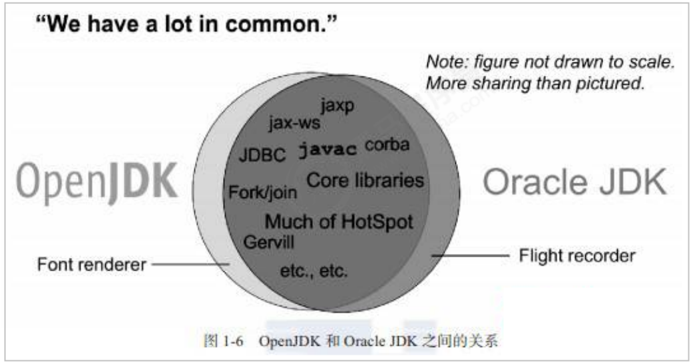


#### 2.3 Open JDK 官网介绍

Open JDK 官网： http://openjdk.java.net/ 。

JDK Enhancement Proposals(JDK增强建议)。通俗的讲JEP就是JDK的新特性

小结：
Oracle JDK是基于Open JDK源代码的商业版本。我们要学习Java新技术可以去Open JDK 官网学习。

------

## 二、Lambda表达式

### 1、需求分析

创建一个新的线程，指定线程要执行的任务

```java
public class Test01 {
    public static void main(String[] args) {
        new Thread(new Runnable() {
            @Override
            public void run() {
                System.out.println("新线程中执行的代码：" + Thread.currentThread().getName());
            }
        }).start();
        System.out.println("主线程中执行的代码：" + Thread.currentThread().getName());
    }
}
```

代码分析：
1. Thread类需要一个Runnable接口作为参数，其中的抽象方法run方法是用来指定线程任务内容的核心
2. 为了指定run方法体，不得不需要Runnable的实现类
3. 为了省去定义一个Runnable 的实现类，不得不使用匿名内部类

4. 必须覆盖重写抽象的run方法，所有的方法名称，方法参数，方法返回值不得不都重写一遍，而且不能出错，
5. 而实际上，我们只在乎方法体中的代码


### 2、Lambda表达式初体验

Lambda表达式是一个匿名函数，可以理解为一段可以传递的方法。

```java
new Thread(() -> {
    System.out.println("新线程Lambda表达式...：" + Thread.currentThread().getName());
}).start();
```

Lambda表达式的优点：简化了匿名内部类的使用，语法更加简单。

匿名内部类语法冗余，体验了Lambda表达式后，发现Lambda表达式是简化匿名内部类的一种方式。


### 3、Lambda的语法规则

Lambda省去了面向对象的条条框框，Lambda的标准格式由3个部分组成：

```java
(参数类型 参数名称) -> {
	代码体;
}
```

格式说明：

- (参数类型 参数名称)：参数列表
- {代码体;}：方法体
- ->：箭头，分割参数列表和方法体


#### 3.1 Lambda练习1

练习无参无返回值的Lambda

1. 定义一个接口

```java
public interface UserService {
    void show();
}
```

2. 然后创建主方法使用

```java
public class Test02 {
    public static void main(String[] args) {
        goShow(new UserService() {
            @Override
            public void show() {
                System.out.println("show 方法执行了...");
            }
        });
        System.out.println("=====================================");
        goShow(() -> System.out.println("Lambda show 方法执行了..."));
    }

    public static void goShow(UserService userService){
        userService.show();
    }
}
```

3. 输出

```
show 方法执行了...
=====================================
Lambda show 方法执行了...
```


#### 3.2 Lambda练习2

完成一个有参且有返回值得Lambda表达式案例

1. 创建一个Person对象

```java
public class Person {
    private String name;
    private Integer age;
    private Integer height;
    //有参构造 无参构造
    //get set
    //toString
}
```

2. 然后我们在List集合中保存多个Person对象，然后对这些对象做根据age排序操作

```java
public class Test03 {
    public static void main(String[] args) {
        List<Person> list = new ArrayList<>();
        list.add(new Person("周杰伦", 33, 175));
        list.add(new Person("刘德华", 53, 185));
        list.add(new Person("周星驰", 49, 180));
        list.add(new Person("郭富城", 22, 189));

        Collections.sort(list, new Comparator<Person>() {
            @Override
            public int compare(Person o1, Person o2) {
                return o1.getAge() - o2.getAge();
            }
        });
        for (Person person : list) {
            System.out.println(person);
        }
    }
}
/*
Person{name='郭富城', age=22, height=189}
Person{name='周杰伦', age=33, height=175}
Person{name='周星驰', age=49, height=180}
Person{name='刘德华', age=53, height=185}
*/
```

3. 我们发现在sort方法的第二个参数是一个Comparator接口的匿名内部类，且执行的方法有参数和返回
   值，那么我们可以改写为Lambda表达式

```java
public class Test03 {
    public static void main(String[] args) {
        List<Person> list = new ArrayList<>();
        list.add(new Person("周杰伦", 33, 175));
        list.add(new Person("刘德华", 53, 185));
        list.add(new Person("周星驰", 49, 180));
        list.add(new Person("郭富城", 22, 189));
        
        Collections.sort(list, (Person o1, Person o2) -> {
            return o1.getHeight() - o2.getHeight();
        });
        list.forEach(person -> System.out.println(person));
    }
}
/*
Person{name='周杰伦', age=33, height=175}
Person{name='周星驰', age=49, height=180}
Person{name='刘德华', age=53, height=185}
Person{name='郭富城', age=22, height=189}
*/
```


### 4、@FunctionalInterface 注解

```java
/*
 * @FunctionalInterface
 *      这是一个标志注解，被该注解修饰的接口只能声明一个抽象方法
 */
@FunctionalInterface
public interface UserService {
    void show();
}
```


### 5、Lambda表达式的原理

匿名内部类的本质是在编译时生成一个Class 文件。XXXXX$1.class

```java
public class Test01 {
    public static void main(String[] args) {
        new Thread(new Runnable() {
            @Override
            public void run() {
                System.out.println("新线程中执行的代码：" + Thread.currentThread().getName());
            }
        }).start();
        System.out.println("主线程中执行的代码：" + Thread.currentThread().getName());
        System.out.println("-------------------------------------------------------");
        /*new Thread(() -> {
            System.out.println("新线程Lambda表达式...：" + Thread.currentThread().getName());
        }).start();*/
    }
}
```

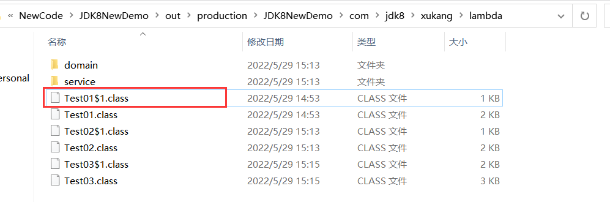


还可以通过反编译工具来查看生成的代码 XJad 工具来查看

```java
static class Test01$1 implements Runnable{
	public void run(){
		System.out.println((new StringBuilder()).append("新线程中执行的代码：").
                           append(Thread.currentThread().getName()).toString());
	}
	Test01$1(){
	}
}
```


那么Lambda表达式的原理是什么呢？我们也通过反编译工具来查看

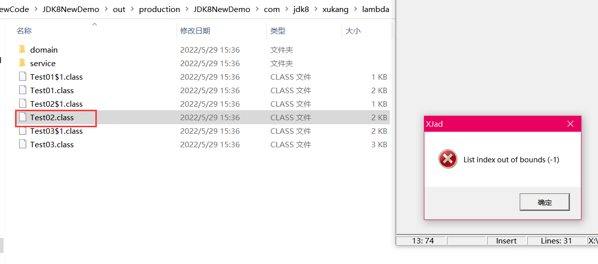

写的有Lambda表达式的class文件，我们通过XJad查看报错。这时我们可以通过JDK自带的一个工具：
javap 对字节码进行反汇编操作。

```java
javap -c -p 文件名.class
    
-c:表示对代码进行反汇编
-p:显示所有的类和成员
```

反汇编的结果：

```shell
X:\NewCode\JDK8NewDemo\out\production\JDK8NewDemo\com\jdk8\xukang\lambda>javap -c -p Test02.class
Compiled from "Test02.java"
public class com.jdk8.xukang.lambda.Test02 {
  public com.jdk8.xukang.lambda.Test02();
    Code:
       0: aload_0
       1: invokespecial #1                  // Method java/lang/Object."<init>":()V
       4: return

  public static void main(java.lang.String[]);
    Code:
       0: invokedynamic #2,  0              // InvokeDynamic #0:show:()Lcom/jdk8/xukang/lambda/service/UserService;
       5: invokestatic  #3                  // Method goShow:(Lcom/jdk8/xukang/lambda/service/UserService;)V
       8: return

  public static void goShow(com.jdk8.xukang.lambda.service.UserService);
    Code:
       0: aload_0
       1: invokeinterface #4,  1            // InterfaceMethod com/jdk8/xukang/lambda/service/UserService.show:()V
       6: return

  private static void lambda$main$0();
    Code:
       0: getstatic     #5                  // Field java/lang/System.out:Ljava/io/PrintStream;
       3: ldc           #6                  // String Lambda show 方法执行了...
       5: invokevirtual #7                  // Method java/io/PrintStream.println:(Ljava/lang/String;)V
       8: return
}

X:\NewCode\JDK8NewDemo\out\production\JDK8NewDemo\com\jdk8\xukang\lambda>
```


在这个反编译的源码中我们看到了一个静态方法 lambda$main$0()，这个方法里面做了什么事情呢？我
们通过debug的方式来查看下：

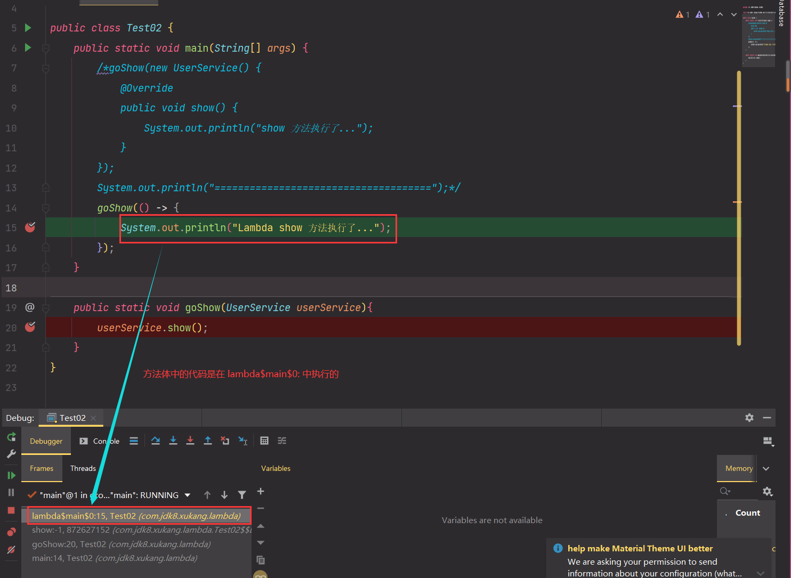

上面的效果可以理解为如下：

```java
public class Test02 {
	public static void main(String[] args) {
		....
	}
	private static void lambda$main$0();
		System.out.println("Lambda show 方法执行了...");
	}
}
```


为了更加直观的理解这个内容，我们可以在运行的时候添加 -
Djdk.internal.lambda.dumpProxyClasses, 加上这个参数会将内部class码输出到一个文件中

```shell
java -Djdk.internal.lambda.dumpProxyClasses 要运行的包名.类名
```

命令执行

```shell
X:\NewCode\JDK8New\target\classes>java -Djdk.internal.lambda.dumpProxyClasses com.jdk8.xukang.lambda.Test02
Lambda show 方法执行了...

X:\NewCode\JDK8New\target\classes>
```


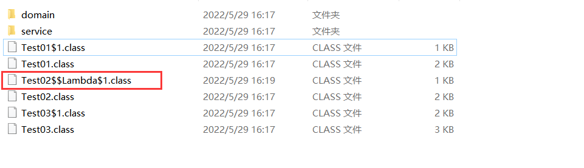

反编译后的内容：

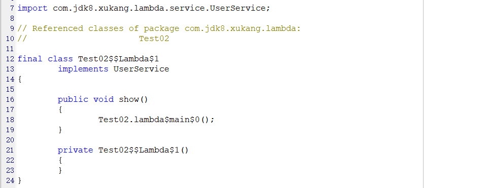

可以看到这个匿名的内部类实现了UserService接口，并重写了show()方法。在show方法中调用了
Test02.lambda$main$0(), 也就是调用了Lambda中的内容。


```java
public class Test02 {
    public static void main(String[] args) {
        goShow(new UserService() {
            @Override
            public void show() {
                Test02.lambda$main$0();
            }
        });
        System.out.println("=====================================");
    }

    public static void goShow(UserService userService){
        userService.show();
    }
    
    private static void lambda$main$0();
		System.out.println("Lambda show 方法执行了...");
	}
}
```

小结：

匿名内部类在编译的时候会产生一个class文件。

Lambda表达式在程序运行的时候会形成一个类。

1. 在类中新增了一个方法，这个方法的方法体就是Lambda表达式中的代码
2. 还会形成一个匿名内部类，实现接口，重写抽象方法
3. 在接口中重写方法会调用新生成的方法


### 6、Lambda表达式的省略写法

在lambda表达式的标准写法基础上，可以使用省略写法的规则为：
1. 小括号内的参数类型可以省略
2. 如果小括号内有且仅有一个参数，则小括号可以省略
3. 如果大括号内有且仅有一个语句，可以同时省略大括号，return 关键字及语句分号


StudentService.java 接口

```java
public interface StudentService {
    String show(String name, Integer age);
}
```

OrderService.java 接口

```java
public interface OrderService {
    Integer show(String name);
}
```

mian

```java
public class Test04 {
    public static void main(String[] args) {
        goStudent((String name, Integer age) -> {
            return name + ":" + age + ",666";
        });
        goOrder((String name) -> {
            return 666;
        });
        System.out.println("========================");
        //省略写法
        goStudent((name, age) -> name + ":" + age + ",666");
        goOrder(name -> 666);
    }

    public static void goStudent(StudentService studentService){
        studentService.show("zhangsan", 22);
    }
    public static void goOrder(OrderService orderService){
        orderService.show("lisi");
    }
}
```


### 7、Lambda表达式的使用前提

Lambda表达式的语法是非常简洁的，但是Lambda表达式不是随便使用的，使用时有几个条件要特别注
意

1. 方法的参数或局部变量类型必须为接口才能使用Lambda
2. 接口中有且仅有一个抽象方法(@FunctionalInterface)


### 8、Lambda和匿名内部类的对比

Lambda和匿名内部类的对比
1. 所需类型不一样
  - 匿名内部类的类型可以是 类，抽象类，接口
  - Lambda表达式需要的类型必须是接口
2. 抽象方法的数量不一样
  - 匿名内部类所需的接口中的抽象方法的数量是随意的
  - Lambda表达式所需的接口中只能有一个抽象方法
3. 实现原理不一样
  - 匿名内部类是在编译后形成一个class
  - Lambda表达式是在程序运行的时候动态生成class

------

## 三、接口中新增的方法

### 1、JDK8中接口的新增

在JDK8中针对接口有做增强，在JDK8之前

```java
interface 接口名{
	静态常量;
	抽象方法;
}
```

JDK8之后对接口做了增加，接口中可以有**默认方法**和**静态方法**

```java
interface 接口名{
	静态常量;
	抽象方法;
	默认方法;
	静态方法;
}
```


### 2、默认方法

#### 2.1 为什么要增加默认方法

在JDK8以前接口中只能有抽象方法和静态常量，会存在以下的问题：

如果接口中新增抽象方法，那么实现类都必须要抽象这个抽象方法，非常不利于接口的扩展的

```java
public class Test01 {
    public static void main(String[] args) {
        A b = new B();
        A c = new C();
    }
}

interface A {
    void test01();
    //接口中新增抽象方法，所有实现类都需要重写这个方法，不利于接口的扩展
    void test02();
}
class B implements A{
    @Override
    public void test01() { }
    @Override
    public void test02() { }
}
class C implements A{
    @Override
    public void test01() { }
    @Override
    public void test02() { }
}
```


#### 2.2 接口默认方法的格式

接口中默认方法的语法格式是：

```java
interface 接口名{
	修饰符 default 返回值类型 方法名{
		方法体;
	}
}
```

```java
public class Test01 {
    public static void main(String[] args) {
        A b = new B();
        A c = new C();
        b.test03();//B 实现类中重写了默认方法...
        c.test03();//接口中的默认方法执行了...
    }
}

interface A {
    void test01();
    //接口中新增抽象方法，所有实现类都需要重写这个方法，不利于接口的扩展
    void test02();

    /*
     * 接口中定义的默认方法
     */
    default String test03(){
        System.out.println("接口中的默认方法执行了...");
        return "hello";
    }
}
class B implements A{
    @Override
    public void test01() { }
    @Override
    public void test02() { }
    @Override
    public String test03() {
        System.out.println("B 实现类中重写了默认方法...");
        return "ok ...";
    }
}
class C implements A{
    @Override
    public void test01() { }
    @Override
    public void test02() { }
}
```


#### 2.3 接口中默认方法的使用

接口中的默认方法有两种使用方式
1. 实现类直接调用接口的默认方法
2. 实现类重写接口的默认方法


### 3、静态方法

JDK8中为接口新增了静态方法，作用也是为了接口的扩展

#### 3.1 语法规则

```java
interface 接口名{
	修饰符 static 返回值类型 方法名{
		方法体;
	}
}
```

```java
public class Test01 {
    public static void main(String[] args) {
        A b = new B();
        A c = new C();
        b.test03();//B 实现类中重写了默认方法...
        c.test03();//接口中的默认方法执行了...
        A.test04();//接口中的静态方法......
    }
}

interface A {
    void test01();
    //接口中新增抽象方法，所有实现类都需要重写这个方法，不利于接口的扩展
    void test02();

    /*
     * 接口中定义的默认方法
     */
    default String test03(){
        System.out.println("接口中的默认方法执行了...");
        return "hello";
    }
    /*
     * 接口中的静态方法
     */
    public static String test04(){
        System.out.println("接口中的静态方法......");
        return "Static";
    }
}
class B implements A{
    @Override
    public void test01() { }
    @Override
    public void test02() { }
    @Override
    public String test03() {
        System.out.println("B 实现类中重写了默认方法...");
        return "ok ...";
    }
}
class C implements A{
    @Override
    public void test01() { }
    @Override
    public void test02() { }
}
```

#### 3.2 静态方法的使用

接口中的静态方法在实现类中是不能被重写的，调用的话只能通过接口类型来实现: `接口名.静态方法名
();`


### 4、默认方法与静态方法的区别

1. 默认方法通过实例调用，静态方法通过接口名调用
2. 默认方法可以被继承，实现类可以直接调用接口默认方法，也可以重写接口默认方法
3. 静态方法不能被继承，实现类不能重写接口的静态方法，只能使用接口名调用

------

## 四、函数式接口

### 1、函数式接口的由来

我们知道使用Lambda表达式的前提是需要有函数式接口，而Lambda表达式使用时不关心接口名，
抽象方法名。只关心**抽象方法的参数列表和返回值类型**。因此为了让我们使用Lambda表达式更加的方
法，在JDK中提供了大量常用的函数式接口。

```java
public class Test01 {
    public static void main(String[] args) {
        fun1((arr) -> {
            int sum = 0;
            for (int i : arr) {
                sum += i;
            }
            return sum;
        });
    }
    
    public static void fun1(Operator operator){
        int[] arr = {1, 2, 3, 4};
        int sum = operator.getSum(arr);
        System.out.println("sum = " + sum);
    }
}

/**
 * 函数式接口
 */
@FunctionalInterface
interface Operator{
    int getSum(int[] arr);
}
```


### 2、常用函数式接口介绍

在JDK中帮我们提供的有函数式接口，主要是在 java.util.function 包中。


#### 2.1 Supplier

无参有返回值的接口，对于的Lambda表达式需要提供一个返回数据的类型。

```java
package java.util.function;

@FunctionalInterface
public interface Supplier<T> {

    /**
     * Gets a result.
     *
     * @return a result
     */
    T get();
}
```

使用：

```java
/**
 * Supplier 函数式接口的使用
 */
public class SupplierTest {
    public static void main(String[] args) {
        fun1(() -> {
            int[] arr = {88, 45, 69, 12, 99, 58, 100, 5, 16};
            //计算数组中的最大值
            Arrays.sort(arr);
            return arr[arr.length - 1];
        });
    }
    public static void fun1(Supplier<Integer> supplier){
        // get() 是一个无参的有返回值的 抽象方法
        Integer max = supplier.get();
        System.out.println("max = " + max);
    }
}
```


#### 2.2 Consumer

有参无返回值得接口，前面介绍的Supplier接口是用来生产数据的，而Consumer接口是用来消费数据
的，使用的时候需要指定一个泛型来定义参数类型

```java
@FunctionalInterface
public interface Consumer<T> {
	/**
	* Performs this operation on the given argument.
	*
	* @param t the input argument
	*/
	void accept(T t);
}
```

使用：将输入的数据统一转换为小写输出

```java
public class ConsumerTest {
    public static void main(String[] args) {
        fun(msg -> {
            System.out.println(msg + " -> " + msg.toLowerCase(Locale.ROOT));
        });
    }
    public static void fun(Consumer<String> consumer){
        consumer.accept("HELLO WORLD");
    }
}
```


默认方法：andThen()

如果一个方法的参数和返回值全部是Consumer类型，那么就可以实现效果，消费一个数据的时候，
首先做一个操作，然后再做一个操作，实现组合，而这个方法就是Consumer接口中的 default 方法 
andThen 方法

```java
default Consumer<T> andThen(Consumer<? super T> after) {
	Objects.requireNonNull(after);
	return (T t) -> { accept(t); after.accept(t); };
}
```

具体的操作：

```java
public class ConsumerTest {
    public static void main(String[] args) {
        fun2(msg -> {
            System.out.println(msg + " -> " + msg.toLowerCase(Locale.ROOT));
        }, msg -> {
            System.out.println(msg + " -> " + msg.toUpperCase(Locale.ROOT));
        });
    }

    public static void fun2(Consumer<String> c1, Consumer<String> c2){
        String str = "HELLO world";
        //c1.accept(str);//转小写
        //c2.accept(str);//转大写
        c1.andThen(c2).accept(str);
        // HELLO world -> hello world
        // HELLO world -> HELLO WORLD
        c2.andThen(c1).accept(str);
        // HELLO world -> HELLO WORLD
        // HELLO world -> hello world
    }
}
```


#### 2.3 Function

有参有返回值的接口，Function接口是根据一个类型的数据得到另一个类型的数据，前者称为前置条
件，后者称为后置条件。有参数有返回值。

```java
@FunctionalInterface
public interface Function<T, R> {
	/**
	* Applies this function to the given argument.
	*
	* @param t the function argument
	* @return the function result
	*/
	R apply(T t);
}
```

使用：传递进入一个字符串返回一个数字

```java
public class FunctionTest {
    public static void main(String[] args) {
        test(msg -> Integer.parseInt(msg) );
    }

    public static void test(Function<String, Integer> function){
        Integer apply = function.apply("666");
        System.out.println("apply的结果：" + apply);
    }
}
```


默认方法：andThen，也是用来进行组合操作

```java
default <V> Function<T, V> andThen(Function<? super R, ? extends V> after) {
	Objects.requireNonNull(after);
	return (T t) -> after.apply(apply(t));
}
```

```java
public class FunctionTest {
    public static void main(String[] args) {
        test(msg -> Integer.parseInt(msg), msg -> msg * 3);
    }

    public static void test(Function<String, Integer> f1, Function<Integer, Integer> f2){
        /*Integer a1 = f1.apply("666");
        Integer a2 = f2.apply(a1);*/
        Integer a2 = f1.andThen(f2).apply("666");
        System.out.println("a2的结果：" + a2);
    }
}
```

默认的 compose 方法的作用顺序和 andThen 方法刚好相反

而静态方法 identity 则是，输入什么参数就返回什么参数


#### 2.4 Predicate

有参且返回值为Boolean的接口

```java
@FunctionalInterface
public interface Predicate<T> {
	/**
	* Evaluates this predicate on the given argument.
	*
	* @param t the input argument
	* @return {@code true} if the input argument matches the predicate,
	* otherwise {@code false}
	*/
	boolean test(T t);
}
```

使用：

```java
public class PredicateTest {
    public static void main(String[] args) {
        test(msg -> msg.length() > 3, "hello world");
        test(msg -> msg.length() > 3, "he");
    }

    private static void test(Predicate<String> predicate, String msg){
        boolean b = predicate.test(msg);
        System.out.println("b：" + b);
    }
}
```


在 Predicate 中的默认方法提供了逻辑关系操作 and or negate isEquals方法

```java
public class PredicateDefaultTest {
    public static void main(String[] args) {
        test(msg1 -> {
            return msg1.contains("H");
        }, msg2 -> {
            return msg2.contains("W");
        });
    }

    private static void test(Predicate<String> p1, Predicate<String> p2){
        // b1包含H b2包含W
        // p1包含H 同时 p2包含W
        boolean b1 = p1.and(p2).test("Hello world");
        // p1包含H 或者 p2包含W
        boolean b2 = p1.or(p2).test("Hello world");
        // p1 不包含 H
        boolean b3 = p1.negate().test("Hello world");
        System.out.println(b1);// false
        System.out.println(b2);// true
        System.out.println(b3);// false
    }
}
```

------

## 五、方法引用

### 1、为什么要用方法引用

#### 1.1 lambda表达式冗余

在使用Lambda表达式的时候，也会出现代码冗余的情况，比如：用Lambda表达式求一个数组的和

```java
public class FunctionRefTest01 {
    public static void main(String[] args) {
        printSum(a -> {
            //Lambda表达式中的代码和getTotal中的代码冗余了
            int sum = 0;
            for (int i : a) {
                sum += i;
            }
            System.out.println("数组求和：" + sum);
        });
    }

    //求数组中的所有元素的和
    public static void getTotal(int[] a){
        int sum = 0;
        for (int i : a) {
            sum += i;
        }
        System.out.println("数组求和：" + sum);
    }

    private static void printSum(Consumer<int[]> consumer){
        int[] arr = { 10, 60, 20, 40, 90, 50 };
        consumer.accept(arr);
    }
}
```


#### 1.2 解决方案

因为在Lambda表达式中要执行的代码和我们另一个方法中的代码是一样的，这时就没有必要重写一
份逻辑了，这时我们就可以“引用”重复代码

`::`： 方法引用 也是JDK8中的新的语法

```java
public class FunctionRefTest02 {
    public static void main(String[] args) {
        // :: 方法引用 也是JDK8中的新的语法
        printSum(FunctionRefTest02::getTotal);
    }

    //求数组中的所有元素的和
    public static void getTotal(int[] a){
        int sum = 0;
        for (int i : a) {
            sum += i;
        }
        System.out.println("数组求和：" + sum);
    }

    private static void printSum(Consumer<int[]> consumer){
        int[] arr = { 10, 60, 20, 40, 90, 50 };
        consumer.accept(arr);
    }
}
```


### 2、方法引用的格式

符号表示：`::`

符号说明：双冒号为方法引用运算符，而它所在的表达式被称为`方法引用`

应用场景：如果Lambda表达式所要实现的方案，已经有其他方法存在相同的方案，那么则可以使用方
法引用。

常见的引用方式：

方法引用在JDK8中使用是相当灵活的，有以下几种形式：

- instanceName::methodName：**对象::方法名**
2. ClassName::staticMethodName：**类名::静态方法**


* ClassName::methodName：**类名::普通方法**
4. ClassName::new 类名::new 调用的构造器
5. TypeName[]::new String[]::new 调用数组的构造器


#### 2.1 对象名::方法名

这是最常见的一种用法。如果一个类中的已经存在了一个成员方法，则可以通过对象名引用成员方法

```java
public class Test01 {
    public static void main(String[] args) {
        Date date = new Date();
        Supplier<Long> supplier1 = () -> {
            return date.getTime();
        };
        System.out.println(supplier1.get());

        // 然后我们通过 方法引用 的方式来处理
        Supplier<Long> supplier2 = date::getTime;
        System.out.println(supplier1.get());
    }
}
```

方法引用的注意事项：
1. 被引用的方法，参数要和接口中的抽象方法的**参数**一样
2. 当接口抽象方法有**返回值**时，被引用的方法也必须有返回值


#### 2.2 类名::静态方法名

也是比较常用的方式：

```java
public class Test02 {
    public static void main(String[] args) {
        Supplier<Long> supplier1 = () -> {
            return System.currentTimeMillis();
        };
        System.out.println(supplier1.get());
        System.out.println("========================");
        //通过方法引用来实现
        Supplier<Long> supplier2 = System::currentTimeMillis;
        System.out.println(supplier2.get());
    }
}
```


#### 2.3 类名::引用实例方法

Java面向对象中，类名只能调用静态方法，类名引用实例方法是用前提的，实际上是拿第一个参数作
为方法的调用者

```java
public class Test03 {
    public static void main(String[] args) {
        Function<String, Integer> function1 = s -> {
            return s.length();
        };
        System.out.println(function1.apply("Hello"));
        System.out.println("===========================");
        //通过方法引用来实现
        Function<String, Integer> function2 = String::length;
        System.out.println(function2.apply("Hello World"));

        BiFunction<String, Integer, String> function3 = String::substring;
        System.out.println(function3.apply("Hello World", 3));
    }
}
```


#### 2.4 类名::构造器

由于构造器的名称和类名完全一致，所以构造器引用使用`::new`的格式使用

```java
public class Test04 {
    public static void main(String[] args) {
        Supplier<Person> supplier = () -> { return new Person(); };
        System.out.println(supplier.get());//Person(name=null, age=null)
        //通过方法引用实现 无参
        Supplier<Person> supplier1 = Person::new;
        System.out.println(supplier1.get());//Person(name=null, age=null)

        BiFunction<String, Integer, Person> function = Person::new;
        System.out.println(function.apply("zhangsan", 15));//Person(name=zhangsan, age=15)
    }
}

@Data
@NoArgsConstructor
@AllArgsConstructor
class Person{
    private String name;
    private Integer age;
}
```


#### 2.5 数组::构造器

数组是怎么构造出来的呢？

```java
public class Test05 {
    public static void main(String[] args) {
        Function<Integer, String[]> fun1 = len -> {
            return new String[len];
        };
        String[] a1 = fun1.apply(4);
        System.out.println("a1数组的长度是：" + a1.length);
        //通过方法引用实现
        Function<Integer, String[]> fun2 = String[]::new;
        String[] a2 = fun2.apply(6);
        System.out.println("a2数组的长度是：" + a2.length);
    }
}
```

小结：方法引用是对Lambda表达式符合特定情况下的一种缩写方式，它使得我们的Lambda表达式更加
的精简，也可以理解为lambda表达式的缩写形式，不过要注意的是方法引用只能引用已经存在的方法。

------

## 六、Stream API

### 1、集合处理数据的弊端

当我们在需要对集合中的元素进行操作的时候，除了必需的添加，删除，获取外，最典型的操作就是
集合遍历，

```java
public class StreamTest01 {
    public static void main(String[] args) {
        //定义一个List集合
        List<String> list = Arrays.asList("张三峰", "东方不败", "王林", "任我行");
        //获取所有 姓张 的用户信息
        List<String> res1 = new ArrayList<>();
        for (String s : list) {
            if (s.startsWith("张")){
                res1.add(s);
            }
        }
        //获取名称长度为3的用户信息
        List<String> res2 = new ArrayList<>();
        for (String s : list) {
            if (s.length() == 3){
                res2.add(s);
            }
        }
        //输出所有的用户信息
        System.out.println("获取所有 姓张 的用户信息");
        for (String s : res1) {
            System.out.println(s);
        }
        System.out.println("获取名称长度为3的用户信息");
        for (String s : res2) {
            System.out.println(s);
        }
    }
}
```

上面的代码针对与我们不同的需求总是一次次的循环循环循环。这时我们希望有更加高效的处理方式，这
时我们就可以通过JDK8中提供的Stream API来解决这个问题了。


Stream更加优雅的解决方案：

```java
public class StreamTest02 {
    public static void main(String[] args) {
        //定义一个List集合
        List<String> list = Arrays.asList("张三峰", "东方不败", "张天师", "任我行");
        //获取所有 姓张 的用户信息
        //获取名称长度为3的用户信息
        //输出所有的用户信息
        list.stream().
                filter(s -> s.startsWith("张")).
                filter(s -> s.length() == 3).
                forEach(s -> System.out.println(s));
        System.out.println("------------------------------------");
        list.stream().
                filter(s -> s.startsWith("张")).
                filter(s -> s.length() == 3).
                forEach(System.out::println); //方法引用

    }
}
```

上面的SteamAPI代码的含义：获取流，过滤张，过滤长度，逐一打印。代码相比于上面的案例更加的简
洁直观


### 2、Steam 流式思想概述

注意：Stream和IO流(InputStream/OutputStream)没有任何关系，请暂时忘记对传统IO流的固有印
象！

Stream流式思想类似于工厂车间的“生产流水线”，Stream流不是一种数据结构，不保存数据，而是对数
据进行加工
处理。Stream可以看作是流水线上的一个工序。在流水线上，通过多个工序让一个原材料加工成一个商
品。


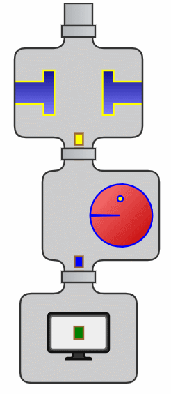

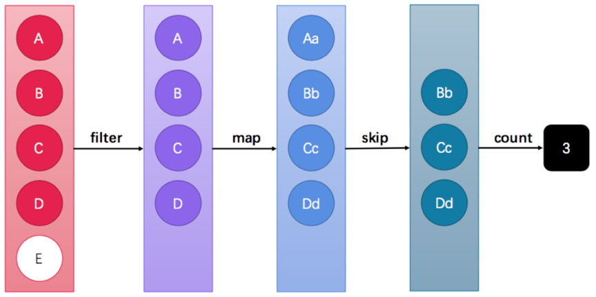

Stream API能让我们快速完成许多复杂的操作，如筛选、切片、映射、查找、去除重复，统计，匹配和
归约。


### 3、Stream 流的获取方式

#### 3.1 根据Collection获取

首先，java.util.Collection 接口中加入了default方法 stream，也就是说 Collection 接口下的所有的实
现都可以通过steam方法来获取Stream流。

```java
public class StreamTest03 {
    public static void main(String[] args) {
        List<String> list = new ArrayList<>();
        Stream<String> stream1 = list.stream();
        
        Set<Integer> set = new HashSet<>();
        Stream<Integer> stream2 = set.stream();
        
        Vector<Object> vector = new Vector();
        Stream<Object> stream3 = vector.stream();
    }
}
```

但是Map接口别没有实现Collection接口，那这时怎么办呢？这时我们可以根据Map获取对应的key
value的集合。

```java
public class StreamTest04 {
    public static void main(String[] args) {
        Map<String,Object> map = new HashMap<>();
        Stream<String> stream = map.keySet().stream(); // key
        Stream<Object> stream1 = map.values().stream(); // value
        Stream<Map.Entry<String, Object>> stream2 = map.entrySet().stream(); // entry
    }
}
```


#### 3.2 通过Stream的of方法

在实际开发中我们不可避免的还是会操作到数组中的数据，由于数组对象不可能添加默认方法，所
有Stream接口中提供了静态方法of

```java
public class StreamTest05 {
    public static void main(String[] args) {
        Stream<String> stream1 = Stream.of("a1", "a2", "a3");
        String[] arr1 = {"aa", "bb", "cc"};
        Stream<String> stream2 = Stream.of(arr1);
        Integer[] arr2 = {1, 2, 3, 4};
        Stream<Integer> stream3 = Stream.of(arr2);
        stream3.filter(i -> i > 2).forEach(System.out::println);//3 4
        //基本数据类型的数组是不行的
        int[] arr3 = {1, 2, 3, 4};
        Stream.of(arr3).forEach(System.out::println);//[I@7699a589
    }
}
```


### 4、Stream 常用方法介绍

Stream常用方法

Stream流模型的操作很丰富，这里介绍一些常用的API。

这些方法可以被分成两种：

| 方法名  | 方法作用   | 返回值类型 | 方法种类 |
| ------- | ---------- | ---------- | -------- |
| count   | 统计个数   | long       | 终结     |
| forEach | 逐一处理   | void       | 终结     |
| filter  | 过滤       | Stream     | 函数拼接 |
| limit   | 取用前几个 | Stream     | 函数拼接 |
| skip    | 跳过前几个 | Stream     | 函数拼接 |
| map     | 映射       | Stream     | 函数拼接 |
| concat  | 组合       | Stream     | 函数拼接 |

**终结方法**：返回值类型不再是 Stream 类型的方法，不再支持链式调用。本小节中，终结方法包括 count 和 
forEach 方法。

**非终结方法**：返回值类型仍然是 Stream 类型的方法，支持链式调用。（除了终结方法外，其余方法均
为非终结
方法。）


Stream注意事项(重要)
1. Stream只能操作一次
2. Stream方法返回的是新的流
3. Stream不调用终结方法，中间的操作不会执行


#### 4.1 forEach

forEach用来遍历流中的数据的

```java
void forEach(Consumer<? super T> action);
```

该方法接受一个Consumer接口，会将每一个流元素交给函数处理

```java
public class ForEachTest {
    public static void main(String[] args) {
        Stream.of("a1", "a2", "a3").forEach(System.out::println);
    }
}
```


#### 4.2 count

Stream流中的count方法用来统计其中的元素个数的

```java
long count();
```

该方法返回一个long值，代表元素的个数。

```java
public class CountTest {
    public static void main(String[] args) {
        long count = Stream.of("a1", "a2", "a3").count();
        System.out.println(count);//3
    }
}
```


#### 4.3 filter

filter方法的作用是用来过滤数据的。返回符合条件的数据

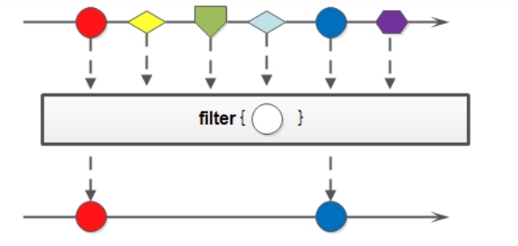

可以通过filter方法将一个流转换成另一个子集流

```java
Stream<T> filter(Predicate<? super T> predicate);
```

该接口接收一个Predicate函数式接口参数作为筛选条件

```java
public class FilterTest {
    public static void main(String[] args) {
        Stream.of(1, 2, 3, 4, 5)
                .filter(i -> i % 2 == 0)
                .forEach(System.out::println);//2 4
    }
}
```


#### 4.4 limit

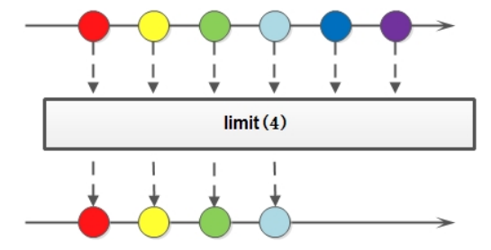

limit方法可以对流进行截取处理，支取前n个数据；

```java
Stream<T> limit(long maxSize);
```

参数是一个long类型的数值，如果集合当前长度大于参数就进行截取，否则不操作：

```java
public class LimitTest {
    public static void main(String[] args) {
        Stream.of("a1", "a2", "a3", "aa", "a4", "bb")
                .limit(3)
                .forEach(System.out::println);//a1 a2 a3
    }
}
```


#### 4.5 skip

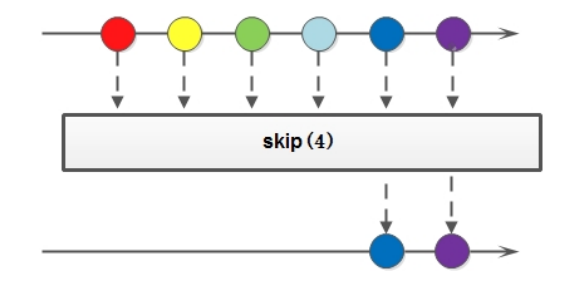

如果希望跳过前面几个元素，可以使用skip方法获取一个截取之后的新流：

```java
Stream<T> skip(long n);
```

操作：

```java
public class SkipTest {
    public static void main(String[] args) {
        Stream.of("a1", "a2", "a3", "aa", "a4", "bb")
                .skip(3)
                .forEach(System.out::println);//aa a4 bb
    }
}
```


#### 4.6 map

如果我们需要将流中的元素映射到另一个流中，可以使用map方法：

```java
<R> Stream<R> map(Function<? super T, ? extends R> mapper);
```

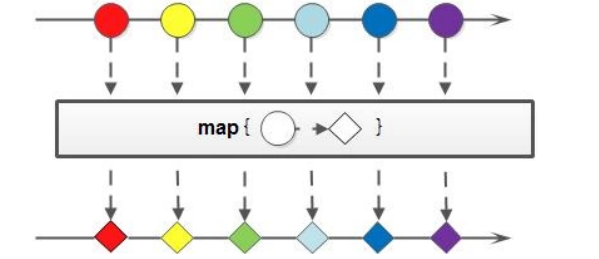

该接口需要一个Function函数式接口参数，可以将当前流中的T类型数据转换为另一种R类型的数据

```java
public class MapTest {
    public static void main(String[] args) {
        Stream.of("1", "2", "3", "4", "5", "6")
                //.map(msg -> Integer.parseInt(msg))
                .map(Integer::parseInt)
                .forEach(System.out::print); // 123456
    }
}
```


#### 4.7 sorted

如果需要将数据排序，可以使用sorted方法：

```java
Stream<T> sorted();
```

在使用的时候可以根据自然规则排序，也可以通过比较强来指定对应的排序规则

```java
public class SortedTest {
    public static void main(String[] args) {
        Stream.of("1", "3", "9", "4", "5", "2")
                .map(Integer::parseInt)
                //.sorted() // 123459 根据数据的自然顺序排序 
                .sorted(((o1, o2) -> o2 - o1)) // 954321 根据比较器指定排序规则
                .forEach(System.out::print);
    }
}
```


#### 4.8 distinct

如果要去掉重复数据，可以使用distinct方法：

```java
Stream<T> distinct();
```

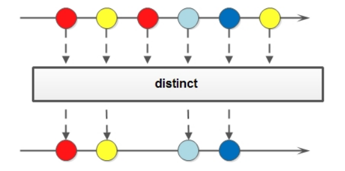

使用：

```java
public class DistinctTest {
    public static void main(String[] args) {
        Stream.of("1", "3", "1", "3", "2", "2")
                .distinct() //去掉重复记录
                .forEach(System.out::print);//132
        System.out.println("=========================");
        Person p1 = new Person("Jack", 15);
        Person p2 = new Person("Rose", 18);
        Person p3 = new Person("Jack", 15);
        //Person类需要重写equals和hashCode方法
        Stream.of(p1, p2, p3)
                .distinct()
                .forEach(System.out::println);
    }
}

@Data
@NoArgsConstructor
@AllArgsConstructor
class Person{
    private String name;
    private Integer age;
}
```

Stream 流中的 distinct 方法对于基本数据类型是可以直接出重的，

但是对于自定义类型，我们是需要
重写hashCode和equals方法来移除重复元素。


#### 4.9 match

如果需要判断数据是否匹配指定的条件，可以使用match相关的方法

```java
boolean anyMatch(Predicate<? super T> predicate); // 元素是否有任意一个满足条件
boolean allMatch(Predicate<? super T> predicate); // 元素是否都满足条件
boolean noneMatch(Predicate<? super T> predicate); // 元素是否都不满足条件
```

使用：

```java
public class MatchTest {
    public static void main(String[] args) {
        boolean b = Stream.of("1", "3", "3", "4", "5", "1", "7")
                .map(Integer::parseInt)
                //.allMatch(s -> s > 0) //true
                //.anyMatch(s -> s >4) //true
                .noneMatch(s -> s > 4); //false
        System.out.println(b);
    }
}
```

注意：match是一个**终结方法**


#### 4.10 find

如果我们需要找到某些数据，可以使用find方法来实现

```java
Optional<T> findFirst();
Optional<T> findAny();
```

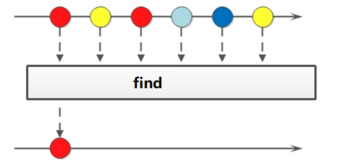

使用：

```java
public class FindTest {
    public static void main(String[] args) {
        Optional<String> first = Stream.of("1", "3", "3", "4", "5", "1", "7").findFirst();
        System.out.println("first = " + first.get()); // first = 1

        Optional<String> any = Stream.of("2", "3", "7", "4", "5", "1", "7").findAny();
        System.out.println("any = " + any.get()); // any = ?
    }
}
```


#### 4.11 max 和 min

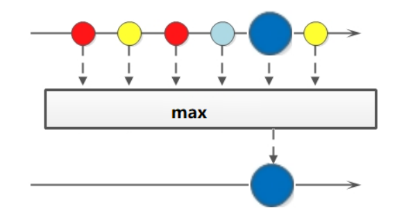

如果我们想要获取最大值和最小值，那么可以使用max和min方法

```java
Optional<T> min(Comparator<? super T> comparator);
Optional<T> max(Comparator<? super T> comparator);
```

使用：

```java
public class MaxMinTest {
    public static void main(String[] args) {
        Optional<Integer> max = Stream.of("1", "3", "3", "4", "5", "1", "7")
                .map(Integer::parseInt)
                .max(((o1, o2) -> o1 - o2));
        System.out.println("max = " + max.get()); //max = 7

        Optional<Integer> min = Stream.of("2", "3", "7", "4", "5", "1", "7")
                .map(Integer::parseInt)
                .min(((o1, o2) -> o1 - o2));
        System.out.println("min = " + min.get()); //min = 1
    }
}
```


#### 4.12 reduce


如果需要将所有数据归纳得到一个数据，可以使用reduce方法

```java
T reduce(T identity, BinaryOperator<T> accumulator);
```

使用：

```java
public class ReduceTest {
    public static void main(String[] args) {
        Integer sum = Stream.of(4, 5, 6, 9)
                // identity默认值
                //第一次的时候会将默认值赋值到x
                //之后每次会将上一次的操作结果赋值给x，y就是每次从数据中获取的元素
                .reduce(0, (x, y) -> {
                    System.out.println("x = " + x + ", y = " + y);
                    return x + y;
                });
        System.out.println("sum = " + sum);
        //获取最大值
        Integer max = Stream.of(1, 5, 3, 4)
                .reduce(0, (x, y) -> {
                    return x < y ? y : x;
                });
        System.out.println("max = " + max);
    }
}
```

输出：

```
x = 0, y = 4
x = 4, y = 5
x = 9, y = 6
x = 15, y = 9
sum = 24
max = 5
```


#### 4.13 map 和 reduce 的组合

在实际开发中我们经常会将 map 和 reduce 一块来使用

```java
public class MapAndReduceTest {
    public static void main(String[] args) {
        Human h1 = new Human("Jack", 18);
        Human h2 = new Human("Rose", 22);
        Human h3 = new Human("Jack", 13);
        Human h4 = new Human("Jack", 15);
        Human h5 = new Human("Mike", 19);
        //求出所有年龄的总和
        Integer sumAge = Stream.of(h1, h2, h3, h4, h5)
                //.map(h -> h.getAge()) //实现数据类型的转换
                .map(Human::getAge)
                //.reduce(0, (x, y) -> x + y);
                .reduce(0, Integer::sum);
        System.out.println("sumAge = " + sumAge); // sumAge = 87
        //求出所有年龄中的最大值
        Integer maxAge = Stream.of(h1, h2, h3, h4, h5)
                .map(Human::getAge)
                .reduce(0, Math::max);
        System.out.println("maxAge = " + maxAge); // maxAge = 22
        //统计字符a出现的次数
        Integer count = Stream.of("a", "b", "c", "d", "a", "c", "a")
                .map(ch -> "a".equals(ch) ? 1 : 0)
                .reduce(0, Integer::sum);
        System.out.println(count);//3
    }
}
@Data
@NoArgsConstructor
@AllArgsConstructor
class Human{
    private String name;
    private Integer age;
}
```


#### 4.14 mapToInt

如果需要将Stream中的 Integer 类型转换成 int 类型，可以使用mapToInt方法来实现

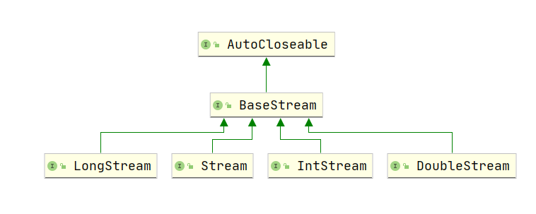

使用：

```java
public class MapToIntTest {
    public static void main(String[] args) {
        //Integer占用的内存比int多很多，在Stream流操作中会自动装箱和拆箱
        Integer[] arr = {1, 3, 2, 5, 4};
        Stream.of(arr).filter(i -> i > 3).forEach(System.out::println); //5 4
        //为了提高程序代码的效率，我们先将流中Integer数据转换成int数据，然后再操作
        IntStream intStream = Stream.of(arr).mapToInt(Integer::intValue);
        intStream.filter(i -> i < 4).forEach(System.out::println); // 1 3 2
    }
}
```


#### 4.15 concat

 如果有两个流，希望合并成为一个流，那么可以使用Stream接口的静态方法concat

```java
public static <T> Stream<T> concat(Stream<? extends T> a, Stream<? extends T> b) {
	Objects.requireNonNull(a);
	Objects.requireNonNull(b);
    
	@SuppressWarnings("unchecked")
	Spliterator<T> split = new Streams.ConcatSpliterator.OfRef<>(
		(Spliterator<T>) a.spliterator(), (Spliterator<T>) b.spliterator());
	Stream<T> stream = StreamSupport.stream(split, a.isParallel() || b.isParallel());
	return stream.onClose(Streams.composedClose(a, b));
}
```

实现：

```java
public class ConcatTest {
    public static void main(String[] args) {
        Stream<String> stream1 = Stream.of("a", "b", "c");
        Stream<String> stream2 = Stream.of("x", "y", "z");
        // 通过concat方法将两个流合并为一个新的流
        Stream<String> stream3 = Stream.concat(stream1, stream2);
        stream3.forEach(System.out::print);//abcxyz
    }
}
```


#### 4.16 综合案例

定义两个集合，然后在集合中存储多个用户名称。然后完成如下的操作：

1. 第一个队伍只保留姓名长度为3的成员
2. 第一个队伍筛选之后只要前3个人
3. 第二个队伍只要姓张的成员
4. 第二个队伍筛选之后不要前两个人
5. 将两个队伍合并为一个队伍
6. 根据姓名创建Student对象
7. 打印整个队伍的Student信息

```java
public class StreamTest {
    /*
     *  1. 第一个队伍只保留姓名长度为3的成员
     *  2. 第一个队伍筛选之后只要前3个人
     *  3. 第二个队伍只要姓张的成员
     *  4. 第二个队伍筛选之后不要前两个人
     *  5. 将两个队伍合并为一个队伍
     *  6. 根据姓名创建Student对象输出结果：
     *  7. 打印整个队伍的Student信息
     */
    public static void main(String[] args) {
        List<String> list1 = Arrays.asList("迪丽热巴", "宋远桥", "苏星河", "老子",
                "庄子", "孙子", "洪七 公");
        List<String> list2 = Arrays.asList("古力娜扎", "张无忌", "张三丰", "赵丽颖",
                "张二狗", "张天爱", "张三");
        // 1. 第一个队伍只保留姓名长度为3的成员
        // 2. 第一个队伍筛选之后只要前3个人
        Stream<String> stream1 = list1.stream().filter(name -> name.length() == 3).limit(3);
        // 3. 第二个队伍只要姓张的成员
        // 4. 第二个队伍筛选之后不要前两个人
        Stream<String> stream2 = list2.stream().filter(name -> name.startsWith("张")).skip(2);
        // 5. 将两个队伍合并为一个队伍
        // 6. 根据姓名创建Person对象
        // 7. 打印整个队伍的Person信息
        Stream.concat(stream1, stream2).map(Student::new).forEach(System.out::println);
    }
}
@Data
@NoArgsConstructor
@AllArgsConstructor
class Student{
    private String name;
}
```

输出：

```
Student(name=宋远桥)
Student(name=苏星河)
Student(name=张二狗)
Student(name=张天爱)
Student(name=张三)
```


### 5、Stream 结果收集

#### 5.1 结果收集到集合中

```java
	/**
     * Stream 结果收集
     *      收集到集合中
     */
    @Test
    public void test01(){
        // 收集到List集合中
        List<String> list = Stream.of("aa", "bb", "cc", "aa")
                .collect(Collectors.toList());
        System.out.println(list); // [aa, bb, cc, aa]
        // 收集到Set集合中
        Set<String> set = Stream.of("aa", "bb", "cc", "aa")
                .collect(Collectors.toSet());
        System.out.println(set); // [aa, bb, cc]

        // 如果需要获取的类型为具体的实现，比如：ArrayList, HashSet
        ArrayList<String> arrayList = Stream.of("aa", "bb", "cc", "aa")
                .collect(Collectors.toCollection(ArrayList::new));
        System.out.println(arrayList); // [aa, bb, cc, aa]
        HashSet<String> hashSet = Stream.of("aa", "bb", "cc", "aa")
                .collect(Collectors.toCollection(HashSet::new));
        System.out.println(hashSet); // [aa, bb, cc]
    }
```


#### 5.2 结果收集到数组中

Stream中提供了toArray方法来将结果放到一个数组中，返回值类型是Object[]，如果我们要指定返回的
类型，那么可以使用另一个重载的 `toArray(IntFunction f)` 方法

```java
	/**
     * Stream 结果收集
     *      收集到数组中
     */
    @Test
    public void test02(){
        //返回的数据类型是 Object 类型
        Object[] objects = Stream.of("aa", "bb", "cc", "aa").toArray();
        System.out.println(Arrays.toString(objects)); // [aa, bb, cc, aa]
        //如果是我们需要指定返回的数组中的元素类型
        String[] strings = Stream.of("aa", "bb", "cc", "aa").toArray(String[]::new);
        System.out.println(Arrays.toString(strings)); // [aa, bb, cc, aa]
    }
```


#### 5.3 对流中的数据做聚合计算

当我们使用Stream流处理数据后，可以像数据库的聚合函数一样对某个字段进行操作，比如获得最大
值，最小值，求和，平均值，统计数量。

```java
	/**
     * Stream流中数据的聚合计算
     */
    @Test
    public void test03(){
        //获取年龄的最大值
        Optional<Person> maxAge = Stream.of(
                new Person("张三", 18, null),
                new Person("李四", 22, null),
                new Person("张三", 13, null),
                new Person("王五", 15, null),
                new Person("张三", 19, null)
        ).collect(Collectors.maxBy((p1, p2) -> p1.getAge() - p2.getAge()));
        // 最大年龄对象：Person(name=李四, age=22, height=null)
        System.out.println("最大年龄对象：" + maxAge.get());

        //获取年龄的最小值
        Optional<Person> minAge = Stream.of(
                new Person("张三", 18, null),
                new Person("李四", 22, null),
                new Person("张三", 13, null),
                new Person("王五", 15, null),
                new Person("张三", 19, null)
        ).collect(Collectors.minBy((p1, p2) -> p1.getAge() - p2.getAge()));
        // 最小年龄对象：Person(name=张三, age=13, height=null)
        System.out.println("最小年龄对象：" + minAge.get());

        //求所有人的年龄之和
        Integer sumAge = Stream.of(
                new Person("张三", 18, null),
                new Person("李四", 22, null),
                new Person("张三", 13, null),
                new Person("王五", 15, null),
                new Person("张三", 19, null)
        ).collect(Collectors.summingInt(p -> p.getAge()));
        System.out.println("年龄总和：" + sumAge); // 年龄总和：87

        //年龄的平均值
        Double average = Stream.of(
                new Person("张三", 18, null),
                new Person("李四", 22, null),
                new Person("张三", 13, null),
                new Person("王五", 15, null),
                new Person("张三", 19, null)
        ).collect(Collectors.averagingInt(Person::getAge));
        System.out.println("年龄的平均值：" + average); // 年龄的平均值：17.4

        //统计数量
        Long count = Stream.of(
                new Person("张三", 18, null),
                new Person("李四", 22, null),
                new Person("张三", 13, null),
                new Person("王五", 15, null),
                new Person("张三", 19, null)
        ).filter(p -> p.getAge() > 16).collect(Collectors.counting());
        System.out.println("满足条件的记录数：" + count);// 满足条件的记录数：3
    }
```


#### 5.4 对流中数据做分组操作

当我们使用Stream流处理数据后，可以根据某个属性将数据分组

```java
	/**
     * 分组计算
     */
    @Test
    public void test04(){
        //根据 name 对数据进行分组
        Map<String, List<Person>> map1 = Stream.of(
                new Person("张三", 18, 175),
                new Person("李四", 22, 177),
                new Person("张三", 18, 165),
                new Person("李四", 15, 166),
                new Person("张三", 19, 182)
        ).collect(Collectors.groupingBy(Person::getName));
        map1.forEach((k, v) -> System.out.println("key = " + k + ", value = " + v));

        //根据年龄分组 如果年龄大于等于18 成年，否则未成年
        Map<String, List<Person>> map2 = Stream.of(
                new Person("张三", 18, 175),
                new Person("李四", 22, 177),
                new Person("张三", 18, 165),
                new Person("李四", 15, 166),
                new Person("张三", 19, 182)
        ).collect(Collectors.groupingBy(p -> p.getAge() >= 18 ? "成年" : "未成年"));
        map2.forEach((k, v) -> System.out.println("key = " + k + ", value = " + v));
    }
```

输出：

```
key = 李四, value = [Person(name=李四, age=22, height=177), Person(name=李四, age=15, height=166)]
key = 张三, value = [Person(name=张三, age=18, height=175), Person(name=张三, age=18, height=165), Person(name=张三, age=19, height=182)]
key = 未成年, value = [Person(name=李四, age=15, height=166)]
key = 成年, value = [Person(name=张三, age=18, height=175), Person(name=李四, age=22, height=177), Person(name=张三, age=18, height=165), Person(name=张三, age=19, height=182)]
```


多级分组: 先根据name分组然后根据年龄分组

```java
	/**
     * 分组计算--多级分组
     */
    @Test
    public void test05(){
        //先根据name分组，然后根据age(成年和未成年)分组
        Map<String, Map<String, List<Person>>> map = Stream.of(
                new Person("张三", 18, 175),
                new Person("李四", 22, 177),
                new Person("张三", 18, 165),
                new Person("李四", 15, 166),
                new Person("张三", 19, 182)
        ).collect(Collectors.groupingBy(
                Person::getName,
                Collectors.groupingBy(p -> p.getAge() >= 18 ? "成年" : "未成年")
        ));
        map.forEach((k, v) -> {
            System.out.println("key = " + k + ", value = " + v);
            v.forEach((k1, v1) -> {
                System.out.println("key1 = " + k1 + ", value1 = " + v1);
            });
        });
    }
```

输出结果：

```
key = 李四, value = {未成年=[Person(name=李四, age=15, height=166)], 成年=[Person(name=李四, age=22, height=177)]}
key1 = 未成年, value1 = [Person(name=李四, age=15, height=166)]
key1 = 成年, value1 = [Person(name=李四, age=22, height=177)]
key = 张三, value = {成年=[Person(name=张三, age=18, height=175), Person(name=张三, age=18, height=165), Person(name=张三, age=19, height=182)]}
key1 = 成年, value1 = [Person(name=张三, age=18, height=175), Person(name=张三, age=18, height=165), Person(name=张三, age=19, height=182)]
```


#### 5.5 对流中的数据做分区操作

Collectors.partitioningBy会根据值是否为true，把集合中的数据分割为两个列表，一个true列表，一个
false列表


```java
	/**
     * 分区操作
     */
    @Test
    public void test06(){
        Map<Boolean, List<Person>> map = Stream.of(
                new Person("张三", 18, 175),
                new Person("李四", 22, 177),
                new Person("张三", 18, 165),
                new Person("李四", 15, 166),
                new Person("张三", 19, 182)
        ).collect(Collectors.partitioningBy(p -> p.getAge() > 18));
        map.forEach((k, v) -> System.out.println("key = " + k + ", value = " + v));
    }
```

输出结果

```
key = false, value = [Person(name=张三, age=18, height=175), Person(name=张三, age=18, height=165), Person(name=李四, age=15, height=166)]
key = true, value = [Person(name=李四, age=22, height=177), Person(name=张三, age=19, height=182)]
```


#### 5.6 对流中的数据做拼接

Collectors.joining会根据指定的连接符，将所有的元素连接成一个字符串

```java
	/**
     * 对流中的数据做拼接操作
     */
    @Test
    public void test07(){
        String s1 = Stream.of(
                new Person("张三", 18, 175),
                new Person("李四", 22, 177),
                new Person("张三", 18, 165),
                new Person("李四", 15, 166),
                new Person("张三", 19, 182)
        ).map(Person::getName).collect(Collectors.joining());
        System.out.println(s1); // 张三李四张三李四张三

        //连接符
        String s2 = Stream.of(
                new Person("张三", 18, 175),
                new Person("李四", 22, 177),
                new Person("张三", 18, 165),
                new Person("李四", 15, 166),
                new Person("张三", 19, 182)
        ).map(Person::getName).collect(Collectors.joining("-"));
        System.out.println(s2); // 张三-李四-张三-李四-张三

        //连接符,前缀,后缀
        String s3 = Stream.of(
                new Person("张三", 18, 175),
                new Person("李四", 22, 177),
                new Person("张三", 18, 165),
                new Person("李四", 15, 166),
                new Person("张三", 19, 182)
        ).map(Person::getName).collect(Collectors.joining("-", "##", "$$"));
        System.out.println(s3); // ##张三-李四-张三-李四-张三$$
    }
```


### 6、并行的Stream流

#### 6.1 串行的Stream流

我们前面使用的Stream流都是串行，也就是在一个线程上面执行。

```java
	/**
     * 串行流
     */
    @Test
    public void test01(){
        Stream.of(8, 5, 4, 9, 1, 6)
                .filter(i -> {
                    System.out.println(Thread.currentThread() + " " + i);
                    return i > 3;
                }).count();
    }
```

输出结果：

```
Thread[main,5,main] 8
Thread[main,5,main] 5
Thread[main,5,main] 4
Thread[main,5,main] 9
Thread[main,5,main] 1
Thread[main,5,main] 6
```


#### 6.2 并行流

parallelStream 其实就是一个并行执行的流，它通过默认的ForkJoinPool，可以提高多线程任务的速
度。

##### 6.2.1 获取并行流

我们可以通过两种方式来获取并行流。
1. 通过List接口中的parallelStream方法来获取
2. 通过已有的串行流转换为并行流(parallel)

实现：

```java
	/**
     * 获取并行流的两种方式
     */
    @Test
    public void test02(){
        List<Integer> list = new ArrayList<>();
        //通过List接口 直接获取并行流
        Stream<Integer> integerStream = list.parallelStream();

        //将已知的串行流转换为并行流
        Stream<Integer> parallel = Stream.of(1, 2, 3).parallel();
    }
```


##### 6.2.2 并行流操作

```java
	/**
     * 并行流操作
     */
    @Test
    public void test03(){
        Stream.of(1, 4, 2, 6, 1, 5, 9)
                .parallel() // 将流转换为并发流，Stream处理的时候就会通过多线程处理
                .filter(num -> {
                    System.out.println(Thread.currentThread() + " num = " + num);
                    return num > 5;
                }).count();
    }
```

输出结果

```
Thread[ForkJoinPool.commonPool-worker-4,5,main] num = 5
Thread[ForkJoinPool.commonPool-worker-5,5,main] num = 2
Thread[main,5,main] num = 1
Thread[ForkJoinPool.commonPool-worker-2,5,main] num = 9
Thread[ForkJoinPool.commonPool-worker-1,5,main] num = 4
Thread[ForkJoinPool.commonPool-worker-6,5,main] num = 6
Thread[ForkJoinPool.commonPool-worker-3,5,main] num = 1
```


#### 6.3 并行流和串行流对比

我们通过for循环，串行Stream流，并行Stream流来对 5 0000 0000 亿个数字求和。来看消耗时间

```java
package com.jdk8.xukang.stream;

import org.junit.After;
import org.junit.Before;
import org.junit.Test;

import java.util.stream.LongStream;

public class Test03 {
    private static long TIMES = 500000000;
    private long start;

    @Before
    public void before(){
        start = System.currentTimeMillis();
    }

    @After
    public void after(){
        long end = System.currentTimeMillis();
        System.out.println("消耗时间：" + (end - start) + " ms");
    }

    /**
     * 普通for循环 消耗时间：165 ms
     */
    @Test
    public void test01(){
        System.out.println("普通for循环：");
        long res = 0L;
        for (long i = 0; i < TIMES; i++) {
            res += i;
        }
    }

    /**
     * 串行流处理 消耗时间：260 ms
     */
    @Test
    public void test02(){
        System.out.println("串行流处理：");
        LongStream.rangeClosed(0, TIMES).reduce(0, Long::sum);
    }

    /**
     * 并行流处理 消耗时间：129 ms
     */
    @Test
    public void test03(){
        System.out.println("并行流处理：");
        LongStream.rangeClosed(0, TIMES).parallel().reduce(0, Long::sum);
    }
}
```

通过案例我们可以看到parallelStream的效率是最高的。

Stream并行处理的过程会分而治之，也就是将一个大的任务切分成了多个小任务，这表示每个任务都是
一个线程操作。


#### 6.4 线程安全问题

在多线程的处理下，肯定会出现数据安全问题。如下：

```java
	/**
     * 并行流中的数据安全问题
     */
    @Test
    public void test01(){
        List<Integer> list = new ArrayList<>();
        for (int i = 0; i < 1000; i++) {
            list.add(i);
        }
        System.out.println(list.size());

        //使用并行流来向集合中添加数据
        List<Integer> newList = new ArrayList<>();
        list.parallelStream().forEach(newList::add);
        System.out.println(newList.size());
    }
```

运行结果：

```
1000
964
```

或者直接抛异常

```java
1000

java.lang.ArrayIndexOutOfBoundsException: 549

	at java.util.ArrayList.add(ArrayList.java:465)
	at java.util.stream.ForEachOps$ForEachOp$OfRef.accept(ForEachOps.java:184)
	at java.util.ArrayList$ArrayListSpliterator.forEachRemaining(ArrayList.java:1384)
	at java.util.stream.AbstractPipeline.copyInto(AbstractPipeline.java:482)
	at java.util.stream.ForEachOps$ForEachTask.compute(ForEachOps.java:291)
	......
```


针对这个问题，我们的解决方案有哪些呢？
1. 加同步锁
2. 使用线程安全的容器
3. 通过 Stream 中的 toArray/collec t操作


```java
	/**
     * 加同步锁
     */
    @Test
    public void test02(){
        List<Integer> listNew = new ArrayList<>();
        Object obj = new Object();
        IntStream.rangeClosed(1,1000).parallel()
                .forEach(i -> {
                    synchronized (obj){
                        listNew.add(i);
                    }
                });
        System.out.println(listNew.size());
    }

    /**
     * 使用线程安全的容器
     */
    @Test
    public void test03(){
        Vector<Integer> vector = new Vector<>();
        IntStream.rangeClosed(1,1000).parallel().forEach(vector::add);
        System.out.println(vector.size());
    }

    /**
     * 将线程不安全的容器包装成线程安全的容器
     */
    @Test
    public void test04(){
        List<Integer> listNew = new ArrayList<>();
        List<Integer> synchronizedList = Collections.synchronizedList(listNew);
        IntStream.rangeClosed(1,1000).parallel().forEach(synchronizedList::add);
        System.out.println(synchronizedList.size());
    }

    /**
     * 我们还可以通过 Stream 中的 toArray 方法或者 collect方法来操作
     * 就是满足线程安全的要求
     */
    @Test
    public void test05(){
        List<Integer> list = IntStream.rangeClosed(1, 1000).parallel().boxed()
                .collect(Collectors.toList());
        System.out.println(list.size());
    }
```

------

## 七、Optional类

这个Optional类注意是解决空指针的问题

### 1、以前对null 的处理

```java
@Test
public void test01(){
    //String userName = "张三";
    String userName = null;
    if (userName != null){
        System.out.println("字符串的长度：" + userName.length());
    } else {
        System.out.println("字符串为空");
    }
}
```


### 2、Optional类

Optional是一个没有子类的工具类，Optional是一个可以为null的容器对象，它的主要作用就是为了避
免Null检查，防止NullpointerException

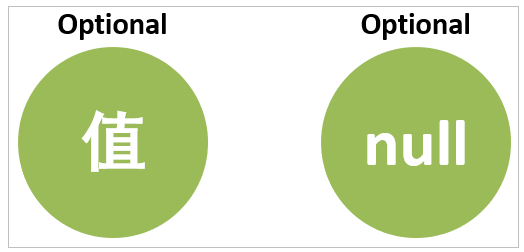


### 3、Optional的基本使用

Optional对象的创建方式

```java
	/**
     * Optional对象的创建方式
     */
    @Test
    public void test02(){
        // 第一种方式 通过of方法 of方法是不支持null的
        Optional<String> op1 = Optional.of("zhangsan");
        //Optional<Object> op2 = Optional.of(null);

        // 第二种方式通过 ofNullable方法 支持null
        Optional<String> op3 = Optional.ofNullable("lisi");
        Optional<Object> op4 = Optional.ofNullable(null);

        // 第三种方式 通过empty方法直接创建一个空的Optional对象
        Optional<Object> op5 = Optional.empty();
    }
```


### 4、Optional的常用方法

```java
	/**
     * Optional中的常用方法介绍
     *      get(): 如果Optional有值则返回，否则抛出NoSuchElementException异常
     *             get()通常和isPresent方法一块使用
     *      isPresent(): 判断是否包含值，包含值返回true，不包含值返回false
     *      orElse(T t): 如果调用对象包含值，就返回该值，否则返回t
     *      orElseGet(Supplier s): 如果调用对象包含值，就返回该值，否则返回 Lambda表达式的返回值
     */
    @Test
    public void test03(){
        Optional<String> op1 = Optional.of("张三");
        Optional<String> op2 = Optional.empty();

        //获取Optional中的值
        if (op1.isPresent()){
            String s1 = op1.get();
            System.out.println("用户名称：" + s1); //用户名称：张三
        }
        if (op2.isPresent()){
            System.out.println(op2.get());
        } else {
            System.out.println("op2是一个空Optional对象");
        }

        String s3 = op1.orElse("李四");
        System.out.println(s3); // 张三
        String s4 = op2.orElse("李四");
        System.out.println(s4); // 李四

        String s5 = op2.orElseGet(() -> "Hello");
        System.out.println(s5); // Hello
    }
```

```java
	@Test
    public void test04(){
        Optional<String> op1 = Optional.of("张三");
        Optional<String> op2 = Optional.empty();
        // 如果存在值 就做什么
        op1.ifPresent(s -> System.out.println("有值：" + s)); // 有值：张三
        op1.ifPresent(System.out::println); // 张三
    }

    /**
     * 自定义一个方法，将Person对象中的 name 转换为大写，并返回
     */
    @Test
    public void test05(){
        Person p = new Person("zhangsan", 15, 166);
        Optional<Person> op = Optional.of(p);
        String name = getNameForOptional(op);
        System.out.println(name);
    }

    /**
     * 根据Person对象，将name转换为大写并返回
     *      通过Optional实现
     */
    public String getNameForOptional(Optional<Person> op){
        if (op.isPresent()){
            String msg = op.map(Person::getName)
                    .map(String::toUpperCase)
                    .orElse(null);
            return msg;
        }
        return null;
    }

    /**
     * 根据Person对象，将name转换为大写并返回
     */
    public String getName(Person person){
        if (person != null){
            if (person.getName() != null){
                return person.getName().toUpperCase(Locale.ROOT);
            } else {
                return null;
            }
        } else {
            return null;
        }
    }
```

------

## 八、新时间日期API

### 1、旧版日期时间的问题

在旧版本中JDK对于日期和时间这块的时间是非常差的。

```java
	/**
     * 旧版本日期时间设计的问题
     */
    @Test
    public void test01() throws ParseException {
        //1.设计不合理
        Date date = new Date(2022, 5, 9);
        System.out.println(date); //Fri Jun 09 00:00:00 CST 3922

        //2.时间格式化和解析操作是线程不安全的
        SimpleDateFormat sdf = new SimpleDateFormat("yyyy-MM-dd HH:mm:ss");
        for (int i = 0; i < 50; i++) {
            new Thread(() -> {
                try {
                    //System.out.println(sdf.format(date));
                    System.out.println(sdf.parse("2022-06-01 15:56:30"));
                } catch (ParseException e) {
                    e.printStackTrace();
                }
            }).start();
        }
    }
```

1. 设计不合理，在 java.util 和 java.sql 的包中都有日期类，java.util.Date同时包含日期和时间的，而 
java.sql.Date 仅仅包含日期，此外用于格式化和解析的类在java.text包下。
2. 非线程安全，java.util.Date是非线程安全的，所有的日期类都是可变的，这是java日期类最大的问
题之一。
3. 时区处理麻烦，日期类并不提供国际化，没有时区支持。


### 2、新日期时间API介绍

JDK 8中增加了一套全新的日期时间API，这套API设计合理，是线程安全的。

新的日期及时间API位于
java.time 包
中，下面是一些关键类。

- LocalDate ：表示日期，包含年月日，格式为 2019-10-16
- LocalTime ：表示时间，包含时分秒，格式为 16:38:54.158549300
- LocalDateTime ：表示日期时间，包含年月日，时分秒，格式为 2018-09-06T15:33:56.750
- DateTimeFormatter ：日期时间格式化类。
- Instant：时间戳，表示一个特定的时间瞬间。 
- Duration：用于计算2个时间(LocalTime，时分秒)的距离
- Period：用于计算2个日期(LocalDate，年月日)的距离
- ZonedDateTime ：包含时区的时间


Java中使用的历法是ISO 8601日历系统，它是世界民用历法，也就是我们所说的公历。平年有365天，
闰年是366
天。此外Java 8还提供了4套其他历法，分别是：

- ThaiBuddhistDate：泰国佛教历
- MinguoDate：中华民国历
- JapaneseDate：日本历
- HijrahDate：伊斯兰历


#### 2.1 日期时间的常见操作

LocalDate，LocalTime 以及 LocalDateTime的操作

```java
	/**
     * 新版JDK8 日期操作
     */
    @Test
    public void test02(){
        //1.创建指定的日期
        LocalDate date1 = LocalDate.of(2022, 05, 06);
        System.out.println("date1 = " + date1); // date1 = 2022-05-06

        //2.获取当前的日期
        LocalDate now = LocalDate.now();
        System.out.println("now = " + now); // now = 2022-05-30

        //3.根据LocalDate对象获取对应的日期信息
        System.out.println("年：" + now.getYear()); // 年：2022
        System.out.println("月：" + now.getMonth().getValue()); // 月：5
        System.out.println("日：" + now.getDayOfMonth()); // 日：30
        System.out.println("星期：" + now.getDayOfWeek().getValue()); // 星期：1
    }
```

```java
	/**
     * 新版JDK8 时间操作
     */
    @Test
    public void test03(){
        //1.得到指定的时间
        LocalTime time = LocalTime.of(15, 36, 33, 23145);
        System.out.println(time); // 15:36:33.000023145

        //2.获取当前时间
        LocalTime now = LocalTime.now();
        System.out.println(now); // 19:30:40.013

        //3.获取时间信息
        System.out.println("小时：" + now.getHour()); //小时：19
        System.out.println("分钟：" + now.getMinute());//分钟：30
        System.out.println("秒：" + now.getSecond());//秒：40
        System.out.println("纳秒：" + now.getNano());//纳秒：13000000
    }
```

```java
	/**
     * 新版JDK8 日期时间类型 LocalDateTime
     */
    @Test
    public void test04(){
        //1.获取指定的日期时间
        LocalDateTime dateTime = LocalDateTime.of(
                2022,           //年
                03,           //月
                22,      //日
                18,            //时
                55,          //分
                56,          //秒
                12345);//纳秒
        System.out.println(dateTime);//2022-03-22T18:55:56.000012345

        //2.获取当前的日期时间
        LocalDateTime now = LocalDateTime.now();
        System.out.println(now);//2022-05-30T19:37:10.914

        //3.获取日期时间信息
        System.out.println("年：" + now.getYear()); // 年：2022
        System.out.println("月：" + now.getMonth().getValue()); // 月：5
        System.out.println("日：" + now.getDayOfMonth()); // 日：30
        System.out.println("星期：" + now.getDayOfWeek().getValue()); // 星期：1
        System.out.println("小时：" + now.getHour()); //小时：19
        System.out.println("分钟：" + now.getMinute());//分钟：37
        System.out.println("秒：" + now.getSecond());//秒：10
        System.out.println("纳秒：" + now.getNano());//纳秒：914000000
    }
```


#### 2.2 日期时间的修改和比较

```java
	/**
     * 日期时间的修改
     */
    @Test
    public void test01(){
        LocalDateTime now = LocalDateTime.now();
        System.out.println("now = " + now);//now = 2022-05-31T18:22:30.502
        //修改日期时间，对日期时间的修改，对已存在的LocalDateTime对象，创建了它的模板
        //并不会修改原来的信息
        LocalDateTime localDateTime = now.withYear(2012);
        System.out.println("now = " + now);//now = 2022-05-31T18:22:30.502
        System.out.println("修改后的时间：" + localDateTime);//修改后的时间：2012-05-31T18:22:30.502

        System.out.println("月份：" + now.withMonth(10));//月份：2022-10-31T18:22:30.502
        System.out.println("天：" + now.withDayOfMonth(6));//天：2022-05-06T18:22:30.502
        System.out.println("小时：" + now.withHour(8));//小时：2022-05-31T08:22:30.502
        System.out.println("分钟：" + now.withMinute(55));//分钟：2022-05-31T18:55:30.502

        //在当前日期时间的基础之上，加上或者减去指定的时间
        System.out.println("两年后：" + now.plusYears(2));//两年后：2024-05-31T18:22:30.502
        System.out.println("10年后：" + now.plusYears(10));//10年后：2032-05-31T18:22:30.502
        System.out.println("6个月后：" + now.plusMonths(6));//6个月后：2022-11-30T18:22:30.502

        System.out.println("十年前：" + now.minusYears(10));//十年前：2012-05-31T18:22:30.502
        System.out.println("半年前：" + now.minusMonths(6));//半年前：2021-11-30T18:22:30.502
        System.out.println("一周前：" + now.minusDays(7));//一周前：2022-05-24T18:22:30.502
    }
```

```java
	/**
     * 日期时间的比较
     */
    @Test
    public void test02(){
        LocalDate now = LocalDate.now();
        LocalDate date = LocalDate.of(2021, 10, 1);
        System.out.println("now = " + now);//now = 2022-05-31
        System.out.println("date = " + date);//date = 2021-10-01
        //在JDK8中要实现日期的比较
        //日期的比较 isAfter isBefore isEqual 通过这几个方法来直接比较
        System.out.println(now.isAfter(date));//true
        System.out.println(now.isBefore(date));//false
        System.out.println(now.isEqual(date));//false
    }
```

注意：在进行日期时间修改的时候，原来的LocalDateTime对象是不会被修改，每次操作都是返回了一个新的
LocalDateTime对象，所以在多线程场景下是数据安全的。


#### 2.3 格式化和解析操作

在JDK8中我们可以通过 java.time.format.DateTimeFormatter 类可以进行日期的解析和格式化操作

```java
	/**
     * 日期格式化
     */
    @Test
    public void test03(){
        LocalDateTime now = LocalDateTime.now();
        //指定格式 使用系统默认的格式
        DateTimeFormatter isoLocalDateTime = DateTimeFormatter.ISO_LOCAL_DATE_TIME;
        //将日期时间转换为字符串
        String format = now.format(isoLocalDateTime);
        System.out.println("format = " + format);//format = 2022-05-31T18:34:12.16
        //通过 ofPattern 方法来指定特定的格式 自定义格式
        DateTimeFormatter dateTimeFormatter = DateTimeFormatter.ofPattern("yyyy-MM-dd HH:mm:ss");
        String format1 = now.format(dateTimeFormatter);
        System.out.println("format1 = " + format1);//format1 = 2022-05-31 18:34:12

        //将字符串解析为一个 日期时间类型
        LocalDateTime parse = LocalDateTime.parse("1997-07-01 19:07:07", dateTimeFormatter);
        System.out.println("parse = " + parse);//parse = 1997-07-01T19:07:07
    }
```


#### 2.4 Instant 类

在JDK8中给我们新增一个Instant类(时间戳/时间线)，内部保存了从`1970年1月1日 00:00:00`以来的秒和
纳秒

```java
	/**
     * Instant 时间戳
     *      可以用来统计时间消耗
     */
    @Test
    public void test04() throws InterruptedException {
        Instant begin = Instant.now();
        System.out.println("begin = " + begin);//begin = 2022-05-31T10:42:18.852Z

        //获取从1970年1月1日00:00:00 到现在的 纳秒
        System.out.println(begin.getNano());//852000000
        Thread.sleep(5);

        Instant end = Instant.now();
        System.out.println("耗时：" + (end.getNano() - begin.getNano()) + " ns");//耗时：60000000 ns
    }
```


#### 2.5 计算日期时间差

JDK8中提供了两个工具类 Duration / Period：计算日期时间差
1. Duration：用来计算两个时间差(LocalTime)
2. Period：用来计算两个日期差(LocalDate)

```java
	/**
     * 计算日期时间差
     */
    @Test
    public void test05(){
        //计算时间差
        LocalTime now = LocalTime.now();
        LocalTime time = LocalTime.of(22, 48, 56);
        System.out.println("now = " + now);//now = 18:53:41.913
        //通过Duration来计算时间差
        Duration duration = Duration.between(now, time);
        System.out.println("相差 " + duration.toDays() + " 天");//相差 0 天
        System.out.println("相差 " + duration.toHours() + " 小时");//相差 3 小时
        System.out.println("相差 " + duration.toMinutes() + " 分钟");//相差 235 分钟
        System.out.println("相差 " + duration.toMillis() + " 毫秒");//相差 14114087 毫秒

        //计算日期差
        LocalDate nowDate = LocalDate.now();
        System.out.println("nowDate = " + nowDate);//nowDate = 2022-05-31
        LocalDate date = LocalDate.of(2008, 8, 8);
        Period period = Period.between(date, nowDate);
        System.out.println(period.getYears());//13
        System.out.println(period.getMonths());//9
        System.out.println(period.getDays());//23
    }
```


#### 2.6 时间校正器

有时候我们可以需要如下调整：将日期调整到 "下个月的第一天" 等操作。这时我们通过时间校正器效果
可能会更好。

- TemporalAdjuster：时间校正器
- TemporalAdjusters：通过该类静态方法提供了大量的常用TemporalAdjuster的实现。

```java
	/**
     * 时间校正器
     */
    @Test
    public void test06(){
        LocalDateTime now = LocalDateTime.now();
        System.out.println("now = " + now);//now = 2022-05-31T19:03:46.514
        //将当前的日期调整到下个月的一号
        TemporalAdjuster adjuster = (temporal) -> {
            LocalDateTime dateTime = (LocalDateTime) temporal;
            LocalDateTime nextMonth = dateTime.plusMonths(1).withDayOfMonth(1);
            System.out.println("nextMonth = " + nextMonth);//nextMonth = 2022-06-01T19:03:46.514
            return nextMonth;
        };
        //LocalDateTime nextMonth = now.with(adjuster);
        // 我们可以通过TemporalAdjusters 来实现
        LocalDateTime nextMonth = now.with(TemporalAdjusters.firstDayOfNextMonth());
        System.out.println("nextMonth = " + nextMonth);//nextMonth = 2022-06-01T19:03:46.514
    }
```


#### 2.7 日期时间的时区

Java8 中加入了对时区的支持，LocalDate、LocalTime、LocalDateTime是不带时区的

带时区的日
期时间类分别为：ZonedDate、ZonedTime、ZonedDateTime。

其中每个时区都对应着 ID，ID的格式为 “区域/城市” 。例如 ：Asia/Shanghai 等。

ZoneId：该类中包含了所有的时区信息

```java
`/**
     * 时区操作
     */
    @Test
    public void test07(){
        // 获取所有的时区ID
        //ZoneId.getAvailableZoneIds().forEach(System.out::println);

        // 获取当前时间 中国使用的是 东八区的时区 比标准时间早8个小时
        LocalDateTime now = LocalDateTime.now();
        System.out.println("now = " + now);//now = 2022-05-31T19:17:07.651
        // 获取标准时间
        ZonedDateTime bz = ZonedDateTime.now(Clock.systemUTC());
        System.out.println("bz = " + bz);//bz = 2022-05-31T11:17:07.651Z

        // 使用计算机默认的时区，创建日期时间
        ZonedDateTime now1 = ZonedDateTime.now();
        System.out.println("now1 = " + now1);//now1 = 2022-05-31T19:17:07.652+08:00[Asia/Shanghai]

        // 使用指定的时区，创建日期时间
        ZonedDateTime now2 = ZonedDateTime.now(ZoneId.of("America/Cuiaba"));
        System.out.println("now2 = " + now2);//now2 = 2022-05-31T07:17:07.652-04:00[America/Cuiaba]
    }
```


### 3、新时间日期API的优势

JDK新的日期和时间API的优势：
1. 新版日期时间API中，日期和时间对象是不可变，操作日期不会影响原来的值，而是生成一个新的
实例
2. 提供不同的两种方式，有效的区分了人和机器的操作
3. TemporalAdjuster可以更精确的操作日期，还可以自定义日期调整期
4. 线程安全

------

## 九、其它新特性

### 1、重复注解

自从Java 5中引入注解以来，注解开始变得非常流行，并在各个框架和项目中被广泛使用。不过注
解有一个很大的限
制是：在同一个地方不能多次使用同一个注解。JDK 8引入了重复注解的概念，允许在同一个地方多次使
用同一个注
解。在JDK 8中使用 @Repeatable 注解定义重复注解。

1. 定义一个重复注解的容器

```java
@Retention(RetentionPolicy.RUNTIME)
public @interface MyAnnotations {
    MyAnnotation[] value();
}
```


2. 定义一个可以重复的注解

```java
@Repeatable(MyAnnotations.class)
@Retention(RetentionPolicy.RUNTIME)
public @interface MyAnnotation {
    String value();
}
```


3. 配置多个重复的注解

```java
@MyAnnotation("mike")
@MyAnnotation("jack")
@MyAnnotation("rose")
public class AnnoTest01 {
    @MyAnnotation("fun1")
    @MyAnnotation("fun2")
    public void test01(){
    }
}
```


4. 解析得到指定的注解

```java
	//解析重复注解
    public static void main(String[] args) throws NoSuchMethodException {
        //获取类中标注的重复注解
        MyAnnotation[] annotationsByType = 
            AnnoTest01.class.getAnnotationsByType(MyAnnotation.class);
        for (MyAnnotation myAnnotation : annotationsByType) {
            System.out.print(myAnnotation.value() + " "); //mike jack rose
        }
        System.out.println();
        //获取类中方法上标注的重复注解
        MyAnnotation[] myAnnotations = 
            AnnoTest01.class.getMethod("test01").getAnnotationsByType(MyAnnotation.class);
        for (MyAnnotation annotation : myAnnotations) {
            System.out.print(annotation.value() + " "); //fun1 fun2
        }
        System.out.println();
    }
```


### 2、类型注解

JDK 8为@Target元注解新增了两种类型： TYPE_PARAMETER ， TYPE_USE 。

- TYPE_PARAMETER ：表示该注解能写在类型参数的声明语句中。 类型参数声明如： 、
- TYPE_USE ：表示注解可以在任何用到类型的地方使用。


TYPE_PARAMETER

```java
@Target(ElementType.TYPE_PARAMETER)
public @interface TypeParam {
}
```

使用：

```java
public class TypeDemo01 <@TypeParam T> {
	public <@TypeParam K extends Object> K test01(){
		return null;
	}
}
```


TYPE_USE

```java
@Target(ElementType.TYPE_USE)
public @interface NotNull {
}
```

使用：

```java
public class TypeUseDemo01 {
	public @NotNull Integer age = 10;
	public Integer sum(@NotNull Integer a,@NotNull Integer b){
		return a + b;
	}
}
```

