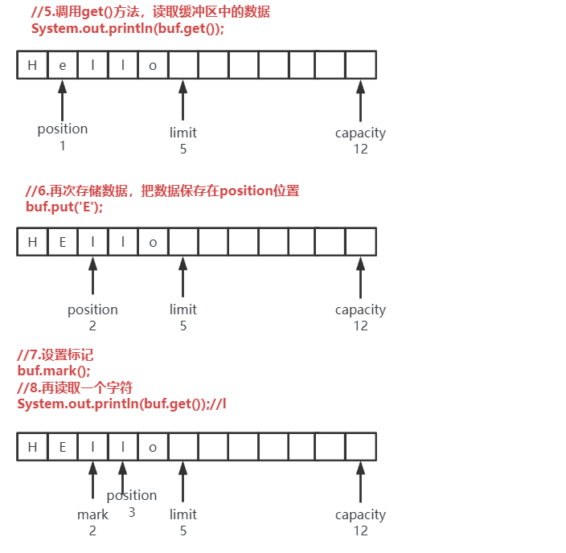

# JAVA-NIO

## 一、NIO概述

JVM读取数据的模型


在JDK4中引入了NIO，可以最大限度的满足Java程序IO的需求

- java.nio 包，定义了各种与 Buffer 相关的类
- java.nio.channel 包，包含与 Channel 和 Selector 相关的类
- java.nio.charset 包，与字符集相关的类


在NIO中有三大核心组件：Channel、Buffer、Selector


- 传统的 IO 面向流的，每次可以从流中读取一个或多个字节，只能向后读取，不能向前移
  动。

- NIO 是面向缓冲区的，把数据读到一个缓冲区中，可以在缓冲区中向前/向后移动，增加
  了程序的灵活性。

- 在 NIO 中，所有的数据都需要通过 Channel 传输，通道可以直接将一块数据映射到内存
  中。Channel是双向的，不仅可以读取数据，还能保存数据。程序不能直接读写Channel通道，
  Channel 只与 Buffer 缓冲区交互。

  

- IO 流是线程阻塞的，在调用 read()/write() 读写数据时，线程阻塞，直到数据读取完毕或者
  数据完全写入，在读写过程中，线程不能做其他的任务。

- NIO 不是线程阻塞的。当线程从 Channel 中读取数据时，如果通道中没有可用的数据，
  线程不阻塞，可以做其他的任务。

------

## 二、Buffer

### 1 Buffer 的属性

Buffer 缓冲区实际上就是一个数组，把数组的内容与信息包装成一个 Buffer 对象，它提供
了一组访问这些信息的方法。

缓冲区的重要属性：

1. capacity 容量，是指缓冲区可以存储多少个数据。容量在创建 Buffer 缓冲区时指定大小，创建后不能再修改。如果缓冲区满了，需要把缓冲区清空后才能继续写数据。
2. position 表示当前位置，即缓冲区写入/读取的位置。刚刚创建 Buffer 对象后，position 初
   始化为 0，写入一个数据，position 就向后移动一个单元，它的最大值是 capacity - 1。当 Buffer
   从写模式切换到读模式，position 会被重置为 0。 从 Buffer 的开始位置读取数据，每读一个数据
   postion 就向后移动一个单元。
3. limit 上限，是指第一个不能被读出或写入的位置。limit 上限后面的单元既不能读也不能
   写。在 Buffer 缓冲区的写模式下，limit 表示能够写入多少个数据；在读取模式下，limit 表示最
   多可以读取多少个数据。
4. mark 标记，设置一个标记位置，可以调用 mark() 方法，把标记就设置在 position 位置，当
   调用 reset() 方法时，就把 postion 设置为 mark 标记的位置。
5. 0 <= mark <= position <= limit <= capacity


### 2 Buffer 的常用API

在 NIO 中关键的 Buffer 有：ByteBuffer、CharBuffer、DoubleBuffer、FloatBuffer、IntBuffer、
LongBuffer、ShortBuffer； 这些 Buffer 覆盖了能够通过 I/O 发送的所有基本类型：byte、char、
double、float、int、long、short 等。实际上使用较多的是 ByteBufer，CharBuffer。

- 每个缓冲区类都有一个静态方法 allocate(capacity) 可以创建一个指定容量的缓冲区；
- 都有一个 put() 方法用于向缓冲区中存储数据，get() 方法用于从缓冲区中读取数据；
- 当缓冲区中还有未读完的数据，可以调用 compact() 方法进行压缩，将所有未读取的
  数据复制到 Buffer 的起始位置，把 position 设置到最后一个未读元素的后面。limit 属性设置
  为 capacity；
- capacity() 方法返回缓冲区的大小；
- hasRemaining()，判断当前 position 后面是否还有可处理的数据，即判断 postion 与 limit
  之间是否还有数据可处理；
- remainig() 返回当前 position 位置与 limit 之间的数据量；
- limt()，返回 limit 上限的位置；
- mark()，设置缓冲区的标志位置，这个值只能在 0~position 之间。以后可以通过 reset()
  返回到这个位置；
- position() 可以返回 position 当前位置；
- reset() 方法可以将 position 设置为 mark 标志位；
- rewind()，将 position 设置为 0， 取消 mark 标志位；
- clear() 清空缓冲区，仅仅是修改 position 标志为 0，设置 limit 为 capacity，缓冲区中数
  据还是存在的；
- flip() 方法可以把缓冲区由写模式切换到读模式。先把 limit 设置为 position 位置，再把
  position 设置为 0。

代码演示：

```java
package com.xukang.nio;

import java.nio.CharBuffer;

/**
 * 演示Buffer的使用
 */
public class Test01 {
    public static void main(String[] args) {
        //1.创建CharBuffer缓冲区对象
        CharBuffer buf = CharBuffer.allocate(12);

        //2.打印 capacity，limit，position
        System.out.println("capacity:" + buf.capacity() + ", limit:" + buf.limit() + ", position:" + buf.position());
        //capacity:12, limit:12, position:0

        //3.向缓冲区中存储数据 put()
        buf.put('H');
        buf.put('e');
        buf.put('l');
        buf.put('l');
        buf.put('o');
        System.out.println("capacity:" + buf.capacity() + ", limit:" + buf.limit() + ", position:" + buf.position());
        //capacity:12, limit:12, position:5

        //4.调用flip()，把缓冲区由写模式切换为读模式，limit设置为5，position设置为0
        buf.flip();
        System.out.println("capacity:" + buf.capacity() + ", limit:" + buf.limit() + ", position:" + buf.position());
        //capacity:12, limit:5, position:0

        //5.调用get()方法，读取缓冲区中的数据
        System.out.println(buf.get());//H
        System.out.println("capacity:" + buf.capacity() + ", limit:" + buf.limit() + ", position:" + buf.position());
        //capacity:12, limit:5, position:1

        //6.再次存储数据，把数据保存在position位置
        buf.put('E');
        System.out.println("capacity:" + buf.capacity() + ", limit:" + buf.limit() + ", position:" + buf.position());
        //capacity:12, limit:5, position:2

        //7.设置标记
        buf.mark();

        //8.再读取一个字符
        System.out.println(buf.get());//l
        System.out.println("capacity:" + buf.capacity() + ", limit:" + buf.limit() + ", position:" + buf.position());
        //capacity:12, limit:5, position:3

        //9.调用reset()方法，把position重置为mark标记位置
        buf.reset();
        System.out.println("capacity:" + buf.capacity() + ", limit:" + buf.limit() + ", position:" + buf.position());
        //capacity:12, limit:5, position:2

        //10.调用compact()压缩，把buffer中未读的数据复制到position为0的位置
        buf.compact();
        System.out.println("capacity:" + buf.capacity() + ", limit:" + buf.limit() + ", position:" + buf.position());
        //capacity:12, limit:12, position:3

        //11.调用clear()清空，仅仅是修改position和limit的值
        buf.clear();
        System.out.println("capacity:" + buf.capacity() + ", limit:" + buf.limit() + ", position:" + buf.position());
        //capacity:12, limit:12, position:0

        //12.clear()清空后，缓冲区的数据依然存在
        System.out.println(buf);//llolo
        //通过循环把position和limit之间的内容逐个打印
        while (buf.hasRemaining()){
            System.out.print(buf.get());//llolo
        }
    }
}
```

图解：





```java
package com.xukang.nio.bufferop;

import java.nio.CharBuffer;
import java.util.Arrays;

/**
 * 使用缓冲区就是为了提高数据传输效率，一次读写一个字符或者一个字节效率并不高，可以进行批量的操作；
 * 可以借助于数组，把缓冲区中的一块数据读到数组中，也可以把数组中的部分内容保存到缓冲区中
 */
public class Test02 {
    public static void main(String[] args) {
        //创建CharBuffer
        CharBuffer buf = CharBuffer.allocate(16);
        //可以把字符串保存到buf缓冲区中
        buf.put("Hello World!jack");
        //翻转，切换为读模式
        buf.flip();
        System.out.println(buf);//Hello World!jack

        //定义字符数组
        char[] dst = new char[12];
        //调用get()方法把缓冲区中的数据读到字符数组中
        //注意批量传输时大小总是固定的，如果没有指定传输的大小，意味着把数组填满
        CharBuffer remainingCharBuffer = buf.get(dst);
        System.out.println(Arrays.toString(dst));//[H, e, l, l, o,  , W, o, r, l, d, !]
        System.out.println(remainingCharBuffer);//jack

        //继续把buf缓冲区的内容读到字符数组中
        //当缓冲区的数据量不足以填满整个数组时，会抛出异常
        //buf.get(dst); //java.nio.BufferUnderflowException
        //解决方案：在批量读取缓冲区数据时，记得查询缓冲区的剩余量、
        //把小缓冲区的数据填充到大的数组时，要指定缓冲区剩余量的长度
        buf.get(dst, 0, buf.remaining());//把buf缓冲区中剩余的数据传输到dst数组的0开始的位置
        System.out.println(Arrays.toString(dst));//[j, a, c, k, o,  , W, o, r, l, d, !]

        //循环读取缓冲区中的数据
        buf.clear();
        while (buf.hasRemaining()){
            int len = Math.min(dst.length, buf.remaining());
            buf.get(dst, 0, len);
            System.out.print(new String(dst, 0, len));//Hello World!jack
        }
        System.out.println();

        //批量写入
        char[] contents = new char[]{'a', 'b', 'c', 'd'};
        //把字符数组中的数据保存到缓冲区中
        //如果缓冲区中没有足够的空间，会抛出异常
        //buf.put(contents);//java.nio.BufferOverflowException
        System.out.println("capacity:" + buf.capacity() + ", limit:" + buf.limit() + ", position:" + buf.position());
        //capacity:16, limit:16, position:16

        buf.position(14);
        buf.put(contents, 0, buf.remaining());
        buf.flip(); //翻转，切换为读模式
        System.out.println(buf);//Hello World!jaab
    }
}
```


```java
package com.xukang.nio.bufferop;

import java.nio.CharBuffer;
import java.util.Arrays;

/**
 * 缓冲区的创建方式
 *  1.分配操作创建缓冲区，allocate()方法分配一个私有的，指定容量大小的数组来存储数组
 *  2.包装操作创建缓冲区，它使用提供的数组作为存储空间来存储缓冲区中的数据，不再分配其他空间
 */
public class Test03 {
    public static void main(String[] args) {
        //1.分配操作创建缓冲区
        CharBuffer buf1 = CharBuffer.allocate(16);

        //2.使用包装操作构建缓冲区
        char[] myArray = new char[16];
        //把已存在的数组包装为一个Buffer对象
        CharBuffer buf2 = CharBuffer.wrap(myArray);

        //我们通过put()向缓冲区中保存数据，也会直接影响到数组
        buf2.put("Hello");
        buf2.flip();
        System.out.println(buf2);//Hello
        System.out.println(Arrays.toString(myArray));//[H, e, l, l, o,  ,  ,  ,  ,  ,  ,  ,  ,  ,  ,  ]

        //对数组做的任何修改，也会影响缓冲区对象
        myArray[0] = 'X';
        buf2.position(0);
        System.out.println(buf2);//Xello
        System.out.println(Arrays.toString(myArray));//[X, e, l, l, o,  ,  ,  ,  ,  ,  ,  ,  ,  ,  ,  ]

        /**
         * 不管是allocate()还是wrap()，创建的缓冲区都是间接的，间接缓冲区会使用备份数组
         * hasArray()方法可以判断是否有一个可存取的备份数组
         * if hasArray() 返回 true，可以通过array()返回缓冲区对象使用的备份数组的引用
         */
        if(buf2.hasArray()){
            char[] arr2 = buf2.array();
            System.out.println(Arrays.toString(arr2));//[X, e, l, l, o,  ,  ,  ,  ,  ,  ,  ,  ,  ,  ,  ]
        }
    }
}
```


```java
package com.xukang.nio.bufferop;

import java.nio.CharBuffer;

/**
 * 缓冲区的复制与分隔
 */
public class Test04 {
    public static void main(String[] args) {
        //1.创建缓冲区
        CharBuffer buf = CharBuffer.allocate(16);
        //2.存储数据
        buf.put("hello");

        //3.缓冲区的复制
        CharBuffer buf2 = buf.duplicate();
        System.out.println("buf2.capacity = " + buf2.capacity() + ", buf2.limit = " +
                buf2.limit() + ", buf2.position = " + buf2.position());
        //buf2.capacity = 16, buf2.limit = 16, buf2.position = 5

        buf2.flip();//翻转，切换为读模式
        System.out.println(buf2);//hello

        //buf 与 buf2 实际引用同一个数组
        buf2.clear();
        buf2.put("NIOWorld");
        //输出buf缓冲区的内容
        buf.flip();//翻转，切换为读模式，会把limit设置为position的值5
        System.out.println(buf);//NIOWo

        //分隔缓冲区，slice() 方法根据 [position, limit) 区间创建一个新的缓冲区
        buf2.position(3);
        System.out.println("buf2.capacity = " + buf2.capacity() + ", buf2.limit = " +
                buf2.limit() + ", buf2.position = " + buf2.position());
        //buf2.capacity = 16, buf2.limit = 16, buf2.position = 3

        CharBuffer buf3 = buf2.slice();
        System.out.println("buf3.capacity = " + buf3.capacity() + ", buf3.limit = " +
                buf3.limit() + ", buf3.position = " + buf3.position());
        //buf3.capacity = 13, buf3.limit = 13, buf3.position = 0
    }
}
```


### 3 直接字节缓冲区

在硬盘中和操作系统中处理的数据都是 0/1 二进制，缓冲区中只有 ByteBuffer 字节缓冲
区有资格参与 I/O 操作。

Channel 通道只能使用 ByteBuffer 作为它的参数。

- 直接字节缓冲区通常是 I/O 操作最好的选择。如果使用非直接字节缓冲区可能会导致性
  能损耗。如果向通道传递一个非直接字节缓冲区，通道可能会先创建一个临时的直接字节缓
  冲区，将非直接缓冲区的内容复制到这个临时的直接字节缓冲区中，使用临时直接字节缓冲
  区执行底层的 I/O 操作；
- 直接缓冲区是 I/O 的最佳选择，可能我们创建直接缓冲区比创建非直接缓冲区的成本要高。直接缓冲区使用的内存是通过调用本地操作系统的代码分配的，绕过了 JVM 的堆栈。现在
  JVM 可能会执行缓冲区缓存的优化...；作为入门初级开发人员，不要考虑优化问题，先保证程序
  的正确性。
- `ByteBuffer.allocateDirect()` 方法创建直接字节缓冲区。

------

## 三、Channel

### 1 Channel 概述

Channel 是一种新的 I/O 的访问方式，用于在字节缓冲区与通道另一侧的实体 (可以是文
件也可以是 Socket) 之间进行数据的传输。

Channel 可以**双向**读写数据，也可以实现**异步读写**。

程序不能直接访问 Channel，Channel 只能与 Buffer 缓冲区进行交互。即把通道中的数据
读到 Buffer 缓冲区中，程序从缓冲区中读取数据；在写操作时，程序把数据写入 Buffer 缓冲
区中，再把缓冲区的数据写入到 Channel 中。

常用 的 Channel 有：

- FileChannel：读写文件的通道
- SocketChannel / ServerSocketChannel：读写 Socket 套接字中的数据
- DatagramChannel：通过 UDP 读写网络数据


### 2 Scatter / Gather

Scatter(发散）、Gather(聚焦）是通道提供的一个重要功能（有时也称为矢量 I/O）。

Scatter、Gather 是指在多个缓冲区中实现一个简单的 I/O 操作。


Scatter 是指从 Channel 通道中读取数据，把这些数据按顺序分散写入到多个 Buffer 缓
冲区中；


Gather 是指在写操作时，将多个 Buffer 缓冲区的数据写入到同一个 Channel 中。


Scatter、Gather 经常用于需要将传输的数据分开处理的场景。

如 Scatter 从一个 Channel 中读取数据存储到多个 Buffer：

```java
ByteBuffer buf1 = ByteBuffer.allocate(48);
ByteBuffer buf2 = ByteBuffer.allocate(1024);
ByteBuffer[] bufArray = { buf1, buf2 };
Channel.read( bufArray );
```

Read()方法从 Channel 中读取数据，按照在数组中的顺序依次存储到缓冲区中。注
意必须在 buf1 缓冲区满后才能写入 buf2 缓冲区中。 使用 Scatter/Gather 处理的数据大
小都是固定的。


### 3 FileChannel

- FileChannel 可以通过 RandomAccessFile，FileInputStream 或 FileOutputSream 对象调用 getChannel() 方法获取；
- FileChannel 虽然是双向的，既有 read() 方法又有 write() 方法，但是从 FileInputStream 流中
  获得的通道是只读的，如果调用 write()方法会产生异常。从 FileOutputStream 流中
  获得的通道是只能写不能读的，如果调用 read()方法会产生异常。如果访问的文件是只读属性的，也
  不能执行 write() 写操作。
- FileChannel 对象是线程安全的，不过并非所有的操作都是多线程的，影响通道位置或者
  影响文件大小的操作都是单线程的。即如果有一个线程在执行会影响通道位置的操作，那么
  其他尝试进行此类操作的线程需要等待。


#### 3.1 FileChannel 内存映射文件

- FileChannel 常用的三类方法：map()，read() 和 write()；
- map()方法会创建一个由磁盘文件支持的虚拟内存映射，并在这块虚拟内存空间上封装
  一个 MappedByteBuffer 对象。 需要提醒的是，为一个文件建立虚拟内存映射后，文件数据通常
  不会从硬盘读到内存，这取决于操作系统；


- read() / write()是从 Buffer 中读写数据
- 通过内存映射机制访问文件会比常规方法高效，因为不需要做明确的系统调用，操作系
  统的虚拟内存可以自动缓存内存页，这些是使用系统内存缓存的，不会消耗 JVM 的内存堆。


```java
package com.xukang.nio.fileChannel;

import java.io.File;
import java.io.FileInputStream;
import java.io.FileOutputStream;
import java.nio.CharBuffer;
import java.nio.MappedByteBuffer;
import java.nio.channels.FileChannel;
import java.nio.charset.Charset;

/**
 * 内存映射文件
 *    即把文件中的所有数据映射到虚拟内存中，这种方式访问文件效率比较高
 */
public class Test01 {
    public static void main(String[] args) {
        //把当前Test01.java源文件以内存映射的方式读到out.txt文件中
        //创建当前文件的File对象
        File file = new File("src/com/xukang/nio/fileChannel/Test01.java");
        try (
                //获得Channel读取文件内容
                FileChannel inChannel = new FileInputStream(file).getChannel();
                //创建Channel，把数据保存到文件中
                FileChannel outChannel = new FileOutputStream("out.txt").getChannel();
        ){
            //将inChannel中的数据映射到虚拟内存当中
            MappedByteBuffer buffer = inChannel.map(FileChannel.MapMode.READ_ONLY, 0, file.length());
            //把缓冲区中的数据输出到outChannel中
            outChannel.write(buffer);

            //也可以把buffer中的内容打印出来
            buffer.flip(); //切换为读模式
            //创建字符集
            Charset charset = Charset.defaultCharset();
            //使用默认字符集把buffer中的字节转换为字符
            CharBuffer decode = charset.decode(buffer);
            System.out.println(decode);
        }catch (Exception e){
            e.printStackTrace();
        }
    }
}
```


#### 3.2 FileChannel 双向传输

通过 RandomAccessFile 获得的通道是双向传输的。

```java
package com.xukang.nio.fileChannel;

import java.io.File;
import java.io.RandomAccessFile;
import java.nio.MappedByteBuffer;
import java.nio.channels.FileChannel;

/**
 * 使用 RandomAccessFile 获得的通道是双向传输的
 *    把out.txt文件中的内容复制，追加到该文件的后面
 */
public class Test02 {
    public static void main(String[] args) {
        //创建File对象
        File file = new File("out.txt");

        try (
                //以读写的方式打开文件
                RandomAccessFile raf = new RandomAccessFile(file, "rw");
                FileChannel channel = raf.getChannel();
        ){
            //把channel中的数据映射到虚拟内存中
            MappedByteBuffer mapBuffer = channel.map(FileChannel.MapMode.READ_WRITE, 0, file.length());
            //设置channel的position属性
            channel.position(file.length());
            //把mapBuffer缓冲区的数据写到Channel当中
            channel.write(mapBuffer);
        } catch (Exception e){
            e.printStackTrace();
        }
    }
}
```


#### 3.3 缓冲区设置固定大小

```java
package com.xukang.nio.fileChannel;

import java.io.FileInputStream;
import java.io.FileOutputStream;
import java.nio.ByteBuffer;
import java.nio.channels.FileChannel;

/**
 * 读写文件时，设置缓冲区为固定大小
 */
public class Test03 {
    public static void main(String[] args) {
        //把out.txt文件的内容复制到out2.txt文件中
        try (
                FileChannel inChannel = new FileInputStream("out.txt").getChannel();
                FileChannel outChannel = new FileOutputStream("out2.txt").getChannel();
         ) {
            //定义固定大小的缓冲区
            ByteBuffer buffer = ByteBuffer.allocate(48);
            //从inChannel中读取数据保存到buffer中
            int readBytes = inChannel.read(buffer);
            //readBytes 不为-1时，说明没有读到文件末尾
            while (readBytes != -1){
                //把buffer中的内容写到outChannel中
                buffer.flip();//切换为读模式
                outChannel.write(buffer);
                buffer.clear();
                readBytes = inChannel.read(buffer);
            }

        } catch (Exception e){
            e.printStackTrace();
        }
    }
}
```


#### 3.4 Channel 到 Channel 的传输

- 经常需要将文件从一个位置批量传输到另一个位置，可以直接使用通道与通道之间的
  传输，而不需要中间缓冲区来传递数据；
- 注意：只有 FileChannel 支持 通道 到 通道之间的传输；
- 通道 到 通道的传输非常快捷，有的操作系统可以不使用用户空间直接传输数据。

```java
package com.xukang.nio.fileChannel;

import java.io.File;
import java.io.FileInputStream;
import java.io.FileOutputStream;
import java.io.RandomAccessFile;
import java.nio.ByteBuffer;
import java.nio.channels.FileChannel;
/**
 * 通道 与 通道之间的传输
 */
public class Test04 {
    public static void main(String[] args) {
        //把out.txt文件的内容复制到out3.txt文件中
        File file = new File("out.txt");
        try (
                RandomAccessFile raf = new RandomAccessFile(file, "rw");
                FileChannel inChannel = raf.getChannel();
                FileChannel outChannel = new FileOutputStream("out3.txt").getChannel();
        ) {
            //方式1
            //把inChannel从0开始的所有字节传输到outChannel中
            //inChannel.transferTo(0, file.length(), outChannel);

            //方式2
            outChannel.transferFrom(inChannel, 0, file.length());
        } catch (Exception e){
            e.printStackTrace();
        }
    }
}
```


#### 3.5 Gather 代码演示

把文件的属性和文件内容分别存储到不同的缓冲区中，再写入到另外一个文件中。

```java
package com.xukang.nio.fileChannel;

import java.io.File;
import java.io.FileInputStream;
import java.io.FileOutputStream;
import java.io.IOException;
import java.net.URLConnection;
import java.nio.ByteBuffer;
import java.nio.MappedByteBuffer;
import java.nio.channels.FileChannel;
import java.text.SimpleDateFormat;
import java.util.Date;

/**
 * Gather
 *   把 文件属性 和 文件内容，通过Gather形式写入到另外一个文件中。
 *   文件属性：
 *      文件绝对路径
 *      文件最后的修改时间
 *   文件内容：
 *      文件类型
 *      文件长度
 *    文件里面的具体内容：
 */
public class Test05 {
    public static void main(String[] args) throws IOException {
        //把out.txt文件的属性及文件的内容写入到新文件中
        File file = new File("out.txt");

        //获取文件的属性
        String path = file.getAbsolutePath();  //文件绝对路径
        long lastModify = file.lastModified(); //最后一次修改的时间
        Date lastModifyDate = new Date(lastModify);
        SimpleDateFormat sdf = new SimpleDateFormat("yyyy-MM-dd HH-mm-ss");
        String headerText = "filename:" + path + "\r\n"
                          + "last modified:" + sdf.format(lastModifyDate) + "\r\n";
        //把文件属性存储在缓冲区中
        ByteBuffer header = ByteBuffer.wrap(headerText.getBytes());

        //存储文件内容的buffer
        ByteBuffer contentBuf = ByteBuffer.allocate(128);
        //创建一个缓冲区数组 { 文件属性, 文件内容, 文件具体内容}
        ByteBuffer[] gather = {header, contentBuf, null};

        //读取文件内容
        String contentType = "unknown";//文件类型
        long contentLength = -1;//文件长度

        try {
            FileInputStream fis = new FileInputStream(file);
            FileChannel fc = fis.getChannel();
            //把文件映射到虚拟内存中
            MappedByteBuffer fileData = fc.map(FileChannel.MapMode.READ_ONLY, 0, fc.size());
            //把保存文件内容的缓冲区保存到gather中
            gather[2] = fileData;
            contentLength = fc.size();
            contentType = URLConnection.guessContentTypeFromName(file.getAbsolutePath());
        } catch (IOException e) {
            //e.printStackTrace();
            ByteBuffer buffer = ByteBuffer.allocate(128);
            String msg = "文件访问异常：" + e + "\r\n";
            buffer.put(msg.getBytes());
            buffer.flip(); //切换为读模式
            gather[2] = buffer;//把读文件的异常信息存储到数组中
        }

        StringBuilder sb = new StringBuilder();
        sb.append("Content-Length: ").append(contentLength).append("\r\n");
        sb.append("Content-Type: ").append(contentType).append("\r\n");
        contentBuf.put(sb.toString().getBytes());
        contentBuf.flip();

        //把gather数组中的内容写到目标文件中
        FileOutputStream outputStream = new FileOutputStream("gatherOut.txt");
        FileChannel outChannel = outputStream.getChannel();
        while (outChannel.write(gather) > 0){}
        outChannel.close();
    }
}
```


### 4 ServerSocketChannel 与 SocketChannel

- ServerSocketChannel 可以监听新进来的 TCP 连接通道
- SocketChannel 是一个连接到 TCP 网络套接字的通道


```java
package com.xukang.nio.socketchannel;

import java.io.IOException;
import java.net.InetSocketAddress;
import java.nio.ByteBuffer;
import java.nio.CharBuffer;
import java.nio.channels.ServerSocketChannel;
import java.nio.channels.SocketChannel;
import java.nio.charset.Charset;

/**
 * ServerSocketChannel:服务器端
 */
public class ServerSocketChannelTest01 {
    public static void main(String[] args) throws IOException, InterruptedException {
        final int port = 1234; //ServerSocket 的端口号
        //建立一个未绑定ServerSocket服务器的通道
        ServerSocketChannel ssc = ServerSocketChannel.open();
        //ServerSocketChannel没有bind绑定方法，需要先通过socket方法获得ServerSocket对象，然后再进行绑定端口号
        ssc.socket().bind(new InetSocketAddress(port));
        //设置通道为非堵塞模式，当没有传入连接时，accept()方法返回null
        ssc.configureBlocking(false);
        while (true){
            System.out.println("我是ServerSocket服务器，已经准备好了");
            SocketChannel sc = ssc.accept(); //接收传入的SocketChannel
            //如果没有连接，sc为null
            if (sc == null){
                Thread.sleep(1000);
            } else { //有连接传入
                ByteBuffer buffer = ByteBuffer.allocate(1024);
                //先给客户端发送一个数据
                buffer.put("Hello，I am from socketServer".getBytes());
                buffer.flip();
                sc.write(buffer);

                //再读取客户端中发送来的内容
                System.out.println("from Socket Client: " + sc.socket().getRemoteSocketAddress());
                buffer.clear();
                //读取客户端发送的数据，保存到buffer中
                sc.read(buffer);
                buffer.flip();
                CharBuffer decode = Charset.defaultCharset().decode(buffer);
                System.out.println(decode);
                sc.close();
            }
        }
    }
}
```

```java
package com.xukang.nio.socketchannel;

import java.io.IOException;
import java.io.InputStream;
import java.net.InetSocketAddress;
import java.nio.ByteBuffer;
import java.nio.channels.Channels;
import java.nio.channels.ReadableByteChannel;
import java.nio.channels.SocketChannel;
import java.nio.charset.Charset;

/**
 * SocketChannel:客户端
 */
public class SocketChannelTest02 {
    public static void main(String[] args) throws IOException {
        String host = "localhost"; //ServerSocket 的IP 地址
        int post = 1234;           //ServerSocket 的端口号
        InetSocketAddress address = new InetSocketAddress(host, post);
        //创建一个未连接的SocketChannel
        SocketChannel sc = SocketChannel.open();
        //建立服务器的连接
        sc.connect(address);
        //TCP连接需要一定时间，两个连接的建立需要进行包对话
        //调用finishConnect()方法完成连接过程，如果没有连接成功返回false
        while (!sc.finishConnect()){
            System.out.println("等待连接过程中......");
        }
        System.out.println("连接成功");
        //向服务器发送消息
        ByteBuffer buffer = ByteBuffer.wrap("Hello，I am from Client socket".getBytes());
        while (buffer.hasRemaining()){
            sc.write(buffer);
        }

        //获得服务器发送给客户端的消息
        InputStream inputStream = sc.socket().getInputStream();
        ReadableByteChannel readableByteChannel = Channels.newChannel(inputStream);
        buffer.clear();
        readableByteChannel.read(buffer);
        buffer.flip();
        System.out.println(Charset.defaultCharset().decode(buffer));
        sc.close();
    }
}
```


### 5 DatagramChannel

DatagramChannel 是对 UDP 无连接用户数据报协议的通道

```java
package com.xukang.nio.datagram;

import java.io.IOException;
import java.net.InetSocketAddress;
import java.net.SocketAddress;
import java.nio.ByteBuffer;
import java.nio.channels.DatagramChannel;
import java.util.Scanner;

/**
 * DatagramChannel 模拟数据接收端
 */
public class DatagramChannelTest01 {
    public static void main(String[] args) throws IOException, InterruptedException {
        //创建一个未绑定的通道
        DatagramChannel datagramChannel = DatagramChannel.open();
        datagramChannel.bind(new InetSocketAddress(8899));
        datagramChannel.configureBlocking(false);

        Scanner sc = new Scanner(System.in);
        ByteBuffer buffer = ByteBuffer.allocate(1024);
        while (true){
            //先接收数据
            buffer.clear();
            InetSocketAddress sa = (InetSocketAddress) datagramChannel.receive(buffer);
            //判断是否有接收到数据
            if (sa == null){
                Thread.sleep(1000);
                continue;
            }
            System.out.print("data from " + sa);
            buffer.flip();
            String msg = new String(buffer.array(), 0, buffer.limit());
            System.out.println(":" + sa.getPort() + " --> " + msg);

            //发送数据
            String text = sc.nextLine();
            datagramChannel.send(ByteBuffer.wrap(text.getBytes()), sa);
        }
    }
}
```

```java
package com.xukang.nio.datagram;

import java.io.IOException;
import java.net.InetSocketAddress;
import java.net.SocketAddress;
import java.nio.ByteBuffer;
import java.nio.channels.DatagramChannel;
import java.util.Scanner;

/**
 * DatagramChannel 模拟数据发送端
 */
public class DatagramChannelTest02 {
    public static void main(String[] args) throws IOException {
        //创建未绑定的Channel
        DatagramChannel datagramChannel = DatagramChannel.open();
        datagramChannel.configureBlocking(false);

        ByteBuffer buffer = ByteBuffer.allocate(1024);
        Scanner sc = new Scanner(System.in);
        while (sc.hasNext()){
            //发送数据
            String str = sc.nextLine();
            buffer.clear();
            buffer.put(str.getBytes());
            buffer.flip();
            datagramChannel.send(buffer, new InetSocketAddress("localhost", 8899));

            //接收数据
            buffer.clear();
            SocketAddress receive = datagramChannel.receive(buffer);
            while (receive == null){
                receive = datagramChannel.receive(buffer);
            }
            buffer.flip();
            System.out.println(new String(buffer.array(), 0, buffer.limit()));
        }
    }
}
```


### 6 Pipe

Pipe通道用于在两个线程之间进行单向的数据连接。

Pipe有一个Source通道和一个Sink通道。


```java
//创建管道
Pipe pipe = Pipe.open();
//向管道中写数据, 首先需要访问 Sink 通道
Pipe.SinkChannel sc = pipe.sink();
sc.write( buffer );
//读数据需要通过 Source 通道
Pipe.SourceChannel source = pipe.source();
source.read( buffer );
```


实例：

```java
package com.xukang.nio.pipe;

import java.io.IOException;
import java.io.PipedInputStream;
import java.io.PipedOutputStream;

/*
 * 演示在两个线程之间通过 Pipe 管道数据传输
 * 使用 PipedOutputStream 和 PipedInputStream 两个类分别是管道输出流与管道输入流类
 * 在管理通信时,线程A向 PipedOutputStream 中写入数据,这些数据会自动发送对应的PipedInputStream
 * 线程B可以从 PipedInputStream 中读取数据
 */
public class PipeTest {
    public static void main(String[] args) {
        //输入流管道
        PipedInputStream in = new PipedInputStream();
        //输出流管道
        PipedOutputStream out = new PipedOutputStream();
        try {
            //在输入流管道与输出流管道之间建立连接
            in.connect(out);
            // or out.connect(in);

            //创建线程
            Sender sender = new Sender(out);
            Receiver receiver = new Receiver(in);

            new Thread(sender).start();
            new Thread(receiver).start();
        } catch (IOException e) {
            e.printStackTrace();
        }
    }
}
```

```java
//模拟发送端
class Sender implements Runnable{
    PipedOutputStream out;

    public Sender(PipedOutputStream out) {
        super();
        this.out = out;
    }

    @Override
    public void run() {
        try {
            //模拟发送数据
            for (int i = 1; i <= 100; i++){
                String text = "Hello, sender : " + i + "\r\n";
                out.write(text.getBytes());
            }
        } catch (IOException e) {
            e.printStackTrace();
        } finally {
            try {
                out.close();
            } catch (IOException e) {
                e.printStackTrace();
            }
        }
    }
}
```

```java
//接收端
class Receiver implements Runnable{
    PipedInputStream in;

    public Receiver(PipedInputStream in) {
        super();
        this.in = in;
    }

    @Override
    public void run() {
        byte[] bytes = new byte[1024];
        try {
            //接收数据
            int len = in.read(bytes);
            while (len > 0){
                System.out.println(new String(bytes, 0, len));
                len = in.read(bytes);
            }
        } catch (IOException e) {
            e.printStackTrace();
        } finally {
            try {
                in.close();
            } catch (IOException e) {
                e.printStackTrace();
            }
        }
    }
}
```

------

## 四、Selector

### 1 选择器基础

- 选择器提供一种选择执行已经就绪的任务的能力
- Selector 选择器允许单线程处理多个通道
- 如果程序打开了多个连接通道，每个连接的流量都比较低，可以使用 Selector 对通道进
  行管理


#### 1.1 三个相关的类

- Selector 选择器类：管理着被注册的通道的集合的信息和它们的就绪状态。
- SelectableChannel 可选择通道类：它是抽象类，是所有支持就绪检查的通道类的父类。
  注意：FileChannel 还是 SelectableChannel 的子类，即 FileChannel 不是可选择的。可选择通道可以
  注册到多个选择器上，但是同一个选择器只能注册一次。
- SelectionKey 选择键类：封装了特定的通道与选择器之间的一种注册关系。选择键包含
  两个比特集，一个指示该注册关系所关心的通道操作，一个表示通道已经准备好的操作。


#### 1.2 如何建立选择器

```java
// 1)创建 Selector
Selector selector = Selector.open();
// 2)必须将通道设置为非阻塞模式才能注册到选择串上
selectableChanne.configureBlocking( false );
// 3)把通道注册到选择器上, 会返回一个选择键
SelectionKey key1 = selectableChannel.register(selector, SelectionKey.OP_READ);
// Register() 方法 第一个参数表示通道注册的选择器
//                 第二个参数表示关心通道的哪个操作
SelectionKey key2 = SelectableChannel2.register(selector, SelectionKey.OP_READ | 
                  SelectionKey.OP_WRITE); //使用位运算符把你关心的操作连接起来
/*
SelectionKey的操作有:
	SelectionKey.OP_CONNECT: 指某个通道连接到服务器
	SelectionKey.OP_ACCEPT: 只有SeverSocktChannel有这个事件,查看是否有新的连接
	SelectionKey.OP_READ: 是否有可读的通道就绪
	SelectionKey.OP_WRITE: 写数据的通道是否就绪
*/

// 4)注册完成后,可以调用 select() 方法轮询是否有就绪的通道
Int readcount = selector.select(); 
// select()方法 返回就绪通道的数量
```


### 2 选择键相关的方法

向 Selector 注册一个 Channel 通道时，就会返回一个 SelectionKey 选择键对象，这个选择
键表示一个通道与一个选择器之间的注册关系。

SelectionKey 相关的方法：

- channel()方法，返回与该键对应的通道 

- selector() 方法，返回通道注册的选择器

- cancel()方法，终结这种特定的注册关系

- isValid()方法，判断注册关系是否有效

- interestOps()方法，返回你关心的操作，是以整数的形式进行编码的比特掩码，可以使用
  位运算检查所关心的操作

  如：Boolean isAccept = selectionKey.interestOps() & SelectionKey.OP_ACCEPT == 
  SelectionKey.OP_ACCEPT

  ​       Boolean isConnect = selectionKey.interestOps() & SelectionKey.OP_CONNECT == 
  SelectionKey.OP_CONNECT

- readyOps()方法，返回通道已经就绪的操作，返回值也是一个整数。

  也可以使用上面相同
  的位操作检测通道中有哪个事件或操作已就绪

  如：

  selectionKey.readyOps() & SelectionKey.OP_WRITE != 0：说明 write 操作已就绪

  除了按位与操作外，还可以使用 isReadable()、isWritable()、isConnectable()、isAccetable() 等
  方法检测这些些比特值，上面一行检测 write 就绪的操作可以使用以面一行代替 if (selctionKey.isWritable()){}


### 3 使用选择器

Selector 选择器维护着注册过的通道集合，并且这些注册关系都封装在了 SelectionKey 
对象中。

每个 Selector 对象都需要维以下三个集合：

1. 已注册的键的集合，keys()方法返回这个已注册的键的集合，这个集合不能修改；
2. 已选择的键的集合，selectedKeys() 方法返回，该集合中的每个成员都是相关的通道被选
   择器判断已经准备好的，并且包含了键的 interest 集合中的操作，键可以从集合中移除，不能
   添加；
3. 已取消的键的集合，这个集合包含了调用过 cancel() 方法的键。

开始刚刚初始化 Selector 对象，这个三集合都是空的


Selector 类的核心就是 select() 选择，该方法调用时，执行以下步骤：
1) 检查已取消键的集合，如果该集合非空，就把该集合中的键从另外的两个集合中移
除，注销相关的通道，这个步骤结束后，已取消键的集合应该是空的；
2) 检查已注册键的集合中所有键的 interest 集合，确定每个通道所关心的操作是否已
经就绪；
3) Select() 方法返回的是从上一次调用 select() 方法后进入就绪状态的通道的数量。


通常使用以下方法来管理这些键：
1. 在选择器上调用 select() 方法

2. 遍历 selectedKeys() 方法返回键的集合

  检查每个键，查看相关通道的就绪信息，并进行处理

  将键从已选择集合中移除

  继续检查下个键


一个服务器端的代码模板：

```java
ServerSocketChannel ssc = ServerSocketChannel.open();
ssc.socket().bind(new InetSocketAddress("localhost", 1234));
ssc.configureBlocking(false);

Selector selector = Selector.open();
ssc.register(selector, SelectionKey.OP_ACCEPT);

While( true ){
	int readNum = selector.select();
	if( readNum == 0 ){
		continue;
	}
	Set<SelectionKey> selectionKeys = selector.selectedKeys();
	Iterator<SelectionKey> it = selectionKeys.iterator();
	while(it.hasNext()){
 		SelectionKey key = it.next();
 		if(key.isAcceptable() ){
			//接收连接
         } else if(key.isReadable() ){
 			//读数据
		} else if(key.isWritable()){
 			//写数据
		}
		it.remove();
	}
}
```


实例：

服务器端：

```java
package com.xukang.nio.selector;

import java.io.IOException;
import java.net.InetSocketAddress;
import java.net.ServerSocket;
import java.nio.ByteBuffer;
import java.nio.channels.SelectionKey;
import java.nio.channels.Selector;
import java.nio.channels.ServerSocketChannel;
import java.nio.channels.SocketChannel;
import java.util.ArrayList;
import java.util.Iterator;
import java.util.List;

/*
 * 服务器端
 */
public class ServerTest01 {
    public static final int PORT = 1234;//服务器端口号
    private static ByteBuffer buffer = ByteBuffer.allocate(1024);
    private static ServerSocketChannel ssc;

    public static void main(String[] args) {
        try {
            //打开一个未绑定的ServerSocketChannel
            ssc = ServerSocketChannel.open();
            //获得ServerSocketChannel关联的ServerSocket
            ServerSocket ss = ssc.socket();
            //绑定到指定的端口号
            ss.bind(new InetSocketAddress(PORT));
            //设置ServerSocketChannel为非阻塞模式
            ssc.configureBlocking(false);

            //创建选择器
            Selector selector = Selector.open();
            //将ServerSocketChannel注册到选择器上
            ssc.register(selector, SelectionKey.OP_ACCEPT);

            while (true){
                //调用select()方法，会等待就绪的通道，可能会发生阻塞
                //返回就绪通道的数量
                int n = selector.select();
                while (n == 0){
                    //没有就绪的通道，什么也不做
                    continue;
                }
                //获得选择键集合的迭代器
                Iterator<SelectionKey> iterator = selector.selectedKeys().iterator();
                while (iterator.hasNext()){
                    SelectionKey selectionKey = iterator.next();
                    //判断通道上是否有可接受的连接
                    if (selectionKey.isAcceptable()){
                        //有新的连接，获得ServerSocketChannel
                        //只有ServerSocketChannel支持ACCEPT事件
                        ServerSocketChannel sscTmp = (ServerSocketChannel) selectionKey.channel();
                        //调用accept()方法返回到达服务器的新客户端连接
                        SocketChannel socket = sscTmp.accept();
                        socket.configureBlocking(false);
                        socket.register(selector, SelectionKey.OP_READ | SelectionKey.OP_WRITE);
                    }

                    if (selectionKey.isReadable()){
                        //就绪通道有数据可读
                        readDataFromDate(selectionKey);
                    }

                    if (selectionKey.isWritable()){
                        //写数据
                        writeDataFromDate(selectionKey);
                    }

                    //把selectionKey从已选择集合中删除
                    iterator.remove();
                }
            }

        } catch (IOException e) {
            e.printStackTrace();
        }
    }

    /**
     * 写数据
     * @param selectionKey
     */
    private static void writeDataFromDate(SelectionKey selectionKey) {
    }

    /**
     * 读取指定通道上的数据
     * @param selectionKey
     */
    private static void readDataFromDate(SelectionKey selectionKey) throws IOException {
        //获得SocketChannel
        SocketChannel socketChannel = (SocketChannel) selectionKey.channel();
        buffer.clear();
        List<Byte> list = new ArrayList<>();//定义集合存储读取到的字节
        int count = socketChannel.read(buffer);
        while (count > 0){
            buffer.flip();//切换为读模式
            while (buffer.hasRemaining()){
                list.add(buffer.get());
            }
            buffer.clear();
            count = socketChannel.read(buffer);
        }
        //创建一个字节数组
        byte[] bytes = new byte[list.size()];
        //把list中的字节存储到字节数组中
        for (int i = 0; i < bytes.length; i++){
            bytes[i] = list.get(i);
        }
        //生成字符串
        String str = new String(bytes).trim();
        System.out.println("服务器收到客户端的数据：" + str);
        if (count < 0){
            socketChannel.close();
        }
    }
}
```

客户端：

```java
package com.xukang.nio.selector;

import java.io.IOException;
import java.net.InetSocketAddress;
import java.nio.ByteBuffer;
import java.nio.channels.SocketChannel;
import java.util.Scanner;

/*
 * 客户端
 */
public class ClientTest02 {
    public static void main(String[] args) {
        try {
            //打开通道
            SocketChannel sc = SocketChannel.open();
            //设置非阻塞
            sc.configureBlocking(false);
            //连接服务器
            sc.connect(new InetSocketAddress(ServerTest01.PORT));

            //调用finishConnect()方法完成连接
            while (!sc.finishConnect()){
                System.out.println("正在建立连接，请稍等......");
            }

            Scanner scanner = new Scanner(System.in);
            while (true){
                //向服务器发送数据
                System.out.println("输入要发送的内容：");
                String writeText = scanner.nextLine();
                ByteBuffer buffer = ByteBuffer.allocate(writeText.length());
                buffer.put(writeText.getBytes());
                buffer.flip();
                while (buffer.hasRemaining()){
                    sc.write(buffer);
                }
                buffer.clear();
            }
        } catch (IOException e) {
            e.printStackTrace();
        }

    }
}
```

