# 多线程

## 一、线程概述

### 1 线程相关概念

- 进程：进程(Process)是计算机中的程序关于某数据集合上的一次运行活动，是操作系统进行资源分配与调度的基本单元。

  可以把进程简单的理解为正在操作系统中运行的一个程序。

  

- 线程：线程(Thread)是进程的一个执行单元

  一个线程就是进程中一个单一顺序的控制流，进程的一个执行分支；

  进程是线程的容器，一个进程至少有一个线程，一个进程中也可以有多个线程；

  在操作系统中是以进程为单位分配资源，如虚拟存储空间、文件描述符等等。每个线程都有各自的线程栈，自己的寄存器环境，自己的线程本地存储。

  

- 主线程和子线程：JVM 启动时会创建一个主线程，该主线程负责执行 main 方法，主线程就是运行 main 方法的线程。

  Java 中的线程不是孤立的，线程之间也存在一些联系；如果在 A 线程中创建了 B 线程, 称 B 线程为 A 线程的子线程，相应的 A 线程就是 B 线程的父线程。

  

- 串行并行与并发：

  CPU分时间片交替执行，宏观并行，微观串行，由OS负责调度。如今的CPU已经发展到了多核CPU，真正存在并行。

  并发可以提高以事物的处理效率，即一段时间内可以处理或者完成更多的事情。

  并行是一种更为严格，理想的并发。
  从硬件角度来说，如果单核CPU，一个处理器一次只能执行一个线程的情况下，处理器可以使用时间片轮转技术，可以让CPU快速的在各个线程之间进行切换，对于用户来说，感觉是三个线程在同时执行，如果是多核心CPU，可以为不同的线程分配不同的CPU内核。

### 2 线程的创建和使用

在 Java 中，创建一个线程就是创建一个 Thread 类(子类)的对象(实例)。

Thread 类有两个常用的构造方法：Thread()与 Thread(Runnable)对应的创建线程的两种方式:

- 定义 Thread 类的子类
- 定义一个 Runnable 接口的实现类

这两种创建线程的方式没有本质的区别

```java
//1)定义一个类继承Thread类
public class MyThread entends Thread{
    //2)重写Thread父类中的run()
    //run() 方法中的代码就是子线程要执行的任务
    @override
    public void run(){
        System.out.println("这是子线程打印的内容");
    }
}

public class Test{
    public static void mian(String[] args){
        System.out.println("JVM启动main线程，main线程执行main方法");
        //3)创建子线程对象
        MyThread thread1 = new MyThread();
        MyThread thread2 = new MyThread();
        //4)启动线程
        thread1.start();
        thread2.start();
        /*
        调用线程的start()方法来启动线程，启动线程的实质就是请求JVM运行相应的线程，这个线程具体在
        什么时候运行由线程调度器(Scheduler)决定。
        注意：
        	start()方法调用结束并不意味着子线程开始运行
        	新开启的线程会执行run()方法
        	如果开启了多个线程，start()调用的顺序并不一定就是线程启动的顺序。
        	多线程运行结果与代码执行顺序或者调用顺序无关
        */
        System.out.println("main线程后面其它的代码...");
    }
}
```

```java
//1)定义一个类实现Runnable接口
public class MyRunnable implements Runnable{
    //2)重写Runnable接口中的抽象方法run(),run()方法就是子线程要执行的代码
    @override
    public void run(){
        for(int i=1; i<=100; i++){
            System.out.println("sub thread --> " + i);
        }
    }
}

public class Test{
    public static void mian(String[] args){
        //3)创建Runnable接口的实现类对象
        MyRunnable runnable = new MyRunnable();
        //4)创建线程对象
        Thread thread = new Thread(runnable);
        //5)开启线程
        thread.start();
        
        //有时调用Thread(Runnable)构造方法时，实参也会传递匿名内部类对象
        Thread thread2 = new Thread(new Runnable(){
            @override
    		public void run(){
        		for(int i=1; i<=100; i++){
            		System.out.println("sub thread2 ---> " + i);
        		}
    		}
        });
        thread2.start();
        
        //当前是main线程
        for(int i=1; i<=100; i++){
            System.out.println("main thread ==> " + i);
        }
    }
}
```


### 3 线程的常用方法

#### 3.1 currentThread() 方法

- Thread.currentThread() 方法可以获得当前线程；
- Java中的任何一段代码都是执行在某个线程当中的，执行当前代码的线程就是当前线程。
- 同一段代码可能被不同的线程执行，因此当前线程是相对的，Thread.currentThread()方法的返回值是在代码实际运行时候的线程对象

```java
//定义线程类：分别在构造方法中和run方法中打印当前线程名称
public class SubThread1 extends Thread{
    public SubThread1(){
        System.out.println("构造方法打印当前线程名称：" + Thread.currentThread().getName());
    }
    
    @override
    public void run(){
        System.out.println("run方法打印当前线程名称：" + Thread.currentThread().getName());
    }
}

public class Test{
    public static void mian(String[] args){
        System.out.println("main方法打印当前线程名称：" + Thread.currentThread().getName());
        //创建子线程，调用SubThread1()构造方法，在mian线程中调用构造方法，所以构造方法中的当前线程就是main线程
        SubThread1 t1 = new SubThread1();
        //启动子线程，子线程会调用run()方法，所以run()方法中的当前线程就是Thread-0子线程
        t1.start();
        //在mian方法中直接调用run()方法，没有开启新的线程，所以在run方法中的当前线程就是main线程
        t1.run();
        /*
        	main方法打印当前线程名称：main
        	构造方法打印当前线程名称：main
        	run方法打印当前线程名称：Thread-0
        	run方法打印当前线程名称：main
        */
    }
}
```

```java
//currentThread()方法的复杂案列
public class SubThread2 extends Thread{
    public SubThread1(){
        System.out.println("构造方法：Thread.currentThread().getName() -> " + Thread.currentThread().getName());
        System.out.println("构造方法：this.getName() -> " + this.getName());
    }
    
    @override
    public void run(){
        System.out.println("run方法：Thread.currentThread().getName() -> " + Thread.currentThread().getName());
        System.out.println("run方法：this.getName() -> " + this.getName());
    }
}

public class Test02{
    public static void mian(String[] args) throws InterruptException{
        SubThread2 t2 = new SubThread2();  
        t2.setName("t2");//设置线程的名称
        t2.start();
        
        Thread.sleep(500);//main线程睡眠500毫秒
        //Thread(Runnable)构造方法形参是Runnable接口，调用时传递的实参是接口的实现类对象
        Thread t3 = new Thread(t2);
        t3.start();
        /*
        	构造方法：Thread.currentThread().getName() -> main
        	构造方法：this.getName() -> Thread-0
        	run方法：Thread.currentThread().getName() -> t2
        	run方法：this.getName() -> t2
        	run方法：Thread.currentThread().getName() -> Thread-1
        	run方法：this.getName() -> t2
        */
    }
}
```

#### 3.2 setName() / getName()

- thread.setName(String name)，设置线程名称
- thread.getName() 获取线程名称
- 通过设置线程名称，有助于程序调试，提高程序的可读性，建议为每个线程都设置一个能够体现线程功能的名称

#### 3.3 isAlive()

- thread.isAlive() 判断当前线程是否处于活动状态
- 活动状态就是线程已启动并且尚未终止

```java
//测试线程的活动状态
public class SubThread3 extends Thread{    
    @override
    public void run(){
        System.out.println("run方法，isAilve() = " + this.isAlive());
    }
}

public class Test{
    public static void mian(String[] args){
        SubThread3 t3 = new SubThread3();  
        System.out.println("begin == " + t3.isAlive()); //false,在启动线程之前
        t3.start();
        System.out.println("end == " + t3.isAlive()); //不确定
        /*
        	begin == false
        	end == true
        	run方法，isAilve() = true
        */
    }
}
```

#### 3.4 sleep()

- Thread.sleep(millis)：让当前线程休眠指定的毫秒数
- 当前线程是指 Thread.currentThread() 返回的线程

```java
//子线程休眠
public class SubThread4 extends Thread{    
    @override
    public void run(){
        try{
            System.out.println("run方法，threadName = " + Thread.currentThread().getName()
                          + ", begin = " System.currentTimeMillis());
        	Thread.sleep(2000);//当前线程睡眠2000毫秒
        	System.out.println("run方法，threadName = " + Thread.currentThread().getName()
                          + ", end = " System.currentTimeMillis());
        } catch(InterruptException e) {
            //在子线程的run方法中，如果有受检异常(编译时异常)需要处理，只能选择捕获处理，不能抛出处理
            e.printStackTrace();
        }
    }
}

public class Test{
    public static void mian(String[] args){
        SubThread4 t4 = new SubThread4();  
        System.out.println("main_begin = " System.currentTimeMillis());
        t4.start();//开启新的线程
        System.out.println("main_end = " System.currentTimeMillis());
        
        System.out.println("======");
        
        System.out.println("main_begin = " System.currentTimeMillis());
        t4.run();//在main线程中调用实例方法run(),没有开启新的线程
        System.out.println("main_end = " System.currentTimeMillis());
        /*
        	main_begin = 1560435090717
        	main_end = 1560435090717
        	run方法，threadName = Thread-0, begin = 1560435090717
        	run方法，threadName = Thread-0, end = 1560435092718
        	======
        	main_begin = 1560435092719
        	run方法，threadName = Thread-0, begin = 1560435092719
        	run方法，threadName = Thread-0, end = 1560435094720
        	main_end = 1560435094720
        */
    }
}
```

```java
//使用线程休眠Thread.sleep()完成一个简易的计时器
public class SimpleTimer{
    public static void mian(String[] args) throws InterruptException { 
        int remaining = 60;
        while(true){
            System.out.println("Remaining：" + reamining);
            remaining--;
            if(remaining < 0) break;
            Thread.sleep(1000);//线程休眠
        }
        System.out.println("Done!!!");
    }
}
```

#### 3.5 getId()

thread.getId() 可以获得线程的唯一标识

注意：

- 某个编号的线程运行结束后，该编号可能被后续创建的线程使用
- 重启的 JVM 后，同一个线程的编号可能不一样

```java
// thread.getId() 获取线程的唯一标识
public class SubThread5 extends Thread{    
    @override
    public void run(){
        System.out.println("run，threadName = " + Thread.currentThread().getName()
                          + ", threadId = " Thread.currentThread().getId());
    }
}

public class Test{
    public static void mian(String[] args){
        //main线程
        System.out.println("main，threadName = " + Thread.currentThread().getName()
                          + "，threadId = " Thread.currentThread().getId());
        //子线程
        for(int i = 1; i <= 5; i++){
            SubThread5 t5 = new SubThread5();  
        	t5.start();//开启新的线程
        }
        /*
        	main，threadName = main，threadId = 1
        	run，threadName = Thread-1, threadId = 13
        	run，threadName = Thread-0, threadId = 12
        	run，threadName = Thread-4, threadId = 16
        	run，threadName = Thread-3, threadId = 15
        	run，threadName = Thread-2, threadId = 14
        */
    }
}
```

#### 3.6 yield()

Thread.yield() 方法的作用是放弃当前的 CPU 资源

```java
public class SubThread extends Thread{
    @Override
    public void run() {
        long begin = System.currentTimeMillis();
        int sum = 0;
        for(int i = 0; i < 1000000; i++) {
           sum += i;
           //线程让步，放弃CPU执行权
           Thread.yield();
        }
        long end = System.currentTimeMillis();
        System.out.println("run方法，用时：" + (end - begin) + "ms");
    }
}

public class Test {
    public static void main(String[] args) {
        //开启子线程，计算累加和
        SubThread t = new SubThread();
        t.start();

        //在main线程中计算累加和
        long begin = System.currentTimeMillis();
        int sum = 0;
        for(int i = 0; i < 1000000; i++) {
            sum += i;
        }
        long end = System.currentTimeMillis();
        System.out.println("main方法，用时：" + (end - begin) + "ms");
    }
    /*
    	main方法，用时：4ms
	    run方法，用时：80ms
    */
}
```

#### 3.7 setPriority()

- thread.setPriority(int num); 设置线程的优先级
- java 线程的优先级取值范围是 1 ~ 10，如果超出这个范围会抛出异常 IllegalArgumentException；在操作系统中，优先级较高的线程获得 CPU 的资源越多。
- 线程优先级本质上是只是给线程调度器一个提示信息，以便于调度器决定先调度哪些线程。注意不能保证优先级高的线程先运行。
- Java 优先级设置不当或者滥用可能会导致某些线程永远无法得到运行，即产生了线程饥饿。
- 线程的优先级并不是设置的越高越好，一般情况下使用普通的优先级即可，即在开发时不必设置线程的优先级。
- 线程的优先级具有继承性，在A线程中创建了B线程，则B线程的优先级与A线程是一样的。

```java
public class ThreadA extends Thread{
    @Override
    public void run() {
        long begin = System.currentTimeMillis();
        int sum = 0;
        for(int i = 0; i <= 100000000; i++){
            sum += i;
        }
        long end = System.currentTimeMillis();
        System.out.println("ThreadA 用时：" + (end - begin) + "ms");
    }
}

public class ThreadB extends Thread{
    @Override
    public void run() {
        long begin = System.currentTimeMillis();
        int sum = 0;
        for(int i = 0; i <= 100000000; i++){
            sum += i;
        }
        long end = System.currentTimeMillis();
        System.out.println("ThreadB 用时：" + (end - begin) + "ms");
    }
}

public class Test {
    public static void main(String[] args) {
        ThreadA threadA = new ThreadA();
        threadA.setPriority(1);
        threadA.start();

        ThreadB threadB = new ThreadB();
        threadB.setPriority(10);
        threadB.start();
    }
}
```

#### 3.8 interrupt()

- 中断线程
- 注意调用 interrupt()方法仅仅是在当前线程打一个停止标志，并不是真正的停止线程

```java
public class SubThread extends Thread{
    @Override
    public void run() {
        super.run();
        for (int i = 0; i <= 10000; i++){
            System.out.println("sub thread --> " + i);
        }
    }
}

public class Test {
    public static void main(String[] args) {
        SubThread t1 = new SubThread();
        t1.start();//开启子线程

        //当前线程是main线程
        for (int i = 0; i <= 100; i++){
            System.out.println("main thread --> " + i);
        }
        //中断子线程
        t1.interrupt();//仅仅是给子线程标记中断，子线程没有真正的中断
    }
}
/*
	...
	main thread --> 99
	main thread --> 100
	sub thread --> 159
	...
	sub thread --> 9999
	sub thread --> 10000
*/
```

```java
public class SubThread2 extends Thread{
    @Override
    public void run() {
        super.run();
        for (int i = 0; i <= 10000; i++){
            //判断线程的中断标志,线程有isInterrupted()方法,该方法返回线程的中断标志
            if(this.isInterrupted()){
                System.out.println("当前线程的中断标志为true，我要退出了");
                break;//中断循环，run方法体执行完毕，子线程运行完毕
            }
            System.out.println("sub thread --> " + i);
        }
    }
}

public class Test2 {
    public static void main(String[] args) {
        SubThread2 t2 = new SubThread2();
        t2.start();//开启子线程

        //当前线程是main线程
        for (int i = 0; i <= 100; i++){
            System.out.println("main thread --> " + i);
        }
        //中断子线程
        t2.interrupt();//仅仅是给子线程标记中断，子线程没有真正的中断
    }
}
/*
	...
	sub thread --> 76
	main thread --> 100
	sub thread --> 77
	当前线程的中断标志为true，我要退出了
*/
```

#### 3.9 setDaemon()

- Java 中的线程分为用户线程与守护线程
- 守护线程是为其他线程提供服务的线程，如垃圾回收器(GC)就是一个典型的守护线程
- 守护线程不能单独运行，当JVM中没有其他用户线程，只有守护线程时，守护线程会自动销毁，JVM会退出

```java
public class SubDaemonThread extends Thread{
    @Override
    public void run() {
        while (true){
            System.out.println("sub thread ...");
            try {
                Thread.sleep(500);
            } catch (InterruptedException e) {
                e.printStackTrace();
            }
        }
    }
}

public class Test {
    public static void main(String[] args) {
        SubDaemonThread thread = new SubDaemonThread();
        //设置线程为守护线程,设置守护线程的代码应该在线程启动前
        thread.setDaemon(true);
        thread.start();

        //当前线程为main线程
        for(int i = 1; i <= 10; i++){
            System.out.println("main == " + i);
        }
    }
}
```


### 4 线程的生命周期

- 线程的生命周期是线程对象的生老病死，即线程的状态

- 线程生命周期可以通过getState()方法获得，线程的状态是Thread.State枚举类型定义的，由以下几种：

  - NEW，新建状态。创建了线程对象，在调用 start()启动之前的状态；
  - RUNNABLE，可运行状态。它是一个复合状态，包含：READY 和 RUNNING 两个状态。READY 状态该线程可以被线程调度器进行调度使它处于 RUNNING 状态，RUNNING 状态表示该线程正在执行；Thread.yield()方法可以把线程由 RUNNING 状态转换为 READY 状态；
  - BLOCKED 阻塞状态。线程发起阻塞的 I/O 操作，或者申请由其他线程占用的独占资源，线程会转换为 BLOCKED 阻塞状态。处于阻塞状态的线程不会占用 CPU 资源。当阻塞 I/O 操作执行完，或者线程获得了其申请的资源，线程可以转换为 RUNNABLE；
  - WAITING 等待状态。线程执行了 object.wait()，thread.join()方法会把线程转换为 WAITING 等待状态，执行 object.notify()方法，或者加入的线程执行完毕，当前线程会转换为 RUNNABLE 状态；
  - TIMED_WAITING 状态，与 WAITING 状态类似，都是等待状态。区别在于处于该状态的线程不会无限的等待，如果线程没有在指定的时间范围内完成期望的操作，该线程自动转换为 RUNNABLE；
  - TERMINATED 终止状态，线程结束处于终止状态。

  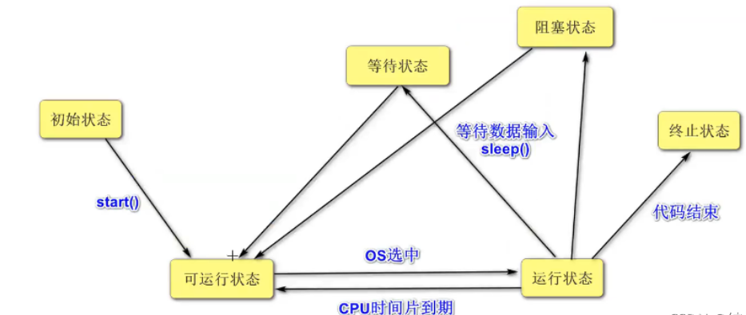

  

### 5 多线程编程的优势与存在的风险

多线程编程具有以下优势：

1. 提高系统的吞吐率(Throughout)。多线程编程可以使一个进程有多个并发 (concurrent，即同时进行的) 的操作；
2. 提高响应性(Responsiveness)。Web服务器会采用一些专门的线程负责用户的请求处理，缩短了用户的等待时间；
3. 充分利用多核 (Multicore) 处理器资源，通过多线程可以充分的利用CPU资源；

多线程编程存在的问题与风险：

1. 线程安全 (Thread safe) 问题。多线程共享数据时，如果没有采取正确的并发访问控制措施，就可能会产生数据一致性问题，如读取脏数据 (过期的数据)，如丢失数据更新；
2. 线程活性 (thread liveness) 问题。由于程序自身的缺陷或者由资源稀缺性导致线程一直处于非 RUNNABLE 状态，这就是线程活性问题，常见的活性故障有以下几种：
   1. 死锁 (Deadlock)，类似鹬蚌相争；
   2. 锁死 (Lockout)，类似于睡美人故事中王子挂了；
   3. 活锁 (Livelock)，类似于小猫咬自己尾巴；
   4. 饥饿 (Starvation)，类似于健壮的雏鸟总是从母鸟嘴中抢到食物，瘦弱的雏鸟会因为吃不到食物而被饿死。
3. 上下文切换 (Context Switch)，处理器从执行一个线程切换到执行另外一个线程；
4. 可靠性，可能会由一个线程导致 JVM 意外终止，其他的线程也无法执行。

------

## 二、线程安全问题

- 线程安全主要是指多个线程对同一个对象的实例变量进行操作时，会出现值被更改、值不同步的情况；
- 线程安全问题表现为三个方面：原子性、可见性和有序性。

### 1 原子性

原子 (Atomic) 就是不可分割的意思，原子操作的不可分割有两层含义：

1. 访问 (读、写)某个共享变量的操作从其他线程来看，该操作要么已经执行完毕，要么尚未发生，即其他线程看不到当前操作的中间结果；
2. 访问同一组共享变量的原子操作是不能够交叉的。

如现实生活中从ATM机取款，对于用户来说，要么操作成功，用户拿到钱，余额减少了，增加了一条交易记录；要么没拿到钱，相当于取款操作没有发生。

Java 有两种方式实现原子性：一种是使用锁；另一种利用处理器的 CAS(Compare and Swap) 指令。

1. 锁具有排它性，保证共享变量在某一时刻只能被一个线程访问；
2. CAS 指令直接在硬件 (处理器和内存) 层次上实现，看作是硬件锁。

```java
//演示线程的原子性问题
public class Test01 {
    public static void main(String[] args) {
        //启动两个线程，不断调用getNum()方法
        MyInt myInt = new MyInt();
        for (int i = 0; i < 2; i++){
            new Thread(new Runnable() {
                @Override
                public void run() {
                    while(true){
                        System.out.println(Thread.currentThread().getName() + " --> " + myInt.getNum());
                        try {
                            Thread.sleep(100);
                        } catch (InterruptedException e) {
                            e.printStackTrace();
                        }
                    }
                }
            }).start();
        }
    }

    //在java中提供了一个线程安全的AtomicInteger类，保证了操作的原子性
    static class MyInt{
        AtomicInteger num = new AtomicInteger();
        //int num;
        public int getNum() {
            return num.getAndIncrement();
            //return num++;
            /*
                ++自增操作实现的步骤：
                     读取num的值
                     num自增
                     把自增后的值再赋值给num变量
            */
        }
    }
}
```

### 2 可见性

在多线程环境中，一个线程对某个共享变量进行更新之后，后续其他的线程可能无法立即读到这个更新的结果，这就是线程安全问题的另外一种形式：可见性 (visibility)。

如果一个线程对共享变量更新后，后续访问该变量的其他线程可以读到更新的结果，称这个线程对共享变量的更新对其他线程可见，否则称这个线程对共享变量的更新对其他线程不可见。

多线程程序因为可见性问题可能会导致其他线程读取到了旧数据(脏数据)。

```java
public class Test02 {
    public static void main(String[] args) throws InterruptedException {
        MyTask task = new MyTask();
        new Thread(task).start();

        //主线程1秒后取消子线程
        Thread.sleep(1000);
        task.cancle();
        /*
            可能会出现以下情况：
                在main线程中调用了task.cancle()方法，把task对象的toCancel变量修改为true
                可能存在子线程看不到main线程对toCancle做的修改，在子线程中toCancle变量一直为false
            导致子线程看不到main线程对toCancle变量更新的原因，可能：
                1）JIT即时编译器可能会对run方法中while循环进行优化为：
                    if(!toCancle){
                        while(true){
                            if(doSomething()){}
                        }
                    }
                2）可能与计算机的存储系统有关，假设分别有两个cpu内核运行main线程与子程序，
                运行子线程的cpu无法立即读取运行main线程cpu中的数据。
        */
    }

    static class MyTask implements Runnable{
        private boolean toCancel = false;
        @Override
        public void run() {
            while (!toCancel){
                if(doSomething()){
                }
            }
            if(toCancel){
                System.out.println("任务被取消");
            }else{
                System.out.println("任务正常结束");
            }
        }

        private boolean doSomething() {
            System.out.println("执行某个任务...");
            try {
                //模拟执行任务的时间
                Thread.sleep(new Random().nextInt(1000));
            } catch (InterruptedException e) {
                e.printStackTrace();
            }
            return true;
        }

        public void cancle(){
            toCancel = true;
            System.out.println("收到取消线程的消息");
        }
    }
}
```

### 3 有序性

有序性 (Ordering) 是指在什么情况下一个处理器上运行的一个线程所执行的**内存访问操作**在另外一个处理器上运行的其他线程看来是**乱序**的 (Out of Order)。

乱序：是指内存访问操作的顺序看起来发生了变化。

#### 3.1 重排序

在多核处理器的环境下，编写的顺序结构，这种操作执行的顺序可能是没有保障的：

1. 编译器可能会改变两个操作的先后顺序；
2. 处理器也可能不会按照目标代码的顺序执行。

- 这种一个处理器上执行的多个操作，在其他处理器来看它的顺序与目标代码指定的顺序可能不一样，这种现象称为重排序。
- 重排序是对内存访问有序操作的一种优化，可以在不影响单线程程序正确的情况下提升程序的性能。但是，可能对多线程程序的正确性产生影响，即可能导致线程安全问题。
- 重排序与可见性问题类似，不是必然出现的。 

与内存操作顺序有关的几个概念：

1. 源代码顺序：就是源码中指定的内存访问顺序；
2. 程序顺序：处理器上运行的目标代码所指定的内存访问顺序；
3. 执行顺序：内存访问操作在处理器上的实际执行顺序；
4. 感知顺序：给定处理器所感知到的该处理器及其他处理器的内存访问操作的顺序。

可以把重排序分为**指令重排序**与**存储子系统重排序**两种。

1. 指令重排序主要是由 JIT 编译器、处理器引起的，指程序顺序与执行顺序不一样；
2. 存储子系统重排序是由高速缓存、写缓冲器引起的，感知顺序与执行顺序不一致。

#### 3.2 指令重排序

- 在源码顺序与程序顺序不一致，或者程序顺序与执行顺序不一致的情况下，我们就说发生了指令重排序 (Instruction Reorder)。
- 指令重排是一种动作，确实对指令的顺序做了调整，重排序的对象指令；
- javac 编译器一般不会执行指令重排序，而 JIT 编译器可能执行指令重排序；
- 处理器也可能执行指令重排序，使得执行顺序与程序顺序不一致；
- 指令重排不会对单线程程序的结果正确性产生影响，可能导致多线程程序出现非预期的结果。

#### 3.3 存储子系统重排序

- 存储子系统是指**写缓冲器**与**高速缓存**。
- 高速缓存 (Cache) 是 CPU 中为了匹配与主内存处理速度不匹配而设计的一个高速缓存；
- 写缓冲器 (Store buffer, Write buffer) 用来提高写高速缓存操作的效率。
- 即使处理器严格按照程序顺序执行两个内存访问操作，在存储子系统的作用下，其他处理器对这两个操作的感知顺序与程序顺序不一致，即这两个操作的顺序看起来像是发生了变化，这种现象称为存储子系统重排序；
- 存储子系统重排序并没有真正的对指令执行顺序进行调整，而是造成一种指令执行顺序被调整的现象。
- 存储子系统重排序对象是内存操作的结果。

从处理器角度来看，读内存就是从指定的 RAM 地址中加载数据到寄存器，称为 Load 操作；写内存就是把数据存储到指定的地址表示的 RAM 存储单元中，称为 Store 操作。内存重排序有以下四种可能：

1. LoadLoad 重排序，一个处理器先后执行两个读操作 L1 和 L2，其他处理器对两个内存操作的感知顺序可能是 L2 -> L1；
2. StoreStore 重排序，一个处理器先后执行两个写操作 W1 和 W2，其他处理器对两个内存操作的感知顺序可能是 W2 -> W1；
3. LoadStore 重排序，一个处理器先执行读内存操作 L1 再执行写内存操作 W1，其他处理器对两个内存操作的感知顺序可能是 W1 -> L1；
4. StoreLoad 重排序，一个处理器先执行写内存操作 W1 再执行读内存操作 L1，其他处理器对两个内存操作的感知顺序可能是 L1 -> W1。

内存重排序与具体的处理器微架构有关，不同架构的处理器所允许的内存重排序不同。

内存重排序可能会导致线程安全问题；

假设有两个共享变量 int data = 0; boolean ready = false;

| 处理器1                                     | 处理器2                                         |
| ------------------------------------------- | ----------------------------------------------- |
| data = 1;    //S1<br/>ready = true;    //S2 |                                                 |
|                                             | while(!ready){}    //L3 <br>sout(data);    //L4 |

#### 3.4 貌似串行语义

JIT 编译器、处理器、存储子系统是按照一定的规则对指令、内存操作的结果进行重排序，给单线程程序造成一种假象----指令是按照源码的顺序执行的。这种假象称为貌似串行语义，并不能保证多线程环境程序的正确性。

为了保证貌似串行语义，有数据依赖关系的语句不会被重排序，只有不存在数据依赖关系的语句才会被重排序。如果两个操作(指令)访问同一个变量，且其中一个操作(指令)为写操作，那么这两个操作之间就存在数据依赖关系(Data dependency)。

如：

- x = 1; y = x + 1;  //后一条语句的操作数包含前一条语句的执行结果；
- y = x; x = 1;  //先读取 x 变量，再更新 x 变量的值；
- x = 1; x = 2;  //两条语句同时对一个变量进行写操作

如果不存在数据依赖关系则可能重排序,如：

- double price = 45.8;
  int quantity = 10;
  double sum = price * quantity;

存在控制依赖关系的语句允许重排。一条语句(指令)的执行结果会决定另一条语句(指令)能否被执行，这两条语句(指令)存在控制依赖关系(Control Dependency)。如在 if 语句中允许重排，可能存在处理器先执行 if 代码块，再判断 if 条件是否成立。

#### 3.5 保证内存访问的顺序性

可以使用 volatile 关键字，synchronized 关键字实现有序性。

#### 3.6 happens-before

- 一方面，程序员需要JMM提供一个强的内存模型来编写代码；另一方面，编译器和处理器希望JMM对它们的束缚越少越好，这样它们就可以最可能多的做优化来提高性能，希望的是一个弱的内存模型。
- JMM考虑了这两种需求，并且找到了平衡点，对编译器和处理器来说，**只要不改变程序的执行结果（单线程程序和正确同步了的多线程程序），编译器和处理器怎么优化都行。**
- 而对于程序员，JMM提供了**happens-before规则**（JSR-133规范），满足了程序员的需求——**简单易懂，并且提供了足够强的内存可见性保证。**换言之，程序员只要遵循 `happens-before` 规则，那他写的程序就能保证在JMM中具有强的内存可见性。
- JMM使用`happens-before`的概念来定制两个操作之间的执行顺序。这两个操作可以在一个线程以内，也可以是不同的线程之间。因此，JMM可以通过`happens-before`关系向程序员提供跨线程的内存可见性保证。

`happens-before`关系的定义如下：

1. 如果一个操作happens-before另一个操作，那么第一个操作的执行结果将对第二个操作可见，而且第一个操作的执行顺序排在第二个操作之前。
2. 两个操作之间存在happens-before关系，并不意味着Java平台的具体实现必须要按照happens-before关系指定的顺序来执行。如果重排序之后的执行结果，与按happens-before关系来执行的结果一致，那么JMM也允许这样的重排序。

`as-if-serial`语义保证单线程内重排序后的执行结果和程序代码本身应有的结果是一致的，

`happens-before`关系保证正确同步的多线程程序的执行结果不被重排序改变。

总之，**如果操作A happens-before操作B，那么操作A在内存上所做的操作对操作B都是可见的，不管它们在不在一个线程。**

在Java中，有以下天然的happens-before关系：

- 程序顺序规则：一个线程中的每一个操作，`happens-before`于该线程中的任意后续操作。
- 监视器锁规则：对一个锁的解锁，`happens-before`于随后对这个锁的加锁。
- volatile变量规则：对一个volatile域的写，`happens-before`于任意后续对这个volatile域的读。
- 传递性：如果`A happens-before B`，且`B happens-before C`，那么`A happens-before C`。
- start规则：如果线程A执行操作`ThreadB.start()`启动线程B，那么A线程的`ThreadB.start()` 操作`happens-before`于线程B中的任意操作。
- join规则：如果线程A执行操作`ThreadB.join()` 并成功返回，那么线程B中的任意操作`happens-before`于线程A从`ThreadB.join()` 操作成功返回。
  

### 4 JVM 与 JMM

**JVM运行时数据**

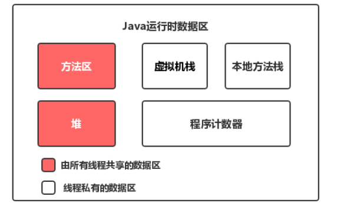

**对于每一个线程来说，栈都是私有的，而堆是共有的。**

也就是说在栈中的变量（局部变量、方法定义参数、异常处理器参数）不会在线程之间共享，也就不会有内存可见性的问题，也不受内存模型的影响。而在堆中的变量是共享的，本文称为共享变量。

所以，内存可见性是针对的**共享变量**。

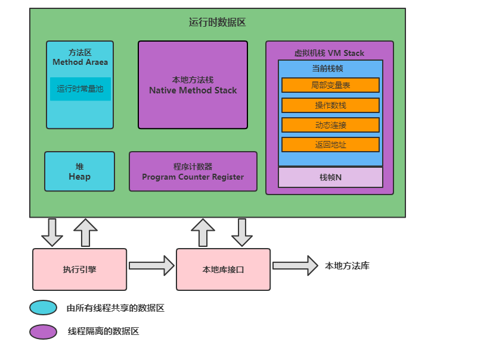

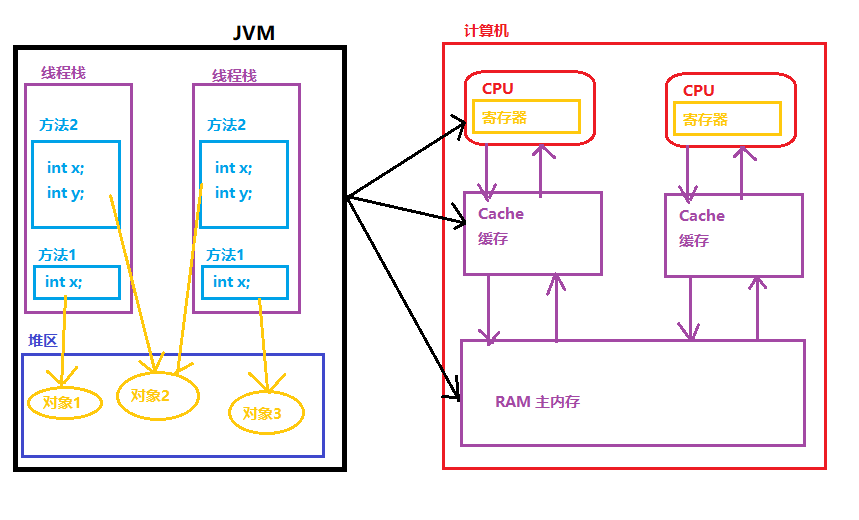

1. 每个线程都有独立的栈空间；
2. 每个线程都可以访问堆内存；
3. 计算机的CPU不直接从主内存中读取数据，CPU读取数据时，先把主内存的数据读到Cache缓存中，把Cache中的数据读到Register寄存器中；
4. JVM中的共享的数据可能会被分配到Register寄存器中，每个CPU都有自己的Register寄存器，一个CPU不能读取其它CPU上寄存器中的内容，如果两个线程分别运行在不同的处理器(CPU)上，而这个共享的数据被分配到寄存器上，会产生可见性问题。
5. 即使JVM中的共享数据分配到主内存中，也不能保证数据的可见性。CPU不直接对主内存访问，而是通过Cache高速缓存进行的。一个处理器上运行的线程对数据的更新可能只是更新到处理器的写缓冲器(Store Buffer)，还没有到达Cache缓存，更不用说主内存了；另外一个处理器不能读取到该处理器写缓冲器上的内容，会产生运行在另外一个处理器上的线程无法看到该处理器对共享数据的更新。
6. 一个处理器的Cache不能直接读取另外一个处理器的Cache，但是一个处理器可以通过缓存一致性协议(Cache Coherence Protocol)来读取其他处理器缓存中的数据，并将读取的数据更新到该处理器的Cache中。这个过程称为缓存同步。缓存同步使得一个处理器上运行的线程可以读取到另外一个处理器上运行的线程对共享数据的所做的更新，即保障了可见性。为了保障可见性，必须使一个处理器对共享数据的更新最终被写入该处理器的Cache，这种过程称为冲刷处理器缓存。

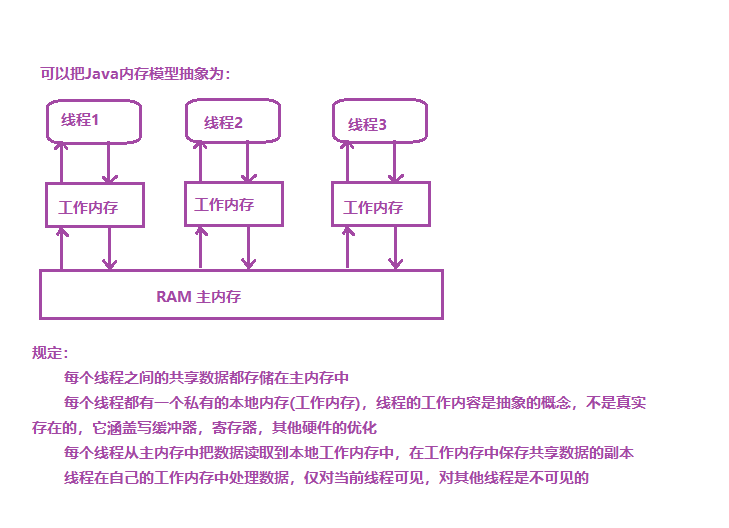

**JMM模型**

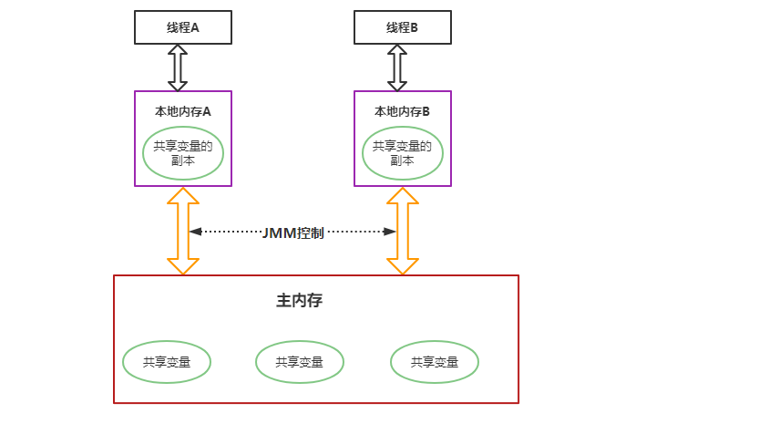

从图中可以看出：

1. 所有的共享变量都存在主内存中。
2. 每个线程都保存了一份该线程使用到的共享变量的副本。
3. 如果线程A与线程B之间要通信的话，必须经历下面2个步骤：
   1. 线程A将本地内存A中更新过的共享变量刷新到主内存中去。
   2. 线程B到主内存中去读取线程A之前已经更新过的共享变量。

**所以，线程A无法直接访问线程B的工作内存，线程间通信必须经过主内存。**

注意，根据JMM的规定，线程对共享变量的所有操作都必须在自己的本地内存中进行，不能直接从主内存中读取。

所以线程B并不是直接去主内存中读取共享变量的值，而是先在本地内存B中找到这个共享变量，发现这个共享变量已经被更新了，然后本地内存B去主内存中读取这个共享变量的新值，并拷贝到本地内存B中，最后线程B再读取本地内存B中的新值。

那么怎么知道这个共享变量的被其他线程更新了呢？这就是JMM的功劳了，也是JMM存在的必要性之一。**JMM通过控制主内存与每个线程的本地内存之间的交互，来提供内存可见性保证**。

`Java中的 volatile 关键字可以保证多线程操作共享变量的可见性以及禁止指令重排序，synchronized关键字不仅保证可见性，同时也保证了原子性（互斥性）。在更底层，JMM通过内存屏障来实现内存的可见性以及禁止重排序。为了程序员的方便理解，提出了happens-before，它更加的简单易懂，从而避免了程序员为了理解内存可见性而去学习复杂的重排序规则以及这些规则的具体实现方法。`

**JMM与Java内存区域划分的区别与联系**

- 区别

  两者是不同的概念层次。JMM是抽象的，他是用来描述一组规则，通过这个规则来控制各个变量的访问方式，围绕原子性、有序性、可见性等展开的。而Java运行时内存的划分是具体的，是JVM运行Java程序时，必要的内存划分。

- 联系

  都存在私有数据区域和共享数据区域。一般来说，JMM中的主内存属于共享数据区域，他是包含了堆和方法区；同样，JMM中的本地内存属于私有数据区域，包含了程序计数器、本地方法栈、虚拟机栈。

------

## 三、线程同步

### 1 线程同步机制简介

- 线程同步机制是一套用于协调线程之间的数据访问的机制，该机制可以保障线程安全。
- Java 平台提供的线程同步机制包括：锁、volatile 关键字、final 关键字、static 关键字，以及相关的 API，如Object.wait() / Object.notify() 等。

### 2 锁概述

- 线程安全问题的产生前提是多个线程并发访问共享数据。
- 将多个线程对共享数据的并发访问转换为串行访问，即一个共享数据一次只能被一个线程访问。锁就是复用这种思路来保障线程安全的。
- 锁 (Lock) 可以理解为对共享数据进行保护的一个许可证，对于同一个许可证保护的共享数据来说，任何线程想要访问这些共享数据必须先持有该许可证。一个线程只有在持有许可证的情况下才能对这些共享数据进行访问；并且一个许可证一次只能被一个线程持有；许可证线程在结束对共享数据的访问后必须释放其持有的许可证。
- 一线程在访问共享数据前必须先获得锁；获得锁的线程称为锁的持有线程；一个锁一次只能被一个线程持有。锁的持有线程在获得锁之后和释放锁之前这段时间所执行的代码称为临界区(Critical Section)。
- 锁具有排他性(Exclusive)，即一个锁一次只能被一个线程持有。这种锁称为**排它锁**或**互斥锁**(Mutex)。
- JVM 把锁分为内部锁和显示锁两种。内部锁通过 synchronized 关键字实现；显示锁通过 java.concurrent.locks.Lock 接口的实现类实现的。

#### 2.1 锁的作用

1. 锁可以实现对共享数据的安全访问。保障线程的原子性、可见性与有序性；
2. 锁是通过互斥保障原子性；一个锁只能被一个线程持有，这就保证临界区的代码一次只能被一个线程执行。使得临界区代码所执行的操作自然而然的具有不可分割的特性，即具备了原子性；
3. 可见性的保障是通过写线程冲刷处理器的缓存和读线程刷新处理器缓存这两个动作实现的。在 java 平台中，锁的获得隐含着刷新处理器缓存的动作，锁的释放隐含着冲刷处理器缓存的动作；
4. 锁能够保障有序性，写线程在临界区所执行的在读线程所执行的临界区看来像是完全按照源码顺序执行的。

注意：
使用锁保障线程的安全性，必须满足以下条件：

1. 这些线程在访问共享数据时必须使用同一个锁
2. 即使是读取共享数据的线程也需要使用同步锁

#### 2.2 锁相关的概念

1. 可重入性

   可重入性(Reentrancy)描述这样一个问题：一个线程持有该锁的时候能再次(多次)申请该锁

   如果一个线程持有一个锁的时候还能够继续成功申请该锁，称该锁是可重入的，否则就称该锁为不可重入的。

   ```java
   void methodA(){
   	申请A锁;
   	methodB();
   	释放A锁;
   }
   
   void methodB(){
   	申请A锁;
   	......
   	释放A锁;
   }
   ```

2. 锁的争用与调度

   Java 平台中内部锁属于非公平锁，显示 Lock 锁既支持公平锁又支持非公平锁

3. 锁的粒度

   一个锁可以保护的共享数据的数量大小称为锁的粒度。

   锁保护共享数据量大，称该锁的粒度粗，否则就称该锁的粒度细。

   锁的粒度过粗会导致线程在申请锁时会进行不必要的等待。锁的粒度过细会增加锁调度的开销。 

### 3 内部锁:synchronized 关键字

- Java 中的每个对象都有一个与之关联的内部锁(Intrinsic lock)。这种锁也称为监视器(Monitor)，这种内部锁是一种排他锁，可以保障原子性、可见性与有序性。

- 内部锁是通过 synchronized 关键字实现的。synchronized 关键字修饰代码块、修饰方法。

  ```
  修饰代码块的语法：
  	synchronized(对象锁){
  		同步代码块，可以在同步代码块中访问共享数据。
  	}
  ```

- 修饰实例方法就称为同步实例方法

- 修饰静态方法称称为同步静态方法

#### 3.1 synchronized 同步代码块

```java
package com.java.intrinsiclock;
/**
 * synchronized同步代码块
 * this锁对象
 */
public class Test01 {
    public static void main(String[] args) {
        //创建两个线程，分别调用mm()方法
        //先创建Test01对象，通过对象名调用mm()方法
        Test01 obj = new Test01();

        new Thread(new Runnable() {
            @Override
            public void run() {
                obj.mm();//使用的锁对象this就是obj对象
            }
        }).start();

        new Thread(new Runnable() {
            @Override
            public void run() {
                obj.mm();//使用的锁对象this也是obj对象
            }
        }).start();
    }

    //定义方法，打印100行数字
    public void mm(){
        //经常使用this当前对象作为锁对象
        synchronized (this){
            for(int i = 1; i <= 100; i++){
                System.out.println(Thread.currentThread().getName() + " --> " + i);
            }
        }
    }
}
/*
Thread-0 --> 1
Thread-0 --> 2
...
Thread-0 --> 100
Thread-1 --> 1
...
Thread-1 --> 99
Thread-1 --> 100
*/
```

```java
/**
 * synchronized同步代码块
 * 如果线程的锁不同，不能实现同步
 * 想要同步必须使用同一个锁对象
 */
public class Test02 {
    public static void main(String[] args) {
        //创建两个线程，分别调用mm()方法
        //先创建Test01的两个对象，通过对象名调用mm()方法
        Test02 obj = new Test02();
        Test02 obj2 = new Test02();

        new Thread(new Runnable() {
            @Override
            public void run() {
                obj.mm();//使用的锁对象this是obj对象
            }
        }).start();

        new Thread(new Runnable() {
            @Override
            public void run() {
                obj2.mm();//使用的锁对象this是obj2对象
            }
        }).start();
    }

    //定义方法，打印100行数字
    public void mm(){
        //经常使用this当前对象作为锁对象
        synchronized (this){
            for(int i = 1; i <= 100; i++){
                System.out.println(Thread.currentThread().getName() + " --> " + i);
            }
        }
    }
}
/*
...
Thread-0 --> 72
Thread-1 --> 53
Thread-1 --> 54
Thread-0 --> 73
...
*/
```

```java
package com.java.intrinsiclock;
/**
 * synchronized同步代码块
 * 使用一个常量作为锁对象
 */
public class Test03 {
    public static void main(String[] args) {
        //创建两个线程，分别调用mm()方法
        //先创建Test01对象，通过对象名调用mm()方法
        Test03 obj = new Test03();
        Test03 obj2 = new Test03();

        new Thread(new Runnable() {
            @Override
            public void run() {
                obj.mm();//使用的锁对象是OBJ常量
            }
        }).start();

        new Thread(new Runnable() {
            @Override
            public void run() {
                obj2.mm();//使用的锁对象是OBJ常量
            }
        }).start();
    }

    //定义一个常量
    public static final Object OBJ = new Object();

    //定义方法，打印100行数字
    public void mm(){
        //使用一个常量对象作为锁对象
        synchronized (OBJ){
            for(int i = 1; i <= 100; i++){
                System.out.println(Thread.currentThread().getName() + " --> " + i);
            }
        }
    }
}
/*
Thread-0 --> 1
Thread-0 --> 2
...
Thread-0 --> 100
Thread-1 --> 1
...
Thread-1 --> 99
Thread-1 --> 100
*/
```

```java
package com.java.intrinsiclock;
/**
 * synchronized同步代码块
 * 使用一个常量作为锁对象，不同方法中的同步代码块也可以同步
 */
public class Test04 {
    public static void main(String[] args) {
        //创建两个线程，分别调用mm()方法
        //先创建Test01对象，通过对象名调用mm()方法
        Test04 obj = new Test04();
        Test04 obj2 = new Test04();

        new Thread(new Runnable() {
            @Override
            public void run() {
                obj.mm();//使用的锁对象是OBJ常量
            }
        }).start();

        new Thread(new Runnable() {
            @Override
            public void run() {
                obj2.mm();//使用的锁对象是OBJ常量
            }
        }).start();

        new Thread(new Runnable() {
            @Override
            public void run() {
                sm();//使用的锁对象是OBJ常量
            }
        }).start();
    }

    //定义一个常量
    public static final Object OBJ = new Object();

    //实例方法，打印100行数字
    public void mm(){
        //使用一个常量对象作为锁对象
        synchronized (OBJ){
            for(int i = 1; i <= 100; i++){
                System.out.println(Thread.currentThread().getName() + " --> " + i);
            }
        }
    }

    //静态方法
    public static void sm(){
        //使用一个常量对象作为锁对象
        synchronized (OBJ){
            for(int i = 1; i <= 100; i++){
                System.out.println(Thread.currentThread().getName() + " --> " + i);
            }
        }
    }
}
/*
Thread-0 --> 1
Thread-0 --> 2
...
Thread-0 --> 100
Thread-2 --> 1
Thread-2 --> 2
...
Thread-2 --> 100
Thread-1 --> 1
Thread-1 --> 2
...
Thread-1 --> 99
Thread-1 --> 100
*/
```

#### 3.2 同步方法

```java
package com.java.intrinsiclock;

/**
 * synchronized同步实例方法
 *      把整个方法体作为同步代码块
 *      默认的锁对象是this对象
 */
public class Test05 {
    public static void main(String[] args) {
        //创建两个线程，分别调用mm()方法
        //先创建Test01对象，通过对象名调用mm()方法
        Test05 obj = new Test05();

        //一个线程调用mm()方法
        new Thread(new Runnable() {
            @Override
            public void run() {
                obj.mm();//使用的锁对象this就是obj对象
            }
        }).start();

        //另一个线程调用mm22()方法
        new Thread(new Runnable() {
            @Override
            public void run() {
                obj.mm22();//使用的锁对象this也是obj对象，可以同步
                //使用的锁对象this是刚刚new创建的一个新对象，不是同一个锁对象，不能同步
                //new Test05().mm22();
            }
        }).start();
    }

    //定义方法，打印100行数字
    public void mm(){
        //经常使用this当前对象作为锁对象
        synchronized (this){
            for(int i = 1; i <= 100; i++){
                System.out.println(Thread.currentThread().getName() + " --> " + i);
            }
        }
    }

    //定义方法，打印100行数字
    //使用synchronized修饰实例对象，同步实例方法，默认this作为锁对象
    public synchronized void mm22(){
        for(int i = 1; i <= 100; i++){
            System.out.println(Thread.currentThread().getName() + " --> " + i);
        }
    }
}
/*
Thread-0 --> 1
Thread-0 --> 2
...
Thread-0 --> 100
Thread-1 --> 1
...
Thread-1 --> 99
Thread-1 --> 100
*/
```

```java
package com.java.intrinsiclock;
/**
 * synchronized同步静态方法
 *      把整个方法体作为同步代码块
 *      默认的锁对象是当前类的运行时类对象,Test06.class,有人称它为类锁
 */
public class Test06 {
    public static void main(String[] args) {
        //创建两个线程，分别调用mm()方法
        //先创建Test01对象，通过对象名调用mm()方法
        Test06 obj = new Test06();

        //一个线程调用m1()方法
        new Thread(new Runnable() {
            @Override
            public void run() {
                obj.m1();//使用的锁对象是Test06.class
            }
        }).start();

        //另一个线程调用sm22()方法
        new Thread(new Runnable() {
            @Override
            public void run() {
                Test06.sm22();//使用的锁对象是Test06.class
            }
        }).start();
    }

    //定义方法，打印100行数字
    public void m1(){
        //使用当前类的运行时类对象作为锁对象，可以简单的理解为把Test06类的字节码文件作为锁对象
        synchronized (Test06.class){
            for(int i = 1; i <= 100; i++){
                System.out.println(Thread.currentThread().getName() + " --> " + i);
            }
        }
    }

    //定义方法，打印100行数字
    //使用synchronized修饰静态对象，同步静态方法，默认当前类的运行时类Test06.class作为锁对象
    public synchronized static void sm22(){
        for(int i = 1; i <= 100; i++){
            System.out.println(Thread.currentThread().getName() + " --> " + i);
        }
    }
}
/*
Thread-0 --> 1
Thread-0 --> 2
...
Thread-0 --> 100
Thread-1 --> 1
...
Thread-1 --> 99
Thread-1 --> 100
*/
```

```java
package com.java.intrinsiclock;

/**
 * 同步代码块与同步方法如何选择
 * 同步方法锁的粒度粗,执行效率低,同步代码块执行效率高
 */
public class Test07 {
    public static void main(String[] args) {
        Test07 obj = new Test07();

        new Thread(new Runnable() {
            @Override
            public void run() {
                obj.doLongTimeTask();
            }
        }).start();

        new Thread(new Runnable() {
            @Override
            public void run() {
                obj.doLongTimeTask();
            }
        }).start();
    }

    //同步代码块,锁的粒度细,执行效率高
    public void doLongTimeTask(){
        try {
            System.out.println("Task Begin");
            Thread.sleep(3000);//模拟任务需要准备3秒钟
            synchronized (this) {
                System.out.println("开始同步");
                for(int i = 1; i <= 100; i++){
                    System.out.println(Thread.currentThread().getName() + " --> " + i);
                }
            }
            System.out.println("Task End");
        } catch (InterruptedException e) {
            e.printStackTrace();
        }
    }

    //同步方法,执行效率低
    public synchronized void doLongTimeTask2(){
        try {
            System.out.println("Task Begin");
            Thread.sleep(3000);//模拟任务需要准备3秒钟
            System.out.println("开始同步");
            for(int i = 1; i <= 100; i++){
                System.out.println(Thread.currentThread().getName() + " --> " + i);
            }
            System.out.println("Task End");
        } catch (InterruptedException e) {
            e.printStackTrace();
        }
    }
}
```

#### 3.3 脏读

```java
package com.java.intrinsiclock;

/**
 * 脏读
 *      出现读取属性值出现了一些意外,读取的是中间值,而不是修改之后的值
 *      出现脏读的原因是: 对共享数据的修改与对共享数据的读取不同步
 * 解决方法：
 *      不仅对修改数据的代码块进行同步,还要对读取数据的代码块同步
 */
public class Test08 {
    public static void main(String[] args) throws InterruptedException {
        //开启子线程设置用户名和密码
        PublicValue publicValue = new PublicValue();
        SubThread t1 = new SubThread(publicValue);
        t1.start();

        //为了确定设置成功，等待100毫秒
        Thread.sleep(100);
        //在main线程中读取用户名和密码
        publicValue.getValue();
    }

    //定义线程，设置用户名和密码
    static class SubThread extends Thread{
        private PublicValue publicValue;
        public SubThread(PublicValue publicValue){
            this.publicValue = publicValue;
        }

        @Override
        public void run() {
            publicValue.setValue("rose", "123456");
        }
    }

    static class PublicValue{
        private String name = "jack";
        private String pwd = "666";

        public synchronized void getValue(){
        //public void getValue(){
            System.out.println(Thread.currentThread().getName() +
                    ", getter --- name: " + name + ", pwd: " + pwd);
        }

        public synchronized void setValue(String name, String pwd){
        //public void setValue(String name, String pwd){
            this.name = name;
            try {
                Thread.sleep(1000);//模拟操作name属性需要一定时间
            } catch (InterruptedException e) {
                e.printStackTrace();
            }
            this.pwd = pwd;
            System.out.println(Thread.currentThread().getName() +
                    ", setter --- name: " + name + ", pwd: " + pwd);
        }
    }
}
```

#### 3.4 线程出现异常会自动释放锁

```java
package com.java.intrinsiclock;

/**
 * 同步过程中线程出现异常,会自动释放锁对象
 */
public class Test09 {
    public static void main(String[] args) {
        //创建两个线程，分别调用mm()方法
        //先创建Test01对象，通过对象名调用mm()方法
        Test09 obj = new Test09();

        //一个线程调用m1()方法
        new Thread(new Runnable() {
            @Override
            public void run() {
                obj.m1();//使用的锁对象是Test09.class
            }
        }).start();

        //另一个线程调用sm22()方法
        new Thread(new Runnable() {
            @Override
            public void run() {
                Test09.sm22();//使用的锁对象是Test09.class
            }
        }).start();
    }

    //定义方法，打印100行数字
    public void m1(){
        //使用当前类的运行时类对象作为锁对象，可以简单的理解为把Test06类的字节码文件作为锁对象
        synchronized (Test09.class){
            for(int i = 1; i <= 100; i++){
                System.out.println(Thread.currentThread().getName() + " --> " + i);
                if(i == 50){
                    //把字符串转换为int类型时，如果字符串不符合数字格式会产生异常
                    Integer.parseInt("abc");
                }
            }
        }
    }

    //定义方法，打印100行数字
    //使用synchronized修饰静态对象，同步静态方法，默认当前类的运行时类Test06.class作为锁对象
    public synchronized static void sm22(){
        for(int i = 1; i <= 100; i++){
            System.out.println(Thread.currentThread().getName() + " --> " + i);
        }
    }
}
```

#### 3.5 死锁

```java
package com.java.intrinsiclock;

/**
 * 死锁
 *    在多线程程序中，同步时可能需要使用多个锁，如果获得锁的顺序不一致，可能会导致死锁
 * 如何避免死锁?
 *    当需要获得多个锁时,所有线程获得锁的顺序保持一致即可
 */
public class Test10 {
    public static void main(String[] args) {
        SubThread t1 = new SubThread();
        t1.setName("a");
        t1.start();

        SubThread t2 = new SubThread();
        t2.setName("b");
        t2.start();
    }

    static class SubThread extends Thread{
        private static final Object lock1 = new Object();
        private static final Object lock2 = new Object();

        @Override
        public void run() {
            if("a".equals(Thread.currentThread().getName())){
                synchronized (lock1){
                    System.out.println("a线程获得了lock1锁，还需要获得lock2锁");
                    synchronized (lock2){
                        System.out.println("a线程获得了lock1锁后，又获得lock2锁，可以干活了");
                    }
                }
            }
            if("b".equals(Thread.currentThread().getName())){
                synchronized (lock2){
                    System.out.println("b线程获得了lock2锁，还需要获得lock1锁");
                    synchronized (lock1){
                        System.out.println("b线程获得了lock2锁后，又获得lock1锁，可以干活了");
                    }
                }
            }
        }
    }
}
```

### 4 轻量级同步机制: volative 关键字

#### 4.1 volatile 的作用

volatile 关键的作用使变量在多个线程之间可见

```java
package com.java.voltaileTest;

public class Test01 {
    public static void main(String[] args) {
        //创建PrintString对象
        PrintString printString = new PrintString();
        //调用方法打印字符串
        printString.printStringMethod();

        //main线程睡眠1000毫秒
        try {
            Thread.sleep(1000);
        } catch (InterruptedException e) {
            e.printStackTrace();
        }
        System.out.println("在main线程修改打印标志");
        printString.setContinuePrint(false);
        //修改完打印标志后，运行程序，查看程序运行结果
        /*
        * 程序根本不会停止，因为printString.printStringMethod();方法调用后，
        * 该方法一直处于死循环状态，程序根本就执行不到printString.setContinuePrint(false);语句
        * */
        //解决方法：可以使用多线程技术
    }

    //定义类打印字符串
    static class PrintString{
        private boolean continuePrint = true;

        public PrintString setContinuePrint(boolean continuePrint){
            this.continuePrint = continuePrint;
            return this;
        }

        public void printStringMethod(){
            while(this.continuePrint){
                System.out.println(Thread.currentThread().getName());
                try {
                    Thread.sleep(500);
                } catch (InterruptedException e) {
                    e.printStackTrace();
                }
            }
        }
    }
}
```

```java
package com.java.voltaileTest;
/**
 * volatile 的作用可以强制线程从公共内存中读取变量的值,而不是从工作内存中读取
 */
public class Test02 {
    public static void main(String[] args) {
        //创建PrintString对象
        PrintString printString = new PrintString();

        //开启子线程，让子线程执行printString对象的printStringMethod()方法
        new Thread(new Runnable() {
            @Override
            public void run() {
                printString.printStringMethod();
            }
        }).start();

        //main线程睡眠1000毫秒
        try {
            Thread.sleep(1000);
        } catch (InterruptedException e) {
            e.printStackTrace();
        }
        System.out.println("在main线程修改打印标志");
        printString.setContinuePrint(false);
        //程序运行，查看在main线程中修改了打印标志之后，子线程打印是否可以结束打印
        //程序运行后，可能会出现死循环情况
        //分析原因：main线程修改了printString对象的打印标志后，子线程读不到
        //解决办法：使用volatile关键字修饰printString对象的打印标志
        //volatile 的作用可以强制线程从公共内存中读取变量的值，而不是从工作内存中读取
    }

    //定义类打印字符串
    static class PrintString{
        //private boolean continuePrint = true;
        private volatile boolean continuePrint = true;

        public PrintString setContinuePrint(boolean continuePrint){
            this.continuePrint = continuePrint;
            return this;
        }

        public void printStringMethod(){
            System.out.println(Thread.currentThread().getName() + " -> begin...");
            while(this.continuePrint){
                System.out.println("sub thread ...");
                //try {
                //    Thread.sleep(500);
                //} catch (InterruptedException e) {
                //    e.printStackTrace();
                //}
            }
            System.out.println(Thread.currentThread().getName() + " -> end...");
        }
    }
}
```

#### 4.2 volatile 与 synchronized 比较

1. volatile 关键字是线程同步的轻量级实现，所以volatile性能肯定比 synchronized 要好；volatile 只能修饰变量，而 synchronized 可以修饰方法、代码块。随着 JDK 新版本的发布，synchronized 的执行效率也有较大的提升，在开发中使用 sychronized 的比率还是很大的。
2. 多线程访问 volatile 变量不会发生阻塞，而 synchronized 可能会阻塞。
3. volatile 能保证数据的可见性，但是不能保证原子性；而synchronized 可以保证原子性，也可以保证可见性。
4. 关键字 volatile 解决的是变量在多个线程之间的可见性；synchronized 关键字解决多个线程之间访问公共资源的同步性。

#### 4.3 volatile 非原子特性

volatile 关键字增加了实例变量在多个线程之间的可见性，但是不具备原子性。

```java
 package com.java.voltaileTest;

/**
 * volatile 关键字不具备原子性
 */
public class Test03 {
    public static void main(String[] args) {
        //在main线程中创建10个子线程
        for (int i = 0; i < 10; i++){
            new MyThread().start();
        }
    }

    static class MyThread extends Thread{
        //volatile关键仅仅是表示所有线程从主内存读取count变量的值
        //volatile public static int count;
        public static int count;

        //下面这段代码运行后不是线程安全的，想要线程安全，需要使用synchronized进行同步
        //如果使用synchronized同步，也就不需要volatile关键字了
        /*public static void addCount(){
            for (int i = 0; i < 1000; i++){
                //count++ 不是原子操作
                count++;
            }
            System.out.println(Thread.currentThread().getName() + " count = " + count);
        }*/
        
        public synchronized static void addCount(){
            for (int i = 0; i < 1000; i++){
                //count++ 不是原子操作
                count++;
            }
            System.out.println(Thread.currentThread().getName() + " count = " + count);
        }

        @Override
        public void run() {
            addCount();
        }
    }
}
```

#### 4.4 常用原子类进行自增自减操作

我们知道 i++ 操作不是原子操作，除了使用 Synchronized 进行同步外，也可以使用 AtomicInteger/AtomicLong 原子类进行实现

```java
package com.java.voltaileTest;

import java.util.concurrent.atomic.AtomicInteger;

/**
 * 使用原子类进行自增
 */
public class Test04 {
    public static void main(String[] args) throws InterruptedException {
        //在main线程中创建10个子线程
        for (int i = 0; i < 10; i++){
            new MyThread().start();
        }
        Thread.sleep(1000);
        System.out.println(MyThread.count.get());
    }

    static class MyThread extends Thread{
        //使用AtomicInteger对象
        private static AtomicInteger count = new AtomicInteger();
        public static void addCount(){
            for (int i = 0; i < 1000; i++){
                //自增的后缀形式
                count.getAndIncrement();
            }
            System.out.println(Thread.currentThread().getName() + " count = " + count.get());
        }

        @Override
        public void run() {
            addCount();
        }
    }
}
```

### 5 CAS

- CAS (Compare And Swap) 是由硬件实现的；

- CAS 可以将 read - modify - write 这类的操作转换为原子操作；

- i++自增操作包括三个子操作：

  ​        从主内存读取 i 变量值，

  ​        对 i 的值加 1，

  ​        再把加 1 之后的值保存到主内存。

- CAS 原理：在把数据更新到主内存时，再次读取主内存变量的值，如果现在变量的值与期望的值 (操作起始时读取的值) 一样就更新。

理想状态：

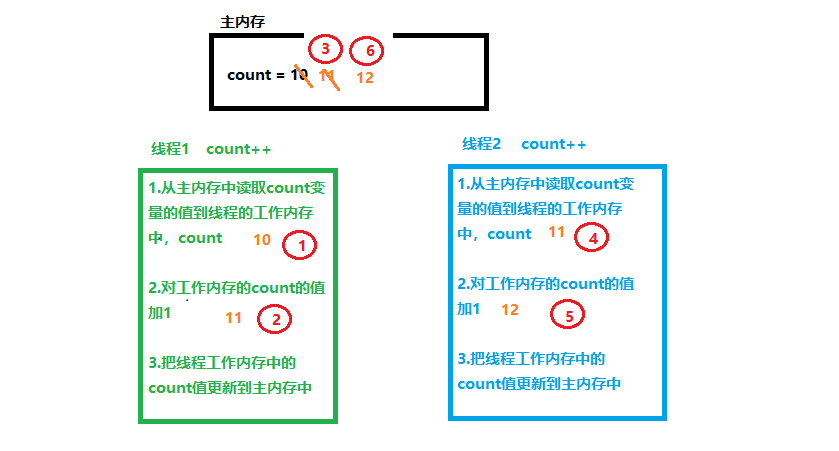

并发可能出现的状况：


**CAS就是把数据更新到主内存的共享变量前，再次读取主内存共享变量的值，如果现在读取的共享变量的值与期望的值一样就更新：**

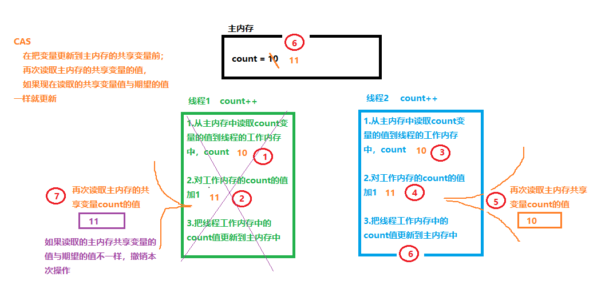

```java
package com.java.cas;
/**
 * 使用CAS实现一个线程安全的计数器
 */
public class CASTest {
    public static void main(String[] args) {
        CASCounter casCounter = new CASCounter();
        for(int i = 0; i < 1000000; i++){
            new Thread(new Runnable() {
                @Override
                public void run() {
                    System.out.println(casCounter.incrementAndGet());
                }
            }).start();
        }
    }
}

class CASCounter{
    //使用volatile修饰value值，使线程可见
    volatile private long value;

    public long getValue() {
        return value;
    }

    //定义compareAndSwap方法
    private boolean compareAndSwap(long expectedValue, long newValue){
        //如果当前value的值与期望的expectedValue值一样,就把当前的value字段替换为newValue值
        synchronized (this){
            if(value == expectedValue){
                value = newValue;
                return true;
            } else {
                return false;
            }
        }
    }

    //定义自增的方法
    public long incrementAndGet(){
        long oldValue;
        long newValue;
        do{
            oldValue = value;
            newValue = oldValue + 1;
        }while (!compareAndSwap(oldValue, newValue));
        return newValue;
    }
}
```

- CAS 实现原子操作背后有一个假设：共享变量的当前值与当前线程提供的期望值相同，就认为这个变量没有被其他线程修改过。

- 实际上这种假设不一定总是成立。

  如有共享变量 count = 0

  A 线程对 count 值修改为 10

  B 线程对 count 值修改为 20

  C 线程对 count 值修改为 0

  当前线程看到 count 变量的值现在是 0，现在是否认为 count 变量的值没有被其他线程更新呢？这种结果是否能够接受？？

  这就是 CAS 中的 ABA 问题，即共享变量经历了 A -> B -> A 的更新。

  是否能够接收 ABA 问题跟实现的算法有关。

  如果想要规避 ABA 问题，可以为共享变量引入一个修订号(时间戳)，每次修改共享变量时，相应的修订号就会增加1。 ABA 变量更新过程变量：[A,0] -> [B,1] -> [A,2]，每次对共享变量的修改都会导致修订号的增加，通过修订号依然可以准确判断变量是否被其他线程修改过。AtomicStampedReference 类就是基于这种思想产生的。

### 6 原子变量类

原子变量类基于CAS实现的，当对共享变量进行 read - modify - write 更新操作时，通过原子变量类可以保障操作的原子性与可见性。对变量的 read-modify-write 更新操作是指当前操作不是一个简单的赋值，而是变量的新值依赖变量的旧值，如自增操作i++，由于volatile只能保证可见性，无法保障原子性，原子变量类内部就是借助一个 Volatile 变量，并且保障了该变量的 read-modify-write 操作的原子性，有时把原子变量类看作增强的 volatile 变量。

原子变量类有 12 个，如：

| 分组       | 原子变量类                                                   |
| ---------- | ------------------------------------------------------------ |
| 基础数据型 | AtomicInteger、AtomicLong、AtomicBoolean                     |
| 数组型     | AtomicIntegerArray、AtomicLongArray、AtomicReferenceArray    |
| 字段更新器 | AtomicIntegerFieldUpdater、AtomicLongFieldUpdater、AtomicReferenceFieldUpdater |
| 引用型     | AtomicReference、AtomicStampedReference、AtomicMarkableReference |

#### 6.1 AtomicLong

```java
package com.java.atomics.atomiclong;

import java.util.concurrent.atomic.AtomicLong;

/**
 * 使用原子变量类定义一个计数器
 * 该计数器，在整个程序中都能使用，并且所有的地方都使用这一个计数器，这个计数器可以设计为单例
 */
public class Indicator {
    //构造方法私有化
    private Indicator(){
    }
    //定义一个私有的本类静态的对象
    private static final Indicator INSTANCE = new Indicator();
    //提供一个公共静态方法返回该类唯一实例
    public static Indicator getInstance(){
        return INSTANCE;
    }

    //使用原子变量类保存请求总数，成功数，失败数
    private final AtomicLong requestCount = new AtomicLong(0);//记录请求总数
    private final AtomicLong successCount = new AtomicLong(0);//处理成功总数
    private final AtomicLong failCount = new AtomicLong(0);//处理失败总数

    //有新的请求
    public void newRequestReceive(){
        requestCount.incrementAndGet();
    }
    //处理成功
    public void requestProcessSuccess(){
        successCount.incrementAndGet();
    }
    //处理失败
    public void requestProcessFail(){
        failCount.incrementAndGet();
    }

    //查看总数，成功数，失败数
    public long getRequestCount(){
        return requestCount.get();
    }
    public long getSuccessCount(){
        return successCount.get();
    }
    public long getFailCount(){
        return failCount.get();
    }
}
```

```java
package com.java.atomics.atomiclong;

import java.util.Random;

/**
 * 模拟服务器的请求总数，处理成功数，处理失败数
 */
public class Test {
    public static void main(String[] args) throws InterruptedException {
        //通过线程来模拟请求,在实际应用中可以在ServletFilter中调用Indicator计数器的相关方法
        for(int i = 0; i < 10000; i++){
            new Thread(new Runnable() {
                @Override
                public void run() {
                    //每个线程就是一个请求，请求总数要加1
                    Indicator.getInstance().newRequestReceive();
                    int num = new Random().nextInt();
                    if(num % 2 == 0){ //偶数模拟成功
                        Indicator.getInstance().requestProcessSuccess();
                    } else { // 处理失败
                        Indicator.getInstance().requestProcessFail();
                    }
                }
            }).start();
        }

        Thread.sleep(1000);
        //打印结果
        System.out.println("Total: " + Indicator.getInstance().getRequestCount());
        System.out.println("Success: " + Indicator.getInstance().getSuccessCount());
        System.out.println("Fail: " + Indicator.getInstance().getFailCount());
    }
}
```

#### 6.2 AtomicIntegerArray

原子更新数组

```java
package com.java.atomics.atomicIngeterArray;

import java.util.concurrent.atomic.AtomicIntegerArray;

/**
 * AtomicIntegerArray的基本操作
 * 原子更新数组
 */
public class Test {
    public static void main(String[] args) {
        // 1)创建一个指定长度的原子数组
        AtomicIntegerArray atomicIntegerArray = new AtomicIntegerArray(10);
        System.out.println(atomicIntegerArray);//[0, 0, 0, 0, 0, 0, 0, 0, 0, 0]

        // 2)返回指定位置的元素
        System.out.println(atomicIntegerArray.get(0));//0
        System.out.println(atomicIntegerArray.get(1));//0

        // 3)设置指定位置的元素
        atomicIntegerArray.set(5, 10);
        System.out.println(atomicIntegerArray.get(5));//10

        // 4)在设置数组元素的新值时，同时返回数组元素的旧值
        System.out.println(atomicIntegerArray.getAndSet(1, 11));//0
        System.out.println(atomicIntegerArray);//[0, 11, 0, 0, 0, 10, 0, 0, 0, 0]

        // 5)修改数组元素的值，把数组元素加上某个值
        System.out.println(atomicIntegerArray.addAndGet(0, 22)); //22
        System.out.println(atomicIntegerArray.addAndGet(1, 33)); //44
        System.out.println(atomicIntegerArray);//[22, 44, 0, 0, 0, 10, 0, 0, 0, 0]

        // 6)CAS操作
        // 如果数组中索引值为0的元素的值为22的话，就修改为322
        System.out.println(atomicIntegerArray.compareAndSet(0, 22, 322));//true
        System.out.println(atomicIntegerArray.compareAndSet(1, 11, 322));//false
        System.out.println(atomicIntegerArray);//[322, 44, 0, 0, 0, 10, 0, 0, 0, 0]

        // 7)自增/自减
        System.out.println(atomicIntegerArray.incrementAndGet(0));//323  ++i
        System.out.println(atomicIntegerArray.getAndIncrement(1));//44   i++
        System.out.println(atomicIntegerArray);//[323, 45, 0, 0, 0, 10, 0, 0, 0, 0]
        System.out.println(atomicIntegerArray.decrementAndGet(2));//-1  --i
        System.out.println(atomicIntegerArray.getAndDecrement(3));//0   i--
        System.out.println(atomicIntegerArray);//[323, 45, -1, -1, 0, 10, 0, 0, 0, 0]
    }
}
```

```java
package com.java.atomics.atomicIngeterArray;

import java.util.concurrent.atomic.AtomicIntegerArray;

/**
 * 在多线程中使用AtomicIntegerArray原子数组
 */
public class Test02 {
    //定义原子数组
    static AtomicIntegerArray atomicIntegerArray = new AtomicIntegerArray(10);

    public static void main(String[] args) {
        //定义线程数组
        Thread[] threads = new Thread[10];
        //给线程数组元素赋值
        for(int i = 0; i < threads.length; i++){
            threads[i] = new AddThread();
        }
        //启动子线程
        for (Thread thread : threads){
            thread.start();
        }
        //在主线程中查看自增完以后原子数组中的各个元素的值，在主线程中需要在所有子线程都执行完后再查看
        //把所有的子线程合并到当前主线程中
        for (Thread thread : threads){
            try {
                thread.join();
            } catch (InterruptedException e) {
                e.printStackTrace();
            }
        }
        System.out.println(atomicIntegerArray);
        //[10000, 10000, 10000, 10000, 10000, 10000, 10000, 10000, 10000, 10000]
    }

    //定义一个线程类，在线程类中修改原子数组
    static class AddThread extends Thread{
        @Override
        public void run() {
            //把原子数组的每个元素自增1000次
            for (int i = 0; i < 1000; i++){
                for(int j = 0; j < atomicIntegerArray.length(); j++){
                    atomicIntegerArray.getAndIncrement(j);
                }
            }
        }
    }
}
```

#### 6.3 AtomicIntegerFieldUpdate

AtomicIntegerFieldUpdater 可以对原子整数字段进行更新，要求：

1. 字符必须使用 volatile 修饰，使线程之间可见
2. 只能是实例变量，不能是静态变量，也不能使用 final 修饰

```java
package com.java.atomics.atomicIntegerFieldUpdater;

/**
 * 使用AtomicIntegerFieldUpdater更新的字段必须使用volatile修饰
 */
public class User {
    int id;
    volatile int age;
    public User(int id, int age){
        this.id = id;
        this.age = age;
    }
    @Override
    public String toString() {
        return "User{" +
                "id=" + id +
                ", age=" + age +
                '}';
    }
}
```

```java
package com.java.atomics.atomicIntegerFieldUpdater;

import java.util.concurrent.atomic.AtomicIntegerFieldUpdater;

/**
 * 线程类
 */
public class SubThread extends Thread{
    private User user; //要更新的User对象

    //创建AtomicIntegerFieldUpdater更新器
    private AtomicIntegerFieldUpdater<User> updater = AtomicIntegerFieldUpdater.newUpdater(User.class, "age");

    public SubThread(User user) {
        this.user = user;
    }

    @Override
    public void run() {
        //在子线程中对user对象的age字段自增10次
        for (int i = 0; i < 10; i++){
            System.out.println(updater.getAndIncrement(user));
        }
    }
}
```

```java
package com.java.atomics.atomicIntegerFieldUpdater;

public class Test {
    public static void main(String[] args) throws InterruptedException {
        User user = new User(1234, 10);
        //开启10个线程
        for(int i = 0; i < 10; i++){
            new SubThread(user).start();
        }
        Thread.sleep(1000);
        System.out.println(user);// User{id=1234, age=110}
    }
}
```

#### 6.4 AtomicReference

可以原子读写一个对象

```java
package com.java.atomics.atomicReference;

import java.util.concurrent.atomic.AtomicReference;

/**
 * 使用AtomicReference原子读写一个对象
 */
public class Test {
    //创建一个AtomicReference对象
    static AtomicReference<String> atomicReference = new AtomicReference<>("abc");

    public static void main(String[] args) throws InterruptedException {
        //创建100个线程修改字符串
        for (int i = 0; i < 100; i++){
            new Thread(new Runnable() {
                @Override
                public void run() {
                    if(atomicReference.compareAndSet("abc", "def")){
                        System.out.println(Thread.currentThread().getName() + " 把字符串abc更改为def");
                    }
                }
            }).start();
        }

        //再创建100个线程
        for (int i = 0; i < 100; i++){
            new Thread(new Runnable() {
                @Override
                public void run() {
                    if(atomicReference.compareAndSet("def", "abc")){
                        System.out.println(Thread.currentThread().getName() + " 把字符串def还原为abc");
                    }
                }
            }).start();
        }

        Thread.sleep(1000);
        System.out.println(atomicReference);
    }
}
```

```java
package com.java.atomics.atomicReference;

import java.util.concurrent.atomic.AtomicReference;

/**
 * 演示AtomicReference可能会出现CAS的ABA问题
 */
public class Test02 {
    private static AtomicReference<String> atomicReference = new AtomicReference<>("abc");
    public static void main(String[] args) throws InterruptedException {
        //创建第一个线程，先把字符串abc改为def，再把字符串还原为abc
        Thread t1 = new Thread(new Runnable() {
            @Override
            public void run() {
                atomicReference.compareAndSet("abc", "def");
                System.out.println(Thread.currentThread().getName() + " -- " + atomicReference.get());
                atomicReference.compareAndSet("def", "abc");
            }
        });

        Thread t2 = new Thread(new Runnable() {
            @Override
            public void run() {
                try {
                    Thread.sleep(1);
                } catch (InterruptedException e) {
                    e.printStackTrace();
                }
                System.out.println(atomicReference.compareAndSet("abc", "ghg"));
            }
        });

        t1.start();
        t2.start();
        t1.join();
        t2.join();
        System.out.println(atomicReference);
    }
}
```

```java
package com.java.atomics.atomicReference;

import java.util.concurrent.atomic.AtomicReference;
import java.util.concurrent.atomic.AtomicStampedReference;

/**
 * AtomicStampedReference原子类可以解决CAS中的ABA问题
 * 在AtomicStampedReference原子类中有一个标记值stamp,
 * 每次执行CAS操作时，需要对比它的版本，即比较stamp的值
 */
public class Test03 {
    //private static AtomicReference<String> atomicReference = new AtomicReference<>("abc");
    //定义AtomicStampedReference引用操作"abc"字符串，指定初始化版本号为0
    private static AtomicStampedReference<String> stampedReference = new AtomicStampedReference<>("abc", 0);
    public static void main(String[] args) throws InterruptedException {
        //创建第一个线程，先把字符串abc改为def，再把字符串还原为abc
        Thread t1 = new Thread(new Runnable() {
            @Override
            public void run() {
                stampedReference.compareAndSet("abc", "def",
                        stampedReference.getStamp(), stampedReference.getStamp() + 1);
                System.out.println(Thread.currentThread().getName() + " -- " + stampedReference.getReference());
                stampedReference.compareAndSet("def", "abc",
                        stampedReference.getStamp(), stampedReference.getStamp() + 1);
            }
        });

        Thread t2 = new Thread(new Runnable() {
            @Override
            public void run() {
                int stamp = stampedReference.getStamp();//获得版本号
                try {
                    Thread.sleep(1);
                } catch (InterruptedException e) {
                    e.printStackTrace();
                }
                System.out.println(stampedReference.compareAndSet("abc", "ggg", stamp, stamp + 1));
            }
        });

        t1.start();
        t2.start();
        t1.join();
        t2.join();
        System.out.println(stampedReference.getReference());
    }
}
```

------

## 四、线程间的通信

### 1 等待/通知机制

#### 1.1 什么是等待通知机制

- 在单线程编程中，要执行的操作需要满足一定的条件才能执行，可以把这个操作放在 if 语句块中。

- 在多线程编程中，可能 A 线程的条件没有满足只是暂时的，稍后其他的线程 B 可能会更新条件使得 A 线程的条件得到满足。可以将 A 线程暂停，直到它的条件得到满足后再将 A 线程唤醒。

  ```java
  伪代码:
  	atomics{ //原子操作
  		while( 条件不成立 ){
  			等待
  		}
  		当前线程被唤醒条件满足后,继续执行下面的操作
  	}
  ```

#### 1.2 等待/通知机制的实现

- Object 类中的 wait() 方法可以使执行当前代码的线程等待，暂停执行，直到接到通知或被中断为止。

  注意：

  1) wait()方法只能在同步代码块中由**锁对象**调用；
  1) 调用 wait() 方法，当前线程会释放锁。

  ```java
  其伪代码如下:
  	//在调用wait()方法前获得对象的内部锁
  	synchronized( 锁对象 ){
  		while( 条件不成立 ){
  			//通过锁对象调用 wait()方法暂停线程,会释放锁对象
  			锁对象.wait();
  		}
  		//线程的条件满足了继续向下执行
  	}
  ```

- Object 类的 notify() 可以唤醒线程，该方法也必须在同步代码块中由锁对象调用。没有使用锁对象调用 wait()/notify() 会抛出 IlegalMonitorStateExeption 异常。如果有多个等待的线程，notify()方法只能唤醒其中的一个。在同步代码块中调用 notify()方法后，并不会立即释放锁对象，需要等当前同步代码块执行完后才会释放锁对象，一般将 notify()方法放在同步代码块的最后。

  ```java
  伪代码如下:
  	synchronized( 锁对象 ){
  		//执行修改保护条件的代码
  		//唤醒其他线程
  		锁对象.notify();
  	}
  ```

```java
package com.java.wait;

/**
 * 演示wait()/notify()方法需要放在同步代码块中
 * 任何对象都可以调用wait()/notify()，这两个方法是从Object类继承来的
 */
public class Test01 {
    public static void main(String[] args) {
        try{
            String test = "HelloWorld";
            // wait()/notify()方法需要放在同步代码块中
            test.wait();//java.lang.IllegalMonitorStateException
        } catch (InterruptedException e) {
            e.printStackTrace();
        }
    }
}
```

```java
package com.java.wait;

/**
 * wait()会使线程等待
 * 需要放在同步代码块中，通过锁对象调用
 */
public class Test02 {
    public static void main(String[] args) {
        try{
            String test = "HelloWorld";
            String anOther = "HelloWorld";
            System.out.println("同步前的代码");
            synchronized (test){
                System.out.println("同步代码块开始....");
                //调用wait()方法后，当前线程就会等待，释放锁对象，当前线程需要被唤醒，如果没有被唤醒，就会一直等待
                test.wait();
                //anOther.wait();//不是锁对象会产生java.lang.IllegalMonitorStateException异常
                System.out.println("wait后面的代码....");
            }
            System.out.println("同步代码块后面的代码");
        } catch (InterruptedException e) {
            e.printStackTrace();
        }
    }
}
/*
同步前的代码
同步代码块开始....
*/
```

```java
package com.java.wait;

/**
 * 需要通过notify()唤醒等待的线程
 */
public class Test03 {
    public static void main(String[] args) throws InterruptedException {
        String lock = "Hello"; //定义一个字符串作为锁对象
        Thread t1 = new Thread(new Runnable() {
            @Override
            public void run() {
                synchronized (lock){
                    System.out.println("线程1开始等待" + System.currentTimeMillis());
                    try {
                        lock.wait();//线程等待，会释放锁对象，当前线程转入blocked堵塞状态
                    } catch (InterruptedException e) {
                        e.printStackTrace();
                    }
                    System.out.println("线程1结束等待" + System.currentTimeMillis());
                }
            }
        });

        //定义第二个线程，在第二个线程中唤醒第一个线程
        Thread t2 = new Thread(new Runnable() {
            @Override
            public void run() {
                //notify()方法也需要在同步代码块中，由锁对象调用
                synchronized (lock){
                    System.out.println("线程2开始唤醒：" + System.currentTimeMillis());
                    lock.notify();//唤醒lock锁对象上等待的某一个线程
                    System.out.println("线程2结束唤醒：" + System.currentTimeMillis());
                }
            }
        });

        t1.start();//开启t1线程，t1线程等待
        Thread.sleep(3000);//main线程睡眠3秒，确保t1线程等待
        t2.start();//t1线程开启之后，再开启t2线程唤醒t1线程
    }
}
/*
线程1开始等待1648458369149
线程2开始唤醒：1648458372149
线程2结束唤醒：1648458372149
线程1结束等待1648458372149
*/
```

```java
package com.java.wait;

import java.util.ArrayList;
import java.util.List;

/**
 * notify()代码后不会立即释放锁对象
 */
public class Test04 {
    public static void main(String[] args) throws InterruptedException {
        //定义一个List集合存储String数据
        List<String> list = new ArrayList<>();

        //定义第一个线程，当list集合中元素的数量不等于5时等待
        Thread t1 = new Thread(new Runnable() {
            @Override
            public void run() {
                synchronized (list){
                    if(list.size() != 5){
                        System.out.println("线程1开始等待 " + System.currentTimeMillis());
                        try {
                            list.wait();
                        } catch (InterruptedException e) {
                            e.printStackTrace();
                        }
                        System.out.println("线程1被唤醒 " + System.currentTimeMillis());
                    }
                }
            }
        });

        //定义第二个线程，向list集合中添加元素
        Thread t2 = new Thread(new Runnable() {
            @Override
            public void run() {
                //notify()方法也需要在同步代码块中，由锁对象调用
                synchronized (list){
                    for (int i = 0; i < 10; i++){
                        list.add("add ---> " + i);
                        System.out.println("线程2添加了第" + (i+1) + "个数据");

                        //判断元素的数量是否满足唤醒线程1
                        if(list.size() == 5){
                            list.notify();//唤醒线程,不会立即释放锁对象,需要等到当前同步代码块都执行完毕后才能释放锁对象
                            System.out.println("线程2已经发送唤醒通知");
                        }
                        try {
                            Thread.sleep(1000);
                        } catch (InterruptedException e) {
                            e.printStackTrace();
                        }
                    }
                }
            }
        });

        t1.start();
        //为了确保t2线程在t1线程之后开启，即让main线程先睡眠
        Thread.sleep(500);
        t2.start();
    }
}
/*
线程1开始等待 1648459682732
线程2添加了第1个数据
线程2添加了第2个数据
线程2添加了第3个数据
线程2添加了第4个数据
线程2添加了第5个数据
线程2已经发送唤醒通知
线程2添加了第6个数据
线程2添加了第7个数据
线程2添加了第8个数据
线程2添加了第9个数据
线程2添加了第10个数据
线程1被唤醒 1648459693237
*/
```

#### 1.3 interrupt()方法会中断 wait()

当线程处于 wait() 等待状态时，调用线程对象的 interrupt() 方法会中断线程的等待状态，会产生 InterruptedException 异常。

```java
package com.java.wait;

/**
 * interrupt()会中断线程的wait()等待
 */
public class Test05 {
    public static void main(String[] args) throws InterruptedException {
        SubThread t = new SubThread();
        t.start();
        //主线程睡眠2秒,确保子线程处于wait等待状态
        Thread.sleep(2000);
        t.interrupt();
    }

    //定义常量作为锁对象
    private static final Object LOCK = new Object();
    static class SubThread extends Thread{
        @Override
        public void run() {
            synchronized (LOCK){
                try {
                    System.out.println("begin wait ...");
                    LOCK.wait();
                    System.out.println("end wait ...");
                } catch (InterruptedException e) {
                    System.out.println("wait等待被中断");
                }
            }
        }
    }
}
/*
begin wait ...
wait等待被中断
*/
```

#### 1.4 notify() 与 notifyAll()

notify()一次只能唤醒一个线程，如果有多个等待的线程，只能随机唤醒其中的某一个；想要唤醒所有等待线程，需要调用 notifyAll()。

```java
package com.java.wait;

/**
 * notify() 与 notifyAll()
 */
public class Test06 {
    public static void main(String[] args) throws InterruptedException {
        //定义一个对象作为子线程的锁对象
        Object lock = new Object();
        SubThread t1 = new SubThread(lock);
        SubThread t2 = new SubThread(lock);
        SubThread t3 = new SubThread(lock);
        t1.setName("t1");
        t2.setName("t2");
        t3.setName("t3");
        t1.start();
        t2.start();
        t3.start();

        Thread.sleep(2000);
        //调用notify()唤醒子线程
        synchronized (lock){
            //调用一次notify()只能唤醒其中的一个线程,其它等待的线程依旧处于等待状态
            //对于等待状态的线程来说，错过了通知信号，这种现象也称为信号丢失
            //lock.notify();
            //调用notifyAll()唤醒所有的线程
            lock.notifyAll();
        }
    }

    static class SubThread extends Thread{
        //声明实例变量作为锁对象
        private Object lock;
        public SubThread(Object lock) {
            this.lock = lock;
        }

        @Override
        public void run() {
            synchronized (lock){
                try {
                    System.out.println(Thread.currentThread().getName() + "---> begin wait");
                    lock.wait();
                    System.out.println(Thread.currentThread().getName() + "---> end wait");
                } catch (InterruptedException e) {
                    e.printStackTrace();
                }
            }
        }
    }
}
```

#### 1.5 wait(long)的使用

wait(long) 带有 long 类型参数的 wait() 等待，如果在参数指定的时间内没有被唤醒，超时后会自动唤醒。

```java
package com.java.wait;

/**
 * wait(long)
 */
public class Test07 {
    public static void main(String[] args) {
        final Object obj = new Object();
        Thread t = new Thread(new Runnable() {
            @Override
            public void run() {
                synchronized (obj){
                    try {
                        System.out.println("begin wait...");
                        obj.wait(5000);//如果5秒内没有被唤醒，会自动唤醒
                        System.out.println("end wait...");
                    } catch (InterruptedException e) {
                        e.printStackTrace();
                    }
                }
            }
        });
        t.start();
    }
}
```

#### 1.6 通知过早

线程 wait() 等待后，可以调用 notify() 唤醒线程，如果 notify() 唤醒的过早，在等待之前就调用了 notify() 可能会打乱程序正常的运行逻辑。

```java
package com.java.wait;

/**
 * notify()通知过早
 */
public class Test08 {
    public static void main(String[] args) {
        //定义对象作为锁对象
        final Object lock = new Object();
        Thread t1 = new Thread(new Runnable() {
            @Override
            public void run() {
                synchronized (lock){
                    try {
                        System.out.println("begin wait...");
                        lock.wait();
                        System.out.println("end wait...");
                    } catch (InterruptedException e) {
                        e.printStackTrace();
                    }
                }
            }
        });

        Thread t2 = new Thread(new Runnable() {
            @Override
            public void run() {
                synchronized (lock){
                    System.out.println("begin notify ...");
                    lock.notify();
                    System.out.println("end notify ...");
                }
            }
        });

        //如果先开启t1，再开启t2线程，大多数情况下，t1先等待，t2再把t1唤醒
        //t1.start();
        //t2.start();

        //如果先开启t2通知线程，再开启t1等待线程，可能会出现t1等待线程没有收到通知的情况
        t2.start();
        t1.start();
    }
}
```

```java
package com.java.wait;

/**
 * notify()通知过早，就不让线程等待了
 */
public class Test09 {
    static boolean isFirst = true;//定义静态变量作为是否第一个运行的线程标志
    public static void main(String[] args) {
        //定义对象作为锁对象
        final Object lock = new Object();
        Thread t1 = new Thread(new Runnable() {
            @Override
            public void run() {
                synchronized (lock){
                    while (isFirst){ //当前线程是第一个开启的线程就等待
                        try {
                            System.out.println("begin wait...");
                            lock.wait();
                            System.out.println("end wait...");
                        } catch (InterruptedException e) {
                            e.printStackTrace();
                        }
                    }
                }
            }
        });

        Thread t2 = new Thread(new Runnable() {
            @Override
            public void run() {
                synchronized (lock){
                    System.out.println("begin notify ...");
                    lock.notify();
                    System.out.println("end notify ...");
                    isFirst = false; // 通知后，就把第一个线程标志修改为false
                }
            }
        });

        //如果先开启t1，再开启t2线程，大多数情况下，t1先等待，t2再把t1唤醒
        //t1.start();
        //t2.start();

        //如果先开启t2通知线程，再开启t1等待线程，可能会出现t1等待线程没有收到通知的情况
        t2.start();
        t1.start();

        /*
            实际上，调用start()方法就是告诉我们线程调度器，当前线程准备就绪，线程调度器准备
            什么时候开启这个线程不确定，即调用start()方法的顺序，并不一定就是线程实际开启的顺序。
            在当前示例中，为了保证t1等待后让t2线程唤醒，如果t2线程先唤醒了，就不让t1线程等待了
         */
    }
}
```

#### 1.7 wait 等待条件发生了变化

在使用 wait/nofity 模式时，注意 wait 条件发生了变化，也可能会造成逻辑的混乱。

```java
package com.java.wait;

import java.util.ArrayList;
import java.util.List;

/**
 * wait()条件发生变化
 *  定义一个集合
 *  定义一个线程向集合中的添加数据，添加完数据后通知另外的线程从集合中取数据
 *  定义一个线程从集合中取数据，如果集合中没有数据就等待
 */
public class Test10 {
    public static void main(String[] args) {
        //定义添加数据的线程对象
        ThreadAdd threadAdd = new ThreadAdd();
        //定义取数据的线程对象
        ThreadSubtract threadSubtract = new ThreadSubtract();
        threadSubtract.setName("subtract 1");

        //测试一：先开启添加数据的线程，再开启一个取数据的线程，大多数情况下会正常取数据，无需等待
        //threadAdd.start();
        //threadSubtract.start();

        //测试二：先开启取数据的线程，在开启添加数据的线程，取数据的线程会先等待，等到添加数据之后，再取数据
        //threadSubtract.start();
        //threadAdd.start();

        //测试三：开启两个取数据的线程，再开启添加数据的线程
        ThreadSubtract threadSubtract2 = new ThreadSubtract();
        threadSubtract2.setName("subtract 2");
        threadSubtract.start();
        threadSubtract2.start();
        threadAdd.start();
        /*
            某一次结果如下
                subtract 1 begin wait...
                Thread-0存储了一个数据
                subtract 2从集合中取了data后，集合中数据的数量：0
                subtract 1 end wait...
                Exception in thread "subtract 1" java.lang.IndexOutOfBoundsException;
            分析可能的执行顺序：
                threadSubtract线程先启动，取数据时，集合中没有数据，wait()等待
                threadAdd线程获得CPU执行权，添加数据，把threadSubtract线程唤醒
                threadSubtract2线程开启后获得CPU执行权，正常取数据
                threadSubtract线程获得CPU执行权，打印end wait...，然后再执行list.remove(0)取
                数据时，现在list集合中已经没有数据了，这时会产生java.lang.IndexOutOfBoundsException异常
            出现异常的原因：
                向list集合中添加了1次数据，remove()了两次
            如何解决？
                当等待的线程被唤醒后，再判断一次集合中是否有数据可取，即需要把subtract()方法中的if判断改为while
        */
    }

    //1)定义一个集合
    static List list = new ArrayList();

    //2)定义一个方法从集合中取数据
    public static void subtract(){
        synchronized (list){
            //if(list.size() == 0){
            while (list.size() == 0){
                try {
                    System.out.println(Thread.currentThread().getName() + " begin wait...");
                    list.wait();
                    System.out.println(Thread.currentThread().getName() + " end wait...");
                } catch (InterruptedException e) {
                    e.printStackTrace();
                }
            }
            Object data = list.remove(0);//从集合中取出一个数据
            System.out.println(Thread.currentThread().getName() + "从集合中取了"
                    + data + "后，集合中数据的数量：" + list.size());
        }
    }

    //3)定义方法先集合中添加数据后，通知等待的线程取数据
    public static void add(){
        synchronized (list){
            list.add("data");
            System.out.println(Thread.currentThread().getName() + "存储了一个数据");
            list.notifyAll();
        }
    }

    //4)定义一个线程类调用add()存数据的方法
    static class ThreadAdd extends Thread{
        @Override
        public void run() {
            add();
        }
    }

    //5)再定义一个线程类调用subtract()取数据的方法
    static class ThreadSubtract extends Thread{
        @Override
        public void run() {
            subtract();
        }
    }
}
```

#### 1.8 生产者-消费者模式

在 Java 中，负责产生数据的模块是生产者，负责使用数据的模块是消费者。生产者消费者解决数据的平衡问题，即先有数据然后才能使用；没有数据时，消费者需要等待。当数据达到一定数量时，生产者也需要等待。

##### 1.8.1 生产-消费：操作值

```java
package com.java.producerData;

/**
 * 定义一个操作数据的类
 */
public class ValueOP {
    private String value = "";

    //定义方法修改value字段的值
    public void setValue(){
        synchronized (this){
            //如果value值不是空字符串
            if(!"".equalsIgnoreCase(value)){
                try {
                    this.wait();
                } catch (InterruptedException e) {
                    e.printStackTrace();
                }
            }
            //如果value字段值是空串,设置value字段的值
            String value = System.currentTimeMillis() + " - " + System.nanoTime();
            System.out.println("set设置的值是：" + value);
            this.value = value;
            this.notify();
        }
    }

    //定义方法读取字段值
    public void getValue(){
        synchronized (this){
            //如果value是空串就等待
            if("".equalsIgnoreCase(value)){
                try {
                    this.wait();
                } catch (InterruptedException e) {
                    e.printStackTrace();
                }
            }
            //不是空字符串，读取字段值
            System.out.println("get的值是：" + this.value);
            this.value = "";
            this.notify();
        }
    }
}
```

```java
package com.java.producerData;

/**
 * 定义线程类模拟生产者
 */
public class ProducerThread extends Thread{
    //生产者生产数据就是调用ValueOP类的setValue方法给value字段赋值
    private ValueOP obj;
    public ProducerThread(ValueOP obj){
        this.obj = obj;
    }

    @Override
    public void run() {
        while (true){
            obj.setValue();
        }
    }
}
```

```java
package com.java.producerData;

/**
 * 定义线程类模拟消费者
 */
public class ConsumerThread extends Thread{
    //消费者使用数据，就是调用ValueOP类的getValue()方法
    private ValueOP obj;
    public ConsumerThread(ValueOP obj){
        this.obj = obj;
    }

    @Override
    public void run() {
        while (true){
            obj.getValue();
        }
    }
}
```

```java
package com.java.producerData;

/**
 * 测试 一生产者 一消费者的情况
 */
public class Test {
    public static void main(String[] args) {
        ValueOP valueOP = new ValueOP();

        ProducerThread p = new ProducerThread(valueOP);
        ConsumerThread c = new ConsumerThread(valueOP);

        p.start();
        c.start();
        //生产和消费交替进行
    }
}
```


```java
package com.java.producerData;

/**
 * 测试 多生产者 多消费者的情况
 */
public class Test2 {
    public static void main(String[] args) {
        ValueOP valueOP = new ValueOP();

        ProducerThread p1 = new ProducerThread(valueOP);
        ProducerThread p2 = new ProducerThread(valueOP);
        ProducerThread p3 = new ProducerThread(valueOP);
        ConsumerThread c1 = new ConsumerThread(valueOP);
        ConsumerThread c2 = new ConsumerThread(valueOP);
        ConsumerThread c3 = new ConsumerThread(valueOP);

        p1.start();
        p2.start();
        p3.start();
        c1.start();
        c2.start();
        c3.start();
    }
}
/*
...
get的值是：1648535873375 - 1657843511286000
set设置的值是：1648535873375 - 1657843511299100
set设置的值是：1648535873375 - 1657843511307700
get的值是：1648535873375 - 1657843511307700
get的值是：
get的值是：
get的值是：
...
*/
```

```java
package com.java.producerData;

/**
 * 定义一个操作数据的类 解决方案（优化）
 */
public class ValueOP {
    private String value = "";

    //定义方法修改value字段的值
    public void setValue(){
        synchronized (this){
            //如果value值不是空字符串
            //if(!"".equalsIgnoreCase(value)){
            while (!"".equalsIgnoreCase(value)){
                try {
                    this.wait();
                } catch (InterruptedException e) {
                    e.printStackTrace();
                }
            }
            //如果value字段值是空串,设置value字段的值
            String value = System.currentTimeMillis() + " - " + System.nanoTime();
            System.out.println("set设置的值是：" + value);
            this.value = value;
            //在多生产者多消费者环境中，notify()不能保证是生产者唤醒消费者，如果生产者唤醒了还是生产者可能会出现假死的情况
            //this.nitify();
            this.notifyAll();
        }
    }

    //定义方法读取字段值
    public void getValue(){
        synchronized (this){
            //如果value是空串就等待
            //if("".equalsIgnoreCase(value)){
            while ("".equalsIgnoreCase(value)){
                try {
                    this.wait();
                } catch (InterruptedException e) {
                    e.printStackTrace();
                }
            }
            //不是空字符串，读取字段值
            System.out.println("get的值是：" + this.value);
            this.value = "";
            //this.nitify();
            this.notifyAll();
        }
    }
}
```

##### 1.8.2 生产-消费：操作栈

使生产者把数据存储到 List 集合中，消费者从 List 集合中取数据，使用 List 集合模拟栈。

```java
package com.java.producerStack;

import java.util.ArrayList;
import java.util.List;

/**
 * 模拟栈
 */
public class MyStack {
    //定义集合模拟栈
    private List list = new ArrayList();
    //集合的最大容量
    private static final int MAX = 1;

    //定义方法模拟入栈
    public synchronized void push(){
        //当栈中的数据已满，就等待
        if(list.size() >= MAX){
            System.out.println(Thread.currentThread().getName() + " begin wait...");
            try {
                this.wait();
            } catch (InterruptedException e) {
                e.printStackTrace();
            }
        }
        String data = "data -- " + Math.random();
        System.out.println(Thread.currentThread().getName() + "添加了数据：" + data);
        list.add(data);
        this.notify();
    }

    //定义一个方法模拟出栈
    public synchronized void pop(){
        //如果没有数据就等待
        if(list.size() == 0){
            System.out.println(Thread.currentThread().getName() + " begin wait...");
            try {
                this.wait();
            } catch (InterruptedException e) {
                e.printStackTrace();
            }
        }
        System.out.println(Thread.currentThread().getName() + "出栈数据：" + list.remove(0));
        this.notify();
    }
}
```

```java
package com.java.producerStack;

/**
 * 生产者线程
 */
public class ProducerThread extends Thread{
    private MyStack stack;
    public ProducerThread(MyStack stack) {
        this.stack = stack;
    }

    @Override
    public void run() {
        while (true){
            stack.push();
        }
    }
}
```

```java
package com.java.producerStack;

/**
 * 消费者线程
 */
public class ConsumerThread extends Thread{
    private MyStack stack;
    public ConsumerThread(MyStack stack) {
        this.stack = stack;
    }

    @Override
    public void run() {
        while (true){
            stack.pop();
        }
    }
}
```

```java
package com.java.producerStack;

/**
 * 测试一生产 一消费的情况
 */
public class Test01 {
    public static void main(String[] args) {
        MyStack stack = new MyStack();

        ProducerThread p = new ProducerThread(stack);
        p.setName("p");
        ConsumerThread c = new ConsumerThread(stack);
        c.setName("c");

        p.start();
        c.start();
        //运行结果：两个线程交替执行，一个线程负责生产，另外一个线程负责消费
    }
}
```


```java
package com.java.producerStack;

/**
 * 测试一生产 多消费的情况
 */
public class Test02 {
    public static void main(String[] args) {
        MyStack stack = new MyStack();

        ProducerThread p = new ProducerThread(stack);
        p.setName("p");
        ConsumerThread c1 = new ConsumerThread(stack);
        ConsumerThread c2 = new ConsumerThread(stack);
        ConsumerThread c3 = new ConsumerThread(stack);
        c1.setName("c1");
        c2.setName("c2");
        c3.setName("c3");

        p.start();
        c1.start();
        c2.start();
        c3.start();
    }
}
/*
p添加了数据：data -- 0.9341760513100449
p begin wait...
c3出栈数据：data -- 0.9341760513100449
c3 begin wait...
c2 begin wait...
c1 begin wait...
p添加了数据：data -- 0.4500988574472403
p begin wait...
c3出栈数据：data -- 0.4500988574472403
c3 begin wait...
Exception in thread "c2" java.lang.IndexOutOfBoundsException
*/
```

```java
package com.java.producerStack;

import java.util.ArrayList;
import java.util.List;

/**
 * 模拟栈
 */
public class MyStack {
    //定义集合模拟栈
    private List list = new ArrayList();
    //集合的最大容量
    private static final int MAX = 1;

    //定义方法模拟入栈
    public synchronized void push(){
        //当栈中的数据已满，就等待
        //if(list.size() >= MAX){
        while (list.size() >= MAX){
            System.out.println(Thread.currentThread().getName() + " begin wait...");
            try {
                this.wait();
            } catch (InterruptedException e) {
                e.printStackTrace();
            }
        }
        String data = "data -- " + Math.random();
        System.out.println(Thread.currentThread().getName() + "添加了数据：" + data);
        list.add(data);
        //当多个生产者多个消费者时，使用notify()可能会出现假死问题
        //this.notify();
        this.notifyAll();
    }

    //定义一个方法模拟出栈
    public synchronized void pop(){
        //如果没有数据就等待
        //if(list.size() == 0){
        while (list.size() == 0){
            System.out.println(Thread.currentThread().getName() + " begin wait...");
            try {
                this.wait();
            } catch (InterruptedException e) {
                e.printStackTrace();
            }
        }
        System.out.println(Thread.currentThread().getName() + "出栈数据：" + list.remove(0));
        //this.notify();
        this.notifyAll();
    }
}
```

```java
package com.java.producerStack;

/**
 * 测试多生产 多消费的情况
 */
public class Test02 {
    public static void main(String[] args) {
        MyStack stack = new MyStack();

        ProducerThread p1 = new ProducerThread(stack);
        ProducerThread p2 = new ProducerThread(stack);
        ProducerThread p3= new ProducerThread(stack);
        p1.setName("生产者1号");
        p2.setName("生产者2号");
        p3.setName("生产者3号");
        ConsumerThread c1 = new ConsumerThread(stack);
        ConsumerThread c2 = new ConsumerThread(stack);
        ConsumerThread c3 = new ConsumerThread(stack);
        c1.setName("消费者1号");
        c2.setName("消费者2号");
        c3.setName("消费者3号");

        p1.start();
        p2.start();
        p3.start();
        c1.start();
        c2.start();
        c3.start();
        //运行结果：两个线程交替执行，一个线程负责生产，另外一个线程负责消费
    }
}
```

### 2 通过管道实现线程间的通信

- 在 java.io 包中的 PipeStream 管道流用于在线程之间传送数据，一个线程发送数据到输出管道，另外一个线程从输入管道中读取数据。
- 相关的类包括：PipeInputStream 和 PipeOutputStream，PipedReader 和 PipedWriter

```java
package com.java.pipeStream;

import java.io.IOException;
import java.io.PipedInputStream;
import java.io.PipedOutputStream;

/**
 * 使用PipedInputStream和PipedOutputStream管道字节流在线程之间传递数据
 */
public class Test {
    public static void main(String[] args) throws IOException {
        //定义管道字节流
        PipedInputStream inputStream = new PipedInputStream();
        PipedOutputStream outputStream = new PipedOutputStream();
        //在输入管道流与输出管道流之间建立连接
        inputStream.connect(outputStream);

        //创建线程向管道流中写入数据
        new Thread(new Runnable() {
            @Override
            public void run() {
                writeDate(outputStream);
            }
        }).start();

        //创建线程向管道流中读取数据
        new Thread(new Runnable() {
            @Override
            public void run() {
                readData(inputStream);
            }
        }).start();
    }

    //定义方法向管道流中写数据
    public static void writeDate(PipedOutputStream out){
        try {
            //分别把0-100之间的数写入到管道中
            for (int i = 0; i < 100; i++){
                String data = "" + i;
                //把字节数组写入到输出管道流中
                out.write(data.getBytes());
            }
        } catch (IOException e) {
            e.printStackTrace();
        }finally {
            if(out != null){
                try {
                    //关闭管道流
                    out.close();
                } catch (IOException e) {
                    e.printStackTrace();
                }
            }
        }
    }

    //定义方法向管道流中读数据
    public static void readData(PipedInputStream in){
        byte[] bytes = new byte[1024];
        //从管道输入流中读取字节保存到字节数组中
        try {
            int len = in.read(bytes);//返回读到的字节数，如果没有读到任何数据，返回-1
            while (len != -1){
                //把bytes数组中从0开始的len个字节转换为字符串打印
                System.out.println(new String(bytes, 0, len));
                len = in.read(bytes);//继续从管道中读取数据
            }
        } catch (IOException e) {
            e.printStackTrace();
        } finally {
            if(in != null){
                try {
                    //关闭管道流
                    in.close();
                } catch (IOException e) {
                    e.printStackTrace();
                }
            }
        }
    }
}
```

### 3 join()

**join()** 方法是 **Thread** 类的一个实例方法。它的作用是**让当前线程陷入“等待”状态，等join的这个线程执行完成后，再继续执行当前线程。**有时候，主线程创建并启动了子线程，如果子线程中需要进行大量的耗时运算，主线程往往将早于子线程结束之前结束。如果主线程想等待子线程执行完毕后，获得子线程中的处理完的某个数据，就要用到join方法了。

```java
package com.java.jointest;

public class Test {
    public static void main(String[] args) throws InterruptedException {
        Thread thread = new Thread(new ThreadA());
        thread.start();
        thread.join();
        System.out.println("如果不加join方法，我会被先打出来，加了就不一样了");
    }

    static class ThreadA implements Runnable{
        @Override
        public void run() {
            try {
                System.out.println("我是子线程，我先睡一秒");
                Thread.sleep(1000);
                System.out.println("我是子线程，我睡完了一秒");
            } catch (InterruptedException e) {
                e.printStackTrace();
            }
        }
    }
}
```

### 4 ThreadLocal 的使用

`ThreadLocal`类顾名思义可以理解为线程本地变量。也就是说如果定义了一个`ThreadLocal`，每个线程往这个`ThreadLocal`中读写是线程隔离，互相之间不会影响的。它提供了一种将可变数据通过每个线程有自己的独立副本从而实现线程封闭的机制。

*如果一百个同学抢一根笔，这个笔就是共享资源。作为王老师，一定得处理这个事不然学生容易打起来，让他们一个一个的来。 ====内部锁的原理*

*如果给同学提供100支笔，能更快的完成任务。====ThreadLocal()的思路*

**ThreadLocal的作用主要是做数据隔离，填充的数据只属于当前线程，变量的数据对别的线程而言是相对隔离的，在多线程环境下，如何防止自己的变量被其它线程篡改。**

每个`Thread`对象都有一个`ThreadLocalMap`，每个`ThreadLocalMap`可以存储多个`ThreadLocal`

**API简介**

1. **initialValue**

   - initialValue方法会返回当前线程对应的“初始值”，这是一个延迟加载的方法，只有在调用get的时候，才会触发。
   - 当线程第一次使用get方法访问变量时，将调用initialValue方法，除非线程先前调用了set方法，在这种情况下，不会为线程调用本initialValue方法。
   - 通常，每个线程最多调用一次initialValue()方法，但如果已经调用了一次remove()后，再调用get()，则可以再次调用initialValue()，相当于第一次调用get()。
   - 如果不重写initialValue()方法，这个方法会返回null。一般使用匿名内部类的方法来重写initialValue()方法，以便在后续使用中可以初始化副本对象。

2. **set**

   ```java
       // 把当前线程需要全局共享的value传入
       public void set(T value) {
           Thread t = Thread.currentThread();
           ThreadLocalMap map = getMap(t);
           // map对象为空就创建，不为空就覆盖
           if (map != null)
               map.set(this, value);
           else
               createMap(t, value);
       }
   ```

3. **get**

   - get方法是先取出当前线程的ThreadLocalMap，然后调用map.getEntry方法，把本ThreadLocal的引用作为参数传入，取出map中属于本ThreadLocal的value
   - 注意：这个map以及map中的key和value都是保存在线程中ThreadLocalMap的，而不是保存在ThreadLocal中
   - getMap方法：获取到当前线程内的ThreadLocalMap对象
     每个线程内都有ThreadLocalMap对象，名为threadLocals，初始值为null

4. **remove**

   ```java
    // 删除对应这个线程的值
    public void remove() {
    	//  获取当前线程的ThreadLocalMap 
        ThreadLocalMap m = getMap(Thread.currentThread());
        if (m != null)
   		// 移除这个ThreadLocal对应的值
            m.remove(this);
    }
   ```

   

除了控制资源的访问外，还可以**通过增加资源来保证线程安全**。ThreadLocal 主要解决为每个线程绑定自己的值。

```java
package com.java.threadlocal;

/**
 * ThreadLocal的基本使用
 */
public class Test01 {
    //定义ThreadLocal对象
    static ThreadLocal threadLocal = new ThreadLocal();
    //定义线程类
    static class SubThread extends Thread{
        @Override
        public void run() {
            for (int i = 0; i < 20; i++){
                //设置线程关联的值
                threadLocal.set(Thread.currentThread().getName() + " - " + i);
                //调用get()方法读取关联的值
                System.out.println(Thread.currentThread().getName() + " value = " + threadLocal.get());
            }
        }
    }

    public static void main(String[] args) {
        SubThread t1 = new SubThread();
        SubThread t2 = new SubThread();
        t1.start();
        t2.start();
    }
}
```

```java
package com.java.threadlocal;

import java.text.ParseException;
import java.text.SimpleDateFormat;
import java.util.Date;

/**
 * 在多线程环境中，把字符串转换为日期对象，多个线程使用同一个SimpleDateFormat对象可能
 * 会产生线程安全问题，有异常
 * 在多线程环境中，把字符串转换为日期对象，使用ThreadLocal
 */
public class Test02 {
    //定义SimpleDateFormat对象，该对象可以把字符串转换为日期
    private static SimpleDateFormat sdf = new SimpleDateFormat("yyyy-MM-dd HH:mm:ss");
    static ThreadLocal<SimpleDateFormat> threadLocal = new ThreadLocal<>();
    //定义Runnable接口的实现类
    static class ParseDate implements Runnable{
        private int i;
        public ParseDate(int i) {
            this.i = i;
        }

        @Override
        public void run() {
            try {
                String text = "2022-03-30 10:30:" + i%60;//构建日期字符串
                //Date date = sdf.parse(text);// 把字符串转换为日期
                //System.out.println(i + " -- " + date);

                // 先判断当前线程是否有SimpleDateFormat对象，如果当前线程没有
                // SimpleDateFormat对象就创建一个
                // 如果有就直接使用
                if(threadLocal.get() == null){
                    threadLocal.set(new SimpleDateFormat("yyyy-MM-dd HH:mm:ss"));
                }
                Date date = threadLocal.get().parse(text);
                System.out.println(i + " -- " + threadLocal.get().format(date));
            } catch (ParseException e) {
                e.printStackTrace();
            }
        }
    }

    public static void main(String[] args) {
        //创建100个线程
        for (int i = 0; i < 100; i++){
            new Thread(new ParseDate(i)).start();
        }
    }
}
```

```java
package com.java.threadlocal;

import java.util.Date;

/**
 * ThreadLocal初始值
 * 定义ThreadLocal的子类，在子类中重写initialValue()方法指定初始值，再
 * 一次调用get()方法不会返回null
 */
public class Test03 {
    //1）定义ThreadLocal的子类
    static class SubThreadLocal extends ThreadLocal<Date>{
        //重写initialValue()方法，设置初始值
        @Override
        protected Date initialValue() {
            return new Date();//把当前日期设置为初始化
        }
    }

    //定义ThreadLocal对象
    static ThreadLocal threadLocal = new SubThreadLocal();
    //定义线程类
    static class SubThread extends Thread{
        @Override
        public void run() {
            for (int i = 0; i < 10; i++){
                //第一次调用threadlocal的get()方法会返回null(没有使用SubThreadLocal)
                System.out.println("-----" + Thread.currentThread().getName() +
                        "value: " + threadLocal.get());
                //如果没有初始值就设置当前日期
                if(threadLocal.get() == null){
                    threadLocal.set(new Date());
                }
                try {
                    Thread.sleep(500);
                } catch (InterruptedException e) {
                    e.printStackTrace();
                }
            }
        }
    }

    public static void main(String[] args) {
        SubThread t1 = new SubThread();
        SubThread t2 = new SubThread();
        t1.start();
        t2.start();
    }
}
```

### 5 Callable 与 Future

通常来说，我们使用 Runnable 和 Thread 来创建一个新的线程。但是它们有一个弊端，就是run方法是没有返回值的。而有时候我们希望开启一个线程去执行一个任务，并且这个任务执行完成后有一个返回值。

JDK提供了`Callable`接口与`Future`接口为我们解决这个问题，这也是所谓的“异步”模型。

#### 5.1 Callable接口

`Callable`与`Runnable`类似，同样是只有一个抽象方法的函数式接口。不同的是，`Callable`提供的方法是**有返回值**的，而且支持**泛型**。

```java
@FunctionalInterface
public interface Callable<V> {
    V call() throws Exception;
}
```

那一般是怎么使用Callable的呢？Callable一般是配合线程池工具`ExecutorService`来使用的。我们会在后续章节解释线程池的使用。这里只介绍`ExecutorService`可以使用`submit`方法来让一个`Callable`接口执行。它会返回一个`Future`，我们后续的程序可以通过这个`Future`的`get()`方法得到结果。

```java
// 自定义Callable
class Task implements Callable<Integer>{
    @Override
    public Integer call() throws Exception {
        // 模拟计算需要一秒
        Thread.sleep(1000);
        return 2;
    }
    public static void main(String args[]) throws Exception {
        // 使用
        ExecutorService executor = Executors.newCachedThreadPool();
        Task task = new Task();
        Future<Integer> result = executor.submit(task);
        // 注意调用get方法会阻塞当前线程，直到得到结果。
        // 所以实际编码中建议使用可以设置超时时间的重载get方法。
        System.out.println(result.get()); 
    }
}
```


#### 5.2 Future接口

`Future`接口只有几个比较简单的方法：

```java
public abstract interface Future<V> {
    public abstract boolean cancel(boolean paramBoolean);
    public abstract boolean isCancelled();
    public abstract boolean isDone();
    public abstract V get() throws InterruptedException, ExecutionException;
    public abstract V get(long paramLong, TimeUnit paramTimeUnit)
            throws InterruptedException, ExecutionException, TimeoutException;
}
```

cancel方法是**试图取消**一个线程的执行。

注意是试图取消，并不一定能取消成功。因为任务可能已完成、已取消、或者一些其它因素不能取消，存在取消失败的可能。boolean类型的返回值是“是否取消成功”的意思。参数paramBoolean表示是否采用中断的方式取消线程执行。

所以有时候，为了让任务有能够取消的功能，就使用Callable来代替Runnable。如果为了可取消性而使用 Future但又不提供可用的结果，则可以声明 Future<?>形式类型、并返回 null作为底层任务的结果。


#### 5.3 FutureTask类

上面介绍了`Future`接口。这个接口有一个实现类叫`FutureTask`。`FutureTask`是实现的`RunnableFuture`接口的，而`RunnableFuture`接口同时继承了`Runnable`接口和`Future`接口：

```java
public interface RunnableFuture<V> extends Runnable, Future<V> {
    /**
     * Sets this Future to the result of its computation
     * unless it has been cancelled.
     */
    void run();
}
```

那`FutureTask`类有什么用？为什么要有一个`FutureTask`类？前面说到了`Future`只是一个接口，而它里面的`cancel`，`get`，`isDone`等方法要自己实现起来都是**非常复杂**的。所以JDK提供了一个`FutureTask`类来供我们使用。

```java
// 自定义Callable，与上面一样
class Task implements Callable<Integer>{
    @Override
    public Integer call() throws Exception {
        // 模拟计算需要一秒
        Thread.sleep(1000);
        return 2;
    }
    public static void main(String args[]) throws Exception {
        // 使用
        ExecutorService executor = Executors.newCachedThreadPool();
        FutureTask<Integer> futureTask = new FutureTask<>(new Task());
        executor.submit(futureTask);
        System.out.println(futureTask.get());
    }
}
```

使用上与第一个Demo有一点小的区别。首先，调用`submit`方法是没有返回值的。这里实际上是调用的`submit(Runnable task)`方法，而上面的Demo，调用的是`submit(Callable<T> task)`方法。

然后，这里是使用`FutureTask`直接取`get`取值，而上面的Demo是通过`submit`方法返回的`Future`去取值。

在很多高并发的环境下，有可能Callable和FutureTask会创建多次。FutureTask能够在高并发环境下确保任务只执行一次。这块有兴趣的同学可以参看FutureTask源码。


#### 5.4 FutureTask的几个状态

```java
/**
  *
  * state可能的状态转变路径如下：
  * NEW -> COMPLETING -> NORMAL
  * NEW -> COMPLETING -> EXCEPTIONAL
  * NEW -> CANCELLED
  * NEW -> INTERRUPTING -> INTERRUPTED
  */
private volatile int state;
private static final int NEW          = 0;
private static final int COMPLETING   = 1;
private static final int NORMAL       = 2;
private static final int EXCEPTIONAL  = 3;
private static final int CANCELLED    = 4;
private static final int INTERRUPTING = 5;
private static final int INTERRUPTED  = 6;
```

state表示任务的运行状态，初始状态为NEW。运行状态只会在set、setException、cancel方法中终止。COMPLETING、INTERRUPTING是任务完成后的瞬时状态。

------

## 五、Lock 显示锁

在 JDK5 中增加了 Lock 锁接口，有 ReentrantLock 实现类，ReentrantLock 锁称为可重入锁，它功能比 synchronized 多。

### 1 锁的可重入性

锁的可重入是指，当一个线程获得一个对象锁后，再次请求该对象锁时是可以获得该对象的锁的。

```java
package com.java.lock.reentrant;

/**
 * 演示锁的可重入性
 *
 * 线程执行sm1()方法，默认this作为锁对象，在sm1()方法中调用了sm2()方法，注意当前
 * 线程还是持有this锁对象的；sm2()同步方法默认了锁对象也是this对象，要执行sm2()必
 * 须先获得this锁对象，当前this对象被当前线程持有，可以再次获得this对象，这就是锁的
 * 可重入性。假设锁不可重入的话，可能会造成死锁。
 */
public class Test01 {
    private synchronized void sm1(){
        System.out.println("同步方法1");
        sm2();
    }

    private synchronized void sm2() {
        System.out.println("同步方法2");
        sm3();
    }

    private void sm3() {
        System.out.println("同步方法3");
    }

    public static void main(String[] args) {
        Test01 obj = new Test01();
        new Thread(new Runnable() {
            @Override
            public void run() {
                obj.sm1();
            }
        }).start();
    }
}
/*
同步方法1
同步方法2
同步方法3
*/
```

### 2 ReentrantLock

#### 2.1 ReentrantLock 的基本使用

调用 lock() 方法获得锁，调用 unlock() 释放锁。

```java
package com.java.lock.reentrant;

import java.util.concurrent.locks.Lock;
import java.util.concurrent.locks.ReentrantLock;

/**
 * Lock锁的基本使用
 *      调用 lock() 方法获得锁
 *      调用 unlock() 释放锁
 */
public class Test02 {
    //定义显示锁
    static Lock lock = new ReentrantLock();

    //定义方法
    public static void sm(){
        //先获得锁
        lock.lock();
        try {
            //for循环就是同步代码块
            for (int i = 0; i < 100; i++){
                System.out.println(Thread.currentThread().getName() + " --- " + i);
            }
        } finally {
            //释放锁
            lock.unlock();
        }
    }

    public static void main(String[] args) {
        Runnable r = new Runnable() {
            @Override
            public void run() {
                sm();
            }
        };
        //启动三个线程
        new Thread(r).start();
        new Thread(r).start();
        new Thread(r).start();
    }
}
/*
Thread-0 --- 0
Thread-0 --- 1
......
Thread-0 --- 99
Thread-2 --- 0
......
Thread-2 --- 99
Thread-1 --- 0
......
Thread-1 --- 98
Thread-1 --- 99
*/
```

```java
package com.java.lock.reentrant;

import java.util.concurrent.locks.Lock;
import java.util.concurrent.locks.ReentrantLock;

/**
 * 使用lock锁同步不同方法中的同步代码块
 */
public class Test03 {
    //定义锁对象
    static Lock lock = new ReentrantLock();

    public static void sm1(){
        //经常在紧跟try代码块前获得锁，在finally子句中第一行释放锁
        lock.lock();//获得锁
        try {
            System.out.println(Thread.currentThread().getName() + " -- method1 -- " + 
                               System.currentTimeMillis());
            Thread.sleep(1000);
            System.out.println(Thread.currentThread().getName() + " -- method1 -- " + 
                               System.currentTimeMillis());
        } catch (InterruptedException e) {
            e.printStackTrace();
        } finally {
            lock.unlock();//释放锁
        }
    }

    public static void sm2(){
        //经常在try代码块前获得锁，在finally子句中释放锁
        lock.lock();//获得锁
        try {
            System.out.println(Thread.currentThread().getName() + " -- method22 -- " + 
                               System.currentTimeMillis());
            Thread.sleep(1000);
            System.out.println(Thread.currentThread().getName() + " -- method22 -- " + 
                               System.currentTimeMillis());
        } catch (InterruptedException e) {
            e.printStackTrace();
        } finally {
            lock.unlock();//释放锁
        }
    }


    public static void main(String[] args) {
        Runnable r1 = new Runnable() {
            @Override
            public void run() {
                sm1();
            }
        };

        Runnable r2 = new Runnable() {
            @Override
            public void run() {
                sm2();
            }
        };

        new Thread(r1).start();
        new Thread(r2).start();
        new Thread(r1).start();
        new Thread(r2).start();
        new Thread(r1).start();
        new Thread(r2).start();
    }
}
/*
Thread-0 -- method1 -- 1648696500183
Thread-0 -- method1 -- 1648696501184
Thread-1 -- method22 -- 1648696501184
Thread-1 -- method22 -- 1648696502184
Thread-2 -- method1 -- 1648696502184
Thread-2 -- method1 -- 1648696503185
Thread-3 -- method22 -- 1648696503185
Thread-3 -- method22 -- 1648696504186
Thread-4 -- method1 -- 1648696504186
Thread-4 -- method1 -- 1648696505186
Thread-5 -- method22 -- 1648696505186
Thread-5 -- method22 -- 1648696506186
*/
```

#### 2.2 ReentrantLock 锁的可重入性

```java
package com.java.lock.reentrant;

import java.util.concurrent.locks.Lock;
import java.util.concurrent.locks.ReentrantLock;

/**
 * ReentrantLock锁的可重入性
 */
public class Test04 {
    static class SubThread extends Thread{
        //定义锁对象
        private static Lock lock = new ReentrantLock();
        //定义变量
        public static int num = 0;

        @Override
        public void run() {
            for(int i = 0; i < 10000; i++){
                //可重入锁指可以反复获得该锁
                //lock.lock();必须紧跟在try语句之前
                //lock.unlock();必须在finally语句中第一行释放锁
                lock.lock();
                try {
                    lock.lock();
                    try {
                        num++;
                    } finally {
                        lock.unlock();
                    }
                } finally {
                    lock.unlock();
                }
            }
        }
    }

    public static void main(String[] args) throws InterruptedException {
        SubThread t1 = new SubThread();
        SubThread t2 = new SubThread();
        t1.start();
        t2.start();
        t1.join();
        t2.join();
        System.out.println(SubThread.num);
    }
}
```

#### 2.3 lockInterruptibly() 方法

- lockInterruptibly() 方法的作用：如果当前线程未被中断则获得锁，如果当前线程被中断则出现异常。
- 对于 synchronized 内部锁来说，如果一个线程在等待锁，只有两个结果：要么该线程获得锁继续执行；要么就保持等待。 
- 对于 ReentrantLock 可重入锁来说，提供另外一种可能，在等待锁的过程中，程序可以根据需要取消对锁的请求。

```java
package com.java.lock.reentrant;

import java.util.concurrent.locks.Lock;
import java.util.concurrent.locks.ReentrantLock;

/**
 * lockInterruptibly()：如果当前线程未被中断则获得锁，如果当前线程被中断则出现异常。
 */
public class Test05 {
    static class Servier{
        //定义锁对象
        private Lock lock = new ReentrantLock();

        public void serviceMethod(){
            //lock.lock();//获得锁定，即使线程调用了interrupt()方法，也没有真正的中断这个线程
            try {
                lock.lockInterruptibly();//如果线程被中断了，不会获得锁，会产生异常
                try {
                    System.out.println(Thread.currentThread().getName() + " --- begin lock");
                    //执行一段耗时的工作
                    for(int i = 0; i < Integer.MAX_VALUE; i++){
                        new StringBuilder();
                    }
                    System.out.println(Thread.currentThread().getName() + " --- end lock");
                } finally {
                    lock.unlock();//释放锁
                    System.out.println(Thread.currentThread().getName() + " *** 释放锁");
                }
            } catch (InterruptedException e) {
                e.printStackTrace();
            }

        }
    }

    public static void main(String[] args) throws InterruptedException {
        Servier servier = new Servier();
        Runnable r = new Runnable() {
            @Override
            public void run() {
                servier.serviceMethod();
            }
        };
        Thread t1 = new Thread(r);
        t1.start();
        Thread.sleep(50);
        Thread t2 = new Thread(r);
        t2.start();

        Thread.sleep(50);
        t2.interrupt();
    }
}
/*
Thread-0 --- begin lock
java.lang.InterruptedException
	......
Thread-0 --- end lock
Thread-0 *** 释放锁
*/
```

```java
package com.java.lock.reentrant;

import java.util.concurrent.locks.Lock;
import java.util.concurrent.locks.ReentrantLock;

/**
 * 通过 ReentrantLock 锁的 lockInterruptibly() 方法避免死锁的产生
 */
public class Test06 {
    static class IntLock implements Runnable{
        public static Lock lock1 = new ReentrantLock();
        public static Lock lock2 = new ReentrantLock();
        int lockNum;//定义整数常量，决定使用哪个锁
        public IntLock(int lockNum){
            this.lockNum = lockNum;
        }

        @Override
        public void run() {
            if(lockNum % 2 == 1){
                //奇数 先锁1 再锁2
                //lock1.lock();
                try {
                    lock1.lockInterruptibly();
                    try {
                        System.out.println(Thread.currentThread().getName() + "获得锁1，还需要获得锁2");
                        Thread.sleep(500);
                        //lock2.lock();
                        lock2.lockInterruptibly();
                        try {
                            System.out.println(Thread.currentThread().getName() + "同时获得锁1和锁2");
                        } finally {
                            lock2.unlock();
                        }
                    } catch (InterruptedException e) {
                        e.printStackTrace();
                    } finally {
                        lock1.unlock();
                    }
                } catch (InterruptedException e) {
                    e.printStackTrace();
                }
            } else {
                //偶数 先锁2 再锁1
                //lock2.lock();
                try {
                    lock2.lockInterruptibly();
                    try {
                        System.out.println(Thread.currentThread().getName() + "获得锁2，还需要获得锁1");
                        Thread.sleep(500);
                        //lock1.lock();
                        lock1.lockInterruptibly();
                        try {
                            System.out.println(Thread.currentThread().getName() + "同时获得锁1和锁2");
                        } finally {
                            lock1.unlock();
                        }
                    } catch (InterruptedException e) {
                        e.printStackTrace();
                    } finally {
                        lock2.unlock();
                    }
                } catch (InterruptedException e) {
                    e.printStackTrace();
                }
            }
            System.out.println(Thread.currentThread().getName() + "线程退出");
        }
    }

    public static void main(String[] args) throws InterruptedException {
        IntLock intLock1 = new IntLock(11);
        IntLock intLock2 = new IntLock(22);

        Thread t1 = new Thread(intLock1);
        Thread t2 = new Thread(intLock2);

        t1.start();
        t2.start();

        //在main线程中，等待3000毫秒，如果还有线程没有结束就中断该线程
        Thread.sleep(3000);

        //可以中断任何一个线程来解决死锁
        if(t1.isAlive() && t2.isAlive()){
            //t1线程会放弃对锁2的申请，同时释放对锁1
            t1.interrupt();
        }
    }
}
```

#### 2.4 tryLock() 方法

tryLock(long time, TimeUnit unit) 的作用在给定等待时长内锁没有被另外的线程持有，并且当前线程也没有被中断，则获得该锁。通过该方法可以实现锁对象的限时等待。

```java
package com.java.lock.reentrant;

import java.util.concurrent.TimeUnit;
import java.util.concurrent.locks.ReentrantLock;

/**
 * tryLock(long time, TimeUnit unit) 的使用
 */
public class Test07 {
    static class TimeLock implements Runnable{
        //定义锁对象
        private static ReentrantLock lock = new ReentrantLock();

        @Override
        public void run() {
            try {
                if(lock.tryLock(3, TimeUnit.SECONDS)){ //获得锁返回true
                    System.out.println(Thread.currentThread().getName() + "获得锁，执行耗时任务");
                    //Thread.sleep(4000);
                    //假设Thread-0线程先持有锁，完成任务需要4秒
                    //Thread-1线程尝试获得锁，Thread-1线程在3秒内还没有获得锁的话，Thread-1线程会放弃该锁

                    Thread.sleep(2000);
                    //假设Thread-0线程先持有锁，完成任务需要2秒
                    //Thread-1线程尝试获得锁，Thread-1线程会一直尝试，在它约定尝试的3秒内可以获得锁对象
                } else { //说明没有获得锁
                    System.out.println(Thread.currentThread().getName() + "没有获得锁");
                }
            } catch (InterruptedException e) {
                e.printStackTrace();
            } finally {
                if(lock.isHeldByCurrentThread()){
                    lock.unlock();
                }
            }
        }
    }

    public static void main(String[] args) {
        TimeLock timeLock = new TimeLock();
        Thread t1 = new Thread(timeLock);
        Thread t2 = new Thread(timeLock);
        t1.start();
        t2.start();
    }
}
```

tryLock() 仅在调用时锁定未被其他线程持有的锁，如果调用方法时，锁对象被其他线程持有，则放弃。调用方法尝试获得锁，如果该锁没有被其他线程占用则返回 true 表示锁定成功；如果锁被其他线程占用则返回 false，不等待。

```java
package com.java.lock.reentrant;

import java.util.concurrent.locks.ReentrantLock;

/**
 * tryLock()
 *      当锁对象没有被其他线程持有的情况下才会锁定该锁
 */
public class Test08 {
    static class Servcie{
        private ReentrantLock lock = new ReentrantLock();
        public void serviceMethod(){
            try {
                if(lock.tryLock()){
                    System.out.println(Thread.currentThread().getName() + "获得锁定");
                    Thread.sleep(3000);//模拟执行任务的时长
                } else {
                    System.out.println(Thread.currentThread().getName() + "没有获得锁定");
                }
            } catch (InterruptedException e) {
                e.printStackTrace();
            } finally {
                if(lock.isHeldByCurrentThread()){
                    lock.unlock();
                }
            }
        }
    }

    public static void main(String[] args) throws InterruptedException {
        Servcie servcie = new Servcie();
        Runnable r = new Runnable() {
            @Override
            public void run() {
                servcie.serviceMethod();
            }
        };

        Thread t1 = new Thread(r);
        t1.start();
        Thread.sleep(50);//睡眠50毫秒确保t1线程锁定
        Thread t2 = new Thread(r);
        t2.start();
    }
}
/*
Thread-0获得锁定
Thread-1没有获得锁定
*/
```

```java
package com.java.lock.reentrant;

import java.util.Random;
import java.util.concurrent.locks.ReentrantLock;

/**
 * 使用tryLock()可以避免死锁
 */
public class Test09 {
    static class IntLock implements Runnable{
        private static ReentrantLock lock1 = new ReentrantLock();
        private static ReentrantLock lock2 = new ReentrantLock();
        private int lockNum; //用于控制锁的顺序
        public IntLock(int lockNum){
            this.lockNum = lockNum;
        }

        @Override
        public void run() {
            if(lockNum % 2 == 0){
                while (true){
                    try {
                        //偶数 先锁1 再锁2
                        if(lock1.tryLock()){
                            System.out.println(Thread.currentThread().getName() 
                                               + "获得锁1，还想获得锁2");
                            Thread.sleep(new Random().nextInt(100));
                            try {
                                if(lock2.tryLock()){
                                    System.out.println(Thread.currentThread().getName() 
                                                       + "同时获得锁1和锁2");
                                    return; //结束run()方法执行，即当前线程结束
                                }
                            } finally {
                                if (lock2.isHeldByCurrentThread()){
                                    lock2.unlock();
                                }
                            }
                        }
                    } catch (InterruptedException e) {
                        e.printStackTrace();
                    } finally {
                        if (lock1.isHeldByCurrentThread()){
                            lock1.unlock();
                        }
                    }
                }
            } else {
                while (true){
                    try {
                        //奇数 先锁2 再锁1
                        if(lock2.tryLock()){
                            System.out.println(Thread.currentThread().getName() 
                                               + "获得锁2，还想获得锁1");
                            Thread.sleep(new Random().nextInt(100));
                            try {
                                if(lock1.tryLock()){
                                    System.out.println(Thread.currentThread().getName() 
                                                       + "同时获得锁1和锁2");
                                    return; //结束run()方法执行，即当前线程结束
                                }
                            } finally {
                                if (lock1.isHeldByCurrentThread()){
                                    lock1.unlock();
                                }
                            }
                        }
                    } catch (InterruptedException e) {
                        e.printStackTrace();
                    } finally {
                        if (lock2.isHeldByCurrentThread()){
                            lock2.unlock();
                        }
                    }
                }
            }
        }
    }

    public static void main(String[] args) {
        IntLock intLock1 = new IntLock(11);
        IntLock intLock2 = new IntLock(22);
        Thread t1 = new Thread(intLock1);
        Thread t2 = new Thread(intLock2);
        t1.start();
        t2.start();
        // 运行后，使用tryLock()尝试获得锁，不会傻傻得等待，通过循环不停的再次尝试，
        // 如果等待的时间足够长，线程总是会获得想要的资源
    }
}
```

#### 2.5 newCondition() 方法

- 关键字 synchronized 与 wait()/notify() 这两个方法一起使用可以实现等待/通知模式。Lock 锁的 newContition() 方法返回 Condition 对象，Condition 类也可以实现**等待/通知**模式。
- 使用 notify() 通知时，JVM 会随机唤醒某个等待的线程。使用 Condition 类可以进行选择性通知。
- Condition 比较常用的两个方法：
  1. await() 会使当前线程等待，同时会释放锁，当其他线程调用 signal() 时，线程会重新获得锁并继续执行；
  2. signal() 用于唤醒一个等待的线程。
- 注意：在调用 Condition 的 await()/signal() 方法前，也需要线程持有相关的 Lock 锁。调用 await()后线程会释放这个锁，在 singal() 调用后会从当前 Condition 对象的等待队列中，唤醒一个线程，唤醒的线程尝试获得锁，一旦获得锁成功就继续执行。

```java
package com.java.condition;

import java.util.concurrent.locks.Condition;
import java.util.concurrent.locks.Lock;
import java.util.concurrent.locks.ReentrantLock;

/**
 * Condition等待与通知
 */
public class Test01 {
    //定义锁
    static Lock lock = new ReentrantLock();
    //获得Condition对象
    static Condition condition = lock.newCondition();

    //定义线程子类
    static class SubThread extends Thread{
        @Override
        public void run() {
            lock.lock();//在调用 await() 前必须先获得锁
            try {
                System.out.println("method lock...");
                condition.await(); //等待
                System.out.println("method await...");
            } catch (InterruptedException e) {
                e.printStackTrace();
            } finally {
                lock.unlock();
                System.out.println("method unlock...");
            }
        }
    }

    public static void main(String[] args) throws InterruptedException {
        SubThread t = new SubThread();
        t.start();

        Thread.sleep(3000);
        //子线程启动后，会唤醒子线程的等待
        lock.lock();
        try {
            condition.signal();
        } finally {
            lock.unlock();
        }
    }
}
/*
method lock...
method await...
method unlock...
*/
```

```java
package com.java.condition;

import java.util.concurrent.locks.Condition;
import java.util.concurrent.locks.ReentrantLock;

/**
 * 多个Condition实现通知部分线程，使用更灵活
 */
public class Test02 {
    static class Service{
        // 定义锁对象
        private ReentrantLock lock = new ReentrantLock();
        // 定义两个Condition对象
        private Condition conditionA = lock.newCondition();
        private Condition conditionB = lock.newCondition();

        //定义方法，使用ConditionA等待
        public void waitMethodA(){
            lock.lock();
            try{
                System.out.println(Thread.currentThread().getName() +
                        " begin wait A: " + System.currentTimeMillis());
                conditionA.await();
                System.out.println(Thread.currentThread().getName() +
                        " end wait A: " + System.currentTimeMillis());
            } catch (InterruptedException e) {
                e.printStackTrace();
            } finally {
                lock.unlock();
            }
        }

        //定义方法，使用ConditionB等待
        public void waitMethodB(){
            lock.lock();
            try{
                System.out.println(Thread.currentThread().getName() +
                        " begin wait B: " + System.currentTimeMillis());
                conditionB.await();
                System.out.println(Thread.currentThread().getName() +
                        " end wait B: " + System.currentTimeMillis());
            } catch (InterruptedException e) {
                e.printStackTrace();
            } finally {
                lock.unlock();
            }
        }

        //定义方法唤醒conditionA对象上的等待
        public void signalA(){
            lock.lock();
            try {
                System.out.println(Thread.currentThread().getName() +
                        " signal A start = " + System.currentTimeMillis());
                conditionA.signal();
                System.out.println(Thread.currentThread().getName() +
                        " signal A end = " + System.currentTimeMillis());
            } finally {
                lock.unlock();
            }
        }

        //定义方法唤醒conditionB对象上的等待
        public void signalB(){
            lock.lock();
            try {
                System.out.println(Thread.currentThread().getName() +
                        " signal B start = " + System.currentTimeMillis());
                conditionB.signal();
                System.out.println(Thread.currentThread().getName() +
                        " signal B end = " + System.currentTimeMillis());
            } finally {
                lock.unlock();
            }
        }
    }

    public static void main(String[] args) throws InterruptedException {
        Service service = new Service();
        //开启两个线程，分别调用waitMethodA() 和 waitMethodB() 方法
        new Thread(new Runnable() {
            @Override
            public void run() {
                service.waitMethodA();
            }
        }).start();
        new Thread(new Runnable() {
            @Override
            public void run() {
                service.waitMethodB();
            }
        }).start();

        //main线程睡眠3秒
        Thread.sleep(3000);
        //唤醒 conditionA 对象上的等待，conditionB 上的等待依然继续等待
        //service.signalA();
        //唤醒 conditionB 对象上的等待，conditionA 上的等待依然继续等待
        service.signalB();
    }
}
/*
Thread-0 begin wait A: 1648708782839
Thread-1 begin wait B: 1648708782840
main signal B start = 1648708785839
main signal B end = 1648708785839
Thread-1 end wait B: 1648708785839
*/
```

```java
package com.java.condition;

import java.util.concurrent.locks.Condition;
import java.util.concurrent.locks.Lock;
import java.util.concurrent.locks.ReentrantLock;

/**
 * 使用Condition实现生产者/消费者设计模式，两个线程交替打印
 */
public class Test03 {
    static class MyService{
        //创建锁对象
        private Lock lock = new ReentrantLock();
        //创建Condition对象
        private Condition condition = lock.newCondition();
        //定义打印标志
        private boolean flag = true;

        //定义方法只打印A
        public void printA(){
            lock.lock();
            try {
                while (flag){ //flag 为 true 时等待
                    System.out.println(Thread.currentThread().getName() + " waiting...");
                    condition.await();
                }
                //flag 为 false 时打印
                System.out.println(Thread.currentThread().getName() + ":AAA");
                flag = true; //修改交替打印标志
                condition.signal();//通知另外的线程打印
            } catch (InterruptedException e) {
                e.printStackTrace();
            } finally {
                lock.unlock();
            }
        }

        //定义方法只打印B
        public void printB(){
            lock.lock();
            try {
                while (!flag){ //flag 为 false 时等待
                    System.out.println(Thread.currentThread().getName() + " waiting===");
                    condition.await();
                }
                //flag 为 true 时打印
                System.out.println(Thread.currentThread().getName() + ":BBB");
                flag = false; //修改交替打印标志
                condition.signal();//通知另外的线程打印
            } catch (InterruptedException e) {
                e.printStackTrace();
            } finally {
                lock.unlock();
            }
        }
    }

    public static void main(String[] args) {
        MyService service = new MyService();
        //创建一个线程打印A
        new Thread(new Runnable() {
            @Override
            public void run() {
                for(int i = 0; i < 100; i++){
                    service.printA();
                }
            }
        }).start();
        //创建一个线程打印B
        new Thread(new Runnable() {
            @Override
            public void run() {
                for(int i = 0; i < 100; i++){
                    service.printB();
                }
            }
        }).start();
    }
}
```

```java
package com.java.condition;

import java.util.concurrent.locks.Condition;
import java.util.concurrent.locks.Lock;
import java.util.concurrent.locks.ReentrantLock;

/**
 * 使用Condition实现生产者/消费者设计模式，多对多
 *  即有多个线程打印AAA，有多个线程打印BBB
 *  实现AAA与BBB的交替打印
 */
public class Test04 {
    static class MyService{
        //创建锁对象
        private Lock lock = new ReentrantLock();
        //创建Condition对象
        private Condition condition = lock.newCondition();
        //定义打印标志
        private boolean flag = true;

        //定义方法只打印A
        public void printA(){
            lock.lock();
            try {
                while (flag){ //flag 为 true 时等待
                    condition.await();
                }
                //flag 为 false 时打印
                System.out.println(Thread.currentThread().getName() + ":AAA");
                flag = true; //修改交替打印标志
                condition.signalAll();//通知另外所有等待的线程打印
            } catch (InterruptedException e) {
                e.printStackTrace();
            } finally {
                lock.unlock();
            }
        }

        //定义方法只打印B
        public void printB(){
            lock.lock();
            try {
                while (!flag){ //flag 为 false 时等待
                    condition.await();
                }
                //flag 为 true 时打印
                System.out.println(Thread.currentThread().getName() + ":BBB");
                flag = false; //修改交替打印标志
                condition.signalAll();//通知所有的线程打印
            } catch (InterruptedException e) {
                e.printStackTrace();
            } finally {
                lock.unlock();
            }
        }
    }

    public static void main(String[] args) {
        MyService service = new MyService();
        for (int i = 0; i < 10; i++) {
            //创建一个线程打印A
            new Thread(new Runnable() {
                @Override
                public void run() {
                    for(int i = 0; i < 100; i++){
                        service.printA();
                    }
                }
            }).start();
            //创建一个线程打印B
            new Thread(new Runnable() {
                @Override
                public void run() {
                    for(int i = 0; i < 100; i++){
                        service.printB();
                    }
                }
            }).start();
        }
    }
}
```

#### 2.6 公平锁与非公平锁

- 大多数情况下，锁的申请都是非公平的。如果线程1与线程2都在请求锁 A，当锁 A 可用时，系统只是会从阻塞队列中随机的选择一个线程，不能保证其公平性。
- 公平的锁会按照时间先后顺序，保证先到先得，公平锁的这一特点不会出现线程饥饿现象。
- synchronized 内部锁就是非公平的。ReentrantLock 重入锁提供了一个构造方法：ReentrantLock(boolean fair)，当在创建锁对象时实参传递 true 可以把该锁设置为公平锁。公平锁看起来很公平，但是要实现公平锁必须要求系统维护一个有序队列，公平锁的实现成本较高，性能也低。因此默认情况下锁是非公平的。不是特别的需求，一般不使用公平锁。

```java
package com.java.lock.method;

import java.util.concurrent.locks.ReentrantLock;

/**
 * 公平锁和非公平锁
 */
public class Test01 {
    static ReentrantLock lock = new ReentrantLock(true);

    public static void main(String[] args) {
        Runnable runnable = new Runnable() {
            @Override
            public void run() {
                while (true){
                    lock.lock();
                    try {
                        System.out.println(Thread.currentThread().getName() + "获得了锁对象");
                    } finally {
                        lock.unlock();
                    }
                }
            }
        };

        for(int i = 0; i < 5; i++){
            new Thread(runnable).start();
        }
        /*
            运行程序：
                1）如果是非公平锁,系统倾向于让一个线程再次获得已经持有的锁,这种
                  分配策略是高效的,非公平的
                2）如果是公平锁,多个线程不会发生同一个线程连续多次获得锁的可能,保证了公平性
        */
    }
}
```

#### 2.7 几个常用的方法

- int getHoldCount()：返回当前线程调用 lock()方法的次数
- int getQueueLength()：返回正等待获得锁的线程预估数
- int getWaitQueueLength(Condition condition)：返回与 Condition 条件相关的等待的线程预估数
- boolean hasQueuedThread(Thread thread)：查询参数指定的线程是否在等待获得锁
- boolean hasQueuedThreads()：查询是否还有线程在等待获得该锁
- boolean hasWaiters(Condition condition)：查询是否有线程正在等待指定的 Condition 条件
- boolean isFair()：判断是否为公平锁
- boolean isHeldByCurrentThread()：判断当前线程是否持有该锁
- boolean isLocked()：查询当前锁是否被线程持有

代码演示：

##### 2.7.1 getHoldCount()

```java
package com.java.lock.method;

import java.util.concurrent.locks.ReentrantLock;

/**
 * int getHoldCount() 方法返回当前线程调用lock()方法的次数
 */
public class Test02 {
    //定义锁对象
    static ReentrantLock lock = new ReentrantLock();

    public static void m1(){
        lock.lock();
        try {
            //打印线程调用lock()的次数
            System.out.println(Thread.currentThread().getName() +
                    " m1 hold count: " + lock.getHoldCount());
            //调用m2()方法，因为ReentrantLock是可重入锁，在m2()方法中可以再次获得该锁对象
            m2();
        } finally {
            lock.unlock();
        }
    }

    public static void m2(){
        lock.lock();
        try {
            //打印线程调用lock()的次数
            System.out.println(Thread.currentThread().getName() +
                    " m2 hold count: " + lock.getHoldCount());
        } finally {
            lock.unlock();
        }
    }

    public static void main(String[] args) {
        //main线程调用m1()
        m1();
    }
}
/*
main m1 hold count: 1
main m2 hold count: 2
*/
```

##### 2.7.2 getQueueLength()

```java
package com.java.lock.method;

import java.util.concurrent.locks.ReentrantLock;

/**
 * int getQueueLength()：返回正等待获得锁的线程预估数
 */
public class Test03 {
    static ReentrantLock lock = new ReentrantLock();

    public static void sm(){
        lock.lock();
        try {
            System.out.println(Thread.currentThread().getName() +
                    "获得锁，执行方法，估计等待获得锁的线程数：" + lock.getQueueLength());
            Thread.sleep(1000);//睡眠1秒，模拟执行时间
        } catch (InterruptedException e) {
            e.printStackTrace();
        } finally {
            lock.unlock();
        }
    }

    public static void main(String[] args) {
        Runnable r = new Runnable() {
            @Override
            public void run() {
                sm();
            }
        };

        //开启10个线程，执行sm()方法
        for (int i = 0; i < 10; i++){
            new Thread(r).start();
        }
    }
}
/*
Thread-0获得锁，执行方法，估计等待获得锁的线程数：0
Thread-1获得锁，执行方法，估计等待获得锁的线程数：8
Thread-2获得锁，执行方法，估计等待获得锁的线程数：7
Thread-3获得锁，执行方法，估计等待获得锁的线程数：6
Thread-4获得锁，执行方法，估计等待获得锁的线程数：5
Thread-5获得锁，执行方法，估计等待获得锁的线程数：4
Thread-6获得锁，执行方法，估计等待获得锁的线程数：3
Thread-7获得锁，执行方法，估计等待获得锁的线程数：2
Thread-8获得锁，执行方法，估计等待获得锁的线程数：1
Thread-9获得锁，执行方法，估计等待获得锁的线程数：0
*/
```

##### 2.7.3 getWaitQueueLength(Condition)

```java
package com.java.lock.method;

import java.util.concurrent.locks.Condition;
import java.util.concurrent.locks.ReentrantLock;

/**
 * int getWaitQueueLength(Condition condition)
 *      返回与 Condition 条件相关的等待的线程预估数
 */
public class Test04 {
    static class Service{
        //定义锁对象
        private ReentrantLock lock = new ReentrantLock();
        //返回锁给定的Condition
        private Condition condition = lock.newCondition();

        public void waitMethod(){
            lock.lock();
            try {
                System.out.println(Thread.currentThread().getName() +
                        "进入等待前，现在该condition条件上等待的线程预估数：" +
                        lock.getWaitQueueLength(condition));
                condition.await();
            } catch (InterruptedException e) {
                e.printStackTrace();
            } finally {
                lock.unlock();
            }
        }

        public void notifyMethod(){
            lock.lock();
            try {
                //唤醒所有的等待
                condition.signalAll();
                System.out.println("唤醒所有的等待后，condition条件上等待的线程预估数：" +
                        lock.getWaitQueueLength(condition));
            } finally {
                lock.unlock();
            }
        }
    }

    public static void main(String[] args) throws InterruptedException {
        Service service = new Service();
        Runnable r = new Runnable() {
            @Override
            public void run() {
                service.waitMethod();
            }
        };

        //创建10个线程调用waitMethod()
        for(int i = 0; i < 10; i++){
            new Thread(r).start();
        }

        Thread.sleep(1000);
        //唤醒所有的等待
        service.notifyMethod();
    }
}
/*
Thread-0进入等待前，现在该condition条件上等待的线程预估数：0
Thread-8进入等待前，现在该condition条件上等待的线程预估数：1
Thread-1进入等待前，现在该condition条件上等待的线程预估数：2
Thread-2进入等待前，现在该condition条件上等待的线程预估数：3
Thread-3进入等待前，现在该condition条件上等待的线程预估数：4
Thread-4进入等待前，现在该condition条件上等待的线程预估数：5
Thread-5进入等待前，现在该condition条件上等待的线程预估数：6
Thread-7进入等待前，现在该condition条件上等待的线程预估数：7
Thread-6进入等待前，现在该condition条件上等待的线程预估数：8
Thread-9进入等待前，现在该condition条件上等待的线程预估数：9
唤醒所有的等待后，condition条件上等待的线程预估数：0
*/
```

##### 2.7.4 hasQueuedThread(Thread) and hasQueuedThreads()

```java
package com.java.lock.method;

import java.util.concurrent.locks.ReentrantLock;

/**
 * boolean hasQueuedThread(Thread thread)：查询参数指定的线程是否在等待获得锁
 * boolean hasQueuedThreads()：查询是否还有线程在等待获得该锁
 */
public class Test05 {
    //定义锁
    static ReentrantLock lock = new ReentrantLock();

    public static void waitMethod(){
        lock.lock();
        try {
            System.out.println(Thread.currentThread().getName() + " 获得了锁");
            Thread.sleep(1000);
        } catch (InterruptedException e) {
            e.printStackTrace();
        } finally {
            lock.unlock();
            System.out.println(Thread.currentThread().getName() + " 释放得了锁对象....");
        }
    }

    public static void main(String[] args) throws InterruptedException {
        Runnable r = new Runnable() {
            @Override
            public void run() {
                waitMethod();
            }
        };
        //定义线程数组
        Thread[] threads = new Thread[5];
        //给线程数组的元素赋值，每个线程都调用waitMethod()方法，并启动线程
        for(int i = 0; i < threads.length; i++){
            threads[i] = new Thread(r);
            threads[i].setName("thread - " + i);
            threads[i].start();
        }
        Thread.sleep(3000);

        //判断数组中的每个线程对象是否正在等待获得锁
        for(int i = 0; i < threads.length; i++){
            System.out.println(threads[i].getName() + " " + lock.hasQueuedThread(threads[i]));
        }

        Thread.sleep(2000);
        //再次判断是否还有线程在等待获得该锁
        System.out.println(lock.hasQueuedThreads() + "");
    }
}
/*
thread - 0 获得了锁
thread - 0 释放得了锁对象....
thread - 1 获得了锁
thread - 1 释放得了锁对象....
thread - 2 获得了锁
thread - 0 false
thread - 1 false
thread - 2 false
thread - 3 true
thread - 4 true
thread - 2 释放得了锁对象....
thread - 3 获得了锁
thread - 3 释放得了锁对象....
thread - 4 获得了锁
false
thread - 4 释放得了锁对象....
*/
```

##### 2.7.5 hasWaiters(Condition)

```java
package com.java.lock.method;

import java.util.Random;
import java.util.concurrent.TimeUnit;
import java.util.concurrent.locks.Condition;
import java.util.concurrent.locks.ReentrantLock;

/**
 * boolean hasWaiters(Condition condition)
 *      查询是否有线程正在等待指定的 Condition 条件
 */
public class Test06 {
    static ReentrantLock lock = new ReentrantLock(); //定义锁对象
    static Condition condition = lock.newCondition(); //返回锁定的条件

    public static void sm(){
        lock.lock();
        try {
            System.out.println(Thread.currentThread().getName() + " lock......");
            System.out.println("是否有线程正在等待当前Condition条件？" + lock.hasWaiters(condition) +
                    " waitqueuelength: " + lock.getWaitQueueLength(condition));
            //超时后会自动唤醒
            condition.await(new Random().nextInt(1000), TimeUnit.MILLISECONDS);
            System.out.println(Thread.currentThread().getName() + 
                               "超时唤醒，是否有线程正在等待当前Condition条件？" +
                               lock.hasWaiters(condition) + " waitqueuelength: " + 
                               lock.getWaitQueueLength(condition));
        } catch (InterruptedException e) {
            e.printStackTrace();
        } finally {
            lock.unlock();
        }
    }

    public static void main(String[] args) {
        Runnable r = new Runnable() {
            @Override
            public void run() {
                sm();
            }
        };

        //开启5个线程，调用sm()方法
        for(int i = 0; i < 5; i++){
            new Thread(r).start();
        }
    }
}
/*
Thread-0 lock......
是否有线程正在等待当前Condition条件？false waitqueuelength: 0
Thread-1 lock......
是否有线程正在等待当前Condition条件？true waitqueuelength: 1
Thread-2 lock......
是否有线程正在等待当前Condition条件？true waitqueuelength: 2
Thread-3 lock......
是否有线程正在等待当前Condition条件？true waitqueuelength: 3
Thread-4 lock......
是否有线程正在等待当前Condition条件？true waitqueuelength: 4
Thread-2超时唤醒，是否有线程正在等待当前Condition条件？true waitqueuelength: 4
Thread-3超时唤醒，是否有线程正在等待当前Condition条件？true waitqueuelength: 3
Thread-4超时唤醒，是否有线程正在等待当前Condition条件？true waitqueuelength: 2
Thread-0超时唤醒，是否有线程正在等待当前Condition条件？true waitqueuelength: 1
Thread-1超时唤醒，是否有线程正在等待当前Condition条件？false waitqueuelength: 0
*/
```

##### 2.7.6 isFair() and isHeldByCurrentThread()

```java
package com.java.lock.method;

import java.util.Random;
import java.util.concurrent.locks.ReentrantLock;

/**
 * boolean isFair()：判断是否为公平锁
 * boolean isHeldByCurrentThread()：判断当前线程是否持有该锁
 */
public class Test07 {
    static class Service{
        private ReentrantLock lock;
        //通过构造方法接收布尔值，确定当前锁是否公平
        public Service(boolean isFair){
            lock = new ReentrantLock(isFair);
        }
        public void serviceMethod(){
            System.out.println("是否是公平锁：" + lock.isFair() + " " +
                    Thread.currentThread().getName() + "，调用lock前是否持有锁？" +
                    lock.isHeldByCurrentThread());
            lock.lock();
            try {
                System.out.println(Thread.currentThread().getName() +
                        "，调用lock后是否持有锁？" + lock.isHeldByCurrentThread());
            } finally {
                lock.unlock();
            }
        }

    }

    public static void main(String[] args) {
        Runnable runnable = new Runnable() {
            @Override
            public void run() {
                int num = new Random().nextInt();
                new Service(num % 2 == 0).serviceMethod();
            }
        };

        for (int i = 0; i < 3; i++){
            new Thread(runnable, "thread - " + i).start();
        }
    }
}
/*
是否是公平锁：false thread - 0，调用lock前是否持有锁？false
是否是公平锁：true thread - 2，调用lock前是否持有锁？false
是否是公平锁：true thread - 1，调用lock前是否持有锁？false
thread - 2，调用lock后是否持有锁？true
thread - 0，调用lock后是否持有锁？true
thread - 1，调用lock后是否持有锁？true
*/
```

##### 2.7.7 isLocked()

```java
package com.java.lock.method;

import java.util.concurrent.locks.ReentrantLock;

/**
 * boolean isLocked()：查询当前锁是否被线程持有
 */
public class Test08 {
    static ReentrantLock lock = new ReentrantLock();

    static void sm(){
        System.out.println("before lock() == " + lock.isLocked()); //false
        lock.lock();
        try {
            System.out.println("after lock() == " + lock.isLocked()); //true
            Thread.sleep(2000);
        } catch (InterruptedException e) {
            e.printStackTrace();
        } finally {
            lock.unlock();
        }
    }

    public static void main(String[] args) throws InterruptedException {
        System.out.println("l1 -- " + lock.isLocked());//false
        //开启线程调用sm()
        new Thread(new Runnable() {
            @Override
            public void run() {
                sm();
            }
        }).start();

        Thread.sleep(3000);//确保子线程是否执行结束
        System.out.println("l2 -- " + lock.isLocked());//false
    }
}
/*
l1 -- false
before lock() == false
after lock() == true
l2 -- false
*/
```

### 3 ReentrantReadWriteLock 读写锁

- synchronized 内部锁与 ReentrantLock 锁都是独占锁(排它锁)，同一时间只允许一个线程执行同步代码块，可以保证线程的安全性，但是执行效率低。
- ReentrantReadWriteLock 读写锁是一种改进的排他锁，也可以称作共享/排他锁。允许多个线程同时读取共享数据，但是一次只允许一个线程对共享数据进行更新。
- 读写锁通过读锁与写锁来完成读写操作。线程在读取共享数据前必须先持有读锁，该读锁可以同时被多个线程持有，即它是共享的。线程在修改共享数据前必须先持有写锁，写锁是排他的，一个线程持有写锁时其他线程无法获得相应的锁。
- 读锁只是在读线程之间共享，任何一个线程持有读锁时，其他线程都无法获得写锁，保证线程在读取数据期间没有其他线程对数据进行更新，使得读线程能够读到数据的最新值，保证在读数据期间共享变量不被修改。

|      | 获得条件                                                     | 排他性                               | 作用                                                         |
| ---- | ------------------------------------------------------------ | ------------------------------------ | ------------------------------------------------------------ |
| 读锁 | 写锁未被任意线程持有                                         | 对读线程是共享的<br>对写线程是排他的 | 允许多个读线程可以同时读<br/>取共享数据，保证在读共享数<br/>据时，没有其他线程对共享数<br/>据进行修改 |
| 写锁 | 该写锁未被其他线程持有，<br>并且相应的读锁也未被其他线程持有 | 对读线程或者写线程<br/>都是排他的    | 保证写线程以独占的方式修<br/>改共享数据                      |

- 读写锁允许读读共享，读写互斥，写写互斥。
- 在 java.util.concurrent.locks 包中定义了 ReadWriteLock 接口，该接口中定义了 readLock() 方法返回读锁，定义writeLock() 方法返回写锁。该接口的实现类是 ReentrantReadWriteLock
- 注意：readLock() 与 writeLock() 方法返回的锁对象是**同一个锁的两个不同的角色**，不是分别获得两个不同的锁。ReadWriteLock 接口实例可以充当两个角色。

```java
//读写锁的基本使用方法
//定义读写锁
ReadWriteLock rwLock = new ReentrantReadWriteLock();

//获得读锁
Lock readLock = rwLock.readLock();
//获得写锁
Lock writeLock = rwLock.writeLock();

//读数据
readLock.lock(); //申请读锁
try{
	读取共享数据
} finally {
	readLock.unlock(); //总是在 finally 子句中释放锁
}

//写数据
writeLock.lock(); //申请写锁
try{
	更新修改共享数据
} finally {
	writeLock.unlock(); //总是在 finally 子句中释放锁
}
```

#### 3.1 读读共享

ReadWriteLock 读写锁可以实现多个线程同时读取共享数据，即读读共享，可以提高程序的读取数据的效率。

```java
package com.java.lock.readwrite;

import java.util.concurrent.TimeUnit;
import java.util.concurrent.locks.ReadWriteLock;
import java.util.concurrent.locks.ReentrantReadWriteLock;

/**
 * ReadWriteLock读写锁可以实现读读共享
 * 允许多个线程同时获得读锁
 */
public class Test01 {
    static class Service{
        //定义读写锁
        ReadWriteLock readWriteLock = new ReentrantReadWriteLock();
        //定义方法读取数据
        public void read(){
            readWriteLock.readLock().lock();//获得读锁
            try {
                System.out.println(Thread.currentThread().getName() +
                        " 获得读锁，开始读取数据的时间-- " + System.currentTimeMillis());
                TimeUnit.SECONDS.sleep(3);//模拟读取数据用时
            } catch (InterruptedException e) {
                e.printStackTrace();
            } finally {
                readWriteLock.readLock().unlock();//释放读锁
                System.out.println(Thread.currentThread().getName() +
                        " 释放读锁的时间-- " + System.currentTimeMillis());
            }
        }
    }

    public static void main(String[] args) {
        Service service = new Service();
        for (int i = 0; i < 3; i++){
            new Thread(new Runnable() {
                @Override
                public void run() {
                    service.read();//在线程中调用read()读取数据
                }
            }).start();
        }
        //程序程序后，多个线程几乎可以同时获得了读锁，执行lock()后面的代码
    }
}
/*
Thread-0 获得读锁，开始读取数据的时间-- 1648790715947
Thread-1 获得读锁，开始读取数据的时间-- 1648790715954
Thread-2 获得读锁，开始读取数据的时间-- 1648790715954
Thread-0 释放读锁的时间-- 1648790718956
Thread-1 释放读锁的时间-- 1648790718956
Thread-2 释放读锁的时间-- 1648790718956
*/
```

#### 3.2 写写互斥

通过 ReadWriteLock 读写锁中的写锁，只允许有一个线程执行 lock() 后面的代码。

```java
package com.java.lock.readwrite;

import java.util.concurrent.locks.ReentrantReadWriteLock;

/**
 * 演示ReadWriteLock的writeLock()写锁是互斥的，只允许有一个线程持有
 */
public class Test02 {
    static class Service{
        //先定义读写锁
        ReentrantReadWriteLock readWriteLock = new ReentrantReadWriteLock();
        //定义方法修改数据
        public void write(){
            readWriteLock.writeLock().lock();//申请获得写锁
            try {
                System.out.println(Thread.currentThread().getName() +
                        " 获得写锁，开始修改数据的时间-- " + System.currentTimeMillis());
                Thread.sleep(3000);//模拟修改数据的用时
            } catch (InterruptedException e) {
                e.printStackTrace();
            } finally {
                readWriteLock.writeLock().unlock();//释放写锁
                System.out.println(Thread.currentThread().getName() +
                        " 修改数据完毕时的时间== " + System.currentTimeMillis());
            }
        }
    }

    public static void main(String[] args) {
        Service service = new Service();
        //创建5个线程修改数据
        for (int i = 0; i < 5; i++){
            new Thread(new Runnable() {
                @Override
                public void run() {
                    service.write();
                }
            }).start();
        }
        //从执行结果来看，同一时间只有一个线程获得写锁
    }
}
/*
Thread-0 获得写锁，开始修改数据的时间-- 1648791834122
Thread-0 修改数据完毕时的时间== 1648791837123
Thread-1 获得写锁，开始修改数据的时间-- 1648791837123
Thread-1 修改数据完毕时的时间== 1648791840123
Thread-2 获得写锁，开始修改数据的时间-- 1648791840123
Thread-2 修改数据完毕时的时间== 1648791843124
Thread-3 获得写锁，开始修改数据的时间-- 1648791843124
Thread-3 修改数据完毕时的时间== 1648791846125
Thread-4 获得写锁，开始修改数据的时间-- 1648791846125
Thread-4 修改数据完毕时的时间== 1648791849125
*/
```

#### 3.3 读写互斥

写锁是独占锁，是排他锁，读线程与写线程也是互斥的。

```java
package com.java.lock.readwrite;

import java.util.concurrent.TimeUnit;
import java.util.concurrent.locks.ReentrantReadWriteLock;

/**
 * 演示ReadWriteLock的读写互斥
 *  一个线程获得读锁时，写线程等待
 *  一个线程获得写锁时，其他所有线程等待
 */
public class Test03 {
    static class Service{
        //先定义读写锁
        ReentrantReadWriteLock readWriteLock = new ReentrantReadWriteLock();
        
        //定义方法修改数据
        public void write(){
            readWriteLock.writeLock().lock();//申请获得写锁
            try {
                System.out.println(Thread.currentThread().getName() +
                        " 获得写锁，开始修改数据的时间-- " + System.currentTimeMillis());
                Thread.sleep(3000);//模拟修改数据的用时
            } catch (InterruptedException e) {
                e.printStackTrace();
            } finally {
                readWriteLock.writeLock().unlock();//释放写锁
                System.out.println(Thread.currentThread().getName() +
                        " 修改数据完毕时的时间== " + System.currentTimeMillis());
            }
        }

        //定义方法读取数据
        public void read(){
            readWriteLock.readLock().lock();//申请获得读锁
            try {
                System.out.println(Thread.currentThread().getName() +
                        " 获得读锁，开始读取数据的时间-- " + System.currentTimeMillis());
                Thread.sleep(3000);//模拟读取数据用时
            } catch (InterruptedException e) {
                e.printStackTrace();
            } finally {
                readWriteLock.readLock().unlock();//释放读锁
                System.out.println(Thread.currentThread().getName() +
                        " 释放读锁的时间== " + System.currentTimeMillis());
            }
        }
    }

    public static void main(String[] args) {
        Service service = new Service();
        //定义一个线程读数据
        new Thread(new Runnable() {
            @Override
            public void run() {
                service.read();
            }
        }).start();
        //定义一个线程写数据
        new Thread(new Runnable() {
            @Override
            public void run() {
                service.write();
            }
        }).start();
    }
}
/*
Thread-0 获得读锁，开始读取数据的时间-- 1648792255738
Thread-0 释放读锁的时间== 1648792258739
Thread-1 获得写锁，开始修改数据的时间-- 1648792258739
Thread-1 修改数据完毕时的时间== 1648792261739
*/
```

### 4 AQS

AQS是 AbstractQueuedSynchronizer 的简称。AQS提供了一种实现阻塞锁和一系列依赖FIFO等待队列的同步器的框架，如下图所示。AQS为一系列同步器依赖于一个单独的原子变量（state）的同步器提供了一个非常有用的基础。子类们必须定义改变state变量的protected方法，这些方法定义了state是如何被获取或释放的。鉴于此，本类中的其他方法执行所有的排队和阻塞机制。子类也可以维护其他的state变量，但是为了保证同步，必须原子地操作这些变量。

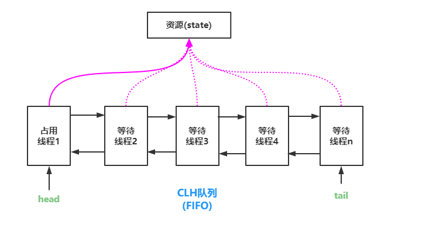

AbstractQueuedSynchronizer中对state的操作是原子的，且不能被继承。所有的同步机制的实现均依赖于对改变量的原子操作。为了实现不同的同步机制，我们需要创建一个非共有的（non-public internal）扩展了AQS类的内部辅助类来实现相应的同步逻辑。AbstractQueuedSynchronizer并不实现任何同步接口，它提供了一些可以被具体实现类直接调用的一些原子操作方法来重写相应的同步逻辑。AQS同时提供了互斥模式（exclusive）和共享模式（shared）两种不同的同步逻辑。一般情况下，子类只需要根据需求实现其中一种模式，当然也有同时实现两种模式的同步类，如ReadWriteLock。接下来将详细介绍AbstractQueuedSynchronizer的提供的一些具体实现方法。

**state状态**

AbstractQueuedSynchronizer维护了一个volatile int类型的变量，用户表示当前同步状态。volatile虽然不能保证操作的原子性，但是保证了当前变量state的可见性。state的访问方式有三种：

`getState()  setState()  compareAndSetState()`

这三种叫做均是原子操作，其中compareAndSetState的实现依赖于Unsafe的compareAndSwapInt()方法。代码实现如下：

```java
	private volatile int state;

    protected final int getState() {
        return state;
    }

    protected final void setState(int newState) {
        state = newState;
    }

    protected final boolean compareAndSetState(int expect, int update) {
        // See below for intrinsics setup to support this
        return unsafe.compareAndSwapInt(this, stateOffset, expect, update);
    }
```

**自定义资源共享方式**

AQS定义两种资源共享方式：

- **Exclusive**（独占，只有一个线程能执行，如ReentrantLock
- **Share**（共享，多个线程可同时执行，如Semaphore/CountDownLatch）

不同的自定义同步器争用共享资源的方式也不同。自定义同步器在实现时只需要实现共享资源state的获取与释放方式即可，至于具体线程等待队列的维护（如获取资源失败入队/唤醒出队等），**AQS已经在顶层实现好了。自定义同步器实现时主要实现以下几种方法：**

- isHeldExclusively()：该线程是否正在独占资源。只有用到condition才需要去实现它。
- tryAcquire(int)：独占方式。尝试获取资源，成功则返回true，失败则返回false。
- tryRelease(int)：独占方式。尝试释放资源，成功则返回true，失败则返回false。
- tryAcquireShared(int)：共享方式。尝试获取资源。负数表示失败；0表示成功，但没有剩余可用资源；正数表示成功，且有剩余资源。
- tryReleaseShared(int)：共享方式。尝试释放资源，如果释放后允许唤醒后续等待结点返回true，否则返回false。

------

## 六、线程管理

### 1 线程组

- 类似于在计算机中使用文件夹管理文件，也可以使用线程组来管理线程。在线程组中定义一组相似(相关)的线程，在线程组中也可以定义子线程组。
- Thread 类有几个构造方法允许在创建线程时指定线程组，如果在创建线程时没有指定线程组则该线程就属于父线程所在的线程组。JVM 在创建 main 线程时会为它指定一个线程组，因此每个 Java 线程都有一个线程组与之关联，可以调用线程的 getThreadGroup() 方法返回线程组。
- 线程组开始是出于安全的考虑设计用来区分不同的 Applet，然而 ThreadGroup 并未实现这一目标，在新开发的系统中，已经不常用线程组。现在一般会将一组相关的线程存入一个数组或一个集合中，如果仅仅是用来区分线程时，可以使用线程名称来区分，多数情况下，可以忽略线程组。

#### 1.1 创建线程组

```java
package com.java.threadgroup;

/**
 * 演示创建线程组
 */
public class Test01 {
    public static void main(String[] args) {
        //1.返回当前 main 线程的线程组
        ThreadGroup mainGroup = Thread.currentThread().getThreadGroup();
        System.out.println(mainGroup.toString());//java.lang.ThreadGroup[name=main,maxpri=10]

        //2.定义线程组，如果不指定所属线程组，则自动归属当前线程所属的线程组中
        ThreadGroup group1 = new ThreadGroup("group1");
        System.out.println(group1);//java.lang.ThreadGroup[name=group1,maxpri=10]

        //3.定义线程组，同时指定父线程组
        ThreadGroup group2 = new ThreadGroup(mainGroup, "group2");
        System.out.println(group2);//java.lang.ThreadGroup[name=group2,maxpri=10]
        //现在group1和group2都是mainGroup线程组中的子线程组，调用线程组的getParent()方法返回父线程组
        System.out.println(group1.getParent() == mainGroup);//true
        System.out.println(group2.getParent() == mainGroup);//true

        //4.创建线程时指定所属线程组
        Runnable r = new Runnable() {
            @Override
            public void run() {
                System.out.println(Thread.currentThread());
            }
        };
        //在创建线程时，如果没有指定线程组，则默认线程归属到父线程的线程组中
        //在main线程中创建了t1线程，称main线程为父线程，t1线程为子线程
        //t1没有指定线程组则t1线程就归属到父线程main线程的线程组中
        Thread t1 = new Thread(r, "t1");
        System.out.println(t1);//Thread[t1,5,main] //[线程名称, 线程优先级, 所属线程组的名称]
        //创建线程时，可以指定线程所属线程组
        Thread t2 = new Thread(group1, r, "t2");
        Thread t3 = new Thread(group2, r, "t3");
        System.out.println(t2);//Thread[t2,5,group1]
        System.out.println(t3);//Thread[t3,5,group2]
    }
}
```

#### 1.2 线程组的基本操作

- activeCount()：返回当前线程组及子线程组中**活动线程**的数量(近似值)
- activeGroupCount()：返回当前线程组及子线程组中**活动线程组**的数量(近似值)
- int enumerate(Thread[] list)：将当前线程组中的**活动线程**复制到参数数组中
- enumerate(ThreadGroup[] list)：将当前线程组中的**活动线程组**复制到参数数组中
- getMaxPriority()：返回线程组的最大优先级，默认是10
- getName()：返回线程组的名称
- getParent()：返回父线程组
- interrupt()：中断线程组中所有的线程
- isDaemon()：判断当前线程组是否为守护线程组
- list()：将当前线程组中的活动线程打印出来
- parentOf(ThreadGroup g)：判断当前线程组是否为参数线程组的父线程组
- setDaemon(boolean daemon)：设置线程组为守护线程组

```java
package com.java.threadgroup;

/**
 * 演示线程组的基本操作
 */
public class Test02 {
    public static void main(String[] args) {
        ThreadGroup mainGroup = Thread.currentThread().getThreadGroup();//返回当前线程组
        //再定义线程组
        ThreadGroup group = new ThreadGroup("group");//默认group的父线程组是main线程组

        Runnable r = new Runnable() {
            @Override
            public void run() {
                while (true) {
                    System.out.println("-------- 当前线程 " + Thread.currentThread());
                    try {
                        Thread.sleep(1000);
                    } catch (InterruptedException e) {
                        e.printStackTrace();
                    }
                }
            }
        };

        Thread t1 = new Thread(r,"t1");//默认在main线程组中创建线程
        Thread t2 = new Thread(group, r,"t2");//在指定的group线程组中创建线程
        t1.start();
        t2.start();

        //打印线程组的相关属性
        System.out.println("main 线程组中活动线程数量：" + mainGroup.activeCount());//4 [main, t1, t2, 垃圾回收器]
        System.out.println("group 线程组中活动线程数量：" + group.activeCount());//1 [t2]
        System.out.println("main 线程组中活动子线程组数量：" + mainGroup.activeGroupCount());//1 [group]
        System.out.println("group 线程组中子线程组数量：" + group.activeGroupCount());//0
        System.out.println("main 线程组的父线程组：" + mainGroup.getParent());//java.lang.ThreadGroup[name=system,maxpri=10]
        System.out.println("group 线程组的父线程组：" + group.getParent());//java.lang.ThreadGroup[name=main,maxpri=10]
        System.out.println(mainGroup.parentOf(mainGroup));//true 线程组也是它自己的父线程组
        System.out.println(mainGroup.parentOf(group));//true
        mainGroup.list();//把main线程组中所有的线程打印输出
        /*
        java.lang.ThreadGroup[name=main,maxpri=10]
            Thread[main,5,main]
            Thread[Monitor Ctrl-Break,5,main]
            Thread[t1,5,main]
            java.lang.ThreadGroup[name=group,maxpri=10]
                Thread[t2,5,group]
        */
    }
}
```

#### 1.3 复制线程组中的线程及子线程组

- enumerate(Thread[] list)：把当前线程组和子线程组中所有的线程复制到参数数组中；
- enumerate(Thread[] list, boolean recursive)：如果第二个参数设置为 false，则只复制当前线程组中所有的线程，不复制子线程组中的线程；
- enumerate(ThreadGroup[] list)：把当前线程组和子线程组中所有的线程组复制到参数数组中；
- enumerate(ThreadGroup[] list, boolean recurse)：第二个参数设置false，则只复制当前线程组的子线程组，不复制子线程组中的线程组。

```java
package com.java.threadgroup;

/**
 * 演示复制线程组中的内容
 */
public class Test03 {
    public static void main(String[] args) {
        //返回main线程的main线程组
        ThreadGroup mainGroup = Thread.currentThread().getThreadGroup();
        //main线程组中定义两个子线程组
        ThreadGroup group1 = new ThreadGroup("group1");
        ThreadGroup group2 = new ThreadGroup("group2");

        Runnable r = new Runnable() {
            @Override
            public void run() {
                while (true){ }
            }
        };

        //创建并启动三个线程
        Thread t1 = new Thread(r, "t1");//默认在main线程组中创建线程
        Thread t2 = new Thread(group1, r, "t2");//在group1线程组中创建线程
        Thread t3 = new Thread(group2, r, "t3");//在group2线程组中创建线程
        t1.start();
        t2.start();
        t3.start();

        //1.把main线程组中的线程复制到数组中
        //先定义存储线程的数组，数组的长度为main线程组中活动线程的数量
        Thread[] threadList = new Thread[mainGroup.activeCount()];
        //把main线程组包括子线程组中的所有的线程复制到数组中
        mainGroup.enumerate(threadList);
        //遍历threadList数组
        for(Thread thread : threadList){
            System.out.println(thread);
        }

        System.out.println("-------------------------------------------");
        //只把main线程组中的线程复制到数组中，不包括子线程组中的线程
        threadList = new Thread[mainGroup.activeCount()];
        mainGroup.enumerate(threadList, false);
        for(Thread thread : threadList){
            System.out.println(thread);
        }

        System.out.println("=====================================");
        //2.把main线程组中的子线程组复制到数组中
        //定义线程组存储数组
        ThreadGroup[] threadGroups = new ThreadGroup[mainGroup.activeGroupCount()];
        //把main线程组中的子线程组复制到数组中
        mainGroup.enumerate(threadGroups);
        for (ThreadGroup group : threadGroups){
            System.out.println(group);
        }
    }
}
/*
Thread[main,5,main]
Thread[Monitor Ctrl-Break,5,main]
Thread[t1,5,main]
Thread[t2,5,group1]
Thread[t3,5,group2]
-------------------------------------------
Thread[main,5,main]
Thread[Monitor Ctrl-Break,5,main]
Thread[t1,5,main]
null
null
=====================================
java.lang.ThreadGroup[name=group1,maxpri=10]
java.lang.ThreadGroup[name=group2,maxpri=10]
*/
```

#### 1.4 线程组的批量中断

线程组的 interrupt() 可以给该线程组中所有的活动线程添加中断标志。

```java
package com.java.threadgroup;

/**
 * 线程组的批量中断
 */
public class Test04 {
    public static void main(String[] args) throws InterruptedException {
        Runnable r = new Runnable() {
            @Override
            public void run() {
                System.out.println("当前线程：" + Thread.currentThread() + " --开始循环--");
                //当线程没有被中断就一直循环
                while (!Thread.currentThread().isInterrupted()){
                    System.out.println(Thread.currentThread().getName() + " -------");
                    /*try {
                        Thread.sleep(500);
                    } catch (InterruptedException e) {
                        //如果中断睡眠中的线程，同时会清除中断标志
                        e.printStackTrace();
                    }*/
                }
                System.out.println(Thread.currentThread().getName() + "循环结束");
            }
        };

        //创建线程组
        ThreadGroup group = new ThreadGroup("group");
        //在group线程组中创建5个线程
        for (int i = 0; i < 5; i++) {
            new Thread(group, r, "t"+i).start();
        }

        //main线程睡眠
        Thread.sleep(2);
        //中断线程组,会中断线程组中所有的线程
        group.interrupt();
    }
}
```

#### 1.5 设置守护线程组

- 守护线程是为其他线程提供服务的，当 JVM 中只有守护线程时，守护线程会自动销毁，JVM 会退出。
- 调用线程组的 setDaemon(true) 可以把线程组设置为守护线程组，当守护线程组中没有任何活动线程时，守护线程组会自动销毁。
- 注意线程组的守护属性，不影响线程组中线程的守护属性，或者说守护线程组中的线程可以是非守护线程。

```java
package com.java.threadgroup;

/**
 * 演示守护线程组
 */
public class Test05 {
    public static void main(String[] args) throws InterruptedException {
        //先定义线程组
        ThreadGroup group = new ThreadGroup("group");
        //设置线程组为守护线程组
        group.setDaemon(true);

        //向线程组中添加三个线程
        for (int i = 0; i < 3; i++){
            new Thread(group, new Runnable() {
                @Override
                public void run() {
                    for (int j = 0; j < 20; j++){
                        System.out.println(Thread.currentThread().getName() + " -- " + j);
                        try {
                            Thread.sleep(500);
                        } catch (InterruptedException e) {
                            e.printStackTrace();
                        }
                    }
                }
            }).start();
        }

        //main线程睡眠5秒
        Thread.sleep(5000);
        System.out.println("main ...... end");
    }
}
```

### 2 捕获线程的执行异常

在线程的run方法中，如果有受检异常必须进行捕获处理，如果想要获得 run() 方法中出现的运行时异常信息，可以通过回调 UncaughtExceptionHandler 接口获得哪个线程出现了运行时异常。

在 Thread 类中有关处理运行异常的方法有：

- getDefaultUncaughtExceptionHandler()：获得全局的(默认的) UncaughtExceptionHandler
- getUncaughtExceptionHandler()：获得当前线程的 UncaughtExceptionHandler
- setDefaultUncaughtExceptionHandler(Thread.UncaughtExceptionHandler eh)： 设置全局的 UncaughtExceptionHandler
- setUncaughtExceptionHandler(Thread.UncaughtExceptionHandler eh)：设置当前线程的 UncaughtExceptionHandler

当线程运行过程中出现异常，JVM会调用 Thread 类的 dispatchUncaughtException(Throwable e) 方法，该方法会调用 getUncaughtExceptionHandler().uncaughtException(this, e); 如果想要获得线程中出现异常的信息，就需要设置线程的 UncaughtExceptionHandler

```java
package com.java.threadexception;

/**
 * 演示设置线程的UnCaughtExceptionHandler回调接口
 */
public class Test01 {
    public static void main(String[] args) {
        //1.设置线程全局的回调接口
        Thread.setDefaultUncaughtExceptionHandler(new Thread.UncaughtExceptionHandler() {
            @Override
            public void uncaughtException(Thread t, Throwable e) {
                //t参数接受发生异常的线程，e就是该线程的异常
                System.out.println(t.getName() + "线程发生了异常：" + e.getMessage());
            }
        });

        Thread t1 = new Thread(new Runnable() {
            @Override
            public void run() {
                System.out.println(Thread.currentThread().getName() + "线程开始运行");
                try {
                    Thread.sleep(2000);
                } catch (InterruptedException e) {
                    //线程中的受检异常必须捕获处理
                    e.printStackTrace();
                }
                System.out.println(12/0);//会产生算数异常
            }
        });
        t1.start();

        new Thread(new Runnable() {
            @Override
            public void run() {
                String txt = null;
                System.out.println(txt.length());//会产生空指针异常
            }
        }).start();

        /*
            在实际开发中，这种设计异常处理的方式还是比较常用的，尤其是异常执行的方法
            如果线程产生了异常，JVM会调用dispatchUncaughtException(Throwable e)方法，在
            该方法中调用getUncaughtExceptionHandler().uncaughtException(this, e);
            如果当前线程设置了UncaughtExceptionHandler回调接口就直接调用它自己的
            uncaughtException(this, e)方法，如果没有设置则调用当前线程所在线程组
            UncaughtExceptionHandler回调接口的uncaughtException(this, e)方法，如果线程组
            也没有设置回调接口，则直接把异常的栈信息定向到System.err中
        */
    }
}
/*
Thread-0线程开始运行
Thread-1线程发生了异常：null
Thread-0线程发生了异常：/ by zero
*/
```

### 3 注入 Hook 钩子线程

- 现在很多软件包括 MySQL、Zookeeper、kafka 等都存在 Hook 线程的校验机制，目的是校验进程是否已启动，防止重复启动程序。
- Hook 线程也称为钩子线程，当 JVM 退出的时候会执行 Hook 线程。经常在程序启动时创建一个 .lock 文件，用 .lock 文件校验程序是否启动，在程序退出 (JVM 退出) 时删除该 .lock 文件，在 Hook 线程中除了防止重新启动进程外，还可以做资源释放，尽量避免在 Hook 线程中进行复杂的操作。

```java
package com.java.hook;

import java.io.IOException;
import java.nio.file.Path;
import java.nio.file.Paths;
import java.util.concurrent.TimeUnit;

/**
 * 通过Hook线程防止程序重复启动
 */
public class Test01 {
    public static void main(String[] args) {
        //1.注入Hook线程，在程序退出时删除 .lock 文件
        Runtime.getRuntime().addShutdownHook(new Thread(){
            @Override
            public void run() {
                System.out.println("JVM退出，会启动当前Hook线程，在Hook线程中删除 .lock 文件");
                getLockFile().toFile().delete();
            }
        });

        //2.程序运行时，检查lock文件是否存在，如果lock文件存在，则抛出异常
        if(getLockFile().toFile().exists()){
            throw new RuntimeException("程序已启动");
        } else { //说明程序是第一次启动，创建lock文件
            try {
                getLockFile().toFile().createNewFile();
                System.out.println("程序在启动时创建了lock文件");
            } catch (IOException e) {
                e.printStackTrace();
            }
        }

        //模拟程序运行
        for (int i = 0; i < 2; i++){
            System.out.println("程序正在运行");
            try {
                TimeUnit.SECONDS.sleep(1);
            } catch (InterruptedException e) {
                e.printStackTrace();
            }
        }
    }

    public static Path getLockFile(){
        return Paths.get("", "tmp.lock");
    }
}
/*
程序在启动时创建了lock文件
程序正在运行
程序正在运行
JVM退出，会启动当前Hook线程，在Hook线程中删除 .lock 文件
*/
```

### 4 线程池

#### 4.1 什么是线程池

- 可以以 new Thread( () -> { 线程执行的任务 } ).start(); 这种形式开启一个线程。当 run() 方法运行结束，线程对象会被 GC 释放。
- 在真实的生产环境中，可能需要很多线程来支撑整个应用，当线程数量非常多时，反而会耗尽 CPU 资源。如果不对线程进行控制与管理，反而会影响程序的性能。
- 线程开销主要包括：创建与启动线程的开销；线程销毁开销；线程调度的开销；线程数量受限 CPU 处理器数量。
- 线程池就是有效使用线程的一种常用方式。线程池内部可以预先创建一定数量的工作线程，客户端代码直接将任务作为一个对象提交给线程池，线程池将这些任务缓存在工作队列中，线程池中的工作线程不断地从队列中取出任务并执行。

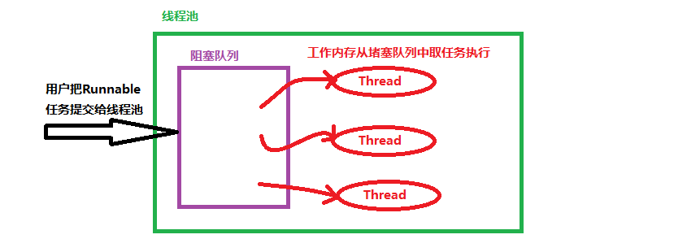

#### 4.2 JDK 对线程池的支持

JDK 提供了一套 Executor 框架，可以帮助开发人员有效的使用线程池。

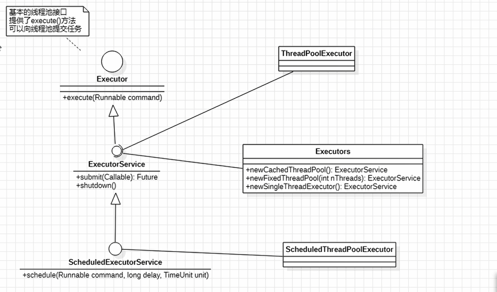

```java
package com.java.threadpool;

import java.util.concurrent.ExecutorService;
import java.util.concurrent.Executors;

/**
 * 线程池的基本使用
 */
public class Test01 {
    public static void main(String[] args) {
        //创建有5个线程大小的线程池
        ExecutorService fixedThreadPool = Executors.newFixedThreadPool(5);

        //向线程池中提交18个任务
        //这18个任务存储到线程池的阻塞队列中，线程池中这5个任务就从阻塞队列中取任务执行
        for (int i = 0; i < 18; i++){
            fixedThreadPool.execute(new Runnable() {
                @Override
                public void run() {
                    System.out.println(Thread.currentThread().getId() +
                            " 编号的任务在执行任务，开始时间：" + System.currentTimeMillis());
                    try {
                        Thread.sleep(3000);//模拟任务执行时长
                    } catch (InterruptedException e) {
                        e.printStackTrace();
                    }
                }
            });
        }
    }
}
```

```java
package com.java.threadpool;

import java.util.concurrent.Executors;
import java.util.concurrent.ScheduledExecutorService;
import java.util.concurrent.TimeUnit;

/**
 * 线程池的计划任务
 */
public class Test02 {
    public static void main(String[] args) {
        //创建一个有调度功能的线程池
        ScheduledExecutorService scheduledExecutorService = Executors.newScheduledThreadPool(10);

        //1.在延迟2秒后执行任务, schedule(Runnable任务, 延时时长, 时间单位)
        scheduledExecutorService.schedule(new Runnable() {
            @Override
            public void run() {
                System.out.println(Thread.currentThread().getId() + " -- " + System.currentTimeMillis());
            }
        }, 2, TimeUnit.SECONDS);

        //2.以固定的频率执行任务，开始任务的时间是固定的
        //在3秒之后执行任务，以后每隔2秒重新执行一次
        scheduledExecutorService.scheduleAtFixedRate(new Runnable() {
            @Override
            public void run() {
                System.out.println(Thread.currentThread().getId() + " ** " + System.currentTimeMillis());
                try {
                    //睡眠模拟任务执行时间，如果任务执行时长超过了间隔时间，则任务完成后立即执行下个任务
                    Thread.sleep(3000);
                } catch (InterruptedException e) {
                    e.printStackTrace();
                }
            }
        }, 3, 2, TimeUnit.SECONDS);

        //3.在上次任务结束后，在固定延迟后再次执行该任务
        //不管执行任务耗时多长，总是在任务结束后的2秒再次开启新的任务
        scheduledExecutorService.scheduleWithFixedDelay(new Runnable() {
            @Override
            public void run() {
                System.out.println(Thread.currentThread().getId() + " == " + System.currentTimeMillis());
                try {
                    //睡眠模拟任务执行时间，如果任务执行时长超过了间隔时间，则任务完成后的2秒再次执行新的任务
                    Thread.sleep(3000);
                } catch (InterruptedException e) {
                    e.printStackTrace();
                }
            }
        }, 3, 2, TimeUnit.SECONDS);
    }
}
```

#### 4.3 核心线程池的底层实现

查 看 Executors 工具类中 newCachedThreadPool()、newSingleThreadExcecutor()、newFixedThreadPool() 源码：

```java
	//该线程池在极端情况下，每次提交新的任务都会创建新的线程执行，适合用来执行大量耗时短并且提交频繁的任务
	public static ExecutorService newCachedThreadPool() {
        return new ThreadPoolExecutor(0, Integer.MAX_VALUE,
                                      60L, TimeUnit.SECONDS,
                                      new SynchronousQueue<Runnable>());
    }


	public static ExecutorService newFixedThreadPool(int nThreads) {
        return new ThreadPoolExecutor(nThreads, nThreads,
                                      0L, TimeUnit.MILLISECONDS,
                                      new LinkedBlockingQueue<Runnable>());
    }

  
	public static ExecutorService newSingleThreadExecutor() {
        return new FinalizableDelegatedExecutorService
            (new ThreadPoolExecutor(1, 1,
                                    0L, TimeUnit.MILLISECONDS,
                                    new LinkedBlockingQueue<Runnable>()));
    }
```

Excutors 工具类中返回线程池的方法底层都使用了 ThreadPoolExecutor 线程池，这些方法都是 ThreadPoolExecutor 线程池的封装。

ThreadPoolExecutor 的构造方法:

```java
	public ThreadPoolExecutor(int corePoolSize,
                              int maximumPoolSize,
                              long keepAliveTime,
                              TimeUnit unit,
                              BlockingQueue<Runnable> workQueue, 
                              ThreadFactory threadFactory,
                              RejectedExecutionHandler handler){}
```

各个参数意义：

- corePoolSize：指定线程池中核心线程的数量
- maximumPoolSize：指定线程池中最大线程数量
- keepAliveTime：当线程池线程的数量超过 corePoolSize 时，多余的空闲线程的存活时长，即空闲线程在多长时长内销毁
- unit：是keepAliveTime时长单位
- workQueue：任务队列，把任务提交到该任务队列中等待执行 
- threadFactory：线程工厂，用于创建线程
- handler：拒绝策略，当任务太多来不及处理时，如何拒绝

说明：

workQueue 工作队列是指提交未执行的任务队列，它是 BlockingQueue 接口的对象，仅用于存储 Runnable 任务。

根据队列功能分类，在 ThreadPoolExecutor 构造方法中可以使用以下几种阻塞队列：

- 直接提交队列：由 **SynchronousQueue** 对象提供，该队列没有容量，提交给线程池的任务不会被真实的保存，总是将新的任务提交给线程执行，如果没有空闲线程，则尝试创建新的线程，如果线程数量已经达到 maxinumPoolSize 规定的最大值则执行拒绝策略。

- 有界任务队列：由 **ArrayBlockingQueue** 实现，在创建ArrayBlockingQueue 对象时，可以指定一个容量。当有任务需要执行时，如果线程池中线程数小于 corePoolSize 核心线程数则创建新的线程；如果大于 corePoolSize 核心线程数则加入等待队列；如果队列已满则无法加入。在线程数小于 maxinumPoolSize 指定的最大线程数前提下会创建新的线程来执行，如果线程数大于 maxinumPoolSize 最大线程数则执行拒绝策略。

  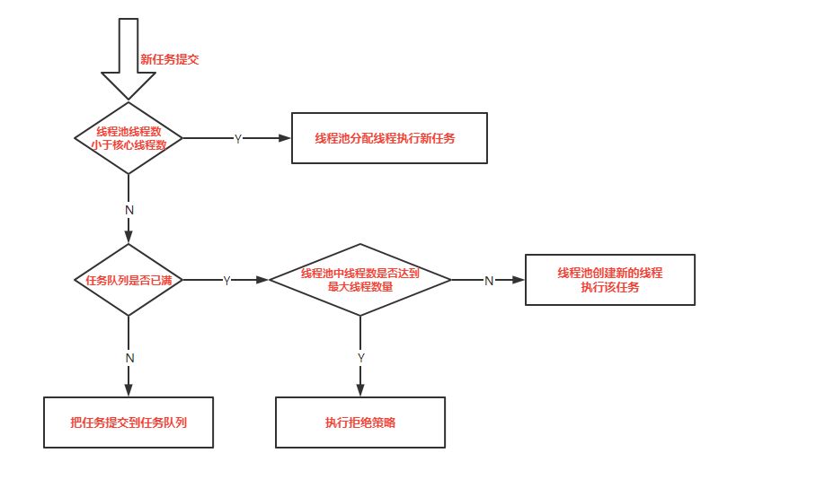

- 无界任务队列：由 **LinkedBlockingQueue** 对象实现，与有界队列相比，除非系统资源耗尽，否则无界队列不存在任务入队失败的情况。当有新的任务时，在系统线程数小于 corePoolSize 核心线程数则创建新的线程来执行任务；当线程池中线程数量大于 corePoolSize 核心线程数则把任务加入阻塞队列。

- 优先任务队列：是通过 **PriorityBlockingQueue** 实现的，是带有任务优先级的队列，是一个特殊的无界队列，不管是**ArrayBlockingQueue** 队列还是 **LinkedBlockingQueue** 队列都是按照先进先出算法处理任务的。在PriorityBlockingQueue 队列中可以根据任务优先级顺序先后执行。

#### 4.4 拒绝策略

ThreadPoolExecutor 构造方法的最后一个参数指定了拒绝策略。当提交给线程池的任务量超过实际承载能力时，如何处理？即线程池中的线程已经用完了，等待队列也满了，无法为新提交的任务服务，可以通过拒绝策略来处理这个问题。JDK 提供了四种拒绝策略：

1. AbortPolicy 策略：会抛出异常
2. CallerRunsPolicy 策略：只要线程池没关闭，会在调用者线程中运行当前被丢弃的任务
3. DiscardOldestPolicy 策略：将任务队列中最老的任务丢弃，尝试再次提交新任务
4. DiscardPolicy 策略：直接丢弃这个无法处理的任务

Executors 工具类提供的静态方法返回的线程池默认的拒绝策略是 AbortPolicy 抛出异常，如果内置的拒绝策略无法满足实际需求，可以扩展 RejectedExecutionHandler 接口

```java
package com.java.threadpool;

import java.util.Random;
import java.util.concurrent.*;

/**
 * 自定义拒绝策略
 */
public class Test03 {
    public static void main(String[] args) {
        //定义任务
        Runnable r = new Runnable() {
            @Override
            public void run() {
                int num = new Random().nextInt(10);
                System.out.println(Thread.currentThread().getId() + " -- " +
                        System.currentTimeMillis() + " 开始睡眠 " + num + "秒");
                try {
                    TimeUnit.SECONDS.sleep(num);
                } catch (InterruptedException e) {
                    e.printStackTrace();
                }
            }
        };

        //创建线程池，自定义拒绝策略
        ThreadPoolExecutor poolExecutor = new ThreadPoolExecutor(5,
                5, 0,
                TimeUnit.SECONDS,
                new LinkedBlockingQueue<>(10),
                Executors.defaultThreadFactory(),
                new RejectedExecutionHandler() {
                    @Override
                    public void rejectedExecution(Runnable r, ThreadPoolExecutor executor) {
                        //r就是请求的任务，executor就是当前线程池
                        System.out.println(r + "is discarding..");
                    }
                });

        //向线程池提交若干任务
        for (int i = 0; i < Integer.MAX_VALUE; i++){
            poolExecutor.execute(r);
        }
    }
}
```

#### 4.5 ThreadFactory

- 线程池中的线程从哪儿来的？答案就是 ThreadFactory 
- ThreadFactory 是一个接口，只有一个用来创建线程的方法：Thread newThread(Runnable r)
- 当线程池中需要创建线程时就会调用该方法

```java
package com.java.threadpool;

import java.util.Random;
import java.util.concurrent.*;

/**
 * 自定义线程工厂
 */
public class Test04 {
    public static void main(String[] args) throws InterruptedException {
        Runnable r = new Runnable() {
            @Override
            public void run() {
                int num = new Random().nextInt(10);
                System.out.println(Thread.currentThread().getId() + " -- " +
                        System.currentTimeMillis() + " 开始睡眠 " + num + "秒");
                try {
                    TimeUnit.SECONDS.sleep(num);
                } catch (InterruptedException e) {
                    e.printStackTrace();
                }
                System.out.println(Thread.currentThread().getId() + " -- " +
                        System.currentTimeMillis() + " 结束睡眠 ");
            }
        };

        //创建线程池，自定义线程工厂，采用默认的拒绝策略是拒绝策略
        ExecutorService executorService = new ThreadPoolExecutor(5, 5, 0,
                TimeUnit.SECONDS, new SynchronousQueue<>(),
                new ThreadFactory() {
                    @Override
                    public Thread newThread(Runnable r) {
                        //根据参数r接收的任务，创建一个线程
                        Thread t = new Thread(r);
                        t.setDaemon(true); //设置为守护线程，当主线程运行结束，线程池中的线程会自动释放
                        System.out.println("创建了线程：" + t);
                        return t;
                    }
                });

        //提交5个任务，当给当前线程池提交的任务超过5个时，线程池默认抛出异常
        for (int i = 0; i < 5; i++){
            executorService.submit(r);
        }

        //主线程睡眠
        Thread.sleep(10000);
        //主线程睡眠超时，主线程结束，线程池中的线程会自动退出
    }
}
```

#### 4.6 监控线程池

ThreadPoolExecutor 提供了一组方法用于监控线程池：

- int getActiveCount()：获得线程池中当前活动线程的数量
- long getCompletedTaskCount()：返回线程池完成任务的数量
- int getCorePoolSize()：线程池中核心线程的数量
- int getLargestPoolSize()：返回线程池曾经达到的线程的最大数
- int getMaximumPoolSize()：返回线程池的最大容量
- int getPoolSize()：当前线程池的大小
- BlockingQueue<Runnable> getQueue()：返回阻塞队列
- long getTaskCount()：返回线程池收到的任务总数

```java
package com.java.threadpool;

import java.util.concurrent.ArrayBlockingQueue;
import java.util.concurrent.Executors;
import java.util.concurrent.ThreadPoolExecutor;
import java.util.concurrent.TimeUnit;

/**
 * 监控线程池
 */
public class Test05 {
    public static void main(String[] args) throws InterruptedException {
        //先定义任务
        Runnable r = new Runnable() {
            @Override
            public void run() {
                System.out.println(Thread.currentThread().getId() +
                        " 编号的线程开始执行时间：" + System.currentTimeMillis());
                try {
                    Thread.sleep(10000);//睡眠10秒模拟任务时长
                    System.out.println(Thread.currentThread().getId() + " -- " +
                            System.currentTimeMillis() + " 结束睡眠 ");
                } catch (InterruptedException e) {
                    e.printStackTrace();
                }
            }
        };

        //定义线程池
        ThreadPoolExecutor poolExecutor = new ThreadPoolExecutor(2, 5, 0, TimeUnit.SECONDS,
                new ArrayBlockingQueue<>(5), Executors.defaultThreadFactory(),
                new ThreadPoolExecutor.DiscardPolicy());

        //现在向这个线程池提交30个任务
        for(int i = 0; i < 30; i++){
            poolExecutor.submit(r);
            System.out.println("当前线程池核心线程数：" + poolExecutor.getCorePoolSize() +
                             ",最大线程数：" + poolExecutor.getMaximumPoolSize() +
                             ",当前线程池大小：" + poolExecutor.getPoolSize() +
                             ",活动线程数：" + poolExecutor.getActiveCount() +
                             ",收到任务数：" + poolExecutor.getTaskCount() +
                             ",完成任务数：" + poolExecutor.getCompletedTaskCount() +
                             ",等待任务数：" + poolExecutor.getQueue().size());
            TimeUnit.MILLISECONDS.sleep(500);
        }

        System.out.println("===========================================");
        while (poolExecutor.getActiveCount() > 0){
            System.out.println("当前线程池核心线程数：" + poolExecutor.getCorePoolSize() +
                    ",最大线程数：" + poolExecutor.getMaximumPoolSize() +
                    ",当前线程池大小：" + poolExecutor.getPoolSize() +
                    ",活动线程数：" + poolExecutor.getActiveCount() +
                    ",收到任务数：" + poolExecutor.getTaskCount() +
                    ",完成任务数：" + poolExecutor.getCompletedTaskCount() +
                    ",等待任务数：" + poolExecutor.getQueue().size());
            Thread.sleep(1000);
        }
    }
}
```

#### 4.7 扩展线程池

有时需要对线程池进行扩展，如在监控每个任务的开始和结束时间，或者自定义一些其他增强的功能。

ThreadPoolExecutor 线程池提供了两个方法：

1. protected void afterExecute(Runnable r, Throwable t)
2. protected void beforeExecute(Thread t, Runnable r)

在线程池执行某个任务前会调用 beforeExecute()方法，在任务结束后(任务异常退出)会执行 afterExecute()方法。

查看 ThreadPoolExecutor 源码，在该类中定义了一个内部类 Worker，ThreadPoolExecutor 线程池中的工作线程就是 Worker 类的实例，Worker 实例在执行时会调用 beforeExecute()与 afterExecute()方法。

```java
package com.java.threadpool;

import java.util.concurrent.ExecutorService;
import java.util.concurrent.LinkedBlockingDeque;
import java.util.concurrent.ThreadPoolExecutor;
import java.util.concurrent.TimeUnit;

/**
 * 扩展线程池
 */
public class Test06 {
    //定义任务类
    private static class MyTask implements Runnable{
        String name;
        public  MyTask(String name){
            this.name = name;
        }
        @Override
        public void run() {
            System.out.println(name + " 任务正在被线程 " +
                    Thread.currentThread().getId() + " 线程执行");
            try {
                //模拟任务执行时长
                Thread.sleep(1000);
            } catch (InterruptedException e) {
                e.printStackTrace();
            }
        }
    }

    public static void main(String[] args) {
        //定义扩展线程池，可以定义线程池类继承ThreadPoolExecutor
        //在子类中重写 beforeExecute()/afterExecute() 方法
        //也可以直接使用ThreadPoolExecutor的内部类
        ExecutorService executorService = new ThreadPoolExecutor(5, 5, 0, TimeUnit.SECONDS,
                new LinkedBlockingDeque<>()){
            //在内部类中重写任务开始方法
            @Override
            protected void beforeExecute(Thread t, Runnable r) {
                System.out.println(t.getId() + " 线程准备执行任务：" + ((MyTask) r).name);
            }

            //在内部类中重写任务结束方法
            @Override
            protected void afterExecute(Runnable r, Throwable t) {
                System.out.println(((MyTask) r).name + "任务执行完毕");
            }

            @Override
            protected void terminated() {
                System.out.println("线程池退出");
            }
        };

        //向线程池当中添加任务
        for (int i = 0; i < 5; i++){
            executorService.execute(new MyTask("Task-" + i));
        }

        //关闭线程池
        executorService.shutdown();
    }
}
/*
12 线程准备执行任务：Task-0
15 线程准备执行任务：Task-3
13 线程准备执行任务：Task-1
Task-1 任务正在被线程 13 线程执行
16 线程准备执行任务：Task-4
Task-3 任务正在被线程 15 线程执行
14 线程准备执行任务：Task-2
Task-2 任务正在被线程 14 线程执行
Task-0 任务正在被线程 12 线程执行
Task-4 任务正在被线程 16 线程执行
Task-4任务执行完毕
Task-2任务执行完毕
Task-1任务执行完毕
Task-0任务执行完毕
Task-3任务执行完毕
线程池退出
*/
```

#### 4.8 优化线程池大小

线程池大小对系统性能是有一定影响的，过大或者过小都会无法发挥最优的系统性能，线程池大小不需要非常精确，只要避免极大或者极小的情况即可，一般来说，线程池大小需要考虑 CPU 数量，内存大小等因素。在<< Java Concurrency in Practice >>书中给出一个估算线程池大小的公式：

线程池大小 = CPU 的数量 * 目标 CPU 的使用率 * ( 1 + 等待时间与计算时间的比 )


#### 4.9 线程池死锁

如果在线程池中执行的任务 A 在执行过程中又向线程池提交了任务 B，任务 B 添加到了线程池的等待队列中，如果任务 A 的结束需要等待任务 B 的执行结果。就有可能会出现这种情况：线程池中所有的工作线程都处于等待任务处理结果，而这些任务在阻塞队列中等待执行，线程池中没有可以对阻塞队列中的任务进行处理的线程，这种等待会一直持续下去，从而造成死锁。

适合给线程池提交相互独立的任务，而不是彼此依赖的任务。
对于彼此依赖的任务，可以考虑分别提交给不同的线程池来执行。


#### 4.10 线程池中的异常处理

- 在使用 ThreadPoolExecutor 进行 submit 提交任务时，有的任务抛出了异常，但是线程池并没有进行提示，即线程池把任务中的异常给吃掉了。
- 可以把 submit 提交改为 execute 执行
- 也可以对 ThreadPoolExecutor 线程池进行扩展，对提交的任务进行包装。

```java
package com.java.threadpool;

import java.util.concurrent.SynchronousQueue;
import java.util.concurrent.ThreadPoolExecutor;
import java.util.concurrent.TimeUnit;

/**
 * 线程池可能会吃掉程序中的异常
 */
public class Test07 {
    //定义实现Runnable接口，用于计算两个数相除
    private static class DivideTask implements Runnable{
        private int x;
        private int y;
        public DivideTask(int x, int y) {
            this.x = x;
            this.y = y;
        }
        @Override
        public void run() {
            System.out.println(Thread.currentThread().getName() +
                    "计算: " + x + " / " + y + " = " + (x/y));
        }
    }

    public static void main(String[] args) {
        //创建线程池
        ThreadPoolExecutor poolExecutor = new ThreadPoolExecutor(0, Integer.MAX_VALUE, 0,
                TimeUnit.SECONDS, new SynchronousQueue<>());

        //向线程池中添加两个数相除的任务
        for (int i = 0; i < 5; i++){
            poolExecutor.submit(new DivideTask(10, i));
            //poolExecutor.execute(new DivideTask(10, i));
        }
        /*
            pool-1-thread-3计算: 10 / 2 = 5
            pool-1-thread-4计算: 10 / 3 = 3
            pool-1-thread-5计算: 10 / 4 = 2
            pool-1-thread-2计算: 10 / 1 = 10

            运行程序，只有四条计算结果，我们实际上向线程池提交了5个计算任务，分析结果发现当
            i==0时，提交的任务会产生算数异常，线程池把该异常给吃掉了，导致我们对该异常一无所知

            解决方法：
                一是把submit()方法改为execute()方法
                二是可以对线程池进行扩展，对submit()方法进行包装
        */
    }
}
```

```java
package com.java.threadpool;

import java.util.concurrent.*;

/**
 * 自定义线程池类，对ThreadPoolExecutor进行包装
 */
public class Test08 {
    //自定义线程池内
    private static class TraceThreadPoolExecutor extends ThreadPoolExecutor{
        public TraceThreadPoolExecutor(int corePoolSize, int maximumPoolSize,
                                       long keepAliveTime, TimeUnit unit,
                                       BlockingQueue<Runnable> workQueue) {
            super(corePoolSize, maximumPoolSize, keepAliveTime, unit, workQueue);
        }

        //定义方法，对执行的任务进行包装
        //接收两个参数，第一个参数接收要执行的任务，第二个参数是一个Exception异常
        public Runnable wrap(Runnable task, Exception exception){
            return new Runnable() {
                @Override
                public void run() {
                    try {
                        task.run();
                    } catch (Exception e){
                        exception.printStackTrace();
                        throw e;
                    }
                }
            };
        }

        //重写submit()方法
        @Override
        public Future<?> submit(Runnable task) {
            return super.submit(wrap(task, new Exception("客户跟踪异常")));
        }

        @Override
        public void execute(Runnable command) {
            super.execute(wrap(command, new Exception("客户跟踪异常")));
        }
    }

    //定义实现Runnable接口，用于计算两个数相除
    private static class DivideTask implements Runnable{
        private int x;
        private int y;
        public DivideTask(int x, int y) {
            this.x = x;
            this.y = y;
        }
        @Override
        public void run() {
            System.out.println(Thread.currentThread().getName() +
                    "计算: " + x + " / " + y + " = " + (x/y));
        }
    }

    public static void main(String[] args) {
        //创建线程池
        /*ThreadPoolExecutor poolExecutor = new ThreadPoolExecutor(0, Integer.MAX_VALUE, 0,
                TimeUnit.SECONDS, new SynchronousQueue<>());*/
        //使用自定义的线程池
        ThreadPoolExecutor poolExecutor = new TraceThreadPoolExecutor(0, Integer.MAX_VALUE, 0,
                TimeUnit.SECONDS, new SynchronousQueue<>());

        //向线程池中添加两个数相除的任务
        for (int i = 0; i < 5; i++){
            poolExecutor.submit(new DivideTask(10, i));
            //poolExecutor.execute(new DivideTask(10, i));
        }
        /*
            pool-1-thread-2计算: 10 / 1 = 10
            pool-1-thread-5计算: 10 / 4 = 2
            pool-1-thread-4计算: 10 / 3 = 3
            pool-1-thread-3计算: 10 / 2 = 5
            java.lang.Exception: 客户跟踪异常
	            at com.java.threadpool.Test08$TraceThreadPoolExecutor.submit(Test08.java:36)
	            at com.java.threadpool.Test08.main(Test08.java:70)
        */
    }
}
```

#### 4.11 ForkJoinPool 线程池

“分而治之”是一个有效的处理大数据的方法，著名的 MapReduce 就是采用这种分而治之的思路。简单点说，如果要处理的 1000 个数据，但是我们不具备处理1000个数据的能力，可以只处理10个数据，可以把这 1000 个数据分阶段处理 100 次，每次处理 10 个，把 100 次的处理结果进行合成，形成最后这 1000 个数据的处理结果。

把一个大任务调用 fork() 方法分解为若干小的任务，把小任务的处理结果进行 join() 合并为大任务的结果。

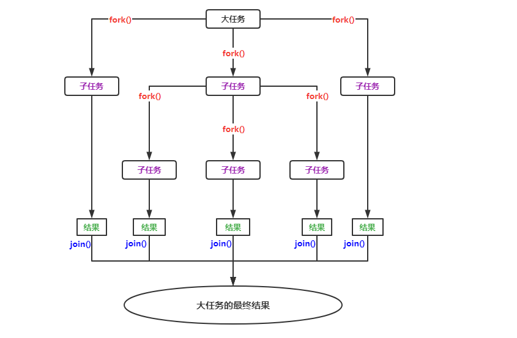

系统对 ForkJoinPool 线程池进行了优化，提交的任务数量与线程的数量不一定是一对一关系。在多数情况下，一个物理线程实际上需要处理多个逻辑任务。

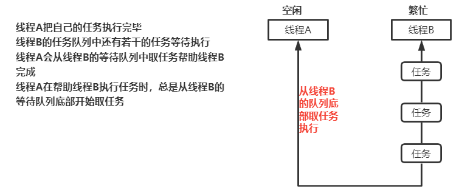


ForkJoinPool 线程池中最常用的方法是：

<T> ForkJoinTask<T> **submit**(ForkJoinTask<T> task)：向线程池提交一个 ForkJoinTask 任务。ForkJoinTask 任务支持 fork() 分解与 join() 等待的任务。

ForkJoinTask 有两个重要的子类：RecursiveAction 和 RecursiveTask，它们的区别在于 RecursiveAction 任务没有返回值，RecursiveTask 任务可以带有返回值

```java
package com.thread;

import java.util.ArrayList;
import java.util.concurrent.ExecutionException;
import java.util.concurrent.ForkJoinPool;
import java.util.concurrent.ForkJoinTask;
import java.util.concurrent.RecursiveTask;

/**
 * 演示ForkJoinPool线程池的使用
 *  使用该线程池模拟数列求和
 */
public class Test09 {
    //计算数列的和，需要返回结果，可以定义任务继承RecursiveTask
    private static class CountTask extends RecursiveTask<Long> {
        //定义数据规模的阈值，允许计算10000个数内的和，超过该阈值的数列需要分解
        private static final int THREADHOLD = 10000;
        //定义每次把大任务分解为100个小任务
        private static final int TASKNUM = 100;

        private long start; //计算数列的起始值
        private long end;  //计算数列的结束值

        public CountTask(long start, long end) {
            this.start = start;
            this.end = end;
        }

        /**
         * 重写RecursiveTask的compute()方法,计算数列的结果
         * @return
         */
        @Override
        protected Long compute() {
            long sum = 0; //保存计算的结果
            //判断任务是否需要继续分解，如果当前数列end与start范围的数超过阈值THREADHOLD，就需要继续分解
            if(end - start < THREADHOLD){
                //小于阈值可以直接计算
                for (long i = start; i <= end; i++){
                    sum += i;
                }
            } else {
                //数列范围超过阈值，需要继续分解
                //约定每次分解成100个小任务，计算每个任务的计算量
                //start=0; end=200000; step=2000;
                //如果计算[0,200000]范围内数列的和，把该范围的数列分解为100个小任务，每个任务计算2000个数即可
                /*
                    注意：如果任务划分的层次很深，即THREADHOLD阈值太小，每个任务的计算量很小，层次划分很深
                         可能会出现两种情况：
                            1.系统内的线程数量会越积越多，导致性能下降严重
                            2.分解次数过多，方法调用过多可能会导致栈溢出
                 */
                long step = (start + end) / TASKNUM;

                //创建一个存储任务的集合
                ArrayList<CountTask> subTaskList = new ArrayList<>();
                long pos = start; //每个任务的起始任务
                for (int i = 0; i < TASKNUM; i++){
                    long lastOne = pos + step; //每个任务的结束位置
                    //调整最后一个任务的结束位置
                    lastOne = lastOne > end ? end : lastOne;

                    //创建子任务
                    CountTask task = new CountTask(pos, lastOne);
                    //把任务添加到集合中
                    subTaskList.add(task);
                    //调用fork()提交子任务
                    task.fork();
                    //调整下个任务的其实位置
                    pos += step + 1;
                }
                //等待所有的子任务结束后，合并计算结果
                for (CountTask task : subTaskList){
                    //join() 会一直等待子任务执行完毕返回执行结果
                    sum += task.join();
                }
            }
            return sum;
        }
    }

    public static void main(String[] args) {
        //创建ForkJoinPool线程池
        ForkJoinPool forkJoinPool = new ForkJoinPool();
        //创一个大的任务
        CountTask countTask = new CountTask(0L, 200000L);
        //把大任务提交给线程池
        ForkJoinTask<Long> result = forkJoinPool.submit(countTask);
        try {
            //调用任务的get()方法返回结果
            Long res = result.get();
            System.out.println("计算数列结果为：" + res);
        } catch (ExecutionException e) {
            e.printStackTrace();
        } catch (InterruptedException e) {
            e.printStackTrace();
        }

        //验证
        long s = 0L;
        for (long i = 0L; i <= 200000L; i++){
            s += i;
        }
        System.out.println("验证数列结果为：" + s);
    }
}
```

------

## 七、保障线程安全的设计技术

从面向对象设计的角度出发介绍几种保障线程安全的设计技术，这些技术可以使得我们在不必借助锁的情况下保障线程安全，避免锁可能导致的问题及开销。

### 1 Java运行时存储空间

- Java运行时 (Java runtime) 空间可以分为**栈区**、**堆区**与**方法区**(非堆空间)。
- **栈空间** (Stack Space) 为线程的执行准备一段固定大小的存储空间，每个线程都有独立的线程栈空间，创建线程时就为线程分配栈空间。在线程栈中每调用一个方法就给方法分配一个栈帧，栈帧用于存储方法的局部变量，返回值等私有数据，即局部变量存储在栈空间中，基本类型变量也是存储在栈空间中，引用类型变量值也是存储在栈空间中，引用的对象存储在堆中。由于线程栈是相互独立的，一个线程不能访问另外一个线程的栈空间，因此线程对局部变量以及只能通过当前线程的局部变量才能访问的对象进行的操作具有固定的线程安全性。
- **堆空间** (Heap Space) 用于存储对象，是在 JVM 启动时分配的一段可以动态扩容的内存空间。创建对象时，在堆空间中给对象分配存储空间，实例变量就是存储在堆空间中的，堆空间是多个线程之间可以共享的空间，因此实例变量可以被多个线程共享。多个线程同时操作实例变量可能存在线程安全问题。
- **非堆空间(方法区)** (Non-Heap Space) 用于存储常量、类的元数据等，非堆空间也是在 JVM 启动时分配的一段可以动态扩容的存储空间。类的元数据包括静态变量，类有哪些方法及这些方法的元数据(方法名，参数，返回值等)。非堆空间也是多个线程可以共享的，因此访问非堆空间中的静态变量也可能存在线程安全问题。


堆空间与非堆空间是线程可以共享的空间，即实例变量与静态变量是线程可以共享的，可能存在线程安全问题。

栈空间是线程私有的存储空间，局部变量存储在栈空间中，局部变量具有固定的线程安全性。


### 2 无状态对象

- 对象就是数据及对数据操作的封装，对象所包含的数据称为对象的状态(State)，实例变量与静态变量称为状态变量。 
  
- 如果一个类的同一个实例被多个线程共享并不会使这些线程存在共享的状态，那么该类的实例就称为无状态对象(Stateless Object)。
  
  反之如果一个类的实例被多个线程共享会使这些线程存在共享状态，那么该类的实例称为有状态对象。实际上无状态对象就是不包含任何实例变量也不包含任何静态变量的对象。
  
- 线程安全问题的前提是多个线程存在共享的数据，实现线程安全的一种办法就是避免在多个线程之间共享数据，使用无状态对象就是这种方法。


### 3 不可变对象

不可变对象是指一经创建它的状态就保持不变的对象，不可变对象具有固有的线程安全性。当不可变对象现实实体的状态发生变化时，系统会创建一个新的不可变对象。就如 String 字符串对象。一个不可变对象需要满足以下条件：

1. 类本身使用 final 修饰，防止通过创建子类来改变它的定义
2. 所有的字段都是 final 修饰的，final 字段在创建对象时必须显示初始化，不能被修改
3. 如果字段引用了其他状态可变的对象 (集合、数组)，则这些字段必须是 private 私有的

不可变对象主要的应用场景：
1) 被建模对象的状态变化不频繁
2) 同时对一组相关数据进行写操作，可以应用不可变对象，既可以保障原子性也可以避免锁的使用
3) 使用不可变对象作为安全可靠的Map键，HashMap键值对的存储位置与键的 hashCode()有关，如果键的内部状态发生了变化会导致键的哈希码不同，可能会影响键值对的存储位置。如果 HashMap 的键是一个不可变对象，则hashCode()方法的返回值恒定，存储位置是固定的。 


### 4 线程特有对象

​	我们可以选择不共享非线程安全的对象，对于非线程安全的对象，每个线程都创建一个该对象的实例，各个线程访问各自创建的实例，一个线程不能访问另外一个线程创建的实例。这种各个线程创建各自的实例，一个实例只能被一个线程访问的对象就称为线程特有对象。线程特有对象既保障了对非线程安全对象的访问的线程安全，又避免了锁的开销。线程特有对象也具有固有的线程安全性。

​	ThreadLocal< T> 类相当于线程访问其特有对象的代理，即各个线程通过 ThreadLocal 对象可以创建并访问各自的线程特有对象，泛型 T 指定了线程特有对象的类型。一个线程可以使用不同的 ThreadLocal 实例来创建并访问不同的线程特有对象。

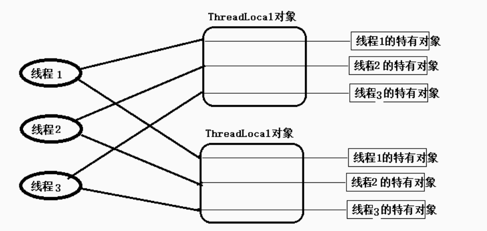

​	ThreadLocal 实例为每个访问它的线程都关联了一个该线程特有的对象，ThreadLocal 实例都有当前线程与特有实例之间的一个关联。


### 5 装饰器模式

​	装饰器模式可以用来实现线程安全，基本思想是为非线程安全的对象创建一个相应的线程安全的外包装对象，客户端代码不直接访问非线程安全的对象而是访问它的外包装对象。外包装对象与非线程安全的对象具有相同的接口，即外包装对象的使用方式与非线程安全对象的使用方式相同，而外包装对象内部通常会借助锁，以线程安全的方式调用相应的非线程安全对象的方法。

​	在 java.util.Collections 工具类中提供了一组 synchronizedXXX(xxx) 可以把不是线程安全的 xxx 集合转换为线程安全的集合，它就是采用了这种装饰器模式。这个方法返回值就是指定集合的外包装对象，这类集合又称为同步集合。

​	使用装饰器模式的一个好处就是实现关注点分离，在这种设计中，实现同一组功能的对象的两个版本：非线程安全的对象与线程安全的对象。对于非线程安全的在设计时只关注要实现的功能，对于线程安全的版本只关注线程安全性。

------

## 八、锁的优化及注意事项

### 1 有助于提高锁性能的几点建议

#### 1.1 减少锁持有时间

对于使用锁进行并发控制的应用程序来说，如果单个线程特有锁的时间过长，会导致锁的竞争更加激烈，会影响系统的性能。在程序中需要尽可能减少线程对锁的持有时间，如下面代码：

```java
public synchronized void syncMethod(){
	othercode1();
	mutexMethod();
	othercode();
}
```

在 syncMethod 同步方法中，假设只有 mutexMethod() 方法是需要同步的，othercode1() 方法与 othercode2() 方法不需要进行同步。如果 othercode1 与 othercode2 这两个方法需要花费较长的 CPU 时间，在并发量较大的情况下，这种同步方案会导致等待线程的大量增加。一个较好的优化方案是：只在必要时进行同步，可以减少锁的持有时间，提高系统的吞吐量，如把上面的代码改为：

```java
public void syncMethod(){
	othercode1();
	synchronized (this) {
		mutexMethod();
	}
	othercode();
}
```

只对 mutexMethod() 方法进行同步，这种减少锁持有时间有助于降低锁冲突的可能性，提升系统的并发能力。


#### 1.2 减小锁的粒度

​	一个锁保护的共享数据的数量大小称为锁的粒度。如果一个锁保护的共享数据的数量大就称该锁的粒度粗，否则称该锁的粒度细。锁的粒度过粗会导致线程在申请锁时需要进行不必要的等待。减少锁粒度是一种削弱多线程锁竞争的一种手段，可以提高系统的并发性。

​	在JDK7前，java.util.concurrent.ConcurrentHashMap 类采用分段锁协议，可以提高程序的并发性。


#### 1.3 使用读写分离锁代替独占锁

​	使用 ReadWriteLock 读写分离锁可以提高系统性能，使用读写分离锁也是减小锁粒度的一种特殊情况。第二条建议是通过分割数据结构实现减小锁的粒度，那么读写锁是对系统功能点的分割。

​	在多数情况下都允许多个线程同时读，在写的使用采用独占锁，在读多写少的情况下，使用读写锁可以大大提高系统的并发能力。


#### 1.4 锁分离

将读写锁的思想进一步延伸就是锁分离。读写锁是根据读写操作功能上的不同进行了锁分离。根据应用程序功能的特点，也可以对独占锁进行分离。如 java.util.concurrent.LinkedBlockingQueue 类中 take() 与 put() 方法分别从队头取数据，把数据添加到队尾。虽然这两个方法都是对队列进行修改操作，由于操作的主体是链表，take()操作的是链表的头部，put()操作的是链表的尾部，两者并不冲突。如果采用独占锁的话，这两个操作不能同时并发，在该类中就采用锁分离，take()取数据时有取锁，put()添加数据时有自己的添加锁，这样 take() 与 put() 相互独立实现了并发。


#### 1.5 锁的粗化

为了保证多线程间的有效并发，会要求每个线程持有锁的时间尽量短。但是凡事都有一个度，如果对同一个锁不断的进行请求、同步和释放，也会消耗系统资源。如：

```java
public void method1(){
	synchronized( lock ){
		同步代码块 1
	}
    
	synchronized( lock ){
		同步代码块 2
	}
}
```

JVM 在遇到一连串不断对同一个锁进行请求和释放操作时，会把所有的锁整合成对锁的一次请求，从而减少对锁的请求次数，这个操作叫锁的粗化，如上一段代码会整合为：

```java
public void method1(){
	synchronized( lock ){
		同步代码块 1
		同步代码块 2
	}
}
```

在开发过程中，也应该有意识的在合理的场合进行锁的粗化，尤其在循环体内请求锁时，如：

```java
for(int i = 0; i < 100; i++){
	synchronized(lock){}
}
```

这种情况下，意味着每次循环都需要申请锁和释放锁，所以一种更合理的做法就是在循环外请求一次锁，如：

```java
synchronized( lock ){
	for(int i = 0 ; i< 100; i++){}
}
```


### 2 JVM 对锁的优化

#### 2.1 锁偏向

​	锁偏向是一种针对加锁操作的优化，如果一个线程获得了锁，那么锁就进入偏向模式，当这个线程再次请求锁时，无须再做任何同步操作，这样可以节省有关锁申请的时间，提高了程序的性能。

​	锁偏向在没有锁竞争的场合可以有较好的优化效果，对于锁竞争比较激烈的场景，效果不佳，锁竞争激烈的情况下可能是每次都是不同的线程来请求锁，这时偏向模式失效。


#### 2.2 轻量级锁

​	如果锁偏向失败，JVM 不会立即挂起线程，还会使用一种称为轻量级锁的优化手段。会将对象的头部作为指针，指向持有锁的线程堆栈内部，来判断一个线程是否持有对象锁。如果线程获得轻量级锁成功，就进入临界区。如果获得轻量级锁失败，表示其他线程抢到了锁，那么当前线程的锁的请求就膨胀为重量级锁。当前线程就转到阻塞队列中变为阻塞状态。

​	偏向锁、轻量级锁都是乐观锁，重量级锁是悲观锁。

​	一个对象刚开始实例化时，没有任何线程访问它，它是可偏向的，即它认为只可能有一个线程来访问它，所以当第一个线程来访问它的时候，它会偏向这个线程。偏向第一个线程，这个线程在修改对象头成为偏向锁时使用 CAS 操作，将对象头中 ThreadId 改成自己的ID，之后再访问这个对象时，只需要对比 ID 即可。一旦有第二个线程访问该对象，因为偏向锁不会主动释放，所以第二个线程可以查看对象的偏向状态，当第二个线程访问对象时，表示在这个对象上已经存在竞争了，检查原来持有对象锁的线程是否存活，如果挂了则将对象变为无锁状态，然后重新偏向新的线程；如果原来的线程依然存活，则马上执行原来线程的栈，检查该对象的使用情况，如果仍然需要偏向锁，则偏向锁升级为轻量级锁。

​	轻量级锁认为竞争存在，但是竞争的程度很轻，一般两个线程对同一个锁的操作会错开，或者稍微等待一下(自旋)另外一个线程就会释放锁。当自旋超过一定次数、或者一个线程持有锁，一个线程在自旋，又来第三个线程访问时，轻量级锁会膨胀为重量级锁，重量级锁除了持有锁的线程外，其他的线程都阻塞。


#### 2.3 自旋锁

锁膨胀后，JVM为了避免线程在真实的层面被挂起，JVM还会做最后的努力，这就是自旋锁。当前线程无法立即获得锁，但是在什么时候可以获得锁也不一定，也许在几个CPU周期后就可以得到锁，如果是这样的话，简单的将线程挂起可能是一种得不偿失的操作。因此JVM会进行一次赌注：JVM期望在不久的将来可以得到锁。因为JVM会让当前的线程做几个空循环，在经过若干次循环后，如果可以得到锁就进入临界区，如果还不能得到锁则将线程真实的挂起。


#### 2.4 锁消除

**锁消除是一种更彻底的锁优化, JVM在JIT编译时,会通过扫描上下文,去除不可能存在共享资源竞争的锁, 通过锁消除,可以节省毫无意义的请求锁时间。**


#### 2.5 多线程开发良好的实践

1. 给线程起个有意义的名字，这样可以方便找 Bug。
2. 缩小同步范围，从而减少锁争用。例如对于 synchronized，应该尽量使用同步代码块而不是同步方法。
3. 多用同步工具少用 wait() 和 notify()。首先，CountDownLatch, CyclicBarrier, Semaphore 和 Exchanger 这些同步类简化了编码操作，而用 wait() 和 notify() 很难实现复杂控制流；其次，这些同步类是由最好的企业编写和维护，在后续的 JDK 中还会不断优化和完善。
4. 使用 BlockingQueue 实现生产者消费者问题。
5. 多用并发集合少用同步集合，例如应该使用 ConcurrentHashMap 而不是 Hashtable。
6. 使用本地变量和不可变类来保证线程安全。
7. 使用线程池而不是直接创建线程，这是因为创建线程代价很高，线程池可以有效地利用有限的线程来启动任务。
   readLocal实例都有当前线程与特有实例之间的一个关联。

