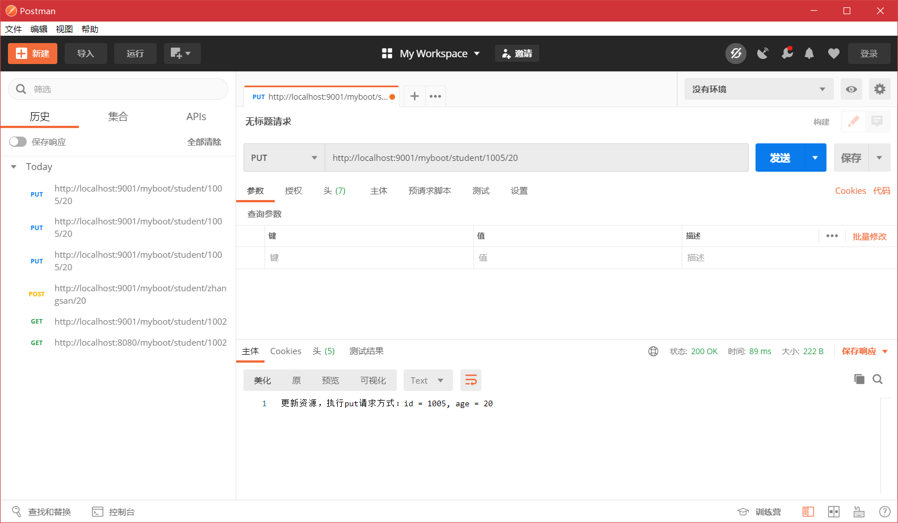
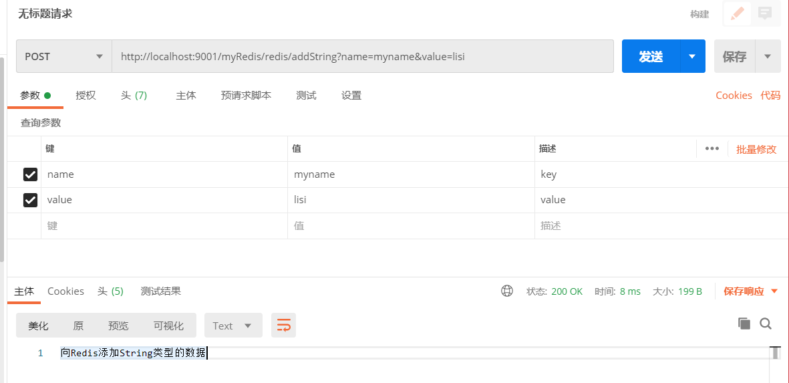
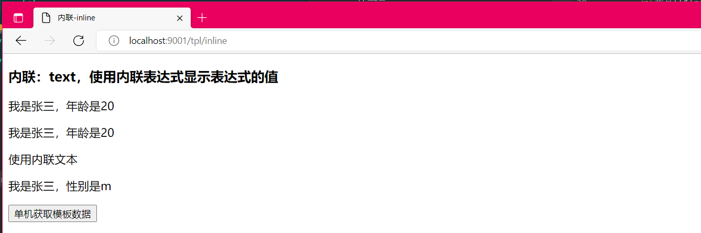

# SpringBoot 框架

## 一、XML 和 JavaConfig

Spring 使用 XML 作为容器配置文件，在 3.0 以后加入了 JavaConfig。使用 java 类做配
置文件使用。

1. 为什么要使用 SpringBoot

   因为Spring，SpringMVC 需要使用的大量的配置文件（XML文件）

   还需要配置各种对象，把使用的对象放入到spring容器中才能使用对象

   需要了解其他框架配置规则。

2. SpringBoot 就相当于**不需要配置文件的Spring + SpringMVC**。常用的框架和第三方库都已经配置好了。

   拿来就可以使用了。

3. SpringBoot开发效率高，使用方便多了。


### 1 JavaConfig

JavaConfig：使用java类作为xml配置文件的替代，是配置spring容器的纯java的方式。在这个java类这可以创建java对象，把对象放入spring容器中（注入到容器）。

JavaConfig 优点： 

1. 可以使用面像对象的方式，一个配置类可以继承配置类，可以重写方法
2. 避免繁琐的 xml 配置


使用两个注解：

1）@Configuration：放在一个类的上面，表示这个类是作为配置文件使用的。

2）@Bean：声明对象，把对象注入到容器中。


### 2 XML 配置容器

创建 001-SpringBoot-pre 项目

pom.xml

```xml
<?xml version="1.0" encoding="UTF-8"?>
<project xmlns="http://maven.apache.org/POM/4.0.0"
         xmlns:xsi="http://www.w3.org/2001/XMLSchema-instance"
         xsi:schemaLocation="http://maven.apache.org/POM/4.0.0 http://maven.apache.org/xsd/maven-4.0.0.xsd">
    <modelVersion>4.0.0</modelVersion>

    <groupId>com.xukang</groupId>
    <artifactId>001-SpringBoot-pre</artifactId>
    <version>1.0.0</version>

    <dependencies>
        <dependency>
            <groupId>org.springframework</groupId>
            <artifactId>spring-context</artifactId>
            <version>5.2.5.RELEASE</version>
        </dependency>

        <dependency>
            <groupId>junit</groupId>
            <artifactId>junit</artifactId>
            <version>4.12</version>
        </dependency>
    </dependencies>

    <build>
        <plugins>
            <!-- 编译插件 -->
            <plugin>
                <artifactId>maven-compiler-plugin</artifactId>
                <!-- 插件的版本 -->
                <version>3.5.1</version>
                <!-- 编译级别 -->
                <configuration>
                    <source>1.8</source>
                    <target>1.8</target>
                    <!-- 编码格式 -->
                    <encoding>UTF-8</encoding>
                </configuration>
            </plugin>
        </plugins>
    </build>
</project>
```

创建数据类Student

```java
package com.xukang.vo;

public class Student {
    private String name;
    private Integer age;
    private String sex;
    // get set toString
}
```

resources 目录下创建 Spring 的配置文件 beans.xml

```xml
<?xml version="1.0" encoding="UTF-8"?>
<beans xmlns="http://www.springframework.org/schema/beans"
       xmlns:xsi="http://www.w3.org/2001/XMLSchema-instance"
       xsi:schemaLocation="http://www.springframework.org/schema/beans http://www.springframework.org/schema/beans/spring-beans.xsd">
    <!--声明bean对象-->
    <bean id="myStudent" class="com.xukang.vo.Student" >
        <property name="name" value="张三" />
        <property name="age" value="20" />
        <property name="sex" value="女" />
    </bean>
</beans>
```

测试代码

```java
package com.xukang;

import com.xukang.vo.Student;
import org.junit.Test;
import org.springframework.context.ApplicationContext;
import org.springframework.context.support.ClassPathXmlApplicationContext;

public class MyTest {
    @Test
    public void test01(){
        String config = "beans.xml";
        ApplicationContext ctx = new ClassPathXmlApplicationContext(config);
        Student student = (Student) ctx.getBean("myStudent");
        System.out.println("容器中的对象：" + student);
        //容器中的对象：Student{name='张三', age=20, sex='女'}
    }
}
```


### 3 JavaConfig 配置容器

JavaConfig 主要使用的注解：

- @Configuration：放在类的上面，这个类相当于 xml 配置文件，可以在其中声明 bean
- @Bean：放在方法的上面，方法的返回值是对象类型，这个对象注入到 spring ioc 容器


pom.xml、Student.java同上

创建配置类：

```java
package com.xukang.config;

import com.sun.xml.internal.bind.v2.model.core.ID;
import com.xukang.vo.Student;
import org.springframework.context.annotation.Bean;
import org.springframework.context.annotation.Configuration;

/**
 * @Configuration : 表示当前类是作为配置文件使用的，就是用来配置容器的
 *          位置：在类的上面
 * Configuration 这个类就相当于 beans.xml
 */
@Configuration
public class SpringConfig {
    /**
     * 创建方法，方法的返回值是对象。在方法的上面加入@Bean
     * 方法的返回值对象就注入到容器中
     *
     * @Bean：把对象注入到spring容器中，作用相当于<bean>标签
     *
     * 说明：@Bean，不指定对象的名称，默认的id名为方法名
     */
    @Bean
    public Student createStudent(){
        Student s = new Student();
        s.setName("李四");
        s.setAge(22);
        s.setSex("男");
        return s;
    }

    /**
     * 指定对象在容器中的名称(指定<bean>的id属性)
     * @Bean的name属性，指定对象的名称(id)
     */
    @Bean(name = "wangwu")
    public Student makeStudent(){
        Student s = new Student();
        s.setName("王五");
        s.setAge(26);
        s.setSex("男");
        return s;
    }
}
```

测试代码

```java
package com.xukang;

import com.xukang.config.SpringConfig;
import com.xukang.vo.Student;
import org.junit.Test;
import org.springframework.context.ApplicationContext;
import org.springframework.context.annotation.AnnotationConfigApplicationContext;
import org.springframework.context.support.ClassPathXmlApplicationContext;

public class MyTest {
    /**
     * 使用JavaConfig
     */
    @Test
    public void test02(){
        ApplicationContext ctx = new AnnotationConfigApplicationContext(SpringConfig.class);
        Student student = (Student) ctx.getBean("createStudent");
        System.out.println("使用JavaConfig创建的容器中的bean对象：" + student);
        //使用JavaConfig创建的容器中的bean对象：Student{name='李四', age=22, sex='男'}
    }

    @Test
    public void test03(){
        ApplicationContext ctx = new AnnotationConfigApplicationContext(SpringConfig.class);
        Student student = (Student) ctx.getBean("wangwu");
        System.out.println("使用JavaConfig创建的容器中的bean对象：" + student);
        //使用JavaConfig创建的容器中的bean对象：Student{name='王五', age=26, sex='男'}
    }
}
```


### 4 @ImporResource

@ImportResource 是配置类中导入 xml 的配置文件，等同于 xml 文件的 resources

```xml
<import resources="其他配置文件"/>
```


创建数据类：

```java
package com.xukang.vo;

public class Cat {
    private String cardId;
    private String name;
    private Integer age;
	//get set toString
}
```

创建配置文件 applicationContext.xml：

```xml
<?xml version="1.0" encoding="UTF-8"?>
<beans xmlns="http://www.springframework.org/schema/beans"
       xmlns:xsi="http://www.w3.org/2001/XMLSchema-instance"
       xsi:schemaLocation="http://www.springframework.org/schema/beans http://www.springframework.org/schema/beans/spring-beans.xsd">

    <bean id="myCat" class="com.xukang.vo.Cat" >
        <property name="cardId" value="cc456789" />
        <property name="name" value="Tom" />
        <property name="age" value="2" />
    </bean>
</beans>
```

配置类：

```java
package com.xukang.config;

import org.springframework.context.annotation.Bean;
import org.springframework.context.annotation.Configuration;
import org.springframework.context.annotation.ImportResource;

@Configuration
@ImportResource(value = "classpath:applicationContext.xml", "classpath:beans.xml")
public class SpringConfig {
}
```

测试方法：

```java
public class MyTest {
    @Test
    public void test04(){
        ApplicationContext ctx = new AnnotationConfigApplicationContext(SpringConfig.class);
        Cat c = (Cat) ctx.getBean("myCat");
        System.out.println("使用ImportResource的bean对象：" + c);
        //使用ImportResource的bean对象：Cat{cardId='cc456789', name='Tom', age=2}
    }
}
```


### 5 @PropertyResource

@PropertyResource：读取properties属性配置文件。使用属性配置文件可以实现外部化配置，在程序代码之外提供数据。

步骤：

1. 在resources目录下，创建properties文件，使用`key=value`的格式提供数据
2. 在PropertyResource 指定properties文件的位置
3. 实体类中使用`@Value(value="${key}")`


在 resources 目录下创建 config.properties

```properties
tiger.name=东北老虎
tiger.age=3
```

创建数据类 Tiger

```java
package com.xukang.vo;

import org.springframework.beans.factory.annotation.Value;
import org.springframework.stereotype.Component;

@Component("tiger")
public class Tiger {
    @Value("${tiger.name}")
    private String name;
    @Value("${tiger.age}")
    private Integer age;

    @Override
    public String toString() {
        return "Tiger{" +
                "name='" + name + '\'' +
                ", age=" + age +
                '}';
    }
}
```

配置类

```java
package com.xukang.config;

import com.xukang.vo.Student;
import org.springframework.context.annotation.*;

@Configuration
@PropertySource(value = "classpath:config.properties")
@ComponentScan(basePackages = "com.xukang.vo") //组件扫描器
public class SpringConfig {
}
```

测试代码：

```java
public class MyTest {
    @Test
    public void test05(){
        ApplicationContext ctx = new AnnotationConfigApplicationContext(SpringConfig.class);
        Tiger tiger = (Tiger) ctx.getBean("tiger");
        System.out.println("使用PropertySource的bean对象：" + tiger);
        //使用PropertySource的bean对象：Tiger{name='东北老虎', age=3}
    }
}
```

------

## 二、SpringBoot 入门

### 1 介绍

SpringBoot是Spring中的一个成员，可以简化Spring，SpringMVC的使用。他的核心还是IOC容器。

特点：

- Create stand-alone Spring applications

  创建spring应用

  

- Embed Tomcat, Jetty or Undertow directly (no need to deploy WAR files)

  内嵌的tomcat、jetty、Undertow 

  

- Provide opinionated 'starter' dependencies to simplify your build configuration

  提供了starter起步依赖，简化应用的配置。

  比如使用MyBatis框架，需要在Spring项目中，配置MyBatis的对象 SqlSessionFactory，Dao的代理对象

  在SpringBoot项目中，在pom.xml里面，加入一个 mybatis-spring-boot-starter依赖

  

- Automatically configure Spring and 3rd party libraries whenever possible

  尽可能去配置spring和第三方库。叫做自动配置（就是把spring中的，第三方库中的对象都创建好，放到容器中，开发人员可以直接使用）

  

- Provide production-ready features such as metrics, health checks, and externalized configuration

  提供了健康检查，统计，外部化配置


- Absolutely no code generation and no requirement for XML configuration

  不用生成代码，不用使用xml，做配置


### 2 创建SpringBoot项目

#### 2.1 第一种方式（Idea联网版）

使用Spring提供的初始化器，就是向导地址创建SpringBoot应用

使用的地址：https://start.spring.io


SpringBoot项目的目录结构：


pom.xml

```xml
<?xml version="1.0" encoding="UTF-8"?>
<project xmlns="http://maven.apache.org/POM/4.0.0" xmlns:xsi="http://www.w3.org/2001/XMLSchema-instance"
         xsi:schemaLocation="http://maven.apache.org/POM/4.0.0 https://maven.apache.org/xsd/maven-4.0.0.xsd">
    <modelVersion>4.0.0</modelVersion>

    <!--SpringBoot的父项目-->
    <parent>
        <groupId>org.springframework.boot</groupId>
        <artifactId>spring-boot-starter-parent</artifactId>
        <version>2.5.13</version>
        <relativePath/> <!-- lookup parent from repository -->
    </parent>
    <!--当前项目的坐标gav-->
    <groupId>com.xukang</groupId>
    <artifactId>springboot001</artifactId>
    <version>1.0.0</version>

    <properties>
        <java.version>1.8</java.version>
    </properties>

    <dependencies>
        <!--起步依赖 web的依赖-->
        <dependency>
            <groupId>org.springframework.boot</groupId>
            <artifactId>spring-boot-starter-web</artifactId>
        </dependency>

        <dependency>
            <groupId>org.springframework.boot</groupId>
            <artifactId>spring-boot-starter-test</artifactId>
            <scope>test</scope>
        </dependency>
    </dependencies>

    <build>
        <plugins>
            <plugin>
                <groupId>org.springframework.boot</groupId>
                <artifactId>spring-boot-maven-plugin</artifactId>
            </plugin>
        </plugins>
    </build>
</project>
```


#### 2.2 第二种方式（使用国内地址）

地址：https://start.springboot.io


#### 2.3 第三种方式（使用maven向导创建项目）

创建一个普通的 maven 项目


修改项目的目录：


在 pom.xml 添加 SpringBoot 依赖

```xml
	<parent>
        <groupId>org.springframework.boot</groupId>
        <artifactId>spring-boot-starter-parent</artifactId>
        <version>2.5.13</version>
        <relativePath/> <!-- lookup parent from repository -->
    </parent>
    
    <dependencies>
        <dependency>
            <groupId>org.springframework.boot</groupId>
            <artifactId>spring-boot-starter-web</artifactId>
        </dependency>

        <dependency>
            <groupId>org.springframework.boot</groupId>
            <artifactId>spring-boot-starter-test</artifactId>
            <scope>test</scope>
        </dependency>
    </dependencies>
    
    <build>
        <plugins>
            <plugin>
                <groupId>org.springframework.boot</groupId>
                <artifactId>spring-boot-maven-plugin</artifactId>
                <version>2.5.13</version>
            </plugin>
        </plugins>
    </build>
```


创建启动类：加入@SpringBootApplication 注解

```java
package com.xukang;

import org.springframework.boot.SpringApplication;
import org.springframework.boot.autoconfigure.SpringBootApplication;

@SpringBootApplication
public class MySrpingBootMain {
    public static void main(String[] args) {
        
        SpringApplication.run(MySrpingBootMain.class, args);
        
    }
}
```


### 3 基于SpringBoot的web例子

```java
package com.xukang.controller;

import org.springframework.stereotype.Controller;
import org.springframework.web.bind.annotation.RequestMapping;
import org.springframework.web.bind.annotation.ResponseBody;

@Controller
public class HelloSpringBoot {

    @RequestMapping("/hello")
    @ResponseBody
    public String helloSpringBoot(){
        return "欢迎使用SpringBoot框架";
    }
}
```


启动项目

```java
package com.xukang;

import org.springframework.boot.SpringApplication;
import org.springframework.boot.autoconfigure.SpringBootApplication;

@SpringBootApplication
public class Springboot005MvcApplication {

    public static void main(String[] args) {//启动main方法，启动项目
        SpringApplication.run(Springboot005MvcApplication.class, args);
    }

}
```


网页地址栏输入：http://localhost:8080/hello


### 4 注解的使用

@SpringBootApplication

```java
@SpringBootApplication
复合注解：由
@SpringBootConfiguration
@EnableAutoConfiguration
@ComponentScan
组成

1. @SpringBootConfiguration    

	@Configuration
	public @interface SpringBootConfiguration {
	    @AliasFor(
        	annotation = Configuration.class
        )    
        boolean proxyBeanMethods() default true;
    }

说明：使用了@SpringBootConfiguration注解标注的类，可以作为配置文件使用的
     可以使用@Bean声明对象，注入到容器
```

```java
package com.xukang;

import org.springframework.boot.SpringApplication;
import org.springframework.boot.autoconfigure.SpringBootApplication;

@SpringBootApplication
public class Springboot005MvcApplication {

    public static void main(String[] args) {//启动main方法，启动项目
        SpringApplication.run(Springboot005MvcApplication.class, args);
    }
    
    //声明对象，对象能注入到容器
    @Bean
	public Student myStudent(){
        return new Student();
    }
}
```

```java
2. @EnableAutoConfiguration
启用自动配置，把java对象配置好，注入到spring容器中。例如可以把mybatis的对象创建好，放入到容器中。
```

```java
3. @ComponentScan 
    组件扫描器，找到注解，根据注解的功能创建对象，给属性赋值等等。
	默认扫描的包： @ComponentScan所在的类所在的包和子包。
```


### 5 SpringBoot的配置文件

配置文件名称： application

扩展名有： properties( k=v)、yml ( k: v)

使用 application.properties,   application.yml


例1：application.properties 设置 端口和上下文

```properties
#设置端口号
server.port=8082
#设置访问应用上下文路径， context-path
server.servlet.context-path=/myboot
```

```java
@Controller
public class BootController {

    @RequestMapping("/hello")
    @ResponseBody
    public String doSome(){
        return "hello SpringBoot应用, 设置了端口";
    }
}
```


yml 是一种 yaml 格式的配置文件，主要采用一定的空格、换行等格式排版进行配置。
yaml 是一种直观的能够被计算机识别的的数据序列化格式，容易被人类阅读，yaml 类
似于 xml，但是语法比 xml 简洁很多，值与前面的冒号配置项必须要有一个空格， yml 
缀也可以使用 yaml 后缀

例2： application.yml

```yml
#设置端口号
#设置访问应用上下文路径， context-path
server:
  port: 8083
  servlet:
  	context-path: /myboot2
```


注意：当两种格式配置文件同时存在，在 SpringBoot2.4 开始，默认使用的是 yml 配置文件。

修改配置名称都为 application。

重新运行 Application ，查看启动的端口及上下文根

推荐使用 yml 格式配置文件


### 6 多环境配置

有开发环境(dev)，测试环境(test)，上线的环境()。

每个环境有不同的配置信息，例如端口，上下文，数据库url，用户名，密码等等


使用多环境配置文件，可以方便的切换不同的配置。

使用方式：创建多个配置文件， 名称规则：application-环境名称.properties(yml)


创建开发环境的配置文件： application-dev.properties (  application-dev.yml )

创建测试者使用的配置： application-test.properties (  application-test.yml )

 

application-dev.yml 

```yml
#开发环境的配置文件
server:
  port: 8081
  servlet:
    context-path: /mydev
```


application-test.yml

```yml
#测试使用的配置文件
server:
  port: 9001
  servlet:
    context-path: /mytest
```


application-online.yml

```yml
#项目上线使用的配置文件
server:
  port: 9002
  servlet:
    context-path: /myonline
```


application.properties

```properties
#激活使用哪个配置文件

#使用的是dev开发环境
#spring.profiles.active=dev

#使用的是test测试环境
spring.profiles.active=test
```


### 7 SpringBoot 自定义配置 

#### 7.1 @Value 注解 

@Value("${key}")，key 来自 application.properties(yml)


application.properties 配置信息

```properties
#配置端口号
server.port=8082
#context-path
server.servlet.context-path=/myboot

#自定义key=value
school.name=动力节点
school.website=www.bjpowernode.com
school.address=北京的大兴区

site=www.baidu.com
```


Controller 类中使用配置文件中的信息

```java
package com.example.controller;

import org.springframework.beans.factory.annotation.Value;
import org.springframework.stereotype.Controller;
import org.springframework.web.bind.annotation.RequestMapping;
import org.springframework.web.bind.annotation.ResponseBody;

@Controller
public class HelloController {
    
    @Value("${server.port}")
    private Integer port;
    @Value("${server.servlet.context-path}")
    private String context_path;
    @Value("school.name")
    private String name;
    @Value("site")
    private String site;


    @RequestMapping("/data")
    @ResponseBody
    public String queryData(){
        return name + ",site" + site + ",项目的访问地址=" + context_path +
                "，使用的端口号=" + port;
    }
}
```


浏览器输入：http://localhost:8082/myboot/data


#### 7.2 @ConfigurationProperties

@ConfigurationProperties：把配置文件的数据映射为java对象。

属性：prefix 配置文件中的某些key的开头的内容（前缀）。


application.properties 配置信息

```properties
#配置端口号
server.port=8082
#context-path
server.servlet.context-path=/myboot

#自定义key=value
school.name=动力节点
school.website=www.bjpowernode.com
school.address=北京的大兴区

site=www.baidu.com
```


```java
package com.example.vo;

import org.springframework.boot.context.properties.ConfigurationProperties;
import org.springframework.stereotype.Component;

@Component
@ConfigurationProperties(prefix = "school")
public class SchoolInfo {
    private String name;
    private String website;
    private String address;
    
    public String getName() {
        return name;
    }
    public void setName(String name) {
        this.name = name;
    }
    public String getWebsite() {
        return website;
    }
    public void setWebsite(String website) {
        this.website = website;
    }
    public String getAddress() {
        return address;
    }
    public void setAddress(String address) {
        this.address = address;
    }
    @Override
    public String toString() {
        return "SchoolInfo{" +
                "name='" + name + '\'' +
                ", website='" + website + '\'' +
                ", address='" + address + '\'' +
                '}';
    }
}
```

Controller类中对象

```java
@Controller
public class HelloController {
    //自动注入
    @Resource
    private SchoolInfo info;

    @RequestMapping("/info")
    @ResponseBody
    public String queryInfo(){
        return "SchoolInfo对象==" + info.toString();
    }
}
```


#### 7.3 警告解决


```xml
<!--解决使用@ConfigurationProperties 注解出现警告问题-->
<dependency>
 <groupId>org.springframework.boot</groupId>
 <artifactId>spring-boot-configuration-processor</artifactId>
 <optional>true</optional>
</dependency>
```


### 8 SpringBoot 中使用 JSP 

SpringBoot不推荐使用jsp，而是使用模板技术代替jsp


使用jsp需要配置：

1. 加入一个处理jsp的依赖。负责编译jsp文件

   ```xml
   <dependency>
       <groupId>org.apache.tomcat.embed</groupId>
       <artifactId>tomcat-embed-jasper</artifactId>
   </dependency>
   ```

2. 如果需要使用servlet，jsp，jstl的功能，需要加对应的依赖

   ```xml
   <dependency>
   	<groupId>javax.servlet</groupId>
   	<artifactId>jstl</artifactId>
   </dependency>
   
   <dependency>
   	<groupId>javax.servlet</groupId>
   	<artifactId>javax.servlet-api</artifactId>
   </dependency>
   
   <dependency>
   <groupId>javax.servlet.jsp</groupId>
   	<artifactId>javax.servlet.jsp-api</artifactId>
   	<version>2.3.1</version>
   </dependency>
   ```

3. 创建一个存放jsp的目录，一般叫做webapp

   

4. 需要在pom.xml指定jsp文件编译后的存放目录。

   ```xml
   		<resources>
               <resource>
                   <!--jsp原来的目录-->
                   <directory>src/main/webapp</directory>
                   <!--指定编译后的存放目录-->
                   <targetPath>META-INF/resources</targetPath>
                   <!--指定处理的目录和文件-->
                   <includes>
                       <include>**/*.*</include>
                   </includes>
               </resource>
           </resources>
   ```

5. 创建Controller，访问jsp

   ```java
   package com.example.controller;
   
   import org.springframework.stereotype.Controller;
   import org.springframework.ui.Model;
   import org.springframework.web.bind.annotation.RequestMapping;
   
   import javax.servlet.http.HttpServletRequest;
   
   @Controller
   public class JSPController {
   
       /*public String doJsp(HttpServletRequest request){
           request.setAttribute("data", "SpringBoot使用JSP");
           //视图的逻辑名称
           return "index";
       }*/
   
       /**
        * ModelAndView:
        * @param model
        * @return
        */
       @RequestMapping("/myjsp")
       public String doJsp(Model model){
           //把数据放入到request作用域中
           model.addAttribute("data", "SpringBoot使用JSP");
           //视图的逻辑名称
           return "index";
       }
   }
   ```

6. 在application.propertis文件中配置视图解析器

   ```properties
   #配置端口号
   server.port=9090
   server.servlet.context-path=/myboot
   
   #配置视图解析器
   #/ = src/main/webapp
   spring.mvc.view.prefix=/
   spring.mvc.view.suffix=.jsp
   ```


### 9 使用容器(ApplicationContext)

在 main 方法中 SpringApplication.run()方法获取返回的 Spring 容器对象，再获取业务 bean
进行调用。

```java
public static ConfigurableApplicationContext run(Class<?> primarySource, String... args) {
        return run(new Class[]{primarySource}, args);
}

ConfigurableApplicationContext : 接口，是ApplicationContext的子接口
public interface ConfigurableApplicationContext extends ApplicationContext
```

创建一个接口 UserService 和他的实现类

```java
public interface UserService {
    void sayHello(String name);
}
```

```java
@Service("userService")
public class UserServiceImpl implements UserService {
    @Override
    public void sayHello(String name) {
        System.out.println("Hello " + name);
    }
}
```

创建启动类，main 方法中获取容器对象

```java
@SpringBootApplication
public class Springboot010ContainerApplication {

    public static void main(String[] args) {
        //获取容器对象
        ConfigurableApplicationContext ctx = SpringApplication.run(Springboot010ContainerApplication.class, args);

        //从容器中获取对象
        UserService userService = (UserService) ctx.getBean("userService");

        userService.sayHello("jack");//Hello jack
    }
}
```


### 10 CommandLineRunner 、ApplicationRunner 接口 

开发中可能会有这样的情景。需要在容器启动后执行一些内容。比如读取配置文件，数
据库连接之类的。SpringBoot 给我们提供了两个接口来帮助我们实现这种需求。

这两个接口
分别为 CommandLineRunner 和 ApplicationRunner。他们的执行时机为容器启动完成的时候。
这两个接口中有一个 run 方法，我们只需要实现这个方法即可。

这两个接口的不同之处
在于：

​	ApplicationRunner 中 run 方法的参数为 ApplicationArguments


CommandLineRunner 接口中 run 方法的参数为 String 数组

```java
@FunctionalInterface
public interface CommandLineRunner {
    void run(String... args) throws Exception;
}

@FunctionalInterface
public interface ApplicationRunner {
    void run(ApplicationArguments args) throws Exception;
}
```


创建 HelloService 接口和实现类，定义 sayHello()方法

```java
public interface HelloService {
    String sayHello(String name);
}
```

```java
@Service("helloService")
public class HelloServiceImpl implements HelloService {
    @Override
    public String sayHello(String name) {
        return "Hello " + name;
    }
}
```

启动类中 实现 CommandLineRunner 接口

```java
@SpringBootApplication
public class Springboot011CommandLineRunnerApplication implements CommandLineRunner {
    @Resource
    private HelloService helloService;

    public static void main(String[] args) {
        System.out.println("准备创建容器对象");
        //创建容器对象
        ConfigurableApplicationContext ctx = SpringApplication.run(Springboot011CommandLineRunnerApplication.class, args);
        System.out.println("容器对象创建之后");

    }

    @Override
    public void run(String... args) throws Exception {
        String str = helloService.sayHello("rose");
        System.out.println("调用容器中的对象" + str);
        //可做自定义的操作，比如读取文件，数据库等等
        System.out.println("在容器对象创建好后，执行的操作");
    }
}
/*
准备创建容器对象

  .   ____          _            __ _ _
 /\\ / ___'_ __ _ _(_)_ __  __ _ \ \ \ \
( ( )\___ | '_ | '_| | '_ \/ _` | \ \ \ \
 \\/  ___)| |_)| | | | | || (_| |  ) ) ) )
  '  |____| .__|_| |_|_| |_\__, | / / / /
 =========|_|==============|___/=/_/_/_/
 :: Spring Boot ::                (v2.6.7)

2022-04-26 15:55:09.897  INFO 2596 --- [           main] ......
2022-04-26 15:55:09.901  INFO 2596 --- [           main] pringboot011CommandLineRunnerApplication : No active profile set, falling back to 1 default profile: "default"
2022-04-26 15:55:10.429  INFO 2596 --- [           main] pringboot011CommandLineRunnerApplication : Started Springboot011CommandLineRunnerApplication in 0.894 seconds (JVM running for 1.838)
调用容器中的对象Hello rose
在容器对象创建好后，执行的操作
容器对象创建之后
*/
```

------

## 三、SpringBoot 和 web 组件 

此章主要讲三个内容：拦截器、Servlet、Filter

### 1 拦截器

拦截器是SpringMVC中一种对象，能拦截对Controller的请求。

拦截器框架中有系统的拦截器，还可以自定义拦截器。实现对请求预先处理。


SpringMVC 使用拦截器：

1. 自定义拦截器类，实现 HandlerInterceptor 接口

   ```java
   public interface HandlerInterceptor {
    default boolean preHandle(HttpServletRequest request, HttpServletResponse response, Object handler) throws Exception {
        return true;
    }
   
    default void postHandle(HttpServletRequest request, HttpServletResponse response, Object handler, @Nullable ModelAndView modelAndView) throws Exception {
    }
   
    default void afterCompletion(HttpServletRequest request, HttpServletResponse response, Object handler, @Nullable Exception ex) throws Exception {
    }
   }
   ```

2. 需在SpringMVC的配置文件中，声明拦截器

   ```xml
   <mvc:interceptors>
   	<mvc:interceptor>
       	<mvc:path="url" />
           <bean class="拦截器类全限定名称"/>
       </mvc:interceptor>
   </mvc:interceptors>
   ```


SpringBoot 使用
拦截器步骤：

1. 创建类实现 HandlerInterceptor 接口

   ```java
   package com.example.web;
   
   import org.springframework.web.servlet.HandlerInterceptor;
   
   import javax.servlet.http.HttpServletRequest;
   import javax.servlet.http.HttpServletResponse;
   
   /**
    * 自定义拦截器
    */
   public class LoginInterceptor implements HandlerInterceptor {
       /**
        *
        * @param request
        * @param response
        * @param handler 被拦截的控制器对象
        * @return boolean:
        *              true 请求能被Controller处理
        *              false 请求被截断
        * @throws Exception
        */
       @Override
       public boolean preHandle(HttpServletRequest request,
                                HttpServletResponse response,
                                Object handler) throws Exception {
           System.out.println("执行了LoginInterceptor的preHandle方法");
           return true;
       }
   }
   ```

2. 注册拦截器对象

   ```java
   package com.example.config;
   
   import com.example.web.LoginInterceptor;
   import org.springframework.context.annotation.Configuration;
   import org.springframework.web.servlet.HandlerInterceptor;
   import org.springframework.web.servlet.config.annotation.InterceptorRegistry;
   import org.springframework.web.servlet.config.annotation.WebMvcConfigurer;
   
   @Configuration
   public class MyAppConfig implements WebMvcConfigurer {
       /**
        * 添加拦截器对象，注入到容器中
        * @param registry
        */
       @Override
       public void addInterceptors(InterceptorRegistry registry) {
           //创建拦截器对象
           HandlerInterceptor interceptor = new LoginInterceptor();
   
           //指定拦截的请求uri地址
           String[] path = {"/user/**"};
           //指定不拦截的uri地址
           String[] excludePath = {"/user/login"};
           registry.addInterceptor(interceptor)
                   .addPathPatterns(path)
                   .excludePathPatterns(excludePath);
       }
   }
   ```

3. 创建测试使用的 Controller

   ```java
   package com.example.controller;
   
   import org.springframework.stereotype.Controller;
   import org.springframework.web.bind.annotation.RequestMapping;
   import org.springframework.web.bind.annotation.ResponseBody;
   
   @Controller
   public class BootController {
   
       @RequestMapping("/user/account")
       @ResponseBody
       public String userAccount(){
           return "访问user/account地址";
       }
   
       @RequestMapping("/user/login")
       @ResponseBody
       public String userLogin(){
           return "访问user/login地址";
       }
   }
   ```

4. 主启动类

   ```java
   @SpringBootApplication
   public class Springboot012InterceptorApplication {
       public static void main(String[] args) {
           SpringApplication.run(Springboot012InterceptorApplication.class, args);
       }
   }
   ```

5. 启动主类，运行浏览器
   访问 user/account，user/login 观察拦截的输出语句


### 2 Servlet

在SpringBoot框架中使用Servlet对象。

使用步骤：

1. 创建Servlet类。创建类继承HttpServlet
2. 注册Servlet，让框架能找到Servlet


例子：

1. 创建自定义Servlet

```java
public class MyServlet extends HttpServlet {
    @Override
    protected void doGet(HttpServletRequest req, HttpServletResponse resp) throws ServletException, IOException {
        doPost(req, resp);
    }

    @Override
    protected void doPost(HttpServletRequest req, HttpServletResponse resp) throws ServletException, IOException {
        //使用HttpServletResponse输出数据，应答结果
        resp.setContentType("text/html;charset=utf-8");
        PrintWriter out = resp.getWriter();
        out.println("===执行的是Servlet===");
        out.flush();
        out.close();
    }
}
```

2. 注册Servlet

```java
@Configuration
public class WebApplicationConfig {
    //定义方法，注册Servlet对象
    @Bean
    public ServletRegistrationBean servletRegistrationBean(){

        //public ServletRegistrationBean(T servlet, String... urlMappings)
        //第一个参数是Servlet对象，第二个参数是url地址
        //ServletRegistrationBean bean = new ServletRegistrationBean(new MyServlet(), "/myServlet");
        //return bean;

        ServletRegistrationBean bean = new ServletRegistrationBean();
        bean.setServlet(new MyServlet());
        bean.addUrlMappings("/login", "/test");// <url-pattern>
        return bean;
    }
}
```

3. 主启动类

```java
@SpringBootApplication
public class Springboot013ServletApplication {
    public static void main(String[] args) {
        SpringApplication.run(Springboot013ServletApplication.class, args);
    }
}
```

4. 启动主类，在浏览器中访问 http://localhost:8080/myServlet


### 3 Filter 

FilterRegistrationBean 用来注册 Filter 对象

Filter 是Servlet规范中的过滤器，可以处理请求，对请求的参数，属性进行调整。常常在过滤器中处理字符编码

在SpringBoot框架中使用过滤器：

1. 创建自定义过滤器类
2. 注册Filter过滤器对象


1. 自定义过滤器类

   ```java
   public class MyFilter implements Filter {
       @Override
       public void doFilter(ServletRequest servletRequest, ServletResponse servletResponse, FilterChain filterChain) throws IOException, ServletException {
           System.out.println("执行了MyFilter的doFilter");
           filterChain.doFilter(servletRequest, servletResponse);
       }
   }
   ```

2. 注册过滤器

   ```java
   @Configuration
   public class WebApplicationConfig {
   
       @Bean
       public FilterRegistrationBean filterRegistrationBean(){
           FilterRegistrationBean bean = new FilterRegistrationBean();
           bean.setFilter(new MyFilter());
           bean.addUrlPatterns("/user/*");
           return bean;
       }
   }
   ```

3. 创建Controller

   ```java
   @Controller
   public class CuntomFilterController {
   
       @RequestMapping("/user/account")
       @ResponseBody
       public String userAccount(){
           return "user/account";
       }
   
       @RequestMapping("/query")
       @ResponseBody
       public String queryAccount(){
           return "/query";
       }
   }
   ```

4. 启动应用，在浏览器访问 user/account，/query 查看浏览器运行结果


### 4 字符集过滤器的应用

CharacterEncodingFilter：解决post请求中乱码的问题

在SpringMVC框架，在web.xml 注册过滤器。配置他的属性。


 第一种方式：

自定义过滤器

使用步骤：

1. 创建 Servlet，输出中文数据

   ```java
   public class MyServlet extends HttpServlet {
       @Override
       protected void doGet(HttpServletRequest req, HttpServletResponse resp) throws ServletException, IOException {
           doPost(req, resp);
       }
   
       @Override
       protected void doPost(HttpServletRequest req, HttpServletResponse resp) throws ServletException, IOException {
           resp.setContentType("text/html");
           PrintWriter out = resp.getWriter();
           out.println("在Servlet中输出中文, 默认编码是ISO-8859-1, 有中文乱码");
           out.flush();
           out.close();
       }
   }
   ```

2. 注册 Servlet 和 Filter

   ```java
   @Configuration
   public class WebSystemConfig {
       //注册Servlet
       @Bean
       public ServletRegistrationBean servletRegistrationBean(){
           MyServlet servlet = new MyServlet();
           ServletRegistrationBean reg = new ServletRegistrationBean(servlet, "/myServlet");
           return reg;
       }
   
       //注册Filter
       @Bean
       public FilterRegistrationBean filterRegistrationBean(){
           FilterRegistrationBean reg = new FilterRegistrationBean();
   
           //使用框架中的过滤器类
           CharacterEncodingFilter filter = new CharacterEncodingFilter();
           //指定使用的编码方式
           filter.setEncoding("utf-8");
           //指定request，response都使用encoding的值
           filter.setForceEncoding(true);
   
           reg.setFilter(filter);
           //指定过滤的url地址
           reg.addUrlPatterns("/*");
   
           return reg;
       }
   }
   ```

3. 在 application.properties，禁用 Spring Boot 中默认启用的过滤器

   ```properties
   #SpringBoot中默认已经配置了CharacterEncodingFilter。默认编码是 ISO-8859-1
   #设置enabled=false 的作用是 关闭系统中配置好了的过滤器，使用自定义的CharacterEncodingFilter
   server.servlet.encoding.enabled=false
   ```

4. 启动主类，运行浏览器


第二种方式：

修改application.properties文件

```properties
server.port=9001
server.servlet.context-path=/myboot

#让系统的CharacterEncodingFilter生效
server.servlet.encoding.enabled=true
#指定使用的编码方式
server.servlet.encoding.charset=utf-8
#强制request，response都使用charset的属性值
server.servlet.encoding.force=true
```

------

## 四、ORM 操作 MySQL

使用MyBatis框架操作数据，在SpringBoot框架集成MyBatis

使用步骤：

1. mybatis起步依赖：完成mybatis对象自动配置，对象放在容器中
2. pom.xml 指定把 src/main/java 目录中的xml文件包含到classpath中
3. 创建实体类 Student
4. 创建Dao接口 StudentDao，创建一个查询学生的方法 
5. 创建Dao接口对应的Mapper文件，xml文件，写sql语句
6. 创建Service层对象，创建StudentService接口和他的实现类。去dao对象的方法。完成数据库的操作
7. 创建Controller对象，访问Service。
8. 写application.properties文件，配置数据库的连接信息。


### 1 第一种方式：@Mapper

1. 数据库建表

   

2. pom.xml

   ```xml
   <?xml version="1.0" encoding="UTF-8"?>
   <project xmlns="http://maven.apache.org/POM/4.0.0" xmlns:xsi="http://www.w3.org/2001/XMLSchema-instance"
            xsi:schemaLocation="http://maven.apache.org/POM/4.0.0 https://maven.apache.org/xsd/maven-4.0.0.xsd">
       <modelVersion>4.0.0</modelVersion>
       <parent>
           <groupId>org.springframework.boot</groupId>
           <artifactId>spring-boot-starter-parent</artifactId>
           <version>2.6.7</version>
           <relativePath/> <!-- lookup parent from repository -->
       </parent>
       <groupId>com.example</groupId>
       <artifactId>springboot017-mapper</artifactId>
       <version>0.0.1-SNAPSHOT</version>
   
       <properties>
           <java.version>1.8</java.version>
       </properties>
       <dependencies>
           <!--web的起步依赖-->
           <dependency>
               <groupId>org.springframework.boot</groupId>
               <artifactId>spring-boot-starter-web</artifactId>
           </dependency>
   
           <!--mybatis的起步依赖-->
           <dependency>
               <groupId>org.mybatis.spring.boot</groupId>
               <artifactId>mybatis-spring-boot-starter</artifactId>
               <version>2.2.2</version>
           </dependency>
   
           <!--mysql的驱动-->
           <dependency>
               <groupId>mysql</groupId>
               <artifactId>mysql-connector-java</artifactId>
               <scope>runtime</scope>
           </dependency>
   
           <!--测试-->
           <dependency>
               <groupId>org.springframework.boot</groupId>
               <artifactId>spring-boot-starter-test</artifactId>
               <scope>test</scope>
           </dependency>
       </dependencies>
   
       <build>
           <!--resources插件-->
           <resources>
               <resource>
                   <directory>src/mian/java</directory>
                   <includes>
                       <include>**/*.xml</include>
                   </includes>
                   <filtering>false</filtering>
               </resource>
           </resources>
   
           <plugins>
               <plugin>
                   <groupId>org.springframework.boot</groupId>
                   <artifactId>spring-boot-maven-plugin</artifactId>
               </plugin>
           </plugins>
       </build>
   </project>
   ```

3. application.properties：配置数据源

   ```properties
   server.port=9001
   server.servlet.context-path=/orm
   
   #连接数据库 mysql驱动最新版本的驱动类
   spring.datasource.driver-class-name=com.mysql.cj.jdbc.Driver
   spring.datasource.url=jdbc:mysql://localhost:3306/springdb?useUnicode=true&characterEncoding=UTF-8&serverTimezone=GMT%2B8
   spring.datasource.username=root
   spring.datasource.password=111
   ```

4. 实体类：Student.java

   ```java
   public class Student {
       private Integer id;
       private String name;
       private Integer age;
   	//get set toString
   }
   ```

5. 创建 Dao 接口：StudentDao

   ```java
   package com.example.dao;
   
   import com.example.model.Student;
   import org.apache.ibatis.annotations.Mapper;
   import org.apache.ibatis.annotations.Param;
   
   /**
    * mapper:告诉MyBatis这是dao接口，创建此接口的代理对象
    *  位置：在类的上面
    */
   @Mapper
   public interface StudentDao {
       Student selectById(@Param("stuId") Integer id);
   }
   ```

6. mapper 文件：StudentDao.xml

   ```xml
   <?xml version="1.0" encoding="UTF-8" ?>
   <!DOCTYPE mapper
           PUBLIC "-//mybatis.org//DTD Mapper 3.0//EN"
           "http://mybatis.org/dtd/mybatis-3-mapper.dtd">
   
   <mapper namespace="com.example.dao.StudentDao">
       <!--定义sql语句-->
       <select id="selectById" resultType="com.example.model.Student">
           select id, name, age from student where id=#{stuId}
       </select>
   </mapper>
   ```

7. service 接口及其实现类

   ```java
   package com.example.service;
   
   import com.example.model.Student;
   
   public interface StudentService {
       Student queryStudent(Integer id);
   }
   ```

   ```java
   package com.example.service.impl;
   
   import com.example.dao.StudentDao;
   import com.example.model.Student;
   import com.example.service.StudentService;
   import org.springframework.stereotype.Service;
   
   import javax.annotation.Resource;
   
   @Service
   public class StudentServiceImpl implements StudentService {
       @Resource
       private StudentDao studentDao;
   
       @Override
       public Student queryStudent(Integer id) {
           Student student = studentDao.selectById(id);
           return student;
       }
   }
   ```

8. controller 类

   ```java
   package com.example.controller;
   
   import com.example.model.Student;
   import com.example.service.StudentService;
   import org.springframework.stereotype.Controller;
   import org.springframework.web.bind.annotation.RequestMapping;
   import org.springframework.web.bind.annotation.ResponseBody;
   
   import javax.annotation.Resource;
   
   @Controller
   public class StudentController {
       @Resource
       private StudentService studentService;
   
       @RequestMapping("/student/query")
       @ResponseBody
       public String queryStudent(Integer id){
           Student student = studentService.queryStudent(id);
           return student.toString();
       }
   }
   ```

9. 启动 Application 类, 浏览器访问 http://localhost:9001/orm/query?id=1


### 2 第二种方式：@MapperScan

在 Dao 接口上面加入@Mapper，需要在每个接口都加入注解。当 Dao 接口多的时候不方便。

可以使用如下的方式解决：

​	主类上添加注解包扫描：@MapperScan("com.bjpowernode.dao")

新建 SpringBoot 项目：springboot018-mapperScan

项目的代码同上面的程序，修改的位置：

1.去掉 StudentDao 接口的上面的@Mapper 注解

2.在主类上面加入 @MapperScan()

```java
/**
 * @MapperScan: 找到Dao接口和Mapper文件
 *     basePackages：Dao接口所在的包名
 */
@SpringBootApplication
@MapperScan(basePackages = {"com.example.dao", "com.example.mapper"})
public class Springboot017MapperApplication {
    public static void main(String[] args) {
        SpringApplication.run(Springboot017MapperApplication.class, args);
    }
}
```


### 3 第三种方式：mapper 文件和 java 代码分开管理

 现在把 mapper 文件放在 resources 目录下

1) 在resources目录中创建子目录（自定义的），例如mapper

2. 把 mapper 文件放到 mapper目录中

3. 在application.properties文件中，指定mapper文件的目录

   ```properties
   #指定mapper文件的位置
   mybatis.mapper-locations=classpath:mapper/*.xml
   #指定mybatis的日志
   mybatis.configuration.log-impl=org.apache.ibatis.logging.stdout.StdOutImpl
   ```

4) 在pom.xml中指定 把resources目录中的文件，编译到目标目录中

   ```xml
   <!--resources插件-->
   <resources>
      <resource>
         <directory>src/main/resources</directory>
         <includes>
            <include>**/*.*</include>
         </includes>
      </resource>
   </resources>
   ```


### 4 事务支持

Spring框架中的事务：

1. 管理事务的对象： 事务管理器（接口，接口有很多的实现类）

​       例如：使用 jdbc 或 mybatis 访问数据库，使用的事务管理器：DataSourceTransactionManager

2) 声明式事务：在xml配置文件或者使用注解说明事务控制的内容

​       控制事务：隔离级别，传播行为，超时时间

3. 事务处理方式：
   - Spring框架中的@Transactional
   - aspectj框架可以在xml配置文件中，声明事务控制的内容


SpringBoot中使用事务：上面的两种方式都可以。

1. 在业务方法的上面加入@Transactional，加入注解后，方法有事务功能了。

2. 明确的在 主启动类 的上面，加入 @EnableTransactionManager


通过 SpringBoot +MyBatis 实现对数据库学生表的更新操作，在 service 层的方法中构建
异常，查看事务是否生效。

实现步骤：

1. pom.xml

```xml
<?xml version="1.0" encoding="UTF-8"?>
<project xmlns="http://maven.apache.org/POM/4.0.0" xmlns:xsi="http://www.w3.org/2001/XMLSchema-instance"
         xsi:schemaLocation="http://maven.apache.org/POM/4.0.0 https://maven.apache.org/xsd/maven-4.0.0.xsd">
    <modelVersion>4.0.0</modelVersion>
    <parent>
        <groupId>org.springframework.boot</groupId>
        <artifactId>spring-boot-starter-parent</artifactId>
        <version>2.6.7</version>
        <relativePath/> <!-- lookup parent from repository -->
    </parent>
    <groupId>com.example</groupId>
    <artifactId>springboot019-transactional</artifactId>
    <version>0.0.1-SNAPSHOT</version>

    <properties>
        <java.version>1.8</java.version>
    </properties>
    <dependencies>
        <dependency>
            <groupId>org.springframework.boot</groupId>
            <artifactId>spring-boot-starter-web</artifactId>
        </dependency>
        <dependency>
            <groupId>org.mybatis.spring.boot</groupId>
            <artifactId>mybatis-spring-boot-starter</artifactId>
            <version>2.2.2</version>
        </dependency>

        <dependency>
            <groupId>mysql</groupId>
            <artifactId>mysql-connector-java</artifactId>
            <scope>runtime</scope>
        </dependency>
        <dependency>
            <groupId>org.springframework.boot</groupId>
            <artifactId>spring-boot-starter-test</artifactId>
            <scope>test</scope>
        </dependency>
    </dependencies>

    <build>
        <!--处理资源目录-->
        <resources>
            <resource>
                <directory>src/main/resources</directory>
                <includes>
                    <include>**/*.*</include>
                </includes>
            </resource>
        </resources>

        <plugins>
            <!--mybatis代码自动生成插件-->
            <plugin>
                <groupId>org.mybatis.generator</groupId>
                <artifactId>mybatis-generator-maven-plugin</artifactId>
                <version>1.3.6</version>
                <configuration>
                    <!--配置文件的位置：项目的根目录下，和src平级-->
                    <configurationFile>GeneratorMapper.xml</configurationFile>
                    <verbose>true</verbose>
                    <overwrite>true</overwrite>
                </configuration>
            </plugin>

            <plugin>
                <groupId>org.springframework.boot</groupId>
                <artifactId>spring-boot-maven-plugin</artifactId>
            </plugin>
        </plugins>
    </build>
</project>
```

2. 使用MyBatis生成器：GeneratorMapper.xml

```xml
<?xml version="1.0" encoding="UTF-8"?>
<!DOCTYPE generatorConfiguration
        PUBLIC "-//mybatis.org//DTD MyBatis Generator Configuration 1.0//EN"
        "http://mybatis.org/dtd/mybatis-generator-config_1_0.dtd">

<generatorConfiguration>

    <!-- 指定连接数据库的JDBC驱动包所在位置，指定到你本机的完整路径 -->
    <classPathEntry location="X:\newTool\tools\mysql-connector-java-8.0.28.jar"/>

    <!-- 配置table表信息内容体，targetRuntime指定采用MyBatis3的版本 -->
    <context id="tables" targetRuntime="MyBatis3">

        <!-- 抑制生成注释，由于生成的注释都是英文的，可以不让它生成 -->
        <commentGenerator>
            <property name="suppressAllComments" value="true" />
        </commentGenerator>

        <!-- 配置数据库连接信息 -->
        <jdbcConnection driverClass="com.mysql.cj.jdbc.Driver"
                        connectionURL="jdbc:mysql://localhost:3306/springdb?useUnicode=true&amp;characterEncoding=UTF-8&amp;serverTimezone=GMT%2B8"
                        userId="root"
                        password="111">
        </jdbcConnection>

        <!-- 生成model类，targetPackage指定model类的包名， targetProject指定生成的model放在eclipse的哪个工程下面-->
        <javaModelGenerator targetPackage="com.example.model"
                            targetProject="X:\NewCode\SpringBoot-Course\springboot019-transactional\src\main\java">
            <property name="enableSubPackages" value="false" />
            <property name="trimStrings" value="false" />
        </javaModelGenerator>

        <!-- 生成MyBatis的Mapper.xml文件，targetPackage指定mapper.xml文件的包名， targetProject指定生成的mapper.xml放在eclipse的哪个工程下面 -->
        <sqlMapGenerator targetPackage="mapper" targetProject="src/main/resources">
            <property name="enableSubPackages" value="false" />
        </sqlMapGenerator>

        <!-- 生成MyBatis的Mapper接口类文件,targetPackage指定Mapper接口类的包名， targetProject指定生成的Mapper接口放在eclipse的哪个工程下面 -->
        <javaClientGenerator type="XMLMAPPER" targetPackage="com.example.dao" targetProject="src/main/java">
            <property name="enableSubPackages" value="false" />
        </javaClientGenerator>

        <!-- 数据库表名及对应的Java模型类名 -->
        <table tableName="student" domainObjectName="Student"
               enableCountByExample="false"
               enableUpdateByExample="false"
               enableDeleteByExample="false"
               enableSelectByExample="false"
               selectByExampleQueryId="false"/>


    </context>

</generatorConfiguration>
```


3. service 及其实现类

```java
package com.example.service;

import com.example.model.Student;

public interface StudentService {
    int addStudent(Student student);
}
```

```java
package com.example.service.impl;

import com.example.dao.StudentMapper;
import com.example.model.Student;
import com.example.service.StudentService;
import org.springframework.stereotype.Service;
import org.springframework.transaction.annotation.Transactional;

import javax.annotation.Resource;

@Service
public class StudentServiceImpl implements StudentService {
    @Resource
    private StudentMapper studentDao;

    /**
     *  @Transactional：表示方法有事务支持
     *      默认：使用库的隔离级别：REQUIRED； 传播行为： 超时时间：-1
     *      抛出运行时异常时，回滚事务
     */
    @Transactional
    @Override
    public int addStudent(Student student) {
        System.out.println("业务方法addStudent");
        int rows = studentDao.insert(student);
        System.out.println("执行sql语句");

        //抛出一个运行时异常，目的是回滚事务
        int m = 10 / 0;
        return rows;
    }
}
```


4. controller

```java
package com.example.controller;

import com.example.model.Student;
import com.example.service.StudentService;
import org.springframework.stereotype.Controller;
import org.springframework.web.bind.annotation.RequestMapping;
import org.springframework.web.bind.annotation.ResponseBody;

import javax.annotation.Resource;

@Controller
public class StudentController {
    @Resource
    private StudentService studentService;

    @RequestMapping("/add")
    @ResponseBody
    public String addStudent(String name, Integer age){
        Student s1 = new Student();
        s1.setName(name);
        s1.setAge(age);

        int rows = studentService.addStudent(s1);
        return "添加学生" + rows;
    }
}
```


5. 主配置文件：application.properties

```properties
#设置端口
server.port=9002
#context-path
server.servlet.context-path=/mytrans

#配置数据库
spring.datasource.driver-class-name=com.mysql.cj.jdbc.Driver
spring.datasource.url=jdbc:mysql://localhost:3306/springdb?useUnicode=true&characterEncoding=UTF-8&serverTimezone=GMT%2B8
spring.datasource.username=root
spring.datasource.password=111

#配置mybatis
mybatis.mapper-locations=classpath:mapper/*.xml
#开启日志
mybatis.configuration.log-impl=org.apache.ibatis.logging.stdout.StdOutImpl
```


6. 主启动类

```java
package com.example;

import org.mybatis.spring.annotation.MapperScan;
import org.springframework.boot.SpringApplication;
import org.springframework.boot.autoconfigure.SpringBootApplication;
import org.springframework.transaction.annotation.EnableTransactionManagement;

/**
 * @EnableTransactionManagement：启用事务管理器
 */
@SpringBootApplication
@EnableTransactionManagement
@MapperScan(basePackages = "com.example.dao")
public class Springboot019TransactionalApplication {
    public static void main(String[] args) {
        SpringApplication.run(Springboot019TransactionalApplication.class, args);
    }
}
```


测试应用， 数据没有添加成功

注释掉 StudentServiceImpl 上的@Transactional 测试。数据添加成功

------

## 五、接口架构风格 - RESTful

接口：API（Application Programming Interface，应用程序接口）是一些预先定义的接口（如函数、HTTP接口），或指软件系统不同组成部分衔接的约定。 用来提供应用程序与开发人员基于某软件或硬件得以访问的一组例程，而又无需访问源码，或无需理解内部工作机制的细节。


接口（API）： 可以指访问servlet，controller的url，调用其他程序的函数


架构风格：api组织方式（样子）

就是一个传统的：http://localhost:9002/mytrans/addStudent?name=lisi&age=26 

​                             在地址上提供了访问的资源名称addStudent，在其后使用了get方式传递参数。


### 1 什么是REST

REST（英文：Representational State Transfer，简称 REST） 

一种互联网软件架构设计的风格，但它并不是标准，它只是提出了一组客户端和服务器交互时的架构理念和设计原则，基于这种理念和原则设计的接口可以更简洁，更有层次，REST
这个词，是 Roy Thomas Fielding 在他 2000 年的博士论文中提出的。

任何的技术都可以实现这种理念，如果一个架构符合 REST 原则，就称它为 RESTFul 架构

比如我们要访问一个 http 接口：http://localhost:8080/boot/order?id=1021&status=1

采用 RESTFul 风格则 http 地址为：http://localhost:8080/boot/order/1021/1


RESTful架构风格

1)REST：(英文：Representational State Transfer , 中文：**表现层状态转移**)。

   REST：是一种接口的架构风格和设计的理念，不是标准。

   优点： 更简洁，更有层次


   表现层状态转移: 

​          表现层就是视图层，显示资源的，通过视图页面，jsp等等显示操作资源的结果。

​          状态：资源变化

​          转移：资源可以变化的。 资源能创建，new状态，资源创建后可以查询资源，能看到资源的内容，这个资源内容 ，可以被修改， 修改后资源和之前的不一样。  


2）REST中的要素：

   用REST表示资源和对资源的操作。在互联网中，表示一个资源或者一个操作。 

   资源使用**url**表示的，在互联网，使用的图片，视频， 文本，网页等等都是资源。

   资源是用**名词**表示。


  对资源： 

​        查询资源：看，通过url找到资源。 

​        创建资源：添加资源

​        更新资源：更新资源，编辑

​        删除资源：去除

​       

 资源使用url表示，通过名词表示资源。

​     在url中，使用名词表示资源， 以及访问资源的信息,  在url中，使用“ / " 分隔对资源的信息

     普通：http://localhost:8080/myboot/student?id=1001

​     REST：http://localhost:8080/myboot/student/1001

 使用http中的动作（请求方式）， 表示对资源的操作（CRUD）

   GET:  查询资源  --  sql select

​               处理单个资源： 用他的单数方式

​                 http://localhost:8080/myboot/student/1001 （id=1001）

​                 http://localhost:8080/myboot/student/1001/1 (id=1001&status=1)

​               处理多个资源：使用复数形式

​                 http://localhost:8080/myboot/students/1001/1002 (id=1001,1002)

​                

   POST：创建资源  -- sql insert

​                http://localhost:8080/myboot/student

​                在post请求中传递数据

```html
  <form action="http://localhost:8080/myboot/student" method="post">
	姓名：<input type="text" name="name" />
    年龄：<input type="text" name="age" />
  </form>
```

   PUT： 更新资源  --  sql  update

```html
  <form action="http://localhost:8080/myboot/student/1" method="post">
	姓名：<input type="text" name="name" />
    年龄：<input type="text" name="age" />
         <input type="hidden" name="_method" value="PUT" />
  </form>
```

   DELETE: 删除资源  -- sql delete

```html
<a href="http://localhost:8080/myboot/student/1">删除1的数据</a>
```


需要的分页，排序等参数，依然放在 url 的后面，例如： 

 http://localhost:8080/myboot/students?page=1&pageSize=20


3）一句话说明REST： 

使用url表示资源，使用http动作操作资源。


### 2 注解

Spring
Boot 开发 RESTful 主要是几个注解实现

1. **@PathVariable**：从url中获取数据

2. @GetMapping：支持的get请求方式，等同于 @RequestMapping( method=RequestMethod.GET)

3. @PostMapping：支持post请求方式，等同于 @RequestMapping( method=RequestMethod.POST)

4. @PutMapping：支持put请求方式，等同于 @RequestMapping( method=RequestMethod.PUT)

5. @DeleteMapping：支持delete请求方式，等同于 @RequestMapping( method=RequestMethod.DELETE) 

6. @RestController：复合注解，是 @Controller 和 @ResponseBody 组合。

   在类的上面使用@RestController，表示当前类者的所有方法都加入了 @ResponseBody


Postman：测试工具

使用Postman：可以测试 get，post，put，delete 等请求


主配置文件：application.properties

```properties
server.port=9001
server.servlet.context-path=/myboot
```

controller类

```java
package com.example.controller;

import org.springframework.web.bind.annotation.*;

@RestController
public class MyRestController {
    //学习注解的使用

    /**
     *  @PathVariable(路径变量)： 获取url中的数据
     *      属性：value = 路径变量名
     *      位置：放在控制器方法的形参前面
     *
     *  http://localhost:8080/myboot/student/1002
     *  {stuid}:定义路径变量，stuid自定义名称
     */
    @GetMapping("/student/{stuid}")
    public String queryStudent(@PathVariable(value = "stuid") Integer stuId){
        return "查询学生studentID = " + stuId;
    }

    /**
     * 创建资源：Post 请求方式
     * http://localhost:8080/myboot/student/zhangsan/20
     */
    @PostMapping("/student/{name}/{age}")
    public String createStudent(@PathVariable("name") String name,
                                @PathVariable("age") Integer age){
        return "创建资源 student：name = " + name + ", age = " + age;
    }

    /**
     * 更新资源
     * 当 路径变量名 和 形参名 一样，@PathVariable的value值可以省略
     */
    @PutMapping("/student/{id}/{age}")
    public String modifyStudent(@PathVariable Integer id,
                                @PathVariable Integer age){
        return "更新资源，执行put请求方式：id = " + id + ", age = " + age;
    }

    /**
     * 删除资源
     */
    @DeleteMapping("/student/{id}")
    public String removeStduent(@PathVariable Integer id){
        return "删除资源，执行delete，id = " + id;
    }
}
```

使用postman工具来测试请求





### 3 在页面中或者ajax中，支持put，delete请求

在SpringMVC中 有一个过滤器， 支持post请求转为put、delete


过滤器：org.springframework.web.filter.HiddenHttpMethodFilter

作用：把请求中的post请求转为 put，delete


实现步骤：

1. application.properties(yml) : 开启使用 HiddenHttpMethodFilter 过滤器
2. 在请求页面中，包含 _method参数，他的值是 put，delete，发起这个请求使用的post方式


testRest.html

```html
<!DOCTYPE html>
<html lang="en">
<head>
    <meta charset="UTF-8">
    <title>Title</title>
</head>
<body>
  <form action="student/test" method="post">
      <input type="hidden" name="_method" value="put">
      <input type="submit" value="测试请求的方式">
  </form>
  <br>
  <form action="student/testDelete" method="post">
      <input type="hidden" name="_method" value="delete">
      <input type="submit" value="测试请求的方式">
  </form>
</body>
</html>
```

controller

```java
package com.example.controller;

import org.springframework.web.bind.annotation.*;

@RestController
public class MyRestController {

    @PutMapping("/student/test")
    public String test(){
        return "执行student/test, 使用的请求方式 put";
    }

    @DeleteMapping("/student/testDelete")
    public String testDelete(){
        return "执行student/testDelete, 使用的请求方式 delete";
    }
}
```

主配置文件：application.properties

```properties
server.port=9001
server.servlet.context-path=/myboot

#启用支持put、delete
spring.mvc.hiddenmethod.filter.enabled=true
```


### 4 RESTful 优点 

1. 轻量，直接基于 http，不再需要任何别的诸如消息协议
   get/post/put/delete 为 CRUD 操作
2. 面向资源，一目了然，具有自解释性
3. 数据描述简单，一般以 xml，json 做数据交换。
4. 无状态，在调用一个接口（访问、操作资源）的时候，可以不用考虑上下文，不用考虑当前状态，
   极大的降低了复杂度。
5. 简单、低耦合


### 5 请求路径冲突问题

```java
@GetMapping("/student/{stuid}")
```

```java
@GetMapping("/student/{age}")
```

这样的路径访问会失败，路径有冲突。

解决：设计路径，必须唯一，路径 uri 和 请求方式必须唯一。

------

## 六、SpringBoot 集成 Redis

Redis 是一个 NoSQL 数据库，常作用缓存 Cache 使用。 通过 Redis 客户端可以使用多种
语言在程序中，访问 Redis 数据。

Java 语言中使用的客户端库有 Jedis，lettuce，Redisson
等。

Redis的数据类型：string、hash、set、zset、list

Redis是一个中间件： 是一个独立的服务器。

Spring、SpringBoot 中使用 RedisTemplate（StringRedisTemplate） 模板类操作 Redis 数据。


需求：完善根据学生 id 查询学生的功能，先从 redis 缓存中查找，如果找不到，再从数
据库中查找，然后放到 redis 缓存中。


### 1 启动Redis

检查 Linux 中的 redis。 启动 redis，通过客户端访问数据


也可以配置Windows版本的redis：

Redis-x64-3.2.100.rar 解压缩到一个 非中文 的目录

redis-server.exe：服务端，启动后，不要关闭

redis-cli.exe：客户端，访问redis中的数据


redisclient-win32.x86_64.2.0.jar：Redis图形界面客户端

执行方式：在这个文件所在的目录，执行 java -jar redisclient-win32.x86_64.2.0.jar


### 2 需求实现步骤

#### 2.1 pom.xml

```xml
<!--redis起步依赖： 直接在项目中使用RedisTemplate(StringRedisTemplate)-->
<dependency>
   <groupId>org.springframework.boot</groupId>
   <artifactId>spring-boot-starter-data-redis</artifactId>
</dependency>

<!-- data-redis 使用的 lettuce 客户端库-->
<!--在程序中使用 RedisTemplate 类的方法操作redis数据，实际就是调用的 lettuce 客户端中的方法-->
```

#### 2.2 核心配置文件 application.properties

```properties
server.port=9001
server.servlet.context-path=/myRedis

#指定redis(host, ip, password)
spring.redis.host=192.168.188.100
spring.redis.port=6379
#spring.redis.password=123
```

#### 2.3 RedisController

```java
package com.xukang.controller;

import org.springframework.data.redis.core.RedisTemplate;
import org.springframework.data.redis.core.StringRedisTemplate;
import org.springframework.data.redis.core.ValueOperations;
import org.springframework.web.bind.annotation.GetMapping;
import org.springframework.web.bind.annotation.PathVariable;
import org.springframework.web.bind.annotation.PostMapping;
import org.springframework.web.bind.annotation.RestController;

import javax.annotation.Resource;

@RestController
public class RedisController {
    /**
     * 注入RedisTemplate
     *
     * RedisTemplate 泛型
     * RedisTemplate<String, String>
     * RedisTemplate<Object, Object>
     * RedisTemplate
     *
     * 注意：RedisTemplate对象的名称默认就是 redisTemplate
     */
    @Resource
    private RedisTemplate redisTemplate;

    @Resource
    private StringRedisTemplate stringRedisTemplate;

    //添加数据到redis
    @PostMapping("/redis/addString")
    public String addToRedis(String name, String value){
        //操作Redis中的String类型的数据，先获取 ValueOperations 对象
        ValueOperations valueOperations = redisTemplate.opsForValue();
        //添加数据到Redis
        valueOperations.set(name, value);

        return "向Redis添加String类型的数据";
    }

    //从redis获取数据
    @GetMapping("/redis/getk")
    public String getData(String key){
        ValueOperations valueOperations = redisTemplate.opsForValue();
        String value = (String) valueOperations.get(key);
        return "key = " + key + ", value = " + value;
    }

    @PostMapping("/redis/{key}/{value}")
    public String addStringKV(@PathVariable String key,
                              @PathVariable String value){
        ValueOperations<String, String> stringStringValueOperations = stringRedisTemplate.opsForValue();
        stringStringValueOperations.set(key, value);

        return "使用StringRedisTemplate对象";
    }

    @GetMapping("/redis/getstr/{key}")
    public String getStringValue(@PathVariable String key){
        ValueOperations<String, String> stringValueOperations = stringRedisTemplate.opsForValue();
        String value = stringValueOperations.get(key);
        return "key = " + key + ", value = " + value;
    }
}
```

#### 2.4 postman 软件测试




#### 2.5 Redis 数据keys查询 

```
127.0.0.1:6379> keys *
1) "\xac\xed\x00\x05t\x00\x06myname"
2) "num"
127.0.0.1:6379> 
```


### 3 对比 StringRedisTemplate 和 RedisTemplate

StringRedisTemplate：把key，value都是作为String处理，使用的是String的序列化，可读性好；

RedisTemplate：把key，value经过了序列化存到redis。key，value是序列化的内容，不能直接识别。默认使用的jdk序列化，可以修改为其他的序列化。


序列化：把对象转化为可传输的字节序列过程称为序列化。

反序列化：把字节序列还原为对象的过程称为反序列化。


为什么需要序列化

序列化最终的目的是为了对象可以跨平台存储，和进行网络传输。而我们进行跨平台存储和网络传输的方式就是IO，而我们的IO支持的数据格式就是字节数组。我们必须在把对象转成字节数组的时候就制定一种规则（序列化），那么我们从IO流里面读出数据的时候再以这种规则把对象还原回来（反序列化）。


什么情况下需要序列化

通过上面我想你已经知道了凡是需要进行“跨平台存储”和”网络传输”的数据，都需要进行序列化。

本质上存储和网络传输都需要经过把一个对象状态保存成一种跨平台识别的字节格式，然后其他的平台才可以通过字节信息解析还原对象信息。


序列化的方式

序列化只是一种拆装组装对象的规则，那么这种规则肯定也可能有多种多样，比如现在常见的序列化方式有：

JDK（不支持跨语言）、JSON、XML、Hessian、Kryo（不支持跨语言）、Thrift、Protofbuff；


Student( name=zs, age=20)   ----  { "name":"zs", "age":20 }


java的序列化：把java对象转为byte[]，二进制数据

json序列化：json序列化功能将对象转换为 JSON 格式或从 JSON 格式转换对象。例如把一个**Student对象**转换为JSON**字符串{"name":"李四", "age":29}** ，反序列化 将JSON字符串 {"name":"李四", "age":29} 转换为Student对象


设置key或者value的序列化方式

```java
// 使用RedisTemplate ，在存取值之前，设置序列化
// 设置 key 使用 String 的序列化
redisTemplate.setKeySerializer( new StringRedisSerializer());

// 设置 value 使用 String 的序列化
redisTemplate.setValueSerializer( new StringRedisSerializer());

redisTemplate.opsForValue().set(k,v); 
```

实例：

```java
	/**
     * 设置 RedisTemplate 序列化
     * 可以设置 key 的序列化，可以设置value的序列化
     * 可以同时设置 key 和 value 的序列化
     */
    @PostMapping("/redis/addstr")
    public String addString(String key, String value){
        //使用RedisTemplate
        //设置 key 使用 String 的序列化
        redisTemplate.setKeySerializer(new StringRedisSerializer());
        //设置 value 使用 String 的序列化
        redisTemplate.setValueSerializer(new StringRedisSerializer());

        redisTemplate.opsForValue().set(key, value);

        return "设置 RedisTemplate对象的 key、value 的序列化";
    }
```


```
127.0.0.1:6379> keys *
1) "\xac\xed\x00\x05t\x00\x06myname"
2) "k1"
3) "num"
127.0.0.1:6379> get k1
"v1"
127.0.0.1:6379> 
```


### 4 json序列化

Student.java

```java
package com.xukang.vo;

import java.io.Serializable;

public class Student implements Serializable {
    //idea生成系列化版本号
    private static final long serialVersionUID = 5506097399965922204L;

    private Integer id;
    private String name;
    private Integer age;

    public Integer getId() {
        return id;
    }
    public void setId(Integer id) {
        this.id = id;
    }
    public String getName() {
        return name;
    }
    public void setName(String name) {
        this.name = name;
    }
    public Integer getAge() {
        return age;
    }
    public void setAge(Integer age) {
        this.age = age;
    }
    @Override
    public String toString() {
        return "Student{" +
                "id=" + id +
                ", name='" + name + '\'' +
                ", age=" + age +
                '}';
    }
}
```

RedisController.java

```java
package com.xukang.controller;


import com.xukang.vo.Student;
import org.springframework.data.redis.core.RedisTemplate;
import org.springframework.data.redis.core.StringRedisTemplate;
import org.springframework.data.redis.core.ValueOperations;
import org.springframework.data.redis.serializer.Jackson2JsonRedisSerializer;
import org.springframework.data.redis.serializer.StringRedisSerializer;
import org.springframework.web.bind.annotation.GetMapping;
import org.springframework.web.bind.annotation.PathVariable;
import org.springframework.web.bind.annotation.PostMapping;
import org.springframework.web.bind.annotation.RestController;

import javax.annotation.Resource;

@RestController
public class RedisController {
    /**
     * 注入RedisTemplate
     *
     * RedisTemplate 泛型
     * RedisTemplate<String, String>
     * RedisTemplate<Object, Object>
     * RedisTemplate
     *
     * 注意：RedisTemplate对象的名称默认就是 redisTemplate
     */
    @Resource
    private RedisTemplate redisTemplate;

    /**
     * 使用json序列化，把java对象转为json存储
     */
    @PostMapping("/redis/addjson")
    public String addJson(){
        Student student = new Student();
        student.setId(1001);
        student.setName("zhangsan");
        student.setAge(20);

        redisTemplate.setKeySerializer(new StringRedisSerializer());
        //把 value值 作为json序列化存储
        redisTemplate.setValueSerializer(new Jackson2JsonRedisSerializer(Student.class));

        redisTemplate.opsForValue().set("mystu", student);
        return "使用json序列化" ;
    }

    /**
     * 使用json序列化，把java对象转为json存储
     */
    @PostMapping("/redis/getjson")
    public String getJson(){
        redisTemplate.setKeySerializer(new StringRedisSerializer());
        //把 value值 作为json序列化存储
        redisTemplate.setValueSerializer(new Jackson2JsonRedisSerializer(Student.class));

        Object mystu = redisTemplate.opsForValue().get("mystu");
        return "使用json反序列化, mystu = " + mystu;
    }
}
```


------

## 七、SpringBoot 集成 Dubbo

阿里巴巴提供了 dubbo 集成 springBoot 开源项目

可以到 GitHub 上 https://github.com/apache/dubbo-spring-boot-project 查看入门教程


### 1 接口工程

1. 新建普通maven java工程：springboot022-dubbo-interface

2. pom.xml

   ```xml
   <?xml version="1.0" encoding="UTF-8"?>
   <project xmlns="http://maven.apache.org/POM/4.0.0"
            xmlns:xsi="http://www.w3.org/2001/XMLSchema-instance"
            xsi:schemaLocation="http://maven.apache.org/POM/4.0.0 http://maven.apache.org/xsd/maven-4.0.0.xsd">
       <modelVersion>4.0.0</modelVersion>
   
       <groupId>com.xukang</groupId>
       <artifactId>springboot022-dubbo-interface</artifactId>
       <version>1.0.0</version>
   </project>
   ```

3. 实体类bean

   ```java
   package com.xukang.model;
   
   import java.io.Serializable;
   
   public class Student implements Serializable {
       private static final long serialVersionUID = -7050716234629911245L;
       private Integer id;
       private String name;
       private Integer age;
   	//get set toString
   }
   ```

4. 服务接口

   ```java
   package com.xukang.service;
   
   import com.xukang.model.Student;
   
   public interface StudentService {
       Student queryStudent(Integer id);
   }
   ```


### 2 服务提供者

1. 新建springboot工程：springboot023-dubbo-provider

2. pom.xml

   ```xml
   <?xml version="1.0" encoding="UTF-8"?>
   <project xmlns="http://maven.apache.org/POM/4.0.0" xmlns:xsi="http://www.w3.org/2001/XMLSchema-instance"
            xsi:schemaLocation="http://maven.apache.org/POM/4.0.0 https://maven.apache.org/xsd/maven-4.0.0.xsd">
       <modelVersion>4.0.0</modelVersion>
       <parent>
           <groupId>org.springframework.boot</groupId>
           <artifactId>spring-boot-starter-parent</artifactId>
           <version>2.6.7</version>
           <relativePath/> <!-- lookup parent from repository -->
       </parent>
   
       <groupId>com.xukang</groupId>
       <artifactId>springboot023-dubbo-provider</artifactId>
       <version>0.0.1-SNAPSHOT</version>
   
       <properties>
           <java.version>1.8</java.version>
       </properties>
       <dependencies>
           <dependency>
               <groupId>org.springframework.boot</groupId>
               <artifactId>spring-boot-starter</artifactId>
           </dependency>
   
           <dependency>
               <groupId>org.springframework.boot</groupId>
               <artifactId>spring-boot-starter-test</artifactId>
               <scope>test</scope>
           </dependency>
   
           <!--接口工程-->
           <dependency>
               <groupId>com.xukang</groupId>
               <artifactId>springboot022-dubbo-interface</artifactId>
               <version>1.0.0</version>
           </dependency>
   
           <!--dubbo依赖-->
           <dependency>
               <groupId>org.apache.dubbo</groupId>
               <artifactId>dubbo-spring-boot-starter</artifactId>
               <version>2.7.8</version>
           </dependency>
   
           <!--zookeeper依赖-->
           <dependency>
               <groupId>org.apache.dubbo</groupId>
               <artifactId>dubbo-dependencies-zookeeper</artifactId>
               <version>2.7.8</version>
               <type>pom</type>
               <!--排除多余的 SLF4j 依赖, 提供者和消费者项目都需要这样做-->
               <exclusions>
                   <exclusion>
                       <artifactId>slf4j-log4j12</artifactId>
                       <groupId>org.slf4j</groupId>
                   </exclusion>
               </exclusions>
           </dependency>
       </dependencies>
   
       <build>
           <plugins>
               <plugin>
                   <groupId>org.springframework.boot</groupId>
                   <artifactId>spring-boot-maven-plugin</artifactId>
               </plugin>
           </plugins>
       </build>
   
   </project>
   ```

3. application.properties

   ```properties
   spring.application.name=springboot023-dubbo-provider
   
   #配置扫描的包 @DubboService
   dubbo.scan.base-packages=com.xukang.service
   
   #dubbo协议及端口号 有了注册中心后无需配置dubbo协议
   #dubbo.protocol.name=dubbo
   #dubbo.protocol.port=20880
   
   #注册中心 zookeeper
   dubbo.registry.address=zookeeper://192.168.188.100:2181
   ```

4. 创建接口的实现类

   ```java
   package com.xukang.service.impl;
   
   import com.xukang.model.Student;
   import com.xukang.service.StudentService;
   import org.apache.dubbo.config.annotation.DubboService;
   import org.springframework.stereotype.Component;
   
   /**
    * 使用Dubbo注解暴露服务
    */
   //@Component 可以不用加
   @DubboService(interfaceClass = StudentService.class, version = "1.0")
   public class StudentServiceImpl implements StudentService {
       @Override
       public Student queryStudent(Integer id) {
           Student student = new Student();
           if (1001 == id){
               student.setId(id);
               student.setName("1001-张三");
               student.setAge(20);
           } else if (1002 == id){
               student.setId(id);
               student.setName("1002-李四");
               student.setAge(22);
           } else {
               student.setId(1003);
               student.setName("1003-王五");
               student.setAge(25);
           }
           return student;
       }
   }
   ```


### 3 服务消费者

1. 新建springboot项目：springboot024-dubbo-consumer

2. pom.xml

   ```xml
   <?xml version="1.0" encoding="UTF-8"?>
   <project xmlns="http://maven.apache.org/POM/4.0.0" xmlns:xsi="http://www.w3.org/2001/XMLSchema-instance"
            xsi:schemaLocation="http://maven.apache.org/POM/4.0.0 https://maven.apache.org/xsd/maven-4.0.0.xsd">
       <modelVersion>4.0.0</modelVersion>
       <parent>
           <groupId>org.springframework.boot</groupId>
           <artifactId>spring-boot-starter-parent</artifactId>
           <version>2.6.7</version>
           <relativePath/> <!-- lookup parent from repository -->
       </parent>
       <groupId>com.xukang</groupId>
       <artifactId>springboot024-dubbo-consumer</artifactId>
       <version>0.0.1-SNAPSHOT</version>
       <name>springboot024-dubbo-consumer</name>
       <description>Demo project for Spring Boot</description>
       <properties>
           <java.version>1.8</java.version>
       </properties>
       <dependencies>
           <!--web起步依赖-->
           <dependency>
               <groupId>org.springframework.boot</groupId>
               <artifactId>spring-boot-starter-web</artifactId>
           </dependency>
   
           <dependency>
               <groupId>org.springframework.boot</groupId>
               <artifactId>spring-boot-starter</artifactId>
           </dependency>
   
           <dependency>
               <groupId>org.springframework.boot</groupId>
               <artifactId>spring-boot-starter-test</artifactId>
               <scope>test</scope>
           </dependency>
   
           <!--接口工程-->
           <dependency>
               <groupId>com.xukang</groupId>
               <artifactId>springboot022-dubbo-interface</artifactId>
               <version>1.0.0</version>
           </dependency>
   
           <!--dubbo依赖-->
           <dependency>
               <groupId>org.apache.dubbo</groupId>
               <artifactId>dubbo-spring-boot-starter</artifactId>
               <version>2.7.8</version>
           </dependency>
   
           <!--zookeeper依赖-->
           <dependency>
               <groupId>org.apache.dubbo</groupId>
               <artifactId>dubbo-dependencies-zookeeper</artifactId>
               <version>2.7.8</version>
               <type>pom</type>
               <exclusions>
                   <exclusion>
                       <artifactId>slf4j-log4j12</artifactId>
                       <groupId>org.slf4j</groupId>
                   </exclusion>
               </exclusions>
           </dependency>
       </dependencies>
   
       <build>
           <plugins>
               <plugin>
                   <groupId>org.springframework.boot</groupId>
                   <artifactId>spring-boot-maven-plugin</artifactId>
               </plugin>
           </plugins>
       </build>
   
   </project>
   ```

3. application.properties

   ```properties
   #配置服务名称
   spring.application.name=consumer
   server.port=8081
   
   #配置扫描的包
   dubbo.scan.base-packages=com.xukang.controller
   #注册中心 zookeeper
   dubbo.registry.address=zookeeper://localhost:2181
   ```

4. StudentController.java

   ```java
   package com.xukang.controller;
   
   import com.xukang.model.Student;
   import com.xukang.service.StudentService;
   import org.apache.dubbo.config.annotation.DubboReference;
   import org.springframework.web.bind.annotation.GetMapping;
   import org.springframework.web.bind.annotation.RestController;
   
   @RestController
   public class StudentController {
       //引用远程服务，把创建好的代理对象，注入给studentService
       //@DubboReference(interfaceClass = StudentService.class, version = "1.0")
       /**
        * 没有使用interfaceClass，默认的就是 引用类型的 数据类型
        */
       @DubboReference(version = "1.0")
       private StudentService studentService;
   
       @GetMapping("/query/{id}")
       public String queryStudent(@PathVariable("id") Integer id){
           Student student = studentService.queryStudent(id);
           return "调用远程接口，获取student = " + student.toString();
       }
   }
   ```


### 4 测试

1. 先启动 zookeeper
2. 运行服务提供者：springboot023-dubbo-provider
3. 运行服务消费者：springboot024-dubbo-consumer
4. 在浏览器执行 http://localhost:8081/query/1001


------

## 八、SpringBoot 打包

Spring Boot 可以打包为 war 或 jar 文件。 以两种方式发布应用

### 1 SpringBoot 打包为 war

创建 SpringBoot web 项目：springboot025-war


#### 1.1 pom.xml

```xml
<?xml version="1.0" encoding="UTF-8"?>
<project xmlns="http://maven.apache.org/POM/4.0.0" xmlns:xsi="http://www.w3.org/2001/XMLSchema-instance"
         xsi:schemaLocation="http://maven.apache.org/POM/4.0.0 https://maven.apache.org/xsd/maven-4.0.0.xsd">
    <modelVersion>4.0.0</modelVersion>
    <parent>
        <groupId>org.springframework.boot</groupId>
        <artifactId>spring-boot-starter-parent</artifactId>
        <version>2.6.7</version>
        <relativePath/> <!-- lookup parent from repository -->
    </parent>
    <groupId>com.xukang</groupId>
    <artifactId>springboot025-war</artifactId>
    <version>0.0.1-SNAPSHOT</version>
    <!--指定打包类型-->
    <packaging>war</packaging>

    <properties>
        <java.version>1.8</java.version>
    </properties>
    <dependencies>
        <!--加入处理jsp的依赖-->
        <dependency>
            <groupId>org.apache.tomcat.embed</groupId>
            <artifactId>tomcat-embed-jasper</artifactId>
        </dependency>

        <!--servlet jsp jstl-->

        <dependency>
            <groupId>org.springframework.boot</groupId>
            <artifactId>spring-boot-starter-web</artifactId>
        </dependency>

        <dependency>
            <groupId>org.springframework.boot</groupId>
            <artifactId>spring-boot-starter-test</artifactId>
            <scope>test</scope>
        </dependency>
    </dependencies>

    <build>
        <!--打包后的文件名称-->
        <finalName>myBoot</finalName>

        <!--resources插件，把jsp编译到指定的目录-->
        <resources>
            <resource>
                <directory>src/main/webapp</directory>
                <targetPath>META-INF/resources</targetPath>
                <includes>
                    <include>**/*.*</include>
                </includes>
            </resource>

            <!--使用了mybatis，而且mapper文件放在src/main/java目录-->
            <resource>
                <directory>src/main/java</directory>
                <includes>
                    <include>**/*.xml</include>
                </includes>
            </resource>

            <!--把src/main/resources下面的所有文件，都包含到classes目录中-->
            <resource>
                <directory>src/main/resources</directory>
                <includes>
                    <include>**/*.*</include>
                </includes>
            </resource>
        </resources>

        <plugins>
            <plugin>
                <groupId>org.springframework.boot</groupId>
                <artifactId>spring-boot-maven-plugin</artifactId>
            </plugin>
        </plugins>
    </build>
</project>
```


#### 1.2 项目结构：


在项目结构中指定webapp包为web应用项目：


#### 1.3 webapp 目录下 index.jsp 文件

```jsp
<%@ page contentType="text/html;charset=UTF-8" language="java" %>
<html>
<head>
    <title>index.jsp</title>
</head>
<body>
<h3>index.jsp，显示controller中的数据：${data}</h3>
</body>
</html>
```


#### 1.4 JSPController.java

```java
package com.xukang.controller;

import org.springframework.stereotype.Controller;
import org.springframework.ui.Model;
import org.springframework.web.bind.annotation.RequestMapping;

@Controller
public class JSPController {

    @RequestMapping("/main")
    public String main(Model model){
        model.addAttribute("data", "springBoot打包为war文件");
        return "index";
    }
}
```


#### 1.5 application.properties

```properties
server.port=9001
server.servlet.context-path=/myjsp

#视图解析器 
spring.mvc.view.prefix=/
spring.mvc.view.suffix=.jsp
```


#### 1.6 主启动类

主启动类继承SpringBootServletInitializer ：

继承 SpringBootServletInitializer 可以使用外部 tomcat。
SpringBootServletInitializer 就是原有的 web.xml 文件的替代。使用了嵌入式 Servlet，默
认是不支持 jsp。

```java
package com.xukang;

import org.springframework.boot.SpringApplication;
import org.springframework.boot.autoconfigure.SpringBootApplication;
import org.springframework.boot.builder.SpringApplicationBuilder;
import org.springframework.boot.web.servlet.support.SpringBootServletInitializer;
/**
 * SpringBootServletInitializer: 继承这个类，才能使用独立的Tomcat服务器
 */
@SpringBootApplication
public class Springboot025WarApplication extends SpringBootServletInitializer {
    public static void main(String[] args) {
        SpringApplication.run(Springboot025WarApplication.class, args);
    }

    @Override
    protected SpringApplicationBuilder configure(SpringApplicationBuilder builder) {
        return builder.sources(Springboot025WarApplication.class);
    }
}
```


#### 1.7 maven package 打包


#### 1.8 发布打包后的 war 到 tomcat

target 目录下的 war 文件拷贝到 tomcat 服务器 webapps 目录中：


启动Tomcat：


Tomcat启动后：


浏览器访问web项目：


### 2 SpringBoot 打包为 jar

#### 2.1 pom.xml

```xml
<?xml version="1.0" encoding="UTF-8"?>
<project xmlns="http://maven.apache.org/POM/4.0.0" xmlns:xsi="http://www.w3.org/2001/XMLSchema-instance"
         xsi:schemaLocation="http://maven.apache.org/POM/4.0.0 https://maven.apache.org/xsd/maven-4.0.0.xsd">
    <modelVersion>4.0.0</modelVersion>
    <parent>
        <groupId>org.springframework.boot</groupId>
        <artifactId>spring-boot-starter-parent</artifactId>
        <version>2.6.7</version>
        <relativePath/> <!-- lookup parent from repository -->
    </parent>
    <groupId>com.xukang</groupId>
    <artifactId>springboot026-jar</artifactId>
    <version>0.0.1-SNAPSHOT</version>

    <properties>
        <java.version>1.8</java.version>
    </properties>
    <dependencies>
        <!--Tomcat依赖，处理jsp-->
        <dependency>
            <groupId>org.apache.tomcat.embed</groupId>
            <artifactId>tomcat-embed-jasper</artifactId>
        </dependency>

        <dependency>
            <groupId>org.springframework.boot</groupId>
            <artifactId>spring-boot-starter-web</artifactId>
        </dependency>

        <dependency>
            <groupId>org.springframework.boot</groupId>
            <artifactId>spring-boot-starter-test</artifactId>
            <scope>test</scope>
        </dependency>
    </dependencies>

    <build>
        <!--打包后的文件名称-->
        <finalName>bootjar</finalName>

        <!--加入resources插件-->
        <resources>
            <!--编译指定jsp到META-INF/resources-->
            <resource>
                <directory>src/main/webapp</directory>
                <targetPath>META-INF/resources</targetPath>
                <includes>
                    <include>**/*.*</include>
                </includes>
            </resource>

            <!--使用了mybatis，而且mapper文件放在src/main/java目录-->
            <resource>
                <directory>src/main/java</directory>
                <includes>
                    <include>**/*.xml</include>
                </includes>
            </resource>

            <!--把src/main/resources下面的所有文件，都包含到classes目录中-->
            <resource>
                <directory>src/main/resources</directory>
                <includes>
                    <include>**/*.*</include>
                </includes>
            </resource>
        </resources>

        <plugins>
            <plugin>
                <groupId>org.springframework.boot</groupId>
                <artifactId>spring-boot-maven-plugin</artifactId>
                <!--打包jar，有jsp文件时，必须指定maven-plugin的版本是1.4.2.RELEASE-->
                <version>1.4.2.RELEASE</version>
            </plugin>
        </plugins>
    </build>
</project>
```


#### 2.2 项目结构


#### 2.3 webapp 目录下 main.jsp

```jsp
<%@ page contentType="text/html;charset=UTF-8" language="java" %>
<html>
<head>
    <title>mian.jsp</title>
</head>
<body>
<h4>main.jsp，显示数据：${data}</h4>
</body>
</html>
```


#### 2.3 HelloControllr.java

```java
package com.xukang.controller;

import org.springframework.stereotype.Controller;
import org.springframework.web.bind.annotation.RequestMapping;
import org.springframework.web.servlet.ModelAndView;

@Controller
public class HelloController {
    @RequestMapping("/hello")
    public ModelAndView hello(){
        ModelAndView mv = new ModelAndView();
        mv.addObject("data", "springboot打包为jar");
        mv.setViewName("main");
        return mv;
    }
}

```


#### 2.4 application.properties

```properties
server.port=9000
server.servlet.context-path=/myboot

spring.mvc.view.prefix=/
spring.mvc.view.suffix=.jsp
```


#### 2.5 主启动类

```java
package com.xukang;

import org.springframework.boot.SpringApplication;
import org.springframework.boot.autoconfigure.SpringBootApplication;

@SpringBootApplication
public class Springboot026JarApplication {

    public static void main(String[] args) {
        SpringApplication.run(Springboot026JarApplication.class, args);
    }

}
```


#### 2.6 maven package 打包


打包的jar包在 target 目录中：bootjar.jar


cmd进入target目录中：


执行`java -jar bootjar.jar`：


浏览器访问web应用：


------

## 九、Thymeleaf 模板

###  1 认识 Thymeleaf

Thymeleaf 是一个流行的模板引擎，该模板引擎采用 Java 语言开发。

模板引擎是一个技术名词，是跨领域跨平台的概念，在 Java 语言体系下有模板引擎，在
C#、PHP 语言体系下也有模板引擎，甚至在 JavaScript 中也会用到模板引擎技术，Java 生态下
的模板引擎有 Thymeleaf 、Freemaker、Velocity、Beetl（国产） 等。

Thymeleaf 对网络环境不存在严格的要求，既能用于 Web 环境下，也能用于非 Web 环境
下。在非 Web 环境下，他能直接显示模板上的静态数据；在 Web 环境下，它能像 Jsp 一样从后台接收数据并替换掉模板上的静态数据。它是基于 HTML 的，以 HTML 标签为载体，
Thymeleaf 要寄托在 HTML 标签下实现。

Spring Boot 集成了 Thymeleaf 模板技术，并且 SpringBoot 官方也推荐使用 Thymeleaf 来
替代 JSP 技术，Thymeleaf 是另外的一种模板技术，它本身并不属于 Spring Boot，Spring Boot
只是很好地集成这种模板技术，作为前端页面的数据展示，在过去的 Java Web 开发中，我们
往往会选择使用 Jsp 去完成页面的动态渲染，但是 jsp 需要翻译编译运行，效率低。

Thymeleaf 的官方网站：http://www.thymeleaf.org

Thymeleaf 官方手册：https://www.thymeleaf.org/doc/tutorials/3.0/usingthymeleaf.html

Thymeleaf 官方文档：https://www.thymeleaf.org/documentation.html


### 2 Thymeleaf 第一个例子

创建 SpringBoot 项目：springboot027-thymeleaf

#### 2.1 创建model步骤

指定gav及设置项目存储路径：


选择依赖：


#### 2.2 pom.xml 主要依赖

```xml
<!--模板引擎起步依赖-->
<dependency>
	<groupId>org.springframework.boot</groupId>
	<artifactId>spring-boot-starter-thymeleaf</artifactId>
</dependency>
<!--web依赖-->
<dependency>
	<groupId>org.springframework.boot</groupId>
	<artifactId>spring-boot-starter-web</artifactId>
</dependency>
```


#### 2.3  创建 HelloThymeleafController

```java
package com.xukang.controller;

import org.springframework.stereotype.Controller;
import org.springframework.ui.Model;
import org.springframework.web.bind.annotation.GetMapping;

import javax.servlet.http.HttpServletRequest;

@Controller
public class HelloThymeleafController {
    @GetMapping("/hello")
    public String helloThymeleaf(Model model, HttpServletRequest request){
        //添加数据到request作用域，模板引擎可以从request作用域中获取数据
        request.setAttribute("data", "欢迎使用Thymeleaf模板引擎");
        //使用model存放数据
        model.addAttribute("myData", "model中的数据");

        //指定视图（模板引擎使用的是Html页面）
        //逻辑名称
        return "hello";
    }
}
```


#### 2.4 创建模版文件

在 resources/templates/目录下创建 hello.html

```html
<!DOCTYPE html>
<html lang="en" xmlns:th="http://www.thymeleaf.org">
<head>
    <meta charset="UTF-8">
    <title>hello.html</title>
</head>
<body>
<h3>使用Thymeleaf模板</h3>
<p th:text="${data}">想显示数据</p>
<p th:text="${myData}">数据</p>
</body>
</html>
```


#### 2.5 运行主启动类，测试


#### 2.6 application.properties 设置

```properties
#在开发阶段，关闭模板缓存，让修改立即生效
spring.thymeleaf.cache=false

#编码格式
spring.thymeleaf.encoding=UTF-8

#模板的类型（默认是HTML，模板是HTMl文件）
spring.thymeleaf.mode=HTML

#模板的前缀：类路径的 classpath:/templates/
spring.thymeleaf.prefix=classpath:/templates/
#模板的后缀
spring.thymeleaf.suffix=.html
```


### 3 Thymeleaf 表达式

#### 3.1 标准变量表达式

语法：`${key}`

说明：标准变量表达式用于访问容器（tomcat）上下文环境中的变量，功能和 EL 中的 ${} 相
同。Thymeleaf 中的变量表达式使用 ${变量名} 的方式获取 Controller 中 model 其中的数据；也就是 request 作用域中的数据。

在页面中的html标签中，使用`th:text="${key}"`

**注意：th:text="" 是 Thymeleaf 的一个属性，用于文本的显示**


实例：

1. 创建 SysUser 类

```java
package com.xukang.model;

public class SysUser {
    private Integer id;
    private String name;
    private String sex;
    private Integer age;

    public SysUser() {
    }

    public SysUser(Integer id, String name, String sex, Integer age) {
        this.id = id;
        this.name = name;
        this.sex = sex;
        this.age = age;
    }

	//set get
}
```


2. Controller 增加方法

```java
package com.xukang.controller;

import com.xukang.model.SysUser;
import org.springframework.stereotype.Controller;
import org.springframework.ui.Model;
import org.springframework.web.bind.annotation.GetMapping;
import org.springframework.web.bind.annotation.RequestMapping;

@Controller
@RequestMapping("/tpl")
public class ThymeleafController {
    //第一个标准变量表达式
    @GetMapping("/expression1")
    public String expression1(Model model){
        //添加数据到model
        model.addAttribute("site", "www.bilibili.com");
        model.addAttribute("myuser", new SysUser(1001, "张三", "男", 20));
        //指定视图
        return "expression1";
    }
}
```


3.  页面

index.html

```html
<body>
  <h3>index.html---学习模板的语法</h3>
  <a href="/tpl/expression1">标准变量表达式</a>
</body>
```

expression1.html

```html
<!DOCTYPE html>
<html lang="en" >
<head>
    <meta charset="UTF-8">
    <title>标准变量表达式</title>
</head>
<body>
<div style="margin-left: 400px">
    <h3>标准变量表达式：${key}</h3>
    <p th:text="${site}"></p>
    <br>
    <p>获取SysUser对象的属性值</p>
    <p th:text="${myuser.id}">id</p>
    <p th:text="${myuser.name}">姓名</p>
    <p th:text="${myuser.sex}">性别</p>
    <p th:text="${myuser.age}">年龄</p>
    <p th:text="${myuser.getName()}">获取姓名使用get方法</p>
</div>
</body>
</html>
```


4. 测试


#### 3.2 选择变量表达式

语法：`*{key}`

说明：需要配和 `th:object` 一起使用。选择变量表达式，也叫**星号变量表达式**，使用 `th:object` 属
性来绑定对象，选择表达式首先使用 `th:object` 来绑定后台传来的对象，然后使用 * 来代表这
个对象，后面 {} 中的值是此对象中的属性。

选择变量表达式 *{...} 是另一种类似于标准变量表达式 ${...} 表示变量的方法

选择变量表达式在执行时是在选择的对象上求解，而${...}是在上下文的变量 model 上求解


实例：

1. Controller 增加方法

```java
	//选择变量表达式
    @GetMapping("/expression2")
    public String expression2(Model model){
        //添加数据到model
        model.addAttribute("site", "www.bilibili.com");
        model.addAttribute("myuser", new SysUser(1001, "张三", "男", 20));
        //指定视图
        return "expression2";
    }
```

2. 创建模版文件 expression2.html

```html
<!DOCTYPE html>
<html lang="en" >
<head>
    <meta charset="UTF-8">
    <title>选择变量表达式</title>
</head>
<body>
<div style="margin-left: 400px">
    <h3>选择变量表达式：*{key}</h3>
    <p th:text="${site}"></p>
    <br>
    <p>使用 *{} 获取SysUser对象的属性值</p>
    <div th:object="${myuser}">
        <p th:text="*{id}">id</p>
        <p th:text="*{name}">name</p>
        <p th:text="*{sex}">sex</p>
        <p th:text="*{age}">age</p>
    </div>
    <p>使用 *{} 完整的表示对象的属性值</p>
    <p th:text="*{myuser.name}">name</p>
</div>
</body>
</html>
```

3. 测试


#### 3.3 链式表达式（URL表达式）

语法：`@{链接url}`

说明：主要用于链接、地址的展示，可用于

```html
<script src="...">
<link href="...">
<a href="...">
<form action="...">

```

等，可以
在 URL 路径中动态获取数据


实例：

1. index.html

```html
<body>
  <h3>index.html---学习模板的语法</h3>
  <a href="/tpl/link">链接(URL)表达式</a><br>
</body>
```

2. Controller 增加方法

```java
package com.xukang.controller;

import com.xukang.model.SysUser;
import org.springframework.stereotype.Controller;
import org.springframework.ui.Model;
import org.springframework.web.bind.annotation.GetMapping;
import org.springframework.web.bind.annotation.RequestMapping;
import org.springframework.web.bind.annotation.ResponseBody;

@Controller
@RequestMapping("/tpl")
public class ThymeleafController {
    //链接(URL)表达式
    @GetMapping("/link")
    public String link(Model model){
        model.addAttribute("userId", 1002);
        //指定视图
        return "link";
    }

    //测试链接表达式的地址
    @GetMapping("/queryAccount")
    @ResponseBody
    public String queryAccount(Integer id){
        return "queryAccount,参数id=" + id;
    }

    //有两个参数的地址
    @GetMapping("/queryUser")
    @ResponseBody
    public String queryUser(String name, Integer age){
        return "queryUser,有两个参数：name=" + name + ",age=" + age;
    }
}

```

3. 模版文件 link.html

```html
<!DOCTYPE html>
<html lang="en" xmlns:th="http://www.thymeleaf.org">
<head>
    <meta charset="UTF-8">
    <title>链接表达式</title>
</head>
<body>
<h3>链接绝对路径</h3>
<a th:href="@{http://www.baidu.com}">链接到百度</a>

<h3>链接相对路径</h3>
<a th:href="@{/tpl/queryAccount}">相对地址，没传参数</a>
<h3>链接的是相对路径，使用字符串链接传递参数</h3>
<a th:href="@{'/tpl/queryAccount?id=' + ${userId}}">获取model中数据</a>

<h3>推荐使用的传参的方式</h3>
<a th:href="@{/tpl/queryAccount(id=${userId})}">传参数</a>
<a th:href="@{/tpl/queryUser(name='lisi',age=22)}">传多个参数</a>
</body>
</html>
```


### 4 Thymeleaf 属性

大部分属性和 html 的一样，只不过前面加了一个 th 前缀。 加了 th 前缀的属性，是经过
模版引擎处理的。


例如：

1. `th:action th:method`

`th:action`：定义后台控制器的路径，类似`<form>`标签的 action 属性，主要结合 URL 表达式，获取动态变量

`th:method`：设置请求方法(`post get`)

```html
<form action="/loginServlet" method="post"></form>

<form th:action="/loginServlet" th:method="${methodAttr}"></form>
```

2. `th:href`：定义超链接，主要结合 URL 表达式，获取动态变量
3. `th:src`

用于外部资源引入，比如`<script>`标签的 src 属性，``标签的 src 属性，常与 @{} 表达式
结合使用

在 SpringBoot 项目的静态资源都放到 resources 的 static 目录下，放到 static 路径
下的内容，写路径时不需要写上 static

`<script type="text/javascript" th:src="@{/js/jquery-3.4.1.js}"></script>`

4. `th:text`

用于文本的显示，该属性显示的文本在标签体中，如果是文本框，数据会在文本框外显示，
要想显示在文本框内，使用 `th:value`

`<input type="text" id="realName" name="reaName" th:text="${realName}">`

5. `th:style`

设置样式：`<a th:onclick="'fun1('+${user.id}+')'" th:style="'color:red'">点击我</a>`


#### 4.1 模板属性实例

1. controller 增加方法：

```java
	//使用的是模板的属性
    @GetMapping("/property")
    public String userProperty(Model model){
        model.addAttribute("methodAttr", "post");
        model.addAttribute("id", "2342");
        model.addAttribute("paramname", "name");
        model.addAttribute("uservalue", "李四");
        model.addAttribute("textColor", "color:blue");
        return "html-property";
    }
```

2. 模板文件 html-property.html

```html
<!DOCTYPE html>
<html lang="en" xmlns:th="http://www.thymeleaf.org">
<head>
    <meta charset="UTF-8">
    <title>属性</title>
    <script th:src="@{/js/jquery-3.6.0.js}" type="text/javascript"></script>
</head>
<body>
<div>
    <h3>属性使用，在html元素的属性上加入th</h3>
    <form th:action="@{/loginServlet}" th:method="${methodAttr}" >
        <input th:type="text" th:name="${paramname}" th:value="${uservalue}"><br>
        <input th:type="button" id="btn" th:onclick="btnClick()" th:value="按钮">
    </form>

    <p th:style="${textColor}">这是模板的例子</p>

</div>
</body>
<script type="text/javascript">
  function btnClick(){
    alert("按钮单击了");
  }

  $(function (){
      $("#btn").click(function (){
          alert("click === jquery");
      })
  })
</script>
</html>
```


#### 4.2 循环List、Array、Map

`th:each`：可以循环List、Array、Map

这个属性非常常用，比如从后台传来一个对象集合那么就可以使用此属性遍历输出，它与JSTL 中的`<c: forEach>`类似，此属性既可以循环遍历集合，也可以循环遍历数组及 Map。

语法：

```html
<div th:each="集合循环成员,循环状态变量:${key}">
    <p th:text="${集合循环成员}"></p>
</div>
集合循环成员,循环状态变量：两个名称都是自定义的。
"循环状态变量" 这个名称可以不定义，默认是"集合循环成员 + Stat"
```


`th:each="user,iterStat:${userlist}"` 中的 ${userList} 是后台传过来的集合

- user

  定义变量，去接收遍历 ${userList} 集合中的一个数据

- iterStat：${userList} 循环体的信息

- 其中 user 及 iterStat 自己可以随便取名

-  iterStat 是循环体的信息，通过该变量可以获取如下信息

  1. index：当前迭代对象的 index（从 0 开始计算）
  2. count：当前迭代对象的个数（从 1 开始计算）这两个用的较多
  3. size：被迭代对象的大小
  4. current：当前迭代变量
  5. even/odd：布尔值，当前循环是否是偶数/奇数（从 0 开始计算）
  6. first：布尔值，当前循环是否是第一个
  7. last：布尔值，当前循环是否是最后一个


##### 4.2.1 实例：循环List

1. index.html

```html
<!DOCTYPE html>
<html lang="en">
<head>
    <meta charset="UTF-8">
    <title>Title</title>
</head>
<body>
  <h3>index.html---学习模板的语法</h3>
  <a href="/tpl/expression1">标准变量表达式</a><br>
  <a href="/tpl/expression2">选择变量表达式</a><br>
  <a href="/tpl/link">链接(URL)表达式</a><br>
  <a href="/tpl/property">模板的属性</a><br>
  <a href="/tpl/eachList">循环List</a><br>
</body>
</html>
```

2. controller

```java
	//循环List
    @GetMapping("/eachList")
    public String eachList(Model model){
        List<SysUser> users = new ArrayList<>();
        users.add(new SysUser(1001, "张三", "男", 20));
        users.add(new SysUser(1002, "李四", "男", 22));
        users.add(new SysUser(1003, "王五", "男", 33));
        users.add(new SysUser(1004, "刘六", "女", 18));
        users.add(new SysUser(1005, "马奇", "男", 23));
        users.add(new SysUser(1006, "小明", "女", 26));

        model.addAttribute("users", users);
        return "eachList";
    }
```

3. 模板文件 eachList.html

```html
<!DOCTYPE html>
<html lang="en" xmlns:th="http://www.thymeleaf.org">
<head>
    <meta charset="UTF-8">
    <title>eachList.html each循环list</title>
</head>
<body>
    <div>
        <table border="1" cellpadding="1" cellspacing="1">
            <thead>
                <tr>
                    <td>编号</td>
                    <td>id 序号</td>
                    <td>name</td>
                    <td>sex</td>
                    <td>age</td>
                    <td>姓名</td>
                    <td>是否是第一行</td>
                </tr>
            </thead>
            <tbody>
                <tr th:each="user,userStat:${users}">
                    <td th:text="${userStat.count} + '/' +${userStat.size}"></td>
                    <td th:text="${user.id}"></td>
                    <td th:text="${user.name}"></td>
                    <td th:text="${user.sex}"></td>
                    <td th:text="${user.age}"></td>
                    <td th:text="${userStat.current.name}"></td>
                    <td th:text="${userStat.first}"></td>
                </tr>
            </tbody>
        </table>
    </div>
</body>
</html>
```


##### 4.2.2 实例：循环Array

1. controller

```java
	//循环Array数组
    @GetMapping("/eachArray")
    public String eachArray(Model model){
        SysUser[] users = new SysUser[6];
        users[0] = new SysUser(1001, "张三", "男", 20);
        users[1] = new SysUser(1002, "李四", "男", 22);
        users[2] = new SysUser(1003, "王五", "男", 33);
        users[3] = new SysUser(1004, "刘六", "女", 18);
        users[4] = new SysUser(1005, "马奇", "男", 23);
        users[5] = new SysUser(1006, "小明", "女", 26);

        model.addAttribute("users", users);
        return "eachArray";
    }
```

2. eachArray.html

```html
<!DOCTYPE html>
<html lang="en" xmlns:th="http://www.thymeleaf.org">
<head>
    <meta charset="UTF-8">
    <title>eachArray.html each循环Array数组</title>
</head>
<body>
    <div>
        <table border="1" cellpadding="1" cellspacing="1">
            <thead>
                <tr>
                    <td>编号</td>
                    <td>id 序号</td>
                    <td>name</td>
                    <td>sex</td>
                    <td>age</td>
                </tr>
            </thead>
            <tbody>
                <tr th:each="user:${users}">
                    <td th:text="${userStat.count} + '/' +${userStat.size}"></td>
                    <td th:text="${user.id}"></td>
                    <td th:text="${user.name}"></td>
                    <td th:text="${user.sex}"></td>
                    <td th:text="${user.age}"></td>
                </tr>
            </tbody>
        </table>
    </div>
</body>
</html>
```


##### 4.2.3 实例：循环Map

1. controller

```java
     //循环Map
    @GetMapping("/eachMap")
    public String eachMap(Model model){
        HashMap<String, SysUser> map = new HashMap<>(3);
        SysUser user1 = new SysUser(1001, "张三", "男", 20);
        SysUser user2 = new SysUser(1002, "李四", "男", 22);
        SysUser user3 = new SysUser(1003, "王五", "男", 33);

        map.put("user1", user1);
        map.put("user2", user2);
        map.put("user3", user3);

        model.addAttribute("mymap", map);
        return "eachMap";
    }
```

2. eachMap.html

```html
<!DOCTYPE html>
<html lang="en" xmlns:th="http://www.thymeleaf.org">
<head>
    <meta charset="UTF-8">
    <title>eachMap.html each循环Map</title>
</head>
<body>
    <div>
        <table border="1" cellpadding="1" cellspacing="1">
            <thead>
                <tr>
                    <td>编号</td>
                    <td>key</td>
                    <td>id 序号</td>
                    <td>name</td>
                    <td>sex</td>
                    <td>age</td>
                </tr>
            </thead>
            <tbody>
                <tr th:each="map:${mymap}">
                    <td th:text="${mapStat.count} + '/' +${mapStat.size}"></td>
                    <td th:text="${map.key}"></td>
                    <td th:text="${map.value.id}"></td>
                    <td th:text="${map.value.name}"></td>
                    <td th:text="${map.value.sex}"></td>
                    <td th:text="${map.value.age}"></td>
                </tr>
            </tbody>
        </table>
    </div>
</body>
</html>
```


list-map 复杂循环：

```java
HashMap<String, SysUser> map1 = new HashMap<>(3);
HashMap<String, SysUser> map2 = new HashMap<>(3);

SysUser user1 = new SysUser(1001, "张三", "男", 20);
SysUser user2 = new SysUser(1002, "李四", "男", 22);
SysUser user3 = new SysUser(1003, "王五", "男", 33);
SysUser user4 = new SysUser(1004, "jack", "boy", 18);
SysUser user5 = new SysUser(1005, "rose", "girl", 16);
SysUser user6 = new SysUser(1006, "make", "boy", 23);

map1.put("user1", user1);
map1.put("user2", user2);
map1.put("user3", user3);

map2.put("user4", user4);
map2.put("user5", user5);
map2.put("user6", user6);

List<Map<String, SysUser>> listMap = new ArrayList<>();
listMap.add(map1);
listMap.add(map2);

model.addAttribute("listmap", listMap);
return "eachMap";
```

```html
<h3>循环list(map)</h3>
<!--嵌套循环-->
<div th:each="lm:${listmap}">
	<div th:each="map:${lm}">
		<p th:text="${map.key}"></p>
		<p th:text="${map.value.id}"></p>
		<p th:text="${map.value.name}"></p>
		<p th:text="${map.value.sex}"></p>
		<p th:text="${map.value.age}"></p>
	</div>
</div>
```


#### 4.4 条件判断 if

语法：

`th:if="boolean条件"`：条件为 true，显示html标签体的内容，反之不显示，无else语句

`th:unless=""`：是`th:if` 的一个相反操作，条件为 false 显示体内容

```html
语法：
<div th:if="10 > 0">显示文本内容</div>

<div th:unless="10 < 0">当条件为false显示标签体内容</div>
```


实例：

controller：

```java
	//if-unless
    @GetMapping("/ifunless")
    public String ifunless(Model model){
        model.addAttribute("sex", "m");
        model.addAttribute("isLogin", true);
        model.addAttribute("age", 20);
        model.addAttribute("name", "");
        model.addAttribute("isOld", null);

        return "ifunless";
    }
```

ifunless.html

```html
<!DOCTYPE html>
<html lang="en" xmlns:th="http://www.thymeleaf.org">
<head>
    <meta charset="UTF-8">
    <title>if-unless</title>
</head>
<body>
    <div>
        <h3>if 使用</h3>
        <p th:if="${sex == 'm'}">性别是男</p>
        <p th:if="${isLogin}">已经登录系统</p>
        <p th:if="${age > 20}">年龄大于20</p>
        <!--""：空字符串为真-->
        <p th:if="${name}">name是""</p>
        <!--null 是 false-->
        <p th:if="${isOld}">isOld is null</p>
    </div>
    <hr>
    <div>
        <h3>unless：判断条件为false，显示标签体内容</h3>
        <p th:unless="${sex == 'f'}">性别是男</p>
        <p th:unless="${isLogin}">登录系统</p>
        <p th:unless="${isOld}">isOld is null</p>
    </div>
</body>
</html>
```


#### 4.5 switch-case 判断语句

语法：类似 java 中的 switch - case

```html
<div th:switch="要比对的值">
	<p th:case="值1">结果1</p>
    <p th:case="值2">结果2</p>
    <p th:case="值3">结果3</p>
    <p th:case="*">默认结果</p>
    <!--以上的case只有一个语句执行-->
</div>
```

一旦某个 case 判断值为 true，剩余的 case 则都当做 false，“*”表示默认的
case，前面的 case 都不匹配时候，执行默认的 case


实例：

controller

```java
	//switch-case
    @GetMapping("/switch-case")
    public String switchcase(Model model){
        model.addAttribute("sex", "m");
        return "switchcase";
    }
```

switchcase.html

```html
<!DOCTYPE html>
<html lang="en" xmlns:th="http://www.thymeleaf.org">
<head>
    <meta charset="UTF-8">
    <title>switch-case</title>
</head>
<body>
    <div>
        <h3>switch-case</h3>
        <div th:switch="${sex}">
            <p th:case="f">性别是女</p>
            <p th:case="m">性别是男</p>
            <p th:case="*">性别未知</p>
        </div>
    </div>
</body>
</html>
```


#### 4.6 th:inline

`th:inline`有三个取值类型 (text，javascript 和 none)

##### 4.6.1 内联text

可以让 Thymeleaf 表达式不依赖于 html 标签，直接使用**内联表达式[[表达式]]**即可获取动
态数据，要求在父级标签上加 `th:inline = “text”`属性

```html
<p>显示姓名是：[[${key}]]</p>
```

##### 4.6.2 内联javascript

可以在 js 中，获取模版中的数据。


实例：

controller

```java
	//内联inline-text
    @GetMapping("/inline")
    public String inlinetext(Model model){
        model.addAttribute("sex", "m");
        model.addAttribute("age", 20);
        model.addAttribute("name", "张三");
        model.addAttribute("myuser", new SysUser(1005, "李四", "男", 20));
        return "inline";
    }
```

inline.html

```html
<!DOCTYPE html>
<html lang="en" xmlns:th="http://www.thymeleaf.org">
<head>
    <meta charset="UTF-8">
    <title>内联-inline</title>
    <script type="text/javascript" th:inline="javascript" >
        var myname = [[${name}]];
        var myage = [[${age}]];
        // alert("获取的模板中数据 " + myname + " , " + myage);

        function fun(){
          alert("单击事件，获取数据 " + myname + " , " + [[${sex}]]);
        }
    </script>
</head>
<body>
  <div>
    <h3>内联：text，使用内联表达式显示表达式的值</h3>
    <div th:inline="text">
        <p>我是[[${name}]]，年龄是[[${age}]]</p>
        我是<span th:text="${name}"></span>，年龄是<span th:text="${age}"></span>
    </div>

    <div>
        <p>使用内联文本</p>
        <p>我是[[${name}]]，性别是[[${sex}]]</p>
        <input type="button" name="btn" value="单机获取模板数据" onclick="fun()">
    </div>
  </div>
</body>
</html>
```




### 5 字面量

1. 文本字面量：用单引号'...'包围的字符串为文本字面量
2. 数字字面量
3. boolean字面量
4. null字面量

```html
<p th:text="'城市是'+ ${city} + '，用户登录'+ ${isLogin}"></p><!--文本字面量-->
<p th:if="${age > 10}"> age > 10 </p><!--数字字面量-->
<p th:if="20 > 5">20 大于 5</p><!--数字字面量-->
<p th:if="${isLogin == true}">用户登录了</p><!--boolean字面量-->
<p th:if="${name == null}"> name 是 null </p><!--null字面量-->
```


实例：

controller

```java
 	//字面量text
    @GetMapping("/text")
    public String text(Model model){
        model.addAttribute("sex", "m");
        model.addAttribute("age", 20);
        model.addAttribute("name", "张三");
        model.addAttribute("city", "北京");
        model.addAttribute("isLogin", true);
        model.addAttribute("myuser", new SysUser(1005, "李四", "男", 20));
        return "text";
    }
```

text.html

```html
<!DOCTYPE html>
<html lang="en" xmlns:th="http://www.thymeleaf.org">
<head>
    <meta charset="UTF-8">
    <title>字面量</title>
</head>
<body>
  <div>
      <h3>文本字面量：使用单引号括起来的字符串</h3>
      <p th:text="'我是' + ${name} + '，我所在的城市是' + ${city}">数据显示</p>
      <h3>数字字面量</h3>
      <p th:if="${age > 15}">年龄大于15</p>
      <h3>boolean字面量</h3>
      <p th:if="${isLogin == true}">用户已经登录</p>
      <h3>null字面量</h3>
      <p th:if="${myuser != null}">有myuser数据</p>
  </div>
</body>
</html>
```


### 6 字符串连接

连接字符串有两种语法：

1. 语法使用 单引号把字符串括起来，使用 + 连接其他的字符串或表达式

```html
<p th:text="'城市是'+ ${city} + '，用户登录'+ ${isLogin}"></p>
```

2. 语法：使用双竖线，|字符串和表达式|

```html
<p th:text="|城市是${city}，用户登录${isLogin}|"></p>
```


实例：

controller

```java
	//字符串连接
    @GetMapping("/strjoin")
    public String strjoin(Model model){
        model.addAttribute("name", "张三");
        model.addAttribute("city", "北京");
        return "strjoin";
    }	
```

strjoin.html

```html
<!DOCTYPE html>
<html lang="en" xmlns:th="http://www.thymeleaf.org">
<head>
    <meta charset="UTF-8">
    <title>字符串连接</title>
</head>
<body>
  <div>
      <h3>字符串的连接方式1：使用单引号和+号连接字符串</h3>
      <p th:text="'我是' + ${name} + '，我所在的城市是' + ${city}">数据显示</p>
      <hr/>
      <h3>字符串的连接方式2：使用双竖线：|字符串和表达式|</h3>
      <p th:text="|我是${name}，我所在的城市是${city}|">数据显示</p>
  </div>
</body>
</html>
```


### 7 运算符

算数运算：`+, -, *, /, %`

关系比较：`>, <, >=, <=  (gt, lt, ge, le)`

相等判断：`==, !=  (eq, ne)`


实例：

controller

```java
	//运算符的使用
    @GetMapping("/sym")
    public String sym(Model model){
        model.addAttribute("sex", "m");
        model.addAttribute("age", 20);
        model.addAttribute("name", "张三");
        model.addAttribute("city", "北京");
        model.addAttribute("isLogin", true);
        model.addAttribute("myuser", null);
        return "sym";
     }	
```

sym.html

```html
<!DOCTYPE html>
<html lang="en" xmlns:th="http://www.thymeleaf.org">
<head>
    <meta charset="UTF-8">
    <title>运算符的使用</title>
</head>
<body>
  <div>
      <h3>使用运算符</h3>
      <p th:if="${age > 10}">年龄大于10</p>
      <p th:text="${20 + 30}">显示运算的结果</p>
      <p th:if="${myuser == null}">myuser 是 null</p>
      <p th:if="${myuser eq null}">myuser 是 null</p>
      <p th:if="${myuser ne null}">myuser 不是 null</p>
      <!--三元运算-->
      <p th:text="${isLogin == true ? '用户已经登录' : '用户需要登录'}"></p>
      <!--嵌套三元运算-->
      <p th:text="${isLogin == true ? (age > 10 ? '用户年龄大于10' : '用户年龄比较小') : '用户需要登录'}"></p>
  </div>
</body>
</html>
```


### 8 Thymeleaf  基本内置对象

- #request 表示 HttpServletRequest
- #session 表示 HttpSession 对象
- session 对象，表示 HttpSession 对象，是#session的简单表示方式，用来获取session中指定key的值

`#session.getAttribute("loginname") == session.loginname`

这些是Thymeleaf内置对象，可以在模板文件中直接使用


实例：

controller

```java
	//模板内置对象
    @GetMapping("/baseObject")
    public String baseObject(Model model, HttpServletRequest request, HttpSession session){
        //添加数据
        model.addAttribute("myname", "李四");
        request.setAttribute("requestData", "请求作用域中的数据");
        request.getSession().setAttribute("sessionData", "会话作用域中的数据");
        //直接使用session
        session.setAttribute("loginname", "张三");
        return "baseObject";
    }
```

baseObject.html

```html
<!DOCTYPE html>
<html lang="en" xmlns:th="http://www.thymeleaf.org">
<head>
    <meta charset="UTF-8">
    <title>模板的内置对象：request, session</title>
</head>
<body>
  <div>
      <h3>Thymeleaf内置对象：#request, #session, session 的使用</h3>
      <p>获取作用域中的数据</p>
      <p th:text="${#request.getAttribute('requestData')}"></p>
      <p th:text="${#session.getAttribute('sessionData')}"></p>
      <p th:text="${session.loginname}"></p>
      <hr>
      <h3>使用Thymeleaf内置对象的方法</h3>
      getRequestURL=<span th:text="${#request.getRequestURL()}"></span><br>
      getRequestURI=<span th:text="${#request.getRequestURI()}"></span><br>
      getQueryString=<span th:text="${#request.getQueryString()}"></span><br>
      getContextPath=<span th:text="${#request.getContextPath()}"></span><br>
      getServerName=<span th:text="${#request.getServerName()}"></span><br>
      getServerPort=<span th:text="${#request.getServerPort()}"></span><br>
      sessionId,getId=<span th:text="${#session.getId()}"></span><br>
      <hr>
      <h3>param对象：表示请求的参数集合</h3>
      name=<span th:text="${param.name}"></span><br>
      参数的数量:<span th:text="${param.size()}"></span><br>
  </div>
</body>
</html>
```

不带参数：


带参数：


### 9 Thymeleaf 内置工具类对象

模板引擎提供的一组功能性内置对象，可以在模板中直接使用这些对象提供的功能方法。

工作中常使用的数据类型，如集合，时间，数值，可以使用 Thymeleaf 的提供的功能性对
象来处理它们；

内置功能对象前都需要加#号，内置对象一般都以 s 结尾

官方手册：http://www.thymeleaf.org/doc/tutorials/3.0/usingthymeleaf.html


- #dates: java.util.Date 对象的实用方法

  `<span th:text="${#dates.format(curDate, 'yyyy-MM-dd 
  HH:mm:ss')}"></span>`

- #calendars: 和 dates 类似, 但是 java.util.Calendar 对象；

- #numbers: 格式化数字对象的实用方法；

- #strings: 字符串对象的实用方法：contains, startsWith, prepending/appending 等；

- #objects: 对 objects 操作的实用方法；

- #bools: 对布尔值求值的实用方法；

- #arrays: 数组的实用方法；

- #lists: list 的实用方法，比如`<span th:text="${#lists.size(datas)}"></span>`

- #sets: set 的实用方法；

- #maps: map 的实用方法；

- #aggregates: 对数组或集合创建聚合的实用方法


实例：

准备：

```java
package com.xukang.vo;
public class Cat {
    private String name;
    
    public Cat() {}
    public Cat(String name) { this.name = name; }
    
    public String getName() { return name; }
    public void setName(String name) { this.name = name; }

    @Override
    public String toString() { return "Cat{" + "name='" + name + '\'' + '}'; }
}
```

```java
package com.xukang.vo;
public class Dog {
    private String name;

    public Dog() {}
    public Dog(String name) { this.name = name;}

    public String getName() { return name; }
    public void setName(String name) { this.name = name; }

    @Override
    public String toString() { return "Dog{" + "name='" + name + '\'' + '}'; }
}
```

```java
package com.xukang.vo;
public class Zoo {
    private Cat cat;
    private Dog dog;

    public Cat getCat() { return cat; }
    public void setCat(Cat cat) { this.cat = cat; }
    public Dog getDog() { return dog; }
    public void setDog(Dog dog) { this.dog = dog; }

    @Override
    public String toString() { return "Zoo{" + "cat=" + cat + ", dog=" + dog + '}'; }
}
```

controller

```java
	//内置的工具类对象
    @GetMapping("/unilobject")
    public String unilObject(Model model){
        model.addAttribute("myDate", new Date());
        model.addAttribute("myNum", 26.91562);
        model.addAttribute("myStr", "hello world");

        List<String> list = Arrays.asList("a", "b", "c");
        model.addAttribute("myList", list);

        //创建zoo对象
        Cat cat = new Cat("kitty");
        Dog dog = new Dog("二哈");
        Zoo zoo = new Zoo();
        zoo.setCat(cat);
        zoo.setDog(dog);
        model.addAttribute("zoo", zoo);

        return "unilObject";
    }
```

unilObject.html

```html
<body>
    <div>
      <h3>日期类对象：#dates</h3>
      <p th:text="${#dates.format(myDate)}"></p>
      <p th:text="${#dates.format(myDate, 'yyyy-MM-dd')}"></p>
      <p th:text="${#dates.format(myDate, 'yyyy-MM-dd HH:mm:ss')}"></p>
      <p th:text="${#dates.year(myDate)}"></p>
      <p th:text="${#dates.month(myDate)}"></p>
      <p th:text="${#dates.monthName(myDate)}"></p>
      <p th:text="${#dates.createNow()}"></p>
        
      <h3>内置工具类：#numbers 操作数字的</h3>
      <p th:text="${#numbers.formatCurrency(myNum)}"></p>
      <p th:text="${#numbers.formatDecimal(myNum, 5, 2)}"></p>
        
      <h3>内置工具类：#strings 操作字符串的</h3>
      <p th:text="${#strings.toUpperCase(myStr)}"></p>
      <p th:text="${#strings.indexOf(myStr, 'wo')}"></p>
      <p th:text="${#strings.substring(myStr, 2, 5)}"></p>
      <p th:text="${#strings.substring(myStr, 2)}"></p>
      <p th:text="${#strings.concat(myStr, '---java', '---mysql')}"></p>
      <p th:text="${#strings.length(myStr)}"></p>
      <p th:text="${#strings.length('myStr')}"></p>
      <p th:if="${#strings.isEmpty(myStr)}">myStr 是 空字符串</p>
      <p th:unless="${#strings.isEmpty(myStr)}">myStr 不是 空字符串</p>
        
      <h3>内置工具类：#lists 操作list集合的</h3>
      <p th:text="${#lists.size(myList)}"></p>
      <p th:if="${#lists.contains(myList, 'b')}">myList集合中有成员b</p>
      <p th:if="${#lists.isEmpty(myList)}">myList集合是没有成员的</p>
      <p th:if="!${#lists.isEmpty(myList)}">myList集合是有成员的</p>
        
      <h3>null 值处理</h3>
      <!--?:询问前面的对象是否为null，如果为null则不执行后面的内容-->
      <p th:text="${zoo?.dog?.name}"></p>
    </div>
</body>
```


### 10 内容复用

**自定义模板**是复用的行为。可以把一些内容，多次重复使用。

#### 10.1 定义模板

语法：`th:fragment="top"`，定义模板，自定义名称是 top

```html
<div th:frament="head">
    <p>动力节点Java开发</p>
    <p>www.bjpowernode.com</p>
</div>
```


#### 10.2 引用模板

语法：

1. `~{ templatename  :: selector }`
2. `templatename :: selector`

templatename：文件名称        selector：自定义模板名称


对于使用模板：有包含模板(th:include)，插入模板(th:insert)


#### 10.3 实例

templates目录下创建两个文件：

head.html

```html
<!DOCTYPE html>
<html lang="en" xmlns:th="http://www.thymeleaf.org">
<head>
    <meta charset="UTF-8">
    <title>head.html</title>
</head>
<body>
  <div th:fragment="top">
    <p>北京动力节点</p>
    <p>网站：www.bjpowernode.com</p>
  </div>
</body>
</html>
```

foot.html

```html
<!DOCTYPE html>
<html lang="en">
<head>
    <meta charset="UTF-8">
    <title>foot.xml</title>
</head>
<body>
  <div>
    foot.xml
    @copy；动力节点2022
  </div>
</body>
</html>
```

templates/common目录下创建一个文件：

left.html

```html
<!DOCTYPE html>
<html lang="en">
<head>
    <meta charset="UTF-8">
    <title>Title</title>
</head>
<body>
  <div>
    左侧竖型结构
    部门管理
    人员管理
    考勤
  </div>
</body>
</html>
```


controller

```java
	//自定义模板
    @GetMapping("/customtpl")
    public String customtpl(Model model){
        return "customtpl";
    }
```

customtpl.html

```html
<!DOCTYPE html>
<html lang="en" xmlns:th="http://www.thymeleaf.org">
<head>
    <meta charset="UTF-8">
    <title>使用自定义模板</title>
</head>
<body>
  <div>
    <h3>插入模板第一种格式：th:insert</h3>
    <div th:insert="~{ head :: top}">
    </div>
    <h3>插入模板第二种格式：th:insert</h3>
    <div th:insert="head :: top">
    </div>
    <hr>
      
    <h3>包含模板第一种格式：th:include</h3>
    <div th:include="~{ head :: top}">
    </div>
    <h3>包含模板第二种格式：th:include</h3>
    <div th:include="head :: top">
    </div>
    <hr>
      
    <h3>使用整个文件作为复用的内容（整个文件作为模板使用）</h3>
    <div th:include="foot :: html"></div>
    <div th:include="foot"></div>
    <div th:insert="foot"></div>

    <h3>使用其他目录中的模板文件</h3>
    <div th:insert="common/left :: html"></div>
    <div th:include="common/left"></div>
  </div>
</body>
</html>
```


------

## 十、注解小结

spring + springMVC + springBoot

```
创建对象的：
@Controller: 放在类的上面，创建控制器对象，注入到容器中
@RestController: 放在类的上面，创建控制器对象，注入到容器中。
       作用：复合注解是@Controller , @ResponseBody, 使用这个注解类的，里面的控制器方法的返回值                         都是数据

@Service ： 放在业务层的实现类上面，创建service对象，注入到容器
@Repository : 放在dao层的实现类上面，创建dao对象，放入到容器。 没有使用这个注解，是因为现在使用MyBatis框               架，dao对象是MyBatis通过代理生成的。 不需要使用@Repository、 所以没有使用。
@Component:  放在类的上面，创建此类的对象，放入到容器中。 

赋值的：
@Value ： 简单类型的赋值， 例如 在属性的上面使用@Value("李四") private String name
          还可以使用@Value, 获取配置文件者的数据（properties或yml）。 
          @Value("${server.port}") private Integer port

@Autowired: 引用类型赋值自动注入的，支持byName, byType. 默认是byType 。 放在属性的上面，也可以放在构造             方法的上面。 推荐是放在构造方法的上面
@Qualifer:  给引用类型赋值，使用byName方式。   
            @Autowird, @Qualifer都是Spring框架提供的。

@Resource ： 来自jdk中的定义， javax.annotation。 实现引用类型的自动注入， 支持byName, byType.
             默认是byName, 如果byName失败， 再使用byType注入。 在属性上面使用


其他：
@Configuration：放在类的上面，表示这是个配置类，相当于xml配置文件
@Bean：放在方法的上面， 把方法的返回值对象，注入到spring容器中。
@ImportResource：加载其他的xml配置文件，把文件中的对象注入到spring容器中
@PropertySource ： 读取其他的properties属性配置文件

@ComponentScan： 扫描器 ，指定包名，扫描注解的

@ResponseBody: 放在方法的上面，表示方法的返回值是数据， 不是视图
@RequestBody : 把请求体中的数据，读取出来，转为java对象使用。

@ControllerAdvice:  控制器增强， 放在类的上面， 表示此类提供了方法，可以对controller增强功能。

@ExceptionHandler : 处理异常的，放在方法的上面

@Transcational :  处理事务的， 放在service实现类的public方法上面， 表示此方法有事务


SpringBoot中使用的注解
@SpringBootApplication ： 放在启动类上面， 包含了@SpringBootConfiguration
                          @EnableAutoConfiguration， @ComponentScan

MyBatis相关的注解
@Mapper ： 放在类的上面 ， 让MyBatis找到接口， 创建他的代理对象    
@MapperScan :放在主类的上面 ， 指定扫描的包， 把这个包中的所有接口都创建代理对象。 对象注入到容器中
@Param ： 放在dao接口的方法的形参前面， 作为命名参数使用的。

Dubbo注解
@DubboService: 在提供者端使用的，暴露服务的， 放在接口的实现类上面
@DubboReference:  在消费者端使用的， 引用远程服务， 放在属性上面使用。
@EnableDubbo : 放在主类上面， 表示当前引用启用Dubbo功能。
```
