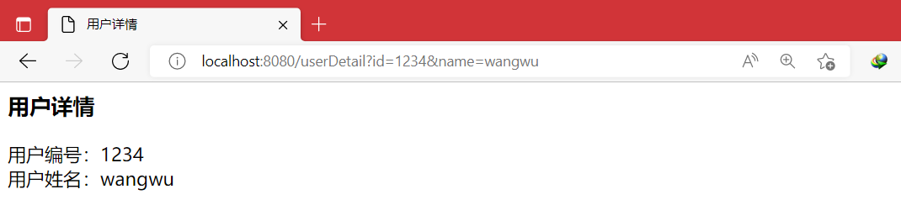
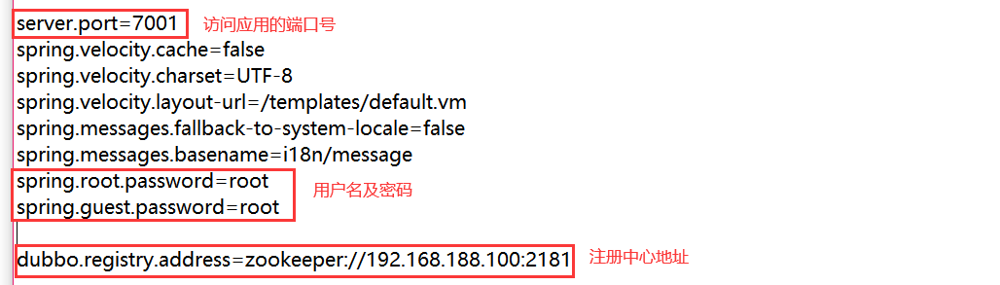

# Dubbo

## 一、RPC 基础知识

### 1 软件架构

#### 1.1 单一架构模型

当网站流量很小时，应用规模小时，只需一个应用，将所有功能都部署在一起，以减少部署服务器数量和成本。此时，用于简化增删改查工作量的数据访问框架(ORM)是关键。数据库的处理时间影响应用的性能。


这种结构的应用适合小型系统，小型网站，或者企业的内部系统，用户较少，请求量不
大，对请求的处理时间没有太高的要求。 将所有功能都部署到一个服务器，简单易用。开
发项目的难度低。


缺点：

1. 性能扩展比较困难
2. 不利于多人同时开发
3. 不利于升级维护
4. 整个系统的空间占用比较大


#### 1.2 分布式服务架构

当应用越来越多，应用之间交互不可避免，将核心业务抽取出来，作为独立的服务，逐渐形
成稳定的服务中心，使前端应用能更快速的响应多变的市场需求。此时，用于提高业务复用
及整合的**分布式服务框架(RPC)**是关键。分布式系统将服务作为独立的应用，实现服务共享
和重用。


### 2 分布式系统

#### 2.1 什么是分布式系统

分布式系统是若干独立计算机（服务器、系统）的集合，这些计算机对于用户来说就像单个相
关系统，分布式系统（distributed system）是建立在网络之上的服务器端一种结构。

分布式系统中的计算机可以使用不同的操作系统，可以运行不同应用程序提供服务，将
服务分散部署到多个计算机服务器上。


#### 2.2 RPC

RPC 【Remote Procedure Call】是指远程过程调用，是一种**进程间通信方式**，是一种技
术思想，而不是规范。它允许程序调用另一个地址空间（网络的另一台机器上）的过程或函
数，而不用开发人员显式编码这个调用的细节。调用本地方法和调用远程方法一样。

RPC 的实现方式可以不同。例如 java 的 rmi，spring 远程调用等。

RPC 概念是在上世纪 80 年代由 Brue Jay Nelson(布鲁·杰伊·纳尔逊)提出。使用 PRC 可以
将本地的调用扩展到远程调用（分布式系统的其他服务器）。


RPC 的特点：

1. 简单：使用简单，建立分布式应用更容易。
2. 高效：调用过程看起来十分清晰，效率高。
3. 通用：进程间通讯的方式，有通用的规则。


#### 2.3 RPC 基本原理


RPC 调用过程：

1. 调用方 client 要使用右侧 server 的功能（方法），发起对方法的调用；
2. client stub 是 RPC 中定义的存根，看做是 client 的助手。stub 把要调用的方法参数进行序
   列化，方法名称和其他数据包装起来；
3. 通过网络 socket(网络通信的技术)，把方法调用的细节内容发送给右侧的 server；
4. server 端通过 socket 接收请求的方法名称，参数等数据，传给 stub；
5. server 端接到的数据由 server stub (server 的助手) 处理，调用 server 的真正方法，处理业务；
6. server 方法处理完业务，把处理的结果对象（Object）交给了助手，助手把 Object 进行序
   列化，对象转为二进制数据；

7. server 助手二进制数据交给网络处理程序；
8. 通过网络将二进制数据，发送给 client；
9. client 接数据，交给 client 助手；
10. client 助手，接收数据通过反序列化为 java 对象（Object），作为远程方法调用结果。


其他：

- rpc 通讯是基于 tcp 或 udp 协议
- 序列化方式（xml/json/二进制）

------

## 二、Dubbo 框架

### 1 dubbo 概述

Apache Dubbo (incubating) |ˈdʌbəʊ| 是一款高性能、轻量级的开源 Java RPC 框架，它提
供了三大核心能力：**面向接口的远程方法调用**，**智能容错和负载均衡**，以及**服务自动注册和
发现**。

Dubbo 是一个分布式服务框架，致力于提供高性能和透明化的 RPC 远程服务调用方案、服
务治理方案。

官网：http://dubbo.apache.org/zh/


特性：


面向接口代理：调用接口的方法，在 A 服务器调用 B 服务器的方法，由 dubbo 实现对 B 的
调用，无需关心实现的细节，就像 MyBatis 访问 Dao 的接口，可以操作数据库一样。不用关
心 Dao 接口方法的实现。这样开发是方便，舒服的。


### 2 基本架构


- **服务提供者（Provider）**：暴露服务的服务提供方，服务提供者在启动时，向注册中心注
  册自己提供的服务。
- **服务消费者（Consumer）**: 调用远程服务的服务消费方，服务消费者在启动时，向注册
  中心订阅自己所需的服务，服务消费者，从提供者地址列表中，基于软负载均衡算法，选一
  台提供者进行调用，如果调用失败，再选另一台调用。
- **注册中心（Registry）**：注册中心返回服务提供者地址列表给消费者，如果有变更，注册
  中心将基于长连接推送变更数据给消费者。
- **监控中心（Monitor）**：服务消费者和提供者，在内存中累计调用次数和调用时间，定时
  每分钟发送一次统计数据到监控中心。


调用关系说明：

- 服务容器负责启动，加载，运行服务提供者。
- 服务提供者在启动时，向注册中心注册自己提供的服务。
- 服务消费者在启动时，向注册中心订阅自己所需的服务。
- 注册中心返回服务提供者地址列表给消费者，如果有变更，注册中心将基于长连接推
  送变更数据给消费者。
- 服务消费者，从提供者地址列表中，基于软负载均衡算法，选一台提供者进行调用，
  如果调用失败，再选另一台调用。
- 服务消费者和提供者，在内存中累计调用次数和调用时间，定时每分钟发送一次统计
  数据到监控中心。


### 3 dubbo 支持的协议

支持多种协议：dubbo，hessian，rmi，http，webservice，thrift，memcached，redis。

dubbo 官方推荐使用 dubbo 协议；dubbo 协议默认端口 20880。


使用 dubbo 协议，spring 配置文件加入：`<dubbo:protocol name="dubbo" port="20880" />`


### 4 电商平台需求

某电商平台系统需求：

用户浏览商品；选择商品下订单，订单系统需要获取用户信息中
的送货地址；向支付系统请求完成付款。

| 服务     | 功能                                 |
| -------- | ------------------------------------ |
| 网站系统 | 展示商品，修改用户信息               |
| 订单系统 | 生成订单，获取用户地址               |
| 用户系统 | 用户信息（地址，收件人，联系方式等） |


### 5 直连方式 dubbo

点对点的直连项目：消费者直接访问服务提供者，没有注册中心。消费者必须指定服务
提供者的访问地址（url）。

消费者直接通过 url 地址访问固定的服务提供者。这个 url 地址是不变的。


实现方式：

#### 5.1 创建服务提供者

```
1.创建一个Maven web工程：服务的提供者
2.创建一个实体bean查询的结果
3.提供一个服务接口：UserService
4.实现这个服务接口：UserServiceImpl
5.配置dubbo服务提供者的核心配置文件
    a.声明dubbo服务提供者的名称：保证唯一
    b.声明dubbo使用的协议及其端口号
    c.暴露服务，使用直连方式
6.添加监听器
```

1. 新建Maven Web工程：001-link-userService-provider

2. pom.xml

   ```xml
   <?xml version="1.0" encoding="UTF-8"?>
   <project xmlns="http://maven.apache.org/POM/4.0.0" xmlns:xsi="http://www.w3.org/2001/XMLSchema-instance"
     xsi:schemaLocation="http://maven.apache.org/POM/4.0.0 http://maven.apache.org/xsd/maven-4.0.0.xsd">
     <modelVersion>4.0.0</modelVersion>
   
     <groupId>xom.xukang</groupId>
     <artifactId>001-link-userService-provider</artifactId>
     <version>1.0-SNAPSHOT</version>
     <packaging>war</packaging>
   
     <dependencies>
       <!--spring依赖-->
       <dependency>
         <groupId>org.springframework</groupId>
         <artifactId>spring-context</artifactId>
         <version>5.2.5.RELEASE</version>
       </dependency>
       <dependency>
         <groupId>org.springframework</groupId>
         <artifactId>spring-webmvc</artifactId>
         <version>5.2.5.RELEASE</version>
       </dependency>
   
       <!--Dubbo 依赖-->
       <dependency>
         <groupId>com.alibaba</groupId>
         <artifactId>dubbo</artifactId>
         <version>2.6.2</version>
       </dependency>
     </dependencies>
   
     <build>
       <!--JDK1.8编译插件-->
       <plugins>
         <plugin>
           <artifactId>maven-compiler-plugin</artifactId>
           <version>3.1</version>
           <configuration>
             <source>1.8</source>
             <target>1.8</target>
           </configuration>
         </plugin>
       </plugins>
     </build>
   </project>
   ```

3. 创建一个User实体类

   ```java
   package com.xukang.dubbo.model;
   import java.io.Serializable;
   public class User implements Serializable {
       private static final long serialVersionUID = 1L;
       private Integer id;
       private String userName;
       private Integer age;
       public Integer getId() {
           return id;
       }
       public void setId(Integer id) {
           this.id = id;
       }
       public String getUserName() {
           return userName;
       }
       public void setUserName(String userName) {
           this.userName = userName;
       }
       public Integer getAge() {
           return age;
       }
       public void setAge(Integer age) {
           this.age = age;
       }
   }
   ```

4. 接口及其实现类

   ```java
   package com.xukang.dubbo.service;
   
   import com.xukang.dubbo.model.User;
   
   public interface UserService {
       /**
        * 根据用户标识获取用户信息
        */
       User queryUserById(Integer id);
   }
   ```

   ```java
   package com.xukang.dubbo.service.impl;
   
   import com.xukang.dubbo.model.User;
   import com.xukang.dubbo.service.UserService;
   
   public class UserServiceImpl implements UserService {
       @Override
       public User queryUserById(Integer id) {
           User user = new User();
           user.setId(id);
           user.setUserName("zhangsan");
           user.setAge(20);
   
           return user;
       }
   }
   ```

5. resources目录下新建一个spring配置文件

   dubbo-userservice-provider.xml

   ```xml
   <?xml version="1.0" encoding="UTF-8"?>
   <beans xmlns="http://www.springframework.org/schema/beans"
          xmlns:xsi="http://www.w3.org/2001/XMLSchema-instance" xmlns:dubbo="http://dubbo.apache.org/schema/dubbo"
          xsi:schemaLocation="http://www.springframework.org/schema/beans http://www.springframework.org/schema/beans/spring-beans.xsd http://dubbo.apache.org/schema/dubbo http://dubbo.apache.org/schema/dubbo/dubbo.xsd">
       
       <!--服务提供者声明名称：必须保证服务名称的唯一性，它的名称是dubbo内部使用的唯一标识-->
       <dubbo:application name="001-link-userService-provider" />
   
       <!--访问服务协议的名称及端口号：dubbo官方推荐使用的是dubbo协议，端口号默认为20880-->
       <!--
           name:指定协议的名称
           port:指定协议的端口号（默认为20880）
       -->
       <dubbo:protocol  name="dubbo" port="20880"/>
       
       <!--
           暴露服务接口 -> dubbo:service
           interface:暴露服务接口的全限定类名
           ref:接口引用的实现类在spring容器中的标识
           registry:如果不使用注册中心，则值为 "N/A"
       -->
       <dubbo:service interface="com.xukang.dubbo.service.UserService"  
                      ref="userService1" 
                      registry="N/A"/>
   
       <!--将接口的实现类加载到spring容器中-->
       <bean id="userService1" class="com.xukang.dubbo.service.impl.UserServiceImpl" />
   </beans>
   ```

6. web.xml 配置一个 监听器

   ```xml
   <?xml version="1.0" encoding="UTF-8"?>
   <web-app xmlns="http://xmlns.jcp.org/xml/ns/javaee"
            xmlns:xsi="http://www.w3.org/2001/XMLSchema-instance"
            xsi:schemaLocation="http://xmlns.jcp.org/xml/ns/javaee http://xmlns.jcp.org/xml/ns/javaee/web-app_4_0.xsd"
            version="4.0">
   
     <context-param>
       <param-name>contextConfigLocation</param-name>
       <param-value>classpath:dubbo-userservice-provider.xml</param-value>
     </context-param>
   
     <listener>
       <listener-class>org.springframework.web.context.ContextLoaderListener</listener-class>
     </listener>
   </web-app>
   ```


#### 5.2 创建服务消费者

```
1.创建一个maven web工程：服务的消费者
2.配置pom文件：添加需要的依赖（spring，dubbo）
3.设置dubbo核心配置文件
4.编写Controller
5.配置中央调度器（就是一个 servlet:DispatcherServlet）
```

1. 创建一个Maven web工程：002-link-consumer

2. pom.xml

   ```xml
   <?xml version="1.0" encoding="UTF-8"?>
   
   <project xmlns="http://maven.apache.org/POM/4.0.0" xmlns:xsi="http://www.w3.org/2001/XMLSchema-instance"
     xsi:schemaLocation="http://maven.apache.org/POM/4.0.0 http://maven.apache.org/xsd/maven-4.0.0.xsd">
     <modelVersion>4.0.0</modelVersion>
   
     <groupId>com.xukang</groupId>
     <artifactId>002-link-consumer</artifactId>
     <version>1.0-SNAPSHOT</version>
     <packaging>war</packaging>
   
     <dependencies>
       <!--spring依赖-->
       <dependency>
         <groupId>org.springframework</groupId>
         <artifactId>spring-context</artifactId>
         <version>5.2.5.RELEASE</version>
       </dependency>
       <dependency>
         <groupId>org.springframework</groupId>
         <artifactId>spring-webmvc</artifactId>
         <version>5.2.5.RELEASE</version>
       </dependency>
   
       <!--Dubbo 依赖-->
       <dependency>
         <groupId>com.alibaba</groupId>
         <artifactId>dubbo</artifactId>
         <version>2.6.2</version>
       </dependency>
   
       <!--依赖服务提供者-->
       <dependency>
         <groupId>xom.xukang</groupId>
         <artifactId>001-link-userService-provider</artifactId>
         <version>1.0-SNAPSHOT</version>
       </dependency>
     </dependencies>
   </project>
   ```

3. resources 目录下

   dubbo-consumer.xml

   ```xml
   <?xml version="1.0" encoding="UTF-8"?>
   <beans xmlns="http://www.springframework.org/schema/beans"
          xmlns:xsi="http://www.w3.org/2001/XMLSchema-instance" xmlns:dubbo="http://dubbo.apache.org/schema/dubbo"
          xsi:schemaLocation="http://www.springframework.org/schema/beans http://www.springframework.org/schema/beans/spring-beans.xsd http://dubbo.apache.org/schema/dubbo http://dubbo.apache.org/schema/dubbo/dubbo.xsd">
       
       <!--声明服务消费者的名称：保证唯一性-->
       <dubbo:application name="002-link-consumer" />
   
       <!--
           引用远程服务接口：
           id：远程服务接口对象名称
           interface：调用远程接口的全限定类名
           url：访问服务接口的地址
           registry：不使用注册中心，值为 “N/A”
       -->
       <dubbo:reference id="userService"
                        interface="com.xukang.dubbo.service.UserService"
                        url="dubbo://localhost:20880"
                        registry="N/A"/>
   </beans>
   ```

   application.xml

   ```xml
   <?xml version="1.0" encoding="UTF-8"?>
   <beans xmlns="http://www.springframework.org/schema/beans"
          xmlns:xsi="http://www.w3.org/2001/XMLSchema-instance"
          xmlns:context="http://www.springframework.org/schema/context"
          xmlns:mvc="http://www.springframework.org/schema/mvc"
          xsi:schemaLocation="http://www.springframework.org/schema/beans
          http://www.springframework.org/schema/beans/spring-beans.xsd
          http://www.springframework.org/schema/context
          https://www.springframework.org/schema/context/spring-context.xsd 
          http://www.springframework.org/schema/mvc 
          https://www.springframework.org/schema/mvc/spring-mvc.xsd">
       
       <!--扫描组件-->
       <context:component-scan base-package="com.xukang.dubbo" />
   
       <!--配置注解驱动-->
       <mvc:annotation-driven />
   
       <!--视图解析器-->
       <bean class="org.springframework.web.servlet.view.InternalResourceViewResolver" >
           <property name="prefix" value="/" />
           <property name="suffix" value=".jsp" />
       </bean>
   </beans>
   ```

4. 编写Controller

   ```java
   package com.xukang.dubbo;
   
   import com.xukang.dubbo.model.User;
   import com.xukang.dubbo.service.UserService;
   import org.springframework.beans.factory.annotation.Autowired;
   import org.springframework.stereotype.Controller;
   import org.springframework.ui.Model;
   import org.springframework.web.bind.annotation.RequestMapping;
   
   @Controller
   public class UserController {
       @Autowired
       private UserService userService;
   
       @RequestMapping(value = "/user")
       public String userDetail(Model model, Integer id){
           User user = userService.queryUserById(id);
           model.addAttribute("user", user);
           return "userDetail";
       }
   }
   ```

5. web.xml

   ```xml
   <?xml version="1.0" encoding="UTF-8"?>
   <web-app xmlns="http://xmlns.jcp.org/xml/ns/javaee"
            xmlns:xsi="http://www.w3.org/2001/XMLSchema-instance"
            xsi:schemaLocation="http://xmlns.jcp.org/xml/ns/javaee http://xmlns.jcp.org/xml/ns/javaee/web-app_4_0.xsd"
            version="4.0">
   
     <servlet>
       <servlet-name>dispatcherServlet</servlet-name>
       <servlet-class>org.springframework.web.servlet.DispatcherServlet</servlet-class>
       <init-param>
         <param-name>contextConfigLocation</param-name>
         <param-value>classpath:application.xml,classpath:dubbo-consumer.xml</param-value>
       </init-param>
     </servlet>
     
     <servlet-mapping>
       <servlet-name>dispatcherServlet</servlet-name>
       <url-pattern>/</url-pattern>
     </servlet-mapping>
   </web-app>
   ```

6. 结果页面userDetail.jsp

   ```xml
   <%@ page contentType="text/html;charset=UTF-8" language="java" %>
   <html>
   <head>
       <title>用户详情</title>
   </head>
   <body>
       <h1>用户详情</h1>
       <div>用户标识：${user.id}</div>
       <div>用户名称：${user.userName}</div>
       <div>用户年龄：${user.age}</div>
   </body>
   </html>
   ```


#### 5.3 测试

1. 先运行Tomcat：001-link-userService-provider
2. 后运行Tomcat：002-link-consumer
3. 页面输入：http://localhost:8080/user?id=2001


dubbo官方推荐必须有一个接口工程，它就是一个maven java工程

要求接口工程里存放的内容如下：

1. 对外暴露的服务接口（service 接口）

2. 实体bean对象


### 6 dubbo 服务化最佳实践

1. 分包

   建议将服务接口、服务模型、服务异常等均放在公共包中。

2. 粒度

   服务接口尽可能大粒度，每个服务方法应代表一个功能，而不是某功能的一个步骤，
   否则将面临分布式事务问题，Dubbo 暂未提供分布式事务支持。

   服务接口建议以业务场景为单位划分，并对相近业务做抽象，防止接口数量爆炸。

   不建议使用过于抽象的通用接口，如：Map query(Map)，这样的接口没有明确语义，
   会给后期维护带来不便。

3. 版本

   每个接口都应定义版本号，为后续不兼容升级提供可能，如： <dubbo:service 
   interface="com.xxx.XxxService" version="1.0" />。

   建议使用两位版本号，要变更服务版本。先升级一半提供者为新版本，再将消费者全
   部升为新版本，然后将剩下的一半提供者升为新版本。


### 7 改造 dubbo 项目

#### 7.1 创建公共资源项目(接口工程)

```
003-link-interface 是一个 maven java 工程
dubbo官方推荐使用的一个模式，将实体bean和业务接口存放到接口工程中
```

1. 新建一个maven java项目：003-link-interface

2. pom.xml

   ```xml
   <?xml version="1.0" encoding="UTF-8"?>
   <project xmlns="http://maven.apache.org/POM/4.0.0"
            xmlns:xsi="http://www.w3.org/2001/XMLSchema-instance"
            xsi:schemaLocation="http://maven.apache.org/POM/4.0.0 http://maven.apache.org/xsd/maven-4.0.0.xsd">
       <modelVersion>4.0.0</modelVersion>
   
       <groupId>com.xukang</groupId>
       <artifactId>003-link-interface</artifactId>
       <version>1.0.0</version>
   
   </project>
   ```

3. bean 实体类：User.java

   ```java
   package com.xukang.model;
   
   import java.io.Serializable;
   
   public class User implements Serializable {
       private static final long serialVersionUID = 1L;
   
       private Integer id;
       private String userName;
   
       public Integer getId() {
           return id;
       }
       public void setId(Integer id) {
           this.id = id;
       }
       public String getUserName() {
           return userName;
       }
       public void setUserName(String userName) {
           this.userName = userName;
       }
   }
   ```

4. service 服务接口类：UserService

   ```java
   package com.xukang.service;
   
   import com.xukang.model.User;
   
   public interface UserService {
       //根据用户标识获取用户信息
       User queryById(Integer id);
   
       //查询总人数
       Integer queryAllUserCount();
   }
   ```


#### 7.2 创建服务提供者

1. 新建maven web工程：004-link-userservice-provider

2. pom.xml

   ```xml
   <?xml version="1.0" encoding="UTF-8"?>
   
   <project xmlns="http://maven.apache.org/POM/4.0.0" xmlns:xsi="http://www.w3.org/2001/XMLSchema-instance"
     xsi:schemaLocation="http://maven.apache.org/POM/4.0.0 http://maven.apache.org/xsd/maven-4.0.0.xsd">
     <modelVersion>4.0.0</modelVersion>
   
     <groupId>com.xukang</groupId>
     <artifactId>004-link-userservice-provider</artifactId>
     <version>1.0.0</version>
     <packaging>war</packaging>
   
     <dependencies>
       <dependency>
         <!--spring依赖-->
         <groupId>org.springframework</groupId>
         <artifactId>spring-context</artifactId>
         <version>5.2.5.RELEASE</version>
       </dependency>
       <dependency>
         <groupId>org.springframework</groupId>
         <artifactId>spring-webmvc</artifactId>
         <version>5.2.5.RELEASE</version>
       </dependency>
   
       <!--dubbo依赖-->
       <dependency>
         <groupId>com.alibaba</groupId>
         <artifactId>dubbo</artifactId>
         <version>2.6.2</version>
       </dependency>
   
       <!--引入接口工程-->
       <dependency>
         <groupId>com.xukang</groupId>
         <artifactId>003-link-interface</artifactId>
         <version>1.0.0</version>
       </dependency>
     </dependencies>
   
     <build>
       <plugins>
         <!--JDK1.8编译插件-->
         <plugin>
           <artifactId>maven-compiler-plugin</artifactId>
           <version>3.1</version>
           <configuration>
             <source>1.8</source>
             <target>1.8</target>
           </configuration>
         </plugin>
       </plugins>
     </build>
   </project>
   ```

3. 接口工程中服务接口实现类

   ```java
   package com.xukang.service.impl;
   
   import com.xukang.model.User;
   import com.xukang.service.UserService;
   
   public class UserServiceImpl implements UserService {
       @Override
       public User queryById(Integer id) {
           User user = new User();
           user.setId(id);
           user.setUserName("lisi");
           return user;
       }
   
       @Override
       public Integer queryAllUserCount() {
           return 22;
       }
   }
   ```

4. resources目录下配置dubbo服务提供者的核心配置文件

   spring配置文件：dubbo-userservice-provider.xml

   ```xml
   <?xml version="1.0" encoding="UTF-8"?>
   <beans xmlns="http://www.springframework.org/schema/beans"
          xmlns:xsi="http://www.w3.org/2001/XMLSchema-instance" xmlns:dubbo="http://dubbo.apache.org/schema/dubbo"
          xsi:schemaLocation="http://www.springframework.org/schema/beans
          http://www.springframework.org/schema/beans/spring-beans.xsd http://dubbo.apache.org/schema/dubbo http://dubbo.apache.org/schema/dubbo/dubbo.xsd">
   
       <!--声明dubbo服务提供者的名称：保证唯一性-->
       <dubbo:application name="004-link-userservice-provider" />
   
       <!--设置dubbo使用的协议和端口号-->
       <!--
            name:dubbo使用协议的名称
            port:dubbo使用协议的端口号
       -->
       <dubbo:protocol name="dubbo" port="20880" />
   
       <!--
           暴露服务接口
       -->
       <dubbo:service interface="com.xukang.service.UserService"
                      ref="userService"
                      registry="N/A"/>
   
       <!--加载业务接口的实现类到spring容器中-->
       <bean id="userService" class="com.xukang.service.impl.UserServiceImpl" />
   </beans>
   ```

5. web.xml中配置监听器

   ```xml
   <?xml version="1.0" encoding="UTF-8"?>
   <web-app xmlns="http://xmlns.jcp.org/xml/ns/javaee"
            xmlns:xsi="http://www.w3.org/2001/XMLSchema-instance"
            xsi:schemaLocation="http://xmlns.jcp.org/xml/ns/javaee http://xmlns.jcp.org/xml/ns/javaee/web-app_4_0.xsd"
            version="4.0">
   
     <context-param>
       <param-name>contextConfigLocation</param-name>
       <param-value>classpath:dubbo-userservice-provider.xml</param-value>
     </context-param>
   
     <listener>
       <listener-class>org.springframework.web.context.ContextLoaderListener</listener-class>
     </listener>
   </web-app>
   ```


#### 7.3 创建服务消费者

1. 新建一个maven web工程：005-link-consumer

2. pom.xml

   ```xml
   <?xml version="1.0" encoding="UTF-8"?>
   
   <project xmlns="http://maven.apache.org/POM/4.0.0" xmlns:xsi="http://www.w3.org/2001/XMLSchema-instance"
     xsi:schemaLocation="http://maven.apache.org/POM/4.0.0 http://maven.apache.org/xsd/maven-4.0.0.xsd">
     <modelVersion>4.0.0</modelVersion>
   
     <groupId>com.xukang</groupId>
     <artifactId>005-link-consumer</artifactId>
     <version>1.0.0</version>
     <packaging>war</packaging>
   
     <dependencies>
       <!--spring依赖-->
       <dependency>
         <groupId>org.springframework</groupId>
         <artifactId>spring-context</artifactId>
         <version>5.2.5.RELEASE</version>
       </dependency>
       <dependency>
         <groupId>org.springframework</groupId>
         <artifactId>spring-webmvc</artifactId>
         <version>5.2.5.RELEASE</version>
       </dependency>
   
       <!--Dubbo 依赖-->
       <dependency>
         <groupId>com.alibaba</groupId>
         <artifactId>dubbo</artifactId>
         <version>2.6.2</version>
       </dependency>
   
       <!--接口工程-->
       <dependency>
         <groupId>com.xukang</groupId>
         <artifactId>003-link-interface</artifactId>
         <version>1.0.0</version>
       </dependency>
     </dependencies>
   
     <build>
       <plugins>
         <!--JDK1.8编译插件-->
         <plugin>
           <artifactId>maven-compiler-plugin</artifactId>
           <version>3.1</version>
           <configuration>
             <source>1.8</source>
             <target>1.8</target>
           </configuration>
         </plugin>
       </plugins>
     </build>
   </project>
   ```

3. resources目录下

   spring dubbo消费者配置文件：dubbo-consumer.xml

   ```xml
   <?xml version="1.0" encoding="UTF-8"?>
   <beans xmlns="http://www.springframework.org/schema/beans"
          xmlns:xsi="http://www.w3.org/2001/XMLSchema-instance" xmlns:dubbo="http://dubbo.apache.org/schema/dubbo"
          xsi:schemaLocation="http://www.springframework.org/schema/beans http://www.springframework.org/schema/beans/spring-beans.xsd http://dubbo.apache.org/schema/dubbo http://dubbo.apache.org/schema/dubbo/dubbo.xsd">
   
       <!--声明服务消费者名称：保证唯一性-->
       <dubbo:application name="005-link-consumer" />
   
       <!--引用远程接口服务-->
       <dubbo:reference id="userService"
                        interface="com.xukang.service.UserService"
                        url="dubbo://localhost:20880"
                        registry="N/A" />
   </beans>
   ```

   spring核心配置文件：application.xml

   ```xml
   <?xml version="1.0" encoding="UTF-8"?>
   <beans xmlns="http://www.springframework.org/schema/beans"
          xmlns:xsi="http://www.w3.org/2001/XMLSchema-instance"
          xmlns:context="http://www.springframework.org/schema/context"
          xmlns:mvc="http://www.springframework.org/schema/mvc"
          xsi:schemaLocation="http://www.springframework.org/schema/beans http://www.springframework.org/schema/beans/spring-beans.xsd http://www.springframework.org/schema/context https://www.springframework.org/schema/context/spring-context.xsd http://www.springframework.org/schema/mvc https://www.springframework.org/schema/mvc/spring-mvc.xsd">
   
       <!--扫描组件-->
       <context:component-scan base-package="com.xukang.web" />
   
       <!--配置注解驱动-->
       <mvc:annotation-driven />
   
       <!--视图解析器-->
       <bean class="org.springframework.web.servlet.view.InternalResourceViewResolver" >
           <property name="prefix" value="/" />
           <property name="suffix" value=".jsp" />
        </bean>
   </beans>
   ```

4. 编写控制层代码

   ```java
   package com.xukang.web;
   
   import com.xukang.model.User;
   import com.xukang.service.UserService;
   import org.springframework.beans.factory.annotation.Autowired;
   import org.springframework.stereotype.Controller;
   import org.springframework.ui.Model;
   import org.springframework.web.bind.annotation.RequestMapping;
   
   @Controller
   public class UserController {
       @Autowired
       private UserService userService;
   
       @RequestMapping(value = "/userDetail")
       public String userDetail(Model model, Integer id){
           //根据用户标识获取用户详情
           User user = userService.queryById(id);
           //获取用户的总人数
           Integer allUserCount = userService.queryAllUserCount();
   
           model.addAttribute("user", user);
           model.addAttribute("allUserCount", allUserCount);
   
           return "userDetail";
       }
   }
   ```

5. web.xml

   ```xml
   <?xml version="1.0" encoding="UTF-8"?>
   <web-app xmlns="http://xmlns.jcp.org/xml/ns/javaee"
            xmlns:xsi="http://www.w3.org/2001/XMLSchema-instance"
            xsi:schemaLocation="http://xmlns.jcp.org/xml/ns/javaee http://xmlns.jcp.org/xml/ns/javaee/web-app_4_0.xsd"
            version="4.0">
   
     <servlet>
       <servlet-name>dispatcherServlet</servlet-name>
       <servlet-class>org.springframework.web.servlet.DispatcherServlet</servlet-class>
       <init-param>
         <param-name>contextConfigLocation</param-name>
         <param-value>classpath:application.xml,classpath:dubbo-cunsumer.xml</param-value>
       </init-param>
     </servlet>
   
     <servlet-mapping>
       <servlet-name>dispatcherServlet</servlet-name>
       <url-pattern>/</url-pattern>
     </servlet-mapping>
   </web-app>
   ```

6. 结果页面：userDetail.jsp

   ```jsp
   <%@ page contentType="text/html;charset=UTF-8" language="java" %>
   <html>
   <head>
       <title>用户详情</title>
   </head>
   <body>
     <h3>用户详情</h3>
     <div>学生ID：${user.id}</div>
     <div>学生姓名：${user.userName}</div>
     <div>学生总人数：${allUserCount}</div>
   </body>
   </html>
   ```


#### 7.4 测试

1. 先运行Tomcat：004-link-userservice-provider
2. 后运行Tomcat：005-link-consumer
3. 页面输入：http://localhost:8080/userDetail?id=333


### 8 dubbo 常用标签

Dubbo 中常用标签。分为三个类别：公用标签，服务提供者标签，服务消费者标签

1. 公用标签

   `<dubbo:application/>` 和 `<dubbo:registry/>`

   配置应用信息：`<dubbo:application name="服务的唯一性名称" />`

   配置注册中心：`<dubbo:registry address="ip:port" protocol="协议" />`

2. 服务提供者标签

   配置暴露的服务：

   `<dubbo:service interface="服务接口全限定名" ref="服务实现对象的bean" >`

3. 服务消费者标签

   配置服务消费者引用远程服务：

   `<dubbo:reference id="服务引用bean的id" interface="服务接口全限定名" />`

------

## 三、注册中心 - Zookeeper

### 1 注册中心概述

对于服务提供方，它需要发布服务，而且由于应用系统的复杂性，服务的数量、类型也
不断膨胀；

对于服务消费方，它最关心如何获取到它所需要的服务，而面对复杂的应用系统，
需要管理大量的服务调用。

而且，对于服务提供方和服务消费方来说，他们还有可能兼具这两种角色，即需要提供
服务，有需要消费服务。 通过将服务统一管理起来，可以有效地优化内部应用对服务发布
/使用的流程和管理。服务注册中心可以通过特定协议来完成服务对外的统一。


Dubbo 提供
的注册中心有如下几种类型可供选：

- Multicast 注册中心：组播方式

- Redis 注册中心：使用 Redis 作为注册中心

- Simple 注册中心：就是一个 dubbo 服务。作为注册中心。提供查找服务的功能。

- Zookeeper 注册中心：使用 Zookeeper 作为注册中心

  推荐使用 Zookeeper 注册中心。


### 2 注册中心工作方式


### 3 Zookeeper 注册中心

Zookeeper 是一个高性能的，分布式的，开放源码的分布式应用程序协调服务。简称 zk。
Zookeeper 是翻译管理是动物管理员。可以理解为 windows 中的资源管理器或者注册表。他
是一个树形结构。这种树形结构和标准文件系统相似。ZooKeeper 树中的每个节点被称为
Znode。和文件系统的目录树一样，ZooKeeper 树中的每个节点可以拥有子节点。每个节点表
示一个唯一服务资源。Zookeeper 运行需要 java 环境。


#### 下载地址

官网地址：https://zookeeper.apache.org/


下载 Linux 环境安装的 tar 包


### 4 本地安装模式

#### 4.1 本地模式安装

##### 4.1.1 安装前准备

1. 安装JDK：`yum install -y java-1.8.0-openjdk.x86_64`

2. 拷贝 apache-zookeeper-3.5.7-bin.tar.gz 安装包到 Linux 系统下的目录`/opt/model`

3. 解压到指定目录

   `tar -zxvf apache-zookeeper-3.5.7-bin.tar.gz -C /opt/module/`

4. 修改名称

   `mv apache-zookeeper-3.5.7-bin/ 
   zookeeper-3.5.7`


##### 4.1.2 配置修改

1. 将`/opt/module/zookeeper-3.5.7/conf `这个路径下的 `zoo_sample.cfg` 修改为` zoo.cfg`：

   `mv zoo_sample.cfg zoo.cfg`

2. 打开 zoo.cfg 文件，修改 dataDir 路径：

   `vi zoo.cfg`

   修改如下内容：

   `admin.serverPort=8888`原因：zookeeper 3.5.x 占用 8080（仅限window环境下安装）

   `dataDir=/opt/module/zookeeper-3.5.7/zkData`

3. 在`/opt/module/zookeeper-3.5.7/`这个目录上创建 zkData 文件夹

   `mkdir zkData`


##### 4.1.3 操作ZooKeeper

1. 启动 Zookeeper：`bin/zkServer.sh start`

2. 查看进程是否启动：`ps -ef | grep zook`

3. 查看状态：`bin/zkServer.sh status`

   ```
   [root@localhost zookeeper-3.5.7]# bin/zkServer.sh status
   /usr/bin/java
   ZooKeeper JMX enabled by default
   Using config: /opt/model/zookeeper-3.5.7/bin/../conf/zoo.cfg
   Client port found: 2181. Client address: localhost.
   Mode: standalone
   ```

4. 启动客户端：`bin/zkCli.sh`

5. 退出客户端：`
   [zk: localhost:2181(CONNECTED) 0] quit`

6. 停止 Zookeeper：`
   bin/zkServer.sh stop`


#### 4.2 配置参数解读

```
# The number of milliseconds of each tick
tickTime=2000
# The number of ticks that the initial
# synchronization phase can take
initLimit=10
# The number of ticks that can pass between
# sending a request and getting an acknowledgement
syncLimit=5
# the directory where the snapshot is stored.
# do not use /tmp for storage, /tmp here is just
# example sakes.
dataDir=/opt/model/zookeeper-3.5.7/zkData
# the port at which the clients will connect
clientPort=2181
# the maximum number of client connections.
# increase this if you need to handle more clients
#maxClientCnxns=60
#
# Be sure to read the maintenance section of the
# administrator guide before turning on autopurge.
#
# http://zookeeper.apache.org/doc/current/zookeeperAdmin.html#sc_maintenance
#
# The number of snapshots to retain in dataDir
#autopurge.snapRetainCount=3
# Purge task interval in hours
# Set to "0" to disable auto purge feature
#autopurge.purgeInterval=1
```

Zookeeper中的配置文件zoo.cfg中参数含义解读如下：

1. `tickTime = 2000`：通信心跳时间，Zookeeper服务器与客户端心跳时间，单位毫秒


2. `initLimit = 10`：LF初始通信时限


3. `syncLimit = 5`：LF同步通信时限


4. dataDir：保存Zookeeper中的数据

   注意：默认的tmp目录，容易被Linux系统定期删除，所以一般不用默认的tmp目录。


5. `clientPort = 2181`：客户端连接端口，通常不做修改。


### 5 改造 dubbo - 使用 Zookeeper

#### 5.1 接口工程

1. 新建普通的maven java工程：006-zk-interface

2. pom.xml

   ```xml
   <?xml version="1.0" encoding="UTF-8"?>
   <project xmlns="http://maven.apache.org/POM/4.0.0"
            xmlns:xsi="http://www.w3.org/2001/XMLSchema-instance"
            xsi:schemaLocation="http://maven.apache.org/POM/4.0.0 http://maven.apache.org/xsd/maven-4.0.0.xsd">
       <modelVersion>4.0.0</modelVersion>
   
       <groupId>com.xukang</groupId>
       <artifactId>006-zk-interface</artifactId>
       <version>1.0.0</version>
   </project>
   ```

3. bean 实体类：User.java

   ```java
   package com.xukang.model;
   
   import java.io.Serializable;
   
   public class User implements Serializable {
       private static final long serialVersionUID = 1L;
       private Integer id;
       private String username;
   
       public Integer getId() {
           return id;
       }
       public void setId(Integer id) {
           this.id = id;
       }
       public String getUsername() {
           return username;
       }
       public void setUsername(String username) {
           this.username = username;
       }
   }
   ```

4. service 服务接口类：UserService.java

   ```java
   package com.xukang.service;
   
   import com.xukang.model.User;
   
   public interface UserService {
       //根据用户标识获取用户信息
       User queryUserById(Integer id, String username);
   }
   ```


#### 5.2 服务提供者

1. 新建maven web工程：007-zk-userservice-provider

2. pom.xml

   ```xml
   <?xml version="1.0" encoding="UTF-8"?>
   
   <project xmlns="http://maven.apache.org/POM/4.0.0" xmlns:xsi="http://www.w3.org/2001/XMLSchema-instance"
     xsi:schemaLocation="http://maven.apache.org/POM/4.0.0 http://maven.apache.org/xsd/maven-4.0.0.xsd">
     <modelVersion>4.0.0</modelVersion>
   
     <groupId>com.xukang</groupId>
     <artifactId>007-zk-userservice-provider</artifactId>
     <version>1.0.0</version>
     <packaging>war</packaging>
   
     <dependencies>
       <dependency>
         <!--spring依赖-->
         <groupId>org.springframework</groupId>
         <artifactId>spring-context</artifactId>
         <version>5.2.5.RELEASE</version>
       </dependency>
       <dependency>
         <groupId>org.springframework</groupId>
         <artifactId>spring-webmvc</artifactId>
         <version>5.2.5.RELEASE</version>
       </dependency>
   
       <!--dubbo依赖-->
       <dependency>
         <groupId>com.alibaba</groupId>
         <artifactId>dubbo</artifactId>
         <version>2.6.2</version>
       </dependency>
   
       <!--Zookeeper依赖-->
       <dependency>
         <groupId>org.apache.curator</groupId>
         <artifactId>curator-framework</artifactId>
         <version>4.1.0</version>
       </dependency>
   
       <!--引入接口工程依赖-->
       <dependency>
         <groupId>com.xukang</groupId>
         <artifactId>006-zk-interface</artifactId>
         <version>1.0.0</version>
       </dependency>
     </dependencies>
   
     <build>
       <plugins>
         <!--JDK1.8编译插件-->
         <plugin>
           <artifactId>maven-compiler-plugin</artifactId>
           <version>3.1</version>
           <configuration>
             <source>1.8</source>
             <target>1.8</target>
           </configuration>
         </plugin>
       </plugins>
     </build>
   </project>
   ```

3. 接口工程中服务接口实现类

   ```java
   package com.xukang.service.impl;
   
   import com.xukang.model.User;
   import com.xukang.service.UserService;
   
   public class UserServiceImpl implements UserService {
       @Override
       public User queryUserById(Integer id, String usernaem) {
           User user = new User();
           user.setId(id);
           user.setUsername(usernaem);
           return user;
       }
   }
   ```

4. resources目录下配置dubbo服务提供者的核心配置文件

   spring dubbo 服务提供者配置文件：dubbo-zk-userservice-provider.xml

   ```xml
   <?xml version="1.0" encoding="UTF-8"?>
   <beans xmlns="http://www.springframework.org/schema/beans"
          xmlns:xsi="http://www.w3.org/2001/XMLSchema-instance" xmlns:dubbo="http://dubbo.apache.org/schema/dubbo"
          xsi:schemaLocation="http://www.springframework.org/schema/beans http://www.springframework.org/schema/beans/spring-beans.xsd http://dubbo.apache.org/schema/dubbo http://dubbo.apache.org/schema/dubbo/dubbo.xsd">
       <!--声明dubbo服务提供者的名称：保证唯一性-->
       <dubbo:application name="007-zk-userservice-provider" />
   
       <!--声明dubbo使用的协议名称和端口号-->
       <dubbo:protocol name="dubbo" port="20880" />
   
       <!--现在使用Zookeeper注册中心-->
       <!--先指定注册中心地址和端口号-->
       <dubbo:registry address="zookeeper://192.168.188.100:2181" />
   
       <!--暴露服务接口-->
       <dubbo:service interface="com.xukang.service.UserService"
                      ref="userService" />
       
       <!--加载接口实现类-->
       <bean id="userService" class="com.xukang.service.impl.UserServiceImpl" />
   </beans>
   ```

5. web.xml中配置监听器

   ```xml
   <?xml version="1.0" encoding="UTF-8"?>
   <web-app xmlns="http://xmlns.jcp.org/xml/ns/javaee"
            xmlns:xsi="http://www.w3.org/2001/XMLSchema-instance"
            xsi:schemaLocation="http://xmlns.jcp.org/xml/ns/javaee http://xmlns.jcp.org/xml/ns/javaee/web-app_4_0.xsd"
            version="4.0">
   
     <context-param>
       <param-name>contextConfigLocation</param-name>
       <param-value>classpath:dubbo-zk-userservice-provider.xml</param-value>
     </context-param>
   
     <listener>
       <listener-class>org.springframework.web.context.ContextLoaderListener</listener-class>
     </listener>
   </web-app>
   ```


#### 5.3 服务消费者

1. 新建一个maven web工程：008-zk-consumer

2. pom.xml

   ```xml
   <?xml version="1.0" encoding="UTF-8"?>
   <project xmlns="http://maven.apache.org/POM/4.0.0" xmlns:xsi="http://www.w3.org/2001/XMLSchema-instance"
     xsi:schemaLocation="http://maven.apache.org/POM/4.0.0 http://maven.apache.org/xsd/maven-4.0.0.xsd">
     <modelVersion>4.0.0</modelVersion>
   
     <groupId>com.xukang</groupId>
     <artifactId>008-zk-cunsumer</artifactId>
     <version>1.0.0</version>
     <packaging>war</packaging>
   
     <dependencies>
       <!--spring依赖-->
       <dependency>
         <groupId>org.springframework</groupId>
         <artifactId>spring-context</artifactId>
         <version>5.2.5.RELEASE</version>
       </dependency>
       <dependency>
         <groupId>org.springframework</groupId>
         <artifactId>spring-webmvc</artifactId>
         <version>5.2.5.RELEASE</version>
       </dependency>
   
       <!--Dubbo 依赖-->
       <dependency>
         <groupId>com.alibaba</groupId>
         <artifactId>dubbo</artifactId>
         <version>2.6.2</version>
       </dependency>
   
       <!--Zookeeper依赖-->
       <dependency>
         <groupId>org.apache.curator</groupId>
         <artifactId>curator-framework</artifactId>
         <version>4.1.0</version>
       </dependency>
   
       <!--接口工程-->
       <dependency>
         <groupId>com.xukang</groupId>
         <artifactId>006-zk-interface</artifactId>
         <version>1.0.0</version>
       </dependency>
     </dependencies>
   
     <build>
       <plugins>
         <!--JDK1.8编译插件-->
         <plugin>
           <artifactId>maven-compiler-plugin</artifactId>
           <version>3.1</version>
           <configuration>
             <source>1.8</source>
             <target>1.8</target>
           </configuration>
         </plugin>
       </plugins>
     </build>
   </project>
   ```

3. resources目录下

   spring dubbo消费者配置文件：dubbo-zk-consumer.xml

   ```xml
   <?xml version="1.0" encoding="UTF-8"?>
   <beans xmlns="http://www.springframework.org/schema/beans"
          xmlns:xsi="http://www.w3.org/2001/XMLSchema-instance" xmlns:dubbo="http://dubbo.apache.org/schema/dubbo"
          xsi:schemaLocation="http://www.springframework.org/schema/beans http://www.springframework.org/schema/beans/spring-beans.xsd http://dubbo.apache.org/schema/dubbo http://dubbo.apache.org/schema/dubbo/dubbo.xsd">
   
       <!--声明dubbo服务消费者名称：保存唯一性-->
       <dubbo:application name="008-zk-consumer" />
   
       <!--指定注册中心-->
       <dubbo:registry address="zookeeper://192.168.188.100:2181" />
   
       <!--引用远程接口服务-->
       <dubbo:reference id="userService"
                        interface="com.xukang.service.UserService" />
   </beans>
   ```

   spring核心配置文件：application.xml

   ```xml
   <?xml version="1.0" encoding="UTF-8"?>
   <beans xmlns="http://www.springframework.org/schema/beans"
          xmlns:xsi="http://www.w3.org/2001/XMLSchema-instance"
          xmlns:context="http://www.springframework.org/schema/context"
          xmlns:mvc="http://www.springframework.org/schema/mvc"
          xsi:schemaLocation="http://www.springframework.org/schema/beans
          http://www.springframework.org/schema/beans/spring-beans.xsd
          http://www.springframework.org/schema/context
          https://www.springframework.org/schema/context/spring-context.xsd
          http://www.springframework.org/schema/mvc
          https://www.springframework.org/schema/mvc/spring-mvc.xsd">
   
       <!--扫描组件-->
       <context:component-scan base-package="com.xukang.web" />
   
       <!--配置注解驱动-->
       <mvc:annotation-driven />
   
       <!--视图解析器-->
       <bean class="org.springframework.web.servlet.view.InternalResourceViewResolver" >
           <property name="prefix" value="/" />
           <property name="suffix" value=".jsp" />
       </bean>
   </beans>
   ```

4. 编写控制层代码

   ```java
   package com.xukang.web;
   
   import com.xukang.model.User;
   import com.xukang.service.UserService;
   import org.springframework.beans.factory.annotation.Autowired;
   import org.springframework.stereotype.Controller;
   import org.springframework.ui.Model;
   import org.springframework.web.bind.annotation.RequestMapping;
   
   @Controller
   public class UserController {
       @Autowired
       private UserService userService;
   
       @RequestMapping(value = "/userDetail")
       public String userDetail(Model model, Integer id, String name){
           User user = userService.queryUserById(id, name);
           model.addAttribute("user", user);
           return "userDetail";
       }
   }
   ```
   
5. web.xml

   ```xml
   <?xml version="1.0" encoding="UTF-8"?>
   <web-app xmlns="http://xmlns.jcp.org/xml/ns/javaee"
            xmlns:xsi="http://www.w3.org/2001/XMLSchema-instance"
            xsi:schemaLocation="http://xmlns.jcp.org/xml/ns/javaee http://xmlns.jcp.org/xml/ns/javaee/web-app_4_0.xsd"
            version="4.0">
   
     <servlet>
       <servlet-name>dispatcherServlet</servlet-name>
       <servlet-class>org.springframework.web.servlet.DispatcherServlet</servlet-class>
       <init-param>
         <param-name>contextConfigLocation</param-name>
         <param-value>classpath:application.xml,classpath:dubbo-zk-consumer.xml</param-value>
       </init-param>
     </servlet>
   
     <servlet-mapping>
       <servlet-name>dispatcherServlet</servlet-name>
       <url-pattern>/</url-pattern>
     </servlet-mapping>
   </web-app>
   ```
   
6. 结果页面：userDetail.jsp

   ```jsp
   <%@ page contentType="text/html;charset=UTF-8" language="java" %>
   <html>
   <head>
       <title>用户详情</title>
   </head>
   <body>
       <h3>用户详情</h3>
       <div>用户编号：${user.id}</div>
       <div>用户姓名：${user.username}</div>
   </body>
   </html>
   ```


#### 5.4 测试

1. 先运行Tomcat：007-zk-userservice-provider
2. 后运行Tomcat：008-zk-consumer
3. 页面输入：http://localhost:8080/userDetail?id=1234&name=wangwu




### 6 注册中心的高可用性

概念：

高可用性（High Availability）：通常来描述一个系统经过专门的设计，从而减少不能提供服
务的时间，而保持其服务的高度可用性。

Zookeeper 是高可用的，健壮的。Zookeeper 宕机，正在运行中的 dubbo 服务仍然可以正
常访问。


健壮性：

- 监控中心宕掉不影响使用，只是丢失部分采样数据
- 注册中心仍能通过缓存提供服务列表查询，但不能注册新服务
- 服务提供者无状态，任意一台宕掉后，不影响使用
- 服务提供者全部宕掉后，服务消费者应用将无法使用，并无限次重连等待服务提供者恢
  复


演示操作：
1. 先启动 zookeeper、dubbo 服务提供者、dubbo 服务消费者。
2. 测试正常访问
3. 停止 zookeeper
4. 测试消费者仍然可以访问提供者

------

## 四、dubbo的配置

### 1 配置原则

在服务提供者配置访问参数。因为服务提供者更了解服务的各种参数。


### 2 关闭检查

dubbo 缺省会在启动时检查依赖的服务是否可用，不可用时会抛出异常，阻止 Spring 初
始化完成，以便上线时，能及早发现问题，默认 check=true。通过 check="false"关闭检查，
比如，测试时，有些服务不关心，或者出现了循环依赖，必须有一方先启动。

例 1：关闭某个服务的启动时检查

`<dubbo:reference interface="com.foo.BarService" check="false" />`

例 2：关闭注册中心启动时检查

`<dubbo:registry check="false" />`

默认启动服务时检查注册中心存在并已运行。注册中心不启动会报错。


### 3 重试次数

消费者访问提供者，如果访问失败，则切换重试访问其它服务器，但重试会带来更长延迟。
访问时间变长，用户的体验较差。多次重新访问服务器有可能访问成功。可通过 retries="2" 
来设置重试次数(不含第一次)。

重试次数配置如下：

`<dubbo:service retries="2" />`

或

`<dubbo:reference retries="2" />`


### 4 超时时间

由于网络或服务端不可靠，会导致调用出现一种不确定的中间状态（超时）。为了避免超时
导致客户端资源（线程）挂起耗尽，必须设置超时时间。
timeout：调用远程服务超时时间(毫秒)。


dubbo消费端：

指定接口超时配置

`<dubbo:reference interface="com.foo.BarService" timeout="2000" />`


dubbo服务端：

指定接口超时配置

`<dubbo:service interface="com.foo.BarService" timeout="2000" />`


### 5 版本号

每个接口都应定义版本号，为后续不兼容升级提供可能。当一个接口有不同的实现，项目早
期使用的一个实现类， 之后创建接口的新的实现类。区分不同的接口实现使用 version。
特别是项目需要把早期接口的实现全部换位新的实现类，也需要使用 version。

可以用版本号从早期的接口实现过渡到新的接口实现，版本号不同的服务相互间不引用。

可以按照以下的步骤进行版本迁移：

- 在低压力时间段，先升级一半提供者为新版本
- 再将所有消费者升级为新版本
- 然后将剩下的一半提供者升级为新版本


#### 5.1 接口工程

1. 接口工程依旧是：006-zk-interface

2. pom.xml

   ```xml
   <?xml version="1.0" encoding="UTF-8"?>
   <project xmlns="http://maven.apache.org/POM/4.0.0"
            xmlns:xsi="http://www.w3.org/2001/XMLSchema-instance"
            xsi:schemaLocation="http://maven.apache.org/POM/4.0.0 http://maven.apache.org/xsd/maven-4.0.0.xsd">
       <modelVersion>4.0.0</modelVersion>
   
       <groupId>com.xukang</groupId>
       <artifactId>006-zk-interface</artifactId>
       <version>1.0.0</version>
   </project>
   ```

3. bean 实体类：User.java

   ```java
   package com.xukang.model;
   
   import java.io.Serializable;
   
   public class User implements Serializable {
       private static final long serialVersionUID = 1L;
       private Integer id;
       private String username;
   
       public Integer getId() {
           return id;
       }
       public void setId(Integer id) {
           this.id = id;
       }
       public String getUsername() {
           return username;
       }
       public void setUsername(String username) {
           this.username = username;
       }
   }
   ```

4. service 服务接口类：UserService.java

   ```java
   package com.xukang.service;
   
   import com.xukang.model.User;
   
   public interface UserService {
       //根据用户标识获取用户信息
       User queryUserById(Integer id, String username);
   }
   ```


#### 5.2 服务提供者

1. 新建maven web工程：009-zk-userservice-multi-provider

2. pom.xml

   ```xml
   <?xml version="1.0" encoding="UTF-8"?>
   
   <project xmlns="http://maven.apache.org/POM/4.0.0" xmlns:xsi="http://www.w3.org/2001/XMLSchema-instance"
     xsi:schemaLocation="http://maven.apache.org/POM/4.0.0 http://maven.apache.org/xsd/maven-4.0.0.xsd">
     <modelVersion>4.0.0</modelVersion>
   
     <groupId>com.xukang</groupId>
     <artifactId>007-zk-userservice-provider</artifactId>
     <version>1.0.0</version>
     <packaging>war</packaging>
   
     <dependencies>
       <dependency>
         <!--spring依赖-->
         <groupId>org.springframework</groupId>
         <artifactId>spring-context</artifactId>
         <version>5.2.5.RELEASE</version>
       </dependency>
       <dependency>
         <groupId>org.springframework</groupId>
         <artifactId>spring-webmvc</artifactId>
         <version>5.2.5.RELEASE</version>
       </dependency>
   
       <!--dubbo依赖-->
       <dependency>
         <groupId>com.alibaba</groupId>
         <artifactId>dubbo</artifactId>
         <version>2.6.2</version>
       </dependency>
   
       <!--Zookeeper依赖-->
       <dependency>
         <groupId>org.apache.curator</groupId>
         <artifactId>curator-framework</artifactId>
         <version>4.1.0</version>
       </dependency>
   
       <!--引入接口工程依赖-->
       <dependency>
         <groupId>com.xukang</groupId>
         <artifactId>006-zk-interface</artifactId>
         <version>1.0.0</version>
       </dependency>
     </dependencies>
   
     <build>
       <plugins>
         <!--JDK1.8编译插件-->
         <plugin>
           <artifactId>maven-compiler-plugin</artifactId>
           <version>3.1</version>
           <configuration>
             <source>1.8</source>
             <target>1.8</target>
           </configuration>
         </plugin>
       </plugins>
     </build>
   </project>
   ```

3. 接口工程中服务接口实现类

   ```java
   package com.xukang.service.impl;
   
   import com.xukang.model.User;
   import com.xukang.service.UserService;
   
   public class UserServiceImpl1 implements UserService {
       @Override
       public User queryUserById(Integer id, String username) {
           User user = new User();
           user.setId(id);
           user.setUsername(username + "-1");
           return user;
       }
   }
   ```

   ```java
   package com.xukang.service.impl;
   
   import com.xukang.model.User;
   import com.xukang.service.UserService;
   
   public class UserServiceImpl2 implements UserService {
       @Override
       public User queryUserById(Integer id, String username) {
           User user = new User();
           user.setId(id);
           user.setUsername(username + "-2");
           return user;
       }
   }
   ```

4. resources目录下配置dubbo服务提供者的核心配置文件

   spring dubbo 服务提供者配置文件：dubbo-zk-userservice-multi-provider.xml

   ```xml
   <?xml version="1.0" encoding="UTF-8"?>
   <beans xmlns="http://www.springframework.org/schema/beans"
          xmlns:xsi="http://www.w3.org/2001/XMLSchema-instance" xmlns:dubbo="http://dubbo.apache.org/schema/dubbo"
          xsi:schemaLocation="http://www.springframework.org/schema/beans http://www.springframework.org/schema/beans/spring-beans.xsd http://dubbo.apache.org/schema/dubbo http://dubbo.apache.org/schema/dubbo/dubbo.xsd">
   
       <!--声明dubbo服务提供者的名称：保证唯一性-->
       <dubbo:application name="009-zk-userservice-multi-provider" />
   
       <!--声明dubbo使用的协议名称和端口号-->
       <dubbo:protocol name="dubbo" port="20880" />
   
       <!--指定注册中心-->
       <dubbo:registry address="zookeeper://192.168.188.100:2181" />
   
       <!--暴露服务接口-->
       <!--
           不管是否一个接口有多个实现类，只要服务提供者服务接口服务的时候指定了版本号，
           那作为消费者引用远程接口服务的时候就必须指定版本号
       -->
       <dubbo:service interface="com.xukang.service.UserService"
                      ref="userService1" version="1.0.0" />
       <dubbo:service interface="com.xukang.service.UserService"
                      ref="userService2" version="2.0.0" />
   
       <!--加载接口实现类-->
       <bean id="userService1" class="com.xukang.service.impl.UserServiceImpl1" />
       <bean id="userService2" class="com.xukang.service.impl.UserServiceImpl2" />
   </beans>
   ```

5. web.xml中配置监听器

   ```xml
   <?xml version="1.0" encoding="UTF-8"?>
   <web-app xmlns="http://xmlns.jcp.org/xml/ns/javaee"
            xmlns:xsi="http://www.w3.org/2001/XMLSchema-instance"
            xsi:schemaLocation="http://xmlns.jcp.org/xml/ns/javaee http://xmlns.jcp.org/xml/ns/javaee/web-app_4_0.xsd"
            version="4.0">
   
     <context-param>
       <param-name>contextConfigLocation</param-name>
       <param-value>classpath:dubbo-zk-userservice-multi-provider.xml</param-value>
     </context-param>
   
     <listener>
       <listener-class>org.springframework.web.context.ContextLoaderListener</listener-class>
     </listener>
   </web-app>
   ```


#### 5.3 服务消费者

1. 新建一个maven web工程：008-zk-multi-consumer

2. pom.xml

   ```xml
   <?xml version="1.0" encoding="UTF-8"?>
   <project xmlns="http://maven.apache.org/POM/4.0.0" xmlns:xsi="http://www.w3.org/2001/XMLSchema-instance"
     xsi:schemaLocation="http://maven.apache.org/POM/4.0.0 http://maven.apache.org/xsd/maven-4.0.0.xsd">
     <modelVersion>4.0.0</modelVersion>
   
     <groupId>com.xukang</groupId>
     <artifactId>008-zk-cunsumer</artifactId>
     <version>1.0.0</version>
     <packaging>war</packaging>
   
     <dependencies>
       <!--spring依赖-->
       <dependency>
         <groupId>org.springframework</groupId>
         <artifactId>spring-context</artifactId>
         <version>5.2.5.RELEASE</version>
       </dependency>
       <dependency>
         <groupId>org.springframework</groupId>
         <artifactId>spring-webmvc</artifactId>
         <version>5.2.5.RELEASE</version>
       </dependency>
   
       <!--Dubbo 依赖-->
       <dependency>
         <groupId>com.alibaba</groupId>
         <artifactId>dubbo</artifactId>
         <version>2.6.2</version>
       </dependency>
   
       <!--Zookeeper依赖-->
       <dependency>
         <groupId>org.apache.curator</groupId>
         <artifactId>curator-framework</artifactId>
         <version>4.1.0</version>
       </dependency>
   
       <!--接口工程-->
       <dependency>
         <groupId>com.xukang</groupId>
         <artifactId>006-zk-interface</artifactId>
         <version>1.0.0</version>
       </dependency>
     </dependencies>
   
     <build>
       <plugins>
         <!--JDK1.8编译插件-->
         <plugin>
           <artifactId>maven-compiler-plugin</artifactId>
           <version>3.1</version>
           <configuration>
             <source>1.8</source>
             <target>1.8</target>
           </configuration>
         </plugin>
       </plugins>
     </build>
   </project>
   ```

3. resources目录下

   spring dubbo消费者配置文件：dubbo-zk-multi-consumer.xml

   ```xml
   <?xml version="1.0" encoding="UTF-8"?>
   <beans xmlns="http://www.springframework.org/schema/beans"
          xmlns:xsi="http://www.w3.org/2001/XMLSchema-instance" xmlns:dubbo="http://dubbo.apache.org/schema/dubbo"
          xsi:schemaLocation="http://www.springframework.org/schema/beans http://www.springframework.org/schema/beans/spring-beans.xsd http://dubbo.apache.org/schema/dubbo http://dubbo.apache.org/schema/dubbo/dubbo.xsd">
   
       <!--声明dubbo服务消费者名称：保存唯一性-->
       <dubbo:application name="010-zk-multi-consumer" />
   
       <!--指定注册中心-->
       <dubbo:registry address="zookeeper://192.168.188.100:2181" />
   
       <!--引用远程接口服务-->
       <dubbo:reference id="userService1"
                        interface="com.xukang.service.UserService"
                        version="1.0.0" />
       <dubbo:reference id="userService2"
                        interface="com.xukang.service.UserService"
                        version="2.0.0" />
   </beans>
   ```

   spring核心配置文件：application.xml

   ```xml
   <?xml version="1.0" encoding="UTF-8"?>
   <beans xmlns="http://www.springframework.org/schema/beans"
          xmlns:xsi="http://www.w3.org/2001/XMLSchema-instance"
          xmlns:context="http://www.springframework.org/schema/context"
          xmlns:mvc="http://www.springframework.org/schema/mvc"
          xsi:schemaLocation="http://www.springframework.org/schema/beans
          http://www.springframework.org/schema/beans/spring-beans.xsd
          http://www.springframework.org/schema/context
          https://www.springframework.org/schema/context/spring-context.xsd
          http://www.springframework.org/schema/mvc
          https://www.springframework.org/schema/mvc/spring-mvc.xsd">
   
       <!--扫描组件-->
       <context:component-scan base-package="com.xukang.web" />
   
       <!--配置注解驱动-->
       <mvc:annotation-driven />
   
       <!--视图解析器-->
       <bean class="org.springframework.web.servlet.view.InternalResourceViewResolver" >
           <property name="prefix" value="/" />
           <property name="suffix" value=".jsp" />
       </bean>
   </beans>
   ```

4. 编写控制层代码

   ```java
   package com.xukang.web;
   
   import com.xukang.model.User;
   import com.xukang.service.UserService;
   import org.springframework.beans.factory.annotation.Autowired;
   import org.springframework.stereotype.Controller;
   import org.springframework.ui.Model;
   import org.springframework.web.bind.annotation.RequestMapping;
   
   @Controller
   public class UserController {
       @Autowired
       private UserService userService1;
   
       @Autowired
       private UserService userService2;
   
       @RequestMapping(value = "/userDetail")
       public String userDetail(Model model, Integer id, String name){
           User user1 = userService1.queryUserById(id, name);
           User user2 = userService2.queryUserById(id, name);
   
           model.addAttribute("user1", user1);
           model.addAttribute("user2", user2);
           return "userDetail";
       }
   }
   ```

5. web.xml

   ```xml
   <?xml version="1.0" encoding="UTF-8"?>
   <web-app xmlns="http://xmlns.jcp.org/xml/ns/javaee"
            xmlns:xsi="http://www.w3.org/2001/XMLSchema-instance"
            xsi:schemaLocation="http://xmlns.jcp.org/xml/ns/javaee http://xmlns.jcp.org/xml/ns/javaee/web-app_4_0.xsd"
            version="4.0">
   
     <servlet>
       <servlet-name>dispatcherServlet</servlet-name>
       <servlet-class>org.springframework.web.servlet.DispatcherServlet</servlet-class>
       <init-param>
         <param-name>contextConfigLocation</param-name>
         <param-value>classpath:application.xml,classpath:dubbo-zk-multi-consumer.xml</param-value>
       </init-param>
     </servlet>
   
     <servlet-mapping>
       <servlet-name>dispatcherServlet</servlet-name>
       <url-pattern>/</url-pattern>
     </servlet-mapping>
   </web-app>
   ```

6. 结果页面：userDetail.jsp

   ```jsp
   <%@ page contentType="text/html;charset=UTF-8" language="java" %>
   <html>
   <head>
       <title>用户详情</title>
   </head>
   <body>
       <h3>用户详情</h3>
       <div>用户编号1：${user1.id}</div>
       <div>用户姓名1：${user1.username}</div>
       <br/>
       <div>用户编号2：${user2.id}</div>
       <div>用户姓名2：${user2.username}</div>
   </body>
   </html>
   ```


#### 5.4 测试

1. 先运行Tomcat：009-zk-userservice-multi-provider
2. 后运行Tomcat：010-zk-multi-consumer

http://localhost:8080/userDetail?id=666&name=liuliu


------

## 五、监控中心

### 1 什么是监控中心

dubbo 的使用，其实只需要有注册中心，消费者，提供者这三个就可以使用了，但是并不能
看到有哪些消费者和提供者，为了更好的调试，发现问题，解决问题，因此引入 dubbo-admin。
通过 dubbo-admin 可以对消费者和提供者进行管理。可以在 dubbo 应用部署做动态的调整，
服务的管理。


dubbo-admin：图形化的服务管理页面；安装时需要指定注册中心地址，即可从注册中心中获取到所有的提
供者/消费者进行配置管理。


### 2 发布配置监控中心

1. 下载监控中心

https://github.com/apache/incubator-dubbo-ops

这里下载的是源代码，需要手工编译才能使用。


2.  运行管理后台 dubbo-admin

到 dubbo-admin-0.0.1-SNAPSHOT.jar 所在的目录。

执行命令`
java -jar dubbo-admin-0.0.1-SNAPSHOT.jar`


3. 修改配置 dubbo-properties 文件


application.properties 文件，内容如下：




4. 运行 dubbo-admin 应用

1. 先启动注册中心
2. 执行提供者项目
3. `java -jar dubbo-admin-0.0.1-SNAPSHOT.jar`启动 dubbo-admin 管理后台
4. 在浏览器地址栏输入 http://localhost:7001 访问监控中心-控制台。


### 3 监控中心的数据来源

`dubbo.registry.address=zookeeper://192.168.188.100:2181`

监控中心的数据来自注册中心（Zookeeper）


### 4 应用监控中心

通过浏览器，访问监控中心主页。点击菜单访问功能选项


