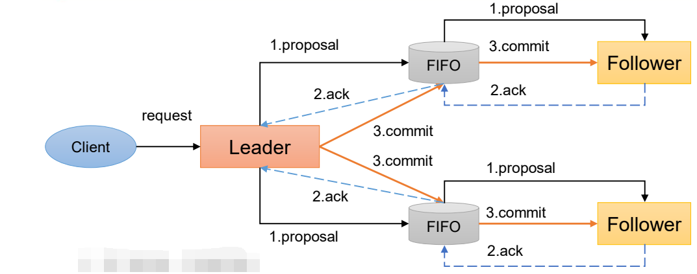

# Zookeeper

## 零、课程介绍

### 1 本课程的重点内容：

1. Zookeeper分布式锁案例
2. Paxos算法
3. ZAB协议
4. CAP
5. 源码：
   1. zk服务端初始化源码
   2. 服务器端加载数据源码
   3. 选举算法
   4. 状态同步算法
   5. Leader启动源码
   6. Follower启动源码
   7. 客户端启动源码


### 2 课程特色

1. 新	Zookeeper3.5.7
2. 细    注释详细，文档中代码复制粘贴就可以
3. 全    几乎涵盖了所有关于ZK相关讲解
4. 生动PPT动画


### 3 技术基础要求

JavaSE、Maven、IDEA、Linux常用命令

------

## 一、Zookeeper入门

### 1 概述

Zookeeper 是一个开源的分布式的，为分布式框架提供协调服务的 Apache 项目。


### 2 特点


1. Zookeeper：一个领导者（Leader），多个跟随者（Follower）组成的集群。
2. 集群中只要有**半数以上**节点存活，Zookeeper集群就能正常服务。所以Zookeeper适合安装奇数台服务器。
3. 全局数据一致：每个Server保存一份相同的数据副本，Client无论连接到哪个Server，数据都是一致的。
4. 更新请求顺序执行，来自同一个Client的更新请求按其发送顺序依次执行（FIFO）。
5. 数据更新原子性，一次数据更新要么成功，要么失败。
6. 实时性，在一定时间范围内，Client 能读到最新数据。


### 3 数据结构

ZooKeeper 数据模型的结构与**Unix文件系统很类似**，整体上可以看作是一棵树，每个节点称做一个ZNode。每一个 ZNode 默认能够存储**1MB**的数据，每个ZNode都可以**通过其路径唯一标识**。


### 4 应用场景

提供的服务包括：

- 统一命名服务
- 统一配置管理
- 统一集群管理
- 服务器节点动态上下线
- 软负载均衡等


### 5 下载地址

官网地址：https://zookeeper.apache.org/


下载 Linux 环境安装的 tar 包


+++

## 二、ZooKeeper本地安装

### 1 本地模式安装

#### 1.1 安装前准备

1. 安装JDK：`yum install -y java-1.8.0-openjdk.x86_64`

2. 拷贝 apache-zookeeper-3.5.7-bin.tar.gz 安装包到 Linux 系统下的目录`/opt/software`

3. 解压到指定目录

   `tar -zxvf apache-zookeeper-3.5.7-bin.tar.gz -C /opt/module/`

4. 修改名称

   `mv apache-zookeeper-3.5.7-bin zookeeper-3.5.7`


#### 1.2 配置修改

1. 将`/opt/module/zookeeper-3.5.7/conf `这个路径下的 `zoo_sample.cfg` 修改为` zoo.cfg`：

   `mv zoo_sample.cfg zoo.cfg`

2. 打开 zoo.cfg 文件，修改 dataDir 路径：

   `vi zoo.cfg`

   修改如下内容：

   `dataDir=/opt/module/zookeeper-3.5.7/zkData`

3. 在`/opt/module/zookeeper-3.5.7/`这个目录上创建 zkData 文件夹

   `mkdir zkData`


#### 1.3 操作ZooKeeper

1. 启动 Zookeeper：`bin/zkServer.sh start`

2. 查看进程是否启动

3. 查看状态：`bin/zkServer.sh status`

   ```bash
   [root@localhost zookeeper-3.5.7]# bin/zkServer.sh status
   /usr/bin/java
   ZooKeeper JMX enabled by default
   Using config: /opt/model/zookeeper-3.5.7/bin/../conf/zoo.cfg
   Client port found: 2181. Client address: localhost.
   Mode: standalone
   ```

4. 启动客户端：`bin/zkCli.sh`
5. 退出客户端：`
   [zk: localhost:2181(CONNECTED) 0] quit`
6. 停止 Zookeeper：`
   bin/zkServer.sh stop`


### 2 配置参数解读

```properties
# The number of milliseconds of each tick
tickTime=2000
# The number of ticks that the initial
# synchronization phase can take
initLimit=10
# The number of ticks that can pass between
# sending a request and getting an acknowledgement
syncLimit=5
# the directory where the snapshot is stored.
# do not use /tmp for storage, /tmp here is just
# example sakes.
dataDir=/opt/model/zookeeper-3.5.7/zkData
# the port at which the clients will connect
clientPort=2181
# the maximum number of client connections.
# increase this if you need to handle more clients
#maxClientCnxns=60
#
# Be sure to read the maintenance section of the
# administrator guide before turning on autopurge.
#
# http://zookeeper.apache.org/doc/current/zookeeperAdmin.html#sc_maintenance
#
# The number of snapshots to retain in dataDir
#autopurge.snapRetainCount=3
# Purge task interval in hours
# Set to "0" to disable auto purge feature
#autopurge.purgeInterval=1
```

Zookeeper中的配置文件zoo.cfg中参数含义解读如下：

1. `tickTime = 2000`：通信心跳时间，Zookeeper服务器与客户端心跳时间，单位毫秒


2. `initLimit = 10`：LF初始通信时限


3. `syncLimit = 5`：LF同步通信时限


4. `dataDir`：保存Zookeeper中的数据

   注意：默认的tmp目录，容易被Linux系统定期删除，所以一般不用默认的tmp目录。

5. `clientPort = 2181`：客户端连接端口，通常不做修改。

+++

## 三、Zookeeper集群操作

### 1 集群操作

#### 1.1 集群安装

1. 集群规划

   在 linux-copy2、linux-copy3 和 linux-copy4 三个节点上都部署 Zookeeper。

   > 思考：如果是 10 台服务器，需要部署多少台 Zookeeper？

2. 解压安装

   在 linux-copy2 解压 Zookeeper 安装包到/opt/module/目录下

   `tar -zxvf apache-zookeeper-3.5.7-bin.tar.gz -C /opt/module/`

   修改 apache-zookeeper-3.5.7-bin 名称为 zookeeper-3.5.7

   `mv apache-zookeeper-3.5.7-bin/ 
   zookeeper-3.5.7`

3. 配置服务器编号

   - 在/opt/module/zookeeper-3.5.7/这个目录下创建 zkData

     `mkdir zkData`

   - 在/opt/module/zookeeper-3.5.7/zkData 目录下创建一个 myid 的文件

     `cd /opt/module/zookeeper-3.5.7/zkData`

     `vim myid`

     在文件中添加与 server 对应的编号（注意：上下不要有空行，左右不要有空格）

     ```
     2
     ```

     > linux-copy2 ---- 2
     >
     > linux-copy3 ---- 3
     >
     > linux-copy4 ---- 4

   - 拷贝配置好的 zookeeper 到其他机器上

4. 配置zoo.cfg文件

   - 重命名/opt/module/zookeeper-3.5.7/conf 这个目录下的 zoo_sample.cfg 为 zoo.cfg

     `mv zoo_sample.cfg zoo.cfg`

   - 打开 zoo.cfg 文件

     `vim zoo.cfg`

     ```properties
     # 修改数据存储路径配置
     dataDir=/opt/module/zookeeper-3.5.7/zkData
     
     #增加如下配置
     #######################cluster##########################
     server.2=linux-copy2:2888:3888
     server.3=linux-copy3:2888:3888
     server.4=linux-copy4:2888:3888
     ```

   - 配置参数解读

     ```properties
     server.A=B:C:D
     ```

     *A* 是一个数字，表示这个是第几号服务器；

     集群模式下配置一个文件 myid，这个文件在 dataDir 目录下，这个文件里面有一个数据就是 A 的值，**Zookeeper启动时读取此文件，拿到里面的数据与zoo.cfg里面的配置信息比较从而判断到底是哪个server**。

     *B* 是这个服务器的地址；

     *C* 是这个服务器 Follower 与集群中的 Leader 服务器交换信息的端口；

     *D* 是万一集群中的Leader服务器挂了，需要一个端口来重新进行选举，选出一个新的Leader，而这个端口就是用来执行选举时服务器相互通信的端口。

   - 同步 zoo.cfg 配置文件

5. 集群操作

   - 分别启动 Zookeeper

     ```bash
     [root@linux-copy2 zookeeper-3.5.7]# bin/zkServer.sh start
     
     [root@linux-copy3 zookeeper-3.5.7]# bin/zkServer.sh start
     
     [root@linux-copy4 zookeeper-3.5.7]# bin/zkServer.sh start
     ```

   - 查看状态

     ```bash
     [root@linux-copy2 zookeeper-3.5.7]# bin/zkServer.sh status
     /usr/bin/java
     ZooKeeper JMX enabled by default
     Using config: /opt/module/zookeeper-3.5.7/bin/../conf/zoo.cfg
     Client port found: 2181. Client address: localhost.
     Mode: follower
     [root@linux-copy2 zookeeper-3.5.7]# 
     
     [root@linux-copy3 zookeeper-3.5.7]# bin/zkServer.sh status
     /usr/bin/java
     ZooKeeper JMX enabled by default
     Using config: /opt/module/zookeeper-3.5.7/bin/../conf/zoo.cfg
     Client port found: 2181. Client address: localhost.
     Mode: leader
     [root@linux-copy3 zookeeper-3.5.7]# 
     
     [root@linux-copy4 zookeeper-3.5.7]# bin/zkServer.sh status
     /usr/bin/java
     ZooKeeper JMX enabled by default
     Using config: /opt/module/zookeeper-3.5.7/bin/../conf/zoo.cfg
     Client port found: 2181. Client address: localhost.
     Mode: follower
     [root@linux-copy4 zookeeper-3.5.7]# 
     ```


#### 1.2 选举机制

核心概念：

- **SID**：*服务器ID*。用来唯一标识一台ZooKeeper集群中的机器，每台机器不能重复，**和myid一致**。
- **ZXID**：*事务ID*。**ZXID是一个事务ID，用来标识一次服务器状态的变更**。在某一时刻，集群中的每台机器的ZXID值不一定完全一致，这和ZooKeeper服务器对于客户端“更新请求”的处理逻辑有关。
- **Epoch**：*每个Leader任期的代号*。没有Leader时同一轮投票过程中的逻辑时钟值是相同的。每投完一次票这个数据就会增加


**Zookeeper选举机制 —— 第一次启动**：


1. 服务器1启动，发起一次选举。服务器1投自己一票。此时服务器1票数一票，不够半数以上（3票），选举无法完成，服务器1状态保持为 LOOKING；
2. 服务器2启动，再发起一次选举。服务器1和2分别投自己一票并交换选票信息：**此时服务器1发现服务器2的myid比自己目前投票推举的（服务器1）大，更改选票为推举服务器2**。此时服务器1票数0票，服务器2票数2票，没有半数以上结果，选举无法完成，服务器1，2状态保持LOOKING；
3. 服务器3启动，发起一次选举。此时服务器1和2都会更改选票为服务器3。此次投票结果：服务器1为0票，服务器2为0票，服务器3为3票。此时服务器3的票数已经超过半数，服务器3当选Leader。服务器1，2更改状态为FOLLOWING，服务器3更改状态为LEADING；
4. 服务器4启动，发起一次选举。此时服务器1，2，3已经不是LOOKING状态，不会更改选票信息。交换选票信息结果：服务器3为3票，服务器4为1票。此时服务器4服从多数，更改选票信息为服务器3，并更改状态为FOLLOWING；
5. 服务器5启动，同4一样当小弟。


**Zookeeper选举机制 —— 非第一次启动**：


1. 当ZooKeeper集群中的一台服务器出现以下两种情况之一时，就会开始进入Leader选举：

   - 服务器初始化启动。
   - 服务器运行期间无法和Leader保持连接。

2. 而当一台机器进入Leader选举流程时，当前集群也可能会处于以下两种状态：

   - 集群中本来就已经存在一个Leader。

     对于第一种已经存在Leader的情况，机器试图去选举Leader时，会被告知当前服务器的Leader信息，对于该机器来说，仅仅需要和Leader机器建立连接，并进行状态同步即可。

   - **集群中确实不存在Leader**。

     假设ZooKeeper由5台服务器组成，SID分别为1、2、3、4、5，ZXID分别为8、8、8、7、7，并且此时SID为3的服务器是Leader。某一时刻，3和5服务器出现故障，因此开始进行Leader选举。

     |                            | (EPOCH，ZXID，SID) | (EPOCH，ZXID，SID) | (EPOCH，ZXID，SID) |
     | -------------------------- | ------------------ | ------------------ | ------------------ |
     | SID为1、2、4的机器投票情况 | (1，8，1)          | (1，8，2)          | (1，7，4)          |

     选举Leader规则：

     1. EPOCH大的直接胜出
     2. EPOCH相同，事务id大的胜出
     3. 事务id相同，服务器id大的胜出


#### 1.3 ZK集群启动停止脚本

1. 在 linux-copy2 的 /root/bin 目录下创建脚本

   `vim zk.sh`

2. 在脚本中编写如下内容

   ```sh
   #!/bin/bash
   case $1 in
   "start"){
   	for i in linux-copy2 linux-copy3 linux-copy4
   	do
    		echo ---------- zookeeper $i 启动 ------------
   		ssh $i "/opt/module/zookeeper-3.5.7/bin/zkServer.sh 
   		start"
   	done
   };;
   "stop"){
   	for i in linux-copy2 linux-copy3 linux-copy4
   	do
    		echo ---------- zookeeper $i 停止 ------------
   		ssh $i "/opt/module/zookeeper-3.5.7/bin/zkServer.sh 
   		stop"
   	done
   };;
   "status"){
   	for i in linux-copy2 linux-copy3 linux-copy4
   	do
    		echo ---------- zookeeper $i 状态 ------------
   		ssh $i "/opt/module/zookeeper-3.5.7/bin/zkServer.sh 
   		status"
   	done
   };;
   esac
   ```

3. 增加脚本执行权限

   `chmod u+x zk.sh`

4. Zookeeper 集群启动脚本

   `zk.sh start`

5. Zookeeper 集群停止脚本

   `zk.sh stop`


### 2 客户端命令行操作

#### 2.1 命令行语法

| **命令基本语法** | **功能描述**                                                 |
| ---------------- | ------------------------------------------------------------ |
| help             | 显示所有操作命令                                             |
| ls path          | 使用 ls 命令来查看当前 znode 的子节点[可监听]<br/>-w 监听子节点变化<br/>-s 附加次级信息 |
| create           | 普通创建<br/>-s 含有序列<br/>-e 临时（重启或者超时消失）     |
| get path         | 获得节点的值 [可监听]<br/>-w 监听节点内容变化<br/>-s 附加次级信息 |
| set              | 设置节点的具体值                                             |
| stat             | 查看节点状态                                                 |
| delete           | 删除节点                                                     |
| deleteall        | 递归删除节点                                                 |

1. 启动客户端

   `bin/zkCli.sh`

   ```bash
   [zk: localhost:2181(CONNECTED) 0] bin/zkCli.sh -server linux-copy3:2181
   ```

2. 显示所有操作命令

   `help`

   


#### 2.2 znode节点数据信息

1. 查看当前znode中所包含的内容

   ```bash
   [zk: localhost:2181(CONNECTED) 1] ls /
   [zookeeper]
   ```

2. 查看当前节点详细数据

   ```bash
   [zk: localhost:2181(CONNECTED) 2] ls -s /
   [zookeeper]cZxid = 0x0
   ctime = Thu Jan 01 08:00:00 CST 1970
   mZxid = 0x0
   mtime = Thu Jan 01 08:00:00 CST 1970
   pZxid = 0x0
   cversion = -1
   dataVersion = 0
   aclVersion = 0
   ephemeralOwner = 0x0
   dataLength = 0
   numChildren = 1
   
   [zk: localhost:2181(CONNECTED) 3] 
   ```

   - *czxid*：创建节点的事务 zxid

     每次修改 ZooKeeper 状态都会产生一个 ZooKeeper 事务ID。事务ID是ZooKeeper中所有修改总的次序。每次修改都有唯一的 zxid，如果 zxid1 小于 zxid2，那么 zxid1 在 zxid2 之前发生。

   - *ctime*：znode 被创建的毫秒数（从 1970 年开始）

   - *mzxid*：znode 最后更新的事务 zxid

   - *mtime*：znode 最后修改的毫秒数（从 1970 年开始）

   - *pZxid*：znode 最后更新的子节点 zxid

   - *cversion*：znode 子节点变化号，znode 子节点修改次数

   - *dataversion*：**znode 数据变化号**

   - *aclVersion*：znode 访问控制列表的变化号

   - *ephemeralOwner*：如果是临时节点，这个是 znode 拥有者的 session id。如果不是临时节点则是 0。

   - *dataLength*：**znode 的数据长度**

   - *numChildren*：**znode 子节点数量**


#### 2.3 节点类型(持久/短暂/有序号/无序号)


- 持久化目录节点

  客户端与Zookeeper断开连接后，该节点依旧存在

- 持久化顺序编号目录节点

  客户端与Zookeeper断开连接后，该节点依旧存在，只是Zookeeper给该节点名称进行顺序编号

- 临时目录节点

  客户端与Zookeeper断开连接后，该节点被删除

- 临时顺序编号目录节点

  客户端与Zookeeper断开连接后，该节点被删除，只是Zookeeper给该节点名称进行顺序编号。


1. 分别创建2个普通节点（永久节点 + 不带序号）

   ```bash
   [zk: localhost:2181(CONNECTED) 0] create /sanguo "diaochan"
   Created /sanguo
   [zk: localhost:2181(CONNECTED) 1] create /sanguo/shuguo "liubei"
   Created /sanguo/shuguo
   [zk: localhost:2181(CONNECTED) 2] 
   ```

   > 注意：创建节点时，要赋值

2. 获得节点的值

   ```bash
   [zk: localhost:2181(CONNECTED) 7] get -s /sanguo
   diaochan
   cZxid = 0x100000004
   ctime = Sat Dec 17 19:29:56 CST 2022
   mZxid = 0x100000004
   mtime = Sat Dec 17 19:29:56 CST 2022
   pZxid = 0x100000005
   cversion = 1
   dataVersion = 0
   aclVersion = 0
   ephemeralOwner = 0x0
   dataLength = 8
   numChildren = 1
   
   [zk: localhost:2181(CONNECTED) 8] get -s /sanguo/shuguo
   liubei
   cZxid = 0x100000005
   ctime = Sat Dec 17 19:30:14 CST 2022
   mZxid = 0x100000005
   mtime = Sat Dec 17 19:30:14 CST 2022
   pZxid = 0x100000005
   cversion = 0
   dataVersion = 0
   aclVersion = 0
   ephemeralOwner = 0x0
   dataLength = 6
   numChildren = 0
   [zk: localhost:2181(CONNECTED) 9] 
   ```

3. 创建带序号的节点（永久节点 + 带序号）

   - 先创建一个普通的根节点/sanguo/weiguo

     ```bash
     [zk: localhost:2181(CONNECTED) 4] create /sanguo/weiguo "caocao"
     Created /sanguo/weiguo
     [zk: localhost:2181(CONNECTED) 5] 
     ```

   - 创建带序号的节点

     ```bash
     [zk: localhost:2181(CONNECTED) 5] create -s /sanguo/weiguo/zhangliao "zhangliao"
     Created /sanguo/weiguo/zhangliao0000000000
     [zk: localhost:2181(CONNECTED) 6] create -s /sanguo/weiguo/zhangliao "zhangliao"
     Created /sanguo/weiguo/zhangliao0000000001
     [zk: localhost:2181(CONNECTED) 7] create -s /sanguo/weiguo/zhangliao "zhangliao"
     Created /sanguo/weiguo/zhangliao0000000002
     [zk: localhost:2181(CONNECTED) 8] 
     ```

     如果原来没有序号节点，序号从 0 开始依次递增。如果原节点下已有 2 个节点，则再排序时从 2 开始，以此类推。

4. 创建短暂节点（短暂节点 + 不带序号 or 带序号）

   - 创建短暂的不带序号的节点

     ```bash
     [zk: localhost:2181(CONNECTED) 8] create -e /sanguo/wuguo "zhouyu"
     Created /sanguo/wuguo
     ```

   - 创建短暂的带序号的节点

     ```bash
     [zk: localhost:2181(CONNECTED) 9] create -e -s /sanguo/wuguo "zhouyu"
     Created /sanguo/wuguo0000000003
     ```

   - 在当前客户端是能查看到的

     ```bash
     [zk: localhost:2181(CONNECTED) 10] ls /sanguo
     [shuguo, weiguo, wuguo, wuguo0000000003]
     [zk: localhost:2181(CONNECTED) 11] 
     ```

   - 退出当前客户端然后再重启客户端

     ```bash
     [zk: localhost:2181(CONNECTED) 11] quit
     
     [root@linux-copy3 zookeeper-3.5.7]# bin/zkCli.sh
     ```

   - 再次查看根目录下短暂节点已经删除

     ```bash
     [zk: localhost:2181(CONNECTED) 0] ls /sanguo
     [shuguo, weiguo]
     ```

5. 修改节点数据值

   ```bash
   # 修改前
   [zk: localhost:2181(CONNECTED) 3] get /sanguo/weiguo
   caocao
   
   # 修改
   [zk: localhost:2181(CONNECTED) 4] set /sanguo/weiguo "simayi"
   
   # 修改后
   [zk: localhost:2181(CONNECTED) 5] get /sanguo/weiguo
   simayi
   ```


#### 2.4 监听器原理

客户端注册监听它关心的目录节点，当目录节点发生变化（数据改变、节点删除、子目录节点增加删除）时，ZooKeeper 会通知客户端。监听机制保证 ZooKeeper 保存的任何的数据的任何改变都能快速的响应到监听了该节点的应用程序。


1. 监听原理详解
   1. 首先要有一个main线程
   2. 在main线程中创建Zookeeper客户端，这时就会创建两个线程，一个负责网络连接通信（connet），一个负责监听（listener）。
   3. 通过connect线程将注册的监听事件发送给Zookeeper。
   4. 在Zookeeper的注册监听器列表中将注册的监听事件添加到列表中。
   5. Zookeeper监听到有数据或路径变化，就会将这个消息发送给listener线程。
   6. listener线程内部调用了process()方法。
2. 常见的监听
   1. 监听节点数据的变化：`get path [watch]`
   2. 监听子节点增减的变化：`ls path [watch]`


1. 节点的值变化监听

   - 在 linux-copy4 主机上注册监听 /sanguo 节点数据变化

     ```bash
     [zk: localhost:2181(CONNECTED) 0] get -w /sanguo
     diaochan
     [zk: localhost:2181(CONNECTED) 1] 
     ```

   - 在 linux-copy3 主机上修改 /sanguo 节点的数据

     ```bash
     [zk: localhost:2181(CONNECTED) 6] set /sanguo "caomengde"
     ```

   - 观察 linux-copy4 主机收到数据变化的监听

     ```bash
     [zk: localhost:2181(CONNECTED) 1] 
     WATCHER::
     
     WatchedEvent state:SyncConnected type:NodeDataChanged path:/sanguo
     ```

   > 注意：在linux-copy3再多次修改 /sanguo 的值，linux-copy4上不会再收到监听。因为注册一次，只能监听一次。想再次监听，需要再次注册。

2. 节点的子节点变化监听（路径变化）

   - 在 linux-copy4 主机上注册监听 /sanguo 节点的子节点变化

     ```bash
     [zk: localhost:2181(CONNECTED) 1] ls -w /sanguo
     [shuguo, weiguo]
     [zk: localhost:2181(CONNECTED) 2] 
     ```

   - 在 linux-copy3 主机 /sanguo 节点上创建子节点

     ```bash
     [zk: localhost:2181(CONNECTED) 7] create /sanguo/jinguo "simayi"
     Created /sanguo/jinguo
     [zk: localhost:2181(CONNECTED) 8] 
     ```

   - 观察 linux-copy4 主机收到子节点变化的监听

     ```bash
     [zk: localhost:2181(CONNECTED) 2] 
     WATCHER::
     
     WatchedEvent state:SyncConnected type:NodeChildrenChanged path:/sanguo
     ```

   > 注意：节点的路径变化，也是注册一次，生效一次。想多次生效，就需要多次注册。


#### 2.5 节点删除与查看

1. 删除节点

   ```bash
   [zk: localhost:2181(CONNECTED) 2] delete /sanguo/jinguo
   [zk: localhost:2181(CONNECTED) 3] 
   ```

2. 递归删除节点

   ```bash
   [zk: localhost:2181(CONNECTED) 3] deleteall /sanguo/weiguo
   [zk: localhost:2181(CONNECTED) 4] 
   ```

3. 查看节点状态

   ```bash
   [zk: localhost:2181(CONNECTED) 0] stat /sanguo
   cZxid = 0x10000001c
   ctime = Sat Dec 17 20:00:48 CST 2022
   mZxid = 0x10000001c
   mtime = Sat Dec 17 20:00:48 CST 2022
   pZxid = 0x10000002f
   cversion = 9
   dataVersion = 0
   aclVersion = 0
   ephemeralOwner = 0x0
   dataLength = 8
   numChildren = 1
   [zk: localhost:2181(CONNECTED) 1] 
   ```


### 3 客户端API操作

前提：保证 linux-copy2、linux-copy3、linux-copy4 服务器上 Zookeeper 集群服务端启动。

#### 3.1 IDEA环境搭建

1. 创建一个Maven工程：zookeeper

2. pom文件添加依赖

   ```xml
   <dependencies>
     <dependency>
       <groupId>junit</groupId>
       <artifactId>junit</artifactId>
       <version>RELEASE</version>
     </dependency>
   
     <dependency>
       <groupId>org.apache.logging.log4j</groupId>
       <artifactId>log4j-core</artifactId>
       <version>2.8.2</version>
     </dependency>
   
     <dependency>
       <groupId>org.apache.zookeeper</groupId>
       <artifactId>zookeeper</artifactId>
       <version>3.5.7</version>
     </dependency>
   </dependencies>
   ```

3. 拷贝`log4j.properties`文件到项目根目录

   需要在项目的`src/main/resources`目录下，新建一个文件，命名为“`log4j.properties`”，在文件中填入。

   ```properties
   log4j.rootLogger=INFO, stdout
   log4j.appender.stdout=org.apache.log4j.ConsoleAppender
   log4j.appender.stdout.layout=org.apache.log4j.PatternLayout
   log4j.appender.stdout.layout.ConversionPattern=%d %p [%c] - %m%n
   log4j.appender.logfile=org.apache.log4j.FileAppender
   log4j.appender.logfile.File=target/spring.log
   log4j.appender.logfile.layout=org.apache.log4j.PatternLayout
   log4j.appender.logfile.layout.ConversionPattern=%d %p [%c] - %m%n
   ```

4. 创建包名com.shanhai.zk

5. 创建类名称zkClient


#### 3.2 创建ZooKeeper客户端

```java
// 注意：逗号左右不能有空格
private static String connectionString = "linux-copy2:2181,linux-copy3:2181,linux-copy4:2181";

private static Integer sessionTimeout = 2000;

ZooKeeper zkClient;

@Before
public void init() throws IOException {
    zkClient = new ZooKeeper(connectionString, sessionTimeout, new Watcher() {
        @Override
        public void process(WatchedEvent watchedEvent) {
            // 收到事件通知后的回调函数（用户的业务逻辑）
            try {
                System.out.println("======Watcher.process start======");
                // 再次启动监听
                List<String> children = zkClient.getChildren("/", true);
                children.forEach(System.out::println);
                System.out.println("======Watcher.process end======");
            } catch (KeeperException e) {
                throw new RuntimeException(e);
            } catch (InterruptedException e) {
                throw new RuntimeException(e);
            }
        }
    });
}
```


#### 3.3 创建子节点

```java
@Test
public void create() throws InterruptedException, KeeperException {
    // 参数 1：要创建的节点的路径
    // 参数 2：节点数据
    // 参数 3：节点权限
    // 参数 4：节点的类型
    String nodeCreated = zkClient.create("/shanhai", "xk.avi".getBytes(),
            ZooDefs.Ids.OPEN_ACL_UNSAFE, CreateMode.PERSISTENT);
    System.out.println("nodeCreated = " + nodeCreated);
}
```

测试：在 linux-copy2 的 zk 客户端上查看创建节点情况

```bash
[zk: localhost:2181(CONNECTED) 9] get -s /shanhai
xk.avi
cZxid = 0x100000056
ctime = Sat Dec 17 20:48:58 CST 2022
mZxid = 0x100000056
mtime = Sat Dec 17 20:48:58 CST 2022
pZxid = 0x100000056
cversion = 0
dataVersion = 0
aclVersion = 0
ephemeralOwner = 0x0
dataLength = 6
numChildren = 0
```


#### 3.4 获取子节点并监听节点变化

```java
@Test
public void getChildren() throws InterruptedException, KeeperException {
    System.out.println("======getChildren start======");
    List<String> children = zkClient.getChildren("/", true);
    children.forEach(System.out::println);
    System.out.println("======getChildren end======");
    
    // 延时堵塞
    Thread.sleep(Long.MAX_VALUE);
}
```

1. 在 IDEA 控制台上看到如下节点：

   ```
   ======getChildren start======
   shanhai
   zookeeper
   sanguo
   ======getChildren end======
   ```

2. 在 linux-copy2 的客户端上创建再创建一个节点 /shanhai1，观察 IDEA 控制台

   ```bash
   [zk: localhost:2181(CONNECTED) 11] create /shanhai1 "shanhai1"
   Created /shanhai1
   ```

3. 在 linux-copy2 的客户端上删除节点 /shanhai1，观察 IDEA 控制台

   ```bash
   [zk: localhost:2181(CONNECTED) 12] delete /shanhai1
   ```


#### 3.5 判断Znode是否存在

```java
@Test
public void exist() throws InterruptedException, KeeperException {
    Stat stat = zkClient.exists("/shanhai", false);
    System.out.println(stat == null ? "not exist" : "exist");
}
```


### 4 客户端向服务端写数据流程

- *写流程之写入请求直接发送给Leader节点*：

  

- *写流程之写入请求发送给follower节点*：

  


+++

## 四、服务器动态上下线监听案例

### 1 需求

某分布式系统中，主节点可以有多台，可以动态上下线，任意一台客户端都能实时感知到主节点服务器的上下线。


### 2 需求分析


### 3 具体实现

1. 先在集群上创建 /servers 节点

   ```bash
   [zk: localhost:2181(CONNECTED) 18] create /servers "servers"
   Created /servers
   ```

2. 在 Idea 中创建包名：com.shanhai.zkcase1

3. 服务器端向 Zookeeper 注册代码

   ```java
   /**
    * @description: 服务器端代码
    * @author: xu
    * @date: 2022/12/17 21:06
    */
   public class DistributeServer {
       private static String connectString = "linux-copy2:2181,linux-copy3:2181,linux-copy4:2181";;
       private static int sessionTimeout = 2000;
   
       private ZooKeeper zkClient;
   
       public static void main(String[] args) throws IOException, InterruptedException, KeeperException {
           DistributeServer server = new DistributeServer();
   
           // 1.获取zk连接
           server.getConnect();
           
           // 2.注册服务器到zk集群
           server.regist(args[0]);
   
           // 3.启动业务逻辑（睡觉）
           server.business();
       }
       
       // 1.获取zk连接
       private void getConnect() throws IOException {
           zkClient = new ZooKeeper(connectString, sessionTimeout, new Watcher() {
               @Override
               public void process(WatchedEvent watchedEvent) {
   
               }
           });
       }
       
       // 2.注册服务器到zk集群
       private void regist(String hostname) throws InterruptedException, KeeperException {
           String create = zkClient.create("/servers/" + hostname, hostname.getBytes(),
                   ZooDefs.Ids.OPEN_ACL_UNSAFE, CreateMode.EPHEMERAL_SEQUENTIAL);
           System.out.println(hostname + " is online");
       }
   
       // 3.启动业务逻辑（睡觉）
       private void business() throws InterruptedException {
           Thread.sleep(Long.MAX_VALUE);
       }    
   }
   ```

4. 客户端代码

   ```java
   /**
    * @description: 客户端代码
    * @author: xu
    * @date: 2022/12/17 21:17
    */
   public class DistributeClient {
       private static String connectString = "linux-copy2:2181,linux-copy3:2181,linux-copy4:2181";;
       private static int sessionTimeout = 2000;
   
       private ZooKeeper zkClient;
   
       public static void main(String[] args) throws IOException, InterruptedException, KeeperException {
           DistributeClient client = new DistributeClient();
   
           // 1.获取zk连接
           client.getConnect();
   
           // 2.监听 /servers 下面子节点的添加和删除
           client.getServerList();
   
           // 3.业务逻辑（睡觉）
           client.business();
       }
       
       // 1.获取zk连接
       private void getConnect() throws IOException {
           zkClient = new ZooKeeper(connectString, sessionTimeout, new Watcher() {
               @Override
               public void process(WatchedEvent watchedEvent) {
                   try {
                       // 再次启动监听
                       getServerList();
                   } catch (InterruptedException e) {
                       throw new RuntimeException(e);
                   } catch (KeeperException e) {
                       throw new RuntimeException(e);
                   }
               }
           });
       }
   
       // 2.监听 /servers 下面子节点的添加和删除
       private void getServerList() throws InterruptedException, KeeperException {
           // 1 获取服务器子节点信息，并且对父节点进行监听
           List<String> children = zkClient.getChildren("/servers", true);
           
           // 2 存储服务器信息列表
           List<String> servers = new ArrayList<>();
           
           // 3 遍历所有节点，获取节点中的主机名称信息
           for (String child : children) {
               byte[] data = zkClient.getData("/servers/" + child, false, null);
               servers.add(new String(data));
           }
           // 4 打印服务器列表信息
           System.out.println("============client print servers start================");
           servers.forEach(System.out::println);
           System.out.println("============client print servers end================");
       }
       
       private void business() throws InterruptedException {
           Thread.sleep(Long.MAX_VALUE);
       }
   }
   ```


### 4 测试

1. 在 Linux 命令行上操作增加减少服务器

   - 启动 DistributeClient 客户端

   - 在 linux-copy2 上 zk 的客户端 /servers 目录上创建临时带序号节点

     ```bash
     [zk: localhost:2181(CONNECTED) 28] ls /servers
     []
     [zk: localhost:2181(CONNECTED) 29] create -e -s /servers/zk-101 "zk-101"
     Created /servers/zk-1010000000006
     [zk: localhost:2181(CONNECTED) 30] create -e -s /servers/zk-102 "zk-102"
     Created /servers/zk-1020000000007
     [zk: localhost:2181(CONNECTED) 31] create -e -s /servers/zk-103 "zk-103"
     Created /servers/zk-1030000000008
     [zk: localhost:2181(CONNECTED) 32] 
     ```

   - 观察 Idea 控制台变化

     ```bash
     ============client print servers end================
     ============client print servers end================
     ============client print servers start================
     zk-101
     ============client print servers end================
     ============client print servers start================
     zk-102
     zk-101
     ============client print servers end================
     ============client print servers start================
     zk-103
     zk-102
     zk-101
     ============client print servers end================
     ```

   - 执行删除操作

     ```bash
     [zk: localhost:2181(CONNECTED) 32] delete /servers/zk-1030000000008
     [zk: localhost:2181(CONNECTED) 33] delete /servers/zk-1020000000007
     [zk: localhost:2181(CONNECTED) 34] delete /servers/zk-1010000000006
     [zk: localhost:2181(CONNECTED) 35] 
     ```

   - 观察 Idea 控制台变化

     ```bash
     ============client print servers start================
     zk-103
     zk-102
     zk-101
     ============client print servers end================
     ============client print servers start================
     zk-102
     zk-101
     ============client print servers end================
     ============client print servers start================
     zk-101
     ============client print servers end================
     ============client print servers start================
     ============client print servers end================
     ```

2. 在 Idea 上操作增加减少服务器

   - 启动 DistributeClient 客户端（如果已经启动过，不需要重启）

   - 启动 DistributeServer 服务

     1. 点击 Edit Configurations…

        

     2. 在弹出的窗口中（Program arguments）输入想启动的主机，例如，shanhai-102

        

     3. 回到DistributeServer的 main 方法，右键，在弹出的窗口中点击`Run
        “DistributeServer.main()”`；

     4. 观察 DistributeServer 控制台，提示：shanhai-102 is online

     5. 观察 DistributeClient 控制台，提示：

        ```bash
        ============client print servers start================
        shanhai-102
        ============client print servers end================
        ```

+++

## 五、ZooKeeper分布式锁案例

什么叫做分布式锁呢？

比如说"进程 1"在使用该资源的时候，会先去获得锁，"进程 1"获得锁以后会对该资源保持独占，这样其他进程就无法访问该资源，"进程 1"用完该资源以后就将锁释放掉，让其他进程来获得锁，那么通过这个锁机制，我们就能保证了分布式系统中多个进程能够有序的访问该临界资源。那么我们把这个分布式环境下的这个锁叫作分布式锁。


### 1 原生Zookeeper实现分布式锁案例

1. 分布式锁实现

   ```java
   public class DistributedLock {
   	// zookeeper server 列表
       private static String connectionString = "linux-copy2:2181,linux-copy3:2181,linux-copy4:2181";
       // 超时时间
       private static int sessionTimeout = 2000;
   
       private ZooKeeper zkClient;
   
       //ZooKeeper 连接
       private CountDownLatch connectLatch = new CountDownLatch(1);
       //ZooKeeper 节点等待
       private CountDownLatch waitLatch = new CountDownLatch(1);
   
       // 当前 client 等待的子节点
       private String waitPath;
   
       // 当前 client 创建的子节点
       private String currentMode;
   
       public DistributedLock() throws IOException, InterruptedException, KeeperException {
           // 获取连接
           zkClient = new ZooKeeper(connectionString, sessionTimeout, new Watcher() {
               @Override
               public void process(WatchedEvent watchedEvent) {
                   // connectLatch 如果连接上zk 可以释放
                   if (watchedEvent.getState() == Event.KeeperState.SyncConnected) {
                       connectLatch.countDown();
                   }
                   // waitLatch 需要释放
                   if (watchedEvent.getType() == Event.EventType.NodeDeleted
                           && watchedEvent.getPath().equals(waitPath)){
                       waitLatch.countDown();
                   }
               }
           });
           // 等待zk正常连接后，往下走程序
           connectLatch.await();
   
           // 判断根节点 /locks 是否存在
           Stat stat = zkClient.exists("/locks", false);
           if (stat == null) {
               // 创建 /locks 根节点
               zkClient.create("/locks", "locks".getBytes(),
                       ZooDefs.Ids.OPEN_ACL_UNSAFE, CreateMode.PERSISTENT);
           }
       }
   
       // 对zk加锁
       public void zkLock() {
           try {
               // 创建对应的临时带序号的节点 /locks/seq-0000000012
               currentMode = zkClient.create("/locks/seq-", null,
                       ZooDefs.Ids.OPEN_ACL_UNSAFE, CreateMode.EPHEMERAL_SEQUENTIAL);
   
               // 判断创建的节点是否是最小的序号节点，如果是获取到锁；
               // 如果不是，监听它序号的前一个节点
               // [ seq-0000000012 , seq-0000000013 ]
               List<String> children = zkClient.getChildren("/locks", false);
               // 如果 children 只有一个值，那就直接获取锁，如果有多个值，需要判断，谁最小
               if (children.size() == 1) {
                   return;
               } else {
                   Collections.sort(children);
                   // 获取节点名称
                   String thisNode = currentMode.substring("/locks/".length());
                   // 通过 seq-00000000 获取该节点在 children 集合中的位置
                   int index = children.indexOf(thisNode);
                   // 判断
                   if (index == -1) {
                       System.out.println("数据异常");
                   } else if (index == 0) {
                       // 第一个节点，可以获取到锁了
                       return;
                   } else {
                       // 需要监听 它前一个节点
                       waitPath = "/locks/" + children.get(index - 1);
                       zkClient.getData(waitPath, true, null);
                       // 等待监听
                       waitLatch.await();
                       return;
                   }
               }
           } catch (KeeperException e) {
               throw new RuntimeException(e);
           } catch (InterruptedException e) {
               throw new RuntimeException(e);
           }
       }
   
       // 解锁
       public void unZkLock() {
           try {
               // 删除节点
               zkClient.delete(currentMode, -1);
           } catch (InterruptedException e) {
               throw new RuntimeException(e);
           } catch (KeeperException e) {
               throw new RuntimeException(e);
           }
       }
   }
   ```

2. 分布式锁测试

   - 创建两个线程

     ```java
     public class DistributedLockTest {
         public static void main(String[] args) throws IOException, InterruptedException, KeeperException {
             DistributedLock lock1 = new DistributedLock();
             DistributedLock lock2 = new DistributedLock();
             new Thread(() -> {
                 try {
                     lock1.zkLock(); 
                     System.out.println("线程1 启动，获取到锁");
     
                     Thread.sleep(5000);
     
                     lock1.unZkLock();
                     System.out.println("线程1 释放锁");
                 } catch (InterruptedException e) {
                     throw new RuntimeException(e);
                 }
             }).start();
     
             new Thread(() -> {
                 try {
                     lock2.zkLock();
                     System.out.println("线程2 启动，获取到锁");
     
                     Thread.sleep(5000);
     
                     lock2.unZkLock();
                     System.out.println("线程2 释放锁");
                 } catch (InterruptedException e) {
                     throw new RuntimeException(e);
                 }
             }).start();
         }
     }
     ```

   - 观察控制台变化：

     ```
     线程2 启动，获取到锁
     线程2 释放锁
     线程1 启动，获取到锁
     线程1 释放锁
     ```


### 2 Curator框架实现分布式锁案例

- 原生的 Java API 开发存在的问题

  1. 会话连接是异步的，需要自己去处理。比如使用 CountDownLatch
  2. Watch 需要重复注册，不然就不能生效
  3. 开发的复杂性还是比较高的
  4. 不支持多节点删除和创建。需要自己去递归

- Curator 是一个专门解决分布式锁的框架，解决了原生 JavaAPI 开发分布式遇到的问题。

  详情请查看官方文档：https://curator.apache.org/index.html

- Curator 案例实操

  1. 添加依赖

     ```xml
     <dependency>
       <groupId>org.apache.curator</groupId>
       <artifactId>curator-framework</artifactId>
       <version>4.3.0</version>
     </dependency>
     <dependency>
       <groupId>org.apache.curator</groupId>
       <artifactId>curator-recipes</artifactId>
       <version>4.3.0</version>
     </dependency>
     <dependency>
       <groupId>org.apache.curator</groupId>
       <artifactId>curator-client</artifactId>
       <version>4.3.0</version>
     </dependency>
     ```

  2. 代码实现

     ```java
     public class CuratorLockTest {
         public static void main(String[] args) {
             // 创建分布式锁1
             InterProcessMutex lock1 = new InterProcessMutex(getCuratorFramework(), "/locks");
             // 创建分布式锁2
             InterProcessMutex lock2 = new InterProcessMutex(getCuratorFramework(), "/locks");
     
             new Thread(() -> {
                 try {
                     lock1.acquire();
                     System.out.println("线程1 获取到锁");
                     lock1.acquire();
                     System.out.println("线程1 再次获取到锁");
     
                     Thread.sleep(5000);
     
                     lock1.release();
                     System.out.println("线程1 释放锁");
                     lock1.release();
                     System.out.println("线程1 再次释放锁");
                 } catch (Exception e) {
                     throw new RuntimeException(e);
                 }
             }).start();
     
             new Thread(() -> {
                 try {
                     lock2.acquire();
                     System.out.println("线程2 获取到锁");
                     lock2.acquire();
                     System.out.println("线程2 再次获取到锁");
     
                     Thread.sleep(5000);
     
                     lock2.release();
                     System.out.println("线程2 释放锁");
                     lock2.release();
                     System.out.println("线程2 再次释放锁");
                 } catch (Exception e) {
                     throw new RuntimeException(e);
                 }
             }).start();
         }
     
         private static CuratorFramework getCuratorFramework() {
             ExponentialBackoffRetry policy =
                     new ExponentialBackoffRetry(3000, 3);
     
             CuratorFramework client = CuratorFrameworkFactory.builder()
                     .connectString("linux-copy2:2181,linux-copy3:2181,linux-copy4:2181")
                     .connectionTimeoutMs(2000)
                     .sessionTimeoutMs(2000)
                     .retryPolicy(policy)
                     .build();
             // 启动客户端
             client.start();
             System.out.println("zookeeper 启动成功");
             return client;
         }
     }
     ```

  3. 观察控制台变化：

     ```
     线程1 获取到锁
     线程1 再次获取到锁
     线程1 释放锁
     线程1 再次释放锁
     线程2 获取到锁
     线程2 再次获取到锁
     线程2 释放锁
     线程2 再次释放锁
     ```

+++

## 六、企业面试真题

### 1 选举机制

半数机制，超过半数的投票通过，即通过。

1. 第一次启动选举规则：
   - 投票过半数时，服务器 id 大的胜出
2. 第二次启动选举规则：
   - EPOCH 大的直接胜出
   - EPOCH 相同，事务 id 大的胜出
   - 事务 id 相同，服务器 id 大的胜出


### 2 生产集群安装多少 zk 合适？

安装奇数台。

生产经验：

- 10 台服务器：3 台 zk；
- 20 台服务器：5 台 zk；
- 100 台服务器：11 台 zk；
- 200 台服务器：11 台 zk

服务器台数多：好处，提高可靠性；坏处：提高通信延时


### 3 常用命令

| **命令基本语法** | **功能描述**                                                 |
| ---------------- | ------------------------------------------------------------ |
| help             | 显示所有操作命令                                             |
| ls path          | 使用 ls 命令来查看当前 znode 的子节点[可监听]<br/>-w 监听子节点变化<br/>-s 附加次级信息 |
| create           | 普通创建<br/>-s 含有序列<br/>-e 临时（重启或者超时消失）     |
| get path         | 获得节点的值 [可监听]<br/>-w 监听节点内容变化<br/>-s 附加次级信息 |
| set              | 设置节点的具体值                                             |
| stat             | 查看节点状态                                                 |
| delete           | 删除节点                                                     |
| deleteall        | 递归删除节点                                                 |

+++

## 七、算法基础

思考：**Zookeeper 是如何保证数据一致性的**？这也是困扰分布式系统框架的一个难题。

### 1 拜占庭将军问题

描述：拜占庭将军问题是一个协议问题，拜占庭帝国军队的将军们必须全体一致的决定是否攻击某一支敌军。问题是这些将军在地理上是分隔开来的，并且将军中存在叛徒。叛徒可以任意行动以达到以下目标：*欺骗某些将军采取进攻行动*；*促成一个不是所有将军都同意的决定*，*如当将军们不希望进攻时促成进攻行动*；*或者迷惑某些将军，使他们无法做出决定*。如果叛徒达到了这些目的之一，则任何攻击行动的结果都是注定要失败的，只有完全达成一致的努力才能获得胜利。


### 2 Paxos算法

> Paxos算法 —— 解决什么问题

- *Paxos算法*：一种基于消息传递且具有高度容错特性的**一致性算法**。
- *Paxos算法解决的问题*：就是如何快速正确的在一个分布式系统中对某个数据值达成一致，并且保证不论发生任何异常，都不会破坏整个系统的一致性。


> Paxos算法描述：


- 在一个Paxos系统中，首先将所有节点划分为Proposer（提议者），Acceptor（接受者），和 Learner（学习者）。（注意：每个节点都可以身兼数职）。
- 一个完整的Paxos算法流程分为三个阶段：
  1. Prepare准备阶段
     - Proposer向多个Acceptor发出Propose请求
     - Acceptor针对收到的Propose请求进行Promise（承诺）
  2. Accept接受阶段
     - Proposer收到多数Acceptor承诺的Promise后，向Acceptor发出Propose请求
     - Acceptor针对收到的Propose请求进行Accept处理
  3. Learn学习阶段：Proposer将形成的决议发送给所有Learners

> Paxos算法流程：


1. Prepare：Proposer生成全局唯一且递增的Proposal ID，向所有Acceptor发送Propose请求，这里无需携带提案内容，只携带Proposal ID即可。
2. Promise：Acceptor收到Propose请求后，做出“两个承诺，一个应答”。
   - 不再接受Proposal ID小于等于（注意：这里是<= ）当前请求的Propose请求。
   - 不再接受Proposal ID小于（注意：这里是< ）当前请求的Accept请求。
   - 不违背以前做出的承诺下，回复已经Accept过的提案中Proposal ID最大的那个提案的Value和Proposal ID，没有则返回空值。
3. Propose：Proposer收到多数Acceptor的Promise应答后，从应答中选择Proposal ID最大的提案的Value，作为本次要发起的提案。如果所有应答的提案Value均为空值，则可以自己随意决定提案Value。然后携带当前Proposal ID，向所有Acceptor发送 Propose请求。
4. Accept：Acceptor收到Propose请求后，在不违背自己之前做出的承诺下，接受并持久化当前Proposal ID和提案Value。
5. Learn：Proposer收到多数Acceptor的Accept后，决议形成，将形成的决议发送给所有Learner。


下面我们针对上述描述做三种情况的推演举例：为了简化流程，我们这里不设置 Learner。

> 情况一：

- 有A1, A2, A3, A4, A5 5位议员，就税率问题进行决议。

  

- A1发起1号Proposal的Propose，等待Promise承诺；

- A2-A5回应Promise；

- A1在收到两份回复时就会发起税率10%的Proposal；

- A2-A5回应Accept；

- 通过Proposal，税率10%。

> 情况二：

- 现在我们假设在A1提出提案的同时, A5决定将税率定为20%

  

- A1，A5同时发起Propose（序号分别为1，2）

- A2承诺A1，A4承诺A5，A3行为成为关键

- 情况1：A3先收到A1消息，承诺A1。

- A1发起Proposal（1，10%），A2，A3接受。

- 之后A3又收到A5消息，回复A1：（1，10%），并承诺A5。

- A5发起Proposal（2，20%），A3，A4接受。之后A1，A5同时广播决议。

Paxos 算法缺陷：在网络复杂的情况下，一个应用 Paxos 算法的分布式系统，可能很久无法收敛，甚至陷入活锁的情况。

> 情况三：

- 现在我们假设在A1提出提案的同时, A5决定将税率定为20%

  

- A1，A5同时发起Propose（序号分别为1，2）

- A2承诺A1，A4承诺A5，A3行为成为关键

- 情况2：A3先收到A1消息，承诺A1。之后立刻收到A5消息，承诺A5。

- A1发起Proposal（1，10%），无足够响应，A1重新Propose（序号3），A3再次承诺A1。

- A5发起Proposal（2，20%），无足够相应。A5重新Propose （序号4），A3再次承诺A5。

- ……

造成这种情况的原因是系统中有一个以上的 Proposer，多个 Proposers 相互争夺 Acceptor，造成迟迟无法达成一致的情况。**针对这种情况，一种改进的 Paxos 算法被提出：从系统中选出一个节点作为 Leader，只有 Leader 能够发起提案**。这样，一次 Paxos 流程中只有一个 Proposer，不会出现活锁的情况，此时只会出现例子中第一种情况。


### 3 ZAB协议

#### 3.1 什么是ZAB算法

Zab借鉴了Paxos算法，是特别为 Zookeeper 设计的支持崩溃恢复的原子广播协议。基于该协议，Zookeeper设计为只有一台客户端（Leader）负责处理外部的写事务请求，然后Leader客户端将数据同步到其他Follower节点。即Zookeeper只有一个Leader可以发起提案。


#### 3.2 Zab协议内容

Zab 协议包括两种基本的模式：*消息广播*、*崩溃恢复*。

> 消息广播



1. 客户端发起一个写操作请求。
2. Leader服务器将客户端的请求转化为事务Proposal 提案，同时为每个Proposal 分配一个全局的ID，即zxid。
3. Leader服务器为每个Follower服务器分配一个单独的队列，然后将需要广播的Proposal依次放到队列中去，并且根据FIFO策略进行消息发送。
4. Follower接收到Proposal后，会首先将其以事务日志的方式写入本地磁盘中，写入成功后向Leader反馈一个Ack响应消息。
5. Leader接收到超过半数以上Follower的Ack响应消息后，即认为消息发送成功，可以发送commit消息。
6. Leader向所有Follower广播commit消息，同时自身也会完成事务提交。Follower 接收到commit消息后，会将上一条事务提交。
7. Zookeeper采用Zab协议的核心，就是只要有一台服务器提交了Proposal，就要确保所有的服务器最终都能正确提交Proposal。

ZAB协议针对事务请求的处理过程类似于一个两阶段提交过程

- 广播事务阶段 proposal -> ack
- 广播提交操作 commit

这两阶段提交模型如下，有可能因为Leader宕机带来数据不一致，比如：

- Leader发起一个事务Proposal1后就宕机，Follower都没有Proposal1
- Leader收到半数ACK宕机，没来得及向Follower发送Commit

怎么解决呢？ZAB引入了崩溃恢复模式。


> 崩溃恢复 ———— 异常假设

一旦Leader服务器出现崩溃或者由于网络原因导致Leader服务器失去了与过半Follower的联系，那么就会进入**崩溃恢复模式**。


1. 假设两种服务器异常情况：
   1. 假设一个事务在Leader提出之后，Leader挂了。
   2. 一个事务在Leader上提交了，并且过半的Follower都响应Ack了，但是Leader在Commit消息发出之前挂了。
2. Zab协议崩溃恢复要求满足以下两个要求：
   1. 确保已经被Leader提交的提案Proposal，必须最终被所有的Follower服务器提交。（*已经产生的提案，Follower必须执行*）
   2. 确保**丢弃**已经被Leader提出的，但是没有被提交的Proposal。（*丢弃胎死腹中的提案*）


崩溃恢复主要包括两部分：*Leader选举*和*数据恢复*。

> 崩溃恢复 ———— Leader选举


Leader选举：根据上述要求，Zab协议需要保证选举出来的Leader需要满足以下条件：

1. 新选举出来的Leader不能包含未提交的Proposal。*即新Leader必须都是已经提交了Proposal的Follower服务器节点*。
2. *新选举的Leader节点中含有最大的zxid*。这样做的好处是可以避免Leader服务器检查Proposal的提交和丢弃工作。


> 崩溃恢复 ———— 数据恢复


**Zab如何数据同步**：

1. 完成Leader选举后，在正式开始工作之前（接收事务请求，然后提出新的Proposal），*Leader服务器会首先确认事务日志中的所有的 Proposal 是否已经被集群中过半的服务器Commit*。
2. Leader服务器需要确保所有的Follower服务器能够接收到每一条事务的Proposal，并且能将所有已经提交的事务Proposal 应用到内存数据中。*等到Follower将所有尚未同步的事务Proposal都从Leader服务器上同步过，并且应用到内存数据中以后，Leader才会把该Follower加入到真正可用的Follower列表中*。


### 4 CAP理论

CAP理论告诉我们，一个分布式系统不可能同时满足以下三种：

1. 一致性（C:Consistency）
2. 可用性（A:Available）
3. 分区容错性（P:Partition Tolerance）

这三个基本需求，最多只能同时满足其中的两项，因为P是必须的，因此往往选择就在CP或者AP中。

1. 一致性（C:Consistency）

   在分布式环境中，一致性是指*数据在多个副本之间是否能够保持数据一致的特性*。在一致性的需求下，当一个系统在数据一致的状态下执行更新操作后，应该保证系统的数据仍然处于一致的状态。

2. 可用性（A:Available）

   可用性是指*系统提供的服务必须一直处于可用的状态*，对于用户的每一个操作请求总是能够在*有限的时间内返回结果*。

3. 分区容错性（P:Partition Tolerance）

   *分布式系统在遇到任何网络分区故障的时候，仍然需要能够保证对外提供满足一致性和可用性的服务*，除非是整个网络环境都发生了故障。

> ZooKeeper保证的是CP

1. ZooKeeper不能保证每次服务请求的可用性。（注：在极端环境下，ZooKeeper可能会丢弃一些请求，消费者程序需要重新请求才能获得结果）。所以说，ZooKeeper不能保证服务可用性。
2. 进行Leader选举时集群都是不可用。

+++

## 八、源码解析


