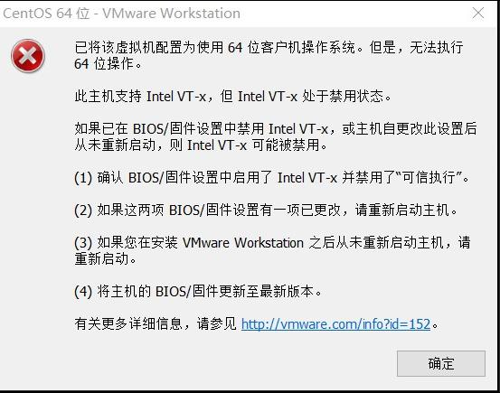
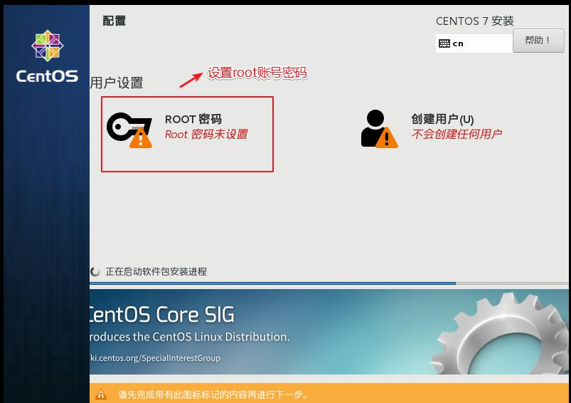
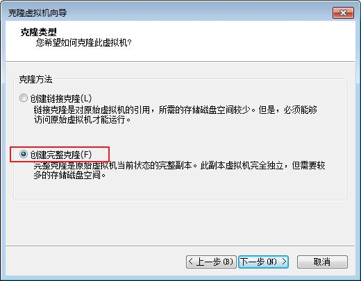

# Linux

+++

## 一、Linux入门

### 1 概述

Linux内核最初只是由芬兰人**林纳斯.托瓦斯**(Linus Torvalds)在赫尔辛基大学上学时出于个人爱好而编写的。

Linux是一套免费使用和自由传播的类Unix操作系统，是一个基于POSIX和UNIX的多用户、多任务、支持多线程和多CPU的操作系统。Linux能运行主要的UNIX工具软件、应用程序和网络协议。它支持32位和64位硬件。Linux继承了Unix以网络为核心的设计思想，是一个性能稳定的多用户网络操作系统。

目前市面上较知名的发行版有：**Ubuntu**、**RedHat**、**CentOS**、Debain、Fedora、SuSE、OpenSUSE。


### 2 Linux和Windows区别

| *比较*     | *Window*                                                     | *Linux*                                                      |
| ---------- | ------------------------------------------------------------ | ------------------------------------------------------------ |
| 免费与收费 | 收费且很贵；                                                 | Linux免费或少许费用；                                        |
| 软件与支持 | 数量和质量的优势，不过大部分为收费软件；由微软官方提供支持和服务； | 开源自由软件，用户可以修改定制和再发布，由于基本免费没有资金支持，部分软件质量和体验欠缺；有全球所有的Linux开发者和自由软件社区提供支持。 |
| 安全性     | 三天两头打补丁安装系统安全更新，还是会中病毒木马；           | 要说Linux没有安全问题，那当然是不可能的，这一点仁者见仁智者见智，相对来说肯定比Windows平台要更加安全。 |
| 使用习惯   | 普通用户基本都是纯图形界面下操作使用，依靠鼠标和键盘完成一切操作，用户上手容易入门简单； | 兼具图形界面操作和完全的命令行操作，可以只用键盘完成一切操作，新手入门较困难，需要一些学习和指导，一旦熟练之后效率极高。 |
| 可定制性   | 封闭的，系统可定制性极差                                     | 开源，可定制化非常强                                         |
| 应用场景   | 桌面操作系统主要使用的是window                               | 支撑百度，谷歌，淘宝等应用软件和服务的，是后台成千上万的Linux服务器主机。世界上大部分软件和服务都是运行在Linux之上的。 |

+++

## 二、VM与Linux的安装

### 1 VMware安装

一台电脑本身是可以装多个操作系统的，但是做不到多个操作系统切换自如，所以我们需要一款软件帮助我们达到这个目的，不然数仓项目搭建不起来。

推荐的软件为VMware，VMware可以使用户在一台计算机上同时运行多个操作系统，还可以像 Windows 应用程序一样来回切换。用户可以如同操作真实安装的系统一样操作虚拟机系统，甚至可以在一台计算机上将几个虚拟机系统连接为一个局域网或者连接到互联网。

以下是 VMware Workstation Pro 15.5 的安装步骤。


#### 1.1 VMware Workstation Pro 15.5安装包


#### 1.2 欢迎界面


#### 1.3 同意许可证


#### 1.4 选择安装路径


#### 1.5 用户体检计划

每次开启虚拟机时，会提醒让你更新版本，建议两个都不勾。


#### 1.6 快捷方式

建议勾选，安装后使用起来会比较方便。


#### 1.7 开始安装


#### 1.8 等待安装完成


#### 1.9 安装完成

输入许可证，激活 VMware。

注：如果点击的是完成也没关系，后面还是输入许可证的。


#### 1.10 输入许可证

略

#### 1.11 VMware 安装完毕

桌面上的快捷方式，双击它就可以使用啦。


### 2 CentOS

系统的安装得分两个步骤，第一步得配置一台电脑，选配cpu，内存，磁盘，网卡等硬件。第二步才是安装系统。

#### 2.1 配置电脑

##### 2.1.1 进入 VMware

双击 VMware 图标，看到如下界面。


##### 2.1.2 自定义新的虚拟机


##### 2.1.3 解决虚拟机的兼容性


##### 2.1.4 选择当前虚拟机的操作系统

我们先配置电脑，再安装系统。


##### 2.1.5 选择虚拟机将来需要安装的系统

因为不同的操作系统需要解决不同的兼容性问题，所以需要选择将来用什么系统，提前做适配。


##### 2.1.6 配置电脑

给自己配置电脑取个名字，并存放在物理机的位置在哪。


##### 2.1.7 选择CPU的个数

有个原则就是选满（跟物理机的CPU个数相同，但是不能超过）。

1. 查看物理机 CPU 个数（windows10 为例）

   

2. 设置虚拟机处理器的数量

   

##### 2.1.8 设置虚拟机的内存

内存大小有一定要求，建议4g，不能给太多，后期会有多台虚拟机同时启动。


##### 2.1.9 选择虚拟机上网方式

1. 选择 NAT 的方式

   

2. 没有 VMware 之前物理机的网络适配器信息（每个人不同，我只有 3 个）

   

3. 安装 VMware 之后物理机的网络适配器信息（会多两个 vmnet1 和 vmnet8）

   

*注：vmnet8 是虚拟机使用 NAT 模式上网的网卡*

##### 2.1.10 选择对应的文件系统的 IO 方式


##### 2.1.11 选择磁盘的类型


##### 2.1.12 选择磁盘的种类


##### 2.1.13 选择虚拟机的磁盘大小


##### 2.1.14 虚拟机文件的存放位置


##### 2.1.15 电脑配置完毕


#### 2.2 安装系统（CentOS7）


注：在安装系统之前需要检查自己 bios 的虚拟化设置是否打开（大部分的电脑都是打开的，大家可以先尝试直接安装，如果出现错误再去调试，没有出错就不用管了）
以下是查看虚拟机 bios 是否开启的方式。

1. window10

   

2. window7 里面看不到（得去 bios 里面看）

3. 如果发现 bios 虚拟化没有开启怎么办，重启电脑，在加载界面时按f1-f10，或者电脑旁边一个小洞，具体怎么进入得去查一下（按照自己电脑的型号去查）

4. 修改虚拟化为开启（thinkpad 为例）找到 security 里面的 VT 并改成 enabled

   

   注：如果虚拟化没有开启报的是以下错误。

   

##### 2.2.1 选择 cd/dvd 的方式安装系统


##### 2.2.2 系统安装引导界面

你得需要将鼠标点击进入界面中，但是鼠标会消失，你此刻得用键盘的上下键来控制选项，图标变白了表示当前选中的是哪个选项，然后敲回车，表示执行所选选项。

注：如果这个时候你需要鼠标可以使用 *ctrl+alt* 一起按呼出鼠标。


耐心等待它的安装。


会自动跳转下面的界面。


##### 2.2.3 需要定制化的内容

按照编号依次点击。


###### 2.2.3.1 调整时间差


###### 2.2.3.2 安装 GHOME（图形化界面的方式）注意图上标注的点击顺序


###### 2.2.3.3 配置磁盘分区


1. 手动添加分区

   

2. 添加 boot 区给上 1G 容量后点击添加挂载点

   

   

3. 添加 swap 交换分区

   

   

   

4. 配置根(/)目录

   

   根目录作为存储使用，将剩下的空间都给他（50 - 4 - 1）= 45

   

5. 3 个分区都配置完毕过后可以点击完成。

   

6. 分区配置完毕，点击接受更改

   

###### 2.2.3.4 关闭 kdump 本身虚拟机内存就不够，他会吃掉一部分内存，我们尽量省一点


###### 2.2.3.5 修改主机名


###### 2.2.3.6 是否打开安全协议（开启与否都可以）


###### 2.2.3.7 开始安装


###### 2.2.3.8 安装时间比较长，大概需要 10 几分钟（设置 root 用户密码，一定要设置）



密码设置成什么自己决定，但是不要忘，建议使用（123456）


##### 2.2.4 虚拟机的使用引导界面

1. 安装完成 重启虚拟机

   

2. 进入引导界面(以下内容就按照图片走，就不做过多解释)

   

   

   

   

   

   

   

   

   

   

   安装完成。

##### 2.2.5 切换 root 用户

当前登录的用户是刚刚创建的用户，权限会缺少，所以使用 root，修改一些内容更加方便。


切换 root 用户


刚才的引导再来一遍（就不再放图片了）。


最后的用户变成 root 表示切换成功。


#### 2.3 网络配置

对安装好的 VMware 进行网络配置，方便虚拟机连接网络，本次设置建议选择 NAT 模式，需要宿主机的 Windows 和虚拟机的 Linux 能够进行网络连接，同时虚拟机的 Linux 可以通过宿主机的 Windows 进入互联网。

##### 2.3.1 编辑 VMware 的网络配置


然后全部点击确定，VMware 的网络配置就好了。

##### 2.3.2 windows 的网络配置

以下以 window10 为例。

找到


按如上格式修改 IP 信息（地址，网关，DNS 服务器），修改完毕后全部点击确定退出。


#### 2.4 虚拟机网络 IP 修改地址配置

1. 修改网络 IP 地址为静态 IP 地址，避免 IP 地址经常变化，从而方便节点服务器间的互相通信。

   ```shell
   [root@hadoop100 ~]#vim /etc/sysconfig/network-scripts/ifcfg-ens33
   ```

2. 以下加粗的项必须修改，有值的按照下面的值修改，没有该项的则需要增加。

   > TYPE="Ethernet"   #网络类型（通常是 Ethemet）
   >
   > PROXY_METHOD="none"
   >
   > BROWSER_ONLY="no"
   >
   > **BOOTPROTO="static"** #IP的配置方法[none|static|bootp|dhcp]（引导时不使用协议|静态分配IP|BOOTP协议|DHCP协议）
   >
   > DEFROUTE="yes"
   >
   > IPV4_FAILURE_FATAL="no"
   >
   > IPV6INIT="yes"
   >
   > IPV6_AUTOCONF="yes"
   >
   > IPV6_DEFROUTE="yes"
   >
   > IPV6_FAILURE_FATAL="no"
   >
   > IPV6_ADDR_GEN_MODE="stable-privacy"
   >
   > NAME="ens33"
   >
   > UUID="e83804c1-3257-4584-81bb-660665ac22f6" #随机 id
   >
   > DEVICE="ens33" #接口名（设备,网卡）
   >
   > ONBOOT="yes" #系统启动的时候网络接口是否有效（yes/no）
   >
   > 
   >
   > #IP 地址
   >
   > **IPADDR=192.168.10.100**
   >
   > #网关
   >
   > **GATEWAY=192.168.10.2**
   >
   > #域名解析器
   >
   > **DNS1=192.168.10.2**

3. 修改 IP 地址后的结果如图所示，执行“:wq”命令，保存退出

   

4. 执行`systemctl restart network`命令，重启网络服务。如果报错，则执行“reboot”命令，重启虚拟机。

   ```shell
   [root@hadoop100 ~]# systemctl restart network
   ```

5. 使用 ifconfig 命令查看当前 IP

   ```bash
   [root@hadoop100 ~]# ifconfig
   ```

   

6. 保证Linux系统ifcfg-ens33文件中IP地址、虚拟网络编辑器地址和Windows系统VM8网络IP地址相同

#### 2.5 修改主机名和 hosts 文件

1. 修改主机名称

   ```bash
   [root@hadoop100 ~]# vim /etc/hostname
   hadoop100
   ```

2. 配置 Linux 克隆机主机名称映射 hosts 文件，打开/etc/hosts

   ```bash
   [root@hadoop100 ~]# vim /etc/hosts
   ```

   添加如下内容

   ```
   192.168.10.100 hadoop100
   192.168.10.101 hadoop101
   192.168.10.102 hadoop102
   192.168.10.103 hadoop103
   192.168.10.104 hadoop104
   192.168.10.105 hadoop105
   192.168.10.106 hadoop106
   192.168.10.107 hadoop107
   192.168.10.108 hadoop108
   ```

3. 重启克隆机

   ```bash
   [root@hadoop100 ~]# reboot
   ```

4. 修改 windows 的主机映射文件（hosts 文件）

   1. 如果操作系统是 window7，可以直接修改

      - 进入 C:\Windows\System32\drivers\etc 路径

      - 打开 hosts 文件并添加如下内容，然后保存

        ```
        192.168.10.100 hadoop100
        192.168.10.101 hadoop101
        192.168.10.102 hadoop102
        192.168.10.103 hadoop103
        192.168.10.104 hadoop104
        192.168.10.105 hadoop105
        192.168.10.106 hadoop106
        192.168.10.107 hadoop107
        192.168.10.108 hadoop108
        ```

   2. 如果操作系统是 window10，先拷贝出来，修改保存以后，再覆盖即可

      - 进入 C:\Windows\System32\drivers\etc 路径

      - 拷贝 hosts 文件到桌面

      - 打开桌面 hosts 文件并添加如下内容

        ```
        192.168.10.100 hadoop100
        192.168.10.101 hadoop101
        192.168.10.102 hadoop102
        192.168.10.103 hadoop103
        192.168.10.104 hadoop104
        192.168.10.105 hadoop105
        192.168.10.106 hadoop106
        192.168.10.107 hadoop107
        192.168.10.108 hadoop108
        ```

      - 将桌面 hosts 文件覆盖 C:\Windows\System32\drivers\etc 路径 hosts 文件

+++

## 三、Linux文件与目录结构

### 1 Linux文件

Linux 系统中一切皆文件。


### 2 Linux目录结构


- **/bin**：是Binary的缩写，这个目录存放着最经常使用的命令
- **/sbin**：s就是Super User的意思，这里存放的是系统管理员使用的系统管理程序
- **/home**：存放普通用户的主目录，在Linux中每个用户都有一个自己的目录，一般该目录名是以用户的账号命名的。
- **/root**：该目录为系统管理员，也称作超级权限者的用户主目录
- **/lib**：系统开机所需要的最基本的动态连接共享库，其作用类似于Windows里的DLL文件。几乎所有的应用程序都需要用到这些共享库。
- **/lost+found**：这个目录一般情况下是空的，当系统非法关机后，这里就存放了一些文件。
- **/etc**：所有的系统管理所需要的的配置文件和子目录。
- **/usr**：这是一个非常重要的目录，用户的很多应用程序和文件都放在这个目录下，类似于Windows下的program files目录。
- **/boot**：这里存放的是启动Linux时使用的一些核心文件，包括一些连接文件以及镜像文件，自己的安装别放在这里。
- **/proc**：这个目录是一个虚拟的目录，它是系统内存的映射，我们可以通过直接访问这个目录来获取系统信息。
- **/srv**：service的缩写，该目录存放一些服务启动之后需要提取的数据。
- **/sys**：这是linux2.6内核的一个很大的变化。该目录下安装了2.6内核中新出现的一个文件系统sysfs。
- **/tmp**：这个目录是用来存放一些临时文件的
- **/dev**：类似于windows的设备管理器，把所有的硬件用文件的形式存储
- **/media(CentOS6)**：
  - linux系统会自动识别一些设备，例如U盘、光驱等等，当识别后，linux会把识别的设备挂载到这个目录下。
  - CentOS7迁移到/run/media
- **/mnt**：系统提供该目录是为了让用户临时挂载别的文件系统的，我们可以将外部的存储挂载/mnt上，然后进入该目录就可以查看里面的内容了。
- **/opt**：这是给主机额外安装软件所摆放的目录。比如你安装一个mysql数据库则就可以放到这个目录下。默认是空的。
- **/var**：这个目录存放着在不断扩充着的东西，我们习惯将那些经常被修改的目录放在这个目录下。包含各种日志文件。

+++

## 四、VI/VIM 编辑器

### 1 vi/vim 是什么

- VI 是 Unix 操作系统和类 Unix 操作系统中最通用的文本编辑器。
- VIM 编辑器是从 VI 发展出来的一个性能更强大的文本编辑器。可以主动的以字体颜色辨别语法的正确性，方便程序设计。VIM 与 VI 编辑器完全兼容。


### 2 测试数据准备

拷贝/etc/profile 数据到/root 目录下

```bash
[root@hadoop100 桌面]# cp /etc/profile /root
[root@hadoop100 桌面]# cd /root/
```


### 3 一般模式

以 vi 打开一个档案就直接进入一般模式了（这是默认的模式）。在这个模式中，你可以使用『上下左右』按键来移动光标，你可以使用『删除字符』或『删除整行』来处理档案内容，也可以使用『复制、粘贴』来处理你的文件数据。

常用语法：

| **语法**     | **功能描述**                                |
| ------------ | ------------------------------------------- |
| yy           | 复制光标当前一行                            |
| y+数字n      | 从光标一行开始复制一段(从当前行开始以下n行) |
| p            | 箭头移动到目的行粘贴                        |
| u            | 撤销上一步                                  |
| dd           | 删除光标当前行                              |
| d+数字n      | 删除光标(含)后多少行                        |
| x            | 剪切一个字母，相当于del                     |
| X            | 剪切一个字母，相当于Backspace               |
| yw           | 复制一个词                                  |
| dw           | 删除一个词                                  |
| shift+6(^)   | 移动到行头                                  |
| shift+4($)   | 移动到行尾                                  |
| 1+shift+g    | 移动到页头，数字                            |
| shift+g      | 移动到页尾                                  |
| 数字+shift+g | 移动到目标行                                |


### 4 编辑模式

**在一般模式中可以进行删除、复制、粘贴等的动作，但是却无法编辑文件内容的！**要等到你按下『i, I, o, O, a, A』等任何一个字母之后才会进入编辑模式。

注意了！通常在Linux中，按下这些按键时，在画面的左下方会出现『INSERT或REPLACE』的字样，此时才可以进行编辑。而如果要回到一般模式时， 则必须要按下『Esc』这个按键即可退出编辑模式。

1. 进入编辑模式

   | **按键** | **功能**           |
   | -------- | ------------------ |
   | i        | 当前光标前         |
   | I        | 光标所在行最前     |
   | a        | 当前光标后         |
   | A        | 光标所在行最后     |
   | o        | 当前光标行的下一行 |
   | O        | 当前光标行的上一行 |

2. 退出编辑模式

   按『Esc』键 退出编辑模式，之后所在的模式为一般模式。


### 5 指令模式

在一般模式当中，输入『:, /, ?』3个中的任何一个按钮，就可以将光标移动到最底下那一行。

在这个模式当中，可以提供你『搜寻资料』的动作，而读取、存盘、大量取代字符、离开vi、显示行号等动作是在此模式中达成的！

1. 基本语法：

   | **命令**      | **功能**                         |
   | ------------- | -------------------------------- |
   | :w            | 保存                             |
   | :q            | 退出                             |
   | :!            | 强制执行                         |
   | /要查找的词   | n 查找下一个，N 往上查找         |
   | :noh          | 取消高亮显示                     |
   | :set nu       | 显示行号                         |
   | :set nonu     | 关闭行号                         |
   | :%s/old/new/g | 替换内容，/g替换匹配到的所有内容 |

2. 案例实操

   :wq! 强制保存退出


### 6 模式间转换


+++

## 五、系统管理

### 1 Linux中的进程和服务

- 计算机中，一个正在执行的程序或命令，被叫做“进程”（process）。
- 启动之后一只存在、常驻内存的进程，一般被称作“服务”（service）。


### 2 service服务管理（CentOS6）

1. 基本语法

   ```
   service 服务名 start | stop | restart | status
   ```

2. 经验技巧

   查看服务的方法：/etc/init.d/服务名，发现只有两个服务保留在service

   ```bash
   [root@xk init.d]# pwd
   /etc/init.d
   [root@xk init.d]# ls -al
   总用量 40
   drwxr-xr-x.  2 root root    70 11月 24 14:42 .
   drwxr-xr-x. 10 root root   127 11月 24 14:41 ..
   -rw-r--r--.  1 root root 18281 5月  22 2020 functions
   -rwxr-xr-x.  1 root root  4569 5月  22 2020 netconsole
   -rwxr-xr-x.  1 root root  7928 5月  22 2020 network
   -rw-r--r--.  1 root root  1160 10月  2 2020 README
   [root@xk init.d]# 
   ```

3. 案例实操

   - 查看网络服务的状态

     ```bash
     # service network status
     ```

   - 停止网络服务

     ```bash
     # service network stop
     ```

   - 启动网络服务

     ```bash
     # service network start
     ```

   - 重启网络服务

     ```bash
     # service network restart
     ```


### 3 chkconfig设置后台服务的自启配置（CentOS6）

1. 基本语法

   - chkconfig (功能描述：查看所有服务器自启配置)
   - chkconfig 服务名 off (功能描述：关掉指定服务的自动启动)
   - chkconfig 服务名 on (功能描述：开启指定服务的自动启动)
   - chkconfig 服务名 --list (功能描述：查看服务开机启动状态)

2. 案例实操

   - 开启/关闭 network(网络)服务的自动启动

     ```bash
     # chkconfig network on
     # chkconfig network off
     ```

   - 开启/关闭 network服务指定级别的自动启动

     ```bash
     # chkconfig --level 指定级别 network on
     # chkconfig --level 指定级别 network off
     ```


### 4 systemctl (CentOS7)

1. 基本语法

   ```
   systemctl start | stop | restart | status 服务名
   ```

2. 经验技巧

   查看服务的方法：/usr/lib/systemd/system

   ```bash
   [root@xk system]# pwd
   /usr/lib/systemd/system
   [root@xk system]# ls -al
   总用量 1544
   drwxr-xr-x. 27 root root 20480 11月 24 14:44 .
   drwxr-xr-x. 13 root root  4096 11月 24 14:44 ..
   -rw-r--r--.  1 root root   275 10月  2 2020 abrt-ccpp.service
   -rw-r--r--.  1 root root   380 10月  2 2020 abrtd.service
   -rw-r--r--.  1 root root   361 10月  2 2020 abrt-oops.service
   -rw-r--r--.  1 root root   266 10月  2 2020 abrt-pstoreoops.service
   -rw-r--r--.  1 root root   262 10月  2 2020 abrt-vmcore.service
   -rw-r--r--.  1 root root   311 10月  2 2020 abrt-xorg.service
   -rw-r--r--.  1 root root   729 4月   1 2020 accounts-daemon.service
   -rw-r--r--.  1 root root   569 8月   6 2019 alsa-restore.service
   -rw-r--r--.  1 root root   465 8月   6 2019 alsa-state.service
   ......
   ```

3. 案例实操

   - 查看防火墙服务的状态

     ```bash
     # systemctl status firewalld
     ```

   - 停止防火墙服务

     ```bash
     # systemctl stop firewalld
     ```

   - 启动防火墙服务

     ```bash
     # systemctl start firewalld
     ```

   - 重启防火墙服务

     ```bash
     # systemctl restart firewalld
     ```


### 5 systemctl 设置后台服务的自启配置

1. 基本语法

   - systemctl list-unit-files (功能描述：查看服务开机启动状态)
   - systemctl disable service_name (功能描述：关掉指定服务的自动启动)
   - systemctl enable service_name (功能描述：开启指定服务的自动启动)

2. 案例实操

   开启/关闭 iptables(防火墙)服务的自动启动

   ```bash
   # systemctl enable firewalld.service
   # systemctl disable firewalld.service
   ```


### 6 系统运行级别

1. Linux运行级别[CentOS 6]，如下图所示：

   

2. CentOS7的运行级别简化为：

   - multi-user.target 等价于原运行级别 3（多用户有网，无图形界面）
   - graphical.target 等价于原运行级别 5（多用户有网，有图形界面）

3. 查看当前运行级别:

   ```bash
   [root@xk system]# systemctl get-default
   graphical.target
   [root@xk system]# 
   ```

4. 修改当前运行级别

   ```bash
   # systemctl set-default TARGET.target
   ```

   (这里 TARGET 取 multi-user 或者 graphical)


### 7 关闭防火墙

1. 临时关闭防火墙

   - 查看防火墙状态

     ```bash
     # systemctl status firewalld
     ```

   - 临时关闭防火墙

     ```bash
     # systemctl stop firewalld
     ```

2. 开机启动时关闭防火墙

   - 设置开机时打开防火墙

     ```bash
     # systemctl enable firewalld.service
     ```

   - 设置开机时关闭防火墙

     ```bash
     # systemctl disable firewalld.service
     ```


### 8 关机重启命令

在linux领域内大多用在服务器上，很少遇到关机的操作。毕竟服务器上跑一个服务是永无止境的，除非特殊情况下，不得已才会关机。

1. 基本语法

   - sync (功能描述：将数据由内存同步到硬盘中)

   - halt (功能描述：停机，关闭系统，但不断电)

   - poweroff (功能描述：关机，断电)

   - reboot (功能描述：就是重启，等同于 shutdown -r now)

   - shutdown [选项] 时间

     选项：

     | **选项** | **功能**          |
     | -------- | ----------------- |
     | -H       | 相当于--halt 停机 |
     | -r       | -r=reboot 重启    |

     时间：

     | **参数** | **功能**                       |
     | -------- | ------------------------------ |
     | now      | 立即重启                       |
     | 时间     | 等待多久后关机(时间单位是分钟) |

2. 经验技巧

   Linux系统中为了提高磁盘的读写效率，对磁盘采取了“预读迟写”操作方式。当用户保存文件时，Linux核心并不一定立即将保存数据写入物理磁盘中，而是将数据保存在缓冲区中，等缓冲区满时再写入磁盘，这种方式可以极大的提高磁盘写入数据的效率。但是，也带来了安全隐患，如果数据还未写入磁盘时，系统掉电或者其他严重问题出现，则将导致数据丢失。使用 sync 指令可以立即将缓冲区的数据写入磁盘。

3. 案例实操

   - 将数据由内存同步到硬盘中

     ```bash
     [root@hadoop100 桌面]#sync
     ```

   - 重启

     ```bash
     [root@hadoop100 桌面]# reboot
     ```

   - 停机（不断电）

     ```bash
     [root@hadoop100 桌面]#halt
     ```

   - 计算机将在 1 分钟后关机，并且会显示在登录用户的当前屏幕中

     ```bash
     [root@hadoop100 桌面]#shutdown -h 1 ‘This server will shutdown after 1 mins’
     ```

   - 立马关机（等同于 poweroff）

     ```bash
     [root@hadoop100 桌面]# shutdown -h now
     ```

   - 系统立马重启（等同于 reboot）

     ```bash
     [root@hadoop100 桌面]# shutdown -r now
     ```

+++

## 六、常用基本命令

Shell 可以看作是一个命令解释器，为我们提供了交互式的文本控制台界面。我们可以通过终端控制台来输入命令，由 shell 进行解释并最终交给内核执行。本章就将分类介绍常用的基本 shell 命令。


### 1 帮助命令

#### 1.1 man 获得帮助信息

1. 基本语法

   man [命令或配置文件] (功能描述：获得帮助信息)

2. 显示说明

   | **信息**    | **功能**                 |
   | ----------- | ------------------------ |
   | NAME        | 命令的名称和单行描述     |
   | SYNOPSIS    | 怎样使用命令             |
   | DESCRIPTION | 命令功能的深入讨论       |
   | EXAMPLES    | 怎样使用命令的例子       |
   | SEE ALSO    | 相关主题（通常是手册页） |

3. 案例实操

   查看 ls 命令的帮助信息

   ```bash
   # man ls
   ```


#### 1.2 help 获得 shell 内置命令的帮助信息

一部分基础功能的系统命令是直接内嵌在shell中的，系统加载启动之后会随着shell一起加载，常驻系统内存中。这部分命令被称为“内置（built-in）命令”；相应的其它命令被称为“外部命令”。

1. 基本语法

   help 命令 (功能描述：获得 shell 内置命令的帮助信息)

2. 案例实操

   查看 cd 命令的帮助信息

   ```bash
   # help cd
   ```


#### 1.3 常用快捷键

| **常用快捷键** | **功能**                              |
| -------------- | ------------------------------------- |
| ctrl + c       | 停止进程                              |
| ctrl + l       | 清屏，等同于 clear；彻底清屏是：reset |
| 善于用 tab 键  | 提示(更重要的是可以防止敲错)          |
| 上下键         | 查找执行过的命令                      |


### 2 文件目录类

#### 2.1 pwd 显示当前工作目录的绝对路径

pwd：print working directory 打印工作目录

1. 基本语法

   pwd (功能描述：显示当前工作目录的绝对路径)

2. 案例实操

   显示当前工作目录的绝对路径

   ```bash
   [root@xk ~]# pwd
   /root
   ```


#### 2.2 ls 列出目录的内容

ls：list 列出目录内容

1. 基本语法

   ls [选项] [目录或是文件]

2. 选项说明

   | **选项** | **功能**                                                     |
   | -------- | ------------------------------------------------------------ |
   | -a       | 全部的文件，连同隐藏档( 开头为 . 的文件) 一起列出来(常用)    |
   | -l       | 长数据串列出，包含文件的属性与权限等等数据；(常用)等价于“ll” |

3. 显示说明

   每行列出的信息依次是：*文件类型与权限*、*链接数*、*文件属主*、*文件属组*、*文件大小用byte来表示*、*建立或最近修改的时间*、*名字*。

4. 案例实操

   查看当前目录的所有内容信息

   ```bash
   [root@xk archive]# ls
   archive_scripts_221129.tar.gz
   [root@xk archive]# ls -al
   总用量 8
   drwxr-xr-x.  2 root root   43 11月 29 17:42 .
   dr-xr-x---. 18 root root 4096 11月 30 15:53 ..
   -rw-r--r--.  1 root root 1822 11月 29 17:42 archive_scripts_221129.tar.gz
   [root@xk archive]# 
   ```


#### 2.3 cd 切换目录

cd：Change Directory 切换路径

1. 基本语法

   cd [参数]

2. 参数说明

   | **参数**            | **功能**                             |
   | ------------------- | ------------------------------------ |
   | cd 绝对路径         | 切换路径                             |
   | cd 相对路径         | 切换路径                             |
   | cd ~ 或者 cd [空格] | 回到自己的主目录                     |
   | cd -                | 回到上一次所在的目录                 |
   | cd ..               | 回到当前目录的上一级目录             |
   | cd -P               | 跳转到实际物理路径，而非快捷方式路径 |

3. 案例实操

   - 使用绝对路径切换到 root 目录

     ```bash
     # cd /root/
     ```

   - 使用相对路径切换到“公共的”目录

     ```bash
     # cd 公共的/
     ```

   - 表示回到自己的主目录，亦即是 /root 这个目录

     ```bash
     # cd ~
     ```

   - 回到上一次所在目录

     ```bash
     # cd -
     ```

   - 表示回到当前目录的上一级目录

     ```bash
     # cd ..
     ```


#### 2.4 mkdir 创建一个新的目录

mkdir：Make directory 建立目录

1. 基本语法

   mkdir [选项] 要创建的目录

2. 选项说明

   | **选项** | **功能**     |
   | -------- | ------------ |
   | -P       | 创建多次目录 |

3. 案例实操

   - 创建一个目录

     ```bash
     # mkdir xiyou
     # mkdir xiyou/mingjie
     ```

   - 创建一个多级目录

     ```bash
     # mkdir -p xiyou/dssz/meihouwang
     ```


#### 2.5 rmdir 删除一个空的目录

rmdir：Remove directory 移除目录

1. 基本语法

   rmdir 要删除的空目录

2. 案例实操

   删除一个空的文件夹

   ```bash
   # rmdir xiyou/dssz/meihouwang
   ```


#### 2.6 touch 创建空文件

1. 基本语法

   touch 文件名称

2. 案例实操

   ```bash
   # touch xiyou/dssz/sunwukong.txt
   ```


#### 2.7 cp 复制文件或目录

1. 基本语法

   cp [选项] source dest (功能描述：复制source文件到dest)

2. 选项说明

   | **选项** | **功能**           |
   | -------- | ------------------ |
   | -r       | 递归复制整个文件夹 |

3. 参数说明

   | **参数** | **功能** |
   | -------- | -------- |
   | source   | 源文件   |
   | dest     | 目标文件 |

4. 经验技巧

   强制覆盖不提示的方法：\cp

5. 案例实操

   - 复制文件

     ```bash
     # cp xiyou/dssz/suwukong.txt xiyou/mingjie/
     ```

   - 递归复制整个文件夹

     ```bash
     # cp -r xiyou/dssz/ ./
     ```


#### 2.8 rm 删除文件或目录

1. 基本语法

   rm [选项] deleteFile (功能描述：递归删除目录中所有内容)

2. 选项说明

   | **选项** | **功能**                               |
   | -------- | -------------------------------------- |
   | -r       | 递归删除目录中所有内容                 |
   | -f       | 强制执行删除操作，而不提示用于进行确认 |
   | -v       | 显示指令的详细执行过程                 |

3. 案例实操

   - 删除目录中的内容

     ```bash
     # rm xiyou/mingjie/sunwukong.txt
     ```

   - 递归删除目录中所有内容

     ```bash
     # rm -rf dssz/
     ```


#### 2.9 mv 移动文件与目录或重命名

1. 基本语法

   - mv oldNameFile newNameFile (功能描述：重命名)
   - mv /temp/movefile /targetFolder (功能描述：移动文件)

2. 案例实操

   - 重命名

     ```bash
     # mv xiyou/dssz/suwukong.txt xiyou/dssz/houge.txt
     ```

   - 移动文件

     ```bash
     # mv xiyou/dssz/houge.txt ./
     ```


#### 2.10 cat 查看文件内容

查看文件内容，从第一行开始显示。

1. 基本语法

   cat [选项] 要查看的文件

2. 选项说明

   | **选项** | **功能描述**               |
   | -------- | -------------------------- |
   | -n       | 显示所有行的行号，包括空行 |

3. 经验技巧

   一般查看比较小的文件，一屏幕能显示全的。

4. 案例实操

   查看文件内容并显示行号

   ```bash
   # cat -n houge.txt
   ```


#### 2.11 more 文件内容分屏查看器

more 指令是一个基于 VI 编辑器的文本过滤器，它以全屏幕的方式按页显示文本文件的内容。more 指令中内置了若干快捷键，详见操作说明。

1. 基本语法

   more 要查看的文件

2. 操作说明

   | **操作**      | **功能说明**                            |
   | ------------- | --------------------------------------- |
   | 空白键(space) | 代表向下翻一页                          |
   | Enter         | 代表向下翻『一行』                      |
   | q             | 代表立刻离开 more，不再显示该文件内容。 |
   | Ctrl + F      | 向下滚动一屏                            |
   | Ctrl + B      | 返回上一屏                              |
   | =             | 输出当前行的行号                        |
   | :f            | 输出文件名和当前行的行号                |

3. 案例实操

   采用more查看文件

   ```bash
   # more smartd.conf
   ```


#### 2.12 less 分屏显示文件内容

less 指令用来分屏查看文件内容，它的功能与 more 指令类似，但是比 more 指令更加强大，支持各种显示终端。less 指令在显示文件内容时，并不是一次将整个文件加载之后才显示，而是根据显示需要加载内容，对于显示大型文件具有较高的效率。

1. 基本语法

   less 要查看的文件

2. 操作说明

   | **操作**      | **功能说明**                                       |
   | ------------- | -------------------------------------------------- |
   | 空白键(space) | 向下翻动一页                                       |
   | [pagedown]    | 向下翻动一页                                       |
   | [pageup]      | 向上翻动一页                                       |
   | /字串         | 向下搜寻『字串』的功能；n：向下查找；N：向上查找； |
   | ?字串         | 向上搜寻『字串』的功能；n：向上查找；N：向下查找； |
   | q             | 离开 less 这个程序                                 |

3. 经验技巧

   用SecureCRT时[pagedown]和[pageup]可能会出现无法识别的问题。

4. 案例实操

   采用less查看文件

   ```bash
   # less smartd.conf
   ```


#### 2.13 echo 输出内容到控制台

1. 基本语法

   echo [选项] [输出内容]

2. 选项说明

   -e：支持反斜线控制的字符转换

   | **控制字符** | **作用**            |
   | ------------ | ------------------- |
   | \\\\         | 输出\\本身          |
   | \\n          | 换行符              |
   | \\t          | 制表符，也就是Tab键 |

3. 案例实操

   ```bash
   [root@xk archive]# echo "Hello\tWorld"
   Hello\tWorld
   [root@xk archive]# echo -e "Hello\tWorld"
   Hello	World
   [root@xk archive]# 
   ```


#### 2.14 head 显示文件头部内容

head 用于显示文件的开头部分内容，默认情况下 head 指令显示文件的前 10 行内容。

1. 基本语法

   - head 文件 (功能描述：查看文件头10行内容)
   - head -n 5 文件 (功能描述：查看文件头5行内容，5可以是任意行数)

2. 选项说明

   | **选项**  | **功能**               |
   | --------- | ---------------------- |
   | -n <行数> | 指定显示头部内容的行数 |

3. 案例实操

   查看文件的头2行

   ```bash
   # head -n 2 smartd.conf
   ```


#### 2.15 tail 输出文件尾部内容

tail 用于输出文件中尾部的内容，默认情况下 tail 指令显示文件的后 10 行内容。

1. 基本语法

   - tail 文件 (功能描述：查看文件尾部10行内容)
   - tail -n 5 文件 (功能描述：查看文件尾部5行内容，5可以是任意行数)
   - tail -f 文件 (功能描述：实时追踪该文档的所有更新)

2. 选项说明

   | **选项**  | **功能**                             |
   | --------- | ------------------------------------ |
   | -n <行数> | 输出文件尾部 n 行内容                |
   | -f        | 显示文件最新追加的内容，监视文件变化 |

3. 案例实操

   - 查看文件尾 1 行内容

     ```bash
     # tail -n 1 smartd.conf
     ```

   - 实时追踪该档的所有更新

     ```bash
     # tail -f houge.txt
     ```


#### 2.16 > 输出重定向和 >> 追加

1. 基本语法

   - ls -l > 文件 (功能描述：列表的内容写入文件a.txt中(*覆盖写*))
   - ls -al >> 文件 (功能描述：列表的内容*追加*到文件aa.txt的末尾)
   - cat 文件1 > 文件2 (功能描述：将文件1的内容覆盖到文件2)
   - echo “内容” >> 文件

2. 案例实操

   - 将 ls 查看信息写入到文件中

     ```bash
     # ls -l > houge.txt
     ```

   - 将 ls 查看信息追加到文件中

     ```bash
     # ls -l >> houge.txt
     ```

   - 采用 echo 将 hello 单词追加到文件中

     ```bash
     # echo hello >> houge.txt
     ```


#### 2.17 ln 软链接

软链接也称为符号链接，类似于windows里的快捷方式，有自己的数据块，主要存放了链接其他文件的路径。

1. 基本语法

   ln -s [原文件或目录] [软链接名] (功能描述：给原文件创建一个软链接)

2. 经验技巧

   删除软链接：`rm -rf 软链接名`，而不是 `rm -rf 软链接名/`。

   如果使用 `rm -rf 软链接名/` 删除，**会把软链接对应的真实目录下内容删掉**。

   查询：通过 ll 就可以查看，列表属性第 1 位是 l，尾部会有位置指向。

3. 案例实操

   - 创建软连接

     ```bash
     [root@xk indir]# ln -s /root/scripts/daily_archive.sh /root/indir/
     [root@xk indir]# ll
     总用量 0
     lrwxrwxrwx. 1 root root 30 11月 30 20:18 daily_archive.sh -> /root/scripts/daily_archive.sh
     [root@xk indir]# 
     ```

   - 删除软连接(注意不要写最后的/)

     ```bash
     [root@xk indir]# rm -rf daily_archive.sh 
     ```

   - 进入软连接实际物理路径

     ```bash
     [root@xk indir]# ln -s /root/scripts/ /root/indir/
     [root@xk indir]# ll
     总用量 0
     lrwxrwxrwx. 1 root root 14 11月 30 20:23 scripts -> /root/scripts/
     [root@xk indir]# cd -P scripts/
     [root@xk scripts]# pwd
     /root/scripts
     ```


#### 2.18 history 查看已经执行过历史命令

1. 基本语法

   history (功能描述：查看已经执行过历史命令)

2. 案例实操

   查看已经执行过的历史命令

   ```bash
   # history
   ```


### 3 时间日期类

1. 基本语法

   date [OPTION]... [+FORMAT]

2. 选项说明

   | **选项**       | **功能**                                       |
   | -------------- | ---------------------------------------------- |
   | -d<时间字符串> | 显示指定的“时间字符串”表示的时间，而非当前时间 |
   | -s<日期时间>   | 设置系统日期时间                               |

3. 参数说明

   | **参数**        | **功能**                     |
   | --------------- | ---------------------------- |
   | <+日期时间格式> | 指定显示时使用的日期时间格式 |


#### 3.1 date 显示当前时间

1. 基本语法

   - date    (功能描述：显示当前时间)
   - date +%Y    (功能描述：显示当前年份)
   - date +%m    (功能描述：显示当前月份)
   - date +%d    (功能描述：显示当前是哪一天)
   - date "+%Y-%m-%d %H:%M:%S"    (功能描述：显示年月日时分秒)

2. 案例实操

   - 显示当前时间信息

     ```bash
     [root@xk scripts]# date
     2022年 11月 30日 星期三 20:33:53 CST
     ```

   - 显示当前时间年月日

     ```bash
     [root@xk scripts]# date +%Y%m%d
     20221130
     ```

   - 显示当前时间年月日时分秒

     ```bash
     [root@xk scripts]# date "+%Y-%m-%d %H:%M:%S"
     2022-11-30 20:35:45
     ```


#### 3.2 date 显示非当前时间

1. 基本语法

   - date -d '1 days ago' (功能描述：显示前一天时间)
   - date -d '-1 days ago' (功能描述：显示明天时间)

2. 案例实操

   - 显示前一天

     ```bash
     [root@xk scripts]# date -d '1 days ago'
     2022年 11月 29日 星期二 22:36:56 CST
     ```

   - 显示明天时间

     ```bash
     [root@xk scripts]# date -d '-1 days ago'
     2022年 12月 01日 星期四 22:37:35 CST
     ```


#### 3.3 date 设置系统时间

1. 基本语法

   date -s 字符串时间

2. 案例实操

   设置系统当前时间

   ```bash
   # date -s "2017-06-19 20:52:18"
   ```


#### 3.4 cal 查看日历

1. 基本语法

   cal [选项] (功能描述：不加选项，显示本月日历)

2. 选项说明

   | **选项**   | **功能**         |
   | ---------- | ---------------- |
   | 具体某一年 | 显示这一年的日历 |

3. 案例实操

   - 查看当前月的日历

     ```bash
     [root@xk scripts]# cal
          十一月 2022    
     日 一  二 三 四  五 六
            1  2  3  4  5
      6  7  8  9 10 11 12
     13 14 15 16 17 18 19
     20 21 22 23 24 25 26
     27 28 29 30
     ```

   - 查看 2023 年的日历

     ```bash
     [root@xk scripts]# cal 2023
                                    2023                               
     
             一月                   二月                   三月        
     日 一 二 三 四 五 六      日 一 二 三 四 五 六     日 一 二 三 四 五 六
      1  2  3  4  5  6  7             1  2  3  4             1  2  3  4
      8  9 10 11 12 13 14    5  6  7  8  9 10 11    5  6  7  8  9 10 11
     15 16 17 18 19 20 21   12 13 14 15 16 17 18   12 13 14 15 16 17 18
     22 23 24 25 26 27 28   19 20 21 22 23 24 25   19 20 21 22 23 24 25
     29 30 31               26 27 28               26 27 28 29 30 31
     
             四月                   五月                   六月        
     日 一 二 三 四 五 六     日 一 二 三 四 五 六     日 一 二 三 四 五 六
                        1       1  2  3  4  5  6                1  2  3
      2  3  4  5  6  7  8    7  8  9 10 11 12 13    4  5  6  7  8  9 10
      9 10 11 12 13 14 15   14 15 16 17 18 19 20   11 12 13 14 15 16 17
     16 17 18 19 20 21 22   21 22 23 24 25 26 27   18 19 20 21 22 23 24
     23 24 25 26 27 28 29   28 29 30 31            25 26 27 28 29 30
     30
             七月                   八月                   九月        
     日 一 二 三 四 五 六     日 一 二 三 四 五 六      日 一 二 三 四 五 六
                        1          1  2  3  4  5                   1  2
      2  3  4  5  6  7  8    6  7  8  9 10 11 12    3  4  5  6  7  8  9
      9 10 11 12 13 14 15   13 14 15 16 17 18 19   10 11 12 13 14 15 16
     16 17 18 19 20 21 22   20 21 22 23 24 25 26   17 18 19 20 21 22 23
     23 24 25 26 27 28 29   27 28 29 30 31         24 25 26 27 28 29 30
     30 31
             十月                  十一月                 十二月       
     日 一 二 三 四 五 六      日 一 二 三 四 五 六     日 一 二 三 四 五 六
      1  2  3  4  5  6  7             1  2  3  4                   1  2
      8  9 10 11 12 13 14    5  6  7  8  9 10 11    3  4  5  6  7  8  9
     15 16 17 18 19 20 21   12 13 14 15 16 17 18   10 11 12 13 14 15 16
     22 23 24 25 26 27 28   19 20 21 22 23 24 25   17 18 19 20 21 22 23
     29 30 31               26 27 28 29 30         24 25 26 27 28 29 30
                                                   31
     ```


### 4 用户管理命令

#### 4.1 useradd 添加新用户

1. 基本语法

   useradd 用户名 (功能描述：添加新用户)

   useradd -g 组名 用户名 (功能描述：添加新用户到某个组)

2. 案例实操

   添加一个用户

   ```bash
   [root@xk scripts]# useradd tang
   [root@xk scripts]# id tang
   uid=1008(tang) gid=1008(tang) 组=1008(tang)
   ```


#### 4.2 passwd 设置用户密码

1. 基本语法

   passwd 用户名 (功能描述：设置用户密码)

2. 案例实操

   设置用户的密码

   ```bash
   [root@xk scripts]# passwd tang
   更改用户 tang 的密码 。
   新的 密码：
   无效的密码： 密码少于 8 个字符
   重新输入新的 密码：
   passwd：所有的身份验证令牌已经成功更新。
   ```


#### 4.3 id 查看用户是否存在

1. 基本语法

   id 用户名

2. 案例实操

   查看用户是否存在

   ```bash
   [root@xk scripts]# id tang
   uid=1008(tang) gid=1008(tang) 组=1008(tang)
   ```


#### 4.4 查看创建了哪些用户

1. 基本语法

   cat /etc/passwd 

2. 案例实操

   ```bash
   [root@xk scripts]# cat /etc/passwd
   root:x:0:0:root:/root:/bin/bash
   bin:x:1:1:bin:/bin:/sbin/nologin
   daemon:x:2:2:daemon:/sbin:/sbin/nologin
   adm:x:3:4:adm:/var/adm:/sbin/nologin
   lp:x:4:7:lp:/var/spool/lpd:/sbin/nologin
   sync:x:5:0:sync:/sbin:/bin/sync
   shutdown:x:6:0:shutdown:/sbin:/sbin/shutdown
   halt:x:7:0:halt:/sbin:/sbin/halt
   mail:x:8:12:mail:/var/spool/mail:/sbin/nologin
   operator:x:11:0:operator:/root:/sbin/nologin
   games:x:12:100:games:/usr/games:/sbin/nologin
   ftp:x:14:50:FTP User:/var/ftp:/sbin/nologin
   nobody:x:99:99:Nobody:/:/sbin/nologin
   systemd-network:x:192:192:systemd Network Management:/:/sbin/nologin
   dbus:x:81:81:System message bus:/:/sbin/nologin
   polkitd:x:999:998:User for polkitd:/:/sbin/nologin
   libstoragemgmt:x:998:995:daemon account for libstoragemgmt:/var/run/lsm:/sbin/nologin
   colord:x:997:994:User for colord:/var/lib/colord:/sbin/nologin
   rpc:x:32:32:Rpcbind Daemon:/var/lib/rpcbind:/sbin/nologin
   saned:x:996:993:SANE scanner daemon user:/usr/share/sane:/sbin/nologin
   gluster:x:995:992:GlusterFS daemons:/run/gluster:/sbin/nologin
   saslauth:x:994:76:Saslauthd user:/run/saslauthd:/sbin/nologin
   abrt:x:173:173::/etc/abrt:/sbin/nologin
   setroubleshoot:x:993:990::/var/lib/setroubleshoot:/sbin/nologin
   rtkit:x:172:172:RealtimeKit:/proc:/sbin/nologin
   pulse:x:171:171:PulseAudio System Daemon:/var/run/pulse:/sbin/nologin
   radvd:x:75:75:radvd user:/:/sbin/nologin
   chrony:x:992:987::/var/lib/chrony:/sbin/nologin
   unbound:x:991:986:Unbound DNS resolver:/etc/unbound:/sbin/nologin
   qemu:x:107:107:qemu user:/:/sbin/nologin
   tss:x:59:59:Account used by the trousers package to sandbox the tcsd daemon:/dev/null:/sbin/nologin
   sssd:x:990:984:User for sssd:/:/sbin/nologin
   usbmuxd:x:113:113:usbmuxd user:/:/sbin/nologin
   geoclue:x:989:983:User for geoclue:/var/lib/geoclue:/sbin/nologin
   ntp:x:38:38::/etc/ntp:/sbin/nologin
   gdm:x:42:42::/var/lib/gdm:/sbin/nologin
   rpcuser:x:29:29:RPC Service User:/var/lib/nfs:/sbin/nologin
   nfsnobody:x:65534:65534:Anonymous NFS User:/var/lib/nfs:/sbin/nologin
   gnome-initial-setup:x:988:982::/run/gnome-initial-setup/:/sbin/nologin
   sshd:x:74:74:Privilege-separated SSH:/var/empty/sshd:/sbin/nologin
   avahi:x:70:70:Avahi mDNS/DNS-SD Stack:/var/run/avahi-daemon:/sbin/nologin
   postfix:x:89:89::/var/spool/postfix:/sbin/nologin
   tcpdump:x:72:72::/:/sbin/nologin
   xukang:x:1000:1000:xukang:/home/xukang:/bin/bash
   david:x:1002:1004::/home/dave:/bin/bash
   tony:x:1003:1004::/home/tony:/bin/bash
   xiaoming:x:1004:1005::/home/xiaoming:/bin/bash
   xiaoliang:x:1005:1005::/home/xiaoliang:/bin/bash
   xiaohong:x:1006:1006::/home/xiaohong:/bin/bash
   xiaolan:x:1007:1005::/home/xiaolan:/bin/bash
   tang:x:1008:1008::/home/tang:/bin/bash
   ```


#### 4.5 su 切换用户

su：switch user 切换用户

1. 基本语法

   - su 用户名称 (功能描述：切换用户，只能获得用户的执行权限，不能获得环境变量)
   - su - 用户名称 (功能描述：切换到用户并获得该用户的环境变量及执行权限)

2. 案例实操

   切换用户

   ```bash
   [root@xk scripts]# su tang
   [tang@xk scripts]$ echo $PATH
   /usr/local/sbin:/usr/local/bin:/usr/sbin:/usr/bin:/root/bin
   [tang@xk scripts]$ exit
   exit
   [root@xk scripts]# su - tang
   上一次登录：三 11月 30 22:56:23 CST 2022pts/0 上
   [tang@xk ~]$ echo $PATH
   /usr/local/bin:/bin:/usr/bin:/usr/local/sbin:/usr/sbin:/home/tang/.local/bin:/home/tang/bin
   ```


#### 4.6 userdel 删除用户

1. 基本语法

   - userdel 用户名 (功能描述：删除用户但保存用户主目录)
   - userdel -r 用户名 (功能描述：用户和用户主目录，都删除)

2. 选项说明

   | **选项** | **功能**                                   |
   | -------- | ------------------------------------------ |
   | -r       | 删除用户的同时，删除与用户相关的所有文件。 |

3. 案例实操

   - 删除用户但保存用户主目录

     ```bash
     [root@xk scripts]# userdel tang
     [root@xk scripts]# ll /home/
     总用量 4
     drwx------.  5 david     haircut  147 11月 30 15:28 dave
     drwx------.  5      1008    1008  128 11月 30 22:56 tang
     drwx------.  5 tony      haircut  147 11月 30 15:28 tony
     drwx------.  5 xiaohong  testing  144 11月 27 12:37 xiaohong
     drwx------.  5 xiaolan   bigdata  128 11月 27 12:40 xiaolan
     drwx------.  5 xiaoliang bigdata  144 11月 27 12:34 xiaoliang
     drwxr-xr-x.  5 xiaoming  bigdata  163 11月 27 12:28 xiaoming
     drwx------. 15 xukang    xukang  4096 11月 27 12:07 xukang
     ```

   - 删除用户和用户主目录，都删除

     ```bash
     [root@xk scripts]# userdel -r xiaoming
     [root@xk scripts]# ll /home/
     总用量 4
     drwx------.  5 david     haircut  147 11月 30 15:28 dave
     drwx------.  5      1008    1008  128 11月 30 22:56 tang
     drwx------.  5 tony      haircut  147 11月 30 15:28 tony
     drwx------.  5 xiaohong  testing  144 11月 27 12:37 xiaohong
     drwx------.  5 xiaolan   bigdata  128 11月 27 12:40 xiaolan
     drwx------.  5 xiaoliang bigdata  144 11月 27 12:34 xiaoliang
     drwx------. 15 xukang    xukang  4096 11月 27 12:07 xukang
     ```


#### 4.7 who 查看登录用户信息

1. 基本语法

   - whoami (功能描述：显示自身用户名称)
   - who am i (功能描述：显示登录用户的用户名以及登陆时间)

2. 案例实操

   - 显示自身用户名称

     ```bash
     [root@xk scripts]# whoami
     root
     ```

   - 显示登录用户的用户名

     ```bash
     [root@xk scripts]# who am i
     root     pts/0        2022-11-30 15:27 (192.168.188.88)
     ```


#### 4.8 sudo 设置普通用户具有root权限

1. 添加 shanhai 用户，并对其设置密码

   ```bash
   [root@xk ~]# useradd shanhai
   [root@xk ~]# id shanhai
   uid=1008(shanhai) gid=1008(shanhai) 组=1008(shanhai)
   [root@xk ~]# passwd shanhai
   更改用户 shanhai 的密码 。
   新的 密码：
   无效的密码： 密码少于 8 个字符
   重新输入新的 密码：
   passwd：所有的身份验证令牌已经成功更新。
   ```

2. 修改配置文件

   ```bash
   [root@xk ~]# vim /etc/sudoers
   ```

   修改 /etc/sudoers 文件，找到下面一行，在 root 下面添加一行，如下所示：

   ```shell
   ## Next comes the main part: which users can run what software on 
   ## which machines (the sudoers file can be shared between multiple
   ## systems).
   ## Syntax:
   ##
   ##      user    MACHINE=COMMANDS
   ##
   ## The COMMANDS section may have other options added to it.
   ##
   ## Allow root to run any commands anywhere 
   root    ALL=(ALL)       ALL
   shanhai ALL=(ALL)       ALL
   ```

   或者配置成采用 sudo 命令时，不需要输入密码

   ```shell
   root    ALL=(ALL)       ALL
   shanhai ALL=(ALL)       NOPASSWD:ALL
   ```

   修改完毕，现在可以用 shanhai 帐号登录，然后用命令 sudo ，即可获得 root 权限进行操作。

3. 案例实操

   用普通用户在/opt 目录下创建一个文件夹

   ```bash
   [shanhai@xk opt]$ sudo mkdir moudle
   [shanhai@xk opt]$ ll
   总用量 0
   drwxr-xr-x. 2 root root 6 12月  1 13:47 moudle
   [shanhai@xk opt]$ chown shanhai:shanhai moudle/
   chown: 正在更改"moudle/" 的所有者: 不允许的操作
   [shanhai@xk opt]$ sudo chown shanhai:shanhai moudle/
   [shanhai@xk opt]$ ll
   总用量 0
   drwxr-xr-x. 2 shanhai shanhai 6 12月  1 13:47 moudle
   ```


#### 4.9 usermod 修改用户

1. 基本语法

   usermod -g 用户组 用户名

2. 选项说明

   | **选项** | **功能**                                                 |
   | -------- | -------------------------------------------------------- |
   | -g       | 修改用户的初始登录组，给定的组必须存在。默认组 id 是 1。 |

3. 案例实操

   将用户加入到用户组

   ```bash
   [root@xk ~]# usermod -g root shanhai
   [root@xk ~]# id shanhai
   uid=1008(shanhai) gid=0(root) 组=0(root)
   ```


### 5 用户组管理命令

每个用户都有一个用户组，系统可以对一个用户组中的所有用户进行集中管理。不同Linux系统对用户组的规定有所不同，如Linux下的用户属于与它同名的用户组，这个用户组在创建用户时同时创建。用户组的管理涉及用户组的添加、删除和修改。组的增加、删除和修改实际上就是对/etc/group文件的更新。


#### 5.1 groupadd 新增组

1. 基本语法

   groupadd 组名

2. 案例实操

   添加一个 maths 组

   ```bash
   [root@xk ~]# groupadd maths
   ```


#### 5.2 groupdel 删除组

1. 基本语法

   groupdel 组名

2. 案例实操

   删除 maths 组

   ```bash
   [root@xk ~]# groupdel maths
   ```


#### 5.3 groupmod 修改组

1. 基本语法

   groupmod -n 新组名 老组名

2. 选项说明

   | **选项**    | **功能描述**       |
   | ----------- | ------------------ |
   | -n <新组名> | 指定工作组的新组名 |

3. 修改 shanhai 组名称为 shanhaiplus

   ```bash
   [root@xk ~]# groupmod -n shanhaiplus shanhai
   ```


#### 5.4 查看创建了哪些组

1. 基本语法

   cat /etc/group

2. 基本操作

   ```bash
   [root@xk ~]# cat /etc/group
   root:x:0:
   bin:x:1:
   daemon:x:2:
   sys:x:3:
   adm:x:4:
   tty:x:5:
   disk:x:6:
   lp:x:7:
   mem:x:8:
   kmem:x:9:
   wheel:x:10:xukang
   cdrom:x:11:
   mail:x:12:postfix
   man:x:15:
   dialout:x:18:
   floppy:x:19:
   games:x:20:
   tape:x:33:
   video:x:39:
   ftp:x:50:
   lock:x:54:
   audio:x:63:
   nobody:x:99:
   users:x:100:
   utmp:x:22:
   utempter:x:35:
   input:x:999:
   systemd-journal:x:190:
   systemd-network:x:192:
   dbus:x:81:
   polkitd:x:998:
   printadmin:x:997:
   cgred:x:996:
   libstoragemgmt:x:995:
   colord:x:994:
   rpc:x:32:
   saned:x:993:
   dip:x:40:
   gluster:x:992:
   ssh_keys:x:991:
   saslauth:x:76:
   abrt:x:173:
   setroubleshoot:x:990:
   rtkit:x:172:
   pulse-access:x:989:
   pulse-rt:x:988:
   pulse:x:171:
   radvd:x:75:
   chrony:x:987:
   unbound:x:986:
   kvm:x:36:qemu
   qemu:x:107:
   tss:x:59:
   libvirt:x:985:
   sssd:x:984:
   usbmuxd:x:113:
   geoclue:x:983:
   ntp:x:38:
   gdm:x:42:
   rpcuser:x:29:
   nfsnobody:x:65534:
   gnome-initial-setup:x:982:
   sshd:x:74:
   slocate:x:21:
   avahi:x:70:
   postdrop:x:90:
   postfix:x:89:
   stapusr:x:156:
   stapsys:x:157:
   stapdev:x:158:
   tcpdump:x:72:
   xukang:x:1000:
   haircut:x:1004:
   bigdata:x:1005:
   testing:x:1006:
   shanhaiplus:x:1008:
   ```


### 6 文件权限类

#### 6.1 文件属性

Linux系统是一种典型的多用户系统，不同的用户处于不同的地位，拥有不同的权限。为了保护系统的安全性，Linux系统对不同的用户访问同一文件（包括目录文件）的权限做了不同的规定。在Linux中我们可以使用`ll`或者`ls -l`命令来显示一个文件的属性以及文件所属的用户和组。

```bash
[root@xk etc]# ll
总用量 1420
drwxr-xr-x.  3 root root      101 11月 24 14:42 abrt
-rw-r--r--.  1 root root       16 11月 24 14:49 adjtime
lrwxrwxrwx.  1 root root       56 11月 24 14:41 favicon.png -> /usr/share/icons/hicolor/16x16/apps/fedora-logo-icon.png
lrwxrwxrwx.  1 root root       21 11月 24 14:40 os-release -> ../usr/lib/os-release
drwxr-xr-x.  2 root root       92 11月 24 14:44 PackageKit
drwxr-xr-x.  2 root root     4096 11月 24 14:49 pam.d
-rw-r--r--.  1 root root       68 10月  1 2020 papersize
lrwxrwxrwx.  1 root root       14 11月 24 14:40 system-release -> centos-release
-rw-r--r--.  1 root root       23 10月 23 2020 system-release-cpe
drwxr-xr-x.  4 root root       30 11月 24 14:44 target
```


1. 从左到右的 10 个字符表示，如图所示

   

   如果没有权限，就会出现减号[-]而已。从左至右用0-9这些数字来表示:

   - 0 首位表示类型

     在Linux中第一个字符代表这个文件是目录、文件或链接文件等等

     \- 代表文件

     d 代表目录

     l 链接文档(link file)

   - 第1-3位确定属主（该文件的所有者）拥有该文件的权限。---User

   - 第4-6位确定属组（所有者的同组用户）拥有该文件的权限，---Group

   - 第7-9位确定其他用户拥有该文件的权限 ---Other

2. rwx 作用文件和目录的不同解释

   - 作用到文件：

     [r]代表可读(read)：可以读取，查看

     [w]代表可写(write)：可以修改，但是不代表可以删除该文件，删除一个文件的前提条件是对该文件所在的目录有写权限，才能删除该文件

     [x]代表可执行(execute)：可以被系统执行

   - 作用到目录：

     [r]代表可读(read)：可以读取，ls查看目录内容

     [w]代表可写(write)：可以修改，目录内创建+删除+重命名目录

     [x]代表可执行(execute)：可以进入该目录

3. 案例实操

   ```bash
   [root@xk ~]# ll
   总用量 20
   -rw-------. 1 root root 1775 11月 24 14:50 anaconda-ks.cfg
   drwxr-xr-x. 2 root root   43 11月 29 17:42 archive
   lrwxrwxrwx. 1 root root    4 12月  1 14:15 etc_in -> /etc
   ......
   ```

   

   - 如果查看到是文件：链接数指的是硬链接个数。
   - 如果查看的是文件夹：链接数指的是子文件夹个数。


#### 6.2 chmod 改变权限

1. 基本语法

   如图所示

   

   第一种方式变更权限

   ​	chmod [{ugoa}{+-=}{rwx}] 文件或目录

   第二种方式变更权限

   ​	chmod [mode=421] [文件或目录]

2. 经验技巧

   u:所有者 g:所有组 o:其他人 a:所有人(u、g、o的总和)

   r=4 w=2 x=1 rwx=4+2+1=7

3. 案例实操

   - 修改文件使其所属主用户具有执行权限

     ```bash
     # chmod u+x houge.txt
     ```

   - 修改文件使其所属组用户具有执行权限

     ```bash
     # chmod g+x houge.txt
     ```

   - 修改文件所属主用户执行权限，并使其他用户具有执行权限

     ```bash
     # chmod u-x,o+x houge.txt
     ```

   - 采用数字的方式，设置文件所有者、所属组、其他用户都具有可读可写可执行权限。

     ```bash
     # chmod 777 houge.txt
     ```

   - 修改整个文件夹里面的所有文件的所有者、所属组、其他用户都具有可读可写可执行权限。

     ```bash
     # chmod -R 777 xiyou/
     ```


#### 6.3 chown 改变所有者

1. 基本语法

   chown [选项] [最终用户] [文件或目录] (功能描述：改变文件或者目录的所有者)

2. 选项说明

   | **选项** | **功能描述** |
   | -------- | ------------ |
   | -R       | 递归操作     |

3. 案例实操

   - 修改文件所有者

     ```bash
     [root@xk test]# ll
     总用量 0
     -rw-r--r--. 1 root root 0 12月  1 14:33 houge.txt
     [root@xk test]# chown xukang houge.txt 
     [root@xk test]# ll
     总用量 0
     -rw-r--r--. 1 xukang root 0 12月  1 14:33 houge.txt
     ```

   - 递归改变文件所有者和所有组

     ```bash
     [root@xk test]# ll
     总用量 0
     drwxr-xr-x. 2 root root 6 12月  1 14:35 xiyou
     [root@xk test]# chown -R xukang:xukang xiyou/
     [root@xk test]# ll
     总用量 0
     drwxr-xr-x. 2 xukang xukang 6 12月  1 14:35 xiyou
     ```


#### 6.4 chgrp 改变所属组

1. 基本语法

   chgrp [最终用户组] [文件或目录] (功能描述：改变文件或者目录的所属组)

2. 案例实操

   修改文件的所属组

   ```bash
   [root@xk test]# ll
   总用量 0
   -rw-r--r--. 1 root root 0 12月  1 14:37 houge.txt
   [root@xk test]# chgrp xukang houge.txt 
   [root@xk test]# ll
   总用量 0
   -rw-r--r--. 1 root xukang 0 12月  1 14:37 houge.txt
   ```


### 7 搜索查找类

#### 7.1 find 查找文件或者目录

find 指令将从指定目录向下递归地遍历其各个子目录，将满足条件的文件显示在终端。

1. 基本语法

   find [搜索范围] [选项]

2. 选项说明

   | **选项**         | **功能**                                                     |
   | ---------------- | ------------------------------------------------------------ |
   | -name <查询方式> | 按照指定的文件名查找模式查找文件                             |
   | -user <用户名>   | 查找属于指定用户名所有文件                                   |
   | -size <文件大小> | 按照指定的文件大小查找文件，单位为：<br />b ---> 块(512字节)<br />c ---> 字节<br />w ---> 字(2字节)<br />k ---> 千字节<br />M ---> 兆字节<br />G ---> 吉字节 |

3. 案例实操

   - 按文件名：根据名称查找/目录下的filename.txt文件。

     ```bash
     # find / -name "*.txt"
     ```

   - 按拥有者：查找/opt目录下，用户名称为-user的文件

     ```bash
     # find /opt/ -user xukang
     ```

   - 按文件大小：在/home目录下查找大于200m的文件（+n大于 -n小于 n等于）

     ```bash
     # find /home/ -size +204800
     ```


#### 7.2 locate 快速定位文件路径

locate 指令利用事先建立的系统中所有文件名称及路径的 locate 数据库实现快速定位给定的文件。Locate指令无需遍历整个文件系统，查询速度较快。为了保证查询结果的准确度，管理员必须定期更新 locate 时刻。

1. 基本语法

   locate 搜索文件

2. 经验技巧

   由于 locate 指令基于数据库进行查询，所以第一次运行前，必须使用 updatedb 指令创建 locate 数据库。

3. 案例实操

   查询文件夹

   ```bash
   [root@xk test]# updatedb
   [root@xk test]# locate tmp
   /tmp
   /etc/tmpfiles.d
   /etc/selinux/tmp
   /etc/selinux/targeted/active/modules/100/tmpreaper
   /etc/selinux/targeted/active/modules/100/tmpreaper/cil
   /etc/selinux/targeted/active/modules/100/tmpreaper/hll
   /etc/selinux/targeted/active/modules/100/tmpreaper/lang_ext
   /home/xukang/.cache/ibus/libpinyin/gb_char.dbin.tmp
   /home/xukang/.local/share/flatpak/repo/tmp
   /home/xukang/.local/share/flatpak/repo/tmp/cache
   /root/.local/share/flatpak/repo/tmp
   /root/.local/share/flatpak/repo/tmp/cache
   ```


#### 7.3 grep 过滤查找及“|”管道符

管道符，“|”，表示将前一个命令的处理结果输出传递给后面的命令处理

1. 基本语法

   grep 选项 查找内容 源文件

2. 选项说明

   | **选项** | **功能**         |
   | -------- | ---------------- |
   | -n       | 显示匹配行及行号 |

3. 案例实操

   查找某文件在第几行

   ```bash
   [root@xk ~]# ll | grep -n test
   10:drwxr-xr-x. 2 root root   23 12月  1 14:37 test
   ```


### 8 压缩和解压类

#### 8.1 gzip/gunzip 压缩

1. 基本语法

   - gzip 文件 (功能描述：压缩文件，只能将文件压缩为*.gz 文件)
   - gunzip 文件.gz (功能描述：解压缩文件命令)

2. 经验技巧

   - 只能压缩文件不能压缩目录
   - 不保留原来的文件
   - 同时多个文件会产生多个压缩包

3. 案例实操

   - gzip压缩

     ```bash
     [root@xk test]# ll
     总用量 24
     -rw-r--r--. 1 root root 22083 12月  1 14:57 HashMap.java
     [root@xk test]# gzip HashMap.java 
     [root@xk test]# ll
     总用量 8
     -rw-r--r--. 1 root root 4636 12月  1 14:57 HashMap.java.gz
     ```

   - gunzip解压缩文件

     ```bash
     [root@xk test]# gunzip HashMap.java.gz 
     [root@xk test]# ll
     总用量 24
     -rw-r--r--. 1 root root 22083 12月  1 14:57 HashMap.java
     ```


#### 8.2 zip/unzip 压缩

1. 基本语法

   - zip [选项] XXX.zip 将要压缩的内容 (功能描述：压缩文件和目录的命令)
   - unzip [选项] XXX.zip (功能描述：解压缩文件)

2. 选项说明

   | **zip选项**   | **功能**                 |
   | ------------- | ------------------------ |
   | -r            | 压缩目录                 |
   | **unzip选项** | **功能**                 |
   | -d<目录>      | 指定解压后文件的存放目录 |

3. 经验技巧

   zip 压缩命令在windows/linux都通用，可以压缩目录且保留源文件。

4. 案例实操

   - 压缩HashMap.java、LinkedHashMap.java、Map.java、TreeMap.java，压缩后的名称为map.zip

     ```bash
     [root@xk test]# ls
     HashMap.java  LinkedHashMap.java  Map.java  TreeMap.java
     [root@xk test]# zip map.zip HashMap.java LinkedHashMap.java Map.java TreeMap.java 
       adding: HashMap.java (deflated 79%)
       adding: LinkedHashMap.java (deflated 72%)
       adding: Map.java (deflated 43%)
       adding: TreeMap.java (deflated 77%)
     [root@xk test]# ls
     HashMap.java  LinkedHashMap.java  Map.java  map.zip  TreeMap.java
     [root@xk test]# 
     ```

   - 解压 map.zip 到指定目录-d

     ```bash
     [root@xk test]# mkdir unzips
     [root@xk test]# unzip -d ./unzips/ map.zip 
     Archive:  map.zip
       inflating: ./unzips/HashMap.java   
       inflating: ./unzips/LinkedHashMap.java  
       inflating: ./unzips/Map.java       
       inflating: ./unzips/TreeMap.java   
     [root@xk test]# ll ./unzips/
     总用量 48
     -rw-r--r--. 1 root root 22083 12月  1 14:57 HashMap.java
     -rw-r--r--. 1 root root  3161 12月  1 15:05 LinkedHashMap.java
     -rw-r--r--. 1 root root   518 12月  1 15:05 Map.java
     -rw-r--r--. 1 root root 14810 12月  1 15:05 TreeMap.java
     ```


#### 8.3 tar 打包

1. 基本语法

   tar [选项] XXX.tar.gz 将要打包进去的内容 (功能描述：打包目录，压缩后的文件格式.tar.gz)

2. 选项说明

   | **选项** | **功能**           |
   | -------- | ------------------ |
   | -c       | 产生.tar打包文件   |
   | -v       | 显示详细信息       |
   | -f       | 指定压缩后的文件名 |
   | -z       | 打包同时压缩       |
   | -x       | 解包.tar文件       |
   | -C       | 解压到指定目录     |

3. 案例实操

   - 压缩多个文件

     ```bash
     [root@xk test]# ll
     总用量 48
     -rw-r--r--. 1 root root 22083 12月  1 14:57 HashMap.java
     -rw-r--r--. 1 root root  3161 12月  1 15:05 LinkedHashMap.java
     -rw-r--r--. 1 root root   518 12月  1 15:05 Map.java
     -rw-r--r--. 1 root root 14810 12月  1 15:05 TreeMap.java
     [root@xk test]# tar -zcvf map.tar.gz HashMap.java LinkedHashMap.java Map.java TreeMap.java 
     HashMap.java
     LinkedHashMap.java
     Map.java
     TreeMap.java
     [root@xk test]# ll
     总用量 56
     -rw-r--r--. 1 root root 22083 12月  1 14:57 HashMap.java
     -rw-r--r--. 1 root root  3161 12月  1 15:05 LinkedHashMap.java
     -rw-r--r--. 1 root root   518 12月  1 15:05 Map.java
     -rw-r--r--. 1 root root  6214 12月  1 15:15 map.tar.gz
     -rw-r--r--. 1 root root 14810 12月  1 15:05 TreeMap.java
     ```

   - 压缩目录

     ```bash
     [root@xk ~]# tar -zcvf test.tar.gz test/
     test/
     test/HashMap.java
     test/Map.java
     test/TreeMap.java
     test/LinkedHashMap.java
     test/map.tar.gz
     ```

   - 解压到当前目录

     ```bash
     # tar -zxvf houma.tar.gz
     ```

   - 解压到指定目录

     ```bash
     # tar -zxvf xiyou.tar.gz -C /opt
     ```


### 9 磁盘查看和分区类

#### 9.1 du 查看文件和目录占用的磁盘空间

du: disk usage 磁盘占用情况

1. 基本语法

   du 目录/文件 (功能描述：显示目录下每个子目录的磁盘使用情况)

2. 选项说明

   | **选项**      | **功能**                                                |
   | ------------- | ------------------------------------------------------- |
   | -h            | 以人们较易阅读的 GBytes, MBytes, KBytes等格式自行显示； |
   | -a            | 不仅查看子目录大小，还要包括文件                        |
   | -C            | 显示所有的文件和子目录大小后，显示总和                  |
   | -s            | 只显示总和                                              |
   | --max-depth=n | 指定统计子目录的深度为第 n 层                           |

3. 案例实操

   查看当前用户主目录占用的磁盘空间大小

   ```bash
   [root@xk ~]# du -sh
   561M	.
   ```


#### 9.2 df 查看磁盘空间使用情况

df: disk free 空余磁盘

1. 基本语法

   df 选项 (功能描述：列出文件系统的整体磁盘使用量，检查文件系统的磁盘空间占用情况)

2. 选项说明

   | **选项** | **功能**                                                |
   | -------- | ------------------------------------------------------- |
   | -h       | 以人们较易阅读的 GBytes, MBytes, KBytes等格式自行显示； |

3. 案例实操

   查看磁盘使用情况

   ```bash
   [root@xk ~]# df -h
   文件系统        容量  已用  可用 已用% 挂载点
   devtmpfs        975M     0  975M    0% /dev
   tmpfs           991M     0  991M    0% /dev/shm
   tmpfs           991M   11M  980M    2% /run
   tmpfs           991M     0  991M    0% /sys/fs/cgroup
   /dev/sda3        25G  6.0G   20G   24% /
   /dev/sda1      1014M  169M  846M   17% /boot
   tmpfs           199M   36K  199M    1% /run/user/0
   /dev/sr0        4.4G  4.4G     0  100% /run/media/root/CentOS 7 x86_64
   ```


#### 9.3 lsblk 查看设备挂载情况

1. 基本语法

   lsblk (功能描述：查看设备挂载情况)

2. 选项说明

   | **选项** | **功能**                                 |
   | -------- | ---------------------------------------- |
   | -f       | 查看详细的设备挂载情况，显示文件系统信息 |

3. 案例实操

   ```bash
   [root@xk ~]# lsblk
   NAME   MAJ:MIN RM  SIZE RO TYPE MOUNTPOINT
   sda      8:0    0   30G  0 disk 
   ├─sda1   8:1    0    1G  0 part /boot
   ├─sda2   8:2    0    4G  0 part [SWAP]
   └─sda3   8:3    0   25G  0 part /
   sr0     11:0    1  4.4G  0 rom  /run/media/root/CentOS 7 x86_64
   [root@xk ~]# lsblk -f
   NAME   FSTYPE  LABEL           UUID                                 MOUNTPOINT
   sda                                                                 
   ├─sda1 xfs                     5adf94c8-8477-48e3-bf46-8b25d20172a8 /boot
   ├─sda2 swap                    213643c5-cd94-4fbc-a507-faaf71dc8adb [SWAP]
   └─sda3 xfs                     065232b5-dcb9-474b-9508-0c73f9790963 /
   sr0    iso9660 CentOS 7 x86_64 2020-11-04-11-36-43-00               /run/media/root/CentOS 7 x86_64
   [root@xk ~]# 
   ```


#### 9.4 mount/umount 挂载/卸载

对于Linux用户来讲，不论有几个分区，分别分给哪一个目录使用，它总归就是一个根目录、一个独立且唯一的文件结构。

Linux中每个分区都是用来组成整个文件系统的一部分，它在用一种叫做“挂载”的处理方法，它整个文件系统中包含了一整套的文件和目录，并将一个分区和一个目录联系起来，要载入的那个分区将使它的存储空间在这个目录下获得。

1. 挂载前准备（必须要有光盘或者已经连接镜像文件），如图所示

   

   

2. 基本语法

   - mount [-t vfstype] [-o options] device dir (功能描述：挂载设备)
   - umount 设备文件名或挂载点 (功能描述：卸载设备)

3. 参数说明

   | **参数**   | **功能**                                                     |
   | ---------- | ------------------------------------------------------------ |
   | -t vfstype | 指定文件系统的类型，通常不必指定。mount会自动选择正确的类型。常用类型有：<br/>光盘或光盘镜像：iso9660<br/>DOS fat16 文件系统：msdos<br/>Windows 9x fat32 文件系统：vfat<br/>Windows NT ntfs 文件系统：ntfs<br/>Mount Windows 文件网络共享：smbfs<br/>UNIX(LINUX) 文件网络共享：nfs |
   | -o options | 主要用来描述设备或档案的挂接方式。常用的参数有：<br/>loop：用来把一个文件当成硬盘分区挂接上系统<br/>ro：采用只读方式挂接设备<br/>rw：采用读写方式挂接设备<br/>iocharset：指定访问文件系统所用字符集 |
   | device     | 要挂接(mount)的设备                                          |
   | dir        | 设备在系统上的挂接点(mount point)                            |

4. 案例实操

   - 挂载光盘镜像文件

     ```bash
     [root@hadoop101 ~]# mkdir /mnt/cdrom/ 建立挂载点
     [root@hadoop101 ~]# mount -t iso9660 /dev/cdrom /mnt/cdrom/ 
     			    # 设备/dev/cdrom 挂载到挂载点 ： /mnt/cdrom 中
     [root@hadoop101 ~]# ll /mnt/cdrom/
     ```

   - 卸载光盘镜像文件

     ```bash
     # umount /mnt/cdrom
     ```

5. 设置开机自动挂载

   ```bash
   # vi /etc/fstab
   ```

   设置开机自动挂载

   

#### 9.5 fdisk 分区

1. 基本语法

   fdisk -l (功能描述：查看磁盘分区详情)

   fdisk 硬盘设备名 (功能描述：对新增硬盘进行分区操作)

2. 选项说明

   | **选项** | **功能**               |
   | -------- | ---------------------- |
   | -l       | 显示所有硬盘的分区列表 |

3. 经验技巧

   该命令必须在 root 用户下才能使用

4. 功能说明

   - Linux 分区

     Device：分区序列

     Boot：引导

     Start：从X磁柱开始

     End：到Y磁柱结束

     Blocks：容量

     Id：分区类型ID

     System：分区类型

   - 分区操作按键说明

     m：显示命令列表

     p：显示当前磁盘分区

     n：新增分区

     w：写入分区信息并退出

     q：不保存分区信息直接退出

5. 案例实操

   查看系统分区情况

   ```bash
   [root@xk ~]# fdisk -l
   
   磁盘 /dev/sda：32.2 GB, 32212254720 字节，62914560 个扇区
   Units = 扇区 of 1 * 512 = 512 bytes
   扇区大小(逻辑/物理)：512 字节 / 512 字节
   I/O 大小(最小/最佳)：512 字节 / 512 字节
   磁盘标签类型：dos
   磁盘标识符：0x000ae97b
   
      设备 Boot      Start         End      Blocks   Id  System
   /dev/sda1   *        2048     2099199     1048576   83  Linux
   /dev/sda2         2099200    10487807     4194304   82  Linux swap / Solaris
   /dev/sda3        10487808    62914559    26213376   83  Linux
   [root@xk ~]# 
   ```


### 10 进程管理类

进程是正在执行的一个程序或命令，每一个进程都是一个运行的实体，都有自己的地址空间，并占用一定的系统资源。

#### 10.1 ps 查看当前系统进程状态

ps：process status 进程状态

1. 基本语法

   - ps aux | grep xxx (功能描述：查看系统中所有进程)
   - ps -ef | grep xxx (功能描述：可以查看子父进程之间的关系)

2. 选项说明

   | **选项** | **功能**                                   |
   | -------- | ------------------------------------------ |
   | a        | 列出带有终端的所有用户的进程               |
   | x        | 列出当前用户的所有进程，包括没有终端的进程 |
   | u        | 面向用户友好的显示风格                     |
   | -e       | 列出所有进程                               |
   | -u       | 列出某个用户关联的所有进程                 |
   | -f       | 显示完整格式的进程列表                     |

3. 功能说明

   - ps aux 显示信息说明

     **USER**：该进程是由哪个用户产生的

     **PID**：进程的 ID 号

     **%CPU**：该进程占用 CPU 资源的百分比，占用越高，进程越耗费资源；

     **%MEM**：该进程占用物理内存的百分比，占用越高，进程越耗费资源；

     **VSZ**：该进程占用虚拟内存的大小，单位KB；

     **RSS**：该进程占用实际物理内存的大小，单位KB；

     **TTY**：该进程是在哪个终端中运行的。对于 CentOS 来说，tty1 是图形化终端，tty2-tty6是本地的字符界面终端。pts/0-255 代表虚拟终端。

     **STAT**：进程状态。常见的状态有：R：运行状态、S：睡眠状态、T：暂停状态、Z：僵尸状态、s：包含子进程、l：多线程、+：前台显示

     **START**：该进程的启动时间

     **TIME**：该进程占用 CPU 的运算时间，注意不是系统时间

     **COMMAND**：产生此进程的命令名

   - ps -ef 显示信息说明

     **UID**：用户ID

     **PID**：进程ID

     **PPID**：父进程ID

     **C**：CPU 用于计算执行优先级的因子。数值越大，表明进程是 CPU 密集型运算，执行优先级会降低；数值越小，表明进程是 I/O 密集型运算，执行优先级会提高

     **STIME**：进程启动的时间

     **TTY**：完整的终端名称

     **TIME**：CPU时间

     **CMD**：启动进程所用的命令和参数

4. 经验技巧

   如果想查看进程的 CPU 占用率和内存占用率，可以使用 aux;

   如果想查看进程的父进程 ID 可以使用 ef;

5. 案例实操

   ```bash
   # ps aux
   ```

   

   ```bash
   # ps -ef
   ```

   

#### 10.2 kill 终止进程

1. 基本语法

   - kill [选项] 进程号 (功能描述：通过进程号杀死进程)
   - killall 进程名称 (功能描述：通过进程名称杀死进程，也支持通配符，这在系统因负载过大而变得很慢时很有用)

2. 选项说明

   | **选项** | **功能**             |
   | -------- | -------------------- |
   | -9       | 表示强迫进程立即停止 |

3. 案例实操

   杀死浏览器进程

   ```bash
   # kill -9 5102
   ```

   通过进程名称杀死进程

   ```bash
   # killall firefox
   ```


#### 10.3 pstree 查看进程树

1. 基本语法

   pstree [选项]

2. 选项说明

   | **选项** | **功能**           |
   | -------- | ------------------ |
   | -p       | 显示进程的 PID     |
   | -u       | 显示进程的所属用户 |

3. 案例实操

   - 显示进程 pid

     ```bash
     # pstree -p
     ```

   - 显示进程所属用户

     ```bash
     # pstree -u
     ```


#### 10.4 top 实时监控系统进程状态

1. 基本命令

   top [选项]

2. 选项说明

   | **选项** | **功能**                                                     |
   | -------- | ------------------------------------------------------------ |
   | -d 秒数  | 指定 top 命令每隔几秒更新。<br />默认是 3 秒在 top 命令的交互模式当中可以执行的命令： |
   | -i       | 使 top 不显示任何闲置或者僵死进程。                          |
   | -p       | 通过指定监控进程 ID 来仅仅监控某个进程的状态。               |

3. 操作说明

   | **操作** | **功能**                        |
   | -------- | ------------------------------- |
   | p        | 以 CPU 使用率排序，默认就是此项 |
   | M        | 以内存的使用率排序              |
   | N        | 以 PID 排序                     |
   | q        | 退出 top                        |

4. 查询结果字段解释

   第一行信息为任务队列信息

   | **内容**                       | **说明**                                                     |
   | ------------------------------ | ------------------------------------------------------------ |
   | 12:26:46                       | 系统当前时间                                                 |
   | up 1 day, 13:32                | 系统的运行时间，本机已经运行 1 天 13 小时 32 分钟            |
   | 2 users                        | 当前登录了两个用户                                           |
   | load average: 0.00, 0.00, 0.00 | 系统在之前 1 分钟，5 分钟，15 分钟的平均负<br/>载。一般认为小于 1 时，负载较小。如果大于<br/>1，系统已经超出负荷。 |

   第二行为进程信息

   | **内容**        | **说明**                                   |
   | --------------- | ------------------------------------------ |
   | Tasks: 95 total | 系统中的进程总数                           |
   | 1 running       | 正在运行的进程数                           |
   | 94 sleeping     | 睡眠的进程                                 |
   | 0 stopped       | 正在停止的进程                             |
   | 0 zombie        | 僵尸进程。如果不是 0，需要手工检查僵尸进程 |

   第三行为 CPU 信息

   | **内容**       | **说明**                                                     |
   | -------------- | ------------------------------------------------------------ |
   | Cpu(s): 0.1%us | 用户模式占用的 CPU 百分比                                    |
   | 0.1%sy         | 系统模式占用的 CPU 百分比                                    |
   | 0.0%ni         | 改变过优先级的用户进程占用的 CPU 百分比                      |
   | 99.7%id        | 空闲 CPU 的 CPU 百分比                                       |
   | 0.1%wa         | 等待输入/输出的进程的占用 CPU 百分比                         |
   | 0.0%hi         | 硬中断请求服务占用的 CPU 百分比                              |
   | 0.1%si         | 软中断请求服务占用的 CPU 百分比                              |
   | 0.0%st         | st（Steal time）虚拟时间百分比。<br />就是当有虚拟机时，虚拟 CPU 等待实际 CPU 的时间百分比。 |

   第四行为物理内存信息

   | **内容**           | **说明**                                                     |
   | ------------------ | ------------------------------------------------------------ |
   | Mem: 625344k total | 物理内存的总量，单位 KB                                      |
   | 571504k used       | 已经使用的物理内存数量                                       |
   | 53840k free        | 空闲的物理内存数量，我们使用的是虚拟机，总共只分配了 628MB 内存，<br />所以只有 53MB 的空闲内存了 |
   | 65800k buffers     | 作为缓冲的内存数量                                           |

   第五行为交换分区（swap）信息

   | **内容**            | **说明**                     |
   | ------------------- | ---------------------------- |
   | Swap: 524280k total | 交换分区（虚拟内存）的总大小 |
   | 0k used             | 已经使用的交互分区的大小     |
   | 524280k free        | 空闲交换分区的大小           |
   | 409280k cached      | 作为缓存的交互分区的大小     |

5. 案例实操

   ```bash
   # top -d 1
   # top -i
   # top -p 2575
   ```

   > 执行上述命令后，可以按 P、M、N 对查询出的进程结果进行排序。


#### 10.5 netstat 显示网络状态和端口占用信息

1. 基本语法

   - netstat -anp | grep 进程号 (功能描述：查看该进程网络信息)
   - netstat –nlp | grep 端口号 (功能描述：查看网络端口号占用情况)

2. 选项说明

   | **选项** | **功能**                                             |
   | -------- | ---------------------------------------------------- |
   | -a       | 显示所有正在监听（listen）和未监听的套接字（socket） |
   | -n       | 拒绝显示别名，能显示数字的全部转化成数字             |
   | -l       | 仅列出在监听的服务状态                               |
   | -p       | 表示显示哪个进程在调用                               |

3. 案例实操

   - 通过进程号查看sshd进程的网络信息

     ```bash
     [root@xk ~]# netstat -anp | grep sshd
     tcp        0      0 0.0.0.0:22              0.0.0.0:*               LISTEN      1083/sshd           
     tcp        0      0 127.0.0.1:6011          0.0.0.0:*               LISTEN      7664/sshd: root@pts 
     tcp        0      0 192.168.188.100:22      192.168.188.88:2012     ESTABLISHED 7664/sshd: root@pts 
     tcp6       0      0 :::22                   :::*                    LISTEN      1083/sshd           
     tcp6       0      0 ::1:6011                :::*                    LISTEN      7664/sshd: root@pts 
     unix  3      [ ]         STREAM     CONNECTED     23035    1083/sshd            
     unix  2      [ ]         DGRAM                    89987    7664/sshd: root@pts  
     [root@xk ~]# 
     ```

   - 查看某端口号是否被占用

     ```bash
     [root@xk ~]# netstat -nltp | grep 22
     tcp        0      0 0.0.0.0:22              0.0.0.0:*               LISTEN      1083/sshd           
     tcp6       0      0 :::22                   :::*                    LISTEN      1083/sshd           
     [root@xk ~]# 
     ```


### 11 crontab 系统定时任务

#### 11.1 crontab 服务管理

重新启动 crond 服务

```bash
[root@xk ~]# systemctl restart crond
```


#### 11.2 crontab 定时任务设置

1. 基本语法

   crontab [选项]

2. 选项说明

   | **选项** | **功能**                        |
   | -------- | ------------------------------- |
   | -e       | 编辑 crontab 定时任务           |
   | -l       | 查询 crontab 任务               |
   | -r       | 删除当前用户所有的 crontab 任务 |

3. 参数说明

   ```bash
   # crontab -e
   ```

   进入 crontab 编辑界面。会打开 vim 编辑你的工作。

   `* * * * * 执行的任务`

   | **项目**  | **含义**             | **范围**                 |
   | --------- | -------------------- | ------------------------ |
   | 第一个“*” | 一小时当中的第几分钟 | 0-59                     |
   | 第二个“*” | 一天当中的第几小时   | 0-23                     |
   | 第三个“*” | 一个月当中的第几天   | 1-31                     |
   | 第四个“*” | 一年当中的第几月     | 1-12                     |
   | 第五个“*” | 一周当中的星期几     | 0-7 （0和7都代表星期日） |

   特殊符号

   | **特殊符号** | **含义**                                                     |
   | ------------ | ------------------------------------------------------------ |
   | *            | 代表任何时间。比如第一个“*”就代表一小时中每分钟都执行一次的意思 |
   | ,            | 代表不连续的时间。比如“0 8,12,16 * * * 命令”，<br />就代表在每天的 8 点 0 分，12 点 0 分，16 点 0 分都执行一次命令 |
   | -            | 代表连续的时间范围。比如“0 5 * * 1-6 命令”，<br />代表在周一到周六的凌晨 5 点 0 分执行命令 |
   | */n          | 代表每隔多久执行一次。比如“*/10 * * * * 命令”，<br />代表每隔 10 分钟就执行一遍命令 |

   特定时间执行命令

   | **时间**          | **含义**                                                     |
   | ----------------- | ------------------------------------------------------------ |
   | 45 22 * * * 命令  | 每天 22 点 45 分执行命令                                     |
   | 0 17 * * 1 命令   | 每周 1 的 17 点 0 分执行命令                                 |
   | 0 5 1,15 * * 命令 | 每月 1 号和 15 号的凌晨 5 点 0 分执行命令                    |
   | 40 4 * * 1-5 命令 | 每周一到周五的凌晨 4 点 40 分执行命令                        |
   | */10 4 * * * 命令 | 每天的凌晨 4 点，每隔 10 分钟执行一次命令                    |
   | 0 0 1,15 * 1 命令 | 每月 1 号和 15 号，每周 1 的 0 点 0 分都会执行命令。<br />注意：星期几和几号最好不要同时出现，因为他们定义的都<br/>是天。非常容易让管理员混乱。 |

4. 案例实操

   每隔 1 分钟，向/root/bailongma.txt文件中添加一个 11 的数字

   ```shell
   */1 * * * * /bin/echo "11" >> /root/bailongma.txt
   ```

+++

## 七、软件包管理

### 1 RPM

#### 1.1 RPM 概述

RPM（RedHat Package Manager），RedHat软件包管理工具，类似windows里面的setup.exe，是Linux这系列操作系统里面的打包安装工具，它虽然是RedHat的标志，但理念是通用的。

RPM包的名称格式：

Apache-1.3.23-11.i386.rpm

- “apache” --- 软件名称
- “1.3.23-11” --- 软件的版本号，主版本和此版本
- “i386” --- 是软件所运行的硬件平台，Intel 32位处理器的统称
- “rpm” --- 文件扩展名，代表RPM包


#### 1.2 RPM 查询命令

1. 基本语法

   rpm -qa (功能描述：查询所安装的所有 rpm 软件包)

2. 经验技巧

   由于软件包比较多，一般都会采取过滤。rpm -qa | grep rpm软件包

3. 案例实操

   查询firefox软件安装情况

   ```bash
   [root@xk ~]# rpm -qa | grep firefox
   firefox-91.13.0-1.el7.centos.x86_64
   [root@xk ~]# 
   ```


#### 1.3 RPM 卸载命令

1. 基本语法

   - rpm -e RPM软件包
     
   - rpm -e --nodeps 软件包

2. 选项说明

   | **选项** | **功能**                                                     |
   | -------- | ------------------------------------------------------------ |
   | -e       | 卸载软件包                                                   |
   | --nodeps | 卸载软件时，不检查依赖。<br />这样的话，那些使用该软件包的软件在此之后可能就不能正常工作了 |

3. 案例实操

   卸载firefox软件

   ```bash
   [root@xk ~]# rpm -e firefox
   [root@xk ~]# rpm -qa | grep firefox
   [root@xk ~]# 
   ```


#### 1.4 RPM 安装命令

1. 基本语法

   rpm -ivh RPM 包全名

2. 选项说明

   | **选项** | **功能**                |
   | -------- | ----------------------- |
   | -i       | install，安装           |
   | -v       | --verbose，显示详细信息 |
   | -h       | --hash，进度条          |
   | --nodeps | 安装前不检查依赖        |

3. 案例实操

   装firefox软件

   ```bash
   [root@xk Packages]# pwd
   /run/media/root/CentOS 7 x86_64/Packages
   [root@xk Packages]# rpm -ivh firefox-68.10.0-1.el7.centos.x86_64.rpm 
   准备中...                          ################################# [100%]
   正在升级/安装...
      1:firefox-68.10.0-1.el7.centos     ################################# [100%]
   ```


### 2 YUM 仓库配置

#### 2.1 YUM 概述

YUM（全称为 Yellow dog Updater, Modified）是一个在Fedora和RedHat以及CentOS中的Shell前端软件包管理器。基于RPM包管理，能够从指定的服务器自动下载RPM包并且安装，可以自动处理依赖性关系，并且一次安装所有依赖的软件包，无须繁琐地一次次下载、安装，如图所示


#### 2.2 YUM 的常用命令

1. 基本语法

   yum [选项] [参数]

2. 选项说明

   | **选项** | **功能**              |
   | -------- | --------------------- |
   | -y       | 对所有提问都回答“yes” |

3. 参数说明

   | **参数**     | **功能**                        |
   | ------------ | ------------------------------- |
   | install      | 安装 rpm 软件包                 |
   | update       | 更新 rpm 软件包                 |
   | check-update | 检查是否有可用的更新 rpm 软件包 |
   | remove       | 删除指定的 rpm 软件包           |
   | list         | 显示软件包信息                  |
   | clean        | 清理 yum 过期的缓存             |
   | deplist      | 显示 yum 软件包的所有依赖关系   |

4. 案例实操实操

   采用 yum 方式安装 firefox

   ```bash
   [root@xk Packages]# yum -y install firefox
   ```


#### 2.3 修改网络 YUM 源

默认的系统YUM源，需要连接国外apache网站，网速比较慢，可以修改关联的网络YUM源为国内镜像的网站，比如网易 163,aliyun等

1. 安装 wget, wget 用来从指定的 URL 下载文件

   ```bash
   yum install wget
   ```

2. 在/etc/yum.repos.d/目录下，备份默认的 repos 文件

   ```bash
   [root@hadoop101 yum.repos.d] pwd
   /etc/yum.repos.d
   [root@hadoop101 yum.repos.d] cp CentOS-Base.repo CentOS-Base.repo.backup
   ```

3. 下载网易163或者是aliyun的repos文件，任选其一，如图

   ```bash
   [root@hadoop101 yum.repos.d] wget
   http://mirrors.aliyun.com/repo/Centos-7.repo  # 阿里云
   [root@hadoop101 yum.repos.d] wget
   http://mirrors.163.com/.help/CentOS7-Base-163.repo  # 网易 163
   ```

   

4. 使用下载好的 repos 文件替换默认的 repos 文件

   例如:用 CentOS7-Base-163.repo 替换 CentOS-Base.repo

   ```bash
   # mv CentOS7-Base-163.repo CentOS-Base.repo
   ```

5. 清理旧缓存数据，缓存新数据

   ```bash
   #yum clean all
   #yum makecache
   ```

   > yum makecache 就是把服务器的包信息下载到本地电脑缓存起来

6. 测试

   ```bash
   [root@hadoop101 yum.repos.d]# yum list | grep firefox
   [root@hadoop101 ~]#yum -y install firefox
   ```

+++

## 八、克隆虚拟机

### 1 克隆

1. 从现有虚拟机(关机状态)克隆出新虚拟机，右键选择管理=>克隆，如图

   

2. 点击下一步，如图

   

3. 选择虚拟机中的当前状态，如图

   

4. 选择创建完整克隆，如图

   

5. 设置虚拟机名称及存储位置，如图

   

6. 等等等……等待克隆完成，如图

   

   

### 2 开机修改系统相关配置

注意: 使用 root 用户。

1. 修改`vim /etc/sysconfig/network-scripts/ifcfg-ens33`，修改IP地址，如图

   

2. 修改/etc/hostname，修改主机名，如图

   vim /etc/hostname

   

+++

## 九、Shell

### 1 Shell概述


1. Linux 提供的 Shell解析器有:

   ```bash
   [root@xk Packages]# cat /etc/shells
   /bin/sh
   /bin/bash
   /usr/bin/sh
   /usr/bin/bash
   /bin/tcsh
   /bin/csh
   ```

2. bash 和 sh 的关系

   ```bash
   [root@xk bin]# ll /bin/  | grep bash
   -rwxr-xr-x. 1 root root     964536 4月   1 2020 bash
   lrwxrwxrwx. 1 root root         10 11月 24 14:40 bashbug -> bashbug-64
   -rwxr-xr-x. 1 root root       6964 4月   1 2020 bashbug-64
   lrwxrwxrwx. 1 root root          4 11月 24 14:40 sh -> bash
   ```

3. Centos 默认的解析器是 bash

   ```bash
   [root@xk bin]# echo $SHELL
   /bin/bash
   ```


### 2 Shell脚本入门

1. 脚本格式

   脚本以`#!/bin/bash`开头（指定解析器）

2. 第一个 Shell 脚本：helloworld.sh

   - 需求：创建一个 Shell 脚本，输出 helloworld

   - 案例实操

     ```shell
     [atguigu@hadoop101 shells]$ touch helloworld.sh
     [atguigu@hadoop101 shells]$ vim helloworld.sh
     
     # 在 helloworld.sh 中输入如下内容
     #!/bin/bash
     echo "helloworld"
     ```

   - 脚本的常用执行方式

     **第一种**：采用 bash 或 sh+脚本 的相对路径或绝对路径（不用赋予脚本 +x 权限）

     sh+脚本的相对路径

     ```bash
     [atguigu@hadoop101 shells]$ sh ./helloworld.sh
     helloworld
     ```

     sh+脚本的绝对路径

     ```bash
     [atguigu@hadoop101 shells]$ sh /home/atguigu/shells/helloworld.sh
     helloworld
     ```

     bash+脚本的相对路径

     ```bash
     [atguigu@hadoop101 shells]$ bash ./helloworld.sh
     helloworld
     ```

     bash+脚本的绝对路径

     ```bash
     [atguigu@hadoop101 shells]$ bash /home/atguigu/shells/helloworld.sh
     helloworld
     ```

     **第二种**：采用输入脚本的绝对路径或相对路径执行脚本（必须具有可执行权限+x）

     首先要赋予 helloworld.sh 脚本的 +x 权限

     ```bash
     [atguigu@hadoop101 shells]$ chmod +x helloworld.sh
     ```

     执行脚本

     相对路径

     ```bash
     [atguigu@hadoop101 shells]$ ./helloworld.sh
     helloworld
     ```

     绝对路径

     ```bash
     [atguigu@hadoop101 shells]$ /home/atguigu/shells/helloworld.sh
     helloworld
     ```

     > 注意：
     >
     > - 第一种执行方法，本质是 bash 解析器帮你执行脚本，所以脚本本身不需要执行权限。
     > - 第二种执行方法，本质是脚本需要自己执行，所以需要执行权限。

     **第三种**：在脚本的路径前加上 “.” 或者 source

     有以下脚本

     ```bash
     [atguigu@hadoop101 shells]$ cat test.sh
     #!/bin/bash
     A=5
     echo $A
     ```

     分别使用 sh，bash，./ 和 . 的方式来执行，结果如下：

     ```bash
     [atguigu@hadoop101 shells]$ bash test.sh
     [atguigu@hadoop101 shells]$ echo $A
     
     [atguigu@hadoop101 shells]$ sh test.sh
     [atguigu@hadoop101 shells]$ echo $A
     
     [atguigu@hadoop101 shells]$ ./test.sh
     [atguigu@hadoop101 shells]$ echo $A
     
     [atguigu@hadoop101 shells]$ . test.sh
     [atguigu@hadoop101 shells]$ echo $A
     5
     ```

     > 原因：
     >
     > 前两种方式都是在当前 shell 中打开一个子 shell 来执行脚本内容，当脚本内容结束，则子 shell 关闭，回到父 shell 中。
     >
     > 第三种，也就是使用在脚本路径前加“.”或者 source 的方式，可以使脚本内容在当前shell里执行，而无需打开子shell！这也是为什么我们每次要修改完/etc/profile文件以后，需要 source 一下的原因。
     >
     > 开子 shell 与不开子 shell 的区别就在于，环境变量的继承关系，如在子 shell 中设置的当前变量，父shell是不可见的。


### 3 变量

#### 3.1 系统预定义变量

1. 常用系统变量

   \$HOME、\$PWD、\$SHELL、\$USER 等

2. 显示当前 Shell 中所有变量：set

   ```bash
   [root@xk ~]# set
   ABRT_DEBUG_LOG=/dev/null
   BASH=/bin/bash
   BASHOPTS=checkwinsize:cmdhist:expand_aliases:extglob:extquote:force_fignore:histappend:interactive_comments:login_shell:progcomp:promptvars:sourcepath
   BASH_ALIASES=()
   BASH_ARGC=()
   BASH_ARGV=()
   BASH_CMDS=()
   BASH_COMPLETION_COMPAT_DIR=/etc/bash_completion.d
   BASH_LINENO=()
   BASH_SOURCE=()
   BASH_VERSINFO=([0]="4" [1]="2" [2]="46" [3]="2" [4]="release" [5]="x86_64-redhat-linux-gnu")
   BASH_VERSION='4.2.46(2)-release'
   COLUMNS=123
   DIRSTACK=()
   DISPLAY=localhost:10.0
   EUID=0
   ......
   GROUPS=()
   HISTCONTROL=ignoredups
   HISTFILE=/root/.bash_history
   HISTFILESIZE=1000
   HISTSIZE=1000
   HOME=/root
   HOSTNAME=xk
   HOSTTYPE=x86_64
   ID=0
   IFS=$' \t\n'
   LANG=zh_CN.UTF-8
   LESSOPEN='||/usr/bin/lesspipe.sh %s'
   LINES=37
   LOGNAME=root
   LPATHDIR=/root/.cache/abrt
   ......
   ```


#### 3.2 自定义变量

1. 基本语法

   - 定义变量：变量名=变量值，*注意，=号前后不能有空格*。
   - 撤销变量：unset 变量名
   - 声明静态变量：readonly 变量，注意：不能 unset

2. 变量定义规则

   - 变量名称可以由字母、数字和下划线组成，但是不能以数字开头，*环境变量名建议大写*。
   - 等号两侧不能有空格。
   - 在 bash 中，变量默认类型都是字符串类型，无法直接进行数值运算。
   - 变量的值如果有空格，需要使用双引号或单引号括起来。

3. 案例实操

   - 定义变量 A

     ```bash
     [root@xk ~]# A=5
     [root@xk ~]# echo $A
     5
     ```

   - 给变量 A 重新赋值

     ```bash
     [root@xk ~]# A=8
     [root@xk ~]# echo $A
     8
     ```

   - 撤销变量 A

     ```bash
     [root@xk ~]# unset A
     [root@xk ~]# echo $A
     
     [root@xk ~]# 
     ```

   - 声明静态的变量 B=2，不能 unset

     ```bash
     [root@xk ~]# readonly B=2
     [root@xk ~]# echo $B
     2
     [root@xk ~]# unset B
     -bash: unset: B: 无法反设定: 只读 variable
     ```

   - 在 bash 中，变量默认类型都是字符串类型，无法直接进行数值运算

     ```bash
     [root@xk ~]# C=1+2
     [root@xk ~]# echo $C
     1+2
     ```

   - 变量的值如果有空格，需要使用双引号或单引号括起来

     ```bash
     [root@xk ~]# D=Hello Shell
     bash: Shell: 未找到命令...
     [root@xk ~]# D="Hello Shell"
     [root@xk ~]# echo $D
     Hello Shell
     ```

   - 可把变量提升为全局环境变量，可供其他 Shell 程序使用

     ```bash
     [root@xk scripts]# vim helloworld.sh
     ```

     在 helloworld.sh 文件中增加 echo $B

     ```bash
     #!/bin/bash
     echo "helloworld"
     echo $B
     ```

     ```bash
     [root@xk scripts]# ./helloworld.sh 
     helloworld
     
     [root@xk scripts]# 
     ```

     发现并没有打印输出变量 B 的值。

     ```bash
     [root@xk scripts]# export B
     [root@xk scripts]# ./helloworld.sh 
     helloworld
     2
     [root@xk scripts]# 
     ```


#### 3.3 特殊变量

##### 3.3.1 \$n

1. 基本语法

   \$n (功能描述：n为数字，\$0 代表该脚本名称，\$1-\$9 代表第一到第九个参数，十以上的参数需要用大括号包含，如\${10})

2. 案例实操

   ```bash
   [root@xk scripts]# vim paramter1.sh 
   [root@xk scripts]# cat paramter1.sh 
   #!/bin/bash
   echo '==========$n=========='
   echo $0
   echo $1
   echo $2
   
   [root@xk scripts]# chmod +x paramter1.sh 
   [root@xk scripts]# ./paramter1.sh cls xz
   ==========$n==========
   ./paramter1.sh
   cls
   xz
   [root@xk scripts]# 
   ```


##### 3.3.2 \$#

1. 基本语法

   \$# (功能描述：获取所有*输入参数个数*，常用于循环、判断参数的个数是否正确以及加强脚本的健壮性)

2. 案例实操

   ```bash
   [root@xk scripts]# vim paramter1.sh 
   [root@xk scripts]# cat paramter1.sh 
   #!/bin/bash
   echo '==========$n=========='
   echo $0
   echo $1
   echo $2
   
   echo '==========$#=========='
   echo $#
   
   [root@xk scripts]# ./paramter1.sh cls xz
   ==========$n==========
   ./paramter1.sh
   cls
   xz
   ==========$#==========
   2
   ```
   


##### 3.3.3 \$*、\$@

1. 基本语法

   \$*  (功能描述：这个变量代表命令行中所有的参数，*\$\*把所有的参数看成一个整体*)

   \$@  (功能描述：这个变量也代表命令行中所有的参数，*不过\$@把每个参数区分对待*)

2. 案例实操

   ```bash
   [root@xk scripts]# vim paramter1.sh 
   [root@xk scripts]# cat paramter1.sh 
   #!/bin/bash
   echo '==========$n=========='
   echo $0
   echo $1
   echo $2
   
   echo '==========$#=========='
   echo $#
   
   echo '==========$*=========='
   echo $*
   
   echo '==========$@=========='
   echo $@
   
   [root@xk scripts]# ./paramter1.sh a b c d e f g
   ==========$n==========
   ./paramter1.sh
   a
   b
   ==========$#==========
   7
   ==========$*==========
   a b c d e f g
   ==========$@==========
   a b c d e f g
   [root@xk scripts]# 
   ```


##### 3.3.4 \$？

1. 基本语法

   \$? (功能描述：最后一次执行的命令的返回状态。如果这个变量的值为0，证明上一个命令正确执行；如果这个变量的值为非0 (具体是哪个数，由命令自己来决定)，则证明上一个命令执行不正确了。)

2. 案例实操

   判断 helloworld.sh 脚本是否正确执行

   ```bash
   [root@xk scripts]# ./helloworld.sh 
   helloworld
   2
   [root@xk scripts]# echo $?
   0
   ```


### 4 运算符

1. 基本语法

   “\$((运算式))” 或 “\$[运算式]”

2. 案例实操：

   计算 (2+3)*4 的值

   ```bash
   [root@xk scripts]# s1=$(( (2+3)*4 ))
   [root@xk scripts]# echo $s1
   20
   [root@xk scripts]# s2=$[ (2+3)*4 ]
   [root@xk scripts]# echo $s2
   20
   ```


### 5 条件判断

1. 基本语法

   - test condition
   - [ condition ] (**注意 condition 前后要有空格*)

   注意：条件非空即为true，[ shanhai ]返回 true，[ ]返回 false。

2. 常用判断条件

   - 两个整数之间比较

     -eq 等于(equal)			-ne 不等于(not equal)

     -lt 小于(less than)		-le 小于等于(less equal)

     -gt 大于(greater than)	 -ge 大于等于(greater equal)

     注：如果是字符串之间的比较，用等号“=”判断相等；用“!=”判断不等。

   - 按照文件权限进行判断

     -r 有读的权限(read)

     -w 有写的权限(write)

     -x 有执行的权限(execute)

   - 按照文件类型进行判断

     -e 文件存在(existence)

     -f 文件存在并且是一个常规的文件(file)

     -d 文件存在并且是一个目录(directory)

3. 案例实操

   - 23 是否大于等于 22

     ```bash
     [root@xk scripts]# [ 23 -ge 22 ]
     [root@xk scripts]# echo $?
     0
     ```

   - helloworld.sh 是否具有写权限

     ```bash
     [root@xk scripts]# [ -w helloworld.sh ]
     [root@xk scripts]# echo $?
     0
     ```

   - /home/xukang/cls.txt 目录中的文件是否存在

     ```bash
     [root@xk scripts]# [ -e /home/xukang/cls.txt ]
     [root@xk scripts]# echo $?
     1
     ```

   - 多条件判断 (\&\&表示前一条命令执行成功时，才执行后一条命令，\|\| 表示上一条命令执行失败后，才执行下一条命令)

     ```bash
     [root@xk scripts]# [ shanhai ] && echo OK || echo notOK
     OK
     [root@xk scripts]# [ ] && echo OK || echo notOK
     notOK
     ```


### 6 流程控制

#### 6.1 if 判断

1. 基本语法

   - 单分支

     ```bash
     if [ 条件判断式 ];then
     	程序
     fi
     ```

     或者

     ```bash
     if [ 条件判断式 ]
     then
     	程序
     fi
     ```

   - 多分支

     ```bash
     if [ 条件判断式 ]
     then
     	程序
     elif [ 条件判断式 ]
     then
     	程序
     else
     	程序
     fi
     ```

     注意事项：

     - [ 条件判断式 ]，中括号和条件判断式之间必须有空格
     - if 后要有空格

2. 案例实操

   输入两个参数，第一个参数如果`$1="shanhai"`，则控制台打印"welcome, shanhai"。

   第二个参数输入年龄：根据年龄段控制台输出打印信息，18岁以下为"未成年人"，35岁以下为"青年人"，60岁以下为"中年人"，60岁及以上为"老年人"。

   ```bash
   [root@xk scripts]# vim if_test.sh 
   [root@xk scripts]# cat if_test.sh 
   #!/bin/bash
   if [ "$1"x = "shanhai"x ]
   then
   	echo "welcome, $1"
   fi
   
   # 输入第二个参数，表示年龄，判断属于哪个年龄段
   if [ $2 -lt 18 ]
   then
   	echo "未成年人"
   elif [ $2 -lt 35 ]
   then
   	echo "青年人"
   elif [ $2 -lt 60 ]
   then
   	echo "中年人"
   else
   	echo "老年人"
   fi
   [root@xk scripts]# ./if_test.sh shanhai 15
   welcome, shanhai
   未成年人
   [root@xk scripts]# ./if_test.sh shanhai 26
   welcome, shanhai
   青年人
   [root@xk scripts]# ./if_test.sh shanhai 44
   welcome, shanhai
   中年人
   [root@xk scripts]# ./if_test.sh shanhai 72
   welcome, shanhai
   老年人
   [root@xk scripts]# 
   ```


#### 6.2 case 语句

1. 基本语法

   ```bash
   case $变量名 in
   "值 1")
   	如果变量的值等于值 1，则执行程序 1
   ;;
   "值 2")
   	如果变量的值等于值 2，则执行程序 2
   ;;
   	…省略其他分支…
   *)
   	如果变量的值都不是以上的值，则执行此程序
   ;;
   esac
   ```

   注意事项：

   - case 行尾必须为单词“`in`”，每一个模式匹配必须以右括号“`)`”结束。
   - 双分号“`;;`”表示命令序列结束，相当于 java 中的 break。
   - 最后的“`*)`”表示默认模式，相当于 java 中的 default。

2. 案例实操

   输入一个数字，如果是 1，则输出 one，如果是 2，则输出 two，如果是 3，则输出 three，如果是其它，输出
   number else。

   ```bash
   [root@xk scripts]# vim case_test.sh 
   [root@xk scripts]# cat case_test.sh 
   
   #!/bin/bash
   case $1 in
   1)
   	echo "one"
   ;;
   2)
   	echo "two"
   ;;
   3)
   	echo "three"
   ;;
   *)
   	echo "number else"
   ;;
   esac
   
   [root@xk scripts]# ./case_test.sh 1
   one
   [root@xk scripts]# ./case_test.sh 2
   two
   [root@xk scripts]# ./case_test.sh 3
   three
   [root@xk scripts]# ./case_test.sh 44
   number else
   ```


#### 6.3 for 循环

1. 基本语法1

   ```bash
   for (( 初始值;循环控制条件;变量变化 ))
   do
   	程序
   done
   ```

2. 案例实操1

   从 1 加到 100

   ```bash
   [root@xk scripts]# vim for1.sh
   [root@xk scripts]# chmod +x for1.sh 
   [root@xk scripts]# cat for1.sh 
   
   #!/bin/bash
   sum=0
   for (( i=1;i<=100;i++ ))
   do
   	sum=$[ $sum + $i ]
   done
   echo $sum
   
   [root@xk scripts]# ./for1.sh 
   5050
   ```

3. 基本语法2

   ```bash
   for 变量 in 值1 值2 值3 …
   do
   	程序
   done
   ```

4. 案例实操2

   打印所有输入参数

   ```bash
   [root@xk scripts]# vim for2.sh
   [root@xk scripts]# chmod +x for2.sh 
   [root@xk scripts]# cat for2.sh 
   #!/bin/bash
   # 打印参数
   for i in linux windows macos
   do
   	echo "OS: $i"
   done
   
   [root@xk scripts]# ./for2.sh 
   OS: linux
   OS: windows
   OS: macos
   ```

   比较`$*`和`$@`区别

   `$*`和`$@`都表示传递给函数或脚本的所有参数，不被双引号“”包含时，都以`$1 $2 … $n`的形式输出所有参数。

   ```bash
   [root@xk scripts]# vim for3.sh
   [root@xk scripts]# chmod +x for3.sh 
   [root@xk scripts]# cat for3.sh 
   
   #!/bin/bash
   echo '===============$*==============='
   for para in $*
   do
   	echo $para
   done
   echo '===============$@==============='
   for para1 in $@
   do
           echo $para1
   done
   
   [root@xk scripts]# ./for3.sh cls mly wls cat dog
   ===============$*===============
   cls
   mly
   wls
   cat
   dog
   ===============$@===============
   cls
   mly
   wls
   cat
   dog
   [root@xk scripts]# 
   ```

   当它们被双引号“”包含时，`$*`会将所有的参数作为一个整体，以`“$1 $2 … $n”`的形式输出所有参数；`$@`会将各个参数分开，以`“$1” “$2” … “$n”`的形式输出所有参数。

   ```BASH
   [root@xk scripts]# vim for4.sh 
   [root@xk scripts]# cat for4.sh 
   
   #!/bin/bash
   echo '===============$*==============='
   for para in "$*"
   do
   	echo $para
   done
   echo '===============$@==============='
   for para1 in "$@"
   do
           echo $para1
   done
   
   [root@xk scripts]# ./for4.sh cls mly wls cat dog
   ===============$*===============
   cls mly wls cat dog
   ===============$@===============
   cls
   mly
   wls
   cat
   dog
   [root@xk scripts]# 
   ```


#### 6.4 while 循环

1. 基本语法

   ```bash
   while [ 条件判断式 ]
   do
   	程序
   done
   ```

2. 案例实操

   从 1 加到 100

   ```bash
   [root@xk scripts]# vim while.sh
   [root@xk scripts]# chmod +x while.sh 
   [root@xk scripts]# cat while.sh 
   
   #!/bin/bash
   sum=0
   i=1
   while [ $i -le 100 ]
   do
   	sum=$[ $sum + $i ]
   	i=$[ $i + 1 ]
   done
   echo $sum
   
   [root@xk scripts]# ./while.sh 
   5050
   ```


### 7 read 读取控制台输入

1. 基本语法

   read (选项) (参数)

   - 选项

     -p：指定读取值时的提示符

     -t：指定读取值时等待的时间(秒)，如果-t不加表示一直等待

   - 参数

     变量：指定读取值的变量名

2. 案例实操

   提示 10 秒内，读取控制台输入的名称

   ```bash
   [root@xk scripts]# vim read_test.sh 
   [root@xk scripts]# cat read_test.sh 
   
   #!/bin/bash
   read -t 10 -p "请输入您的名字：" name
   echo "welcome, $name"
   
   [root@xk scripts]# ./read_test.sh 
   请输入您的名字：shanhai
   welcome, shanhai
   ```


### 8 函数

#### 8.1 系统函数

##### 8.1.1 basename

1. 基本语法

   basename [string/pathname] [suffix]  (功能描述：basename 命令会删掉所有的前缀包括最后一个(‘/’)字符，然后将字符串显示出来。)

   basename可以理解为取路径里的文件名称

   选项：

   suffix为后缀，如果suffix被指定了，basename会将pathname或string中的suffix去掉。

2. 案例实操

   截取该/root/test/HashMap.java路径的文件名称。

   ```bash
   [root@xk scripts]# basename /root/test/HashMap.java 
   HashMap.java
   [root@xk scripts]# basename /root/test/HashMap.java .java
   HashMap
   ```


##### 8.1.2 dirname

1. 基本语法

   dirname 文件绝对路径  (功能描述：从给定的包含绝对路径的文件名中去除文件名(非目录的部分)，然后返回剩下的路径(目录的部分))

   dirname 可以理解为取文件路径的绝对路径名称

2. 案例实操

   获取 HashMap.java 文件的路径。

   ```bash
   [root@xk scripts]# dirname /root/test/HashMap.java 
   /root/test
   ```


#### 8.2 自定义函数

1. 基本语法

   ``` bash
   [ function ] funname[()]
   {
   	Action;
   	[ return int; ]
   }
   ```

2. 经验技巧

   - 必须在调用函数地方之前，先声明函数，shell脚本是逐行运行。不会像其它语言一样先编译。
   - 函数返回值，只能通过\$?系统变量获得，可以显示加：return 返回，如果不加，将以最后一条命令运行结果，作为返回值。return 后跟数值 n(0-255)

3. 案例实操

   计算两个输入参数的和

   ```bash
   [root@xk scripts]# vim fun_test.sh 
   [root@xk scripts]# cat fun_test.sh 
   #!/bin/bash
   function add(){
   	s=$[$1 + $2]
   	echo $s
   }
   
   read -p "请输入第一个整数：" a
   read -p "请输入第二个整数：" b
   
   sum=$(add $a $b)
   echo "和："$sum
   echo "和的平方："$[$sum * $sum]
   
   
   [root@xk scripts]# ./fun_test.sh 
   请输入第一个整数：10
   请输入第二个整数：20
   和：30
   和的平方：900
   ```


### 9 正则表达式入门

正则表达式使用单个字符串来描述、匹配一系列符合某个语法规则的字符串。在很多文本编辑器里，正则表达式通常被用来检索、替换那些符合某个模式的文本。在 Linux 中，grep，sed，awk等文本处理工具都支持通过正则表达式进行模式匹配。


#### 9.1 常规匹配

一串不包含特殊字符的正则表达式匹配它自己，例如：

```bash
# cat /etc/passwd | grep xukang
```

就会匹配所有包含xukang的行。


#### 9.2 常用特殊字符

1. 特殊字符：*^*

   *^* 匹配一行的开头，例如：

   ```bash
   [root@xk scripts]# cat /etc/passwd | grep ^a
   adm:x:3:4:adm:/var/adm:/sbin/nologin
   abrt:x:173:173::/etc/abrt:/sbin/nologin
   avahi:x:70:70:Avahi mDNS/DNS-SD Stack:/var/run/avahi-daemon:/sbin/nologin
   ```

   会匹配出所有以 a 开头的行

2. 特殊字符：*$*

   *$* 匹配一行的结束，例如：

   ```bash
   [root@xk scripts]# cat /etc/passwd | grep h$
   root:x:0:0:root:/root:/bin/bash
   xukang:x:1000:1000:xukang:/home/xukang:/bin/bash
   david:x:1002:1004::/home/dave:/bin/bash
   tony:x:1003:1004::/home/tony:/bin/bash
   xiaoliang:x:1005:1005::/home/xiaoliang:/bin/bash
   xiaohong:x:1006:1006::/home/xiaohong:/bin/bash
   xiaolan:x:1007:1005::/home/xiaolan:/bin/bash
   shanhai:x:1008:0::/home/shanhai:/bin/bash
   ```

   会匹配出所有以 h 结尾的行

3. 特殊字符：*.*

   *.* 匹配一个任意的字符，例如：

   ```bash
   [root@xk scripts]# cat /etc/passwd | grep r..t
   root:x:0:0:root:/root:/bin/bash
   operator:x:11:0:operator:/root:/sbin/nologin
   ftp:x:14:50:FTP User:/var/ftp:/sbin/nologin
   ```

   会匹配包含 rabt,rbbt,rxdt,root 等的所有行

4. 特殊字符：*\**

   *\** 不单独使用，他和上一个字符连用，表示匹配上一个字符 0 次或多次，例如

   ```bash
   [root@xk scripts]# cat /etc/passwd | grep ro*t
   root:x:0:0:root:/root:/bin/bash
   operator:x:11:0:operator:/root:/sbin/nologin
   abrt:x:173:173::/etc/abrt:/sbin/nologin
   rtkit:x:172:172:RealtimeKit:/proc:/sbin/nologin
   ```

   会匹配 rt,rot,root,rooot,roooot 等所有行

5. 字符区间(中括号)：*[ ]*

   *[ ]* 表示匹配某个范围内的一个字符，例如

   [6,8] ------ 匹配 6 或者 8

   [0-9] ------ 匹配一个 0-9 的数字

   [0-9]\* ------ 匹配任意长度的数字字符串

   [a-z] ------ 匹配一个 a-z 之间的字符

   [a-z]\* ------ 匹配任意长度的字母字符串

   [a-c,e-f] ------ 匹配 a-c 或者 e-f 之间的任意字符

   ```bash
   [root@xk scripts]# cat /etc/passwd | grep r[a,b,c]*t
   operator:x:11:0:operator:/root:/sbin/nologin
   abrt:x:173:173::/etc/abrt:/sbin/nologin
   rtkit:x:172:172:RealtimeKit:/proc:/sbin/nologin
   sshd:x:74:74:Privilege-separated SSH:/var/empty/sshd:/sbin/nologin
   ```

   会匹配 rt,rat,rbt,rabt,rbact,rabccbaaacbt等等所有行

6. 特殊字符：*\\*

   *\\* 表示转义，并不会单独使用。由于所有特殊字符都有其特定匹配模式，当我们想匹配某一特殊字符本身时(例如，我想找出所有包含 '$' 的行)，就会碰到困难。此时我们就要将转义字符和特殊字符连用，来表示特殊字符本身，例如

   ```bash
   [root@xk scripts]# cat /etc/passwd | grep 'a\$b'
   ```

   就会匹配所有包含 a$b 的行。注意需要使用单引号将表达式引起来。


### 10 文本处理工具

#### 10.1 cut

cut 的工作就是“剪”，具体的说就是在文件中负责剪切数据用的。cut 命令从文件的每一行剪切字节、字符和字段并将这些字节、字符和字段输出。

1. 基本用法

   cut [选项参数] filename

   说明：默认分隔符是制表符

2. 选项参数说明

   | **选项参数** | **功能**                                        |
   | ------------ | ----------------------------------------------- |
   | -f           | 列号，提取第几列                                |
   | -d           | 分隔符，按照指定分隔符分割列，默认是制表符“\t”  |
   | -c           | 按字符进行切割，后面加n 表示取第几列，比如 -c 1 |

3. 案例实操

   数据准备

   ```bash
   [root@xk scripts]# cat cut.txt 
   dong shen
   guan zhen
   wo  wo
   lai  lai
   le  le
   ```

   切割 cut.txt 第一列

   ```bash
   [root@xk scripts]# cut -d " " -f 1 cut.txt 
   dong
   guan
   wo
   lai
   le
   ```

   切割 cut.txt 第二、三列

   ```bash
   [root@xk scripts]# cut -d " " -f 2,3 cut.txt 
   shen
   zhen
    wo
    lai
    le
   ```

   在 cut.txt 文件中切割出 guan

   ```bash
   [root@xk scripts]# cat cut.txt | grep guan | cut -d " " -f 1
   guan
   ```

   选取系统 PATH 变量值，第 2 个“:” 开始后的所有路径：

   ```bash
   [root@xk scripts]# echo $PATH
   /usr/local/sbin:/usr/local/bin:/usr/sbin:/usr/bin:/root/bin
   [root@xk scripts]# echo $PATH | cut -d ":" -f 3-
   /usr/sbin:/usr/bin:/root/bin
   ```

   切割 ifconfig 后打印的 IP 地址

   ```bash
   [root@xk scripts]# ifconfig | grep netmask
           inet 192.168.188.100  netmask 255.255.255.0  broadcast 192.168.188.255
           inet 127.0.0.1  netmask 255.0.0.0
   
   [root@xk scripts]# ifconfig | grep netmask | cut -d " " -f 10
   192.168.188.100
   127.0.0.1
   ```


#### 10.2 awk

一个强大的文本分析工具，把文件逐行的读入，以空格为默认分隔符将每行切片，切开的部分再进行分析处理。

1. 基本用法

   awk [选项参数] '/pattern1/{action1} /pattern2/{action2} ...' filename

   pattern：表示 awk 在数据中查找的内容，就是匹配模式

   action：在找到匹配内容时所执行的一系列命令

2. 选项参数说明

   | **选项参数** | **功能**             |
   | ------------ | -------------------- |
   | -F           | 指定输入文件分隔符   |
   | -v           | 赋值一个用户定义变量 |

3. 案例实操1

   数据准备

   ```
   /etc/passwd 数据的含义
   用户名:密码(加密过后的):用户 id:组 id:注释:用户家目录:shell 解析器
   ```

   搜索passwd文件以root关键字开头的所有行，并输出该行的第7列。

   ```bash
   [root@xk scripts]# cat /etc/passwd | awk -F ":" '/^root/{print $7}'
   /bin/bash
   ```

   搜索passwd文件以root关键字开头的所有行，并输出该行的第1列和第7列，中间以“,”号分割。

   ```bash
   [root@xk scripts]# cat /etc/passwd | awk -F ":" '/^root/{print $1","$7}'
   root,/bin/bash
   ```

   > 注意：只有匹配了 pattern 的行才会执行 action。

   只显示/etc/passwd的第一列和第七列，以逗号分割，且在所有行前面添加列名user,shell在最后一行添加"end of search"。

   ```bash
   [root@xk scripts]# cat /etc/passwd | awk -F ":" 'BEGIN{print "user,shell"} {print $1","$7} END{print "end of search"}'
   user,shell
   root,/bin/bash
   bin,/sbin/nologin
   daemon,/sbin/nologin
   adm,/sbin/nologin
   lp,/sbin/nologin
   ......
   xiaohong,/bin/bash
   xiaolan,/bin/bash
   shanhai,/bin/bash
   end of search
   ```

   > 注意：BEGIN 在所有数据读取行之前执行；END 在所有数据执行之后执行。

   将 passwd 文件中的用户 id 增加数值 1 并输出

   ```bash
   [root@xk scripts]# cat /etc/passwd | awk -F ":" -v i=1 '{print $3+i}'
   1
   2
   3
   4
   5
   ......
   ```

4. awk 的内置变量

   | **变量** | **说明**                             |
   | -------- | ------------------------------------ |
   | FILENAME | 文件名                               |
   | NR       | 已读的记录数(行号)                   |
   | NF       | 浏览记录的域的个数(切割后，列的个数) |

5. 案例实操2

   统计 passwd 文件名，每行的行号，每行的列数

   ```bash
   [root@xk scripts]# cp /etc/passwd ./
   [root@xk scripts]# awk -F ":" '{print "filename："FILENAME "，lineNum："NR "，col："NF}' passwd 
   filename：passwd，lineNum：1，col：7
   filename：passwd，lineNum：2，col：7
   filename：passwd，lineNum：3，col：7
   filename：passwd，lineNum：4，col：7
   filename：passwd，lineNum：5，col：7
   filename：passwd，lineNum：6，col：7
   filename：passwd，lineNum：7，col：7
   filename：passwd，lineNum：8，col：7
   ......
   ```

   查询 ifconfig 命令输出结果中的空行所在的行号

   ```bash
   [root@xk scripts]# ifconfig | awk '/^$/{print NR}'
   9
   18
   25
   ```

   切割 IP

   ```bash
   [root@xk scripts]# ifconfig | awk '/netmask/{print $2}'
   192.168.188.100
   127.0.0.1
   ```


### 11 综合应用案例

#### 11.1 归档文件

实际生产应用中，往往需要对重要数据进行归档备份。

需求：实现一个每天对指定目录归档备份的脚本，输入一个目录名称（末尾不带/），将目录下所有文件按天归档保存，并将归档日期附加在归档文件名上，放在/root/archive下。

这里用到了归档命令：tar

后面可以加上 -c 选项表示归档，加上 -z 选项表示同时进行压缩，得到的文件后缀名为.tar.gz。

脚本实现如下：

```shell
#!/bin/bash

# 首先判断输入参数个数是否为1
if [ $# -ne 1 ]
then
	echo "参数个数错误！应该输入一个参数，作为归档目录名"
	exit
fi

# 从参数中获取目录名称
if [ -d $1 ]
then
	echo
else
	echo
	echo "目录不存在"
	echo
	exit
fi

DIR_NAME=$(basename $1)
DIR_PATH=$(cd $(dirname $1); pwd)

# 获取当前日期
DATE=$(date +%y%m%d)

# 定义生成的归档文件名称
FILE=archive_${DIR_NAME}_$DATE.tar.gz
DEST=/root/archive/${FILE}

# 开始归档目录文件
echo "开始归档"
echo

tar -czf $DEST $DIR_PATH/$DIR_NAME

if [ $? -eq 0 ]
then
	echo
	echo "归档成功"
	echo "归档文件名：$DEST"
	echo
else
	echo
	echo "归档出现问题"
	echo
fi

exit
```


#### 11.2 发送消息

我们可以利用 Linux 自带的 mesg 和 write 工具，向其它用户发送消息。

需求：实现一个向某个用户快速发送消息的脚本，输入用户名作为第一个参数，后面直接跟要发送的消息。脚本需要检测用户是否登录在系统中、是否打开消息功能，以及当前发送消息是否为空。

脚本实现如下：

```bash
#!/bin/bash

# 查看用户是否登录
login_user=$(who | grep -i -m 1 $1 | awk '{print $1}')

if [ -z $login_user ]
then
	echo "$1 不在线"
	echo "脚本退出..."
	exit
fi

# 查看用户是否开启消息功能
is_allowed=$(who -T | grep -i -m 1 $1 | awk '{print $2}')

if [ $is_allowed != "+" ]
then
	echo "$1 没有开启消息功能"
	echo "脚本退出..."
	exit
fi

# 确认是否有消息发送
if [ -z $2 ]
then
	echo "没有消息发送"
	echo "脚本退出..."
	exit
fi

# 从参数中获取要发送的消息
whole_msg=$(echo $* | cut -d " " -f 2-)

# 获取用户登录的终端
user_terminal=$(who | grep -i -m 1 $1 | awk '{print $2}')

# 写入要发送的消息
echo $whole_msg | write $login_user $user_terminal

if [ $? -ne 0 ]
then
	echo "发送失败"
else
	echo "发送成功"
fi

exit
```

