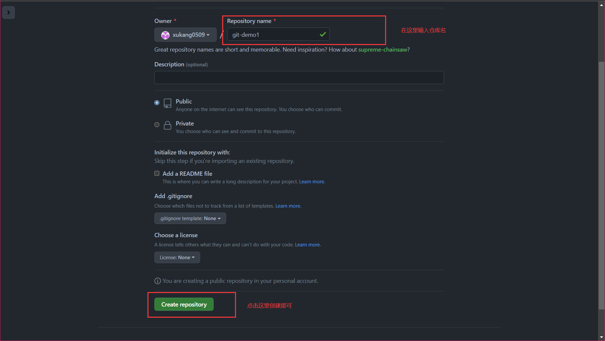
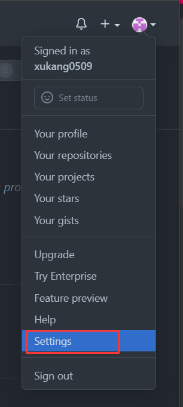
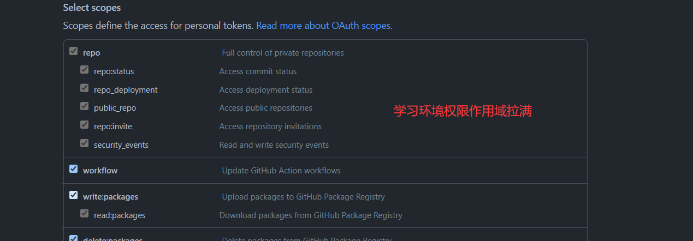
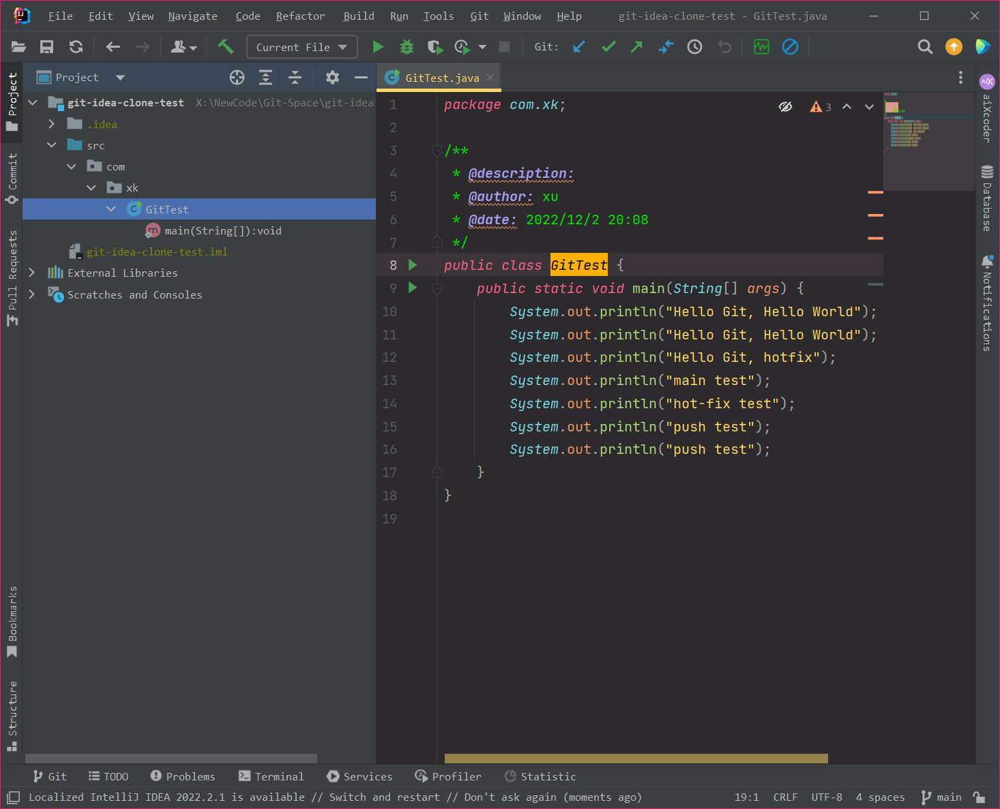

# Git

+++

## 一、Git概述

Git 是一个免费的、**开源的分布式版本控制系统**，可以快速高效地处理从小型到大型的各种项目。

Git 易于学习，占地面积小，性能极快。它具有廉价的本地库，方便的暂存区域和多个工作流分支等特性。其性能优于Subversion、CVS、Perforce 和 ClearCase 等版本控制工具。


### 1 何为版本控制

版本控制是一种记录文件内容变化，以便将来查阅特定版本修订情况的系统。

版本控制其实最重要的是可以记录文件修改历史记录，从而让用户能够查看历史版本，方便版本切换。


### 2 为什么需要版本控制

个人开发过渡到团队协作。


### 3 版本控制工具

#### 3.1 集中式版本控制工具

CVS、**SVN(Subversion)**、VSS ……

集中化的版本控制系统诸如 CVS、SVN 等，都有一个单一的集中管理的服务器，保存所有文件的修订版本，而协同工作的人们都通过客户端连到这台服务器，取出最新的文件或者提交更新。多年以来，这已成为版本控制系统的标准做法。

这种做法带来了许多好处，每个人都可以在一定程度上看到项目中的其他人正在做些什么。而管理员也可以轻松掌控每个开发者的权限，并且管理一个集中化的版本控制系统，要远比在各个客户端上维护本地数据库来得轻松容易。

事分两面，有好有坏。这么做显而易见的缺点是中央服务器的单点故障。如果服务器宕机一小时，那么在这一小时内，谁都无法提交更新，也就无法协同工作。


#### 3.2 分布式版本控制工具

**Git**、Mercurial、Bazaar、Darcs ……

像 Git 这种分布式版本控制工具，客户端提取的不是最新版本的文件快照，而是把代码仓库完整地镜像下来（本地库）。这样任何一处协同工作用的文件发生故障，事后都可以用其他客户端的本地仓库进行恢复。因为每个客户端的每一次文件提取操作，实际上都是一次对整个文件仓库的完整备份。

分布式的版本控制系统出现之后，解决了集中式版本控制系统的缺陷：

1. 服务器断网的情况下也可以进行开发（因为版本控制是在本地进行的）
2. 每个客户端保存的也都是整个完整的项目（包含历史记录，更加安全）


### 4 Git简史


### 5 Git工作机制


### 6 Git和代码托管中心

代码托管中心是基于网络服务器的远程代码仓库，一般我们简单称为**远程库**。

- 局域网
  - GitLab
- 互联网
  - GitHub（外网）
  - Gitee 码云（国内网站）

+++

## 二、Git安装

官网地址： https://git-scm.com/


查看 GNU 协议，可以直接点击下一步。


选择 Git 安装位置，要求是非中文并且没有空格的目录，然后下一步。


Git 选项配置，推荐默认设置，然后下一步。


Git 安装目录名，不用修改，直接点击下一步。


Git 的默认编辑器，建议使用默认的 Vim 编辑器，然后点击下一步。


默认分支名设置，选择让 Git 决定，分支名默认为 master，下一步。


修改 Git 的环境变量，选第一个，不修改环境变量，只在 Git Bash 里使用 Git。


选择后台客户端连接协议，选默认值 OpenSSL，然后下一步。


配置 Git 文件的行末换行符，Windows 使用 CRLF，Linux 使用 LF，选择第一个自动转换，然后继续下一步。


选择 Git 终端类型，选择默认的 Git Bash 终端，然后继续下一步。


选择`Git pull`合并的模式，选择默认，然后下一步。


选择 Git 的凭据管理器，选择默认的跨平台的凭据管理器，然后下一步。


其他配置，选择默认设置，然后下一步。


实验室功能，技术还不成熟，有已知的 bug，不要勾选，然后点击右下角的 Install
按钮，开始安装 Git。


点击 Finsh 按钮，Git 安装成功！


右键任意位置，在右键菜单里选择`Git Bash Here`即可打开 Git Bash 命令行终端。


在 Git Bash 终端里输入`git --version`查看 git 版本，如图所示，说明 Git 安装成功。


+++

## 三、Git常用命令

| **命令名称**                         | **作用**         |
| ------------------------------------ | ---------------- |
| git config --global user.name 用户名 | 设置用户签名     |
| git config --global user.email 邮箱  | 设置用户签名     |
| *git init*                           | *初始化本地库*   |
| *git status*                         | *查看本地库状态* |
| *git add 文件名*                     | *添加到暂存区*   |
| *git commit -m "日志信息" 文件名*    | *提交到本地库*   |
| *git reflog*                         | *查看历史记录*   |
| *git reset --hard 版本号*            | *版本穿梭*       |


### 1 设置用户签名

1. 基本语法

   git config --global user.name 用户名

   git config --global user.email 邮箱

2. 案例实操

   全局范围的签名设置：

   ```shell
   Amadeus@Y7000P MINGW64 ~/Desktop
   $ git config --global user.name shanhai_xk
   Amadeus@Y7000P MINGW64 ~/Desktop
   $ git config --global user.email 864544317@qq.com
   Amadeus@Y7000P MINGW64 ~/Desktop
   
   $ cat ~/.gitconfig
   [user]
           name = shanhai_xk
           email = 864544317@qq.com
   [credential]
           helper = manager-core
   [credential "https://gitee.com"]
           provider = generic
   ```

> 说明：
>
> 签名的作用是区分不同操作者身份。用户的签名信息在每一个版本的提交信息中能够看到，以此确认本次提交是谁做的。**Git首次安装必须设置一下用户签名，否则无法提交代码**。
>
> **注意**：这里设置用户签名和将来登录 GitHub（或其他代码托管中心）的账号没有任何关系。


### 2 初始化本地库

1. 基本语法

   git init

2. 案例实操

   ```shell
   Amadeus@Y7000P MINGW64 /x/NewCode/Git-Space/git-demo
   $ git init
   Initialized empty Git repository in X:/NewCode/Git-Space/git-demo/.git/
   
   Amadeus@Y7000P MINGW64 /x/NewCode/Git-Space/git-demo (main)
   $ ll -a
   total 4
   drwxr-xr-x 1 Amadeus 197121 0 Dec  2 15:57 ./
   drwxr-xr-x 1 Amadeus 197121 0 Dec  2 15:56 ../
   drwxr-xr-x 1 Amadeus 197121 0 Dec  2 15:57 .git/
   ```

3. 结果查看

   


### 3 查看本地库状态

1. 基本语法

   git status

2. 案例实操

   - 首次查看（工作区没有任何文件）

     ```shell
     Amadeus@Y7000P MINGW64 /x/NewCode/Git-Space/git-demo (main)
     $ git status
     On branch main
     
     No commits yet
     
     nothing to commit (create/copy files and use "git add" to track)
     ```

   - 新增文件（hello.txt）

     ```shell
     Amadeus@Y7000P MINGW64 /x/NewCode/Git-Space/git-demo (main)
     $ vim hello.txt
     hello git! hello shanhai!
     hello git! hello shanhai!
     hello git! hello shanhai!
     hello git! hello shanhai!
     hello git! hello shanhai!
     hello git! hello shanhai!
     hello git! hello shanhai!
     hello git! hello shanhai!
     hello git! hello shanhai!
     hello git! hello shanhai!
     hello git! hello shanhai!
     hello git! hello shanhai!
     hello git! hello shanhai!
     hello git! hello shanhai!
     hello git! hello shanhai!
     hello git! hello shanhai!
     hello git! hello shanhai!
     hello git! hello shanhai!
     ```

   - 再次查看（检测到未追踪的文件）

     ```bash
     Amadeus@Y7000P MINGW64 /x/NewCode/Git-Space/git-demo (main)
     $ git status
     On branch main
     
     No commits yet
     
     Untracked files:
       (use "git add <file>..." to include in what will be committed)
             hello.txt
     
     nothing added to commit but untracked files present (use "git add" to track)
     ```


### 4 添加暂存区

将工作区的文件添加到暂存区

1. 基本语法

   git add 文件名

2. 案例实操

   ```bash
   Amadeus@Y7000P MINGW64 /x/NewCode/Git-Space/git-demo (main)
   $ git add hello.txt
   warning: LF will be replaced by CRLF in hello.txt.
   The file will have its original line endings in your working directory
   ```

3. 查看状态（检测到暂存区有新文件）

   ```bash
   Amadeus@Y7000P MINGW64 /x/NewCode/Git-Space/git-demo (main)
   $ git status
   On branch main
   
   No commits yet
   
   Changes to be committed:
     (use "git rm --cached <file>..." to unstage)
           new file:   hello.txt
   ```


### 5 提交本地库

将暂存区的文件提交到本地库

1. 基本语法

   git commit -m "日志信息" 文件名

2. 案例实操

   ```bash
   Amadeus@Y7000P MINGW64 /x/NewCode/Git-Space/git-demo (main)
   $ git commit -m "my first commit" hello.txt
   warning: LF will be replaced by CRLF in hello.txt.
   The file will have its original line endings in your working directory
   [main (root-commit) 8782011] my first commit
    1 file changed, 18 insertions(+)
    create mode 100644 hello.txt
   ```

3. 查看状态（没有文件需要提交）

   ```bash
   Amadeus@Y7000P MINGW64 /x/NewCode/Git-Space/git-demo (main)
   $ git status
   On branch main
   nothing to commit, working tree clean
   ```

4. 查看版本日志信息

   ```bash
   Amadeus@Y7000P MINGW64 /x/NewCode/Git-Space/git-demo (main)
   $ git reflog
   8782011 (HEAD -> main) HEAD@{0}: commit (initial): my first commit
   
   Amadeus@Y7000P MINGW64 /x/NewCode/Git-Space/git-demo (main)
   $ git log
   commit 8782011446a8b07447913affba2d4f373334780c (HEAD -> main)
   Author: shanhai_xk <864544317@qq.com>
   Date:   Fri Dec 2 16:17:51 2022 +0800
   
       my first commit
   ```


### 6 修改文件（hello.txt）

```bash
Amadeus@Y7000P MINGW64 /x/NewCode/Git-Space/git-demo (main)
$ vim hello.txt
hello git! hello shanhai! 2222222222
hello git! hello shanhai!
hello git! hello shanhai!
hello git! hello shanhai!
hello git! hello shanhai!
hello git! hello shanhai!
hello git! hello shanhai!
hello git! hello shanhai!
hello git! hello shanhai!
hello git! hello shanhai!
hello git! hello shanhai!
hello git! hello shanhai!
hello git! hello shanhai!
hello git! hello shanhai!
hello git! hello shanhai!
hello git! hello shanhai!
hello git! hello shanhai!
hello git! hello shanhai!
```

1. 查看状态（检测到工作区有文件被修改）

   

2. 将修改的文件再次添加暂存区

   ```bash
   Amadeus@Y7000P MINGW64 /x/NewCode/Git-Space/git-demo (main)
   $ git add hello.txt
   warning: LF will be replaced by CRLF in hello.txt.
   The file will have its original line endings in your working directory
   ```

3. 查看状态（工作区的修改添加到了暂存区）

   

4. 将暂存区的文件提交到本地库

   ```bash
   Amadeus@Y7000P MINGW64 /x/NewCode/Git-Space/git-demo (main)
   $ git commit -m "my second commit" hello.txt
   warning: LF will be replaced by CRLF in hello.txt.
   The file will have its original line endings in your working directory
   [main 10faf24] my second commit
    1 file changed, 1 insertion(+), 1 deletion(-)
   ```

5. 查看状态（没有文件需要提交）

   ```bash
   Amadeus@Y7000P MINGW64 /x/NewCode/Git-Space/git-demo (main)
   $ git status
   On branch main
   nothing to commit, working tree clean
   ```


### 7 历史版本

#### 7.1 查看历史版本

1. 基本语法

   - git reflog  (查看版本信息)
   - git log  (查看版本详细信息)

2. 案例实操

   

#### 7.2 版本穿梭

1. 基本语法

   git reset --hard 版本号

2. 案例实操

   首先查看当前的历史记录，可以看到当前是在 10faf24 这个版本

   ```bash
   Amadeus@Y7000P MINGW64 /x/NewCode/Git-Space/git-demo (main)
   $ git reflog
   10faf24 (HEAD -> main) HEAD@{0}: commit: my second commit
   8782011 HEAD@{1}: commit (initial): my first commit
   ```

   切换到 8782011 版本，也就是我们第一次提交的版本

   ```bash
   Amadeus@Y7000P MINGW64 /x/NewCode/Git-Space/git-demo (main)
   $ git reset --hard 8782011
   HEAD is now at 8782011 my first commit
   ```

   切换完毕之后再查看历史记录，当前成功切换到了 8782011 版本

   ```bash
   Amadeus@Y7000P MINGW64 /x/NewCode/Git-Space/git-demo (main)
   $ git reflog
   8782011 (HEAD -> main) HEAD@{0}: reset: moving to 8782011
   10faf24 HEAD@{1}: commit: my second commit
   8782011 (HEAD -> main) HEAD@{2}: commit (initial): my first commit
   ```

   然后查看文件 hello.txt，发现文件内容已经变化

   ```bash
   $ cat hello.txt
   hello git! hello shanhai!
   hello git! hello shanhai!
   hello git! hello shanhai!
   hello git! hello shanhai!
   hello git! hello shanhai!
   hello git! hello shanhai!
   hello git! hello shanhai!
   hello git! hello shanhai!
   hello git! hello shanhai!
   hello git! hello shanhai!
   hello git! hello shanhai!
   hello git! hello shanhai!
   hello git! hello shanhai!
   hello git! hello shanhai!
   hello git! hello shanhai!
   hello git! hello shanhai!
   hello git! hello shanhai!
   hello git! hello shanhai!
   ```

+++

## 四、Git分支操作


### 1 什么是分支

在版本控制过程中，同时推进多个任务，为每个任务，我们就可以创建每个任务的单独分支。使用分支意味着程序员可以把自己的工作从开发主线上分离开来，开发自己分支的时候，不会影响主线分支的运行。对于初学者而言，分支可以简单理解为副本，一个分支就是一个单独的副本。（分支底层其实也是指针的引用）


### 2 分支的好处

同时并行推进多个功能开发，提高开发效率。

各个分支在开发过程中，如果某一个分支开发失败，不会对其他分支有任何影响。失败的分支删除重新开始即可。


### 3 分支的操作

| **命令名称**        | **作用**                     |
| ------------------- | ---------------------------- |
| git branch 分支名   | 创建分支                     |
| git branch -v       | 查看分支                     |
| git checkout 分支名 | 切换分支                     |
| git merge 分支名    | 把指定的分支合并到当前分支上 |


#### 3.1 查看分支

1. 基本语法

   git branch -v

2. 案例实操

   ```bash
   Amadeus@Y7000P MINGW64 /x/NewCode/Git-Space/git-demo (main)
   $ git branch -v
   * main 10faf24 my second commit    # （*代表当前所在的分区）
   ```


#### 3.2 创建分支

1. 基本语法

   git branch 分支名

2. 案例实操

   ```bash
   Amadeus@Y7000P MINGW64 /x/NewCode/Git-Space/git-demo (main)
   $ git branch hot-fix
   
   Amadeus@Y7000P MINGW64 /x/NewCode/Git-Space/git-demo (main)
   $ git branch -v
     hot-fix 10faf24 my second commit    #（刚创建的新的分支，并将主分支main的内容复制了一份）
   * main    10faf24 my second commit
   ```


#### 3.3 修改分支

在 main 分支上做修改

```bash
Amadeus@Y7000P MINGW64 /x/NewCode/Git-Space/git-demo (main)
$ vim hello.txt
```

添加暂存区

```bash
Amadeus@Y7000P MINGW64 /x/NewCode/Git-Space/git-demo (main)
$ git add hello.txt
```

提交本地库

```bash
Amadeus@Y7000P MINGW64 /x/NewCode/Git-Space/git-demo (main)
$ git commit -m "my third commit" hello.txt
[main a96b201] my third commit
 1 file changed, 1 insertion(+), 1 deletion(-)
```

查看分支

```bash
Amadeus@Y7000P MINGW64 /x/NewCode/Git-Space/git-demo (main)
$ git branch -v
  hot-fix 10faf24 my second commit    #（hot-fix 分支并未做任何改变）
* main    a96b201 my third commit     #（当前 master 分支已更新为最新一次提交的版本）
```

查看 master 分支上的文件内容

```bash
Amadeus@Y7000P MINGW64 /x/NewCode/Git-Space/git-demo (main)
$ cat hello.txt
hello git! hello shanhai! 2222222222
hello git! hello shanhai! 3333333333
hello git! hello shanhai!
hello git! hello shanhai!
hello git! hello shanhai!
hello git! hello shanhai!
hello git! hello shanhai!
hello git! hello shanhai!
hello git! hello shanhai!
hello git! hello shanhai!
hello git! hello shanhai!
hello git! hello shanhai!
hello git! hello shanhai!
hello git! hello shanhai!
hello git! hello shanhai!
hello git! hello shanhai!
hello git! hello shanhai!
hello git! hello shanhai!
```


#### 3.4 切换分支

1. 基本语法

   git checkout 分支名

2. 案例实操 

   ```bash
   Amadeus@Y7000P MINGW64 /x/NewCode/Git-Space/git-demo (main)
   $ git checkout hot-fix
   Switched to branch 'hot-fix'
   
   Amadeus@Y7000P MINGW64 /x/NewCode/Git-Space/git-demo (hot-fix)
   $ git branch -v
   * hot-fix 10faf24 my second commit  # 发现当先分支已由 main 改为 hot-fix
     main    a96b201 my third commit
   ```

   ```bash
   # 查看 hot-fix 分支上的文件内容发现与 master 分支上的内容不同
   Amadeus@Y7000P MINGW64 /x/NewCode/Git-Space/git-demo (hot-fix)
   $ cat hello.txt
   hello git! hello shanhai! 2222222222
   hello git! hello shanhai!
   hello git! hello shanhai!
   hello git! hello shanhai!
   hello git! hello shanhai!
   hello git! hello shanhai!
   hello git! hello shanhai!
   hello git! hello shanhai!
   hello git! hello shanhai!
   hello git! hello shanhai!
   hello git! hello shanhai!
   hello git! hello shanhai!
   hello git! hello shanhai!
   hello git! hello shanhai!
   hello git! hello shanhai!
   hello git! hello shanhai!
   hello git! hello shanhai!
   hello git! hello shanhai!
   
   # 在 hot-fix 分支上做修改
   Amadeus@Y7000P MINGW64 /x/NewCode/Git-Space/git-demo (hot-fix)
   $ vim hello.txt
   hello git! hello shanhai! 22222
   hello git! hello shanhai! 33333 
   hello git! hello shanhai!
   hello git! hello shanhai!
   hello git! hello shanhai!
   hello git! hello shanhai!
   hello git! hello shanhai!
   hello git! hello shanhai!
   hello git! hello shanhai!
   hello git! hello shanhai!
   hello git! hello shanhai!
   hello git! hello shanhai!
   hello git! hello shanhai!
   hello git! hello shanhai!
   hello git! hello shanhai!
   hello git! hello shanhai!
   hello git! hello shanhai!
   hello git! hello shanhai!
   
   # 添加暂存区
   Amadeus@Y7000P MINGW64 /x/NewCode/Git-Space/git-demo (hot-fix)
   $ git add hello.txt
   
   # 提交本地库
   Amadeus@Y7000P MINGW64 /x/NewCode/Git-Space/git-demo (hot-fix)
   $ git commit -m "hot-fix first commit" hello.txt
   [hot-fix 7718e0e] hot-fix first commit
    1 file changed, 2 insertions(+), 2 deletions(-)
   ```


#### 3.5 合并分支

1. 基本语法

   git merge 分支名

2. 案例实操 

   在 main 分支上合并 hot-fix 分支

   ```bash
   # 切换到 main 分支
   Amadeus@Y7000P MINGW64 /x/NewCode/Git-Space/git-demo (hot-fix)
   $ git checkout main
   Switched to branch 'main'
   
   # 在 main 分支上合并 hot-fix 分支
   Amadeus@Y7000P MINGW64 /x/NewCode/Git-Space/git-demo (main)
   $ git merge hot-fix
   Auto-merging hello.txt
   CONFLICT (content): Merge conflict in hello.txt
   Automatic merge failed; fix conflicts and then commit the result.
   
   Amadeus@Y7000P MINGW64 /x/NewCode/Git-Space/git-demo (main|MERGING)
   $
   ```


#### 3.6 产生冲突

冲突产生的表现：后面状态为 MERGING

```bash
Amadeus@Y7000P MINGW64 /x/NewCode/Git-Space/git-demo (main|MERGING)
$ cat hello.txt
<<<<<<< HEAD
hello git! hello shanhai! 2222222222
hello git! hello shanhai! 3333333333
=======
hello git! hello shanhai! 22222
hello git! hello shanhai! 33333
>>>>>>> hot-fix
hello git! hello shanhai!
hello git! hello shanhai!
hello git! hello shanhai!
hello git! hello shanhai!
hello git! hello shanhai!
hello git! hello shanhai!
hello git! hello shanhai!
hello git! hello shanhai!
hello git! hello shanhai!
hello git! hello shanhai!
hello git! hello shanhai!
hello git! hello shanhai!
hello git! hello shanhai!
hello git! hello shanhai!
hello git! hello shanhai!
hello git! hello shanhai!
```

冲突产生的原因：

​	合并分支时，两个分支在**同一个文件的同一个位置**有两套完全不同的修改。Git 无法替我们决定使用哪一个。必须**人为决定**新代码内容。

查看状态（检测到有文件有两处修改）

```bash
Amadeus@▒▒▒ٵ▒Y7000P MINGW64 /x/NewCode/Git-Space/git-demo (main|MERGING)
$ git status
On branch main
You have unmerged paths.
  (fix conflicts and run "git commit")
  (use "git merge --abort" to abort the merge)

Unmerged paths:
  (use "git add <file>..." to mark resolution)
        both modified:   hello.txt

no changes added to commit (use "git add" and/or "git commit -a")
```


#### 3.7 解决冲突

1. 编辑有冲突的文件，删除特殊符号，决定要使用的内容

   特殊符号：*<<<<<<< HEAD* 当前分支的代码  *\==\=====*  合并过来的代码 *>>>>>>> hot-fix*

   ```bash
   Amadeus@Y7000P MINGW64 /x/NewCode/Git-Space/git-demo (main|MERGING)
   $ vim hello.txt
   hello git! hello shanhai! 2222222222
   hello git! hello shanhai! 33333
   hello git! hello shanhai!
   hello git! hello shanhai!
   hello git! hello shanhai!
   hello git! hello shanhai!
   hello git! hello shanhai!
   hello git! hello shanhai!
   hello git! hello shanhai!
   hello git! hello shanhai!
   hello git! hello shanhai!
   hello git! hello shanhai!
   hello git! hello shanhai!
   hello git! hello shanhai!
   hello git! hello shanhai!
   hello git! hello shanhai!
   hello git! hello shanhai!
   hello git! hello shanhai!
   ```

2. 添加到暂存区

   ```bash
   Amadeus@Y7000P MINGW64 /x/NewCode/Git-Space/git-demo (main|MERGING)
   $ git add hello.txt
   ```

3. 执行提交（注意：此时使用 git commit 命令时不能带文件名）

   ```bash
   Amadeus@Y7000P MINGW64 /x/NewCode/Git-Space/git-demo (main|MERGING)
   $ git commit -m "merge test"
   [main f32bd5c] merge test
   
   Amadeus@Y7000P MINGW64 /x/NewCode/Git-Space/git-demo (main)
   $
   ```

+++

## 五、Git团队协作机制

### 1 团队内协作


### 2 跨团队协作


+++

## 六、GitHub操作

GitHub网址：https://github.com/

### 1 创建远程仓库





### 2 远程仓库操作

| **命令名称**                         | **作用**                                                     |
| ------------------------------------ | ------------------------------------------------------------ |
| git remote -v                        | 查看当前所有远程地址别名                                     |
| git remote add 别名 远程地址         | 起别名                                                       |
| *git push 别名 分支*                 | *推送本地分支上的内容到远程仓库*                             |
| *git clone 远程地址*                 | *将远程仓库的内容克隆到本地*                                 |
| *git pull 远程库地址别名 远程分支名* | *将远程仓库对于分支最新内容拉下来后与<br/>当前本地分支直接合并* |

#### 2.1 创建远程仓库别名

1. 基本语法

   - git remote -v  (查看当前所有远程地址别名)
   - git remote add 别名 远程地址  (起别名)

2. 案例实操

   ```bash
   Amadeus@Y7000P MINGW64 /x/NewCode/Git-Space/git-demo (main)
   $ git remote -v
   
   Amadeus@Y7000P MINGW64 /x/NewCode/Git-Space/git-demo (main)
   $ git remote add git-demo https://github.com/xukang0509/git-demo.git
   
   Amadeus@Y7000P MINGW64 /x/NewCode/Git-Space/git-demo (main)
   $ git remote -v
   git-demo        https://github.com/xukang0509/git-demo.git (fetch)
   git-demo        https://github.com/xukang0509/git-demo.git (push)
   ```


#### 2.2 推送本地分支到远程仓库

1. 基本语法

   git push 别名 分支

2. 案例实操

   ```bash
   Amadeus@▒▒▒ٵ▒Y7000P MINGW64 /x/NewCode/Git-Space/git-demo (main)
   $ git push git-demo main
   warning: ----------------- SECURITY WARNING ----------------
   warning: | TLS certificate verification has been disabled! |
   warning: ---------------------------------------------------
   warning: HTTPS connections may not be secure. See https://aka.ms/gcm/tlsverify for more information.
   warning: ----------------- SECURITY WARNING ----------------
   warning: | TLS certificate verification has been disabled! |
   warning: ---------------------------------------------------
   warning: HTTPS connections may not be secure. See https://aka.ms/gcm/tlsverify for more information.
   Enumerating objects: 15, done.
   Counting objects: 100% (15/15), done.
   Delta compression using up to 8 threads
   Compressing objects: 100% (10/10), done.
   Writing objects: 100% (15/15), 1.10 KiB | 376.00 KiB/s, done.
   Total 15 (delta 5), reused 0 (delta 0), pack-reused 0
   remote: Resolving deltas: 100% (5/5), done.
   To https://github.com/xukang0509/git-demo.git
    * [new branch]      main -> main
   ```

   此时发现已将我们 main 分支上的内容推送到 GitHub 创建的远程仓库。

   

#### 2.3 拉取远程库内容

1. 基本语法

   git pull 远程库地址别名 远程分支名

2. 案例实操

   将远程仓库对于分支最新内容拉下来后与当前本地分支直接合并

   ```bash
   Amadeus@Y7000P MINGW64 /x/NewCode/Git-Space/git-demo (main)
   $ git pull git-demo main
   remote: Enumerating objects: 5, done.
   remote: Counting objects: 100% (5/5), done.
   remote: Compressing objects: 100% (2/2), done.
   remote: Total 3 (delta 1), reused 0 (delta 0), pack-reused 0
   Unpacking objects: 100% (3/3), 649 bytes | 4.00 KiB/s, done.
   From https://github.com/xukang0509/git-demo
    * branch            main       -> FETCH_HEAD
      f32bd5c..ba8d867  main       -> git-demo/main
   Updating f32bd5c..ba8d867
   Fast-forward
    hello.txt | 1 +
    1 file changed, 1 insertion(+)
   
   Amadeus@Y7000P MINGW64 /x/NewCode/Git-Space/git-demo (main)
   $ cat hello.txt
   hello git! hello shanhai! 2222222222
   hello git! hello shanhai! 33333
   hello git! hello shanhai!
   hello git! hello shanhai!
   hello git! hello shanhai!
   hello git! hello shanhai!
   hello git! hello shanhai!
   hello git! hello shanhai!
   hello git! hello shanhai!
   hello git! hello shanhai!
   hello git! hello shanhai!
   hello git! hello shanhai!
   hello git! hello shanhai!
   hello git! hello shanhai!
   hello git! hello shanhai!
   hello git! hello shanhai!
   hello git! hello shanhai!
   hello git! hello shanhai!
   11111111111111111111111111111111111111111111111111111111111111
   
   Amadeus@Y7000P MINGW64 /x/NewCode/Git-Space/git-demo (main)
   $ git status
   On branch main
   nothing to commit, working tree clean
   ```


#### 2.4 克隆远程仓库到本地

1. 基本语法

   git clone 远程地址

2. 案例实操

   ```bash
   Amadeus@▒▒▒ٵ▒Y7000P MINGW64 /x/NewCode/Git-Space/git-clone-test
   $ git clone https://github.com/xukang0509/git-demo.git
   Cloning into 'git-demo'...
   remote: Enumerating objects: 18, done.
   remote: Counting objects: 100% (18/18), done.
   remote: Compressing objects: 100% (7/7), done.
   remote: Total 18 (delta 6), reused 14 (delta 5), pack-reused 0
   Receiving objects: 100% (18/18), done.
   Resolving deltas: 100% (6/6), done.
   ```

   https://github.com/xukang0509/git-demo.git

   这个地址为远程仓库地址，克隆结果：初始化本地仓库

   

   创建远程仓库别名

   ```bash
   Amadeus@Y7000P MINGW64 /x/NewCode/Git-Space/git-clone-test/git-demo (main)
   $ git remote -v
   origin  https://github.com/xukang0509/git-demo.git (fetch)
   origin  https://github.com/xukang0509/git-demo.git (push)
   ```

   小结：clone 会做如下操作。1、拉取代码。2、初始化本地仓库。3、创建别名


#### 2.5 邀请加入团队

1. 选择邀请合作者

   

2. 填入想要合作的人

   

3. 复制地址并通过微信信钉钉等方式发送给该用户，复制内容如下：

   https://github.com/xukang0509/git-demo/invitations

4. 在好友的账号中的地址栏复制收到邀请的链接，点击接受邀请。

5. 成功之后可以在好友的账号上看到 git-demo 的远程仓库。

6. 好友可以修改内容并 push 到远程仓库。


### 3 跨团队协作

1. 将远程仓库的地址复制发给邀请跨团队协作的人，比如东方不败。

   

2. 在东方不败的 GitHub 账号里的地址栏复制收到的链接，然后点击 Fork 将项目叉到自己的本地仓库。

   

   叉入中…

   

   叉成功后可以看到当前仓库信息。

   

3. 东方不败就可以在线编辑叉取过来的文件。

   

   

4. 编辑完毕后，填写描述信息并点击左下角绿色按钮提交。

   

5. 接下来点击上方的 Pull 请求，并创建一个新的请求。

   

   

   

6. 回到岳岳 GitHub 账号可以看到有一个 Pull request 请求。

   

   

   进入到聊天室，可以讨论代码相关内容

   

   

7. 如果代码没有问题，可以点击 Merge pull reque 合并代码。

   

   

### 4 SSH 免密登录

我们可以看到远程仓库中还有一个 SSH 的地址，因此我们也可以使用 SSH 进行访问。


具体操作如下：

进入当前用户的家目录

1. 进入当前用户的家目录：C:\Users\Amadeus

2. 删除 .ssh 目录

3. 运行命令生成 .ssh 秘钥目录 [**注意：这里 -C 这个参数是大写的 C**]

   ssh-keygen -t rsa -C 864544317@qq.com

   ```bash
   Amadeus@▒▒▒ٵ▒Y7000P MINGW64 ~
   $ ssh-keygen -t rsa -C 864544317@qq.com
   Generating public/private rsa key pair.
   Enter file in which to save the key (/c/Users/Amadeus/.ssh/id_rsa):
   Created directory '/c/Users/Amadeus/.ssh'.
   Enter passphrase (empty for no passphrase):
   Enter same passphrase again:
   Your identification has been saved in /c/Users/Amadeus/.ssh/id_rsa
   Your public key has been saved in /c/Users/Amadeus/.ssh/id_rsa.pub
   The key fingerprint is:
   SHA256:Qs1EzKs6QYh41k1tkspapac059U7JpBR4ql5+XdHawU 864544317@qq.com
   The key's randomart image is:
   +---[RSA 3072]----+
   |      .B+        |
   |     .**=        |
   |.. + *+=oo    E  |
   |o + X+*.o .    . |
   | o =o*++S  .  . .|
   |  . o.oo. +  . o |
   |     o  .o... +  |
   |    o    . . o   |
   |     .           |
   +----[SHA256]-----+
   ```

4. 查看目录 .ssh 中的文件

   

5. 复制 id_rsa.pub 文件内容，登录 GitHub，点击用户头像→Settings→SSH and GPG keys


接下来再往远程仓库 push 东西的时候使用 SSH 连接就不需要登录了。

+++

## 七、IDEA集成Git

### 1 配置Git忽略文件

1. Eclipse 特定文件

   

2. IDEA 特定文件

   

3. Maven 工程的 target 目录

   

问题 1：为什么要忽略他们？

答：与项目的实际功能无关，不参与服务器上部署运行。把它们忽略掉能够屏蔽 IDE 工具之间的差异。

问题 2：怎么忽略？

1. 创建忽略规则文件 xxxx.ignore（前缀名随便起，建议是 git.ignore）

   这个文件的存放位置原则上在哪里都可以，为了便于让~/.gitconfig文件引用，建议也放在用户家目录下

   git.ignore 文件模版内容如下：

   ```ignore
   # Compiled class file
   *.class
   # Log file
   *.log
   # BlueJ files
   *.ctxt
   # Mobile Tools for Java (J2ME)
   .mtj.tmp/
   # Package Files #
   *.jar
   *.war
   *.nar
   *.ear
   *.zip
   *.tar.gz
   *.rar
   # virtual machine crash logs, see 
   http://www.java.com/en/download/help/error_hotspot.xml
   hs_err_pid*
   .classpath
   .project
   .settings
   target
   .idea
   *.iml
   ```

2. 在.gitconfig 文件中引用忽略配置文件（此文件在 Windows 的家目录中）

   ```
   [user]
   	name = shanhai_xk
   	email = 864544317@qq.com
   [credential]
   	helper = manager-core
   [credential "https://gitee.com"]
   	provider = generic
   [http]
   	sslverify = false
   [core]
   	excludesfile = C:/Users/Amadeus/git.ignore
   ```

   注意：这里要使用“正斜线（/）”，不要使用“反斜线（\）”


### 2 定位Git程序


### 3 初始化本地库


选择要创建 Git 本地仓库的工程。


### 4 添加到暂存区

右键点击项目选择 Git -> Add 将项目添加到暂存区。


### 5 提交到本地库


### 6 切换版本


在 IDEA 的左下角，点击 Git，查看版本


右键选择要切换的版本，然后在菜单里点击 Checkout Revision。


### 7 创建分支

点击IDEA右下角的main分支，点击 New Branch 新建分支


填写分支名称，创建 hot-fix 分支


然后再 IDEA 的右下角看到 hot-fix，说明分支创建成功，并且当前已经切换成 hot-fix 分支


### 8 切换分支

在 IDEA 窗口的右下角，切换到 main 分支。


然后在 IDEA 窗口的右下角看到了 main，说明 main 分支切换成功。


### 9 合并分支

main

```java
public static void main(String[] args) {
    System.out.println("Hello Git, Hello World");
    System.out.println("Hello Git, Hello World");
    System.out.println("Hello Git");
    System.out.println("Hello Git");
}
```

hot-fix

```java
public static void main(String[] args) {
    System.out.println("Hello Git, Hello World");
    System.out.println("Hello Git, Hello World");
    System.out.println("Hello Git, hotfix");
    System.out.println("Hello Git, hotfix");
}
```


在 IDEA 窗口的右下角，将 hot-fix 分支合并到当前 main 分支。

如果代码没有冲突，分支直接合并成功，分支合并成功以后，代码自动提交，无需手动提交本地库。


### 10 解决冲突

如图所示，如果 main 分支和 hot-fix 分支都修改了代码，在合并分支的时候就会发生冲突。


我们现在站在 main 分支上合并 hot-fix 分支，就会发生代码冲突。


点击 Conflicts 框里的 Merge 按钮，进行手动合并代码。


代码冲突解决，自动提交本地库。


+++

## 八、IDEA集成GitHub

### 1 设置 GitHub 账号


然后去 GitHub 账户上设置 token。






点击生成 token。


点击登录。


### 2 分享工程到 GitHub


来到 GitHub 中发现已经帮我们创建好了 gitTest 的远程仓库。


### 3 push 推送本地库到远程库


注意：push 是将本地库代码推送到远程库，如果本地库代码跟远程库代码版本不一致，push 的操作是会被拒绝的。也就是说，要想 push 成功，一定要保证本地库的版本要比远程库的版本高！因此一个成熟的程序员在动手改本地代码之前，一定会先检查下远程库跟本地代码的区别！如果本地的代码版本已经落后，切记要先 pull 拉取一下远程库的代码，将本地代码更新到最新以后，然后再修改，提交，推送！


### 4 pull 拉取远程库到本地库

在GitHub上修改代码并提交。


注意：pull 是拉取远端仓库代码到本地，如果远程库代码和本地库代码不一致，会自动合并，如果自动合并失败，还会涉及到手动解决冲突的问题。


### 5 clone 克隆远程库到本地




+++

## 九、国内代码托管中心-码云

### 1 简介

众所周知，GitHub 服务器在国外，使用 GitHub 作为项目托管网站，如果网速不好的话，严重影响使用体验，甚至会出现登录不上的情况。针对这个情况，大家也可以使用国内的项目托管网站-码云。

码云是开源中国推出的基于 Git 的代码托管服务中心，网址是 https://gitee.com/ ，使用方式跟 GitHub 一样，而且它还是一个中文网站，如果你英文不是很好它是最好的选择。


### 2 码云帐号注册和登录

进入码云官网地址：https://gitee.com/，点击注册 Gitee


输入个人信息，进行注册即可。


帐号注册成功以后，直接登录。


登录以后，就可以看到码云官网首页了。


### 3 码云创建远程库

点击首页右上角的加号，选择下面的新建仓库


填写仓库名称，路径和选择是否开源（共开库或私有库）

最后根据需求选择分支模型，然后点击创建按钮。


远程库创建好以后，就可以看到 HTTPS 和 SSH 的链接。


### 4 IDEA 集成码云

#### 4.1 IDEA 安装码云插件

Idea 默认不带码云插件，我们第一步要安装 Gitee 插件。

如图所示，在 Idea 插件商店搜索 Gitee，然后点击右侧的 Install 按钮。


IDEA 连接码云和连接 GitHub 几乎一样，安装成功后，重启 Idea。


然后在码云插件里面添加码云帐号，我们就可以用 IDEA 连接码云了。


#### 4.2 IDEA 连接码云

IDEA 连接码云和连接 GitHub 几乎一样，首先在 Idea 里面创建一个工程，初始化 git 工程，然后将代码添加到暂存区，提交到本地库，这些步骤上面已经讲过，此处不再赘述。

将本地代码 push 到码云远程库


自定义远程库链接。


给远程库链接定义个 name，然后再 URL 里面填入码云远程库的 HTTPS 链接即可。码云服务器在国内，用 HTTPS 链接即可，没必要用 SSH 免密链接。


然后选择定义好的远程链接，点击 Push 即可。


看到提示就说明 Push 远程库成功。


去码云远程库查看代码。


只要码云远程库链接定义好以后，对码云远程库进行 pull 和 clone 的操作和 Github 一致，此处不再赘述。


### 5 码云复制 GitHub 项目

码云提供了直接复制 GitHub 项目的功能，方便我们做项目的迁移和下载。

具体操作如下：


将 GitHub 的远程库 HTTPS 链接复制过来，点击创建按钮即可。


如果 GitHub 项目更新了以后，在码云项目端可以手动重新同步，进行更新！


+++

## 十、自建代码托管平台-GitLab

### 1 GitLab 简介

GitLab 是由 GitLabInc.开发，使用 MIT 许可证的基于网络的 Git 仓库管理工具，且具有 wiki 和 issue 跟踪功能。使用 Git 作为代码管理工具，并在此基础上搭建起来的 web 服务。

GitLab 由乌克兰程序员 DmitriyZaporozhets 和 ValerySizov 开发，它使用 Ruby 语言写成。后来，一些部分用 Go 语言重写。截止2018年5月，该公司约有290名团队成员，以及 2000 多名开源贡献者。GitLab被IBM，Sony，JülichResearchCenter，NASA，Alibaba，Invincea，O’ReillyMedia，Leibniz-Rechenzentrum(LRZ)，CERN，SpaceX 等组织使用。


### 2 GitLab 官网地址

官网地址：https://about.gitlab.com/

安装说明：https://about.gitlab.com/installation/


### 3 GitLab 安装

#### 3.1 服务器准备

准备一个系统为 CentOS7 以上版本的服务器，要求内存 4G，磁盘 50G

关闭防火墙，并且配置好主机名和 IP，保证服务器可以上网。

此教程使用虚拟机：主机名：gitlab-server IP 地址：192.168.6.200


#### 3.2 安装包准备

Yum 在线安装`gitlab- ce`时，需要下载几百M的安装文件，非常耗时，所以最好提前把所需 RPM 包下载到本地，然后使用离线rpm的方式安装。

下载地址：https://packages.gitlab.com/gitlab/gitlab-ce/packages/el/7/gitlab-ce-13.10.2-ce.0.el7.x86_64.rpm

注：资料里提供了此rpm包，直接将此包上传到服务器/opt/module目录下即可。


#### 3.3 编写安装脚本

安装 gitlab 步骤比较繁琐，因此我们可以参考官网编写 gitlab 的安装脚本。

```shell
[root@xk moudle]# vim gitlab-install.sh

sudo rpm -ivh /opt/moudle/gitlab-ce-13.10.2-ce.0.el7.x86_64.rpm

sudo yum install -y curl policycoreutils-python openssh-server cronie

sudo lokkit -s http -s ssh

sudo yum install -y postfix

sudo service postfix start

sudo chkconfig postfix on

curl https://packages.gitlab.com/install/repositories/gitlab/gitlab-ce/script.rpm.sh | sudo bash

sudo EXTERNAL_URL="http://gitlab.example.com" yum -y install gitlab-ce
```

给脚本增加执行权限

```bash
[root@xk moudle]# chmod +x gitlab-install.sh 
[root@xk moudle]# ll
总用量 869296
-rw-r--r--. 1 root root 890154811 12月  2 22:48 gitlab-ce-13.10.2-ce.0.el7.x86_64.rpm
-rwxr-xr-x. 1 root root       417 12月  2 22:52 gitlab-install.sh
[root@xk moudle]# 
```

然后执行该脚本，开始安装 gitlab-ce。注意一定要保证服务器可以上网。

```bash
[root@xk moudle]# ./gitlab-install.sh 
警告：/opt/moudle/gitlab-ce-13.10.2-ce.0.el7.x86_64.rpm: 头V4 RSA/SHA1 Signature, 密钥 ID f27eab47: NOKEY
准备中...                          ################################# [100%]
正在升级/安装...
   1:gitlab-ce-13.10.2-ce.0.el7       ################################# [100%]
It looks like GitLab has not been configured yet; skipping the upgrade script.

       *.                  *.
      ***                 ***
     *****               *****
    .******             *******
    ********            ********
   ,,,,,,,,,***********,,,,,,,,,
  ,,,,,,,,,,,*********,,,,,,,,,,,
  .,,,,,,,,,,,*******,,,,,,,,,,,,
      ,,,,,,,,,*****,,,,,,,,,.
         ,,,,,,,****,,,,,,
            .,,,***,,,,
                ,*,.
  


     _______ __  __          __
    / ____(_) /_/ /   ____ _/ /_
   / / __/ / __/ /   / __ `/ __ \
  / /_/ / / /_/ /___/ /_/ / /_/ /
  \____/_/\__/_____/\__,_/_.___/
```


#### 3.4 初始化 GitLab 服务

执行以下命令初始化 GitLab 服务，过程大概需要几分钟，耐心等待…

```bash
[root@xk moudle]# ./gitlab-install.sh 
......
Running handlers:
Running handlers complete
Chef Client finished, 425/608 resources updated in 03 minutes 08 seconds
gitlab Reconfigured!
```


#### 3.5 启动 GitLab 服务

执行以下命令启动 GitLab 服务，如需停止，执行 gitlab-ctl stop

```bash
[root@xk moudle]# gitlab-ctl start
ok: run: alertmanager: (pid 6812) 134s
ok: run: gitaly: (pid 6740) 135s
ok: run: gitlab-monitor: (pid 6765) 135s
ok: run: gitlab-workhorse: (pid 6722) 136s
ok: run: logrotate: (pid 5994) 197s
ok: run: nginx: (pid 5930) 203s
ok: run: node-exporter: (pid 6234) 185s
ok: run: postgres-exporter: (pid 6834) 133s
ok: run: postgresql: (pid 5456) 257s
ok: run: prometheus: (pid 6777) 134s
ok: run: redis: (pid 5327) 263s
ok: run: redis-exporter: (pid 6391) 173s
ok: run: sidekiq: (pid 5797) 215s
ok: run: unicorn: (pid 5728) 221s
```


#### 3.6 使用浏览器访问 GitLab

使用主机名或者 IP 地址即可访问 GitLab 服务。需要提前配一下 windows 的 hosts 文件。


首次登陆之前，需要修改下 GitLab 提供的 root 账户的密码，要求 8 位以上，包含大小写子母和特殊符号。因此我们修改密码为 Atguigu.123456

然后使用修改后的密码登录 GitLab。


GitLab 登录成功。


#### 3.7 GitLab 创建远程库


#### 3.8 IDEA 集成 GitLab

1. 安装 GitLab 插件

   

2. 设置 GitLab 插件

   

   

   

3. push 本地代码到 GitLab 远程库

   

   自定义远程连接

   

   

   注意：gitlab 网页上复制过来的连接是：http://gitlab.example.com/root/git-test.git，

   需要手动修改为：http://gitlab-server/root/git-test.git

   选择 gitlab 远程连接，进行 push。

   

   首次向连接 gitlab，需要登录帐号和密码，用 root 帐号和我们修改的密码登录即可。

   

   代码 Push 成功。

   

   只要 GitLab 的远程库连接定义好以后，对 GitLab 远程库进行 pull 和 clone 的操作和 Github 和码云一致，此处不再赘述。

