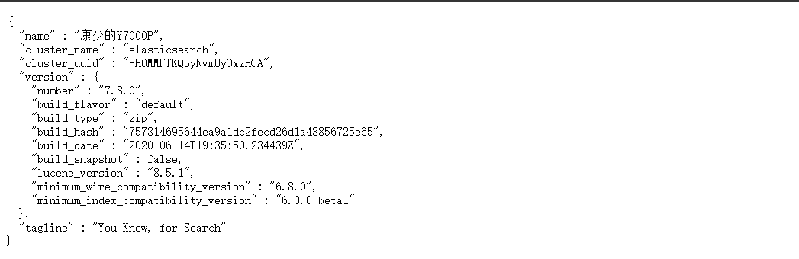
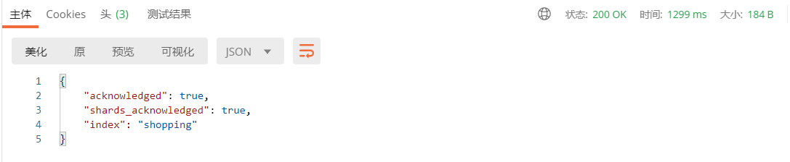
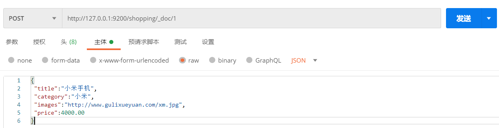
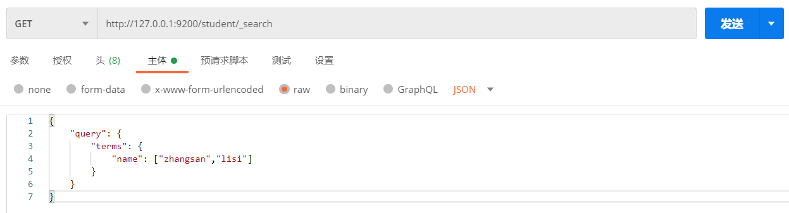
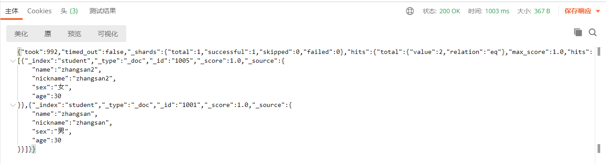
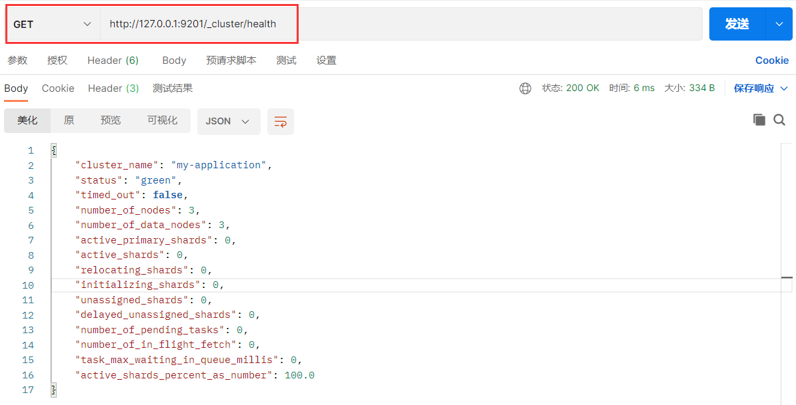

# Elasticsearch

+++

## 一、Elasticsearch概述

### 1 Elasticsearch是什么


*The Elastic Stack*, 包括*Elasticsearch*、*Kibana*、*Beats*和*Logstash*（也称为*ELK Stack*）。能够安全可靠地获取任何来源、任何格式的数据，然后实时地对数据进行搜索、分析和可视化。Elaticsearch，简称为 ES，ES 是一个**开源的高扩展的分布式全文搜索引擎**，是整个*Elastic Stack*技术栈的核心。它可以近乎实时的存储、检索数据；本身扩展性很好，可以扩展到上百台服务器，处理 PB 级别的数据。


### 2 全文搜索引擎

Google，百度类的网站搜索，它们都是根据网页中的关键字生成索引，我们在搜索的时候输入关键字，它们会将该关键字即索引匹配到的所有网页返回；还有常见的项目中应用日志的搜索等等。对于这些非结构化的数据文本，关系型数据库搜索不是能很好的支持。

一般传统数据库，全文检索都实现的很鸡肋，因为一般也没人用数据库存文本字段。进行全文检索需要扫描整个表，如果数据量大的话即使对 SQL 的语法优化，也收效甚微。建立了索引，但是维护起来也很麻烦，对于 insert 和 update 操作都会重新构建索引。

基于以上原因可以分析得出，在一些生产环境中，使用常规的搜索方式，性能是非常差的：

- 搜索的数据对象是大量的非结构化的文本数据。
- 文件记录量达到数十万或数百万个甚至更多。
- 支持大量基于交互式文本的查询。
- 需求非常灵活的全文搜索查询。
- 对高度相关的搜索结果的有特殊需求，但是没有可用的关系数据库可以满足。
- 对不同记录类型、非文本数据操作或安全事务处理的需求相对较少的情况。为了解决结构化数据搜索和非结构化数据搜索性能问题，我们就需要专业，健壮，强大的全文搜索引擎。

这里说到的全文搜索引擎指的是目前广泛应用的主流搜索引擎。它的工作原理是计算机索引程序通过扫描文章中的每一个词，对每一个词建立一个索引，指明该词在文章中出现的次数和位置，当用户查询时，检索程序就根据事先建立的索引进行查找，并将查找的结果反馈给用户的检索方式。这个过程类似于通过字典中的检索字表查字的过程。


### 3 Elasticsearch And Solr

Lucene 是 Apache 软件基金会 Jakarta 项目组的一个子项目，提供了一个简单却强大的应用程式接口，能够做全文索引和搜寻。在 Java 开发环境里 Lucene 是一个成熟的免费开源工具。就其本身而言，Lucene 是当前以及最近几年最受欢迎的免费 Java 信息检索程序库。但 Lucene 只是一个提供全文搜索功能类库的核心工具包，而真正使用它还需要一个完善的服务框架搭建起来进行应用。

目前市面上流行的搜索引擎软件，主流的就两款：**Elasticsearch** 和 **Solr**，这两款都是基于 Lucene 搭建的，可以独立部署启动的搜索引擎服务软件。由于内核相同，所以两者除了服务器安装、部署、管理、集群以外，对于数据的操作，修改、添加、保存、查询等等都十分类似。

在使用过程中，一般都会将 Elasticsearch 和 Solr 这两个软件对比，然后进行选型。这两个搜索引擎都是流行的，先进的的开源搜索引擎。它们都是围绕核心底层搜索库 --- Lucene
构建的 --- 但它们又是不同的。像所有东西一样，每个都有其优点和缺点：


### 4 Elasticsearch Or Solr

Elasticsearch 和 Solr 都是开源搜索引擎，那么我们在使用时该如何选择呢？

- Google 搜索趋势结果表明，与 Solr 相比，Elasticsearch 具有很大的吸引力，但这并不意味着 Apache Solr 已经死亡。虽然有些人可能不这么认为，但 Solr 仍然是最受欢迎的搜索引擎之一，拥有强大的社区和开源支持。
- 与 Solr 相比，Elasticsearch 易于安装且非常轻巧。此外，你可以在几分钟内安装并运行Elasticsearch。但是，如果 Elasticsearch 管理不当，这种易于部署和使用可能会成为一个问题。基于 JSON 的配置很简单，但如果要为文件中的每个配置指定注释，那么它不适合您。总的来说，如果你的应用使用的是 JSON，那么 Elasticsearch 是一个更好的选择。否则，请使用 Solr，因为它的 schema.xml 和 solrconfig.xml 都有很好的文档记录。
- Solr 拥有更大，更成熟的用户，开发者和贡献者社区。ES 虽拥有的规模较小但活跃的用户社区以及不断增长的贡献者社区。
- Solr 贡献者和提交者来自许多不同的组织，而 Elasticsearch 提交者来自单个公司。
- Solr 更成熟，但 ES 增长迅速，更稳定。
- Solr 是一个非常有据可查的产品，具有清晰的示例和 API 用例场景。Elasticsearch的文档组织良好，但它缺乏好的示例和清晰的配置说明。

那么，到底是 Solr 还是 Elasticsearch？

有时很难找到明确的答案。无论您选择 Solr 还是 Elasticsearch，首先需要了解正确的用例和未来需求。总结他们的每个属性。

- 由于易于使用，Elasticsearch 在新开发者中更受欢迎。一个下载和一个命令就可以启动一切；
- 如果除了搜索文本之外还需要它来处理分析查询，Elasticsearch 是更好的选择；
- 如果需要分布式索引，则需要选择 Elasticsearch。对于需要良好可伸缩性和以及性能分布式环境，Elasticsearch 是更好的选择；
- Elasticsearch 在开源日志管理用例中占据主导地位，许多组织在 Elasticsearch 中索引它们的日志以使其可搜索。
- 如果你喜欢监控和指标，那么请使用 Elasticsearch，因为相对于 Solr，Elasticsearch 暴露了更多的关键指标。


### 5 Elasticsearch应用案例

- **GitHub**：2013年初，抛弃了Solr，采取 Elasticsearch 来做 PB 级的搜索。“GitHub使用Elasticsearch搜索 20TB 的数据，包括 13 亿文件和 1300 亿行代码”。
- **维基百科**：启动以 Elasticsearch 为基础的核心搜索架构。
- **SoundCloud**：“SoundCloud 使用 Elasticsearch 为 1.8 亿用户提供即时而精准的音乐搜索服务”。
- **百度**：目前广泛使用 Elasticsearch 作为文本数据分析，采集百度所有服务器上的各类指标数据及用户自定义数据，通过对各种数据进行多维分析展示，辅助定位分析实例异常或业务层面异常。目前覆盖百度内部 20 多个业务线（包括云分析、网盟、预测、文库、直达号、钱包、风控等），单集群最大 100 台机器，200 个 ES 节点，每天导入 30TB+ 数据。
- **新浪**：使用 Elasticsearch 分析处理 32 亿条实时日志。
- **阿里**：使用 Elasticsearch 构建日志采集和分析体系。
- **Stack Overflow**：解决 Bug 问题的网站，全英文，编程人员交流的网站。

+++

## 二、Elasticsearch入门

### 1 Elasticsearch安装

#### 1.1 下载软件

Elasticsearch 的官方地址：https://www.elastic.co/cn/

Elasticsearch 最新的版本是 8.5.3（截止 2022.12.12），我们选择 7.8.0 版本

下载地址：https://www.elastic.co/cn/downloads/past-releases#elasticsearch


Elasticsearch 分为 Linux 和 Windows 版本，基于我们主要学习的是 Elasticsearch 的 Java 客户端的使用，所以课程中使用的是安装较为简便的 Windows 版本。


#### 1.2 安装软件

Windows 版的 Elasticsearch 的安装很简单，解压即安装完毕，解压后的 Elasticsearch 的目录结构如下：


| **目录** | **含义**       |
| -------- | -------------- |
| bin      | 可执行脚本目录 |
| config   | 配置目录       |
| jdk      | 内置 JDK 目录  |
| lib      | 类库           |
| logs     | 日志目录       |
| modules  | 模块目录       |
| plugins  | 插件目录       |

解压后，进入 bin 文件目录，点击 *elasticsearch.bat* 文件启动 ES 服务


注意：*9300*端口为 Elasticsearch 集群间组件的通信端口，*9200*端口为浏览器访问的http协议 RESTful 端口。

打开浏览器（推荐使用谷歌浏览器），输入地址：http://localhost:9200，测试结果




#### 1.3 问题解决

- Elasticsearch 是使用 java 开发的，且 7.8 版本的 ES 需要 JDK 版本 1.8 以上，默认安装包带有 jdk 环境，如果系统配置 JAVA_HOME，那么使用系统默认的 JDK，如果没有配置使用自带的 JDK，一般建议使用系统配置的 JDK。

- 双击启动窗口闪退，通过路径访问追踪错误，如果是“空间不足”，请修改`config/jvm.options`配置文件。

  ```bash
  # 设置 JVM 初始内存为 1G。此值可以设置与-Xmx 相同，以避免每次垃圾回收完成后 JVM 重新分配内存
  # Xms represents the initial size of total heap space
  # 设置 JVM 最大可用内存为 1G
  # Xmx represents the maximum size of total heap space
  
  -Xms1g
  -Xmx1g
  ```


### 2 Elasticsearch基本操作

#### 2.1 RESTful

REST 指的是一组架构约束条件和原则。满足这些约束条件和原则的应用程序或设计就是 RESTful。Web 应用程序最重要的 REST 原则是，客户端和服务器之间的交互在请求之间是无状态的。从客户端到服务器的每个请求都必须包含理解请求所必需的信息。如果服务器在请求之间的任何时间点重启，客户端不会得到通知。此外，无状态请求可以由任何可用服务器回答，这十分适合云计算之类的环境。客户端可以缓存数据以改进性能。

在服务器端，应用程序状态和功能可以分为各种资源。资源是一个有趣的概念实体，它向客户端公开。资源的例子有：应用程序对象、数据库记录、算法等等。每个资源都使用`URI(Universal Resource Identifier)`得到一个唯一的地址。所有资源都共享统一的接口，以便在客户端和服务器之间传输状态。使用的是标准的 HTTP 方法，比如`GET`、`PUT`、`POST`和`DELETE`。

在 REST 样式的 Web 服务中，每个资源都有一个地址。资源本身都是方法调用的目标，方法列表对所有资源都是一样的。这些方法都是标准方法，包括HTTP `GET`、`POST`、`PUT`、`DELETE`，还可能包括`HEAD`和`OPTIONS`。简单的理解就是，如果想要访问互联网上的资源，就必须向资源所在的服务器发出请求，请求体中必须包含资源的网络路径，以及对资源进行的操作(增删改查)。


#### 2.2 客户端安装

如果直接通过浏览器向 Elasticsearch 服务器发请求，那么需要在发送的请求中包含 HTTP 标准的方法，而 HTTP 的大部分特性且仅支持 GET 和 POST 方法。所以为了能方便地进行客户端的访问，可以使用 Postman 软件。

Postman 是一款强大的网页调试工具，提供功能强大的 Web API 和 HTTP 请求调试。软件功能强大，界面简洁明晰、操作方便快捷，设计得很人性化。Postman 中文版能够发送任何类型的 HTTP 请求 (GET、HEAD、POST、PUT..)，不仅能够表单提交，且可以附带任意类型请求体。

Postman 官网：https://www.getpostman.com

Postman 下载：https://www.getpostman.com/apps


#### 2.3 数据格式

Elasticsearch 是面向文档型数据库，一条数据在这里就是一个文档。为了方便大家理解，我们将 Elasticsearch 里存储文档数据和关系型数据库 MySQL 存储数据的概念进行一个类比


ES里的Index可以看做一个库，而Types相当于表，Documents则相当于表的行。这里Types的概念已经被逐渐弱化，Elasticsearch 6.X中，一个index下已经只能包含一个type，Elasticsearch 7.X 中, Type的概念已经被删除了。

用 JSON 作为文档序列化的格式，比如一条用户信息：

```json
{
   "name" : "John",
   "sex" : "Male",
   "age" : 25,
   "birthDate": "1990/05/01",
   "about" : "I love to go rock climbing",
   "interests": [ "sports", "music" ]
}
```


#### 2.4 HTTP操作

##### 2.4.1 索引操作

###### 2.4.1.1 创建索引

对比关系型数据库，创建索引就等同于创建数据库

在 Postman 中，向 ES 服务器发 *PUT* 请求：`http://127.0.0.1:9200/shopping`


请求后，服务器返回响应



```json
{
 "acknowledged"【响应结果】: true, # true 操作成功
 "shards_acknowledged"【分片结果】: true, # 分片操作成功
 "index"【索引名称】: "shopping"
}

# 注意：创建索引库的分片数默认 1 片，在 7.0.0 之前的 Elasticsearch 版本中，默认 5 片
```

如果重复添加索引，会返回错误信息


###### 2.4.1.2 查看所有索引

在 Postman 中，向 ES 服务器发 *GET* 请求：`http://127.0.0.1:9200/_cat/indices?v`


这里请求路径中的 `_cat` 表示查看的意思，`indices` 表示索引，所以整体含义就是查看当前 ES 服务器中的所有索引，就好像 MySQL 中的 `show tables` 的感觉，服务器响应结果如下


| **表头**       | **含义**                                                     |
| -------------- | ------------------------------------------------------------ |
| health         | 当前服务器健康状态：<br /><font color='gree'>green</font>(集群完整) <font color="yellow">yellow</font>(单点正常、集群不完整) <font color="red">red</font>(单点不正常) |
| status         | 索引打开、关闭状态                                           |
| index          | 索引名                                                       |
| uuid           | 索引统一编号                                                 |
| pri            | 主分片数量                                                   |
| rep            | 副本数量                                                     |
| docs.count     | 可用文档数量                                                 |
| docs.deleted   | 文档删除状态（逻辑删除）                                     |
| store.size     | 主分片和副分片整体占空间大小                                 |
| pri.store.size | 主分片占空间大小                                             |


###### 2.4.1.3 查看单个索引

在 Postman 中，向 ES 服务器发 *GET* 请求：`http://127.0.0.1:9200/shopping`


查看索引向 ES 服务器发送的请求路径和创建索引是一致的。但是 HTTP 方法不一致。这里可以体会一下 RESTful 的意义，

请求后，服务器响应结果如下：


```json
{
   "shopping"【索引名】: { 
       "aliases"【别名】: {},
       "mappings"【映射】: {},
       "settings"【设置】: {
           "index"【设置 - 索引】: {
               "creation_date"【设置 - 索引 - 创建时间】: "1614265373911",
               "number_of_shards"【设置 - 索引 - 主分片数量】: "1",
               "number_of_replicas"【设置 - 索引 - 副分片数量】: "1",
               "uuid"【设置 - 索引 - 唯一标识】: "eI5wemRERTumxGCc1bAk2A",
               "version"【设置 - 索引 - 版本】: {
                   "created": "7080099"
               },
               "provided_name"【设置 - 索引 - 名称】: "shopping"
            }
        }
    }
}
```


###### 2.4.1.4 删除索引

在 Postman 中，向 ES 服务器发 *DELETE* 请求：`http://127.0.0.1:9200/shopping`


重新访问索引时，服务器返回响应：**索引不存在**


##### 2.4.2 文档操作

###### 2.4.2.1 创建文档

索引已经创建好了，接下来我们来创建文档，并添加数据。这里的文档可以类比为关系型数据库中的表数据，添加的数据格式为 **JSON** 格式

在 Postman 中，向 ES 服务器发 *POST* 请求：`http://127.0.0.1:9200/shopping/_doc`

请求体内容为：

```json
{
   "title":"小米手机",
   "category":"小米",
   "images":"http://www.gulixueyuan.com/xm.jpg",
   "price":3999.00
}
```


此处发送请求的方式必须为 *POST*，不能是 *PUT*，否则会发生错误


服务器响应结果如下：


```json
{
   "_index"【索引】: "shopping",
   "_type"【类型-文档】: "_doc",
   "_id"【唯一标识】: "Xhsa2ncBlvF_7lxyCE9G", #可以类比为 MySQL 中的主键，随机生成
   "_version"【版本】: 1,
   "result"【结果】: "created", #这里的 create 表示创建成功
   "_shards"【分片】: {
       "total"【分片 - 总数】: 2,
       "successful"【分片 - 成功】: 1,
       "failed"【分片 - 失败】: 0
   },
   "_seq_no": 0,
   "_primary_term": 1
}
```

上面的数据创建后，由于没有指定数据唯一性标识（ID），默认情况下，ES 服务器会随机生成一个。

如果想要自定义唯一性标识，需要在创建时指定：`http://127.0.0.1:9200/shopping/_doc/1001`


*此处需要注意：如果增加数据时明确数据主键，那么请求方式也可以为 PUT*


###### 2.4.2.2 查看文档

查看文档时，需要指明文档的唯一性标识，类似于 MySQL 中数据的主键查询

在 Postman 中，向 ES 服务器发 *GET* 请求：`http://127.0.0.1:9200/shopping/_doc/1001`


查询成功后，服务器响应结果：


```json
{
   "_index"【索引】: "shopping",
   "_type"【文档类型】: "_doc",
   "_id": "1001",
   "_version": 2,
   "_seq_no": 2,
   "_primary_term": 2,
   "found"【查询结果】: true, # true 表示查找到，false 表示未查找到
   "_source"【文档源信息】: {
       "title": "华为手机",
       "category": "华为",
       "images": "http://www.gulixueyuan.com/xm.jpg",
       "price": 4999.00
   }
}
```


###### 2.4.2.3 修改文档

和新增文档一样，输入相同的 URL 地址请求，如果请求体变化，会将原有的数据内容覆盖

在 Postman 中，向 ES 服务器发 *POST* 请求：`http://127.0.0.1:9200/shopping/_doc/1001`

请求体内容为:

```json
{
   "title":"魅族手机",
   "category":"魅族",
   "images":"http://www.gulixueyuan.com/mz.jpg",
   "price":2999.00
}
```


修改成功后，服务器响应结果：


```json
{
   "_index": "shopping",
   "_type": "_doc",
   "_id": "1001",
   "_version"【版本】: 2,
   "result"【结果】: "updated", # updated 表示数据被更新
   "_shards": {
       "total": 2,
       "successful": 1,
       "failed": 0
   },
   "_seq_no": 2,
   "_primary_term": 2
}
```


###### 2.4.2.4 修改字段

修改数据时，也可以只修改某一给条数据的局部信息

在 Postman 中，向 ES 服务器发 *POST* 请求：`http://127.0.0.1:9200/shopping/_update/1001`

请求体内容为：

```json
{
    "doc":{
        "price":3000.00
    }
}
```


修改成功后，服务器响应结果：


根据唯一性标识，查询文档数据，文档数据已经更新


###### 2.4.2.5 删除文档

删除一个文档不会立即从磁盘上移除，它只是被标记成已删除（逻辑删除）。

在 Postman 中，向 ES 服务器发 *DELETE* 请求：`http://127.0.0.1:9200/shopping/_doc/1001`


删除成功，服务器响应结果：


```json
{
   "_index": "shopping",
   "_type": "_doc",
   "_id": "1001",
   "_version"【版本】: 4, #对数据的操作，都会更新版本
   "result"【结果】: "deleted", # deleted 表示数据被标记为删除
   "_shards": {
       "total": 2,
       "successful": 1,
       "failed": 0
   },
   "_seq_no": 4,
   "_primary_term": 1
}
```

删除后再查询当前文档信息


如果删除一个并不存在的文档


```json
"result"【结果】: "not_found", # not_found 表示未查找到
```


###### 2.4.2.6 条件删除文档

一般删除数据都是根据文档的唯一性标识进行删除，实际操作时，也可以根据条件对多条数据进行删除

首先分别增加多条数据:

```json
{
 "title":"小米手机",
 "category":"小米",
 "images":"http://www.gulixueyuan.com/xm.jpg",
 "price":4000.00
}

{
 "title":"华为手机",
 "category":"华为",
 "images":"http://www.gulixueyuan.com/hw.jpg",
 "price":4000.00
}
```




向 ES 服务器发 *POST* 请求：`http://127.0.0.1:9200/shopping/_delete_by_query`


删除成功后，服务器响应结果：


```json
{
   "took"【耗时】: 175,
   "timed_out"【是否超时】: false,
   "total"【总数】: 2,
   "deleted"【删除数量】: 2,
   "batches": 1,
   "version_conflicts": 0,
   "noops": 0,
   "retries": {
       "bulk": 0,
       "search": 0
   },
   "throttled_millis": 0,
   "requests_per_second": -1.0,
   "throttled_until_millis": 0,
   "failures": []
}
```


##### 2.4.3 映射操作

有了索引库，等于有了数据库中的 database。

接下来就需要建索引库(index)中的映射了，类似于数据库(database)中的表结构(table)。创建数据库表需要设置字段名称，类型，长度，约束等；索引库也一样，需要知道这个类型下有哪些字段，每个字段有哪些约束信息，这就叫做映射(mapping)。


###### 2.4.3.1 创建映射

在 Postman 中，向 ES 服务器发 *PUT* 请求 ：`http://127.0.0.1:9200/student/_mapping`

请求体内容为：

```json
{
    "properties": {
        "name":{
            "type": "text",
            "index": true
        },
        "sex":{
            "type": "text",
            "index": false
        },
        "age":{
            "type": "long",
            "index": false
        }
    }
}
```


服务器响应结果如下：


映射数据说明：

- 字段名：任意填写，下面指定许多属性，例如：title、subtitle、images、price

- type：类型，Elasticsearch 中支持的数据类型非常丰富，说几个关键的：

  - String 类型，又分两种：
    - text：可分词
    - keyword：不可分词，数据会作为完整字段进行匹配
  - Numerical：数值类型，分两类
    - 基本数据类型：long、integer、short、byte、double、float、half_float
    - 浮点数的高精度类型：scaled_float
  - Date：日期类型
  - Array：数组类型
  - Object：对象

- index：是否索引，默认为 true，也就是说你不进行任何配置，所有字段都会被索引。

  - true：字段会被索引，则可以用来进行搜索
  - false：字段不会被索引，不能用来搜索

- store：是否将数据进行独立存储，默认为 false

  原始的文本会存储在\_source 里面，默认情况下其他提取出来的字段都不是独立存储的，是从\_source 里面提取出来的。当然你也可以独立的存储某个字段，只要设置`"store":true`即可，获取独立存储的字段要比从\_source 中解析快得多，但是也会占用更多的空间，所以要根据实际业务需求来设置。

- analyzer：分词器，这里的 ik_max_word 即使用 ik 分词器,后面会有专门的章节学习


###### 2.4.3.2 查看映射

在 Postman 中，向 ES 服务器发 *GET* 请求：`http://127.0.0.1:9200/student/_mapping`


服务器响应结果如下：


###### 2.4.3.3 索引映射关联

在 Postman 中，向 ES 服务器发 *PUT* 请求 ：`http://127.0.0.1:9200/student1`

```json
{
    "settings": {},
    "mappings": {
        "properties": {
            "name":{
                "type": "text",
                "index": true
            },
            "sex":{
                "type": "text",
                "index": false
            },
            "age":{
                "type": "long",
                "index": false
            }
        }
    }
}
```


服务器响应结果如下：


##### 2.4.4 高级查询

Elasticsearch 提供了基于 JSON 提供完整的查询 DSL 来定义查询

定义数据：

```json
# POST /student/_doc/1001
{
    "name":"zhangsan",
    "nickname":"zhangsan",
    "sex":"男",
    "age":30
}

# POST /student/_doc/1002
{
    "name":"lisi",
    "nickname":"lisi",
    "sex":"男",
    "age":20
}

# POST /student/_doc/1003
{ 
    "name":"wangwu",
    "nickname":"wangwu",
    "sex":"女",
    "age":40
}

# POST /student/_doc/1004
{
    "name":"zhangsan1",
    "nickname":"zhangsan1",
    "sex":"女",
    "age":50
}

# POST /student/_doc/1005
{
    "name":"zhangsan2",
    "nickname":"zhangsan2",
    "sex":"女",
    "age":30
}
```


###### 2.4.4.1 查询所有文档

在 Postman 中，向 ES 服务器发 *GET* 请求：`http://127.0.0.1:9200/student/_search`

```json
{
    "query": {
        "match_all": {}
    }
}

# "query"：这里的 query 代表一个查询对象，里面可以有不同的查询属性
# "match_all"：查询类型，例如：match_all(代表查询所有)， match，term，range 等等
# {查询条件}：查询条件会根据类型的不同，写法也有差异
```


服务器响应结果如下：


```json
{
    "took【查询花费时间，单位毫秒】" : 2,
    "timed_out【是否超时】" : false,
    "_shards【分片信息】" : {
        "total【总数】" : 1,
        "successful【成功】" : 1,
        "skipped【忽略】" : 0,
        "failed【失败】" : 0
    },
    "hits【搜索命中结果】" : {
        "total"【搜索条件匹配的文档总数】: {
            "value"【总命中计数的值】: 5,
            "relation"【计数规则】: "eq" # eq 表示计数准确， gte 表示计数不准确
        },
        "max_score【匹配度分值】" : 1.0,
        "hits【命中结果集合】" : [
    	    。。。
        }
    ]
  }
}
```


###### 2.4.4.2 匹配查询

match 匹配类型查询，会把查询条件进行分词，然后进行查询，多个词条之间是 or 的关系

在 Postman 中，向 ES 服务器发 *GET* 请求：`http://127.0.0.1:9200/student/_search`

```json
{
    "query":{
        "match":{
            "name": "zhangsan"
        }
    }
}
```


服务器响应结果为：


###### 2.4.4.3 字段匹配查询

multi_match 与 match 类似，不同的是它可以在多个字段中查询。

在 Postman 中，向 ES 服务器发 *GET* 请求：`http://127.0.0.1:9200/student/_search`

```json
{
    "query": {
        "multi_match": {
            "query": "zhangsan",
            "fields": ["name","nickname"]
        }
    }
}
```


服务器响应结果：


###### 2.4.4.4 关键字精确查询

term 查询，精确的关键词匹配查询，不对查询条件进行分词。

在 Postman 中，向 ES 服务器发 *GET* 请求：`http://127.0.0.1:9200/student/_search`

```json
{
    "query": {
        "term": {
            "name": {
                "value": "zhangsan"
            }
        }
    }
}
```


服务器响应结果：


###### 2.4.4.5 多关键字精确查询

terms 查询和 term 查询一样，但它允许你指定多值进行匹配。

如果这个字段包含了指定值中的任何一个值，那么这个文档满足条件，类似于 mysql 的 in

在 Postman 中，向 ES 服务器发 *GET* 请求：`http://127.0.0.1:9200/student/_search`

```json
{
    "query": {
        "terms": {
            "name": ["zhangsan","lisi"]
        }
    }
}
```



服务器响应结果：


###### 2.4.4.6 指定查询字段

默认情况下，Elasticsearch 在搜索的结果中，会把文档中保存在\_source 的所有字段都返回。

如果我们只想获取其中的部分字段，我们可以添加\_source 的过滤

在 Postman 中，向 ES 服务器发 *GET* 请求：`http://127.0.0.1:9200/student/_search`

```json
{
    "_source": ["name","nickname"], 
    "query": {
        "terms": {
            "nickname": ["zhangsan"]
        }
    }
}
```


服务器响应结果：


###### 2.4.4.7 过滤字段

我们也可以通过：

- includes：来指定想要显示的字段
- excludes：来指定不想要显示的字段

在 Postman 中，向 ES 服务器发 *GET* 请求：`http://127.0.0.1:9200/student/_search`

```json
{
    "_source": {
        "includes": ["name","nickname"]
    },
    "query": {
        "terms": {
            "nickname": ["zhangsan"]
        }
    }
}
```


服务器响应结果：


在 Postman 中，向 ES 服务器发 *GET* 请求：`http://127.0.0.1:9200/student/_search`

```json
{
    "_source": {
        "excludes": ["name","nickname"]
    }, 
    "query": {
        "terms": {
            "nickname": ["zhangsan"]
        }
    }
}
```


服务器响应结果：


###### 2.4.4.8 组合查询

`bool`把各种其它查询通过`must`（必须 ）、`must_not`（必须不）、`should`（应该）的方式进行组合

在 Postman 中，向 ES 服务器发 *GET* 请求：`http://127.0.0.1:9200/student/_search`

```json
{
    "query": {
        "bool": {
            "must": [
                {
                    "match": {
                        "name": "zhangsan"
                    }
                }
            ],
            "must_not": [
                {
                    "match": {
                        "age": "40"
                    }
                }
            ],
            "should": [
                {
                    "match": {
                        "sex": "男"
                    }
                }
            ]
        }
    }
}
```


服务器响应结果：


###### 2.4.4.9 范围查询

range 查询找出那些落在指定区间内的数字或者时间。range 查询允许以下字符

| **操作符** | **说明**   |
| ---------- | ---------- |
| gt         | 大于>      |
| gte        | 大于等于>= |
| lt         | 小于<      |
| lte        | 小于等于<= |

在 Postman 中，向 ES 服务器发 *GET* 请求：`http://127.0.0.1:9200/student/_search`

```json
{
    "query": {
        "range": {
            "age": {
                "gte": 30,
                "lte": 35
            }
        }
    }
}
```


服务器响应结果：




###### 2.4.4.10 模糊查询

返回包含与搜索字词相似的字词的文档。

编辑距离是将一个术语转换为另一个术语所需的一个字符更改的次数。这些更改可以包括：

- 更改字符（box → fox）
- 删除字符（black → lack）
- 插入字符（sic → sick）
- 转置两个相邻字符（act → cat）

为了找到相似的术语，fuzzy 查询会在指定的编辑距离内创建一组搜索词的所有可能的变体或扩展。然后查询返回每个扩展的完全匹配。

通过 fuzziness 修改编辑距离。一般使用默认值 AUTO，根据术语的长度生成编辑距离。

在 Postman 中，向 ES 服务器发 *GET* 请求：`http://127.0.0.1:9200/student/_search`

```json
{
    "query": {
        "fuzzy": {
            "name": {
                "value": "zhangsan"
            }
        }
    }
}
```


服务器响应结果：


在 Postman 中，向 ES 服务器发 *GET* 请求：`http://127.0.0.1:9200/student/_search`

```json
{
    "query": {
        "fuzzy": {
            "name": {
                "value": "zhangsan",
                "fuzziness": 2
            }
        }
    }
}
```


服务器响应结果：


###### 2.4.4.11 单字段排序

sort 可以让我们按照不同的字段进行排序，并且通过 order 指定排序的方式。desc 降序，asc 升序。

在 Postman 中，向 ES 服务器发 *GET* 请求：`http://127.0.0.1:9200/student/_search`

```json
{
    "query": {
        "match_all": {}
    },
    "sort": [{
        "age": {
            "order":"desc"
        }
    }]
}
```


服务器响应结果：


###### 2.4.4.12 多字段排序

假定我们想要结合使用 age 和 \_score 进行查询，并且匹配的结果首先按照年龄排序，然后按照相关性得分排序

在 Postman 中，向 ES 服务器发 *GET* 请求：`http://127.0.0.1:9200/student/_search`

```json
{
    "query": {
        "match_all": {}
    },
    "sort": [
        {
            "age": {
                "order": "desc"
            }
        },
        {
            "_score":{
                "order": "desc"
            }
        }
    ]
}
```


服务器响应结果：


###### 2.4.4.13 高亮查询

在进行关键字搜索时，搜索出的内容中的关键字会显示不同的颜色，称之为高亮。


Elasticsearch 可以对查询内容中的关键字部分，进行标签和样式(高亮)的设置。

在使用 match 查询的同时，加上一个 highlight 属性：

- pre_tags：前置标签
- post_tags：后置标签
- fields：需要高亮的字段
- title：这里声明 title 字段需要高亮，后面可以为这个字段设置特有配置，也可以空

在 Postman 中，向 ES 服务器发 *GET* 请求：`http://127.0.0.1:9200/student/_search`

```json
{
    "query": {
        "match": {
            "name": "zhangsan"
        }
    },
    "highlight": {
        "pre_tags": "<font color='red'>",
        "post_tags": "</font>",
        "fields": {
            "name": {}
        }
    }
}
```


服务器响应结果：


###### 2.4.4.14 分页查询

- from：当前页的起始索引，默认从 0 开始。from = (pageNum - 1) * size
- size：每页显示多少条

在 Postman 中，向 ES 服务器发 *GET* 请求：`http://127.0.0.1:9200/student/_search`

```json
{
    "query": {
        "match_all": {}
    },
    "sort": [
        {
            "age": {
                "order": "desc"
            }
        }
    ],
    "from": 0,
    "size": 2
}
```


服务器响应结果：


###### 2.4.4.15 聚合查询

聚合允许使用者对 es 文档进行统计分析，类似与关系型数据库中的 group by，当然还有很多其他的聚合，例如取最大值、平均值等等。

1. 对某个字段取最大值 max

   在 Postman 中，向 ES 服务器发 *GET* 请求：`http://127.0.0.1:9200/student/_search`

   ```json
   {
       "aggs":{
           "max_age":{
               "max":{"field":"age"}
           }
       },
       "size":0
   }
   ```

   

   服务器响应结果：

   

2. 对某个字段取最小值 min

   在 Postman 中，向 ES 服务器发 *GET* 请求：`http://127.0.0.1:9200/student/_search`

   ```json
   {
       "aggs":{
           "min_age":{
               "min":{"field":"age"}
           }
       },
       "size":0
   }
   ```

   

   服务器响应结果：

   

3. 对某个字段求和 sum

   在 Postman 中，向 ES 服务器发 *GET* 请求：`http://127.0.0.1:9200/student/_search`

   ```json
   {
       "aggs":{
           "sum_age":{
               "sum":{"field":"age"}
           }
       },
       "size":0
   }
   ```

   

   服务器响应结果：

   

4. 对某个字段取平均值 avg

   在 Postman 中，向 ES 服务器发 *GET* 请求：`http://127.0.0.1:9200/student/_search`

   ```json
   {
       "aggs":{
           "avg_age":{
               "avg":{"field":"age"}
           }
       },
       "size":0
   }
   ```

   

   服务器响应结果：

   

5. 对某个字段的值进行去重之后再取总数

   在 Postman 中，向 ES 服务器发 *GET* 请求：`http://127.0.0.1:9200/student/_search`

   ```json
   {
       "aggs":{
           "distinct_age":{
               "cardinality":{"field":"age"}
           }
       },
       "size":0
   }
   ```

   

   服务器响应结果：

   

6. State 聚合

   stats 聚合，对某个字段一次性返回 count，max，min，avg 和 sum 五个指标

   在 Postman 中，向 ES 服务器发 *GET* 请求：`http://127.0.0.1:9200/student/_search`

   ```json
   {
       "aggs":{
           "stats_age":{
               "stats":{"field":"age"}
           }
       },
       "size":0
   }
   ```

   

   服务器响应结果：

   


###### 2.4.4.16 桶聚合查询

桶聚和相当于 sql 中的 group by 语句

1. terms 聚合，分组统计

   在 Postman 中，向 ES 服务器发 *GET* 请求：`http://127.0.0.1:9200/student/_search`

   ```json
   {
       "aggs":{
           "age_groupby":{
               "terms":{"field":"age"}
           }
       },
       "size":0
   }
   ```

   

   服务器响应结果：

   

2. 在 terms 分组下再进行聚合

   在 Postman 中，向 ES 服务器发 *GET* 请求：`http://127.0.0.1:9200/student/_search`

   ```json
   {
       "aggs":{
           "age_groupby":{
               "terms":{"field":"age"},
               "aggs":{
                   "sum_age":{
                       "sum":{"field":"age"}
                   }
               }
           }
       },
       "size":0
   }
   ```

   

   服务器响应结果：

   


#### 2.5 JavaAPI操作

Elasticsearch 软件是由 Java 语言开发的，所以也可以通过 JavaAPI 的方式对 Elasticsearch 服务进行访问


##### 2.5.1 创建Maven项目

我们在 IDEA 开发工具中创建 Maven 项目(模块也可)ES


修改 pom 文件，增加 Maven 依赖关系

```xml
<dependencies>
  <dependency>
    <groupId>org.elasticsearch</groupId>
    <artifactId>elasticsearch</artifactId>
    <version>7.8.0</version>
  </dependency>
  <!-- elasticsearch 的客户端 -->
  <dependency>
    <groupId>org.elasticsearch.client</groupId>
    <artifactId>elasticsearch-rest-high-level-client</artifactId>
    <version>7.8.0</version>
  </dependency>
  <!-- elasticsearch 依赖 2.x 的 log4j -->
  <dependency>
    <groupId>org.apache.logging.log4j</groupId>
    <artifactId>log4j-api</artifactId>
    <version>2.8.2</version>
  </dependency>
  <dependency>
    <groupId>org.apache.logging.log4j</groupId>
    <artifactId>log4j-core</artifactId>
    <version>2.8.2</version>
  </dependency>
  <dependency>
    <groupId>com.fasterxml.jackson.core</groupId>
    <artifactId>jackson-databind</artifactId>
    <version>2.9.9</version>
  </dependency>
  <!-- junit 单元测试 -->
  <dependency>
    <groupId>junit</groupId>
    <artifactId>junit</artifactId>
    <version>4.12</version>
  </dependency>
</dependencies>
```


##### 2.5.2 客户端对象

创建`com.shanhai.es.test.ESTest_Client`类，代码中创建 Elasticsearch 客户端对象
因为早期版本的客户端对象已经不再推荐使用，且在未来版本中会被删除，所以这里我们采用高级 REST 客户端对象。

```java
import org.apache.http.HttpHost;
import org.elasticsearch.client.RestClient;
import org.elasticsearch.client.RestHighLevelClient;

import java.io.IOException;

public class ESTest_Client {
    public static void main(String[] args) throws IOException {
        // 创建ES客户端对象
        RestHighLevelClient esClient = new RestHighLevelClient(
                RestClient.builder(
                        new HttpHost("localhost", 9200, "http")
                )
        );
        
        // ......

        // 关闭ES客户端
        esClient.close();
    }
}
```

注意：9200 端口为 Elasticsearch 的 Web 通信端口，localhost 为启动 ES 服务的主机名

执行代码，查看控制台信息：


##### 2.5.3 索引操作

ES 服务器正常启动后，可以通过 Java API 客户端对象对 ES 索引进行操作


###### 2.5.3.1 创建索引

```java
import org.apache.http.HttpHost;
import org.elasticsearch.client.RequestOptions;
import org.elasticsearch.client.RestClient;
import org.elasticsearch.client.RestHighLevelClient;
import org.elasticsearch.client.indices.CreateIndexRequest;
import org.elasticsearch.client.indices.CreateIndexResponse;

import java.io.IOException;

public class ESTest_Index_Create {
    public static void main(String[] args) throws IOException {
        // 创建ES客户端
        RestHighLevelClient esClient = new RestHighLevelClient(
                RestClient.builder(
                        new HttpHost("localhost", 9200, "http")
                )
        );

        // 创建索引 - 请求对象
        CreateIndexRequest request = new CreateIndexRequest("user");
        // 发送请求，获取响应
        CreateIndexResponse createIndexResponse =
                esClient.indices().create(request, RequestOptions.DEFAULT);
        // 响应状态
        boolean acknowledged = createIndexResponse.isAcknowledged();
        System.out.println("操作状态：" + acknowledged);

        // 关闭ES客户端
        esClient.close();
    }
}
```

操作结果： 


###### 2.5.3.2 查看索引

```java
import org.apache.http.HttpHost;
import org.elasticsearch.client.RequestOptions;
import org.elasticsearch.client.RestClient;
import org.elasticsearch.client.RestHighLevelClient;
import org.elasticsearch.client.indices.GetIndexRequest;
import org.elasticsearch.client.indices.GetIndexResponse;

import java.io.IOException;

public class ESTest_Index_Search {
    public static void main(String[] args) throws IOException {
        // 创建ES客户端
        RestHighLevelClient esClient = new RestHighLevelClient(
                RestClient.builder(
                        new HttpHost("localhost", 9200, "http")
                )
        );

        // 查询索引 - 请求对象
        GetIndexRequest request = new GetIndexRequest("user");
        // 发送请求，获取响应
        GetIndexResponse getIndexResponse =
                esClient.indices().get(request, RequestOptions.DEFAULT);

        // 响应状态
        System.out.println("aliases" + getIndexResponse.getAliases());
        System.out.println("mappings" + getIndexResponse.getMappings());
        System.out.println("settings" + getIndexResponse.getSettings());

        // 关闭ES客户端
        esClient.close();
    }
}
```

操作结果：


###### 2.5.3.3 删除索引

```java
import org.apache.http.HttpHost;
import org.elasticsearch.action.admin.indices.delete.DeleteIndexRequest;
import org.elasticsearch.action.support.master.AcknowledgedResponse;
import org.elasticsearch.client.RequestOptions;
import org.elasticsearch.client.RestClient;
import org.elasticsearch.client.RestHighLevelClient;

import java.io.IOException;

public class ESTest_Index_Delete {
    public static void main(String[] args) throws IOException {
        // 创建ES客户端
        RestHighLevelClient esClient = new RestHighLevelClient(
                RestClient.builder(
                        new HttpHost("localhost", 9200, "http")
                )
        );

        // 删除索引 - 请求对象
        DeleteIndexRequest request = new DeleteIndexRequest("user");
        // 发送请求，获取响应
        AcknowledgedResponse acknowledgedResponse =
                esClient.indices().delete(request, RequestOptions.DEFAULT);

        // 响应状态
        System.out.println("索引删除操作：" + acknowledgedResponse.isAcknowledged());

        // 关闭ES客户端
        esClient.close();
    }
}
```

操作结果：


##### 2.5.4 文档操作

###### 2.5.4.1 新增文档

创建数据模型：

```java
public class User {
    private String name;
    private String sex;
    private Integer age;
	// 无参 有参 get set
}
```

创建数据，添加到文档中

```java
import com.fasterxml.jackson.databind.ObjectMapper;
import org.apache.http.HttpHost;
import org.elasticsearch.action.index.IndexRequest;
import org.elasticsearch.action.index.IndexResponse;
import org.elasticsearch.client.RequestOptions;
import org.elasticsearch.client.RestClient;
import org.elasticsearch.client.RestHighLevelClient;
import org.elasticsearch.common.xcontent.XContentType;

import java.io.IOException;

public class ESTest_Doc_Insert {
    public static void main(String[] args) throws IOException {
        // 创建ES客户端
        RestHighLevelClient esClient = new RestHighLevelClient(
                RestClient.builder(
                        new HttpHost("localhost", 9200, "http")
                )
        );

        // 新增文档 - 请求对象
        IndexRequest request = new IndexRequest();
        // 设置索引及唯一性标识
        request.index("user").id("1001");
        // 创建数据对象
        User user = new User("zhangsan", "男", 20);
        // 向ES插入数据，必须将数据转换为JSON格式
        ObjectMapper mapper = new ObjectMapper();
        String userJson = mapper.writeValueAsString(user);
        // 添加文档数据，数据格式为 JSON 格式
        request.source(userJson, XContentType.JSON);
        // 客户端发送请求，获取响应对象
        IndexResponse indexResponse = esClient.index(request, RequestOptions.DEFAULT);
        // 打印结果信息
        System.out.println("_index:" + indexResponse.getIndex());
        System.out.println("_id:" + indexResponse.getId());
        System.out.println("_result:" + indexResponse.getResult());
        
        // 关闭ES客户端
        esClient.close();
    }
}
```

操作结果：


###### 2.5.4.2 修改文档

```java
import org.apache.http.HttpHost;
import org.elasticsearch.action.update.UpdateRequest;
import org.elasticsearch.action.update.UpdateResponse;
import org.elasticsearch.client.RequestOptions;
import org.elasticsearch.client.RestClient;
import org.elasticsearch.client.RestHighLevelClient;
import org.elasticsearch.common.xcontent.XContentType;

import java.io.IOException;

public class ESTest_Doc_Update {
    public static void main(String[] args) throws IOException {
        // 创建ES客户端
        RestHighLevelClient esClient = new RestHighLevelClient(
                RestClient.builder(
                        new HttpHost("localhost", 9200, "http")
                )
        );

        // 修改文档 - 请求对象
        UpdateRequest request = new UpdateRequest();
        // 配置修改参数
        request.index("user").id("1001");
        // 设置请求体，对数据进行修改
        request.doc(XContentType.JSON, "sex", "女");
        // 客户端发送请求，获取响应对象
        UpdateResponse updateResponse = esClient.update(request, RequestOptions.DEFAULT);
        // 打印结果信息
        System.out.println("_index:" + updateResponse.getIndex());
        System.out.println("_id:" + updateResponse.getId());
        System.out.println("_result:" + updateResponse.getResult());

        // 关闭ES客户端
        esClient.close();
    }
}
```

执行结果：


###### 2.5.4.3 查询文档

```java
import org.apache.http.HttpHost;
import org.elasticsearch.action.get.GetRequest;
import org.elasticsearch.action.get.GetResponse;
import org.elasticsearch.client.RequestOptions;
import org.elasticsearch.client.RestClient;
import org.elasticsearch.client.RestHighLevelClient;

import java.io.IOException;

public class ESTest_Doc_Get {
    public static void main(String[] args) throws IOException {
        // 创建ES客户端
        RestHighLevelClient esClient = new RestHighLevelClient(
                RestClient.builder(
                        new HttpHost("localhost", 9200, "http")
                )
        );

        // 创建请求对象
        GetRequest request = new GetRequest();
        request.index("user").id("1001");
        // 客户端发送请求，获取响应对象
        GetResponse response = esClient.get(request, RequestOptions.DEFAULT);
        // 打印结果信息
        System.out.println("_index:" + response.getIndex());
        System.out.println("_type:" + response.getType());
        System.out.println("_id:" + response.getId());
        System.out.println("source:" + response.getSourceAsString());

        // 关闭ES客户端
        esClient.close();
    }
}
```

执行结果：


###### 2.5.4.4 删除文档

```java
import org.apache.http.HttpHost;
import org.elasticsearch.action.delete.DeleteRequest;
import org.elasticsearch.action.delete.DeleteResponse;
import org.elasticsearch.client.RequestOptions;
import org.elasticsearch.client.RestClient;
import org.elasticsearch.client.RestHighLevelClient;

import java.io.IOException;

public class ESTest_Doc_Delete {
    public static void main(String[] args) throws IOException {
        // 创建ES客户端
        RestHighLevelClient esClient = new RestHighLevelClient(
                RestClient.builder(
                        new HttpHost("localhost", 9200, "http")
                )
        );

        // 创建请求对象
        DeleteRequest request = new DeleteRequest();
        request.index("user").id("1001");
        //客户端发送请求，获取响应对象
        DeleteResponse deleteResponse = esClient.delete(request, RequestOptions.DEFAULT);
        //打印信息
        System.out.println(deleteResponse.toString());

        // 关闭ES客户端
        esClient.close();
    }
}
```

执行结果：


###### 2.5.4.5 批量操作

1. 批量新增：

   ```java
   import org.apache.http.HttpHost;
   import org.elasticsearch.action.bulk.BulkRequest;
   import org.elasticsearch.action.bulk.BulkResponse;
   import org.elasticsearch.action.index.IndexRequest;
   import org.elasticsearch.client.RequestOptions;
   import org.elasticsearch.client.RestClient;
   import org.elasticsearch.client.RestHighLevelClient;
   import org.elasticsearch.common.xcontent.XContentType;
   
   import java.io.IOException;
   
   public class ESTest_Doc_Insert_Batch {
       public static void main(String[] args) throws IOException {
           // 创建ES客户端
           RestHighLevelClient esClient = new RestHighLevelClient(
                   RestClient.builder(
                           new HttpHost("localhost", 9200, "http")
                   )
           );
   
           // 创建批量新增请求对象
           BulkRequest request = new BulkRequest();
   
           request.add(new IndexRequest()
                       .index("user").id("1001")
                       .source(XContentType.JSON, "name", "zhangsan"));
           request.add(new IndexRequest()
                       .index("user").id("1002")
                       .source(XContentType.JSON, "name", "lisi"));
           request.add(new IndexRequest()
                       .index("user").id("1003")
                       .source(XContentType.JSON, "name", "wangwu"));
   
           // 客户端发送请求，获取响应对象
           BulkResponse bulkResponse = esClient.bulk(request, RequestOptions.DEFAULT);
   
           //打印结果信息
           System.out.println(bulkResponse.getTook());
           System.out.println(bulkResponse.getItems());
   
           // 关闭ES客户端
           esClient.close();
       }
   }
   ```

   执行结果为：

   

2. 批量删除：

   ```java
   import org.apache.http.HttpHost;
   import org.elasticsearch.action.bulk.BulkRequest;
   import org.elasticsearch.action.bulk.BulkResponse;
   import org.elasticsearch.action.delete.DeleteRequest;
   import org.elasticsearch.client.RequestOptions;
   import org.elasticsearch.client.RestClient;
   import org.elasticsearch.client.RestHighLevelClient;
   
   import java.io.IOException;
   
   public class ESTest_Doc_Delete_Batch {
       public static void main(String[] args) throws IOException {
           // 创建ES客户端
           RestHighLevelClient esClient = new RestHighLevelClient(
                   RestClient.builder(
                           new HttpHost("localhost", 9200, "http")
                   )
           );
   
           // 创建批量删除请求对象
           BulkRequest request = new BulkRequest();
   
           request.add(new DeleteRequest().index("user").id("1001"));
           request.add(new DeleteRequest().index("user").id("1002"));
           request.add(new DeleteRequest().index("user").id("1003"));
           // 客户端发送请求，获取响应对象
           BulkResponse bulkResponse = esClient.bulk(request, RequestOptions.DEFAULT);
           // 打印结果信息
           System.out.println("took: " + bulkResponse.getTook());
           System.out.println("items: " + bulkResponse.getItems());
   
           // 关闭ES客户端
           esClient.close();
       }
   }
   ```

   执行结果为：

   

##### 2.5.5 高级查询

准备：

模板：

```java
public static void main(String[] args) throws IOException {
    // 创建ES客户端
    RestHighLevelClient esClient = new RestHighLevelClient(
            RestClient.builder(
                    new HttpHost("localhost", 9200, "http")
            )
    );
    
    ......

    // 关闭ES客户端
    esClient.close();
}
```

数据准备：

```java
BulkRequest request = new BulkRequest();

request.add(new IndexRequest().index("user").id("1001")
            .source(XContentType.JSON, "name", "zhangsan", "sex", "男", "age", 30));
request.add(new IndexRequest().index("user").id("1002")
            .source(XContentType.JSON, "name", "lisi", "sex", "女", "age", 30));
request.add(new IndexRequest().index("user").id("1003")
            .source(XContentType.JSON, "name", "wangwu", "sex", "男", "age", 40));
request.add(new IndexRequest().index("user").id("1004")
            .source(XContentType.JSON, "name", "wangwu1", "sex", "女", "age", 40));
request.add(new IndexRequest().index("user").id("1005")
            .source(XContentType.JSON, "name", "wangwu2", "sex", "男", "age", 50));
request.add(new IndexRequest().index("user").id("1006")
            .source(XContentType.JSON, "name", "wangwu3", "sex", "男", "age", 60));
```


###### 2.5.5.1 查询所有索引数据

```java
// 创建搜索请求对象
SearchRequest request = new SearchRequest();
request.indices("user");
request.source(new SearchSourceBuilder().query(QueryBuilders.matchAllQuery()));

SearchResponse searchResponse = esClient.search(request, RequestOptions.DEFAULT);
// 查询匹配
SearchHits hits = searchResponse.getHits();
System.out.println("took: " + searchResponse.getTook());
System.out.println("timeout: " + searchResponse.isTimedOut());
System.out.println("total: " + hits.getTotalHits());
System.out.println("MaxScore: " + hits.getMaxScore());
System.out.println("hits========>>");
for (SearchHit hit : hits) {
	//输出每条查询的结果信息
	System.out.println(hit.getSourceAsString());
}
System.out.println("<<========");
```


###### 2.5.5.2 条件查询：termQuery

```java
// 创建搜索请求对象
SearchRequest request = new SearchRequest();
request.indices("user");
request.source(new SearchSourceBuilder().query(QueryBuilders.termQuery("age", 30)));

SearchResponse searchResponse = esClient.search(request, RequestOptions.DEFAULT);
// 查询匹配
SearchHits hits = searchResponse.getHits();
System.out.println("took:" + searchResponse.getTook());
System.out.println("timeout:" + searchResponse.isTimedOut());
System.out.println("total:" + hits.getTotalHits());
System.out.println("MaxScore:" + hits.getMaxScore());
System.out.println("hits========>>");
for (SearchHit hit : hits) {
    //输出每条查询的结果信息
    System.out.println(hit.getSourceAsString());
}
System.out.println("<<========");
```


###### 2.5.5.3 分页查询

```java
// 3. 分页查询
// 创建搜索请求对象
SearchRequest request = new SearchRequest();
request.indices("user");
SearchSourceBuilder builder = new SearchSourceBuilder().query(QueryBuilders.matchAllQuery());

// 分页查询
// (当前页码-1) * 每页显示数据条数
// 当前页其实索引(第一条数据的顺序号)，from
builder.from(2);
// 每页显示多少条 size
builder.size(2);

request.source(builder);
SearchResponse searchResponse = esClient.search(request, RequestOptions.DEFAULT);
// 查询匹配
SearchHits hits = searchResponse.getHits();
System.out.println("took:" + searchResponse.getTook());
System.out.println("timeout:" + searchResponse.isTimedOut());
System.out.println("total:" + hits.getTotalHits());
System.out.println("MaxScore:" + hits.getMaxScore());
System.out.println("hits========>>");
for (SearchHit hit : hits) {
    //输出每条查询的结果信息
    System.out.println(hit.getSourceAsString());
}
System.out.println("<<========");
```


###### 2.5.5.4 查询排序

```java
SearchRequest request = new SearchRequest();
request.indices("user");
SearchSourceBuilder builder = new SearchSourceBuilder().query(QueryBuilders.matchAllQuery());
// 排序 按照年龄age降序
builder.sort("age", SortOrder.DESC);
request.source(builder);

SearchResponse searchResponse = esClient.search(request, RequestOptions.DEFAULT);
// 查询匹配
SearchHits hits = searchResponse.getHits();
System.out.println("took:" + searchResponse.getTook());
System.out.println("timeout:" + searchResponse.isTimedOut());
System.out.println("total:" + hits.getTotalHits());
System.out.println("MaxScore:" + hits.getMaxScore());
System.out.println("hits========>>");
for (SearchHit hit : hits) {
    //输出每条查询的结果信息
    System.out.println(hit.getSourceAsString());
}
System.out.println("<<========");
```


###### 2.5.5.5 过滤字段

```java
SearchRequest request = new SearchRequest();
request.indices("user");

SearchSourceBuilder builder = new SearchSourceBuilder().query(QueryBuilders.matchAllQuery());

String[] include = {};
String[] exclude = {"age"};
builder.fetchSource(include, exclude);

request.source(builder);

SearchResponse response = esClient.search(request, RequestOptions.DEFAULT);
// 查询匹配
SearchHits hits = response.getHits();
System.out.println("took:" + response.getTook());
System.out.println("timeout:" + response.isTimedOut());
System.out.println("total:" + hits.getTotalHits());
System.out.println("MaxScore:" + hits.getMaxScore());
System.out.println("hits========>>");
for (SearchHit hit : hits) {
    System.out.println(hit.getSourceAsString());
}
System.out.println("<<========");
```


###### 2.5.5.6 组合查询

```java
// 创建搜索请求对象
SearchRequest request = new SearchRequest();
request.indices("user");
// 构建查询的请求体
SearchSourceBuilder builder = new SearchSourceBuilder();
BoolQueryBuilder boolQueryBuilder = QueryBuilders.boolQuery();
// 必须包含
boolQueryBuilder.must(QueryBuilders.matchQuery("age", "30"));
// 一定不含
boolQueryBuilder.mustNot(QueryBuilders.matchQuery("name", "zhangsan"));
// 可能包含
boolQueryBuilder.should(QueryBuilders.matchQuery("sex", "男"));

builder.query(boolQueryBuilder);
request.source(builder);

SearchResponse response = esClient.search(request, RequestOptions.DEFAULT);
// 查询匹配
SearchHits hits = response.getHits();
System.out.println("took:" + response.getTook());
System.out.println("timeout:" + response.isTimedOut());
System.out.println("total:" + hits.getTotalHits());
System.out.println("MaxScore:" + hits.getMaxScore());
System.out.println("hits========>>");
for (SearchHit hit : hits) {
    //输出每条查询的结果信息
    System.out.println(hit.getSourceAsString());
}
System.out.println("<<========");
```


###### 2.5.5.7 范围查询

```java
// 创建搜索请求对象
SearchRequest request = new SearchRequest();
request.indices("user");
// 构建查询的请求体
SearchSourceBuilder builder = new SearchSourceBuilder();
RangeQueryBuilder rangeQuery = QueryBuilders.rangeQuery("age");
// >=
rangeQuery.gte(30);
// <=
rangeQuery.lte(40);

builder.query(rangeQuery);
request.source(builder);

SearchResponse response = esClient.search(request, RequestOptions.DEFAULT);
// 查询匹配
SearchHits hits = response.getHits();
System.out.println("took:" + response.getTook());
System.out.println("timeout:" + response.isTimedOut());
System.out.println("total:" + hits.getTotalHits());
System.out.println("MaxScore:" + hits.getMaxScore());
System.out.println("hits========>>");
for (SearchHit hit : hits) {
    //输出每条查询的结果信息
    System.out.println(hit.getSourceAsString());
}
System.out.println("<<========");
```


###### 2.5.5.8 模糊查询

```java
SearchRequest request = new SearchRequest();
request.indices("user");

SearchSourceBuilder builder = new SearchSourceBuilder();
builder.query(QueryBuilders.fuzzyQuery("name", "wangwu").fuzziness(Fuzziness.ONE));
request.source(builder);

SearchResponse response = esClient.search(request, RequestOptions.DEFAULT);
// 查询匹配
SearchHits hits = response.getHits();
System.out.println("took:" + response.getTook());
System.out.println("timeout:" + response.isTimedOut());
System.out.println("total:" + hits.getTotalHits());
System.out.println("MaxScore:" + hits.getMaxScore());
System.out.println("hits========>>");
for (SearchHit hit : hits) {
    //输出每条查询的结果信息
    System.out.println(hit.getSourceAsString());
}
System.out.println("<<========");
```


###### 2.5.5.9 高亮查询

```java
SearchRequest request = new SearchRequest().indices("user");

SearchSourceBuilder builder = new SearchSourceBuilder();
// 构建查询方式：高亮查询
TermQueryBuilder termQueryBuilder = QueryBuilders.termQuery("name", "zhangsan");
// 构建高亮字段
HighlightBuilder highlightBuilder = new HighlightBuilder();
highlightBuilder.preTags("<font color=\"red\">");//设置标签前缀
highlightBuilder.postTags("</font>");//设置标签后缀
highlightBuilder.field("name");//设置高亮字段
// 设置高亮构建对象
builder.highlighter(highlightBuilder);
builder.query(termQueryBuilder);

// 设置请求体
request.source(builder);
// 客户端发送请求，获取响应对象
SearchResponse response = esClient.search(request, RequestOptions.DEFAULT);
// 打印响应结果
SearchHits hits = response.getHits();
System.out.println("took: "+response.getTook());
System.out.println("time_out: "+response.isTimedOut());
System.out.println("total: "+hits.getTotalHits());
System.out.println("max_score: "+hits.getMaxScore());
System.out.println("hits===========>>");
for (SearchHit hit : hits) {
    System.out.println(hit.getSourceAsString());
    //打印高亮结果
    Map<String, HighlightField> highlightFields = hit.getHighlightFields();
    System.out.println(highlightFields);
}
System.out.println("<<=============");
```


###### 2.5.5.9.10 聚合查询

- 最大年龄

  ```java
  SearchRequest request = new SearchRequest().indices("user");
  SearchSourceBuilder builder = new SearchSourceBuilder();
  builder.aggregation(AggregationBuilders.max("maxAge").field("age"));
  request.source(builder);
  
  SearchResponse searchResponse = esClient.search(request, RequestOptions.DEFAULT);
  System.out.println(searchResponse);
  ```

  

- 分组统计

  ```java
  SearchRequest request = new SearchRequest().indices("user");
  SearchSourceBuilder sourceBuilder = new SearchSourceBuilder();
  sourceBuilder.aggregation(AggregationBuilders.terms("age_group_by").field("age"));
  request.source(sourceBuilder);
  
  SearchResponse response = esClient.search(request, RequestOptions.DEFAULT);
  System.out.println(response);
  ```

  

+++

## 三、Elasticsearch环境

### 1 相关概念

#### 1.1 单机 & 集群

单台 Elasticsearch 服务器提供服务，往往都有最大的负载能力，超过这个阈值，服务器性能就会大大降低甚至不可用，所以生产环境中，一般都是运行在指定服务器集群中。

除了负载能力，单点服务器也存在其他问题：

- 单台机器存储容量有限
- 单服务器容易出现单点故障，无法实现高可用
- 单服务的并发处理能力有限

配置服务器集群时，集群中节点数量没有限制，大于等于2个节点就可以看做是集群了。一般出于高性能及高可用方面来考虑集群中节点数量都是3个以上。


#### 1.2 集群Cluster

一个集群就是由一个或多个服务器节点组织在一起，共同持有整个的数据，并一起提供索引和搜索功能。一个 Elasticsearch 集群有一个唯一的名字标识，这个名字默认就是”elasticsearch”。这个名字是重要的，因为一个节点只能通过指定某个集群的名字，来加入这个集群。


#### 1.3 节点Node

集群中包含很多服务器，一个节点就是其中的一个服务器。作为集群的一部分，它存储数据，参与集群的索引和搜索功能。

一个节点也是由一个名字来标识的，默认情况下，这个名字是一个随机的漫威漫画角色的名字，这个名字会在启动的时候赋予节点。这个名字对于管理工作来说挺重要的，因为在这个管理过程中，你会去确定网络中的哪些服务器对应于 Elasticsearch 集群中的哪些节点。

一个节点可以通过配置集群名称的方式来加入一个指定的集群。默认情况下，每个节点都会被安排加入到一个叫做“elasticsearch”的集群中，这意味着，如果你在你的网络中启动了若干个节点，并假定它们能够相互发现彼此，它们将会自动地形成并加入到一个叫做“elasticsearch”的集群中。

在一个集群里，只要你想，可以拥有任意多个节点。而且，如果当前你的网络中没有运行任何 Elasticsearch 节点，这时启动一个节点，会默认创建并加入一个叫做“elasticsearch”的集群。


### 2 Windows集群

#### 2.1 部署集群

1. 创建 elasticsearch-cluster 文件夹，在内部复制三个 elasticsearch 服务

   

2. 修改集群文件目录中每个节点的 `config/elasticsearch.yml` 配置文件

   - node-1001 节点

     ```yaml
     #节点 1 的配置信息：
     #集群名称，节点之间要保持一致
     cluster.name: my-application
     #节点名称，集群内要唯一
     node.name: node-1001
     node.master: true
     node.data: true
     
     #ip 地址
     network.host: localhost
     #http 端口
     http.port: 9201
     #tcp 监听端口
     transport.tcp.port: 9301
     
     #discovery.seed_hosts: ["localhost:9301", "localhost:9302","localhost:9303"]
     #discovery.zen.fd.ping_timeout: 1m
     #discovery.zen.fd.ping_retries: 5
     
     #集群内的可以被选为主节点的节点列表
     #cluster.initial_master_nodes: ["node-1", "node-2","node-3"]
     
     #跨域配置
     #action.destructive_requires_name: true
     http.cors.enabled: true
     http.cors.allow-origin: "*"
     ```

   - node-1002 节点

     ```yaml
     #节点 2 的配置信息：
     #集群名称，节点之间要保持一致
     cluster.name: my-application
     #节点名称，集群内要唯一
     node.name: node-1002
     node.master: true
     node.data: true
     
     #ip 地址
     network.host: localhost
     #http 端口
     http.port: 9202
     #tcp 监听端口
     transport.tcp.port: 9302
     
     discovery.seed_hosts: ["localhost:9301"]
     discovery.zen.fd.ping_timeout: 1m
     discovery.zen.fd.ping_retries: 5
     
     #集群内的可以被选为主节点的节点列表
     #cluster.initial_master_nodes: ["node-1", "node-2","node-3"]
     
     #跨域配置
     #action.destructive_requires_name: true
     http.cors.enabled: true
     http.cors.allow-origin: "*"
     ```

   - node-1003 节点

     ```yaml
     #节点 3 的配置信息：
     #集群名称，节点之间要保持一致
     cluster.name: my-application
     #节点名称，集群内要唯一
     node.name: node-1003
     node.master: true
     node.data: true
     
     #ip 地址
     network.host: localhost
     #http 端口
     http.port: 9203
     #tcp 监听端口
     transport.tcp.port: 9303
     
     #候选主节点的地址，在开启服务后可以被选为主节点
     discovery.seed_hosts: ["localhost:9301", "localhost:9302"]
     discovery.zen.fd.ping_timeout: 1m
     discovery.zen.fd.ping_retries: 5
     
     #集群内的可以被选为主节点的节点列表
     #cluster.initial_master_nodes: ["node-1", "node-2","node-3"]
     
     #跨域配置
     #action.destructive_requires_name: true
     http.cors.enabled: true
     http.cors.allow-origin: "*"
     ```


#### 2.2 启动集群

1. 启动前先删除每个节点中的 data 目录中所有内容和 logs 目录中所有内容（如果存在）
2. 分别双击执行`bin/elasticsearch.bat`，启动节点服务器，启动后，会自动加入指定名称的集群


#### 2.3 测试集群

查看集群状态

- node-1001 节点

  

- node-1002 节点

  

- node-1003 节点

  

- status 字段指示着当前集群在总体上是否工作正常。它的三种颜色含义如下：

  1. green：所有的主分片和副本分片都正常运行
  2. yellow：所有的主分片都正常运行，但不是所有的副本分片都正常运行
  3. red：有主分片没能正常运行


向集群中的 node-1001 节点增加索引


向集群中的 node-1002 节点查询索引


### 3 Linux单机

#### 3.1 软件下载

软件下载地址：https://www.elastic.co/cn/downloads/past-releases/elasticsearch-7-8-0


#### 3.2 软件安装

1. 解压软件

   将下载的软件解压缩

   ```bash
   # 解压缩
   tar -zxvf elasticsearch-7.8.0-linux-x86_64.tar.gz -C /opt/module
   
   # 改名
   [root@linux-copy1 software]# cd /opt/module/
   [root@linux-copy1 module]# ls
   elasticsearch-7.8.0
   [root@linux-copy1 module]# mv elasticsearch-7.8.0 es
   [root@linux-copy1 module]# ll
   total 0
   drwxr-xr-x. 9 root root 155 Jun 15  2020 es
   ```

2. 创建用户

   因为安全问题，Elasticsearch 不允许 root 用户直接运行，所以要创建新用户，在 root 用户中创建新用户

   ```bash
   useradd es #新增 es 用户
   passwd es #为 es 用户设置密码
   
   userdel -r es #如果错了，可以删除再加
   chown -R es:es /opt/module/es #文件夹所有者
   ```

3. 修改配置文件

   修改 /opt/module/es/config/elasticsearch.yml 文件

   ```yaml
   # 加入如下配置
   cluster.name: elasticsearch
   node.name: node-1
   network.host: 0.0.0.0
   http.port: 9200
   cluster.initial_master_nodes: ["node-1"]
   ```

   修改 /etc/security/limits.conf 

   ```bash
   # 在文件末尾中增加下面内容
   # 每个进程可以打开的文件数的限制
   es soft nofile 65536
   es hard nofile 65536
   ```

   修改 /etc/security/limits.d/20-nproc.conf

   ```bash
   # 在文件末尾中增加下面内容
   # 每个进程可以打开的文件数的限制
   es soft nofile 65536
   es hard nofile 65536
   # 操作系统级别对每个用户创建的进程数的限制
   * hard nproc 4096
   # 注：* 带表 Linux 所有用户名称
   ```

   修改 /etc/sysctl.conf

   ```bash
   # 在文件中增加下面内容
   # 一个进程可以拥有的 VMA(虚拟内存区域)的数量,默认值为 65536
   vm.max_map_count=655360
   ```

   重新加载

   ```bash
   sysctl -p
   ```


#### 3.3 启动软件

使用 es 用户启动

```bash
cd /opt/module/es/

#启动
bin/elasticsearch

#后台启动
bin/elasticsearch -d
```

启动时，会动态生成文件，如果文件所属用户不匹配，会发生错误，需要重新进行修改用户和用户组


关闭防火墙

```bash
#暂时关闭防火墙
systemctl stop firewalld
#永久关闭防火墙
systemctl enable firewalld.service #打开防火墙永久性生效，重启后不会复原
systemctl disable firewalld.service #关闭防火墙，永久性生效，重启后不会复原
```


#### 3.3 测试软件

浏览器中输入地址：http://192.168.88.111:9200/


### 4 Linux集群

#### 4.1 软件安装

1. 解压软件

   当前linux host主机名为 linux-copy1

   ```bash
   # 解压缩
   tar -zxvf elasticsearch-7.8.0-linux-x86_64.tar.gz -C /opt/module
   # 改名
   mv elasticsearch-7.8.0 es-cluster
   ```

   将软件分发到其他节点：linux-copy2, linux-copy3

2. 创建用户

   ```bash
   useradd es #新增 es 用户
   passwd es #为 es 用户设置密码
   
   userdel -r es #如果错了，可以删除再加
   chown -R es:es /opt/module/es-cluster #文件夹所有者
   ```

3. 修改配置文件

   修改 /opt/module/es-cluster/config/elasticsearch.yml 文件，分发文件

   ```yaml
   # 加入如下配置
   #集群名称
   cluster.name: cluster-es
   #节点名称，每个节点的名称不能重复
   node.name: node-1 # node-2 node-3
   #ip 地址，每个节点的地址不能重复
   network.host: linux-copy1 # linux-copy2 linux-copy3
   #是不是有资格主节点
   node.master: true
   node.data: true
   http.port: 9201 # 9202 9203
   # head 插件需要这打开这两个配置
   http.cors.allow-origin: "*"
   http.cors.enabled: true
   http.max_content_length: 200mb
   #es7.x 之后新增的配置，初始化一个新的集群时需要此配置来选举 master
   cluster.initial_master_nodes: ["node-1"]
   #es7.x 之后新增的配置，节点发现
   discovery.seed_hosts: ["linux-copy1:9300","linux-copy2:9300","linux-copy3:9300"]
   gateway.recover_after_nodes: 2
   network.tcp.keep_alive: true
   network.tcp.no_delay: true
   transport.tcp.compress: true
   #集群内同时启动的数据任务个数，默认是 2 个
   cluster.routing.allocation.cluster_concurrent_rebalance: 16
   #添加或删除节点及负载均衡时并发恢复的线程个数，默认 4 个
   cluster.routing.allocation.node_concurrent_recoveries: 16
   #初始化数据恢复时，并发恢复线程的个数，默认 4 个
   cluster.routing.allocation.node_initial_primaries_recoveries: 16
   ```

   修改 /etc/security/limits.conf，分发文件

   ```bash
   # 在文件末尾中增加下面内容
   es soft nofile 65536
   es hard nofile 65536
   ```

   修改 /etc/security/limits.d/20-nproc.conf，分发文件

   ```bash
   # 在文件末尾中增加下面内容
   es soft nofile 65536
   es hard nofile 65536
   * hard nproc 4096
   # 注：* 带表 Linux 所有用户名称
   ```

   修改 /etc/sysctl.conf

   ```bash
   # 在文件中增加下面内容
   vm.max_map_count=655360
   ```

   重新加载

   ```bash
   sysctl -p 
   ```


#### 4.2 启动软件

分别在不同节点上启动 ES 软件

```bash
cd /opt/module/es-cluster
#启动
bin/elasticsearch
#后台启动
bin/elasticsearch -d
```


#### 4.3 测试集群


+++

## 四、Elasticsearch进阶

### 1 核心概念

#### 1.1 索引（Index）

一个索引就是一个拥有几分相似特征的文档的集合。比如说，你可以有一个客户数据的索引，另一个产品目录的索引，还有一个订单数据的索引。一个索引由一个名字来标识（必须全部是小写字母），并且当我们要对这个索引中的文档进行索引、搜索、更新和删除的时候，都要使用到这个名字。在一个集群中，可以定义任意多的索引。

能搜索的数据必须索引，这样的好处是可以提高查询速度，比如：新华字典前面的目录就是索引的意思，目录可以提高查询速度。

*Elasticsearch 索引的精髓：一切设计都是为了提高搜索的性能*。


#### 1.2 类型（Type）

在一个索引中，你可以定义一种或多种类型。

一个类型是你的索引的一个逻辑上的分类/分区，其语义完全由你来定。通常，会为具有一组共同字段的文档定义一个类型。不同的版本，类型发生了不同的变化

| **版本** | **Type**                                        |
| -------- | ----------------------------------------------- |
| 5.x      | 支持多种 type                                   |
| 6.x      | 只能有一种 type                                 |
| 7.x      | 默认不再支持自定义索引类型（默认类型为：\_doc） |


#### 1.3 文档（Document）

一个文档是一个可被索引的基础信息单元，也就是一条数据。

比如：你可以拥有某一个客户的文档，某一个产品的一个文档，当然，也可以拥有某个订单的一个文档。文档以**JSON（Javascript Object Notation）**格式来表示，而 JSON 是一个到处存在的互联网数据交互格式。

在一个 index/type 里面，你可以存储任意多的文档。


#### 1.3 字段（Field）

相当于是数据表的字段，对文档数据根据不同属性进行的分类标识。


#### 1.5 映射（Mapping）

mapping是处理数据的方式和规则方面做一些限制，如：某个字段的数据类型、默认值、分析器、是否被索引等等。这些都是映射里面可以设置的，其它就是处理 ES 里面数据的一些使用规则设置也叫做映射，按着最优规则处理数据对性能提高很大，因此才需要建立映射，并且需要思考如何建立映射才能对性能更好。


#### 1.6 分片（Shards）

一个索引可以存储超出单个节点硬件限制的大量数据。比如，一个具有 10 亿文档数据的索引占据 1TB 的磁盘空间，而任一节点都可能没有这样大的磁盘空间。或者单个节点处理搜索请求，响应太慢。为了解决这个问题，Elasticsearch 提供了将索引划分成多份的能力，每一份就称之为分片。当你创建一个索引的时候，你可以指定你想要的分片的数量。每个分片本身也是一个功能完善并且独立的“索引”，这个“索引”可以被放置到集群中的任何节点上。


分片很重要，主要有两方面的原因：

1. 允许你水平分割 / 扩展你的内容容量。
2. 允许你在分片之上进行分布式的、并行的操作，进而提高性能/吞吐量。

至于一个分片怎样分布，它的文档怎样聚合和搜索请求，是完全由 Elasticsearch 管理的，对于作为用户的你来说，这些都是透明的，无需过分关心。

被混淆的概念是，一个`Lucene索引`我们`在Elasticsearch称作分片`。一个Elasticsearch 索引是分片的集合。当 Elasticsearch 在索引中搜索的时候，他发送查询到每一个属于索引的分片(Lucene 索引)，然后合并每个分片的结果到一个全局的结果集。


#### 1.7 副本（Replicas）

在一个网络/云的环境里，失败随时都可能发生，在某个分片/节点不知怎么的就处于离线状态，或者由于任何原因消失了，这种情况下，有一个故障转移机制是非常有用并且是强烈推荐的。为此目的，Elasticsearch 允许你创建分片的一份或多份拷贝，这些拷贝叫做复制分片(副本)。


复制分片之所以重要，有两个主要原因：

1. 在分片/节点失败的情况下，提供了高可用性。因为这个原因，注意到复制分片从不与原/主要（original/primary）分片置于同一节点上是非常重要的。
2. 扩展你的搜索量/吞吐量，因为搜索可以在所有的副本上并行运行。

总之，每个索引可以被分成多个分片。一个索引也可以被复制 0 次（意思是没有复制）或多次。一旦复制了，每个索引就有了主分片（作为复制源的原来的分片）和复制分片（主分片的拷贝）之别。分片和复制的数量可以在索引创建的时候指定。在索引创建之后，你可以在任何时候动态地改变复制的数量，但是你事后不能改变分片的数量。默认情况下，Elasticsearch 中的每个索引被分片 1 个主分片和 1 个复制，这意味着，如果你的集群中至少有两个节点，你的索引将会有 1 个主分片和另外 1 个复制分片（1 个完全拷贝），这样的话每个索引总共就有 2 个分片，我们需要根据索引需要确定分片个数。


#### 1.8 分配（Allocation）

将分片分配给某个节点的过程，包括分配主分片或者副本。如果是副本，还包含从主分片复制数据的过程。这个过程是由 master 节点完成的。


### 2 系统架构


一个运行中的 Elasticsearch 实例称为一个节点，而集群是由一个或者多个拥有相同`cluster.name`配置的节点组成，它们共同承担数据和负载的压力。当有节点加入集群中或者从集群中移除节点时，集群将会重新平均分布所有的数据。

当一个节点被选举成为主节点时，它将负责管理集群范围内的所有变更，例如增加、删除索引，或者增加、删除节点等。而主节点并不需要涉及到文档级别的变更和搜索等操作，所以当集群只拥有一个主节点的情况下，即使流量的增加它也不会成为瓶颈。任何节点都可以成为主节点。我们的示例集群就只有一个节点，所以它同时也成为了主节点。

作为用户，我们可以将请求发送到集群中的任何节点，包括主节点。每个节点都知道任意文档所处的位置，并且能够将我们的请求直接转发到存储我们所需文档的节点。无论我们将请求发送到哪个节点，它都能负责从各个包含我们所需文档的节点收集回数据，并将最终结果返回给客户端。Elasticsearch 对这一切的管理都是透明的。


### 3 分布式集群

#### 3.1 单节点集群

我们在包含一个空节点的集群内创建名为 users 的索引，为了演示目的，我们将分配 3 个主分片和一份副本（每个主分片拥有一个副本分片）

```json
{
    "settings" : {
        "number_of_shards" : 3,
        "number_of_replicas" : 1
    }
}
```


我们的集群现在是拥有一个索引的单节点集群。所有 3 个主分片都被分配在 node-1001。

通过`elasticsearch-head`插件查看集群情况


1. 表示当前集群的全部主分片都正常运行，但是副本分片没有全部处在正常状态
2. 3 个主分片正常
3. 3 个副本分片都是 Unassigned —— 它们都没有被分配到任何节点。在同一个节点上既保存原始数据又保存副本是没有意义的，因为一旦失去了那个节点，我们也将丢失该节点上的所有副本数据。

当前我们的集群是正常运行的，但是在硬件故障时有丢失数据的风险。


#### 3.2 故障转移

当集群中只有一个节点在运行时，意味着会有一个单点故障问题——没有冗余。幸运的是，我们只需再启动一个节点即可防止数据丢失。当你在同一台机器上启动了第二个节点时，只要它和第一个节点有同样的`cluster.name`配置，它就会自动发现集群并加入到其中。但是在不同机器上启动节点的时候，为了加入到同一集群，你需要配置一个可连接到的单播主机列表。之所以配置为使用单播发现，以防止节点无意中加入集群。只有在同一台机器上运行的节点才会自动组成集群。

如果启动了第二个节点，我们的集群将会拥有两个节点的集群：所有主分片和副本分片都已被分配

通过`elasticsearch-head`插件查看集群情况


1. 表示所有6个分片（包括3个主分片和3个副本分片）都在正常运行。
2. 3 个主分片正常
3. 当第二个节点加入到集群后，3 个副本分片将会分配到这个节点上 —— 每个主分片对应一个副本分片。这意味着当集群内任何一个节点出现问题时，我们的数据都完好无损。所有新近被索引的文档都将会保存在主分片上，然后被并行的复制到对应的副本分片上。这就保证了我们既可以从主分片又可以从副本分片上获得文档。


#### 3.3 水平扩容

怎样为我们的正在增长中的应用程序按需扩容呢？当启动了第三个节点，我们的集群将会拥有三个节点的集群：为了分散负载而对分片进行重新分配

通过`elasticsearch-head`插件查看集群情况


1. 表示所有 6 个分片（包括 3 个主分片和 3 个副本分片）都在正常运行。

2. Node-1001 和 Node-1002 上各有一个分片被迁移到了新的 Node-1003 节点，现在每个节点上都拥有2个分片，而不是之前的3个。这表示每个节点的硬件资源（CPU、RAM、I/O）将被更少的分片所共享，每个分片的性能将会得到提升。

   分片是一个功能完整的搜索引擎，它拥有使用一个节点上的所有资源的能力。我们这个拥有6个分片（3个主分片和3个副本分片）的索引可以最大扩容到6个节点，每个节点上存在一个分片，并且每个分片拥有所在节点的全部资源。

> 但是如果我们想要扩容超过 6 个节点怎么办呢？

主分片的数目在索引创建时就已经确定了下来。实际上，这个数目定义了这个索引能够存储的最大数据量。（实际大小取决于你的数据、硬件和使用场景。）但是，读操作 —— 搜索和返回数据 —— 可以同时被主分片 或 副本分片所处理，所以当你拥有越多的副本分片时，也将拥有越高的吞吐量。

在运行中的集群上是可以动态调整副本分片数目的，我们可以按需伸缩集群。让我们把副本数从默认的1增加到2。


users 索引现在拥有9个分片：3个主分片和6个副本分片。这意味着我们可以将集群扩容到9个节点，每个节点上一个分片。相比原来3个节点时，集群搜索性能可以提升3倍。

通过 elasticsearch-head 插件查看集群情况


当然，如果只是在相同节点数目的集群上增加更多的副本分片并不能提高性能，因为每个分片从节点上获得的资源会变少。你需要增加更多的硬件资源来提升吞吐量。但是更多的副本分片数提高了数据冗余量：按照上面的节点配置，我们可以在失去2个节点的情况下不丢失任何数据。


#### 3.4 应对故障

我们关闭第一个节点，这时集群的状态为：关闭了一个节点后的集群。

我们关闭的节点是一个主节点。而集群必须拥有一个主节点来保证正常工作，所以发生的第一件事情就是选举一个新的主节点：Node-1002。在我们关闭 Node-1001 的同时也失去了主分片 0 和 1，并且在缺失主分片的时候索引也不能正常工作。如果此时来检查集群的状况，我们看到的状态将会为<font color="red">red</font>：不是所有主分片都在正常工作。


幸运的是，在其它节点上存在着这两个主分片的完整副本，所以新的主节点立即将这些分片在 Node-1002 和 Node-1003 上对应的副本分片提升为主分片，此时集群的状态将会为<font color="yellow">yellow</font>。这个提升主分片的过程是瞬间发生的，如同按下一个开关一般。

> 为什么我们集群状态是 yellow 而不是 green 呢？

虽然我们拥有所有的三个主分片，但是同时设置了每个主分片需要对应2份副本分片，而此时只存在一份副本分片。所以集群不能为 green 的状态，不过我们不必过于担心：如果我们同样关闭了 Node-1002，我们的程序依然可以保持在不丢任何数据的情况下运行，因为
Node-1003 为每一个分片都保留着一份副本。

如果我们重新启动 Node-1001，集群可以将缺失的副本分片再次进行分配，那么集群的状态也将恢复成之前的状态。如果 Node-1001 依然拥有着之前的分片，它将尝试去重用它们，同时仅从主分片复制发生了修改的数据文件。和之前的集群相比，只是 Master 节点切换了。


### 4 路由计算

当索引一个文档的时候，文档会被存储到一个主分片中。Elasticsearch 如何知道一个文档应该存放到哪个分片中呢？当我们创建文档时，它如何决定这个文档应当被存储在分片1还是分片2中呢？首先这肯定不会是随机的，否则将来要获取文档的时候我们就不知道从何处寻找了。实际上，这个过程是根据下面这个公式决定的：

`shard = hash(routing) % number_of_primary_shards`

routing 是一个可变值，默认是文档的\_id，也可以设置成一个自定义的值。routing通过hash函数生成一个数字，然后这个数字再除以 number_of_primary_shards（主分片的数量）后得到余数。这个分布在 0 到 number_of_primary_shards-1 之间的余数，就是我们所寻求的文档所在分片的位置。

这就解释了为什么我们要在创建索引的时候就确定好主分片的数量并且永远不会改变这个数量：因为如果数量变化了，那么所有之前路由的值都会无效，文档也再也找不到了。

所有的文档API（get、index、delete、bulk、update以及mget）都接受一个叫做 routing 的路由参数，通过这个参数我们可以自定义文档到分片的映射。一个自定义的路由参数可以用来确保所有相关的文档 —— 例如所有属于同一个用户的文档 —— 都被存储到同一个分片中。


### 5 分片控制

我们假设有一个集群由三个节点组成。它包含一个叫 emps 的索引，有两个主分片，每个主分片有两个副本分片。相同分片的副本不会放在同一节点。


