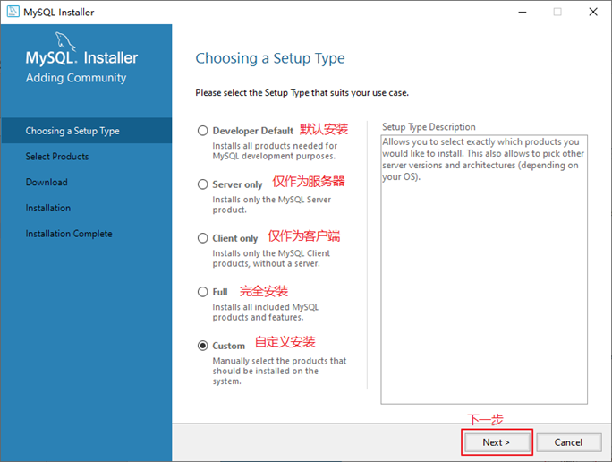
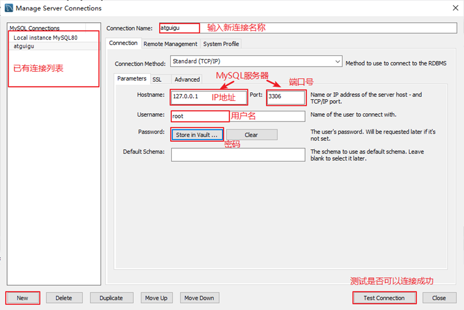
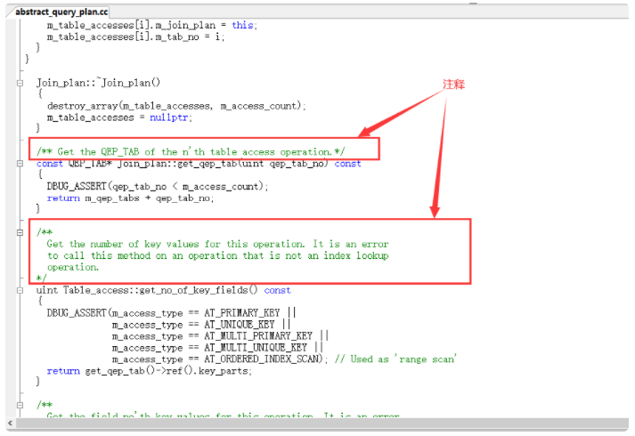
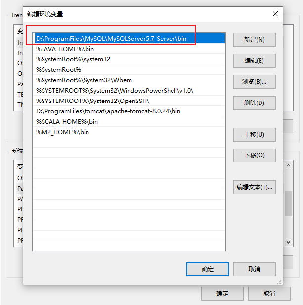
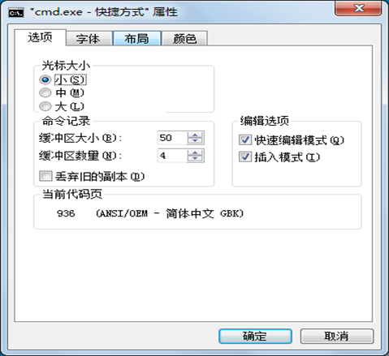
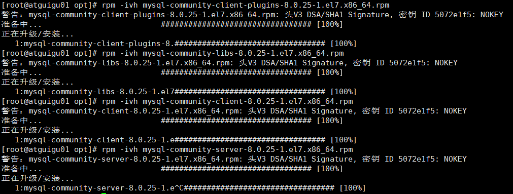
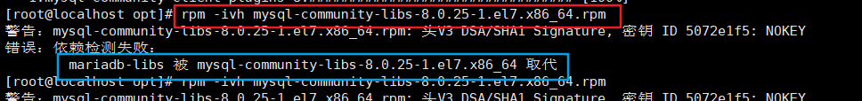

# MySQL_环境搭建篇

讲师：尚硅谷-宋红康（江湖人称：康师傅）

尚硅谷官网：http://www.atguigu.com

视频链接：https://www.bilibili.com/video/BV1iq4y1u7vj?spm_id_from=333.337.search-card.all.click

------

## 一、Windows环境

### 1.MySQL的卸载

#### 步骤1：停止MySQL服务

在卸载之前，先停止MySQL8.0的服务。按键盘上的“Ctrl + Alt + Delete”组合键，打开“任务管理器”对话框，可以在“服务”列表找到“MySQL8.0”的服务，如果现在“正在运行”状态，可以右键单击服务，选择“停止”选项停止MySQL8.0的服务，如图所示。


#### 步骤2：软件的卸载

**方式1：通过控制面板方式**

卸载MySQL8.0的程序可以和其他桌面应用程序一样直接在“控制面板”选择“卸载程序”，并在程序列表中找到MySQL8.0服务器程序，直接双击卸载即可，如图所示。这种方式删除，数据目录下的数据不会跟着删除。


**方式2：通过360或电脑管家等软件卸载**

略

**方式3：通过安装包提供的卸载功能卸载**

你也可以通过安装向导程序进行MySQL8.0服务器程序的卸载。

1. 再次双击下载的mysql-installer-community-8.0.26.0.msi文件，打开安装向导。安装向导会自动检测已安装的MySQL服务器程序。
   
2. 选择要卸载的MySQL服务器程序，单击“Remove”（移除），即可进行卸载。

   

3. 单击“Next”（下一步）按钮，确认卸载。

   

4.  弹出是否同时移除数据目录选择窗口。如果想要同时删除MySQL服务器中的数据，则勾选“Remove the data directory”，如图所示。
   
   
   
5. 执行卸载。单击“Execute”（执行）按钮进行卸载。

   

6. 完成卸载。单击“Finish”（完成）按钮即可。如果想要同时卸载MySQL8.0的安装向导程序，勾选“Yes，Uninstall MySQL Installer”即可，如图所示。
   
   


#### 步骤3：残余文件的清理

如果再次安装不成功，可以卸载后对残余文件进行清理后再安装。

1. 服务目录：mysql服务的安装目录
2. 数据目录：默认在C:\ProgramData\MySQL

如果自己单独指定过数据目录，就找到自己的数据目录进行删除即可。

> 注意：请在卸载前做好数据备份
>
> 在操作完以后，需要重启计算机，然后进行安装即可。**如果仍然安装失败，需要继续操作如下步骤4。**


#### 步骤4：清理注册表（选做）

如果前几步做了，再次安装还是失败，那么可以清理注册表。

如何打开注册表编辑器：在系统的搜索框中输入regedit`

```
HKEY_LOCAL_MACHINE\SYSTEM\ControlSet001\Services\Eventlog\Application\MySQL服务 目录删除
HKEY_LOCAL_MACHINE\SYSTEM\ControlSet001\Services\MySQL服务 目录删除
HKEY_LOCAL_MACHINE\SYSTEM\ControlSet002\Services\Eventlog\Application\MySQL服务 目录删除
HKEY_LOCAL_MACHINE\SYSTEM\ControlSet002\Services\MySQL服务 目录删除
HKEY_LOCAL_MACHINE\SYSTEM\CurrentControlSet\Services\Eventlog\Application\MySQL服务 目录删除
HKEY_LOCAL_MACHINE\SYSTEM\CurrentControlSet\Services\MySQL服务删除
```

注册表中的ControlSet001，ControlSet002，不一定是001和002，可能是ControlSet005、006之类


#### 步骤5：删除环境变量配置

找到path环境变量，将其中关于mysql的环境变量删除，**切记不要全部删除**。

例如：删除 D:\develop_tools\mysql\MySQLServer8.0.26\bin; 这个部分


### 2.MySQL的下载、安装、配置

#### 2.1 MySQL的4大版本

- `MySQL Community Server 社区版本`，开源免费，自由下载，但不提供官方技术支持，适用于大多数普通用户。
- `MySQL Enterprise Edition 企业版本`，需付费，不能在线下载，可以试用30天。提供了更多的功能和更完备的技术支持，更适合于对数据库的功能和可靠性要求较高的企业客户。
- `MySQL Cluster 集群版`，开源免费。用于架设集群服务器，可将几个MySQL Server封装成一个Server。需要在社区版或企业版的基础上使用。
- `MySQL Cluster CGE 高级集群版`，需付费。

目前最新版本为 8.0.27 ，发布时间 2021年10月 。此前，8.0.0 在 2016.9.12日就发布了。

本课程中使用 8.0.26版本 。

此外，官方还提供了`MySQL Workbench`（GUITOOL）一款专为MySQL设计的`图形界面管理工具`。MySQLWorkbench又分为两个版本，分别是`社区版`（MySQL Workbench OSS）、`商用版`（MySQL WorkbenchSE）。


#### 2.2 软件的下载

1. **下载地址**

   官网：https://www.mysql.com

2. **打开官网，点击DOWNLOADS**

   然后，点击 MySQL Community(GPL) Downloads

   

3.  **点击 MySQL Community Server**

   

4. **在General Availability(GA) Releases中选择适合的版本**

   Windows平台下提供两种安装文件：MySQL二进制分发版（.msi安装文件）和免安装版（.zip压缩文件）。一般来讲，应当使用二进制分发版，因为该版本提供了图形化的安装向导过程，比其他的分发版使用起来要简单，不再需要其他工具启动就可以运行MySQL。
   
   - 这里在Windows 系统下推荐下载 MSI安装程序 ；点击 Go to Download Page 进行下载即可

     

     

   - Windows下的MySQL8.0安装有两种安装程序

     - **mysql-installer-web-community-8.0.26.0.msi** 下载程序大小：2.4M；安装时需要联网安装组件。
     - **mysql-installer-community-8.0.26.0.msi** 下载程序大小：450.7M；安装时离线安装即可。推荐。
     
   - 如果安装MySQL5.7版本的话，选择 Archives ，接着选择MySQL5.7的相应版本即可。这里下载最近期的MySQL5.7.34版本。
     
     
     
     

#### 2.3 MySQL8.0 版本的安装

MySQL下载完成后，找到下载文件，双击进行安装，具体操作步骤如下。

步骤1：双击下载的mysql-installer-community-8.0.26.0.msi文件，打开安装向导。

步骤2：打开“Choosing a Setup Type”（选择安装类型）窗口，在其中列出了5种安装类型，分别是Developer Default（默认安装类型）、Server only（仅作为服务器）、Client only（仅作为客户端）、Full（完全安装）、Custom（自定义安装）。这里选择“Custom（自定义安装）”类型按钮，单击“Next(下一步)”按钮。



步骤3：打开“Select Products” （选择产品）窗口，可以定制需要安装的产品清单。例如，选择“MySQL Server 8.0.26-X64”后，单击“→”添加按钮，即可选择安装MySQL服务器，如图所示。采用通用的方法，可以添加其他你需要安装的产品。


此时如果直接“Next”（下一步），则产品的安装路径是默认的。如果想要自定义安装目录，则可以选中对应的产品，然后在下面会出现“Advanced Options”（高级选项）的超链接。


单击“Advanced Options”（高级选项）则会弹出安装目录的选择窗口，如图所示，此时你可以分别设置MySQL的服务程序安装目录和数据存储目录。如果不设置，默认分别在C盘的Program Files目录和ProgramData目录（这是一个隐藏目录）。如果自定义安装目录，请避免“中文”目录。另外，建议服务目录和数据目录分开存放。


步骤4：在上一步选择好要安装的产品之后，单击“Next”（下一步）进入确认窗口，如图所示。单击“Execute”（执行）按钮开始安装。


步骤5：安装完成后在“Status”（状态）列表下将显示“Complete”（安装完成），如图所示。


#### 2.4 配置MySQL8.0

MySQL安装之后，需要对服务器进行配置。具体的配置步骤如下。

步骤1：在上一个小节的最后一步，单击“Next”（下一步）按钮，就可以进入产品配置窗口。


步骤2：单击“Next”（下一步）按钮，进入MySQL服务器类型配置窗口，如图所示。端口号一般选择默认端口号3306。


其中，“Config Type”选项用于设置服务器的类型。单击该选项右侧的下三角按钮，即可查看3个选项，如图所示。


- **Development Machine（开发机器）**：该选项代表典型个人用桌面工作站。此时机器上需要运行多个应用程序，那么MySQL服务器将占用最少的系统资源。
- **Server Machine（服务器）**：该选项代表服务器，MySQL服务器可以同其他服务器应用程序一起运行，例如Web服务器等。MySQL服务器配置成适当比例的系统资源。
- **Dedicated Machine（专用服务器）**：该选项代表只运行MySQL服务的服务器。MySQL服务器配置成使用所有可用系统资源。

步骤3：单击“Next”（下一步）按钮，打开设置授权方式窗口。其中，上面的选项是MySQL8.0提供的新的授权方式，采用SHA256基础的密码加密方法；下面的选项是传统授权方法（保留5.x版本兼容性）。


步骤4：单击“Next”（下一步）按钮，打开设置服务器root超级管理员的密码窗口，如图所示，需要输入两次同样的登录密码。也可以通过“Add User”添加其他用户，添加其他用户时，需要指定用户名、允许该用户名在哪台/哪些主机上登录，还可以指定用户角色等。此处暂不添加用户，用户管理在MySQL高级特性篇中讲解。


步骤5：单击“Next”（下一步）按钮，打开设置服务器名称窗口，如图所示。该服务名会出现在Windows服务列表中，也可以在命令行窗口中使用该服务名进行启动和停止服务。本书将服务名设置为“MySQL80”。如果希望开机自启动服务，也可以勾选“Start the MySQL Server at System Startup”选项（推荐）。

下面是选择以什么方式运行服务？

可以选择“Standard System Account”(标准系统用户)或者“Custom User”(自定义用户)中的一个。这里推荐前者。


步骤6：单击“Next”（下一步）按钮，打开确认设置服务器窗口，单击“Execute”（执行）按钮。


步骤7：完成配置，如图所示。单击“Finish”（完成）按钮，即可完成服务器的配置


步骤8：如果还有其他产品需要配置，可以选择其他产品，然后继续配置。如果没有，直接选择“Next”（下一步），直接完成整个安装和配置过程。


步骤9：结束安装和配置。


#### 2.5 配置MySQL8.0 环境变量

如果不配置MySQL环境变量，就不能在命令行直接输入MySQL登录命令。

下面说如何配置MySQL的环境
变量：

- 步骤1：在桌面上右击【此电脑】图标，在弹出的快捷菜单中选择【属性】菜单命令。 
- 步骤2：打开【系统】窗口，单击【高级系统设置】链接。
- 步骤3：打开【系统属性】对话框，选择【高级】选项卡，然后单击【环境变量】按钮。 
- 步骤4：打开【环境变量】对话框，在系统变量列表中选择path变量。 
- 步骤5：单击【编辑】按钮，在【编辑环境变量】对话框中，将MySQL应用程序的bin目录（C:\Program Files\MySQL\MySQL Server 8.0\bin）添加到变量值中，用分号将其与其他路径分隔开。 
- 步骤6：添加完成之后，单击【确定】按钮，这样就完成了配置path变量的操作，然后就可以直接输入MySQL命令来登录
  数据库了。


#### 2.6 MySQL5.7 版本的安装、配置

- 安装

  此版本的安装过程与上述过程除了版本号不同之外，其它环节都是相同的。所以这里省略了MySQL5.7.34版本的安装截图。
  
- 配置

  配置环节与MySQL8.0版本确有细微不同。大部分情况下直接选择“Next”即可，不影响整理使用。这里配置MySQL5.7时，**重点强调：与前面安装好的MySQL8.0不能使用相同的端口号。**


#### 2.7 安装失败问题

MySQL的安装和配置是一件非常简单的事，但是在操作过程中也可能出现问题，特别是初学者。

**问题1：无法打开MySQL8.0软件安装包或者安装过程中失败，如何解决？**

在运行MySQL8.0软件安装包之前，用户需要确保系统中已经安装了.Net Framework相关软件，如果缺少此软件，将不能正常地安装MySQL8.0软件。


解决方案：到这个地址https://www.microsoft.com/en-us/download/details.aspx?id=42642下载Microsoft .NET Framework 4.5并安装后，再去安装MySQL。

另外，还要确保Windows Installer正常安装。windows上安装mysql8.0需要操作系统提前已安装好Microsoft Visual C++ 2015-2019。


解决方案同样是，提前到微软官网

https://support.microsoft.com/en-us/topic/the-latest-supported-visual-c-downloads-2647da03-1eea-4433-9aff-95f26a218cc0，下载相应的环境。


**问题2：卸载重装MySQL失败？**

该问题通常是因为MySQL卸载时，没有完全清除相关信息导致的。

解决办法是，把以前的安装目录删除。如果之前安装并未单独指定过服务安装目录，则默认安装目录是“C:\Program Files\MySQL”，彻底删除该目录。同时删除MySQL的Data目录，如果之前安装并未单独指定过数据目录，则默认安装目录是“C:\ProgramData\MySQL”，该目录一般为隐藏目录。删除后，重新安装即可。


**问题3：如何在Windows系统删除之前的未卸载干净的MySQL服务列表？**

操作方法如下，在系统“搜索框”中输入“cmd”，按“Enter”（回车）键确认，弹出命令提示符界面。然后输入“sc delete MySQL服务名”,按“Enter”（回车）键，就能彻底删除残余的MySQL服务了。


### 3.MySQL的登录

#### 3.1 服务的启动与停止

MySQL安装完毕之后，需要启动服务器进程，不然客户端无法连接数据库。

在前面的配置过程中，已经将MySQL安装为Windows服务，并且勾选当Windows启动、停止时，MySQL也自动启动、停止。

##### 方式1：使用图形界面工具

- 步骤1：打开windows服务

  - 方式1：计算机（点击鼠标右键）→ 管理（点击）→ 服务和应用程序（点击）→ 服务（点击）
  - 方式2：控制面板（点击）→ 系统和安全（点击）→ 管理工具（点击）→ 服务（点击）
  - 方式3：任务栏（点击鼠标右键）→ 启动任务管理器（点击）→ 服务（点击）
  - 方式4：单击【开始】菜单，在搜索框中输入“services.msc”，按Enter键确认
  
- 步骤2：找到MySQL80（点击鼠标右键）→ 启动或停止（点击）

  


##### 方式2：使用命令行工具

```mysql
# 启动 MySQL 服务命令：
net start MySQL服务名
# 停止 MySQL 服务命令：
net stop MySQL服务名
```


说明：

1. start和stop后面的服务名应与之前配置时指定的服务名一致。
2. 如果当你输入命令后，提示“拒绝服务”，请以`系统管理员身份`打开命令提示符界面重新尝试。


#### 3.2 自带客户端的登录与退出

当MySQL服务启动完成后，便可以通过客户端来登录MySQL数据库。注意：确认服务是开启的。

##### 登录方式1：MySQL自带客户端

开始菜单 → 所有程序 → MySQL → MySQL 8.0 Command Line Client


说明：仅限于root用户


##### 登录方式2：windows命令行

```
#格式
mysql -h 主机名 -P 端口号 -u 用户名 -p密码
```

```mysql
mysql -h localhost -P 3306 -u root -pabc123 # 这里我设置的root用户的密码是abc123
```


注意：

1. -p与密码之间不能有空格，其他参数名与参数值之间可以有空格也可以没有空格。如：

   ```
   mysql -hlocalhost -P3306 -uroot -pabc123
   ```

2. 密码建议在下一行输入，保证安全

   ```
   mysql -h localhost -P 3306 -u root -p
   Enter password:****
   ```

3. 客户端和服务器在同一台机器上，所以输入localhost或者IP地址127.0.0.1。同时，因为是连接本机： -hlocalhost就可以省略，如果端口号没有修改：-P3306也可以省略
   
   简写成：
   
   ```
   mysql -u root -p
   Enter password:****
   ```

连接成功后，有关于MySQL Server服务版本的信息，还有第几次连接的id标识。

也可以在命令行通过以下方式获取MySQL Server服务版本的信息：

```
c:\> mysql --version
```

或**登录**后，通过以下方式查看当前版本信息：

```
mysql> select version();
```

##### 退出登录

```
exit
或
quit
```


### 4.MySQL演示使用

#### 4.1 MySQL的使用演示

1. 查看所有的数据库

```mysql
show databases;
```

- “information_schema”是 MySQL 系统自带的数据库，主要保存 MySQL 数据库服务器的系统信息，比如数据库的名称、数据表的名称、字段名称、存取权限、数据文件所在的文件夹和系统使用的文件夹，等等
- “performance_schema”是 MySQL 系统自带的数据库，可以用来监控 MySQL 的各类性能指标。
- “sys”数据库是 MySQL 系统自带的数据库，主要作用是以一种更容易被理解的方式展示 MySQL 数据库服务器的各类性能指标，帮助系统管理员和开发人员监控 MySQL 的技术性能。
- “mysql”数据库保存了 MySQL 数据库服务器运行时需要的系统信息，比如数据文件夹、当前使用的字符集、约束检查信息，等等

为什么 Workbench 里面我们只能看到“demo”和“sys”这 2 个数据库呢？

这是因为，Workbench 是图形化的管理工具，主要面向开发人员，“demo”和“sys”这 2 个数据库已经够用了。如果有特殊需求，比如，需要监控 MySQL 数据库各项性能指标、直接操作 MySQL 数据库系统文件等，可以由 DBA 通过 SQL 语句，查看其它的系统数据库。


2. 创建自己的数据库

```mysql
create database 数据库名;

#创建atguigudb数据库，该名称不能与已经存在的数据库重名。
create database atguigudb;
```


3. 使用自己的数据库

```mysql
use 数据库名;

#使用atguigudb数据库
use atguigudb;
```

说明：如果没有使用use语句，后面针对数据库的操作也没有加“数据名”的限定，那么会报“ERROR 1046(3D000): No database selected”（没有选择数据库）

使用完use语句之后，如果接下来的SQL都是针对一个数据库操作的，那就不用重复use了，如果要针对另一个数据库操作，那么要重新use。


4. 查看某个库的所有表格

```mysql
show tables; #要求前面有use语句
show tables from 数据库名;
```


5. 创建新的表格

```mysql
create table 表名称(
字段名 数据类型,
字段名 数据类型
);
```

说明：如果不是最后一个字段，后面就用加逗号，因为逗号的作用是分割每个字段。


6. 查看一个表的数据

```mysql
select * from 数据库表名称;
#查看学生表的数据
select * from student;
```


7. 添加一条记录

```mysql
insert into 表名称 values(值列表);
#添加两条记录到student表中
insert into student values(1,'张三');
insert into student values(2,'李四');
```

报错：

```mysql
mysql> insert into student values(1,'张三');
ERROR 1366 (HY000): Incorrect string value: '\xD5\xC5\xC8\xFD' for column 'name' at row 1
mysql> insert into student values(2,'李四');
ERROR 1366 (HY000): Incorrect string value: '\xC0\xEE\xCB\xC4' for column 'name' at row 1
mysql> show create table student;
```

字符集的问题。


8. 查看表的创建信息

```mysql
show create table 表名称;
#查看student表的详细创建信息
show create table student;
```

```mysql
#结果如下
*************************** 1. row ***************************
Table: student
Create Table: CREATE TABLE `student` (
`id` int(11) DEFAULT NULL,
`name` varchar(20) DEFAULT NULL
) ENGINE=InnoDB DEFAULT CHARSET=latin1
1 row in set (0.00 sec)
```

上面的结果显示student的表格的默认字符集是“latin1”不支持中文。


9. 查看数据库的创建信息

```mysql
show create database 数据库名;
#查看atguigudb数据库的详细创建信息
show create database atguigudb;

#结果如下
*************************** 1. row ***************************
Database: atguigudb
Create Database: CREATE DATABASE `atguigudb` /*!40100 DEFAULT CHARACTER SET latin1 */
1 row in set (0.00 sec)
```

上面的结果显示atguigudb数据库也不支持中文，字符集默认是latin1。


10. 删除表格

```mysql
drop table 表名称;

#删除学生表
drop table student;
```


11. 删除数据库

```mysql
drop database 数据库名;

#删除atguigudb数据库
drop database atguigudb;
```


#### 4.2 MySQL的编码设置

##### MySQL5.7中

**问题再现：命令行操作sql乱码问题**

```mysql
mysql> INSERT INTO t_stu VALUES(1,'张三','男');
ERROR 1366 (HY000): Incorrect string value: '\xD5\xC5\xC8\xFD' for column 'sname' at row 1
```

**问题解决**

步骤1：查看编码命令

```mysql
show variables like 'character_%';
show variables like 'collation_%';
```

步骤2：修改mysql的数据目录下的my.ini配置文件

```ini
[mysql] #大概在63行左右，在其下添加
...
default-character-set=utf8 #默认字符集

[mysqld] # 大概在76行左右，在其下添加
...
character-set-server=utf8
collation-server=utf8_general_ci
```

注意：建议修改配置文件使用notepad++等高级文本编辑器，使用记事本等软件打开修改后可能会导致文件编码修改为“含BOM头”的编码，从而服务重启失败。

步骤3：重启服务

步骤4：查看编码命令

```mysql
show variables like 'character_%';
show variables like 'collation_%';
```


如果是以上配置就说明对了。接着我们就可以新创建数据库、新创建数据表，接着添加包含中文的数据了。


##### MySQL8.0中

在MySQL 8.0版本之前，默认字符集为latin1，utf8字符集指向的是utf8mb3。网站开发人员在数据库设计的时候往往会将编码修改为utf8字符集。如果遗忘修改默认的编码，就会出现乱码的问题。从MySQL 8.0开始，数据库的默认编码改为`utf8mb4`，从而避免了上述的乱码问题。


### 5. MySQL图形化管理工具

MySQL图形化管理工具极大地方便了数据库的操作与管理，常用的图形化管理工具有：MySQL Workbench、phpMyAdmin、Navicat Preminum、MySQLDumper、SQLyog、dbeaver、MySQL ODBC Connector。


#### 工具1. MySQL Workbench

MySQL官方提供的图形化管理工具MySQL Workbench完全支持MySQL 5.0以上的版本。MySQL Workbench分为社区版和商业版，社区版完全免费，而商业版则是按年收费。

MySQL Workbench为数据库管理员、程序开发者和系统规划师提供可视化设计、模型建立、以及数据库管理功能。它包含了用于创建复杂的数据建模ER模型，正向和逆向数据库工程，也可以用于执行通常需要花费大量时间的、难以变更和管理的文档任务。

下载地址：http://dev.mysql.com/downloads/workbench/。

使用：

首先，我们点击 Windows 左下角的“开始”按钮，如果你是 Win10 系统，可以直接看到所有程序。接着，找到“MySQL”，点开，找到“MySQL Workbench 8.0 CE”。点击打开 Workbench，如下图所示：


左下角有个本地连接，点击，录入 Root 的密码，登录本地 MySQL 数据库服务器，如下图所示：




这是一个图形化的界面，我来给你介绍下这个界面。

- 上方是菜单。左上方是导航栏，这里我们可以看到 MySQL 数据库服务器里面的数据库，包括数据表、视图、存储过程和函数；左下方是信息栏，可以显示上方选中的数据库、数据表等对象的信息。
- 中间上方是工作区，你可以在这里写 SQL 语句，点击上方菜单栏左边的第三个运行按钮，就可以执行工作区的 SQL 语句了。
- 中间下方是输出区，用来显示 SQL 语句的运行情况，包括什么时间开始运行的、运行的内容、运行的输出，以及所花费的时长等信息。

好了，下面我们就用 Workbench 实际创建一个数据库，并且导入一个 Excel 数据文件， 来生成一个数据表。数据表是存储数据的载体，有了数据表以后，我们就能对数据进行操作了。


#### 工具2. Navicat

Navicat MySQL是一个强大的MySQL数据库服务器管理和开发工具。它可以与任何3.21或以上版本的MySQL一起工作，支持触发器、存储过程、函数、事件、视图、管理用户等，对于新手来说易学易用。

其精心设计的图形用户界面（GUI）可以让用户用一种安全简便的方式来快速方便地创建、组织、访问和共享信息。Navicat支持中文，有免费版本提供。

下载地址：http://www.navicat.com/


#### 工具3. SQLyog

SQLyog 是业界著名的 Webyog 公司出品的一款简洁高效、功能强大的图形化 MySQL 数据库管理工具。

这款工具是使用C++语言开发的。该工具可以方便地创建数据库、表、视图和索引等，还可以方便地进行插入、更新和删除等操作，同时可以方便地进行数据库、数据表的备份和还原。该工具不仅可以通过SQL文件进行大量文件的导入和导出，还可以导入和导出XML、HTML和CSV等多种格式的数据。

下载地址：http://www.webyog.com/，读者也可以搜索中文版的下载地址。


#### 工具4：dbeaver

DBeaver是一个通用的数据库管理工具和 SQL 客户端，支持所有流行的数据库：MySQL、PostgreSQL、SQLite、Oracle、DB2、SQL Server、Sybase、MS Access、Teradata、Firebird、Apache Hive、Phoenix、Presto等。DBeaver比大多数的SQL管理工具要轻量，而且支持中文界面。DBeaver社区版作为一个免费开源的产品，和其他类似的软件相比，在功能和易用性上都毫不逊色。

唯一需要注意是 DBeaver 是用Java编程语言开发的，所以需要拥有 JDK（Java Development ToolKit）环境。如果电脑上没有JDK，在选择安装DBeaver组件时，勾选“Include Java”即可。

下载地址：https://dbeaver.io/download/


**可能出现连接问题：**

有些图形界面工具，特别是旧版本的图形界面工具，在连接MySQL8时出现“Authentication plugin 'caching_sha2_password' cannot be loaded”错误。


出现这个原因是MySQL8之前的版本中加密规则是mysql_native_password，而在MySQL8之后，加密规则是caching_sha2_password。

解决问题方法有两种：

第一种是升级图形界面工具版本

第二种是把MySQL8
用户登录密码加密规则还原成mysql_native_password。


第二种解决方案如下，用命令行登录MySQL数据库之后，执行如下命令修改用户密码加密规则并更新用户密码，这里修改用户名为“root@localhost”的用户密码规则为“mysql_native_password”，密码值为
“123456”，如图所示。

```mysql
#使用mysql数据库
USE mysql;
#修改'root'@'localhost'用户的密码规则和密码
ALTER USER 'root'@'localhost' IDENTIFIED WITH mysql_native_password BY '123456';
#刷新权限
FLUSH PRIVILEGES;
```


### 6. MySQL目录结构与源码

#### 6.1 主要目录结构

| MySQL的目录结构                             | 说明                                 |
| ------------------------------------------- | ------------------------------------ |
| bin目录                                     | 所有MySQL的可执行文件。如：mysql.exe |
| MySQLInstanceConfig.exe                     | 数据库的配置向导，在安装时出现的内容 |
| data目录                                    | 系统数据库所在的目录                 |
| my.ini文件                                  | MySQL的主要配置文件                  |
| c:\ProgramData\MySQL\MySQL Server 8.0\data\ | 用户创建的数据库所在的目录           |


#### 6.2 MySQL 源代码获取

首先，你要进入 MySQL下载界面。 这里你不要选择用默认的“Microsoft Windows”，而是要通过下拉栏，找到“Source Code”，在下面的操作系统版本里面，选择 Windows（Architecture Independent），然后点击下载。

接下来，把下载下来的压缩文件解压，我们就得到了 MySQL 的源代码。

MySQL 是用 C++ 开发而成的，我简单介绍一下源代码的组成。

mysql-8.0.22 目录下的各个子目录，包含了 MySQL 各部分组件的源代码：


- sql 子目录是 MySQL 核心代码；
- libmysql 子目录是客户端程序 API；
- mysql-test 子目录是测试工具；
- mysys 子目录是操作系统相关函数和辅助函数；

源代码可以用记事本打开查看，如果你有 C++ 的开发环境，也可以在开发环境中打开查看。



如上图所示，源代码并不神秘，就是普通的 C++ 代码，跟你熟悉的一样，而且有很多注释，可以帮助你理解。阅读源代码就像在跟 MySQL 的开发人员对话一样，十分有趣。


### 7. 常见问题的解决(课外内容)

#### 问题1：root用户密码忘记，重置的操作

1. 通过任务管理器或者服务管理，关掉mysqld(服务进程) 

2. 通过命令行+特殊参数开启mysqld 

   `mysqld --
   defaults-file="D:\ProgramFiles\mysql\MySQLServer5.7Data\my.ini" --skip-grant-tables`

3. 此时，mysqld服务进程已经打开。并且不需要权限检查 

4. mysql -uroot 无密码登陆服务器。另启动一个客户端进行 
   
5. 修改权限表 

   1. use mysql; 
   2. update user set authentication_string=password('新密码') where user='root' and Host='localhost'; 
   3. flush privileges; 
   
6. 通过任务管理器，关掉mysqld服务进程。 
7. 再次通过服务管理，打开mysql服务。 
8. 即可用修改后的新密码登陆。


#### 问题2：mysql命令报“不是内部或外部命令”

如果输入mysql命令报“不是内部或外部命令”，把mysql安装目录的bin目录配置到环境变量path中。如下：




#### 问题3：错误ERROR ：没有选择数据库就操作表格和数据

| ERROR 1046 (3D000): No database selected                     |
| ------------------------------------------------------------ |
| 解决方案一：就是使用“USE 数据库名;”语句，这样接下来的语句就默认针对这个数据库进行操作 |
| 解决方案二：就是所有的表对象前面都加上“数据库.”              |


#### 问题4：命令行客户端的字符集问题

```mysql
mysql> INSERT INTO t_stu VALUES(1,'张三','男');
ERROR 1366 (HY000): Incorrect string value: '\xD5\xC5\xC8\xFD' for column 'sname' at row 1
```

原因：服务器端认为你的客户端的字符集是utf-8，而实际上你的客户端的字符集是GBK。



查看所有字符集：`SHOW VARIABLES LIKE 'character_set_%';`


解决方案，设置当前连接的客户端字符集 “`SET NAMES GBK;`”


#### 问题5：修改数据库和表的字符编码

修改编码：

（1)先停止服务，（2）修改my.ini文件（3）重新启动服务

说明：

如果是在修改my.ini之前建的库和表，那么库和表的编码还是原来的Latin1，要么删了重建，要么使用alter语句修改编码。

```mysql
mysql> create database 0728db charset Latin1;
Query OK, 1 row affected (0.00 sec)
```

```mysql
mysql> use 0728db;
Database changed

mysql> create table student (id int , name varchar(20)) charset Latin1;
Query OK, 0 rows affected (0.02 sec)
mysql> show create table student\G
*************************** 1. row ***************************
Table: student
Create Table: CREATE TABLE `student` (
`id` int(11) NOT NULL,
`name` varchar(20) DEFAULT NULL,
PRIMARY KEY (`id`)
) ENGINE=InnoDB DEFAULT CHARSET=latin1
1 row in set (0.00 sec)
mysql> alter table student charset utf8; #修改表字符编码为UTF8
Query OK, 0 rows affected (0.01 sec)
Records: 0 Duplicates: 0 Warnings: 0
mysql> show create table student\G
*************************** 1. row ***************************
Table: student
Create Table: CREATE TABLE `student` (
`id` int(11) NOT NULL,
`name` varchar(20) CHARACTER SET latin1 DEFAULT NULL, #字段仍然是latin1编码
PRIMARY KEY (`id`)
) ENGINE=InnoDB DEFAULT CHARSET=utf8
1 row in set (0.00 sec)
mysql> alter table student modify name varchar(20) charset utf8; #修改字段字符编码为UTF8
Query OK, 0 rows affected (0.05 sec)
Records: 0 Duplicates: 0 Warnings: 0
mysql> show create table student\G
*************************** 1. row ***************************
Table: student
Create Table: CREATE TABLE `student` (
`id` int(11) NOT NULL,
`name` varchar(20) DEFAULT NULL,
PRIMARY KEY (`id`)
) ENGINE=InnoDB DEFAULT CHARSET=utf8
1 row in set (0.00 sec)
mysql> show create database 0728db;;
+--------+-----------------------------------------------------------------+
|Database| Create Database |
+------+-------------------------------------------------------------------+
|0728db| CREATE DATABASE `0728db` /*!40100 DEFAULT CHARACTER SET latin1 */ |
+------+-------------------------------------------------------------------+
1 row in set (0.00 sec)
mysql> alter database 0728db charset utf8; #修改数据库的字符编码为utf8
Query OK, 1 row affected (0.00 sec)mysql> show create database 0728db;
+--------+-----------------------------------------------------------------+
|Database| Create Database |
+--------+-----------------------------------------------------------------+
| 0728db | CREATE DATABASE `0728db` /*!40100 DEFAULT CHARACTER SET utf8 */ |
+--------+-----------------------------------------------------------------+
1 row in set (0.00 sec)
```

------

## 二、Linux环境

### 1 安装前说明

#### 1.1 Linux系统及工具的准备

- 安装并启动好两台虚拟机：`CentOS 7`

  - 掌握克隆虚拟机的操作

    - mac地址
    - 主机名
    - ip地址
    - UUID

  - 安装有`Xshell`和`Xftp`等访问CentOS系统的工具

  - CentOS6和CentOS7在MySQL的使用中的区别

    ```
    1. 防火墙：6是 iptables，7是 firewalld
    
    2. 启动服务的命令：6是 service，7是 systemctl
    ```


#### 1.2 查看是否安装过MySQL

- 如果你是用rpm安装, 检查一下RPM PACKAGE：

  ```SQL
  # -i 忽略大小写
  rpm -qa | grep -i mysql
  ```

- 检查mysql service：

  ```
  systemctl status mysqld.service
  ```

- 如果存在mysql-libs的旧版本包，显示如下：

  

- 如果不存在mysql-lib的版本，显示如下：

  


#### 1.3 MySQL的卸载

**1. 关闭 mysql 服务**

```
systemctl stop mysqld.service
```

**2. 查看当前 mysql 安装状况**

```
rpm -qa | grep -i mysql
或者
yum list installed | grep mysql
```

**3. 卸载上述命令查询出的已安装程序**

```
yum remove mysql-xxx mysql-xxx mysql-xxx mysqk-xxxx
```

务必卸载干净，反复执行`rpm -qa | grep -i mysql`确认是否有卸载残留

**4. 删除 mysql 相关文件**

- 查找相关文件

```
find / -name mysql
```

- 删除上述命令查找出的相关文件

```
rm -rf xxx
```

**5.删除 my.cnf**

```
rm -rf /etc/my.cnf
```


### 2 MySQL的Linux版安装

#### 2.1 MySQL的4大版本

> - **MySQL Community Server 社区版本**，开源免费，自由下载，但不提供官方技术支持，适用于大多数普通用户。
> - **MySQL Enterprise Edition 企业版本**，需付费，不能在线下载，可以试用30天。提供了更多的功能和更完备的技术支持，更适合于对数据库的功能和可靠性要求较高的企业客户。
> - **MySQL Cluster 集群版**，开源免费。用于架设集群服务器，可将几个MySQL Server封装成一个Server。需要在社区版或企业版的基础上使用。
> - **MySQL Cluster CGE 高级集群版**，需付费。

- 截止目前，官方最新版本为 8.0.29。此前，8.0.0 在 2016.9.12日就发布了。
- 本课程中主要使用`8.0.25`版本。同时为了更好的说明MySQL8.0新特性，还会安装`MySQL5.7`版本，作为对比。

此外，官方还提供了`MySQL Workbench`（GUITOOL）一款专为MySQL设计的`ER/数据库建模工具`。它是著名的数据库设计工具DBDesigner4的继任者。MySQLWorkbench又分为两个版本，分别是`社区版`（MySQL Workbench OSS）、`商用版`（MySQL WorkbenchSE）。


#### 2.2 下载MySQL指定版本

**1 下载地址**

官网：https://www.mysql.com

**2 打开官网，点击DOWNLOADS**

然后，点击`MySQL Community(GPL) Downloads`


**3 点击 MySQL Community Server**


**4 在General Availability(GA) Releases中选择适合的版本**

- 如果安装Windows系统下MySQL，推荐下载`MSI安装程序`；点击`Go to Download Page`进行下载即可


- Windows下的MySQL安装有两种安装程序
  - mysql-installer-web-community-8.0.25.0.msi 下载程序大小：2.4M；安装时需要联网安装组件。
  - mysql-installer-community-8.0.25.0.msi 下载程序大小：435.7M；安装时离线安装即可。推荐。


**5 Linux系统下安装MySQL的几种方式**

5.1 Linux系统下安装软件的常用三种方式：

1. rpm命令

   使用rpm命令安装扩展名为".rpm"的软件包。

   .rpm包的一般格式：

   

2. yum命令

   需联网，从`互联网获取`的yum源，直接使用yum命令安装。

3. 编译安装源码包

   针对`tar.gz`这样的压缩格式，要用tar命令来解压；如果是其它压缩格式，就使用其它命令。

   

5.2 Linux系统下安装MySQL，官方给出多种安装方式

| 安装方式       | 特点                                                 |
| -------------- | ---------------------------------------------------- |
| rpm            | 安装简单，灵活性差，无法灵活选择版本、升级           |
| rpm repository | 安装包极小，版本安装简单灵活，升级方便，需要联网安装 |
| 通用二进制包   | 安装比较复杂，灵活性高，平台通用性好                 |
| 源码包         | 安装最复杂，时间长，参数设置灵活，性能好             |

- 这里不能直接选择CentOS 7系统的版本，所以选择与之对应的`Red Hat Enterprise Linux`
- https://downloads.mysql.com/archives/community/ 直接点Download下载RPM Bundle全量包。包括了所有下面的组件。不需要一个一个下载了。


**6. 下载的tar包，用压缩工具打开**

- 解压后rpm安装包 （红框为抽取出来的安装包）


#### 2.3 CentOS7下检查MySQL依赖

1. 检查/tmp临时目录权限（必不可少）

由于mysql安装过程中，会通过mysql用户在/tmp目录下新建tmp_db文件，所以请给/tmp较大的权限。执行：

```
chmod -R 777 /tmp
```


2. 安装前，检查依赖

```
rpm -qa|grep libaio
```

如果存在libaio包如下：


```
rpm -qa|grep net-tools
```

如果存在net-tools包如下：


如果不存在需要到centos安装盘里进行rpm安装。安装linux如果带图形化界面，这些都是安装好的。


#### 2.4 CentOS7下MySQL安装过程

1. **将安装程序拷贝到/opt目录下**

在mysql的安装文件目录下执行：（必须按照顺序执行）

```
rpm -ivh mysql-community-common-8.0.25-1.el7.x86_64.rpm

rpm -ivh mysql-community-client-plugins-8.0.25-1.el7.x86_64.rpm

rpm -ivh mysql-community-libs-8.0.25-1.el7.x86_64.rpm

rpm -ivh mysql-community-client-8.0.25-1.el7.x86_64.rpm

rpm -ivh mysql-community-server-8.0.25-1.el7.x86_64.rpm
```

- 注意: 如在检查工作时，没有检查mysql依赖环境在安装mysql-community-server会报错
- `rpm`是Redhat Package Manage缩写，通过RPM的管理，用户可以把源代码包装成以rpm为扩展名的文件形式，易于安装。
- `-i`, --install 安装软件包
- `-v`, --verbose 提供更多的详细信息输出
- `-h`, --hash 软件包安装的时候列出哈希标记 (和 -v 一起使用效果更好)，展示进度条


2. **安装过程截图**



安装过程中可能的报错信息：



> 一个命令：**yum remove mysql-libs** 解决，清除之前安装过的依赖即可


3. **查看MySQL版本**

执行如下命令，如果成功表示安装mysql成功。类似java -version如果打出版本等信息

```
mysql --version
#或
mysqladmin --version
```


执行如下命令，查看是否安装成功。需要增加 -i 不用去区分大小写，否则搜索不到。

```
rpm -qa|grep -i mysql
```


4. **服务的初始化**

为了保证数据库目录与文件的所有者为 mysql 登录用户，如果你是以 root 身份运行 mysql 服务，需要执行下面的命令初始化：

```
mysqld --initialize --user=mysql
```

说明： --initialize 选项默认以“安全”模式来初始化，则会为 root 用户生成一个密码并将`该密码标记为过期`，登录后你需要设置一个新的密码。生成的`临时密码`会往日志中记录一份。

查看密码：

```
cat /var/log/mysqld.log
```


root@localhost: 后面就是初始化的密码

5. **启动MySQL，查看状态**

```
#加不加.service后缀都可以

启动：systemctl start mysqld.service

关闭：systemctl stop mysqld.service

重启：systemctl restart mysqld.service

查看状态：systemctl status mysqld.service
```

> `mysqld`这个可执行文件就代表着`MySQL`服务器程序，运行这个可执行文件就可以直接启动一个服务器进程。


查看进程：

```
ps -ef | grep -i mysql
```


6. **查看MySQL服务是否自启动**

```
systemctl list-unit-files|grep mysqld.service
```


默认是enabled。

- 如不是enabled可以运行如下命令设置自启动

  ```
  systemctl enable mysqld.service
  ```

  

- 如果希望不进行自启动，运行如下命令设置

  ```
  systemctl disable mysqld.service
  ```

  

### 3 MySQL登录

#### 3.1 首次登录

通过`mysql -hlocalhost -P3306 -uroot -p`进行登录，在Enter password：录入初始化密码


#### 3.2 修改密码

- 因为初始化密码默认是过期的，所以查看数据库会报错

- 修改密码：

  ```mysql
  ALTER USER 'root'@'localhost' IDENTIFIED BY 'new_password';
  ```

- 5.7版本之后（不含5.7），mysql加入了全新的密码安全机制。设置新密码太简单会报错。

  

- 改为更复杂的密码规则之后，设置成功，可以正常使用数据库了

  

#### 3.3 设置远程登录

1. **当前问题**

在用SQLyog或Navicat中配置远程连接Mysql数据库时遇到如下报错信息，这是由于Mysql配置了不支持远程连接引起的。


2. **确认网络**

1. 在远程机器上使用ping ip地址 `保证网络畅通`
2. 在远程机器上使用telnet命令 `保证端口号开放` 访问

```
telnet ip地址 端口号
```

拓展：`telnet命令开启`:


3. **关闭防火墙或开放端口**

方式一：关闭防火墙

- CentOS6：

  ```
  service iptables stop
  ```

- CentOS7：

  ```
  systemctl start firewalld.service
  
  systemctl status firewalld.service
  
  systemctl stop firewalld.service
  
  #设置开机启用防火墙
  systemctl enable firewalld.service
  
  #设置开机禁用防火墙
  systemctl disable firewalld.service
  ```

方式二：开放端口

- 查看开放的端口号

  ```
  firewall-cmd --list-all
  ```

- 设置开放的端口号

  ```
  firewall-cmd --add-service=http --permanent
  
  firewall-cmd --add-port=3306/tcp --permanent
  ```

- 重启防火墙

  ```
  firewall-cmd --reload
  ```


4. **Linux下修改配置**

在Linux系统MySQL下测试：

```mysql
use mysql;
select Host,User from user;
```


可以看到root用户的当前主机配置信息为localhost。

- **修改Host为通配符%**

Host列指定了允许用户登录所使用的IP，比如user=root Host=192.168.1.1。这里的意思就是说root用户只能通过192.168.1.1的客户端去访问。user=root Host=localhost，表示只能通过本机客户端去访问。而 %
是个`通配符`，如果Host=192.168.1.%，那么就表示只要是IP地址前缀为“192.168.1.”的客户端都可以连接。如果`Host=%`，表示所有IP都有连接权限。

注意：在生产环境下不能为了省事将host设置为%，这样做会存在安全问题，具体的设置可以根据生产环境的IP进行设置。

```
update user set host = '%' where user ='root';
```

Host设置了“%”后便可以允许远程访问。


Host修改完成后记得执行flush privileges使配置立即生效：

```mysql
flush privileges;
```


5. **测试**

- 如果是 MySQL5.7 版本，接下来就可以使用SQLyog或者Navicat成功连接至MySQL了。
- 如果是 MySQL8 版本，连接时还会出现如下问题：


配置新连接报错：错误号码 2058，分析是 mysql 密码加密方法变了。

**解决方法**：Linux下`mysql -u root -p`登录你的 mysql 数据库，然后 执行这条SQL：

```mysql
ALTER USER 'root'@'%' IDENTIFIED WITH mysql_native_password BY 'abc123';
```

然后在重新配置SQLyog的连接，则可连接成功了，OK。


### 4 MySQL8的密码强度评估（了解）

#### 4.1 MySQL不同版本设置密码(可能出现)

- MySQL5.7中：成功

  ```mysql
  mysql> alter user 'root' identified by 'abcd1234';
  Query OK, 0 rows affected (0.00 sec)
  ```

- MySQL8.0中：失败

  ```mysql
  mysql> alter user 'root' identified by 'abcd1234'; # HelloWorld_123
  ERROR 1819 (HY000): Your password does not satisfy the current policy requirements
  ```


#### 4.2 MySQL8之前的安全策略

在MySQL 8.0之前，MySQL使用的是validate_password插件检测、验证账号密码强度，保障账号的安全性。

**安装/启用插件方式1：在参数文件my.cnf中添加参数**

```
[mysqld]

plugin-load-add=validate_password.so

\#ON/OFF/FORCE/FORCE_PLUS_PERMANENT: 是否使用该插件(及强制/永久强制使用)

validate-password=FORCE_PLUS_PERMANENT
```

> 说明1：plugin library中的validate_password文件名的后缀名根据平台不同有所差异。对于Unix和Unix-like系统而言，它的文件后缀名是.so，对于Windows系统而言，它的文件后缀名是.dll。
>
> 说明2：修改参数后必须重启MySQL服务才能生效。
>
> 说明3：参数FORCE_PLUS_PERMANENT是为了防止插件在MySQL运行时的时候被卸载。当你卸载插件时就会报错。如下所示。

```mysql
mysql> SELECT PLUGIN_NAME, PLUGIN_LIBRARY, PLUGIN_STATUS, LOAD_OPTION
       -> FROM INFORMATION_SCHEMA.PLUGINS
       -> WHERE PLUGIN_NAME = 'validate_password';
+------------------------+----------------------------+-----------------------+--------------------------------------+
| PLUGIN_NAME     | PLUGIN_LIBRARY     | PLUGIN_STATUS | LOAD_OPTION                      |
+------------------------+----------------------------+-----------------------+--------------------------------------+
| validate_password | validate_password.so | ACTIVE               | FORCE_PLUS_PERMANENT |
+------------------------+-----------------------------+----------------------+--------------------------------------+
1 row in set (0.00 sec)

mysql> UNINSTALL PLUGIN validate_password;
ERROR 1702 (HY000): Plugin 'validate_password' is force_plus_permanent and can not be unloaded
```

**安装/启用插件方式2：运行时命令安装（推荐）**

```mysql
mysql> INSTALL PLUGIN validate_password SONAME 'validate_password.so';
Query OK, 0 rows affected, 1 warning (0.11 sec)
```

此方法也会注册到元数据，也就是mysql.plugin表中，所以不用担心MySQL重启后插件会失效。


#### 4.3 MySQL8的安全策略

**1. validate_password说明**

MySQL 8.0，引入了服务器组件（Components）这个特性，validate_password插件已用服务器组件重新实现。8.0.25版本的数据库中，默认自动安装validate_password组件。

`未安装插件前，执行如下两个指令`，执行效果：

```mysql
mysql> show variables like 'validate_password%';
Empty set (0.04 sec)

mysql> SELECT * FROM mysql.component;
ERROR 1146 (42S02): Table 'mysql.component' doesn't exist
```

`安装插件后，执行如下两个指令`，执行效果：

```mysql
mysql> SELECT * FROM mysql.component;
+------------------+----------------------------+----------------------------------------------+
| component_id | component_group_id | component_urn                               |
+------------------+----------------------------+----------------------------------------------+
|                  1  |                               1 | file://component_validate_password |
+------------------+----------------------------+-----------------------------------------------+
1 row in set (0.00 sec)
```

```mysql
mysql> show variables like 'validate_password%';
+-------------------------------------------------+--------------+
| Variable_name                                   | Value        |
+-------------------------------------------------+--------------+
| validate_password.check_user_name   |           ON |
| validate_password.dictionary_file         |                |
| validate_password.length                     |             8 |
| validate_password.mixed_case_count   |             1 |
| validate_password.number_count         |             1 |
| validate_password.policy                      | MEDIUM |
| validate_password.special_char_count  |            1 |
+--------------------------------------------------+------------+
7 rows in set (0.01 sec)
```

关于`validate_password`组件对应的系统变量说明：

| 选项                                 | 默认值 | 参数描述                                                     |
| ------------------------------------ | ------ | ------------------------------------------------------------ |
| validate_password_check_user_name    | ON     | 设置为ON的时候表示能将密码设置成当前用户名。                 |
| validate_password_dictionary_file    |        | 用于检查密码的字典文件的路径名，默认为空                     |
| `validate_password_length`           | 8      | 密码的最小长度，也就是说密码长度必须大于或等于8              |
| validate_password_mixed_case_count   | 1      | 如果密码策略是中等或更强的，<br/>validate_password要求密码具有的小写和大<br/>写字符的最小数量。对于给定的这个值密码<br/>必须有那么多小写字符和那么多大写字符。 |
| validate_password_number_count       | 1      | 密码必须包含的数字个数                                       |
| validate_password_policy             | MEDIUM | 密码强度检验等级，可以使用数值0、1、2<br/>或相应的符号值LOW、MEDIUM、STRONG来指定。<br />`0/LOW`：只检查长度。<br/>`1/MEDIUM`：检查长度、数字、大小写、特殊字符。<br />`2/STRONG`：检查长度、数字、大小写、特殊字符、字典文件。 |
| validate_password_special_char_count | 1      | 密码必须包含的特殊字符个数                                   |

> 提示：组件和插件的默认值可能有所不同。例如，MySQL 5.7. validate_password_check_user_name的默认值为OFF。

**2. 修改安全策略**

修改密码验证安全强度

```mysql
SET GLOBAL validate_password_policy=LOW;

SET GLOBAL validate_password_policy=MEDIUM;

SET GLOBAL validate_password_policy=STRONG;

SET GLOBAL validate_password_policy=0; # For LOW

SET GLOBAL validate_password_policy=1; # For MEDIUM

SET GLOBAL validate_password_policy=2; # For HIGH

#注意，如果是插件的话,SQL为set global validate_password_policy=LOW
```

此外，还可以修改密码中字符的长度

```mysql
set global validate_password_length=1;
```

**3. 密码强度测试**

如果你创建密码是遇到“Your password does not satisfy the current policy requirements”，可以通过函数组件去检测密码是否满足条件： 0-100。当评估在100时就是说明使用上了最基本的规则：大写+小写+特殊字符+数字组成的8位以上密码

```mysql
mysql> SELECT VALIDATE_PASSWORD_STRENGTH('medium');
+-------------------------------------------------------------+
| VALIDATE_PASSWORD_STRENGTH('medium') |
+------------------------------------------------------------+
|                                                                   25 |
+-------------------------------------------------------------+
1 row in set (0.00 sec)
```

```mysql
mysql> SELECT VALIDATE_PASSWORD_STRENGTH('K354*45jKd5');
+-------------------------------------------------------------------+
| VALIDATE_PASSWORD_STRENGTH('K354*45jKd5') |
+-------------------------------------------------------------------+
|                                                                         100 |
+-------------------------------------------------------------------+
1 row in set (0.00 sec)
```

注意：如果没有安装validate_password组件或插件的话，那么这个函数永远都返回0。 关于密码复杂度对应的密码复杂度策略。如下表格所示：

| **Password Test**                         | **Return Value** |
| ----------------------------------------- | ---------------- |
| Length < 4                                | 0                |
| Length ≥ 4 and < validate_password.length | 25               |
| Satisfies policy 1 (LOW)                  | 50               |
| Satisfies policy 2 (MEDIUM)               | 75               |
| Satisfies policy 3 (STRONG)               | 100              |


#### 4.4 卸载插件、组件(了解)

**卸载插件**

```mysql
mysql> UNINSTALL PLUGIN validate_password;
Query OK, 0 rows affected, 1 warning (0.01 sec)
```

**卸载组件**

```mysql
mysql> UNINSTALL COMPONENT 'file://component_validate_password';
Query OK, 0 rows affected (0.02 sec)
```


### 5 字符集的相关操作

#### 5.1 修改MySQL5.7字符集

1. 修改步骤

在MySQL 8.0版本之前，默认字符集为`latin1`，utf8字符集指向的是`utf8mb3`。网站开发人员在数据库设计的时候往往会将编码修改为utf8字符集。如果遗忘修改默认的编码，就会出现乱码的问题。从MySQL8.0开始，数据库的默认编码将改为`utf8mb4`，从而避免上述乱码的问题。

**操作1：查看默认使用的字符集**

```mysql
show variables like 'character%';
# 或者
show variables like '%char%';
```

- MySQL8.0中执行：


- MySQL5.7中执行：

MySQL 5.7 默认的客户端和服务器都用了`latin1`，不支持中文，保存中文会报错。MySQL5.7截图如下：


在MySQL5.7中添加中文数据时，报错：


因为默认情况下，创建表使用的是`latin1`。如下：


**操作2：修改字符集**

```
vi /etc/my.cnf
```

在MySQL5.7或之前的版本中，在文件最后加上中文字符集配置：

```
character_set_server=utf8
```


**操作3：重新启动MySQL服务**

```
systemctl restart mysqld
```

> 但是原库、原表的设定不会发生变化，参数修改只对新建的数据库生效。


2. 已有库&表字符集的变更

MySQL5.7版本中，以前创建的库，创建的表字符集还是latin1。


修改已创建数据库的字符集

```mysql
alter database dbtest1 character set 'utf8';
```

修改已创建数据表的字符集

```mysql
alter table t_emp convert to character set 'utf8';
```


> 注意：但是原有的数据如果是用非'utf8'编码的话，数据本身编码不会发生改变。已有数据需要导出或删除，然后重新插入。


#### 5.2 各级别的字符集

MySQL有4个级别的字符集和比较规则，分别是：

- 服务器级别
- 数据库级别
- 表级别
- 列级别

执行如下SQL语句：

```mysql
show variables like 'character%';
```


- character_set_server：服务器级别的字符集
- character_set_database：当前数据库的字符集
- character_set_client：服务器解码请求时使用的字符集
- character_set_connection：服务器处理请求时会把请求字符串从character_set_client转为character_set_connection
- character_set_results：服务器向客户端返回数据时使用的字符集

1. **服务器级别**

`character_set_server`：服务器级别的字符集。

我们可以在启动服务器程序时通过启动选项或者在服务器程序运行过程中使用`SET`语句修改这两个变量的值。比如我们可以在配置文件中这样写：

```
[server]
character_set_server=gbk # 默认字符集
collation_server=gbk_chinese_ci #对应的默认的比较规则
```

当服务器启动的时候读取这个配置文件后这两个系统变量的值便修改了。

2. **数据库级别**

`character_set_database`：当前数据库的字符集

我们在创建和修改数据库的时候可以指定该数据库的字符集和比较规则，具体语法如下：

```mysql
CREATE DATABASE 数据库名
	[[DEFAULT] CHARACTER SET 字符集名称]
	[[DEFAULT] COLLATE 比较规则名称];

ALTER DATABASE 数据库名
	[[DEFAULT] CHARACTER SET 字符集名称]
	[[DEFAULT] COLLATE 比较规则名称];
```

3. **表级别**

我们也可以在创建和修改表的时候指定表的字符集和比较规则，语法如下：

```mysql
CREATE TABLE 表名 (列的信息)
	[[DEFAULT] CHARACTER SET 字符集名称]
	[COLLATE 比较规则名称]]

ALTER TABLE 表名
	[[DEFAULT] CHARACTER SET 字符集名称]
	[COLLATE 比较规则名称]
```

**如果创建和修改表的语句中没有指明字符集和比较规则，将使用该表所在数据库的字符集和比较规则作为该表的字符集和比较规则。**

4. **列级别**

对于存储字符串的列，同一个表中的不同的列也可以有不同的字符集和比较规则。我们在创建和修改列定义的时候可以指定该列的字符集和比较规则，语法如下：

```mysql
CREATE TABLE 表名(
	列名 字符串类型 [CHARACTER SET 字符集名称] [COLLATE 比较规则名称],
	其他列...
);

ALTER TABLE 表名 MODIFY 列名 字符串类型 [CHARACTER SET 字符集名称] [COLLATE 比较规则名称];
```

**对于某个列来说，如果在创建和修改的语句中没有指明字符集和比较规则，将使用该列所在表的字符集和比较规则作为该列的字符集和比较规则。**

> 提示：在转换列的字符集时需要注意，如果转换前列中存储的数据不能用转换后的字符集进行表示会发生错误。比方说原先列使用的字符集是utf8，列中存储了一些汉字，现在把列的字符集转换为ascii的话就会出错，因为ascii字符集并不能表示汉字字符。

5. **小结**

我们介绍的这4个级别字符集和比较规则的联系如下：

- 如果`创建或修改列`时没有显式的指定字符集和比较规则，则该列`默认用表的`字符集和比较规则
- 如果`创建表时`没有显式的指定字符集和比较规则，则该表`默认用数据库的`字符集和比较规则
- 如果`创建数据库时`没有显式的指定字符集和比较规则，则该数据库`默认用服务器的`字符集和比较规则

知道了这些规则之后，对于给定的表，我们应该知道它的各个列的字符集和比较规则是什么，从而根据这个列的类型来确定存储数据时每个列的实际数据占用的存储空间大小了。比方说我们向表 t 中插入一条记录：

```mysql
mysql> INSERT INTO t(col) VALUES('我们');
Query OK, 1 row affected (0.00 sec)

mysql> SELECT * FROM t;
+--------+
| s        |
+--------+
| 我们    |
+--------+
1 row in set (0.00 sec)
```

首先列`col`使用的字符集是`gbk`，一个字符`'我'`在`gbk`中的编码为 0xCED2，占用两个字节，两个字符的实际数据就占用4个字节。如果把该列的字符集修改为`utf8`的话，这两个字符就实际占用6个字节


#### 5.3 字符集与比较规则(了解)

1. utf8 与 utf8mb4

`utf8`字符集表示一个字符需要使用1～4个字节，但是我们常用的一些字符使用1～3个字节就可以表示了。而字符集表示一个字符所用的最大字节长度，在某些方面会影响系统的存储和性能，所以设计MySQL的设计者偷偷的定义了两个概念：

- `utf8mb3`：阉割过的`utf8`字符集，只使用1～3个字节表示字符。
- `utf8mb4`：正宗的`utf8`字符集，使用1～4个字节表示字符。


2. 比较规则

上表中，MySQL版本一共支持41种字符集，其中的`Default collation`列表示这种字符集中一种默认的比较规则，里面包含着该比较规则主要作用于哪种语言，比如`utf8_polish_ci`表示以波兰语的规则比较，`utf8_spanish_ci`是以西班牙语的规则比较，`utf8_general_ci`是一种通用的比较规则。

后缀表示该比较规则是否区分语言中的重音、大小写。具体如下：

| 后缀 | 英文释义           | 描述             |
| ---- | ------------------ | ---------------- |
| _ai  | accent insensitive | 不区分重音       |
| _as  | accent sensitive   | 区分重音         |
| _ci  | case insensitive   | 不区分大小写     |
| _cs  | case sensitive     | 区分大小写       |
| _bin | binary             | 以二进制方式比较 |

最后一列`Maxlen`，它代表该种字符集表示一个字符最多需要几个字节。

**常用操作1：**

```mysql
#查看GBK字符集的比较规则
SHOW COLLATION LIKE 'gbk%';

#查看UTF-8字符集的比较规则
SHOW COLLATION LIKE 'utf8%';
```

**常用操作2：**

```mysql
#查看服务器的字符集和比较规则
SHOW VARIABLES LIKE '%_server';

#查看数据库的字符集和比较规则
SHOW VARIABLES LIKE '%_database';

#查看具体数据库的字符集
SHOW CREATE DATABASE dbtest1;

#修改具体数据库的字符集
ALTER DATABASE dbtest1 DEFAULT CHARACTER SET 'utf8' COLLATE 'utf8_general_ci';
```

**常用操作3：**

```mysql
#查看表的字符集
show create table employees;

#查看表的比较规则
show table status from atguigudb like 'employees';

#修改表的字符集和比较规则
ALTER TABLE emp1 DEFAULT CHARACTER SET 'utf8' COLLATE 'utf8_general_ci';
```


#### 5.4 请求到响应过程中字符集的变化

| 系统变量                 | 描述                                                         |
| ------------------------ | ------------------------------------------------------------ |
| character_set_client     | 服务器解码请求时使用的字符集                                 |
| character_set_connection | 服务器处理请求时会把请求字符串从<br/>`character_set_client`转为`character_set_connection` |
| character_set_results    | 服务器向客户端返回数据时使用的字符集                         |

这几个系统变量在我的计算机上的默认值如下（不同操作系统的默认值可能不同）：


为了体现出字符集在请求处理过程中的变化，我们这里特意修改一个系统变量的值：

```mysql
mysql> set character_set_connection = gbk;
Query OK, 0 rows affected (0.00 sec)
```

现在假设我们客户端发送的请求是下边这个字符串：

```mysql
SELECT * FROM t WHERE s = '我';
```

为了方便大家理解这个过程，我们只分析字符`'我'`在这个过程中字符集的转换。

现在看一下在请求从发送到结果返回过程中字符集的变化：

1. 客户端发送请求所使用的字符集

   一般情况下客户端所使用的字符集和当前操作系统一致，不同操作系统使用的字符集可能不一样，如下：

   - 类`Unix`系统使用的是`utf8`
   - `Windows`使用的是`gbk`

   当客户端使用的是`utf8`字符集，字符`'我'`在发送给服务器的请求中的字节形式就是：`0xE68891`

   > 提示：如果你使用的是可视化工具，比如navicat之类的，这些工具可能会使用自定义的字符集来编码发送到服务器的字符串，而不采用操作系统默认的字符集（所以在学习的时候还是尽量用命令行窗口）。

2. 服务器接收到客户端发送来的请求其实是一串二进制的字节，它会认为这串字节采用的字符集是`character_set_client`，然后把这串字节转换为`character_set_connection`字符集编码的字符。

   由于我的计算机上`character_set_client`的值是`utf8`，首先会按照`utf8`字符集对字节串`0xE68891`进行解码，得到的字符串就是`'我'`，然后按照`character_set_connection`代表的字符集，也就是`gbk`进行编码，得到的结果就是字节串`0xCED2`。

3. 因为表`t`的列`col`采用的是`gbk`字符集，与`character_set_connection`一致，所以直接到列中找字节值为`0xCED2`的记录，最后找到了一条记录。

   > 提示：如果某个列使用的字符集和character_set_connection代表的字符集不一致的话，还需要进行一次字符集转换。

4. 上一步骤找到的记录中的`col`列其实是一个字节串`0xCED2`，`col`列是采用`gbk`进行编码的，所以首先会将这个字节串使用`gbk`进行解码，得到字符串`'我'`，然后再把这个字符串使用`character_set_results`代表的字符集，也就是`utf8`进行编码，得到了新的字节串：`0xE68891`，然后发送给客户端。
5. 由于客户端是用的字符集是`utf8`，所以可以顺利的将`0xE68891`解释成字符`'我'`，从而显示到我们的显示器上，所以我们人类也读懂了返回的结果。

总结图示如下：


### 6 SQL大小写规范

#### 6.1 Windows和Linux平台区别

在SQL中，关键字和函数名是不用区分字母大小写的，比如 SELECT、WHERE、ORDER、GROUP BY 等关键字，以及 ABS、MOD、ROUND、MAX 等函数名。

不过在SQL中，你还是要确定大小写的规范，因为在 Linux 和 Windows 环境下，你可能会遇到不同的大小写问题。`windows系统默认大小写不敏感`，但是`linux系统是大小写敏感的`。

通过如下命令查看：

```mysql
SHOW VARIABLES LIKE '%lower_case_table_names%';
```

- Windows系统下：

  

- Linux系统下：

  

- lower_case_table_names参数值的设置：

  - `默认为0，大小写敏感`。
  - 设置1，大小写不敏感。创建的表，数据库都是以小写形式存放在磁盘上，对于sql语句都是转换为小写对表和数据库进行查找。
  - 设置2，创建的表和数据库依据语句上格式存放，凡是查找都是转换为小写进行。

- 两个平台上SQL大小写的区别具体来说：

  > MySQL在Linux下数据库名、表名、列名、别名大小写规则是这样的：
  >
  > 1. 数据库名、表名、表的别名、变量名是严格区分大小写的；
  > 2. 关键字、函数名称在 SQL 中不区分大小写；
  > 3. 列名（或字段名）与列的别名（或字段别名）在所有的情况下均是忽略大小写的；
  >
  >  
  >
  > **MySQL在Windows的环境下全部不区分大小写**


#### 6.2 Linux下大小写规则设置

当想设置为大小写不敏感时，要在`my.cnf`这个配置文件 [mysqld] 中加入`lower_case_table_names=1`，然后重启服务器。

- 但是要在重启数据库实例之前就需要将原来的数据库和表转换为小写，否则将找不到数据库名。

- 此参数适用于MySQL5.7。在MySQL 8下禁止在重新启动 MySQL 服务时将`lower_case_table_names`设置成不同于初始化 MySQL 服务时设置的`lower_case_table_names`值。如果非要将MySQL8设置为大小写不敏感，具体步骤为：

  > 1. 停止MySQL服务
  > 2. 删除数据目录，即删除 /var/lib/mysql 目录
  > 3. 在MySQL配置文件（ /etc/my.cnf ）中添加 lower_case_table_names=1
  > 4. 启动MySQL服务


#### 6.3 SQL编写建议

如果你的变量名命名规范没有统一，就可能产生错误。这里有一个有关命名规范的建议：

> 1. 关键字和函数名称全部大写；
> 2. 数据库名、表名、表别名、字段名、字段别名等全部小写；
> 3. SQL语句必须以分号结尾。

数据库名、表名和字段名在 Linux MySQL 环境下是区分大小写的，因此建议你统一这些字段的命名规则，比如全部采用小写的方式。

虽然关键字和函数名称在SQL中不区分大小写，也就是如果小写的话同样可以执行。但是同时将关键词和函数名称全部大写，以便于区分数据库名、表名、字段名。


### 7 sql_mode的合理设置

#### 7.1 宽松模式 vs 严格模式

**宽松模式：**

如果设置的是宽松模式，那么我们在插入数据的时候，即便是给了一个错误的数据，也可能会被接受，并且不报错。

`举例`：我在创建一个表时，该表中有一个字段为name，给name设置的字段类型时`char(10)`，如果我在插入数据的时候，其中name这个字段对应的有一条数据的`长度超过了10`，例如'1234567890abc'，超过了设定的字段长度10，那么不会报错，并且取前10个字符存上，也就是说你这个数据被存为了'1234567890'，而'abc'就没有了。但是，我们给的这条数据是错误的，因为超过了字段长度，但是并没有报错，并且mysql自行处理并接受了，这就是宽松模式的效果。

`应用场景`：通过设置sql mode为宽松模式，来保证大多数sql符合标准的sql语法，这样应用在不同数据库之间进行`迁移`时，则不需要对业务sql进行较大的修改。


**严格模式：**

出现上面宽松模式的错误，应该报错才对，所以MySQL5.7版本就将sql_mode默认值改为了严格模式。所以在`生产等环境`中，我们必须采用的是严格模式，进而`开发、测试环境`的数据库也必须要设置，这样在开发测试阶段就可以发现问题。并且我们即便是用的MySQL5.6，也应该自行将其改为严格模式。

`开发经验`：MySQL等数据库总想把关于数据的所有操作都自己包揽下来，包括数据的校验，其实开发中，我们应该在自己`开发的项目程序级别将这些校验给做了`，虽然写项目的时候麻烦了一些步骤，但是这样做之后，我们在进行数据库迁移或者在项目的迁移时，就会方便很多。

改为严格模式后可能会存在的问题：

若设置模式中包含了`NO_ZERO_DATE`，那么MySQL数据库不允许插入零日期，插入零日期会抛出错误而不是警告。例如，表中含字段TIMESTAMP列（如果未声明为NULL或显示DEFAULT子句）将自动分配DEFAULT '0000-00-00 00:00:00'（零时间戳），这显然是不满足sql_mode中的NO_ZERO_DATE而报错。


#### 7.2 宽松模式再举例

**宽松模式举例1：**

```mysql
select * from employees group by department_id limit 10;

set sql_mode = ONLY_FULL_GROUP_BY;

select * from employees group by department_id limit 10;
```


**宽松模式举例2：**


设置 sql_mode 模式为 STRICT_TRANS_TABLES ，然后插入数据：


#### 7.3 模式查看和设置

- **查看当前的sql_mode**

  ```mysql
  select @@session.sql_mode
  
  select @@global.sql_mode
  
  #或者
  
  show variables like 'sql_mode';
  ```

  

- **临时设置方式：设置当前窗口中设置sql_mode**

  ```mysql
  SET GLOBAL sql_mode = 'modes...'; #全局
  
  SET SESSION sql_mode = 'modes...'; #当前会话
  ```

  举例：

  ```mysql
  #改为严格模式。此方法只在当前会话中生效，关闭当前会话就不生效了。
  set SESSION sql_mode = 'STRICT_TRANS_TABLES';
  ```

  ```mysql
  #改为严格模式。此方法在当前服务中生效，重启MySQL服务后失效。
  set GLOBAL sql_mode='STRICT_TRANS_TABLES';
  ```

- **永久设置方式：在/etc/my.cnf中配置sql_mode**

  在my.cnf文件(windows系统是my.ini文件)，新增：

  ```
  [mysqld]
  sql_mode=ONLY_FULL_GROUP_BY,STRICT_TRANS_TABLES,NO_ZERO_IN_DATE,NO_ZERO_DATE,ERROR_FOR_DIVISION_BY_ZERO,NO_ENGINE_SUBSTITUTION
  ```

  然后`重启MySQL`。

  当然生产环境上是禁止重启MySQL服务的，所以采用`临时设置方式 + 永久设置方式`来解决线上的问题，那么即便是有一天真的重启了MySQL服务，也会永久生效了。
