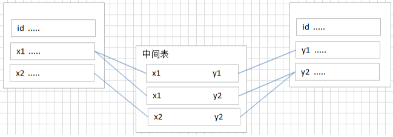
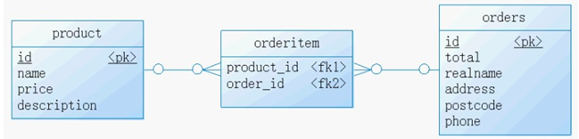
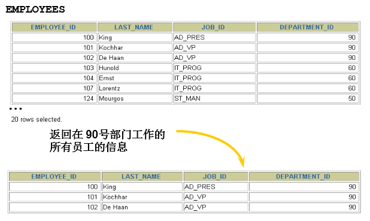
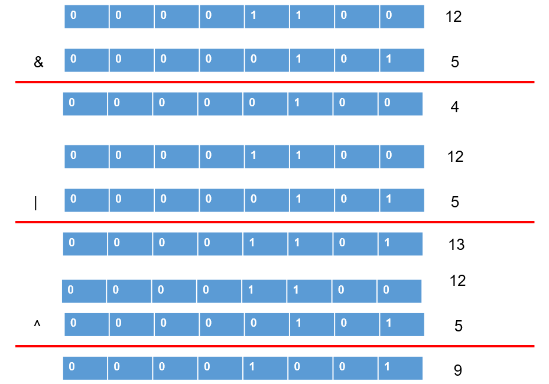
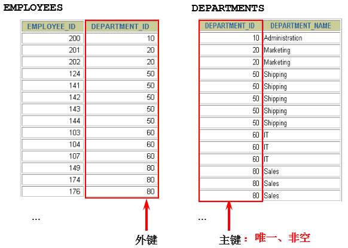
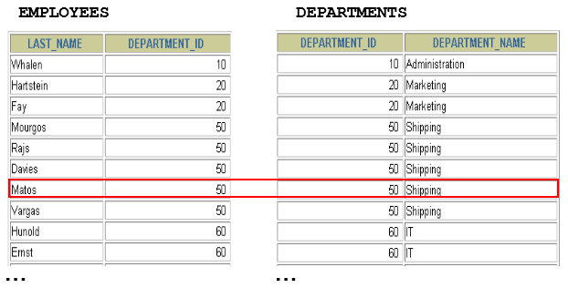
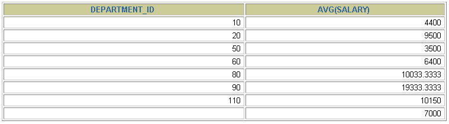
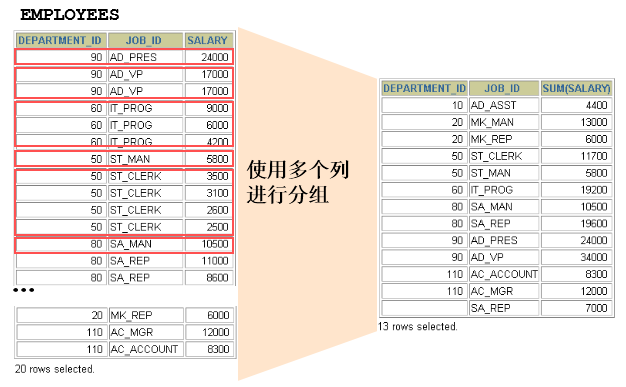
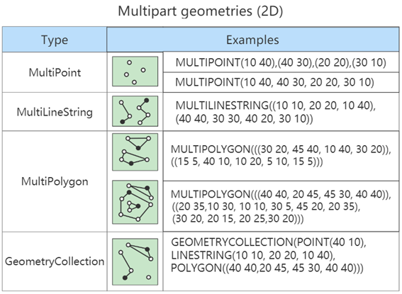

# **MySQL_**基础篇

讲师：尚硅谷-宋红康（江湖人称：康师傅）

尚硅谷官网：http://www.atguigu.com

视频链接：https://www.bilibili.com/video/BV1iq4y1u7vj?spm_id_from=333.337.search-card.all.click

------

## 一、数据库概述

### 1 为什么要使用数据库

- 持久化(persistence)：**把数据保存到可掉电式存储设备中以供之后使用。**大多数情况下，特别是企
  业级应用，**数据持久化意味着将内存中的数据保存到硬盘上加以”固化”，**而持久化的实现过程大多
  通过各种关系数据库来完成。
- 持久化的主要作用是**将内存中的数据存储在关系型数据库中**，当然也可以存储在磁盘文件、XML数据文件中。


### 2 数据库与数据库管理系统

#### 2.1 数据库的相关概念

- **DB：数据库（Database）**

  即存储数据的“仓库”，其本质是一个文件系统。它保存了一系列有组织的数据。

- **DBMS：数据库管理系统（Database Management System）**

  是一种操纵和管理数据库的大型软件，用于建立、使用和维护数据库，对数据库进行统一管理和控制。用户通过数据库管理系统访问数据库中表内的数据。
  
- **SQL：结构化查询语言（Structured Query Language）**

  专门用来与数据库通信的语言。


#### 2.2 数据库与数据库管理系统的关系

数据库管理系统(DBMS)可以管理多个数据库，一般开发人员会针对每一个应用创建一个数据库。为保存
应用中实体的数据，一般会在数据库创建多个表，以保存程序中实体用户的数据。

数据库管理系统、数据库和表的关系如图所示：


#### 2.3 常见的数据库管理系统排名(DBMS)

目前互联网上常见的数据库管理软件有Oracle、MySQL、MS SQL Server、DB2、PostgreSQL、Access、
Sybase、Informix这几种。以下是2021年DB-Engines Ranking 对各数据库受欢迎程度进行调查后的统计结
果：

查看数据库最新排名: https://db-engines.com/en/ranking


对应的走势图：https://db-engines.com/en/ranking_trend


#### 2.4 常见的数据库介绍

**Oracle**

1979 年，Oracle 2 诞生，它是第一个商用的 RDBMS（关系型数据库管理系统）。随着 Oracle 软件的名气
越来越大，公司也改名叫 Oracle 公司。

2007年，总计85亿美金收购BEA Systems。

2009年，总计74亿美金收购SUN。此前的2008年，SUN以10亿美金收购MySQL。意味着Oracle 同时拥有了
MySQL 的管理权，至此 Oracle 在数据库领域中成为绝对的领导者。

2013年，甲骨文超越IBM，成为继Microsoft后全球第二大软件公司。

如今 Oracle 的年收入达到了 400 亿美金，足以证明商用（收费）数据库软件的价值。


**SQL Server**

SQL Server 是微软开发的大型商业数据库，诞生于 1989 年。C#、.net等语言常使用，与WinNT完全集
成，也可以很好地与Microsoft BackOffice产品集成。


**DB2**

IBM公司的数据库产品,收费的。常应用在银行系统中。


**PostgreSQL**

PostgreSQL 的稳定性极强，最符合SQL标准，开放源码，具备商业级DBMS质量。PG对数据量大的文本以
及SQL处理较快。


**SyBase**

已经淡出历史舞台。提供了一个非常专业数据建模的工具PowerDesigner。


**SQLite**

嵌入式的小型数据库，应用在手机端。 零配置，SQlite3不用安装，不用配置，不用启动，关闭或者配置
数据库实例。当系统崩溃后不用做任何恢复操作，再下次使用数据库的时候自动恢复。


**informix**

IBM公司出品，取自Information 和Unix的结合，它是第一个被移植到Linux上的商业数据库产品。仅运行
于unix/linux平台，命令行操作。 性能较高，支持集群，适应于安全性要求极高的系统，尤其是银行，证
券系统的应用。


### 3 MySQL介绍


#### 3.1 概述

- MySQL是一个**开放源代码的关系型数据库管理系统**，由瑞典MySQL AB（创始人Michael Widenius）公
  司1995年开发，迅速成为开源数据库的 No.1。
- 2008被 **Sun** 收购（10亿美金），2009年Sun被 **Oracle** 收购。 **MariaDB**应运而生。（MySQL 的创
  造者担心 MySQL 有闭源的风险，因此创建了 MySQL 的分支项目 MariaDB）
- MySQL6.x 版本之后分为**社区版**和**商业版**。
- MySQL是一种关联数据库管理系统，将数据保存在不同的表中，而不是将所有数据放在一个大仓库
  内，这样就增加了速度并提高了灵活性。
- MySQL是开源的，所以你不需要支付额外的费用。
- MySQL是可以定制的，采用了 **GPL（GNU General Public License）**协议，你可以修改源码来
  开发自己的MySQL系统。
- MySQL支持大型的数据库。可以处理拥有上千万条记录的大型数据库。
- MySQL支持大型数据库，支持5000万条记录的数据仓库，32位系统表文件最大可支持 **4GB**，64位系
  统支持最大的表文件为 **8TB**。
- MySQL使用 **标准的SQL数据语言** 形式。
- MySQL可以允许运行于多个系统上，并且支持多种语言。这些编程语言包括C、C++、Python、
  Java、Perl、PHP和Ruby等。


#### 3.2 MySQL发展史重大事件

MySQL的历史就是整个互联网的发展史。互联网业务从社交领域、电商领域到金融领域的发展，推动着
应用对数据库的需求提升，对传统的数据库服务能力提出了挑战。高并发、高性能、高可用、轻资源、
易维护、易扩展的需求，促进了MySQL的长足发展。


#### 3.3 关于MySQL 8.0

**MySQL从5.7版本直接跳跃发布了8.0版本**，可见这是一个令人兴奋的里程碑版本。MySQL 8版本在功能上
做了显著的改进与增强，开发者对MySQL的源代码进行了重构，最突出的一点是多MySQL Optimizer优化
器进行了改进。不仅在速度上得到了改善，还为用户带来了更好的性能和更棒的体验。


#### 3.4 Why choose MySQL?


为什么如此多的厂商要选用MySQL？大概总结的原因主要有以下几点：

1. 开放源代码，使用成本低。

2. 性能卓越，服务稳定。
3. 软件体积小，使用简单，并且易于维护。
4. 历史悠久，社区用户非常活跃，遇到问题可以寻求帮助。
5. 许多互联网公司在用，经过了时间的验证。


#### 3.5 Oracle vs MySQL

Oracle 更适合大型跨国企业的使用，因为他们对费用不敏感，但是对性能要求以及安全性有更高的要
求。

MySQL 由于其**体积小、速度快、总体拥有成本低，可处理上千万条记录的大型数据库，尤其是开放源码**
**这一特点，使得很多互联网公司、中小型网站选择了MySQL作为网站数据库**（Facebook，Twitter，
YouTube，阿里巴巴/蚂蚁金服，去哪儿，美团外卖，腾讯）。


### 4 RDBMS 与 非RDBMS

从排名中我们能看出来，关系型数据库绝对是 DBMS 的主流，其中使用最多的 DBMS 分别是 Oracle、
MySQL 和 SQL Server。这些都是关系型数据库（RDBMS）。

#### 4.1 关系型数据库(RDBMS)

##### 4.1.1 实质

- 这种类型的数据库是**最古老**的数据库类型，关系型数据库模型是把复杂的数据结构归结为简单的
  **二元关系**（即二维表格形式）。


- 关系型数据库以 **行(row)** 和 **列(column)** 的形式存储数据，以便于用户理解。这一系列的行和列被
  称为 **表(table)** ，一组表组成了一个库(database)。

- 表与表之间的数据记录有关系(relationship)。现实世界中的各种实体以及实体之间的各种联系均用
  **关系模型**来表示。关系型数据库，就是建立在 关系模型 基础上的数据库。

- SQL 就是关系型数据库的查询语言。

  

##### 4.1.2 优势

- **复杂查询** 可以用SQL语句方便的在一个表以及多个表之间做非常复杂的数据查询。
- **事务支持** 使得对于安全性能很高的数据访问要求得以实现。


#### 4.2 非关系型数据库(非RDBMS)

##### 4.2.1 介绍

**非关系型数据库**，可看成传统关系型数据库的功能**阉割版本**，基于键值对存储数据，不需要经过SQL层
的解析，**性能非常高** 。同时，通过减少不常用的功能，进一步提高性能。

目前基本上大部分主流的非关系型数据库都是免费的。


##### 4.2.2 有哪些非关系型数据库

相比于 SQL，NoSQL 泛指非关系型数据库，包括了榜单上的键值型数据库、文档型数据库、搜索引擎和
列存储等，除此以外还包括图形数据库。也只有用 NoSQL 一词才能将这些技术囊括进来。

1. **键值型数据库**

键值型数据库通过 Key-Value 键值的方式来存储数据，其中 Key 和 Value 可以是简单的对象，也可以是复
杂的对象。Key 作为唯一的标识符，优点是查找速度快，在这方面明显优于关系型数据库，缺点是无法
像关系型数据库一样使用条件过滤（比如 WHERE），如果你不知道去哪里找数据，就要遍历所有的键，
这就会消耗大量的计算。

键值型数据库典型的使用场景是作为**内存缓存** 。 **Redis** 是最流行的键值型数据库。


2. **文档型数据库**

此类数据库可存放并获取文档，可以是XML、JSON等格式。在数据库中文档作为处理信息的基本单位，
一个文档就相当于一条记录。文档数据库所存放的文档，就相当于键值数据库所存放的“值”。MongoDB
是最流行的文档型数据库。此外，还有CouchDB等。

3. **搜索引擎数据库**

虽然关系型数据库采用了索引提升检索效率，但是针对全文索引效率却较低。搜索引擎数据库是应用在
搜索引擎领域的数据存储形式，由于搜索引擎会爬取大量的数据，并以特定的格式进行存储，这样在检
索的时候才能保证性能最优。核心原理是“倒排索引”。

典型产品：Solr、Elasticsearch、Splunk 等。

4. **列式数据库**

列式数据库是相对于行式存储的数据库，Oracle、MySQL、SQL Server 等数据库都是采用的行式存储
（Row-based），而列式数据库是将数据按照列存储到数据库中，这样做的好处是可以大量降低系统的
I/O，适合于分布式文件系统，不足在于功能相对有限。典型产品：HBase等。


5. **图形数据库**

图形数据库，利用了图这种数据结构存储了实体（对象）之间的关系。图形数据库最典型的例子就是社
交网络中人与人的关系，数据模型主要是以节点和边（关系）来实现，特点在于能高效地解决复杂的关
系问题。

图形数据库顾名思义，就是一种存储图形关系的数据库。它利用了图这种数据结构存储了实体（对象）
之间的关系。关系型数据用于存储明确关系的数据，但对于复杂关系的数据存储却有些力不从心。如社
交网络中人物之间的关系，如果用关系型数据库则非常复杂，用图形数据库将非常简单。典型产品：
Neo4J、InfoGrid等。


##### 4.2.3 NoSQL功能的演变

由于 SQL 一直称霸 DBMS，因此许多人在思考是否有一种数据库技术能远离 SQL，于是 NoSQL 诞生了，
但是随着发展却发现越来越离不开 SQL。到目前为止 NoSQL 阵营中的 DBMS 都会有实现类似 SQL 的功
能。下面是“NoSQL”这个名词在不同时期的诠释，从这些释义的变化中可以看出 **NoSQL 功能的演变** ：

1970：NoSQL = We have no SQL

1980：NoSQL = Know SQL

2000：NoSQL = No SQL!

2005：NoSQL = Not only SQL

2013：NoSQL = No, SQL!

NoSQL 对 SQL 做出了很好的补充，比如实际开发中，有很多业务需求，其实并不需要完整的关系型数据
库功能，非关系型数据库的功能就足够使用了。这种情况下，使用**性能更高**、**成本更低**的非关系型数据
库当然是更明智的选择。比如：日志收集、排行榜、定时器等。


#### 4.3 小结

NoSQL 的分类很多，即便如此，在 DBMS 排名中，还是 SQL 阵营的比重更大，影响力前 5 的 DBMS 中有
4 个是关系型数据库，而排名前 20 的 DBMS 中也有 12 个是关系型数据库。所以说，掌握 SQL 是非常有
必要的。整套课程将围绕 SQL 展开。


### 5 关系型数据库设计规则

- 关系型数据库的典型数据结构就是 数据表 ，这些数据表的组成都是结构化的（Structured）。
- 将数据放到表中，表再放到库中。
- 一个数据库中可以有多个表，每个表都有一个名字，用来标识自己。表名具有唯一性。
- 表具有一些特性，这些特性定义了数据在表中如何存储，类似Java和Python中 “类”的设计。


#### 5.1 表、记录、字段

- E-R（entity-relationship，实体-联系）模型中有三个主要概念是：实体集、属性、联系集。

- 一个实体集（class）对应于数据库中的一个表（table）。

  一个实体（instance）则对应于数据库表
  中的一行（row），也称为一条记录（record）。

  一个属性（attribute）对应于数据库表中的一列
  （column），也称为一个字段（field）。


```
ORM思想 (Object Relational Mapping)体现：
数据库中的一个表 <---> Java或Python中的一个类
表中的一条数据 <---> 类中的一个对象（或实体）
表中的一个列 <----> 类中的一个字段、属性(field)
```


#### 5.2 表的关联关系

- 表与表之间的数据记录有关系(relationship)。现实世界中的各种实体以及实体之间的各种联系均用
  关系模型来表示。
- 四种：一对一关联、一对多关联、多对多关联、自我引用


##### 5.2.1 一对一关联（one-to-one）

- 在实际的开发中应用不多，因为一对一可以创建成一张表。
- 举例：设计 **学生表**：学号、姓名、手机号码、班级、系别、身份证号码、家庭住址、籍贯、紧急
  联系人、...
  - 拆为两个表：两个表的记录是一一对应关系
  - **基础信息表**（常用信息）：学号、姓名、手机号码、班级、系别
  - **档案信息表** （不常用信息）：学号、身份证号码、家庭住址、籍贯、紧急联系人、...
- 两种建表原则：
  - 外键唯一：主表的主键和从表的外键（唯一），形成主外键关系，外键唯一。
  - 外键是主键：主表的主键和从表的主键，形成主外键关系。


##### 5.2.2 一对多关系（one-to-many）

- 常见实例场景：**客户表和订单表**，**分类表和商品表**，**部门表和员工表**。
- 举例：
  - 员工表：编号、姓名、...、所属部门
  - 部门表：编号、名称、简介
- 一对多建表原则：在从表(多方)创建一个字段，字段作为外键指向主表(一方)的主键


##### 5.2.3 多对多（many-to-many）

要表示多对多关系，必须创建第三个表，该表通常称为**联接表**，它将多对多关系划分为两个一对多关
系。将这两个表的主键都插入到第三个表中。

多对多关系建表原则：需要创建第三张表，中间表中至少两个字段，这两个字段分别作为外键指向
各自一方的主键。



- 举例1：学生 - 课程

  - **学生信息表**：一行代表一个学生的信息（学号、姓名、手机号码、班级、系别...）；
  - **课程信息表**：一行代表一个课程的信息（课程编号、授课老师、简介...）；
  - **选课信息表**：一个学生可以选多门课，一门课可以被多个学生选择。

  ```
  学号 课程编号
  1    1001
  2    1001
  1    1002
  ```

- 举例2：产品 - 订单

  “**订单**”表和“**产品**”表有一种多对多的关系，这种关系是通过与“**订单明细**”表建立两个一对多关系来
  定义的。一个订单可以有多个产品，每个产品可以出现在多个订单中。

  - **产品表**：“产品”表中的每条记录表示一个产品。
  - **订单表**：“订单”表中的每条记录表示一个订单。
  - **订单明细表**：每个产品可以与“订单”表中的多条记录对应，即出现在多个订单中。一个订单
    可以与“产品”表中的多条记录对应，即包含多个产品。

  

- 举例3：用户 - 角色

  


##### 5.2.4 自我引用


------

## 二、基本的SELECT语句

### 1 SQL概述

#### 1.1 SQL背景知识

- 1946 年，世界上第一台电脑诞生，如今，借由这台电脑发展起来的互联网已经自成江湖。在这几十
  年里，无数的技术、产业在这片江湖里沉浮，有的方兴未艾，有的已经几幕兴衰。但在这片浩荡的
  波动里，有一门技术从未消失，甚至“老当益壮”，那就是 SQL。
  - 1974 年，IBM 研究员发布了一篇揭开数据库技术的论文《SEQUEL：一门结构
    化的英语查询语言》，直到今天这门结构化的查询语言并没有太大的变化，相比于其他语
    言， **SQL 的半衰期可以说是非常长**了。
- 不论是前端工程师，还是后端算法工程师，都一定会和数据打交道，都需要了解如何又快又准确地
  提取自己想要的数据。更别提数据分析师了，他们的工作就是和数据打交道，整理不同的报告，以
  便指导业务决策。
- SQL（Structured Query Language，结构化查询语言）是使用关系模型的数据库应用语言，**与数据直**
  **接打交道**，由 **IBM** 上世纪70年代开发出来。后由美国国家标准局（ANSI）开始着手制定SQL标准，
  先后有 **SQL-86**，**SQL-89**，**SQL-92**，**SQL-99**等标准。
  - SQL 有两个重要的标准，分别是 SQL92 和 SQL99，它们分别代表了 92 年和 99 年颁布的 SQL 标
    准，我们今天使用的 SQL 语言依然遵循这些标准。
- 不同的数据库生产厂商都支持SQL语句，但都有特有内容。


#### 1.2 SQL语言排行榜

自从 SQL 加入了 TIOBE 编程语言排行榜，就一直保持在 Top 10。


#### 1.3 SQL分类

SQL语言在功能上主要分为如下3大类：

- **DDL（Data Definition Languages、数据定义语言）**，这些语句定义了不同的数据库、表、视图、索
  引等数据库对象，还可以用来创建、删除、修改数据库和数据表的结构。

  主要的语句关键字包括 **CREATE、ALTER、DROP、RENAME、TRUNCATE** 等。

- **DML（Data Manipulation Language、数据操作语言）**，用于添加、删除、更新和查询数据库记
  录，并检查数据完整性。

  - 主要的语句关键字包括 **INSERT** 、 **DELETE** 、 **UPDATE** 、 **SELECT** 等。
  - **SELECT 是 SQL 语言的基础，最为重要。**

- **DCL（Data Control Language、数据控制语言）**，用于定义数据库、表、字段、用户的访问权限和
  安全级别。

  主要的语句关键字包括 **GRANT** 、 **REVOKE** 、 **COMMIT** 、 **ROLLBACK** 、 **SAVEPOINT** 等。

- 注：因为查询语句使用的非常的频繁，所以很多人把查询语句单拎出来一类：DQL（数据查询语言）。

  还有单独将 COMMIT 、 ROLLBACK 取出来称为TCL （Transaction Control Language，事务控制语
  言）。


### 2 SQL语言的规则与规范

#### 2.1 基本规则

- SQL 可以写在一行或者多行。为了提高可读性，各子句分行写，必要时使用缩进
- 每条命令以 ; 或 \g 或 \G 结束
- 关键字不能被缩写也不能分行
- 关于标点符号
  - 必须保证所有的()、单引号、双引号是成对结束的
  - 必须使用英文状态下的半角输入方式
  - 字符串型和日期时间类型的数据可以使用单引号（' '）表示
  - 列的别名，尽量使用双引号（" "），而且不建议省略as


#### 2.2 SQL大小写规范

- **MySQL 在 Windows 环境下是大小写不敏感的**
- **MySQL 在 Linux 环境下是大小写敏感的**
  - 数据库名、表名、表的别名、变量名是严格区分大小写的
  - 关键字、函数名、列名(或字段名)、列的别名(字段的别名) 是忽略大小写的。
- **推荐采用统一的书写规范：**
  - 数据库名、表名、表别名、字段名、字段别名等都小写
  - SQL 关键字、函数名、绑定变量等都大写


#### 2.3 注释

可以使用如下格式的注释结构

```sql
单行注释：#注释文字(MySQL特有的方式)
单行注释：-- 注释文字(--后面必须包含一个空格。)
多行注释：/* 注释文字 */
```


#### 2.4 命名规则

- 数据库、表名不得超过30个字符，变量名限制为29个
- 必须只能包含 A–Z, a–z, 0–9, _共63个字符
- 数据库名、表名、字段名等对象名中间不要包含空格
- 同一个MySQL软件中，数据库不能同名；同一个库中，表不能重名；同一个表中，字段不能重名
- 必须保证你的字段没有和保留字、数据库系统或常用方法冲突。如果坚持使用，请在SQL语句中使
  用`（着重号）引起来
- 保持字段名和类型的一致性，在命名字段并为其指定数据类型的时候一定要保证一致性。假如数据
  类型在一个表里是整数，那在另一个表里可就别变成字符型了

举例：

```sql
#以下两句是一样的，不区分大小写
show databases;
SHOW DATABASES;

#创建表格
#create table student info(...); #表名错误，因为表名有空格
create table student_info(...);

#其中order使用``飘号，因为order和系统关键字或系统函数名等预定义标识符重名了
CREATE TABLE `order`(
    id INT,
	lname VARCHAR(20)
);

select id as "编号", `name` as "姓名" from t_stu; #起别名时，as都可以省略
select id as 编号, `name` as 姓名 from t_stu; #如果字段别名中没有空格，那么可以省略""
select id as 编 号, `name` as 姓 名 from t_stu; #错误，如果字段别名中有空格，那么不能省略""
```


#### 2.5 数据导入

- 方式1：source 文件的全路径名

  举例：source d:\atguigudb.sql;

- 方式2：基于具体的图形化界面的工具可以导入数据

  比如：SQLyog中 选择 “工具” -- “执行sql脚本” -- 选中xxx.sql即可。


在命令行客户端登录mysql，使用source指令导入

```sql
mysql> source d:\mysqldb.sql
```


### 3 基本的SELECT语句

#### 3.0 SELECT...

```sql
SELECT 1; #没有任何子句
SELECT 9/2; #没有任何子句

#5. 最基本的SELECT语句： SELECT 字段1,字段2,... FROM 表名 
SELECT 1 + 1,3 * 2;

SELECT 1 + 1,3 * 2
FROM DUAL; #dual：伪表
```


#### 3.1 SELECT ... FROM

- 语法：

  ```sql
  SELECT  标识选择哪些列
  FROM    标识从哪个表中选择
  ```

- 选择全部列：

  ```sql
  SELECT *
  FROM departments;
  ```

  

  一般情况下，除非需要使用表中所有的字段数据，最好不要使用通配符‘*’。使用通配符虽然可以节
  省输入查询语句的时间，但是获取不需要的列数据通常会降低查询和所使用的应用程序的效率。通
  配符的优势是，当不知道所需要的列的名称时，可以通过它获取它们。

  在生产环境下，不推荐你直接使用 **SELECT *** 进行查询。

- 选择特定的列：

  ```sql
  SELECT department_id, location_id
  FROM departments;
  ```

  

  MySQL中的SQL语句是不区分大小写的，因此SELECT和select的作用是相同的，但是，许多开发人
  员习惯将关键字大写、数据列和表名小写，读者也应该养成一个良好的编程习惯，这样写出来的代
  码更容易阅读和维护。


#### 3.2 列的别名

- 重命名一个列

- 便于计算

- 紧跟列名，也可以**在列名和别名之间加入关键字AS，别名使用双引号**，以便在别名中包含空格或特
  殊的字符并区分大小写。

- AS 可以省略

- 建议别名简短，见名知意

- 举例

  ```sql
  SELECT last_name AS name, commission_pct comm
  FROM employees;
  ```

  

  ```sql
  SELECT last_name "Name", salary*12 "Annual Salary"
  FROM employees;
  ```

  


#### 3.3 去除重复行

默认情况下，查询会返回全部行，包括重复行。

```sql
SELECT department_id
FROM employees;
```


**在 SELECT 语句中使用关键字 DISTINCT 去除重复行**

```sql
SELECT DISTINCT department_id
FROM employees;
```


针对于：

```sql
SELECT DISTINCT department_id, salary
FROM employees;
```

这里有两点需要注意：

1. DISTINCT 需要放到所有列名的前面，如果写成 `SELECT salary, DISTINCT department_id
   FROM employees `会报错。
2. DISTINCT 其实是对后面所有列名的组合进行去重，你能看到最后的结果是 74 条，因为这 74 个部门id不同，都有 salary 这个属性值。如果你想要看都有哪些不同的部门（department_id），只需要写 DISTINCT department_id 即可，后面不需要再加其他的列名了。


#### 3.4 空值参与运算

- 所有运算符或列值遇到null值，运算的结果都为null

  ```sql
  SELECT employee_id, salary, commission_pct,
  12 * salary * (1 + commission_pct) "annual_sal"
  FROM employees;
  ```

  这里你一定要注意，在 MySQL 里面， 空值不等于空字符串。一个空字符串的长度是 0，而一个空值的长
  度是空。而且，在 MySQL 里面，空值是占用空间的。

- 实际问题的解决方案：引入IFNULL

  ```sql
  SELECT 
  	employee_id,salary "月工资", 
  	salary * (1 + IFNULL(commission_pct,0)) * 12 "年工资", 
  	commission_pct
  FROM `employees`;
  ```


#### 3.5 着重号

- 错误的：

  ```sql
  mysql> SELECT * FROM ORDER;
  ERROR 1064 (42000): You have an error in your SQL syntax; check the manual that
  corresponds to your MySQL server version for the right syntax to use near 'ORDER' at
  line 1
  ```

- 正确的：

  ```sql
  mysql> SELECT * FROM `ORDER`;
  +----------+------------+
  | order_id | order_name |
  +----------+------------+
  |        1 | shkstart   |
  |        2 | tomcat     |
  |        3 | dubbo      |
  +----------+------------+
  3 rows in set (0.00 sec)
  
  mysql> SELECT * FROM `order`;
  +----------+------------+
  | order_id | order_name |
  +----------+------------+
  |        1 | shkstart   |
  |        2 | tomcat     |
  |        3 | dubbo      |
  +----------+------------+
  3 rows in set (0.00 sec)
  ```

- 结论：

  我们需要保证表中的字段、表名等没有和保留字、数据库系统或常用方法冲突。如果真的相同，请在
  SQL语句中使用一对``（着重号）引起来。


#### 3.6 查询常数

- SELECT 查询还可以对常数进行查询。对的，就是在 SELECT 查询结果中增加一列固定的常数列。这列的
  取值是我们指定的，而不是从数据表中动态取出的。

- 你可能会问为什么我们还要对常数进行查询呢？'

- SQL 中的 SELECT 语法的确提供了这个功能，一般来说我们只从一个表中查询数据，通常不需要增加一个
  固定的常数列，但如果我们想整合不同的数据源，用常数列作为这个表的标记，就需要查询常数。

- 比如说，我们想对 employees 数据表中的员工姓名进行查询，同时增加一列字段 corporation ，这个
  字段固定值为“尚硅谷”，可以这样写：

  ```sql
  SELECT '尚硅谷' as corporation, last_name FROM employees;
  ```


### 4 显示表结构

使用DESCRIBE 或 DESC 命令，表示表结构。

```sql
DESCRIBE employees;
或
DESC employees;
```

```sql
mysql> desc employees;
+----------------+-------------+------+-----+---------+-------+
| Field          | Type        | Null | Key | Default | Extra |
+----------------+-------------+------+-----+---------+-------+
| employee_id    | int(6)      | NO   | PRI | 0       |       |
| first_name     | varchar(20) | YES  |     | NULL    |       |
| last_name      | varchar(25) | NO   |     | NULL    |       |
| email          | varchar(25) | NO   | UNI | NULL    |       |
| phone_number   | varchar(20) | YES  |     | NULL    |       |
| hire_date      | date        | NO   |     | NULL    |       |
| job_id         | varchar(10) | NO   | MUL | NULL    |       |
| salary         | double(8,2) | YES  |     | NULL    |       |
| commission_pct | double(2,2) | YES  |     | NULL    |       |
| manager_id     | int(6)      | YES  | MUL | NULL    |       |
| department_id  | int(4)      | YES  | MUL | NULL    |       |
+----------------+-------------+------+-----+---------+-------+
11 rows in set (0.00 sec)
```

其中，各个字段的含义分别解释如下：

- Field：表示字段名称
- Type：表示字段类型，这里 barcode、goodsname 是文本型的，price 是整数类型的
- Null：表示该列是否可以存储NULL值
- Key：表示该列是否已编制索引。PRI表示该列是表主键的一部分；UNI表示该列是UNIQUE索引的一
  部分，MUL表示在列中某个给定值允许出现多次。
- Default：表示该列是否有默认值，如果有，那么值是多少。
- Extra：表示可以获取的与给定列有关的附加信息，例如AUTO_INCREMENT等。


### 5 过滤数据

- 背景：

  

- 语法：

  ```sql
  SELECT 字段1,字段2
  FROM 表名
  WHERE 过滤条件
  ```

  - 使用WHERE 子句，将不满足条件的行过滤掉
  - **WHERE 子句紧随 FROM 子句**

- 举例：

  ```sql
  SELECT employee_id, last_name, job_id, department_id
  FROM employees
  WHERE department_id = 90 ;
  ```

  

------

## 三、运算符

### 1 算术运算符

算术运算符主要用于数学运算，其可以连接运算符前后的两个数值或表达式，对数值或表达式进行加
（+）、减（-）、乘（*）、除（/）和取模（%）运算。


#### 1.1 加法与减法运算符

```sql
mysql> SELECT 100, 100 + 0, 100 - 0, 100 + 50, 100 + 50 - 30, 100 + 35.5, 100 - 35.5
FROM dual;
+-----+---------+---------+----------+--------------+------------+------------+
| 100 | 100 + 0 | 100 - 0 | 100 + 50 | 100 + 50 -30 | 100 + 35.5 | 100 - 35.5 |
+-----+---------+---------+----------+--------------+------------+------------+
| 100 | 100     | 100     | 150      | 120          | 135.5      | 64.5       |
+-----+---------+---------+----------+--------------+------------+------------+
1 row in set (0.00 sec)
```

由运算结果可以得出如下结论：

- 一个整数类型的值对整数进行加法和减法操作，结果还是一个整数；

- 一个整数类型的值对浮点数进行加法和减法操作，结果是一个浮点数；

- 加法和减法的优先级相同，进行先加后减操作与进行先减后加操作的结果是一样的；

- 在Java中，`+`的左右两边如果有字符串，那么表示字符串的拼接。但是在MySQL中`+`只表示数
  值相加。如果遇到非数值类型，先尝试转成数值，如果转失败，就按0计算。

  （补充：MySQL
  中字符串拼接要使用字符串函数CONCAT()实现）


#### 1.2 乘法与除法运算符

```sql
mysql> SELECT 100, 100 * 1, 100 * 1.0, 100 / 1.0, 100 / 2,100 + 2 * 5 / 2,100 /3, 100 DIV 0 
FROM dual;

+-----+---------+-----------+-----------+---------+-----------------+---------+-----------+
| 100 | 100 * 1 | 100 * 1.0 | 100 / 1.0 | 100 / 2 | 100 + 2 * 5 / 2 | 100 /3  | 100 DIV 0 |
+-----+---------+-----------+-----------+---------+-----------------+---------+-----------+
| 100 | 100     | 100.0     | 100.0000  | 50.0000 | 105.0000        | 33.3333 | NULL      |
+-----+---------+-----------+-----------+---------+-----------------+---------+-----------+
1 row in set (0.00 sec)

#计算出员工的年基本工资
SELECT employee_id, salary, salary * 12 annual_sal
FROM employees;
```

由运算结果可以得出如下结论：

- 一个数乘以整数1和除以整数1后仍得原数；
- 一个数乘以浮点数1.0和除以浮点数1.0后变成浮点数，数值与原数相等；
- 一个数除以整数后，不管是否能除尽，结果都为一个浮点数；
- 一个数除以另一个数，除不尽时，结果为一个浮点数，并保留到小数点后4位；
- 乘法和除法的优先级相同，进行先乘后除操作与先除后乘操作，得出的结果相同。
- 在数学运算中，0不能用作除数，在MySQL中，一个数除以0为NULL。


#### 1.3 求模（求余）运算符

```sql
mysql> SELECT 12 % 3, 12 MOD 5 FROM dual;
+--------+----------+
| 12 % 3 | 12 MOD 5 |
+--------+----------+
| 0      | 2        |
+--------+----------+
1 row in set (0.00 sec)

#筛选出employee_id是偶数的员工
SELECT * FROM employees
WHERE employee_id MOD 2 = 0;
```


### 2 比较运算符

比较运算符用来对表达式左边的操作数和右边的操作数进行比较，比较的结果为真则返回1，比较的结果
为假则返回0，其他情况则返回NULL。

比较运算符经常被用来作为**SELECT查询语句的条件**来使用，返回符合条件的结果记录。


#### 2.1 等号运算符 =

- 等号运算符（=）判断等号两边的值、字符串或表达式是否相等，如果相等则返回1，不相等则返回
  0。
- 在使用等号运算符时，遵循如下规则：
  - 如果等号两边的值、字符串或表达式都为字符串，则MySQL会按照字符串进行比较，其比较的
    是每个字符串中字符的ANSI编码是否相等。
  - 如果等号两边的值都是整数，则MySQL会按照整数来比较两个值的大小。
  - 如果等号两边的值一个是整数，另一个是字符串，则MySQL会将字符串转化为数字进行比较，如果转换数值不成功，则看做0。
  - 如果等号两边的值、字符串或表达式中有一个为NULL，则比较结果为NULL。
- 对比：SQL中赋值符号使用 : =

```sql
mysql> SELECT 1 = 1, 1 = '1', 1 = 0, 'a' = 'a', (5 + 3) = (2 + 6), '' = NULL , NULL = NULL;
+-------+---------+-------+-----------+-------------------+-----------+-------------+
| 1 = 1 | 1 = '1' | 1 = 0 | 'a' = 'a' | (5 + 3) = (2 + 6) | '' = NULL | NULL = NULL |
+-------+---------+-------+-----------+-------------------+-----------+-------------+
| 1     | 1       | 0     | 1         | 1                 | NULL      | NULL        |
+-------+---------+-------+-----------+-------------------+-----------+-------------+
1 row in set (0.00 sec)

mysql> SELECT 1 = 2, 0 = 'abc', 1 = 'abc' FROM dual;
+-------+-----------+-----------+
| 1 = 2 | 0 = 'abc' | 1 = 'abc' |
+-------+-----------+-----------+
| 0     | 1         | 0         |
+-------+-----------+-----------+
1 row in set, 2 warnings (0.00 sec)

#查询salary=10000，注意在Java中比较是==
SELECT 
	employee_id, salary 
FROM 
	employees 
WHERE 
	salary = 10000;
```


#### 2.2 安全等于运算符 <=>

安全等于运算符（<=>）与 等于运算符（=）的作用是相似的， 唯一的区别 是‘<=>’可
以用来对NULL进行判断。在两个操作数均为NULL时，其返回值为1，而不为NULL；当一个操作数为NULL
时，其返回值为0，而不为NULL。

```sql
mysql> 
SELECT 1 <=> '1', 1 <=> 0, 'a' <=> 'a', (5 + 3) <=> (2 + 6), '' <=> NULL, NULL <=> NULL 
FROM dual;
+-----------+---------+-------------+---------------------+-------------+---------------+
| 1 <=> '1' | 1 <=> 0 | 'a' <=> 'a' | (5 + 3) <=> (2 + 6) | '' <=> NULL | NULL <=> NULL |
+-----------+---------+-------------+---------------------+-------------+---------------+
| 1         | 0       | 1           | 1                   | 0           | 1             |
+-----------+---------+-------------+---------------------+-------------+---------------+
1 row in set (0.00 sec)


#查询commission_pct等于0.40
SELECT employee_id, commission_pct FROM employees WHERE commission_pct = 0.40;
SELECT employee_id, commission_pct FROM employees WHERE commission_pct <=> 0.40;
#如果把0.40改成 NULL 呢？
```

可以看到，使用安全等于运算符时，两边的操作数的值都为NULL时，返回的结果为1而不是NULL，其他
返回结果与等于运算符相同。

注：为NULL而生


#### 2.3 不等于运算符 <> !=

不等于运算符（<>和!=）用于判断两边的数字、字符串或者表达式的值是否不相等，
如果不相等则返回1，相等则返回0。不等于运算符不能判断NULL值。如果两边的值有任意一个为NULL，
或两边都为NULL，则结果为NULL。 SQL语句示例如下：

```sql
mysql> SELECT 1 <> 1, 1 != 2, 'a' != 'b', (3+4) <> (2+6), 'a' != NULL, NULL <> NULL;
+--------+--------+------------+----------------+-------------+--------------+
| 1 <> 1 | 1 != 2 | 'a' != 'b' | (3+4) <> (2+6) | 'a' != NULL | NULL <> NULL |
+--------+--------+------------+----------------+-------------+--------------+
| 0      | 1      | 1          | 1              | NULL        | NULL         |
+--------+--------+------------+----------------+-------------+--------------+
1 row in set (0.00 sec)
```


此外，还有非符号类型的运算符：


#### 2.4 空运算符 IS NULL

空运算符（IS NULL 或者 ISNULL() ）判断一个值是否为NULL，如果为NULL则返回1，否则返回
0。 

SQL语句示例如下：

```sql
mysql> SELECT NULL IS NULL, ISNULL(NULL), ISNULL('a'), 1 IS NULL;
+--------------+--------------+-------------+-----------+
| NULL IS NULL | ISNULL(NULL) | ISNULL('a') | 1 IS NULL |
+--------------+--------------+-------------+-----------+
| 1            | 1            | 0           | 0         |
+--------------+--------------+-------------+-----------+
1 row in set (0.00 sec)

#查询commission_pct等于NULL。比较如下的四种写法
SELECT employee_id,commission_pct FROM employees WHERE commission_pct IS NULL;
SELECT employee_id,commission_pct FROM employees WHERE commission_pct <=> NULL;
SELECT employee_id,commission_pct FROM employees WHERE ISNULL(commission_pct);
SELECT employee_id,commission_pct FROM employees WHERE commission_pct = NULL;#错误写法
```

```mysql
#练习：查询表中commission_pct为null的数据有哪些
SELECT last_name, salary, commission_pct
FROM employees
WHERE commission_pct IS NULL;
#或
SELECT last_name,salary,commission_pct
FROM employees
WHERE ISNULL(commission_pct);
```


#### 2.5 非空运算符 IS NOT NULL

非空运算符（IS NOT NULL）判断一个值是否不为NULL，如果不为NULL则返回1，否则返
回0。 

SQL语句示例如下：

```sql
mysql> SELECT NULL IS NOT NULL, 'a' IS NOT NULL, 1 IS NOT NULL;
+------------------+-----------------+---------------+
| NULL IS NOT NULL | 'a' IS NOT NULL | 1 IS NOT NULL |
+------------------+-----------------+---------------+
| 0                | 1               | 1             |
+------------------+-----------------+---------------+
1 row in set (0.01 sec)

#查询commission_pct不等于NULL
SELECT employee_id,commission_pct FROM employees WHERE commission_pct IS NOT NULL;
SELECT employee_id,commission_pct FROM employees WHERE NOT commission_pct <=> NULL;
SELECT employee_id,commission_pct FROM employees WHERE NOT ISNULL(commission_pct);
```


#### 2.6 最小值运算符 LEAST

语法格式为：LEAST(值1，值2，...，值n)。其中，“值n”表示参数列表中有n个值。在有
两个或多个参数的情况下，返回最小值。

```sql
mysql> SELECT LEAST (1,0,2), LEAST('b','a','c'), LEAST(1,NULL,2);
+---------------+--------------------+-----------------+
| LEAST (1,0,2) | LEAST('b','a','c') | LEAST(1,NULL,2) |
+---------------+--------------------+-----------------+
| 0             | a                  | NULL            |
+---------------+--------------------+-----------------+
1 row in set (0.00 sec)
```

由结果可以看到

- 当参数是整数或者浮点数时，LEAST将返回其中最小的值；
- 当参数为字符串时，返回字
  母表中顺序最靠前的字符；
- 当比较值列表中有NULL时，不能判断大小，返回值为NULL。


#### 2.7 最大值运算符 GREATEST

语法格式为：GREATEST(值1，值2，...，值n)。其中，n表示参数列表中有n个值。当有
两个或多个参数时，返回值为最大值。假如任意一个自变量为NULL，则GREATEST()的返回值为NULL。

```sql
mysql> SELECT GREATEST(1,0,2), GREATEST('b','a','c'), GREATEST(1,NULL,2);
+-----------------+-----------------------+--------------------+
| GREATEST(1,0,2) | GREATEST('b','a','c') | GREATEST(1,NULL,2) |
+-----------------+-----------------------+--------------------+
| 2               | c                     | NULL               |
+-----------------+-----------------------+--------------------+
1 row in set (0.00 sec)
```

由结果可以看到

- 当参数中是整数或者浮点数时，GREATEST将返回其中最大的值；
- 当参数为字符串时，
  返回字母表中顺序最靠后的字符；
- 当比较值列表中有NULL时，不能判断大小，返回值为NULL。


#### 2.8 BETWEEN AND 运算符

BETWEEN 运算符使用的格式通常为`SELECT D FROM TABLE WHERE C BETWEEN A
AND B`，此时，当C大于或等于A，并且C小于或等于B时，结果为1，否则结果为0。

```sql
mysql> SELECT 1 BETWEEN 0 AND 1, 10 BETWEEN 11 AND 12, 'b' BETWEEN 'a' AND 'c';
+-------------------+----------------------+-------------------------+
| 1 BETWEEN 0 AND 1 | 10 BETWEEN 11 AND 12 | 'b' BETWEEN 'a' AND 'c' |
+-------------------+----------------------+-------------------------+
| 1                 | 0                    | 1                       |
+-------------------+----------------------+-------------------------+
1 row in set (0.00 sec)
```

```sql
# BETWEEN 条件下界1 AND 条件上界2  （查询条件1和条件2范围内的数据，包含边界）
#查询工资在6000 到 8000的员工信息
SELECT employee_id,last_name,salary
FROM employees
#where salary between 6000 and 8000;
WHERE salary >= 6000 && salary <= 8000;

#交换6000 和 8000之后，查询不到数据
SELECT employee_id,last_name,salary
FROM employees
WHERE salary BETWEEN 8000 AND 6000;

#查询工资不在6000 到 8000的员工信息
SELECT employee_id,last_name,salary
FROM employees
WHERE salary NOT BETWEEN 6000 AND 8000;
#where salary < 6000 or salary > 8000;
```


#### 2.9 IN运算符

IN 运算符用于判断给定的值是否是IN列表中的一个值，如果是则返回1，否则返回0。

如果给
定的值为NULL，或者IN列表中存在NULL，则结果为NULL。

```sql
mysql> SELECT 'a' IN ('a','b','c'), 1 IN (2,3), NULL IN ('a','b'), 'a' IN ('a', NULL);
+----------------------+------------+-------------------+--------------------+
| 'a' IN ('a','b','c') | 1 IN (2,3) | NULL IN ('a','b') | 'a' IN ('a', NULL) |
+----------------------+------------+-------------------+--------------------+
| 1                    | 0          | NULL              | 1                  |
+----------------------+------------+-------------------+--------------------+
1 row in set (0.00 sec)

# 查询部门为10,20,30部门的员工信息
SELECT last_name,salary,department_id
FROM employees
# where department_id = 10 or department_id = 20 or department_id = 30;
WHERE department_id IN (10,20,30);
```


#### 2.10 NOT IN运算符

NOT IN运算符用于判断给定的值是否不是IN列表中的一个值，如果不是IN列表中的一
个值，则返回1，否则返回0。

```sql
mysql> SELECT 'a' NOT IN ('a','b','c'), 1 NOT IN (2,3);
+--------------------------+----------------+
| 'a' NOT IN ('a','b','c') | 1 NOT IN (2,3) |
+--------------------------+----------------+
| 0                        | 1              |
+--------------------------+----------------+
1 row in set (0.00 sec)

# 查询工资不是6000,7000,8000的员工信息
SELECT last_name,salary,department_id
FROM employees
WHERE salary NOT IN (6000,7000,8000);
```


#### 2.11 LIKE运算符

LIKE运算符主要用来匹配字符串，通常用于模糊匹配，如果满足条件则返回1，否则返回
0。如果给定的值或者匹配条件为NULL，则返回结果为NULL。

LIKE运算符通常使用如下通配符：

```
“ % ”：匹配0个或多个字符。
“ _ ”：只能匹配一个字符。
```

SQL语句示例如下：

```sql
mysql> SELECT NULL LIKE 'abc', 'abc' LIKE NULL;
+-----------------+-----------------+
| NULL LIKE 'abc' | 'abc' LIKE NULL |
+-----------------+-----------------+
| NULL            | NULL            |
+-----------------+-----------------+
1 row in set (0.00 sec)
```

```sql
#练习：查询last_name中包含字符'a'的员工信息
SELECT last_name
FROM employees
WHERE last_name LIKE '%a%';

#练习：查询last_name中以字符'a'开头的员工信息
SELECT last_name
FROM employees
WHERE last_name LIKE 'a%';

#练习：查询last_name中包含字符'a'且包含字符'e'的员工信息
#写法1：
SELECT last_name
FROM employees
WHERE last_name LIKE '%a%' AND last_name LIKE '%e%';
#写法2：
SELECT last_name
FROM employees
WHERE last_name LIKE '%a%e%' OR last_name LIKE '%e%a%';

#练习：查询第2个字符是'a'的员工信息
SELECT last_name
FROM employees
WHERE last_name LIKE '_a%';

#练习：查询第2个字符是_且第3个字符是'a'的员工信息
#需要使用转义字符: \ 
SELECT last_name
FROM employees
WHERE last_name LIKE '_\_a%';

#或者  (了解) 指定某个符号为转义字符
SELECT last_name
FROM employees
WHERE last_name LIKE '_$_a%' ESCAPE '$';
```

ESCAPE

- 回避特殊符号的：使用转义符。例如：将[%]转为[$%]、[]转为[$]，然后再加上[ESCAPE‘$’]即可。

  ```sql
  SELECT job_id
  FROM jobs
  WHERE job_id LIKE ‘IT\_%‘;
  ```

- 如果使用\表示转义，要省略ESCAPE。如果不是\，则要加上ESCAPE。

  ```sql
  SELECT job_id
  FROM jobs
  WHERE job_id LIKE ‘IT$_%‘ escape ‘$‘;
  ```


#### 2.12 REGEXP运算符

REGEXP运算符用来匹配字符串，语法格式为： expr REGEXP 匹配条件 。

如果expr满足匹配条件，返回
1；如果不满足，则返回0。

若expr或匹配条件任意一个为NULL，则结果为NULL。


REGEXP运算符在进行匹配时，常用的有下面几种通配符：

1. ‘^’ 匹配以该字符后面的字符开头的字符串。

2. ‘$’ 匹配以该字符前面的字符结尾的字符串。

3. ‘.’ 匹配任何一个单字符。

4. “[...]” 匹配在方括号内的任何字符。

   例如，“[abc]” 匹配 “a” 或 “b” 或 “c”。为了命名字符的范围，使用一
   个‘-’。“[a-z]”匹配任何小写字母，而“[0-9]”匹配任何数字。

5. ‘\*’ 匹配零个或多个在它前面的字符。例如，“x*”匹配任何数量的 ‘x’字符，“[0-9]*”匹配任何数量的数字，
   而“*”匹配任何数量的任何字符。

SQL语句示例如下：

```sql
mysql> SELECT 'shkstart' REGEXP '^s', 'shkstart' REGEXP 't$', 'shkstart' REGEXP 'hk';
+------------------------+------------------------+-------------------------+
| 'shkstart' REGEXP '^s' | 'shkstart' REGEXP 't$' | 'shkstart' REGEXP 'hk'  |
+------------------------+------------------------+-------------------------+
| 1                      | 1                      | 1                       |
+------------------------+------------------------+-------------------------+
1 row in set (0.01 sec)

mysql> SELECT 'atguigu' REGEXP 'gu.gu', 'atguigu' REGEXP '[ab]';
+--------------------------+-------------------------+
| 'atguigu' REGEXP 'gu.gu' | 'atguigu' REGEXP '[ab]' |
+--------------------------+-------------------------+
| 1                        | 1                       |
+--------------------------+-------------------------+
```


### 3 逻辑运算符

逻辑运算符主要用来判断表达式的真假，在MySQL中，逻辑运算符的返回结果为1、0或者NULL。

MySQL中支持4种逻辑运算符如下：


#### 3.1 逻辑非运算符 NOT !

逻辑非（NOT或!）运算符表示当给定的值为0时返回1；当给定的值为非0值时返回0；
当给定的值为NULL时，返回NULL。

```sql
mysql> SELECT NOT 1, NOT 0, NOT(1+1), NOT !1, NOT NULL;
+-------+-------+----------+--------+----------+
| NOT 1 | NOT 0 | NOT(1+1) | NOT !1 | NOT NULL |
+-------+-------+----------+--------+----------+
| 0     | 1     | 0        | 1      | NULL     |
+-------+-------+----------+--------+----------+
1 row in set, 1 warning (0.00 sec)

SELECT last_name, salary, department_id
FROM employees
#where salary not between 6000 and 8000;
#where commission_pct is not null;
WHERE NOT commission_pct <=> NULL;

SELECT last_name, job_id
FROM employees
WHERE job_id NOT IN ('IT_PROG', 'ST_CLERK', 'SA_REP');
```


#### 3.2 逻辑与运算符 AND &&

逻辑与（AND或&&）运算符是当给定的所有值均为非0值，并且都不为NULL时，返回
1；当给定的一个值或者多个值为0时则返回0；否则返回NULL。

```sql
mysql> SELECT 1 AND -1, 0 AND 1, 0 AND NULL, 1 AND NULL;
+----------+---------+------------+------------+
| 1 AND -1 | 0 AND 1 | 0 AND NULL | 1 AND NULL |
+----------+---------+------------+------------+
| 1        | 0       | 0          | NULL       |
+----------+---------+------------+------------+
1 row in set (0.00 sec)

SELECT employee_id, last_name, job_id, salary
FROM employees
WHERE salary >=10000
AND job_id LIKE '%MAN%';
```


#### 3.3 逻辑或运算符 OR ||

逻辑或（OR或||）运算符是当给定的值都不为NULL，并且任何一个值为非0值时，则返
回1，否则返回0；当一个值为NULL，并且另一个值为非0值时，返回1，否则返回NULL；当两个值都为
NULL时，返回NULL。

```sql
mysql> SELECT 1 OR -1, 1 OR 0, 1 OR NULL, 0 || NULL, NULL || NULL;
+---------+--------+-----------+-----------+--------------+
| 1 OR -1 | 1 OR 0 | 1 OR NULL | 0 || NULL | NULL || NULL |
+---------+--------+-----------+-----------+--------------+
| 1       | 1      | 1         | NULL      | NULL         |
+---------+--------+-----------+-----------+--------------+
1 row in set, 2 warnings (0.00 sec)

SELECT employee_id,salary FROM employees
WHERE salary < 9000 OR salary > 12000;

SELECT employee_id, last_name, job_id, salary
FROM employees
WHERE salary >= 10000
OR job_id LIKE '%MAN%';
```

注意：OR可以和AND一起使用，但是在使用时要注意两者的优先级，由于AND的优先级高于OR，因此先
对AND两边的操作数进行操作，再与OR中的操作数结合。


#### 3.4 逻辑异或运算符 XOR

逻辑异或（XOR）运算符是当给定的值中任意一个值为NULL时，则返回NULL；如果
两个非NULL的值都是0或者都不等于0时，则返回0；如果一个值为0，另一个值不为0时，则返回1。 

```sql
mysql> SELECT 1 XOR -1, 1 XOR 0, 0 XOR 0, 1 XOR NULL, 1 XOR 1 XOR 1, 0 XOR 0 XOR 0;
+----------+---------+---------+------------+---------------+---------------+
| 1 XOR -1 | 1 XOR 0 | 0 XOR 0 | 1 XOR NULL | 1 XOR 1 XOR 1 | 0 XOR 0 XOR 0 |
+----------+---------+---------+------------+---------------+---------------+
| 0        | 1       | 0       | NULL       | 1             | 0             |
+----------+---------+---------+------------+---------------+---------------+
1 row in set (0.00 sec)

select last_name,department_id,salary
from employees
where department_id in (10,20) XOR salary > 8000;
```


### 4 位运算符

位运算符是在二进制数上进行计算的运算符。位运算符会先将操作数变成二进制数，然后进行位运算，
最后将计算结果从二进制变回十进制数。

MySQL支持的位运算符如下：


#### 4.1 按位与运算符 &

按位与（&）运算符将给定值对应的二进制数逐位进行逻辑与运算。

当给定值对应的二
进制位的数值都为1时，则该位返回1，否则返回0。(全1为1，有0为0)

```sql
mysql> SELECT 1 & 10, 20 & 30;
+--------+---------+
| 1 & 10 | 20 & 30 |
+--------+---------+
| 0      | 20      |
+--------+---------+
1 row in set (0.00 sec)
```

1的二进制数为0001，10的二进制数为1010，所以1 & 10的结果为0000，对应的十进制数为0。

20的二进制
数为10100，30的二进制数为11110，所以20 & 30的结果为10100，对应的十进制数为20。


#### 4.2 按位或运算符 |

按位或（|）运算符将给定的值对应的二进制数逐位进行逻辑或运算。

当给定值对应的
二进制位的数值有一个或两个为1时，则该位返回1，否则返回0。(有1为1，全0为0)

```sql
mysql> SELECT 1 | 10, 20 | 30;
+--------+---------+
| 1 | 10 | 20 | 30 |
+--------+---------+
| 11     | 30      |
+--------+---------+
1 row in set (0.00 sec)
```

1的二进制数为0001，10的二进制数为1010，所以1 | 10的结果为1011，对应的十进制数为11。

20的二进
制数为10100，30的二进制数为11110，所以20 | 30的结果为11110，对应的十进制数为30。


#### 4.3 按位异或运算符 ^

按位异或（^）运算符将给定的值对应的二进制数逐位进行逻辑异或运算。

当给定值
对应的二进制位的数值不同时，则该位返回1，否则返回0。(相同为0，不同为1)

```sql
mysql> SELECT 1 ^ 10, 20 ^ 30;
+--------+---------+
| 1 ^ 10 | 20 ^ 30 |
+--------+---------+
| 11     | 10      |
+--------+---------+
1 row in set (0.00 sec)
```

1的二进制数为0001，10的二进制数为1010，所以1 ^ 10的结果为1011，对应的十进制数为11。

20的二进
制数为10100，30的二进制数为11110，所以20 ^ 30的结果为01010，对应的十进制数为10。

再举例：

```sql
mysql> SELECT 12 & 5, 12 | 5, 12 ^ 5 FROM DUAL;
+--------+--------+--------+
| 12 & 5 | 12 | 5 | 12 ^ 5 |
+--------+--------+--------+
| 4      | 13     | 9      |
+--------+--------+--------+
1 row in set (0.00 sec)
```




#### 4.4 按位取反运算符 ~

按位取反（~）运算符将给定的值的二进制数逐位进行取反操作，即将1变为0，将0变
为1。

```sql
mysql> SELECT 10 & ~1;
+---------+
| 10 & ~1 |
+---------+
| 10      |
+---------+
1 row in set (0.00 sec)
```

由于按位取反（~）运算符的优先级高于按位与（&）运算符的优先级，所以10 & ~1，首先，对数字1进
行按位取反操作，结果除了最低位为0，其他位都为1，然后与10进行按位与操作，结果为10。


#### 4.5 按位右移运算符 >>

按位右移（>>）运算符将给定的值的二进制数的所有位右移指定的位数。

右移指定的
位数后，右边低位的数值被移出并丢弃，左边高位空出的位置用0补齐。

```sql
mysql> SELECT 1 >> 2, 4 >> 2;
+--------+--------+
| 1 >> 2 | 4 >> 2 |
+--------+--------+
| 0      | 1      |
+--------+--------+
1 row in set (0.00 sec)
```

1的二进制数为0000 0001，右移2位为0000 0000，对应的十进制数为0。

4的二进制数为0000 0100，右移2
位为0000 0001，对应的十进制数为1。


#### 4.6 按位左移运算符 <<

按位左移（<<）运算符将给定的值的二进制数的所有位左移指定的位数。

左移指定的
位数后，左边高位的数值被移出并丢弃，右边低位空出的位置用0补齐。

```sql
mysql> SELECT 1 << 2, 4 << 2;
+--------+--------+
| 1 << 2 | 4 << 2 |
+--------+--------+
| 4      | 16     |
+--------+--------+
1 row in set (0.00 sec)
```

1的二进制数为0000 0001，左移两位为0000 0100，对应的十进制数为4。

4的二进制数为0000 0100，左移
两位为0001 0000，对应的十进制数为16。


结论：在一定范围内满足：每向左移动1位，相当于乘以2；每向右移动一位，相当于除以2。


### 5 运算符的优先级


数字编号越大，优先级越高，优先级高的运算符先进行计算。可以看到，赋值运算符的优先级最低，使
用“()”括起来的表达式的优先级最高。


### 拓展：使用正则表达式查询

正则表达式通常被用来检索或替换那些符合某个模式的文本内容，根据指定的匹配模式匹配文本中符合
要求的特殊字符串。例如，从一个文本文件中提取电话号码，查找一篇文章中重复的单词或者替换用户
输入的某些敏感词语等，这些地方都可以使用正则表达式。正则表达式强大而且灵活，可以应用于非常
复杂的查询。

MySQL中使用 REGEXP 关键字指定正则表达式的字符匹配模式。

下表列出了REGEXP操作符中常用字符匹配
列表。


1. 查询以特定字符或字符串开头的记录：字符‘^’匹配以特定字符或者字符串开头的文本。

   在fruits表中，查询f_name字段以字母‘b’开头的记录，SQL语句如下：

   ```sql
   SELECT * FROM fruits WHERE f_name REGEXP '^b';
   ```

2. 查询以特定字符或字符串结尾的记录：字符‘$’匹配以特定字符或者字符串结尾的文本。

   在fruits表中，查询f_name字段以字母‘y’结尾的记录，SQL语句如下：

   ```sql
   SELECT * FROM fruits WHERE f_name REGEXP 'y$';
   ```

3.  用符号"."来替代字符串中的任意一个字符：字符‘.’匹配任意一个字符。

    在fruits表中，查询f_name字段值
   包含字母‘a’与‘g’且两个字母之间只有一个字母的记录，SQL语句如下：

   ```sql
   SELECT * FROM fruits WHERE f_name REGEXP 'a.g';
   ```

4. 使用"\*"和"+"来匹配多个字符：

   - 星号‘\*’匹配前面的字符任意多次，包括0次。
   - 加号‘+’匹配前面的字符至
     少一次。

   在fruits表中，查询f_name字段值以字母‘b’开头且‘b’后面出现字母‘a’的记录，SQL语句如下：

   ```sql
   SELECT * FROM fruits WHERE f_name REGEXP '^ba*';
   ```

   在fruits表中，查询f_name字段值以字母‘b’开头且‘b’后面出现字母‘a’至少一次的记录，SQL语句如下：

   ```sql
   SELECT * FROM fruits WHERE f_name REGEXP '^ba+';
   ```

5. 匹配指定字符串

   正则表达式可以匹配指定字符串，只要这个字符串在查询文本中即可，如要匹配多个
   字符串，多个字符串之间使用分隔符‘|’隔开。

   在fruits表中，查询f_name字段值包含字符串“on”的记录，SQL语句如下：

   ```sql
   SELECT * FROM fruits WHERE f_name REGEXP 'on';
   ```

   在fruits表中，查询f_name字段值包含字符串“on”或者“ap”的记录，SQL语句如下：

   ```sql
   SELECT * FROM fruits WHERE f_name REGEXP 'on|ap';
   ```

   之前介绍过，LIKE运算符也可以匹配指定的字符串，但与REGEXP不同，LIKE匹配的字符串如果在文本中
   间出现，则找不到它，相应的行也不会返回。REGEXP在文本内进行匹配，如果被匹配的字符串在文本中
   出现，REGEXP将会找到它，相应的行也会被返回。对比结果如下所示。

   在fruits表中，使用LIKE运算符查询f_name字段值为“on”的记录，SQL语句如下：

   ```sql
   SELECT * FROM fruits WHERE f_name like 'on';
   Empty set(0.00 sec)
   ```

6. 匹配指定字符中的任意一个

   方括号“[]”指定一个字符集合，只匹配其中任何一个字符，即为所查找的
   文本。

   在fruits表中，查找f_name字段中包含字母‘o’或者‘t’的记录，SQL语句如下：

   ```sql
   SELECT * FROM fruits WHERE f_name REGEXP '[ot]';
   ```

   在fruits表中，查询s_id字段中包含4、5或者6的记录，SQL语句如下：

   ```sql
   SELECT * FROM fruits WHERE s_id REGEXP '[456]';
   ```

7. 匹配指定字符以外的字符

   “\[^字符集合]” 匹配不在指定集合中的任何字符。

   在fruits表中，查询f_id字段中包含字母a~e和数字1~2以外字符的记录，SQL语句如下：

   ```sql
   SELECT * FROM fruits WHERE f_id REGEXP '[^a-e1-2]';
   ```

8. 使用{n,}或者{n,m}来指定字符串连续出现的次数

   “字符串{n,}”表示至少匹配n次前面的字符；“字符串
   {n,m}”表示匹配前面的字符串不少于n次，不多于m次。

   例如，a{2,}表示字母a连续出现至少2次，也可以
   大于2次；a{2,4}表示字母a连续出现最少2次，最多不能超过4次。

   在fruits表中，查询f_name字段值出现字母‘x’至少2次的记录，SQL语句如下：

   ```sql
   SELECT * FROM fruits WHERE f_name REGEXP 'x{2,}';
   ```

   在fruits表中，查询f_name字段值出现字符串“ba”最少1次、最多3次的记录，SQL语句如下：

   ```sql
   SELECT * FROM fruits WHERE f_name REGEXP 'ba{1,3}';
   ```

------

## 四、排序与分页

### 1 排序数据

#### 1.1 排序规则

- 使用 ORDER BY 子句排序
  - ASC（ascend）: 升序 默认为升序
  - DESC（descend）: 降序
- ORDER BY 子句在SELECT语句的结尾。

#### 1.2 单列排序

```mysql
SELECT last_name, job_id, department_id, hire_date
FROM employees
ORDER BY hire_date ;
```


```sql
SELECT last_name, job_id, department_id, hire_date
FROM employees
ORDER BY hire_date DESC ;
```


```sql
SELECT employee_id, last_name, salary*12 annsal
FROM employees
ORDER BY annsal;
```


#### 1.3 多列排序

```sql
SELECT last_name, department_id, salary
FROM employees
ORDER BY department_id, salary DESC;
```


- 可以使用不在SELECT列表中的列排序。
- 在对多列进行排序的时候，首先排序的第一列必须有相同的列值，才会对第二列进行排序。如果第一列数据中所有值都是唯一的，将不再对第二列进行排序。

### 2 分页

#### 2.1 背景

- 背景1：查询返回的记录太多了，查看起来很不方便，怎么样能够实现分页查询呢？
- 背景2：表里有 4 条数据，我们只想要显示第 2、3 条数据怎么办呢？

#### 2.2 实现规则

- 分页原理

  所谓分页显示，就是将数据库中的结果集，一段一段显示出来需要的条件。

- MySQL中使用 **LIMIT** 实现分页

- 格式：

  ```sql
  LIMIT [位置偏移量] 行数;
  ```

  第一个“位置偏移量”参数指示MySQL从哪一行开始显示，是一个可选参数，如果不指定“位置偏移
  量”，将会从表中的第一条记录开始（第一条记录的位置偏移量是0，第二条记录的位置偏移量是
  1，以此类推）；第二个参数“行数”指示返回的记录条数。

- 举例：

  ```sql
  --前10条记录：
  SELECT * FROM 表名 LIMIT 0,10;
  或者
  SELECT * FROM 表名 LIMIT 10;
  
  --第11至20条记录：
  SELECT * FROM 表名 LIMIT 10,10;
  
  --第21至30条记录：
  SELECT * FROM 表名 LIMIT 20,10;
  ```

  MySQL 8.0中可以使用“LIMIT 3 OFFSET 4”，意思是获取从第5条记录开始后面的3条记录，和“LIMIT
  4,3;”返回的结果相同。

- 分页显式公式：(当前页数-1) * 每页条数，每页条数

  ```sql
  SELECT * FROM table
  LIMIT (PageNo - 1) * PageSize, PageSize;
  ```

- **注意：LIMIT 子句必须放在整个SELECT语句的最后！**

- 使用 LIMIT 的好处

  约束返回结果的数量可以减少数据表的网络传输量 ，也可以提升查询效率 。如果我们知道返回结果只有
  1 条，就可以使用 LIMIT 1 ，告诉 SELECT 语句只需要返回一条记录即可。这样的好处就是 SELECT 不需
  要扫描完整的表，只需要检索到一条符合条件的记录即可返回。

#### 2.3 拓展

在不同的 DBMS 中使用的关键字可能不同。在 MySQL、PostgreSQL、MariaDB 和 SQLite 中使用 LIMIT 关键字，而且需要放到 SELECT 语句的最后面。

- 如果是 SQL Server 和 Access，需要使用 TOP 关键字，比如：

  ```mssql
  SELECT TOP 5 name, hp_max FROM heros ORDER BY hp_max DESC
  ```

- 如果是 DB2，使用 FETCH FIRST 5 ROWS ONLY 这样的关键字：

  ```sql
  SELECT name, hp_max FROM heros ORDER BY hp_max DESC FETCH FIRST 5 ROWS ONLY
  ```

- 如果是 Oracle，你需要基于 ROWNUM 来统计行数：

  ```sql
  SELECT rownum,last_name,salary FROM employees WHERE rownum < 5 ORDER BY salary DESC;
  ```

  需要说明的是，这条语句是先取出来前 5 条数据行，然后再按照 hp_max 从高到低的顺序进行排序。但这样产生的结果和上述方法的并不一样。我会在后面讲到子查询，你可以使用

  ```sql
  SELECT rownum, last_name, salary
  FROM (
  	SELECT last_name, salary
  	FROM employees
  	ORDER BY salary DESC)
  WHERE rownum < 10;
  ```

  得到与上述方法一致的结果。

------

## 五、多表查询

多表查询，也称为关联查询，指两个或更多个表一起完成查询操作。

前提条件：这些一起查询的表之间是有关系的（一对一、一对多），它们之间一定是有关联字段，这个关联字段可能建立了外键，也可能没有建立外键。比如：员工表和部门表，这两个表依靠“部门编号”进行关联。

### 1 一个案例引发的多表连接

#### 1.1 案例说明


从多个表中获取数据：


```mysql
#案例：查询员工的姓名及其部门名称
SELECT last_name, department_name
FROM employees, departments;
```

查询结果：

```mysql
+-----------+----------------------+
| last_name | department_name      |
+-----------+----------------------+
| King      | Administration       |
| King 	    | Marketing            |
| King      | Purchasing           |
| King      | Human Resources      |
| King      | Shipping             |
| King      | IT                   |
| King      | Public Relations     |
| King      | Sales                |
| King      | Executive            |
| King      | Finance              |
| King      | Accounting           |
| King      | Treasury             |
...
| Gietz     | IT Support           |
| Gietz     | NOC                  |
| Gietz     | IT Helpdesk          |
| Gietz     | Government Sales     |
| Gietz     | Retail Sales         |
| Gietz     | Recruiting           |
| Gietz     | Payroll              |
+-----------+----------------------+
2889 rows in set (0.01 sec)
```

分析错误情况：

```mysql
SELECT COUNT(employee_id) FROM employees;
#输出107行
SELECT COUNT(department_id)FROM departments;
#输出27行
SELECT 107*27 FROM dual;#2889
```

我们把上述多表查询中出现的问题称为：笛卡尔积的错误。

#### 1.2 笛卡尔积（或交叉连接）的理解

笛卡尔乘积是一个数学运算。假设我有两个集合 X 和 Y，那么 X 和 Y 的笛卡尔积就是 X 和 Y 的所有可能组合，也就是第一个对象来自于 X，第二个对象来自于 Y 的所有可能。组合的个数即为两个集合中元素个数的乘积数。


SQL92中，笛卡尔积也称为交叉连接，英文是 CROSS JOIN。在 SQL99 中也是使用 CROSS JOIN表示交叉连接。它的作用就是可以把任意表进行连接，即使这两张表不相关。在MySQL中如下情况会出现笛卡尔积：

```mysql
#查询员工姓名和所在部门名称
SELECT last_name, department_name FROM employees, departments;
SELECT last_name, department_name FROM employees CROSS JOIN departments;
SELECT last_name, department_name FROM employees INNER JOIN departments;
SELECT last_name, department_name FROM employees JOIN departments;
```

#### 1.3 案例分析与问题解决

- 笛卡尔积的错误会在下面条件下产生：

  - 省略多个表的连接条件（或关联条件）
  - 连接条件（或关联条件）无效
  - 所有表中的所有行互相连接

- 为了避免笛卡尔积，可以**在 WHERE 加入有效的连接条件。**

- 加入连接条件后，查询语法：**在 WHERE子句中写入连接条件。**

  ```mysql
  SELECT table1.column, table2.column
  FROM table1, table2
  WHERE table1.column1 = table2.column2; #连接条件
  ```

- 正确写法：

  ```mysql
  #案例：查询员工的姓名及其部门名称
  SELECT last_name, department_name
  FROM employees, departments
  WHERE employees.department_id = departments.department_id;
  ```

- 在表中有相同列时，在列名之前加上表名前缀。

### 2 多表查询分类讲解

#### 2.1 等值连接 vs 非等值连接

##### 2.1.1 等值连接



```mysql
SELECT 
	employees.employee_id, employees.last_name,
	employees.department_id, departments.department_id,
	departments.location_id
FROM employees, departments
WHERE employees.department_id = departments.department_id;
```


**拓展1：多个连接条件与 AND 操作符**



**拓展2：区分重复的列名**

- **多个表中有相同列时，必须在列名之前加上表名前缀。**
- 在不同表中具有相同列名的列可以用**表名**加以区分。

```sql
SELECT employees.last_name, departments.department_name, employees.department_id
FROM employees, departments
WHERE employees.department_id = departments.department_id;
```

**拓展3：表的别名**

- 使用别名可以简化查询。
- 列名前使用表名前缀可以提高查询效率。

```mysql
SELECT 
	e.employee_id, e.last_name, e.department_id,
	d.department_id, d.location_id
FROM employees e, departments d
WHERE e.department_id = d.department_id;
```

需要注意的是，如果我们使用了表的别名，在查询字段中、过滤条件中就只能使用别名进行代替，不能使用原有的表名，否则就会报错。

```
阿里开发规范 ：
【强制】对于数据库中表记录的查询和变更，只要涉及多个表，都需要在列名前加表的别名（或表名）进行限定。

说明：对多表进行查询记录、更新记录、删除记录时，如果对操作列没有限定表的别名（或表名），并且操作列在多个表中存在时，就会抛异常。

正例 ：select t1.name from table_first as t1 , table_second as t2 where t1.id = t2.id;
反例 ：在某业务中，由于多表关联查询语句没有加表的别名（或表名）的限制，正常运行两年后，最近在 某个表中增加一个同名字段，在预发布环境做数据库变更后，线上查询语句出现出1052 异常：Column 'name' in field list is ambiguous。
```

**拓展4：连接多个表**


总结：连接 n个表，至少需要n-1个连接条件。比如，连接三个表，至少需要两个连接条件。

```mysql
# 练习：查询出公司员工的 last_name, department_name, city
SELECT 
	e.last_name, d.department_name, l.city
FROM 
	employees e, departments d, locations l
WHERE 
	e.department_id = d.department_id 
AND 
	d.location_id = l.location_id;
```

##### 2.1.2 非等值连接


```mysql
SELECT 
	e.last_name, e.salary, g.grade_level
FROM 
	employees e, job_grades g
WHERE 
	e.salary BETWEEN g.lowest_sal AND g.highest_sal;
```


#### 2.2 自连接 vs 非自连接


当 table1 和 table2 本质上是同一张表，只是用取别名的方式虚拟成两张表以代表不同的意义。然后两个表再进行内连接，外连接等查询。

题目：查询employees表，返回“Xxx works for Xxx”

```mysql
SELECT 
	CONCAT(worker.last_name, ' works for ', manager.last_name)
FROM 
	employees worker, employees manager
WHERE 
	worker.manager_id = manager.employee_id;
```


练习：查询出last_name为 ‘Chen’ 的员工的 manager 的信息。

```mysql
SELECT 
	worker.last_name "员工名", manager.last_name "领导名"
FROM 
	employees worker, employees manager
WHERE
	worker.manager_id = manager.employee_id
AND
	worker.last_name = 'Chen';
```

#### 2.3 内连接 vs 外连接

除了查询满足条件的记录以外，外连接还可以查询某一方不满足条件的记录。


- 内连接: 合并具有同一列的两个以上的表的行，**结果集中不包含一个表与另一个表不匹配的行**

- 外连接: 两个表在连接过程中除了返回满足连接条件的行以外还**返回左（或右）表中不满足条件的行，这种连接称为左（或右）外连接。**没有匹配的行时，结果表中相应的列为空(NULL)。

- 如果是左外连接，则连接条件中左边的表也称为 主表 ，右边的表称为 从表 。

  如果是右外连接，则连接条件中右边的表也称为 主表 ，左边的表称为 从表 。

SQL92：使用(+)创建连接

- 在 SQL92 中采用（+）代表从表所在的位置。即左或右外连接中，**(+) 表示哪个是从表。**

- Oracle 对 SQL92 支持较好，而 MySQL 则不支持 SQL92 的外连接。

  ```mysql
  #左外连接 
  SELECT last_name, department_name
  FROM employees, departments
  WHERE employees.department_id = departments.department_id(+);
  
  #右外连接
  SELECT last_name, department_name
  FROM employees, departments
  WHERE employees.department_id(+) = departments.department_id;
  ```

- 而且在 SQL92 中，只有左外连接和右外连接，没有满（或全）外连接。

### 3 SQL99语法实现多表查询

#### 3.1 基本语法

- 使用JOIN...ON子句创建连接的语法结构：

  ```mysql
  SELECT 
  	table1.column, table2.column, table3.column
  FROM 
  	table1
  JOIN 
  	table2 ON table1 和 table2 的连接条件
  JOIN 
  	table3 ON table2 和 table3 的连接条件
  ```

  它的嵌套逻辑类似我们使用的 FOR 循环：

  ```mysql
  for t1 in table1:
  	for t2 in table2:
  		if condition1:
  			for t3 in table3:
  				if condition2:
  					output t1 + t2 + t3
  ```

  SQL99 采用的这种嵌套结构非常清爽、层次性更强、可读性更强，即使再多的表进行连接也都清晰可见。如果你采用 SQL92，可读性就会大打折扣。

- 语法说明：

  - **可以使用 ON 子句指定额外的连接条件。**
  - 这个连接条件是与其它条件分开的。
  - **ON 子句使语句具有更高的易读性。**
  - 关键字 JOIN、INNER JOIN、CROSS JOIN 的含义是一样的，都表示内连接。

#### 3.2 内连接 (INNER JOIN) 的实现

- 语法：

  ```mysql
  SELECT 字段列表
  FROM A表 INNER JOIN B表
  ON 关联条件
  WHERE 等其他子句;
  ```

  题目1：

  ```mysql
  SELECT 
  	e.employee_id, e.last_name, e.department_id,
  	d.department_id, d.location_id
  FROM 
  	employees e 
  JOIN 
  	departments d
  ON 
  	e.department_id = d.department_id;
  ```

  

  题目2：

  ```mysql
  SELECT 
  	employee_id, city, department_name
  FROM 
  	employees e
  JOIN departments d ON d.department_id = e.department_id
  JOIN locations l ON d.location_id = l.location_id;
  ```

  

#### 3.3 外连接(OUTER JOIN)的实现

##### 3.3.1 左外连接(LEFT OUTER JOIN)

- 语法：

  ```mysql
  #实现查询结果是A
  SELECT 字段列表
  FROM A表 LEFT JOIN B表
  ON 关联条件
  WHERE 等其他子句;
  ```

- 举例：

  ```mysql
  SELECT 
  	e.last_name, e.department_id, d.department_name
  FROM 
  	employees e
  LEFT OUTER JOIN 
  	departments d
  ON 
  	e.department_id = d.department_id ;
  ```

  

##### 3.3.2 右外连接(RIGHT OUTER JOIN)

- 语法：

  ```mysql
  #实现查询结果是B
  SELECT 字段列表
  FROM A表 RIGHT JOIN B表
  ON 关联条件
  WHERE 等其他子句;
  ```

- 举例：

  ```mysql
  SELECT 
  	e.last_name, e.department_id, d.department_name
  FROM 
  	employees e
  RIGHT OUTER JOIN 
  	departments d
  ON 
  	e.department_id = d.department_id;
  ```

  

需要注意的是，LEFT JOIN 和 RIGHT JOIN 只存在于 SQL99 及以后的标准中，在 SQL92 中不存在，只能用 (+) 表示。

##### 3.3.3 满外连接(FULL OUTER JOIN)

- 满外连接的结果 = 左右表匹配的数据 + 左表没有匹配到的数据 + 右表没有匹配到的数据。
- SQL99是支持满外连接的。使用FULL JOIN 或 FULL OUTER JOIN来实现。
- 需要注意的是，MySQL不支持FULL JOIN，但是可以用 LEFT JOIN UNION RIGHT JOIN代替。

### 4 UNION的使用

**合并查询结果** 利用UNION关键字，可以给出多条SELECT语句，并将它们的结果组合成单个结果集。合并时，两个表对应的列数和数据类型必须相同，并且相互对应。各个SELECT语句之间使用UNION或UNION
ALL关键字分隔。

语法格式：

```mysql
SELECT column,... FROM table1
UNION [ALL]
SELECT column,... FROM table2
```

**UNION操作符**


UNION 操作符返回两个查询的结果集的并集，**去除重复记录**。

**UNION ALL操作符**


UNION ALL操作符返回两个查询的结果集的并集。对于两个结果集的重复部分，**不去重**。

注意：执行UNION ALL语句时所需要的资源比UNION语句少。如果明确知道合并数据后的结果数据不存在重复数据，或者不需要去除重复的数据，则尽量使用UNION ALL语句，以提高数据查询的效率。

举例：查询部门编号>90或邮箱包含a的员工信息

```mysql
#方式1
SELECT * FROM employees WHERE email LIKE '%a%' OR department_id>90;
```

```mysql
#方式2
SELECT * FROM employees WHERE email LIKE '%a%'
UNION
SELECT * FROM employees WHERE department_id>90;
```

举例：查询中国用户中男性的信息以及美国用户中年男性的用户信息

```mysql
SELECT id, cname FROM t_chinamale WHERE csex='男'
UNION ALL
SELECT id, tname FROM t_usmale WHERE tGender='male';
```

### 5 七种 SQL JOINS 的实现


#### 5.1 代码实现

```mysql
#中图：内连接 A∩B
SELECT employee_id, last_name, department_name
FROM employees e JOIN departments d
ON e.`department_id` = d.`department_id`;
```

```mysql
#左上图：左外连接
SELECT employee_id,last_name,department_name
FROM employees e LEFT JOIN departments d
ON e.`department_id` = d.`department_id`;
```

```mysql
#右上图：右外连接
SELECT employee_id,last_name,department_name
FROM employees e RIGHT JOIN departments d
ON e.`department_id` = d.`department_id`;
```

```mysql
#左中图：A - A∩B
SELECT employee_id,last_name,department_name
FROM employees e LEFT JOIN departments d
ON e.`department_id` = d.`department_id`
WHERE d.`department_id` IS NULL;
```

```mysql
#右中图：B-A∩B
SELECT employee_id,last_name,department_name
FROM employees e RIGHT JOIN departments d
ON e.`department_id` = d.`department_id`
WHERE e.`department_id` IS NULL;
```

```mysql
# 左下图：满外连接
# 方式1：左上图 UNION ALL 右中图
SELECT employee_id,department_name
FROM employees e LEFT JOIN departments d
ON e.`department_id` = d.`department_id`
UNION ALL #没有去重操作，效率高
SELECT employee_id,department_name
FROM employees e RIGHT JOIN departments d
ON e.`department_id` = d.`department_id`
WHERE e.`department_id` IS NULL;

# 方式2：左中图 + 右上图 A∪B
SELECT employee_id,last_name,department_name
FROM employees e LEFT JOIN departments d
ON e.`department_id` = d.`department_id`
WHERE d.`department_id` IS NULL
UNION ALL #没有去重操作，效率高
SELECT employee_id,last_name,department_name
FROM employees e RIGHT JOIN departments d
ON e.`department_id` = d.`department_id`;
```

```mysql
#右下图
#左中图 + 右中图 A ∪B- A∩B 或者 (A - A∩B) ∪ （B - A∩B）
SELECT employee_id,last_name,department_name
FROM employees e LEFT JOIN departments d
ON e.`department_id` = d.`department_id`
WHERE d.`department_id` IS NULL
UNION ALL
SELECT employee_id,last_name,department_name
FROM employees e RIGHT JOIN departments d
ON e.`department_id` = d.`department_id`
WHERE e.`department_id` IS NULL;
```

#### 5.2 语法格式小结

- 左中图

  ```mysql
  #实现A - A∩B
  select 字段列表
  from A表 left join B表
  on 关联条件
  where 从表关联字段 is null and 等其他子句;
  ```

- 右中图

  ```mysql
  #实现B - A∩B
  select 字段列表
  from A表 right join B表
  on 关联条件
  where 从表关联字段 is null and 等其他子句;
  ```

- 左下图

  ```mysql
  #实现查询结果是A∪B
  #用左外的A union 右外的B
  select 字段列表
  from A表 left join B表
  on 关联条件
  where 等其他子句
  
  union
  
  select 字段列表
  from A表 right join B表
  on 关联条件
  where 等其他子句;
  ```

- 右下图

  ```mysql
  #实现A∪B - A∩B 或 (A - A∩B) ∪ （B - A∩B）
  #使用左外的 (A - A∩B) union 右外的（B - A∩B）
  select 字段列表
  from A表 left join B表
  on 关联条件
  where 从表关联字段 is null and 等其他子句
  
  union
  
  select 字段列表
  from A表 right join B表
  on 关联条件
  where 从表关联字段 is null and 等其他子句;
  ```

### 6 SQL99语法新特性

#### 6.1 自然连接

SQL99 在 SQL92 的基础上提供了一些特殊语法，比如 **NATURAL JOIN** 用来表示自然连接。我们可以把自然连接理解为 SQL92 中的等值连接。它会帮你自动查询两张连接表中**所有相同的字段**，然后进行**等值连接**。

在SQL92标准中：

```mysql
SELECT 
	employee_id, last_name, department_name
FROM 
	employees e 
JOIN 
	departments d
ON 
	e.`department_id` = d.`department_id`
AND 
	e.`manager_id` = d.`manager_id`;
```

在 SQL99 中你可以写成：

```mysql
SELECT 
	employee_id,last_name,department_name
FROM 
	employees e 
NATURAL JOIN 
	departments d;
```

#### 6.2 USING连接

当我们进行连接的时候，SQL99还支持使用 USING 指定数据表里的**同名字段**进行等值连接。但是只能配合JOIN一起使用。比如：

```mysql
SELECT 
	employee_id, last_name, department_name
FROM 
	employees e 
JOIN 
	departments d
USING 
	(department_id);
```

你能看出与自然连接 NATURAL JOIN 不同的是，USING 指定了具体的相同的字段名称，你需要在 USING
的括号 () 中填入要指定的同名字段。同时使用 **JOIN...USING** 可以简化 JOIN ON 的等值连接。它与下面的 SQL 查询结果是相同的：

```mysql
SELECT 
	employee_id, last_name, department_name
FROM 
	employees e
JOIN 
	departments d
ON
	e.department_id = d.department_id;
```

### 7 章节小结

表连接的约束条件可以有三种方式：WHERE、ON、USING

- WHERE：适用于所有关联查询
- ON ：只能和JOIN一起使用，只能写关联条件。虽然关联条件可以并到WHERE中和其他条件一起写，但分开写可读性更好。
- USING：只能和JOIN一起使用，而且要求两个关联字段在关联表中名称一致，而且只能表示关联字段值相等

```mysql
#关联条件
#把关联条件写在where后面
SELECT last_name,department_name
FROM employees,departments
WHERE employees.department_id = departments.department_id;

#把关联条件写在on后面，只能和JOIN一起使用
SELECT last_name,department_name
FROM employees INNER JOIN departments
ON employees.department_id = departments.department_id;

SELECT last_name,department_name
FROM employees CROSS JOIN departments
ON employees.department_id = departments.department_id;

SELECT last_name,department_name
FROM employees JOIN departments
ON employees.department_id = departments.department_id;

#把关联字段写在using()中，只能和JOIN一起使用
#而且两个表中的关联字段必须名称相同，而且只能表示=
#查询员工姓名与基本工资
SELECT last_name,job_title
FROM employees INNER JOIN jobs USING(job_id);

#n张表关联，需要n-1个关联条件
#查询员工姓名，基本工资，部门名称
SELECT 
	last_name,job_title,department_name 
FROM 
	employees, departments, jobs
WHERE 
	employees.department_id = departments.department_id
AND 
	employees.job_id = jobs.job_id;
#SQL99
SELECT 
	last_name,job_title,department_name
FROM 
	employees 
INNER JOIN 
	departments 
INNER JOIN 
	jobs
ON 
	employees.department_id = departments.department_id
AND 
	employees.job_id = jobs.job_id;
```

注意：**我们要控制连接表的数量**。多表连接就相当于嵌套 for 循环一样，非常消耗资源，会让 SQL 查询性能下降得很严重，因此不要连接不必要的表。在许多 DBMS 中，也都会有最大连接表的限制。

```
【强制】超过三个表禁止join。需要 join 的字段，数据类型保持绝对一致；多表关联查询时， 保证被关联的字段需要有索引。
说明：即使双表 join 也要注意表索引、SQL 性能。
来源：阿里巴巴《Java开发手册》
```

### 附录：常用的 SQL 标准有哪些

- 在正式开始讲连接表的种类时，我们首先需要知道 SQL 存在不同版本的标准规范，因为不同规范下的表连接操作是有区别的。
- SQL 有两个主要的标准，分别是 **SQL92** 和 **SQL99**。92 和 99 代表了标准提出的时间，SQL92 就是 92 年提出的标准规范。当然除了 SQL92 和 SQL99 以外，还存在 SQL-86、SQL-89、SQL:2003、SQL:2008、
  SQL:2011 和 SQL:2016 等其他的标准。
- 这么多标准，到底该学习哪个呢？**实际上最重要的 SQL 标准就是 SQL92 和 SQL99**。一般来说 SQL92 的形式更简单，但是写的 SQL 语句会比较长，可读性较差。而 SQL99 相比于 SQL92 来说，语法更加复杂，但可读性更强。我们从这两个标准发布的页数也能看出，SQL92 的标准有 500 页，而 SQL99 标准超过了
  1000 页。实际上从 SQL99 之后，很少有人能掌握所有内容，因为确实太多了。就好比我们使用
  Windows、Linux 和 Office 的时候，很少有人能掌握全部内容一样。我们只需要掌握一些核心的功能，满
  足日常工作的需求即可。
- **SQL92 和 SQL99 是经典的 SQL 标准，也分别叫做 SQL-2 和 SQL-3 标准**。也正是在这两个标准发布之
  后，SQL 影响力越来越大，甚至超越了数据库领域。现如今 SQL 已经不仅仅是数据库领域的主流语言，还是信息领域中信息处理的主流语言。在图形检索、图像检索以及语音检索中都能看到 SQL 语言的使用。

------

## 六、单行函数

### 1 函数的理解

#### 1.1 什么是函数

函数在计算机语言的使用中贯穿始终，函数的作用是什么呢？它可以把我们经常使用的代码封装起来，需要的时候直接调用即可。这样既**提高了代码效率**，又**提高了可维护性**。在 SQL 中我们也可以使用函数对检索出来的数据进行函数操作。使用这些函数，可以极大地**提高用户对数据库的管理效率**。


从函数定义的角度出发，我们可以将函数分成**内置函数**和**自定义函数**。在 SQL 语言中，同样也包括了内置函数和自定义函数。内置函数是系统内置的通用函数，而自定义函数是我们根据自己的需要编写的，本章及下一章讲解的是 SQL 的内置函数。

#### 1.2 不同DBMS函数的差异

我们在使用 SQL 语言的时候，不是直接和这门语言打交道，而是通过它使用不同的数据库软件，即
DBMS。**DBMS 之间的差异性很大，远大于同一个语言不同版本之间的差异。**实际上，只有很少的函数是被 DBMS 同时支持的。比如，大多数 DBMS 使用（||）或者（+）来做拼接符，而在 MySQL 中的字符串拼接函数为concat()。大部分 DBMS 会有自己特定的函数，这就意味着**采用 SQL 函数的代码可移植性是很差的**，因此在使用函数的时候需要特别注意。

#### 1.3 MySQL的内置函数及分类

MySQL提供了丰富的内置函数，这些函数使得数据的维护与管理更加方便，能够更好地提供数据的分析与统计功能，在一定程度上提高了开发人员进行数据分析与统计的效率。

MySQL提供的内置函数从**实现的功能角度**可以分为数值函数、字符串函数、日期和时间函数、流程控制函数、加密与解密函数、获取MySQL信息函数、聚合函数等。这里，我将这些丰富的内置函数再分为两类：**单行函数**、**聚合函数（或分组函数）。**

两种SQL函数


单行函数：

- 操作数据对象
- 接受参数返回一个结果
- **只对一行进行变换**
- **每行返回一个结果**
- 可以嵌套
- 参数可以是一列或一个值

### 2 数值函数

#### 2.1 基本函数

| 函数                | 用法                                                         |
| ------------------- | :----------------------------------------------------------- |
| ABS(x)              | 返回x的绝对值                                                |
| SIGN(X)             | 返回x的符号。正数返回1，负数返回-1，0返回0                   |
| PI()                | 返回圆周率的值                                               |
| CEIL(x)，CEILING(x) | 返回大于或等于某个值的最小整数                               |
| FLOOR(x)            | 返回小于或等于某个值的最大整数                               |
| LEAST(e1,e2,e3…)    | 返回列表中的最小值                                           |
| GREATEST(e1,e2,e3…) | 返回列表中的最大值                                           |
| MOD(x,y)            | 返回x除以y后的余数                                           |
| RAND()              | 返回0~1的随机值                                              |
| RAND(x)             | 返回0~1的随机值，其中x的值用作种子值，相同的X值会产生相同的随机数 |
| ROUND(x)            | 返回一个对x的值进行四舍五入后，最接近于x的整数               |
| ROUND(x,y)          | 返回一个对x的值进行四舍五入后最接近x的值，并保留到小数点后面y位 |
| TRUNCATE(x,y)       | 返回数字x截断为y位小数的结果                                 |
| SQRT(x)             | 返回x的平方根。当X的值为负数时，返回NULL                     |

举例：

```mysql
SELECT
ABS(-123), ABS(32), SIGN(-23), SIGN(43),
PI(), CEIL(32.32), CEILING(-43.23), 
FLOOR(32.32), FLOOR(-43.23), MOD(12,5)
FROM DUAL;
```


```mysql
SELECT RAND(), RAND(), RAND(10), RAND(10), RAND(-1), RAND(-1)
FROM DUAL;
```


```mysql
SELECT
ROUND(12.33), ROUND(12.343,2), ROUND(12.324,-1), TRUNCATE(12.66,1), TRUNCATE(12.66,-1)
FROM DUAL;
```


#### 2.2 角度与弧度互换函数

| 函数       | 用法                                  |
| :--------- | ------------------------------------- |
| RADIANS(x) | 将角度转化为弧度，其中，参数x为角度值 |
| DEGREES(x) | 将弧度转化为角度，其中，参数x为弧度值 |

```mysql
SELECT 
	RADIANS(30), RADIANS(60), RADIANS(90),
	DEGREES(2*PI()), DEGREES(RADIANS(90))
FROM DUAL;
```


#### 2.3 三角函数

| 函数       | 用法                                                         |
| ---------- | :----------------------------------------------------------- |
| SIN(x)     | 返回x的正弦值，其中，参数x为弧度值                           |
| ASIN(x)    | 返回x的反正弦值，即获取正弦为x的值。如果x的值不在-1到1之间，则返回NULL |
| COS(x)     | 返回x的余弦值，其中，参数x为弧度值                           |
| ACOS(x)    | 返回x的反余弦值，即获取余弦为x的值。如果x的值不在-1到1之间，则返回NULL |
| TAN(x)     | 返回x的正切值，其中，参数x为弧度值                           |
| ATAN(x)    | 返回x的反正切值，即返回正切值为x的值                         |
| ATAN2(m,n) | 返回两个参数的反正切值                                       |
| COT(x)     | 返回x的余切值，其中，X为弧度值                               |

举例：

ATAN2(M,N)函数返回两个参数的反正切值。 与ATAN(X)函数相比，ATAN2(M,N)需要两个参数，例如有两个点point(x1,y1)和point(x2,y2)，使用ATAN(X)函数计算反正切值为ATAN((y2-y1)/(x2-x1))，使用ATAN2(M,N)计算反正切值则为ATAN2(y2-y1,x2-x1)。由使用方式可以看出，当x2-x1等于0时，ATAN(X)函数会报错，而ATAN2(M,N)函数则仍然可以计算。

ATAN2(M,N)函数的使用示例如下：

```mysql
SELECT
	SIN(RADIANS(30)), DEGREES(ASIN(1)), TAN(RADIANS(45)), 
	DEGREES(ATAN(1)), DEGREES(ATAN2(1,1))
FROM DUAL;
```


#### 2.4 指数与对数

| 函数                 | 用法                                                 |
| -------------------- | :--------------------------------------------------- |
| POW(x,y)，POWER(X,Y) | 返回x的y次方                                         |
| EXP(X)               | 返回e的X次方，其中e是一个常数，2.718281828459045     |
| LN(X)，LOG(X)        | 返回以e为底的X的对数，当X <= 0 时，返回的结果为NULL  |
| LOG10(X)             | 返回以10为底的X的对数，当X <= 0 时，返回的结果为NULL |
| LOG2(X)              | 返回以2为底的X的对数，当X <= 0 时，返回NULL          |

```mysql
mysql> SELECT POW(2,5),POWER(2,4),EXP(2),LN(10),LOG10(10),LOG2(4)
-> FROM DUAL;
+----------+------------+------------------+-------------------+-----------+---------+
| POW(2,5) | POWER(2,4) | EXP(2)           | LN(10)            | LOG10(10) | LOG2(4) |
+----------+------------+------------------+-------------------+-----------+---------+
| 32       | 16         | 7.38905609893065 | 2.302585092994046 | 1         | 2       |
+----------+------------+------------------+-------------------+-----------+---------+
1 row in set (0.00 sec)
```

#### 2.5 进制间的转换

| 函数            | 用法                     |
| :-------------- | ------------------------ |
| BIN(x)          | 返回x的二进制编码        |
| HEX(x)          | 返回x的十六进制编码      |
| OCT(x)          | 返回x的八进制编码        |
| CONV(x, f1, f2) | 返回f1进制数变成f2进制数 |

```mysql
mysql> SELECT BIN(10), HEX(10), OCT(10), CONV(10,2,8)
-> FROM DUAL;
+---------+---------+---------+--------------+
| BIN(10) | HEX(10) | OCT(10) | CONV(10,2,8) |
+---------+---------+---------+--------------+
| 1010    | A       | 12      | 2            |
+---------+---------+---------+--------------+
1 row in set (0.00 sec)
```

### 3 字符串函数

| 函数                                  | 用法                                                         |
| :------------------------------------ | ------------------------------------------------------------ |
| ASCII(S)                              | 返回字符串S中的第一个字符的ASCII码值                         |
| CHAR_LENGTH(s)                        | 返回字符串s的字符数。作用与CHARACTER_LENGTH(s)相同           |
| LENGTH(s)                             | 返回字符串s的字节数，和字符集有关                            |
| CONCAT(s1,s2,......,sn)               | 连接s1,s2,......,sn为一个字符串                              |
| CONCAT_WS(x,<br/>s1,s2,......,sn)     | 同CONCAT(s1,s2,...)函数，但是每个字符串之间要加上x           |
| INSERT(str, idx, len,<br/>replacestr) | 将字符串str从第idx位置开始，len个字符长的子串替换为字符串replacestr<br/>mysql中的索引下标是从1开始的 |
| REPLACE(str, a, b)                    | 用字符串b替换字符串str中所有出现的字符串a                    |
| UPPER(s) 或 UCASE(s)                  | 将字符串s的所有字母转成大写字母                              |
| LOWER(s) 或 LCASE(s)                  | 将字符串s的所有字母转成小写字母                              |
| LEFT(str,n)                           | 返回字符串str最左边的n个字符                                 |
| RIGHT(str,n)                          | 返回字符串str最右边的n个字符                                 |
| LPAD(str, len, pad)                   | 用字符串pad对str最左边进行填充，直到str的长度为len个字符；实现右对齐效果 |
| RPAD(str ,len, pad)                   | 用字符串pad对str最右边进行填充，直到str的长度为len个字符；实现左对齐效果 |
| LTRIM(s)                              | 去掉字符串s左侧的空格                                        |
| RTRIM(s)                              | 去掉字符串s右侧的空格                                        |
| TRIM(s)                               | 去掉字符串s开始与结尾的空格                                  |
| TRIM(s1 FROM s)                       | 去掉字符串s开始与结尾的s1                                    |
| TRIM(LEADING s1<br/>FROM s)           | 去掉字符串s开始处的s1                                        |
| TRIM(TRAILING s1<br/>FROM s)          | 去掉字符串s结尾处的s1                                        |
| REPEAT(str, n)                        | 返回str重复n次的结果                                         |
| SPACE(n)                              | 返回n个空格                                                  |
| STRCMP(s1,s2)                         | 比较字符串s1,s2的ASCII码值的大小                             |
| SUBSTR(s,index,len)                   | 返回从字符串s的index位置其len个字符，作用与SUBSTRING(s,n,len)、MID(s,n,len)相同 |
| LOCATE(substr,str)                    | 返回字符串substr在字符串str中首次出现的位置，作用于POSITION(substr<br/>IN str)、INSTR(str,substr)相同。未找到，返回0 |
| ELT(m,s1,s2,…,sn)                     | 返回指定位置的字符串，如果m=1，则返回s1，如果m=2，则返回s2，如<br/>果m=n，则返回sn |
| FIELD(s,s1,s2,…,sn)                   | 返回字符串s在字符串列表中第一次出现的位置                    |
| FIND_IN_SET(s1,s2)                    | 返回字符串s1在字符串s2中出现的位置。其中，字符串s2是一个以逗号分<br/>隔的字符串 |
| REVERSE(s)                            | 返回s反转后的字符串                                          |
| NULLIF(value1,value2)                 | 比较两个字符串，如果value1与value2相等，则返回NULL，否则返回value1 |

注意：MySQL中，字符串的位置是从1开始的。

举例：

```mysql
mysql> SELECT FIELD('mm','hello','msm','amma'), FIND_IN_SET('mm','hello,mm,amma')
-> FROM DUAL;
+----------------------------------+-----------------------------------+
| FIELD('mm','hello','msm','amma') | FIND_IN_SET('mm','hello,mm,amma') |
+----------------------------------+-----------------------------------+
| 0                                | 2                                 |
+----------------------------------+-----------------------------------+
1 row in set (0.00 sec)

mysql> SELECT NULLIF('mysql','mysql'), NULLIF('mysql', '');
+-------------------------+---------------------+
| NULLIF('mysql','mysql') | NULLIF('mysql', '') |
+-------------------------+---------------------+
| NULL                    | mysql               |
+-------------------------+---------------------+
1 row in set (0.00 sec)
```

### 4 日期和时间函数

#### 4.1 获取日期、时间

| 函数                                                         | 用法                           |
| :----------------------------------------------------------- | ------------------------------ |
| **CURDATE()** ，CURRENT_DATE()                               | 返回当前日期，只包含年、月、日 |
| **CURTIME()** ， CURRENT_TIME()                              | 返回当前时间，只包含时、分、秒 |
| **NOW()** / SYSDATE() / CURRENT_TIMESTAMP() / LOCALTIME() /<br/>LOCALTIMESTAMP() | 返回当前系统日期和时间         |
| UTC_DATE()                                                   | 返回UTC（世界标准时间）日期    |
| UTC_TIME()                                                   | 返回UTC（世界标准时间）时间    |

举例：

```mysql
SELECT
	CURDATE(), CURTIME(), NOW(), SYSDATE()+0, 
	UTC_DATE(), UTC_DATE()+0, UTC_TIME(), UTC_TIME()+0
FROM DUAL;
```


#### 4.2 日期与时间戳的转换

| 函数                     | 用法                                                         |
| ------------------------ | ------------------------------------------------------------ |
| UNIX_TIMESTAMP()         | 以UNIX时间戳的形式返回当前时间。<br />SELECT UNIX_TIMESTAMP() -> 1634348884 |
| UNIX_TIMESTAMP(date)     | 将时间date以UNIX时间戳的形式返回。                           |
| FROM_UNIXTIME(timestamp) | 将UNIX时间戳的时间转换为普通格式的时间                       |

举例：

```mysql
mysql> SELECT UNIX_TIMESTAMP(now());
+-----------------------+
| UNIX_TIMESTAMP(now()) |
+-----------------------+
|            1655235703 |
+-----------------------+
1 row in set (0.00 sec)

mysql> SELECT UNIX_TIMESTAMP(CURDATE());
+---------------------------+
| UNIX_TIMESTAMP(CURDATE()) |
+---------------------------+
|                1655222400 |
+---------------------------+
1 row in set (0.00 sec)

mysql> SELECT UNIX_TIMESTAMP('2011-11-11 11:11:11');
+---------------------------------------+
| UNIX_TIMESTAMP('2011-11-11 11:11:11') |
+---------------------------------------+
|                            1320981071 |
+---------------------------------------+
1 row in set (0.00 sec)

mysql> SELECT FROM_UNIXTIME(1576380910);
+---------------------------+
| FROM_UNIXTIME(1576380910) |
+---------------------------+
| 2019-12-15 11:35:10       |
+---------------------------+
1 row in set (0.00 sec)
```

#### 4.3 获取月份、星期、星期数、天数等函数

| 函数                                     | 用法                                            |
| :--------------------------------------- | ----------------------------------------------- |
| YEAR(date) / MONTH(date) / DAY(date)     | 返回具体的日期值                                |
| HOUR(time) / MINUTE(time) / SECOND(time) | 返回具体的时间值                                |
| MONTHNAME(date)                          | 返回月份：January，...                          |
| DAYNAME(date)                            | 返回星期几：MONDAY，...                         |
| WEEKDAY(date)                            | 返回周几，注意，周1是0，周2是1，。。。周日是6   |
| QUARTER(date)                            | 返回日期对应的季度，范围为1～4                  |
| WEEK(date) ，WEEKOFYEAR(date)            | 返回一年中的第几周                              |
| DAYOFYEAR(date)                          | 返回日期是一年中的第几天                        |
| DAYOFMONTH(date)                         | 返回日期位于所在月份的第几天                    |
| DAYOFWEEK(date)                          | 返回周几，注意：周日是1，周一是2，。。。周六是7 |

举例：

```mysql
SELECT 
	YEAR(CURDATE()), MONTH(CURDATE()), DAY(CURDATE()),
	HOUR(CURTIME()), MINUTE(NOW()), SECOND(SYSDATE())
FROM DUAL;
```


```mysql
SELECT 
	MONTHNAME('2021-10-26'),DAYNAME('2021-10-26'),WEEKDAY('2021-10-26'),
	QUARTER(CURDATE()), WEEK(CURDATE()), DAYOFYEAR(NOW()),
	DAYOFMONTH(NOW()), DAYOFWEEK(NOW())
FROM DUAL;
```


#### 4.4 日期的操作函数

| 函数                    | 用法                                       |
| :---------------------- | ------------------------------------------ |
| EXTRACT(type FROM date) | 返回指定日期中特定的部分，type指定返回的值 |

EXTRACT(type FROM date)函数中type的取值与含义：


```mysql
SELECT 
	EXTRACT(MINUTE FROM NOW()),EXTRACT( WEEK FROM NOW()),
	EXTRACT( QUARTER FROM NOW()),EXTRACT( MINUTE_SECOND FROM NOW())
FROM DUAL;
```


#### 4.5 时间和秒钟转换的函数

| 函数                 | 用法                                                         |
| -------------------- | :----------------------------------------------------------- |
| TIME_TO_SEC(time)    | 将 time 转化为秒并返回结果值。转化的公式为： 小时\*3600 + 分钟\*60 + 秒 |
| SEC_TO_TIME(seconds) | 将 seconds 描述转化为包含小时、分钟和秒的时间                |

```mysql
mysql> SELECT TIME_TO_SEC(NOW());
+--------------------+
| TIME_TO_SEC(NOW()) |
+--------------------+
| 78774              |
+--------------------+
1 row in set (0.00 sec)

mysql> SELECT SEC_TO_TIME(78774);
+--------------------+
| SEC_TO_TIME(78774) |
+--------------------+
| 21:52:54           |
+--------------------+
1 row in set (0.12 sec)
```

#### 4.6 计算日期和时间的函数

**第1组：**

| 函数                                                         | 用法                                           |
| ------------------------------------------------------------ | ---------------------------------------------- |
| DATE_ADD(datetime, INTERVAL expr type)，<br/>ADDDATE(date, INTERVAL expr type) | 返回与给定日期时间相差INTERVAL时间段的日期时间 |
| DATE_SUB(date, INTERVAL expr type)，<br/>SUBDATE(date, INTERVAL expr type) | 返回与date相差INTERVAL时间间隔的日期           |

上述函数中type的取值：


举例：

```mysql
SELECT 
	DATE_ADD(NOW(), INTERVAL 1 DAY) AS col1, 
	DATE_ADD('2021-10-21 23:32:12',INTERVAL 1 SECOND) AS col2,
	ADDDATE('2021-10-21 23:32:12',INTERVAL 1 SECOND) AS col3,
	DATE_ADD('2021-10-21 23:32:12',INTERVAL '1_1' MINUTE_SECOND) AS col4,
	DATE_ADD(NOW(), INTERVAL -1 YEAR) AS col5, #可以是负数
	DATE_ADD(NOW(), INTERVAL '1_1' YEAR_MONTH) AS col6 #需要单引号
FROM DUAL;
```


```mysql
SELECT 
	DATE_SUB('2021-01-21',INTERVAL 31 DAY) AS col1,
	SUBDATE('2021-01-21',INTERVAL 31 DAY) AS col2,
	DATE_SUB('2021-01-21 02:01:01',INTERVAL '1 1' DAY_HOUR) AS col3
FROM DUAL;
```


**第2组：**

| 函数                         | 用法                                                         |
| ---------------------------- | :----------------------------------------------------------- |
| ADDTIME(time1, time2)        | 返回time1加上time2的时间。当time2为一个数字时，代表的是**秒**，可以为负数 |
| SUBTIME(time1,time2)         | 返回time1减去time2后的时间。当time2为一个数字时，代表的是**秒**，可以为负数 |
| DATEDIFF(date1,date2)        | 返回date1 - date2的日期间隔天数                              |
| TIMEDIFF(time1, time2)       | 返回time1 - time2的时间间隔                                  |
| FROM_DAYS(N)                 | 返回从0000年1月1日起，N天以后的日期                          |
| TO_DAYS(date)                | 返回日期date距离0000年1月1日的天数                           |
| LAST_DAY(date)               | 返回date所在月份的最后一天的日期                             |
| MAKEDATE(year,n)             | 针对给定年份与所在年份中的天数返回一个日期                   |
| MAKETIME(hour,minute,second) | 将给定的小时、分钟和秒组合成时间并返回                       |
| PERIOD_ADD(time,n)           | 返回time加上n后的时间                                        |

举例：

```mysql
SELECT
	NOW(),											# 2022-06-15 04:05:09
	ADDTIME(NOW(),20),                                  # 2022-06-15 04:05:29
	SUBTIME(NOW(),30),                                  # 2022-06-15 04:04:39
	SUBTIME(NOW(),'1:1:3'),                             # 2022-06-15 03:04:06
	DATEDIFF(NOW(),'2021-10-01'),                       # 257
	TIMEDIFF(NOW(),'2021-10-25 22:10:10'),              # 838:59:59
	FROM_DAYS(366),                                     # 0001-01-01
	TO_DAYS('0000-12-25'),                              # 359
	LAST_DAY(NOW()),								 # 2022-06-30
	MAKEDATE(YEAR(NOW()),12),                           # 2022-01-12
	MAKETIME(10,21,23),                                 # 10:21:23
	PERIOD_ADD(20200101010101,10)                       # 20200101010111
FROM DUAL;
```

举例：查询 7 天内的新增用户数有多少？

```mysql
SELECT COUNT(*) as num FROM new_user WHERE TO_DAYS(NOW())-TO_DAYS(regist_time)<=7
```

#### 4.7 日期的格式化与解析

| 函数                              | 用法                                       |
| --------------------------------- | :----------------------------------------- |
| DATE_FORMAT(date,fmt)             | 按照字符串fmt格式化日期date值              |
| TIME_FORMAT(time,fmt)             | 按照字符串fmt格式化时间time值              |
| GET_FORMAT(date_type,format_type) | 返回日期字符串的显示格式                   |
| STR_TO_DATE(str, fmt)             | 按照字符串fmt对str进行解析，解析为一个日期 |

上述 **非GET_FORMAT** 函数中fmt参数常用的格式符：

| 格式符 | 说明                                                        | 格式符     | 说明                                                      |
| ------ | ----------------------------------------------------------- | ---------- | --------------------------------------------------------- |
| `%Y`   | 4位数字表示年份                                             | `%y`       | 表示两位数字表示年份                                      |
| `%M`   | 月名表示月份（January,....）                                | `%m`       | 两位数字表示月份（01,02,03。。。）                        |
| `%b`   | 缩写的月名（Jan.，Feb.，....）                              | `%c`       | 数字表示月份（1,2,3,...）                                 |
| `%D`   | 英文后缀表示月中的天数<br/>（1st,2nd,3rd,...）              | `%d`       | 两位数字表示月中的天数(01,02...)                          |
| `%e`   | 数字形式表示月中的天数<br/>（1,2,3,4,5.....）               |            |                                                           |
| `%H`   | 两位数字表示小数，24小时制<br/>（01,02..）                  | `%h`和`%I` | 两位数字表示小时，12小时制<br/>（01,02..）                |
| `%k`   | 数字形式的小时，24小时制(1,2,3)                             | `%l`       | 数字形式表示小时，12小时制<br/>（1,2,3,4....）            |
| `%i`   | 两位数字表示分钟（00,01,02）                                | `%S`和`%s` | 两位数字表示秒(00,01,02...)                               |
| `%W`   | 一周中的星期名称（Sunday...）                               | `%a`       | 一周中的星期缩写（Sun Mon Tues ...）                      |
| `%w`   | 以数字表示周中的天数<br/>(0=Sunday,1=Monday....)            |            |                                                           |
| `%j`   | 以3位数字表示年中的天数(001,002...)                         | `%U`       | 以数字表示年中的第几周（1,2,3。。）其中Sunday为周中第一天 |
| `%u`   | 以数字表示年中的第几周，（1,2,3。。）其中Monday为周中第一天 |            |                                                           |
| `%T`   | 24小时制                                                    | `%r`       | 12小时制                                                  |
| `%p`   | AM或PM                                                      | %%         | 表示%                                                     |

GET_FORMAT函数中 date_type(日期格式) 和 format_type(格式化类型) 参数取值如下：


举例：

```mysql
mysql> SELECT DATE_FORMAT(NOW(), '%H:%i:%s');
+--------------------------------+
| DATE_FORMAT(NOW(), '%H:%i:%s') |
+--------------------------------+
| 04:24:43                       |
+--------------------------------+
1 row in set (0.00 sec)
```

```mysql
SELECT STR_TO_DATE('09/01/2009','%m/%d/%Y')
FROM DUAL;

SELECT STR_TO_DATE('20140422154706','%Y%m%d%H%i%s')
FROM DUAL;

SELECT STR_TO_DATE('2014-04-22 15:47:06','%Y-%m-%d %H:%i:%s')
FROM DUAL;
```

```mysql
mysql> SELECT GET_FORMAT(DATE, 'USA');
+-------------------------+
| GET_FORMAT(DATE, 'USA') |
+-------------------------+
| %m.%d.%Y                |
+-------------------------+
1 row in set (0.00 sec)

SELECT DATE_FORMAT(NOW(), GET_FORMAT(DATE,'USA')),
FROM DUAL;

mysql> SELECT STR_TO_DATE('2020-01-01 00:00:00','%Y-%m-%d');
+-----------------------------------------------+
| STR_TO_DATE('2020-01-01 00:00:00','%Y-%m-%d') |
+-----------------------------------------------+
| 2020-01-01                                    |
+-----------------------------------------------+
1 row in set, 1 warning (0.00 sec)
```

### 5 流程控制函数

流程处理函数可以根据不同的条件，执行不同的处理流程，可以在SQL语句中实现不同的条件选择。MySQL中的流程处理函数主要包括IF()、IFNULL() 和CASE()函数。

| 函数                                                         | 用法                                            |
| ------------------------------------------------------------ | :---------------------------------------------- |
| IF(value,value1,value2)                                      | 如果value的值为TRUE，返回value1，否则返回value2 |
| IFNULL(value1, value2)                                       | 如果value1不为NULL，返回value1，否则返回value2  |
| CASE WHEN 条件1 THEN 结果1 WHEN 条件2 THEN 结果2 .... [ELSE 结果n] END | 相当于Java 的if...else if...else...             |
| CASE expr WHEN 常量值1 THEN 值1 WHEN 常量值2 THEN 值2 .... [ELSE 值n] END | 相当于Java的switch...case...                    |

```mysql
SELECT IF(1 > 0,'正确','错误');
->正确

SELECT IFNULL(null,'Hello Word');
->Hello Word

SELECT CASE
	WHEN 1 > 0 THEN '1 > 0'
	WHEN 2 > 0 THEN '2 > 0'
	ELSE '3 > 0'
END;
->1 > 0

SELECT CASE 2
	WHEN 1 THEN '我是1'
	WHEN 2 THEN '我是2'
	ELSE '你是谁'
END;
->我是2

SELECT 
	employee_id, salary, CASE 
		WHEN salary>=15000 THEN '高薪'
		WHEN salary>=10000 THEN '潜力股'
		WHEN salary>=8000 THEN '屌丝'
		ELSE '草根' END "描述"
FROM employees;

SELECT 
	oid, `status`, CASE `status` 
		WHEN 1 THEN '未付款'
		WHEN 2 THEN '已付款'
		WHEN 3 THEN '已发货'
		WHEN 4 THEN '确认收货'
		ELSE '无效订单' END
FROM t_order;
```

```mysql
/*
练习：查询部门号为 10,20, 30 的员工信息, 若部门号为 10, 则打印其工资的 1.1 倍, 20 号部门, 则打印其
工资的 1.2 倍, 30 号部门打印其工资的 1.3 倍数。
*/
SELECT 
	employee_id,
	last_name,
	salary,
	department_id,
	CASE department_id
		WHEN 10 THEN salary * 1.1
		WHEN 20 THEN salary * 1.2
		WHEN 30 THEN salary * 1.3
	END "details"
FROM 
	employees
WHERE
	department_id IN(10,20,30);
```


### 6 加密与解密函数

加密与解密函数主要用于对数据库中的数据进行加密和解密处理，以防止数据被他人窃取。这些函数在保证数据库安全时非常有用。

| 函数                        | 用法                                                         |
| --------------------------- | ------------------------------------------------------------ |
| PASSWORD(str)               | 返回字符串str的加密版本，41位长的字符串。加密结果**不可逆**，常用于用户的密码加密 |
| MD5(str)                    | 返回字符串str的md5加密后的值，也是一种加密方式。若参数为NULL，则会返回NULL |
| SHA(str)                    | 从原明文密码str计算并返回加密后的密码字符串，当参数为NULL时，返回NULL。SHA加密算法比MD5更加安全 。 |
| ENCODE(value,password_seed) | 返回使用password_seed作为加密密码加密value                   |
| DECODE(value,password_seed) | 返回使用password_seed作为加密密码解密value                   |

举例：

```mysql
mysql> SELECT PASSWORD('mysql'), PASSWORD(NULL);
+-------------------------------------------+----------------+
| PASSWORD('mysql')                         | PASSWORD(NULL) |
+-------------------------------------------+----------------+
| *E74858DB86EBA20BC33D0AECAE8A8108C56B17FA |                |
+-------------------------------------------+----------------+
1 row in set, 1 warning (0.00 sec)
```

```mysql
SELECT md5('123');
->202cb962ac59075b964b07152d234b70

SELECT SHA('Tom123');
->c7c506980abc31cc390a2438c90861d0f1216d50
```

```mysql
mysql> SELECT ENCODE('mysql', 'mysql');
+--------------------------+
| ENCODE('mysql', 'mysql') |
+--------------------------+
| íg ¼ ìÉ                  |
+--------------------------+
1 row in set, 1 warning (0.01 sec)

mysql> SELECT DECODE(ENCODE('mysql','mysql'),'mysql');
+-----------------------------------------+
| DECODE(ENCODE('mysql','mysql'),'mysql') |
+-----------------------------------------+
| mysql                                   |
+-----------------------------------------+
1 row in set, 2 warnings (0.00 sec)
```

### 7 MySQL信息函数

MySQL中内置了一些可以查询MySQL信息的函数，这些函数主要用于帮助数据库开发或运维人员更好地对数据库进行维护工作。

| 函数                                                       | 用法                                                         |
| ---------------------------------------------------------- | :----------------------------------------------------------- |
| VERSION()                                                  | 返回当前MySQL的版本号                                        |
| CONNECTION_ID()                                            | 返回当前MySQL服务器的连接数                                  |
| DATABASE()，SCHEMA()                                       | 返回MySQL命令行当前所在的数据库                              |
| USER()，CURRENT_USER()、SYSTEM_USER()，<br/>SESSION_USER() | 返回当前连接MySQL的用户名，返回结果格式为<br/>“主机名@用户名” |
| CHARSET(value)                                             | 返回字符串value自变量的字符集                                |
| COLLATION(value)                                           | 返回字符串value的比较规则                                    |

```mysql
mysql> SELECT DATABASE();
+------------+
| DATABASE() |
+------------+
| atguigudb  |
+------------+
1 row in set (0.00 sec)

mysql>  SELECT USER(), CURRENT_USER(), SYSTEM_USER(), SESSION_USER();
+----------------+----------------+----------------+----------------+
| USER()         | CURRENT_USER() | SYSTEM_USER()  | SESSION_USER() |
+----------------+----------------+----------------+----------------+
| root@localhost | root@localhost | root@localhost | root@localhost |
+----------------+----------------+----------------+----------------+
1 row in set (0.00 sec)

mysql>  SELECT CHARSET('ABC');
+----------------+
| CHARSET('ABC') |
+----------------+
| utf8mb4        |
+----------------+
1 row in set (0.00 sec)

mysql>  SELECT COLLATION('ABC');
+--------------------+
| COLLATION('ABC')   |
+--------------------+
| utf8mb4_0900_ai_ci |
+--------------------+
1 row in set (0.00 sec)
```

### 8 其他函数

MySQL中有些函数无法对其进行具体的分类，但是这些函数在MySQL的开发和运维过程中也是不容忽视的。

| 函数                               | 用法                                                         |
| ---------------------------------- | ------------------------------------------------------------ |
| FORMAT(value,n)                    | 返回对数字value进行格式化后的结果数据。n表示 四舍五入 后保留到小数点后n位 |
| CONV(value,from,to)                | 将value的值进行不同进制之间的转换                            |
| INET_ATON(ipvalue)                 | 将以点分隔的IP地址转化为一个数字                             |
| INET_NTOA(value)                   | 将数字形式的IP地址转化为以点分隔的IP地址                     |
| BENCHMARK(n,expr)                  | 将表达式expr重复执行n次。用于测试MySQL处理expr表达式所耗费的时间 |
| CONVERT(value USING<br/>char_code) | 将value所使用的字符编码修改为char_code                       |

举例：

```mysql
# 如果n的值小于或者等于0，则只保留整数部分
mysql> SELECT FORMAT(123.123, 2), FORMAT(123.523, 0), FORMAT(123.123, -2);
+--------------------+--------------------+---------------------+
| FORMAT(123.123, 2) | FORMAT(123.523, 0) | FORMAT(123.123, -2) |
+--------------------+--------------------+---------------------+
| 123.12             | 124                | 123                 |
+--------------------+--------------------+---------------------+
1 row in set (0.00 sec)

mysql> SELECT CONV(16, 10, 2), CONV(8888,10,16), CONV(NULL, 10, 2);
+-----------------+------------------+-------------------+
| CONV(16, 10, 2) | CONV(8888,10,16) | CONV(NULL, 10, 2) |
+-----------------+------------------+-------------------+
| 10000           | 22B8             | NULL              |
+-----------------+------------------+-------------------+
1 row in set (0.00 sec)

mysql> SELECT INET_ATON('192.168.1.100');
+----------------------------+
| INET_ATON('192.168.1.100') |
+----------------------------+
| 3232235876                 |
+----------------------------+
1 row in set (0.00 sec)
# 以“192.168.1.100”为例，计算方式为192乘以256的3次方，加上168乘以256的2次方，加上1乘以256，再加上100。

mysql> SELECT INET_NTOA(3232235876);
+-----------------------+
| INET_NTOA(3232235876) |
+-----------------------+
| 192.168.1.100         |
+-----------------------+
1 row in set (0.00 sec)

mysql> SELECT BENCHMARK(1, MD5('mysql'));
+----------------------------+
| BENCHMARK(1, MD5('mysql')) |
+----------------------------+
| 0                          |
+----------------------------+
1 row in set (0.00 sec)

mysql> SELECT BENCHMARK(1000000, MD5('mysql'));
+----------------------------------+
| BENCHMARK(1000000, MD5('mysql')) |
+----------------------------------+
| 0                                |
+----------------------------------+
1 row in set (0.20 sec)

mysql> SELECT CHARSET('mysql'), CHARSET(CONVERT('mysql' USING 'utf8'));
+------------------+----------------------------------------+
| CHARSET('mysql') | CHARSET(CONVERT('mysql' USING 'utf8')) |
+------------------+----------------------------------------+
| utf8mb4          | utf8                                   |
+------------------+----------------------------------------+
1 row in set, 1 warning (0.00 sec)
```

------

## 七、聚合函数

我们上一章讲到了 SQL 单行函数。实际上 SQL 函数还有一类，叫做聚合（或聚集、分组）函数，它是对一组数据进行汇总的函数，输入的是一组数据的集合，输出的是单个值。

### 1 聚合函数介绍

**什么是聚合函数**

聚合函数作用于一组数据，并对一组数据返回一个值。


**聚合函数类型**

- AVG()
- SUM()
- MAX()
- MIN()
- COUNT()

**聚合函数语法**


聚合函数不能嵌套调用。比如不能出现类似“AVG(SUM(字段名称))”形式的调用。

#### 1.1 AVG 和 SUM 函数

可以对**数值型数据**使用 AVG 和 SUM 函数。

```mysql
SELECT AVG(salary), MAX(salary), MIN(salary), SUM(salary)
FROM employees
WHERE job_id LIKE '%REP%';
```


#### 1.2 MIN 和 MAX 函数

可以对**任意数据类型**的数据使用 MIN 和 MAX 函数。

```mysql
SELECT MIN(hire_date), MAX(hire_date)
FROM employees;
```


#### 1.3 COUNT 函数

- COUNT(*) 返回表中记录总数，适用于**任意数据类型。**

  ```mysql
  SELECT COUNT(*)
  FROM employees
  WHERE department_id = 50;
  ```

  

- COUNT(expr) 返回**expr不为空**的记录总数。

  ```mysql
  SELECT COUNT(commission_pct)
  FROM employees
  WHERE department_id = 50;
  ```

  

- **问题：用count(*)，count(1)，count(列名)谁好呢?**

  其实，对于MyISAM引擎的表是没有区别的。这种引擎内部有一计数器在维护着行数。

  Innodb引擎的表用count(*)，count(1)直接读行数，复杂度是O(n)，因为innodb真的要去数一遍。但好于具体的count(列名)。

- **问题：能不能使用count(列名)替换count(*)?**

  不要使用 count(列名)来替代 count(\*) ， count(*) 是 SQL92 定义的标准统计行数的语法，跟数据库无关，跟 NULL 和非 NULL 无关。

  说明：count(*)会统计值为 NULL 的行，而 count(列名)不会统计此列为 NULL 值的行。

### 2 GROUP BY

#### 2.1 基本使用


**可以使用GROUP BY子句将表中的数据分成若干组**

```mysql
SELECT column, group_function(column)
FROM table
[WHERE condition]
[GROUP BY group_by_expression]
[ORDER BY column];
```

明确：WHERE一定放在FROM后面

**在SELECT列表中所有未包含在组函数中的列都应该包含在 GROUP BY子句中**

```mysql
SELECT department_id, AVG(salary)
FROM employees
GROUP BY department_id;
```



包含在 GROUP BY 子句中的列不必包含在SELECT 列表中

```mysql
SELECT AVG(salary)
FROM employees
GROUP BY department_id;
```


#### 2.2 使用多个列分组



```mysql
SELECT department_id dept_id, job_id, SUM(salary)
FROM employees
GROUP BY department_id, job_id;
# or
SELECT department_id dept_id, job_id, SUM(salary)
FROM employees
GROUP BY job_id, department_id;
```


#### 2.3 GROUP BY 中使用 WITH ROLLUP

使用 WITH ROLLUP 关键字之后，在所有查询出的分组记录之后增加一条记录，该记录计算查询出的所有记录的总和，即统计记录数量。

```mysql
SELECT department_id, AVG(salary)
FROM employees
WHERE department_id > 80
GROUP BY department_id WITH ROLLUP;
```

注意：当使用ROLLUP时，不能同时使用ORDER BY子句进行结果排序，即ROLLUP和ORDER BY是互相排斥的。

GROUP BY 结论：

- SELECT中出现的非组函数的字段必须声明在GROUP BY 中。反之，GROUP BY中声明的字段可以不出现在SELECT中。
- GROUP BY 声明在FROM后面、WHERE后面，ORDER BY 前面、LIMIT前面
- 当使用ROLLUP时，不能同时使用ORDER BY子句进行结果排序，即ROLLUP和ORDER BY是互相排斥的。

### 3 HAVING

#### 3.1 基本使用


**过滤分组：HAVING子句**

1. 行已经被分组。
2. 使用了聚合函数。
3. 满足HAVING 子句中条件的分组将被显示。
4. HAVING 不能单独使用，必须要跟 GROUP BY 一起使用。


```mysql
SELECT department_id, MAX(salary)
FROM employees
GROUP BY department_id
HAVING MAX(salary) > 10000;
```


非法使用聚合函数：不能在 WHERE 子句中使用聚合函数。如下：

```mysql
# 错误写法
SELECT department_id, AVG(salary)
FROM employees
WHERE AVG(salary) > 8000
GROUP BY department_id;
```


#### 3.2 WHERE和HAVING的对比

**区别1：WHERE 可以直接使用表中的字段作为筛选条件，但不能使用分组中的计算函数作为筛选条件；HAVING 必须要与 GROUP BY 配合使用，可以把分组计算的函数和分组字段作为筛选条件。**

这决定了，在需要对数据进行分组统计的时候，HAVING 可以完成 WHERE 不能完成的任务。这是因为，在查询语法结构中，WHERE 在 GROUP BY 之前，所以无法对分组结果进行筛选。HAVING 在 GROUP BY 之后，可以使用分组字段和分组中的计算函数，对分组的结果集进行筛选，这个功能是 WHERE 无法完成的。另外，WHERE排除的记录不再包括在分组中。

**区别2：如果需要通过连接从关联表中获取需要的数据，WHERE 是先筛选后连接，而 HAVING 是先连接后筛选。**

这一点，就决定了在关联查询中，WHERE 比 HAVING 更高效。因为 WHERE 可以先筛选，用一个筛选后的较小数据集和关联表进行连接，这样占用的资源比较少，执行效率也比较高。HAVING 则需要先把结果集准备好，也就是用未被筛选的数据集进行关联，然后对这个大的数据集进行筛选，这样占用
的资源就比较多，执行效率也较低。

小结如下：

|        | 优点                         | 缺点                                   |
| ------ | ---------------------------- | -------------------------------------- |
| WHERE  | 先筛选数据再关联，执行效率高 | 不能使用分组中的计算函数进行筛选       |
| HAVING | 可以使用分组中的计算函数     | 在最后的结果集中进行筛选，执行效率较低 |

**开发中的选择：**

WHERE 和 HAVING 也不是互相排斥的，我们可以在一个查询里面同时使用 WHERE 和 HAVING。包含分组统计函数的条件用 HAVING，普通条件用 WHERE。这样，我们就既利用了 WHERE 条件的高效快速，又发挥了 HAVING 可以使用包含分组统计函数的查询条件的优点。当数据量特别大的时候，运行效率会有很大的差别。

### 4 SELECT的执行过程

#### 4.1 查询的结构

```mysql
#方式1：SQL92
SELECT ...,....,...
FROM ...,...,....
WHERE 多表的连接条件 AND 不包含组函数的过滤条件
GROUP BY ...,...
HAVING 包含组函数的过滤条件
ORDER BY ... ASC / DESC
LIMIT ...,...

#方式2：SQL99
SELECT ...,....,...
FROM ... JOIN ...
ON 多表的连接条件
JOIN ...
ON ...
WHERE 不包含组函数的过滤条件 AND / OR 不包含组函数的过滤条件
GROUP BY ...,...
HAVING 包含组函数的过滤条件
ORDER BY ... ASC / DESC
LIMIT ...,...

#其中：
#（1）from：从哪些表中筛选
#（2）on：关联多表查询时，去除笛卡尔积
#（3）where：从表中筛选的条件
#（4）group by：分组依据
#（5）having：在统计结果中再次筛选
#（6）order by：排序
#（7）limit：分页
```

#### 4.2 SELECT执行顺序

你需要记住 SELECT 查询时的两个顺序：

1. 关键字的顺序是不能颠倒的：

   ```mysql
   SELECT ... FROM ... WHERE ... GROUP BY ... HAVING ... ORDER BY ... LIMIT...
   ```

2. SELECT 语句的执行顺序（在 MySQL 和 Oracle 中，SELECT 执行顺序基本相同）：

   ```mysql
   FROM -> WHERE -> GROUP BY -> HAVING -> SELECT 的字段 -> DISTINCT -> ORDER BY -> LIMIT
   ```

   

比如你写了一个 SQL 语句，那么它的关键字顺序和执行顺序是下面这样的：

```mysql
SELECT DISTINCT player_id, player_name, count(*) as num # 顺序 5
FROM player JOIN team ON player.team_id = team.team_id  # 顺序 1
WHERE height > 1.80                                     # 顺序 2
GROUP BY player.team_id                                 # 顺序 3
HAVING num > 2                                          # 顺序 4
ORDER BY num DESC                                       # 顺序 6
LIMIT 2                                                 # 顺序 7
```

在 SELECT 语句执行这些步骤的时候，每个步骤都会产生一个**虚拟表**，然后将这个虚拟表传入下一个步骤中作为输入。需要注意的是，这些步骤隐含在 SQL 的执行过程中，对于我们来说是不可见的。

#### 4.3 SQL 的执行原理

- SELECT 是先执行 FROM 这一步的。在这个阶段，如果是多张表联查，还会经历下面的几个步骤：
  1. 首先先通过 CROSS JOIN 求笛卡尔积，相当于得到虚拟表 vt（virtual table）1-1；
  2. 通过 ON 进行筛选，在虚拟表 vt1-1 的基础上进行筛选，得到虚拟表 vt1-2；
  3. 添加外部行。如果我们使用的是左连接、右链接或者全连接，就会涉及到外部行，也就是在虚拟表 vt1-2 的基础上增加外部行，得到虚拟表 vt1-3。

- 当然如果我们操作的是两张以上的表，还会重复上面的步骤，直到所有表都被处理完为止。这个过程得到是我们的原始数据。
- 当我们拿到了查询数据表的原始数据，也就是最终的虚拟表 **vt1**，就可以在此基础上再进行 **WHERE 阶段**。在这个阶段中，会根据 vt1 表的结果进行筛选过滤，得到虚拟表 **vt2**。
- 然后进入第三步和第四步，也就是 **GROUP 和 HAVING 阶段**。在这个阶段中，实际上是在虚拟表 vt2 的基础上进行分组和分组过滤，得到中间的虚拟表 **vt3** 和 **vt4**。
- 当我们完成了条件筛选部分之后，就可以筛选表中提取的字段，也就是进入到 **SELECT 和 DISTINCT**
  **阶段**。
- 首先在 SELECT 阶段会提取想要的字段，然后在 DISTINCT 阶段过滤掉重复的行，分别得到中间的虚拟表
  **vt5-1** 和 **vt5-2**。
- 当我们提取了想要的字段数据之后，就可以按照指定的字段进行排序，也就是 ORDER BY 阶段 ，得到虚拟表 **vt6**。
- 最后在 vt6 的基础上，取出指定行的记录，也就是 LIMIT 阶段，得到最终的结果，对应的是虚拟表
  **vt7**。
- 当然我们在写 SELECT 语句的时候，不一定存在所有的关键字，相应的阶段就会省略。
- 同时因为 SQL 是一门类似英语的结构化查询语言，所以我们在写 SELECT 语句的时候，还要注意相应的关键字顺序，**所谓底层运行的原理，就是我们刚才讲到的执行顺序。**

------

## 八、子查询

子查询指一个查询语句嵌套在另一个查询语句内部的查询，这个特性从MySQL 4.1开始引入。

SQL 中子查询的使用大大增强了 SELECT 查询的能力，因为很多时候查询需要从结果集中获取数据，或者需要从同一个表中先计算得出一个数据结果，然后与这个数据结果（可能是某个标量，也可能是某个集合）进行比较。

### 1 需求分析与问题解决

#### 1.1 实际问题


现有解决方式：

```mysql
#方式一：
SELECT salary FROM employees WHERE last_name = 'Abel';#结果为11000
SELECT last_name, salary FROM employees WHERE salary > 11000;

#方式二：自连接
SELECT 
	e2.last_name, e2.salary
FROM 
	employees e1, employees e2
WHERE 
	e1.last_name = 'Abel'
AND 
	e1.salary < e2.salary;

#方式三：子查询
SELECT 
	last_name, salary
FROM 
	employees
WHERE 
	salary > (
		SELECT salary FROM employees WHERE last_name = 'Abel'
	);
```


#### 1.2 子查询的基本使用

- 子查询的基本语法结构：

  

- 子查询（内查询）在主查询之前一次执行完成。

- 子查询的结果被主查询（外查询）使用 。

- 注意事项：

  1. 子查询要包含在括号内
  2. 将子查询放在比较条件的右侧
  3. 单行操作符对应单行子查询，多行操作符对应多行子查询

#### 1.3 子查询的分类

**分类方式1：**

我们按内查询的结果返回一条还是多条记录，将子查询分为**单行子查询 、 多行子查询**。

- 单行子查询

  

- 多行子查询

  

**分类方式2：**

- 我们按内查询是否被执行多次，将子查询划分为**相关(或关联)子查询**和**不相关(或非关联)子查询**。

- 子查询从数据表中查询了数据结果，如果这个数据结果只执行一次，然后这个数据结果作为主查询的条件进行执行，那么这样的子查询叫做**不相关子查询**。

- 同样，如果子查询需要执行多次，即采用循环的方式，先从外部查询开始，每次都传入子查询进行查询，然后再将结果反馈给外部，这种嵌套的执行方式就称为**相关子查询**。


### 2 单行子查询

#### 2.1 单行比较操作符

| 操作符 | 含义                     |
| ------ | ------------------------ |
| =      | equal to                 |
| >      | greater than             |
| >=     | greater than or equal to |
| <      | less than                |
| <=     | less than or equal to    |
| <>     | not equal to             |

#### 2.2 代码示例

**题目：查询工资大于149号员工工资的员工的信息**


**题目：返回job_id与141号员工相同，salary比143号员工多的员工姓名，job_id和工资**

```mysql
SELECT 
	last_name, job_id, salary
FROM 
	employees
WHERE 
	job_id =
		(SELECT job_id FROM employees WHERE employee_id = 141)
AND 
	salary >
		(SELECT salary FROM employees WHERE employee_id = 143);
```


**题目：返回公司工资最少的员工的last_name, job_id和salary**

```mysql
SELECT 
	last_name, job_id, salary
FROM 
	employees
WHERE 
	salary =
		(SELECT MIN(salary) FROM employees);
```


**题目：查询与141号或174号员工的manager_id和department_id相同的其他员工的employee_id，manager_id，department_id**

```mysql
# 实现方式1：不成对比较
SELECT 
	employee_id, manager_id, department_id
FROM 
	employees
WHERE 
	manager_id IN
		(SELECT manager_id FROM employees WHERE employee_id IN (174,141))
AND 
	department_id IN
		(SELECT department_id FROM employees WHERE employee_id IN (174,141))
AND 
	employee_id NOT IN(174,141);
	
# 实现方式2：成对比较
SELECT 
	employee_id, manager_id, department_id
FROM 
	employees
WHERE 
	(manager_id, department_id) IN
		(SELECT manager_id, department_id FROM employees WHERE employee_id IN (141,174))
AND 
	employee_id NOT IN (141,174);
```

#### 2.3 HAVING 中的子查询

- 首先执行子查询。
- 向主查询中的HAVING 子句返回结果。

**题目：查询最低工资大于50号部门最低工资的部门id和其最低工资**

```mysql
SELECT 
	department_id, MIN(salary)
FROM 
	employees
GROUP BY 
	department_id
HAVING 
	MIN(salary) >
		(SELECT MIN(salary) FROM employees WHERE department_id = 50);
```

#### 2.4 CASE中的子查询

在CASE表达式中使用单列子查询：

**题目：显式员工的employee_id，last_name 和 location。其中，若员工department_id与location_id为1800**
**的department_id相同，则location为’Canada’，其余则为’USA’。**

```mysql
SELECT 
	employee_id, last_name, (CASE department_id
		WHEN (SELECT department_id FROM departments WHERE location_id = 1800)
		THEN 'Canada' ELSE 'USA' END) location
FROM 
	employees;
```

#### 2.5 子查询中的空值问题

```mysql
SELECT 
	last_name, job_id
FROM 
	employees
WHERE 
	job_id =
		(SELECT job_id FROM employees WHERE last_name = 'Haas');
```


子查询不返回任何行

#### 2.6 非法使用子查询

```mysql
SELECT 
	employee_id, last_name
FROM 
	employees
WHERE 
	salary =
		(SELECT MIN(salary) FROM employees GROUP BY department_id);
```


多行子查询使用单行比较符

### 3 多行子查询

- 也称为集合比较子查询
- 内查询返回多行
- 使用多行比较操作符

#### 3.1 多行比较操作符

| 操作符 | 含义                                                         |
| ------ | ------------------------------------------------------------ |
| IN     | 等于列表中的**任意一个**                                     |
| ANY    | 需要和单行比较操作符一起使用，和子查询返回的**某一个值**比较 |
| ALL    | 需要和单行比较操作符一起使用，和子查询返回的**所有值**比较   |
| SOME   | 实际上是ANY的别名，作用相同，一般常使用ANY                   |

注：体会 ANY 和 ALL 的区别

#### 3.2 代码示例

**题目：返回其它job_id中比job_id为‘IT_PROG’部门任一工资低的员工的员工号、姓名、job_id 以及salary**

```mysql
SELECT
	employee_id, last_name, job_id, salary
from 
	employees
where
	salary < ANY
		(SELECT salary from employees WHERE job_id = 'IT_PROG')
AND
	job_id <> 'IT_PROG';
```


**题目：返回其它job_id中比job_id为‘IT_PROG’部门所有工资都低的员工的员工号、姓名、job_id以及salary**

```mysql
SELECT
	employee_id, last_name, job_id, salary
from 
	employees
where
	salary < ALL
		(SELECT salary from employees WHERE job_id = 'IT_PROG')
AND
	job_id <> 'IT_PROG';
```


**题目：查询平均工资最低的部门id**

```mysql
# 方式一
SELECT 
	department_id
FROM 
	employees
GROUP BY 
	department_id
HAVING 
	AVG(salary) = (
		SELECT MIN(avg_sal) FROM (
			SELECT AVG(salary) avg_sal FROM employees GROUP BY department_id) dept_avg_sal);

# 方式二
SELECT 
	department_id
FROM 
	employees
GROUP BY 
	department_id
HAVING 
	AVG(salary) <= ALL (
		SELECT AVG(salary) avg_sal FROM employees GROUP BY department_id);
```

#### 3.3 空值问题

```mysql
SELECT 
	last_name
FROM 
	employees
WHERE 
	employee_id NOT IN (
		SELECT manager_id FROM employees);
```


### 4 相关子查询

#### 4.1 相关子查询执行流程

如果子查询的执行依赖于外部查询，通常情况下都是因为子查询中的表用到了外部的表，并进行了条件关联，因此每执行一次外部查询，子查询都要重新计算一次，这样的子查询就称之为**关联子查询**。

相关子查询按照一行接一行的顺序执行，主查询的每一行都执行一次子查询。


说明：**子查询中使用主查询中的列**

#### 4.2 代码示例

**题目：查询员工中工资大于本部门平均工资的员工的last_name, salary和其 department_id**

- 方式一：相关子查询

  

- 方式二：在 FROM 中使用子查询

  ```mysql
  SELECT 
  	last_name, salary, e1.department_id
  FROM 
  	employees e1,
  	(SELECT 
       	department_id, AVG(salary) dept_avg_sal 
       FROM 
       	employees 
       GROUP BY department_id) e2
  WHERE 
  	e1.`department_id` = e2.department_id
  AND 
  	e2.dept_avg_sal < e1.`salary`;
  ```

  from型的子查询：子查询是作为from的一部分，子查询要用()引起来，并且要给这个子查询取别名， 把它当成一张“临时的虚拟的表”来使用。

在ORDER BY 中使用子查询：

**题目：查询员工的id,salary, 按照department_name 排序**

```mysql
SELECT 
	employee_id, salary
FROM 
	employees e
ORDER BY 
	(SELECT department_name FROM departments d WHERE e.`department_id` = d.`department_id`);
```

**题目：若employees表中employee_id与job_history表中employee_id相同的数目不小于2，输出这些相同**
**id的员工的employee_id, last_name 和其 job_id**

```mysql
SELECT 
	e.employee_id, last_name, e.job_id
FROM 
	employees e
WHERE 
	2 <= 
		(SELECT COUNT(*) FROM job_history WHERE employee_id = e.employee_id);
```

#### 4.3 EXISTS 与 NOT EXISTS关键字

- 关联子查询通常也会和 EXISTS 操作符一起来使用，用来检查在子查询中是否存在满足条件的行。
- **如果在子查询中不存在满足条件的行：**
  - 条件返回 FALSE
  - 继续在子查询中查找
- **如果在子查询中存在满足条件的行：**
  - 不在子查询中继续查找
  - 条件返回 TRUE
- NOT EXISTS关键字表示如果不存在某种条件，则返回TRUE，否则返回FALSE。

**题目：查询公司管理者的employee_id，last_name，job_id，department_id信息**

```mysql
# 方式一
SELECT 
	employee_id, last_name, job_id, department_id
FROM 
	employees e1
WHERE EXISTS 
	(SELECT * FROM employees e2 WHERE e2.manager_id = e1.employee_id);

# 方式二：自连接
SELECT DISTINCT 
	e1.employee_id, e1.last_name, e1.job_id, e1.department_id
FROM 
	employees e1 
JOIN 
	employees e2
ON 
	e1.employee_id = e2.manager_id;
	
# 方式三
SELECT 
	employee_id, last_name, job_id, department_id
FROM 
	employees
WHERE 
	employee_id IN 
		(SELECT DISTINCT manager_id FROM employees);
```

**题目：查询departments表中，不存在于employees表中的部门的department_id和department_name**

```mysql
SELECT 
	department_id, department_name
FROM 
	departments d
WHERE NOT EXISTS 
	(SELECT 'X' FROM employees WHERE department_id = d.department_id);
```

#### 4.4 相关更新

```mysql
UPDATE 
	table1 alias1
SET column = 
	(SELECT 
     	expression 
     FROM 
     	table2 alias2 
     WHERE 
     	alias1.column = alias2.column);
```

使用相关子查询依据一个表中的数据更新另一个表的数据。

**题目：在employees中增加一个department_name字段，数据为员工对应的部门名称**

```mysql
# 1）
ALTER TABLE employees ADD(department_name VARCHAR2(14));

# 2）
UPDATE 
	employees e
SET 
	department_name = 
			(SELECT 
             	department_name
             FROM 
             	departments d
             WHERE 
             	e.department_id = d.department_id);
```

#### 4.4 相关删除

```mysql
DELETE FROM 
	table1 alias1
WHERE 
	column operator 
		(SELECT 
         	expression
         FROM 
         	table2 alias2
         WHERE 
         	alias1.column = alias2.column);
```

使用相关子查询依据一个表中的数据删除另一个表的数据。

**题目：删除表employees中，其与emp_history表皆有的数据**

```mysql
DELETE FROM 
	employees e
WHERE 
	employee_id in
		(SELECT 
         	employee_id
          FROM 
         	emp_history
          WHERE 
         	employee_id = e.employee_id);
```

### 5 抛一个思考题

**问题**：谁的工资比Abel的高？

**解答**：

```mysql
#方式1：自连接
SELECT 
	e2.last_name, e2.salary
FROM 
	employees e1, employees e2
WHERE 
	e1.last_name = 'Abel'
AND 
	e1.`salary` < e2.`salary`;
```

```mysql
#方式2：子查询
SELECT 
	last_name, salary
FROM 
	employees
WHERE 
	salary > (
		SELECT 
        	salary
		FROM 
        	employees
		WHERE 
        	last_name = 'Abel');
```

**问题**：以上两种方式有好坏之分吗？

**解答**：自连接方式好！

题目中可以使用子查询，也可以使用自连接。一般情况建议你使用自连接，因为在许多 DBMS 的处理过程中，对于自连接的处理速度要比子查询快得多。

可以这样理解：子查询实际上是通过未知表进行查询后的条件判断，而自连接是通过已知的自身数据表进行条件判断，因此在大部分 DBMS 中都对自连接处理进行了优化。

------

## 九、创建和管理表

### 1 基础知识

#### 1.1 一条数据存储的过程

**存储数据是处理数据的第一步**。只有正确地把数据存储起来，我们才能进行有效的处理和分析。否则，只能是一团乱麻，无从下手。

那么，怎样才能把用户各种经营相关的、纷繁复杂的数据，有序、高效地存储起来呢？ 在 MySQL 中，一个完整的数据存储过程总共有 4 步，分别是创建数据库、确认字段、创建数据表、插入数据。


我们要先创建一个数据库，而不是直接创建数据表呢？

因为从系统架构的层次上看，MySQL 数据库系统从大到小依次是**数据库服务器**、**数据库**、**数据表**、**数据表的行与列**。

MySQL 数据库服务器之前已经安装。所以，我们就从创建数据库开始。

#### 1.2 标识符命名规则

- 数据库名、表名不得超过30个字符，变量名限制为29个
- 必须只能包含 `A–Z、a–z、0–9、 _`共63个字符
- 数据库名、表名、字段名等对象名中间不要包含空格
- 同一个MySQL软件中，数据库不能同名；同一个库中，表不能重名；同一个表中，字段不能重名
- 必须保证你的字段没有和保留字、数据库系统或常用方法冲突。如果坚持使用，请在SQL语句中使用`（着重号）引起来
- 保持字段名和类型的一致性：在命名字段并为其指定数据类型的时候一定要保证一致性，假如数据类型在一个表里是整数，那在另一个表里可就别变成字符型了

#### 1.3 MySQL中的数据类型

| 类型             | 类型举例                                                     |
| ---------------- | ------------------------------------------------------------ |
| 整数类型         | TINYINT、SMALLINT、MEDIUMINT、**INT(或INTEGER)**、BIGINT     |
| 浮点类型         | FLOAT、DOUBLE                                                |
| 定点数类型       | **DECIMAL**                                                  |
| 位类型           | BIT                                                          |
| 日期时间类型     | YEAR、TIME、**DATE**、DATETIME、TIMESTAMP                    |
| 文本字符串类型   | CHAR、**VARCHAR**、TINYTEXT、TEXT、MEDIUMTEXT、LONGTEXT      |
| 枚举类型         | ENUM                                                         |
| 集合类型         | SET                                                          |
| 二进制字符串类型 | BINARY、VARBINARY、TINYBLOB、BLOB、MEDIUMBLOB、LONGBLOB      |
| JSON类型         | JSON对象、JSON数组                                           |
| 空间数据类型     | 单值：GEOMETRY、POINT、LINESTRING、POLYGON<br />集合：MULTIPOINT、MULTILINESTRING、MULTIPOLYGON、GEOMETRYCOLLECTION |

其中，常用的几类类型介绍如下：

| 数据类型      | 描述                                                         |
| ------------- | ------------------------------------------------------------ |
| INT           | 从 -2^31 到 2^31-1的整型数据。存储大小为 4个字节             |
| CHAR(size)    | 定长字符数据。若未指定，默认为1个字符，最大长度255           |
| VARCHAR(size) | 可变长字符数据，根据字符串实际长度保存，**必须指定长度**     |
| FLOAT(M,D)    | 单精度，占用4个字节，M=整数位+小数位，D=小数位。 D<=M<=255，0<=D<=30，默认M+D<=6 |
| DOUBLE(M,D)   | 双精度，占用8个字节，D<=M<=255，0<=D<=30，默认M+D<=15        |
| DECIMAL(M,D)  | 高精度小数，占用M+2个字节，D<=M<=65，0<=D<=30，最大取值范围与DOUBLE相同。 |
| DATE          | 日期型数据，格式'YYYY-MM-DD'                                 |
| BLOB          | 二进制形式的长文本数据，最大可达4G                           |
| TEXT          | 长文本数据，最大可达4G                                       |

### 2 创建和管理数据库

#### 2.1 创建数据库

- 方式1：创建数据库

```mysql
CREATE DATABASE 数据库名;
```

- 方式2：创建数据库并指定字符集

```mysql
CREATE DATABASE 数据库名 CHARACTER SET 字符集;
```

- 方式3：判断数据库是否已经存在，不存在则创建数据库（ 推荐 ）

```mysql
CREATE DATABASE IF NOT EXISTS 数据库名;
```

如果MySQL中已经存在相关的数据库，则忽略创建语句，不再创建数据库。

注意：DATABASE 不能改名。一些可视化工具可以改名，它是建新库，把所有表复制到新库，再删旧库完成的。

#### 2.2 使用数据库

- 查看当前所有的数据库

```mysql
SHOW DATABASES; #有一个S，代表多个数据库
```

- 查看当前正在使用的数据库

```mysql
SELECT DATABASE(); #使用的一个 mysql 中的全局函数
```

- 查看指定库下所有的表

```mysql
SHOW TABLES FROM 数据库名;
```

- 查看数据库的创建信息

```mysql
SHOW CREATE DATABASE 数据库名;
# or
SHOW CREATE DATABASE 数据库名\G
```

- 使用/切换数据库

```mysql
USE 数据库名;
```

注意：要操作表格和数据之前必须先说明是对哪个数据库进行操作，否则就要对所有对象加上“数据库名.”。

#### 2.3 修改数据库

- 更改数据库字符集

```mysql
ALTER DATABASE 数据库名 CHARACTER SET 字符集; #比如：gbk、utf8等
```

#### 2.4 删除数据库

- 方式1：删除指定的数据库

```mysql
DROP DATABASE 数据库名;
```

- 方式2：删除指定的数据库（ 推荐 ）

```mysql
DROP DATABASE IF EXISTS 数据库名;
```

### 3 创建表

#### 3.1 创建方式1

- **必须具备**：

  - CREATE TABLE权限
  - 存储空间

- **语法格式**：

  ```mysql
  CREATE TABLE [IF NOT EXISTS] 表名(
  	字段1, 数据类型 [约束条件] [默认值],
  	字段2, 数据类型 [约束条件] [默认值],
  	字段3, 数据类型 [约束条件] [默认值],
  	……
  	[表约束条件]
  );
  ```

  加上了IF NOT EXISTS关键字，则表示：如果当前数据库中不存在要创建的数据表，则创建数据表；如果当前数据库中已经存在要创建的数据表，则忽略建表语句，不再创建数据表。

- **必须指定**：

  - 表名
  - 列名(或字段名)，数据类型，长度

- **可选指定**：

  - 约束条件
  - 默认值

- 创建表举例1：

  ```mysql
  -- 创建表
  CREATE TABLE emp (
  	-- int类型
  	emp_id INT,
  	-- 最多保存20个中英文字符
  	emp_name VARCHAR(20),
  	-- 总位数不超过15位
  	salary DOUBLE,
  	-- 日期类型
  	birthday DATE
  );
  ```

  ```mysql
  DESC emp;
  ```

  

  MySQL在执行建表语句时，将id字段的类型设置为int(11)，这里的11实际上是int类型指定的显示宽度，默认的显示宽度为11。也可以在创建数据表的时候指定数据的显示宽度。

- 创建表举例2：

  ```mysql
  CREATE TABLE dept(
  	-- int类型，自增
  	deptno INT(2) AUTO_INCREMENT,
  	dname VARCHAR(14),
  	loc VARCHAR(13),
  	-- 主键
  	PRIMARY KEY (deptno)
  );
  ```

  ```mysql
  DESC dept;
  ```

  

  在MySQL 8.x版本中，不再推荐为INT类型指定显示长度，并在未来的版本中可能去掉这样的语法。

#### 3.2 创建方式2

- 使用 AS subquery 选项，将创建表和插入数据结合起来

  

- 指定的列和子查询中的列要一一对应

- 通过列名和默认值定义列

```mysql
CREATE TABLE emp1 AS SELECT * FROM employees;

CREATE TABLE emp2 AS SELECT * FROM employees WHERE 1=2; -- 创建的emp2是空表
```

```mysql
CREATE TABLE dept80
AS
SELECT employee_id, last_name, salary*12 ANNSAL, hire_date
FROM employees
WHERE department_id = 80;
```

```mysql
DESCRIBE dept80;
```


#### 3.3 查看数据表结构

在MySQL中创建好数据表之后，可以查看数据表的结构。MySQL支持使用 `DESCRIBE/DESC` 语句查看数据表结构，也支持使用 `SHOW CREATE TABLE` 语句查看数据表结构。

语法格式如下：

```mysql
SHOW CREATE TABLE 表名\G

DESC 表名；
DESCRIBE 表名；
```

使用SHOW CREATE TABLE语句不仅可以查看表创建时的详细语句，还可以查看存储引擎和字符编码。

### 4 修改表

修改表指的是修改数据库中已经存在的数据表的结构。

使用 `ALTER TABLE` 语句可以实现：

- 向已有的表中添加列 ADD
- 修改现有表中的列 MODIFY
- 删除现有表中的列 DROP
- 重命名现有表中的列 CHANGE

#### 4.1 追加一个列

语法格式如下：

```mysql
ALTER TABLE 表名 ADD [COLUMN] 字段名 字段类型 【FIRST|AFTER 字段名】;
```

举例：

```mysql
ALTER TABLE dept80
ADD job_id varchar(15);
```


#### 4.2 修改一个列

- 可以修改列的数据类型，长度、默认值和位置

- 修改字段数据类型、长度、默认值、位置的语法格式如下：

  ```mysql
  ALTER TABLE 表名 MODIFY [COLUMN] 字段名1 字段类型 【DEFAULT 默认值】【FIRST|AFTER 字段名2】;
  ```

- 举例：

  ```mysql
  ALTER TABLE dept80
  MODIFY last_name VARCHAR(30);
  ```

  ```mysql
  ALTER TABLE dept80
  MODIFY salary double(9,2) default 1000;
  ```

- 对默认值的修改只影响今后对表的修改

- 此外，还可以通过此种方式修改列的约束。这里暂先不讲。

#### 4.3 重命名一个列

使用 `CHANGE old_column new_column dataType`子句重命名列。语法格式如下：

```mysql
ALTER TABLE 表名 CHANGE [COLUMN] 列名 新列名 新数据类型;
```

举例：

```mysql
ALTER TABLE dept80
CHANGE department_name dept_name varchar(15);
```

#### 4.4 删除一个列

删除表中某个字段的语法格式如下：

```mysql
ALTER TABLE 表名 DROP [COLUMN] 字段名
```

举例：

```mysql
ALTER TABLE dept80
DROP COLUMN job_id;
```

### 5 重命名表

- 方式一：使用RENAME

  ```mysql
  RENAME TABLE emp
  TO myemp;
  ```

- 方式二：

  ```mysql
  ALTER table dept
  RENAME [TO] detail_dept; -- [TO]可以省略
  ```

- 必须是对象的拥有者

### 6 删除表

- 在MySQL中，当一张数据表**没有与其他任何数据表形成关联关系**时，可以将当前数据表直接删除。

- 数据和结构都被删除

- 所有正在运行的相关事务被提交

- 所有相关索引被删除

- 语法格式：

  ```mysql
  DROP TABLE [IF EXISTS] 数据表1 [, 数据表2, …, 数据表n];
  ```

  `IF EXISTS` 的含义为：如果当前数据库中存在相应的数据表，则删除数据表；如果当前数据库中不存在相应的数据表，则忽略删除语句，不再执行删除数据表的操作。

- 举例：

  ```mysql
  DROP TABLE dept80;
  ```

- DROP TABLE 语句不能回滚

### 7 清空表

- TRUNCATE TABLE语句：

  - 删除表中所有的数据
  - 释放表的存储空间

- 举例：

  ```mysql
  TRUNCATE TABLE detail_dept;
  ```

- TRUNCATE语句不能回滚，而使用 DELETE 语句删除数据，可以回滚

- 对比：

  ```mysql
  # DCL 中 COMMIT 和 ROLLBACK
  # COMMIT:提交数据。一旦执行COMMIT，则数据就被永久的保存在了数据库中，意味着数据不可以回滚。
  # ROLLBACK:回滚数据。一旦执行ROLLBACK,则可以实现数据的回滚。回滚到最近的一次COMMIT之后。
  
  # 对比 TRUNCATE TABLE 和 DELETE FROM 
  # 相同点：都可以实现对表中所有数据的删除，同时保留表结构。
  # 不同点：
  #	TRUNCATE TABLE：一旦执行此操作，表数据全部清除。同时，数据是不可以回滚的。
  #	DELETE FROM：一旦执行此操作，表数据可以全部清除（不带WHERE）。同时，数据是可以实现回滚的
  
  /*
  9. DDL 和 DML 的说明
    ① DDL的操作一旦执行，就不可回滚。指令SET autocommit = FALSE对DDL操作失效。(因为在执行完DDL
      操作之后，一定会执行一次COMMIT。而此COMMIT操作不受SET autocommit = FALSE影响的。)
    
    ② DML的操作默认情况，一旦执行，也是不可回滚的。但是，如果在执行DML之前，执行了 
      SET autocommit = FALSE，则执行的DML操作就可以实现回滚。
  */
  ```

  阿里开发规范：

  【参考】TRUNCATE TABLE 比 DELETE 速度快，且使用的系统和事务日志资源少，但 TRUNCATE 无事务且不触发 TRIGGER，有可能造成事故，故不建议在开发代码中使用此语句。

  说明：TRUNCATE TABLE 在功能上与不带 WHERE 子句的 DELETE 语句相同。

### 8 内容拓展

#### 拓展1：阿里巴巴《Java开发手册》之MySQL字段命名

- 【 强制 】表名、字段名必须使用小写字母或数字，禁止出现数字开头，禁止两个下划线中间只出现数字。数据库字段名的修改代价很大，因为无法进行预发布，所以字段名称需要慎重考虑。

  - 正例：aliyun_admin，rdc_config，level3_name
  - 反例：AliyunAdmin，rdcConfig，level_3_name

- 【 强制 】禁用保留字，如 desc、range、match、delayed 等，请参考 MySQL 官方保留字。

- 【 强制 】表必备三字段：id、gmt_create、gmt_modified。

  - 说明：其中 id 必为主键，类型为BIGINT UNSIGNED、单表时自增、步长为 1。gmt_create,
    gmt_modified 的类型均为 DATETIME 类型，前者现在时表示主动式创建，后者过去分词表示被动式更新

- 【 推荐 】表的命名最好是遵循 “业务名称_表的作用”。

  - 正例：alipay_task 、 force_project、 trade_config

- 【 推荐 】库名与应用名称尽量一致。

- 【参考】合适的字符存储长度，不但节约数据库表空间、节约索引存储，更重要的是提升检索速度。

  - 正例：无符号值可以避免误存负数，且扩大了表示范围。

    

#### 拓展2：如何理解清空表、删除表等操作需谨慎？！

**表删除**操作将把表的定义和表中的数据一起删除，并且MySQL在执行删除操作时，不会有任何的确认信息提示，因此执行删除操作时应当慎重。在删除表前，最好对表中的数据进行**备份**，这样当操作失误时可以对数据进行恢复，以免造成无法挽回的后果。

同样的，在使用 **ALTER TABLE** 进行表的基本修改操作时，在执行操作过程之前，也应该确保对数据进行完整的**备份**，因为数据库的改变是**无法撤销**的，如果添加了一个不需要的字段，可以将其删除；相同的，如果删除了一个需要的列，该列下面的所有数据都将会丢失。

#### 拓展3：MySQL8新特性—DDL的原子化

在MySQL 8.0版本中，InnoDB表的DDL支持事务完整性，即 **DDL操作要么成功要么回滚** 。DDL操作回滚日志写入到data dictionary数据字典表mysql.innodb_ddl_log（该表是隐藏的表，通过show tables无法看到）中，用于回滚操作。通过设置参数，可将DDL操作日志打印输出到MySQL错误日志中。

分别在MySQL 5.7版本和MySQL 8.0版本中创建数据库和数据表，结果如下：

```mysql
CREATE DATABASE mytest;

USE mytest;

CREATE TABLE book1(
	book_id INT ,
	book_name VARCHAR(255)
);

SHOW TABLES;
```

1. 在MySQL 5.7版本中，测试步骤如下： 删除数据表book1和数据表book2，结果如下：

   ```mysql
   mysql> DROP TABLE book1,book2;
   ERROR 1051 (42S02): Unknown table 'mytest.book2'
   ```

   再次查询数据库中的数据表名称，结果如下：

   ```mysql
   mysql> SHOW TABLES;
   Empty set (0.00 sec)
   ```

   从结果可以看出，虽然删除操作时报错了，但是仍然删除了数据表book1。

2. 在MySQL 8.0版本中，测试步骤如下：删除数据表book1和数据表book2，结果如下：

   ```mysql
   mysql> DROP TABLE book1,book2;
   ERROR 1051 (42S02): Unknown table 'mytest.book2'
   ```

   再次查询数据库中的数据表名称，结果如下：

   ```mysql
   mysql> show tables;
   +------------------+
   | Tables_in_mytest |
   +------------------+
   | book1            |
   +------------------+
   1 row in set (0.00 sec)
   ```

   从结果可以看出，数据表book1并没有被删除。

------

## 十、数据处理之增删改

### 1 插入数据

#### 1.1 实际问题


解决方式：使用 INSERT 语句向表中插入数据。

#### 1.2 方式1：VALUES的方式添加

使用这种语法一次只能向表中插入**一条**数据。

**情况1：为表的所有字段按默认顺序插入数据**

```mysql
INSERT INTO 表名
VALUES (value1, value2, ....);
```

值列表中需要为表的每一个字段指定值，并且值的顺序必须和数据表中字段定义时的顺序相同。

举例：

```mysql
INSERT INTO departments
VALUES (70, 'Pub', 100, 1700);

INSERT INTO departments
VALUES (100, 'Finance', NULL, NULL);
```

**情况2：为表的指定字段插入数据**

```mysql
INSERT INTO 表名(column1 [, column2, …, columnn])
VALUES (value1 [,value2, …, valuen]);
```

为表的指定字段插入数据，就是在INSERT语句中只向部分字段中插入值，而其他字段的值为表定义时的默认值。

在 INSERT 子句中随意列出列名，但是一旦列出，VALUES中要插入的value1，.... valuen需要与
column1,...columnn列一一对应。如果类型不同，将无法插入，并且MySQL会产生错误。

举例：

```mysql
INSERT INTO departments(department_id, department_name)
VALUES (80, 'IT');
```

**情况3：同时插入多条记录**

INSERT语句可以同时向数据表中插入多条记录，插入时指定多个值列表，每个值列表之间用逗号分隔开，基本语法格式如下：

```mysql
INSERT INTO table_name
VALUES
(value1 [,value2, …, valuen]),
(value1 [,value2, …, valuen]),
……
(value1 [,value2, …, valuen]);
```

或者

```mysql
INSERT INTO table_name (column1 [, column2, …, columnn])
VALUES
(value1 [,value2, …, valuen]),
(value1 [,value2, …, valuen]),
……
(value1 [,value2, …, valuen]);
```

举例：

```mysql
mysql> INSERT INTO emp(emp_id,emp_name)
	-> VALUES (1001,'shkstart'),
	-> (1002,'atguigu'),	
	-> (1003,'Tom');
Query OK, 3 rows affected (0.00 sec)
Records: 3 Duplicates: 0 Warnings: 0
```

使用INSERT同时插入多条记录时，MySQL会返回一些在执行单行插入时没有的额外信息，这些信息的含 义如下：

- Records：表明插入的记录条数。 
- Duplicates：表明插入时被忽略的记录，原因可能是这些记录包含了重复的主键值。
- Warnings：表明有问题的数据值，例如发生数据类型转换。

一个同时插入多行记录的INSERT语句等同于多个单行插入的INSERT语句，但是多行的INSERT语句在处理过程中效率更高。因为MySQL执行单条INSERT语句插入多行数据比使用多条INSERT语句快，所以在插入多条记录时最好选择使用单条INSERT语句的方式插入。

小结：

- **VALUES** 也可以写成 **VALUE** ，但是VALUES是标准写法。
- 字符和日期型数据应包含在单引号中。

#### 1.3 方式2：将查询结果插入到表中

INSERT还可以将SELECT语句查询的结果插入到表中，此时不需要把每一条记录的值一个一个输入，只需要使用一条INSERT语句和一条SELECT语句组成的组合语句即可快速地从一个或多个表中向一个表中插入多行。

基本语法格式如下：

```mysql
INSERT INTO 目标表名
(tar_column1 [, tar_column2, …, tar_columnn])
SELECT
(src_column1 [, src_column2, …, src_columnn])
FROM 源表名
[WHERE condition]
```

- 在 INSERT 语句中加入子查询。
- **不必书写 VALUES 子句**。
- 子查询中的值列表应与 INSERT 子句中的列名对应。

举例：

```mysql
INSERT INTO emp2
SELECT *
FROM employees
WHERE department_id = 90;

INSERT INTO sales_reps(id, name, salary, commission_pct)
SELECT employee_id, last_name, salary, commission_pct
FROM employees
WHERE job_id LIKE '%REP%';
```

### 2 更新数据


- 使用 UPDATE 语句更新数据。语法如下：

  ```mysql
  UPDATE table_name
  SET column1=value1, column2=value2, … , columnn = valuen
  [WHERE condition]
  ```

- 可以一次更新**多条**数据。

- 如果需要回滚数据，需要保证在DML前，进行设置：**SET AUTOCOMMIT = FALSE;**

- 使用 **WHERE** 子句指定需要更新的数据。

  ```mysql
  UPDATE employees
  SET department_id = 70
  WHERE employee_id = 113;
  ```

- 如果省略 WHERE 子句，则表中的所有数据都将被更新。

  ```mysql
  UPDATE copy_emp
  SET department_id = 110;
  ```

- **更新中的数据完整性错误**

  ```mysql
  UPDATE employees
  SET department_id = 55
  WHERE department_id = 110;
  # 修改数据时，是可能存在不成功的情况的。（可能是由于约束的影响造成的）
  ```

  

说明：不存在 55 号部门

### 3 删除数据


- 使用 DELETE 语句从表中删除数据

  

  ```mysql
  DELETE FROM table_name [WHERE <condition>];
  ```

  table_name指定要执行删除操作的表；“[WHERE ]”为可选参数，指定删除条件，如果没有WHERE子句，DELETE语句将删除表中的所有记录。

- 使用 WHERE 子句删除指定的记录。

  ```mysql
  DELETE FROM departments
  WHERE department_name = 'Finance';
  ```

- 如果省略 WHERE 子句，则表中的全部数据将被删除

  ```mysql
  DELETE FROM copy_emp;
  ```

- **删除中的数据完整性错误**

  ```mysql
  DELETE FROM departments
  WHERE department_id = 60;
  ```

  

  说明：You cannot delete a row that contains a primary key that is used as a foreign key in another
  table.

### 4 MySQL8新特性：计算列

什么叫计算列呢？简单来说就是某一列的值是通过别的列计算得来的。例如，a列值为1、b列值为2，c列不需要手动插入，定义a+b的结果为c的值，那么c就是计算列，是通过别的列计算得来的。

在MySQL 8.0中，CREATE TABLE 和 ALTER TABLE 中都支持增加计算列。下面以CREATE TABLE为例进行讲解。

举例：定义数据表tb1，然后定义字段id、字段a、字段b和字段c，其中字段c为计算列，用于计算a+b的值。 首先创建测试表tb1，语句如下：

```mysql
CREATE TABLE tb1(
	id INT,
	a INT,
	b INT,
	c INT GENERATED ALWAYS AS (a + b) VIRTUAL
);
```

插入演示数据，语句如下：

```mysql
INSERT INTO tb1(a,b) VALUES (100,200);
```

查询数据表tb1中的数据，结果如下：

```mysql
mysql> SELECT * FROM tb1;
+------+------+------+------+
| id   | a    | b    | c    |
+------+------+------+------+
| NULL | 100  | 200  | 300  |
+------+------+------+------+
1 row in set (0.00 sec)
```

更新数据中的数据，语句如下：

```mysql
mysql> UPDATE tb1 SET a = 500;
Query OK, 0 rows affected (0.00 sec)
Rows matched: 1 Changed: 0 Warnings: 0

mysql> SELECT * FROM tb1;
+------+------+------+------+
| id   | a    | b    | c    |
+------+------+------+------+
| NULL | 500  | 200  | 700  |
+------+------+------+------+
1 row in set (0.00 sec)
```

### 5 综合案例

```mysql
# 1、创建数据库test01_library
CREATE DATABASE IF NOT EXISTS test01_library CHARACTER SET 'utf8';
USE test01_library;

# 2、创建表 books，表结构如下：
CREATE TABLE IF NOT EXISTS books(
	id int,
	`name` VARCHAR(50),
	`authors` VARCHAR(100),
	price FLOAT,
	pubdate YEAR,
	note VARCHAR(100),
	num INT
);
```

| 字段名  | 字段说明 | 数据类型     |
| ------- | -------- | ------------ |
| id      | 书编号   | INT          |
| name    | 书名     | VARCHAR(50)  |
| authors | 作者     | VARCHAR(100) |
| price   | 价格     | FLOAT        |
| pubdate | 出版日期 | YEAR         |
| note    | 说明     | VARCHAR(100) |
| num     | 库存     | INT          |

```mysql
# 3、向books表中插入记录
# 1）不指定字段名称，插入第一条记录
INSERT INTO books 
VALUES(1,'Tal of AAA','Dickes',23,1995,'novel',11);

# 2）指定所有字段名称，插入第二记录
INSERT INTO books(id,`name`,`authors`,price,pubdate,note,num)
VALUES(2,'EmmaT','Jane lura',35,1993,'joke',22);

# 3）同时插入多条记录（剩下的所有记录）
INSERT INTO books
VALUES
(3,'Story of Jane','Jane Tim',40,2001,'novel',0),
(4,'Lovey Day','George Byron',20,2005,'novel',30),
(5,'Old land','Honore Blade',30,2010,'law',0),
(6,'The Battle','Upton Sara',30,1999,'medicine',40),
(7,'Rose Hood','Richard haggard',28,2008,'cartoon',28);
```

| id   | name          | authors         | price | pubdate | note     | num  |
| ---- | ------------- | --------------- | ----- | :------ | -------- | ---- |
| 1    | Tal of AAA    | Dickes          | 23    | 1995    | novel    | 11   |
| 2    | EmmaT         | Jane lura       | 35    | 1993    | joke     | 22   |
| 3    | Story of Jane | Jane Tim        | 40    | 2001    | novel    | 0    |
| 4    | Lovey Day     | George Byron    | 20    | 2005    | novel    | 30   |
| 5    | Old land      | Honore Blade    | 30    | 2010    | law      | 0    |
| 6    | The Battle    | Upton Sara      | 30    | 1999    | medicine | 40   |
| 7    | Rose Hood     | Richard haggard | 28    | 2008    | cartoon  | 28   |

```mysql
# 4、将小说类型(novel)的书的价格都增加5。
UPDATE books SET price = price + 5 WHERE note = 'novel';

# 5、将名称为EmmaT的书的价格改为40，并将说明改为drama。
UPDATE books SET price = 40, note = 'drama' WHERE `name` = 'EmmaT';

# 6、删除库存为0的记录。
DELETE FROM books WHERE num = 0;

# 7、统计书名中包含a字母的书
SELECT name FROM books WHERE `name` LIKE '%a%';

# 8、统计书名中包含a字母的书的数量和库存总量
SELECT COUNT(*), SUM(num) FROM books WHERE `name` LIKE '%a%';

# 9、找出“novel”类型的书，按照价格降序排列
SELECT * FROM books WHERE note = 'novel' ORDER BY price DESC;

# 10、查询图书信息，按照库存量降序排列，如果库存量相同的按照note升序排列
SELECT * FROM books ORDER BY num DESC, note ASC;

# 11、按照note分类统计书的数量
SELECT note, COUNT(*) from books GROUP BY note; 

# 12、按照note分类统计书的库存量，显示库存量超过30本的
SELECT note, SUM(num) "num_sum" from books GROUP BY note HAVING num_sum > 30; 

# 13、查询所有图书，每页显示5本，显示第二页
SELECT * FROM books LIMIT 5,5;

# 14、按照note分类统计书的库存量，显示库存量最多的
SELECT note, SUM(num) "num_sum" 
from books 
GROUP BY note 
ORDER BY num_sum DESC 
LIMIT 0,1;

# 15、查询书名达到10个字符的书，不包括里面的空格
SELECT `name` FROM books WHERE CHAR_LENGTH(REPLACE(`name`,' ','')) >= 10;

# 16、查询书名和类型，其中note值为novel显示小说，law显示法律，medicine显示医药，cartoon显示卡通，joke显示笑话
SELECT `name` AS "书名", note, CASE note 
			WHEN 'novel' THEN '小说' 
			WHEN 'law' THEN '法律' 
			WHEN 'medicine' THEN '医药'
			WHEN 'cartoon' THEN '卡通'
			WHEN 'joke' THEN '笑话'
			ELSE '其他'
			END AS "类型" 
from books;

# 17、查询书名、库存，其中num值超过30本的，显示滞销，大于0并低于10的，显示畅销，为0的显示需要无货
SELECT 
	`name` "书名", 
	num "库存", 
	CASE 
		WHEN num > 30 THEN '滞销'
		WHEN num > 0 AND num < 10 THEN '畅销'
		WHEN num = 0 THEN '无货'
		ELSE '正常'
		END AS "库存状态"
FROM books;

# 18、统计每一种note的库存量，并合计总量
SELECT 
	IFNULL(note,'合计库存总量') AS note, SUM(num) 
FROM 
	books 
GROUP BY 
	note WITH ROLLUP;

# 19、统计每一种note的数量，并合计总量
SELECT 
	IFNULL(note,'合计总量') AS note, COUNT(*) 
FROM 
	books 
GROUP BY 
	note WITH ROLLUP;

# 20、统计库存量前三名的图书
SELECT * FROM books ORDER BY num DESC LIMIT 0,3;

# 21、找出最早出版的一本书
SELECT * FROM books ORDER BY pubdate ASC LIMIT 0,1;

# 22、找出novel中价格最高的一本书
SELECT * FROM books WHERE note = 'novel' ORDER BY price DESC LIMIT 0,1;

# 23、找出书名中字数最多的一本书，不含空格
SELECT * FROM books ORDER BY CHAR_LENGTH(REPLACE(`name`,' ','')) DESC LIMIT 0,1;
```

------

## 十一、MySQL数据类型精讲

### 1 MySQL中的数据类型

| 类型             | 类型举例                                                     |
| :--------------- | ------------------------------------------------------------ |
| 整数类型         | TINYINT、SMALLINT、MEDIUMINT、INT(或INTEGER)、BIGINT         |
| 浮点类型         | FLOAT、DOUBLE                                                |
| 定点数类型       | DECIMAL                                                      |
| 位类型           | BIT                                                          |
| 日期时间类型     | YEAR、TIME、DATE、DATETIME、TIMESTAMP                        |
| 文本字符串类型   | CHAR、VARCHAR、TINYTEXT、TEXT、MEDIUMTEXT、LONGTEXT          |
| 枚举类型         | ENUM                                                         |
| 集合类型         | SET                                                          |
| 二进制字符串类型 | BINARY、VARBINARY、TINYBLOB、BLOB、MEDIUMBLOB、LONGBLOB      |
| JSON类型         | JSON对象、JSON数组                                           |
| 空间数据类型     | 单值类型：GEOMETRY、POINT、LINESTRING、POLYGON；<br/>集合类型：MULTIPOINT、MULTILINESTRING、MULTIPOLYGON、<br/>GEOMETRYCOLLECTION |

常见数据类型的属性，如下：

| MySQL关键字        | 含义                     |
| ------------------ | ------------------------ |
| NULL               | 数据列可包含NULL值       |
| NOT NULL           | 数据列不允许包含NULL值   |
| DEFAULT            | 默认值                   |
| PRIMARY KEY        | 主键                     |
| AUTO_INCREMENT     | 自动递增，适用于整数类型 |
| UNSIGNED           | 无符号                   |
| CHARACTER SET name | 指定一个字符集           |


### 2 整数类型

#### 2.1 类型介绍

整数类型一共有 5 种，包括 TINYINT、SMALLINT、MEDIUMINT、INT（INTEGER）和 BIGINT。

它们的区别如下表所示：

| **整数类型** | **字节** | 有符号数取值范围                           | 无符号数取值范围         |
| ------------ | -------- | ------------------------------------------ | ------------------------ |
| TINYINT      | 1        | -128 ~ 127                                 | 0 ~ 255                  |
| SMALLINT     | 2        | -32768 ~ 32767                             | 0 ~ 65535                |
| MEDIUMINT    | 3        | -8388608 ~ 8388607                         | 0 ~ 16777215             |
| INT、INTEGER | 4        | -2147483648 ~ 2147483647                   | 0 ~ 4294967295           |
| BIGINT       | 8        | -9223372036854775808 ~ 9223372036854775807 | 0 ~ 18446744073709551615 |

#### 2.2 可选属性

整数类型的可选属性有三个：

##### 2.2.1 M

**M** : 表示显示宽度，M的取值范围是(0, 255)。例如，int(5)：当数据宽度小于5位的时候在数字前面需要用字符填满宽度。该项功能需要配合“ **ZEROFILL** ”使用，表示用“0”填满宽度，否则指定显示宽度无效。

如果设置了显示宽度，那么插入的数据宽度超过显示宽度限制，会不会截断或插入失败？

答案：不会对插入的数据有任何影响，还是按照类型的实际宽度进行保存，即**显示宽度与类型可以存储的值范围无关 。从MySQL 8.0.17开始，整数数据类型不推荐使用显示宽度属性。**

整型数据类型可以在定义表结构时指定所需要的显示宽度，如果不指定，则系统为每一种类型指定默认的宽度值。

举例：

```mysql
CREATE TABLE test_int1 ( x TINYINT, y SMALLINT, z MEDIUMINT, m INT, n BIGINT );
```

查看表结构 （MySQL5.7中显式如下，MySQL8中不再显式范围）

```mysql
mysql> desc test_int1;
+-------+--------------+------+-----+---------+-------+
| Field | Type         | Null | Key | Default | Extra |
+-------+--------------+------+-----+---------+-------+
| x     | tinyint(4)   | YES  |     | NULL    |       |
| y     | smallint(6)  | YES  |     | NULL    |       |
| z     | mediumint(9) | YES  |     | NULL    |       |
| m     | int(11)      | YES  |     | NULL    |       |
| n     | bigint(20)   | YES  |     | NULL    |       |
+-------+--------------+------+-----+---------+-------+
5 rows in set (0.00 sec)
```

TINYINT有符号数和无符号数的取值范围分别为-128\~127和0~255，由于负号占了一个数字位，因此
TINYINT默认的显示宽度为4。同理，其他整数类型的默认显示宽度与其有符号数的最小值的宽度相同。

举例：

```mysql
CREATE TABLE test_int2(
	f1 INT,
	f2 INT(5),
	f3 INT(5) ZEROFILL
)

DESC test_int2;

INSERT INTO test_int2(f1,f2,f3)
VALUES(1, 123, 123);

INSERT INTO test_int2(f1,f2)
VALUES(123456, 123456);

INSERT INTO test_int2(f1,f2,f3)
VALUES(123456, 123456, 123456);

#Out of range value for column 'f2' at row 1
INSERT INTO test_int2(f1) VALUES(4294967296);

mysql> SELECT * FROM test_int2;
+--------+--------+--------+
| f1     | f2     | f3     |
+--------+--------+--------+
| 1      | 123    | 00123  |
| 123456 | 123456 | NULL   |
| 123456 | 123456 | 123456 |
+--------+--------+--------+
3 rows in set (0.00 sec)
```

##### 2.2.2 UNSIGNED

**UNSIGNED** : 无符号类型（非负），所有的整数类型都有一个可选的属性UNSIGNED（无符号属性），无符号整数类型的最小取值为0。所以，如果需要在MySQL数据库中保存非负整数值时，可以将整数类型设置为无符号类型。

int类型默认显示宽度为int(11)，无符号int类型默认显示宽度为int(10)。

```mysql
CREATE TABLE test_int3(
	f1 INT UNSIGNED
);

mysql> desc test_int3;
+-------+------------------+------+-----+---------+-------+
| Field | Type             | Null | Key | Default | Extra |
+-------+------------------+------+-----+---------+-------+
| f1    | int(10) unsigned | YES  |     | NULL    |       |
+-------+------------------+------+-----+---------+-------+
1 row in set (0.00 sec)
```

##### 2.2.3 ZEROFILL

**ZEROFILL** : 0填充,（如果某列是ZEROFILL，那么MySQL会自动为当前列添加UNSIGNED属性），如果指定了ZEROFILL只是表示不够M位时，用0在左边填充，如果超过M位，只要不超过数据存储范围即可。

原来，在 int(M) 中，M 的值跟 int(M) 所占多少存储空间并无任何关系。 int(3)、int(4)、int(8) 在磁盘上都是占用 4 bytes 的存储空间。也就是说，**int(M)，必须和UNSIGNED ZEROFILL一起使用才有意义。**如果整数值超过M位，就按照实际位数存储。只是无须再用字符 0 进行填充。

#### 2.3 适用场景

- **TINYINT** ：一般用于枚举数据，比如系统设定取值范围很小且固定的场景。
- **SMALLINT** ：可以用于较小范围的统计数据，比如统计工厂的固定资产库存数量等。
- **MEDIUMINT** ：用于较大整数的计算，比如车站每日的客流量等。
- **INT**、**INTEGER** ：取值范围足够大，一般情况下不用考虑超限问题，用得最多。比如商品编号。
- **BIGINT** ：只有当你处理特别巨大的整数时才会用到。比如双十一的交易量、大型门户网站点击量、证
  券公司衍生产品持仓等。

#### 2.4 如何选择？

在评估用哪种整数类型的时候，你需要考虑 **存储空间** 和 **可靠性** 的平衡问题：一方面，用占用字节数少的整数类型可以节省存储空间；另一方面，要是为了节省存储空间， 使用的整数类型取值范围太小，一旦遇到超出取值范围的情况，就可能引起 **系统错误**，影响可靠性。

举个例子，商品编号采用的数据类型是 INT。原因就在于，客户门店中流通的商品种类较多，而且，每天都有旧商品下架，新商品上架，这样不断迭代，日积月累。

如果使用 SMALLINT 类型，虽然占用字节数比 INT 类型的整数少，但是却不能保证数据不会超出范围
65535。相反，使用 INT，就能确保有足够大的取值范围，不用担心数据超出范围影响可靠性的问题。

你要注意的是，在实际工作中，**系统故障产生的成本远远超过增加几个字段存储空间所产生的成本。**因此，我建议你首先确保数据不会超过取值范围，在这个前提之下，再去考虑如何节省存储空间。


### 3 浮点类型

#### 3.1 类型介绍

浮点数和定点数类型的特点是可以**处理小数**，你可以把整数看成小数的一个特例。因此，浮点数和定点数的使用场景，比整数大多了。 MySQL支持的浮点数类型，分别是 FLOAT、DOUBLE、REAL。

- FLOAT 表示单精度浮点数；

- DOUBLE 表示双精度浮点数；

  

- REAL默认就是 DOUBLE。如果你把 SQL 模式设定为启用“`REAL_AS_FLOAT`”，那么，MySQL 就认为
  REAL 是 FLOAT。如果要启用“REAL_AS_FLOAT”，可以通过以下 SQL 语句实现：

  ```mysql
  SET sql_mode = “REAL_AS_FLOAT”;
  ```

**问题1**：FLOAT 和 DOUBLE 这两种数据类型的区别是啥呢？

- FLOAT 占用字节数少，取值范围小；
- DOUBLE 占用字节数多，取值范围也大。

**问题2**：为什么浮点数类型的无符号数取值范围，只相当于有符号数取值范围的一半，也就是只相当于有符号数取值范围大于等于零的部分呢？

MySQL 存储浮点数的格式为：`符号(S)、尾数(M)和阶码(E)`。因此，无论有没有符号，MySQL 的浮点数都会存储表示符号的部分。因此， 所谓的无符号数取值范围，其实就是有符号数取值范围大于等于零的部分。

#### 3.2 数据精度说明

对于浮点类型，在MySQL中单精度值使用 4 个字节，双精度值使用 8 个字节。

- MySQL允许使用**非标准语法**（其他数据库未必支持，因此如果涉及到数据迁移，则最好不要这么用）：`FLOAT(M,D)` 或 `DOUBLE(M,D)`。这里，M称为**精度**，D称为**标度**。(M,D)中`M=整数位+小数位，D=小数位`。 `D<=M<=255，0<=D<=30`。

  例如，定义为FLOAT(5,2)的一个列可以显示为 -999.99-999.99。如果超过这个范围会报错。

- FLOAT 和 DOUBLE 类型在不指定(M,D)时，默认会按照实际的精度（由实际的硬件和操作系统决定）来显示。

- 说明：浮点类型，也可以加**UNSIGNED**，但是不会改变数据范围，例如：FLOAT(3,2) UNSIGNED仍然只能表示0-9.99的范围。

- 不管是否显式设置了精度(M,D)，这里MySQL的处理方案如下：

  1. 如果存储时，整数部分超出了范围，MySQL就会报错，不允许存这样的值
  2. 如果存储时，小数点部分若超出范围，就分以下情况：
     - 若四舍五入后，整数部分没有超出范围，则只警告，但能成功操作并四舍五入删除多余的小数位后保存。例如在FLOAT(5,2)列内插入999.009，近似结果是999.01。
     - 若四舍五入后，整数部分超出范围，则MySQL报错，并拒绝处理。如FLOAT(5,2)列内插入
       999.995和-999.995都会报错。

- **从MySQL 8.0.17开始，FLOAT(M,D) 和DOUBLE(M,D)用法在官方文档中已经明确不推荐使用**，将来可能被移除。另外，关于浮点型FLOAT和DOUBLE的UNSIGNED也不推荐使用了，将来也可能被移除。

- 举例

  ```mysql
  CREATE TABLE test_double1(
  	f1 FLOAT,
  	f2 FLOAT(5,2),
  	f3 DOUBLE,
  	f4 DOUBLE(5,2)
  );
  
  DESC test_double1;
  
  INSERT INTO test_double1
  VALUES(123.456, 123.456, 123.4567, 123.45);
  
  #Out of range value for column 'f2' at row 1
  INSERT INTO test_double1
  VALUES(123.456, 1234.456, 123.4567, 123.45);
  
  SELECT * FROM test_double1;
  ```

#### 3.3 精度误差说明

浮点数类型有个缺陷，就是不精准。下面我来重点解释一下为什么 MySQL 的浮点数不够精准。比如，我们设计一个表，有f1这个字段，插入值分别为0.47、0.44、0.19，我们期待的运行结果是：0.47 + 0.44 + 0.19 =
1.1。而使用sum之后查询：

```mysql
CREATE TABLE test_double2(
	f1 DOUBLE
);

INSERT INTO test_double2
VALUES(0.47), (0.44), (0.19);

mysql> SELECT SUM(f1) FROM test_double2;
+--------------------+
| SUM(f1)            |
+--------------------+
| 1.0999999999999999 |
+--------------------+
1 row in set (0.00 sec)

mysql> SELECT SUM(f1) = 1.1, 1.1 = 1.1 FROM test_double2;
+---------------+-----------+
| SUM(f1) = 1.1 | 1.1 = 1.1 |
+---------------+-----------+
| 0             | 1         |
+---------------+-----------+
1 row in set (0.00 sec)
```

查询结果是 1.0999999999999999。看到了吗？虽然误差很小，但确实有误差。 你也可以尝试把数据类型改成FLOAT，然后运行求和查询，得到的是， 1.0999999940395355。显然，误差更大了。

那么，为什么会存在这样的误差呢？问题还是出在 MySQL 对浮点类型数据的存储方式上。

MySQL 用 4 个字节存储 FLOAT 类型数据，用 8 个字节来存储 DOUBLE 类型数据。无论哪个，都是采用二进制的方式来进行存储的。比如 9.625，用二进制来表达，就是 1001.101，或者表达成 1.001101×2^3。如果尾数不是 0 或 5（比如 9.624），你就无法用一个二进制数来精确表达。进而，就只好在取值允许的范围内进行四舍五入。

在编程中，如果用到浮点数，要特别注意误差问题，**因为浮点数是不准确的，所以我们要避免使用“=”来判断两个数是否相等**。同时，在一些对精确度要求较高的项目中，千万不要使用浮点数，不然会导致结果错误，甚至是造成不可挽回的损失。那么，MySQL 有没有精准的数据类型呢？当然有，这就是定点数类型： `DECIMAL`。


### 4 定点数类型

#### 4.1 类型介绍

- MySQL中的定点数类型只有 DECIMAL 一种类型。

  | 数据类型                   | 字节数  | 含义               |
  | -------------------------- | ------- | ------------------ |
  | DECIMAL(M,D)、DEC、NUMERIC | M+2字节 | 有效范围由M和D决定 |

  使用 DECIMAL(M,D) 的方式表示高精度小数。其中，M被称为精度，D被称为标度。0<=M<=65，
  0<=D<=30，D<M。例如，定义DECIMAL(5,2) 的类型，表示该列取值范围是 -999.99 ~ 999.99。

- **DECIMAL(M,D) 的最大取值范围与DOUBLE类型一样**，但是有效的数据范围是由M和D决定的。
  DECIMAL 的存储空间并不是固定的，由精度值M决定，总共占用的存储空间为M+2个字节。也就是说，在一些对精度要求不高的场景下，比起占用同样字节长度的定点数，浮点数表达的数值范围可以更大一些。

- 定点数在MySQL内部是以`字符串`的形式进行存储，这就决定了它一定是精准的。

- 当DECIMAL类型不指定精度和标度时，其默认为DECIMAL(10,0)。当数据的精度超出了定点数类型的精度范围时，则MySQL同样会进行四舍五入处理。

- **浮点数 vs 定点数**

  1. 浮点数相对于定点数的优点是在长度一定的情况下，浮点类型取值范围大，但是不精准，适用于需要取值范围大，又可以容忍微小误差的科学计算场景（比如计算化学、分子建模、流体动力学等）
  2. 定点数类型取值范围相对小，但是精准，没有误差，适合于对精度要求极高的场景 （比如涉及金额计算的场景）

- 举例

  ```mysql
  CREATE TABLE test_decimal1(
  	f1 DECIMAL,
  	f2 DECIMAL(5,2)
  );
  
  DESC test_decimal1;
  
  INSERT INTO test_decimal1(f1,f2)
  VALUES(123, 123.456);
  
  #Out of range value for column 'f2' at row 1
  INSERT INTO test_decimal1(f2)
  VALUES(1234.34);
  
  mysql> SELECT * FROM test_decimal1;
  +------+--------+
  | f1   | f2     |
  +------+--------+
  | 123  | 123.46 |
  +------+--------+
  1 row in set (0.00 sec)
  ```

- 举例

  我们运行下面的语句，把test_double2表中字段“f1”的数据类型修改为 DECIMAL(5,2)：

  ```mysql
  ALTER TABLE test_double2 MODIFY f1 DECIMAL(5,2);
  ```

  然后，我们再一次运行求和语句：

  ```mysql
  mysql> SELECT SUM(f1) FROM test_double2;
  +---------+
  | SUM(f1) |
  +---------+
  | 1.10    |
  +---------+
  1 row in set (0.00 sec)
  
  mysql> SELECT SUM(f1) = 1.1 FROM test_double2;
  +---------------+
  | SUM(f1) = 1.1 |
  +---------------+
  | 1             |
  +---------------+
  1 row in set (0.00 sec)
  ```

#### 4.2 开发中经验

“由于 DECIMAL 数据类型的精准性，在我们的项目中，除了极少数（比如商品编号）用到整数类型外，其他的数值都用的是 DECIMAL，原因就是这个项目所处的零售行业，要求精准，一分钱也不能差。”  —— 来自某项目经理


### 5 位类型：BIT

BIT类型中存储的是二进制值，类似`010110`

| 二进制字符串类型 | 长度 | 长度范围     | 占用空间            |
| ---------------- | ---- | ------------ | ------------------- |
| BIT(M)           | M    | 1 <= M <= 64 | 约为(M + 7)/8个字节 |

BIT类型，如果没有指定(M)，默认是1位。这个1位，表示只能存1位的二进制值。这里(M)是表示二进制的位数，位数最小值为1，最大值为64。

```mysql
CREATE TABLE test_bit1(
	f1 BIT,
	f2 BIT(5),
	f3 BIT(64)
);

INSERT INTO test_bit1(f1) VALUES(1);

#Data too long for column 'f1' at row 1
INSERT INTO test_bit1(f1) VALUES(2);

INSERT INTO test_bit1(f2) VALUES(23);
```

注意：在向BIT类型的字段中插入数据时，一定要确保插入的数据在BIT类型支持的范围内。

使用SELECT命令查询位字段时，可以用 BIN() 或 HEX() 函数进行读取

```mysql
mysql> SELECT * FROM test_bit1;
+------------+------------+------------+
| f1         | f2         | f3         |
+------------+------------+------------+
| 0x01       | NULL       | NULL       |
| NULL       | 0x17       | NULL       |
+------------+------------+------------+
2 rows in set (0.00 sec)

mysql> SELECT BIN(f2), HEX(f2) FROM test_bit1;
+---------+---------+
| BIN(f2) | HEX(f2) |
+---------+---------+
| NULL    | NULL    |
| 10111   | 17      |
+---------+---------+
2 rows in set (0.00 sec)

mysql> SELECT f2 + 0 FROM test_bit1;
+--------+
| f2 + 0 |
+--------+
| NULL   |
| 23     |
+--------+
2 rows in set (0.00 sec)
```

可以看到，使用b+0查询数据时，可以直接查询出存储的十进制数据的值。

### 6 日期与时间类型

日期与时间是重要的信息，在我们的系统中，几乎所有的数据表都用得到。原因是客户需要知道数据的时间标签，从而进行数据查询、统计和处理。

MySQL有多种表示日期和时间的数据类型，不同的版本可能有所差异，MySQL8.0版本支持的日期和时间类型主要有：YEAR类型、TIME类型、DATE类型、DATETIME类型 和 TIMESTAMP类型。

- **YEAR** 类型通常用来表示年
- **DATE** 类型通常用来表示年、月、日
- **TIME** 类型通常用来表示时、分、秒
- **DATETIME** 类型通常用来表示年、月、日、时、分、秒
- **TIMESTAMP** 类型通常用来表示带时区的年、月、日、时、分、秒

| 类型      | 名称     | 字节 | 日期格式                | 最小值                      | 最大值                     |
| --------- | -------- | ---- | ----------------------- | --------------------------- | -------------------------- |
| YEAR      | 年       | 1    | YYYY或YY                | 1901                        | 2155                       |
| TIME      | 时间     | 3    | HH:MM:SS                | -838:59:59                  | 838:59:59                  |
| DATE      | 日期     | 3    | YYYY-MM-DD              | 1000-01-01                  | 9999-12-03                 |
| DATETIME  | 日期时间 | 8    | YYYY-MM-DD<br/>HH:MM:SS | 1000-01-01<br/>00:00:00     | 9999-12-31<br/>23:59:59    |
| TIMESTAMP | 日期时间 | 4    | YYYY-MM-DD<br/>HH:MM:SS | 1970-01-01<br/>00:00:00 UTC | 2038-01-19<br/>03:14:07UTC |

可以看到，不同数据类型表示的时间内容不同、取值范围不同，而且占用的字节数也不一样，你要根据实际需要灵活选取。

为什么时间类型 TIME 的取值范围不是 -23:59:59～23:59:59 呢？原因是 MySQL 设计的 TIME 类型，不光表示一天之内的时间，而且可以用来表示一个时间间隔，这个时间间隔可以超过 24 小时。

#### 6.1 YEAR类型

YEAR类型用来表示年份，在所有的日期时间类型中所占用的存储空间最小，只需要 1个字节 的存储空间。

在MySQL中，YEAR有以下几种存储格式：

- 以4位字符串或数字格式表示YEAR类型，其格式为YYYY，最小值为1901，最大值为2155。
- 以2位字符串格式表示YEAR类型，最小值为00，最大值为99。
  - 当取值为01到69时，表示2001到2069；
  - 当取值为70到99时，表示1970到1999；
  - 当取值整数的0或00添加的话，那么是0000年；
  - 当取值是日期/字符串的'0'添加的话，是2000年。

**从MySQL5.5.27开始，2位格式的YEAR已经不推荐使用**。YEAR默认格式就是“YYYY”，没必要写成YEAR(4)，
从MySQL 8.0.19开始，不推荐使用指定显示宽度的YEAR(4)数据类型。

```mysql
CREATE TABLE test_year(
	f1 YEAR,
	f2 YEAR(4)
);

mysql> DESC test_year;
+-------+---------+------+-----+---------+-------+
| Field | Type    | Null | Key | Default | Extra |
+-------+---------+------+-----+---------+-------+
| f1    | year(4) | YES  |     | NULL    |       |
| f2    | year(4) | YES  |     | NULL    |       |
+-------+---------+------+-----+---------+-------+
2 rows in set (0.00 sec)

INSERT INTO test_year VALUES('2020','2021');
mysql> SELECT * FROM test_year;
+------+------+
| f1   | f2   |
+------+------+
| 2020 | 2021 |
+------+------+
1 rows in set (0.00 sec)

INSERT INTO test_year VALUES('45','71');
INSERT INTO test_year VALUES(0,'0');
mysql> SELECT * FROM test_year;
+------+------+
| f1   | f2   |
+------+------+
| 2020 | 2021 |
| 2045 | 1971 |
| 0000 | 2000 |
+------+------+
3 rows in set (0.00 sec)
```

#### 6.2 DATE类型

DATE类型表示日期，没有时间部分，格式为`YYYY-MM-DD`，其中，YYYY表示年份，MM表示月份，DD表示日期。需要`3个字节`的存储空间。在向DATE类型的字段插入数据时，同样需要满足一定的格式条件。

- 以 `YYYY-MM-DD` 格式或者 `YYYYMMDD` 格式表示的字符串日期，其最小取值为1000-01-01，最大取值为
  9999-12-03。YYYYMMDD格式会被转化为YYYY-MM-DD格式。
- 以 `YY-MM-DD` 格式或者 `YYMMDD` 格式表示的字符串日期，此格式中，年份为两位数值或字符串满足YEAR类型的格式条件为：当年份取值为00到69时，会被转化为2000到2069；当年份取值为70到99
  时，会被转化为1970到1999。
- 使用 CURRENT_DATE() 或者 NOW() 函数，会插入当前系统的日期。

举例：

创建数据表，表中只包含一个DATE类型的字段f1。

```mysql
CREATE TABLE test_date1(
	f1 DATE
);
Query OK, 0 rows affected (0.13 sec)

```

插入数据：

```mysql
INSERT INTO test_date1
VALUES ('2020-10-01'), ('20201001'), (20201001);

INSERT INTO test_date1
VALUES ('00-01-01'), ('000101'), ('69-10-01'), ('691001'), ('70-01-01'), ('700101'),
       ('99-01-01'), ('990101');
       
INSERT INTO test_date1
VALUES (000301), (690301), (700301), (990301);

INSERT INTO test_date1
VALUES (CURRENT_DATE()), (NOW());

SELECT * FROM test_date1;
```

#### 6.3 TIME类型

TIME类型用来表示时间，不包含日期部分。在MySQL中，需要 `3个字节` 的存储空间来存储TIME类型的数据，可以使用“`HH:MM:SS`”格式来表示TIME类型，其中，HH表示小时，MM表示分钟，SS表示秒。

在MySQL中，向TIME类型的字段插入数据时，也可以使用几种不同的格式。 

1. 可以使用带有冒号的字符串，比如' `D HH:MM:SS`' 、'`HH:MM:SS`'、'`HH:MM`'、'`D HH:MM`'、'`D HH`'或'`SS`'格式，都能被正确地插入TIME类型的字段中。其中D表示天，其最小值为0，最大值为34。如果使用带有D格式的字符串插入TIME类型的字段时，D会被转化为小时，计算格式为D*24+HH。当使用带有冒号并且不带D的字符串表示时间时，表示当天的时间，比如12:10表示12:10:00，而不是00:12:10。 
2. 可以使用不带有冒号的字符串或者数字，格式为`HHMMSS`或者 `HHMMSS`。如果插入一个不合法的字符串或者数字，MySQL在存储数据时，会将其自动转化为00:00:00进行存储。比如1210，MySQL会将最右边的两位解析成秒，表示
   00:12:10，而不是12:10:00。 
3. 使用 CURRENT_TIME() 或者 NOW() ，会插入当前系统的时间。

举例：

创建数据表，表中包含一个TIME类型的字段f1。

```mysql
CREATE TABLE test_time1(
	f1 TIME
);
Query OK, 0 rows affected (0.02 sec)

INSERT INTO test_time1
VALUES('2 12:30:29'), ('12:35:29'), ('12:40'), ('2 12:40'),('1 05'), ('45');

INSERT INTO test_time1
VALUES ('123520'), (124011), (1210);

INSERT INTO test_time1
VALUES (NOW()), (CURRENT_TIME());

SELECT * FROM test_time1;
```

#### 6.4 DATETIME类型

DATETIME类型在所有的日期时间类型中占用的存储空间最大，总共需要 `8` 个字节的存储空间。在格式上为DATE类型和TIME类型的组合，可以表示为 `YYYY-MM-DD HH:MM:SS`，其中YYYY表示年份，MM表示月份，DD表示日期，HH表示小时，MM表示分钟，SS表示秒。

在向DATETIME类型的字段插入数据时，同样需要满足一定的格式条件。

- 以 `YYYY-MM-DD HH:MM:SS` 格式或者 `YYYYMMDDHHMMSS` 格式的字符串插入DATETIME类型的字段时，最小值为`1000-01-01 00:00:00`，最大值为`9999-12-03 23:59:59`。
  - 以`YYYYMMDDHHMMSS`格式的数字插入DATETIME类型的字段时，会被转化为`YYYY-MM-DD
    HH:MM:SS`格式。
- 以 `YY-MM-DD HH:MM:SS` 格式或者 `YYMMDDHHMMSS` 格式的字符串插入DATETIME类型的字段时，两位数的年份规则符合YEAR类型的规则，00到69表示2000到2069；70到99表示1970到1999。
- 使用函数`CURRENT_TIMESTAMP()`和`NOW()`，可以向DATETIME类型的字段插入系统的当前日期和时间。

举例：

创建数据表，表中包含一个DATETIME类型的字段dt。

```mysql
CREATE TABLE test_datetime1(
	dt DATETIME
);
Query OK, 0 rows affected (0.02 sec)

#插入数据：
INSERT INTO test_datetime1
VALUES ('2021-01-01 06:50:30'), ('20210101065030');

INSERT INTO test_datetime1
VALUES ('99-01-01 00:00:00'), ('990101000000'), ('20-01-01 00:00:00'), ('200101000000');

INSERT INTO test_datetime1
VALUES (20200101000000), (200101000000), (19990101000000), (990101000000);

INSERT INTO test_datetime1
VALUES (CURRENT_TIMESTAMP()), (NOW());
```

#### 6.5 TIMESTAMP 类型

TIMESTAMP类型也可以表示日期时间，其显示格式与DATETIME类型相同，都是 `YYYY-MM-DD
HH:MM:SS`，需要4个字节的存储空间。但是TIMESTAMP存储的时间范围比DATETIME要小很多，只能存储“1970-01-01 00:00:01 UTC”到“2038-01-19 03:14:07 UTC”之间的时间。其中，UTC表示世界统一时间，也叫作世界标准时间。

- **存储数据的时候需要对当前时间所在的时区进行转换，查询数据的时候再将时间转换回当前的时区。因此，使用TIMESTAMP存储的同一个时间值，在不同的时区查询时会显示不同的时间。**

向TIMESTAMP类型的字段插入数据时，当插入的数据格式满足YY-MM-DD HH:MM:SS和YYMMDDHHMMSS时，两位数值的年份同样符合YEAR类型的规则条件，只不过表示的时间范围要小很多。

如果向TIMESTAMP类型的字段插入的时间超出了TIMESTAMP类型的范围，则MySQL会抛出错误信息。

举例：

创建数据表，表中包含一个TIMESTAMP类型的字段ts

```mysql
CREATE TABLE test_timestamp1(
	ts TIMESTAMP
);

# 插入数据：
INSERT INTO test_timestamp1
VALUES ('1999-01-01 03:04:50'), ('19990101030405'), ('99-01-01 03:04:05'), ('990101030405');

INSERT INTO test_timestamp1
VALUES ('2020@01@01@00@00@00'), ('20@01@01@00@00@00');

INSERT INTO test_timestamp1
VALUES (CURRENT_TIMESTAMP()), (NOW());

#Incorrect datetime value
INSERT INTO test_timestamp1
VALUES ('2038-01-20 03:14:07');
```

**TIMESTAMP和DATETIME的区别：**

- TIMESTAMP存储空间比较小，表示的日期时间范围也比较小

- 底层存储方式不同，TIMESTAMP底层存储的是毫秒值，距离1970-1-1 0:0:0 0毫秒的毫秒值。

- 两个日期比较大小或日期计算时，TIMESTAMP更方便、更快。

- TIMESTAMP和时区有关。TIMESTAMP会根据用户的时区不同，显示不同的结果。而DATETIME则只能反映出插入时当地的时区，其他时区的人查看数据必然会有误差的。

  ```mysql
  CREATE TABLE temp_time(
  	d1 DATETIME,
  	d2 TIMESTAMP
  );
  
  INSERT INTO temp_time VALUES('2021-9-2 14:45:52', '2021-9-2 14:45:52');
  INSERT INTO temp_time VALUES(NOW(),NOW());
  
  mysql> SELECT * FROM temp_time;
  +---------------------+---------------------+
  | d1                  | d2                  |
  +---------------------+---------------------+
  | 2021-09-02 14:45:52 | 2021-09-02 14:45:52 |
  | 2021-11-03 17:38:17 | 2021-11-03 17:38:17 |
  +---------------------+---------------------+
  2 rows in set (0.00 sec)
  
  #修改当前的时区
  SET time_zone = '+9:00';
  
  mysql> SELECT * FROM temp_time;
  +---------------------+---------------------+
  | d1                  | d2                  |
  +---------------------+---------------------+
  | 2021-09-02 14:45:52 | 2021-09-02 15:45:52 |
  | 2021-11-03 17:38:17 | 2021-11-03 18:38:17 |
  +---------------------+---------------------+
  2 rows in set (0.00 sec)
  ```

#### 6.6 开发中经验

用得最多的日期时间类型，就是 `DATETIME` 。虽然 MySQL 也支持 YEAR（年）、 TIME（时间）、
DATE（日期），以及 TIMESTAMP 类型，但是在实际项目中，尽量用 DATETIME 类型。因为这个数据类型包括了完整的日期和时间信息，取值范围也最大，使用起来比较方便。毕竟，如果日期时间信息分散在好几个字段，很不容易记，而且查询的时候，SQL 语句也会更加复杂。

此外，一般存注册时间、商品发布时间等，不建议使用DATETIME存储，而是使用`时间戳`，因为
DATETIME虽然直观，但不便于计算。

```mysql
mysql> SELECT UNIX_TIMESTAMP();
+------------------+
| UNIX_TIMESTAMP() |
+------------------+
| 1635932762       |
+------------------+
1 row in set (0.00 sec)
```


### 7 文本字符串类型

在实际的项目中，我们还经常遇到一种数据，就是字符串数据。

MySQL中，文本字符串总体上分为`CHAR、VARCHAR、TINYTEXT、TEXT、MEDIUMTEXT、LONGTEXT、ENUM、SET`等类型。


#### 7.1 CHAR 与 VARCHAR 类型

CHAR 和 VARCHAR 类型都可以存储比较短的字符串。

| 字符串(文本)类型 | 特点     | 长度 | 长度范围        | 占用的存储空间        |
| ---------------- | -------- | ---- | --------------- | --------------------- |
| CHAR(M)          | 固定长度 | M    | 0 <= M <= 255   | M个字节               |
| VARCHAR(M)       | 可变长度 | M    | 0 <= M <= 65535 | (实际长度 + 1) 个字节 |

**CHAR类型**：

- CHAR(M) 类型一般需要预先定义字符串长度。如果不指定(M)，则表示长度默认是1个字符。
- 如果保存时，数据的实际长度比CHAR类型声明的长度小，则会在 `右侧填充` 空格以达到指定的长度。当MySQL检索CHAR类型的数据时，CHAR类型的字段会去除尾部的空格。
- 定义CHAR类型字段时，声明的字段长度即为CHAR类型字段所占的存储空间的字节数。

```mysql
CREATE TABLE test_char1(
	c1 CHAR,
	c2 CHAR(5)
);

DESC test_char1;

INSERT INTO test_char1 VALUES('a','Tom');

SELECT c1, CONCAT(c2,'***') FROM test_char1;

INSERT INTO test_char1(c2) VALUES('a ');

SELECT CHAR_LENGTH(c2) FROM test_char1;
```

**VARCHAR类型**：

- VARCHAR(M) 定义时， **必须指定**长度M，否则报错。
- MySQL4.0版本以下，varchar(20)：指的是20字节，如果存放UTF8汉字时，只能存6个（每个汉字3字节）；MySQL5.0版本以上，varchar(20)：指的是20字符。
- 检索VARCHAR类型的字段数据时，会保留数据尾部的空格。VARCHAR类型的字段所占用的存储空间为字符串实际长度加1个字节。

```mysql
CREATE TABLE test_varchar1(
	NAME VARCHAR #错误
);

#Column length too big for column 'NAME' (max = 21845);
CREATE TABLE test_varchar2(
NAME VARCHAR(65535) #错误
);

CREATE TABLE test_varchar3(
	NAME VARCHAR(5)
);

INSERT INTO test_varchar3 VALUES('尚硅谷'),('尚硅谷教育');

#Data too long for column 'NAME' at row 1
INSERT INTO test_varchar3 VALUES('尚硅谷IT教育');
```

**哪些情况使用 CHAR 或 VARCHAR 更好**

| 类型       | 特点     | 空间上       | 时间上 | 适用场景             |
| ---------- | -------- | ------------ | ------ | -------------------- |
| CHAR(M)    | 固定长度 | 浪费存储空间 | 效率高 | 存储不大，速度要求高 |
| VARCHAR(M) | 可变长度 | 节省存储空间 | 效率低 | 非CHAR的情况         |

情况1：存储很短的信息。比如门牌号码101，201……这样很短的信息应该用char，因为varchar还要占个byte用于存储信息长度，本来打算节约存储的，结果得不偿失。

情况2：固定长度的。比如使用uuid作为主键，那用char应该更合适。因为他固定长度，varchar动态根据长度的特性就消失了，而且还要占个长度信息。

情况3：十分频繁改变的column。因为varchar每次存储都要有额外的计算，得到长度等工作，如果一个非常频繁改变的，那就要有很多的精力用于计算，而这些对于char来说是不需要的。

情况4：具体存储引擎中的情况：

- **MyISAM** 数据存储引擎和数据列：MyISAM数据表，最好使用固定长度(CHAR)的数据列代替可变长度(VARCHAR)的数据列。这样使得整个表静态化，从而使 **数据检索更快** ，用空间换时间。
- **MEMORY** 存储引擎和数据列：MEMORY数据表目前都使用固定长度的数据行存储，因此无论使用CHAR或VARCHAR列都没有关系，两者都是作为CHAR类型处理的。
- **InnoDB** 存储引擎，建议使用VARCHAR类型。因为对于InnoDB数据表，内部的行存储格式并没有区分固定长度和可变长度列（所有数据行都使用指向数据列值的头指针），而且**主要影响性能的因素是数据行使用的存储总量**，由于char平均占用的空间多于varchar，所以除了简短并且固定长度的，
  其他考虑varchar。这样节省空间，对磁盘I/O和数据存储总量比较好。

#### 7.2 TEXT类型

在MySQL中，TEXT用来保存文本类型的字符串，总共包含4种类型，分别为TINYTEXT、TEXT、
MEDIUMTEXT 和 LONGTEXT 类型。

在向TEXT类型的字段保存和查询数据时，系统自动按照实际长度存储，不需要预先定义长度。这一点和
VARCHAR类型相同。

每种TEXT类型保存的数据长度和所占用的存储空间不同，如下：

| 文本字符串类型 | 特点               | 长度 | 长度范围                               | 占用的存储空间 |
| -------------- | ------------------ | ---- | -------------------------------------- | -------------- |
| TINYTEXT       | 小文本、可变长度   | L    | 0 <= L <= 255                          | L + 2 个字节   |
| TEXT           | 文本、可变长度     | L    | 0 <= L <= 65535                        | L + 2 个字节   |
| MEDIUMTEXT     | 中等文本、可变长度 | L    | 0 <= L <= 16777215                     | L + 3 个字节   |
| LONGTEXT       | 大文本、可变长度   | L    | 0 <= L<= 4294967295<br />（相当于4GB） | L + 4 个字节   |

**由于实际存储的长度不确定，MySQL 不允许 TEXT 类型的字段做主键**。遇到这种情况，你只能采用
CHAR(M)，或者 VARCHAR(M)。

**举例**：

创建数据表：

```mysql
CREATE TABLE test_text(
	tx TEXT
);

INSERT INTO test_text VALUES('atguigu ');
SELECT CHAR_LENGTH(tx) FROM test_text; #10
```

说明在保存和查询数据时，并没有删除TEXT类型的数据尾部的空格。

**开发中经验**：TEXT文本类型，可以存比较大的文本段，搜索速度稍慢，因此如果不是特别大的内容，建议使用CHAR，VARCHAR来代替。还有TEXT类型不用加默认值，加了也没用。而且text和blob类型的数据删除后容易导致“空洞”，使得文件碎片比较多，所以频繁使用的表不建议包含TEXT类型字段，建议单独分出去，单独用一个表。


### 8 ENUM类型

ENUM类型也叫作枚举类型，ENUM类型的取值范围需要在定义字段时进行指定。设置字段值时，ENUM类型只允许从成员中选取单个值，不能一次选取多个值。

其所需要的存储空间由定义ENUM类型时指定的成员个数决定。

| 文本字符串类型 | 长度 | 长度范围        | 占用的存储空间 |
| -------------- | ---- | --------------- | -------------- |
| ENUM           | L    | 1 <= L <= 65535 | 1或2个字节     |

- 当ENUM类型包含1～255个成员时，需要1个字节的存储空间；
- 当ENUM类型包含256～65535个成员时，需要2个字节的存储空间。
- ENUM类型的成员个数的上限为65535个。

举例：

创建表如下：

```mysql
CREATE TABLE test_enum(
	season ENUM('春','夏','秋','冬','unknow')
);

#添加数据
INSERT INTO test_enum VALUES('春'),('秋');

# 忽略大小写
INSERT INTO test_enum VALUES('UNKNOW');

# 允许按照角标的方式获取指定索引位置的枚举值
INSERT INTO test_enum VALUES('1'), (3);

# Data truncated for column 'season' at row 1
INSERT INTO test_enum VALUES('ab');

# 当ENUM类型的字段没有声明为NOT NULL时，插入NULL也是有效的
INSERT INTO test_enum VALUES(NULL);
```


### 9 SET类型

SET表示一个字符串对象，可以包含0个或多个成员，但成员个数的上限为 `64` 。设置字段值时，可以取取值范围内的 0 个或多个值。

当SET类型包含的成员个数不同时，其所占用的存储空间也是不同的，具体如下：

| 成员个数范围（L表示实际成员个数） | 占用的存储空间 |
| --------------------------------- | -------------- |
| 1 <= L <= 8                       | 1个字节        |
| 9 <= L <= 16                      | 2个字节        |
| 17 <= L <= 24                     | 3个字节        |
| 25 <= L <= 32                     | 4个字节        |
| 33 <= L <= 64                     | 5个字节        |

SET类型在存储数据时成员个数越多，其占用的存储空间越大。注意：SET类型在选取成员时，可以一次选择多个成员，这一点与ENUM类型不同。

举例：

```mysql
# 创建表：
CREATE TABLE test_set(
	s SET ('A', 'B', 'C')
);

# 向表中插入数据：
INSERT INTO test_set (s) VALUES ('A'), ('A,B');

#插入重复的SET类型成员时，MySQL会自动删除重复的成员
INSERT INTO test_set (s) VALUES ('A,B,C,A');

#向SET类型的字段插入SET成员中不存在的值时，MySQL会抛出错误。
INSERT INTO test_set (s) VALUES ('A,B,C,D');

SELECT * FROM test_set;
```

举例：

```mysql
CREATE TABLE temp_mul(
	gender ENUM('男','女'),
	hobby SET('吃饭','睡觉','打豆豆','写代码')
);

INSERT INTO temp_mul VALUES('男','睡觉,打豆豆'); #成功

# Data truncated for column 'gender' at row 1
INSERT INTO temp_mul VALUES('男,女','睡觉,写代码'); #失败

# Data truncated for column 'gender' at row 1
INSERT INTO temp_mul VALUES('妖','睡觉,写代码');#失败

INSERT INTO temp_mul VALUES('男','睡觉,写代码,吃饭'); #成功
```


### 10 二进制字符串类型

MySQL中的二进制字符串类型主要存储一些二进制数据，比如可以存储图片、音频和视频等二进制数据。

MySQL中支持的二进制字符串类型主要包括BINARY、VARBINARY、TINYBLOB、BLOB、MEDIUMBLOB和
LONGBLOB类型。

#### 10.1 BINARY与VARBINARY类型

- BINARY和VARBINARY类似于CHAR和VARCHAR，只是它们存储的是二进制字符串。
- BINARY(M)为固定长度的二进制字符串，M表示最多能存储的字节数，取值范围是0~255个字符。如果未指定(M)，表示只能存储 `1个字节`。例如BINARY (8)，表示最多能存储8个字节，如果字段值不足(M)个字节，将在右边填充'\0'以补齐指定长度。
- VARBINARY (M)为可变长度的二进制字符串，M表示最多能存储的字节数，总字节数不能超过行的字节长度限制65535，另外还要考虑额外字节开销，VARBINARY类型的数据除了存储数据本身外，还需要1或2个字节来存储数据的字节数。VARBINARY类型必须指定(M) ，否则报错。

| 二进制字符串类型 | 特点     | 值的长度             | 占用空间  |
| ---------------- | -------- | -------------------- | --------- |
| BINARY(M)        | 固定长度 | M （0 <= M <= 255）  | M个字节   |
| VARBINARY(M)     | 可变长度 | M（0 <= M <= 65535） | M+1个字节 |

举例：

```mysql
CREATE TABLE test_binary1(
	f1 BINARY,
	f2 BINARY(3),
	# f3 VARBINARY,
	f4 VARBINARY(10)
);

INSERT INTO test_binary1(f1,f2) VALUES('a','a');
INSERT INTO test_binary1(f1,f2) VALUES('尚','尚');#失败

INSERT INTO test_binary1(f2,f4) VALUES('ab','ab');

mysql> SELECT LENGTH(f2),LENGTH(f4)
-> FROM test_binary1;
+------------+------------+
| LENGTH(f2) | LENGTH(f4) |
+------------+------------+
| 3          | NULL       |
| 3          | 2          |
+------------+------------+
2 rows in set (0.00 sec)
```

#### 10.2 BLOB类型

BLOB是一个`二进制大对象`，可以容纳可变数量的数据。

MySQL中的BLOB类型包括TINYBLOB、BLOB、MEDIUMBLOB和LONGBLOB 4种类型，它们可容纳值的最大长度不同。可以存储一个二进制的大对象，比如 `图片、音频和视频` 等。

需要注意的是，在实际工作中，往往不会在MySQL数据库中使用BLOB类型存储大对象数据，通常会将图片、音频和视频文件存储到`服务器的磁盘上`，并将图片、音频和视频的访问路径存储到MySQL中。

| 二进制字符串类型 | 值的长度 | 长度范围                                | 占用空间     |
| ---------------- | -------- | --------------------------------------- | ------------ |
| TINYBLOB         | L        | 0 <= L <= 255                           | L + 1 个字节 |
| BLOB             | L        | 0 <= L <= 65535<br />（相当于64KB）     | L + 2 个字节 |
| MEDIUMBLOB       | L        | 0 <= L <= 16777215 <br />（相当于16MB） | L + 3 个字节 |
| LONGBLOB         | L        | 0 <= L <= 4294967295<br />（相当于4GB） | L + 4 个字节 |

举例：

```mysql
CREATE TABLE test_blob1(
	id INT,
	img MEDIUMBLOB
);

INSERT INTO test_blob1(id) VALUES (1001);

SELECT * FROM test_blob1;
```

**TEXT和BLOB的使用注意事项**：

在使用text和blob字段类型时要注意以下几点，以便更好的发挥数据库的性能。

1. BLOB和TEXT值也会引起自己的一些问题，特别是执行了大量的删除或更新操作的时候。删除这种值会在数据表中留下很大的"`空洞`"，以后填入这些"空洞"的记录可能长度不同。为了提高性能，建议定期使用 OPTIMIZE TABLE 功能对这类表进行`碎片整理`。
2. 如果需要对大文本字段进行模糊查询，MySQL 提供了`前缀索引`。但是仍然要在不必要的时候避免检索大型的BLOB或TEXT值。例如，SELECT * 查询就不是很好的想法，除非你能够确定作为约束条件的
   WHERE 子句只会找到所需要的数据行。否则，你可能毫无目的地在网络上传输大量的值。
3. 把BLOB或TEXT列`分离到单独的表`中。在某些环境中，如果把这些数据列移动到第二张数据表中，可以让你把原数据表中的数据列转换为固定长度的数据行格式，那么它就是有意义的。这会`减少主表中的碎片`，使你得到固定长度数据行的性能优势。它还使你在主数据表上运行 SELECT * 查询的时候不会通过网络传输大量的BLOB或TEXT值。


### 11 JSON 类型

JSON（JavaScript Object Notation）是一种轻量级的`数据交换格式`。简洁和清晰的层次结构使得 JSON 成为理想的数据交换语言。它易于人阅读和编写，同时也易于机器解析和生成，并有效地提升网络传输效率。**JSON 可以将JavaScript 对象中表示的一组数据转换为字符串，然后就可以在网络或者程序之间轻松地传递这个字符串，并在需要的时候将它还原为各编程语言所支持的数据格式。**

在MySQL 5.7中，就已经支持JSON数据类型。在MySQL 8.x版本中，JSON类型提供了可以进行自动验证的
JSON文档和优化的存储结构，使得在MySQL中存储和读取JSON类型的数据更加方便和高效。 

创建数据表，表中包含一个JSON类型的字段 js 。

```mysql
CREATE TABLE test_json(
	js json
);

INSERT INTO test_json (js)
VALUES ('{"name":"songhk", "age":18, "address":{"province":"beijing","city":"beijing"}}');

SELECT * FROM test_json;
```


当需要检索JSON类型的字段中数据的某个具体值时，可以使用“->”和“->>”符号。

```mysql
SELECT 
	js -> '$.name' AS NAME,
	js -> '$.age' AS age,
	js -> '$.address.province' AS province,
	js -> '$.address.city' AS city
FROM 
	test_json;
	
+----------+------+-----------+-----------+
| NAME     | age  | province  | city      |
+----------+------+-----------+-----------+
| "songhk" | 18   | "beijing" | "beijing" |
+----------+------+-----------+-----------+
1 row in set (0.00 sec)
```

通过“->”和“->>”符号，从JSON字段中正确查询出了指定的JSON数据的值。


### 12 空间类型

MySQL 空间类型扩展支持地理特征的生成、存储和分析。这里的地理特征表示世界上具有位置的任何东西，可以是一个实体，例如一座山；可以是空间，例如一座办公楼；也可以是一个可定义的位置，例如一个十字路口等等。MySQL中使用`Geometry（几何）`来表示所有地理特征。Geometry指一个点或点的集合，代表世界上任何具有位置的事物。

MySQL的空间数据类型（Spatial Data Type）对应于OpenGIS类，包括单值类型：GEOMETRY、POINT、
LINESTRING、POLYGON以及集合类型：MULTIPOINT、MULTILINESTRING、MULTIPOLYGON、
GEOMETRYCOLLECTION 。

- Geometry是所有空间集合类型的基类，其他类型如POINT、LINESTRING、POLYGON都是Geometry的子类。
  - Point，顾名思义就是点，有一个坐标值。例如POINT(121.213342 31.234532)，POINT(30 10)，坐标值支持DECIMAL类型，经度（longitude）在前，维度（latitude）在后，用空格分隔。
  - LineString，线，由一系列点连接而成。如果线从头至尾没有交叉，那就是简单的（simple）；如果起点和终点重叠，那就是封闭的（closed）。例如LINESTRING(30 10,10 30,40
    40)，点与点之间用逗号分隔，一个点中的经纬度用空格分隔，与POINT格式一致。
  - Polygon，多边形。可以是一个实心平面形，即没有内部边界，也可以有空洞，类似纽扣。最简单的就是只有一个外边界的情况，例如POLYGON((0 0,10 0,10 10, 0 10))。

下面展示几种常见的几何图形元素：


- MultiPoint、MultiLineString、MultiPolygon、GeometryCollection 这4种类型都是集合类，是多个Point、LineString或Polygon组合而成。

下面展示的是多个同类或异类几何图形元素的组合：



### 13 小结及选择建议

在定义数据类型时，如果确定是`整数`，就用`INT`；如果是`小数`，一定用定点数类型`DECIMAL(M,D)`；如果是日期与时间，就用`DATETIME`。

这样做的好处是，首先确保你的系统不会因为数据类型定义出错。不过，凡事都是有两面的，可靠性好，并不意味着高效。比如，TEXT 虽然使用方便，但是效率不如 CHAR(M) 和 VARCHAR(M)。

关于字符串的选择，建议参考如下阿里巴巴的《Java开发手册》规范：

`阿里巴巴《Java开发手册》之MySQL数据库`：

- 任何字段如果为非负数，必须是 UNSIGNED
- 【 `强制` 】小数类型为 DECIMAL，禁止使用 FLOAT 和 DOUBLE。
  - 说明：在存储的时候，FLOAT 和 DOUBLE 都存在精度损失的问题，很可能在比较值的时候，得到不正确的结果。如果存储的数据范围超过 DECIMAL 的范围，建议将数据拆成整数和小数并分开存储。
- 【 `强制` 】如果存储的字符串长度几乎相等，使用 CHAR 定长字符串类型。
- 【 `强制` 】VARCHAR 是可变长字符串，不预先分配存储空间，长度不要超过 5000。如果存储长度大于此值，定义字段类型为 TEXT，独立出来一张表，用主键来对应，避免影响其它字段索引效率。

------

## 十二、约束


