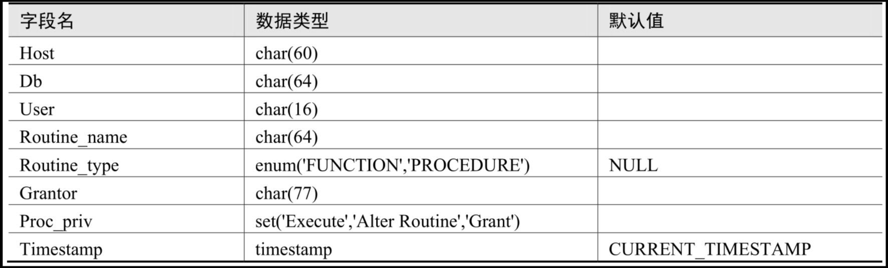
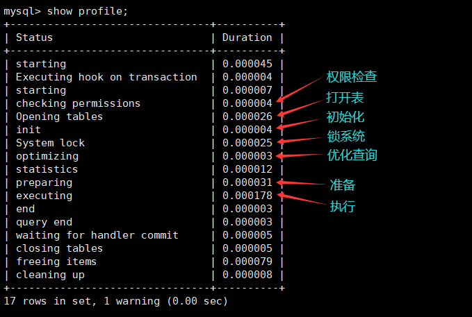
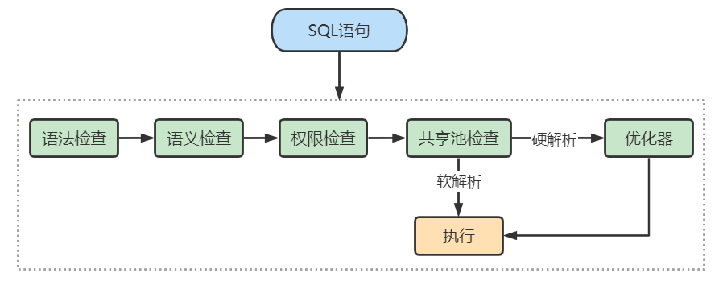

# MySQL_高级__架构篇

> 讲师：尚硅谷-宋红康（江湖人称：康师傅）
>
> 尚硅谷官网：[http://www.atguigu.com](http://www.atguigu.com/)
>
> 视频链接：https://www.bilibili.com/video/BV1iq4y1u7vj?spm_id_from=333.337.search-card.all.click

------

## 一、MySQL的数据目录

### 1 MySQL8的主要目录结构

```mysql
find / -name mysql
```

安装好MySQL 8之后，我们查看如下的目录结构：

#### 1.1 数据库文件的存放路径

**MySQL数据库文件的存放路径：/var/lib/mysql/**

```mysql
mysql> show variables like 'datadir';
+-------------------+-------------------+
| Variable_name     | Value             |
+-------------------+-------------------+
| datadir           | /var/lib/mysql/   |
+-------------------+-------------------+
1 row in set (0.04 sec)
```

从结果中可以看出，在我的计算机上MySQL的数据目录就是`/var/lib/mysql/`。


#### 1.2 相关命令目录

**相关命令目录：/usr/bin（mysqladmin、mysqlbinlog、mysqldump等命令）和/usr/sbin。**


#### 1.3 配置文件目录

**配置文件目录：/usr/share/mysql-8.0（命令及配置文件），/etc/mysql（如my.cnf）**


### 2 数据库和文件系统的关系

#### 2.1 查看默认数据库

查看一下在我的计算机上当前有哪些数据库：

```mysql
mysql> SHOW DATABASES;
```

可以看到有4个数据库是属于MySQL自带的系统数据库。

- `mysql`

  MySQL系统自带的核心数据库，它存储了MySQL的用户账户和权限信息，一些存储过程、事件的定义信息，一些运行过程中产生的日志信息，一些帮助信息以及时区信息等。

- `information_schema`

  MySQL系统自带的数据库，这个数据库保存着MySQL服务器`维护的所有其他数据库的信息`，比如有哪些表、哪些视图、哪些触发器、哪些列、哪些索引。这些信息并不是真实的用户数据，而是一些描述性信息，有时候也称之为`元数据`。在系统数据库`information_schema`中提供了一些以`innodb_sys`开头的表，用于表示内部系统表。

  ```mysql
  mysql> USE information_schema;
  Database changed
  
  mysql> SHOW TABLES LIKE 'innodb_sys%';
  +-----------------------------------------------------------+
  | Tables_in_information_schema (innodb_sys%)                |
  +-----------------------------------------------------------+
  | INNODB_SYS_DATAFILES                                      |
  | INNODB_SYS_VIRTUAL                                        |
  | INNODB_SYS_INDEXES                                        |
  | INNODB_SYS_TABLES                                         |
  | INNODB_SYS_FIELDS                                         |
  | INNODB_SYS_TABLESPACES                                    |
  | INNODB_SYS_FOREIGN_COLS                                   |
  | INNODB_SYS_COLUMNS                                        |
  | INNODB_SYS_FOREIGN                                        |
  | INNODB_SYS_TABLESTATS                                     |  
  +-----------------------------------------------------------+
  ```

- `performance_schema`

  MySQL系统自带的数据库，这个数据库里主要保存MySQL服务器运行过程中的一些状态信息，可以用来`监控 MySQL 服务的各类性能指标`。包括统计最近执行了哪些语句，在执行过程的每个阶段都花费了多长时间，内存的使用情况等信息。

- `sys`

  MySQL系统自带的数据库，这个数据库主要是通过`视图`的形式把`information_schema`和`performance_schema`结合起来，帮助系统管理员和开发人员监控 MySQL 的技术性能。


#### 2.2 数据库在文件系统中的表示

看一下我的计算机上的数据目录下的内容：


这个数据目录下的文件和子目录比较多，除了`information_schema`这个系统数据库外，其他的数据库在`数据目录`下都有对应的子目录。

以我的`dbtest1`数据库为例，在MySQL5.7中打开：


在MySQL8.0中打开：


#### 2.3 表在文件系统中的表示

##### 2.3.1 InnoDB存储引擎模式

1. **表结构**

为了保存表结构，`InnoDB`在`数据目录`下对应的数据库子目录下创建了一个专门用于`描述表结构的文件`，文件名是这样：

```
表名.frm
```

比方说我们在`atguigu`数据库下创建一个名为`test`的表：

```mysql
mysql> USE atguigu;
Database changed

mysql> CREATE TABLE test (
	-> 		c1 INT
	-> );
Query OK, 0 rows affected (0.03 sec)
```

那在数据库`atguigu`对应的子目录下就会创建一个名为`test.frm`的用于描述表结构的文件。.frm文件的格式在不同的平台上都是相同的。这个后缀名为.frm是以`二进制格式`存储的，我们直接打开是乱码的。

2. **表中数据和索引**

**1 系统表空间（system tablespace）**

默认情况下，InnoDB会在数据目录下创建一个名为`ibdata1`、大小为`12M`的文件，这个文件就是对应的`系统表空间`在文件系统上的表示。怎么才12M？注意这个文件是`自扩展文件`，当不够用的时候它会自己增加文件大小。

当然，如果你想让系统表空间对应文件系统上多个实际文件，或者仅仅觉得原来的`ibdata1`这个文件名难听，那可以在MySQL启动时配置对应的文件路径以及它们的大小，比如我们这样修改一下my.cnf配置文件：

```properties
[server]
innodb_data_file_path=data1:512M;data2:512M:autoextend
```

**2 独立表空间(file-per-table tablespace)**

在MySQL5.6.6以及之后的版本中，InnoDB并不会默认的把各个表的数据存储到系统表空间中，而是为`每一个表建立一个独立表空间`，也就是说我们创建了多少个表，就有多少个独立表空间。使用`独立表空间`来存储表数据的话，会在该表所属数据库对应的子目录下创建一个表示该独立表空间的文件，文件名和表名相同，只不过添加了一个`.ibd`的扩展名而已，所以完整的文件名称长这样：

```
表名.ibd
```

比如：我们使用了`独立表空间`去存储`atguigu`数据库下的`test`表的话，那么在该表所在数据库对应的`atguigu`目录下会为`test`表创建这两个文件：

```
test.frm
test.ibd
```

其中`test.ibd`文件就用来存储`test`表中的数据和索引。

**3 系统表空间与独立表空间的设置**

我们可以自己指定使用`系统表空间`还是`独立表空间`来存储数据，这个功能由启动参数`innodb_file_per_table`控制，比如说我们想刻意将表数据都存储到`系统表空间`时，可以在启动MySQL服务器的时候这样配置：

```properties
[server]
innodb_file_per_table=0  # 0：代表使用系统表空间； 1：代表使用独立表空间
```

默认情况：

```mysql
mysql> show variables like 'innodb_file_per_table';
+----------------------------+--------+
| Variable_name              | Value  |
+----------------------------+--------+
| innodb_file_per_table      | ON     |
+----------------------------+--------+
1 row in set (0.01 sec)
```

**4 其他类型的表空间**

随着MySQL的发展，除了上述两种老牌表空间之外，现在还新提出了一些不同类型的表空间，比如通用表空间（general tablespace）、临时表空间（temporary tablespace）等。


##### 2.3.2 MyISAM存储引擎模式

1. **表结构**

在存储表结构方面，`MyISAM`和`InnoDB`一样，也是在`数据目录`下对应的数据库子目录下创建了一个专门用于描述表结构的文件：

```
表名.frm
```

2. **表中数据和索引**

在MyISAM中的索引全部都是`二级索引`，该存储引擎的`数据和索引是分开存放`的。所以在文件系统中也是使用不同的文件来存储数据文件和索引文件，同时表数据都存放在对应的数据库子目录下。假如`test`表使用MyISAM存储引擎的话，那么在它所在数据库对应的`atguigu`目录下会为`test`表创建这三个文件：

```
test.frm 存储表结构
test.MYD 存储数据 (MYData)
test.MYI 存储索引 (MYIndex)
```

举例：创建一个`MyISAM`表，使用`ENGINE`选项显式指定引擎。因为`InnoDB`是默认引擎。

```mysql
CREATE TABLE `student_myisam` (
	`id` bigint NOT NULL AUTO_INCREMENT,
	`name` varchar(64) DEFAULT NULL,
	`age` int DEFAULT NULL,
	`sex` varchar(2) DEFAULT NULL,
	PRIMARY KEY (`id`)
) ENGINE=MYISAM AUTO_INCREMENT=0 DEFAULT CHARSET=utf8mb3;
```

#### 2.4 小结

举例：`数据库a`，`表b`。

1. 如果表b采用`InnoDB`，data/a中会产生1个或者2个文件：

   - `b.frm`：描述表结构文件，字段长度等
   - 如果采用`系统表空间`模式的，数据信息和索引信息都存储在`ibdata1`中
   - 如果采用`独立表空间`存储模式，data/a中还会产生`b.ibd`文件（存储数据信息和索引信息）

   此外：

   1. MySQL5.7中会在data/a的目录下生成`db.opt`文件用于保存数据库的相关配置。比如：字符集、比较规则。

      而MySQL8.0不再提供db.opt文件。

   2. MySQL8.0中不再单独提供b.frm，而是合并在b.ibd文件中。

2. 如果表b采用`MyISAM`，data/a中会产生3个文件：

   - MySQL5.7中：`b.frm`：描述表结构文件，字段长度等。

     MySQL8.0中：`b_xxx.sdi`：描述表结构文件，字段长度等

   - `b.MYD`(MYData)：数据信息文件，存储数据信息(如果采用独立表存储模式)

   - `b.MYI`(MYIndex)：存放索引信息文件

------

## 二、用户与权限管理

### 1 用户管理

#### 1.1 登录MySQL服务器

启动MySQL服务后，可以通过mysql命令来登录MySQL服务器，命令如下：

```
mysql –h hostname|hostIP –P port –u username –p DatabaseName –e "SQL语句"
```

下面详细介绍命令中的参数：

- `-h参数` 后面接主机名或者主机IP，hostname为主机，hostIP为主机IP。
- `-P参数` 后面接MySQL服务的端口，通过该参数连接到指定的端口。MySQL服务的默认端口是3306，不使用该参数时自动连接到3306端口，port为连接的端口号。
- `-u参数` 后面接用户名，username为用户名。
- `-p参数` 会提示输入密码。
- `DatabaseName参数` 指明登录到哪一个数据库中。如果没有该参数，就会直接登录到MySQL数据库中，然后可以使用USE命令来选择数据库。
- `-e参数` 后面可以直接加SQL语句。登录MySQL服务器以后即可执行这个SQL语句，然后退出MySQL服务器。

举例：

```
mysql -uroot -p -hlocalhost -P3306 mysql -e "select host,user from user"
```


#### 1.2 创建用户

CREATE USER语句的基本语法形式如下：

```mysql
CREATE USER 用户名 [IDENTIFIED BY '密码'][, 用户名 [IDENTIFIED BY '密码']];
```

- 用户名参数表示新建用户的账户，由`用户（User）`和`主机名（Host）`构成；
- “[]”表示可选，也就是说，可以指定用户登录时需要密码验证，也可以不指定密码验证，这样用户可以直接登录。不过，不指定密码的方式不安全，不推荐使用。如果指定密码值，这里需要使用`IDENTIFIED BY`指定明文密码值。
- `CREATE USER`语句可以同时创建多个用户。

举例：

```mysql
CREATE USER zhang3 IDENTIFIED BY '123123'; # 默认host是 %

CREATE USER 'xk'@'localhost' IDENTIFIED BY '123456';
```


#### 1.3 修改用户

修改用户名：

```mysql
UPDATE mysql.user SET `user`='li4' WHERE `user`='wang5';

FLUSH PRIVILEGES;
```


#### 1.4 删除用户

**方式1：使用DROP方式删除（推荐）**

使用DROP USER语句来删除用户时，必须用于DROP USER权限。DROP USER语句的基本语法形式如下：

```mysql
DROP USER user [ , user] … ;
```

举例：

```mysql
DROP USER li4; # 默认删除host为%的用户

DROP USER 'kangshifu'@'localhost';
```


**方式2：使用DELETE方式删除**

```mysql
DELETE FROM mysql.user WHERE `host`=’hostname’ AND `user`=’username’;
```

执行完DELETE命令后要使用FLUSH命令来使用户生效，命令如下：

```mysql
FLUSH PRIVILEGES;
```

举例：

```mysql
DELETE FROM mysql.user WHERE `host`='localhost' AND `user`='kangshifu';

FLUSH PRIVILEGES;
```

> 注意：不推荐通过`DELETE FROM USER u WHERE user='li4'`进行删除，系统会有残留信息保留。而drop user命令会删除用户以及对应的权限，执行命令后你会发现mysql.user表和mysql.db表的相应记录都消失了。

#### 1.5 设置当前用户密码

`旧的写法如下：`

```mysql
# 修改当前用户的密码：（MySQL5.7测试有效）
SET PASSWORD = PASSWORD('123456');
```

这里介绍`推荐的写法`：

1. **使用ALTER USER命令来修改当前用户密码**

   用户可以使用ALTER命令来修改自身密码，如下语句代表修改当前登录用户的密码。基本语法如下：

   ```mysql
   ALTER USER USER() IDENTIFIED BY 'new_password';
   ```

2. **使用SET语句来修改当前用户密码**

   使用root用户登录MySQL后，可以使用SET语句来修改密码，具体SQL语句如下：

   ```mysql
   SET PASSWORD = 'new_password';
   ```

   该语句会自动将密码加密后再赋给当前用户。


#### 1.6 修改其它用户密码

1. **使用ALTER语句来修改普通用户的密码**

  可以使用ALTER USER语句来修改普通用户的密码。基本语法形式如下：

  ```mysql
  ALTER USER user [IDENTIFIED BY '新密码'] [,user[IDENTIFIED BY '新密码']] … ;
  ```

2. **使用SET命令来修改普通用户的密码** 

  使用root用户登录到MySQL服务器后，可以使用SET语句来修改普通用户的密码。SET语句的代码如下：

  ```mysql
  SET PASSWORD FOR 'username'@'hostname' = 'new_password';
  ```

3. **使用UPDATE语句修改普通用户的密码（不推荐）**

  ```mysql
  UPDATE MySQL.user SET authentication_string=PASSWORD("123456")
  WHERE User = "username" AND Host = "hostname";
  ```


#### 1.7 MySQL8密码管理(了解)

1. 密码过期策略

- 在MySQL中，数据库管理员可以`手动设置`账号密码过期，也可以建立一个`自动`密码过期策略。
- 过期策略可以是`全局的`，也可以为`每个账号`设置单独的过期策略。

```mysql
ALTER USER 'username'@'hostname' PASSWORD EXPIRE;
```

练习：

```mysql
ALTER USER 'kangshifu'@'localhost' PASSWORD EXPIRE;
```

- **方式1：使用SQL语句更改该变量的值并持久化**

  ```mysql
  SET PERSIST default_password_lifetime = 180; # 建立全局策略，设置密码每隔180天过期
  ```

- **方式2：配置文件my.cnf中进行维护**

  ```mysql
  [mysqld]
  default_password_lifetime=180 #建立全局策略，设置密码每隔180天过期
  ```

**手动设置指定时间过期方式2：单独设置**

每个账号既可延用全局密码过期策略，也可单独设置策略。在`CREATE USER`和`ALTER USER`语句上加入`PASSWORD EXPIRE`选项可实现单独设置策略。下面是一些语句示例。

```mysql
#设置kangshifu账号密码每90天过期：
CREATE USER 'kangshifu'@'localhost' PASSWORD EXPIRE INTERVAL 90 DAY;
ALTER USER 'kangshifu'@'localhost' PASSWORD EXPIRE INTERVAL 90 DAY;

#设置密码永不过期：
CREATE USER 'kangshifu'@'localhost' PASSWORD EXPIRE NEVER;
ALTER USER 'kangshifu'@'localhost' PASSWORD EXPIRE NEVER;

#延用全局密码过期策略：
CREATE USER 'kangshifu'@'localhost' PASSWORD EXPIRE DEFAULT;
ALTER USER 'kangshifu'@'localhost' PASSWORD EXPIRE DEFAULT;
```


2. 密码重用策略

- **手动设置密码重用方式1：全局**

  - **方式1：使用SQL**

    ```mysql
    SET PERSIST password_history = 6; #设置不能选择最近使用过的6个密码
    
    SET PERSIST password_reuse_interval = 365; #设置不能选择最近一年内的密码
    ```

    

  - **方式2：my.cnf配置文件**

    ```
    [mysqld]
    password_history=6
    password_reuse_interval=365
    ```

- **手动设置密码重用方式2：单独设置**

  ```mysql
  #不能使用最近5个密码：
  CREATE USER 'kangshifu'@'localhost' PASSWORD HISTORY 5;
  ALTER USER 'kangshifu'@'localhost' PASSWORD HISTORY 5;
  
  #不能使用最近365天内的密码：
  CREATE USER 'kangshifu'@'localhost' PASSWORD REUSE INTERVAL 365 DAY;
  ALTER USER 'kangshifu'@'localhost' PASSWORD REUSE INTERVAL 365 DAY;
  
  #既不能使用最近5个密码，也不能使用365天内的密码
  CREATE USER 'kangshifu'@'localhost' 
  PASSWORD HISTORY 5
  PASSWORD REUSE INTERVAL 365 DAY;
  
  ALTER USER 'kangshifu'@'localhost'
  PASSWORD HISTORY 5
  PASSWORD REUSE INTERVAL 365 DAY;
  ```


### 2 权限管理

#### 2.1 权限列表

MySQL到底都有哪些权限呢？

```mysql
 show privileges;
```


- `CREATE 和 DROP 权限`:可以创建新的数据库和表，或删除（移掉）已有的数据库和表。如果将MySQL数据库中的DROP权限授予某用户，用户就可以删除MySQL访问权限保存的数据库。
- `SELECT、INSERT、UPDATE 和 DELETE 权限`:允许在一个数据库现有的表上实施操作。
- `SELECT 权限`:只有在它们真正从一个表中检索行时才被用到。
- `INDEX 权限`:允许创建或删除索引，INDEX适用于已有的表。如果具有某个表的CREATE权限，就可以在CREATE TABLE语句中包括索引定义。
- `ALTER 权限`:可以使用ALTER TABLE来更改表的结构和重新命名表。
- `CREATE ROUTINE 权限`:用来创建保存的程序（函数和程序），ALTER ROUTINE权限用来更改和删除保存的程序。
- `EXECUTE 权限`:用来执行保存的程序。
- `GRANT 权限`:允许授权给其他用户，可用于数据库、表和保存的程序。 
- `FILE 权限`:使用户可以使用LOAD DATA INFILE和SELECT ... INTO OUTFILE语句读或写服务器上的文件，任何被授予FILE权限的用户都能读或写MySQL服务器上的任何文件（说明用户可以读任何数据库目录下的文件，因为服务器可以访问这些文件）。

#### 2.2 授予权限的原则

权限控制主要是出于安全因素，因此需要遵循以下几个`经验原则`：

1. 只授予能`满足需要的最小权限`，防止用户干坏事。比如用户只是需要查询，那就只给select权限就可以了，不要给用户赋予update、insert或者delete权限。
2. 创建用户的时候`限制用户的登录主机`，一般是限制成指定IP或者内网IP段。
3. 为每个用户`设置满足密码复杂度的密码`。
4. `定期清理不需要的用户`，回收权限或者删除用户。

#### 2.3 授予权限

给用户授权的方式有 2 种，分别是通过把`角色赋予用户给用户授权`和`直接给用户授权`。用户是数据库的使用者，我们可以通过给用户授予访问数据库中资源的权限，来控制使用者对数据库的访问，消除安全隐患。

授权命令：

```mysql
GRANT 权限1,权限2,…权限n ON 数据库名称.表名称 TO 用户名@用户地址 [IDENTIFIED BY ‘密码口令’];
```

- 该权限如果发现没有该用户，则会直接新建一个用户。

- 比如：给li4用户用本地命令行方式，授予atguigudb这个库下的所有表的插删改查的权限。

  ```mysql
  GRANT SELECT,INSERT,DELETE,UPDATE ON atguigudb.* TO li4@localhost;
  ```

- 授予通过网络方式登录的joe用户，对所有库所有表的全部权限，密码设为123。注意这里唯独不包括grant的权限

  ```mysql
  GRANT ALL PRIVILEGES ON *.* TO 'joe'@'%' IDENTIFIED BY '123';
  ```

> 我们在开发应用的时候，经常会遇到一种需求，就是要根据用户的不同，对数据进行横向和纵向的分组。
>
> - 所谓横向的分组，就是指用户可以接触到的数据的范围，比如可以看到哪些表的数据；
> - 所谓纵向的分组，就是指用户对接触到的数据能访问到什么程度，比如能看、能改，甚至是删除。


#### 2.4 查看权限

**查看当前用户权限**

```mysql
SHOW GRANTS;
# 或
SHOW GRANTS FOR CURRENT_USER;
# 或
SHOW GRANTS FOR CURRENT_USER();
```

**查看某用户的全局权限**

```mysql
SHOW GRANTS FOR 'user'@'主机地址';
```


#### 2.5 收回权限

收回权限就是取消已经赋予用户的某些权限。**收回用户不必要的权限可以在一定程度上保证系统的安全性。**MySQL中使用`REVOKE语句`取消用户的某些权限。使用REVOKE收回权限之后，用户账户的记录将从db、host、tables_priv和columns_priv表中删除，但是用户账户记录仍然在user表中保存（删除user表中的账户记录使用DROP USER语句）。

**注意：在将用户账户从user表删除之前，应该收回相应用户的所有权限。**

- 收回权限命令

  ```mysql
  REVOKE 权限1,权限2,…权限n ON 数据库名称.表名称 FROM 用户名@用户地址;
  ```

- 举例

  ```mysql
  #收回全库全表的所有权限
  REVOKE ALL PRIVILEGES ON *.* FROM joe@'%';
  
  #收回mysql库下的所有表的插删改查权限
  REVOKE SELECT,INSERT,UPDATE,DELETE ON mysql.* FROM 'joe'@'localhost';
  ```

- 注意：`须用户重新登录后才能生效`


### 3 权限表

#### 3.1 user表

user表是MySQL中最重要的一个权限表，记录用户账号和权限信息，有49个字段。如下图：


这些字段可以分成4类，分别是`范围列（或用户列）`、`权限列`、`安全列`和`资源控制列`。


1. **范围列（或用户列）**

- host：表示连接类型
  - `%`:表示所有远程通过TCP方式的连接
  - `IP地址`:如(192.168.1.2、127.0.0.1)通过制定ip地址进行的TCP方式的连接
  - `机器名`:通过制定网络中的机器名进行的TCP方式的连接
  - `::1`:IPv6的本地ip地址，等同于IPv4的 127.0.0.1
  - `localhost`:本地方式通过命令行方式的连接，比如`mysql -u xxx -p xxx`方式的连接。
- user：表示用户名，同一用户通过不同方式链接的权限是不一样的。
- password：密码
  - 所有密码串通过`password(明文字符串)`生成的密文字符串。MySQL 8.0 在用户管理方面增加了角色管理，默认的密码加密方式也做了调整，由之前的`SHA1`改为了`SHA2`，不可逆。同时加上 MySQL 5.7 的禁用用户和用户过期的功能，MySQL 在用户管理方面的功能和安全性都较之前版本大大的增强了。
  - mysql 5.7 及之后版本的密码保存到`authentication_string`字段中不再使用password字段。

2. **权限列**

- `Grant_priv`字段：表示是否拥有GRANT权限
- `Shutdown_priv`字段：表示是否拥有停止MySQL服务的权限
- `Super_priv`字段：表示是否拥有超级权限
- `Execute_priv`字段：表示是否拥有EXECUTE权限。拥有EXECUTE权限，可以执行存储过程和函数。
- `Select_priv`,`Insert_priv`等：为该用户所拥有的权限。

3. **安全列**

安全列只有6个字段，其中两个是ssl相关的（ssl_type、ssl_cipher），用于`加密`；两个是x509相关的（x509_issuer、x509_subject），用于`标识用户`；另外两个Plugin字段用于`验证用户身份`的插件，该字段不能为空。如果该字段为空，服务器就使用内建授权验证机制验证用户身份。

4. **资源控制列**

资源控制列的字段用来`限制用户使用的资源`，包含4个字段，分别为：

1. `max_questions`，用户每小时允许执行的查询操作次数； 
2. `max_updates`，用户每小时允许执行的更新操作次数；
3. `max_connections`，用户每小时允许执行的连接操作次数；
4. `max_user_connections`，用户允许同时建立的连接次数。

查看字段：

```mysql
DESC mysql.user;
```

查看用户, 以列的方式显示数据：

```mysql
SELECT * FROM mysql.user \G
```

查询特定字段：

```mysql
SELECT host, `user`, authentication_string, select_priv, insert_priv, drop_priv FROM mysql.user;
```


#### 3.2 db表

使用DESCRIBE查看db表的基本结构：

```mysql
DESCRIBE mysql.db;
```

1. **用户列**

db表用户列有3个字段，分别是Host、User、Db。这3个字段分别表示主机名、用户名和数据库名。表示从某个主机连接某个用户对某个数据库的操作权限，这3个字段的组合构成了db表的主键。

2. **权限列**

Create_routine_priv和Alter_routine_priv这两个字段决定用户是否具有创建和修改存储过程的权限。


#### 3.3 tables_priv表和columns_priv表

tables_priv表用来`对表设置操作权限`，columns_priv表用来对表的`某一列设置权限`。tables_priv表和columns_priv表的结构分别如图：

```mysql
desc mysql.tables_priv;

desc mysql.columns_priv;
```

tables_priv表有8个字段，分别是Host、Db、User、Table_name、Grantor、Timestamp、Table_priv和Column_priv，各个字段说明如下：

- `Host`、`Db`、`User`和`Table_name`四个字段分别表示主机名、数据库名、用户名和表名。
- Grantor表示修改该记录的用户。
- Timestamp表示修改该记录的时间。
- `Table_priv`表示对象的操作权限。包括Select、Insert、Update、Delete、Create、Drop、Grant、References、Index和Alter。
- Column_priv字段表示对表中的列的操作权限，包括Select、Insert、Update和References。


#### 3.4 procs_priv表

procs_priv表可以对`存储过程和存储函数设置操作权限`，表结构如图：

```mysql
desc mysql.procs_priv;
```




### 4 访问控制(了解)

#### 4.1 连接核实阶段

- 当用户试图连接MySQL服务器时，服务器基于用户的身份以及用户是否能提供正确的密码验证身份来确定接受或者拒绝连接。即客户端用户会在连接请求中提供用户名、主机地址、用户密码，MySQL服务器接收到用户请求后，会**使用user表中的host、user和authentication_string这3个字段匹配客户端提供信息。**
- 服务器只有在user表记录的Host和User字段匹配客户端主机名和用户名，并且提供正确的密码时才接受连接。**如果连接核实没有通过，服务器就完全拒绝访问；否则，服务器接受连接，然后进入阶段2等待用户请求。**

#### 4.2 请求核实阶段

- 一旦建立了连接，服务器就进入了访问控制的阶段2，也就是请求核实阶段。对此连接上进来的每个请求，服务器检查该请求要执行什么操作、是否有足够的权限来执行它，这正是需要授权表中的权限列发挥作用的地方。这些权限可以来自user、db、table_priv和column_priv表。
- 确认权限时，MySQL首先`检查user表`，如果指定的权限没有在user表中被授予，那么MySQL就会继续`检查db表`，db表是下一安全层级，其中的权限限定于数据库层级，在该层级的SELECT权限允许用户查看指定数据库的所有表中的数据；如果在该层级没有找到限定的权限，则MySQL继续`检查tables_priv表`以及`columns_priv表`，如果所有权限表都检查完毕，但还是没有找到允许的权限操作，MySQL将`返回错误信息`，用户请求的操作不能执行，操作失败。

> 提示：MySQL通过向下层级的顺序（从user表到columns_priv表）检查权限表，但并不是所有的权限都要执行该过程。例如，一个用户登录到MySQL服务器之后只执行对MySQL的管理操作，此时只涉及管理权限，因此MySQL只检查user表。另外，如果请求的权限操作不被允许，MySQL也不会继续检查下一层级的表


### 5 角色管理

#### 5.1 角色的理解

引入角色的目的是`方便管理拥有相同权限的用户`。**恰当的权限设定，可以确保数据的安全性，这是至关重要的。**


#### 5.2 创建角色

创建角色使用`CREATE ROLE`语句，语法如下：

```mysql
CREATE ROLE 'role_name'[@'host_name'] [,'role_name'[@'host_name']] ...
```

角色名称的命名规则和用户名类似。如果`host_name省略，默认为%，role_name不可省略，不可为空`。

练习：我们现在需要创建一个经理的角色，就可以用下面的代码：

```mysql
CREATE ROLE 'manager'@'localhost';
```

#### 5.3 给角色赋予权限

创建角色之后，默认这个角色是没有任何权限的，我们需要给角色授权。给角色授权的语法结构是：

```mysql
GRANT privileges ON table_name TO 'role_name'[@'host_name'];
```

上述语句中privileges代表权限的名称，多个权限以逗号隔开。可使用SHOW语句查询权限名称，下图列出了部分权限列表。

```mysql
SHOW PRIVILEGES\G;
```


**练习：我们现在想给经理角色授予商品信息表、盘点表和应付账款表的只读权限，就可以用下面的代码来实现：**

```mysql
GRANT SELECT ON demo.settlement TO 'manager';
GRANT SELECT ON demo.goodsmaster TO 'manager';
GRANT SELECT ON demo.invcount TO 'manager';
```

#### 5.4 查看角色的权限

赋予角色权限之后，我们可以通过 SHOW GRANTS 语句，来查看权限是否创建成功了：

```mysql
mysql> SHOW GRANTS FOR 'manager';
+---------------------------------------------------------------------------------+
| Grants for manager@%                                                            |
+---------------------------------------------------------------------------------+
| GRANT USAGE ON *.* TO `manager`@`%`                                             |
| GRANT SELECT ON `demo`.`goodsmaster` TO `manager`@`%`                           |
| GRANT SELECT ON `demo`.`invcount` TO `manager`@`%`                              |
| GRANT SELECT ON `demo`.`settlement` TO `manager`@`%`                            |
+---------------------------------------------------------------------------------+

```

只要你创建了一个角色，系统就会自动给你一个“`USAGE`”权限，意思是`连接登录数据库的权限`。代码的最后三行代表了我们给角色“manager”赋予的权限，也就是对商品信息表、盘点表和应付账款表的只读权限。

结果显示，库管角色拥有商品信息表的只读权限和盘点表的增删改查权限。

#### 5.5 回收角色的权限

角色授权后，可以对角色的权限进行维护，对权限进行添加或撤销。添加权限使用GRANT语句，与角色授权相同。撤销角色或角色权限使用REVOKE语句。

修改了角色的权限，会影响拥有该角色的账户的权限。

撤销角色权限的SQL语法如下：

```mysql
REVOKE privileges ON tablename FROM 'rolename';
```

练习：撤销school_write角色的权限。 

1. 使用如下语句撤销school_write角色的权限。

   ```mysql
   REVOKE INSERT, UPDATE, DELETE ON school.* FROM 'school_write';
   ```

2. 撤销后使用SHOW语句查看school_write对应的权限，语句如下。

   ```mysql
   SHOW GRANTS FOR 'school_write';
   ```

#### 5.6 删除角色

当我们需要对业务重新整合的时候，可能就需要对之前创建的角色进行清理，删除一些不会再使用的角色。删除角色的操作很简单，你只要掌握语法结构就行了。

```mysql
DROP ROLE role [, role2]...
```

注意，`如果你删除了角色，那么用户也就失去了通过这个角色所获得的所有权限`。

练习：执行如下SQL删除角色school_read。

```mysql
DROP ROLE 'school_read';
```

#### 5.7 给用户赋予角色

角色创建并授权后，要赋给用户并处于`激活状态`才能发挥作用。给用户添加角色可使用GRANT语句，语法形式如下：

```mysql
GRANT role [,role2,...] TO `user` [,`user2`,...];
```

在上述语句中，role代表角色，user代表用户。可将多个角色同时赋予多个用户，用逗号隔开即可。

练习：给kangshifu用户添加角色school_read权限。

1. 使用GRANT语句给kangshifu添加school_read权限，SQL语句如下。

   ```mysql
   GRANT 'school_read' TO 'kangshifu'@'localhost';
   ```

2. 添加完成后使用SHOW语句查看是否添加成功，SQL语句如下。

   ```mysql
   SHOW GRANTS FOR 'kangshifu'@'localhost';
   ```

3. 使用kangshifu用户登录，然后查询当前角色，如果角色未激活，结果将显示NONE。SQL语句如下。

   ```mysql
   SELECT CURRENT_ROLE();
   ```

   

#### 5.8 激活角色

**方式1：使用set default role 命令激活角色**

举例：

```mysql
SET DEFAULT ROLE ALL TO 'kangshifu'@'localhost';
```

举例：使用`SET DEFAULT ROLE`为下面4个用户默认激活所有已拥有的角色如下：

```mysql
SET DEFAULT ROLE ALL TO
	'dev1'@'localhost',
	'read_user1'@'localhost',
	'read_user2'@'localhost',
	'rw_user1'@'%';
```

**方式2：将activate_all_roles_on_login设置为ON**

默认情况：

```mysql
mysql> show variables like 'activate_all_roles_on_login';
+-----------------------------------+-------+
| Variable_name                   | Value |
+-----------------------------------+-------+
| activate_all_roles_on_login | OFF   |
+-----------------------------------+-------+
1 row in set (0.00 sec)
```

设置：

```mysql
SET GLOBAL activate_all_roles_on_login=ON;
```

这条SQL语句的意思是，对`所有角色永久激活`。运行这条语句之后，用户才真正拥有了赋予角色的所有权限。

#### 5.9 撤销用户的角色

撤销用户角色的SQL语法如下：

```mysql
REVOKE role FROM user;
```

练习：撤销kangshifu用户的school_read角色。

1. 撤销的SQL语句如下

```mysql
REVOKE 'school_read' FROM 'kangshifu'@'localhost';
```

2. 撤销后，执行如下查询语句，查看kangshifu用户的角色信息

```mysql
SHOW GRANTS FOR 'kangshifu'@'localhost';
```

执行发现，用户kangshifu之前的school_read角色已被撤销。

#### 5.10 设置强制角色(mandatory role)

**方式1：服务启动前设置**

```
[mysqld]
mandatory_roles='role1,role2@localhost,r3@%.atguigu.com'
```

**方式2：运行时设置**

```mysql
SET PERSIST mandatory_roles = 'role1,role2@localhost,r3@%.example.com'; #系统重启后仍然有效

SET GLOBAL mandatory_roles = 'role1,role2@localhost,r3@%.example.com'; #系统重启后失效
```

------

## 三、逻辑架构

### 1 逻辑架构剖析

#### 1.1 服务器处理客户端请求

首先MySQL是典型的C/S架构，即`Clinet/Server 架构`，服务端程序使用的mysqld。

不论客户端进程和服务器进程是采用哪种方式进行通信，最后实现的效果是：**客户端进程向服务器进程发送一段文本（SQL语句），服务器进程处理后再向客户端进程发送一段文本（处理结果）**。

那服务器进程对客户端进程发送的请求做了什么处理，才能产生最后的处理结果呢？这里以查询请求为例展示：


下面具体展开看一下：


#### 1.2 Connectors

Connectors，指的是不同语言中与SQL的交互。MySQL首先是一个网络程序，在TCP之上定义了自己的应用层协议。所以要使用MySQL，我们可以编写代码，跟MySQL Server`建立TCP连接`，之后按照其定义好的协议进行交互。或者比较方便的方法是调用SDK，比如Native C API、JDBC、PHP等各语言MySQL Connecotr，或者通过ODBC。但**通过SDK来访问MySQL，本质上还是在TCP连接上通过MySQL协议跟MySQL进行交互**。

**接下来的MySQL Server结构可以分为如下三层**：


#### 1.3 第1层：连接层

系统（客户端）访问`MySQL`服务器前，做的第一件事就是建立`TCP`连接。

经过三次握手建立连接成功后，`MySQL`服务器对`TCP`传输过来的账号密码做身份认证、权限获取。

- **用户名或密码不对，会收到一个`Access denied for user`错误，客户端程序结束执行**
- **用户名密码认证通过，会从权限表查出账号拥有的权限与连接关联，之后的权限判断逻辑，都将依赖于此时读到的权限**

`TCP`连接收到请求后，必须要分配给一个线程专门与这个客户端的交互。所以还会有个线程池，去走后面的流程。每一个连接从线程池中获取线程，省去了创建和销毁线程的开销。

所以**连接管理**的职责是负责认证、管理连接、获取权限信息。


#### 1.4 第2层：服务层

第二层架构主要完成大多数的核心服务功能，如SQL接口，并完成`缓存的查询`，SQL的分析和优化及部分内置函数的执行。所有跨存储引擎的功能也在这一层实现，如过程、函数等。

在该层，服务器会`解析查询`并创建相应的内部`解析树`，并对其完成相应的`优化`：如确定查询表的顺序，是否利用索引等，最后生成相应的执行操作。

如果是SELECT语句，服务器还会`查询内部的缓存`。如果缓存空间足够大，这样在解决大量读操作的环境中能够很好的提升系统的性能。

- **SQL Interface: SQL接口**

  - 接收用户的SQL命令，并且返回用户需要查询的结果。比如`SELECT ... FROM`就是调用SQL Interface
  - MySQL支持DML（数据操作语言）、DDL（数据定义语言）、存储过程、视图、触发器、自定义函数等多种SQL语言接口

- **Parser: 解析器**

  - 在解析器中对`SQL`语句进行语法分析、语义分析。将SQL语句分解成数据结构，并将这个结构传递到后续步骤，以后SQL语句的传递和处理就是基于这个结构的。如果在分解构成中遇到错误，那么就说明这个SQL语句是不合理的。
  - 在SQL命令传递到解析器的时候会被解析器验证和解析，并为其创建`语法树`，并根据数据字典丰富查询语法树，会`验证该客户端是否具有执行该查询的权限`。创建好语法树后，MySQL还会对SQL查询进行语法上的优化，进行查询重写。

- **Optimizer: 查询优化器**

  - SQL语句在语法解析之后、查询之前会使用查询优化器确定 SQL 语句的执行路径，生成一个`执行计划`。

  - 这个执行计划表明应该`使用哪些索引`进行查询（全表检索还是使用索引检索），表之间的连接顺序如何，最后会按照执行计划中的步骤调用存储引擎提供的方法来真正的执行查询，并将查询结果返回给用户。

  - 它使用“`选取-投影-连接`”策略进行查询。例如：

    ```mysql
    SELECT id, name FROM student WHERE gender = '女';
    ```

    这个SELECT查询先根据WHERE语句进行`选取`，而不是将表全部查询出来以后再进行gender过滤。这个SELECT查询先根据id和name进行属性`投影`，而不是将属性全部取出以后再进行过滤，将这两个查询条件`连接`起来生成最终查询结果。

  - **Caches & Buffers： 查询缓存组件**

    - MySQL内部维持着一些Cache和Buffer，比如Query Cache用来缓存一条SELECT语句的执行结果，如果能够在其中找到对应的查询结果，那么就不必再进行查询解析、优化和执行的整个过程了，直接将结果反馈给客户端。
    - 这个缓存机制是由一系列小缓存组成的。比如表缓存，记录缓存，key缓存，权限缓存等。
    - 这个查询缓存可以在`不同客户端之间共享`。
    - 从MySQL 5.7.20开始，不推荐使用查询缓存，并在`MySQL 8.0中删除`。

  > 小故事：如果我问你9+8×16-3×2×17的值是多少，你可能会用计算器去算一下，最终结果35。如果再问你一遍9+8×16-3×2×17的值是多少，你还用再傻呵呵的再算一遍吗？我们刚刚已经算过了，直接说答案就好了。


#### 1.5 第3层：引擎层

插件式存储引擎层（Storage Engines），**真正的负责了MySQL中数据的存储和提取，对物理服务器级别维护的底层数据执行操作**，服务器通过API与存储引擎进行通信。不同的存储引擎具有的功能不同，这样我们可以根据自己的实际需要进行选取。

MySQL 8.0.25默认支持的存储引擎如下：


#### 1.6 存储层

所有的数据，数据库、表的定义，表的每一行的内容，索引，都是存在`文件系统`上，以`文件`的方式存在的，并完成与存储引擎的交互。当然有些存储引擎比如InnoDB，也支持不使用文件系统直接管理裸设备，但现代文件系统的实现使得这样做没有必要了。在文件系统之下，可以使用本地磁盘，可以使用DAS、NAS、SAN等各种存储系统。


#### 1.7 小结

MySQL架构图本节开篇所示。下面为了熟悉SQL执行流程方便，我们可以简化如下：


简化为三层结构：

1. 连接层：客户端和服务器端建立连接，客户端发送SQL至服务器端；
2. SQL层（服务层）：对SQL语句进行查询处理；与数据库文件的存储方式无关；
3. 存储引擎层：与数据库文件打交道，负责数据的存储和读取。


### 2 SQL执行流程

#### 2.1 MySQL中的SQL执行流程


**MySQL的查询流程：**

1. **查询缓存**：Server如果在查询缓存中发现了这条SQL语句，就会直接将结果返回给客户端；如果没有，就进入到解析器阶段。需要说明的是，因为查询缓存往往效率不高，所以在MySQL8.0之后就抛弃了这个功能。

  大多数情况查询缓存就是个鸡肋，为什么呢？

  ```mysql
  SELECT employee_id,last_name FROM employees WHERE employee_id = 101;
  ```

查询缓存是提前把查询结果缓存起来，这样下次不需要执行就可以直接拿到结果。需要说明的是，在MySQL中的查询缓存，不是缓存查询计划，而是查询对应的结果。这就意味着查询匹配的`鲁棒性大大降低`，只有`相同的查询操作才会命中查询缓存`。两个查询请求在任何字符上的不同（例如：空格、注释、大小写），都会导致缓存不会命中。因此MySQL的`查询缓存命中率不高`。

同时，如果查询请求中包含某些系统函数、用户自定义变量和函数、一些系统表，如mysql、information_schema、performance_schema数据库中的表，那这个请求就不会被缓存。以某些系统函数举例，可能同样的函数的两次调用会产生不一样的结果，比如函数`NOW()`，每次调用都会产生最新的当前时间，如果在一个查询请求中调用了这个函数，那即使查询请求的文本信息都一样，那不同时间的两次查询也应该得到不同的结果，如果在第一次查询时就缓存了，那第二次查询的时候直接使用第一次查询的结果就是错误的！

此外，既然是缓存，那就有它`缓存失效的时候`。MySQL的缓存系统会监测涉及到的每张表，只要该表的结构或者数据被修改，如对该表使用了`INSERT`、`UPDATE`、`DELETE`、`TRUNCATE TABLE`、`ALTER
  TABLE`、`DROP TABLE`或`DROP DATABASE`语句，那使用该表的所有高速缓存查询都将变为无效并从高速缓存中删除！对于`更新压力大的数据库`来说，查询缓存的命中率会非常低。


2. **解析器**：在解析器中对SQL语句进行语法分析、语义分析。

   

   如果没有命中查询缓存，就要开始真正执行语句了。首先，MySQL需要知道你要做什么，因此需要对SQL语句做解析。SQL语句的分析分为词法分析与语法分析。

   解析器先做“`词法分析`”。你输入的是由多个字符串和空格组成的一条SQL语句，MySQL需要识别出里面的字符串分别是什么，代表什么。MySQL从你输入的"select"这个关键字识别出来，这是一个查询语句。它也要把字符串“T”识别成“表名 T”，把字符串“ID”识别成“列 ID”。

   接着，要做“`语法分析`”。根据词法分析的结果，语法分析器（比如：Bison）会根据语法规则，判断你输入的这个 SQL 语句是否`满足MySQL语法`。
   
   ```mysql
   select department_id, job_id, avg(salary) from employees group by department_id;
   ```

   如果SQL语句正确，则会生成一个这样的语法树：
   
   
   
   下图是SQL分词分析的过程步骤:
   
   
   
   至此解析器的工作任务也基本圆满了。


3. **优化器**：在优化器中会确定SQL语句的执行路径，比如是根据`全表检索`，还是根据`索引检索`等。

   经过解释器，MySQL就知道你要做什么了。在开始执行之前，还要先经过优化器的处理。**一条查询可以有很多种执行方式，最后都返回相同的结果。优化器的作用就是找到这其中最好的执行计划**。

   比如：优化器是在表里面有多个索引的时候，决定使用哪个索引；或者在一个语句有多表关联 (join) 的时候，决定各个表的连接顺序，还有表达式简化、子查询转为连接、外连接转为内连接等。
   
   举例：如下语句是执行两个表的join：
   
   ```mysql
   select 
   	* 
   from 
   	test1 
   join 
   	test2 using(ID)
   where
   	test1.name='zhangwei' and test2.name='mysql高级课程';
   ```
   
   ```
   方案1：可以先从表 test1 里面取出 name='zhangwei'的记录的 ID 值，再根据 ID 值关联到表 test2，再判断 test2 里面 name的值是否等于 'mysql高级课程'。
   
   方案2：可以先从表 test2 里面取出 name='mysql高级课程' 的记录的 ID 值，再根据 ID 值关联到 test1，再判断 test1 里面 name的值是否等于 zhangwei。
   
   这两种执行方法的逻辑结果是一样的，但是执行的效率会有不同，而优化器的作用就是决定选择使用哪一个方案。优化器阶段完成后，这个语句的执行方案就确定下来了，然后进入执行器阶段。
   
   如果你还有一些疑问，比如优化器是怎么选择索引的，有没有可能选择错等。后面讲到索引我们再谈。
   ```
   
   在查询优化器中，可以分为`逻辑查询`优化阶段和`物理查询`优化阶段。
   
   逻辑查询优化就是通过改变SQL语句的内容来使得SQL查询更高效，同时为物理查询优化提供更多的候选执行计划。通常采用的方式是对SQL语句进行`等价变换`，对查询进行`重写`，而查询重写的数学基础就是关系代数。对条件表达式进行等价谓词重写、条件简化，对视图进行重写，对子查询进行优化，对连接语义进行了外连接消除、嵌套连接消除等。
   
   物理查询优化是基于关系代数进行的查询重写，而关系代数的每一步都对应着物理计算，这些物理计算往往存在多种算法，因此需要计算各种物理路径的代价，从中选择代价最小的作为执行计划。在这个阶段里，对于单表和多表连接的操作，需要高效地`使用索引`，提升查询效率。


4. **执行器**：

   截止到现在，还没有真正去读写真实的表，仅仅只是产出了一个执行计划。于是就进入了`执行器阶段`。

   

   在执行之前需要判断该用户是否`具备权限`。如果没有，就会返回权限错误。如果具备权限，就执行SQL查询并返回结果。在MySQL8.0以下的版本，如果设置了查询缓存，这时会将查询结果进行缓存。

   ```mysql
   select * from test where id=1;
   ```

   比如：表test中，ID字段没有索引，那么执行器的执行流程是这样的：

   ```
   调用 InnoDB 引擎接口取这个表的第一行，判断 ID 值是不是1，如果不是则跳过，如果是则将这行存在结果集中；
   调用引擎接口取“下一行”，重复相同的判断逻辑，直到取到这个表的最后一行。
   
   执行器将上述遍历过程中所有满足条件的行组成的记录集作为结果集返回给客户端。
   ```

   至此，这个语句就执行完成了。对于有索引的表，执行的逻辑也差不多。


SQL语句在MySQL中的流程是：`SQL语句→查询缓存→解析器→优化器→执行器`。


#### 2.2 MySQL8中SQL执行原理

1. **确认 profiling 是否开启**

了解查询语句底层执行的过程：`select @profiling`或者`show variables like '%profiling'`查看是否开启计划。开启它可以让MySQL收集在SQL

执行时所使用的资源情况，命令如下：

```mysql
mysql> select @@profiling;

mysql> show variables like 'profiling';
```


profiling=0代表关闭，我们需要把 profiling 打开，即设置为 1：

```mysql
set profiling=1;
```


2. **多次执行相同SQL查询**

然后我们执行一个 SQL 查询（你可以执行任何一个 SQL 查询）：

```mysql
select * from employees;
```


3. **查看profiles**

查看当前会话所产生的所有 profiles：

```mysql
show profiles; # 显示最近的几次查询
```


4. **查看profile**

显示执行计划，查看程序的执行步骤：

```mysql
show profile;
```



当然你也可以查询指定的 Query ID，比如：

```mysql
show profile for query 7;
```

查询 SQL 的执行时间结果和上面是一样的。

此外，还可以查询更丰富的内容：

```mysql
show profile cpu, block io for query 6;
```


继续：

```mysql
 show profile cpu,block io for query 7;
```


1、除了查看cpu、io阻塞等参数情况，还可以查询下列参数的利用情况。

```mysql
Syntax:
SHOW PROFILE [type [, type] ... ]
	[FOR QUERY n]
	[LIMIT row_count [OFFSET offset]]

type: {
	| ALL -- 显示所有参数的开销信息
	| BLOCK IO -- 显示IO的相关开销
	| CONTEXT SWITCHES -- 上下文切换相关开销
	| CPU -- 显示CPU相关开销信息
	| IPC -- 显示发送和接收相关开销信息
	| MEMORY -- 显示内存相关开销信息
	| PAGE FAULTS -- 显示页面错误相关开销信息
	| SOURCE -- 显示和Source_function,Source_file,Source_line 相关的开销信息
	| SWAPS -- 显示交换次数相关的开销信息
}
```

2、发现两次查询当前情况都一致，说明没有缓存。

`在 8.0 版本之后，MySQL 不再支持缓存的查询`。一旦数据表有更新，缓存都将清空，因此只有数据表是静态的时候，或者数据表很少发生变化时，使用缓存查询才有价值，否则如果数据表经常更新，反而增加了 SQL 的查询时间。


#### 2.3 MySQL5.7中SQL执行原理

上述操作在MySQL5.7中测试，发现前后两次相同的sql语句，执行的查询过程仍然是相同的。不是会使用缓存吗？这里我们需要`显式开启查询缓存模式`。在MySQL5.7中如下设置：

1. 配置文件中开启查询缓存

   在 /etc/my.cnf 中新增一行：

   ```properties
   query_cache_type=1
   ```

2. 重启mysql服务

   ```mysql
   systemctl restart mysqld
   ```

3. 开启查询执行计划

   由于重启过服务，需要重新执行如下指令，开启profiling。

   ```mysql
    set profiling=1;
   ```

4. 执行语句两次：

   ```mysql
   mysql> select * from locations;
   
   mysql> select * from locations;
   ```

5. 查看profiles

   

6. 查看profile

   显示执行计划，查看程序的执行步骤：

   ```mysql
   mysql> show profile for query 1;
   ```

   

   ```mysql
   mysql> show profile for query 2;
   ```

   

   结论不言而喻。执行编号2时，比执行编号1时少了很多信息，从截图中可以看出查询语句直接从缓存中获取数据。


#### 2.4 SQL语法顺序

随着Mysql版本的更新换代，其优化器也在不断的升级，优化器会分析不同执行顺序产生的性能消耗不同而动态调整执行顺序。

需求：查询每个部门年龄高于20岁的人数且高于20岁人数不能少于2人，显示人数最多的第一名部门信息

下面是经常出现的查询顺序：


#### 2.5 Oracle中的SQL执行流程

Oracle中采用了`共享池`来判断SQL语句是否存在缓存和执行计划，通过这一步骤我们可以知道应该采用硬解析还是软解析。

我们先来看下 SQL 在 Oracle 中的执行过程：



从上面这张图中可以看出，SQL 语句在 Oracle 中经历了以下的几个步骤。

1. **语法检查**：检查 SQL 拼写是否正确，如果不正确，Oracle 会报语法错误。

2. **语义检查**：检查 SQL 中的访问对象是否存在。比如我们在写 SELECT 语句的时候，列名写错了，系统就会提示错误。语法检查和语义检查的作用是保证 SQL 语句没有错误。

3. **权限检查**：看用户是否具备访问该数据的权限。

4. **共享池检查**：共享池（Shared Pool）是一块内存池，**最主要的作用是缓存 SQL 语句和该语句的执行计划**。Oracle通过检查共享池是否存在SQL语句的执行计划，来判断进行软解析，还是硬解析。

   那软解析和硬解析又该怎么理解呢？

   在共享池中，Oracle首先对SQL语句进行`Hash运算`，然后根据Hash值在库缓存（Library Cache）中查找，如果`存在 SQL 语句的执行计划`，就直接拿来执行，直接进入“执行器”的环节，这就是`软解析`。

   如果没有找到SQL语句和执行计划，Oracle就需要创建解析树进行解析，生成执行计划，进入“优化器”这个步骤，这就是`硬解析`。

5. **优化器**：优化器中就是要进行硬解析，也就是决定怎么做，比如创建解析树，生成执行计划。

6. **执行器**：当有了解析树和执行计划之后，就知道了SQL该怎么被执行，这样就可以在执行器中执行语句了。

共享池是 Oracle 中的术语，包括了库缓存，数据字典缓冲区等。我们上面已经讲到了库缓存区，它主要缓存 SQL 语句和执行计划。而`数据字典缓冲区`存储的是 Oracle 中的对象定义，比如表、视图、索引等对象。当对 SQL 语句进行解析的时候，如果需要相关的数据，会从数据字典缓冲区中提取。

`库缓存`这一个步骤，决定了 SQL 语句是否需要进行硬解析。为了提升 SQL 的执行效率，我们应该尽量避免硬解析，因为在 SQL 的执行过程中，创建解析树，生成执行计划是很消耗资源的。

你可能会问，如何避免硬解析，尽量使用软解析呢？在 Oracle 中，`绑定变量`是它的一大特色。绑定变量就是在 SQL 语句中使用变量，通过不同的变量取值来改变SQL的执行结果。这样做的好处是能`提升软解析的可能性`，不足之处在于可能会导致生成的执行计划不够优化，因此是否需要绑定变量还需要视情况而定。

举个例子，我们可以使用下面的查询语句：

```sql
select * from player where player_id = 10001;
```

你也可以使用绑定变量，如：

```sql
select * from player where player_id = :player_id;
```

这两个查询语句的效率在 Oracle 中是完全不同的。如果你在查询 player_id = 10001 之后，还会查询 10002、10003 之类的数据，那么每一次查询都会创建一个新的查询解析。而第二种方式使用了绑定变量，那么在第一次查询之后，在共享池中就会存在这类查询的执行计划，也就是软解析。

因此，**我们可以通过使用绑定变量来减少硬解析，减少 Oracle 的解析工作量**。但是这种方式也有缺点，使用动态 SQL 的方式，因为参数不同，会导致 SQL 的执行效率不同，同时 SQL 优化也会比较困难。


**Oracle的架构图：**


**简图：**


> 小结：Oracle 和 MySQL 在进行 SQL 的查询上面有软件实现层面的差异。Oracle 提出了共享池的概念，通过共享池来判断是进行软解析，还是硬解析。


### 3 数据库缓冲池(buffer pool)

`InnoDB`存储引擎是以页为单位来管理存储空间的，我们进行的增删改查操作其实本质上都是在访问页面（包括读页面、写页面、创建新页面等操作）。而磁盘 I/O 需要消耗的时间很多，而在内存中进行操作，效率则会高很多，为了能让数据表或者索引中的数据随时被我们所用，DBMS 会**申请占用内存来作为数据缓冲池**，在真正访问页面之前，需要把在磁盘上的页缓存到内存中的`Buffer Pool`之后才可以访问。

这样做的好处是可以让磁盘活动最小化，从而`减少与磁盘直接进行 I/O 的时间`。要知道，这种策略对提升 SQL 语句的查询性能来说至关重要。如果索引的数据在缓冲池里，那么访问的成本就会降低很多。


#### 3.1 缓冲池 VS 查询缓存

**缓冲池和查询缓存是一个东西吗？不是。**

1. **缓冲池（Buffer Pool）**

首先我们需要了解在 InnoDB 存储引擎中，缓冲池都包括了哪些。

在 InnoDB 存储引擎中有一部分数据会放到内存中，缓冲池则占了这部分内存的大部分，它用来存储各种数据的缓存，如下图所示：


从图中，你能看到 InnoDB 缓冲池包括了数据页、索引页、插入缓冲、锁信息、自适应 Hash 和数据字典信息等。

**缓存池的重要性：**

对于使用`InnoDB`作为存储弓擎的表来说，不管是用于存储用户数据的索引(包括聚簇索引和二级索引)，还是各种系统数据，都是以`页`的形式存放在`表空间`中的，而所谓的表空间只不过是InnoDB对文件系统上一个或几个实际文件的抽象，也就是说我们的数据说到底还是存储在磁盘上的。但是各位也都知道，磁盘的速度慢的跟乌龟一样，怎么能配得上“`快如风，疾如电”的CPU呢`？这里，缓冲池可以帮助我们消除CPU和磁盘之间的`鸿沟`。所以InnoDB存储引擎在处理客户端的请求时，当需要访问某个页的数据时，就会把`完整的页的数据全部加载到内存`中，也就是说即使我们只需要访问一个页的一条记录，那也需要先把整个页的数据加载到内存中。将整个页加载到内存中后就可以进行读写访问了，在进行完读写访问之后并不着急把该页对应的内存空间释放掉，而是将其`缓存`起来，这样将来有请求再次访问该页面时，就可以`省去磁盘IO`的开销了。

**缓存原则：**

“`位置 * 频次`”这个原则，可以帮我们对 I/O 访问效率进行优化。

首先，位置决定效率，提供缓冲池就是为了在内存中可以直接访问数据。

其次，频次决定优先级顺序。因为缓冲池的大小是有限的，比如磁盘有200G，但是内存只有16G，缓冲池大小只有1G，就无法将所有数据都加载到缓冲池里，这时就涉及到优先级顺序，会`优先对使用频次高的热数据进行加载`。

**缓冲池的预读特性：**

了解了缓冲池的作用之后，我们还需要了解缓冲池的另一个特性：`预读`。

缓冲池的作用就是提升I/0效率，而我们进行读取数据的时候存在一个“局部性原理”，也就是说我们使用了一些数据，`大概率还会使用它周围的一些数据`，因此采用“预读”的机制提前加载，可以减少未来可能的磁盘I/0操作。


2. **查询缓存**

那么什么是查询缓存呢？

查询缓存是提前把`查询结果缓存`起来，这样下次不需要执行就可以直接拿到结果。需要说明的是，在MySQL中的查询缓存，不是缓存查询计划，而是查询对应的结果。因为命中条件苛刻，而且只要数据表发生变化，查询缓存就会失效，因此命中率低。

缓冲池服务于数据库整体的IO操作，它们的共同点都是通过缓存的机制来提升效率。


#### 3.2 缓冲池如何读取数据

缓冲池管理器会尽量将经常使用的数据保存起来，在数据库进行页面读操作的时候，首先会判断该页面是否在缓冲池中，如果存在就直接读取，如果不存在，就会通过内存或磁盘将页面存放到缓冲池中再进行读取。

缓存在数据库中的结构和作用如下图所示：


**如果我们执行 SQL 语句的时候更新了缓存池中的数据，那么这些数据会马上同步到磁盘上吗？**

实际上，当我们对数据库中的记录进行修改的时候，首先会修改缓冲池中页里面的记录信息，然后数据库会`以一定的频率刷新`到磁盘上。注意并不是每次发生更新操作，都会立刻进行磁盘回写。缓冲池会采用一种叫做`checkpoint 的机制`将数据回写到磁盘上，这样做的好处就是提升了数据库的整体性能。

比如，当`缓冲池不够用`时，需要释放掉一些不常用的页， 此时就可以强行采用 checkpoint 的方式，将不常用的脏页回写到磁盘上，然后再从缓冲池中将这些页释放掉。这里脏页(dirty page)指的是缓冲池中被修改过的页，与磁盘上的数据页不一致。


#### 3.3 查看/设置缓冲池的大小

如果你使用的是MySQL MyISAM存储引擎，它只缓存索引，不缓存数据，对应的键缓存参数为`key_buffer_size`，你可以用它进行查看。

如果你使用的是InnoDB存储引擎，可以通过查看`innodb_buffer_pool_size`变量来查看缓冲池的大小。命令如下：

```mysql
show variables like 'innodb_buffer_pool_size';
```


你能看到此时InnoDB的缓冲池大小只有 134217728/1024/1024=128MB。我们可以修改缓冲池大小，比如改为256MB，方法如下：

```mysql
set global innodb_buffer_pool_size = 268435456;
```


或者：

```mysql
[server]
innodb_buffer_pool_size = 268435456
```

然后再来看下修改后的缓冲池大小，此时已成功修改成了 256 MB：


#### 3.4 多个Buffer Pool实例

Buffer Pool本质是InnoDB向操作系统申请的一块连续的内存空间，在多线程环境下，访问Buffer Pool中的数据都需要`加锁`处理。在Buffer Pool特别大而且多线程并发访问特别高的情况下，单一的Buffer Pool可能会影响请求的处理速度。所以在Buffer Pool特别大的时候，我们可以把它们`拆分成若千个小的Buffer Pool`，每个Buffer Pool都称为一个`实例`，它们都是独立的，独立的去申请内存空间，独立的管理各种链表。所以在多线程并发访问时并不会相互影响，从而提高并发处理能力。

我们可以在服务器启动的时候通过设置`innodb_buffer_pool_instances`的值来修改Buffer Pool实例的个数，比方说这样:

```mysql
[server]
innodb_buffer_pool_instances = 2
```

这样就表明我们要创建2个`Buffer Pool`实例。 

我们看下如何查看缓冲池的个数，使用命令：

```mysql
show variables like 'innodb_buffer_pool_instances';
```


那每个`Buffer Pool`实例实际占多少内存空间呢？其实使用这个公式算出来的：

```
innodb_buffer_pool_size/innodb_buffer_pool_instances
```

也就是总共的大小除以实例的个数，结果就是每个`Buffer Pool`实例占用的大小。

不过也不是说Buffer Pool实例创建的越多越好，分别`管理各个Buffer Pool也是需要性能开销`的，InnoDB规定:当
`innodb_buffer_pool_size`的值小于1G的时候设置多个实例是无效的，InnoDB会默认把
innodb_buffer_pool_instances 的值修改为1。而我们鼓励在Buffer Pool大于或等于1G的时候设置多个Buffer Pool实例。


#### 3.5 引申问题

Buffer Pool是MySQL内存结构中十分核心的一个组成，你可以先把它想象成一个黑盒子。

**黑盒下的更新数据流程**

当我们查询数据的时候，会先去Buffer Pool中查询。如果Buffer Pool中不存在，存储引擎会先将数据从磁盘加载到Buffer Pool中，然后将数据返回给客户端；同理，当我们更新某个数据的时候，如果这个数据不存在于Buffer Pool，同样会先数据加载进来，然后修改修改内存的数据。被修改过的数据会在之后统一一刷入磁盘。


这个过程看似没啥问题，实则是有问题的。假设我们修改Buffer Pool中的数据成功，但是还没来得及将数据刷入磁盘MySQL就挂了怎么办?按照上图的逻辑，此时更新之后的数据只存在于Buffer Pool中，如果此时MySQL宕机了，这部分数据将会永久地丢失;

我更新到一半突然发生错误了，想要回滚到更新之前的版本，该怎么办？连数据持久化的保证、事务回滚都做不到还谈什么崩溃恢复？

答案：**Redo Log & Undo Log**

------

## 四、存储引擎

为了管理方便，人们把`连接管理`、`查询缓存`、`语法解析`、`查询优化`这些并不涉及真实数据存储的功能划分为`MySQL server`的功能，把真实存取数据的功能划分为`存储引擎`的功能。所以在`MySQL server`完成了查询优化后，只需按照生成的执行计划调用底层存储引擎提供的API，获取到数据后返回给客户端就好了。

MySQL中提到了存储引擎的概念。简而言之，`存储引擎就是指表的类型`。其实存储引擎以前叫做`表处理器`，后来改名为`存储引擎`，它的功能就是接收上层传下来的指令，然后对表中的数据进行提取或写入操作。

### 1 查看存储引擎

- 查看mysql提供什么存储引擎：

  ```mysql
  show engines;
  ```

  

  ```mysql
  show engines\G;
  ```

  显式如下：

  

  


### 2 设置系统默认的存储引擎

- 查看默认的存储引擎：

  ```mysql
  show variables like '%storage_engine%';
  #或
  SELECT @@default_storage_engine;
  ```

  

- 修改默认的存储引擎

  如果在创建表的语句中没有显式指定表的存储引擎的话，那就会默认使用`InnoDB`作为表的存储引擎。如果我们想改变表的默认存储引擎的话，可以这样写启动服务器的命令行：

  ```mysql
  SET DEFAULT_STORAGE_ENGINE=MyISAM;
  ```

  或者修改`my.cnf`文件：

  ```properties
  default-storage-engine=MyISAM
  ```

  ```mysql
  # 重启服务
  systemctl restart mysqld.service
  ```


### 3 设置表的存储引擎

存储引擎是负责对表中的数据进行提取和写入工作的，我们可以为`不同的表设置不同的存储引擎`，也就是说不同的表可以有不同的物理存储结构，不同的提取和写入方式。

#### 3.1 创建表时指定存储引擎

我们之前创建表的语句都没有指定表的存储引擎，那就会使用默认的存储引擎`InnoDB`。如果我们想显式的指定一下表的存储引擎，那可以这么写：

```mysql
CREATE TABLE 表名(
	建表语句;
) ENGINE = 存储引擎名称;  
```


#### 3.2 修改表的存储引擎

如果表已经建好了，我们也可以使用下边这个语句来修改表的存储引擎：

```mysql
ALTER TABLE 表名 ENGINE = 存储引擎名称;
```

比如我们修改一下`engine_demo_table`表的存储引擎：

```mysql
mysql> ALTER TABLE engine_demo_table ENGINE = InnoDB;
Query OK, 0 rows affected (0.05 sec)
Records: 0 Duplicates: 0 Warnings: 0
```

这时我们再查看一下`engine_demo_table`的表结构：

```mysql
mysql> SHOW CREATE TABLE engine_demo_table\G
*************************** 1. row ***************************
	Table: engine_demo_table
Create Table: CREATE TABLE `engine_demo_table` (
	`i` int(11) DEFAULT NULL
) ENGINE=InnoDB DEFAULT CHARSET=utf8
1 row in set (0.01 sec)
```


### 4 引擎介绍

#### 4.1 InnoDB引擎：具备外键支持功能的事务存储引擎

- MySQL从3.23.34a开始就包含InnoDB存储引擎。`大于等于5.5之后，默认采用InnoDB引擎。`
- InnoDB是MySQL的`默认事务型引擎`，它被设计用来处理大量的短期(short-lived)事务。可以确保事务的完整提交(Commit)和回滚(Rollback)。
- 除了增加和查询外，还需要更新、删除操作，那么，应优先选择InnoDB存储引擎。
- **除非有非常特别的原因需要使用其他的存储引擎，否则应该优先考虑InnoDB引擎。**
- 数据文件结构：（在《第一章、MySQL数据目录》章节已讲）
  - 表名.frm 存储表结构（MySQL8.0时，合并在表名.ibd中）
  - 表名.ibd 存储数据和索引 
- InnoDB是`为处理巨大数据量的最大性能设计`。
  - 在以前的版本中，字典数据以元数据文件、非事务表等来存储。现在这些元数据文件被删除了。比如：`.frm`，`.par`，`.trn`，`.isl`，`.db.opt`等都在MySQL8.0中不存在了。
- 对比MyISAM的存储引擎，`InnoDB写的处理效率差一些`，并且会占用更多的磁盘空间以保存数据和索引。
- MyISAM只缓存索引，不缓存真实数据；InnoDB不仅缓存索引还要缓存真实数据，`对内存要求较高`，而且内存大小对性能有决定性的影响。


#### 4.2 MyISAM引擎：主要的非事务处理存储引擎

- MyISAM提供了大量的特性，包括全文索引、压缩、空间函数(GIS)等，但MyISAM`不支持事务、行级锁、外键`，有一个毫无疑问的缺陷就是`崩溃后无法安全恢复`。
- `5.5之前默认的存储引擎`
- 优势是访问的`速度快`，对事务完整性没有要求或者以SELECT、INSERT为主的应用
- 针对数据统计有额外的常数存储。故而 count(*) 的查询效率很高
- 数据文件结构：（在《第一章、MySQL数据目录》章节已讲）
  - 表名.frm 存储表结构
  - 表名.MYD 存储数据 (MYData)
  - 表名.MYI 存储索引 (MYIndex)
- 应用场景：只读应用或者以读为主的业务


#### 4.3 Archive 引擎：用于数据存档

- `archive`是`归档`的意思，仅仅支持`插入`和`查询`两种功能(行被插入后不能再修改)。
- 在MySQL5.5以后`支持索引`功能。
- 拥有很好的压缩机制，使用`zlib压缩库`，在记录请求的时候实时的进行压缩，经常被用来作为仓库使用。
- 创建ARCHIVE表时，存储引擎会创建名称以表名开头的文件。数据文件的扩展名为`.ARZ`。
- 根据英文的测试结论来看，同样数据量下，`Archive表比MyISAM表要小大约75%，比支持事务处理的InnoDB表小大约83%。`
- ARCHIVE存储引擎采用了`行级锁`。该ARCHIVE引擎支持`AUTO_INCREMENT`列属性。AUTO_ INCREMENT列可以具有唯一索引或非唯一索引。尝试在任何其他列上创建索引会导致错误。
- Archive表`适合日志和数据采集(档案)`类应用；**适合存储大量的独立的作为历史记录的数据**。拥有`很高的插入速度`，但是对查询的支持较差。
- **下表展示了ARCHIVE存储引擎功能**

| **特征**                                                | **支持**     |
| ------------------------------------------------------- | ------------ |
| B树索引                                                 | 不支持       |
| `备份/时间点恢复`（在服务器中实现，而不是在存储引擎中） | 支持         |
| 集群数据库支持                                          | 不支持       |
| 聚集索引                                                | 不支持       |
| `压缩数据`                                              | 支持         |
| 数据缓存                                                | 不支持       |
| 加密数据（加密功能在服务器中实现）                      | 支持         |
| 外键支持                                                | 不支持       |
| 全文检索索引                                            | 不支持       |
| 地理空间数据类型支持                                    | 支持         |
| 地理空间索引支持                                        | 不支持       |
| 哈希索引                                                | 不支持       |
| 索引缓存                                                | 不支持       |
| `锁粒度`                                                | 行锁         |
| MVCC                                                    | 不支持       |
| 存储限制                                                | 没有任何限制 |
| 交易                                                    | 不支持       |
| `更新数据字典的统计信息`                                | 支持         |


#### 4.4 Blackhole引擎：丢弃写操作，读操作会返回空内容

- Blackhole引擎没有实现任何存储机制，它会`丢弃所有插入的数据`，不做任何保存。
- 但服务器会记录Blackhole表的日志，所以可以用于复制数据到备库，或者简单地记录到日志。但这种应用方式会碰到很多问题，因此并不推荐。


#### 4.5 CSV引擎：存储数据时，以逗号分隔各个数据项

- CSV引擎可以将`普通的CSV文件作为MySQL的表来处理`，但不支持索引。
- CSV引擎可以作为`一种数据交换的机制`，非常有用。
- CSV存储的数据直接可以在操作系统里，用文本编辑器，或者excel读取。
- 对于数据的快速导入、导出是有明显优势的。

创建CSV表时，服务器会创建一个纯文本数据文件，其名称以表名开头并带有`.CSV`扩展名。当你将数据存储到表中时，存储引擎将其以逗号分隔值格式保存到数据文件中。

使用案例如下

```mysql
mysql>  CREATE TABLE test11 (i INT NOT NULL, c CHAR(10) NOT NULL) ENGINE = CSV;
Query OK, 0 rows affected (0.01 sec)

mysql> INSERT INTO test11 VALUES(1,'record one'), (2,'record two');
Query OK, 2 rows affected (0.00 sec)
Records: 2  Duplicates: 0  Warnings: 0

mysql> SELECT * FROM test11;
+---+---------------+
| i | c             |
+---+---------------+
| 1 | record one    |
| 2 | record two    |
+---+---------------+
2 rows in set (0.00 sec)
```

创建CSV表还会创建相应的`元文件`，用于`存储表的状态`和`表中存在的行数`。此文件的名称与表的名称相同，后缀为`CSM`。如图所示


如果检查`test11.CSV`通过执行上述语句创建的数据库目录中的文件，其内容使用Notepad++打开如下：

```
"1","record one"
"2","record two"
```

这种格式可以被 Microsoft Excel 等电子表格应用程序读取，甚至写入。使用Microsoft Excel打开如图所示


#### 4.6 Memory引擎：置于内存的表

**概述：**Memory采用的逻辑介质是`内存`，`响应速度很快`，但是当mysqld守护进程崩溃的时候`数据会丢失`。另外，要求存储的数据是数据长度不变的格式，比如，Blob和Text类型的数据不可用(长度不固定的)。

**主要特征：**

- Memory同时`支持哈希（HASH）索引`和`B+树索引`。
  - 哈希索引相等的比较快，但是对于范围的比较慢很多。
  - 默认使用哈希(HASH)索引，其速度要比使用B型树(BTREE)索引快。
  - 如果希望使用B树索引，可以在创建索引时选择使用。

- Memory表至少比MyISAM表要`快一个数量级`。
- MEMORY`表的大小是受到限制`的。表的大小主要取决于两个参数，分别是`max_rows`和`max_heap_table_size`。其中，max_rows可以在创建表时指定；max_heap_table_size的大小默认为16MB，可以按需要进行扩大。
- 数据文件与索引文件分开存储。
  - 每个基于MEMORY存储引擎的表实际对应-个磁盘文件，该文件的文件名与表名相同，类型为`frm类型`，该文件中只存储表的结构，而其`数据文件都是存储在内存中的`。
  - 这样有利于数据的快速处理，提供整个表的处理效率。

- 缺点：其数据易丢失，生命周期短。基于这个缺陷，选择MEMORY存储引擎时需要特别小心。

**使用Memory存储引擎的场景：**

1. `目标数据比较小`，而且非常`频繁的进行访问`，在内存中存放数据，如果太大的数据会造成`内存溢出`。可以通过参数 max_heap_table_size 控制Memory表的大小，限制Memory表的最大的大小。
2. 如果`数据是临时的`，而且`必须立即可用`得到，那么就可以放在内存中。
3. 存储在Memory表中的数据如果突然间`丢失的话也没有太大的关系`。


#### 4.7 Federated引擎：访问远程表

Federated引擎是访问其他MySQL服务器的一个`代理`，尽管该引擎看起来提供了一种很好的`跨服务器的灵活性`，但也经常带来问题，因此`默认是禁用的`。


#### 4.8 Merge引擎：管理多个MyISAM表构成的表集合


#### 4.9 NDB引擎：MySQL集群专用存储引擎

也叫做NDB Cluster存储引擎，主要用于`MySQL Cluster 分布式集群`环境，类似于Oracle的 RAC 集群。


#### 4.10 引擎对比

MySQL中同一个数据库，不同的表可以选择不同的存储引擎。如下表对常用存储引擎做出了对比。

| 特点           | MyISAM                                                   | InnoDB                                                       | MEMORY | MERGE | NDB  |
| -------------- | -------------------------------------------------------- | ------------------------------------------------------------ | ------ | ----- | ---- |
| 存储限制       | 有                                                       | 64TB                                                         | 有     | 没有  | 有   |
| `事务安全`     |                                                          | 支持                                                         |        |       |      |
| `锁机制`       | 表锁，即使操作一条记录也会锁住整个表，不适合高并发的操作 | 行锁，操作时只锁某一行，不对其它行有影响，适合高并发的操作   | 表锁   | 表锁  | 行锁 |
| B树索引        | 支持                                                     | 支持                                                         | 支持   | 支持  | 支持 |
| 哈希索引       |                                                          |                                                              | 支持   |       | 支持 |
| 全文索引       | 支持                                                     |                                                              |        |       |      |
| 集群索引       |                                                          | 支持                                                         |        |       |      |
| 数据缓存       |                                                          | 支持                                                         | 支持   |       | 支持 |
| `索引缓存`     | 只缓存索引，不缓存真实数据                               | 不仅缓存索引还要缓存真实数据，对内存要求较高，而且内存大小对性能有决定性的影响 | 支持   | 支持  | 支持 |
| 数据可压缩     | 支持                                                     |                                                              |        |       |      |
| 空间使用       | 低                                                       | 高                                                           | N/A    | 低    | 低   |
| 内存使用       | 低                                                       | 高                                                           | 中等   | 低    | 高   |
| 批量插入的速度 | 高                                                       | 低                                                           | 高     | 高    | 高   |
| `支持外键`     |                                                          | 支持                                                         |        |       |      |

其实这些东西大家没必要立即就给记住，列出来的目的就是想让大家明白不同的存储引擎支持不同的功能。

其实我们最常用的就是`InnoDB`和`MyISAM`，有时会提一下`Memory`。其中`InnoDB`是`MySQL`默认的存储引擎。


### 5 MyISAM和InnoDB

**很多人对 InnoDB 和 MyISAM 的取舍存在疑问，到底选择哪个比较好呢？**

- MySQL5.5之前的默认存储引擎是MyISAM，5.5之后改为了InnoDB。

- 首先对于InnoDB存储引擎，提供了良好的事务管理、崩溃修复能力和并发控制。因为InnoDB存储引擎`支持事务`，所以对于要求事务完整性的场合需要选择InnoDB，比如数据操作除了插入和查询以外还包含有很多更新、删除操作，像财务系统等对数据准确性要求较高的系统。`缺点是其读写效率稍差，占用的数据空间相对比较大`。
- 其次对于MyISAM存储引擎，如果是`小型应用`，系统以`读操作和插入操作为主`，只有很少的更新、删除操作，并且对事务的要求没有那么高，则可以选择这个存储引擎。MyISAM存储弓|擎的优势在于`占用空间小，处理速度快`; 缺点是`不支持事务`的完整性和并发性。
- 这两种弓引|擎各有特点，当然你也可以在MySQL中，针对不同的数据表，可以选择不同的存储引擎。

| **对比项**     | **MyISAM**                                               | **InnoDB**                                                   |
| -------------- | -------------------------------------------------------- | ------------------------------------------------------------ |
| 外键           | 不支持                                                   | 支持                                                         |
| 事务           | 不支持                                                   | 支持                                                         |
| 行表级         | 表锁，即使操作一条记录也会锁住整个表，不适合高并发的操作 | 行锁，操作时只锁某一行，不对其它行有影响，适合高并发的操作   |
| 缓存           | 只缓存索引，不缓存真实数据                               | 不仅缓存索引还要缓存真实数据，对内存要求较高，而且内存大小对性能有决定性的影响 |
| 自带系统表使用 | Y                                                        | N                                                            |
| 关注点         | 性能：节省资源、消耗少、简单业务                         | 事务：并发写、事务、更大资源                                 |
| 默认安装       | Y                                                        | Y                                                            |
| 默认使用       | N                                                        | Y                                                            |


### 6 阿里巴巴、淘宝用哪个


- **Percona** 为 MySQL 数据库服务器进行了改进，在功能和性能上较 MySQL 有很显著的提升。
- 该版本提升了在高负载情况下的 InnoDB 的性能、为 DBA 提供一些非常有用的性能诊断工具；另外有更多的参数和命令来控制服务器行为。
- 该公司新建了一款存储引擎叫`Xtradb`完全可以替代`Innodb`，并且在性能和并发上做得更好
- 阿里巴巴大部分mysql数据库其实使用的percona的原型加以修改。


### 课外补充

#### 1、InnoDB表的优势

- InnoDB存储引擎在实际应用中拥有诸多优势，比如操作便利、提高了数据库的性能、维护成本低等。如果由于硬件或软件的原因导致服务器崩溃，那么在重启服务器之后不需要进行额外的操作。InnoDB崩溃恢复功能自动将之前提交的内容定型，然后撤销没有提交的进程，重启之后继续从崩溃点开始执行。
- InnoDB存储引擎在主内存中维护缓冲池，高频率使用的数据将在内存中直接被处理。这种缓存方式应用于多种信息，加速了处理进程。
- 在专用服务器上，物理内存中高达80%的部分被应用于缓冲池。如果需要将数据插入不同的表中，可以设置外键加强数据的完整性。更新或者删除数据，关联数据将会被自动更新或删除。如果试图将数据插入从表，但在主表中没有对应的数据，插入的数据将被自动移除。如果磁盘或内存中的数据出现崩溃，在使用脏数据之前，校验和机制会发出警告。当每个表的主键都设置合理时，与这些列有关的操作会被自动优化。插入、更新和删除操作通过做改变缓冲自动机制进行优化。`InnoDB不仅支持当前读写，也会缓冲改变的数据到数据流磁盘`。
- InnoDB的性能优势不只存在于长时运行查询的大型表。在同一列多次被查询时，自适应哈希索引会提高查询的速度。使用InnoDB可以压缩表和相关的索引，可以`在不影响性能和可用性的情况下创建或删除索引`。对于大型文本和BLOB数据，使用动态行形式，这种存储布局更高效。通过查询INFORMATION_SCHEMA库中的表可以监控存储引擎的内部工作。在同一个语句中，InnoDB表可以与其他存储引擎表混用。即使有些操作系统限制文件大小为2GB，InnoDB仍然可以处理。`当处理大数据量时，InnoDB兼顾CPU，以达到最大性能`。


#### 2、InnoDB和ACID模型

ACID模型是一系列数据库设计规则，这些规则着重强调可靠性，而可靠性对于商业数据和任务关键型应用非常重要。MySQL包含类似InnoDB存储引擎的组件，与ACID模型紧密相连，这样出现意外时，数据不会崩溃，结果不会失真。如果依赖ACID模型，可以不使用一致性检查和崩溃恢复机制。如果拥有额外的软件保护，极可靠的硬件或者应用可以容忍一小部分的数据丢失和不一致，可以将MySQL设置调整为只依赖部分ACID特性，以达到更高的性能。下面讲解InnoDB存储引擎与ACID模型相同作用的四个方面。

1. **原子方面** ACID的原子方面主要涉及InnoDB事务，与MySQL相关的特性主要包括：
   - 自动提交设置。
   - COMMIT语句。
   - ROLLBACK语句。
   - 操作INFORMATION_SCHEMA库中的表数据。
2. **一致性方面** ACID模型的一致性主要涉及保护数据不崩溃的内部InnoDB处理过程，与MySQL相关的特性主要包括：
   - InnoDB双写缓存。
   - InnoDB崩溃恢复。
3. **隔离方面** 隔离是应用于事务的级别，与MySQL相关的特性主要包括：
   - 自动提交设置。
   - SET ISOLATION LEVEL语句。
   - InnoDB锁的低级别信息。
4. **持久性方面** ACID模型的耐久性主要涉及与硬件配置相互影响的MySQL软件特性。由于硬件复杂多样化，耐久性方面没有具体的规则可循。与MySQL相关的特性有：
   - InnoDB双写缓存，通过innodb_doublewrite配置项配置。
   - 配置项innodb_flush_log_at_trx_commit。
   - 配置项sync_binlog。
   - 配置项innodb_file_per_table。
   - 存储设备的写入缓存。
   - 存储设备的备用电池缓存。
   - 运行MySQL的操作系统。
   - 持续的电力供应。
   - 备份策略。
   - 对分布式或托管的应用，最主要的在于硬件设备的地点以及网络情况。


#### 3、InnoDB架构

1. **缓冲池** 缓冲池是主内存中的一部分空间，用来缓存已使用的表和索引数据。缓冲池使得经常被使用的数据能够直接在内存中获得，从而提高速度。
2. **更改缓存** 更改缓存是一个特殊的数据结构，当受影响的索引页不在缓存中时，更改缓存会缓存辅助索引页的更改。索引页被其他读取操作时会加载到缓存池，缓存的更改内容就会被合并。不同于集群索引，辅助索引并非独一无二的。当系统大部分闲置时，清除操作会定期运行，将更新的索引页刷入磁盘。更新缓存合并期间，可能会大大降低查询的性能。在内存中，更新缓存占用一部分InnoDB缓冲池。在磁盘中，更新缓存是系统表空间的一部分。更新缓存的数据类型由innodb_change_buffering配置项管
理。
3. **自适应哈希索引** 自适应哈希索引将负载和足够的内存结合起来，使得InnoDB像内存数据库一样运行，不需要降低事务上的性能或可靠性。这个特性通过innodb_adaptive_hash_index选项配置，或者通过--skip-innodb_adaptive_hash_index命令行在服务启动时关闭。
4. **重做日志缓存** 重做日志缓存存放要放入重做日志的数据。重做日志缓存大小通过innodb_log_buffer_size配置项配置。重做日志缓存会定期地将日志文件刷入磁盘。大型的重做日志缓存使得大型事务能够正常运行而不需要写入磁盘。
5. **系统表空间** 系统表空间包括InnoDB数据字典、双写缓存、更新缓存和撤销日志，同时也包括表和索引数据。多表共享，系统表空间被视为共享表空间。
6. **双写缓存** 双写缓存位于系统表空间中，用于写入从缓存池刷新的数据页。只有在刷新并写入双写缓存后，InnoDB才会将数据页写入合适的位置。
7. **撤销日志** 撤销日志是一系列与事务相关的撤销记录的集合，包含如何撤销事务最近的更改。如果其他事务要查询原始数据，可以从撤销日志记录中追溯未更改的数据。撤销日志存在于撤销日志片段中，这些片段包含于回滚片段中。
8. **每个表一个文件的表空间** 每个表一个文件的表空间是指每个单独的表空间创建在自身的数据文件中，而不是系统表空间中。这个功能通过innodb_file_per_table配置项开启。每个表空间由一个单独的.ibd数据文件代表，该文件默认被创建在数据库目录中。
9. **通用表空间** 使用CREATE TABLESPACE语法创建共享的InnoDB表空间。通用表空间可以创建在MySQL数据目录之外能够管理多个表并支持所有行格式的表。
10. **撤销表空间** 撤销表空间由一个或多个包含撤销日志的文件组成。撤销表空间的数量由innodb_undo_tablespaces配置项配置。
11. **临时表空间** 用户创建的临时表空间和基于磁盘的内部临时表都创建于临时表空间。innodb_temp_data_file_path配置项定义了相关的路径、名称、大小和属性。如果该值为空，默认会在innodb_data_home_dir变量指定的目录下创建一个自动扩展的数据文件。
12. **重做日志** 重做日志是基于磁盘的数据结构，在崩溃恢复期间使用，用来纠正数据。正常操作期间，重做日志会将请求数据进行编码，这些请求会改变InnoDB表数据。遇到意外崩溃后，未完成的更改会自动在初始化期间重新进行。
