# MySQL_高级__索引及调优篇

> 讲师：尚硅谷-宋红康（江湖人称：康师傅）
>
> 尚硅谷官网：[http://www.atguigu.com](http://www.atguigu.com/)
>
> 视频链接：https://www.bilibili.com/video/BV1iq4y1u7vj?spm_id_from=333.337.search-card.all.click

------

## 五、索引的数据结构

### 1 为什么使用索引

索引是存储引擎用于快速找到数据记录的一种数据结构，就好比一本教课书的目录部分，通过目录中找到对应文章的页码，便可快速定位到需要的文章。MySQL中也是一样的道理，进行数据查找时，首先查看查询条件是否命中某条索引，符合则`通过索引查找`相关数据，如果不符合则需要`全表扫描`，即需要一条一条地查找记录，直到找到与条件符合的记录。


如上图所示，数据库没有索引的情况下，数据`分布在硬盘不同的位置上面`，读取数据时，摆臂需要前后摆动查找数据，这样操作非常消耗时间。如果`数据顺序摆放`，那么也需要从1到6行按顺序读取，这样就相当于进行了6次IO操作，`依旧非常耗时`。如果我们不借助任何索引结构帮助我们快速定位数据的话，我们查找Col2=89这条记录，就要逐行去查找、去比较。从Col2=34开始，进行比较，发现不是，继续下一行。我们当前的表只有不到10行数据，但如果表很大的话，有`上千万条数据`，就意味着要做`很多很多次磁盘IO`才能找到。现在要查找Col2=89这条记录。CPU必须先去磁盘查找这条记录，找到之后加载到内存，再对数据进行处理。这个过程最耗时间的就是磁盘I/O(涉及到磁盘的旋转时间(速度较快)、磁头的寻道时间(速度慢、费时))。


假如给数据使用`二叉树`这样的数据结构进行存储，如下图所示。


对字段Col2添加了索引，就相当于在硬盘上为Col2维护了一个索引的数据结构，即这个`二叉搜索树`。二叉搜索树的每个结点存储的是`(K,V)结构`，key是Col2，value是该key所在行的文件指针(地址)。比如：该二叉搜索树的根节点就是:`(34,0x07)`。现在对Col2添加了索引，这时再去查找Col2=89这条记录的时候会先去查找该二叉搜索树(二叉树的遍历查找)。读34到内存，89>34；继续右侧数据，读89到内存，89==89；找到数据返回。找到之后就根据当前结点的value快速定位到要查找的记录对应的地址。我们可以发现，只需要`查找两次`就可以定位到记录的地址，查询速度就提高了。


这就是我们为什么要建索引，目的就是为了`减少磁盘I/O的次数`，加快查询速率。


### 2 索引及其优缺点

#### 2.1 索引概述

MySQL官方对索引的定义为：**索引（Index）是帮助MySQL高效获取数据的数据结构。**

索引的本质：索引是数据结构。你可以简单理解为“排好序的快速查找数据结构”，满足特定查找算法。这些数据结构以某种方式指向数据， 这样就可以在这些数据结构的基础上实现`高级查找算法`。

`索引是在存储引擎中实现的`，因此每种存储引擎的索引不一定完全相同，并且每种存储引擎不一定支持所有索引类型。同时，存储引擎可以定义每个表的`最大索引数`和`最大索引长度`。所有存储引擎支持每个表至少16个索引，总索引长度至少为256字节。有些存储引擎支持更多的索引数和更大的索引长度。


#### 2.2 优点

1. 类似大学图书馆建书目索引，提高数据检索的效率，`降低数据库的IO成本`，这也是创建索引最主要的原因。
2. 通过创建唯一索引，可以`保证数据库表中每一行数据的唯一性`。
3. 在实现数据的参考完整性方面，可以`加速表和表之间的连接`。换句话说，对于有依赖关系的子表和父表联合查询时，可以提高查询速度。
4. 在使用分组和排序子句进行数据查询时，可以显著`减少查询中分组和排序的时间`，降低了CPU的消耗。


#### 2.3 缺点

增加索引也有许多不利的方面，主要表现在如下几个方面：

- 创建索引和维护索引要`耗费时间`，并且随着数据量的增加，所耗费的时间也会增加。
- 索引需要占`磁盘空间`，除了数据表占数据空间之外，每一个索引还要占一定的物理空间，`存储在磁盘上`，如果有大量的索引，索引文件就可能比数据文件更快达到最大文件尺寸。 
- 虽然索引大大提高了查询速度，同时却会`降低更新表的速度`。当对表中的数据进行增加、删除和修改的时候，索引也要动态地维护，这样就降低了数据的维护速度。

因此，选择使用索引时，需要综合考虑索引的优点和缺点。

> **提示：**
>
> 索引可以提高查询的速度，但是会影响插入记录的速度。这种情况下，最好的办法是先删除表中的索引，然后插入数据，插入完成后再创建索引。


### 3 InnoDB中索引的推演

#### 3.1 索引之前的查找

先来看一个精确匹配的例子：

```mysql
SELECT [列名列表] FROM 表名 WHERE 列名 = xxx;
```

1. 在一个页中的查找

   假设目前表中的记录比较少，所有的记录都可以被存放到一个页中，在查找记录的时候可以根据搜索条件的不同分为两种情况:

   - 已主键为搜索条件

     可以在页目录中使用`二分法`快速定位到对应的槽，然后再遍历该槽对应分组中的记录即可快速找到指定的记录。

   - 以其他列作为搜索条件

     因为在数据页中并没有对非主键列建立所谓的页目录，所以我们无法通过二分法快速定位相应的槽。这种情况下只能从`最小记录`开始`依次遍历`单链表中的每条记录，然后对比每条记录是不是符合搜索条件。很显然，这种查找的效率是非常低的。

   

2. 在很多页中查找

   大部分情况下我们表中存放的记录都是非常多的，需要好多的数据页来存储这些记录。在很多页中查找记录的话可以分为两个步骤:

   1. 定位到记录所在的页。

   2. 从所在的页内中查找相应的记录。

   在没有索引的情况下，不论是根据主键列或者其他列的值进行查找，由于我们并不能快速的定位到记录所在的页，所以只能`从第一个页`沿着`双向链表`一直往下找，在每一个页中根据我们上面的查找方式去查找指定的记录。因为要遍历所有的数据页，所以这种方式显然是`超级耗时`的。如果一个表有一亿条记录呢？此时`索引`应运而生。

   

#### 3.2 设计索引

建一个表：

```mysql
mysql> CREATE TABLE index_demo(
	-> 		c1 INT,
	-> 		c2 INT,
	->	 	c3 CHAR(1),
	-> 		PRIMARY KEY(c1)
	-> ) ROW_FORMAT = Compact;
```

这个新建的`index_demo`表中有2个INT类型的列，1个CHAR(1)类型的列，而且我们规定了c1列为主键，这个表使用`Compact`行格式来实际存储记录的。这里我们简化了index_demo表的行格式示意图：


我们只在示意图里展示记录的这几个部分：

- `record_type`：记录头信息的一项属性，表示记录的类型，`0`表示普通记录、`2`表示最小记录、`3`表示最大记录、`1`暂时还没用过，下面讲。
- `next_record`：记录头信息的一项属性，表示下一条地址相对于本条记录的地址偏移量，我们用箭头来表明下一条记录是谁。
- `各个列的值`：这里只记录在`index_demo`表中的三个列，分别是`c1`、`c2`和`c3`。
- `其他信息`：除了上述3种信息以外的所有信息，包括其他隐藏列的值以及记录的额外信息。

将记录格式示意图的其他信息项暂时去掉并把它竖起来的效果就是这样：


把一些记录放到页里的示意图就是：


##### 3.2.1 一个简单的索引设计方案

我们在根据某个搜索条件查找一些记录时为什么要遍历所有的数据页呢？因为各个页中的记录并没有规律，我们并不知道我们的搜索条件匹配哪些页中的记录，所以不得不依次遍历所有的数据页。所以如果我们`想快速的定位到需要查找的记录在哪些数据页`中该咋办？我们可以为快速定位记录所在的数据页而`建立一个目录 `，建这个目录必须完成下边这些事：

- **下一个数据页中用户记录的主键值必须大于上一个页中用户记录的主键值。**

  假设:每个数据页最多能存放3条记录(实际上一个数据页非常大,可以存放下好多记录)。有了这个假设之后我们向index_ demo表插入3条记录:

  ```mysql
  INSERT INTO index_demo VALUES(1,4,'u'), (3,9,'d'), (5,3,'y');
  ```

  那么这些记录已经按主键值的大小串联成一个单向链表了，如图所示：

  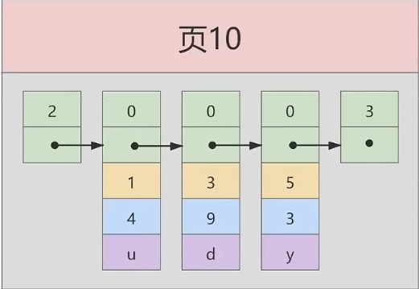

   从图中可以看出来，`index_demo`表中的3条记录都被插入到了编号为10的数据页中了。此时我们再来插入一条记录:

  ```mysql
  INSERT INTO index_demo VALUES(4,4,'a');
  ```

  因为页10最多只能放3条记录，所以我们不得不再分配一个新页:

  

  注意，新分配的`数据页编号`可能并不是连续的。它们只是通过维护着上一个页和下一个页的编号而建立了`链表关系`。另外，`页10`中用户记录最大的主键值是`5`，而页28中有一条记录的主键值是`4`，因为`5>4`，所以这就不符合下一个数据页中用户记录的主键值必须大于上一个页中用户记录的主键值的要求，所以在插入主键值为4的记录的时候需要伴随着一次记录移动，也就是把主键值为5的记录移动到页28中，然后再把主键值为4的记录插入到页10中，这个过程的示意图如下: 

  

  这个过程表明了在对页中的记录进行增删改操作的过程中，我们必须通过一些诸如记录移动的操作来始终保证这个状态一直成立：下一个数据页中用户记录的主键值必须大于上一个页中用户记录的主键值。这个过程我们称为页分裂。

  

- **给所有的页建立一个目录项。**

由于数据页的`编号可能是不连续的`，所以在向index_demo表中插入许多条记录后，可能是这样的效果:


因为这些`16KB`的页在物理存储上是`不连续`的，所以如果想从这么多页中根据主键值`快速定位某些记录所在的页`，我们需要给它们做个`目录`，每个页对应一个目录项，每个目录项包括下边两个部分:

- 页的用户记录中最小的主键值，我们用key来表示。
- 页号，我们用`page_no`表示。

所以我们为上边几个页做好的目录就像这样子：


以`页28`为例，它对应`目录项2`，这个目录项中包含着该页的页号`28`以及该页中用户记录的`最小主键值5`。我们只需要把几个目录项在物理存储器上连续存储（比如：数组），就可以实现根据主键值快速查找某条记录的功能了。比如：查找主键值为`20`的记录，具体查找过程分两步：

- 先从目录项中根据`二分法`快速确定出主键值为`20`的记录在`目录项3`中（因为`12 < 20 < 209`），它对应的页是`页9`。
- 再根据前边说的在页中查找记录的方式去`页9`中定位具体的记录。

至此，针对数据页做的简易目录就搞定了。这个目录有一个别名，称为`索引`。


##### 3.2.2 InnoDB中的索引方案

###### **迭代1次：目录项纪录的页**

我们把前边使用到的目录项放到数据页中的样子就是这样：


从图中可以看出来，我们新分配了一个编号为30的页来专门存储目录项记录。这里再次强调`目录项记录`和普通的`用户记录`的**不同点**：

- `目录项记录`的`record_type`值是1，而`普通用户记录`的`record_type`值是0。
- 目录项记录只有`主键值和页的编号`两个列，而普通的用户记录的列是用户自己定义的，可能包含`很多列`，另外还有InnoDB自己添加的隐藏列。
- 了解：记录头信息里还有一个叫`min_rec_mask`的属性，只有在存储`目录项记录`的页中的主键值最小的`目录项记录`的`min_rec_mask`值为`1`，其他别的记录的`min_rec_mask`值都是`0`。

**相同点**：两者用的是一样的数据页，都会为主键值生成`Page Directory`（页目录），从而在按照主键值进行查找时可以使用`二分法`来加快查询速度。

现在以查找主键为`20`的记录为例，根据某个主键值去查找记录的步骤就可以大致拆分成下边两步：

- 先到存储`目录项记录`的页，也就是页30中通过`二分法`快速定位到对应目录项，因为`12 < 20 < 209`，所以定位到对应的记录所在的页就是页9。
- 再到存储用户记录的页9中根据`二分法`快速定位到主键值为`20`的用户记录。


###### **迭代2次：多个目录项纪录的页**

虽然说`目录项记录`中只存储主键值和对应的页号，比用户记录需要的存储空间小多了，但是不论怎么说一个页只有`16KB`大小，能存放的`目录项记录`也是有限的，那如果表中的数据太多，以至于一个数据页不足以存放所有的`目录项记录`，如何处理呢?

这里我们假设一个存储目录项记录的页`最多只能存放4条目录项记录`，所以如果此时我们再向上图中插入一条主键值为`320`的用户记录的话，那就需要分配一个新的存储`目录项记录`的页：


从图中可以看出，我们插入了一条主键值为320的用户记录之后需要两个新的数据页：

- 为存储该用户记录而新生成了`页31`。
- 因为原先存储目录项记录的`页30的容量已满`（我们前边假设只能存储4条目录项记录），所以不得不需要一个新的`页32`来存放`页31`对应的目录项。

现在因为存储目录项记录的页不止一个，所以如果我们想根据主键值查找一条用户记录大致需要3个步骤，以查找主键值为`20`的记录为例：

1. 确定`目录项记录页`

  我们现在的存储目录项记录的页有两个，即`页30`和`页32`，又因为页30表示的目录项的主键值的范围是`[1, 320)`，页32表示的目录项的主键值不小于`320`，所以主键值为`20`的记录对应的目录项记录在`页30`中。

2. 通过目录项记录页`确定用户记录真实所在的页`。

  在一个存储`目录项记录`的页中通过主键值定位一条目录项记录的方式说过了。

3. 在真实存储用户记录的页中定位到具体的记录。


###### **迭代3次：目录项记录页的目录页**

问题来了，在这个查询步骤的第1步中我们需要定位存储目录项记录的页，但是这些`页是不连续的`，如果我们表中的数据非常多则会`产生很多存储目录项记录的页`，那我们怎么根据主键值快速定位一个存储目录项记录的页呢? 那就为这些存储目录项记录的页再生成一个`更高级的目录`，就像是一个多级目录一样，`大目录里嵌套小目录`，小目录里才是实际的数据，所以现在各个页的示意图就是这样子：


如图，我们生成了一个存储更高级目录项的`页33`，这个页中的两条记录分别代表页30和页32，如果用户记录的主键值在`[1, 320)`之间，则到页30中查找更详细的目录项记录，如果主键值`不小于320`的话，就到页32中查找更详细的目录项记录。


随着表中记录的增加，这个目录的层级会继续增加，如果简化一下，那么我们可以用下边这个图来描述它：


这个数据结构，它的名称是`B+树`。


###### **B+Tree**

不论是存放`用户记录`的数据页，还是存放`目录项记录`的数据页，我们都把它们存放到B+树这个数据结构中了，所以我们也称这些数据页为`节点`。从图中可以看出，我们的实际用户记录其实都存放在B+树的最底层的节点上，这些节点也被称为`叶子节点`，其余用来`存放目录项`的节点称为`非叶子节点`或者`内节点`，其中B+树最上边的那个节点也称为`根节点`。


一个B+树的节点其实可以分成好多层，规定最下边的那层，也就是存放我们用户记录的那层为第`0`层，之后依次往上加。之前我们做了一个非常极端的假设：存放用户记录的页`最多存放3条记录`，存放目录项`记录的页`最多存放4条记录。其实真实环境中一个页存放的记录数量是非常大的，假设所有存放用户记录的叶子节点代表的数据页可以存放`100条用户记录`，所有存放目录项记录的内节点代表的数据页可以存放`1000条目录项记录`，那么：

- 如果B+树只有1层，也就是只有1个用于存放用户记录的节点，最多能存放`100`条记录。
- 如果B+树有2层，最多能存放`1000×100=10,0000`条记录。
- 如果B+树有3层，最多能存放`1000×1000×100=1,0000,0000`条记录。
- 如果B+树有4层，最多能存放`1000×1000×1000×100=1000,0000,0000`条记录。相当多的记录！！！

你的表里能存放`1000,0000,0000`条记录吗？所以一般情况下，我们`用到的B+树都不会超过4层`，那我们通过主键值去查找某条记录最多只需要做4个页面内的查找（查找3个目录项页和一个用户记录页），又因为在每个页面内有所谓的`Page Directory`（页目录），所以在页面内也可以通过`二分法`实现快速定位记录。


#### 3.3 常见索引概念

索引按照物理实现方式，索引可以分为2种：聚簇（聚集）和非聚簇（非聚集）索引。我们也把非聚集索引称为二级索引或者辅助索引。

##### 3.3.1 聚簇索引

**聚簇索引**并不是一种单独的索引类型，而是**一种数据存储方式**(所有的用户记录都存储在了叶子节点)，也就是所谓的`索引即数据，数据即索引`。

> 术语"聚簇"表示数据行和相邻的键值聚簇的存储在一起。

**特点：**

1. 使用记录主键值的大小进行记录和页的排序，这包括三个方面的含义：

   - `页内`的记录是按照主键的大小顺序排成一个`单向链表`。
   - 各个存放`用户记录的页`也是根据页中用户记录的主键大小顺序排成一个`双向链表`。
   - 存放`目录项记录的页`分为不同的层次，在同一层次中的页也是根据页中目录项记录的主键大小顺序排成一个`双向链表`。

2. B+树的`叶子节点`存储的是完整的用户记录。

   所谓完整的用户记录，就是指这个记录中存储了所有列的值（包括隐藏列）。

我们把具有这两种特性的B+树称为`聚簇索引`，所有完整的用户记录都存放在这个`聚簇索引`的叶子节点处。这种聚簇索引并不需要我们在MySQL语句中显式的使用`INDEX`语句去创建，`InnoDB`存储引擎会`自动`的为我们创建聚簇索引。


**优点：**

- `数据访问更快`，因为聚簇索引将索引和数据保存在同一个B+树中，因此从聚簇索引中获取数据比非聚簇索引更快
- 聚簇索引对于主键的`排序查找`和`范围查找`速度非常快
- 按照聚簇索引排列顺序，查询显示一定范围数据的时候，由于数据都是紧密相连，数据库不用从多个数据块中提取数据，所以`节省了大量的IO操作`。

**缺点：**

- `插入速度严重依赖于插入顺序`，按照主键的顺序插入是最快的方式，否则将会出现页分裂，严重影响性能。因此，对于InnoDB表，我们一般都会定义一个`自增的ID列为主键`
- `更新主键的代价很高`，因为将会导致被更新的行移动。因此，对于InnoDB表，我们一般定义`主键为不可更新`
- `二级索引访问需要两次索引查找`，第一次找到主键值，第二次根据主键值找到行数据

**限制：**

- 对于MySQL数据库目前只有InnoDB数据引擎支持聚簇索引，而MyISAM并不支持聚簇索引。
- 由于数据物理存储排序方式只能有一种，所以每个MySQL的`表只能有一个聚簇索引`。一般情况下就是该表的主键。
- 如果没有定义主键，Innodb会选择`非空的唯一索引`代替。如果没有这样的索引，Innodb会隐式的定义一个主键来作为聚簇索引。
- 为了充分利用聚簇索引的聚簇的特性，所以innodb表的主键列尽量`选用有序的顺序id`，而不建议用无序的id，比如`UUID、MD5、HASH、字符串`列作为主键无法保证数据的顺序增长。


##### 3.3.2 二级索引（辅助索引、非聚簇索引）

上边介绍的`聚簇索引`只能在搜索条件是`主键值`时才能发挥作用，因为B+树中的数据都是按照主键进行排序的。那如果我们想以别的列作为搜索条件该怎么办呢？肯定不能是从头到尾沿着链表依次遍历记录一遍。

答案:我们可以`多建几棵B+树`，不同的B+树中的数据采用不同的排序规则。比方说我们用`c2`列的大小作为数据页、页中记录的排序规则，再建一棵B+树，效果如下图所示:


这个B+树与上边介绍的聚簇索引有几处不同:

- 使用记录c2列的大小进行记录和页的排序，这包括三个方面的含义:
  - 页内的记录是按照c2列的大小顺序排成一个`单向链表`。
  - 各个存放`用户记录的页`也是根据页中记录的c2列大小顺序排成一个双向链表。
  - 存放`目录项记录的页分`为不同的层次，在同一层次中的页也是根据页中目录项记录的c2列大小顺序排成一个`双向链表`。
- B+树的叶子节点存储的并不是完整的用户记录，而只是`c2列+主键`这两个列的值。
- 目录项记录中不再是`主键+页号`的搭配，而变成了`c2列+页号`的搭配。

所以如果我们现在想通过c2列的值查找某些记录的话就可以使用我们刚刚建好的这个B+树了。以查找c2列的值为`4`的记录为例，查找过程如下：

1. 确定`目录项记录页`

   根据`根页面`，也就是`页44`，可以快速定位到`目录项记录`所在的页为`页42` (因为`2 < 4 < 9`)。

2. 通过`目录项记录页`确定用户记录真实所在的页。

   在`页42`中可以快速定位到实际存储用户记录的页，但是由于`c2`列并没有唯一性约束，所以`c2`列值为`4`的记录可能分布在多个数据页中，又因为`2<4≤4`，所以确定实际存储用户记录的页在`页34`和`页35`中。

3. 在真实存储用户记录的页中定位到具体的记录。

   到`页34`和`页35`中定位到具体的记录。

4. 但是这个B+树的叶子节点中的记录只存储了`c2`和`c1`(也就是`主键`)两个列，所以我们必须再根据主键值去聚簇索引中再查找一遍完整的用户记录。

**概念**：**回表 **我们根据这个以c2列大小排序的B+树只能确定我们要查找记录的主键值，所以如果我们想根据c2列的值查找到完整的用户记录的话，仍然需要到`聚簇索引`中再查一遍，这个过程称为`回表`。也就是根据c2列的值查询一条完整的用户记录需要使用到`2`棵B+树！

**问题**：为什么我们还需要一次`回表`操作呢？直接把完整的用户记录放到叶子节点不OK吗？

**回答**：

如果把完整的用户记录放到叶子节点是可以不用回表。但是`太占地方`了，相当于每建立一棵B+树都需要把所有的用户记录再都拷贝一遍，这就有点太浪费存储空间了。

因为这种按照`非主键列`建立的B+树需要一次回表操作才可以定位到完整的用户记录，所以这种B+树也被称为二级索引(英文名

`secondary index`)，或者`辅助索引`。由于我们使用的是c2列的大小作为B+树的排序规则，所以我们也称这个B+树是为c2列建立的索引。

非聚簇索引的存在不影响数据在聚簇索引中的组织，所以一张表可以有多个非聚簇索引。


小结：聚簇索引与非聚簇索引的原理不同，在使用上也有一些区别：

1. 聚簇索引的`叶子节点`存储的就是我们的`数据记录`，非聚簇索引的叶子节点存储的是`数据位置`。非聚簇索引不会影响数据表的物理存储顺序。
2. 一个表只能有一个聚簇索引，因为只能有一种排序存储的方式，但可以有多个非聚簇索引，也就是多个索引目录提供数据检索。使用聚簇索引的时候，数据的查询效率高，但如果对数据进行插入，删除，更新等操作，效率会比非聚簇索引低。


#####  3.3.3 联合索引

我们也可以同时以多个列的大小作为排序规则，也就是同时为多个列建立索引，比方说我们想让B+树按照`c2和c3列`的大小进行排序，这个包含两层含义：

- 先把各个记录和页按照c2列进行排序。
- 在记录的c2列相同的情况下，采用c3列进行排序


如图所示，我们需要注意以下几点：

- 每条`目录项记录`都由`c2`、`c3`、`页号`这三个部分组成，各条记录先按照c2列的值进行排序，如果记录的c2列相同，则按照c3列的值进行排序。
- B+树`叶子节点`处的用户记录由`c2、c3和主键c1列`组成。

注意一点，以c2和c3列的大小为排序规则建立的B+树称为`联合索引`，本质上也是一个二级索引。它的意思与分别为c2和c3列分别建立索引的表述是不同的，不同点如下：

- 建立`联合索引`只会建立如上图一样的1棵B+树。
- 为c2和c3列分别建立索引会分别以c2和c3列的大小为排序规则建立2棵B+树。


#### 3.4 InnoDB的B+树索引的注意事项

##### 3.4.1 根页面位置万年不动

我们前边介绍B+树索引的时候，为了大家理解上的方便，先把存储用户记录的叶子节点都画出来，然后接着画存储目录项记录的内节点，实际上B+树的形成过程是这样的：

- 每当为某个表创建一个B+树索引(聚簇索引不是人为创建的，默认就有)的时候，都会为这个索引创建一个`根节点`页面。最开始表中没有数据的时候，每个B+树索引对应的`根节点`中既没有用户记录，也没有目录项记录。
- 随后向表中插入用户记录时，先把用户记录存储到这个`根节点`中。
- 当根节点中的`可用空间用完时`继续插入记录，此时会将根节点中的所有记录复制到一个新分配的页，比如`页a`中，然后对这个新页进行`页分裂`的操作，得到另一个新页，比如`页b`。这时新插入的记录根据键值(也就是聚簇索引中的主键值，二级索引中对应的索引列的值)的大小就会被分配到`页a`或者`页b`中，而`根节点`便升级为存储目录项记录的页。

这个过程特别注意的是：一个B+树索引的根节点自诞生之日起，便不会再移动。这样只要我们对某个表建立一个索引，那么它的根节点的页号便会被记录到某个地方，然后凡是`InnoDB`存储引擎需要用到这个索引的时候，都会从那个固定的地方取出根节点的页号，从而来访问这个索引。


##### 3.4.2 内节点中目录项记录的唯一性

我们知道B+树索引的内节点中目录项记录的内容是`索引列+页号`的搭配，但是这个搭配对于二级索引来说有点儿不严谨。还拿`index_demo`表为例。假设这个表中的数据是这样的：

| `c1` | `c2` | `c3` |
| ---- | ---- | ---- |
| 1    | 1    | 'u'  |
| 3    | 1    | 'd'  |
| 5    | 1    | 'y'  |
| 7    | 1    | 'a'  |

如果二级索引中目录项记录的内容只是`索引列+页号`的搭配的话，那么为`c2`列建立索引后的B+树应该长这样:


如果我们想新插入一行记录，其中`c1、c2、c3`的值分别是:`9、1、'c'`，那么在修改这个为c2列建立的二级索引对应的B+树时便碰到了个大问题：由于`页3`中存储的目录项记录是由`c2列+页号`的值构成的，`页3`中的两条目录项记录对应的c2列的值都是`1`，而我们`新插入的这条记录`的c2列的值也是1，那我们这条新插入的记录到底应该放到`页4`中，还是应该放到`页5`中啊？

答案是:对不起，懵了。

为了让新插入记录能找到自己在那个页里，**我们需要保证在B+树的同一层内节点的目录项记录除页号这个字段以外是唯一的**。所以对于二级索引的内节点的目录项记录的内容实际上是由三个部分构成的：

- 索引列的值
- 主键值
- 页号

也就是我们把主键值也添加到二级索引内节点中的目录项记录了，这样就能保证B+树每一层节点中各条目录项记录除页号这个字段外是唯一的，所以我们为c2列建立二级索引后的示意图实际上应该是这样子的:


这样我们再插入记录`(9，1，'c')`时，由于页3中存储的目录项记录是由`c2列+主键+页号`的值构成的，可以先把新记录的`c2`列的值和`页3`中各目录项记录的`c2`列的值作比较，如果`c2`列的值相同的话，可以接着比较主键值，因为B+树同一层中不同目录项记录的`c2列+主键`的值肯定是不一样的，所以最后肯定能定位唯一的一条目录项记录，在本例中最后确定新记录应该被插入到`页5`中。


##### 3.4.3 一个页面最少存储2条记录

一个B+树只需要很少的层级就可以轻松存储数亿条记录，查询速度相当不错！这是因为B+树本质上就是一个大的多层级目录，每经过一个目录时都会过滤掉许多无效的子目录，直到最后访问到存储真实数据的目录。那如果一个大的目录中只存放一个子目录是个啥效果呢？那就是目录层级非常非常非常多，而且最后的那个存放真实数据的目录中只能存放一条记录。费了半天劲只能存放一条真实的用户记录？所以`InnoDB的一个数据页至少可以存放两条记录`。


### 4 MyISAM中的索引方案

**B树索引适用存储引擎如表所示：**

| 索引 / 存储引擎 | MyISAM | InnoDB | Memory |
| --------------- | ------ | ------ | ------ |
| B-Tree索引      | 支持   | 支持   | 支持   |

即使多个存储引擎支持同一种类型的索引，但是他们的实现原理也是不同的。Innodb和MyISAM默认的索引是B+tree索引；而Memory默认的索引是Hash索引。

MyISAM引擎使用`B+Tree`作为索引结构，叶子节点的data域存放的是`数据记录的地址`。


#### 4.2 MyISAM索引的原理

下图是MyISAM索引的原理图。

我们知道`InnoDB中索引即数据`，也就是聚簇索引的那棵B+树的叶子节点中已经把所有完整的用户记录都包含了,
而`MyISAM`的索引方案虽然也使用树形结构，但是却`将索引和数据分开存储`：

- 将表中的记录`按照记录的插入顺序`单独存储在一个文件中，称之为`数据文件`。这个文件并不划分为若干个数据页，有多少记录就往这个文件中塞多少记录就成了。由于在插入数据的时候并`没有刻意按照主键大小排序`，所以我们并不能在这些数据上使用二分法进行查找。
- 使用`MyISAM`存储引擎的表会把索引信息另外存储到一个称为`索引文件`的另一个文件中。`MyISAM`会单独为表的主键创建一个索引，只不过在索引的叶子节点中存储的不是完整的用户记录，而是`主键值+数据记录地址`的组合。


这里设表共有三列，假设我们以Col1为主键，上图是一个MyISAM表的主索引(Primary key)示意。可以看出**MyISAM的索引文件仅仅保存数据记录的地址**。在MyISAM中，主键索引和二级索引(Secondary key)在结构上没有任何区别，只是主键索引要求key是唯一的，而二级索引的key可以重复。

如果我们在Col2上建立一个二级索引，则此索引的结构如下图所示：


同样也是一棵B+Tree，data域保存数据记录的地址。因此，MyISAM中索引检索的算法为：首先按照B+Tree搜索算法搜索索引，如果指定的Key存在，则取出其data域的值，然后以data域的值为地址，读取相应数据记录。


#### 4.3 MyISAM 与 InnoDB对比

**MyISAM的索引方式都是“非聚簇”的，与InnoDB包含1个聚簇索引是不同的。小结两种引擎中索引的区别：**

1. 在InnoDB存储引擎中，我们只需要根据主键值对`聚簇索引`进行一次查找就能找到对应的记录，而在`MyISAM`中却需要进行一次`回表`操作，意味着MyISAM中建立的索引相当于全部都是`二级索引`。
2. InnoDB的数据文件本身就是索引文件，而MyISAM索引文件和数据文件是`分离的`，索引文件仅保存数据记录的地址。
3. InnoDB的非聚簇索引data域存储相应记录`主键的值`，而MyISAM索引记录的是`地址`。换句话说，InnoDB的所有非聚簇索引都引用主键作为data域。
4. MyISAM的回表操作是十分`快速`的，因为是拿着地址偏移量直接到文件中取数据的，反观InnoDB是通过获取主键之后再去聚簇索引里找记录，虽然说也不慢，但还是比不上直接用地址去访问。
5. InnoDB要求表`必须有主键`（`MyISAM可以没有`）。如果没有显式指定，则MySQL系统会自动选择一个可以非空且唯一标识数据记录的列作为主键。如果不存在这种列，则MySQL自动为InnoDB表生成一个隐含字段作为主键，这个字段长度为6个字节，类型为长整型。

**小结：**

了解不同存储引擎的索引实现方式对于正确使用和优化索引都非常有帮助。比如：

举例1：知道了InnoDB的索引实现后，就很容易明白`为什么不建议使用过长的字段作为主键`，因为所有二级索引都引用主键索引，过长的主键索引会令二级索引变得过大。

举例2：用非单调的字段作为主键在InnoDB中不是个好主意，因为InnoDB数据文件本身是一棵B+Tree, 非单调的主键会造成在插入新记录时，数据文件为了维持B+Tree的特性而频繁的分裂调整，十分低效，而使用`自增字段作为主键则是一个很好的选择`。


### 5 索引的代价

索引是个好东西，可不能乱建，它在空间和时间上都会有消耗：

- **空间上的代价**

  每建立一个索引都要为它建立一棵B+树，每一棵B+树的每一个节点都是一个数据页，一个页默认会占用 `16KB`的存储空间，一棵很大的B+树由许多数据页组成，那就是很大的一片存储空间。

- **时间上的代价**

  每次对表中的数据进行`增、删、改`操作时，都需要去修改各个B+树索引。而且我们讲过，B+树每层节点都是按照索引列的值`从小到大的顺序排序`而组成了`双向链表`。不论是叶子节点中的记录，还是内节点中的记录（也就是不论是用户记录还是目录项记录）都是按照索引列的值从小到大的顺序而形成了一个单向链表。而增、删、改操作可能会对节点和记录的排序造成破坏，所以存储引擎需要额外的时间进行一些`记录移位`，`页面分裂`、`页面回收`等操作来维护好节点和记录的排序。如果我们建了许多索引，每个索引对应的B+树都要进行相关的维护操作，会给性能拖后腿。

> 一个表上索引建的越多，就会占用越多的存储空间，在增删改记录的时候性能就越差。为了能建立又好又少的索引，我们得学学这些索引在哪些条件下起作用的。


### 6 MySQL数据结构选择的合理性

从MySQL的角度讲，不得不考虑一个现实问题就是磁盘IO。如果我们能让索引的数据结构尽量减少硬盘的IO操作，所消耗的时间也就越小。可以说，`磁盘的IO操作次数`对索引的使用效率至关重要。

查找都是索引操作，一般来说索引非常大，尤其是关系型数据库，当数据量比较大的时候，索引的大小有可能几个G甚至更多，为了减少索引在内存的占用，**数据库索引是存储在外部磁盘上的**。当我们利用索引查询的时候，不可能把整个索引全部加载到内存，只能`逐一加载`，那么MySQL衡量查询效率的标准就是磁盘IO次数。


#### 6.1 全表遍历

这里都懒得说了。


#### 6.2 Hash结构

Hash本身是一个函数，又被称为散列函数，它可以帮助我们大幅提升检索数据的效率。

Hash算法是通过某种确定性的算法(比如MD5、SHA1、SHA2、SHA3)将输入转变为输出。`相同的输入永远可以得到相同的输出`，假设输入内容有微小偏差，在输出中通常会有不同的结果。

**举例**：如果你想要验证两个文件是否相同，那么你不需要把两份文件直接拿来比对，只需要让对方把Hash函数计算得到的结果告诉你即可，然后在本地同样对文件进行Hash函数的运算，最后通过比较这两个Hash函数的结果是否相同，就可以知道这两个文件是否相同。

**加速查找速度的数据结构，常见的有两类**：

1. 树，例如平衡二叉搜索树，查询/插入/修改/删除的平均时间复杂度都是`O(1og2N)`;
2. 哈希，例如HashMap, 查询/插入/修改/删除的平均时间复杂度都是`O(1)`;


采用Hash进行检索效率非常高，基本上一次检索就可以找到数据，而B+树需要自顶向下依次查找，多次访问节点才能找到数据，中间需要多次I/0操作，从效率来说Hash比B+树更快。

在哈希的方式下，一个元素k处于h(k)中，即利用哈希函数h，根据关键字k计算出槽的位置。函数h将关键字域映射到`哈希表T[0...m-1]`的槽位上。


上图中哈希函数h有可能将两个不同的关键字映射到相同的位置，这叫做`碰撞`，在数据库中一般采用`链接法`来解决。在链接法中，将散列到同一槽位的元素放在一个链表中，如下图所示：


实验：体会数组和hash表的查找方面的效率区别

```java
// 算法复杂度为 O(n)
@Test
public void test1(){
	int[] arr = new int[100000];
	for(int i = 0; i < arr.length; i++){
		arr[i] = i + 1;
	}

	long start = System.currentTimeMillis();
	for(int j = 1; j<=100000;j++){
		int temp = j;
		for(int i = 0; i < arr.length; i++){
			if(temp == arr[i]){
				break;
			}
		}
	}
	long end = System.currentTimeMillis();
	System.out.println("time： " + (end - start)); //time： 823
}
```

```java
//算法复杂度为 O(1)
@Test
public void test2(){
	HashSet<Integer> set = new HashSet<>(100000);
	for(int i = 0;i < 100000;i++){
		set.add(i + 1);
	}

	long start = System.currentTimeMillis();
	for(int j = 1; j<=100000;j++) {
		int temp = j;
		boolean contains = set.contains(temp);
	}
	long end = System.currentTimeMillis();
	System.out.println("time： " + (end - start)); //time： 5
}
```

**Hash结构效率高，那为什么索引结构要设计成树型呢？**

- **原因1**：Hash索引仅能满足(=)、(<>)和IN查询。如果进行`范围查询`，哈希型的索引，时间复杂度会退化为0(n)；而树型的“有序”特性，依然能够保持0(log2N)的高效率。
- **原因2**：Hash索引还有一个缺陷，数据的存储是`没有顺序的`，在ORDER BY的情况下，使用Hash索引还需要对数据重新排序。
- **原因3**：对于联合索引的情况，Hash值是将联合索引键合并后一起来计算的，无法对单独的一个键或者几个索引键进行查询。
- **原因4**：对于等值查询来说，通常Hash索引的效率更高，不过也存在一种情况，就是`索引列的重复值如果很多，效率就会降低`。这是因为遇到Hash冲突时，需要遍历桶中的行指针来进行比较，找到查询的关键字，非常耗时。所以，Hash索引通常不会用到重复值多的列上，比如列为性别、年龄的情况等。

**Hash索引适用存储引擎如表所示：**

| 索引 / 存储引擎 | MyISAM | MyISAM | Memory |
| --------------- | ------ | ------ | ------ |
| HASH索引        | 不支持 | 不支持 | `支持` |

**Hash索引的适用性：**

Hash索引存在着很多限制，相比之下在数据库中B+树索引的使用面会更广，不过也有一些场景采用Hash索引效率更高，比如在键值型(Key-Value)数据库中，**Redis存储的核心就是Hash表**。

MySQL中的Memory存储引擎支持Hash存储，如果我们需要用到查询的临时表时，就可以选择Memory存储引擎，把某个字段设置为Hash索引，比如字符串类型的字段，进行Hash计算之后长度可以缩短到几个字节。当字段的重复度低，而且经常需要进行`等值查询`的时候，采用Hash索引是个不错的选择。

另外，InnoDB本身不支持Hash索引，但是提供`自适应Hash索引`(Adaptive Hash Index)。什么情况下才会使用自适应Hash索引呢?如果某个数据经常被访问，当满足一定条件的时候，就会将这个数据页的地址存放到Hash表中。这样下次查询的时候，就可以直接找到这个页面的所在位置。这样让B+树也具备了Hash索引的优点。


采用自适应 Hash 索引目的是方便根据 SQL 的查询条件加速定位到叶子节点，特别是当 B+ 树比较深的时
候，通过自适应 Hash 索引可以明显提高数据的检索效率。

我们可以通过`innodb_adaptive_hash_index`变量来查看是否开启了自适应 Hash，比如：

```mysql
 show variables like '%adaptive_hash_index';
```


#### 6.3 二叉搜索树

如果我们利用二叉树作为索引结构，那么磁盘的IO次数和索引树的高度是相关的。

**1. 二叉搜索树的特点**

- 一个节点只能有两个子节点，也就是一个节点度不能超过2
- 左子节点<本节点；右子节点>=本节点，比我大的向右，比我小的向左

**2. 查找规则**

我们先来看下最基础的二叉搜索树(Binary Search Tree)，搜索某个节点和插入节点的规则一样，我们假设搜索插入的数值为key:

1. 如果key大于根节点，则在右子树中进行查找;
2. 如果key小于根节点，则在左子树中进行查找;
3. 如果key等于根节点，也就是找到了这个节点，返回根节点即可。

举个例子，我们对数列(34, 22, 89，5，23, 77 91)创造出来的二分查找树如下图所示：


但是存在特殊的情况，就是有时候二叉树的深度非常大。比如我们给出的数据顺序是(5,22,23,34,77,89,91)，创造出来的二分搜索树如下图所示：


上面第二棵树也属于二分查找树，但是性能上已经退化成了一条链表，查找数据的时间复杂度变成了`O(n)`。你能看出来第一个树的深度是3，也就是说最多只需3次比较，就可以找到节点，而第二个树的深度是7，最多需要7次比较才能找到节点。

为了提高查询效率，就需要`减少磁盘IO数`。为了减少磁盘IO的次数，就需要尽量`降低树的高度`，需要把原来“瘦高”的树结构变的“矮胖”，树的每层的分叉越多越好。


#### 6.4 AVL树

为了解决上面二叉查找树退化成链表的问题，人们提出了`平衡二叉搜索树(Balanced Binary Tree)`，又称为AVL树(有别于AVL算法)，它在二叉搜索树的基础上增加了约束，具有以下性质:

**它是一棵空树或它的左右两个子树的高度差的绝对值不超过1，并且左右两个子树都是一棵平衡二叉树。**

这里说一-下，常见的平衡二叉树有很多种，包括了`平衡二叉搜索树、红黑树、数堆、伸展树`。平衡二叉搜索树是最早提出来的自平衡二叉搜索树，当我们提到平衡二叉树时一般指的就是平衡二叉搜索树。事实上，第一棵树就属于平衡二叉搜索树，搜索时间复杂度就是`O(log2n)`。

数据查询的时间主要依赖于磁盘IO的次数，如果我们采用二叉树的形式，即使通过平衡二叉搜索树进行了改进，树的深度也是O(log2n)，当n比较大时，深度也是比较高的，比如下图的情况：


`每访问一次节点就需要进行一次磁盘IO操作`，对于上面的树来说，我们需要进行5次IO操作。虽然平衡二叉树的效率高，但是树的深度也同样高，这就意味着磁盘IO操作次数多，会影响整体数据查询的效率。

针对同样的数据，如果我们把二叉树改成`M叉树`（M>2）呢？当 M=3 时，同样的 31 个节点可以由下面的三叉树来进行存储：


你能看到此时树的高度降低了，当数据量N大的时候，以及树的分叉数M大的时候，M叉树的高度会远小于二叉树的高度(M>2)。所以，我们需要把`树从“瘦高"变”矮胖”`。


#### 6.5 B-Tree

B树的英文是Balance Tree，也就是`多路平衡查找树`。简写为B-Tree (注意横杠表示这两个单词连起来的意思，不是减号)。它的高度远小于平衡二叉树的高度。

B 树的结构如下图所示：


B树作为多路平衡查找树，它的每一个节点最多可以包括M个子节点，`M称为B树的阶`。每个磁盘块中包括了`关键字`和`子节点的指针`。如果一个磁盘块中包括了x个关键字，那么指针数就是x+1。对于一个100阶的B树来说，如果有3层的话最多可以存储约100万的索引数据。对于大量的索引数据来说，采用B树的结构是非常适合的，因为树的高度要远小于二叉树的高度。

一个 M 阶的 B 树（M>2）有以下的特性：

1. 根节点的儿子数的范围是 [2,M]。
2. 每个中间节点包含 k-1 个关键字和 k 个孩子，孩子的数量 = 关键字的数量+1，k的取值范围为
    [ceil(M/2), M]。
3. 叶子节点包括k-1个关键字（叶子节点没有孩子），k 的取值范围为 [ceil(M/2), M]。
4. 假设中间节点节点的关键字为：Key[1], Key[2], …, Key[k-1]，且关键字按照升序排序，即 Key[i]
   < Key[i+1]。此时 k-1 个关键字相当于划分了k个范围，也就是对应着 k 个指针，即为：P[1], P[2], …, P[k]，其中 P[1] 指向关键字小于 Key[1] 的子树，P[i] 指向关键字属于 (Key[i-1], Key[i]) 的子树，P[k]指向关键字大于 Key[k-1] 的子树。
5. 所有叶子节点位于同一层。

上面那张图所表示的 B 树就是一棵 3 阶的 B 树。我们可以看下磁盘块2，里面的关键字为（8，12），它
有 3 个孩子 (3，5)，(9，10) 和 (13，15)，你能看到 (3，5) 小于 8，(9，10) 在 8 和 12 之间，而 (13，15)
大于 12，刚好符合刚才我们给出的特征。

然后我们来看下如何用 B 树进行查找。假设我们想要`查找的关键字是 9`，那么步骤可以分为以下几步：

1. 我们与根节点的关键字 (17，35）进行比较，9 小于 17 那么得到指针 P1；
2. 按照指针 P1 找到磁盘块 2，关键字为（8，12），因为 9 在 8 和 12 之间，所以我们得到指针 P2；
3. 按照指针 P2 找到磁盘块 6，关键字为（9，10），然后我们找到了关键字 9。

你能看出来在B树的搜索过程中，我们比较的次数并不少，但如果把数据读取出来然后在内存中进行比较，这个时间就是可以忽略不计的。而读取磁盘块本身需要进行 I/O 操作，消耗的时间比在内存中进行比较所需要的时间要多，是数据查找用时的重要因素。`B 树相比于平衡二叉树来说磁盘 I/O 操作要少`，在数据查询中比平衡二叉树效率要高。所以`只要树的高度足够低，IO次数足够少，就可以提高查询性能`。

**小结：**

1. B树在插入和删除节点的时候如果导致树不平衡，就通过自动调整节点的位置来保持树的自平衡。
2. 关键字集合分布在整棵树中，即叶子节点和非叶子节点都存放数据。搜索有可能在非叶子节点结束
3. 其搜索性能等价于在关键字全集内做一次二分查找。

**再举例1：**


#### 6.6 B+Tree

B+树也是一种多路搜索树，`基于B树做出了改进`，主流的DBMS都支持B+树的索引方式，比如MySQL。相比于B-Tree，`B+Tree适合文件索引系统`。

MySQL官网说明：


B+ 树和 B 树的差异：

1. 有 k 个孩子的节点就有 k 个关键字。也就是孩子数量 = 关键字数，而 B 树中，孩子数量 = 关键字数
    +1。
2. 非叶子节点的关键字也会同时存在在子节点中，并且是在子节点中所有关键字的最大（或最小）。
3. 非叶子节点仅用于索引，不保存数据记录，跟记录有关的信息都放在叶子节点中。而 B 树中，`非叶子节点既保存索引，也保存数据记录`。
4. 所有关键字都在叶子节点出现，叶子节点构成一个有序链表，而且叶子节点本身按照关键字的大小从小到大顺序链接。


B+树和B树有个根本的差异在于，B+树的中间节点并不直接存储数据。这样的好处都有什么呢?

首先，**B+树查询效率更稳定**。因为B+树每次只有访问到叶子节点才能找到对应的数据，而在B树中，非叶子节点也会存储数据，这样就会造成查询效率不稳定的情况，有时候访问到了非叶子节点就可以找到关键字，而有时需要访问到叶子节点才能找到关键字。

其次，**B+树的查询效率更高**。这是因为通常B+树比B树更`矮胖`(阶数更大，深度更低)，查询所需要的磁盘IO也会更少。同样的磁盘页大小，B+树可以存储更多的节点关键字。

不仅是对单个关键字的查询上，**在查询范围上，B+树的效率也比B树高**。这是因为所有关键字都出现在B+树的叶子节点中，叶子节点之间会有指针，数据又是递增的，这使得我们范围查找可以通过指针连接查找。而在B树中则需要通过中序遍历才能完成查询范围的查找，效率要低很多。

> B 树和 B+ 树都可以作为索引的数据结构，在 MySQL 中采用的是 B+ 树。
>
> 但B树和B+树各有自己的应用场景，不能说B+树完全比B树好，反之亦然。


**思考题：为了减少IO，索引树会一次性加载吗？**

> 1. 数据库索引是存储在磁盘上的，如果数据量很大，必然导致索引的大小也会很大，超过几个G。
> 2. 当我们利用索引查询时候，是不可能将全部几个G的索引都加载进内存的，我们能做的只能是：逐一加载每一个磁盘页，因为磁盘页对应着索引树的节点。

**思考题：B+树的存储能力如何？为何说一般查找行记录，最多只需1~3次磁盘IO**

> InnoDB存储引擎中页的大小为16KB，一般表的主键类型为INT(占用4个字节)或BIGINT(占用8个字节)，指针类型也一般为4或8个字节，也就是说一个页(B+Tree中的一个节点)中大概存储16KB/(8B+8B)=1K个键值(因为是估值，为方便计算，这里的K取值为10^3。也就是说一个深度为3的B+Tree索引可以维护10^3 * 10^3 * 10^3= 10亿条记录。(这里假定一个数据页也存储10^3条行记录数据了)
>
> 实际情况中每个节点可能不能填充满，因此在数据库中，`B+Tree的高度一般都在2~4层`。MySQL的InnoDB存储引擎在设计时是将根节点常驻内存的，也就是说查找某一键值的行记录时最多只需要1~3次磁盘IO操作。

**思考题：为什么说B+树比B-树更适合实际应用中操作系统的文件索引和数据库索引？**

> 1. B+树的磁盘读写代价更低
>
>    B+树的内部结点并没有指向关键字具体信息的指针。因此其内部结点相对B树更小。如果把所有同一内部结点的关键字存放在同一盘块中，那么盘块所能容纳的关键字数量也越多。一次性读入内存中的需要查找的关键字也就越多。相对来说IO读写次数也就降低了。
>
> 2. B+树的查询效率更加稳定
>
>    由于非叶子结点并不是最终指向文件内容的结点，而只是叶子结点中关键字的索引。所以任何关键字的查找必须走一条从根结点到叶子结点的路。所有关键字查询的路径长度相同，导致每一个数据的查询效率相当。

**思考题：Hash 索引与 B+ 树索引的区别**

> 我们之前讲到过B+树索引的结构，Hash索引结构和B+树的不同，因此在索引使用上也会有差别。
>
> 1. Hash索引`不能进行范围查询`，而B+树可以。这是因为Hash索引|指向的数据是无序的，而B+树的叶子节点是个有序的链表。
> 2. Hash索引`不支持联合索引的最左侧原则`(即联合索引的部分索引无法使用)，而B+树可以。对于联合索引来说，Hash索引在计算Hash值的时候是将索引键合并后再一起计算Hash值，所以不会针对每个索引单独计算Hash值。因此如果用到联合索引的一个或者几个索引时，联合索引无法被利用。
> 3. Hash索引`不支持ORDER BY排序`，因为Hash索引指向的数据是无序的，因此无法起到排序优化的作用，而B+树索引数据是有序的，可以起到对该字段ORDER BY排序优化的作用。同理，我们也无法用Hash索引进行`模糊查询`，而B+树使用LIKE进行模糊查询的时候，LIKE后面后模糊查询(比如%结尾)的话就可以起到优化作用。
> 4. `InnoDB不支持哈希索引`

**思考题：Hash 索引与 B+ 树索引是在建索引的时候手动指定的吗？**

> 如果使用的是MySQL的话，我们需要了解MySQL的存储引擎都支持哪些索引结构，如下图所示(参考来源https://ev.mysql.com/doc/refman/8.0/en/create-index.html)。如果是其他的DBMS，可以参考相关的DBMS文档。
>
> | **Storage Engine** | **Premissible Index Types**    |
> | ------------------ | ------------------------------ |
> | InnoDB             | B+TREE                         |
> | MyISAM             | B+TREE                         |
> | MEMORY / HEAP      | HASH、B+TREE                   |
> | NDB                | HASH、B+TREE(see note in text) |
>
> 你能看到，针对InnoDB和MyISAM存储引擎，都会默认采用B+树索引，无法使用Hash索引。InnoDB提供的自适应Hash是不需要手动指定的。如果是Memory/Heap和NDB存储引擎，是可以进行选择Hash索引的。


#### 6.7 R树

R-Tree在MySQL很少使用，仅支持`geometry数据类型`，支持该类型的存储引擎只有myisam、bdb、innodb、ndb、archive几种。举个R树在现实领域中能够解决的例子：查找20英里以内所有的餐厅。如果没有R树你会怎么解决？一般情况下我们会把餐厅的坐标(x,y)分为两个字段存放在数据库中，一个字段记录经度，另一个字段记录纬度。这样的话我们就需要遍历所有的餐厅获取其位置信息，然后计算是否满足要求。如果一个地区有100家餐厅的话，我们就要进行100次位置计算操作了，如果应用到谷歌、百度地图这种超大数据库中，这种方法便必定不可行了。R树就很好的`解决了这种高维空间搜索问题`。它把B树的思想很好的扩展到了多维空间，采用了B树分割空间的思想，并在添加、删除操作时采用合并、分解结点的方法，保证树的平衡性。因此，R树就是一棵用来`存储高维数据的平衡树`。相对于B-Tree，R-Tree的优势在于范围查找。

| 索引 / 存储引擎 | MyISAM | MyISAM | Memory   |
| --------------- | ------ | ------ | -------- |
| R-Tree索引      | 支持   | 支持   | `不支持` |


#### 6.8 小结

使用索引可以帮助我们从海量的数据中快速定位想要查找的数据，不过索引也存在一些不足，比如占用存储空间、降低数据库写操作的性能等，如果有多个索引还会增加索引选择的时间。当我们使用索引时，需要平衡索引的利(提升查询效率)和弊(维护索引所需的代价)。

在实际工作中，我们还需要基于需求和数据本身的分布情况来确定是否使用索引，`尽管索引不是万能的`，但`数据量大的时候不使用索引是不可想象的`，毕竟索引的本质，是帮助我们提升数据检索的效率。


#### 附录：算法的时间复杂度

同一问题可用不同算法解决，而一个算法的质量优劣将影响到算法乃至程序的效率。算法分析的目的在于选择合适算法和改进算法。


------

## 六、InnoDB数据存储结构

### 1 数据库的存储结构:页

索引结构给我们提供了高效的索引方式，不过索引信息以及数据记录都是保存在文件上的，确切说是存储在页结构中。另一方面，索引是在存储引擎中实现的，MySQL服务器上的**存储引擎**负责对表中数据的读取和写入工作。不同存储引擎中**存放的格式**一般是不同的，甚至有的存储引擎比如Memory都不用磁盘来存储数据。

由于`InnoDB`是`MySQL的默认存储引擎`，所以本章剖析InnoDB存储引擎的数据存储结构。


#### 1.1 磁盘与内存交互基本单位:页

InnoDB将数据划分为若干个页，InnoDB中页的大小默认为**16KB**。

以`页`作为磁盘和内存之间交互的`基本单位`，也就是一次最少从磁盘中读取16KB的内容到内存中，一次最少把内存中的16KB内容刷新到磁盘中。也就是说，**在数据库中，不论读一行，还是读多行，都是将这些行所在的页进行加载。也就是说，数据库管理存储空间的基本单位是页(Page)，数据库I/O操作的最小单位是页。**一个页中可以存储多个行记录。

> 记录是按照行来存储的，但是数据库的读取并不以行为单位，否则一次读取(也就是一次I/O操作)只能处理一行数据，效率会非常低。

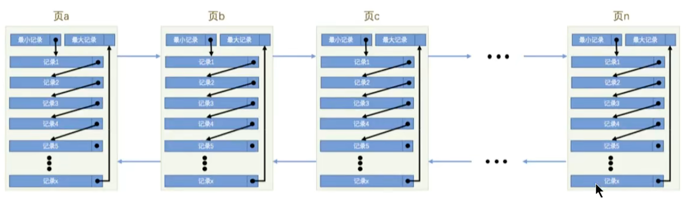

#### 1.2 页结构概述

页a、页b、页c … 页n这些页可以不`在物理结构上相连`，只要通过`双向链表`相关联即可。每个数据页中的记录会按照主键值从小到大的顺序组成一个`单向链表`，每个数据页都会为存储在它里边的记录生成一个`页目录`，在通过主键查找某条记录的时候可以在页目录`中使用二分法`快速定位到对应的槽，然后再遍历该槽对应分组中的记录即可快速找到指定的记录。


#### 1.3 页的大小

不同的数据库管理系统（简称DBMS）的页大小不同。比如在MySQL的InnoDB存储引擎中，默认页的大小是**16KB**，可以通过下面的命令来进行查看:

```mysql
show variables like '%innodb_page_size%';
```


SQL Server中页的大小为 `8KB`，而在oracle中用术语"`块`"(Block)来代表"页”，Oralce支持的块大小为2KB，4KB，8KB，16K8，32KB和64KB。

#### 1.4 页的上层结构

另外在数据库中，还存在区（Extent)、段(Segment)和表空间（Tablespace)的概念。行、页、区、段、表空间的关系如下图所示:


- 区(Extent)是比页大一级的存储结构，在InnoDB存储引擎中，一个区会分配`64个连续的页`。因为InnoDB中的页大小默认是16KB，所以一个区的大小是64*16KB= 1MB。

- 段(Segment)由一个或多个区组成，区在文件系统是一个连续分配的空间（在InnoDB中是连续的64个页)，不过在段中不要求区与区之间是相邻的。`段是数据库中的分配单位，不同类型的数据库对象以不同的段形式存在。` 当创建数据表、索引的时候，就会相应创建对应的段，比如创建一张表时会创建一个表段，创建一个索引时会创建一个索引段。

- 表空间(Tablespace)是一个逻辑容器，表空间存储的对象是段，在一个表空间中可以有一个或多个段，但是一个段只能属于一个表空间。数据库由一个或多个表空间组成，表空间从管理上可以划分为系统表空间，`用户表空间`、`撤销表空间`、`临时表空间`等。


### 2 页的内部结构

页如果按类型划分的话，常见的有`数据页（保存B+树节点）`、`系统页`、`Undo页`和`事务数据页`等。数据页是我们最常使用的页。

数据页的`16KB`大小的存储空间被划分为七个部分，分别是文件头(File Header)、页头(Page Header)、最大最小记录(Infimum+supremum)、用户记录(User Records)、空闲空间(Free Space)、页目录(Page Directory)和文件尾(File Tailer) 。


页结构的示意图如下所示:

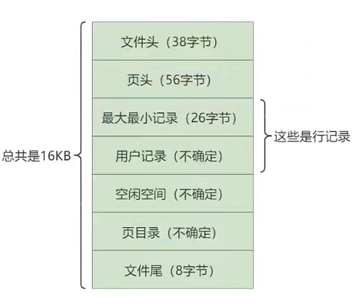


这7个部分作用分别如下，简单梳理如下表所示:

| 名称               | 占用大小 | 说明                                 |
| ------------------ | -------- | ------------------------------------ |
| 1.File Header      | 38字节   | 文件头，描述页的信息                 |
| 3.Page Header      | 56字节   | 页头，页的状态信息                   |
| 2.lnfimum-Supremum | 26字节   | 最大和最小记录，这是两个虚拟的行记录 |
| 2.User Records     | 不确定   | 用户记录，存储行记录内容             |
| 2.Free Space       | 不确定   | 空闲记录，页中还没有被使用的空间     |
| 3.Page Directory   | 不确定   | 页目录，存储用户记录的相对位置       |
| 1.File Trailer     | 8字节    | 文件尾，校验页是否完整               |


我们可以把这7个结构分成3个部分

#### 2.1 第一部分：文件通用部分

**File Header(文件头部）和File Trailer (文件尾部)**

首先是`文件通用部分`，也就是`文件头`和`文件尾`。

##### 2.1.1 文件头部信息


- FIL_PAGE_OFFSET (4字节)

  每一个页都有一个单独的页号，就跟你的身份证号码一样，InnoDB通过页号可以唯一定位一个页。

- FIL_PAGE_TYPE (2字节)

  这个代表当前页的类型。

  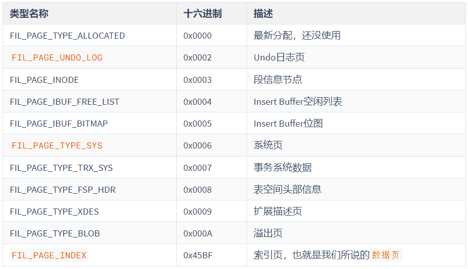

- FIL_PAGE_PREV (4字节) 和 FIL_PAGE_NEXT (4字节)

  InnoDB都是以页为单位存放数据的，如果数据分散到多个不连续的页中存储的话需要把这些页关联起来，FIL_PAGE_PREV和FIL_PAGE_NEXT就分别代表本页的上一个和下一个页的页号。这样通过建立一个双向链表把许许多多的页就都串联起来了，保证这些页之间不需要是物理上的连续，而是逻辑上的连续。

  

  

- FIL_PAGE_SPACE_OR_CHKSUM (4字节)

  代表当前页面的校验和（checksum）

  **什么是校验和？**

  就是对于一个很长的字节串来说，我们会通过某种算法来计算一个比较短的值来代表这个很长的字节串，这个比较短的值就称为校验和。

  在比较两个很长的字节串之前，先比较这两个长字节串的校验和，如果校验和都不一样，则两个长字节串肯定是不同的，所以省去了直接比较两个比较长的字节串的时间损耗。

  

  文件头部和文件尾部都有属性：FIL_PAGE_SPACE_OR_CHKSUM

  **作用**：

  InnoDB存储引擎以页为单位把数据加载到内存中处理，如果该页中的数据在内存中被修改了，那么在修改后的某个时间需要把数据同步到磁盘中。但是在同步了一半的时候断电了，造成了该页传输的不完整。

  为了检测一个页是否完整（也就是在同步的时候有没有发生只同步一半的尴尬情况），这时可以通过文件尾的校验和（checksum值）与文件头的校验和做比对，如果两个值不相等则证明页的传输有问题，需要重新进行传输，否则认为页的传输已经完成。

  **具体的**：

  每当一个页面在内存中修改了，在同步之前就要把它的校验和算出来，因为File Header在页面的前边，所以校验和会被首先同步到磁盘，当完全写完时，校验和也会被写到页的尾部，如果完全同步成功，则页的首部和尾部的校验和应该是一致的。如果写了一半儿断电了，那么在File Header中的校验和就代表着已经修改过的页，而在File Trailer中的校验和代表着原先的页，二者不同则意味着同步中间出了错。这里，校验方式就是采用`Hash`算法进行校验。

- FIL_PAGE_LSN（8字节）

  页面被最后修改时对应的日志序列位置（英文名是：Log Sequence Number）。


##### 2.1.2 文件尾部信息

- 前4个字节代表页的校验和：

  这个部分是和File Header中的校验和相对应的。

- 后4个字节代表页面被最后修改时对应的日志序列位置（LSN）：

  这个部分也是为了校验页的完整性的，如果首部和尾部的LSN值校验不成功的话，就说明同步过程出现了问题。


#### 2.2 第二部分：记录部分

**Free Space(空闲空间)、User Records(用户记录)、Infimum(最小记录)、Supremum(最大记录)**

第二个部分是记录部分，页的主要作用是存储记录，所以“最大和最小记录”和“用户记录”部分占了页结构的主要空间。


##### 2.2.1 Free Space(空闲空间)

我们自己存储的记录会按照指定的`行格式`存储到`User Records`部分。但是在一开始生成页的时候，其实并没有User Records这个部分，`每当我们插入一条记录，都会从Free Space部分，也就是尚未使用的存储空间中申请一个记录大小的空间划分到User Records部分`，当Free Space部分的空间全部被User Records部分替代掉之后，也就意味着这个页使用完了，如果还有新的记录插入的话，就需要去`申请新的页`了。


##### 2.2.2 User Records(用户记录)

User Records中的这些记录按照指定的`行格式`一条一条摆在User Records部分，相互之间形成单链表。

**用户记录里的一条条数据如何记录？**

这里需要讲讲记录行格式的`记录头信息`


##### 2.2.3 Infimum + Supremum (最小最大记录)

**记录可以比较大小吗？**

是的，记录可以比大小，对于一条完整的记录来说，比较记录的大小就是`比较主键`的大小。比方说我们插入的4行记录的主键值分别是：1、2、3、4，这也就意味着这4条记录是从小到大依次递增。

InnoDB规定的最小记录与最大记录这两条记录的构造十分简单，都是由5字节大小的记录头信息和8字节大小的一个固定的部分组成的，如图所示：


这两条记录`不是我们自己定义的记录`，所以它们并不存放在页的User Records部分，他们被单独放在一个称为`Infimum+Supremum`的部分，如图所示：


#### 2.3 第三部分

**Page Directory(页目录)、Page Header(页面头部)**


##### 2.3.1 Page Directory(页目录)

**为什么需要页目录？**

在页中，记录是以`单向链表`的形式进行存储的。单向链表的特点就是插入、删除非常方便，但是`检索效率不高`，最差的情况下需要遍历链表上的所有节点才能完成检索。因此在页结构中专门设计了页目录这个模块，`专门给记录做一个目录`，通过`二分查找法`的方式进行检索，提升效率。

**需求**：根据`主键值`查找页中的某条记录，如何实现快速查找呢？

```mysql
SELECT * FROM page_demo WHERE c1 = 3;
```

**方式1：顺序查找**

从Infimum记录（最小记录）开始，沿着链表一直往后找，总有一天会找到（或者找不到），在找的时候还能投机取巧，因为链表中各个记录的值是按照从小到大顺序排列的，所以当链表的某个节点代表的记录的主键值大于你想要查找的主键值时，你就可以停止查找了，因为该节点后边的节点的主键值依次递增。

> 如果一个页中存储了非常多的记录，这么查找性能很差。


**方式2：使用页目录，二分法查找**

1. 将所有的记录`分成几个组`，这些记录包括最小记录和最大记录，但不包括标记为“已删除”的记录。

2. 第1组，也就是最小记录所在的分组只有1个记录；

    最后一组，就是最大记录所在的分组，会有1-8条记录；

    其余的组记录数量在4-8条之间。

    这样做的好处是，除了第 1 组（最小记录所在组）以外，其余组的记录数会`尽量平分`。

3. 在每个组中最后一条记录的头信息中会存储该组一共有多少条记录，作为`n_owned`字段。

4. `页目录用来存储每组最后一条记录的地址偏移量`，这些地址偏移量会按照`先后顺序存储`起来，每组的地址偏移量也被称之为`槽（slot）`，每个槽相当于指针指向了不同组的最后一个记录。

举例1：


举例2：

现在的page_demo表中正常的记录共有6条，InnoDB会把它们分成两组，第一组中只有一个最小记录，第二组中是剩余的5条记录。如下图：


从这个图中我们需要注意这么几点：

- 现在页目录部分中有两个槽，也就意味着我们的记录被分成了两个组，槽1中的值是112，代表最大记录的地址偏移量（就是从页面的0字节开始数，数112个字节）；槽0中的值是99，代表最小记录的地址偏移量。
- 注意最小和最大记录的头信息中的n_owned属性
  - 最小记录的n_owned值为1，这就代表着以最小记录结尾的这个分组中只有1条记录，也就是最小记录本身。
  - 最大记录的n_owned值为5，这就代表着以最大记录结尾的这个分组中只有5条记录，包括最大记录本身还有我们自己插入的4条记录。

用箭头指向的方式替代数字，这样更易于我们理解，修改后如下：


再换个角度看一下：（单纯从逻辑上看一下这些记录和页目录的关系）

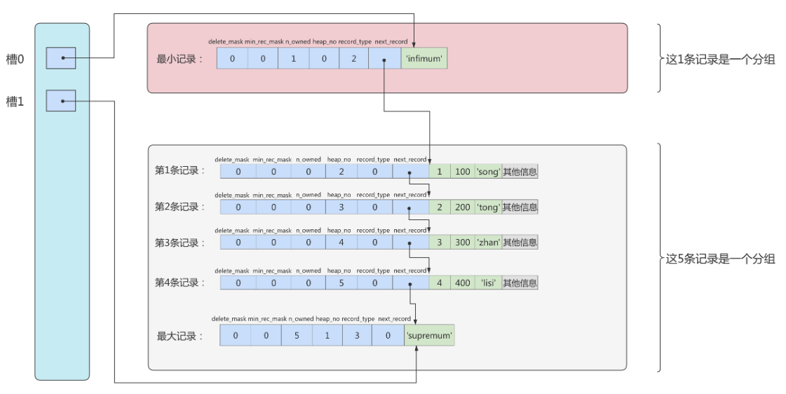

**问题一：页目录分组的个数如何确定？**

为什么最小记录的n_owned值为1，而最大记录的n_owned值为5呢？


InnoDB规定：

- 对于最小记录所在的分组只能有1条记录
- 最大记录所在的分组拥有的记录条数只能在 1~8 条之间
- 剩下的分组中记录的条数范围只能在是 4~8 条之间。


分组是按照下边的步骤进行的：

- 初始情况下一个数据页里只有最小记录和最大记录两条记录，它们分属于两个分组。
- 之后每插入一条记录，都会从页目录中找到主键值比本记录的主键值大并且差值最小的槽，然后把该槽对应的记录的n_owned值加1，表示本组内又添加了一条记录，直到该组中的记录数等于8个。
- 在一个组中的记录数等于8个后再插入一条记录时，会将组中的记录拆分成两个组，一个组中4条记录，另一个5条记录。这个过程会在页目录中新增一个槽来记录这个新增分组中最大的那条记录的偏移量。


**问题二：页目录结构下如何快速查找记录？**

现在向page_demo表中添加更多的数据。如下：

```mysql
INSERT INTO page_demo 
VALUES
(5, 500, 'zhou'), 
(6, 600, 'chen'), 
(7, 700, 'deng'), 
(8, 800, 'yang'), 
(9, 900, 'wang'), 
(10, 1000, 'zhao'), 
(11, 1100, 'qian'), 
(12, 1200, 'feng'), 
(13, 1300, 'tang'), 
(14, 1400, 'ding'), 
(15, 1500, 'jing'), 
(16, 1600, 'quan');
```

添加了12条记录，现在页里一共有18条记录了（包括最小和最大记录），这些记录被分成了5个组，如图所示：


这里只保留了16条记录的记录头信息中的n_owned和next_record属性，省略了各个记录之间的箭头。

现在看怎么从这个页目录中查找记录。因为各个槽代表的记录的主键值都是从小到大排序的，所以我们可以使用二分法来进行快速查找。5个槽的编号分别是：0、1、2、3、4，所以初始情况下最低的槽就是low=0，最高的槽就是high=4。比方说我们想找主键值为6的记录，过程是这样的：

1. 计算中间槽的位置：(0+4)/2=2，所以查看槽2对应记录的主键值为8，又因为8 > 6，所以设置high=2，low保持不变。
2. 重新计算中间槽的位置：(0+2)/2=1，所以查看槽1对应的主键值为4，又因为4 < 6，所以设置low=1，high保持不变。
3. 因为high - low的值为1，所以确定主键值为6的记录在槽2对应的组中。此刻我们需要找到槽2中主键值最小的那条记录，然后沿着单向链表遍历槽2中的记录。

但是我们前边又说过，每个槽对应的记录都是该组中主键值最大的记录，这里槽2对应的记录是主键值为8的记录，怎么定位一个组中最小的记录呢？别忘了各个槽都是挨着的，我们可以很轻易的拿到槽1对应的记录（主键值为4），该条记录的下一条记录就是槽2中主键值最小的记录，该记录的主键值为5。所以我们可以从这条主键值为5的记录出发，遍历槽2中的各条记录，直到找到主键值为6的那条记录即可。

由于一个组中包含的记录条数只能是1~8条，所以遍历一个组中的记录的代价是很小的。


**小结**：

在一个数据页中查找指定主键值的记录的过程分为两步：

1. 通过二分法确定该记录所在的槽，并找到该槽所在分组中主键值最小的那条记录。
2. 通过记录的next_record属性遍历该槽所在的组中的各个记录。


##### 2.3.2 Page Header(页面头部)

为了能得到一个数据页中存储的记录的状态信息，比如本页中已经存储了多少条记录，第一条记录的地址是什么，页目录中存储了多少个槽等等，特意在页中定义了一个叫Page Header的部分，这个部分占用固定的56个字节，专门存储各种状态信息。


- PAGE_DIRECTION

  假如新插入的一条记录的主键值比上一条记录的主键值大，我们说这条记录的插入方向是右边，反之则是左边。用来表示最后一条记录插入方向的状态就是PAGE_DIRECTION。

- PAGE_N_DIRECTION

  假设连续几次插入新记录的方向都是一致的，InnoDB会把沿着同一个方向插入记录的条数记下来，这个条数就用PAGE_N_DIRECTION这个状态表示。当然，如果最后一条记录的插入方向改变了的话，这个状态的值会被清零重新统计。


#### 2.4 从数据页角度看B + 树如何查询

一棵B+树按照节点类型可以分成两部分:

1. 叶子节点，B+树最底层的节点，节点的高度为0，存储行记录。
2. 非叶子节点，节点的高度大于0，存储索引键和页面指针，并不存储行记录本身。


当我们从页结构来理解B+树的结构的时候，可以帮我们理解一些通过索引进行检索的原理:

**1.B+树是如何进行记录检索的?**

如果通过B+树的索引查询行记录，首先是从B+树的根开始，逐层检索，直到找到叶子节点，也就是找到对应的数据页为止，将数据页加载到内存中，页目录中的槽(slot)采用`二分查找`的方式先找到一个粗略的记录分组然后再在分组中通过`链表遍历`的方式查找记录。


**2.普通索引和唯一索引在查询效率上有什么不同?**

我们创建索引的时候可以是普通索引，也可以是唯一索引，那么这两个索引在查询效率上有什么不同呢?

唯一索引就是在普通索引上增加了约束性，也就是关键字唯一，找到了关键字就停止检索。而普通索引，可能会存在用户记录中的关键字相同的情况，根据页结构的原理，当我们读取一条记录的时候，不是单独将这条记录从磁盘中读出去，而是将这个记录所在的页加载到内存中进行读取。InnoDB存储引擎的页大小为16KB，在一个页中可能存储着上千个记录，因此在普通索引的字段上进行查找也就是在内存中多几次“`判断下一条记录`”的操作，对于CPU来说，这些操作所消耗的时间是可以忽略不计的。所以对一个索引字段进行检索，采用普通索引还是唯一索引在检索效率上基本上没有差别。


### 3 InnoDB行格式(或记录格式)

我们平时的数据以行为单位来向表中插入数据，这些记录在磁盘上的存放方式也被称为`行格式`或者`记录格式`。

InnoDB存储引擎设计了4种不同类型的`行格式`，分别是`Compact（紧密）`、`Redundant（冗余）`、`Dynamic（动态）`和`Compressed（压缩）`行格式。

查看MySQL8 与 MySQL5.7的默认行格式:

```mysql
mysql> select @@innodb_default_row_format;
+-----------------------------------------+
| @@innodb_default_row_format             |
+-----------------------------------------+
| dynamic                                 |
+-----------------------------------------+
1 row in set (0.00 sec)

# 查询单张表行格式
mysql> show table status like 'departments' \G
*************************** 1. row ***************************
           Name: departments
         Engine: InnoDB
        Version: 10
 #行格式  Row_format: Dynamic
           Rows: 27
 Avg_row_length: 606
    Data_length: 16384
Max_data_length: 0
   Index_length: 49152
      Data_free: 0
 Auto_increment: NULL
    Create_time: 2022-03-23 14:56:38
    Update_time: 2022-03-23 14:56:38
     Check_time: NULL
      Collation: utf8_general_ci
       Checksum: NULL
 Create_options:
        Comment:
1 row in set (0.01 sec)
```


#### 3.1 指定行格式的语法

在创建或修改表的语句中指定行格式：

```mysql
CREATE TABLE 表名 (列的信息) ROW_FORMAT=行格式名称

ALTER TABLE 表名 ROW_FORMAT=行格式名称
```

举例：

```mysql
mysql> CREATE TABLE record_test_table (
    ->     col1 VARCHAR(8),
    ->     col2 VARCHAR(8) NOT NULL,
    ->     col3 CHAR(8),
    ->     col4 VARCHAR(8)
    -> ) CHARSET=ascii ROW_FORMAT=COMPACT;
Query OK, 0 rows affected (0.03 sec)
```

向表中插入两条记录：

```mysql
INSERT INTO record_test_table(col1, col2, col3, col4) 
VALUES
('zhangsan', 'lisi', 'wangwu', 'songhk'), 
('tong', 'chen', NULL, NULL);
```


#### 3.2 COMPACT行格式

在MySQL5.1版本中，默认设置为Compact行格式。一条完整的记录其实可以被分为`记录的额外信息`和`记录的真实数据`两大部分。

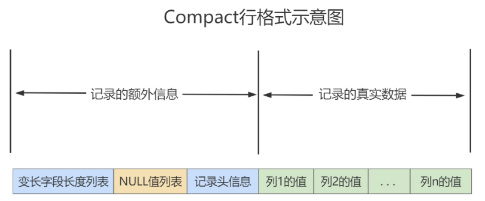

##### 3.2.1 变长字段长度列表

MySQL支持一些变长的数据类型，比如VARCHAR(M)、VARBINARY(M)、TEXT类型，BLOB类型，这些数据类型修饰列称为`变长字段`，变长字段中存储多少字节的数据不是固定的，所以我们在存储真实数据的时候需要顺便把这些数据占用的字节数也存起来。`在Compact行格式中，把所有变长字段的真实数据占用的字节长度都存放在记录的开头部位，从而形成一个变长字段长度列表`。

> 注意：这里面存储的变长长度和字段`顺序是反过来的`。比如两个varchar字段在表结构的顺序是a(10)，b(15)。那么在变长字段长度列表中存储的长度顺序就是15，10，是反过来的。

以record_test_table表中的第一条记录举例：因为record_test_table表的col1、col2、col4列都是VARCHAR(8)类型的，所以这三个列的值的长度都需要保存在记录开头处，注意record_test_table表中的各个列都使用的是ascii字符集（每个字符只需要1个字节来进行编码）


又因为这些长度值需要按照列的逆序存放，所以最后变长字段长度列表的字节串用十六进制表示的效果就是（各个字节之间实际上没有空格，用空格隔开只是方便理解）：06 04 08 

把这个字节串组成的变长字段长度列表填入上边的示意图中的效果就是：


##### 3.2.2 NULL值列表

Compact行格式会把可以为NULL的列统一管理起来，存在一个标记为NULL值列表中。如果表中没有允许存储NULL的列，则NULL值列表也不存在了。

**为什么定义NULL值列表？**

之所以要存储NULL是因为数据都是需要对齐的，如果`没有标注出来NULL值`的位置，就有可能在查询数据的时候`出现混乱`。如果`使用一个特定的符号`放到相应的数据位表示空置的话，虽然能达到效果，但是这样很`浪费空间`，所以直接就在行数据得头部开辟出一块空间专门用来记录该行数据哪些是非空数据，哪些是空数据，格式如下：

1. 二进制位的值为1时，代表该列的值为NULL。
2. 二进制位的值为0时，代表该列的值不为NULL。

例如：字段 a、b、c，其中a是主键，在某一行中存储的数依次是`a=1、b=null、c=2`。那么Compact行格式中的NULL值列表中存储：01。第一个0表示c不为null，第二个1表示b是null。这里之所以没有a是因为数据库会自动跳过主键，因为主键肯定是非NULL且唯一的，在NULL值列表的数据中就会自动跳过主键。


record_test_table的两条记录的NULL值列表就如下：

第一条记录：('zhangsan', 'lisi', 'wangwu', 'songhk')


第二条记录：('tong', 'chen', NULL, NULL)


##### 3.2.3 记录头信息

```mysql
mysql> CREATE TABLE page_demo(
    ->     c1 INT,
    ->     c2 INT,
    ->     c3 VARCHAR(10000),
    ->     PRIMARY KEY (c1)
    -> ) CHARSET=ascii ROW_FORMAT=Compact;
Query OK, 0 rows affected (0.03 sec)
```

这个表中记录的行格式示意图：


这些记录头信息中各个属性如下：


简化后的行格式示意图：


插入数据：

```mysql
INSERT INTO page_demo 
VALUES
(1, 100, 'song'), 
(2, 200, 'tong'), 
(3, 300, 'zhan'), 
(4, 400, 'lisi');
```

图示如下：


- **delete_mask**

  这个属性标记着当前记录是否被删除，占用1个二进制位。

  - 值为0：代表记录并没有被删除
  - 值为1：代表记录被删除掉了

  **被删除的记录为什么还在页中存储呢？**

  你以为它删除了，可它还在真实的磁盘上。这些被删除的记录之所以不立即从磁盘上移除，是因为移除它们之后其他的记录在磁盘上需要`重新排列，导致性能消耗`。所以只是打一个删除标记而已，所有被删除掉的记录都会组成一个所谓的`垃圾链表`，在这个链表中的记录占用的空间称之为`可重用空间`，之后如果有新记录插入到表中的话，可能把这些被删除的记录占用的存储空间覆盖掉。

- **min_rec_mask**

  B+树的每层非叶子节点中的最小记录都会添加该标记，min_rec_mask值为1。

  我们自己插入的四条记录的min_rec_mask值都是0，意味着它们都不是B+树的非叶子节点中的最小记录。

- **record_type**

  这个属性表示当前记录的类型，一共有4种类型的记录：

  - 0：表示普通记录
  - 1：表示B+树非叶节点记录
  - 2：表示最小记录
  - 3：表示最大记录

  从图中我们也可以看出来，我们自己插入的记录就是普通记录，它们的record_type值都是0，而最小记录和最大记录的record_type值分别为2和3。至于record_type为1的情况，我们在索引的数据结构章节讲过。

- **heap_no**

  这个属性表示当前记录在本页中的位置。

  从图中可以看出来，我们插入的4条记录在本页中的位置分别是：2、3、4、5。

  **怎么不见heap_no值为0和1的记录呢？**

  MySQL会自动给每个页里加了两个记录，由于这两个记录并不是我们自己插入的，所以有时候也称为`伪记录`或者`虚拟记录`。这两个伪记录一个代表`最小记录`，一个代表`最大记录`。最小记录和最大记录的heap_no值分别是0和1，也就是说它们的位置最靠前。

- **n_owned**

  页目录中每个组中最后一条记录的头信息中会存储该组一共有多少条记录，作为 n_owned 字段。

  详情见page directory。

- **next_record**

  记录头信息里该属性非常重要，它表示从当前记录的真实数据到下一条记录的真实数据的`地址偏移量`。

  比如：第一条记录的next_record值为32，意味着从第一条记录的真实数据的地址处向后找32个字节便是下一条记录的真实数据。

  注意，下一条记录指得并不是按照我们插入顺序的下一条记录，而是按照主键值由小到大的顺序的下一条记录。而且规定Infimum记录（也就是最小记录）的下一条记录就是本页中主键值最小的用户记录，而本页中主键值最大的用户记录的下一条记录就是 Supremum记录（也就是最大记录）。

  下图用箭头代替偏移量表示next_record。

  

  **演示：删除操作**

  删除操作：从表中删除掉一条记录，这个链表也是会跟着变化：

  ```mysql
  mysql> DELETE FROM page_demo WHERE c1 = 2;
  Query OK, 1 row affected (0.02 sec)
  ```

  删掉第2条记录后的示意图就是：

  

  从图中可以看出来，删除第2条记录前后主要发生了这些变化：
  - 第2条记录并没有从存储空间中移除，而是把该条记录的delete_mask值设置为1。
  - 第2条记录的next_record值变为了0，意味着该记录没有下一条记录了。
  - 第1条记录的next_record指向了第3条记录。
  - 最大记录的n_owned值从 5 变成了 4。

  所以，不论我们怎么对页中的记录做增删改操作，InnoDB始终会维护一条记录的单链表，链表中的各个节点是按照主键值由小到大的顺序连接起来的。

   

  **演示：添加操作**

  添加操作：主键值为2的记录被我们删掉了，但是存储空间却没有回收，如果我们再次把这条记录插入到表中，会发生什么事呢？

  ```mysql
  mysql> INSERT INTO page_demo VALUES(2, 200, 'tong');
  Query OK, 1 row affected (0.00 sec)
  ```

  我们看一下记录的存储情况：

  

  直接复用了原来被删除记录的存储空间。

  说明：当数据页中存在多条被删除掉的记录时，这些记录的next_record属性将会把这些被删除掉的记录组成一个垃圾链表，以备之后重用这部分存储空间。

##### 3.2.4 记录的真实数据

记录的真实数据除了我们自己定义的列的数据以外，还会有三个隐藏列：


实际上这几个列的真正名称其实是：DB_ROW_ID、DB_TRX_ID、DB_ROLL_PTR。

- 一个表没有手动定义主键，则会选取一个Unique键作为主键，如果连Unique键都没有定义的话，则会为表默认添加一个名为row_id的隐藏列作为主键。所以row_id是在没有自定义主键以及Unique键的情况下才会存在的。
- 事务ID和回滚指针在后面的《第14章_MySQL事务日志》章节中讲解。

举例：分析Compact行记录的内部结构：

```mysql
CREATE TABLE mytest(
col1 VARCHAR(10),
col2 VARCHAR(10),
col3 CHAR(10),
col4 VARCHAR(10)
)ENGINE=INNODB CHARSET=LATIN1 ROW_FORMAT=COMPACT;

INSERT INTO mytest
VALUES('a','bb','bb','ccc');
 
INSERT INTO mytest
VALUES('d','ee','ee','fff');
 
INSERT INTO mytest
VALUES('d',NULL,NULL,'fff');
```

在Windows操作系统下，可以选择通过程序UltraEdit打开表空间文件mytest.ibd这个二进制文件。内容如下：


该行记录从0000c078开始，若整理一下，相信大家会有更好的理解：

```
03 02 01                     				/*变长字段长度列表，逆序*/
00                             				     /*NULL标志位，第一行没有NULL值*/
00 00 10 00 2c             			          /*Record Header，固定5字节长度*/
00 00 00 2b 68 00       				/*RowID InnoDB自动创建，6字节*/
00 00 00 00 06 05       				 /*TransactionID*/
80 00 00 00 32 01 10  					 /*Roll Pointer*/
61                             					 /*列1数据'a'*/
62 62                         					 /*列2数据'bb'*/
62 62 20 20 20 20 20 20 20 20			/*列3数据'bb'*/
63 63 63                     					/*列4数据'ccc'*/
```

注意1：InnoDB每行有隐藏列TransactionID和Roll Pointer。

注意2：固定长度CHAR字段在未能完全占用其长度空间时，会用0x20来进行填充。


接着再来分析下Record Header的最后两个字节，这两个字节代表next_recorder，0x2c代表下一个记录的偏移量，即当前记录的位置加上偏移量0x2c就是下条记录的起始位置。


第二行将不做整理，除了RowID不同外，它和第一行大同小异，现在来分析有NULL值的第三行：

```
03 01                       /*变长字段长度列表，逆序*/
06                          /*NULL标志位，第三行有NULL值  0110*/
00 00 20 ff 98              /*Record Header*/
00 00 00 2b 68 02           /*RowID*/
00 00 00 00 06 07           /*TransactionID*/
80 00 00 00 32 01 10        /*Roll Pointer*/
64                          /*列1数据'd'*/
66 66 66                    /*列4数据'fff'*/
```

第三行有NULL值，因此NULL标志位不再是00而是06，转换成二进制为00000110，为1的值代表第2列和第3列的数据为NULL。在其后存储列数据的部分，用户会发现没有存储NULL列，而只存储了第1列和第4列非NULL的值。

因此这个例子很好地说明了：不管是CHAR类型还是VARCHAR类型，在compact格式下NULL值都不占用任何存储空间。


#### 3.3 Dynamic和Compressed行格式

##### 3.3.1 行溢出

**InnoDB存储引擎可以将一条记录中的某些数据存储在真正的数据页面之外。**

很多DBA喜欢MySQL数据库提供的VARCHAR(M)类型，认为可以存放65535字节。这是真的吗？如果我们使用ascii字符集的话，一个字符就代表一个字节，我们看看VARCHAR(65535)是否可用。

```mysql
CREATE  TABLE  varchar_size_demo(
 c  VARCHAR(65535)
 )  CHARSET=ascii  ROW_FORMAT=Compact;
# 结果如下：
ERROR 1118 (42000): Row size too large. The maximum row size for the used table type, not counting BLOBs, is 65535. This includes storage overhead, check the manual. You have  to  change  some  columns  to  TEXT or  BLOBs
```

报错信息表达的意思是：MySQL对一条记录占用的最大存储空间是有限制的，除BLOB或者TEXT类型的列之外，其他所有的列（不包括隐藏列和记录头信息）占用的字节长度加起来不能超过65535个字节。

这个65535个字节除了列本身的数据之外，还包括一些其他的数据，以Compact行格式为例，比如说我们为了存储一个VARCHAR(M)类型的列，除了真实数据占有空间以外，还需要记录的额外信息。

如果该VARCHAR类型的列没有NOT NULL属性，那最多只能存储65532个字节的数据，因为变长字段的长度占用2个字节，NULL值标识需要占用1个字节。

```mysql
CREATE  TABLE  varchar_size_demo(
    c  VARCHAR(65532)
)  CHARSET=ascii  ROW_FORMAT=Compact;

#如果有not null属性，那么就不需要NULL值标识，也就可以多存储一个字节，即65533个字节
CREATE  TABLE  varchar_size_demo( 
  c  VARCHAR(65533)  not  null
)  CHARSET=ascii  ROW_FORMAT=Compact; 
```

通过上面的案例，我们可以知道一个页的大小一般是16KB，也就是16384字节，而一个VARCHAR(M)类型的列就最多可以存储65533个字节，这样就可能出现一个页存放不了一条记录，这种现象称为`行溢出`。 

在Compact和Reduntant行格式中，对于占用存储空间非常大的列，在记录的真实数据处只会存储该列的一部分数据，把剩余的数据分散存储在几个其他的页中进行分页存储，然后记录的真实数据处用20个字节存储指向这些页的地址（当然这20个字节中还包括这些分散在其他页面中的数据的占用的字节数），从而可以找到剩余数据所在的页。

这称为页的扩展，举例如下：


##### 3.3.2 Dynamic和Compressed行格式

在MySQL8.0中，默认行格式就是Dynamic，Dynamic、Compressed行格式和Compact行格式挺像，只不过在处理行溢出数据时有分歧：

- Compressed和Dynamic两种记录格式对于存放在BLOB中的数据采用了完全的行溢出的方式。如图，在数据页中只存放20个字节的指针（溢出页的地址），实际的数据都存放在Off Page（溢出页）中。
- Compact和Redundant两种格式会在记录的真实数据处存储一部分数据（存放768个前缀字节）。

Compressed行记录格式的另一个功能就是，存储在其中的行数据会以zlib的算法进行压缩，因此对于BLOB、TEXT、VARCHAR这类大长度类型的数据能够进行非常有效的存储。


#### 3.4 Redundant行格式

Redundant是MySQL5.0版本之前InnoDB的行记录存储方式，MySQL5.0支持Redundant是为了兼容之前版本的页格式。

现在我们把表record_test_table的行格式修改为Redundant：

```mysql
ALTER TABLE record_test_table ROW_FORMAT=Redundant;
Query OK, 0 rows affected (0.05 sec)
Records: 0  Duplicates: 0  Warnings: 0
```


从上图可以看到，不同于Compact行记录格式，Redundant行格式的首部是一个字段长度偏移列表，同样是按照列的顺序`逆序放置`的。

下边我们从各个方面看一下Redundant行格式有什么不同的地方。

##### 3.4.1 字段长度偏移列表

注意Compact行格式的开头是`变长字段长度列表`，而Redundant行格式的开头是`字段长度偏移列表`，与变长字段长度列表有两处不同：

- 少了“变长”两个字：Redundant行格式会把该条记录中所有列（包括隐藏列）的长度信息都按照逆序存储到字段长度偏移列表。
- 多了“偏移”两个字：这意味着计算列值长度的方式不像Compact行格式那么直观，它是采用两个相邻数值的差值来计算各个列值的长度。

举例：比如第一条记录的字段长度偏移列表就是：2B 25 1F 1B 13 0C 06

因为它是逆序排放的，所以按照列的顺序排列就是：

06 0C 13 17 1A 24 25

按照两个相邻数值的差值来计算各个列值的长度的意思就是：


第一列(row_id)的长度就是 0x06个字节，也就是6个字节。

第二列(transaction_id)的长度就是 (0x0C - 0x06)个字节，也就是6个字节。

第三列(roll_pointer)的长度就是 (0x13 - 0x0C)个字节，也就是7个字节。

第四列(col1)的长度就是 (0x1B - 0x13)个字节，也就是8个字节。

第五列(col2)的长度就是 (0x1F - 0x1B)个字节，也就是4个字节。

第六列(col3)的长度就是 (0x25 - 0x1F)个字节，也就是6个字节。

第七列(col4)的长度就是 (0x2B - 0x25)个字节，也就是6个字节。


##### 3.4.2 记录头信息(record header)

不同于Compact行格式，Redundant行格式中的记录头信息固定占用6个字节（48位），每位的含义见下表。


- 与Compact行格式的记录头信息对比来看，有两处不同：

  - Redundant行格式多了n_field和1byte_offs_flag这两个属性。
  - Redundant行格式没有record_type这个属性。

  其中，n_fields：代表一行中列的数量，占用10位，这也很好地解释了为什么MySQL一个行支持最多的列为1023。

  另一个值为1byte_offs_flags，该值定义了偏移列表占用1个字节还是2个字节。当它的值为1时，表明使用1个字节存储。当它的值为0时，表明使用2个字节存储。

- 1byte_offs_flag的值是怎么选择的

  我们前边说过每个列对应的偏移量可以占用1个字节或者2个字节来存储，那到底什么时候用1个字节，什么时候用2个字节呢？其实是根据该条Redundant行格式记录的真实数据占用的总大小来判断的：

  - 当记录的真实数据占用的字节数值不大于127（十六进制0x7F，二进制01111111）时，每个列对应的偏移量占用1个字节。
  - 当记录的真实数据占用的字节数大于127，但不大于32767（十六进制0x7FFF，二进制0111111111111111）时，每个列对应的偏移量占用2个字节。

- 有没有记录的真实数据大于32767的情况呢？有，不过此时的记录已经存放到了溢出页中，在本页中只保留前768个字节和20个字节的溢出页面地址。因为字段长度偏移列表处只需要记录每个列在本页面中的偏移就好了，所以每个列使用2个字节来存储偏移量就够了。

  大家可以看出来，Redundant行格式还是比较简单粗暴的，直接使用整个记录的真实数据长度来决定使用1个字节还是2个字节存储列对应的偏移量。只要整条记录的真实数据占用的存储空间大小大于127，即使第一个列的值占用存储空间小于127，那对不起，也需要使用2个字节来表示该列对应的偏移量。简单粗暴，就是这么简单粗暴（所以这种行格式有些过时了）。

  为了在解析记录时知道每个列的偏移量是使用1个字节还是2个字节表示的，Redundant行格式特意在`记录头信息`里放置了一个称之为1byte_offs_flag的属性：

- Redundant行格式中NULL值的处理

  因为Redundant行格式并没有NULL值列表，所以Redundant行格式在字段长度偏移列表中的各个列对应的偏移量处做了一些特殊处理 —— 将列对应的偏移量值的第一个比特位作为是否为NULL的依据，该比特位也可以被称之为NULL比特位。也就是说在解析一条记录的某个列时，首先**看一下该列对应的偏移量的NULL比特位是不是为1**。如果为1，那么该列的值就是NULL，否则不是NULL。

  这也就解释了上边介绍为什么只要记录的真实数据大于127（十六进制0x7F，二进制01111111）时，就采用2个字节来表示一个列对应的偏移量，主要是第一个比特位是所谓的NULL比特位，用来标记该列的值是否为NULL。

  但是还有一点要注意，对于值为NULL的列来说，该列的类型是否为定长类型决定了NULL值的实际存储方式，我们接下来分析一下record_test_table表的第二条记录，它对应的字段长度偏移列表如下：

  A4 A4 1A 17 13 0C 06

  按照列的顺序排放就是：

  06 0C 13 17 1A A4 A4

  我们分情况看一下：

  - 如果存储NULL值的字段是定长类型的，比方说`CHAR(M)`数据类型的，则NULL值也将占用记录的真实数据部分，并把该字段对应的数据使用0x00字节填充。

  如图第二条记录的c3列的值是NULL，而c3列的类型是`CHAR(10)`，占用记录的真实数据部分10字节，所以我们看到在Redundant行格式中使用0x00000000000000000000来表示NULL值。

  另外，c3列对应的偏移量为0xA4，它对应的二进制实际是：10100100，可以看到最高位为1，意味着该列的值是NULL。将最高位去掉后的值变成了0100100，对应的十进制值为36，而c2列对应的偏移量为0x1A，也就是十进制的26。36 - 26 = 10，也就是说最终c3列占用的存储空间为10个字节。

  - 如果该存储NULL值的字段是变长数据类型的，则不在记录的真实数据处占用任何存储空间。

  比如record_test_table表的c4列是VARCHAR(10)类型的，VARCHAR(10)是一个变长数据类型，c4列对应的偏移量为0xA4，与c3列对应的偏移量相同，这也就意味着它的值也为NULL，将0xA4的最高位去掉后对应的十进制值也是36，36 - 36 = 0，也就意味着c4列本身不占用任何记录的实际数据处的空间。

除了以上的几点之外，Redundant行格式和Compact行格式还是大致相同的。


### 4 区、段与碎片区

#### 4.1 为什么要有区?

`B+`树的每一层中的页都会形成一个双向链表，如果是以`页为单位`来分配存储空间的话，双向链表相邻的两个页之间的`物理位置可能离得非常远`。我们介绍B+树索引的适用场景的时候特别提到范围查询只需要定位到最左边的记录和最右边的记录,然后沿着双向链表一直扫描就可以了，而如果链表中相邻的两个页物理位置离得非常远，就是所谓的`随机IO`。再一次强调，磁盘的速度和内存的速度差了好几个数量级，`随机IO是非常慢的`，所以我们应该尽量让链表中相邻的页的物理位置也相邻，这样进行范围查询的时候才可以使用所谓的`顺序IO`。

> 这样利用了磁盘的预读特性

引入`区`的概念，一个区就是在物理位置上**连续**的`64个页`。因为InnoDB 中的页大小默认是16KB，所以一个区的大小是64*16KB=`1MB`。在表中`数据量大`的时候，为某个索引分配空间的时候就不再按照页为单位分配了，而是按照`区为单位`分配，甚至在表中的数据特别多的时候，可以一次性分配多个连续的区。虽然可能造成`一点点空间的浪费`（数据不足以填充满整个区)，但是从性能角度看，可以消除很多的随机I/O，`功大于过`!

> 这里是连续的64个页， 但是具体的两个页之间还是用指针相连的。保证一大块区域连续。

 

#### 4.2 为什么要有段?

对于范围查询，其实是对B+树叶子节点中的记录进行顺序扫描，而如果不区分叶子节点和非叶子节点，统统把节点代表的页面放到申请到的区中的话，进行范围扫描的效果就大打折扣了。所以InnoDB对B+树的`叶子节点`和`非叶子节点`进行了区别对待，也就是说叶子节点有自己独有的区，非叶子节点也有自己独有的区。存放叶子节点的区的集合就算是一个`段(segment)`，存放非叶子节点的区的集合也算是一个段。也就是说一个索引会生成2个段，一个`叶子节点段`，一个`非叶子节点段`。

除了索引的叶子节点段和非叶子节点段之外，InnoDB中还有为存储一些特殊的数据而定义的段，比如回滚段。所以，常见的段有`数据段`、`索引段`、`回滚段`。数据段即为B+树的叶子节点，索引段即为B+树的非叶子节点。

在InnoDB存储引擎中，对段的管理都是由引擎自身所完成，DBA不能也没有必要对其进行控制。这从一定程度上简化了DBA对于段的管理。

段其实不对应表空间中某一个连续的物理区域，而是一个逻辑上的概念，由若干个零散的页面以及一些完整的区组成。

> 零散的页面，看碎片区


#### 4.3 为什么要有碎片区?

默认情况下，一个使用InnoDB存储引擎的表只有一个聚簇索引，一个索引会生成2个段，而段是以区为单位申请存储空间的，一个区默认占用1M (64*16Kb=1024Kb）存储空间，所以**默认情况下一个只存了几条记录的小表也需要2M的存储空间么?**以后每次添加一个索引都要多申请2M的存储空间么?这对于存储记录比较少的表简直是天大的浪费。这个问题的症结在于到现在为止我们介绍的区都是非常**纯粹的**，也就是一个区被整个分配给某一个段，或者说区中的所有页面都是为了存储同一个段的数据而存在的，即使段的数据填不满区中所有的页面，那余下的页面也不能挪作他用。

为了考虑以完整的区为单位分配给某个段对于`数据量较小`的表太浪费存储空间的这种情况，InnoDB提出了一个`碎片(fragment)区`的概念。在一个碎片区中，并不是所有的页都是为了存储同一个段的数据而存在的，而是碎片区中的页可以用于不同的目的，比如有些页用于段A，有些页用于段B，有些页甚至哪个段都不属于。`碎片区直属于表空间`，并不属于任何一个段。

所以此后为某个段分配存储空间的策略是这样的：

- 在刚开始向表中插入数据的时候，段是从某个碎片区以单个页面为单位来分配存储空间的；
- 当某个段已经占用了`32个碎片区`页面之后，就会申请以完整的区为单位来分配存储空间。

所以现在段不能仅定义为是某些区的集合，更精确的应该是**某些零散的页面**以及**一些完整的区**的集合。


#### 4.4 区的分类

区大体上可以分为4种类型:

- `空闲的区(FREE)`：现在还没有用到这个区中的任何页面。
- `有剩余空间的碎片区(FREE_FRAG)`：表示碎片区中还有可用的页面。
- `没有剩余空间的碎片区(FULL_FRAG)`：表示碎片区中的所有页面都被使用，没有空闲页面。
- `附属于某个段的区(FSEG)`：每一个索引都可以分为叶子节点段和非叶子节点段。

处于`FREE`、`FREE_FRAG`以及`FULL_FRAG`这三种状态的区都是独立的，直属于表空间。而处于FSEG状态的区是附属于某个段的。

> 如果把表空间比作是一个集团军，段就相当于师，区就相当于团。一般的团都是隶属于某个师的，就像是处于`FSEG`的区全都隶属于某个段，而处于`FREE`、`FREE_FRAG`以及`FULL_FRAG`这三种状态的区却直接隶属于表空间，就像独立团直接听命于军部一样。


#### 4.5 扩展

那么，计算机怎样才能判断一个数据接下来可能被用到？

> 时间局部性（Temporal Locality）

时间局部性：如果一个信息项正在被访问，那么在近期它很可能还会被再次访问。

// 这是可以理解的，用过的数据当然可能再次被用到。

> 空间局部性（Spatial Locality）

空间局部性：在最近的将来将用到的信息很可能与现在正在使用的信息在空间地址上是临近的。

// 正在使用的某个数据地址旁边的数据，当然也是很可能被用到的，比如某个数组、集合等等。

> 顺序局部性（Order Locality）

顺序局部性：在典型程序中，除转移类指令外，大部分指令是顺序进行的。顺序执行和非顺序执行的比例大致是5:1。此外，对大型数组访问也是顺序的。

指令的顺序执行、数组的连续存放等是产生顺序局部性的原因。

// 正在执行的某个指令以及还在排队等候处理的指令，大部分是按照顺序来执行的。

> 磁盘预读原理

内存比磁盘的读写速度要快很多，但内存容量要远小于磁盘，而数据、程序的执行要调入内存后才能执行，所以内存和磁盘要经常进行I/O操作，I/O操作是个费事的过程，虽然现代系统已经有了通道（I/O处理机）技术的支持，但这远远不够（CPU的处理速度远远大于磁盘I/O的速度）。

**所以磁盘读取的时候会顺带加载附近的数据到缓存**

>  磁盘读取（详细）

磁盘存取，磁盘I/O涉及机械操作。磁盘是由大小相同且同轴的圆形盘片组成，磁盘可以转动(各个磁盘须同时转动)。磁盘的一侧有磁头支架，磁头支架固定了一组磁头，每个磁头负责存取一个磁盘的内容。磁头不动，磁盘转动，但磁臂可以前后动，用于读取不同磁道上的数据。磁道就是以盘片为中心划分出来的一系列同心环。磁道又划分为一个个小段，叫扇区，是磁盘的最小存储单元。 

磁盘读取时，系统将数据逻辑地址传给磁盘，磁盘的控制电路会解析出物理地址（哪个磁道，哪个扇区），于是磁头需要前后移动到相应的磁道——寻道，消耗的时间叫——寻道时间，磁盘旋转将对应的扇区转到磁头下（磁头找到对应磁道的对应扇区），消耗的时间叫——旋转时间，这一系列操作是非常耗时。


##### 4.5.1 重点

为了尽量减少I/O操作，计算机系统一般采取预读的方式，预读的长度一般为页（page）的整倍数。页是计算机管理存储器的逻辑块，硬件及操作系统往往将主存和磁盘存储区分割为连续的大小相等的块，每个存储块称为一页（在许多操作系统中，页得大小通常为4k），主存和磁盘以页为单位交换数据。当程序要读取的数据不在主存中时，会触发一个缺页异常，此时系统会向磁盘发出读盘信号，磁盘会找到数据的起始位置并向后`连续读取一页或几页载入内存中`，然后异常返回，程序继续运行。

计算机系统是分页读取和存储的，一般一页为4KB（8个扇区，每个扇区125B，8*125B=4KB），每次读取和存取的最小单元为一页，而**`磁盘预读时通常会读取页的整倍数`**。根据文章上述的【局部性原理】①当一个数据被用到时，其附近的数据也通常会马上被使用。②程序运行期间所需要的数据通常比较集中。由于磁盘顺序读取的效率很高（不需要寻道时间，只需很少的旋转时间），所以即使只需要读取一个字节，磁盘也会读取一页的数据。

至于磁盘分页，参考计算机操作系统的分页，分段存储管理——逻辑地址和物理地址被分为大小相同的页面，逻辑地址中叫页，物理地址中叫块。

##### 4.5.2 为什么使用B-Tree/B+Tree

二叉查找树进化品种的红黑树等数据结构也可以用来实现索引，但是文件系统及数据库系统普遍采用B-Tree/B+Tree作为索引结构。

一般来说，索引本身也很大，不可能全部存储在内存中，因此索引往往以索引文件的形式存储的磁盘上。这样的话，索引查找过程中就要产生磁盘I/O消耗，相对于内存存取，I/O存取的消耗要高几个数量级，所以评价一个数据结构作为索引的优劣最重要的指标就是在查找过程中磁盘I/O操作次数的渐进复杂度。换句话说，索引的结构组织要尽量减少查找过程中磁盘I/O的存取次数。

分析B-Tree/B+Tree检索一次最多需要访问节点：

h=

数据库系统巧妙利用了磁盘预读原理，将`一个节点的大小设为等于一个页`，这样每个节点只需要一次I/O就可以完全载入。为了达到这个目的，在实际实现B-Tree还需要使用如下技巧：

      每次新建节点时，直接申请一个页的空间，这样就保证一个节点物理上也存储在一个页里，加之计算机存储分配都是按页对齐的，就实现了一个node只需一次I/O。

B-Tree中一次检索最多需要h-1次I/O（根节点常驻内存），渐进复杂度为O（h）=O（logmN）。一般实际应用中，m是非常大的数字，通常超过100，因此h非常小（通常不超过3）。

综上所述，用B-Tree作为索引结构效率是非常高的。

而红黑树这种结构，h明显要深的多。由于逻辑上很近的节点（父子）物理上可能很远，无法利用局部性，所以红黑树的I/O渐进复杂度也为O（h），效率明显比B-Tree差很多。

**B树与B+Tree**

B-Tree：如果一次检索需要访问4个节点，数据库系统设计者利用磁盘预读原理，把节点的大小设计为一个页，那读取一个节点只需要一次I/O操作，完成这次检索操作，最多需要3次I/O(根节点常驻内存)。数据记录越小，每个节点存放的数据就越多，树的高度也就越小，I/O操作就少了，检索效率也就上去了。

B+Tree：非叶子节点只存key，大大滴减少了非叶子节点的大小，那么每个节点就可以存放更多的记录，树更矮了，I/O操作更少了。所以B+Tree拥有更好的性能。


### 5 表空间

表空间可以看做是InnoDB存储引擎逻辑结构的最高层，所有的数据都存放在表空间中。

表空间是一个`逻辑容器`，表空间存储的对象是段，在一个表空间中可以有一个或多个段，但是一个段只能属于一个表空间。表空间数据库由一个或多个表空间组成，表空间从管理上可以划分为`系统表空间` (System
tablespace)、`独立表空间`(File-per-table tablespace)、`撤销表空间`(Undo Tablespace)和`临时表空间`(Temporary Tablespace）等。


#### 5.1 独立表空间

独立表空间，即每张表有一个独立的表空间，也就是数据和索引信息都会保存在自己的表空间中。独立的表空间(即:单表)可以在不同的数据库之间进行`迁移`。

空间可以回收(DROPTABLE操作可自动回收表空间;其他情况，表空间不能自己回收)。如果对于统计分析或是日志表，删除大量数据后可以通过: `alter table TableName engine=innodb`;回收不用的空间。对于使用独立表空间的表，不管怎么删除，表空间的碎片不会太严重的影响性能，而且还有机会处理。

**独立表空间结构**

独立表空间由段、区、页组成。前面已经讲解过了。

**真实表空间对应的文件大小**

我们到数据目录里看，会发现一个新建的表对应的`.ibd`文件只占用了`96K`，才6个页面大小(MySQL5.7中)，这是因为一开始表空间占用的空间很小，因为表里边都没有数据。不过别忘了这些.ibd文件是`自扩展的`，随着表中数据的增多，表空间对应的文件也逐渐增大。

**查看InnoDB的表空间类型:**

```mysql
# 查看是否独立表空间
mysql> show variables like 'innodb_file_per_table';
+----------------------------+-------+
| Variable_name              | Value |
+----------------------------+-------+
| innodb_file_per_table      | ON    |
+----------------------------+-------+
1 row in set, 1 warning (0.00 sec)
```

MySQL8.0中 7个页面大小。原因.idb 还存了表结构。。。表结构.frm取消了

你能看到innodb_ file_ per_ _table=ON,这就意味着每张表都会单独保存为一个`.ibd`文件。


#### 5.2 系统表空间

系统表空间的结构和独立表空间基本类似，只不过由于整个MySQL进程只有一个系统表空间，在系统表空间中会额外记录一些有关整个系统信息的页面，这部分是独立表空间中没有的。

**lnnoDB数据字典**

每当我们向一个表中插入一条记录的时候，`MySQL校验过程`如下:

先要校验一下插入语句对应的表存不存在，插入的列和表中的列是否符合，如果语法没有问题的话，还需要知道该表的聚簇索引和所有二级索引对应的根页面是哪个表空间的哪个页面，然后把记录插入对应索引的B+树中。所以说，MySQL除了保存着我们插入的用户数据之外，还需要保存许多额外的信息，比方说:

```txt
-某个表属于哪个表空间，表里边有多少列
-表对应的每一个列的类型是什么
-该表有多少索引，每个索引对应哪几个字段，该索引对应的根页面在哪个表空间的哪个页面
-该表有哪些外键，外键对应哪个表的哪些列
-某个表空间对应文件系统上文件路径是什么
- ...
```


上述这些数据并不是我们使用`INSERT`语句插入的用户数据，实际上是为了更好的管理我们这些用户数据而不得已引入的一些额外数据，这些数据也称为`元数据`。InnoDB存储引擎特意定义了一些列的`内部系统表`(internalsystem table)来记录这些这些元数据:

| 表名             | 描述                                                 |
| ---------------- | ---------------------------------------------------- |
| `SYS_TABLES`     | 整个InnoDB存储引擎中所有的表的信息                   |
| `SYS_COLUMNS`    | 整个InnoDB存储引擎中所有的列的信息                   |
| `SYS_INDEXES`    | 整个InnoDB存储引擎中所有的索引的信息                 |
| `SYS_FIELDS`     | 整个InnoDB存储引擎中所有的索引对应的列的信息         |
| SYS_FOREIGN      | 整个InnoDB存储引擎中所有的外键的信息                 |
| SYS_FOREIGN_COLS | 整个InnoDB存储引擎中所有的外键对应列的信息           |
| SYS_TABLESPACES  | 整个InnoDB存储引擎中所有的表空间信息                 |
| SYS_DATAFILES    | 整个InnoDB存储引擎中所有的表空间对应文件系统的文件路 |
| SYS_VIRTUAL      | 整个InnoDB存储引擎中所有的虚拟生成列的信息           |

这些系统表也被称为`数据字典`，它们都是以`B+`树的形式保存在系统表空间的某些页面中，其中`SYS_TABLES`.
`SYS_COLUNNS`、`SYS_INDEXES`、`SYS_FIELDS`这四个表尤其重要，称之为基本系统表(basic system tables) 


注意:用户是`不能直接访问`InnoDB的这些内部系统表，除非你直接去解析系统表空间对应文件系统上的文件。不过考虑到查看这些表的内容可能有助于大家分析问题，所以在系统数据库`information_schema`中提供了一些以innodb_sys开头的表:

```mysql
mysql> USE information_schema ;
Database changed
mysql> SHOW TABLES LIKE 'innodb_sys%';
+--------------------------------------------+
| Tables_in_information_schema (innodb_sys%) |
+--------------------------------------------+
| INNODB_SYS_DATAFILES                       |
| INNODB_SYS_VIRTUAL                         |
| INNODB_SYS_INDEXES                         |
| INNODB_SYS_TABLES                          |
| INNODB_SYS_FIELDS                          |
| INNODB_SYS_TABLESPACES                     |
| INNODB_SYS_FOREIGN_COLS                    |
| INNODB_SYS_COLUMNS                         |
| INNODB_SYS_FOREIGN                         |
| INNODB_SYS_TABLESTATS                      |
+--------------------------------------------+
10 rows in set (0.00 sec)
```


在`information_schema`数据库中的这些以`INNODB_SYS`开头的表并不是真正的内部系统表(内部系统表就是我们上边以SYS开头的那些表)，而是在存储引擎启动时读取这些以`SYS`开头的系统表，然后填充到这些以
`INNODB_SYS`开头的表中。以`INNODB_SYS`开头的表和以`SYS`开头的表中的字段并不完全一样，但供大家参考已经足矣。


### 附录：数据页加载的三种方式

InnoDB从磁盘中读取数据的`最小单位`是数据页。而你想得到的id = xoxx的数据，就是这个数据页众多行中的一行。

对于MySQL存放的数据，逻辑概念上我们称之为表，在磁盘等物理层面而言是`按数据页`形式进行存放的，当其加载到MysQL中我们称之为`缓存页`。

如果缓冲池中没有该页数据，那么缓冲池有以下三种读取数据的方式,每种方式的读取效率都是不同的:

#### 1 内存读取

如果该数据存在于内存中，基本上执行时间在1ms左右，效率还是很高的。


#### 2 随机读取

如果数据没有在内存中，就需要在磁盘上对该页进行查找，整体时间预估在`10ms`左右，这10ms 中有6ms是磁盘的实际繁忙时间(包括了`寻道和半圈旋转时间`），有3ms是对可能发生的排队时间的估计值，另外还有1ms的传输时间，将页从磁盘服务器缓冲区传输到数据库缓冲区中。这10ms 看起来很快，但实际上对于数据库来说消耗的时间已经非常长了，因为这还只是一个页的读取时间。


#### 3 顺序读取

顺序读取其实是一种批量读取的方式，因为我们请求的`数据在磁盘上往往都是相邻存储的`，顺序读取可以帮我们批量读取页面，这样的话，一次性加载到缓冲池中就不需要再对其他页面单独进行磁盘I/O操作了。如果一个磁盘的吞吐量是40MB/S，那么对于一个16KB大小的页来说，一次可以顺序读取2560 (40MB/16KB)个页，相当于一个页的读取时间为0.4ms。采用批量读取的方式，即使是从磁盘上进行读取，效率也比从内存中只单独读取一个页的效率要高。

------

## 七、索引的创建与设计原则

### 1 索引的声明与使用

#### 1.1 索引的分类

MySQL的索引包括普通索引、唯一性索引、全文索引、单列索引、多列索引和空间索引等。

- 从`功能逻辑`上说，索引主要有 4 种，分别是普通索引、唯一索引、主键索引、全文索引。

- 按`照物理实现方式`，索引可以分为 2 种：聚簇索引和非聚簇索引。 

- 按照`作用字段个数`进行划分，分成单列索引和联合索引。

1. **普通索引**

   在创建普通索引时，不附加任何限制条件，只是用于提高查询效率。这类索引可以创建在`任何数据类型`中，其值是否唯一和非空，要由字段本身的完整性约束条件决定。建立索引以后，可以通过索引进行查询。例如，在表`student`的字段`name`上建立一个普通索引，查询记录时就可以根据该索引进行查询。

2. **唯一性索引**

   使用`UNIQUE参数`可以设置索引为唯一性索引，在创建唯一性索引时，限制该索引的值必须是唯一的，但允许有空值。在一张数据表里可以有多个唯一索引。

   例如，在表`student`的字段`email`中创建唯一性索引，那么字段email的值就必须是唯一的。通过唯一性索引，可以更快速地确定某条记录。

3. **主键索引**

   主键索引就是一种特殊的唯一性索引，在唯一索引的基础上增加了不为空的约束，也就是`NOT NULL+UNIQUE`，一张表里最多只有一个主键索引。

   Why？这是由主键索引的物理实现方式决定的，因为数据存储在文件中只能按照一种顺序进行存储。

4. **单列索引**

   在表中的单个字段上创建索引。单列索引只根据该字段进行索引。单列索引可以是普通索引，也可以是唯一性索引，还可以是全文索引。只要保证该索引只对应一个字段即可。一个表可以`有多个`单列索引。

5. **多列(组合、联合)索引** 

   多列索引是在表的`多个字段组合`上创建一个索引。该索引指向创建时对应的多个字段，可以通过这几个字段进行查询，但是只有查询条件中使用了这些字段中的第一个字段时才会被使用。例如，在表中的字段id、name和gender上建立一个多列索引`idx_id_name_gender`，只有在查询条件中使用了字段id时该索引才会被使用。使用组合索引时遵循`最左前缀集合`。

6. **全文索引**

   全文索引(也称全文检索)是目前`搜索引擎`使用的一种关键技术。它能够利用[`分词技术`]等多种算法智能分析出文本文字中关键词的频率和重要性，然后按照一定的算法规则智能地筛选出我们想要的搜索结果。全文索引非常适合大型数据集，对于小的数据集，它的用处比较小。

   使用参数`FULLTEXT`可以设置索引为全文索引。在定义索引的列上支持值的全文查找，允许在这些索引列中插入重复值和空值。全文索引只能创建在`CHAR`、`VARCHAR`或`TEXT`类型及其系列类型的字段上，**查询数据量较大的字符串类型的字段时，使用全文索引可以提高查询速度**。例如，表`student`的字段`information`是TEXT类型，该字段包含了很多文字信息。在字段information上建立全文索引后，可以提高查询字段information的速度。

   全文索引典型的有两种类型：`自然语言的全文索引`和`布尔全文索引`。

   - 自然语言搜索引擎将计算每一个文档对象和查询的相关度。这里，相关度是基于匹配的关键词的个数，以及关键词在文档中出现的次数。**在整个索引中出现次数越少的词语，匹配时的相关度就越高**。相反，非常常见的单词将不会被搜索，如果一个词语的在超过50%的记录中都出现了，那么自然语言的搜索将不会搜索这类词语。

   MySQL数据库从3.23.23版开始支持全文索引，但MySQL5.6.4以前`只有Myisam支持`，5.6.4版本以后`innodb才支持`，但是官方版本不支持中文分词，需要第三方分词插件。在5.7.6版本，MySQL内置了`ngram全文解析器`，用来支持亚洲语种的分词。测试或使用全文索引时，要先看一下自己的MySQL版本、存储引擎和数据类型是否支持全文索引。

   随着大数据时代的到来，关系型数据库应对全文索引的需求已力不从心，逐渐被solr、ElasticSearch等专门的搜索引擎所替代。

7. **补充：空间索引**

   使用`参数SPATIAL`可以设置索引为`空间索引`。空间索引只能建立在空间数据类型上，这样可以提高系统获取空间数据的效率。MySQL中的空间数据类型包括`GEONETRY`、`POINT`、`LINESTRING`和`POLYGON`等。目前只有MyISAM存储引擎支持空间检索，而且索引的字段不能为空值。对于初学者来说，这类索引很少会用到。

**小结：不同的存储引擎支持的索引类型也不一样 **

- **InnoDB**：支持 B-tree、Full-text 等索引，不支持 Hash索引；
- **MyISAM**：支持 B-tree、Full-text 等索引，不支持 Hash 索引； 
- Memory：支持 B-tree、Hash 等索引，不支持 Full-text 索引；

- NDB：支持 Hash 索引，不支持 B-tree、Full-text 等索引； 

- Archive：不支持 B-tree、Hash、Full-text 等索引；


#### 1.2 创建索引

MySQL支持多种方法在单个或多个列上创建索引:在创建表的定义语句`CREATE TABLE`中指定索引列，使用`ALTER TABLE`语句在存在的表上创建索引，或者使用`CREATE INDEX`语句在已存在的表上添加索引。

##### 1.2.1 创建表的时候创建索引

使用CREATE TABLE创建表时，除了可以定义列的数据类型外，还可以定义主键约束、外键约束或者唯一性约束，而不论创建哪种约束，在定义约束的同时相当于在指定列上创建了一个索引。

举例：

```mysql
#隐式的方式创建索引。在声明有主键约束、唯一性约束、外键约束的字段上，会自动的添加相关的索引
CREATE TABLE dept(
	dept_id INT PRIMARY KEY AUTO_INCREMENT,
	dept_name VARCHAR( 20 )
);
```

```mysql
CREATE TABLE emp(
	emp_id INT PRIMARY KEY AUTO_INCREMENT,
	emp_name VARCHAR( 20 ) UNIQUE,
	dept_id INT,
	CONSTRAINT emp_dept_id_fk FOREIGN KEY(dept_id) REFERENCES dept(dept_id)
);
```

但是，如果显式创建表时创建索引的话，基本语法格式如下：

```mysql
CREATE TABLE table_name [col_name data_type]
[UNIQUE | FULLTEXT | SPATIAL] [INDEX | KEY] [index_name] (col_name  [length]) [ASC | DESC]
```

- `UNIQUE`、`FULLTEXT`和`SPATIAL`为可选参数，分别表示唯一索引、全文索引和空间索引；
- `INDEX`与`KEY`为同义词，两者的作用相同，用来指定创建索引；
- `index_name`指定索引的名称，为可选参数，如果不指定，那么MySQL默认col_name为索引名；
- `col_name`为需要创建索引的字段列，该列必须从数据表中定义的多个列中选择；
- `length`为可选参数，表示索引的长度，只有字符串类型的字段才能指定索引长度；
- `ASC`或`DESC`指定升序或者降序的索引值存储。

###### **1.创建普通索引**

在book表中的year_publication字段上建立普通索引，SQL语句如下：

```mysql
CREATE TABLE book(
	book_id INT ,
	book_name VARCHAR(100),
	authors VARCHAR(100),
	info VARCHAR(100) ,
	comment VARCHAR(100),
	year_publication YEAR,
	INDEX idx_bname (book_name)
);

#通过命令查看索引
#方式1：
SHOW CREATE TABLE book;
#方式2：
SHOW INDEX FROM book;
```


###### **2.创建唯一索引**

举例：

```mysql
# 创建唯一索引
# 声明有唯一索引的字段，在添加数据时，要保证唯一性，但是可以添加null
CREATE TABLE book1(
	book_id INT ,
	book_name VARCHAR(100),
	`authors` VARCHAR(100),
	info VARCHAR(100) ,
	`comment` VARCHAR(100),
	year_publication YEAR,
	#声明索引
	UNIQUE INDEX uk_idx_cmt(`comment`)
);

show index from book1;
```


###### **3.主键索引**

设定为主键后数据库会自动建立索引，innodb为聚簇索引，语法：

- 随表一起建索引

```mysql
CREATE TABLE book2(
	book_id INT PRIMARY KEY,
	book_name VARCHAR(100),
	`authors` VARCHAR(100),
	info VARCHAR(100) ,
	`comment` VARCHAR(100),
	year_publication YEAR
);

SHOW INDEX FROM book2;
```

- 删除主键索引


```mysql
ALTER TABLE book2 DROP PRIMARY KEY;
```

- 修改主键索引：必须先删除掉(drop)原索引，再新建(add)索引


###### **4.创建单列索引**

```mysql
CREATE TABLE book3(
	book_id INT ,
	book_name VARCHAR(100),
	`authors` VARCHAR(100),
	info VARCHAR(100) ,
	`comment` VARCHAR(100),
	year_publication YEAR,
	#声明索引
	UNIQUE INDEX idx_bname(book_name)
);

SHOW INDEX FROM book3;
```


###### **5.创建组合索引**

举例：创建表test3，在表中的id、name和age字段上建立组合索引，SQL语句如下：

```mysql
CREATE TABLE book4(
	book_id INT ,
	book_name VARCHAR(100),
	`authors` VARCHAR(100),
	info VARCHAR(100) ,
	`comment` VARCHAR(100),
	year_publication YEAR,
	#声明索引
	INDEX mul_bid_bname_info(book_id,book_name,info)
);

show index from book4;
```


###### **6.创建全文索引**

FULLTEXT全文索引可以用于全文搜索，并且只为`CHAR`、`VARCHAR`和`TEXT`列创建索引。索引总是对整个列进行，不支持局部(前缀)索引。

举例1：创建表test4，在表中的info字段上建立全文索引，SQL语句如下：

```mysql
CREATE TABLE test4(
	id INT NOT NULL,
	name CHAR(30) NOT NULL,
	age INT NOT NULL,
	info VARCHAR(255),
	FULLTEXT INDEX futxt_idx_info(info)
) ENGINE=MyISAM;
```

> 在MySQL5.7及之后版本中可以不指定最后的ENGINE了，因为在此版本中InnoDB支持全文索引。

举例2：

```mysql
CREATE TABLE articles (
	id INT UNSIGNED AUTO_INCREMENT PRIMARY KEY,
	title VARCHAR (200),
	body TEXT,
	FULLTEXT index (title, body)
) ENGINE = INNODB ;
```

创建了一个给title和body字段添加全文索引的表。

举例3：

```mysql
CREATE TABLE `papers` (
	`id` int(10) unsigned NOT NULL AUTO_INCREMENT,
	`title` varchar(200) DEFAULT NULL,
	`content` text,
	PRIMARY KEY (`id`),
	FULLTEXT KEY `title` (`title`,`content`)
) ENGINE=MyISAM DEFAULT CHARSET=utf8;
```

不同于like方式的的查询：

```mysql
SELECT * FROM papers WHERE content LIKE ‘%查询字符串%’;
```

全文索引用match+against方式查询：

```mysql
SELECT * FROM papers WHERE MATCH(title, content) AGAINST (‘查询字符串’);
```

> 注意点
> 1. 使用全文索引前，搞清楚版本支持情况；
> 2. 全文索引比 like + % 快 N 倍，但是可能存在精度问题；
> 3. 如果需要全文索引的是大量数据，建议先添加数据，再创建索引。


###### **7.创建空间索引**

空间索引创建中，要求空间类型的字段必须为`非空`。

举例：创建表test5，在空间类型为GEOMETRY的字段上创建空间索引，SQL语句如下：

```mysql
CREATE TABLE test5(
	geo GEOMETRY NOT NULL,
	SPATIAL INDEX spa_idx_geo(geo)
) ENGINE=MyISAM;
```


##### 1.2.2 在已经存在的表上创建索引

在已经存在的表中创建索引可以使用`ALTER TABLE`语句或者`CREATE INDEX`语句。

###### **1.使用ALTER TABLE语句创建索引** 

`ALTER TABLE`语句创建索引的基本语法如下：

```mysql
ALTER TABLE table_name ADD [UNIQUE | FULLTEXT | SPATIAL] [INDEX | KEY]
[index_name] (col_name[length],...) [ASC | DESC]

ALTER TABLE book ADD INDEX index_name(book_name);
ALTER TABLE book ADD UNIQUE uk_idx_bname(book_name);
ALTER TABLE book ADD UNIQUE mul_bid_na(book_name, author);
```


###### **2.使用CREATE INDEX创建索引** 

`CREATE INDEX`语句可以在已经存在的表上添加索引，在MySQL中，`CREATE INDEX`被映射到一个`ALTER TABLE`语句上，基本语法结构为：

```mysql
CREATE [UNIQUE | FULLTEXT | SPATIAL] INDEX index_name
ON table_name (col_name[length],...) [ASC | DESC]

create 索引类型 索引名称 on 表名(字段);

create index idx_cmt on book(comment);
create unique index idx_cmt on book(comment);
create index idx_cmt on book(comment,author);
```


#### 1.3 删除索引

1. **使用ALTER TABLE删除索引** ALTER TABLE删除索引的基本语法格式如下：

   ```mysql
   ALTER TABLE table_name DROP INDEX index_name;
   ```

   > 提示
   >
   > 添加AUTO_INCREMENT约束字段的唯一索引不能被删除。

2. **使用DROP INDEX语句删除索引** DROP INDEX删除索引的基本语法格式如下：

   ```mysql
   DROP INDEX index_name ON table_name;
   ```

> 在需要大量删除表数据，修改表数据时，可以考虑先删除索引。等修改完数据之后再插入

>  提示
>
>  删除表中的列时，如果要删除的列为索引的组成部分，则该列也会从索引中删除。如果组成索引的所有列都被删除，则整个索引将被删除。


### 2 MySQL8.0索引新特性

#### 2.1 支持降序索引

降序索引以降序存储键值。虽然在语法上，从MySQL 4版本开始就已经支持降序索引的语法了，但实际上该DESC定义是被忽略的，直到MySQL8.x版本才开始真正支持降序索引(仅限于InnoDB存储引擎)。

MySQL在8.0**版本之前创建的仍然是升序索引，使用时进行反向扫描，这大大降低了数据库的效率**。在某些场景下，降序索引意义重大。例如，如果一个查询，需要对多个列进行排序，且顺序要求不一致，那么使用降序索引将会避免数据库使用额外的文件排序操作，从而提高性能。

举例：分别在MySQL5.7 版本和MySQL8.0 版本中创建数据表ts1，结果如下：

```mysql
CREATE TABLE ts1(a int, b int, index idx_a_b(a, b desc) ) ;
```


在MySQL5.7 版本中查看数据表ts1的结构，结果如下：


从结果可以看出，索引仍然是默认的升序。

在MySQL8.0 版本中查看数据表ts1的结构，结果如下：


从结果可以看出，索引已经是降序了。下面继续测试降序索引在执行计划中的表现。

分别在MySQL5.7 版本和MySQL8.0 版本的数据表ts1中插入800条随机数据，执行语句如下：

```mysql
CREATE TABLE ts1(a int, b int, index idx_a_b(a,b desc));
```

```mysql
DELIMITER //
CREATE PROCEDURE ts_insert () 
BEGIN
	DECLARE i INT DEFAULT 1;
	WHILE i <= 800 
	DO
		INSERT INTO ts1 SELECT rand()* 80000, rand()* 80000;
		SET i = i + 1;
	END WHILE;
	COMMIT;
END // 
DELIMITER;

#调用
CALL ts_insert ();
```


在MySQL 5.7版本中查看数据表ts1的执行计划，结果如下：

```mysql
mysql> explain select * from ts1 order by a, b desc limit 5;
+----+------+----------+-----------------------------+
| id | rows | filtered | Extra                       |
+----+------+----------+-----------------------------+
|  1 | 1598 |   100.00 | Using index; Using filesort |
+----+------+----------+-----------------------------+
1 row in set, 1 warning (0.01 sec)
```

从结果可以看出，执行计划中扫描数为1598，而且使用了Using filesort。

>  提示 
>
>  Using filesort是MySQL中一种速度比较慢的外部排序，能避免是最好的。多数情况下，管理员可以通过优化索引来尽量避免出现Using filesort，从而提高数据库执行速度。

在MySQL 8.0版本中查看数据表ts1的执行计划。

```mysql
mysql> explain select * from ts1 order by a, b desc limit 5;
+----+---------+-----+----------+-------------+
| id | key     |rows | filtered | Extra       |
+----+---------+-----+----------+-------------+
|  1 | idx_a_b |   5 |   100.00 | Using index |
+----+---------+-----+----------+-------------+
1 row in set, 1 warning (0.03 sec)
```

从结果可以看出，执行计划中扫描数为5，而且没有使用Using filesort。

> 注意 
>
> 降序索引只对查询中特定的排序顺序有效，如果使用不当，反而查询效率更低。例如，上述查询排序条件改为order by a desc, b desc，MySQL5.7的执行计划要明显好于MySQL8.0。

将排序条件修改为order by a desc, b desc后，下面来对比不同版本中执行计划的效果。在MySQL5.7版本中查看数据表ts1的执行计划，结果如下：

```mysql
EXPLAIN SELECT * FROM ts1 ORDER BY a DESC,b DESC LIMIT 5;
```

在MySQL 8.0版本中查看数据表ts1的执行计划。

从结果可以看出，修改后MySQL 5.7的执行计划要明显好于MySQL 8.0。


#### 2.2 隐藏索引

在MySQL 5.7版本及之前，只能通过显式的方式删除索引。此时，如果发现删除索引后出现错误，又只能通过显式创建索引的方式将删除的索引创建回来。如果数据表中的数据量非常大，或者数据表本身比较大，这种操作就会消耗系统过多的资源，操作成本非常高。

从MySQL 8.x开始支持`隐藏索引（invisible indexes）`，只需要将待删除的索引设置为隐藏索引，使查询优化器不再使用这个索引（即使使用force index（强制使用索引），优化器也不会使用该索引）确认将索引设置为隐藏索引后系统不受任何响应，就可以彻底删除索引。`这种通过先将索引设置为隐藏索引，再删除索引的方式就是软删除`。

同时，你想验证某个索引删除之后的`查询性能影响`，就可以暂时先隐藏该索引。

>  注意:
>
>  主键不能被设置为隐藏索引。当表中没有显式主键时，表中第一个唯一非空索引会成为隐式主键，也不能设置为隐藏索引。

索引默认是可见的，在使用CREATE TABLE，CREATE INDEX或者ALTERTABLE等语句时可以通过`VISIBLE`或者`INVISIBLE`关键词设置索引的可见性。


**1.创建表时直接创建**

在MySQL中创建隐藏索引通过SQL语句INVISIBLE来实现，其语法形式如下：

```mysql
CREATE TABLE tablename(
	propname1 type1[CONSTRAINT1],
	propname2 type2[CONSTRAINT2],
	……
	propnamen typen,
	INDEX [indexname](propname1 [(length)]) INVISIBLE
);
```

上述语句比普通索引多了一个关键字INVISIBLE，用来标记索引为不可见索引。


**2.在已经存在的表上创建**

可以为已经存在的表设置隐藏索引，其语法形式如下：

```mysql
CREATE INDEX indexname
ON tablename(propname[(length)]) INVISIBLE;
```


**3.通过ALTER TABLE语句创建**

语法形式如下：

```mysql
ALTER TABLE tablename
ADD INDEX indexname (propname [(length)]) INVISIBLE;
```


**4.切换索引可见状态** 

已存在的索引可通过如下语句切换可见状态：

```mysql
ALTER TABLE tablename ALTER INDEX index_name INVISIBLE; #切换成隐藏索引  可见 --> 不可见
ALTER TABLE tablename ALTER INDEX index_name VISIBLE; #切换成非隐藏索引   不可见 --> 可见
```

如果将index_name索引切换成可见状态，通过explain查看执行计划，发现优化器选择了index_name索引

>  注意 
>
>  当索引被隐藏时，它的内容仍然是和正常索引一样实时更新的。如果一个索引需要长期被隐藏，那么可以将其删除，因为索引的存在会影响插入、更新和删除的性能。

通过设置隐藏索引的可见性可以查看索引对调优的帮助。


**5.使隐藏索引对查询优化器可见**

> 只是有个全局的地方设置可见性，没什么用

在MySQL 8.x版本中，为索引提供了一种新的测试方式，可以通过查询优化器的一个开关（use_invisible_indexes）来打开某个设置，使隐藏索引对查询优化器可见。如果 use_invisible_indexes设置为off(默认)，优化器会忽略隐藏索引。如果设置为on，即使隐藏索引不可见，优化器在生成执行计划时仍会考虑使用隐藏索引。

1. 在MySQL命令行执行如下命令查看查询优化器的开关设置。

```mysql
mysql> select @@optimizer_switch \G
*************************** 1. row ***************************
@@optimizer_switch: index_merge=on,index_merge_union=on,index_merge_sort_union=on,index_merge_intersection=on,engine_condition_pushdown=on,index_condition_pushdown=on,mrr=on,mrr_cost_based=on,block_nested_loop=on,batched_key_access=off,materialization=on,semijoin=on,loosescan=on,firstmatch=on,duplicateweedout=on,subquery_materialization_cost_based=on,use_index_extensions=on,condition_fanout_filter=on,derived_merge=on,`use_invisible_indexes=off`,skip_scan=on,hash_join=on,subquery_to_derived=off,prefer_ordering_index=on,hypergraph_optimizer=off,derived_condition_pushdown=on
1 row in set (0.12 sec)
```

在输出的结果信息中找到如下属性配置。

```properties
use_invisible_indexes=off
```

此属性配置值为off，说明隐藏索引默认对查询优化器不可见。


2. 使隐藏索引对查询优化器可见，需要在MySQL命令行执行如下命令：

```mysql
mysql> set session optimizer_switch="use_invisible_indexes=on" ;
Query OK, 0 rows affected (0.06 sec)
```

SQL语句执行成功，再次查看查询优化器的开关设置。

```mysql
mysql> select @@optimizer_switch \G
*************************** 1. row ***************************
@@optimizer_switch: index_merge=on,index_merge_union=on,index_merge_sort_union=on,index_merge_intersection=on,engine_condition_pushdown=on,index_condition_pushdown=on,mrr=on,mrr_cost_based=on,block_nested_loop=on,batched_key_access=off,materialization=on,semijoin=on,loosescan=on,firstmatch=on,duplicateweedout=on,subquery_materialization_cost_based=on,use_index_extensions=on,condition_fanout_filter=on,derived_merge=on,`use_invisible_indexes=on`,skip_scan=on,hash_join=on,subquery_to_derived=off,prefer_ordering_index=on,hypergraph_optimizer=off,derived_condition_pushdown=on
1 row in set (0.03 sec)
```

此时，在输出结果中可以看到如下属性配置。

```mysql
use_invisible_indexes=on
```

use_invisible_indexes属性的值为on，说明此时隐藏索引对查询优化器可见。


3. 使用EXPLAIN查看以字段invisible_column作为查询条件时的索引使用情况。

```mysql
explain select * from classes where cname = '高一2班';
```

查询优化器会使用隐藏索引来查询数据。


4. 如果需要使隐藏索引对查询优化器不可见，则只需要执行如下命令即可。

```mysql
mysql> set session optimizer_switch="use_invisible_indexes=off";
Query OK, 0 rows affected (0.00 sec)
```

再次查看查询优化器的开关设置。

```mysql
mysql> select @@optimizer_switch \G
```

此时，use_invisible_indexes属性的值已经被设置为“off”。


### 3 索引的设计原则

为了使索引的使用效率更高，在创建索引时，必须考虑在哪些字段上创建索引和创建什么类型的索引。索**引设计不合理或者缺少索引都会对数据库和应用程序的性能造成障碍**。高效的索引对于获得良好的性能非常重要。设计索引时，应该考虑相应准则。

#### 3.1 数据准备

**第1步：创建数据库、创建表**

```mysql
CREATE DATABASE atguigudb1;
USE atguigudb1;

#1.创建学生表和课程表
CREATE TABLE `student_info` (
	`id` INT( 11 ) AUTO_INCREMENT,
	`student_id` INT NOT NULL ,
	`name` VARCHAR( 20 ) DEFAULT NULL,
	`course_id` INT NOT NULL ,
	`class_id` INT( 11 ) DEFAULT NULL,
	`create_time` DATETIME DEFAULT CURRENT_TIMESTAMP ON UPDATE CURRENT_TIMESTAMP,
	PRIMARY KEY (`id`)
) ENGINE=INNODB AUTO_INCREMENT= 1 DEFAULT CHARSET=utf8;

CREATE TABLE `course` (
	`id` INT( 11 ) AUTO_INCREMENT,
	`course_id` INT NOT NULL ,
	`course_name` VARCHAR( 40 ) DEFAULT NULL,
	PRIMARY KEY (`id`)
) ENGINE=INNODB AUTO_INCREMENT= 1 DEFAULT CHARSET=utf8;
```


**第2步：创建模拟数据必需的存储函数**

```mysql
#函数 1 ：创建随机产生字符串函数
DELIMITER //
CREATE FUNCTION rand_string(n INT)
	RETURNS VARCHAR( 255 ) #该函数会返回一个字符串
BEGIN
	DECLARE chars_str VARCHAR( 100 ) DEFAULT
'abcdefghijklmnopqrstuvwxyzABCDEFJHIJKLMNOPQRSTUVWXYZ';
	DECLARE return_str VARCHAR( 255 ) DEFAULT '';
	DECLARE i INT DEFAULT 0 ;
    WHILE i < n DO
        SET return_str =CONCAT(return_str,SUBSTRING(chars_str,FLOOR( 1 +RAND()* 52 ), 1 ));
        SET i = i + 1 ;
    END WHILE;
    RETURN return_str;
END //
DELIMITER ;
```

```mysql
#函数 2 ：创建随机数函数
DELIMITER //
CREATE FUNCTION rand_num (from_num INT, to_num INT) RETURNS INT( 11 )
BEGIN
	DECLARE i INT DEFAULT 0;
	SET i = FLOOR(from_num +RAND()*(to_num - from_num+ 1 ));
	RETURN i;
END //
DELIMITER ;
```

创建函数，假如报错：

```mysql
This function has none of DETERMINISTIC......
```

由于开启过慢查询日志bin-log, 我们就必须为我们的function指定一个参数。

主从复制，主机会将写操作记录在bin-log日志中。从机读取bin-log日志，执行语句来同步数据。如果使用函数来操作数据，会导致从机和主键操作时间不一致。所以，默认情况下，mysql不开启创建函数设置。

- 查看mysql是否允许创建函数：

  ```mysql
  show variables like 'log_bin_trust_function_creators';
  ```

- 命令开启：允许创建函数设置：

  ```mysql
  set global log_bin_trust_function_creators= 1 ;  # 不加global只是当前窗口有效。
  ```

- mysqld重启，上述参数又会消失。永久方法：

  - windows下：my.ini[mysqld]加上：

    ```properties
    log_bin_trust_function_creators= 1
    ```

  - linux下：/etc/my.cnf下my.cnf[mysqld]加上：

    ```properties
    log_bin_trust_function_creators= 1
    ```


**第3步：创建插入模拟数据的存储过程**

```mysql
#存储过程 1 ：创建插入课程表存储过程
DELIMITER //
CREATE PROCEDURE insert_course( max_num INT )
BEGIN
    DECLARE i INT DEFAULT 0 ;
    SET autocommit = 0 ;  #设置手动提交事务
    REPEAT #循环
    SET i = i + 1 ;  #赋值
    INSERT INTO course (course_id, course_name ) VALUES
    (rand_num( 10000 , 10100 ), rand_string( 6 ));
    UNTIL i = max_num
    END REPEAT;
	COMMIT;  #提交事务
END //
DELIMITER ;
```

```mysql
#存储过程 2 ：创建插入学生信息表存储过程
DELIMITER //
CREATE PROCEDURE insert_stu( max_num INT )
BEGIN
DECLARE i INT DEFAULT 0 ;
	SET autocommit = 0 ;  #设置手动提交事务
	REPEAT #循环
    	SET i = i + 1 ;  #赋值
   		INSERT INTO student_info (course_id, class_id ,student_id ,NAME ) VALUES
    (rand_num( 10000 , 10100 ),rand_num( 10000 , 10200 ),rand_num( 1 , 200000 ),rand_string( 6 ));
        UNTIL i = max_num
	END REPEAT;
	COMMIT;  #提交事务
END //
DELIMITER ;
```


**第4步：调用存储过程**

```mysql
CALL insert_course( 100 );
CALL insert_stu( 1000000 );
```


#### 3.2 哪些情况适合创建索引

##### **1.字段的数值有唯一性的限制**

索引本身可以起到约束的作用，比如唯一索引、主键索引都是可以起到唯一性约束的，因此在我们的数据表中，如果`某个字段是唯一性的`，就可以直接`创建唯一性索引`，或者`主键索引`。这样可以更快速地通过该索引来确定某条记录。

例如，学生表中`学号`是具有唯一性的字段，为该字段建立唯一性索引可以很快确定某个学生的信息，如果使用姓名的话，可能存在同名现象，从而降低查询速度。

> 业务上具有唯一特性的字段，即使是组合字段，也必须建成唯一索引。（来源：Alibaba）
>
> 说明：不要以为唯一索引影响了 insert 速度，这个速度损耗可以忽略，但提高查找速度是明显的。

##### **2.频繁作为 WHERE 查询条件的字段**

某个字段在SELECT语句的 WHERE 条件中经常被使用到，那么就需要给这个字段创建索引了。尤其是在数据量大的情况下，创建普通索引就可以大幅提升数据查询的效率。

**比如`student_info`数据表（含 100 万条数据），假设我们想要查询`student_id=123110`的用户信息。**

```mysql
#student_id字段上没有索引的：
SELECT course_id, class_id, NAME, create_time, student_id 
FROM student_info
WHERE student_id = 123110; #276ms

#给student_id字段添加索引
ALTER TABLE student_info ADD INDEX idx_sid(student_id);

#student_id字段上有索引的：
SELECT course_id, class_id, NAME, create_time, student_id 
FROM student_info
WHERE student_id = 123110; #43ms
```

##### **3.经常 GROUP BY 和 ORDER BY 的列**

索引就是让数据按照某种顺序进行存储或检索，因此当我们使用 GROUP BY 对数据进行分组查询，或者使用 ORDER BY 对数据进行排序的时候，就需要`对分组或者排序的字段进行索引`。如果待排序的列有多个，那么可以在这些列上建立`组合索引`。

**比如，按照`student_id`对学生选修的课程进行分组，显示不同的`student_id`和`课程数量`，显示100个即可。**

```mysql
#student_id字段上有索引的：
SELECT student_id, COUNT(*) AS num 
FROM student_info 
GROUP BY student_id LIMIT 100; #41ms

#删除idx_sid索引
DROP INDEX idx_sid ON student_info;

#student_id字段上没有索引的：
SELECT student_id, COUNT(*) AS num 
FROM student_info 
GROUP BY student_id LIMIT 100; #866ms

#再测试：
SHOW INDEX FROM student_info;

#添加单列索引
ALTER TABLE student_info ADD INDEX idx_sid(student_id);
ALTER TABLE student_info ADD INDEX idx_cre_time(create_time);

SELECT student_id, COUNT(*) AS num FROM student_info 
GROUP BY student_id 
ORDER BY create_time DESC 
LIMIT 100;  #5212ms

#添加联合索引
ALTER TABLE student_info
ADD INDEX idx_sid_cre_time(student_id,create_time DESC);

SELECT student_id, COUNT(*) AS num FROM student_info 
GROUP BY student_id 
ORDER BY create_time DESC 
LIMIT 100;  #257ms

#再进一步：
ALTER TABLE student_info
ADD INDEX idx_cre_time_sid(create_time DESC,student_id);

DROP INDEX idx_sid_cre_time ON student_info;

SELECT student_id, COUNT(*) AS num FROM student_info 
GROUP BY student_id 
ORDER BY create_time DESC 
LIMIT 100;  #3790ms
```

##### **4.UPDATE、DELETE 的 WHERE 条件列**

对数据按照某个条件进行查询后再进行 UPDATE 或 DELETE 的操作，如果对 WHERE 字段创建了索引，就能大幅提升效率。原理是因为我们需要先根据 WHERE 条件列检索出来这条记录，然后再对它进行更新或删除。 **如果进行更新的时候，更新的字段是`非索引字段`，提升的效率会更明显，这是因为非索引字段更新不需要对索引进行维护**。

```mysql
UPDATE student_info SET student_id = 10002 
WHERE `name` = '462eed7ac6e791292a79';  #0.633s

#添加索引
ALTER TABLE student_info ADD INDEX idx_name(`name`);

UPDATE student_info SET student_id = 10001 
WHERE `name` = '462eed7ac6e791292a79'; #0.001s
```

##### **5.DISTINCT 字段需要创建索引**

有时候我们需要对某个字段进行去重，使用 DISTINCT，那么对这个字段创建索引，也会提升查询效率。

比如，我们想要查询课程表中不同的 student_id 都有哪些，如果我们没有对 student_id 创建索引，执行SQL语句：

```mysql
SELECT DISTINCT( student_id) FROM 'student_info `;
```

运行结果（ 600637 条记录，运行时间 0.683s）：

```mysql
# 加索引语句
SELECT DISTINCT( student_id) FROM 'student_info `;
```

如果我们对 student_id 创建索引，再执行 SQL 语句：

运行结果（ 600637 条记录，运行时间 0.010s）：

你能看到 SQL 查询效率有了提升，同时显示出来的 student_id 还是按照`递增的顺序`进行展示的。这是因为索引会对数据按照某种顺序进行排序，所以在去重的时候也会快很多。 因为紧挨着所以去重特别方便

##### **6.多表 JOIN 连接操作时，创建索引注意事项**

首先，`连接表的数量尽量不要超过 3 张`，因为每增加一张表就相当于增加了一次嵌套的循环，数量级增长会非常快，严重影响查询的效率。

其次，对`WHERE 条件创建索引，`因为 WHERE 才是对数据条件的过滤。如果在数据量非常大的情况下，没有 WHERE 条件过滤是非常可怕的。

最后，`对用于连接的字段创建索引，`并且该字段在多张表中的`类型必须一致`。比如 course_id 在student_info 表和 course 表中都为 int(11) 类型，而不能一个为 int 另一个为 varchar 类型。

举个例子，如果我们只对 student_id 创建索引，执行 SQL 语句：

```mysql
SELECT s.course_id, NAME, s.student_id, c.course_name 
FROM student_info s JOIN course c
ON s.course_id = c.course_id
WHERE NAME = '462eed7ac6e791292a79';
```

运行结果（1 条数据，运行时间 0.189s）：

这里我们对 name 创建索引，再执行上面的 SQL 语句，运行时间为 0.002s。

##### **7.使用列的类型小的创建索引**

我们这里所说的`类型大小`指的就是该类型表示的数据范围的大小。

我们在定义表结构的时候要显式的指定列的类型，以整数类型为例，有`TINYINT`、`MEDIUMINT`、`INT`、`BIGINT`等，它们占用的存储空间依次递增，能表示的整数范围当然也是依次递增。如果我们想要对某个整数列建立索引的话，在表示的整数范围允许的情况下，尽量让索引列使用较小的类型，比如我们能使用`INT`就不要使用`BIGINT`，能使用`MEDIUMINT`就不要使用`INT`。这是因为:

- 数据类型越小，在查询时进行的比较操作越快
- 数据类型越小，索引占用的存储空间就越少，在一个数据页内就可以放下更多的记录，从而减少磁盘I/0带来的性能损耗，也就意味着可以把更多的数据页缓存在内存中，从而加快读写效率。

这个建议对于表的`主键来说更加适用`，因为不仅是聚簇索引中会存储主键值，其他所有的二级索引的节点处都会存储一份记录的主键值，如果主键使用更小的数据类型，也就意味着节省更多的存储空间和更高效的I/O。

##### **8.使用字符串前缀创建索引**

假设我们的字符串很长，那存储一个字符串就需要占用很大的存储空间。在我们需要为这个字符串列建立索引时，那就意味着在对应的B+树中有这么两个问题:

- B+树索引中的记录需要把该列的完整字符串存储起来，更费时。而且字符串越长，`在索引中占用的存储空间越大。`
- 如果B+树索引中索引列存储的字符串很长，那在做字符串`比较时会占用更多的时间。`

我们可以通过截取字段的前面一部分内容建立索引，这个就叫`前缀索引`。这样在查找记录时虽然不能精确的定位到记录的位置，但是能定位到相应前缀所在的位置，然后根据前缀相同的记录的主键值回表查询完整的字符串值。既`节约空间`，又`减少了字符串的比较时间`，还大体能解决排序的问题。

例如，TEXT和BLOG类型的字段，进行全文检索会很浪费时间，如果只检索字段前面的若干字符，这样可以提高检索速度。

创建一张商户表，因为地址字段比较长，在地址字段上建立前缀索引

```mysql
create table shop(address varchar( 120 ) not null);

alter table shop add index(address( 12 ));
```

问题是，截取多少呢？截取得多了，达不到节省索引存储空间的目的；截取得少了，重复内容太多，字段的散列度(选择性)会降低。**怎么计算不同的长度的选择性呢**？

先看一下字段在全部数据中的选择度：

```mysql
select count(distinct address) / count(*) from shop;
```

通过不同长度去计算，与全表的选择性对比：

公式：

```mysql
count(distinct left(列名, 索引长度)) / count(*)
```

例如：

```mysql
select count(distinct left(address, 10 )) / count(*) as sub10, -- 截取前 10 个字符的选择度
count(distinct left(address, 15 )) / count(*) as sub11, -- 截取前 15 个字符的选择度
count(distinct left(address, 20 )) / count(*) as sub12, -- 截取前 20 个字符的选择度
count(distinct left(address, 25 )) / count(*) as sub13 -- 截取前 25 个字符的选择度
from shop;
```

**引申另一个问题：索引列前缀对排序的影响**

如果使用了索引列前缀，比方说前边只把address列的前12个字符放到了二级索引中，下边这个查询可能就有点儿尴尬了:

```mysql
SELECT * FROM shop
ORDER BY address  # 这个地方order by 就不准了 如果用前12个建立索引的话
LIMIT 12;
```

因为二级索引中不包含完整的address列信息，所以无法对前12个字符相同，后边的字符不同的记录进行排序，也就是使用索引列前缀的方式`无法支持使用索引排序`，只能使用文件排序。

> **拓展：Alibaba《Java开发手册》**
>
> 【`强制`】在 varchar 字段上建立索引时，必须指定索引长度，没必要对全字段建立索引，根据实际文本区分度决定索引长度。
>
> 说明：索引的长度与区分度是一对矛盾体，一般对字符串类型数据，长度为 20 的索引，区分度会高达`90%以上`，可以使用`count(distinct left(列名, 索引长度))/count(*)`的区分度来确定。


##### **9.区分度高(散列性高)的列适合作为索引**

`列的基数`指的是某一列中不重复数据的个数，比方说某个列包含值2，5，8，2，5，8，2，5，8，虽然有`9`条记录，但该列的基数却是`3`。也就是说，**在记录行数一定的情况下，列的基数越大，该列中的值越分散；列的基数越小，该列中的值越集中**。这个列的基数指标非常重要，直接影响我们是否能有效的利用索引。最好为列的基数大的列建立索引，为基数太小列的建立索引效果可能不好。

可以使用公式 `select count(distinct a)/count(*) from t1`计算区分度，越接近1越好，一般超过33%就算是比较高效的索引了。

拓展:联合索引把区分度高(散列性高)的列放在前面。

##### **10.使用最频繁的列放到联合索引的左侧**

这样也可以较少的建立一些索引。同时，由于"最左前缀原则"，可以增加联合索引的使用率。

##### **11.在多个字段都要创建索引的情况下，联合索引优于单值索引**


#### 3.3 限制索引的数目

在实际工作中，我们也需要注意平衡，索引的数目不是越多越好。我们需要限制每张表上的索引数量，建议单张表索引数量`不超过6个`。原因:

1. 每个索引都需要占用`磁盘空间`，索引越多，需要的磁盘空间就越大。

2. 索引会影响`INSERT`、`DELETE`、`UPDATE`等语句的性能，因为表中的数据更改的同时，索引也会进行调整和更新，会造成负担。

3. 优化器在选择如何优化查询时，会根据统一信息，对每一个可以用到的`索引来进行评估`，以生成出一个最好的执行计划，如果同时有很多个索引都可以用于查询，会增加MySQL优化器生成执行计划时间，降低查询性能。


#### 3.4 哪些情况不适合创建索引

##### 1.**在where中使用不到的字段，不要设置索引**

WHERE条件(包括GROUP BY、ORDER BY)里用不到的字段不需要创建索引，索引的价值是快速定位，如果起不到定位的字段通常是不需要创建索引的。举个例子:

```mysql
SELECT course_id,student_id, create_time
FROM student_info
WHERE student_id = 41251;
```

因为我们是按照student_id来进行检索的，所以不需要对其他字段创建索引，即使这些字段出现在SELECT 字段中。

##### 2.**数据量小的表最好不要使用索引**

如果表记录太少，比如少于1000个，那么是不需要创建索引的。表记录太少，是否创建索引`对查询效率的影响并不大`。甚至说，查询花费的时间可能比遍历索引的时间还要短，索引可能不会产生优化效果。

举例：创建表 1 ：

```mysql
CREATE TABLE t_without_index(
	a INT PRIMARY KEY AUTO_INCREMENT,
	b INT
);
```

提供存储过程 1 ：

```mysql
#创建存储过程
DELIMITER //
CREATE PROCEDURE t_wout_insert()
BEGIN
	DECLARE i INT DEFAULT 1 ;
	WHILE i <= 900
	DO
		INSERT INTO t_without_index(b) SELECT RAND()* 10000 ;
		SET i = i + 1 ;
	END WHILE;
	COMMIT;
END //
DELIMITER ;

#调用
CALL t_wout_insert();
```

创建表 2 ：

```mysql
CREATE TABLE t_with_index(
	a INT PRIMARY KEY AUTO_INCREMENT,
	b INT,
	INDEX idx_b(b)
);
```


创建存储过程 2 ：

```mysql
#创建存储过程
DELIMITER //
CREATE PROCEDURE t_with_insert()
BEGIN
	DECLARE i INT DEFAULT 1 ;
	WHILE i <= 900
	DO
		INSERT INTO t_with_index(b) SELECT RAND()* 10000 ;
		SET i = i + 1 ;
	END WHILE;
	COMMIT;
	END //
DELIMITER ;

#调用
CALL t_with_insert();
```

查询对比：

你能看到运行结果相同，但是在数据量不大的情况下，索引就发挥不出作用了。

```mysql
mysql> select * from t_without_index where b = 9879 ;
+------+------+
| a    | b    |
+------+------+
| 1242 | 9879 |
+------+------+
1 row in set (0.00 sec)

mysql> select * from t_with_index where b = 9879 ;
+-----+------+
| a   | b    |
+-----+------+
| 112 | 9879 |
+-----+------+
1 row in set (0.00 sec)
```

你能看到运行结果相同，但是在数据量不大的情况下，索引就发挥不出作用了。

> 结论：在数据表中的数据行数比较少的情况下，比如不到 1000 行，是不需要创建索引的。

##### 3.**有大量重复数据的列上不要建立索引**

在条件表达式中经常用到的不同值较多的列上建立索引，但字段中如果有大量重复数据，也不用创建索引。比如在学生表的"`性别`"字段上只有“男”与“·女"两个不同值，因此无须建立索引。如果建立索引，不但不会提高查询效率，反而会`严重降低数据更新速度`。

**举例1**：要在 100 万行数据中查找其中的 50 万行（比如性别为男的数据），一旦创建了索引，你需要先访问 50 万次索引，然后再访问 50 万次数据表，这样加起来的开销比不使用索引可能还要大。

**举例2**：假设有一个学生表，学生总数为100万人，男性只有10个人，也就是占总人口的10万分之1。

学生表 student_gender 结构如下。其中数据表中的 student_gender 字段取值为 0 或 1，0代表女性，1代表男性。

```mysql
CREATE TABLE student_gender(
	student_id INT( 11 ) NOT NULL,
	student_name VARCHAR( 50 ) NOT NULL,
	student_gender TINYINT( 1 ) NOT NULL,
	PRIMARY KEY(student_id)
)ENGINE = INNODB;	
```


如果我们要筛选出这个学生表中的男性，可以使用：

```mysql
SELECT * FROM student_gender WHERE student_gender = 1;
```

运行结果（ 10 条数据，运行时间 0.696s）：


你能看到在未创建索引的情况下，运行的效率并不高。如果针对 student_gender字段创建索引呢?

```mysql
SELECT * FROM student gender WHERE student_gender = 1
```


同样是10条数据，运行结果相同，时间却缩短到了0.052s，大幅提升了查询的效率。

其实通过这两个实验你也能看出来，索引的价值是帮你快速定位。如果想要定位的数据有很多，那么索引就失去了它的使用价值，比如通常情况下的性别字段。

> 在这个例子中，索引可以快速定位出男生是有用的。

> 结论：当数据重复度大，比如`高于10% `的时候，也不需要对这个字段使用索引。


##### 4.**避免对经常更新的表创建过多的索引**

第一层含义: 频繁`更新的字段`不一定要创建索引。因为更新数据的时候，也需要更新索引，如果索引太多，在更新索引的时候也会造成负担，从而影响效率。

第二层含义: 避免对`经常更新的表`创建过多的索引，并且索引中的列尽可能少。此时，虽然提高了查询速度，同时却会降低更新表的速度。


##### 5.**不建议用无序的值作为索引**

例如身份证、UUID(在索引比较时需要转为ASCII，并且插入时可能造`成页分裂`)、MD5、HASH、无序长字符串等。


##### 6.**删除不再使用或者很少使用的索引**

表中的数据被大量更新，或者数据的使用方式被改变后，原有的一些索引可能不再需要。数据库管理员应当定期找出这些索引，将它们删除，从而减少索引对更新操作的影响。


##### 7.**不要定义冗余或重复的索引**

**1.冗余索引**

举例：建表语句如下

```mysql
CREATE TABLE person_info(
    id INT UNSIGNED NOT NULL AUTO_INCREMENT,
    name VARCHAR( 100 ) NOT NULL,
    birthday DATE NOT NULL,
    phone_number CHAR( 11 ) NOT NULL,
    country varchar( 100 ) NOT NULL,
    PRIMARY KEY (id),
    KEY idx_name_birthday_phone_number (name( 10 ), birthday, phone_number),
    KEY idx_name (name( 10 ))
);		
```

我们知道，通过`idx_name_birthday_phone_number`索引就可以对`name`列进行快速搜索，再创建一个专门针对`name`列的索引就算是一个`冗余索引`，维护这个索引只会增加维护的成本，并不会对搜索有什么好处。

**2.重复索引**

另一种情况，我们可能会对某个列`重复建立索引`，比方说这样：

```mysql
CREATE TABLE repeat_index_demo (
col1 INT PRIMARY KEY,
col2 INT,
	UNIQUE uk_idx_c1 (col1),
	INDEX idx_c1 (col1)
);
```

我们看到，col 1 既是主键、又给它定义为一个唯一索引，还给它定义了一个普通索引，可是主键本身就会生成聚簇索引，所以定义的唯一索引和普通索引是重复的，这种情况要避免。


#### 3.5 小结

索引是一把`双刃剑`，可提高查询效率，但也会降低插入和更新的速度并占用磁盘空间。

选择索引的最终目的是为了使查询的速度变快，上面给出的原则是最基本的准则，但不能拘泥于上面的准则，在以后的学习和工作中进行不断的实践，根据应用的实际情况进行分析和判断，选择最合适的索引方式。

------

## 八、性能分析工具的使用

在数据库调优中，我们的目标就是`响应时间更快，吞吐量更大`。利用宏观的监控工具和微观的日志分析可以帮我们快速找到调优的思路和方式。

### 1 数据库服务器的优化步骤

当我们遇到数据库调优问题的时候，该如何思考呢？这里把思考的流程整理成下面这张图。

整个流程划分成了`观察（Show status）`和`行动（Action）`两个部分。字母S的部分代表观察（会使用相应的分析工具），字母A代表的部分是行动（对应分析可以采取的行动）。


我们可以通过观察了解数据库整体的运行状态，通过性能分析工具可以让我们了解执行慢的SQL都有哪些，查看具体的SQL执行计划，甚至是SQL执行中的每一步的成本代价，这样才能定位问题所在，找到了问题，再采取相应的行动。  

**详细解释一下这张图:**

首先在S1部分，我们需要观察服务器的状态是否存在周期性的波动。如果`存在周期性波动`，有可能是周期性节点的原因，比如双十一、促销活动等。这样的话，我们可以通过A1这一步骤解决，也就是加缓存，或者更改缓存失效策略。

如果缓存策略没有解决，或者不是周期性波动的原因，我们就需要进一步`分析查询延迟和卡顿的原因`。接下来进入S2这一步，我们需要`开启慢查询`。慢查询可以帮我们定位执行慢的SQL语句。我们可以通过设置`long_query_time`参数定义“慢”的阈值，如果SQL执行时间超过了`long_query_time`，则会认为是慢查询。当收集上来这些慢查询之后，我们就可以通过分析工具对慢查询日志进行分析。

在S3这一步骤中，我们就知道了执行慢的SQL，这样就可以针对性地用`EXPLAIN`查看对应SQL语句的执行计划，或者使用`show profile`查看SQL中每一个步骤的时间成本。这样我们就可以了解SQL查询慢是因为执行时间长，还是等待时间长。


如果是SQL等待时间长，我们进入A2步骤。在这一步骤中，我们可以`调优服务器的参数`，比如适当增加数据库缓冲池等。如果是SQL执行时间长，就进入A3步骤，这一步中我们需要考虑是索引设计的问题？还是查询关联的数据表过多?还是因为数据表的字段设计问题导致了这一现象。然后在这些维度上进行对应的调整。

如果A2和A3都不能解决问题，我们需要考虑数据库自身的SQL查询性能是否已经达到了瓶颈，如果确认没有达到性能瓶颈，就需要重新检查，重复以上的步骤。如果已经达到了`性能瓶颈`，进入A4阶段，需要考虑`增加服务器`，采用读写分离的架构，或者考虑对数据库进行`分库分表`，比如垂直分库、垂直分表和水平分表等。

以上就是数据库调优的流程思路。如果我们发现执行SQL时存在不规则延迟或卡顿的时候，就可以采用分析工具帮我们定位有问题的SQL，这三种分析工具你可以理解是SQL调优的三个步骤:`慢查询`、`EXPLAIN`和`SHOWPROFILING`。

**小结**：


 

### 2 查看系统性能参数

在MySQL中，可以使用`SHOW STATUS`语句查询一些MySQL数据库服务器的`性能参数`、`执行频率`。

SHOW STATUS语句语法如下：

```mysql
SHOW [GLOBAL|SESSION] STATUS LIKE '参数';
```

一些常用的**性能参数**如下：

- Connections：连接MySQL服务器的次数
- Uptime：MySQL服务器的上线时间
- Slow_queries：慢查询的次数
  
  默认十秒以上
  
- Innodb_rows_read：Select查询返回的行
- Innodb_rows_inserted：执行INSERT操作插入的行数
- Innodb_rows_updated：执行UPDATE操作更新的行数
- Innodb_rows_deleted：执行DELETE操作删除的行数
- Com_select：查询操作的次数
- Com_insert：插入操作的次数。对于批量插入的 INSERT 操作，只累加一次
- Com_update：更新操作的次数
- Com_delete：删除操作的次数

例如：

- 若查询MySQL服务器的连接次数，则可以执行如下语句:

  ```mysql
  show status like 'Connections'; 
  ```

- 若查询服务器工作时间，则可以执行如下语句:

  ```mysql
  show status like 'Uptime'; 
  ```

- 若查询MySQL服务器的慢查询次数，则可以执行如”下语句:

  ```mysql
  show status like 'Slow_queries'; 
  ```

  慢查询次数参数可以结合慢查询日志找出慢查询语句，然后针对慢查询语句进行`表结构优化`或者`查询语句优化`。再比如，如下的指令可以查看相关的指令情况:

  ```mysql
  show status like 'Innodb_rows_%';
  ```


### 3 统计SQL的查询成本：last_query_cost

一条SQL查询语句在执行前需要确定查询执行计划，如果存在多种执行计划的话，MySQL会计算每个执行计划所需要的成本，从中选择`成本最小`的一个作为最终执行的执行计划。

如果我们想要查看某条SQL语句的查询成本，可以在执行完这条SQL语句之后，通过查看当前会话中的`last_query_cost`变量值来得到当前查询的成本。它通常也是我们`评价一个查询的执行效率`的一个常用指标。这个查询成本对应的是`SQL语句所需要读取的页的数量`。


我们依然使用第8章的 student_info 表为例：

```mysql
CREATE TABLE `student_info` (
	`id` INT(11) NOT NULL AUTO_INCREMENT,
	`student_id` INT NOT NULL ,
	`name` VARCHAR(20) DEFAULT NULL, 
	`course_id` INT NOT NULL ,
	`class_id` INT(11) DEFAULT NULL,
	`create_time` DATETIME DEFAULT CURRENT_TIMESTAMP ON UPDATE CURRENT_TIMESTAMP,
	 PRIMARY KEY (`id`)
) ENGINE=INNODB AUTO_INCREMENT=1 DEFAULT CHARSET=utf8;
```

如果我们想要查询 id=900001 的记录，然后看下查询成本，我们可以直接在聚簇索引上进行查找：

```mysql
SELECT student_id, class_id, NAME, create_time FROM student_info WHERE id = 900001;
```

运行结果（1条记录，运行时间为 `0.042s`）

然后再看下查询优化器的成本，实际上我们只需要检索一个页即可：

```mysql
mysql> SHOW STATUS LIKE 'last_query_cost';
+---------------------+------------------+
| Variable_name       | Value            |
+---------------------+------------------+
| Last_query_cost     | 1.000000         |
+---------------------+------------------+
```

如果我们想要查询 id 在 900001 到 9000100 之间的学生记录呢？

```mysql
SELECT student_id, class_id, name, create_time FROM student_info
WHERE id BETWEEN 900001 AND 900100;
```

运行结果（100 条记录，运行时间为 `0.046s`）

然后再看下查询优化器的成本，这时我们大概需要进行 20 个页的查询。

```mysql
mysql> SHOW STATUS LIKE 'last_query_cost';
+---------------------+----------------+
| Variable_name       |   Value        |
+---------------------+----------------+
| Last_query_cost     | 21.134453      |
+---------------------+----------------+
```

你能看到页的数量是刚才的 20 倍，但是查询的效率并没有明显的变化，实际上这两个SQL查询的时间基本上一样，就是因为采用了顺序读取的方式将页面一次性加载到缓冲池中，然后再进行查找。虽然`页数量（last_query_cost）增加了不少`，但是通过缓冲池的机制，`并没有增加多少查询时间`。

**使用场景：**它对于比较开销是非常有用的，特别是我们有好几种查询方式可选的时候。

> SQL查询是一个动态的过程，从页加载的角度来看，我们可以得到以下两点结论:
>
> 1. `位置决定效率`。如果页就在数据库`缓冲池`中，那么效率是最高的，否则还需要从`磁盘`中进行读取，当然针对单个页的读取来说，如果页存在于内存中，会比在磁盘中读取效率高很多。
>
> 2. `批量决定效率`。如果我们从磁盘中对单一页进行随机读，那么效率是很低的(差不多10ms)，而采用顺序读取的方式，批量对页进行读取，平均一页的读取效率就会提升很多，甚至要快于单个页面在内存中的随机读取。
>
> 所以说，遇到/O并不用担心，方法找对了，效率还是很高的。我们首先要考虑数据存放的位置，如果是经常使用的数据就要尽量放到`缓冲池`中，其次我们可以充分利用磁盘的吞吐能力，一次性批量读取数据，这样单个页的读取效率也就得到了提升。


### 4 定位执行慢的SQL：慢查询日志

MySQL的慢查询日志，用来记录在MySQL中`响应时间超过阀值`的语句，具体指运行时间超过`long_query_time`值的SQL语句，则会被记录到慢查询日志中。long_query_time的默认值为`10`，意思是运行10秒以上(不含10秒)的语句，认为是超出了我们的最大忍耐时间值。

它的主要作用是，帮助我们发现那些执行时间特别长的SQL查询，并且有针对性地进行优化，从而提高系统的整体效率。当我们的数据库服务器发生阻塞、运行变慢的时候，检查一下慢查询日志，找到那些慢查询，对解决问题很有帮助。比如一条sq|执行超过5秒钟，我们就算慢SQL，希望能收集超过5秒的sql，结合`explain`进行全面分析。

默认情况下，MySQL数据库`没有开启慢查询日志`，需要我们手动来设置这个参数。**如果不是调优需要的话，一般不建议启动该参数**，因为开启慢查询日志会或多或少带来一定的性能影响。

慢查询日志支持将日志记录写入文件。

#### 4.1 开启慢查询日志参数

**1.开启slow_query_log**

```mysql
mysql > show variables like '%slow_query_log%';
mysql > set global slow_query_log='ON';
```

然后我们再来查看下慢查询日志是否开启，以及慢查询日志文件的位置：


你能看到这时慢查询分析已经开启，同时文件保存在`/var/lib/mysql/atguigu02-slow.log`文件中。


**2.修改long_query_time阈值**

接下来我们来看下慢查询的时间阈值设置，使用如下命令：

```mysql
mysql > show variables like '%long_query_time%';
```


这里如果我们想把时间缩短，比如设置为 1 秒，可以这样设置：

```mysql
# 测试发现：设置global的方式对当前session的long_query_time失效。对新连接的客户端有效。所以可以一并执行下述语句
mysql> set global long_query_time = 1 ;
mysql> show global variables like '%long-query_time%';

# 即更改global 也更改了session变量
mysql> set long_query_time=1;
mysql> show variables like '%long_query_time%';  
```


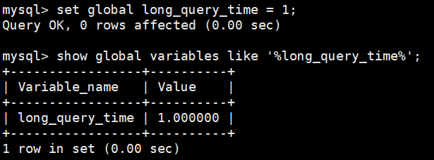

**补充:配置文件中一并设置参数**

如下的方式相较于前面的命令行方式，可以看作是永久设置的方式。

修改`my.cnf`文件，`[mysqld]下`增加或修改参数`long_query_time`、`slow_query_log`和`slow_query_log_file`后，然后重启MySQL服务器。

```properties
[mysqld]
slow_query_log=ON #开启慢查询日志的开关
slow_query_log_file=/var/lib/mysql/my-slow.log #慢查询日志的目录和文件名信息
long_query_time=3 #设置慢查询的阈值为3秒，超出此设定值的SQL即被记录到慢查询日志
log_output=FILE
```

如果不指定存储路径，慢查询日志将默认存储到MySQL数据库的数据文件夹下。如果不指定文件名，默认文件名为hostname-slow.log。


#### 4.2 查看慢查询数目

查询当前系统中有多少条慢查询记录  

```mysql
SHOW GLOBAL STATUS LIKE '%Slow_queries%';
```


#### 4.3 案例演示

**步骤1. 建表**  

```mysql
CREATE TABLE `student` (
	`id` INT(11) NOT NULL AUTO_INCREMENT,
	`stuno` INT NOT NULL ,
	`name` VARCHAR(20) DEFAULT NULL,
	`age` INT(3) DEFAULT NULL,
	`classId` INT(11) DEFAULT NULL,
	PRIMARY KEY (`id`)
) ENGINE=INNODB AUTO_INCREMENT=1 DEFAULT CHARSET=utf8;
```

**步骤2：设置参数 log_bin_trust_function_creators**  

创建函数，假如报错：

```mysql
This function has none of DETERMINISTIC......
```

命令开启：允许创建函数设置：

```mysql
set global log_bin_trust_function_creators=1; # 不加global只是当前窗口有效。
```

**步骤3：创建函数**

随机产生字符串：（同上一章）

```mysql
DELIMITER //
CREATE FUNCTION rand_string(n INT)
	RETURNS VARCHAR(255) #该函数会返回一个字符串
BEGIN
    DECLARE chars_str VARCHAR(100) DEFAULT
    	'abcdefghijklmnopqrstuvwxyzABCDEFJHIJKLMNOPQRSTUVWXYZ';
    DECLARE return_str VARCHAR(255) DEFAULT '';
    DECLARE i INT DEFAULT 0;
	WHILE i < n DO
        	SET return_str =CONCAT(return_str,SUBSTRING(chars_str,FLOOR(1+RAND()*52),1));
        	SET i = i + 1;
	END WHILE;
	RETURN return_str;
END //
DELIMITER ;

#测试
SELECT rand_string(10);
```

产生随机数值：（同上一章）

```mysql
DELIMITER //
CREATE FUNCTION rand_num (from_num INT ,to_num INT) RETURNS INT(11)
BEGIN
	DECLARE i INT DEFAULT 0;
	SET i = FLOOR(from_num +RAND()*(to_num - from_num+1)) ;
	RETURN i;
END //
DELIMITER ;

#测试：
SELECT rand_num(10,100);
```

**步骤4：创建存储过程**

```mysql
DELIMITER //
CREATE PROCEDURE insert_stu1( `start` INT , max_num INT)
BEGIN
DECLARE i INT DEFAULT 0;
    SET autocommit = 0; #设置手动提交事务
    REPEAT #循环
    	SET i = i + 1; #赋值
    	INSERT INTO student (stuno, NAME ,age ,classId ) VALUES
    	((`start`+i), rand_string(6),rand_num(10,100),rand_num(10,1000));
    UNTIL i = max_num
    END REPEAT;
    COMMIT; #提交事务
END //

DELIMITER ;
```

**步骤5：调用存储过程**

```mysql
#调用刚刚写好的函数, 4000000条记录,从100001号开始
CALL insert_stu1(100001, 4000000);
```


#### 4.4 测试及分析

**1.测试**

```mysql
mysql> SELECT * FROM student WHERE stuno = 3455655;
+------------+-----------+----------+-------+---------+
|    id      |  stuno    |  name    |  age | classId  |
+------------+-----------+----------+------+----------+
| 3523633    | 3455655   | oQmLUr   |  19  |    39    |
+------------+-----------+----------+------+----------+
1 row in set (2.09 sec)

mysql> SELECT * FROM student WHERE name = 'oQmLUr';
+-----------+------------+------------+-------+----------+
|    id     |  stuno     |  name      |  age  | classId  |
+-----------+------------+------------+-------+----------+
| 1154002   | 1243200    | OQMlUR     |  266  |   28     |
| 1405708   | 1437740    | OQMlUR     |  245  |   439    |
| 1748070   | 1680092    | OQMlUR     |  240  |   414    |
| 2119892   | 2051914    | oQmLUr     |  17   |   32     |
| 2893154   | 2825176    | OQMlUR     |  245  |   435    |
| 3523633   | 3455655    | oQmLUr     |  19   |   39     |
+-----------+------------+------------+-------+----------+
6 rows in set (2.39 sec)
```

从上面的结果可以看出来，查询学生编号为“3455655”的学生信息花费时间为2.09秒。查询学生姓名为“oQmLUr”的学生信息花费时间为2.39秒。已经达到了秒的数量级，说明目前查询效率是比较低的，下面的小节我们分析一下原因。


**2.分析**

```mysql	
show status like 'slow_queries';
```

> **补充说明:**
>
> 除了上述变量，控制慢查询日志的还有一个系统变量:`min_examined_row_limit`。这个变量的意思是，查询`扫描过的最少记录数`。这个变量和查询执行时间，共同组成了判别一个查询是否是慢查询的条件。如果查询扫描过的记录数大于等于这个变量的值，并且查询执行时间超过long_query_time的值，那么，这个查询就被记录到慢查询日志中; 反之，则不被记录到慢查询日志中。
>
> ```mysql
> mysql> show variables like 'min%';
> +--------------------------------+-------+
> | Variable_name                  | Value |
> +--------------------------------+-------+
> | min_examined_row_limit         | 0     |
> +--------------------------------+-------+
> 1 row in set (0.00 sec)
> ```
>
> 这个值默认是0。与long_query_time=10合在一起，表示只要查询的执行时间超过10秒钟，哪怕一个记录也没有扫描过，都要被记录到慢查询日志中。你也可以根据需要，通过修改“my.ini"文件，来修改查询时长，或者通过SET指令，用SQL语句修改“min_examined_row_limit”的值。


#### 4.5 慢查询日志分析工具：mysqldumpslow

在生产环境中，如果要手工分析日志，查找、分析SQL，显然是个体力活，MySQL提供了日志分析工具`mysqldumpslow`。

查看mysqldumpslow的帮助信息  

```mysql
mysqldumpslow --help
```


mysqldumpslow 命令的具体参数如下：

- -a: 不将数字抽象成N，字符串抽象成S
- **-s: 是表示按照何种方式排序：**
  - c: 访问次数
  - l: 锁定时间
  - r: 返回记录
  - **t: 查询时间**
  - al：平均锁定时间
  - ar：平均返回记录数
  - at：平均查询时间 （默认方式）
  - ac：平均查询次数
- **-t: 即为返回前面多少条的数据；**  
- **-g: 后边搭配一个正则匹配模式，大小写不敏感的**  

举例：我们想要按照查询时间排序，查看前五条 SQL 语句，这样写即可：

```mysql	
mysqldumpslow -s t -t 5 /var/lib/mysql/atguigu01-slow.log
```

```bash
[root@bogon ~]# mysqldumpslow -s t -t 5 /var/lib/mysql/atguigu01-slow.log

Reading mysql slow query log from /var/lib/mysql/atguigu01-slow.log
Count: 1 Time=2.39s (2s) Lock=0.00s (0s) Rows=13.0 (13), root[root]@localhost
	SELECT * FROM student WHERE name = 'S'

Count: 1 Time=2.09s (2s) Lock=0.00s (0s) Rows=2.0 (2), root[root]@localhost
	SELECT * FROM student WHERE stuno = N
	
Died at /usr/bin/mysqldumpslow line 162, <> chunk 2.
```

**工作常用参考：**

```mysql
#得到返回记录集最多的10个SQL
mysqldumpslow -s r -t 10 /var/lib/mysql/atguigu-slow.log

#得到访问次数最多的10个SQL
mysqldumpslow -s c -t 10 /var/lib/mysql/atguigu-slow.log

#得到按照时间排序的前10条里面含有左连接的查询语句
mysqldumpslow -s t -t 10 -g "left join" /var/lib/mysql/atguigu-slow.log

#另外建议在使用这些命令时结合 | 和more 使用 ，否则有可能出现爆屏情况
mysqldumpslow -s r -t 10 /var/lib/mysql/atguigu-slow.log | more
```


#### 4.6 关闭慢查询日志

**除了调优需要开，正常还是不要开了**

MySQL服务器停止慢查询日志功能有两种方法：

**方式1：永久性方式**

修改my.cnf或者my.ini文件,把[mysqld]组下的slow_query_log值设置为OFF，修改保存后，再重启MySQL服务，即可生效；

```properties
[mysqld]
slow_query_log=OFF
```

或者，把slow_query_log一项注释掉或删除

```properties
[mysqld]
#slow_query_log =OFF
```

重启MySQL服务，执行如下语句查询慢日志功能。

```mysql
SHOW VARIABLES LIKE '%slow%'; #查询慢查询日志所在目录
SHOW VARIABLES LIKE '%long_query_time%'; #查询超时时长
```


**方式2：临时性方式**  

使用SET语句来设置。 

1. 停止MySQL慢查询日志功能，具体SQL语句如下。  

```mysql
SET GLOBAL slow_query_log=off;
```

2. **重启MySQL服务**，使用SHOW语句查询慢查询日志功能信息，具体SQL语句如下

```mysql
SHOW VARIABLES LIKE '%slow%';
#以及
SHOW VARIABLES LIKE '%long_query_time%';
```


#### 4.7 删除慢查询日志

```mysql
mysql> show variables like '%slow_query_log%';
+-------------------------+----------------------------------+
| Variable_name           | Value                            |
+-------------------------+----------------------------------+
| slow_query_log          | OFF                              |
| slow_query_log_file     | /var/lib/mysql/my-slow.log       |
+-------------------------+----------------------------------+
2 rows in set (0.07 sec)
```

从执行结果可以看出，慢查询日志的目录默认为MySQL的数据目录，在该目录下`手动删除慢查询日志文件`即可。

使用命令`mysqladmin flush-logs`来重新生成查询日志文件，具体命令如下，执行完毕会在数据目录下重新生成慢查询日志文件。

```mysql
# 不使用这个命令，没办法自己创建
mysqladmin -uroot -p flush-logs slow 

## 这个命令可以重置其他日志 例如undo日志
```

> 提示
>
> 慢查询日志都是使用`mysqladmin flush-logs`命令来删除重建的。使用时-定要注意，一旦执行了这个命令，慢查询日志都只存在新的日志文件中，如果需要旧的查询日志，就必须事先备份。


### 5 查看SQL执行成本：SHOW PROFILE

`show profile`在《逻辑架构》章节中讲过，这里作为复习。

Show Profile是MySQL提供的可以用来分析当前会话中SQL都做了什么、执行的资源消耗情况的工具，可用于sql调优的测量。`默认情况下处于关闭状态`，并保存最近15次的运行结果。

我们可以在会话级别开启这个功能

```mysql
mysql> show variables like 'profiling';
+--------------------+---------+
| Variable_name      | Value   |
+--------------------+---------+
| profiling          | OFF     |
+--------------------+---------+
1 row in set (0.34 sec)
```

通过设置 `profiling='ON’` 来开启 show profile：

```mysql
mysql> set profiling = 'ON';
Query OK, 0 rows affected, 1 warning (0.06 sec)

mysql> show variables like 'profiling';
+--------------------+---------+
| Variable_name      | Value   |
+--------------------+---------+
| profiling          | ON      |
+--------------------+---------+
1 row in set (0.34 sec)
```

然后执行相关的查询语句。接着看下当前会话都有哪些 profiles，使用下面这条命令：  

```mysql
mysql> show profiles;
+-------------+---------------+--------------------------------------------+
| Query_ID    |   Duration    | Query                                      |
+-------------+---------------+--------------------------------------------+
|           1 | 0.13515975    | show variables like 'profiling'            |
|           2 | 0.06386950    | select * from student_info limit 10        |
+-------------+---------------+--------------------------------------------+
2 rows in set, 1 warning (0.01 sec)
```

你能看到当前会话一共有 2 个查询。如果我们想要查看最近一次查询的开销，可以使用：

```mysql
mysql> show profile;
```


我们也可以查看指定的Query lD的开销，比如`show profile for query 2`查询结果是一样的。在SHOWPROFILE中我们可以查看不同部分的开销，比如cpu、block.io等:

```mysql
mysql> show profile cpu, block io for query 2;
```


> 如果是executing比较长就可能是代码哪里没写好，使用explain继续查询问题

**show profile的常用查询参数：**

1. ALL：显示所有的开销信息。 

2. BLOCK IO：显示块IO开销。

3. CONTEXT SWITCHES：上下文切换开销。 

4. CPU：显示CPU开销信息。 

5. IPC：显示发送和接收开销信息。 

6. MEMORY：显示内存开销信息。 

7. PAGE FAULTS：显示页面错误开销信息。 

8. SOURCE：显示和Source_function，Source_file，Source_line相关的开销信息。 

9. SWAPS：显示交换次数开销信息。


**日常开发需注意的结论:**

1. `converting HEAP to MyISAM`：查询结果太大，内存不够，数据往磁盘上搬了。
2. `creating tmp table`：创建临时表。先拷贝数据到临时表，用完后再删除临时表。
3. `Copying to tmp table on disk`：把内存中临时表复制到磁盘上，警惕!
4. `locked`。

如果在show profile诊断结果中出现了以上4条结果中的任何一条，则sql语句需要优化。

**注意:**

不过`SHOW PROFILE`命令将被弃用，我们可以从information_schema中的profiling数据表进行查看。


### 6 分析查询语句：EXPLAIN

#### 6.1 概述

**定位了查询慢的SQL之后，我们就可以使用EXPLAIN或DESCRIBE工具做针对性的分析查询语句。**DESCRIBE语句的使用方法与EXPLAIN语句是一样的，并且分析结果也是一样的。

MySQL中有专门负责优化SELECT语句的优化器模块，主要功能: 通过计算分析系统中收集到的统计信息，为客户端请求的Query提供它认为最优的`执行计划`（他认为最优的数据检索方式，但不见得是DBA认为是最优的，这部分最耗费时间)。

这个执行计划展示了接下来具体执行查询的方式，比如多表连接的顺序是什么，对于每个表采用什么访问方法来具体执行查询等等。MySQL为我们提供了`EXPLAIN`语句来帮助我们查看某个查询语句的具体执行计划，大家看懂`EXPLAIN`语句的各个输出项，可以有针对性的提升我们查询语句的性能。

**EXPLAIN能做什么?**

- 表的读取顺序
- 数据读取操作的操作类型
- 哪些索引可以使用
- **哪些索引被实际使用**
- 表之间的引用
- **每张表有多少行被优化器查询**

**官网介绍**

https://dev.mysql.com/doc/refman/5.7/en/explain-output.html

https://dev.mysql.com/doc/refman/8.0/en/explain-output.html  


**版本情况**

- MySQL5.6.3以前只能`EXPLAIN SELECT`；MYSQL5.6.3以后就可以 `EXPLAIN SELECT`，`UPDATE`，`DELETE`
- 在5.7以前的版本中，想要显示`partitions` 需要使用`explain partitions`命令；想要显示`filtered`需要使用 `explain extended` 命令。在5.7版本后，默认explain直接显示partitions和filtered中的信息。

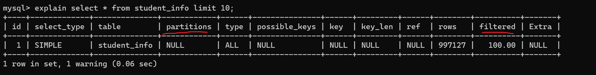


#### 6.2 基本语法

EXPLAIN 或 DESCRIBE语句的语法形式如下：

```mysql
EXPLAIN SELECT select_options
# 或者 两个是一样的
DESCRIBE SELECT select_options
```

如果我们想看看某个查询的执行计划的话，可以在具体的查询语句前边加一个`EXPLAIN` ，就像这样：

```mysql
mysql> EXPLAIN SELECT 1;
```


`EXPLAIN` 语句输出的各个列的作用如下：

| 列名            | 描述                                                     |
| --------------- | -------------------------------------------------------- |
| `id`            | 在一个大的查询语句中每个SELECT关键字都对应一个`唯一的id` |
| `select_type`   | SELECT关键字对应的那个查询的类型                         |
| `table`         | 表名                                                     |
| `partitions`    | 匹配的分区信息                                           |
| `type`          | 针对单表的访问方法（重要）                               |
| `possible_keys` | 可能用到的索引                                           |
| `key`           | 实际上使用的索引                                         |
| `key_len`       | 实际使用到的索引长度                                     |
| `ref`           | 当使用索引列等值查询时，与索引列进行等值匹配的对象信息   |
| `rows`          | 预估的需要读取的记录条数                                 |
| `filtered`      | 某个表经过搜索条件过滤后剩余记录条数的百分比             |
| `Extra`         | 一些额外的信息                                           |

在这里把它们都列出来只是为了描述一个轮廓，让大家有一个大致的印象。

#### 6.3 数据准备

**1.建表**

```mysql
CREATE TABLE s1 (
	id INT AUTO_INCREMENT,
	key1 VARCHAR(100), 
	key2 INT, 
	key3 VARCHAR(100), 
	key_part1 VARCHAR(100),
	key_part2 VARCHAR(100),
	key_part3 VARCHAR(100),
	common_field VARCHAR(100),
	PRIMARY KEY (id),
	INDEX idx_key1 (key1),
	UNIQUE INDEX idx_key2 (key2),
	INDEX idx_key3 (key3),
	INDEX idx_key_part(key_part1, key_part2, key_part3)
) ENGINE=INNODB CHARSET=utf8;
```

```mysql
CREATE TABLE s2 (
    id INT AUTO_INCREMENT,
    key1 VARCHAR(100),
    key2 INT,
    key3 VARCHAR(100),
    key_part1 VARCHAR(100),
    key_part2 VARCHAR(100),
    key_part3 VARCHAR(100),
    common_field VARCHAR(100),
    PRIMARY KEY (id),
    INDEX idx_key1 (key1),
    UNIQUE INDEX idx_key2 (key2),
    INDEX idx_key3 (key3),
    INDEX idx_key_part(key_part1, key_part2, key_part3)
) ENGINE=INNODB CHARSET=utf8;
```


**2. 设置参数 log_bin_trust_function_creators**

创建函数，假如报错，需开启如下命令：允许创建函数设置：

```mysql
set global log_bin_trust_function_creators=1; # 不加global只是当前窗口有效。
```


**3. 创建函数**

```mysql
DELIMITER //
CREATE FUNCTION rand_string1 ( n INT ) 
	RETURNS VARCHAR ( 255 ) #该函数会返回一个字符串
BEGIN
	DECLARE
		chars_str VARCHAR ( 100 ) DEFAULT 'abcdefghijklmnopqrstuvwxyzABCDEFJHIJKLMNOPQRSTUVWXYZ';
	DECLARE
		return_str VARCHAR ( 255 ) DEFAULT '';
	DECLARE
		i INT DEFAULT 0;
	WHILE i < n DO
		SET return_str = CONCAT(return_str, SUBSTRING(chars_str, FLOOR(1+RAND ()* 52), 1));
		SET i = i + 1;
	END WHILE;
	RETURN return_str;
END // 
DELIMITER ;
```


**4. 创建存储过程**

创建往s1表中插入数据的存储过程：  

```mysql
DELIMITER //
CREATE PROCEDURE insert_s1 (IN min_num INT (10), IN max_num INT (10))
BEGIN
    DECLARE i INT DEFAULT 0;
    SET autocommit = 0;
    REPEAT
    	SET i = i + 1;
    	INSERT INTO s1 VALUES(
    		(min_num + i),
    		rand_string1(6),
    		(min_num + 30 * i + 5),
    		rand_string1(6),
    		rand_string1(10),
    		rand_string1(5),
    		rand_string1(10),
    		rand_string1(10)
        	);
    UNTIL i = max_num
    END REPEAT;
    COMMIT;
END //
DELIMITER ;
```

创建往s2表中插入数据的存储过程：  

```mysql
DELIMITER //
CREATE PROCEDURE insert_s2 (IN min_num INT ( 10 ), IN max_num INT ( 10 )) 
BEGIN
	DECLARE i INT DEFAULT 0;
	SET autocommit = 0;
	REPEAT
 	 SET i = i + 1;
		INSERT INTO s2 VALUES(
				( min_num + i ),
				rand_string1 ( 6 ),
				( min_num + 30 * i + 5 ),
				rand_string1 ( 6 ),
				rand_string1 ( 10 ),
				rand_string1 ( 5 ),
				rand_string1 ( 10 ),
				rand_string1 ( 10 ));
	UNTIL i = max_num 
	END REPEAT;
	COMMIT;
END // 
DELIMITER ;
```

**5. 调用存储过程**

s1表数据的添加：加入1万条记录：

```mysql
CALL insert_s1(10001,10000); # id 10002~20001
```

s2表数据的添加：加入1万条记录：

```mysql
CALL insert_s2(10001,10000);# id 10002~20001
```


#### 6.4 EXPLAIN各列作用

为了让大家有比较好的体验，我们调整了下`EXPLAIN`输出列的顺序。

##### 6.4.1 table

表名

不论我们的查询语句有多复杂，里边儿`包含了多少个表`，到最后也是需要对每个表进行`单表访问`的，所以MySQL规定**EXPLAIN语句输出的每条记录都对应着某个单表的访问方法**，该条记录的table列代表着该表的表名（有时不是真实的表名字，可能是简称）

```mysql
# table：表名
# 查询的每一行记录都对应着一个单表
explain select count(*) from s1;
```


```mysql
#s1:驱动表  s2:被驱动表
EXPLAIN SELECT * FROM s1 INNER JOIN s2;
# 驱动表和被驱动表是优化器决定的，他认为哪个比较好久用哪个
```


> 用到多少个表，就会有多少条记录


##### 6.4.2 id

我们写的查询语句一般都以`SELECT`关键字开头，比较简单的查询语句里只有一个`SELECT`关键字，比如下边这个查询语句：

```mysql
SELECT * FROM s1 WHERE key1 = 'a';
```

稍微复杂一点的连接查询中也只有一个`SELECT`关键字，比如：

```mysql
SELECT * FROM s1 INNER JOIN s2
ON s1.key1 = s2.key1
WHERE s1.common_field = 'a';
```


**查询语句中每出现一个`SELECT`关键字，MySQL就会为它分配一个唯一的`id`值**。这个`id`值就是`EXPLAIN`语句的第一个列，比如下边这个查询中只有一个`SELECT`关键字，所以`EXPLAIN`的结果中也就只有一条`id`列为`1`的记录:

```mysql
mysql> EXPLAIN SELECT * FROM s1 WHERE key1 = 'a';
```


对于连接查询来说，一个`SELECT`关键字后边的`FROM`子句中可以跟随多个表，所以在连接查询的执行计划中，每个表都会对应一条记录，但是这些记录的id值都是相同的，比如:

```mysql
mysql> EXPLAIN SELECT * FROM s1 INNER JOIN s2;
```


可以看到，上述连接查询中参与连接的s1和s2表分别对应一条记录，但是这两条记录对应的`id值都是1`。这里需要大家记住的是，**在连接查询的执行计划中，每个表都会对应一条记录，这些记录的id列的值是相同的**，出现在前边的表表示`驱动表`，出现在后边的表表示`被驱动表`。所以从上边的EXPLAIN输出中我们可以看出，查询优化器准备让s1表作为驱动表，让s2表作为被驱动表来执行查询。

对于包含子查询的查询语句来说，就可能涉及多个`SELECT`关键字，所以在**包含子查询的查询语句的执行计划中，每个`SELECT`关键字都会对应一个唯一的`id`值**，比如这样：

```mysql
mysql> EXPLAIN SELECT * FROM s1 WHERE key1 IN (SELECT key1 FROM s2) OR key3 = 'a';
```


从输出结果中我们可以看到，s1表在外层查询中，外层查询有一个独立的`SELECT`关键字，所以第一条记录的id值就是1, s2表在子查询中，子查询有一个`独立的SELECT关键字`，所以第二条记录的id值就是2。

但是这里大家需要特别注意，**查询优化器可能对涉及子查询的查询语句进行重写，从而转换为连接查询**。所以如果我们想知道查询优化器对某个包含子查询的语句是否进行了重写，直接查看执行计划就好了，比如说:

```mysql
 # 查询优化器可能对涉及子查询的查询语句进行重写, 转变为多表查询的操作
 EXPLAIN SELECT * FROM s1 WHERE key1 IN (SELECT key2 FROM s2 WHERE common_field = 'a');
```

运行结果：id 只有一个，原因是查询优化器做了优化


可以看到，虽然我们的查询语句是一个子查询，但是执行计划中s1和s2表对应的记录的`id`值全部是1，这就表明了`查询优化器将子查询转换为了连接查询`。

对于包含`UNION`子句的查询语句来说，每个`SELECT`关键字对应一个`id`值也是没错的，不过还是有点儿特别的东西，比方说下边这个查询: 

```mysql
# Union去重
# union 去重，union all 不去重
EXPLAIN SELECT * FROM s1 UNION SELECT * FROM s2;
```


这个语句的执行计划的第三条记录是什么？为何`id`值是`NULL`，而且table列也很奇怪? `UNION`！它会把多个查询的结果集合并起来并对结果集中的记录`进行去重`，怎么去重呢? MySQL使用的是内部的`临时表`。正如上边的查询计划中所示，UNION子句是为了把id为1的查询和id为2的查询的结果集合并起来并去重，所以在内部创建了一个名为`<union1，2>`的临时表(就是执行计划第三条记录的table列的名称)，id为`NULL`表明这个临时表是为了合并两个查询的结果集而创建的。

跟UNION对比起来，`UNION ALL`就不需要为最终的结果集进行去重，它只是单纯的把多个查询的结果集中的记录合并成一个并返回给用户，所以也就不需要使用临时表。所以在包含`UNION ALL`子句的查询的执行计划中，就没有那个id为NULL的记录，如下所示:

```mysql
# union all 不去重  所以不需要放在临时表里面
mysql> EXPLAIN SELECT * FROM s1 UNION ALL SELECT * FROM s2;
```


**小结:**  

- **id如果相同，可以认为是一组，从上往下顺序执行**
- **在所有组中，id值越大，优先级越高，越先执行**
- **关注点：id号每个号码，表示一趟独立的查询, 一个sql的查询趟数越少越好**


##### 6.4.3 select_type

一条大的查询语句里边可以包含若干个SELECT关键字，`每个SELECT关键字代表着一个小的查询语句`，而每个SELECT关键字的FROM子句中都可以包含若干张表(这些表用来做连接查询)，`每一张表都对应着执行计划输出中的一条记录`，对于在同一个SELECT关键字中的表来说，它们的id值是相同的。

MySQL为每一个SELECT关键字代表的小查询都定义了一个称之为`select_type`的属性，意思是我们只要知道了某个小查询的`select_type属性`，就知道了这个`小查询在整个大查询中扮演了一个什么角色`，我们看一下
`select_type`都能取哪些值，请看官方文档：

| 名称                   | 描述                                                         |
| ---------------------- | ------------------------------------------------------------ |
| SIMPLE                 | Simple SELECT (not using UNION or subqueries)                |
| PRIMARY                | Outermost SELECT                                             |
| UNION                  | Second or later SELECT statement in a UNION                  |
| UNION RESULT           | Result of a UNION                                            |
| SUBQUERY               | First SELECT in subquery                                     |
| DEPENDENT     SUBQUERY | First SELECT in subquery, dependent on outer query           |
| DEPENDENT UNION        | Second or later SELECT statement in a UNION, dependent on outer query |
| DERIVED                | Derived table                                                |
| MATERIALIZED           | Materialized subquery                                        |
| UNCACHEABLE SUBQUERY   | A subquery for which the result cannot be cached and must be re-evaluated for each row of the outer query |
| UNCACHEABLE UNION      | The second or later select in a UNION that belongs to an uncacheable  subquery (see UNCACHEABLE SUBQUERY) |

- `SIMPLE`

查询语句中不包含`UNION`或者`子查询`的查询都算作是`SIMPLE`类型，比方说下边这个单表查询的`select_type`的值就是`SIMPLE`；

```mysql
 # 查询语句中不包含`UNION`或者子查询的查询都算作是`SIMPLE`类型
 EXPLAIN SELECT * FROM s1;
 
  #连接查询也算是`SIMPLE`类型
 EXPLAIN SELECT * FROM s1 INNER JOIN s2;
```

- `PRIMARY` 与 `UNION`与 `UNION RESULT`

  MySQL选择使用临时表来完成`UNION`查询的去重工作，针对该临时表的查询的`select_type`就是`UNION RESULT`，例子上边有。

  ```mysql
  #对于包含`UNION`或者`UNION ALL`或者子查询的大查询来说，它是由几个小查询组成的，其中最左边的那个查询的`select_type`值就是`PRIMARY`
  
  #对于包含`UNION`或者`UNION ALL`的大查询来说，它是由几个小查询组成的，其中除了最左边的那个小查询以外，其余的小查询的`select_type`值就是`UNION`
  
  #`MySQL`选择使用临时表来完成`UNION`查询的去重工作，针对该临时表的查询的`select_type`就是`UNION RESULT` 	
  ```
  
  测试sql:

  ```mysql
 EXPLAIN SELECT * FROM s1 UNION SELECT * FROM s2;
  ```
  
  

  ```mysql
EXPLAIN SELECT * FROM s1 UNION ALL SELECT * FROM s2;
  ```
  
  

- `SUBQUERY`

  如果包含子查询的查询语句不能够转为对应的`semi-join`的形式，并且该子查询是不相关子查询，并且查询优化器决定采用将该子查询物化的方案来执行该子查询时，该子查询的第个`SELECT`关键字代表的那个查询的`select_type`就是 `SUBQUERY`，比如下边这个查询:

  ```mysql
   #子查询：
   #如果包含子查询的查询语句不能够转为对应的`semi-join`的形式，并且该子查询是不相关子查询。
   #该子查询的第一个`SELECT`关键字代表的那个查询的`select_type`就是`SUBQUERY`
   EXPLAIN SELECT * FROM s1 WHERE key1 IN (SELECT key1 FROM s2) OR key3 = 'a';
  ```

  

- `DEPENDENT SUBQUERY`

  如果包含子查询的查询语句不能够转为对应的`semi-join`的形式，并且该子查询是相关子查询，则该子查询的第一个`SELECT`关键字代表的那个查询的`select_type`就是`DEPENDENT SUBQUERY`，比如下边这个查询:

  dependent subquery

  ```mysql
   #如果包含子查询的查询语句不能够转为对应的`semi-join`的形式，并且该子查询是相关子查询，
   #则该子查询的第一个`SELECT`关键字代表的那个查询的`select_type`就是`DEPENDENT SUBQUERY`
   EXPLAIN SELECT * FROM s1 
   WHERE key1 IN (SELECT key1 FROM s2 WHERE s1.key2 = s2.key2) OR key3 = 'a';
   #注意的是，select_type为`DEPENDENT SUBQUERY`的查询可能会被执行多次。
  ```

  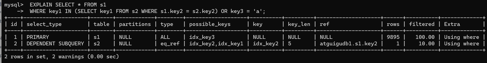

- `DEPENDENT UNION`

  ```mysql
   #在包含`UNION`或者`UNION ALL`的大查询中，如果各个小查询都依赖于外层查询的话，那除了
   #最左边的那个小查询之外，其余的小查询的`select_type`的值就是`DEPENDENT UNION`。
   EXPLAIN SELECT * FROM s1 
   WHERE key1 IN (SELECT key1 FROM s2 WHERE key1 = 'a' UNION SELECT key1 FROM s1 WHERE key1 = 'b');
   
   # 这里优化器会重构成exist
  ```

  

- `DERIVED`

  derived : 衍生，派生

  ```mysql
   #对于包含`派生表`的查询，该派生表对应的子查询的`select_type`就是`DERIVED`
   EXPLAIN SELECT * 
   FROM (SELECT key1, COUNT(*) AS c FROM s1 GROUP BY key1) AS derived_s1 WHERE c > 1;
  ```

  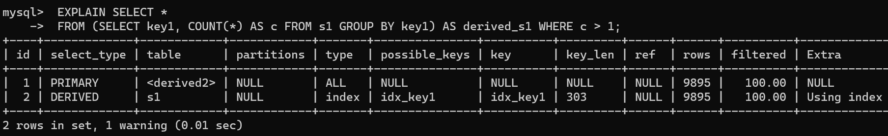

- `MATERIALIZED`

  materialized: 英 [məˈtɪəri:əˌlaɪzd] 具体化

  ```mysql
  #当查询优化器在执行包含子查询的语句时，选择将子查询物化之后与外层查询进行连接查询时，
  #该子查询对应的`select_type`属性就是`MATERIALIZED`
  EXPLAIN SELECT * FROM s1 WHERE key1 IN (SELECT key1 FROM s2); #子查询被转为了物化表 
  ```
  
  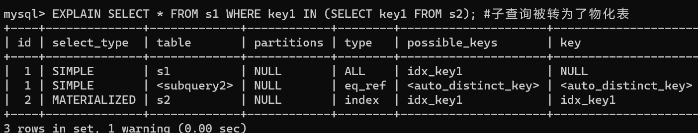
  
  > 不理解： 为啥上面的子查询，没有物化
  >
  > ```mysql
  > EXPLAIN SELECT * FROM s1 WHERE key1 IN (SELECT key1 FROM s2) OR key3 = 'a';
  > # 这个怎么不物化
  > ```
  >
  
- `UNCACHEABLE SUBQUERY`

  不常用，就不多说了。

- `UNCACHEABLE UNION`

  不常用，就不多说了。


##### 6.4.4 partitions (可略)

- 代表分区表中的命中情况，非分区表，该项为NULL。一般情况下我们的查询语句的执行计划的partitions列的值都是NULL。
- https://dev.mysql.com/doc/refman/5.7/en/alter-table-partition-operations.html
- 如果想详细了解，可以如下方式测试。创建分区表：

```mysql
-- 创建分区表，
-- 按照id分区，id<100 p0分区，其他p1分区
CREATE TABLE user_partitions (
    id INT auto_increment,
    NAME VARCHAR(12),
    PRIMARY KEY(id))
    PARTITION BY RANGE(id)(
    	PARTITION p0 VALUES less than(100),
    	PARTITION p1 VALUES less than MAXVALUE);
```

```mysql
DESC SELECT * FROM user_partitions WHERE id>200;
```

查询id大于200（200>100，p1分区）的记录，查看执行计划，partitions是p1，符合我们的分区规则

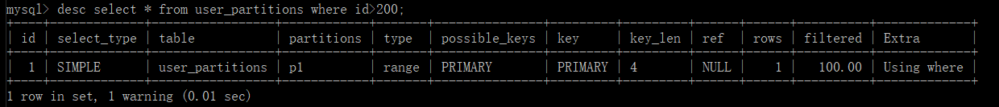

##### 6.4.5 type ☆

执行计划的一条记录就代表着MySQL对某个表的`执行查询时的访问方法`，又称"访问类型”，其中的`type`列就表明了这个访问方法是啥，是较为重要的一个指标。比如，看到`type`列的值是`ref`，表明MySQL即将使用`ref`访问方法来执行对`s1`表的查询。

完整的访问方法如下：`system`，`const`，`eq_ref`，`ref`，`fulltext`，`ref_or_null`，`index_merge`，`unique_subquery`，`index_subquery`，`range`，`index`，`ALL`。

我们详细解释一下：

- `system`  

  当表中`只有一条记录`并且该表使用的存储引擎的统计数据是精确的，比如MyISAM、Memory，那么对该表的访问方法就是`system`。比方说我们新建一个`MyISAM`表，并为其插入一条记录：

  ```mysql
  mysql> CREATE TABLE t(i int) Engine=MyISAM;
  Query OK, 0 rows affected (0.05 sec)
  
  mysql> INSERT INTO t VALUES(1);
  Query OK, 1 row affected (0.01 sec)
  ```

  然后我们看一下查询这个表的执行计划：

  ```mysql
  mysql> EXPLAIN SELECT * FROM t;
  ```

  

  > 这里如果是innodb会变成ALL，因为innodb系统不会存条数字段。MyISAM会存储这么一个字段。

- `const`

  ```mysql
   #当我们根据主键或者唯一二级索引列与常数进行等值匹配时，对单表的访问方法就是`const`
   EXPLAIN SELECT * FROM s1 WHERE id = 10005;
  ```

  

- `eq_ref`

  ```mysql
   #  在连接查询时，如果被驱动表是通过主键或者唯一二级索引列等值匹配的方式进行访问的
   #（如果该主键或者唯一二级索引是联合索引的话，所有的索引列都必须进行等值比较），则
   #  对该被驱动表的访问方法就是`eq_ref`
   EXPLAIN SELECT * FROM s1 INNER JOIN s2 ON s1.id = s2.id;
  ```

  

  从执行计划的结果中可以看出，MySQL打算将s2作为驱动表，s1作为被驱动表，重点关注s1的访问方法是`eq_ref`，表明在访问s1表的时候可以`通过主键的等值匹配`来进行访问。
  
- `ref`

  ```mysql
   #当通过普通的二级索引列与常量进行等值匹配时来查询某个表，那么对该表的访问方法就可能是`ref`
   EXPLAIN SELECT * FROM s1 WHERE key1 = 'a';
  ```

  

  > tips: 类型相同才可以走索引
  >
  > ```mysql
  > EXPLAIN SELECT * FROM s1 WHERE key2 = 10066;
  > # 这个是不会走索引的 因为key2 是字符串
  > # 类型不一样，mysql会加函数，进行隐式转换，一旦加上函数，就不会走索引了。
  > ```

- `fulltext`

  全文索引

  

- `ref_or_null`

  ```mysql
   #当对普通二级索引进行等值匹配查询，该索引列的值也可以是`NULL`值时，那么对该表的访问方法
   #就可能是`ref_or_null`
   EXPLAIN SELECT * FROM s1 WHERE key1 = 'a' OR key1 IS NULL;
  ```

  

- `index_merge`

  ```mysql
   #单表访问方法时在某些场景下可以使用`Intersection`、`Union`、
   #`Sort-Union`这三种索引合并的方式来执行查询
   EXPLAIN SELECT * FROM s1 WHERE key1 = 'a' OR key3 = 'a';
  ```

  

  从执行计划的 `type` 列的值是 `index_merge` 就可以看出，MySQL 打算使用索引合并的方式来执行
  对 `s1` 表的查询。  

- `unique_subquery`

  ```mysql
   #`unique_subquery`是针对在一些包含`IN`子查询的查询语句中，如果查询优化器决定将`IN`子查询
   # 转换为`EXISTS`子查询，而且子查询可以使用到主键进行等值匹配的话，那么该子查询执行计划的`type`
   # 列的值就是`unique_subquery`
   EXPLAIN SELECT * FROM s1 
   WHERE key2 IN (SELECT id FROM s2 WHERE s1.key1 = s2.key1) OR key3 = 'a';
  ```

  

- `index_subquery`

  ```mysql
  EXPLAIN SELECT * FROM s1 WHERE common_field IN (SELECT key3 FROM s2 where
  s1.key1 = s2.key1) OR key3 = 'a';
  ```

  

- `range`

  ```mysql
  #如果使用索引获取某些`范围区间`的记录，那么就可能使用到`range`访问方法
  EXPLAIN SELECT * FROM s1 WHERE key1 IN ('a', 'b', 'c');
  ```

  

  ```mysql
  #同上
  EXPLAIN SELECT * FROM s1 WHERE key1 > 'a' AND key1 < 'b';
  ```

  

- `index`

  

  ```mysql
  #当我们可以使用索引覆盖，但需要扫描全部的索引记录时，该表的访问方法就是`index`
  EXPLAIN SELECT key_part2 FROM s1 WHERE key_part3 = 'a';
  ```

  

  > 索引覆盖，`INDEX idx_key_part(key_part1, key_part2, key_part3）`这3个构成一个复合索引
  >
  > key_part3 在复合索引里面，查询的字段也在索引里面，干脆就直接遍历索引查出数据
  >
  > 思考：好处，索引存的数据少，数据少页就少，这样可以减少IO。

- `ALL`

  ```mysql
  mysql> EXPLAIN SELECT * FROM s1;
  ```

  

  一般来说，这些访问方法中除了`All`这个访问方法外，其余的访问方法都能用到索引，除了`index_merge`访问方法外，其余的访问方法都最多只能用到一个索引。


**小结:**

**结果值从最好到最坏依次是：**

<font color='grem'>system > const > eq_ref > ref ></font>

<font color='red'>fulltext > ref_or_null > index_merge >unique_subquery > index_subquery > range > </font>

<font color='grebn'>index > ALL </font>

**SQL 性能优化的目标：至少要达到 range 级别，要求是 ref 级别，最好是 consts级别。（阿里巴巴开发手册要求）**  


##### **6.4.6 possible_keys和key**

在EXPLAIN语句输出的执行计划中，`possible_keys`列表示在某个查询语句中，对某个表执行`单表查询时可能用`到的索引有哪些。一般查询涉及到的字段上若存在索引，则该索引将被列出，但不一定被查询使用。`key`列表示`实际用到`的索引有哪些，如果为NULL，则没有使用索引。比方说下边这个查询:


```mysql
mysql> EXPLAIN SELECT * FROM s1 WHERE key1 > 'z' AND key3 = 'a';
```


上述执行计划的possible_keys列的值是`idx_key1,idx_key3`，表示该查询可能使用到`idx_key1`, `idx_key3`两个索引，然后key列的值是`idx_key3`，表示经过查询优化器计算使用不同索引的成本后，最后决定使用`idx_key3`。

> 索引只能用一个。所以他要选一个出来用。查看上面`index_merge  ` or 的话  会走索引合并。


##### **6.4.7 key_len ☆**

-  key_len：实际使用到的索引长度(即：字节数)；

-  key_len越小索引效果越好，这是前面学到的；只是，短一点效率更高；
-  **但是在联合索引里面，命中一次key_len加一次长度。越长代表精度越高，效果越好**；
-  主要针对于联合索引，有一定的参考意义。


```mysql
EXPLAIN SELECT * FROM s1 WHERE id = 10005;
## 结果key_len =4
```


```mysql
mysql> EXPLAIN SELECT * FROM s1 WHERE key2 = 10126;
## 结果key_len = 5
```

key2 是int 类型unique索引。因为还可能有一个null值，所以null占一个字段。4+1=5


```mysql
mysql> EXPLAIN SELECT * FROM s1 WHERE key1 = 'a';

## 结果key_len = 303 
```

原因： `idx_key_part(key_part1, key_part2, key_part3）`是3个100的字段合起来的。每一个字段可以为空，所以是101*3 = 303


```mysql
mysql> EXPLAIN SELECT * FROM s1 WHERE key_part1 = 'a';
```

结果key_len是303


```mysql
mysql> EXPLAIN SELECT * FROM s1 WHERE key_part1 = 'a' AND key_part2 = 'b';
```

结果key_606

**这里命中了两次联合索引，精度更高，效果更好**


**练习：**

**key_len的长度计算公式：**


```mysql
varchar(10)变长字段且允许NULL = 10 * ( character set：utf8=3,gbk=2,latin1=1)+1(NULL)+2(变长字段)

varchar(10)变长字段且不允许NULL = 10 * ( character set：utf8=3,gbk=2,latin1=1)+2(变长字段)

char(10)固定字段且允许NULL = 10 * ( character set：utf8=3,gbk=2,latin1=1)+1(NULL)

char(10)固定字段且不允许NULL = 10 * ( character set：utf8=3,gbk=2,latin1=1)
```


##### 6.4.8 ref


```mysql
# ref：当使用索引列等值查询时，与索引列进行等值匹配的对象信息。
# 比如只是一个常数或者是某个列。
mysql> EXPLAIN SELECT * FROM s1 WHERE key1 = 'a';
# 类型是type=ref，与const（常量）比较
```


```mysql
mysql> EXPLAIN SELECT * FROM s1 INNER JOIN s2 ON s1.id = s2.id;
# 类型是type =eq_ref ，与 atguigudb1.s1.id  比较
```


```mysql
mysql> EXPLAIN SELECT * FROM s1 INNER JOIN s2 ON s2.key1 = UPPER(s1.key1);                         
# 与一个方法比较`func`
```


##### 6.4.9 rows ☆


```mysql
 #  rows：预估的需要读取的记录条数
 # `值越小越好`
 # 通常与filtered 一起使用
 EXPLAIN SELECT * FROM s1 WHERE key1 > 'z';
```

rows 值越小，代表，数据越有可能在一个页里面，这样IO就会更小。


##### 6.4.10 filtered

**越大越好**

filtered 的值指返回结果的行占需要读到的行(rows 列的值)的百分比。

如果使用的是索引执行的单表扫描，那么计算时需要估计出满足除使用到对应索引的搜索条件外的其他搜索条件的记录有多少条。

```mysql
 EXPLAIN SELECT * FROM s1 WHERE key1 > 'z' AND common_field = 'a';
```

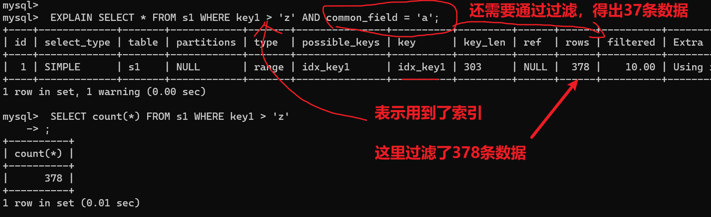

**对于单表查询来说，这个filtered列的值没什么意义**，我们`更关注在连接查询中驱动表对应的执行计划记录的filtered值`，它决定了被驱动表要执行的次数(即：rows * filtered)


```mysql
EXPLAIN SELECT * FROM s1 INNER JOIN s2 ON s1.key1 = s2.key1 WHERE s1.common_field = 'a';
```

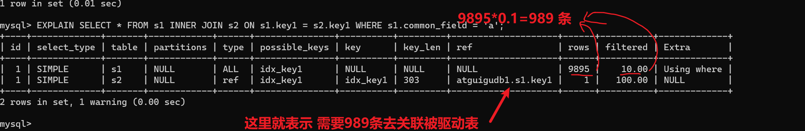


##### 6.4.11 Extra ☆

顾名思义，`Extra`列是用来说明一些额外信息的，包含不适合在其他列中显示但十分重要的额外信息。我们可以通过这些额外信息来`更准确的理解MySQL到底将如何执行给定的查询语句`。MySQL提供的额外信息有好几十个，一下捡重点介绍

- `No tables used` 

  当查询语句的没有FROM子句时将会提示该额外信息，比如:


```mysql
mysql> EXPLAIN SELECT 1;				
```


- `Impossible WHERE`

 查询语句的`WHERE`子句永远为`FALSE`时将会提示该额外信息

```mysql
mysql> EXPLAIN SELECT * FROM s1 WHERE 1 != 1;
```

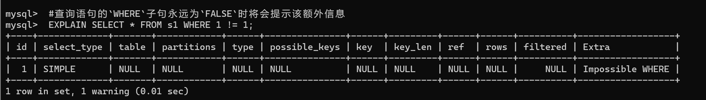

- Using where

  不用读取表中所有信息，仅通过索引就可以获取所需数据，这发生在对表的全部的请求列都是同一个索引的部分的时候，表示mysql服务器将在存储引|擎检索行后再进行过滤。表明使用了where过滤。 
  
  当我们使用全表扫描来执行对某个表的查询，并且该语句的`WHERE`子句中有针对该表的搜索条件时，在`Extra`列中会提示上述额外信息。


```mysql
EXPLAIN SELECT * FROM s1 WHERE common_field = 'a';
```


当使用索引访问来执行对某个表的查询，并且该语句的WHERE子句中有除了该索引包含的列之外的其他搜索条件时，在`Extra`列中也会提示上述额外信息。比如下边这个查询虽然使用`idx_key1`索引执行查询，但是搜索条件中除了包含`key1`的搜索条件`key1 = 'a'`，还包含`common_field`的搜索条件，所以`Extra`列会显示`Using where`的提示: 

当条件除了索引，还有其他条件，也会是这个提示

```mysql
 #当使用索引访问来执行对某个表的查询，并且该语句的`WHERE`子句中
 #有除了该索引包含的列之外的其他搜索条件时，在`Extra`列中也会提示上述额外信息。
 explain SELECT * FROM s1 WHERE key1 = 'fUhcQU' and  common_field = 'uDHCOnalcF';
```


- `No matching min/max row`

当查询列表处有`MIN`或者`MAX`聚合函数，但是并没有符合`WHERE`子句中的搜索条件的记录时，将会提示该额外信息

```mysql
 # 数据库不存在 QLjKYOx
 EXPLAIN SELECT MIN(key1) FROM s1 WHERE key1 = 'QLjKYOx';
```


```mysql
 # 数据库存在 QLjKYO
 EXPLAIN SELECT MIN(key1) FROM s1 WHERE key1 = 'QLjKYO';
```


- `Using index`

当我们的查询列表以及搜索条件中只包含属于某个索引的列，也就是在可以使用覆盖索引的情况下，在`Extra`列将会提示该额外信息。

比方说下边这个查询中只需要用到`idx_key1`而不需要回表操作：

```mysql
EXPLAIN SELECT key1 FROM s1 WHERE key1 = 'a';
```


- `Using index condition`

  有些搜索条件中虽然出现了索引列，但却不能使用到索引看课件理解索引条件下推

  ```mysql
  SELECT * FROM s1 WHERE key1 > 'z' AND key1 LIKE '%a';
  mysql> EXPLAIN SELECT * FROM s1 WHERE key1 > 'z' AND key1 LIKE '%a';
  ```

  

  > 步骤1：这里key1 > 'z' 走了索引，查出了378条数据。
  >
  > 步骤2：key1 LIKE '%a'; 这个条件依然是 key1 索引，所以接下来只要在遍历这378个索引。哪些符合'%a'
  >
  > 步骤3：通过步骤2过滤出了有效索引。这就是`Using index condition`。
  >
  > 步骤4：把符合条件的索引，进行回表查询。

  完整的说明：

  其中的`key1 > 'z'`可以使用到索引，但是`key1 LIKE '%a '`却无法使用到索引，在以前版本的MySQL中，是按照下边步骤来执行这个查询的:

  - 先根据key1 > 'z'这个条件，从二级索引`idx_key1`中获取到对应的二级索引记录。
  - 根据上一步骤得到的二级索引记录中的主键值进行回表，找到完整的用户记录再检测该记录是否符合`key1 LIKE '%a'`这个条件，将符合条件的记录加入到最后的结果集。

  但是虽然`key1 LIKE ‘%a'`不能组成范围区间参与`range`访问方法的执行，但这个条件毕竟只涉及到了`key1`列，所以MySQL把上边的步骤改进了一下:

  - 先根据`key1 > 'z'`这个条件，定位到二级索引`idx_key1`中对应的二级索引记录。

  - 对于指定的二级索引记录，先不着急回表，而是先检测一下该记录是否满足`key1 LIKE ‘%a'`这个条件，如果这个条件不满足，则该二级索引记录压根儿就没必要回表。

  - 对于满足`key1 LIKE '%a'`这个条件的二级索引记录执行回表操作。

  我们说回表操作其实是一个`随机IO`，比较耗时，所以上述修改虽然只改进了一点点，但是可以省去好多回表操作的成本。MySQL把他们的这个改进称之为`索引条件下推` (英文名:`Index Condition Pushdown`)。如果在查询语句的执行过程中将要使用`索引条件下推`这个特性，在Extra列中将会显示`Using index condition`

- `Using join buffer (Block Nested Loop)`  

  没有索引的字段进行表关联。

  在连接查询执行过程中，当被驱动表不能有效的利用索引加快访问速度，MySQL一般会为其分配一块名叫`join buffer`的内存块来加快查询速度，也就是我们所讲的`基于块的嵌套循环算法`

  ```mysql
  mysql> EXPLAIN SELECT * FROM s1 INNER JOIN s2 ON s1.common_field = s2.common_field;
  ```

  

- `Not exists`

  当我们使用左（外）连接时，如果`WHERE`子句中包含要求被驱动表的某个列等于`NULL`值的搜索条件，而且那个列又是不允许存储`NULL`值的，那么在该表的执行计划的Extra列就会提示`Not exists`额外信息

  ```mysql
  EXPLAIN SELECT * FROM s1 LEFT JOIN s2 ON s1.key1 = s2.key1 WHERE s2.id IS NULL;
  # 都表关联了，，关联字段怎么会等于 is null
  ```


- `Using intersect(...)、Using union(...)和Using sort_union(...)`  

  - 如果执行计划的`Extra`列出现了`Using intersect(...)`提示，说明准备使用`Intersect`索引

  - 合并的方式执行查询，括号中的`...`表示需要进行索引合并的索引名称；

  - 如果出现了`Using union(...)`提示，说明准备使用`Union`索引合并的方式执行查询；

  - 出现了`Using sort_union(...)`提示，说明准备使用`Sort-Union`索引合并的方式执行查询。

    ```mysql
     EXPLAIN SELECT * FROM s1 WHERE key1 = 'a' OR key3 = 'a';
    ```

  

- `Zero limit`

  ```mysql
  #当我们的`LIMIT`子句的参数为`0`时，表示压根儿不打算从表中读出任何记录，将会提示该额外信息
  EXPLAIN SELECT * FROM s1 LIMIT 0;
  ```

  

- `Using filesort`

  有一些情况下对结果集中的记录进行排序是可以使用到索引的，比如下边这个查询: 

  ```mysql
  EXPLAIN SELECT * FROM s1 ORDER BY key1 LIMIT 10;
  ```

  这个查询语句可以利用`idx_key1`索引直接取出key1列的10条记录，然后再进行回表操作就好了。但是很多情况下排序操作无法使用到索引，只能在内存中(记录较少的时候)或者磁盘中(记录较多的时候)进行排序，MySQL把这种在内存中或者磁盘上进行排序的方式统称为`文件排序`（英文名: `filesort`)。如果某个查询需要使用文件排序的方式执行查询，就会在执行计划的Extra列中显示`Using filesort`提示

  ```mysql
  EXPLAIN SELECT * FROM s1 ORDER BY common_field LIMIT 10;
  ```

- `Using temporary`  

  在许多查询的执行过程中，MySQL可能会借助临时表来完成一些功能，比如去重、排序之类的，比如我们在执行许多包含`DISTINCT`、`GROUP BY`、`UNION`等子句的查询过程中，如果不能有效利用索引来完成查询，MySQL很有可能寻求通过建立内部的临时表来执行查询。如果查询中使用到了内部的临时表，在执行计划的`Extra`列将会显示`Using temporary`提示。

  ```mysql
  EXPLAIN SELECT DISTINCT common_field FROM s1;
  ```

  

  ```mysql
   #执行计划中出现`Using temporary`并不是一个好的征兆，因为建立与维护临时表要付出很大成本的，所以
   #我们`最好能使用索引来替代掉使用临时表`。比如：扫描指定的索引idx_key1即可
   EXPLAIN SELECT key1, COUNT(*) AS amount FROM s1 GROUP BY key1;
  ```

  

##### 6.4.12 小结

- EXPLAIN不考虑各种Cache
- EXPLAIN不能显示MySQL在执行查询时所作的优化工作
- EXPLAIN不会告诉你关于触发器、存储过程的信息或用户自定义函数对查询的影响情况
- 部分统计信息是估算的，并非精确值


### 7 EXPLAIN的进一步使用

#### 7.1 EXPLAIN四种输出格式

这里谈谈EXPLAIN的输出格式。EXPLAIN可以输出四种格式：`传统格式`，`JSON格式`，`TREE格式`以及 `可视化输出`。用户可以根据需要选择适用于自己的格式。

##### 7.1.1 传统格式

传统格式简单明了，输出是一个表格形式，概要说明查询计划。

```mysql
EXPLAIN SELECT 
	s1.key1, 
	s2.key1 
FROM 
	s1 
LEFT JOIN 
	s2 
ON 
	s1.key1 = s2.key1 
WHERE 
	s2.common_field IS NOT NULL;
```


##### 7.1.2 JSON格式

第1种格式中介绍的`EXPLAIN`语句输出中缺少了一个衡量执行计划好坏的重要属性——`成本`。而JSON格式是四种格式里面输出信息`最详尽的格式`，里面包含了执行的成本信息。

- JSON格式：在EXPLAIN单词和真正的查询语句中间加上`FORMAT=JSON`。

  ```mysql
  EXPLAIN FORMAT=JSON SELECT ....  
  ```

- EXPLAIN的Column与JSON的对应关系:(来源于MySQL 5.7文档)

  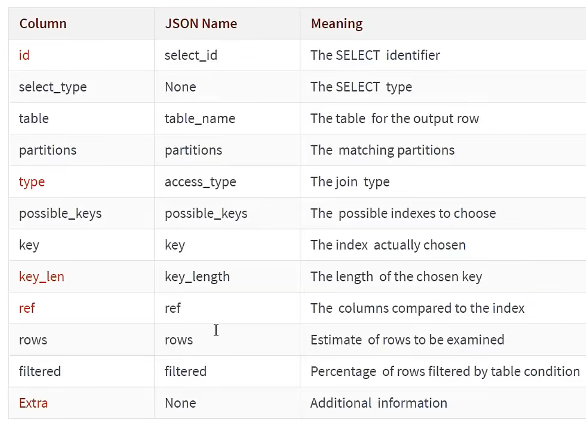

这样我们就可以得到一个json格式的执行计划，里面包含该计划花费的成本，比如这样:

```mysql
mysql> EXPLAIN FORMAT=JSON SELECT * FROM s1 INNER JOIN s2 ON s1.key1 = s2.key2 WHERE s1.common_field = 'a' \G
*************************** 1. row ***************************
EXPLAIN: {
  "query_block": {
    "select_id": 1,
    "cost_info": {
      "query_cost": "1360.07"
    },
    "nested_loop": [
      {
        "table": {
          "table_name": "s1",
          "access_type": "ALL",
          "possible_keys": [
            "idx_key1"
          ],
          "rows_examined_per_scan": 9895,
          "rows_produced_per_join": 989,
          "filtered": "10.00",
          "cost_info": {
            "read_cost": "914.80",
            "eval_cost": "98.95",
            "prefix_cost": "1013.75",
            "data_read_per_join": "1M"
          },
          "used_columns": [
            "id",
            "key1",
            "key2",
            "key3",
            "key_part1",
            "key_part2",
            "key_part3",
            "common_field"
          ],
          "attached_condition": "((`atguigudb1`.`s1`.`common_field` = 'a') and (`atguigudb1`.`s1`.`key1` is not null))"
        }
      },
      {
        "table": {
          "table_name": "s2",
          "access_type": "eq_ref",
          "possible_keys": [
            "idx_key2"
          ],
          "key": "idx_key2",
          "used_key_parts": [
            "key2"
          ],
          "key_length": "5",
          "ref": [
            "atguigudb1.s1.key1"
          ],
          "rows_examined_per_scan": 1,
          "rows_produced_per_join": 989,
          "filtered": "100.00",
          "index_condition": "(cast(`atguigudb1`.`s1`.`key1` as double) = cast(`atguigudb1`.`s2`.`key2` as double))",
          "cost_info": {
            "read_cost": "247.38",
            "eval_cost": "98.95",
            "prefix_cost": "1360.08",
            "data_read_per_join": "1M"
          },
          "used_columns": [
            "id",
            "key1",
            "key2",
            "key3",
            "key_part1",
            "key_part2",
            "key_part3",
            "common_field"
          ]
        }
      }
    ]
  }
}
1 row in set, 2 warnings (0.01 sec)
```


我们使用`#`后边跟随注释的形式为大家解释了`EXPLAIN FORMAT=JSON`语句的输出内容，但是大家可能有疑问"`cost_info`"里边的成本看着怪怪的，它们是怎么计算出来的？先看`s1`表的"`cost_info`"部分：

```json
"cost_info": {
    "read_cost": "914.80",
    "eval_cost": "98.95",
    "prefix_cost": "1013.75",
    "data_read_per_join": "1M"
}  
```

- `read_cost` 是由下边这两部分组成的：  

  - IO 成本
  - 检测`rows × (1 - filter)`条记录的`CPU`成本

  > 小贴士：rows和filter都是我们前边介绍执行计划的输出列，在JSON格式的执行计划中，rows相当于rows_examined_per_scan，filtered名称不变。  

- `eval_cost` 是这样计算的  

  检测 `rows × filter` 条记录的成本。  

- `prefix_cost` 就是单独查询 `s1` 表的成本，也就是：

  `read_cost + eval_cost  `

- `data_read_per_join` 表示在此次查询中需要读取的数据量。

对于 s2 表的 "cost_info" 部分是这样的：

```json
"cost_info": {
    "read_cost": "247.38",
    "eval_cost": "98.95",
    "prefix_cost": "1360.08",
    "data_read_per_join": "1M"
}
```

由于 `s2` 表是被驱动表，所以可能被读取多次，这里的 `read_cost` 和 `eval_cost` 是访问多次 `s2` 表后累加起来的值，大家主要关注里边儿的 `prefix_cost` 的值代表的是整个连接查询预计的成本，也就是单次查询 `s1` 表和多次查询 `s2` 表后的成本的和，也就是:

```text
247.38 + 98.95 + 1013.75 = 1360.08
```


##### 7.1.3 TREE格式

TREE格式是8.0.16版本之后引入的新格式，主要根据查询的 `各个部分之间的关系` 和 `各部分的执行顺序` 来描述如何查询  

```mysql
mysql> EXPLAIN FORMAT=tree SELECT * FROM s1 INNER JOIN s2 ON s1.key1 = s2.key2 WHERE s1.common_field = 'a'\G
*************************** 1. row ***************************
EXPLAIN: -> Nested loop inner join  (cost=1360.08 rows=990)
    -> Filter: ((s1.common_field = 'a') and (s1.key1 is not null))  (cost=1013.75 rows=990)
        -> Table scan on s1  (cost=1013.75 rows=9895)
    -> Single-row index lookup on s2 using idx_key2 (key2=s1.key1), with index condition: (cast(s1.key1 as double) = cast(s2.key2 as double))  (cost=0.25 rows=1)

1 row in set, 1 warning (0.00 sec)
```


##### 7.1.4 可视化输出

可视化输出，可以通过MySQL Workbench可视化查看MySQL的执行计划。通过点击Workbench的放大镜图标，即可生成可视化的查询计划。


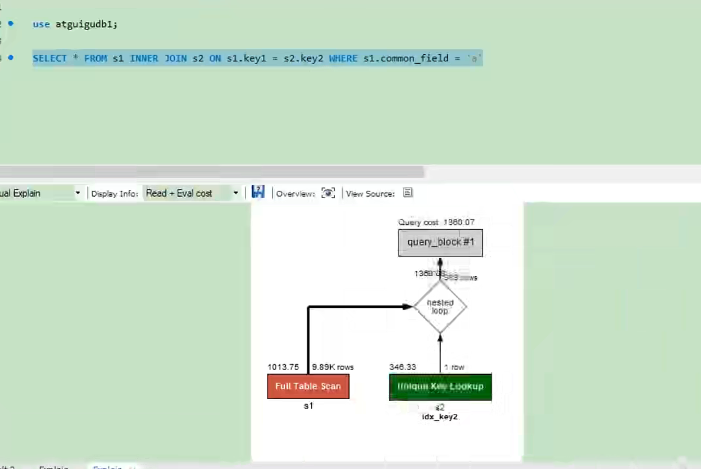

上图按从左到右的连接顺序显示表。红色框表示`全表扫描`，而绿色框表示使用`索引查找`。对于每个表，显示使用的索引。还要注意的是，每个表格的框上方是每个表访问所发现的行数的估计值以及访问该表的成本。


#### 7.2 SHOW WARNINGS的使用

在我们使用`EXPLAIN`语句查看了某个查询的执行计划后，紧接着还可以使用`SHOW WARNINGS`语句查看与这个查询的执行计划有关的一些扩展信息，比如这样：

```mysql
EXPLAIN SELECT
	s1.key1, 
	s2.key1 
FROM 
	s1 
LEFT JOIN 
	s2 
ON 
	s1.key1 = s2.key1 
WHERE
	s2.common_field IS NOT NULL;
```


使用完explain后紧接着使用`SHOW WARNINGS \G`

```mysql
mysql> SHOW WARNINGS\G
*************************** 1. row ***************************
Level: Note
Code: 1003
Message: /* select#1 */ select `atguigudb1`.`s1`.`key1` AS `key1`,`atguigudb1`.`s2`.`key1` AS `key1` from `atguigudb1`.`s1` join `atguigudb1`.`s2` where ((`atguigudb1`.`s1`.`key1` = `atguigudb1`.`s2`.`key1`) and (`atguigudb1`.`s2`.`common_field` is not null))
1 row in set (0.00 sec)
```

> 可以看到查询优化器真正执行的语句
>
> 粘出来并不一定可以运行

大家可以看到`SHOW WARNINGS`展示出来的信息有三个字段，分别是`Level`、`Code`、`Message`。我们最常见的就是Code为1003的信息，当Code值为1003时，Message字段展示的信息类似于`查询优化器`将我们的查询语句**重写后的语句**。比如我们上边的查询本来是一个左(外)连接查询，但是有一个`s2.common_field IS NOT NULL`的条件，这就会导致查询优化器把左(外）连接查询优化为内连接查询，从 `SHOW WARNINGS`的`Message`字段也可以看出来，原本的`LEFT JOIN`(左外连接)已经变成了`JOIN(内连接)`。


### 8 分析优化器执行计划：trace

`OPTIMIZER_TRACE`是MySQL 5.6引入的一项跟踪功能，它可以跟踪优化器做出的各种决策(比如访问表的方法、各种开销计算、各种转换等)，并将跟踪结果记录到`INFORMATION_SCHEMA.OPTIMIZER_TRACE`表中。

此功能默认关闭。开启trace，并设置格式为JSON，同时设置trace最大能够使用的内存大小，避免解析过程中因为默认内存过小而不能够完整展示。

```mysql
SET optimizer_trace="enabled=on",end_markers_in_json=on;

set optimizer_trace_max_mem_size=1000000;
```

开启后，可分析如下语句：

- SELECT
- INSERT
- REPLACE  
- UPDATE
- DELETE
- EXPLAIN
- SET
- DECLARE
- CASE
- IF
- RETURN
- CALL  

测试：执行如下SQL语句

```mysql
select * from student where id < 10;
```

最后，查询`information_schema.optimizer_trace`就可以知道MySQL是如何执行SQL的 :

```mysql
select * from information_schema.optimizer_trace\G
```

```mysql
mysql> select * from information_schema.optimizer_trace\G
*************************** 1. row ***************************
# 第1部分：查询语句
QUERY: select * from student where id < 10
# 第2部分：QUERY字段对应语句的跟踪信息
TRACE: {
  "steps": [
    {
      "join_preparation": { /*预备工作*/
        "select#": 1,
        "steps": [
          {
            "expanded_query": "/* select#1 */ select `student`.`id` AS `id`,`student`.`stuno` AS `stuno`,`student`.`name` AS `name`,`student`.`age` AS `age`,`student`.`classId` AS `classId` from `student` where (`student`.`id` < 10)"
          }
        ] /* steps */
      } /* join_preparation */
    },
    {
      "join_optimization": {/*进行优化*/
        "select#": 1,
        "steps": [
          {
            "condition_processing": {/*条件处理*/
              "condition": "WHERE",
              "original_condition": "(`student`.`id` < 10)",
              "steps": [
                {
                  "transformation": "equality_propagation",
                  "resulting_condition": "(`student`.`id` < 10)"
                },
                {
                  "transformation": "constant_propagation",
                  "resulting_condition": "(`student`.`id` < 10)"
                },
                {
                  "transformation": "trivial_condition_removal",
                  "resulting_condition": "(`student`.`id` < 10)"
                }
              ] /* steps */
            } /* condition_processing */
          },
          {
            "substitute_generated_columns": {/*替换生成的列*/
            } /* substitute_generated_columns */
          },
          {
            "table_dependencies": [   /* 表的依赖关系*/
              {
                "table": "`student`",
                "row_may_be_null": false,
                "map_bit": 0,
                "depends_on_map_bits": [
                ] /* depends_on_map_bits */
              }
            ] /* table_dependencies */
          },
          {
            "ref_optimizer_key_uses": [ /* 使用键*/
            ] /* ref_optimizer_key_uses */
          },
          {
            "rows_estimation": [ /*行判断*/
              {
                "table": "`student`",
                "range_analysis": {
                  "table_scan": {
                    "rows": 3945207,
                    "cost": 404306
                  } /* table_scan */,/*表扫描*/
                  "potential_range_indexes": [
                    {
                      "index": "PRIMARY",
                      "usable": true,
                      "key_parts": [
                        "id"
                      ] /* key_parts */
                    }
                  ] /* potential_range_indexes */,
                  "setup_range_conditions": [ 
                  ] /* 设置条件范围 */,
                  "group_index_range": {
                    "chosen": false,
                    "cause": "not_group_by_or_distinct"
                  } /* group_index_range */,
                  "skip_scan_range": {
                    "potential_skip_scan_indexes": [
                      {
                        "index": "PRIMARY",
                        "usable": false,
                        "cause": "query_references_nonkey_column"
                      }
                    ] /* potential_skip_scan_indexes */
                  } /* skip_scan_range */,
                  "analyzing_range_alternatives": {/*分析范围选项*/
                    "range_scan_alternatives": [
                      {
                        "index": "PRIMARY",
                        "ranges": [
                          "id < 10"
                        ] /* ranges */,
                        "index_dives_for_eq_ranges": true,
                        "rowid_ordered": true,
                        "using_mrr": false,
                        "index_only": false,
                        "in_memory": 0.159895,
                        "rows": 9,
                        "cost": 1.79883,
                        "chosen": true
                      }
                    ] /* range_scan_alternatives */,
                    "analyzing_roworder_intersect": {
                      "usable": false,
                      "cause": "too_few_roworder_scans"
                    } /* analyzing_roworder_intersect */
                  } /* analyzing_range_alternatives */,
                  "chosen_range_access_summary": {/*选择范围访问摘要*/
                    "range_access_plan": {
                      "type": "range_scan",
                      "index": "PRIMARY",
                      "rows": 9,
                      "ranges": [
                        "id < 10"
                      ] /* ranges */
                    } /* range_access_plan */,
                    "rows_for_plan": 9,
                    "cost_for_plan": 1.79883,
                    "chosen": true
                  } /* chosen_range_access_summary */
                } /* range_analysis */
              }
            ] /* rows_estimation */
          },
          {
            "considered_execution_plans": [/*考虑执行计划*/
              {
                "plan_prefix": [
                ] /* plan_prefix */,
                "table": "`student`",
                "best_access_path": {/*最佳访问路径*/
                  "considered_access_paths": [
                    {
                      "rows_to_scan": 9,
                      "access_type": "range",
                      "range_details": {
                        "used_index": "PRIMARY"
                      } /* range_details */,
                      "resulting_rows": 9,
                      "cost": 2.69883,
                      "chosen": true
                    }
                  ] /* considered_access_paths */
                } /* best_access_path */,
                "condition_filtering_pct": 100, /*行过滤百分比*/
                "rows_for_plan": 9,
                "cost_for_plan": 2.69883,
                "chosen": true
              }
            ] /* considered_execution_plans */
          },
          {
            "attaching_conditions_to_tables": { /*将条件附加到表上*/
              "original_condition": "(`student`.`id` < 10)",
              "attached_conditions_computation": [
              ] /* attached_conditions_computation */,
              "attached_conditions_summary": [ /*附加条件概要*/
                {
                  "table": "`student`",
                  "attached": "(`student`.`id` < 10)"
                }
              ] /* attached_conditions_summary */
            } /* attaching_conditions_to_tables */
          },
          {
            "finalizing_table_conditions": [
              {
                "table": "`student`",
                "original_table_condition": "(`student`.`id` < 10)",
                "final_table_condition   ": "(`student`.`id` < 10)"
              }
            ] /* finalizing_table_conditions */
          },
          {
            "refine_plan": [ /*精简计划*/
              {
                "table": "`student`"
              }
            ] /* refine_plan */
          }
        ] /* steps */
      } /* join_optimization */
    },
    {
      "join_execution": {  /*执行*/
        "select#": 1,
        "steps": [
        ] /* steps */
      } /* join_execution */
    }
  ] /* steps */
}
/
/*第3部分：跟踪信息过长时，被截断的跟踪信息的字节数。*/
MISSING_BYTES_BEYOND_MAX_MEM_SIZE: 0 /*丢失的超出最大容量的字节*/
/*第4部分：执行跟踪语句的用户是否有查看对象的权限。当不具有权限时，该列信息为1且TRACE字段为空，一般在
调用带有SQL SECURITY DEFINER的视图或者是存储过程的情况下，会出现此问题。*/
INSUFFICIENT_PRIVILEGES: 0 /*缺失权限*/
1 row in set (0.01 sec)
```


### 9 MySQL监控分析视图-sys schema

关于MySQL的性能监控和问题诊断，我们一般都从performance_schema中去获取想要的数据，在MySQL5.7.7版本中新增sys schema，它将performance_schema和information_schema中的数据以更容易理解的方式总结归纳为”视图”，其目的就是为了`降低查询performance_schema的复杂度`，让DBA能够快速的定位问题。下面看看这些库中都有哪些监控表和视图，掌握了这些，在我们开发和运维的过程中就起到了事半功倍的效果。

#### 9.1 Sys schema视图摘要

1. **主机相关**：以host_summary开头，主要汇总了IO延迟的信息。
2. **Innodb相关**：以innodb开头，汇总了innodb buffer信息和事务等待innodb锁的信息。
3. **I/O相关**：以io开头，汇总了等待I/O、I/O使用量情况。
4. **内存使用情况**：以memory开头，从主机、线程、事件等角度展示内存的使用情况
5. **连接与会话信息**：processlist和session相关视图，总结了会话相关信息。
6. **表相关**：以schema_table开头的视图，展示了表的统计信息。
7. **索引信息**：统计了索引的使用情况，包含冗余索引和未使用的索引情况。
8. **语句相关**：以statement开头，包含执行全表扫描、使用临时表、排序等的语句信息。
9. **用户相关**：以user开头的视图，统计了用户使用的文件I/O、执行语句统计信息。
10. **等待事件相关信息**：以wait开头，展示等待事件的延迟情况。

#### 9.2 Sys schema视图使用场景

**索引情况**  

```mysql
#1. 查询冗余索引
select * from sys.schema_redundant_indexes;
#2. 查询未使用过的索引
select * from sys.schema_unused_indexes;
#3. 查询索引的使用情况
select index_name,rows_selected,rows_inserted,rows_updated,rows_deleted
from sys.schema_index_statistics where table_schema='dbname' ;
```

**表相关**  

```mysql
# 1. 查询表的访问量
select table_schema,table_name,sum(io_read_requests+io_write_requests) as io from
sys.schema_table_statistics group by table_schema,table_name order by io desc;
# 2. 查询占用bufferpool较多的表
select object_schema,object_name,allocated,data
from sys.innodb_buffer_stats_by_table order by allocated limit 10;
# 3. 查看表的全表扫描情况
select * from sys.statements_with_full_table_scans where db='dbname';
```

**语句相关**

```mysql
#1. 监控SQL执行的频率
select db,exec_count,query from sys.statement_analysis
order by exec_count desc;
#2. 监控使用了排序的SQL
select db,exec_count,first_seen,last_seen,query
from sys.statements_with_sorting limit 1;
#3. 监控使用了临时表或者磁盘临时表的SQL
select db,exec_count,tmp_tables,tmp_disk_tables,query
from sys.statement_analysis where tmp_tables>0 or tmp_disk_tables >0
order by (tmp_tables+tmp_disk_tables) desc;
```

**IO 相关**

```mysql
#1. 查看消耗磁盘IO的文件
select file,avg_read,avg_write,avg_read+avg_write as avg_io
from sys.io_global_by_file_by_bytes order by avg_read limit 10;
```

**Innodb 相关**

```mysql
#1. 行锁阻塞情况
select * from sys.innodb_lock_waits;
```

> 风险提示:
>
> 通过sys库去查询时，MySQL会消耗大量资源去收集相关信息，严重的可能会导致业务请求被阻塞，从而引起故障。建议生产上`不要频繁`的去查询sys或者performance_schema、information_schema来完成监控、巡检等工作。


------

## 九、索引优化及SQL查询优化

都有哪些维度可以进行数据库调优？简言之:

- 索引失效、没有充分利用到索引 -- 索引建立
- 关联查询太多JOIN (设计缺陷或不得已的需求) -- SQL优化
- 服务器调优及各个参数设置(缓冲、线程数等) -- 调整my.cnf
- 数据过多 -- 分库分表

关于数据库调优的知识点非常分散。不同的DBMS，不同的公司，不同的职位，不同的项目遇到的问题都不尽相同。这里我们分为三个章节进行细致讲解。

虽然SQL查询优化的技术有很多，但是大方向上完全可以分成`物理查询优化`和`逻辑查询优化`两大块。

- 物理查询优化是通过`索引`和`表连接方式`等技术来进行优化，这里重点需要掌握索引的使用。
- 逻辑查询优化就是通过SQL`等价变换`提升查询效率，直白一点就是说，换一种查询写法执行效率可能更高。


### 1 数据准备

`学员表`插`50万`条，`班级表`插`1万`条。

**步骤1：建表**  

```mysql
CREATE TABLE `class` (
	`id` INT(11) NOT NULL AUTO_INCREMENT,
	`className` VARCHAR(30) DEFAULT NULL,
	`address` VARCHAR(40) DEFAULT NULL,
	`monitor` INT NULL ,
	PRIMARY KEY (`id`)
) ENGINE=INNODB AUTO_INCREMENT=1 DEFAULT CHARSET=utf8;

CREATE TABLE `student` (
	`id` INT(11) NOT NULL AUTO_INCREMENT,
	`stuno` INT NOT NULL ,
	`name` VARCHAR(20) DEFAULT NULL,
	`age` INT(3) DEFAULT NULL,
	`classId` INT(11) DEFAULT NULL,
	PRIMARY KEY (`id`)
	#CONSTRAINT `fk_class_id` FOREIGN KEY (`classId`) REFERENCES `class` (`id`)
) ENGINE=INNODB AUTO_INCREMENT=1 DEFAULT CHARSET=utf8;
```

**步骤2：设置参数**

命令开启：允许创建函数设置：

```mysql
set global log_bin_trust_function_creators=1; # 不加global只是当前窗口有效。  
```

**步骤3：创建函数**

保证每条数据都不同  

```mysql
#随机产生字符串
DELIMITER //
CREATE FUNCTION rand_string(n INT) RETURNS VARCHAR(255)
BEGIN
	DECLARE chars_str VARCHAR(100) DEFAULT
	'abcdefghijklmnopqrstuvwxyzABCDEFJHIJKLMNOPQRSTUVWXYZ';
	DECLARE return_str VARCHAR(255) DEFAULT '';
	DECLARE i INT DEFAULT 0;
	WHILE i < n DO
		SET return_str =CONCAT(return_str,SUBSTRING(chars_str,FLOOR(1+RAND()*52),1));
		SET i = i + 1;
	END WHILE;
	RETURN return_str;
END //
DELIMITER ;

#假如要删除
#drop function rand_string;
```

随机产生班级编号  

```mysql
#用于随机产生多少到多少的编号
DELIMITER //
CREATE FUNCTION rand_num (from_num INT ,to_num INT) RETURNS INT(11)
BEGIN
	DECLARE i INT DEFAULT 0;
	SET i = FLOOR(from_num +RAND()*(to_num - from_num+1)) ;
	RETURN i;
END //
DELIMITER ;

#假如要删除
#drop function rand_num;
```

**步骤4：创建存储过程**  

```mysql
#创建往stu表中插入数据的存储过程
DELIMITER //
CREATE PROCEDURE insert_stu( START INT , max_num INT )
BEGIN
	DECLARE i INT DEFAULT 0;
	SET autocommit = 0; #设置手动提交事务
	REPEAT #循环
		SET i = i + 1; #赋值
		INSERT INTO student (stuno, name ,age ,classId ) VALUES
		((START+i),rand_string(6),rand_num(1,50),rand_num(1,1000));
	UNTIL i = max_num
	END REPEAT;
COMMIT; #提交事务
END //
DELIMITER ;
#假如要删除
#drop PROCEDURE insert_stu;
```

创建往class表中插入数据的存储过程  

```mysql
#执行存储过程，往class表添加随机数据
DELIMITER //
CREATE PROCEDURE `insert_class`( max_num INT )
BEGIN
DECLARE i INT DEFAULT 0;
	SET autocommit = 0;
	REPEAT
		SET i = i + 1;
		INSERT INTO class ( classname,address,monitor ) VALUES
		(rand_string(8),rand_string(10),rand_num(1,100000));
	UNTIL i = max_num
	END REPEAT;
COMMIT;
END //
DELIMITER ;
#假如要删除
#drop PROCEDURE insert_class;
```

**步骤5：调用存储过程**

```mysql
#执行存储过程，往class表添加1万条数据
CALL insert_class(10000);

#执行存储过程，往stu表添加50万条数据
CALL insert_stu(100000,500000);
CALL insert_stu(600000,1000000);
```

**步骤6：删除某表上的索引**

创建存储过程

```mysql
DELIMITER //
CREATE PROCEDURE `proc_drop_index`(dbname VARCHAR(200), tablename VARCHAR(200))
BEGIN
    DECLARE done INT DEFAULT 0;
    DECLARE ct INT DEFAULT 0;
    DECLARE _index VARCHAR(200) DEFAULT '';
    DECLARE _cur CURSOR FOR SELECT index_name FROM
    information_schema.STATISTICS WHERE table_schema=dbname AND table_name=tablename AND
    seq_in_index=1 AND index_name <>'PRIMARY' ;
    #每个游标必须使用不同的declare continue handler for not found set done=1来控制游标的结束
    DECLARE CONTINUE HANDLER FOR NOT FOUND set done=2 ;
    #若没有数据返回,程序继续,并将变量done设为2
    OPEN _cur;
    FETCH _cur INTO _index;
    WHILE _index<>'' DO
        SET @str = CONCAT("drop index " , _index , " on " , tablename );
        PREPARE sql_str FROM @str ;
        EXECUTE sql_str;
        DEALLOCATE PREPARE sql_str;
        SET _index='';
        FETCH _cur INTO _index;
    END WHILE;
    CLOSE _cur;
END //
DELIMITER ;
```

执行存储过程  

```mysql
CALL proc_drop_index("dbname","tablename");
```


### 2 索引失效案例

MySQL中`提高性能`的一个最有效的方式是对数据表`设计合理的索引`。索引提供了高效访问数据的方法，并且加快查询的速度，因此索引对查询的速度有着至关重要的影响。

- 使用索引可以`快速地定位`表中的某条记录，从而提高数据库查询的速度，提高数据库的性能。
- 如果查询时没有使用索引，查询语句就会`扫描表中的所有记录`。在数据量大的情况下，这样查询的速度会很慢。

大多数情况下都（默认）采用`B+树`来构建索引。只是空间列类型的索引使用`R-树`，并且MEMORY表还支持`hash索引`。

其实，用不用索引，最终都是优化器说了算。优化器是基于什么的优化SQL？基于`cost开销(CostBaseOptimizer)`，它不是基于`规则(Rule-BasedOptimizer)`，也不是基于`语义`。怎么样开销小就怎么来。另外，**SQL语句是否使用索引，跟数据库版本、数据量、数据选择度都有关系。**

> 开销不是基于时间


#### 2.1 全值匹配我最爱

意思是创建联合索引多个索引同时生效。

系统中经常出现的sql语句如下:

```mysql
EXPLAIN SELECT SQL_NO_CACHE * FROM student WHERE age=30;
EXPLAIN SELECT SQL_NO_CACHE * FROM student WHERE age=30 and classId=4;
EXPLAIN SELECT SQL_NO_CACHE * FROM student WHERE age=30 and classId=4 AND name = 'abcd';
```


建立索引前执行:(关注执行时间)

```mysql
mysql> SELECT SQL_NO_CACHE * FROM student WHERE age=30 and classId=4 AND name = 'abcd' ;
Empty set，1 warning ( 0.28 sec)
```


建立索引

```mysql
CREATE INDEX idx_age ON student(age ) ;

CREATE INDEX idx_age_classid ON student( age , classId);

CREATE INDEX idx_age_classid_name ON student( age , classId , name) ;
```

建立索引后执行:

```mysql
mysql> SELECT SQL_NO_CACHE * FROM student WHERE age=30 and classId=4 AND name = 'abcd';
Empty set,1 warning (0.01 sec)
```

可以看到，创建索引前的查询时间是0.28秒，创建索引后的查询时间是0.01秒，索引帮助我们极大的提高了查询效率。


#### 2.2 最佳左前缀法则

在MySQL建立联合索引时会遵守最佳左前缀匹配原则，即最左优先，在检索数据时从联合索引的最左边开始匹配。

举例1:

```mysql
EXPLAIN SELECT SQL_NO_CACHE * FROM student WHERE student.age=30 AND student.name = 'abcd';
# 走`idx_age_classid_name`   使用了Using index condition
```

举例2:

```mysql
EXPLAIN SELECT SQL_NO_CACHE * FROM student WHERE student.classid=1 AND student.name = 'abcd' ;
# 没有索引匹配上。 
```

举例3:

**索引idx_age_classid_name还能否正常使用?**

```mysql
EXPLAIN SELECT SQL_NO_CACHE * FROM student WHERE classid=4 and student.age=30 AND student.name = 'abcd' ;
```

如果索引了多列，要遵守最左前缀法则。指的是查询从索引的最左前列开始并且不跳过索引中的列。

```mysql
mysq1> EXPLAIN SELECT SQL_NO_CACHE* FROM student WHERE student.age=30 AND student.name ='abcd';
```


**结论:**MySQL可以为多个字段创建索引，一个索引可以包括16个字段。对于多列索引，**过滤条件要使用索引必须按照索引建立时的顺序，依次满足，一旦跳过某个字段，索引后面的字段都无法被使用。**如果查询条件中没有使用这些字段中第1个字段时，多列(或联合）索引不会被使用。

> **拓展：Alibaba《Java开发手册》**
>
> 索引文件具有 B-Tree 的最左前缀匹配特性，如果左边的值未确定，那么无法使用此索引。 


#### 2.3 主键插入顺序

对于一个使用`InnoDB`存储引擎的表来说，表中的数据实际上都是存储在`聚簇索引`的叶子节点的。而记录又是存储在数据页中的，数据页和记录又是按照记录`主键值从小到大`的顺序进行排序，所以如果我们`插入`的记录的`主键值是依次增大`的话，那我们每插满一个数据页就换到下一个数据页继续插，而如果我们插入的主键值忽大忽小的话，就比较麻烦了，假设某个数据页存储的记录已经满了，它存储的主键值在`1~100`之间:


如果此时再插入一条主键值为`9`的记录，那它插入的位置就如下图：


可这个数据页已经满了，再插进来咋办呢？我们需要把当前`页面分裂`成两个页面，把本页中的一些记录移动到新创建的这个页中。页面分裂和记录移位意味着什么？意味着：`性能损耗`！所以如果我们想尽量避免这样无谓的性能损耗，最好让插入的记录的`主键值依次递增`，这样就不会发生这样的性能损耗了。所以我们建议：让主键具有`AUTO_INCREMENT`，让存储引擎自己为表生成主键，而不是我们手动插入，比如`person_info`表：

```mysql
CREATE TABLE person_info(
    id INT UNSIGNED NOT NULL AUTO_INCREMENT,
    name VARCHAR(100) NOT NULL,
    birthday DATE NOT NULL,
    phone_number CHAR(11) NOT NULL,
    country varchar(100) NOT NULL,
    PRIMARY KEY (id),
    KEY idx_name_birthday_phone_number (name(10), birthday, phone_number)
);
```

我们自定义的主键列`id`拥有`AUTO_INCREMENT`属性，在插入记录时存储引擎会自动为我们填入自增的主键值。这样的主键占用空间小，顺序写入，减少页分裂。


#### 2.4 计算、函数、类型转换(自动或手动)导致索引失效

这两条sql哪种写法更好

```mysql
EXPLAIN SELECT SQL_NO_CACHE * FROM student WHERE student.name LIKE 'abc%';

EXPLAIN SELECT SQL_NO_CACHE * FROM student WHERE LEFT(student.name, 3) = 'abc';
# 这个索引失效。因为用上函数了。
```

创建索引  

```mysql
CREATE INDEX idx_name ON student (name) ;
```

第一种：索引优化生效  

```mysql
mysql> EXPLAIN SELECT SQL_NO_CACHE * FROM student WHERE student.name LIKE 'abc%';
```

```mysql
mysql> SELECT SQL_NO_CACHE * FROM student WHERE student.name LIKE 'abc%';
+---------+---------+--------+-----+---------+
| id      | stuno   | name   | age | classId |
+---------+---------+--------+-----+---------+
| 5301379 | 1233401 | AbCHEa | 164 | 259     |
| 7170042 | 3102064 | ABcHeB | 199 | 161     |
| 1901614 | 1833636 | ABcHeC | 226 | 275     |
| 5195021 | 1127043 | abchEC | 486 | 72      |
| 4047089 | 3810031 | AbCHFd | 268 | 210     |
| 4917074 | 849096  | ABcHfD | 264 | 442     |
| 1540859 | 141979  | abchFF | 119 | 140     |
| 5121801 | 1053823 | AbCHFg | 412 | 327     |
| 2441254 | 2373276 | abchFJ | 170 | 362     |
| 7039146 | 2971168 | ABcHgI | 502 | 465     |
| 1636826 | 1580286 | ABcHgK | 71  | 262     |
| 374344  | 474345  | abchHL | 367 | 212     |
| 1596534 | 169191  | AbCHHl | 102 | 146     |
...
| 5266837 | 1198859 | abclXe | 292 | 298     |
| 8126968 | 4058990 | aBClxE | 316 | 150     |
| 4298305 | 399962  | AbCLXF | 72  | 423     |
| 5813628 | 1745650 | aBClxF | 356 | 323     |
| 6980448 | 2912470 | AbCLXF | 107 | 78      |
| 7881979 | 3814001 | AbCLXF | 89  | 497     |
| 4955576 | 887598  | ABcLxg | 121 | 385     |
| 3653460 | 3585482 | AbCLXJ | 130 | 174     |
| 1231990 | 1283439 | AbCLYH | 189 | 429     |
| 6110615 | 2042637 | ABcLyh | 157 | 40      |
+---------+---------+--------+-----+---------+
401 rows in set, 1 warning (0.01 sec)
```

第二种：索引优化失效  

```mysql
mysql> EXPLAIN SELECT SQL_NO_CACHE * FROM student WHERE LEFT(student.name,3) = 'abc';

# type为“ALL”，表示没有使用到索引，查询时间为 3.62 秒，查询效率较之前低很多。  
```


```mysql
mysql> SELECT SQL_NO_CACHE * FROM student WHERE LEFT(student.name,3) = 'abc';
+---------+---------+--------+-----+---------+
| id      | stuno   | name   | age | classId |
+---------+---------+--------+-----+---------+
| 5301379 | 1233401 | AbCHEa | 164 | 259     |
| 7170042 | 3102064 | ABcHeB | 199 | 161     |
| 1901614 | 1833636 | ABcHeC | 226 | 275     |
| 5195021 | 1127043 | abchEC | 486 | 72      |
| 4047089 | 3810031 | AbCHFd | 268 | 210     |
| 4917074 | 849096  | ABcHfD | 264 | 442     |
| 1540859 | 141979  | abchFF | 119 | 140     |
| 5121801 | 1053823 | AbCHFg | 412 | 327     |
| 2441254 | 2373276 | abchFJ | 170 | 362     |
| 7039146 | 2971168 | ABcHgI | 502 | 465     |
| 1636826 | 1580286 | ABcHgK | 71  | 262     |
| 374344  | 474345  | abchHL | 367 | 212     |
| 1596534 | 169191  | AbCHHl | 102 | 146     |
...
| 5266837 | 1198859 | abclXe | 292 | 298     |
| 8126968 | 4058990 | aBClxE | 316 | 150     |
| 4298305 | 399962  | AbCLXF | 72  | 423     |
| 5813628 | 1745650 | aBClxF | 356 | 323     |
| 6980448 | 2912470 | AbCLXF | 107 | 78      |
| 7881979 | 3814001 | AbCLXF | 89  | 497     |
| 4955576 | 887598  | ABcLxg | 121 | 385     |
| 3653460 | 3585482 | AbCLXJ | 130 | 174     |
| 1231990 | 1283439 | AbCLYH | 189 | 429     |
| 6110615 | 2042637 | ABcLyh | 157 | 40      |
+---------+---------+--------+-----+---------+
401 rows in set, 1 warning (3.62 sec)
```

**再举例：**

- student表的字段stuno上设置有索引  

  ```mysql
  CREATE INDEX idx_sno ON student(stuno);
  
  EXPLAIN SELECT SQL_NO_CACHE id, stuno, NAME FROM student WHERE stuno+1 = 900001;
  # 计算导致索引失效
  ```

  运行结果：  

  

  类型是ALL原因是计算导致了索引失效。

  

- 索引优化生效(没有计算)：  

  ```mysql
  EXPLAIN SELECT SQL_NO_CACHE id, stuno, NAME FROM student WHERE stuno = 900000;
  ```

  

**再举例：**

- student表的字段name上设置有索引  

  ```mysql
  CREATE INDEX idx_name ON student (name);
  ```

- 索引失效：

  ```mysql
  EXPLAIN SELECT id,stuno，name FROM student WHERE SUBSTRING( name, 1, 3)='abc';
  ```

  

- 索引优化生效

  ```mysql
  EXPLAIN SELECT id, stuno, NAME FROM student WHERE NAME LIKE 'abc%';
  ```

  

  

#### 2.5 类型转换导致索引失效

下列哪个sql语句可以用到索引。（假设name字段上设置有索引）

```mysql
# 未使用到索引
EXPLAIN SELECT SQL_NO_CACHE * FROM student WHERE name=123;
# name=123发生类型转换，索引失效
```


```mysql
# 使用到索引
EXPLAIN SELECT SQL_NO_CACHE * FROM student WHERE name='123';

# 使用到索引 name=123发生类型转换，索引失效。
EXPLAIN SELECT SQL_NO_CACHE * FROM student WHERE name=123;
```


#### 2.6 范围条件右边的列索引失效

```mysql
ALTER TABLE student DROP INDEX idx_name;
ALTER TABLE student DROP INDEX idx_age;
ALTER TABLE student DROP INDEX idx_age_classid;

show index from student;

EXPLAIN SELECT SQL_NO_CACHE * FROM student WHERE student.age=30 AND student.classId > 20 AND student.name = 'abc';
```


因为用上了范围查找，在范围查找的索引后面的索引就失效了。

> Tips：因为范围条件导致的索引失效，可以考虑把确定的索引放在前面。
>
> 例如上面这个例子，
>
> ```mysql
> create index idx_age_name_cid on student(age, name, classId);
> ```
>
> 这里name放在了范围查找classId前面。。索引就能生效了。
>
> - 将范围查询条件放置语句最后：
>
> ```mysql
> EXPLAIN SELECT SQL_NO_CACHE * FROM student WHERE student.age=30 AND student.name =
> 'abc' AND student.classId>20 ;
> ```

**哪些属于范围？**

1. 大于等于，大于，小于等于，小于
2. `between`

> 应用开发中范围查询，例如：金额查询，日期查询往往都是范围查询。创建联合索引时考虑放在后面。(创建的联合索引中，务必把范围涉及到的字段写在最后)


#### 2.7 不等于(!=或者<>)索引失效

- 为name字段创建索引

  ```mysql
  CREATE INDEX idx_name ON student(NAME);
  ```

- 查看索引是否失效

  ```mysql
  EXPLAIN SELECT SQL_NO_CACHE * FROM student WHERE student.name != 'abc';
  ```

  

>  没救 索引只能查到知道的东西


#### 2.8 is null可以使用索引，is not null无法使用索引

```mysql
EXPLAIN SELECT SQL_NO_CACHE * FROM student WHERE age IS NULL;
```

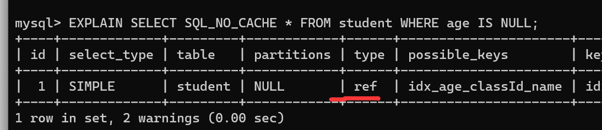

```mysql
# is not null 索引失效
EXPLAIN SELECT SQL_NO_CACHE * FROM student WHERE age IS NOT NULL;
```


> 结论：最好在设计数据表的时候就将`字段设置为 NOT NULL 约束`，比如你可以将INT类型的字段，默认值设置为0。将字符类型的默认值设置为空字符串。
>
> 拓展: 同理，在查询中使用`not like`也无法使用索引，导致全表扫描。


#### 2.9 like以通配符%开头索引失效  

在使用LIKE关键字进行查询的查询语句中，如果匹配字符串的第一个字符为“%”，索引就不会起作用。只有“%"不在第一个位置，索引才会起作用。

> **拓展：Alibaba《Java开发手册》**
>
> 【强制】页面搜索严禁左模糊或者全模糊，如果需要请走搜索引擎来解决。 


#### 2.10 OR 前后存在非索引的列，索引失效

在WHERE子句中，如果在OR前的条件列进行了索引，而在OR后的条件列没有进行索引，那么索引会失效。也就是说，**OR前后的两个条件中的列都是索引时，查询中才使用索引**。

因为OR的含义就是两个只要满足一个即可，`因此只有一个条件列进行了索引是没有意义的`，只要有条件列没有进行索引，就会进行全表扫描，因此索引的条件列也会失效。


#### 2.11 数据库和表的字符集统一使用utf8mb4

统一使用utf8mb4(5.5.3版本以上支持)兼容性更好，统一字符集可以避免由于字符集转换产生的乱码。不同的`字符集`进行比较前需要进行`转换`会造成索引失效。


#### 2.12练习及一般性建议

**练习**:假设:index(a,b,c)


**一般性建议:**

- 对于单列索引，尽量选择针对当前query过滤性更好的索引
- 在选择组合索引的时候，当前query中过滤性最好的字段在索引字段顺序中，位置越靠前越好。
- 在选择组合索引的时候，尽量选择能够包含当前query中的where子句中更多字段的索引。
- 在选择组合索引的时候，如果某个字段可能出现范围查询时，尽量把这个字段放在索引次序的最后面。

**总之，书写SQL语句时，尽量避免造成索引失效的情况。**


### 3 关联查询优化

#### 3.1 数据准备

```mysql
#分类
CREATE TABLE IF NOT EXISTS `type`(
	`id` INT(10) UNSIGNED NOT NULL AUTO_INCREMENT,
	`card` INT(10) UNSIGNED NOT NULL,
	PRIMARY KEY ( `id` )
);

#图书
CREATE TABLE IF NOT EXISTS `book`(
	`bookid` INT(10) UNSIGNED NOT NULL AUTO_INCREMENT,
	`card`INT(10) UNSIGNED NOT NULL,
	PRIMARY KEY (`bookid`)
);
```

```mysql
#向分类表中添加20条记录
INSERT INTO type (card) VALUES (FLOOR(1 +(RAND() * 20)));
#向图书表中添加20条记录
INSERT INTO book(card) VALUES (FLOOR(1 +(RAND() * 20)) );
```


#### 3.2 采用左外连接

下面开始 EXPLAIN 分析  

```mysql
EXPLAIN SELECT SQL_NO_CACHE * FROM `type` LEFT JOIN book ON type.card = book.card;
```


结论：type有All

添加索引优化 

```mysql
ALTER TABLE book ADD INDEX Y(card); #【被驱动表】，可以避免全表扫描

EXPLAIN SELECT SQL_NO_CACHE * FROM `type` LEFT JOIN book ON type.card = book.card;
```


可以看到第二行的 type 变为了 ref，rows 也变成了优化比较明显。这是由左连接特性决定的。LEFT JOIN条件用于确定如何从右表搜索行，左边一定都有，所以`右边是我们的关键点，一定需要建立索引`。

> 如果只能添加一边的索引，那就给`被驱动表`添加上索引。

```mysql
ALTER TABLE `type` ADD INDEX X (card); #【驱动表】，无法避免全表扫描

EXPLAIN SELECT SQL_NO_CACHE * FROM `type` LEFT JOIN book ON type.card = book.card;
```

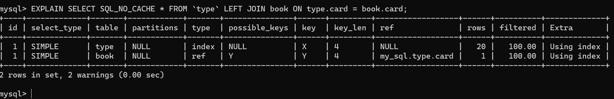

接着：

```mysql
DROP INDEX Y ON book;
EXPLAIN SELECT SQL_NO_CACHE * FROM `type` LEFT JOIN book ON type.card = book.card;
```


> 去掉被驱动索引，又变成了 join buffer


#### 3.3 采用内连接

**前置知识**


```mysql
drop index X on type;
drop index Y on book;#（如果已经删除了可以不用再执行该操作）
```

换成 inner join（MySQL自动选择驱动表）  

```mysql
EXPLAIN SELECT SQL_NO_CACHE * FROM type INNER JOIN book ON type.card=book.card;
```


添加索引优化  

```mysql
ALTER TABLE book ADD INDEX Y (card);

EXPLAIN SELECT SQL_NO_CACHE * FROM type INNER JOIN book ON type.card=book.card;
```

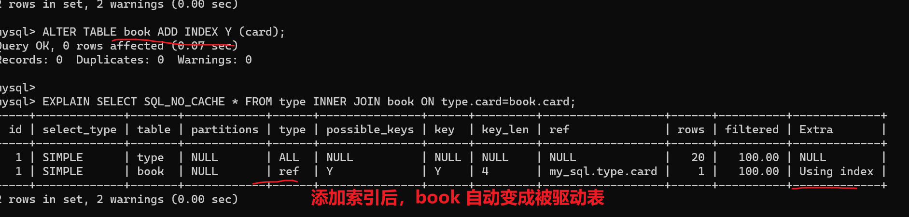

```mysql
# type 加索引
ALTER TABLE type ADD INDEX X (card);
# 观察执行情况
EXPLAIN SELECT SQL_NO_CACHE * FROM type INNER JOIN book ON type.card=book.card;
```


> 这里刚给type加了索引后，驱动表和被驱动表还是原来的样子。
>
> 给type继续加了一些数据后
>
> 优化器会判断，哪个数据比较少。就作为驱动表

**结论：**

- `内连接`主被驱动表是由优化器决定的。优化器认为哪个成本比较小，就采用哪种作为驱动表。

- 如果两张表只有一个有索引，那有索引的表作为`被驱动表`。
  - 原因：驱动表要全查出来。有没有索引你都得全查出来。
- 两个索引都存在的情况下，数据量大的作为`被驱动表`（小表驱动大表）
  - 原因：驱动表要全部查出来，而大表可以通过索引加快查找


#### 3.4 join语句原理

join方式连接多个表，本质就是各个表之间数据的循环匹配。MySQL5.5版本之前，MySQL只文持一种表间关联方式，就是嵌套循环(`Nested Loop Join`)。如果关联表的数据量很大，则join关联的执行时间会非常长。在MySQL5.5以后的版本中，MySQL通过引入`BNLJ`算法来优化嵌套执行。

##### 1.驱动表和被驱动表

驱动表就是主表，被驱动表就是从表、非驱动表。

- 对于内连接来说:

  ```mysql
  SELECT * FROM A JOIN B ON ...
  ```

  A一定是驱动表吗？不一定，优化器会根据你查询语句做优化，决定先查哪张表。先查询的那张表就是驱动表，反之就是被驱动表。通过explain关键字可以查看。

  - 对于内连接来说：

    ```mysql
    SELECT * FROM A JOIN B ON ...
    ```
    
    **A一定是驱动表吗？**

    不一定，优化器会根据你查询语句做优化，决定先查哪张表。先查询的那张表就是驱动表，反之就是被驱动表。通过explain关键字可以查看。

  - 对于外连接来说：
  
    ```mysql
    SELECT * FROM A LEFT JOIN B ON ...
    #或
    SELECT *FROM B RIGHT JOIN A ON ...
    ```
  
    通常，大家会认为A就是驱动表，B就是被驱动表。但也未必。测试如下:
  
    ```mysql
    CREATE TABLE a(f1 INT,f2 INT,INDEX(f1))ENGINE=INNODB;
    
    CREATE TABLE b(f1 INT,f2 INT)ENGINE=INNODB;
    
    INSERT INTO a VALUES(1,1),(2,2),(3,3),(4,4),(5,5),(6,6);
    
    INSERT INTO b VALUES (3,3),(4,4),(5,5),(6,6),(7,7),(8,8);
    
    #测试1
    EXPLAIN SELECT* FROM a LEFT JOIN b ON (a.f1=b.f1)WHERE (a.f2=b.f2);
    
    #测试2
    EXPLAIN SELECT * FROM a LEFT JOIN b oN (a.f1=b.f1) AND (a.f2=b.f2);
    ```

    **测试1结果：**

    

    得出这种结论太不可思议了，跟上一个show warnings看看：
  
    
  
    **测试2结果：**
  
    
  
    继续show warnings \G
  
    

##### 2.Simple Nested-Loop Join(简单嵌套循环连接)

算法相当简单，从表A中取出一条数据1，遍历表B，将匹配到的数据放到result...以此类推，驱动表A中的每一条记录与被驱动表B的记录进行判断:


这个例子是在没有索引的情况，做了全表扫描

可以看到这种方式效率是非常低的，以上述表A数据100条，表B数据1000条计算，则A*B=10万次。开销统计如下:


当然mysql肯定不会这么粗暴的去进行表的连接，所以就出现了后面的两种对Nested-Loop Join优化算法。


##### 3.Index Nested-Loop Join(索引嵌套循环连接)

Index Nested-Loop Join其优化的思路主要是为了`减少内层表数据的匹配次数`，所以要求被驱动表上必须`有索引`才行。通过外层表匹配条件直接与内层表索引进行匹配，避免和内层表的每条记录去进行比较，这样极大的减少了对内层表的匹配次数。


驱动表中的每条记录通过被驱动表的索引进行访问，因为索引查询的成本是比较固定的，故mysql优化器都倾向于使用记录数少的表作为驱动表(外表)。


如果被驱动表加索引，效率是非常高的，但如果索引不是主键索引，所以还得进行一次回表查询。相比，被驱动表的索引是主键索引，效率会更高。


##### 4.Block Nested-Loop Join(块嵌套循环连接)

如果存在索引，那么会使用index的方式进行join，如果join的列没有索引，被驱动表要扫描的次数太多了。每次访问被驱动表，其表中的记录都会被加载到内存中，然后再从驱动表中取一条与其匹配，匹配结束后清除内存，然后再从驱动表中加载一条记录，然后把被驱动表的记录在加载到内存匹配这样周而复始，大大增加了IO的次数。为了减少被驱动表的IO次数，就出现了Block Nested-Loop Join的方式。

不再是逐条获取驱动表的数据，而是一块一块的获取，引入了`join buffer缓冲区`，将`驱动表join`相关的部分数据列(大小受join buffer的限制)缓存到join buffer中，然后全表扫描被驱动表，被驱动表的每一条记录一次性和**join**
**buffer**中的所有驱动表记录进行匹配（`内存中操作`)，将简单嵌套循环中的多次比较合并成一次，降低了被驱动表的访问频率。

> 注意:
>
> 这里缓存的不只是关联表的列, select后面的列也会缓存起来。**（存的是驱动表）**
>
> 在一个有N个join关联的sql中会分配N-1个join buffer。所以查询的时候尽量减少不必要的字段，可以让joinbuffer中可以存放更多的列。


参数设置：

- block_nested_loop

  通过`show variables like '%optimizer_switch%'`查看`block_nested_loop`状态。默认是开启的。

- join_buffer_size

  驱动表能不能一次加载完，要看join buffer能不能存储所有的数据，默认情况下`join_buffer_size=256k`。

  ```mysql
  mysql> show variables like '%join_buffer%';
  +------------------+--------+
  | Variable_name    | Value  |
  +------------------+--------+
  | join_buffer_size | 262144 |
  +------------------+--------+
  1 row in set (0.00 sec)
  ```

  join_buffer_size的最大值在32位系统可以申请4G，而在64位操做系统下可以申请大于4G的Join Buffer空间(64位Windows除外，其大值会被截断为4GB并发出警告)。


##### 5.Join小结

1、**整体效率比较:INLJ > BNLJ > SNLJ**

2、永远用小结果集驱动大结果集(其本质就是减少外层循环的数据数量)(小的度量单位指的是`表行数*每行大小`)

```mysql
# straight_join 不然优化器优化谁是驱动表  驱动表 straight_join 被驱动表
# 这个例子是说t2 的列比较多，，相同的join buffer 加的会比较少。所以不适合用t2 作为  ！！！驱动表
select t1.b,t2.* from t1 straight_join t2 on (t1.b=t2.b) where t2.id<=180;#推荐

select t1.b,t2.* from t2 straight_join t1 on (t1.b=t2.b) where t2.id<=100;#不推荐
```

3、为被驱动表匹配的条件增加索引(减少内层表的循环匹配次数)

4、增大join buffer size的大小(一次缓存的数据越多，那么内层包的扫表次数就越少)

5、减少`驱动表`不必要的字段查询（字段越少，join buffer 所缓存的数据就越多)

6、在决定哪个表做驱动表的时候，应该是两个表按照各自的条件过滤，过滤完成之后，计算参与join的各个字段的总数据量，数据量小的那个表，就是“小表”，应该作为驱动表。


#### 3.5 小结

- 保证被驱动表的JOIN字段已经创建了索引
- 需要JOIN 的字段，数据类型保持绝对一致。
- LEFT JOIN 时，选择小表作为驱动表，`大表作为被驱动表`。减少外层循环的次数。
- INNER JOIN 时，MySQL会自动将`小结果集的表选为驱动表`。选择相信MySQL优化策略。
- 能够直接多表关联的尽量直接关联，不用子查询。(减少查询的趟数)
- 不建议使用子查询，建议将子查询SQL拆开结合程序多次查询，或使用 JOIN 来代替子查询。
- 衍生表建不了索引


#### 3.6 Hash Join

**从MySQL的8.0.20版本开始将废弃BNLJ，因为从MySQL8.0.18版本开始就加入了hash join默认都会使用hash join**

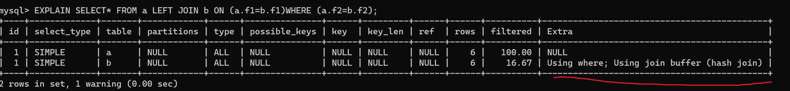

- Nested Loop:
  对于被连接的数据子集较小的情况，Nested Loop是个较好的选择。

- Hash Join是做`大数据集连接`时的常用方式，优化器使用两个表中较小(相对较小)的表利用Join Key在内存中建立`散列表`，然后扫描较大的表并探测散列表，找出与Hash表匹配的行。

  - 这种方式适用于较小的表完全可以放于内存中的情况，这样总成本就是访问两个表的成本之和。
  - 在表很大的情况下并不能完全放入内存，这时优化器会将它分割成`若干不同的分区`，不能放入内存的部分就把该分区写入磁盘的临时段，此时要求有较大的临时段从而尽量提高I/O的性能。

  - 它能够很好的工作于没有索引的大表和并行查询的环境中，并提供最好的性能。大多数人都说它是Join的重型升降机。Hash Join只能应用于等值连接(如WHERE A.COL1=B.COL2)，这是由Hash的特点决定的。

  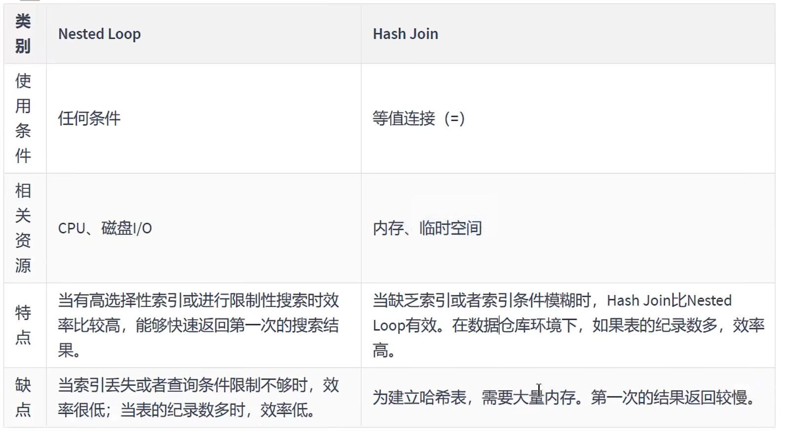


### 4 子查询优化

MySQL从4.1版本开始支持子查询，使用子查询可以进行SELECT语句的嵌套查询，即一个SELECT查询的结果作为另一个SELECT语句的条件。`子查询可以一次性完成很多逻辑上需要多个步骤才能完成的SQL操作`。

**子查询是MySQL的一项重要的功能，可以帮助我们通过一个SQL语句实现比较复杂的查询。但是，子查询的执行效率不高。**原因:

1. 执行子查询时MySQL需要为内层查询语句的查询结果`建立一个临时表`，然后外层查询语句从临时表中查询记录。查询完毕后，再`撤销这些临时表`。这样会消耗过多的CPU和IO资源，产生大量的慢查询。

2. 子查询的结果集存储的临时表，不论是内存临时表还是磁盘临时表都`不会存在索引`，所以查询性能会受到一定的影响。

3. 对于返回结果集比较大的子查询，其对查询性能的影响也就越大。

**在MySQL中，可以使用连接（JOIN）查询来替代子查询**。连接查询不需要`建立临时表`，其`速度比子查询要快`，如果查询中使用索引的话，性能就会更好。

举例1:查询学生表中是班长的学生信息

- 使用子查询

  ```mysql
  #创建班级表中班长的索引
  CREATE INDEX idx_monitor ON class ( monitor ) ;
  
  EXPLAIN SELECT *FROM student stu1
  WHERE stu1.`stuno` IN(
  	SELECT monitor
  	FROM class c
  	WHERE monitor IS NOT NULL);
  ```

- 推荐:使用多表查询

  ```mysql
  EXPLAIN SELECT stu1.* FROM student stu1 JOIN class c
  ON stu1.`stuno` = c. `monitor`
  WHERE c. `monitor` IS NOT NULL;
  ```


举例2:取所有不为班长的同学 不推荐

- 子查询

  ```mysql
  EXPLAIN SELECT SQL_NO_CACHE a.* FROM student a
  WHERE a.stuno NOT IN (
  SELECT monitor FROM class bWHERE monitor IS NOT NULL);
  ```

- 修改成多表查询

  ```mysql
  EXPLAIN SELECT SQL_NO_CACHE a.*
  FROM student a LEFT OUTER JOIN class b ON a. stuno =b.monitor
  WHERE b.monitor IS NULL;
  
  ```

> 结论: 尽量不要使用NOT IN或者NOT EXISTS，用`LEFT JOIN Xxx ON xx WHERE xx IS NULL`替代


### 5 排序优化

#### 5.1排序优化

**问题:** 在WHERE条件字段上加索引，但是为什么在ORDER BY字段上还要加索引呢?

**回答:**

在MySQL中，支持两种排序方式，分别是`FileSort`和`Index`排序。

- Index排序中，索引可以保证数据的有序性，不需要再进行排序，`效率更高`。
- FileSort排序则一般在`内存中`进行排序，占用`CPU较多`。如果待排结果较大，会产生临时文件I/O到磁盘进行排序的情况，效率较低。

**优化建议:**

1. SQL中，可以在WHERE子句和ORDER BY子句中使用索引，目的是在WHERE子句中`避免全表扫描`，在ORDER BY子句`避免使用FileSort排序`。当然，某些情况下全表扫描，或者FileSort排序不一定比索引慢。但总的来说，我们还是要避免，以提高查询效率。
2. 尽量使用Index完成ORDER BY排序。如果WHERE和ORDER BY后面是相同的列就使用单索引列；如果不同就使用联合索引。
3. 无法使用Index时，需要对FileSort方式进行调优。


#### 5.2测试

删除student表和class表中已创建的索引。

```mysql
#方式1:
DROP INDEX idx_monitor ON class;

DROP INDEX idx_cid ON student;
DROP INDEX idx_age ON student;DROP INDEX idx_name ON student ;
DROP INDEX idx_age_name_classid ON student ;DROP INDEX idx_age_classid_name ON student ;

#方式2:
call proc_drop_index( 'atguigudb2' , 'student' );
call proc_drop_index( 'atguigudb2' , 'class' );
```

以下是否能使用到索引，能否去掉`using filesort`

**过程一:**

```mysql
EXPLAIN SELECT SQL_NO_CACHE * FROM student ORDER BY age, classid;

EXPLAIN SELECT SQL_NO_CACHE * FROM student ORDER BY age, classid limit 10;
```

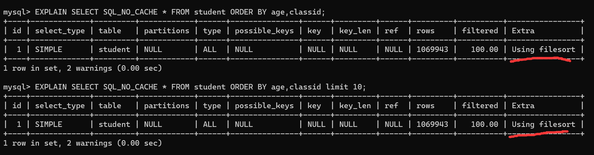


**过程二: order by时不limit，索引失效**

```mysql
#创建索引
CREATE INDEX idx_age_classid_name ON student (age, classid, `name`);
#不限制,索引失效
EXPLAIN SELECT SQL_NO_CACHE * FROM student ORDER BY age ,classid ;
```


> 这里优化器觉得，还需要回表。会费时间更大，不走索引。

使用覆盖索引试试看

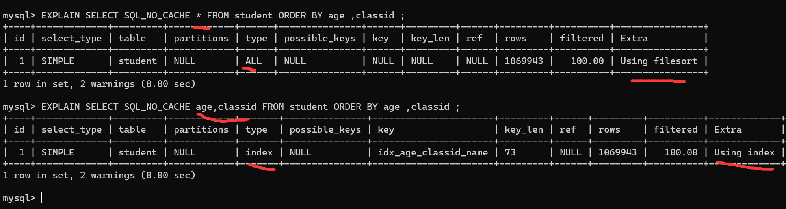

> 不用回表，优化器觉得走索引快。就使用了索引。

增加limit 条件

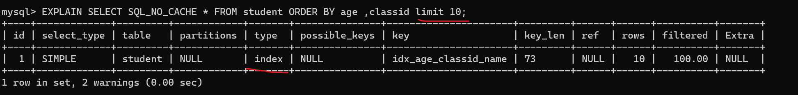

> 增加limit 减少回表的数量，优化器觉得走索引快，会使用索引


**过程三: order by时顺序错误，索引失效**

```mysql
CREATE INDEX idx_age_classid_stuno ON student (age,classid,stuno) ;

#以下哪些索引失效?

# 不会走，最左前缀原则
EXPLAIN SELECT* FROM student ORDER BY classid LIMIT 10;

# 不会走，最左前缀原则
EXPLAIN SELECT* FROM student ORDER BY classid,NAME LIMIT 10;

# 走
EXPLAIN SELECT* FROM student ORDER BY age,classid, stuno LIMIT 10;
# 走
EXPLAIN SELECT *FROM student ORDER BY age,classid LIMIT 10;
# 走
EXPLAIN SELECT * FROM student ORDER BY age LIMIT 10;
```


**过程四: order by时规则不一致,索引失效（顺序错，不索引; 方向反，不索引)**

```mysql
# age desc 方向反 索引失效
EXPLAIN SELECT * FROM student ORDER BY age DESC, classid ASC LIMIT 10;

# 没有最左前缀 索引失效
EXPLAIN SELECT * FROM student ORDER BY classid DESC, NAME DESC LIMIT 10;

# age asc 没问题 classid desc 降序， 优化器认为，文件排序比较快索引失效
# 方向反了不走索引
EXPLAIN SELECT * FROM student ORDER BY age ASC, classid DESC LIMIT 10;

# Backward index scan 走索引了，，倒着走索引
EXPLAIN SELECT * FROM student ORDER BY age DESC, classid DESC LIMIT 10; 
```


**过程五:无过滤,不索引**

```mysql
EXPLAIN SELECT * FROM student WHERE age=45 ORDER BY classid;

EXPLAIN SELECT * FROM student WHERE age=45 ORDER BY classid , name;
```

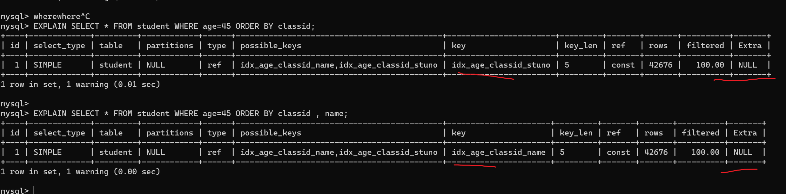

```mysql
EXPLAIN SELECT *FROM student WHERE classid=45 order by age;

EXPLAIN SELECT * FROM student WHERE classid=45 order by age limit 10;
```

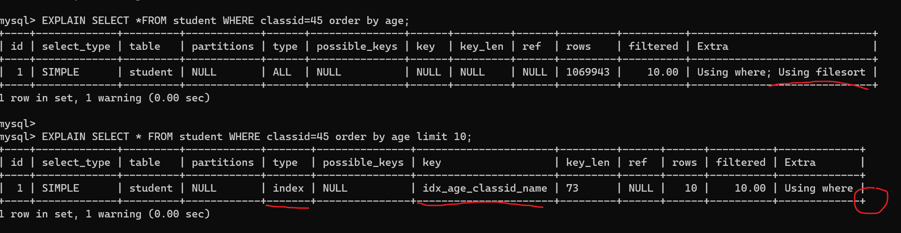

这里第一条排序走Using filesort 很好理解

第二条为啥不是 `Using filesort ` 呢？

这里type = index，key=idx_age_classid_name。 这说明了优化器预估对idx_age_classid_name索引进行完整的遍历。由于索引本身就是根据age升序存储的。。所以只要在遍历的过程中，遇到前十个classid=45。就可以停止遍历。回表返回数据。（根据上完课自己想的，无法验证，不知道有没有偏差）


**小结:**

```mysql
INDEX a_b_c( a, b,c)

order by 能使用索引最左前缀
- ORDER BY a
- ORDER BY a, b
- ORDER BY a , b, c
- ORDER BY a DESC, b DESC,c DESC

# 如果WHERE使用索引的最左前缀定义为常量，则order by 能使用索引
- WHERE a = const ORDER BY b, c
- WHERE a = const AND b = const ORDER BY c
- WHERE a = const ORDER BY b, c
- WHERE a = const AND b > const ORDER BY b , c

# 不能使用索引进行排序
- ORDER BY a ASC, b DESC, c DESC/*排序不一致*/
- WHERE g = const ORDER BY b,c/*丢失a索引*/
- WHERE a = const ORDER BY c/*丢失b索引*/
- WHERE a = const ORDER BY a, d /*d不是索引的一部分*/
- WHERE a in (...) ORDER BY b,c /*对于排序来说，多个相等条件也是范围查询*/
```

> 索引只会用到一个，没办法一个索引用来where 一个索引用来 order by。
>
> 但是可以建立联合索引。


#### 5.3案例实战

ORDER BY子句，尽量使用Index方式排序，避免使用FileSort方式排序。

执行案例前先清除student上的索引，只留主键:

```mysql
DROP INDEX idx_age ON student;
DROP INDEX idx_age_classid_stuno ON student;
DROP INDEX idx_age_classid_name ON student;

#或者
call proc_drop_index( 'my_sql' , ' student' ) ;
show index from student;
```

**场景:查询年龄为30岁的，且学生编号小于101000的学生，按用户名称排序**

```mysql
EXPLAIN SELECT SQL_NO_CACHE * FROM student WHERE age = 30 AND stuno <101000 ORDER BY `name`;
```


```mysql
mysql>  SELECT SQL_NO_CACHE * FROM student WHERE age = 30 AND stuno <101000 ORDER BY NAME;
+-----+--------+--------+------+---------+
| id  | stuno  | name   | age  | classId |
+-----+--------+--------+------+---------+
| 417 | 100417 | bBAYtX |   30 |     159 |
....
| 372 | 100372 | xwODCc |   30 |     764 |
+-----+--------+--------+------+---------+
18 rows in set, 1 warning (3.17 sec)
```

> 结论: type是ALL，即最坏的情况。Extra里还出现了`Using filqsort`,也是最坏的情况。优化是必须的。

优化思路：

**方案一:为了去掉filesort我们可以把索引建成**

```mysql
#创建新索引
CREATE INDEX idx_age_name ON student(age, `name`);

EXPLAIN SELECT SQL_NO_CACHE * FROM student WHERE age = 30 AND stuno <101000 ORDER BY NAME;
```


**方案二:尽量让where的过滤条件和排序使用上索引**

```mysql
DROP INDEX idx_age_name ON student;
# 建一个三个字段的组合索引
create index idx_age_stuno_name on student(age,stuno,name);

EXPLAIN SELECT SQL_NO_CACHE * FROM student WHERE age = 30 AND stuno <101000 ORDER BY NAME;
```


下面这个方案虽然使用了` Using filesort` 但是速度反而更快了。


原因:

所有的排序都是在条件过滤之后才执行的。所以，如果条件过滤掉大部分数据的话，剩下几百几千条数据进行排序其实并不是很消耗性能，即使索引优化了排序，但实际提升性能很有限。相对的stuno<101000这个条件，如果没有用到索引的话，要对几万条的数据进行扫描，这是非常消耗性能的，所以索引放在这个字段上性价比最高，是最优选择。

> 结论:
>
> 1. 两个索引同时存在，mysql自动选择最优的方案。(对于这个例子mysql选择idx_age_stuno_name)。但是，`随着数据量的变化，选择的索引也会随之变化的。`
>
> 2. **当【范围条件】和【group by或者order by】的字段出现二选一时，优先观察条件字段的过滤数量，如果过滤的数据足够多，而需要排序的数据并不多时，优先把索引放在范围字段上。反之，亦然。**

思考:这里我们使用如下索引，是否可行?

```mysql
DROP INDEX idx_age_stuno_name ON student;

# 当然可以了，因为3个也只是用到了两个索引
CREATE INDEX idx_age_stuno ON student(age, stuno) ;
```

 

#### 5.4 filesort算法:双路排序和单路排序

排序的字段若如果不在索引列上，则`filesort`会有两种算法: **双路排序**和**单路排序**

**双路排序（慢)**

- `MySQL 4.1之前是使用双路排序`，字面意思就是两次扫描磁盘，最终得到数据，读取行指针和`order by列`，对他们进行排序，然后扫描已经排序好的列表，按照列表中的值重新从列表中读取对应的数据输出
- 从磁盘取排序字段，在buffer进行排序，再从`磁盘取其他字段`。

取一批数据，要对磁盘进行两次扫描，众所周知，IO是很耗时的，所以在mysql4.1之后，出现了第二种改进的算法，就是单路排序。

**单路排序**（快)

从磁盘读取查询需要的`所有列`，按照order by列在buffer对它们进行排序，然后扫描排序后的列表进行输出，它的效率更快一些，避免了第二次读取数据。并且把随机IO变成了顺序IO，但是它会使用更多的空间，因为它把每一行都保存在内存中了。

**结论及引申出的问题**

- 由于单路是后出的，总体而言好过双路
- 但是用单路有问题
  - 在sort_buffer中，单路比多路要`多占用更多空间`，因为单路是把所有字段都取出，所以有可能取出的数据的总大小超出了`sort_buffer`的容量，导致每次只能取`sort_buffer`容量大小的数据，进行排序〈创建tmp文件，多路合并)，排完再取sort_buffer容量大小，再排......从而多次I/O。
  - 单路本来想省一次IO操作，`反而导致了大量的IO操作`，反而得不偿失。

**优化策略**

**1. 尝试提高sort_buffer_size**

- 不管用哪种算法，提高这个参数都会提高效率，要根据系统的能力去提高，因为这个参数是针对每个进程(connection)的1M-8M之间调整。MySQL5.7，InnoDB存储引擎默认值是1048576字节，1MB。
  
  ```mysql
  mysql> SHOW VARIABLES LIKE '%sort_buffer_size%';
  +-------------------------+---------+
  | Variable_name           | Value   |
  +-------------------------+---------+
  | innodb_sort_buffer_size | 1048576 |
  | myisam_sort_buffer_size | 8388608 |
  | sort_buffer_size        | 262144  |
  +-------------------------+---------+
  3 rows in set (0.00 sec)
  ```

**2. 尝试提高max_length_for_sort_data**

- 提高这个参数，会增加用改进算法的概率。

  ```mysql
  mysql> SHow VARIABLES LIKE '%max_length_for_sort_data%';
  +--------------------------+-------+
  | Variable_name            | Value |
  +--------------------------+-------+
  | max_length_for_sort_data | 4096  |
  +--------------------------+-------+
  1 row in set (0.00 sec)
  ```

- 但是如果设的太高，数据总容量超出`sort_buffer_size`的概率就增大，明显症状是高的磁盘IO活动和低的处理器使用率。如果需要返回的列的总长度大于`max_length_for_sort_data`使用`双路算法`，否则使用单路算法。1024-8192字节之间调整

**3. Order by时select *是一个大忌。最好只Query需要的字段。**原因:

- 当Query的字段大小总和小于`max_length_for_sort_data`，而且排序字段不是TEXT|BLOB类型时，会用改进后的算法――单路排序，否则用老算法――多路排序。
- 两种算法的数据都有可能超出sort_buffer_size的容量，超出之后，会创建tmp文件进行合并排序，导致多次IO，但是用单路排序算法的风险会更大一些，所以要提高`sort_buffer_size`。


### 6 GROUP BY优化

- group by使用索引的原则几乎跟order by一致，group by即使没有过滤条件用到索引，也可以直接使用索引。
- group by先排序再分组，遵照索引建的最佳左前缀法则
- 当无法使用索引列，增大`max_length_for_sort_data`和`sort_buffer_size`参数的设置
- where效率高于having，能写在where限定的条件就不要写在having中了
- 减少使用order by，和业务沟通能不排序就不排序，或将排序放到程序端去做。Order by、group by、distinct这些语句较为耗费CPU，数据库的CPU资源是极其宝贵的。
- 包含了order by、group by、distinct这些查询的语句，where条件过滤出来的结果集请保持在1000行以内，否则SQL会很慢。


### 7 优化分页查询

一般分页查询时，通过创建覆盖索引能够比较好地提高性能。一个常见又非常头疼的问题就是limit 2000000, 10，此时需要MySQL排序前2000010记录，仅仅返回2000000 - 2000010的记录，其他记录丢弃，查询排序的代价非常大。

```mysql
EXPLAIN SELECT * FROM student LIMIT 2088800, 10;
```

**优化思路一**

在索引上完成排序分页操作，最后根据主键关联回原表查询所需要的其他列内容。

```mysql
EXPLAIN SELECT * FROM student t, (SELECT id FROM student ORDER BY id LIMIT 2000000,10) a WHERE t.id = a.id;
```


**优化思路二**(几乎没法用)

该方案适用于主键自增的表，可以把Limit查询转换成某个位置的查询。

```mysql
EXPLAIN SELECT * FROM student WHERE id > 2080880 LIMIT 10;
```

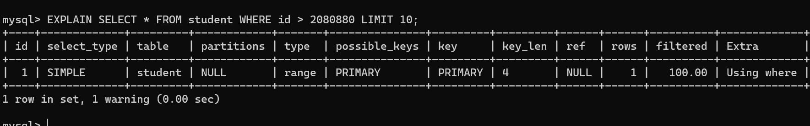

> 不靠谱，生产中id可能会删除，查询的条件也不可能这么简单。


### 8 优先考虑覆盖索引

#### 8.1 什么是覆盖索引？

**理解方式一**：索引是高效找到行的一个方法，但是一般数据库也能使用索引找到一个列的数据，因此它不必读取整个行。毕竟索引叶子节点存储了它们索引的数据；当能通过读取索引就可以得到想要的数据，那就不需要读取行了。**一个索引包含了满足查询结果的数据就叫做覆盖索引。**

**理解方式二：**非聚簇复合索引的一种形式，它包括在查询里的SELECT、JOIN和WHERE子句用到的所有列（即建索引的字段正好是覆盖查询条件中所涉及的字段）。

简单说就是，`索引列+主键`包含`SELECT 到 FROM之间查询的列`。


**举例一:**覆盖索引长什么样子。`索引列+主键`

```mysql
DROP INDEX idx_age_stuno ON student ;
CREATE INDEX idx_age_name ON student (age , NAME);

EXPLAIN SELECT * FROM student WHERE age <>20;
```

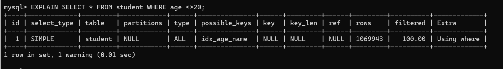

```mysql
EXPLAIN SELECT id, age, NAME FROM student WHERE age <> 28;
```


上述都使用到了声明的索引，下面的情况则不然，在查询列中多了一列classid，显示未使用到索引:

```mysql
EXPLAIN SELECT id, age, NAME, classid FROM student WHERE age <> 28;
```


**举例二**：

```mysql
EXPLAIN SELECT *FROM student WHERE NAME LIKE '%abc';
```


```mysql
CREATE INDEX idx_age_name ON student (age , NAME);
EXPLAIN SELECT id, age ,NAME FROM student WHERE NAME LIKE '%abc ';
```

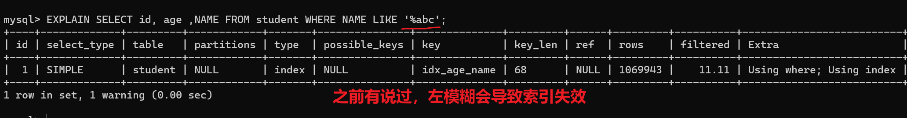

```mysql
# 索引覆盖失效
EXPLAIN SELECT id, age, NAME, classid FROM student WHERE NAME LIKE '%abc ';
```

查询多了classid，结果是未使用到索引


> 之前有说过，不等于与左模糊会导致索引失效。但是这里为什么又用上了呢？
>
> 原因是优化器发现，数据已经都在索引了。直接遍历索引就可以返回数据。而遍历索引，肯定是比遍历全表数据量少的。这样IO就可以更少。
>
> 一切都是成本的考量。


#### 8.2 覆盖索引的利弊

**好处：**

**1. 避免Innodb表进行索引的二次查询（回表）**

Innodb是以聚集索引的顺序来存储的，对于Innodb来说，二级索引在叶子节点中所保存的是行的主键信息，如果是用二级索引查询数据，在查找到相应的键值后，还需通过主键进行二次查询才能获取我们真实所需要的数据。

在覆盖索引中，二级索引的键值中可以获取所要的数据，`避免了对主键的二次查询，减少了IO操作`，提升了查询效率。

**2. 可以把随机IO变成顺序IO加快查询效率**

由于覆盖索引是按键值的顺序存储的，对于IO密集型的范围查找来说，对比随机从磁盘读取每一行的数据IO要少的多，因此利用覆盖索引在访问时也可以把磁盘的`随机读取的IO`转变成索引查找的`顺序IO`。

**3.数据在索引里面数据量少更紧凑**

索引肯定是比原来的数据，数据量少。。这样就可以减少IO.

**由于覆盖索引可以减少树的搜索次数，显著提升查询性能，所以使用覆盖索引是一个常用的性能优化手段。**


**弊端：**

- `索引字段的维护`总是有代价的。因此，在建立冗余索引来支持覆盖索引时就需要权衡考虑了。这是业务DBA，或者称为业务数据架构师的工作。


### 9 如何给字符串添加索引

有一张教师表，表定义如下：  

```mysql
create table teacher(
	ID bigint unsigned primary key,
	email varchar(64),
	...
)engine=innodb;
```

讲师要使用邮箱登录，所以业务代码中一定会出现类似于这样的语句：  

```mysql
mysql> select col1, col2 from teacher where email='xxx';
```

如果email这个字段上没有索引，那么这个语句就只能做`全表扫描`。


#### 9.1 前缀索引

MySQL是支持前缀索引的。默认地，如果你创建索引的语句不指定前缀长度，那么索引就会包含整个字符串

```mysql
mysql> alter table teacher add index index1(email);
#或
mysql> alter table teacher add index index2(email(6))
```

这两种不同的定义在数据结构和存储上有什么区别呢？下图就是这两个索引的示意图  


以及  


**如果使用的是index1**（即email整个字符串的索引结构），执行顺序是这样的：

1. 从index1索引树找到满足索引值是'zhangssxyz@xxx.com'的这条记录，取得ID2的值；
2. 到主键上查到主键值是ID2的行，判断email的值是正确的，将这行记录加入结果集；
3. 取index1索引树上刚刚查到的位置的下一条记录，发现已经不满足email='zhangssxyz@xxx.com'的条件了，循环结束。

这个过程中，只需要回主键索引取一次数据，所以系统认为只扫描了一行。

**如果使用的是index2**（即email(6)索引结构），执行顺序是这样的：

1. 从index2索引树找到满足索引值是'zhangs'的记录，找到的第一个是ID1；
2. 到主键上查到主键值是ID1的行，判断出email的值不是'zhangssxyz@xxx.com'，这行记录丢弃；
3. 取index2上刚刚查到的位置的下一条记录，发现仍然是'zhangs'，取出ID2，再到ID索引上取整行然后判断，这次值对了，将这行记录加入结果集；
4. 重复上一步，直到在idxe2上取到的值不是’zhangs’时，循环结束。

也就是说使用**前缀索引，定义好长度，就可以做到既节省空间，又不用额外增加太多的查询成本。**前面已经讲过区分度，区分度越高越好。因为区分度越高，意味着重复的键值越少。


#### 9.2 前缀索引对覆盖索引的影响

>  结论：
>
>  使用前缀索引就用不上覆盖索引对查询性能的优化了，这也是你在选择是否使用前缀索引时需要考虑的一个因素。


### 10 索引下推

Index Condition Pushdown(ICP)是MySQL 5.6中新特性，是一种在存储引擎层使用索引过滤数据的一种优化方式。ICP可以减少存储引擎访问基表的次数以及MySQL服务器访问存储引擎的次数。

- 如果没有ICP，存储引擎会遍历索引以定位基表中的行，并将它们返回给MySQL服务器，由MySQL服务器评估`WHERE`后面的条件是否保留行。
- 启用ICP后，如果部分`WHERE`条件可以仅使用索引中的列进行筛选，则MySQL服务器会把这部分`WHERE`条件放到存储引擎筛选。然后，存储引擎通过使用索引条目来筛选数据，并且只有在满足这一条件时才从表中读取行。
  - 好处: ICP可以减少存储引擎必须访问基表的次数和MySQL服务器必须访问存储引擎的次数。
  - 但是，ICP的`加速效果`取决于在存储引擎内通过`ICP筛选`掉的数据的比例。

#### 10.1 使用前后对比

**在不使用ICP索引扫描的过程：**

storage层：只将满足index key条件的索引记录对应的整行记录取出，返回给server层

server 层：对返回的数据，使用后面的where条件过滤，直至返回最后一行。


**使用ICP扫描的过程：**

- storage层：

  首先将index key条件满足的索引记录区间确定，然后在索引上使用index filter进行过滤。将满足的index
  filter条件的索引记录才去回表取出整行记录返回server层。不满足index filter条件的索引记录丢弃，不回
  表、也不会返回server层。

- server 层：

  对返回的数据，使用table filter条件做最后的过滤。


**使用前后的成本差别**

使用前，存储层多返回了需要被index filter过滤掉的整行记录

使用ICP后，直接就去掉了不满足index filter条件的记录，省去了他们回表和传递到server层的成本。

ICP的`加速效果`取决于在存储引擎内通过`ICP筛选掉`的数据的比例


例子：

key1 有索引

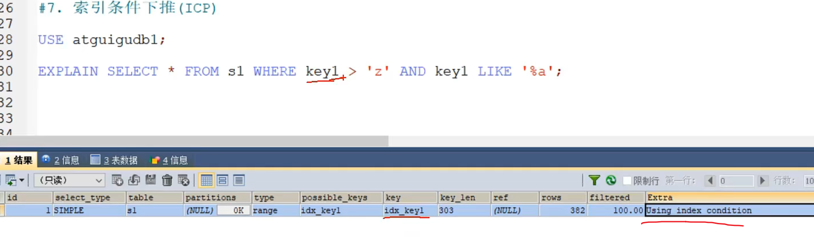

> 这里条件like '%a' 其实可以在索引里面，算出来哪些符合条件。。。。过滤出符合条件的，再回表。这样回表的数据可以减少很多。还有一个好处，没有索引下推，就需要把数据都回表查出来，，这些数据可能在不同的页当中，又会产生IO
>
> 条件下推，下推到下一个条件符不符合。


#### 10.2 ICP的开启/关闭

- 默认情况下启用索引条件下推。可以通过设置系统变量`optimizer_switch`控制:`index_condition_pushdown`

  ```mysql
  #关闭索引下推
  SET optimizer_switch = 'index_condition_pushdown=off ' ;
  
  #打开索引下推
  SET optimizer_switch = 'index_condition_pushdown=on ' ;
  ```

- 当使用索引条件下推时，`EXPLAIN`语句输出结果中Extra列内容显示为`Using index condition`。


#### 10.3 ICP使用案例

建表

```mysql
CREATE TABLE `people` (
	`id` INT NOT NULL AUTO_INCREMENT,
	`zipcode` VARCHAR ( 20 ) COLLATE utf8_bin DEFAULT NULL,
	`firstname` varchar(20)COLLATE utf8_bin DEFAULT NULL,
	`lastname` varchar(20) COLLATE utf8_bin DEFAULT NULL,
	`address` varchar (50)COLLATE utf8_bin DEFAULT NULL,
	PRIMARY KEY ( `id`),
	KEY `zip_last_first` ( `zipcode` , `lastname`, `firstname`)
)ENGINE=InnoDB AUTO_INCREMENT=5 DEFAULT CHARSET=utf8mb3 COLLATE=utf8_bin;
```


插入数据

```mysql
INSERT INTO `people` VALUES
( '1', '000001','三','张','北京市'),
 ( '2', '000002 ','四','李','南京市'),
 ( '3', '000003', '五','王','上海市'),
 ( '4 ', '000001','六','赵','天津市');
```


为该表定义联合索引zip_last_first (zipcode，lastname，firstname)。如果我们知道了一个人的邮编，但是不确定这个人的姓氏，我们可以进行如下检索:

```mysql
SELECT * FROM people
WHERE zipcode= '000001'
AND lastname LIKE '%张%'
AND address LIKE '%北京市%';
```

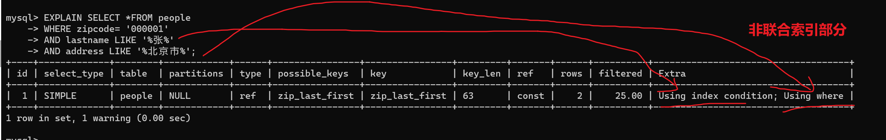

执行查看SQL的查询计划，Extra中显示了`Using index condition`，这表示使用了索引下推。另外，`Using where`表示条件中包含需要过滤的非索引列的数据，即`address LIKE '%北京市%'`这个条件并不是索引列，需要在服务端过滤掉。


#### 10.4 开启和关闭ICP的性能对比

创建存储过程，主要目的就是插入很多000001的数据，这样查询的时候为了在存储引擎层做过滤，减少IO，也为了减少缓冲池（缓存数据页，没有IO）的作用。

```MYSQL
DELIMITER //
CREATE PROCEDURE insert_people( max_num INT )
BEGIN
DECLARE i INT DEFAULT 0;
	SET autocommit = 0;
	REPEAT
	SET i = i + 1;
	INSERT INTo people ( zipcode, firstname , lastname , address ) VALUES ( '000001','六', '赵','天津市');

	UNTIL i = max_num
	END REPEAT;
	COMMIT;
END //
DELIMITER ;
```

调用存储过程

```mysql
call insert_people(1000000);
```

首先打开`profiling`。

```mysql
#查看
mysql> show variables like 'profiling%';
+------------------------+-------+
| Variable_name          | Value |
+------------------------+-------+
| profiling              | OFF   |
| profiling_history_size | 15    |
+------------------------+-------+
```

```mysql
set profiling=1;
```


执行SQL语句，此时默认打开索引下推。

```mysql
SELECT * FROM people WHERE zipcode= '000001' AND lastname LIKE '%张%';
```


再次执行sQL语句，不使用索引下推

```mysql
SELECT /*+ no_icp (people) */ * FROM people WHERE zipcode='000001' AND lastname LIKE '%张%';
```


查看当前会话所产生的所有profiles

```mysql
show profiles\G ;
```

结果如下。

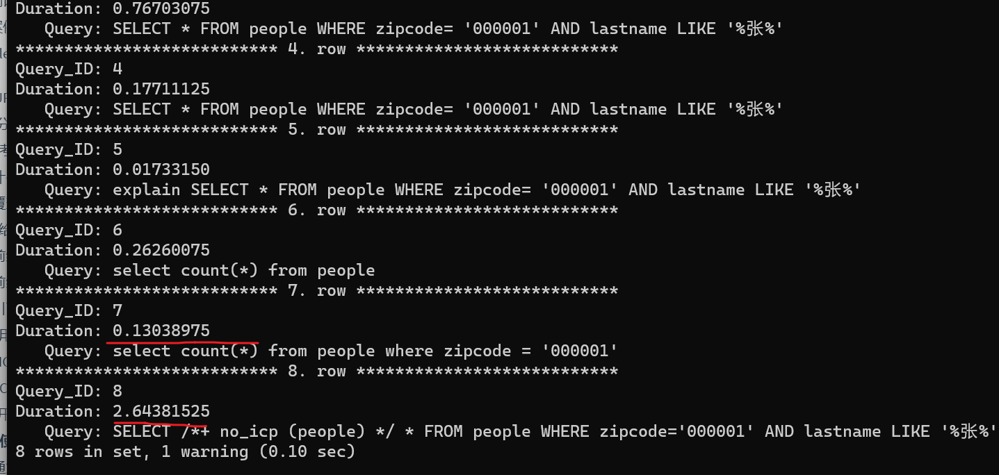


多次测试效率对比来看，使用ICP优化的查询效率会好一些。这里建议多存储一些数据效果更明显。


#### 10.5 ICP的使用条件

1. 如果表访问的类型为`range`、`ref`、`eq_ref`和r`ef_or_null`可以使用ICP

2. ICP可以用于`InnoDB`和`MyISAM`表，包括分区表`InnoDB`和`MyISAM`表

3. 对于`InnoDB`表，`ICP`仅用于二级索引。ICP的目标是减少全行读取次数，从而减少I/o操作。

4. 当SQL使用覆盖索引时，不支持ICP。因为这种情况下使用ICP不会减少I/O。

   索引覆盖不能使用，一个原因是，索引覆盖，不需要回表。ICP作用是减小回表，ICP需要回表

5. 相关子查询的条件不能使用ICP

6. MySQL 5.6版本的不支持分区表的ICP功能，5.7版本的开始支持。


### 11 普通索引 vs 唯一索引

**从性能的角度考虑，你选择唯一索引还是普通索引呢？选择的依据是什么呢？**

假设，我们有一个主键列为ID的表，表中有字段k，并且在k上有索引，假设字段k上的值都不重复。

这个表的建表语句是  

```mysql
mysql> create table test(
	id int primary key,
	k int not null,
	name varchar(16),
	index (k)
)engine=InnoDB;
```

表中R1~R5的(ID,k)值分别为(100,1)、(200,2)、(300,3)、(500,5)和(600,6) 

 

#### 11.1 查询过程

假设，执行查询的语句是 `select id from test where k=5`。

- 对于普通索引来说，查找到满足条件的第一个记录(5,500)后，需要查找下一个记录，直到碰到第一个不满足k=5条件的记录。
- 对于唯一索引来说，由于索引定义了唯一性，查找到第一个满足条件的记录后，就会停止继续检
  索。

那么，这个不同带来的性能差距会有多少呢？答案是 `微乎其微`。


#### 11.2 更新过程

为了说明普通索引和唯一索引对更新语句性能的影响这个问题，介绍一下change buffer。

当需要更新一个数据页时，如果数据页在内存中就直接更新，而如果这个数据页还没有在内存中的话，
在不影响数据一致性的前提下， `InooDB会将这些更新操作缓存在change buffer中` ，这样就不需要从磁
盘中读入这个数据页了。在下次查询需要访问这个数据页的时候，将数据页读入内存，然后执行change
buffer中与这个页有关的操作。通过这种方式就能保证这个数据逻辑的正确性。

将change buffer中的操作应用到原数据页，得到最新结果的过程称为 merge 。除了 访问这个数据页 会触
发merge外，系统有 `后台线程会定期` merge。在 `数据库正常关闭（shutdown）` 的过程中，也会执行merge
操作。

如果能够将更新操作先记录在change buffer， `减少读磁盘` ，语句的执行速度会得到明显的提升。而且，
数据读入内存是需要占用 buffer pool 的，所以这种方式还能够 `避免占用内存` ，提高内存利用率。
`唯一索引的更新就不能使用change buffer` ，实际上也只有普通索引可以使用。

**如果要在这张表中插入一个新记录(4,400)的话，InnoDB的处理流程是怎样的？**


#### 11.3 change buffer的使用场景

1. 普通索引和唯一索引应该怎么选择？

   其实，这两类索引在查询能力上是没差别的，主要考虑的是对`更新性能`的影响。所以，建议你`尽量选择普通索引`。

2. 在实际使用中会发现，`普通索引`和`change buffer`的配合使用，对于`数据量大`的表的更新优化还是很明显的。

3. 如果所有的更新后面，都马上`伴随着对这个记录的查询`，那么你应该`关闭change buffer`。而在其他情况下，change buffer都能提升更新性能。

4. 由于唯一索引用不上change buffer的优化机制，因此如果`业务可以接受`，从性能角度出发建议优先考虑非唯一索引。但是如果"业务可能无法确保"的情况下，怎么处理呢？

   - 首先，`业务正确性优先`。我们的前提是“业务代码已经保证不会写入重复数据”的情况下，讨论性能
     问题。如果业务不能保证，或者业务就是要求数据库来做约束，那么没得选，必须创建唯一索引。
     这种情况下，本节的意义在于，如果碰上了大量插入数据慢、内存命中率低的时候，给你多提供一
     个排查思路。

   - 然后，在一些“`归档库`”的场景，你是可以考虑使用唯一索引的。比如，线上数据只需要保留半年，然后历史数据保存在归档库。这时候，归档数据已经是确保没有唯一键冲突了。要提高归档效率，可以考虑把表里面的唯一索引改成普通索引。  


### 12 其它查询优化策略

#### 12.1 EXISTS 和 IN 的区分

**问题：**

不太理解哪种情况下应该使用EXISTS，哪种情况应该用IN。选择的标准是看能否使用表的索引吗？

**回答：**

索引是个前提，其实选择与否还是要看表的大小。你可以将选择的标准理解为`小表驱动大表`。在这种方式下效率是最高的。

比如下面这样:

```mysql
SELECT * FROM A WHERE cc IN (SELECT cc FROM B)

SELECT * FROM A WHERE EXISTS (SELECT cc FROM B WHERE B.cc=A.cc)
```

当A小于B时，用EXISTS。因为EXISTS的实现，相当于外表循环，实现的逻辑类似于:

```mysql
for i in A
	for j in B
		if j.cc == i.cc then ...
```


当B小于A时用IN，因为实现的逻辑类似于:

```mysql
for i in B
	for j in A
		if j.cc == i.cc then ...
```

哪个表小就用哪个表来驱动，A表小就用EXISTS，B表小就用IN。


#### 12.2 COUNT(*)与COUNT(具体字段)效率

问: 

在MySQL中统计数据表的行数，可以使用三种方式: `SELECT COUNT(*)`、`SELECT COUNT(1)`和`SELECT COUNT(具体字段)`，使用这三者之间的查询效率是怎样的?

答:

前提: 如果你要统计的是某个字段的非空数据行数，则另当别论，毕竟比较执行效率的前提是结果一样才可以。

**环节1:** 

`COUNT(*)`和`COUNT(1)`都是对所有结果进行`COUNT`，`COUNT(*)`和`COUNT(1)`本质上并没有区别(二者执行时间可能略有差别，不过你还是可以把它俩的执行效率看成是相等的)。如果有WHERE子句，则是对所有符合筛选条件的数据行进行统计; 如果没有WHERE子句，则是对数据表的数据行数进行统计。

**环节2:** 

如果是MyISAM存储引擎，统计数据表的行数只需要`o(1)`的复杂度，这是因为每张MyISAM的数据表都有一个meta信息存储了`row_count`值，而一致性则由表级锁来保证。

如果是InnoDB存储引擎，因为InnoDB支持事务，采用行级锁和MVCC机制，所以无法像MyISAM一样，维护一个row_count变量，因此需要采用`扫描全表`，是o(n)复杂度，进行`循环 + 计数`的方式来完成统计。

**环节（重点）3:**

在InnoDB引擎中，如果采用`COUNT(具体字段)`来统计数据行数，要尽量采用二级索引。因为主键采用的索引是聚簇索引，聚簇索引包含的信息多，明显会大于二级索引(非聚簇索引)。对于`COUNT(*)`和`COUNT(1)`来说，它们不需要查找具体的行，只是统计行数，系统会`自动`采用占用空间更小的二级索引来进行统计。

如果有多个二级索引，会使用`key_len`小的二级索引进行扫描。当没有二级索引的时候，才会采用主键索引来进行统计。


#### 12.3 关于SELECT(*)

在表查询中，建议明确字段，不要使用 * 作为查询的字段列表，推荐使用SELECT <字段列表> 查询。原因：

1. MySQL 在解析的过程中，会通过 `查询数据字典` 将"*"按序转换成所有列名，这会大大的耗费资源和时间。
2. 无法使用 `覆盖索引`


#### 12.4 LIMIT 1 对优化的影响

针对的是会扫描全表的SQL语句，如果你可以确定结果集只有一条，那么加上 LIMIT 1 的时候，当找到一条结果的时候就不会继续扫描了，这样会加快查询速度。

如果数据表已经对字段建立了唯一索引，那么可以通过索引进行查询，不会全表扫描的话，就不需要加上 `LIMIT 1` 了。


#### 12.5 多使用COMMIT

只要有可能，在程序中尽量多使用COMMIT，这样程序的性能得到提高，需求也会因为COMMIT所释放的资源而减少。

COMMIT 所释放的资源：

- 回滚段上用于恢复数据的信息
- 被程序语句获得的锁
- redo / undo log buffer 中的空间
- 管理上述 3 种资源中的内部花费


### 13 淘宝数据库，主键如何设计的？

聊一个实际问题：淘宝的数据库，主键是如何设计的？

某些错的离谱的答案还在网上年复一年的流传着，甚至还成为了所谓的MySQL军规。其中，一个最明显的错误就是关于MySQL的主键设计。

大部分人的回答如此自信：用8字节的 BIGINT 做主键，而不要用INT。`错`！

这样的回答，只站在了数据库这一层，而没有`从业务的角度`思考主键。主键就是一个自增ID吗？站在2022年的新年档口，用自增做主键，架构设计上可能`连及格都拿不到`。

#### 13.1 自增ID的问题

自增ID做主键，简单易懂，几乎所有数据库都支持自增类型，只是实现上各自有所不同而已。自增ID除了简单，其他都是缺点，总体来看存在以下几方面的问题：

1. **可靠性不高**

   存在自增ID回溯的问题，这个问题直到最新版本的MySQL 8.0才修复。

2. **安全性不高**

   对外暴露的接口可以非常容易猜测对应的信息。比如：/User/1/这样的接口，可以非常容易猜测用户ID的值为多少，总用户数量有多少，也可以非常容易地通过接口进行数据的爬取。

3. **性能差**

   自增ID的性能较差，需要在数据库服务器端生成。

4. **交互多**

   业务还需要额外执行一次类似`last_insert_id()`的函数才能知道刚才插入的自增值，这需要多一次的网络交互。在海量并发的系统中，多1条SQL，就多一次性能上的开销。

5. **局部唯一性**

   最重要的一点，自增ID是局部唯一，只在当前数据库实例中唯一，而不是全局唯一，在任意服务器间都是唯一的。对于目前分布式系统来说，这简直就是噩梦。


#### 13.2 业务字段做主键

为了能够唯一地标识一个会员的信息，需要为`会员信息表`设置一个主键。那么，怎么为这个表设置主键，才能达到我们理想的目标呢？这里我们考虑业务字段做主键。

表数据如下：


在这个表里，哪个字段比较合适呢？

- **选择卡号（cardno）**

  会员卡号（cardno）看起来比较合适，因为会员卡号不能为空，而且有唯一性，可以用来标识一条会员记录。

```mysql
mysql> CREATE TABLE demo.membermaster
-> (
-> cardno CHAR(8) PRIMARY KEY, -- 会员卡号为主键
-> membername TEXT,
-> memberphone TEXT,
-> memberpid TEXT,
-> memberaddress TEXT,
-> sex TEXT,
-> birthday DATETIME
-> );
Query OK, 0 rows affected (0.06 sec)
```

不同的会员卡号对应不同的会员，字段“cardno”唯一地标识某一个会员。如果都是这样，会员卡号与会员一一对应，系统是可以正常运行的。

但实际情况是，`会员卡号可能存在重复使用`的情况。比如，张三因为工作变动搬离了原来的地址，不再到商家的门店消费了（退还了会员卡），于是张三就不再是这个商家门店的会员了。但是，商家不想让这个会员卡空着，就把卡号是“10000001”的会员卡发给了王五。

从系统设计的角度看，这个变化只是修改了会员信息表中的卡号是“10000001”这个会员信息，并不会影响到数据一致性。也就是说，修改会员卡号是“10000001”的会员信息，系统的各个模块，都会获取到修改后的会员信息，不会出现“有的模块获取到修改之前的会员信息，有的模块获取到修改后的会员信息，而导致系统内部数据不一致”的情况。因此，从`信息系统层面`上看是没问题的。

但是从使用`系统的业务层面`来看，就有很大的问题了，会对商家造成影响。

比如，我们有一个销售流水表（trans），记录了所有的销售流水明细。2021年12月01日，张三在门店购买了一本书，消费了89元。那么，系统中就有了张三买书的流水记录，如下所示：  


接着，我们查询一下2020年12月01日的会员销售记录：

```mysql
mysql> SELECT b.membername,c.goodsname,a.quantity,a.salesvalue,a.transdate
-> FROM demo.trans AS a
-> JOIN demo.membermaster AS b
-> JOIN demo.goodsmaster AS c
-> ON (a.cardno = b.cardno AND a.itemnumber=c.itemnumber);
+------------+-----------+----------+------------+---------------------+
| membername | goodsname | quantity | salesvalue | transdate           |
+------------+-----------+----------+------------+---------------------+
| 张三       | 书         | 1.000    | 89.00      | 2020-12-01 00:00:00 |
+------------+-----------+----------+------------+---------------------+
1 row in set (0.00 sec)
```

如果会员卡“10000001”又发给了王五，我们会更改会员信息表。导致查询时：  

```mysql
mysql> SELECT b.membername,c.goodsname,a.quantity,a.salesvalue,a.transdate
-> FROM demo.trans AS a
-> JOIN demo.membermaster AS b
-> JOIN demo.goodsmaster AS c
-> ON (a.cardno = b.cardno AND a.itemnumber=c.itemnumber);
+------------+-----------+----------+------------+---------------------+
| membername | goodsname | quantity | salesvalue | transdate           |
+------------+-----------+----------+------------+---------------------+
| 王五        | 书        | 1.000    | 89.00      | 2020-12-01 00:00:00 |
+------------+-----------+----------+------------+---------------------+
1 row in set (0.01 sec)
```

这次得到的结果是：王五在2020年12月01日，买了一本书，消费89元。显然是错误的！结论：千万不能把会员卡号当做主键。

- **选择会员电话 或 身份证号**

会员电话可以做主键吗？不行的。在实际操作中，手机号也存在`被运营商收回`，重新发给别人用的情况。

那身份证号行不行呢？好像可以。因为身份证决不会重复，身份证号与一个人存在一一对应的关系。可问题是，身份证号属于`个人隐私`，顾客不一定愿意给你。要是强制要求会员必须登记身份证号，会把很多客人赶跑的。其实，客户电话也有这个问题，这也是我们在设计会员信息表的时候，允许身份证号和电话都为空的原因。

**所以，建议尽量不要用跟业务有关的字段做主键。毕竟，作为项目设计的技术人员，我们谁也无法预测在项目的整个生命周期中，哪个业务字段会因为项目的业务需求而有重复，或者重用之类的情况出现。**

> 经验：
>
> 刚开始使用 MySQL 时，很多人都很容易犯的错误是喜欢用业务字段做主键，想当然地认为了解业务需求，但实际情况往往出乎意料，而更改主键设置的成本非常高。


#### 13.3 淘宝的主键设计

在淘宝的电商业务中，订单服务是一个核心业务。请问，`订单表的主键`淘宝是如何设计的呢？是自增ID吗？

打开淘宝，看一下订单信息：  


从上图可以发现，订单号不是自增ID！我们详细看下上述4个订单号：  

```mysql
1550672064762308113
1481195847180308113
1431156171142308113
1431146631521308113
```

订单号是19位的长度，且订单的最后6位都是一样的，都是308113。且订单号的前面14位部分是单调递增的。大胆猜测，淘宝的订单ID设计应该是：  

```mysql
订单ID = 时间 + 去重字段 + 用户ID后6位尾号
```

这样的设计能做到全局唯一，且对分布式系统查询及其友好。


#### 13.4 推荐的主键设计

`非核心业务`：对应表的主键自增ID，如告警、日志、监控等信息。

`核心业务`：**主键设计至少应该是全局唯一且是单调递增**。全局唯一保证在各系统之间都是唯一的，单调递增是希望插入时不影响数据库性能。

这里推荐最简单的一种主键设计：UUID。

**UUID的特点：**

全局唯一，占用36字节，数据无序，插入性能差。  

**认识UUID：**

- 为什么UUID是全局唯一的？
- 为什么UUID占用36个字节？
- 为什么UUID是无序的？

MySQL数据库的UUID组成如下所示：

```text
UUID = 时间 + UUID版本（16字节）- 时钟序列（4字节） - MAC地址（12字节）
```

我们以UUID值e0ea12d4-6473-11eb-943c-00155dbaa39d举例:


`为什么UUID是全局唯一的？`

在UUID中时间部分占用60位，存储的类似TIMESTAMP的时间戳，但表示的是从1582-10-15 00：00：00.00到现在的100ns的计数。可以看到UUID存储的时间精度比TIMESTAMPE更高，时间维度发生重复的概率降低到1/100ns。

时钟序列是为了避免时钟被回拨导致产生时间重复的可能性。MAC地址用于全局唯一。

`为什么UUID占用36个字节？`

UUID根据字符串进行存储，设计时还带有无用"-"字符串，因此总共需要36个字节。

`为什么UUID是随机无序的呢？`

因为UUID的设计中，将时间低位放在最前面，而这部分的数据是一直在变化的，并且是无序。

**改造UUID**

若将时间高低位互换，则时间就是单调递增的了，也就变得单调递增了。MySQL 8.0可以更换时间低位和时间高位的存储方式，这样UUID就是有序的UUID了。

MySQL 8.0还解决了UUID存在的空间占用的问题，除去了UUID字符串中无意义的"-"字符串，并且将字符串用二进制类型保存，这样存储空间降低为了16字节。

可以通过MySQL8.0提供的uuid_to_bin函数实现上述功能，同样的，MySQL也提供了bin_to_uuid函数进行转化：

```mysql
SET @uuid = UUID();
SELECT @uuid,uuid_to_bin(@uuid),uuid_to_bin(@uuid,TRUE);
# uuid_to_bin(@uuid) 转成16进制存储
# uuid_to_bin(@uuid,TRUE); 调换 时间高位 和 时间低位 的顺序，就可以保证uuid有序了
```


**通过函数uuid_to_bin(@uuid,true)将UUID转化为有序UUID了。**全局唯一 + 单调递增，这不就是我们想要的主键！

**有序UUID性能测试**

16字节的有序UUID，相比之前8字节的自增ID，性能和存储空间对比究竟如何呢？

我们来做一个测试，插入1亿条数据，每条数据占用500字节，含有3个二级索引，最终的结果如下所示：


从上图可以看到插入1亿条数据有序UUID是最快的，而且在实际业务使用中有序UUID在`业务端就可以生成`。还可以进一步减少SQL的交互次数。

另外，虽然有序UUID相比自增ID多了8个字节，但实际只增大了3G的存储空间，还可以接受。

> 在当今的互联网环境中，非常不推荐自增ID作为主键的数据库设计。更推荐类似有序UUID的全局唯一的实现。
>
> 另外在真实的业务系统中，主键还可以加入业务和系统属性，如用户的尾号，机房的信息等。这样的主键设计就更为考验架构师的水平了。

**如果不是MySQL8.0 肿么办？**

手动赋值字段做主键！

比如，设计各个分店的会员表的主键，因为如果每台机器各自产生的数据需要合并，就可能会出现主键重复的问题。

可以在总部 MySQL 数据库中，有一个管理信息表，在这个表中添加一个字段，专门用来记录当前会员编号的最大值。

门店在添加会员的时候，先到总部 MySQL 数据库中获取这个最大值，在这个基础上加1，然后用这个值作为新会员的“id”，同时，更新总部 MySQL 数据库管理信息表中的当前会员编号的最大值。

这样一来，各个门店添加会员的时候，都对同一个总部 MySQL 数据库中的数据表字段进行操作，就解决了各门店添加会员时会员编号冲突的问题。

------

## 十、数据库的设计规范

### 1 为什么需要数据库设计

**我们在设计数据表的时候，要考虑很多问题**。比如: 

- 用户都需要什么数据？需要在数据表中保存哪些数据？
- 如何保证数据表中数据的`正确性`，当插入、删除、更新的时候该进行怎样的`约束检查`？
- 如何降低数据表的`数据冗余度`，保证数据表不会因为用户量的增长而迅速扩张？
- 如何让负责数据库维护的人员`更方便`地使用数据库？
- 使用数据库的应用场景也各不相同，可以说针对不同的情况，设计出来的数据表可能`千差万别`。

**现实情况中，面临的场景**:

当数据库运行了一段时间之后，我们才发现数据表设计的有问题。重新调整数据表的结构，就需要做数据迁移,
还有可能影响程序的业务逻辑，以及网站正常的访问。

**如果是糟糕的数据库设计可能会造成以下问题**：

- 数据冗余、信息重复，存储空间浪费
- 数据更新、插入、删除的异常
- 无法正确表示信息
- 丢失有效信息
- 程序性能差

**良好的数据库设计则有以下优点**:

- 节省数据的存储空间
- 能够保证数据的完整性
- 方便进行数据库应用系统的开发

总之，开始设置数据库的时候，我们就需要重视数据表的设计。为了建立`冗余较小`、`结构合理`的数据库，设计数据库时必须遵循一定的规则。


### 2 范式

#### 2.1 范式简介

**在关系型数据库中，关于数据表设计的基本原则、规则就称为范式**。可以理解为，一张数据表的设计结构需要满足的某种设计标准的`级别`。要想设计一个结构合理的关系型数据库，必须满足一定的范式。

范式的英文名称是`Normal Form`，简称`NF`。它是英国人 E.F.Codd 在上个世纪70年代提出关系数据库模型后总结出来的。范式是关系数据库理论的基础，也是我们在设计数据库结构过程中所要遵循的`规则`和`指导方法`。


#### 2.2 范式都包括哪些

目前关系型数据库有六种常见范式，按照范式级别，从低到高分别是：**第一范式（1NF）、第二范式（2NF）、第三范式（3NF）、巴斯-科德范式（BCNF）、第四范式(4NF）和第五范式（5NF，又称完美范式）**。

数据库的范式设计越高阶，冗余度就越低，同时高阶的范式一定符合低阶范式的要求，满足最低要求的范式是第一范式(1NF)。在第一范式的基础上进一步满足更多规范要求的称为第二范式(2NF)，其余范式以次类推。

一般来说，在关系型数据库设计中，最高也就遵循到`BCNF`，普遍还是`3NF`。但也不绝对，有时候为了提高某些查询性能，我们还需要破坏范式规则，也就是`反规范化`。


#### 2.3 键和相关属性的概念

范式的定义会使用到主键和候选键，数据库中的键(Key)由一个或者多个属性组成。数据表中常用的几种键和属性的定义：

- `超键`：能唯一标识元组的属性集叫做超键。
- `候选键`：如果超键不包括多余的属性，那么这个超键就是候选键。
- `主键`：用户可以从候选键中选择一个作为主键。
- `外键`：如果数据表R1中的某属性集不是R1的主键，而是另一个数据表R2的主键，那么这个属性集就是数据表R1的外键。
- `主属性`：包含在任一候选键中的属性称为主属性。
- `非主属性`：与主属性相对，指的是不包含在任何一个候选键中的属性。

通常，我们也将候选键称之为“`码`”，把主键也称为“`主码`”。因为键可能是由多个属性组成的，针对单个属性，我们还可以用主属性和非主属性来进行区分。

**举例**：

这里有两个表：

`球员表(player)`：球员编号 | 姓名 | 身份证号 | 年龄 | 球队编号

`球队表(team)`：球队编号 | 主教练 | 球队所在地

- `超键`：对于球员表来说，超键就是包括球员编号或者身份证号的任意组合，比如（球员编号）（球员编号，姓名）（身份证号，年龄）等。
- `候选键`：就是最小的超键，对于球员表来说，候选键就是（球员编号）或者（身份证号）。
- `主键`：我们自己选定，也就是从候选键中选择一个，比如（球员编号）。
- `外键`：球员表中的球队编号。
- `主属性`、`非主属性`：在球员表中，主属性是（球员编号）（身份证号），其他的属性（姓名）（年龄）（球队编号）都是非主属性。


#### 2.4 第一范式(1st NF)

第一范式主要是确保数据表中每个字段的值必须具有`原子性`，也就是说数据表中每个字段的值为`不可再次拆分的`最小数据单元。

我们在设计某个字段的时候，对于字段X来说，不能把字段X拆分成字段X-1和字段X-2。事实上，任何的DBMS都会满足第一范式的要求，不会将字段进行拆分。


**举例1**：

假设一家公司要存储员工的姓名和联系方式。它创建一个如下表：


该表不符合1NF，因为规则说“表的每个属性必须具有原子（单个）值”，lisi和zhaoliu员工的emp_mobile值违反了该规则。为了使表符合1NF，我们应该有如下表数据：


**举例2**：

user 表的设计不符合第一范式

| **字段名称** | **字段类型** | **是否是主键** | **说明**                            |
| ------------ | ------------ | -------------- | ----------------------------------- |
| id           | INT          | 是             | 主键id                              |
| username     | VARCHAR(30)  | 否             | 用户名                              |
| password     | VARCHAR(50)  | 否             | 密码                                |
| user_info    | VARCHAR(255) | 否             | 用户信息 (包含真实姓名、电话、住址) |

其中，user_info字段为用户信息，可以进一步拆分成更小粒度的字段，不符合数据库设计对第一范式的要求。将user_info拆分后如下：

| **字段名称** | **字段类型** | **是否是主键** | **说明** |
| ------------ | ------------ | -------------- | -------- |
| id           | INT          | 是             | 主键id   |
| username     | VARCHAR(30)  | 否             | 用户名   |
| password     | VARCHAR(50)  | 否             | 密码     |
| real_name    | VARCHAR(30)  | 否             | 真实姓名 |
| phone        | VARCHAR(12)  | 否             | 联系电话 |
| address      | VARCHAR(100) | 否             | 家庭住址 |


**举例3**：

属性的原子性是`主观的`。例如，Employees关系中雇员姓名应当使用1个（fullname）、2个（firstname和lastname）还是3个（firstname、middlename和lastname）属性表示呢？答案取决于应用程序。如果应用程序需要分别处理雇员的姓名部分（如：用于搜索目的），则有必要把它们分开。否则，不需要。

表1：

| **姓名** | **年龄** | **地址**               |
| -------- | -------- | ---------------------- |
| 张三     | 20       | 广东省广州市三元里78号 |
| 李四     | 24       | 广东省深圳市龙华新区   |

表2：

| **姓名** | **年龄** | **省** | **市** | **地址**   |
| -------- | -------- | ------ | ------ | ---------- |
| 张三     | 20       | 广东   | 广州   | 三元里78号 |
| 李四     | 24       | 广东   | 深圳   | 龙华新区   |


#### 2.5 第二范式(2nd NF)

第二范式要求，在满足第一范式的基础上，还要**满足数据表里的每一条数据记录，都是可唯一标识的。而且所有非主键字段，都必须完全依赖主键，不能只依赖主键的一部分**。如果知道主键的所有属性的值，就可以检索到任何元组(行)的任何属性的任何值。(要求中的主键，其实可以拓展替换为候选键)。


**举例1**：

`成绩表`（学号，课程号，成绩）关系中，（学号，课程号）可以决定成绩，但是学号不能决定成绩，课程号也不能决定成绩，所以“（学号，课程号）→ 成绩”就是`完全依赖关系`。


**举例2**：

`比赛表 player_game`，里面包含球员编号、姓名、年龄、比赛编号、比赛时间和比赛场地等属性，这里候选键和主键都为（球员编号，比赛编号），我们可以通过候选键（或主键）来决定如下的关系：

```
(球员编号, 比赛编号) → (姓名, 年龄, 比赛时间, 比赛场地，得分)
```

但是这个数据表不满足第二范式，因为数据表中的字段之间还存在着如下的对应关系：

```
(球员编号) → (姓名，年龄)
(比赛编号) → (比赛时间, 比赛场地)
```

对于非主属性来说，并非完全依赖候选键。这样会产生怎样的问题呢？

1. `数据冗余`：如果一个球员可以参加 m 场比赛，那么球员的姓名和年龄就重复了 m-1 次。一个比赛也可能会有 n 个球员参加，比赛的时间和地点就重复了 n-1 次。
2. `插入异常`：如果我们想要添加一场新的比赛，但是这时还没有确定参加的球员都有谁，那么就没法插入。
3. `删除异常`：如果我要删除某个球员编号，如果没有单独保存比赛表的话，就会同时把比赛信息删除掉。
4. `更新异常`：如果我们调整了某个比赛的时间，那么数据表中所有这个比赛的时间都需要进行调整，否则就会出现一场比赛时间不同的情况。

为了避免出现上述的情况，我们可以把球员比赛表设计为下面的三张表。

| **表名**                    | **属性（字段）**                   |
| --------------------------- | ---------------------------------- |
| 球员 player 表              | 球员编号、姓名和年龄等属性         |
| 比赛 game 表                | 比赛编号、比赛时间和比赛场地等属性 |
| 球员比赛关系 player_game 表 | 球员编号、比赛编号和得分等属性     |

这样的话，每张数据表都符合第二范式，也就避免了异常情况的发生。

> 1NF 告诉我们字段属性需要是原子性的，而 2NF 告诉我们一张表就是一个独立的对象，一张表只表达一个意思。


**举例3**：

定义了一个名为 Orders 的关系，表示订单和订单行的信息：


违反了第二范式，因为有非主键属性仅依赖于候选键（或主键）的一部分。例如，可以仅通过orderid找到订单的 orderdate，以及 customerid 和 companyname，而没有必要再去使用productid。

修改：

Orders表和OrderDetails表如下，此时符合第二范式。


> 小结：
>
> 第二范式(2NF)要求实体的属性完全依赖主关键字。如果存在不完全依赖，那么这个属性和主关键字的这一部分应该分离出来形成一个新的实体，新实体与元实体之间是一对多的关系。


#### 2.6 第三范式(3rd NF)

第三范式是在第二范式的基础上，确保数据表中的每一个非主键字段都和主键字段直接相关，也就是说，**要求数据表中的所有非主键字段不能依赖于其他非主键字段**。(即，不能存在非主属性A依赖于非主属性B，非主属性B依赖于主键C的情况，即存在“A→B→C”的决定关系)通俗地讲，该规则的意思是所有`非主键属性`之间不能有依赖关系，必须`相互独立`。

这里的主键可以扩展为候选键。


**举例1**：

`部门信息表`：每个部门有部门编号（dept_id）、部门名称、部门简介等信息。

`员工信息表`：每个员工有员工编号、姓名、部门编号。列出部门编号后就不能再将部门名称、部门简介等与部门有关的信息再加入员工信息表中。

如果不存在部门信息表，则根据第三范式（3NF）也应该构建它，否则就会有大量的数据冗余。


**举例2**：

| **字段名称**  | **字段类型**  | **是否是主键** | **说明**       |
| ------------- | ------------- | -------------- | -------------- |
| id            | INT           | 是             | 商品id（主键） |
| category_id   | INT           | 否             | 商品类别id     |
| category_name | VARCHAR(30)   | 否             | 商品类别名称   |
| goods_name    | VARCHAR(30)   | 否             | 商品名称       |
| price         | DECIMAL(10,2) | 否             | 商品价格       |

商品类别名称依赖于商品类别编号，不符合第三范式。

修改：

表1：符合第三范式的`商品类别表`的设计

| **字段名称**  | **字段类型** | **是否是主键** | **说明**       |
| ------------- | ------------ | -------------- | -------------- |
| id            | INT          | 是             | 商品id（主键） |
| category_name | VARCHAR(30)  | 否             | 商品类别名称   |

表2：符合第三范式的`商品表`的设计

| **字段名称** | **字段类型**  | **是否是主键** | **说明**       |
| ------------ | ------------- | -------------- | -------------- |
| id           | INT           | 是             | 商品id（主键） |
| category_id  | INT           | 否             | 商品类别id     |
| goods_name   | VARCHAR(30)   | 否             | 商品名称       |
| price        | DECIMAL(10,2) | 否             | 商品价格       |

商品表goods通过商品类别id字段（category_id）与商品类别表goods_category进行关联。


**举例3**：

`球员player表`：球员编号、姓名、球队名称和球队主教练。现在，我们把属性之间的依赖关系画出来，如下图所示：


你能看到球员编号决定了球队名称，同时球队名称决定了球队主教练，非主属性球队主教练就会传递依赖于球员编号，因此不符合 3NF 的要求。

如果要达到 3NF 的要求，需要把数据表拆成下面这样：

| **表名** | **属性（字段）**         |
| -------- | ------------------------ |
| 球员表   | 球员编号、姓名和球队名称 |
| 球队表   | 球队名称、球队主教练     |


**举例4**：

修改第二范式中的举例3。

此时的Orders关系包含 orderid、orderdate、customerid 和 companyname 属性，主键定义为 orderid。customerid 和companyname均依赖于主键——orderid。例如，你需要通过orderid主键来查找代表订单中客户的customerid，同样，你需要通过 orderid 主键查找订单中客户的公司名称（companyname）。然而， customerid和companyname也是互相依靠的。为满足第三范式，可以改写如下：


> 符合3NF后的数据模型通俗地讲，2NF和3NF通常以这句话概括：“每个非键属性依赖于键，依赖于整个键，并且除了键别无他物”。


#### 2.7 小结

关于数据表的设计，有三个范式要遵循。

1. 第一范式(1NF)，确保每列保持原子性

   数据库的每一列都是不可分割的原子数据项，不可再分的最小数据单元，而不能是集合、数组、记录等非原子数据项。

2. 第二范式(2NF)，确保每列都和主键完全依赖

   尤其在复合主键的情况下，非主键部分不应该依赖于部分主键。

3. 第三范式(3NF) 确保每列都和主键列直接相关，而不是间接相关


**范式的优点**：

数据的标准化有助于消除数据库中的`数据冗余`，第三范式(3NF)通常被认为在性能、扩展性和数据完整性方面达到了最好的平衡。

**范式的缺点**：

范式的使用，可能`降低查询的效率`。因为范式等级越高，设计出来的数据表就越多、越精细，数据的冗余度就越低，进行数据查询的时候就可能需要`关联多张表`，这不但代价昂贵，也可能使一些`索引策略无效`。


范式只是提出了设计的标准，实际上设计数据表时，未必一定要符合这些标准。开发中，我们会出现为了性能和读取效率违反范式化的原则，通过`增加少量的冗余`或重复的数据来提高数据库的`读性能`，减少关联查询，join 表的次数，实现`空间换取时间`的目的。因此在实际的设计过程中要理论结合实际，灵活运用。

> 范式本身没有优劣之分，只有适用场景不同。**没有完美的设计，只有合适的设计**，我们在数据表的设计中，还需要根据需求将范式和反范式混合使用。


### 3 反范式化

#### 3.1 概述

有的时候不能简单按照规范要求设计数据表，因为有的数据看似冗余，其实对业务来说十分重要。这个时候，我们就要遵循`业务优先`的原则，首先满足业务需求，再尽量减少冗余。

如果数据库中的数据量比较大，系统的UV和PV访问频次比较高，则完全按照MySQL的三大范式设计数据表，读数据时会产生大量的关联查询，在一定程度上会影响数据库的读性能。如果我们想对查询效率进行优化，`反范式优化`也是一种优化思路。此时，可以通过在数据表中`增加冗余字段`来提高数据库的读性能。


**规范化 vs 性能**

> 1. 为满足某种商业目标，数据库性能比规范化数据库更重要
> 2. 在数据规范化的同时，要综合考虑数据库的性能
> 3. 通过在给定的表中添加额外的字段，以大量减少需要从中搜索信息所需的时间
> 4. 通过在给定的表中插入计算列，以方便查询


#### 3.2 应用举例

**举例1**：

员工的信息存储在`employees`表中，部门信息存储在`departments`表中。通过employees表中的department_id字段与departments表建立关联关系。如果要查询一个员工所在部门的名称：

```mysql
select employee_id, department_name
from employees e join departments d
on e.department_id = d.department_id;
```

如果经常需要进行这个操作，连接查询就会浪费很多时间。可以在 employees 表中增加一个冗余字段department_name，这样就不用每次都进行连接操作了。


**举例2**：

反范式化的`goods商品信息表`设计如下：

| **字段名称**  | **字段类型**  | **是否是主键** | **说明**       |
| ------------- | ------------- | -------------- | -------------- |
| id            | INT           | 是             | 商品id（主键） |
| category_id   | INT           | 否             | 商品类别id     |
| category_name | VARCHAR(30)   | 否             | 商品类别名称   |
| goods_name    | VARCHAR(30)   | 否             | 商品名称       |
| price         | DECIMAL(10,2) | 否             | 商品价格       |


**举例3**：

我们有 2 个表，分别是`商品流水表（atguigu.trans）`和`商品信息表（atguigu.goodsinfo）`。商品流水表里有 400 万条流水记录，商品信息表里有 2000 条商品记录。

商品流水表：


商品信息表：


两个表是符合第三范式要求的。但是，在我们项目的实施过程中，对流水的查询频率很高，而且为了获取商品名称，基本都会用到与商品信息表的连接查询。

为了减少连接，我们可以直接把商品名称字段加到流水表里面。这样一来，我们就可以直接从流水表中获取商品名称字段了。虽然增加了冗余字段，但是避免了关联查询，提升了查询的效率。

新的商品流水表如下所示：


**举例4**：

`课程评论表 class_comment`，对应的字段名称及含义如下：


`学生表 student`，对应的字段名称及含义如下：


在实际应用中，我们在显示课程评论的时候，通常会显示这个学生的昵称，而不是学生ID，因此当我们想要查询某个课程的前 1000 条评论时，需要关联 class_comment 和 student这两张表来进行查询。

**实验数据：模拟两张百万量级的数据表**

为了更好地进行 SQL 优化实验，我们需要给学生表和课程评论表随机模拟出百万量级的数据。我们可以通过存储过程来实现模拟数据。

**反范式优化实验对比**

如果我们想要查询课程 ID 为 10001 的前 1000 条评论，需要写成下面这样：

```mysql
SELECT p.comment_text, p.comment_time, stu.stu_name
FROM class_comment AS p LEFT JOIN student AS stu
ON p.stu_id = stu.stu_id
WHERE p.class_id = 10001
ORDER BY p.comment_id DESC
LIMIT 1000;
```

运行结果（1000 条数据行）：


运行时长为 0.395 秒，对于网站的响应来说，这已经很慢了，用户体验会非常差。

如果我们想要提升查询的效率，可以允许适当的数据冗余，也就是在商品评论表中增加用户昵称字段，在 class_comment 数据表的基础上增加 stu_name 字段，就得到了 class_comment2 数据表。

这样一来，只需单表查询就可以得到数据集结果：

```mysql
SELECT comment_text, comment_time, stu_name
FROM class_comment2
WHERE class_id = 10001
ORDER BY comment_id DESC LIMIT 1000;
```

运行结果（1000 条数据）：


优化之后只需要扫描一次聚集索引即可，运行时间为 0.039 秒，查询时间是之前的 1/10。 你能看到，在数据量大的情况下，查询效率会有显著的提升。


#### 3.3 反范式的新问题

反范式可以通过空间换时间，提升查询的效率，但是反范式也会带来一些新问题：

- 存储`空间变大`了
- 一个表中字段做了修改，另一个表中冗余的字段也需要做同步修改，否则`数据不一致`
- 若采用存储过程来支持数据的更新、删除等额外操作，如果更新频繁，会非常`消耗系统资源`
- 在`数据量小`的情况下，反范式不能体现性能的优势，可能还会让数据库的设计更加`复杂`


#### 3.4 反范式的适用场景

当冗余信息有价值或者能`大幅度提高查询效率`的时候，我们才会采取反范式的优化。

1. **增加冗余字段的建议**

增加冗余字段一定要符合如下两个条件。只有满足这两个条件，才可以考虑增加冗余字段。

1 这个冗余字段`不需要经常进行修改`;

2 这个冗余字段`查询的时候不可或缺`。

2. **历史快照、历史数据的需要**

在现实生活中，我们经常需要一些冗余信息，比如订单中的收货人信息，包括姓名、电话和地址等。每次发生的`订单收货信息`都属于`历史快照`，需要进行保存，但用户可以随时修改自己的信息，这时保存这些冗余信息是非常有必要的。

反范式优化也常用在`数据仓库`的设计中，因为数据仓库通常`存储历史数据`，对增删改的实时性要求不强，对历史数据的分析需求强。这时适当允许数据的冗余度，更方便进行数据分析。


简单总结下数据仓库和数据库在使用上的区别:

1. 数据库设计的目的在于`捕获数据`，而数据仓库设计的目的在于`分析数据`；
2. 数据库对数据的`增删改实时性`要求强，需要存储在线的用户数据，而数据仓库存储的一般是`历史数据`；
3. 数据库设计需要`尽量避免冗余`，但为了提高查询效率也允许一定的`冗余度`，而数据仓库在设计上更偏向采用反范式设计。


### 4 BCNF(巴斯范式)

人们在3NF的基础上进行了改进，提出了**巴斯范式(BCNF)，也叫做巴斯-科德范式(Boyce-Codd Normal**
**Form)**。BCNF被认为没有新的设计规范加入，只是对第三范式中设计规范要求更强，使得数据库冗余度更小。所以，称为是`修正的第三范式`，或`扩充的第三范式`，BCNF不被称为第四范式。

若一个关系达到了第三范式，并且它只有一个候选键，或者它的每个候选键都是单属性，则该关系自然达到BC范式。

一般来说，一个数据库设计符合3NF或BCNF就可以了。

1. **案例**

我们分析如下表的范式情况：

  


在这个表中，一个仓库只有一个管理员，同时一个管理员也只管理一个仓库。我们先来梳理下这些属性之间的依赖关系。

仓库名决定了管理员，管理员也决定了仓库名，同时（仓库名，物品名）的属性集合可以决定数量这个属性。这样，我们就可以找到数据表的候选键。

  - `候选键`：是（管理员，物品名）和（仓库名，物品名），然后我们从候选键中选择一个作为`主键`，比如（仓库名，物品名）。
  - `主属性`：包含在任一候选键中的属性，也就是仓库名，管理员和物品名。
  - `非主属性`：数量这个属性。

2. **是否符合三范式**

如何判断一张表的范式呢？我们需要根据范式的等级，从低到高来进行判断。

  - 首先，数据表每个属性都是原子性的，符合 1NF 的要求；
  - 其次，数据表中非主属性”数量“都与候选键全部依赖，（仓库名，物品名）决定数量，（管理员，物品名）决定数量。因此，数据表符合 2NF 的要求；
  - 最后，数据表中的非主属性，不传递依赖于候选键。因此符合 3NF 的要求。

3. **存在的问题**

既然数据表已经符合了 3NF 的要求，是不是就不存在问题了呢？我们来看下面的情况：

  1. 增加一个仓库，但是还没有存放任何物品。根据数据表实体完整性的要求，主键不能有空值，因此会出现`插入异常`；
  2. 如果仓库更换了管理员，我们就可能会`修改数据表中的多条记录`；
  3. 如果仓库里的商品都卖空了，那么此时仓库名称和相应的管理员名称也会随之被删除。

你能看到，即便数据表符合 3NF 的要求，同样可能存在插入，更新和删除数据的异常情况。

4. **问题解决**

首先我们需要确认造成异常的原因：主属性仓库名对于候选键（管理员，物品名）是部分依赖的关系，这样就有可能导致上面的异常情况。因此引入BCNF，**它在 3NF 的基础上消除了主属性对候选键的部分依赖或者传递依赖关系**。

  - 如果在关系R中，U为主键，A属性是主键的一个属性，若存在A->Y，Y为主属性，则该关系不属于BCNF。

    根据 BCNF 的要求，我们需要把仓库管理关系 warehouse_keeper 表拆分成下面这样：

    `仓库表`：（仓库名，管理员）

    `库存表`：（仓库名，物品名，数量）

    这样就不存在主属性对于候选键的部分依赖或传递依赖，上面数据表的设计就符合 BCNF。


**再举例**：

有一个`学生导师表`，其中包含字段：学生ID，专业，导师，专业GPA，这其中学生ID和专业是联合主键。

  | **StudentId** | **Major** | **Advisor** | **MajGPA** |
  | ------------- | --------- | ----------- | ---------- |
  | 1             | 人工智能  | Edward      | 4.0        |
  | 2             | 大数据    | William     | 3.8        |
  | 1             | 大数据    | William     | 3.7        |
  | 3             | 大数据    | Joseph      | 4.0        |

这个表的设计满足三范式，但是这里存在另一个依赖关系，“专业”依赖于“导师”，也就是说每个导师只做一个专业方面的导师，只要知道了是哪个导师，我们自然就知道是哪个专业的了。

所以这个表的部分主键Major依赖于非主键属性Advisor，那么我们可以进行以下的调整，拆分成2个表：

学生导师表：

  | **StudentId** | **Advisor** | **MajGPA** |
  | ------------- | ----------- | ---------- |
  | 1             | Edward      | 4.0        |
  | 2             | William     | 3.8        |
  | 1             | William     | 3.7        |
  | 3             | Joseph      | 4.0        |

导师表：

  | **Advisor** | **Major** |
  | ----------- | --------- |
  | Edward      | 人工智能  |
  | William     | 大数据    |
  | Joseph      | 大数据    |


### 5 第四范式

多值依赖的概念：

- `多值依赖`即属性之间的一对多关系，记为K——>——>A。
- `函数依赖`事实上是单值依赖，所以不能表达属性值之间的一对多关系。
- `平凡的多值依赖`：全集U=K+A，一个K可以对应于多个A，即K——>——>A。此时整个表就是一组一对多关系。
- `非平凡的多值依赖`：全集U=K+A+B，一个K可以对应于多个A,也可以对应于多个B, A与B互相独立，即K——>——>A, K——>——>B。整个表有多组一对多关系，且有：“一”部分是相同的属性集合，“多”部分是互相独立的属性集合。

第四范式即在满足巴斯-科德范式(BCNF)的基础上，消除非平凡且非函数依赖的多值依赖(即把同一表内的多对多关系删除)。


**举例1**：

职工表(职工编号，职工孩子姓名，职工选修课程)。

在这个表中，同一个职工可能会有多个职工孩子姓名。同样，同一个职工也可能会有多个职工选修课程，即这里存在着多值事实，不符合第四范式。

如果要符合第四范式，只需要将上表分为两个表，使它们只有一个多值事实，例如：`职工表一`(职工编号，职工孩子姓名)，`职工表二`(职工编号，职工选修课程)，两个表都只有一个多值事实，所以符合第四范式。


**举例2**：

比如我们建立课程、教师、教材的模型。我们规定，每门课程有对应的一组教师，每门课程也有对应的一组教材，一门课程使用的教材和教师没有关系。我们建立的关系表如下：

课程ID，教师ID，教材ID；这三列作为联合主键。

为了表述方便，我们用Name代替ID，这样更容易看懂：

| **Course** | **Teacher** | **Book**   |
| ---------- | ----------- | ---------- |
| 英语       | Bill        | 人教版英语 |
| 英语       | Bill        | 美版英语   |
| 英语       | Jay         | 美版英语   |
| 高数       | William     | 人教版高数 |
| 高数       | Dave        | 美版高数   |

这个表除了主键，就没有其他字段了，所以肯定满足BC范式，但是却存在`多值依赖`导致的异常。

假如我们下学期想采用一本新的英版高数教材，但是还没确定具体哪个老师来教，那么我们就无法在这个表中维护Course高数和Book英版高数教材的的关系。

解决办法是我们把这个多值依赖的表拆解成2个表，分别建立关系。这是我们拆分后的表：

| **Course** | **Teacher** |
| ---------- | ----------- |
| 英语       | Bill        |
| 英语       | Jay         |
| 高数       | William     |
| 高数       | Dave        |

以及

| **Course** | **Book**   |
| ---------- | ---------- |
| 英语       | 人教版英语 |
| 英语       | 美版英语   |
| 高数       | 人教版高数 |
| 高数       | 美版高数   |


### 6 第五范式、域键范式

除了第四范式外，我们还有更高级的第五范式（又称完美范式）和域键范式（DKNF）。

在满足第四范式（4NF）的基础上，消除不是由候选键所蕴含的连接依赖。**如果关系模式R中的每一个连接依赖均由R的候选键所隐含，则称此关系模式符合第五范式**。

函数依赖是多值依赖的一种特殊的情况，而多值依赖实际上是连接依赖的一种特殊情况。但连接依赖不像函数依赖和多值依赖可以由`语义直接导出`，而是在`关系连接运算`时才反映出来。存在连接依赖的关系模式仍可能遇到数据冗余及插入、修改、删除异常等问题。

第五范式处理的是`无损连接问题`，这个范式基本`没有实际意义`，因为无损连接很少出现，而且难以察觉。而域键范式试图定义一个`终极范式`，该范式考虑所有的依赖和约束类型，但是实用价值也是最小的，只存在理论研究中。


### 7 实战案例

商超进货系统中的`进货单表`进行剖析:

进货单表:

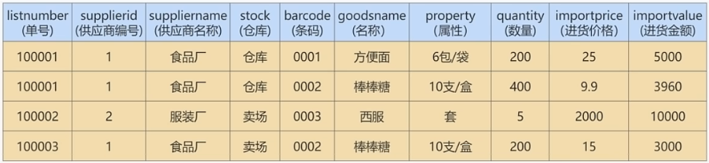

这个表中的字段很多，表里的数据量也很惊人。大量重复导致表变得庞大，效率极低。如何改造？

> 在实际工作场景中，这种由于数据表结构设计不合理，而导致的数据重复的现象并不少见。往往是系统虽然能够运行，承载能力却很差，稍微有点流量，就会出现内存不足、CUP使用率飙升的情况，甚至会导致整个项目失败。

#### 7.1 迭代一次：考虑 1NF

第一范式要求：**所有的字段都是基本数据字段，不可进一步拆分**。这里需要确认，所有的列中，每个字段只包含一种数据。

这张表里，我们把“property”这一字段，拆分成“specification(规格)”和"unit(单位)”，这2个字段如下:


#### 7.2 迭代二次：考虑 2NF

第二范式要求，在满足第一范式的基础上，**还要满足数据表里的每一条数据记录，都是可唯一标识的。而且所有字段，都必须完全依赖主键，不能只依赖主键的一部分**。

第1步，就是要确定这个表的主键。通过观察发现，字段"listnumber(单号)"+"barcode(条码)”可以唯一标识每一条记录，可以作为主键。

第2步，确定好了主键以后，判断哪些字段完全依赖主键，哪些字段只依赖于主键的一部分。把只依赖于主键一部分的字段拆分出去，形成新的数据表。

首先，进货单明细表里面的“goodsname(名称)” “specification(规格)” “unit(单位)” 这些信息是商品的属性，只依赖于“barcode(条码)”，不完全依赖主键，可以拆分出去。我们把这3个字段加上它们所依赖的字段“barcode(条码)”，拆分形成一个新的数据表“`商品信息表`”。

这样一来，原来的数据表就被拆分成了两个表。

商品信息表：


进货单表：


此外，字段“supplierid(供应商编号)” “suppliername(供应商名称)” “stock(仓库)” 只依赖于“listnumber(单号)”，不完全依赖于主键，所以，我们可以把“supplierid” “suppliername” “stock”这3个字段拆出去，再加上它们依赖的字段"istnumber(单号)”，就形成了一个新的表“`进货单头表`”。剩下的字段，会组成新的表，我们叫它“`进货单明细表`”

原来的数据表就拆分成了3个表。

进货单头表：


进货单明细表：


商品信息表：


现在，我们再来分析一下拆分后的3个表，保证这3个表都满足第二范式的要求。

第3步，在“商品信息表”中，字段“barcode”是有可能存在重复的，比如，用户门店可能有散装称重商品和自产商品，会存在条码共用的情况。所以，所有的字段都不能唯一标识表里的记录。这个时候，我们必须给这个表加上一个主键，比如说是`自增字段“itemnumber”`。

现在，我们就可以把进货单明细表里面的字段“barcode'都替换成字段“itemnumber”，这就得到了新的如下表。

进货单明细表：


商品信息表：


拆分后的3个数据表就全部满足了第二范式的要求。


#### 7.3 迭代三次：考虑 3NF

我们的进货单头表，还有数据冗余的可能。因为“suppliername”依赖“supplierid”，这个时候，我们就可以按照第三范式的原则进行拆分了。我们就进一步拆分下进货单头表，把它拆解成两张表：

供货商表：


进货单头表：


这2个表都满足第三范式的要求了。


#### 7.4 反范式化：业务优先的原则

在进货单明细表中，quantity * importprice = importvalue，“importprice” “quantity”和“importvalue”存在依赖关系，可以通过任意两个计算出第三个来，这就是存在冗余字段。如果严格按照第三范式的要求，现在我们应该进行进一步的优化，优化的办法是删除其中一个字段，只保留另外两个，这样就没有冗余字段了。

可是，真的可以这样做吗？要回答这个问题，我们就要先了解下实际工作中的业务优先原则。

所谓的业务优先原则，就是指一切以业务需求为主，技术服务于业务。**完全按照理论的设计不一定就是最优，还要根据实际情况来决定**。这里我们就来分析一下不同选择的利与弊。

对于 quantity * importprice = importvalue，看起来“importvalue"似乎是冗余字段，但并不会导致数据不一致。可是，如果我们把这个字段取消，是会影响业务的。

因为有的时候，供货商会经常进行一些促销活动，按金额促销，那他们拿来的进货单只有金额，没有价格。而"importprice'反而是通过"importvalue / quantity”计算出来的，经过四舍五入，会产生较大的误差。这样日积月累，最终会导致查询结果出现较大偏差，影响系统的可靠性。

举例：进货金额(importvalue)是25.5元，数量(quantity)是34，那么进货价格(importprice)就等于25.5 / 34=0.74元，但是如果用这个计算出来的进货价格(importprice)来计算进货金额，那么，进货金额(importvalue)就等于0.74*34=25.16元，其中相差了25.5-25.16=0.34元。

所以，本着业务优先的原则，在不影响系统可靠性的前提下，可保留数据冗余字段。

因此，最后我们可以把进货单表拆分成下面的4个表：

供货商表：


进货单头表：


进货单明细表：


商品信息表：


### 8 ER模型

数据库设计是牵一发而动全身的。那有没有什么办法提前看到数据库的全貌呢？比如需要哪些数据表、数据表中应该有哪些字段，数据表与数据表之间有什么关系、通过什么字段进行连接，等等。这样我们才能进行整体的梳理和设计。

其实，ER(Entity-Relationship 实体-关系)模型就是一个这样的工具。ER模型也叫作`实体关系模型`，是用来描述现实生活中客观存在的事物、事物的属性，以及事物之间关系的一种数据模型。**在开发基于数据库的信息系统的设计阶段，通常使用ER模型来描述信息需求和信息特性，帮助我们理清业务逻辑，从而设计出优秀的数据库**。


#### 8.1 ER包括哪些要素？

**ER 模型中有三个要素，分别是实体、属性和关系**。

- `实体`：可以看做是数据对象，往往对应于现实生活中的真实存在的个体。在 ER 模型中，用`矩形`来表示。实体分为两类，分别是`强实体`和`弱实体`。强实体是指不依赖于其他实体的实体；弱实体是指对另一个实体有很强的依赖关系的实体。
- `属性`：则是指实体的特性。比如超市的地址、联系电话、员工数等。在 ER 模型中用`椭圆形`来表示。
- `关系`：则是指实体之间的联系。比如超市把商品卖给顾客，就是一种超市与顾客之间的联系。在 ER 模型中用`菱形`来表示。

注意：实体和属性不容易区分。这里提供一个原则：我们要从系统整体的角度出发去看，**可以独立存在的是实体，不可再分的是属性**。也就是说，属性不能包含其他属性。


#### 8.2 关系的类型

在 ER 模型的 3 个要素中，关系又可以分为 3 种类型，分别是一对一、一对多、多对多。

- `一对一`：指实体之间的关系是一一对应的，比如个人与身份证信息之间的关系就是一对一的关系。一个人只能有一个身份证信息，一个身份证信息也只属于一个人。
- `一对多`：指一边的实体通过关系，可以对应多个另外一边的实体。相反，另外一边的实体通过这个关系，则只能对应唯一的一边的实体。比如说，我们新建一个班级表，而每个班级都有多个学生，每个学生则对应一个班级，班级对学生就是一对多的关系。
- `多对多`：指关系两边的实体都可以通过关系对应多个对方的实体。比如在进货模块中，供货商与超市之间的关系就是多对多的关系，一个供货商可以给多个超市供货，一个超市也可以从多个供货商那里采购商品。再比如一个选课表，有许多科目，每个科目有很多学生选，而每个学生又可以选择多个科目，这就是多对多的关系。


#### 8.3 建模分析

ER 模型看起来比较麻烦，但是对我们把控项目整体非常重要。如果你只是开发一个小应用，或许简单设计几个表够用了，一旦要设计有一定规模的应用，在项目的初始阶段，建立完整的 ER 模型就非常关键了。开发应用项目的实质，其实就是`建模`。

我们设计的案例是`电商业务`，由于电商业务太过庞大且复杂，所以我们做了业务简化，比如针对
SKU（StockKeepingUnit，库存量单位）和SPU（Standard Product Unit，标准化产品单元）的含义上，我们直接使用了SKU，并没有提及SPU的概念。本次电商业务设计总共有8个实体，如下所示。

- 地址实体
- 用户实体
- 购物车实体
- 评论实体
- 商品实体
- 商品分类实体
- 订单实体
- 订单详情实体

其中，`用户`和`商品分类`是强实体，因为它们不需要依赖其他任何实体。而其他属于弱实体，因为它们虽然都可以独立存在，但是它们都依赖用户这个实体，因此都是弱实体。知道了这些要素，我们就可以给电商业务创建 ER 模型了，如图：


在这个图中，地址和用户之间的添加关系，是一对多的关系，而商品和商品详情示一对1的关系，商品和订单是多对多的关系。这个 ER 模型，包括了 8 个实体之间的 8种关系。

1. 用户可以在电商平台添加多个地址；
2. 用户只能拥有一个购物车；
3. 用户可以生成多个订单；
4. 用户可以发表多条评论；
5. 一件商品可以有多条评论；
6. 每一个商品分类包含多种商品；
7. 一个订单可以包含多个商品，一个商品可以在多个订单里；
8. 订单中又包含多个订单详情，因为一个订单中可能包含不同种类的商品。


#### 8.4 ER 模型的细化

有了这个 ER 模型，我们就可以从整体上`理解`电商的业务了。刚刚的 ER 模型展示了电商业务的框架，但是只包括了订单，地址，用户，购物车，评论，商品，商品分类和订单详情这八个实体，以及它们之间的关系，还不能对应到具体的表，以及表与表之间的关联。我们需要把`属性加上`，用`椭圆`来表示，这样我们得到的 ER 模型就更加完整了。

因此，我们需要进一步去设计一下这个 ER 模型的各个局部，也就是细化下电商的具体业务流程，然后把它们综合到一起，形成一个完整的 ER 模型。这样可以帮助我们理清数据库的设计思路。

接下来，我们再分析一下各个实体都有哪些属性，如下所示。

1. `地址实体` 包括用户编号、省、市、地区、收件人、联系电话、是否是默认地址。
2. `用户实体` 包括用户编号、用户名称、昵称、用户密码、手机号、邮箱、头像、用户级别。
3. `购物车实体` 包括购物车编号、用户编号、商品编号、商品数量、图片文件url。
4. `订单实体` 包括订单编号、收货人、收件人电话、总金额、用户编号、付款方式、送货地址、下单时间。
5. `订单详情实体` 包括订单详情编号、订单编号、商品名称、商品编号、商品数量。
6. `商品实体` 包括商品编号、价格、商品名称、分类编号、是否销售，规格、颜色。
7. `评论实体` 包括评论id、评论内容、评论时间、用户编号、商品编号。
8. `商品分类实体` 包括类别编号、类别名称、父类别编号。

这样细分之后，我们就可以重新设计电商业务了，ER 模型如图：


#### 8.5 ER 模型图转换成数据表

通过绘制 ER 模型，我们已经理清了业务逻辑，现在，我们就要进行非常重要的一步了：把绘制好的 ER 模型，转换成具体的数据表，下面介绍下转换的原则：

1. 一个`实体`通常转换成一个`数据表`；
2. 一个`多对多的关系`，通常也转换成一个`数据表`；
3. 一个`1对1`，或者`1对多`的关系，往往通过表的`外键`来表达，而不是设计一个新的数据表；
4. `属性`转换成表的`字段`。

下面结合前面的ER模型，具体讲解一下怎么运用这些转换的原则，把 ER 模型转换成具体的数据表，从而把抽象出来的数据模型，落实到具体的数据库设计当中。


其实，任何一个基于数据库的应用项目，都可以通过这种`先建立 ER 模型`，再`转换成数据表`的方式，完成数据库的设计工作。创建 ER 模型不是目的，目的是把业务逻辑梳理清楚，设计出优秀的数据库。我建议你不是为了建模而建模，要利用创建 ER 模型的过程来整理思路，这样创建 ER 模型才有意义。


### 9 数据表的设计原则

综合以上内容，总结出数据表设计的一般原则："三少一多"

1. **数据表的个数越少越好**

   RDBMS的核心在于对实体和联系的定义，也就是E-R图(Entity Relationship Diagram)，数据表越少，证明实体和联系设计得越简洁，既方便理解又方便操作。

2. **数据表中的字段个数越少越好**

   字段个数越多，数据冗余的可能性越大。设置字段个数少的前提是各个字段相互独立，而不是某个字段的取值可以由其他字段计算出来。当然字段个数少是相对的，我们通常会在`数据冗余`和`检索效率`中进行平衡。

3. **数据表中联合主键的字段个数越少越好**

   设置主键是为了确定唯一性，当一个字段无法确定唯一性的时候，就需要采用联合主键的方式(也就是用多个字段来定义一个主键)。`联合主键中的字段越多，占用的索引空间越大`，不仅会加大理解难度，还会增加运行时间和索引空间，因此联合主键的字段个数越少越好。

4. **使用主键和外键越多越好**

   数据库的设计实际上就是定义各种表，以及各种字段之间的关系。这些关系越多，证明这些`实体之间的冗余度越低，利用度越高`。这样做的好处在于不仅保证了数据表之间的`独立性`，还能提升相互之间的关联使用率。

“三少一多”原则的核心就是`简单可复用`。简单指的是用更少的表、更少的字段、更少的联合主键字段来完成数据表的设计。可复用则是通过主键、外键的使用来增强数据表之间的复用率。因为一个主键可以理解是一张表的代表。键设计得越多，证明它们之间的利用率越高。

> 注意：这个原则并不是绝对的，有时候我们需要牺牲数据的冗余度来换取数据处理的效率。


### 10 数据库对象编写建议

#### 10.1 关于库

1. 【强制】库的名称必须控制在32个字符以内，只能使用英文字母、数字和下划线，建议以英文字母开头。

2. 【强制】库名中英文`一律小写`，不同单词采用`下划线`分割。须见名知意。

3. 【强制】库的名称格式：业务系统名称_子系统名。

4. 【强制】库名禁止使用关键字（如type,order等）。

5. 【强制】创建数据库时必须`显式指定字符集`，并且字符集只能是utf8或者utf8mb4。

  创建数据库SQL举例：`CREATE DATABASE crm_fund DEFAULT CHARACTER SET 'utf8'`;

6. 【建议】对于程序连接数据库账号，遵循`权限最小原则` 

  使用数据库账号只能在一个DB下使用，不准跨库。程序使用的账号`原则上不准有drop权限`。

7. 【建议】临时库以`tmp_`为前缀，并以日期为后缀；备份库以`bak_`为前缀，并以日期为后缀。


#### 10.2 关于表、列

1. 【强制】表和列的名称必须控制在32个字符以内，表名只能使用英文字母、数字和下划线，建议以`英文字母开头`。

2. 【强制】`表名、列名一律小写`，不同单词采用下划线分割。须见名知意。

3. 【强制】表名要求有模块名强相关，同一模块的表名尽量使用`统一前缀`。比如：crm_fund_item

4. 【强制】创建表时必须`显式指定字符集`为utf8或utf8mb4。

5. 【强制】表名、列名禁止使用关键字（如type,order等）。

6. 【强制】创建表时必须`显式指定表存储引擎`类型。如无特殊需求，一律为InnoDB。

7. 【强制】建表必须有comment。即备注信息。

8. 【强制】字段命名应尽可能使用表达实际含义的英文单词或`缩写`。如：公司 ID，不要使用corporation_id, 而用corp_id 即可。

9. 【强制】布尔值类型的字段命名为`is_描述`。如member表上表示是否为enabled的会员的字段命名为 is_enabled。

10. 【强制】禁止在数据库中存储图片、文件等大的二进制数据

    通常文件很大，短时间内造成数据量快速增长，数据库进行数据库读取时，通常会进行大量的随机IO操作，文件很大时，IO操作很耗时。通常存储于文件服务器，数据库只存储文件地址信息。

11. 【建议】建表时关于主键：`表必须有主键`

    1. 强制要求主键为id，类型为int或bigint，且为 auto_increment 建议使用unsigned无符号型。
    2. 标识表里每一行主体的字段不要设为主键，建议设为其他字段如user_id，order_id等，并建立unique key索引。因为如果设为主键且主键值为随机插入，则会导致innodb内部页分裂和大量随机I/O，性能下降。

12. 【建议】核心表（如用户表）必须有行数据的`创建时间字段`（create_time）和`最后更新时间字段`（update_time），便于查问题。

13. 【建议】表中所有字段尽量都是`NOT NULL`属性，业务可以根据需要定义`DEFAULT值`。

    因为使用NULL值会存在每一行都会占用额外存储空间、数据迁移容易出错、聚合函数计算结果偏差等问题。

14. 【建议】所有存储相同数据的`列名和列类型必须一致`（一般作为关联列，如果查询时关联列类型不一致会自动进行数据类型隐式转换，会造成列上的索引失效，导致查询效率降低）。

15. 【建议】中间表（或临时表）用于保留中间结果集，名称以`tmp_`开头。

    备份表用于备份或抓取源表快照，名称以`bak_`开头。中间表和备份表定期清理。

16. 【示范】一个较为规范的建表语句：

    ```mysql
    CREATE TABLE user_info (
    `id` int unsigned NOT NULL AUTO_INCREMENT COMMENT '自增主键',
    `user_id` bigint(11) NOT NULL COMMENT '用户id',
    `username` varchar(45) NOT NULL COMMENT '真实姓名',
    `email` varchar(30) NOT NULL COMMENT '用户邮箱',
    `nickname` varchar(45) NOT NULL COMMENT '昵称',
    `birthday` date NOT NULL COMMENT '生日',
    `sex` tinyint(4) DEFAULT '0' COMMENT '性别',
    `short_introduce` varchar(150) DEFAULT NULL COMMENT '一句话介绍自己，最多50个汉字',
    `user_resume` varchar(300) NOT NULL COMMENT '用户提交的简历存放地址',
    `user_register_ip` int NOT NULL COMMENT '用户注册时的源ip',
    `create_time` timestamp NOT NULL DEFAULT CURRENT_TIMESTAMP COMMENT '创建时间',
    `update_time` timestamp NOT NULL DEFAULT CURRENT_TIMESTAMP ON UPDATE
    CURRENT_TIMESTAMP COMMENT '修改时间',
    `user_review_status` tinyint NOT NULL COMMENT '用户资料审核状态，1为通过，2为审核中，3为未通过，4为还未提交审核',
        
    PRIMARY KEY (`id`),
    UNIQUE KEY `uniq_user_id` (`user_id`),
    KEY `idx_username`(`username`),
    KEY `idx_create_time_status`(`create_time`,`user_review_status`)
    ) ENGINE=InnoDB DEFAULT CHARSET=utf8 COMMENT='网站用户基本信息'
    ```

17. 【建议】创建表时，可以使用可视化工具。这样可以确保表、字段相关的约定都能设置上。

实际上，我们通常很少自己写 DDL 语句，可以使用一些可视化工具来创建和操作数据库和数据表。

可视化工具除了方便，还能直接帮我们将数据库的结构定义转化成 SQL 语言，方便数据库和数据表结构的导出和导入。


#### 10.3 关于索引

1. 【强制】InnoDB表必须主键为id int/bigint auto_increment，且主键值`禁止被更新`。

2. 【强制】InnoDB和MyISAM存储引擎表，索引类型必须为`BTREE`。

3. 【建议】主键的名称以`pk_`开头，唯一键以`uni_`或`uk_`开头，普通索引以`idx_`开头，一律使用小写格式，以字段的名称或缩写作为后缀。

4. 【建议】多单词组成的columnname，取前几个单词首字母，加末单词组成column_name。

  如：sample 表 member_id 上的索引：idx_sample_mid。

5. 【建议】单个表上的索引个数`不能超过6个`。

6. 【建议】在建立索引时，多考虑建立`联合索引`，并把区分度最高的字段放在最前面。

7. 【建议】在多表 JOIN 的SQL里，保证被驱动表的连接列上有索引，这样JOIN 执行效率最高。

8. 【建议】建表或加索引时，保证表里互相不存在`冗余索引`。 

   比如：如果表里已经存在key(a,b)，则key(a)为冗余索引，需要删除。


#### 10.4 SQL编写

1. 【强制】程序端SELECT语句必须指定具体字段名称，禁止写成 *。

2. 【建议】程序端insert语句指定具体字段名称，不要写成INSERT INTO t1 VALUES(…)。

3. 【建议】除静态表或小表（100行以内），DML语句必须有WHERE条件，且使用索引查找。

4. 【建议】INSERT INTO…VALUES(XX),(XX),(XX).. 这里XX的值不要超过5000个。值过多虽然上线很快，但会引起主从同步延迟。

5. 【建议】SELECT语句不要使用UNION，推荐使用UNION ALL，并且UNION子句个数限制在5个以内。

6. 【建议】线上环境，多表 JOIN 不要超过5个表。

7. 【建议】减少使用ORDER BY，和业务沟通能不排序就不排序，或将排序放到程序端去做。

   ORDER BY、GROUP BY、DISTINCT 这些语句较为耗费CPU，数据库的CPU资源是极其宝贵的。

8. 【建议】包含了ORDER BY、GROUP BY、DISTINCT 这些查询的语句，WHERE 条件过滤出来的结果集请保持在1000行以内，否则SQL会很慢。

9. 【建议】对单表的多次alter操作必须合并为一次

   对于超过100W行的大表进行alter table，必须经过DBA审核，并在业务低峰期执行，多个alter需整合在一起。因为alter table会产生`表锁`，期间阻塞对于该表的所有写入，对于业务可能会产生极大影响。

10. 【建议】批量操作数据时，需要控制事务处理间隔时间，进行必要的sleep。

11. 【建议】事务里包含SQL不超过5个。

    因为过长的事务会导致锁数据较久，MySQL内部缓存、连接消耗过多等问题。

12. 【建议】事务里更新语句尽量基于主键或UNIQUE KEY，如UPDATE… WHERE id=XX;

    否则会产生间隙锁，内部扩大锁定范围，导致系统性能下降，产生死锁。

------

## 十一、数据库其它调优策略

### 1 数据库调优的措施

#### 1.1 调优的目标

- 尽可能`节省系统资源`，以便系统可以提供更大负荷的服务。（吞吐量更大）
- 合理的结构设计和参数调整，以提高用户操作`响应的速度`。（响应速度更快）
- 减少系统的瓶颈，提高MySQL数据库整体的性能。


#### 1.2 如何定位调优问题

不过随着用户量的不断增加，以及应用程序复杂度的提升，我们很难用“`更快`”去定义数据库调优的目标，因为用户在不同时间段访问服务器遇到的瓶颈不同，比如双十一促销的时候会带来大规模的`并发访问`；还有用户在进行不同业务操作的时候，数据库的`事务处理`和`SQL查询`都会有所不同。因此我们还需要更加精细的定位，去确定调优的目标。

如何确定呢？一般情况下，有如下几种方式：

- **用户的反馈（主要）**

  用户是我们的服务对象，因此他们的反馈是最直接的。虽然他们不会直接提出技术建议，但是有些问题往往是用户第一时间发现的。我们要重视用户的反馈，找到和数据相关的问题。

- **日志分析（主要）**

  我们可以通过查看数据库日志和操作系统日志等方式找出异常情况，通过它们来定位遇到的问题。

- **服务器资源使用监控**

  通过监控服务器的CPU、内存、I/O等使用情况，可以实时了解服务器的性能使用，与历史情况进行对比。

- **数据库内部状况监控**

  在数据库的监控中，`活动会话（Active Session)监控`是一个重要的指标。通过它，你可以清楚地了解数据库当前是否处于非常繁忙的状态，是否存在sQL堆积等。

- **其它**

  除了活动会话监控以外，我们也可以对`事务、锁等待`等进行监控，这些都可以帮助我们对数据库的运行状态有更全面的认识。


#### 1.4 调优的维度和步骤

我们需要调优的对象是整个数据库管理系统，它不仅包括 SQL 查询，还包括数据库的部署配置、架构等。从这个角度来说，我们思考的维度就不仅仅局限在 SQL 优化上了。通过如下的步骤我们进行梳理：

**第1步：选择适合的 DBMS**

如果对`事务性处理`以及`安全性要求高`的话，可以选择商业的数据库产品。这些数据库在事务处理和查询性能上都比较强，比如采用SQL Server、Oracle，那么`单表存储上亿条数据`是没有问题的。如果数据表设计得好，即使不采用`分库分表`的方式，查询效率也不差。

除此以外，你也可以采用开源的MySQL进行存储，它有很多存储引擎可以选择，如果进行事务处理的话可以选择InnoDB，非事务处理可以选择MylSAM。

NoSQL阵营包括`键值型数据库`、`文档型数据库`、`搜索引擎`、`列式存储`和`图形数据库`。这些数据库的优缺点和使用场景各有不同，比如列式存储数据库可以大幅度降低系统的I/O，适合于分布式文件系统，但如果数据需要频繁地增删改，那么列式存储就不太适用了。

**DBMS的选择关系到了后面的整个设计过程，所以第一步就是要选择适合的DBMS。**如果已经确定好了DBMS，那么这步可以跳过。


**第2步：优化表设计**

选择了DBMS之后，我们就需要进行表设计了。而数据表的设计方式也直接影响了后续的SQL查询语句。RDBMS中，每个对象都可以定义为一张表，表与表之间的关系代表了对象之间的关系。如果用的是MySQL，我们还可以根据不同表的使用需求，选择不同的存储引擎。除此以外，还有一些优化的原则可以参考：

1. 表结构要尽量`遵循三范式的原则`。这样可以让数据结构更加清晰规范，减少冗余字段，同时也减少了在更新，插入和删除数据时等异常情况的发生。
2. 如果`查询`应用比较多，尤其是需要进行`多表联查`的时候，可以采用`反范式`进行优化。反范式采用`空间换时间`的方式，通过增加冗余字段提高查询的效率。
3. `表字段的数据类型`选择，关系到了查询效率的高低以及存储空间的大小。一般来说，如果字段可以采用数值类型就不要采用字符类型；字符长度要尽可能设计得短一些。针对字符类型来说，当确定字符长度固定时，就可以采用CHAR类型；当长度不固定时，通常采用VARCHAR类型。

数据表的结构设计很基础，也很关键。**好的表结构可以在业务发展和用户量增加的情况下依然发挥作用，不好的表结构设计会让数据表变得非常臃肿，查询效率也会降低**。


**第3步：优化逻辑查询**

当我们建立好数据表之后，就可以对数据表进行增删改查的操作了。这时我们首先需要考虑的是逻辑查询优化。

SQL查询优化，可以分为`逻辑查询优化`和`物理查询优化`。逻辑查询优化就是通过改变SQL语句的内容让SQL执行效率更高效，采用的方式是对SQL语句进行等价变换，对查询进行重写。

**SQL的查询重写包括了子查询优化、等价谓词重写、视图重写、条件简化、连接消除和嵌套连接消除等**。

比如我们在讲解EXISTS子查询和IN子查询的时候，会根据`小表驱动大表`的原则选择适合的子查询。在WHERE子句中会尽量避免对字段进行函数运算，它们会让字段的索引失效。

举例：查询评论内容开头为abc的内容都有哪些，如果在WHERE子句中使用了函数，语句就会写成下面这样：

```mysql
SELECT 
	comment_id, comment_text, comment_time 
FROM 
	product_comment 
WHERE 
	SUBSTRING(comment_text, 1, 3) = 'abc';
```

采用重写的方式进行等价替换：

```mysql
SELECT
	comment_id, comment_text, comment_time
FROM
	product_comment
WHERE
	comment_text LIKE 'abc%';
```


**第4步：优化物理查询**

物理查询优化是在确定了逻辑查询优化之后，采用物理优化技术（比如索引等），通过计算代价模型对各种可能的访问路径进行估算，从而找到执行方式中代价最小的作为执行计划。`在这个部分中，我们需要掌握的重点是对索引的创建和使用`。

但索引不是万能的，我们需要根据实际情况来创建索引。那么都有哪些情况需要考虑呢？我们在前面几章中已经进行了细致的剖析。

SQL查询时需要对不同的数据表进行查询，因此在物理查询优化阶段也需要确定这些查询所采用的路径，具体的情况包括:

1. `单表扫描`：对于单表扫描来说，我们可以全表扫描所有的数据，也可以局部扫描。
2. `两张表的连接`：常用的连接方式包括了嵌套循环连接、HASH连接和合并连接。
3. `多张表的连`：多张数据表进行连接的时候，`顺序`很重要，因为不同的连接路径查询的效率不同，搜索空间也会不同。我们在进行多表连接的时候，搜索空间可能会达到`很高的数据量级`，巨大的搜索空间显然会占用更多的资源，因此我们需要通过调整连接顺序，将搜索空间调整在一个可接受的范围内。


**第5步：使用 Redis 或 Memcached 作为缓存**

除了可以对 SQL 本身进行优化以外，我们还可以请外援提升查询的效率。

因为数据都是存放到数据库中，我们需要从数据库层中取出数据放到内存中进行业务逻辑的操作，当用户量增大的时候，如果频繁地进行数据查询，会消耗数据库的很多资源。如果我们将常用的数据直接放到内存中，就会大幅提升查询的效率。

键值存储数据库可以帮我们解决这个问题。

常用的键值存储数据库有 Redis 和 Memcached，它们都可以将数据存放到内存中。

从可靠性来说，`Redis支持持久化`，可以让我们的数据保存在硬盘上，不过这样一来性能消耗也会比较大。而Memcached仅仅是内存存储，不支持持久化。

从支持的数据类型来说，Redis比Memcached要多，它不仅支持key-value类型的数据，还支持List、Set、Hash等数据结构。当我们有持久化需求或者是更高级的数据处理需求的时候，就可以使用Redis。如果是简单的key-value存储，则可以使用Memcached。

**通常我们对于查询响应要求高的场景(响应时间短，吞吐量大)，可以考虑内存数据库，毕竟术业有专攻**。传统的RDBMS都是将数据存储在硬盘上，而内存数据库则存放在内存中，查询起来要快得多。不过使用不同的工具，也增加了开发人员的使用成本。


**第6步：库级优化**

库级优化是站在数据库的维度上进行的优化策略，比如控制一个库中的数据表数量。另外，单一-的数据库总会遇到各种限制，不如取长补短，利用"外援"的方式。通过`主从架构`优化我们的读写策略，通过对数据库进行垂直或者水平切分，突破单一数据库或数据表的访问限制，提升查询的性能。


1、读写分离

如果读和写的业务量都很大，并且它们都在同一个数据库服务器中进行操作，那么数据库的性能就会出现瓶颈，这时为了提升系统的性能，优化用户体验，我们可以采用`读写分离`的方式降低主数据库的负载，比如用主数据库(master)完成写操作，用从数据库(slave)完成读操作。


2、数据分片

对`数据库分库分表`。当数据量级达到千万级以上时，有时候我们需要把一个数据库切成多份，放到不同的数据库服务器上，减少对单一数据库服务器的访问压力。如果你使用的是MySQL，就可以使用MySQL自带的分区表功能，当然你也可以考虑自己做`垂直拆分(分库)`、`水平拆分(分表)`、`垂直+水平拆分`(分库分表)。


> 但需要注意的是，分拆在提升数据库性能的同时，也会增加维护和使用成本。


### 2 优化MySQL服务器

优化MySQL服务器主要从两个方面来优化，一方面是对`硬件`进行优化；另一方面是对MySQL`服务的参数`进行优化。这部分的内容需要较全面的知识，一般只有`专业的数据库管理员`才能进行这一类的优化。对于可以定制参数的操作系统，也可以针对MySQL进行操作系统优化。


#### 2.1 优化服务器硬件

**服务器的硬件性能直接决定着MySQL数据库的性能**。硬件的性能瓶颈直接决定MySQL数据库的运行速度和效率。针对性能瓶颈提高硬件配置，可以提高MySQL数据库查询、更新的速度。

1. **配置较大的内存**

   足够大的内存是提高MySQL数据库性能的方法之一。内存的速度比磁盘IO快得多，可以通过增加系统的`缓冲区容量`使数据在内存中停留的时间更长，以减少磁盘IO。

2. **配置高速磁盘系统**

   以减少读盘的等待时间，提高响应速度。磁盘的IO能力，也就是它的寻道能力，目前的`SCSI`高速旋转的是7200转/分钟，这样的速度，一旦访问的用户量上去，磁盘的压力就会过大，如果是每天的网站pv(page view)在150w，这样的一般的配置就无法满足这样的需求了。现在`SSD`盛行，在SSD上随机访问和顺序访问性能几乎差不多，使用SSD可以减少随机IO带来的性能损耗。

3. **合理分布磁盘IO**

   把磁盘IO分散在多个设备上，以减少资源竞争，提高并行操作能力。

4. **配置多处理器**

   MySQL是多线程的数据库，多处理器可同时执行多个线程。


#### 2.2 优化MySQL的参数

通过优化MySQL的参数可以提高资源利用率，从而达到提高MySQL服务器性能的目的。

MySQL服务的配置参数都在`my.cnf`或者`my.ini`文件的[mysqld]组中。配置完参数以后，需要重新启动MySQL服务才会生效。

下面对几个对性能影响比较大的参数进行详细绍。

- `innodb_buffer_pool_size`：这个参数是Mysql数据库最重要的参数之一，表示InnoDB类型的`表和索引的最大缓存`。它不仅仅缓存`索引数据`，还会缓存`表的数据`。这个值越大，查询的速度就会越快。但是这个值太大会影响操作系统的性能。

- `key_buffer_size`：表示`索引缓冲区的大小`。索引缓冲区是所有的`线程共享`。增加索引缓冲区可以得到更好处理的索引（对所有读和多重写）。当然，这个值不是越大越好，它的大小取决于内存的大小。如果这个值太大，就会导致操作系统频繁换页，也会降低系统性能。对于内存在`4GB`左右的服务器该参数可设置为`256M`或`384M`。

- `table_cache`：表示`同时打开的表的个数`。这个值越大，能够同时打开的表的个数越多。物理内存越大，设置就越大。默认为2402，调到512-1024最佳。这个值不是越大越好，因为同时打开的表太多会影响操作系统的性能。

- `query_cache_size`：表示`查询缓冲区的大小`。可以通过在MySQL控制台观察，如果Qcache_lowmem_prunes的值非常大，则表明经常出现缓冲不够的情况，就要增加Query_cache_size的值；如果Qcache_hits的值非常大，则表明查询缓冲使用非常频繁，如果该值较小反而会影响效率，那么可以考虑不用查询缓存；Qcache_free_blocks，如果该值非常大，则表明缓冲区中碎片很多。MySQL8.0之后失效。该参数需要和query_cache_type配合使用。

- `query_cache_type`的值是0时，所有的查询都不使用查询缓存区。但是query_cache_type=0并不会导致MySQL释放query_cache_size所配置的缓存区内存。

  - 当query_cache_type=1时，所有的查询都将使用查询缓存区，除非在查询语句中指定`SQL_NO_CACHE`，

    如`SELECT SQL_NO_CACHE * FROM tbl_name`。

  - 当query_cache_type=2时，只有在查询语句中使用`SQL_CACHE`关键字，查询才会使用查询缓存区。使用查询缓存区可以提高查询的速度，这种方式只适用于修改操作少且经常执行相同的查询操作的情况。

- `sort_buffer_size`：表示每个`需要进行排序的线程分配的缓冲区的大小`。增加这个参数的值可以提高`ORDER BY`或`GROUP BY`操作的速度。默认数值是2 097 144字节（约2MB）。对于内存在4GB左右的服务器推荐设置为6-8M，如果有100个连接，那么实际分配的总共排序缓冲区大小为`100×6=600MB`。

- `join_buffer_size = 8M`：表示`联合查询操作所能使用的缓冲区大小`，和sort_buffer_size一样，该参数对应的分配内存也是每个连接独享。

- `read_buffer_size`：表示`每个线程连续扫描时为扫描的每个表分配的缓冲区的大小（字节）`。当线程从表中连续读取记录时需要用到这个缓冲区。`SET SESSION read_buffer_size=n`可以临时设置该参数的值。默认为64K，可以设置为4M。

- `innodb_flush_log_at_trx_commit`：表示`何时将缓冲区的数据写入日志文件`，并且将日志文件写入磁盘中。该参数对于innoDB引擎非常重要。该参数有3个值，分别为0、1和2。该参数的默认值为1。

  - 值为`0`时，表示`每秒1次`的频率将数据写入日志文件并将日志文件写入磁盘。每个事务的commit并不会触发前面的任何操作。该模式速度最快，但不太安全，mysqld进程的崩溃会导致上一秒钟所有事务数据的丢失。
  - 值为`1`时，表示`每次提交事务时`将数据写入日志文件并将日志文件写入磁盘进行同步。该模式是最安全的，但也是最慢的一种方式。因为每次事务提交或事务外的指令都需要把日志写入（flush）硬盘。
  - 值为`2`时，表示`每次提交事务时`将数据写入日志文件，`每隔1秒`将日志文件写入磁盘。该模式速度较快，也比0安全，只有在操作系统崩溃或者系统断电的情况下，上一秒钟所有事务数据才可能丢失。

- `innodb_log_buffer_size`：这是 InnoDB 存储引擎的`事务日志所使用的缓冲区`。为了提高性能，也是先将信息写入 Innodb Log Buffer中，当满足 innodb_flush_log_trx_commit 参数所设置的相应条件（或者日志缓冲区写满）之后，才会将日志写到文件（或者同步到磁盘）中。

- `max_connections`：表示`允许连接到MySQL数据库的最大数量`，默认值是 151 。如果状态变量connection_errors_max_connections 不为零，并且一直增长，则说明不断有连接请求因数据库连接数已达到允许最大值而失败，这是可以考虑增大max_connections的值。在Linux平台下，性能好的服务器，支持 500-1000 个连接不是难事，需要根据服务器性能进行评估设定。这个连接数`不是越大越好`，因为这些连接会浪费内存的资源。过多的连接可能会导致MySQL服务器僵死。

- `back_log`：用于`控制MySQL监听TCP端口时设置的积压请求栈大小`。如果MySql的连接数达到max_connections时，新来的请求将会被存在堆栈中，以等待某一连接释放资源，该堆栈的数量即back_log，如果等待连接的数量超过back_log，将不被授予连接资源，将会报错。5.6.6 版本之前默认值为 50，之后的版本默认为 50 +（max_connections / 5），对于Linux系统推荐设置为小于512的整数，但最大不超过900。

  如果需要数据库在较短的时间内处理大量连接请求，可以考虑适当增大back_log的值。

- `thread_cache_size`：线程池缓存线程数量的大小，当客户端断开连接后将当前线程缓存起来，当在接到新的连接请求时快速响应无需创建新的线程。这尤其对那些使用短连接的应用程序来说可以极大的提高创建连接的效率。那么为了提高性能可以增大该参数的值。默认为60，可以设置为120。

  可以通过如下几个MySQL状态值来适当调整线程池的大小：

  ```mysql
  mysql> show global status like 'Thread%';
  +--------------------------+---------+
  | Variable_name            | Value   |
  +--------------------------+---------+
  | Threads_cached           |       2 |
  | Threads_connected        |       1 |
  | Threads_created          |       3 |
  | Threads_running          |       2 |
  +--------------------------+---------+
  4 rows in set (0.01 sec)
  ```

  当 Threads_cached 越来越少，但 Threads_connected 始终不降，且 Threads_created 持续升高，可适当增加 thread_cache_size 的大小。

- `wait_timeout`：指定`一个请求的最大连接时间`，对于4GB左右内存的服务器可以设置为5-10。

- `interactive_timeout`：表示服务器在关闭连接前等待行动的秒数。

这里给出一份my.cnf的参考配置：

```ini
[mysqld]
port = 3306 
serverid = 1 
socket = /tmp/mysql.sock

`skip-locking` 
# 避免MySQL的外部锁定，减少出错几率增强稳定性。 
`skip-name-resolve` 
# 禁止MySQL对外部连接进行DNS解析，使用这一选项可以消除MySQL进行DNS解析的时间。但需要注意，如果开启该选项，则所有远程主机连接授权都要使用IP地址方式，否则MySQL将无法正常处理连接请求！
`back_log = 384
key_buffer_size = 256M 
max_allowed_packet = 4M 
thread_stack = 256K
table_cache = 128K
sort_buffer_size = 6M
read_buffer_size = 4M
read_rnd_buffer_size=16M 
join_buffer_size = 8M 
myisam_sort_buffer_size = 64M
table_cache = 512 
thread_cache_size = 64 
query_cache_size = 64M
tmp_table_size = 256M 
max_connections = 768 
max_connect_errors = 10000000
wait_timeout = 10 
thread_concurrency = 8` 
#该参数取值为服务器逻辑CPU数量\*2，在本例中，服务器有2颗物理CPU，而每颗物理CPU又支持H.T超线程，所以实际取值为4*2=8 
skip-networking 
#开启该选项可以彻底关闭MySQL的TCP/IP连接方式，如果WEB服务器是以远程连接的方式访问MySQL数据库服务器则不要开启该选项！否则将无法正常连接！ 
table_cache=1024
innodb_additional_mem_pool_size=4M 
#默认为2M 
innodb_flush_log_at_trx_commit=1
innodb_log_buffer_size=2M 
#默认为1M 
innodb_thread_concurrency=8 
#你的服务器CPU有几个就设置为几。建议用默认一般为8 
tmp_table_size=64M 
#默认为16M，调到64-256最佳

thread_cache_size=120 
query_cache_size=32M
```

很多情况还需要具体情况具体分析! 


**举例**：

下面是一个电商平台，类似京东或天猫这样的平台。商家购买服务，入住平台，开通之后，商家可以在系统中上架各种商品，客户通过手机App、微信小程序等渠道购买商品，商家接到订单以后安排快递送货。

`刚刚上线`的时候，系统运行状态良好。但是，随着入住的`商家不断增多`，使用系统的用户量越来越多，每天的订单数据达到了5万条以上。这个时候，系统开始出现问题，`CPU使用率不断飙升`。终于，双十一或者618活动高峰的时候，CPU使用率达到`99%`，这实际上就意味着，系统的计算资源已经耗尽，再也无法处理任何新的订单了。
换句话说，系统已经崩溃了。

这个时候，我们想到了对系统参数进行调整，因为参数的值决定了资源配置的方式和投放的程度。

为了解决这个问题，一共调整3个系统参数，分别是：

- InnoDB_flush_log_at_trx_commit
- InnoDB_buffer_pool_size
- InnoDB_buffer_pool_instances

下面我们就说一说调整这三个参数的原因是什么。

**1、调整系统参数 InnoDB_flush_log_at_trx_commit**

这个参数适用于InnoDB存储引擎，电商平台系统中的表用的存储引擎都是InnoDB。默认的值是1，意思是每次提交事务的时候，都把数据写入日志，并把日志写入磁盘。这样做的好处是数据安全性最佳，不足之处在于每次提交事务，都要进行磁盘写入的操作。在大并发的场景下，过于频繁的磁盘读写会导致CPU资源浪费，系统效率变低。

这个参数的值还有2个可能的选项，分别是0和2。我们把这个参数的值改成了2。这样就不用每次提交事务的时候都启动磁盘读写了，在大并发的场景下，可以改善系统效率，降低CPU使用率。即便出现故障，损失的数据也比较小。

**2、调整系统参数 InnoDB_buffer_pool_size**

这个参数的意思是，InnoDB存储引擎使用`缓存来存储索引和数据`。这个值越大，可以加载到缓存区的索引和数据量就越多，需要的`磁盘读写就越少`。

因为我们的MySQL服务器是数据库`专属服务器`，只用来运行MySQL数据库服务，没有其他应用了，而我们的计算机是64位机器，内存也有128G。于是我们把这个参数的值调整为64G。这样一来，磁盘读写次数可以大幅降低，我们就可以充分利用内存，释放出一些CPU的资源。

**3、调整系统参数 InnoDB_buffer_pool_instances** 

这个参数可以将InnoDB的缓存区分成几个部分，这样可以提高系统的`并行处理能力`，因为可以允许多个进程同时处理不同部分的缓存区。

我们把InnoDB_buffer_pool_instances的值修改为64，意思就是把InnoDB的缓存区分成64个分区，这样就可以同时有`多个进程`进行数据操作，CPU的效率就高多了。修改好了系统参数的值，要重启MySQL数据库服务器。

> 总结一下就是遇到CPU资源不足的问题，可以从下面2个思路去解决。
>
> - 疏通拥堵路段，消除瓶颈，让等待的时间更短;
> - 开拓新的通道，增加并行处理能力。


### 3 优化数据库结构

一个好的`数据库设计方案`对于数据库的性能常常会起到`事半功倍`的效果。合理的数据库结构不仅可以使数据库占用更小的磁盘空间，而且能够使查询速度更快。数据库结构的设计需要考虑`数据冗余`、`查询和更新的速度`、`字段`的数据类型是否合理等多方面的内容。

#### 3.1 拆分表：冷热数据分离

拆分表的思路是，把1个包含很多字段的表拆分成2个或者多个相对较小的表。这样做的原因是，这些表中某些字段的操作频率很高(`热数据`)，经常要进行查询或者更新操作，而另外一些字段的使用频率却很低(`冷数据`)，`冷热数据分离`，可以减小表的宽度。如果放在一个表里面，每次查询都要读取大记录，会消耗较多的资源。

MySQL限制每个表最多存储`4096`列，并且每一行数据的大小不能超过`65535字节`。表越宽，把表装载进内存缓冲池时所占用的内存也就越大，也会消耗更多的IO。

**冷热数据分离的目的是**：

1. 减少磁盘IO，保证热数据的内存缓存命中率；
2. 更有效的利用缓存，避免读入无用的冷数据。


举例1：`会员members表`存储会员登录认证信息，该表中有很多字段，如id、姓名、密码、地址、电话、个人描述字段。其中地址、电话、个人描述等字段并不常用，可以将这些不常用的字段分解出另一个表。将这个表取名叫members_detail，表中有member_id、address、telephone、description等字段。这样就把会员表分成了两个表，分别为`members表`和`members_detail表`。

创建这两个表的SQL语句如下：

```mysql
CREATE TABLE members (
	id int(11) NOT NULL AUTO_INCREMENT,
	username varchar(50) DEFAULT NULL,
	`password` varchar(50) DEFAULT NULL,
	last_login_time datetime DEFAULT NULL,
	last_login_ip varchar(100) DEFAULT NULL,
	PRIMARY KEY(Id)
);
CREATE TABLE members_detail (
	member_id int(11) NOT NULL DEFAULT 0,
	address varchar(255) DEFAULT NULL,
	telephone varchar(255) DEFAULT NULL,
	description text
);
```

如果需要查询会员的基本信息或详细信息，那么可以用会员的id来查询。如果需要将会员的基本信息和详细信息同时显示，那么可以将members表和members_detail表进行联合查询，查询语句如下：

```mysql
SELECT * FROM members LEFT JOIN members_detail on 
members.id = members_detail.member_id;
```

通过这种分解可以提高表的查询效率。对于字段很多且有些字段使用不频繁的表，可以通过这种分解的方式来优化数据库的性能。


#### 3.2 增加中间表

对于需要经常联合查询的表，可以建立中间表以提高查询效率。通过建立中间表，**把需要经常联合查询的数据插入中间表中，然后将原来的联合查询改为对中间表的查询，以此来提高查询效率**。

首先，分析经常联合查询表中的字段；然后，使用这些字段建立一个中间表，并将原来联合查询的表的数据插入中间表中；最后，使用中间表来进行查询。

举例1：`学生信息表`和`班级表`的SQL语句如下：

```mysql
CREATE TABLE `class` (
	`id` INT(11) NOT NULL AUTO_INCREMENT,
	`className` VARCHAR(30) DEFAULT NULL,
	`address` VARCHAR(40) DEFAULT NULL,
	`monitor` INT NULL ,
	PRIMARY KEY (`id`)
) ENGINE=INNODB AUTO_INCREMENT=1 DEFAULT CHARSET=utf8;

CREATE TABLE `student` (
	`id` INT(11) NOT NULL AUTO_INCREMENT,
	`stuno` INT NOT NULL ,
	`name` VARCHAR(20) DEFAULT NULL,
	`age` INT(3) DEFAULT NULL,
	`classId` INT(11) DEFAULT NULL,
	PRIMARY KEY (`id`)
) ENGINE=INNODB AUTO_INCREMENT=1 DEFAULT CHARSET=utf8;
```

现在有一个模块需要经常查询带有学生名称（name）、学生所在班级名称（className）、学生班级班长（monitor）的学生信息。根据这种情况可以创建一个`temp_student`表。temp_student表中存储学生名称（stu_name）、学生所在班级名称（className）和学生班级班长（monitor）信息。创建表的语句如下：

```mysql
CREATE TABLE `temp_student` (
	`id` INT(11) NOT NULL AUTO_INCREMENT,
	`stu_name` INT NOT NULL ,
	`className` VARCHAR(20) DEFAULT NULL,
	`monitor` INT(3) DEFAULT NULL,
	PRIMARY KEY (`id`)
) ENGINE=INNODB AUTO_INCREMENT=1 DEFAULT CHARSET=utf8;
```

接下来，从学生信息表和班级表中查询相关信息存储到临时表中：

```mysql
insert into temp_student(stu_name,className,monitor)
		select s.name,c.className,c.monitor
		from student as s, class as c
		where s.classId = c.id
```

以后，可以直接从temp_student表中查询学生名称、班级名称和班级班长，而不用每次都进行联合查询。这样可以提高数据库的查询速度。

> 如果用户信息修改了，是不是会导致temp_vip中的数据不一致的问题呢？如何同步数据呢？
>
> 方式一：清空数据 -> 重新添加数据
>
> 方式二：使用视图


#### 3.3 增加冗余字段

设计数据库表时应尽量遵循范式理论的规约，尽可能减少冗余字段，让数据库设计看起来精致、优雅。但是，合理地加入冗余字段可以提高查询速度。

表的规范化程度越高，表与表之间的关系就越多，需要连接查询的情况也就越多。尤其在数据量大，而且需要频繁进行连接的时候，为了提升效率，我们也可以考虑增加冗余字段来减少连接。

这部分内容在《第11章_数据库的设计规范》章节中`反范式化小节`中具体展开讲解了。这里省略。


#### 3.4 优化数据类型

改进表的设计时，可以考虑优化字段的数据类型。这个问题在大家刚从事开发时基本不算是问题。但是，随着你的经验越来越丰富，参与的项目越来越大，数据量也越来越多的时候，你就不能只从系统稳定性的角度来思考问题了，还要考虑到系统整体的稳定性和效率。此时，**优先选择符合存储需要的最小的数据类型**。

列的`字段越大`，建立索引时所需要的`空间也就越大`，这样一页中所能存储的索引节点的`量也就越少`，在遍历时所需要的`IO次数也就越多，索引的性能 也就越差`。


具体来说：

**情况1：对整数类型数据进行优化。**

遇到整数类型的字段可以用`INT型`。这样做的理由是，INT 型数据有足够大的取值范围，不用担心数据超出取值范围的问题。刚开始做项目的时候，首先要保证系统的稳定性，这样设计字段类型是可以的。但在数据量很大的时候，数据类型的定义，在很大程度上会影响到系统整体的执行效率。

对于`非负型`的数据（如自增ID、整型IP）来说，要优先使用无符号整型`UNSIGNED`来存储。因为无符号相对于有符号，同样的字节数，存储的数值范围更大。如tinyint有符号为-128-127，无符号为0-255，多出一倍的存储空间。


**情况2：既可以使用文本类型也可以使用整数类型的字段，要选择使用整数类型。**

跟文本类型数据相比，大整数往往占用`更少的存储空间`，因此，在存取和比对的时候，可以占用更少的内存空间。所以，在二者皆可用的情况下，尽量使用整数类型，这样可以提高查询的效率。如：将IP地址转换成整型数据。


**情况3：避免使用TEXT、BLOB数据类型**

MySQL`内存临时表`不支持TEXT、BLOB这样的大数据类型，如果查询中包含这样的数据，在排序等操作时，就不能使用内存临时表，必须使用`磁盘临时表`进行。并且对于这种数据，MySQL还是要进行`二次查询`，会使SQL性能变得很差，但是不是说一定不能使用这样的数据类型。

如果一定要使用，建议把BLOB或是TEXT列`分离到单独的扩展表`中，查询时一定不要使用`select *`，而只需要取出必要的列，不需要TEXT列的数据时不要对该列进行查询。


**情况4：避免使用ENUM类型**

修改ENUM值需要使用ALTER语句。

ENUM类型的`ORDER BY`操作效率低，需要额外操作。使用TINYINT来代替ENUM类型。


**情况5：使用TIMESTAMP存储时间**

TIMESTAMP存储的时间范围`1970-01-01 00:00:01 ~ 2038-01-19 03:14:07`。TIMESTAMP使用4字节，DATETIME使用8个字节，同时TIMESTAMP具有自动赋值以及自动更新的特性。


**情况6：用DECIMAL代替FLOAT和DOUBLE存储精确浮点数**

1、非精度浮点：float  double

2、精度浮点：decimal

Decimal类型为精准浮点数，在计算时不会丢失精度，尤其是财务相关的金融类数据。占用空间由定义的宽度决定，每4个字节可以存储9位数字，并且小数点要占用一个字节。可用于存储比bigint更大的整型数据。


**总之，遇到数据量大的项目时，一定要在充分了解业务需求的前提下，合理优化数据类型，这样才能充分发挥资源的效率，使系统达到最优。**


#### 3.5 优化插入记录的速度

插入记录时，影响插入速度的主要是索引、唯一性校验、一次插入记录条数等。根据这些情况可以分别进行优化。这里我们分为MyISAM引擎和InnoDB存储引擎来讲。

1. **MyISAM引擎的表**：

   - **禁用索引**

     对于非空表，插入记录时，MySQL会根据表的索引对插入的记录建立索引。如果插入大量数据，建立索引就会降低插入记录的速度。为了解决这种情况，可以在插入记录之前禁用索引，数据插入完毕后再开启索引。

     禁用索引的语句如下:

     ```mysql
     ALTER TABLE `table_name` DISABLE KEYS;
     ```

     重新开启索引的语句如下：

     ```mysql
     ALTER TABLE `table_name` ENABLE KEYS;
     ```

     若对于空表批量导入数据，则不需要进行此操作，因为MyISAM引擎的表是在导入数据之后才建立索引的。

   - **禁用唯一性检查**

     插入数据时，MySQL会对插入的记录进行唯一性校验。这种唯一性校验会降低插入记录的速度。为了降低这种情况对查询速度的影响，可以在插入记录之前禁用唯一性检查，等到记录插入完毕后再开启。

     禁用唯一性检查的语句如下:

     ```mysql
     SET UNIQUE_CHECKS = 0;
     ```

     开启唯一性检查的语句如下：

     ```mysql
     SET UNIQUE_CHECKS = 1;
     ```

   - **使用批量插入**

     插入多条记录时，可以使用一条INSERT语句插入一条记录，也可以使用一条INSERT语句插入多条记录。

     插入一条记录的INSERT语句情形如下:

     ```mysql
     insert into student values(1,'zhangsan',18,1);
     insert into student values(2,'lisi',17,1);
     insert into student values(3,'wangwu',17,1);
     insert into student values(4,'zhaoliu',19,1);
     ```

     使用一条INSERT语句插入多条记录的情形如下：

     ```mysql
     insert into student values
     (1,'zhangsan',18,1),
     (2,'lisi',17,1),
     (3,'wangwu',17,1),
     (4,'zhaoliu',19,1);
     ```

     第2种情形的插入速度要比第1种情形快。

   - **使用LOAD DATA INFILE 批量导入**

     当需要批量导入数据时，如果能用LOAD DATA INFILE语句，就尽量使用。因为LOAD DATA INFILE语句导入数据的速度比INSERT语句快。

     

2. **InnoDB引擎的表**： 

   - **禁用唯一性检查**
   
     插入数据之前执行`set unique_checks=0`来禁止对唯一索引的检查，数据导入完成之后再运行`set
     unique_checks=1`。这个和MyISAM引擎的使用方法一样。
   
   - **禁用外键检查**
   
     插入数据之前执行禁止对外键的检查，数据插入完成之后再恢复对外键的检查。
   
     禁用外键检查的语句如下：
   
     ```mysql
     SET foreign_key_checks=0;
     ```
   
     恢复外键检查的语句如下：
   
     ```mysql
     SET foreign_key_checks=1;
     ```
   
   - **禁止自动提交**
   
     插入数据之前禁止事务的自动提交，数据导入完成之后，执行恢复自动提交操作。
   
     禁止自动提交的语句如下：
   
     ```mysql
     set autocommit = 0;
     ```
   
     恢复自动提交的语句如下：
   
     ```mysql
     set autocommit = 1;
     ```
   
     

#### 3.6 使用非空约束

**在设计字段的时候，如果业务允许，建议尽量使用非空约束**。这样做的好处是：

1. 进行比较和计算时，省去要对NULL值的字段判断是否为空的开销，提高存储效率。
2. 非空字段也容易创建索引。因为索引NULL列需要额外的空间来保存，所以要占用更多的空间。使用非空约束，就可以节省存储空间(每个字段1个bit)。


#### 3.7 分析表、检查表与优化表

MySQL提供了分析表、检查表和优化表的语句。`分析表`主要是分析关键字的分布，`检查表`主要是检查表是否存在错误，`优化表`主要是消除删除或者更新造成的空间浪费。

1. **分析表**

   MySQL中提供了ANALYZE TABLE语句分析表，ANALYZE TABLE语句的基本语法如下：

   ```mysql
   ANALYZE [LOCAL | NO_WRITE_TO_BINLOG] TABLE tbl_name [,tbl_name]…
   ```

   默认的，MySQL服务会将ANALYZE TABLE语句写到binlog中，以便在主从架构中，从服务能够同步数据。可以添加参数LOCAL或者 NO_WRITE_TO_BINLOG取消将语句写到binlog中。

   使用`ANALYZE TABLE`分析表的过程中，数据库系统会自动对表加一个`只读锁`。在分析期间，只能读取表中的记录，不能更新和插入记录。ANALYZE TABLE语句能够分析InnoDB和MyISAM类型的表，但是不能作用于视图。

   ANALYZE TABLE分析后的统计结果会反应到`cardinality`的值，该值统计了表中某一键所在的列不重复的值的个数。**该值越接近表中的总行数，则在表连接查询或者索引查询时，就越优先被优化器选择使用**。也就是索引列的cardinality的值与表中数据的总条数差距越大，即使查询的时候使用了该索引作为查询条件，存储引擎实际查询的时候使用的概率就越小。下面通过例子来验证下。cardinality可以通过
   SHOW INDEX FROM 表名查看。

2. **检查表**

   MySQL中可以使用`CHECK TABLE`语句来检查表。CHECK TABLE语句能够检查InnoDB和MyISAM类型的表是否存在错误。CHECK TABLE语句在执行过程中也会给表加上`只读锁`。

   对于MyISAM类型的表，CHECK TABLE语句还会更新关键字统计数据。而且，CHECK TABLE也可以检查视图是否有错误，比如在视图定义中被引用的表已不存在。该语句的基本语法如下：

   ```mysql
   CHECK TABLE tbl_name [, tbl_name] ... [option] ...
   option = {QUICK | FAST | MEDIUM | EXTENDED | CHANGED}
   ```

   其中，tbl_name是表名；option参数有5个取值，分别是QUICK、FAST、MEDIUM、EXTENDED和CHANGED。各个选项的意义分别是：

   - `QUICK`：不扫描行，不检查错误的连接。
   - `FAST`：只检查没有被正确关闭的表。
   - `CHANGED`：只检查上次检查后被更改的表和没有被正确关闭的表。
   - `MEDIUM`：扫描行，以验证被删除的连接是有效的。也可以计算各行的关键字校验和，并使用计算出的校验和验证这一点。
   - `EXTENDED`：对每行的所有关键字进行一个全面的关键字查找。这可以确保表是100%一致的，但是花的时间较长。

   option只对MyISAM类型的表有效，对InnoDB类型的表无效。比如：

   

   该语句对于检查的表可能会产生多行信息。最后一行有一个状态的 Msg_type 值，Msg_text 通常为 OK。如果得到的不是 OK，通常要对其进行修复；是 OK 说明表已经是最新的了。表已经是最新的，意味着存储引擎对这张表不必进行检查。

3. **优化表**

   **方式1：OPTIMIZE TABLE**

   MySQL中使用`OPTIMIZE TABLE`语句来优化表。但是，OPTILMIZE TABLE语句只能优化表中的`VARCHAR`、`BLOB`或`TEXT`类型的字段。一个表使用了这些字段的数据类型，若已经`删除`了表的一大部分数据，或者已经对含有可变长度行的表（含有VARCHAR、BLOB或TEXT列的表）进行了很多`更新`，则应使用OPTIMIZE TABLE来重新利用未使用的空间，并整理数据文件的`碎片`。

   OPTIMIZE TABLE 语句对InnoDB和MyISAM类型的表都有效。该语句在执行过程中也会给表加上`只读锁`。

   OPTILMIZE TABLE语句的基本语法如下：

   ```mysql
   OPTIMIZE [LOCAL | NO_WRITE_TO_BINLOG] TABLE tbl_name [, tbl_name] ...
   ```

   LOCAL | NO_WRITE_TO_BINLOG 关键字的意义和分析表相同，都是指定不写入二进制日志。

   

   执行完毕，Msg_text显示

   > ‘numysql.SYS_APP_USER’, ‘optimize’, ‘note’, ‘Table does not support optimize, doing recreate + analyze instead’

   原因是我服务器上的MySQL是InnoDB存储引擎。

   到底优化了没有呢？看官网！

   https://dev.mysql.com/doc/refman/8.0/en/optimize-table.html

   在MyISAM中，是先分析这张表，然后会整理相关的MySQL datafile，之后回收未使用的空间；

   在InnoDB中，回收空间是简单通过Alter table进行整理空间。在优化期间，MySQL会创建一个临时表，优化完成之后会删除原始表，然后会将临时表rename成为原始表。

   > 说明：在多数的设置中，根本不需要运行OPTIMIZE TABLE。即使对可变长度的行进行了大量的更新，也不需要经常运行，`每周一次`或`每月一次`即可，并且只需要对`特定的表`运行。
   
   **方式2：使用mysqlcheck命令**
   
   ```mysql
   mysqlcheck -o DatabaseName TableName -u root -p******;
   ```
   
   mysqlcheck是Linux中的rompt，-o是代表Optimize。


#### 3.8 小结

上述这些方法都是有利有弊的。比如：

- 修改数据类型，节省存储空间的同时，你要考虑到数据不能超过取值范围；
- 增加冗余字段的时候，不要忘了确保数据一致性；
- 把大表拆分，也意味着你的查询会增加新的连接，从而增加额外的开销和运维的成本。

因此，你一定要结合实际的业务需求进行权衡。


### 4 大表优化

当MySQL单表记录数过大时，数据库的CRUD性能会明显下降，一些常见的优化措施如下:

#### 4.1 限定查询的范围

**禁止不带任何限制数据范围条件的查询语句**。比如：我们当用户在查询订单历史的时候，我们可以控制在一个月的范围内。


#### 4.2 读/写分离

经典的数据库拆分方案，主库负责写，从库负责读。

- 一主一从模式：

  

- 双主双从模式：

  


#### 4.3 垂直拆分

当数据量级达到`千万级`以上时，有时候我们需要把一个数据库切成多份，放到不同的数据库服务器上，减少对单一数据库服务器的访问压力。


- 如果数据库中的数据表过多，可以采用`垂直分库`的方式，将关联的数据表部署在同一个数据库上。
- 如果数据表中的列过多，可以采用`垂直分表`的方式，将一张数据表分拆成多张数据表，把经常一起使用的列放到同一张表里。


**垂直拆分的优点**：

可以使得列数据变小，在查询时减少读取的Block数，减少I/O次数。此外，垂直分区可以简化表的结构，易于维护。

**垂直拆分的缺点**：

主键会出现冗余，需要管理冗余列，并会引起 JOIN 操作。此外，垂直拆分会让事务变得更加复杂。


#### 4.4 水平拆分

- 尽量控制单表数据量的大小，建议控制在`1000万以内`。1000万并不是MySQL数据库的限制，过大会造成修改表结构、备份、恢复都会有很大的问题。此时可以用`历史数据归档`(应用于日志数据)，`水平分表`(应用于业务数据)等手段来控制数据量大小。
- 这里我们主要考虑业务数据的水平分表策略。将大的数据表按照`某个属性维度`分拆成不同的小表，每张小表保持相同的表结构。比如你可以按照年份来划分，把不同年份的数据放到不同的数据表中。2017年、2018年和2019年的数据就可以分别放到三张数据表中。
- 水平分表仅是解决了单一表数据过大的问题，但由于表的数据还是在同一台机器上，其实对于提升MySQL并发能力没有什么意义，所以`水平拆分最好分库`，从而达到分布式的目的。


水平拆分能够支持非常大的数据量存储，应用端改造也少，但`分片事务难以解决，跨节点Join性能较差，逻辑复杂`。《Java工程师修炼之道》的作者推荐**尽量不要对数据进行分片，因为拆分会带来逻辑、部署、运维的各种复杂度**，一般的数据表在优化得当的情况下支撑千万以下的数据量是没有太大问题的。如果实在要分片，尽量选择客户端分片架构，这样可以减少一次和中间件的网络IO。

下面补充一下数据库分片的两种常见方案：

- **客户端代理：分片逻辑在应用端，封装在jar包中，通过修改或者封装JDBC层来实现**。当当网的**Sharding-JDBC**、阿里的TDDL是两种比较常用的实现。
- **中间件代理：在应用和数据中间加了一个代理层。分片逻辑统一维护在中间件服务中**。我们现在谈的**Mycat**、360的Atlas、网易的DDB等等都是这种架构的实现。


### 5 其它调优策略

#### 5.1 服务器语句超时处理

在MySQL 8.0中可以设置`服务器语句超时的限制`，单位可以达到`毫秒级别`。当中断的执行语句超过设置的毫秒数后，服务器将终止查询影响不大的事务或连接，然后将错误报给客户端。

设置服务器语句超时的限制，可以通过设置系统变量`MAX_EXECUTION_TIME`来实现。默认情况下，MAX_EXECUTION_TIME的值为0，代表没有时间限制。例如：

```mysql
SET GLOBAL MAX_EXECUTION_TIME=2000;
```

```mysql
SET SESSION MAX_EXECUTION_TIME=2000; #指定该会话中SELECT语句的超时时间
```


#### 5.2 创建全局通用表空间

MySQL8.0使用`CREATE TABLESPACE`语句来创建一个全局通用表空间。全局表空间可以被所有的数据库的表共享，而且相比于独享表空间，使用手动创建共享表空间可以节约元数据方面的内存。可以在创建表的时候，指定属于哪个表空间，也可以对已有表进行表空间修改等。

下面创建名为atguigu1的共享表空闲，SQL语句如下：

```mysql
CREATE TABLESPACE atguigu1 ADD DATAFILE 'atguigu1.ibd' file_block_size=16k;
```

指定表空间，SQL语句如下：

```mysql
CREATE TABLE test(id INT,NAME VARCHAR(10)) ENGINE=INNODB DEFAULT CHARSET utf8mb4 TABLESPACE atguigu1;
```

也可以通过`ALTER TABLE`语句指定表空间，SQL语句如下：

```mysql
ALTER TABLE test TABLESPACE atguigu1;
```

如何删除创建的共享表空间？因为是共享表空间，所以不能直接通过`drop table tbname`删除，这样操作并不能回收空间。当确定共享表空间的数据都没用，并且依赖该表空间的表均已经删除时，可以通过`drop tablespace`删除共享表空间来释放空间，如果依赖该共享表空间的表存在，就会删除失败。


#### 5.3 MySQL 8.0新特性：隐藏索引对调优的帮助

不可见索引的特性对于性能调试非常有用。在MySQL8.0中，索引可以被“隐藏”和“显示”。**当一个索引被隐藏时，它不会被查询优化器所使用**。也就是说，管理员可以隐藏一个索引，然后观察对数据库的影响。如果数据库性能有所下降，就说明这个索引是有用的，于是将其“恢复显示”即可；如果数据库性能看不出变化，就说明这个索引是多余的，可以删掉了。

需要注意的是当索引被隐藏时，它的内容仍然是和正常索引一样`实时更新`的。如果一个索引需要长期被隐藏，那么可以将其删除，因为索引的存在会影响插入、更新和删除的性能。

数据表中的主键不能被设置为invisible。
