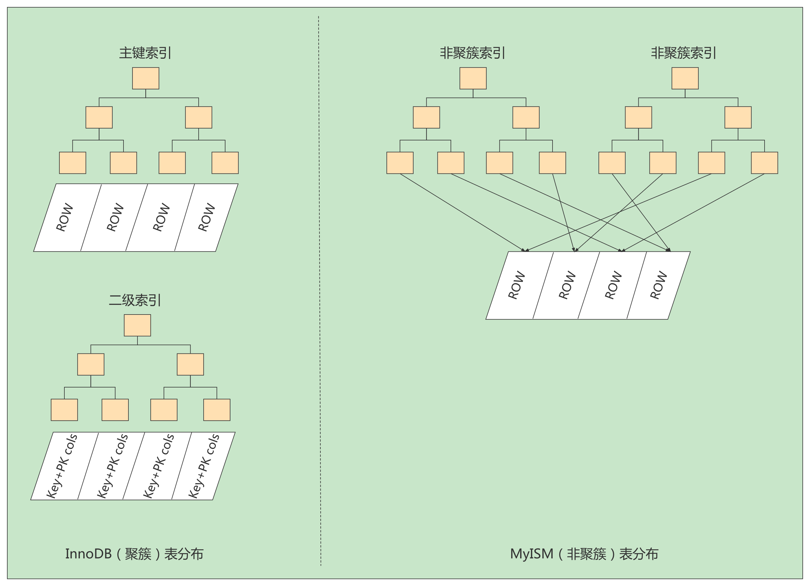
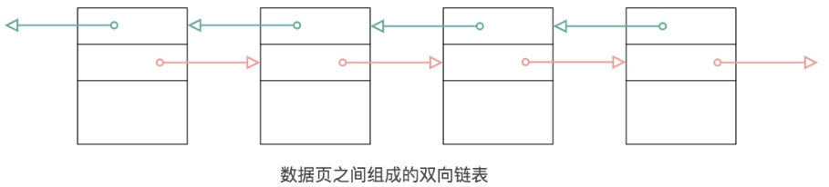
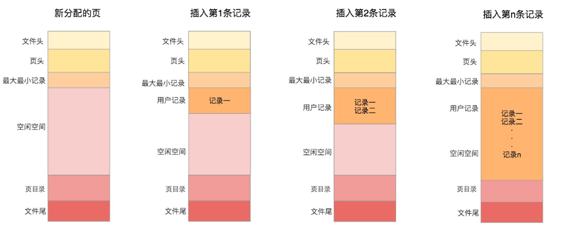
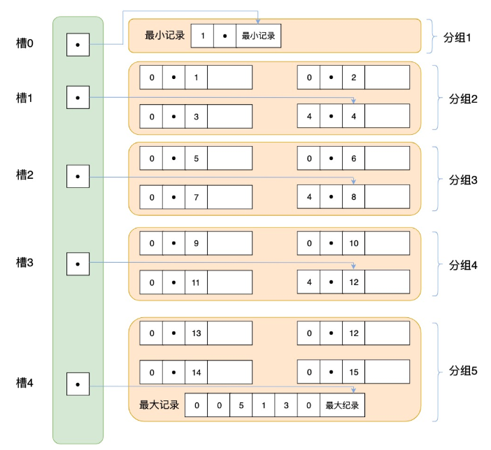
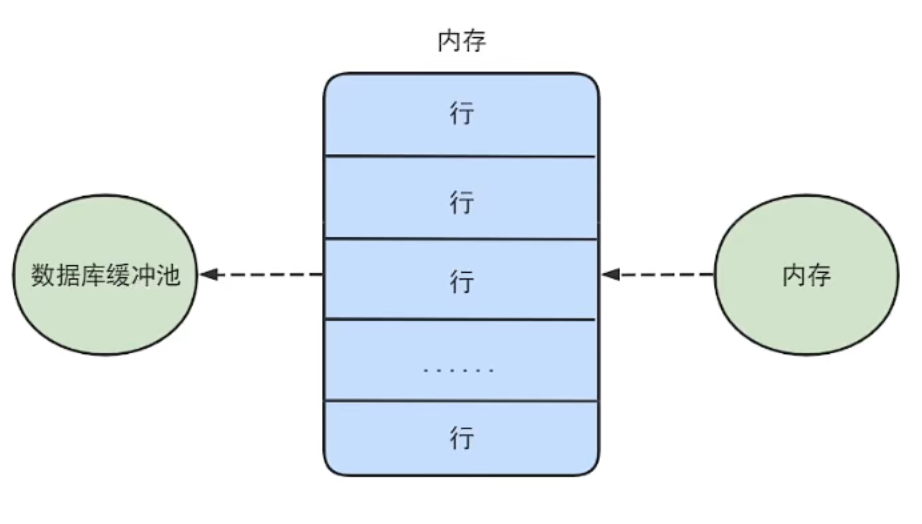
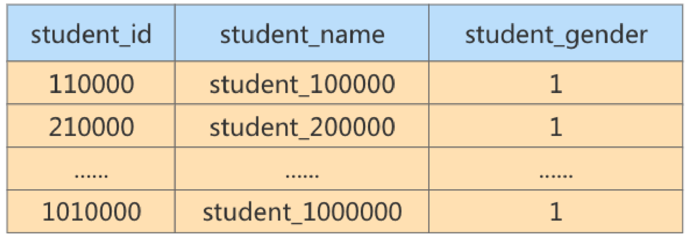

# MySQL_高级__索引及调优篇

> 讲师：尚硅谷-宋红康（江湖人称：康师傅）
>
> 尚硅谷官网：[http://www.atguigu.com](http://www.atguigu.com/)
>
> 视频链接：https://www.bilibili.com/video/BV1iq4y1u7vj?spm_id_from=333.337.search-card.all.click

------

## 五、索引的数据结构

### 1 为什么使用索引

索引是存储引擎用于快速找到数据记录的一种数据结构，就好比一本教课书的目录部分，通过目录中找到对应文章的页码，便可快速定位到需要的文章。MySQL中也是一样的道理，进行数据查找时，首先查看查询条件是否命中某条索引，符合则`通过索引查找`相关数据，如果不符合则需要`全表扫描`，即需要一条一条地查找记录，直到找到与条件符合的记录。


如上图所示，数据库没有索引的情况下，数据`分布在硬盘不同的位置上面`，读取数据时，摆臂需要前后摆动查找数据，这样操作非常消耗时间。如果`数据顺序摆放`，那么也需要从1到6行按顺序读取，这样就相当于进行了6次IO操作，`依旧非常耗时`。如果我们不借助任何索引结构帮助我们快速定位数据的话，我们查找Col2=89这条记录，就要逐行去查找、去比较。从Col2=34开始，进行比较，发现不是，继续下一行。我们当前的表只有不到10行数据，但如果表很大的话，有`上千万条数据`，就意味着要做`很多很多次磁盘IO`才能找到。现在要查找Col2=89这条记录。CPU必须先去磁盘查找这条记录，找到之后加载到内存，再对数据进行处理。这个过程最耗时间的就是磁盘I/O(涉及到磁盘的旋转时间(速度较快)、磁头的寻道时间(速度慢、费时))。


假如给数据使用`二叉树`这样的数据结构进行存储，如下图所示。


对字段Col2添加了索引，就相当于在硬盘上为Col2维护了一个索引的数据结构，即这个`二叉搜索树`。二叉搜索树的每个结点存储的是`(K,V)结构`，key是Col2，value是该key所在行的文件指针(地址)。比如：该二叉搜索树的根节点就是:`(34,0x07)`。现在对Col2添加了索引，这时再去查找Col2=89这条记录的时候会先去查找该二叉搜索树(二叉树的遍历查找)。读34到内存，89>34；继续右侧数据，读89到内存，89==89；找到数据返回。找到之后就根据当前结点的value快速定位到要查找的记录对应的地址。我们可以发现，只需要`查找两次`就可以定位到记录的地址，查询速度就提高了。


这就是我们为什么要建索引，目的就是为了`减少磁盘I/O的次数`，加快查询速率。


### 2 索引及其优缺点

#### 2.1 索引概述

MySQL官方对索引的定义为：**索引（Index）是帮助MySQL高效获取数据的数据结构。**

索引的本质：索引是数据结构。你可以简单理解为“排好序的快速查找数据结构”，满足特定查找算法。这些数据结构以某种方式指向数据， 这样就可以在这些数据结构的基础上实现`高级查找算法`。

`索引是在存储引擎中实现的`，因此每种存储引擎的索引不一定完全相同，并且每种存储引擎不一定支持所有索引类型。同时，存储引擎可以定义每个表的`最大索引数`和`最大索引长度`。所有存储引擎支持每个表至少16个索引，总索引长度至少为256字节。有些存储引擎支持更多的索引数和更大的索引长度。


#### 2.2 优点

1. 类似大学图书馆建书目索引，提高数据检索的效率，`降低数据库的IO成本`，这也是创建索引最主要的原因。
2. 通过创建唯一索引，可以`保证数据库表中每一行数据的唯一性`。
3. 在实现数据的参考完整性方面，可以`加速表和表之间的连接`。换句话说，对于有依赖关系的子表和父表联合查询时，可以提高查询速度。
4. 在使用分组和排序子句进行数据查询时，可以显著`减少查询中分组和排序的时间`，降低了CPU的消耗。


#### 2.3 缺点

增加索引也有许多不利的方面，主要表现在如下几个方面：

- 创建索引和维护索引要`耗费时间`，并且随着数据量的增加，所耗费的时间也会增加。
- 索引需要占`磁盘空间`，除了数据表占数据空间之外，每一个索引还要占一定的物理空间，`存储在磁盘上`，如果有大量的索引，索引文件就可能比数据文件更快达到最大文件尺寸。 
- 虽然索引大大提高了查询速度，同时却会`降低更新表的速度`。当对表中的数据进行增加、删除和修改的时候，索引也要动态地维护，这样就降低了数据的维护速度。

因此，选择使用索引时，需要综合考虑索引的优点和缺点。

> **提示：**
>
> 索引可以提高查询的速度，但是会影响插入记录的速度。这种情况下，最好的办法是先删除表中的索引，然后插入数据，插入完成后再创建索引。


### 3 InnoDB中索引的推演

#### 3.1 索引之前的查找

先来看一个精确匹配的例子：

```mysql
SELECT [列名列表] FROM 表名 WHERE 列名 = xxx;
```

1. 在一个页中的查找

   假设目前表中的记录比较少，所有的记录都可以被存放到一个页中，在查找记录的时候可以根据搜索条件的不同分为两种情况:

   - 已主键为搜索条件

     可以在页目录中使用`二分法`快速定位到对应的槽，然后再遍历该槽对应分组中的记录即可快速找到指定的记录。

   - 以其他列作为搜索条件

     因为在数据页中并没有对非主键列建立所谓的页目录，所以我们无法通过二分法快速定位相应的槽。这种情况下只能从`最小记录`开始`依次遍历`单链表中的每条记录，然后对比每条记录是不是符合搜索条件。很显然，这种查找的效率是非常低的。

   

2. 在很多页中查找

   大部分情况下我们表中存放的记录都是非常多的，需要好多的数据页来存储这些记录。在很多页中查找记录的话可以分为两个步骤:

   1. 定位到记录所在的页。

   2. 从所在的页内中查找相应的记录。

   在没有索引的情况下，不论是根据主键列或者其他列的值进行查找，由于我们并不能快速的定位到记录所在的页，所以只能`从第一个页`沿着`双向链表`一直往下找，在每一个页中根据我们上面的查找方式去查找指定的记录。因为要遍历所有的数据页，所以这种方式显然是`超级耗时`的。如果一个表有一亿条记录呢？此时`索引`应运而生。

   

#### 3.2 设计索引

建一个表：

```mysql
mysql> CREATE TABLE index_demo(
	-> 		c1 INT,
	-> 		c2 INT,
	->	 	c3 CHAR(1),
	-> 		PRIMARY KEY(c1)
	-> ) ROW_FORMAT = Compact;
```

这个新建的`index_demo`表中有2个INT类型的列，1个CHAR(1)类型的列，而且我们规定了c1列为主键，这个表使用`Compact`行格式来实际存储记录的。这里我们简化了index_demo表的行格式示意图：


我们只在示意图里展示记录的这几个部分：

- `record_type`：记录头信息的一项属性，表示记录的类型，`0`表示普通记录、`2`表示最小记录、`3`表示最大记录、`1`暂时还没用过，下面讲。
- `next_record`：记录头信息的一项属性，表示下一条地址相对于本条记录的地址偏移量，我们用箭头来表明下一条记录是谁。
- `各个列的值`：这里只记录在`index_demo`表中的三个列，分别是`c1`、`c2`和`c3`。
- `其他信息`：除了上述3种信息以外的所有信息，包括其他隐藏列的值以及记录的额外信息。

将记录格式示意图的其他信息项暂时去掉并把它竖起来的效果就是这样：


把一些记录放到页里的示意图就是：


##### 3.2.1 一个简单的索引设计方案

我们在根据某个搜索条件查找一些记录时为什么要遍历所有的数据页呢？因为各个页中的记录并没有规律，我们并不知道我们的搜索条件匹配哪些页中的记录，所以不得不依次遍历所有的数据页。所以如果我们`想快速的定位到需要查找的记录在哪些数据页`中该咋办？我们可以为快速定位记录所在的数据页而`建立一个目录 `，建这个目录必须完成下边这些事：

- **下一个数据页中用户记录的主键值必须大于上一个页中用户记录的主键值。**

  假设:每个数据页最多能存放3条记录(实际上一个数据页非常大,可以存放下好多记录)。有了这个假设之后我们向index_ demo表插入3条记录:

  ```mysql
  INSERT INTO index_demo VALUES(1,4,'u'), (3,9,'d'), (5,3,'y');
  ```

  那么这些记录已经按主键值的大小串联成一个单向链表了，如图所示：

  

   从图中可以看出来，`index_demo`表中的3条记录都被插入到了编号为10的数据页中了。此时我们再来插入一条记录:

  ```mysql
  INSERT INTO index_demo VALUES(4,4,'a');
  ```

  因为页10最多只能放3条记录，所以我们不得不再分配一个新页:

  

  注意，新分配的`数据页编号`可能并不是连续的。它们只是通过维护着上一个页和下一个页的编号而建立了`链表关系`。另外，`页10`中用户记录最大的主键值是`5`，而页28中有一条记录的主键值是`4`，因为`5>4`，所以这就不符合下一个数据页中用户记录的主键值必须大于上一个页中用户记录的主键值的要求，所以在插入主键值为4的记录的时候需要伴随着一次记录移动，也就是把主键值为5的记录移动到页28中，然后再把主键值为4的记录插入到页10中，这个过程的示意图如下: 

  

  这个过程表明了在对页中的记录进行增删改操作的过程中，我们必须通过一些诸如记录移动的操作来始终保证这个状态一直成立：下一个数据页中用户记录的主键值必须大于上一个页中用户记录的主键值。这个过程我们称为页分裂。

  

- **给所有的页建立一个目录项。**

由于数据页的`编号可能是不连续的`，所以在向index_demo表中插入许多条记录后，可能是这样的效果:


因为这些`16KB`的页在物理存储上是`不连续`的，所以如果想从这么多页中根据主键值`快速定位某些记录所在的页`，我们需要给它们做个`目录`，每个页对应一个目录项，每个目录项包括下边两个部分:

- 页的用户记录中最小的主键值，我们用key来表示。
- 页号，我们用`page_no`表示。

所以我们为上边几个页做好的目录就像这样子：


以`页28`为例，它对应`目录项2`，这个目录项中包含着该页的页号`28`以及该页中用户记录的`最小主键值5`。我们只需要把几个目录项在物理存储器上连续存储（比如：数组），就可以实现根据主键值快速查找某条记录的功能了。比如：查找主键值为`20`的记录，具体查找过程分两步：

- 先从目录项中根据`二分法`快速确定出主键值为`20`的记录在`目录项3`中（因为`12 < 20 < 209`），它对应的页是`页9`。
- 再根据前边说的在页中查找记录的方式去`页9`中定位具体的记录。

至此，针对数据页做的简易目录就搞定了。这个目录有一个别名，称为`索引`。


##### 3.2.2 InnoDB中的索引方案

###### **迭代1次：目录项纪录的页**

我们把前边使用到的目录项放到数据页中的样子就是这样：


从图中可以看出来，我们新分配了一个编号为30的页来专门存储目录项记录。这里再次强调`目录项记录`和普通的`用户记录`的**不同点**：

- `目录项记录`的`record_type`值是1，而`普通用户记录`的`record_type`值是0。
- 目录项记录只有`主键值和页的编号`两个列，而普通的用户记录的列是用户自己定义的，可能包含`很多列`，另外还有InnoDB自己添加的隐藏列。
- 了解：记录头信息里还有一个叫`min_rec_mask`的属性，只有在存储`目录项记录`的页中的主键值最小的`目录项记录`的`min_rec_mask`值为`1`，其他别的记录的`min_rec_mask`值都是`0`。

**相同点**：两者用的是一样的数据页，都会为主键值生成`Page Directory`（页目录），从而在按照主键值进行查找时可以使用`二分法`来加快查询速度。

现在以查找主键为`20`的记录为例，根据某个主键值去查找记录的步骤就可以大致拆分成下边两步：

- 先到存储`目录项记录`的页，也就是页30中通过`二分法`快速定位到对应目录项，因为`12 < 20 < 209`，所以定位到对应的记录所在的页就是页9。
- 再到存储用户记录的页9中根据`二分法`快速定位到主键值为`20`的用户记录。


###### **迭代2次：多个目录项纪录的页**

虽然说`目录项记录`中只存储主键值和对应的页号，比用户记录需要的存储空间小多了，但是不论怎么说一个页只有`16KB`大小，能存放的`目录项记录`也是有限的，那如果表中的数据太多，以至于一个数据页不足以存放所有的`目录项记录`，如何处理呢?

这里我们假设一个存储目录项记录的页`最多只能存放4条目录项记录`，所以如果此时我们再向上图中插入一条主键值为`320`的用户记录的话，那就需要分配一个新的存储`目录项记录`的页：


从图中可以看出，我们插入了一条主键值为320的用户记录之后需要两个新的数据页：

- 为存储该用户记录而新生成了`页31`。
- 因为原先存储目录项记录的`页30的容量已满`（我们前边假设只能存储4条目录项记录），所以不得不需要一个新的`页32`来存放`页31`对应的目录项。

现在因为存储目录项记录的页不止一个，所以如果我们想根据主键值查找一条用户记录大致需要3个步骤，以查找主键值为`20`的记录为例：

1. 确定`目录项记录页`

  我们现在的存储目录项记录的页有两个，即`页30`和`页32`，又因为页30表示的目录项的主键值的范围是`[1, 320)`，页32表示的目录项的主键值不小于`320`，所以主键值为`20`的记录对应的目录项记录在`页30`中。

2. 通过目录项记录页`确定用户记录真实所在的页`。

  在一个存储`目录项记录`的页中通过主键值定位一条目录项记录的方式说过了。

3. 在真实存储用户记录的页中定位到具体的记录。


###### **迭代3次：目录项记录页的目录页**

问题来了，在这个查询步骤的第1步中我们需要定位存储目录项记录的页，但是这些`页是不连续的`，如果我们表中的数据非常多则会`产生很多存储目录项记录的页`，那我们怎么根据主键值快速定位一个存储目录项记录的页呢? 那就为这些存储目录项记录的页再生成一个`更高级的目录`，就像是一个多级目录一样，`大目录里嵌套小目录`，小目录里才是实际的数据，所以现在各个页的示意图就是这样子：


如图，我们生成了一个存储更高级目录项的`页33`，这个页中的两条记录分别代表页30和页32，如果用户记录的主键值在`[1, 320)`之间，则到页30中查找更详细的目录项记录，如果主键值`不小于320`的话，就到页32中查找更详细的目录项记录。


随着表中记录的增加，这个目录的层级会继续增加，如果简化一下，那么我们可以用下边这个图来描述它：


这个数据结构，它的名称是`B+树`。


###### **B+Tree**

不论是存放`用户记录`的数据页，还是存放`目录项记录`的数据页，我们都把它们存放到B+树这个数据结构中了，所以我们也称这些数据页为`节点`。从图中可以看出，我们的实际用户记录其实都存放在B+树的最底层的节点上，这些节点也被称为`叶子节点`，其余用来`存放目录项`的节点称为`非叶子节点`或者`内节点`，其中B+树最上边的那个节点也称为`根节点`。


一个B+树的节点其实可以分成好多层，规定最下边的那层，也就是存放我们用户记录的那层为第`0`层，之后依次往上加。之前我们做了一个非常极端的假设：存放用户记录的页`最多存放3条记录`，存放目录项`记录的页`最多存放4条记录。其实真实环境中一个页存放的记录数量是非常大的，假设所有存放用户记录的叶子节点代表的数据页可以存放`100条用户记录`，所有存放目录项记录的内节点代表的数据页可以存放`1000条目录项记录`，那么：

- 如果B+树只有1层，也就是只有1个用于存放用户记录的节点，最多能存放`100`条记录。
- 如果B+树有2层，最多能存放`1000×100=10,0000`条记录。
- 如果B+树有3层，最多能存放`1000×1000×100=1,0000,0000`条记录。
- 如果B+树有4层，最多能存放`1000×1000×1000×100=1000,0000,0000`条记录。相当多的记录！！！

你的表里能存放`1000,0000,0000`条记录吗？所以一般情况下，我们`用到的B+树都不会超过4层`，那我们通过主键值去查找某条记录最多只需要做4个页面内的查找（查找3个目录项页和一个用户记录页），又因为在每个页面内有所谓的`Page Directory`（页目录），所以在页面内也可以通过`二分法`实现快速定位记录。


#### 3.3 常见索引概念

索引按照物理实现方式，索引可以分为2种：聚簇（聚集）和非聚簇（非聚集）索引。我们也把非聚集索引称为二级索引或者辅助索引。

##### 3.3.1 聚簇索引

**聚簇索引**并不是一种单独的索引类型，而是**一种数据存储方式**(所有的用户记录都存储在了叶子节点)，也就是所谓的`索引即数据，数据即索引`。

> 术语"聚簇"表示数据行和相邻的键值聚簇的存储在一起。

**特点：**

1. 使用记录主键值的大小进行记录和页的排序，这包括三个方面的含义：

   - `页内`的记录是按照主键的大小顺序排成一个`单向链表`。
   - 各个存放`用户记录的页`也是根据页中用户记录的主键大小顺序排成一个`双向链表`。
   - 存放`目录项记录的页`分为不同的层次，在同一层次中的页也是根据页中目录项记录的主键大小顺序排成一个`双向链表`。

2. B+树的`叶子节点`存储的是完整的用户记录。

   所谓完整的用户记录，就是指这个记录中存储了所有列的值（包括隐藏列）。

我们把具有这两种特性的B+树称为`聚簇索引`，所有完整的用户记录都存放在这个`聚簇索引`的叶子节点处。这种聚簇索引并不需要我们在MySQL语句中显式的使用`INDEX`语句去创建，`InnoDB`存储引擎会`自动`的为我们创建聚簇索引。


**优点：**

- `数据访问更快`，因为聚簇索引将索引和数据保存在同一个B+树中，因此从聚簇索引中获取数据比非聚簇索引更快
- 聚簇索引对于主键的`排序查找`和`范围查找`速度非常快
- 按照聚簇索引排列顺序，查询显示一定范围数据的时候，由于数据都是紧密相连，数据库不用从多个数据块中提取数据，所以`节省了大量的IO操作`。

**缺点：**

- `插入速度严重依赖于插入顺序`，按照主键的顺序插入是最快的方式，否则将会出现页分裂，严重影响性能。因此，对于InnoDB表，我们一般都会定义一个`自增的ID列为主键`
- `更新主键的代价很高`，因为将会导致被更新的行移动。因此，对于InnoDB表，我们一般定义`主键为不可更新`
- `二级索引访问需要两次索引查找`，第一次找到主键值，第二次根据主键值找到行数据

**限制：**

- 对于MySQL数据库目前只有InnoDB数据引擎支持聚簇索引，而MyISAM并不支持聚簇索引。
- 由于数据物理存储排序方式只能有一种，所以每个MySQL的`表只能有一个聚簇索引`。一般情况下就是该表的主键。
- 如果没有定义主键，Innodb会选择`非空的唯一索引`代替。如果没有这样的索引，Innodb会隐式的定义一个主键来作为聚簇索引。
- 为了充分利用聚簇索引的聚簇的特性，所以innodb表的主键列尽量`选用有序的顺序id`，而不建议用无序的id，比如`UUID、MD5、HASH、字符串`列作为主键无法保证数据的顺序增长。


##### 3.3.2 二级索引（辅助索引、非聚簇索引）

上边介绍的`聚簇索引`只能在搜索条件是`主键值`时才能发挥作用，因为B+树中的数据都是按照主键进行排序的。那如果我们想以别的列作为搜索条件该怎么办呢？肯定不能是从头到尾沿着链表依次遍历记录一遍。

答案:我们可以`多建几棵B+树`，不同的B+树中的数据采用不同的排序规则。比方说我们用`c2`列的大小作为数据页、页中记录的排序规则，再建一棵B+树，效果如下图所示:


这个B+树与上边介绍的聚簇索引有几处不同:

- 使用记录c2列的大小进行记录和页的排序，这包括三个方面的含义:
  - 页内的记录是按照c2列的大小顺序排成一个`单向链表`。
  - 各个存放`用户记录的页`也是根据页中记录的c2列大小顺序排成一个双向链表。
  - 存放`目录项记录的页分`为不同的层次，在同一层次中的页也是根据页中目录项记录的c2列大小顺序排成一个`双向链表`。
- B+树的叶子节点存储的并不是完整的用户记录，而只是`c2列+主键`这两个列的值。
- 目录项记录中不再是`主键+页号`的搭配，而变成了`c2列+页号`的搭配。

所以如果我们现在想通过c2列的值查找某些记录的话就可以使用我们刚刚建好的这个B+树了。以查找c2列的值为`4`的记录为例，查找过程如下：

1. 确定`目录项记录页`

   根据`根页面`，也就是`页44`，可以快速定位到`目录项记录`所在的页为`页42` (因为`2 < 4 < 9`)。

2. 通过`目录项记录页`确定用户记录真实所在的页。

   在`页42`中可以快速定位到实际存储用户记录的页，但是由于`c2`列并没有唯一性约束，所以`c2`列值为`4`的记录可能分布在多个数据页中，又因为`2<4≤4`，所以确定实际存储用户记录的页在`页34`和`页35`中。

3. 在真实存储用户记录的页中定位到具体的记录。

   到`页34`和`页35`中定位到具体的记录。

4. 但是这个B+树的叶子节点中的记录只存储了`c2`和`c1`(也就是`主键`)两个列，所以我们必须再根据主键值去聚簇索引中再查找一遍完整的用户记录。

**概念**：**回表 **我们根据这个以c2列大小排序的B+树只能确定我们要查找记录的主键值，所以如果我们想根据c2列的值查找到完整的用户记录的话，仍然需要到`聚簇索引`中再查一遍，这个过程称为`回表`。也就是根据c2列的值查询一条完整的用户记录需要使用到`2`棵B+树！

**问题**：为什么我们还需要一次`回表`操作呢？直接把完整的用户记录放到叶子节点不OK吗？

**回答**：

如果把完整的用户记录放到叶子节点是可以不用回表。但是`太占地方`了，相当于每建立一棵B+树都需要把所有的用户记录再都拷贝一遍，这就有点太浪费存储空间了。

因为这种按照`非主键列`建立的B+树需要一次回表操作才可以定位到完整的用户记录，所以这种B+树也被称为二级索引(英文名

`secondary index`)，或者`辅助索引`。由于我们使用的是c2列的大小作为B+树的排序规则，所以我们也称这个B+树是为c2列建立的索引。

非聚簇索引的存在不影响数据在聚簇索引中的组织，所以一张表可以有多个非聚簇索引。


小结：聚簇索引与非聚簇索引的原理不同，在使用上也有一些区别：

1. 聚簇索引的`叶子节点`存储的就是我们的`数据记录`，非聚簇索引的叶子节点存储的是`数据位置`。非聚簇索引不会影响数据表的物理存储顺序。
2. 一个表只能有一个聚簇索引，因为只能有一种排序存储的方式，但可以有多个非聚簇索引，也就是多个索引目录提供数据检索。使用聚簇索引的时候，数据的查询效率高，但如果对数据进行插入，删除，更新等操作，效率会比非聚簇索引低。


#####  3.3.3 联合索引

我们也可以同时以多个列的大小作为排序规则，也就是同时为多个列建立索引，比方说我们想让B+树按照`c2和c3列`的大小进行排序，这个包含两层含义：

- 先把各个记录和页按照c2列进行排序。
- 在记录的c2列相同的情况下，采用c3列进行排序


如图所示，我们需要注意以下几点：

- 每条`目录项记录`都由`c2`、`c3`、`页号`这三个部分组成，各条记录先按照c2列的值进行排序，如果记录的c2列相同，则按照c3列的值进行排序。
- B+树`叶子节点`处的用户记录由`c2、c3和主键c1列`组成。

注意一点，以c2和c3列的大小为排序规则建立的B+树称为`联合索引`，本质上也是一个二级索引。它的意思与分别为c2和c3列分别建立索引的表述是不同的，不同点如下：

- 建立`联合索引`只会建立如上图一样的1棵B+树。
- 为c2和c3列分别建立索引会分别以c2和c3列的大小为排序规则建立2棵B+树。


#### 3.4 InnoDB的B+树索引的注意事项

##### 3.4.1 根页面位置万年不动

我们前边介绍B+树索引的时候，为了大家理解上的方便，先把存储用户记录的叶子节点都画出来，然后接着画存储目录项记录的内节点，实际上B+树的形成过程是这样的：

- 每当为某个表创建一个B+树索引(聚簇索引不是人为创建的，默认就有)的时候，都会为这个索引创建一个`根节点`页面。最开始表中没有数据的时候，每个B+树索引对应的`根节点`中既没有用户记录，也没有目录项记录。
- 随后向表中插入用户记录时，先把用户记录存储到这个`根节点`中。
- 当根节点中的`可用空间用完时`继续插入记录，此时会将根节点中的所有记录复制到一个新分配的页，比如`页a`中，然后对这个新页进行`页分裂`的操作，得到另一个新页，比如`页b`。这时新插入的记录根据键值(也就是聚簇索引中的主键值，二级索引中对应的索引列的值)的大小就会被分配到`页a`或者`页b`中，而`根节点`便升级为存储目录项记录的页。

这个过程特别注意的是：一个B+树索引的根节点自诞生之日起，便不会再移动。这样只要我们对某个表建立一个索引，那么它的根节点的页号便会被记录到某个地方，然后凡是`InnoDB`存储引擎需要用到这个索引的时候，都会从那个固定的地方取出根节点的页号，从而来访问这个索引。


##### 3.4.2 内节点中目录项记录的唯一性

我们知道B+树索引的内节点中目录项记录的内容是`索引列+页号`的搭配，但是这个搭配对于二级索引来说有点儿不严谨。还拿`index_demo`表为例。假设这个表中的数据是这样的：

| `c1` | `c2` | `c3` |
| ---- | ---- | ---- |
| 1    | 1    | 'u'  |
| 3    | 1    | 'd'  |
| 5    | 1    | 'y'  |
| 7    | 1    | 'a'  |

如果二级索引中目录项记录的内容只是`索引列+页号`的搭配的话，那么为`c2`列建立索引后的B+树应该长这样:


如果我们想新插入一行记录，其中`c1、c2、c3`的值分别是:`9、1、'c'`，那么在修改这个为c2列建立的二级索引对应的B+树时便碰到了个大问题：由于`页3`中存储的目录项记录是由`c2列+页号`的值构成的，`页3`中的两条目录项记录对应的c2列的值都是`1`，而我们`新插入的这条记录`的c2列的值也是1，那我们这条新插入的记录到底应该放到`页4`中，还是应该放到`页5`中啊？

答案是:对不起，懵了。

为了让新插入记录能找到自己在那个页里，**我们需要保证在B+树的同一层内节点的目录项记录除页号这个字段以外是唯一的**。所以对于二级索引的内节点的目录项记录的内容实际上是由三个部分构成的：

- 索引列的值
- 主键值
- 页号

也就是我们把主键值也添加到二级索引内节点中的目录项记录了，这样就能保证B+树每一层节点中各条目录项记录除页号这个字段外是唯一的，所以我们为c2列建立二级索引后的示意图实际上应该是这样子的:


这样我们再插入记录`(9，1，'c')`时，由于页3中存储的目录项记录是由`c2列+主键+页号`的值构成的，可以先把新记录的`c2`列的值和`页3`中各目录项记录的`c2`列的值作比较，如果`c2`列的值相同的话，可以接着比较主键值，因为B+树同一层中不同目录项记录的`c2列+主键`的值肯定是不一样的，所以最后肯定能定位唯一的一条目录项记录，在本例中最后确定新记录应该被插入到`页5`中。


##### 3.4.3 一个页面最少存储2条记录

一个B+树只需要很少的层级就可以轻松存储数亿条记录，查询速度相当不错！这是因为B+树本质上就是一个大的多层级目录，每经过一个目录时都会过滤掉许多无效的子目录，直到最后访问到存储真实数据的目录。那如果一个大的目录中只存放一个子目录是个啥效果呢？那就是目录层级非常非常非常多，而且最后的那个存放真实数据的目录中只能存放一条记录。费了半天劲只能存放一条真实的用户记录？所以`InnoDB的一个数据页至少可以存放两条记录`。


### 4 MyISAM中的索引方案

**B树索引适用存储引擎如表所示：**

| 索引 / 存储引擎 | MyISAM | InnoDB | Memory |
| --------------- | ------ | ------ | ------ |
| B-Tree索引      | 支持   | 支持   | 支持   |

即使多个存储引擎支持同一种类型的索引，但是他们的实现原理也是不同的。Innodb和MyISAM默认的索引是B+tree索引；而Memory默认的索引是Hash索引。

MyISAM引擎使用`B+Tree`作为索引结构，叶子节点的data域存放的是`数据记录的地址`。


#### 4.2 MyISAM索引的原理

下图是MyISAM索引的原理图。

我们知道`InnoDB中索引即数据`，也就是聚簇索引的那棵B+树的叶子节点中已经把所有完整的用户记录都包含了,
而`MyISAM`的索引方案虽然也使用树形结构，但是却`将索引和数据分开存储`：

- 将表中的记录`按照记录的插入顺序`单独存储在一个文件中，称之为`数据文件`。这个文件并不划分为若干个数据页，有多少记录就往这个文件中塞多少记录就成了。由于在插入数据的时候并`没有刻意按照主键大小排序`，所以我们并不能在这些数据上使用二分法进行查找。
- 使用`MyISAM`存储引擎的表会把索引信息另外存储到一个称为`索引文件`的另一个文件中。`MyISAM`会单独为表的主键创建一个索引，只不过在索引的叶子节点中存储的不是完整的用户记录，而是`主键值+数据记录地址`的组合。


这里设表共有三列，假设我们以Col1为主键，上图是一个MyISAM表的主索引(Primary key)示意。可以看出**MyISAM的索引文件仅仅保存数据记录的地址**。在MyISAM中，主键索引和二级索引(Secondary key)在结构上没有任何区别，只是主键索引要求key是唯一的，而二级索引的key可以重复。

如果我们在Col2上建立一个二级索引，则此索引的结构如下图所示：


同样也是一棵B+Tree，data域保存数据记录的地址。因此，MyISAM中索引检索的算法为：首先按照B+Tree搜索算法搜索索引，如果指定的Key存在，则取出其data域的值，然后以data域的值为地址，读取相应数据记录。


#### 4.3 MyISAM 与 InnoDB对比

**MyISAM的索引方式都是“非聚簇”的，与InnoDB包含1个聚簇索引是不同的。小结两种引擎中索引的区别：**

1. 在InnoDB存储引擎中，我们只需要根据主键值对`聚簇索引`进行一次查找就能找到对应的记录，而在`MyISAM`中却需要进行一次`回表`操作，意味着MyISAM中建立的索引相当于全部都是`二级索引`。
2. InnoDB的数据文件本身就是索引文件，而MyISAM索引文件和数据文件是`分离的`，索引文件仅保存数据记录的地址。
3. InnoDB的非聚簇索引data域存储相应记录`主键的值`，而MyISAM索引记录的是`地址`。换句话说，InnoDB的所有非聚簇索引都引用主键作为data域。
4. MyISAM的回表操作是十分`快速`的，因为是拿着地址偏移量直接到文件中取数据的，反观InnoDB是通过获取主键之后再去聚簇索引里找记录，虽然说也不慢，但还是比不上直接用地址去访问。
5. InnoDB要求表`必须有主键`（`MyISAM可以没有`）。如果没有显式指定，则MySQL系统会自动选择一个可以非空且唯一标识数据记录的列作为主键。如果不存在这种列，则MySQL自动为InnoDB表生成一个隐含字段作为主键，这个字段长度为6个字节，类型为长整型。

**小结：**

了解不同存储引擎的索引实现方式对于正确使用和优化索引都非常有帮助。比如：

举例1：知道了InnoDB的索引实现后，就很容易明白`为什么不建议使用过长的字段作为主键`，因为所有二级索引都引用主键索引，过长的主键索引会令二级索引变得过大。

举例2：用非单调的字段作为主键在InnoDB中不是个好主意，因为InnoDB数据文件本身是一棵B+Tree, 非单调的主键会造成在插入新记录时，数据文件为了维持B+Tree的特性而频繁的分裂调整，十分低效，而使用`自增字段作为主键则是一个很好的选择`。




### 5 索引的代价

索引是个好东西，可不能乱建，它在空间和时间上都会有消耗：

- **空间上的代价**

  每建立一个索引都要为它建立一棵B+树，每一棵B+树的每一个节点都是一个数据页，一个页默认会占用 `16KB`的存储空间，一棵很大的B+树由许多数据页组成，那就是很大的一片存储空间。

- **时间上的代价**

  每次对表中的数据进行`增、删、改`操作时，都需要去修改各个B+树索引。而且我们讲过，B+树每层节点都是按照索引列的值`从小到大的顺序排序`而组成了`双向链表`。不论是叶子节点中的记录，还是内节点中的记录（也就是不论是用户记录还是目录项记录）都是按照索引列的值从小到大的顺序而形成了一个单向链表。而增、删、改操作可能会对节点和记录的排序造成破坏，所以存储引擎需要额外的时间进行一些`记录移位`，`页面分裂`、`页面回收`等操作来维护好节点和记录的排序。如果我们建了许多索引，每个索引对应的B+树都要进行相关的维护操作，会给性能拖后腿。

> 一个表上索引建的越多，就会占用越多的存储空间，在增删改记录的时候性能就越差。为了能建立又好又少的索引，我们得学学这些索引在哪些条件下起作用的。


### 6 MySQL数据结构选择的合理性

从MySQL的角度讲，不得不考虑一个现实问题就是磁盘IO。如果我们能让索引的数据结构尽量减少硬盘的IO操作，所消耗的时间也就越小。可以说，`磁盘的IO操作次数`对索引的使用效率至关重要。

查找都是索引操作，一般来说索引非常大，尤其是关系型数据库，当数据量比较大的时候，索引的大小有可能几个G甚至更多，为了减少索引在内存的占用，**数据库索引是存储在外部磁盘上的**。当我们利用索引查询的时候，不可能把整个索引全部加载到内存，只能`逐一加载`，那么MySQL衡量查询效率的标准就是磁盘IO次数。


#### 6.1 全表遍历

这里都懒得说了。


#### 6.2 Hash结构

Hash本身是一个函数，又被称为散列函数，它可以帮助我们大幅提升检索数据的效率。

Hash算法是通过某种确定性的算法(比如MD5、SHA1、SHA2、SHA3)将输入转变为输出。`相同的输入永远可以得到相同的输出`，假设输入内容有微小偏差，在输出中通常会有不同的结果。

**举例**：如果你想要验证两个文件是否相同，那么你不需要把两份文件直接拿来比对，只需要让对方把Hash函数计算得到的结果告诉你即可，然后在本地同样对文件进行Hash函数的运算，最后通过比较这两个Hash函数的结果是否相同，就可以知道这两个文件是否相同。

**加速查找速度的数据结构，常见的有两类**：

1. 树，例如平衡二叉搜索树，查询/插入/修改/删除的平均时间复杂度都是`O(1og2N)`;
2. 哈希，例如HashMap, 查询/插入/修改/删除的平均时间复杂度都是`O(1)`;


采用Hash进行检索效率非常高，基本上一次检索就可以找到数据，而B+树需要自顶向下依次查找，多次访问节点才能找到数据，中间需要多次I/0操作，从效率来说Hash比B+树更快。

在哈希的方式下，一个元素k处于h(k)中，即利用哈希函数h，根据关键字k计算出槽的位置。函数h将关键字域映射到`哈希表T[0...m-1]`的槽位上。


上图中哈希函数h有可能将两个不同的关键字映射到相同的位置，这叫做`碰撞`，在数据库中一般采用`链接法`来解决。在链接法中，将散列到同一槽位的元素放在一个链表中，如下图所示：


实验：体会数组和hash表的查找方面的效率区别

```java
// 算法复杂度为 O(n)
@Test
public void test1(){
	int[] arr = new int[100000];
	for(int i = 0; i < arr.length; i++){
		arr[i] = i + 1;
	}

	long start = System.currentTimeMillis();
	for(int j = 1; j<=100000;j++){
		int temp = j;
		for(int i = 0; i < arr.length; i++){
			if(temp == arr[i]){
				break;
			}
		}
	}
	long end = System.currentTimeMillis();
	System.out.println("time： " + (end - start)); //time： 823
}
```

```java
//算法复杂度为 O(1)
@Test
public void test2(){
	HashSet<Integer> set = new HashSet<>(100000);
	for(int i = 0;i < 100000;i++){
		set.add(i + 1);
	}

	long start = System.currentTimeMillis();
	for(int j = 1; j<=100000;j++) {
		int temp = j;
		boolean contains = set.contains(temp);
	}
	long end = System.currentTimeMillis();
	System.out.println("time： " + (end - start)); //time： 5
}
```

**Hash结构效率高，那为什么索引结构要设计成树型呢？**

- **原因1**：Hash索引仅能满足(=)、(<>)和IN查询。如果进行`范围查询`，哈希型的索引，时间复杂度会退化为0(n)；而树型的“有序”特性，依然能够保持0(log2N)的高效率。
- **原因2**：Hash索引还有一个缺陷，数据的存储是`没有顺序的`，在ORDER BY的情况下，使用Hash索引还需要对数据重新排序。
- **原因3**：对于联合索引的情况，Hash值是将联合索引键合并后一起来计算的，无法对单独的一个键或者几个索引键进行查询。
- **原因4**：对于等值查询来说，通常Hash索引的效率更高，不过也存在一种情况，就是`索引列的重复值如果很多，效率就会降低`。这是因为遇到Hash冲突时，需要遍历桶中的行指针来进行比较，找到查询的关键字，非常耗时。所以，Hash索引通常不会用到重复值多的列上，比如列为性别、年龄的情况等。

**Hash索引适用存储引擎如表所示：**

| 索引 / 存储引擎 | MyISAM | MyISAM | Memory |
| --------------- | ------ | ------ | ------ |
| HASH索引        | 不支持 | 不支持 | `支持` |

**Hash索引的适用性：**

Hash索引存在着很多限制，相比之下在数据库中B+树索引的使用面会更广，不过也有一些场景采用Hash索引效率更高，比如在键值型(Key-Value)数据库中，**Redis存储的核心就是Hash表**。

MySQL中的Memory存储引擎支持Hash存储，如果我们需要用到查询的临时表时，就可以选择Memory存储引擎，把某个字段设置为Hash索引，比如字符串类型的字段，进行Hash计算之后长度可以缩短到几个字节。当字段的重复度低，而且经常需要进行`等值查询`的时候，采用Hash索引是个不错的选择。

另外，InnoDB本身不支持Hash索引，但是提供`自适应Hash索引`(Adaptive Hash Index)。什么情况下才会使用自适应Hash索引呢?如果某个数据经常被访问，当满足一定条件的时候，就会将这个数据页的地址存放到Hash表中。这样下次查询的时候，就可以直接找到这个页面的所在位置。这样让B+树也具备了Hash索引的优点。


采用自适应 Hash 索引目的是方便根据 SQL 的查询条件加速定位到叶子节点，特别是当 B+ 树比较深的时
候，通过自适应 Hash 索引可以明显提高数据的检索效率。

我们可以通过`innodb_adaptive_hash_index`变量来查看是否开启了自适应 Hash，比如：

```mysql
 show variables like '%adaptive_hash_index';
```


#### 6.3 二叉搜索树

如果我们利用二叉树作为索引结构，那么磁盘的IO次数和索引树的高度是相关的。

**1. 二叉搜索树的特点**

- 一个节点只能有两个子节点，也就是一个节点度不能超过2
- 左子节点<本节点；右子节点>=本节点，比我大的向右，比我小的向左

**2. 查找规则**

我们先来看下最基础的二叉搜索树(Binary Search Tree)，搜索某个节点和插入节点的规则一样，我们假设搜索插入的数值为key:

1. 如果key大于根节点，则在右子树中进行查找;
2. 如果key小于根节点，则在左子树中进行查找;
3. 如果key等于根节点，也就是找到了这个节点，返回根节点即可。

举个例子，我们对数列(34, 22, 89，5，23, 77 91)创造出来的二分查找树如下图所示：


但是存在特殊的情况，就是有时候二叉树的深度非常大。比如我们给出的数据顺序是(5,22,23,34,77,89,91)，创造出来的二分搜索树如下图所示：


上面第二棵树也属于二分查找树，但是性能上已经退化成了一条链表，查找数据的时间复杂度变成了`O(n)`。你能看出来第一个树的深度是3，也就是说最多只需3次比较，就可以找到节点，而第二个树的深度是7，最多需要7次比较才能找到节点。

为了提高查询效率，就需要`减少磁盘IO数`。为了减少磁盘IO的次数，就需要尽量`降低树的高度`，需要把原来“瘦高”的树结构变的“矮胖”，树的每层的分叉越多越好。


#### 6.4 AVL树

为了解决上面二叉查找树退化成链表的问题，人们提出了`平衡二叉搜索树(Balanced Binary Tree)`，又称为AVL树(有别于AVL算法)，它在二叉搜索树的基础上增加了约束，具有以下性质:

**它是一棵空树或它的左右两个子树的高度差的绝对值不超过1，并且左右两个子树都是一棵平衡二叉树。**

这里说一-下，常见的平衡二叉树有很多种，包括了`平衡二叉搜索树、红黑树、数堆、伸展树`。平衡二叉搜索树是最早提出来的自平衡二叉搜索树，当我们提到平衡二叉树时一般指的就是平衡二叉搜索树。事实上，第一棵树就属于平衡二叉搜索树，搜索时间复杂度就是`O(log2n)`。

数据查询的时间主要依赖于磁盘IO的次数，如果我们采用二叉树的形式，即使通过平衡二叉搜索树进行了改进，树的深度也是O(log2n)，当n比较大时，深度也是比较高的，比如下图的情况：


`每访问一次节点就需要进行一次磁盘IO操作`，对于上面的树来说，我们需要进行5次IO操作。虽然平衡二叉树的效率高，但是树的深度也同样高，这就意味着磁盘IO操作次数多，会影响整体数据查询的效率。

针对同样的数据，如果我们把二叉树改成`M叉树`（M>2）呢？当 M=3 时，同样的 31 个节点可以由下面的三叉树来进行存储：


你能看到此时树的高度降低了，当数据量N大的时候，以及树的分叉数M大的时候，M叉树的高度会远小于二叉树的高度(M>2)。所以，我们需要把`树从“瘦高"变”矮胖”`。


#### 6.5 B-Tree

B树的英文是Balance Tree，也就是`多路平衡查找树`。简写为B-Tree (注意横杠表示这两个单词连起来的意思，不是减号)。它的高度远小于平衡二叉树的高度。

B 树的结构如下图所示：


B树作为多路平衡查找树，它的每一个节点最多可以包括M个子节点，`M称为B树的阶`。每个磁盘块中包括了`关键字`和`子节点的指针`。如果一个磁盘块中包括了x个关键字，那么指针数就是x+1。对于一个100阶的B树来说，如果有3层的话最多可以存储约100万的索引数据。对于大量的索引数据来说，采用B树的结构是非常适合的，因为树的高度要远小于二叉树的高度。

一个 M 阶的 B 树（M>2）有以下的特性：

1. 根节点的儿子数的范围是 [2,M]。
2. 每个中间节点包含 k-1 个关键字和 k 个孩子，孩子的数量 = 关键字的数量+1，k的取值范围为
    [ceil(M/2), M]。
3. 叶子节点包括k-1个关键字（叶子节点没有孩子），k 的取值范围为 [ceil(M/2), M]。
4. 假设中间节点节点的关键字为：Key[1], Key[2], …, Key[k-1]，且关键字按照升序排序，即 Key[i]
   < Key[i+1]。此时 k-1 个关键字相当于划分了k个范围，也就是对应着 k 个指针，即为：P[1], P[2], …, P[k]，其中 P[1] 指向关键字小于 Key[1] 的子树，P[i] 指向关键字属于 (Key[i-1], Key[i]) 的子树，P[k]指向关键字大于 Key[k-1] 的子树。
5. 所有叶子节点位于同一层。

上面那张图所表示的 B 树就是一棵 3 阶的 B 树。我们可以看下磁盘块2，里面的关键字为（8，12），它
有 3 个孩子 (3，5)，(9，10) 和 (13，15)，你能看到 (3，5) 小于 8，(9，10) 在 8 和 12 之间，而 (13，15)
大于 12，刚好符合刚才我们给出的特征。

然后我们来看下如何用 B 树进行查找。假设我们想要`查找的关键字是 9`，那么步骤可以分为以下几步：

1. 我们与根节点的关键字 (17，35）进行比较，9 小于 17 那么得到指针 P1；
2. 按照指针 P1 找到磁盘块 2，关键字为（8，12），因为 9 在 8 和 12 之间，所以我们得到指针 P2；
3. 按照指针 P2 找到磁盘块 6，关键字为（9，10），然后我们找到了关键字 9。

你能看出来在B树的搜索过程中，我们比较的次数并不少，但如果把数据读取出来然后在内存中进行比较，这个时间就是可以忽略不计的。而读取磁盘块本身需要进行 I/O 操作，消耗的时间比在内存中进行比较所需要的时间要多，是数据查找用时的重要因素。`B 树相比于平衡二叉树来说磁盘 I/O 操作要少`，在数据查询中比平衡二叉树效率要高。所以`只要树的高度足够低，IO次数足够少，就可以提高查询性能`。

**小结：**

1. B树在插入和删除节点的时候如果导致树不平衡，就通过自动调整节点的位置来保持树的自平衡。
2. 关键字集合分布在整棵树中，即叶子节点和非叶子节点都存放数据。搜索有可能在非叶子节点结束
3. 其搜索性能等价于在关键字全集内做一次二分查找。

**再举例1：**


#### 6.6 B+Tree

B+树也是一种多路搜索树，`基于B树做出了改进`，主流的DBMS都支持B+树的索引方式，比如MySQL。相比于B-Tree，`B+Tree适合文件索引系统`。

MySQL官网说明：


B+ 树和 B 树的差异：

1. 有 k 个孩子的节点就有 k 个关键字。也就是孩子数量 = 关键字数，而 B 树中，孩子数量 = 关键字数
    +1。
2. 非叶子节点的关键字也会同时存在在子节点中，并且是在子节点中所有关键字的最大（或最小）。
3. 非叶子节点仅用于索引，不保存数据记录，跟记录有关的信息都放在叶子节点中。而 B 树中，`非叶子节点既保存索引，也保存数据记录`。
4. 所有关键字都在叶子节点出现，叶子节点构成一个有序链表，而且叶子节点本身按照关键字的大小从小到大顺序链接。


B+树和B树有个根本的差异在于，B+树的中间节点并不直接存储数据。这样的好处都有什么呢?

首先，**B+树查询效率更稳定**。因为B+树每次只有访问到叶子节点才能找到对应的数据，而在B树中，非叶子节点也会存储数据，这样就会造成查询效率不稳定的情况，有时候访问到了非叶子节点就可以找到关键字，而有时需要访问到叶子节点才能找到关键字。

其次，**B+树的查询效率更高**。这是因为通常B+树比B树更`矮胖`(阶数更大，深度更低)，查询所需要的磁盘IO也会更少。同样的磁盘页大小，B+树可以存储更多的节点关键字。

不仅是对单个关键字的查询上，**在查询范围上，B+树的效率也比B树高**。这是因为所有关键字都出现在B+树的叶子节点中，叶子节点之间会有指针，数据又是递增的，这使得我们范围查找可以通过指针连接查找。而在B树中则需要通过中序遍历才能完成查询范围的查找，效率要低很多。

> B 树和 B+ 树都可以作为索引的数据结构，在 MySQL 中采用的是 B+ 树。
>
> 但B树和B+树各有自己的应用场景，不能说B+树完全比B树好，反之亦然。


**思考题：为了减少IO，索引树会一次性加载吗？**

> 1. 数据库索引是存储在磁盘上的，如果数据量很大，必然导致索引的大小也会很大，超过几个G。
> 2. 当我们利用索引查询时候，是不可能将全部几个G的索引都加载进内存的，我们能做的只能是：逐一加载每一个磁盘页，因为磁盘页对应着索引树的节点。

**思考题：B+树的存储能力如何？为何说一般查找行记录，最多只需1~3次磁盘IO**

> InnoDB存储引擎中页的大小为16KB，一般表的主键类型为INT(占用4个字节)或BIGINT(占用8个字节)，指针类型也一般为4或8个字节，也就是说一个页(B+Tree中的一个节点)中大概存储16KB/(8B+8B)=1K个键值(因为是估值，为方便计算，这里的K取值为10^3。也就是说一个深度为3的B+Tree索引可以维护10^3 * 10^3 * 10^3= 10亿条记录。(这里假定一个数据页也存储10^3条行记录数据了)
>
> 实际情况中每个节点可能不能填充满，因此在数据库中，`B+Tree的高度一般都在2~4层`。MySQL的InnoDB存储引擎在设计时是将根节点常驻内存的，也就是说查找某一键值的行记录时最多只需要1~3次磁盘IO操作。

**思考题：为什么说B+树比B-树更适合实际应用中操作系统的文件索引和数据库索引？**

> 1. B+树的磁盘读写代价更低
>
>    B+树的内部结点并没有指向关键字具体信息的指针。因此其内部结点相对B树更小。如果把所有同一内部结点的关键字存放在同一盘块中，那么盘块所能容纳的关键字数量也越多。一次性读入内存中的需要查找的关键字也就越多。相对来说IO读写次数也就降低了。
>
> 2. B+树的查询效率更加稳定
>
>    由于非叶子结点并不是最终指向文件内容的结点，而只是叶子结点中关键字的索引。所以任何关键字的查找必须走一条从根结点到叶子结点的路。所有关键字查询的路径长度相同，导致每一个数据的查询效率相当。

**思考题：Hash 索引与 B+ 树索引的区别**

> 我们之前讲到过B+树索引的结构，Hash索引结构和B+树的不同，因此在索引使用上也会有差别。
>
> 1. Hash索引`不能进行范围查询`，而B+树可以。这是因为Hash索引|指向的数据是无序的，而B+树的叶子节点是个有序的链表。
> 2. Hash索引`不支持联合索引的最左侧原则`(即联合索引的部分索引无法使用)，而B+树可以。对于联合索引来说，Hash索引在计算Hash值的时候是将索引键合并后再一起计算Hash值，所以不会针对每个索引单独计算Hash值。因此如果用到联合索引的一个或者几个索引时，联合索引无法被利用。
> 3. Hash索引`不支持ORDER BY排序`，因为Hash索引指向的数据是无序的，因此无法起到排序优化的作用，而B+树索引数据是有序的，可以起到对该字段ORDER BY排序优化的作用。同理，我们也无法用Hash索引进行`模糊查询`，而B+树使用LIKE进行模糊查询的时候，LIKE后面后模糊查询(比如%结尾)的话就可以起到优化作用。
> 4. `InnoDB不支持哈希索引`

**思考题：Hash 索引与 B+ 树索引是在建索引的时候手动指定的吗？**

> 如果使用的是MySQL的话，我们需要了解MySQL的存储引擎都支持哪些索引结构，如下图所示(参考来源https://ev.mysql.com/doc/refman/8.0/en/create-index.html)。如果是其他的DBMS，可以参考相关的DBMS文档。
>
> | **Storage Engine** | **Premissible Index Types**    |
> | ------------------ | ------------------------------ |
> | InnoDB             | B+TREE                         |
> | MyISAM             | B+TREE                         |
> | MEMORY / HEAP      | HASH、B+TREE                   |
> | NDB                | HASH、B+TREE(see note in text) |
>
> 你能看到，针对InnoDB和MyISAM存储引擎，都会默认采用B+树索引，无法使用Hash索引。InnoDB提供的自适应Hash是不需要手动指定的。如果是Memory/Heap和NDB存储引擎，是可以进行选择Hash索引的。


#### 6.7 R树

R-Tree在MySQL很少使用，仅支持`geometry数据类型`，支持该类型的存储引擎只有myisam、bdb、innodb、ndb、archive几种。举个R树在现实领域中能够解决的例子：查找20英里以内所有的餐厅。如果没有R树你会怎么解决？一般情况下我们会把餐厅的坐标(x,y)分为两个字段存放在数据库中，一个字段记录经度，另一个字段记录纬度。这样的话我们就需要遍历所有的餐厅获取其位置信息，然后计算是否满足要求。如果一个地区有100家餐厅的话，我们就要进行100次位置计算操作了，如果应用到谷歌、百度地图这种超大数据库中，这种方法便必定不可行了。R树就很好的`解决了这种高维空间搜索问题`。它把B树的思想很好的扩展到了多维空间，采用了B树分割空间的思想，并在添加、删除操作时采用合并、分解结点的方法，保证树的平衡性。因此，R树就是一棵用来`存储高维数据的平衡树`。相对于B-Tree，R-Tree的优势在于范围查找。

| 索引 / 存储引擎 | MyISAM | MyISAM | Memory   |
| --------------- | ------ | ------ | -------- |
| R-Tree索引      | 支持   | 支持   | `不支持` |


#### 6.8 小结

使用索引可以帮助我们从海量的数据中快速定位想要查找的数据，不过索引也存在一些不足，比如占用存储空间、降低数据库写操作的性能等，如果有多个索引还会增加索引选择的时间。当我们使用索引时，需要平衡索引的利(提升查询效率)和弊(维护索引所需的代价)。

在实际工作中，我们还需要基于需求和数据本身的分布情况来确定是否使用索引，`尽管索引不是万能的`，但`数据量大的时候不使用索引是不可想象的`，毕竟索引的本质，是帮助我们提升数据检索的效率。


#### 附录：算法的时间复杂度

同一问题可用不同算法解决，而一个算法的质量优劣将影响到算法乃至程序的效率。算法分析的目的在于选择合适算法和改进算法。


------

## 六、InnoDB数据存储结构

### 1 数据库的存储结构:页

索引结构给我们提供了高效的索引方式，不过索引信息以及数据记录都是保存在文件上的，确切说是存储在页结构中。另一方面，索引是在存储引擎中实现的，MySQL服务器上的**存储引擎**负责对表中数据的读取和写入工作。不同存储引擎中**存放的格式**一般是不同的，甚至有的存储引擎比如Memory都不用磁盘来存储数据。

由于`InnoDB`是`MySQL的默认存储引擎`，所以本章剖析InnoDB存储引擎的数据存储结构。


#### 1.1 磁盘与内存交互基本单位:页

InnoDB将数据划分为若干个页，InnoDB中页的大小默认为**16KB**。

以`页`作为磁盘和内存之间交互的`基本单位`，也就是一次最少从磁盘中读取16KB的内容到内存中，一次最少把内存中的16KB内容刷新到磁盘中。也就是说，**在数据库中，不论读一行，还是读多行，都是将这些行所在的页进行加载。也就是说，数据库管理存储空间的基本单位是页(Page)，数据库I/O操作的最小单位是页。**一个页中可以存储多个行记录。

> 记录是按照行来存储的，但是数据库的读取并不以行为单位，否则一次读取(也就是一次I/O操作)只能处理一行数据，效率会非常低。


#### 1.2 页结构概述

页a、页b、页c … 页n这些页可以不`在物理结构上相连`，只要通过`双向链表`相关联即可。每个数据页中的记录会按照主键值从小到大的顺序组成一个`单向链表`，每个数据页都会为存储在它里边的记录生成一个`页目录`，在通过主键查找某条记录的时候可以在页目录`中使用二分法`快速定位到对应的槽，然后再遍历该槽对应分组中的记录即可快速找到指定的记录。


#### 1.3 页的大小

不同的数据库管理系统（简称DBMS）的页大小不同。比如在MySQL的InnoDB存储引擎中，默认页的大小是**16KB**，可以通过下面的命令来进行查看:

```mysql
show variables like '%innodb_page_size%';
```


SQL Server中页的大小为 `8KB`，而在oracle中用术语"`块`"(Block)来代表"页”，Oralce支持的块大小为2KB，4KB，8KB，16K8，32KB和64KB。

#### 1.4 页的上层结构

另外在数据库中，还存在区（Extent)、段(Segment)和表空间（Tablespace)的概念。行、页、区、段、表空间的关系如下图所示:


- 区(Extent)是比页大一级的存储结构，在InnoDB存储引擎中，一个区会分配`64个连续的页`。因为InnoDB中的页大小默认是16KB，所以一个区的大小是64*16KB= 1MB。

- 段(Segment)由一个或多个区组成，区在文件系统是一个连续分配的空间（在InnoDB中是连续的64个页)，不过在段中不要求区与区之间是相邻的。`段是数据库中的分配单位，不同类型的数据库对象以不同的段形式存在。` 当创建数据表、索引的时候，就会相应创建对应的段，比如创建一张表时会创建一个表段，创建一个索引时会创建一个索引段。

- 表空间(Tablespace)是一个逻辑容器，表空间存储的对象是段，在一个表空间中可以有一个或多个段，但是一个段只能属于一个表空间。数据库由一个或多个表空间组成，表空间从管理上可以划分为系统表空间，`用户表空间`、`撤销表空间`、`临时表空间`等。


### 2 页的内部结构

页如果按类型划分的话，常见的有`数据页（保存B+树节点）`、`系统页`、`Undo页`和`事务数据页`等。数据页是我们最常使用的页。

数据页的`16KB`大小的存储空间被划分为七个部分，分别是文件头(File Header)、页头(Page Header)、最大最小记录(Infimum+supremum)、用户记录(User Records)、空闲空间(Free Space)、页目录(Page Directory)和文件尾(File Tailer) 。


页结构的示意图如下所示:


这7个部分作用分别如下，简单梳理如下表所示:

| 名称               | 占用大小 | 说明                                 |
| ------------------ | -------- | ------------------------------------ |
| 1.File Header      | 38字节   | 文件头，描述页的信息                 |
| 3.Page Header      | 56字节   | 页头，页的状态信息                   |
| 2.lnfimum-Supremum | 26字节   | 最大和最小记录，这是两个虚拟的行记录 |
| 2.User Records     | 不确定   | 用户记录，存储行记录内容             |
| 2.Free Space       | 不确定   | 空闲记录，页中还没有被使用的空间     |
| 3.Page Directory   | 不确定   | 页目录，存储用户记录的相对位置       |
| 1.File Trailer     | 8字节    | 文件尾，校验页是否完整               |


我们可以把这7个结构分成3个部分

#### 2.1 第一部分：文件通用部分

**File Header(文件头部）和File Trailer (文件尾部)**

首先是`文件通用部分`，也就是`文件头`和`文件尾`。

##### 2.1.1 文件头部信息


- FIL_PAGE_OFFSET (4字节)

  每一个页都有一个单独的页号，就跟你的身份证号码一样，InnoDB通过页号可以唯一定位一个页。

- FIL_PAGE_TYPE (2字节)

  这个代表当前页的类型。

  

- FIL_PAGE_PREV (4字节) 和 FIL_PAGE_NEXT (4字节)

  InnoDB都是以页为单位存放数据的，如果数据分散到多个不连续的页中存储的话需要把这些页关联起来，FIL_PAGE_PREV和FIL_PAGE_NEXT就分别代表本页的上一个和下一个页的页号。这样通过建立一个双向链表把许许多多的页就都串联起来了，保证这些页之间不需要是物理上的连续，而是逻辑上的连续。

  

  

- FIL_PAGE_SPACE_OR_CHKSUM (4字节)

  代表当前页面的校验和（checksum）

  **什么是校验和？**

  就是对于一个很长的字节串来说，我们会通过某种算法来计算一个比较短的值来代表这个很长的字节串，这个比较短的值就称为校验和。

  在比较两个很长的字节串之前，先比较这两个长字节串的校验和，如果校验和都不一样，则两个长字节串肯定是不同的，所以省去了直接比较两个比较长的字节串的时间损耗。

  

  文件头部和文件尾部都有属性：FIL_PAGE_SPACE_OR_CHKSUM

  **作用**：

  InnoDB存储引擎以页为单位把数据加载到内存中处理，如果该页中的数据在内存中被修改了，那么在修改后的某个时间需要把数据同步到磁盘中。但是在同步了一半的时候断电了，造成了该页传输的不完整。

  为了检测一个页是否完整（也就是在同步的时候有没有发生只同步一半的尴尬情况），这时可以通过文件尾的校验和（checksum值）与文件头的校验和做比对，如果两个值不相等则证明页的传输有问题，需要重新进行传输，否则认为页的传输已经完成。

  **具体的**：

  每当一个页面在内存中修改了，在同步之前就要把它的校验和算出来，因为File Header在页面的前边，所以校验和会被首先同步到磁盘，当完全写完时，校验和也会被写到页的尾部，如果完全同步成功，则页的首部和尾部的校验和应该是一致的。如果写了一半儿断电了，那么在File Header中的校验和就代表着已经修改过的页，而在File Trailer中的校验和代表着原先的页，二者不同则意味着同步中间出了错。这里，校验方式就是采用`Hash`算法进行校验。

- FIL_PAGE_LSN（8字节）

  页面被最后修改时对应的日志序列位置（英文名是：Log Sequence Number）。


##### 2.1.2 文件尾部信息

- 前4个字节代表页的校验和：

  这个部分是和File Header中的校验和相对应的。

- 后4个字节代表页面被最后修改时对应的日志序列位置（LSN）：

  这个部分也是为了校验页的完整性的，如果首部和尾部的LSN值校验不成功的话，就说明同步过程出现了问题。


#### 2.2 第二部分：记录部分

**Free Space(空闲空间)、User Records(用户记录)、Infimum(最小记录)、Supremum(最大记录)**

第二个部分是记录部分，页的主要作用是存储记录，所以“最大和最小记录”和“用户记录”部分占了页结构的主要空间。



##### 2.2.1 Free Space(空闲空间)

我们自己存储的记录会按照指定的`行格式`存储到`User Records`部分。但是在一开始生成页的时候，其实并没有User Records这个部分，`每当我们插入一条记录，都会从Free Space部分，也就是尚未使用的存储空间中申请一个记录大小的空间划分到User Records部分`，当Free Space部分的空间全部被User Records部分替代掉之后，也就意味着这个页使用完了，如果还有新的记录插入的话，就需要去`申请新的页`了。


##### 2.2.2 User Records(用户记录)

User Records中的这些记录按照指定的`行格式`一条一条摆在User Records部分，相互之间形成单链表。

**用户记录里的一条条数据如何记录？**

这里需要讲讲记录行格式的`记录头信息`


##### 2.2.3 Infimum + Supremum (最小最大记录)

**记录可以比较大小吗？**

是的，记录可以比大小，对于一条完整的记录来说，比较记录的大小就是`比较主键`的大小。比方说我们插入的4行记录的主键值分别是：1、2、3、4，这也就意味着这4条记录是从小到大依次递增。

InnoDB规定的最小记录与最大记录这两条记录的构造十分简单，都是由5字节大小的记录头信息和8字节大小的一个固定的部分组成的，如图所示：


这两条记录`不是我们自己定义的记录`，所以它们并不存放在页的User Records部分，他们被单独放在一个称为`Infimum+Supremum`的部分，如图所示：


#### 2.3 第三部分

**Page Directory(页目录)、Page Header(页面头部)**


##### 2.3.1 Page Directory(页目录)

**为什么需要页目录？**

在页中，记录是以`单向链表`的形式进行存储的。单向链表的特点就是插入、删除非常方便，但是`检索效率不高`，最差的情况下需要遍历链表上的所有节点才能完成检索。因此在页结构中专门设计了页目录这个模块，`专门给记录做一个目录`，通过`二分查找法`的方式进行检索，提升效率。

**需求**：根据`主键值`查找页中的某条记录，如何实现快速查找呢？

```mysql
SELECT * FROM page_demo WHERE c1 = 3;
```

**方式1：顺序查找**

从Infimum记录（最小记录）开始，沿着链表一直往后找，总有一天会找到（或者找不到），在找的时候还能投机取巧，因为链表中各个记录的值是按照从小到大顺序排列的，所以当链表的某个节点代表的记录的主键值大于你想要查找的主键值时，你就可以停止查找了，因为该节点后边的节点的主键值依次递增。

> 如果一个页中存储了非常多的记录，这么查找性能很差。


**方式2：使用页目录，二分法查找**

1. 将所有的记录`分成几个组`，这些记录包括最小记录和最大记录，但不包括标记为“已删除”的记录。

2. 第1组，也就是最小记录所在的分组只有1个记录；

    最后一组，就是最大记录所在的分组，会有1-8条记录；

    其余的组记录数量在4-8条之间。

    这样做的好处是，除了第 1 组（最小记录所在组）以外，其余组的记录数会`尽量平分`。

3. 在每个组中最后一条记录的头信息中会存储该组一共有多少条记录，作为`n_owned`字段。

4. `页目录用来存储每组最后一条记录的地址偏移量`，这些地址偏移量会按照`先后顺序存储`起来，每组的地址偏移量也被称之为`槽（slot）`，每个槽相当于指针指向了不同组的最后一个记录。

举例1：



举例2：

现在的page_demo表中正常的记录共有6条，InnoDB会把它们分成两组，第一组中只有一个最小记录，第二组中是剩余的5条记录。如下图：


从这个图中我们需要注意这么几点：

- 现在页目录部分中有两个槽，也就意味着我们的记录被分成了两个组，槽1中的值是112，代表最大记录的地址偏移量（就是从页面的0字节开始数，数112个字节）；槽0中的值是99，代表最小记录的地址偏移量。
- 注意最小和最大记录的头信息中的n_owned属性
  - 最小记录的n_owned值为1，这就代表着以最小记录结尾的这个分组中只有1条记录，也就是最小记录本身。
  - 最大记录的n_owned值为5，这就代表着以最大记录结尾的这个分组中只有5条记录，包括最大记录本身还有我们自己插入的4条记录。

用箭头指向的方式替代数字，这样更易于我们理解，修改后如下：


再换个角度看一下：（单纯从逻辑上看一下这些记录和页目录的关系）


**问题一：页目录分组的个数如何确定？**

为什么最小记录的n_owned值为1，而最大记录的n_owned值为5呢？


InnoDB规定：

- 对于最小记录所在的分组只能有1条记录
- 最大记录所在的分组拥有的记录条数只能在 1~8 条之间
- 剩下的分组中记录的条数范围只能在是 4~8 条之间。


分组是按照下边的步骤进行的：

- 初始情况下一个数据页里只有最小记录和最大记录两条记录，它们分属于两个分组。
- 之后每插入一条记录，都会从页目录中找到主键值比本记录的主键值大并且差值最小的槽，然后把该槽对应的记录的n_owned值加1，表示本组内又添加了一条记录，直到该组中的记录数等于8个。
- 在一个组中的记录数等于8个后再插入一条记录时，会将组中的记录拆分成两个组，一个组中4条记录，另一个5条记录。这个过程会在页目录中新增一个槽来记录这个新增分组中最大的那条记录的偏移量。


**问题二：页目录结构下如何快速查找记录？**

现在向page_demo表中添加更多的数据。如下：

```mysql
INSERT INTO page_demo 
VALUES
(5, 500, 'zhou'), 
(6, 600, 'chen'), 
(7, 700, 'deng'), 
(8, 800, 'yang'), 
(9, 900, 'wang'), 
(10, 1000, 'zhao'), 
(11, 1100, 'qian'), 
(12, 1200, 'feng'), 
(13, 1300, 'tang'), 
(14, 1400, 'ding'), 
(15, 1500, 'jing'), 
(16, 1600, 'quan');
```

添加了12条记录，现在页里一共有18条记录了（包括最小和最大记录），这些记录被分成了5个组，如图所示：


这里只保留了16条记录的记录头信息中的n_owned和next_record属性，省略了各个记录之间的箭头。

现在看怎么从这个页目录中查找记录。因为各个槽代表的记录的主键值都是从小到大排序的，所以我们可以使用二分法来进行快速查找。5个槽的编号分别是：0、1、2、3、4，所以初始情况下最低的槽就是low=0，最高的槽就是high=4。比方说我们想找主键值为6的记录，过程是这样的：

1. 计算中间槽的位置：(0+4)/2=2，所以查看槽2对应记录的主键值为8，又因为8 > 6，所以设置high=2，low保持不变。
2. 重新计算中间槽的位置：(0+2)/2=1，所以查看槽1对应的主键值为4，又因为4 < 6，所以设置low=1，high保持不变。
3. 因为high - low的值为1，所以确定主键值为6的记录在槽2对应的组中。此刻我们需要找到槽2中主键值最小的那条记录，然后沿着单向链表遍历槽2中的记录。

但是我们前边又说过，每个槽对应的记录都是该组中主键值最大的记录，这里槽2对应的记录是主键值为8的记录，怎么定位一个组中最小的记录呢？别忘了各个槽都是挨着的，我们可以很轻易的拿到槽1对应的记录（主键值为4），该条记录的下一条记录就是槽2中主键值最小的记录，该记录的主键值为5。所以我们可以从这条主键值为5的记录出发，遍历槽2中的各条记录，直到找到主键值为6的那条记录即可。

由于一个组中包含的记录条数只能是1~8条，所以遍历一个组中的记录的代价是很小的。


**小结**：

在一个数据页中查找指定主键值的记录的过程分为两步：

1. 通过二分法确定该记录所在的槽，并找到该槽所在分组中主键值最小的那条记录。
2. 通过记录的next_record属性遍历该槽所在的组中的各个记录。


##### 2.3.2 Page Header(页面头部)

为了能得到一个数据页中存储的记录的状态信息，比如本页中已经存储了多少条记录，第一条记录的地址是什么，页目录中存储了多少个槽等等，特意在页中定义了一个叫Page Header的部分，这个部分占用固定的56个字节，专门存储各种状态信息。


- PAGE_DIRECTION

  假如新插入的一条记录的主键值比上一条记录的主键值大，我们说这条记录的插入方向是右边，反之则是左边。用来表示最后一条记录插入方向的状态就是PAGE_DIRECTION。

- PAGE_N_DIRECTION

  假设连续几次插入新记录的方向都是一致的，InnoDB会把沿着同一个方向插入记录的条数记下来，这个条数就用PAGE_N_DIRECTION这个状态表示。当然，如果最后一条记录的插入方向改变了的话，这个状态的值会被清零重新统计。


#### 2.4 从数据页角度看B + 树如何查询

一棵B+树按照节点类型可以分成两部分:

1. 叶子节点，B+树最底层的节点，节点的高度为0，存储行记录。
2. 非叶子节点，节点的高度大于0，存储索引键和页面指针，并不存储行记录本身。


当我们从页结构来理解B+树的结构的时候，可以帮我们理解一些通过索引进行检索的原理:

**1.B+树是如何进行记录检索的?**

如果通过B+树的索引查询行记录，首先是从B+树的根开始，逐层检索，直到找到叶子节点，也就是找到对应的数据页为止，将数据页加载到内存中，页目录中的槽(slot)采用`二分查找`的方式先找到一个粗略的记录分组然后再在分组中通过`链表遍历`的方式查找记录。


**2.普通索引和唯一索引在查询效率上有什么不同?**

我们创建索引的时候可以是普通索引，也可以是唯一索引，那么这两个索引在查询效率上有什么不同呢?

唯一索引就是在普通索引上增加了约束性，也就是关键字唯一，找到了关键字就停止检索。而普通索引，可能会存在用户记录中的关键字相同的情况，根据页结构的原理，当我们读取一条记录的时候，不是单独将这条记录从磁盘中读出去，而是将这个记录所在的页加载到内存中进行读取。InnoDB存储引擎的页大小为16KB，在一个页中可能存储着上千个记录，因此在普通索引的字段上进行查找也就是在内存中多几次“`判断下一条记录`”的操作，对于CPU来说，这些操作所消耗的时间是可以忽略不计的。所以对一个索引字段进行检索，采用普通索引还是唯一索引在检索效率上基本上没有差别。


### 3 InnoDB行格式(或记录格式)

我们平时的数据以行为单位来向表中插入数据，这些记录在磁盘上的存放方式也被称为`行格式`或者`记录格式`。

InnoDB存储引擎设计了4种不同类型的`行格式`，分别是`Compact（紧密）`、`Redundant（冗余）`、`Dynamic（动态）`和`Compressed（压缩）`行格式。

查看MySQL8 与 MySQL5.7的默认行格式:

```mysql
mysql> select @@innodb_default_row_format;
+-----------------------------------------+
| @@innodb_default_row_format  |
+-----------------------------------------+
| dynamic                                    |
+-----------------------------------------+
1 row in set (0.00 sec)

# 查询单张表行格式
mysql> show table status like 'departments' \G
*************************** 1. row ***************************
           Name: departments
         Engine: InnoDB
        Version: 10
 #行格式  Row_format: Dynamic
           Rows: 27
 Avg_row_length: 606
    Data_length: 16384
Max_data_length: 0
   Index_length: 49152
      Data_free: 0
 Auto_increment: NULL
    Create_time: 2022-03-23 14:56:38
    Update_time: 2022-03-23 14:56:38
     Check_time: NULL
      Collation: utf8_general_ci
       Checksum: NULL
 Create_options:
        Comment:
1 row in set (0.01 sec)
```


#### 3.1 指定行格式的语法

在创建或修改表的语句中指定行格式：

```mysql
CREATE TABLE 表名 (列的信息) ROW_FORMAT=行格式名称

ALTER TABLE 表名 ROW_FORMAT=行格式名称
```

举例：

```mysql
mysql> CREATE TABLE record_test_table (
    ->     col1 VARCHAR(8),
    ->     col2 VARCHAR(8) NOT NULL,
    ->     col3 CHAR(8),
    ->     col4 VARCHAR(8)
    -> ) CHARSET=ascii ROW_FORMAT=COMPACT;
Query OK, 0 rows affected (0.03 sec)
```

向表中插入两条记录：

```mysql
INSERT INTO record_test_table(col1, col2, col3, col4) 
VALUES
('zhangsan', 'lisi', 'wangwu', 'songhk'), 
('tong', 'chen', NULL, NULL);
```


#### 3.2 COMPACT行格式

在MySQL5.1版本中，默认设置为Compact行格式。一条完整的记录其实可以被分为`记录的额外信息`和`记录的真实数据`两大部分。


##### 3.2.1 变长字段长度列表

MySQL支持一些变长的数据类型，比如VARCHAR(M)、VARBINARY(M)、TEXT类型，BLOB类型，这些数据类型修饰列称为`变长字段`，变长字段中存储多少字节的数据不是固定的，所以我们在存储真实数据的时候需要顺便把这些数据占用的字节数也存起来。`在Compact行格式中，把所有变长字段的真实数据占用的字节长度都存放在记录的开头部位，从而形成一个变长字段长度列表`。

> 注意：这里面存储的变长长度和字段`顺序是反过来的`。比如两个varchar字段在表结构的顺序是a(10)，b(15)。那么在变长字段长度列表中存储的长度顺序就是15，10，是反过来的。

以record_test_table表中的第一条记录举例：因为record_test_table表的col1、col2、col4列都是VARCHAR(8)类型的，所以这三个列的值的长度都需要保存在记录开头处，注意record_test_table表中的各个列都使用的是ascii字符集（每个字符只需要1个字节来进行编码）


又因为这些长度值需要按照列的逆序存放，所以最后变长字段长度列表的字节串用十六进制表示的效果就是（各个字节之间实际上没有空格，用空格隔开只是方便理解）：06 04 08 

把这个字节串组成的变长字段长度列表填入上边的示意图中的效果就是：


##### 3.2.2 NULL值列表

Compact行格式会把可以为NULL的列统一管理起来，存在一个标记为NULL值列表中。如果表中没有允许存储NULL的列，则NULL值列表也不存在了。

**为什么定义NULL值列表？**

之所以要存储NULL是因为数据都是需要对齐的，如果`没有标注出来NULL值`的位置，就有可能在查询数据的时候`出现混乱`。如果`使用一个特定的符号`放到相应的数据位表示空置的话，虽然能达到效果，但是这样很`浪费空间`，所以直接就在行数据得头部开辟出一块空间专门用来记录该行数据哪些是非空数据，哪些是空数据，格式如下：

1. 二进制位的值为1时，代表该列的值为NULL。
2. 二进制位的值为0时，代表该列的值不为NULL。

例如：字段 a、b、c，其中a是主键，在某一行中存储的数依次是`a=1、b=null、c=2`。那么Compact行格式中的NULL值列表中存储：01。第一个0表示c不为null，第二个1表示b是null。这里之所以没有a是因为数据库会自动跳过主键，因为主键肯定是非NULL且唯一的，在NULL值列表的数据中就会自动跳过主键。


record_test_table的两条记录的NULL值列表就如下：

第一条记录：('zhangsan', 'lisi', 'wangwu', 'songhk')


第二条记录：('tong', 'chen', NULL, NULL)


##### 3.2.3 记录头信息

```mysql
mysql> CREATE TABLE page_demo(
    ->     c1 INT,
    ->     c2 INT,
    ->     c3 VARCHAR(10000),
    ->     PRIMARY KEY (c1)
    -> ) CHARSET=ascii ROW_FORMAT=Compact;
Query OK, 0 rows affected (0.03 sec)
```

这个表中记录的行格式示意图：


这些记录头信息中各个属性如下：


简化后的行格式示意图：


插入数据：

```mysql
INSERT INTO page_demo 
VALUES
(1, 100, 'song'), 
(2, 200, 'tong'), 
(3, 300, 'zhan'), 
(4, 400, 'lisi');
```

图示如下：


- **delete_mask**

  这个属性标记着当前记录是否被删除，占用1个二进制位。

  - 值为0：代表记录并没有被删除
  - 值为1：代表记录被删除掉了

  **被删除的记录为什么还在页中存储呢？**

  你以为它删除了，可它还在真实的磁盘上。这些被删除的记录之所以不立即从磁盘上移除，是因为移除它们之后其他的记录在磁盘上需要`重新排列，导致性能消耗`。所以只是打一个删除标记而已，所有被删除掉的记录都会组成一个所谓的`垃圾链表`，在这个链表中的记录占用的空间称之为`可重用空间`，之后如果有新记录插入到表中的话，可能把这些被删除的记录占用的存储空间覆盖掉。

- **min_rec_mask**

  B+树的每层非叶子节点中的最小记录都会添加该标记，min_rec_mask值为1。

  我们自己插入的四条记录的min_rec_mask值都是0，意味着它们都不是B+树的非叶子节点中的最小记录。

- **record_type**

  这个属性表示当前记录的类型，一共有4种类型的记录：

  - 0：表示普通记录
  - 1：表示B+树非叶节点记录
  - 2：表示最小记录
  - 3：表示最大记录

  从图中我们也可以看出来，我们自己插入的记录就是普通记录，它们的record_type值都是0，而最小记录和最大记录的record_type值分别为2和3。至于record_type为1的情况，我们在索引的数据结构章节讲过。

- **heap_no**

  这个属性表示当前记录在本页中的位置。

  从图中可以看出来，我们插入的4条记录在本页中的位置分别是：2、3、4、5。

  **怎么不见heap_no值为0和1的记录呢？**

  MySQL会自动给每个页里加了两个记录，由于这两个记录并不是我们自己插入的，所以有时候也称为`伪记录`或者`虚拟记录`。这两个伪记录一个代表`最小记录`，一个代表`最大记录`。最小记录和最大记录的heap_no值分别是0和1，也就是说它们的位置最靠前。

- **n_owned**

  页目录中每个组中最后一条记录的头信息中会存储该组一共有多少条记录，作为 n_owned 字段。

  详情见page directory。

- **next_record**

  记录头信息里该属性非常重要，它表示从当前记录的真实数据到下一条记录的真实数据的`地址偏移量`。

  比如：第一条记录的next_record值为32，意味着从第一条记录的真实数据的地址处向后找32个字节便是下一条记录的真实数据。

  注意，下一条记录指得并不是按照我们插入顺序的下一条记录，而是按照主键值由小到大的顺序的下一条记录。而且规定Infimum记录（也就是最小记录）的下一条记录就是本页中主键值最小的用户记录，而本页中主键值最大的用户记录的下一条记录就是 Supremum记录（也就是最大记录）。

  下图用箭头代替偏移量表示next_record。

  

  **演示：删除操作**

  删除操作：从表中删除掉一条记录，这个链表也是会跟着变化：

  ```mysql
  mysql> DELETE FROM page_demo WHERE c1 = 2;
  Query OK, 1 row affected (0.02 sec)
  ```

  删掉第2条记录后的示意图就是：

  

  从图中可以看出来，删除第2条记录前后主要发生了这些变化：
  - 第2条记录并没有从存储空间中移除，而是把该条记录的delete_mask值设置为1。
  - 第2条记录的next_record值变为了0，意味着该记录没有下一条记录了。
  - 第1条记录的next_record指向了第3条记录。
  - 最大记录的n_owned值从 5 变成了 4。

  所以，不论我们怎么对页中的记录做增删改操作，InnoDB始终会维护一条记录的单链表，链表中的各个节点是按照主键值由小到大的顺序连接起来的。

   

  **演示：添加操作**

  添加操作：主键值为2的记录被我们删掉了，但是存储空间却没有回收，如果我们再次把这条记录插入到表中，会发生什么事呢？

  ```mysql
  mysql> INSERT INTO page_demo VALUES(2, 200, 'tong');
  Query OK, 1 row affected (0.00 sec)
  ```

  我们看一下记录的存储情况：

  

  直接复用了原来被删除记录的存储空间。

  说明：当数据页中存在多条被删除掉的记录时，这些记录的next_record属性将会把这些被删除掉的记录组成一个垃圾链表，以备之后重用这部分存储空间。

##### 3.2.4 记录的真实数据

记录的真实数据除了我们自己定义的列的数据以外，还会有三个隐藏列：


实际上这几个列的真正名称其实是：DB_ROW_ID、DB_TRX_ID、DB_ROLL_PTR。

- 一个表没有手动定义主键，则会选取一个Unique键作为主键，如果连Unique键都没有定义的话，则会为表默认添加一个名为row_id的隐藏列作为主键。所以row_id是在没有自定义主键以及Unique键的情况下才会存在的。
- 事务ID和回滚指针在后面的《第14章_MySQL事务日志》章节中讲解。

举例：分析Compact行记录的内部结构：

```mysql
CREATE TABLE mytest(
col1 VARCHAR(10),
col2 VARCHAR(10),
col3 CHAR(10),
col4 VARCHAR(10)
)ENGINE=INNODB CHARSET=LATIN1 ROW_FORMAT=COMPACT;

INSERT INTO mytest
VALUES('a','bb','bb','ccc');
 
INSERT INTO mytest
VALUES('d','ee','ee','fff');
 
INSERT INTO mytest
VALUES('d',NULL,NULL,'fff');
```

在Windows操作系统下，可以选择通过程序UltraEdit打开表空间文件mytest.ibd这个二进制文件。内容如下：


该行记录从0000c078开始，若整理一下，相信大家会有更好的理解：

```
03 02 01                     				/*变长字段长度列表，逆序*/
00                             				     /*NULL标志位，第一行没有NULL值*/
00 00 10 00 2c             			          /*Record Header，固定5字节长度*/
00 00 00 2b 68 00       				/*RowID InnoDB自动创建，6字节*/
00 00 00 00 06 05       				 /*TransactionID*/
80 00 00 00 32 01 10  					 /*Roll Pointer*/
61                             					 /*列1数据'a'*/
62 62                         					 /*列2数据'bb'*/
62 62 20 20 20 20 20 20 20 20			/*列3数据'bb'*/
63 63 63                     					/*列4数据'ccc'*/
```

注意1：InnoDB每行有隐藏列TransactionID和Roll Pointer。

注意2：固定长度CHAR字段在未能完全占用其长度空间时，会用0x20来进行填充。


接着再来分析下Record Header的最后两个字节，这两个字节代表next_recorder，0x2c代表下一个记录的偏移量，即当前记录的位置加上偏移量0x2c就是下条记录的起始位置。


第二行将不做整理，除了RowID不同外，它和第一行大同小异，现在来分析有NULL值的第三行：

```
03 01                               /*变长字段长度列表，逆序*/
06                                   /*NULL标志位，第三行有NULL值  0110*/
00 00 20 ff 98                  /*Record Header*/
00 00 00 2b 68 02           /*RowID*/
00 00 00 00 06 07           /*TransactionID*/
80 00 00 00 32 01 10       /*Roll Pointer*/
64                                   /*列1数据'd'*/
66 66 66                         /*列4数据'fff'*/
```

第三行有NULL值，因此NULL标志位不再是00而是06，转换成二进制为00000110，为1的值代表第2列和第3列的数据为NULL。在其后存储列数据的部分，用户会发现没有存储NULL列，而只存储了第1列和第4列非NULL的值。

因此这个例子很好地说明了：不管是CHAR类型还是VARCHAR类型，在compact格式下NULL值都不占用任何存储空间。


#### 3.3 Dynamic和Compressed行格式

##### 3.3.1 行溢出

**InnoDB存储引擎可以将一条记录中的某些数据存储在真正的数据页面之外。**

很多DBA喜欢MySQL数据库提供的VARCHAR(M)类型，认为可以存放65535字节。这是真的吗？如果我们使用ascii字符集的话，一个字符就代表一个字节，我们看看VARCHAR(65535)是否可用。

```mysql
CREATE  TABLE  varchar_size_demo(
 c  VARCHAR(65535)
 )  CHARSET=ascii  ROW_FORMAT=Compact;
# 结果如下：
ERROR 1118 (42000): Row size too large. The maximum row size for the used table type, not counting BLOBs, is 65535. This includes storage overhead, check the manual. You have  to  change  some  columns  to  TEXT or  BLOBs
```

报错信息表达的意思是：MySQL对一条记录占用的最大存储空间是有限制的，除BLOB或者TEXT类型的列之外，其他所有的列（不包括隐藏列和记录头信息）占用的字节长度加起来不能超过65535个字节。

这个65535个字节除了列本身的数据之外，还包括一些其他的数据，以Compact行格式为例，比如说我们为了存储一个VARCHAR(M)类型的列，除了真实数据占有空间以外，还需要记录的额外信息。

如果该VARCHAR类型的列没有NOT NULL属性，那最多只能存储65532个字节的数据，因为变长字段的长度占用2个字节，NULL值标识需要占用1个字节。

```mysql
CREATE  TABLE  varchar_size_demo(
    c  VARCHAR(65532)
)  CHARSET=ascii  ROW_FORMAT=Compact;

#如果有not null属性，那么就不需要NULL值标识，也就可以多存储一个字节，即65533个字节
CREATE  TABLE  varchar_size_demo( 
  c  VARCHAR(65533)  not  null
)  CHARSET=ascii  ROW_FORMAT=Compact; 
```

通过上面的案例，我们可以知道一个页的大小一般是16KB，也就是16384字节，而一个VARCHAR(M)类型的列就最多可以存储65533个字节，这样就可能出现一个页存放不了一条记录，这种现象称为`行溢出`。 

在Compact和Reduntant行格式中，对于占用存储空间非常大的列，在记录的真实数据处只会存储该列的一部分数据，把剩余的数据分散存储在几个其他的页中进行分页存储，然后记录的真实数据处用20个字节存储指向这些页的地址（当然这20个字节中还包括这些分散在其他页面中的数据的占用的字节数），从而可以找到剩余数据所在的页。

这称为页的扩展，举例如下：


##### 3.3.2 Dynamic和Compressed行格式

在MySQL8.0中，默认行格式就是Dynamic，Dynamic、Compressed行格式和Compact行格式挺像，只不过在处理行溢出数据时有分歧：

- Compressed和Dynamic两种记录格式对于存放在BLOB中的数据采用了完全的行溢出的方式。如图，在数据页中只存放20个字节的指针（溢出页的地址），实际的数据都存放在Off Page（溢出页）中。
- Compact和Redundant两种格式会在记录的真实数据处存储一部分数据（存放768个前缀字节）。

Compressed行记录格式的另一个功能就是，存储在其中的行数据会以zlib的算法进行压缩，因此对于BLOB、TEXT、VARCHAR这类大长度类型的数据能够进行非常有效的存储。


#### 3.4 Redundant行格式

Redundant是MySQL5.0版本之前InnoDB的行记录存储方式，MySQL5.0支持Redundant是为了兼容之前版本的页格式。

现在我们把表record_test_table的行格式修改为Redundant：

```mysql
ALTER TABLE record_test_table ROW_FORMAT=Redundant;
Query OK, 0 rows affected (0.05 sec)
Records: 0  Duplicates: 0  Warnings: 0
```


从上图可以看到，不同于Compact行记录格式，Redundant行格式的首部是一个字段长度偏移列表，同样是按照列的顺序`逆序放置`的。

下边我们从各个方面看一下Redundant行格式有什么不同的地方。

##### 3.4.1 字段长度偏移列表

注意Compact行格式的开头是`变长字段长度列表`，而Redundant行格式的开头是`字段长度偏移列表`，与变长字段长度列表有两处不同：

- 少了“变长”两个字：Redundant行格式会把该条记录中所有列（包括隐藏列）的长度信息都按照逆序存储到字段长度偏移列表。
- 多了“偏移”两个字：这意味着计算列值长度的方式不像Compact行格式那么直观，它是采用两个相邻数值的差值来计算各个列值的长度。

举例：比如第一条记录的字段长度偏移列表就是：2B 25 1F 1B 13 0C 06

因为它是逆序排放的，所以按照列的顺序排列就是：

06 0C 13 17 1A 24 25

按照两个相邻数值的差值来计算各个列值的长度的意思就是：


第一列(row_id)的长度就是 0x06个字节，也就是6个字节。

第二列(transaction_id)的长度就是 (0x0C - 0x06)个字节，也就是6个字节。

第三列(roll_pointer)的长度就是 (0x13 - 0x0C)个字节，也就是7个字节。

第四列(col1)的长度就是 (0x1B - 0x13)个字节，也就是8个字节。

第五列(col2)的长度就是 (0x1F - 0x1B)个字节，也就是4个字节。

第六列(col3)的长度就是 (0x25 - 0x1F)个字节，也就是6个字节。

第七列(col4)的长度就是 (0x2B - 0x25)个字节，也就是6个字节。


##### 3.4.2 记录头信息(record header)

不同于Compact行格式，Redundant行格式中的记录头信息固定占用6个字节（48位），每位的含义见下表。


- 与Compact行格式的记录头信息对比来看，有两处不同：

  - Redundant行格式多了n_field和1byte_offs_flag这两个属性。
  - Redundant行格式没有record_type这个属性。

  其中，n_fields：代表一行中列的数量，占用10位，这也很好地解释了为什么MySQL一个行支持最多的列为1023。

  另一个值为1byte_offs_flags，该值定义了偏移列表占用1个字节还是2个字节。当它的值为1时，表明使用1个字节存储。当它的值为0时，表明使用2个字节存储。

- 1byte_offs_flag的值是怎么选择的

  我们前边说过每个列对应的偏移量可以占用1个字节或者2个字节来存储，那到底什么时候用1个字节，什么时候用2个字节呢？其实是根据该条Redundant行格式记录的真实数据占用的总大小来判断的：

  - 当记录的真实数据占用的字节数值不大于127（十六进制0x7F，二进制01111111）时，每个列对应的偏移量占用1个字节。
  - 当记录的真实数据占用的字节数大于127，但不大于32767（十六进制0x7FFF，二进制0111111111111111）时，每个列对应的偏移量占用2个字节。

- 有没有记录的真实数据大于32767的情况呢？有，不过此时的记录已经存放到了溢出页中，在本页中只保留前768个字节和20个字节的溢出页面地址。因为字段长度偏移列表处只需要记录每个列在本页面中的偏移就好了，所以每个列使用2个字节来存储偏移量就够了。

  大家可以看出来，Redundant行格式还是比较简单粗暴的，直接使用整个记录的真实数据长度来决定使用1个字节还是2个字节存储列对应的偏移量。只要整条记录的真实数据占用的存储空间大小大于127，即使第一个列的值占用存储空间小于127，那对不起，也需要使用2个字节来表示该列对应的偏移量。简单粗暴，就是这么简单粗暴（所以这种行格式有些过时了）。

  为了在解析记录时知道每个列的偏移量是使用1个字节还是2个字节表示的，Redundant行格式特意在`记录头信息`里放置了一个称之为1byte_offs_flag的属性：

- Redundant行格式中NULL值的处理

  因为Redundant行格式并没有NULL值列表，所以Redundant行格式在字段长度偏移列表中的各个列对应的偏移量处做了一些特殊处理 —— 将列对应的偏移量值的第一个比特位作为是否为NULL的依据，该比特位也可以被称之为NULL比特位。也就是说在解析一条记录的某个列时，首先**看一下该列对应的偏移量的NULL比特位是不是为1**。如果为1，那么该列的值就是NULL，否则不是NULL。

  这也就解释了上边介绍为什么只要记录的真实数据大于127（十六进制0x7F，二进制01111111）时，就采用2个字节来表示一个列对应的偏移量，主要是第一个比特位是所谓的NULL比特位，用来标记该列的值是否为NULL。

  但是还有一点要注意，对于值为NULL的列来说，该列的类型是否为定长类型决定了NULL值的实际存储方式，我们接下来分析一下record_test_table表的第二条记录，它对应的字段长度偏移列表如下：

  A4 A4 1A 17 13 0C 06

  按照列的顺序排放就是：

  06 0C 13 17 1A A4 A4

  我们分情况看一下：

  - 如果存储NULL值的字段是定长类型的，比方说`CHAR(M)`数据类型的，则NULL值也将占用记录的真实数据部分，并把该字段对应的数据使用0x00字节填充。

  如图第二条记录的c3列的值是NULL，而c3列的类型是`CHAR(10)`，占用记录的真实数据部分10字节，所以我们看到在Redundant行格式中使用0x00000000000000000000来表示NULL值。

  另外，c3列对应的偏移量为0xA4，它对应的二进制实际是：10100100，可以看到最高位为1，意味着该列的值是NULL。将最高位去掉后的值变成了0100100，对应的十进制值为36，而c2列对应的偏移量为0x1A，也就是十进制的26。36 - 26 = 10，也就是说最终c3列占用的存储空间为10个字节。

  - 如果该存储NULL值的字段是变长数据类型的，则不在记录的真实数据处占用任何存储空间。

  比如record_test_table表的c4列是VARCHAR(10)类型的，VARCHAR(10)是一个变长数据类型，c4列对应的偏移量为0xA4，与c3列对应的偏移量相同，这也就意味着它的值也为NULL，将0xA4的最高位去掉后对应的十进制值也是36，36 - 36 = 0，也就意味着c4列本身不占用任何记录的实际数据处的空间。

除了以上的几点之外，Redundant行格式和Compact行格式还是大致相同的。


### 4 区、段与碎片区

#### 4.1 为什么要有区?

`B+`树的每一层中的页都会形成一个双向链表，如果是以`页为单位`来分配存储空间的话，双向链表相邻的两个页之间的`物理位置可能离得非常远`。我们介绍B+树索引的适用场景的时候特别提到范围查询只需要定位到最左边的记录和最右边的记录,然后沿着双向链表一直扫描就可以了，而如果链表中相邻的两个页物理位置离得非常远，就是所谓的`随机IO`。再一次强调，磁盘的速度和内存的速度差了好几个数量级，`随机IO是非常慢的`，所以我们应该尽量让链表中相邻的页的物理位置也相邻，这样进行范围查询的时候才可以使用所谓的`顺序IO`。

> 这样利用了磁盘的预读特性

引入`区`的概念，一个区就是在物理位置上**连续**的`64个页`。因为InnoDB 中的页大小默认是16KB，所以一个区的大小是64*16KB=`1MB`。在表中`数据量大`的时候，为某个索引分配空间的时候就不再按照页为单位分配了，而是按照`区为单位`分配，甚至在表中的数据特别多的时候，可以一次性分配多个连续的区。虽然可能造成`一点点空间的浪费`（数据不足以填充满整个区)，但是从性能角度看，可以消除很多的随机I/O，`功大于过`!

> 这里是连续的64个页， 但是具体的两个页之间还是用指针相连的。保证一大块区域连续。

 

#### 4.2 为什么要有段?

对于范围查询，其实是对B+树叶子节点中的记录进行顺序扫描，而如果不区分叶子节点和非叶子节点，统统把节点代表的页面放到申请到的区中的话，进行范围扫描的效果就大打折扣了。所以InnoDB对B+树的`叶子节点`和`非叶子节点`进行了区别对待，也就是说叶子节点有自己独有的区，非叶子节点也有自己独有的区。存放叶子节点的区的集合就算是一个`段(segment)`，存放非叶子节点的区的集合也算是一个段。也就是说一个索引会生成2个段，一个`叶子节点段`，一个`非叶子节点段`。

除了索引的叶子节点段和非叶子节点段之外，InnoDB中还有为存储一些特殊的数据而定义的段，比如回滚段。所以，常见的段有`数据段`、`索引段`、`回滚段`。数据段即为B+树的叶子节点，索引段即为B+树的非叶子节点。

在InnoDB存储引擎中，对段的管理都是由引擎自身所完成，DBA不能也没有必要对其进行控制。这从一定程度上简化了DBA对于段的管理。

段其实不对应表空间中某一个连续的物理区域，而是一个逻辑上的概念，由若干个零散的页面以及一些完整的区组成。

> 零散的页面，看碎片区


#### 4.3 为什么要有碎片区?

默认情况下，一个使用InnoDB存储引擎的表只有一个聚簇索引，一个索引会生成2个段，而段是以区为单位申请存储空间的，一个区默认占用1M (64*16Kb=1024Kb）存储空间，所以**默认情况下一个只存了几条记录的小表也需要2M的存储空间么?**以后每次添加一个索引都要多申请2M的存储空间么?这对于存储记录比较少的表简直是天大的浪费。这个问题的症结在于到现在为止我们介绍的区都是非常**纯粹的**，也就是一个区被整个分配给某一个段，或者说区中的所有页面都是为了存储同一个段的数据而存在的，即使段的数据填不满区中所有的页面，那余下的页面也不能挪作他用。

为了考虑以完整的区为单位分配给某个段对于`数据量较小`的表太浪费存储空间的这种情况，InnoDB提出了一个`碎片(fragment)区`的概念。在一个碎片区中，并不是所有的页都是为了存储同一个段的数据而存在的，而是碎片区中的页可以用于不同的目的，比如有些页用于段A，有些页用于段B，有些页甚至哪个段都不属于。`碎片区直属于表空间`，并不属于任何一个段。

所以此后为某个段分配存储空间的策略是这样的：

- 在刚开始向表中插入数据的时候，段是从某个碎片区以单个页面为单位来分配存储空间的；
- 当某个段已经占用了`32个碎片区`页面之后，就会申请以完整的区为单位来分配存储空间。

所以现在段不能仅定义为是某些区的集合，更精确的应该是**某些零散的页面**以及**一些完整的区**的集合。


#### 4.4 区的分类

区大体上可以分为4种类型:

- `空闲的区(FREE)`：现在还没有用到这个区中的任何页面。
- `有剩余空间的碎片区(FREE_FRAG)`：表示碎片区中还有可用的页面。
- `没有剩余空间的碎片区(FULL_FRAG)`：表示碎片区中的所有页面都被使用，没有空闲页面。
- `附属于某个段的区(FSEG)`：每一个索引都可以分为叶子节点段和非叶子节点段。

处于`FREE`、`FREE_FRAG`以及`FULL_FRAG`这三种状态的区都是独立的，直属于表空间。而处于FSEG状态的区是附属于某个段的。

> 如果把表空间比作是一个集团军，段就相当于师，区就相当于团。一般的团都是隶属于某个师的，就像是处于`FSEG`的区全都隶属于某个段，而处于`FREE`、`FREE_FRAG`以及`FULL_FRAG`这三种状态的区却直接隶属于表空间，就像独立团直接听命于军部一样。


#### 4.5 扩展

那么，计算机怎样才能判断一个数据接下来可能被用到？

> 时间局部性（Temporal Locality）

时间局部性：如果一个信息项正在被访问，那么在近期它很可能还会被再次访问。

// 这是可以理解的，用过的数据当然可能再次被用到。

> 空间局部性（Spatial Locality）

空间局部性：在最近的将来将用到的信息很可能与现在正在使用的信息在空间地址上是临近的。

// 正在使用的某个数据地址旁边的数据，当然也是很可能被用到的，比如某个数组、集合等等。

> 顺序局部性（Order Locality）

顺序局部性：在典型程序中，除转移类指令外，大部分指令是顺序进行的。顺序执行和非顺序执行的比例大致是5:1。此外，对大型数组访问也是顺序的。

指令的顺序执行、数组的连续存放等是产生顺序局部性的原因。

// 正在执行的某个指令以及还在排队等候处理的指令，大部分是按照顺序来执行的。

> 磁盘预读原理

内存比磁盘的读写速度要快很多，但内存容量要远小于磁盘，而数据、程序的执行要调入内存后才能执行，所以内存和磁盘要经常进行I/O操作，I/O操作是个费事的过程，虽然现代系统已经有了通道（I/O处理机）技术的支持，但这远远不够（CPU的处理速度远远大于磁盘I/O的速度）。

**所以磁盘读取的时候会顺带加载附近的数据到缓存**

>  磁盘读取（详细）

磁盘存取，磁盘I/O涉及机械操作。磁盘是由大小相同且同轴的圆形盘片组成，磁盘可以转动(各个磁盘须同时转动)。磁盘的一侧有磁头支架，磁头支架固定了一组磁头，每个磁头负责存取一个磁盘的内容。磁头不动，磁盘转动，但磁臂可以前后动，用于读取不同磁道上的数据。磁道就是以盘片为中心划分出来的一系列同心环。磁道又划分为一个个小段，叫扇区，是磁盘的最小存储单元。 

磁盘读取时，系统将数据逻辑地址传给磁盘，磁盘的控制电路会解析出物理地址（哪个磁道，哪个扇区），于是磁头需要前后移动到相应的磁道——寻道，消耗的时间叫——寻道时间，磁盘旋转将对应的扇区转到磁头下（磁头找到对应磁道的对应扇区），消耗的时间叫——旋转时间，这一系列操作是非常耗时。


##### 4.5.1 重点

为了尽量减少I/O操作，计算机系统一般采取预读的方式，预读的长度一般为页（page）的整倍数。页是计算机管理存储器的逻辑块，硬件及操作系统往往将主存和磁盘存储区分割为连续的大小相等的块，每个存储块称为一页（在许多操作系统中，页得大小通常为4k），主存和磁盘以页为单位交换数据。当程序要读取的数据不在主存中时，会触发一个缺页异常，此时系统会向磁盘发出读盘信号，磁盘会找到数据的起始位置并向后`连续读取一页或几页载入内存中`，然后异常返回，程序继续运行。

计算机系统是分页读取和存储的，一般一页为4KB（8个扇区，每个扇区125B，8*125B=4KB），每次读取和存取的最小单元为一页，而**`磁盘预读时通常会读取页的整倍数`**。根据文章上述的【局部性原理】①当一个数据被用到时，其附近的数据也通常会马上被使用。②程序运行期间所需要的数据通常比较集中。由于磁盘顺序读取的效率很高（不需要寻道时间，只需很少的旋转时间），所以即使只需要读取一个字节，磁盘也会读取一页的数据。

至于磁盘分页，参考计算机操作系统的分页，分段存储管理——逻辑地址和物理地址被分为大小相同的页面，逻辑地址中叫页，物理地址中叫块。

##### 4.5.2 为什么使用B-Tree/B+Tree

二叉查找树进化品种的红黑树等数据结构也可以用来实现索引，但是文件系统及数据库系统普遍采用B-Tree/B+Tree作为索引结构。

一般来说，索引本身也很大，不可能全部存储在内存中，因此索引往往以索引文件的形式存储的磁盘上。这样的话，索引查找过程中就要产生磁盘I/O消耗，相对于内存存取，I/O存取的消耗要高几个数量级，所以评价一个数据结构作为索引的优劣最重要的指标就是在查找过程中磁盘I/O操作次数的渐进复杂度。换句话说，索引的结构组织要尽量减少查找过程中磁盘I/O的存取次数。

分析B-Tree/B+Tree检索一次最多需要访问节点：

h=

数据库系统巧妙利用了磁盘预读原理，将`一个节点的大小设为等于一个页`，这样每个节点只需要一次I/O就可以完全载入。为了达到这个目的，在实际实现B-Tree还需要使用如下技巧：

      每次新建节点时，直接申请一个页的空间，这样就保证一个节点物理上也存储在一个页里，加之计算机存储分配都是按页对齐的，就实现了一个node只需一次I/O。

　　B-Tree中一次检索最多需要h-1次I/O（根节点常驻内存），渐进复杂度为O（h）=O（logmN）。一般实际应用中，m是非常大的数字，通常超过100，因此h非常小（通常不超过3）。

　　综上所述，用B-Tree作为索引结构效率是非常高的。

　　而红黑树这种结构，h明显要深的多。由于逻辑上很近的节点（父子）物理上可能很远，无法利用局部性，所以红黑树的I/O渐进复杂度也为O（h），效率明显比B-Tree差很多。

**B树与B+Tree**

B-Tree：如果一次检索需要访问4个节点，数据库系统设计者利用磁盘预读原理，把节点的大小设计为一个页，那读取一个节点只需要一次I/O操作，完成这次检索操作，最多需要3次I/O(根节点常驻内存)。数据记录越小，每个节点存放的数据就越多，树的高度也就越小，I/O操作就少了，检索效率也就上去了。

B+Tree：非叶子节点只存key，大大滴减少了非叶子节点的大小，那么每个节点就可以存放更多的记录，树更矮了，I/O操作更少了。所以B+Tree拥有更好的性能。


### 5 表空间

表空间可以看做是InnoDB存储引擎逻辑结构的最高层，所有的数据都存放在表空间中。

表空间是一个`逻辑容器`，表空间存储的对象是段，在一个表空间中可以有一个或多个段，但是一个段只能属于一个表空间。表空间数据库由一个或多个表空间组成，表空间从管理上可以划分为`系统表空间` (System
tablespace)、`独立表空间`(File-per-table tablespace)、`撤销表空间`(Undo Tablespace)和`临时表空间`(Temporary Tablespace）等。


#### 5.1 独立表空间

独立表空间，即每张表有一个独立的表空间，也就是数据和索引信息都会保存在自己的表空间中。独立的表空间(即:单表)可以在不同的数据库之间进行`迁移`。

空间可以回收(DROPTABLE操作可自动回收表空间;其他情况，表空间不能自己回收)。如果对于统计分析或是日志表，删除大量数据后可以通过: `alter table TableName engine=innodb`;回收不用的空间。对于使用独立表空间的表，不管怎么删除，表空间的碎片不会太严重的影响性能，而且还有机会处理。

**独立表空间结构**

独立表空间由段、区、页组成。前面已经讲解过了。

**真实表空间对应的文件大小**

我们到数据目录里看，会发现一个新建的表对应的`.ibd`文件只占用了`96K`，才6个页面大小(MySQL5.7中)，这是因为一开始表空间占用的空间很小，因为表里边都没有数据。不过别忘了这些.ibd文件是`自扩展的`，随着表中数据的增多，表空间对应的文件也逐渐增大。

**查看InnoDB的表空间类型:**

```bash
# 查看是否独立表空间
mysql> show variables like 'innodb_file_per_table';
+----------------------------+-------+
| Variable_name           | Value |
+----------------------------+-------+
| innodb_file_per_table | ON    |
+----------------------------+-------+
1 row in set, 1 warning (0.00 sec)
```

MySQL8.0中 7个页面大小。原因.idb 还存了表结构。。。表结构.frm取消了

你能看到innodb_ file_ per_ _table=ON,这就意味着每张表都会单独保存为一个`.ibd`文件。


#### 5.2 系统表空间

系统表空间的结构和独立表空间基本类似，只不过由于整个MySQL进程只有一个系统表空间，在系统表空间中会额外记录一些有关整个系统信息的页面，这部分是独立表空间中没有的。

**lnnoDB数据字典**

每当我们向一个表中插入一条记录的时候，`MySQL校验过程`如下:

先要校验一下插入语句对应的表存不存在，插入的列和表中的列是否符合，如果语法没有问题的话，还需要知道该表的聚簇索引和所有二级索引对应的根页面是哪个表空间的哪个页面，然后把记录插入对应索引的B+树中。所以说，MySQL除了保存着我们插入的用户数据之外，还需要保存许多额外的信息，比方说:

```txt
-某个表属于哪个表空间，表里边有多少列
-表对应的每一个列的类型是什么
-该表有多少索引，每个索引对应哪几个字段，该索引对应的根页面在哪个表空间的哪个页面
-该表有哪些外键，外键对应哪个表的哪些列
-某个表空间对应文件系统上文件路径是什么
- ...
```


上述这些数据并不是我们使用`INSERT`语句插入的用户数据，实际上是为了更好的管理我们这些用户数据而不得已引入的一些额外数据，这些数据也称为`元数据`。InnoDB存储引擎特意定义了一些列的`内部系统表`(internalsystem table)来记录这些这些元数据:

| 表名             | 描述                                                 |
| ---------------- | ---------------------------------------------------- |
| `SYS_TABLES`     | 整个InnoDB存储引擎中所有的表的信息                   |
| `SYS_COLUMNS`    | 整个InnoDB存储引擎中所有的列的信息                   |
| `SYS_INDEXES`    | 整个InnoDB存储引擎中所有的索引的信息                 |
| `SYS_FIELDS`     | 整个InnoDB存储引擎中所有的索引对应的列的信息         |
| SYS_FOREIGN      | 整个InnoDB存储引擎中所有的外键的信息                 |
| SYS_FOREIGN_COLS | 整个InnoDB存储引擎中所有的外键对应列的信息           |
| SYS_TABLESPACES  | 整个InnoDB存储引擎中所有的表空间信息                 |
| SYS_DATAFILES    | 整个InnoDB存储引擎中所有的表空间对应文件系统的文件路 |
| SYS_VIRTUAL      | 整个InnoDB存储引擎中所有的虚拟生成列的信息           |

这些系统表也被称为`数据字典`，它们都是以`B+`树的形式保存在系统表空间的某些页面中，其中`SYS_TABLES`.
`SYS_COLUNNS`、`SYS_INDEXES`、`SYS_FIELDS`这四个表尤其重要，称之为基本系统表(basic system tables) 


注意:用户是`不能直接访问`InnoDB的这些内部系统表，除非你直接去解析系统表空间对应文件系统上的文件。不过考虑到查看这些表的内容可能有助于大家分析问题，所以在系统数据库`information_schema`中提供了一些以innodb_sys开头的表:

```bash
mysql> USE information_schema ;
Database changed
mysql> SHOW TABLES LIKE 'innodb_sys%';
+--------------------------------------------+
| Tables_in_information_schema (innodb_sys%) |
+--------------------------------------------+
| INNODB_SYS_DATAFILES                       |
| INNODB_SYS_VIRTUAL                         |
| INNODB_SYS_INDEXES                         |
| INNODB_SYS_TABLES                          |
| INNODB_SYS_FIELDS                          |
| INNODB_SYS_TABLESPACES                     |
| INNODB_SYS_FOREIGN_COLS                    |
| INNODB_SYS_COLUMNS                         |
| INNODB_SYS_FOREIGN                         |
| INNODB_SYS_TABLESTATS                      |
+--------------------------------------------+
10 rows in set (0.00 sec)
```


在`information_schema`数据库中的这些以`INNODB_SYS`开头的表并不是真正的内部系统表(内部系统表就是我们上边以SYS开头的那些表)，而是在存储引擎启动时读取这些以`SYS`开头的系统表，然后填充到这些以
`INNODB_SYS`开头的表中。以`INNODB_SYS`开头的表和以`SYS`开头的表中的字段并不完全一样，但供大家参考已经足矣。


### 附录：数据页加载的三种方式

InnoDB从磁盘中读取数据的`最小单位`是数据页。而你想得到的id = xoxx的数据，就是这个数据页众多行中的一行。

对于MySQL存放的数据，逻辑概念上我们称之为表，在磁盘等物理层面而言是`按数据页`形式进行存放的，当其加载到MysQL中我们称之为`缓存页`。

如果缓冲池中没有该页数据，那么缓冲池有以下三种读取数据的方式,每种方式的读取效率都是不同的:

#### 1 内存读取

如果该数据存在于内存中，基本上执行时间在1ms左右，效率还是很高的。



#### 2 随机读取

如果数据没有在内存中，就需要在磁盘上对该页进行查找，整体时间预估在`10ms`左右，这10ms 中有6ms是磁盘的实际繁忙时间(包括了`寻道和半圈旋转时间`），有3ms是对可能发生的排队时间的估计值，另外还有1ms的传输时间，将页从磁盘服务器缓冲区传输到数据库缓冲区中。这10ms 看起来很快，但实际上对于数据库来说消耗的时间已经非常长了，因为这还只是一个页的读取时间。


#### 3 顺序读取

顺序读取其实是一种批量读取的方式，因为我们请求的`数据在磁盘上往往都是相邻存储的`，顺序读取可以帮我们批量读取页面，这样的话，一次性加载到缓冲池中就不需要再对其他页面单独进行磁盘I/O操作了。如果一个磁盘的吞吐量是40MB/S，那么对于一个16KB大小的页来说，一次可以顺序读取2560 (40MB/16KB)个页，相当于一个页的读取时间为0.4ms。采用批量读取的方式，即使是从磁盘上进行读取，效率也比从内存中只单独读取一个页的效率要高。

------

## 七、索引的创建与设计原则

### 1 索引的声明与使用

#### 1.1 索引的分类

MySQL的索引包括普通索引、唯一性索引、全文索引、单列索引、多列索引和空间索引等。

- 从`功能逻辑`上说，索引主要有 4 种，分别是普通索引、唯一索引、主键索引、全文索引。

- 按`照物理实现方式`，索引可以分为 2 种：聚簇索引和非聚簇索引。 

- 按照`作用字段个数`进行划分，分成单列索引和联合索引。

1. **普通索引**

   在创建普通索引时，不附加任何限制条件，只是用于提高查询效率。这类索引可以创建在`任何数据类型`中，其值是否唯一和非空，要由字段本身的完整性约束条件决定。建立索引以后，可以通过索引进行查询。例如，在表`student`的字段`name`上建立一个普通索引，查询记录时就可以根据该索引进行查询。

2. **唯一性索引**

   使用`UNIQUE参数`可以设置索引为唯一性索引，在创建唯一性索引时，限制该索引的值必须是唯一的，但允许有空值。在一张数据表里可以有多个唯一索引。

   例如，在表`student`的字段`email`中创建唯一性索引，那么字段email的值就必须是唯一的。通过唯一性索引，可以更快速地确定某条记录。

3. **主键索引**

   主键索引就是一种特殊的唯一性索引，在唯一索引的基础上增加了不为空的约束，也就是`NOT NULL+UNIQUE`，一张表里最多只有一个主键索引。

   Why？这是由主键索引的物理实现方式决定的，因为数据存储在文件中只能按照一种顺序进行存储。

4. **单列索引**

   在表中的单个字段上创建索引。单列索引只根据该字段进行索引。单列索引可以是普通索引，也可以是唯一性索引，还可以是全文索引。只要保证该索引只对应一个字段即可。一个表可以`有多个`单列索引。

5. **多列(组合、联合)索引** 

   多列索引是在表的`多个字段组合`上创建一个索引。该索引指向创建时对应的多个字段，可以通过这几个字段进行查询，但是只有查询条件中使用了这些字段中的第一个字段时才会被使用。例如，在表中的字段id、name和gender上建立一个多列索引`idx_id_name_gender`，只有在查询条件中使用了字段id时该索引才会被使用。使用组合索引时遵循`最左前缀集合`。

6. **全文索引**

   全文索引(也称全文检索)是目前`搜索引擎`使用的一种关键技术。它能够利用[`分词技术`]等多种算法智能分析出文本文字中关键词的频率和重要性，然后按照一定的算法规则智能地筛选出我们想要的搜索结果。全文索引非常适合大型数据集，对于小的数据集，它的用处比较小。

   使用参数`FULLTEXT`可以设置索引为全文索引。在定义索引的列上支持值的全文查找，允许在这些索引列中插入重复值和空值。全文索引只能创建在`CHAR`、`VARCHAR`或`TEXT`类型及其系列类型的字段上，**查询数据量较大的字符串类型的字段时，使用全文索引可以提高查询速度**。例如，表`student`的字段`information`是TEXT类型，该字段包含了很多文字信息。在字段information上建立全文索引后，可以提高查询字段information的速度。

   全文索引典型的有两种类型：`自然语言的全文索引`和`布尔全文索引`。

   - 自然语言搜索引擎将计算每一个文档对象和查询的相关度。这里，相关度是基于匹配的关键词的个数，以及关键词在文档中出现的次数。**在整个索引中出现次数越少的词语，匹配时的相关度就越高**。相反，非常常见的单词将不会被搜索，如果一个词语的在超过50%的记录中都出现了，那么自然语言的搜索将不会搜索这类词语。

   MySQL数据库从3.23.23版开始支持全文索引，但MySQL5.6.4以前`只有Myisam支持`，5.6.4版本以后`innodb才支持`，但是官方版本不支持中文分词，需要第三方分词插件。在5.7.6版本，MySQL内置了`ngram全文解析器`，用来支持亚洲语种的分词。测试或使用全文索引时，要先看一下自己的MySQL版本、存储引擎和数据类型是否支持全文索引。

   随着大数据时代的到来，关系型数据库应对全文索引的需求已力不从心，逐渐被solr、ElasticSearch等专门的搜索引擎所替代。

7. **补充：空间索引**

   使用`参数SPATIAL`可以设置索引为`空间索引`。空间索引只能建立在空间数据类型上，这样可以提高系统获取空间数据的效率。MySQL中的空间数据类型包括`GEONETRY`、`POINT`、`LINESTRING`和`POLYGON`等。目前只有MyISAM存储引擎支持空间检索，而且索引的字段不能为空值。对于初学者来说，这类索引很少会用到。

**小结：不同的存储引擎支持的索引类型也不一样 **

- **InnoDB**：支持 B-tree、Full-text 等索引，不支持 Hash索引；
- **MyISAM**：支持 B-tree、Full-text 等索引，不支持 Hash 索引； 
- Memory：支持 B-tree、Hash 等索引，不支持 Full-text 索引；

- NDB：支持 Hash 索引，不支持 B-tree、Full-text 等索引； 

- Archive：不支持 B-tree、Hash、Full-text 等索引；


#### 1.2 创建索引

MySQL支持多种方法在单个或多个列上创建索引:在创建表的定义语句`CREATE TABLE`中指定索引列，使用`ALTER TABLE`语句在存在的表上创建索引，或者使用`CREATE INDEX`语句在已存在的表上添加索引。

##### 1.2.1 创建表的时候创建索引

使用CREATE TABLE创建表时，除了可以定义列的数据类型外，还可以定义主键约束、外键约束或者唯一性约束，而不论创建哪种约束，在定义约束的同时相当于在指定列上创建了一个索引。

举例：

```mysql
#隐式的方式创建索引。在声明有主键约束、唯一性约束、外键约束的字段上，会自动的添加相关的索引
CREATE TABLE dept(
	dept_id INT PRIMARY KEY AUTO_INCREMENT,
	dept_name VARCHAR( 20 )
);
```

```mysql
CREATE TABLE emp(
	emp_id INT PRIMARY KEY AUTO_INCREMENT,
	emp_name VARCHAR( 20 ) UNIQUE,
	dept_id INT,
	CONSTRAINT emp_dept_id_fk FOREIGN KEY(dept_id) REFERENCES dept(dept_id)
);
```

但是，如果显式创建表时创建索引的话，基本语法格式如下：

```mysql
CREATE TABLE table_name [col_name data_type]
[UNIQUE | FULLTEXT | SPATIAL] [INDEX | KEY] [index_name] (col_name  [length]) [ASC | DESC]
```

- `UNIQUE`、`FULLTEXT`和`SPATIAL`为可选参数，分别表示唯一索引、全文索引和空间索引；
- `INDEX`与`KEY`为同义词，两者的作用相同，用来指定创建索引；
- `index_name`指定索引的名称，为可选参数，如果不指定，那么MySQL默认col_name为索引名；
- `col_name`为需要创建索引的字段列，该列必须从数据表中定义的多个列中选择；
- `length`为可选参数，表示索引的长度，只有字符串类型的字段才能指定索引长度；
- `ASC`或`DESC`指定升序或者降序的索引值存储。

###### **1.创建普通索引**

在book表中的year_publication字段上建立普通索引，SQL语句如下：

```mysql
CREATE TABLE book(
	book_id INT ,
	book_name VARCHAR(100),
	authors VARCHAR(100),
	info VARCHAR(100) ,
	comment VARCHAR(100),
	year_publication YEAR,
	INDEX idx_bname (book_name)
);

#通过命令查看索引
#方式1：
SHOW CREATE TABLE book;
#方式2：
SHOW INDEX FROM book;
```


###### **2.创建唯一索引**

举例：

```mysql
# 创建唯一索引
# 声明有唯一索引的字段，在添加数据时，要保证唯一性，但是可以添加null
CREATE TABLE book1(
	book_id INT ,
	book_name VARCHAR(100),
	`authors` VARCHAR(100),
	info VARCHAR(100) ,
	`comment` VARCHAR(100),
	year_publication YEAR,
	#声明索引
	UNIQUE INDEX uk_idx_cmt(`comment`)
);

show index from book1;
```


###### **3.主键索引**

设定为主键后数据库会自动建立索引，innodb为聚簇索引，语法：

- 随表一起建索引

```mysql
CREATE TABLE book2(
	book_id INT PRIMARY KEY,
	book_name VARCHAR(100),
	`authors` VARCHAR(100),
	info VARCHAR(100) ,
	`comment` VARCHAR(100),
	year_publication YEAR
);

SHOW INDEX FROM book2;
```

- 删除主键索引


```mysql
ALTER TABLE book2 DROP PRIMARY KEY;
```

- 修改主键索引：必须先删除掉(drop)原索引，再新建(add)索引


###### **4.创建单列索引**

```mysql
CREATE TABLE book3(
	book_id INT ,
	book_name VARCHAR(100),
	`authors` VARCHAR(100),
	info VARCHAR(100) ,
	`comment` VARCHAR(100),
	year_publication YEAR,
	#声明索引
	UNIQUE INDEX idx_bname(book_name)
);

SHOW INDEX FROM book3;
```


###### **5.创建组合索引**

举例：创建表test3，在表中的id、name和age字段上建立组合索引，SQL语句如下：

```mysql
CREATE TABLE book4(
	book_id INT ,
	book_name VARCHAR(100),
	`authors` VARCHAR(100),
	info VARCHAR(100) ,
	`comment` VARCHAR(100),
	year_publication YEAR,
	#声明索引
	INDEX mul_bid_bname_info(book_id,book_name,info)
);

show index from book4;
```


###### **6.创建全文索引**

FULLTEXT全文索引可以用于全文搜索，并且只为`CHAR`、`VARCHAR`和`TEXT`列创建索引。索引总是对整个列进行，不支持局部(前缀)索引。

举例1：创建表test4，在表中的info字段上建立全文索引，SQL语句如下：

```mysql
CREATE TABLE test4(
	id INT NOT NULL,
	name CHAR(30) NOT NULL,
	age INT NOT NULL,
	info VARCHAR(255),
	FULLTEXT INDEX futxt_idx_info(info)
) ENGINE=MyISAM;
```

> 在MySQL5.7及之后版本中可以不指定最后的ENGINE了，因为在此版本中InnoDB支持全文索引。

举例2：

```mysql
CREATE TABLE articles (
	id INT UNSIGNED AUTO_INCREMENT PRIMARY KEY,
	title VARCHAR (200),
	body TEXT,
	FULLTEXT index (title, body)
) ENGINE = INNODB ;
```

创建了一个给title和body字段添加全文索引的表。

举例3：

```mysql
CREATE TABLE `papers` (
	`id` int(10) unsigned NOT NULL AUTO_INCREMENT,
	`title` varchar(200) DEFAULT NULL,
	`content` text,
	PRIMARY KEY (`id`),
	FULLTEXT KEY `title` (`title`,`content`)
) ENGINE=MyISAM DEFAULT CHARSET=utf8;
```

不同于like方式的的查询：

```mysql
SELECT * FROM papers WHERE content LIKE ‘%查询字符串%’;
```

全文索引用match+against方式查询：

```mysql
SELECT * FROM papers WHERE MATCH(title, content) AGAINST (‘查询字符串’);
```

> 注意点
> 1. 使用全文索引前，搞清楚版本支持情况；
> 2. 全文索引比 like + % 快 N 倍，但是可能存在精度问题；
> 3. 如果需要全文索引的是大量数据，建议先添加数据，再创建索引。


###### **7.创建空间索引**

空间索引创建中，要求空间类型的字段必须为`非空`。

举例：创建表test5，在空间类型为GEOMETRY的字段上创建空间索引，SQL语句如下：

```mysql
CREATE TABLE test5(
	geo GEOMETRY NOT NULL,
	SPATIAL INDEX spa_idx_geo(geo)
) ENGINE=MyISAM;
```


##### 1.2.2 在已经存在的表上创建索引

在已经存在的表中创建索引可以使用`ALTER TABLE`语句或者`CREATE INDEX`语句。

###### **1.使用ALTER TABLE语句创建索引** 

`ALTER TABLE`语句创建索引的基本语法如下：

```mysql
ALTER TABLE table_name ADD [UNIQUE | FULLTEXT | SPATIAL] [INDEX | KEY]
[index_name] (col_name[length],...) [ASC | DESC]

ALTER TABLE book ADD INDEX index_name(book_name);
ALTER TABLE book ADD UNIQUE uk_idx_bname(book_name);
ALTER TABLE book ADD UNIQUE mul_bid_na(book_name, author);
```


###### **2.使用CREATE INDEX创建索引** 

`CREATE INDEX`语句可以在已经存在的表上添加索引，在MySQL中，`CREATE INDEX`被映射到一个`ALTER TABLE`语句上，基本语法结构为：

```mysql
CREATE [UNIQUE | FULLTEXT | SPATIAL] INDEX index_name
ON table_name (col_name[length],...) [ASC | DESC]

create 索引类型 索引名称 on 表名(字段);

create index idx_cmt on book(comment);
create unique index idx_cmt on book(comment);
create index idx_cmt on book(comment,author);
```


#### 1.3 删除索引

1. **使用ALTER TABLE删除索引** ALTER TABLE删除索引的基本语法格式如下：

   ```mysql
   ALTER TABLE table_name DROP INDEX index_name;
   ```

   > 提示
   >
   > 添加AUTO_INCREMENT约束字段的唯一索引不能被删除。

2. **使用DROP INDEX语句删除索引** DROP INDEX删除索引的基本语法格式如下：

   ```mysql
   DROP INDEX index_name ON table_name;
   ```

> 在需要大量删除表数据，修改表数据时，可以考虑先删除索引。等修改完数据之后再插入

>  提示
>
>  删除表中的列时，如果要删除的列为索引的组成部分，则该列也会从索引中删除。如果组成索引的所有列都被删除，则整个索引将被删除。


### 2 MySQL8.0索引新特性

#### 2.1 支持降序索引

降序索引以降序存储键值。虽然在语法上，从MySQL 4版本开始就已经支持降序索引的语法了，但实际上该DESC定义是被忽略的，直到MySQL8.x版本才开始真正支持降序索引(仅限于InnoDB存储引擎)。

MySQL在8.0**版本之前创建的仍然是升序索引，使用时进行反向扫描，这大大降低了数据库的效率**。在某些场景下，降序索引意义重大。例如，如果一个查询，需要对多个列进行排序，且顺序要求不一致，那么使用降序索引将会避免数据库使用额外的文件排序操作，从而提高性能。

举例：分别在MySQL5.7 版本和MySQL8.0 版本中创建数据表ts1，结果如下：

```mysql
CREATE TABLE ts1(a int, b int, index idx_a_b(a, b desc) ) ;
```


在MySQL5.7 版本中查看数据表ts1的结构，结果如下：


从结果可以看出，索引仍然是默认的升序。

在MySQL8.0 版本中查看数据表ts1的结构，结果如下：


从结果可以看出，索引已经是降序了。下面继续测试降序索引在执行计划中的表现。

分别在MySQL5.7 版本和MySQL8.0 版本的数据表ts1中插入800条随机数据，执行语句如下：

```mysql
CREATE TABLE ts1(a int, b int, index idx_a_b(a,b desc));
```

```mysql
DELIMITER //
CREATE PROCEDURE ts_insert () 
BEGIN
	DECLARE i INT DEFAULT 1;
	WHILE i <= 800 
	DO
		INSERT INTO ts1 SELECT rand()* 80000, rand()* 80000;
		SET i = i + 1;
	END WHILE;
	COMMIT;
END // 
DELIMITER;

#调用
CALL ts_insert ();
```


在MySQL 5.7版本中查看数据表ts1的执行计划，结果如下：

```mysql
mysql> explain select * from ts1 order by a, b desc limit 5;
+----+------+----------+-----------------------------+
| id | rows | filtered | Extra                       |
+----+------+----------+-----------------------------+
|  1 | 1598 |   100.00 | Using index; Using filesort |
+----+------+----------+-----------------------------+
1 row in set, 1 warning (0.01 sec)
```

从结果可以看出，执行计划中扫描数为1598，而且使用了Using filesort。

>  提示 
>
>  Using filesort是MySQL中一种速度比较慢的外部排序，能避免是最好的。多数情况下，管理员可以通过优化索引来尽量避免出现Using filesort，从而提高数据库执行速度。

在MySQL 8.0版本中查看数据表ts1的执行计划。

```mysql
mysql> explain select * from ts1 order by a, b desc limit 5;
+----+---------+-----+----------+-------------+
| id | key     |rows | filtered | Extra       |
+----+---------+-----+----------+-------------+
|  1 | idx_a_b |   5 |   100.00 | Using index |
+----+---------+-----+----------+-------------+
1 row in set, 1 warning (0.03 sec)
```

从结果可以看出，执行计划中扫描数为5，而且没有使用Using filesort。

> 注意 
>
> 降序索引只对查询中特定的排序顺序有效，如果使用不当，反而查询效率更低。例如，上述查询排序条件改为order by a desc, b desc，MySQL5.7的执行计划要明显好于MySQL8.0。

将排序条件修改为order by a desc, b desc后，下面来对比不同版本中执行计划的效果。在MySQL5.7版本中查看数据表ts1的执行计划，结果如下：

```mysql
EXPLAIN SELECT * FROM ts1 ORDER BY a DESC,b DESC LIMIT 5;
```

在MySQL 8.0版本中查看数据表ts1的执行计划。

从结果可以看出，修改后MySQL 5.7的执行计划要明显好于MySQL 8.0。


#### 2.2 隐藏索引

在MySQL 5.7版本及之前，只能通过显式的方式删除索引。此时，如果发现删除索引后出现错误，又只能通过显式创建索引的方式将删除的索引创建回来。如果数据表中的数据量非常大，或者数据表本身比较大，这种操作就会消耗系统过多的资源，操作成本非常高。

从MySQL 8.x开始支持`隐藏索引（invisible indexes）`，只需要将待删除的索引设置为隐藏索引，使查询优化器不再使用这个索引（即使使用force index（强制使用索引），优化器也不会使用该索引）确认将索引设置为隐藏索引后系统不受任何响应，就可以彻底删除索引。`这种通过先将索引设置为隐藏索引，再删除索引的方式就是软删除`。

同时，你想验证某个索引删除之后的`查询性能影响`，就可以暂时先隐藏该索引。

>  注意:
>
>  主键不能被设置为隐藏索引。当表中没有显式主键时，表中第一个唯一非空索引会成为隐式主键，也不能设置为隐藏索引。

索引默认是可见的，在使用CREATE TABLE，CREATE INDEX或者ALTERTABLE等语句时可以通过`VISIBLE`或者`INVISIBLE`关键词设置索引的可见性。


**1.创建表时直接创建**

在MySQL中创建隐藏索引通过SQL语句INVISIBLE来实现，其语法形式如下：

```mysql
CREATE TABLE tablename(
	propname1 type1[CONSTRAINT1],
	propname2 type2[CONSTRAINT2],
	……
	propnamen typen,
	INDEX [indexname](propname1 [(length)]) INVISIBLE
);
```

上述语句比普通索引多了一个关键字INVISIBLE，用来标记索引为不可见索引。


**2.在已经存在的表上创建**

可以为已经存在的表设置隐藏索引，其语法形式如下：

```mysql
CREATE INDEX indexname
ON tablename(propname[(length)]) INVISIBLE;
```


**3.通过ALTER TABLE语句创建**

语法形式如下：

```mysql
ALTER TABLE tablename
ADD INDEX indexname (propname [(length)]) INVISIBLE;
```


**4.切换索引可见状态** 

已存在的索引可通过如下语句切换可见状态：

```mysql
ALTER TABLE tablename ALTER INDEX index_name INVISIBLE; #切换成隐藏索引  可见 --> 不可见
ALTER TABLE tablename ALTER INDEX index_name VISIBLE; #切换成非隐藏索引   不可见 --> 可见
```

如果将index_name索引切换成可见状态，通过explain查看执行计划，发现优化器选择了index_name索引

>  注意 
>
>  当索引被隐藏时，它的内容仍然是和正常索引一样实时更新的。如果一个索引需要长期被隐藏，那么可以将其删除，因为索引的存在会影响插入、更新和删除的性能。

通过设置隐藏索引的可见性可以查看索引对调优的帮助。


**5.使隐藏索引对查询优化器可见**

> 只是有个全局的地方设置可见性，没什么用

在MySQL 8.x版本中，为索引提供了一种新的测试方式，可以通过查询优化器的一个开关（use_invisible_indexes）来打开某个设置，使隐藏索引对查询优化器可见。如果 use_invisible_indexes设置为off(默认)，优化器会忽略隐藏索引。如果设置为on，即使隐藏索引不可见，优化器在生成执行计划时仍会考虑使用隐藏索引。

1. 在MySQL命令行执行如下命令查看查询优化器的开关设置。

```mysql
mysql> select @@optimizer_switch \G
*************************** 1. row ***************************
@@optimizer_switch: index_merge=on,index_merge_union=on,index_merge_sort_union=on,index_merge_intersection=on,engine_condition_pushdown=on,index_condition_pushdown=on,mrr=on,mrr_cost_based=on,block_nested_loop=on,batched_key_access=off,materialization=on,semijoin=on,loosescan=on,firstmatch=on,duplicateweedout=on,subquery_materialization_cost_based=on,use_index_extensions=on,condition_fanout_filter=on,derived_merge=on,`use_invisible_indexes=off`,skip_scan=on,hash_join=on,subquery_to_derived=off,prefer_ordering_index=on,hypergraph_optimizer=off,derived_condition_pushdown=on
1 row in set (0.12 sec)
```

在输出的结果信息中找到如下属性配置。

```properties
use_invisible_indexes=off
```

此属性配置值为off，说明隐藏索引默认对查询优化器不可见。


2. 使隐藏索引对查询优化器可见，需要在MySQL命令行执行如下命令：

```mysql
mysql> set session optimizer_switch="use_invisible_indexes=on" ;
Query OK, 0 rows affected (0.06 sec)
```

SQL语句执行成功，再次查看查询优化器的开关设置。

```mysql
mysql> select @@optimizer_switch \G
*************************** 1. row ***************************
@@optimizer_switch: index_merge=on,index_merge_union=on,index_merge_sort_union=on,index_merge_intersection=on,engine_condition_pushdown=on,index_condition_pushdown=on,mrr=on,mrr_cost_based=on,block_nested_loop=on,batched_key_access=off,materialization=on,semijoin=on,loosescan=on,firstmatch=on,duplicateweedout=on,subquery_materialization_cost_based=on,use_index_extensions=on,condition_fanout_filter=on,derived_merge=on,`use_invisible_indexes=on`,skip_scan=on,hash_join=on,subquery_to_derived=off,prefer_ordering_index=on,hypergraph_optimizer=off,derived_condition_pushdown=on
1 row in set (0.03 sec)
```

此时，在输出结果中可以看到如下属性配置。

```mysql
use_invisible_indexes=on
```

use_invisible_indexes属性的值为on，说明此时隐藏索引对查询优化器可见。


3. 使用EXPLAIN查看以字段invisible_column作为查询条件时的索引使用情况。

```mysql
explain select * from classes where cname = '高一2班';
```

查询优化器会使用隐藏索引来查询数据。


4. 如果需要使隐藏索引对查询优化器不可见，则只需要执行如下命令即可。

```mysql
mysql> set session optimizer_switch="use_invisible_indexes=off";
Query OK, 0 rows affected (0.00 sec)
```

再次查看查询优化器的开关设置。

```mysql
mysql> select @@optimizer_switch \G
```

此时，use_invisible_indexes属性的值已经被设置为“off”。


### 3 索引的设计原则

#### 3.1 数据准备

**第1步：创建数据库、创建表**

```mysql
CREATE DATABASE atguigudb1;
USE atguigudb1;

#1.创建学生表和课程表
CREATE TABLE `student_info` (
	`id` INT( 11 ) AUTO_INCREMENT,
	`student_id` INT NOT NULL ,
	`name` VARCHAR( 20 ) DEFAULT NULL,
	`course_id` INT NOT NULL ,
	`class_id` INT( 11 ) DEFAULT NULL,
	`create_time` DATETIME DEFAULT CURRENT_TIMESTAMP ON UPDATE CURRENT_TIMESTAMP,
	PRIMARY KEY (`id`)
) ENGINE=INNODB AUTO_INCREMENT= 1 DEFAULT CHARSET=utf8;

CREATE TABLE `course` (
	`id` INT( 11 ) AUTO_INCREMENT,
	`course_id` INT NOT NULL ,
	`course_name` VARCHAR( 40 ) DEFAULT NULL,
	PRIMARY KEY (`id`)
) ENGINE=INNODB AUTO_INCREMENT= 1 DEFAULT CHARSET=utf8;
```


**第2步：创建模拟数据必需的存储函数**

```mysql
#函数 1 ：创建随机产生字符串函数
DELIMITER //
CREATE FUNCTION rand_string(n INT)
	RETURNS VARCHAR( 255 ) #该函数会返回一个字符串
BEGIN
	DECLARE chars_str VARCHAR( 100 ) DEFAULT
'abcdefghijklmnopqrstuvwxyzABCDEFJHIJKLMNOPQRSTUVWXYZ';
	DECLARE return_str VARCHAR( 255 ) DEFAULT '';
	DECLARE i INT DEFAULT 0 ;
    WHILE i < n DO
        SET return_str =CONCAT(return_str,SUBSTRING(chars_str,FLOOR( 1 +RAND()* 52 ), 1 ));
        SET i = i + 1 ;
    END WHILE;
    RETURN return_str;
END //
DELIMITER ;
```

```mysql
#函数 2 ：创建随机数函数
DELIMITER //
CREATE FUNCTION rand_num (from_num INT, to_num INT) RETURNS INT( 11 )
BEGIN
	DECLARE i INT DEFAULT 0;
	SET i = FLOOR(from_num +RAND()*(to_num - from_num+ 1 ));
	RETURN i;
END //
DELIMITER ;
```

创建函数，假如报错：

```mysql
This function has none of DETERMINISTIC......
```

由于开启过慢查询日志bin-log, 我们就必须为我们的function指定一个参数。

主从复制，主机会将写操作记录在bin-log日志中。从机读取bin-log日志，执行语句来同步数据。如果使用函数来操作数据，会导致从机和主键操作时间不一致。所以，默认情况下，mysql不开启创建函数设置。

- 查看mysql是否允许创建函数：

  ```mysql
  show variables like 'log_bin_trust_function_creators';
  ```

- 命令开启：允许创建函数设置：

  ```mysql
  set global log_bin_trust_function_creators= 1 ;  # 不加global只是当前窗口有效。
  ```

- mysqld重启，上述参数又会消失。永久方法：

  - windows下：my.ini[mysqld]加上：

    ```properties
    log_bin_trust_function_creators= 1
    ```

  - linux下：/etc/my.cnf下my.cnf[mysqld]加上：

    ```properties
    log_bin_trust_function_creators= 1
    ```


**第3步：创建插入模拟数据的存储过程**

```mysql
#存储过程 1 ：创建插入课程表存储过程
DELIMITER //
CREATE PROCEDURE insert_course( max_num INT )
BEGIN
    DECLARE i INT DEFAULT 0 ;
    SET autocommit = 0 ;  #设置手动提交事务
    REPEAT #循环
    SET i = i + 1 ;  #赋值
    INSERT INTO course (course_id, course_name ) VALUES
    (rand_num( 10000 , 10100 ), rand_string( 6 ));
    UNTIL i = max_num
    END REPEAT;
	COMMIT;  #提交事务
END //
DELIMITER ;
```

```mysql
#存储过程 2 ：创建插入学生信息表存储过程
DELIMITER //
CREATE PROCEDURE insert_stu( max_num INT )
BEGIN
DECLARE i INT DEFAULT 0 ;
	SET autocommit = 0 ;  #设置手动提交事务
	REPEAT #循环
    	SET i = i + 1 ;  #赋值
   		INSERT INTO student_info (course_id, class_id ,student_id ,NAME ) VALUES
    (rand_num( 10000 , 10100 ),rand_num( 10000 , 10200 ),rand_num( 1 , 200000 ),rand_string( 6 ));
        UNTIL i = max_num
	END REPEAT;
	COMMIT;  #提交事务
END //
DELIMITER ;
```


**第4步：调用存储过程**

```mysql
CALL insert_course( 100 );
CALL insert_stu( 1000000 );
```


#### 3.2 哪些情况适合创建索引

##### **1.字段的数值有唯一性的限制**

> 业务上具有唯一特性的字段，即使是组合字段，也必须建成唯一索引。（来源：Alibaba）
>
> 说明：不要以为唯一索引影响了 insert 速度，这个速度损耗可以忽略，但提高查找速度是明显的。

##### **2.频繁作为 WHERE 查询条件的字段**

某个字段在SELECT语句的 WHERE 条件中经常被使用到，那么就需要给这个字段创建索引了。尤其是在数据量大的情况下，创建普通索引就可以大幅提升数据查询的效率。

比如student_info数据表（含 100 万条数据），假设我们想要查询 student_id=123110 的用户信息。

##### **3.经常 GROUP BY 和 ORDER BY 的列**

索引就是让数据按照某种顺序进行存储或检索，因此当我们使用 GROUP BY 对数据进行分组查询，或者使用 ORDER BY 对数据进行排序的时候，就需要`对分组或者排序的字段进行索引`。如果待排序的列有多个，那么可以在这些列上建立组合索引。

##### **4.UPDATE、DELETE 的 WHERE 条件列**

对数据按照某个条件进行查询后再进行 UPDATE 或 DELETE 的操作，如果对 WHERE 字段创建了索引，就能大幅提升效率。原理是因为我们需要先根据 WHERE 条件列检索出来这条记录，然后再对它进行更新或删除。 如果进行更新的时候，更新的字段是`非索引字段`，提升的效率会更明显，这是因为非索引字段更新不需要对索引进行维护。

##### **5.DISTINCT 字段需要创建索引**

有时候我们需要对某个字段进行去重，使用 DISTINCT，那么对这个字段创建索引，也会提升查询效率。

比如，我们想要查询课程表中不同的 student_id 都有哪些，如果我们没有对 student_id 创建索引，执行

SQL 语句：

```mysql
SELECT DISTINCT( student_id)FROM 'student_info `;
```

运行结果（ 600637 条记录，运行时间 0.683s）：

```mysql
... 加索引语句
SELECT DISTINCT( student_id)FROM 'student_info `;
```


如果我们对 student_id 创建索引，再执行 SQL 语句：

运行结果（ 600637 条记录，运行时间 0.010s）：

你能看到 SQL 查询效率有了提升，同时显示出来的 student_id 还是按照`递增的顺序`进行展示的。这是因

为索引会对数据按照某种顺序进行排序，所以在去重的时候也会快很多。 因为紧挨着所以去重特别方便

##### **6.多表 JOIN 连接操作时，创建索引注意事项**

首先，`连接表的数量尽量不要超过 3 张`，因为每增加一张表就相当于增加了一次嵌套的循环，数量级增

长会非常快，严重影响查询的效率。

其次，对 `WHERE 条件创建索引，`因为 WHERE 才是对数据条件的过滤。如果在数据量非常大的情况下，

没有 WHERE 条件过滤是非常可怕的。

最后，`对用于连接的字段创建索引，`并且该字段在多张表中的`类型必须一致`。比如 course_id 在

student_info 表和 course 表中都为 int(11) 类型，而不能一个为 int 另一个为 varchar 类型。

举个例子，如果我们只对 student_id 创建索引，执行 SQL 语句：

```mysql
SELECT course_id,name，student_info.student_id, course_name
FROM student_info JOIN course
ON student_info .course_id = course.course_id
WHERE name = '462eed7ac6e791292a79' ;
```

运行结果（ 1 条数据，运行时间 0.189s）：

这里我们对 name 创建索引，再执行上面的 SQL 语句，运行时间为 0.002s。

##### **7.使用列的类型小的创建索引**

我们这里所说的`类型大小`指的就是该类型表示的数据范围的大小。

我们在定义表结构的时候要显式的指定列的类型，以整数类型为例，有`TINYINT`、`MEDIUMINT`、`INT`、
`BIGINT`等，它们占用的存储空间依次递增，能表示的整数范围当然也是依次递增。如果我们想要对某个整数列建立索引的话，在表示的整数范围允许的情况下，尽量让索引列使用较小的类型，比如我们能使用`INT`就不要使用`BIGINT`，能使用`MEDIUMINT` 就不要使用`INT`。这是因为:

- 数据类型越小，在查询时进行的比较操作越快
- 数据类型越小，索引占用的存储空间就越少，在一个数据页内就可以放下更多的记录，从而减少磁盘I/0带来的性能损耗，也就意味着可以把更多的数据页缓存在内存中，从而加快读写效率。

这个建议对于表的`主键来说更加适用`，因为不仅是聚簇索引中会存储主键值，其他所有的二级索引的节点处都会存储一份记录的主键值，如果主键使用更小的数据类型，也就意味着节省更多的存储空间和更高效的I/O。

##### **8.使用字符串前缀创建索引**

假设我们的字符串很长，那存储一个字符串就需要占用很大的存储空间。在我们需要为这个字符串列建立索引时，那就意味着在对应的B+树中有这么两个问题:

- B+树索引中的记录需要把该列的完整字符串存储起来，更费时。而且字符串越长，`在索引中占用的存储空间越大。`
- 如果B+树索引中索引列存储的字符串很长，那在做字符串`比较时会占用更多的时间。`

我们可以通过截取字段的前面一部分内容建立索引，这个就叫`前缀索引`。这样在查找记录时虽然不能精确的定位到记录的位置，但是能定位到相应前缀所在的位置，然后根据前缀相同的记录的主键值回表查询完整的字符串值。既`节约空间`，又`减少了字符串的比较时间`，还大体能解决排序的问题。

例如，TEXT和BLOG类型的字段，进行全文检索会很浪费时间，如果只检索字段前面的若干字符，这样可以提高检索速度。

创建一张商户表，因为地址字段比较长，在地址字段上建立前缀索引

```mysql
create table shop(address varchar( 120 ) not null);

alter table shop add index(address( 12 ));
```


问题是，截取多少呢？截取得多了，达不到节省索引存储空间的目的；截取得少了，重复内容太多，字段的散列度(选择性)会降低。 **怎么计算不同的长度的选择性呢**？

先看一下字段在全部数据中的选择度：

```mysql
select count(distinct address) / count(*) from shop;
```

通过不同长度去计算，与全表的选择性对比：

公式：

```mysql
count(distinct left(列名, 索引长度))/count(*)
```


例如：

```mysql
select count(distinct left(address, 10 )) / count(*) as sub10, -- 截取前 10 个字符的选择度
count(distinct left(address, 15 )) / count(*) as sub11, -- 截取前 15 个字符的选择度
count(distinct left(address, 20 )) / count(*) as sub12, -- 截取前 20 个字符的选择度
count(distinct left(address, 25 )) / count(*) as sub13 -- 截取前 25 个字符的选择度
from shop;
```

**引申另一个问题：索引列前缀对排序的影响**

如果使用了索引列前缀，比方说前边只把address列的前12个字符放到了二级索引中，下边这个查询可能就有点儿尴尬了:

```mysql
SELECT * FROM shop
ORDER BY address  # 这个地方order by 就不准了 如果用前12个建立索引的话
LIMIT 12;
```

因为二级索引中不包含完整的address列信息，所以无法对前12个字符相同，后边的字符不同的记录进行排序，也
就是使用索引列前缀的方式`无法支持使用索引排序`，只能使用文件排序。

**拓展：Alibaba《Java开发手册》**

【`强制`】在 varchar 字段上建立索引时，必须指定索引长度，没必要对全字段建立索引，根据实际文本区分度决定索引长度。

说明：索引的长度与区分度是一对矛盾体，一般对字符串类型数据，长度为 20 的索引，区分度会高达`90% 以上`，可以使用 count(distinct left(列名, 索引长度))/count(*)的区分度来确定。

##### **9.区分度高(散列性高)的列适合作为索引**

`列的基数`指的是某一列中不重复数据的个数，比方说某个列包含值2，5，8，2，5，8，2，5，8，虽然有9条记录，但该列的基数却是`3`。也就是说，**在记录行数一定的情况下，列的基数越大，该列中的值越分散;列的基数越小，该列中的值越集中**。这个列的基数指标非常重要，直接影响我们是否能有效的利用索引。最好为列的基数大的列建立索引，为基数太小列的建立索引效果可能不好。

可以使用公式 `select count(distinct a)/count(*) from t1`计算区分度，越接近1越好，一般超过33%就算是比较高效的索引了。

拓展:联合索引把区分度高(散列性高)的列放在前面。

##### **10.使用最频繁的列放到联合索引的左侧**

这样也可以较少的建立一些索引。同时，由于"最左前缀原则"，可以增加联合索引的使用率。

##### **11.在多个字段都要创建索引的情况下，联合索引优于单值索引**


#### 3.3 限制索引的数目

在实际工作中，我们也需要注意平衡，索引的数目不是越多越好。我们需要限制每张表上的索引数量，建议单张表索引数量`不超过6个`。原因:

① 每个索引都需要占用`磁盘空间`，索引越多，需要的磁盘空间就越大。

② 索引会影响`INSERT`、`DELETE`、`UPDATE`等语句的性能，因为表中的数据更改的同时，索引也会进行调整和更新，会造成负担。

③优化器在选择如何优化查询时，会根据统一信息，对每一个可以用到的`索引来进行评估`，以生成出一个最好的执行计划，如果同时有很多个索引都可以用于查询，会增加MySQL优化器生成执行计划时间，降低查询性能。


#### 3.4 哪些情况不适合创建索引

##### 1.**在where中使用不到的字段，不要设置索引**

WHERE条件(包括GROUP BY、ORDER BY)里用不到的字段不需要创建索引，索引的价值是快速定位，如果起不到定位的字段通常是不需要创建索引的。举个例子:

```mysql
SELECT course_id,student_id, create_time
FROM student_info
WHERE student_id = 41251;
```

因为我们是按照student_id来进行检索的，所以不需要对其他字段创建索引，即使这些字段出现在SELECT 字段中。

##### 2.**数据量小的表最好不要使用索引**

如果表记录太少，比如少于1000个，那么是不需要创建索引的。表记录太少，是否创建索引`对查询效率的影响并不大`。甚至说，查询花费的时间可能比遍历索引的时间还要短，索引可能不会产生优化效果。

举例：创建表 1 ：

```mysql
CREATE TABLE t_without_index(
	a INT PRIMARY KEY AUTO_INCREMENT,
	b INT
);
```

提供存储过程 1 ：

```mysql
#创建存储过程
DELIMITER //
CREATE PROCEDURE t_wout_insert()
BEGIN
	DECLARE i INT DEFAULT 1 ;
	WHILE i <= 900
	DO
		INSERT INTO t_without_index(b) SELECT RAND()* 10000 ;
		SET i = i + 1 ;
	END WHILE;
	COMMIT;
END //
DELIMITER ;

#调用
CALL t_wout_insert();
```


创建表 2 ：

```mysql
CREATE TABLE t_with_index(
	a INT PRIMARY KEY AUTO_INCREMENT,
	b INT,
	INDEX idx_b(b)
);
```


创建存储过程 2 ：

```mysql
#创建存储过程
DELIMITER //
CREATE PROCEDURE t_with_insert()
BEGIN
	DECLARE i INT DEFAULT 1 ;
	WHILE i <= 900
	DO
		INSERT INTO t_with_index(b) SELECT RAND()* 10000 ;
		SET i = i + 1 ;
	END WHILE;
	COMMIT;
	END //
DELIMITER ;

#调用
CALL t_with_insert();
```

查询对比：

你能看到运行结果相同，但是在数据量不大的情况下，索引就发挥不出作用了。

```mysql
mysql> select * from t_without_index where b = 9879 ;
+------+------+
| a      | b     |
+------+------+
| 1242 | 9879 |
+------+------+
1 row in set (0.00 sec)

mysql> select * from t_with_index where b = 9879 ;
+-----+------+
| a    | b     |
+-----+------+
| 112 | 9879 |
+-----+------+
1 row in set (0.00 sec)
```

你能看到运行结果相同，但是在数据量不大的情况下，索引就发挥不出作用了。

> 结论：在数据表中的数据行数比较少的情况下，比如不到 1000 行，是不需要创建索引的。

##### 3.**有大量重复数据的列上不要建立索引**

在条件表达式中经常用到的不同值较多的列上建立索引，但字段中如果有大量重复数据，也不用创建索引。比如在学生表的"`性别`"字段上只有“男”与“·女"两个不同值，因此无须建立索引。如果建立索引，不但不会提高查询效率，反而会`严重降低数据更新速度`。

**举例1**：要在 100 万行数据中查找其中的 50 万行（比如性别为男的数据），一旦创建了索引，你需要先访问 50 万次索引，然后再访问 50 万次数据表，这样加起来的开销比不使用索引可能还要大。

**举例2**：假设有一个学生表，学生总数为 100 万人，男性只有 10 个人，也就是占总人口的 10 万分之 1 。

学生表 student_gender 结构如下。其中数据表中的 student_gender 字段取值为 0 或 1，0代表女性，1代表男性。

```mysql
CREATE TABLE student_gender(
	student_id INT( 11 ) NOT NULL,
	student_name VARCHAR( 50 ) NOT NULL,
	student_gender TINYINT( 1 ) NOT NULL,
	PRIMARY KEY(student_id)
)ENGINE = INNODB;	
```


如果我们要筛选出这个学生表中的男性，可以使用：

```mysql
SELECT * FROM student_gender WHERE student_gender = 1;
```

运行结果（ 10 条数据，运行时间 0.696s）：



你能看到在未创建索引的情况下，运行的效率并不高。如果针对 student_gender字段创建索引呢?

```mysql
SELECT * FROM student gender WHERE student_gender = 1
```


同样是10条数据，运行结果相同，时间却缩短到了0.052s，大幅提升了查询的效率。

其实通过这两个实验你也能看出来，索引的价值是帮你快速定位。如果想要定位的数据有很多，那么索引就失去了它的使用价值，比如通常情况下的性别字段。

> 在这个例子中，索引可以快速定位出男生是有用的。


##### 4.**避免对经常更新的表创建过多的索引**

第一层含义: 频繁`更新的字段`不一定要创建索引。因为更新数据的时候，也需要更新索引，如果索引太多，在更新索引的时候也会造成负担，从而影响效率。

第二层含义: 避免对`经常更新的表`创建过多的索引，并且索引中的列尽可能少。此时，虽然提高了查询速度，同时却会降低更新表的速度。


##### 5.**不建议用无序的值作为索引**

例如身份证、UUID(在索引比较时需要转为ASCII，并且插入时可能造`成页分裂`)、MD5、HASH、无序长字符串等。


##### 6.**删除不再使用或者很少使用的索引**

表中的数据被大量更新，或者数据的使用方式被改变后，原有的一些索引可能不再需要。数据库管理员应当定期找出这些索引，将它们删除，从而减少索引对更新操作的影响。


##### 7.**不要定义冗余或重复的索引**

**① 冗余索引**

举例：建表语句如下

```mysql
CREATE TABLE person_info(
    id INT UNSIGNED NOT NULL AUTO_INCREMENT,
    name VARCHAR( 100 ) NOT NULL,
    birthday DATE NOT NULL,
    phone_number CHAR( 11 ) NOT NULL,
    country varchar( 100 ) NOT NULL,
    PRIMARY KEY (id),
    KEY idx_name_birthday_phone_number (name( 10 ), birthday, phone_number),
    KEY idx_name (name( 10 ))
);		
```

我们知道，通过`idx_name_birthday_phone_number`索引就可以对`name`列进行快速搜索，再创建一个专门针对`name`列的索引就算是一个`冗余索引`，维护这个索引只会增加维护的成本，并不会对搜索有什么好处。

**② 重复索引**

另一种情况，我们可能会对某个列`重复建立索引`，比方说这样：

```mysql
CREATE TABLE repeat_index_demo (
col1 INT PRIMARY KEY,
col2 INT,
	UNIQUE uk_idx_c1 (col1),
	INDEX idx_c1 (col1)
);
```

我们看到，col 1 既是主键、又给它定义为一个唯一索引，还给它定义了一个普通索引，可是主键本身就会生成聚簇索引，所以定义的唯一索引和普通索引是重复的，这种情况要避免。


#### 3.5 小结

索引是一把`双刃剑`，可提高查询效率，但也会降低插入和更新的速度并占用磁盘空间。

选择索引的最终目的是为了使查询的速度变快，上面给出的原则是最基本的准则，但不能拘泥于上面的准则，在以后的学习和工作中进行不断的实践，根据应用的实际情况进行分析和判断，选择最合适的索引方式。

------

## 八、性能分析工具的使用


## 九、索引优化及SQL查询优化


## 十、数据库的设计规范


## 十一、数据库其它调优策略


