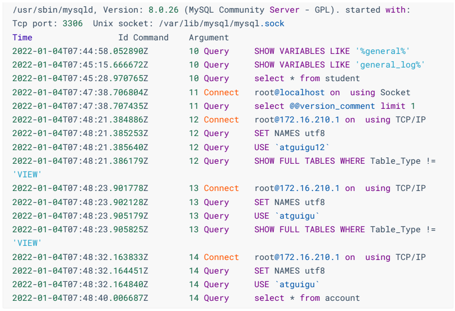
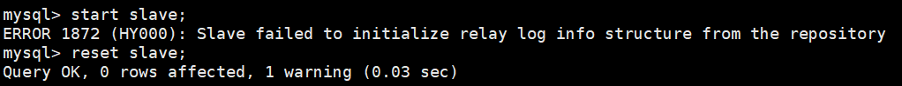

# MySQL_高级__日志与备份篇

> 讲师：尚硅谷-宋红康（江湖人称：康师傅）
>
> 尚硅谷官网：[http://www.atguigu.com](http://www.atguigu.com/)
>
> 视频链接：https://www.bilibili.com/video/BV1iq4y1u7vj?spm_id_from=333.337.search-card.all.click

------

## 十六、其它数据库日志

我们在讲解数据库事务时，讲过两种日志：重做日志、回滚日志。

对于线上数据库应用系统，突然遭遇`数据库宕机`怎么办？在这种情况下，`定位宕机的原因`就非常关键。我们可以查看数据库的`错误日志`。因为日志中记录了数据库运行中的诊断信息，包括了错误、警告和注释等信息。比如：从日志中发现某个连接中的SQL操作发生了死循环，导致内存不足，被系统强行终止了。明确了原因，处理起来也就轻松了，系统很快就恢复了运行。

除了发现错误，日志在数据复制、数据恢复、操作审计，以及确保数据的永久性和一致性等方面，都有着不可替代的作用。


**千万不要小看日志**。很多看似奇怪的问题，答案往往就藏在日志里。很多情况下，只有通过查看日志才能发现问题的原因，真正解决问题。所以，一定要学会查看日志，养成检查日志的习惯，对提升你的数据库应用开发能力至关重要。

MySQL8.0 官网日志地址：https://dev.mysql.com/doc/refman/8.0/en/server-logs.html

### 1 MySQL支持的日志

#### 1.1 日志类型

MySQL有不同类型的日志文件，用来存储不同类型的日志，分为`二进制日志`、`错误日志`、`通用查询日志`和`慢查询日志`，这也是常用的4种。MySQL 8又新增两种支持的日志：`中继日志`和`数据定义语句日志`。使用这些日志文件，可以查看MySQL内部发生的事情。

**这6类日志分别为**：

- **慢查询日志**：记录所有执行时间超过long_query_time的所有查询，方便我们对查询进行优化。
- **通用查询日志**：记录所有连接的起始时间和终止时间，以及连接发送给数据库服务器的所有指令，对我们复原操作的实际场景、发现问题，甚至是对数据库操作的审计都有很大的帮助。
- **错误日志**：记录MySQL服务的启动、运行或停止MySQL服务时出现的问题，方便我们了解服务器的状态，从而对服务器进行维护。
- **二进制日志**：记录所有更改数据的语句，可以用于主从服务器之间的数据同步，以及服务器遇到故障时数据的无损失恢复。
- **中继日志**：用于主从服务器架构中，从服务器用来存放主服务器二进制日志内容的一个中间文件。从服务器通过读取中继日志的内容，来同步主服务器上的操作。
- **数据定义语句日志**：记录数据定义语句执行的元数据操作。

除二进制日志外，其他日志都是`文本文件`。默认情况下，所有日志创建于`MySQL数据目录`中。


#### 1.2 日志的弊端

- 日志功能会`降低MySQL数据库的性能`。例如，在查询非常频繁的MysQL数据库系统中，如果开启了通用查询日志和慢查询日志，MySQL数据库会花费很多时间记录日志。
- 日志会`占用大量的磁盘空间`。对于用户量非常大、操作非常频繁的数据库，日志文件需要的存储空间设置比数据库文件需要的存储空间还要大。


### 2 慢查询日志(slow query log)

前面章节《八、性能分析工具的使用》已经详细讲述。


### 3 通用查询日志(general query log)

通用查询日志用来`记录用户的所有操作`，包括启动和关闭MySQL服务、所有用户的连接开始时间和截止时间、发给 MySQL 数据库服务器的所有 SQL 指令等。当我们的数据发生异常时，**查看通用查询日志，还原操作时的具体场景**，可以帮助我们准确定位问题。

#### 3.1 问题场景

在电商系统中，购买商品并且使用微信支付完成以后，却发现支付中心的记录并没有新增，此时用户再次使用支付宝支付，就会出现`重复支付`的问题。但是当去数据库中查询数据的时候，会发现只有一条记录存在。那么此时给到的现象就是只有一条支付记录，但是用户却支付了两次。

我们对系统进行了仔细检查，没有发现数据问题，因为用户编号和订单编号以及第三方流水号都是对的。可是用户确实支付了两次，这个时候，我们想到了检查通用查询日志，看看当天到底发生了什么。

查看之后，发现: 1月1日下午2点，用户使用微信支付完以后，但是由于网络故障，支付中心没有及时收到微信支付的回调通知，导致当时没有写入数据。1月1日下午2点30，用户又使用支付宝支付，此时记录更新到支付中心。1月1日晚上9点，微信的回调通知过来了，但是支付中心已经存在了支付宝的记录，所以只能覆盖记录了。

由于网络的原因导致了重复支付。至于解决问题的方案就很多了，这里省略。

可以看到通用查询日志可以帮助我们了解操作发生的具体时间和操作的细节，对找出异常发生的原因极其关键。


#### 3.2 查看当前状态


**说明1**：系统变量general_log的值是OFF，即通用查询日志处于关闭状态。在MySQL中，这个参数的`默认值是关闭的`。因为一旦开启记录通用查询日志，MySQL会记录所有的连接起止和相关的SQL操作，这样会消耗系统资源并且占用磁盘空间。我们可以通过手动修改变量的值，在`需要的时候开启日志`。

**说明2**：通用查询日志文件的名称是atguigu01.log。存储路径是/var/lib/mysq/，默认也是数据路径。这样我们就知道在哪里可以查看通用查询日志的内容了。


#### 3.3 启动日志

**方式1：永久性方式**

修改my.cnf或者my.ini配置文件来设置。在[mysqld]组下加入log选项，并重启MySQL服务。格式如下：

```ini
[mysqld]
general_log=ON
general_log_file=[path[filename]] #日志文件所在目录路径，filename为日志文件名
```

如果不指定目录和文件名，通用查询日志将默认存储在MySQL数据目录中的hostname.log文件中，hostname表示主机名。

**方式2：临时性方式**

```mysql
SET GLOBAL general_log=on; # 开启通用查询日志
```

```mysql
SET GLOBAL general_log_file=’path/filename’; # 设置日志文件保存位置
```

对应的，关闭操作SQL命令如下：

```mysql
SET GLOBAL general_log=off; # 关闭通用查询日志
```

查看设置后情况：

```mysql
SHOW VARIABLES LIKE 'general_log%';
```


#### 3.4 查看日志

通用查询日志是以`文本文件`的形式存储在文件系统中的，可以使用`文本编辑器`直接打开日志文件。每台MySQL服务器的通用查询日志内容是不同的。

- 在Windows操作系统中，使用文本文件查看器；
- 在Linux系统中，可以使用vi工具或者gedit工具查看；
- 在Mac OSX系统中，可以使用文本文件查看器或者vi等工具查看。

从`SHOW VARIABLES LIKE 'general_log%';`结果中可以看到通用查询日志的位置。

通过通用查询日志，可以了解用户对MySQL进行的操作。比如，MySQL启动信息和用户root连接服务器和执行查询表的记录。



在通用查询日志里面，我们可以清楚地看到，什么时候开启了新的客户端登陆数据库，登录之后做了什么 SQL 操作，针对的是哪个数据表等信息。


#### 3.5 停止日志

**方式1：永久性方式**

修改`my.cnf`或者`my.ini`文件，把[mysqld]组下的`general_log`值设置为`OFF`或者把general_log一项注释掉。修改保存后，再`重启MySQL服务`，即可生效。

**举例1**：

```ini
[mysqld]
general_log=OFF
```

**举例2**：

```ini
[mysqld]
# general_log=ON
```

**方式2：临时性方式**

使用SET语句停止MySQL通用查询日志功能：

```mysql
SET GLOBAL general_log=off;
```

查询通用日志功能：

```mysql
SHOW VARIABLES LIKE 'general_log%';
```


#### 3.6 删除\刷新日志

如果数据的使用非常频繁，那么通用查询日志会占用服务器非常大的磁盘空间。数据管理员可以删除很长时间之前的查询日志，以保证MySQL服务器上的硬盘空间。

**手动删除文件**

```mysql
SHOW VARIABLES LIKE 'general_log%';
```

可以看出，通用查询日志的目录默认为MySQL数据目录。在该目录下手动删除通用查询日志atguigu01.log。

使用如下命令重新生成查询日志文件，具体命令如下。刷新MySQL数据目录，发现创建了新的日志文件。前提一定要开启通用日志。

```bash
mysqladmin -uroot -p flush-logs
```


### 4 错误日志(error log)

错误日志记录了MySQL服务器启动、停止运行的时间，以及系统启动、运行和停止过程中的诊断信息，包括`错误`、`警告`和`提示`等。

通过错误日志可以查看系统的运行状态，便于即时发现故障、修复故障。如果MySQL服务`出现异常`，错误日志是发现问题、解决故障的`首选`。

#### 4.1 启动日志

在MySQL数据库中，错误日志功能是`默认开启`的。而且，错误日志`无法被禁止`。

默认情况下，错误日志存储在MySQL数据库的数据文件夹下，名称默认为`mysqld.log`（Linux系统）或`hostname.err`（mac系统）。如果需要制定文件名，则需要在my.cnf或者my.ini中做如下配置：

```ini
[mysqld]
log-error=[path/[filename]] #path为日志文件所在的目录路径，filename为日志文件名
```

修改配置项后，需要重启MySQL服务以生效。


#### 4.2 查看日志

MySQL错误日志是以文本文件形式存储的，可以使用文本编辑器直接查看。

查询错误日志的存储路径：


执行结果中可以看到错误日志文件是mysqld.log，位于MySQL默认的数据目录下。

下面我们查看一下错误日志的内容。


可以看到，错误日志文件中记录了服务器启动的时间，以及存储引擎InnoDB启动和停止的时间等。我们在做初始化时候生成的数据库初始密码也是记录在error.log中。


#### 4.3 删除\刷新日志

对于很久以前的错误日志，数据库管理员查看这些错误日志的可能性不大，可以将这些错误日志删除，以保证MySQL服务器上的`硬盘空间`。MySQL的错误日志是以文本文件的形式存储在文件系统中的，可以`直接删除`。

- 第一步（方式一）：删除操作

  ```bash
  rm -rf /var/log/mysqld.log
  ```

  在运行状态下删除错误日志文件后，MySQL并不会自动创建日志文件。

- 第一步（方式二）：重命名文件

  ```bash
  mv /var/log/mysqld.log /var/log/mysqld.log.old
  ```

- 第二步：重建日志

  ```bash
  mysqladmin -uroot -p flush-logs
  ```

  

  可能会报错：


官网提示：


补充操作：

```bash
install -omysql -gmysql -m0644 /dev/null /var/log/mysqld.log
```

`flush-logs`指令操作：

- MySQL 5.5.7以前的版本，flush-logs将错误日志文件重命名为filename.err_old，并创建新的日志文件。
- 从MySQL 5.5.7开始，flush-logs只是重新打开日志文件，并不做日志备份和创建的操作。
- 如果日志文件不存在，MySQL启动或者执行flush-logs时会自动创建新的日志文件。重新创建错误日志，大小为0字节。


#### 4.4 MySQL8.0新特性

MySQL8.0里对错误日志的改进。MySQL8.0的错误日志可以理解为一个全新的日志，在这个版本里，接受了来自社区的广泛批评意见，在这些意见和建议的基础上生成了新的日志。

下面这些是来自社区的意见:

- 默认情况下内容过于冗长
- 遗漏了有用的信息
- 难以过滤某些信息
- 没有标识错误信息的子系统源
- 没有错误代码，解析消息需要识别错误
- 引导消息可能会丢失
- 固定格式

针对这些意见，MySQL做了如下改变：

- 采用组件架构，通过不同的组件执行日志的写入和过滤功能
- 写入错误日志的全部信息都具有唯一的错误代码从10000开始
- 增加了一个新的消息分类《system》用于在错误日志中始终可见的非错误但服务器状态更改事件的消息
- 增加了额外的附加信息，例如关机时的版本信息，谁发起的关机等等
- 两种过滤方式，Internal和Dragnet
- 三种写入形式，经典、JSON和syseventlog

> 小结:
>
> 通常情况下，管理员不需要查看错误日志。但是，MySQL服务器发生异常时，管理员可以从错误日志中找到发生异常的时间、原因，然后根据这些信息来解决异常。


### 5 二进制日志(bin log)

binlog可以说是MySQL中比较`重要`的日志了，在日常开发及运维过程中，经常会遇到。

binlog即binary log，二进制日志文件，也叫作变更日志（update log）。它记录了数据库所有执行的`DDL`和`DML`等数据库更新事件的语句，但是不包含没有修改任何数据的语句（如数据查询语句select、show等）。

它以`事件形式`记录并保存在`二进制文件`中。通过这些信息，我们可以再现数据更新操作的全过程。

> 如果想要记录所有语句（例如，为了识别有问题的查询)，需要使用通用查询日志。

binlog主要应用场景：

- 一是用于`数据恢复`，如果MySQL数据库意外停止，可以通过二进制日志文件来查看用户执行了哪些操作，对数据库服务器文件做了哪些修改，然后根据二进制日志文件中的记录来恢复数据库服务器。
- 二是用于`数据复制`，由于日志的延续性和时效性，master把它的二进制日志传递给slaves来达到master-slave数据一致的目的。

可以说MySQL**数据库的数据备份、主备、主主、主从**都离不开binlog，需要依靠binlog来同步数据，保证数据一致性。


#### 5.1 查看默认情况

查看记录二进制日志是否开启：在MySQL8中默认情况下，二进制文件是开启的。


- `log_bin_basename`：是binlog日志的基本文件名，后面会追加标识来表示每一个文件
- `log_bin_index`：是binlog文件的索引文件，这个文件管理了所有的binlog文件的目录
- `log_bin_trust_function_creators`：限制存储过程，前面我们已经讲过了，这是因为二进制日志的一个重要功能是用于主从复制，而存储函数有可能导致主从的数据不一致。所以当开启二进制日志后，需要限制存储函数的创建、修改、调用
- `log_bin_use_v1_row_events`：此只读系统变量已弃用。ON表示使用版本1二进制日志行，OFF表示使用版本2二进制日志行(MySQL 5.6的默认值为2)。


#### 5.2 日志参数设置

**方式1：永久性方式**

修改MySQL的`my.cnf`或`my.ini`文件可以设置二进制日志的相关参数：

```ini
[mysqld]
#启用二进制日志
log-bin=atguigu-bin
binlog_expire_logs_seconds=600
max_binlog_size=100M
```

> 提示:
>
> 1. log-bin=mysql-bin #打开日志(主机需要打开)，这个mysql-bin也可以自定义，这里也可以加上路径，
>    如:/home/www/mysql_bin_log/mysql-bin
>
> 2. binlog_expire_logs_seconds：此参数控制二进制日志文件保留的时长，单位是`秒`，默认2592000 30天
>
>    -- 14400 4小时; 86400 1天; 259200 3天;
>
> 3. max_binlog_size：控制单个二进制日志大小，当前日志文件大小超过此变量时，执行切换动作。此参数的`最大和默认值是1GB`，该设置并`不能严格控制Binlog的大小`，尤其是Binlog比较靠近最大值而又遇到一个比较大事务时，为了保证事务的完整性，可能不做切换日志的动作只能将该事务的所有SQL都记录进当前日志，直到事务结束。一般情况下可采取默认值。

重新启动MySQL服务，查询二进制日志的信息，执行结果：


**设置带文件夹的bin-log日志存放目录**

如果想改变日志文件的目录和名称，可以对my.cnf或my.ini中的log_bin参数修改如下：

```ini
[mysqld]
log-bin="/var/lib/mysql/binlog/atguigu-bin"
```

注意：新建的文件夹需要使用mysql用户，使用下面的命令即可。

```bash
chown -R -v mysql:mysql binlog
```

> 提示：数据库文件最好不要与日志文件放在同一个磁盘上！这样，当数据库文件所在的磁盘发生故障时，可以使用日志文件恢复数据。


**方式2：临时性方式**

如果不希望通过修改配置文件并重启的方式设置二进制日志的话，还可以使用如下指令，需要注意的是在mysql8中只有`会话级别`的设置，没有了global级别的设置。

```mysql
# global 级别
mysql> set global sql_log_bin=0;
ERROR 1228 (HY000): Variable 'sql_log_bin' is a SESSION variable and can`t be used with SET GLOBAL

# session级别
mysql> SET sql_log_bin=0;
Query OK, 0 rows affected (0.01 秒)
```


#### 5.3 查看日志

当MySQL创建二进制日志文件时，先创建一个以“filename”为名称、以“.index”为后缀的文件，再创建一个以“filename”为名称、以“.000001”为后缀的文件。

MySQL服务`重新启动一次`，以“.000001”为后缀的文件就会增加一个，并且后缀名按1递增。即日志文件的个数与MySQL服务启动的次数相同；如果日志长度超过了`max_binlog_size`的上限（默认是1GB），就会创建一个新的日志文件。

查看当前的二进制日志文件列表及大小。指令如下：


所有对数据库的修改都会记录在binglog中。但binlog是二进制文件，无法直接查看，借助`mysqlbinlog`命令工具了。指令如下：在查看执行，先执行一条SQL语句，如下：

```mysql
update student set name='张三_back' where id=1;
```

```bash
mysqlbinlog  "/var/lib/mysql/lqhdb-binlog.000001"
```


执行结果可以看到，这是一个简单的日志文件，日志中记录了用户的一些操作，这里并没有出现具体的SQL语句，这是因为binlog关键字后面的内容是经过编码后的二进制日志。

这里一个update语句包含如下事件

- `Query`事件：负责开始一个事务(BEGIN)
- `Table_map`事件：负责映射需要的表
- `Update_rows`事件：负责写入数据
- `Xid`事件：负责结束事务


下面命令将行事件以`伪SQL的形式`表现出来


前面的命令同时显示binlog格式的语句，使用如下命令不显示它


关于mysqlbinlog工具的使用技巧还有很多，例如只解析对某个库的操作或者某个时间段内的操作等。简单分享几个常用的语句，更多操作可以参考官方文档。

```mysql
# 可查看参数帮助
mysqlbinlog --no-defaults --help

# 查看最后100行
mysqlbinlog --no-defaults --base64-output=decode-rows -vv atguigu-bin.000002 |tail -100

# 根据position查找
mysqlbinlog --no-defaults --base64-output=decode-rows -vv atguigu-bin.000002 |grep -A20 '4939002'
```

上面这种办法读取出binlog日志的全文内容比较多，不容易分辨查看到pos点信息，下面介绍一种更为方便的查询命令：

```mysql
show binlog events [IN 'log_name'] [FROM pos] [LIMIT [offset,] row_count];
```

- `IN 'log_name'`：指定要查询的binlog文件名（不指定就是第一个binlog文件）
- `FROM pos`：指定从哪个pos起始点开始查起（不指定就是从整个文件首个pos点开始算）
- `LIMIT [offset]`：偏移量(不指定就是0)
- `row_count`：查询总条数（不指定就是所有行）


上面我们讲了这么多都是基于binlog的默认格式，binlog格式查看


除此之外，binlog还有2种格式，分别是**Statement**和**Mixed**

- **Statement**：

  每一条会修改数据的sql都会记录在binlog中。

  优点：不需要记录每一行的变化，减少了binlog日志量，节约了IO，提高性能。

- **Row**：

  5.1.5版本的MySQL才开始支持row level的复制，它不记录sql语句上下文相关信息，仅保存哪条记录被修改。

  优点：row level的日志内容会非常清楚的记录下每一行数据修改的细节。而且不会出现某些特定情况下的存储过程，或function，以及trigger的调用和触发无法被正确复制的问题。

- **Mixed**：

  从5.1.8版本开始，MySQL提供了Mixed格式，实际上就是Statement与Row的结合。

  详细情况，下章讲解。


#### 5.4 使用日志恢复数据

如果MySQL服务器启用了二进制日志，在数据库出现意外丢失数据时，可以使用MySQLbinlog工具从指定的时间点开始(例如，最后一次备份)直到现在或另一个指定的时间点的日志中恢复数据。

mysqlbinlog恢复数据的语法如下：

```mysql
mysqlbinlog [option] filename|mysql –uuser -ppass;
```

这个命令可以这样理解：使用mysqlbinlog命令来读取filename中的内容，然后使用mysql命令将这些内容恢复到数据库中。

- `filename`：是日志文件名。
- `option`：可选项，比较重要的两对option参数是--start-date、--stop-date 和 --start-position、--stop-position。
  - `--start-date 和 --stop-date`：可以指定恢复数据库的起始时间点和结束时间点。
  - `--start-position和--stop-position`：可以指定恢复数据的开始位置和结束位置。

> 注意：使用mysqlbinlog命令进行恢复操作时，必须是编号小的先恢复，例如atguigu-bin.000001必须在atguigu-bin.000002之前恢复。


#### 5.5 删除二进制日志

MySQL的二进制文件可以配置自动删除，同时MySQL也提供了安全的手动删除二进制文件的方法。

`PURGE MASTER LOGS`只删除指定部分的二进制日志文件，`RESET MASTER`删除所有的二进制日志文件。具体如下：

**1、PURGE MASTER LOGS：删除指定日志文件**

PURGE MASTER LOGS语法如下：

```mysql
PURGE {MASTER | BINARY} LOGS TO ‘指定日志文件名’
PURGE {MASTER | BINARY} LOGS BEFORE ‘指定日期’
```

**举例**:

使用PURGE MASTER LOGS语句删除创建时间比binlog.000005早的所有日志

(1) 多次重新启动MysSQL服务，便于生成多个日志文件。然后用SHOW语句显示二进制日志文件列表

```mysql
SHOW BINARY LOGS;
```

(2）执行PURGE MASTER LOGS语句删除创建时间比binlog.000005早的所有日志

```mysql
PURGE MASTER LOGS T0 "binlog.000005";
```

(3）显示二进制日志文件列表

```mysql
SHGW BINARY LOGS;
```

比binlog.000005早的所有日志文件都已经被删除了。
。

**举例**:

使用PURGE MASTER LOGS语句删除2020年10月25号前创建的所有日志文件。具体步骤如下:

(1) 显示二进制日志文件列表

```mysql
SHOW BINARY LOGS;
```

(2）执行mysqlbinlog命令查看二进制日志文件binlog.000005的内容

```mysql
mysqlbinlog --no-defaults "/var/lib/mysql/binlog/atguigu-bin.000005"
```

结果可以看出20220105为日志创建的时间，即2022年1月05日。

(3）使用PURGE MASTER LOGS语句删除2022年1月05日前创建的所有日志文件

```mysql
PURGE MASTER LOGS before "20220105";
```

(4）显示二进制日志文件列表

```mysql
SHOW BINARY LOGS;
```

2022年01月05号之前的二进制日志文件都已经被删除，最后一个没有删除，是因为当前在用，还未记录最后的时间，所以未被删除。


**2、RESET MASTER:删除所有二进制日志文件**

使用`RESET MASTER`语句，清空所有的binlog日志。MySQL会重新创建二进制文件，新的日志文件扩展名将重新从00001开始编号。`慎用`！

```mysql
reset master;
```


#### 5.6 其它场景

二进制日志可以通过数据库的`全量备份`和二进制日志中保存的`增量信息`，完成数据库的`无损失恢复`。但是，如果遇到数据量大、数据库和数据表很多（比如分库分表的应用）的场景，用二进制日志进行数据恢复，是很有挑战性的，因为起止位置不容易管理。

在这种情况下，一个有效的解决办法是`配置主从数据库服务器`，甚至是`一主多从`的架构，把二进制日志文件的内容通过中继日志，同步到从数据库服务器中，这样就可以有效避免数据库故障导致的数据异常等问题。


### 6 再谈二进制日志(binlog)

#### 6.1 写入机制

binlog的写入时机也非常简单，事务执行过程中，先把日志写到`binlog cache`，事务提交的时候，再把binlog cache写到binlog文件中。因为一个事务的binlog不能被拆开，无论这个事务多大，也要确保一次性写入，所以系统会给每个线程分配一个块内存作为binlog cache。

我们可以通过`binlog_cache_size`参数控制单个线程binlog cache大，如果存储内容超过了这个参数，就要暂存到磁盘(Swap)。binlog日志刷盘流程如下：


> - 上图的write，是指把日志写入到文件系统的page cache，并没有把数据持久化到磁盘，所以速度比较快。
> - 上图的fsync，才是将数据持久化到磁盘的操作

write和fsync的时机，可以由参数`sync_binlog`控制，默认是`0`。为0的时候，表示每次提交事务都只write，由系统自行判断什么时候执行fsync。虽然性能得到提升，但是机器宕机，page cache里面的binglog会丢失。如下图：


为了安全起见，可以设置为`1`，表示每次提交事务都会执行fsync，就如同**redo log刷盘流程**一样。最后还有一种折中方式，可以设置为N(N>1)，表示每次提交事务都write，但累积N个事务后才fsync。


在出现IO瓶颈的场景里，将sync_binlog设置成一个比较大的值，可以提升性能。同样的，如果机器宕机，会丢失最近N个事务的binlog日志。


#### 6.2 binlog与redolog对比

- redo log它是`物理日志`，记录内容是“在某个数据页上做了什么修改”，属于 InnoDB 存储引擎层产生的。
- 而 binlog是`逻辑日志`，记录内容是语句的原始逻辑，类似于“给 ID=2 这一行的 c 字段加 1”，属于MySQL Server层。
- 虽然它们都属于持久化的保证，但是则重点不同。
  - redo log让InnoDB存储引擎拥有了崩溃恢复能力。
  - binlog保证了MySQL集群架构的数据一致性。


#### 6.3 两阶段提交

在执行更新语句过程，会记录redo log与binlog两块日志，以基本的事务为单位，redo log在事务执行过程中可以不断写入，而binlog只有在提交事务时才写入，所以redo log与binlog的`写入时机`不一样。


**redo log与binlog两份日志之间的逻辑不一致，会出现什么问题？**

以update语句为例，假设id=2的记录，字段c值是0，把字段c值更新成1，SQL语句为`update Tset c=1 where id=2`。

假设执行过程中写完redo log日志后，binlog日志写期间发生了异常，会出现什么情况呢?


由于binlog没写完就异常，这时候binlog里面没有对应的修改记录。因此之后用binlog日志恢复数据时，就会少这一次更新，恢复出来的这一行c值是0，而原库因为redo log日志恢复，这一行c值是1，最终数据不一致。


为了解决两份日志之间的逻辑一致问题，InnoDB存储引擎使用**两阶段提交**方案。原理很简单，将redo log的写入拆成了两个步骤prepare和commit，这就是**两阶段提交**。


使用**两阶段提交**后，写入binlog时发生异常也不会有影响，因为MySQL根据redo log日志恢复数据时，发现redolog还处于prepare阶段，并且没有对应binlog日志，就会回滚该事务。


另一个场景，redo log设置commit阶段发生异常，那会不会回滚事务呢？


并不会回滚事务，它会执行上图框住的逻辑，虽然redo log是处于prepare阶段，但是能通过事务id找到对应的binlog日志，所以MySQL认为是完整的，就会提交事务恢复数据。


### 7 中继日志(relay log)

#### 7.1 介绍

**中继日志只在主从服务器架构的从服务器上存在**。从服务器为了与主服务器保持一致，要从主服务器读取二进制日志的内容，并且把读取到的信息写入`本地的日志文件`中，这个从服务器本地的日志文件就叫`中继日志`。然后，从服务器读取中继日志，并根据中继日志的内容对从服务器的数据进行更新，完成主
从服务器的`数据同步`。

搭建好主从服务器之后，中继日志默认会保存在从服务器的数据目录下。

文件名的格式是：`从服务器名 -relay-bin.序号`。中继日志还有一个索引文件：`从服务器名 -relay-bin.index`，用来定位当前正在使用的中继日志。


#### 7.2 查看中继日志

中继日志与二进制日志的格式相同，可以用`mysqlbinlog`工具进行查看。下面是中继日志的一个片段：


这一段的意思是，主服务器（“server id 1”）对表 atguigu.test 进行了 2 步操作：

```
定位到表 atguigu.test 编号是 91 的记录，日志位置是 832；
删除编号是 91 的记录，日志位置是 872。
```


#### 7.3 恢复的典型错误

如果从服务器宕机，有的时候为了系统恢复，要重装操作系统，这样就可能会导致你的`服务器名称`与之前`不同`。而中继日志里是`包含从服务器名`的。在这种情况下，就可能导致你恢复从服务器的时候，无法从宕机前的中继日志里读取数据，以为是日志文件损坏了，其实是名称不对了。

解决的方法也很简单，把从服务器的名称改回之前的名称。

------

## 十七、主从复制

### 1 主从复制概述

#### 1.1 如何提升数据库并发能力

在实际工作中，我们常常将`Redis`作为缓存与`MySQL`配合来使用，当有请求的时候，首先会从缓存中进行查找，如果存在就直接取出。如果不存在再访问数据库，这样就`提升了读取的效率`，也减少了对后端数据库的`访问压力`。Redis的缓存架构是`高并发架构`中非常重要的一环。


此外，一般应用对数据库而言都是“`读多写少`”，也就说对数据库读取数据的压力比较大，有一个思路就是采用数据库集群的方案，做`主从架构`、进行`读写分离`，这样同样可以提升数据库的并发处理能力。但并不是所有的应用都需要对数据库进行主从架构的设置，毕竟设置架构本身是有成本的。

如果我们的目的在于提升数据库高并发访问的效率，那么首先考虑的是如何`优化SQL和索引`，这种方式简单有效；其次才是采用`缓存的策略`，比如使用 Redis将热点数据保存在内存数据库中，提升读取的效率；最后才是对数据库采用`主从架构`，进行读写分离。


1.2 主从复制的作用

主从同步设计不仅可以提高数据库的吞吐量，还有以下3个方面的作用。

**第1个作用：读写分离。**我们可以通过主从复制的方式来`同步数据`，然后通过读写分离提高数据库并发处理能力。


其中一个是Master主库，负责写入数据，我们称之为：写库。

其他都是Slave从库，负责读取数据，我们称之为：读库。

当主库进行更新的时候，会自动将数据复制到从库中，而我们在客户端读取数据的时候，会从从库进行读取。

面对“读多写少”的需求，采用读写分离的方式，可以实现`更高的并发访问`。同时，我们还能对从服务器进行`负载均衡`，让不同的读请求按照策略均匀地分发到不同的从服务器上，让`读取更加顺畅`。读取顺畅的另一个原因，就是`减少了锁表`的影响，比如我们让主库负责写，当主库出现写锁的时候，不会影响到从库进行SELECT的读取。

**第2个作用就是数据备份。**我们通过主从复制将主库上的数据复制到从库上，相当于一种`热备份机制`，也就是在主库正常运行的情况下进行的备份，不会影响到服务。

**第3个作用是具有高可用性。**数据备份实际上是一种冗余的机制，通过这种冗余的方式可以换取数据库的高可用性，也就是当服务器出现故障或宕机的情况下，可以切换到从服务器上，保证服务的正常运行。

关于高可用性的程度，我们可以用一个指标衡量，即正常可用时间/全年时间。比如要达到全年99.999%的时间都可用，就意味着系统在一年中的不可用时间不得超过`365 * 24 * 60 * (1 - 99.999%) = 5.256`分钟(含系统崩溃的时间、日常维护操作导致的停机时间等)，其他时间都需要保持可用的状态。

实际上，更高的高可用性，意味着需要付出更高的成本代价。在现实中我们需要结合业务需求和成本来进行选择。


### 2 主从复制的原理

`Slave`会从`Master`读取`binlog`来进行数据同步。

#### 2.1 原理剖析

**三个线程**

实际上主从同步的原理就是基于binlog进行数据同步的。在主从复制过程中，会基于`3个线程`来操作，一个主库线程，两个从库线程。


`二进制日志转储线程`（Binlog dump thread）是一个主库线程。当从库线程连接的时候，主库可以将二进制日志发送给从库，当主库读取事件（Event）的时候，会在 Binlog 上`加锁`，读取完成之后，再将锁释放掉。

`从库 I/O 线程`会连接到主库，向主库发送请求更新 Binlog。这时从库的 I/O 线程就可以读取到主库的二进制日志转储线程发送的 Binlog 更新部分，并且拷贝到本地的中继日志（Relay log）。

`从库 SQL 线程`会读取从库中的中继日志，并且执行日志中的事件，将从库中的数据与主库保持同步。


> 注意：
>
> 不是所有版本的MySQL都默认开启服务器的二进制日志。在进行主从同步的时候，我们需要先检查服务器是否已经开启了二进制日志。
>
> 除非特殊指定，默认情况下从服务器会执行所有主服务器中保存的事件。也可以通过配置，使从服务器执行特定的事件。

**复制三步骤**

步骤1：`Master`将写操作记录到二进制日志（`binlog`）。

步骤2：`Slave`将`Master`的binary log events拷贝到它的中继日志（`relay log`）；

步骤3：`Slave`重做中继日志中的事件，将改变应用到自己的数据库中。MySQL复制是异步的且串行化的，而且重启后从`接入点`开始复制。

**复制的问题**

复制的最大问题：`延时`


#### 2.2 复制的基本原则

- 每个`Slave`只有一个`Master`
- 每个`Slave`只能有一个唯一的服务器ID
- 每个`Master`可以有多个`Slave`


### 3 一主一从架构搭建

一台`主机`用于处理所有`写请求`，一台`从机`负责所有`读请求`，架构图如下：


#### 3.1 准备工作

1. 准备`2台`CentOS虚拟机
2. 每台虚拟机上需要安装好MySQL(可以是MySQL8.0)

说明：前面我们讲过如何克隆一台CentOS。大家可以在一台CentOS上安装好MySQL，进而通过克隆的方式复制出1台包含MySQL的虚拟机。

注意：克隆的方式需要修改新克隆出来主机的：1、`MAC地址` 2、`hostname` 3、`IP地址` 4、`UUID`。

此外，克隆的方式生成的虚拟机（包含MySQL Server），则克隆的虚拟机MySQL Server的UUID相同，必须修改，否则在有些场景会报错。比如：`show slave status\G`，报如下的错误：

```
Last_IO_Error: Fatal error: The slave I/O thread stops because master and slave have
equal MySQL server UUIDs; these UUIDs must be different for replication to work.
```

修改MySQL Server的UUID方式：

```bash
vim /var/lib/mysql/auto.cnf

systemctl restart mysqld
```


#### 3.2 主机配置文件

建议mysql版本一致且后台以服务运行，主从所有配置项都配置在`[mysqld]`节点下，且都是小写字母。

具体参数配置如下：

- 必选

  ```ini
  #[必须]主服务器唯一ID
  server-id=1
  #[必须]启用二进制日志,指名路径。比如：自己本地的路径/log/mysqlbin
  log-bin=atguigu-bin
  ```

- 可选

  ```ini
  #[可选] 0（默认）表示读写（主机），1表示只读（从机）
  read-only=0
  
  #设置日志文件保留的时长，单位是秒
  binlog_expire_logs_seconds=6000
  
  #控制单个二进制日志大小。此参数的最大和默认值是1GB
  max_binlog_size=200M
  
  #[可选]设置不要复制的数据库
  binlog-ignore-db=test
  
  #[可选]设置需要复制的数据库,默认全部记录。比如：binlog-do-db=atguigu_master_slave
  binlog-do-db=需要复制的主数据库名字
  
  #[可选]设置binlog格式
  binlog_format=STATEMENT
  ```

重启后台mysql服务，使配置生效。

> 注意：
>
> 先搭建完主从复制，再创建数据库。
>
> MySQL主从复制起始时，从机不继承主机数据。


**binlog格式设置**：

**格式1**：`STATEMENT模式`（基于SQL语句的复制(statement-based replication, SBR)）

```ini
binlog_format=STATEMENT
```

每一条会修改数据的sql语句会记录到binlog中。这是默认的binlog格式。

- SBR 的优点：
  - 历史悠久，技术成熟
  - 不需要记录每一行的变化，减少了binlog日志量，文件较小
  - binlog中包含了所有数据库更改信息，可以据此来审核数据库的安全等情况
  - binlog可以用于实时的还原，而不仅仅用于复制
  - 主从版本可以不一样，从服务器版本可以比主服务器版本高
- SBR 的缺点：
  - 不是所有的UPDATE语句都能被复制，尤其是包含不确定操作的时候
- 使用以下函数的语句也无法被复制：LOAD_FILE()、UUID()、USER()、FOUND_ROWS()、SYSDATE() (除非启动时启用了 --sysdate-is-now 选项)
  - INSERT ... SELECT 会产生比 RBR 更多的行级锁
  - 复制需要进行全表扫描(WHERE语句中没有使用到索引)的 UPDATE 时，需要比 RBR 请求更多的行级锁
  - 对于有 AUTO_INCREMENT 字段的 InnoDB表而言，INSERT 语句会阻塞其他 INSERT 语句
  - 对于一些复杂的语句，在从服务器上的耗资源情况会更严重，而 RBR 模式下，只会对那个发生变化的记录产生影响
  - 执行复杂语句如果出错的话，会消耗更多资源
  - 数据表必须几乎和主服务器保持一致才行，否则可能会导致复制出错


**格式2**：`ROW模式`（基于行的复制(row-based replication, RBR)）

```ini
binlog_format=ROW
```

5.1.5版本的MySQL才开始支持，不记录每条sql语句的上下文信息，仅记录哪条数据被修改了，修改成什么样了。

- RBR 的优点：
  - 任何情况都可以被复制，这对复制来说是最`安全可靠`的。（比如：不会出现某些特定情况下的存储过程、function、trigger的调用和触发无法被正确复制的问题）
  - 多数情况下，从服务器上的表如果有主键的话，复制就会快了很多
  - 复制以下几种语句时的行锁更少：INSERT ... SELECT、包含 AUTO_INCREMENT 字段的 INSERT、没有附带条件或者并没有修改很多记录的 UPDATE 或 DELETE 语句
  - 执行 INSERT，UPDATE，DELETE 语句时锁更少
  - 从服务器上采用`多线程`来执行复制成为可能
- RBR 的缺点：
  - binlog 大了很多
  - 复杂的回滚时 binlog 中会包含大量的数据
  - 主服务器上执行 UPDATE 语句时，所有发生变化的记录都会写到 binlog 中，而 SBR 只会写一次，这会导致频繁发生 binlog 的并发写问题
  - 无法从 binlog 中看到都复制了些什么语句


**格式3**：`MIXED模式`（混合模式复制(mixed-based replication, MBR)）

```ini
binlog_format=MIXED
```

从5.1.8版本开始，MySQL提供了Mixed格式，实际上就是Statement与Row的结合。

在Mixed模式下，一般的语句修改使用statment格式保存binlog。如一些函数，statement无法完成主从复制的操作，则采用row格式保存binlog。

MySQL会根据执行的每一条具体的sql语句来区分对待记录的日志形式，也就是在Statement和Row之间选择一种。


#### 3.3 从机配置文件

要求主从所有配置项都配置在`my.cnf`的`[mysqld]`栏位下，且都是小写字母。

- 必选

  ```ini
  #[必须]从服务器唯一ID
  server-id=2
  ```

- 可选

  ```mysql
  #[可选]启用中继日志
  relay-log=mysql-relay
  ```

重启后台mysql服务，使配置生效。

> 注意：主从机都关闭防火墙
>
> service iptables stop #CentOS 6
>
> systemctl stop firewalld.service #CentOS 7


#### 3.4 主机：建立账户并授权

```mysql
#在主机MySQL里执行授权主从复制的命令
GRANT REPLICATION SLAVE ON *.* TO 'slave1'@'从机器数据库IP' IDENTIFIED BY 'abc123';
#5.5,5.7
```

**注意：如果使用的是MySQL8，需要如下的方式建立账户，并授权slave**：

```mysql
CREATE USER 'slave1'@'%' IDENTIFIED BY '123456';

GRANT REPLICATION SLAVE ON *.* TO 'slave1'@'%';

#此语句必须执行。否则见下面。
ALTER USER 'slave1'@'%' IDENTIFIED WITH mysql_native_password BY '123456';

flush privileges;
```

> 注意：在从机执行show slave status\G时报错：
>
> Last_IO_Error: error connecting to master 'slave1@192.168.1.150:3306' - retry-time: 60 retries: 1 message: Authentication plugin 'caching_sha2_password' reported error: Authentication requires
> secure connection.

查询Master的状态，并记录下File和Position的值。

```mysql
show master status;
```


- 记录下File和Position的值


> 注意：执行完此步骤后**不要再操作主服务器MySQL**，防止主服务器状态值变化。


#### 3.5 从机：配置需要复制的主机

**步骤1**：从机上复制主机的命令

```mysql
CHANGE MASTER TO
MASTER_HOST='主机的IP地址',
MASTER_USER='主机用户名',
MASTER_PASSWORD='主机用户名的密码',
MASTER_LOG_FILE='mysql-bin.具体数字',
MASTER_LOG_POS=具体值;
```

**举例**：

```mysql
CHANGE MASTER TO
MASTER_HOST='192.168.1.150',
MASTER_USER='slave1',
MASTER_PASSWORD='123456',
MASTER_LOG_FILE='atguigu-bin.000007',
MASTER_LOG_POS=154;
```


**步骤2**：

```mysql
#启动slave同步
START SLAVE;
```


如果报错：



可以执行如下操作，删除之前的relay_log信息。然后重新执行 CHANGE MASTER TO ...语句即可。

```mysql
reset slave; #删除SLAVE数据库的relaylog日志文件，并重新启用新的relaylog文件
```

接着，查看同步状态：

```mysql
SHOW SLAVE STATUS\G;
```


> 上面两个参数都是Yes，则说明主从配置成功！

显式如下的情况，就是不正确的。可能错误的原因有：

1. 网络不通
2. 账户密码错误
3. 防火墙
4. mysql配置文件问题
5. 连接服务器时语法
6. 主服务器mysql权限


#### 3.6 测试

主机新建库、新建表、insert记录，从机复制：

```mysql
CREATE DATABASE atguigu_master_slave;

CREATE TABLE mytbl(id INT,NAME VARCHAR(16));

INSERT INTO mytbl VALUES(1, 'zhang3');

INSERT INTO mytbl VALUES(2,@@hostname);
```


#### 3.7 停止主从同步

- 停止主从同步命令：

  ```mysql
  stop slave;
  ```

- 如何重新配置主从

  如果停止从服务器复制功能，再使用需要重新配置主从。否则会报错如下：

  

  重新配置主从，需要在从机上执行：

  ```mysql
  stop slave;
  
  reset master; #删除Master中所有的binglog文件，并将日志索引文件清空，重新开始所有新的日志文件(慎用)
  ```


#### 3.8 后续

**搭建主从复制：双主双从**

一个主机m1用于处理所有写请求，它的从机s1和另一台主机m2还有它的从机s2负责所有读请求。当m1主机宕机后，m2主机负责写请求，m1、m2互为备机。结构图如下：


### 4 同步数据一致性问题

**主从同步的要求**：

- 读库和写库的数据一致(最终一致)；
- 写数据必须写到写库；
- 读数据必须到读库(不一定)；


#### 4.1 理解主从延迟问题

进行主从同步的内容是二进制日志，它是一个文件，在进行`网络传输`的过程中就一定会`存在主从延迟`（比如 500ms），这样就可能造成用户在从库上读取的数据不是最新的数据，也就是主从同步中的`数据不一致性`问题。

**举例**：导致主从延迟的时间点主要包括以下三个:

1. 主库A执行完成一个事务，写入binlog，我们把这个时刻记为T1；
2. 之后传给从库B，我们把从库B接收完这个binlog的时刻记为T2；
3. 从库B执行完成这个事务，我们把这个时刻记为T3。


#### 4.2 主从延迟问题原因

在网络正常的时候，日志从主库传给从库所需的时间是很短的，即T2-T1的值是非常小的。即，网络正常情况下，主备延迟的主要来源是备库接收完binlog和执行完这个事务之间的时间差。

**主备延迟最直接的表现是，从库消费中继日志（relay log）的速度，比主库生产binlog的速度要慢**。造成原因：

1. 从库的机器性能比主库要差
2. 从库的压力大
3. 大事务的执行

**举例1**：一次性用delete语句删除太多数据

结论：后续再删除数据的时候，要控制每个事务删除的数据量，分成多次删除。

**举例2**：一次性用insert...select插入太多数据

**举例3**：大表DDL

比如在主库对一张500W的表添加一个字段耗费了10分钟，那么从节点上也会耗费10分钟。


#### 4.3 如何减少主从延迟

若想要减少主从延迟的时间，可以采取下面的办法：

1. 降低多线程大事务并发的概率，优化业务逻辑
2. 优化SQL，避免慢SQL，`减少批量操作`，建议写脚本以update-sleep这样的形式完成。
3. `提高从库机器的配置`，减少主库写binlog和从库读binlog的效率差。
4. 尽量采用`短的链路`，也就是主库和从库服务器的距离尽量要短，提升端口带宽，减少binlog传输的网络延时。
5. 实时性要求的业务读强制走主库，从库只做灾备，备份。


#### 4.4 如何解决一致性问题

如果操作的数据存储在同一个数据库中，那么对数据进行更新的时候，可以对记录加写锁，这样在读取的时候就不会发生数据不一致的情况。但这时从库的作用就是`备份`，并没有起到`读写分离`，分担主库`读压力`的作用。


读写分离情况下，解决主从同步中数据不一致的问题，就是解决主从之间`数据复制方式`的问题，如果按照数据一致性`从弱到强`来进行划分，有以下3种复制方式。

**方法1：异步复制**

异步模式就是客户端提交 COMMIT 之后不需要等从库返回任何结果，而是直接将结果返回给客户端，这样做的好处是不会影响主库写的效率，但可能会存在主库宕机，而Binlog还没有同步到从库的情况，也就是此时的主库和从库数据不一致。这时候从从库中选择一个作为新主，那么新主则可能缺少原来主服务器中已提交的事务。所以，这种复制模式下的数据一致性是最弱的。


**方法2：半同步复制**

MySQL5.5版本之后开始支持半同步复制的方式。原理是在客户端提交 COMMIT 之后不直接将结果返回给客户端，而是等待至少有一个从库接收到了Binlog，并且写入到中继日志中，再返回给客户端。

这样做的好处就是提高了数据的一致性，当然相比于异步复制来说，至少多增加了一个网络连接的延迟，降低了主库写的效率。

在MySQL5.7版本中还增加了一个`rpl_semi_sync_master_wait_for_slave_count`参数，可以对应答的从库数量进行设置，默认为1，也就是说只要有1个从库进行了响应，就可以返回给客户端。如果将这个参数调大，可以提升数据一致性的强度，但也会增加主库等待从库响应的时间。


**方法3：组复制**

异步复制和半同步复制都无法最终保证数据的一致性问题，半同步复制是通过判断从库响应的个数来决定是否返回给客户端，虽然数据一致性相比于异步复制有提升，但仍然无法满足对数据一致性要求高的场景，比如金融领域。MGR很好地弥补了这两种复制模式的不足。

组复制技术，简称MGR（MySQL Group Replication）。是 MySQL 在 5.7.17 版本中推出的一种新的数据复制技术，这种复制技术是基于 Paxos 协议的状态机复制。

**MGR 是如何工作的**

首先我们将多个节点共同组成一个复制组，在`执行读写（RW）事务`的时候，需要通过一致性协议层（Consensus 层）的同意，也就是读写事务想要进行提交，必须要经过组里“大多数人”（对应 Node 节点）的同意，大多数指的是同意的节点数量需要大于（N/2+1），这样才可以进行提交，而不是原发起方一个说了算。而针对`只读（RO）事务`则不需要经过组内同意，直接 COMMIT 即可。

在一个复制组内有多个节点组成，它们各自维护了自己的数据副本，并且在一致性协议层实现了原子消息和全局有序消息，从而保证组内数据的一致性。


MGR 将 MySQL 带入了数据强一致性的时代，是一个划时代的创新，其中一个重要的原因就是MGR是基于 Paxos 协议的。Paxos 算法是由 2013 年的图灵奖获得者 Leslie Lamport 于 1990 年提出的，有关这个算法的决策机制可以搜一下。事实上，Paxos 算法提出来之后就作为`分布式一致性算法`被广泛应用，比如
Apache 的 ZooKeeper 也是基于 Paxos 实现的。


### 5 知识延伸

在主从架构的配置中，如果想要采取读写分离的策略，我们可以`自己编写程序`，也可以通过`第三方的中间件`来实现。

- 自己编写程序的好处就在于比较自主，我们可以自己判断哪些查询在从库上来执行，针对实时性要求高的需求，我们还可以考虑哪些查询可以在主库上执行。同时，程序直接连接数据库，减少了中间件层，相当于减少了性能损耗。

- 采用中间件的方法有很明显的优势，`功能强大，使用简单`。但因为在客户端和数据库之间增加了中间件层会有一些`性能损耗`，同时商业中间件也是有使用成本的。我们也可以考虑采取一些优秀的开源工具。

  

  1. `Cobar`属于阿里B2B事业群，始于2008年，在阿里服役3年多，接管3000+个MySQL数据库的schema，集群日处理在线SQL请求50亿次以上。由于Cobar发起人的离职，Cobar停止维护。
  2. `Mycat`是开源社区在阿里cobar基础上进行二次开发，解决了cobar存在的问题，并且加入了许多新的功能在其中。青出于蓝而胜于蓝。
  3. `OneProxy`基于MySQL官方的proxy思想利用c语言进行开发的，OneProxy是一款商业`收费`的中间件。舍弃了一些功能，专注在`性能和稳定性上`。
  4. `kingshard`由小团队用go语言开发，还需要发展，需要不断完善。
  5. `Vitess`是Youtube生产在使用，架构很复杂。不支持MySQL原生协议，使用`需要大量改造成本`。
  6. `Atlas`是360团队基于mysql proxy改写，功能还需完善，高并发下不稳定。
  7. `MaxScale`是mariadb（MySQL原作者维护的一个版本）研发的中间件
  8. `MySQLRoute`是MySQL官方Oracle公司发布的中间件


主备切换：


- 主动切换
- 被动切换
- 如何判断主库出问题了？如何解决过程中的数据不一致性问题？

------

## 十八、数据库备份与恢复


