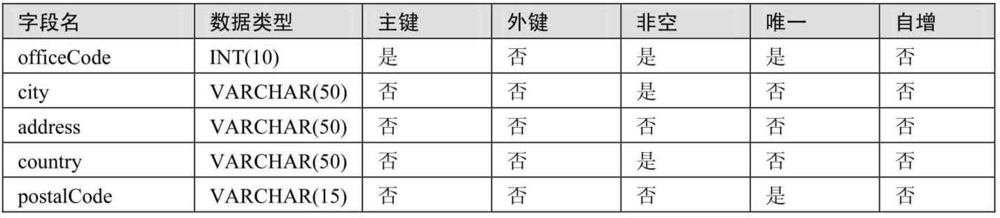
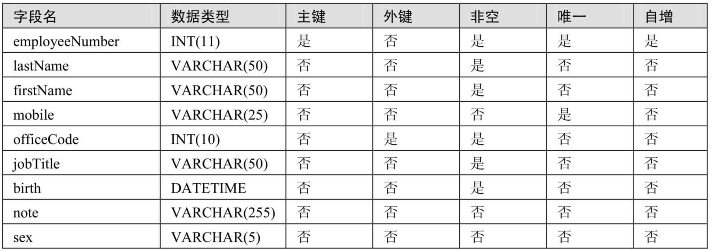
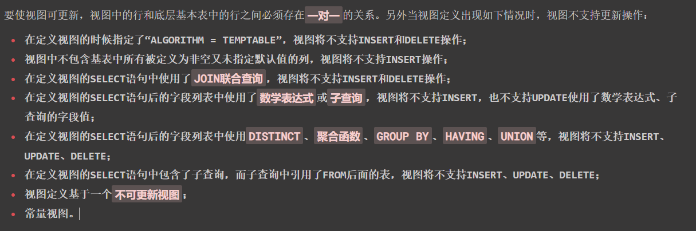
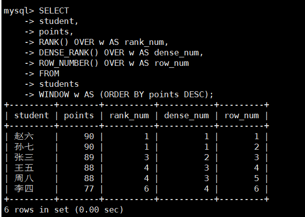

# MySQL_章节练习篇

> 讲师：尚硅谷-宋红康（江湖人称：康师傅）
>
> 尚硅谷官网：[http://www.atguigu.com](http://www.atguigu.com/)
>
> 视频链接：https://www.bilibili.com/video/BV1iq4y1u7vj?spm_id_from=333.337.search-card.all.click

------

## 第00章、MySQL环境搭建

**1.安装好MySQL之后在windows系统中哪些位置能看到MySQL?**

- MySQL DBMS软件的安装位置。 D:\develop_tools\MySQL\MySQL Server 8.0
- MySQL 数据库文件的存放位置。 C:\ProgramData\MySQL\MySQL Server 8.0\Data
- MySQL DBMS 的配置文件。 C:\ProgramData\MySQL\MySQL Server 8.0\my.ini
- MySQL的服务（要想通过客户端能够访问MySQL的服务器，必须保证服务是开启状态的）
- MySQL的path环境变量

**2.卸载MySQL主要卸载哪几个位置的内容？**

- 使用控制面板的软件卸载，去卸载MySQL DBMS软件的安装位置。

  D:\develop_tools\MySQL\MySQL Server 8.0

- 手动删除数据库文件。 C:\ProgramData\MySQL\MySQL Server 8.0\Data
- MySQL的环境变量
- MySQL的服务进入注册表删除。（ **regedit** ）
- 务必重启电脑

**3.能够独立完成MySQL8.0、MySQL5.7版本的下载、安装、配置 （掌握）**

**4.MySQL5.7在配置完以后，如何修改配置文件？**

- 为什么要修改my.ini文件？ 默认的数据库使用的字符集是latin1。我们需要修改为：utf8

- 修改哪些信息？

  ```ini
  [mysql] #大概在63行左右，在其下添加
  ...
  default-character-set=utf8 #默认字符集
  [mysqld] # 大概在76行左右，在其下添加
  ...
  character-set-server=utf8
  collation-server=utf8_general_ci
  ```

  修改完以后，需要重启服务。

  ```shell
  net stop mysql服务名;
  net start mysql服务名;
  ```


**5.熟悉常用的数据库管理和操作的工具**

- 方式1：windows自带的cmd
- 方式2：mysql数据库自带的命令行窗口
- 方式3：图形化管理工具：Navicat、SQLyog、dbeaver等。

------

## 第01章、数据库概述

**1.说说你了解的常见的数据库**

Oracle、MySQl、SQL Server、DB2、PGSQL；Redis、MongoDB、ES.....

**2.谈谈你对MySQL历史、特点的理解**

- 历史：
  - 由瑞典的MySQL AB 公司创立，1995开发出的MySQL
  - 2008年，MySQL被SUN公司收购
  - 2009年，Oracle收购SUN公司，进而Oracle就获取了MySQL
  - 2016年，MySQL8.0.0版本推出

- 特点：
  - 开源的、关系型的数据库
  - 支持千万级别数据量的存储，大型的数据库

**3.说说你对DB、DBMS、SQL的理解**

DB：database，看做是数据库文件。 （类似于：.doc、.txt、.mp3、.avi、。。。）

DBMS：数据库管理系统。（类似于word工具、wps工具、记事本工具、qq影音播放器等）

MySQL数据库服务器中安装了MySQL DBMS,使用MySQL DBMS 来管理和操作DB，使用的是SQL语言。

**4.你知道哪些非关系型数据库的类型呢？（了解）**

- 键值型数据库：Redis
- 文档型数据库：MongoDB
- 搜索引擎数据库：ES、Solr
- 列式数据库：HBase
- 图形数据库：InfoGrid

**5.表与表的记录之间存在哪些关联关**

- ORM思想。（了解）
- 表与表的记录之间的关系：一对一关系、一对多关系、多对多关系、自关联 （了解）

------

## 第02章、基本的SELECT语句

```sql
# 1.查询员工12个月的工资（基本加奖金）总和，并起别名为ANNUAL SALARY
SELECT 
	employee_id, 
	last_name,
	salary * (1 + IFNULL(commission_pct, 0)) * 12 AS "ANNUAL SALARY"
FROM 
	employees;

# 2.查询employees表中去除重复的job_id以后的数据
SELECT 
	DISTINCT job_id 
FROM 
	employees;

# 3.查询工资大于12000的员工姓名和工资
SELECT 
	last_name, 
	salary
FROM 
	employees
WHERE 
	salary > 12000;

# 4.查询员工号为176的员工的姓名和部门号
SELECT 
	last_name, 
	department_id
FROM 
	employees
WHERE 
	employee_id = 176;

# 5.显示表 departments 的结构，并查询其中的全部数据
DESCRIBE departments;

SELECT * FROM departments;
```

------

## 第03章、运算符

```mysql
# 1.选择工资不在5000到12000的员工的姓名和工资
SELECT 
	last_name,
	salary 
FROM 
	employees
WHERE 
	salary NOT BETWEEN 5000 AND 12000;
	# salary < 5000 OR salary > 12000;

# 2.选择在20或50号部门工作的员工姓名和部门号
SELECT 
	last_name,
	department_id 
FROM 
	employees
WHERE 
	department_id IN(20,50);
	# department_id = 20 OR department_id = 50;

# 3.选择公司中没有管理者的员工姓名及job_id
SELECT 
	last_name,
	job_id 
FROM 
	employees
WHERE 
	manager_id is NULL;
	# manager_id <=> NULL;

# 4.选择公司中有奖金的员工姓名，工资和奖金级别
SELECT 
	last_name,
	salary,
	commission_pct 
FROM 
	employees
WHERE 
	commission_pct IS NOT NULL;

# 5.选择员工姓名的第三个字母是a的员工姓名
SELECT 
	last_name
FROM 
	employees
WHERE 
	last_name LIKE '__a%';

# 6.选择姓名中有字母a和k的员工姓名
SELECT 
	last_name
FROM 
	employees
WHERE 
	last_name LIKE '%a%' AND last_name LIKE '%k%';
	# last_name LIKE '%a%k%' OR last_name LIKE '%k%a%';

# 7.显示出表 employees 表中 first_name 以 'e'结尾的员工信息
SELECT 
	employee_id,
	first_name,
	last_name
FROM 
	employees
WHERE 
	first_name LIKE '%e';
	# first_name REGEXP 'e$';

# 8.显示出表 employees 部门编号在 80-100 之间的姓名、工种
SELECT 
	last_name,
	job_id 
FROM 
	employees 
WHERE 
	department_id BETWEEN 80 AND 100;

# 9.显示出表 employees 的 manager_id 是 100,101,110 的员工姓名、工资、管理者id
SELECT 
	last_name,
	salary,
	manager_id
FROM 
	employees
WHERE 
	manager_id IN(100,101,110);
```

------

## 第04章、排序与分页

```mysql
# 1. 查询员工的姓名和部门号和年薪，按年薪降序，按姓名升序显示
SELECT 
	last_name,
	department_id,
	salary * 12 annualSalary 
FROM 
	employees
ORDER BY 
	annualSalary DESC,
	last_name ASC;

# 2. 选择工资不在 8000 到 17000 的员工的姓名和工资，按工资降序，显示第21到40位置的数据
SELECT 
	last_name,
	salary
FROM 
	employees
WHERE 
	salary NOT BETWEEN 8000 AND 17000
ORDER BY 
	salary DESC
LIMIT 
	20,20;

# 3. 查询邮箱中包含 e 的员工信息，并先按邮箱的字节数降序，再按部门号升序
SELECT
	last_name,
	email,
	department_id
FROM 
	employees
WHERE 
	email LIKE '%e%'
	# email REGEXP '[e]'
ORDER BY 
	LENGTH(email) DESC, 
	department_id ASC;
```

------

## 第05章、多表查询

多表查询-1

```mysql
# 1.显示所有员工的姓名，部门号和部门名称。
SELECT 
	e.last_name, d.department_id, d.department_name
FROM 
	employees e
LEFT JOIN 
	departments d
ON 
	e.department_id = d.department_id;

# 2.查询90号部门员工的job_id和90号部门的location_id
SELECT 
	e.job_id, d.location_id
FROM 
	employees e
JOIN 
	departments d
ON 
	e.department_id = d.department_id
WHERE 
	e.department_id = 90;

# 3.选择所有有奖金的员工的 last_name , department_name , location_id , city
SELECT e.last_name, d.department_name, l.location_id, l.city
FROM employees e
LEFT JOIN departments d ON e.department_id = d.department_id
LEFT JOIN locations l ON d.location_id = l.location_id
WHERE commission_pct IS NOT NULL;

# 4.选择city在Toronto工作的员工的 last_name , job_id , department_id , department_name
SELECT e.last_name, e.job_id, d.department_id, d.department_name
FROM employees e
JOIN departments d on e.department_id = d.department_id
JOIN locations l ON d.location_id = l.location_id
WHERE l.city = "Toronto";

# 5.查询员工所在的部门名称、部门地址、姓名、工作、工资，其中员工所在部门的部门名称为’Executive’
SELECT d.department_name, l.street_address, e.last_name, e.job_id, e.salary
FROM employees e
JOIN departments d on e.department_id = d.department_id
JOIN locations l ON d.location_id = l.location_id
WHERE d.department_name = "Executive";

# 6.选择指定员工的姓名，员工号，以及他的管理者的姓名和员工号，结果类似于下面的格式
/*
employees Emp# manager Mgr#
kochhar   101  king    100
*/
SELECT 
	worker.last_name "employees",
	worker.employee_id "Emp#",
	manager.last_name "manager",
	manager.employee_id "Mgr#"
FROM 
	employees worker
LEFT JOIN 
	employees manager 
ON 
	worker.manager_id = manager.employee_id;

# 7.查询哪些部门没有员工
# 方式1
SELECT 
	d.department_id, d.department_name
FROM 
	employees e
RIGHT JOIN 
	departments d
on 
	e.department_id = d.department_id
WHERE 
	e.department_id IS NULL;
# 方式2
SELECT 
	d.department_id, d.department_name
FROM 
	departments d
WHERE NOT EXISTS(
	SELECT * FROM employees e
	WHERE d.department_id = e.department_id
);

# 8. 查询哪个城市没有部门
SELECT 
	l.location_id, l.city
FROM 
	departments d
RIGHT JOIN 
	locations l
ON 
	d.location_id = l.location_id
WHERE 
	d.location_id IS NULL;

# 9. 查询部门名为 Sales 或 IT 的员工信息
SELECT 
	e.employee_id, e.last_name, e.salary, d.department_name
FROM 
	employees e
JOIN 
	departments d
ON 
	e.department_id = d.department_id
WHERE 
	d.department_name IN("Sales", "IT");
```

多表查询-2

```mysql
储备：建表操作：
CREATE TABLE `t_dept` (
`id` INT(11) NOT NULL AUTO_INCREMENT,
`deptName` VARCHAR(30) DEFAULT NULL,
`address` VARCHAR(40) DEFAULT NULL,
PRIMARY KEY (`id`)
) ENGINE=INNODB AUTO_INCREMENT=1 DEFAULT CHARSET=utf8;

CREATE TABLE `t_emp` (
`id` INT(11) NOT NULL AUTO_INCREMENT,
`name` VARCHAR(20) DEFAULT NULL,
`age` INT(3) DEFAULT NULL,
`deptId` INT(11) DEFAULT NULL,
empno int not null,
PRIMARY KEY (`id`),
KEY `idx_dept_id` (`deptId`)
#CONSTRAINT `fk_dept_id` FOREIGN KEY (`deptId`) REFERENCES `t_dept` (`id`)
) ENGINE=INNODB AUTO_INCREMENT=1 DEFAULT CHARSET=utf8;

INSERT INTO t_dept(deptName,address) VALUES('华山','华山');
INSERT INTO t_dept(deptName,address) VALUES('丐帮','洛阳');
INSERT INTO t_dept(deptName,address) VALUES('峨眉','峨眉山');
INSERT INTO t_dept(deptName,address) VALUES('武当','武当山');
INSERT INTO t_dept(deptName,address) VALUES('明教','光明顶');
INSERT INTO t_dept(deptName,address) VALUES('少林','少林寺');
INSERT INTO t_emp(NAME,age,deptId,empno) VALUES('风清扬',90,1,100001);
INSERT INTO t_emp(NAME,age,deptId,empno) VALUES('岳不群',50,1,100002);
INSERT INTO t_emp(NAME,age,deptId,empno) VALUES('令狐冲',24,1,100003);
INSERT INTO t_emp(NAME,age,deptId,empno) VALUES('洪七公',70,2,100004);
INSERT INTO t_emp(NAME,age,deptId,empno) VALUES('乔峰',35,2,100005);
INSERT INTO t_emp(NAME,age,deptId,empno) VALUES('灭绝师太',70,3,100006);
INSERT INTO t_emp(NAME,age,deptId,empno) VALUES('周芷若',20,3,100007);
INSERT INTO t_emp(NAME,age,deptId,empno) VALUES('张三丰',100,4,100008);
INSERT INTO t_emp(NAME,age,deptId,empno) VALUES('张无忌',25,5,100009);
INSERT INTO t_emp(NAME,age,deptId,empno) VALUES('韦小宝',18,null,100010);
```

```mysql
#1.所有有门派的人员信息 （ A、B两表共有）
SELECT 
	*  
FROM 
	t_emp e 
INNER JOIN 
	t_dept d 
ON 
	e.deptId = d.id;

#2.列出所有用户，并显示其机构信息（A的全集）
SELECT e.`name`, d.deptName 
FROM t_emp e
LEFT JOIN t_dept d
ON e.deptId = d.id;

#3.列出所有门派（B的全集）
SELECT * from 

#4.所有不入门派的人员（A的独有）
SELECT *
FROM t_emp e
LEFT JOIN t_dept d
ON e.deptId = d.id
WHERE d.id IS NULL;

#5.所有没人入的门派（B的独有）
SELECT *
FROM t_emp e
RIGHT JOIN t_dept d
ON e.deptId = d.id
WHERE e.deptId IS NULL;

#6.列出所有人员和机构的对照关系 (AB全有)
#MySQL Full Join的实现 因为MySQL不支持FULL JOIN,下面是替代方法
# left join + union(可去除重复数据)+ right join
SELECT *
FROM t_emp e LEFT JOIN t_dept d
ON e.deptId = d.id

UNION

SELECT *
FROM t_emp e RIGHT JOIN t_dept d
ON e.deptId = d.id；

#7.列出所有没入派的人员和没人入的门派（A的独有+B的独有）
SELECT *
FROM t_emp e
LEFT JOIN t_dept d
ON e.deptId = d.id
WHERE d.id IS NULL;

UNION ALL

SELECT *
FROM t_emp e
RIGHT JOIN t_dept d
ON e.deptId = d.id
WHERE e.deptId IS NULL;
```

------

## 第06章、单行函数

```mysql
# 1.显示系统时间(注：日期+时间)
SELECT NOW() FROM DUAL;
SELECT SYSDATE() FROM DUAL;

# 2.查询员工号，姓名，工资，以及工资提高百分之20%后的结果（new salary）
SELECT 
	employee_id,
	last_name,
	salary,
	salary*(1+0.2) "new salary"
FROM 
	employees;

# 3.将员工的姓名按首字母排序，并写出姓名的长度（length）
SELECT 
	last_name, 
	LENGTH(last_name)
FROM 
	employees 
ORDER BY 
	last_name ASC;

# 4.查询员工id,last_name,salary，并作为一个列输出，别名为OUT_PUT
SELECT 
	CONCAT(employee_id,",",last_name,",",salary) "OUT_PUT"
FROM 
	employees;

# 5.查询公司各员工工作的年数、工作的天数，并按工作年数的降序排序
SELECT 
	YEAR(NOW()) - YEAR(hire_date)  "工作年数",
	DATEDIFF(NOW(), hire_date) "工作天数"
FROM 
	employees
ORDER BY
	"工作年数" DESC;

# 6.查询员工姓名，hire_date , department_id，满足以下条件：雇用时间在1997年之后，department_id为80 或 90 或110, commission_pct不为空
SELECT 
	last_name, hire_date, department_id
FROM 
	employees
WHERE 
	YEAR(hire_date) >= 1997 
AND
	department_id IN(80, 90, 110)
AND
	commission_pct IS NOT NULL;

# 7.查询公司中入职超过10000天的员工姓名、入职时间
SELECT 
	last_name, hire_date
FROM 
	employees
WHERE
	DATEDIFF(NOW(), hire_date) > 10000;
```

```mysql
# 8.做一个查询，产生下面的结果
# <last_name> earns <salary> monthly but wants <salary*3>
SELECT 
	CONCAT(last_name," earns ",TRUNCATE(salary, 0)," monthly but wants ",TRUNCATE(salary*3, 0)) "Dream Salary"
FROM 
	employees;
```


```mysql
# 9.使用case-when，按照下面的条件：
/*
job         grade
AD_PRES     A
ST_MAN      B
IT_PROG     C
SA_REP      D
ST_CLERK    E
其余的均为F
*/
SELECT 
	last_name "Last_name",
	job_id "Job_id",
	CASE job_id
		WHEN 'AD_PRES' THEN 'A'
		WHEN 'ST_MAN' THEN 'B'
		WHEN 'IT_PROG' THEN 'C'
		WHEN 'SA_REP' THEN 'D'
		WHEN 'ST_CLERK' THEN 'E'
		ELSE 'F' END "Grade"
FROM
	employees;
```


------

## 第07章、聚合函数

```mysql
# 1.where子句可否使用组函数进行过滤?
NO

# 2.查询公司员工工资的最大值，最小值，平均值，总和
SELECT 
	MAX(salary), MIN(salary), AVG(salary), SUM(salary)
FROM 
	employees;

# 3.查询各job_id的员工工资的最大值，最小值，平均值，总和
SELECT 
	job_id, MAX(salary), MIN(salary), AVG(salary), SUM(salary)
FROM 
	employees
GROUP BY
	job_id;

# 4.选择具有各个job_id的员工人数
SELECT 
	job_id, COUNT(*)
FROM 
	employees
GROUP BY
	job_id;

# 5.查询员工最高工资和最低工资的差距（DIFFERENCE）
SELECT 
	MAX(salary), MIN(salary), MAX(salary) - MIN(salary) "DIFFERENCE"
FROM 
	employees;

# 6.查询各个管理者手下员工的最低工资，其中最低工资不能低于6000，没有管理者的员工不计算在内
SELECT 
	manager_id, MIN(salary)
FROM 
	employees
WHERE
	manager_id IS NOT NULL
GROUP BY 
	manager_id
HAVING
	MIN(salary) >= 6000;

# 7.查询所有部门的名字，location_id，员工数量和平均工资，并按平均工资降序
SELECT 
	d.department_name "部门名字",
	d.location_id "loc_id",
	COUNT(e.employee_id) "员工数量",
	AVG(e.salary) "平均工资"
FROM 
	employees e 
RIGHT JOIN 
	departments d 
ON 
	e.department_id = d.department_id
GROUP BY 
	d.department_name,
	d.location_id
ORDER BY
	AVG(e.salary) DESC;

# 8.查询每个工种、每个部门的部门名、工种名和最低工资
SELECT 
	department_name,
	job_id,
	MIN(salary)
FROM 
	departments d 
LEFT JOIN 
	employees e
ON 
	e.department_id = d.department_id
GROUP BY 
	department_name,
	job_id;
```

------

## 第08章、子查询

```mysql
#1.查询和Zlotkey相同部门的员工姓名和工资
SELECT 
	last_name, salary
from 
	employees
WHERE 
	department_id IN 
		(SELECT department_id FROM employees WHERE last_name = "Zlotkey");

#2.查询工资比公司平均工资高的员工的员工号，姓名和工资。
SELECT 
	employee_id, last_name, salary
FROM 
	employees
WHERE 
	salary > 
		(SELECT AVG(salary) FROM employees);

#3.选择工资大于所有JOB_ID = 'SA_MAN'的员工的工资的员工的last_name, job_id, salary
SELECT 
	last_name, job_id, salary
FROM 
	employees
WHERE 
	salary > ALL 
		(SELECT salary FROM employees WHERE job_id = 'SA_MAN');

#4.查询和姓名中包含字母u的员工在相同部门的员工的员工号和姓名
SELECT 
	employee_id, last_name
FROM 
	employees
WHERE 
	department_id IN
		(SELECT DISTINCT department_id FROM employees WHERE last_name LIKE '%u%');

#5.查询在部门的location_id为1700的部门工作的员工的员工号
SELECT 
	employee_id
FROM 
	employees
WHERE 
	department_id IN
		(SELECT department_id FROM departments WHERE location_id = 1700);

#6.查询管理者是King的员工姓名和工资
SELECT 
	last_name, salary
FROM 
	employees
WHERE 
	manager_id IN 
		(SELECT employee_id FROM employees WHERE last_name = 'King');

#7.查询工资最低的员工信息: last_name, salary
SELECT 
	last_name, salary
FROM 
	employees
WHERE 
	salary = (SELECT MIN(salary) FROM employees);

#8.查询平均工资最低的部门信息
#方式一：
SELECT 
	*
FROM 
	departments
WHERE 
	department_id = 
		(SELECT department_id
		 FROM employees
		 GROUP BY department_id
          HAVING AVG(salary) = (
			SELECT MIN(dept_avgsal)
				FROM (
					SELECT AVG(salary) dept_avgsal
					FROM employees
					GROUP BY department_id
					) avg_sal
			)
		);
#方式二：
SELECT 
	*
FROM 
	departments
WHERE 
	department_id = 
		(SELECT department_id
		 FROM employees
		 GROUP BY department_id
		 HAVING AVG(salary) <= ALL
         	(SELECT AVG(salary) avg_sal
			FROM employees
			GROUP BY department_id));
#方式三：
SELECT 
	*
FROM 
	departments
WHERE 
	department_id =
		(SELECT department_id
		 FROM employees
	 	 GROUP BY department_id
		 HAVING AVG(salary) = 
         	(SELECT AVG(salary) avg_sal
			FROM employees
			GROUP BY department_id
			ORDER BY avg_sal
			LIMIT 0,1));
#方式四：
SELECT 
	d.*
FROM 
	departments d,
	(SELECT department_id, AVG(salary) avg_sal
	 FROM employees
	 GROUP BY department_id
	 ORDER BY avg_sal
	 LIMIT 0,1) dept_avg_sal
WHERE 
	d.department_id = dept_avg_sal.department_id;

#9.查询平均工资最低的部门信息和该部门的平均工资（相关子查询）
#方式一：
SELECT 
	d.*, (SELECT AVG(salary) FROM employees WHERE department_id = d.department_id) "avg_sal"
FROM 
	departments d
WHERE 
	department_id = 
		(SELECT department_id
		 FROM employees
		 GROUP BY department_id
          HAVING AVG(salary) = (
			SELECT MIN(dept_avgsal)
				FROM (
					SELECT AVG(salary) dept_avgsal
					FROM employees
					GROUP BY department_id
					) avg_sal
			)
		);
#方式二：
SELECT 
	d.*, (SELECT AVG(salary) FROM employees WHERE department_id = d.department_id) "avg_sal"
FROM 
	departments d
WHERE 
	department_id = 
		(SELECT department_id
		 FROM employees
		 GROUP BY department_id
		 HAVING AVG(salary) <= ALL
         	(SELECT AVG(salary) avg_sal
			FROM employees
			GROUP BY department_id));
#方式三：
SELECT 
	d.*, (SELECT AVG(salary) FROM employees WHERE department_id = d.department_id) "avg_sal"
FROM 
	departments d
WHERE 
	department_id =
		(SELECT department_id
		 FROM employees
	 	 GROUP BY department_id
		 HAVING AVG(salary) = 
         	(SELECT AVG(salary) avg_sal
			FROM employees
			GROUP BY department_id
			ORDER BY avg_sal
			LIMIT 0,1));
#方式四：
SELECT 
	d1.*, d2.avg_sal
FROM 
	departments d1,
	(SELECT department_id, AVG(salary) avg_sal 
	 FROM employees 
	 GROUP BY department_id
	 ORDER BY avg_sal
	 LIMIT 0,1) d2
WHERE d2.department_id = d1.department_id;

#10.查询平均工资最高的 job 信息
#方式一：
SELECT 
	*
FROM 
	jobs
WHERE 
	job_id = (
		SELECT job_id
		FROM employees
		GROUP BY job_id
		HAVING AVG(salary) = (
			SELECT MAX(avg_sal)
			FROM(
				SELECT AVG(salary) avg_sal
				FROM employees
				GROUP BY job_id
			) job_avgsal
		)
	);
#方式二：
SELECT 
	*
FROM 
	jobs
WHERE 
	job_id = (
		SELECT job_id
		FROM employees
		GROUP BY job_id
		HAVING AVG(salary) >= ALL(
			SELECT AVG(salary)
			FROM employees
			GROUP BY job_id
		)
	);
#方式三：
SELECT 
	*
FROM 
	jobs
WHERE 
	job_id = (
		SELECT job_id
		FROM employees
		GROUP BY job_id
		HAVING AVG(salary) = (
			SELECT AVG(salary) avg_sal
			FROM employees
			GROUP BY job_id
			ORDER BY avg_sal DESC
			LIMIT 0,1
		)
	);
#方式四：
SELECT 
	j.*
FROM 
	jobs j,(
	SELECT job_id, AVG(salary) avg_sal
	FROM employees
	GROUP BY job_id
	ORDER BY avg_sal DESC
	LIMIT 0,1 ) job_avg_sal
WHERE 
	j.job_id = job_avg_sal.job_id

#11.查询平均工资高于公司平均工资的部门有哪些?
SELECT 
	department_id, AVG(salary) avg_sal
FROM 
	employees
WHERE 
	department_id IS NOT NULL
GROUP BY 
	department_id
HAVING 
	avg_sal > 
		(SELECT AVG(salary) FROM employees)

#12.查询出公司中所有 manager 的详细信息
# 方式一：自连接
SELECT 
	DISTINCT mgr.employee_id, mgr.last_name, mgr.salary
FROM 
	employees mgr, employees wo
WHERE 
	mgr.employee_id = wo.manager_id;
# or
SELECT 
	DISTINCT mgr.employee_id, mgr.last_name, mgr.salary
FROM 
	employees wo 
JOIN 
	employees mgr
ON 
	mgr.employee_id = wo.manager_id;
#方式二：子查询
SELECT 
	employee_id, last_name, salary
FROM 
	employees
WHERE 
	employee_id IN (
		SELECT DISTINCT manager_id
		FROM employees
	);
#方式三
SELECT 
	employee_id, last_name, salary
FROM 
	employees e1
WHERE EXISTS ( 
		SELECT *
		FROM employees e2
		WHERE e2.manager_id = e1.employee_id);

#13.各个部门中 最高工资中最低的那个部门的 最低工资是多少?
#方式1:
SELECT 
	MIN(salary)
FROM 
	employees
WHERE 
	department_id = (
		SELECT department_id
		FROM employees
		GROUP BY department_id
		HAVING MAX(salary) = (
			SELECT MIN(max_sal)
			FROM (
				SELECT MAX(salary) max_sal
				FROM employees
				GROUP BY department_id
            ) dept_max_sal
		)
	);
#方式2:
SELECT 
	MIN(salary)
FROM 
	employees
WHERE 
	department_id = (
		SELECT department_id
		FROM employees
		GROUP BY department_id
		HAVING MAX(salary) <= ALL(
			SELECT MAX(salary) max_sal
			FROM employees
			GROUP BY department_id
		)
	);
#方式3：
SELECT 
	MIN(salary)
FROM 
	employees
WHERE 
	department_id = (
		SELECT department_id
		FROM employees
		GROUP BY department_id
		HAVING MAX(salary) = (
			SELECT MAX(salary) max_sal
			FROM employees
			GROUP BY department_id
			ORDER BY max_sal
			LIMIT 0,1
		)
	);
#方式4：
SELECT 
	salary
FROM 
	employees e,
	(SELECT department_id, MAX(salary) max_sal
	 FROM employees
	 GROUP BY department_id
	 ORDER BY max_sal
	 LIMIT 0,1) dept_max_sal
WHERE 
	e.department_id = dept_max_sal.department_id;

#14.查询平均工资最高的部门的 manager 的详细信息: last_name, department_id, email, salary
#方式1：
SELECT 
	last_name, department_id, email, salary
FROM 	
	employees
WHERE 
	employee_id = ANY (
			SELECT DISTINCT manager_id
			FROM employees
			WHERE department_id = (
				SELECT department_id
				FROM employees
				GROUP BY department_id
				HAVING AVG(salary) = (
					SELECT MAX(avg_sal)
					FROM (
						SELECT AVG(salary) avg_sal
						FROM employees
						GROUP BY department_id
						) t_dept_avg_sal
					)
				)
			);

#方式2：
SELECT last_name, department_id, email, salary
FROM employees
WHERE employee_id = ANY (
			SELECT DISTINCT manager_id
			FROM employees
			WHERE department_id = (
						SELECT department_id
						FROM employees
						GROUP BY department_id
						HAVING AVG(salary) >= ALL (
								SELECT AVG(salary) avg_sal
								FROM employees
								GROUP BY department_id
								)
						)
			);
#方式3：
SELECT 
	last_name, department_id, email, salary
FROM 
	employees
WHERE 
	employee_id IN (
			SELECT DISTINCT manager_id
			FROM employees e, (
					SELECT department_id, AVG(salary) avg_sal
					FROM employees
					GROUP BY department_id
					ORDER BY avg_sal DESC
					LIMIT 0,1
					) t_dept_avg_sal
			WHERE e.`department_id` = t_dept_avg_sal.department_id
			);

#15. 查询部门的部门号，其中不包括job_id是"ST_CLERK"的部门号
#方式1：
SELECT 
	department_id
FROM 
	departments
WHERE 
	department_id NOT IN (
			SELECT DISTINCT department_id
			FROM employees
			WHERE job_id = 'ST_CLERK');
#方式2：
SELECT 
	department_id
FROM 
	departments d
WHERE NOT EXISTS
	(SELECT * 
     FROM employees e 
     WHERE e.department_id = d.department_id 
     AND e.job_id = 'ST_CLERK');

#16. 选择所有没有管理者的员工的last_name
SELECT 
	last_name 
FROM 
	employees emp
WHERE 
	NOT EXISTS 
		(SELECT * FROM employees mgr WHERE emp.manager_id = mgr.employee_id);

#17．查询员工号、姓名、雇用时间、工资，其中员工的管理者为 'De Haan'
#方式1：
SELECT employee_id, last_name, hire_date, salary
FROM employees
WHERE manager_id IN (
		SELECT employee_id
		FROM employees
		WHERE last_name = 'De Haan'
		);
#方式2：
SELECT employee_id, last_name, hire_date, salary
FROM employees e1
WHERE EXISTS (
		SELECT *
		FROM employees e2
		WHERE e1.`manager_id` = e2.`employee_id`
		AND e2.last_name = 'De Haan'
		); 

#18.查询各部门中工资比本部门平均工资高的员工的员工号, 姓名和工资（相关子查询）
#方式1：使用相关子查询
SELECT e1.employee_id, e1.last_name, e1.salary
FROM employees e1
WHERE e1.salary > (
			SELECT AVG(e2.salary) avg_sal
			FROM employees e2
			WHERE e1.department_id = e2.department_id);
#方式2：在FROM中声明子查询
SELECT e.last_name,e.salary,e.department_id
FROM employees e,(
		SELECT department_id, AVG(salary) avg_sal
		FROM employees
		GROUP BY department_id) t_dept_avg_sal
WHERE e.department_id = t_dept_avg_sal.department_id
AND e.salary > t_dept_avg_sal.avg_sal;

#19.查询每个部门下的部门人数大于 5 的部门名称（相关子查询）
SELECT 
	d.department_name
FROM 
	departments d
WHERE 
	5 < (SELECT COUNT(*) FROM employees e WHERE d.department_id = e.department_id)

#20.查询每个国家下的部门个数大于 2 的国家编号（相关子查询）
SELECT 
	l.country_id 
FROM 
	locations l
WHERE 
	2 < (SELECT COUNT(*) FROM departments d WHERE l.location_id = d.location_id)
	
/* 
子查询的编写技巧（或步骤）：① 从里往外写  ② 从外往里写

如何选择？
① 如果子查询相对较简单，建议从外往里写。一旦子查询结构较复杂，则建议从里往外写
② 如果是相关子查询的话，通常都是从外往里写。
*/
```

------

## 第09章、创建和管理表

- **练习1**

```mysql
#1. 创建数据库test01_office, 指明字符集为utf8。并在此数据库下执行下述操作
CREATE DATABASE IF NOT EXISTS test01_office CHARACTER SET 'utf8';
USE test01_office;

#2. 创建表dept01
/*
字段 类型
id INT(7)
NAME VARCHAR(25)
*/
CREATE TABLE IF NOT EXISTS dept01(
	id INT(7),
	`name` VARCHAR(25)
);

#3. 将表departments中的数据插入新表dept02中
CREATE TABLE dept02
AS
SELECT * FROM atguigudb.departments;

#4. 创建表emp01
/*
	字段           类型
	id             INT(7)
	first_name     VARCHAR (25)
	last_name      VARCHAR(25)
	dept_id        INT(7)
*/
CREATE TABLE emp01(
	id INT(7),
	first_name VARCHAR(25),
	last_name VARCHAR(25),
	dept_id INT(7)
);

#5. 将列last_name的长度增加到50
DESCRIBE emp01;

ALTER TABLE emp01 
MODIFY last_name VARCHAR(50);

#6. 根据表employees创建emp02
CREATE TABLE emo02
AS
SELECT * FROM atguigudb.employees;

SHOW TABLES FROM test01_office;

#7. 删除表emp01
DROP TABLE IF EXISTS emp01;

#8. 将表emp02重命名为emp01
RENAME TABLE emo02 TO emp01;
# or
ALTER TABLE emo02 RENAME TO emp01; 

#9.在表dept02和emp01中添加新列test_column，并检查所作的操作
ALTER TABLE emp01 ADD test_column VARCHAR(10);
DESC emp01;

ALTER TABLE dept02 ADD test_column VARCHAR(10);
DESC dept02;

#10.直接删除表emp01中的列 department_id
ALTER TABLE emp01 DROP COLUMN department_id;
```

- **练习2**

TABLE customers：

| 字段名    | 数据类型    |
| --------- | ----------- |
| c_num     | int         |
| c_name    | varchar(50) |
| c_contact | varchar(50) |
| c_city    | varchar(50) |
| c_birth   | date        |

```mysql
# 1、创建数据库 test02_market;
CREATE DATABASE IF NOT EXISTS test02_market CHARACTER SET 'utf8';
USE test02_market;

# 2、创建数据表 customers
CREATE TABLE IF NOT EXISTS contomers(
	c_num		INT,
    c_name		VARCHAR(50),
    c_concact	VARCHAR(50),
    c_city		VARCHAR(50),
    c_birth		DATE
);

# 3、将 c_contact 字段移动到 c_birth 字段后面
ALTER TABLE contomers MODIFY c_contact varchar(50) AFTER c_birth;

# 4、将 c_name 字段数据类型改为 varchar(70)
ALTER TABLE contomers MODIFY c_name varchar(70);

# 5、将c_contact字段改名为c_phone
ALTER TABLE contomers CHANGE c_contact c_phone varchar(50);

# 6、增加c_gender字段到c_name后面，数据类型为char(1)
ALTER TABLE contomers ADD c_gender CHAR(1) AFTER c_name;

# 7、将表名改为customers_info
ALTER TABLE contomers RENAME TO customers_info;
# OR
RENAME TABLE contomers TO customers_info;

# 8、删除字段c_city
ALTER TABLE customers_info DROP COLUMN c_city;
```

- **练习3**

TABLE offices：

| 字段名     | 数据类型    |
| ---------- | ----------- |
| officeCode | int         |
| city       | varchar(30) |
| address    | varchar(50) |
| country    | varchar(50) |
| postalCode | varchar(25) |

TABLE employees：

| 字段名    | 数据类型     |
| --------- | ------------ |
| empNum    | int          |
| lastName  | varchar(50)  |
| firstName | varchar(50)  |
| mobile    | varchar(25)  |
| code      | int          |
| jobTitle  | varchar(50)  |
| birth     | date         |
| note      | varchar(255) |
| sex       | varchar(5)   |

```mysql
# 1、创建数据库 test03_company
CREATE DATABASE IF NOT EXISTS test03_company CHARACTER SET 'utf8';
USE test03_company;

# 2、创建表offices
CREATE TABLE IF NOT EXISTS offices(
	officeCode				INT,
    city					VARCHAR(30),
    address					 VARCHAR(50),
    country					 VARCHAR(50),
    postalCode				 VARCHAR(25)
);

# 3、创建表employees
CREATE TABLE IF NOT EXISTS employees(
	empNum 				INT,
	lastName 			VARCHAR(50),
	firstName 			VARCHAR(50),
	mobile 				VARCHAR(25),
	`code` 				INT,
	jobTitle 			 VARCHAR(50),
	birth 				DATE,
	note   				VARCHAR(255),
	sex 				VARCHAR(5)
);

# 4、将表employees的mobile字段修改到code字段后面
ALTER TABLE employees MODIFY COLUMN mobile VARCHAR(25) AFTER `code`;

# 5、将表employees的birth字段改名为birthday
ALTER TABLE employees CHANGE COLUMN birth birthday DATE;

# 6、修改sex字段，数据类型为char(1)
ALTER TABLE employees MODIFY COLUMN sex CHAR(1);

# 7、删除字段note
ALTER TABLE employees DROP COLUMN note;

# 8、增加字段名favoriate_activity，数据类型为varchar(100)
ALTER TABLE employees ADD COLUMN favoriate_activity VARCHAR(100);

# 9、将表employees的名称修改为 employees_info
ALTER TABLE employees RENAME TO employees_info;
# OR
RENAME TABLE employees TO employees_info;

DESC employees_info;
```

------

## 第10章、数据处理之增删改

**练习1**

```mysql
#1. 创建数据库dbtest11
CREATE DATABASE IF NOT EXISTS dbtest11 CHARACTER SET 'utf8';

#2. 运行以下脚本创建表my_employees
USE dbtest11;
CREATE TABLE my_employees(
	id INT(10),
	first_name VARCHAR(10),
	last_name VARCHAR(10),
	userid VARCHAR(10),
	salary DOUBLE(10,2)
);
CREATE TABLE users(
	id INT,
	userid VARCHAR(10),
	department_id INT
);

#3. 显示表my_employees的结构
DESC my_employees;

#4. 向my_employees表中插入下列数据
ID FIRST_NAME LAST_NAME USERID SALARY
1  patel      Ralph     Rpatel   895
2  Dancs      Betty     Bdancs   860
3  Biri       Ben       Bbiri    1100
4  Newman     Chad      Cnewman  750
5  Ropeburn   Audrey    Aropebur 1550
# 方式一
INSERT INTO my_employees 
VALUES(1, 'patel', 'Ralph', 'Rpatel', 895);
INSERT INTO my_employees
VALUES
(2,'Dancs','Betty','Bdancs',860),
(3,'Biri','Ben','Bbiri',1100),
(4,'Newman','Chad','Cnewman',750),
(5,'Ropeburn','Audrey','Aropebur',1550);

DELETE FROM my_employees;
# 方式二
INSERT INTO my_employees
SELECT 1,'patel','Ralph','Rpatel',895 UNION ALL
SELECT 2,'Dancs','Betty','Bdancs',860 UNION ALL
SELECT 3,'Biri','Ben','Bbiri',1100 UNION ALL
SELECT 4,'Newman','Chad','Cnewman',750 UNION ALL
SELECT 5,'Ropeburn','Audrey','Aropebur',1550;

#5. 向users表中插入数据
ID	userid	department_id
1   Rpatel     10
2   Bdancs     10
3   Biri      20
4   Cnewman    30
5   Aropebur   40
INSERT INTO users VALUES
(1,'Rpatel',10),
(2,'Bdancs',10),
(3,'Bbiri',20),
(4,'Cnewman',30),
(5,'Aropebur',40);

#6. 将3号员工的last_name修改为“drelxer”
UPDATE my_employees SET last_name = 'drelxer' where id = 3;

#7. 将所有工资少于900的员工的工资修改为1000
UPDATE my_employees SET salary = 1000 WHERE salary < 900;

#8. 将userid为Biri的users表和my_employees表的记录全部删除
DELETE 
	u, e
FROM 
	users u 
JOIN 
	my_employees e 
ON  
	u.userid = e.userid
WHERE 
	u.userid = 'Bbirl';

#9. 删除my_employees、users表所有数据
DELETE FROM my_employees;
DELETE FROM users;

#10. 检查所作的修正
SELECT * FROM my_employees;
SELECT * FROM users;

#11. 清空表my_employees
TRUNCATE TABLE my_employees;
```

**练习2**

```mysql
# 1. 使用现有数据库dbtest11
USE dbtest11;

# 2. 创建表格pet
CREATE TABLE IF NOT EXISTS pet(
	`name` VARCHAR(20),
	`owner` VARCHAR(20),
    species VARCHAR(20),
    sex CHAR(1),
    birth YEAR,
    death YEAR
);
```

| 字段名  | 字段说明 | 数据类型    |
| ------- | -------- | ----------- |
| name    | 宠物名称 | VARCHAR(20) |
| owner   | 宠物主人 | VARCHAR(20) |
| species | 种类     | VARCHAR(20) |
| sex     | 性别     | CHAR(1)     |
| birth   | 出生日期 | YEAR        |
| death   | 死亡日期 | YEAR        |

```mysql
# 3. 添加记录
INSERT INTO pet 
VALUES
('Fluffy', 'harold', 'Cat', 'f', 2003, 2010), #1
('bowser', 'diane', 'Dog', 'm', 2003, 2009); #5
INSERT INTO pet VALUES('Claws', 'gwen', 'Cat', 'm', 2004, NULL); #2
INSERT INTO pet(name,owner,species,sex,birth) VALUES('Buffy', 'benny', 'Dog', 'f', 2009); #3
INSERT INTO pet(name,species,sex,birth) VALUES('Chirpy', 'Bird', 'f', 2008); #6
```

| name   | owner  | species | sex  | birth | death |
| ------ | ------ | ------- | ---- | ----- | ----- |
| Fluffy | harold | Cat     | f    | 2003  | 2010  |
| Claws  | gwen   | Cat     | m    | 2004  |       |
| Buffy  | benny  | benny   | f    | 2009  |       |
| Fang   |        | Dog     | m    | 2000  |       |
| bowser | diane  | Dog     | m    | 2003  | 2009  |
| Chirpy |        | Bird    | f    | 2008  |       |

```mysql
# 4. 添加字段:主人的生日owner_birth DATE类型。
ALTER TABLE pet ADD COLUMN owner_birth DATE;

# 5. 将名称为Claws的猫的主人改为kevin
UPDATE pet SET owner = 'kevin' WHERE name = 'Claws' AND species='Cat';

# 6. 将没有死的狗的主人改为duck
UPDATE pet SET owner = 'duck' WHERE death IS NULL AND species = 'Dog';

# 7. 查询没有主人的宠物的名字；
SELECT name FROM pet WHERE owner IS NULL;

# 8. 查询已经死了的cat的姓名，主人，以及去世时间；
SELECT 
	`name`, `owner`, death 
FROM 
	pet 
WHERE 
	death IS NOT NULL 
AND
	species = 'Cat';
	
# 9. 删除已经死亡的狗
DELETE FROM pet WHERE death IS NOT NULL AND species = 'DOG';

# 10. 查询所有宠物信息
SELECT * FROM pet;
```

**练习3**

```mysql
# 1. 使用已有的数据库dbtest11
USE dbtest11;

# 2. 创建表employee，并添加记录
CREATE TABLE employee(
	id 		INT,
	`name` 	VARCHAR(20),
	sex 	VARCHAR(2),
	tel 	VARCHAR(20),
	addr	VARCHAR(50),
	salary 	DOUBLE(10,2)
);
# 添加信息
INSERT INTO employee(id, `name`, sex, tel, addr, salary)VALUES
(10001,'张一一','男','13456789000','山东青岛',1001.58),
(10002,'刘小红','女','13454319000','河北保定',1201.21),
(10003,'李四','男','0751-1234567','广东佛山',1004.11),
(10004,'刘小强','男','0755-5555555','广东深圳',1501.23),
(10005,'王艳','男','020-1232133','广东广州',1405.16);
```

| id    | name   | sex  | tel          | addr     | salary  |
| ----- | ------ | ---- | ------------ | -------- | ------- |
| 10001 | 张一一 | 男   | 13456789000  | 山东青岛 | 1001.58 |
| 10002 | 刘小红 | 女   | 13454319000  | 河北保定 | 1201.21 |
| 10003 | 李四   | 男   | 0751-1234567 | 广东佛山 | 1004.11 |
| 10004 | 刘小强 | 男   | 0755-5555555 | 广东深圳 | 1501.23 |
| 10005 | 王艳   | 女   | 020-1232133  | 广东广州 | 1405.16 |

```mysql
# 3. 查询出薪资在1200~1300之间的员工信息。
SELECT * FROM employee WHERE salary BETWEEN 1200 AND 1300;

# 4. 查询出姓“刘”的员工的工号，姓名，家庭住址。
SELECT id,name,addr FROM enployee WHERE `name` LIKE '刘%';

# 5. 将“李四”的家庭住址改为“广东韶关”
UPDATE employee SET addr = '广东韶关' WHERE `name` = '李四';

# 6. 查询出名字中带“小”的员工
SELECT * FROM enployee WHERE `name` LIKE '%小%';
```

------

## 第11章、MySQL数据类型精讲

**无**

------

## 第12章、约束

**练习1**

```mysql
# 已经存在数据库test04_emp，两张表emp2和dept2
CREATE DATABASE test04_emp;
USE test04_emp;

CREATE TABLE emp2(
	id INT,
	emp_name VARCHAR(15)
);

CREATE TABLE dept2(
	id INT,
	dept_name VARCHAR(15)
);
```

```mysql
# 题目：
#1.向表emp2的id列中添加PRIMARY KEY约束
ALTER TABLE emp2 MODIFY COLUMN id INT PRIMARY KEY;
# or
ALTER TABLE emp2 ADD PRIMARY KEY(id);

#2. 向表dept2的id列中添加PRIMARY KEY约束
ALTER TABLE dept2 MODIFY COLUMN id INT PRIMARY KEY;
# or
ALTER TABLE dept2 ADD PRIMARY KEY(id);

#3. 向表emp2中添加列dept_id，并在其中定义FOREIGN KEY约束，与之相关联的列是dept2表中的id列。
#先向表emp2中添加字段dept_id
ALTER TABLE emp2 ADD COLUMN dept_id INT; 
#再设置外键约束
ALTER TABLE emp2 ADD CONSTRAINT fk_emp2_dept_id FOREIGN KEY (dept_id) REFERENCES dept2(id);
```

**练习2**

```mysql
# 承接《第11章_数据处理之增删改》的综合案例。
# 1、创建数据库test01_library
CREATE DATABASE IF NOT EXISTS test01_library CHARACTER SET 'utf8';
USE test01_library;

# 2、创建表 books，表结构如下：
CREATE TABLE IF NOT EXISTS books(
	id int,
	`name` VARCHAR(50),
	`authors` VARCHAR(100),
	price FLOAT,
	pubdate YEAR,
	note VARCHAR(100),
	num INT
);
```

| 字段名  | 字段说明 | 数据类型     |
| ------- | -------- | ------------ |
| id      | 书编号   | INT          |
| name    | 书名     | VARCHAR(50)  |
| authors | 作者     | VARCHAR(100) |
| price   | 价格     | FLOAT        |
| pubdate | 出版日期 | YEAR         |
| note    | 说明     | VARCHAR(100) |
| num     | 库存     | INT          |

```mysql
# 3、使用ALTER语句给books按如下要求增加相应的约束
#方式1
#给id增加主键约束
ALTER TABLE books ADD PRIMARY KEY(id);
#给id增加自增约束
ALTER TABLE books MODIFY id INT AUTO_INCREMENT;
#方式2
ALTER TABLE books MODIFY id INT PRIMARY KEY AUTO_INCREMENT;

#给name、authors、price、pubdate、num字段增加非空约束
ALTER TABLE books MODIFY `name` VARCHAR(50) NOT NULL;
ALTER TABLE books MODIFY `authors` VARCHAR(100) NOT NULL;
ALTER TABLE books MODIFY price FLOAT NOT NULL;
ALTER TABLE books MODIFY pubdate YEAR NOT NULL;
ALTER TABLE books MODIFY num INT NOT NULL;
```

| 字段名  | 字段说明 | 数据类型     | 主键   | 外键 | 非空   | 唯一   | 自增   |
| ------- | -------- | ------------ | ------ | ---- | ------ | ------ | ------ |
| id      | 书编号   | INT          | **是** | 否   | **是** | **是** | **是** |
| name    | 书名     | VARCHAR(50)  | 否     | 否   | **是** | 否     | 否     |
| authors | 作者     | VARCHAR(100) | 否     | 否   | **是** | 否     | 否     |
| price   | 价格     | FLOAT        | 否     | 否   | **是** | 否     | 否     |
| pubdate | 出版日期 | YEAR         | 否     | 否   | **是** | 否     | 否     |
| note    | 说明     | VARCHAR(100) | 否     | 否   | 否     | 否     | 否     |
| num     | 库存     | INT          | 否     | 否   | **是** | 否     | 否     |

**练习3**

```mysql
#1. 创建数据库test04_company
CREATE DATABASE IF NOT EXISTS test04_company;
USE test04_company;

#2. 按照下表给出的表结构在test04_company数据库中创建两个数据表offices和employees
CREATE TABLE IF NOT EXISTS offices(
    officeCode INT(10),
    city VARCHAR(50) NOT NULL,
    address VARCHAR(50),
    country VARCHAR(50) NOT NULL,
    postalCode VARCHAR(15),
    CONSTRAINT uk_off_poscode UNIQUE(postalCode),
    PRIMARY KEY(officeCode)
);

CREATE TABLE IF NOT EXISTS employees(
    employeeNumber INT(11) PRIMARY KEY AUTO_INCREMENT,
    lastName VARCHAR(50) NOT NULL,
    firstName VARCHAR(50) NOT NULL,
    mobile VARCHAR(25) UNIQUE,
    officeCode INT(10) NOT NULL,
    jobTitle VARCHAR(50) NOT NULL,
    birth DATETIME NOT NULL,
    note VARCHAR(255),
    sex VARCHAR(5),
    CONSTRAINT fk_emp_ofCode FOREIGN KEY(officeCode) REFERENCES offices(officeCode)
);
```

- offices表：

  

- employees表：

  

```mysql
#3. 将表employees的mobile字段修改到officeCode字段后面
ALTER TABLE employees MODIFY mobile VARCHAR(25) UNIQUE AFTER officeCode;

#4. 将表employees的birth字段改名为employee_birth
ALTER TABLE employees CHANGE birth employee_birth DATETIME NOT NULL;

#5. 修改sex字段，数据类型为CHAR(1)，非空约束
ALTER TABLE employees MODIFY sex CHAR(1) NOT NULL;

#6. 删除字段note
ALTER TABLE employees DROP COLUMN note;

#7. 增加字段名favoriate_activity，数据类型为VARCHAR(100)
ALTER TABLE employees ADD favoriate_activity VARCHAR(100);

#8. 将表employees名称修改为employees_info
RENAME TABLE employees TO employees_info;
# OR
ALTER TABLE employees RENAME TO employees_info;
```

------

##  第13章、视图

**练习1**

```mysql
#1. 使用表employees创建视图employee_vu，其中包括姓名（LAST_NAME），员工号（EMPLOYEE_ID），部门号(DEPARTMENT_ID)
CREATE OR REPLACE VIEW employee_vu
AS
SELECT last_name, employee_id, department_id
FROM employees;

#2. 显示视图的结构
DESC employee_vu;
# OR
DESCRIBE employee_vu;

#3. 查询视图中的全部内容
SELECT * FROM employee_vu

#4. 将视图中的数据限定在部门号是80的范围内
CREATE OR REPLACE VIEW employee_vu
AS
SELECT last_name, employee_id, department_id
FROM employees
WHERE department_id = 80;
```

**练习2**

```mysql
CREATE TABLE emps
AS
SELECT * FROM atguigudb.employees;

#1. 创建视图emp_v1,要求查询电话号码以‘011’开头的员工姓名和工资、邮箱
CREATE OR REPLACE VIEW emp_v1
AS
SELECT last_name, salary, email
FROM emps
WHERE phone_number LIKE '011%';

#2. 要求将视图 emp_v1 修改为查询电话号码以‘011’开头的并且邮箱中包含 e 字符的员工姓名和邮箱、电话号码
CREATE OR REPLACE VIEW emp_v1
AS
SELECT last_name, salary, email, phone_number
FROM emps
WHERE phone_number LIKE '011%'
AND email LIKE '%e%';

#3. 向 emp_v1 插入一条记录，是否可以？
DESC emps;
DESC emp_v1;
INSERT INTO emp_v1(last_name,salary,email,phone_number)
VALUES('Tom',2300,'tom@126.com','1322321312');
实测不可以，因为原表中last_name,salary,email,phone_number之外的字段中有非空约束且没指定默认值

#4. 修改emp_v1中员工的工资，每人涨薪1000
UPDATE emp_v1 SET salary = salary + 1000;

#5. 删除emp_v1中姓名为Olsen的员工
DELETE FROM emp_v1 WHERE last_name = 'Olsen';

#6. 创建视图emp_v2，要求查询部门的最高工资高于 12000 的部门id和其最高工资
CREATE OR REPLACE VIEW emp_v2
AS
SELECT department_id, MAX(salary)
FROM emps
GROUP BY department_id
HAVING MAX(salary) > 12000;

#7. 向 emp_v2 中插入一条记录，是否可以？
# [Err] 1471 - The target table emp_v2 of the INSERT is not insertable-into
INSERT INTO emp_v2 VALUES(400,18000);
实测不可以

#8. 删除刚才的emp_v2 和 emp_v1
DROP VIEW IF EXISTS emp_v1, emp_v2;
```



------

## 第14章、存储过程与函数

**存储过程练习**

```mysql
#0.准备工作
CREATE DATABASE test15_pro_func;
USE test15_pro_func;

#1. 创建存储过程insert_user(),实现传入用户名和密码，插入到admin表中
CREATE TABLE admin(
	id INT PRIMARY KEY AUTO_INCREMENT,
	user_name VARCHAR(15) NOT NULL,
	pwd VARCHAR(25) NOT NULL
);

DELIMITER //
CREATE PROCEDURE insert_user(IN username VARCHAR(15), IN pwds VARCHAR(25))
BEGIN
	INSERT INTO admin(user_name, pwd)
	VALUES(username, pwds);
END //
DELIMITER ;

#2. 创建存储过程get_phone(),实现传入女神编号，返回女神姓名和女神电话
CREATE TABLE beauty(
	id INT PRIMARY KEY AUTO_INCREMENT,
	`name` VARCHAR(15) NOT NULL,
	phone VARCHAR(15) UNIQUE,
	birth DATE
);

INSERT INTO beauty(NAME,phone,birth)
VALUES
('朱茵','13201233453','1982-02-12'),
('孙燕姿','13501233653','1980-12-09'),
('田馥甄','13651238755','1983-08-21'),
('邓紫棋','17843283452','1991-11-12'),
('刘若英','18635575464','1989-05-18'),
('杨超越','13761238755','1994-05-11');
SELECT * FROM beauty;

DELIMITER //
CREATE PROCEDURE get_phone(IN bid INT, OUT bname VARCHAR(15), OUT bphone VARCHAR(15))
BEGIN
	SELECT
		`name`, `phone` INTO bname, bphone
	FROM
		beauty
	WHERE
		id = bid;
END //
DELIMITER ;

#3. 创建存储过程date_diff()，实现传入两个女神生日，返回日期间隔大小
DELIMITER //
CREATE PROCEDURE date_diff(IN birth1 DATE, IN birth2 DATE, OUT result INT)
BEGIN
	SELECT DATEDIFF(birth1,birth2) INTO result;
END //
DELIMITER ;

#调用
SET @birth1 = '1992-09-08';
SET @birth2 = '1989-01-03';
CALL date_diff(@birth1,@birth2,@result);
SELECT @result;

#4. 创建存储过程format_date()，实现传入一个日期，格式化成xx年xx月xx日并返回
DELIMITER //
CREATE PROCEDURE format_date(IN date_time DATETIME, OUT res VARCHAR(50)))
BEGIN
	SELECT DATE_FORMAT(date_time, '%y年%m月%d日') INTO res;
END //
DELIMITER ;

#5. 创建存储过程beauty_limit()，根据传入的起始索引和条目数，查询女神表的记录
DELIMITER &&
CREATE PROCEDURE beauty_limit(IN myindex INT, IN mycount INT)
BEGIN
	SELECT * FROM beauty LIMIT myindex, mycount;
END &&
DELIMITER ;

#创建带inout模式参数的存储过程
#6. 传入a和b两个值，最终a和b都翻倍并返回
DELIMITER &&
CREATE PROCEDURE double_res(INOUT a INT, INOUT b INT)
BEGIN
	SET a = a * 2;
	SET b = b * 2;
END &&
DELIMITER ;

# 调用
SET @a = 3, @b = 5;
CALL double_res(@a, @b);
SELECT @a, @b;

#7. 删除题目5的存储过程
DROP PROCEDURE IF EXISTS beauty_limit;

#8. 查看题目6中存储过程的信息
SHOW CREATE PROCEDURE double_res;
SHOW PROCEDURE STATUS LIKE 'double_res';
```

**存储函数练习**

```mysql
#0. 准备工作
USE test15_pro_func;

CREATE TABLE employees
AS
SELECT * FROM atguigudb.`employees`;

CREATE TABLE departments
AS
SELECT * FROM atguigudb.`departments`;

#无参有返回
#1. 创建函数get_count(),返回公司的员工个数
DELIMITER //

CREATE FUNCTION get_count()
RETURNS INT
BEGIN
	RETURN (SELECT COUNT(*) FROM employees);
END //

DELIMITER ;

#调用
SELECT get_count();

#有参有返回
#2. 创建函数ename_salary(),根据员工姓名，返回它的工资
DELIMITER &&

CREATE FUNCTION ename_salary(lname VARCHAR(20))
RETURNS DOUBLE
BEGIN
	RETURN (SELECT salary FROM employees WHERE last_name = lname);
END &&

DELIMITER ;
#调用
SELECT ename_salary('Abel');

#3. 创建函数dept_sal()，根据部门名，返回该部门的平均工资
DELIMITER @@

CREATE FUNCTION dept_sal(dname VARCHAR(30))
RETURNS DOUBLE
BEGIN
	RETURN (
        	SELECT 
        		 AVG(e.salary)
        	FROM 
        		employees e
        	JOIN
        		departments d
        	ON
        		e.department_id = d.department_id
		WHERE
        		d.department_name = dname;
        );
END @@

DELIMITER ;
#调用
SELECT dept_sal('IT');

#4. 创建函数add_float()，实现传入两个float，返回二者之和
DELIMITER //

CREATE FUNCTION add_float(num1 FLOAT, num2 FLOAT)
RETUENS FLOAT
BEGIN
	RETURN (SELECT num1 + num2);
END //

DELIMITER ;
```

------

## 第15章、变量、流程控制与游标

**变量**

```mysql
#0.准备工作
CREATE DATABASE test16_var_cur;
use test16_var_cur;

CREATE TABLE employees
AS
SELECT * FROM atguigudb.`employees`;

CREATE TABLE departments
AS
SELECT * FROM atguigudb.`departments`;

#无参有返回
#1. 创建函数get_count(),返回公司的员工个数
DELIMITER //

CREATE FUNCTION get_count()
RETURNS INT
BEGIN
	DECLARE emp_num INT DEFAULT 0;
	
	SELECT COUNT(*) INTO emp_num FROM employees;
	
	RETURN emp_num;
END //

DELIMITER ;
#调用
SELECT get_count();

#有参有返回
#2. 创建函数ename_salary(),根据员工姓名，返回它的工资
DELIMITER $$

CREATE FUNCTION ename_salary(ename VARCHAR(15))
RETURNS DOUBLE
BEGIN
	#定义用户变量
	SET @sal = 0.0;
	#赋值
	SELECT salary INTO @sal FROM employees WHERE last_name = ename;
	
	RETURN @sal;
END $$

DELIMITER ;
#调用
SELECT ename_salary('Abel');

#3. 创建函数dept_sal() ,根据部门名，返回该部门的平均工资
DELIMITER //

CREATE FUNCTION dept_sal(dept_name VARCHAR(15))
RETURNS DOUBLE
BEGIN
	DECLARE avg_sal DOUBLE DEFAULT 0.0;
	
	SELECT
		AVG(e.salary) INTO avg_sal
	FROM
		employees e
	JOIN
		departments d
	ON
		e.department_id = d.department_id
	WHERE
		d.department_name = dept_name;
	
	RETURN avg_sal;
END //

DELIMITER ;
#调用
SELECT dept_sal('Marketing');

#4. 创建函数add_float()，实现传入两个float，返回二者之和
DELIMITER //

CREATE FUNCTION add_float(num1 FLOAT, num2 FLOAT)
RETURNS FLOAT
BEGIN
	DECLARE sum_f FLOAT;
	
	SET sum_f = num1 + num2; 

	RETURN sum_f;
END //

DELIMITER ;
#调用
SET @v1 := 12.2;
SET @v2 = 2.3;
SELECT add_float(@v1,@v2);
```

**流程控制**

```mysql
#1. 创建函数test_if_case()，实现传入成绩，如果成绩>90,返回A，如果成绩>80,返回B，如果成绩>60,返回C，否则返回D
#要求：分别使用if结构和case结构实现
# 方式1：IF
DELIMITER //
CREATE FUNCTION test_if(score DOUBLE)
RETUENS CHAR
BEGIN
	DECLARE res CHAR;
	
	IF score > 90 THEN
		SET res = 'A';
	ELSEIF score > 80 THEN
		SET res = 'B';
	ELSEIF score > 60 THEN
		SET res = 'C';
	ELSE
		SET res = 'D';
	END IF;
	
	RETURN res;
END //
DELIMITER ;

# 方式2：CASE
DELIMITER //
CREATE FUNCTION test_case(score DOUBLE)
RETUENS CHAR
BEGIN
	DECLARE res CHAR;
	
	CASE 
	WHEN score > 90 THEN
		SET res = 'A';
	WHEN score > 80 THEN
		SET res = 'B';
	WHEN score > 60 THEN
		SET res = 'C';
	ELSE
		SET res = 'D';
	END CASE;
	
	RETURN res;
END //
DELIMITER ;

#2. 创建存储过程test_if_pro()，传入工资值，如果工资值<3000,则删除工资为此值的员工，如果3000 <= 工资值 <= 5000,则修改此工资值的员工薪资涨1000，否则涨工资500
DELIMITER //

CREATE PROCEDURE test_if_pro(IN sal DOUBLE)
BEGIN
	IF sal < 3000 THEN
		DELETE FROM employees WHERE salary = sal;
	ELSEIF sal <= 5000 THEN
		UPDATE employees SET salary = salary + 1000 WHERE salary = sal;
	ELSE
		UPDATE employees SET salary = salary + 500 WHERE salary = sal;
	END IF;
END //

DELIMITER ;
#调用
CALL test_if_pro(3100);

#3. 创建存储过程insert_data(),传入参数为 IN 的 INT 类型变量 insert_count,实现向admin表中批量插入insert_count条记录
CREATE TABLE admin(
	id INT PRIMARY KEY AUTO_INCREMENT,
	user_name VARCHAR(25) NOT NULL,
	user_pwd VARCHAR(35) NOT NULL
);
SELECT * FROM admin;

DELIMITER //

CREATE PROCEDURE insert_data(IN insert_count INT)
BEGIN
	DECLARE i INT DEFAULT 0;
	
	WHILE i < insert_count DO
		INSERT INTO admin(user_name, user_pwd) 
			VALUES(CONCAT('Rose-',i), ROUND(RAND() * 1000000));
		SET i = i + 1;
	END WHILE;
END //

DELIMITER ;
#调用
CALL insert_data(100);
```

**游标的使用**

创建存储过程update_salary()，参数1为 IN 的INT型变量dept_id，表示部门id；参数2为 IN的INT型变量change_sal_count，表示要调整薪资的员工个数。查询指定id部门的员工信息，按照salary升序排列，根据hire_date的情况，调整前change_sal_count个员工的薪资，详情如下。

| hire_date                              | salary               |
| -------------------------------------- | -------------------- |
| hire_date < 1995                       | salary = salary*1.2  |
| hire_date >=1995 and hire_date <= 1998 | salary = salary*1.15 |
| hire_date > 1998 and hire_date <= 2001 | salary = salary*1.10 |
| hire_date > 2001                       | salary = salary*1.05 |

```mysql
DELIMITER //

CREATE PROCEDURE update_salary(IN dept_id INT, IN change_sal_count INT)
BEGIN
	#声明变量
	DECLARE int_count INT DEFAULT 0;
	DECLARE salary_rate DOUBLE DEFAULT 0.0;

	DECLARE date_emp DATE;
	DECLARE emp_id INT;
	
	# 1.声明游标
	DECLARE cursor_date CURSOR FOR 
		SELECT employee_id, hire_date FROM employees WHERE department_id = dept_id ORDER BY salary ASC;
	# 2.打开游标
	OPEN cursor_date;
	
	WHILE int_count < change_sal_count DO
		# 3.使用游标
		FETCH cursor_date INTO emp_id, date_emp;
		
		IF(YEAR(date_emp) < 1995) THEN
			SET salary_rate = 1.2;
		ELSEIF(YEAR(date_emp) <= 1998) THEN
			SET salary_rate = 1.15;
		ELSEIF(YEAR(date_emp) <= 2001) THEN 
			SET salary_rate = 1.10;
		ELSE 
			SET salary_rate = 1.05;
		END IF;
	
		#更新工资
		UPDATE employees SET salary = salary * salary_rate WHERE employee_id = emp_id;

		#迭代条件
		SET int_count = int_count + 1;
	END WHILE;
	
	# 4.关闭游标
	CLOSE cursor_date;
END //

DELIMITER ;
```

------

## 第16章、触发器

**练习一**

```mysql
#0. 准备工作
CREATE TABLE emps
AS
SELECT employee_id, last_name, salary
FROM atguigudb.`employees`;

#1. 复制一张emps表的空表emps_back，只有表结构，不包含任何数据
CREATE TABLE emps_back
AS
SELECT * FROM emps WHERE 1 = 2;

#2. 查询emps_back表中的数据
SELECT * FROM emps_back;

#3. 创建触发器emps_insert_trigger，每当向emps表中添加一条记录时，同步将这条记录添加到emps_back表中
DELIMITER //

CREATE TRIGGER emps_insert_trigger
AFTER INSERT ON emps
FOR EACH ROW
BEGIN
	#将新添加到emps表中的记录添加到emps_back表中
	INSERT INTO emps_back(employee_id, last_name, salary)
	VALUES(NEW.employee_id, NEW.last_name, NEW.salary);
END //

DELIMITER ;

#4. 验证触发器是否起作用
INSERT INTO emps VALUES(300,'Tom',5600);

SELECT * FROM emps_back;
```

**练习二**

```mysql
#0. 准备工作：使用练习1中的emps表
#1. 复制一张emps表的空表emps_back1，只有表结构，不包含任何数据
CREATE TABLE emps_back1
AS
SELECT * FROM emps WHERE 1 = 2;

#2. 查询emps_back1表中的数据
SELECT * FROM emps_back1;

#3. 创建触发器emps_del_trigger，每当向emps表中删除一条记录时，同步将删除的这条记录添加到emps_back1表中
DELIMITER //

CREATE TRIGGER emps_del_trigger
BEFORE DELETE ON emps
FOR EACH ROW
BEGIN
	#将emps表中删除的记录，添加到emps_back1表中。
	INSERT INTO emps_back1(employee_id, last_name, salary)
	VALUES(OLD.employee_id, OLD.last_name, OLD.salary);
END //

DELIMITER ;

#4. 验证触发器是否起作用
#测试1
DELETE FROM emps WHERE employee_id = 101;
SELECT * FROM emps_back1;

#测试2
DELETE FROM emps;
SELECT * FROM emps_back1;
```

------

## 第17章、MySQL8 其它新特性

```mysql
#1. 创建students数据表，如下
CREATE TABLE students(
	id INT PRIMARY KEY AUTO_INCREMENT,
	student VARCHAR(15),
	points TINYINT
);

#2. 向表中添加数据如下
INSERT INTO students(student,points)
VALUES
('张三',89),
('李四',77),
('王五',88),
('赵六',90),
('孙七',90),
('周八',88);

#3. 分别使用RANK()、DENSE_RANK() 和 ROW_NUMBER()函数对学生成绩降序排列情况进行显示
SELECT 
	student,
	points,
	RANK() OVER w AS rank_num,
	DENSE_RANK() OVER w AS dense_num,
	ROW_NUMBER() OVER w AS row_num
FROM
	students
WINDOW w AS (ORDER BY points DESC);
```



