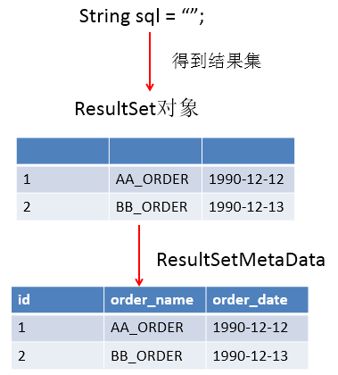

# MySQL_JDBC

> 讲师：尚硅谷-宋红康（江湖人称：康师傅）
>
> 尚硅谷官网：[http://www.atguigu.com](http://www.atguigu.com/)
>
> 视频链接：https://www.bilibili.com/video/BV1eJ411c7rf?vd_source=6e6b2286ee9a603d7bdb2bc5ba80e449

+++

## 一、JDBC概述

### 1 数据的持久化

- 持久化(persistence)：**把数据保存到可掉电式存储设备中以供之后使用**。大多数情况下，特别是企业级应用，**数据持久化意味着将内存中的数据保存到硬盘**上加以”固化”**，而持久化的实现过程大多通过各种关系数据库来完成**。

- 持久化的主要应用是将内存中的数据存储在关系型数据库中，当然也可以存储在磁盘文件、XML数据文件中。


### 2 Java中的数据存储技术

- 在Java中，数据库存取技术可分为如下几类：
  - **JDBC**直接访问数据库
  - JDO (Java Data Object)技术

  - **第三方O/R工具**，如Hibernate, Mybatis等

- JDBC是Java访问数据库的基石，JDO、Hibernate、MyBatis等只是更好的封装了JDBC。


### 3 JDBC介绍

- JDBC(Java Database Connectivity)是一个**独立于特定数据库管理系统、通用的SQL数据库存取和操作的公共接口**（一组API），定义了用来访问数据库的标准Java类库，（**java.sql、javax.sql**）使用这些类库可以以一种**标准**的方法、方便地访问数据库资源。

- JDBC为访问不同的数据库提供了一种**统一的途径**，为开发者屏蔽了一些细节问题。

- JDBC的目标是使Java程序员使用JDBC可以连接任何**提供了JDBC驱动程序**的数据库系统，这样就使得程序员无需对特定的数据库系统的特点有过多的了解，从而大大简化和加快了开发过程。

- 如果没有JDBC，那么Java程序访问数据库时是这样的：

  

- 有了JDBC，Java程序访问数据库时是这样的：

  

- 总结如下：

  

### 4 JDBC体系结构

- JDBC接口（API）包括两个层次：
  - **面向应用的API**：Java API，抽象接口，供应用程序开发人员使用（连接数据库，执行SQL语句，获得结果）。
  - **面向数据库的API**：Java Driver API，供开发商开发数据库驱动程序用。

> **JDBC是sun公司提供一套用于数据库操作的接口，java程序员只需要面向这套接口编程即可。**
>
> **不同的数据库厂商，需要针对这套接口，提供不同实现。不同的实现的集合，即为不同数据库的驱动。																————面向接口编程**


### 5 JDBC程序编写步骤

1. 注册驱动（作用：告诉Java程序，即将要连接的是哪个品牌的数据库）
2. 获取连接`Connection`（表示JVM的进程和数据库进程之间的通道打开了，这属于进程之间的通信，重量级的，使用完之后一定要关闭通道。）
3. 获取数据库操作对象`Statement`（专门执行sql语句的对象）
4. 执行SQL语句（DQL DML....）
5. 处理查询结果集`ResultSet`（只有当第四步执行的是select语句的时候，才有这第五步处理查询结果集。）
6. 释放资源（使用完资源之后一定要关闭资源。Java和数据库属于进程间的通信，开启之后一定要关闭。）


> 补充：ODBC(**Open Database Connectivity**，开放式数据库连接)，是微软在Windows平台下推出的。使用者在程序中只需要调用ODBC API，由 ODBC 驱动程序将调用转换成为对特定的数据库的调用请求。

+++

## 二、获取数据库连接

### 1 要素一：Driver接口实现类

#### 1.1 Driver接口介绍

- java.sql.Driver 接口是所有 JDBC 驱动程序需要实现的接口。这个接口是提供给数据库厂商使用的，不同数据库厂商提供不同的实现。

- 在程序中不需要直接去访问实现了 Driver 接口的类，而是由驱动程序管理器类(java.sql.DriverManager)去调用这些Driver实现。
  - Oracle的驱动：**oracle.jdbc.driver.OracleDriver**
  - mySql的驱动： **com.mysql.jdbc.Driver**


#### 1.2 加载与注册JDBC驱动

- 加载驱动：加载 JDBC 驱动需调用 Class 类的静态方法 forName()，向其传递要加载的 JDBC 驱动的类名

  - **Class.forName(“com.mysql.jdbc.Driver”);**

- 注册驱动：DriverManager 类是驱动程序管理器类，负责管理驱动程序

  - 使用**DriverManager.registerDriver(com.mysql.jdbc.Driver)**来注册驱动

  - 通常不用显式调用 DriverManager 类的 registerDriver() 方法来注册驱动程序类的实例，因为 Driver 接口的驱动程序类**都**包含了静态代码块，在这个静态代码块中，会调用*DriverManager.registerDriver()* 方法来注册自身的一个实例。下图是MySQL的Driver实现类的源码：

    

### 2 要素二：URL

- JDBC URL 用于标识一个被注册的驱动程序，驱动程序管理器通过这个 URL 选择正确的驱动程序，从而建立到数据库的连接。

- JDBC URL的标准由三部分组成，各部分间用冒号分隔。 

  - **jdbc:子协议:子名称**
  - **协议**：JDBC URL中的协议总是jdbc 
  - **子协议**：子协议用于标识一个数据库驱动程序
  - **子名称**：一种标识数据库的方法。子名称可以依不同的子协议而变化，用子名称的目的是为了**定位数据库**提供足够的信息。包含**主机名**(对应服务端的ip地址)**，端口号，数据库名**。

- 举例：

  

- **几种常用数据库的 JDBC URL**

  - MySQL的连接URL编写方式：

    - jdbc:mysql://主机名称:mysql服务端口号/数据库名称?参数=值&参数=值
    - jdbc:mysql://localhost:3306/atguigu
    - jdbc:mysql://localhost:3306/atguigu**?useUnicode=true&characterEncoding=utf8**（如果JDBC程序与服务器端的字符集不一致，会导致乱码，那么可以通过参数指定服务器端的字符集）
    - jdbc:mysql://localhost:3306/atguigu?user=root&password=123456

  - Oracle 9i的连接URL编写方式：

    - jdbc:oracle:thin:@主机名称:oracle服务端口号:数据库名称
    - jdbc:oracle:thin:@localhost:1521:atguigu

  - SQLServer的连接URL编写方式：

    - jdbc:sqlserver://主机名称:sqlserver服务端口号:DatabaseName=数据库名称

    - jdbc:sqlserver://localhost:1433:DatabaseName=atguigu


### 3 要素三：用户名和密码

- user,password可以用“属性名=属性值”方式告诉数据库
- 可以调用 DriverManager 类的 getConnection() 方法建立到数据库的连接


### 4 数据库连接方式举例

#### 4.1 连接方式一

```java
	@Test
    public void testConnection1() {
        try {
            //1.提供java.sql.Driver接口实现类的对象
            Driver driver = new com.mysql.jdbc.Driver();
            //2.提供url，指明具体操作的数据
            String url = "jdbc:mysql://localhost:3306/test";
            
            //3.提供Properties的对象，指明用户名和密码
            Properties info = new Properties();
            info.setProperty("user", "root");
            info.setProperty("password", "abc123");

            //4.调用driver的connect()，获取连接
            Connection conn = driver.connect(url, info);
            System.out.println(conn);
        } catch (SQLException e) {
            e.printStackTrace();
        }
    }
```

> 说明：上述代码中显式出现了第三方数据库的API


#### 4.2 连接方式二

```java
	@Test
    public void testConnection2() {
        try {
            //1.实例化Driver
            Class clazz = Class.forName("com.mysql.jdbc.Driver");
            Driver driver = (Driver) clazz.newInstance();

            //2.提供url，指明具体操作的数据
            String url = "jdbc:mysql://localhost:3306/test";

            //3.提供Properties的对象，指明用户名和密码
            Properties info = new Properties();
            info.setProperty("user", "root");
            info.setProperty("password", "abc123");

            //4.调用driver的connect()，获取连接
            Connection conn = driver.connect(url, info);
            System.out.println(conn);

        } catch (Exception e) {
            e.printStackTrace();
        }
    }
```

> 说明：相较于方式一，这里使用反射实例化Driver，不在代码中体现第三方数据库的API。体现了面向接口编程思想。


#### 4.3 连接方式三

```java
	@Test
    public void testConnection3() {
        try {
            //1.数据库连接的4个基本要素：
            String url = "jdbc:mysql://localhost:3306/test";
            String user = "root";
            String password = "abc123";
            String driverName = "com.mysql.jdbc.Driver";

            //2.实例化Driver
            Class clazz = Class.forName(driverName);
            Driver driver = (Driver) clazz.newInstance();
            //3.注册驱动
            DriverManager.registerDriver(driver);
            //4.获取连接
            Connection conn = DriverManager.getConnection(url, user, password);
            System.out.println(conn);
        } catch (Exception e) {
            e.printStackTrace();
        }
    }
```

> 说明：使用DriverManager实现数据库的连接。体会获取连接必要的4个基本要素。


#### 4.4 连接方式四

```java
	@Test
    public void testConnection4() {
        try {
            //1.数据库连接的4个基本要素：
            String url = "jdbc:mysql://localhost:3306/test";
            String user = "root";
            String password = "abc123";
            String driverName = "com.mysql.jdbc.Driver";

            //2.加载驱动 （①实例化Driver ②注册驱动）
            Class.forName(driverName);

            //3.获取连接
            Connection conn = DriverManager.getConnection(url, user, password);
            System.out.println(conn);
        } catch (Exception e) {
            e.printStackTrace();
        }
    }
```

> 说明：不必显式的注册驱动了。因为在DriverManager的源码中已经存在静态代码块，实现了驱动的注册。


#### 4.5 连接方式五(最终版)

```java
	@Test
    public  void testConnection5() throws Exception {
    	//1.加载配置文件
        InputStream is = ConnectionTest.class.getClassLoader().getResourceAsStream("jdbc.properties");
        Properties pros = new Properties();
        pros.load(is);
        
        //2.读取配置信息
        String user = pros.getProperty("user");
        String password = pros.getProperty("password");
        String url = pros.getProperty("url");
        String driverClass = pros.getProperty("driverClass");

        //3.加载驱动
        Class.forName(driverClass);

        //4.获取连接
        Connection conn = DriverManager.getConnection(url, user, password);
        System.out.println(conn);
    }
```

其中，配置文件声明在工程的src目录下：【jdbc.properties】

```properties
user=root
password=abc123
url=jdbc:mysql://localhost:3306/test
driverClass=com.mysql.jdbc.Driver
```

> 说明：使用配置文件的方式保存配置信息，在代码中加载配置文件
>
> **使用配置文件的好处**：
>
> 1. 实现了代码和数据的分离，如果需要修改配置信息，直接在配置文件中修改，不需要深入代码
> 2. 如果修改了配置信息，省去重新编译的过程。

+++

## 三、使用PreparedStatement实现CRUD操作

### 1 操作和访问数据库

- 数据库连接被用于向数据库服务器发送命令和 SQL 语句，并接受数据库服务器返回的结果。其实一个数据库连接就是一个Socket连接。

- 在 java.sql 包中有 3 个接口分别定义了对数据库的调用的不同方式：

  - Statement：用于执行静态SQL语句并返回它所生成结果的对象。
  - PrepatedStatement：SQL语句被预编译并存储在此对象中，可以使用此对象多次高效地执行该语句。
  - CallableStatement：用于执行 SQL 存储过程

  

### 2 使用Statement操作数据表的弊端

- 通过调用 Connection 对象的 createStatement() 方法创建该对象。该对象用于执行静态的 SQL 语句，并且返回执行结果。

- Statement 接口中定义了下列方法用于执行 SQL 语句：

  ```java
  int excuteUpdate(String sql); //执行更新操作INSERT、UPDATE、DELETE
  ResultSet executeQuery(String sql); //执行查询操作SELECT
  ```

- 但是使用Statement操作数据表存在弊端：

  - **问题一：存在拼串操作，繁琐**
  - **问题二：存在SQL注入问题**

- SQL 注入是利用某些系统没有对用户输入的数据进行充分的检查，而在用户输入数据中注入非法的 SQL 语句段或命令(如：`SELECT user, password FROM user_table WHERE user='a' OR 1 = ' AND password = ' OR '1' = '1'`)，从而利用系统的 SQL 引擎完成恶意行为的做法。

- 对于 Java 而言，要防范 SQL 注入，只要用`PreparedStatement`(从Statement扩展而来) 取代`Statement`就可以了。

- 代码演示：

  ```java
  public class StatementTest {
  	// 使用Statement的弊端：需要拼写sql语句，并且存在SQL注入的问题
  	@Test
  	public void testLogin() {
  		Scanner scan = new Scanner(System.in);
  
  		System.out.print("用户名：");
  		String userName = scan.nextLine();
  		System.out.print("密   码：");
  		String password = scan.nextLine();
  
  		//SELECT user,password FROM user_table WHERE USER = '1' or ' AND PASSWORD = '='1' or '1' = '1';
  		String sql = "SELECT user,password FROM user_table WHERE USER = '" 
              + userName + "' AND PASSWORD = '" + password + "'";
  		User user = get(sql, User.class);
  		if (user != null) {
  			System.out.println("登陆成功!");
  		} else {
  			System.out.println("用户名或密码错误！");
  		}
  	}
  
  	// 使用Statement实现对数据表的查询操作
  	public <T> T get(String sql, Class<T> clazz) {
  		T t = null;
  
  		Connection conn = null;
  		Statement st = null;
  		ResultSet rs = null;
  		try {
  			// 1.加载配置文件
  			InputStream is = StatementTest.class.getClassLoader().getResourceAsStream("jdbc.properties");
  			Properties pros = new Properties();
  			pros.load(is);
  			// 2.读取配置信息
  			String user = pros.getProperty("user");
  			String password = pros.getProperty("password");
  			String url = pros.getProperty("url");
  			String driverClass = pros.getProperty("driverClass");
  			// 3.加载驱动
  			Class.forName(driverClass);
  			// 4.获取连接
  			conn = DriverManager.getConnection(url, user, password);
  			st = conn.createStatement();
  			rs = st.executeQuery(sql);
  			// 获取结果集的元数据
  			ResultSetMetaData rsmd = rs.getMetaData();
  			// 获取结果集的列数
  			int columnCount = rsmd.getColumnCount();
  			if (rs.next()) {
  				t = clazz.newInstance();
  				for (int i = 0; i < columnCount; i++) {
  					// 1. 获取列的别名
  					String columnName = rsmd.getColumnLabel(i + 1);
  					// 2. 根据列名获取对应数据表中的数据
  					Object columnVal = rs.getObject(columnName);
  					// 3. 将数据表中得到的数据，封装进对象
  					Field field = clazz.getDeclaredField(columnName);
  					field.setAccessible(true);
  					field.set(t, columnVal);
  				}
  				return t;
  			}
  		} catch (Exception e) {
  			e.printStackTrace();
  		} finally {
  			// 关闭资源
  			if (rs != null) {
  				try {
  					rs.close();
  				} catch (SQLException e) {
  					e.printStackTrace();
  				}
  			}
  			if (st != null) {
  				try {
  					st.close();
  				} catch (SQLException e) {
  					e.printStackTrace();
  				}
  			}
  
  			if (conn != null) {
  				try {
  					conn.close();
  				} catch (SQLException e) {
  					e.printStackTrace();
  				}
  			}
  		}
  		return null;
  	}
  }
  ```

综上：


### 3 PreparedStatement的使用

#### 3.1 PreparedStatement介绍

- 可以通过调用 Connection 对象的 **preparedStatement(String sql)** 方法获取 PreparedStatement 对象

- **PreparedStatement 接口是 Statement 的子接口，它表示一条预编译过的 SQL 语句**

- PreparedStatement 对象所代表的 SQL 语句中的参数用问号(?)来表示，调用 PreparedStatement 对象的 setXxx() 方法来设置这些参数. setXxx() 方法有两个参数，第一个参数是要设置的 SQL 语句中的参数的索引(从 1 开始)，第二个是设置的 SQL 语句中的参数的值


#### 3.2 PreparedStatement vs Statement

- 代码的可读性和可维护性。

- **PreparedStatement 能最大可能提高性能：**
  - DBServer会对**预编译**语句提供性能优化。因为预编译语句有可能被重复调用，所以<u>语句在被DBServer的编译器编译后的执行代码被缓存下来，那么下次调用时只要是相同的预编译语句就不需要编译，只要将参数直接传入编译过的语句执行代码中就会得到执行</u>。
  - 在statement语句中，即使是相同操作但因为数据内容不一样，所以整个语句本身不能匹配，没有缓存语句的意义。事实是没有数据库会对普通语句编译后的执行代码缓存。这样<u>每执行一次都要对传入的语句编译一次</u>。
  - (语法检查，语义检查，翻译成二进制命令，缓存)

- PreparedStatement 可以防止 SQL 注入 


#### 3.3 Java与SQL对应数据类型转换表

| *Java类型*         | *SQL类型*                |
| ------------------ | ------------------------ |
| boolean            | BIT                      |
| byte               | TINYINT                  |
| short              | SMALLINT                 |
| int                | INTEGER                  |
| long               | BIGINT                   |
| String             | CHAR,VARCHAR,LONGVARCHAR |
| byte   array       | BINARY  ,    VAR BINARY  |
| java.sql.Date      | DATE                     |
| java.sql.Time      | TIME                     |
| java.sql.Timestamp | TIMESTAMP                |


#### 3.4 使用PreparedStatement实现增、删、改操作

```java
import java.io.InputStream;
import java.sql.Connection;
import java.sql.DriverManager;
import java.sql.ResultSet;
import java.sql.SQLException;
import java.sql.Statement;
import java.util.Properties;

/**
 * 操作数据库的工具类
 */
public class JDBCUtils {
	/**
	 * 获取数据库的连接
	 */
	public static Connection getConnection() throws Exception {
		// 1.读取配置文件中的4个基本信息
		InputStream is = ClassLoader.getSystemClassLoader().getResourceAsStream("jdbc.properties");

		Properties pros = new Properties();
		pros.load(is);

		String user = pros.getProperty("user");
		String password = pros.getProperty("password");
		String url = pros.getProperty("url");
		String driverClass = pros.getProperty("driverClass");

		// 2.加载驱动
		Class.forName(driverClass);

		// 3.获取连接
		Connection conn = DriverManager.getConnection(url, user, password);
		return conn;
	}
	/**
	 * 关闭连接
	 */
	public static void closeResource(Connection conn, Statement ps){
		closeResource(conn, ps, null);
	}
	/**
	 * 关闭资源操作
	 * 
	 */
	public static void closeResource(Connection conn,Statement ps,ResultSet rs){
	    try {
			if(rs != null) rs.close();
		} catch (SQLException e) {
			e.printStackTrace();
		}
        try {
			if(ps != null) ps.close();
		} catch (SQLException e) {
			e.printStackTrace();
		}
		try {
			if(conn != null) conn.close();
		} catch (SQLException e) {
			e.printStackTrace();
		}
	}
}
```

```java
	//通用的增、删、改操作（体现一：增、删、改 ； 体现二：针对于不同的表）
	public void update(String sql, Object... args){
		Connection conn = null;
		PreparedStatement ps = null;
		try {
			//1.获取数据库的连接
			conn = JDBCUtils.getConnection();
			
			//2.获取PreparedStatement的实例 (或：预编译sql语句)
			ps = conn.prepareStatement(sql);
			//3.填充占位符
			for(int i = 0;i < args.length;i++){
				ps.setObject(i + 1, args[i]);
			}
			
			//4.执行sql语句
			ps.execute();
		} catch (Exception e) {
			e.printStackTrace();
		}finally{
			//5.关闭资源
			JDBCUtils.closeResource(conn, ps);
		}
	}
```


#### 3.5 使用PreparedStatement实现查询操作

```java
	// 通用的针对于不同表的查询:返回一个对象 (version 1.0)
	public <T> T getInstance(Class<T> clazz, String sql, Object... args) {
		Connection conn = null;
		PreparedStatement ps = null;
		ResultSet rs = null;
		try {
			// 1.获取数据库连接
			conn = JDBCUtils.getConnection();
			// 2.预编译sql语句，得到PreparedStatement对象
			ps = conn.prepareStatement(sql);
			// 3.填充占位符
			for (int i = 0; i < args.length; i++) {
				ps.setObject(i + 1, args[i]);
			}
			// 4.执行executeQuery(),得到结果集：ResultSet
			rs = ps.executeQuery();
			// 5.得到结果集的元数据：ResultSetMetaData
			ResultSetMetaData rsmd = rs.getMetaData();
			// 6.1通过ResultSetMetaData得到columnCount、columnLabel；通过ResultSet得到列值
			int columnCount = rsmd.getColumnCount();
			if (rs.next()) {
				T t = clazz.newInstance();
				for (int i = 0; i < columnCount; i++) {// 遍历每一个列
					// 通过ResultSet获取列值
					Object columnVal = rs.getObject(i + 1);
					// 通过ResultSetMetaData获取列的别名，使用类的属性名充当
					String columnLabel = rsmd.getColumnLabel(i + 1);
					// 6.2使用反射，给对象的相应属性赋值
					Field field = clazz.getDeclaredField(columnLabel);
					field.setAccessible(true);
					field.set(t, columnVal);
				}
				return t;
			}
		} catch (Exception e) {
			e.printStackTrace();
		} finally {
			// 7.关闭资源
			JDBCUtils.closeResource(conn, ps, rs);
		}
		return null;
	}
```

> 说明：使用PreparedStatement实现的查询操作可以替换Statement实现的查询操作，解决Statement拼串和SQL注入问题。


### 4 ResultSet 与 ResultSetMetaData

#### 4.1 ResultSet

- 查询需要调用PreparedStatement 的 executeQuery() 方法，查询结果是一个 ResultSet 对象
- ResultSet 对象以逻辑表格的形式封装了执行数据库操作的结果集，ResultSet 接口由数据库厂商提供实现
- ResultSet 返回的实际上就是一张数据表。有一个指针指向数据表的第一条记录的前面。
- ResultSet 对象维护了一个指向当前数据行的**游标**，初始的时候，游标在第一行之前，可以通过 ResultSet 对象的 next() 方法移动到下一行。调用 next()方法检测下一行是否有效。若有效，该方法返回 true，且指针下移。相当于Iterator对象的 hasNext() 和 next() 方法的结合体。
- 当指针指向一行时, 可以通过调用 getXxx(int index) 或 getXxx(int columnName) 获取每一列的值。

  - 例如: getInt(1), getString("name")
  - **注意：Java与数据库交互涉及到的相关Java API中的索引都从1开始。**
- ResultSet 接口的常用方法：
  - boolean next()

  - getString(int)、getString(String)
  - getInt(int)、getInt(String)
  - close()
  - ......


#### 4.2 ResultSetMetaData

- 可用于获取关于 ResultSet 对象中`列的类型`和`属性信息`的对象。

- ResultSetMetaData meta = rs.getMetaData();
  - **getColumnName**(int column)：获取指定列的名称
  - **getColumnLabel**(int column)：获取指定列的别名
  - **getColumnCount**()：返回当前 ResultSet 对象中的列数。 

  - getColumnTypeName(int column)：检索指定列的数据库特定的类型名称。
  - getColumnDisplaySize(int column)：指示指定列的最大标准宽度，以字符为单位。 
  - **isNullable**(int column)：指示指定列中的值是否可以为 null。

  - isAutoIncrement(int column)：指示是否自动为指定列进行编号，这样这些列仍然是只读的。



**问题1：得到结果集后, 如何知道该结果集中有哪些列 ？ 列名是什么？**

需要使用一个描述 ResultSet 的对象， 即 ResultSetMetaData

**问题2：关于ResultSetMetaData**

1. **如何获取 ResultSetMetaData**： 调用 ResultSet 的 getMetaData() 方法即可
2. **获取 ResultSet 中有多少列**：调用 ResultSetMetaData 的 getColumnCount() 方法
3. **获取 ResultSet 每一列的列的别名是什么**：调用 ResultSetMetaData 的getColumnLabel() 方法


### 5 资源的释放

- 释放`ResultSet`、`Statement`、`Connection`。
- 数据库连接（Connection）是非常稀有的资源，用完后必须马上释放，如果Connection不能及时正确的关闭将导致系统宕机。Connection的使用原则是**尽量晚创建，尽量早的释放**。
- 可以在*finally*中关闭，保证及时其他代码出现异常，资源也一定能被关闭。


### 6 JDBC API小结

- 两种思想

  - 面向接口编程的思想

  - ORM思想(object relational mapping)
    - 一个数据表对应一个java类
    - 表中的一条记录对应java类的一个对象
    - 表中的一个字段对应java类的一个属性

  > sql是需要结合列名和表的属性名来写。注意起别名。

- 两种技术

  - JDBC结果集的元数据：ResultSetMetaData
    - 获取列数：getColumnCount()
    - 获取列的别名：getColumnLabel()
  - 通过反射，创建指定类的对象，获取指定的属性并赋值

+++

## 四、操作BLOB类型字段


