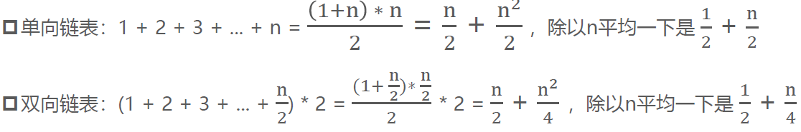
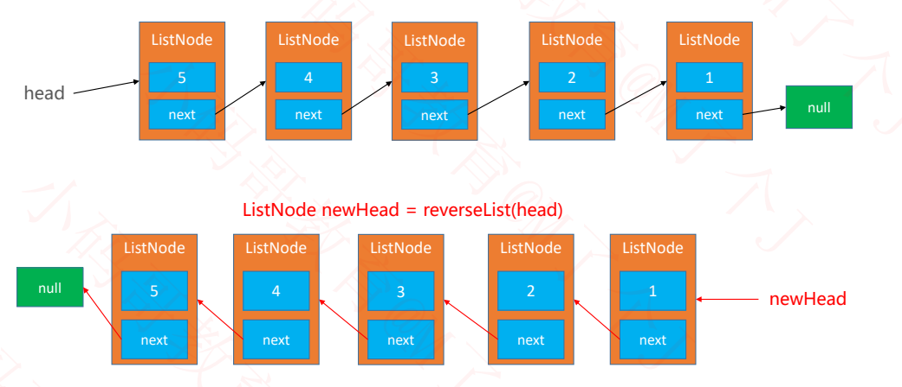
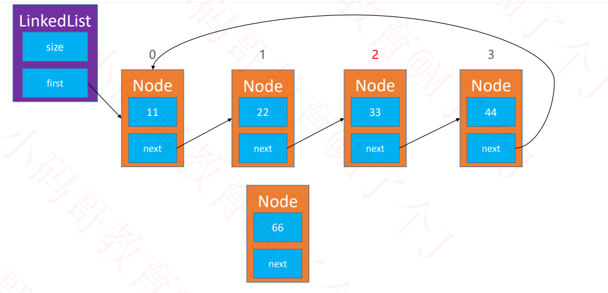
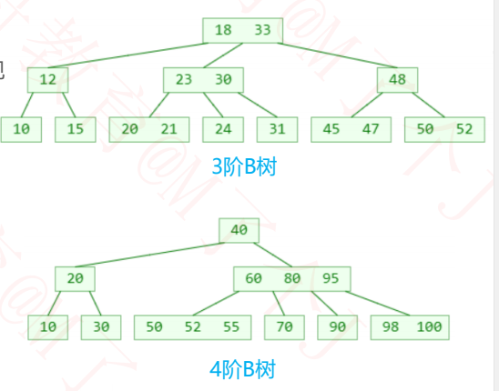
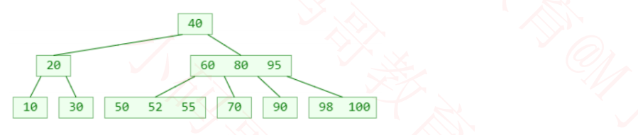
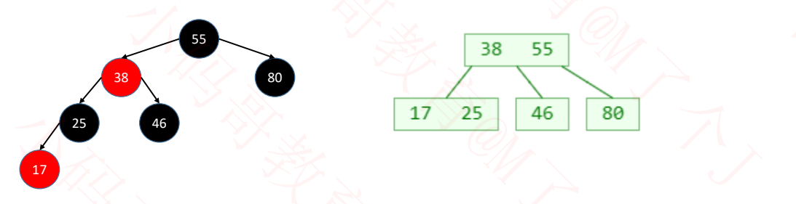

# 恋上数据结构-基础篇


+++

## 零、复杂度知识以及LeetCode刷题指南

### 1 什么是算法？

算法是用于解决特定问题的一系列的执行步骤。

以下算法是为了解决**两数相加**的问题：

```java
// 计算a和b的和
public static int plue(int a, int b){
	return a + b;
}
```

以下算法是为了解决**n个数字的和**的问题：

```java
// 1+2+3+...+n
public static int sum(int n){
	int result = 0;
	for(int i = 1; i <= n; i++){
		result += i;
	}
	return result;
}
```

使用不同算法，解决同一个问题，效率可能相差非常大。比如：

**求第 n 个斐波那契数（fibonacci number）**


### 2 如何评判一个算法的好坏？

如果单从执行效率上进行评估，可能会想到这么一种方案：

- 比较不同算法对同一组输入的执行处理时间
- 这种方案也叫做：事后统计法

上述方案有比较明显的缺点：

- 执行时间严重依赖硬件以及运行时各种不确定的环境因素
- 必须编写相应的测算代码
- 测试数据的选择比较难保证公正性

一般从以下维度来评估算法的优劣：

- 正确性、可读性、健壮性（对不合理输入的反应能力和处理能力）
- **时间复杂度（time complexity）**：估算程序指令的执行次数（执行时间）
- **空间复杂度（space complexity）**：估算所需占用的存储空间

由于现在硬件发展的较好，一般情况下我们更侧重于**时间复杂度**。

> 附：
>
> 下面代码是一个测试时间效率的小工具：
>
> ```java
> import java.text.SimpleDateFormat;
> import java.util.Date;
> 
> /**
>  * 测试时间效率的小工具
>  */
> public class Times {
> 	private static final SimpleDateFormat fmt = new SimpleDateFormat("HH:mm:ss.SSS");
> 
> 	public interface Task {
> 			void execute();
> 	}
> 
> 	public static void test(String title, Task task) {
> 			if (task == null) return;
> 		title = (title == null) ? "" : ("【" + title + "】");
> 		System.out.println(title);
> 		System.out.println("开始：" + fmt.format(new Date()));
> 		long begin = System.currentTimeMillis(); // 开始时间
> 		task.execute(); // 执行代码
> 		long end = System.currentTimeMillis(); // 结束时间
> 		System.out.println("结束：" + fmt.format(new Date()));
> 		double delta = (end - begin) / 1000.0; // 毫秒转换为秒
> 		System.out.println("耗时：" + delta + "秒");
> 		System.out.println("-------------------------------------");
> 	}
> }
> ```


### 3 大O表示法（Big O）

一般用大O表示法来描述复杂度，它表示的是数据规模 n 对应的复杂度。

忽略常数、系数、低阶：

- 9 >> O(1)
- 2n + 3 >> O(n)
- n<sup>2</sup> + 2n + 6 >> O(n^2)
- 4n<sup>3</sup> + 3n<sup>2</sup> + 22n + 100 >> O(n<sup>3</sup>)
- 写法上，n<sup>3</sup> 等价于 n^3

注意：大O表示法仅仅是一种粗略的**分析模型**，是一种**估算**，能帮助我们短时间内了解一个算法的执行效率。


#### 3.1 对数阶的细节

对数阶一般省略底数：

- 由于 log<sub>2</sub>9 ∗ log<sub>9</sub>n >> log<sub>2</sub>n，即每个对数基本都可以常数乘另一个对数
- 所以 O(log<sub>2</sub>n) 、O(log<sub>9</sub>n) 统称为 **O(logn)**


#### 3.2 常见的复杂度


> 可以借助函数生成工具对比复杂度的大小：https://zh.numberempire.com/graphingcalculator.php


#### 3.3 多个数据规模的情况

时间复杂度：O(n + k)

```java 
public static void test(int n, int k){
	for(int i = 0; i < n; i++){
		System.out.println("test");
	}
	for (int i = 0; i < k; i++){
		System.out.println("test");
	}
}
```


### 4 LeetCode刷题指南

首先去 https://leetcode-cn.com/ 注册一个力扣账号。

我们以力扣上一道斐波那契的题目为例，顺便分析算法的时间复杂度。

题目网址：[LeetCode: 509.斐波那契数](https://leetcode-cn.com/problems/fibonacci-number/)


以执行**斐波那契数列(递归)**为例，必须写成这样：


### 5 斐波那契数列复杂度分析

#### 5.1 斐波那契数列 - 递归

很简单的代码，相信来学数据结构的同学都能看懂。

```java
// O(2^n)
public static int fib1(int n) {
	if (n <= 1) return n;
	return fib1(n - 1) + fib1(n - 2);
}
```

复杂度分析：


我们放到力扣上去执行一下：效率奇差无比！


#### 5.2 斐波那契数列--循环

不开辟任何空间，只使用循环完成。

```java
// O(n)
public static int fib2(int n) {
	if (n <= 1) return n;
	
	int first = 0;
	int second = 1;
	for (int i = 0; i < n - 1; i++) {
		int sum = first + second;
		first = second;
		second = sum;
	}
	/*
	// 也可以使用while循环
	while (n-- > 1) {
		second += first;
		first = second - first;
	}
	*/
	return second;
}
```

力扣上执行：速度变快了，内存消耗还是很多…


开辟新的数组空间，用空间换时间。

```java
public static int fib3(int n){
	if(n <= 1) return n;
	
	int[] fib = new int[n+1];
	fib[0] = 0;
	fib[1] = 1;
	for(int i = 2; i < fib.length; i++){
		fib[i] = fib[i-1] + fib[i-2];
	}
	return fib[n];
}
```

力扣上执行：呃，和上面好像没啥区别。。


#### 5.3 fib函数的时间复杂度分析

上面两种 fib 函数的差别有多大？

- 如果有一台 1GHz 的普通计算机，运算速度 10<sup>9</sup> 次每秒，n 为 64
- O(n) 大约耗时 6.4 * 10<sup>-8</sup> 秒
- O(2<sup>n</sup>) 大约耗时 584.94 年
- 有时候算法之间的差距，往往比硬件方面的差距还要大


#### 5.4 斐波那契的线性代数解法-特征方程


### 6 算法的优化方向

- 用尽量少的存储空间；
- 用尽量少的执行步骤（执行时间）；
- 根据情况：**空间换时间**、**时间换空间**。

+++

## 一、动态扩容数组

### 1 什么是数据结构？

数据结构是计算机存储、组织数据的方式；


在实际应用中，根据使用场景来选择最合适的数据结构


### 2 线性表

**线性表**是具有 n 个**相同类型元素**的有限**序列**（ n ≥ 0 ）


- a<sub>1</sub>是首节点（首元素），a<sub>n</sub>是尾结点（尾元素）
- a<sub>1 </sub>是 a<sub>2</sub> 的**前驱**，a<sub>2</sub> 是 a<sub>1</sub> 的**后继**

常见的线性表有：

- 数组
- 链表
- 栈
- 队列
- 哈希表（散列表）


### 3 数组Array

数组是一种顺序存储的线性表，所有元素的**内存地址是连续**的


在很多编程语言中，数组都有个致命的缺点：**无法动态修改容量**。

实际开发中，我们更希望数组的容量是可以动态改变的


### 4 动态数组DynamicArray

#### 4.1 动态数组接口设计


动态数组的结构：

- size
- elements


> Java 中，成员变量会自动初始化，比如：
>
> - int 类型自动初始化为 0
> - 对象类型自动初始化为 null


#### 4.2 清除所有元素--clear()

核心代码是 size = 0，实际上不需要执行 `elements = null`，size = 0 的操作已经对用户来说保证了无法访问动态数组中的元素了。

代码实现：

```java
public void clear() {
    size = 0;
}
```


#### 4.3 添加元素--add(E element)、add(int index, E element)

`add(E element)`：默认往数组最后添加元素；


`add(int index, E element)`：在 `index` 位置插入一个元素；

比如要往 `index = 2` 的地方添加元素：

- 正确的顺序应当是：**从后往前**开始将 `index = 2` 以后的元素依次后移，然后赋值：


- 如果**从前往后**开始移动元素，会造成如下**错误的**后果：


代码实现：

```java
/**
 * 在index位置插入一个元素
 * @param index
 * @param element
 */
public void add(int index, E element){ 
	rangeCheckForAdd(index); // 检查下标越界
	ensureCapacity(size + 1); // 确保容量够大
	// 0 1 2 3 4 5 6 7 8 9	(index)
	// 1 2 3 4 5 6 x x x x	(原数组)
	// 在index=2处，插入9，元素全部后移
	// 1 2 9 3 4 5 6 x x x	(add后数组)
	// 先从后往前开始, 将每个元素往后移一位, 然后再赋值
	for (int i = size; i > index; i--) {
        elements[i] = elements[i-1];
    }
	elements[index] = element; // 复制
	size++;
}

/**
 * 添加元素到数组最后
 */
public void add(E element){
	add(size, element);
}
```


#### 4.4 删除元素--remove(int index)、清空数组--clear()

例如，删除 `index = 3` 的数组元素，应当**从前往后**开始移动，用后面的元素覆盖前面的元素。


**思考**：**最后一个元素如何处理**？

- 如果存放 `int` 类型，`size--` 后，最后一个元素已经无法访问了。

- 如果使用**泛型**，数组要注意内存管理（将元素置 `null`）。

  使用泛型技术可以让动态数组更加通用，可以存放任何数据类型：

  

代码实现：

```java
/**
 * 删除index位置的元素
 * @param index
 * @return
 */
public E remove(int index){
	rangeCheck(index); // 检查下标越界
	// 0 1 2 3 4 5 	(index)
	// 1 2 3 4 5 6 	(原数组)
	// 删除index为2的元素，元素前移
	// 1 2 4 5 6	(remove后的数组)
	// 从前往后开始移, 用后面的元素覆盖前面的元素
	E old = elements[index];
	for (int i = index + 1; i < size; i++) {
        elements[i-1] = elements[i];
    }
	// 下面是使用泛型后需要写的(如果存储的是int型数据, 则不需要)
	elements[--size] = null; // 删除元素后, 将最后一位设置为null
	return old;
}

/**
 * 清除所有元素
 */
public void clear(){
	// 使用泛型数组后要注意内存管理(将元素置null)
	for (int i = 0; i < size; i++) {
		elements[i] = null;
	}
	size = 0;
}
```


#### 4.5 是否包含某个元素--contains(E element)

关于 null 的处理主要看你的业务需求：是否可以存储 null 数据？

```java
private static final int ELEMENT_NOT_FOUND = -1;

/**
 * 是否包含某个元素
 * @param element
 * @return
 */
public boolean contains(E element){
	return indexOf(element) != ELEMENT_NOT_FOUND; // 找的到该元素则返回True
}

/**
* 查看元素的索引
 * @param element
 * @return
 */
public int indexOf(E element){
	/*
	// 不对 null 进行处理也可以，但是健壮性不够
	for (int i = 0; i < size; i++) {
		if(elements[i].equals(element)) return i;
	}
	 */
	if(element == null){ // 对 null 进行处理
		for (int i = 0; i < size; i++) {
			if(elements[i] == null) return i;
		}
	}else{
		for (int i = 0; i < size; i++) {
			if(element.equals(elements[i])) return i;
		}
	}
	return ELEMENT_NOT_FOUND;
}
```


#### 4.6 扩容--ensureCapacity(int capacity)

相信看过视频的小伙伴一看这图就懂了。


```java
/**
 * 扩容操作
 */
private void ensureCapacity(int capacity) {
	int oldCapacity = elements.length; // 旧的容量大小
	if (oldCapacity >= capacity) return; // 如果容量大小管够，则返回
	// 新容量为旧容量的1.5倍
	int newCapacity = oldCapacity + (oldCapacity >> 1);
	E[] newElements = (E[]) new Object[newCapacity];
	for (int i = 0; i < size; i++) {
		newElements[i] = elements[i]; // 拷贝原数组元素到新数组
	}
	elements = newElements;
}
```


#### 4.7 打印数组--toString()

- 重写 `toString` 方法
- 在 `toString` 方法中将元素拼接成字符串
- 字符串拼接建议使用 `StringBuilder`

```java
	@Override
    public String toString() {
        StringBuilder string = new StringBuilder();
        string.append("size=").append(size).append(", [");
        for (int i = 0; i < size; i++) {
            if (i != 0){
                string.append(", ");
            }
            string.append(elements[i]);
        }
        string.append("]");
        return string.toString();
    }
	// size=6, [1, 2, 3, 4, 5, 6]
```


### 5 泛型

使用泛型技术可以让动态数组更加通用，可以存放任何数据类型

```java
public class ArrayList<E> {
	private int size;
	private E[] elements;
}
```

```java
private static final int DEFAULT_CAPACITY = 10;

public ArrayList(int capacity){
    capacity = Math.max(capacity, DEFAULT_CAPACITY);
    elements = (E[]) new Object[capacity];
}
public ArrayList(){
    this(DEFAULT_CAPACITY);
}
```

```java
ArrayList<Integer> list = new ArrayList<>();
```


#### 5.1 对象数组 - Object[]

```java
Object[] objects = new Object[7];
```

- 由于 Object 可以存放任何类型，因此无法固定 Object 占多少内存空间（根据传入不同的自定义对象，占用的空间都不同），因此实际上 Object 数组中存放的是**对象的地址**。
- 想要销毁对象，只需要将指向该对象的地址赋值为`null`，没有地址引用该对象，则会自动被垃圾回收


内存管理细节：

```java
public void clear() {
    for (int i = 0; i < size; i++) {
        elements[i] = null; // 管理内存
    }
    size = 0;
}
```

```java
public E remove(int index) {
    rangeCheck(index);
    E old = elements[index];
    for (int i = index + 1; i < size; i++) {
        elements[i-1] = elements[i];
    }
    elements[--size] = null; // 管理内存
    return old;
}
```


### 6 int型动态数组源码（Java）

```java
public class ArrayList {
	private int size;		// 元素数量	
	private int[] elements; // 所有的元素

	private static final int DEFAULT_CAPACITY = 10; // 初始容量
	private static final int ELEMENT_NOT_FOUND = -1;
	
	public ArrayList(int capacity) { // 容量小于10一律扩充为10
		capacity = (capacity < DEFAULT_CAPACITY) ? DEFAULT_CAPACITY : capacity;
		elements = new int[capacity];
	}
	public ArrayList(){
		this(DEFAULT_CAPACITY);
	}
	/**
	 * 元素的数量
	 * @return
	 */
	public int size(){
		return size;
	}
	/**
	 * 是否为空
	 * @return
	 */
	public boolean isEmpty(){
		return size == 0;
	}
	/**
	 * 是否包含某个元素
	 * @param element
	 * @return
	 */
	public boolean contains(int element){
		return indexOf(element) != ELEMENT_NOT_FOUND; //找的到该元素则返回True
	}
	/**
	 * 在index位置插入一个元素
	 * @param index
	 * @param element
	 */
	public void add(int index, int element){
		rangeCheckForAdd(index); // 检查下标越界
		ensureCapacity(size + 1); // 确保容量够大
		
		// 0 1 2 3 4 5 6 7 8 9	(index)
		// 1 2 3 4 5 6 x x x x	(原数组)
		// 在index=2处，插入9，元素全部后移
		// 1 2 9 3 4 5 6 x x x	(add后数组)
		// 先从后往前开始, 将每个元素往后移一位, 然后再赋值
		for (int i = size - 1; i >= index; i--) {
			elements[i + 1] = elements[i];
		}
		elements[index] = element; // 赋值
		size++;
	}
	/**
	 * 添加元素到最后面
	 */
	public void add(int element){
		add(size, element);
	}
	/**
	 * 设置index位置的元素
	 * @param index
	 * @param element
	 * @return 原来的元素ֵ
	 */
	public int get(int index){
		rangeCheck(index);
		return elements[index];
	}
	/**
	 * 设置index位置的元素
	 * @param index
	 * @param element
	 * @return 原来的元素ֵ
	 */
	public int set(int index, int element){
		rangeCheck(index);
		int old = elements[index];
		elements[index] = element;
		return old;
	}
	/**
	 * 删除index位置的元素
	 * @param index
	 * @return
	 */
	public int remove(int index){
		rangeCheck(index);
		
		// 0 1 2 3 4 5 	(index)
		// 1 2 3 4 5 6 	(原数组)
		// 删除index为2的元素，元素前移
		// 1 2 4 5 6	(remove后的数组)
		int old = elements[index];
		// 从前往后开始移, 用后面的元素覆盖前面的元素
		for (int i = index; i < size-1; i++) {
			elements[i] = elements[i + 1];
		}
		size--;
		return old;
	}
	/**
	 * 查看元素的索引
	 * @param element
	 * @return
	 */
	public int indexOf(int element){
		for (int i = 0; i < size; i++) {
			if(elements[i] == element) return i;
		}
		return ELEMENT_NOT_FOUND;
	}
	/**
	 * 清除所有元素
	 */
	public void clear(){
		size = 0;
	}
	/*
	 * 扩容操作
	 */
	private void ensureCapacity(int capacity){
		int oldCapacity = elements.length;
		if(oldCapacity >= capacity) return;
		// 新容量为旧容量的1.5倍
		int newCapacity = oldCapacity + (oldCapacity >> 1); // 1.5
		int[] newElements = new int[newCapacity];
		for (int i = 0; i < size; i++) {
			newElements[i] = elements[i];
		}
		elements = newElements;
		System.out.println("size="+oldCapacity+", 扩容到了"+newCapacity);
	}
	/****************封装好的功能函数*******************************/
	// 下标越界抛出的异常
	private void outOfBounds(int index) {
		throw new IndexOutOfBoundsException("Index:" + index + ", Size:" + size);
	}
	// 检查下标越界(不可访问或删除size位置)
	private void rangeCheck(int index){
		if(index < 0 || index >= size){
			outOfBounds(index);
		}
	}
	// 检查add()的下标越界(可以在size位置添加)
	private void rangeCheckForAdd(int index) {
		if (index < 0 || index > size) {
			outOfBounds(index);
		}
	}
	/****************封装好的功能函数*******************************/
	@Override
	public String toString() {
		// 打印形式为: size=5, [99, 88, 77, 66, 55]
		StringBuilder string = new StringBuilder();
		string.append("size=").append(size).append(", [");
		for (int i = 0; i < size; i++) {
			if(0 != i) string.append(", ");
			string.append(elements[i]);
		}
		string.append("]");
		return string.toString();
	}
}
```


### 7 泛型动态数组源码（Java）

```java
@SuppressWarnings("unchecked")
public class ArrayList<E> {
    /**
     * 元素的容量
     */
    private int size;
    /**
     * 所有的元素
     */
    private E[] elements;

    private static final int DEFAULT_CAPACITY = 10; //初始容量
    private static final int ELEMENT_NOT_FOUND = -1;

    public ArrayList(int capacity){ // 容量小于10一律扩充为10
        capacity = Math.max(capacity, DEFAULT_CAPACITY);
        elements = (E[]) new Object[capacity];
    }

    public ArrayList(){
        this(DEFAULT_CAPACITY);
    }

    /**
     * 清除所有元素
     */
    public void clear() {
        for (int i = 0; i < size; i++) {
            elements[i] = null;
        }
        size = 0;
    }

    /**
     * 元素的数量
     * @return
     */
    public int size() {
        return size;
    }

    /**
     * 是否为空
     * @return
     */
    public boolean isEmpty() {
        return size == 0;
    }
    /**
     * 是否包含某个元素
     * @param element
     * @return
     */
    public boolean contains(E element) {
        return indexOf(element) != ELEMENT_NOT_FOUND;
    }

    /**
     * 获取index位置的元素
     * @param index
     * @return
     */
    public E get(int index) { //O(1)
        rangeCheck(index);
        return elements[index];
    }

    /**
     * 设置index位置的元素
     * @param index
     * @param element
     * @return 原来的元素ֵ
     */
    public E set(int index, E element) { //O(1)
        rangeCheck(index);
        E old = elements[index];
        elements[index] = element;
        return old;
    }

    /**
     * 添加元素到尾部
     * @param element
     */
    public void add(E element) {
        add(size, element);
    }

    /**
     * 在index位置插入一个元素
     * @param index
     * @param element
     * 
     * 最好：O(1)
     * 最坏：O(n)
     * 平均：O(n)
     */
    public void add(int index, E element) { 
        rangeCheckForAdd(index);
        ensureCapacity(size + 1);

        for (int i = size; i > index; i--) {
            elements[i] = elements[i-1];
        }
        elements[index] = element;
        size++;
    }

    /**
     * 删除index位置的元素
     * @param index
     * @return
     * 
     * 最好：O(1)
     * 最坏：O(n)
     * 平均：O(n)
     */
    public E remove(int index) {
        rangeCheck(index);
        E old = elements[index];
        for (int i = index + 1; i < size; i++) {
            elements[i-1] = elements[i];
        }
        elements[--size] = null;
        return old;
    }

    /**
     * 查看元素的索引
     * @param element
     * @return
     */
    public int indexOf(E element) {
        if (element == null){
            for (int i = 0; i < size; i++) {
                if (elements[i] == null){
                    return i;
                }
            }
        } else {
            for (int i = 0; i < size; i++) {
                if (element.equals(elements[i])){
                    return i;
                }
            }
        }
        return ELEMENT_NOT_FOUND;
    }

    /**
     * 保证要有capacity的容量
     * @param capacity
     */
    private void ensureCapacity(int capacity) {
        int oldCapacity = elements.length;
        if (oldCapacity >= capacity) return;
        //新容量为旧容量的1.5倍
        int newCapacity = oldCapacity + (oldCapacity >> 1);
        E[] newElements = (E[]) new Object[newCapacity];
        for (int i = 0; i < size; i++) {
            newElements[i] = elements[i];
        }
        elements = newElements;
    }

    /****************封装好的功能函数**************************/
	// 下标越界抛出的异常
    private void outOfBounds(int index) {
        throw new IndexOutOfBoundsException("Index: " + index + ", Size: " + size);
    }
	// 检查下标越界(不可访问或删除size位置)
    private void rangeCheck(int index) {
        if (index < 0 || index >= size){
            outOfBounds(index);
        }
    }
	// 检查add()的下标越界(可以在size位置添加元素)
    private void rangeCheckForAdd(int index) {
        if (index < 0 || index > size){
            outOfBounds(index);
        }
    }

    @Override
    public String toString() {
        StringBuilder string = new StringBuilder();
        string.append("size=").append(size).append(", [");
        for (int i = 0; i < size; i++) {
            if (i != 0){
                string.append(", ");
            }
            string.append(elements[i]);
        }
        string.append("]");
        return string.toString();
    }
}
```

+++

## 二、链表LinkedList

动态数组有个明显的缺点：

- 可能会造成内存空间的大量浪费。

能否用到多少就申请多少内存？

- 链表可以办到这一点

**链表**是一种**链式存储**的线性表，所有元素的**内存地址不一定是连续的**;


### 1 链表的接口设计


由于**链表的大部分接口和动态数组一致**，我们抽取出一个共同的 `List`**接口**；

```java
public interface List<E> {
    int ELEMENT_NOT_FOUND = -1;

    /**
     * 清除所有元素
     */
    void clear();

    /**
     * 元素的数量
     */
    int size();

    /**
     * 是否为空
     */
    boolean isEmpty();

    /**
     * 是否包含某个元素
     */
    boolean contains(E element);

    /**
     * 添加元素到尾部
     */
    void add(E element);

    /**
     * 获取index位置的元素
     */
    E get(int index);

    /**
     * 设置index位置的元素
     */
    E set(int index, E element);

    /**
     * 在index位置插入一个元素
     */
    void add(int index, E element);

    /**
     * 删除index位置的元素
     */
    E remove(int index);

    /**
     * 查看元素的索引
     */
    int indexOf(E element);
}
```

再将一些通用的字段与方法放到一个抽象类中，无论是**动态数组**还是**链表**都**只需要继承这个抽象类**即可。

```java
public abstract class AbstractList<E> implements List<E> {
    /**
     * 元素的容量
     */
    protected int size;

    /**
     * 元素的数量
     */
    public int size() {
        return size;
    }

    /**
     * 是否为空
     */
    public boolean isEmpty() {
        return size == 0;
    }

    /**
     * 是否包含某个元素
     */
    public boolean contains(E element) {
        return indexOf(element) != ELEMENT_NOT_FOUND;
    }

    /**
     * 添加元素到尾部
     */
    public void add(E element) {
        add(size, element);
    }

    // 下标越界抛出的异常
    protected void outOfBounds(int index) {
        throw new IndexOutOfBoundsException("Index: " + index + ", Size: " + size);
    }
	// 检查下标越界(不可访问或删除size位置)
    protected void rangeCheck(int index) {
        if (index < 0 || index >= size){
            outOfBounds(index);
        }
    }
	// 检查add()的下标越界(可以在size位置添加元素)
    protected void rangeCheckForAdd(int index) {
        if (index < 0 || index > size){
            outOfBounds(index);
        }
    }
}
```


### 2 单向链表SingleLinkedList

单向链表的结构如下图所示：


```java
public class SingleLinkedList<E> extends AbstractList<E> {
	private Node<E> first;

	// 链表中的节点类
	private static class Node<E> {
		E element; // 节点元素
		Node<E> next; // 节点指向下一个节点

		public Node(E element, Node<E> next) {
			this.element = element;
			this.next = next;
		}
	}
}
```


#### 2.1 获取元素--get()

```java
@Override
public E get(int index) {
    return node(index).element;
}

/**
 * 获取index位置对应的节点对象
 * @param index
 * @return
 */
private Node<E> node(int index){
    rangeCheck(index);
    Node<E> node = first;
    for (int i = 0; i < index; i++) {
        node = node.next;
    }
    return node;
}
```


#### 2.2 清空元素--clear()


- `next` 不需要设置为 `null`，因为 `first` 指向了 `null`，后面的 `Node` 没有被指向，在 Java 中会自动被垃圾回收。

```java
@Override
public void clear() {
	size = 0;
	first = null;
}
```


#### 2.3 添加元素--add(int index, E element)


添加元素尤其要注意 0 位置，给空链表添加第一个节点是个特殊情况：

```java
/*
 * 最好：O(1)
 * 最坏：O(n)
 * 平均：O(n)
 */
@Override
public void add(int index, E element) {
    rangeCheckForAdd(index);
    if (index == 0){ // 给空链表添加第一个元素的情况
        first = new Node<>(element, first);
    } else {
        Node<E> prev = node(index - 1);
        prev.next = new Node<>(element, prev.next);
    }
    size++;
}
```


#### 2.4 删除元素--remove(int index)


```java
/*
 * 最好：O(1)
 * 最坏：O(n)
 * 平均：O(n)
 */
@Override
public E remove(int index) {
    rangeCheck(index);
    Node<E> node = first;
    if (index == 0){ // 删除第一个元素是特殊情况
        first = first.next;
    } else {
        Node<E> prev = node(index-1); // 找到前一个元素
        node = prev.next; // 要删除的元素
        prev.next = node.next; // 删除元素
    }
    size--;
    return node.element;
}
```


#### 2.5 单向链表完整源码

```java
/**
 * @description: 单向链表 无虚拟头结点
 * @author: xu
 * @date: 2022/9/15 20:12
 */
public class SingleLinkedList1<E> extends AbstractList<E> {
    private Node<E> first;

    private static class Node<E>{
        E element;
        Node<E> next;
        Node(E element, Node<E> next) {
            this.element = element;
            this.next = next;
        }
    }

    @Override
    public void clear() {
        first = null;
        size = 0;
    }

    /*
     * 最好：O(1)
     * 最坏：O(n)
     * 平均：O(n)
     */
    @Override
    public E get(int index) {
        return node(index).element;
    }

    /*
     * 最好：O(1)
     * 最坏：O(n)
     * 平均：O(n)
     */
    @Override
    public E set(int index, E element) {
        Node<E> node = node(index);
        E oldElement = node.element;
        node.element = element;
        return oldElement;
    }

    /*
     * 最好：O(1)
     * 最坏：O(n)
     * 平均：O(n)
     */
    @Override
    public void add(int index, E element) {
        rangeCheckForAdd(index);
        if (index == 0){
            first = new Node<>(element, first);
        } else {
            Node<E> prev = node(index - 1);
            prev.next = new Node<>(element, prev.next);
        }
        size++;
    }

    /*
     * 最好：O(1)
     * 最坏：O(n)
     * 平均：O(n)
     */
    @Override
    public E remove(int index) {
        rangeCheck(index);
        Node<E> node = first;
        if (index == 0){
            first = first.next;
        } else {
            Node<E> prev = node(index-1);
            node = prev.next;
            prev.next = node.next;
        }
        size--;
        return node.element;
    }

    @Override
    public int indexOf(E element) {
        Node<E> node = first;
        if (element == null){
            for (int i = 0; i < size; i++) {
                if (node.element == null){
                    return i;
                }
                node = node.next;
            }
        } else {
            for (int i = 0; i < size; i++) {
                if (element.equals(node.element)){
                    return i;
                }
                node = node.next;
            }
        }
        return ELEMENT_NOT_FOUND;
    }

    /**
     * 获取index位置对应的节点对象
     * @param index
     * @return
     */
    private Node<E> node(int index){
        rangeCheck(index);
        Node<E> node = first;
        for (int i = 0; i < index; i++) {
            node = node.next;
        }
        return node;
    }

    @Override
    public String toString() {
        StringBuilder string = new StringBuilder();
        string.append("size=").append(size).append(", [");
        Node<E> node = first;
        for (int i = 0; i < size; i++) {
            if (i != 0){
                string.append(", ");
            }
            string.append(node.element);
            node = node.next;
        }
        /*
        Node<E> node1 = first;
        while (node1 != null){
            //......
            node1 = node1.next
        }
        */
        string.append("]");
        return string.toString();
    }
}
```


### 3 带虚拟头结点的单向链表

有时候为了让代码更加精简，统一所有节点的处理逻辑，可以在最前面增加一个**虚拟的头结点（不存储数据）**。


带虚拟头结点的单向链表与普通单向链表代码类似：但是 `add`、`reomove` 、`toString` 、`node`略有不同；

```java
/**
 * @description: 单向链表 有虚拟头结点
 * @author: xu
 * @date: 2022/9/15 20:12
 */
public class SingleLinkedList<E> extends AbstractList<E> {
    private Node<E> first;

    // 初始化一个虚拟头结点
    public SingleLinkedList() {
        first = new Node<>(null, null);
    }

    private static class Node<E> {
        E element;
        Node<E> next;

        Node(E element, Node<E> next) {
            this.element = element;
            this.next = next;
        }
    }

    @Override
    public void clear() {
        first = null;
        size = 0;
    }

    @Override
    public E get(int index) {
        return node(index).element;
    }

    @Override
    public E set(int index, E element) {
        Node<E> node = node(index);
        E oldElement = node.element;
        node.element = element;
        return oldElement;
    }

    //改动
    @Override
    public void add(int index, E element) {
        rangeCheckForAdd(index);
        Node<E> prev = index == 0 ? first : node(index - 1);
        prev.next = new Node<>(element, prev.next);
        size++;
    }

    //改动
    @Override
    public E remove(int index) {
        rangeCheck(index);
        
        Node<E> prev = index == 0 ? first : node(index - 1);
        Node<E> node = prev.next;
        prev.next = node.next;
        
        size--;
        return node.element;
    }

    @Override
    public int indexOf(E element) {
        Node<E> node = first;
        if (element == null) {
            for (int i = 0; i < size; i++) {
                if (node.element == null) {
                    return i;
                }
                node = node.next;
            }
        } else {
            for (int i = 0; i < size; i++) {
                if (element.equals(node.element)) {
                    return i;
                }
                node = node.next;
            }
        }
        return ELEMENT_NOT_FOUND;
    }

    /**
     * 获取index位置对应的节点对象
     *
     * @param index
     * @return
     */
    private Node<E> node(int index) {
        rangeCheck(index);
        Node<E> node = first.next;//改动
        for (int i = 0; i < index; i++) {
            node = node.next;
        }
        return node;
    }

    @Override
    public String toString() {
        StringBuilder string = new StringBuilder();
        string.append("size=").append(size).append(", [");
        Node<E> node = first.next; //改动
        for (int i = 0; i < size; i++) {
            if (i != 0) {
                string.append(", ");
            }
            string.append(node.element);
            node = node.next;
        }
        string.append("]");
        return string.toString();
    }
}
```


### 4 动态数组、链表复杂度分析

数组的**随机访问速度**非常快：`elements[n]` 的效率与 n 是多少无关；


#### 4.1 动态数组add(E element)复杂度分析


#### 4.2 动态数组的缩容


```java
/**
 * 清除所有元素
 */
public void clear() {
    for (int i = 0; i < size; i++) {
        elements[i] = null;
    }
    size = 0;
    if (elements != null && (elements.length >> 1) > DEFAULT_CAPACITY){
        elements = (E[]) new Object[DEFAULT_CAPACITY]; // 缩容
    }
}

/**
 * 删除index位置的元素
 * @param index
 * @return
 */
public E remove(int index) {
    rangeCheck(index);
    E old = elements[index];
    for (int i = index + 1; i < size; i++) {
        elements[i-1] = elements[i];
    }
    elements[--size] = null;
    trim(); // 缩容
    return old;
}

/**
 * 裁剪操作
 * 剩余空间占总容量的一半以上时，进行缩容
 */
private void trim() {
    int capacity = elements.length;//当前容量
    int newCapacity = capacity >> 1;
    if (size >= (newCapacity) || capacity <= DEFAULT_CAPACITY){
        return;
    }
    // 剩余空间还有很多
    E[] newElements = (E[]) new Object[newCapacity];
    for (int i = 0; i < size; i++) {
        newElements[i] = elements[i];
    }
    
    elements = newElemen
    System.out.println(capacity + "容量大小缩容为" + newCapacity );
}
```


### 5 双向链表LinkedList

双向链表可以提升链表的综合性能；


双向链表**只有一个元素**的情况：`first`、`last` 指向同一个节点


```java
/* 双向链表 */
public class LinkedList<E> extends AbstractList<E> {
    private Node<E> first;
    private Node<E> last;

    private static class Node<E>{
        E element;
        Node<E> prev;
        Node<E> next;
        
        Node(E element, Node<E> prev, Node<E> next) {
            this.element = element;
            this.prev = prev;
            this.next = next;
        }
    }
}
```


#### 5.1 双向链表--get(int index)

```java
@Override
public E get(int index) {
    return node(index).element;
}

/**
 * 根据索引找到节点
 */
private Node<E> node(int index){
    rangeCheck(index);
    if (index < (size >> 1)){ // 索引小于一半从前往后找
        Node<E> node = first;
        for (int i = 0; i < index; i++) {
            node = node.next;
        }
        return node;
    }
    
	// 索引大于一半从后往前找
    Node<E> node = last;
    for (int i = size - 1; i > index; i--) {
        node = node.prev;
    }
    return node;
}
```


#### 5.2 双向链表--add(int index, E element)


```java
@Override
public void add(int index, E element) {
    rangeCheckForAdd(index);

    if (index == size){ //往最后面添加元素
        Node<E> oldLast = last;
        last = new Node<>(element, oldLast, null);
        if (oldLast == null){ // 这是链表添加的第一个元素
            first = last;
        } else {
            oldLast.next = last;
        }
    } else { // 正常添加元素
        Node<E> next = node(index);
        Node<E> prev = next.prev;

        Node<E> node = new Node<>(element, prev, next);
        next.prev = node;
        if (prev == null) { //index == 0 的情况
            first = node;
        } else {
            prev.next = node;
        }
    }

    size++;
}
```


#### 5.3 双向链表--remove(int index)


```java
@Override
public E remove(int index) {
    rangeCheck(index);

    Node<E> node = node(index);
    Node<E> prev = node.prev;
    Node<E> next = node.next;

    if (prev == null){  // index == 0
        first = next;
    } else {
        prev.next = next;
    }

    if (next == null){ // index == size - 1
        last = prev;
    } else {
        next.prev = prev;
    }

    size--;
    return node.element;
}
```


#### 5.4 <a name="linkedList">双向链表</a>完整源码

```java
public class LinkedList<E> extends AbstractList<E> {
    private Node<E> first;
    private Node<E> last;

    private static class Node<E>{
        E element;
        Node<E> prev;
        Node<E> next;
        Node(E element, Node<E> prev, Node<E> next) {
            this.element = element;
            this.prev = prev;
            this.next = next;
        }

        @Override
        public String toString() {
            StringBuilder sb = new StringBuilder();
            if (prev != null){
                sb.append(prev.element);
            } else {
                sb.append("null");
            }
            sb.append("_").append(element).append("_");
            if (next != null){
                sb.append(next.element);
            } else {
                sb.append("null");
            }
            return sb.toString();
        }
    }

    @Override
    public void clear() {
        first = null;
        last = null;
        size = 0;
    }

    @Override
    public E get(int index) {
        return node(index).element;
    }

    @Override
    public E set(int index, E element) {
        Node<E> node = node(index);
        E oldElement = node.element;
        node.element = element;
        return oldElement;
    }

    @Override
    public void add(int index, E element) {
        rangeCheckForAdd(index);

        if (index == size){ //往最后面添加元素
            Node<E> oldLast = last;
            last = new Node<>(element, oldLast, null);
            if (oldLast == null){ // 这是链表添加的第一个元素
                first = last;
            } else {
                oldLast.next = last;
            }
        } else {
            Node<E> next = node(index);
            Node<E> prev = next.prev;

            Node<E> node = new Node<>(element, prev, next);
            next.prev = node;
            if (prev == null) { //index == 0 的情况
                first = node;
            } else {
                prev.next = node;
            }
        }

        size++;
    }

    @Override
    public E remove(int index) {
        rangeCheck(index);

        Node<E> node = node(index);
        Node<E> prev = node.prev;
        Node<E> next = node.next;

        if (prev == null){  // index == 0
            first = next;
        } else {
            prev.next = next;
        }

        if (next == null){ // index == size - 1
            last = prev;
        } else {
            next.prev = prev;
        }

        size--;
        return node.element;
    }

    @Override
    public int indexOf(E element) {
        Node<E> node = first;
        if (element == null){
            for (int i = 0; i < size; i++) {
                if (node.element == null){
                    return i;
                }
                node = node.next;
            }
        } else {
            for (int i = 0; i < size; i++) {
                if (element.equals(node.element)){
                    return i;
                }
                node = node.next;
            }
        }
        return ELEMENT_NOT_FOUND;
    }

    /**
     * 获取index位置对应的节点对象
     * @param index
     * @return
     */
    private Node<E> node(int index){
        rangeCheck(index);
        if (index < (size >> 1)){
            Node<E> node = first;
            for (int i = 0; i < index; i++) {
                node = node.next;
            }
            return node;
        }

        Node<E> node = last;
        for (int i = size - 1; i > index; i--) {
            node = node.prev;
        }
        return node;
    }

    @Override
    public String toString() {
        StringBuilder string = new StringBuilder();
        string.append("size=").append(size).append(", [");
        Node<E> node = first;
        for (int i = 0; i < size; i++) {
            if (i != 0){
                string.append(", ");
            }
            string.append(node.element);
            node = node.next;
        }
        string.append("]");
        return string.toString();
    }
}
```


### 6 对比

#### 6.1 双向链表 vs 单向链表

粗略对比一下**删除的操作数量**：操作数量缩减了近一半



有了双向链表，单向链表是否就没有任何用处了？

- 并非如此，在哈希表的设计中就用到了单链表
- 至于原因，在哈希表章节中会讲到


#### 6.2 双向链表 vs 动态数组

**动态数组**：开辟、销毁内存空间的次数相对较少，但可能造成内存空间浪费（可以通过缩容解决）

**双向链表**：开辟、销毁内存空间的次数相对较多，但不会造成内存空间的浪费

- 如果频繁在**尾部进行添加、删除操作**，动态数组、双向链表均可选择
- 如果频繁在**头部进行添加、删除操作**，建议选择使用双向链表
- 如果有频繁的**（在任意位置）添加、删除操作**，建议选择使用双向链表
- 如果有频繁的**查询操作**（随机访问操作），建议选择使用动态数组


### 7 单向链表练习题

#### 练习1 删除链表中的节点

237_删除链表中的节点：https://leetcode-cn.com/problems/delete-node-in-a-linked-list/


```java
/**
 * Definition for singly-linked list.
 * public class ListNode {
 *     int val;
 *     ListNode next;
 *     ListNode(int x) { val = x; }
 * }
 */
public void deleteNode(ListNode node) {
    node.val = node.next.val;
    node.next = node.next.next;
}
```


#### 练习2 反转一个链表（递归、非递归解法）

206_反转链表：https://leetcode-cn.com/problems/reverse-linked-list/


##### 递归解法




```java
/**
 * Definition for singly-linked list.
 * public class ListNode {
 *     int val;
 *     ListNode next;
 *     ListNode(int x) { val = x; }
 * }
 */
//递归
public ListNode reverseList1(ListNode head) {
     if (head == null || head.next == null){ // 空链表 以及 只有一个结点
         return head;
     }
     ListNode newHead = reverseList1(head.next);

     head.next.next = head;
     head.next = null;

     return newHead;
}
```


##### 非递归解法--头插法


```java
/**
 * Definition for singly-linked list.
 * public class ListNode {
 *     int val;
 *     ListNode next;
 *     ListNode(int x) { val = x; }
 * }
 */
//非递归 头插法
public ListNode reverseList(ListNode head) {
    if (head == null || head.next == null){
        return head;
    }
    ListNode newHead = null;
    while (head != null){
        ListNode tmp = head.next;
        head.next = newHead;
        newHead = head;
        head = tmp;
    }
    return newHead;
}
```


#### 练习3 判断一个链表是否有环（快慢指针）

141_环形链表：https://leetcode-cn.com/problems/linked-list-cycle/


快慢指针解法：


```java
/**
 * Definition for singly-linked list.
 * class ListNode {
 *     int val;
 *     ListNode next;
 *     ListNode(int x) {
 *         val = x;
 *         next = null;
 *     }
 * }
 */

// 快慢指针
public boolean hasCycle(ListNode head) {
    if (head == null || head.next == null) return false;
    ListNode slow = head;
    ListNode fast = head.next;// 快指针每次都比慢指针快一步(包括开始)

    while (fast != null && fast.next != null){
        slow = slow.next;
        fast = fast.next.next;
        if (slow == fast) return true;
    }
    return false;
}
```

+++

## 三、循环链表CircleList

### 1 链表的接口设计


由于**链表的大部分接口和动态数组一致**，我们抽取出一个共同的 `List` **接口**；

```java
public interface List<E> {
    int ELEMENT_NOT_FOUND = -1;

    /**
     * 清除所有元素
     */
    void clear();

    /**
     * 元素的数量
     */
    int size();

    /**
     * 是否为空
     */
    boolean isEmpty();

    /**
     * 是否包含某个元素
     */
    boolean contains(E element);

    /**
     * 添加元素到尾部
     */
    void add(E element);

    /**
     * 获取index位置的元素
     */
    E get(int index);

    /**
     * 设置index位置的元素
     */
    E set(int index, E element);

    /**
     * 在index位置插入一个元素
     */
    void add(int index, E element);

    /**
     * 删除index位置的元素
     */
    E remove(int index);

    /**
     * 查看元素的索引
     */
    int indexOf(E element);
}
```

再将一些通用的字段与方法放到一个抽象类中，无论是**动态数组**还是**链表**都**只需要继承这个抽象类**即可。

```java
public abstract class AbstractList<E> implements List<E> {
    /**
     * 元素的容量
     */
    protected int size;

    /**
     * 元素的数量
     */
    public int size() {
        return size;
    }

    /**
     * 是否为空
     */
    public boolean isEmpty() {
        return size == 0;
    }

    /**
     * 是否包含某个元素
     */
    public boolean contains(E element) {
        return indexOf(element) != ELEMENT_NOT_FOUND;
    }

    /**
     * 添加元素到尾部
     */
    public void add(E element) {
        add(size, element);
    }

    // 下标越界抛出的异常
    protected void outOfBounds(int index) {
        throw new IndexOutOfBoundsException("Index: " + index + ", Size: " + size);
    }
	// 检查下标越界(不可访问或删除size位置)
    protected void rangeCheck(int index) {
        if (index < 0 || index >= size){
            outOfBounds(index);
        }
    }
	// 检查add()的下标越界(可以在size位置添加元素)
    protected void rangeCheckForAdd(int index) {
        if (index < 0 || index > size){
            outOfBounds(index);
        }
    }
}
```


### 2 单向循环链表


单向循环链表 - 只有1个节点的情况：


#### 2.1 add(int index, E element)



```java
@Override
public void add(int index, E element) {
    rangeCheckForAdd(index);
    if (index == 0){
        Node<E> newFirst = new Node<>(element, first);
        // 拿到最后一个节点
        Node<E> last = (size == 0) ? newFirst : node(size - 1);
        first = last.next = newFirst;
    } else {
        Node<E> prev = node(index - 1);
        prev.next = new Node<>(element, prev.next);
    }
    size++;
}
```


#### 2.2 remove(int index)


```java
@Override
public E remove(int index) {
    rangeCheck(index);
    Node<E> node = first;
    if (index == 0){
        if (size == 1) {
            first = null;
        } else {
            // 拿到最后一个节点
            Node<E> last = node(size - 1);
            first = first.next;
            last.next = first;
        }
    } else {
        Node<E> prev = node(index-1);
        node = prev.next;
        prev.next = node.next;
    }
    size--;
    return node.element;
}
```


#### 2.3 单向循环链表完整源码

```java
/**
 * @description: 单向循环链表 无虚拟头结点
 * @author: xu
 * @date: 2022/9/15 20:12
 */
public class SingleCircleLinkedList1<E> extends AbstractList<E> {
    private Node<E> first;

    private static class Node<E>{
        E element;
        Node<E> next;
        Node(E element, Node<E> next) {
            this.element = element;
            this.next = next;
        }
        @Override
        public String toString() {
            StringBuilder sb = new StringBuilder();
            sb.append(element).append("_");
            sb.append(next.element);
            return sb.toString();
        }
    }

    @Override
    public void clear() {
        first = null;
        size = 0;
    }

    @Override
    public E get(int index) {
        return node(index).element;
    }

    @Override
    public E set(int index, E element) {
        Node<E> node = node(index);
        E oldElement = node.element;
        node.element = element;
        return oldElement;
    }

    // 重点
    @Override
    public void add(int index, E element) {
        rangeCheckForAdd(index);
        if (index == 0){
            Node<E> newFirst = new Node<>(element, first);
            // 拿到最后一个节点
            Node<E> last = (size == 0) ? newFirst : node(size - 1);
            first = last.next = newFirst;
        } else {
            Node<E> prev = node(index - 1);
            prev.next = new Node<>(element, prev.next);
        }
        size++;
    }

    // 重点
    @Override
    public E remove(int index) {
        rangeCheck(index);
        Node<E> node = first;
        if (index == 0){
            if (size == 1) {
                first = null;
            } else {
                // 拿到最后一个节点
                Node<E> last = node(size - 1);
                first = first.next;
                last.next = first;
            }
        } else {
            Node<E> prev = node(index-1);
            node = prev.next;
            prev.next = node.next;
        }
        size--;
        return node.element;
    }

    @Override
    public int indexOf(E element) {
        Node<E> node = first;
        if (element == null){
            for (int i = 0; i < size; i++) {
                if (node.element == null){
                    return i;
                }
                node = node.next;
            }
        } else {
            for (int i = 0; i < size; i++) {
                if (element.equals(node.element)){
                    return i;
                }
                node = node.next;
            }
        }
        return ELEMENT_NOT_FOUND;
    }

    /**
     * 获取index位置对应的节点对象
     * 重点
     */
    private Node<E> node(int index){
        rangeCheck(index);
        Node<E> node = first;
        for (int i = 0; i < index; i++) {
            node = node.next;
        }
        return node;
    }

    @Override
    public String toString() {
        StringBuilder string = new StringBuilder();
        string.append("size=").append(size).append(", [");
        Node<E> node = first;
        for (int i = 0; i < size; i++) {
            if (i != 0){
                string.append(", ");
            }
            string.append(node.element);
            node = node.next;
        }
        string.append("]");
        return string.toString();
    }
}
```


### 3 双向循环链表


双向循环链表 - 只有1个节点的情况：


#### 3.1 add(int index, E element)


```java
@Override
public void add(int index, E element) {
    rangeCheckForAdd(index);

    if (index == size){ //往最后面添加元素
        Node<E> oldLast = last;
        last = new Node<>(element, oldLast, first);
        if (oldLast == null){ // 这是链表添加的第一个元素
            first = last;
            first.next = first.prev = first;
        } else {
            first.prev = oldLast.next = last;
        }
    } else { // 正常添加元素
        Node<E> next = node(index);
        Node<E> prev = next.prev;

        Node<E> node = new Node<>(element, prev, next);
        next.prev = node;
        prev.next = node;

        if (next == first) { // index == 0
            first = node;
        }
    }

    size++;
}
```


#### 3.2 remove(int index)


```java
@Override
public E remove(int index) {
    rangeCheck(index);
    Node<E> node = first;
    if (size == 1) {
        first = null;
        last = null;
    } else {
        node = node(index);
        Node<E> prev = node.prev;
        Node<E> next = node.next;
        prev.next = next;
        next.prev = prev;
        if (first == node){  // index == 0
            first = next;
        }
        if (last == node){ // index == size - 1
            last = prev;
        }
    }
    size--;
    return node.element;
}
```


#### 3.3 双向循环链表完整源码

```java
/**
 * @description: 双向循环链表
 * @author: xu
 * @date: 2022/9/15 20:12
 */
public class CircleLinkedList<E> extends AbstractList<E> {
    private Node<E> first;
    private Node<E> last;

    private static class Node<E>{
        E element;
        Node<E> prev;
        Node<E> next;
        Node(E element, Node<E> prev, Node<E> next) {
            this.element = element;
            this.prev = prev;
            this.next = next;
        }

        @Override
        public String toString() {
            StringBuilder sb = new StringBuilder();
            if (prev != null){
                sb.append(prev.element);
            } else {
                sb.append("null");
            }
            sb.append("_").append(element).append("_");
            if (next != null){
                sb.append(next.element);
            } else {
                sb.append("null");
            }
            return sb.toString();
        }
    }

    @Override
    public void clear() {
        first = null;
        last = null;
        size = 0;
    }

    @Override
    public E get(int index) {
        return node(index).element;
    }

    @Override
    public E set(int index, E element) {
        Node<E> node = node(index);
        E oldElement = node.element;
        node.element = element;
        return oldElement;
    }

    @Override
    public void add(int index, E element) {
        rangeCheckForAdd(index);

        if (index == size){ //往最后面添加元素
            Node<E> oldLast = last;
            last = new Node<>(element, oldLast, first);
            if (oldLast == null){ // 这是链表添加的第一个元素
                first = last;
                first.next = first.prev = first;
            } else {
                first.prev = oldLast.next = last;
            }
        } else {
            Node<E> next = node(index);
            Node<E> prev = next.prev;

            Node<E> node = new Node<>(element, prev, next);
            next.prev = node;
            prev.next = node;

            if (next == first) { // index == 0
                first = node;
            }
        }

        size++;
    }

    @Override
    public E remove(int index) {
        rangeCheck(index);
        Node<E> node = first;
        if (size == 1) {
            first = null;
            last = null;
        } else {
            node = node(index);
            Node<E> prev = node.prev;
            Node<E> next = node.next;
            prev.next = next;
            next.prev = prev;
            if (first == node){  // index == 0
                first = next;
            }
            if (last == node){ // index == size - 1
                last = prev;
            }
        }
        size--;
        return node.element;
    }

    @Override
    public int indexOf(E element) {
        Node<E> node = first;
        if (element == null){
            for (int i = 0; i < size; i++) {
                if (node.element == null){
                    return i;
                }
                node = node.next;
            }
        } else {
            for (int i = 0; i < size; i++) {
                if (element.equals(node.element)){
                    return i;
                }
                node = node.next;
            }
        }
        return ELEMENT_NOT_FOUND;
    }

    /**
     * 获取index位置对应的节点对象
     * @param index
     * @return
     */
    private Node<E> node(int index){
        rangeCheck(index);
        if (index < (size >> 1)){
            Node<E> node = first;
            for (int i = 0; i < index; i++) {
                node = node.next;
            }
            return node;
        }

        Node<E> node = last;
        for (int i = size - 1; i > index; i--) {
            node = node.prev;
        }
        return node;
    }

    @Override
    public String toString() {
        StringBuilder string = new StringBuilder();
        string.append("size=").append(size).append(", [");
        Node<E> node = first;
        for (int i = 0; i < size; i++) {
            if (i != 0){
                string.append(", ");
            }
            string.append(node.element);
            node = node.next;
        }
        string.append("]");
        return string.toString();
    }
}
```


### 4 双向循环链表解决约瑟夫环问题


```java
public class Main {
	public static void josephus(){
		CircleLinkedList<Integer> list = new CircleLinkedList<>();
		for(int i = 1; i <= 8; i++){
			list.add(i);
		}
		list.reset(); // current->1
		while(!list.isEmpty()){
			list.next();
			list.next();
			System.out.println(list.remove());
		}
	}
	
	public static void main(String[] args) {
		josephus();
	}
}
```

#### 4.1 如何发挥循环链表的最大威力？

- `current` ：用于指向某个节点
- `void reset()` ：让 `current` 指向头结点 `first`
- `E next()`：让 `current` 往后走一步，也就是 `current = current.next`
- `E remove()` ：删除 `current` 指向的节点，删除成功后让 `current` 指向下一个节点


### 5 静态链表

前面所学习的链表，是依赖于指针（引用）实现的，有些编程语言是没有指针的，比如早期的 BASIC、FORTRAN 语言，没有指针的情况下，如何实现链表？

- 可以**通过数组来模拟链表**，称为**静态链表**
- 数组的每个元素存放 2 个数据：值、下个元素的索引
- 数组 0 位置存放的是头结点信息


**思考**：如果数组的每个元素只能存放 1 个数据呢？

- 那就使用 2 个数组，1 个数组存放索引关系，1 个数组存放值

+++

## 四、栈Stack

- 栈是一种特殊的**线性表**，只能在**一端**进行操作


- 往栈中**添加**元素的操作，一般叫做 `push`，**入栈**；
- 从栈中**移除**元素的操作，一般叫做 `pop`，**出栈**；（只能移除栈顶元素，也叫做：弹出栈顶元素）
- 后进先出的原则，Last In First Out，**LIFO**。

注意：这里说的 “栈” 与内存中的 “栈空间” 是两个不同的概念；


### 1 栈的应用-–浏览器的前进和后退


类似的应用场景：**软件的撤销（Undo）、恢复（Redo）功能**。


### 2 栈的接口设计

```java
int size(); // 元素的数量
boolean isEmpty(); // 是否为空
void push(E element); // 入栈
E pop(); // 出栈
E top(); // 获取栈顶元素
void clear(); // 清空
```

栈的内部实现是否可以直接利用以前学过的数据结构？**动态数组**、**链表**


### 3 动态数组实现栈

利用前面写的动态数组实现栈，极其简单；

```java
public class Stack<E> {
    private List<E> list = new ArrayList<>();

    /**
     * 清空
     */
    public void clear() {
        list.clear();
    }

    /**
     * 元素的数量
     */
    public int size() {
        return list.size();
    }

    /**
     * 是否为空
     */
    public boolean isEmpty() {
        return list.isEmpty();
    }

    /**
     * 入栈
     */
    public void push(E element) {
        list.add(element);
    }

    /**
     * 出栈
     */
    public E pop() {
        return list.remove(list.size() - 1);
    }

    /**
     * 获取栈顶元素
     */
    public E top() {
        return list.get(list.size() - 1);
    }
}
```


### 5 栈练习题

#### 5.1 逆波兰表达式求值

150_逆波兰表达式求值：https://leetcode-cn.com/problems/evaluate-reverse-polish-notation/


```java
/*
    遍历字符串数组：
        如果是 数字 则入栈
        如果是 运算符号 则从栈中弹出两个数，运算之后再入栈
        
    特殊情况：- /
 */
public int evalRPN(String[] tokens) {
    Stack<Integer> stack = new Stack<>();
    for (String str : tokens) {
       switch (str){
           case "+":
               stack.push(stack.pop() + stack.pop());
               break;
           case "-":
               stack.push(-stack.pop() + stack.pop());
               break;
           case "*":
               stack.push(stack.pop() * stack.pop());
               break;
           case "/":
               Integer right = stack.pop();
               stack.push(stack.pop() / right);
               break;
           default:
               stack.push(Integer.valueOf(str));
               break;
       }
    }
    return stack.pop();
}
```


#### 5.2 有效的括号

20_有效的括号：https://leetcode.cn/problems/valid-parentheses/


解法1：

```java
public boolean isValid(String s) {
    while (s.contains("{}") || s.contains("()") || s.contains("[]")){
        s = s.replace("{}", "");
        s = s.replace("[]", "");
        s = s.replace("()", "");
    }
    return s.isEmpty();
}
```

解法2：

```java
/*
	0. 扫描所有字符 
	1. 遇见左字符，将左字符入栈
	2. 遇见右字符
        如果栈是空的，说明括号无效
        如果栈不为空，将栈顶字符出栈，与右字符之匹配
            ✓ 如果左右字符不匹配，说明括号无效
            ✓ 如果左右字符匹配，继续扫描下一个字符
	3. 所有字符扫描完毕后
            ✓ 栈为空，说明括号有效
            ✓ 栈不为空，说明括号无效
*/
public boolean isValid2(String s) {
    LinkedList<Character> stack = new LinkedList<>();
    int len = s.length();
    for (int i = 0; i < len; i++) {
        char c = s.charAt(i);
        if (c == '(' || c == '{' || c == '['){ //左字符
            stack.push(c);
        } else {
            if (stack.isEmpty()) return false;
            char left = stack.pop();
            if (left == '(' && c != ')') return false;
            if (left == '[' && c != ']') return false;
            if (left == '{' && c != '}') return false;
        }
    }
    return stack.isEmpty();
}
```

解法3：

```java
private static HashMap<Character, Character> map;
static {
    map = new HashMap<>();
    map.put('(', ')');
    map.put('{', '}');
    map.put('[', ']');
}

public boolean isValid(String s) {
    LinkedList<Character> stack = new LinkedList<>();

    int len = s.length();
    for (int i = 0; i < len; i++) {
        char c = s.charAt(i);
        if (map.containsKey(c)){ //左字符
            stack.push(c);
        } else {
            if (stack.isEmpty()) return false;
            char left = stack.pop();
            if (map.get(left) != c) return false;
        }
    }

    return stack.isEmpty();
}
```

+++

## 五、队列Queue

### 1 队列Queue

队列是一种特殊的**线性表**，只能在头尾两端进行操作；

- 队尾（rear）：只能从**队尾添加**元素，一般叫做`enQueue`，**入队**
- 队头（front）：只能从**队头移除**元素，一般叫做`deQueue`，**出队**
- 先进先出的原则，First In First Out，FIFO


#### 1.1 队列的接口设计

```java
int size(); // 元素的数量
boolean isEmpty(); // 是否为空
void clear(); // 清空
void enQueue(E element); // 入队
E deQueue(); // 出队
E front(); // 获取队列的头元素
```

队列的内部实现是否可以直接利用以前学过的数据结构？

- 动态数组、链表；
- 优先使用**双向链表**，因为队列主要是往头尾操作元素。


#### 1.2 队列源码

```java
public class Queue<E> {
    private List<E> list = new LinkedList<>();

    /**
     * 元素的数量
     */
    public int size() {
        return list.size();
    }

    /**
     * 判空
     */
    public boolean isEmpty() {
        return list.isEmpty();
    }

    /**
     * 清空
     */
    public void clear() {
        list.clear();
    }

    /**
     * 入队 尾部添加元素
     */
    public void enQueue(E element) {
        list.add(element);
    }

    /**
     * 出队 头部删除元素
     */
    public E deQueue() {
        return list.remove(0);
    }

    /**
     * 获取队头元素
     */
    public E front() {
        return list.get(0);
    }
}
```


### 2 双端队列Deque

双端队列是能在**头尾**两端**添加、删除**的队列；

- 英文 deque 是 double ended queue 的简称；


#### 2.1 双端队列接口设计

```java
int size(); // 元素的数量
boolean isEmpty(); // 是否为空
void clear(); // 清空
void enQueueRear(E element); // 从队尾入队
E deQueueFront(); // 从队头出队
void enQueueFront(E element); // 从队头入队
E deQueueRear(); // 从队尾出队
E front(); // 获取队列的头元素
E rear(); // 获取队列的尾元素
```


#### 2.2 双端队列源码

```java
public class Deque<E> {
    private List<E> list = new LinkedList<>();

    /**
     * 元素的数量
     */
    public int size() {
        return list.size();
    }

    /**
     * 判空
     */
    public boolean isEmpty() {
        return list.isEmpty();
    }

    /**
     * 清空
     */
    public void clear() {
        list.clear();
    }

    /**
     * 入队 尾部添加元素
     */
    public void enQueueRear(E element) {
        list.add(element);
    }

    /**
     * 出队 头部删除元素
     */
    public E deQueueFront() {
        return list.remove(0);
    }

    /**
     * 入队 头部添加元素
     */
    public void enQueueFront(E element) {
        list.add(0, element);
    }

    /**
     * 出队 尾部删除元素
     */
    public E deQueueRear() {
        return list.remove(list.size() - 1);
    }

    /**
     * 获取队头元素
     */
    public E front() {
        return list.get(0);
    }

    /**
     * 获取队尾元素
     */
    public E rear() {
        return list.get(list.size() - 1);
    }
}
```


### 3 循环队列CircleQueue

其实队列底层也可以使用**动态数组**实现，并且各项接口也可以优化到`O(1)`的时间复杂度；

- 这个用数组实现并且优化之后的队列也叫做：**循环队列**。


#### 3.1 循环队列实现

```java
/**
 * 循环队列
 * @author yusael
 */
@SuppressWarnings("unchecked")
public class CircleQueue<E> {
	private int size; // 元素数量
	// 利用动态扩容数组实现的循环队列
	private E elements[]; // 元素
    
    private int front; // 队头指针
    
	public static final int DEFAULT_CAPACITY = 10; // 初始容量

	public CircleQueue() {
		elements = (E[]) new Object[DEFAULT_CAPACITY];
	}

	/**
	 * 元素的数量
	 */
	public int size() {
		return size;
	}

	/**
	 * 是否为空
	 */
	public boolean isEmpty() {
		return size == 0;
	}

	/**
	 * 清空
	 */
	public void clear() {
		for (int i = 0; i < size; i++) {
			// elements[index(i)] = null;
			elements[(front + i) % elements.length] = null;
		}
		size = 0;
		front = 0;
	}
    
    /**
	 * 从队尾入队
	 */
	public void enQueue(E element) {
		// 扩容
		ensureCapacity(size + 1);
		elements[(front + size) % elements.length] = element;
		// elements[index(size)] = element;
		size++;
	}

	/**
	 * 从队头出队
	 */
	public E deQueue() {
		E frontElement = elements[front];
		elements[front] = null;
		front = (front + 1) % elements.length;
		// front = index(1);
		size--;
		return fronElement;
	}

	/**
	 * 获取队列的头元素
	 */
	public E front() {
		return elements[front];
	}

	// 扩容
	private void ensureCapacity(int capacity) {
		int oldCapacity = elements.length;
		if (oldCapacity >= capacity)
			return;
		// 新容量为旧容量的 1.5 倍
		int newCapacity = oldCapacity + (oldCapacity >> 1);
		E[] newElements = (E[]) new Object[newCapacity];
		for (int i = 0; i < size; i++) { // 旧数组中元素移到新数组
			newElements[i] = elements[(i + front) % elements.length];
			// newElements[i] = elements[index(i)];
		}
		System.out.println("从" + oldCapacity + "扩容到" + newCapacity);
		elements = newElements;
		front = 0; // 重置front
	}

}
```


#### 3.2 索引映射封装

可以发现循环队列中经常有 `(front + size) % elements.length` 的操作，那是因为如果`front`在队尾了，而又要往后移则会回到开头，该代码就是根据`front`的真实索引计算出在循环队列上的索引。

我们可以将这个封装为一个方法，实际上这个写法使用`%`运算符，**性能十分低**，后面会对此做优化。

```java
/**
 * 索引映射封装
 */
private int index(int index){
    return (front + index) % elements.length;
}
```

则循环队列中的其他方法可以修改为如下：

```java
/**
 * 清空
 */
public void clear() {
	for (int i = 0; i < size; i++) {
		elements[index(i)] = null;
	}
	size = 0;
	front = 0;
}

/**
 * 从队尾入队
 */
public void enQueue(E element) {
	// 扩容
	ensureCapacity(size + 1);
	elements[index(size)] = element;
	size++;
}

/**
 * 从队头出队
 */
public E deQueue() {
	E fronElement = elements[front];
	elements[front] = null;
	front = index(1);
	size--;
	return fronElement;
}
```


#### 3.3 循环队列--%运算符优化

尽量避免使用 **乘**`*`、**除**`/`、**模**`%`、**浮点数运算**，效率低下；

**原理**：已知 n >= 0，m > 0：

- `n % m`等价于`n – (m > n ? 0 : m)`；前提条件：`n < 2m`；

由于我们已经封装了索引映射的方法，%运算符优化只需要修改 `index` 方法即可：

```java
// 将真实索引转换为循环队列上的索引
private int index(int index) {
	index += front;
	return index - ((index >= elements.length) ? elements.length : 0);
}
```


#### 3.4 优化后的源码

```java
public class CircleQueue<E> {
    private int size;
    private E[] elements;

    private int front; //头元素索引

    private static final int DEFAULT_CAPACITY = 10;

    public CircleQueue(){
        elements = (E[]) new Object[DEFAULT_CAPACITY];
    }

    /**
     * 元素的数量
     */
    public int size() {
        return size;
    }

    /**
     * 判空
     */
    public boolean isEmpty() {
        return size == 0;
    }

    /**
     * 清空
     */
    public void clear() {
        for (int i = 0; i < size; i++) {
            elements[index(i)] = null;
        }
        size = 0;
        front = 0;
    }

    /**
     * 入队 尾部添加元素
     */
    public void enQueue(E element) {
        ensureCapacity(size + 1);
        elements[index(size)] = element;
        size++;
    }

    /**
     * 出队 头部删除元素
     */
    public E deQueue() {
        E frontElement = elements[front];
        elements[front] = null;
        front = index(1);
        size--;
        return frontElement;
    }

    /**
     * 获取队头元素
     */
    public E front() {
        return elements[front];
    }

    /**
     * 索引映射封装
     */
    private int index(int index){
        index += front;
        return index - (index >= elements.length ? elements.length : 0);
        //return (index + front) % elements.length;
    }

    private void ensureCapacity(int capacity) {
        int oldCapacity = elements.length;
        if (oldCapacity >= capacity) return;
        //新容量为旧容量的1.5倍
        int newCapacity = oldCapacity + (oldCapacity >> 1);
        E[] newElements = (E[]) new Object[newCapacity];
        for (int i = 0; i < size; i++) { // 旧数组中元素移到新数组
            newElements[i] = elements[index(i)];
            // newElements[i] = elements[(i + front) % elements.length];
        }
        elements = newElements;
        front = 0;
    }

    @Override
    public String toString() {
        return "CircleQueue{" +
                "size=" + size +
                ", elements=" + Arrays.toString(elements) +
                ", front=" + front + ", capacity=" + elements.length +
                '}';
    }
}
```


#### 3.5 循环队列测试

```java
CircleQueue<Integer> circleQueue = new CircleQueue<>();
for (int i = 0; i < 10; i++) {
    circleQueue.enQueue(i);
    // 0 1 2 3 4 5 6 7 8 9
}
for (int i = 0; i < 5; i++) {
    circleQueue.deQueue();
    // null null null null null 5 6 7 8 9
}
System.out.println(circleQueue);
for (int i = 15; i < 25; i++) { // 有扩容操作
    circleQueue.enQueue(i);
    // 5, 6, 7, 8, 9, 15, 16, 17, 18, 19, 20, 21, 22, 23, 24
}
System.out.println(circleQueue);
while (!circleQueue.isEmpty()){
    System.out.println(circleQueue.deQueue());
}
```


### 4 循环双端队列CircleDequeue

循环双端队列：可以进行**两端添加、删除操作**的**循环队列**；

循环队列中用了`front`指针来表示队列的**头部**，双端循环队列是否需要再使用一个`rear`指针来表示队列的**尾部**？

- 不需要，**只要有了头指针便可以算出尾部**；

首先理解一下循环双端队列中**索引封装映射**：

- 传入的`index`是相对于`front`的索引，返回的是真实的索引：

  比如要获得**头部指针**的前一位，则是`index(elements.length - 1)`（用于队头入队）

  比如要获得**尾部指针**，则是`index(size - 1)`。


#### 4.1 循环双端队列实现

```java
public class CircleDeque<E> {
    private int size;
    private E[] elements;

    private int front; //头元素索引

    private static final int DEFAULT_CAPACITY = 10;

    public CircleDeque(){
        elements = (E[]) new Object[DEFAULT_CAPACITY];
    }

    /**
     * 元素的数量
     */
    public int size() {
        return size;
    }

    /**
     * 判空
     */
    public boolean isEmpty() {
        return size == 0;
    }

    /**
     * 清空
     */
    public void clear() {
        for (int i = 0; i < size; i++) {
            elements[index(i)] = null;
        }
        size = 0;
        front = 0;
    }

    /**
     * 尾部入队 尾部添加元素
     */
    public void enQueueRear(E element) {
        ensureCapacity(size + 1);
        elements[index(size)] = element;
        size++;
    }

    /**
     * 头部出队 头部删除元素
     */
    public E deQueueFront() {
        E frontElement = elements[front];
        elements[front] = null;
        front = index(1);
        size--;
        return frontElement;
    }

    /**
     * 头部入队 头部添加元素
     */
    public void enQueueFront(E element) {
        ensureCapacity(size + 1);
        front = index(elements.length - 1);
        elements[front] = element;
        size++;
    }

    /**
     * 尾部出队 尾部删除元素
     */
    public E deQueueRear() {
        int rearIndex = index(size - 1);
        E rear = elements[rearIndex];
        elements[rearIndex] = null;
        size--;
        return rear;
    }

    /**
     * 获取队头元素
     */
    public E front() {
        return elements[front];
    }

    /**
     * 获取队尾元素
     */
    public E rear() {
        return elements[index(size - 1)];
    }

    /**
     * 索引映射封装
     */
    private int index(int index){
        index += front;
        return index - (index >= elements.length ? elements.length : 0);
        //return (index + front) % elements.length;
    }

    private void ensureCapacity(int capacity) {
        int oldCapacity = elements.length;
        if (oldCapacity >= capacity) return;
        //新容量为旧容量的1.5倍
        int newCapacity = oldCapacity + (oldCapacity >> 1);
        E[] newElements = (E[]) new Object[newCapacity];
        for (int i = 0; i < size; i++) {
            newElements[i] = elements[index(i)];
        }
        elements = newElements;
        front = 0;
    }

    @Override
    public String toString() {
        return "CircleQueue{" +
                "size=" + size +
                ", elements=" + Arrays.toString(elements) +
                ", front=" + front + ", capacity=" + elements.length +
                '}';
    }
}
```


#### 4.2 循环双端队列测试

```java
CircleDeque<Integer> circleDeque = new CircleDeque<>();
// 5 4 3 2 1 100 101 102 103 104
// 5 4 3 2 1 100 101 102 103 104 null null null null null 扩容
// 5 4 3 2 1 100 101 102 103 104 105 106 8 7 6
// 8 7 6 5 4 3 2 1 100 101 102 103 104 105 106 null null null null null null null 扩容
// 8 7 6 5 4 3 2 1 100 101 102 103 104 105 106 107 108 109 null null 10 9
for (int i = 0; i < 10; i++) {
    circleDeque.enQueueFront(i + 1);
    circleDeque.enQueueRear(i + 100);
}
System.out.println(circleDeque);

// 8 7 6 5 4 3 2 1 100 101 102 103 104 105 106 107 108 109 null null 10 9
// null 7 6 5 4 3 2 1 100 101 102 103 104 105 106 null null null null null null null
for (int i = 0; i < 3; i++) {
    circleDeque.deQueueFront();
    circleDeque.deQueueRear();
}
System.out.println(circleDeque);

// null 7 6 5 4 3 2 1 100 101 102 103 104 105 106 null null null null null null null
// 11 7 6 5 4 3 2 1 100 101 102 103 104 105 106 null null null null null null 12
circleDeque.enQueueFront(11);
circleDeque.enQueueFront(12);
System.out.println(circleDeque);

while (!circleDeque.isEmpty()){
    System.out.println(circleDeque.deQueueFront());
}
```


### 5 队列练习

#### 5.1 用栈实现队列

232_用栈实现队列：https://leetcode-cn.com/problems/implement-queue-using-stacks/


准备2个栈：inStack、outStack

- 入队时，push到inStack中
- 出队时
  - 如果outStack为空，将inStack所有元素逐一弹出，push到outStack，outStack弹出栈顶元素
  - 如果outStack不为空，outStack弹出栈顶元素

```java
public class MyQueue {
    private Stack<Integer> inStack;
    private Stack<Integer> outStack;

    public MyQueue() {
        inStack = new Stack<>();
        outStack = new Stack<>();
    }

    // 入队
    public void push(int x) {
        inStack.push(x);
    }

    // 出队
    public int pop() {
        ckeckOutStack();
        return outStack.pop();
    }

    // 获取队头元素
    public int peek() {
        ckeckOutStack();
        return outStack.peek();
    }

    // 清空
    public boolean empty() {
        return inStack.isEmpty() && outStack.empty();
    }

    private void ckeckOutStack(){
        if (outStack.isEmpty()){
            while (!inStack.isEmpty()){
                outStack.push(inStack.pop());
            }
        }
    }
}
```


#### 5.2 用队列实现栈

252_用队列实现栈：https://leetcode.cn/problems/implement-stack-using-queues/


解法1：两个队列

核心思路：**保证队列的队头元素是最后入栈的**。

可以使用两个队列实现栈的操作，其中queue1用于存储栈内的元素，queue2作为入栈操作的辅助队列。

入栈操作：

- 首先将元素入队到queue2；
- 然后将queue1的全部元素依次出队并入队到queue2；
- 最后将queue1和queue2互换；
- 此时queue1的元素即为栈内的元素，queue1的前端和后端分别对应栈顶和栈底。


```java
public class MyStack {
    private Queue<Integer> queue1;
    private Queue<Integer> queue2;

    public MyStack() {
        queue1 = new LinkedList<>();
        queue2 = new LinkedList<>();
    }

    public void push(int x) { // O(n)
        queue2.offer(x);
        while (!queue1.isEmpty()){
            queue2.offer(queue1.poll());
        }
        Queue<Integer> temp = queue1;
        queue1 = queue2;
        queue2 = temp;
    }

    public int pop() { // O(1)
        return queue1.poll();
    }

    public int top() { // O(1)
        return queue1.peek();
    }

    public boolean empty() { // O(1)
        return queue1.isEmpty();
    }
}
```

解法2：一个队列

核心思路：**保证队列的队头元素是最后入栈的**。

入栈操作：

- 首先获得入栈前的元素个数n；
- 然后将元素入队到队列，再将队列中的前n个元素（即除了新入栈的元素之外的全部元素）依次出队并入队到队列，
- 此时队列的前端的元素即为新入栈的元素，且队列的前端和后端分别对应栈顶和栈底。


```java
public class MyStack1 {
    private Queue<Integer> queue;

    public MyStack1() {
        queue = new LinkedList<>();
    }

    public void push(int x) { // O(n)
        int size = queue.size();
        queue.offer(x);
        for (int i = 0; i < size; i++) {
            queue.offer(queue.poll());
        }
    }

    public int pop() {
        return queue.poll();
    }

    public int top() {
        return queue.peek();
    }

    public boolean empty() {
        return queue.isEmpty();
    }
}
```

+++

## 六、二叉树BinaryTree

简单的看一下树形结构：


生活中的树形结构：


### 1 树(Tree)的基本概念


**节点、根节点、父节点、子节点、兄弟节点**；

- 一棵树可以没有任何节点，称为**空树**
- 一棵树可以只有 1 个节点，也就是只有根节点

**子树、左子树、右子树**；


**节点的度（degree）**：子树的个数；

**树的度**：所有节点度中的最大值；

**叶子节点（leaf）**：度为 0 的节点；

**非叶子节点**：度不为 0 的节点；


**层数（level）**：根节点在第 1 层，根节点的子节点在第 2 层，以此类推（有些教程也从第 0 层开始计算）

**节点的深度（depth）**：从根节点到当前节点的唯一路径上的节点总数；

**节点的高度（height）**：从当前节点到最远叶子节点的路径上的节点总数；


**树的深度**：所有节点深度中的最大值；

**树的高度**：所有节点高度中的最大值；

**数的深度** 等于 **树的高度**；


**有序树**、**无序树**、**森林**

**有序树**：树中任意节点的子节点之间有顺序关系；

**无序树**：树中任意节点的子节点之间没有顺序关系，也称为 “自由树”；

**森林**：由 m（m ≥ 0）棵互不相交的树组成的集合；


### 2 二叉树(BinaryTree)


二叉树的特点：

- 每个节点的度最大为 2（最多拥有 2 棵子树）
- 左子树和右子树是有顺序的，**二叉树是有序树**
- 即使某节点只有一棵子树，也要区分左右子树


#### 2.1 二叉树的性质


非空二叉树的第 i 层，最多有 2<sup>i−1</sup> 个节点（ i ≥ 1 ）

在高度为 h 的二叉树上最多有 2<sup>h</sup>-1 个结点（ h ≥ 1 ）

对于任何一棵非空二叉树，如果叶子节点个数为 `n0`，度为 2 的节点个数为 `n2`，则有：`n0 = n2 + 1`

- 假设度为 1 的节点个数为 `n1`，那么二叉树的节点总数 `n = n0 + n1 + n2`
- 二叉树的边数 `T` = `n1 + 2 * n2` = `n – 1` = `n0 + n1 + n2 – 1`
- 因此 `n0 = n2 + 1`


### 3 真二叉树(ProperBinaryTree）

**真二叉树**：所有节点的度都要么为 0，要么为 2


### 4 满二叉树(FullBinaryTree)

**满二叉树**：最后一层节点的度都为 0，其他节点的度都为 2


假设满二叉树的高度为 h（ h ≥ 1 ），那么

- 第 i 层的节点数量：2<sup>i-1</sup>
- 叶子节点数量：2<sup>h-1</sup>
- 总节点数量：n
  - **n = 2<sup>h</sup> − 1** = 2<sup>0</sup> + 2<sup>1</sup> + 2<sup>2</sup> + ⋯ + 2<sup>h−1</sup>
- 树高度与总节点的关系：h = log<sub>2</sub>(n + 1)

在同样高度的二叉树中，满二叉树的叶子节点数量最多、总节点数量最多；

**满二叉树一定是真二叉树，真二叉树不一定是满二叉树**；


### 5 完全二叉树(CompleteBinaryTree)

**完全二叉树**：对节点从上至下、左至右开始编号，其所有编号都能与相同高度的满二叉树中的编号对应


- 叶子节点只会出现最后2层，最后1层的**叶子**结点都**靠左**对齐
- 完全二叉树从**根结点**至**倒数第2层**是一棵<font color=green>满二叉树</font>
- 满二叉树一定是完全二叉树，完全二叉树不一定是满二叉树


#### 5.1 完全二叉树的性质

- 度为 1 的节点只能是左子树
- 度为 1 的节点要么是 1 个，要么是 0 个
- 同样节点数量的二叉树，完全二叉树的**高度最小**
- 假设完全二叉树的高度为 h（ h ≥ 1 ），那么：
  - 至少有 2<sup>h−1</sup> 个节点（2<sup>0</sup> + 2<sup>1</sup> + 2<sup>2</sup> + ⋯ + 2<sup>h−2</sup> + 1）
  - 最多有 2<sup>h</sup> − 1 个节点（ 2<sup>0</sup> + 2<sup>1</sup> + 2<sup>2</sup> + ⋯ + 2<sup>h−1</sup>，即 **满二叉树** ）
  - 总节点数量为 n
    - 2<sup>h−1</sup> <= 2<sup>h</sup>
    - h−1 ≤ log<sub>2</sub>n < h
    - h = floor(log<sub>2</sub>n) + 1；(`floor`是向下取整，`ceiling`是向上取整)


#### 5.2 面试题(完全二叉树)

- 如果一棵完全二叉树有768个节点，求叶子节点的个数
  - 假设叶子节点个数为`n0`，度为1的节点个数为`n1`，度为2的节点个数为`n2`
  - 总结点个数`n = n0 + n1 + n2`，而且`n0 = n2 + 1` 
  - `n = 2n0 + n1 – 1`


- 完全二叉树的`n1`要么为 0，要么为 1
  - n1为1时，`n = 2n0`，n必然是偶数
    - 叶子节点个数`n0 = n/2`，非叶子节点个数`n1 + n2 = n/2`
  - n1为0时，`n = 2n0 – 1`，n必然是奇数
    - 叶子节点个数`n0 = (n + 1)/2`，非叶子节点个数`n1 + n2 = (n – 1)/2`


- 叶子节点个数`n0 = floor((n + 1)/2) = ceiling(n/2)`
- 非叶子节点个数`n1 + n2 = floor(n/2) = ceiling((n – 1)/2)`
- 因此叶子节点个数为 384


### 6 二叉树的遍历

**遍历**是数据结构中的常见操作：把所有元素都访问一遍；

**线性数据结构的遍历**比较简单：

- 正序遍历
- 逆序遍历

根据*根节点*访问顺序的不同，**二叉树的常见遍历方式**有4种：

- **前序遍历**（Preorder Traversal）
- **中序遍历**（Inorder Traversal）
- **后序遍历**（Postorder Traversal）
- **层序遍历**（LevelOrder Traversal）

**遍历的应用**：

- 前序遍历：树状结构展示（注意左右子树的顺序）
- 中序遍历：二叉搜索树的中序遍历按升序或者降序处理节点
- 后序遍历：适用于一些先子后父的操作
- 层序遍历：计算二叉树的高度、判断一棵树是否为完全二叉树


#### 6.1 前序遍历(PreorderTraversal)

访问顺序：**根**节点、前序遍历**左**子树、前序遍历**右**子树：（**根左右**）

下图**前序遍历**的结果是：7、4、2、1、3、5、9、8、11、10、12


二叉树的前序遍历：https://leetcode-cn.com/problems/binary-tree-preorder-traversal/

```java
/**
 * Definition for a binary tree node.
 * public class TreeNode {
 *     int val;
 *     TreeNode left;
 *     TreeNode right;
 *     TreeNode() {}
 *     TreeNode(int val) { this.val = val; }
 *     TreeNode(int val, TreeNode left, TreeNode right) {
 *         this.val = val;
 *         this.left = left;
 *         this.right = right;
 *     }
 * }
 */
// 前序遍历 递归实现
class Solution {
    public List<Integer> list = new ArrayList();
    public List<Integer> preorderTraversal(TreeNode root) {
        if(root == null) return list;
        list.add(root.val);
        preorderTraversal(root.left);
        preorderTraversal(root.right);
        return list;
    }
}
```


```java
/**
 * Definition for a binary tree node.
 * public class TreeNode {
 *     int val;
 *     TreeNode left;
 *     TreeNode right;
 *     TreeNode() {}
 *     TreeNode(int val) { this.val = val; }
 *     TreeNode(int val, TreeNode left, TreeNode right) {
 *         this.val = val;
 *         this.left = left;
 *         this.right = right;
 *     }
 * }
 */
// 前序遍历 非递归实现 解法1
class Solution {
    public List<Integer> preorderTraversal(TreeNode root) {
        List<Integer> res = new ArrayList<>();
        if(root == null) return res;

        TreeNode node = root;
        Deque<TreeNode> stack = new LinkedList<>();
        while(node != null || !stack.isEmpty()) {
            if (node != null) {
                res.add(node.val); // 访问 node 节点
                if (node.right != null) stack.push(node.right); // 将右子节点入栈
                node = node.left; // 向左走
            } else {
                node = stack.pop(); //处理右边
            }
        }
        return res;
    }
}
```


```java
/**
 * Definition for a binary tree node.
 * public class TreeNode {
 *     int val;
 *     TreeNode left;
 *     TreeNode right;
 *     TreeNode() {}
 *     TreeNode(int val) { this.val = val; }
 *     TreeNode(int val, TreeNode left, TreeNode right) {
 *         this.val = val;
 *         this.left = left;
 *         this.right = right;
 *     }
 * }
 */
// 前序遍历 非递归实现 解法2
class Solution {
    public List<Integer> preorderTraversal(TreeNode root) {
        List<Integer> res = new ArrayList<>();
        if(root == null) return res;
        
        Deque<TreeNode> stack = new LinkedList<>();
        stack.push(root);
        while(!stack.isEmpty()) {
            TreeNode node = stack.pop();
            res.add(node.val);
            if(node.right != null) stack.push(node.right);
            if(node.left != null) stack.push(node.left);
        }
        return res;
    }
}
```


#### 6.2 中序遍历(InorderTraversal)

**访问顺序**：中序遍历**左**子树、**根**节点、中序遍历**右**子树：（左根右）

下图**中序遍历**的结果是：1、2、3、4、5、7、8、9、10、11、12

另一种中序遍历**访问顺序**：中序遍历**右**子树、**根**节点、中序遍历**左**子树：（右根左）

则下图的**中序遍历**的结果是：12、11、10、9、8 、7、5、4、3、2、1


**二叉搜索树的中序遍历结果是升序或者降序的**；

二叉树的中序遍历：https://leetcode-cn.com/problems/binary-tree-inorder-traversal/

```java
/**
 * Definition for a binary tree node.
 * public class TreeNode {
 *     int val;
 *     TreeNode left;
 *     TreeNode right;
 *     TreeNode() {}
 *     TreeNode(int val) { this.val = val; }
 *     TreeNode(int val, TreeNode left, TreeNode right) {
 *         this.val = val;
 *         this.left = left;
 *         this.right = right;
 *     }
 * }
 */
// 中序遍历 递归实现
class Solution {
    public List<Integer> list = new ArrayList();
    public List<Integer> inorderTraversal(TreeNode root) {
        if(root == null) return list;
        inorderTraversal(root.left);
        list.add(root.val);
        inorderTraversal(root.right);
        return list;
    }
}
```


```java
/**
 * Definition for a binary tree node.
 * public class TreeNode {
 *     int val;
 *     TreeNode left;
 *     TreeNode right;
 *     TreeNode() {}
 *     TreeNode(int val) { this.val = val; }
 *     TreeNode(int val, TreeNode left, TreeNode right) {
 *         this.val = val;
 *         this.left = left;
 *         this.right = right;
 *     }
 * }
 */
// 中序遍历 非递归实现
class Solution {
    public List<Integer> inorderTraversal(TreeNode root) {
        List<Integer> res = new ArrayList<>();
        if(root == null) return res;

        Deque<TreeNode> stack = new LinkedList();
        TreeNode node = root;
        while(node != null || !stack.isEmpty()) {
            if(node != null) {
                stack.push(node);
                node = node.left; // 向左走
            } else {
                node = stack.pop(); // 处理右边
                res.add(node.val);
                node = node.right; // 让右节点进行中序遍历
            }
        }
        return res;
    }
}
```


#### 6.3 后序遍历(PostorderTraversal)

访问顺序：后序遍历**左**子树、后序遍历**右**子树、**根**节点：（左右根）

下图的**后序遍历**的结果是：1、3、2、5、4、8、10、12、11、9、7


二叉树的后序遍历：https://leetcode-cn.com/problems/binary-tree-postorder-traversal/

```java
/**
 * Definition for a binary tree node.
 * public class TreeNode {
 *     int val;
 *     TreeNode left;
 *     TreeNode right;
 *     TreeNode() {}
 *     TreeNode(int val) { this.val = val; }
 *     TreeNode(int val, TreeNode left, TreeNode right) {
 *         this.val = val;
 *         this.left = left;
 *         this.right = right;
 *     }
 * }
 */
// 后序遍历 递归实现
class Solution {
    public List<Integer> list = new ArrayList();
    public List<Integer> postorderTraversal(TreeNode root) {
        if(root == null) return list;
        postorderTraversal(root.left);
        postorderTraversal(root.right);
        list.add(root.val);
        return list;
    }
}
```


```java
/**
 * Definition for a binary tree node.
 * public class TreeNode {
 *     int val;
 *     TreeNode left;
 *     TreeNode right;
 *     TreeNode() {}
 *     TreeNode(int val) { this.val = val; }
 *     TreeNode(int val, TreeNode left, TreeNode right) {
 *         this.val = val;
 *         this.left = left;
 *         this.right = right;
 *     }
 * }
 */
class Solution {
    public List<Integer> postorderTraversal(TreeNode root) {
        List<Integer> res = new ArrayList<>();
        if(root == null) return res;

        TreeNode prev = null;//记录上一次弹出访问的节点
        Deque<TreeNode> stack = new LinkedList<>();
        stack.push(root);
        while(!stack.isEmpty()){
            TreeNode node = stack.peek();

            //判断是否为叶子结点
            boolean isLeaf = (node.left == null && node.right == null);
            //判断上次处理的结点是否是当前处理结点的子类
            boolean isPrev = (prev != null) && (node.left == prev || node.right == prev);
            
            if(isLeaf || isPrev){
                prev = stack.pop();
                res.add(prev.val);
            } else {
                if(node.right != null) stack.push(node.right);
                if(node.left != null) stack.push(node.left);
            }
        }
        return res;
    }
}
```


#### 6.4 层序遍历(LevelOrderTraversal)

**访问顺序**：从上到下、从左到右依次访问每一个节点

下图的**层序遍历**的结果是：7、4、9、2、5、8、11、1、3、10、12


普通实现：

```java
// 层序遍历
public void levelOrderTraversal(){
    levelOrderTraversal(root);
}
// 层序遍历 队列
private void levelOrderTraversal(Node<E> node){
    if (node == null) return;
    Queue<Node<E>> queue = new LinkedList<>();
    queue.offer(node);
    while (!queue.isEmpty()){
        Node<E> poll = queue.poll();
        System.out.print(poll.elememt + " ");
        if (poll.left != null) queue.offer(poll.left);
        if (poll.right != null) queue.offer(poll.right);
    }
}
```

二叉树的层次遍历：https://leetcode-cn.com/problems/binary-tree-level-order-traversal/

给你二叉树的根节点`root`，返回其节点值的**层序遍历**。（即逐层地，从左到右访问所有节点）。

```
输入：root = [3,9,20,null,null,15,7]
输出：[[3],[9,20],[15,7]]

输入：root = [1]
输出：[[1]]

输入：root = []
输出：[]
```

解法：层序遍历：在每一层遍历开始前，先记录队列中的结点数量n，（也就是这一层的结点数量），然后一口气处理完这一层的n个结点

```java
public List<List<Integer>> levelOrder(TreeNode root) {
    List<List<Integer>> res = new ArrayList<>();

    Queue<TreeNode> queue = new ArrayDeque<>();
    if (root != null){
        queue.offer(root);
    }
    while (!queue.isEmpty()){
        int n = queue.size();
        List<Integer> level = new ArrayList<>();
        for (int i = 0; i < n; i++) {
            TreeNode node = queue.poll();
            level.add(node.val);
            if (node.left != null) queue.offer(node.left);
            if (node.right != null) queue.offer(node.right);
        }
        res.add(level);
    }
    return res;
}
```


### 7 根据遍历结果重构二叉树

以下结果可以保证重构出唯一的一棵二叉树：

- 前序遍历 + **中**序遍历
- 后序遍历 + **中**序遍历

前序遍历 + 后序遍历：

- 如果它是一棵真二叉树（Proper Binary Tree），结果是唯一的
- 不然**结果不唯一**


#### 7.1 前序遍历_中序遍历重构二叉树


### 8 四则运算

四则运算的表达式可以分为3种：

- **前缀表达式（prefix expression）**，又称为波兰表达式
- **中缀表达式（infix expression）**
- **后缀表达式（postfix expression）**，又称为逆波兰表达式


#### 8.1 表达式树


### 9 二叉树练习

#### 9.1 翻转二叉树

226_翻转二叉树：https://leetcode-cn.com/problems/invert-binary-tree/


```java
// 层序遍历
public TreeNode invertTree(TreeNode root) {
    if (root == null) return root;
    Queue<TreeNode> queue = new LinkedList<>();
    queue.offer(root);
    while (!queue.isEmpty()){
        TreeNode node = queue.poll();
        TreeNode tmp = node.left;
        node.left = node.right;
        node.right = tmp;
        if (node.left != null) queue.offer(node.left);
        if (node.right != null) queue.offer(node.right);
    }
    return root;
}

// 递归 前序遍历
public TreeNode invertTree1(TreeNode root) {
    if (root == null) return root;
    TreeNode tmp = root.left;
    root.left = root.right;
    root.right = tmp;

    invertTree1(root.left);
    invertTree1(root.right);
    return root;
}

// 递归 后序遍历
public TreeNode invertTree2(TreeNode root) {
    if (root == null) return root;

    invertTree2(root.left);
    invertTree2(root.right);
    TreeNode tmp = root.left;
    root.left = root.right;
    root.right = tmp;
    return root;
}

// 递归 中序遍历 稍微有点不一样
public TreeNode invertTree3(TreeNode root) {
    if (root == null) return root;

    invertTree3(root.left);
    TreeNode tmp = root.left;
    root.left = root.right;
    root.right = tmp;
    invertTree3(root.left); // 之前的右子树已经是目前的左子树了
    return root;
}
```


#### 9.2 二叉树的最大深度

104_二叉树的最大深度：https://leetcode-cn.com/problems/maximum-depth-of-binary-tree/


```java
// 迭代实现 BFS（广度）比较好的代码实现
public int maxDepth(TreeNode root) {
    if (root == null) return 0;
    Queue<TreeNode> queue = new LinkedList<>();
    queue.offer(root);
    int h = 0; // 树的高度
    while (!queue.isEmpty()){
        int size = queue.size(); // 每一层的元素数量
        for (int i = 0; i < size; i++) {
            TreeNode node = queue.poll();
            if (node.left != null) queue.offer(node.left);
            if (node.right != null) queue.offer(node.right);
        }
        h++;
    }
    return h;
}

// 迭代实现 BFS（广度）课堂的代码实现
public int maxDepth(TreeNode root) {
    if (root == null) return 0;
    
    int h = 0; // 树的高度
    int levelSize = 1; // 存储着每一层的元素数量
    Queue<TreeNode> queue = new LinkedList<>();
    queue.offer(root);
    while (!queue.isEmpty()){
        TreeNode node = queue.poll();
        levelSize--;
        
        if (node.left != null) queue.offer(node.left);
        if (node.right != null) queue.offer(node.right);
        if (levelSize == 0) { // 意味着即将访问下一层
            levelSize = queue.size();
            h++;
        }
    }
    return h;
}

// 递归实现 DFS（深度）
public int maxDepth1(TreeNode root) {
    if(root == null) return 0;
    return 1 + Math.max(maxDepth1(root.left), maxDepth1(root.right));
}
```


#### 9.3 二叉树的层序遍历II

107_二叉树的层序遍历II：https://leetcode.cn/problems/binary-tree-level-order-traversal-ii/


```java
/**
 * Definition for a binary tree node.
 * public class TreeNode {
 *     int val;
 *     TreeNode left;
 *     TreeNode right;
 *     TreeNode() {}
 *     TreeNode(int val) { this.val = val; }
 *     TreeNode(int val, TreeNode left, TreeNode right) {
 *         this.val = val;
 *         this.left = left;
 *         this.right = right;
 *     }
 * }
 */
class Solution {
    public List<List<Integer>> levelOrderBottom(TreeNode root) {
        List<List<Integer>> res = new LinkedList<>();//双向链表头插法效率高

        Queue<TreeNode> queue = new ArrayDeque<>();
        if (root != null){
            queue.offer(root);
        }
        while (!queue.isEmpty()){
            int n = queue.size();
            List<Integer> level = new ArrayList<>();
            for (int i = 0; i < n; i++) {
                TreeNode node = queue.poll();
                level.add(node.val);
                if (node.left != null) queue.offer(node.left);
                if (node.right != null) queue.offer(node.right);
            }
            res.add(0, level);//头插法
        }
        
        return res;
    }
}
```

#### 9.4 二叉树最大宽度

662_二叉树最大宽度：https://leetcode.cn/problems/maximum-width-of-binary-tree/


```java
目前实力不够 以后待解决
```


#### 9.5 二叉树展开为链表

114_二叉树展开为链表：https://leetcode.cn/problems/flatten-binary-tree-to-linked-list/


```java
/**
 * Definition for a binary tree node.
 * public class TreeNode {
 *     int val;
 *     TreeNode left;
 *     TreeNode right;
 *     TreeNode() {}
 *     TreeNode(int val) { this.val = val; }
 *     TreeNode(int val, TreeNode left, TreeNode right) {
 *         this.val = val;
 *         this.left = left;
 *         this.right = right;
 *     }
 * }
 */
// 思想：先前序遍历每个结点存入list集合中，之后再对list中每个结点进行处理
// 先遍历，后展开 时间复杂度O(n)，空间复杂度O(n)
class Solution {
    public void flatten(TreeNode root) {
        if(root == null) return;

        List<TreeNode> list = new LinkedList<>();
        Deque<TreeNode> stack = new LinkedList<>();
        stack.push(root);
        
        while(!stack.isEmpty()){
            TreeNode node = stack.pop();
            list.add(node);
            if(node.right != null) stack.push(node.right);
            if(node.left != null) stack.push(node.left);
        }
        for(int i = 1; i < list.size(); i++){
            TreeNode cur = list.get(i), prev = list.get(i - 1);
            prev.left = null;
            prev.right = cur;
        }
    }
}
```

```java
/**
 * Definition for a binary tree node.
 * public class TreeNode {
 *     int val;
 *     TreeNode left;
 *     TreeNode right;
 *     TreeNode() {}
 *     TreeNode(int val) { this.val = val; }
 *     TreeNode(int val, TreeNode left, TreeNode right) {
 *         this.val = val;
 *         this.left = left;
 *         this.right = right;
 *     }
 * }
 */
// 前序遍历和展开同步进行
class Solution {
    public void flatten(TreeNode root) {
        if(root == null) return;

        Deque<TreeNode> stack = new LinkedList<>();
        stack.push(root);
        TreeNode prev = null;

        while(!stack.isEmpty()){
            TreeNode node = stack.pop();
            if(prev != null) {
                prev.left = null;
                prev.right = node;
            }
            if(node.right != null) stack.push(node.right);
            if(node.left != null) stack.push(node.left);
            prev = node;
        }
    }
}
```

```java
/**
 * Definition for a binary tree node.
 * public class TreeNode {
 *     int val;
 *     TreeNode left;
 *     TreeNode right;
 *     TreeNode() {}
 *     TreeNode(int val) { this.val = val; }
 *     TreeNode(int val, TreeNode left, TreeNode right) {
 *         this.val = val;
 *         this.left = left;
 *         this.right = right;
 *     }
 * }
 */
// a.当前节点左子树不为空的情况下
// 		1.当前节点的右子树转移到当前节点的左子树的最右子树的右子节点上
// 		2.当前节点的左子树节点装移到当前节点的右子树节点上
// 		3.当前节点的左子树置位null
// 		4.向右走，依次执行 1 2 3
// b.当前节点左子树为空的情况下
// 		1.向右走，循环a b
class Solution {
    public void flatten(TreeNode root) {
        TreeNode cur = root;
        while(cur != null) {
            if(cur.left != null){
                TreeNode next = cur.left;
                TreeNode predecessor = next;
                while(predecessor.right != null) {
                    predecessor = predecessor.right;
                }
                predecessor.right = cur.right;
                cur.right = next;
                cur.left = null;
            }
            cur = cur.right;
        }
    }
}
```


#### 9.6 对称二叉树


```java
/**
 * Definition for a binary tree node.
 * public class TreeNode {
 *     int val;
 *     TreeNode left;
 *     TreeNode right;
 *     TreeNode() {}
 *     TreeNode(int val) { this.val = val; }
 *     TreeNode(int val, TreeNode left, TreeNode right) {
 *         this.val = val;
 *         this.left = left;
 *         this.right = right;
 *     }
 * }
 */
// 递归实现
class Solution {
    public boolean isSymmetric(TreeNode root) {
        if(root == null) return true;
        return dfs(root.left, root.right);
    }

    private boolean dfs(TreeNode left, TreeNode right){
        //两个都为空 返回true
        if(left == null && right == null) return true;
        //有一个为空，返回false
        if(left == null || right == null) return false;
        //值不相等，返回false
        if(left.val != right.val) return false;
        //再递归的比较 左节点的左孩子 和 右节点的右孩子
		//以及比较  左节点的右孩子 和 右节点的左孩子
        return dfs(left.left, right.right) && dfs(left.right, right.left);
    }
}
```

```java
/**
 * Definition for a binary tree node.
 * public class TreeNode {
 *     int val;
 *     TreeNode left;
 *     TreeNode right;
 *     TreeNode() {}
 *     TreeNode(int val) { this.val = val; }
 *     TreeNode(int val, TreeNode left, TreeNode right) {
 *         this.val = val;
 *         this.left = left;
 *         this.right = right;
 *     }
 * }
 */
// 非递归实现，队列
class Solution {
    public boolean isSymmetric(TreeNode root) {
        // 空树 或者 只有根节点时，返回true
        if(root == null || (root.right == null && root.left == null)) {
            return true;
        }

        //用队列保存节点
        Deque<TreeNode> queue = new LinkedList<>();
        //将根节点的左右孩子放到队列中
        queue.offer(root.left);
        queue.offer(root.right);

        while(!queue.isEmpty()){
            TreeNode left = queue.poll();
            TreeNode right = queue.poll();

            //如果两个节点都为空就继续循环，两者有一个为空就返回false
            if(left == null && right == null) continue;
            if(left == null || right == null) return false;
            if(left.val != right.val) return false;
            
            //将左节点的左孩子，右节点的右孩子放入队列
            queue.offer(left.left);
            queue.offer(right.right);
            //将左节点的右孩子，右节点的左孩子放入队列
            queue.offer(left.right);
            queue.offer(right.left);
        }
        return true;
    }
}
```


+++

## 七、通用二叉树代码实现

我们实现一个**通用二叉树（BinaryTree.java）**，里面包含所有二叉树类通用的代码。后面学到的 **二叉搜索树**、**AVL树**、**红黑树**都需要继承这个**通用二叉树**。

### 1 BinaryTree基础

```java
package com.mj.tree;

import java.util.LinkedList;
import java.util.Queue;

/**
 * 二叉树
 */
@SuppressWarnings("unchecked")
public class BinaryTree<E> {
    protected int size; // 元素数量
    protected Node<E> root; // 根节点

    /**
     * 访问器接口 ——> 访问器抽象类
     * 增强遍历接口
     */
	/*public static interface Visitor<E>{
		void visit(E element);
	}*/
    public static abstract class Visitor<E> {
        boolean stop;
        // 如果返回true，就代表停止遍历
        public abstract boolean visit(E element);
    }

    /**
     * 内部类，节点类
     */
    public static class Node<E> {
        E element;      // 元素值
        Node<E> left;   // 左节点
        Node<E> right;  // 右节点
        Node<E> parent; // 父节点
        public Node(E element, Node<E> parent) {
            this.element = element;
            this.parent = parent;
        }

        public boolean isLeaf() { // 是否叶子节点
            return left == null && right == null;
        }

        public boolean hasTwoChildren() { // 是否有两个子节点
            return left != null && right != null;
        }

		public boolean isLeftChild(){ // 判断自己是不是左子树
			return parent!=null && this==parent.left;
		}
		public boolean isRightChild(){ // 判断自己是不是右子树
			return parent!=null && this==parent.right;
		}
	    /*
	     * 返回兄弟节点
	     */
	 	public Node<E> sibling() { // 红黑树中用到, 返回兄弟节点
			if (isLeftChild()) {
				return parent.right;
			}
			if (isRightChild()) {
				return parent.left;
			}
			return null;
		}	
    }
    
    /**
     * 元素的数量
     */
    public int size() {
        return size;
    }

    /**
     * 是否为空
     */
    public boolean isEmpty() {
        return size == 0;
    }

    /**
     * 清空所有的元素
     */
    public void clear() {
        root = null;
        size = 0;
    }
    
    /**
     * 创建节点的方法，用于给AVL树创建节点
     */
    protected Node<E> createNode(E element, Node<E> parent){
        return new Node<>(element, parent); // 默认返回一个通用节点
    }
    
}
```


### 2 遍历（先序、中序、后序、层次遍历）

#### 2.1 先序遍历：preorder()

```java
/**
 * 前序遍历 递归实现
 */
public void preOrder(Visitor<E> visitor){
    if (visitor == null) return;
    preOrder(root, visitor);
}
private void preOrder(Node<E> node, Visitor<E> visitor){
    if(node == null) return;
    visitor.visit(node.elememt);  // 根
    preOrder(node.left, visitor); // 左
    preOrder(node.right, visitor);// 右
}
```


#### 2.2 中序遍历：inorder()

```java
/**
 * 中序遍历 递归实现
 */
public void inOrder(Visitor<E> visitor){
    if (visitor == null) return;
    inOrder(root, visitor);
}
private void inOrder(Node<E> node, Visitor<E> visitor){
    if(node == null) return;
    inOrder(node.left, visitor);  // 左
    visitor.visit(node.elememt);  // 根
    inOrder(node.right, visitor); // 右
}
```


#### 2.3 后序遍历：postorder()

```java
/**
 * 后序遍历
 */
public void postOrder(Visitor<E> visitor){
    if (visitor == null) return;
    postOrder(root, visitor);
}
private void postOrder(Node<E> node, Visitor<E> visitor){
    if(node == null) return;
    postOrder(node.left, visitor);  // 左
    postOrder(node.right, visitor); // 右
    visitor.visit(node.elememt);    // 根
}
```


#### 2.4 层次遍历：levelOrder()

```java
/**
 * 层序遍历 利用队列FIFO特性
 */
public void levelOrder(Visitor<E> visitor){
    if (root == null || visitor == null) return;
    Node<E> node = root;
    Queue<Node<E>> queue = new LinkedList<>();
    queue.offer(node);
    while (!queue.isEmpty()){
        Node<E> poll = queue.poll();
        visitor.visit(poll.elememt);
        if (poll.left != null) queue.offer(poll.left);
        if (poll.right != null) queue.offer(poll.right);
    }
}
```


### 3 求二叉树的高度：height()

#### 3.1 递归实现

```java
/**
 * 求树的高度(递归)
 */
public int height() {
    return height(root);
}
public int height(Node<E> node) {
    if (node == null) return 0;
    return 1 + Math.max(height(node.left), height(node.right));
}
```


#### 3.2 迭代实现

```java
public int height(){
    return height(root);
}
private int height(Node<E> node){
    // 迭代
    if (node == null) return 0;
    int height = 0; // 树的高度
    int levelSize = 1; // 存储着每一层的元素数量
    Queue<Node<E>> queue = new LinkedList<>();
    queue.offer(node);
    while (!queue.isEmpty()){
        Node<E> poll = queue.poll();
        levelSize--;
        if (poll.left != null)  queue.offer(poll.left);
        if (poll.right != null) queue.offer(poll.right);
        if (levelSize == 0) { // 意味着即将访问下一层
            levelSize = queue.size();
            height++;
        }
    }
    return height;
}
```


### 4 是否为完全二叉树：isComplaete()


```java
/**
 * 判断此树是否是完全二叉树 层序遍历
 * @return
 */
public boolean isComplete(){
    if (root == null) return false;
    Queue<Node<E>> queue = new LinkedList<>();
    queue.offer(root);

    boolean leaf = false;
    while (!queue.isEmpty()){
        Node<E> node = queue.poll();
        if (leaf && !node.isLeaf()) return false;

        if (node.left != null){
            queue.offer(node.left);
        } else if (node.right != null) {
            // poll.left == null && poll.right != null
            return false;
        }

        if (node.right != null) {
            queue.offer(node.right);
        } else {
            // poll.left == null && poll.right == null
            // poll.left != null && poll.right == null
            leaf = true;
        }
    }
    return true;
}
```


### 5 求二叉树的节点

#### 5.1 前驱节点：predecessor()


```java
/**
 * 获取指定结点的前驱结点
 * 前驱结点：中序遍历时该结点的前一个结点
 * @param node
 * @return
 */
protected Node<E> predecessor(Node<E> node) {
    if (node == null) return null;

    // 前驱结点在左子树当中(left.right.right.right......)
    Node<E> p = node.left;
    if (p != null) {
        while (p.right != null){
            p = p.right;
        }
        return p;
    }

    // 从祖父结点中寻找前驱结点
    while (node.parent != null && node == node.parent.left){
        node = node.parent;
    }
    // node.parent == null
    // node == node.parent.right
    return node.parent;
}
```


#### 5.2 后继节点：successor()


```java
/**
 * 获取指定结点的后继结点
 * 后继结点：中序遍历时该结点的后一个结点
 * @param node
 * @return
 */
protected Node<E> successor(Node<E> node) {
    if (node == null) return null;

    // 前驱结点在右子树当中(right.left.left.left.....)
    Node<E> p = node.right;
    if (p != null) {
        while (p.left != null){
            p = p.left;
        }
        return p;
    }

    // 从祖父结点中寻找后继结点
    while (node.parent != null && node == node.parent.right){
        node = node.parent;
    }
    // node.parent == null
    // node == node.parent.left
    return node.parent;
}
```


### 6 二叉树完整源码

```java
public class BinaryTree<E> {
    protected int size;
    protected Node<E> root; // 根结点

    protected static class Node<E> {
        E elememt;
        Node<E> parent; // 父结点
        Node<E> left; // 左结点
        Node<E> right; // 右结点
        public Node(E elememt, Node<E> parent) {
            this.elememt = elememt;
            this.parent = parent;
        }
        public boolean isLeaf(){ // 是否是叶子节点
            return left == null && right == null;
        }
        public boolean hasTwoChildren() { // 是否有两个子节点
            return left != null && right != null;
        }
        public boolean isLeftChild(){ // 判断自己是不是左子树
            return parent!=null && this==parent.left;
        }
        public boolean isRightChild(){ // 判断自己是不是右子树
            return parent!=null && this==parent.right;
        }
        // 返回兄弟节点
        public Node<E> sibling() { // 红黑树中用到, 返回兄弟节点
            if (isLeftChild()) return parent.right;
            if (isRightChild()) return parent.left;
            return null;
        }
    }

    public int size(){
        return size;
    }

    public boolean isEmpty(){
        return size == 0;
    }

    public void clear(){
        root = null;
        size = 0;
    }

    /**
     * 计算树的高度 层序遍历
     * @return
     */
    public int height(){
        return height(root);
    }
    private int height(Node<E> node){
        // 非递归
        if (node == null) return 0;
        int height = 0; // 树的高度
        int levelSize = 1; // 存储着每一层的元素数量
        Queue<Node<E>> queue = new LinkedList<>();
        queue.offer(node);
        while (!queue.isEmpty()){
            Node<E> poll = queue.poll();
            levelSize--;
            if (poll.left != null)  queue.offer(poll.left);
            if (poll.right != null) queue.offer(poll.right);
            if (levelSize == 0) { // 意味着即将访问下一层
                levelSize = queue.size();
                height++;
            }
        }
        return height;
    }

    /**
     * 判断此树是否是完全二叉树 层序遍历
     * @return
     */
    public boolean isComplete(){
        if (root == null) return false;
        Queue<Node<E>> queue = new LinkedList<>();
        queue.offer(root);

        boolean leaf = false;
        while (!queue.isEmpty()){
            Node<E> node = queue.poll();
            if (leaf && !node.isLeaf()) return false;

            if (node.left != null){
                queue.offer(node.left);
            } else if (node.right != null) {
                // poll.left == null && poll.right != null
                return false;
            }

            if (node.right != null) {
                queue.offer(node.right);
            } else {
                // poll.left == null && poll.right == null
                // poll.left != null && poll.right == null
                leaf = true;
            }
        }
        return true;
    }

    /**
     * 前序遍历
     */
    public void preOrder(Visitor<E> visitor){
        preOrder(root, visitor);
    }
    private void preOrder(Node<E> node, Visitor<E> visitor){
        if(node == null || visitor == null) return;
        visitor.visit(node.elememt);
        preOrder(node.left, visitor);
        preOrder(node.right, visitor);
    }

    /**
     * 中序遍历
     */
    public void inOrder(Visitor<E> visitor){
        inOrder(root, visitor);
    }
    private void inOrder(Node<E> node, Visitor<E> visitor){
        if(node == null || visitor == null) return;
        inOrder(node.left, visitor);
        visitor.visit(node.elememt);
        inOrder(node.right, visitor);
    }

    /**
     * 后序遍历
     */
    public void postOrder(Visitor<E> visitor){
        postOrder(root, visitor);
    }
    private void postOrder(Node<E> node, Visitor<E> visitor){
        if(node == null || visitor == null) return;
        postOrder(node.left, visitor);
        postOrder(node.right, visitor);
        visitor.visit(node.elememt);
    }

    /**
     * 层序遍历
     */
    public void levelOrder(Visitor<E> visitor){
        if (root == null || visitor == null) return;
        Node<E> node = root;
        Queue<Node<E>> queue = new LinkedList<>();
        queue.offer(node);
        while (!queue.isEmpty()){
            Node<E> poll = queue.poll();
            visitor.visit(poll.elememt);
            if (poll.left != null) queue.offer(poll.left);
            if (poll.right != null) queue.offer(poll.right);
        }
    }

    public static interface Visitor<E> {
        void visit(E element);
    }

    /**
     * 获取指定结点的前驱结点
     * @param node
     * @return
     */
    protected Node<E> predecessor(Node<E> node) {
        if (node == null) return null;

        // 前驱结点在左子树当中(left.right.right.right......)
        Node<E> p = node.left;
        if (p != null) {
            while (p.right != null){
                p = p.right;
            }
            return p;
        }

        // 从祖父结点中寻找前驱结点
        while (node.parent != null && node == node.parent.left){
            node = node.parent;
        }
        // node.parent == null
        // node == node.parent.right
        return node.parent;
    }

    /**
     * 获取指定结点的后继结点
     * @param node
     * @return
     */
    protected Node<E> successor(Node<E> node) {
        if (node == null) return null;

        // 前驱结点在右子树当中(left.right.right.right......)
        Node<E> p = node.right;
        if (p != null) {
            while (p.left != null){
                p = p.left;
            }
            return p;
        }

        // 从祖父结点中寻找前驱结点
        while (node.parent != null && node == node.parent.right){
            node = node.parent;
        }
        // node.parent == null
        // node == node.parent.left
        return node.parent;
    }
}
```


+++

## 八、二叉搜索树BinarySearchTree

思考：在 n 个动态的整数中搜索某个整数？（查看其是否存在）

- 假设使用**动态数组**存放元素，从第 0 个位置开始遍历搜索；

  平均时间复杂度：O(n)

  

- 如果维护一个**有序的动态数组**，使用**二分搜索**；

  最坏时间复杂度：O(logn)，但是添加、删除的平均时间复杂度是O(n)

  

- 使用二叉搜索树；

  添加、删除、搜索的最坏时间复杂度均可优化至：O(logn)


- 二叉搜索树是二叉树的一种，是应用非常广泛的一种二叉树，英文简称为**BST**(BinarySearchTree)
  - 又被称为：**二叉查找树**、**二叉排序树**
  - 任意一个节点的值都**大于**其**左**子树所有节点的值
  - 任意一个节点的值都**小于**其**右**子树所有节点的值
  - 它的左右子树也是一棵二叉搜索树

- 二叉搜索树可以大大提高搜索数据的效率
- 二叉搜索树存储的元素必须具备可比较性
  - 比如**int**、**double**等
  - 如果是自定义类型，需要指定比较方式
  - 不允许为*null*


注意：对于我们现在使用的二叉树来说，**它的元素没有索引的概念**。


### 1 BST接口设计

我们实现的**二叉搜索树**需要继承前面实现的**通用二叉树**；


由于`BST`继承`BinaryTree`，有的方法已经在`BinaryTree`中实现了，无需再次实现。

```java
int size() // 元素的数量
boolean isEmpty() // 是否为空
void clear() // 清空所有元素
void add (E element) // 添加元素
void remove (E element) // 删除元素
boolean contains (E element) // 是否包含某元素
```


### 2 BST基础

由于二叉搜索树的节点必须具有可比较性，元素的比较方案设计：

- 允许外界传入一个`Comparator`自定义比较方案
- 如果没有传入`Comparator`，强制认定元素实现了`Comparable`接口

```java
import java.util.Comparator;
/**
 * 二叉搜索树
 */
@SuppressWarnings("unchecked")
public class BST<E> extends BinaryTree<E> {
	
	// 比较器，根据传入的比较器实现 compareTo() 方法
	private Comparator<E> comparator;
	public BST(Comparator<E> comparator){ // 可以传一个比较器
		this.comparator = comparator;
	}
	public BST(){ // 不传比较器，相当于传入一个 null
		this(null);
	}
    
    /**
     * 根据元素查找对应的结点
     * @param element
     * @return
     */
    private Node<E> node(E element){
        elementNotNullCheck(element);
        Node<E> node = root;
        while (node != null){
            int cmp = compare(element, node.elememt);
            if (cmp == 0) return node;
            else if (cmp > 0) node = node.right;
            else node = node.left;
        }
        return node; //此时node节点为null
    }
	
	/**
	 * 是否包含某元素
	 */
	public boolean contains(E element) {
		return node(element) != null;
	}	

	// 节点元素比较
	private int compareTo(E e1, E e2) {
		if (comparator != null) { // 传入比较器则通过比较器比较
			return comparator.compare(e1, e2);
		}
		// 没传比较器，元素内部必须自行实现了 Comparable 接口
		return ((Comparable<E>)e1).compareTo(e2);
	}
	
	// 检测传入的节点是否为空
	private void elementNotNullCheck(E element) {
		if (element == null) { // 不能传入空节点
			throw new IllegalArgumentException("element must not null");
		}
	}
	
}
```


### 3 添加元素：add()


```java
public void add(E element){
    elementNotNullCheck(element);
    if (root == null) { // 添加第一个结点
        root = new Node<>(element, null);
        size++;
        return;
    }

    // 添加的不是第一个结点
    // 找到父节点
    Node<E> node = root;
    Node<E> parent = root;
    int cmp = 0;
    while (node != null){
        cmp = compare(element, node.elememt);
        parent = node;
        if (cmp < 0){
            node = node.left;
        } else if (cmp > 0) {
            node = node.right;
        } else { // 相等
            node.elememt = element; // 覆盖
            return;
        }
    }
    //看看插入到父节点的哪个位置
    Node<E> newNode = new Node<>(element, parent);
    if (cmp > 0) {
        parent.right = newNode;
    } else {
        parent.left = newNode;
    }
    size++;
}
```


### 4 删除元素：remove()

#### 4.1 删除节点--叶子节点

叶子节点直接删除即可；


#### 4.2 删除节点--度为1的节点

删除**度为1的节点**：用子节点替代原节点的位置；


#### 4.3 删除节点--度为2的节点


#### 4.4 代码实现

```java
public void remove(E element){
    remove(node(element));
}
private void remove(Node<E> node){
    if (node == null) return;
    size--;

    // 度为2的节点
    if (node.hasTwoChildren()){
        // 找到后继结点
        Node<E> s = successor(node);
        // 用后继结点的值覆盖将删除结点的值
        node.elememt = s.elememt;
        // 删除后继结点
        node = s;
    }

    //删除node结点（此时node的度必为1或者0）
    Node<E> replacement = node.left != null ? node.left : node.right;
    if (replacement != null){
        // node 度为 1
        // 更改子结点的parent
        replacement.parent = node.parent;
        // 更改parent的left、right的指向
        if (node.parent == null) {
            // node是度为1的根结点
            root = replacement;
        } else if (node == node.parent.left) {
            node.parent.left = replacement;
        } else {
            node.parent.right = replacement;
        }
    } else if (node.parent == null){
        // node 度为 0，node为根结点并且是叶子结点
        root = null;
    } else {
        // node是叶子结点，但不是根节点
        if (node == node.parent.left) {
            node.parent.left = null;
        } else {
            node.parent.right = null;
        }
    }
}
```


### 5 BST完整源码

```java
public class BST<E> extends BinaryTree<E> {

    private Comparator<E> comparator;

    public BST(Comparator<E> comparator) {
        this.comparator = comparator;
    }

    public BST() {
        this(null);
    }

    public void add(E element){
        elementNotNullCheck(element);
        if (root == null) { // 添加第一个结点
            root = new Node<>(element, null);
            size++;
            return;
        }

        // 添加的不是第一个结点
        // 找到父节点
        Node<E> node = root;
        Node<E> parent = root;
        int cmp = 0;
        while (node != null){
            cmp = compare(element, node.elememt);
            parent = node;
            if (cmp < 0){
                node = node.left;
            } else if (cmp > 0) {
                node = node.right;
            } else { // 相等
                node.elememt = element;
                return;
            }
        }
        //看看插入到父节点的哪个位置
        Node<E> newNode = new Node<>(element, parent);
        if (cmp > 0) {
            parent.right = newNode;
        } else {
            parent.left = newNode;
        }
        size++;
    }

    public void remove(E element){
        remove(node(element));
    }
    private void remove(Node<E> node){
        if (node == null) return;
        size--;

        // 度为2的节点
        if (node.hasTwoChildren()){
            // 找到后继结点
            Node<E> s = successor(node);
            // 用后继结点的值覆盖将删除结点的值
            node.elememt = s.elememt;
            // 删除后继结点
            node = s;
        }

        //删除node结点（此时node的度必为1或者0）
        Node<E> replacement = node.left != null ? node.left : node.right;
        if (replacement != null){
            // node 度为 1
            // 更改子结点的parent
            replacement.parent = node.parent;
            // 更改parent的left、right的指向
            if (node.parent == null) {
                // node是度为1的根结点
                root = replacement;
            } else if (node == node.parent.left) {
                node.parent.left = replacement;
            } else {
                node.parent.right = replacement;
            }
        } else if (node.parent == null){
            // node 度为 0，node为根结点并且是叶子结点
            root = null;
        } else {
            // node是叶子结点，但不是根节点
            if (node == node.parent.left) {
                node.parent.left = null;
            } else {
                node.parent.right = null;
            }
        }
    }
    
    public boolean contains(E element){
        return node(element) != null;
    }

    /**
     * 根据元素查找对应的结点
     * @param element
     * @return
     */
    private Node<E> node(E element){
        elementNotNullCheck(element);
        Node<E> node = root;
        while (node != null){
            int cmp = compare(element, node.elememt);
            if (cmp == 0) return node;
            else if (cmp > 0) node = node.right;
            else node = node.left;
        }
        return node;
    }

    /**
     * 节点元素比较
     * @return
     *      返回值等于0，代表e1和e2相等
     *      返回值大于0，代表e1大于e2
     *      返回值小于0，代表e1小于e2
     */
    private int compare(E e1, E e2){
        if (comparator != null){
            return comparator.compare(e1, e2);
        }
        return ((Comparable<E>) e1).compareTo(e2);
    }

    // 检测传入的值是否为空
    private void elementNotNullCheck(E element) {
        if (element == null){
            throw new IllegalArgumentException("element must not be null");
        }
    }
}
```


### 6 二叉搜索树练习

#### 6.1 删除二叉搜索树中的节点

450_删除二叉搜索树中的节点：https://leetcode.cn/problems/delete-node-in-a-bst/


```java
/**
 * Definition for a binary tree node.
 * public class TreeNode {
 *     int val;
 *     TreeNode left;
 *     TreeNode right;
 *     TreeNode() {}
 *     TreeNode(int val) { this.val = val; }
 *     TreeNode(int val, TreeNode left, TreeNode right) {
 *         this.val = val;
 *         this.left = left;
 *         this.right = right;
 *     }
 * }
 */
// 递归解法
/*
	1. root.val < key
		 将删除动作递归到当前节点的右子树，并将可能会进行删除之后的新的右子树根节点，重新赋值给root.right
	2. root.val > key
		 将删除动作递归到当前节点的左子树，并将可能会进行删除之后的新的左子树根节点，重新赋值给root.left
	3. root.val == key ：找到了待删除节点
		 1.若该节点的左子树为空，则直接返回右子树
		   若该节点的右子树为空，则直接返回左子树
		 2.若该节点的左右子树都不为空
		 	1.从「当前节点的左子树」中选择「值最大」的节点替代 root 的位置，确保替代后仍满足 BST 特性；
		 	  或者从「当前节点的右子树」中选择「值最小」的节点替代 root 的位置，确保替代后仍满足 BST 特性；
		 	2.我们以「从当前节点的左子树中选择值最大的节点」为例子，我们通过树的遍历，找到其位于「最右边」的
		 	  节点，记为t（t作为最右节点，必然有`t.right = null`），利用原本的root也是合法BST，原本的
		 	  root.right子树的所有及节点，必然满足大于t.val，我们可以直接将 root.right 接到 t.right上，
		 	  并返回我们重接后的根节点，也就是 root.left
*/
class Solution {
    public TreeNode deleteNode(TreeNode root, int key) {
        if (root == null) return root;
        if (root.val == key) {
            if (root.left == null) return root.right;
            if (root.right == null) return root.left;
            TreeNode t = root.left;
            while (t.right != null) t = t.right;
            t.right = root.right;
            return root.left;
        } else if (root.val < key) root.right = deleteNode(root.right, key);
        else root.left = deleteNode(root.left, key);
        return root;
    }
}
```


#### 6.2 验证二叉搜索树

98_验证二叉搜索树：https://leetcode.cn/problems/validate-binary-search-tree/


```java
/**
 * Definition for a binary tree node.
 * public class TreeNode {
 *     int val;
 *     TreeNode left;
 *     TreeNode right;
 *     TreeNode() {}
 *     TreeNode(int val) { this.val = val; }
 *     TreeNode(int val, TreeNode left, TreeNode right) {
 *         this.val = val;
 *         this.left = left;
 *         this.right = right;
 *     }
 * }
 */
/*
	递归解法：
		以root为根的子树，判断子树中所有节点的值是否都在(lower,upper)的范围内【注意这是开区间】。
		如果root节点的值val不在(lower,upper)的范围内说明不满足条件直接返回，否则我们要继续递归调用
		检查它的左右子树是否满足，如果都满足才说明这是一棵二叉搜索树。
		
		那么根据二叉搜索树的性质，在递归调用左子树时，我们需要把上界upper改为root.val，即调用
		isValidBST(root.left, lower, root.val)，因为左子树里所有节点的值均小于它的根节点的值；
		递归调用右子树时，我们需要把下界lower改为root.val，即调用isValidBST(root.right, root.val, upper)
*/
class Solution {
    public boolean isValidBST(TreeNode root) {
        return isValidBST(root, Long.MIN_VALUE, Long.MAX_VALUE);
    }

    private boolean isValidBST(TreeNode root, long lower, long upper){
        if(root == null) return true;
        if(root.val <= lower || root.val >= upper) return false;
        return isValidBST(root.left, lower, root.val) && isValidBST(root.right, root.val, upper);
    }
}
```

```java
/**
 * Definition for a binary tree node.
 * public class TreeNode {
 *     int val;
 *     TreeNode left;
 *     TreeNode right;
 *     TreeNode() {}
 *     TreeNode(int val) { this.val = val; }
 *     TreeNode(int val, TreeNode left, TreeNode right) {
 *         this.val = val;
 *         this.left = left;
 *         this.right = right;
 *     }
 * }
 */
/*
	中序遍历解法：
		我们知道二叉搜索树「中序遍历」得到的值构成的序列一定是升序的，这启示我们在中序遍历的
		时候实时检查当前节点的值是否大于前一个中序遍历到的节点的值即可。
		如果均大于说明这个序列是升序的，整棵树是二叉搜索树，否则不是。
*/
class Solution {
    public boolean isValidBST(TreeNode root) {
        Deque<TreeNode> stack = new LinkedList<>();
        long preNum = Long.MIN_VALUE; // 记录上次访问节点的值，初始值为Long类型的最小值
        TreeNode node = root;
        while(node != null || !stack.isEmpty()){
            if(node != null){
                stack.push(node);
                node = node.left;
            } else {
                TreeNode pop = stack.pop();
                if(pop.val <= preNum) return false;
                preNum = pop.val;
                node = pop.right;
            }
        }
        return true;       
    }
}
```


#### 6.3 二叉搜索树的范围和

938_二叉搜索树的范围和：https://leetcode.cn/problems/range-sum-of-bst/


```java
/**
 * Definition for a binary tree node.
 * public class TreeNode {
 *     int val;
 *     TreeNode left;
 *     TreeNode right;
 *     TreeNode() {}
 *     TreeNode(int val) { this.val = val; }
 *     TreeNode(int val, TreeNode left, TreeNode right) {
 *         this.val = val;
 *         this.left = left;
 *         this.right = right;
 *     }
 * }
 */
class Solution {
    // 中序遍历
    public int rangeSumBST(TreeNode root, int low, int high) {
        Deque<TreeNode> stack = new LinkedList<>();
        TreeNode node = root;
        int sum = 0;
        while(node != null || !stack.isEmpty()){
            if(node != null){
                stack.push(node);
                node = node.left;
            } else {
                TreeNode pop = stack.pop();
                if(pop.val >= low && pop.val <= high) sum += pop.val;
                node = pop.right;
            }
        }
        return sum;
    }
    
    // 前序遍历
    public int rangeSumBST(TreeNode root, int low, int high) {
        Deque<TreeNode> stack = new LinkedList<>();
        stack.push(root);
        int sum = 0;
        while(!stack.isEmpty()){
            TreeNode pop = stack.pop();
            if(pop.val >= low && pop.val <= high) sum += pop.val;
            if(pop.right != null) stack.push(pop.right);
            if(pop.left != null) stack.push(pop.left);
        }
        return sum;
    }
    
    // 递归解法
    /*
    记当前子树根节点为root，分以下四种情况讨论：
    	1.root节点为空，返回0；
    	2.root节点的值大于high，返回左子树的范围和
    	3.root节点的值小于low，返回右子树的范围和
    	4.root节点的值在[low,high]范围内，此时应返回root节点的值、左子树的范围和、
    	  右子树的范围和这三者之和。
    */
    public int rangeSumBST(TreeNode root, int low, int high) {
        if(root == null) return 0;
        if(root.val < low) return rangeSumBST(root.right, low, high);
        if(root.val > high) return rangeSumBST(root.left, low, high);
        return root.val + rangeSumBST(root.right, low, high) 
            + rangeSumBST(root.left, low, high);
    }
}
```


#### 6.4 二叉搜索树的最近公共祖先

235_二叉搜索树的最近公共祖先：https://leetcode.cn/problems/lowest-common-ancestor-of-a-binary-search-tree/


```java
/**
 * Definition for a binary tree node.
 * public class TreeNode {
 *     int val;
 *     TreeNode left;
 *     TreeNode right;
 *     TreeNode(int x) { val = x; }
 * }
 */
/*
    1.如果root节点的值在[p节点的值, q节点的值]范围之内，返回root；
    2.如果p节点的值和q节点的值都大于root节点的值，往右走；
    3.如果p节点的值和q节点的值都小于root节点的值，往左走；
 */
class Solution {
    //迭代解法
    public TreeNode lowestCommonAncestor(TreeNode root, TreeNode p, TreeNode q) {
        TreeNode node = root;
        while(node != null){
            if(p.val < node.val && q.val < node.val) {
                node = node.left;
            } else if (p.val > node.val && q.val > node.val) {
                node = node.right;
            } else {
                break;
            }
        }
        return node;
    }
    
    //递归解法
    public TreeNode lowestCommonAncestor(TreeNode root, TreeNode p, TreeNode q) {
        if(p.val < root.val && q.val < root.val){
            return lowestCommonAncestor(root.left, p, q);
        } else if (q.val > root.val && p.val > root.val) {
            return lowestCommonAncestor(root.right, p, q);
        } else {
            return root;
        }
    }
}
```


#### 6.5 二叉搜索树中第K小的元素

230_二叉搜索树中第K小的元素：https://leetcode.cn/problems/kth-smallest-element-in-a-bst/


```java
/**
 * Definition for a binary tree node.
 * public class TreeNode {
 *     int val;
 *     TreeNode left;
 *     TreeNode right;
 *     TreeNode() {}
 *     TreeNode(int val) { this.val = val; }
 *     TreeNode(int val, TreeNode left, TreeNode right) {
 *         this.val = val;
 *         this.left = left;
 *         this.right = right;
 *     }
 * }
 */
 // 中序遍历 计数
class Solution {
    public int kthSmallest(TreeNode root, int k) {
        Deque<TreeNode> stack = new LinkedList<>();
        while(root != null || !stack.isEmpty()){
            if (root != null){
                stack.push(root);
                root = root.left;
            } else {
                TreeNode pop = stack.pop();
                if(--k == 0) {
                    root = pop;
                    break;
                }
                root = pop.right;
            }
        }
        return root.val;
    }
}
```


#### 6.6 二叉搜索树迭代器

173_二叉搜索树迭代器：https://leetcode.cn/problems/binary-search-tree-iterator/


```java
/**
 * Definition for a binary tree node.
 * public class TreeNode {
 *     int val;
 *     TreeNode left;
 *     TreeNode right;
 *     TreeNode() {}
 *     TreeNode(int val) { this.val = val; }
 *     TreeNode(int val, TreeNode left, TreeNode right) {
 *         this.val = val;
 *         this.left = left;
 *         this.right = right;
 *     }
 * }
 */
// 解法1：中序遍历 + 数组(ArrayList)
class BSTIterator {
    private int index;
    private List<Integer> elements;

    public BSTIterator(TreeNode root) {
        elements = new ArrayList<>();
        inorderTraversal(root, elements);
    }
    
    public int next() {
        return elements.get(index++);
    }
    
    public boolean hasNext() {
        return index < elements.size();
    }

    private void inorderTraversal(TreeNode root, List<Integer> arrs) {
        if(root == null) return;
        inorderTraversal(root.left, arrs);
        arrs.add(root.val);
        inorderTraversal(root.right, arrs);
    }
}


// 解法2：迭代 + 栈
class BSTIterator {
    private TreeNode cur;
    private Deque<TreeNode> stack;

    public BSTIterator(TreeNode root) {
        cur = root;
        stack = new LinkedList<TreeNode>();
    }
    
    public int next() {
        while(cur != null){
            stack.push(cur);
            cur = cur.left;
        }
        cur = stack.pop();
        int ret = cur.val;
        cur = cur.right;
        return ret;
    }
    
    public boolean hasNext() {
        return cur != null || !stack.isEmpty();
    }
}
```

+++

## 九、AVL树

### 1 二叉搜索树缺点分析


- 当 n 比较大时，两者的性能差异比较大
- 比如 n=100 0000 时，二叉搜索树的最低高度是20，最高高度是100 0000；

由此可见，二叉搜索树**添加节点**时可能会导致二叉搜索树退化成链表；

而**删除节点**时也可能会导致二叉搜索树退化成链表；

有没有办法防止二叉搜索树退化成链表？让添加、删除、搜索的复杂度维持在 O(logn)？


### 2 改进二叉搜索树

1. **平衡(Balance)**

   

2. **理想平衡**

   最理想的平衡，就是像完全二叉树、满二叉树那样，高度是最小的；

   

3. **如何改进二叉搜索树？**

   首先，节点的添加、删除顺序是无法限制的，可以认为是随机的：

   - 所以，改进方案是：在节点的添加、删除操作之后，想办法让二叉搜索树恢复平衡（减小树的高度）

   

   如果接着继续调整节点的位置，完全可以达到理想平衡，但是付出的代价可能会比较大；

   - 比如**调整的次数会比较多，反而增加了时间复杂度**；

   - 总结来说，比较合理的改进方案是：**用尽量少的调整次数达到适度平衡即可**；

     一棵达到**适度平衡**的二叉搜索树，可以称之为：**平衡二叉搜索树**。


### 3 平衡二叉搜索树

英文名称：Balanced Binary Search Tree（简称：BBST）

经典常见的平衡二叉搜索树有：

- **AVL树**

  Windows NT 内核中广泛使用

- **红黑树**

  C++ STL（比如 map、set ）

  Java 的 TreeMap、TreeSet、HashMap、HashSet

  Linux 的进程调度

  Nginx 的 timer 管理

一般也称它们为：**自平衡的二叉搜索树**（Self-balancing Binary Search Tree）


### 4 AVL树

AVL树是最早发明的**自平衡二叉搜索树**之一

**平衡因子**(Balance Factor)：某结点的左右子树的高度差

AVL树的特点：

- 每个节点的平衡因子只可能是 1、0、-1

  (绝对值 ≤ 1，如果超过 1，称之为 “失衡")

- 每个节点的左右子树高度差不超过 1

- 搜索、添加、删除的时间复杂度是`O(logn)`


#### 4.1 BST对比AVLTree

输入数据：35, 37, 34, 56, 25, 62, 57, 9, 74, 32, 94, 80, 75, 100, 16, 82


#### 4.2 继承BST

这里`AVLTree`要继承的`BST`，与之前学习的*二叉搜索树*几乎一样，有点小区别；

- 在添加节点之后增加了 `afterAdd()` 用于调整平衡；
- 在删除节点之后增加了 `afterRemove()` 用于调整平衡；

```java
public class BinaryTree<E> {
    protected int size;
    protected Node<E> root; // 根结点

    protected static class Node<E> {
        E elememt;
        Node<E> parent; // 父结点
        Node<E> left; // 左结点
        Node<E> right; // 右结点
        public Node(E elememt, Node<E> parent) {
            this.elememt = elememt;
            this.parent = parent;
        }
        public boolean isLeaf(){ // 是否是叶子节点
            return left == null && right == null;
        }
        public boolean hasTwoChildren() { // 是否有两个子节点
            return left != null && right != null;
        }
        public boolean isLeftChild(){ // 判断自己是不是左子树
            return parent!=null && this==parent.left;
        }
        public boolean isRightChild(){ // 判断自己是不是右子树
            return parent!=null && this==parent.right;
        }
        // 返回兄弟节点
        public Node<E> sibling() { // 红黑树中用到, 返回兄弟节点
            if (isLeftChild()) return parent.right;
            if (isRightChild()) return parent.left;
            return null;
        }
    }

    public int size(){
        return size;
    }

    public boolean isEmpty(){
        return size == 0;
    }

    public void clear(){
        root = null;
        size = 0;
    }

    /**
     * 计算树的高度
     * @return
     */
    public int height(){
        return height(root);
    }
    private int height(Node<E> node){
        // 非递归
        if (node == null) return 0;
        int height = 0; // 树的高度
        int levelSize = 1; // 存储着每一层的元素数量
        Queue<Node<E>> queue = new LinkedList<>();
        queue.offer(node);
        while (!queue.isEmpty()){
            Node<E> poll = queue.poll();
            levelSize--;
            if (poll.left != null)  queue.offer(poll.left);
            if (poll.right != null) queue.offer(poll.right);
            if (levelSize == 0) { // 意味着即将访问下一层
                levelSize = queue.size();
                height++;
            }
        }
        return height;
    }

    /**
     * 判断此树是否是完全二叉树 层序遍历
     * @return
     */
    public boolean isComplete(){
        if (root == null) return false;
        Queue<Node<E>> queue = new LinkedList<>();
        queue.offer(root);

        boolean leaf = false;
        while (!queue.isEmpty()){
            Node<E> node = queue.poll();
            if (leaf && !node.isLeaf()) return false;

            if (node.left != null){
                queue.offer(node.left);
            } else if (node.right != null) {
                // poll.left == null && poll.right != null
                return false;
            }

            if (node.right != null) {
                queue.offer(node.right);
            } else {
                // poll.left == null && poll.right == null
                // poll.left != null && poll.right == null
                leaf = true;
            }
        }
        return true;
    }

    /**
     * 前序遍历
     */
    public void preOrder(Visitor<E> visitor){
        preOrder(root, visitor);
    }
    private void preOrder(Node<E> root, Visitor<E> visitor){
        if(root == null || visitor == null) return;
        Stack<Node<E>> stack = new Stack<>();
        stack.push(root);
        while (!stack.isEmpty()){
            Node<E> node = stack.pop();
            visitor.visit(node.elememt);
            if (node.right != null) stack.push(node.right);
            if (node.left != null) stack.push(node.left);
        }

    }

    /**
     * 中序遍历
     */
    public void inOrder(Visitor<E> visitor){
        inOrder(root, visitor);
    }
    private void inOrder(Node<E> root, Visitor<E> visitor){
        // 非递归
        if(root == null || visitor == null) return;
        Node<E> node = root;
        Stack<Node<E>> stack = new Stack<>();
        while (true) {
            if (node != null){
                stack.push(node);
                // 往左走
                node = node.left;
            } else {
                if (stack.isEmpty()) return;
                //处理右边
                node = stack.pop();
                visitor.visit(node.elememt);

                node = node.right;
            }
        }
    }

    /**
     * 后序遍历
     */
    public void postOrder(Visitor<E> visitor){
        postOrder(root, visitor);
    }
    private void postOrder(Node<E> root, Visitor<E> visitor){
        // 非递归
        if(root == null || visitor == null) return;
        // 记录上一次弹出访问的节点
        Node<E> prev = null;
        Stack<Node<E>> stack = new Stack<>();
        stack.push(root);
        while (!stack.isEmpty()) {
            Node<E> top = stack.peek();
            if (top.isLeaf() || (prev != null && prev.parent == top)) {
                prev = stack.pop();
                // 访问节点
                visitor.visit(prev.elememt);
            } else {
                if (top.right != null) {
                    stack.push(top.right);
                }
                if (top.left != null) {
                    stack.push(top.left);
                }
            }
        }
    }

    /**
     * 层序遍历
     */
    public void levelOrder(Visitor<E> visitor){
        if (root == null || visitor == null) return;
        Node<E> node = root;
        Queue<Node<E>> queue = new LinkedList<>();
        queue.offer(node);
        while (!queue.isEmpty()){
            Node<E> poll = queue.poll();
            visitor.visit(poll.elememt);
            if (poll.left != null) queue.offer(poll.left);
            if (poll.right != null) queue.offer(poll.right);
        }
    }

    public static interface Visitor<E> {
        void visit(E element);
    }

    /**
     * 获取指定结点的前驱结点
     * @param node
     * @return
     */
    protected Node<E> predecessor(Node<E> node) {
        if (node == null) return null;

        // 前驱结点在左子树当中(left.right.right.right......)
        Node<E> p = node.left;
        if (p != null) {
            while (p.right != null){
                p = p.right;
            }
            return p;
        }

        // 从祖父结点中寻找前驱结点
        while (node.parent != null && node == node.parent.left){
            node = node.parent;
        }
        return node.parent;
    }

    /**
     * 获取指定结点的后继结点
     * @param node
     * @return
     */
    protected Node<E> successor(Node<E> node) {
        if (node == null) return null;

        // 后继结点在右子树当中(right.left.left.left.....)
        Node<E> p = node.right;
        if (p != null) {
            while (p.left != null){
                p = p.left;
            }
            return p;
        }

        // 从祖父结点中寻找后继结点
        while (node.parent != null && node == node.parent.right){
            node = node.parent;
        }
        return node.parent;
    }

    protected Node<E> createNode(E element, Node<E> parent) {
        return new Node<>(element, parent);
    }
}
```

```java
// 二叉搜索树
public class BST<E> extends BinaryTree<E> {
    private Comparator<E> comparator;

    public BST(Comparator<E> comparator) {
        this.comparator = comparator;
    }

    public BST() {
        this(null);
    }

    public void add(E element){
        elementNotNullCheck(element);
        if (root == null) { // 添加第一个结点
            root = createNode(element, null);
            size++;
            afterAdd(root);//添加元素之后调整平衡
            return;
        }

        // 添加的不是第一个结点
        // 找到父节点
        Node<E> node = root;
        Node<E> parent = root;
        int cmp = 0;
        while (node != null){
            cmp = compare(element, node.elememt);
            parent = node;
            if (cmp < 0){
                node = node.left;
            } else if (cmp > 0) {
                node = node.right;
            } else { // 相等
                node.elememt = element;
                return;
            }
        }
        //看看插入到父节点的哪个位置
        Node<E> newNode = createNode(element, parent);
        if (cmp > 0) {
            parent.right = newNode;
        } else {
            parent.left = newNode;
        }
        size++;
        // 新添加节点之后的处理
        afterAdd(newNode);//添加元素之后调整平衡
    }

    /**
     * 添加node之后的调整
     * @param node 新添加的节点
     */
    protected void afterAdd(Node<E> node){}

    public void remove(E element){
        remove(node(element));
    }
    private void remove(Node<E> node){
        if (node == null) return;
        size--;

        // 度为2的节点
        if (node.hasTwoChildren()){
            // 找到后继结点
            Node<E> s = successor(node);
            // 用后继结点的值覆盖将删除结点的值
            node.elememt = s.elememt;
            // 删除后继结点
            node = s;
        }

        //删除node结点（此时node的度必为1或者0）
        Node<E> replacement = node.left != null ? node.left : node.right;
        if (replacement != null){
            // node 度为 1
            // 更改子结点的parent
            replacement.parent = node.parent;
            // 更改parent的left、right的指向
            if (node.parent == null) {
                // node是度为1的根结点
                root = replacement;
            } else if (node == node.parent.left) {
                node.parent.left = replacement;
            } else {
                node.parent.right = replacement;
            }
            //删除结点之后的处理
            afterRemove(node);
        } else if (node.parent == null){
            // node 度为 0，node为根结点并且是叶子结点
            root = null;
            //删除结点之后的处理
            afterRemove(node);
        } else {
            // node是叶子结点，但不是根节点
            if (node == node.parent.left) {
                node.parent.left = null;
            } else {
                node.parent.right = null;
            }
            //删除结点之后的处理
            afterRemove(node);
        }
    }

    /**
     * 删除node之后的调整
     * @param node 被删除的节点
     */
    protected void afterRemove(Node<E> node) {}

    /**
     * 根据元素查找对应的结点
     * @param element
     * @return
     */
    protected Node<E> node(E element){
        elementNotNullCheck(element);
        Node<E> node = root;
        while (node != null){
            int cmp = compare(element, node.elememt);
            if (cmp == 0) return node;
            else if (cmp > 0) node = node.right;
            else node = node.left;
        }
        return node;
    }

    public boolean contains(E element){
        return node(element) != null;
    }

    /**
     * 节点元素比较
     * @return
     *      返回值等于0，代表e1和e2相等
     *      返回值大于0，代表e1大于e2
     *      返回值小于0，代表e1小于e2
     */
    protected int compare(E e1, E e2){
        if (comparator != null){
            return comparator.compare(e1, e2);
        }
        return ((Comparable<E>) e1).compareTo(e2);
    }

    // 检测传入的节点是否为空
    protected void elementNotNullCheck(E element) {
        if (element == null){
            throw new IllegalArgumentException("element must not be null");
        }
    }
}
```


#### 4.3 AVL树基础

```java
public class AVLTree<E> extends BST<E> {
    public AVLTree() {}
    public AVLTree(Comparator<E> comparator) {
        super(comparator);
    }

    // AVL树的节点，需要计算平衡因子，因此比普通二叉树多维护一个height属性
    // (将height放入普通二叉树里没有用处，浪费空间)
    private static class AVLNode<E> extends Node<E> {
        int height = 1;
        public AVLNode(E element, Node<E> parent) {
            super(element, parent);
        }
        public int balanceFactor() { // 获取该节点平衡因子(左子树高度 - 右子树高度)
            int leftHeight = left == null ? 0 : ((AVLNode<E>) left).height;
            int rightHeight = right == null ? 0 : ((AVLNode<E>) right).height;
            return leftHeight - rightHeight;
        }
        public void updateHeight() { // 更新高度
            int leftHeight = left == null ? 0 : ((AVLNode<E>) left).height;
            int rightHeight = right == null ? 0 : ((AVLNode<E>) right).height;
            height = 1 + Math.max(leftHeight, rightHeight);
        }
        public Node<E> tallerChild() {
            int leftHeight = left == null ? 0 : ((AVLNode<E>) left).height;
            int rightHeight = right == null ? 0 : ((AVLNode<E>) right).height;
            if (leftHeight > rightHeight) return left;
            if (rightHeight > leftHeight) return right;
            // 高度一样则返回同方向的，左子节点则返回左，否则返回右
            return isLeftChild() ? left : right;
        }
    }
    
    /**
     * 重写父类中的 createNode
     */
    @Override
    protected Node<E> createNode(E element, Node<E> parent) {
        return new AVLNode<>(element, parent);
    }

	/**
     * 判断传入节点是否平衡（平衡因子的绝对值 <= 1）
     */
    private boolean isBalanced(Node<E> node) {
        return Math.abs(((AVLNode<E>) node).balanceFactor()) <= 1;
    }

    /**
     * 更新高度
     */
    private void updateHeight(Node<E> node) {
        ((AVLNode<E>) node).updateHeight();
    }
}

```


#### 4.4 添加节点导致的失衡

示例：往下面这棵子树中添加 13

- 最坏情况：可能会导致所有祖先节点都失衡
- 父节点、非祖先节点，都不可能失衡


**修复平衡的操作**：

- LL – 右旋转（单旋）
- RR – 左旋转（单旋）
- LR – 先左旋，再右旋（双旋）
- RL – 先右旋，再左旋（双旋）

有些教程里面：

- 把右旋转叫做 zig，旋转之后的状态叫做 zigged
- 把左旋转叫做 zag，旋转之后的状态叫做 zagged


##### 4.4.1 LL---右旋转（单旋）

让 `p` 成为这颗子树的根节点

- `g.left = p.right`
- `p.right = g`

旋转后仍然是一颗*二叉搜索树*：`T0 < n < T1 < p < T2 < g < T3`


还需要注意维护的内容

- `T2`、`p`、`g` 的 `parent` 属性
- 先后更新 `g`、`p` 的高度

```java
/**
 * 右旋转
 */
private void rotateRight(Node<E> grand) {
    Node<E> parent = grand.left;
    Node<E> child = parent.right;
    grand.left = child;
    parent.right = grand;

    afterRotate(grand, parent, child);
}
```


##### 4.4.2 RR---左旋转（单旋）

让 `p` 成为这颗子树的根节点

- `g.right = p.left`
- `p.left = g`

旋转后仍然是一颗*二叉搜索树*：`T0 < g < T1 < o < T2 < n < T3`


还需要注意维护的内容

- `T1`、`p`、`g` 的 `parent` 属性
- 先后更新 `g`、`p` 的高度

```java
/**
 * 左旋转
 */
private void rotateLeft(Node<E> grand) {
	Node<E> parent = grand.right;
	Node<E> child = parent.left;
	grand.right = child;
	parent.left = grand;
	
	afterRotate(grand, parent, child);
}
```


##### 4.4.3 LR---先左旋，再右旋（双旋）

LR 就是先进行**左旋转--RR**、再进行**右旋转--LL**；

- 先左旋转：`p.right = n.left`、`n.left = p`
- 再右旋转：`g.left = n.right`、`n.right = g`

旋转后仍然是一颗*二叉搜索树*：`T0 < p < T1 < n < T2 < g < T3`


##### 4.4.4 RL---先右旋，再左旋（双旋）

RL 就是先进行**右旋转--LL**、再进行**左旋转--RR**；

- 先右旋转：`p.left = n.right`、`n.right = p`
- 再左旋转：`g.right = n.left`、`n.left = g`

旋转后仍然是一颗*二叉搜索树*：`T0 < g < T1 < n < T2 < p < T3`


##### 4.4.5 旋转之后维护的内容

```java
/**
 * 公共代码：不管是左旋转、右旋转，都要执行的
 * @param grand 失衡节点
 * @param parent 失衡节点的 tallerChild
 * @param child child g和p需要交换的子树(本来是p的子树, 后面会变成g的子树)
 */
private void afterRotate(Node<E> grand, Node<E> parent, Node<E> child) {
    // 让parent成为子树的根节点
    parent.parent = grand.parent;
    if (grand.isLeftChild()) {
        grand.parent.left = parent;
    } else if (grand.isRightChild()) {
        grand.parent.right = parent;
    } else {// grand是root节点
        root = parent;
    }

    // 更新child的parent
    if (child != null) {
        child.parent = grand;
    }
    // 更新grand的parent
    grand.parent = parent;

    // 更新高度
    updateHeight(grand);
    updateHeight(parent);
}
```


##### 4.4.6 添加之后的修复图解

输入数据：13, 14, 15, 12, 11, 17, 16, 8, 9, 1


输入13：正常

输入14：正常

输入15：**13失衡**，RR，左旋转


输入12：正常

输入11：**13失衡**，LL，右旋转


输入17：正常

输入16：**15失衡**，RL，先右选择、再左旋转


输入8：正常

输入9：**11失衡**，LR，先左旋转、再右旋转


输入1：12失衡，LL，右旋转


##### 4.4.7 添加之后的修复--代码实现

```java
/**
 * 增加节点后的调整
 */
@Override
protected void afterAdd(Node<E> node) {
    while ((node = node.parent) != null) {
        if (isBalanced(node)) {
            // 更新高度
            updateHeight(node);
        } else {
            // 恢复平衡
            reBalance(node);
            // 整棵树恢复平衡
            break;
        }
    }
}
```

```java
/**
 * 恢复平衡
 * @param grand 高度最低的那个不平衡节点
 */
private void reBalance(Node<E> grand){
    Node<E> parent = ((AVLNode<E>) grand).tallerChild();
    Node<E> node = ((AVLNode<E>) parent).tallerChild();
    if (parent.isLeftChild()){ // L
        if (node.isLeftChild()){ //LL
            rotateRight(grand);
        } else { //LR
            rotateLeft(parent);
            rotateRight(grand);
        }
    } else { // R
        if (node.isRightChild()){ //RR
            rotateLeft(grand);
        } else { // RL
            rotateRight(parent);
            rotateLeft(grand);
        }
    }
}
```


##### 4.4.8 统一所有的旋转操作


```java
/**
 * 统一旋转
 */
private void rotate(Node<E> r, // 当前子树的根节点
                    Node<E> a, Node<E> b, Node<E> c,
                    Node<E> d,
                    Node<E> e, Node<E> f, Node<E> g){
    // 让d成为这课子树的根节点
    d.parent = r.parent;
    if (r.isLeftChild()) {
        r.parent.left = d;
    } else if (r.isRightChild()) {
        r.parent.right = d;
    } else {
        root = d;
    }

    // a - b - c
    b.left = a;
    b.right = c;
    if (a != null) a.parent = b;
    if (c != null) c.parent = b;
    updateHeight(b);

    // e - f - g
    f.left = e;
    f.right = g;
    if (e != null) e.parent = f;
    if (g != null) g.parent = f;
    updateHeight(f);

    // b - d - f
    d.left = b;
    d.right = f;
    b.parent = d;
    f.parent = d;
    updateHeight(d);
}
```

```java
/**
 * 恢复平衡
 * @param grand 高度最低的那个不平衡节点
 */
private void reBalance(Node<E> grand){
    Node<E> parent = ((AVLNode<E>) grand).tallerChild();
    Node<E> node = ((AVLNode<E>) parent).tallerChild();
    if (parent.isLeftChild()){ // L
        if (node.isLeftChild()){ //LL
            rotate(grand, node.left, node, node.right, parent, parent.right, grand, grand.right);
        } else { //LR
            rotate(grand, parent.left, parent, node.left, node, node.right, grand, grand.right);
        }
    } else { // R
        if (node.isRightChild()){ //RR
            rotate(grand, grand.left, grand, parent.left, parent, node.left, node, node.right);
        } else { // RL
            rotate(grand, grand.left, grand, node.left, node, node.right, parent, parent.right);
        }
    }
}
```


#### 4.5 删除节点导致的失衡

示例：删除子树中的 16

可能会导致**父节点**或**祖先节点**失衡（只有1个节点会失衡），其他节点，都不可能失衡


##### 4.5.1 LL---右旋转（单旋）

- 如果绿色节点不存在，更高层的祖先节点可能也会失衡，需要再次恢复平衡，然后又可能导致更高层的祖先节点失衡...
- 极端情况下，所有祖先节点都需要进行恢复平衡的操作，共`O(logn)`次调整


##### 4.5.2 RR---左旋转（单旋）


##### 4.5.3 LR---RR左旋转，LL右旋转（双旋）


##### 4.5.4 RL---LL右旋转，RR左旋转（双旋）


##### 4.5.6 删除之后的修复

```java
@Override
protected void afterRemove(Node<E> node) {
    while ((node = node.parent) != null) {
        if (isBalanced(node)) {
            // 更新高度
            updateHeight(node);
        } else {
            // 恢复平衡
            reBalance(node);
        }
    }
}
```


#### 4.6 AVL树总结

添加：

- 可能会导致**所有祖先节点**都失衡
- 只要让高度最低的失衡节点恢复平衡，整棵树就恢复平衡【仅需*O(1)*次调整】

删除：

- 可能会导致**父节点**或**祖先节点**失衡（只有1个节点会失衡）
- **恢复平衡后，可能会导致更高层的祖先节点失衡**【最多需要*O(logn)*次调整】

平均时间复杂度

- 搜索：O(logn)
- 添加：O(logn)，仅需 O(1) 次的旋转操作
- 删除：O(logn)，最多需要 O(logn) 次的旋转操作


### 5 AVL树完整源码

```java
/**
 * @description:
 * @author: xu
 * @date: 2022/9/23 21:10
 */
public class AVLTree1<E> extends BST<E> {

    public AVLTree1() {}
    public AVLTree1(Comparator<E> comparator) {
        super(comparator);
    }
    
    private class AVLNode<E> extends Node<E> {
        int height = 1;
        public AVLNode(E elememt, Node<E> parent) {
            super(elememt, parent);
        }
        public int balanceFactor(){
            int leftHeight = left == null ? 0 : ((AVLNode<E>) left).height;
            int rightHeight = right == null ? 0 : ((AVLNode<E>) right).height;
            return leftHeight - rightHeight;
        }
        public void updateHeight(){
            int leftHeight = left == null ? 0 : ((AVLNode<E>) left).height;
            int rightHeight = right == null ? 0 : ((AVLNode<E>) right).height;
            height = 1 + Math.max(leftHeight, rightHeight);
        }
        public Node<E> tallerChild() {
            int leftHeight = left == null ? 0 : ((AVLNode<E>) left).height;
            int rightHeight = right == null ? 0 : ((AVLNode<E>) right).height;
            if (leftHeight > rightHeight) return left;
            else if (leftHeight < rightHeight) return right;
            else return isLeftChild() ? left : right;
        }
    }

    @Override
    protected void afterAdd(Node<E> node) {
        while ((node = node.parent) != null) {
            if (isBalanced(node)) {
                // 更新高度
                updateHeight(node);
            } else {
                // 恢复平衡
                reBalance(node);
                // 整棵树恢复平衡
                break;
            }
        }
    }

    @Override
    protected void afterRemove(Node<E> node) {
        while ((node = node.parent) != null) {
            if (isBalanced(node)) {
                // 更新高度
                updateHeight(node);
            } else {
                // 恢复平衡
                reBalance(node);
            }
        }
    }

    /**
     * 恢复平衡
     * @param grand 高度最低的那个不平衡节点
     */
    private void reBalance(Node<E> grand){
        Node<E> parent = ((AVLNode<E>) grand).tallerChild();
        Node<E> node = ((AVLNode<E>) parent).tallerChild();
        if (parent.isLeftChild()){ // L
            if (node.isLeftChild()){ //LL
                rotateRight(grand);
            } else { //LR
                rotateLeft(parent);
                rotateRight(grand);
            }
        } else { // R
            if (node.isRightChild()){ //RR
                rotateLeft(grand);
            } else { // RL
                rotateRight(parent);
                rotateLeft(grand);
            }
        }
    }

    /**
     * 左旋转
     * @param grand
     */
    private void rotateLeft(Node<E> grand) {
        Node<E> parent = grand.right;
        Node<E> child = parent.left;
        grand.right = child;
        parent.left = grand;
        afterRotate(grand, parent, child);
    }

    /**
     * 右旋转
     * @param grand
     */
    private void rotateRight(Node<E> grand) {
        Node<E> parent = grand.left;
        Node<E> child = parent.right;
        grand.left = child;
        parent.right = grand;
        afterRotate(grand, parent, child);
    }

    /**
     * 旋转过后 更新根节点 和 树的高度
     * @param grand
     * @param parent
     * @param child
     */
    private void afterRotate(Node<E> grand, Node<E> parent, Node<E> child){
        // 让parent成为子树的根节点
        parent.parent = grand.parent;
        if (grand.isLeftChild()) {
            grand.parent.left = parent;
        } else if (grand.isRightChild()){
            grand.parent.right = parent;
        } else { // grand 是根节点
            root = parent;
        }
        //更新child 和 grand 的parent
        if (child != null) child.parent = grand;
        grand.parent = parent;

        updateHeight(grand);
        updateHeight(parent);
    }

    @Override
    protected Node<E> createNode(E element, Node<E> parent) {
        return new AVLNode<>(element, parent);
    }

    private boolean isBalanced (Node<E> node){
        return Math.abs(((AVLNode<E>) node).balanceFactor()) <= 1;
    }

    /**
     * 更新树的高度
     * @param node
     */
    private void updateHeight(Node<E> node) {
        ((AVLNode<E>) node).updateHeight();
    }

    @Override
    public Object string(Object node) {
        AVLNode<E> myNode = (AVLNode<E>) node;
        String parentStr = "null";
        if (myNode.parent != null){
            parentStr = myNode.parent.elememt.toString();
        }
        return ((Node<E>) node).elememt + "_p(" + parentStr + ")_h(" + myNode.height + ")";
    }
}
```

+++

## 十、B树

**B树**是一种平衡的**多路**搜索树，多用于文件系统、数据库的实现；

仔细观察B树，有什么眼前一亮的特点？

- 1 个节点可以存储超过2个元素、可以拥有超过2个子节点
- 拥有二叉搜索树的一些性质
- 平衡，每个节点的所有子树高度一致
- 比较矮




### 1 m阶B树的性质(m>=2)


>  数据库实现中一般用几阶B树？200 ~ 300


### 2 B树 vs 二叉搜索树

**B树** 和 **二叉搜索树**，在逻辑上是等价的；

多代节点合并，可以获得一个超级节点

- 2 代合并的超级节点，最多拥有 4 个子节点（至少是 4 阶B树）
- 3 代合并的超级节点，最多拥有 8 个子节点（至少是 8 阶B树）
- n 代合并的超级节点，最多拥有 2<sup>n</sup> 个子节点（至少是 2<sup>n</sup> 阶B树）

m 阶 B树，最多需要 log2<sup>m</sup> 代合并；


### 3 搜索

跟二叉搜索树的搜索类似：



1. 先在节点内部从小到大开始搜索元素
2. 如果命中，搜索结束
3. 如果未命中，再去对应的子节点中搜索元素，重复步骤 1


### 4 添加--上溢

新添加的元素必定是添加到叶子结点：

假设这是一棵*4阶树*


插入55：


插入95：


再插入 98 呢？

- 最右下角的叶子节点的元素个数将超过限制
- 这种现象可以称之为：**上溢（overflow）**

 

#### 4.1 添加--上溢的解决(假设5阶)

上溢节点的元素个数必然等于 m；

假设上溢节点最中间元素的位置为 k

- 将 k 位置的元素向上与父节点合并

- 将 [0, k-1] 和 [k+1, m-1] 位置的元素分裂成 2 个子节点

  这 2 个子节点的元素个数，必然都不会低于最低限制（┌ m/2 ┐ − 1）

一次分裂完毕后，有可能导致父节点上溢，依然按照上述方法解决

- 最极端的情况，有可能一直分裂到根节点


 添加示例(4阶树)：


### 5 删除

#### 5.1 删除--叶子节点

假如需要删除的元素在**叶子节点**中，那么**直接删除**即可；

例：删除 30


#### 5.2 删除--非叶子节点

假如需要删除的元素在**非叶子节点**中

1. 先找到前驱或后继元素，覆盖所需删除元素的值
2. 再把前驱或后继元素删除

例：删除 60


**非叶子节点的前驱或后继元素，必定在叶子节点中**；

- 所以这里的删除前驱或后继元素 ，就是最开始提到的情况：删除的元素在叶子节点中
- 真正的删除元素都是发生在叶子节点中；


#### 5.3 删除--下溢


删除 22？（假设这是一棵5阶B树）

- 叶子节点被删掉一个元素后，元素个数可能会低于最低限制（┌ m/2 ┐ − 1 = 2）
- 这种现象称为：**下溢（underflow）**


#### 5.4 删除--下溢的解决

下溢节点的元素数量必然等于`┌ m/2 ┐ − 2`；

如果下溢节点临近的兄弟节点，有**至少 ┌ m/2 ┐ 个元素**，可以向其借一个元素

- 将父节点的元素 b 插入到下溢节点的 0 位置（最小位置）
- 用兄弟节点的元素 a（最大的元素）替代父节点的元素 b
- 这种操作其实就是：**旋转**


如果下溢节点临近的兄弟节点，**只有 ┌ m/2 ┐ − 1 个元素**

- 将父节点的元素 b 挪下来跟左右子节点进行合并
- 合并后的节点元素个数等于┌ m/2 ┐ + ┌ m/2 ┐ − 2，不超过 m − 1
- 这个操作可能会导致父节点下溢，依然按照上述方法解决，下溢现象可能会一直往上传播


删除示例：


### 6 4阶B树

如果先学习4阶B树（2-3-4树），将能更好地学习理解红黑树：

4阶B树的性质：

- 所有节点能存储的元素个数 x：1 ≤ x ≤ 3
- 所有**非叶子节点**的子节点个数 y：2 ≤ y ≤ 4

添加：从1添加到 22


+++

## 十一、红黑树RBTree

### 1 红黑树介绍

红黑树也是一种自平衡的二叉搜索树

以前也叫做平衡二叉B树（Symmetric Binary B-tree）


红黑树必须满足以下 5 条性质

1. 节点是 <font color="red">RED</font> 或者 <font color="black">BLACK</font>；
2. 根节点是 <font color="black">BLACK</font>；
3. `叶子节点`（外部节点，空节点）都是 <font color="black">BLACK</font>；
4. <font color="red">RED</font> 节点的子节点都是 <font color="black">BLACK</font>；
  - <font color="red">RED</font> 节点的 parent 都是 <font color="black">BLACK</font>；
  - 从根节点到`叶子节点`的所有路径上不能有 2 个连续的 <font color="red">RED</font> 节点；
5. 从任一节点到`叶子节点`的所有路径都包含相同数目的 <font color="black">BLACK</font> 节点。

为何这些规则下，就能保证平衡？


请问下面这棵是红黑树吗？*不是*。


### 2 红黑树的等价变换


- 红黑树和4阶B树(2-3-4树)具有等价性
- <font color="black">BLACK</font> 节点与它的 <font color="red">RED</font> 子节点融合在一起，形成1个B树节点
- 红黑树的 <font color="black">BLACK</font> `节点个数` 与 `4阶B树的节点总个数` 相等
- 网上有些教程：用2-3树与红黑树进行类比，这是极其不严谨的，2-3树并不能完美匹配红黑树的所有情况
- 注意：展示的红黑树都会省略NULL节点


红黑树 vs 2-3-4树


- 思考：如果上图最底层的 <font color="black">BLACK</font> 节点是不存在的，在B树中是什么样的情形？
- 整棵B树只有1个节点，而且是超级节点


### 3 红黑树辅助函数

几个英文单词：

- *parent*：父节点
- *sibling*：兄弟节点
- *uncle*：叔父节点(*parent* 的兄弟节点)
- *grand*：祖父节点(*parent* 的父节点)

一些辅助函数

```java
public class RBTree<E> extends BBST<E> {
    private static final boolean RED = false;
    private static final boolean BLACK = true;

    public RBTree() {}
    public RBTree(Comparator<E> comparator) {
        super(comparator);
    }
	
    // 私有的静态内部类
    private static class RBNode<E> extends Node<E> {
        boolean color = RED;
        public RBNode(E elememt, Node<E> parent) {
            super(elememt, parent);
        }
    }
    
    @Override
    protected Node<E> createNode(E element, Node<E> parent) {
        return new RBNode<>(element, parent);
    }
    
    /**
     * 染色
     * @param node 节点
     * @param color 要染的颜色
     * @return
     */
    private Node<E> color(Node<E> node, boolean color){
        if (node == null) return node;
        ((RBNode<E>) node).color = color;
        return node;
    }

    /**
     * 染成红色
     * @param node
     * @return
     */
    private Node<E> red(Node<E> node) {
        return color(node, RED);
    }

    /**
     * 染成黑色
     * @param node
     * @return
     */
    private Node<E> black(Node<E> node) {
        return color(node, BLACK);
    }

    /**
     * 获取节点的颜色
     * @param node
     * @return
     */
    private boolean colorOf(Node<E> node){
        return node == null ? BLACK : ((RBNode<E>) node).color;
    }

    /**
     * 判断该节点是否为黑色
     * @param node
     * @return
     */
    private boolean isBlack(Node<E> node){
        return colorOf(node) == BLACK;
    }

    /**
     * 判断该节点是否为红色
     * @param node
     * @return
     */
    private boolean isRed(Node<E> node){
        return colorOf(node) == RED;
    }
}
```


### 4 红黑树添加操作

- 已知
  - B树中，新元素必定是添加到叶子节点中
  - 4阶B树所有节点的元素个数 x 都符合 1 ≤ x ≤ 3
-  建议新添加的节点默认为 <font color="red">RED</font>，这样能够让红黑树的性质尽快满足（性质1、2、3、5都满足，性质4不一定）
- 如果添加的是根节点，染成 <font color="black">BLACK</font> 即可


#### 4.1 添加的新节点的parent为<font color="black">BLACK</font>

- 同样也满足 4阶B树 的性质
- 因此不用做任何额外处理


以下添加的所有情况则是：添加的新节点的parent是<font color="red">RED</font>（*Double Red*）

#### 4.2 添加的新节点的uncle不是<font color="red">RED</font>

##### 4.2.1 LL\RR

1. parent 染成 <font color="black">BLACK</font>，grand 染成 <font color="red">RED</font>
2. grand 进行单旋操作
  - LL：右旋转
  - RR：左旋转


##### 4.2.2 LR\RL

1. 自己染成 <font color="black">BLACK</font>，grand 染成 <font color="red">RED</font>
2. 进行双旋操作
   - LR：*parent* 左旋转，*grand* 右旋转
   - RL：*parent* 右旋转，*grand* 左旋转


#### 4.3 添加的新节点的uncle是<font color="red">RED</font>

LL\RR\LR\RL--上溢

1. parent、uncle 染成 <font color="black">BLACK</font>

2. grand 向上合并

   grand 染成 <font color="red">RED</font>，当做是新添加的节点进行处理


- grand 向上合并时，可能继续发生上溢
- 若上溢持续到根节点，只需将根节点染成 <font color="black">BLACK</font>

LL案例：


RR案例：


LR案例：


RL案例：


#### 4.4 代码实现

1. 如果添加的节点是根节点，染成 <font color="black">BLACK</font>，直接返回；
2. 如果添加的节点不是根节点
   1. 如果添加节点的父节点是 <font color="black">BLACK</font>，不做任何处理，直接返回
   2. 如果添加节点的父节点是 <font color="red">RED</font>
      1. 如果`uncle`节点不是 <font color="red">RED</font> (`grand` --> `parent` --> `newNode`)
         1. LL\RR -- `parent` 染成 <font color="black">BLACK</font>，`grand` 染成 <font color="red">RED</font>，`grand` 进行单旋转操作
         2. LR\RL -- `newNode` 染成 <font color="black">BLACK</font>，`grand` 染成 <font color="red">RED</font>，`grand` 进行双旋操作
      2. 如果`uncle`节点是 <font color="red">RED</font> (`grand` --> `parent` --> `newNode`)(上溢)
         1. LL\RR\LR\RL -- `parent`、`uncle` 染成 <font color="black">BLACK</font>，`grand` 染成 <font color="red">RED</font>，向上合并，当做是新添加的节点进行处理

```java
@Override
protected void afterAdd(Node<E> node) {
    Node<E> parent = node.parent;

    // 添加的是根节点
    if (parent == null) {
        black(node);
        return;
    }
    // 如果父节点是黑色，直接返回
    if (isBlack(parent)) return;

    // 叔父节点
    Node<E> uncle = parent.sibling();
    // 祖父节点
    Node<E> grand = red(parent.parent);
    if (isRed(uncle)) { // 叔父节点是红色【B树节点上溢】
        black(parent);
        black(uncle);
        // 把祖父节点当做是新添加的节点
        afterAdd(grand);
        return;
    }

    // 叔父节点是黑色
    if (parent.isLeftChild()){ // L
        if (node.isLeftChild()) { // LL
            black(parent);
        } else { // LR
            black(node);
            rotateLeft(parent);
        }
        rotateRight(grand);
    } else { //R
        if (node.isRightChild()) { // RR
            black(parent);
        } else { // RL
            black(node);
            rotateRight(parent);
        }
        rotateLeft(grand);
    }
}
```


### 5 红黑树删除操作

B树中，最后真正被删除的元素都在叶子节点中


#### 5.1 删除-<font color="red">RED</font>节点

直接删除，不用作任何调整


#### 5.2 删除-<font color="black">BLACK</font>非叶子节点

1. 拥有2个 <font color="red">RED</font> 子节点的 <font color="black">BLACK</font> 节点
   - 不可能被直接删除，因为会找它的子节点替代删除
   - 因此不用考虑这种情况
2. 拥有1个 <font color="red">RED</font> 子节点的 <font color="black">BLACK</font> 节点
   - 判定条件：用以替代的子节点是 <font color="red">RED</font>
   - 将替代的子节点染成 <font color="black">BLACK</font> 即可保持红黑树性质


#### 5.3 删除-<font color="black">BLACK</font>叶子节点(下溢)

##### 5.3.1 sibling为<font color="black">BLACK</font>

如果删除的<font color="black">BLACK</font>叶子节点的兄弟节点(sibling)是<font color="black">BLACK</font>，并且sibling至少有一个<font color="red">RED</font>子节点

- 如果 sibling 至少有 1 个 <font color="red">RED</font> 子节点
- 进行旋转操作
- 旋转之后的中心节点继承 parent 的颜色
- 旋转之后的左右节点染为 <font color="black">BLACK</font>

删除88：


如果删除的<font color="black">BLACK</font>叶子节点的兄弟节点(sibling)是<font color="black">BLACK</font>，并且sibling没有一个<font color="red">RED</font>子节点

- 将 sibling 染成 <font color="red">RED</font>、parent 染成 <font color="black">BLACK</font> 即可修复红黑树性质
- 如果 parent 是 <font color="black">BLACK</font>，会导致 parent 也下溢
- 这时只需要把 parent 当做被删除的节点处理即可

删除88：


##### 5.3.2 sibling为<font color="red">RED</font>

如果删除的<font color="black">BLACK</font>叶子节点的兄弟节点(sibling)是<font color="red">RED</font>；

- sibling 染成 <font color="black">BLACK</font>，parent 染成 <font color="red">RED</font>，进行旋转
- 于是又回到 sibling 是 <font color="black">BLACK</font> 的情况

删除88：


#### 5.4 代码实现

1. 如果被删除的节点是<font color="red">RED</font>，直接删除，不做任何处理

2. 如果被删除的节点是<font color="black">BLACK</font>非叶子节点

   1. 拥有2个<font color="red">RED</font>子节点的<font color="black">BLACK</font>节点，不用考虑这种情况
   2. 拥有1个<font color="red">RED</font>子节点的<font color="black">BLACK</font>节点，将替代的子节点染成<font color="black">BLACK</font>，即可保持红黑树性质

3. 如果被删除的节点是<font color="black">BLACK</font>叶子节点

   1. 被删除节点的兄弟节点sibling为<font color="black">BLACK</font>，

      - 兄弟节点sibling至少有一个<font color="red">RED</font>子节点，向兄弟节点借元素，即做旋转操作，

        旋转之后的中心节点继承 parent 的颜色；旋转之后的左右节点染为<font color="black">BLACK</font>；

      - 兄弟节点sibling没有一个<font color="red">RED</font>子节点，将sibling染成<font color="red">RED</font>、parent染成<font color="black">BLACK</font>即可修复红黑树性质；

        如果parent是<font color="black">BLACK</font>，会导致parent也下溢，这时只需要把parent当做被删除的节点处理即可

   2. 被删除节点的兄弟节点sibling为<font color="red">RED</font>，

      - sibling染成<font color="black">BLACK</font>，parent染成<font color="red">RED</font>，进行旋转
      - 于是又回到sibling是<font color="black">BLACK</font>的情况

```java
@Override
protected void afterRemove(Node<E> node, Node<E> replacement) {
    // 如果删除的节点是红色
    if (isRed(node)) return;

    // 用以取代node的子节点是红色
    if (isRed(replacement)) {
        black(replacement);
        return;
    }

    Node<E> parent = node.parent;
    // 删除的是根节点
    if (parent == null) return;
    // 删除的是黑色叶子节点 【下溢】
    // 判断被删除的node是左还是右
    boolean left = parent.left == null || node.isLeftChild();
    Node<E> sibling = left ? parent.right : parent.left;
    if (left) { // 被删除的节点在左边，兄弟节点在右边
        if (isRed(sibling)){ // 兄弟节点是红色
            black(sibling);
            red(parent);
            rotateLeft(parent);
            //更换兄弟
            sibling = parent.right;
        }
        // 兄弟节点必然是黑色
        if (isBlack(sibling.left) && isBlack(sibling.right)) {
            // 兄弟节点没有一个红色子节点，父节点要向下跟兄弟节点合并
            boolean parentBlack = isBlack(parent);
            black(parent);
            red(sibling);
            if (parentBlack) {
                afterRemove(parent, null);
            }
        } else { // 兄弟节点至少有一个红色子节点，向兄弟节点借元素
            // 兄弟节点的右边是黑色，兄弟要先右旋转
            if (isBlack(sibling.right)) {
                rotateRight(sibling);
                sibling = parent.right;
            }
            color(sibling, colorOf(parent));
            black(sibling.right);
            black(parent);
            rotateLeft(parent);
        }
    } else { // 被删除的节点在右边，兄弟节点在左边
        if (isRed(sibling)){ // 兄弟节点是红色
            black(sibling);
            red(parent);
            rotateRight(parent);
            //更换兄弟
            sibling = parent.left;
        }
        // 兄弟节点必然是黑色
        if (isBlack(sibling.left) && isBlack(sibling.right)) {
            // 兄弟节点没有一个红色子节点，父节点要向下跟兄弟节点合并
            boolean parentBlack = isBlack(parent);
            black(parent);
            red(sibling);
            if (parentBlack) {
                afterRemove(parent, null);
            }
        } else { // 兄弟节点至少有一个红色子节点，向兄弟节点借元素
            // 兄弟节点的左边是黑色，兄弟要先左旋转
            if (isBlack(sibling.left)) {
                rotateLeft(sibling);
                sibling = parent.left;
            }
            color(sibling, colorOf(parent));
            black(sibling.left);
            black(parent);
            rotateRight(parent);
        }
    }
}
```


去除replacement参数：

```java
/**
 * 删除node之后的调整
 * @param node 被删除的节点 或者 用以取代被删除节点的子节点（当被删除结点的度为1）
 */
@Override
protected void afterRemove(Node<E> node) {
    // 如果删除的节点是红色
    // 或者 用以取代删除结点的子节点是红色
    if (isRed(node)) {
        black(node);
        return;
    }

    Node<E> parent = node.parent;
    // 删除的是根节点
    if (parent == null) return;
    // 删除的是黑色叶子节点 【下溢】
    // 判断被删除的node是左还是右
    boolean left = parent.left == null || node.isLeftChild();
    Node<E> sibling = left ? parent.right : parent.left;
    if (left) { // 被删除的节点在左边，兄弟节点在右边
        if (isRed(sibling)){ // 兄弟节点是红色
            black(sibling);
            red(parent);
            rotateLeft(parent);
            //更换兄弟
            sibling = parent.right;
        }
        // 兄弟节点必然是黑色
        if (isBlack(sibling.left) && isBlack(sibling.right)) {
            // 兄弟节点没有一个红色子节点，父节点要向下跟兄弟节点合并
            boolean parentBlack = isBlack(parent);
            black(parent);
            red(sibling);
            if (parentBlack) {
                afterRemove(parent);
            }
        } else { // 兄弟节点至少有一个红色子节点，向兄弟节点借元素
            // 兄弟节点的左边是黑色，兄弟要先左旋转
            if (isBlack(sibling.right)) {
                rotateRight(sibling);
                sibling = parent.right;
            }
            color(sibling, colorOf(parent));
            black(sibling.right);
            black(parent);
            rotateLeft(parent);
        }
    } else { // 被删除的节点在右边，兄弟节点在左边
        if (isRed(sibling)){ // 兄弟节点是红色
            black(sibling);
            red(parent);
            rotateRight(parent);
            //更换兄弟
            sibling = parent.left;
        }
        // 兄弟节点必然是黑色
        if (isBlack(sibling.left) && isBlack(sibling.right)) {
            // 兄弟节点没有一个红色子节点，父节点要向下跟兄弟节点合并
            boolean parentBlack = isBlack(parent);
            black(parent);
            red(sibling);
            if (parentBlack) {
                afterRemove(parent);
            }
        } else { // 兄弟节点至少有一个红色子节点，向兄弟节点借元素
            // 兄弟节点的左边是黑色，兄弟要先左旋转
            if (isBlack(sibling.left)) {
                rotateLeft(sibling);
                sibling = parent.left;
            }
            color(sibling, colorOf(parent));
            black(sibling.left);
            black(parent);
            rotateRight(parent);
        }
    }
}
```


### 6 完整的红黑树系列源码

#### 6.1 继承体系结构

红黑树的继承结构略有复杂，这里再梳理一遍：

- 首先，我们有一份通用的二叉树类BinaryTree，任何二叉树都需要继承它；
- 然后，我们写了一份二叉搜索树BST(继承BinaryTree)；
- 由于我们之前还写过一份AVL树，红黑树和AVL树都属于平衡二叉搜索树，因此我们抽出了一份**平衡二叉搜索树BBST**,AVL树和红黑树直接继承BBST即可。
- 为了方便与连贯，下面会将 BinaryTree、BST、BBST、AVLTree、RBTree 源码全部放出来。


#### 6.2 通用二叉树类BinaryTree.java

通用二叉树类是**抽取了其他二叉树（BST，BBST，RBTree）的公共的属性与方法**，本身并没有具体用途，所以也不存在添加元素删除元素等方法。

```java
public class BinaryTree<E> {
    protected int size;
    protected Node<E> root; // 根结点

    protected static class Node<E> {
        E elememt;
        Node<E> parent; // 父结点
        Node<E> left; // 左结点
        Node<E> right; // 右结点
        public Node(E elememt, Node<E> parent) {
            this.elememt = elememt;
            this.parent = parent;
        }
        public boolean isLeaf(){ // 是否是叶子节点
            return left == null && right == null;
        }
        public boolean hasTwoChildren() { // 是否有两个子节点
            return left != null && right != null;
        }
        public boolean isLeftChild(){ // 判断自己是不是左子树
            return parent!=null && this==parent.left;
        }
        public boolean isRightChild(){ // 判断自己是不是右子树
            return parent!=null && this==parent.right;
        }
        // 返回兄弟节点
        public Node<E> sibling() { // 红黑树中用到, 返回兄弟节点
            if (isLeftChild()) return parent.right;
            if (isRightChild()) return parent.left;
            return null;
        }
    }

    public int size(){
        return size;
    }

    public boolean isEmpty(){
        return size == 0;
    }

    public void clear(){
        root = null;
        size = 0;
    }

    /**
     * 计算树的高度
     * @return
     */
    public int height(){
        return height(root);
    }
    private int height(Node<E> node){
        // 非递归
        if (node == null) return 0;
        int height = 0; // 树的高度
        int levelSize = 1; // 存储着每一层的元素数量
        Queue<Node<E>> queue = new LinkedList<>();
        queue.offer(node);
        while (!queue.isEmpty()){
            Node<E> poll = queue.poll();
            levelSize--;
            if (poll.left != null)  queue.offer(poll.left);
            if (poll.right != null) queue.offer(poll.right);
            if (levelSize == 0) { // 意味着即将访问下一层
                levelSize = queue.size();
                height++;
            }
        }
        return height;
    }

    /**
     * 判断此树是否是完全二叉树 层序遍历
     * @return
     */
    public boolean isComplete() {
        if (root == null) return false;
        Queue<Node<E>> queue = new LinkedList<>();
        queue.offer(root);

        boolean leaf = false;
        while (!queue.isEmpty()){
            Node<E> node = queue.poll();
            if (leaf && !node.isLeaf()) return false;

            if (node.left != null){
                queue.offer(node.left);
            } else if (node.right != null) {
                // poll.left == null && poll.right != null
                return false;
            }

            if (node.right != null) {
                queue.offer(node.right);
            } else {
                // poll.left == null && poll.right == null
                // poll.left != null && poll.right == null
                leaf = true;
            }
        }
        return true;
    }

    /**
     * 前序遍历
     */
    public void preOrder(Visitor<E> visitor){
        preOrder(root, visitor);
    }
    private void preOrder(Node<E> root, Visitor<E> visitor){
        /*
        if(root == null || visitor == null) return;
        visitor.visit(root.elememt);
        preOrder(root.left, visitor);
        preOrder(root.right, visitor);
        */

        // 非递归 时间复杂度 O(n) 空间复杂度 O(n)
        /*
        if(root == null || visitor == null) return;
        Node<E> node = root;
        Stack<Node<E>> stack = new Stack<>();
        while (true) {
            if (node != null){
                // 访问 node 节点
                visitor.visit(node.elememt);
                // 将右子节点入栈
                if (node.right != null) stack.push(node.right);
                // 向左走
                node = node.left;
            } else {
                if (stack.isEmpty()) return;
                //处理右边
                node = stack.pop();
            }
        }
        */

        if(root == null || visitor == null) return;
        Stack<Node<E>> stack = new Stack<>();
        stack.push(root);
        while (!stack.isEmpty()){
            Node<E> node = stack.pop();
            visitor.visit(node.elememt);
            if (node.right != null) stack.push(node.right);
            if (node.left != null) stack.push(node.left);
        }

    }

    /**
     * 中序遍历
     */
    public void inOrder(Visitor<E> visitor){
        inOrder(root, visitor);
    }
    private void inOrder(Node<E> root, Visitor<E> visitor){
        /*
        if(root == null || visitor == null) return;
        inOrder(root.left, visitor);
        visitor.visit(root.elememt);
        inOrder(root.right, visitor);
        */

        // 非递归
        if(root == null || visitor == null) return;
        Node<E> node = root;
        Stack<Node<E>> stack = new Stack<>();
        while (true) {
            if (node != null){
                stack.push(node);
                // 往左走
                node = node.left;
            } else {
                if (stack.isEmpty()) return;
                //处理右边
                node = stack.pop();
                visitor.visit(node.elememt);

                node = node.right;
            }
        }
    }

    /**
     * 后序遍历
     */
    public void postOrder(Visitor<E> visitor){
        postOrder(root, visitor);
    }
    private void postOrder(Node<E> root, Visitor<E> visitor){
        /*
        if(root == null || visitor == null) return;
        postOrder(root.left, visitor);
        postOrder(root.right, visitor);
        visitor.visit(root.elememt);
        */

        // 非递归
        if(root == null || visitor == null) return;
        // 记录上一次弹出访问的节点
        Node<E> prev = null;
        Stack<Node<E>> stack = new Stack<>();
        stack.push(root);
        while (!stack.isEmpty()) {
            Node<E> top = stack.peek();
            if (top.isLeaf() || (prev != null && prev.parent == top)) {
                prev = stack.pop();
                // 访问节点
                visitor.visit(prev.elememt);
            } else {
                if (top.right != null) {
                    stack.push(top.right);
                }
                if (top.left != null) {
                    stack.push(top.left);
                }
            }
        }
    }

    /**
     * 层序遍历
     */
    public void levelOrder(Visitor<E> visitor){
        if (root == null || visitor == null) return;
        Node<E> node = root;
        Queue<Node<E>> queue = new LinkedList<>();
        queue.offer(node);
        while (!queue.isEmpty()){
            Node<E> poll = queue.poll();
            visitor.visit(poll.elememt);
            if (poll.left != null) queue.offer(poll.left);
            if (poll.right != null) queue.offer(poll.right);
        }
    }

    public static interface Visitor<E> {
        void visit(E element);
    }

    /**
     * 获取指定结点的前驱结点
     * @param node
     * @return
     */
    protected Node<E> predecessor(Node<E> node) {
        if (node == null) return null;

        // 前驱结点在左子树当中(left.right.right.right......)
        Node<E> p = node.left;
        if (p != null) {
            while (p.right != null){
                p = p.right;
            }
            return p;
        }

        // 从祖父结点中寻找前驱结点
        while (node.parent != null && node == node.parent.left){
            node = node.parent;
        }
        // node.parent == null
        // node == node.parent.right
        return node.parent;
    }

    /**
     * 获取指定结点的后继结点
     * @param node
     * @return
     */
    protected Node<E> successor(Node<E> node) {
        if (node == null) return null;

        // 前驱结点在右子树当中(right.left.left.left.....)
        Node<E> p = node.right;
        if (p != null) {
            while (p.left != null){
                p = p.left;
            }
            return p;
        }

        // 从祖父结点中寻找前驱结点
        while (node.parent != null && node == node.parent.right){
            node = node.parent;
        }
        // node.parent == null
        // node == node.parent.left
        return node.parent;
    }

    protected Node<E> createNode(E element, Node<E> parent) {
        return new Node<>(element, parent);
    }
}
```


#### 6.3 二叉搜索树BST.java

```java
public class BST<E> extends BinaryTree<E> {
    private Comparator<E> comparator;

    public BST(Comparator<E> comparator) {
        this.comparator = comparator;
    }

    public BST() {
        this(null);
    }

    public void add(E element){
        elementNotNullCheck(element);
        if (root == null) { // 添加第一个结点
            root = createNode(element, null);
            size++;
            afterAdd(root);//添加元素之后调整平衡
            return;
        }

        // 添加的不是第一个结点
        // 找到父节点
        Node<E> node = root;
        Node<E> parent = root;
        int cmp = 0;
        while (node != null){
            cmp = compare(element, node.elememt);
            parent = node;
            if (cmp < 0){
                node = node.left;
            } else if (cmp > 0) {
                node = node.right;
            } else { // 相等
                node.elememt = element;
                return;
            }
        }
        //看看插入到父节点的哪个位置
        Node<E> newNode = createNode(element, parent);
        if (cmp > 0) {
            parent.right = newNode;
        } else {
            parent.left = newNode;
        }
        size++;
        // 新添加节点之后的处理
        afterAdd(newNode);//添加元素之后调整平衡
    }

    /**
     * 添加node之后的调整
     * @param node 新添加的节点
     */
    protected void afterAdd(Node<E> node){}

    public void remove(E element){
        remove(node(element));
    }
    private void remove(Node<E> node){
        if (node == null) return;
        size--;

        // 度为2的节点
        if (node.hasTwoChildren()){
            // 找到后继结点
            Node<E> s = successor(node);
            // 用后继结点的值覆盖将删除结点的值
            node.elememt = s.elememt;
            // 删除后继结点
            node = s;
        }

        //删除node结点（此时node的度必为1或者0）
        Node<E> replacement = node.left != null ? node.left : node.right;
        if (replacement != null){
            // node 度为 1
            // 更改子结点的parent
            replacement.parent = node.parent;
            // 更改parent的left、right的指向
            if (node.parent == null) {
                // node是度为1的根结点
                root = replacement;
            } else if (node == node.parent.left) {
                node.parent.left = replacement;
            } else {
                node.parent.right = replacement;
            }
            //删除结点之后的处理
            afterRemove(replacement);
        } else if (node.parent == null){
            // node 度为 0，node为根结点并且是叶子结点
            root = null;
            //删除结点之后的处理
            afterRemove(node);
        } else {
            // node是叶子结点，但不是根节点
            if (node == node.parent.left) {
                node.parent.left = null;
            } else {
                node.parent.right = null;
            }
            //删除结点之后的处理
            afterRemove(node);
        }
    }

    /**
     * 删除node之后的调整
     * @param node 被删除的节点 或者 用以取代被删除节点的子节点（当被删除结点的度为1）
     */
    protected void afterRemove(Node<E> node) {}

    /**
     * 根据元素查找对应的结点
     * @param element
     * @return
     */
    protected Node<E> node(E element){
        elementNotNullCheck(element);
        Node<E> node = root;
        while (node != null){
            int cmp = compare(element, node.elememt);
            if (cmp == 0) return node;
            else if (cmp > 0) node = node.right;
            else node = node.left;
        }
        return node;
    }

    public boolean contains(E element){
        return node(element) != null;
    }

    /**
     * @return
     *      返回值等于0，代表e1和e2相等
     *      返回值大于0，代表e1大于e2
     *      返回值小于0，代表e1小于e2
     */
    protected int compare(E e1, E e2){
        if (comparator != null){
            return comparator.compare(e1, e2);
        }
        return ((Comparable<E>) e1).compareTo(e2);
    }

    protected void elementNotNullCheck(E element) {
        if (element == null){
            throw new IllegalArgumentException("element must not be null");
        }
    }
}
```


#### 6.4 平衡二叉搜索树BBST.java

这里的平衡二叉树类也只是为了**抽取出公共代码**，后面的**AVL树与RB树将会继承它**。

```java
public class BBST<E> extends BST<E> {
    public BBST(Comparator<E> comparator) {
        super(comparator);
    }
    public BBST() {}

    /**
     * 左旋转
     * @param grand
     */
    protected void rotateLeft(Node<E> grand) {
        Node<E> parent = grand.right;
        Node<E> child = parent.left;
        grand.right = child;
        parent.left = grand;
        afterRotate(grand, parent, child);
    }

    /**
     * 右旋转
     * @param grand
     */
    protected void rotateRight(Node<E> grand) {
        Node<E> parent = grand.left;
        Node<E> child = parent.right;
        grand.left = child;
        parent.right = grand;
        afterRotate(grand, parent, child);
    }

    /**
     * 旋转过后 更新根节点 和 树的高度
     * @param grand
     * @param parent
     * @param child
     */
    protected void afterRotate(Node<E> grand, Node<E> parent, Node<E> child){
        // 让parent成为子树的根节点
        parent.parent = grand.parent;
        if (grand.isLeftChild()) {
            grand.parent.left = parent;
        } else if (grand.isRightChild()){
            grand.parent.right = parent;
        } else { // grand 是根节点
            root = parent;
        }
        //更新child 和 grand 的parent
        if (child != null) child.parent = grand;
        grand.parent = parent;
    }

    /**
     * 旋转的统一处理
     */
    protected void rotate(Node<E> r, // 当前子树的根节点
                        Node<E> a, Node<E> b, Node<E> c,
                        Node<E> d,
                        Node<E> e, Node<E> f, Node<E> g){
        // 让d成为这课子树的根节点
        d.parent = r.parent;
        if (r.isLeftChild()) {
            r.parent.left = d;
        } else if (r.isRightChild()) {
            r.parent.right = d;
        } else {
            root = d;
        }

        // a - b - c
        b.left = a;
        b.right = c;
        if (a != null) a.parent = b;
        if (c != null) c.parent = b;

        // e - f - g
        f.left = e;
        f.right = g;
        if (e != null) e.parent = f;
        if (g != null) g.parent = f;

        // b - d - f
        d.left = b;
        d.right = f;
        b.parent = d;
        f.parent = d;
    }
}
```


#### 6.5 AVLTree.java

```java
public class AVLTree<E> extends BBST<E> {

    public AVLTree() {}
    public AVLTree(Comparator<E> comparator) {
        super(comparator);
    }

    @Override
    protected void afterAdd(Node<E> node) {
        while ((node = node.parent) != null) {
            if (isBalanced(node)) {
                // 更新高度
                updateHeight(node);
            } else {
                // 恢复平衡
                reBalance(node);
                // 整棵树恢复平衡
                break;
            }
        }
    }

    @Override
    protected void afterRemove(Node<E> node) {
        while ((node = node.parent) != null) {
            if (isBalanced(node)) {
                // 更新高度
                updateHeight(node);
            } else {
                // 恢复平衡
                reBalance(node);
            }
        }
    }

    /**
     * 恢复平衡
     * @param grand 高度最低的那个不平衡节点
     */
    private void reBalance(Node<E> grand){
        Node<E> parent = ((AVLNode<E>) grand).tallerChild();
        Node<E> node = ((AVLNode<E>) parent).tallerChild();
        if (parent.isLeftChild()){ // L
            if (node.isLeftChild()){ //LL
                rotateRight(grand);
            } else { //LR
                rotateLeft(parent);
                rotateRight(grand);
            }
        } else { // R
            if (node.isRightChild()){ //RR
                rotateLeft(grand);
            } else { // RL
                rotateRight(parent);
                rotateLeft(grand);
            }
        }
    }

    @Override
    protected void afterRotate(Node<E> grand, Node<E> parent, Node<E> child) {
        super.afterRotate(grand, parent, child);
        updateHeight(grand);
        updateHeight(parent);
    }

    @Override
    protected void rotate(Node<E> r,
                          Node<E> a, Node<E> b, Node<E> c,
                          Node<E> d,
                          Node<E> e, Node<E> f, Node<E> g) {
        super.rotate(r, a, b, c, d, e, f, g);
        updateHeight(b);
        updateHeight(f);
        updateHeight(d);
    }

    @Override
    protected Node<E> createNode(E element, Node<E> parent) {
        return new AVLNode<>(element, parent);
    }

    private boolean isBalanced (Node<E> node){
        return Math.abs(((AVLNode<E>) node).balanceFactor()) <= 1;
    }

    /**
     * 更新树的高度
     * @param node
     */
    protected void updateHeight(Node<E> node) {
        ((AVLNode<E>) node).updateHeight();
    }

    private class AVLNode<E> extends Node<E> {
        int height = 1;
        public AVLNode(E elememt, Node<E> parent) {
            super(elememt, parent);
        }
        public int balanceFactor(){
            int leftHeight = left == null ? 0 : ((AVLNode<E>) left).height;
            int rightHeight = right == null ? 0 : ((AVLNode<E>) right).height;
            return leftHeight - rightHeight;
        }
        public void updateHeight(){
            int leftHeight = left == null ? 0 : ((AVLNode<E>) left).height;
            int rightHeight = right == null ? 0 : ((AVLNode<E>) right).height;
            height = 1 + Math.max(leftHeight, rightHeight);
        }
        public Node<E> tallerChild() {
            int leftHeight = left == null ? 0 : ((AVLNode<E>) left).height;
            int rightHeight = right == null ? 0 : ((AVLNode<E>) right).height;
            if (leftHeight > rightHeight) return left;
            else if (leftHeight < rightHeight) return right;
            else return isLeftChild() ? left : right;
        }
    }
}
```


#### 6.6 红黑树<a name="rbTree">RBTree.java</a>

```java
public class RBTree<E> extends BBST<E> {
    private static final boolean RED = false;
    private static final boolean BLACK = true;

    public RBTree() {}
    public RBTree(Comparator<E> comparator) {
        super(comparator);
    }

    private static class RBNode<E> extends Node<E> {
        boolean color = RED;
        public RBNode(E elememt, Node<E> parent) {
            super(elememt, parent);
        }
    }

    @Override
    protected void afterAdd(Node<E> node) {
        Node<E> parent = node.parent;

        // 添加的是根节点
        if (parent == null) {
            black(node);
            return;
        }
        // 如果父节点是黑色，直接返回
        if (isBlack(parent)) return;

        // 叔父节点
        Node<E> uncle = parent.sibling();
        // 祖父节点
        Node<E> grand = red(parent.parent);
        if (isRed(uncle)) { // 叔父节点是红色【B树节点上溢】
            black(parent);
            black(uncle);
            // 把祖父节点当做是新添加的节点
            afterAdd(grand);
            return;
        }

        // 叔父节点是黑色
        if (parent.isLeftChild()){ // L
            if (node.isLeftChild()) { // LL
                black(parent);
            } else { // LR
                black(node);
                rotateLeft(parent);
            }
            rotateRight(grand);
        } else { //R
            if (node.isRightChild()) { // RR
                black(parent);
            } else { // RL
                black(node);
                rotateRight(parent);
            }
            rotateLeft(grand);
        }
    }

    /**
     * 删除node之后的调整
     * @param node 被删除的节点 或者 用以取代被删除节点的子节点（当被删除结点的度为1）
     */
    @Override
    protected void afterRemove(Node<E> node) {
        // 如果删除的节点是红色
        // 或者 用以取代删除结点的子节点是红色
        if (isRed(node)) {
            black(node);
            return;
        }

        Node<E> parent = node.parent;
        // 删除的是根节点
        if (parent == null) return;
        // 删除的是黑色叶子节点 【下溢】
        // 判断被删除的node是左还是右
        boolean left = parent.left == null || node.isLeftChild();
        Node<E> sibling = left ? parent.right : parent.left;
        if (left) { // 被删除的节点在左边，兄弟节点在右边
            if (isRed(sibling)){ // 兄弟节点是红色
                black(sibling);
                red(parent);
                rotateLeft(parent);
                //更换兄弟
                sibling = parent.right;
            }
            // 兄弟节点必然是黑色
            if (isBlack(sibling.left) && isBlack(sibling.right)) {
                // 兄弟节点没有一个红色子节点，父节点要向下跟兄弟节点合并
                boolean parentBlack = isBlack(parent);
                black(parent);
                red(sibling);
                if (parentBlack) {
                    afterRemove(parent);
                }
            } else { // 兄弟节点至少有一个红色子节点，向兄弟节点借元素
                // 兄弟节点的左边是黑色，兄弟要先左旋转
                if (isBlack(sibling.right)) {
                    rotateRight(sibling);
                    sibling = parent.right;
                }
                color(sibling, colorOf(parent));
                black(sibling.right);
                black(parent);
                rotateLeft(parent);
            }
        } else { // 被删除的节点在右边，兄弟节点在左边
            if (isRed(sibling)){ // 兄弟节点是红色
                black(sibling);
                red(parent);
                rotateRight(parent);
                //更换兄弟
                sibling = parent.left;
            }
            // 兄弟节点必然是黑色
            if (isBlack(sibling.left) && isBlack(sibling.right)) {
                // 兄弟节点没有一个红色子节点，父节点要向下跟兄弟节点合并
                boolean parentBlack = isBlack(parent);
                black(parent);
                red(sibling);
                if (parentBlack) {
                    afterRemove(parent);
                }
            } else { // 兄弟节点至少有一个红色子节点，向兄弟节点借元素
                // 兄弟节点的左边是黑色，兄弟要先左旋转
                if (isBlack(sibling.left)) {
                    rotateLeft(sibling);
                    sibling = parent.left;
                }
                color(sibling, colorOf(parent));
                black(sibling.left);
                black(parent);
                rotateRight(parent);
            }
        }
    }

    /**
     * 染色
     * @param node 节点
     * @param color 要染的颜色
     * @return
     */
    private Node<E> color(Node<E> node, boolean color){
        if (node == null) return node;
        ((RBNode<E>) node).color = color;
        return node;
    }

    @Override
    protected Node<E> createNode(E element, Node<E> parent) {
        return new RBNode<>(element, parent);
    }

    /**
     * 染成红色
     * @param node
     * @return
     */
    private Node<E> red(Node<E> node) {
        return color(node, RED);
    }

    /**
     * 染成黑色
     * @param node
     * @return
     */
    private Node<E> black(Node<E> node) {
        return color(node, BLACK);
    }

    /**
     * 获取节点的颜色
     * @param node
     * @return
     */
    private boolean colorOf(Node<E> node){
        return node == null ? BLACK : ((RBNode<E>) node).color;
    }

    /**
     * 判断该节点是否为黑色
     * @param node
     * @return
     */
    private boolean isBlack(Node<E> node){
        return colorOf(node) == BLACK;
    }

    /**
     * 判断该节点是否为红色
     * @param node
     * @return
     */
    private boolean isRed(Node<E> node){
        return colorOf(node) == RED;
    }
}
```


### 7 红黑树的其余小结

#### 7.1 红黑树的平衡

最初遗留的困惑：为何那5条性质，就能保证红黑树是平衡的？

那5条性质，可以保证*红黑树*等价于*4阶B树*；



- 相比AVL树，红黑树的平衡标准比较宽松：**没有一条路径会大于其他路径的2倍**；
- 是一种弱平衡、黑高度平衡；
- 红黑树的最大高度是 2 ∗ log<sub>2</sub>(n+1)，依然是`O(logn)`级别。


#### 7.2 平均时间复杂度

- 搜索：`O(logn)`;
- 添加：`O(logn)`，`O(1)`次的旋转操作
- 删除：`O(logn)`，`O(1)`次的旋转操作


#### 7.3 AVL树 vs 红黑树

AVL树：

- 平衡标准比较严格：*每个左右子树的高度差不超过1*；
- 最大高度是 1.44 ∗ log<sub>2</sub>(n+2) − 1.328（100W个节点，AVL树最大树高28）
- 搜索、添加、删除都是`O(logn)`复杂度，其中添加仅需`O(1)`次旋转调整、删除最多需要`O(logn)`次旋转调整

红黑树：

- 平衡标准比较宽松：*没有一条路径会大于其他路径的2倍*；
- 最大高度是 2 ∗ log<sub>2</sub>(n+1)（100W个节点，红黑树最大树高40）
- 搜索、添加、删除都是`O(logn)`复杂度，其中添加、删除都仅需`O(1)`次旋转调整

小结：

- 搜索的次数远远大于插入和删除，选择AVL树；搜索、插入、删除次数几乎差不多，选择红黑树
- 相对于AVL树来说，红黑树牺牲了部分平衡性以换取插入/删除操作时少量的旋转操作，整体来说性能要优于AVL树
- 红黑树的平均统计性能优于AVL树，实际应用中更多选择使用红黑树


#### 7.4 BST vs AVL vs RBTree

依次添加：10, 35, 47, 11, 5, 57, 39, 14, 27, 26, 84, 75, 63, 41, 37, 24, 96

*BST*：


*AVL*:


*RBTree*：


+++

## 十二、集合Set

**集合的特点：**

- **不存放重复的元素**
- 常用于**去重**
  - 存放新增 IP，统计新增 IP
  - 存放词汇，统计词汇量
  - ......

思考：集合的内部实现能否直接利用以前学过的数据结构？

- 动态数组
- 链表
- 二叉搜索树（AVL树、红黑树）


### 1 集合的接口定义

```java
public interface Set<E> {
	int size();	//元素数量
	boolean isEmpty(); // 是否为空
	void claer(); // 清空集合
	boolean contains(E element); // 是否包含element元素
	void add(E element); // 添加element元素
	void remove(E element); // 删除element元素
	void traversal(Visitor<E> visitor); // 通过访问器遍历
	
	public static abstract class Visitor<E>{ // 访问器
		boolean stop;
		public abstract boolean visit(E element);
	}
}
```


### 2 双向链表实现ListSet

通过<a href="#linkedList">双向链表</a>实现 ListSet。

```java
/**
 * @description: 双向链表LinkedList实现集合Set
 * @author: xu
 * @date: 2022/9/26 11:07
 */
public class ListSet<E> implements Set<E> {
    private List<E> list = new LinkedList<>();

    @Override
    public int size() {
        return list.size();
    }

    @Override
    public boolean isEmpty() {
        return list.isEmpty();
    }

    @Override
    public void clear() {
        list.clear();
    }

    @Override
    public boolean contains(E element) {
        return list.contains(element);
    }

    @Override
    public void add(E element) {
        int index = list.indexOf(element);
        if (index != List.ELEMENT_NOT_FOUND){ // 集合中存在就覆盖
            list.set(index, element);
        } else { // 集合中不存在就添加
            list.add(element);
        }
    }

    @Override
    public void remove(E element) {
        int index = list.indexOf(element);
        if (index != List.ELEMENT_NOT_FOUND){
            list.remove(index);
        }
    }

    @Override
    public void traversal(Visitor<E> visitor) {
        if (visitor == null) return;
        int size = list.size();
        for (int i = 0; i < size; i++) {
            if(visitor.visit(list.get(i))) return;
        }
    }
}
```


### 3 红黑树实现TreeSet

通过<a href="#rbTree">红黑树RBTree</a>实现 TreeSet。

```java
/**
 * @description: 红黑树RBTree实现集合Set
 * @author: xu
 * @date: 2022/9/26 11:28
 */
public class TreeSet<E> implements Set<E> {
    private RBTree<E> tree;

    public TreeSet() {
        this(null);
    }
    public TreeSet(Comparator<E> comparator) {
        tree = new RBTree<>(comparator);
    }

    @Override
    public int size() {
        return tree.size();
    }

    @Override
    public boolean isEmpty() {
        return tree.isEmpty();
    }

    @Override
    public void clear() {
        tree.clear();
    }

    @Override
    public boolean contains(E element) {
        return tree.contains(element);
    }

    @Override
    public void add(E element) {
        tree.add(element);
    }

    @Override
    public void remove(E element) {
        tree.remove(element);
    }

    @Override
    public void traversal(Visitor<E> visitor) {
        tree.inOrder(new BinaryTree.Visitor<E>() {
            @Override
            public boolean visit(E element) {
                return visitor.visit(element);
            }
        });
    }
}
```


### 4 HashMap实现HashSet

通过[HashMap](#hashMap)实现HashSet。

```java
/**
 * @description: HashMap 实现 HashSet
 * @author: xu
 * @date: 2022/9/28 14:43
 */
public class HashSet<E> implements Set<E> {
    private HashMap<E,Object> map = new HashMap<>();

    @Override
    public int size() {
        return map.size();
    }

    @Override
    public boolean isEmpty() {
        return map.isEmpty();
    }

    @Override
    public void clear() {
        map.clear();
    }

    @Override
    public boolean contains(E element) {
        return map.containsKey(element);
    }

    @Override
    public void add(E element) {
        map.put(element, null);
    }

    @Override
    public void remove(E element) {
        map.remove(element);
    }

    @Override
    public void traversal(Visitor<E> visitor) {
        map.traversal(new Map.Visitor<E, Object>() {
            @Override
            public boolean visit(E key, Object value) {
                visitor.visit(key);
                return false;
            }
        });
    }
}
```


### 5 LinkedHashMap实现LinkedHashSet

通过[LinkedHashMap](#linkedHashMap)实现HashSet。

```java
/**
 * @description: LinkedHashMap 实现 LinkedHashSet
 * @author: xu
 * @date: 2022/9/28 14:43
 */
public class LinkedHashSet<E> implements Set<E> {
    private LinkedHashMap<E,Object> map = new LinkedHashMap<>();

    @Override
    public int size() {
        return map.size();
    }

    @Override
    public boolean isEmpty() {
        return map.isEmpty();
    }

    @Override
    public void clear() {
        map.clear();
    }

    @Override
    public boolean contains(E element) {
        return map.containsKey(element);
    }

    @Override
    public void add(E element) {
        map.put(element, null);
    }

    @Override
    public void remove(E element) {
        map.remove(element);
    }

    @Override
    public void traversal(Visitor<E> visitor) {
        map.traversal(new Map.Visitor<E, Object>() {
            @Override
            public boolean visit(E key, Object value) {
                visitor.visit(key);
                return false;
            }
        });
    }
}
```


+++

## 十三、哈希表HashTable

### 1 引出哈希表

设计一个写字楼通讯录，存放所有公司的通讯信息

- 座机号码作为 key（假设座机号码最长是8位），公司详情（名称、地址等）作为 value
- 添加、删除、搜索的时间复杂度要求是O(1)

我们用这种思路，将座机号码作为数组的索引下标存在数组索引处，公司详情作为数据元素值。

由于数组添加、删除、搜索元素的时间复杂度都是O(1)，可以达到要求。


但是这种做法有缺点。

- **空间复杂度非常大**

  要保证必须存储的下元素，必须开辟一个非常大的空间。

- **空间使用率极其低，非常浪费内存空间**

  就拿电话号码来说，开辟了100000000大小的空间，但是1~99999999之间有很多数字是索引值是用不到的。

其实**数组companies**就是一个哈希表，典型的【**空间换时间**】。


### 2 哈希表HashTable

**哈希表**也叫做**散列表**（hash有“剁碎”的意思）

哈希表是如何实现高效处理数据的？

```java
put("Jack",666);
put("Rose",777);
put("Kate",888);
```

1. 利用哈希函数生成 key 对应的 index【O(1)】
2. 根据 index 操作定位数组元素【O(1)】


- 哈希表添加、搜索、删除的流程都是类似的
- 哈希表是【空间换时间】的典型应用
- **哈希函数**，也叫做**散列函数**
- 哈希表内部的数组元素，很多地方也叫 Bucket（桶），整个数组叫 **Buckets** 或者 **Bucket Array**


### 3 哈希冲突HashCollision

哈希冲突 也叫做 哈希碰撞

- 2个不同的 key，经过哈希函数计算出相同的结果
- key1 != key2，hash(key1) = hash(key2)

如下图，“Rose” 不等于 “Kate”，但是经过哈希函数算出来的索引确实相同的，此时就产生了冲突。


解决哈希冲突的常见方法：

- **开放定址法**（Open Addressing）：按照一定规则向其他地址探测，直到遇到空桶
- **再哈希法**（Re-Hashing）：设计多个哈希函数
- **链地址法**（Separate Chaining）：比如通过链表将同一 index 的元素串起来


#### JDK1.8的哈希冲突解决方案

- 默认使用**单向链表**将元素串起来

- 在添加元素时，可能会由**单向链表**转为**红黑树**来存储元素

  比如当哈希表容量 ≥ 64 且 单向链表的节点数量大于 8 时

- 当**红黑树**节点数量少到一定程度时，又会转为**单向链表**

- JDK1.8 中的哈希表是使用 **链表+红黑树** 解决哈希冲突


思考：**这里为什么使用单链表而不是双向链表？**

- 每次都是从头节点开始遍历
- 单向链表比双向链表少一个指针，可以节省内存空间


### 4 哈希函数

哈希表中哈希函数的实现步骤大概如下:

1. 先生成**key的哈希值**（必须是**整数**）；
2. 再让**key的哈希值**跟**数组的大小**进行相关运算，生成一个数组下标**索引值**。

```java
public int hash(Object key) {
	return hash_code(key) % table.length;
}
```

为了**提高效率**，可以使用**`&`位运算**取代**`%`运算**【前提：将数组的长度设计为 2 的幂（2<sup>n</sup>）】

```java
public int hash(Object key) {
	return hash_code(key) & (table.length - 1);
}
```

将数组的长度设计为 2 的幂（2<sup>n</sup>）是因为 2<sup>n</sup>-1 的二进制必然为全1

```
1		2^1 - 1 = 1
11		2^2 - 1 = 3
111		2^3 - 1 = 7
1111	2^4 - 1 = 15
11111	2^5 - 1 = 31
```

**哈希值的二进制**与**一个全为1的二进制** `&`(相与)，**结果必然小于等于哈希值**，如下图。


一个良好的哈希函数，可以让哈希值更加均匀分布 → 减少哈希冲突次数 → 提升哈希表的性能；


### 5 如何生成key的哈希值

key 的常见种类可能有

- 整数、浮点数、字符串、自定义对象
- 不同种类的 key ，哈希值的生成方式不一样，但目标是一致的
  - 尽量让每个 key 的哈希值是唯一的
  - 尽量让 key 的所有信息参与运算

在Java中，HashMap 的 key 必须实现**hashCode、equals**方法，也允许 key 为 `null`


#### 5.1 Integer的哈希值计算

- **整数值当做哈希值**
- 比如 10 的哈希值就是 10

Java中`Integer.hashCode()`源码：

```java
	/**
     * Returns a hash code for a {@code int} value; compatible with
     * {@code Integer.hashCode()}.
     *
     * @param value the value to hash
     * @since 1.8
     *
     * @return a hash code value for a {@code int} value.
     */
    public static int hashCode(int value) {
        return value;
    }
```


#### 5.2 Float的哈希值计算

- **将存储的二进制格式转为整数值**

Java中`Float.hashCode()`源码：

```java
	/**
     * Returns a hash code for a {@code float} value; compatible with
     * {@code Float.hashCode()}.
     *
     * @param value the value to hash
     * @return a hash code value for a {@code float} value.
     * @since 1.8
     */
    public static int hashCode(float value) {
        return floatToIntBits(value);
    }

	public static int floatToIntBits(float value) {
        int result = floatToRawIntBits(value);
        // Check for NaN based on values of bit fields, maximum
        // exponent and nonzero significand.
        if ( ((result & FloatConsts.EXP_BIT_MASK) ==
              FloatConsts.EXP_BIT_MASK) &&
             (result & FloatConsts.SIGNIF_BIT_MASK) != 0)
            result = 0x7fc00000;
        return result;
    }
```

验证一下，**float型数据的哈希值就是将对应的二进制数转为整数**，只是浮点数的二进制跟整数的相比，在计算机中的存储方式更复杂，也更难计算。

```java
public static void main(String[] args) {
    float floatNum = 10.7f;
    // float数据对应的二进制数的整数
    int n = Float.floatToIntBits(floatNum);
    System.out.println(n); // 1093350195
    // float数据对应的二进制数
    String bn = Integer.toBinaryString(n);
    System.out.println(bn); // 1000001001010110011001100110011
    System.out.println(Float.hashCode(floatNum)); // 1093350195
}
```


#### 5.3 Long的哈希值计算

`Long.hashCode()`的计算有点奇怪，Java源码如下：

```java
/**
 * Returns a hash code for a {@code long} value; compatible with
 * {@code Long.hashCode()}.
 *
 * @param value the value to hash
 * @return a hash code value for a {@code long} value.
 * @since 1.8
 */
public static int hashCode(long value) {
    return (int)(value ^ (value >>> 32));
}
```

那么，`^`和`>>>`的作用是什么呢？

- **高32bit** 和 **低32bit** 混合计算出 **32bit 的哈希值**
- **充分利用所有信息计算出哈希值**

`>>>` 即 **无符号右移**，代码中的 `value >>> 32` 即将 value 的值无符号右移 32 位。

`^` 即位运算中的**异或**，它的作用是：**两数异或，不同为1，相同为0**。


由这张图可以知道，将64bit的二进制数字，无符号右移32bit后，**左边32位必然全为0**（第二行），**右边则为为左32位的数字**，`(value ^ (value >>> 32))`相当于**用自己的右32位去异或自己的左32位**，最后`(int)`强转回了 32bit，相当于把左边的32位全部去掉。这样可以**充分利用了自身所有信息来计算哈希值**。


#### 5.4 Double 的哈希值计算

惊奇的发现，`Double.hashCode()`的计算和 Long 差不多呢，就不多说了。

```java
/**
 * Returns a hash code for a {@code double} value; compatible with
 * {@code Double.hashCode()}.
 *
 * @param value the value to hash
 * @return a hash code value for a {@code double} value.
 * @since 1.8
 */
public static int hashCode(double value) {
    long bits = doubleToLongBits(value);
    return (int)(bits ^ (bits >>> 32));
}
```


#### 5.5 String 的哈希值计算

思考一下：整数 5489 是如何计算出来的？

5*10<sup>3</sup> + 4\*10<sup>2</sup> + 8\*10<sup>1</sup> + 9\*10<sup>0</sup>

**字符串是由若干个字符组成的**：

- 比如字符串 jack，由`j`、`a`、`c`、`k`四个字符组成（**字符的本质就是一个整数**）

- 因此，jack 的哈希值可以表示为 j\*n<sup>3</sup> + a\*n<sup>2</sup> + c\*n<sup>1</sup> + k\*n<sup>0</sup>;

  等价于：`((j*n + a)*n + c)*n + k`（这样写效率比上面更高）

```java
/**
 * Returns a hash code for this string. The hash code for a
 * {@code String} object is computed as
 * <blockquote><pre>
 * s[0]*31^(n-1) + s[1]*31^(n-2) + ... + s[n-1]
 * </pre></blockquote>
 * using {@code int} arithmetic, where {@code s[i]} is the
 * <i>i</i>th character of the string, {@code n} is the length of
 * the string, and {@code ^} indicates exponentiation.
 * (The hash value of the empty string is zero.)
 *
 * @return  a hash code value for this object.
 */
public int hashCode() {
    int h = hash;
    if (h == 0 && value.length > 0) {
        char val[] = value;

        for (int i = 0; i < value.length; i++) {
            h = 31 * h + val[i];
        }
        hash = h;
    }
    return h;
}
```

由上图可知，在JDK中，乘数n为31，为什么使用31？（了解一下）

- JVM 会将 `31 * i` 优化成 `(i << 5) - i`
- 31 * i = (2<sup>5</sup>-1) * i = i * 2<sup>5</sup> - i = (1 << 5) - i
- 31 不仅仅符合 2<sup>n</sup>-1，它是个**奇素数**（既是奇数，又是素数，也就是质数）
- 素数和其他数相乘的结果比其他方式**更容易产成唯一性**，减少哈希冲突
- 最终选择 31 是经过观测分布结果后的选择


### 6 自定义对象的哈希值

先写一个简单的Person类。

```java
public class Person {
	private int age;
	private float height;
	private String name;
	
	public Person(int age, float height, String name) {
		super();
		this.age = age;
		this.height = height;
		this.name = name;
	}
}
```


#### 6.1 不重写hashCode

可以看到**不重写hashCode也不重写equals**的情况下，虽然**自定义对象的属性值都是相等的**，但是**计算出来的哈希值不一样**。（不重写hashCode的情况下，默认的哈希值的计算与内存地址有关系，即**内存地址相同才有相同的哈希值**）

```java
public class Main {
    public static void main(String[] args) {
        Person p1 = new Person(18, 1.75f, "jerry");
        Person p2 = new Person(18, 1.75f, "jerry");
        System.out.println(p1.hashCode()); // 460141958
        System.out.println(p2.hashCode()); // 1163157884
    }
}
```


#### 6.2 重写hashCode

在Person.java内部重写了`hashCode`方法，**使用了Person类所有的信息来计算哈希值**：

```java
public class Person {
   private int age;
   private float height;
   private String name;
   
   public Person(int age, float height, String name) {
      super();
      this.age = age;
      this.height = height;
      this.name = name;
   }
   @Override
   public int hashCode() {
      int hashCode = Integer.hashCode(age);// *31是因为JVM内部优化
      hashCode = hashCode * 31 + Float.hashCode(height);
      hashCode = hashCode * 31 + (name!=null ? name.hashCode() : 0);
      return hashCode;
   }
}
```

可见，**重写hashCode**的情况下，只要**自定义对象的属性值都是相等的**，计算出来的哈希值也是相等的。

```java
public class Main {
    public static void main(String[] args) {
        Person p1 = new Person(18, 1.75f, "jerry");
        Person p2 = new Person(18, 1.75f, "jerry");
        System.out.println(p1.hashCode()); // -1037720912
        System.out.println(p2.hashCode()); // -1037720912
    }
}
```


#### 6.3 重写hashCode方法和equals方法

`hashCode`方法的作用上面已经说过了，这里主要看一下 equals 方法。

**equals**用以判断2个对象是否为相同的对象。

- *自反性*：对于任何非 null 的 x，`x.equals(x)` 必须返回 true
- *对称性*：对于任何非 null 的 x、y，如果`y.equals(x)`返回 true，`x.equals(y)`必须返回 true
- *传递性*：对于任何非 null 的 x、y、z，如果`x.equals(y)`、`y.equals(z)`返回 true，那么`x.equals(z)`必须返回 true
- *一致性*：对于任何非 null 的 x、y，**只要 equals 的比较操作在对象中所用的信息没有被修改**，`x.equals(y)`的结果就不会变

**不同类型的数据有可能计算出相同的哈希值**，例如 `String `类型的数据与`Double`类型的数据的哈希值可能相同，此时会产生冲突，Java中解决冲突的方法为**单链表与红黑树**。

当两个 key 不相等，但是哈希值相等时，我们需要用 `equals` 方法来判断两个 key 是否为同一个key，此时就需要重写 `equals`。

```java
public class Person {
   private int age;
   private float height;
   private String name;
   
   public Person(int age, float height, String name) {
      super();
      this.age = age;
      this.height = height;
      this.name = name;
   }

   @Override
   public boolean equals(Object obj) {
      if(this == obj) return true;
      if(obj == null || obj.getClass() != getClass()) return false;
      Person person = (Person)obj;
      return person.age == age
            && person.height == height
            && person.name==null ? name==null : person.name.equals(name);
      // 传入name若为空，则当前对象name也必须为空才为 true
      // 传入name若不为空，则调用equals方法比较即可
   }

   @Override
   public int hashCode() {
      int hashCode = Integer.hashCode(age);// *31是因为JVM内部优化
      hashCode = hashCode * 31 + Float.hashCode(height);
      hashCode = hashCode * 31 + (name!=null ? name.hashCode() : 0);
      return hashCode;
   }
}
```

验证一下重写了`equals`和`hashCode`的作用：

- 由于**重写`hashCode`**，p1、p2哈希值必然相等，则放入 map 会去比较 key
- 由于**重写`equals`**，p1、p2为同一key，则 p1 会覆盖 p2

```java
public class Main {
    public static void main(String[] args) {
        Person p1 = new Person(18, 1.75f, "jerry");
        Person p2 = new Person(18, 1.75f, "jerry");
        // 由于重写 hashCode(),p1、p2哈希值必然相等
        Map<Object, Object> map = new HashMap<>();
        map.put(p1, "abc");
        map.put("test", "bcd");
        // 由于 p1 与 p2 哈希值相等
        // 会比较 p1 与 p2 是否为同一key
        // 由于重写 equals(), p1、p1为同一key
        map.put(p2, "ccc"); // 同一 key 则覆盖,map里的元素数量不增加
        System.out.println(map.size()); // 2
    }
}
```

- 若**只重写`hashCode`**：由于重写`hashCode`，p1、p2哈希值必然相等，则放入map会去比较key；但是`equals`默认比较地址，p1、p2地址不同，不为同一key，因此`map.size()`为3；
- 若**只重写`equals`**：由于没有重写`hashCode`，p1、p2哈希值大概率不相等(有极小可能相等)；一般情况下，p1、p2哈希值不相等，`map.size()`值应当为3；若是真遇到了哈希值相等的情况，由于重写了`equals`，`map.size()`值为2。（不稳定）

**结论就是，重写 `hashCode` 与 `equals` 是最稳妥的做法。**


### 7 易错点总结

- **哈希值相等**，根据哈希函数求的**索引必然相等**；

- **哈希值不相等**，根据哈希函数求的**索引有可能相等**；

  原因是`hash_code(key) & (table.length - 1)`取模运算可能会遇到相等的情况

  可以理解为 2 % 3 = 2，5 % 3 = 2，2 和 5 不相等，%3的结果却相等；

- HashMap的key必须实现**hashCode、equals**方法，也允许key为`null`。


+++

## 十四、映射Map

**映射的特点：**

- Map 在有些编程语言中也叫做**字典**（dictionary，比如 Python）
- Map 中的每一个**Key是唯一的**
- Map 中的**每一个Key对应一个Value**


类似Set，Map可以直接利用之前学习的链表、二叉搜索树（AVL树、红黑树）等数据结构来实现。


### 1 Map的接口定义Map.java

```java
/**
 * @description:
 * @author: xu
 * @date: 2022/9/27 8:15
 */
public interface Map<K,V> {
    int size();
    boolean isEmpty();
    void clear();
    V put(K key, V value);
    V get(K key);
    V remove(K key);
    boolean containsKey(K key);
    boolean containsValue(V value);
    void traversal(Visitor<K, V> visitor);

    abstract class Visitor<K, V> {
        boolean stop;
        public abstract boolean visit(K key, V value);
    }
}
```


### 2 红黑树实现TreeMap

通过红黑树的特性直接实现TreeMap

#### 2.1 TreeMap.java基础性代码

框架：

```java
public class TreeMap<K,V> implements Map<K,V> {
    private static final boolean RED = false;
    private static final boolean BLACK = true;

    private int size;
    private Node<K,V> root;

    private Comparator<K> comparator;
    public TreeMap(Comparator<K> comparator) {
        this.comparator = comparator;
    }
    public TreeMap() {
        this(null);
    }

    private static class Node<K,V> {
        K key;
        V value;
        boolean color = RED;
        Node<K,V> parent; // 父结点
        Node<K,V> left; // 左结点
        Node<K,V> right; // 右结点
        public Node(K key, V value, Node<K,V> parent) {
            this.key = key;
            this.value = value;
            this.parent = parent;
        }
        public boolean isLeaf(){ // 是否是叶子节点
            return left == null && right == null;
        }
        public boolean hasTwoChildren() { // 是否有两个子节点
            return left != null && right != null;
        }
        public boolean isLeftChild(){ // 判断自己是不是左子树
            return parent!=null && this==parent.left;
        }
        public boolean isRightChild(){ // 判断自己是不是右子树
            return parent!=null && this==parent.right;
        }
        // 返回兄弟节点
        public Node<K,V> sibling() { // 红黑树中用到, 返回兄弟节点
            if (isLeftChild()) return parent.right;
            if (isRightChild()) return parent.left;
            return null;
        }
    }
}
```

通用性代码：

```java
// 添加新的元素之后，调整红黑树性质
private void afterPut(Node<K,V> node){
    Node<K,V> parent = node.parent;

    // 添加的是根节点
    if (parent == null) {
        black(node);
        return;
    }
    // 如果父节点是黑色，直接返回
    if (isBlack(parent)) return;

    // 叔父节点
    Node<K,V> uncle = parent.sibling();
    // 祖父节点
    Node<K,V> grand = red(parent.parent);
    if (isRed(uncle)) { // 叔父节点是红色【B树节点上溢】
        black(parent);
        black(uncle);
        // 把祖父节点当做是新添加的节点
        afterPut(grand);
        return;
    }

    // 叔父节点是黑色
    if (parent.isLeftChild()){ // L
        if (node.isLeftChild()) { // LL
            black(parent);
        } else { // LR
            black(node);
            rotateLeft(parent);
        }
        rotateRight(grand);
    } else { //R // symmetry
        if (node.isRightChild()) { // RR
            black(parent);
        } else { // RL
            black(node);
            rotateRight(parent);
        }
        rotateLeft(grand);
    }
}

// 删除元素之后调整红黑树性质
private void afterRemove(Node<K,V> node) {
    // 如果删除的节点是红色
    // 或者 用以取代删除结点的子节点是红色
    if (isRed(node)) {
        black(node);
        return;
    }

    Node<K,V> parent = node.parent;
    // 删除的是根节点
    if (parent == null) return;
    // 删除的是黑色叶子节点 【下溢】
    // 判断被删除的node是左还是右
    boolean left = parent.left == null || node.isLeftChild();
    Node<K,V> sibling = left ? parent.right : parent.left;
    if (left) { // 被删除的节点在左边，兄弟节点在右边
        if (isRed(sibling)){ // 兄弟节点是红色
            black(sibling);
            red(parent);
            rotateLeft(parent);
            //更换兄弟
            sibling = parent.right;
        }
        // 兄弟节点必然是黑色
        if (isBlack(sibling.left) && isBlack(sibling.right)) {
            // 兄弟节点没有一个红色子节点，父节点要向下跟兄弟节点合并
            boolean parentBlack = isBlack(parent);
            black(parent);
            red(sibling);
            if (parentBlack) {
                afterRemove(parent);
            }
        } else { // 兄弟节点至少有一个红色子节点，向兄弟节点借元素
            // 兄弟节点的左边是黑色，兄弟要先左旋转
            if (isBlack(sibling.right)) {
                rotateRight(sibling);
                sibling = parent.right;
            }
            color(sibling, colorOf(parent));
            black(sibling.right);
            black(parent);
            rotateLeft(parent);
        }
    } else { // 被删除的节点在右边，兄弟节点在左边 // // symmetry
        if (isRed(sibling)){ // 兄弟节点是红色
            black(sibling);
            red(parent);
            rotateRight(parent);
            //更换兄弟
            sibling = parent.left;
        }
        // 兄弟节点必然是黑色
        if (isBlack(sibling.left) && isBlack(sibling.right)) {
            // 兄弟节点没有一个红色子节点，父节点要向下跟兄弟节点合并
            boolean parentBlack = isBlack(parent);
            black(parent);
            red(sibling);
            if (parentBlack) {
                afterRemove(parent);
            }
        } else { // 兄弟节点至少有一个红色子节点，向兄弟节点借元素
            // 兄弟节点的左边是黑色，兄弟要先左旋转
            if (isBlack(sibling.left)) {
                rotateLeft(sibling);
                sibling = parent.left;
            }
            color(sibling, colorOf(parent));
            black(sibling.left);
            black(parent);
            rotateRight(parent);
        }
    }
}

/**
 * 获取指定结点的后继结点
 * @param node
 * @return
 */
private Node<K,V> successor(Node<K,V> node) {
    if (node == null) return null;

    // 后继结点在右子树当中(right.left.left.left.....)
    Node<K,V> p = node.right;
    if (p != null) {
        while (p.left != null){
            p = p.left;
        }
        return p;
    }

    // 从祖父结点中寻找后继结点
    while (node.parent != null && node == node.parent.right){
        node = node.parent;
    }
    // node.parent == null
    // node == node.parent.left
    return node.parent;
}

/**
 * 左旋转
 * @param grand
 */
private void rotateLeft(Node<K,V> grand) {
    Node<K,V> parent = grand.right;
    Node<K,V> child = parent.left;
    grand.right = child;
    parent.left = grand;
    afterRotate(grand, parent, child);
}

/**
 * 右旋转
 * @param grand
 */
private void rotateRight(Node<K,V> grand) {
    Node<K,V> parent = grand.left;
    Node<K,V> child = parent.right;
    grand.left = child;
    parent.right = grand;
    afterRotate(grand, parent, child);
}

/**
 * 旋转过后 更新根节点
 * @param grand
 * @param parent
 * @param child
 */
private void afterRotate(Node<K,V> grand, Node<K,V> parent, Node<K,V> child){
    // 让parent成为子树的根节点
    parent.parent = grand.parent;
    if (grand.isLeftChild()) {
        grand.parent.left = parent;
    } else if (grand.isRightChild()){
        grand.parent.right = parent;
    } else { // grand 是根节点
        root = parent;
    }
    //更新child 和 grand 的parent
    if (child != null) child.parent = grand;
    grand.parent = parent;
}

/**
 * 染色
 * @param node 节点
 * @param color 要染的颜色
 * @return
 */
private Node<K,V> color(Node<K,V> node, boolean color){
    if (node == null) return node;
    node.color = color;
    return node;
}

/**
 * 染成红色
 * @param node
 * @return
 */
private Node<K,V> red(Node<K,V> node) {
    return color(node, RED);
}

/**
 * 染成黑色
 * @param node
 * @return
 */
private Node<K,V> black(Node<K,V> node) {
    return color(node, BLACK);
}

/**
 * 获取节点的颜色
 * @param node
 * @return
 */
private boolean colorOf(Node<K,V> node){
    return node == null ? BLACK : node.color;
}

/**
 * 判断该节点是否为黑色
 * @param node
 * @return
 */
private boolean isBlack(Node<K,V> node){
    return colorOf(node) == BLACK;
}

/**
 * 判断该节点是否为红色
 * @param node
 * @return
 */
private boolean isRed(Node<K,V> node){
    return colorOf(node) == RED;
}
```


#### 2.2 size、clear、isEmpty

```java
@Override
public int size() {
    return size;
}

@Override
public boolean isEmpty() {
    return size == 0;
}

@Override
public void clear() {
    root = null;
    size = 0;
}
```


#### 2.3 put(K key, V value)

在BST.java中的add代码基础之上做的调整；

```java
@Override
public V put(K key, V value) {
    keyNotNullCheck(key);
    if (root == null) { // 添加第一个结点
        root = new Node<>(key, value, null);
        size++;
        afterPut(root);//添加元素之后调整平衡
        return null;
    }

    // 添加的不是第一个结点
    // 找到父节点
    Node<K,V> node = root;
    Node<K,V> parent = root;
    int cmp = 0;
    while (node != null){
        cmp = compare(key, node.key);
        parent = node;
        if (cmp < 0){
            node = node.left;
        } else if (cmp > 0) {
            node = node.right;
        } else { // 相等 覆盖
            V oldValue = node.value;
            node.key = key;
            node.value = value;
            return oldValue;
        }
    }
    //看看插入到父节点的哪个位置
    Node<K,V> newNode = new Node<>(key, value, parent);
    if (cmp > 0) {
        parent.right = newNode;
    } else {
        parent.left = newNode;
    }
    size++;
    // 新添加节点之后的处理
    afterPut(newNode);//添加元素之后调整平衡
    return null;
}

private void keyNotNullCheck(K key) {
    if (key == null){
        throw new IllegalArgumentException("key must not be null");
    }
}

private int compare(K k1, K k2){
    if (comparator != null){
        return comparator.compare(k1, k2);
    }
    return ((Comparable<K>) k1).compareTo(k2);
}
```


#### 2.4 remove(K key)

```java
@Override
public V remove(K key) {
    return remove(node(key));
}
private V remove(Node<K,V> node) {
    if (node == null) return null;
    size--;

    V oldValue = node.value;
    // 度为2的节点
    if (node.hasTwoChildren()){
        // 找到后继结点
        Node<K,V> s = successor(node);
        // 用后继结点的值覆盖将删除结点的值
        node.key = s.key;
        node.value = s.value;
        // 删除后继结点
        node = s;
    }

    //删除node结点（此时node的度必为1或者0）
    Node<K,V> replacement = node.left != null ? node.left : node.right;
    if (replacement != null) {
        // node 度为 1
        // 更改子结点的parent
        replacement.parent = node.parent;
        // 更改parent的left、right的指向
        if (node.parent == null) {
            // node是度为1的根结点
            root = replacement;
        } else if (node == node.parent.left) {
            node.parent.left = replacement;
        } else {
            node.parent.right = replacement;
        }
        //删除结点之后的处理
        afterRemove(replacement);
    } else if (node.parent == null) {
        // node 度为 0，node为根结点并且是叶子结点
        root = null;
    } else {
        // node是叶子结点，但不是根节点
        if (node == node.parent.left) {
            node.parent.left = null;
        } else {
            node.parent.right = null;
        }
        //删除结点之后的处理
        afterRemove(node);
    }
    return oldValue;
}

private Node<K,V> node(K key) {
    keyNotNullCheck(key);
    Node<K,V> node = root;
    while (node != null){
        int cmp = compare(key, node.key);
        if (cmp == 0) return node;
        else if (cmp > 0) node = node.right;
        else node = node.left;
    }
    return node;
}
```


#### 2.5 get(Key)、containsKey、containsValue

```java
@Override
public V get(K key) {
    Node<K, V> node = node(key);
    return node != null ? node.value : null;
}

@Override
public boolean containsKey(K key) {
    return node(key) != null;
}

/**
 * 层序遍历
 * @param value
 * @return
 */
@Override
public boolean containsValue(V value) {
    if (root == null) return false;
    Deque<Node<K,V>> queue = new LinkedList<>();
    queue.offer(root);
    while (!queue.isEmpty()){
        Node<K, V> node = queue.poll();
        if (valEquals(value, node.value)) return true;
        if (node.left != null) queue.offer(node.left);
        if (node.right != null) queue.offer(node.right);
    }
    return false;
}

private boolean valEquals(V v1, V v2) {
    return v1 == null ? v2 == null : v1.equals(v2);
}
```


#### 2.6 遍历

```java
@Override
public void traversal(Visitor<K, V> visitor) {
    if (visitor == null) return;
    traversal(root, visitor);
}
// 中序遍历
private void traversal(Node<K,V> node, Visitor<K,V> visitor){
    if (node == null || visitor.stop) return;
    traversal(node.left, visitor);
    if (visitor.stop) return;
    visitor.visit(node.key, node.value);
    traversal(node.right, visitor);
}
```


#### 2.7 TreeMap.java源码

```java

import java.util.Comparator;
import java.util.Deque;
import java.util.LinkedList;

/**
 * @description: 红黑树实现TreeMap
 * @author: xu
 * @date: 2022/9/27 8:17
 */
@SuppressWarnings({"unchecked", "unused"})
public class TreeMap<K,V> implements Map<K,V> {
    private static final boolean RED = false;
    private static final boolean BLACK = true;

    private int size;
    private Node<K,V> root;

    private Comparator<K> comparator;
    public TreeMap(Comparator<K> comparator) {
        this.comparator = comparator;
    }
    public TreeMap() {
        this(null);
    }

    @Override
    public int size() {
        return size;
    }

    @Override
    public boolean isEmpty() {
        return size == 0;
    }

    @Override
    public void clear() {
        root = null;
        size = 0;
    }

    @Override
    public V put(K key, V value) {
        keyNotNullCheck(key);
        if (root == null) { // 添加第一个结点
            root = new Node<>(key, value, null);
            size++;
            afterPut(root);//添加元素之后调整平衡
            return null;
        }

        // 添加的不是第一个结点
        // 找到父节点
        Node<K,V> node = root;
        Node<K,V> parent = root;
        int cmp = 0;
        while (node != null){
            cmp = compare(key, node.key);
            parent = node;
            if (cmp < 0){
                node = node.left;
            } else if (cmp > 0) {
                node = node.right;
            } else { // 相等 覆盖
                V oldValue = node.value;
                node.key = key;
                node.value = value;
                return oldValue;
            }
        }
        //看看插入到父节点的哪个位置
        Node<K,V> newNode = new Node<>(key, value, parent);
        if (cmp > 0) {
            parent.right = newNode;
        } else {
            parent.left = newNode;
        }
        size++;
        // 新添加节点之后的处理
        afterPut(newNode);//添加元素之后调整平衡
        return null;
    }

    @Override
    public V remove(K key) {
        return remove(node(key));
    }
    private V remove(Node<K,V> node) {
        if (node == null) return null;
        size--;

        V oldValue = node.value;
        // 度为2的节点
        if (node.hasTwoChildren()){
            // 找到后继结点
            Node<K,V> s = successor(node);
            // 用后继结点的值覆盖将删除结点的值
            node.key = s.key;
            node.value = s.value;
            // 删除后继结点
            node = s;
        }

        //删除node结点（此时node的度必为1或者0）
        Node<K,V> replacement = node.left != null ? node.left : node.right;
        if (replacement != null) {
            // node 度为 1
            // 更改子结点的parent
            replacement.parent = node.parent;
            // 更改parent的left、right的指向
            if (node.parent == null) {
                // node是度为1的根结点
                root = replacement;
            } else if (node == node.parent.left) {
                node.parent.left = replacement;
            } else {
                node.parent.right = replacement;
            }
            //删除结点之后的处理
            afterRemove(replacement);
        } else if (node.parent == null) {
            // node 度为 0，node为根结点并且是叶子结点
            root = null;
        } else {
            // node是叶子结点，但不是根节点
            if (node == node.parent.left) {
                node.parent.left = null;
            } else {
                node.parent.right = null;
            }
            //删除结点之后的处理
            afterRemove(node);
        }
        return oldValue;
    }

    @Override
    public V get(K key) {
        Node<K, V> node = node(key);
        return node != null ? node.value : null;
    }

    @Override
    public boolean containsKey(K key) {
        return node(key) != null;
    }

    /**
     * 层序遍历
     * @param value
     * @return
     */
    @Override
    public boolean containsValue(V value) {
        if (root == null) return false;
        Deque<Node<K,V>> queue = new LinkedList<>();
        queue.offer(root);
        while (!queue.isEmpty()){
            Node<K, V> node = queue.poll();
            if (valEquals(value, node.value)) return true;
            if (node.left != null) queue.offer(node.left);
            if (node.right != null) queue.offer(node.right);
        }
        return false;
    }

    @Override
    public void traversal(Visitor<K, V> visitor) {
        if (visitor == null) return;
        traversal(root, visitor);
    }
    // 中序遍历
    private void traversal(Node<K,V> node, Visitor<K,V> visitor){
        if (node == null || visitor.stop) return;
        traversal(node.left, visitor);
        if (visitor.stop) return;
        visitor.visit(node.key, node.value);
        traversal(node.right, visitor);
    }

    private Node<K,V> node(K key) {
        keyNotNullCheck(key);
        Node<K,V> node = root;
        while (node != null){
            int cmp = compare(key, node.key);
            if (cmp == 0) return node;
            else if (cmp > 0) node = node.right;
            else node = node.left;
        }
        return node;
    }

    private int compare(K k1, K k2){
        if (comparator != null){
            return comparator.compare(k1, k2);
        }
        return ((Comparable<K>) k1).compareTo(k2);
    }

    private boolean valEquals(V v1, V v2) {
        return v1 == null ? v2 == null : v1.equals(v2);
    }

    private void afterPut(Node<K,V> node){
        Node<K,V> parent = node.parent;

        // 添加的是根节点
        if (parent == null) {
            black(node);
            return;
        }
        // 如果父节点是黑色，直接返回
        if (isBlack(parent)) return;

        // 叔父节点
        Node<K,V> uncle = parent.sibling();
        // 祖父节点
        Node<K,V> grand = red(parent.parent);
        if (isRed(uncle)) { // 叔父节点是红色【B树节点上溢】
            black(parent);
            black(uncle);
            // 把祖父节点当做是新添加的节点
            afterPut(grand);
            return;
        }

        // 叔父节点是黑色
        if (parent.isLeftChild()){ // L
            if (node.isLeftChild()) { // LL
                black(parent);
            } else { // LR
                black(node);
                rotateLeft(parent);
            }
            rotateRight(grand);
        } else { //R // symmetry
            if (node.isRightChild()) { // RR
                black(parent);
            } else { // RL
                black(node);
                rotateRight(parent);
            }
            rotateLeft(grand);
        }
    }

    private void afterRemove(Node<K,V> node) {
        // 如果删除的节点是红色
        // 或者 用以取代删除结点的子节点是红色
        if (isRed(node)) {
            black(node);
            return;
        }

        Node<K,V> parent = node.parent;
        // 删除的是根节点
        if (parent == null) return;
        // 删除的是黑色叶子节点 【下溢】
        // 判断被删除的node是左还是右
        boolean left = parent.left == null || node.isLeftChild();
        Node<K,V> sibling = left ? parent.right : parent.left;
        if (left) { // 被删除的节点在左边，兄弟节点在右边
            if (isRed(sibling)){ // 兄弟节点是红色
                black(sibling);
                red(parent);
                rotateLeft(parent);
                //更换兄弟
                sibling = parent.right;
            }
            // 兄弟节点必然是黑色
            if (isBlack(sibling.left) && isBlack(sibling.right)) {
                // 兄弟节点没有一个红色子节点，父节点要向下跟兄弟节点合并
                boolean parentBlack = isBlack(parent);
                black(parent);
                red(sibling);
                if (parentBlack) {
                    afterRemove(parent);
                }
            } else { // 兄弟节点至少有一个红色子节点，向兄弟节点借元素
                // 兄弟节点的左边是黑色，兄弟要先左旋转
                if (isBlack(sibling.right)) {
                    rotateRight(sibling);
                    sibling = parent.right;
                }
                color(sibling, colorOf(parent));
                black(sibling.right);
                black(parent);
                rotateLeft(parent);
            }
        } else { // 被删除的节点在右边，兄弟节点在左边 // // symmetry
            if (isRed(sibling)){ // 兄弟节点是红色
                black(sibling);
                red(parent);
                rotateRight(parent);
                //更换兄弟
                sibling = parent.left;
            }
            // 兄弟节点必然是黑色
            if (isBlack(sibling.left) && isBlack(sibling.right)) {
                // 兄弟节点没有一个红色子节点，父节点要向下跟兄弟节点合并
                boolean parentBlack = isBlack(parent);
                black(parent);
                red(sibling);
                if (parentBlack) {
                    afterRemove(parent);
                }
            } else { // 兄弟节点至少有一个红色子节点，向兄弟节点借元素
                // 兄弟节点的左边是黑色，兄弟要先左旋转
                if (isBlack(sibling.left)) {
                    rotateLeft(sibling);
                    sibling = parent.left;
                }
                color(sibling, colorOf(parent));
                black(sibling.left);
                black(parent);
                rotateRight(parent);
            }
        }
    }

    /**
     * 获取指定结点的后继结点
     * @param node
     * @return
     */
    private Node<K,V> successor(Node<K,V> node) {
        if (node == null) return null;

        // 后继结点在右子树当中(right.left.left.left.....)
        Node<K,V> p = node.right;
        if (p != null) {
            while (p.left != null){
                p = p.left;
            }
            return p;
        }

        // 从祖父结点中寻找后继结点
        while (node.parent != null && node == node.parent.right){
            node = node.parent;
        }
        // node.parent == null
        // node == node.parent.left
        return node.parent;
    }

    private void keyNotNullCheck(K key) {
        if (key == null){
            throw new IllegalArgumentException("key must not be null");
        }
    }

    private static class Node<K,V> {
        K key;
        V value;
        boolean color = RED;
        Node<K,V> parent; // 父结点
        Node<K,V> left; // 左结点
        Node<K,V> right; // 右结点
        public Node(K key, V value, Node<K,V> parent) {
            this.key = key;
            this.value = value;
            this.parent = parent;
        }
        public boolean isLeaf(){ // 是否是叶子节点
            return left == null && right == null;
        }
        public boolean hasTwoChildren() { // 是否有两个子节点
            return left != null && right != null;
        }
        public boolean isLeftChild(){ // 判断自己是不是左子树
            return parent!=null && this==parent.left;
        }
        public boolean isRightChild(){ // 判断自己是不是右子树
            return parent!=null && this==parent.right;
        }
        // 返回兄弟节点
        public Node<K,V> sibling() { // 红黑树中用到, 返回兄弟节点
            if (isLeftChild()) return parent.right;
            if (isRightChild()) return parent.left;
            return null;
        }
    }

    /**
     * 左旋转
     * @param grand
     */
    private void rotateLeft(Node<K,V> grand) {
        Node<K,V> parent = grand.right;
        Node<K,V> child = parent.left;
        grand.right = child;
        parent.left = grand;
        afterRotate(grand, parent, child);
    }

    /**
     * 右旋转
     * @param grand
     */
    private void rotateRight(Node<K,V> grand) {
        Node<K,V> parent = grand.left;
        Node<K,V> child = parent.right;
        grand.left = child;
        parent.right = grand;
        afterRotate(grand, parent, child);
    }

    /**
     * 旋转过后 更新根节点 和 树的高度
     * @param grand
     * @param parent
     * @param child
     */
    private void afterRotate(Node<K,V> grand, Node<K,V> parent, Node<K,V> child){
        // 让parent成为子树的根节点
        parent.parent = grand.parent;
        if (grand.isLeftChild()) {
            grand.parent.left = parent;
        } else if (grand.isRightChild()){
            grand.parent.right = parent;
        } else { // grand 是根节点
            root = parent;
        }
        //更新child 和 grand 的parent
        if (child != null) child.parent = grand;
        grand.parent = parent;
    }

    /**
     * 染色
     * @param node 节点
     * @param color 要染的颜色
     * @return
     */
    private Node<K,V> color(Node<K,V> node, boolean color){
        if (node == null) return node;
        node.color = color;
        return node;
    }

    /**
     * 染成红色
     * @param node
     * @return
     */
    private Node<K,V> red(Node<K,V> node) {
        return color(node, RED);
    }

    /**
     * 染成黑色
     * @param node
     * @return
     */
    private Node<K,V> black(Node<K,V> node) {
        return color(node, BLACK);
    }

    /**
     * 获取节点的颜色
     * @param node
     * @return
     */
    private boolean colorOf(Node<K,V> node){
        return node == null ? BLACK : node.color;
    }

    /**
     * 判断该节点是否为黑色
     * @param node
     * @return
     */
    private boolean isBlack(Node<K,V> node){
        return colorOf(node) == BLACK;
    }

    /**
     * 判断该节点是否为红色
     * @param node
     * @return
     */
    private boolean isRed(Node<K,V> node){
        return colorOf(node) == RED;
    }
}
```


### 3 TreeMap分析

时间复杂度：

- 添加、删除、搜索：O(logn)

特点：

- Key 必须具备可比较性
- 元素的分布是有顺序的

在实际应用中，很多时候的需求

- Map 中存储的元素不需要讲究顺序
- Map 中的 Key 不需要具备可比较性

不考虑顺序、不考虑 Key 的可比较性，Map 有更好的实现方案，平均时间复杂度可以达到 O(1)

- 那就是采取*哈希表*来实现 Map


### 4 哈希表实现HashMap

#### 4.1 HashMap.java基础性代码

树的节点、树的旋转操作、红黑树的基础性代码（染色、调整红黑树）

```java
import java.util.Deque;
import java.util.LinkedList;
import java.util.Objects;

/**
 * @description:
 * @author: xu
 * @date: 2022/9/27 12:36
 */
public class HashMap<K,V> implements Map<K,V>{
    protected static final boolean RED = false;
    protected static final boolean BLACK = true;

    protected int size;
    protected Node<K,V>[] table;

    // 数组的默认容量：1 << 4 = 16
    protected static final int DEFAULT_CAPACITY = 1 << 4;
    // 装填因子/负载因子 0.75
    protected static final float DEFAULT_LOAD_FACTOR = 0.75f;

    public HashMap(){
        table = new Node[DEFAULT_CAPACITY];
    }
    
     protected static class Node<K,V> {
        int hash;
        K key;
        V value;
        boolean color = RED;
        Node<K,V> parent; // 父结点
        Node<K,V> left; // 左结点
        Node<K,V> right; // 右结点
        public Node(K key, V value, Node<K,V> parent) {
            this.key = key;
            int hash = key == null ? 0 : key.hashCode();
            this.hash = hash ^ (hash >>> 16);
            this.value = value;
            this.parent = parent;
        }
        public boolean isLeaf(){ // 是否是叶子节点
            return left == null && right == null;
        }
        public boolean hasTwoChildren() { // 是否有两个子节点
            return left != null && right != null;
        }
        public boolean isLeftChild(){ // 判断自己是不是左子树
            return parent!=null && this==parent.left;
        }
        public boolean isRightChild(){ // 判断自己是不是右子树
            return parent!=null && this==parent.right;
        }
        // 返回兄弟节点
        public Node<K,V> sibling() { // 红黑树中用到, 返回兄弟节点
            if (isLeftChild()) return parent.right;
            if (isRightChild()) return parent.left;
            return null;
        }
        @Override
        public String toString() {
            return "Node_" + key + "_" + value;
        }
    }
    
    protected Node<K,V> createNode(K key, V value, Node<K,V> parent){
        return new Node<>(key, value, parent);
    }

    private void fixAfterPut(Node<K,V> node){
        Node<K,V> parent = node.parent;

        // 添加的是根节点
        if (parent == null) {
            black(node);
            return;
        }
        // 如果父节点是黑色，直接返回
        if (isBlack(parent)) return;

        // 叔父节点
        Node<K,V> uncle = parent.sibling();
        // 祖父节点
        Node<K,V> grand = red(parent.parent);
        if (isRed(uncle)) { // 叔父节点是红色【B树节点上溢】
            black(parent);
            black(uncle);
            // 把祖父节点当做是新添加的节点
            fixAfterPut(grand);
            return;
        }

        // 叔父节点是黑色
        if (parent.isLeftChild()){ // L
            if (node.isLeftChild()) { // LL
                black(parent);
            } else { // LR
                black(node);
                rotateLeft(parent);
            }
            rotateRight(grand);
        } else { //R // symmetry
            if (node.isRightChild()) { // RR
                black(parent);
            } else { // RL
                black(node);
                rotateRight(parent);
            }
            rotateLeft(grand);
        }
    }

    private void fixAfterRemove(Node<K,V> node) {
        // 如果删除的节点是红色
        // 或者 用以取代删除结点的子节点是红色
        if (isRed(node)) {
            black(node);
            return;
        }

        Node<K,V> parent = node.parent;
        // 删除的是根节点
        if (parent == null) return;
        // 删除的是黑色叶子节点 【下溢】
        // 判断被删除的node是左还是右
        boolean left = parent.left == null || node.isLeftChild();
        Node<K,V> sibling = left ? parent.right : parent.left;
        if (left) { // 被删除的节点在左边，兄弟节点在右边
            if (isRed(sibling)){ // 兄弟节点是红色
                black(sibling);
                red(parent);
                rotateLeft(parent);
                //更换兄弟
                sibling = parent.right;
            }
            // 兄弟节点必然是黑色
            if (isBlack(sibling.left) && isBlack(sibling.right)) {
                // 兄弟节点没有一个红色子节点，父节点要向下跟兄弟节点合并
                boolean parentBlack = isBlack(parent);
                black(parent);
                red(sibling);
                if (parentBlack) {
                    fixAfterRemove(parent);
                }
            } else { // 兄弟节点至少有一个红色子节点，向兄弟节点借元素
                // 兄弟节点的左边是黑色，兄弟要先左旋转
                if (isBlack(sibling.right)) {
                    rotateRight(sibling);
                    sibling = parent.right;
                }
                color(sibling, colorOf(parent));
                black(sibling.right);
                black(parent);
                rotateLeft(parent);
            }
        } else { // 被删除的节点在右边，兄弟节点在左边 // // symmetry
            if (isRed(sibling)){ // 兄弟节点是红色
                black(sibling);
                red(parent);
                rotateRight(parent);
                //更换兄弟
                sibling = parent.left;
            }
            // 兄弟节点必然是黑色
            if (isBlack(sibling.left) && isBlack(sibling.right)) {
                // 兄弟节点没有一个红色子节点，父节点要向下跟兄弟节点合并
                boolean parentBlack = isBlack(parent);
                black(parent);
                red(sibling);
                if (parentBlack) {
                    fixAfterRemove(parent);
                }
            } else { // 兄弟节点至少有一个红色子节点，向兄弟节点借元素
                // 兄弟节点的左边是黑色，兄弟要先左旋转
                if (isBlack(sibling.left)) {
                    rotateLeft(sibling);
                    sibling = parent.left;
                }
                color(sibling, colorOf(parent));
                black(sibling.left);
                black(parent);
                rotateRight(parent);
            }
        }
    }

    /**
     * 获取指定结点的后继结点
     * @param node
     * @return
     */
    private Node<K,V> successor(Node<K,V> node) {
        if (node == null) return null;

        // 前驱结点在右子树当中(right.left.left.left.....)
        Node<K,V> p = node.right;
        if (p != null) {
            while (p.left != null){
                p = p.left;
            }
            return p;
        }

        // 从祖父结点中寻找前驱结点
        while (node.parent != null && node == node.parent.right){
            node = node.parent;
        }
        // node.parent == null
        // node == node.parent.left
        return node.parent;
    }

    /**
     * 左旋转
     * @param grand
     */
    private void rotateLeft(Node<K,V> grand) {
        Node<K,V> parent = grand.right;
        Node<K,V> child = parent.left;
        grand.right = child;
        parent.left = grand;
        afterRotate(grand, parent, child);
    }

    /**
     * 右旋转
     * @param grand
     */
    private void rotateRight(Node<K,V> grand) {
        Node<K,V> parent = grand.left;
        Node<K,V> child = parent.right;
        grand.left = child;
        parent.right = grand;
        afterRotate(grand, parent, child);
    }

    /**
     * 旋转过后 更新根节点
     * @param grand
     * @param parent
     * @param child
     */
    private void afterRotate(Node<K,V> grand, Node<K,V> parent, Node<K,V> child){
        // 让parent成为子树的根节点
        parent.parent = grand.parent;
        if (grand.isLeftChild()) {
            grand.parent.left = parent;
        } else if (grand.isRightChild()){
            grand.parent.right = parent;
        } else { // grand 是根节点
            table[index(grand)] = parent;
        }
        //更新child 和 grand 的parent
        if (child != null) child.parent = grand;
        grand.parent = parent;
    }

    /**
     * 染色
     * @param node 节点
     * @param color 要染的颜色
     * @return
     */
    private Node<K,V> color(Node<K,V> node, boolean color){
        if (node == null) return node;
        node.color = color;
        return node;
    }

    /**
     * 染成红色
     * @param node
     * @return
     */
    private Node<K,V> red(Node<K,V> node) {
        return color(node, RED);
    }

    /**
     * 染成黑色
     * @param node
     * @return
     */
    private Node<K,V> black(Node<K,V> node) {
        return color(node, BLACK);
    }

    /**
     * 获取节点的颜色
     * @param node
     * @return
     */
    private boolean colorOf(Node<K,V> node){
        return node == null ? BLACK : node.color;
    }

    /**
     * 判断该节点是否为黑色
     * @param node
     * @return
     */
    private boolean isBlack(Node<K,V> node){
        return colorOf(node) == BLACK;
    }

    /**
     * 判断该节点是否为红色
     * @param node
     * @return
     */
    private boolean isRed(Node<K,V> node){
        return colorOf(node) == RED;
    }
}
```


#### 4.2 hash值的处理

```java
/**
 * 根据key生成对应的索引（在桶数组中的位置）
 * @param key
 * @return
 */
private int index(K key){
    return hash(key) & (table.length - 1);
}
private int index(Node<K,V> node){
    return node.hash & (table.length - 1);
}

private int hash(K key) {
    if (key == null) return 0;
    int hash = key.hashCode();
    return hash ^ (hash >>> 16); // 扰动计算
}
```


#### 4.3 put(K key, V value)

处理流程：

- 根据传进来的key算出hash并求出对应的数组下标`i`，如果`table[i] == null;`，则新建节点插入数组对应的下标索引下；
- 如果`table[i] != null;`，则发生哈希冲突，`table[i]`里面存的是红黑树的根节点`root`，
  - 设红黑树的`当前节点的key值k2`和传进来的`key值为k1`：
  - 红黑树的`当前节点的哈希值h2`和传进来的`key算出的哈希值h1`进行比较：
    1. 若`h1 > h2`，红黑树则往右边走
    2. 若`h1 < h2`，红黑树则往左边走
    3. 若`h1 == h2`：
       - 先比较`k1`和`k2`是否相等，即`Objects.equals(k1, k2) == true`；如果相等，说明当前map中是有相同的key，因此覆盖原来的节点即可；
       - 如果不相等，即`Objects.equals(k1, k2) == false`，则继续往下判断
       - 如果当前节点的key和传进来的key都不为空且同属同一类型，并且具有可比较性；则根据K类型规定的比较规则进行比较，根据比较结果来判定在红黑树中往左还是往右；比较结果不能为0 (因为只有根据equals才能判定两个key是否相等)；
       - 上面的都不行，则进行当前的红黑树的全部节点扫描，若扫描到具有相同key的节点，则覆盖该节点；如果全部节点都没有相同key的，则自己规定一些规则来决定向左向右走；

小结

1. 先比较hash
2. hash相等，则k1和k2进行equals比较，若返回true，则覆盖
3. 若euqals返回false，则判断k1和k2是否为都不为空、是否是相同类型的节点以及是否有可比较性，若以上都为true，则k1和k2根据比较规则进行比较，且结果不能为0
4. 若k1和k2不具有可比较性，或者以上比较结果返回0时，则扫描全红黑树，若有相同key的，则覆盖，若无则添加新的节点。

```java
protected Node<K,V> createNode(K key, V value, Node<K,V> parent){
    return new Node<>(key, value, parent);
}

@Override
public V put(K key, V value) {
    resize(); // 扩容

    int index = index(key);
    // 取出index位置的红黑树根节点
    Node<K,V> root = table[index];

    if (root == null){ // 添加对应索引下标的红黑树的第一个结点
        root = createNode(key, value, null);
        table[index] = root;
        size++;
        fixAfterPut(root); //添加元素之后调整平衡
        return null;
    }

    // hash冲突 意味着添加新的节点到红黑树上面
    // 添加的不是第一个结点
    // 找到父节点
    Node<K,V> node = root;
    Node<K,V> parent = root;
    int cmp = 0;
    K k1 = key;
    int h1 = hash(k1);
    Node<K,V> result = null;
    boolean searched = false; // 是否已经搜索过
    do {
        parent = node;
        K k2 = node.key;
        int h2 = node.hash;
        if (h1 > h2) {
            cmp = 1;
        } else if (h1 < h2){
            cmp = -1;
        } else if (Objects.equals(k1, k2)) {
            cmp = 0;
        } else if (k1 != null && k2 != null
                && k1.getClass() == k2.getClass()
                && k1 instanceof Comparable
                && (cmp = ((Comparable) k1).compareTo(k2)) != 0) {

        } else if (searched) { // searched == true 已经扫描过了
            cmp = System.identityHashCode(k1) - System.identityHashCode(k2);
        } else {  // 先扫描，然后再根据内存地址大小决定左右 searched == false; 还没有扫描
            if ((node.left != null
                    && (result = node(node.left, k1)) != null)
                    || (node.right != null
                    && (result = node(node.right, k1)) != null)) {
                // 已经存在这个key
                node = result;
                cmp = 0;
            } else { // 不存在这个key
                searched = true;
                cmp = System.identityHashCode(k1) - System.identityHashCode(k2);
            }
        }

        if (cmp < 0){
            node = node.left;
        } else if (cmp > 0) {
            node = node.right;
        } else { // 相等 覆盖
            V oldValue = node.value;
            node.key = key;
            node.value = value;
            return oldValue;
        }
    } while (node != null);
    //看看插入到父节点的哪个位置
    Node<K,V> newNode = createNode(key, value, parent);
    if (cmp > 0) {
        parent.right = newNode;
    } else {
        parent.left = newNode;
    }
    size++;
    // 新添加节点之后的处理
    fixAfterPut(newNode);//添加元素之后调整平衡
    return null;
}
```


#### 4.4 get(K key)

搜索处理：

- 先比较hash
- hash相等，则k1和k2进行equals比较，若返回true，则返回当前节点
- 若euqals返回false，则判断k1和k2是否为都不为空、是否是相同类型的节点以及是否有可比较性，若以上都为true，则k1和k2根据比较规则进行比较，且结果不能为0；若结果大于0，则往右走；若小于0，则往左走
- 以上都不行的话，就扫描全红黑树

```java
@Override
public V get(K key) {
    Node<K, V> node = node(key);
    return node != null ? node.value : null;
}

private Node<K,V> node (K key) {
    Node<K,V> root = table[index(key)];
    return root == null ? null : node(root, key);
}
private Node<K,V> node(Node<K,V> node, K k1){
    int h1 = hash(k1);
    Node<K,V> result = null;
    int cmp = 0;
    while (node != null){
        int h2 = node.hash;
        K k2 = node.key;
        // 先比较hash值
        if (h1 > h2){
            node = node.right;
        } else if (h1 < h2) {
            node = node.left;
        } else if (Objects.equals(k1, k2)){
            return node;
        } else if (k1 != null && k2 != null
                && k1.getClass() == k2.getClass()
                && k1 instanceof Comparable
                && (cmp = ((Comparable) k1).compareTo(k2)) != 0){
            node = cmp > 0 ? node.right : node.left;
        } else if (node.right != null && (result = node(node.right, k1)) != null) {
            // hash值相等，不具备可比较性，也不equals
            return result;
        } else { // 只能往左边找
            node = node.left;
        }
    }
    return null;
}
```


#### 4.5 remove(K key)

```java
@Override
public V remove(K key) {
    return remove(node(key));
}
protected V remove(Node<K,V> node) {
    if (node == null) return null;
    size--;

    Node<K,V> willNode = node;
    V oldValue = node.value;
    // 度为2的节点
    if (node.hasTwoChildren()){
        // 找到后继结点
        Node<K,V> s = successor(node);
        // 用后继结点的值覆盖将删除结点的值
        node.key = s.key;
        node.value = s.value;
        node.hash = s.hash;
        // 删除后继结点
        node = s;
    }

    //删除node结点（此时node的度必为1或者0）
    Node<K,V> replacement = node.left != null ? node.left : node.right;
    int index = index(node);
    if (replacement != null){
        // node 度为 1
        // 更改子结点的parent
        replacement.parent = node.parent;
        // 更改parent的left、right的指向
        if (node.parent == null) {
            // node是度为1的根结点
            table[index] = replacement;
        } else if (node == node.parent.left) {
            node.parent.left = replacement;
        } else {
            node.parent.right = replacement;
        }
        //删除结点之后的处理
        fixAfterRemove(replacement);
    } else if (node.parent == null){
        // node 度为 0，node为根结点并且是叶子结点
        table[index] = null;
    } else {
        // node是叶子结点，但不是根节点
        if (node == node.parent.left) {
            node.parent.left = null;
        } else {
            node.parent.right = null;
        }
        //删除结点之后的处理
        fixAfterRemove(node);
    }
    afterRemove(willNode, node);
    return oldValue;
}
```


#### 4.6 containsKey、containsValue

```java
@Override
public boolean containsKey(K key) {
    return node(key) != null;
}

// 层序遍历
@Override
public boolean containsValue(V value) {
    if (size == 0) return false;
    Deque<Node<K,V>> queue = new LinkedList<>();
    for (int i = 0; i < table.length; i++) {
        if (table[i] == null) continue;
        queue.offer(table[i]);
        while (!queue.isEmpty()){
            Node<K, V> node = queue.poll();
            if (Objects.equals(value, node.value)) return true;
            if (node.left != null) queue.offer(node.left);
            if (node.right != null) queue.offer(node.right);
        }
    }
    return false;
}
```


#### 4.7 扩容

装填因子（Load Factor）：节点总数量/哈希表桶数组长度，也叫做负载因子

在JDK1.8的HashMap中，如果装填因子超过0.75，就扩容为原来的2倍

```java
// 装填因子/负载因子 0.75
protected static final float DEFAULT_LOAD_FACTOR = 0.75f;

protected void resize(){
    // 负载因子 <= 0.75
    if (size/table.length <= DEFAULT_LOAD_FACTOR) return;
    
    Node<K,V>[] oldTable = table;
    table = new Node[oldTable.length << 1];

    //层序遍历
    Deque<Node<K,V>> queue = new LinkedList<>();
    for (int i = 0; i < oldTable.length; i++) {
        if (oldTable[i] == null) continue;
        queue.offer(oldTable[i]);
        while (!queue.isEmpty()){
            Node<K, V> node = queue.poll();
            if (node.left != null) queue.offer(node.left);
            if (node.right != null) queue.offer(node.right);
            moveNode(node);
        }
    }
}

protected void moveNode(Node<K,V> movingNode) {
    // 重置
    movingNode.parent = null;
    movingNode.left = null;
    movingNode.right = null;
    movingNode.color = RED;

    int index = index(movingNode);
    // 取出index位置的红黑树根节点
    Node<K,V> root = table[index];

    if (root == null){ // 添加对应索引下标的红黑树的第一个结点
        root = movingNode;
        table[index] = root;
        fixAfterPut(root); //添加元素之后调整平衡
        return;
    }

    // hash冲突 意味着添加新的节点到红黑树上面
    // 添加的不是第一个结点
    // 找到父节点
    Node<K,V> node = root;
    Node<K,V> parent = root;
    int cmp = 0;
    K k1 = movingNode.key;
    int h1 = movingNode.hash;
    do {
        parent = node;
        K k2 = node.key;
        int h2 = node.hash;
        if (h1 > h2) {
            cmp = 1;
        } else if (h1 < h2){
            cmp = -1;
        } else if (k1 != null && k2 != null
                && k1.getClass() == k2.getClass()
                && k1 instanceof Comparable
                && (cmp = ((Comparable) k1).compareTo(k2)) != 0) {
        } else {
            cmp = System.identityHashCode(k1) - System.identityHashCode(k2);
        }

        if (cmp < 0){
            node = node.left;
        } else if (cmp > 0) {
            node = node.right;
        }
    } while (node != null);

    //看看插入到父节点的哪个位置
    movingNode.parent = parent;
    if (cmp > 0) {
        parent.right = movingNode;
    } else {
        parent.left = movingNode;
    }
    // 新添加节点之后的处理
    fixAfterPut(movingNode);//添加元素之后调整平衡
}
```


#### 4.8 <a name="hashMap">HashMap</a>.java源码

```java
package com.xk._恋上数据结构1_基础._11哈希表.map;

import com.xk._恋上数据结构1_基础._06二叉搜索树.printer.BinaryTreeInfo;
import com.xk._恋上数据结构1_基础._06二叉搜索树.printer.BinaryTrees;

import java.util.Deque;
import java.util.LinkedList;
import java.util.Objects;

/**
 * @description:
 * @author: xu
 * @date: 2022/9/27 12:36
 */
public class HashMap<K,V> implements Map<K,V>{
    protected static final boolean RED = false;
    protected static final boolean BLACK = true;

    protected int size;
    protected Node<K,V>[] table;

    // 数组的默认容量：1 << 4 = 16
    protected static final int DEFAULT_CAPACITY = 1 << 4;
    // 装填因子/负载因子 0.75
    protected static final float DEFAULT_LOAD_FACTOR = 0.75f;

    public HashMap(){
        table = new Node[DEFAULT_CAPACITY];
    }
    
    protected static class Node<K,V> {
        int hash;
        K key;
        V value;
        boolean color = RED;
        Node<K,V> parent; // 父结点
        Node<K,V> left; // 左结点
        Node<K,V> right; // 右结点
        public Node(K key, V value, Node<K,V> parent) {
            this.key = key;
            int hash = key == null ? 0 : key.hashCode();
            this.hash = hash ^ (hash >>> 16);
            this.value = value;
            this.parent = parent;
        }
        public boolean isLeaf(){ // 是否是叶子节点
            return left == null && right == null;
        }
        public boolean hasTwoChildren() { // 是否有两个子节点
            return left != null && right != null;
        }
        public boolean isLeftChild(){ // 判断自己是不是左子树
            return parent!=null && this==parent.left;
        }
        public boolean isRightChild(){ // 判断自己是不是右子树
            return parent!=null && this==parent.right;
        }
        // 返回兄弟节点
        public Node<K,V> sibling() { // 红黑树中用到, 返回兄弟节点
            if (isLeftChild()) return parent.right;
            if (isRightChild()) return parent.left;
            return null;
        }
    }

    @Override
    public int size() {
        return size;
    }

    @Override
    public boolean isEmpty() {
        return size == 0;
    }

    @Override
    public void clear() {
        if (size == 0) return;
        for (int i = 0; i < table.length; i++) {
            table[i] = null;
        }
        size = 0;
    }

    @Override
    public V put(K key, V value) {
        resize();

        int index = index(key);
        // 取出index位置的红黑树根节点
        Node<K,V> root = table[index];

        if (root == null){ // 添加对应索引下标的红黑树的第一个结点
            root = createNode(key, value, null);
            table[index] = root;
            size++;
            fixAfterPut(root); //添加元素之后调整平衡
            return null;
        }

        // hash冲突 意味着添加新的节点到红黑树上面
        // 添加的不是第一个结点
        // 找到父节点
        Node<K,V> node = root;
        Node<K,V> parent = root;
        int cmp = 0;
        K k1 = key;
        int h1 = hash(k1);
        Node<K,V> result = null;
        boolean searched = false; // 是否已经搜索过
        do {
            parent = node;
            K k2 = node.key;
            int h2 = node.hash;
            if (h1 > h2) {
                cmp = 1;
            } else if (h1 < h2){
                cmp = -1;
            } else if (Objects.equals(k1, k2)) {
                cmp = 0;
            } else if (k1 != null && k2 != null
                    && k1.getClass() == k2.getClass()
                    && k1 instanceof Comparable
                    && (cmp = ((Comparable) k1).compareTo(k2)) != 0) {

            } else if (searched) { // searched == true 已经扫描过了
                cmp = System.identityHashCode(k1) - System.identityHashCode(k2);
            } else {  // 先扫描，然后再根据内存地址大小决定左右 searched == false; 还没有扫描
                if ((node.left != null
                        && (result = node(node.left, k1)) != null)
                        || (node.right != null
                        && (result = node(node.right, k1)) != null)) {
                    // 已经存在这个key
                    node = result;
                    cmp = 0;
                } else { // 不存在这个key
                    searched = true;
                    cmp = System.identityHashCode(k1) - System.identityHashCode(k2);
                }
            }

            if (cmp < 0){
                node = node.left;
            } else if (cmp > 0) {
                node = node.right;
            } else { // 相等 覆盖
                V oldValue = node.value;
                node.key = key;
                node.value = value;
                return oldValue;
            }
        } while (node != null);
        //看看插入到父节点的哪个位置
        Node<K,V> newNode = createNode(key, value, parent);
        if (cmp > 0) {
            parent.right = newNode;
        } else {
            parent.left = newNode;
        }
        size++;
        // 新添加节点之后的处理
        fixAfterPut(newNode);//添加元素之后调整平衡
        return null;
    }

    @Override
    public V get(K key) {
        Node<K, V> node = node(key);
        return node != null ? node.value : null;
    }

    @Override
    public V remove(K key) {
        return remove(node(key));
    }
    protected V remove(Node<K,V> node) {
        if (node == null) return null;
        size--;

        Node<K,V> willNode = node;
        V oldValue = node.value;
        // 度为2的节点
        if (node.hasTwoChildren()){
            // 找到后继结点
            Node<K,V> s = successor(node);
            // 用后继结点的值覆盖将删除结点的值
            node.key = s.key;
            node.value = s.value;
            node.hash = s.hash;
            // 删除后继结点
            node = s;
        }

        //删除node结点（此时node的度必为1或者0）
        Node<K,V> replacement = node.left != null ? node.left : node.right;
        int index = index(node);
        if (replacement != null){
            // node 度为 1
            // 更改子结点的parent
            replacement.parent = node.parent;
            // 更改parent的left、right的指向
            if (node.parent == null) {
                // node是度为1的根结点
                table[index] = replacement;
            } else if (node == node.parent.left) {
                node.parent.left = replacement;
            } else {
                node.parent.right = replacement;
            }
            //删除结点之后的处理
            fixAfterRemove(replacement);
        } else if (node.parent == null){
            // node 度为 0，node为根结点并且是叶子结点
            table[index] = null;
        } else {
            // node是叶子结点，但不是根节点
            if (node == node.parent.left) {
                node.parent.left = null;
            } else {
                node.parent.right = null;
            }
            //删除结点之后的处理
            fixAfterRemove(node);
        }
        afterRemove(willNode, node);
        return oldValue;
    }

    @Override
    public boolean containsKey(K key) {
        return node(key) != null;
    }

    @Override
    public boolean containsValue(V value) {
        if (size == 0) return false;
        Deque<Node<K,V>> queue = new LinkedList<>();
        for (int i = 0; i < table.length; i++) {
            if (table[i] == null) continue;
            queue.offer(table[i]);
            while (!queue.isEmpty()){
                Node<K, V> node = queue.poll();
                if (Objects.equals(value, node.value)) return true;
                if (node.left != null) queue.offer(node.left);
                if (node.right != null) queue.offer(node.right);
            }
        }
        return false;
    }

    @Override
    public void traversal(Visitor<K, V> visitor) {
        if (size == 0 || visitor == null) return;
        Deque<Node<K,V>> queue = new LinkedList<>();
        for (int i = 0; i < table.length; i++) {
            if (table[i] == null) continue;
            queue.offer(table[i]);
            while (!queue.isEmpty()){
                Node<K, V> node = queue.poll();
                if (visitor.visit(node.key, node.value)) return;
                if (node.left != null) queue.offer(node.left);
                if (node.right != null) queue.offer(node.right);
            }
        }
    }

    private Node<K,V> node (K key) {
        Node<K,V> root = table[index(key)];
        return root == null ? null : node(root, key);
    }
    private Node<K,V> node(Node<K,V> node, K k1){
        int h1 = hash(k1);
        Node<K,V> result = null;
        int cmp = 0;
        while (node != null){
            int h2 = node.hash;
            K k2 = node.key;
            // 先比较hash值
            if (h1 > h2){
                node = node.right;
            } else if (h1 < h2) {
                node = node.left;
            } else if (Objects.equals(k1, k2)){
                return node;
            } else if (k1 != null && k2 != null
                    && k1.getClass() == k2.getClass()
                    && k1 instanceof Comparable
                    && (cmp = ((Comparable) k1).compareTo(k2)) != 0){
                node = cmp > 0 ? node.right : node.left;
            } else if (node.right != null && (result = node(node.right, k1)) != null) {
                // hash值相等，不具备可比较性，也不equals
                return result;
            } else { // 只能往左边找
                node = node.left;
            }
        }
        return null;
    }

    /**
     * 根据key生成对应的索引（在桶数组中的位置）
     * @param key
     * @return
     */
    private int index(K key){
        return hash(key) & (table.length - 1);
    }
    private int index(Node<K,V> node){
        return node.hash & (table.length - 1);
    }

    private int hash(K key) {
        if (key == null) return 0;
        int hash = key.hashCode();
        return hash ^ (hash >>> 16);
    }

    protected Node<K,V> createNode(K key, V value, Node<K,V> parent){
        return new Node<>(key, value, parent);
    }

    protected void resize(){
        // 负载因子 <= 0.75
        if (size/table.length <= DEFAULT_LOAD_FACTOR) return;
        Node<K,V>[] oldTable = table;
        table = new Node[oldTable.length << 1];

        Deque<Node<K,V>> queue = new LinkedList<>();
        for (int i = 0; i < oldTable.length; i++) {
            if (oldTable[i] == null) continue;
            queue.offer(oldTable[i]);
            while (!queue.isEmpty()){
                Node<K, V> node = queue.poll();
                if (node.left != null) queue.offer(node.left);
                if (node.right != null) queue.offer(node.right);
                moveNode(node);
            }
        }
    }

    protected void moveNode(Node<K,V> movingNode) {
        // 重置
        movingNode.parent = null;
        movingNode.left = null;
        movingNode.right = null;
        movingNode.color = RED;

        int index = index(movingNode);
        // 取出index位置的红黑树根节点
        Node<K,V> root = table[index];

        if (root == null){ // 添加对应索引下标的红黑树的第一个结点
            root = movingNode;
            table[index] = root;
            fixAfterPut(root); //添加元素之后调整平衡
            return;
        }

        // hash冲突 意味着添加新的节点到红黑树上面
        // 添加的不是第一个结点
        // 找到父节点
        Node<K,V> node = root;
        Node<K,V> parent = root;
        int cmp = 0;
        K k1 = movingNode.key;
        int h1 = movingNode.hash;
        do {
            parent = node;
            K k2 = node.key;
            int h2 = node.hash;
            if (h1 > h2) {
                cmp = 1;
            } else if (h1 < h2){
                cmp = -1;
            } else if (k1 != null && k2 != null
                    && k1.getClass() == k2.getClass()
                    && k1 instanceof Comparable
                    && (cmp = ((Comparable) k1).compareTo(k2)) != 0) {
            } else {
                cmp = System.identityHashCode(k1) - System.identityHashCode(k2);
            }

            if (cmp < 0){
                node = node.left;
            } else if (cmp > 0) {
                node = node.right;
            }
        } while (node != null);

        //看看插入到父节点的哪个位置
        movingNode.parent = parent;
        if (cmp > 0) {
            parent.right = movingNode;
        } else {
            parent.left = movingNode;
        }
        // 新添加节点之后的处理
        fixAfterPut(movingNode);//添加元素之后调整平衡
    }


    protected void afterRemove(Node<K,V> willNode, Node<K,V> removedNode){
    }

    private void fixAfterPut(Node<K,V> node){
        Node<K,V> parent = node.parent;

        // 添加的是根节点
        if (parent == null) {
            black(node);
            return;
        }
        // 如果父节点是黑色，直接返回
        if (isBlack(parent)) return;

        // 叔父节点
        Node<K,V> uncle = parent.sibling();
        // 祖父节点
        Node<K,V> grand = red(parent.parent);
        if (isRed(uncle)) { // 叔父节点是红色【B树节点上溢】
            black(parent);
            black(uncle);
            // 把祖父节点当做是新添加的节点
            fixAfterPut(grand);
            return;
        }

        // 叔父节点是黑色
        if (parent.isLeftChild()){ // L
            if (node.isLeftChild()) { // LL
                black(parent);
            } else { // LR
                black(node);
                rotateLeft(parent);
            }
            rotateRight(grand);
        } else { //R // symmetry
            if (node.isRightChild()) { // RR
                black(parent);
            } else { // RL
                black(node);
                rotateRight(parent);
            }
            rotateLeft(grand);
        }
    }

    private void fixAfterRemove(Node<K,V> node) {
        // 如果删除的节点是红色
        // 或者 用以取代删除结点的子节点是红色
        if (isRed(node)) {
            black(node);
            return;
        }

        Node<K,V> parent = node.parent;
        // 删除的是根节点
        if (parent == null) return;
        // 删除的是黑色叶子节点 【下溢】
        // 判断被删除的node是左还是右
        boolean left = parent.left == null || node.isLeftChild();
        Node<K,V> sibling = left ? parent.right : parent.left;
        if (left) { // 被删除的节点在左边，兄弟节点在右边
            if (isRed(sibling)){ // 兄弟节点是红色
                black(sibling);
                red(parent);
                rotateLeft(parent);
                //更换兄弟
                sibling = parent.right;
            }
            // 兄弟节点必然是黑色
            if (isBlack(sibling.left) && isBlack(sibling.right)) {
                // 兄弟节点没有一个红色子节点，父节点要向下跟兄弟节点合并
                boolean parentBlack = isBlack(parent);
                black(parent);
                red(sibling);
                if (parentBlack) {
                    fixAfterRemove(parent);
                }
            } else { // 兄弟节点至少有一个红色子节点，向兄弟节点借元素
                // 兄弟节点的左边是黑色，兄弟要先左旋转
                if (isBlack(sibling.right)) {
                    rotateRight(sibling);
                    sibling = parent.right;
                }
                color(sibling, colorOf(parent));
                black(sibling.right);
                black(parent);
                rotateLeft(parent);
            }
        } else { // 被删除的节点在右边，兄弟节点在左边 // // symmetry
            if (isRed(sibling)){ // 兄弟节点是红色
                black(sibling);
                red(parent);
                rotateRight(parent);
                //更换兄弟
                sibling = parent.left;
            }
            // 兄弟节点必然是黑色
            if (isBlack(sibling.left) && isBlack(sibling.right)) {
                // 兄弟节点没有一个红色子节点，父节点要向下跟兄弟节点合并
                boolean parentBlack = isBlack(parent);
                black(parent);
                red(sibling);
                if (parentBlack) {
                    fixAfterRemove(parent);
                }
            } else { // 兄弟节点至少有一个红色子节点，向兄弟节点借元素
                // 兄弟节点的左边是黑色，兄弟要先左旋转
                if (isBlack(sibling.left)) {
                    rotateLeft(sibling);
                    sibling = parent.left;
                }
                color(sibling, colorOf(parent));
                black(sibling.left);
                black(parent);
                rotateRight(parent);
            }
        }
    }

    /**
     * 获取指定结点的后继结点
     * @param node
     * @return
     */
    private Node<K,V> successor(Node<K,V> node) {
        if (node == null) return null;

        // 前驱结点在右子树当中(right.left.left.left.....)
        Node<K,V> p = node.right;
        if (p != null) {
            while (p.left != null){
                p = p.left;
            }
            return p;
        }

        // 从祖父结点中寻找前驱结点
        while (node.parent != null && node == node.parent.right){
            node = node.parent;
        }
        // node.parent == null
        // node == node.parent.left
        return node.parent;
    }

    /**
     * 左旋转
     * @param grand
     */
    private void rotateLeft(Node<K,V> grand) {
        Node<K,V> parent = grand.right;
        Node<K,V> child = parent.left;
        grand.right = child;
        parent.left = grand;
        afterRotate(grand, parent, child);
    }

    /**
     * 右旋转
     * @param grand
     */
    private void rotateRight(Node<K,V> grand) {
        Node<K,V> parent = grand.left;
        Node<K,V> child = parent.right;
        grand.left = child;
        parent.right = grand;
        afterRotate(grand, parent, child);
    }

    /**
     * 旋转过后 更新根节点 和 树的高度
     * @param grand
     * @param parent
     * @param child
     */
    private void afterRotate(Node<K,V> grand, Node<K,V> parent, Node<K,V> child){
        // 让parent成为子树的根节点
        parent.parent = grand.parent;
        if (grand.isLeftChild()) {
            grand.parent.left = parent;
        } else if (grand.isRightChild()){
            grand.parent.right = parent;
        } else { // grand 是根节点
            table[index(grand)] = parent;
        }
        //更新child 和 grand 的parent
        if (child != null) child.parent = grand;
        grand.parent = parent;
    }

    /**
     * 染色
     * @param node 节点
     * @param color 要染的颜色
     * @return
     */
    private Node<K,V> color(Node<K,V> node, boolean color){
        if (node == null) return node;
        node.color = color;
        return node;
    }

    /**
     * 染成红色
     * @param node
     * @return
     */
    private Node<K,V> red(Node<K,V> node) {
        return color(node, RED);
    }

    /**
     * 染成黑色
     * @param node
     * @return
     */
    private Node<K,V> black(Node<K,V> node) {
        return color(node, BLACK);
    }

    /**
     * 获取节点的颜色
     * @param node
     * @return
     */
    private boolean colorOf(Node<K,V> node){
        return node == null ? BLACK : node.color;
    }

    /**
     * 判断该节点是否为黑色
     * @param node
     * @return
     */
    private boolean isBlack(Node<K,V> node){
        return colorOf(node) == BLACK;
    }

    /**
     * 判断该节点是否为红色
     * @param node
     * @return
     */
    private boolean isRed(Node<K,V> node){
        return colorOf(node) == RED;
    }
}
```


#### 4.9 TreeMap vs HashMap

- 何时选择TreeMap？
  - 元素具备可比较性且要求升序遍历（按照元素从小到大）
- 何时选择HashMap？
  - 无序遍历


### 5 HashMap升级为LinkedHashMap

在 HashMap 的基础上维护元素的添加顺序，使得**遍历的结果遵从添加顺序**；

<a name="linkedHashMap">LinkedHashMap</a>源码

```java
import java.util.Objects;

/**
 * @description:
 * @author: xu
 * @date: 2022/9/28 13:39
 */
public class LinkedHashMap<K,V> extends HashMap<K,V> {
    private LinkedNode<K,V> first;
    private LinkedNode<K,V> last;
    
     protected static class LinkedNode<K,V> extends Node<K,V> {
        LinkedNode<K,V> prev;
        LinkedNode<K,V> next;

        public LinkedNode(K key, V value, Node<K, V> parent) {
            super(key, value, parent);
        }
    }
    
    @Override
    protected Node<K, V> createNode(K key, V value, Node<K, V> parent) {
        LinkedNode<K, V> node = new LinkedNode<>(key, value, parent);
        if (first == null){
            first = last = node;
        } else {
            last.next = node;
            node.prev = last;
            last = node;
        }
        return node;
    }

    @Override
    public void clear() {
        super.clear();
        first = null;
        last = null;
    }

    /*
    	父类HashMap是对table数组中的每个红黑树进行层序遍历
    	子类LinkedHashMap则根据first依次往后遍历（插入顺序）
    */
    @Override
    public boolean containsValue(V value) {
        LinkedNode<K,V> node = first;
        while (node != null) {
            if (Objects.equals(value, node.value)) return true;
            node = node.next;
        }
        return false;
    }

    /*
    	删除度为2的节点node时
    	需要注意更换 node 与 前驱\后继节点 的连接位置
    */
    @Override
    protected void afterRemove(Node<K,V> willNode, Node<K, V> removedNode) {
        LinkedNode<K,V> node1 = (LinkedNode<K, V>) removedNode;
        LinkedNode<K,V> node2 = (LinkedNode<K, V>) willNode;

        if (node1 != node2){
            // 交换willNode和removedNode在链表中的位置
            // 交换prev
            LinkedNode<K, V> tmp = node2.prev;
            node2.prev = node1.prev;
            node1.prev = tmp;
            if (node1.prev == null) first = node1;
            else node1.prev.next = node1;

            if (node2.prev == null) first = node2;
            else node2.prev.next = node2;

            // 交换next
            tmp = node2.next;
            node2.next = node1.next;
            node1.next = tmp;
            if (node1.next == null) last = node1;
            else node1.next.prev = node1;

            if (node2.prev == null) last = node2;
            else node2.next.prev = node2;
        }

        LinkedNode<K, V> prev = node1.prev;
        LinkedNode<K, V> next = node1.next;
        if (prev == null){
            first = next;
        } else {
            prev.next = next;
        }

        if (next == null){
            last = prev;
        } else {
            next.prev = prev;
        }
    }

    /*
    	父类HashMap是对table数组中的每个红黑树进行层序遍历
    	子类LinkedHashMap则根据first依次往后遍历（插入顺序）
    */
    @Override
    public void traversal(Visitor<K, V> visitor) {
        if (visitor == null) return;
        LinkedNode<K,V> node = first;
        while (node != null) {
            if (visitor.visit(node.key, node.value)) return;
            node = node.next;
        }
    }
}
```


+++

## 十五、二叉堆BinaryHeap

### 1 堆Heap

#### 1.1 堆的出现

设计一种数据结构，用来存放整数，要求提供3个接口：

- **添加元素**
- **获取最大值**
- **删除最大值**

用已学过的数据结构来对比一下时间复杂度：


为了迎合此需求出现了一种新的数据结构——**堆**：

- 获取最大值：O(1)
- 删除最大值：O(logn)
- 添加元素：O(logn)


#### 1.2 堆简介

**堆**（Heap）是一种**树状**的数据结构，常见的堆实现有

- **二叉堆**（Binary Heap，**完全二叉堆**）
- **多叉堆**（D-heap、D-ary Heap）
- **索引堆**（Index Heap）
- **二项堆**（Binomial Heap）
- **斐波那契堆**（Fibonacci Heap）
- **左倾堆**（Leftist Heap，**左式堆**）
- **斜堆**（Skew Heap）

堆的重要特性：*任意节点的值总是 ≥ (≤) 子节点的值*。

- 如果任意节点的值总是 ≥ 子节点的值，称为：**最大堆、大根堆、大顶堆**；
- 如果任意节点的值总是 ≤ 子节点的值，称为：**最小堆、小根堆、小顶堆**。

堆中的元素必须**具备可比较性**（跟二叉搜索树一样）


### 2 二叉堆BinaryHeap

**二叉堆**的逻辑结构就是一棵完全二叉树，所以也叫**完全二叉堆**

鉴于完全二叉树的一些特性，二叉堆的底层（物理结构）一般用**数组**实现即可


索引`i`的规律（`n`是元素数量）

- 如果 i = 0，它是 **根** 节点
- 如果 i > 0，它的 **父** 节点的索引为**floor((i-1) / 2)**
- 如果 2i + 1 ≤ n – 1，它的**左**子节点的索引为*2i + 1*
- 如果 2i + 1 > n – 1，它**无左**子节点
- 如果 2i + 2 ≤ n – 1 ，它的**右**子节点的索引为*2i + 2*
- 如果 2i + 2 > n – 1 ，它**无右**子节点


#### 2.1 获取最大值

返回堆顶元素

主要就是检测数组是否不能为空，为空则抛出异常。

```java
public E get() {
	emptyCheck();
	return elements[0];
}

private void emptyCheck() {
	if (size == 0) {
		throw new IndexOutOfBoundsException("Heap is empty");
	}
}
```


#### 2.2 最大堆--添加

思路是：

- 将添加的节点放入数组最后
- 循环执行**上滤操作(Sift Up)**，即：
  - 如果 node > 父节点：与父节点交换位置
  - 如果 node <= 父节点，或者 node 没有父节点：退出循环
- 时间复杂度：O(logn)


```java
/**
 * 最大堆 — 添加
 */
public void add(E element) {
	// 检测传入的元素非空
	elementNotNullCheck(element);
	// 扩容操作，确保容量大于当前元素个数大小
	ensureCapacity(size + 1);
	// 将要添加的元素放到数组最后
	elements[size++] = element;
	// 上滤操作
	siftUp(size - 1);
}

/**
 * 让index位置的元素上滤
 */
private void siftUp(int index) {
	E element = elements[index]; // 要添加的节点
	while (index > 0) { // 直到比较到根结点
		int parentIndex = (index - 1) >> 1; // 父节点索引
		E parent = elements[parentIndex]; // 添加节点的父节点
		if (compare(element, parent) <= 0) return;
		
		// 交换index、pindex位置的内容
		E tmp = elements[index];
		elements[index] = elements[parentIndex];
		elements[parentIndex] = tmp;
		
		// 重新赋值index
		index = parentIndex;
	}
}
```


#### 2.3 最大堆--添加优化

和上面的区别在于：

- 并不是*每次节点的值 > 父节点的值*就直接交换
- 而是将新添加的节点备份，确定最终位置才放上去


```java
/**
 * 最大堆 — 添加
 */
public void add(E element) {
	// 检测传入的元素非空
	elementNotNullCheck(element);
	// 扩容操作，确保容量大于当前元素个数大小
	ensureCapacity(size + 1);
	// 将要添加的元素放到数组最后
	elements[size++] = element;
	// 上滤操作
	siftUp(size - 1);
}

/**
 * 让index位置的元素上滤
 */
private void siftUp(int index) {
	E element = elements[index];
	while (index > 0) {
		// 父节点索引 = (子节点索引-1) / 2
		int parentIndex = (index - 1) >> 1;
		E parent = elements[parentIndex];
		if (compare(element, parent) <= 0) break;
		
		// 将父元素存储在index位置
		elements[index] = parent;
		// 重新赋值index
		index = parentIndex;
	}
	elements[index] = element;
}
```


#### 2.4 最大堆--删除

思路是：

- 用最后一个节点覆盖根结点
- 删除最后一个节点
- 循环执行**下滤操作(Sift Down)**，即：
  - 如果 node < 最大的子节点：与最大的子节点交换位置
  - 如果 node ≥ 最大的子节点，或者 node 没有子节点：退出循环
- 时间复杂度：O(logn)
- 交换位置的操作可以像添加那样进行优化


```java
/**
 * 最大堆—删除堆顶元素
 */
public E remove() {
	// 检测数组不能为空
	emptyCheck(); 
	// 获取数组最后元素的索引
	int lastIndex = --size;
	// 获取要删除元素的节点
	E root = elements[0];
	elements[0] = elements[lastIndex];
	elements[lastIndex] = null;
	
	siftDown(0); // 下滤操作
	return root;
}

/**
 * 让index位置的元素下滤
 */
private void siftDown(int index) {
	E element = elements[index];
	int half = size >> 1; // 非叶子节点的数量
	// 第一个叶子节点的索引 == 非叶子节点的数量 == floor(n/2)
	// index < 第一个叶子节点的索引
	// 必须保证index位置是非叶子节点
	while (index < half) { 
		// index的节点有2种情况
		// 1.只有左子节点
		// 2.同时有左右子节点
		
		// 默认为左子节点跟它进行比较
		int childIndex = (index << 1) + 1;
		E child = elements[childIndex];
		
		// 右子节点
		int rightIndex = childIndex + 1;
		// 选出左右子节点最大的那个
		if (rightIndex < size && compare(elements[rightIndex], child) > 0) {
			child = elements[childIndex = rightIndex];
		}
		
		if (compare(element, child) >= 0) break;

		// 将子节点存放到index位置
		elements[index] = child;
		// 重新设置index
		index = childIndex;
	}
	elements[index] = element;
}
```


#### 2.5 最大堆--replace

替换**堆顶的元素**；

```java
@Override
public E replace(E element) {
    elementNotNullCheck(element);
    if (size == 0){ // 添加第一个元素
        elements[0] = element;
        size++;
        return null;
    }
    // 不是添加第一个元素
    E root = elements[0];
    elements[0] = element;
    siftDown(0);
    return root;
}
```


#### 2.6 最大堆--批量建堆Heapify

- 自上而下的上滤
- 自下而上的下滤

##### 2.6.1 自上而下的上滤


##### 2.6.2 自下而上的下滤


##### 2.6.3 效率对比

- **自上而下的上滤**时间复杂度：O(nlogn)
- **自下而上的下滤**时间复杂度：O(n)


### 3 二叉堆源码


#### 3.1 堆的基本接口Heap.java

```java
/**
 * 堆 接口
 * @param <E>
 */
public interface Heap<E> {
   int size();    // 元素的数量
   boolean isEmpty(); // 是否为空
   void clear();  // 清空
   void add(E element); // 添加元素
   E get(); // 获得堆顶元素
   E remove(); // 删除堆顶元素
   E replace(E element); // 删除堆顶元素的同时插入一个新元素
}
```


#### 3.2 抽象类AbstractHeap.java

```java
/**
 * @description: 堆 抽象类
 * @author: xu
 * @date: 2022/9/29 0:44
 */
public abstract class AbstractHeap<E> implements Heap<E> {
    protected int size;
    protected Comparator<E> comparator;

    public AbstractHeap(){ this(null); }
    public AbstractHeap(Comparator<E> comparator){
        this.comparator = comparator;
    }

    @Override
    public int size() {
        return size;
    }

    @Override
    public boolean isEmpty() {
        return size == 0;
    }

    protected int compare (E e1, E e2) {
        return comparator != null ? comparator.compare(e1, e2)
                : ((Comparable<E>) e1).compareTo(e2);
    }
}
```


#### 3.3 二叉堆BinaryHeap.java

<a name="binaryHeap">二叉堆</a>源码：

```java
/**
 * @description: 二叉堆 (大顶堆)
 * @author: xu
 * @date: 2022/9/28 23:46
 */
public class BinaryHeap<E> extends AbstractHeap<E> implements BinaryTreeInfo {
    private E[] elements;
    private static final int DEFAULT_CAPACITY = 10;

    public BinaryHeap(){
        this(null, null);
    }
    public BinaryHeap(Comparator<E> comparator){
        this(null, comparator);
    }
    public BinaryHeap(E[] elements){
        this(elements, null);
    }

    public BinaryHeap(E[] elements, Comparator<E> comparator){
        super(comparator);
        if (elements == null || elements.length == 0){
            this.elements = (E[]) new Object[DEFAULT_CAPACITY];
        } else {
            size = elements.length;
            int capacity = Math.max(DEFAULT_CAPACITY, size);
            this.elements = (E[]) new Object[capacity];
            for (int i = 0; i < elements.length; i++) {
                this.elements[i] = elements[i];
            }
            heapify();
        }
    }

    @Override
    public void clear() {
        for (int i = 0; i < size; i++) {
            elements[i] = null;
        }
        size = 0;
    }

    @Override
    public void add(E element) {
        elementNotNullCheck(element); // 对element判空
        ensureCapacity(size + 1);
        elements[size++] = element;
        siftUp(size - 1);
    }

    @Override
    public E get() {
        emptyCheck();
        return elements[0];
    }

    @Override
    public E remove() {
        emptyCheck();

        int lastIndex = --size;
        E root = elements[0];
        elements[0] = elements[lastIndex];
        elements[lastIndex] = null;
        siftDown(0);
        return root;
    }

    @Override
    public E replace(E element) {
        elementNotNullCheck(element);
        if (size == 0){
            elements[0] = element;
            size++;
            return null;
        }
        E root = elements[0];
        elements[0] = element;
        siftDown(0);
        return root;
    }

    /**
     * 批量建堆
     */
    private void heapify() {
        // 1.自上而下的上滤
        //for (int i = 1; i < size; i++) {
        //    siftUp(i);
        //}

        // 2.自下而上的下滤
        for (int i = (size >> 1) - 1; i >= 0; i--) {
            siftDown(i);
        }
    }

    /**
     * 让index位置的元素下滤
     * @param index
     */
    private void siftDown(int index) {
        E element = elements[index];
        // 必须保证index位置是非叶子节点
        // 第一个叶子结点的索引 == 叶子结点的数量 = floor(n/2)
        int half = size >> 1;
        while (index < half) {
            // index 的节点有2种情况
            // 1.只有左子节点
            // 2.同时有左右子节点

            // 默认为左子节点跟它进行比较
            int childIndex = (index << 1) + 1;
            E child = elements[childIndex];

            // 右子节点
            int rightIndex = childIndex + 1;
            // 选出左右子节点最大的那个
            if (rightIndex < size && compare(child, elements[rightIndex]) < 0){
                child = elements[childIndex = rightIndex];
            }
            if (compare(element, child) >= 0) break;

            // 将子节点存放到index位置
            elements[index] = child;
            // 重新设置 index
            index = childIndex;
        }
        elements[index] = element;
    }

    /**
     * 让index位置的元素上滤
     * @param index
     */
    private void siftUp(int index){
        E element = elements[index];
        while (index > 0) {
            // 获取父元素
            int parentIndex = (index - 1) >> 1;
            E parent = elements[parentIndex];
            if (compare(element, parent) <= 0) break;

            // 将父元素存储在index位置
            elements[index] = parent;
            // 重新设置 index
            index = parentIndex;
        }
        elements[index] = element;
    }

    /**
     * 保证要有capacity的容量
     * @param capacity
     */
    private void ensureCapacity(int capacity) {
        int oldCapacity = elements.length;
        if (oldCapacity >= capacity) return;
        //新容量为旧容量的1.5倍
        int newCapacity = oldCapacity + (oldCapacity >> 1);
        E[] newElements = (E[]) new Object[newCapacity];
        for (int i = 0; i < size; i++) {
            newElements[i] = elements[i];
        }
        elements = newElements;
    }

    private void emptyCheck(){
        if (size == 0)
            throw new IndexOutOfBoundsException("Heap is empty!");
    }

    private void elementNotNullCheck (E element) {
        if (element == null)
            throw new IllegalArgumentException("element must not be null");
    }
}
```


### 4 构建一个最小堆

在写完最大堆以后，**实现最小堆不需要修改源代码**，只需要在创建堆时，传入**与最大堆比较方式相反的比较器**即可。

```java
public static void main(String[] args) {
	Integer[] data = {88, 44, 53, 41, 16, 6, 70, 18, 85, 98, 81, 23, 36, 43, 37};
	BinaryHeap<Integer> heap = new BinaryHeap<>(data, new Comparator<Integer>() {
		public int compare(Integer o1, Integer o2) {
			return o2 - o1; // 与最大堆比较方式相反
		}
	});
}
```


### 5 TOP K问题

什么是 **TopK** 问题

- **从 n 个整数中，找出最大的前 k 个数（k << n）**
- 例如：**从100万个整数中找出最大的100个整数**；

TopK 问题的解法之一：可以用数据结构 “**堆**” 来解决

如果**使用排序算法进行全排序**，需要O(nlogn)的时间复杂度

如果使用**二叉堆**来解决，可以使用O(nlogk)的时间复杂度

- 新建一个小顶堆
- 扫描 n 个整数
  - 先将遍历到的前 k 个数放入堆中
  - 从第 k+1 个数开始，如果大于堆顶元素，就使用 replace 操作（删除堆顶元素，将第k+1个数添加到堆中）
- 扫描完毕后，堆中剩下的就是最大的前 k 个数

```java
public static void main(String[] args) {
	// 新建一个小顶堆
	BinaryHeap<Integer> heap = new BinaryHeap<>(new Comparator<Integer>() {
		public int compare(Integer o1, Integer o2) {
			return o2 - o1;
		}
	});
	
	// 找出最大的前k个数
	int k = 5;
	Integer[] data = { 51, 30, 39, 92, 74, 25, 16, 93, 
			91, 19, 54, 47, 73, 62, 76, 63, 35, 18, 
			90, 6, 65, 49, 3, 26, 61, 21, 48 };
	for (int i = 0; i < data.length; i++) {
		if (heap.size() < k) { // 前k个数添加到小顶堆
			heap.add(data[i]); // logk
		} else if (data[i] > heap.get()) { // 如果是第 k + 1 个数，并且大于堆顶元素
			heap.replace(data[i]);
		}
	}
	// O(nlogk)
}
```

如果是找出最小的前 k 个数呢？

- 用大顶堆
- 如果小于堆顶元素，就使用 replace 操作

+++

## 十六、优先级队列PriorityQueue

### 1 优先级队列简介

优先级队列也是个队列，因此也提供以下接口：

```java
public interface Queue<E> {
	int size();	// 元素的数量
	boolean isEmpty();	// 是否为空
	void enQueue(E element);	// 入队
	E deQueue();	// 出队
	E front();	// 获取队列的头元素
	void clear();	// 清空
}
```


**队列与优先级队列对比**：

- 普通的队列是 **FIFO** 原则，也就是先进先出
- 优先级队列则是按照**优先级高低**进行出队，比如将**优先级最高**的元素作为**队头**优先出队。

**优先级队列应用场景**：

- 医院的夜间门诊

  队列元素是病人

  优先级是病情的严重情况、挂号时间

- 操作系统的多任务调度

  队列元素是任务

  优先级是任务类型


### 2 优先队列的底层实现

- 利用**二叉堆**作为优先队列的底层实现
- 可以通过 **Comparator** 或 **Comparable** 去**自定义优先级高低**。


### 3 二叉堆实现优先级队列源码

利用<a href="#binaryHeap">二叉堆</a>实现优先级队列

```java
/**
 * @description:
 * @author: xu
 * @date: 2022/9/29 20:41
 */
public class PriorityQueue<E> {
    private Heap<E> heap;

    // 通过 comparator 自定义优先级高低
    public PriorityQueue(){ this(null); }
    public PriorityQueue(Comparator<E> comparator) {
        this.heap = new BinaryHeap<>(comparator);
    }

    /**
     * 元素的数量
     */
    public int size() {
        return heap.size();
    }

    /**
     * 判空
     */
    public boolean isEmpty() {
        return heap.isEmpty();
    }

    /**
     * 清空
     */
    public void clear() {
        heap.clear();
    }

    /**
     * 入队 尾部添加元素
     */
    public void enQueue(E element) {
        heap.add(element);
    }

    /**
     * 出队 头部删除元素
     */
    public E deQueue() {
        return heap.remove();
    }

    /**
     * 获取队头元素
     */
    public E front() {
        return heap.get();
    }
}
```

+++

## 十七、哈夫曼编码HuffmanCoding

#### 1 哈夫曼编码

- 哈夫曼编码，又称为霍夫曼编码，它是现代压缩算法的基础

- 假设要把字符串【ABBBCCCCCCCCDDDDDDEE】转成二进制编码进行传输

  - 可以转成ASCII编码（65\~69，1000001~1000101），但是有点冗长，如果希望编码更短呢？

  - 可以先约定5个字母对应的二进制

    

    对应的二进制编码：*000001001001010010010010010010010010011011011011011011100100*；

    一共20个字母，转成了60个二进制位

  - 如果使用哈夫曼编码，可以压缩至41个二进制位，约为原来长度的68.3%


#### 2 哈夫曼树

- 先计算出每个字母的出现频率（权值，这里直接用出现次数），【ABBBCCCCCCCCDDDDDDEE】

  

- 利用这些权值，构建一棵哈夫曼树（又称为霍夫曼树、最优二叉树）

- 如何构建一棵哈夫曼树？（假设有 n 个权值）

  1. 以权值作为根节点构建 n 棵二叉树，组成森林
  2. 在森林中选出 2 个根节点最小的树合并，作为一棵新树的左右子树，且新树的根节点为其左右子树根节点之和
  3. 从森林中删除刚才选取的 2 棵树，并将新树加入森林
  4. 重复 2、3 步骤，直到森林只剩一棵树为止，该树即为哈夫曼树


- left为0，right为1，可以得出5个字母对应的哈夫曼编码

  

- 【ABBBCCCCCCCCDDDDDDEE】的哈夫曼编码是*1110110110110000000001010101010101111*；

总结：

- n 个权值构建出来的哈夫曼树拥有 n 个叶子节点
- 每个哈夫曼编码都不是另一个哈夫曼编码的前缀
- 哈夫曼树是带权路径长度最短的树，权值较大的节点离根节点较近
- 带权路径长度：树中所有的叶子节点的权值乘上其到根节点的路径长度。与最终的哈夫曼编码总长度成正比关系。

+++

## 十八、字典树Trie

### 1 Trie简介

- **Trie**也叫做**字典树**、**前缀树（Prefix Tree）**、**单词查找树**；
- **Trie** 搜索字符串的**效率主要跟字符串的长度有关**；

优缺点：

- 优点：**搜索前缀的效率主要跟前缀的长度有关**
- 缺点：需要**耗费大量的内存**，因此还有待改进

更多Trie 相关的数据结构和算法：

- Double-array Trie、Suffix Tree、Patricia Tree、Crit-bit Tree、AC自动机

例：使用Trie存储`cat`、`dog`、`doggy`、`does`、`cast`、`add`六个单词


### 2 Trie实现

#### 2.1 接口设计

```java
	public int size() {
        return 0;
    }

    public boolean isEmpty() {
        return false;
    }

    public void clear() {

    }

    public boolean contains (String str) {
        return false;
    }

    public V add (String str, V value) {
        return null;
    }

    public V get (String str) {
        return null;
    }

    public V remove (String str) {
        return null;
    }

    public boolean startsWith (String prefix) {
        return false;
    }
```


#### 2.2 源码

```java
/**
 * @description: Trie字典树
 * @author: xu
 * @date: 2022/9/29 23:52
 */
public class Trie<V> {
    private int size;
    private Node<V> root;

    private static class Node<V> {
        Node<V> parent;
        HashMap<Character, Node<V>> children;
        Character character;
        V value;
        boolean word; // 是否为一个单词的结尾（是否为一个完整的单词）
        public Node(Node<V> parent) {
            this(parent, null);
        }
        public Node(Node<V> parent, Character character) {
            this.parent = parent;
            this.character = character;
        }
    }

    public int size() {
        return size;
    }

    public boolean isEmpty() {
        return size == 0;
    }

    public void clear() {
        size = 0;
        root = null;
    }

    public V get (String key) {
        Node<V> node = node(key);
        return node != null && node.word ? node.value : null;
    }

    public boolean contains (String key) {
        Node<V> node = node(key);
        return node != null && node.word;
    }

    public V add (String key, V value) {
        keyCheck(key);
        // 创建根节点
        if (root == null) root = new Node<>(null);
        Node<V> node = root;
        int len = key.length();
        for (int i = 0; i < len; i++) {
            char c = key.charAt(i);
            boolean emptyChildren = node.children == null;
            Node<V> childNode = emptyChildren ? null : node.children.get(c);
            if (childNode == null) {
                childNode = new Node<>(node, c);
                node.children = emptyChildren ? new HashMap<>() : node.children;
                node.children.put(c, childNode);
            }
            node = childNode;
        }
        if (!node.word) { // 新增一个单词
            node.word = true;
            node.value = value;
            size++;
            return null;
        }
        // 已经存在这个单词
        V oldValue = node.value;
        node.value = value;
        return oldValue;
    }

    public V remove (String key) {
        keyCheck(key);
        // 找到最后一个节点
        Node<V> node = node(key);
        // 如果不是单词结尾，不用任何处理
        if (node == null || !node.word) return null;
        size--;
        // 如果还有子节点
        V oldValue = node.value;
        if (node.children != null && !node.children.isEmpty()) {
            node.word = false;
            node.value = null;
            return oldValue;
        }
        // 如果没有子节点
        Node<V> parent = null;
        while ((parent = node.parent) != null) {
            parent.children.remove(node.character);
            if (parent.word || !parent.children.isEmpty()) break;
            node = parent;
        }
        return oldValue;
    }

    public boolean startsWith (String prefix) {
        return node(prefix) != null;
    }

    private Node<V> node(String key) {
        keyCheck(key);
        Node<V> node = root;
        int len = key.length();
        for (int i = 0; i < len; i++) {
            // 当前节点为空 或者 当前节点的children为空 或者 当前节点的children的容量大小为0
            if (node == null || node.children == null || node.children.isEmpty()) {
                return null;
            }
            char c = key.charAt(i);
            node = node.children.get(c);
        }
        return node;
    }

    private void keyCheck (String key) {
        if (key == null || key.length() == 0) {
            throw new IllegalArgumentException("key must not be empty");
        }
    }
}
```


#### 2.3 测试

```java
public class Main {
	public static void main(String[] args) {
		Trie<Integer> trie = new Trie<>();
		trie.add("cat", 1);
		trie.add("dog", 2);
		trie.add("catalog", 3);
		trie.add("cast", 4);
		trie.add("小码哥", 5);
		System.out.println(trie.size() == 5);
		System.out.println(trie.startsWith("do"));
		System.out.println(trie.startsWith("c"));
		System.out.println(trie.startsWith("ca"));
		System.out.println(trie.startsWith("cat"));
		System.out.println(trie.startsWith("cata"));
		System.out.println(!trie.startsWith("hehe"));
		System.out.println(trie.get("小码哥") == 5);
		System.out.println(trie.remove("cat") == 1);
		System.out.println(trie.remove("catalog") == 3);
		System.out.println(trie.remove("cast") == 4);
		System.out.println(trie.size() == 2);
		System.out.println(trie.startsWith("小"));
		System.out.println(trie.startsWith("do"));
		System.out.println(!trie.startsWith("c"));
	}
}
```

