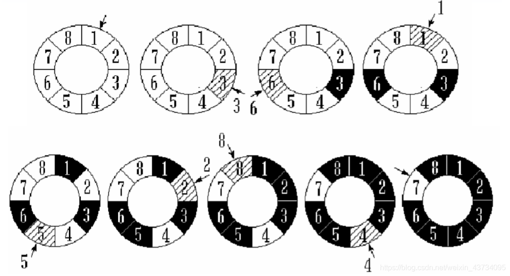
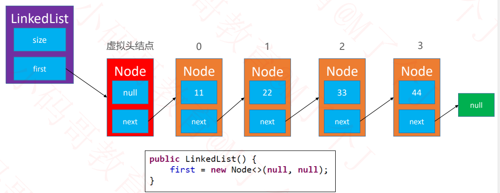
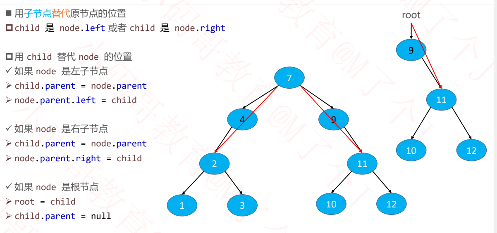

# 恋上数据结构-基础篇

+++

## 零、复杂度知识以及LeetCode刷题指南

### 1 什么是算法？

算法是用于解决特定问题的一系列的执行步骤。

以下算法是为了解决**两数相加**的问题：

```java
// 计算a和b的和
public static int plue(int a, int b){
	return a + b;
}
```

以下算法是为了解决**n个数字的和**的问题：

```java
// 1+2+3+...+n
public static int sum(int n){
	int result = 0;
	for(int i = 1; i <= n; i++){
		result += i;
	}
	return result;
}
```

使用不同算法，解决同一个问题，效率可能相差非常大。比如：

**求第 n 个斐波那契数（fibonacci number）**


### 2 如何评判一个算法的好坏？

如果单从执行效率上进行评估，可能会想到这么一种方案：

- 比较不同算法对同一组输入的执行处理时间
- 这种方案也叫做：事后统计法

上述方案有比较明显的缺点：

- 执行时间严重依赖硬件以及运行时各种不确定的环境因素
- 必须编写相应的测算代码
- 测试数据的选择比较难保证公正性

一般从以下维度来评估算法的优劣：

- 正确性、可读性、健壮性（对不合理输入的反应能力和处理能力）
- **时间复杂度（time complexity）**：估算程序指令的执行次数（执行时间）
- **空间复杂度（space complexity）**：估算所需占用的存储空间

由于现在硬件发展的较好，一般情况下我们更侧重于**时间复杂度**。

> 附：
>
> 下面代码是一个测试时间效率的小工具：
>
> ```java
> package com.mj;
> 
> import java.text.SimpleDateFormat;
> import java.util.Date;
> 
> /**
>  * 测试时间效率的小工具
>  */
> public class Times {
> 	private static final SimpleDateFormat fmt = new SimpleDateFormat("HH:mm:ss.SSS");
> 	
> 	public interface Task {
> 		void execute();
> 	}
> 	
> 	public static void test(String title, Task task) {
> 		if (task == null) return;
> 		title = (title == null) ? "" : ("【" + title + "】");
> 		System.out.println(title);
> 		System.out.println("开始：" + fmt.format(new Date()));
> 		long begin = System.currentTimeMillis(); // 开始时间
> 		task.execute(); // 执行代码
> 		long end = System.currentTimeMillis(); // 结束时间
> 		System.out.println("结束：" + fmt.format(new Date()));
> 		double delta = (end - begin) / 1000.0; // 毫秒转换为秒
> 		System.out.println("耗时：" + delta + "秒");
> 		System.out.println("-------------------------------------");
> 	}
> }
> ```


### 3 大O表示法（Big O）

一般用大O表示法来描述复杂度，它表示的是数据规模 n 对应的复杂度。

忽略常数、系数、低阶：

- 9 >> O(1)
- 2n + 3 >> O(n)
- n<sup>2</sup> + 2n + 6 >> O(n^2)
- 4n<sup>3</sup> + 3n<sup>2</sup> + 22n + 100 >> O(n<sup>3</sup>)
- 写法上，n<sup>3</sup> 等价于 n^3

注意：大O表示法仅仅是一种粗略的**分析模型**，是一种**估算**，能帮助我们短时间内了解一个算法的执行效率。


#### 3.1 对数阶的细节

对数阶一般省略底数：

- 由于 log<sub>2</sub>9 ∗ log<sub>9</sub>n >> log<sub>2</sub>n，即每个对数基本都可以常数乘另一个对数
- 所以 O(log<sub>2</sub>n) 、O(log<sub>9</sub>n) 统称为 **O(logn)**


#### 3.2 常见的复杂度


> 可以借助函数生成工具对比复杂度的大小：https://zh.numberempire.com/graphingcalculator.php




#### 3.3 多个数据规模的情况

时间复杂度：O(n + k)

```java 
public static void test(int n, int k){
	for(int i = 0; i < n; i++){
		System.out.println("test");
	}
	for (int i = 0; i < k; i++){
		System.out.println("test");
	}
}
```


### 4 LeetCode刷题指南

首先去 https://leetcode-cn.com/ 注册一个力扣账号。

我们以力扣上一道斐波那契的题目为例，顺便分析算法的时间复杂度。

题目网址：[LeetCode: 509.斐波那契数](https://leetcode-cn.com/problems/fibonacci-number/)


以执行**斐波那契数列(递归)**为例，必须写成这样：


### 5 斐波那契数列复杂度分析

#### 5.1 斐波那契数列 - 递归

很简单的代码，相信来学数据结构的同学都能看懂。

```java
// O(2^n)
public static int fib1(int n) {
	if (n <= 1) return n;
	return fib1(n - 1) + fib1(n - 2);
}
```

复杂度分析：


我们放到力扣上去执行一下：效率奇差无比！


#### 5.2 斐波那契数列 - 循环

不开辟任何空间，只使用循环完成。

```java
// O(n)
public static int fib2(int n) {
	if (n <= 1) return n;
	
	int first = 0;
	int second = 1;
	for (int i = 0; i < n - 1; i++) {
		int sum = first + second;
		first = second;
		second = sum;
	}
	/*
	// 也可以使用while循环
	while (n-- > 1) {
		second += first;
		first = second - first;
	}
	*/
	return second;
}
```

力扣上执行：速度变快了，内存消耗还是很多…


开辟新的数组空间，用空间换时间。

```java
public static int fib3(int n){
	if(n <= 1) return n;
	
	int[] fib = new int[n+1];
	fib[0] = 0;
	fib[1] = 1;
	for(int i = 2; i < fib.length; i++){
		fib[i] = fib[i-1] + fib[i-2];
	}
	return fib[n];
}
```

力扣上执行：呃，和上面好像没啥区别。。


#### 5.3 fib函数的时间复杂度分析

上面两种 fib 函数的差别有多大？

- 如果有一台 1GHz 的普通计算机，运算速度 10<sup>9</sup> 次每秒，n 为 64
- O(n) 大约耗时 6.4 * 10<sup>-8</sup> 秒
- O(2<sup>n</sup>) 大约耗时 584.94 年
- 有时候算法之间的差距，往往比硬件方面的差距还要大


#### 5.4 斐波那契的线性代数解法-特征方程


### 6 算法的优化方向

- 用尽量少的存储空间
- 用尽量少的执行步骤（执行时间）
- 根据情况：**空间换时间**、**时间换空间**

+++

## 一、动态扩容数组

### 1 什么是数据结构？

数据结构是计算机存储、组织数据的方式；


在实际应用中，根据使用场景来选择最合适的数据结构


### 2 线性表

**线性表**是具有 n 个**相同类型元素**的有限**序列**（ n ≥ 0 ）


- a<sub>1</sub>是首节点（首元素），a<sub>n</sub>是尾结点（尾元素）
- a<sub>1 </sub>是 a<sub>2</sub> 的**前驱**，a<sub>2</sub> 是 a<sub>1</sub> 的**后继**

常见的线性表有：

- 数组
- 链表
- 栈
- 队列
- 哈希表（散列表）


### 3 数组Array

数组是一种顺序存储的线性表，所有元素的**内存地址是连续**的


在很多编程语言中，数组都有个致命的缺点：**无法动态修改容量**

实际开发中，我们更希望数组的容量是可以动态改变的


### 4 动态数组DynamicArray

#### 4.1 动态数组接口设计


动态数组的结构：

- size
- elements


> Java 中，成员变量会自动初始化，比如：
>
> - int 类型自动初始化为 0
> - 对象类型自动初始化为 null


#### 4.2 清除所有元素--clear()

核心代码是 size = 0，实际上不需要执行 `elements = null`，size = 0 的操作已经对用户来说保证了无法访问动态数组中的元素了。

代码实现：

```java
public void clear() {
    size = 0;
}
```


#### 4.3 添加元素--add(E element)、add(int index, E element)

`add(E element)`：默认往数组最后添加元素；


`add(int index, E element)`：在 `index` 位置插入一个元素；

比如要往 `index = 2` 的地方添加元素：

- 正确的顺序应当是：**从后往前**开始将 `index = 2` 以后的元素依次后移，然后赋值：


- 如果**从前往后**开始移动元素，会造成如下**错误的**后果：


代码实现：

```java
/**
 * 在index位置插入一个元素
 * @param index
 * @param element
 */
public void add(int index, E element){ 
	rangeCheckForAdd(index); // 检查下标越界
	ensureCapacity(size + 1); // 确保容量够大
	// 0 1 2 3 4 5 6 7 8 9	(index)
	// 1 2 3 4 5 6 x x x x	(原数组)
	// 在index=2处，插入9，元素全部后移
	// 1 2 9 3 4 5 6 x x x	(add后数组)
	// 先从后往前开始, 将每个元素往后移一位, 然后再赋值
	for (int i = size; i > index; i--) {
        elements[i] = elements[i-1];
    }
	elements[index] = element; // 复制
	size++;
}

/**
 * 添加元素到数组最后
 */
public void add(E element){
	add(size, element);
}
```


#### 4.4 删除元素--remove(int index)、清空数组--clear()

例如，删除 `index = 3` 的数组元素，应当**从前往后**开始移动，用后面的元素覆盖前面的元素。


**思考**：**最后一个元素如何处理**？

- 如果存放 `int` 类型，`size--` 后，最后一个元素已经无法访问了。

- 如果使用**泛型**，数组要注意内存管理（将元素置 `null`）。

  使用泛型技术可以让动态数组更加通用，可以存放任何数据类型：

  

代码实现：

```java
/**
 * 删除index位置的元素
 * @param index
 * @return
 */
public E remove(int index){
	rangeCheck(index); // 检查下标越界
	// 0 1 2 3 4 5 	(index)
	// 1 2 3 4 5 6 	(原数组)
	// 删除index为2的元素，元素前移
	// 1 2 4 5 6	(remove后的数组)
	// 从前往后开始移, 用后面的元素覆盖前面的元素
	E old = elements[index];
	for (int i = index + 1; i < size; i++) {
        elements[i-1] = elements[i];
    }
	// 下面是使用泛型后需要写的(如果存储的是int型数据, 则不需要)
	elements[--size] = null; // 删除元素后, 将最后一位设置为null
	return old;
}

/**
 * 清除所有元素
 */
public void clear(){
	// 使用泛型数组后要注意内存管理(将元素置null)
	for (int i = 0; i < size; i++) {
		elements[i] = null;
	}
	size = 0;
}
```


#### 4.5 是否包含某个元素--contains(E element)

关于 null 的处理主要看你的业务需求：是否可以存储 null 数据？

```java
private static final int ELEMENT_NOT_FOUND = -1;

/**
 * 是否包含某个元素
 * @param element
 * @return
 */
public boolean contains(E element){
	return indexOf(element) != ELEMENT_NOT_FOUND; // 找的到该元素则返回True
}

/**
* 查看元素的索引
 * @param element
 * @return
 */
public int indexOf(E element){
	/*
	// 不对 null 进行处理也可以，但是健壮性不够
	for (int i = 0; i < size; i++) {
		if(elements[i].equals(element)) return i;
	}
	 */
	if(element == null){ // 对 null 进行处理
		for (int i = 0; i < size; i++) {
			if(elements[i] == null) return i;
		}
	}else{
		for (int i = 0; i < size; i++) {
			if(element.equals(elements[i])) return i;
		}
	}
	return ELEMENT_NOT_FOUND;
}
```


#### 4.6 扩容--ensureCapacity(int capacity)

相信看过视频的小伙伴一看这图就懂了。


```java
/**
 * 扩容操作
 */
private void ensureCapacity(int capacity) {
	int oldCapacity = elements.length; // 旧的容量大小
	if (oldCapacity >= capacity) return; // 如果容量大小管够，则返回
	// 新容量为旧容量的1.5倍
	int newCapacity = oldCapacity + (oldCapacity >> 1);
	E[] newElements = (E[]) new Object[newCapacity];
	for (int i = 0; i < size; i++) {
		newElements[i] = elements[i]; // 拷贝原数组元素到新数组
	}
	elements = newElements;
}
```


#### 4.7 打印数组--toString()

- 重写 `toString` 方法
- 在 `toString` 方法中将元素拼接成字符串
- 字符串拼接建议使用 `StringBuilder`

```java
	@Override
    public String toString() {
        StringBuilder string = new StringBuilder();
        string.append("size=").append(size).append(", [");
        for (int i = 0; i < size; i++) {
            if (i != 0){
                string.append(", ");
            }
            string.append(elements[i]);
        }
        string.append("]");
        return string.toString();
    }
	// size=6, [1, 2, 3, 4, 5, 6]
```


### 5 泛型

使用泛型技术可以让动态数组更加通用，可以存放任何数据类型

```java
public class ArrayList<E> {
	private int size;
	private E[] elements;
}
```

```java
private static final int DEFAULT_CAPACITY = 10;

public ArrayList(int capacity){
    capacity = Math.max(capacity, DEFAULT_CAPACITY);
    elements = (E[]) new Object[capacity];
}
public ArrayList(){
    this(DEFAULT_CAPACITY);
}
```

```java
ArrayList<Integer> list = new ArrayList<>();
```


#### 5.1 对象数组 - Object[]

```java
Object[] objects = new Object[7];
```

- 由于 Object 可以存放任何类型，因此无法固定 Object 占多少内存空间（根据传入不同的自定义对象，占用的空间都不同），因此实际上 Object 数组中存放的是**对象的地址**。
- 想要销毁对象，只需要将指向该对象的地址赋值为`null`，没有地址引用该对象，则会自动被垃圾回收


内存管理细节：

```java
public void clear() {
    for (int i = 0; i < size; i++) {
        elements[i] = null; // 管理内存
    }
    size = 0;
}
```

```java
public E remove(int index) {
    rangeCheck(index);
    E old = elements[index];
    for (int i = index + 1; i < size; i++) {
        elements[i-1] = elements[i];
    }
    elements[--size] = null; // 管理内存
    return old;
}
```


### 6 int型动态数组源码（Java）

```java
public class ArrayList {
	private int size;		// 元素数量	
	private int[] elements; // 所有的元素

	private static final int DEFAULT_CAPACITY = 10; // 初始容量
	private static final int ELEMENT_NOT_FOUND = -1;
	
	public ArrayList(int capacity) { // 容量小于10一律扩充为10
		capacity = (capacity < DEFAULT_CAPACITY) ? DEFAULT_CAPACITY : capacity;
		elements = new int[capacity];
	}
	public ArrayList(){
		this(DEFAULT_CAPACITY);
	}
	/**
	 * 元素的数量
	 * @return
	 */
	public int size(){
		return size;
	}
	/**
	 * 是否为空
	 * @return
	 */
	public boolean isEmpty(){
		return size == 0;
	}
	/**
	 * 是否包含某个元素
	 * @param element
	 * @return
	 */
	public boolean contains(int element){
		return indexOf(element) != ELEMENT_NOT_FOUND; //找的到该元素则返回True
	}
	/**
	 * 在index位置插入一个元素
	 * @param index
	 * @param element
	 */
	public void add(int index, int element){
		rangeCheckForAdd(index); // 检查下标越界
		ensureCapacity(size + 1); // 确保容量够大
		
		// 0 1 2 3 4 5 6 7 8 9	(index)
		// 1 2 3 4 5 6 x x x x	(原数组)
		// 在index=2处，插入9，元素全部后移
		// 1 2 9 3 4 5 6 x x x	(add后数组)
		// 先从后往前开始, 将每个元素往后移一位, 然后再赋值
		for (int i = size - 1; i >= index; i--) {
			elements[i + 1] = elements[i];
		}
		elements[index] = element; // 赋值
		size++;
	}
	/**
	 * 添加元素到最后面
	 */
	public void add(int element){
		add(size, element);
	}
	/**
	 * 设置index位置的元素
	 * @param index
	 * @param element
	 * @return 原来的元素ֵ
	 */
	public int get(int index){
		rangeCheck(index);
		return elements[index];
	}
	/**
	 * 设置index位置的元素
	 * @param index
	 * @param element
	 * @return 原来的元素ֵ
	 */
	public int set(int index, int element){
		rangeCheck(index);
		int old = elements[index];
		elements[index] = element;
		return old;
	}
	/**
	 * 删除index位置的元素
	 * @param index
	 * @return
	 */
	public int remove(int index){
		rangeCheck(index);
		
		// 0 1 2 3 4 5 	(index)
		// 1 2 3 4 5 6 	(原数组)
		// 删除index为2的元素，元素前移
		// 1 2 4 5 6	(remove后的数组)
		int old = elements[index];
		// 从前往后开始移, 用后面的元素覆盖前面的元素
		for (int i = index; i < size-1; i++) {
			elements[i] = elements[i + 1];
		}
		size--;
		return old;
	}
	/**
	 * 查看元素的索引
	 * @param element
	 * @return
	 */
	public int indexOf(int element){
		for (int i = 0; i < size; i++) {
			if(elements[i] == element) return i;
		}
		return ELEMENT_NOT_FOUND;
	}
	/**
	 * 清除所有元素
	 */
	public void clear(){
		size = 0;
	}
	/*
	 * 扩容操作
	 */
	private void ensureCapacity(int capacity){
		int oldCapacity = elements.length;
		if(oldCapacity >= capacity) return;
		// 新容量为旧容量的1.5倍
		int newCapacity = oldCapacity + (oldCapacity >> 1); // 1.5
		int[] newElements = new int[newCapacity];
		for (int i = 0; i < size; i++) {
			newElements[i] = elements[i];
		}
		elements = newElements;
		System.out.println("size="+oldCapacity+", 扩容到了"+newCapacity);
	}
	/****************封装好的功能函数*******************************/
	// 下标越界抛出的异常
	private void outOfBounds(int index) {
		throw new IndexOutOfBoundsException("Index:" + index + ", Size:" + size);
	}
	// 检查下标越界(不可访问或删除size位置)
	private void rangeCheck(int index){
		if(index < 0 || index >= size){
			outOfBounds(index);
		}
	}
	// 检查add()的下标越界(可以在size位置添加)
	private void rangeCheckForAdd(int index) {
		if (index < 0 || index > size) {
			outOfBounds(index);
		}
	}
	/****************封装好的功能函数*******************************/
	@Override
	public String toString() {
		// 打印形式为: size=5, [99, 88, 77, 66, 55]
		StringBuilder string = new StringBuilder();
		string.append("size=").append(size).append(", [");
		for (int i = 0; i < size; i++) {
			if(0 != i) string.append(", ");
			string.append(elements[i]);
		}
		string.append("]");
		return string.toString();
	}
}
```


### 7 泛型动态数组源码（Java）

```java
@SuppressWarnings("unchecked")
public class ArrayList<E> {
    /**
     * 元素的容量
     */
    private int size;
    /**
     * 所有的元素
     */
    private E[] elements;

    private static final int DEFAULT_CAPACITY = 10; //初始容量
    private static final int ELEMENT_NOT_FOUND = -1;

    public ArrayList(int capacity){ // 容量小于10一律扩充为10
        capacity = Math.max(capacity, DEFAULT_CAPACITY);
        elements = (E[]) new Object[capacity];
    }

    public ArrayList(){
        this(DEFAULT_CAPACITY);
    }

    /**
     * 清除所有元素
     */
    public void clear() {
        for (int i = 0; i < size; i++) {
            elements[i] = null;
        }
        size = 0;
    }

    /**
     * 元素的数量
     * @return
     */
    public int size() {
        return size;
    }

    /**
     * 是否为空
     * @return
     */
    public boolean isEmpty() {
        return size == 0;
    }
    /**
     * 是否包含某个元素
     * @param element
     * @return
     */
    public boolean contains(E element) {
        return indexOf(element) != ELEMENT_NOT_FOUND;
    }

    /**
     * 获取index位置的元素
     * @param index
     * @return
     */
    public E get(int index) { //O(1)
        rangeCheck(index);
        return elements[index];
    }

    /**
     * 设置index位置的元素
     * @param index
     * @param element
     * @return 原来的元素ֵ
     */
    public E set(int index, E element) { //O(1)
        rangeCheck(index);
        E old = elements[index];
        elements[index] = element;
        return old;
    }

    /**
     * 添加元素到尾部
     * @param element
     */
    public void add(E element) {
        add(size, element);
    }

    /**
     * 在index位置插入一个元素
     * @param index
     * @param element
     * 
     * 最好：O(1)
     * 最坏：O(n)
     * 平均：O(n)
     */
    public void add(int index, E element) { 
        rangeCheckForAdd(index);
        ensureCapacity(size + 1);

        for (int i = size; i > index; i--) {
            elements[i] = elements[i-1];
        }
        elements[index] = element;
        size++;
    }

    /**
     * 删除index位置的元素
     * @param index
     * @return
     * 
     * 最好：O(1)
     * 最坏：O(n)
     * 平均：O(n)
     */
    public E remove(int index) {
        rangeCheck(index);
        E old = elements[index];
        for (int i = index + 1; i < size; i++) {
            elements[i-1] = elements[i];
        }
        elements[--size] = null;
        return old;
    }

    /**
     * 查看元素的索引
     * @param element
     * @return
     */
    public int indexOf(E element) {
        if (element == null){
            for (int i = 0; i < size; i++) {
                if (elements[i] == null){
                    return i;
                }
            }
        } else {
            for (int i = 0; i < size; i++) {
                if (element.equals(elements[i])){
                    return i;
                }
            }
        }
        return ELEMENT_NOT_FOUND;
    }

    /**
     * 保证要有capacity的容量
     * @param capacity
     */
    private void ensureCapacity(int capacity) {
        int oldCapacity = elements.length;
        if (oldCapacity >= capacity) return;
        //新容量为旧容量的1.5倍
        int newCapacity = oldCapacity + (oldCapacity >> 1);
        E[] newElements = (E[]) new Object[newCapacity];
        for (int i = 0; i < size; i++) {
            newElements[i] = elements[i];
        }
        elements = newElements;
    }

    /****************封装好的功能函数**************************/
	// 下标越界抛出的异常
    private void outOfBounds(int index) {
        throw new IndexOutOfBoundsException("Index: " + index + ", Size: " + size);
    }
	// 检查下标越界(不可访问或删除size位置)
    private void rangeCheck(int index) {
        if (index < 0 || index >= size){
            outOfBounds(index);
        }
    }
	// 检查add()的下标越界(可以在size位置添加元素)
    private void rangeCheckForAdd(int index) {
        if (index < 0 || index > size){
            outOfBounds(index);
        }
    }

    @Override
    public String toString() {
        StringBuilder string = new StringBuilder();
        string.append("size=").append(size).append(", [");
        for (int i = 0; i < size; i++) {
            if (i != 0){
                string.append(", ");
            }
            string.append(elements[i]);
        }
        string.append("]");
        return string.toString();
    }
}
```

+++

## 二、链表LinkedList

动态数组有个明显的缺点：

- 可能会造成内存空间的大量浪费。

能否用到多少就申请多少内存？

- 链表可以办到这一点

**链表**是一种**链式存储**的线性表，所有元素的**内存地址不一定是连续的**;


### 1 链表的接口设计


由于**链表的大部分接口和动态数组一致**，我们抽取出一个共同的 `List` **接口**；

```java
public interface List<E> {
    int ELEMENT_NOT_FOUND = -1;

    /**
     * 清除所有元素
     */
    void clear();

    /**
     * 元素的数量
     */
    int size();

    /**
     * 是否为空
     */
    boolean isEmpty();

    /**
     * 是否包含某个元素
     */
    boolean contains(E element);

    /**
     * 添加元素到尾部
     */
    void add(E element);

    /**
     * 获取index位置的元素
     */
    E get(int index);

    /**
     * 设置index位置的元素
     */
    E set(int index, E element);

    /**
     * 在index位置插入一个元素
     */
    void add(int index, E element);

    /**
     * 删除index位置的元素
     */
    E remove(int index);

    /**
     * 查看元素的索引
     */
    int indexOf(E element);
}
```

再将一些通用的字段与方法放到一个抽象类中，无论是**动态数组**还是**链表**都**只需要继承这个抽象类**即可。

```java
public abstract class AbstractList<E> implements List<E> {
    /**
     * 元素的容量
     */
    protected int size;

    /**
     * 元素的数量
     */
    public int size() {
        return size;
    }

    /**
     * 是否为空
     */
    public boolean isEmpty() {
        return size == 0;
    }

    /**
     * 是否包含某个元素
     */
    public boolean contains(E element) {
        return indexOf(element) != ELEMENT_NOT_FOUND;
    }

    /**
     * 添加元素到尾部
     */
    public void add(E element) {
        add(size, element);
    }

    // 下标越界抛出的异常
    protected void outOfBounds(int index) {
        throw new IndexOutOfBoundsException("Index: " + index + ", Size: " + size);
    }
	// 检查下标越界(不可访问或删除size位置)
    protected void rangeCheck(int index) {
        if (index < 0 || index >= size){
            outOfBounds(index);
        }
    }
	// 检查add()的下标越界(可以在size位置添加元素)
    protected void rangeCheckForAdd(int index) {
        if (index < 0 || index > size){
            outOfBounds(index);
        }
    }
}
```


### 2 单向链表SingleLinkedList

单向链表的结构如下图所示：


```java
public class SingleLinkedList<E> extends AbstractList<E> {
	private Node<E> first;

	// 链表中的节点类
	private static class Node<E> {
		E element; // 节点元素
		Node<E> next; // 节点指向下一个节点

		public Node(E element, Node<E> next) {
			this.element = element;
			this.next = next;
		}
	}
}
```


#### 2.1 获取元素--get()

```java
@Override
public E get(int index) {
    return node(index).element;
}

/**
 * 获取index位置对应的节点对象
 * @param index
 * @return
 */
private Node<E> node(int index){
    rangeCheck(index);
    Node<E> node = first;
    for (int i = 0; i < index; i++) {
        node = node.next;
    }
    return node;
}
```


#### 2.2 清空元素--clear()


- `next` 不需要设置为 `null`，因为 `first` 指向了 `null`，后面的 `Node` 没有被指向，在 Java 中会自动被垃圾回收。

```java
@Override
public void clear() {
	size = 0;
	first = null;
}
```


#### 2.3 添加元素--add(int index, E element)


添加元素尤其要注意 0 位置，给空链表添加第一个节点是个特殊情况：

```java
/*
 * 最好：O(1)
 * 最坏：O(n)
 * 平均：O(n)
 */
@Override
public void add(int index, E element) {
    rangeCheckForAdd(index);
    if (index == 0){ // 给空链表添加第一个元素的情况
        first = new Node<>(element, first);
    } else {
        Node<E> prev = node(index - 1);
        prev.next = new Node<>(element, prev.next);
    }
    size++;
}
```


#### 2.4 删除元素--remove(int index)


```java
/*
 * 最好：O(1)
 * 最坏：O(n)
 * 平均：O(n)
 */
@Override
public E remove(int index) {
    rangeCheck(index);
    Node<E> node = first;
    if (index == 0){ // 删除第一个元素是特殊情况
        first = first.next;
    } else {
        Node<E> prev = node(index-1); // 找到前一个元素
        node = prev.next; // 要删除的元素
        prev.next = node.next; // 删除元素
    }
    size--;
    return node.element;
}
```


#### 2.5 单向链表完整源码

```java
/**
 * @description: 单向链表 无虚拟头结点
 * @author: xu
 * @date: 2022/9/15 20:12
 */
public class SingleLinkedList1<E> extends AbstractList<E> {
    private Node<E> first;

    private static class Node<E>{
        E element;
        Node<E> next;
        Node(E element, Node<E> next) {
            this.element = element;
            this.next = next;
        }
    }

    @Override
    public void clear() {
        first = null;
        size = 0;
    }

    /*
     * 最好：O(1)
     * 最坏：O(n)
     * 平均：O(n)
     */
    @Override
    public E get(int index) {
        return node(index).element;
    }

    /*
     * 最好：O(1)
     * 最坏：O(n)
     * 平均：O(n)
     */
    @Override
    public E set(int index, E element) {
        Node<E> node = node(index);
        E oldElement = node.element;
        node.element = element;
        return oldElement;
    }

    /*
     * 最好：O(1)
     * 最坏：O(n)
     * 平均：O(n)
     */
    @Override
    public void add(int index, E element) {
        rangeCheckForAdd(index);
        if (index == 0){
            first = new Node<>(element, first);
        } else {
            Node<E> prev = node(index - 1);
            prev.next = new Node<>(element, prev.next);
        }
        size++;
    }

    /*
     * 最好：O(1)
     * 最坏：O(n)
     * 平均：O(n)
     */
    @Override
    public E remove(int index) {
        rangeCheck(index);
        Node<E> node = first;
        if (index == 0){
            first = first.next;
        } else {
            Node<E> prev = node(index-1);
            node = prev.next;
            prev.next = node.next;
        }
        size--;
        return node.element;
    }

    @Override
    public int indexOf(E element) {
        Node<E> node = first;
        if (element == null){
            for (int i = 0; i < size; i++) {
                if (node.element == null){
                    return i;
                }
                node = node.next;
            }
        } else {
            for (int i = 0; i < size; i++) {
                if (element.equals(node.element)){
                    return i;
                }
                node = node.next;
            }
        }
        return ELEMENT_NOT_FOUND;
    }

    /**
     * 获取index位置对应的节点对象
     * @param index
     * @return
     */
    private Node<E> node(int index){
        rangeCheck(index);
        Node<E> node = first;
        for (int i = 0; i < index; i++) {
            node = node.next;
        }
        return node;
    }

    @Override
    public String toString() {
        StringBuilder string = new StringBuilder();
        string.append("size=").append(size).append(", [");
        Node<E> node = first;
        for (int i = 0; i < size; i++) {
            if (i != 0){
                string.append(", ");
            }
            string.append(node.element);
            node = node.next;
        }
        /*
        Node<E> node1 = first;
        while (node1 != null){
            //......
            node1 = node1.next
        }
        */
        string.append("]");
        return string.toString();
    }
}
```


### 3 带虚拟头结点的单向链表

有时候为了让代码更加精简，统一所有节点的处理逻辑，可以在最前面增加一个**虚拟的头结点（不存储数据）**。



带虚拟头结点的单向链表与普通单向链表代码类似：但是 `add`、`reomove` 、`toString` 、`node`略有不同；

```java
/**
 * @description: 单向链表 有虚拟头结点
 * @author: xu
 * @date: 2022/9/15 20:12
 */
public class SingleLinkedList<E> extends AbstractList<E> {
    private Node<E> first;

    // 初始化一个虚拟头结点
    public SingleLinkedList() {
        first = new Node<>(null, null);
    }

    private static class Node<E> {
        E element;
        Node<E> next;

        Node(E element, Node<E> next) {
            this.element = element;
            this.next = next;
        }
    }

    @Override
    public void clear() {
        first = null;
        size = 0;
    }

    @Override
    public E get(int index) {
        return node(index).element;
    }

    @Override
    public E set(int index, E element) {
        Node<E> node = node(index);
        E oldElement = node.element;
        node.element = element;
        return oldElement;
    }

    //改动
    @Override
    public void add(int index, E element) {
        rangeCheckForAdd(index);
        Node<E> prev = index == 0 ? first : node(index - 1);
        prev.next = new Node<>(element, prev.next);
        size++;
    }

    //改动
    @Override
    public E remove(int index) {
        rangeCheck(index);
        
        Node<E> prev = index == 0 ? first : node(index - 1);
        Node<E> node = prev.next;
        prev.next = node.next;
        
        size--;
        return node.element;
    }

    @Override
    public int indexOf(E element) {
        Node<E> node = first;
        if (element == null) {
            for (int i = 0; i < size; i++) {
                if (node.element == null) {
                    return i;
                }
                node = node.next;
            }
        } else {
            for (int i = 0; i < size; i++) {
                if (element.equals(node.element)) {
                    return i;
                }
                node = node.next;
            }
        }
        return ELEMENT_NOT_FOUND;
    }

    /**
     * 获取index位置对应的节点对象
     *
     * @param index
     * @return
     */
    private Node<E> node(int index) {
        rangeCheck(index);
        Node<E> node = first.next;//改动
        for (int i = 0; i < index; i++) {
            node = node.next;
        }
        return node;
    }

    @Override
    public String toString() {
        StringBuilder string = new StringBuilder();
        string.append("size=").append(size).append(", [");
        Node<E> node = first.next; //改动
        for (int i = 0; i < size; i++) {
            if (i != 0) {
                string.append(", ");
            }
            string.append(node.element);
            node = node.next;
        }
        string.append("]");
        return string.toString();
    }
}
```


### 4 动态数组、链表复杂度分析

数组的**随机访问速度**非常快：`elements[n]` 的效率与 n 是多少无关；


#### 4.1 动态数组add(E element)复杂度分析


#### 4.2 动态数组的缩容


```java
/**
 * 清除所有元素
 */
public void clear() {
    for (int i = 0; i < size; i++) {
        elements[i] = null;
    }
    size = 0;
    if (elements != null && (elements.length >> 1) > DEFAULT_CAPACITY){
        elements = (E[]) new Object[DEFAULT_CAPACITY]; // 缩容
    }
}

/**
 * 删除index位置的元素
 * @param index
 * @return
 */
public E remove(int index) {
    rangeCheck(index);
    E old = elements[index];
    for (int i = index + 1; i < size; i++) {
        elements[i-1] = elements[i];
    }
    elements[--size] = null;
    trim(); // 缩容
    return old;
}

/**
 * 裁剪操作
 * 剩余空间占总容量的一半以上时，进行缩容
 */
private void trim() {
    int capacity = elements.length;//当前容量
    int newCapacity = capacity >> 1;
    if (size >= (newCapacity) || capacity <= DEFAULT_CAPACITY){
        return;
    }
    // 剩余空间还有很多
    E[] newElements = (E[]) new Object[newCapacity];
    for (int i = 0; i < size; i++) {
        newElements[i] = elements[i];
    }
    
    elements = newElemen
    System.out.println(capacity + "容量大小缩容为" + newCapacity );
}
```


### 5 双向链表LinkedList

双向链表可以提升链表的综合性能；


双向链表**只有一个元素**的情况：`first`、`last` 指向同一个节点


```java
/* 双向链表 */
public class LinkedList<E> extends AbstractList<E> {
    private Node<E> first;
    private Node<E> last;

    private static class Node<E>{
        E element;
        Node<E> prev;
        Node<E> next;
        
        Node(E element, Node<E> prev, Node<E> next) {
            this.element = element;
            this.prev = prev;
            this.next = next;
        }
    }
}
```


#### 5.1 双向链表--get(int index)

```java
@Override
public E get(int index) {
    return node(index).element;
}

/**
 * 根据索引找到节点
 */
private Node<E> node(int index){
    rangeCheck(index);
    if (index < (size >> 1)){ // 索引小于一半从前往后找
        Node<E> node = first;
        for (int i = 0; i < index; i++) {
            node = node.next;
        }
        return node;
    }
    
	// 索引大于一半从后往前找
    Node<E> node = last;
    for (int i = size - 1; i > index; i--) {
        node = node.prev;
    }
    return node;
}
```


#### 5.2 双向链表--add(int index, E element)


```java
@Override
public void add(int index, E element) {
    rangeCheckForAdd(index);

    if (index == size){ //往最后面添加元素
        Node<E> oldLast = last;
        last = new Node<>(element, oldLast, null);
        if (oldLast == null){ // 这是链表添加的第一个元素
            first = last;
        } else {
            oldLast.next = last;
        }
    } else { // 正常添加元素
        Node<E> next = node(index);
        Node<E> prev = next.prev;

        Node<E> node = new Node<>(element, prev, next);
        next.prev = node;
        if (prev == null) { //index == 0 的情况
            first = node;
        } else {
            prev.next = node;
        }
    }

    size++;
}
```


#### 5.3 双向链表--remove(int index)


```java
@Override
public E remove(int index) {
    rangeCheck(index);

    Node<E> node = node(index);
    Node<E> prev = node.prev;
    Node<E> next = node.next;

    if (prev == null){  // index == 0
        first = next;
    } else {
        prev.next = next;
    }

    if (next == null){ // index == size - 1
        last = prev;
    } else {
        next.prev = prev;
    }

    size--;
    return node.element;
}
```


#### 5.4 双向链表完整源码

```java
public class LinkedList<E> extends AbstractList<E> {
    private Node<E> first;
    private Node<E> last;

    private static class Node<E>{
        E element;
        Node<E> prev;
        Node<E> next;
        Node(E element, Node<E> prev, Node<E> next) {
            this.element = element;
            this.prev = prev;
            this.next = next;
        }

        @Override
        public String toString() {
            StringBuilder sb = new StringBuilder();
            if (prev != null){
                sb.append(prev.element);
            } else {
                sb.append("null");
            }
            sb.append("_").append(element).append("_");
            if (next != null){
                sb.append(next.element);
            } else {
                sb.append("null");
            }
            return sb.toString();
        }
    }

    @Override
    public void clear() {
        first = null;
        last = null;
        size = 0;
    }

    @Override
    public E get(int index) {
        return node(index).element;
    }

    @Override
    public E set(int index, E element) {
        Node<E> node = node(index);
        E oldElement = node.element;
        node.element = element;
        return oldElement;
    }

    @Override
    public void add(int index, E element) {
        rangeCheckForAdd(index);

        if (index == size){ //往最后面添加元素
            Node<E> oldLast = last;
            last = new Node<>(element, oldLast, null);
            if (oldLast == null){ // 这是链表添加的第一个元素
                first = last;
            } else {
                oldLast.next = last;
            }
        } else {
            Node<E> next = node(index);
            Node<E> prev = next.prev;

            Node<E> node = new Node<>(element, prev, next);
            next.prev = node;
            if (prev == null) { //index == 0 的情况
                first = node;
            } else {
                prev.next = node;
            }
        }

        size++;
    }

    @Override
    public E remove(int index) {
        rangeCheck(index);

        Node<E> node = node(index);
        Node<E> prev = node.prev;
        Node<E> next = node.next;

        if (prev == null){  // index == 0
            first = next;
        } else {
            prev.next = next;
        }

        if (next == null){ // index == size - 1
            last = prev;
        } else {
            next.prev = prev;
        }

        size--;
        return node.element;
    }

    @Override
    public int indexOf(E element) {
        Node<E> node = first;
        if (element == null){
            for (int i = 0; i < size; i++) {
                if (node.element == null){
                    return i;
                }
                node = node.next;
            }
        } else {
            for (int i = 0; i < size; i++) {
                if (element.equals(node.element)){
                    return i;
                }
                node = node.next;
            }
        }
        return ELEMENT_NOT_FOUND;
    }

    /**
     * 获取index位置对应的节点对象
     * @param index
     * @return
     */
    private Node<E> node(int index){
        rangeCheck(index);
        if (index < (size >> 1)){
            Node<E> node = first;
            for (int i = 0; i < index; i++) {
                node = node.next;
            }
            return node;
        }

        Node<E> node = last;
        for (int i = size - 1; i > index; i--) {
            node = node.prev;
        }
        return node;
    }

    @Override
    public String toString() {
        StringBuilder string = new StringBuilder();
        string.append("size=").append(size).append(", [");
        Node<E> node = first;
        for (int i = 0; i < size; i++) {
            if (i != 0){
                string.append(", ");
            }
            string.append(node.element);
            node = node.next;
        }
        string.append("]");
        return string.toString();
    }
}
```


### 6 对比

#### 6.1 双向链表 vs 单向链表

粗略对比一下**删除的操作数量**：操作数量缩减了近一半


有了双向链表，单向链表是否就没有任何用处了？

- 并非如此，在哈希表的设计中就用到了单链表
- 至于原因，在哈希表章节中会讲到


#### 6.2 双向链表 vs 动态数组

**动态数组**：开辟、销毁内存空间的次数相对较少，但可能造成内存空间浪费（可以通过缩容解决）

**双向链表**：开辟、销毁内存空间的次数相对较多，但不会造成内存空间的浪费

- 如果频繁在**尾部进行添加、删除操作**，动态数组、双向链表均可选择
- 如果频繁在**头部进行添加、删除操作**，建议选择使用双向链表
- 如果有频繁的**（在任意位置）添加、删除操作**，建议选择使用双向链表
- 如果有频繁的**查询操作**（随机访问操作），建议选择使用动态数组


### 7 单向链表练习题

#### 练习1 删除链表中的节点

237_删除链表中的节点：https://leetcode-cn.com/problems/delete-node-in-a-linked-list/


```java
/**
 * Definition for singly-linked list.
 * public class ListNode {
 *     int val;
 *     ListNode next;
 *     ListNode(int x) { val = x; }
 * }
 */
public void deleteNode(ListNode node) {
    node.val = node.next.val;
    node.next = node.next.next;
}
```


#### 练习2 反转一个链表（递归、非递归解法）

206_反转链表：https://leetcode-cn.com/problems/reverse-linked-list/


##### 递归解法


```java
/**
 * Definition for singly-linked list.
 * public class ListNode {
 *     int val;
 *     ListNode next;
 *     ListNode(int x) { val = x; }
 * }
 */
//递归
public ListNode reverseList1(ListNode head) {
     if (head == null || head.next == null){ // 空链表 以及 只有一个结点
         return head;
     }
     ListNode newHead = reverseList1(head.next);

     head.next.next = head;
     head.next = null;

     return newHead;
}
```


##### 非递归解法--头插法


```java
/**
 * Definition for singly-linked list.
 * public class ListNode {
 *     int val;
 *     ListNode next;
 *     ListNode(int x) { val = x; }
 * }
 */
//非递归 头插法
public ListNode reverseList(ListNode head) {
    if (head == null || head.next == null){
        return head;
    }
    ListNode newHead = null;
    while (head != null){
        ListNode tmp = head.next;
        head.next = newHead;
        newHead = head;
        head = tmp;
    }
    return newHead;
}
```


#### 练习3 判断一个链表是否有环（快慢指针）

141_环形链表：https://leetcode-cn.com/problems/linked-list-cycle/


快慢指针解法：


```java
/**
 * Definition for singly-linked list.
 * class ListNode {
 *     int val;
 *     ListNode next;
 *     ListNode(int x) {
 *         val = x;
 *         next = null;
 *     }
 * }
 */

// 快慢指针
public boolean hasCycle(ListNode head) {
    if (head == null || head.next == null) return false;
    ListNode slow = head;
    ListNode fast = head.next;// 快指针每次都比慢指针快一步(包括开始)

    while (fast != null && fast.next != null){
        slow = slow.next;
        fast = fast.next.next;
        if (slow == fast) return true;
    }
    return false;
}
```

+++

## 三、循环链表CircleList

### 1 链表的接口设计


由于**链表的大部分接口和动态数组一致**，我们抽取出一个共同的 `List` **接口**；

```java
public interface List<E> {
    int ELEMENT_NOT_FOUND = -1;

    /**
     * 清除所有元素
     */
    void clear();

    /**
     * 元素的数量
     */
    int size();

    /**
     * 是否为空
     */
    boolean isEmpty();

    /**
     * 是否包含某个元素
     */
    boolean contains(E element);

    /**
     * 添加元素到尾部
     */
    void add(E element);

    /**
     * 获取index位置的元素
     */
    E get(int index);

    /**
     * 设置index位置的元素
     */
    E set(int index, E element);

    /**
     * 在index位置插入一个元素
     */
    void add(int index, E element);

    /**
     * 删除index位置的元素
     */
    E remove(int index);

    /**
     * 查看元素的索引
     */
    int indexOf(E element);
}
```

再将一些通用的字段与方法放到一个抽象类中，无论是**动态数组**还是**链表**都**只需要继承这个抽象类**即可。

```java
public abstract class AbstractList<E> implements List<E> {
    /**
     * 元素的容量
     */
    protected int size;

    /**
     * 元素的数量
     */
    public int size() {
        return size;
    }

    /**
     * 是否为空
     */
    public boolean isEmpty() {
        return size == 0;
    }

    /**
     * 是否包含某个元素
     */
    public boolean contains(E element) {
        return indexOf(element) != ELEMENT_NOT_FOUND;
    }

    /**
     * 添加元素到尾部
     */
    public void add(E element) {
        add(size, element);
    }

    // 下标越界抛出的异常
    protected void outOfBounds(int index) {
        throw new IndexOutOfBoundsException("Index: " + index + ", Size: " + size);
    }
	// 检查下标越界(不可访问或删除size位置)
    protected void rangeCheck(int index) {
        if (index < 0 || index >= size){
            outOfBounds(index);
        }
    }
	// 检查add()的下标越界(可以在size位置添加元素)
    protected void rangeCheckForAdd(int index) {
        if (index < 0 || index > size){
            outOfBounds(index);
        }
    }
}
```


### 2 单向循环链表


单向循环链表 - 只有1个节点的情况：


#### 2.1 add(int index, E element)


```java
@Override
public void add(int index, E element) {
    rangeCheckForAdd(index);
    if (index == 0){
        Node<E> newFirst = new Node<>(element, first);
        // 拿到最后一个节点
        Node<E> last = (size == 0) ? newFirst : node(size - 1);
        first = last.next = newFirst;
    } else {
        Node<E> prev = node(index - 1);
        prev.next = new Node<>(element, prev.next);
    }
    size++;
}
```


#### 2.2 remove(int index)


```java
@Override
public E remove(int index) {
    rangeCheck(index);
    Node<E> node = first;
    if (index == 0){
        if (size == 1) {
            first = null;
        } else {
            // 拿到最后一个节点
            Node<E> last = node(size - 1);
            first = first.next;
            last.next = first;
        }
    } else {
        Node<E> prev = node(index-1);
        node = prev.next;
        prev.next = node.next;
    }
    size--;
    return node.element;
}
```


#### 2.3 单向循环链表完整源码

```java
/**
 * @description: 单向循环链表 无虚拟头结点
 * @author: xu
 * @date: 2022/9/15 20:12
 */
public class SingleCircleLinkedList1<E> extends AbstractList<E> {
    private Node<E> first;

    private static class Node<E>{
        E element;
        Node<E> next;
        Node(E element, Node<E> next) {
            this.element = element;
            this.next = next;
        }
        @Override
        public String toString() {
            StringBuilder sb = new StringBuilder();
            sb.append(element).append("_");
            sb.append(next.element);
            return sb.toString();
        }
    }

    @Override
    public void clear() {
        first = null;
        size = 0;
    }

    @Override
    public E get(int index) {
        return node(index).element;
    }

    @Override
    public E set(int index, E element) {
        Node<E> node = node(index);
        E oldElement = node.element;
        node.element = element;
        return oldElement;
    }

    // 重点
    @Override
    public void add(int index, E element) {
        rangeCheckForAdd(index);
        if (index == 0){
            Node<E> newFirst = new Node<>(element, first);
            // 拿到最后一个节点
            Node<E> last = (size == 0) ? newFirst : node(size - 1);
            first = last.next = newFirst;
        } else {
            Node<E> prev = node(index - 1);
            prev.next = new Node<>(element, prev.next);
        }
        size++;
    }

    // 重点
    @Override
    public E remove(int index) {
        rangeCheck(index);
        Node<E> node = first;
        if (index == 0){
            if (size == 1) {
                first = null;
            } else {
                // 拿到最后一个节点
                Node<E> last = node(size - 1);
                first = first.next;
                last.next = first;
            }
        } else {
            Node<E> prev = node(index-1);
            node = prev.next;
            prev.next = node.next;
        }
        size--;
        return node.element;
    }

    @Override
    public int indexOf(E element) {
        Node<E> node = first;
        if (element == null){
            for (int i = 0; i < size; i++) {
                if (node.element == null){
                    return i;
                }
                node = node.next;
            }
        } else {
            for (int i = 0; i < size; i++) {
                if (element.equals(node.element)){
                    return i;
                }
                node = node.next;
            }
        }
        return ELEMENT_NOT_FOUND;
    }

    /**
     * 获取index位置对应的节点对象
     * 重点
     */
    private Node<E> node(int index){
        rangeCheck(index);
        Node<E> node = first;
        for (int i = 0; i < index; i++) {
            node = node.next;
        }
        return node;
    }

    @Override
    public String toString() {
        StringBuilder string = new StringBuilder();
        string.append("size=").append(size).append(", [");
        Node<E> node = first;
        for (int i = 0; i < size; i++) {
            if (i != 0){
                string.append(", ");
            }
            string.append(node.element);
            node = node.next;
        }
        string.append("]");
        return string.toString();
    }
}
```


### 3 双向循环链表


双向循环链表 - 只有1个节点的情况：


#### 3.1 add(int index, E element)


```java
@Override
public void add(int index, E element) {
    rangeCheckForAdd(index);

    if (index == size){ //往最后面添加元素
        Node<E> oldLast = last;
        last = new Node<>(element, oldLast, first);
        if (oldLast == null){ // 这是链表添加的第一个元素
            first = last;
            first.next = first.prev = first;
        } else {
            first.prev = oldLast.next = last;
        }
    } else { // 正常添加元素
        Node<E> next = node(index);
        Node<E> prev = next.prev;

        Node<E> node = new Node<>(element, prev, next);
        next.prev = node;
        prev.next = node;

        if (next == first) { // index == 0
            first = node;
        }
    }

    size++;
}
```


#### 3.2 remove(int index)


```java
@Override
public E remove(int index) {
    rangeCheck(index);
    Node<E> node = first;
    if (size == 1) {
        first = null;
        last = null;
    } else {
        node = node(index);
        Node<E> prev = node.prev;
        Node<E> next = node.next;
        prev.next = next;
        next.prev = prev;
        if (first == node){  // index == 0
            first = next;
        }
        if (last == node){ // index == size - 1
            last = prev;
        }
    }
    size--;
    return node.element;
}
```


#### 3.3 双向循环链表完整源码

```java
/**
 * @description: 双向循环链表
 * @author: xu
 * @date: 2022/9/15 20:12
 */
public class CircleLinkedList<E> extends AbstractList<E> {
    private Node<E> first;
    private Node<E> last;

    private static class Node<E>{
        E element;
        Node<E> prev;
        Node<E> next;
        Node(E element, Node<E> prev, Node<E> next) {
            this.element = element;
            this.prev = prev;
            this.next = next;
        }

        @Override
        public String toString() {
            StringBuilder sb = new StringBuilder();
            if (prev != null){
                sb.append(prev.element);
            } else {
                sb.append("null");
            }
            sb.append("_").append(element).append("_");
            if (next != null){
                sb.append(next.element);
            } else {
                sb.append("null");
            }
            return sb.toString();
        }
    }

    @Override
    public void clear() {
        first = null;
        last = null;
        size = 0;
    }

    @Override
    public E get(int index) {
        return node(index).element;
    }

    @Override
    public E set(int index, E element) {
        Node<E> node = node(index);
        E oldElement = node.element;
        node.element = element;
        return oldElement;
    }

    @Override
    public void add(int index, E element) {
        rangeCheckForAdd(index);

        if (index == size){ //往最后面添加元素
            Node<E> oldLast = last;
            last = new Node<>(element, oldLast, first);
            if (oldLast == null){ // 这是链表添加的第一个元素
                first = last;
                first.next = first.prev = first;
            } else {
                first.prev = oldLast.next = last;
            }
        } else {
            Node<E> next = node(index);
            Node<E> prev = next.prev;

            Node<E> node = new Node<>(element, prev, next);
            next.prev = node;
            prev.next = node;

            if (next == first) { // index == 0
                first = node;
            }
        }

        size++;
    }

    @Override
    public E remove(int index) {
        rangeCheck(index);
        Node<E> node = first;
        if (size == 1) {
            first = null;
            last = null;
        } else {
            node = node(index);
            Node<E> prev = node.prev;
            Node<E> next = node.next;
            prev.next = next;
            next.prev = prev;
            if (first == node){  // index == 0
                first = next;
            }
            if (last == node){ // index == size - 1
                last = prev;
            }
        }
        size--;
        return node.element;
    }

    @Override
    public int indexOf(E element) {
        Node<E> node = first;
        if (element == null){
            for (int i = 0; i < size; i++) {
                if (node.element == null){
                    return i;
                }
                node = node.next;
            }
        } else {
            for (int i = 0; i < size; i++) {
                if (element.equals(node.element)){
                    return i;
                }
                node = node.next;
            }
        }
        return ELEMENT_NOT_FOUND;
    }

    /**
     * 获取index位置对应的节点对象
     * @param index
     * @return
     */
    private Node<E> node(int index){
        rangeCheck(index);
        if (index < (size >> 1)){
            Node<E> node = first;
            for (int i = 0; i < index; i++) {
                node = node.next;
            }
            return node;
        }

        Node<E> node = last;
        for (int i = size - 1; i > index; i--) {
            node = node.prev;
        }
        return node;
    }

    @Override
    public String toString() {
        StringBuilder string = new StringBuilder();
        string.append("size=").append(size).append(", [");
        Node<E> node = first;
        for (int i = 0; i < size; i++) {
            if (i != 0){
                string.append(", ");
            }
            string.append(node.element);
            node = node.next;
        }
        string.append("]");
        return string.toString();
    }
}
```


### 4 双向循环链表解决约瑟夫环问题


```java
public class Main {
	public static void josephus(){
		CircleLinkedList<Integer> list = new CircleLinkedList<>();
		for(int i = 1; i <= 8; i++){
			list.add(i);
		}
		list.reset(); // current->1
		while(!list.isEmpty()){
			list.next();
			list.next();
			System.out.println(list.remove());
		}
	}
	
	public static void main(String[] args) {
		josephus();
	}
}
```

#### 4.1 如何发挥循环链表的最大威力？

- `current` ：用于指向某个节点
- `void reset()` ：让 `current` 指向头结点 `first`
- `E next()`：让 `current` 往后走一步，也就是 `current = current.next`
- `E remove()` ：删除 `current` 指向的节点，删除成功后让 `current` 指向下一个节点


### 5 静态链表

前面所学习的链表，是依赖于指针（引用）实现的，有些编程语言是没有指针的，比如早期的 BASIC、FORTRAN 语言，没有指针的情况下，如何实现链表？

- 可以**通过数组来模拟链表**，称为**静态链表**
- 数组的每个元素存放 2 个数据：值、下个元素的索引
- 数组 0 位置存放的是头结点信息


**思考**：如果数组的每个元素只能存放 1 个数据呢？

- 那就使用 2 个数组，1 个数组存放索引关系，1 个数组存放值

+++

## 四、栈（Stack）

- 栈是一种特殊的**线性表**，只能在**一端**进行操作


- 往栈中**添加**元素的操作，一般叫做 `push`，**入栈**；
- 从栈中**移除**元素的操作，一般叫做 `pop`，**出栈**；（只能移除栈顶元素，也叫做：弹出栈顶元素）
- 后进先出的原则，Last In First Out，**LIFO**。

注意：这里说的 “栈” 与内存中的 “栈空间” 是两个不同的概念；


### 1 栈的应用-–浏览器的前进和后退


类似的应用场景：**软件的撤销（Undo）、恢复（Redo）功能**。


### 2 栈的接口设计

```java
int size(); // 元素的数量
boolean isEmpty(); // 是否为空
void push(E element); // 入栈
E pop(); // 出栈
E top(); // 获取栈顶元素
void clear(); // 清空
```

栈的内部实现是否可以直接利用以前学过的数据结构？**动态数组**、**链表**


### 3 动态数组实现栈

利用前面写的动态数组实现栈，极其简单；

```java
public class Stack<E> {
    private List<E> list = new ArrayList<>();

    /**
     * 清空
     */
    public void clear() {
        list.clear();
    }

    /**
     * 元素的数量
     */
    public int size() {
        return list.size();
    }

    /**
     * 是否为空
     */
    public boolean isEmpty() {
        return list.isEmpty();
    }

    /**
     * 入栈
     */
    public void push(E element) {
        list.add(element);
    }

    /**
     * 出栈
     */
    public E pop() {
        return list.remove(list.size() - 1);
    }

    /**
     * 获取栈顶元素
     */
    public E top() {
        return list.get(list.size() - 1);
    }
}
```


### 5 栈练习题

#### 5.1 逆波兰表达式求值

150_逆波兰表达式求值：https://leetcode-cn.com/problems/evaluate-reverse-polish-notation/


```java
/*
    遍历字符串数组：
        如果是 数字 则入栈
        如果是 运算符号 则从栈中弹出两个数，运算之后再入栈
        
    特殊情况：- /
 */
public int evalRPN(String[] tokens) {
    Stack<Integer> stack = new Stack<>();
    for (String str : tokens) {
       switch (str){
           case "+":
               stack.push(stack.pop() + stack.pop());
               break;
           case "-":
               stack.push(-stack.pop() + stack.pop());
               break;
           case "*":
               stack.push(stack.pop() * stack.pop());
               break;
           case "/":
               Integer right = stack.pop();
               stack.push(stack.pop() / right);
               break;
           default:
               stack.push(Integer.valueOf(str));
               break;
       }
    }
    return stack.pop();
}
```


#### 5.2 有效的括号

20_有效的括号：https://leetcode.cn/problems/valid-parentheses/


解法1：

```java
public boolean isValid(String s) {
    while (s.contains("{}") || s.contains("()") || s.contains("[]")){
        s = s.replace("{}", "");
        s = s.replace("[]", "");
        s = s.replace("()", "");
    }
    return s.isEmpty();
}
```

解法2：

```java
/*
	0. 扫描所有字符 
	1. 遇见左字符，将左字符入栈
	2. 遇见右字符
        如果栈是空的，说明括号无效
        如果栈不为空，将栈顶字符出栈，与右字符之匹配
            ✓ 如果左右字符不匹配，说明括号无效
            ✓ 如果左右字符匹配，继续扫描下一个字符
	3. 所有字符扫描完毕后
            ✓ 栈为空，说明括号有效
            ✓ 栈不为空，说明括号无效
*/
public boolean isValid2(String s) {
    LinkedList<Character> stack = new LinkedList<>();
    int len = s.length();
    for (int i = 0; i < len; i++) {
        char c = s.charAt(i);
        if (c == '(' || c == '{' || c == '['){ //左字符
            stack.push(c);
        } else {
            if (stack.isEmpty()) return false;
            char left = stack.pop();
            if (left == '(' && c != ')') return false;
            if (left == '[' && c != ']') return false;
            if (left == '{' && c != '}') return false;
        }
    }

    return stack.isEmpty();
}
```

解法3：

```java
private static HashMap<Character, Character> map;
static {
    map = new HashMap<>();
    map.put('(', ')');
    map.put('{', '}');
    map.put('[', ']');
}

public boolean isValid(String s) {
    LinkedList<Character> stack = new LinkedList<>();

    int len = s.length();
    for (int i = 0; i < len; i++) {
        char c = s.charAt(i);
        if (map.containsKey(c)){ //左字符
            stack.push(c);
        } else {
            if (stack.isEmpty()) return false;
            char left = stack.pop();
            if (map.get(left) != c) return false;
        }
    }

    return stack.isEmpty();
}
```

+++

## 五、队列（Queue）

### 1 队列Queue

队列是一种特殊的**线性表**，只能在头尾两端进行操作；

- 队尾（rear）：只能从**队尾添加**元素，一般叫做`enQueue`，**入队**
- 队头（front）：只能从**队头移除**元素，一般叫做`deQueue`，**出队**
- 先进先出的原则，First In First Out，FIFO


#### 1.1 队列的接口设计

```java
int size(); // 元素的数量
boolean isEmpty(); // 是否为空
void clear(); // 清空
void enQueue(E element); // 入队
E deQueue(); // 出队
E front(); // 获取队列的头元素
```

队列的内部实现是否可以直接利用以前学过的数据结构？

- 动态数组、链表；
- 优先使用**双向链表**，因为队列主要是往头尾操作元素。


#### 1.2 队列源码

```java
public class Queue<E> {
    private List<E> list = new LinkedList<>();

    /**
     * 元素的数量
     */
    public int size() {
        return list.size();
    }

    /**
     * 判空
     */
    public boolean isEmpty() {
        return list.isEmpty();
    }

    /**
     * 清空
     */
    public void clear() {
        list.clear();
    }

    /**
     * 入队 尾部添加元素
     */
    public void enQueue(E element) {
        list.add(element);
    }

    /**
     * 出队 头部删除元素
     */
    public E deQueue() {
        return list.remove(0);
    }

    /**
     * 获取队头元素
     */
    public E front() {
        return list.get(0);
    }
}
```


### 2 双端队列Deque

双端队列是能在**头尾**两端**添加、删除**的队列；

- 英文 deque 是 double ended queue 的简称；


#### 2.1 双端队列接口设计

```java
int size(); // 元素的数量
boolean isEmpty(); // 是否为空
void clear(); // 清空
void enQueueRear(E element); // 从队尾入队
E deQueueFront(); // 从队头出队
void enQueueFront(E element); // 从队头入队
E deQueueRear(); // 从队尾出队
E front(); // 获取队列的头元素
E rear(); // 获取队列的尾元素
```


#### 2.2 双端队列源码

```java
public class Deque<E> {
    private List<E> list = new LinkedList<>();

    /**
     * 元素的数量
     */
    public int size() {
        return list.size();
    }

    /**
     * 判空
     */
    public boolean isEmpty() {
        return list.isEmpty();
    }

    /**
     * 清空
     */
    public void clear() {
        list.clear();
    }

    /**
     * 入队 尾部添加元素
     */
    public void enQueueRear(E element) {
        list.add(element);
    }

    /**
     * 出队 头部删除元素
     */
    public E deQueueFront() {
        return list.remove(0);
    }

    /**
     * 入队 头部添加元素
     */
    public void enQueueFront(E element) {
        list.add(0, element);
    }

    /**
     * 出队 尾部删除元素
     */
    public E deQueueRear() {
        return list.remove(list.size() - 1);
    }

    /**
     * 获取队头元素
     */
    public E front() {
        return list.get(0);
    }

    /**
     * 获取队尾元素
     */
    public E rear() {
        return list.get(list.size() - 1);
    }
}
```


### 3 循环队列CircleQueue

其实队列底层也可以使用**动态数组**实现，并且各项接口也可以优化到`O(1)`的时间复杂度；

- 这个用数组实现并且优化之后的队列也叫做：**循环队列**。


#### 3.1 循环队列实现

```java
/**
 * 循环队列
 * @author yusael
 */
@SuppressWarnings("unchecked")
public class CircleQueue<E> {
	private int size; // 元素数量
	// 利用动态扩容数组实现的循环队列
	private E elements[]; // 元素
    
    private int front; // 队头指针
    
	public static final int DEFAULT_CAPACITY = 10; // 初始容量

	public CircleQueue() {
		elements = (E[]) new Object[DEFAULT_CAPACITY];
	}

	/**
	 * 元素的数量
	 */
	public int size() {
		return size;
	}

	/**
	 * 是否为空
	 */
	public boolean isEmpty() {
		return size == 0;
	}

	/**
	 * 清空
	 */
	public void clear() {
		for (int i = 0; i < size; i++) {
			// elements[index(i)] = null;
			elements[(front + i) % elements.length] = null;
		}
		size = 0;
		front = 0;
	}
    
    /**
	 * 从队尾入队
	 */
	public void enQueue(E element) {
		// 扩容
		ensureCapacity(size + 1);
		elements[(front + size) % elements.length] = element;
		// elements[index(size)] = element;
		size++;
	}

	/**
	 * 从队头出队
	 */
	public E deQueue() {
		E frontElement = elements[front];
		elements[front] = null;
		front = (front + 1) % elements.length;
		// front = index(1);
		size--;
		return fronElement;
	}

	/**
	 * 获取队列的头元素
	 */
	public E front() {
		return elements[front];
	}

	// 扩容
	private void ensureCapacity(int capacity) {
		int oldCapacity = elements.length;
		if (oldCapacity >= capacity)
			return;
		// 新容量为旧容量的 1.5 倍
		int newCapacity = oldCapacity + (oldCapacity >> 1);
		E[] newElements = (E[]) new Object[newCapacity];
		for (int i = 0; i < size; i++) { // 旧数组中元素移到新数组
			newElements[i] = elements[(i + front) % elements.length];
			// newElements[i] = elements[index(i)];
		}
		System.out.println("从" + oldCapacity + "扩容到" + newCapacity);
		elements = newElements;
		front = 0; // 重置front
	}

}
```


#### 3.2 索引映射封装

可以发现循环队列中经常有 `(front + size) % elements.length` 的操作，那是因为如果`front`在队尾了，而又要往后移则会回到开头，该代码就是根据`front`的真实索引计算出在循环队列上的索引。

我们可以将这个封装为一个方法，实际上这个写法使用`%`运算符，**性能十分低**，后面会对此做优化。

```java
/**
 * 索引映射封装
 */
private int index(int index){
    return (front + index) % elements.length;
}
```

则循环队列中的其他方法可以修改为如下：

```java
/**
 * 清空
 */
public void clear() {
	for (int i = 0; i < size; i++) {
		elements[index(i)] = null;
	}
	size = 0;
	front = 0;
}

/**
 * 从队尾入队
 */
public void enQueue(E element) {
	// 扩容
	ensureCapacity(size + 1);
	elements[index(size)] = element;
	size++;
}

/**
 * 从队头出队
 */
public E deQueue() {
	E fronElement = elements[front];
	elements[front] = null;
	front = index(1);
	size--;
	return fronElement;
}
```


#### 3.3 循环队列--%运算符优化

尽量避免使用 **乘**`*`、**除**`/`、**模**`%`、**浮点数运算**，效率低下；

**原理**：已知 n >= 0，m > 0：

- `n % m`等价于`n – (m > n ? 0 : m)`；前提条件：`n < 2m`；

由于我们已经封装了索引映射的方法，%运算符优化只需要修改 `index` 方法即可：

```java
// 将真实索引转换为循环队列上的索引
private int index(int index) {
	index += front;
	return index - ((index >= elements.length) ? elements.length : 0);
}
```


#### 3.4 优化后的源码

```java
public class CircleQueue<E> {
    private int size;
    private E[] elements;

    private int front; //头元素索引

    private static final int DEFAULT_CAPACITY = 10;

    public CircleQueue(){
        elements = (E[]) new Object[DEFAULT_CAPACITY];
    }

    /**
     * 元素的数量
     */
    public int size() {
        return size;
    }

    /**
     * 判空
     */
    public boolean isEmpty() {
        return size == 0;
    }

    /**
     * 清空
     */
    public void clear() {
        for (int i = 0; i < size; i++) {
            elements[index(i)] = null;
        }
        size = 0;
        front = 0;
    }

    /**
     * 入队 尾部添加元素
     */
    public void enQueue(E element) {
        ensureCapacity(size + 1);
        elements[index(size)] = element;
        size++;
    }

    /**
     * 出队 头部删除元素
     */
    public E deQueue() {
        E frontElement = elements[front];
        elements[front] = null;
        front = index(1);
        size--;
        return frontElement;
    }

    /**
     * 获取队头元素
     */
    public E front() {
        return elements[front];
    }

    /**
     * 索引映射封装
     */
    private int index(int index){
        index += front;
        return index - (index >= elements.length ? elements.length : 0);
        //return (index + front) % elements.length;
    }

    private void ensureCapacity(int capacity) {
        int oldCapacity = elements.length;
        if (oldCapacity >= capacity) return;
        //新容量为旧容量的1.5倍
        int newCapacity = oldCapacity + (oldCapacity >> 1);
        E[] newElements = (E[]) new Object[newCapacity];
        for (int i = 0; i < size; i++) { // 旧数组中元素移到新数组
            newElements[i] = elements[index(i)];
            // newElements[i] = elements[(i + front) % elements.length];
        }
        elements = newElements;
        front = 0;
    }

    @Override
    public String toString() {
        return "CircleQueue{" +
                "size=" + size +
                ", elements=" + Arrays.toString(elements) +
                ", front=" + front + ", capacity=" + elements.length +
                '}';
    }
}
```


#### 3.5 循环队列测试

```java
CircleQueue<Integer> circleQueue = new CircleQueue<>();
for (int i = 0; i < 10; i++) {
    circleQueue.enQueue(i);
    // 0 1 2 3 4 5 6 7 8 9
}
for (int i = 0; i < 5; i++) {
    circleQueue.deQueue();
    // null null null null null 5 6 7 8 9
}
System.out.println(circleQueue);
for (int i = 15; i < 25; i++) { // 有扩容操作
    circleQueue.enQueue(i);
    // 5, 6, 7, 8, 9, 15, 16, 17, 18, 19, 20, 21, 22, 23, 24
}
System.out.println(circleQueue);
while (!circleQueue.isEmpty()){
    System.out.println(circleQueue.deQueue());
}
```


### 4 循环双端队列CircleDequeue

循环双端队列：可以进行**两端添加、删除操作**的**循环队列**；

循环队列中用了`front`指针来表示队列的**头部**，双端循环队列是否需要再使用一个`rear`指针来表示队列的**尾部**？

- 不需要，**只要有了头指针便可以算出尾部**；

首先理解一下循环双端队列中**索引封装映射**：

- 传入的`index`是相对于`front`的索引，返回的是真实的索引：

  比如要获得**头部指针**的前一位，则是`index(elements.length - 1)`（用于队头入队）

  比如要获得**尾部指针**，则是`index(size - 1)`。


#### 4.1 循环双端队列实现

```java
public class CircleDeque<E> {
    private int size;
    private E[] elements;

    private int front; //头元素索引

    private static final int DEFAULT_CAPACITY = 10;

    public CircleDeque(){
        elements = (E[]) new Object[DEFAULT_CAPACITY];
    }

    /**
     * 元素的数量
     */
    public int size() {
        return size;
    }

    /**
     * 判空
     */
    public boolean isEmpty() {
        return size == 0;
    }

    /**
     * 清空
     */
    public void clear() {
        for (int i = 0; i < size; i++) {
            elements[index(i)] = null;
        }
        size = 0;
        front = 0;
    }

    /**
     * 尾部入队 尾部添加元素
     */
    public void enQueueRear(E element) {
        ensureCapacity(size + 1);
        elements[index(size)] = element;
        size++;
    }

    /**
     * 头部出队 头部删除元素
     */
    public E deQueueFront() {
        E frontElement = elements[front];
        elements[front] = null;
        front = index(1);
        size--;
        return frontElement;
    }

    /**
     * 头部入队 头部添加元素
     */
    public void enQueueFront(E element) {
        ensureCapacity(size + 1);
        front = index(elements.length - 1);
        elements[front] = element;
        size++;
    }

    /**
     * 尾部出队 尾部删除元素
     */
    public E deQueueRear() {
        int rearIndex = index(size - 1);
        E rear = elements[rearIndex];
        elements[rearIndex] = null;
        size--;
        return rear;
    }

    /**
     * 获取队头元素
     */
    public E front() {
        return elements[front];
    }

    /**
     * 获取队尾元素
     */
    public E rear() {
        return elements[index(size - 1)];
    }

    /**
     * 索引映射封装
     */
    private int index(int index){
        index += front;
        return index - (index >= elements.length ? elements.length : 0);
        //return (index + front) % elements.length;
    }

    private void ensureCapacity(int capacity) {
        int oldCapacity = elements.length;
        if (oldCapacity >= capacity) return;
        //新容量为旧容量的1.5倍
        int newCapacity = oldCapacity + (oldCapacity >> 1);
        E[] newElements = (E[]) new Object[newCapacity];
        for (int i = 0; i < size; i++) {
            newElements[i] = elements[index(i)];
        }
        elements = newElements;
        front = 0;
    }

    @Override
    public String toString() {
        return "CircleQueue{" +
                "size=" + size +
                ", elements=" + Arrays.toString(elements) +
                ", front=" + front + ", capacity=" + elements.length +
                '}';
    }
}
```


#### 4.2 循环双端队列测试

```java
CircleDeque<Integer> circleDeque = new CircleDeque<>();
// 5 4 3 2 1 100 101 102 103 104
// 5 4 3 2 1 100 101 102 103 104 null null null null null 扩容
// 5 4 3 2 1 100 101 102 103 104 105 106 8 7 6
// 8 7 6 5 4 3 2 1 100 101 102 103 104 105 106 null null null null null null null 扩容
// 8 7 6 5 4 3 2 1 100 101 102 103 104 105 106 107 108 109 null null 10 9
for (int i = 0; i < 10; i++) {
    circleDeque.enQueueFront(i + 1);
    circleDeque.enQueueRear(i + 100);
}
System.out.println(circleDeque);

// 8 7 6 5 4 3 2 1 100 101 102 103 104 105 106 107 108 109 null null 10 9
// null 7 6 5 4 3 2 1 100 101 102 103 104 105 106 null null null null null null null
for (int i = 0; i < 3; i++) {
    circleDeque.deQueueFront();
    circleDeque.deQueueRear();
}
System.out.println(circleDeque);

// null 7 6 5 4 3 2 1 100 101 102 103 104 105 106 null null null null null null null
// 11 7 6 5 4 3 2 1 100 101 102 103 104 105 106 null null null null null null 12
circleDeque.enQueueFront(11);
circleDeque.enQueueFront(12);
System.out.println(circleDeque);

while (!circleDeque.isEmpty()){
    System.out.println(circleDeque.deQueueFront());
}
```


### 5 队列练习

#### 5.1 用栈实现队列

232_用栈实现队列：https://leetcode-cn.com/problems/implement-queue-using-stacks/


准备2个栈：inStack、outStack

- 入队时，push到inStack中
- 出队时
  - 如果outStack为空，将inStack所有元素逐一弹出，push到outStack，outStack弹出栈顶元素
  - 如果outStack不为空，outStack弹出栈顶元素

```java
public class MyQueue {
    private Stack<Integer> inStack;
    private Stack<Integer> outStack;

    public MyQueue() {
        inStack = new Stack<>();
        outStack = new Stack<>();
    }

    // 入队
    public void push(int x) {
        inStack.push(x);
    }

    // 出队
    public int pop() {
        ckeckOutStack();
        return outStack.pop();
    }

    // 获取队头元素
    public int peek() {
        ckeckOutStack();
        return outStack.peek();
    }

    // 清空
    public boolean empty() {
        return inStack.isEmpty() && outStack.empty();
    }

    private void ckeckOutStack(){
        if (outStack.isEmpty()){
            while (!inStack.isEmpty()){
                outStack.push(inStack.pop());
            }
        }
    }
}
```


#### 5.2 用队列实现栈

252_用队列实现栈：https://leetcode.cn/problems/implement-stack-using-queues/


解法1：两个队列

核心思路：**保证队列的队头元素是最后入栈的**。

可以使用两个队列实现栈的操作，其中queue1用于存储栈内的元素，queue2作为入栈操作的辅助队列。

入栈操作：

- 首先将元素入队到queue2；
- 然后将queue1的全部元素依次出队并入队到queue2；
- 最后将queue1和queue2互换；
- 此时queue1的元素即为栈内的元素，queue1的前端和后端分别对应栈顶和栈底。


```java
public class MyStack {
    private Queue<Integer> queue1;
    private Queue<Integer> queue2;

    public MyStack() {
        queue1 = new LinkedList<>();
        queue2 = new LinkedList<>();
    }

    public void push(int x) { // O(n)
        queue2.offer(x);
        while (!queue1.isEmpty()){
            queue2.offer(queue1.poll());
        }
        Queue<Integer> temp = queue1;
        queue1 = queue2;
        queue2 = temp;
    }

    public int pop() { // O(1)
        return queue1.poll();
    }

    public int top() { // O(1)
        return queue1.peek();
    }

    public boolean empty() { // O(1)
        return queue1.isEmpty();
    }
}
```

解法2：一个队列

核心思路：**保证队列的队头元素是最后入栈的**。

入栈操作：

- 首先获得入栈前的元素个数n；
- 然后将元素入队到队列，再将队列中的前n个元素（即除了新入栈的元素之外的全部元素）依次出队并入队到队列，
- 此时队列的前端的元素即为新入栈的元素，且队列的前端和后端分别对应栈顶和栈底。


```java
public class MyStack1 {
    private Queue<Integer> queue;

    public MyStack1() {
        queue = new LinkedList<>();
    }

    public void push(int x) { // O(n)
        int size = queue.size();
        queue.offer(x);
        for (int i = 0; i < size; i++) {
            queue.offer(queue.poll());
        }
    }

    public int pop() {
        return queue.poll();
    }

    public int top() {
        return queue.peek();
    }

    public boolean empty() {
        return queue.isEmpty();
    }
}
```

+++

## 六、二叉树BinaryTree

简单的看一下树形结构：


生活中的树形结构：


### 1 树(Tree)的基本概念


**节点、根节点、父节点、子节点、兄弟节点**；

- 一棵树可以没有任何节点，称为**空树**
- 一棵树可以只有 1 个节点，也就是只有根节点

**子树、左子树、右子树**；


**节点的度（degree）**：子树的个数；

**树的度**：所有节点度中的最大值；

**叶子节点（leaf）**：度为 0 的节点；

**非叶子节点**：度不为 0 的节点；


**层数（level）**：根节点在第 1 层，根节点的子节点在第 2 层，以此类推（有些教程也从第 0 层开始计算）

**节点的深度（depth）**：从根节点到当前节点的唯一路径上的节点总数；

**节点的高度（height）**：从当前节点到最远叶子节点的路径上的节点总数；


**树的深度**：所有节点深度中的最大值；

**树的高度**：所有节点高度中的最大值；

**数的深度** 等于 **树的高度**；


**有序树**、**无序树**、**森林**

**有序树**：树中任意节点的子节点之间有顺序关系；

**无序树**：树中任意节点的子节点之间没有顺序关系，也称为 “自由树”；

**森林**：由 m（m ≥ 0）棵互不相交的树组成的集合；


### 2 二叉树(BinaryTree)


二叉树的特点：

- 每个节点的度最大为 2（最多拥有 2 棵子树）
- 左子树和右子树是有顺序的，**二叉树是有序树**
- 即使某节点只有一棵子树，也要区分左右子树


#### 2.1 二叉树的性质


非空二叉树的第 i 层，最多有 2<sup>i−1</sup> 个节点（ i ≥ 1 ）

在高度为 h 的二叉树上最多有 2<sup>h−1</sup> 个结点（ h ≥ 1 ）

对于任何一棵非空二叉树，如果叶子节点个数为 `n0`，度为 2 的节点个数为 `n2`，则有：`n0 = n2 + 1`

- 假设度为 1 的节点个数为 `n1`，那么二叉树的节点总数 `n = n0 + n1 + n2`
- 二叉树的边数 `T` = `n1 + 2 * n2` = `n – 1` = `n0 + n1 + n2 – 1`
- 因此 `n0 = n2 + 1`


### 3 真二叉树(ProperBinaryTree）

**真二叉树**：所有节点的度都要么为 0，要么为 2


### 4 满二叉树(FullBinaryTree)

**满二叉树**：最后一层节点的度都为 0，其他节点的度都为 2


假设满二叉树的高度为 h（ h ≥ 1 ），那么

- 第 i 层的节点数量：2<sup>i-1</sup>
- 叶子节点数量：2<sup>h-1</sup>
- 总节点数量：n
  - **n = 2<sup>h</sup> − 1** = 2<sup>0</sup> + 2<sup>1</sup> + 2<sup>2</sup> + ⋯ + 2<sup>h−1</sup>
- 树高度与总节点的关系：h = log<sub>2</sub>(n + 1)

在同样高度的二叉树中，满二叉树的叶子节点数量最多、总节点数量最多；

**满二叉树一定是真二叉树，真二叉树不一定是满二叉树**；


### 5 完全二叉树(CompleteBinaryTree)

**完全二叉树**：对节点从上至下、左至右开始编号，其所有编号都能与相同高度的满二叉树中的编号对应


- 叶子节点只会出现最后2层，最后1层的**叶子**结点都**靠左**对齐
- 完全二叉树从**根结点**至**倒数第2层**是一棵<font color=green>满二叉树</font>
- 满二叉树一定是完全二叉树，完全二叉树不一定是满二叉树


#### 5.1 完全二叉树的性质

- 度为 1 的节点只能是左子树
- 度为 1 的节点要么是 1 个，要么是 0 个
- 同样节点数量的二叉树，完全二叉树的**高度最小**
- 假设完全二叉树的高度为 h（ h ≥ 1 ），那么：
  - 至少有 2<sup>h−1</sup> 个节点（2<sup>0</sup> + 2<sup>1</sup> + 2<sup>2</sup> + ⋯ + 2<sup>h−2</sup> + 1）
  - 最多有 2<sup>h</sup> − 1 个节点（ 2<sup>0</sup> + 2<sup>1</sup> + 2<sup>2</sup> + ⋯ + 2<sup>h−1</sup>，即 **满二叉树** ）
  - 总节点数量为 n
    - 2<sup>h−1</sup> <= 2<sup>h</sup>
    - h−1 ≤ log<sub>2</sub>n < h
    - h = floor(log<sub>2</sub>n) + 1；(`floor`是向下取整，`ceiling`是向上取整)


#### 5.2 面试题(完全二叉树)

- 如果一棵完全二叉树有768个节点，求叶子节点的个数
  - 假设叶子节点个数为`n0`，度为1的节点个数为`n1`，度为2的节点个数为`n2`
  - 总结点个数`n = n0 + n1 + n2`，而且`n0 = n2 + 1` 
  - `n = 2n0 + n1 – 1`


- 完全二叉树的`n1`要么为 0，要么为 1
  - n1为1时，`n = 2n0`，n必然是偶数
    - 叶子节点个数`n0 = n/2`，非叶子节点个数`n1 + n2 = n/2`
  - n1为0时，`n = 2n0 – 1`，n必然是奇数
    - 叶子节点个数`n0 = (n + 1)/2`，非叶子节点个数`n1 + n2 = (n – 1)/2`


- 叶子节点个数`n0 = floor((n + 1)/2) = ceiling(n/2)`
- 非叶子节点个数`n1 + n2 = floor(n/2) = ceiling((n – 1)/2)`
- 因此叶子节点个数为 384


### 6 二叉树的遍历

**遍历**是数据结构中的常见操作：把所有元素都访问一遍；

**线性数据结构的遍历**比较简单：

- 正序遍历
- 逆序遍历

根据节点访问顺序的不同，**二叉树的常见遍历方式**有4种：

- **前序遍历**（Preorder Traversal）
- **中序遍历**（Inorder Traversal）
- **后序遍历**（Postorder Traversal）
- **层序遍历**（LevelOrder Traversal）

**遍历的应用**：

- 前序遍历：树状结构展示（注意左右子树的顺序）
- 中序遍历：二叉搜索树的中序遍历按升序或者降序处理节点
- 后序遍历：适用于一些先子后父的操作
- 层序遍历：计算二叉树的高度、判断一棵树是否为完全二叉树


#### 6.1 前序遍历(PreorderTraversal)

访问顺序：**根**节点、前序遍历**左**子树、前序遍历**右**子树：（**根左右**）

下图**前序遍历**的结果是：7、4、2、1、3、5、9、8、11、10、12


二叉树的前序遍历：https://leetcode-cn.com/problems/binary-tree-preorder-traversal/

```java
/**
 * Definition for a binary tree node.
 * public class TreeNode {
 *     int val;
 *     TreeNode left;
 *     TreeNode right;
 *     TreeNode() {}
 *     TreeNode(int val) { this.val = val; }
 *     TreeNode(int val, TreeNode left, TreeNode right) {
 *         this.val = val;
 *         this.left = left;
 *         this.right = right;
 *     }
 * }
 */
// 前序遍历 递归实现
class Solution {
    public List<Integer> list = new ArrayList();
    public List<Integer> preorderTraversal(TreeNode root) {
        if(root == null) return list;
        list.add(root.val);
        preorderTraversal(root.left);
        preorderTraversal(root.right);
        return list;
    }
}
```


```java
/**
 * Definition for a binary tree node.
 * public class TreeNode {
 *     int val;
 *     TreeNode left;
 *     TreeNode right;
 *     TreeNode() {}
 *     TreeNode(int val) { this.val = val; }
 *     TreeNode(int val, TreeNode left, TreeNode right) {
 *         this.val = val;
 *         this.left = left;
 *         this.right = right;
 *     }
 * }
 */
// 前序遍历 非递归实现 解法1
class Solution {
    public List<Integer> preorderTraversal(TreeNode root) {
        List<Integer> res = new ArrayList<>();
        if(root == null) return res;

        TreeNode node = root;
        Deque<TreeNode> stack = new LinkedList<>();
        while(node != null || !stack.isEmpty()) {
            if (node != null) {
                res.add(node.val); // 访问 node 节点
                if (node.right != null) stack.push(node.right); // 将右子节点入栈
                node = node.left; // 向左走
            } else {
                node = stack.pop(); //处理右边
            }
        }
        return res;
    }
}
```


```java
/**
 * Definition for a binary tree node.
 * public class TreeNode {
 *     int val;
 *     TreeNode left;
 *     TreeNode right;
 *     TreeNode() {}
 *     TreeNode(int val) { this.val = val; }
 *     TreeNode(int val, TreeNode left, TreeNode right) {
 *         this.val = val;
 *         this.left = left;
 *         this.right = right;
 *     }
 * }
 */
// 前序遍历 非递归实现 解法2
class Solution {
    public List<Integer> preorderTraversal(TreeNode root) {
        List<Integer> res = new ArrayList<>();
        if(root == null) return res;
        
        Deque<TreeNode> stack = new LinkedList<>();
        stack.push(root);
        while(!stack.isEmpty()) {
            TreeNode node = stack.pop();
            res.add(node.val);
            if(node.right != null) stack.push(node.right);
            if(node.left != null) stack.push(node.left);
        }
        return res;
    }
}
```


#### 6.2 中序遍历(InorderTraversal)

**访问顺序**：中序遍历**左**子树、**根**节点、中序遍历**右**子树：（左根右）

下图**中序遍历**的结果是：1、2、3、4、5、7、8、9、10、11、12

另一种中序遍历**访问顺序**：中序遍历**右**子树、**根**节点、中序遍历**左**子树：（右根左）

则下图的**中序遍历**的结果是：12、11、10、9、8 、7、5、4、3、2、1


**二叉搜索树的中序遍历结果是升序或者降序的**；

二叉树的中序遍历：https://leetcode-cn.com/problems/binary-tree-inorder-traversal/

```java
/**
 * Definition for a binary tree node.
 * public class TreeNode {
 *     int val;
 *     TreeNode left;
 *     TreeNode right;
 *     TreeNode() {}
 *     TreeNode(int val) { this.val = val; }
 *     TreeNode(int val, TreeNode left, TreeNode right) {
 *         this.val = val;
 *         this.left = left;
 *         this.right = right;
 *     }
 * }
 */
// 中序遍历 递归实现
class Solution {
    public List<Integer> list = new ArrayList();
    public List<Integer> inorderTraversal(TreeNode root) {
        if(root == null) return list;
        inorderTraversal(root.left);
        list.add(root.val);
        inorderTraversal(root.right);
        return list;
    }
}
```


```java
/**
 * Definition for a binary tree node.
 * public class TreeNode {
 *     int val;
 *     TreeNode left;
 *     TreeNode right;
 *     TreeNode() {}
 *     TreeNode(int val) { this.val = val; }
 *     TreeNode(int val, TreeNode left, TreeNode right) {
 *         this.val = val;
 *         this.left = left;
 *         this.right = right;
 *     }
 * }
 */
// 中序遍历 非递归实现
class Solution {
    public List<Integer> inorderTraversal(TreeNode root) {
        List<Integer> res = new ArrayList<>();
        if(root == null) return res;

        Deque<TreeNode> stack = new LinkedList();
        TreeNode node = root;
        while(node != null || !stack.isEmpty()) {
            if(node != null) {
                stack.push(node);
                node = node.left; // 向左走
            } else {
                node = stack.pop(); // 处理右边
                res.add(node.val);
                node = node.right; // 让右节点进行中序遍历
            }
        }
        return res;
    }
}
```


#### 6.3 后序遍历(PostorderTraversal)

访问顺序：后序遍历**左**子树、后序遍历**右**子树、**根**节点：（左右根）

下图的**后序遍历**的结果是：1、3、2、5、4、8、10、12、11、9、7


二叉树的后序遍历：https://leetcode-cn.com/problems/binary-tree-postorder-traversal/

```java
/**
 * Definition for a binary tree node.
 * public class TreeNode {
 *     int val;
 *     TreeNode left;
 *     TreeNode right;
 *     TreeNode() {}
 *     TreeNode(int val) { this.val = val; }
 *     TreeNode(int val, TreeNode left, TreeNode right) {
 *         this.val = val;
 *         this.left = left;
 *         this.right = right;
 *     }
 * }
 */
// 后序遍历 递归实现
class Solution {
    public List<Integer> list = new ArrayList();
    public List<Integer> postorderTraversal(TreeNode root) {
        if(root == null) return list;
        postorderTraversal(root.left);
        postorderTraversal(root.right);
        list.add(root.val);
        return list;
    }
}
```


```java
/**
 * Definition for a binary tree node.
 * public class TreeNode {
 *     int val;
 *     TreeNode left;
 *     TreeNode right;
 *     TreeNode() {}
 *     TreeNode(int val) { this.val = val; }
 *     TreeNode(int val, TreeNode left, TreeNode right) {
 *         this.val = val;
 *         this.left = left;
 *         this.right = right;
 *     }
 * }
 */
class Solution {
    public List<Integer> postorderTraversal(TreeNode root) {
        List<Integer> res = new ArrayList<>();
        if(root == null) return res;

        TreeNode prev = null;//记录上一次弹出访问的节点
        Deque<TreeNode> stack = new LinkedList<>();
        stack.push(root);
        while(!stack.isEmpty()){
            TreeNode node = stack.peek();

            //判断是否为叶子结点
            boolean isLeaf = (node.left == null && node.right == null);
            //判断上次处理的结点是否是当前处理结点的子类
            boolean isPrev = (prev != null) && (node.left == prev || node.right == prev);
            
            if(isLeaf || isPrev){
                prev = stack.pop();
                res.add(prev.val);
            } else {
                if(node.right != null) stack.push(node.right);
                if(node.left != null) stack.push(node.left);
            }
        }
        return res;
    }
}
```


#### 6.4 层序遍历(LevelOrderTraversal)

**访问顺序**：从上到下、从左到右依次访问每一个节点

下图的**层序遍历**的结果是：7、4、9、2、5、8、11、1、3、10、12


普通实现：

```java
// 层序遍历
public void levelOrderTraversal(){
    levelOrderTraversal(root);
}
// 层序遍历 队列
private void levelOrderTraversal(Node<E> node){
    if (node == null) return;
    Queue<Node<E>> queue = new LinkedList<>();
    queue.offer(node);
    while (!queue.isEmpty()){
        Node<E> poll = queue.poll();
        System.out.print(poll.elememt + " ");
        if (poll.left != null) queue.offer(poll.left);
        if (poll.right != null) queue.offer(poll.right);
    }
}
```

二叉树的层次遍历：https://leetcode-cn.com/problems/binary-tree-level-order-traversal/

给你二叉树的根节点`root`，返回其节点值的**层序遍历**。（即逐层地，从左到右访问所有节点）。

```
输入：root = [3,9,20,null,null,15,7]
输出：[[3],[9,20],[15,7]]

输入：root = [1]
输出：[[1]]

输入：root = []
输出：[]
```

解法：层序遍历：在每一层遍历开始前，先记录队列中的结点数量n，（也就是这一层的结点数量），然后一口气处理完这一层的n个结点

```java
public List<List<Integer>> levelOrder(TreeNode root) {
    List<List<Integer>> res = new ArrayList<>();

    Queue<TreeNode> queue = new ArrayDeque<>();
    if (root != null){
        queue.offer(root);
    }
    while (!queue.isEmpty()){
        int n = queue.size();
        List<Integer> level = new ArrayList<>();
        for (int i = 0; i < n; i++) {
            TreeNode node = queue.poll();
            level.add(node.val);
            if (node.left != null) queue.offer(node.left);
            if (node.right != null) queue.offer(node.right);
        }
        res.add(level);
    }
    return res;
}
```


### 7 根据遍历结果重构二叉树

以下结果可以保证重构出唯一的一棵二叉树：

- 前序遍历 + **中**序遍历
- 后序遍历 + **中**序遍历

前序遍历 + 后序遍历：

- 如果它是一棵真二叉树（Proper Binary Tree），结果是唯一的
- 不然**结果不唯一**


#### 7.1 前序遍历_中序遍历重构二叉树


### 8 四则运算

四则运算的表达式可以分为3种：

- **前缀表达式（prefix expression）**，又称为波兰表达式
- **中缀表达式（infix expression）**
- **后缀表达式（postfix expression）**，又称为逆波兰表达式


#### 8.1 表达式树


### 9 通用二叉树练习

#### 9.1 翻转二叉树

226_翻转二叉树：https://leetcode-cn.com/problems/invert-binary-tree/


```java
// 层序遍历
public TreeNode invertTree(TreeNode root) {
    if (root == null) return root;
    Queue<TreeNode> queue = new LinkedList<>();
    queue.offer(root);
    while (!queue.isEmpty()){
        TreeNode node = queue.poll();
        TreeNode tmp = node.left;
        node.left = node.right;
        node.right = tmp;
        if (node.left != null) queue.offer(node.left);
        if (node.right != null) queue.offer(node.right);
    }
    return root;
}

// 递归 前序遍历
public TreeNode invertTree1(TreeNode root) {
    if (root == null) return root;
    TreeNode tmp = root.left;
    root.left = root.right;
    root.right = tmp;

    invertTree1(root.left);
    invertTree1(root.right);
    return root;
}

// 递归 后序遍历
public TreeNode invertTree2(TreeNode root) {
    if (root == null) return root;

    invertTree2(root.left);
    invertTree2(root.right);
    TreeNode tmp = root.left;
    root.left = root.right;
    root.right = tmp;
    return root;
}

// 递归 中序遍历 稍微有点不一样
public TreeNode invertTree3(TreeNode root) {
    if (root == null) return root;

    invertTree3(root.left);
    TreeNode tmp = root.left;
    root.left = root.right;
    root.right = tmp;
    invertTree3(root.left); // 之前的右子树已经是目前的左子树了
    return root;
}
```


#### 9.2 二叉树的最大深度

104_二叉树的最大深度：https://leetcode-cn.com/problems/maximum-depth-of-binary-tree/


```java
// 迭代实现 BFS（广度）比较好的代码实现
public int maxDepth(TreeNode root) {
    if (root == null) return 0;
    Queue<TreeNode> queue = new LinkedList<>();
    queue.offer(root);
    int h = 0; // 树的高度
    while (!queue.isEmpty()){
        int size = queue.size(); // 每一层的元素数量
        for (int i = 0; i < size; i++) {
            TreeNode node = queue.poll();
            if (node.left != null) queue.offer(node.left);
            if (node.right != null) queue.offer(node.right);
        }
        h++;
    }
    return h;
}

// 迭代实现 BFS（广度）课堂的代码实现
public int maxDepth(TreeNode root) {
    if (root == null) return 0;
    
    int h = 0; // 树的高度
    int levelSize = 1; // 存储着每一层的元素数量
    Queue<TreeNode> queue = new LinkedList<>();
    queue.offer(root);
    while (!queue.isEmpty()){
        TreeNode node = queue.poll();
        levelSize--;
        
        if (node.left != null) queue.offer(node.left);
        if (node.right != null) queue.offer(node.right);
        if (levelSize == 0) { // 意味着即将访问下一层
            levelSize = queue.size();
            h++;
        }
    }
    return h;
}

// 递归实现 DFS（深度）
public int maxDepth1(TreeNode root) {
    if(root == null) return 0;
    return 1 + Math.max(maxDepth1(root.left), maxDepth1(root.right));
}
```


#### 9.3 二叉树的层序遍历II

107_二叉树的层序遍历II：https://leetcode.cn/problems/binary-tree-level-order-traversal-ii/


```java
/**
 * Definition for a binary tree node.
 * public class TreeNode {
 *     int val;
 *     TreeNode left;
 *     TreeNode right;
 *     TreeNode() {}
 *     TreeNode(int val) { this.val = val; }
 *     TreeNode(int val, TreeNode left, TreeNode right) {
 *         this.val = val;
 *         this.left = left;
 *         this.right = right;
 *     }
 * }
 */
class Solution {
    public List<List<Integer>> levelOrderBottom(TreeNode root) {
        List<List<Integer>> res = new LinkedList<>();//双向链表头插法效率高

        Queue<TreeNode> queue = new ArrayDeque<>();
        if (root != null){
            queue.offer(root);
        }
        while (!queue.isEmpty()){
            int n = queue.size();
            List<Integer> level = new ArrayList<>();
            for (int i = 0; i < n; i++) {
                TreeNode node = queue.poll();
                level.add(node.val);
                if (node.left != null) queue.offer(node.left);
                if (node.right != null) queue.offer(node.right);
            }
            res.add(0, level);//头插法
        }
        
        return res;
    }
}
```

#### 9.4 二叉树最大宽度

662_二叉树最大宽度：https://leetcode.cn/problems/maximum-width-of-binary-tree/


```java
目前实力不够 以后待解决
```


#### 9.5 二叉树展开为链表

114_二叉树展开为链表：https://leetcode.cn/problems/flatten-binary-tree-to-linked-list/


```java
/**
 * Definition for a binary tree node.
 * public class TreeNode {
 *     int val;
 *     TreeNode left;
 *     TreeNode right;
 *     TreeNode() {}
 *     TreeNode(int val) { this.val = val; }
 *     TreeNode(int val, TreeNode left, TreeNode right) {
 *         this.val = val;
 *         this.left = left;
 *         this.right = right;
 *     }
 * }
 */
// 思想：先前序遍历每个结点存入list集合中，之后再对list中每个结点进行处理
// 先遍历，后展开 时间复杂度O(n)，空间复杂度O(n)
class Solution {
    public void flatten(TreeNode root) {
        if(root == null) return;

        List<TreeNode> list = new LinkedList<>();
        Deque<TreeNode> stack = new LinkedList<>();
        stack.push(root);
        
        while(!stack.isEmpty()){
            TreeNode node = stack.pop();
            list.add(node);
            if(node.right != null) stack.push(node.right);
            if(node.left != null) stack.push(node.left);
        }
        for(int i = 1; i < list.size(); i++){
            TreeNode cur = list.get(i), prev = list.get(i - 1);
            prev.left = null;
            prev.right = cur;
        }
    }
}
```

```java
/**
 * Definition for a binary tree node.
 * public class TreeNode {
 *     int val;
 *     TreeNode left;
 *     TreeNode right;
 *     TreeNode() {}
 *     TreeNode(int val) { this.val = val; }
 *     TreeNode(int val, TreeNode left, TreeNode right) {
 *         this.val = val;
 *         this.left = left;
 *         this.right = right;
 *     }
 * }
 */
// 前序遍历和展开同步进行
class Solution {
    public void flatten(TreeNode root) {
        if(root == null) return;

        Deque<TreeNode> stack = new LinkedList<>();
        stack.push(root);
        TreeNode prev = null;

        while(!stack.isEmpty()){
            TreeNode node = stack.pop();
            if(prev != null) {
                prev.left = null;
                prev.right = node;
            }
            if(node.right != null) stack.push(node.right);
            if(node.left != null) stack.push(node.left);
            prev = node;
        }
    }
}
```

```java
/**
 * Definition for a binary tree node.
 * public class TreeNode {
 *     int val;
 *     TreeNode left;
 *     TreeNode right;
 *     TreeNode() {}
 *     TreeNode(int val) { this.val = val; }
 *     TreeNode(int val, TreeNode left, TreeNode right) {
 *         this.val = val;
 *         this.left = left;
 *         this.right = right;
 *     }
 * }
 */
// a.当前节点左子树不为空的情况下
// 		1.当前节点的右子树转移到当前节点的左子树的最右子树的右子节点上
// 		2.当前节点的左子树节点装移到当前节点的右子树节点上
// 		3.当前节点的左子树置位null
// 		4.向右走，依次执行 1 2 3
// b.当前节点左子树为空的情况下
// 		1.向右走，循环a b
class Solution {
    public void flatten(TreeNode root) {
        TreeNode cur = root;
        while(cur != null) {
            if(cur.left != null){
                TreeNode next = cur.left;
                TreeNode predecessor = next;
                while(predecessor.right != null) {
                    predecessor = predecessor.right;
                }
                predecessor.right = cur.right;
                cur.right = next;
                cur.left = null;
            }
            cur = cur.right;
        }
    }
}
```


#### 9.6 对称二叉树


```java
/**
 * Definition for a binary tree node.
 * public class TreeNode {
 *     int val;
 *     TreeNode left;
 *     TreeNode right;
 *     TreeNode() {}
 *     TreeNode(int val) { this.val = val; }
 *     TreeNode(int val, TreeNode left, TreeNode right) {
 *         this.val = val;
 *         this.left = left;
 *         this.right = right;
 *     }
 * }
 */
// 递归实现
class Solution {
    public boolean isSymmetric(TreeNode root) {
        if(root == null) return true;
        return dfs(root.left, root.right);
    }

    private boolean dfs(TreeNode left, TreeNode right){
        //两个都为空 返回true
        if(left == null && right == null) return true;
        //有一个为空，返回false
        if(left == null || right == null) return false;
        //值不相等，返回false
        if(left.val != right.val) return false;
        //再递归的比较 左节点的左孩子 和 右节点的右孩子
		//以及比较  左节点的右孩子 和 右节点的左孩子
        return dfs(left.left, right.right) && dfs(left.right, right.left);
    }
}
```

```java
/**
 * Definition for a binary tree node.
 * public class TreeNode {
 *     int val;
 *     TreeNode left;
 *     TreeNode right;
 *     TreeNode() {}
 *     TreeNode(int val) { this.val = val; }
 *     TreeNode(int val, TreeNode left, TreeNode right) {
 *         this.val = val;
 *         this.left = left;
 *         this.right = right;
 *     }
 * }
 */
// 非递归实现，队列
class Solution {
    public boolean isSymmetric(TreeNode root) {
        // 空树 或者 只有根节点时，返回true
        if(root == null || (root.right == null && root.left == null)) {
            return true;
        }

        //用队列保存节点
        Deque<TreeNode> queue = new LinkedList<>();
        //将根节点的左右孩子放到队列中
        queue.offer(root.left);
        queue.offer(root.right);

        while(!queue.isEmpty()){
            TreeNode left = queue.poll();
            TreeNode right = queue.poll();

            //如果两个节点都为空就继续循环，两者有一个为空就返回false
            if(left == null && right == null) continue;
            if(left == null || right == null) return false;
            if(left.val != right.val) return false;
            
            //将左节点的左孩子， 右节点的右孩子放入队列
            queue.offer(left.left);
            queue.offer(right.right);
            //将左节点的右孩子，右节点的左孩子放入队列
            queue.offer(left.right);
            queue.offer(right.left);
        }
        return true;
    }
}
```


+++

## 七、通用二叉树代码实现

我们实现一个**通用二叉树（BinaryTree.java）**，里面包含所有二叉树类通用的代码。后面学到的 **二叉搜索树**、**AVL树**、**红黑树**都需要继承这个**通用二叉树**。

### 1 BinaryTree基础

```java
package com.mj.tree;

import java.util.LinkedList;
import java.util.Queue;

/**
 * 二叉树
 */
@SuppressWarnings("unchecked")
public class BinaryTree<E> {
    protected int size; // 元素数量
    protected Node<E> root; // 根节点

    /**
     * 访问器接口 ——> 访问器抽象类
     * 增强遍历接口
     */
	/*public static interface Visitor<E>{
		void visit(E element);
	}*/
    public static abstract class Visitor<E> {
        boolean stop;
        // 如果返回true，就代表停止遍历
        public abstract boolean visit(E element);
    }

    /**
     * 内部类，节点类
     */
    public static class Node<E> {
        E element;      // 元素值
        Node<E> left;   // 左节点
        Node<E> right;  // 右节点
        Node<E> parent; // 父节点
        public Node(E element, Node<E> parent) {
            this.element = element;
            this.parent = parent;
        }

        public boolean isLeaf() { // 是否叶子节点
            return left == null && right == null;
        }

        public boolean hasTwoChildren() { // 是否有两个子节点
            return left != null && right != null;
        }

		public boolean isLeftChild(){ // 判断自己是不是左子树
			return parent!=null && this==parent.left;
		}
		public boolean isRightChild(){ // 判断自己是不是右子树
			return parent!=null && this==parent.right;
		}
	    /*
	     * 返回兄弟节点
	     */
	 	public Node<E> sibling() { // 红黑树中用到, 返回兄弟节点
			if (isLeftChild()) {
				return parent.right;
			}
			if (isRightChild()) {
				return parent.left;
			}
			return null;
		}	
    }
    
    /**
     * 元素的数量
     */
    public int size() {
        return size;
    }

    /**
     * 是否为空
     */
    public boolean isEmpty() {
        return size == 0;
    }

    /**
     * 清空所有的元素
     */
    public void clear() {
        root = null;
        size = 0;
    }
    
    /**
     * 创建节点的方法，用于给AVL树创建节点
     */
    protected Node<E> createNode(E element, Node<E> parent){
        return new Node<>(element, parent); // 默认返回一个通用节点
    }
    
}
```


### 2 遍历（先序、中序、后序、层次遍历）

#### 2.1 先序遍历：preorder()

```java
/**
 * 前序遍历 递归实现
 */
public void preOrder(Visitor<E> visitor){
    if (visitor == null) return;
    preOrder(root, visitor);
}
private void preOrder(Node<E> node, Visitor<E> visitor){
    if(node == null) return;
    visitor.visit(node.elememt);  // 根
    preOrder(node.left, visitor); // 左
    preOrder(node.right, visitor);// 右
}
```


#### 2.2 中序遍历：inorder()

```java
/**
 * 中序遍历 递归实现
 */
public void inOrder(Visitor<E> visitor){
    if (visitor == null) return;
    inOrder(root, visitor);
}
private void inOrder(Node<E> node, Visitor<E> visitor){
    if(node == null) return;
    inOrder(node.left, visitor);  // 左
    visitor.visit(node.elememt);  // 根
    inOrder(node.right, visitor); // 右
}
```


#### 2.3 后序遍历：postorder()

```java
/**
 * 后序遍历
 */
public void postOrder(Visitor<E> visitor){
    if (visitor == null) return;
    postOrder(root, visitor);
}
private void postOrder(Node<E> node, Visitor<E> visitor){
    if(node == null) return;
    postOrder(node.left, visitor);  // 左
    postOrder(node.right, visitor); // 右
    visitor.visit(node.elememt);    // 根
}
```


#### 2.4 层次遍历：levelOrder()

```java
/**
 * 层序遍历 利用队列FIFO特性
 */
public void levelOrder(Visitor<E> visitor){
    if (root == null || visitor == null) return;
    Node<E> node = root;
    Queue<Node<E>> queue = new LinkedList<>();
    queue.offer(node);
    while (!queue.isEmpty()){
        Node<E> poll = queue.poll();
        visitor.visit(poll.elememt);
        if (poll.left != null) queue.offer(poll.left);
        if (poll.right != null) queue.offer(poll.right);
    }
}
```


### 3 求二叉树的高度：height()

#### 3.1 递归实现

```java
/**
 * 求树的高度(递归)
 */
public int height() {
    return height(root);
}
public int height(Node<E> node) {
    if (node == null) return 0;
    return 1 + Math.max(height(node.left), height(node.right));
}
```


#### 3.2 迭代实现

```java
public int height(){
    return height(root);
}
private int height(Node<E> node){
    // 迭代
    if (node == null) return 0;
    int height = 0; // 树的高度
    int levelSize = 1; // 存储着每一层的元素数量
    Queue<Node<E>> queue = new LinkedList<>();
    queue.offer(node);
    while (!queue.isEmpty()){
        Node<E> poll = queue.poll();
        levelSize--;
        if (poll.left != null)  queue.offer(poll.left);
        if (poll.right != null) queue.offer(poll.right);
        if (levelSize == 0) { // 意味着即将访问下一层
            levelSize = queue.size();
            height++;
        }
    }
    return height;
}
```


### 4 是否为完全二叉树：isComplaete()


```java
/**
 * 判断此树是否是完全二叉树 层序遍历
 * @return
 */
public boolean isComplete(){
    if (root == null) return false;
    Queue<Node<E>> queue = new LinkedList<>();
    queue.offer(root);

    boolean leaf = false;
    while (!queue.isEmpty()){
        Node<E> node = queue.poll();
        if (leaf && !node.isLeaf()) return false;

        if (node.left != null){
            queue.offer(node.left);
        } else if (node.right != null) {
            // poll.left == null && poll.right != null
            return false;
        }

        if (node.right != null) {
            queue.offer(node.right);
        } else {
            // poll.left == null && poll.right == null
            // poll.left != null && poll.right == null
            leaf = true;
        }
    }
    return true;
}
```


### 5 求二叉树的节点

#### 5.1 前驱节点：predecessor()


```java
/**
 * 获取指定结点的前驱结点
 * 前驱结点：中序遍历时该结点的前一个结点
 * @param node
 * @return
 */
protected Node<E> predecessor(Node<E> node) {
    if (node == null) return null;

    // 前驱结点在左子树当中(left.right.right.right......)
    Node<E> p = node.left;
    if (p != null) {
        while (p.right != null){
            p = p.right;
        }
        return p;
    }

    // 从祖父结点中寻找前驱结点
    while (node.parent != null && node == node.parent.left){
        node = node.parent;
    }
    // node.parent == null
    // node == node.parent.right
    return node.parent;
}
```


#### 5.2 后继节点：successor()


```java
/**
 * 获取指定结点的后继结点
 * 后继结点：中序遍历时该结点的后一个结点
 * @param node
 * @return
 */
protected Node<E> successor(Node<E> node) {
    if (node == null) return null;

    // 前驱结点在右子树当中(right.left.left.left.....)
    Node<E> p = node.right;
    if (p != null) {
        while (p.left != null){
            p = p.left;
        }
        return p;
    }

    // 从祖父结点中寻找后继结点
    while (node.parent != null && node == node.parent.right){
        node = node.parent;
    }
    // node.parent == null
    // node == node.parent.left
    return node.parent;
}
```


### 6 二叉树完整源码

```java
public class BinaryTree<E> {
    protected int size;
    protected Node<E> root; // 根结点

    protected static class Node<E> {
        E elememt;
        Node<E> parent; // 父结点
        Node<E> left; // 左结点
        Node<E> right; // 右结点
        public Node(E elememt, Node<E> parent) {
            this.elememt = elememt;
            this.parent = parent;
        }
        public boolean isLeaf(){ // 是否是叶子节点
            return left == null && right == null;
        }
        public boolean hasTwoChildren() { // 是否有两个子节点
            return left != null && right != null;
        }
        public boolean isLeftChild(){ // 判断自己是不是左子树
            return parent!=null && this==parent.left;
        }
        public boolean isRightChild(){ // 判断自己是不是右子树
            return parent!=null && this==parent.right;
        }
        // 返回兄弟节点
        public Node<E> sibling() { // 红黑树中用到, 返回兄弟节点
            if (isLeftChild()) return parent.right;
            if (isRightChild()) return parent.left;
            return null;
        }
    }

    public int size(){
        return size;
    }

    public boolean isEmpty(){
        return size == 0;
    }

    public void clear(){
        root = null;
        size = 0;
    }

    /**
     * 计算树的高度 层序遍历
     * @return
     */
    public int height(){
        return height(root);
    }
    private int height(Node<E> node){
        // 非递归
        if (node == null) return 0;
        int height = 0; // 树的高度
        int levelSize = 1; // 存储着每一层的元素数量
        Queue<Node<E>> queue = new LinkedList<>();
        queue.offer(node);
        while (!queue.isEmpty()){
            Node<E> poll = queue.poll();
            levelSize--;
            if (poll.left != null)  queue.offer(poll.left);
            if (poll.right != null) queue.offer(poll.right);
            if (levelSize == 0) { // 意味着即将访问下一层
                levelSize = queue.size();
                height++;
            }
        }
        return height;
    }

    /**
     * 判断此树是否是完全二叉树 层序遍历
     * @return
     */
    public boolean isComplete(){
        if (root == null) return false;
        Queue<Node<E>> queue = new LinkedList<>();
        queue.offer(root);

        boolean leaf = false;
        while (!queue.isEmpty()){
            Node<E> node = queue.poll();
            if (leaf && !node.isLeaf()) return false;

            if (node.left != null){
                queue.offer(node.left);
            } else if (node.right != null) {
                // poll.left == null && poll.right != null
                return false;
            }

            if (node.right != null) {
                queue.offer(node.right);
            } else {
                // poll.left == null && poll.right == null
                // poll.left != null && poll.right == null
                leaf = true;
            }
        }
        return true;
    }

    /**
     * 前序遍历
     */
    public void preOrder(Visitor<E> visitor){
        preOrder(root, visitor);
    }
    private void preOrder(Node<E> node, Visitor<E> visitor){
        if(node == null || visitor == null) return;
        visitor.visit(node.elememt);
        preOrder(node.left, visitor);
        preOrder(node.right, visitor);
    }

    /**
     * 中序遍历
     */
    public void inOrder(Visitor<E> visitor){
        inOrder(root, visitor);
    }
    private void inOrder(Node<E> node, Visitor<E> visitor){
        if(node == null || visitor == null) return;
        inOrder(node.left, visitor);
        visitor.visit(node.elememt);
        inOrder(node.right, visitor);
    }

    /**
     * 后序遍历
     */
    public void postOrder(Visitor<E> visitor){
        postOrder(root, visitor);
    }
    private void postOrder(Node<E> node, Visitor<E> visitor){
        if(node == null || visitor == null) return;
        postOrder(node.left, visitor);
        postOrder(node.right, visitor);
        visitor.visit(node.elememt);
    }

    /**
     * 层序遍历
     */
    public void levelOrder(Visitor<E> visitor){
        if (root == null || visitor == null) return;
        Node<E> node = root;
        Queue<Node<E>> queue = new LinkedList<>();
        queue.offer(node);
        while (!queue.isEmpty()){
            Node<E> poll = queue.poll();
            visitor.visit(poll.elememt);
            if (poll.left != null) queue.offer(poll.left);
            if (poll.right != null) queue.offer(poll.right);
        }
    }

    public static interface Visitor<E> {
        void visit(E element);
    }

    /**
     * 获取指定结点的前驱结点
     * @param node
     * @return
     */
    protected Node<E> predecessor(Node<E> node) {
        if (node == null) return null;

        // 前驱结点在左子树当中(left.right.right.right......)
        Node<E> p = node.left;
        if (p != null) {
            while (p.right != null){
                p = p.right;
            }
            return p;
        }

        // 从祖父结点中寻找前驱结点
        while (node.parent != null && node == node.parent.left){
            node = node.parent;
        }
        // node.parent == null
        // node == node.parent.right
        return node.parent;
    }

    /**
     * 获取指定结点的后继结点
     * @param node
     * @return
     */
    protected Node<E> successor(Node<E> node) {
        if (node == null) return null;

        // 前驱结点在右子树当中(left.right.right.right......)
        Node<E> p = node.right;
        if (p != null) {
            while (p.left != null){
                p = p.left;
            }
            return p;
        }

        // 从祖父结点中寻找前驱结点
        while (node.parent != null && node == node.parent.right){
            node = node.parent;
        }
        // node.parent == null
        // node == node.parent.left
        return node.parent;
    }
}
```


+++

## 八、二叉搜索树BinarySearchTree

思考：在 n 个动态的整数中搜索某个整数？（查看其是否存在）

- 假设使用**动态数组**存放元素，从第 0 个位置开始遍历搜索；

  平均时间复杂度：O(n)

  

- 如果维护一个**有序的动态数组**，使用**二分搜索**；

  最坏时间复杂度：O(logn)，但是添加、删除的平均时间复杂度是O(n)

  

- 使用二叉搜索树；

  添加、删除、搜索的最坏时间复杂度均可优化至：O(logn)


- 二叉搜索树是二叉树的一种，是应用非常广泛的一种二叉树，英文简称为**BST**(BinarySearchTree)
  - 又被称为：**二叉查找树**、**二叉排序树**
  - 任意一个节点的值都**大于**其**左**子树所有节点的值
  - 任意一个节点的值都**小于**其**右**子树所有节点的值
  - 它的左右子树也是一棵二叉搜索树

- 二叉搜索树可以大大提高搜索数据的效率
- 二叉搜索树存储的元素必须具备可比较性
  - 比如**int**、**double**等
  - 如果是自定义类型，需要指定比较方式
  - 不允许为*null*


注意：对于我们现在使用的二叉树来说，**它的元素没有索引的概念**。


### 1 BST接口设计

我们实现的**二叉搜索树**需要继承前面实现的**通用二叉树**；


由于`BST`继承`BinaryTree`，有的方法已经在`BinaryTree`中实现了，无需再次实现。

```java
int size() // 元素的数量
boolean isEmpty() // 是否为空
void clear() // 清空所有元素
void add (E element) // 添加元素
void remove (E element) // 删除元素
boolean contains (E element) // 是否包含某元素
```


### 2 BST基础

由于二叉搜索树的节点必须具有可比较性，元素的比较方案设计：

- 允许外界传入一个`Comparator`自定义比较方案
- 如果没有传入`Comparator`，强制认定元素实现了`Comparable`接口

```java
import java.util.Comparator;
/**
 * 二叉搜索树
 */
@SuppressWarnings("unchecked")
public class BST<E> extends BinaryTree<E> {
	
	// 比较器，根据传入的比较器实现 compareTo() 方法
	private Comparator<E> comparator;
	public BST(Comparator<E> comparator){ // 可以传一个比较器
		this.comparator = comparator;
	}
	public BST(){ // 不传比较器，相当于传入一个 null
		this(null);
	}
    
    /**
     * 根据元素查找对应的结点
     * @param element
     * @return
     */
    private Node<E> node(E element){
        elementNotNullCheck(element);
        Node<E> node = root;
        while (node != null){
            int cmp = compare(element, node.elememt);
            if (cmp == 0) return node;
            else if (cmp > 0) node = node.right;
            else node = node.left;
        }
        return node; //此时node节点为null
    }
	
	/**
	 * 是否包含某元素
	 */
	public boolean contains(E element) {
		return node(element) != null;
	}	

	// 节点元素比较
	private int compareTo(E e1, E e2) {
		if (comparator != null) { // 传入比较器则通过比较器比较
			return comparator.compare(e1, e2);
		}
		// 没传比较器，元素内部必须自行实现了 Comparable 接口
		return ((Comparable<E>)e1).compareTo(e2);
	}
	
	// 检测传入的节点是否为空
	private void elementNotNullCheck(E element) {
		if (element == null) { // 不能传入空节点
			throw new IllegalArgumentException("element must not null");
		}
	}
	
}
```


### 3 添加元素：add()


```java
public void add(E element){
    elementNotNullCheck(element);
    if (root == null) { // 添加第一个结点
        root = new Node<>(element, null);
        size++;
        return;
    }

    // 添加的不是第一个结点
    // 找到父节点
    Node<E> node = root;
    Node<E> parent = root;
    int cmp = 0;
    while (node != null){
        cmp = compare(element, node.elememt);
        parent = node;
        if (cmp < 0){
            node = node.left;
        } else if (cmp > 0) {
            node = node.right;
        } else { // 相等
            node.elememt = element; // 覆盖
            return;
        }
    }
    //看看插入到父节点的哪个位置
    Node<E> newNode = new Node<>(element, parent);
    if (cmp > 0) {
        parent.right = newNode;
    } else {
        parent.left = newNode;
    }
    size++;
}
```


### 4 删除元素：remove()

#### 4.1 删除节点--叶子节点

叶子节点直接删除即可；


#### 4.2 删除节点--度为1的节点

删除**度为1的节点**：用子节点替代原节点的位置；




#### 4.3 删除节点--度为2的节点


#### 4.4 代码实现

```java
public void remove(E element){
    remove(node(element));
}
private void remove(Node<E> node){
    if (node == null) return;
    size--;

    // 度为2的节点
    if (node.hasTwoChildren()){
        // 找到后继结点
        Node<E> s = successor(node);
        // 用后继结点的值覆盖将删除结点的值
        node.elememt = s.elememt;
        // 删除后继结点
        node = s;
    }

    //删除node结点（此时node的度必为1或者0）
    Node<E> replacement = node.left != null ? node.left : node.right;
    if (replacement != null){
        // node 度为 1
        // 更改子结点的parent
        replacement.parent = node.parent;
        // 更改parent的left、right的指向
        if (node.parent == null) {
            // node是度为1的根结点
            root = replacement;
        } else if (node == node.parent.left) {
            node.parent.left = replacement;
        } else {
            node.parent.right = replacement;
        }
    } else if (node.parent == null){
        // node 度为 0，node为根结点并且是叶子结点
        root = null;
    } else {
        // node是叶子结点，但不是根节点
        if (node == node.parent.left) {
            node.parent.left = null;
        } else {
            node.parent.right = null;
        }
    }
}
```


### 5 BST完整源码

```java
public class BST<E> extends BinaryTree<E> {

    private Comparator<E> comparator;

    public BST(Comparator<E> comparator) {
        this.comparator = comparator;
    }

    public BST() {
        this(null);
    }

    public void add(E element){
        elementNotNullCheck(element);
        if (root == null) { // 添加第一个结点
            root = new Node<>(element, null);
            size++;
            return;
        }

        // 添加的不是第一个结点
        // 找到父节点
        Node<E> node = root;
        Node<E> parent = root;
        int cmp = 0;
        while (node != null){
            cmp = compare(element, node.elememt);
            parent = node;
            if (cmp < 0){
                node = node.left;
            } else if (cmp > 0) {
                node = node.right;
            } else { // 相等
                node.elememt = element;
                return;
            }
        }
        //看看插入到父节点的哪个位置
        Node<E> newNode = new Node<>(element, parent);
        if (cmp > 0) {
            parent.right = newNode;
        } else {
            parent.left = newNode;
        }
        size++;
    }

    public void remove(E element){
        remove(node(element));
    }
    private void remove(Node<E> node){
        if (node == null) return;
        size--;

        // 度为2的节点
        if (node.hasTwoChildren()){
            // 找到后继结点
            Node<E> s = successor(node);
            // 用后继结点的值覆盖将删除结点的值
            node.elememt = s.elememt;
            // 删除后继结点
            node = s;
        }

        //删除node结点（此时node的度必为1或者0）
        Node<E> replacement = node.left != null ? node.left : node.right;
        if (replacement != null){
            // node 度为 1
            // 更改子结点的parent
            replacement.parent = node.parent;
            // 更改parent的left、right的指向
            if (node.parent == null) {
                // node是度为1的根结点
                root = replacement;
            } else if (node == node.parent.left) {
                node.parent.left = replacement;
            } else {
                node.parent.right = replacement;
            }
        } else if (node.parent == null){
            // node 度为 0，node为根结点并且是叶子结点
            root = null;
        } else {
            // node是叶子结点，但不是根节点
            if (node == node.parent.left) {
                node.parent.left = null;
            } else {
                node.parent.right = null;
            }
        }
    }
    
    public boolean contains(E element){
        return node(element) != null;
    }

    /**
     * 根据元素查找对应的结点
     * @param element
     * @return
     */
    private Node<E> node(E element){
        elementNotNullCheck(element);
        Node<E> node = root;
        while (node != null){
            int cmp = compare(element, node.elememt);
            if (cmp == 0) return node;
            else if (cmp > 0) node = node.right;
            else node = node.left;
        }
        return node;
    }

    /**
     * 节点元素比较
     * @return
     *      返回值等于0，代表e1和e2相等
     *      返回值大于0，代表e1大于e2
     *      返回值小于0，代表e1小于e2
     */
    private int compare(E e1, E e2){
        if (comparator != null){
            return comparator.compare(e1, e2);
        }
        return ((Comparable<E>) e1).compareTo(e2);
    }

    // 检测传入的值是否为空
    private void elementNotNullCheck(E element) {
        if (element == null){
            throw new IllegalArgumentException("element must not be null");
        }
    }
}
```


### 6 二叉搜索树练习

#### 6.1 删除二叉搜索树中的节点

450_删除二叉搜索树中的节点：https://leetcode.cn/problems/delete-node-in-a-bst/


```java
/**
 * Definition for a binary tree node.
 * public class TreeNode {
 *     int val;
 *     TreeNode left;
 *     TreeNode right;
 *     TreeNode() {}
 *     TreeNode(int val) { this.val = val; }
 *     TreeNode(int val, TreeNode left, TreeNode right) {
 *         this.val = val;
 *         this.left = left;
 *         this.right = right;
 *     }
 * }
 */
// 递归解法
/*
	1. root.val < key
		 将删除动作递归到当前节点的右子树，并将可能会进行删除之后的新的右子树根节点，重新赋值给root.right
	2. root.val > key
		 将删除动作递归到当前节点的左子树，并将可能会进行删除之后的新的左子树根节点，重新赋值给root.left
	3. root.val == key ：找到了待删除节点
		 1.若该节点的左子树为空，则直接返回右子树
		   若该节点的右子树为空，则直接返回左子树
		 2.若该节点的左右子树都不为空
		 	1.从「当前节点的左子树」中选择「值最大」的节点替代 root 的位置，确保替代后仍满足 BST 特性；
		 	  或者从「当前节点的右子树」中选择「值最小」的节点替代 root 的位置，确保替代后仍满足 BST 特性；
		 	2.我们以「从当前节点的左子树中选择值最大的节点」为例子，我们通过树的遍历，找到其位于「最右边」的
		 	  节点，记为t（t作为最右节点，必然有`t.right = null`），利用原本的root也是合法BST，原本的
		 	  root.right子树的所有及节点，必然满足大于t.val，我们可以直接将 root.right 接到 t.right上，
		 	  并返回我们重接后的根节点，也就是 root.left
*/
class Solution {
    public TreeNode deleteNode(TreeNode root, int key) {
        if (root == null) return root;
        if (root.val == key) {
            if (root.left == null) return root.right;
            if (root.right == null) return root.left;
            TreeNode t = root.left;
            while (t.right != null) t = t.right;
            t.right = root.right;
            return root.left;
        } else if (root.val < key) root.right = deleteNode(root.right, key);
        else root.left = deleteNode(root.left, key);
        return root;
    }
}
```


#### 6.2 验证二叉搜索树

98_验证二叉搜索树：https://leetcode.cn/problems/validate-binary-search-tree/


```java
/**
 * Definition for a binary tree node.
 * public class TreeNode {
 *     int val;
 *     TreeNode left;
 *     TreeNode right;
 *     TreeNode() {}
 *     TreeNode(int val) { this.val = val; }
 *     TreeNode(int val, TreeNode left, TreeNode right) {
 *         this.val = val;
 *         this.left = left;
 *         this.right = right;
 *     }
 * }
 */
/*
	递归解法：
		以root为根的子树，判断子树中所有节点的值是否都在(lower,upper)的范围内【注意这是开区间】。
		如果root节点的值val不在(lower,upper)的范围内说明不满足条件直接返回，否则我们要继续递归调用
		检查它的左右子树是否满足，如果都满足才说明这是一棵二叉搜索树。
		
		那么根据二叉搜索树的性质，在递归调用左子树时，我们需要把上界upper改为root.val，即调用
		isValidBST(root.left, lower, root.val)，因为左子树里所有节点的值均小于它的根节点的值；
		递归调用右子树时，我们需要把下界lower改为root.val，即调用isValidBST(root.right, root.val, upper)
*/
class Solution {
    public boolean isValidBST(TreeNode root) {
        return isValidBST(root, Long.MIN_VALUE, Long.MAX_VALUE);
    }

    private boolean isValidBST(TreeNode root, long lower, long upper){
        if(root == null) return true;
        if(root.val <= lower || root.val >= upper) return false;
        return isValidBST(root.left, lower, root.val) && isValidBST(root.right, root.val, upper);
    }
}
```

```java
/**
 * Definition for a binary tree node.
 * public class TreeNode {
 *     int val;
 *     TreeNode left;
 *     TreeNode right;
 *     TreeNode() {}
 *     TreeNode(int val) { this.val = val; }
 *     TreeNode(int val, TreeNode left, TreeNode right) {
 *         this.val = val;
 *         this.left = left;
 *         this.right = right;
 *     }
 * }
 */
/*
	中序遍历解法：
		我们知道二叉搜索树「中序遍历」得到的值构成的序列一定是升序的，这启示我们在中序遍历的
		时候实时检查当前节点的值是否大于前一个中序遍历到的节点的值即可。
		如果均大于说明这个序列是升序的，整棵树是二叉搜索树，否则不是。
*/
class Solution {
    public boolean isValidBST(TreeNode root) {
        Deque<TreeNode> stack = new LinkedList<>();
        long preNum = Long.MIN_VALUE; // 记录上次访问节点的值，初始值为Long类型的最小值
        TreeNode node = root;
        while(node != null || !stack.isEmpty()){
            if(node != null){
                stack.push(node);
                node = node.left;
            } else {
                TreeNode pop = stack.pop();
                if(pop.val <= preNum) return false;
                preNum = pop.val;
                node = pop.right;
            }
        }
        return true;       
    }
}
```


