# 恋上数据结构-算法篇


+++

## 一、排序Sort

### 1 前置知识

#### 1.1 排序算法大全


#### 1.2 排序基本知识

1. 何为排序？
   - 排序前：3，1，6，9，2，5，8，47
   - 升序排序：1，2，3，4，5，6，7，8，9
   - 降序排序：9，8，7，6，5，4，3，2，1

2. 何为稳定性？

   - 降序前：5，1，3<sub>a</sub>，7，3<sub>b</sub>
   - 稳定的排序：1，3<sub>a</sub>，3<sub>b</sub>，5，7
   - 不稳定的排序：1，3<sub>b</sub>，3<sub>a</sub>，5，7

   对**自定义对象**进行排序时，稳定性会影响最终的排序效果。

3. 何为原地算法？
   - 不依赖额外的资源或者依赖少数的额外资源，仅依靠*输出*来覆盖*输入*；
   - 空间复杂度为`O(1)`的都可以认为是原地算法；
   - 非原地算法，称为 Not-in-place 或者 Out-of-place。


#### 1.3 写排序算法前的准备

##### 1.3.1 项目结构

创建一个项目，大体结构是这样的：


- sort：各种排序类
  - cmp：比较类排序
  - sort.java：排序抽象类
- tools：排序中用到的工具
  - Asserts.java：单元测试
  - Inegers.java：生成测试数据
  - Times.java：计算时间
- Main：主函数，写排序测试
- Student.java：利用自定义类测试稳定性(sort.java中使用)


##### 1.3.2 Sort.java

写一个抽象类 Sort.java

- 实现自定义对象的比较(cmp)，交换(swap)方法
- 同时可以用来计算比较次数(cmpCount)，交换次数(swapCount)，花费时间(time)
- 排序是否稳定()

```java
package com.xk._02Algorithmic._01sort.sort;

import com.xk._02Algorithmic._01sort.Student;
import java.text.DecimalFormat;

public abstract class Sort<E extends Comparable<E>> implements Comparable<Sort<E>> {
    protected E[] array;
    private int cmpCount;
    private int swapCount;
    private long time;
    private DecimalFormat fmt = new DecimalFormat("#.00");

    public void sort(E[] array) {
        if (array == null || array.length < 2) return;
        this.array = array;
        this.cmpCount = 0;
        this.swapCount = 0;
        long begin = System.currentTimeMillis();
        sort();
        time = System.currentTimeMillis() - begin;
    }

    protected abstract void sort();

    /**
     * 比较对应两个索引对应数据的大小
     * @return
     *      返回值返回0， array[i1] == array[i2]
     *      返回值大于0， array[i1] > array[i2]
     *      返回值小于0， array[i1] < array[i2]
     */
    protected int cmp(int i1, int i2){
        cmpCount++;
        return array[i1].compareTo(array[i2]);
    }
    protected int cmp(E v1, E v2){
        cmpCount++;
        return v1.compareTo(v2);
    }

    protected void swap(int i1, int i2) {
        swapCount++;
        E tmp = array[i1];
        array[i1] = array[i2];
        array[i2] = tmp;
    }

    @Override
    public int compareTo(Sort<E> o) {
        int result = (int) (this.time - o.time);
        if (result == 0) result = this.swapCount - o.swapCount;
        if (result == 0) result = this.cmpCount - o.cmpCount;
        return result;
    }

    @Override
    public String toString() {
        String timeStr = "耗时：" + (time / 1000.0) + "s(" + time + "ms)";
        String compareCountStr = "比较：" + numberString(cmpCount);
        String swapCountStr = "交换：" + numberString(swapCount);
        String stableStr = "稳定性：" + isStable();
        return "【" + getClass().getSimpleName() + "】\n"
                + stableStr + "\t "
                + timeStr + " \t"
                + compareCountStr + "\t "
                + swapCountStr + "\n"
                + "------------------------------------------------------------------";
    }

    private String numberString(int number) {
        if (number < 10000) return "" + number;
        if (number < 100000000) return fmt.format(number / 10000.0) + "万";
        return fmt.format(number / 100000000.0) + "亿";
    }

    private boolean isStable(){
        if (this instanceof ShellSort1 || this instanceof ShellSort2) return false;
        Student[] students = new Student[20];
        for (int i = 0; i < students.length; i++) {
            students[i] = new Student(i * 10, 10);
        }

        sort((E[]) students);

        for (int i = 1; i < students.length; i++) {
            if (students[i].score - students[i-1].score != 10) return false;
        }
        return true;
    }
}
```


##### 1.3.3 Asserts.java

```java
public class Asserts {
   public static void test(boolean value) {
      try {
         if (!value) throw new Exception("测试未通过");
      } catch (Exception e) {
         e.printStackTrace();
      }
   }
}
```


##### 1.3.4 Integers.java

```java
package com.xk._02Algorithmic._01sort.tools;

import java.util.Arrays;

public class Integers {
   public static Integer[] random(int count, int min, int max) {
      if (count <= 0 || min > max) return null;
      Integer[] array = new Integer[count];
      int delta = max - min + 1;
      for (int i = 0; i < count; i++) {
         array[i] = min + (int)(Math.random() * delta);
      }
      return array;
   }
   
   public static Integer[] combine(Integer[] array1, Integer[] array2) {
      if (array1 == null || array2 == null) return null;
      Integer[] array = new Integer[array1.length + array2.length];
      for (int i = 0; i < array1.length; i++) {
         array[i] = array1[i];
      }
      for (int i = 0; i < array2.length; i++) {
         array[i + array1.length] = array2[i];
      }
      return array;
      
   }
   
   public static Integer[] same(int count, int unsameCount) {
      if (count <= 0 || unsameCount > count) return null;
      Integer[] array = new Integer[count];
      for (int i = 0; i < unsameCount; i++) {
         array[i] = unsameCount - i;
      }
      for (int i = unsameCount; i < count; i++) {
         array[i] = unsameCount + 1;
      }
      return array;
   }
   
   public static Integer[] headTailAscOrder(int min, int max, int disorderCount) {
      Integer[] array = ascOrder(min, max);
      if (disorderCount > array.length) return array;
      
      int begin = (array.length - disorderCount) >> 1;
      reverse(array, begin, begin + disorderCount);
      return array;
   }
   
   public static Integer[] centerAscOrder(int min, int max, int disorderCount) {
      Integer[] array = ascOrder(min, max);
      if (disorderCount > array.length) return array;
      int left = disorderCount >> 1;
      reverse(array, 0, left);
      
      int right = disorderCount - left;
      reverse(array, array.length - right, array.length);
      return array;
   }
   
   public static Integer[] headAscOrder(int min, int max, int disorderCount) {
      Integer[] array = ascOrder(min, max);
      if (disorderCount > array.length) return array;
      reverse(array, array.length - disorderCount, array.length);
      return array;
   }
   
   public static Integer[] tailAscOrder(int min, int max, int disorderCount) {
      Integer[] array = ascOrder(min, max);
      if (disorderCount > array.length) return array;
      reverse(array, 0, disorderCount);
      return array;
   }
   
   public static Integer[] ascOrder(int min, int max) {
      if (min > max) return null;
      Integer[] array = new Integer[max - min + 1];
      for (int i = 0; i < array.length; i++) {
         array[i] = min++;
      }
      return array;
   }
   
   public static Integer[] descOrder(int min, int max) {
      if (min > max) return null;
      Integer[] array = new Integer[max - min + 1];
      for (int i = 0; i < array.length; i++) {
         array[i] = max--;
      }
      return array;
   }
   
   /**
    * 反转一个数组，索引范围是[begin, end)
    */
   private static void reverse(Integer[] array, int begin, int end) {
      int count = (end - begin) >> 1;
      int sum = begin + end - 1;
      for (int i = begin; i < begin + count; i++) {
         int j = sum - i;
         int tmp = array[i];
         array[i] = array[j];
         array[j] = tmp;
      }
   }
   
   public static Integer[] copy(Integer[] array) {
      return Arrays.copyOf(array, array.length);
   }
   
   public static boolean isAscOrder(Integer[] array) {
      if (array == null || array.length == 0) return false;
      for (int i = 1; i < array.length; i++) {
         if (array[i - 1] > array[i]) return false;
      }
      return true;
   }
   
   public static void println(Integer[] array) {
      if (array == null) return;
      StringBuilder string = new StringBuilder();
      for (int i = 0; i < array.length; i++) {
         if (i != 0) string.append("_");
         string.append(array[i]);
      }
      System.out.println(string);
   }
}
```


##### 1.3.5 Times.java

```java
package com.xk._02Algorithmic._01sort.tools;

import java.text.SimpleDateFormat;
import java.util.Date;

public class Times {
   private static final SimpleDateFormat fmt = new SimpleDateFormat("HH:mm:ss.SSS");
   
   public interface Task {
      void execute();
   }
   
   public static void test(String title, Task task) {
      if (task == null) return;
      title = (title == null) ? "" : ("【" + title + "】");
      System.out.println(title);
      System.out.println("开始：" + fmt.format(new Date()));
      long begin = System.currentTimeMillis();
      task.execute();
      long end = System.currentTimeMillis();
      System.out.println("结束：" + fmt.format(new Date()));
      double delta = (end - begin) / 1000.0;
      System.out.println("耗时：" + delta + "秒");
      System.out.print("-------------------------------------");
      System.out.println("-------------------------------------");
   }
}
```


##### 1.3.6 Student.java

```java
package com.xk._02Algorithmic._01sort;

public class Student implements Comparable<Student> {
   public int score;
   public int age;
   
   public Student(int score, int age) {
      this.score = score;
      this.age = age;
   }
   
   @Override
   public int compareTo(Student o) {
      return age - o.age;
   }
}
```


### 2 十大排序算法

#### 2.1 冒泡排序

**冒泡排序**也叫做**起泡排序**。

**执行流程**：

1. 从头开始比较每一对相邻元素，如果第1个比第2个大，就交换它们的位置；

   执行完一轮后，最未尾那个元素就是最大的元素。

2. 忽略**1**中曾经找到的最大元素，重复执行步骤**1**，直到全部元素有序。

这是一个标准的冒泡排序。

```java
package com.xk._02Algorithmic._01sort.sort;

/**
 * @description: 冒泡排序
 * @author: xu
 * @date: 2022/10/1 2:14
 */
public class BubbleSort1<E extends Comparable<E>> extends Sort<E> {
    /**
     * 冒泡排序
     */
    private void bubbleSort1(){
        for (int end = array.length - 1; end > 0; end--) {
            for (int begin = 1; begin <= end; begin++) {
                if (cmp(begin-1, begin) > 0){
                    swap(begin, begin-1);
                }
            }
        }
    }

    @Override
    protected void sort() {
        bubbleSort1();
    }
}
```


##### 2.1.1 冒泡排序--优化1

这个优化并不会提高冒泡排序的平均性能，只是**针对极端条件进行处理**。

如果**序列已经完全有序**，可以提前终止冒泡排序。

```java
package com.xk._02Algorithmic._01sort.sort;

/**
 * @description: 冒泡排序 优化1 -- 如果序列已经完全有序，可以提前终止冒泡排序
 * @author: xu
 * @date: 2022/10/1 2:14
 */
public class BubbleSort2<E extends Comparable<E>> extends Sort<E> {
    /**
     * 冒泡排序 优化1 -- 如果序列已经完全有序，可以提前终止冒泡排序
     */
    private void bubbleSort2(){
        for (int end = array.length - 1; end > 0; end--) {
            boolean swap = true;
            for (int begin = 1; begin <= end; begin++) {
                if (cmp(begin, begin-1) < 0){
                    swap(begin, begin-1);
                    swap = false;
                }
            }
            if (swap) break;
        }
    }

    @Override
    protected void sort() {
        bubbleSort2();
    }
}
```


##### 2.1.2 冒泡排序--优化2

这个优化是在优化1的基础上，增大极端条件的范围，从**完全有序**变为**尾部局部有序**。

如果**序列尾部已经局部有序**，可以**记录最后1次交换的位置**，减少比较次数。

```java
package com.xk._02Algorithmic._01sort.sort;

/**
 * @description: 冒泡排序 优化2 -- 如果序列尾部已经局部有序，可以记录最后1次交换的位置，减少比较次数
 * @author: xu
 * @date: 2022/10/1 2:14
 */
public class BubbleSort3<E extends Comparable<E>> extends Sort<E> {
    /**
     * 冒泡排序 优化2 -- 如果序列尾部已经局部有序，可以记录最后1次交换的位置，减少比较次数
     */
    private void bubbleSort3(){
        for (int end = array.length - 1; end > 0; end--) {
            // sortedIndex 的初始值在数组完全有序的时候有用
            int sortedIndex = 1;
            for (int begin = 1; begin <= end; begin++) {
                if (cmp(begin, begin-1) < 0){
                    swap(begin, begin-1);
                    sortedIndex = begin;
                }
            }
            end = sortedIndex;
        }
    }

    @Override
    protected void sort() {
        bubbleSort3();
    }
}
```


##### 2.1.3 复杂度与稳定性

最坏、平均时间复杂度：O(n<sup>2</sup>)

最好时间复杂度：O(n)

空间复杂度：O(1)

**冒泡排序属于 In-place**；

冒泡排序属于**稳定的排序算法**。

稍有不慎，稳定的排序算法也能被写成不稳定的排序算法，比如下面的冒泡排序代码是不稳定的。


#### 2.2 选择排序

##### 2.2.1 代码实现

执行流程：

1. 从序列中找出最大的那个元素，然后与最末尾的元素交换位置

   执行完一轮后，最末尾的那个元素就是最大的元素

2. 忽略**1**中曾经找到的最大元素，重复执行步骤**1**。

```java
package com.xk._02Algorithmic._01sort.sort;

/**
 * @description: 选择排序：最大的元素放在最右边
 * @author: xu
 * @date: 2022/10/1 4:34
 */
public class SelectionSort1<E extends Comparable<E>> extends Sort<E> {
    /**
     * 选择排序：最大的元素放在最右边
     */
    private void selectionSort1() {
        for (int end = array.length - 1; end > 0; end--) {
            int maxIndex = 0;
            for (int begin = 1; begin <= end; begin++) {
                if (cmp(maxIndex, begin) <= 0) {
                    // <= : 为了算法的稳定性
                    // 从前往后遍历，将相等数值的最后一个放到数组的最后面去
                    maxIndex = begin;
                }
            }
            swap(maxIndex, end);
        }
    }

    @Override
    protected void sort() {
        selectionSort1();
    }
}
```

选择排序的交换次数要远远少于冒泡排序，平均性能优于冒泡排序


##### 2.2.2 复杂度与稳定性

- 最好、最坏、平均时间复杂度：O(n<sup>2</sup>)
- 空间复杂度：O(1)
- 选择排序属于**不稳定排序**

选择排序是否还有优化的空间？

- **使用堆来选择最大值，可以大大提高选择速度**。


#### 2.3 堆排序

##### 2.3.1 代码实现

执行流程：

1. 对序列进行原地建堆（heapify）
2. 重复执行以下操作，直到堆的元素数量为1
   - 交换堆顶元素与尾元素
   - 堆的元素数量减 1
   - 对 0 位置进行 1 次 siftDown 操作


```java
package com.xk._02Algorithmic._01sort.sort;

/**
 * @description: 堆排序
 * @author: xu
 * @date: 2022/10/1 4:57
 */
public class HeapSort<E extends Comparable<E>> extends Sort<E> {
    /**
     * 堆排序：原地建堆
     */
    private void heapSort() {
        int heapSize = array.length;
        // 原地建堆 自下而上的下滤
        for (int i = (heapSize >> 1) - 1; i >= 0; i--) {
            siftDown(i, heapSize);
        }
        while (heapSize > 1) {
            // 交换堆顶元素和尾部元素
            swap(0, --heapSize);
            // 对0位置进行siftdown（恢复堆的性质）
            siftDown(0, heapSize);
        }
    }

    /**
     * 下滤
     * @param index
     */
    private void siftDown(int index, int heapSize) {
        E element = array[index];
        // 必须保证index位置是非叶子节点
        int half = heapSize >> 1;
        while (index < half) {
            // 默认为左子节点跟它进行比较
            int childIndex = (index << 1) + 1;
            E child = array[childIndex];

            // 右子节点
            int rightIndex = childIndex + 1;
            // 选出左右子节点最大的那个
            if (rightIndex < heapSize && cmp(child, array[rightIndex]) < 0){
                child = array[childIndex = rightIndex];
            }
            if (cmp(element, child) >= 0) break;

            // 将子节点存放到index位置
            array[index] = child;
            // 重新设置 index
            index = childIndex;
        }
        array[index] = element;
    }

    @Override
    protected void sort() {
        heapSort();
    }
}
```


##### 2.3.2 复杂度与稳定性

- 最好、最坏、平均时间复杂度：O(nlogn)
- 空间复杂度：O(1)
- 堆排序属于**不稳定排序**


#### 2.4 插入排序

##### 2.4.1 代码实现

插入排序非常类似于扑克牌的排序，将后面的牌一张张插入到前面，使得前面有序的牌逐渐变多，直到完全有序。


执行流程：

1. 在执行过程中，插入排序会将序列分为2部分：头部是已经排好序的，尾部是待排序的
2. 从头开始扫描每一个元素：每当扫描到一个元素，就将它插入到头部合适的位置，使得头部数据依然保持有序

```java
package com.xk._02Algorithmic._01sort.sort;

/**
 * @description: 插入排序
 * @author: xu
 * @date: 2022/10/1 23:08
 */
public class InsertionSort1<E extends Comparable<E>> extends Sort<E> {
    /**
     * 插入排序
     */
    private void insertionSort1(){
        for (int begin = 1; begin < array.length; begin++) {
            int curIndex = begin;
            while (curIndex > 0 && cmp(curIndex-1, curIndex) > 0) {
                swap(curIndex, curIndex-1);
                curIndex--;
            }
        }
    }

    @Override
    protected void sort() {
        insertionSort1();
    }
}
```


##### 2.4.2 插入排序--逆序对

什么是逆序对？

- 数组 <2, 3, 8, 6, 1> 的逆序对为：

  <2, 1> <3, 1> <8, 1> <8, 6> <6, 1>，共5个逆序对

插入排序的时间复杂度与逆序对的数量成正比关系

- 逆序对的数量越多，插入排序的时间复杂度越高


很明显，下图从上至下，**插入排序的效率是逐渐提高的**。


##### 2.4.3 插入排序--优化1

思路是将【交换】转为【挪动】

执行流程：

1. 先将待插入的元素备份
2. 头部有序数据中比待插入元素大的，都朝尾部方向挪动1个位置
3. 将待插入元素放到最终的合适位置


```java
package com.xk._02Algorithmic._01sort.sort;

/**
 * @description: 插入排序优化 思路：将【交换】转为【挪动】
 * @author: xu
 * @date: 2022/10/1 23:08
 */
public class InsertionSort2<E extends Comparable<E>> extends Sort<E> {
    /**
     * 插入排序优化 思路：将【交换】转为【挪动】
     */
    private void insertionSort2(){
        for (int begin = 1; begin < array.length; begin++) {
            int curIndex = begin;
            E cur = array[curIndex];
            while (curIndex > 0 && cmp(array[curIndex - 1], cur) > 0) {
                array[curIndex] = array[curIndex - 1];
                curIndex--;
            }
            array[curIndex] = cur;
        }
    }

    @Override
    protected void sort() {
        insertionSort2();
    }
}
```


##### 2.4.4 复杂度与稳定性

- 最坏、平均时间复杂度：O(n<sup>2</sup>)

- 最好时间复杂度：O(n)

- 空间复杂度：O(1)

- 属于稳定排序

- 当逆序对的数量极少时，插入排序的效率特别高

  甚至速度比 O(nlogn) 级别的快速排序还要快

数据量不是特别大的时候，插入排序的效率也是非常好的。


##### 2.4.5 二分搜索算法

如何确定一个元素在数组中的位置？（假设数组里面全都是整数）

- 如果是无序数组，从第 0 个位置开始遍历搜索，平均时间复杂度：O(n)

  

-  如果是有序数组，可以使用二分搜索，最坏时间复杂度：O(logn)

  

思路：

- 假设在*[begin, end)*范围内搜索某个元素*v*，*mid == (begin + end) / 2*；
- 如果*v < m*，去*[begin, mid)*范围内二分搜索；
- 如果*v > m*，去*[mid + 1, end)*范围内二分搜索；
- 如果*v == m*，直接返回*mid*。


实现：

```java
package com.xk._02Algorithmic._01sort;

import com.xk._02Algorithmic._01sort.tools.Asserts;

/**
 * @description:
 * @author: xu
 * @date: 2022/10/2 0:09
 */
public class BinarySearch {
    public static int indexOf(Integer[] array, int v) {
        if (array == null || array.length == 0) return -1;
        int begin = 0;
        int end = array.length;
        while (begin < end) {
            int mid = (begin + end) >> 1;
            if (v > array[mid]) {
                begin = mid + 1;
            } else if (v < array[mid]) {
                end = mid;
            } else {
                return mid;
            }
        }
        return -1;
    }

    public static void main(String[] args) {
        Integer[] array = { 2, 4, 6, 7, 11, 15, 22, 26 };
        Asserts.test(search(array, 5) == 2);
        Asserts.test(search(array, 1) == 0);
        Asserts.test(search(array, 15) == 6);
        Asserts.test(search(array, 33) == 8);
    }
}
```


##### 2.4.6 插入排序--二分搜索优化

在元素 v 的插入过程中，可以先**二分搜索出合适的插入位置**，**再将元素 v 插入**。

假设有如下序列：


要求二分搜索返回的插入位置：**第1个大于 v 的元素位置**；

- 如果 v 是 5，返回 2
- 如果 v 是 1，返回 0
- 如果 v 是 15，返回 7
- 如果 v 是 8，返回 5


思路：

- 假设在*[begin, end)*范围内搜索某个元素*v*，*mid == (begin + end) / 2*；
- 如果*v < m*，去*[begin, mid)*范围内二分搜索
- 如果*v ≥ m*，去*[mid + 1, end)*范围内二分搜索


实例：


代码实现：

```java
package com.xk._02Algorithmic._01sort.sort;

import com.xk._02Algorithmic._01sort.tools.Integers;

/**
 * @description: 插入排序优化 思路：二分搜索法
 * @author: xu
 * @date: 2022/10/1 23:08
 */
public class InsertionSort3<E extends Comparable<E>> extends Sort<E> {
    /**
     * 插入排序优化 思路：二分搜索法
     */
    private void insertionSort3(){
        for (int begin = 1; begin < array.length; begin++) {
            insert(begin, search(begin));
        }
    }

    /**
     * 将source位置的元素插入到dest位置
     * @param source
     * @param dest
     */
    private void insert(int source, int dest){
        E v = array[source];
        for (int i = source; i > dest; i--){
            array[i] = array[i-1];
        }
        array[dest] = v;
    }

    /**
     * 利用二分搜索法找到 index 位置元素的待插入位置
     * 已经排好序的区间范围[0, index)
     * @param index
     * @return
     */
    private int search(int index) {
        int begin = 0;
        int end = index;
        while (begin < end) {
            int mid = (begin + end) >> 1;
            if (cmp(index, mid) >= 0) {
                begin = mid + 1;
            } else {
                end = mid;
            }
        }
        return begin;
    }

    @Override
    protected void sort() {
        insertionSort3();
    }
}
```


##### 2.4.7 复杂度与稳定性

使用了二分搜索后，只是减少了比较次数，但插入排序的**平均时间复杂度**依然是O(n<sup>2</sup>)

- 最坏、平均时间复杂度：O(n<sup>2</sup>)
- 最好时间复杂度：O(n)
- 空间复杂度：O(1)
- 属于稳定排序


#### 2.5 归并排序

1945年由约翰·**冯·诺伊曼**（John von Neumann）首次提出。

执行流程：

1. 不断地将当前序列平均分割成2个子序列

   直到不能再分割（序列中只剩1个元素）

2. 不断地将2个子序列合并成一个有序序列

   直到最终只剩下1个有序序列


##### 2.5.1 序列分割--divide

```java
sort(0, array.length);
-----------------------------------------------------
/**
 * 对 [begin, end) 范围的数据进行归并排序
 */	
private void sort(int begin, int end){
	if(end - begin < 2) return; // 至少要2个元素
	
	int mid = (begin + end) >> 1;
	sort(begin, mid); // 归并排序左半子序列
	sort(mid, end);	// 归并排序右半子序列
	merge(begin, mid, end); // 合并整个序列
}
```


##### 2.5.2 序列合并--merge

1. 合并到新序列

将两个序列合并的思路为：左序列和右序列中的元素挨个比较，**将较小的放入新序列中**，最后新序列中的元素必然升序。

下图中 li，ri 分别代表指向左、右序列的元素**索引**，ai 为新序列（合并后的序列）的元素**索引**；

【li】代表左序列 li 位置的**元素**，【ri】代表右序列 ri 位置的**元素**，【ai】为新序列 ai 位置的**元素**；

- 第一轮：【li】 < 【ri】，【li】放入新数组，【ai】=【li】，li++; ai++;
- 第二轮：【li】 > 【ri】，【ri】放入新数组，【ai】=【ri】，ri++; ai++;
- 第三轮：【li】 < 【ri】，【li】放入新数组，【ai】=【li】，li++; ai++；
- 第四轮：**左序列已经遍历完毕**，直接将右序列剩余元素放入新序列，得到新序列（升序）。


2. 原地合并--merge

将两个序列合并时，不一定要合并到新空间，可以合理的利用原空间实现**原地合并**。

例如：

- 将**array的左半部分[begin, mid)**，备份到 leftArray 中；
- 然后将 **leftArray** 视为左子序列，**arrary的右半部分[mid, end)**视为右子序列；
- 将左子序列和右子序列合并到 array 中。


merge 过程：

- 【li】 <= 【ri】

  array[ai] = leftArray[li]；

  li++，ai++;

- 【li】 > 【ri】

  array[ai] = array[ri];

  ri++，ai++;


对序列 { 3, 8, 6, 10 } 进行归并排序：


对序列 { 3, 6, 8, 10 } 进行归并排序：**左子序列先遍历结束**，那就归并结束。


对序列 { 8, 10, 3, 6 } 进行归并排序：**右子序列先结束**，则将左边剩余全部放入。


3. 原地合并-merge-实现

```java
/**
 * 将 [begin, mid) 和 [mid, end) 范围的序列合并成一个有序序列
 */
private void merge(int begin, int mid, int end){
	int li = 0, le = mid - begin; // 左边数组(基于leftArray)
	int ri = mid, re = end;	// 右边数组(array)
	int ai = begin; // array的索引
	
	// 备份左边数组到leftArray
	for(int i = li; i < le; i++){
		leftArray[i] = array[begin + i];
	}
	
	// 如果左边还没有结束	
	while(li < le){ // li == le 左边结束, 则直接结束归并
		if(ri < re && cmp(array[ri], leftArray[li]) < 0){ // cmp改为<=0会失去稳定性
			array[ai++] = array[ri++]; // 右边<左边, 拷贝右边数组到array
		}else{
			array[ai++] = leftArray[li++]; // 左边<=右边, 拷贝左边数组到array
		}
	}
}

```


##### 2.5.3 归并排序完整代码

```java
package com.xk._02Algorithmic._01sort.sort;

import com.xk._02Algorithmic._01sort.tools.Integers;

/**
 * @description: 归并排序
 * @author: xu
 * @date: 2022/10/2 10:43
 */
public class MergeSort<E extends Comparable<E>> extends Sort<E> {
    private E[] leftArray;

    /**
     * 归并排序
     */
    private void mergeSort(){
        this.leftArray = (E[]) new Comparable[array.length >> 1];
        sort(0, array.length);
    }

    /**
     * 对 [begin, end) 范围的数据进行归并排序
     * T(n) = T(n/2) + T(n/2) + O(n)
     * T(n) = 2 * T(n/2) + O(n)
     * @param begin
     * @param end
     */
    private void sort(int begin, int end) {
        // 元素数量小于2 返回
        if (end - begin < 2) return;
        int mid = (begin + end) >> 1;
        sort(begin, mid);
        sort(mid, end);
        merge(begin, mid, end);
    }

    /**
     * 将 [begin, mid) 和 [mid, end) 范围的序列合并成有序序列
     * @param begin
     * @param mid
     * @param end
     */
    private void merge(int begin, int mid, int end) {
        int li = 0, le = mid - begin;
        int ri = mid, re = end;
        int ai = begin;

        // 备份左边数组
        for (int i = li; i < le; i++) {
            leftArray[i] = array[begin + i];
        }

        while (li < le) { // 如果左边还没有结束
            if (ri < re && cmp(leftArray[li], array[ri]) > 0){
                array[ai++] = array[ri++];
            } else {
                array[ai++] = leftArray[li++];
            }
        }
    }

    @Override
    protected void sort() {
        mergeSort();
    }
}
```


##### 2.5.4 复杂度与稳定性

**归并排序花费的时间递推式**：

- T(n) = 2∗T(n/2) + O(n)
- T(1) = O(1)
- T(n)/n = T(n/2)/(n/2) + O(1)

**根据递推式计算复杂度**：

令Sn = T(n)/n

- S(1) = O(1)
- Sn = S(n/2)+O(1) = S(n/4)+O(2) = S(n/8)+O(3) = S(n/2<sup>k</sup>)+O(k) = S(1)+O(logn) = O(logn)
- Tn = n∗Sn = O(nlogn)

由于归并排序总是**平均分割子列**，所以

- **最好、最坏时间复杂度**都是 O(nlogn)

- 归并排序属于**稳定排序**

- 归并排序的**空间复杂度**是 O(n/2 + logn) = O(n)

  n/2 用于临时存放左侧数组，logn 是因为递归调用


##### 2.5.5 常见的递推式与复杂度

以后遇到复杂的时间复杂度计算，写出递归式直接看这张表即可。


##### 2.5.6 LeetCode真题

###### 合并两个有序数组

题目地址：[88. 合并两个有序数组](https://leetcode-cn.com/problems/merge-sorted-array/submissions/)

题目：

- 给你两个有序整数数组 nums1 和 nums2，请你将 nums2 合并到 nums1 中，使 num1 成为一个有序数组。

说明:

- 初始化 nums1 和 nums2 的元素数量分别为 m 和 n 。
- 你可以假设 nums1 有足够的空间（空间大小大于或等于m + n）来保存 nums2 中的元素。

示例：

```java
输入:
nums1 = [1,2,3,0,0,0], m = 3
nums2 = [2,5,6],       n = 3

输出: [1,2,2,3,5,6]
```


#### 2.6 快速排序

执行流程：

1. 从序列中选择一个**轴点元素**（pivot）：假设每次选择`0`位置的元素为轴点元素
2. 利用 pivot 将序列分割成 2 个子序列
   - 将小于 pivot 的元素放在pivot前面（左侧）
   - 将大于 pivot 的元素放在pivot后面（右侧）
   - 等于pivot的元素放哪边都可以
3. 对子序列进行*1*、*2*操作：直到不能再分割（子序列中只剩下1个元素）


> 快速排序的本质就是：
>
> - 逐渐将每一个元素都转换成轴点元素


##### 2.6.1 轴点构造

对于序列 { 6<sub>a</sub>, 8<sub>a</sub>, 8<sub>b</sub>, 2, 6<sub>b</sub>, 4, 9, 5, 7 } **构造轴点**：

- 首先将 `0` 位置的元素备份，作为**轴点元素**；

  

- 最终目标是构造出**以轴点元素为中心的序列**：

  左半边是**小于轴点元素**的**序列**；

  右半边是**大于轴点元素**的**序列**；如下图：

  

那么如何构造呢？

begin 为序列首位置，

- 从右往左扫描，寻找比轴点元素小的元素；**找到以后**，放到 begin 位置，begin++，然后**反向寻找**；
- 从左往右扫描，寻找比轴点元素大的元素；**找到以后**，放到 end 位置，end--，然后**反向寻找**；
- 当 begin == end，说明左右都扫描完了，此时**将一开始备份的轴点元素放到中间**。

这个过程有点迷惑性，需要先从右往左找，找到以后再从左往右，不断循环这个过程，直到**把所有比轴点元素小的元素放到左半部分**，**把所有比轴点元素大的元素放到右半部分**，才算完成这个轴点的构造。


##### 2.6.2 构造轴点--代码实现

代码中如何实现**从左往右扫描**和**从右往左扫描**的交替呢？看一眼代码就会恍然大悟。。。

```java
/**
 * 构造出 [begin, end) 范围的轴点元素
 * @param begin
 * @param end
 * @return 轴点元素的最终位置
 */
private int pivotIndex (int begin, int end) {
    // 备份begin位置的元素
    E pivot = array[begin];
    // end指向最后一个元素
    end--;
    while (begin < end) {
        while (begin < end) {
            if (cmp(pivot, array[end]) < 0) { // 右边元素 > 轴点元素
                end--;
            } else { // 右边元素 <= 轴点元素
                array[begin++] = array[end];
                break;
            }
        }
        while (begin < end) {
            if (cmp(pivot, array[begin]) > 0) {// 左边元素 < 轴点元素
                begin++;
            } else { // 左边元素 >= 轴点元素
                array[end--] = array[begin];
                break;
            }
        }
    }
    //将轴点元素放入最终的位置
    array[begin] = pivot;
    // 返回轴点元素的位置
    return begin;
}
```


##### 2.6.3 构造轴点--优化

在轴点左右元素数量比较均匀的情况下，同时也是**最好情况**：

- T(n) = 2 ∗ T(n/2) + O(n) = O(nlogn)

如果轴点左右元素数量极度不均匀，**最坏情况**：

- T(n) = T(n − 1) + O(n) = O(n<sup>2</sup>)

为了降低最坏情况的出现概率，一般采取的做法是：

- **随机选择轴点元素**：可以在备份轴点元素前，将 begin 位置的元素与序列中的随机元素交换一下。

```java
// 随机选择轴点元素, 将 begin 位置的元素与序列中的随机元素交换一下
swap(begin, begin + (int)Math.random()*(end - begin));

// 备份begin位置的元素
T pivot = array[begin];
.....
```


##### 2.6.4 思考：与轴点相等的元素

如果序列中的所有元素都与轴点元素相等，**利用上面的算法实现**，轴点元素可以将序列分割成 2 个均匀的子序列


**思考：把上面的代码中，cmp 位置的判断分别改为 ≤、≥ 会起到什么效果**?


后果：

- 轴点元素分割出来的子序列极度不均匀
- 导致出现最坏时间复杂度 O(n<sup>2</sup>)


##### 2.6.5 快速排序完整代码

```java
package com.xk._02Algorithmic._01sort.sort.cmp;

import com.xk._02Algorithmic._01sort.sort.Sort;

/**
 * @description: 快速排序
 * @author: xu
 * @date: 2022/10/2 10:43
 */
public class QuickSort<E extends Comparable<E>> extends Sort<E> {
    /**
     * 快速排序
     */
    private void quickSort(){
        quickSort(0, array.length);
    }

    /**
     * 对 [begin, end) 范围的元素进行快速排序
     * 最好的情况：左右均匀
     *      T(n) = T(n/2) + T(n/2) + O(n)
     *      T(n) = 2 * T(n/2) + O(n) = O(nlogn)
     * 最坏的情况：轴点一直在最右边或者最最左边
     *      T(n) = T(n-1) + O(n) = O(n^2)
     * @param begin
     * @param end
     */
    private void quickSort(int begin, int end){
        if (end - begin < 2) return;
        // 确定轴点位置 O(n)
        int mid = pivotIndex(begin, end); // O(n)
        // 对子序列进行快速排序
        quickSort(begin, mid);
        quickSort(mid+1, end);
    }

    /**
     * 构造出 [begin, end) 范围的轴点元素
     * @param begin
     * @param end
     * @return 轴点元素的最终位置
     */
    private int pivotIndex (int begin, int end) {
        // 随机选择一个元素跟 begin 位置进行交换
        swap(begin, begin + (int) (Math.random() * (end - begin)));
    
        // 备份begin位置的元素
        E pivot = array[begin];
        // end指向最后一个元素
        end--;
        while (begin < end) {
            while (begin < end) {
                if (cmp(pivot, array[end]) < 0) { // 右边元素 > 轴点元素
                    end--;
                } else { // 右边元素 <= 轴点元素
                    array[begin++] = array[end];
                    break;
                }
            }
            while (begin < end) {
                if (cmp(pivot, array[begin]) > 0) {// 左边元素 < 轴点元素
                    begin++;
                } else { // 左边元素 >= 轴点元素
                    array[end--] = array[begin];
                    break;
                }
            }
        }
        //将轴点元素放入最终的位置
        array[begin] = pivot;
        // 返回轴点元素的位置
        return begin;
    }

    @Override
    protected void sort() {
        quickSort();
    }
}
```


##### 2.6.6 复杂度与稳定性

**快速排序的复杂度与稳定性**：

- 最好、平均时间复杂度：O(nlogn)
- 最坏时间复杂度：O(n<sup>2</sup>)
- 由于**递归**调用的缘故，空间复杂度：O(logn)
- 属于**不稳定排序**


#### 2.7 希尔排序

希尔排序把序列看作是一个矩阵，分成 𝑚 列，逐列进行排序

- 𝑚 从某个整数逐渐减为1
- 当 𝑚 为1时，整个序列将完全有序

因此，希尔排序也被称为**递减增量排序**（Diminishing Increment Sort）

矩阵的列数取决于**步长序列**（step sequence）：

- 比如，如果步长序列为{ 1, 5, 19, 41, 109 }，就代表依次分成109列、41列、19列、5列、1列进行排序
- 不同的步长序列，执行效率也不同


##### 2.7.1 实例图解

希尔本人给出的步长序列是 𝑛/2<sup>k</sup>(k>=1)，比如 𝑛 为16时，**步长序列**是 { 1, 2, 4, 8 }

假设有如下序列：{ 16, 15, 14, 13, 12, 11, 10, 9, 8, 7, 6, 5, 4, 3, 2, 1 }


按照步长序列，首先**分为8列，对每一列进行排序**：


然后**分为4列，对每一列进行排序**：


然后**分为2列，对每一列进行排序**：


最后**分为1列进行排序**，变成升序序列。


不难看出来，从8列变为1列的过程中，**逆序对的数量在逐渐减少**

还记得`插入排序`的这个性质吗：

- 插入排序的**时间复杂度与逆序对的数量成正比**关系
- 逆序对的数量越多，插入排序的时间复杂度越高。

因此希尔排序底层一般使用`插入排序`对每一列进行排序，可以认为希尔排序是`插入排序`的改进版。


##### 2.7.2 列的划分思路

假设有11个元素，**步长序列是 {1, 2, 5}**：


假设元素在第 col 列、第 row 行，步长（总列数）是 step

- 那么这个元素**在数组中的索引**是 row * step + col
- 比如 9 在排序前是第 0 行、第 2 列，那么它排序前的索引是 0 * 5 + 2 = 2
- 比如 4 在排序前是第 1 行、第 2 列，那么它排序前的索引是 1 * 5 + 2 = 7


##### 2.7.3 步长序列计算代码

希尔本人给出的步长序列是 𝑛/2<sup>k</sup>(k>=1)，比如 𝑛 为16时，**步长序列**是 { 1, 2, 4, 8 }

```java
/**
 * 希尔本人提出的步长序列
 */
private List<Integer> shellStepSequence() {
    List<Integer> stepSequence = new ArrayList<>();
    int step = array.length;
    while ((step >>= 1) > 0) {
        stepSequence.add(step);
    }
    return stepSequence;
}
```


##### 2.7.4 希尔排序完整实现

```java
package com.xk._02Algorithmic._01sort.sort.cmp;

import com.xk._02Algorithmic._01sort.sort.Sort;

import java.util.ArrayList;
import java.util.List;

/**
 * @description: 希尔排序
 * @author: xu
 * @date: 2022/10/2 10:43
 */
public class ShellSort1<E extends Comparable<E>> extends Sort<E> {
    /**
     * 希尔排序
     */
    private void shellSort(){
        List<Integer> stepSequence = shellStepSequence();
        for (Integer step : stepSequence) {
            shellSort(step);
        }
    }

    /**
     * 分成step列进行排序
     * @param step
     */
    private void shellSort(int step) {
        // col: 第几列
        for (int col = 0; col < step; col++) { // 对第col列进行排序
            // 对 [0, array.length) 范围的元素进行插入元素
            // col、col+step、col+2*step、col+3*step......
            for (int row = col + step; row < array.length; row += step) {
                int curIndex = row;
                while (curIndex > col && cmp(curIndex - step, curIndex) > 0) {
                    swap(curIndex, curIndex - step);
                    curIndex -= step;
                }
            }
        }
    }

    private List<Integer> shellStepSequence() {
        List<Integer> stepSequence = new ArrayList<>();
        int step = array.length;
        while ((step >>= 1) > 0) {
            stepSequence.add(step);
        }
        return stepSequence;
    }

    @Override
    protected void sort() {
        shellSort();
    }
}
```


##### 2.7.5 希尔排序优化

目前**已知的最好的步长序列**，**最坏情况时间复杂度**是O(n<sup>4/3</sup>) ，1986年由Robert Sedgewick提出


```java
private List<Integer> shellStepSequence() {
    List<Integer> stepSequence = new LinkedList<>();
    int k = 0, step = 0;
    while (true) {
        if (k % 2 == 0) { // even
            int pow = (int) Math.pow(2, k >> 1);
            step = 1 + 9 * (pow * pow - pow);
        } else { // odd
            int pow1 = (int) Math.pow(2, (k - 1) >> 1);
            int pow2 = (int) Math.pow(2, (k + 1) >> 1);
            step = 1 + 8 * pow1 * pow2 - 6 * pow2;
        }
        if (step >= array.length) break;
        stepSequence.add(0, step);
        k++;
    }
    return stepSequence;
}
```


##### 2.7.6 复杂度与稳定性

- 最好情况是**步长序列只有1，且序列几乎有序**，时间复杂度为 O(n)
- **最坏和平均**时间复杂度取决**步长序列**, 范围在 O(n<sup>3/4</sup>) ~ O(n<sup>2</sup>)
- 空间复杂度为O(1)
- 希尔排序属于**不稳定排序**


#### 2.8 计数排序

之前学习的*冒泡*、*选择*、*堆*、*插入*、*归并*、*快速*、*希尔*排序都是**基于比较**的排序。

*计数*排序、*桶*排序、*基数*排序，都**不是基于比较**的排序。

- 它们是典型的**用空间换时间**，在某些时候，平均时间复杂度可以比 O(nlogn) 更低

计数排序于1954年由Harold H.Seward提出，适合**对一定范围内的整数**进行排序。

计数排序的核心思想：

- 统计每个整数在序列中出现的次数，进而推导出每个整数在有序序列中的索引


##### 2.8.1 简单实现--实现步骤

思路：

- 首先找出要排序数组的中的最大值 max；
- 根据最大值 max 开辟 max + 1 空间的数组 counts；
- counts 数组统计每个整数出现的次数；
- 根据整数出现的次数，对整数进行排序：
  - 遍历 counts 数组，**索引index即为元素值**，**counts[index]** 为元素的出现次数
  - 将 counts[index] 个 index 依次放入数组，即为排序过的序列


例如对 { 7, 3, 5, 8, 6, 7, 4, 5 } 进行计数排序：max = 8

- counts 数组为 [0, 0, 0, 1, 1, 2, 1, 2, 1]

- 对 index = 3, counts[index] = 1，即**往新数组中放入 1 个 3**；

  此时新数组为 [3]

- 对 index = 4, counts[index] = 1，即**往新数组中放入 1 个 4**；

  此时新数组为 [3, 4]

- 对 index = 5, counts[index] = 2，即**往新数组中放入 2 个 5**；

  此时新数组为 [3, 4, 5, 5]

- 对 index = 6, counts[index] = 1，即**往新数组中放入 1 个 6**；

  此时新数组为 [3, 4, 5, 5, 6]

- 对 index = 7, counts[index] = 2，即**往新数组中放入 2 个 7**；

  此时新数组为 [3, 4, 5, 5, 6, 7, 7]

- 对 index = 8, counts[index] = 1，即**往新数组中放入 1 个 8**；

  此时新数组为 [3, 4, 5, 5, 6, 7, 7, 8]


##### 2.8.2 简单实现--代码实现

```java
package com.xk._02Algorithmic._01sort.sort;

import com.xk._02Algorithmic._01sort.tools.Integers;

/**
 * @description: 计数排序
 * @author: xu
 * @date: 2022/10/2 10:43
 */
public class CountingSort1 extends Sort<Integer> {
    /**
     * 计数排序
     */
    private void countingSort(){
        // 找出最大值
        int max = array[0];
        for (int i = 1; i < array.length; i++) {
            if (array[i] > max) max = array[i];
        }
        //开辟内存空间，存储每个整数出现的次数
        int[] counts = new int[max + 1];
        // 统计每个整数出现的次数
        for (int i = 0; i < array.length; i++) {
            counts[array[i]]++;
        }
        // 根据整数的出现次数，对整数进行排序
        int index = 0;
        for (int i = 0; i < counts.length; i++) {
            while (counts[i]-- > 0){
                array[index++] = i;
            }
        }
    }

    @Override
    protected void sort() {
        countingSort();
    }
}
```

这个版本的实现存在以下问题

- 无法对**负整数**进行排序
- 极其浪费内存空间
- 是个**不稳定**的排序


##### 2.8.3 改进--思路

改进思路是**求出最小值**。


##### 2.8.4 改进--图解

每个元素累加上其前面的所有元素得到的就是元素在有序序列中的位置信息。

例如对 { 7, 3, 5, 8, 6, 7, 4, 5 } 进行改进过的计数排序：min = 3，max = 8

newArray 为**新开辟的数组**，newArray = [0, 0, 0, 0, 0, 0, 0, 0]，用来**存放排序结果**。

- counts = [1, 2, 4, 5, 7, 8]；

  元素 5 在有序序列中的的索引：`counts[5-3] - 1 = counts[2] - 1 = 3`

  newArray[3] = 5; 此时 newArray = [0, 0, 0, 5, 0, 0, 0, 0]

  counts[2]--;

  

- counts = [1, 2, 3, 5, 7, 8]；

  元素 4 在有序序列中的的索引：`counts[4-3] - 1 = counts[1] - 1 = 1`

  newArray[1] = 4; 此时 newArray = [0, 4, 0, 5, 0, 0, 0, 0]

  counts[1]--;

- counts = [1, 1, 3, 5, 7, 8]；

  元素 7 在有序序列中的的索引：`counts[7-3] - 1 = counts[4] - 1 = 6`

  newArray[6] = 7; 此时 newArray = [0, 4, 0, 5, 0, 0, 7, 0]

  counts[4]--;

  

- counts = [1, 1, 3, 5, 6, 8]；

  元素 6 在有序序列中的的索引：`counts[6-3] - 1 = counts[3] - 1 = 4`

  newArray[4] = 6; 此时 newArray = [0, 4, 0, 5, 6, 0, 7, 0]

  counts[3]--;

- counts = [1, 1, 3, 4, 6, 8]；

  元素 8 在有序序列中的的索引：`counts[8-3] - 1 = counts[5] - 1 = 7`

  newArray[7] = 8; 此时 newArray = [0, 4, 0, 5, 6, 0, 7, 8]

  counts[5]--;

  

- counts = [1, 1, 3, 4, 6, 7]；

  元素 5 在有序序列中的的索引：`counts[5-3] - 1 = counts[2] - 1 = 2`

  newArray[2] = 5; 此时 newArray = [0, 4, 5, 5, 6, 0, 7, 8]

  counts[2]--;

- counts = [1, 1, 2, 4, 6, 7]；

  元素 3 在有序序列中的的索引：`counts[3-3] - 1 = counts[0] - 1 = 0`

  newArray[0] = 3; 此时 newArray = [3, 4, 5, 5, 6, 0, 7, 8]

  counts[0]--;

  

- counts = [0, 1, 2, 4 ,6, 7]；

  元素 7 在有序序列中的的索引：`counts[7-3] - 1 = counts[4] - 1 = 5`

  newArray[5] = 8; 此时 newArray = [3, 4, 5, 5, 6, 7, 7, 8]

  counts[5]--;

  


##### 2.8.5 改进--代码实现

```java
package com.xk._02Algorithmic._01sort.sort;

/**
 * @description: 计数排序
 * @author: xu
 * @date: 2022/10/2 10:43
 */
public class CountingSort2 extends Sort<Integer> {

    /**
     * 计数排序
     */
    private void countingSort(){
        // 找出最大值、最小值
        int max = array[0];
        int min = array[0];
        for (int i = 1; i < array.length; i++) {
            if (array[i] > max) max = array[i];
            if (array[i] < min) min = array[i];
        }
        //开辟内存空间，存储次数
        int[] counts = new int[max - min + 1];
        // 统计每个整数出现的次数
        for (int i = 0; i < array.length; i++) {
            counts[array[i] - min]++;
        }
        // 累加次数
        for (int i = 1; i < counts.length; i++) {
            counts[i] += counts[i - 1];
        }
        // 从后往前遍历元素，将它放到有序数组中的合适位置
        Integer[] newArray = new Integer[array.length];
        for (int i = array.length - 1; i >= 0; i--) {
            int index = --counts[array[i] - min];
            newArray[index] = array[i];
        }
        // 将有序数组赋值到array
        for (int i = 0; i < newArray.length; i++) {
            array[i] = newArray[i];
        }
    }

    @Override
    protected void sort() {
        countingSort();
    }
}
```


##### 2.8.6 复杂度与稳定性

- **最好、最坏、平均时间**复杂度：O(n + k)
- 空间复杂度：O(n + k)
- k 是整数的取值范围
- 计数排序属于**稳定排序**


##### 2.8.7 对自定义对象进行计数排序

如果自定义对象可以提供用以排序的整数类型，依然可以使用计数排序

```java
private static class Person {
	int age;
	String name;
	Person(int age, String name) {
		this.age = age;
		this.name = name;
	}
	@Override
	public String toString() {
		return "Person [age=" + age 
				+ ", name=" + name + "]";
	}
}
```

```java
public static void main(String[] args) {
    Person[] persons = new Person[] {
            new Person(20, "A"),
            new Person(-13, "B"),
            new Person(17, "C"),
            new Person(12, "D"),
            new Person(-13, "E"),
            new Person(20, "F")
    };

    // 找出最值
    int max = persons[0].age;
    int min = persons[0].age;
    for (int i = 1; i < persons.length; i++) {
        if (persons[i].age > max) {
            max = persons[i].age;
        }
        if (persons[i].age < min) {
            min = persons[i].age;
        }
    }

    // 开辟内存空间，存储次数
    int[] counts = new int[max - min + 1];
    // 统计每个整数出现的次数
    for (int i = 0; i < persons.length; i++) {
        counts[persons[i].age - min]++;
    }
    // 累加次数
    for (int i = 1; i < counts.length; i++) {
        counts[i] += counts[i - 1];
    }

    // 从后往前遍历元素，将它放到有序数组中的合适位置
    Person[] newArray = new Person[persons.length];
    for (int i = persons.length - 1; i >= 0; i--) {
        newArray[--counts[persons[i].age - min]] = persons[i];
    }

    // 将有序数组赋值到array
    for (int i = 0; i < newArray.length; i++) {
        persons[i] = newArray[i];
    }

    for (int i = 0; i < persons.length; i++) {
        System.out.println(persons[i]);
    }
}
/*
输出：
Person [age=-13, name=B]
Person [age=-13, name=E]
Person [age=12, name=D]
Person [age=17, name=C]
Person [age=20, name=A]
Person [age=20, name=F]
*/
```


#### 2.9 基数排序

基数排序非常适合用于整数排序（尤其是**非负整数**），这里只介绍对非负整数进行基数排序。

执行流程：依次对**个位数、十位数、百位数、千位数、万位数**…进行排序（从低位到高位）


##### 2.9.1 代码实现

个位数、十位数、百位数的取值范围都是固定的0~9，可以使用`计数排序`对它们进行排序。

```java
package com.xk._02Algorithmic._01sort.sort;

import com.xk._02Algorithmic._01sort.tools.Integers;

/**
 * @description: 基数排序
 * @author: xu
 * @date: 2022/10/2 10:43
 */
public class RadixSort extends Sort<Integer> {
    /**
     * 基数排序
     */
    private void radixSort(){
        // 找出最大值
        int max = array[0];
        for (int i = 1; i < array.length; i++) {
            if (array[i] > max) max = array[i];
        }
        for (int divider = 1; divider <= max; divider *= 10){
            countingSort(divider);
        }
    }

    /**
     * 计数排序
     */
    private void countingSort(int divider){
        //开辟内存空间，存储次数
        int[] counts = new int[10];
        // 统计每个位数出现的次数
        for (int i = 0; i < array.length; i++) {
            counts[array[i] / divider % 10]++;
        }
        // 累加次数
        for (int i = 1; i < counts.length; i++) {
            counts[i] += counts[i - 1];
        }
        // 从后往前遍历元素，将它放到有序数组中的合适位置
        Integer[] newArray = new Integer[array.length];
        for (int i = array.length - 1; i >= 0; i--) {
            int index = --counts[array[i] / divider % 10];
            newArray[index] = array[i];
        }
        // 将有序数组赋值到array
        for (int i = 0; i < newArray.length; i++) {
            array[i] = newArray[i];
        }
    }

    @Override
    protected void sort() {
        radixSort();
    }
}
```


##### 2.9.2 复杂度与稳定性

- 最好、最坏、平均时间复杂度：O(d ∗ (n + k)) ，d 是最大值的位数，k 是进制
- 空间复杂度：O(n + k)，k 是进制
- 基数排序属于**稳定排序**


##### 2.9.3 基数排序--另一种思路


*代码实现*：


*复杂度与稳定性*：

- 空间复杂度是 O(kn + k) ，时间复杂度是 O(dn)
- d 是最大值的位数，k 是进制


#### 2.10 桶排序

执行流程：

1. 创建一定数量的桶（比如用数组、链表作为桶）
2. 按照一定的规则（不同类型的数据，规则不同），将序列中的元素均匀分配到对应的桶
3. 分别对每个桶进行单独排序
4. 将所有非空桶的元素合并成有序序列

元素在桶中的索引：*元素值 \* 元素数量*


##### 2.10.1 代码实现


##### 2.10.2 复杂度与稳定性

- 空间复杂度：O(n + m)，m 是桶的数量

- 时间复杂度：O(n) + m ∗ O(n/m ∗ log(n/m)) = O(n + n ∗ log(n/m)) = O(n + n ∗ logn − n ∗ logm)

  因此为 O(n + k)，k 为 n ∗ logn − n ∗ logm

- 桶排序属于**稳定排序**


#### 2.11 '最强'排序--睡眠排序

```java
/**
 * 睡眠排序
 */
public class SortThread extends Thread{
	public int value;
	public SortThread(int value) {
		this.value = value;
	}
	public void run(){
		try{
			Thread.sleep(value);
			System.out.println(value);
		}catch (InterruptedException e) {
			e.printStackTrace();
		}
	}
	public static void main(String[] args) {
		int [] array = {10, 100, 50, 30, 60, 61, 64, 47,79, 59};
		for (int i = 0; i < array.length; i++) {
			new SortThread(array[i]).start();
		}
		
	}
}
```

+++

## 二、并查集UnionFind

假设有 n 个村庄，有些村庄之间有连接的路，有些村庄之间并没有连接的路


设计一个数据结构，能够快速执行 2 个操作：

- 查询 2 个村庄之间是否有连接的路
- 连接 2 个村庄

如果使用**数组、链表、平衡二叉树、集合(Set)**都可以完成需求，但是查询、连接的时间复杂度都是 O(n)。

**并查集**能做到查询、连接的均摊时间复杂度都是 O(α(n))，α(n) < 5，非常适合解决这类“连接”相关的问题。


### 1 并查集UnionFind

并查集也叫作**不相交集合**（Disjoint Set）

并查集有2个核心操作:

- 查找（Find）：查找元素所在的集合
  (这里的集合并不是特指Set这种数据结构，是指**广义的数据集合**)
- 合并（Union）：将两个元素所在的集合合并为一个集合

有 2 种常见的实现思路：

1. Quick Find
   - 查找（Find）的时间复杂度：O(1)
   - 合并（Union）的时间复杂度：O(n)
2. Quick Union
   - 查找（Find）的时间复杂度：O(logn), 可以优化至 O(𝛼(𝑛)), α(𝑛) < 5
   - 合并（Union）的时间复杂度：O(logn), 可以优化至 O(𝛼(𝑛)), α(𝑛) < 5


#### 1.1 如何存储数据

假设并查集处理的数据都是整型，那么可以用整型数组来存储数据。

- **数组索引代表元素值**
- **索引对应的值代表这个元素的父节点**


因此，并查集是**可以用数组实现的树形结构**（二叉堆、优先级队列也是可以用数组实现的树形结构）


#### 1.2 接口定义

```java
/**
 * 查找v所属的集合(根结点)
 */
public abstract int find(int v);

/**
 * 合并v1、v2所在的集合
 */
public abstract void union(int v1, int v2);

/**
 * 检查v1、v2是否属于同一集合
 */
public boolean isSame(int v1, int v2);
```

`isSame()` 的实现十分简单：

```java
public boolean isSame(int v1, int v2){
	return find(v1) == find(v2);
}
```


#### 1.3 元素的初始化

初始化时，每个元素各自属于一个**单元素集合**


```java
public abstract class UnionFind {
    protected int[] parents;

    public UnionFind(int capacity) {
        if (capacity <= 0) {
            throw new IllegalArgumentException("capacity must be >= 1");
        }
        parents = new int[capacity];
        for (int i = 0; i < parents.length; i++) {
            parents[i] = i;
        }
    }
}
```


#### 1.4 UnionFind.java

这是个并查集的抽象类，后面的所有并查集都将继承它。

```java
/**
 * @description:
 * @author: xu
 * @date: 2022/10/4 20:10
 */
public abstract class UnionFind {
    protected int[] parents;

    public UnionFind(int capacity) {
        if (capacity <= 0) {
            throw new IllegalArgumentException("capacity must be >= 1");
        }
        parents = new int[capacity];
        for (int i = 0; i < parents.length; i++) {
            parents[i] = i;
        }
    }

    /**
     * 查找v所属的集合（根节点）
     * @param v
     * @return
     */
    public abstract int find(int v);

    /**
     * 合并v1、v2所在的集合
     * @param v1
     * @param v2
     */
    public abstract void union(int v1, int v2);

    /**
     * 检查v1、v2是否属于同一个集合
     * @param v1
     * @param v2
     * @return
     */
    public boolean isSame(int v1, int v2) {
        return find(v1) == find(v2);
    }

    /**
     * 边界检查: 检查传入值的合法性
     * @param v
     */
    protected void rangeCheck(int v) {
        if (v < 0 || v >= parents.length)
            throw new IndexOutOfBoundsException("v is out of bounds");
    }
}
```


### 2 Quick Find

Quick Find的 `union(v1, v2)`：让**v1 所在集合的所有元素**都指向**v2 的父节点**。

并且 Quick Find 的高度永远保持 <= 2。


#### 2.1 find实现

Quick Find查找的时候，由于数组中存储的就是根结点，因此直接取出即可。


```java
对上图执行 find():
find(0) == 2
find(1) == 2
find(2) == 2
find(3) == 4
```

```java
/**
 * 父节点就是根节点
 */
@Override
public int find(int v){
	rangeCheck(v);
	return parents[v];
}
```

Quick Find 的 find(V v) 时间复杂度：**O(1)**


#### 2.2 union示例及实现

例如：

将｛0，1，2，3，4，5｝初始化为并查集，每个元素各自属于一个单元素集合：{0}, {1}, {2}, {3}, {4}。


合并 1 和 0，`union(1, 0)`，即 {1} 指向了 {0} 。


然后，合并 1 和 2，`union(1, 2)`，1 所在集合有{0, 1}，即 {0, 1} 指向了 {2}。


再合并 3 和 4，`union(3, 4)`，即 {3} 指向了 {4} 。


合并 0 和 3，`union(0, 3)`，0 所在集合为 {0, 1, 2}，3 所在集合为 {3,4}，如下：


```java
/**
 * 将v1所在集合的所有元素都嫁接到v2的父节点上
 * v1    v2   union(v1,v2)
 *  0    4	     4
 * 1 2   3     0 1 2 3
 */
@Override
public void union(int v1, int v2) {
    int p1 = find(v1);
    int p2 = find(v2);
    if (p1 == p2) return;

    for (int i = 0; i < parents.length; i++) {
        if (parents[i] == p1) {
            parents[i] = p2;
        }
    }
}
```

Quick Find 的 union(V v1, V v2) 时间复杂度：**O(n)**


#### 2.3 QuickFind完整代码

```java
package com.xk._02Algorithmic._02unionFind.union;

/**
 * @description: Quick Find
 * @author: xu
 * @date: 2022/10/4 20:27
 */
public class UnionFind_QF extends UnionFind{

    public UnionFind_QF(int capacity) {
        super(capacity);
    }

    //O(1)
    // 父节点都是根节点
    @Override
    public int find(int v){
        rangeCheck(v);
        return parents[v];
    }

    //O(n)
    // 将 v1 所在集合的所有元素都嫁接到 v2 的父节点上
    @Override
    public void union(int v1, int v2) {
        int p1 = find(v1);
        int p2 = find(v2);
        if (p1 == p2) return;

        for (int i = 0; i < parents.length; i++) {
            if (parents[i] == p1) {
                parents[i] = p2;
            }
        }
    }

}
```


### 3 Quick Union

> Quick Find 的 `union(v1, v2)`：让**v1 所在集合的所有元素(根节点相同)**都指向**v2 的根节点(父节点)**。

Quick Union 的 `union(v1, v2)`：让**v1 的根节点**指向**v2 的根节点**。(与Quick Find进行对比)


#### 3.1 find实现

Quick Union的查找，需要通过**父节点**不断往上找，直到找到**根结点**（某节点的根结点为自己）。


```java
对上图执行 find():
find(0) == 2
find(1) == 2
find(3) == 2
find(4) == 2
```

```java
//O(logn)
// 通过parent链条不断地向上找，直到找到根节点
@Override
public int find(int v){
    rangeCheck(v);
    while (v != parents[v]){
        v = parents[v];
    }
    return v;
}
```

Quick Union 的 find() 时间复杂度：**O(logn)**


#### 3.2 union示例及实现

将｛0，1，2，3，4，5｝初始化为并查集，每个元素各自属于一个单元素集合。


`union(1, 0)`，1的根结点(还是1) 指向 0的根结点(还是0)。


`union(1, 2)`，1的根结点(0) 指向 2的根结点(2)。


`union(3, 4)`，3的根结点(3) 指向 4的根结点(4)。


`union(3, 1)`，3的根结点(4) 指向 1的根结点(2)。


```java
//O(logn)
// 将 v1 的根节点都嫁接到 v2 的根节点上
@Override
public void union(int v1, int v2) {
    int p1 = find(v1);
    int p2 = find(v2);
    if (p1 == p2) return;

    parents[p1] = p2;
}
```

Quick Union 的 union() 时间复杂度：**O(logn)**


#### 3.3 QuickUnion完整实现

```java
package com.xk._02Algorithmic._02unionFind.union;

/**
 * @description: Quick Union
 * @author: xu
 * @date: 2022/10/4 20:27
 */
public class UnionFind_QU extends UnionFind{

    public UnionFind_QU(int capacity) {
        super(capacity);
    }

    //O(logn)
    // 通过parent链条不断地向上找，直到找到根节点
    @Override
    public int find(int v){
        rangeCheck(v);
        while (v != parents[v]){
            v = parents[v];
        }
        return v;
    }

    //O(logn)
    // 将 v1 的根节点都嫁接到 v2 的根节点上
    @Override
    public void union(int v1, int v2) {
        int p1 = find(v1);
        int p2 = find(v2);
        if (p1 == p2) return;

        parents[p1] = p2;
    }
}
```


### 4 Quick Union--优化

一般用的更多的是 Quick Union，我们研究一下它的优化方案。

在 union 的过程中，可能会出现**树不平衡**的情况，甚至退化成链表。


有 2 种常见的优化方案：

- 基于 size 的优化：*元素少*的树 嫁接到 *元素多*的树
- **基于 rank 的优化**：*矮*的树 嫁接到 *高*的树


#### 4.1 QuickUnion--基于size的优化

不是固定的让某一棵树嫁接到另一棵树，**让元素少的树 嫁接到 元素多的树**。


该类继承了**UnionFind_QU**，表明它是在Quick Union的基础上优化，并且只需要重写`uniont(int v1, int v2)`即可，`find(int v)`无需做任何变化。

```java
package com.xk._02Algorithmic._02unionFind.union;

/**
 * @description: Quick Union -- 基于 size 的优化
 * @author: xu
 * @date: 2022/10/4 20:27
 */
public class UnionFind_QU_Size extends UnionFind_QU {
    private int[] sizes;
    public UnionFind_QU_Size(int capacity) {
        super(capacity);
        sizes = new int[capacity];
        for (int i = 0; i < sizes.length; i++) {
            sizes[i] = 1;
        }
    }

    @Override
    public void union(int v1, int v2) {
        int p1 = find(v1);
        int p2 = find(v2);
        if (p1 == p2) return;
        if (sizes[p1] < sizes[p2]) {
            parents[p1] = p2;
            sizes[p2] += sizes[p1];
        } else {
            parents[p2] = p1;
            sizes[p1] += sizes[p2];
        }
    }
}
```


#### 4.2 QuickUnion--基于rank的优化

上面所说的，基于size的优化，也可能会存在树不平衡的问题。


基于rank的优化，让**矮的树 嫁接到 高的树**。


该类继承了**UnionFind_QU**，表明它是在Quick Union的基础上优化，并且只需要重写`uniont(int v1, int v2)`即可，`find(int v)`无需做任何变化。

```java
package com.xk._02Algorithmic._02unionFind.union;

/**
 * @description: Quick Union -- 基于 rank 的优化
 * @author: xu
 * @date: 2022/10/4 20:27
 */
public class UnionFind_QU_Rank extends UnionFind_QU {
    private int[] ranks;

    public UnionFind_QU_Rank(int capacity) {
        super(capacity);
        ranks = new int[capacity];
        for (int i = 0; i < ranks.length; i++) {
            ranks[i] = 1;
        }
    }

    @Override
    public void union(int v1, int v2) {
        int p1 = find(v1);
        int p2 = find(v2);
        if (p1 == p2) return;

        if (ranks[p1] < ranks[p2]) {
            parents[p1] = p2;
        } else if (ranks[p1] > ranks[p2]) {
            parents[p2] = p1;
        } else {
            parents[p1] = p2;
            ranks[p2] += 1;
        }
    }
}
```


#### 4.3 路径压缩(PathCompression)

虽然有了基于 rank 的优化，树会相对平衡一点，但是随着 union 次数的增多：**树的高度依然会越来越高**，导致 find 操作变慢，尤其是底层节点 (因为 find 是不断向上找到根节点) 。

什么是**路径压缩**？

- 在 find 时使路径上的所有节点都指向根节点，从而降低树的高度。

如下图，

- `find(1)` 使路径上的 1，2 都指向了根结点 4。
- `find(0)` 使路径上的 0 指向了根结点 4。
- `find(7)` 使路径上的 7 指向了根结点 4。


该类继承了**UnionFind_QU_Rank**，表明它是在Quick Union的 rank 优化的基础上，再优化，并且只需要重写`find(int v)`即可。

```java
package com.xk._02Algorithmic._02unionFind.union;

/**
 * @description: Quick Union -- 基于rank的优化 -- 路径压缩[Path Compression]
 * @author: xu
 * @date: 2022/10/4 20:27
 */
public class UnionFind_QU_R_PC extends UnionFind_QU_Rank{
    public UnionFind_QU_R_PC(int capacity) {
        super(capacity);
    }

    /**
	 * 在find时使路径上的所有节点都指向根节点，从而降低树的高度
	 */
    @Override
    public int find(int v){
        rangeCheck(v);
        if (parents[v] != v) {
            parents[v] = find(parents[v]);
        }
        return parents[v];
    }
}
```


路径压缩使路径上的所有节点都指向根节点，所以实现成本稍高。

还有2种更优的做法，不但能降低树高，实现成本也比路径压缩低：

- **路径分裂**（Path Spliting）
- **路径减半**（Path Halving）

**路径分裂、路径减半**的效率差不多，但都比路径压缩要好。


#### 4.4 路径分裂(PathSpliting)

路径分裂：**使路径上的每个节点都指向其祖父节点**（parent的parent）。


该类继承了**UnionFind_QU_Rank**，表明它是在Quick Union的 rank 优化的基础上，再优化，并且只需要重写`find(int v)`即可。

```java
package com.xk._02Algorithmic._02unionFind.union;

/**
 * @description: Quick Union -- 基于rank的优化 -- 路径分裂[Path Spliting]
 * @author: xu
 * @date: 2022/10/4 20:27
 */
public class UnionFind_QU_R_PS extends UnionFind_QU_Rank{

    public UnionFind_QU_R_PS(int capacity) {
        super(capacity);
    }

    @Override
    public int find(int v){
        rangeCheck(v);
        while (v != parents[v]){
            int p = parents[v];
            parents[v] = parents[parents[v]];
            v = p;
        }
        return v;
    }
}
```


#### 4.5 路径减半(PathHalving)

路径减半：**使路径上每隔一个节点就指向其祖父节点**（parent的parent）。


该类继承了**UnionFind_QU_Rank**，表明它是在Quick Union的 rank 优化的基础上，再优化，并且只需要重写`find(int v)`即可。

```java
package com.xk._02Algorithmic._02unionFind.union;

/**
 * @description: Quick Union -- 基于rank的优化 -- 路径减半[Path Halving]
 * @author: xu
 * @date: 2022/10/4 20:27
 */
public class UnionFind_QU_R_PH extends UnionFind_QU_Rank{

    public UnionFind_QU_R_PH(int capacity) {
        super(capacity);
    }

    @Override
    public int find(int v){
        rangeCheck(v);
        while (v != parents[v]){
            parents[v] = parents[parents[v]];
            v = parents[v];
        }
        return v;
    }
}
```


#### 4.6 小结

使用**路径压缩**、**分裂**或**减半** + 基于rank或者size的优化可以确保每个操作的均摊时间复杂度为 O(𝛼(𝑛)) ，α(𝑛) < 5。

建议搭配：

- Quick Union
- 基于 rank 的优化
- Path Halving 或 Path Spiliting


### 5 时间测试

```java
private static final int COUNT = 500_0000;

public static void main(String[] args) {
     // testTime(new UnionFind_QF(COUNT)); // 太慢,不测
     // testTime(new UnionFind_QU(COUNT)); // 太慢,不测
     testTime(new UnionFind_QU_Size(COUNT)); // Quick Union 基于size的优化
     testTime(new UnionFind_QU_Rank(COUNT)); // Quick Union 基于rank的优化
     testTime(new UnionFind_QU_R_PC(COUNT)); // Quick Union 基于rank的优化 路径压缩
     testTime(new UnionFind_QU_R_PS(COUNT)); // Quick Union 基于rank的优化 路径分裂
     testTime(new UnionFind_QU_R_PH(COUNT)); // Quick Union 基于rank的优化 路径减半
}

static void testTime(UnionFind uf) {
    Times.test(uf.getClass().getSimpleName(), new Times.Task() {
        @Override
        public void execute() {
            for (int i = 0; i < COUNT; i++) {
                uf.union((int) (Math.random() * COUNT), (int) (Math.random() * COUNT));
            }
            for (int i = 0; i < COUNT; i++) {
                uf.isSame((int) (Math.random() * COUNT), (int) (Math.random() * COUNT));
            }
        }
    });
}
```

```
【UnionFind_QU_Size】
开始：16:23:23.595
结束：16:23:25.848
耗时：2.252秒
--------------------------------------------------------------------------
【UnionFind_QU_Rank】
开始：16:23:25.878
结束：16:23:27.864
耗时：1.986秒
--------------------------------------------------------------------------
【UnionFind_QU_R_PC】
开始：16:23:27.873
结束：16:23:29.652
耗时：1.779秒
--------------------------------------------------------------------------
【UnionFind_QU_R_PS】
开始：16:23:29.658
结束：16:23:31.319
耗时：1.661秒
--------------------------------------------------------------------------
【UnionFind_QU_R_PH】
开始：16:23:31.339
结束：16:23:32.987
耗时：1.648秒
--------------------------------------------------------------------------
```


### 6 自定义类型使用并查集

- 方案一：通过一些方法将自定义类型转为整型后使用并查集（比如生成哈希值）
- 方案二：使用**链表+映射**（Map）

这里采用方案二实现：

```java
package com.xk._02Algorithmic._02unionFind.union;

import com.xk._02Algorithmic._02unionFind.Student;
import com.xk._02Algorithmic._02unionFind.tools.Asserts;

import java.util.HashMap;
import java.util.Map;
import java.util.Objects;

/**
 * @description: Quick Union + 基于 rank 的优化 + Path Halving
 * @author: xu
 * @date: 2022/10/5 12:36
 */
public class GenericUnionFind<V> {
    private Map<V, Node<V>> nodes = new HashMap<>();
    
    public GenericUnionFind() {}
    public GenericUnionFind(Collection<V> elements) {
        if (elements.size() < 1) return;
        for (V v : elements) {
            if (nodes.containsKey(v)) continue;
            nodes.put(v, new Node<>(v));
        }
    }
    public GenericUnionFind(V[] elements) {
        if (elements.length < 1) return;
        for (V v : elements) {
            if (nodes.containsKey(v)) continue;
            nodes.put(v, new Node<>(v));
        }
    }

    private static class Node<V> {
        V value;
        Node<V> parent = this;
        int rank = 1;
        Node(V value) {
            this.value = value;
        }
    }

    public void makeSet(V v) {
        if (nodes.containsKey(v)) return;
        nodes.put(v, new Node<>(v));
    }

    public V find(V v) {
        Node<V> node = findNode(v);
        return node == null ? null : node.value;
    }

    public void union(V v1, V v2) {
        Node<V> p1 = findNode(v1);
        Node<V> p2 = findNode(v2);
        if (p1 == null || p2 == null) return;
        if (Objects.equals(p1.value, p2.value)) return;
        if (p1.rank < p2.rank) {
            p1.parent = p2;
        } else if (p1.rank > p2.rank) {
            p2.parent = p1;
        } else {
            p1.parent = p2;
            p2.rank += 1;
        }
    }

    public boolean isSame(V v1, V v2) {
        return Objects.equals(find(v1), find(v2));
    }

    /**
     * 找到v的根节点
     * @param v
     * @return
     */
    private Node<V> findNode(V v) {
        Node<V> node = nodes.get(v);
        if (node == null) return null;
        while (!Objects.equals(node.value, node.parent.value)) {
            node.parent = node.parent.parent;
            node = node.parent;
        }
        return node;
    }
}
```

时间测试：

```java
private static final int COUNT = 500_0000;

public static void main(String[] args) {
     testTime(new UnionFind_QU_Size(COUNT));
     testTime(new UnionFind_QU_Rank(COUNT));
     testTime(new UnionFind_QU_R_PC(COUNT));
     testTime(new UnionFind_QU_R_PS(COUNT));
     testTime(new UnionFind_QU_R_PH(COUNT));
     testTime(new GenericUnionFind<Integer>()); // 自定义类型
}

static void testTime(UnionFind uf) {
    Times.test(uf.getClass().getSimpleName(), new Times.Task() {
        @Override
        public void execute() {
            for (int i = 0; i < COUNT; i++) {
                uf.union((int) (Math.random() * COUNT), (int) (Math.random() * COUNT));
            }
            for (int i = 0; i < COUNT; i++) {
                uf.isSame((int) (Math.random() * COUNT), (int) (Math.random() * COUNT));
            }
        }
    });
}

static void testTime(GenericUnionFind<Integer> uf) {
    for (int i = 0; i < COUNT; i++) {
        uf.makeSet(i);
    }

    Times.test(uf.getClass().getSimpleName(), new Times.Task() {
        @Override
        public void execute() {
            for (int i = 0; i < COUNT; i++) {
                uf.union((int) (Math.random() * COUNT), (int) (Math.random() * COUNT));
            }
            for (int i = 0; i < COUNT; i++) {
                uf.isSame((int) (Math.random() * COUNT), (int) (Math.random() * COUNT));
            }
        }
    });
}
```

```
【UnionFind_QU_Size】
开始：16:32:41.419
结束：16:32:44.159
耗时：2.739秒
--------------------------------------------------------------------------
【UnionFind_QU_Rank】
开始：16:32:44.203
结束：16:32:46.787
耗时：2.583秒
--------------------------------------------------------------------------
【UnionFind_QU_R_PC】
开始：16:32:46.796
结束：16:32:48.700
耗时：1.904秒
--------------------------------------------------------------------------
【UnionFind_QU_R_PS】
开始：16:32:48.706
结束：16:32:50.388
耗时：1.682秒
--------------------------------------------------------------------------
【UnionFind_QU_R_PH】
开始：16:32:50.417
结束：16:32:52.107
耗时：1.69秒
--------------------------------------------------------------------------
【GenericUnionFind】
开始：16:32:54.511
结束：16:32:59.866
耗时：5.354秒
--------------------------------------------------------------------------
```

+++

## 三、图Graph

### 1 数据结构回顾

回顾一下目前为止掌握的学过的数据结构。


- **线性结构**：数组、链表、栈、队列、哈希表
- **树形结构**：二叉树、B树、堆、Trie、哈夫曼树、并查集
- 图是不属于以上两类的数据结构。


### 2 图Graph--基础概念

图由**顶点**（vertex）和**边**（edge）组成，通常表示为 G = (V, E)

- G 表示一个图，V 是顶点集，E 是边集
- **顶点集 V 有穷且非空**
- 任意两个顶点之间都可以用边来表示它们之间的关系，**边集 E 可以为空**

以下都属于图。


图结构的应用极其广泛：

- 社交网络
- 地图导航
- 游戏开发
- ......


#### 2.1 有向图Directed Graph

有向图的**边是有明确方向**的：


有向无环图（Directed Acyclic Graph，简称 DAG）

如果一个有向图，从任意顶点出发无法经过若干条边回到该顶点，那么它就是一个有向无环图


- *出度*、*入度*:

出度、入度适用于**有向图**；


出度（Out-degree）:

- 一个顶点的出度为 x，是指有 x 条边以该顶点为起点
- 顶点 11 的出度是 3

入度（In-degree）:

- 一个顶点的入度为 x，是指有 x 条边以该顶点为终点
- 顶点 11 的入度是 2


#### 2.2 无向图Undirected Graph

无向图的边是**无方向**的


**无向图可以通过有向图表示出来，但是有向图无法通过无向图来表示。**

下面这个有向图就相当于上面的无向图。


#### 2.3 混合图Mixed Graph

混合图的边**可能是无向的，也可能是有向的**。


#### 2.4 简单图、多重图

平行边：

- 在无向图中，关联一对顶点的无向边如果多于1条，则称这些边为平行边
- 在有向图中，关联一对顶点的有向边如果多于1条，并且它们的的方向相同，则称这些边为平行边

多重图（Multigraph）：

- 有平行边或者有自环的图

简单图（Simple Graph）：

- 既没有平行边也不没有自环的图
- 笔记中讨论的基本都是简单图


#### 2.5 无向完全图Undirected Complete Graph

无向完全图的任意两个顶点之间都存在边

- n 个顶点的无向完全图有 `n(n−1)/2` 条边
- (n − 1) + (n − 2) + (n − 3) + ⋯ + 3 + 2 + 1 = n(n-1)/2


#### 2.6 有向完全图Directed Complete Graph

有向完全图的任意两个顶点之间都存在方向相反的两条边

- n 个顶点的有向完全图有 `n(n−1)` 条边


- 稠密图（Dense Graph）：边数接近于或等于完全图
- 稀疏图（Sparse Graph）：边数远远少于完全图


#### 2.7 有权图Weighted Graph

有权图的边可以拥有权值（Weight）


#### 2.8 连通图Connected Graph

如果顶点 x 和 y 之间存在**可相互抵达的路径（直接或间接的路径）**，则称 x 和 y 是连通的

如果*无向图* G 中**任意** 2 个顶点都是连通的，则称G为**连通图**。


*连通分量*（Connected Component）

连通分量：无向图的极大连通子图

- 连通图只有一个连通分量，即其自身
- 非连通的*无向图*有多个连通分量

下面的无向图有 3 个连通分量：


#### 2.9 强连通图Strongly Connected Graph

如果*有向图* G 中**任意**2个顶点都是连通的，则称G为**强连通图**


*强连通分量*（Strongly Connected Component）

强连通分量：有向图的极大强连通子图

- 强连通图只有一个强连通分量，即其自身；
- 非强连通的*有向图*有多个强连通分量


### 3 图的实现方案

图有2种常见的实现方案：

- 邻接矩阵（Adjacency Matrix）
- 邻接表（Adjacency List）


#### 3.1 邻接矩阵Adjacency Matrix

邻接矩阵的存储方式

- 一维数组存放顶点信息
- 二维数组存放边信息

邻接矩阵比较适合稠密图

- 不然会比较浪费内存


*邻接矩阵--有权图*：


#### 3.2 邻接表Adjacency List

邻接矩阵的存储方式

- 一维数组存放顶点集
- 数组中的顶点集后面跟着边集（链表）

邻接矩阵比较适合稀疏图


*邻接表--有权图*：


### 4 图的基础代码


#### 4.1 图的接口设计

```java
public interface Graph<V, E> {
	int edgesSize(); 		// 边的数量
	int verticesSize();		// 顶点数量
	
	void addVertex(V v); 		// 添加顶点
	void addEdge(V from, V to); // 添加边
	void addEdge(V from, V to, E weight);// 添加边--有权值
	
	void removeVertex(V v); 		// 删除顶点
	void removeEdge(V from, V to);	 // 删除边
	
	interface vertexVisitor<V>{
		boolean visit(V v);
	}
 }
```


#### 4.2 顶点和边的设计

- 顶点`Vertex`的定义

```java
// 顶点
private static class Vertex<V, E> {
    V value;
    Set<Edge<V,E>> inEdges = new HashSet<>(); // 入度边
    Set<Edge<V,E>> outEdges = new HashSet<>(); // 出度边
    public Vertex(V value) {
        this.value = value;
    }
    @Override
    public boolean equals(Object o) {
        if (this == o) return true;
        if (!(o instanceof Vertex)) return false;
        Vertex<?, ?> vertex = (Vertex<?, ?>) o;
        return Objects.equals(value, vertex.value);
    }
    @Override
    public int hashCode() {
        return Objects.hash(value);
    }
    @Override
    public String toString() {
        return value == null ? "null" : value.toString();
    }
}
```

- 边`Edge`的定义

```java
// 边
private static class Edge<V, E> {
    Vertex<V,E> from; // 起点
    Vertex<V,E> to; // 终点
    E weight; // 权值
    Edge(Vertex<V, E> from, Vertex<V, E> to) {
        this(from, to, null);
    }
    Edge(Vertex<V, E> from, Vertex<V, E> to, E weight) {
        this.from = from;
        this.to = to;
        this.weight = weight;
    }
    @Override
    public boolean equals(Object o) {
        if (this == o) return true;
        if (!(o instanceof Edge)) return false;
        Edge<V, E> edge = (Edge<V, E>) o;
        return Objects.equals(from, edge.from) && Objects.equals(to, edge.to);
    }
    @Override
    public int hashCode() {
        return Objects.hash(from, to);
    }
    @Override
    public String toString() {
        return "Edge [from=" + from + ", to=" + to + ", weight=" + weight + "]";
    }
}
```

一些稍微复杂的操作单独列出来，简单地操作直接从**完整源码**中查看即可。


#### 4.3 添加边addEdge

```java
private Map<V, Vertex<V,E>> vertices = new HashMap<>(); // 图集
private Set<Edge<V, E>> edges = new HashSet<>(); // 边集

/**
 * 添加无权值的边
 */
@Override
public void addEdge(V from, V to) {
	addEdge(from, to, null);
}

/*
 * 添加有权值的边
 */
@Override
public void addEdge(V from, V to, E weight) {
	// 根据传入的参数from找到出发点,如果不存在则创建
	Vertex<V, E> fromVertex = vertices.get(from);
	if(fromVertex == null){ 
		vertices.put(from, fromVertex = new Vertex<>(from));
	}
	// 根据传入的参数to找到终点,如果不存在则创建
	Vertex<V, E> toVertex = vertices.get(to);
	if(toVertex == null){
		vertices.put(to, toVertex = new Vertex<>(to));
	}
	
	// 根据出发点与终点,创建边
	Edge<V, E> edge = new Edge<>(fromVertex, toVertex, weight);
	
	// 不管原来是否存在,都先删除此边,再添加进去
	if(fromVertex.outEdges.remove(edge)){ 
		toVertex.inEdges.remove(edge);
		edges.remove(edge);
	}
	fromVertex.outEdges.add(edge);
	toVertex.inEdges.add(edge);
	edges.add(edge);
}
```


#### 4.4 删除边removeEdge

```java
private Map<V, Vertex<V,E>> vertices = new HashMap<>(); // 图集
private Set<Edge<V, E>> edges = new HashSet<>(); // 边集

/*
 * 删除边
 */
@Override
public void removeEdge(V from, V to) {
	// 根据传入的from获得起点,不存在则不需要删除
	Vertex<V, E> fromVertex = vertices.get(from);
	// 根据传入的to找到终点,不存在则不需要删除
	Vertex<V, E> toVertex = vertices.get(to);
    if (fromVertex == null || toVertex == null) return;
	
	// 根据起点和终点获得边,然后删除
	Edge<V, E> edge = new Edge<>(fromVertex, toVertex);
	if(fromVertex.outEdges.remove(edge)){
		toVertex.inEdges.remove(edge);
		edges.remove(edge);
	}
}
```


#### 4.5 删除点removeVertex

```java
private Map<V, Vertex<V,E>> vertices = new HashMap<>(); // 图集
private Set<Edge<V, E>> edges = new HashSet<>(); // 边集

/*
 * 删除点
 */
@Override
public void removeVertex(V v) {
	// 根据传入的值找到点并删除,不存在则不做操作
	Vertex<V, E> vertex = vertices.remove(v);
	if(vertex == null) return;
	
	// 迭代器遍历集合vertex.outEdges, 删除所有从该点出去的边
	Iterator<Edge<V, E>> outIterator = vertex.outEdges.iterator();
    while (outIterator.hasNext()) {
        Edge<V, E> edge = outIterator.next(); // 遍历到的该点出去的边
        edge.to.inEdges.remove(edge); // 获取终点进入的边,并从中删除遍历到的边
        outIterator.remove(); // 将当前遍历到的元素edge从集合vertex.outEdges中删除
        edges.remove(edge);
    }
	
	// 迭代器遍历集合vertex.inEdges, 删除所有进入该点的边
	Iterator<Edge<V, E>> inIterator = vertex.inEdges.iterator();
    while (inIterator.hasNext()) {
        Edge<V, E> edge = inIterator.next(); // 遍历到的进入该点的边
        edge.from.outEdges.remove(edge); // 获取起点出去的边,并从中删除遍历到的边
        inIterator.remove(); // 将当前遍历到的元素edge从集合vertex.inEdges中删除
        edges.remove(edge);
    }
}
```


#### 4.6 完整源码

```java
package com.xk._02Algorithmic._03graph.graph;

import com.xk._02Algorithmic._03graph.GenericUnionFind;
import com.xk._02Algorithmic._03graph.MinHeap;

import java.util.*;

/**
 * @description:
 * @author: xu
 * @date: 2022/10/5 20:28
 */
public class ListGraph<V, E> extends Graph<V, E>{
    // 传入的V与顶点类Vertex的映射
    private Map<V, Vertex<V,E>> vertices = new HashMap<>();
    // 边类Edge的Set集合
    private Set<Edge<V, E>> edges = new HashSet<>();

    // 顶点
    private static class Vertex<V, E> {
        V value;
        Set<Edge<V,E>> inEdges = new HashSet<>();
        Set<Edge<V,E>> outEdges = new HashSet<>();
        Vertex(V value) {
            this.value = value;
        }
        @Override
        public boolean equals(Object o) {
            if (this == o) return true;
            if (!(o instanceof Vertex)) return false;
            Vertex<?, ?> vertex = (Vertex<?, ?>) o;
            return Objects.equals(value, vertex.value);
        }
        @Override
        public int hashCode() {
            return Objects.hash(value);
        }

        @Override
        public String toString() {
            return value == null ? "null" : value.toString();
        }
    }

    // 边
    private static class Edge<V, E> {
        Vertex<V,E> from;
        Vertex<V,E> to;
        E weight; // 权值
        Edge(Vertex<V, E> from, Vertex<V, E> to) {
            this(from, to, null);
        }
        Edge(Vertex<V, E> from, Vertex<V, E> to, E weight) {
            this.from = from;
            this.to = to;
            this.weight = weight;
        }

        @Override
        public boolean equals(Object o) {
            if (this == o) return true;
            if (!(o instanceof Edge)) return false;
            Edge<V, E> edge = (Edge<V, E>) o;
            return Objects.equals(from, edge.from) && Objects.equals(to, edge.to);
        }
        @Override
        public int hashCode() {
            return Objects.hash(from, to);
        }
        @Override
        public String toString() {
            return "Edge{" +
                    "from=" + from +
                    ", to=" + to +
                    ", weight=" + weight +
                    '}';
        }
    }

    public void print(){
		System.out.println("[顶点]-------------------");
		vertices.forEach((V v, Vertex<V, E> vertex) -> {
			System.out.println(v);
			System.out.println("out-----------");
			System.out.println(vertex.outEdges);
			System.out.println("int-----------");
			System.out.println(vertex.inEdges);
		});
		System.out.println("[边]-------------------");
		edges.forEach((Edge<V, E> edge) -> {
			System.out.println(edge);
		});
	}

    /**
     * 返回边的数量
     * @return
     */
    @Override
    public int edgesSize() {
        return edges.size();
    }

    /**
     * 返回顶点的数量
     * @return
     */
    @Override
    public int verticsSize() {
        return vertices.size();
    }

    /**
     * 添加顶点
     * @param v
     */
    @Override
    public void  addVertex(V v) {
        if (vertices.containsKey(v)) return;
        vertices.put(v, new Vertex<>(v));
    }

    /**
     * 添加边：无权值
     * @param from
     * @param to
     */
    @Override
    public void addEdge(V from, V to) {
        addEdge(from, to, null);
    }

    /**
     * 添加边：有权值
     * @param from
     * @param to
     * @param weight
     */
    @Override
    public void addEdge(V from, V to, E weight) {
        // 判断 from 、to 顶点是否存在
        Vertex<V, E> fromVertex = vertices.get(from);
        Vertex<V, E> toVertex = vertices.get(to);
        if (fromVertex == null) {
            vertices.put(from, fromVertex = new Vertex<>(from));
        }
        if (toVertex == null) {
            vertices.put(to, toVertex = new Vertex<>(to));
        }
        Edge<V, E> edge = new Edge<>(fromVertex, toVertex, weight);

        if (fromVertex.outEdges.remove(edge)){
            toVertex.inEdges.remove(edge);
            edges.remove(edge);
        }
        fromVertex.outEdges.add(edge);
        toVertex.inEdges.add(edge);
        edges.add(edge);
    }

    /**
     * 删除顶点
     * @param v
     */
    @Override
    public void removeVertex(V v) {
        Vertex<V, E> vertex = vertices.remove(v);
        if (vertex == null) return;

        // 迭代器
        Iterator<Edge<V, E>> outIterator = vertex.outEdges.iterator();
        while (outIterator.hasNext()) {
            Edge<V, E> edge = outIterator.next();
            edge.to.inEdges.remove(edge);
            // 将当前遍历到的元素edge从集合vertex.outEdges中删除
            outIterator.remove();
            edges.remove(edge);
        }

        Iterator<Edge<V, E>> inIterator = vertex.inEdges.iterator();
        while (inIterator.hasNext()) {
            Edge<V, E> edge = inIterator.next();
            edge.from.outEdges.remove(edge);
            // 将当前遍历到的元素edge从集合vertex.inEdges中删除
            inIterator.remove();
            edges.remove(edge);
        }
    }

    /**
     * 删除边
     * @param from
     * @param to
     */
    @Override
    public void removeEdge(V from, V to) {
        Vertex<V, E> fromVertex = vertices.get(from);
        Vertex<V, E> toVertex = vertices.get(to);
        if (fromVertex == null || toVertex == null) return;
        Edge<V, E> edge = new Edge<>(fromVertex, toVertex);
        if (fromVertex.outEdges.remove(edge)) {
            toVertex.inEdges.remove(edge);
            edges.remove(edge);
        }
    }
}
```


### 5 图的遍历

图的遍历：

- 从图中某一顶点出发访问图中其余顶点，且*每一个顶点仅被访问一次*。

图有2种常见的遍历方式（有向图、无向图都适用）

- **广度优先搜索（Breadth First Search，BFS）**，又称为**宽度优先搜索**、**横向优先搜索**。

- **深度优先搜索（Depth First Search，DFS）**，

  发明**深度优先搜索**算法的2位科学家在1986年共同获得计算机领域的最高奖：图灵奖。

在接口中增加 `bfs` 与 `dfs` 方法。

```java
public interface Graph<V, E> {
	int edgesSize(); // 边的数量
	int verticesSize();	// 顶点数量
	
	void addVertex(V v); // 添加顶点
	void addEdge(V from, V to); // 添加边
	void addEdge(V from, V to, E weight);// 添加边
	
	void removeVertex(V v); // 删除顶点
	void removeEdge(V from, V to); // 删除边
	
	void bfs(V begin, vertexVisitor<V> visitor); // 广度优先搜索
	void dfs(V begin, vertexVisitor<V> visitor); // 深度优先搜索
	
	interface vertexVisitor<V>{
		boolean visit(V v);
	}	
}
```


#### 5.1 广度优先搜索BFS

之前所学的**二叉树层序遍历**就是一种**广度优先搜索**。

注：**BFS结果不唯一**。


**思路**：


从某个点开始，将它可以到达的点放入队列，如果已经访问过则跳过，然后从队列中取出点重复该过程。

- `第一层`：假设从点A开始，它可以到达B、F，则**将B、F入队**。

  此时队列中元素 [B、F]

- `第二层`：队头B出队，B可以到达C、I、G，**将C、I、G入队**。

  此时队列中元素 [F、C、I、G]

- `第三层`：队头F出队，F可以到达G、E，但G已访问过，**将E入队**。

  此时队列中元素 [C、I、G、E]

- `第四层`：队头C出队，C可以到达I、D，但I已访问过，**将D入队**。

  此时队列中元素 [I、G、E、D]

- `第五层`：队头I出队，I可以到达D，但D已访问过，不执行操作。

  此时队列中元素 [G、E、D]

- `第六层`：队头G出队，G可以到达D、H，但D已访问过，**将H入队**。

  此时队列中元素 [E、D、H]

- `第七层`：队头E出队，E可以到达D、H、F，都访问过，不执行操作。

  此时队列中元素 [D、H]

- `第八层`：队头D出队，D可以到达C、H、E，都访问过，不执行操作。

  此时队列中元素 [H]

- `第九层`：队头H出队，H可以到达D、G、E，都访问过，不执行操作。

  此时队列中元素 []

- 队列为空，广度优先搜索结束。

代码实现：

```java
/**
 * 广度优先遍历
 * @param begin
 */
@Override
public void bfs(V begin, VertexVisitor<V> visitor) {
    if (visitor == null) return;
    // 根据传入的值begin找到顶点
    Vertex<V, E> beginVertex = vertices.get(begin);
    if (beginVertex == null) return; // 该顶点不存在,不做操作

    // 存放已经访问过的节点
    Set<Vertex<V, E>> visitedVertices = new HashSet<>();
    Deque<Vertex<V, E>> queue = new LinkedList<>();
    queue.offer(beginVertex); // 元素入队
    visitedVertices.add(beginVertex);

    // 思路参考二叉树层次遍历,队列存放每一层的顶点,用集合记录已经访问过的点
    while (!queue.isEmpty()) {
        Vertex<V, E> vertex = queue.poll(); // 队列中取出一个顶点
        if (visitor.visit(vertex.value)) return;
        // 遍历[队列中取出的顶点]的出去的边,将[这些边的终点]入队,并且标记为已经访问过
        for (Edge<V, E> edge : vertex.outEdges) {
            // 如果集合中已经记录该顶点,说明已经访问过,跳过进行下一轮
            if (visitedVertices.contains(edge.to)) continue;
            queue.offer(edge.to);
            visitedVertices.add(edge.to);
        }
    }
}
```


#### 5.2 深度优先搜索DFS

之前所学的**二叉树前序遍历**就是一种**深度优先搜索**。

注：**DFS结果不唯一**。


##### 5.2.1 递归实现

```java
/**
 * 深度优先遍历：递归实现
 * @param begin
 */
@Override
public void dfs(V begin, VertexVisitor<V> visitor) {
    if (visitor == null) return;
    // 根据传入的值获取顶点
    Vertex<V, E> beginVertex = vertices.get(begin);
    // 顶点不存在则不执行操作
    if (beginVertex == null) return;

    dfs(beginVertex, visitor, new HashSet<>());// 传入的集合,用来记录访问过的顶点
}
private void dfs(Vertex<V, E> vertex, VertexVisitor<V> visitor, Set<Vertex<V, E>> visitedVertices) {
    if (visitor.visit(vertex.value)) return;
    visitedVertices.add(vertex);
    for (Edge<V, E> outEdge : vertex.outEdges) {
        if (visitedVertices.contains(outEdge.to)) continue;
        dfs1(outEdge.to, visitor, visitedVertices);
    }
}
```


##### 5.2.2 非递归实现

*思路*：


步骤：先将1顶点入栈并访问，集合更新记录访问过的顶点，进行以下循环

1. 弹出一个顶点，从outEdges中选择一条边
2. 选择边的from、to按顺序入栈
3. 打印选择边的to顶点

```java
/**
 * 深度优先遍历：非递归
 * @param begin
 */
public void dfs(V begin, VertexVisitor<V> visitor) {
    if (visitor == null) return;
    Vertex<V, E> vertex = vertices.get(begin);
    if (vertex == null) return;

    Set<Vertex<V, E>> visitedVertices = new HashSet<>();
    Deque<Vertex<V, E>> stack = new LinkedList<>();

    //先访问起点
    stack.push(vertex);
    visitedVertices.add(vertex);
    if (visitor.visit(vertex.value)) return;

    while (!stack.isEmpty()) {
        Vertex<V, E> pop = stack.pop();

        for (Edge<V, E> outEdge : pop.outEdges) {
            if (visitedVertices.contains(outEdge.to)) continue;
            stack.push(outEdge.from);
            stack.push(outEdge.to);
            visitedVertices.add(outEdge.to);
            if (visitor.visit(outEdge.to.value)) return;
            break;
        }
    }
}
```


### 6 拓扑排序Topological Sort

#### 6.1 AOV网

AOV：Activity On Vertex Network

一项大的工程常被分为多个小的子工程

- 子工程之间可能存在一定的先后顺序，即某些子工程必须在其他的一些子工程完成后才能开始。

在现代化管理中，人们常用**有向图**来**描述和分析一项工程的计划和实施过程**，**子工程**被称**为活动**（Activity）

- 以**顶点表示活动**、**有向边表示活动之间的先后关系**，这样的图简称为 **AOV网**。


**标准的AOV网必须是一个有向无环图**（Directed Acyclic Graph，简称 DAG）


#### 6.2 拓扑排序

前驱活动：**有向边起点的活动**称为**终点的前驱活动**；

- 只有当一个活动的前驱全部都完成后，这个活动才能进行

后继活动：**有向边终点的活动**称为**起点的后继活动**；


- A 是 B 的前驱活动，B 是 A 的后继活动
- B 是 C 的前驱活动，C 是 B 的后继活动
- ......


#### 6.3 拓扑排序--思路

可以使用**卡恩算法**（Kahn于1962年提出）完成拓扑排序。

假设 L 是存放拓扑排序结果的列表：

- 1. 把所有入度为 0 的顶点放入 L 中，然后把这些顶点从图中去掉
  2. 重复操作*1*，直到找不到入度为 0 的顶点
- 如果此时 L 中的元素个数和顶点总数相同，说明拓扑排序完成
- 如果此时 L 中的元素个数少于顶点总数，说明原图中存在环，无法进行拓扑排序


*实现*：

```java
/**
 * 拓扑排序：卡恩算法
 * @return
 */
@Override
public List<V> topologicalSort() {
    List<V> list = new ArrayList<>(); // 结果集
    Queue<Vertex<V, E>> queue = new LinkedList<>(); // 队列存储入度为0的节点
    Map<Vertex<V, E>, Integer> ins = new HashMap<>(); // map记录入度不为0的节点 

    // 初始化（将入度为0的节点都放入队列）
    vertices.forEach((V v, Vertex<V, E> vertex) -> {
        int inSize = vertex.inEdges.size(); // 入度
        if (inSize == 0) queue.offer(vertex); // 入度为0，放入队列
        else ins.put(vertex, inSize);  // 入度不为0，用map记录它的入度
    });

    while (!queue.isEmpty()) {
        Vertex<V, E> vertex = queue.poll(); // 从队列中取节点
        list.add(vertex.value); // 放入返回结果中

        for (Edge<V, E> outEdge : vertex.outEdges) {
            int in = ins.get(outEdge.to) - 1; // 队列中取出节点所通向节点的入度
            if (in == 0) queue.offer(outEdge.to);  // 入度为0，放入队列
            else ins.put(outEdge.to, in); // 入度不为0，用map记录它的入度
        }
    }
    return list;
}
```


### 7 最小生成树Minimum Spanning Tree

**生成树**（Spanning Tree），也称为**支撑树**；

- 连通图的**极小连通子图**，它含有图中全部的 n 个顶点，恰好只有 n – 1 条边


最小生成树（Minimum Spanning Tree，简称MST）

- 也称为**最小权重生成树**（Minimum Weight Spanning Tree）、**最小支撑树**；
- 是所有生成树中，**总权值最小**的那棵；
- 适用于**有权的连通图**（无向）。


最小生成树在许多领域都有重要的作用，例如：

- 要在 n 个城市之间铺设光缆，使它们都可以通信
- 铺设光缆的费用很高，且各个城市之间因为距离不同等因素，铺设光缆的费用也不同
- 如何使铺设光缆的总费用最低？—— 最小生成树的应用

**如果图的每一条边的权值都互不相同，那么最小生成树将只有一个，否则可能会有多个最小生成树**。

求最小生成树的2个经典算法：

1. **Prim**（普里姆算法）
2. **Kruskal**（克鲁斯卡尔算法）


#### 7.1 Prim算法

##### 7.1.1 切分定理

*切分*：

- **把图中的节点分为两部分，称为一个切分**。

  下图有个切分 C = (S, T)，S = { A, B, D }，T = { C, E }

  

- *横切边（Crossing Edge）*：如果一个边的两个顶点，分别属于切分的两部分，这个边称为**横切边**，

  比如上图的边 BC、BE、DE 就是横切边

**切分定理**：**给定任意切分，横切边中权值最小的边必然属于最小生成树**。


##### 7.1.2 Prim算法--执行过程

假设 G = (V，E) 是有权的连通图（无向），A 是 G 中最小生成树的边集

- 算法从 S = { u0 }（u0 ∈ V），A = { } 开始，重复执行下述操作，直到 S = V 为止

  找到切分 C = (S，V – S) 的最小横切边 (u0，v0) 并入集合 A，同时将 v0 并入集合 S


*代码实现*：

在接口中增加`EdgeInfo<V, E>`内部类与`WeightManager<E>`内部接口。

```java
protected WeightManager<E> weightManager;
public Graph(WeightManager<E> weightManager) {
    this.weightManager = weightManager;
}
public Graph() {}

//权值管理器：有外面提供对权值的比较、加法处理
public interface WeightManager<E> {
    int compare(E w1, E w2);
    E add(E w1, E w2);
    E zero();
}
//提供外面访问的边的信息
public static class EdgeInfo<V, E>{
    private V from;
    private V to;
    private E weight;
    protected EdgeInfo(V from, V to, E weight) {
        this.from = from;
        this.to = to;
        this.weight = weight;
    }
    public V getFrom() {
        return from;
    }
    public void setFrom(V from) {
        this.from = from;
    }
    public V getTo() {
        return to;
    }
    public void setTo(V to) {
        this.to = to;
    }
    public E getWeight() {
        return weight;
    }
    public void setWeight(E weight) {
        this.weight = weight;
    }
    @Override
    public String toString() {
        return "EdgeInfo{" +
                "from=" + from +
                ", to=" + to +
                ", weight=" + weight +
                '}';
    }
}
```

```java
private Comparator<Edge<V, E>> edgeComparator = (Edge<V, E> e1, Edge<V, E> e2) -> {
    return weightManager.compare(e1.weight, e2.weight);
};
public ListGraph(WeightManager<E> weightManager) {
    super(weightManager);
}
public ListGraph() {}

// 边
private static class Edge<V, E> {
    ......
    EdgeInfo<V, E> info(){
        return new EdgeInfo<>(from.value, to.value, weight);
    }
    ......
}

/**
 * 最小生成树：prim算法
 * @return
 */
private Set<EdgeInfo<V, E>> mst_prim() {
    Iterator<Vertex<V, E>> it = vertices.values().iterator();
    if (!it.hasNext()) return null;
    Vertex<V, E> vertex = it.next(); // 随机取出一个顶点
    Set<EdgeInfo<V, E>> edgeInfos = new HashSet<>();
    Set<Vertex<V, E>> addedVertices = new HashSet<>(); // 标记已经添加的顶点
    addedVertices.add(vertex);

    // 小顶二叉堆，每次获取权值最小的边
    MinHeap<Edge<V, E>> heap = new MinHeap<>(vertex.outEdges, edgeComparator);

    while (!heap.isEmpty() && verticsSize() > addedVertices.size()) {
        Edge<V, E> edge = heap.remove();
        if (addedVertices.contains(edge.to)) continue;
        edgeInfos.add(edge.info());
        addedVertices.add(edge.to);
        heap.addAll(edge.to.outEdges);
    }
    return edgeInfos;
}
```


#### 7.2 Kruskal算法

*Kruskal算法--执行过程*：

按照边的权重顺序（从小到大）将边加入生成树中，直到生成树中含有 V–1 条边为止（ V 是顶点数量）

- 若加入该边会与生成树形成环，则不加入该边
- 从第 3 条边开始，可能会与生成树形成环


*代码实现*：

```java
/**
 * 最小生成树：kruskal算法
 * @return
 */
private Set<EdgeInfo<V, E>> mst_kruskal(){
    int edgeSize = verticsSize() - 1;
    if (edgeSize < 2) return null;

    // 结果集
    Set<EdgeInfo<V, E>> edgeInfos = new HashSet<>();
    // 将所有边的信息放入小顶堆当中
    MinHeap<Edge<V,E>> heap = new MinHeap<>(edges, edgeComparator);

    // 并查集：用于环的判断，代码应用的是自定义类型并查集
    // 将所有的顶点放入并查集当中
    GenericUnionFind<Vertex<V, E>> unionFind = new GenericUnionFind<>(vertices.values());

    while (!heap.isEmpty() && edgeInfos.size() < edgeSize) {
        Edge<V, E> edge = heap.remove();
        if (unionFind.isSame(edge.from, edge.to)) continue;
        edgeInfos.add(edge.info());
        unionFind.union(edge.from, edge.to);
    }
    return edgeInfos;
}
```


### 8 最短路径Shortest Path

**最短路径**是指两顶点之间权值之和最小的路径（**有向图、无向图均适用，不能有负权环**）

*有向图*：


*无向图*：


最短路径的典型应用之一：**路径规划问题**；

求解最短路径的3个经典算法：

- 单源最短路径算法
  - Dijkstra（迪杰斯特拉算法）
  - Bellman-Ford（贝尔曼-福特算法）
- 多源最短路径算法
  - Floyd（弗洛伊德算法）


#### 8.1 最短路径--概念

*无权图*：**无权图**相当于是**全部边权值为1的有权图**；


*负权边*：有负权边，但没有负权环时，存在最短路径


A到E的最短路径是：A → B → E


*负权环*：有负权环时，不存在最短路径


通过负权环，A到E的路径可以无限短

A → E <font color="red">→ D → F → E</font> <font color="gree">→ D → F → E</font> <font color="red">→ D → F → E</font> <font color="gree">→ D → F → E</font> → …


#### 8.2 Dijkstra算法

Dijkstra 属于单源最短路径算法，用于计算**一个顶点到其他所有顶点的最短路径**；

- 使用前提：不能有**负权边**；
- 时间复杂度：可优化至`O(ElogV)`，E 是边数量，V 是节点数量
- 由荷兰的科学家 Edsger Wybe Dijkstra 发明，曾在1972年获得图灵奖


##### 8.2.1 Dijkstra算法分析

*Dijkstra等价思考*：


*Dijkstra--执行过程*：


松弛操作（Relaxation）：更新2个顶点之间的最短路径

- 这里一般是指：更新源点到另一个点的最短路径
- 松弛操作的意义：尝试找出更短的最短路径

确定A到D的最短路径后，对DC、DE边进行松弛操作，更新了A到C、A到E的最短路径


##### 8.2.2 Dijkstra--代码实现版本1

实现版本1：只返回每条最短路径的总权值

```java
/**
 * 单源最短路径：Dijkstra实现，迪杰斯特拉算法实现
 * @param begin
 * @return
 */
public Map<V, E> shortestPath(V begin) {
    Vertex<V, E> vertex = vertices.get(begin); // 源点
    if (vertex == null) return null;

    Map<V, E> selectedPaths = new HashMap<>(); // 最终的最短路径
    Map<Vertex<V, E>, E> paths = new HashMap<>(); // 当前最短路径
    //初始化paths
    for (Edge<V, E> outEdge : vertex.outEdges) {
        paths.put(outEdge.to, outEdge.weight);
    }

    while (!paths.isEmpty()){
        // 挑选出当前最短路径中最短的点
        Map.Entry<Vertex<V, E>, E> minEntry = getShortestPath11(paths);
        // minVertex离开桌面，被确定为最终的最短路径
        Vertex<V, E> minVertex = minEntry.getKey();
        E minPath = minEntry.getValue();
        selectedPaths.put(minVertex.value, minPath);
        paths.remove(minVertex);
        // 对它的 minVertex 的 outEdges 进行松弛操作
        for (Edge<V, E> edge : minVertex.outEdges) {
            // 如果edge.to已经离开桌面，就没必要进行松弛操作
            if (selectedPaths.containsKey(edge.to.value)) continue;
            // 新的可选择的最短路径：beginVertex到edge.from的最短路径 + edge.weight
            E newWeight = weightManager.add(minPath, edge.weight);
            // 以前的最短路径：beginVertex到edge.to的最短路径
            E oldWeight = paths.get(edge.to);
            if (oldWeight == null || weightManager.compare(newWeight, oldWeight) < 0) {
                paths.put(edge.to, newWeight);
            }
        }
    }
    selectedPaths.remove(vertex);
    return selectedPaths;
}

/**
 * 从paths中挑一个最小的路径出来
 * @param paths
 * @return
 */
private Map.Entry<Vertex<V, E>, E> getShortestPath11(Map<Vertex<V, E>, E> paths){
    Iterator<Map.Entry<Vertex<V, E>, E>> iterator = paths.entrySet().iterator();
    Map.Entry<Vertex<V, E>, E> minEntry = iterator.next();
    while (iterator.hasNext()){
        Map.Entry<Vertex<V, E>, E> entry = iterator.next();
        if (weightManager.compare(entry.getValue(), minEntry.getValue()) < 0) {
            minEntry = entry;
        }
    }
    return minEntry;
}
```


##### 8.2.3 Dijkstra--代码实现版本2

实现版本2：返回最短路径的总权值和边信息

*抽象类Graph.java*：

抽象类Graph.java：修改了`shortestPath`方法接口，增加了 `PathInfo` 内部类。

```java
import java.util.LinkedList;
import java.util.List;
import java.util.Map;
import java.util.Set;

/**
 * @description:
 * @author: xu
 * @date: 2022/10/5 20:20
 */
public abstract class Graph<V, E> {
    protected WeightManager<E> weightManager;
    public Graph(WeightManager<E> weightManager) {
        this.weightManager = weightManager;
    }
    public Graph() {}

    //获取顶点、边的数量
    public abstract int edgesSize();
    public abstract int verticsSize();

    //添加新的顶点、边
    public abstract void addVertex(V v);
    public abstract void addEdge(V from, V to);
    public abstract void addEdge(V from, V to, E weight);

    //删除顶点、边
    public abstract void removeVertex(V v);
    public abstract void removeEdge(V from, V to);

    //遍历图：
    //bfs：广度优先遍历；dfs：深度优先遍历
    public abstract void bfs(V begin, VertexVisitor<V> visitor);
    public abstract void dfs(V begin, VertexVisitor<V> visitor);
    public abstract void dfs1(V begin, VertexVisitor<V> visitor);

    //拓扑排序：卡恩算法
    public abstract List<V> topologicalSort();

    //最小生成树
    //prim：普利姆算法
    //kruskal：克鲁斯卡尔算法
    public abstract Set<EdgeInfo<V, E>> mst();

    //最短路径
    //public abstract Map<V, E> shortestPath1(V begin);
    public abstract Map<V, PathInfo<V, E>> shortestPath(V begin);

    //访问器：有外面提供定义的节点访问
    public interface VertexVisitor<V> {
        boolean visit(V v);
    }
    //权值管理器：有外面提供对权值的比较、加法处理
    public interface WeightManager<E> {
        int compare(E w1, E w2);
        E add(E w1, E w2);
        E zero();
    }
    //提供外面访问的边的信息
    public static class EdgeInfo<V, E>{
        private V from;
        private V to;
        private E weight;
        protected EdgeInfo(V from, V to, E weight) {
            this.from = from;
            this.to = to;
            this.weight = weight;
        }
        public V getFrom() {
            return from;
        }
        public void setFrom(V from) {
            this.from = from;
        }
        public V getTo() {
            return to;
        }
        public void setTo(V to) {
            this.to = to;
        }
        public E getWeight() {
            return weight;
        }
        public void setWeight(E weight) {
            this.weight = weight;
        }
        @Override
        public String toString() {
            return "EdgeInfo{" +
                    "from=" + from +
                    ", to=" + to +
                    ", weight=" + weight +
                    '}';
        }
    }
    public static class PathInfo<V, E>{
        protected E weight;
        protected List<EdgeInfo<V, E>> edgeInfos = new LinkedList<>();
        public E getWeight() {
            return weight;
        }
        public void setWeight(E weight) {
            this.weight = weight;
        }
        public List<EdgeInfo<V, E>> getEdgeInfos() {
            return edgeInfos;
        }
        public void setEdgeInfos(List<EdgeInfo<V, E>> edgeInfos) {
            this.edgeInfos = edgeInfos;
        }

        @Override
        public String toString() {
            return "PathInfo{" +
                    "weight=" + weight +
                    ", edgeInfos=" + edgeInfos +
                    '}';
        }
    }
}
```

dijkstra实现：封装了relax松弛操作

```java
/**
 * 单源最短路径
 * @param begin
 * @return
 */
@Override
public Map<V, PathInfo<V, E>> shortestPath(V begin) {
    return dijkstra(begin);
}

/**
 * 单源最短路径：Dijkstra，迪杰斯特拉算法实现
 * @param begin
 * @return
 */
private Map<V, PathInfo<V, E>> dijkstra(V begin) {
    Vertex<V, E> beginVertex = vertices.get(begin);
    if (beginVertex == null) return null;

    Map<V, PathInfo<V, E>> selectedPaths = new HashMap<>(); // 最终的最短路径
    Map<Vertex<V, E>, PathInfo<V, E>> paths = new HashMap<>(); // 当前的最短路径
    // 初始化源点的最短路径信息
    paths.put(beginVertex, new PathInfo<>(weightManager.zero()));
    //初始化paths 
    //for (Edge<V, E> outEdge : beginVertex.outEdges) {
    //    PathInfo<V, E> pathInfo = new PathInfo<>();
    //    pathInfo.setWeight(outEdge.weight);
    //    pathInfo.edgeInfos.add(outEdge.info());
    //    paths.put(outEdge.to, pathInfo);
    //}

    while (!paths.isEmpty()) {
        // 挑选出当前最短路径中最短的点
        Map.Entry<Vertex<V, E>, PathInfo<V, E>> minEntry = getShortestPath(paths);
        // minVertex离开桌面
        Vertex<V, E> minVertex = minEntry.getKey();
        PathInfo<V, E> minPath = minEntry.getValue();
        selectedPaths.put(minVertex.value, minPath);
        paths.remove(minVertex);
        // 对它的 minVertex 的 outEdges 进行松弛操作
        for (Edge<V, E> edge : minVertex.outEdges) {
            // 如果edge.to已经离开桌面，就没必要进行松弛操作
            if (selectedPaths.containsKey(edge.to.value)) continue;
            relaxForDijkstra(edge, minPath, paths);
        }
    }
    selectedPaths.remove(begin);
    return selectedPaths;
}
/**
 * 从paths中挑一个最小的路径出来（遍历）
 * @param paths
 * @return
 */
private Map.Entry<Vertex<V, E>, PathInfo<V, E>> getShortestPath(Map<Vertex<V, E>, PathInfo<V, E>> paths){
    Iterator<Map.Entry<Vertex<V, E>, PathInfo<V, E>>> iterator = paths.entrySet().iterator();
    Map.Entry<Vertex<V, E>, PathInfo<V, E>> minEntry = iterator.next();
    while (iterator.hasNext()){
        Map.Entry<Vertex<V, E>, PathInfo<V, E>> entry = iterator.next();
        if (weightManager.compare(entry.getValue().weight, minEntry.getValue().weight) < 0) {
            minEntry = entry;
        }
    }
    return minEntry;
}
/**
 * 松弛操作 -- Dijkstra
 * @param edge 需要进行松弛的边
 * @param fromPath edge的from的最短路径信息
 * @param paths 存放着其他点（对于dijkstra来说，还没有离开桌面的点）的最短路径信息
 */
private void relaxForDijkstra(Edge<V, E> edge, PathInfo<V, E> fromPath, Map<Vertex<V, E>, PathInfo<V, E>> paths){
    // 新的可选择的最短路径：beginVertex到edge.from的最短路径 + edge.weight
    E newWeight = weightManager.add(fromPath.weight, edge.weight);
    // 以前的最短路径：beginVertex到edge.to的最短路径
    PathInfo<V, E> oldPath = paths.get(edge.to);

    if (oldPath != null && weightManager.compare(newWeight, oldPath.weight) >= 0) return;

    if (oldPath == null) { // 新创建的边
        oldPath = new PathInfo<>();
        paths.put(edge.to, oldPath);
    } else { // 以前就存在的边
        oldPath.edgeInfos.clear();
    }
    oldPath.setWeight(newWeight);
    oldPath.edgeInfos.addAll(fromPath.edgeInfos);
    oldPath.edgeInfos.add(edge.info());
}
```


#### 8.3 Bellman-Ford算法

Bellman-Ford 也属于**单源最短路径算法**，**支持负权边**，还**能检测出是否有负权环**；

- 算法原理：对所有的边进行`V–1`次**松弛操作**（`V`是节点数量），**得到所有可能的最短路径**；
- 时间复杂度：O(EV)，E 是边数量，V 是节点数量。

下图的**最好情况**是恰好**从左到右**的顺序对边进行松弛操作：

- 对所有边仅需进行 1 次松弛操作就能计算出A到达其他所有顶点的最短路径


**最坏情况**是恰好每次都**从右到左**的顺序对边进行松弛操作：

- 对所有边需进行 `V–1` 次松弛操作才能计算出A到达其他所有顶点的最短路径


*Bellman-Ford实例*：


**Bellman-Ford代码实现**：

```java
/**
 * 单源最短路径：Bellman-Ford，贝尔曼-福特算法实现
 * @param begin
 * @return
 */
private Map<V, PathInfo<V, E>> bellmanFord(V begin) {
    Vertex<V, E> beginVertex = vertices.get(begin); // 源点
    if (beginVertex == null) return null;
	// 存放当前最短路径信息（不断的进行松弛操作, 会变成最终的最短路径）
    Map<V, PathInfo<V, E>> selectedPaths = new HashMap<>();
    // 初始化源点的最短路径信息
    selectedPaths.put(begin, new PathInfo<>(weightManager.zero()));

    int count = verticsSize() - 1; // 进行 V -1 次松弛操作, 必然能找到最短路径
    for (int i = 0; i < count; i++) {
        for (Edge<V, E> edge : edges) { // 对所有边进行松弛操作
            // 获取该边的始点的最短路径信息, 用于后面进行松弛操作
            PathInfo<V, E> fromPath = selectedPaths.get(edge.from.value);
            // 如果该点的始点没有最短路径信息,松弛必然失败,直接进入下一轮
            if (fromPath == null) continue;
            // 松弛操作
            relaxForBellmanFord(edge, fromPath, selectedPaths);
        }
    }

    // 检测负权环, 前面已经松弛了V-1次,这里如果松弛第 V 次仍然可以成功, 说明有负权环
    for (Edge<V, E> edge : edges) {
        PathInfo<V, E> fromPath = selectedPaths.get(edge.from.value);
        if (fromPath == null) continue;
        if (relaxForBellmanFord(edge, fromPath, selectedPaths)) {
            throw new RuntimeException("有负权环，无最短路径");
        }
    }
    selectedPaths.remove(begin);
    return selectedPaths;
}
/**
 * 松弛操作 -- BellmanFord
 * @param edge 需要进行松弛的边
 * @param fromPath edge的from的最短路径信息
 * @param paths 存放着其他点（对于dijkstra来说，还没有离开桌面的点）的最短路径信息
 */
private boolean relaxForBellmanFord(Edge<V, E> edge, PathInfo<V, E> fromPath, Map<V, PathInfo<V, E>> paths){
    // 新的可选择的最短路径：beginVertex到edge.from的最短路径 + edge.weight
    E newWeight = weightManager.add(fromPath.weight, edge.weight);
    // 以前的最短路径：beginVertex到edge.to的最短路径
    PathInfo<V, E> oldPath = paths.get(edge.to.value);

    if (oldPath != null && weightManager.compare(newWeight, oldPath.weight) >= 0) return false;

    if (oldPath == null) {
        oldPath = new PathInfo<>();
        paths.put(edge.to.value, oldPath);
    } else {
        oldPath.edgeInfos.clear();
    }
    oldPath.setWeight(newWeight);
    oldPath.edgeInfos.addAll(fromPath.edgeInfos);
    oldPath.edgeInfos.add(edge.info());
    return true;
}
```


#### 8.4 Floyd算法

Floyd 属于**多源最短路径**算法，**能够求出任意2个顶点之间的最短路径**，**支持负权边**；

- 时间复杂度：O(V<sup>3</sup>)，效率比执行 V 次 Dijkstra 算法要好（V是顶点数量）

注：**单源最短路径算法对每个顶点求一次**，同样**可以求出任意2个顶点之间的最短路径**；

算法原理：

- 从任意顶点 `i` 到任意顶点 `j` 的最短路径不外乎两种可能

  1. 直接从 `i` 到 `j`
  2. 从 `i` 经过若干个顶点到 `j`

- 假设 `dist(i, j)` 为顶点 `i` 到顶点 `j` 的最短路径的距离

- 对于每一个顶点 `k`，检查 `dist(i, k)` + `dist(k, j)` < `dist(i, j)` 是否成立

  如果成立，证明从 `i` 到 `k` 再到 `j` 的路径比 `i`直接到 `j` 的路径短，

  设置 `dist(i, j)` = `dist(i, k)` + `dist(k, j)`；

- 当我们遍历完所有结点 `k`，`dist(i, j)` 中记录的便是 `i` 到 `j` 的最短路径的距离

算法原理伪代码：

```java
for(int k = 0; k < V; k++){
    for(int i = 0; i < V; i++){
        for(int j = 0; j < V; j++){
            if(dist(i,k) + dist(k,j) < dist(i,j)){
                dist(i,j) = dist(i,k) + dist(k,j);
            }
        }
    }
}
```


*Floyd算法实现*：

Graph.java抽象类中：

```java
public abstract Map<V, Map<V, PathInfo<V, E>>> shortestPaths(); // 多源最短路径
```

ListGraph.java类中：

```java
/**
 * 多源最短路径
 * @return
 */
@Override
public Map<V, Map<V, PathInfo<V, E>>> shortestPaths() {
    return floyd();
}
/**
 * 多源最短路径：floyd，弗洛伊德算法实现
 * @return
 */
private Map<V, Map<V, PathInfo<V, E>>> floyd(){
    // 最终的返回值, 存放着每个顶点, 以及每个顶点到其他顶点的最短路径
    Map<V, Map<V, PathInfo<V, E>>> paths = new HashMap<>();
    // 初始化: 遍历所有顶点, 初始化每个顶点到它的出去的点的最短路径信息
    for (Edge<V, E> edge : edges) {
        Map<V, PathInfo<V, E>> map = paths.get(edge.from.value);
        if (map == null) {
            map = new HashMap<>();
            paths.put(edge.from.value, map);
        }
        PathInfo<V, E> pathInfo = new PathInfo<>(edge.weight);
        pathInfo.edgeInfos.add(edge.info());
        map.put(edge.to.value, pathInfo);
    } 

    vertices.forEach((V v2, Vertex<V, E> vertex2) -> {
        vertices.forEach((V v1, Vertex<V, E> vertex1) -> {
            vertices.forEach((V v3, Vertex<V, E> vertex3) -> {
                if (Objects.equals(v1, v2) || Objects.equals(v2, v3) || Objects.equals(v1, v3)) 
                    return;
                // v1 --> v2
                PathInfo<V, E> path12 = getPathInfo(v1, v2, paths);
                if (path12 == null) return;
                // v2 --> v3
                PathInfo<V, E> path23 = getPathInfo(v2, v3, paths);
                if (path23 == null) return;
                // v1 --> v3
                PathInfo<V, E> path13 = getPathInfo(v1, v3, paths);

                E newWeight = weightManager.add(path12.weight, path23.weight);
                if (path13 != null && weightManager.compare(newWeight, path13.weight) >= 0) return;
                if (path13 == null) {
                    path13 = new PathInfo<>();
                    paths.get(v1).put(v3, path13);
                } else {
                    path13.edgeInfos.clear();
                }
                path13.setWeight(newWeight);
                path13.edgeInfos.addAll(path12.edgeInfos);
                path13.edgeInfos.addAll(path23.edgeInfos);
            });
        });
    });
    return paths;
}
private PathInfo<V, E> getPathInfo(V from, V to, Map<V, Map<V, PathInfo<V, E>>> paths){
    Map<V, PathInfo<V, E>> map = paths.get(from);
    return map == null ? null : map.get(to);
}
```


### 9 图的完整源码

#### 9.1 体系结构


#### 9.2 辅助数据结构

小顶堆：MinHeap.java

```java
import java.util.Collection;
import java.util.Comparator;

/**
 * 二叉堆（最小堆）
 * @author MJ Lee
 *
 * @param <E>
 */
@SuppressWarnings("unchecked")
public class MinHeap<E> {
   private int size;
   private Comparator<E> comparator;
   private int compare(E e1, E e2) {
      return comparator != null ? comparator.compare(e1, e2) 
            : ((Comparable<E>)e1).compareTo(e2);
   }
   private E[] elements;
   private static final int DEFAULT_CAPACITY = 10;
   
   public MinHeap(Collection<E> elements, Comparator<E> comparator) {
      this.comparator = comparator;
      
      size = elements == null ? 0 : elements.size();
      if (size == 0) {
         this.elements = (E[]) new Object[DEFAULT_CAPACITY];
      } else {
         int capacity = Math.max(size, DEFAULT_CAPACITY);
         this.elements = (E[]) new Object[capacity];
         int i = 0;
         for (E element : elements) {
            this.elements[i++] = element;
         }
         heapify();
      }
   }
   
   public MinHeap(E[] elements, Comparator<E> comparator)  {
      this.comparator = comparator;
      
      if (elements == null || elements.length == 0) {
         this.elements = (E[]) new Object[DEFAULT_CAPACITY];
      } else {
         size = elements.length;
         int capacity = Math.max(elements.length, DEFAULT_CAPACITY);
         this.elements = (E[]) new Object[capacity];
         for (int i = 0; i < elements.length; i++) {
            this.elements[i] = elements[i];
         }
         heapify();
      }
   }
   
   public MinHeap(Collection<E> elements)  {
      this(elements, null);
   }
   
   public MinHeap(E[] elements)  {
      this(elements, null);
   }
   
   public MinHeap(Comparator<E> comparator) {
      this.comparator = comparator;
      this.elements = (E[]) new Object[DEFAULT_CAPACITY];
   }
   
   public MinHeap() {
      this.elements = (E[]) new Object[DEFAULT_CAPACITY];
   }

   public int size() {
      return size;
   }

   public boolean isEmpty() {
      return size == 0;
   }
   
   public void addAll(Collection<E> elements) {
      if (elements == null) return;
      for (E element : elements) {
         add(element);
      }
   }
   
   public void addAll(E[] elements) {
      if (elements == null) return;
      for (E element : elements) {
         add(element);
      }
   }
   
   public void clear() {
      for (int i = 0; i < size; i++) {
         elements[i] = null;
      }
      size = 0;
   }

   public void add(E element) {
      elementNotNullCheck(element);
      ensureCapacity(size + 1);
      elements[size++] = element;
      siftUp(size - 1);
   }

   public E get() {
      emptyCheck();
      return elements[0];
   }

   public E remove() {
      emptyCheck();
      
      int lastIndex = --size;
      E root = elements[0];
      elements[0] = elements[lastIndex];
      elements[lastIndex] = null;
      
      siftDown(0);
      return root;
   }

   public E replace(E element) {
      elementNotNullCheck(element);
      
      E root = null;
      if (size == 0) {
         elements[0] = element;
         size++;
      } else {
         root = elements[0];
         elements[0] = element;
         siftDown(0);
      }
      return root;
   }
   
   /**
    * 批量建堆
    */
   protected void heapify() {
      // 自下而上的下滤
      for (int i = (size >> 1) - 1; i >= 0; i--) {
         siftDown(i);
      }
   }
   
   /**
    * 让index位置的元素下滤
    * @param index
    */
   private void siftDown(int index) {
      E element = elements[index];
      int half = size >> 1;
      // 第一个叶子节点的索引 == 非叶子节点的数量
      // index < 第一个叶子节点的索引
      // 必须保证index位置是非叶子节点
      while (index < half) { 
         // index的节点有2种情况
         // 1.只有左子节点
         // 2.同时有左右子节点
         
         // 默认为左子节点跟它进行比较
         int childIndex = (index << 1) + 1;
         E child = elements[childIndex];
         
         // 右子节点
         int rightIndex = childIndex + 1;
         
         // 选出左右子节点最小的那个
         if (rightIndex < size && compare(elements[rightIndex], child) < 0) {
            child = elements[childIndex = rightIndex];
         }
         
         if (compare(element, child) <= 0) break;

         // 将子节点存放到index位置
         elements[index] = child;
         // 重新设置index
         index = childIndex;
      }
      elements[index] = element;
   }
   
   /**
    * 让index位置的元素上滤
    * @param index
    */
   private void siftUp(int index) {
      E element = elements[index];
      while (index > 0) {
         int parentIndex = (index - 1) >> 1;
         E parent = elements[parentIndex];
         if (compare(element, parent) >= 0) break;
         
         // 将父元素存储在index位置
         elements[index] = parent;
         
         // 重新赋值index
         index = parentIndex;
      }
      elements[index] = element;
   }
   
   private void ensureCapacity(int capacity) {
      int oldCapacity = elements.length;
      if (oldCapacity >= capacity) return;
      
      // 新容量为旧容量的1.5倍
      int newCapacity = oldCapacity + (oldCapacity >> 1);
      E[] newElements = (E[]) new Object[newCapacity];
      for (int i = 0; i < size; i++) {
         newElements[i] = elements[i];
      }
      elements = newElements;
   }
   
   private void emptyCheck() {
      if (size == 0) {
         throw new IndexOutOfBoundsException("Heap is empty");
      }
   }
   
   private void elementNotNullCheck(E element) {
      if (element == null) {
         throw new IllegalArgumentException("element must not be null");
      }
   }
}
```


基于泛型的并查集：GenericUnionFind.java

```java
import java.util.Collection;
import java.util.HashMap;
import java.util.Map;
import java.util.Objects;

/**
 * @description:
 * @author: xu
 * @date: 2022/10/5 12:36
 */
public class GenericUnionFind<V> {
    private Map<V, Node<V>> nodes = new HashMap<>();

    public GenericUnionFind() {}
    public GenericUnionFind(Collection<V> elements) {
        if (elements.size() < 1) return;
        for (V v : elements) {
            if (nodes.containsKey(v)) continue;
            nodes.put(v, new Node<>(v));
        }
    }
    public GenericUnionFind(V[] elements) {
        if (elements.length < 1) return;
        for (V v : elements) {
            if (nodes.containsKey(v)) continue;
            nodes.put(v, new Node<>(v));
        }
    }

    private static class Node<V> {
        V value;
        Node<V> parent = this;
        int rank = 1;
        Node(V value) {
            this.value = value;
        }
    }

    public void makeSet(V v) {
        if (nodes.containsKey(v)) return;
        nodes.put(v, new Node<>(v));
    }

    public V find(V v) {
        Node<V> node = findNode(v);
        return node == null ? null : node.value;
    }

    public void union(V v1, V v2) {
        Node<V> p1 = findNode(v1);
        Node<V> p2 = findNode(v2);
        if (p1 == null || p2 == null) return;
        if (Objects.equals(p1.value, p2.value)) return;
        if (p1.rank < p2.rank) {
            p1.parent = p2;
        } else if (p1.rank > p2.rank) {
            p2.parent = p1;
        } else {
            p1.parent = p2;
            p2.rank += 1;
        }
    }

    public boolean isSame(V v1, V v2) {
        return Objects.equals(find(v1), find(v2));
    }

    /**
     * 找到v的根节点
     * @param v
     * @return
     */
    private Node<V> findNode(V v) {
        Node<V> node = nodes.get(v);
        if (node == null) return null;
        while (!Objects.equals(node.value, node.parent.value)) {
            node.parent = node.parent.parent;
            node = node.parent;
        }
        return node;
    }
}
```


#### 9.3 Graph.java

```java
import java.util.LinkedList;
import java.util.List;
import java.util.Map;
import java.util.Set;

/**
 * @description:
 * @author: xu
 * @date: 2022/10/5 20:20
 */
public abstract class Graph<V, E> {
    protected WeightManager<E> weightManager;
    public Graph(WeightManager<E> weightManager) {
        this.weightManager = weightManager;
    }
    public Graph() {}

    //获取顶点、边的数量
    public abstract int edgesSize();
    public abstract int verticsSize();

    //添加新的顶点、边
    public abstract void addVertex(V v);
    public abstract void addEdge(V from, V to);
    public abstract void addEdge(V from, V to, E weight);

    //删除顶点、边
    public abstract void removeVertex(V v);
    public abstract void removeEdge(V from, V to);

    //遍历图：
    //bfs：广度优先遍历；dfs：深度优先遍历
    public abstract void bfs(V begin, VertexVisitor<V> visitor);
    public abstract void dfs(V begin, VertexVisitor<V> visitor);
    public abstract void dfs1(V begin, VertexVisitor<V> visitor);

    //拓扑排序：卡恩算法
    public abstract List<V> topologicalSort();

    //最小生成树
    //prim：普利姆算法
    //kruskal：克鲁斯卡尔算法
    public abstract Set<EdgeInfo<V, E>> mst();

    //最短路径
    //public abstract Map<V, E> shortestPath1(V begin);
    public abstract Map<V, PathInfo<V, E>> shortestPath(V begin); // 单源
    public abstract Map<V, Map<V, PathInfo<V, E>>> shortestPaths(); // 多源

    //访问器：有外面提供定义的节点访问
    public interface VertexVisitor<V> {
        boolean visit(V v);
    }
    //权值管理器：有外面提供对权值的比较、加法处理
    public interface WeightManager<E> {
        int compare(E w1, E w2);
        E add(E w1, E w2);
        E zero();
    }
    //提供外面访问的边的信息
    public static class EdgeInfo<V, E>{
        private V from;
        private V to;
        private E weight;
        protected EdgeInfo(V from, V to, E weight) {
            this.from = from;
            this.to = to;
            this.weight = weight;
        }
        public V getFrom() {
            return from;
        }
        public void setFrom(V from) {
            this.from = from;
        }
        public V getTo() {
            return to;
        }
        public void setTo(V to) {
            this.to = to;
        }
        public E getWeight() {
            return weight;
        }
        public void setWeight(E weight) {
            this.weight = weight;
        }
        @Override
        public String toString() {
            return "EdgeInfo{" +
                    "from=" + from +
                    ", to=" + to +
                    ", weight=" + weight +
                    '}';
        }
    }
    public static class PathInfo<V, E>{
        protected E weight;
        protected List<EdgeInfo<V, E>> edgeInfos = new LinkedList<>();
        public PathInfo() {}
        public PathInfo(E weight) {
            this.weight = weight;
        }
        public E getWeight() {
            return weight;
        }
        public void setWeight(E weight) {
            this.weight = weight;
        }
        public List<EdgeInfo<V, E>> getEdgeInfos() {
            return edgeInfos;
        }
        public void setEdgeInfos(List<EdgeInfo<V, E>> edgeInfos) {
            this.edgeInfos = edgeInfos;
        }

        @Override
        public String toString() {
            return "PathInfo{" +
                    "weight=" + weight +
                    ", edgeInfos=" + edgeInfos +
                    '}';
        }
    }
}
```


#### 9.4 ListGraph.java

```java
package com.xk._02Algorithmic._03graph.graph;

import com.xk._02Algorithmic._03graph.GenericUnionFind;
import com.xk._02Algorithmic._03graph.MinHeap;

import java.util.*;

/**
 * @description:
 * @author: xu
 * @date: 2022/10/5 20:28
 */
public class ListGraph<V, E> extends Graph<V, E>{
    private Map<V, Vertex<V,E>> vertices = new HashMap<>();
    private Set<Edge<V, E>> edges = new HashSet<>();
    private Comparator<Edge<V, E>> edgeComparator = (Edge<V, E> e1, Edge<V, E> e2) -> {
        return weightManager.compare(e1.weight, e2.weight);
    };

    public ListGraph(WeightManager<E> weightManager) {
        super(weightManager);
    }
    public ListGraph() {}

    // 顶点
    private static class Vertex<V, E> {
        V value;
        Set<Edge<V,E>> inEdges = new HashSet<>();
        Set<Edge<V,E>> outEdges = new HashSet<>();
        Vertex(V value) {
            this.value = value;
        }

        @Override
        public boolean equals(Object o) {
            if (this == o) return true;
            if (!(o instanceof Vertex)) return false;
            Vertex<?, ?> vertex = (Vertex<?, ?>) o;
            return Objects.equals(value, vertex.value);
        }
        @Override
        public int hashCode() {
            return Objects.hash(value);
        }

        @Override
        public String toString() {
            return value == null ? "null" : value.toString();
        }
    }

    // 边
    private static class Edge<V, E> {
        Vertex<V,E> from;
        Vertex<V,E> to;
        E weight;

        Edge(Vertex<V, E> from, Vertex<V, E> to) {
            this(from, to, null);
        }
        Edge(Vertex<V, E> from, Vertex<V, E> to, E weight) {
            this.from = from;
            this.to = to;
            this.weight = weight;
        }

        EdgeInfo<V, E> info(){
            return new EdgeInfo<>(from.value, to.value, weight);
        }

        @Override
        public boolean equals(Object o) {
            if (this == o) return true;
            if (!(o instanceof Edge)) return false;
            Edge<V, E> edge = (Edge<V, E>) o;
            return Objects.equals(from, edge.from) && Objects.equals(to, edge.to);
        }

        @Override
        public int hashCode() {
            return Objects.hash(from, to);
        }

        @Override
        public String toString() {
            return "Edge{" +
                    "from=" + from +
                    ", to=" + to +
                    ", weight=" + weight +
                    '}';
        }
    }

    public void print(){
        vertices.forEach((V key, Vertex<V,E> vertex) -> {
            System.out.println(key);
            System.out.println("out: " + vertex.outEdges);
            System.out.println("in : " + vertex.inEdges);
        });
        System.out.println("================================");
        edges.forEach((Edge<V,E> edge) -> {
            System.out.println(edge);
        });
    }

    /**
     * 返回边的数量
     * @return
     */
    @Override
    public int edgesSize() {
        return edges.size();
    }

    /**
     * 返回顶点的数量
     * @return
     */
    @Override
    public int verticsSize() {
        return vertices.size();
    }

    /**
     * 添加顶点
     * @param v
     */
    @Override
    public void  addVertex(V v) {
        if (vertices.containsKey(v)) return;
        vertices.put(v, new Vertex<>(v));
    }

    /**
     * 添加边：无权值
     * @param from
     * @param to
     */
    @Override
    public void addEdge(V from, V to) {
        addEdge(from, to, null);
    }

    /**
     * 添加边：有权值
     * @param from
     * @param to
     * @param weight
     */
    @Override
    public void addEdge(V from, V to, E weight) {
        // 判断 from 、to 顶点是否存在
        Vertex<V, E> fromVertex = vertices.get(from);
        Vertex<V, E> toVertex = vertices.get(to);
        if (fromVertex == null) {
            vertices.put(from, fromVertex = new Vertex<>(from));
        }
        if (toVertex == null) {
            vertices.put(to, toVertex = new Vertex<>(to));
        }
        Edge<V, E> edge = new Edge<>(fromVertex, toVertex, weight);

        if (fromVertex.outEdges.remove(edge)){
            toVertex.inEdges.remove(edge);
            edges.remove(edge);
        }
        fromVertex.outEdges.add(edge);
        toVertex.inEdges.add(edge);
        edges.add(edge);
    }

    /**
     * 删除顶点
     * @param v
     */
    @Override
    public void removeVertex(V v) {
        Vertex<V, E> vertex = vertices.remove(v);
        if (vertex == null) return;

        // 迭代器
        Iterator<Edge<V, E>> outIterator = vertex.outEdges.iterator();
        while (outIterator.hasNext()) {
            Edge<V, E> edge = outIterator.next();
            edge.to.inEdges.remove(edge);
            // 将当前遍历到的元素edge从集合vertex.outEdges中删除
            outIterator.remove();
            edges.remove(edge);
        }

        Iterator<Edge<V, E>> inIterator = vertex.inEdges.iterator();
        while (inIterator.hasNext()) {
            Edge<V, E> edge = inIterator.next();
            edge.from.outEdges.remove(edge);
            // 将当前遍历到的元素edge从集合vertex.inEdges中删除
            inIterator.remove();
            edges.remove(edge);
        }
    }

    /**
     * 删除边
     * @param from
     * @param to
     */
    @Override
    public void removeEdge(V from, V to) {
        Vertex<V, E> fromVertex = vertices.get(from);
        Vertex<V, E> toVertex = vertices.get(to);
        if (fromVertex == null || toVertex == null) return;
        Edge<V, E> edge = new Edge<>(fromVertex, toVertex);
        if (fromVertex.outEdges.remove(edge)) {
            toVertex.inEdges.remove(edge);
            edges.remove(edge);
        }
    }

    /*BFS===================================================================================*/
    /**
     * 广度优先遍历
     * @param begin
     */
    @Override
    public void bfs(V begin, VertexVisitor<V> visitor) {
        if (visitor == null) return;
        Vertex<V, E> beginVertex = vertices.get(begin);
        if (beginVertex == null) return;

        Set<Vertex<V, E>> visitedVertices = new HashSet<>();
        Deque<Vertex<V, E>> queue = new LinkedList<>();
        queue.offer(beginVertex);
        visitedVertices.add(beginVertex);

        while (!queue.isEmpty()) {
            Vertex<V, E> vertex = queue.poll();
            if (visitor.visit(vertex.value)) return;
            for (Edge<V, E> edge : vertex.outEdges) {
                if (visitedVertices.contains(edge.to)) continue;
                queue.offer(edge.to);
                visitedVertices.add(edge.to);
            }
        }
    }
    /*DFS===================================================================================*/
    /**
     * 深度优先遍历：递归
     * @param begin
     */
    @Override
    public void dfs1(V begin, VertexVisitor<V> visitor) {
        if (visitor == null) return;
        Vertex<V, E> beginVertex = vertices.get(begin);
        if (beginVertex == null) return;

        dfs1(beginVertex, visitor, new HashSet<>());
    }
    private void dfs1(Vertex<V, E> vertex, VertexVisitor<V> visitor, Set<Vertex<V, E>> visitedVertices) {
        if (visitor.visit(vertex.value)) return;
        visitedVertices.add(vertex);
        for (Edge<V, E> outEdge : vertex.outEdges) {
            if (visitedVertices.contains(outEdge.to)) continue;
            dfs1(outEdge.to, visitor, visitedVertices);
        }
    }
    /**
     * 深度优先遍历：非递归
     * @param begin
     */
    public void dfs(V begin, VertexVisitor<V> visitor) {
        if (visitor == null) return;
        Vertex<V, E> vertex = vertices.get(begin);
        if (vertex == null) return;

        Set<Vertex<V, E>> visitedVertices = new HashSet<>();
        Deque<Vertex<V, E>> stack = new LinkedList<>();

        //先访问起点
        stack.push(vertex);
        visitedVertices.add(vertex);
        if (visitor.visit(vertex.value)) return;

        while (!stack.isEmpty()) {
            Vertex<V, E> pop = stack.pop();

            for (Edge<V, E> outEdge : pop.outEdges) {
                if (visitedVertices.contains(outEdge.to)) continue;
                stack.push(outEdge.from);
                stack.push(outEdge.to);
                visitedVertices.add(outEdge.to);
                if (visitor.visit(outEdge.to.value)) return;
                break;
            }
        }
    }

    /*拓扑排序：卡恩算法===================================================================================*/
    /**
     * 拓扑排序：卡恩算法
     * @return
     */
    @Override
    public List<V> topologicalSort() {
        List<V> list = new ArrayList<>();
        Queue<Vertex<V, E>> queue = new LinkedList<>();
        Map<Vertex<V, E>, Integer> ins = new HashMap<>();

        // 初始化（将入度为0的节点都放入队列）
        vertices.forEach((V v, Vertex<V, E> vertex) -> {
            int inSize = vertex.inEdges.size();
            if (inSize == 0) queue.offer(vertex);
            else ins.put(vertex, inSize);
        });

        while (!queue.isEmpty()) {
            Vertex<V, E> vertex = queue.poll();
            // 放入返回结果中
            list.add(vertex.value);

            for (Edge<V, E> outEdge : vertex.outEdges) {
                int in = ins.get(outEdge.to) - 1;
                if (in == 0) queue.offer(outEdge.to);
                else ins.put(outEdge.to, in);
            }
        }
        return list;
    }

    /*最小生成树===================================================================================*/
    /**
     * 最小生成树：默认无向图
     * @return
     */
    @Override
    public Set<EdgeInfo<V, E>> mst() {
        return Math.random() > 0.5 ? mst_prim() : mst_kruskal();
    }
    /**
     * 最小生成树：prim算法
     * @return
     */
    private Set<EdgeInfo<V, E>> mst_prim() {
        Iterator<Vertex<V, E>> it = vertices.values().iterator();
        if (!it.hasNext()) return null;
        Vertex<V, E> vertex = it.next();
        Set<EdgeInfo<V, E>> edgeInfos = new HashSet<>();
        Set<Vertex<V, E>> addedVertices = new HashSet<>();
        addedVertices.add(vertex);

        MinHeap<Edge<V, E>> heap = new MinHeap<>(vertex.outEdges, edgeComparator);

        while (!heap.isEmpty() && verticsSize() > addedVertices.size()) {
            Edge<V, E> edge = heap.remove();
            if (addedVertices.contains(edge.to)) continue;
            edgeInfos.add(edge.info());
            addedVertices.add(edge.to);
            heap.addAll(edge.to.outEdges);
        }
        return edgeInfos;
    }
    /**
     * 最小生成树：kruskal算法
     * @return
     */
    private Set<EdgeInfo<V, E>> mst_kruskal(){
        int edgeSize = verticsSize() - 1;
        if (edgeSize < 2) return null;

        Set<EdgeInfo<V, E>> edgeInfos = new HashSet<>();
        MinHeap<Edge<V,E>> heap = new MinHeap<>(edges, edgeComparator);

        //并查集：用于环的判断
        GenericUnionFind<Vertex<V, E>> unionFind = new GenericUnionFind<>(vertices.values());

        while (!heap.isEmpty() && edgeInfos.size() < edgeSize) {
            Edge<V, E> edge = heap.remove();
            if (unionFind.isSame(edge.from, edge.to)) continue;
            edgeInfos.add(edge.info());
            unionFind.union(edge.from, edge.to);
        }
        return edgeInfos;
    }

    /**
     * 单源最短路径
     * @param begin
     * @return
     */
    @Override
    public Map<V, PathInfo<V, E>> shortestPath(V begin) {
        return dijkstra(begin);
    }
    /*单源最短路径：Dijkstra========================================================================*/
    /**
     * 单源最短路径：Dijkstra实现，迪杰斯特拉算法实现
     * @param begin
     * @return
     */
    private Map<V, PathInfo<V, E>> dijkstra(V begin) {
        Vertex<V, E> beginVertex = vertices.get(begin);
        if (beginVertex == null) return null;

        Map<V, PathInfo<V, E>> selectedPaths = new HashMap<>();
        Map<Vertex<V, E>, PathInfo<V, E>> paths = new HashMap<>();
        paths.put(beginVertex, new PathInfo<>(weightManager.zero()));
        //初始化paths
        //for (Edge<V, E> outEdge : beginVertex.outEdges) {
        //    PathInfo<V, E> pathInfo = new PathInfo<>();
        //    pathInfo.setWeight(outEdge.weight);
        //    pathInfo.edgeInfos.add(outEdge.info());
        //    paths.put(outEdge.to, pathInfo);
        //}

        while (!paths.isEmpty()) {
            Map.Entry<Vertex<V, E>, PathInfo<V, E>> minEntry = getShortestPath(paths);
            // minVertex离开桌面
            Vertex<V, E> minVertex = minEntry.getKey();
            PathInfo<V, E> minPath = minEntry.getValue();
            selectedPaths.put(minVertex.value, minPath);
            paths.remove(minVertex);
            // 对它的 minVertex 的 outEdges 进行松弛操作
            for (Edge<V, E> edge : minVertex.outEdges) {
                // 如果edge.to已经离开桌面，就没必要进行松弛操作
                if (selectedPaths.containsKey(edge.to.value)) continue;
                relaxForDijkstra(edge, minPath, paths);
            }
        }
        selectedPaths.remove(begin);
        return selectedPaths;
    }
    /**
     * 从paths中挑一个最小的路径出来
     * @param paths
     * @return
     */
    private Map.Entry<Vertex<V, E>, PathInfo<V, E>> getShortestPath(Map<Vertex<V, E>, PathInfo<V, E>> paths){
        Iterator<Map.Entry<Vertex<V, E>, PathInfo<V, E>>> iterator = paths.entrySet().iterator();
        Map.Entry<Vertex<V, E>, PathInfo<V, E>> minEntry = iterator.next();
        while (iterator.hasNext()){
            Map.Entry<Vertex<V, E>, PathInfo<V, E>> entry = iterator.next();
            if (weightManager.compare(entry.getValue().weight, minEntry.getValue().weight) < 0) {
                minEntry = entry;
            }
        }
        return minEntry;
    }
    /**
     * 松弛操作 -- Dijkstra
     * @param edge 需要进行松弛的边
     * @param fromPath edge的from的最短路径信息
     * @param paths 存放着其他点（对于dijkstra来说，还没有离开桌面的点）的最短路径信息
     */
    private void relaxForDijkstra(Edge<V, E> edge, PathInfo<V, E> fromPath, Map<Vertex<V, E>, PathInfo<V, E>> paths){
        // 新的可选择的最短路径：beginVertex到edge.from的最短路径 + edge.weight
        E newWeight = weightManager.add(fromPath.weight, edge.weight);
        // 以前的最短路径：beginVertex到edge.to的最短路径
        PathInfo<V, E> oldPath = paths.get(edge.to);

        if (oldPath != null && weightManager.compare(newWeight, oldPath.weight) >= 0) return;

        if (oldPath == null) {
            oldPath = new PathInfo<>();
            paths.put(edge.to, oldPath);
        } else {
            oldPath.edgeInfos.clear();
        }
        oldPath.setWeight(newWeight);
        oldPath.edgeInfos.addAll(fromPath.edgeInfos);
        oldPath.edgeInfos.add(edge.info());
    }
    /*单源最短路径：Bellman-Ford=====================================================================*/
    /**
     * 单源最短路径：Bellman-Ford实现，贝尔曼-福特算法实现
     * @param begin
     * @return
     */
    private Map<V, PathInfo<V, E>> bellmanFord(V begin) {
        Vertex<V, E> beginVertex = vertices.get(begin);
        if (beginVertex == null) return null;

        Map<V, PathInfo<V, E>> selectedPaths = new HashMap<>();
        selectedPaths.put(begin, new PathInfo<>(weightManager.zero()));

        int count = verticsSize() - 1;
        for (int i = 0; i < count; i++) { // V - 1次
            for (Edge<V, E> edge : edges) {
                PathInfo<V, E> fromPath = selectedPaths.get(edge.from.value);
                if (fromPath == null) continue;
                relaxForBellmanFord(edge, fromPath, selectedPaths);
            }
        }

        for (Edge<V, E> edge : edges) {
            PathInfo<V, E> fromPath = selectedPaths.get(edge.from.value);
            if (fromPath == null) continue;
            if (relaxForBellmanFord(edge, fromPath, selectedPaths)) {
                throw new RuntimeException("有负权环，无最短路径");
            }
        }
        selectedPaths.remove(begin);
        return selectedPaths;
    }
    /**
     * 松弛操作 -- BellmanFord
     * @param edge 需要进行松弛的边
     * @param fromPath edge的from的最短路径信息
     * @param paths 存放着其他点（对于dijkstra来说，还没有离开桌面的点）的最短路径信息
     */
    private boolean relaxForBellmanFord(Edge<V, E> edge, PathInfo<V, E> fromPath, Map<V, PathInfo<V, E>> paths){
        // 新的可选择的最短路径：beginVertex到edge.from的最短路径 + edge.weight
        E newWeight = weightManager.add(fromPath.weight, edge.weight);
        // 以前的最短路径：beginVertex到edge.to的最短路径
        PathInfo<V, E> oldPath = paths.get(edge.to.value);

        if (oldPath != null && weightManager.compare(newWeight, oldPath.weight) >= 0) return false;

        if (oldPath == null) {
            oldPath = new PathInfo<>();
            paths.put(edge.to.value, oldPath);
        } else {
            oldPath.edgeInfos.clear();
        }
        oldPath.setWeight(newWeight);
        oldPath.edgeInfos.addAll(fromPath.edgeInfos);
        oldPath.edgeInfos.add(edge.info());
        return true;
    }

    /*多源最短路径===================================================================================*/
    /**
     * 多源最短路径
     * @return
     */
    @Override
    public Map<V, Map<V, PathInfo<V, E>>> shortestPaths() {
        return floyd();
    }
    /**
     * 多源最短路径：floyd，弗洛伊德算法实现
     * @return
     */
    private Map<V, Map<V, PathInfo<V, E>>> floyd(){
        Map<V, Map<V, PathInfo<V, E>>> paths = new HashMap<>();
        // 初始化
        for (Edge<V, E> edge : edges) {
            Map<V, PathInfo<V, E>> map = paths.get(edge.from.value);
            if (map == null) {
                map = new HashMap<>();
                paths.put(edge.from.value, map);
            }
            PathInfo<V, E> pathInfo = new PathInfo<>(edge.weight);
            pathInfo.edgeInfos.add(edge.info());
            map.put(edge.to.value, pathInfo);
        }

        vertices.forEach((V v2, Vertex<V, E> vertex2) -> {
            vertices.forEach((V v1, Vertex<V, E> vertex1) -> {
                vertices.forEach((V v3, Vertex<V, E> vertex3) -> {
                    if (Objects.equals(v1, v2) || Objects.equals(v2, v3) || Objects.equals(v1, v3)) return;

                    // v1 --> v2
                    PathInfo<V, E> path12 = getPathInfo(v1, v2, paths);
                    if (path12 == null) return;
                    // v2 --> v3
                    PathInfo<V, E> path23 = getPathInfo(v2, v3, paths);
                    if (path23 == null) return;
                    // v1 --> v3
                    PathInfo<V, E> path13 = getPathInfo(v1, v3, paths);

                    E newWeight = weightManager.add(path12.weight, path23.weight);
                    if (path13 != null && weightManager.compare(newWeight, path13.weight) >= 0) return;
                    if (path13 == null) {
                        path13 = new PathInfo<>();
                        paths.get(v1).put(v3, path13);
                    } else {
                        path13.edgeInfos.clear();
                    }
                    path13.setWeight(newWeight);
                    path13.edgeInfos.addAll(path12.edgeInfos);
                    path13.edgeInfos.addAll(path23.edgeInfos);
                });
            });
        });
        return paths;
    }
    private PathInfo<V, E> getPathInfo(V from, V to, Map<V, Map<V, PathInfo<V, E>>> paths){
        Map<V, PathInfo<V, E>> map = paths.get(from);
        return map == null ? null : map.get(to);
    }
}
```

+++

## 四、递归Recursion

### 1 递归简介

#### 1.1 什么是递归？

**递归**：函数（方法）**直接或间接调用自身**，是一种常用的编程技巧。

方法**直接**调用自身：

```java
int sum(int n) {
	if (n <= 1) return n;
	return n + sum(n - 1);
}
```

方法**间接**调用自身：

```java
/**
 * 没有递归出口, 最终会 StackOverflow
 */
static void a(int v) {
	b(--v);
}
static void b(int v) {
	a(--v);;
}
```

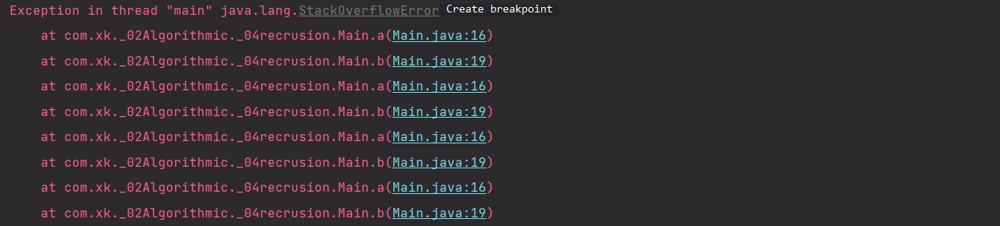


#### 1.2 函数的调用过程（栈空间）

栈空间会将调用的函数依次入栈，一般来说最先入栈的是 `main`，下图中的 `test1` 虽然被调用了，但是**没有执行操作，编译器会忽略它**，`test2` 调用了 `test3`，所以 `test2`、`test3` 依次入栈。

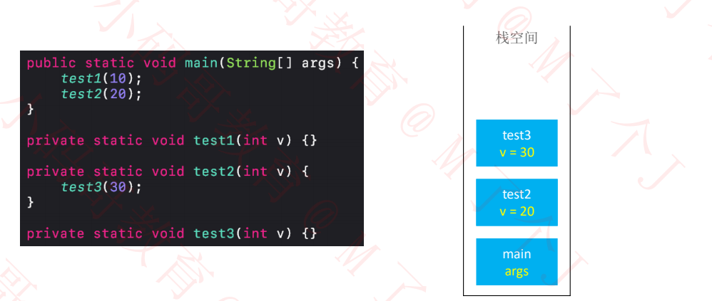


#### 1.3 函数的递归调用过程

下图中 `main` 先入栈，`sum(4)`、`sum(3)`、`sum(2)`、`sum(1)` 由于**递归调用**依次入栈，可见空间复杂度为 **O(n)**；

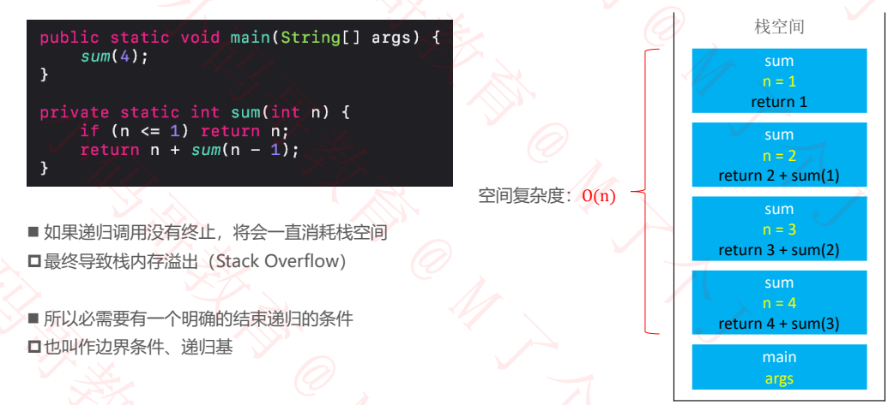

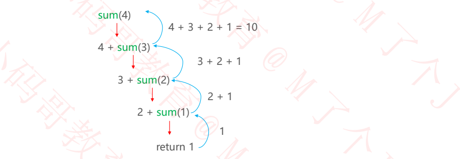


#### 1.4 递归实例分析

分析求`1 + 2 + 3 + ... + (n-1) + n`的和

**递归**做法：

```java
int sum(int n) {
	if(n <= 1) return n;
	return sum(n - 1) + n; 
}
```

总消耗时间 T(n) = T(n − 1) + O(1)，因此，时间复杂度：O(n)，空间复杂度：O(n)


**循环**做法：

```java
int sum(int n) {
	int result = 0;
	for (int i = 0; i <= n; i++) {
		result += i;
	}
	return result;
}
```

时间复杂度：O(n)，空间复杂度：O(1)


**求和公式**：

```java
int sum(int n) {
	if (n <= 1) return n;
	return (1 + n) * n >> 1;
}
```

时间复杂度：O(1)，空间复杂度：O(1)


- 注意：使用递归不是为了求得最优解，是为了简化解决问题的思路，代码会更加简洁
- 递归求出来的很**有可能不是最优解，也有可能是最优解**。


#### 1.5 递归的基本思想、使用套路

基本思想：**拆解问题，大化小**。

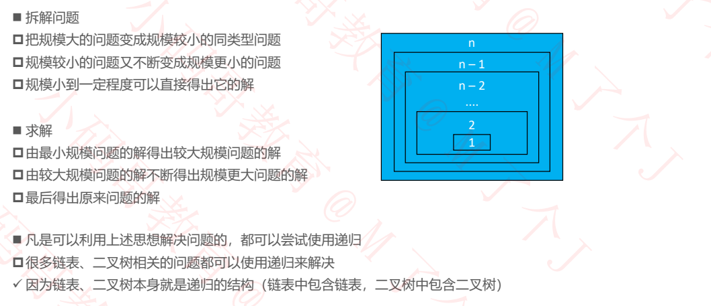


使用套路：**明确功能、关系、边界条件**。


### 2 斐波那契数列

- 斐波那契数列：1、1、2、3、5、8、13、21、34、……
- F(1) = 1，F(2) = 1，F(n) = F(n-1) + F(n-2) (n >= 3)

编写一个函数求第 n 项斐波那契数：

```java
public int fib(int n) {
	if (n <= 2) return 1;
	return fib(n - 1) + fib(n - 2);
}
```

- 根据递推式 T(n) = T(n − 1) + T(n − 2) + O(1)，可知：
- 时间复杂度：O(2<sup>n</sup>)
- 空间复杂度：O(n)

递归调用的空间复杂度 = 递归深度 * 每次调用所需的辅助空间


#### 2.1 fib函数的调用过程

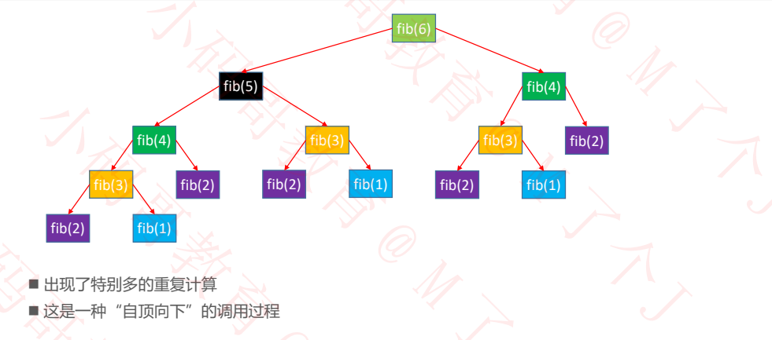


#### 2.2 fib优化1--记忆化

用数组存放计算过的结果，避免重复计算

时间复杂度：O(n)，空间复杂度：O(n)

```java
/*
 * 用数组存放计算过的结果，避免重复计算
 */
public int fib(int n) {
    if (n <= 2) return 1;
    int[] array = new int[n+1];
    array[1] = array[2] = 1;
    return fib(n, array);
}
private int fib(int n, int[] array) {
    if (array[n] == 0) {
        array[n] = fib(n-1, array) + fib(n-2, array);
    }
    return array[n];
}
```

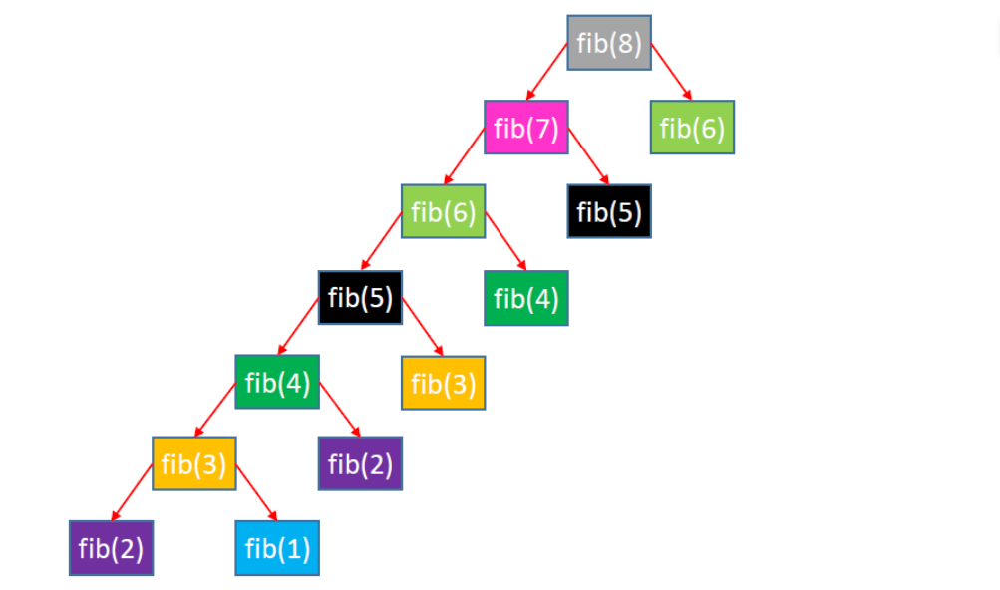


#### 2.3 fib优化2--去除递归调用

这是一种 “**自底向上**” 的计算过程

时间复杂度：O(n)，空间复杂度：O(n)

```java
public int fib(int n){
    if (n <= 2) return 1;
    int[] array = new int[n+1];
    array[1] = array[2] = 1;
    for (int i = 3; i <= n; i++){
        array[i] = array[i-1] + array[i-2];
    }
    return array[n];
}
```


#### 2.4 fib优化3--滚动数组

由于每次运算只需要用到数组中的 2 个元素，所以可以使用**滚动数组**来优化

时间复杂度：O(n)，空间复杂度：O(1)

```java
public int fib(int n) {
    if (n <= 2) return 1;
    int[] array = new int[2];
    array[0] = array[1] = 1;
    for (int i = 3; i <= n; i++){
        array[i % 2] = array[(i-1) % 2] + array[(i - 2) % 2];
    }
    return array[n % 2];
}
```

**乘、除、模运算效率较低**，建议用其他方式（位运算）取代

```
(i % 2) == (i & 1)
(i * 2) == (i << 1)
(i / 2) == (i >> 1)
```

位运算优化后的滚动数组：

```java
public int fib(int n) {
    if (n <= 2) return 1;
    int[] array = new int[2];
    array[0] = array[1] = 1;
    for (int i = 3; i <= n; i++){
        // i % 2 <==> i & 1 (只能模2可以这么做)
        array[i & 1] = array[0] + array[1];
    }
    return array[n & 1];
}
```


#### 2.5 fib优化4--去除数组

只有两个元素，直接通过2个变量即可，不需要创建数组。

时间复杂度：O(n)，空间复杂度：O(1)

```java
public int fib(int n) {
    if (n <= 2) return 1;
    int first = 1, second = 1;
    while (n-- >= 3){
        second = first + second;
        first = second - first;
    }
    return second;
}
```


#### 2.6 fib优化5--数学公式

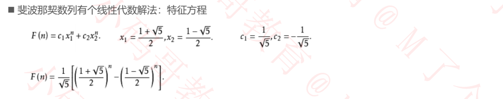

时间复杂度、空间复杂度取决于 `pow` 函数（至少可以低至 O(logn) ）

```java
int fib(int n) {
	double c = Math.sqrt(5);
	return (int)((Math.pow((1 + c) / 2, n) - Math.pow((1 - c) / 2, n)) / c);
}
```


### 3 上楼梯（跳台阶）

楼梯有`n`阶台阶，上楼可以一步上`1`阶，也可以一步上`2`阶，走完`n`阶台阶共有多少种不同的走法？

- 假设 n 阶台阶有 f(n) 种走法，第 1 步有 2 种走法
  - 如果上 1 阶，那就还剩 n – 1 阶，共 f(n – 1) 种走法
  - 如果上 2 阶，那就还剩 n – 2 阶，共 f(n – 2) 种走法
- 所以 f(n) = f(n – 1) + f(n – 2)

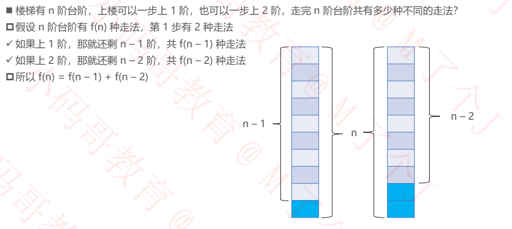

- 1阶台阶只有1种走法，所以：f(1) = 1
- 2阶台阶有2种走法(11, 2)，所以：f(2) = 2
- 3阶台阶有3种走法(111, 12, 21)，所以：f(3) = 3
- ......

```java
int climbStairs(int n) {
	if (n <= 2) return n;
	return climbStairs(n - 1) + climbStairs(n - 2);
}
```

跟斐波那契数列几乎一样，因此优化思路也是一致的：

```java
int climbStairs(int n) {
	if (n <= 2) return n;
	int first = 1;
	int second = 2;
	for(int i = 3; i <= n; i++) {
		second = first + second;
		first = second - first;
	}
	return second;
}
```


### 4 汉诺塔（Hanoi）

编程实现把 A 的 n 个盘子移动到 C (盘子编号是 [1, n])

- 每次只能移动1个盘子
- 大盘子只能放在小盘子下面

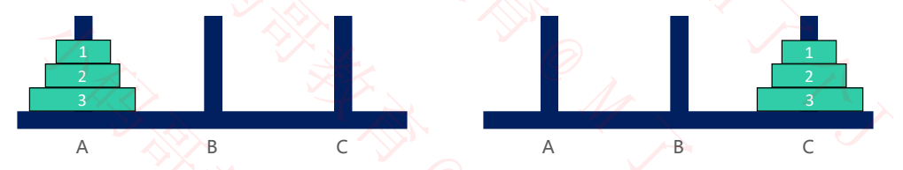


#### 4.1 图示

*1个盘子*：

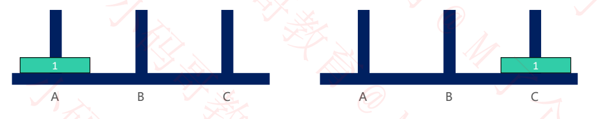

*2个盘子*：

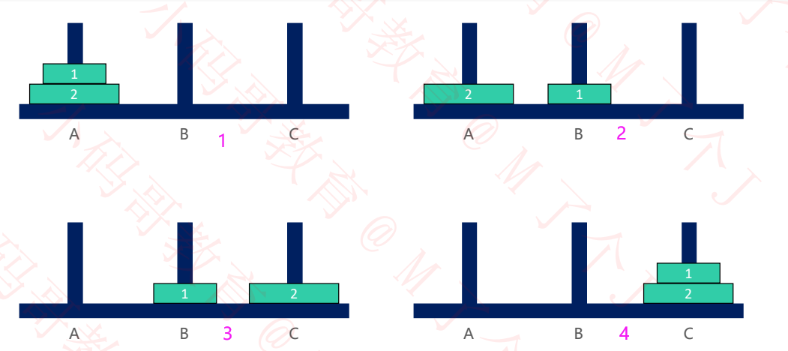

*3个盘子*：

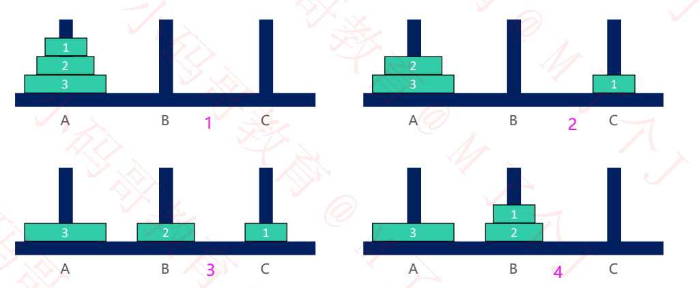


#### 4.2 汉诺塔--思路

分 2 种情况讨论即可：

- 当 n == 1时，直接将盘子从 A 移动到 C
- 当 n > 1时，可以拆分成3大步骤
  1. 将 n – 1 个盘子从 A 移动到 B：`hanoi(n - 1, p1, p3, p2);`
  2. 将编号为 n 的盘子从 A 移动到 C：`move(n, p1, p3);`
  3. 将 n – 1 个盘子从 B 移动到 C：`hanoi(n - 1, p2, p1, p3);`

步骤*1*、*3*明显是个**递归调用**。

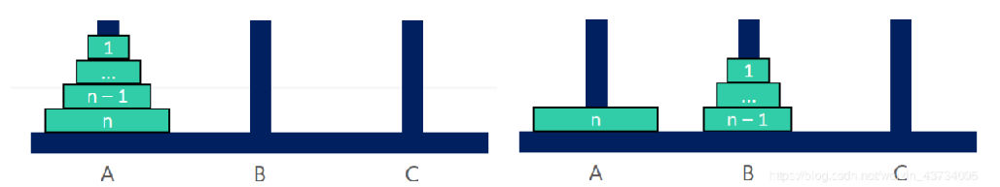

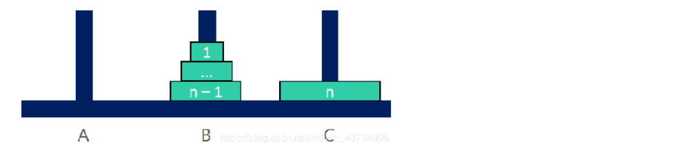

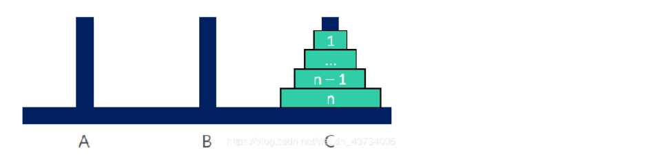


#### 4.3 汉诺塔--实现

T(n) = 2 ∗ T(n - 1) + O(1)

时间复杂度是：O(2<sup>n</sup>)，空间复杂度：O(n)

```java
/**
 * @description: 汉诺塔
 * @author: xu
 * @date: 2022/10/15 22:23
 */
public class Hanoi {
    public static void main(String[] args) {
        Hanoi hanoi = new Hanoi();
        hanoi.hanoi(3, "A", "B", "C");
    }

    /**
     * 将 n 个碟子从 p1 挪动到 p3
     * 时间：O(2^n) 空间：O(n)
     * @param p2 中间的柱子
     */
    public void hanoi(int n, String p1, String p2, String p3){
        if (n == 1) {
            move(n, p1, p3);
            return;
        }
        hanoi(n-1, p1, p3, p2); // 将 n-1 个碟子从 p1 挪动到 p2
        move(n, p1, p3); // 将 最大的 那个碟子从 p1 挪动到 p3
        hanoi(n-1, p2, p1, p3); // 将 n-1 个碟子从 p2 挪动到 p3
    }
    
    /**
     * 将 no 号盘子从 from 移动到 to
     * @param no
     * @param from
     * @param to
     */
    private void move(int no, String from, String to) {
        System.out.println("将" + no + "号盘子从" + from + "移动到" + to);
    }
}
/*
将1号盘子从A移动到C
将2号盘子从A移动到B
将1号盘子从C移动到B
将3号盘子从A移动到C
将1号盘子从B移动到A
将2号盘子从B移动到C
将1号盘子从A移动到C
*/
```

汉诺塔的代码是没有规律的，不像斐波那契数列，因此**没有优化的空间**。


### 5 递归转非递归

记住一句话：**递归100%可以转成非递归**。

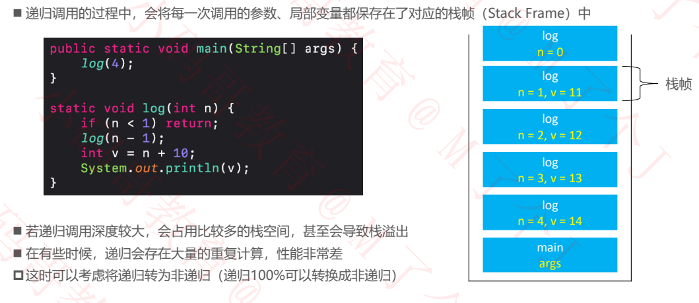

递归转非递归的**万能方法**：

- 自己维护一个栈，来保存参数、局部变量
- 但是**空间复杂度依然没有得到优化**。

例如针对下面这段递归代码：

```java
public static void main(String[] args) {
	log(5);
}
static void log(int n) {
	if(n < 1) return;
	log(n - 1);
	int v = n + 10;
	System.out.println(v);
}
```

我们尝试**将递归转为非递归**。

首先创建一个栈帧类：

```java
public class Frame {
	int n;
	int v;
	public Frame(int n, int v) {
		this.n = n;
		this.v = v;
	}
}
```

然后我们手动**模拟函数调用后入栈**的过程，从而**将递归转为非递归**：

```java
static void log(int n) {
    Deque<Frame> frames = new LinkedList<>();
    while (n > 0) {
        frames.push(new Frame(n, n + 10));
        n--;
    }
    while (!frames.isEmpty()){
        System.out.println(frames.pop().v);
    }
}
```

某些时候其实有更精妙的做法，可以**重复使用一组相同的变量来保存每个栈帧的内容**。

```java
static void log(int n) {
    for (int i = 1; i <= n; i++) {
        System.out.println(i + 10);
    }
}
```

这里重复使用变量 i 保存原来栈帧中的参数，使得**空间复杂度**从 O(n) 降到了 O(1)。


### 6 尾调用（Tail Call）

- *尾调用*：一个函数的最后一个动作是调用函数
- 如果最后一个动作是调用自身，称为*尾递归*（Tail Recursion），是尾调用的特殊情况


一些编译器能对尾调用进行优化，以达到节省栈空间的目的

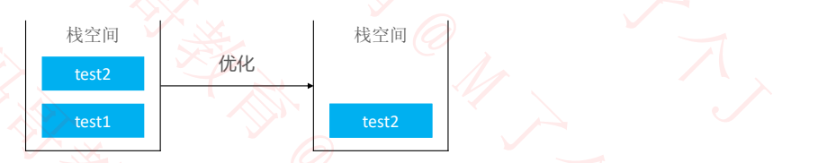

下面这段代码不是尾调用：因为它最后一个动作是乘法，没有调用自身。

```java
int factorial(int n) {
	if (n <= 1) return n;
	return n * factorial(n - 1);
}
```


#### 6.1 尾调用优化（Tail Call Optimization）

*尾调用优化*也叫做*尾调用消除*（Tail Call Elimination）

- 如果当前栈帧上的局部变量等内容都不需要用了，当前栈帧经过适当的改变后可以直接当作被尾调用的函数的栈帧使用，然后程序可以`jump`到被尾调用的函数代码
- 生成栈帧改变代码与`jump`的过程称作*尾调用消除*或*尾调用优化*
- 尾调用优化让位于尾位置的函数调用跟 `goto` 语句性能一样高

消除尾递归里的尾调用比消除一般的尾调用容易很多

- 比如Java虚拟机（JVM）会消除尾递归里的尾调用，但不会消除一般的尾调用（因为改变不了栈帧）
- 因此尾递归优化相对比较普遍，平时的递归代码可以考虑尽量使用尾递归的形式


#### 6.2 尾调用优化前后的汇编代码（C++）

针对这么一段**尾调用**代码：

```java
void test(int n) {
	if (n < 0) return;
	printf("test - %d\n", n);
	test(n - 1);
}
```

*尾调用优化前的汇编代码*：

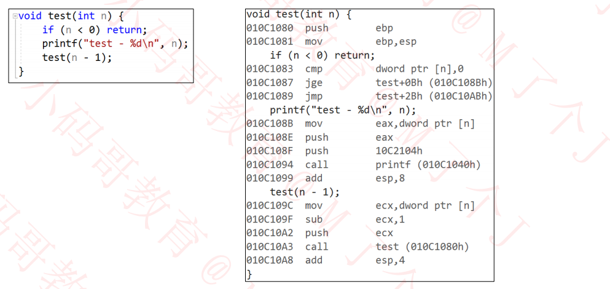

*尾调用优化后的汇编代码*：

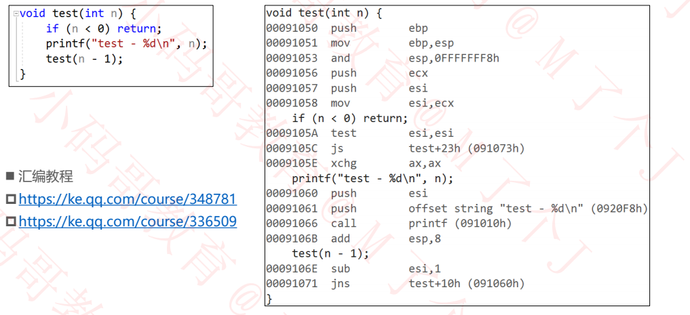


### 7 尾递归示例

#### 7.1 阶乘

- 求 n 的阶乘`1 * 2 * 3 * … * (n - 1) * n`（n>0）

普通递归：

```java
int factorial(int n ) {
	if (n <= 1) return n;
	return n * factorial(n - 1);
}
```

转化为**尾递归**：

```java
int facttorial(int n) {
    return facttorial(n, 1);
}
/**
 * @param result 从大到小累乘的结果
 */
int facttorial(int n, int result) {
    if (n <= 1) return result;
    return facttorial(n-1, n * result);
}
```


#### 7.2 斐波那契数列

普通递归：

```java
int fib(int n) {
	if (n <= 2) return 1;
	return fib(n - 1) + fib(n - 2);
}
```

转化为**尾递归**：

```java
int fib(int n) {
	return fib(n, 1, 1);
}

int fib(int n, int first, int second) {
	if (n <= 1) return first;
	return fib(n - 1, second, first + second);
}
```

+++

## 五、回溯Back Tracking

### 1 回溯（BackTracking）

回溯可以理解为：通过选择不同的岔路口来通往目的地（找到想要的结果）

- 每一步都选择一条路出发，能进则进，不能进则退回上一步（回溯），换一条路再试

**树的先序遍历**、**图的深度优先搜索（DFS）**、**八皇后**、**走迷宫**都是典型的回溯应用

下图中**红色**代表**实际路线**，**绿色**代表**回溯**。

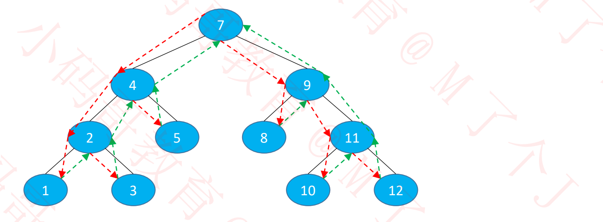

不难看出来，**回溯**很适合使用**递归**。


### 2 提出八皇后问题（EightQueens）

八皇后问题是一个古老而著名的问题

在8x8格的国际象棋上摆放八个皇后，使其不能互相攻击：任意两个皇后都*不能处于同一行、同一列、同一斜线上*。

请问有多少种摆法？


- 初步思路一：暴力出奇迹

  从 64 个格子中选出任意 8 个格子摆放皇后，检查每一种摆法的可行性

  一共C<sup>8</sup><sub>64</sub>种摆法（大约4.4 * 10<sup>9</sup>中摆法）

  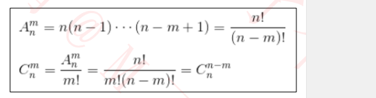

- 初步思路二：根据题意减少暴力程度

  很显然，每一行只能放一个皇后，所以共有 8<sup>8</sup> 种摆法（16777216 种），检查每一种摆法的可行性

- 初步思路三：回溯法（回溯+剪枝）

  在解决*八皇后*问题之前，可以先缩小数据规模，看看如何解决**四皇后**问题


#### 2.1 四皇后--回溯法图示

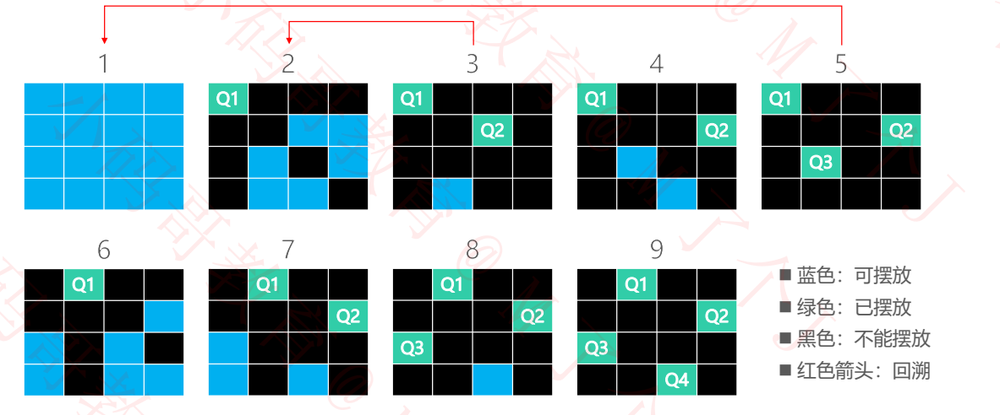

每次走到死路：

- 回溯到**上次路口**，走另一条路；

  如果**上次路口**的全部路都是死路：

  - 回溯到上上次路口…

回溯途中夹杂着**剪枝操作**：即不走确定是死路的路，走到每个路口的时候，**先判断一下这条路口的路中哪些确定是死路**，就可以直接跳过这些路。

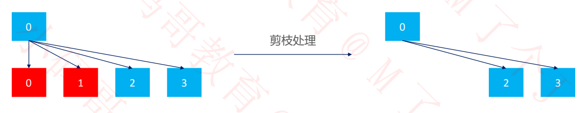


#### 2.2 八皇后--回溯法图示

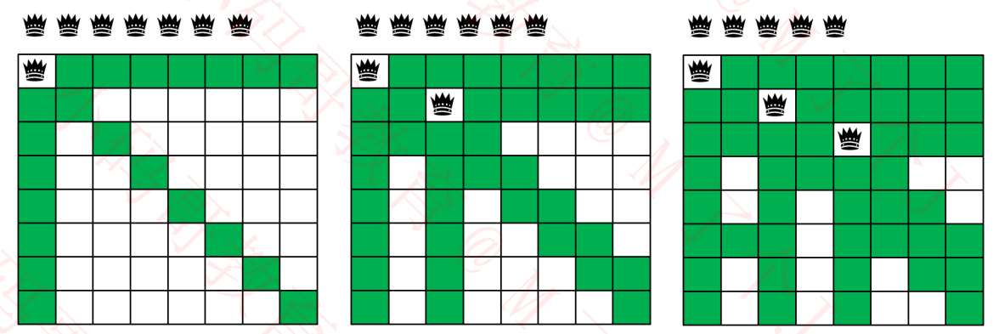

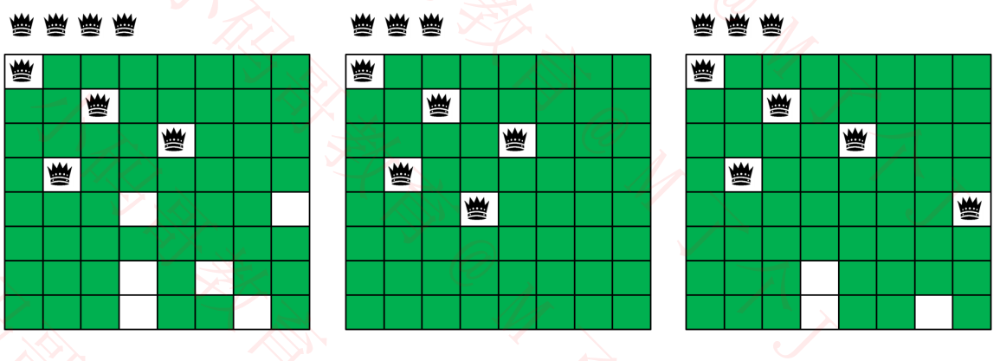

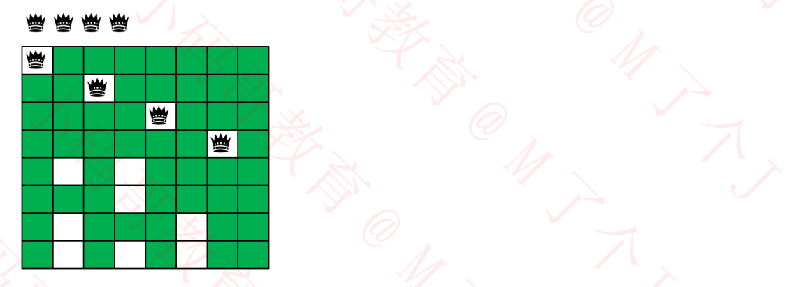


### 3 N皇后实现

#### 3.1 合法性检查

```java
/**
 * 数组索引是行号，数组列数是列号
 */
int[] cols;
/**
 * 一共有多少种摆法
 */
int ways;
```

```java
/**
 * 判断第 row 行 第 col 列 是否可以摆放皇后
 */
boolean isValid(int row, int col){
    for (int i = 0; i < row; i++) {
        // 第col列已经有皇后
        if (cols[i] == col) return false;
        // 第row行，第col列 的斜线上有皇后
        if ((row - i) == Math.abs(col - cols[i])) return false;
    }
    return true;
}
```


#### 3.2 从某一行开始摆放皇后

```java
/**
 * 从第 row 行开始摆放皇后
 * @param row
 */
void place(int row){
    if (row == cols.length) {
        ways++;
        show();
        return;
    }
    for (int col = 0; col < cols.length; col++) {
        if (isValid(row, col)){ // 剪枝处理
            // 在第row行，第col列摆放皇后
            cols[row] = col;
            place(row + 1);
        }
    }
}
```


#### 3.3 摆放所有皇后

```java
void plateQueens(int num){
    if (num < 1) return;
    cols = new int[num];
    place(0);
    System.out.println(num + "皇后一共有" + ways + "种摆法");
}
```


#### 3.4 打印

```java
void show() {
    for (int row = 0; row < cols.length; row++) {
        for (int col = 0; col < cols.length; col++) {
            if (cols[row] == col) System.out.print("1 ");
            else System.out.print("0 ");
        }
        System.out.println();
    }
    System.out.println("=====================");
}
```


#### 3.5 N皇后--完整代码

```java
package com.xk._02Algorithmic._05backTracking;

/**
 * @description: N皇后问题
 * @author: xu
 * @date: 2022/10/16 20:06
 */
public class NQueens {
    public static void main(String[] args) {
        new NQueens().plateQueens(4);
    }

    /**
     * 数组索引是行号，数组列数是列号
     */
    int[] cols;
    /**
     * 一共有多少种摆法
     */
    int ways;

    void plateQueens(int num){
        if (num < 1) return;
        cols = new int[num];
        place(0);
        System.out.println(num + "皇后一共有" + ways + "种摆法");
    }

    /**
     * 从第 row 行开始摆放皇后
     * @param row
     */
    void place(int row){
        if (row == cols.length) {
            ways++;
            show();
            return;
        }
        for (int col = 0; col < cols.length; col++) {
            if (isValid(row, col)){ // 剪枝处理
                // 在第row行，第col列摆放皇后
                cols[row] = col;
                place(row + 1);
            }
        }
    }

    /**
     * 判断第 row 行 第 col 列 是否可以摆放皇后
     */
    boolean isValid(int row, int col){
        for (int i = 0; i < row; i++) {
            // 第col列已经有皇后
            if (cols[i] == col) return false;
            // 第row行，第col列 的斜线上有皇后
            if ((row - i) == Math.abs(col - cols[i])) return false;
        }
        return true;
    }

    void show(){
        for (int row = 0; row < cols.length; row++) {
            for (int col = 0; col < cols.length; col++) {
                if (cols[row] == col) System.out.print("1 ");
                else System.out.print("0 ");
            }
            System.out.println();
        }
        System.out.println("=====================");
    }
}
```

```
0 1 0 0 
0 0 0 1 
1 0 0 0 
0 0 1 0 
=====================
0 0 1 0 
1 0 0 0 
0 0 0 1 
0 1 0 0 
=====================
4皇后一共有2种摆法
```


### 4 N皇后优化--合法性检查优化

#### 4.1 合法性检查优化O(n)--->O(1)

之前的**合法性检查**需要通过**遍历数组**来实现，现在使用3个`boolean`数组分别表示：

- 某一**列**是否有皇后：`boolean[] cols;`
- 某一**对角线**是否有皇后（左上角->右下角）:`boolean[] leftTop;`
- 某一**对角线**是否有皇后 (右上角->左下角)：`boolean[] rightTop;`

用这个进行合法性检查只需要 O(1) 的时间复杂度。

需要知道一个小技巧：根据**行**、**列**求**对角线索引**（左上、右上情况不同）

- *左上角--->右下角*的对角线索引：`row – col + 7`；
- *右上角--->左下角*的对角线索引：`row + col`。

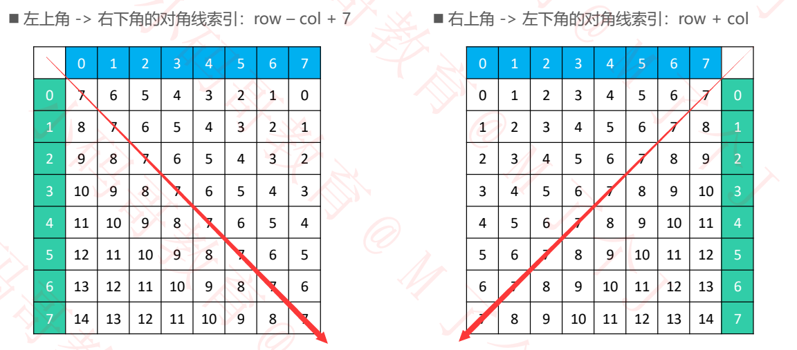

```java
/**
 * 标记着某一列是否有皇后了
 */
boolean[] cols;
/**
 * 标记着某一对角线是否有皇后了（左上角 --> 右下角  left top --> right bottom）
 */
boolean[] leftTop;
/**
 * 标记着某一对角线是否有皇后了（右上角 --> 左下角  right top --> left bottom）
 */
boolean[] rightTop;


for (int col = 0; col < cols.length; col++) {
    // 剪枝处理 
    // 第col列已经有皇后, 继续下一轮
    if (cols[col]) continue;
    int ltIndex = row - col + cols.length - 1; // 左上角->右下角的对角线索引
    int rtIndex = row + col; // 右上角->左下角的对角线索引
    if (leftTop[ltIndex] || rightTop[rtIndex]) continue;

    // 在第row行，第col列摆放皇后
    cols[col] = true;
    leftTop[ltIndex] = true;
    rightTop[rtIndex] = true;
    queens[row] = col;
    place(row + 1);

    // 状态重置
    cols[col] = false;
    leftTop[ltIndex] = false;
    rightTop[rtIndex] = false;
}
```


#### 4.2 完整实现

```java
package com.xk._02Algorithmic._05backTracking;

/**
 * @description: N皇后问题 -- 优化1
 * @author: xu
 * @date: 2022/10/16 20:06
 */
public class NQueens1 {
    public static void main(String[] args) {
        Times.test("testNQueen1", () -> new NQueens1().plateQueens(4));
    }

    /**
     * 数组索引是行号，数组列数是列号
     */
    int[] queens;
    /**
     * 标记着某一列是否有皇后了
     */
    boolean[] cols;
    /**
     * 标记着某一对角线是否有皇后了（左上角 --> 右下角  left top --> right bottom）
     */
    boolean[] leftTop;
    /**
     * 标记着某一对角线是否有皇后了（右上角 --> 左下角  right top --> left bottom）
     */
    boolean[] rightTop;
    /**
     * 一共有多少种合理的摆法
     */
    int ways;

    void plateQueens(int num) {
        if (num < 1) return;
        queens = new int[num];
        cols = new boolean[num];
        leftTop = new boolean[(num << 1) - 1];
        rightTop = new boolean[leftTop.length];
        place(0);
        System.out.println(num + "皇后一共有" + ways + "种摆法");
    }

    /**
     * 从第 row 行开始摆放皇后
     * @param row
     */
    void place(int row){
        if (row == cols.length) {
            ways++;
            show();
            return;
        }
        for (int col = 0; col < cols.length; col++) {
            // 剪枝处理
            if (cols[col]) continue;
            int ltIndex = row - col + cols.length - 1;
            int rtIndex = row + col;
            if (leftTop[ltIndex] || rightTop[rtIndex]) continue;

            // 在第row行，第col列摆放皇后
            cols[col] = leftTop[ltIndex] = rightTop[rtIndex] = true;
            queens[row] = col;
            place(row + 1); // 该列摆已经摆好了皇后,继续下一行

            // 这一步很关键, 列、对角线都是牵一发而动全身的影响, 需要重置
            // 状态重置
            cols[col] = leftTop[ltIndex] = rightTop[rtIndex] = false;
        }
    }

    void show(){
        for (int row = 0; row < queens.length; row++) {
            for (int col = 0; col < queens.length; col++) {
                if (queens[row] == col) {
                    System.out.print("1 ");
                } else {
                    System.out.print("0 ");
                }
            }
            System.out.println();
        }
        System.out.println("=====================");
    }
}
```


### 5 8皇后优化--位运算

可以利用*位运算*进一步压缩八皇后的*空间复杂度*。

```java
package com.xk._02Algorithmic._05backTracking;

/**
 * @description: N皇后问题 -- 优化2
 * @author: xu
 * @date: 2022/10/16 20:06
 */
public class NQueens2 {
    public static void main(String[] args) {
        new NQueens2().plate8Queens();
    }

    private static final int EIGHT = 8;
    /**
     * 数组索引是行号，数组列数是列号
     */
    int[] queens;
    /**
     * 标记着某一位是否有皇后了
     */
    byte cols;
    /**
     * 标记着某一对角线是否有皇后了（左上角 --> 右下角  left top --> right bottom）
     */
    short leftTop;
    /**
     * 标记着某一对角线是否有皇后了（右上角 --> 左下角  right top --> left bottom）
     */
    short rightTop;
    /**
     * 一共有多少种合理的摆法
     */
    int ways;

    void plate8Queens() {
        queens = new int[EIGHT];
        place(0);
        System.out.println("8皇后一共有" + ways + "种摆法");
    }

    /**
     * 从第 row 行开始摆放皇后
     * @param row
     */
    void place(int row){
        if (row == EIGHT) {
            ways++;
            show();
            return;
        }
        for (int col = 0; col < EIGHT; col++) {
            // 剪枝处理
            // 条件也可以写成: cols & (1 << col) != 0
            if (((cols >> col) & 1) == 1) continue;
            int ltIndex = row - col + EIGHT - 1;
            int rtIndex = row + col;
            if (((leftTop >> ltIndex) & 1) == 1 || ((rightTop >> rtIndex) & 1) == 1) continue;

            // 在第row行，第col列摆放皇后 对应的位必为0
            cols |= (1 << col);
            leftTop |= (1 << ltIndex);
            rightTop |= (1 << rtIndex);
            queens[row] = col;
            place(row + 1);

            // 状态重置：对应的位必为1
            cols ^= (1 << col);
            leftTop ^= (1 << ltIndex);
            rightTop ^= (1 << rtIndex);
        }
    }

    void show(){
        for (int row = 0; row < EIGHT; row++) {
            for (int col = 0; col < EIGHT; col++) {
                if (queens[row] == col) {
                    System.out.print("1 ");
                } else {
                    System.out.print("0 ");
                }
            }
            System.out.println();
        }
        System.out.println("=====================");
    }
}
```


### 6 LeetCode真题

#### 6.1 51.N皇后

leetcode_51_N皇后：https://leetcode-cn.com/problems/n-queens/

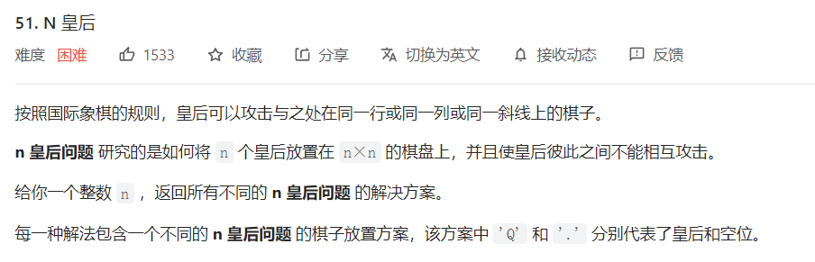

```java
class Solution {
    public List<List<String>> solveNQueens(int n) {
        if (n < 1) return null;
        List<List<String>> res = new ArrayList<>();
        int[] queens = new int[n]; // 索引下标为行号，元素值为列号
        plate(0, res, queens);
        return res;
    }

    private void plate(int row, List<List<String>> res, int[] queens){
        if (row == queens.length) {
            put(res, queens);
            return;
        }

        for (int col = 0; col < queens.length; col++) {
            if (isValid(row, col, queens)){
                queens[row] = col;
                plate(row+1, res, queens);
            }
        }
    }

    private boolean isValid(int row, int col, int[] queens) {
        for (int i = 0; i < row; i++) {
            if (queens[i] == col) return false;
            if ((row - i) == Math.abs(col - queens[i])) return false;
        }
        return true;
    }

    private void put(List<List<String>> res, int[] queens) {
        List<String> list = new ArrayList<>();
        for (int r = 0; r < queens.length; r++){
            StringBuilder sb = new StringBuilder();
            for (int c = 0; c < queens.length; c++){
                if (queens[r] == c) sb.append("Q");
                else sb.append(".");
            }
            list.add(sb.toString());
        }
        res.add(list);
    }
}
```

```java
class Solution {
    private int[] queens; // 索引下标为行号，元素值为列号
    private boolean[] cols;
    private boolean[] ltTop;
    private boolean[] rtTop;

    public List<List<String>> solveNQueens(int n) {
        if (n < 1) return null;
        List<List<String>> res = new ArrayList<>();
        queens = new int[n]; // 索引下标为行号，元素值为列号
        cols = new boolean[n];
        ltTop = new boolean[(n<<1) - 1];
        rtTop = new boolean[ltTop.length];
        plate(0, res);
        return res;
    }

    private void plate(int row, List<List<String>> res){
        if (row == queens.length) {
            put(res, queens);
            return;
        }

        for (int col = 0; col < queens.length; col++) {
            // 剪枝
            if (cols[col]) continue;
            int ltIdx = row - col + queens.length - 1;
            int rtIdx = row + col;
            if (ltTop[ltIdx] || rtTop[rtIdx]) continue;

            cols[col] = ltTop[ltIdx] = rtTop[rtIdx] = true;
            queens[row] = col;
            plate(row+1, res);

            cols[col] = ltTop[ltIdx] = rtTop[rtIdx] = false;
        }
    }

    private void put(List<List<String>> res, int[] queens) {
        List<String> list = new ArrayList<>();
        for (int r = 0; r < queens.length; r++){
            StringBuilder sb = new StringBuilder();
            for (int c = 0; c < queens.length; c++){
                if (queens[r] == c) sb.append("Q");
                else sb.append(".");
            }
            list.add(sb.toString());
        }
        res.add(list);
    }
}
```


#### 6.2 52.N皇后II

leetcode_52_N皇后 II： https://leetcode-cn.com/problems/n-queens-ii/

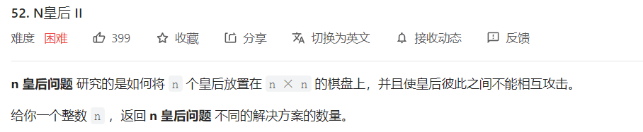

```java
class Solution {
    private boolean[] cols;
    private boolean[] leftTop;
    private boolean[] rightTop;
    private int ways;

    public int totalNQueens(int n) {
        if (n < 1) return 0;
        cols = new boolean[n];
        leftTop = new boolean[(n << 1) - 1];
        rightTop = new boolean[leftTop.length];
        ways = 0;
        place(0);
        return ways;
    }

    /**
     * 从第 row 行开始摆放皇后
     * @param row
     */
    private void place(int row) {
        if (row == cols.length) {
            ways += 1;
            return;
        }
        for (int col = 0; col < cols.length; col++) {
            // 剪枝处理
            if (cols[col]) continue;
            int ltIndex = row - col + cols.length - 1;
            int rtIndex = row + col;
            if (leftTop[ltIndex] || rightTop[rtIndex]) continue;

            // 在第row行，第col列摆放皇后
            cols[col] = leftTop[ltIndex] = rightTop[rtIndex] = true;
            place(row + 1);

            // 状态重置
            cols[col] = leftTop[ltIndex] = rightTop[rtIndex] = false;
        }
    }
}
```

逆天解法：

```java
class Solution {
    public int totalNQueens(int n) {
        int[] nums = new int[]{0, 1, 0, 0, 2, 10, 4, 40, 92, 352, 724, 2680};
        return nums[n];
    }
}
```

+++

## 六、贪心Greedy

**贪心策略**，也称为**贪婪策略**。

- 每一步都采取当前状态下最优的选择（**局部最优解**），从而**希望推导出全局最优解**；

贪心的应用

- 哈夫曼树
- 最小生成树算法：Prim、Kruskal
- 最短路径算法：Dijkstra


### 1 问题1：最优装载（加勒比海盗）

在北美洲东南部，有一片神秘的海域，是海盗最活跃的加勒比海

- 有一天，海盗们截获了一艘装满各种各样古董的货船，每一件古董都价值连城，一旦打碎就失去了它的价值
- 海盗船的载重量为 `W`，每件古董的重量为 `𝑤i`，海盗们该如何*把尽可能多*数量的古董装上海盗船？
- 比如 `W` 为 30，`𝑤i` 分别为 3、5、4、10、7、14、2、11

贪心策略：每一次都优先选择**重量最小**的古董

1. 选择重量为 2 的古董，剩重量 28
2. 选择重量为 3 的古董，剩重量 25
3. 选择重量为 4 的古董，剩重量 21
4. 选择重量为 5 的古董，剩重量 16
5. 选择重量为 7 的古董，剩重量 9

- 根据上面的选择，最多能装载 5 个古董

```java
import java.util.Arrays;

/**
 * @description: 最优装载问题
 * @author: xu
 * @date: 2022/10/17 20:54
 */
public class Pirate {
    public static void main(String[] args) {
        int[] weights = {3, 5, 4, 10, 7, 14, 2, 11};
        Arrays.sort(weights);

        int capacity = 30, weight = 0, count = 0;
        for (int i = 0; i < weights.length && weight < capacity; i++) {
            int newWeight = weight + weights[i];
            if (newWeight <= capacity) {
                weight = newWeight;
                count++;
                System.out.println(weights[i]);
            }
        }
        System.out.println("一共选了" + count + "件古董");
    }
}
```


### 2 问题2：零钱兑换

假设有 25 分、10 分、5 分、1 分的硬币，现要找给客户 41 分的零钱，如何办到**硬币个数最少**？

贪心策略：每一次都优先选择**面值最大**的硬币

1. 选择 25 分的硬币，剩 16 分
2. 选择 10 分的硬币，剩 6 分
3. 选择 5 分的硬币，剩 1 分
4. 选择 1 分的硬币

- 最终的解是共 4 枚硬币，25 分、10 分、5 分、1 分硬币各一枚

```java
import java.util.Arrays;

/**
 * @description: 零钱兑换
 * @author: xu
 * @date: 2022/10/17 21:03
 */
public class CoinChange {
    public static void main(String[] args) {
        // 三种写法, 结果是一样的
        coinChange(new Integer[]{1, 5, 10, 25}, 41);
        coinChange1(new Integer[]{1, 5, 10, 25}, 41);
        coinChange2(new Integer[]{1, 5, 10, 25}, 41);
    }

    static void coinChange2(Integer[] faces, int money){
        // 1 5 20 25
        Arrays.sort(faces); // 升序
        int coins = 0, ids = faces.length - 1;
        while (ids >= 0){
            while (money >= faces[ids]) {
                money -= faces[ids];
                coins++;
                System.out.println(faces[ids]);
            }
            ids--;
        }
        System.out.println(coins);
    }

    static void coinChange1(Integer[] faces, int money){
        Arrays.sort(faces, (Integer f1, Integer f2) -> f2 - f1);//降序
        int coins = 0, i = 0;
        while (i < faces.length) {
            if (money < faces[i]) {
                i++;
                continue;
            }
            System.out.println(faces[i]);
            money -= faces[i];
            coins++;
        }
        System.out.println("共有" + coins + "枚硬币");
    }

    static void coinChange(Integer[] faces, int money){
        Arrays.sort(faces); // 升序
        int coins = 0;
        for (int i = faces.length - 1; i >= 0; ) {
            if (money < faces[i]) {
                i--;
                continue;
            }
            System.out.println(faces[i]);
            money -= faces[i];
            coins++;
        }
        System.out.println(coins);
    }
}
```


#### 2.1 零钱兑换的另一个例子

假设有 25 分、20 分、5 分、1 分的硬币，现要找给客户 41 分的零钱，如何办到*硬币个数最少*？

贪心策略：每一步都优先选择*面值最大*的硬币

1. 选择 25 分的硬币，剩 16 分
2. 选择 5 分的硬币，剩 11 分
3. 选择 5 分的硬币，剩 6 分
4. 选择 5 分的硬币，剩 1 分
5. 选择 1 分的硬币

- 最终的解是 1 枚 25 分、3 枚 5 分、1 枚 1 分的硬币，共 5 枚硬币
- 实际上本题的最优解是：2 枚 20 分、1 枚 1 分的硬币，共 3 枚硬币

将之前的代码的输入修改一下，可以得出结果：发现确实**没有得到最优解**。

```java
public static void main(String[] args) {
    coinChange(new Integer[]{1, 5, 20, 25}, 41);
    coinChange1(new Integer[]{1, 5, 20, 25}, 41);
    coinChange2(new Integer[]{1, 5, 20, 25}, 41);
}

/*
25
5
5
5
1
使用了5个硬币
*/
```


### 3 贪心注意点

贪心策略并不一定能得到全局最优解

- 因为一般**没有测试所有可能的解**，容易过早做决定，所以没法达到最佳解
- 贪图眼前局部的利益最大化，看不到长远未来，走一步看一步

优缺点：

- 优点：简单、高效、不需要穷举所有可能，通常作为其他算法的**辅助算法**来使用
- 缺点：鼠目寸光，**不从整体上考虑其他可能**，**每次采取局部最优解**，不会再回溯，因此**很少情况会得到最优解**。


### 4 问题3：0-1背包

有 n 件物品和一个最大承重为 W 的背包，每件物品的重量是 𝑤i、价值是 𝑣i

- 在保证总重量不超过 W 的前提下，将哪几件物品装入背包，可以使得背包的总价值最大？
- 注意：每个物品只有 1 件，也就是每个物品只能选择 0 件或者 1 件，因此称为 0-1背包问题

如果采取贪心策略，有3个方案：

1. *价值*主导：**优先选择价值最高**的物品放进背包
2. *重量*主导：**优先选择重量最轻**的物品放进背包
3. *价值密度*主导：**优先选择价值密度最高**的物品放进背包（`价值密度 = 价值 ÷ 重量`）


#### 4.1 0-1背包--实例

假设背包最大承重150，7个物品如表格所示

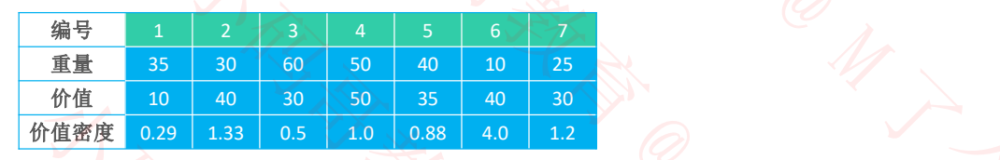

1. **价值**主导：放入背包的物品编号是`4、2、6、5`，总重量 *130*，总价值 *165*；
2. **重量**主导：放入背包的物品编号是`6、7、2、1、5`，总重量 *140*，总价值 *155*；
3. **价值密度**主导：放入背包的物品编号是`6、2、7、4、1`，总重量 *150*，总价值 *170*。


#### 4.2 0-1背包--实现

Article类模拟**物品**：

```java
package com.xk._02Algorithmic._06greedy.ks;

/**
 * @description:
 * @author: xu
 * @date: 2022/10/17 21:39
 */
public class Article {
    public int weight;
    public int value;
    public double valueDensity; // 价值密度
    public Article(int weight, int value) {
        this.weight = weight;
        this.value = value;
        valueDensity = value * 1.0 / weight;
    }
    @Override
    public String toString() {
        return "Article{" +
                "weight=" + weight +
                ", value=" + value +
                ", valueDensity=" + String.format("%.2f", valueDensity) +
                '}';
    }
}
```

0-1 背包问题：分别按照**价值主导**、**重量主导**、**价值密度主导**解决。

```java
package com.xk._02Algorithmic._06greedy.ks;

import java.util.*;

/**
 * @description:
 * @author: xu
 * @date: 2022/10/17 21:38
 */
public class Knapsack {
    private static Article[] articles = new Article[]{
            new Article(35, 10), new Article(30, 40),
            new Article(60, 30), new Article(50, 50),
            new Article(40, 35), new Article(10, 40),
            new Article(25, 30)
    };

    public static void main(String[] args) {
        select("价值主导：", (a1, a2) -> a2.value - a1.value);
        select("重量主导：", (a1, a2) -> a1.weight - a2.weight);
        select("价值密度主导：", (a1, a2) -> Double.compare(a2.valueDensity, a1.valueDensity));
    }

    static void select(String title, Comparator<Article> comparator) {
        Arrays.sort(articles, comparator); // 通过比较器, 按某个主导属性进行排序

        int capacity = 150, weight = 0, values = 0;
        List<Article> selectedArticles = new LinkedList<>();
        for (int i = 0; i < articles.length && weight < capacity; i++) {
            int newWeight = weight + articles[i].weight;
            if (newWeight <= capacity) {
                weight = newWeight;
                values += articles[i].value;
                selectedArticles.add(articles[i]);
            }
        }
        System.out.println(title);
        System.out.println("总价值：" + values);
        for (Article selectedArticle : selectedArticles) {
            System.out.println(selectedArticle);
        }
        System.out.println("======================================");
    }
}
```

```
价值主导：
总价值：165
Article{weight=50, value=50, valueDensity=1.00}
Article{weight=30, value=40, valueDensity=1.33}
Article{weight=10, value=40, valueDensity=4.00}
Article{weight=40, value=35, valueDensity=0.88}
======================================
重量主导：
总价值：155
Article{weight=10, value=40, valueDensity=4.00}
Article{weight=25, value=30, valueDensity=1.20}
Article{weight=30, value=40, valueDensity=1.33}
Article{weight=35, value=10, valueDensity=0.29}
Article{weight=40, value=35, valueDensity=0.88}
======================================
价值密度主导：
总价值：170
Article{weight=10, value=40, valueDensity=4.00}
Article{weight=30, value=40, valueDensity=1.33}
Article{weight=25, value=30, valueDensity=1.20}
Article{weight=50, value=50, valueDensity=1.00}
Article{weight=35, value=10, valueDensity=0.29}
======================================
```


### 5 leetCode习题

#### 5.1 455.分发饼干

leetcode_455_分发饼干：https://leetcode.cn/problems/assign-cookies/

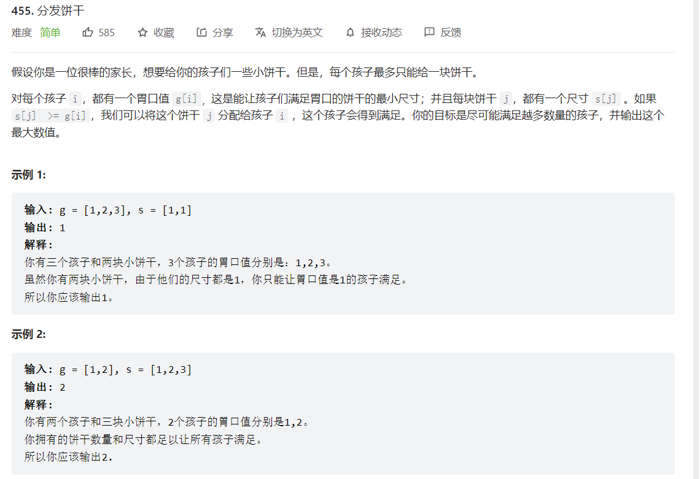

```java
class Solution {
    public int findContentChildren(int[] g, int[] s) {
        Arrays.sort(g);
        Arrays.sort(s);
        int m = g.length, n = s.length;
        int count = 0;
        for (int i = 0, j = 0; i < m && j < n; i++, j++){
            while (j < n && g[i] > s[j]) {
                j++;
            }
            if (j < n) {
                count++;
            }
        }
        return count;
    }
}
```


#### 5.2 452.用最少数量的箭引爆气球

leetcode_452_用最少数量的箭引爆气球：https://leetcode.cn/problems/minimum-number-of-arrows-to-burst-balloons/

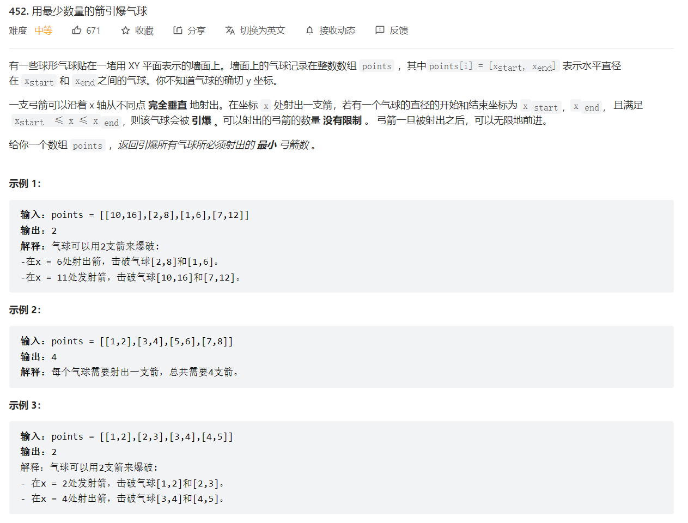

```java
class Solution {
     /*
     * 思路：
     *  将points里的每个区间按照右边界进行排序
     *  初始化pos为points里的最小右边界区间的右边界上
     *  遍历points，如果每个区间的左边界比pos大，pos右移，ans++
     */
    public int findMinArrowShots(int[][] points) {
        if (points.length == 0) return 0;
        Arrays.sort(points, new Comparator<int[]>() {
            @Override
            public int compare(int[] o1, int[] o2) {
                if (o1[1] > o2[1]) return 1;
                else if (o1[1] < o2[1]) return -1;
                else return 0;
            }
        });
        int pos = points[0][1];
        int cnt = 1;
        for (int[] balloon : points) {
            if (balloon[0] > pos) {
                pos = balloon[1];
                cnt++;
            }
        }
        return cnt;
    }
}
```


#### 5.3 605.种花问题

leetcode_605_种花问题：https://leetcode.cn/problems/can-place-flowers/


```java
class Solution {
    /*
     * 思路：
     *  遍历数组，i为数组下标
     *      1.当前的flowers[i]==1，i后移两位
     *      2.当前的i+1<数组长度且flowerbed[i+1]==1，i后移三位
     *      3.1和2走完了，那么当前下标索引的花盘符合种花条件，n--，i后移两位
     */
    public boolean canPlaceFlowers(int[] flowerbed, int n) {
        for (int i = 0; i < flowerbed.length; ) {
            if (flowerbed[i] == 1) i += 2;
            else if (i + 1 < flowerbed.length && flowerbed[i + 1] == 1) i += 3;
            else {
                if (n == 0) return true;
                //flowerbed[i] = 1;
                i += 2;
                n--;
            }
        }
        return n == 0;
    }
}
```

+++

## 七、分治Divide And Conquer

分治，也就是分而治之。它的一般步骤是：

1. 将原问题分解成若干个规模较小的子问题（子问题和原问题的结构一样，只是规模不一样）
2. 子问题又不断分解成规模更小的子问题，直到不能再分解（直到可以轻易计算出子问题的解）
3. 利用子问题的解推导出原问题的解

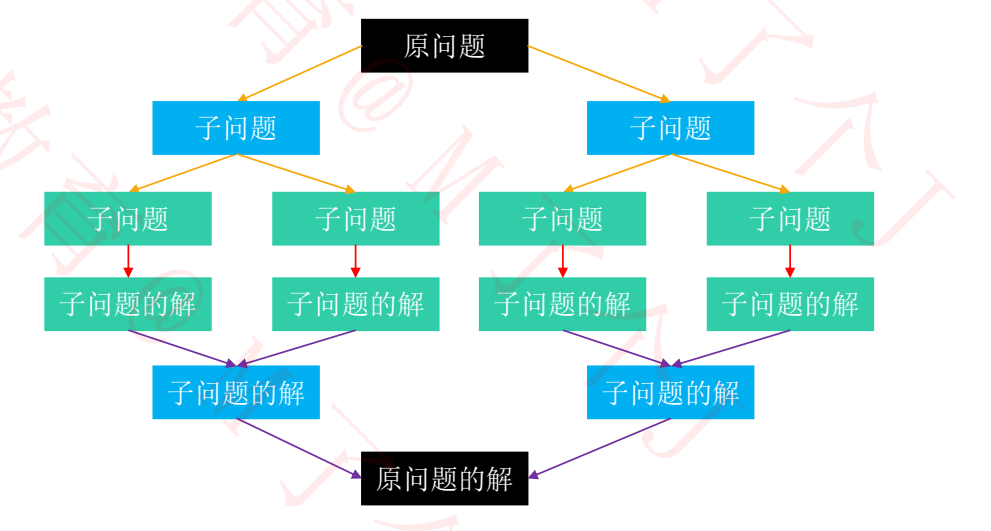

因此，分治策略非常适合用**递归**。

需要注意的是：**子问题之间是相互独立的**。

分治的应用：

- 快速排序
- 归并排序
- Karatsuba 算法（大数乘法）


### 1 主定理Master Theorem

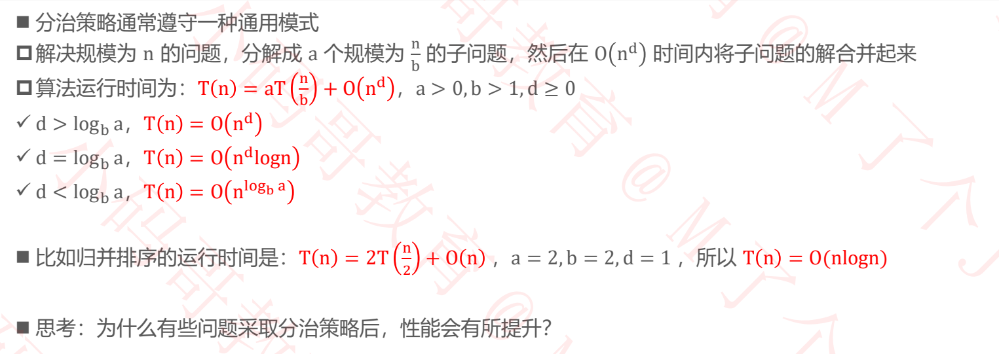


### 2 问题1：最大连续子序列和

题目：[leetcode_53_最大子序和](https://leetcode-cn.com/problems/maximum-subarray/)

给定一个长度为 n 的整数序列，求它的**最大连续子序列和**。

- 比如 –2、1、–3、**4**、**–1**、**2**、**1**、–5、4 的最大连续子序列和是 4 + (–1) + 2 + 1 = 6

这道题也属于最大切片问题（最大区段，Greatest Slice）

概念区分

- **子串**、**子数组**、**子区间**：必须是连续的
- **子序列**：可以不连续


#### 2.1 解法1--暴力出奇迹

**穷举**出所有可能的连续子序列，分别计算出它们的和，最后取它们中的最大值。

时间复杂度：O(n<sup>3</sup>)，空间复杂度：O(1)

```java
// 暴力解法
public int maxSubarray(int[] nums){
    if (nums == null || nums.length == 0) return 0;
    int max = Integer.MIN_VALUE;
    for (int begin = 0; begin < nums.length; begin++) {
        for (int end = begin; end < nums.length; end++) {
            // sum 是 [begin, end] 的和
            int sum = 0;
            for (int i = begin; i <= end; i++) {
                sum += nums[i];
            }
            max = Math.max(max, sum);
        }
    }
    return max;
}
```


#### 2.2 暴力出奇迹--优化

重复利用前面计算过的结果

时间复杂度：O(n<sup>2</sup>)，空间复杂度：O(1)

```java
// 暴力解法 -- 优化
public int maxSubarray(int[] nums){
    if (nums == null || nums.length == 0) return 0;
    int max = Integer.MIN_VALUE;
    for (int begin = 0; begin < nums.length; begin++) {
        // sum 是 [begin, end] 的和
        int sum = 0;
        for (int end = begin; end < nums.length; end++) {
            sum += nums[end];
            max = Math.max(max, sum);
        }
    }
    return max;
}
```


#### 2.3 解法2--分治

将序列均匀地分割成`2`个子序列

- [begin, end) = [begin, mid) + [mid, end)，mid = (begin + end) >> 1
- 假设 [begin, end) 的最大连续子序列和是 S[i, j) ，那么它有 *3* 种可能
  1. [i, j) 存在于 [begin, mid) 中，同时 S[i, j) 也是 [begin, mid) 的最大连续子序列和
  2. [i, j) 存在于 [mid, end) 中，同时 S[i, j) 也是 [mid, end) 的最大连续子序列和
  3. [i, j) 一部分存在于 [begin, mid) 中，另一部分存在于 [mid, end) 中
     1. [i,j) = [i,mid) + [mid,j)
     2. S[i,mid) = max{ S[k,mid) }，begin ≤ k < mid
     3. S[mid,j) = max { S[mid,k) }，mid < k ≤ end


空间复杂度：O(logn)

时间复杂度：O(nlogn)，跟归并排序、快速排序一样，利用**主定理**计算：T(n) = 2T(n/2) + O(n)

```java
/**
 * 分治解法
 * T(n) = 2T(n/2) + O(n) = O(nlogn)
 * @param nums
 * @return
 */
public int maxSubarray(int[] nums){
    return maxSubarray(nums, 0, nums.length);
}
private int maxSubarray(int[] nums, int begin, int end){
    // 递归基: end - begin < 2, 说明只有一个元素, nums[begin] == nums[end]
    if (end - begin < 2) return nums[begin];
    int mid = (begin + end) >> 1;

    // 最长子序列是 [i, mid) + [mid, j) 的情况
    int leftMax = nums[mid - 1], sum = nums[mid - 1];
    for (int i = mid - 2; i >= begin; i--) {
        sum += nums[i];
        leftMax = Math.max(sum, leftMax);
    }

    sum = nums[mid];
    int rightMax = nums[mid];
    for (int i = mid + 1; i < end; i++) {
        sum += nums[i];
        rightMax = Math.max(sum, rightMax);
    }
    return Math.max(leftMax + rightMax,
            Math.max(maxSubarray(nums, begin, mid), maxSubarray(nums, mid, end)));
}
```


### 3 问题2：大数乘法

2个超大的数（比如2个100位的数），如何进行乘法？

按照小学时学习的乘法运算，在进行 n 位数之间的相乘时，需要大约进行 n<sup>2</sup> 次个位数的相乘

比如计算 36 x 54

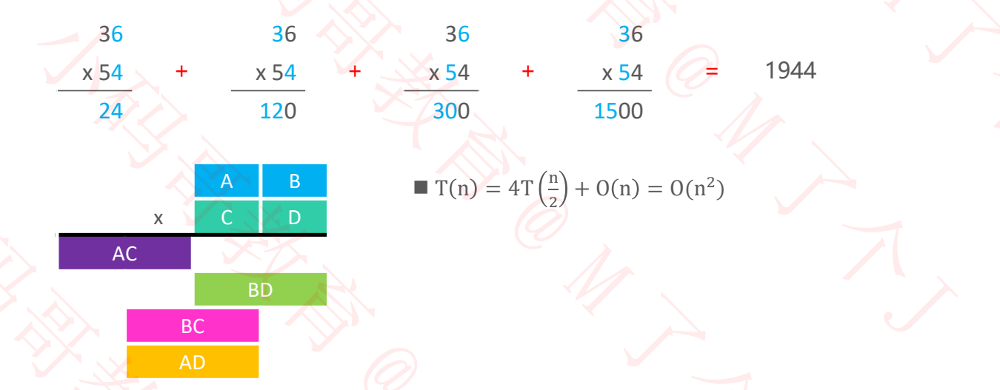


------

## 八、动态规划Dynamic Programming

**动态规划（Dynamic Programming）**，简称**DP**。

- 是求解**最优化问题**的一种常用策略

通常的使用套路（一步一步优化）:

1. 暴力递归（**自顶向下**，出现了重叠子问题）
2. 记忆化搜索（**自顶向下**）
3. 递推（**自底向上**）

直接学习动态规划的概念有点难以理解，先理解透一道例题再学习概念。


### 1 练习1：找零钱

leetcode_322_零钱兑换：https://leetcode-cn.com/problems/coin-change/


**假设有25分、20分、5分、1分的硬币，现要找给客户41分的零钱，如何办到硬币个数最少**？

- 此前用**贪心策略**得到的并非是最优解（贪心得到的解是 5 枚硬币：25、5、5、5、1）

假设 **dp(n)** 是 **凑到 n 分需要的最少硬币个数**：

- 如果第 1 次选择了 25 分的硬币，那么`dp(n) = dp(n - 25) + 1`；
- 如果第 1 次选择了 20 分的硬币，那么`dp(n) = dp(n - 20) + 1`；
- 如果第 1 次选择了 5 分的硬币，那么`dp(n) = dp(n - 5) + 1`；
- 如果第 1 次选择了 1 分的硬币，那么`dp(n) = dp(n - 1) + 1`；
- 所以 `dp(n) = min { dp(n - 25), dp(n - 20), dp(n - 5), dp(n - 1) } + 1`。


#### 1.1 找零钱--暴力递归

类似于斐波那契数列的递归版，会有**大量的重复计算**，时间复杂度较高。

```java
// 暴力递归 自顶向下的调用，出现了重叠子问题
public int coins1(int money) {
    // 递归基
    if (money < 0) return Integer.MAX_VALUE;
    if (money == 25 || money == 20 || money == 5 || money == 1) return 1;
    // 求出四种取法的最小值
    int min1 = Math.min(coins1(money - 25), coins1(money - 20));
    int min2 = Math.min(coins1(money - 5), coins1(money - 1));
    return Math.min(min1, min2) + 1;
}
```


#### 1.2 找零钱--记忆化搜索

```java
//记忆化搜索 自顶向下的调用
public int coins2(int money) {
    if (money < 0) return -1; // 处理非法数据
    int[] dp = new int[money + 1];
    int[] faces = new int[]{1, 5, 20, 25}; // 给定的面值数组
    for (int face : faces) {
        // 如果我要凑的钱是20元, 那么我肯定用不到25元面值
        if (money < face) break; // 用不到的面值不用初始化
        dp[face] = 1; // 初始化可能用到的面值
    }
    return coins2(money, dp);
}
private int coins2(int money, int[] dp) {
    if (money < 1) return Integer.MAX_VALUE; // 递归基
    if (dp[money] == 0) {  // 记忆化搜索, dp[n] == 0 表示以前没有算过, 那便初始化一下
        int min1 = Math.min(coins2(money - 25, dp), coins2(money - 20, dp));
        int min2 = Math.min(coins2(money - 5, dp), coins2(money - 1, dp));
        dp[money] = Math.min(min1, min2) + 1;
    }
    return dp[money];
}
```


#### 1.3 找零钱--递推

```java
// 递推 自底向上 时间复杂度、空间复杂度：O(n)
public int coins3(int money) {
    if (money < 0) return -1; // 处理非法数据
    // dp[i] 表示凑够 i 分时，最小的硬币个数
    int[] dp = new int[money + 1];
    // 自底向上的递推
    for (int i = 1; i <= money; i++) {
        int min = dp[i - 1]; // 由于下面两行是必然执行的, 直接这么写就行了
        // int min = Integer.MAX_VALUE;
	    // if (i >= 1) min = Math.min(dp[i - 1], min);
        if (i >= 5) min = Math.min(dp[i - 5], min);
        if (i >= 20) min = Math.min(dp[i - 20], min);
        if (i >= 25) min = Math.min(dp[i - 25], min);
        dp[i] = min + 1;
    }
    return dp[money];
}
```


#### 1.4 输出找零钱的具体方案（具体是用了哪些面值的硬币）

```java
public static void main(String[] args) {
    System.out.println(new CoinChange().coins4(41));
}

// 递推 自底向上
public int coins4(int money){
    if (money < 0) return -1; // 处理非法数据
    // dp[i] 表示凑够 i 分时，最小的硬币个数
    int[] dp = new int[money + 1];
    int[] faces = new int[]{1, 5, 20, 25};
    // ints[i] 表示凑够 i 分时最后选择的那枚硬币的面值
    int[] ints = new int[dp.length]; // 存放硬币面值(为了输出)
    for (int i = 1; i <= money; i++) {
        int min = Integer.MAX_VALUE;
        for (int face : faces) {
            if (i >= face && dp[i - face] < min) {
                min = dp[i - face];
                ints[i] = face;
            }
        }
        dp[i] = min + 1;
        print(ints, i);
    }
    return dp[money];
}
private void print(int[] ints, int money) {
    System.out.print("[" + money + "] = ");
    while (money > 0) {
        System.out.print(ints[money] + " ");
        money -= ints[money];
    }
    System.out.println();
}
```

```
[1] = 1 
[2] = 1 1 
[3] = 1 1 1 
[4] = 1 1 1 1 
[5] = 5 
[6] = 1 5 
[7] = 1 1 5 
[8] = 1 1 1 5 
[9] = 1 1 1 1 5 
[10] = 5 5 
[11] = 1 5 5 
[12] = 1 1 5 5 
[13] = 1 1 1 5 5 
[14] = 1 1 1 1 5 5 
[15] = 5 5 5 
[16] = 1 5 5 5 
[17] = 1 1 5 5 5 
[18] = 1 1 1 5 5 5 
[19] = 1 1 1 1 5 5 5 
[20] = 20 
[21] = 1 20 
[22] = 1 1 20 
[23] = 1 1 1 20 
[24] = 1 1 1 1 20 
[25] = 25 
[26] = 1 25 
[27] = 1 1 25 
[28] = 1 1 1 25 
[29] = 1 1 1 1 25 
[30] = 5 25 
[31] = 1 5 25 
[32] = 1 1 5 25 
[33] = 1 1 1 5 25 
[34] = 1 1 1 1 5 25 
[35] = 5 5 25 
[36] = 1 5 5 25 
[37] = 1 1 5 5 25 
[38] = 1 1 1 5 5 25 
[39] = 1 1 1 1 5 5 25 
[40] = 20 20 
[41] = 1 20 20 
3
```


#### 1.5 找零钱--通用情况

```java
// 通用实现 如果不能凑成则返回 -1
public int coins5(int money, int[] faces) {
    if (money < 0 || faces == null || faces.length == 0) return -1;
    // dp[i] 表示凑够 i 分时，最小的硬币个数
    int[] dp = new int[money + 1];
    for (int i = 1; i <= money; i++) {
        int min = Integer.MAX_VALUE;
        for (int face : faces) {
            // 假如给我的面值是20, 要凑的是15, 则跳过此轮循环
            if (i < face) continue;
            // 比如给的面值是{4}, 要凑的是6, 先给出一张4, 再看6-4=2, 是否能凑成
            // 2无法凑成, 则跳过此轮循环
            int value = dp[i - face];
            if (value < 0 || value >= min) continue;
            min = value;
        }
        if (min == Integer.MAX_VALUE) dp[i] = -1;
        else dp[i] = min + 1;
    }
    return dp[money];
}
```


### 2 动态规划DP

#### 2.1 动态规划的常规步骤

**动态规划（Dynamic Programming）**，简称**DP**。

- 是求解**最优化问题**的一种常用策略

通常的使用套路（一步一步优化）:

1. 暴力递归（**自顶向下**，出现了重叠子问题）
2. 记忆化搜索（**自顶向下**）
3. 递推（**自底向上**）


动态规划中的**“动态”**可以理解为是**“会变化的状态”**；

1. **定义状态**（**状态是原问题、子问题的解**）；

   比如定义`dp[i]`的含义

2. **设置初始状态**（**边界**）；

   比如设置`dp[0]`的值

3. **确定状态转移方程**。

   比如确定`dp[i]`和`dp[i-1]`的关系


#### 2.2 动态规划的一些概念

> **维基百科的解释**：
>
> Dynamic Programming is a method for solving a complex problem by breaking it down into a collection of simpler subproblems, solving each of those subproblems just once, and storing their solutions.
>
> **翻译**：
>
> 动态规划是一种解决复杂问题的方法，它将问题分解为一组更简单的子问题，每个子问题只解决一次，并存储它们的解。

1. 将复杂的原问题拆解成若干个简单的子问题
2. 每个子问题仅仅解决1次，并保存它们的解
3. 最后推导出原问题的解

可以用动态规划来解决的问题，通常具备2个特点：

- **最优子结构**（**最优化原理**）：通过求解子问题的最优解，可以获得原问题的最优解

- **无后效性**：

  某阶段的状态一旦确定，则此后过程的演变不再受此前各状态及决策的影响（**未来与过去无关**）

  在推导后面阶段的状态时，只关心前面阶段的具体状态值，不关心这个状态是怎么一步步推导出来的


理解*有后效性*和*无后效性*：

首先了解一下什么是**有后效性**：

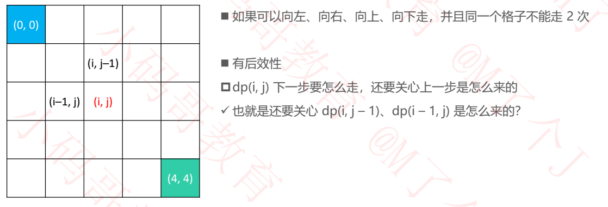

然后再去理解什么是**无后效性**：

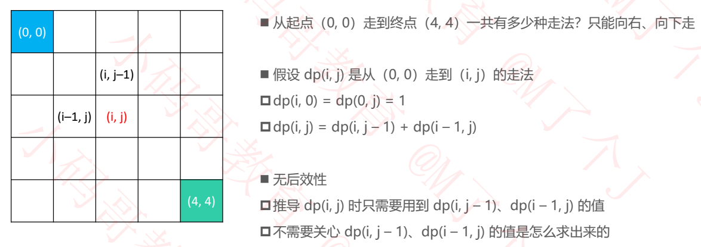


### 3 练习2：最大连续子序列和

题目：给定一个长度为 n 的整数序列 nums，求它的**最大连续子序列和**。

**状态定义**：

假设`dp[i]`是以`nums[i]`结尾的最大连续子序列和（nums 是整个序列）

比如 `{ -2、1、-3、4、-1、2、1、-5、4 }` 的最大连续子序列和是 4 + (-1) + 2 + 1 = 6；

- 以`nums[0]` = **-2** 结尾的最大连续子序列是 **-2**，所以 `dp[0] = -2`；
- 以`nums[1]` = **1** 结尾的最大连续子序列是 **1**，所以 `dp[1] = 1`；
- 以`nums[2]` = **-3** 结尾的最大连续子序列是 **1、-3**，所以 `dp[2] = -3 + dp[1] = -2`；
- 以`nums[3]` = **4** 结尾的最大连续子序列是 **4**，所以 `dp[3] = 4`；
- 以`nums[4]` = **-1** 结尾的最大连续子序列是 **4、-1**，所以 `dp[4] = -1 + dp[3] = 3`；
- 以`nums[5]` = **2** 结尾的最大连续子序列是 **4、-1、2**，所以 `dp[5] = 2 + dp[4] = 5`；
- 以`nums[6]` = **1** 结尾的最大连续子序列是 **4、-1、2、1**，所以 `dp[6] = 1 + dp[5] = 6`；
- 以`nums[7]` = **-5** 结尾的最大连续子序列是 **4、-1、2、1、-5**，所以 `dp[7] = -5 + dp[6] = 1`；
- 以`nums[8]` = **4** 结尾的最大连续子序列是 **4、-1、2、1、-5、4**，所以 `dp[8] = 4 + dp[7] = 5`。

**状态转移方程**：

- 如果`dp[i-1] <= 0`，那么`dp[i] = nums[i]`；
- 如果`dp[i-1] > 0`，那么`dp[i] = nums[i] + dp[i-1]`；

**初始状态**：

- `dp[0] = nums[0]`。

**最终的解**：

- 最大连续子序列和是所有`dp[i]`中的最大值 `max{dp(i)} i∈[0, nums.length]`。


#### 3.1 最大连续子序列和--实现

```java
// 动态规划：dp[i] 是以 nums[i] 结尾的最大连续子序列和
// 时间：O(n), 空间：O(n)
public int maxSubArray(int[] nums) {
    if (nums == null || nums.length == 0) return 0;
    int[] dp = new int[nums.length];
    dp[0] = nums[0];
    int max = dp[0];
    for (int i = 1; i < nums.length; i++) {
        //dp[i] = nums[i] + Math.max(dp[i-1], 0);
        if (dp[i - 1] <= 0) dp[i] = nums[i];
        else dp[i] = nums[i] + dp[i-1];
        max = Math.max(dp[i], max);
    }
    return max;
}
```


#### 3.2 最大连续子序列和--优化

```java
// 动态规划--优化
// 时间：O(n), 空间：O(1)
public int maxSubArray1(int[] nums) {
    if (nums == null || nums.length == 0) return 0;
    int dp = nums[0];
    int max = dp;
    for (int i = 1; i < nums.length; i++) {
        if (dp <= 0) dp = nums[i];
        else dp = nums[i] + dp;
        max = Math.max(dp, max);
    }
    return max;
}
```


### 4 练习3：最长上升子序列(LIS)

**最长上升子序列**（**最长递增子序列**，Longest Increasing Subsequence，LIS）

leetcode_300_最长上升子序列：https://leetcode-cn.com/problems/longest-increasing-subsequence/


题目：给定一个无序的整数序列，求出它最长上升子序列的长度（要求严格上升）

- 比如`[10, 2, 2, 5, 1, 7, 101, 18]`的最长上升子序列是`[2, 5, 7, 101]`、`[2, 5, 7, 18]`，长度是4。

假设数组是 nums，`[10, 2, 2, 5, 1, 7, 101, 18]`。

**状态定义**：

假设`dp[i]`是以`nums[i]`结尾的最长上升子序列的长度（`i∈[0, nums.length)`）

- 以 `nums[0]` = **10** 结尾的最长上升子序列是 **10**，所以`dp[0] = 1`；
- 以 `nums[1]` = **2** 结尾的最长上升子序列是 **2**，所以`dp[1] = 1`；
- 以 `nums[2]` = **2** 结尾的最长上升子序列是 **2**，所以`dp[2] = 1`；
- 以 `nums[3]` = **5** 结尾的最长上升子序列是 **2、5**，所以`dp[3] = 1 + dp(1) = 1 + dpp[2] = 2`；
- 以 `nums[4]` = **1** 结尾的最长上升子序列是 **1**，所以`dp[4] = 1`；
- 以 `nums[5]` = **7** 结尾的最长上升子序列是 **2、5、7**，所以`dp[5] = 1 + dp[3] = 3`；
- 以 `nums[6]` = **101** 结尾的最长上升子序列是 **2、5、7、101**，所以`dp(6) = dp(5) + 1 = 4`；
- 以 `nums[7]` = **18** 结尾的最长上升子序列是 **2、5、7、18**，所以`dp(7) = dp(5) + 1 = 4`。

**状态转移方程**：

遍历`j∈[0, i)`；

- 当`nums[i] > nums[j]`
  - `nums[i]`可以接在`nums[j]`后面，形成一个比`dp(j)`更长的上升子序列，长度为`dp(j) + 1`
  - `dp[i] = dp[j] + 1`
- 当`nums[i] <= nums[j]`
  - `nums[i]`不能接在`nums[j]`后面，跳过此次遍历（`continue`）

**状态的初始值**：

- `dp[0] = 1`
- 所有的`dp(i)`默认都初始化为1

**最终的解**：

- 最长上升子序列的长度是所有 `dp(i)` 中的最大值 `max{dp(i)}，i ∈ [0, nums.length)`。


#### 4.1 最长上升子序列--实现

时间复杂度：O(n<sup>2</sup>)，空间复杂度：O(n)

```java
// 动态规划
public int lengthOfLIS(int[] nums) {
    if (nums == null || nums.length == 0) return 0;
    // dp[i] 表示以 nums[i] 结尾的最长上升子序列的长度, i 属于 [0, nums.length)
    int[] dp = new int[nums.length];
    int max = dp[0] = 1;
    for (int i = 1; i < nums.length; i++) {
        dp[i] = 1;
        for (int j = i - 1; j >= 0; j--) {
            if (nums[i] <= nums[j]) continue;
            dp[i] = Math.max(dp[j] + 1, dp[i]);
        }
        max = Math.max(dp[i], max);
    }
    return max;
}
```


#### 4.2 最长上升子序列--二分搜索实现


- 把每个数字看做是一张扑克牌，从左到右按顺序处理每一个扑克牌
- 将它压在（从左边数过来）**第一个牌顶 ≥ 它的牌堆**上面
- 如果找不到**牌顶 ≥ 它的牌堆**，就在最右边新建一个牌堆，将它放入这个新牌堆中

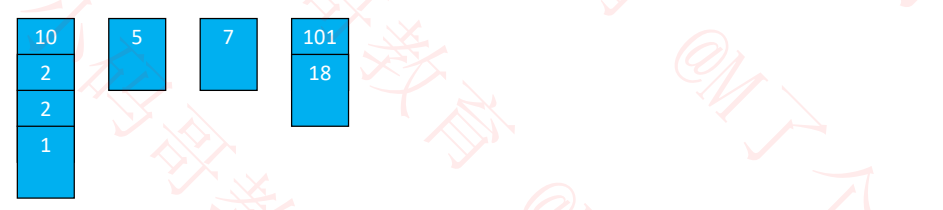

- 当处理完所有牌，最终牌堆的数量就是最长上升子序列的长度

*二分搜索思路*：

思路（假设数组是 nums，也就是最初的牌数组）：

- top[i] 是第 i 个牌堆的牌顶，len 是牌堆的数量，初始值为 0
- 遍历每一张牌 num
  - 利用二分搜索找出 num 最终要放入的牌堆位置 index
  - num 作为第 index 个牌堆的牌顶，top[index] = num
  - 如果 index 等于 len，相当于新建一个牌堆，牌堆数量 +1，也就是 len++

*普通实现（非二分搜索）*：

时间复杂度：O(n<sup>2</sup>)，空间复杂度：O(n)

```java
public int lengthOfLIS1(int[] nums) {
    if (nums == null || nums.length == 0) return 0;
    // 牌顶数组
    int[] top = new int[nums.length];
    // 牌堆的数量
    int len = 0;
    // 遍历所有的牌
    for (int num : nums) {
        int j = 0;
        while (j < len) {
            // 找到一个 >= num 的牌顶
            if (top[j] >= num){
                top[j] = num;
                break;
            }
            j++; // 牌顶 < num
        }
        if (j == len) {
            top[j] = num;
            len++;
        }
    }
    return len;
}
```

*二分搜索实现*：

时间复杂度：O(nlogn)，空间复杂度：O(n)

```java
public int lengthOfLIS2(int[] nums) {
    if (nums == null || nums.length == 0) return 0;
    // 牌顶数组
    int[] top = new int[nums.length];
    // 牌堆的数量
    int len = 0;
    // 遍历所有的牌
    for (int num : nums) {
        int begin = 0;
        int end = len;
        while (begin < end) {
            int mid = (begin + end) >> 1;
            if (top[mid] >= num) {
                end = mid;
            } else {
                begin = mid + 1;
            }
        }
        // 覆盖牌顶
        top[begin] = num;
        // 检查是否要新建一个牌堆
        if (begin == len) len++;
    }
    return len;
}
```


### 5 练习4：最长公共子序列(LCS)

**最长公共子序列**（Longest Common Subsequence，LCS）

leetcode_1143_最长公共子序列：https://leetcode-cn.com/problems/longest-common-subsequence/


题目：**求两个序列的最长公共子序列长度**。

- **[1, 3, 5, 9, 10]** 和 **[1, 4, 9, 10]** 的最长公共子序列是 [1, 9, 10]，长度为 3

- **ABCBDAB** 和 **BDCABA** 的最长公共子序列长度是 4，可能是

  A*B*CB*DAB* 和 *BD*C*AB*A --> BDAB

  ABC*BDAB* 和 *BD*C*AB*A --> BDAB

  A*BC*BD*AB* 和 *B*D*CAB*A --> BCAB

  A*BCB*D*A*B 和 *B*D*C*A*BA* --> BCBA


**思路**：

假设 2 个序列分别是`nums1`、`nums2`:

- i ∈ [1, nums1.length]
- j ∈ [1, nums2.length]


- 假设`dp(i,j)`是【`nums1`前 i 个元素】与【`nums2`前 j 个元素】的最长公共子序列长度
- `dp(i,0)`、`dp(0,j)`初始值均为 0
- 如果`nums1[i–1]` = `nums2[j–1]`，那么`dp(i,j) = dp(i–1, j–1) + 1`；
- 如果`nums1[i–1]` ≠ `nums2[j–1]`，那么`dp(i,j) = max {dp(i–1, j), dp(i, j–1)}`。

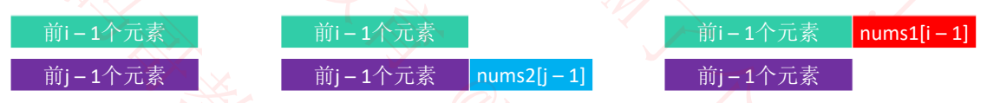


#### 5.1 最长公共子序列--递归实现

- 空间复杂度：O(k)，k = min{n, m}，n、m 是 2 个序列的长度
- 时间复杂度：O(2<sup>n</sup>)，当 n = m 时

```java
public int lcs1(int[] nums1, int[] nums2) {
    if (nums1 == null || nums1.length == 0) return 0; // 检测非法数据
    if (nums2 == null || nums2.length == 0) return 0; // 检测非法数据
    return lcs1(nums1, nums1.length, nums2, nums2.length);
}
/**
 * 求 num1 前 i 个元素和 nums2 前 j 个元素的最长公共子序列长度
 */
private int lcs1(int[] nums1, int i, int[] nums2, int j) {
    if (i == 0 || j == 0) return 0;
    // 最后一个元素相等, 返回前面的公共子序列长度 + 1
    if (nums1[i - 1] == nums2[j - 1]) {
        return lcs1(nums1, i - 1, nums2, j - 1) + 1;
    }
    return Math.max(lcs1(nums1,i - 1, nums2, j), lcs1(nums1, i, nums2, j - 1));
}
```

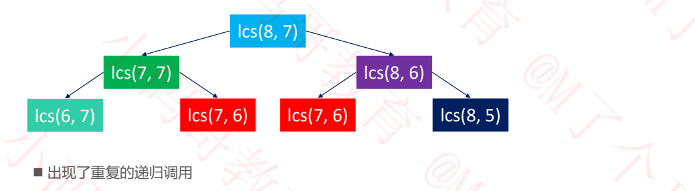


#### 5.2 最长公共子序列--非递归实现

dp 数组的计算结果如下所示

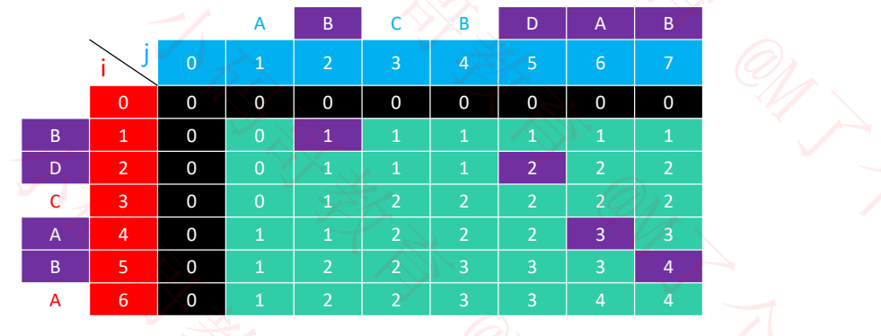

- 空间复杂度：O(n ∗ m)
- 时间复杂度：O(n ∗ m)

```java
public int lcs2(int[] nums1, int[] nums2) {
    if (nums1 == null || nums1.length == 0) return 0;
    if (nums2 == null || nums2.length == 0) return 0;
    int len1 = nums1.length, len2 = nums2.length;
    // dp[i][j] 是【nums1 前 i 个元素】与【nums2 前 j 个元素】的最长公共子序列长度
    // i = [0,nums1.length]  j = [0,nums2.length]
    int[][] dp = new int[len1 + 1][len2 + 1];
    for (int i = 1; i <= len1; i++) {
        for (int j = 1; j <= len2; j++) {
            if (nums1[i - 1] == nums2[j - 1]) {
                dp[i][j] = dp[i-1][j-1] + 1;
            } else {
                dp[i][j] = Math.max(dp[i][j-1], dp[i-1][j]);
            }
        }
    }
    return dp[len1][len2];
}
```


#### 5.3 最长公共子序列--滚动数组优化

可以使用**滚动数组**优化**空间复杂度**。

```java
// 动态规划 -- 优化 滚动数组
// 时间：O(n*m) 空间：O(m)
public int lcs3(int[] nums1, int[] nums2) {
    if (nums1 == null || nums1.length == 0) return 0;
    if (nums2 == null || nums2.length == 0) return 0;
    int len1 = nums1.length, len2 = nums2.length;
    int[][] dp = new int[2][len2 + 1];
    for (int i = 1; i <= len1; i++) {
        int row = i & 1;
        int prevRow = (i - 1) & 1;
        for (int j = 1; j <= len2; j++) {
            if (nums1[i - 1] == nums2[j - 1]) {
                dp[row][j] = dp[prevRow][j-1] + 1;
            } else {
                dp[row][j] = Math.max(dp[row][j-1], dp[prevRow][j]);
            }
        }
    }
    return dp[len1 & 1][len2];
}
```


#### 5.4 最长公共子序列--一维数组优化

可以将二维数组优化成一维数组，进一步降低空间复杂度

```java
// 动态规划 -- 优化 一维数组
// 时间：O(n*m) 空间：O(n)
public int lcs4(int[] nums1, int[] nums2) {
    if (nums1 == null || nums1.length == 0) return 0;
    if (nums2 == null || nums2.length == 0) return 0;
    int len1 = nums1.length, len2 = nums2.length;
    int[] dp = new int[len2 + 1];
    for (int i = 1; i <= len1; i++) {
        int cur = 0;
        for (int j = 1; j <= len2; j++) {
            int leftTop = cur;
            cur = dp[j];
            if (nums1[i - 1] == nums2[j - 1]) {
                dp[j] = leftTop + 1;
            } else {
                dp[j] = Math.max(dp[j-1], dp[j]);
            }
        }
    }
    return dp[len2];
}
```

可以空间复杂度优化至 O(k)，k = min{n, m}

```java
// 动态规划 -- 优化 一维数组
// 时间：O(n*m) 空间：O(k) k = min(nums1.length, nums2.length)
public int lcs(int[] nums1, int[] nums2) {
    if (nums1 == null || nums1.length == 0) return 0;
    if (nums2 == null || nums2.length == 0) return 0;
    int[] rowNums = nums1, colNums = nums2;
    if (nums1.length < nums2.length) {
        rowNums = nums2;
        colNums = nums1;
    }
    int[] dp = new int[colNums.length + 1];
    for (int i = 1; i <= rowNums.length; i++) {
        int cur = 0;
        for (int j = 1; j <= colNums.length; j++) {
            int leftTop = cur;
            cur = dp[j];
            if (rowNums[i - 1] == colNums[j - 1]) {
                dp[j] = leftTop + 1;
            } else {
                dp[j] = Math.max(dp[j-1], dp[j]);
            }
        }
    }
    return dp[colNums.length];
}
```


### 6 练习5：最长公共子串

**最长公共子串**（Longest Common Substring）

- 子串是连续的子序列

题目：求两个字符串的最长公共子串长度

- *ABC*BA 和 B*ABC*A 的最长公共子串是 ABC，长度为 3

假设 2 个字符串分别是 str1、str2：

- i ∈ [1, str1.length]
- j ∈ [1, str2.length]

假设`dp(i,j)`是以`str1[i–1]、str2[j–1]`结尾的最长公共子串长度

- `dp(i,0)`、`dp(0,j)`初始值均为 0
- 如果`str1[i–1] = str2[j–1]`，那么`dp(i,j) = dp(i–1, j–1) + 1`；
- 如果`str1[i–1] ≠ str2[j–1]`，那么`dp(i,j) = 0`。


#### 6.1 最长公共子串--实现

- 空间复杂度：O(n ∗ m)
- 时间复杂度：O(n ∗ m)

```java
// 动态规划
public int lcsSubStr1(String str1, String str2) {
    if (str1 == null || str1.isEmpty()) return 0;
    if (str2 == null || str2.isEmpty()) return 0;
    char[] chars1 = str1.toCharArray();
    char[] chars2 = str2.toCharArray();

    int[][] dp = new int[chars1.length + 1][chars2.length + 1];
    int max = 0;
    for (int i = 1; i <= chars1.length; i++) {
        for (int j = 1; j <= chars2.length; j++) {
            if (chars1[i - 1] != chars2[j - 1]) continue;
            dp[i][j] = dp[i-1][j-1] + 1;
            max = Math.max(max, dp[i][j]);
        }
    }
    return max;
}
```


#### 6.2 最长公共子串--一维数组优化

- 空间复杂度：O(k) , k = min{n, m}
- 时间复杂度：O(n ∗ m)

```java
// 动态规划 内循环从左往右
public int lcsSubStr2(String str1, String str2) {
    if (str1 == null || str1.isEmpty()) return 0;
    if (str2 == null || str2.isEmpty()) return 0;
    char[] rowChars = str1.toCharArray();
    char[] colChars = str2.toCharArray();
    if (rowChars.length < colChars.length) {
        char[] tmp = rowChars;
        rowChars = colChars;
        colChars = tmp;
    }
    int[] dp = new int[colChars.length + 1];
    int max = 0;
    for (int row = 1; row <= rowChars.length; row++) {
        int cur = 0;
        for (int col = 1; col <= colChars.length; col++) {
            int leftTop = cur;
            cur = dp[col];
            if (rowChars[row - 1] != colChars[col - 1]) {
                dp[col] = 0;
            } else {
                dp[col] = leftTop + 1;
                max = Math.max(max, dp[col]);
            }
        }
    }
    return max;
}
```

```java
// 动态规划 内循环从右往左
public int lcsSubStr(String str1, String str2) {
    if (str1 == null || str1.isEmpty()) return 0;
    if (str2 == null || str2.isEmpty()) return 0;
    char[] rowChars = str1.toCharArray();
    char[] colChars = str2.toCharArray();
    if (rowChars.length < colChars.length) {
        char[] tmp = rowChars;
        rowChars = colChars;
        colChars = tmp;
    }
    int[] dp = new int[colChars.length + 1];
    int max = 0;
    for (int row = 1; row <= rowChars.length; row++) {
        for (int col = colChars.length; col >= 1; col--) {
            if (rowChars[row - 1] != colChars[col - 1]) {
                dp[col] = 0;
            } else {
                dp[col] = dp[col-1] + 1;
                max = Math.max(max, dp[col]);
            }
        }
    }
    return max;
}
```


### 7 练习6：0-1背包

- 有 n 件物品和一个最大承重为 W 的背包，每件物品的重量是 𝑤i、价值是 𝑣i
- 在保证总重量不超过 W 的前提下，选择某些物品装入背包，背包的最大总价值是多少？
- 注意：每个物品只有 1 件，也就是每个物品只能选择 0 件或者 1 件


假设 values 是价值数组，weights 是重量数组

编号为 k 的物品，价值是 values[k]，重量是 weights[k]，k ∈ [0, n)


- 假设`dp(i,j)`是*最大承重为 j、有前 i 件物品可选*时的最大总价值，i ∈ [1, n]，j ∈ [1, W]
- dp(i, 0)、dp(0, j) 初始值均为 0
- 如果`j < weights[i–1]`，那么`dp(i,j) = dp(i–1, j)`
- 如果`j ≥ weights[i–1]`，那么`dp(i,j) = max{dp(i–1, j), dp(i–1, j–weights[i–1]) + values[i–1]}`


#### 7.1 0-1背包--实现

```java
// 动态规划
// 时间：O(m*n)  空间：O(m*n)
public int maxValue1(int[] values, int[] weights, int capacity) {
    if (values == null || values.length == 0) return 0;
    if (weights == null || weights.length == 0) return 0;
    if (values.length != weights.length || capacity <= 0) return 0;

    // dp[i][j] 表示最大承重j、有前i件物品可选时的最大总价值
    // i = [i, values.length]  j = [1, capacity]
    int[][] dp = new int[values.length + 1][capacity + 1];
    for (int i = 1; i <= values.length; i++) {
        for (int j = 1; j <= capacity; j++) {
            if (j < weights[i - 1]) {
                dp[i][j] = dp[i-1][j];
            } else {
                dp[i][j] = Math.max(dp[i-1][j], values[i-1] + dp[i-1][j - weights[i-1]]);
            }
        }
    }
    return dp[values.length][capacity];
}
```

```java
public static void main(String[] args) {
    int[] values =  new int[]{ 6, 3, 5, 4, 6 };
    int[] weights = new int[]{ 2, 2, 6, 5, 4 };
    int capacity = 10;
    System.out.println(new Knapsack().maxValue1(values, weights, capacity));
}
```


#### 7.2 0-1背包--一维数组优化

- `dp(i,j)`都是由`dp(i–1, k)`推导出来的，也就是说，第 i 行的数据是由它的上一行第 i – 1 行推导出来的
- 因此，可以使用一维数组来优化
- 另外，由于 k ≤ j ，所以 j 的遍历应该由大到小，否则导致数据错乱
- 观察二维数组表，得出结论：j 的下界可以从 1 改为 weights[i – 1]

```java
// 动态规划 优化 -- 一维数组
// 时间：O(m*n)  空间：O(m)
public int maxValue(int[] values, int[] weights, int capacity) {
    if (values == null || values.length == 0) return 0;
    if (weights == null || weights.length == 0) return 0;
    if (values.length != weights.length || capacity <= 0) return 0;

    int[] dp = new int[capacity + 1];
    for (int i = 1; i <= values.length; i++) {
        for (int j = capacity; j >= weights[i-1]; j--) {
            dp[j] = Math.max(dp[j], values[i-1] + dp[j - weights[i-1]]);
        }
    }
    return dp[capacity];
}
```


#### 7.3 0-1背包--恰好装满实现

- 有 n 件物品和一个最大承重为 W 的背包，每件物品的重量是 𝑤i、价值是 𝑣i
- 在保证总重量恰好等于 W 的前提下，选择某些物品装入背包，背包的最大总价值是多少？
- 注意：每个物品只有 1 件，也就是每个物品只能选择 0 件或者 1 件。

假设`dp(i,j)`是*最大承重为 j、有前 i 件物品可选*时的总重量恰好等于j时的最大总价值，i ∈ [1, n]，j ∈ [1, W]

- `dp(i,j)`初始状态调整
- `dp(i,0) = 0`，总重量恰好为 0，最大总价值必然也为 0
- `dp(0,j) = –∞（负无穷），j ≥ 1`，负数在这里代表无法恰好装满

```java
/**
 * 动态规划 刚好装进去
 * @return 如果返回-1，代表没法刚好凑够capacity这个容量
 */
public int maxValueExactly(int[] values, int[] weights, int capacity) {
    if (values == null || values.length == 0) return 0;
    if (weights == null || weights.length == 0) return 0;
    if (values.length != weights.length || capacity <= 0) return 0;

    int[] dp = new int[capacity + 1];
    for (int i = 1; i <= capacity; i++) {
        dp[i] = Integer.MIN_VALUE;
    }
    for (int i = 1; i <= values.length; i++) {
        for (int j = capacity; j >= weights[i - 1]; j--) {
            dp[j] = Math.max(dp[j], values[i-1] + dp[j - weights[i - 1]]);
        }
    }
    return dp[capacity] < 0 ? -1 : dp[capacity];
}
```

```java
public static void main(String[] args) {
    int[] values =  new int[]{ 6, 3, 5, 4, 6 };
    int[] weights = new int[]{ 2, 2, 6, 5, 4 };
    int capacity = 10;
    System.out.println(new Knapsack().maxValueExactly(values, weights, capacity));
}
```


+++

## 九、布隆过滤器Bloom Filter

### 1 引出布隆过滤器(判断元素是否存在)

思考：**如果要经常判断 1 个元素是否存在，要怎么做**？

- 很容易想到使用**哈希表**（`HashSet`、`HashMap`），将元素作为 key 去查找

  时间复杂度：`O(1)`，但是空间利用率不高，需要占用比较多的内存资源

如果需要编写一个网络爬虫去爬**10亿**个网站数据，为了避免爬到重复的网站，如何判断某个网站是否爬过？

- 很显然，`HashSet`、`HashMap`并不是非常好的选择

是否存在**时间复杂度低**、**占用内存较少**的数据结构？

- **布隆过滤器（Bloom Filter）**。


### 2 布隆过滤器介绍(概率型数据结构)

1970年由布隆提出

- 它是一个空间效率高的**概率型数据结构**，可以用来告诉你：**一个元素`一定不存在`或者`可能存在`**。

优缺点：

- 优点：空间效率和查询时间都远远超过一般的算法
- 缺点：有一定的**误判率**、**删除困难**。

布隆过滤器实质上是**一个很长的二进制向量**和**一系列随机映射函数**（**Hash函数**）；

**常见应用**：

- 网页黑名单系统
- 垃圾邮件过滤系统
- 爬虫的网址判重系统
- 解决缓存穿透问题（后端开发）


### 3 布隆过滤器的原理(二进制+哈希函数)

假设布隆过滤器由**20位二进制**、**3个哈希函数**组成，每个元素经过哈希函数处理都能生成一个索引位置。

布隆过滤器的基础操作有两个：**添加**、**查询**。

- **添加元素**：将每一个哈希函数生成的索引位置都设为 1

- **查询元素是否存在**：

  如果有一个哈希函数生成的索引位置不为 1，就代表**不存在**（100%准确）

  如果每一个哈希函数生成的索引位置都为 1，就代表**存在**（存在一定的误判率）

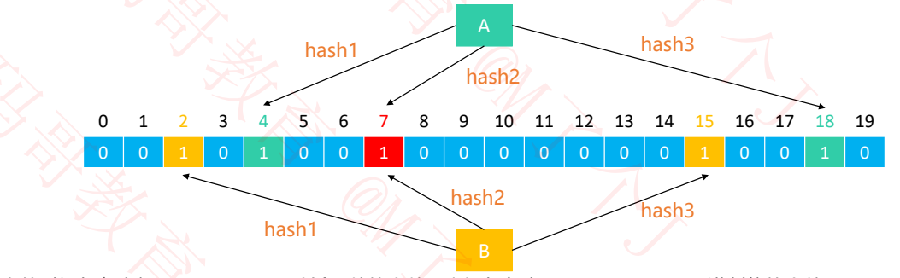

- 添加、查询的**时间复杂度**都是：O(k)，k 是哈希函数的个数
- **空间复杂度**是：O(m)，m是二进制位的个数


#### 3.1 布隆过滤器的误判率(公式)

误判率 `p` 受 3 个因素影响：**二进制位的个数 m**、**哈希函数的个数 k**、**数据规模 n**。

误判率 `p` 的公式：

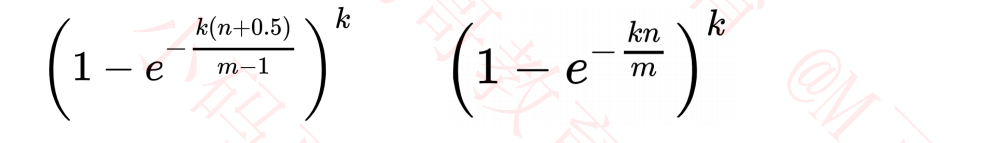

已知误判率 p、数据规模 n，求*二进制位的个数 m*、*哈希函数的个数 k*：

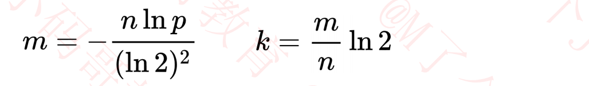


### 4 布隆过滤器的实现

Guava: Google Core Libraries For Java（谷歌核心库中Java实现）

- https://mvnrepository.com/artifact/com.google.guava/guava

布隆过滤器的基础操作有两个：**添加元素**、**查询元素是否存在**。

```java
/**
 * 添加元素
 * @return true代表bit发送了变化
 */
boolean put(T value);

/**
 * 查询元素是否存在
 * @return false代表一定不存在, true代表可能存在
 */
boolean contains(T value);
```


#### 4.1 布隆过滤器的构造

根据上面的公式可知，布隆过滤器必然有2个全局变量：

- `bitSize`：**二进制向量的长度**（一共有多少个二进制位）
- `hashSize`：**哈希函数的个数**。

并且必然有个**容器**来**存储这些二进制位**：

- `bits`：这里选择 `long[]` 来存储，因为1个`long`可以表示64位`bit`；（`int[]` 等数组也可以）

```java
/**
 * @description: 布隆过滤器
 * @author: xu
 * @date: 2022/10/20 22:30
 */
public class BloomFilter<T> {
    /**
     * 二进制向量的长度（一共有多少个二进制位）
     */
    private int bitSize;
    /**
     * 二进制向量
     */
    private long[] bits;
    /**
     * 哈希函数的个数
     */
    private int hashFuncSize;

    /**
     * @param n 数据规模
     * @param p 误判率 取值范围(0, 1)
     */
    public BloomFilter(int n, double p) {
        if (n <= 0 || p <= 0 || p >= 1) {
            throw new IllegalArgumentException("wrong n or p");
        }
        double ln2 = Math.log(2);
        // 求出二进制向量的长度
        bitSize = (int) (-(n * Math.log(p)) / (ln2 * ln2));
        // 求出哈希函数的个数
        hashFuncSize = (int) (bitSize * ln2 / n);
        // bits数组的长度
        bits = new long[(bitSize + Long.SIZE - 1) / Long.SIZE];
    }
}
```

测试一下，假设有**1亿个数据**，要求**误判率为1%**：可以得到哈希函数的个数为 6，二进制位的个数是 9_5850_5837。


#### 4.2 布隆过滤器--添加元素

*设置指定位置元素的二进制值为1*:

比如要设置 `100000` 的 **第2位bit** 为 1，应当 `100000 | 000100`，即 `100000 | (1 << 2)`；

那么设置 `value` 的 **第 index 位 bit**为 1，则是 `value | (1 << index)`；

```java
/**
 * 设置index位置的二进制位为1
 * @param index
 */
private boolean set(int index) {
    int bitsIndex = index / Long.SIZE;
    int idx = index & (Long.SIZE - 1);
    // 找到对应的long
    long value = bits[bitsIndex];
    bits[bitsIndex] = value | (1 << idx);
    return (value & (1 << idx)) == 0;
}
```

有了以上基础，可以实现布隆过滤器的**添加元素**操作：

```java
/**
 * 添加元素
 * @return true代表bit发生了改变
 */
public boolean put(T value){
    nullCheck(value);
    // 利用 value 生成 2 个整数
    int hash1 = value.hashCode();
    int hash2 = hash1 >>> 16;

    boolean isChanged = false;
    for (int i = 1; i <= hashFuncSize; i++) {
        int combinedHash = hash1 + (i * hash2);
        if (combinedHash < 0) combinedHash = ~combinedHash;
        // 生成一个二进制位的索引
        int index = combinedHash % bitSize;
        // 设置第index位置的二进制位为1
        if (set(index)) isChanged = true;
    }
    return isChanged;
}
```


#### 4.3 布隆过滤器--判断元素是否存在

*查看指定位置的二进制的值*：

比如要查看 `10101111` 的 **第2位bit** 为 1，应当 `10101111 & 00000100`，即 `10101111 & (1 << 2)`，只有指定位置的二进制的值为 0，返回值才会是 0，否则为 1；

那么获取 `value` 的 **第 index 位 bit** 的值，则是 `value & (1 << index)`；

```java
/**
 * 判断index位置的二进制位是否为1
 * @param index
 * @return true代表1, false代表0
 */
private boolean get(int index) {
    int bitsIndex = index / Long.SIZE;
    int idx = index & (Long.SIZE - 1);
    // 找到对应的long
    long value = bits[bitsIndex];
    return (value & (1 << idx)) != 0;
}
```

有了以上基础，可以实现布隆过滤器的**判断一个元素是否存在**操作：

```java
/**
 * 判断一个元素是否存在
 * @param value
 * @return false代表一定不存在，true代表可能存在
 */
public boolean contains(T value) {
    nullCheck(value);
    // 利用 value 生成 2 个整数
    int hash1 = value.hashCode();
    int hash2 = hash1 >>> 16;

    for (int i = 1; i <= hashFuncSize; i++) {
        int combinedHash = hash1 + (i * hash2);
        if (combinedHash < 0) combinedHash = ~combinedHash;
        // 生成一个二进制位的索引
        int index = combinedHash % bitSize;
        // 判断index位置的二进制位是否为0
        if (!get(index)) return false;
    }
    return true;
}
```


#### 4.4 布隆过滤器--完整代码

```java
package com.xk._02Algorithmic._09bloomFilter;

/**
 * @description: 布隆过滤器
 * @author: xu
 * @date: 2022/10/20 22:30
 */
public class BloomFilter<T> {
    /**
     * 二进制向量的长度（一共有多少个二进制位）
     */
    private int bitSize;
    /**
     * 二进制向量
     */
    private long[] bits;
    /**
     * 哈希函数的个数
     */
    private int hashFuncSize;

    /**
     * @param n 数据规模
     * @param p 误判率 取值范围(0, 1)
     */
    public BloomFilter(int n, double p) {
        if (n <= 0 || p <= 0 || p >= 1) {
            throw new IllegalArgumentException("wrong n or p");
        }
        double ln2 = Math.log(2);
        // 求出二进制向量的长度
        bitSize = (int) (-(n * Math.log(p)) / (ln2 * ln2));
        // 求出哈希函数的个数
        hashFuncSize = (int) (bitSize * ln2 / n);
        // bits数组的长度
        bits = new long[(bitSize + Long.SIZE - 1) / Long.SIZE];
    }

    /**
     * 添加元素
     * @return true代表bit发生了改变
     */
    public boolean put(T value){
        nullCheck(value);
        // 利用 value 生成 2 个整数
        int hash1 = value.hashCode();
        int hash2 = hash1 >>> 16;

        boolean isChanged = false;
        for (int i = 1; i <= hashFuncSize; i++) {
            int combinedHash = hash1 + (i * hash2);
            if (combinedHash < 0) combinedHash = ~combinedHash;
            // 生成一个二进制位的索引
            int index = combinedHash % bitSize;
            // 设置第index位置的二进制位为1
            if (set(index)) isChanged = true;
        }
        return isChanged;
    }

    /**
     * 判断一个元素是否存在
     * @param value
     * @return false代表一定不存在，true代表可能存在
     */
    public boolean contains(T value) {
        nullCheck(value);
        // 利用 value 生成 2 个整数
        int hash1 = value.hashCode();
        int hash2 = hash1 >>> 16;

        for (int i = 1; i <= hashFuncSize; i++) {
            int combinedHash = hash1 + (i * hash2);
            if (combinedHash < 0) combinedHash = ~combinedHash;
            // 生成一个二进制位的索引
            int index = combinedHash % bitSize;
            // 判断index位置的二进制位是否为1
            if (!get(index)) return false;
        }
        return true;
    }

    /**
     * 设置index位置的二进制位为1
     * @param index
     */
    private boolean set(int index) {
        int bitsIndex = index / Long.SIZE;
        int idx = index & (Long.SIZE - 1);
        // 找到对应的long
        long value = bits[bitsIndex];
        bits[bitsIndex] = value | (1 << idx);
        return (value & (1 << idx)) == 0;
    }

    /**
     * 判断index位置的二进制位是否为1
     * @param index
     */
    private boolean get(int index) {
        int bitsIndex = index / Long.SIZE;
        int idx = index & (Long.SIZE - 1);
        // 找到对应的long
        long value = bits[bitsIndex];
        return (value & (1 << idx)) != 0;
    }

    private void nullCheck(T value){
        if (value == null) {
            throw new IllegalArgumentException("Value must not be null");
        }
    }
}
```


### 5 10亿网站爬虫问题

回到一开始的问题：如果需要编写一个网络爬虫去爬**10亿**个网站数据，为了避免爬到重复的网站，如何判断某个网站是否爬过？

该问题的代码的**大体框架**如下：

```java
// url数组
String[] urls = {};
BloomFilter<String> bf = new BloomFilter<>(10_0000_0000, 0.01);

for (String url : urls) {
	if (bf.contains(url)) continue;
	// 爬这个url
	// ......
	
	// 爬完该url, 放进BloomFilter中
	bf.put(url);
}
```

根据**布隆过滤器的原理**：依靠**哈希函数产生的索引**，找到**对应的二进制位值**，为 1 则已经存在（存在误判），否则不存在（100%精确）。

`bf.contains(url)`，如果已经爬过的网址在布隆过滤器中，必然会返回`true`，因此**可以保证不会重复爬**。但是有些网址可能没有爬过，但是经过**哈希冲突**，使得`bf.contains(url)` 返回也为 `true`，可知**有几率漏爬**。

可以确保，这么写**不会重复爬**，但是**有几率漏爬**。


下面这种写法也可以：同样保证**不重复爬**，**有几率漏爬**。

```java
String[] urls = {};
BloomFilter<String> bf = new BloomFilter<>(10_0000_0000, 0.01);

for (String url : urls) {
	if (bf.put(url) == false) continue;
	// 爬这个url
	// ......
}
```

`bf.put(url)`如果遇到已经在布隆过滤器中的元素，必然返回`false`，可以**保证不重复爬**。但是有些网址没有爬过，经过**哈希冲突**，使得 `bf.put(url)` 返回了 `flase`，**有几率漏爬**。

+++

## 十、跳表SkipList

### 1 引出跳表

一个**有序链表**`搜索`、`添加`、`删除`的平均**时间复杂度**是多少：`O(n)`；


能否**利用二分搜索优化有序链表**，将`搜索`、`添加`、`删除`的平均时间复杂度降低至`O(logn)`？

- 链表没有像数组那样的**高效随机访问**（`O(1)`时间复杂度），所以不能像有序数组那样直接进行二分搜索优化

有没有其他办法让**有序链表搜索、添加、删除的平均时间复杂度降低至 O(logn)**？

- **跳表（SkipList）**。


### 2 跳表介绍

**跳表**，又叫做**跳跃表**、**跳跃列表**，在有序链表的基础上增加了“跳跃”的功能

- 由 William Pugh 于1990年发布，**设计的初衷是为了取代平衡树**（比如红黑树）

**Redis**中的`SortedSet`、**LevelDB**中的`MemTable`都用到了跳表

- Redis、LevelDB都是著名的 **Key-Value数据库**。

对比平衡树：

- 跳表的实现和维护会更加简单
- 跳表的搜索、删除、添加的平均时间复杂度是*O(logn)*（与红黑树相同）


### 3 跳表原理及实现

#### 3.1 使用跳表优化链表

*普通链表*：

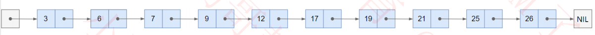

*有效层数为 2 的跳表*：

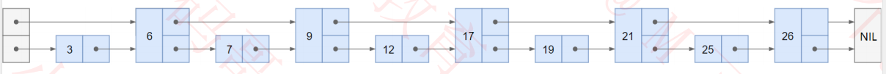

*有效层数为 4 的跳表*：

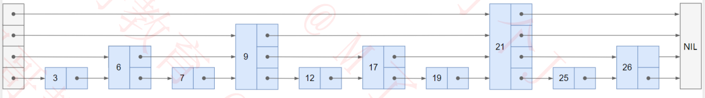


#### 3.2 跳表基础结构

```java
/**
 * 跳表
 * @author yusael
 */
@SuppressWarnings("unchecked")
public class SkipList <K, V> {
	private static final double P = 0.25; // 仿照Redis的做法, 维护一个概率值
	private static final int MAX_LEVEL = 32; // 最高层数
    
	private int size;
	private Comparator<K> comparator;
	/**
	 * 有效层数
	 */
	private int level;
	/**
	 * 不存放任何 K-V 的虚拟头节点
	 */
	private Node<K, V> first; 
	
	public SkipList() { this(null); }
    public SkipList(Comparator<K> comparator) {
        this.comparator = comparator;
        // 头节点的高度必须是跳表的最高层数(非有效层数), 为了后面插入新节点做准备
        first = new Node<>(null, null, MAX_LEVEL);
    }
	
	private int compare(K k1, K k2) {
		return comparator != null
				? comparator.compare(k1, k2)
				: ((Comparable<K>)k1).compareTo(k2);
	}

	private static class Node<K, V> {
		K key;
		V value;
		Node<K, V>[] nexts; // 该节点的不同层指向的下一节点
		// 拿上面的四层跳表的图来举例
		// first.next[3] == 21节点
		// first.next[2] == 9节点
		// first.next[1] == 6节点
		// first.next[0] == 3节点
		public Node(K key, V value, int level) {
			this.key = key;
			this.value = value;
			nexts = new Node[level];
		}
	}
}
```


#### 3.3 跳表的搜索

1. 从顶层链表的首元素开始，从左往右搜索，直至找到一个**大于或等于**目标的元素，或者**到达当前层链表的尾部**；
2. 如果该元素等于目标元素，则表明该元素已被找到
3. 如果该元素大于目标元素或已到达链表的尾部，则退回到当前层的前一个元素，然后转入下一层进行搜索

```java
public V get(K key) {
    keyCheck(key);
    Node<K, V> node = first;
    for (int i = level - 1; i >= 0; i--) {
        int cmp = -1;
        while (node.nexts[i] != null && (cmp = compare(key, node.nexts[i].key)) > 0) {
            node = node.nexts[i];
        }
        if (cmp == 0) return node.nexts[i].value;
    }
    return null;
}
```


#### 3.4 跳表的添加、删除

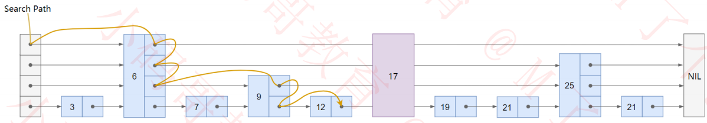

**添加**的细节：随机决定新添加元素的层数（官方建议）

```java
public V put(K key, V value) {
    keyCheck(key);
    Node<K, V> node = first;
    // 前驱节点, 插入节点时要用到, 获取了前驱就相当于获取了后继
    Node<K, V>[] prevs = new Node[level];
    for (int i = level - 1; i >= 0; i--) {
        int cmp = -1;
        while (node.nexts[i] != null && (cmp = compare(key, node.nexts[i].key)) > 0) {
            node = node.nexts[i];
        }
        if (cmp == 0) { // 节点是存在的
            V oldValue = node.nexts[i].value;
            node.nexts[i].value = value;
            return oldValue;
        }
        prevs[i] = node; // 保存前驱节点
    }
    // 新节点的层数
    int newLevel = randomLevel();
    // 添加新节点
    Node<K, V> newNode = new Node<>(key, value, newLevel);
    // 设置新节点的前驱和后继(获取了前驱就相当于获取了后继)
    for (int i = 0; i < newLevel; i++) {
        if (i >= level) { // 新节点的层数比有效层数高
            // 头结点成为新节点的前驱
            first.nexts[i] = newNode; // 让头节点指向新节点(头节点创建时是最高层)
            // 后继结点默认指向null
        } else { // 新节点的层数比有效层数低
            newNode.nexts[i] = prevs[i].nexts[i]; // 让新节点的后继节点指向(之前的)前驱的后继
            prevs[i].nexts[i] = newNode; // 让前驱节点指向新节点
        }
    }
    // 节点数量添加
    size++;
    // 计算跳表的最终层数(更新有效层数)
    level = Math.max(level, newLevel);
    return null; // 之前不存在该节点, 返回null
}

private int randomLevel(){
    int l = 1;
    while (Math.random() < P && l < MAX_LEVEL) {
        l++;
    }
    return l;
}
```

**删除**的细节：删除一个元素后，整个跳表的层数可能会降低

```java
public V remove(K key) {
    keyCheck(key);
    Node<K, V> node = first;
    Node<K, V>[] prevs = new Node[level];
    boolean exist = false; // 判断是否有该节点
    for (int i = level - 1; i >= 0; i--) {
        int cmp = -1;
        while (node.nexts[i] != null && (cmp = compare(key, node.nexts[i].key)) > 0) {
            node = node.nexts[i];
        }
        prevs[i] = node; // 保存前驱节点
        if (cmp == 0) exist = true;
    }
    // 跳表中没有该元素, 无需删除
    if (!exist) return null;
    // 需要被删除的节点
    // 此时该元素必然存在, 且node必然为最下面一层, 该元素的前驱节点 
    Node<K, V> removedNode = node.nexts[0];
    // 设置后继
    for (int i = 0; i < removedNode.nexts.length; i++) {
        prevs[i].nexts[i] = removedNode.nexts[i];
    }
    // 更新跳表的层数
    int newLevel = level;
    while (--newLevel >= 0 && first.nexts[newLevel] == null){
        level = newLevel;
    }
    size--; // 数量减少
    return removedNode.value;
}
```


#### 3.5 跳表--完整源码

```java
import java.util.Comparator;

/**
 * @description: 跳表
 * @author: xu
 * @date: 2022/10/21 19:30
 */
public class SkipList<K,V> {
    private static final int MAX_LEVEL = 1 << 5; //最多32层
    private static final double P = 0.25;

    private int size;
    private Comparator<K> comparator;
    // 有效层数
    private int level;
    // 不存放任何K-V
    private Node<K, V> first;

    public SkipList() { this(null); }
    public SkipList(Comparator<K> comparator) {
        this.comparator = comparator;
        first = new Node<>(null, null, MAX_LEVEL);
    }

    private static class Node<K, V> {
        K key;
        V value;
        Node<K,V>[] nexts;
        public Node(K key, V value, int level) {
            this.key = key;
            this.value = value;
            nexts = new Node[level];
        }
        @Override
        public String toString() {
            return "{" + key + ":" + value + "}_" + nexts.length;
        }
    }

    public int size(){
        return size;
    }

    public boolean isEmpty(){
        return size == 0;
    }

    public V put(K key, V value) {
        keyCheck(key);
        Node<K, V> node = first;
        Node<K, V>[] prevs = new Node[level];
        for (int i = level - 1; i >= 0; i--) {
            int cmp = -1;
            while (node.nexts[i] != null && (cmp = compare(key, node.nexts[i].key)) > 0) {
                node = node.nexts[i];
            }
            if (cmp == 0) { // 节点是存在的
                V oldValue = node.nexts[i].value;
                node.nexts[i].value = value;
                return oldValue;
            }
            prevs[i] = node;
        }
        // 新节点的层数
        int newLevel = randomLevel();
        // 添加新节点
        Node<K, V> newNode = new Node<>(key, value, newLevel);
        // 设置前驱和后继
        for (int i = 0; i < newLevel; i++) {
            if (i >= level) {
                first.nexts[i] = newNode;
            } else {
                newNode.nexts[i] = prevs[i].nexts[i];
                prevs[i].nexts[i] = newNode;
            }
        }
        // 节点数量添加
        size++;
        // 计算跳表的层数
        level = Math.max(level, newLevel);
        return null;
    }

    public V get(K key) {
        keyCheck(key);
        Node<K, V> node = first;
        for (int i = level - 1; i >= 0; i--) {
            int cmp = -1;
            while (node.nexts[i] != null && (cmp = compare(key, node.nexts[i].key)) > 0) {
                node = node.nexts[i];
            }
            if (cmp == 0) return node.nexts[i].value;
        }
        return null;
    }

    public V remove(K key) {
        keyCheck(key);
        Node<K, V> node = first;
        Node<K, V>[] prevs = new Node[level];
        boolean exist = false;
        for (int i = level - 1; i >= 0; i--) {
            int cmp = -1;
            while (node.nexts[i] != null && (cmp = compare(key, node.nexts[i].key)) > 0) {
                node = node.nexts[i];
            }
            prevs[i] = node;
            if (cmp == 0) exist = true;
        }
        // 无此删除的节点
        if (!exist) return null;
        //需要被删除的节点
        Node<K, V> removedNode = node.nexts[0];
        // 数量减少
        size--;
        // 设置后继
        for (int i = 0; i < removedNode.nexts.length; i++) {
            prevs[i].nexts[i] = removedNode.nexts[i];
        }
        // 更新跳表的层数
        int newLevel = level;
        while (--newLevel >= 0 && first.nexts[newLevel] == null){
            level = newLevel;
        }
        return removedNode.value;
    }

    private int randomLevel(){
        int l = 1;
        while (Math.random() < P && l < MAX_LEVEL) {
            l++;
        }
        return l;
    }

    private int compare(K k1, K k2){
        return comparator != null
                ? comparator.compare(k1, k2) : ((Comparable<K>) k1).compareTo(k2);
    }

    private void keyCheck(K key) {
        if (key == null){
            throw new IllegalArgumentException("key must not be null");
        }
    }

    @Override
    public String toString() {
        StringBuilder sb = new StringBuilder();
        sb.append("一共" + level + "层").append("\n");
        for (int i = level - 1; i >= 0; i--) {
            Node<K, V> node = first;
            while (node.nexts[i] != null) {
                sb.append(node.nexts[i]);
                sb.append(" ");
                node = node.nexts[i];
            }
            sb.append("\n");
        }
        return sb.toString();
    }
}
```


#### 3.6 测试代码

```java
package com.xk._02Algorithmic._10skipList;

import com.xk._01Basics._01复杂度.Times;
import com.xk._01Basics._11哈希表.map.TreeMap;

/**
 * @description:
 * @author: xu
 * @date: 2022/10/21 19:16
 */
public class Main {
    public static void main(String[] args) {
        time();
    }

    private static void time() {
        SkipList<Integer, Integer> list = new SkipList<>();
        TreeMap<Integer, Integer> map = new TreeMap<>();

        int count = 100_0000;
        int delta = 10;

        Times.test("SkipList", () -> testSkipList(list, count, delta));
        Times.test("TreeMap", () -> testTreeMap(map, count, delta));
    }

    private static void testSkipList(SkipList<Integer, Integer> list, int count, int delta){
        for (int i = 0; i < count; i++) {
            list.put(i, i + delta);
        }
        //System.out.println(list);
        for (int i = 0; i < count; i++) {
            Asserts.test(list.get(i) == i + delta);
        }
        Asserts.test(list.size() == count);
        for (int i = 0; i < count; i++) {
            Asserts.test(list.remove(i) == i + delta);
        }
        Asserts.test(list.size() == 0);
    }

    private static void testTreeMap(TreeMap<Integer, Integer> map, int count, int delta){
        for (int i = 0; i < count; i++) {
            map.put(i, i + delta);
        }
        for (int i = 0; i < count; i++) {
            Asserts.test(map.get(i) == i + delta);
        }
        Asserts.test(map.size() == count);
        for (int i = 0; i < count; i++) {
            Asserts.test(map.remove(i) == i + delta);
        }
        Asserts.test(map.size() == 0);
    }
}
```

```
【SkipList】
开始：23:29:13.081
结束：23:29:13.621
耗时：0.54秒
-------------------------------------
【TreeMap】
开始：23:29:13.623
结束：23:29:14.100
耗时：0.477秒
-------------------------------------
```


### 4 跳表的层数

跳表是按层构造的，底层是一个普通的有序链表，高层相当于是低层的“快速通道”

在第 i 层中的元素按某个固定的概率 p（通常为1/2或1/4）出现在第 i + 1 层中，产生越高的层数，概率越低

- 元素层数恰好等于 1 的概率为 1 – p
- 元素层数大于等于 2 的概率为 p，而元素层数恰好等于 2 的概率为 p * (1 – p)
- 元素层数大于等于 3 的概率为 p<sup>2</sup>，而元素层数恰好等于 3 的概率为 p<sup>2</sup> * (1 – p)
- 元素层数大于等于 4 的概率为 p<sup>3</sup>，而元素层数恰好等于 4 的概率为 p<sup>3</sup> * (1 – p)
- ......
- 一个元素的平均层数是 1 / (1 – p)

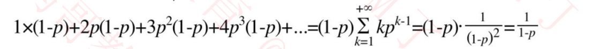

- 当 p = 1/2 时，每个元素所包含的平均指针数量是 2
- 当 p = 1/4 时，每个元素所包含的平均指针数量是 1.33


### 5 跳表的复杂度分析

每一层的元素数量：从下往上

- 第 1 层链表固定有 n 个元素
- 第 2 层链表平均有 n * p 个元素
- 第 3 层链表平均有 n * p<sup>2</sup> 个元素
- 第 k 层链表平均有 n * p<sup>k</sup> 个元素
- ......

**最高层的层数**是 log<sub>1/p</sub>n，平均有个 1/p 元素

在搜索时，每一层链表的预期查找步数最多是 1/p

- 所以总的查找步数是 -(log<sub>p</sub>(n/p))
- **时间复杂度是 O(logn)**。

+++

## 十一、B+数

### 1 B+树介绍

*B+树* 是 *B树* 的变体，常用于**数据库和操作系统的文件系统**中

- MySQL数据库的索引就是基于*B+树*实现的

**B+树的特点**：

- 分为**内部节点**（**非叶子**）、**叶子节点** 2 种节点；

  内部节点只存储 key，不存储具体数据

  叶子节点存储 key 和具体数据

- 所有的叶子节点形成一条有序链表；

- m 阶 B+树 非根节点的元素数量 x：`┌ m/2 ┐ ≤ x ≤ m`。

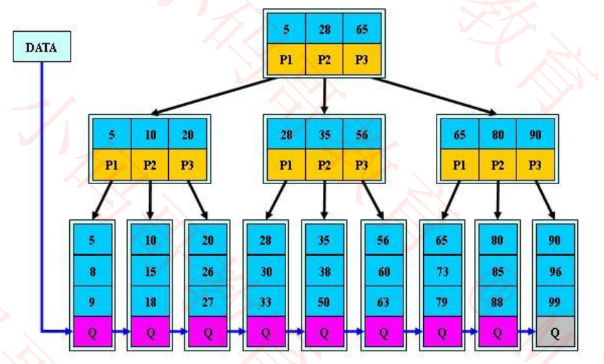

> 关于MySQL发音的官方说明
>
> https://dev.mysql.com/doc/refman/8.0/en/what-is-mysql.html
>
> The official way to pronounce “MySQL” is “My Ess Que Ell” (not “my sequel”)
>
> but we do not mind if you pronounce it as “my sequel” or in some other localized way.


### 2 硬盘介绍

市面上常见的硬盘有：

- **机械硬盘**（Hard Disk Drive，HDD）
- **固态硬盘**（Solid State Drive，SSD）


后面的介绍针对**机械硬盘**；


#### 2.1 盘片platter、盘面side、读写磁头head

硬盘一般由多个**盘片**组成，每个盘片包含2个**盘面**，每个盘面有1个对应的**读写磁头**：盘面、磁头**由上到下**从0开始编号；

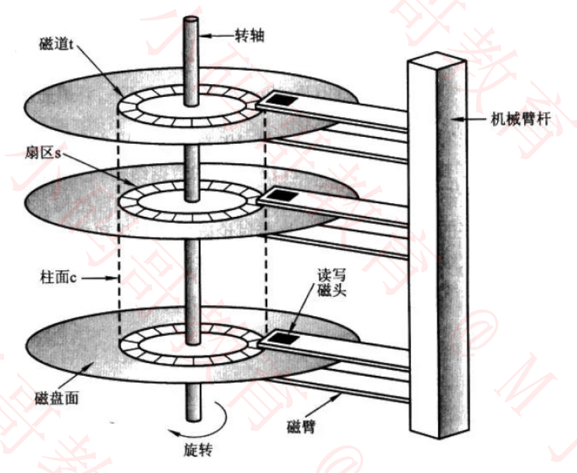


#### 2.2 磁道track、扇区sector

盘面中的一圈圈灰色圆环为是一条条的**磁道**：磁道**由外到内**从0开始编号；

每条磁道上的一个弧段叫做一个**扇区**：

- **扇区是磁盘的最小读写单位**
- 一个扇区的大小通常是 512 字节（也有 4096 字节的）

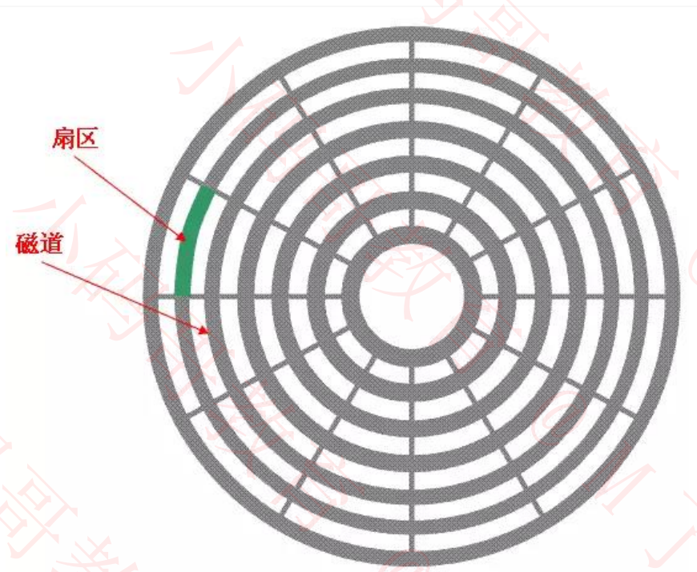

**早期硬盘的扇区细节**：

每条磁道的扇区数相同

- 所以外圈扇区的面积会比内圈扇区大

为了更好的读取数据，它们会存放相同的字节数

- 所以外圈扇区的记录密度要比内圈小，会浪费大量的存储空间

**硬盘的存储容量** = 磁头数 * 盘面磁道数 * 磁道扇区数 * 扇区字节数


#### 2.3 柱面cylinder

相同编号的磁道形成一个圆柱，称为**柱面**

- 磁盘的柱面数与一个盘面的磁道数是相等的

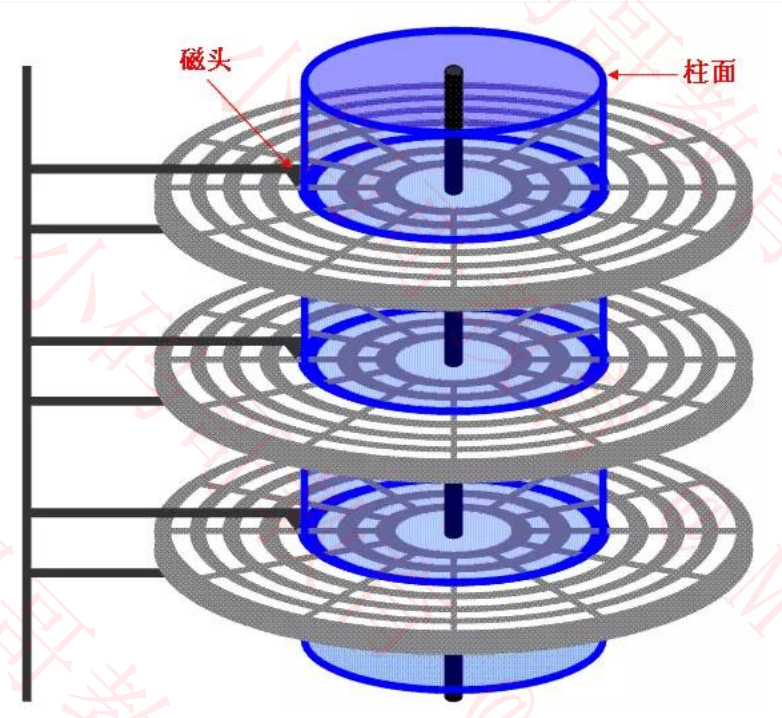


#### 2.4 磁盘块

磁盘块，在Windows中叫做**簇（cluster）**，在Linux中叫做**块（block）**。

- 相邻的 2<sup>n</sup> 个扇区组合在一起，形成一个**磁盘块**；
- **操作系统对磁盘进行管理时，以磁盘块作为最小读写单位**。

注意

- **磁盘块**是操作系统中的一个**虚拟概念**；
- **扇区**是磁盘上**真实存在**的物理区域。


#### 2.5 操作系统读取硬盘数据的过程

1. 操作系统将 LBA 传送给磁盘驱动器并启动读取命令；

   LBA（Logical Block Address，**逻辑块地址**）

   比如类似设备号4、磁头号4、磁道号8、扇区号16、扇区计数8这样的信息。

2. 磁盘驱动器根据 LBA 将磁头移动到正确的磁道，盘片开始旋转，将目标扇区旋转到磁头下；

3. 磁盘控制器将扇区数据等信息传送到一个处于磁盘界面的缓冲区；

4. 磁盘驱动器向操作系统发出“数据就绪”信号；

5. 操作系统从磁盘界面的缓冲区读取数据；

   既可以按照一个字节一个字节的方式读取，

   也可以启动 DMA（Direct Memory Access，**直接内存访问**）命令读取。


#### 2.6 磁盘完成IO操作的时间

主要由**寻道时间**、**旋转延迟时间**、**数据传输时间** 3 部分构成：

- **寻道时间**（seek）：软件

  将读写磁头移动至正确的磁道上所需要的时间，这部分时间代价最高；

- **旋转延迟时间**（rotation）：硬件

  盘片旋转将目标扇区移动到读写磁头下方所需要的时间，**取决于磁盘转速**；

- **数据传输时间**（transfer）：硬件

  完成传输数据所需要的时间，**取决于接口的数据传输率**，通常远小于前两部分消耗时间。

决定时间长短的大部分因素是和硬件相关的，但**所需移动的磁道数是可以通过操作系统来进行控制**的

- 减少所需移动的磁道数是减少整个硬盘读写时间的有效办法
- 合理安排磁头的移动以减少寻道时间就是**磁盘调度算法**的目的所在


### 3 查看系统硬盘信息

Windows

- 如果是查看K盘，**管理员权限**打开命令行工具，输入`fsutil fsinfo ntfsinfo k:`；

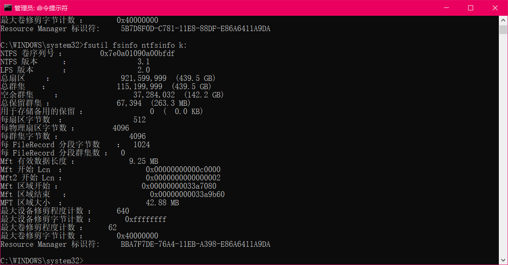

- 或者搜索框输入：**系统信息**；


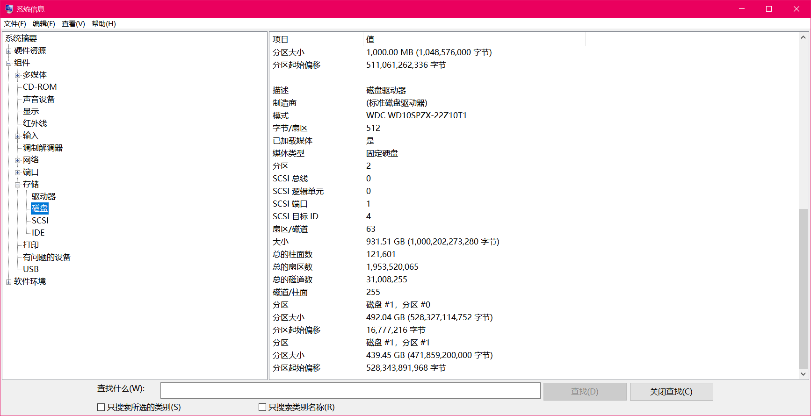


### 4 MySQL的索引底层为何使用B+树？

为了*减小IO操作*数量，一般把一个节点的大小设计成最小读写单位的大小

- MySQL 的存储引擎 InnoDB 的最小读写单位是 16K

对比B树，B+树的优势是：

- 每个节点存储的 key 数量更多，**树的高度更低**；

- 所有的具体数据都存在叶子节点上，所以每次查询都要查到叶子节点，**查询速度比较稳定**；

- 所有的叶子节点构成了一个有序链表，**做区间查询时更方便**；

  例如查询某个范围内的数据，找到头结点后再通过链表往后找即可。


### 5 B树 与 B*树

*B树*：

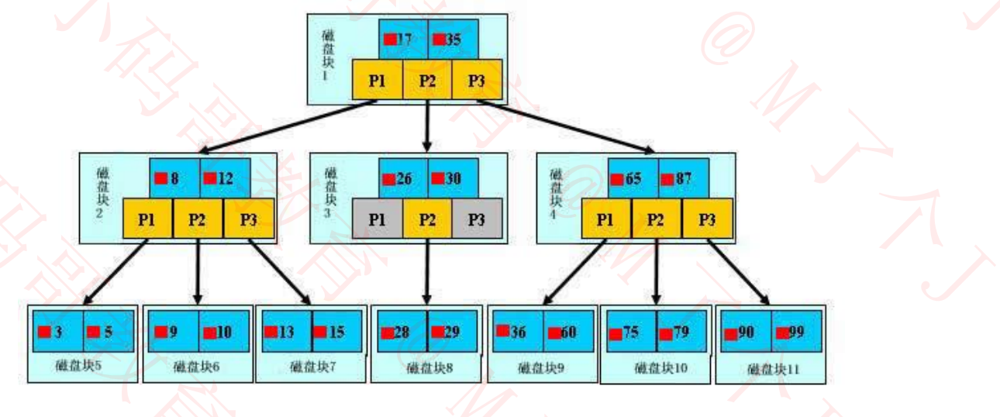

*B\*树*：

B*树 是 B+树 的变体：给内部节点增加了指向兄弟节点的指针；

- m阶 B*树 非根节点的元素数量 x：`┌ 2m/3 ┐ ≤ x ≤ m`

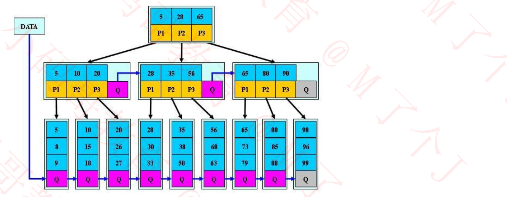

+++

## 十二、串Sequence

### 1 串(前缀、后缀)

本课程研究的**串**是开发中非常熟悉的**字符串**，是**由若干个字符组成的有限序列**。


字符串`thank`的**前缀**（prefix）、**真前缀**（proper prefix）、**后缀**（suffix）、**真后缀**（proper suffix）


### 2 串匹配算法

- 查找一个**模式串**（pattern）在**文本串**（text）中的位置：

  ```java
  String text = "Hello World";
  String pattern = "or";
  text.indexOf(pattern); // 7
  text.indexOf("abc"); // -1
  ```

几个经典的串匹配算法：

- 蛮力（Brute Force）
- **KMP**【**重点掌握**】
- Boyer-Moore
- Karp-Rabin / Rabin-Karp
- Sunday

下面用 `tlen` 代表文本串 text 的长度，`plen` 代表模式串 pattern 的长度；


### 3 蛮力(Brute Force)

以字符为单位，从左到右移动模式串，直到匹配成功；

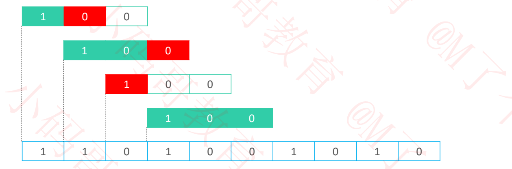

蛮力算法有 2 种常见实现思路：


#### 3.1 蛮力1--执行过程+实现

*执行过程*：

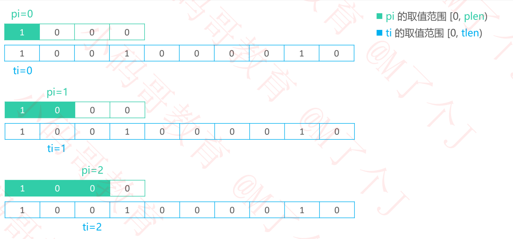

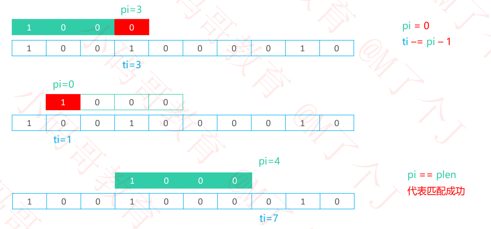

*实现*：

```java
// 时间：O(n * m)
// 空间：O(n + m)
public static int indexOf(String test, String pattern) {
    if (test == null || pattern == null) return -1;
    char[] testChars = test.toCharArray();
    char[] patternChars = pattern.toCharArray();
    int tlen = testChars.length, plen = patternChars.length;
    if (tlen == 0 || plen == 0 || tlen < plen) return -1;

    int pi = 0, ti = 0;
    while (pi < plen && ti < tlen) {
        if (testChars[ti] == patternChars[pi]) {
            pi++;
            ti++;
        } else {
            ti = ti - pi + 1;
            pi = 0;
        }
    }
    return pi == plen ? (ti - pi) : -1;
}
```


#### 3.2 蛮力1--优化

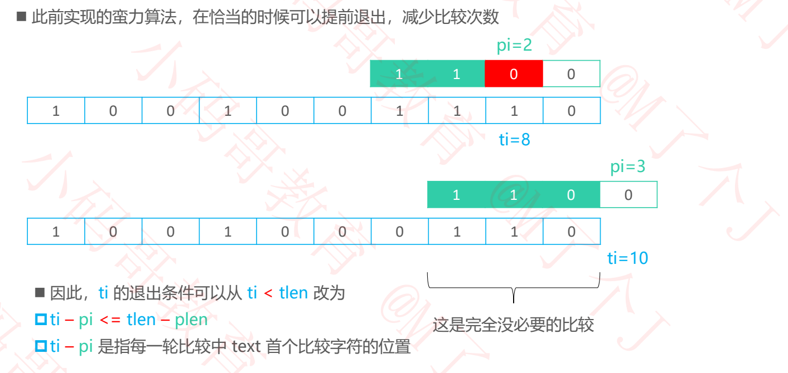

```java
// 时间：O(n * m)
// 空间：O(n + m)
public static int indexOf(String test, String pattern) {
    if (test == null || pattern == null) return -1;
    char[] testChars = test.toCharArray();
    char[] patternChars = pattern.toCharArray();
    int tlen = testChars.length, plen = patternChars.length;
    if (tlen == 0 || plen == 0 || tlen < plen) return -1;

    int pi = 0, ti = 0, lenDelta = tlen - plen;
    while (pi < plen && (ti - pi) <= lenDelta) {
        if (testChars[ti] == patternChars[pi]) {
            pi++;
            ti++;
        } else {
            ti = ti - pi + 1;
            pi = 0;
        }
    }
    return pi == plen ? (ti - pi) : -1;
}
```


#### 3.3 蛮力2--执行过程+实现

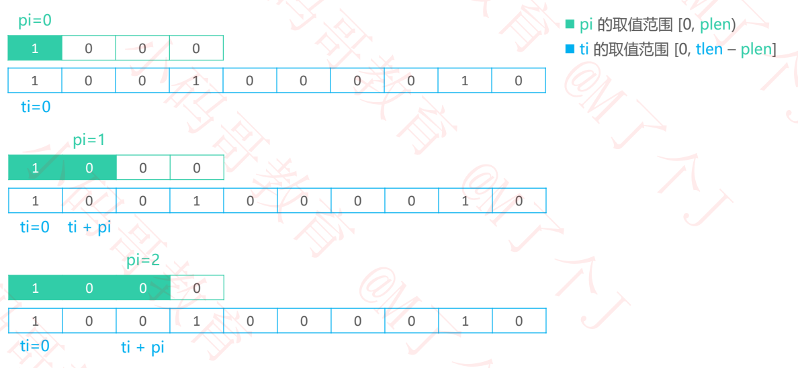

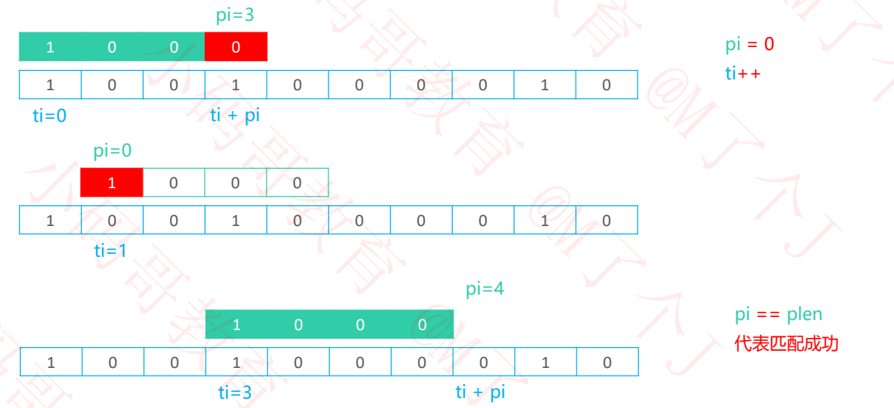

```java
// 时间：O(n * m)
// 空间：O(n + m)
public static int indexOf(String test, String pattern) {
    if (test == null || pattern == null) return -1;
    char[] testChars = test.toCharArray();
    char[] patternChars = pattern.toCharArray();
    int tlen = testChars.length, plen = patternChars.length;
    if (tlen == 0 || plen == 0 || tlen < plen) return -1;

    // 如果模式串的头在 tlen - plen 后面, 必然会匹配失败
    int tiMax = tlen - plen;
    for (int ti = 0; ti <= tiMax; ti++){
        int pi = 0;
        for ( ; pi < plen; pi++) {
            if (testChars[ti + pi] != patternChars[pi]) break;
        }
        if (pi == plen) return ti;
    }
    return -1;
}
```


#### 3.4 蛮力–性能分析

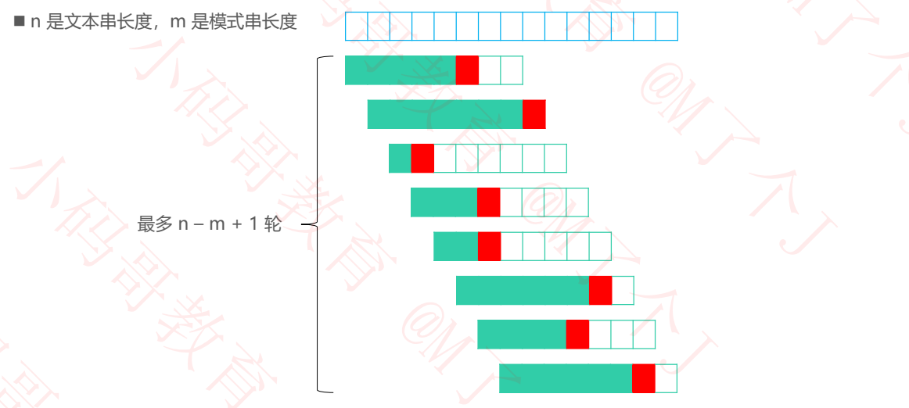

**最好情况**：

- 只需一轮比较就完全匹配成功，比较 m 次（m 是模式串的长度）
- 时间复杂度为 O(m)


**最坏情况**（字符集越大，出现概率越低）：

- 执行了 n – m + 1 轮比较（ n 是文本串的长度）
- 每轮都比较至模式串的末字符后失败（ m – 1 次成功，1 次失败）
- 时间复杂度为 O(m ∗ (n − m + 1))，由于一般 m 远小于 n，所以为 O(mn)

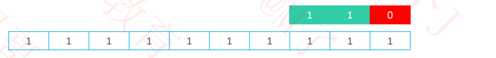


### 4 KMP

KMP 是 Knuth–Morris–Pratt 的简称（取名自3位发明人的名字），于1977年发布


#### 4.1 蛮力 VS KMP

首先大概了解一下两者的差距：

**蛮力算法**：会经历很多次没有必要的比较。

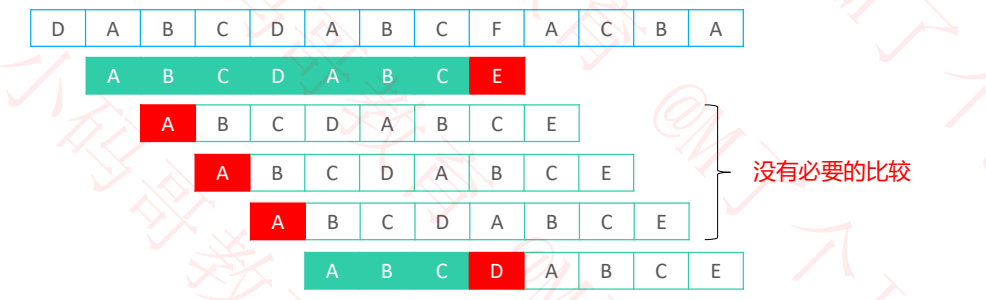

**KMP算法**：充分利用了此前比较过的内容，可以很聪明地跳过一些不必要的比较位置。


#### 4.2 KMP--next表的使用

KMP 会预先根据模式串的内容生成一张 next 表(一般是个数组)：


例如，下图串匹配时， pi = 7 时**失配**：

- 根据失配的索引 7 查表，查到的元素索引为 3

  `next[pi] == 3`

- 将模式串索引为 3 的元素移动到失配的位置

  `pi = nextp[pi] // pi == 3` 

- 向右移动的距离为`p - next[pi]`。

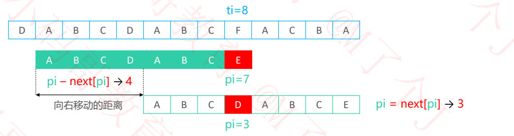

再比如：pi = 3 时失配， `next[3] = 0`，将 0 位置的元素移到失配处：`pi = next[pi]`；

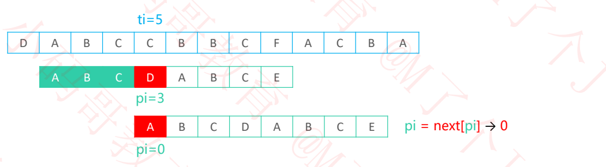


#### 4.3 KMP--核心原理

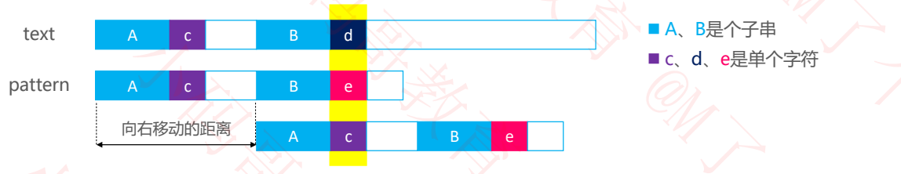

**d、e 失配时**，如果希望 pattern 能够一次性向右移动一大段距离，然后直接比较 d、c 字符

- 前提条件是 A 必须等于 B

所以 KMP 必须在失配字符 e 左边的子串中找出符合条件的 A、B，从而得知向右移动的距离

向右移动的距离：**e左边子串的长度 – A的长度**，等价于：**e的索引 – c的索引**，

且**c的索引 == next[e的索引]**，所以向右移动的距离：**e的索引 – next[e的索引]**

总结：

- 如果在 pi 位置失配，向右移动的距离是`pi – next[pi]`，所以`next[pi]`越小，移动距离越大
- `next[pi]`是 pi 左边子串的**真前缀后缀的最大公共子串长度**


##### 4.3.1 真前缀后缀的最大公共子串长度

如何求**真前缀后缀的最大公共子串长度**：

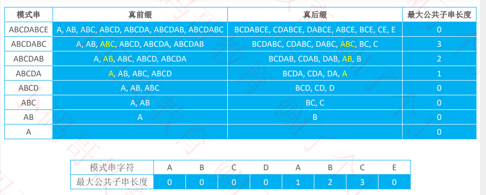


##### 4.3.2 构造next表

根据**最大公共子串长度**得到 next 表：


将最大公共子串长度都向后移动 1 位，首字符设置为`负1`，就得到了 next 表


##### 4.3.3 负一的精妙之处

**为什么要将首字符设置为 -1**？

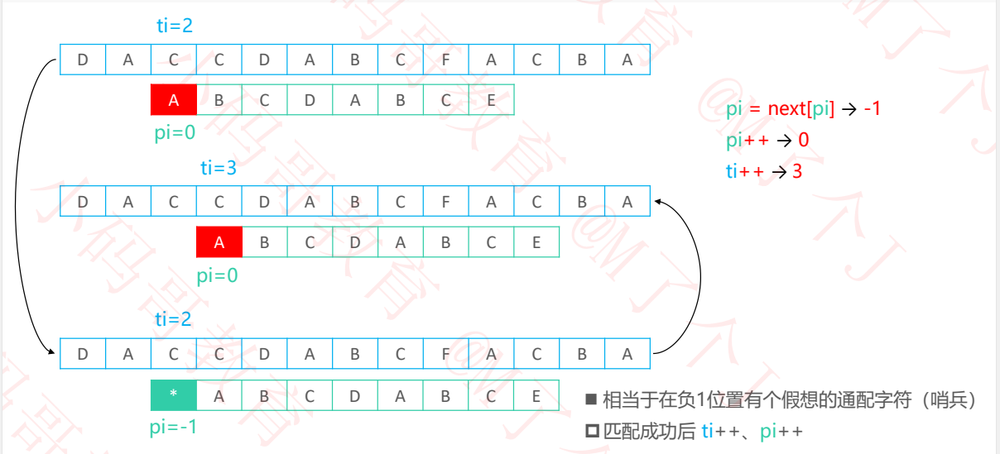


#### 4.4 KMP--主算法代码实现

```java
// 时间：O(n)
// 空间：O()
public static int indexOf(String test, String pattern) {
    if (test == null || pattern == null) return -1;
    char[] testChars = test.toCharArray();
    char[] patternChars = pattern.toCharArray();
    int tlen = testChars.length, plen = patternChars.length;
    if (tlen == 0 || plen == 0 || tlen < plen) return -1;

    // next表
    int[] next = next(pattern);
    int pi = 0, ti = 0, lenDelta = tlen - plen;
    while (pi < plen && (ti - pi) <= lenDelta) {
        if (pi < 0 || testChars[ti] == patternChars[pi]) {
            pi++;
            ti++;
        } else {
            pi = next[pi];
        }
    }
    return pi == plen ? (ti - pi) : -1;
}
```


#### 4.5 KMP为什么是“最大“公共子串长度？

假设**文本串**是 `AAAAABCDEF`，**模式串**是 `AAAAB`：

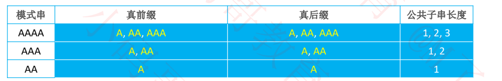

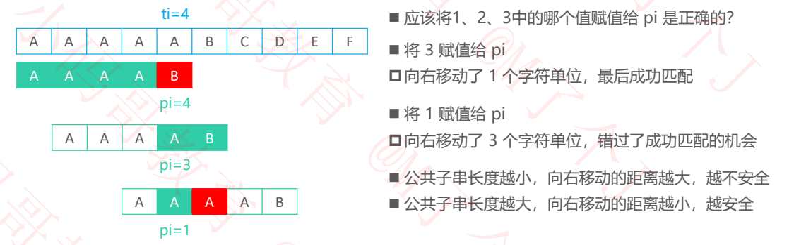


#### 4.6 KMP--next表的构造思路及实现


已知 `next[i] == n`；

1. 如果 `pattern.charAt(i)` **==** `pattern.charAt(n)`

   - 那么 `next[i + 1]` **==** `n + 1`

2. 如果 `pattern.charAt(i)` **!=** `pattern.charAt(n)`

   - 已知 `next[n]` **==** `k`

   - 如果 `pattern.charAt(i)` **==** `pattern.charAt(k)`

     那么 `next[i + 1]` == `k + 1`

   - 如果 `pattern.charAt(i)` **!=** `pattern.charAt(k)`

     将 k 代入 n ，重复执行 2

构造 next 表代码实现：

```java
/**
 * 构建next表
 */
private static int[] next(String pattern){
    char[] chars = pattern.toCharArray();
    int[] next = new int[chars.length];
    int n = next[0] = -1;
    int i = 0, iMax = chars.length - 1;
    while (i < iMax) {
        if (n < 0 || chars[i] == chars[n]) {
            next[++i] = ++n;
        } else {
            n = next[n];
        }
    }
    return next;
}
```


#### 4.7 KMP--next表的不足之处

假设文本串是 `AAABAAAAB`，模式串是 `AAAAB`

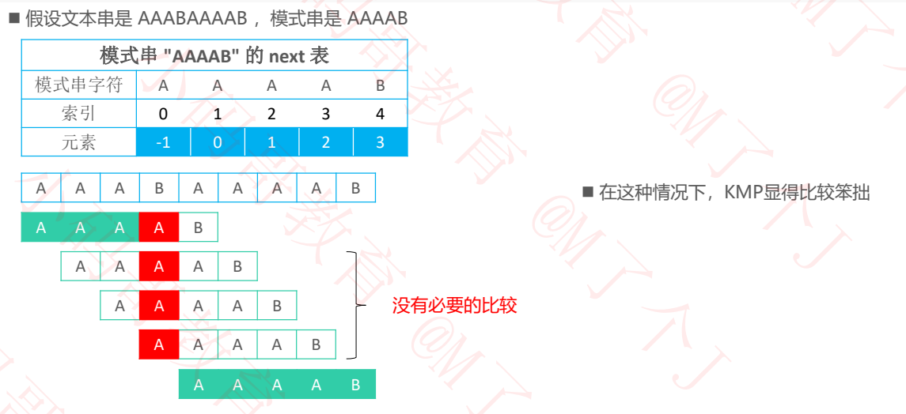


#### 4.8 KMP--next表的优化思路及实现

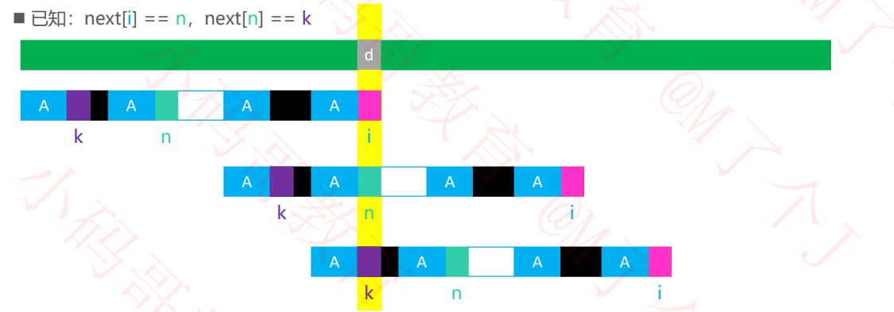

- 如果 `pattern[i]` **!=** `d`，就让模式串滑动到 `next[i]`（也就是n）位置跟 `d` 进行比较；

- 如果 `pattern[n]` **!=** `d`，就让模式串滑动到 `next[n]`（也就是k）位置跟 `d` 进行比较；

- 如果 `pattern[i]` **==** `pattern[n]`，那么当 `i` 位置失配时，

  模式串最终必然会滑到 `k` 位置跟 `d` 进行比较，

  所以 `next[i]` 直接存储 `next[n]`（也就是k）即可；

next 表的优化代码实现：

```java
/**
 * 构建next表 -- 优化
 */
private static int[] next(String pattern){
    char[] chars = pattern.toCharArray();
    int[] next = new int[chars.length];
    int n = next[0] = -1;
    int i = 0, iMax = chars.length - 1;
    while (i < iMax) {
        if (n < 0 || chars[i] == chars[n]) {
            i++;
            n++;
            if (chars[i] == chars[n]){
                next[i] = next[n];
            } else {
                next[i] = n;
            }
        } else {
            n = next[n];
        }
    }
    return next;
}
```


#### 4.9 KMP--next表的优化效果及性能分析

*优化效果*：


*性能分析*：

KMP 主逻辑：

- 最好时间复杂度：O(m)
- 最坏时间复杂度：O(n)，不超过O(2n)

next 表的构造过程跟 KMP 主体逻辑类似：

- 时间复杂度：O(m)

KMP 整体：

- 最好时间复杂度：O(m)
- 最坏时间复杂度：O(n + m)
- 空间复杂度：O(m)

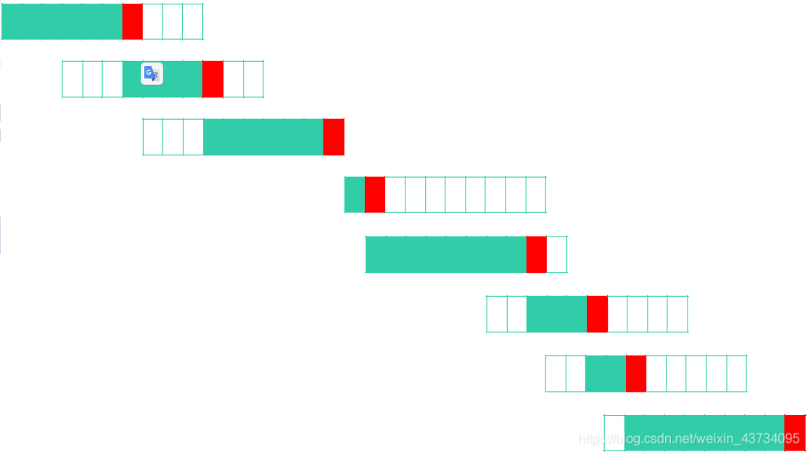


#### 4.10 KMP--完整代码

```java
package com.xk._02Algorithmic._11sequence;

/**
 * @description: KMP算法
 * @author: xu
 * @date: 2022/10/23 23:12
 */
public class KMP {

    // 时间：O(n)
    // 空间：O()
    public static int indexOf(String test, String pattern) {
        // 检测数据合法性
        if (test == null || pattern == null) return -1;
        char[] testChars = test.toCharArray();
        char[] patternChars = pattern.toCharArray();
        int tlen = testChars.length, plen = patternChars.length;
        if (tlen == 0 || plen == 0 || tlen < plen) return -1;

        // next表
        int[] next = next(pattern);
        int pi = 0, ti = 0, lenDelta = tlen - plen;
        while (pi < plen && (ti - pi) <= lenDelta) {
            // next表置-1的精妙之处, pi = -1 则 pi = 0, ti++ 相当于模式串后一一位
            if (pi < 0 || testChars[ti] == patternChars[pi]) {
                pi++;
                ti++;
            } else {
                pi = next[pi];
            }
        }
        return pi == plen ? (ti - pi) : -1;
    }

    /**
     * 构建next表 -- 优化
     */
    private static int[] next(String pattern){
        char[] chars = pattern.toCharArray();
        int[] next = new int[chars.length];
        int n = next[0] = -1;
        int i = 0, iMax = chars.length - 1;
        while (i < iMax) {
            if (n < 0 || chars[i] == chars[n]) {
                i++;
                n++;
                if (chars[i] == chars[n]){
                    next[i] = next[n];
                } else {
                    next[i] = n;
                }
            } else {
                n = next[n];
            }
        }
        return next;
    }

    /**
     * 构建next表
     */
    private static int[] next2(String pattern){
        char[] chars = pattern.toCharArray();
        int[] next = new int[chars.length];
        int n = next[0] = -1;
        int i = 0, iMax = chars.length - 1;
        while (i < iMax) {
            if (n < 0 || chars[i] == chars[n]) {
                next[++i] = ++n;
            } else {
                n = next[n];
            }
        }
        return next;
    }
}
```


### 5 蛮力 vs KMP

**蛮力算法为何低效？**

当字符**失配**时：

- **蛮力算法**：`ti`回溯到左边位置，`pi`回溯到0；
- **KMP算法**：`ti`不必回溯，`pi`不一定要回溯到0。


### 6 Boyer-Moore

Boyer-Moore 算法，简称 BM 算法，由 Robert S.Boyer 和 J Strother Moore 于 1977 年发明；

- 最好时间复杂度：O(n/m)，最坏时间复杂度：O(n + m)
- 该算法从模式串的尾部开始匹配（**自后向前**）

BM 算法的移动字符数是通过 2 条规则计算出的最大值：

- **坏字符规则**（Bad Character，简称 BC）
- **好后缀规则**（Good Suffix，简称 GS）


#### 6.1 坏字符规则(Bad Character)


当 Pattern 中的字符 `E` 和 Text 中的 `S` **失配**时，称 `S` 为 **坏字符**；

- 如果 Pattern 的未匹配子串中**不存在坏字符**，直接将 Pattern 移动到坏字符的下一位
- 否则，让 Pattern 的未匹配子串中最靠右的坏字符与 Text 中的坏字符对齐


#### 6.2 好后缀规则(Good Suffix)

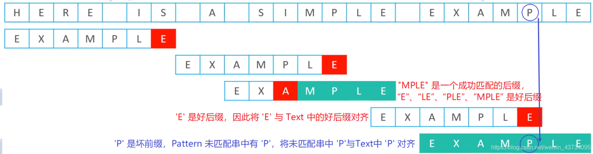

`MPLE` 是一个成功匹配的后缀，`E`、`LE`、`PLE`、`MPLE` 都是 **好后缀**；

- 如果 Pattern 中找不到与好后缀对齐的子串，直接将 Pattern 移动到好后缀的下一位
- 否则，从 Pattern 中找出子串与 Text 中的好后缀对齐


#### 6.3 BM算法最好情况与最坏情况

**最好情况**，时间复杂度：O(n/m)；

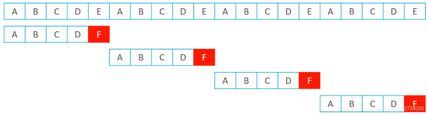

**最坏情况**，时间复杂度：O(n + m)，其中 O(m) 为构造表的时间；

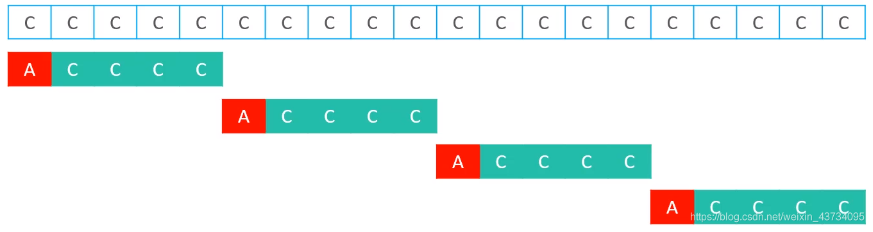


### 7 Karp-Rabin / Rabin-Kary

Rabin-Karp算法（或Karp-Rabin算法），简称 RK 算法，是一种**基于hash**的字符串匹配算法

- 由 Richard M.Karp 和 Michael O.Rabin 于 1987 年发明

大致原理：

- 将 Pattern 的 hash 值与 Text 中每个子串的 hash 值进行比较
- **某一子串的 hash 值可以根据上一子串的 hash 值在 O(1) 时间内计算出来**。


### 8 Sunday

`Sunday算法`由 Daniel M.Sunday 在1990年提出，它的思想跟`BM算法`很相似

- **从前向后匹配**（BM算法是从后往前）

- 当匹配失败时，关注的是 Text 中参与匹配的子串的下一位字符 A

  如果 A 没有在 Pattern 中出现，则直接跳过，即 移动位数 = Pattern长度 + 1

  否则，让 Pattern 中最靠右的 A 与 Text 中的 A 对齐


