# 恋上数据结构-算法篇

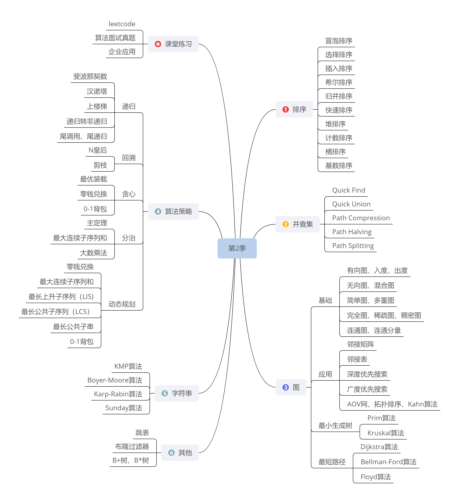

+++

## 一、排序Sort

### 1 前置知识

#### 1.1 排序算法大全

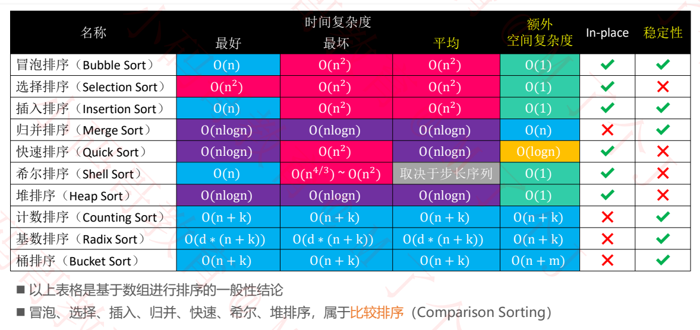


#### 1.2 排序基本知识

1. 何为排序？
   - 排序前：3，1，6，9，2，5，8，47
   - 升序排序：1，2，3，4，5，6，7，8，9
   - 降序排序：9，8，7，6，5，4，3，2，1

2. 何为稳定性？

   - 降序前：5，1，3<sub>a</sub>，7，3<sub>b</sub>
   - 稳定的排序：1，3<sub>a</sub>，3<sub>b</sub>，5，7
   - 不稳定的排序：1，3<sub>b</sub>，3<sub>a</sub>，5，7

   对**自定义对象**进行排序时，稳定性会影响最终的排序效果。

3. 何为原地算法？
   - 不依赖额外的资源或者依赖少数的额外资源，仅依靠*输出*来覆盖*输入*；
   - 空间复杂度为`O(1)`的都可以认为是原地算法；
   - 非原地算法，称为 Not-in-place 或者 Out-of-place。


#### 1.3 写排序算法前的准备

##### 1.3.1 项目结构

创建一个项目，大体结构是这样的：

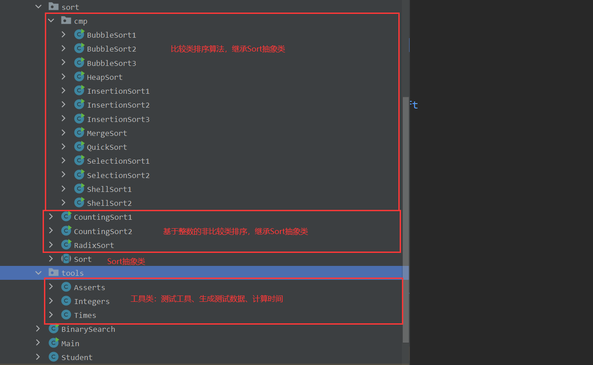

- sort：各种排序类
  - cmp：比较类排序
  - sort.java：排序抽象类
- tools：排序中用到的工具
  - Asserts.java：单元测试
  - Inegers.java：生成测试数据
  - Times.java：计算时间
- Main：主函数，写排序测试
- Student.java：利用自定义类测试稳定性(sort.java中使用)


##### 1.3.2 Sort.java

写一个抽象类 Sort.java

- 实现自定义对象的比较(cmp)，交换(swap)方法
- 同时可以用来计算比较次数(cmpCount)，交换次数(swapCount)，花费时间(time)
- 排序是否稳定()

```java
package com.xk._02Algorithmic._01sort.sort;

import com.xk._02Algorithmic._01sort.Student;
import java.text.DecimalFormat;

public abstract class Sort<E extends Comparable<E>> implements Comparable<Sort<E>> {
    protected E[] array;
    private int cmpCount;
    private int swapCount;
    private long time;
    private DecimalFormat fmt = new DecimalFormat("#.00");

    public void sort(E[] array) {
        if (array == null || array.length < 2) return;
        this.array = array;
        this.cmpCount = 0;
        this.swapCount = 0;
        long begin = System.currentTimeMillis();
        sort();
        time = System.currentTimeMillis() - begin;
    }

    protected abstract void sort();

    /**
     * 比较对应两个索引对应数据的大小
     * @return
     *      返回值返回0， array[i1] == array[i2]
     *      返回值大于0， array[i1] > array[i2]
     *      返回值小于0， array[i1] < array[i2]
     */
    protected int cmp(int i1, int i2){
        cmpCount++;
        return array[i1].compareTo(array[i2]);
    }
    protected int cmp(E v1, E v2){
        cmpCount++;
        return v1.compareTo(v2);
    }

    protected void swap(int i1, int i2) {
        swapCount++;
        E tmp = array[i1];
        array[i1] = array[i2];
        array[i2] = tmp;
    }

    @Override
    public int compareTo(Sort<E> o) {
        int result = (int) (this.time - o.time);
        if (result == 0) result = this.swapCount - o.swapCount;
        if (result == 0) result = this.cmpCount - o.cmpCount;
        return result;
    }

    @Override
    public String toString() {
        String timeStr = "耗时：" + (time / 1000.0) + "s(" + time + "ms)";
        String compareCountStr = "比较：" + numberString(cmpCount);
        String swapCountStr = "交换：" + numberString(swapCount);
        String stableStr = "稳定性：" + isStable();
        return "【" + getClass().getSimpleName() + "】\n"
                + stableStr + "\t "
                + timeStr + " \t"
                + compareCountStr + "\t "
                + swapCountStr + "\n"
                + "------------------------------------------------------------------";
    }

    private String numberString(int number) {
        if (number < 10000) return "" + number;
        if (number < 100000000) return fmt.format(number / 10000.0) + "万";
        return fmt.format(number / 100000000.0) + "亿";
    }

    private boolean isStable(){
        if (this instanceof ShellSort1 || this instanceof ShellSort2) return false;
        Student[] students = new Student[20];
        for (int i = 0; i < students.length; i++) {
            students[i] = new Student(i * 10, 10);
        }

        sort((E[]) students);

        for (int i = 1; i < students.length; i++) {
            if (students[i].score - students[i-1].score != 10) return false;
        }
        return true;
    }
}
```


##### 1.3.3 Asserts.java

```java
public class Asserts {
   public static void test(boolean value) {
      try {
         if (!value) throw new Exception("测试未通过");
      } catch (Exception e) {
         e.printStackTrace();
      }
   }
}
```


##### 1.3.4 Integers.java

```java
package com.xk._02Algorithmic._01sort.tools;

import java.util.Arrays;

public class Integers {
   public static Integer[] random(int count, int min, int max) {
      if (count <= 0 || min > max) return null;
      Integer[] array = new Integer[count];
      int delta = max - min + 1;
      for (int i = 0; i < count; i++) {
         array[i] = min + (int)(Math.random() * delta);
      }
      return array;
   }
   
   public static Integer[] combine(Integer[] array1, Integer[] array2) {
      if (array1 == null || array2 == null) return null;
      Integer[] array = new Integer[array1.length + array2.length];
      for (int i = 0; i < array1.length; i++) {
         array[i] = array1[i];
      }
      for (int i = 0; i < array2.length; i++) {
         array[i + array1.length] = array2[i];
      }
      return array;
      
   }
   
   public static Integer[] same(int count, int unsameCount) {
      if (count <= 0 || unsameCount > count) return null;
      Integer[] array = new Integer[count];
      for (int i = 0; i < unsameCount; i++) {
         array[i] = unsameCount - i;
      }
      for (int i = unsameCount; i < count; i++) {
         array[i] = unsameCount + 1;
      }
      return array;
   }
   
   public static Integer[] headTailAscOrder(int min, int max, int disorderCount) {
      Integer[] array = ascOrder(min, max);
      if (disorderCount > array.length) return array;
      
      int begin = (array.length - disorderCount) >> 1;
      reverse(array, begin, begin + disorderCount);
      return array;
   }
   
   public static Integer[] centerAscOrder(int min, int max, int disorderCount) {
      Integer[] array = ascOrder(min, max);
      if (disorderCount > array.length) return array;
      int left = disorderCount >> 1;
      reverse(array, 0, left);
      
      int right = disorderCount - left;
      reverse(array, array.length - right, array.length);
      return array;
   }
   
   public static Integer[] headAscOrder(int min, int max, int disorderCount) {
      Integer[] array = ascOrder(min, max);
      if (disorderCount > array.length) return array;
      reverse(array, array.length - disorderCount, array.length);
      return array;
   }
   
   public static Integer[] tailAscOrder(int min, int max, int disorderCount) {
      Integer[] array = ascOrder(min, max);
      if (disorderCount > array.length) return array;
      reverse(array, 0, disorderCount);
      return array;
   }
   
   public static Integer[] ascOrder(int min, int max) {
      if (min > max) return null;
      Integer[] array = new Integer[max - min + 1];
      for (int i = 0; i < array.length; i++) {
         array[i] = min++;
      }
      return array;
   }
   
   public static Integer[] descOrder(int min, int max) {
      if (min > max) return null;
      Integer[] array = new Integer[max - min + 1];
      for (int i = 0; i < array.length; i++) {
         array[i] = max--;
      }
      return array;
   }
   
   /**
    * 反转一个数组，索引范围是[begin, end)
    */
   private static void reverse(Integer[] array, int begin, int end) {
      int count = (end - begin) >> 1;
      int sum = begin + end - 1;
      for (int i = begin; i < begin + count; i++) {
         int j = sum - i;
         int tmp = array[i];
         array[i] = array[j];
         array[j] = tmp;
      }
   }
   
   public static Integer[] copy(Integer[] array) {
      return Arrays.copyOf(array, array.length);
   }
   
   public static boolean isAscOrder(Integer[] array) {
      if (array == null || array.length == 0) return false;
      for (int i = 1; i < array.length; i++) {
         if (array[i - 1] > array[i]) return false;
      }
      return true;
   }
   
   public static void println(Integer[] array) {
      if (array == null) return;
      StringBuilder string = new StringBuilder();
      for (int i = 0; i < array.length; i++) {
         if (i != 0) string.append("_");
         string.append(array[i]);
      }
      System.out.println(string);
   }
}
```


##### 1.3.5 Times.java

```java
package com.xk._02Algorithmic._01sort.tools;

import java.text.SimpleDateFormat;
import java.util.Date;

public class Times {
   private static final SimpleDateFormat fmt = new SimpleDateFormat("HH:mm:ss.SSS");
   
   public interface Task {
      void execute();
   }
   
   public static void test(String title, Task task) {
      if (task == null) return;
      title = (title == null) ? "" : ("【" + title + "】");
      System.out.println(title);
      System.out.println("开始：" + fmt.format(new Date()));
      long begin = System.currentTimeMillis();
      task.execute();
      long end = System.currentTimeMillis();
      System.out.println("结束：" + fmt.format(new Date()));
      double delta = (end - begin) / 1000.0;
      System.out.println("耗时：" + delta + "秒");
      System.out.print("-------------------------------------");
      System.out.println("-------------------------------------");
   }
}
```


##### 1.3.6 Student.java

```java
package com.xk._02Algorithmic._01sort;

public class Student implements Comparable<Student> {
   public int score;
   public int age;
   
   public Student(int score, int age) {
      this.score = score;
      this.age = age;
   }
   
   @Override
   public int compareTo(Student o) {
      return age - o.age;
   }
}
```


### 2 十大排序算法

#### 2.1 冒泡排序

**冒泡排序**也叫做**起泡排序**。

**执行流程**：

1. 从头开始比较每一对相邻元素，如果第1个比第2个大，就交换它们的位置；

   执行完一轮后，最未尾那个元素就是最大的元素。

2. 忽略**1**中曾经找到的最大元素，重复执行步骤**1**，直到全部元素有序。

这是一个标准的冒泡排序。

```java
package com.xk._02Algorithmic._01sort.sort;

/**
 * @description: 冒泡排序
 * @author: xu
 * @date: 2022/10/1 2:14
 */
public class BubbleSort1<E extends Comparable<E>> extends Sort<E> {
    /**
     * 冒泡排序
     */
    private void bubbleSort1(){
        for (int end = array.length - 1; end > 0; end--) {
            for (int begin = 1; begin <= end; begin++) {
                if (cmp(begin-1, begin) > 0){
                    swap(begin, begin-1);
                }
            }
        }
    }

    @Override
    protected void sort() {
        bubbleSort1();
    }
}
```


##### 2.1.1 冒泡排序--优化1

这个优化并不会提高冒泡排序的平均性能，只是**针对极端条件进行处理**。

如果**序列已经完全有序**，可以提前终止冒泡排序。

```java
package com.xk._02Algorithmic._01sort.sort;

/**
 * @description: 冒泡排序 优化1 -- 如果序列已经完全有序，可以提前终止冒泡排序
 * @author: xu
 * @date: 2022/10/1 2:14
 */
public class BubbleSort2<E extends Comparable<E>> extends Sort<E> {
    /**
     * 冒泡排序 优化1 -- 如果序列已经完全有序，可以提前终止冒泡排序
     */
    private void bubbleSort2(){
        for (int end = array.length - 1; end > 0; end--) {
            boolean swap = true;
            for (int begin = 1; begin <= end; begin++) {
                if (cmp(begin, begin-1) < 0){
                    swap(begin, begin-1);
                    swap = false;
                }
            }
            if (swap) break;
        }
    }

    @Override
    protected void sort() {
        bubbleSort2();
    }
}
```


##### 2.1.2 冒泡排序--优化2

这个优化是在优化1的基础上，增大极端条件的范围，从**完全有序**变为**尾部局部有序**。

如果**序列尾部已经局部有序**，可以**记录最后1次交换的位置**，减少比较次数。

```java
package com.xk._02Algorithmic._01sort.sort;

/**
 * @description: 冒泡排序 优化2 -- 如果序列尾部已经局部有序，可以记录最后1次交换的位置，减少比较次数
 * @author: xu
 * @date: 2022/10/1 2:14
 */
public class BubbleSort3<E extends Comparable<E>> extends Sort<E> {
    /**
     * 冒泡排序 优化2 -- 如果序列尾部已经局部有序，可以记录最后1次交换的位置，减少比较次数
     */
    private void bubbleSort3(){
        for (int end = array.length - 1; end > 0; end--) {
            // sortedIndex 的初始值在数组完全有序的时候有用
            int sortedIndex = 1;
            for (int begin = 1; begin <= end; begin++) {
                if (cmp(begin, begin-1) < 0){
                    swap(begin, begin-1);
                    sortedIndex = begin;
                }
            }
            end = sortedIndex;
        }
    }

    @Override
    protected void sort() {
        bubbleSort3();
    }
}
```


##### 2.1.3 复杂度与稳定性

最坏、平均时间复杂度：O(n<sup>2</sup>)

最好时间复杂度：O(n)

空间复杂度：O(1)

**冒泡排序属于 In-place**；

冒泡排序属于**稳定的排序算法**。

稍有不慎，稳定的排序算法也能被写成不稳定的排序算法，比如下面的冒泡排序代码是不稳定的。

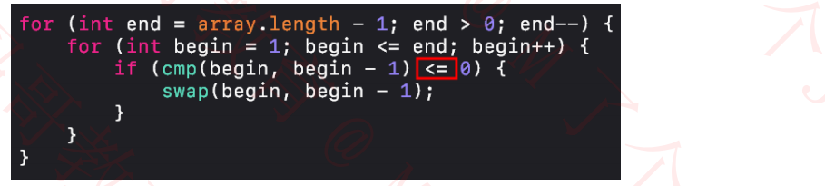


#### 2.2 选择排序

##### 2.2.1 代码实现

执行流程：

1. 从序列中找出最大的那个元素，然后与最末尾的元素交换位置

   执行完一轮后，最末尾的那个元素就是最大的元素

2. 忽略**1**中曾经找到的最大元素，重复执行步骤**1**。

```java
package com.xk._02Algorithmic._01sort.sort;

/**
 * @description: 选择排序：最大的元素放在最右边
 * @author: xu
 * @date: 2022/10/1 4:34
 */
public class SelectionSort1<E extends Comparable<E>> extends Sort<E> {
    /**
     * 选择排序：最大的元素放在最右边
     */
    private void selectionSort1() {
        for (int end = array.length - 1; end > 0; end--) {
            int maxIndex = 0;
            for (int begin = 1; begin <= end; begin++) {
                if (cmp(maxIndex, begin) <= 0) {
                    // <= : 为了算法的稳定性
                    // 从前往后遍历，将相等数值的最后一个放到数组的最后面去
                    maxIndex = begin;
                }
            }
            swap(maxIndex, end);
        }
    }

    @Override
    protected void sort() {
        selectionSort1();
    }
}
```

选择排序的交换次数要远远少于冒泡排序，平均性能优于冒泡排序


##### 2.2.2 复杂度与稳定性

- 最好、最坏、平均时间复杂度：O(n<sup>2</sup>)
- 空间复杂度：O(1)
- 选择排序属于**不稳定排序**

选择排序是否还有优化的空间？

- **使用堆来选择最大值，可以大大提高选择速度**。


#### 2.3 堆排序

##### 2.3.1 代码实现

执行流程：

1. 对序列进行原地建堆（heapify）
2. 重复执行以下操作，直到堆的元素数量为1
   - 交换堆顶元素与尾元素
   - 堆的元素数量减 1
   - 对 0 位置进行 1 次 siftDown 操作

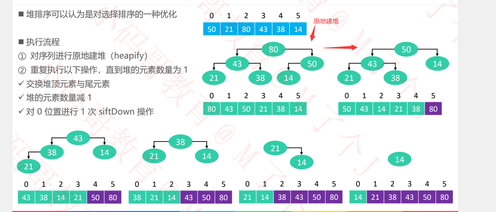


```java
package com.xk._02Algorithmic._01sort.sort;

/**
 * @description: 堆排序
 * @author: xu
 * @date: 2022/10/1 4:57
 */
public class HeapSort<E extends Comparable<E>> extends Sort<E> {
    /**
     * 堆排序：原地建堆
     */
    private void heapSort() {
        int heapSize = array.length;
        // 原地建堆 自下而上的下滤
        for (int i = (heapSize >> 1) - 1; i >= 0; i--) {
            siftDown(i, heapSize);
        }
        while (heapSize > 1) {
            // 交换堆顶元素和尾部元素
            swap(0, --heapSize);
            // 对0位置进行siftdown（恢复堆的性质）
            siftDown(0, heapSize);
        }
    }

    /**
     * 下滤
     * @param index
     */
    private void siftDown(int index, int heapSize) {
        E element = array[index];
        // 必须保证index位置是非叶子节点
        int half = heapSize >> 1;
        while (index < half) {
            // 默认为左子节点跟它进行比较
            int childIndex = (index << 1) + 1;
            E child = array[childIndex];

            // 右子节点
            int rightIndex = childIndex + 1;
            // 选出左右子节点最大的那个
            if (rightIndex < heapSize && cmp(child, array[rightIndex]) < 0){
                child = array[childIndex = rightIndex];
            }
            if (cmp(element, child) >= 0) break;

            // 将子节点存放到index位置
            array[index] = child;
            // 重新设置 index
            index = childIndex;
        }
        array[index] = element;
    }

    @Override
    protected void sort() {
        heapSort();
    }
}
```


##### 2.3.2 复杂度与稳定性

- 最好、最坏、平均时间复杂度：O(nlogn)
- 空间复杂度：O(1)
- 堆排序属于**不稳定排序**


#### 2.4 插入排序

##### 2.4.1 代码实现

插入排序非常类似于扑克牌的排序，将后面的牌一张张插入到前面，使得前面有序的牌逐渐变多，直到完全有序。


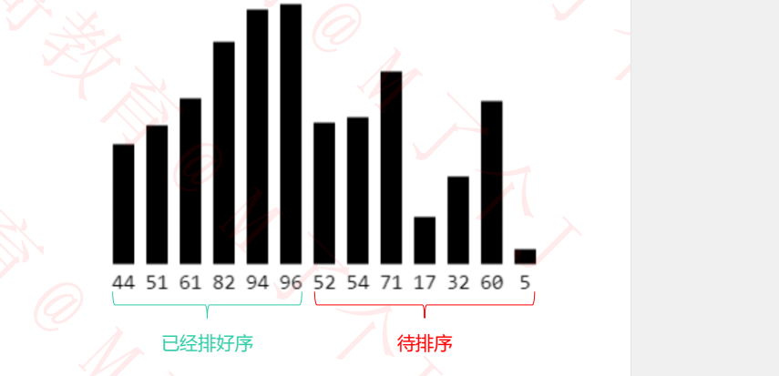

执行流程：

1. 在执行过程中，插入排序会将序列分为2部分：头部是已经排好序的，尾部是待排序的
2. 从头开始扫描每一个元素：每当扫描到一个元素，就将它插入到头部合适的位置，使得头部数据依然保持有序

```java
package com.xk._02Algorithmic._01sort.sort;

/**
 * @description: 插入排序
 * @author: xu
 * @date: 2022/10/1 23:08
 */
public class InsertionSort1<E extends Comparable<E>> extends Sort<E> {
    /**
     * 插入排序
     */
    private void insertionSort1(){
        for (int begin = 1; begin < array.length; begin++) {
            int curIndex = begin;
            while (curIndex > 0 && cmp(curIndex-1, curIndex) > 0) {
                swap(curIndex, curIndex-1);
                curIndex--;
            }
        }
    }

    @Override
    protected void sort() {
        insertionSort1();
    }
}
```


##### 2.4.2 插入排序--逆序对

什么是逆序对？

- 数组 <2, 3, 8, 6, 1> 的逆序对为：

  <2, 1> <3, 1> <8, 1> <8, 6> <6, 1>，共5个逆序对

插入排序的时间复杂度与逆序对的数量成正比关系

- 逆序对的数量越多，插入排序的时间复杂度越高


很明显，下图从上至下，**插入排序的效率是逐渐提高的**。

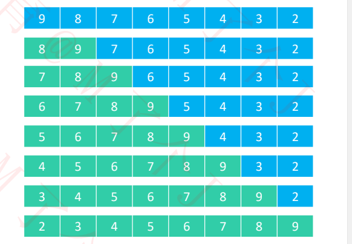


##### 2.4.3 插入排序--优化1

思路是将【交换】转为【挪动】

执行流程：

1. 先将待插入的元素备份
2. 头部有序数据中比待插入元素大的，都朝尾部方向挪动1个位置
3. 将待插入元素放到最终的合适位置


```java
package com.xk._02Algorithmic._01sort.sort;

/**
 * @description: 插入排序优化 思路：将【交换】转为【挪动】
 * @author: xu
 * @date: 2022/10/1 23:08
 */
public class InsertionSort2<E extends Comparable<E>> extends Sort<E> {
    /**
     * 插入排序优化 思路：将【交换】转为【挪动】
     */
    private void insertionSort2(){
        for (int begin = 1; begin < array.length; begin++) {
            int curIndex = begin;
            E cur = array[curIndex];
            while (curIndex > 0 && cmp(array[curIndex - 1], cur) > 0) {
                array[curIndex] = array[curIndex - 1];
                curIndex--;
            }
            array[curIndex] = cur;
        }
    }

    @Override
    protected void sort() {
        insertionSort2();
    }
}
```


##### 2.4.4 复杂度与稳定性

- 最坏、平均时间复杂度：O(n<sup>2</sup>)

- 最好时间复杂度：O(n)

- 空间复杂度：O(1)

- 属于稳定排序

- 当逆序对的数量极少时，插入排序的效率特别高

  甚至速度比 O(nlogn) 级别的快速排序还要快

数据量不是特别大的时候，插入排序的效率也是非常好的。


##### 2.4.5 二分搜索算法

如何确定一个元素在数组中的位置？（假设数组里面全都是整数）

- 如果是无序数组，从第 0 个位置开始遍历搜索，平均时间复杂度：O(n)

  

-  如果是有序数组，可以使用二分搜索，最坏时间复杂度：O(logn)

  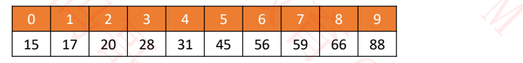

思路：

- 假设在*[begin, end)*范围内搜索某个元素*v*，*mid == (begin + end) / 2*；
- 如果*v < m*，去*[begin, mid)*范围内二分搜索；
- 如果*v > m*，去*[mid + 1, end)*范围内二分搜索；
- 如果*v == m*，直接返回*mid*。

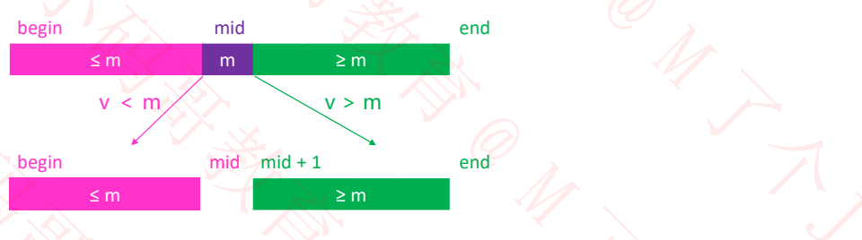

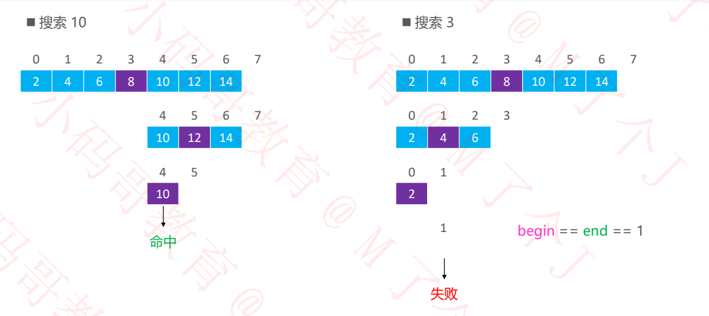

实现：

```java
package com.xk._02Algorithmic._01sort;

import com.xk._02Algorithmic._01sort.tools.Asserts;

/**
 * @description:
 * @author: xu
 * @date: 2022/10/2 0:09
 */
public class BinarySearch {
    public static int indexOf(Integer[] array, int v) {
        if (array == null || array.length == 0) return -1;
        int begin = 0;
        int end = array.length;
        while (begin < end) {
            int mid = (begin + end) >> 1;
            if (v > array[mid]) {
                begin = mid + 1;
            } else if (v < array[mid]) {
                end = mid;
            } else {
                return mid;
            }
        }
        return -1;
    }

    public static void main(String[] args) {
        Integer[] array = { 2, 4, 6, 7, 11, 15, 22, 26 };
        Asserts.test(search(array, 5) == 2);
        Asserts.test(search(array, 1) == 0);
        Asserts.test(search(array, 15) == 6);
        Asserts.test(search(array, 33) == 8);
    }
}
```


##### 2.4.6 插入排序--二分搜索优化

在元素 v 的插入过程中，可以先**二分搜索出合适的插入位置**，**再将元素 v 插入**。

假设有如下序列：


要求二分搜索返回的插入位置：**第1个大于 v 的元素位置**；

- 如果 v 是 5，返回 2
- 如果 v 是 1，返回 0
- 如果 v 是 15，返回 7
- 如果 v 是 8，返回 5


思路：

- 假设在*[begin, end)*范围内搜索某个元素*v*，*mid == (begin + end) / 2*；
- 如果*v < m*，去*[begin, mid)*范围内二分搜索
- 如果*v ≥ m*，去*[mid + 1, end)*范围内二分搜索

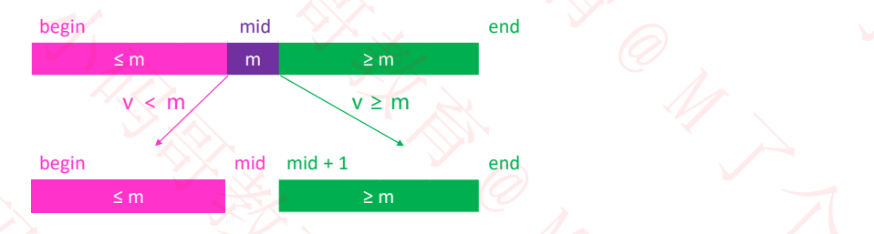


实例：


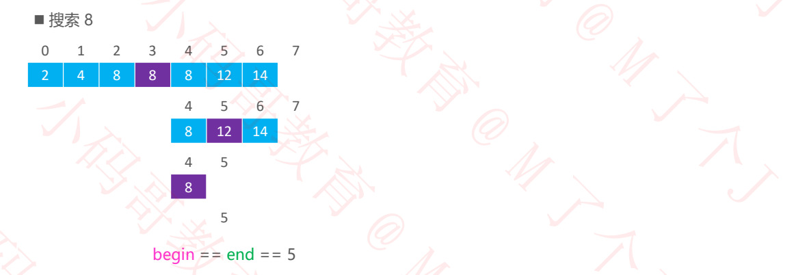

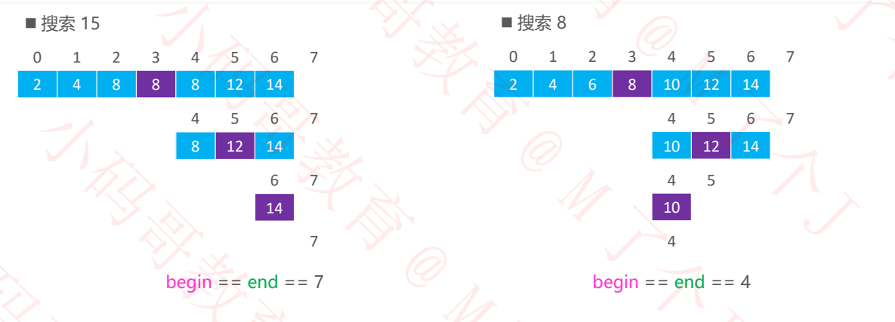


代码实现：

```java
package com.xk._02Algorithmic._01sort.sort;

import com.xk._02Algorithmic._01sort.tools.Integers;

/**
 * @description: 插入排序优化 思路：二分搜索法
 * @author: xu
 * @date: 2022/10/1 23:08
 */
public class InsertionSort3<E extends Comparable<E>> extends Sort<E> {
    /**
     * 插入排序优化 思路：二分搜索法
     */
    private void insertionSort3(){
        for (int begin = 1; begin < array.length; begin++) {
            insert(begin, search(begin));
        }
    }

    /**
     * 将source位置的元素插入到dest位置
     * @param source
     * @param dest
     */
    private void insert(int source, int dest){
        E v = array[source];
        for (int i = source; i > dest; i--){
            array[i] = array[i-1];
        }
        array[dest] = v;
    }

    /**
     * 利用二分搜索法找到 index 位置元素的待插入位置
     * 已经排好序的区间范围[0, index)
     * @param index
     * @return
     */
    private int search(int index) {
        int begin = 0;
        int end = index;
        while (begin < end) {
            int mid = (begin + end) >> 1;
            if (cmp(index, mid) >= 0) {
                begin = mid + 1;
            } else {
                end = mid;
            }
        }
        return begin;
    }

    @Override
    protected void sort() {
        insertionSort3();
    }
}
```


##### 2.4.7 复杂度与稳定性

使用了二分搜索后，只是减少了比较次数，但插入排序的**平均时间复杂度**依然是O(n<sup>2</sup>)

- 最坏、平均时间复杂度：O(n<sup>2</sup>)
- 最好时间复杂度：O(n)
- 空间复杂度：O(1)
- 属于稳定排序


#### 2.5 归并排序

1945年由约翰·**冯·诺伊曼**（John von Neumann）首次提出。

执行流程：

1. 不断地将当前序列平均分割成2个子序列

   直到不能再分割（序列中只剩1个元素）

2. 不断地将2个子序列合并成一个有序序列

   直到最终只剩下1个有序序列

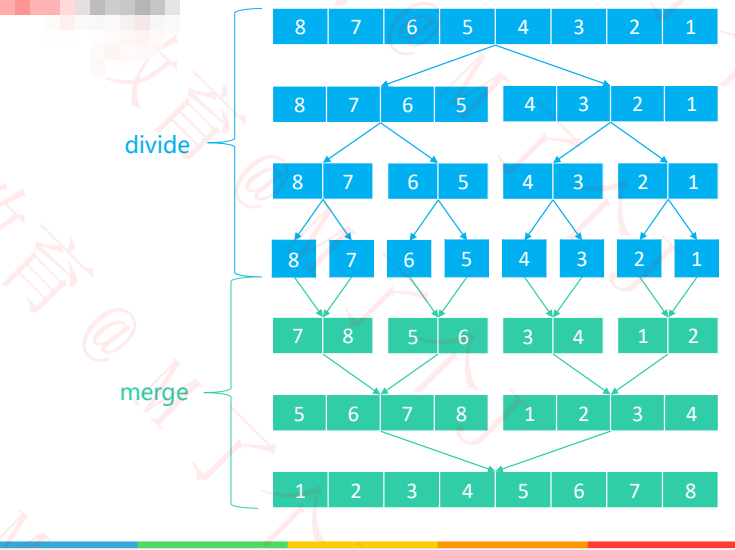

##### 2.5.1 序列分割--divide

```java
sort(0, array.length);
-----------------------------------------------------
/**
 * 对 [begin, end) 范围的数据进行归并排序
 */	
private void sort(int begin, int end){
	if(end - begin < 2) return; // 至少要2个元素
	
	int mid = (begin + end) >> 1;
	sort(begin, mid); // 归并排序左半子序列
	sort(mid, end);	// 归并排序右半子序列
	merge(begin, mid, end); // 合并整个序列
}
```


##### 2.5.2 序列合并--merge

1. 合并到新序列

将两个序列合并的思路为：左序列和右序列中的元素挨个比较，**将较小的放入新序列中**，最后新序列中的元素必然升序。

下图中 li，ri 分别代表指向左、右序列的元素**索引**，ai 为新序列（合并后的序列）的元素**索引**；

【li】代表左序列 li 位置的**元素**，【ri】代表右序列 ri 位置的**元素**，【ai】为新序列 ai 位置的**元素**；

- 第一轮：【li】 < 【ri】，【li】放入新数组，【ai】=【li】，li++; ai++;
- 第二轮：【li】 > 【ri】，【ri】放入新数组，【ai】=【ri】，ri++; ai++;
- 第三轮：【li】 < 【ri】，【li】放入新数组，【ai】=【li】，li++; ai++；
- 第四轮：**左序列已经遍历完毕**，直接将右序列剩余元素放入新序列，得到新序列（升序）。

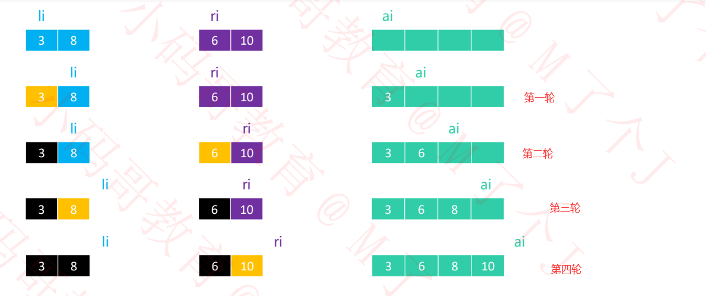


2. 原地合并--merge

将两个序列合并时，不一定要合并到新空间，可以合理的利用原空间实现**原地合并**。

例如：

- 将**array的左半部分[begin, mid)**，备份到 leftArray 中；
- 然后将 **leftArray** 视为左子序列，**arrary的右半部分[mid, end)**视为右子序列；
- 将左子序列和右子序列合并到 array 中。

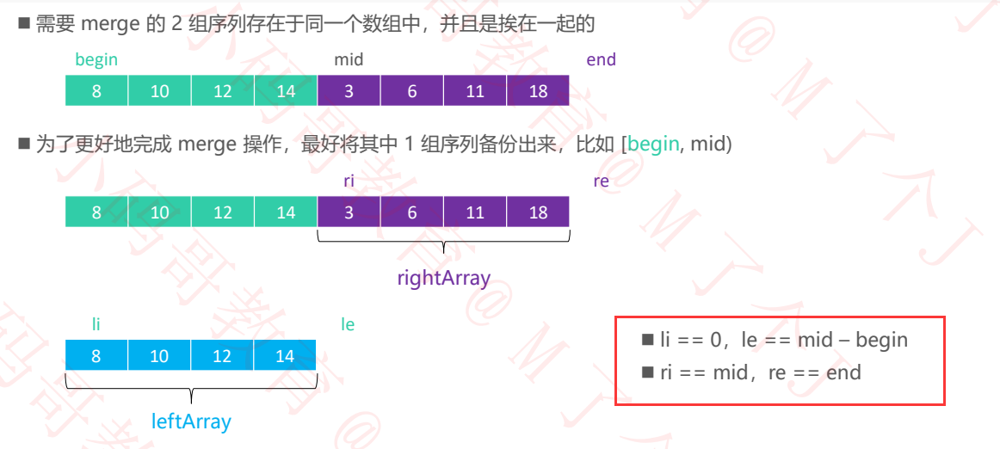

merge 过程：

- 【li】 <= 【ri】

  array[ai] = leftArray[li]；

  li++，ai++;

- 【li】 > 【ri】

  array[ai] = array[ri];

  ri++，ai++;


对序列 { 3, 8, 6, 10 } 进行归并排序：

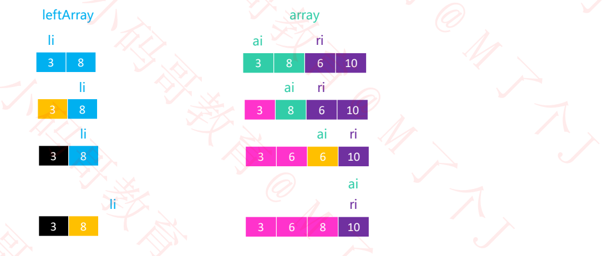

对序列 { 3, 6, 8, 10 } 进行归并排序：**左子序列先遍历结束**，那就归并结束。

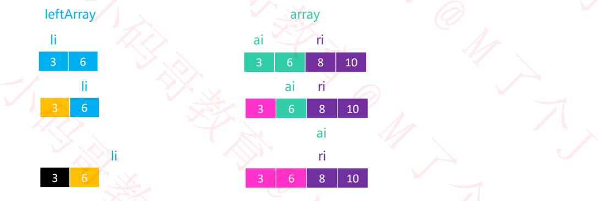

对序列 { 8, 10, 3, 6 } 进行归并排序：**右子序列先结束**，则将左边剩余全部放入。

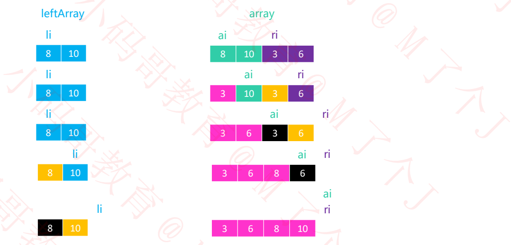


3. 原地合并-merge-实现

```java
/**
 * 将 [begin, mid) 和 [mid, end) 范围的序列合并成一个有序序列
 */
private void merge(int begin, int mid, int end){
	int li = 0, le = mid - begin; // 左边数组(基于leftArray)
	int ri = mid, re = end;	// 右边数组(array)
	int ai = begin; // array的索引
	
	// 备份左边数组到leftArray
	for(int i = li; i < le; i++){
		leftArray[i] = array[begin + i];
	}
	
	// 如果左边还没有结束	
	while(li < le){ // li == le 左边结束, 则直接结束归并
		if(ri < re && cmp(array[ri], leftArray[li]) < 0){ // cmp改为<=0会失去稳定性
			array[ai++] = array[ri++]; // 右边<左边, 拷贝右边数组到array
		}else{
			array[ai++] = leftArray[li++]; // 左边<=右边, 拷贝左边数组到array
		}
	}
}

```


##### 2.5.3 归并排序完整代码

```java
package com.xk._02Algorithmic._01sort.sort;

import com.xk._02Algorithmic._01sort.tools.Integers;

/**
 * @description: 归并排序
 * @author: xu
 * @date: 2022/10/2 10:43
 */
public class MergeSort<E extends Comparable<E>> extends Sort<E> {
    private E[] leftArray;

    /**
     * 归并排序
     */
    private void mergeSort(){
        this.leftArray = (E[]) new Comparable[array.length >> 1];
        sort(0, array.length);
    }

    /**
     * 对 [begin, end) 范围的数据进行归并排序
     * T(n) = T(n/2) + T(n/2) + O(n)
     * T(n) = 2 * T(n/2) + O(n)
     * @param begin
     * @param end
     */
    private void sort(int begin, int end) {
        // 元素数量小于2 返回
        if (end - begin < 2) return;
        int mid = (begin + end) >> 1;
        sort(begin, mid);
        sort(mid, end);
        merge(begin, mid, end);
    }

    /**
     * 将 [begin, mid) 和 [mid, end) 范围的序列合并成有序序列
     * @param begin
     * @param mid
     * @param end
     */
    private void merge(int begin, int mid, int end) {
        int li = 0, le = mid - begin;
        int ri = mid, re = end;
        int ai = begin;

        // 备份左边数组
        for (int i = li; i < le; i++) {
            leftArray[i] = array[begin + i];
        }

        while (li < le) { // 如果左边还没有结束
            if (ri < re && cmp(leftArray[li], array[ri]) > 0){
                array[ai++] = array[ri++];
            } else {
                array[ai++] = leftArray[li++];
            }
        }
    }

    @Override
    protected void sort() {
        mergeSort();
    }
}
```


##### 2.5.4 复杂度与稳定性

**归并排序花费的时间递推式**：

- T(n) = 2∗T(n/2) + O(n)
- T(1) = O(1)
- T(n)/n = T(n/2)/(n/2) + O(1)

**根据递推式计算复杂度**：

令Sn = T(n)/n

- S(1) = O(1)
- Sn = S(n/2)+O(1) = S(n/4)+O(2) = S(n/8)+O(3) = S(n/2<sup>k</sup>)+O(k) = S(1)+O(logn) = O(logn)
- Tn = n∗Sn = O(nlogn)

由于归并排序总是**平均分割子列**，所以

- **最好、最坏时间复杂度**都是 O(nlogn)

- 归并排序属于**稳定排序**

- 归并排序的**空间复杂度**是 O(n/2 + logn) = O(n)

  n/2 用于临时存放左侧数组，logn 是因为递归调用


##### 2.5.5 常见的递推式与复杂度

以后遇到复杂的时间复杂度计算，写出递归式直接看这张表即可。

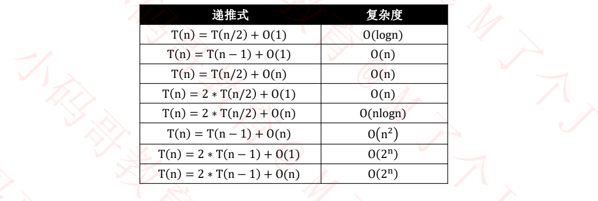


##### 2.5.6 LeetCode真题

###### 合并两个有序数组

题目地址：[88. 合并两个有序数组](https://leetcode-cn.com/problems/merge-sorted-array/submissions/)

题目：

- 给你两个有序整数数组 nums1 和 nums2，请你将 nums2 合并到 nums1 中，使 num1 成为一个有序数组。

说明:

- 初始化 nums1 和 nums2 的元素数量分别为 m 和 n 。
- 你可以假设 nums1 有足够的空间（空间大小大于或等于m + n）来保存 nums2 中的元素。

示例：

```java
输入:
nums1 = [1,2,3,0,0,0], m = 3
nums2 = [2,5,6],       n = 3

输出: [1,2,2,3,5,6]
```


#### 2.6 快速排序

执行流程：

1. 从序列中选择一个**轴点元素**（pivot）：假设每次选择`0`位置的元素为轴点元素
2. 利用 pivot 将序列分割成 2 个子序列
   - 将小于 pivot 的元素放在pivot前面（左侧）
   - 将大于 pivot 的元素放在pivot后面（右侧）
   - 等于pivot的元素放哪边都可以
3. 对子序列进行*1*、*2*操作：直到不能再分割（子序列中只剩下1个元素）

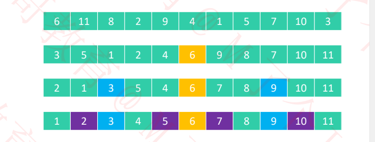

> 快速排序的本质就是：
>
> - 逐渐将每一个元素都转换成轴点元素


##### 2.6.1 轴点构造

对于序列 { 6<sub>a</sub>, 8<sub>a</sub>, 8<sub>b</sub>, 2, 6<sub>b</sub>, 4, 9, 5, 7 } **构造轴点**：

- 首先将 `0` 位置的元素备份，作为**轴点元素**；

  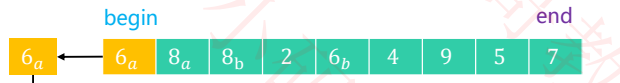

- 最终目标是构造出**以轴点元素为中心的序列**：

  左半边是**小于轴点元素**的**序列**；

  右半边是**大于轴点元素**的**序列**；如下图：

  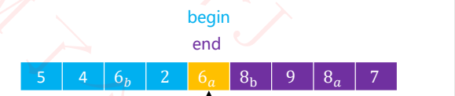

那么如何构造呢？

begin 为序列首位置，

- 从右往左扫描，寻找比轴点元素小的元素；**找到以后**，放到 begin 位置，begin++，然后**反向寻找**；
- 从左往右扫描，寻找比轴点元素大的元素；**找到以后**，放到 end 位置，end--，然后**反向寻找**；
- 当 begin == end，说明左右都扫描完了，此时**将一开始备份的轴点元素放到中间**。

这个过程有点迷惑性，需要先从右往左找，找到以后再从左往右，不断循环这个过程，直到**把所有比轴点元素小的元素放到左半部分**，**把所有比轴点元素大的元素放到右半部分**，才算完成这个轴点的构造。

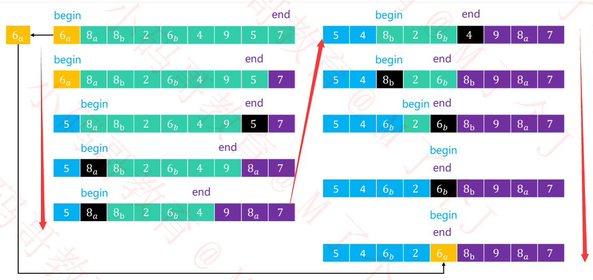


##### 2.6.2 构造轴点--代码实现

代码中如何实现**从左往右扫描**和**从右往左扫描**的交替呢？看一眼代码就会恍然大悟。。。

```java
/**
 * 构造出 [begin, end) 范围的轴点元素
 * @param begin
 * @param end
 * @return 轴点元素的最终位置
 */
private int pivotIndex (int begin, int end) {
    // 备份begin位置的元素
    E pivot = array[begin];
    // end指向最后一个元素
    end--;
    while (begin < end) {
        while (begin < end) {
            if (cmp(pivot, array[end]) < 0) { // 右边元素 > 轴点元素
                end--;
            } else { // 右边元素 <= 轴点元素
                array[begin++] = array[end];
                break;
            }
        }
        while (begin < end) {
            if (cmp(pivot, array[begin]) > 0) {// 左边元素 < 轴点元素
                begin++;
            } else { // 左边元素 >= 轴点元素
                array[end--] = array[begin];
                break;
            }
        }
    }
    //将轴点元素放入最终的位置
    array[begin] = pivot;
    // 返回轴点元素的位置
    return begin;
}
```


##### 2.6.3 构造轴点--优化

在轴点左右元素数量比较均匀的情况下，同时也是**最好情况**：

- T(n) = 2 ∗ T(n/2) + O(n) = O(nlogn)

如果轴点左右元素数量极度不均匀，**最坏情况**：

- T(n) = T(n − 1) + O(n) = O(n<sup>2</sup>)

为了降低最坏情况的出现概率，一般采取的做法是：

- **随机选择轴点元素**：可以在备份轴点元素前，将 begin 位置的元素与序列中的随机元素交换一下。

```java
// 随机选择轴点元素, 将 begin 位置的元素与序列中的随机元素交换一下
swap(begin, begin + (int)Math.random()*(end - begin));

// 备份begin位置的元素
T pivot = array[begin];
.....
```


##### 2.6.4 思考：与轴点相等的元素

如果序列中的所有元素都与轴点元素相等，**利用上面的算法实现**，轴点元素可以将序列分割成 2 个均匀的子序列

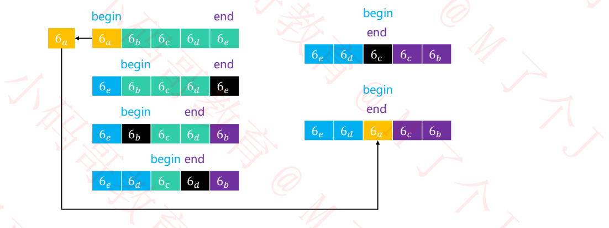

**思考：把上面的代码中，cmp 位置的判断分别改为 ≤、≥ 会起到什么效果**?

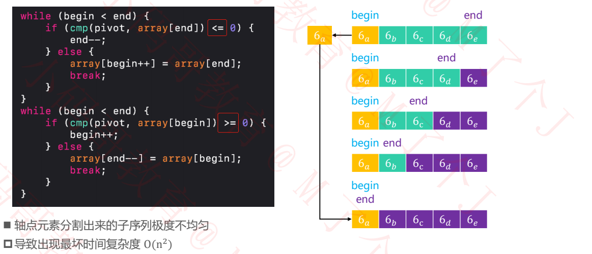

后果：

- 轴点元素分割出来的子序列极度不均匀
- 导致出现最坏时间复杂度 O(n<sup>2</sup>)


##### 2.6.5 快速排序完整代码

```java
package com.xk._02Algorithmic._01sort.sort.cmp;

import com.xk._02Algorithmic._01sort.sort.Sort;

/**
 * @description: 快速排序
 * @author: xu
 * @date: 2022/10/2 10:43
 */
public class QuickSort<E extends Comparable<E>> extends Sort<E> {
    /**
     * 快速排序
     */
    private void quickSort(){
        quickSort(0, array.length);
    }

    /**
     * 对 [begin, end) 范围的元素进行快速排序
     * 最好的情况：左右均匀
     *      T(n) = T(n/2) + T(n/2) + O(n)
     *      T(n) = 2 * T(n/2) + O(n) = O(nlogn)
     * 最坏的情况：轴点一直在最右边或者最最左边
     *      T(n) = T(n-1) + O(n) = O(n^2)
     * @param begin
     * @param end
     */
    private void quickSort(int begin, int end){
        if (end - begin < 2) return;
        // 确定轴点位置 O(n)
        int mid = pivotIndex(begin, end); // O(n)
        // 对子序列进行快速排序
        quickSort(begin, mid);
        quickSort(mid+1, end);
    }

    /**
     * 构造出 [begin, end) 范围的轴点元素
     * @param begin
     * @param end
     * @return 轴点元素的最终位置
     */
    private int pivotIndex (int begin, int end) {
        // 随机选择一个元素跟 begin 位置进行交换
        swap(begin, begin + (int) (Math.random() * (end - begin)));
    
        // 备份begin位置的元素
        E pivot = array[begin];
        // end指向最后一个元素
        end--;
        while (begin < end) {
            while (begin < end) {
                if (cmp(pivot, array[end]) < 0) { // 右边元素 > 轴点元素
                    end--;
                } else { // 右边元素 <= 轴点元素
                    array[begin++] = array[end];
                    break;
                }
            }
            while (begin < end) {
                if (cmp(pivot, array[begin]) > 0) {// 左边元素 < 轴点元素
                    begin++;
                } else { // 左边元素 >= 轴点元素
                    array[end--] = array[begin];
                    break;
                }
            }
        }
        //将轴点元素放入最终的位置
        array[begin] = pivot;
        // 返回轴点元素的位置
        return begin;
    }

    @Override
    protected void sort() {
        quickSort();
    }
}
```


##### 2.6.6 复杂度与稳定性

**快速排序的复杂度与稳定性**：

- 最好、平均时间复杂度：O(nlogn)
- 最坏时间复杂度：O(n<sup>2</sup>)
- 由于**递归**调用的缘故，空间复杂度：O(logn)
- 属于**不稳定排序**


#### 2.7 希尔排序

希尔排序把序列看作是一个矩阵，分成 𝑚 列，逐列进行排序

- 𝑚 从某个整数逐渐减为1
- 当 𝑚 为1时，整个序列将完全有序

因此，希尔排序也被称为**递减增量排序**（Diminishing Increment Sort）

矩阵的列数取决于**步长序列**（step sequence）：

- 比如，如果步长序列为{ 1, 5, 19, 41, 109 }，就代表依次分成109列、41列、19列、5列、1列进行排序
- 不同的步长序列，执行效率也不同


##### 2.7.1 实例图解

希尔本人给出的步长序列是 𝑛/2<sup>k</sup>(k>=1)，比如 𝑛 为16时，**步长序列**是 { 1, 2, 4, 8 }

假设有如下序列：{ 16, 15, 14, 13, 12, 11, 10, 9, 8, 7, 6, 5, 4, 3, 2, 1 }


按照步长序列，首先**分为8列，对每一列进行排序**：

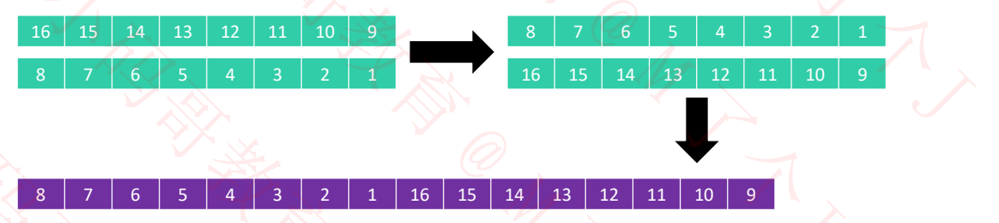

然后**分为4列，对每一列进行排序**：


然后**分为2列，对每一列进行排序**：

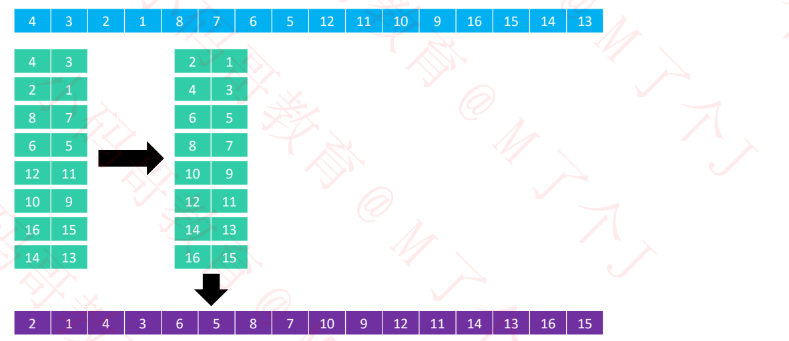

最后**分为1列进行排序**，变成升序序列。

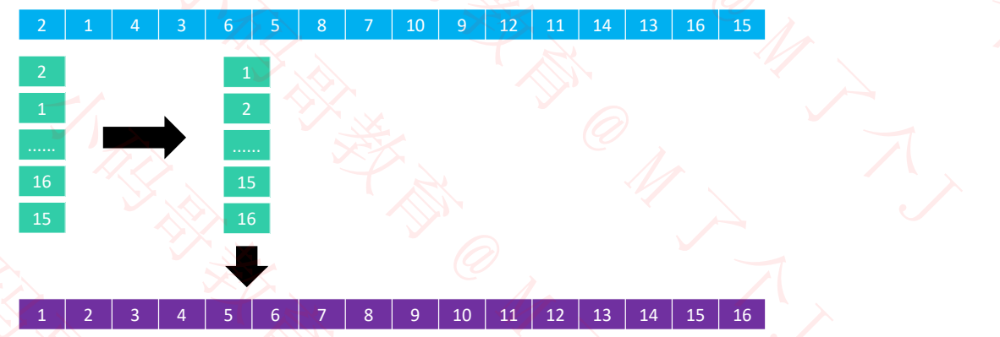

不难看出来，从8列变为1列的过程中，**逆序对的数量在逐渐减少**

还记得`插入排序`的这个性质吗：

- 插入排序的**时间复杂度与逆序对的数量成正比**关系
- 逆序对的数量越多，插入排序的时间复杂度越高。

因此希尔排序底层一般使用`插入排序`对每一列进行排序，可以认为希尔排序是`插入排序`的改进版。


##### 2.7.2 列的划分思路

假设有11个元素，**步长序列是 {1, 2, 5}**：

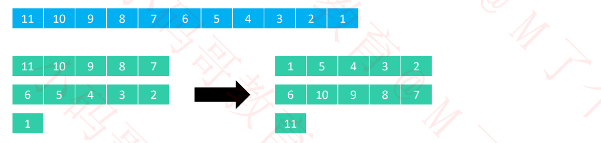

假设元素在第 col 列、第 row 行，步长（总列数）是 step

- 那么这个元素**在数组中的索引**是 row * step + col
- 比如 9 在排序前是第 0 行、第 2 列，那么它排序前的索引是 0 * 5 + 2 = 2
- 比如 4 在排序前是第 1 行、第 2 列，那么它排序前的索引是 1 * 5 + 2 = 7


##### 2.7.3 步长序列计算代码

希尔本人给出的步长序列是 𝑛/2<sup>k</sup>(k>=1)，比如 𝑛 为16时，**步长序列**是 { 1, 2, 4, 8 }

```java
/**
 * 希尔本人提出的步长序列
 */
private List<Integer> shellStepSequence() {
    List<Integer> stepSequence = new ArrayList<>();
    int step = array.length;
    while ((step >>= 1) > 0) {
        stepSequence.add(step);
    }
    return stepSequence;
}
```


##### 2.7.4 希尔排序完整实现

```java
package com.xk._02Algorithmic._01sort.sort.cmp;

import com.xk._02Algorithmic._01sort.sort.Sort;

import java.util.ArrayList;
import java.util.List;

/**
 * @description: 希尔排序
 * @author: xu
 * @date: 2022/10/2 10:43
 */
public class ShellSort1<E extends Comparable<E>> extends Sort<E> {
    /**
     * 希尔排序
     */
    private void shellSort(){
        List<Integer> stepSequence = shellStepSequence();
        for (Integer step : stepSequence) {
            shellSort(step);
        }
    }

    /**
     * 分成step列进行排序
     * @param step
     */
    private void shellSort(int step) {
        // col: 第几列
        for (int col = 0; col < step; col++) { // 对第col列进行排序
            // 对 [0, array.length) 范围的元素进行插入元素
            // col、col+step、col+2*step、col+3*step......
            for (int row = col + step; row < array.length; row += step) {
                int curIndex = row;
                while (curIndex > col && cmp(curIndex - step, curIndex) > 0) {
                    swap(curIndex, curIndex - step);
                    curIndex -= step;
                }
            }
        }
    }

    private List<Integer> shellStepSequence() {
        List<Integer> stepSequence = new ArrayList<>();
        int step = array.length;
        while ((step >>= 1) > 0) {
            stepSequence.add(step);
        }
        return stepSequence;
    }

    @Override
    protected void sort() {
        shellSort();
    }
}
```


##### 2.7.5 希尔排序优化

目前**已知的最好的步长序列**，**最坏情况时间复杂度**是O(n<sup>4/3</sup>) ，1986年由Robert Sedgewick提出

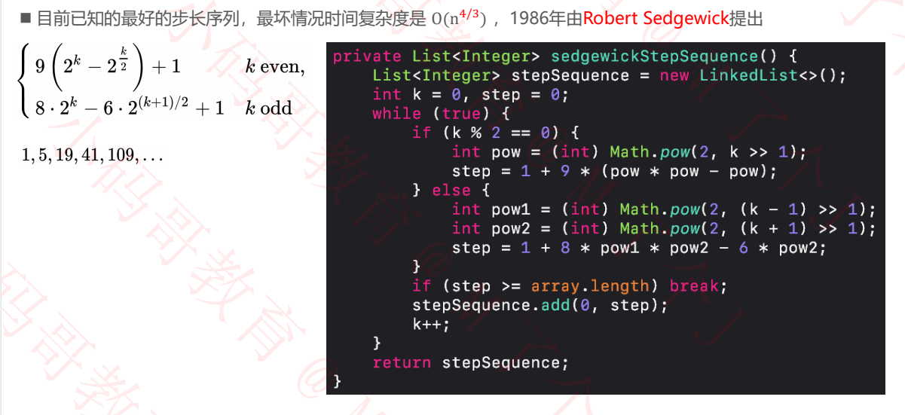

```java
private List<Integer> shellStepSequence() {
    List<Integer> stepSequence = new LinkedList<>();
    int k = 0, step = 0;
    while (true) {
        if (k % 2 == 0) { // even
            int pow = (int) Math.pow(2, k >> 1);
            step = 1 + 9 * (pow * pow - pow);
        } else { // odd
            int pow1 = (int) Math.pow(2, (k - 1) >> 1);
            int pow2 = (int) Math.pow(2, (k + 1) >> 1);
            step = 1 + 8 * pow1 * pow2 - 6 * pow2;
        }
        if (step >= array.length) break;
        stepSequence.add(0, step);
        k++;
    }
    return stepSequence;
}
```


##### 2.7.6 复杂度与稳定性

- 最好情况是**步长序列只有1，且序列几乎有序**，时间复杂度为 O(n)
- **最坏和平均**时间复杂度取决**步长序列**, 范围在 O(n<sup>3/4</sup>) ~ O(n<sup>2</sup>)
- 空间复杂度为O(1)
- 希尔排序属于**不稳定排序**


#### 2.8 计数排序

之前学习的*冒泡*、*选择*、*堆*、*插入*、*归并*、*快速*、*希尔*排序都是**基于比较**的排序。

*计数*排序、*桶*排序、*基数*排序，都**不是基于比较**的排序。

- 它们是典型的**用空间换时间**，在某些时候，平均时间复杂度可以比 O(nlogn) 更低

计数排序于1954年由Harold H.Seward提出，适合**对一定范围内的整数**进行排序。

计数排序的核心思想：

- 统计每个整数在序列中出现的次数，进而推导出每个整数在有序序列中的索引


##### 2.8.1 简单实现--实现步骤

思路：

- 首先找出要排序数组的中的最大值 max；
- 根据最大值 max 开辟 max + 1 空间的数组 counts；
- counts 数组统计每个整数出现的次数；
- 根据整数出现的次数，对整数进行排序：
  - 遍历 counts 数组，**索引index即为元素值**，**counts[index]** 为元素的出现次数
  - 将 counts[index] 个 index 依次放入数组，即为排序过的序列


例如对 { 7, 3, 5, 8, 6, 7, 4, 5 } 进行计数排序：max = 8

- counts 数组为 [0, 0, 0, 1, 1, 2, 1, 2, 1]

- 对 index = 3, counts[index] = 1，即**往新数组中放入 1 个 3**；

  此时新数组为 [3]

- 对 index = 4, counts[index] = 1，即**往新数组中放入 1 个 4**；

  此时新数组为 [3, 4]

- 对 index = 5, counts[index] = 2，即**往新数组中放入 2 个 5**；

  此时新数组为 [3, 4, 5, 5]

- 对 index = 6, counts[index] = 1，即**往新数组中放入 1 个 6**；

  此时新数组为 [3, 4, 5, 5, 6]

- 对 index = 7, counts[index] = 2，即**往新数组中放入 2 个 7**；

  此时新数组为 [3, 4, 5, 5, 6, 7, 7]

- 对 index = 8, counts[index] = 1，即**往新数组中放入 1 个 8**；

  此时新数组为 [3, 4, 5, 5, 6, 7, 7, 8]

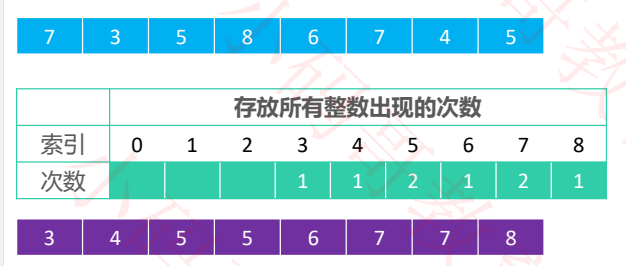


##### 2.8.2 简单实现--代码实现

```java
package com.xk._02Algorithmic._01sort.sort;

import com.xk._02Algorithmic._01sort.tools.Integers;

/**
 * @description: 计数排序
 * @author: xu
 * @date: 2022/10/2 10:43
 */
public class CountingSort1 extends Sort<Integer> {
    /**
     * 计数排序
     */
    private void countingSort(){
        // 找出最大值
        int max = array[0];
        for (int i = 1; i < array.length; i++) {
            if (array[i] > max) max = array[i];
        }
        //开辟内存空间，存储每个整数出现的次数
        int[] counts = new int[max + 1];
        // 统计每个整数出现的次数
        for (int i = 0; i < array.length; i++) {
            counts[array[i]]++;
        }
        // 根据整数的出现次数，对整数进行排序
        int index = 0;
        for (int i = 0; i < counts.length; i++) {
            while (counts[i]-- > 0){
                array[index++] = i;
            }
        }
    }

    @Override
    protected void sort() {
        countingSort();
    }
}
```

这个版本的实现存在以下问题

- 无法对**负整数**进行排序
- 极其浪费内存空间
- 是个**不稳定**的排序


##### 2.8.3 改进--思路

改进思路是**求出最小值**。

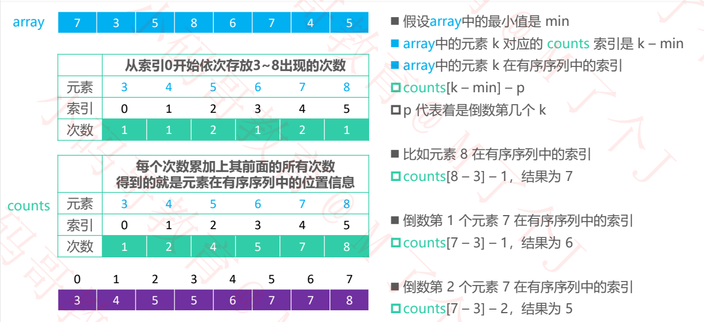


##### 2.8.4 改进--图解

每个元素累加上其前面的所有元素得到的就是元素在有序序列中的位置信息。

例如对 { 7, 3, 5, 8, 6, 7, 4, 5 } 进行改进过的计数排序：min = 3，max = 8

newArray 为**新开辟的数组**，newArray = [0, 0, 0, 0, 0, 0, 0, 0]，用来**存放排序结果**。

- counts = [1, 2, 4, 5, 7, 8]；

  元素 5 在有序序列中的的索引：`counts[5-3] - 1 = counts[2] - 1 = 3`

  newArray[3] = 5; 此时 newArray = [0, 0, 0, 5, 0, 0, 0, 0]

  counts[2]--;

  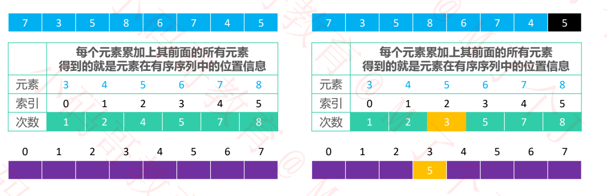

- counts = [1, 2, 3, 5, 7, 8]；

  元素 4 在有序序列中的的索引：`counts[4-3] - 1 = counts[1] - 1 = 1`

  newArray[1] = 4; 此时 newArray = [0, 4, 0, 5, 0, 0, 0, 0]

  counts[1]--;

- counts = [1, 1, 3, 5, 7, 8]；

  元素 7 在有序序列中的的索引：`counts[7-3] - 1 = counts[4] - 1 = 6`

  newArray[6] = 7; 此时 newArray = [0, 4, 0, 5, 0, 0, 7, 0]

  counts[4]--;

  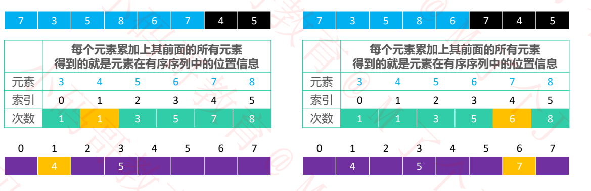

- counts = [1, 1, 3, 5, 6, 8]；

  元素 6 在有序序列中的的索引：`counts[6-3] - 1 = counts[3] - 1 = 4`

  newArray[4] = 6; 此时 newArray = [0, 4, 0, 5, 6, 0, 7, 0]

  counts[3]--;

- counts = [1, 1, 3, 4, 6, 8]；

  元素 8 在有序序列中的的索引：`counts[8-3] - 1 = counts[5] - 1 = 7`

  newArray[7] = 8; 此时 newArray = [0, 4, 0, 5, 6, 0, 7, 8]

  counts[5]--;

  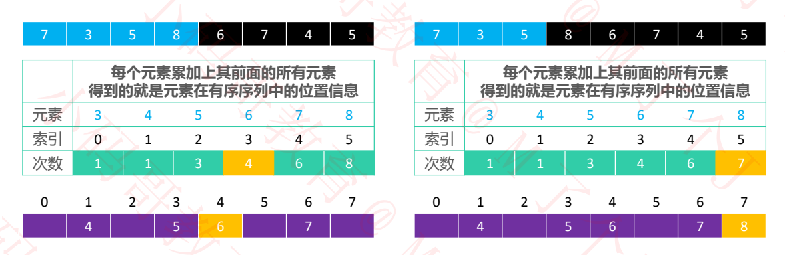

- counts = [1, 1, 3, 4, 6, 7]；

  元素 5 在有序序列中的的索引：`counts[5-3] - 1 = counts[2] - 1 = 2`

  newArray[2] = 5; 此时 newArray = [0, 4, 5, 5, 6, 0, 7, 8]

  counts[2]--;

- counts = [1, 1, 2, 4, 6, 7]；

  元素 3 在有序序列中的的索引：`counts[3-3] - 1 = counts[0] - 1 = 0`

  newArray[0] = 3; 此时 newArray = [3, 4, 5, 5, 6, 0, 7, 8]

  counts[0]--;

  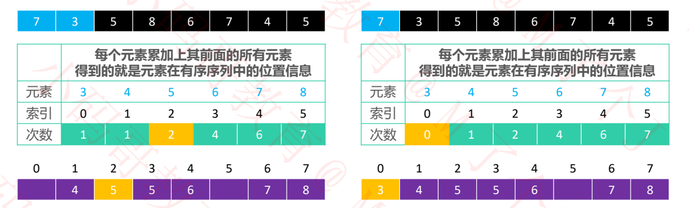

- counts = [0, 1, 2, 4 ,6, 7]；

  元素 7 在有序序列中的的索引：`counts[7-3] - 1 = counts[4] - 1 = 5`

  newArray[5] = 8; 此时 newArray = [3, 4, 5, 5, 6, 7, 7, 8]

  counts[5]--;

  


##### 2.8.5 改进--代码实现

```java
package com.xk._02Algorithmic._01sort.sort;

/**
 * @description: 计数排序
 * @author: xu
 * @date: 2022/10/2 10:43
 */
public class CountingSort2 extends Sort<Integer> {

    /**
     * 计数排序
     */
    private void countingSort(){
        // 找出最大值、最小值
        int max = array[0];
        int min = array[0];
        for (int i = 1; i < array.length; i++) {
            if (array[i] > max) max = array[i];
            if (array[i] < min) min = array[i];
        }
        //开辟内存空间，存储次数
        int[] counts = new int[max - min + 1];
        // 统计每个整数出现的次数
        for (int i = 0; i < array.length; i++) {
            counts[array[i] - min]++;
        }
        // 累加次数
        for (int i = 1; i < counts.length; i++) {
            counts[i] += counts[i - 1];
        }
        // 从后往前遍历元素，将它放到有序数组中的合适位置
        Integer[] newArray = new Integer[array.length];
        for (int i = array.length - 1; i >= 0; i--) {
            int index = --counts[array[i] - min];
            newArray[index] = array[i];
        }
        // 将有序数组赋值到array
        for (int i = 0; i < newArray.length; i++) {
            array[i] = newArray[i];
        }
    }

    @Override
    protected void sort() {
        countingSort();
    }
}
```


##### 2.8.6 复杂度与稳定性

- **最好、最坏、平均时间**复杂度：O(n + k)
- 空间复杂度：O(n + k)
- k 是整数的取值范围
- 计数排序属于**稳定排序**


##### 2.8.7 对自定义对象进行计数排序

如果自定义对象可以提供用以排序的整数类型，依然可以使用计数排序

```java
private static class Person {
	int age;
	String name;
	Person(int age, String name) {
		this.age = age;
		this.name = name;
	}
	@Override
	public String toString() {
		return "Person [age=" + age 
				+ ", name=" + name + "]";
	}
}
```

```java
public static void main(String[] args) {
    Person[] persons = new Person[] {
            new Person(20, "A"),
            new Person(-13, "B"),
            new Person(17, "C"),
            new Person(12, "D"),
            new Person(-13, "E"),
            new Person(20, "F")
    };

    // 找出最值
    int max = persons[0].age;
    int min = persons[0].age;
    for (int i = 1; i < persons.length; i++) {
        if (persons[i].age > max) {
            max = persons[i].age;
        }
        if (persons[i].age < min) {
            min = persons[i].age;
        }
    }

    // 开辟内存空间，存储次数
    int[] counts = new int[max - min + 1];
    // 统计每个整数出现的次数
    for (int i = 0; i < persons.length; i++) {
        counts[persons[i].age - min]++;
    }
    // 累加次数
    for (int i = 1; i < counts.length; i++) {
        counts[i] += counts[i - 1];
    }

    // 从后往前遍历元素，将它放到有序数组中的合适位置
    Person[] newArray = new Person[persons.length];
    for (int i = persons.length - 1; i >= 0; i--) {
        newArray[--counts[persons[i].age - min]] = persons[i];
    }

    // 将有序数组赋值到array
    for (int i = 0; i < newArray.length; i++) {
        persons[i] = newArray[i];
    }

    for (int i = 0; i < persons.length; i++) {
        System.out.println(persons[i]);
    }
}
/*
输出：
Person [age=-13, name=B]
Person [age=-13, name=E]
Person [age=12, name=D]
Person [age=17, name=C]
Person [age=20, name=A]
Person [age=20, name=F]
*/
```


#### 2.9 基数排序

基数排序非常适合用于整数排序（尤其是**非负整数**），这里只介绍对非负整数进行基数排序。

执行流程：依次对**个位数、十位数、百位数、千位数、万位数**…进行排序（从低位到高位）

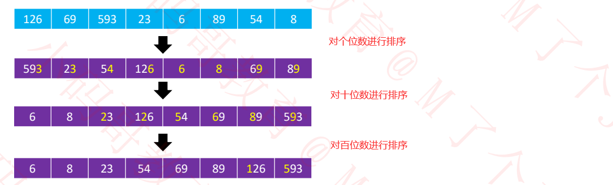


##### 2.9.1 代码实现

个位数、十位数、百位数的取值范围都是固定的0~9，可以使用`计数排序`对它们进行排序。

```java
package com.xk._02Algorithmic._01sort.sort;

import com.xk._02Algorithmic._01sort.tools.Integers;

/**
 * @description: 基数排序
 * @author: xu
 * @date: 2022/10/2 10:43
 */
public class RadixSort extends Sort<Integer> {
    /**
     * 基数排序
     */
    private void radixSort(){
        // 找出最大值
        int max = array[0];
        for (int i = 1; i < array.length; i++) {
            if (array[i] > max) max = array[i];
        }
        for (int divider = 1; divider <= max; divider *= 10){
            countingSort(divider);
        }
    }

    /**
     * 计数排序
     */
    private void countingSort(int divider){
        //开辟内存空间，存储次数
        int[] counts = new int[10];
        // 统计每个位数出现的次数
        for (int i = 0; i < array.length; i++) {
            counts[array[i] / divider % 10]++;
        }
        // 累加次数
        for (int i = 1; i < counts.length; i++) {
            counts[i] += counts[i - 1];
        }
        // 从后往前遍历元素，将它放到有序数组中的合适位置
        Integer[] newArray = new Integer[array.length];
        for (int i = array.length - 1; i >= 0; i--) {
            int index = --counts[array[i] / divider % 10];
            newArray[index] = array[i];
        }
        // 将有序数组赋值到array
        for (int i = 0; i < newArray.length; i++) {
            array[i] = newArray[i];
        }
    }

    @Override
    protected void sort() {
        radixSort();
    }
}
```


##### 2.9.2 复杂度与稳定性

- 最好、最坏、平均时间复杂度：O(d ∗ (n + k)) ，d 是最大值的位数，k 是进制
- 空间复杂度：O(n + k)，k 是进制
- 基数排序属于**稳定排序**


##### 2.9.3 基数排序--另一种思路

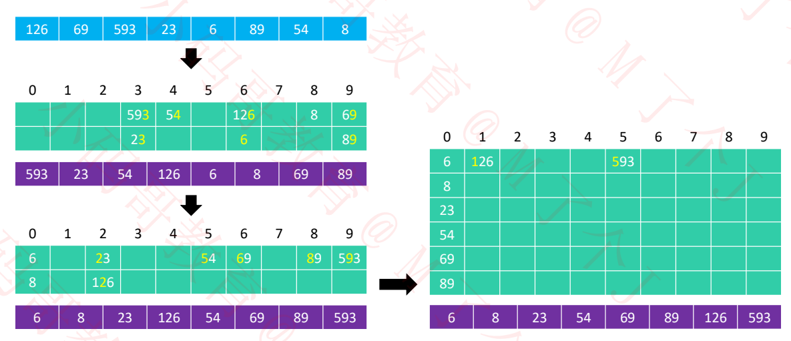

*代码实现*：

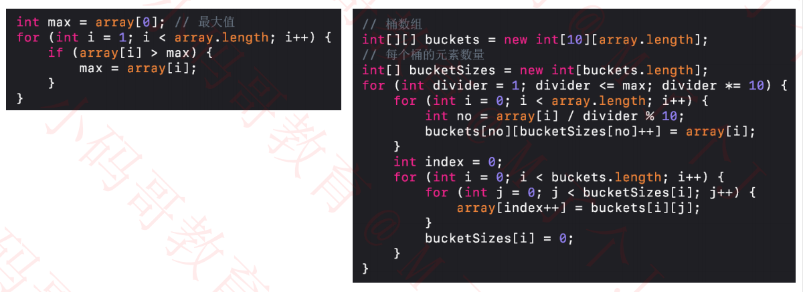

*复杂度与稳定性*：

- 空间复杂度是 O(kn + k) ，时间复杂度是 O(dn)
- d 是最大值的位数，k 是进制


#### 2.10 桶排序

执行流程：

1. 创建一定数量的桶（比如用数组、链表作为桶）
2. 按照一定的规则（不同类型的数据，规则不同），将序列中的元素均匀分配到对应的桶
3. 分别对每个桶进行单独排序
4. 将所有非空桶的元素合并成有序序列

元素在桶中的索引：*元素值 \* 元素数量*

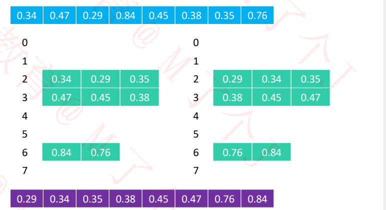

##### 2.10.1 代码实现

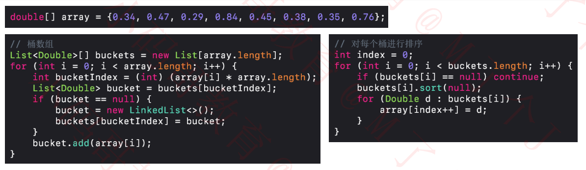


##### 2.10.2 复杂度与稳定性

- 空间复杂度：O(n + m)，m 是桶的数量

- 时间复杂度：O(n) + m ∗ O(n/m ∗ log(n/m)) = O(n + n ∗ log(n/m)) = O(n + n ∗ logn − n ∗ logm)

  因此为 O(n + k)，k 为 n ∗ logn − n ∗ logm

- 桶排序属于**稳定排序**


#### 2.11 '最强'排序--睡眠排序

```java
/**
 * 睡眠排序
 */
public class SortThread extends Thread{
	public int value;
	public SortThread(int value) {
		this.value = value;
	}
	public void run(){
		try{
			Thread.sleep(value);
			System.out.println(value);
		}catch (InterruptedException e) {
			e.printStackTrace();
		}
	}
	public static void main(String[] args) {
		int [] array = {10, 100, 50, 30, 60, 61, 64, 47,79, 59};
		for (int i = 0; i < array.length; i++) {
			new SortThread(array[i]).start();
		}
		
	}
}
```

+++

## 二、并查集UnionFind

假设有 n 个村庄，有些村庄之间有连接的路，有些村庄之间并没有连接的路

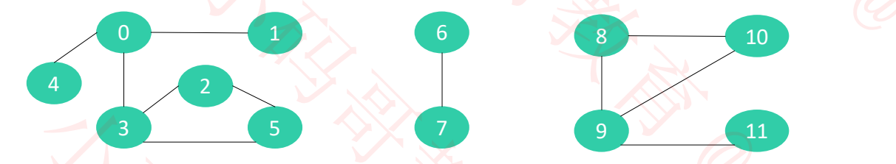

设计一个数据结构，能够快速执行 2 个操作：

- 查询 2 个村庄之间是否有连接的路
- 连接 2 个村庄

如果使用**数组、链表、平衡二叉树、集合(Set)**都可以完成需求，但是查询、连接的时间复杂度都是 O(n)。

**并查集**能做到查询、连接的均摊时间复杂度都是 O(α(n))，α(n) < 5，非常适合解决这类“连接”相关的问题。


### 1 并查集UnionFind

并查集也叫作**不相交集合**（Disjoint Set）

并查集有2个核心操作:

- 查找（Find）：查找元素所在的集合
  (这里的集合并不是特指Set这种数据结构，是指**广义的数据集合**)
- 合并（Union）：将两个元素所在的集合合并为一个集合

有 2 种常见的实现思路：

1. Quick Find
   - 查找（Find）的时间复杂度：O(1)
   - 合并（Union）的时间复杂度：O(n)
2. Quick Union
   - 查找（Find）的时间复杂度：O(logn), 可以优化至 O(𝛼(𝑛)), α(𝑛) < 5
   - 合并（Union）的时间复杂度：O(logn), 可以优化至 O(𝛼(𝑛)), α(𝑛) < 5


#### 1.1 如何存储数据

假设并查集处理的数据都是整型，那么可以用整型数组来存储数据。

- **数组索引代表元素值**
- **索引对应的值代表这个元素的父节点**

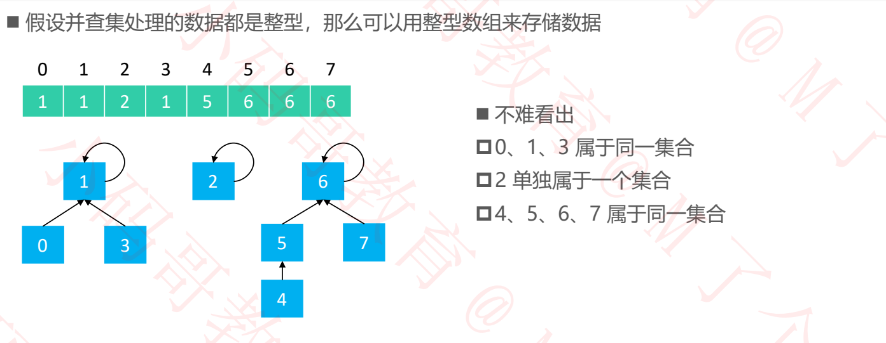

因此，并查集是**可以用数组实现的树形结构**（二叉堆、优先级队列也是可以用数组实现的树形结构）


#### 1.2 接口定义

```java
/**
 * 查找v所属的集合(根结点)
 */
public abstract int find(int v);

/**
 * 合并v1、v2所在的集合
 */
public abstract void union(int v1, int v2);

/**
 * 检查v1、v2是否属于同一集合
 */
public boolean isSame(int v1, int v2);
```

`isSame()` 的实现十分简单：

```java
public boolean isSame(int v1, int v2){
	return find(v1) == find(v2);
}
```


#### 1.3 元素的初始化

初始化时，每个元素各自属于一个**单元素集合**

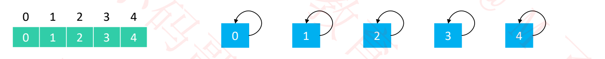

```java
public abstract class UnionFind {
    protected int[] parents;

    public UnionFind(int capacity) {
        if (capacity <= 0) {
            throw new IllegalArgumentException("capacity must be >= 1");
        }
        parents = new int[capacity];
        for (int i = 0; i < parents.length; i++) {
            parents[i] = i;
        }
    }
}
```


#### 1.4 UnionFind.java

这是个并查集的抽象类，后面的所有并查集都将继承它。

```java
/**
 * @description:
 * @author: xu
 * @date: 2022/10/4 20:10
 */
public abstract class UnionFind {
    protected int[] parents;

    public UnionFind(int capacity) {
        if (capacity <= 0) {
            throw new IllegalArgumentException("capacity must be >= 1");
        }
        parents = new int[capacity];
        for (int i = 0; i < parents.length; i++) {
            parents[i] = i;
        }
    }

    /**
     * 查找v所属的集合（根节点）
     * @param v
     * @return
     */
    public abstract int find(int v);

    /**
     * 合并v1、v2所在的集合
     * @param v1
     * @param v2
     */
    public abstract void union(int v1, int v2);

    /**
     * 检查v1、v2是否属于同一个集合
     * @param v1
     * @param v2
     * @return
     */
    public boolean isSame(int v1, int v2) {
        return find(v1) == find(v2);
    }

    /**
     * 边界检查: 检查传入值的合法性
     * @param v
     */
    protected void rangeCheck(int v) {
        if (v < 0 || v >= parents.length)
            throw new IndexOutOfBoundsException("v is out of bounds");
    }
}
```


### 2 Quick Find

Quick Find的 `union(v1, v2)`：让**v1 所在集合的所有元素**都指向**v2 的父节点**。

并且 Quick Find 的高度永远保持 <= 2。


#### 2.1 find实现

Quick Find查找的时候，由于数组中存储的就是根结点，因此直接取出即可。

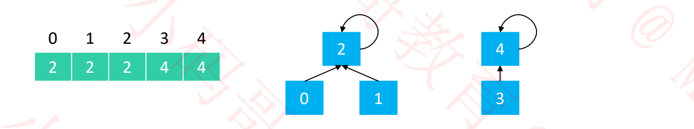

```java
对上图执行 find():
find(0) == 2
find(1) == 2
find(2) == 2
find(3) == 4
```

```java
/**
 * 父节点就是根节点
 */
@Override
public int find(int v){
	rangeCheck(v);
	return parents[v];
}
```

Quick Find 的 find(V v) 时间复杂度：**O(1)**


#### 2.2 union示例及实现

例如：

将｛0，1，2，3，4，5｝初始化为并查集，每个元素各自属于一个单元素集合：{0}, {1}, {2}, {3}, {4}。

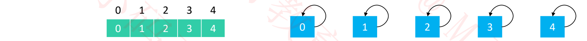

合并 1 和 0，`union(1, 0)`，即 {1} 指向了 {0} 。

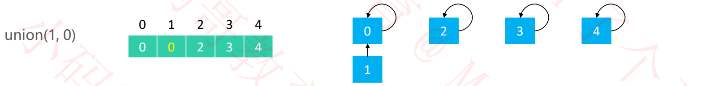

然后，合并 1 和 2，`union(1, 2)`，1 所在集合有{0, 1}，即 {0, 1} 指向了 {2}。

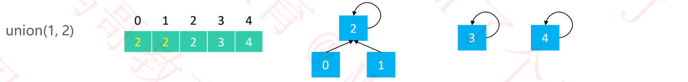

再合并 3 和 4，`union(3, 4)`，即 {3} 指向了 {4} 。

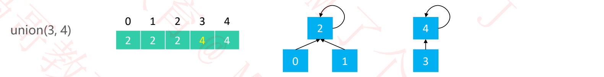

合并 0 和 3，`union(0, 3)`，0 所在集合为 {0, 1, 2}，3 所在集合为 {3,4}，如下：

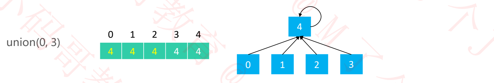

```java
/**
 * 将v1所在集合的所有元素都嫁接到v2的父节点上
 * v1    v2   union(v1,v2)
 *  0    4	     4
 * 1 2   3     0 1 2 3
 */
@Override
public void union(int v1, int v2) {
    int p1 = find(v1);
    int p2 = find(v2);
    if (p1 == p2) return;

    for (int i = 0; i < parents.length; i++) {
        if (parents[i] == p1) {
            parents[i] = p2;
        }
    }
}
```

Quick Find 的 union(V v1, V v2) 时间复杂度：**O(n)**


#### 2.3 QuickFind完整代码

```java
package com.xk._02Algorithmic._02unionFind.union;

/**
 * @description: Quick Find
 * @author: xu
 * @date: 2022/10/4 20:27
 */
public class UnionFind_QF extends UnionFind{

    public UnionFind_QF(int capacity) {
        super(capacity);
    }

    //O(1)
    // 父节点都是根节点
    @Override
    public int find(int v){
        rangeCheck(v);
        return parents[v];
    }

    //O(n)
    // 将 v1 所在集合的所有元素都嫁接到 v2 的父节点上
    @Override
    public void union(int v1, int v2) {
        int p1 = find(v1);
        int p2 = find(v2);
        if (p1 == p2) return;

        for (int i = 0; i < parents.length; i++) {
            if (parents[i] == p1) {
                parents[i] = p2;
            }
        }
    }

}
```


### 3 Quick Union

> Quick Find 的 `union(v1, v2)`：让**v1 所在集合的所有元素(根节点相同)**都指向**v2 的根节点(父节点)**。

Quick Union 的 `union(v1, v2)`：让**v1 的根节点**指向**v2 的根节点**。(与Quick Find进行对比)


#### 3.1 find实现

Quick Union的查找，需要通过**父节点**不断往上找，直到找到**根结点**（某节点的根结点为自己）。


```java
对上图执行 find():
find(0) == 2
find(1) == 2
find(3) == 2
find(4) == 2
```

```java
//O(logn)
// 通过parent链条不断地向上找，直到找到根节点
@Override
public int find(int v){
    rangeCheck(v);
    while (v != parents[v]){
        v = parents[v];
    }
    return v;
}
```

Quick Union 的 find() 时间复杂度：**O(logn)**


#### 3.2 union示例及实现

将｛0，1，2，3，4，5｝初始化为并查集，每个元素各自属于一个单元素集合。

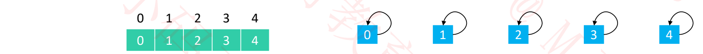

`union(1, 0)`，1的根结点(还是1) 指向 0的根结点(还是0)。


`union(1, 2)`，1的根结点(0) 指向 2的根结点(2)。

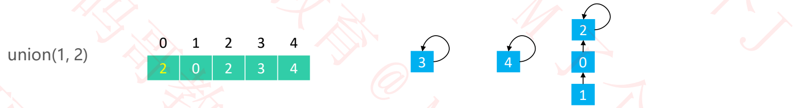

`union(3, 4)`，3的根结点(3) 指向 4的根结点(4)。

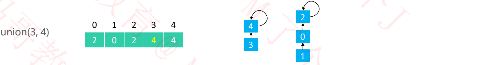

`union(3, 1)`，3的根结点(4) 指向 1的根结点(2)。

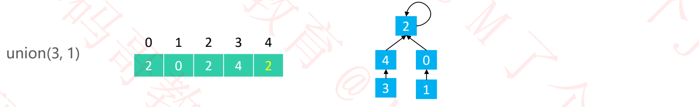

```java
//O(logn)
// 将 v1 的根节点都嫁接到 v2 的根节点上
@Override
public void union(int v1, int v2) {
    int p1 = find(v1);
    int p2 = find(v2);
    if (p1 == p2) return;

    parents[p1] = p2;
}
```

Quick Union 的 union() 时间复杂度：**O(logn)**


#### 3.3 QuickUnion完整实现

```java
package com.xk._02Algorithmic._02unionFind.union;

/**
 * @description: Quick Union
 * @author: xu
 * @date: 2022/10/4 20:27
 */
public class UnionFind_QU extends UnionFind{

    public UnionFind_QU(int capacity) {
        super(capacity);
    }

    //O(logn)
    // 通过parent链条不断地向上找，直到找到根节点
    @Override
    public int find(int v){
        rangeCheck(v);
        while (v != parents[v]){
            v = parents[v];
        }
        return v;
    }

    //O(logn)
    // 将 v1 的根节点都嫁接到 v2 的根节点上
    @Override
    public void union(int v1, int v2) {
        int p1 = find(v1);
        int p2 = find(v2);
        if (p1 == p2) return;

        parents[p1] = p2;
    }
}
```


### 4 Quick Union--优化

一般用的更多的是 Quick Union，我们研究一下它的优化方案。

在 union 的过程中，可能会出现**树不平衡**的情况，甚至退化成链表。

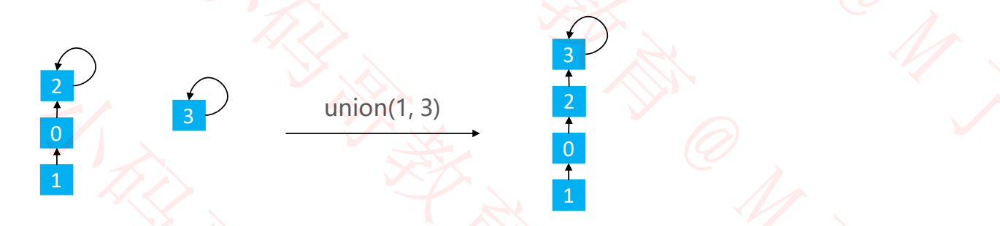

有 2 种常见的优化方案：

- 基于 size 的优化：*元素少*的树 嫁接到 *元素多*的树
- **基于 rank 的优化**：*矮*的树 嫁接到 *高*的树


#### 4.1 QuickUnion--基于size的优化

不是固定的让某一棵树嫁接到另一棵树，**让元素少的树 嫁接到 元素多的树**。

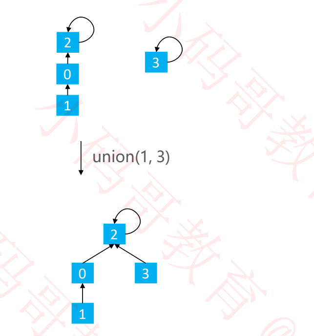

该类继承了**UnionFind_QU**，表明它是在Quick Union的基础上优化，并且只需要重写`uniont(int v1, int v2)`即可，`find(int v)`无需做任何变化。

```java
package com.xk._02Algorithmic._02unionFind.union;

/**
 * @description: Quick Union -- 基于 size 的优化
 * @author: xu
 * @date: 2022/10/4 20:27
 */
public class UnionFind_QU_Size extends UnionFind_QU {
    private int[] sizes;
    public UnionFind_QU_Size(int capacity) {
        super(capacity);
        sizes = new int[capacity];
        for (int i = 0; i < sizes.length; i++) {
            sizes[i] = 1;
        }
    }

    @Override
    public void union(int v1, int v2) {
        int p1 = find(v1);
        int p2 = find(v2);
        if (p1 == p2) return;
        if (sizes[p1] < sizes[p2]) {
            parents[p1] = p2;
            sizes[p2] += sizes[p1];
        } else {
            parents[p2] = p1;
            sizes[p1] += sizes[p2];
        }
    }
}
```


#### 4.2 QuickUnion--基于rank的优化

上面所说的，基于size的优化，也可能会存在树不平衡的问题。

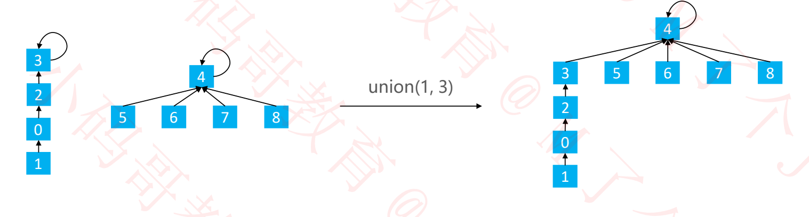

基于rank的优化，让**矮的树 嫁接到 高的树**。

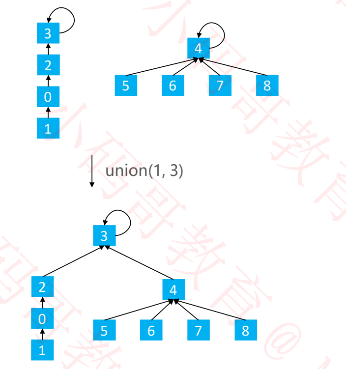

该类继承了**UnionFind_QU**，表明它是在Quick Union的基础上优化，并且只需要重写`uniont(int v1, int v2)`即可，`find(int v)`无需做任何变化。

```java
package com.xk._02Algorithmic._02unionFind.union;

/**
 * @description: Quick Union -- 基于 rank 的优化
 * @author: xu
 * @date: 2022/10/4 20:27
 */
public class UnionFind_QU_Rank extends UnionFind_QU {
    private int[] ranks;

    public UnionFind_QU_Rank(int capacity) {
        super(capacity);
        ranks = new int[capacity];
        for (int i = 0; i < ranks.length; i++) {
            ranks[i] = 1;
        }
    }

    @Override
    public void union(int v1, int v2) {
        int p1 = find(v1);
        int p2 = find(v2);
        if (p1 == p2) return;

        if (ranks[p1] < ranks[p2]) {
            parents[p1] = p2;
        } else if (ranks[p1] > ranks[p2]) {
            parents[p2] = p1;
        } else {
            parents[p1] = p2;
            ranks[p2] += 1;
        }
    }
}
```


#### 4.3 路径压缩(PathCompression)

虽然有了基于 rank 的优化，树会相对平衡一点，但是随着 union 次数的增多：**树的高度依然会越来越高**，导致 find 操作变慢，尤其是底层节点 (因为 find 是不断向上找到根节点) 。

什么是**路径压缩**？

- 在 find 时使路径上的所有节点都指向根节点，从而降低树的高度。

如下图，

- `find(1)` 使路径上的 1，2 都指向了根结点 4。
- `find(0)` 使路径上的 0 指向了根结点 4。
- `find(7)` 使路径上的 7 指向了根结点 4。

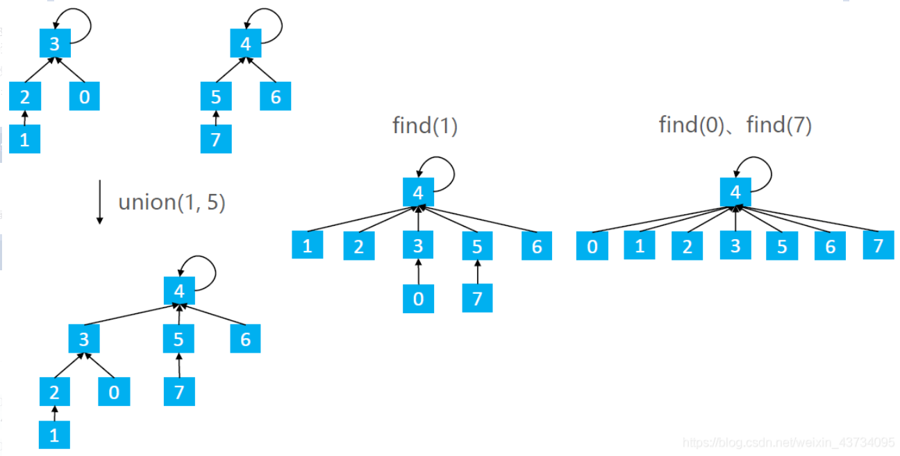

该类继承了**UnionFind_QU_Rank**，表明它是在Quick Union的 rank 优化的基础上，再优化，并且只需要重写`find(int v)`即可。

```java
package com.xk._02Algorithmic._02unionFind.union;

/**
 * @description: Quick Union -- 基于rank的优化 -- 路径压缩[Path Compression]
 * @author: xu
 * @date: 2022/10/4 20:27
 */
public class UnionFind_QU_R_PC extends UnionFind_QU_Rank{
    public UnionFind_QU_R_PC(int capacity) {
        super(capacity);
    }

    /**
	 * 在find时使路径上的所有节点都指向根节点，从而降低树的高度
	 */
    @Override
    public int find(int v){
        rangeCheck(v);
        if (parents[v] != v) {
            parents[v] = find(parents[v]);
        }
        return parents[v];
    }
}
```


路径压缩使路径上的所有节点都指向根节点，所以实现成本稍高。

还有2种更优的做法，不但能降低树高，实现成本也比路径压缩低：

- **路径分裂**（Path Spliting）
- **路径减半**（Path Halving）

**路径分裂、路径减半**的效率差不多，但都比路径压缩要好。


#### 4.4 路径分裂(PathSpliting)

路径分裂：**使路径上的每个节点都指向其祖父节点**（parent的parent）。

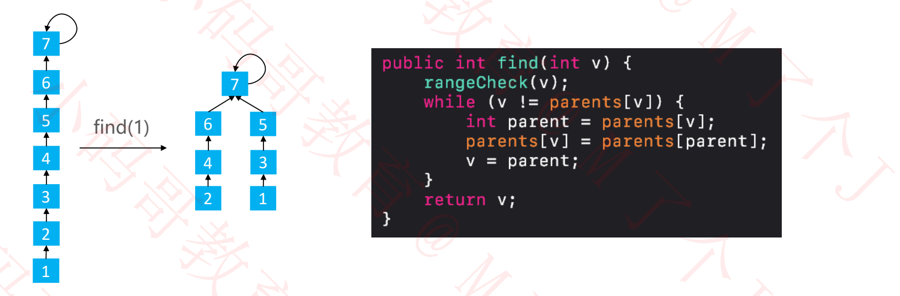

该类继承了**UnionFind_QU_Rank**，表明它是在Quick Union的 rank 优化的基础上，再优化，并且只需要重写`find(int v)`即可。

```java
package com.xk._02Algorithmic._02unionFind.union;

/**
 * @description: Quick Union -- 基于rank的优化 -- 路径分裂[Path Spliting]
 * @author: xu
 * @date: 2022/10/4 20:27
 */
public class UnionFind_QU_R_PS extends UnionFind_QU_Rank{

    public UnionFind_QU_R_PS(int capacity) {
        super(capacity);
    }

    @Override
    public int find(int v){
        rangeCheck(v);
        while (v != parents[v]){
            int p = parents[v];
            parents[v] = parents[parents[v]];
            v = p;
        }
        return v;
    }
}
```


#### 4.5 路径减半(PathHalving)

路径减半：**使路径上每隔一个节点就指向其祖父节点**（parent的parent）。

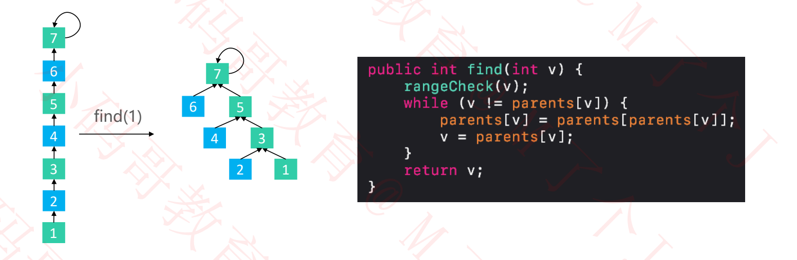

该类继承了**UnionFind_QU_Rank**，表明它是在Quick Union的 rank 优化的基础上，再优化，并且只需要重写`find(int v)`即可。

```java
package com.xk._02Algorithmic._02unionFind.union;

/**
 * @description: Quick Union -- 基于rank的优化 -- 路径减半[Path Halving]
 * @author: xu
 * @date: 2022/10/4 20:27
 */
public class UnionFind_QU_R_PH extends UnionFind_QU_Rank{

    public UnionFind_QU_R_PH(int capacity) {
        super(capacity);
    }

    @Override
    public int find(int v){
        rangeCheck(v);
        while (v != parents[v]){
            parents[v] = parents[parents[v]];
            v = parents[v];
        }
        return v;
    }
}
```


#### 4.6 小结

使用**路径压缩**、**分裂**或**减半** + 基于rank或者size的优化可以确保每个操作的均摊时间复杂度为 O(𝛼(𝑛)) ，α(𝑛) < 5。

建议搭配：

- Quick Union
- 基于 rank 的优化
- Path Halving 或 Path Spiliting


### 5 时间测试

```java
private static final int COUNT = 500_0000;

public static void main(String[] args) {
     // testTime(new UnionFind_QF(COUNT)); // 太慢,不测
     // testTime(new UnionFind_QU(COUNT)); // 太慢,不测
     testTime(new UnionFind_QU_Size(COUNT)); // Quick Union 基于size的优化
     testTime(new UnionFind_QU_Rank(COUNT)); // Quick Union 基于rank的优化
     testTime(new UnionFind_QU_R_PC(COUNT)); // Quick Union 基于rank的优化 路径压缩
     testTime(new UnionFind_QU_R_PS(COUNT)); // Quick Union 基于rank的优化 路径分裂
     testTime(new UnionFind_QU_R_PH(COUNT)); // Quick Union 基于rank的优化 路径减半
}

static void testTime(UnionFind uf) {
    Times.test(uf.getClass().getSimpleName(), new Times.Task() {
        @Override
        public void execute() {
            for (int i = 0; i < COUNT; i++) {
                uf.union((int) (Math.random() * COUNT), (int) (Math.random() * COUNT));
            }
            for (int i = 0; i < COUNT; i++) {
                uf.isSame((int) (Math.random() * COUNT), (int) (Math.random() * COUNT));
            }
        }
    });
}
```

```
【UnionFind_QU_Size】
开始：16:23:23.595
结束：16:23:25.848
耗时：2.252秒
--------------------------------------------------------------------------
【UnionFind_QU_Rank】
开始：16:23:25.878
结束：16:23:27.864
耗时：1.986秒
--------------------------------------------------------------------------
【UnionFind_QU_R_PC】
开始：16:23:27.873
结束：16:23:29.652
耗时：1.779秒
--------------------------------------------------------------------------
【UnionFind_QU_R_PS】
开始：16:23:29.658
结束：16:23:31.319
耗时：1.661秒
--------------------------------------------------------------------------
【UnionFind_QU_R_PH】
开始：16:23:31.339
结束：16:23:32.987
耗时：1.648秒
--------------------------------------------------------------------------
```


### 6 自定义类型使用并查集

- 方案一：通过一些方法将自定义类型转为整型后使用并查集（比如生成哈希值）
- 方案二：使用**链表+映射**（Map）

这里采用方案二实现：

```java
package com.xk._02Algorithmic._02unionFind.union;

import com.xk._02Algorithmic._02unionFind.Student;
import com.xk._02Algorithmic._02unionFind.tools.Asserts;

import java.util.HashMap;
import java.util.Map;
import java.util.Objects;

/**
 * @description: Quick Union + 基于 rank 的优化 + Path Halving
 * @author: xu
 * @date: 2022/10/5 12:36
 */
public class GenericUnionFind<V> {
    private Map<V, Node<V>> nodes = new HashMap<>();
    
    public GenericUnionFind() {}
    public GenericUnionFind(Collection<V> elements) {
        if (elements.size() < 1) return;
        for (V v : elements) {
            if (nodes.containsKey(v)) continue;
            nodes.put(v, new Node<>(v));
        }
    }
    public GenericUnionFind(V[] elements) {
        if (elements.length < 1) return;
        for (V v : elements) {
            if (nodes.containsKey(v)) continue;
            nodes.put(v, new Node<>(v));
        }
    }

    private static class Node<V> {
        V value;
        Node<V> parent = this;
        int rank = 1;
        Node(V value) {
            this.value = value;
        }
    }

    public void makeSet(V v) {
        if (nodes.containsKey(v)) return;
        nodes.put(v, new Node<>(v));
    }

    public V find(V v) {
        Node<V> node = findNode(v);
        return node == null ? null : node.value;
    }

    public void union(V v1, V v2) {
        Node<V> p1 = findNode(v1);
        Node<V> p2 = findNode(v2);
        if (p1 == null || p2 == null) return;
        if (Objects.equals(p1.value, p2.value)) return;
        if (p1.rank < p2.rank) {
            p1.parent = p2;
        } else if (p1.rank > p2.rank) {
            p2.parent = p1;
        } else {
            p1.parent = p2;
            p2.rank += 1;
        }
    }

    public boolean isSame(V v1, V v2) {
        return Objects.equals(find(v1), find(v2));
    }

    /**
     * 找到v的根节点
     * @param v
     * @return
     */
    private Node<V> findNode(V v) {
        Node<V> node = nodes.get(v);
        if (node == null) return null;
        while (!Objects.equals(node.value, node.parent.value)) {
            node.parent = node.parent.parent;
            node = node.parent;
        }
        return node;
    }
}
```

时间测试：

```java
private static final int COUNT = 500_0000;

public static void main(String[] args) {
     testTime(new UnionFind_QU_Size(COUNT));
     testTime(new UnionFind_QU_Rank(COUNT));
     testTime(new UnionFind_QU_R_PC(COUNT));
     testTime(new UnionFind_QU_R_PS(COUNT));
     testTime(new UnionFind_QU_R_PH(COUNT));
     testTime(new GenericUnionFind<Integer>()); // 自定义类型
}

static void testTime(UnionFind uf) {
    Times.test(uf.getClass().getSimpleName(), new Times.Task() {
        @Override
        public void execute() {
            for (int i = 0; i < COUNT; i++) {
                uf.union((int) (Math.random() * COUNT), (int) (Math.random() * COUNT));
            }
            for (int i = 0; i < COUNT; i++) {
                uf.isSame((int) (Math.random() * COUNT), (int) (Math.random() * COUNT));
            }
        }
    });
}

static void testTime(GenericUnionFind<Integer> uf) {
    for (int i = 0; i < COUNT; i++) {
        uf.makeSet(i);
    }

    Times.test(uf.getClass().getSimpleName(), new Times.Task() {
        @Override
        public void execute() {
            for (int i = 0; i < COUNT; i++) {
                uf.union((int) (Math.random() * COUNT), (int) (Math.random() * COUNT));
            }
            for (int i = 0; i < COUNT; i++) {
                uf.isSame((int) (Math.random() * COUNT), (int) (Math.random() * COUNT));
            }
        }
    });
}
```

```
【UnionFind_QU_Size】
开始：16:32:41.419
结束：16:32:44.159
耗时：2.739秒
--------------------------------------------------------------------------
【UnionFind_QU_Rank】
开始：16:32:44.203
结束：16:32:46.787
耗时：2.583秒
--------------------------------------------------------------------------
【UnionFind_QU_R_PC】
开始：16:32:46.796
结束：16:32:48.700
耗时：1.904秒
--------------------------------------------------------------------------
【UnionFind_QU_R_PS】
开始：16:32:48.706
结束：16:32:50.388
耗时：1.682秒
--------------------------------------------------------------------------
【UnionFind_QU_R_PH】
开始：16:32:50.417
结束：16:32:52.107
耗时：1.69秒
--------------------------------------------------------------------------
【GenericUnionFind】
开始：16:32:54.511
结束：16:32:59.866
耗时：5.354秒
--------------------------------------------------------------------------
```

+++

## 三、图Graph

### 1 数据结构回顾

回顾一下目前为止掌握的学过的数据结构。

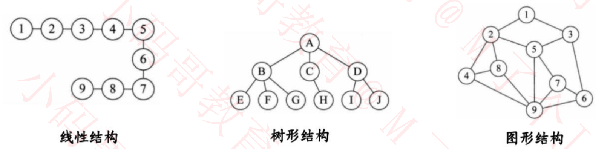

- **线性结构**：数组、链表、栈、队列、哈希表
- **树形结构**：二叉树、B树、堆、Trie、哈夫曼树、并查集
- 图是不属于以上两类的数据结构。


### 2 图Graph--基础概念

图由**顶点**（vertex）和**边**（edge）组成，通常表示为 G = (V, E)

- G 表示一个图，V 是顶点集，E 是边集
- **顶点集 V 有穷且非空**
- 任意两个顶点之间都可以用边来表示它们之间的关系，**边集 E 可以为空**

以下都属于图。

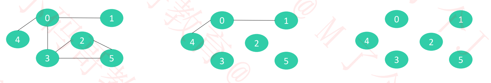

图结构的应用极其广泛：

- 社交网络
- 地图导航
- 游戏开发
- ......

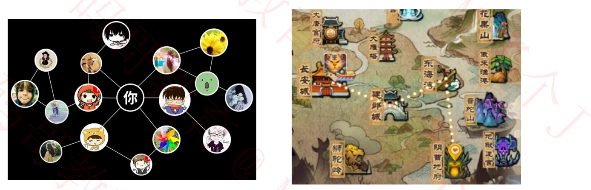

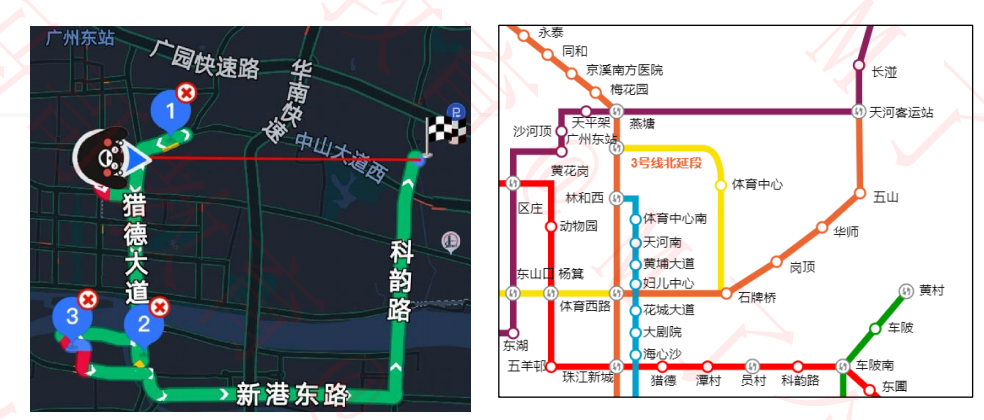


#### 2.1 有向图Directed Graph

有向图的**边是有明确方向**的：

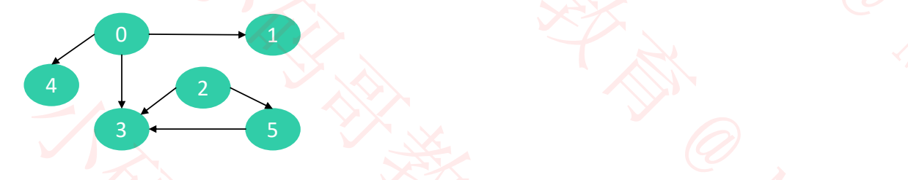

有向无环图（Directed Acyclic Graph，简称 DAG）

如果一个有向图，从任意顶点出发无法经过若干条边回到该顶点，那么它就是一个有向无环图

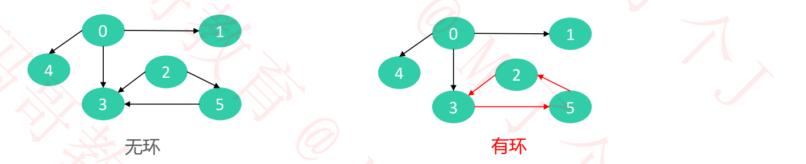

- *出度*、*入度*:

出度、入度适用于**有向图**；

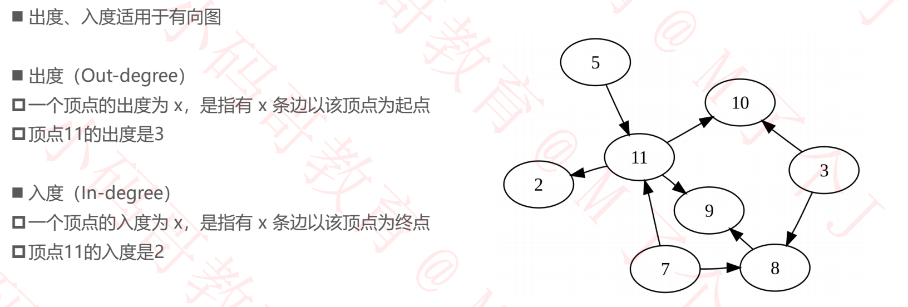

出度（Out-degree）:

- 一个顶点的出度为 x，是指有 x 条边以该顶点为起点
- 顶点 11 的出度是 3

入度（In-degree）:

- 一个顶点的入度为 x，是指有 x 条边以该顶点为终点
- 顶点 11 的入度是 2


#### 2.2 无向图Undirected Graph

无向图的边是**无方向**的

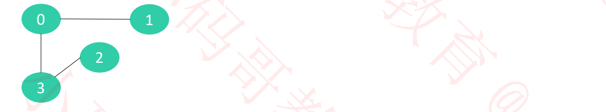

**无向图可以通过有向图表示出来，但是有向图无法通过无向图来表示。**

下面这个有向图就相当于上面的无向图。

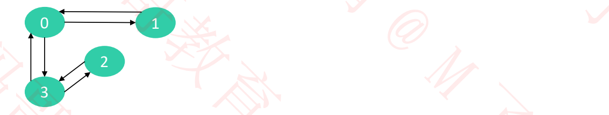


#### 2.3 混合图Mixed Graph

混合图的边**可能是无向的，也可能是有向的**。

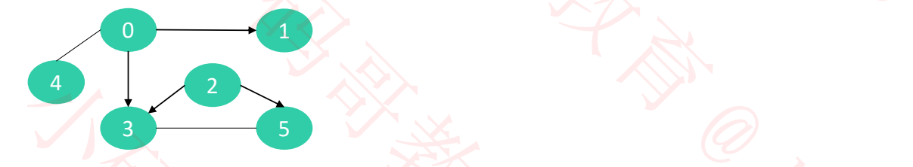


#### 2.4 简单图、多重图

平行边：

- 在无向图中，关联一对顶点的无向边如果多于1条，则称这些边为平行边
- 在有向图中，关联一对顶点的有向边如果多于1条，并且它们的的方向相同，则称这些边为平行边

多重图（Multigraph）：

- 有平行边或者有自环的图

简单图（Simple Graph）：

- 既没有平行边也不没有自环的图
- 笔记中讨论的基本都是简单图

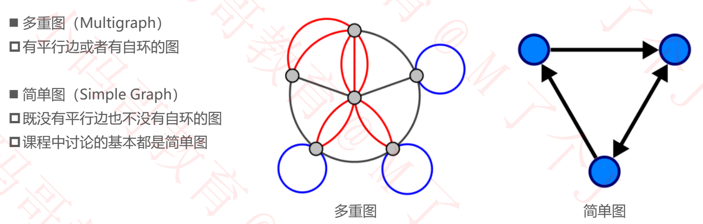


#### 2.5 无向完全图Undirected Complete Graph

无向完全图的任意两个顶点之间都存在边

- n 个顶点的无向完全图有 `n(n−1)/2` 条边
- (n − 1) + (n − 2) + (n − 3) + ⋯ + 3 + 2 + 1 = n(n-1)/2


#### 2.6 有向完全图Directed Complete Graph

有向完全图的任意两个顶点之间都存在方向相反的两条边

- n 个顶点的有向完全图有 `n(n−1)` 条边

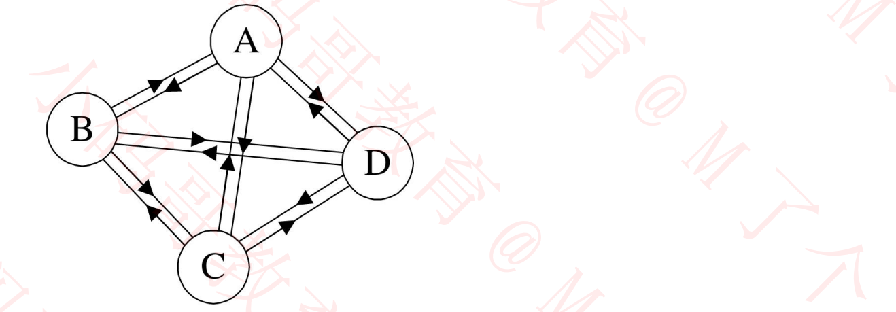

- 稠密图（Dense Graph）：边数接近于或等于完全图
- 稀疏图（Sparse Graph）：边数远远少于完全图


#### 2.7 有权图Weighted Graph

有权图的边可以拥有权值（Weight）

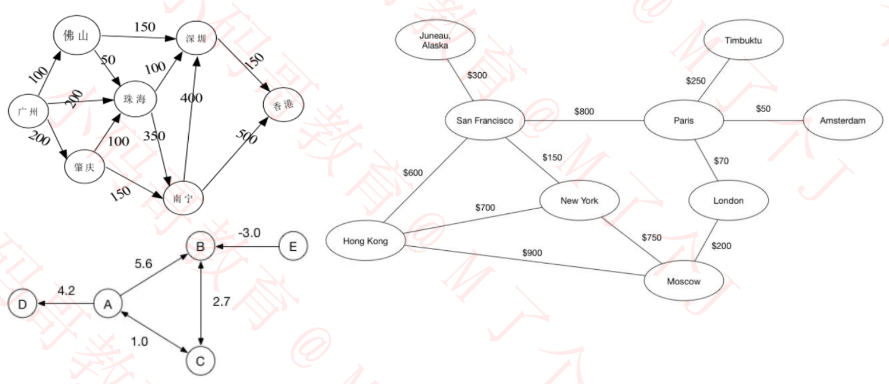


#### 2.8 连通图Connected Graph

如果顶点 x 和 y 之间存在**可相互抵达的路径（直接或间接的路径）**，则称 x 和 y 是连通的

如果*无向图* G 中**任意** 2 个顶点都是连通的，则称G为**连通图**。

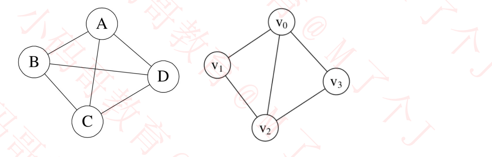

*连通分量*（Connected Component）

连通分量：无向图的极大连通子图

- 连通图只有一个连通分量，即其自身
- 非连通的*无向图*有多个连通分量

下面的无向图有 3 个连通分量：

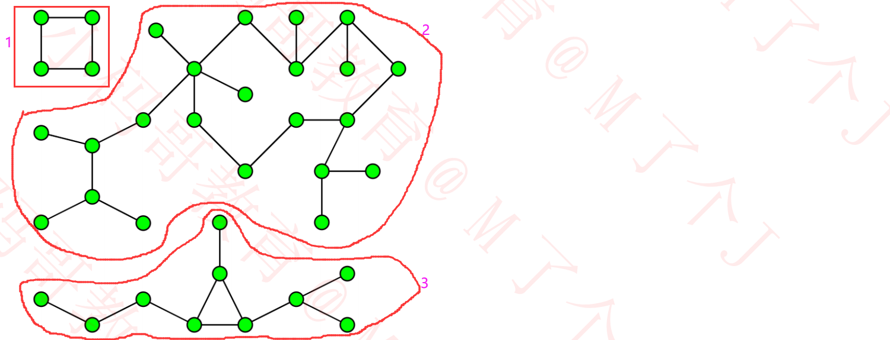


#### 2.9 强连通图Strongly Connected Graph

如果*有向图* G 中**任意**2个顶点都是连通的，则称G为**强连通图**

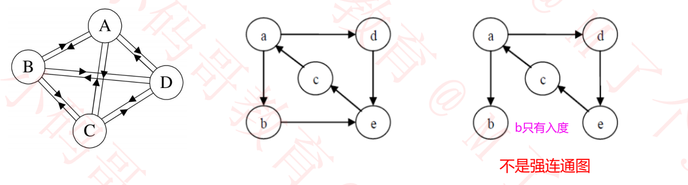

*强连通分量*（Strongly Connected Component）

强连通分量：有向图的极大强连通子图

- 强连通图只有一个强连通分量，即其自身；
- 非强连通的*有向图*有多个强连通分量

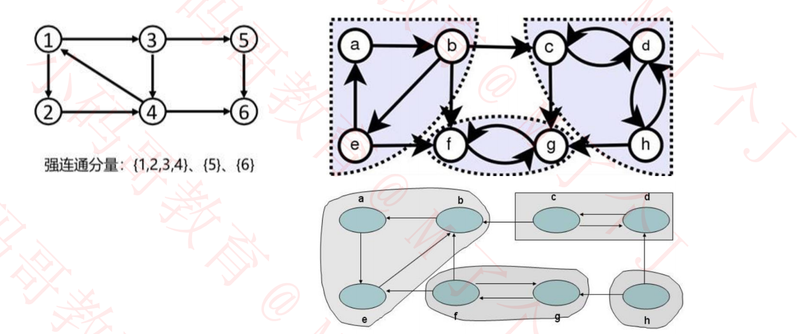


### 3 图的实现方案

图有2种常见的实现方案：

- 邻接矩阵（Adjacency Matrix）
- 邻接表（Adjacency List）


#### 3.1 邻接矩阵Adjacency Matrix

邻接矩阵的存储方式

- 一维数组存放顶点信息
- 二维数组存放边信息

邻接矩阵比较适合稠密图

- 不然会比较浪费内存

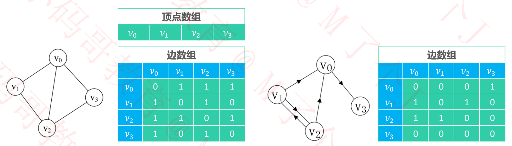

*邻接矩阵--有权图*：

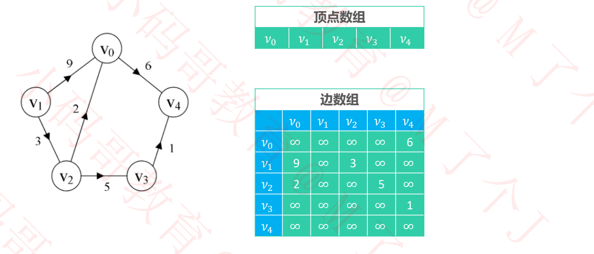


#### 3.2 邻接表Adjacency List

邻接矩阵的存储方式

- 一维数组存放顶点集
- 数组中的顶点集后面跟着边集（链表）

邻接矩阵比较适合稀疏图

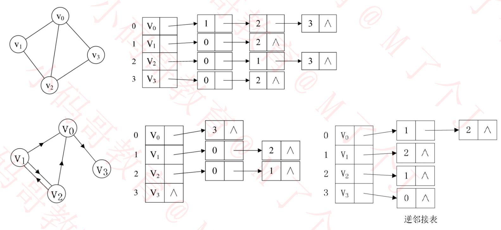

*邻接表--有权图*：

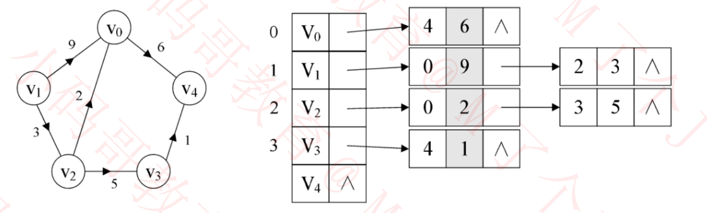


### 4 图的基础代码

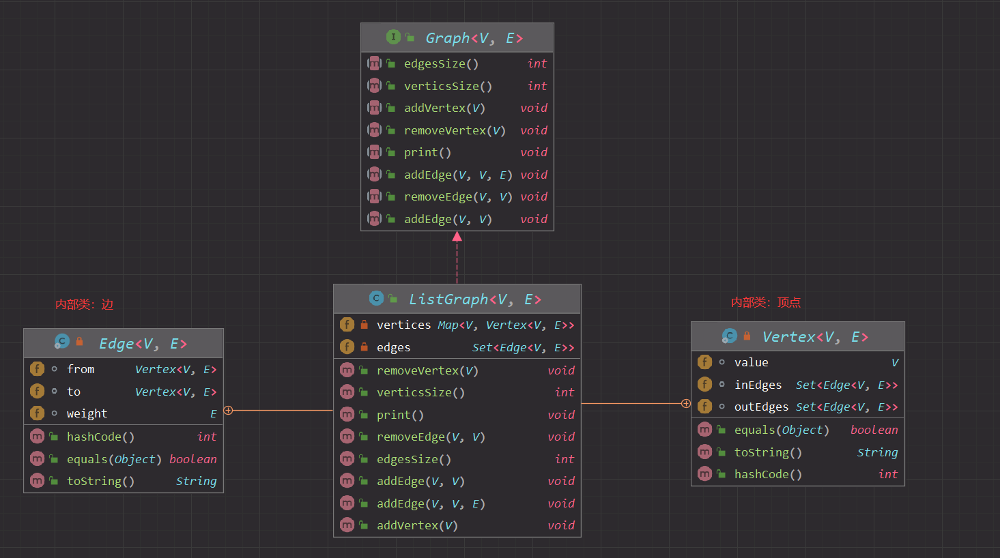

#### 4.1 图的接口设计

```java
public interface Graph<V, E> {
	int edgesSize(); 		// 边的数量
	int verticesSize();		// 顶点数量
	
	void addVertex(V v); 		// 添加顶点
	void addEdge(V from, V to); // 添加边
	void addEdge(V from, V to, E weight);// 添加边--有权值
	
	void removeVertex(V v); 		// 删除顶点
	void removeEdge(V from, V to);	 // 删除边
	
	interface vertexVisitor<V>{
		boolean visit(V v);
	}
 }
```


#### 4.2 顶点和边的设计

- 顶点`Vertex`的定义

```java
// 顶点
private static class Vertex<V, E> {
    V value;
    Set<Edge<V,E>> inEdges = new HashSet<>(); // 入度边
    Set<Edge<V,E>> outEdges = new HashSet<>(); // 出度边
    public Vertex(V value) {
        this.value = value;
    }
    @Override
    public boolean equals(Object o) {
        if (this == o) return true;
        if (!(o instanceof Vertex)) return false;
        Vertex<?, ?> vertex = (Vertex<?, ?>) o;
        return Objects.equals(value, vertex.value);
    }
    @Override
    public int hashCode() {
        return Objects.hash(value);
    }
    @Override
    public String toString() {
        return value == null ? "null" : value.toString();
    }
}
```

- 边`Edge`的定义

```java
// 边
private static class Edge<V, E> {
    Vertex<V,E> from; // 起点
    Vertex<V,E> to; // 终点
    E weight; // 权值
    Edge(Vertex<V, E> from, Vertex<V, E> to) {
        this(from, to, null);
    }
    Edge(Vertex<V, E> from, Vertex<V, E> to, E weight) {
        this.from = from;
        this.to = to;
        this.weight = weight;
    }
    @Override
    public boolean equals(Object o) {
        if (this == o) return true;
        if (!(o instanceof Edge)) return false;
        Edge<V, E> edge = (Edge<V, E>) o;
        return Objects.equals(from, edge.from) && Objects.equals(to, edge.to);
    }
    @Override
    public int hashCode() {
        return Objects.hash(from, to);
    }
    @Override
    public String toString() {
        return "Edge [from=" + from + ", to=" + to + ", weight=" + weight + "]";
    }
}
```

一些稍微复杂的操作单独列出来，简单地操作直接从**完整源码**中查看即可。


#### 4.3 添加边addEdge

```java
private Map<V, Vertex<V,E>> vertices = new HashMap<>(); // 图集
private Set<Edge<V, E>> edges = new HashSet<>(); // 边集

/**
 * 添加无权值的边
 */
@Override
public void addEdge(V from, V to) {
	addEdge(from, to, null);
}

/*
 * 添加有权值的边
 */
@Override
public void addEdge(V from, V to, E weight) {
	// 根据传入的参数from找到出发点,如果不存在则创建
	Vertex<V, E> fromVertex = vertices.get(from);
	if(fromVertex == null){ 
		vertices.put(from, fromVertex = new Vertex<>(from));
	}
	// 根据传入的参数to找到终点,如果不存在则创建
	Vertex<V, E> toVertex = vertices.get(to);
	if(toVertex == null){
		vertices.put(to, toVertex = new Vertex<>(to));
	}
	
	// 根据出发点与终点,创建边
	Edge<V, E> edge = new Edge<>(fromVertex, toVertex, weight);
	
	// 不管原来是否存在,都先删除此边,再添加进去
	if(fromVertex.outEdges.remove(edge)){ 
		toVertex.inEdges.remove(edge);
		edges.remove(edge);
	}
	fromVertex.outEdges.add(edge);
	toVertex.inEdges.add(edge);
	edges.add(edge);
}
```


#### 4.4 删除边removeEdge

```java
private Map<V, Vertex<V,E>> vertices = new HashMap<>(); // 图集
private Set<Edge<V, E>> edges = new HashSet<>(); // 边集

/*
 * 删除边
 */
@Override
public void removeEdge(V from, V to) {
	// 根据传入的from获得起点,不存在则不需要删除
	Vertex<V, E> fromVertex = vertices.get(from);
	// 根据传入的to找到终点,不存在则不需要删除
	Vertex<V, E> toVertex = vertices.get(to);
    if (fromVertex == null || toVertex == null) return;
	
	// 根据起点和终点获得边,然后删除
	Edge<V, E> edge = new Edge<>(fromVertex, toVertex);
	if(fromVertex.outEdges.remove(edge)){
		toVertex.inEdges.remove(edge);
		edges.remove(edge);
	}
}
```


#### 4.5 删除点removeVertex

```java
private Map<V, Vertex<V,E>> vertices = new HashMap<>(); // 图集
private Set<Edge<V, E>> edges = new HashSet<>(); // 边集

/*
 * 删除点
 */
@Override
public void removeVertex(V v) {
	// 根据传入的值找到点并删除,不存在则不做操作
	Vertex<V, E> vertex = vertices.remove(v);
	if(vertex == null) return;
	
	// 迭代器遍历集合vertex.outEdges, 删除所有从该点出去的边
	Iterator<Edge<V, E>> outIterator = vertex.outEdges.iterator();
    while (outIterator.hasNext()) {
        Edge<V, E> edge = outIterator.next(); // 遍历到的该点出去的边
        edge.to.inEdges.remove(edge); // 获取终点进入的边,并从中删除遍历到的边
        outIterator.remove(); // 将当前遍历到的元素edge从集合vertex.outEdges中删除
        edges.remove(edge);
    }
	
	// 迭代器遍历集合vertex.inEdges, 删除所有进入该点的边
	Iterator<Edge<V, E>> inIterator = vertex.inEdges.iterator();
    while (inIterator.hasNext()) {
        Edge<V, E> edge = inIterator.next(); // 遍历到的进入该点的边
        edge.from.outEdges.remove(edge); // 获取起点出去的边,并从中删除遍历到的边
        inIterator.remove(); // 将当前遍历到的元素edge从集合vertex.inEdges中删除
        edges.remove(edge);
    }
}
```


#### 4.6 完整源码

```java
package com.xk._02Algorithmic._03graph.graph;

import com.xk._02Algorithmic._03graph.GenericUnionFind;
import com.xk._02Algorithmic._03graph.MinHeap;

import java.util.*;

/**
 * @description:
 * @author: xu
 * @date: 2022/10/5 20:28
 */
public class ListGraph<V, E> extends Graph<V, E>{
    // 传入的V与顶点类Vertex的映射
    private Map<V, Vertex<V,E>> vertices = new HashMap<>();
    // 边类Edge的Set集合
    private Set<Edge<V, E>> edges = new HashSet<>();

    // 顶点
    private static class Vertex<V, E> {
        V value;
        Set<Edge<V,E>> inEdges = new HashSet<>();
        Set<Edge<V,E>> outEdges = new HashSet<>();
        Vertex(V value) {
            this.value = value;
        }
        @Override
        public boolean equals(Object o) {
            if (this == o) return true;
            if (!(o instanceof Vertex)) return false;
            Vertex<?, ?> vertex = (Vertex<?, ?>) o;
            return Objects.equals(value, vertex.value);
        }
        @Override
        public int hashCode() {
            return Objects.hash(value);
        }

        @Override
        public String toString() {
            return value == null ? "null" : value.toString();
        }
    }

    // 边
    private static class Edge<V, E> {
        Vertex<V,E> from;
        Vertex<V,E> to;
        E weight; // 权值
        Edge(Vertex<V, E> from, Vertex<V, E> to) {
            this(from, to, null);
        }
        Edge(Vertex<V, E> from, Vertex<V, E> to, E weight) {
            this.from = from;
            this.to = to;
            this.weight = weight;
        }

        @Override
        public boolean equals(Object o) {
            if (this == o) return true;
            if (!(o instanceof Edge)) return false;
            Edge<V, E> edge = (Edge<V, E>) o;
            return Objects.equals(from, edge.from) && Objects.equals(to, edge.to);
        }
        @Override
        public int hashCode() {
            return Objects.hash(from, to);
        }
        @Override
        public String toString() {
            return "Edge{" +
                    "from=" + from +
                    ", to=" + to +
                    ", weight=" + weight +
                    '}';
        }
    }

    public void print(){
		System.out.println("[顶点]-------------------");
		vertices.forEach((V v, Vertex<V, E> vertex) -> {
			System.out.println(v);
			System.out.println("out-----------");
			System.out.println(vertex.outEdges);
			System.out.println("int-----------");
			System.out.println(vertex.inEdges);
		});
		System.out.println("[边]-------------------");
		edges.forEach((Edge<V, E> edge) -> {
			System.out.println(edge);
		});
	}

    /**
     * 返回边的数量
     * @return
     */
    @Override
    public int edgesSize() {
        return edges.size();
    }

    /**
     * 返回顶点的数量
     * @return
     */
    @Override
    public int verticsSize() {
        return vertices.size();
    }

    /**
     * 添加顶点
     * @param v
     */
    @Override
    public void  addVertex(V v) {
        if (vertices.containsKey(v)) return;
        vertices.put(v, new Vertex<>(v));
    }

    /**
     * 添加边：无权值
     * @param from
     * @param to
     */
    @Override
    public void addEdge(V from, V to) {
        addEdge(from, to, null);
    }

    /**
     * 添加边：有权值
     * @param from
     * @param to
     * @param weight
     */
    @Override
    public void addEdge(V from, V to, E weight) {
        // 判断 from 、to 顶点是否存在
        Vertex<V, E> fromVertex = vertices.get(from);
        Vertex<V, E> toVertex = vertices.get(to);
        if (fromVertex == null) {
            vertices.put(from, fromVertex = new Vertex<>(from));
        }
        if (toVertex == null) {
            vertices.put(to, toVertex = new Vertex<>(to));
        }
        Edge<V, E> edge = new Edge<>(fromVertex, toVertex, weight);

        if (fromVertex.outEdges.remove(edge)){
            toVertex.inEdges.remove(edge);
            edges.remove(edge);
        }
        fromVertex.outEdges.add(edge);
        toVertex.inEdges.add(edge);
        edges.add(edge);
    }

    /**
     * 删除顶点
     * @param v
     */
    @Override
    public void removeVertex(V v) {
        Vertex<V, E> vertex = vertices.remove(v);
        if (vertex == null) return;

        // 迭代器
        Iterator<Edge<V, E>> outIterator = vertex.outEdges.iterator();
        while (outIterator.hasNext()) {
            Edge<V, E> edge = outIterator.next();
            edge.to.inEdges.remove(edge);
            // 将当前遍历到的元素edge从集合vertex.outEdges中删除
            outIterator.remove();
            edges.remove(edge);
        }

        Iterator<Edge<V, E>> inIterator = vertex.inEdges.iterator();
        while (inIterator.hasNext()) {
            Edge<V, E> edge = inIterator.next();
            edge.from.outEdges.remove(edge);
            // 将当前遍历到的元素edge从集合vertex.inEdges中删除
            inIterator.remove();
            edges.remove(edge);
        }
    }

    /**
     * 删除边
     * @param from
     * @param to
     */
    @Override
    public void removeEdge(V from, V to) {
        Vertex<V, E> fromVertex = vertices.get(from);
        Vertex<V, E> toVertex = vertices.get(to);
        if (fromVertex == null || toVertex == null) return;
        Edge<V, E> edge = new Edge<>(fromVertex, toVertex);
        if (fromVertex.outEdges.remove(edge)) {
            toVertex.inEdges.remove(edge);
            edges.remove(edge);
        }
    }
}
```


### 5 图的遍历

图的遍历：

- 从图中某一顶点出发访问图中其余顶点，且*每一个顶点仅被访问一次*。

图有2种常见的遍历方式（有向图、无向图都适用）

- **广度优先搜索（Breadth First Search，BFS）**，又称为**宽度优先搜索**、**横向优先搜索**。

- **深度优先搜索（Depth First Search，DFS）**，

  发明**深度优先搜索**算法的2位科学家在1986年共同获得计算机领域的最高奖：图灵奖。

在接口中增加 `bfs` 与 `dfs` 方法。

```java
public interface Graph<V, E> {
	int edgesSize(); // 边的数量
	int verticesSize();	// 顶点数量
	
	void addVertex(V v); // 添加顶点
	void addEdge(V from, V to); // 添加边
	void addEdge(V from, V to, E weight);// 添加边
	
	void removeVertex(V v); // 删除顶点
	void removeEdge(V from, V to); // 删除边
	
	void bfs(V begin, vertexVisitor<V> visitor); // 广度优先搜索
	void dfs(V begin, vertexVisitor<V> visitor); // 深度优先搜索
	
	interface vertexVisitor<V>{
		boolean visit(V v);
	}	
}
```


#### 5.1 广度优先搜索BFS

之前所学的**二叉树层序遍历**就是一种**广度优先搜索**。

注：**BFS结果不唯一**。

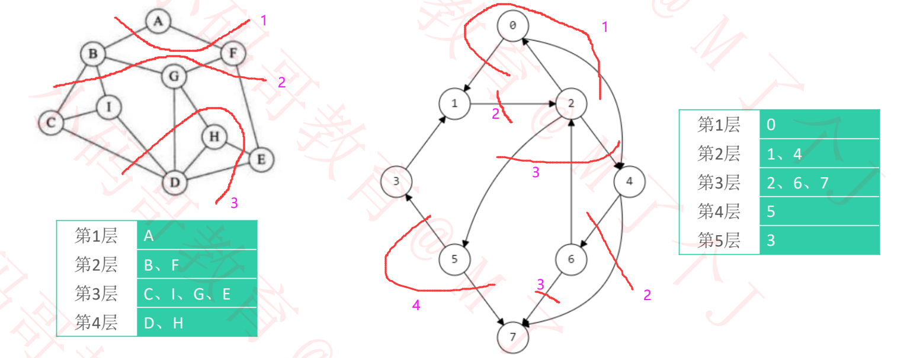

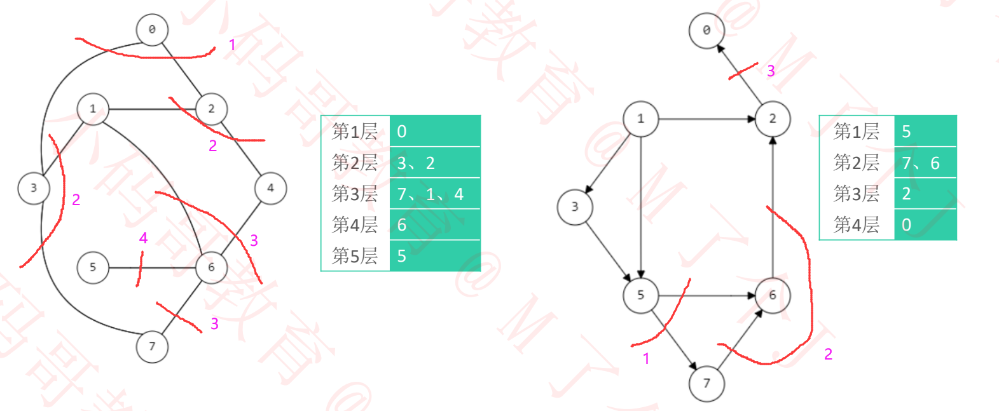

**思路**：

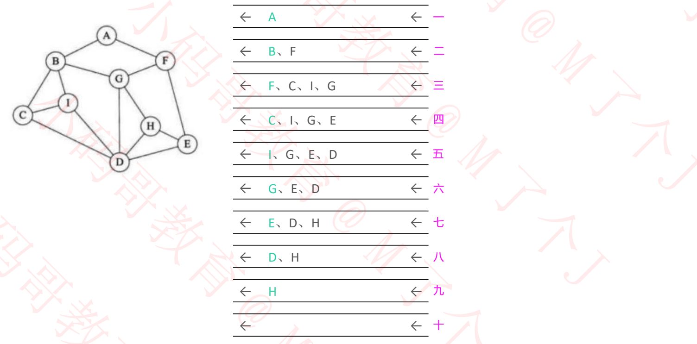

从某个点开始，将它可以到达的点放入队列，如果已经访问过则跳过，然后从队列中取出点重复该过程。

- `第一层`：假设从点A开始，它可以到达B、F，则**将B、F入队**。

  此时队列中元素 [B、F]

- `第二层`：队头B出队，B可以到达C、I、G，**将C、I、G入队**。

  此时队列中元素 [F、C、I、G]

- `第三层`：队头F出队，F可以到达G、E，但G已访问过，**将E入队**。

  此时队列中元素 [C、I、G、E]

- `第四层`：队头C出队，C可以到达I、D，但I已访问过，**将D入队**。

  此时队列中元素 [I、G、E、D]

- `第五层`：队头I出队，I可以到达D，但D已访问过，不执行操作。

  此时队列中元素 [G、E、D]

- `第六层`：队头G出队，G可以到达D、H，但D已访问过，**将H入队**。

  此时队列中元素 [E、D、H]

- `第七层`：队头E出队，E可以到达D、H、F，都访问过，不执行操作。

  此时队列中元素 [D、H]

- `第八层`：队头D出队，D可以到达C、H、E，都访问过，不执行操作。

  此时队列中元素 [H]

- `第九层`：队头H出队，H可以到达D、G、E，都访问过，不执行操作。

  此时队列中元素 []

- 队列为空，广度优先搜索结束。

代码实现：

```java
/**
 * 广度优先遍历
 * @param begin
 */
@Override
public void bfs(V begin, VertexVisitor<V> visitor) {
    if (visitor == null) return;
    // 根据传入的值begin找到顶点
    Vertex<V, E> beginVertex = vertices.get(begin);
    if (beginVertex == null) return; // 该顶点不存在,不做操作

    // 存放已经访问过的节点
    Set<Vertex<V, E>> visitedVertices = new HashSet<>();
    Deque<Vertex<V, E>> queue = new LinkedList<>();
    queue.offer(beginVertex); // 元素入队
    visitedVertices.add(beginVertex);

    // 思路参考二叉树层次遍历,队列存放每一层的顶点,用集合记录已经访问过的点
    while (!queue.isEmpty()) {
        Vertex<V, E> vertex = queue.poll(); // 队列中取出一个顶点
        if (visitor.visit(vertex.value)) return;
        // 遍历[队列中取出的顶点]的出去的边,将[这些边的终点]入队,并且标记为已经访问过
        for (Edge<V, E> edge : vertex.outEdges) {
            // 如果集合中已经记录该顶点,说明已经访问过,跳过进行下一轮
            if (visitedVertices.contains(edge.to)) continue;
            queue.offer(edge.to);
            visitedVertices.add(edge.to);
        }
    }
}
```


#### 5.2 深度优先搜索DFS

之前所学的**二叉树前序遍历**就是一种**深度优先搜索**。

注：**DFS结果不唯一**。

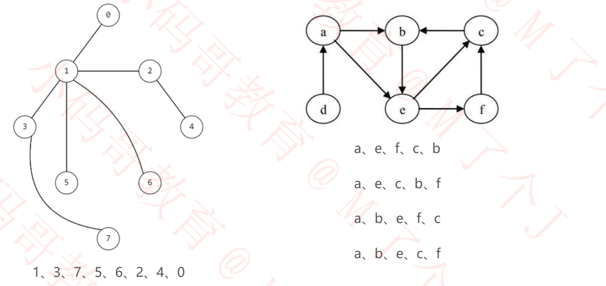

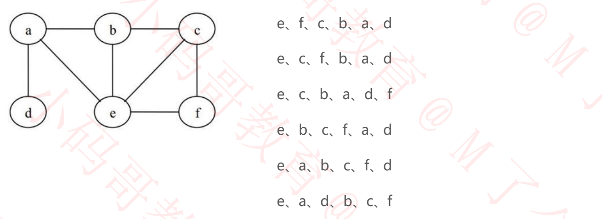


##### 5.2.1 递归实现

```java
/**
 * 深度优先遍历：递归实现
 * @param begin
 */
@Override
public void dfs(V begin, VertexVisitor<V> visitor) {
    if (visitor == null) return;
    // 根据传入的值获取顶点
    Vertex<V, E> beginVertex = vertices.get(begin);
    // 顶点不存在则不执行操作
    if (beginVertex == null) return;

    dfs(beginVertex, visitor, new HashSet<>());// 传入的集合,用来记录访问过的顶点
}
private void dfs(Vertex<V, E> vertex, VertexVisitor<V> visitor, Set<Vertex<V, E>> visitedVertices) {
    if (visitor.visit(vertex.value)) return;
    visitedVertices.add(vertex);
    for (Edge<V, E> outEdge : vertex.outEdges) {
        if (visitedVertices.contains(outEdge.to)) continue;
        dfs1(outEdge.to, visitor, visitedVertices);
    }
}
```


##### 5.2.2 非递归实现

*思路*：

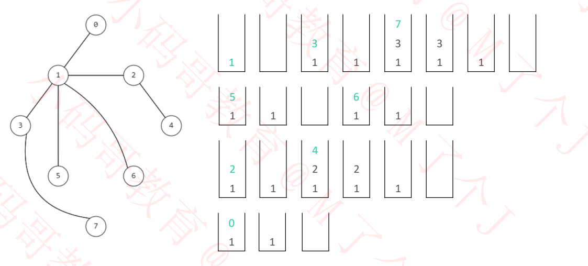

步骤：先将1顶点入栈并访问，集合更新记录访问过的顶点，进行以下循环

1. 弹出一个顶点，从outEdges中选择一条边
2. 选择边的from、to按顺序入栈
3. 打印选择边的to顶点

```java
/**
 * 深度优先遍历：非递归
 * @param begin
 */
public void dfs(V begin, VertexVisitor<V> visitor) {
    if (visitor == null) return;
    Vertex<V, E> vertex = vertices.get(begin);
    if (vertex == null) return;

    Set<Vertex<V, E>> visitedVertices = new HashSet<>();
    Deque<Vertex<V, E>> stack = new LinkedList<>();

    //先访问起点
    stack.push(vertex);
    visitedVertices.add(vertex);
    if (visitor.visit(vertex.value)) return;

    while (!stack.isEmpty()) {
        Vertex<V, E> pop = stack.pop();

        for (Edge<V, E> outEdge : pop.outEdges) {
            if (visitedVertices.contains(outEdge.to)) continue;
            stack.push(outEdge.from);
            stack.push(outEdge.to);
            visitedVertices.add(outEdge.to);
            if (visitor.visit(outEdge.to.value)) return;
            break;
        }
    }
}
```


### 6 拓扑排序Topological Sort

#### 6.1 AOV网

AOV：Activity On Vertex Network

一项大的工程常被分为多个小的子工程

- 子工程之间可能存在一定的先后顺序，即某些子工程必须在其他的一些子工程完成后才能开始。

在现代化管理中，人们常用**有向图**来**描述和分析一项工程的计划和实施过程**，**子工程**被称**为活动**（Activity）

- 以**顶点表示活动**、**有向边表示活动之间的先后关系**，这样的图简称为 **AOV网**。


**标准的AOV网必须是一个有向无环图**（Directed Acyclic Graph，简称 DAG）

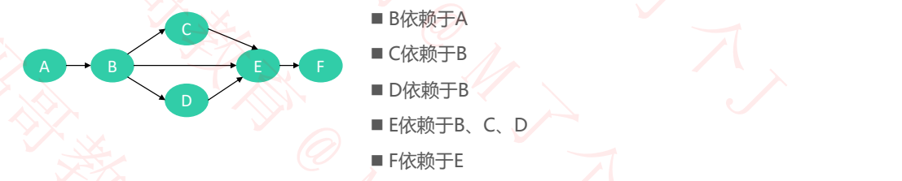


#### 6.2 拓扑排序

前驱活动：**有向边起点的活动**称为**终点的前驱活动**；

- 只有当一个活动的前驱全部都完成后，这个活动才能进行

后继活动：**有向边终点的活动**称为**起点的后继活动**；

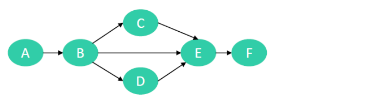

- A 是 B 的前驱活动，B 是 A 的后继活动
- B 是 C 的前驱活动，C 是 B 的后继活动
- ......


#### 6.3 拓扑排序--思路

可以使用**卡恩算法**（Kahn于1962年提出）完成拓扑排序。

假设 L 是存放拓扑排序结果的列表：

- 1. 把所有入度为 0 的顶点放入 L 中，然后把这些顶点从图中去掉
  2. 重复操作*1*，直到找不到入度为 0 的顶点
- 如果此时 L 中的元素个数和顶点总数相同，说明拓扑排序完成
- 如果此时 L 中的元素个数少于顶点总数，说明原图中存在环，无法进行拓扑排序

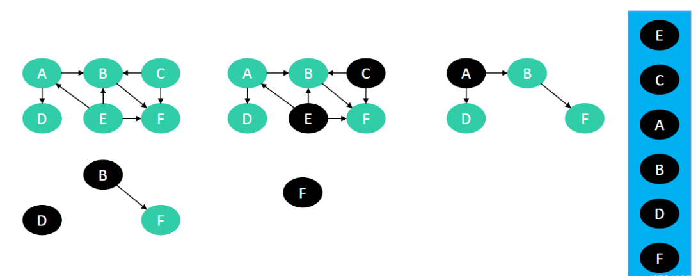

*实现*：

```java
/**
 * 拓扑排序：卡恩算法
 * @return
 */
@Override
public List<V> topologicalSort() {
    List<V> list = new ArrayList<>(); // 结果集
    Queue<Vertex<V, E>> queue = new LinkedList<>(); // 队列存储入度为0的节点
    Map<Vertex<V, E>, Integer> ins = new HashMap<>(); // map记录入度不为0的节点 

    // 初始化（将入度为0的节点都放入队列）
    vertices.forEach((V v, Vertex<V, E> vertex) -> {
        int inSize = vertex.inEdges.size(); // 入度
        if (inSize == 0) queue.offer(vertex); // 入度为0，放入队列
        else ins.put(vertex, inSize);  // 入度不为0，用map记录它的入度
    });

    while (!queue.isEmpty()) {
        Vertex<V, E> vertex = queue.poll(); // 从队列中取节点
        list.add(vertex.value); // 放入返回结果中

        for (Edge<V, E> outEdge : vertex.outEdges) {
            int in = ins.get(outEdge.to) - 1; // 队列中取出节点所通向节点的入度
            if (in == 0) queue.offer(outEdge.to);  // 入度为0，放入队列
            else ins.put(outEdge.to, in); // 入度不为0，用map记录它的入度
        }
    }
    return list;
}
```


### 7 最小生成树Minimum Spanning Tree

**生成树**（Spanning Tree），也称为**支撑树**；

- 连通图的**极小连通子图**，它含有图中全部的 n 个顶点，恰好只有 n – 1 条边

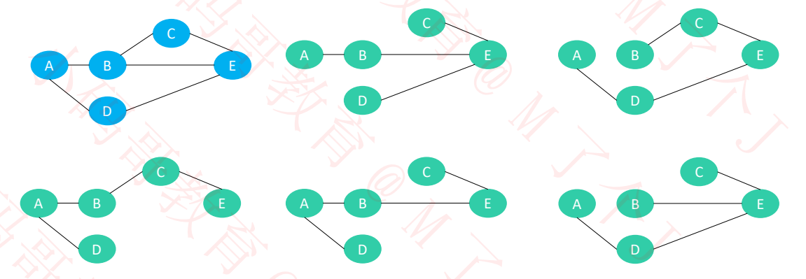

最小生成树（Minimum Spanning Tree，简称MST）

- 也称为**最小权重生成树**（Minimum Weight Spanning Tree）、**最小支撑树**；
- 是所有生成树中，**总权值最小**的那棵；
- 适用于**有权的连通图**（无向）。

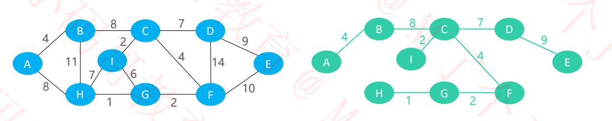

最小生成树在许多领域都有重要的作用，例如：

- 要在 n 个城市之间铺设光缆，使它们都可以通信
- 铺设光缆的费用很高，且各个城市之间因为距离不同等因素，铺设光缆的费用也不同
- 如何使铺设光缆的总费用最低？—— 最小生成树的应用

**如果图的每一条边的权值都互不相同，那么最小生成树将只有一个，否则可能会有多个最小生成树**。

求最小生成树的2个经典算法：

1. **Prim**（普里姆算法）
2. **Kruskal**（克鲁斯卡尔算法）


#### 7.1 Prim算法

##### 7.1.1 切分定理

*切分*：

- **把图中的节点分为两部分，称为一个切分**。

  下图有个切分 C = (S, T)，S = { A, B, D }，T = { C, E }

  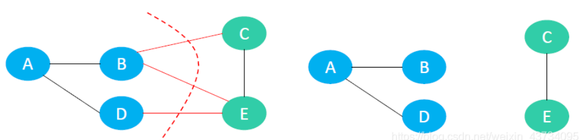

- *横切边（Crossing Edge）*：如果一个边的两个顶点，分别属于切分的两部分，这个边称为**横切边**，

  比如上图的边 BC、BE、DE 就是横切边

**切分定理**：**给定任意切分，横切边中权值最小的边必然属于最小生成树**。


##### 7.1.2 Prim算法--执行过程

假设 G = (V，E) 是有权的连通图（无向），A 是 G 中最小生成树的边集

- 算法从 S = { u0 }（u0 ∈ V），A = { } 开始，重复执行下述操作，直到 S = V 为止

  找到切分 C = (S，V – S) 的最小横切边 (u0，v0) 并入集合 A，同时将 v0 并入集合 S

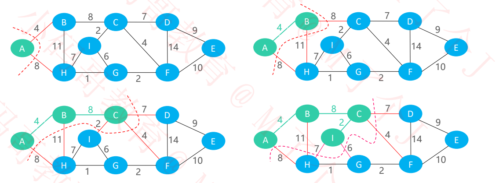

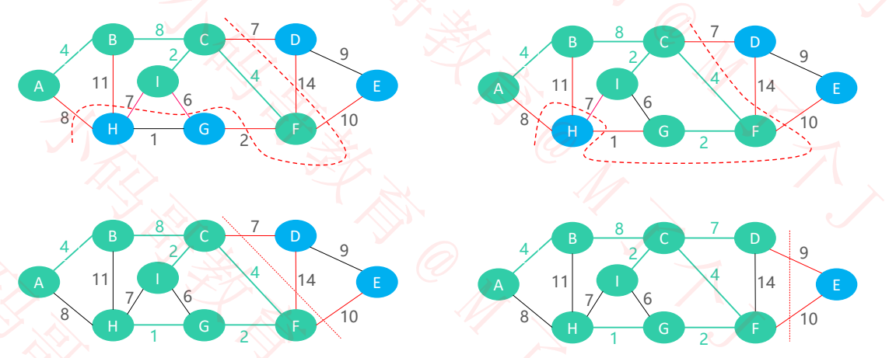

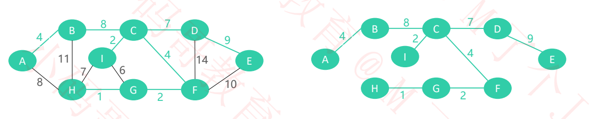

*代码实现*：

在接口中增加`EdgeInfo<V, E>`内部类与`WeightManager<E>`内部接口。

```java
protected WeightManager<E> weightManager;
public Graph(WeightManager<E> weightManager) {
    this.weightManager = weightManager;
}
public Graph() {}

//权值管理器：有外面提供对权值的比较、加法处理
public interface WeightManager<E> {
    int compare(E w1, E w2);
    E add(E w1, E w2);
    E zero();
}
//提供外面访问的边的信息
public static class EdgeInfo<V, E>{
    private V from;
    private V to;
    private E weight;
    protected EdgeInfo(V from, V to, E weight) {
        this.from = from;
        this.to = to;
        this.weight = weight;
    }
    public V getFrom() {
        return from;
    }
    public void setFrom(V from) {
        this.from = from;
    }
    public V getTo() {
        return to;
    }
    public void setTo(V to) {
        this.to = to;
    }
    public E getWeight() {
        return weight;
    }
    public void setWeight(E weight) {
        this.weight = weight;
    }
    @Override
    public String toString() {
        return "EdgeInfo{" +
                "from=" + from +
                ", to=" + to +
                ", weight=" + weight +
                '}';
    }
}
```

```java
private Comparator<Edge<V, E>> edgeComparator = (Edge<V, E> e1, Edge<V, E> e2) -> {
    return weightManager.compare(e1.weight, e2.weight);
};
public ListGraph(WeightManager<E> weightManager) {
    super(weightManager);
}
public ListGraph() {}

// 边
private static class Edge<V, E> {
    ......
    EdgeInfo<V, E> info(){
        return new EdgeInfo<>(from.value, to.value, weight);
    }
    ......
}

/**
 * 最小生成树：prim算法
 * @return
 */
private Set<EdgeInfo<V, E>> mst_prim() {
    Iterator<Vertex<V, E>> it = vertices.values().iterator();
    if (!it.hasNext()) return null;
    Vertex<V, E> vertex = it.next(); // 随机取出一个顶点
    Set<EdgeInfo<V, E>> edgeInfos = new HashSet<>();
    Set<Vertex<V, E>> addedVertices = new HashSet<>(); // 标记已经添加的顶点
    addedVertices.add(vertex);

    // 小顶二叉堆，每次获取权值最小的边
    MinHeap<Edge<V, E>> heap = new MinHeap<>(vertex.outEdges, edgeComparator);

    while (!heap.isEmpty() && verticsSize() > addedVertices.size()) {
        Edge<V, E> edge = heap.remove();
        if (addedVertices.contains(edge.to)) continue;
        edgeInfos.add(edge.info());
        addedVertices.add(edge.to);
        heap.addAll(edge.to.outEdges);
    }
    return edgeInfos;
}
```


#### 7.2 Kruskal算法

*Kruskal算法--执行过程*：

按照边的权重顺序（从小到大）将边加入生成树中，直到生成树中含有 V–1 条边为止（ V 是顶点数量）

- 若加入该边会与生成树形成环，则不加入该边
- 从第 3 条边开始，可能会与生成树形成环

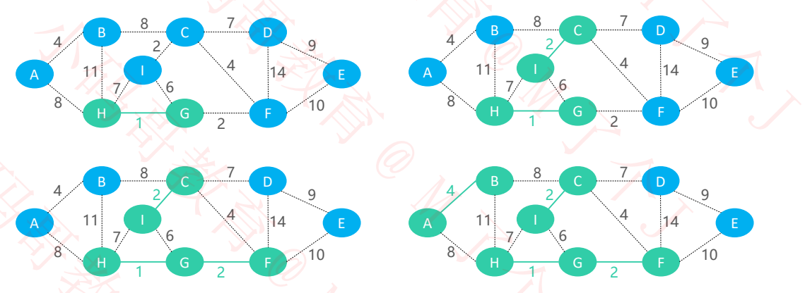

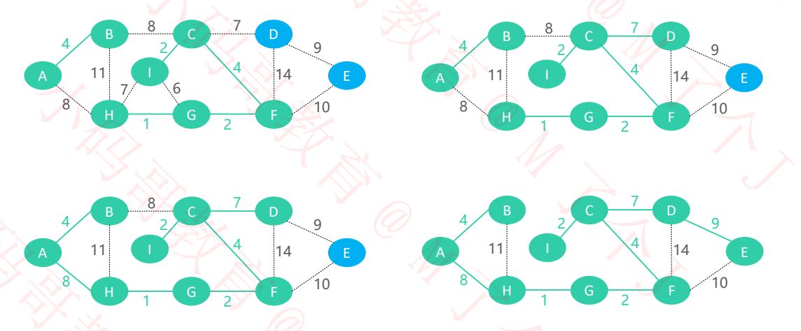


*代码实现*：

```java
/**
 * 最小生成树：kruskal算法
 * @return
 */
private Set<EdgeInfo<V, E>> mst_kruskal(){
    int edgeSize = verticsSize() - 1;
    if (edgeSize < 2) return null;

    // 结果集
    Set<EdgeInfo<V, E>> edgeInfos = new HashSet<>();
    // 将所有边的信息放入小顶堆当中
    MinHeap<Edge<V,E>> heap = new MinHeap<>(edges, edgeComparator);

    // 并查集：用于环的判断，代码应用的是自定义类型并查集
    // 将所有的顶点放入并查集当中
    GenericUnionFind<Vertex<V, E>> unionFind = new GenericUnionFind<>(vertices.values());

    while (!heap.isEmpty() && edgeInfos.size() < edgeSize) {
        Edge<V, E> edge = heap.remove();
        if (unionFind.isSame(edge.from, edge.to)) continue;
        edgeInfos.add(edge.info());
        unionFind.union(edge.from, edge.to);
    }
    return edgeInfos;
}
```


### 8 最短路径Shortest Path

**最短路径**是指两顶点之间权值之和最小的路径（**有向图、无向图均适用，不能有负权环**）

*有向图*：

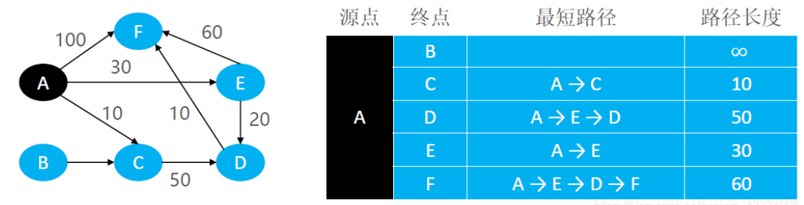

*无向图*：

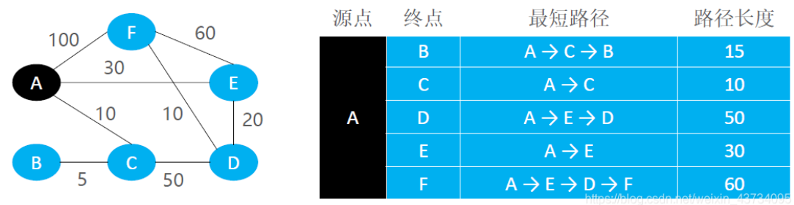

最短路径的典型应用之一：**路径规划问题**；

求解最短路径的3个经典算法：

- 单源最短路径算法
  - Dijkstra（迪杰斯特拉算法）
  - Bellman-Ford（贝尔曼-福特算法）
- 多源最短路径算法
  - Floyd（弗洛伊德算法）


#### 8.1 最短路径--概念

*无权图*：**无权图**相当于是**全部边权值为1的有权图**；

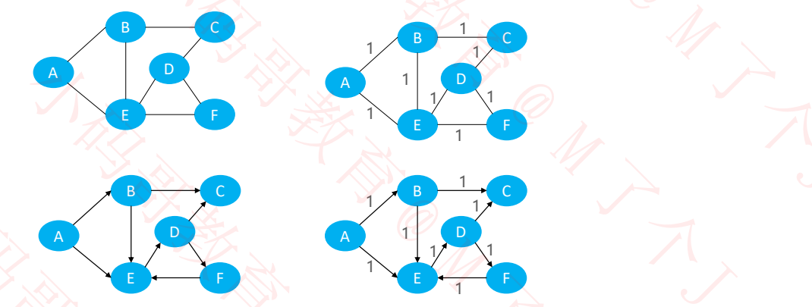


*负权边*：有负权边，但没有负权环时，存在最短路径

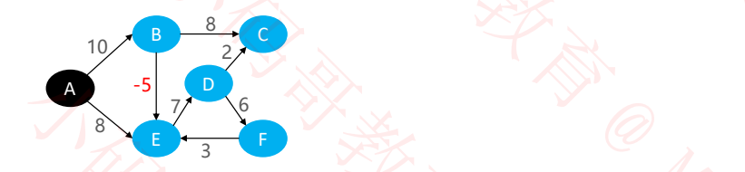

A到E的最短路径是：A → B → E


*负权环*：有负权环时，不存在最短路径

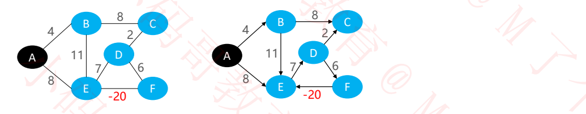

通过负权环，A到E的路径可以无限短

A → E <font color="red">→ D → F → E</font> <font color="gree">→ D → F → E</font> <font color="red">→ D → F → E</font> <font color="gree">→ D → F → E</font> → …


#### 8.2 Dijkstra算法

Dijkstra 属于单源最短路径算法，用于计算**一个顶点到其他所有顶点的最短路径**；

- 使用前提：不能有**负权边**；
- 时间复杂度：可优化至`O(ElogV)`，E 是边数量，V 是节点数量
- 由荷兰的科学家 Edsger Wybe Dijkstra 发明，曾在1972年获得图灵奖


##### 8.2.1 Dijkstra算法分析

*Dijkstra等价思考*：

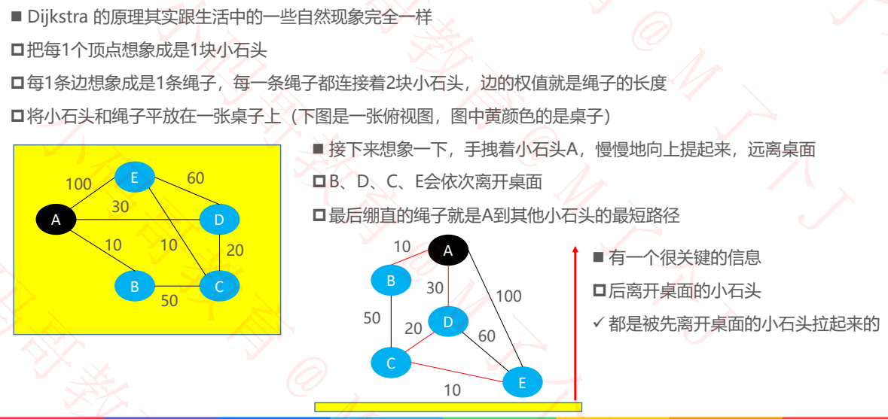


*Dijkstra--执行过程*：

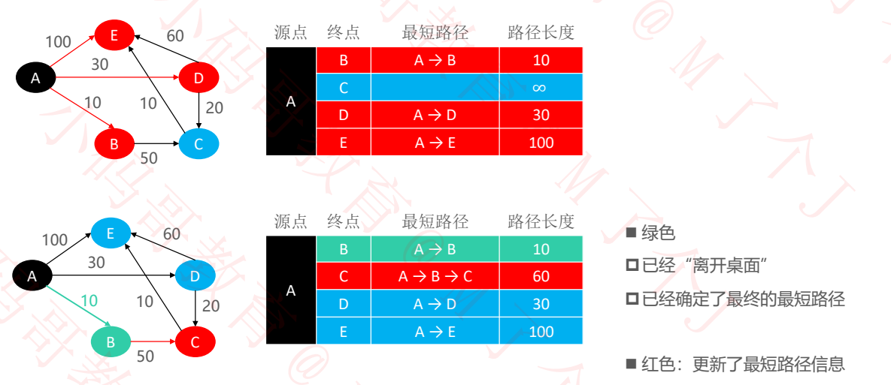

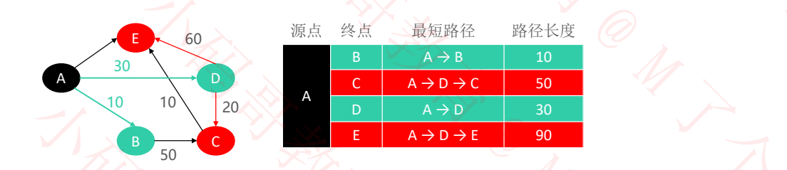

松弛操作（Relaxation）：更新2个顶点之间的最短路径

- 这里一般是指：更新源点到另一个点的最短路径
- 松弛操作的意义：尝试找出更短的最短路径

确定A到D的最短路径后，对DC、DE边进行松弛操作，更新了A到C、A到E的最短路径

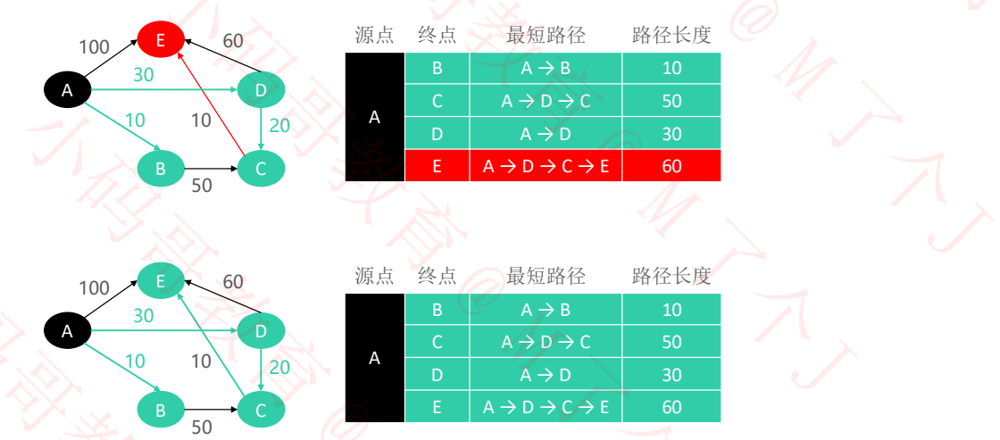


##### 8.2.2 Dijkstra--代码实现版本1

实现版本1：只返回每条最短路径的总权值

```java
/**
 * 单源最短路径：Dijkstra实现，迪杰斯特拉算法实现
 * @param begin
 * @return
 */
public Map<V, E> shortestPath(V begin) {
    Vertex<V, E> vertex = vertices.get(begin); // 源点
    if (vertex == null) return null;

    Map<V, E> selectedPaths = new HashMap<>(); // 最终的最短路径
    Map<Vertex<V, E>, E> paths = new HashMap<>(); // 当前最短路径
    //初始化paths
    for (Edge<V, E> outEdge : vertex.outEdges) {
        paths.put(outEdge.to, outEdge.weight);
    }

    while (!paths.isEmpty()){
        // 挑选出当前最短路径中最短的点
        Map.Entry<Vertex<V, E>, E> minEntry = getShortestPath11(paths);
        // minVertex离开桌面，被确定为最终的最短路径
        Vertex<V, E> minVertex = minEntry.getKey();
        E minPath = minEntry.getValue();
        selectedPaths.put(minVertex.value, minPath);
        paths.remove(minVertex);
        // 对它的 minVertex 的 outEdges 进行松弛操作
        for (Edge<V, E> edge : minVertex.outEdges) {
            // 如果edge.to已经离开桌面，就没必要进行松弛操作
            if (selectedPaths.containsKey(edge.to.value)) continue;
            // 新的可选择的最短路径：beginVertex到edge.from的最短路径 + edge.weight
            E newWeight = weightManager.add(minPath, edge.weight);
            // 以前的最短路径：beginVertex到edge.to的最短路径
            E oldWeight = paths.get(edge.to);
            if (oldWeight == null || weightManager.compare(newWeight, oldWeight) < 0) {
                paths.put(edge.to, newWeight);
            }
        }
    }
    selectedPaths.remove(vertex);
    return selectedPaths;
}

/**
 * 从paths中挑一个最小的路径出来
 * @param paths
 * @return
 */
private Map.Entry<Vertex<V, E>, E> getShortestPath11(Map<Vertex<V, E>, E> paths){
    Iterator<Map.Entry<Vertex<V, E>, E>> iterator = paths.entrySet().iterator();
    Map.Entry<Vertex<V, E>, E> minEntry = iterator.next();
    while (iterator.hasNext()){
        Map.Entry<Vertex<V, E>, E> entry = iterator.next();
        if (weightManager.compare(entry.getValue(), minEntry.getValue()) < 0) {
            minEntry = entry;
        }
    }
    return minEntry;
}
```


##### 8.2.3 Dijkstra--代码实现版本2

实现版本2：返回最短路径的总权值和边信息

*抽象类Graph.java*：

抽象类Graph.java：修改了`shortestPath`方法接口，增加了 `PathInfo` 内部类。

```java
import java.util.LinkedList;
import java.util.List;
import java.util.Map;
import java.util.Set;

/**
 * @description:
 * @author: xu
 * @date: 2022/10/5 20:20
 */
public abstract class Graph<V, E> {
    protected WeightManager<E> weightManager;
    public Graph(WeightManager<E> weightManager) {
        this.weightManager = weightManager;
    }
    public Graph() {}

    //获取顶点、边的数量
    public abstract int edgesSize();
    public abstract int verticsSize();

    //添加新的顶点、边
    public abstract void addVertex(V v);
    public abstract void addEdge(V from, V to);
    public abstract void addEdge(V from, V to, E weight);

    //删除顶点、边
    public abstract void removeVertex(V v);
    public abstract void removeEdge(V from, V to);

    //遍历图：
    //bfs：广度优先遍历；dfs：深度优先遍历
    public abstract void bfs(V begin, VertexVisitor<V> visitor);
    public abstract void dfs(V begin, VertexVisitor<V> visitor);
    public abstract void dfs1(V begin, VertexVisitor<V> visitor);

    //拓扑排序：卡恩算法
    public abstract List<V> topologicalSort();

    //最小生成树
    //prim：普利姆算法
    //kruskal：克鲁斯卡尔算法
    public abstract Set<EdgeInfo<V, E>> mst();

    //最短路径
    //public abstract Map<V, E> shortestPath1(V begin);
    public abstract Map<V, PathInfo<V, E>> shortestPath(V begin);

    //访问器：有外面提供定义的节点访问
    public interface VertexVisitor<V> {
        boolean visit(V v);
    }
    //权值管理器：有外面提供对权值的比较、加法处理
    public interface WeightManager<E> {
        int compare(E w1, E w2);
        E add(E w1, E w2);
        E zero();
    }
    //提供外面访问的边的信息
    public static class EdgeInfo<V, E>{
        private V from;
        private V to;
        private E weight;
        protected EdgeInfo(V from, V to, E weight) {
            this.from = from;
            this.to = to;
            this.weight = weight;
        }
        public V getFrom() {
            return from;
        }
        public void setFrom(V from) {
            this.from = from;
        }
        public V getTo() {
            return to;
        }
        public void setTo(V to) {
            this.to = to;
        }
        public E getWeight() {
            return weight;
        }
        public void setWeight(E weight) {
            this.weight = weight;
        }
        @Override
        public String toString() {
            return "EdgeInfo{" +
                    "from=" + from +
                    ", to=" + to +
                    ", weight=" + weight +
                    '}';
        }
    }
    public static class PathInfo<V, E>{
        protected E weight;
        protected List<EdgeInfo<V, E>> edgeInfos = new LinkedList<>();
        public E getWeight() {
            return weight;
        }
        public void setWeight(E weight) {
            this.weight = weight;
        }
        public List<EdgeInfo<V, E>> getEdgeInfos() {
            return edgeInfos;
        }
        public void setEdgeInfos(List<EdgeInfo<V, E>> edgeInfos) {
            this.edgeInfos = edgeInfos;
        }

        @Override
        public String toString() {
            return "PathInfo{" +
                    "weight=" + weight +
                    ", edgeInfos=" + edgeInfos +
                    '}';
        }
    }
}
```

dijkstra实现：封装了relax松弛操作

```java
/**
 * 单源最短路径
 * @param begin
 * @return
 */
@Override
public Map<V, PathInfo<V, E>> shortestPath(V begin) {
    return dijkstra(begin);
}

/**
 * 单源最短路径：Dijkstra，迪杰斯特拉算法实现
 * @param begin
 * @return
 */
private Map<V, PathInfo<V, E>> dijkstra(V begin) {
    Vertex<V, E> beginVertex = vertices.get(begin);
    if (beginVertex == null) return null;

    Map<V, PathInfo<V, E>> selectedPaths = new HashMap<>(); // 最终的最短路径
    Map<Vertex<V, E>, PathInfo<V, E>> paths = new HashMap<>(); // 当前的最短路径
    // 初始化源点的最短路径信息
    paths.put(beginVertex, new PathInfo<>(weightManager.zero()));
    //初始化paths 
    //for (Edge<V, E> outEdge : beginVertex.outEdges) {
    //    PathInfo<V, E> pathInfo = new PathInfo<>();
    //    pathInfo.setWeight(outEdge.weight);
    //    pathInfo.edgeInfos.add(outEdge.info());
    //    paths.put(outEdge.to, pathInfo);
    //}

    while (!paths.isEmpty()) {
        // 挑选出当前最短路径中最短的点
        Map.Entry<Vertex<V, E>, PathInfo<V, E>> minEntry = getShortestPath(paths);
        // minVertex离开桌面
        Vertex<V, E> minVertex = minEntry.getKey();
        PathInfo<V, E> minPath = minEntry.getValue();
        selectedPaths.put(minVertex.value, minPath);
        paths.remove(minVertex);
        // 对它的 minVertex 的 outEdges 进行松弛操作
        for (Edge<V, E> edge : minVertex.outEdges) {
            // 如果edge.to已经离开桌面，就没必要进行松弛操作
            if (selectedPaths.containsKey(edge.to.value)) continue;
            relaxForDijkstra(edge, minPath, paths);
        }
    }
    selectedPaths.remove(begin);
    return selectedPaths;
}
/**
 * 从paths中挑一个最小的路径出来（遍历）
 * @param paths
 * @return
 */
private Map.Entry<Vertex<V, E>, PathInfo<V, E>> getShortestPath(Map<Vertex<V, E>, PathInfo<V, E>> paths){
    Iterator<Map.Entry<Vertex<V, E>, PathInfo<V, E>>> iterator = paths.entrySet().iterator();
    Map.Entry<Vertex<V, E>, PathInfo<V, E>> minEntry = iterator.next();
    while (iterator.hasNext()){
        Map.Entry<Vertex<V, E>, PathInfo<V, E>> entry = iterator.next();
        if (weightManager.compare(entry.getValue().weight, minEntry.getValue().weight) < 0) {
            minEntry = entry;
        }
    }
    return minEntry;
}
/**
 * 松弛操作 -- Dijkstra
 * @param edge 需要进行松弛的边
 * @param fromPath edge的from的最短路径信息
 * @param paths 存放着其他点（对于dijkstra来说，还没有离开桌面的点）的最短路径信息
 */
private void relaxForDijkstra(Edge<V, E> edge, PathInfo<V, E> fromPath, Map<Vertex<V, E>, PathInfo<V, E>> paths){
    // 新的可选择的最短路径：beginVertex到edge.from的最短路径 + edge.weight
    E newWeight = weightManager.add(fromPath.weight, edge.weight);
    // 以前的最短路径：beginVertex到edge.to的最短路径
    PathInfo<V, E> oldPath = paths.get(edge.to);

    if (oldPath != null && weightManager.compare(newWeight, oldPath.weight) >= 0) return;

    if (oldPath == null) { // 新创建的边
        oldPath = new PathInfo<>();
        paths.put(edge.to, oldPath);
    } else { // 以前就存在的边
        oldPath.edgeInfos.clear();
    }
    oldPath.setWeight(newWeight);
    oldPath.edgeInfos.addAll(fromPath.edgeInfos);
    oldPath.edgeInfos.add(edge.info());
}
```


#### 8.3 Bellman-Ford算法

Bellman-Ford 也属于**单源最短路径算法**，**支持负权边**，还**能检测出是否有负权环**；

- 算法原理：对所有的边进行`V–1`次**松弛操作**（`V`是节点数量），**得到所有可能的最短路径**；
- 时间复杂度：O(EV)，E 是边数量，V 是节点数量。

下图的**最好情况**是恰好**从左到右**的顺序对边进行松弛操作：

- 对所有边仅需进行 1 次松弛操作就能计算出A到达其他所有顶点的最短路径


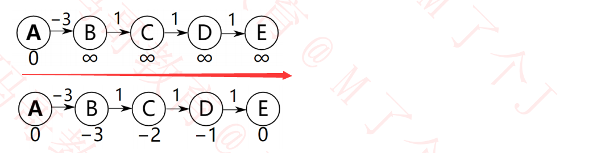

**最坏情况**是恰好每次都**从右到左**的顺序对边进行松弛操作：

- 对所有边需进行 `V–1` 次松弛操作才能计算出A到达其他所有顶点的最短路径

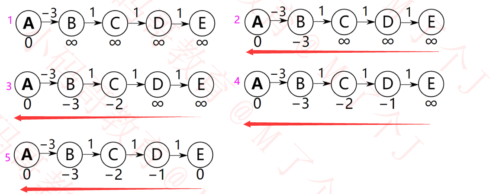


*Bellman-Ford实例*：


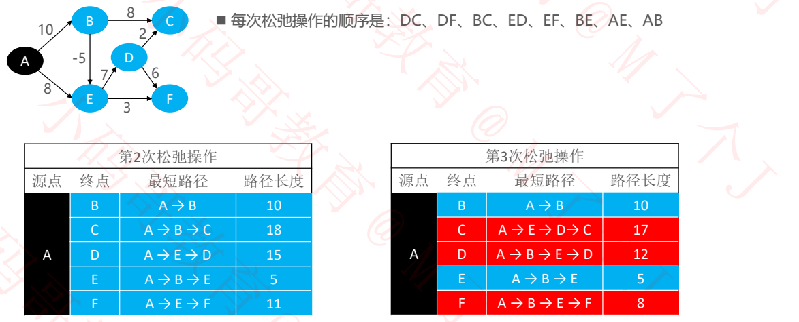

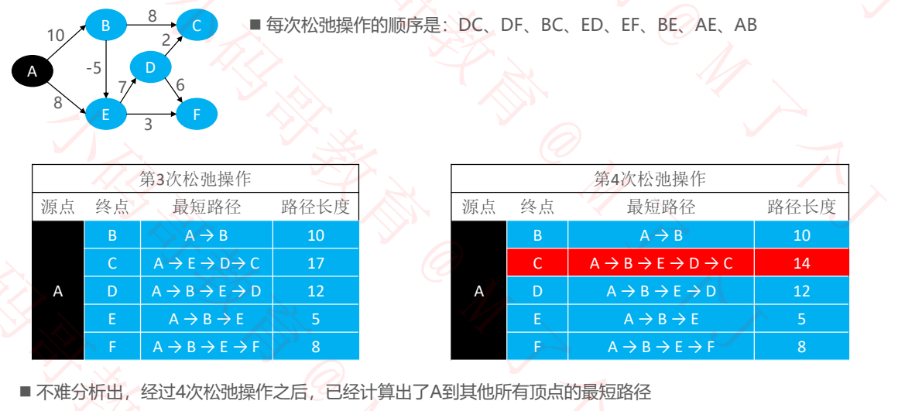

**Bellman-Ford代码实现**：

```java
/**
 * 单源最短路径：Bellman-Ford，贝尔曼-福特算法实现
 * @param begin
 * @return
 */
private Map<V, PathInfo<V, E>> bellmanFord(V begin) {
    Vertex<V, E> beginVertex = vertices.get(begin); // 源点
    if (beginVertex == null) return null;
	// 存放当前最短路径信息（不断的进行松弛操作, 会变成最终的最短路径）
    Map<V, PathInfo<V, E>> selectedPaths = new HashMap<>();
    // 初始化源点的最短路径信息
    selectedPaths.put(begin, new PathInfo<>(weightManager.zero()));

    int count = verticsSize() - 1; // 进行 V -1 次松弛操作, 必然能找到最短路径
    for (int i = 0; i < count; i++) {
        for (Edge<V, E> edge : edges) { // 对所有边进行松弛操作
            // 获取该边的始点的最短路径信息, 用于后面进行松弛操作
            PathInfo<V, E> fromPath = selectedPaths.get(edge.from.value);
            // 如果该点的始点没有最短路径信息,松弛必然失败,直接进入下一轮
            if (fromPath == null) continue;
            // 松弛操作
            relaxForBellmanFord(edge, fromPath, selectedPaths);
        }
    }

    // 检测负权环, 前面已经松弛了V-1次,这里如果松弛第 V 次仍然可以成功, 说明有负权环
    for (Edge<V, E> edge : edges) {
        PathInfo<V, E> fromPath = selectedPaths.get(edge.from.value);
        if (fromPath == null) continue;
        if (relaxForBellmanFord(edge, fromPath, selectedPaths)) {
            throw new RuntimeException("有负权环，无最短路径");
        }
    }
    selectedPaths.remove(begin);
    return selectedPaths;
}
/**
 * 松弛操作 -- BellmanFord
 * @param edge 需要进行松弛的边
 * @param fromPath edge的from的最短路径信息
 * @param paths 存放着其他点（对于dijkstra来说，还没有离开桌面的点）的最短路径信息
 */
private boolean relaxForBellmanFord(Edge<V, E> edge, PathInfo<V, E> fromPath, Map<V, PathInfo<V, E>> paths){
    // 新的可选择的最短路径：beginVertex到edge.from的最短路径 + edge.weight
    E newWeight = weightManager.add(fromPath.weight, edge.weight);
    // 以前的最短路径：beginVertex到edge.to的最短路径
    PathInfo<V, E> oldPath = paths.get(edge.to.value);

    if (oldPath != null && weightManager.compare(newWeight, oldPath.weight) >= 0) return false;

    if (oldPath == null) {
        oldPath = new PathInfo<>();
        paths.put(edge.to.value, oldPath);
    } else {
        oldPath.edgeInfos.clear();
    }
    oldPath.setWeight(newWeight);
    oldPath.edgeInfos.addAll(fromPath.edgeInfos);
    oldPath.edgeInfos.add(edge.info());
    return true;
}
```


#### 8.4 Floyd算法

Floyd 属于**多源最短路径**算法，**能够求出任意2个顶点之间的最短路径**，**支持负权边**；

- 时间复杂度：O(V<sup>3</sup>)，效率比执行 V 次 Dijkstra 算法要好（V是顶点数量）

注：**单源最短路径算法对每个顶点求一次**，同样**可以求出任意2个顶点之间的最短路径**；

算法原理：

- 从任意顶点 `i` 到任意顶点 `j` 的最短路径不外乎两种可能

  1. 直接从 `i` 到 `j`
  2. 从 `i` 经过若干个顶点到 `j`

- 假设 `dist(i, j)` 为顶点 `i` 到顶点 `j` 的最短路径的距离

- 对于每一个顶点 `k`，检查 `dist(i, k)` + `dist(k, j)` < `dist(i, j)` 是否成立

  如果成立，证明从 `i` 到 `k` 再到 `j` 的路径比 `i`直接到 `j` 的路径短，

  设置 `dist(i, j)` = `dist(i, k)` + `dist(k, j)`；

- 当我们遍历完所有结点 `k`，`dist(i, j)` 中记录的便是 `i` 到 `j` 的最短路径的距离

算法原理伪代码：

```java
for(int k = 0; k < V; k++){
    for(int i = 0; i < V; i++){
        for(int j = 0; j < V; j++){
            if(dist(i,k) + dist(k,j) < dist(i,j)){
                dist(i,j) = dist(i,k) + dist(k,j);
            }
        }
    }
}
```


*Floyd算法实现*：

Graph.java抽象类中：

```java
public abstract Map<V, Map<V, PathInfo<V, E>>> shortestPaths(); // 多源最短路径
```

ListGraph.java类中：

```java
/**
 * 多源最短路径
 * @return
 */
@Override
public Map<V, Map<V, PathInfo<V, E>>> shortestPaths() {
    return floyd();
}
/**
 * 多源最短路径：floyd，弗洛伊德算法实现
 * @return
 */
private Map<V, Map<V, PathInfo<V, E>>> floyd(){
    // 最终的返回值, 存放着每个顶点, 以及每个顶点到其他顶点的最短路径
    Map<V, Map<V, PathInfo<V, E>>> paths = new HashMap<>();
    // 初始化: 遍历所有顶点, 初始化每个顶点到它的出去的点的最短路径信息
    for (Edge<V, E> edge : edges) {
        Map<V, PathInfo<V, E>> map = paths.get(edge.from.value);
        if (map == null) {
            map = new HashMap<>();
            paths.put(edge.from.value, map);
        }
        PathInfo<V, E> pathInfo = new PathInfo<>(edge.weight);
        pathInfo.edgeInfos.add(edge.info());
        map.put(edge.to.value, pathInfo);
    } 

    vertices.forEach((V v2, Vertex<V, E> vertex2) -> {
        vertices.forEach((V v1, Vertex<V, E> vertex1) -> {
            vertices.forEach((V v3, Vertex<V, E> vertex3) -> {
                if (Objects.equals(v1, v2) || Objects.equals(v2, v3) || Objects.equals(v1, v3)) 
                    return;
                // v1 --> v2
                PathInfo<V, E> path12 = getPathInfo(v1, v2, paths);
                if (path12 == null) return;
                // v2 --> v3
                PathInfo<V, E> path23 = getPathInfo(v2, v3, paths);
                if (path23 == null) return;
                // v1 --> v3
                PathInfo<V, E> path13 = getPathInfo(v1, v3, paths);

                E newWeight = weightManager.add(path12.weight, path23.weight);
                if (path13 != null && weightManager.compare(newWeight, path13.weight) >= 0) return;
                if (path13 == null) {
                    path13 = new PathInfo<>();
                    paths.get(v1).put(v3, path13);
                } else {
                    path13.edgeInfos.clear();
                }
                path13.setWeight(newWeight);
                path13.edgeInfos.addAll(path12.edgeInfos);
                path13.edgeInfos.addAll(path23.edgeInfos);
            });
        });
    });
    return paths;
}
private PathInfo<V, E> getPathInfo(V from, V to, Map<V, Map<V, PathInfo<V, E>>> paths){
    Map<V, PathInfo<V, E>> map = paths.get(from);
    return map == null ? null : map.get(to);
}
```


### 9 图的完整源码

#### 9.1 体系结构

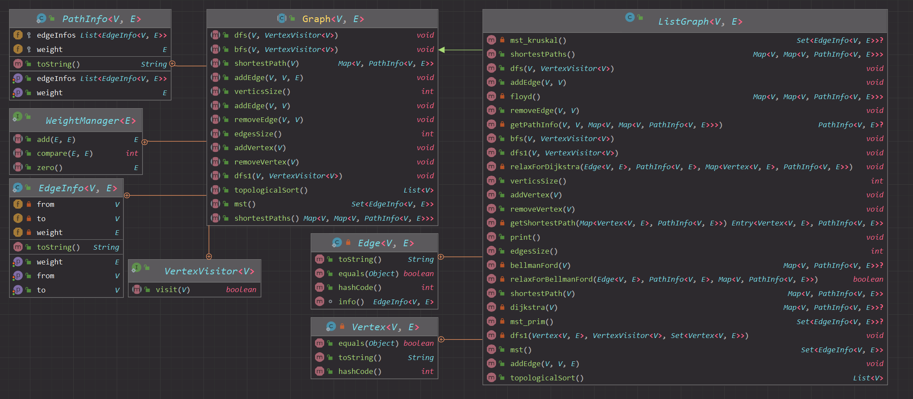


#### 9.2 辅助数据结构

小顶堆：MinHeap.java

```java
import java.util.Collection;
import java.util.Comparator;

/**
 * 二叉堆（最小堆）
 * @author MJ Lee
 *
 * @param <E>
 */
@SuppressWarnings("unchecked")
public class MinHeap<E> {
   private int size;
   private Comparator<E> comparator;
   private int compare(E e1, E e2) {
      return comparator != null ? comparator.compare(e1, e2) 
            : ((Comparable<E>)e1).compareTo(e2);
   }
   private E[] elements;
   private static final int DEFAULT_CAPACITY = 10;
   
   public MinHeap(Collection<E> elements, Comparator<E> comparator) {
      this.comparator = comparator;
      
      size = elements == null ? 0 : elements.size();
      if (size == 0) {
         this.elements = (E[]) new Object[DEFAULT_CAPACITY];
      } else {
         int capacity = Math.max(size, DEFAULT_CAPACITY);
         this.elements = (E[]) new Object[capacity];
         int i = 0;
         for (E element : elements) {
            this.elements[i++] = element;
         }
         heapify();
      }
   }
   
   public MinHeap(E[] elements, Comparator<E> comparator)  {
      this.comparator = comparator;
      
      if (elements == null || elements.length == 0) {
         this.elements = (E[]) new Object[DEFAULT_CAPACITY];
      } else {
         size = elements.length;
         int capacity = Math.max(elements.length, DEFAULT_CAPACITY);
         this.elements = (E[]) new Object[capacity];
         for (int i = 0; i < elements.length; i++) {
            this.elements[i] = elements[i];
         }
         heapify();
      }
   }
   
   public MinHeap(Collection<E> elements)  {
      this(elements, null);
   }
   
   public MinHeap(E[] elements)  {
      this(elements, null);
   }
   
   public MinHeap(Comparator<E> comparator) {
      this.comparator = comparator;
      this.elements = (E[]) new Object[DEFAULT_CAPACITY];
   }
   
   public MinHeap() {
      this.elements = (E[]) new Object[DEFAULT_CAPACITY];
   }

   public int size() {
      return size;
   }

   public boolean isEmpty() {
      return size == 0;
   }
   
   public void addAll(Collection<E> elements) {
      if (elements == null) return;
      for (E element : elements) {
         add(element);
      }
   }
   
   public void addAll(E[] elements) {
      if (elements == null) return;
      for (E element : elements) {
         add(element);
      }
   }
   
   public void clear() {
      for (int i = 0; i < size; i++) {
         elements[i] = null;
      }
      size = 0;
   }

   public void add(E element) {
      elementNotNullCheck(element);
      ensureCapacity(size + 1);
      elements[size++] = element;
      siftUp(size - 1);
   }

   public E get() {
      emptyCheck();
      return elements[0];
   }

   public E remove() {
      emptyCheck();
      
      int lastIndex = --size;
      E root = elements[0];
      elements[0] = elements[lastIndex];
      elements[lastIndex] = null;
      
      siftDown(0);
      return root;
   }

   public E replace(E element) {
      elementNotNullCheck(element);
      
      E root = null;
      if (size == 0) {
         elements[0] = element;
         size++;
      } else {
         root = elements[0];
         elements[0] = element;
         siftDown(0);
      }
      return root;
   }
   
   /**
    * 批量建堆
    */
   protected void heapify() {
      // 自下而上的下滤
      for (int i = (size >> 1) - 1; i >= 0; i--) {
         siftDown(i);
      }
   }
   
   /**
    * 让index位置的元素下滤
    * @param index
    */
   private void siftDown(int index) {
      E element = elements[index];
      int half = size >> 1;
      // 第一个叶子节点的索引 == 非叶子节点的数量
      // index < 第一个叶子节点的索引
      // 必须保证index位置是非叶子节点
      while (index < half) { 
         // index的节点有2种情况
         // 1.只有左子节点
         // 2.同时有左右子节点
         
         // 默认为左子节点跟它进行比较
         int childIndex = (index << 1) + 1;
         E child = elements[childIndex];
         
         // 右子节点
         int rightIndex = childIndex + 1;
         
         // 选出左右子节点最小的那个
         if (rightIndex < size && compare(elements[rightIndex], child) < 0) {
            child = elements[childIndex = rightIndex];
         }
         
         if (compare(element, child) <= 0) break;

         // 将子节点存放到index位置
         elements[index] = child;
         // 重新设置index
         index = childIndex;
      }
      elements[index] = element;
   }
   
   /**
    * 让index位置的元素上滤
    * @param index
    */
   private void siftUp(int index) {
      E element = elements[index];
      while (index > 0) {
         int parentIndex = (index - 1) >> 1;
         E parent = elements[parentIndex];
         if (compare(element, parent) >= 0) break;
         
         // 将父元素存储在index位置
         elements[index] = parent;
         
         // 重新赋值index
         index = parentIndex;
      }
      elements[index] = element;
   }
   
   private void ensureCapacity(int capacity) {
      int oldCapacity = elements.length;
      if (oldCapacity >= capacity) return;
      
      // 新容量为旧容量的1.5倍
      int newCapacity = oldCapacity + (oldCapacity >> 1);
      E[] newElements = (E[]) new Object[newCapacity];
      for (int i = 0; i < size; i++) {
         newElements[i] = elements[i];
      }
      elements = newElements;
   }
   
   private void emptyCheck() {
      if (size == 0) {
         throw new IndexOutOfBoundsException("Heap is empty");
      }
   }
   
   private void elementNotNullCheck(E element) {
      if (element == null) {
         throw new IllegalArgumentException("element must not be null");
      }
   }
}
```


基于泛型的并查集：GenericUnionFind.java

```java
import java.util.Collection;
import java.util.HashMap;
import java.util.Map;
import java.util.Objects;

/**
 * @description:
 * @author: xu
 * @date: 2022/10/5 12:36
 */
public class GenericUnionFind<V> {
    private Map<V, Node<V>> nodes = new HashMap<>();

    public GenericUnionFind() {}
    public GenericUnionFind(Collection<V> elements) {
        if (elements.size() < 1) return;
        for (V v : elements) {
            if (nodes.containsKey(v)) continue;
            nodes.put(v, new Node<>(v));
        }
    }
    public GenericUnionFind(V[] elements) {
        if (elements.length < 1) return;
        for (V v : elements) {
            if (nodes.containsKey(v)) continue;
            nodes.put(v, new Node<>(v));
        }
    }

    private static class Node<V> {
        V value;
        Node<V> parent = this;
        int rank = 1;
        Node(V value) {
            this.value = value;
        }
    }

    public void makeSet(V v) {
        if (nodes.containsKey(v)) return;
        nodes.put(v, new Node<>(v));
    }

    public V find(V v) {
        Node<V> node = findNode(v);
        return node == null ? null : node.value;
    }

    public void union(V v1, V v2) {
        Node<V> p1 = findNode(v1);
        Node<V> p2 = findNode(v2);
        if (p1 == null || p2 == null) return;
        if (Objects.equals(p1.value, p2.value)) return;
        if (p1.rank < p2.rank) {
            p1.parent = p2;
        } else if (p1.rank > p2.rank) {
            p2.parent = p1;
        } else {
            p1.parent = p2;
            p2.rank += 1;
        }
    }

    public boolean isSame(V v1, V v2) {
        return Objects.equals(find(v1), find(v2));
    }

    /**
     * 找到v的根节点
     * @param v
     * @return
     */
    private Node<V> findNode(V v) {
        Node<V> node = nodes.get(v);
        if (node == null) return null;
        while (!Objects.equals(node.value, node.parent.value)) {
            node.parent = node.parent.parent;
            node = node.parent;
        }
        return node;
    }
}
```


#### 9.3 Graph.java

```java
import java.util.LinkedList;
import java.util.List;
import java.util.Map;
import java.util.Set;

/**
 * @description:
 * @author: xu
 * @date: 2022/10/5 20:20
 */
public abstract class Graph<V, E> {
    protected WeightManager<E> weightManager;
    public Graph(WeightManager<E> weightManager) {
        this.weightManager = weightManager;
    }
    public Graph() {}

    //获取顶点、边的数量
    public abstract int edgesSize();
    public abstract int verticsSize();

    //添加新的顶点、边
    public abstract void addVertex(V v);
    public abstract void addEdge(V from, V to);
    public abstract void addEdge(V from, V to, E weight);

    //删除顶点、边
    public abstract void removeVertex(V v);
    public abstract void removeEdge(V from, V to);

    //遍历图：
    //bfs：广度优先遍历；dfs：深度优先遍历
    public abstract void bfs(V begin, VertexVisitor<V> visitor);
    public abstract void dfs(V begin, VertexVisitor<V> visitor);
    public abstract void dfs1(V begin, VertexVisitor<V> visitor);

    //拓扑排序：卡恩算法
    public abstract List<V> topologicalSort();

    //最小生成树
    //prim：普利姆算法
    //kruskal：克鲁斯卡尔算法
    public abstract Set<EdgeInfo<V, E>> mst();

    //最短路径
    //public abstract Map<V, E> shortestPath1(V begin);
    public abstract Map<V, PathInfo<V, E>> shortestPath(V begin); // 单源
    public abstract Map<V, Map<V, PathInfo<V, E>>> shortestPaths(); // 多源

    //访问器：有外面提供定义的节点访问
    public interface VertexVisitor<V> {
        boolean visit(V v);
    }
    //权值管理器：有外面提供对权值的比较、加法处理
    public interface WeightManager<E> {
        int compare(E w1, E w2);
        E add(E w1, E w2);
        E zero();
    }
    //提供外面访问的边的信息
    public static class EdgeInfo<V, E>{
        private V from;
        private V to;
        private E weight;
        protected EdgeInfo(V from, V to, E weight) {
            this.from = from;
            this.to = to;
            this.weight = weight;
        }
        public V getFrom() {
            return from;
        }
        public void setFrom(V from) {
            this.from = from;
        }
        public V getTo() {
            return to;
        }
        public void setTo(V to) {
            this.to = to;
        }
        public E getWeight() {
            return weight;
        }
        public void setWeight(E weight) {
            this.weight = weight;
        }
        @Override
        public String toString() {
            return "EdgeInfo{" +
                    "from=" + from +
                    ", to=" + to +
                    ", weight=" + weight +
                    '}';
        }
    }
    public static class PathInfo<V, E>{
        protected E weight;
        protected List<EdgeInfo<V, E>> edgeInfos = new LinkedList<>();
        public PathInfo() {}
        public PathInfo(E weight) {
            this.weight = weight;
        }
        public E getWeight() {
            return weight;
        }
        public void setWeight(E weight) {
            this.weight = weight;
        }
        public List<EdgeInfo<V, E>> getEdgeInfos() {
            return edgeInfos;
        }
        public void setEdgeInfos(List<EdgeInfo<V, E>> edgeInfos) {
            this.edgeInfos = edgeInfos;
        }

        @Override
        public String toString() {
            return "PathInfo{" +
                    "weight=" + weight +
                    ", edgeInfos=" + edgeInfos +
                    '}';
        }
    }
}
```


#### 9.4 ListGraph.java

```java
package com.xk._02Algorithmic._03graph.graph;

import com.xk._02Algorithmic._03graph.GenericUnionFind;
import com.xk._02Algorithmic._03graph.MinHeap;

import java.util.*;

/**
 * @description:
 * @author: xu
 * @date: 2022/10/5 20:28
 */
public class ListGraph<V, E> extends Graph<V, E>{
    private Map<V, Vertex<V,E>> vertices = new HashMap<>();
    private Set<Edge<V, E>> edges = new HashSet<>();
    private Comparator<Edge<V, E>> edgeComparator = (Edge<V, E> e1, Edge<V, E> e2) -> {
        return weightManager.compare(e1.weight, e2.weight);
    };

    public ListGraph(WeightManager<E> weightManager) {
        super(weightManager);
    }
    public ListGraph() {}

    // 顶点
    private static class Vertex<V, E> {
        V value;
        Set<Edge<V,E>> inEdges = new HashSet<>();
        Set<Edge<V,E>> outEdges = new HashSet<>();
        Vertex(V value) {
            this.value = value;
        }

        @Override
        public boolean equals(Object o) {
            if (this == o) return true;
            if (!(o instanceof Vertex)) return false;
            Vertex<?, ?> vertex = (Vertex<?, ?>) o;
            return Objects.equals(value, vertex.value);
        }
        @Override
        public int hashCode() {
            return Objects.hash(value);
        }

        @Override
        public String toString() {
            return value == null ? "null" : value.toString();
        }
    }

    // 边
    private static class Edge<V, E> {
        Vertex<V,E> from;
        Vertex<V,E> to;
        E weight;

        Edge(Vertex<V, E> from, Vertex<V, E> to) {
            this(from, to, null);
        }
        Edge(Vertex<V, E> from, Vertex<V, E> to, E weight) {
            this.from = from;
            this.to = to;
            this.weight = weight;
        }

        EdgeInfo<V, E> info(){
            return new EdgeInfo<>(from.value, to.value, weight);
        }

        @Override
        public boolean equals(Object o) {
            if (this == o) return true;
            if (!(o instanceof Edge)) return false;
            Edge<V, E> edge = (Edge<V, E>) o;
            return Objects.equals(from, edge.from) && Objects.equals(to, edge.to);
        }

        @Override
        public int hashCode() {
            return Objects.hash(from, to);
        }

        @Override
        public String toString() {
            return "Edge{" +
                    "from=" + from +
                    ", to=" + to +
                    ", weight=" + weight +
                    '}';
        }
    }

    public void print(){
        vertices.forEach((V key, Vertex<V,E> vertex) -> {
            System.out.println(key);
            System.out.println("out: " + vertex.outEdges);
            System.out.println("in : " + vertex.inEdges);
        });
        System.out.println("================================");
        edges.forEach((Edge<V,E> edge) -> {
            System.out.println(edge);
        });
    }

    /**
     * 返回边的数量
     * @return
     */
    @Override
    public int edgesSize() {
        return edges.size();
    }

    /**
     * 返回顶点的数量
     * @return
     */
    @Override
    public int verticsSize() {
        return vertices.size();
    }

    /**
     * 添加顶点
     * @param v
     */
    @Override
    public void  addVertex(V v) {
        if (vertices.containsKey(v)) return;
        vertices.put(v, new Vertex<>(v));
    }

    /**
     * 添加边：无权值
     * @param from
     * @param to
     */
    @Override
    public void addEdge(V from, V to) {
        addEdge(from, to, null);
    }

    /**
     * 添加边：有权值
     * @param from
     * @param to
     * @param weight
     */
    @Override
    public void addEdge(V from, V to, E weight) {
        // 判断 from 、to 顶点是否存在
        Vertex<V, E> fromVertex = vertices.get(from);
        Vertex<V, E> toVertex = vertices.get(to);
        if (fromVertex == null) {
            vertices.put(from, fromVertex = new Vertex<>(from));
        }
        if (toVertex == null) {
            vertices.put(to, toVertex = new Vertex<>(to));
        }
        Edge<V, E> edge = new Edge<>(fromVertex, toVertex, weight);

        if (fromVertex.outEdges.remove(edge)){
            toVertex.inEdges.remove(edge);
            edges.remove(edge);
        }
        fromVertex.outEdges.add(edge);
        toVertex.inEdges.add(edge);
        edges.add(edge);
    }

    /**
     * 删除顶点
     * @param v
     */
    @Override
    public void removeVertex(V v) {
        Vertex<V, E> vertex = vertices.remove(v);
        if (vertex == null) return;

        // 迭代器
        Iterator<Edge<V, E>> outIterator = vertex.outEdges.iterator();
        while (outIterator.hasNext()) {
            Edge<V, E> edge = outIterator.next();
            edge.to.inEdges.remove(edge);
            // 将当前遍历到的元素edge从集合vertex.outEdges中删除
            outIterator.remove();
            edges.remove(edge);
        }

        Iterator<Edge<V, E>> inIterator = vertex.inEdges.iterator();
        while (inIterator.hasNext()) {
            Edge<V, E> edge = inIterator.next();
            edge.from.outEdges.remove(edge);
            // 将当前遍历到的元素edge从集合vertex.inEdges中删除
            inIterator.remove();
            edges.remove(edge);
        }
    }

    /**
     * 删除边
     * @param from
     * @param to
     */
    @Override
    public void removeEdge(V from, V to) {
        Vertex<V, E> fromVertex = vertices.get(from);
        Vertex<V, E> toVertex = vertices.get(to);
        if (fromVertex == null || toVertex == null) return;
        Edge<V, E> edge = new Edge<>(fromVertex, toVertex);
        if (fromVertex.outEdges.remove(edge)) {
            toVertex.inEdges.remove(edge);
            edges.remove(edge);
        }
    }

    /*BFS===================================================================================*/
    /**
     * 广度优先遍历
     * @param begin
     */
    @Override
    public void bfs(V begin, VertexVisitor<V> visitor) {
        if (visitor == null) return;
        Vertex<V, E> beginVertex = vertices.get(begin);
        if (beginVertex == null) return;

        Set<Vertex<V, E>> visitedVertices = new HashSet<>();
        Deque<Vertex<V, E>> queue = new LinkedList<>();
        queue.offer(beginVertex);
        visitedVertices.add(beginVertex);

        while (!queue.isEmpty()) {
            Vertex<V, E> vertex = queue.poll();
            if (visitor.visit(vertex.value)) return;
            for (Edge<V, E> edge : vertex.outEdges) {
                if (visitedVertices.contains(edge.to)) continue;
                queue.offer(edge.to);
                visitedVertices.add(edge.to);
            }
        }
    }
    /*DFS===================================================================================*/
    /**
     * 深度优先遍历：递归
     * @param begin
     */
    @Override
    public void dfs1(V begin, VertexVisitor<V> visitor) {
        if (visitor == null) return;
        Vertex<V, E> beginVertex = vertices.get(begin);
        if (beginVertex == null) return;

        dfs1(beginVertex, visitor, new HashSet<>());
    }
    private void dfs1(Vertex<V, E> vertex, VertexVisitor<V> visitor, Set<Vertex<V, E>> visitedVertices) {
        if (visitor.visit(vertex.value)) return;
        visitedVertices.add(vertex);
        for (Edge<V, E> outEdge : vertex.outEdges) {
            if (visitedVertices.contains(outEdge.to)) continue;
            dfs1(outEdge.to, visitor, visitedVertices);
        }
    }
    /**
     * 深度优先遍历：非递归
     * @param begin
     */
    public void dfs(V begin, VertexVisitor<V> visitor) {
        if (visitor == null) return;
        Vertex<V, E> vertex = vertices.get(begin);
        if (vertex == null) return;

        Set<Vertex<V, E>> visitedVertices = new HashSet<>();
        Deque<Vertex<V, E>> stack = new LinkedList<>();

        //先访问起点
        stack.push(vertex);
        visitedVertices.add(vertex);
        if (visitor.visit(vertex.value)) return;

        while (!stack.isEmpty()) {
            Vertex<V, E> pop = stack.pop();

            for (Edge<V, E> outEdge : pop.outEdges) {
                if (visitedVertices.contains(outEdge.to)) continue;
                stack.push(outEdge.from);
                stack.push(outEdge.to);
                visitedVertices.add(outEdge.to);
                if (visitor.visit(outEdge.to.value)) return;
                break;
            }
        }
    }

    /*拓扑排序：卡恩算法===================================================================================*/
    /**
     * 拓扑排序：卡恩算法
     * @return
     */
    @Override
    public List<V> topologicalSort() {
        List<V> list = new ArrayList<>();
        Queue<Vertex<V, E>> queue = new LinkedList<>();
        Map<Vertex<V, E>, Integer> ins = new HashMap<>();

        // 初始化（将入度为0的节点都放入队列）
        vertices.forEach((V v, Vertex<V, E> vertex) -> {
            int inSize = vertex.inEdges.size();
            if (inSize == 0) queue.offer(vertex);
            else ins.put(vertex, inSize);
        });

        while (!queue.isEmpty()) {
            Vertex<V, E> vertex = queue.poll();
            // 放入返回结果中
            list.add(vertex.value);

            for (Edge<V, E> outEdge : vertex.outEdges) {
                int in = ins.get(outEdge.to) - 1;
                if (in == 0) queue.offer(outEdge.to);
                else ins.put(outEdge.to, in);
            }
        }
        return list;
    }

    /*最小生成树===================================================================================*/
    /**
     * 最小生成树：默认无向图
     * @return
     */
    @Override
    public Set<EdgeInfo<V, E>> mst() {
        return Math.random() > 0.5 ? mst_prim() : mst_kruskal();
    }
    /**
     * 最小生成树：prim算法
     * @return
     */
    private Set<EdgeInfo<V, E>> mst_prim() {
        Iterator<Vertex<V, E>> it = vertices.values().iterator();
        if (!it.hasNext()) return null;
        Vertex<V, E> vertex = it.next();
        Set<EdgeInfo<V, E>> edgeInfos = new HashSet<>();
        Set<Vertex<V, E>> addedVertices = new HashSet<>();
        addedVertices.add(vertex);

        MinHeap<Edge<V, E>> heap = new MinHeap<>(vertex.outEdges, edgeComparator);

        while (!heap.isEmpty() && verticsSize() > addedVertices.size()) {
            Edge<V, E> edge = heap.remove();
            if (addedVertices.contains(edge.to)) continue;
            edgeInfos.add(edge.info());
            addedVertices.add(edge.to);
            heap.addAll(edge.to.outEdges);
        }
        return edgeInfos;
    }
    /**
     * 最小生成树：kruskal算法
     * @return
     */
    private Set<EdgeInfo<V, E>> mst_kruskal(){
        int edgeSize = verticsSize() - 1;
        if (edgeSize < 2) return null;

        Set<EdgeInfo<V, E>> edgeInfos = new HashSet<>();
        MinHeap<Edge<V,E>> heap = new MinHeap<>(edges, edgeComparator);

        //并查集：用于环的判断
        GenericUnionFind<Vertex<V, E>> unionFind = new GenericUnionFind<>(vertices.values());

        while (!heap.isEmpty() && edgeInfos.size() < edgeSize) {
            Edge<V, E> edge = heap.remove();
            if (unionFind.isSame(edge.from, edge.to)) continue;
            edgeInfos.add(edge.info());
            unionFind.union(edge.from, edge.to);
        }
        return edgeInfos;
    }

    /**
     * 单源最短路径
     * @param begin
     * @return
     */
    @Override
    public Map<V, PathInfo<V, E>> shortestPath(V begin) {
        return dijkstra(begin);
    }
    /*单源最短路径：Dijkstra========================================================================*/
    /**
     * 单源最短路径：Dijkstra实现，迪杰斯特拉算法实现
     * @param begin
     * @return
     */
    private Map<V, PathInfo<V, E>> dijkstra(V begin) {
        Vertex<V, E> beginVertex = vertices.get(begin);
        if (beginVertex == null) return null;

        Map<V, PathInfo<V, E>> selectedPaths = new HashMap<>();
        Map<Vertex<V, E>, PathInfo<V, E>> paths = new HashMap<>();
        paths.put(beginVertex, new PathInfo<>(weightManager.zero()));
        //初始化paths
        //for (Edge<V, E> outEdge : beginVertex.outEdges) {
        //    PathInfo<V, E> pathInfo = new PathInfo<>();
        //    pathInfo.setWeight(outEdge.weight);
        //    pathInfo.edgeInfos.add(outEdge.info());
        //    paths.put(outEdge.to, pathInfo);
        //}

        while (!paths.isEmpty()) {
            Map.Entry<Vertex<V, E>, PathInfo<V, E>> minEntry = getShortestPath(paths);
            // minVertex离开桌面
            Vertex<V, E> minVertex = minEntry.getKey();
            PathInfo<V, E> minPath = minEntry.getValue();
            selectedPaths.put(minVertex.value, minPath);
            paths.remove(minVertex);
            // 对它的 minVertex 的 outEdges 进行松弛操作
            for (Edge<V, E> edge : minVertex.outEdges) {
                // 如果edge.to已经离开桌面，就没必要进行松弛操作
                if (selectedPaths.containsKey(edge.to.value)) continue;
                relaxForDijkstra(edge, minPath, paths);
            }
        }
        selectedPaths.remove(begin);
        return selectedPaths;
    }
    /**
     * 从paths中挑一个最小的路径出来
     * @param paths
     * @return
     */
    private Map.Entry<Vertex<V, E>, PathInfo<V, E>> getShortestPath(Map<Vertex<V, E>, PathInfo<V, E>> paths){
        Iterator<Map.Entry<Vertex<V, E>, PathInfo<V, E>>> iterator = paths.entrySet().iterator();
        Map.Entry<Vertex<V, E>, PathInfo<V, E>> minEntry = iterator.next();
        while (iterator.hasNext()){
            Map.Entry<Vertex<V, E>, PathInfo<V, E>> entry = iterator.next();
            if (weightManager.compare(entry.getValue().weight, minEntry.getValue().weight) < 0) {
                minEntry = entry;
            }
        }
        return minEntry;
    }
    /**
     * 松弛操作 -- Dijkstra
     * @param edge 需要进行松弛的边
     * @param fromPath edge的from的最短路径信息
     * @param paths 存放着其他点（对于dijkstra来说，还没有离开桌面的点）的最短路径信息
     */
    private void relaxForDijkstra(Edge<V, E> edge, PathInfo<V, E> fromPath, Map<Vertex<V, E>, PathInfo<V, E>> paths){
        // 新的可选择的最短路径：beginVertex到edge.from的最短路径 + edge.weight
        E newWeight = weightManager.add(fromPath.weight, edge.weight);
        // 以前的最短路径：beginVertex到edge.to的最短路径
        PathInfo<V, E> oldPath = paths.get(edge.to);

        if (oldPath != null && weightManager.compare(newWeight, oldPath.weight) >= 0) return;

        if (oldPath == null) {
            oldPath = new PathInfo<>();
            paths.put(edge.to, oldPath);
        } else {
            oldPath.edgeInfos.clear();
        }
        oldPath.setWeight(newWeight);
        oldPath.edgeInfos.addAll(fromPath.edgeInfos);
        oldPath.edgeInfos.add(edge.info());
    }
    /*单源最短路径：Bellman-Ford=====================================================================*/
    /**
     * 单源最短路径：Bellman-Ford实现，贝尔曼-福特算法实现
     * @param begin
     * @return
     */
    private Map<V, PathInfo<V, E>> bellmanFord(V begin) {
        Vertex<V, E> beginVertex = vertices.get(begin);
        if (beginVertex == null) return null;

        Map<V, PathInfo<V, E>> selectedPaths = new HashMap<>();
        selectedPaths.put(begin, new PathInfo<>(weightManager.zero()));

        int count = verticsSize() - 1;
        for (int i = 0; i < count; i++) { // V - 1次
            for (Edge<V, E> edge : edges) {
                PathInfo<V, E> fromPath = selectedPaths.get(edge.from.value);
                if (fromPath == null) continue;
                relaxForBellmanFord(edge, fromPath, selectedPaths);
            }
        }

        for (Edge<V, E> edge : edges) {
            PathInfo<V, E> fromPath = selectedPaths.get(edge.from.value);
            if (fromPath == null) continue;
            if (relaxForBellmanFord(edge, fromPath, selectedPaths)) {
                throw new RuntimeException("有负权环，无最短路径");
            }
        }
        selectedPaths.remove(begin);
        return selectedPaths;
    }
    /**
     * 松弛操作 -- BellmanFord
     * @param edge 需要进行松弛的边
     * @param fromPath edge的from的最短路径信息
     * @param paths 存放着其他点（对于dijkstra来说，还没有离开桌面的点）的最短路径信息
     */
    private boolean relaxForBellmanFord(Edge<V, E> edge, PathInfo<V, E> fromPath, Map<V, PathInfo<V, E>> paths){
        // 新的可选择的最短路径：beginVertex到edge.from的最短路径 + edge.weight
        E newWeight = weightManager.add(fromPath.weight, edge.weight);
        // 以前的最短路径：beginVertex到edge.to的最短路径
        PathInfo<V, E> oldPath = paths.get(edge.to.value);

        if (oldPath != null && weightManager.compare(newWeight, oldPath.weight) >= 0) return false;

        if (oldPath == null) {
            oldPath = new PathInfo<>();
            paths.put(edge.to.value, oldPath);
        } else {
            oldPath.edgeInfos.clear();
        }
        oldPath.setWeight(newWeight);
        oldPath.edgeInfos.addAll(fromPath.edgeInfos);
        oldPath.edgeInfos.add(edge.info());
        return true;
    }

    /*多源最短路径===================================================================================*/
    /**
     * 多源最短路径
     * @return
     */
    @Override
    public Map<V, Map<V, PathInfo<V, E>>> shortestPaths() {
        return floyd();
    }
    /**
     * 多源最短路径：floyd，弗洛伊德算法实现
     * @return
     */
    private Map<V, Map<V, PathInfo<V, E>>> floyd(){
        Map<V, Map<V, PathInfo<V, E>>> paths = new HashMap<>();
        // 初始化
        for (Edge<V, E> edge : edges) {
            Map<V, PathInfo<V, E>> map = paths.get(edge.from.value);
            if (map == null) {
                map = new HashMap<>();
                paths.put(edge.from.value, map);
            }
            PathInfo<V, E> pathInfo = new PathInfo<>(edge.weight);
            pathInfo.edgeInfos.add(edge.info());
            map.put(edge.to.value, pathInfo);
        }

        vertices.forEach((V v2, Vertex<V, E> vertex2) -> {
            vertices.forEach((V v1, Vertex<V, E> vertex1) -> {
                vertices.forEach((V v3, Vertex<V, E> vertex3) -> {
                    if (Objects.equals(v1, v2) || Objects.equals(v2, v3) || Objects.equals(v1, v3)) return;

                    // v1 --> v2
                    PathInfo<V, E> path12 = getPathInfo(v1, v2, paths);
                    if (path12 == null) return;
                    // v2 --> v3
                    PathInfo<V, E> path23 = getPathInfo(v2, v3, paths);
                    if (path23 == null) return;
                    // v1 --> v3
                    PathInfo<V, E> path13 = getPathInfo(v1, v3, paths);

                    E newWeight = weightManager.add(path12.weight, path23.weight);
                    if (path13 != null && weightManager.compare(newWeight, path13.weight) >= 0) return;
                    if (path13 == null) {
                        path13 = new PathInfo<>();
                        paths.get(v1).put(v3, path13);
                    } else {
                        path13.edgeInfos.clear();
                    }
                    path13.setWeight(newWeight);
                    path13.edgeInfos.addAll(path12.edgeInfos);
                    path13.edgeInfos.addAll(path23.edgeInfos);
                });
            });
        });
        return paths;
    }
    private PathInfo<V, E> getPathInfo(V from, V to, Map<V, Map<V, PathInfo<V, E>>> paths){
        Map<V, PathInfo<V, E>> map = paths.get(from);
        return map == null ? null : map.get(to);
    }
}
```

+++

## 四、递归Recursion


+++

## 五、回溯Back Tracking


