# 设计模式-黑马

## 一、设计模式概述

### 1 软件设计模式的产生背景

"设计模式"最初并不是出现在软件设计中，而是被用于建筑领域的设计中。

1977年美国著名建筑大师、加利福尼亚大学伯克利分校环境结构中心主任`克里斯托夫·亚历山大（Christopher Alexander）`在他的著作《建筑模式语言：城镇、建筑、构造》中描述了一些常见的建筑设计问题，并提出了253种关于对城镇、邻里、住宅、花园和房间等进行设计的基本模式。

1990年软件工程界开始研讨设计模式的话题，后来召开了多次关于设计模式的研讨会。直到1995 年，艾瑞克·伽马（ErichGamma）、理査德·海尔姆（Richard Helm）、拉尔夫·约翰森（Ralph Johnson）、约翰·威利斯迪斯（John Vlissides）等 4 位作者合作出版了《设计模式：可复用面向对象软件的基础》一书，在此书中收录了23个设计模式，这是设计模式领域里程碑的事件，导致了软件设计模式的突破。这 4 位作者在软件开发领域里也以他们的“四人组”（Gang of Four，GoF）著称。


### 2 软件设计模式的概念

软件设计模式（Software Design Pattern），又称设计模式，是一套**被反复使用**、**多数人知晓的**、**经过分类编目的**、**代码设计经验**的总结。它描述了在软件设计过程中的一些不断重复发生的问题，以及该问题的解决方案。也就是说，它是解决特定问题的一系列套路，是前辈们的代码设计经验的总结，具有一定的普遍性，可以反复使用。


### 3 学习设计模式的必要性

设计模式的本质是面向对象设计原则的实际运用，是对类的封装性、继承性和多态性以及类的关联关系和组合关系的充分理解。

正确使用设计模式具有以下优点。

- 可以提高程序员的思维能力、编程能力和设计能力。
- 使程序设计更加标准化、代码编制更加工程化，使软件开发效率大大提高，从而缩短软件的开发周期。
- 使设计的代码可重用性高、可读性强、可靠性高、灵活性好、可维护性强。


### 4 设计模式分类

* **创建型模式**

  用于`描述“怎样创建对象”`，它的主要特点是“**将对象的创建与使用分离**”。GoF（四人组）书中提供了`单例`、`原型`、`工厂方法`、`抽象工厂`、`建造者`等 5 种创建型模式。

* **结构型模式**

  用于`描述如何将类或对象按某种布局组成更大的结构`，GoF（四人组）书中提供了`代理`、`适配器`、`桥接`、`装饰`、`外观`、`享元`、`组合`等 7 种结构型模式。

* **行为型模式**

  用于`描述类或对象之间怎样相互协作共同完成单个对象无法单独完成的任务`，以及`怎样分配职责`。GoF（四人组）书中提供了`模板方法`、`策略`、`命令`、`职责链`、`状态`、`观察者`、`中介者`、`迭代器`、`访问者`、`备忘录`、`解释器`等 11 种行为型模式。

------

## 二、UML图

统一建模语言（Unified Modeling Language，UML）是用来设计软件的可视化建模语言。它的特点是简单、统一、图形化、能表达软件设计中的动态与静态信息。

UML从目标系统的不同角度出发，定义了用例图、类图、对象图、状态图、活动图、时序图、协作图、构件图、部署图等 9 种图。

### 1 类图概述

- 类图(Class diagram)是显示了模型的静态结构，特别是模型中存在的类、类的内部结构以及它们与其他类的关系等。

- 类图不显示暂时性的信息。

- 类图是面向对象建模的主要组成部分。


### 2 类图的作用

* 在软件工程中，类图是一种静态的结构图，描述了系统的类的集合，类的属性和类之间的关系，可以简化了人们对系统的理解；
* 类图是系统分析和设计阶段的重要产物，是系统编码和测试的重要模型。


### 3 类图表示法

#### 3.1 类的表示方式

在UML类图中，类使用包含`类名`、`属性(field)`和`方法(method)`且`带有分割线的矩形`来表示，比如下图表示一个Employee类，它包含name，age和address这3个属性，以及work()方法。 


**属性/方法**名称前加的`+`和`-`表示了这个属性/方法的`可见性`，UML类图中表示可见性的符号有三种：

* +：表示public

* -：表示private

* #：表示protected

属性的完整表示方式是： **可见性 名称:类型 [ = 缺省值]**  

方法的完整表示方式是： **可见性 名称(参数列表)[:返回类型]**

> 注意：
>
> 1. 中括号中的内容表示是可选的
>2. 也有将类型放在变量名前面，返回值类型放在方法名前面

**举个栗子：**


上图Demo类定义了三个方法：

* method()方法：修饰符为public，没有参数，没有返回值。
* method1()方法：修饰符为private，没有参数，返回值类型为String。
* method2()方法：修饰符为protected，接收两个参数，第一个参数类型为int，第二个参数类型为String，返回值类型是int。


#### 3.2 类与类之间关系的表示方式

##### 3.2.1 关联关系

关联关系是对象之间的一种引用关系，用于表示一类对象与另一类对象之间的联系，如老师和学生、师傅和徒弟、丈夫和妻子等。关联关系是类与类之间最常用的一种关系，分为`一般关联关系`、`聚合关系`和`组合关系`。我们先介绍一般关联。

关联又可以分为`单向关联`，`双向关联`，`自关联`。

**1，单向关联**

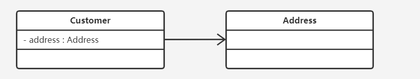

在UML类图中单向关联用一个**带箭头的实线**表示。上图表示每个顾客都有一个地址，这通过让Customer类持有一个类型为Address的成员变量类实现。


**2，双向关联**

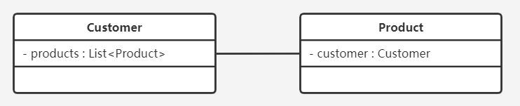

从上图中我们很容易看出，所谓的双向关联就是双方各自持有对方类型的成员变量。

在UML类图中，双向关联用一个**不带箭头的实线**表示。上图中在Customer类中维护一个List\<Product>，表示一个顾客可以购买多个商品；在Product类中维护一个Customer类型的成员变量，表示这个产品被哪个顾客所购买。


**3，自关联**

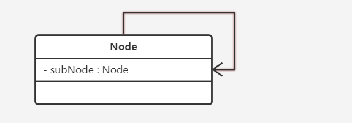

自关联在UML类图中用一个**带有箭头且指向自身的线**表示。上图的意思就是Node类包含类型为Node的成员变量，也就是“自己包含自己”。


##### 3.2.2 聚合关系

聚合关系是关联关系的一种，是强关联关系，是`整体和部分`之间的关系。

聚合关系也是通过成员对象来实现的，其中成员对象是整体对象的一部分，但是成员对象可以脱离整体对象而独立存在。例如，学校与老师的关系，学校包含老师，但如果学校停办了，老师依然存在。

在 UML 类图中，聚合关系可以用**带空心菱形的实线**来表示，菱形指向整体。下图所示是大学和教师的关系图：


##### 3.2.3 组合关系

组合表示类之间的整体与部分的关系，但它是一种更强烈的聚合关系。

在组合关系中，**整体对象可以控制部分对象的生命周期**，一旦整体对象不存在，部分对象也将不存在，部分对象不能脱离整体对象而存在。例如，头和嘴的关系，没有了头，嘴也就不存在了。 

在 UML 类图中，组合关系用**带实心菱形的实线**来表示，菱形指向整体。下图所示是头和嘴的关系图：


##### 3.2.4 依赖关系

依赖关系是一种使用关系，它是对象之间耦合度最弱的一种关联方式，是临时性的关联。在代码中，某个类的方法通过`局部变量`、`方法的参数`或者`对静态方法的调用`来访问另一个类（被依赖类）中的某些方法来完成一些职责。

在 UML 类图中，依赖关系使用**带箭头的虚线**来表示，箭头从使用类指向被依赖的类。下图所示是司机和汽车的关系图，司机驾驶汽车：

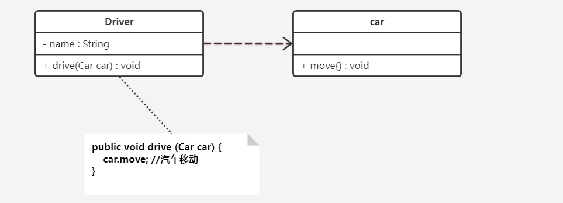

##### 3.2.5 继承关系

继承关系是对象之间耦合度最大的一种关系，表示一般与特殊的关系，是父类与子类之间的关系，是一种继承关系。

在 UML 类图中，泛化关系用**带空心三角箭头的实线**来表示，箭头从子类指向父类。在代码实现时，使用面向对象的继承机制来实现泛化关系。例如，Student 类和 Teacher 类都是 Person 类的子类，其类图如下图所示：


##### 3.2.6 实现关系

实现关系是接口与实现类之间的关系。在这种关系中，类实现了接口，类中的操作实现了接口中所声明的所有的抽象操作。

在 UML 类图中，实现关系使用**带空心三角箭头的虚线**来表示，箭头从实现类指向接口。例如，汽车和船实现了交通工具，其类图如图 9 所示。


------

## 三、软件设计原则

在软件开发中，为了提高软件系统的可维护性和可复用性，增加软件的可扩展性和灵活性，程序员要尽量根据6条原则来开发程序，从而提高软件开发效率、节约软件开发成本和维护成本。

### 1 开闭原则

**对扩展开放，对修改关闭**。在程序需要进行拓展的时候，不能去修改原有的代码，实现一个热插拔的效果。简言之，是为了使程序的扩展性好，易于维护和升级。

想要达到这样的效果，我们需要**使用接口和抽象类**。

因为抽象灵活性好，适应性广，只要抽象的合理，可以基本保持软件架构的稳定。而软件中易变的细节可以从抽象派生来的实现类来进行扩展，当软件需要发生变化时，只需要根据需求重新派生一个实现类来扩展就可以了。

下面以 `搜狗输入法` 的皮肤为例介绍开闭原则的应用。

**【例】搜狗输入法的皮肤设计。**

分析：`搜狗输入法` 的皮肤是输入法背景图片、窗口颜色和声音等元素的组合。用户可以根据自己的喜爱更换自己的输入法的皮肤，也可以从网上下载新的皮肤。这些皮肤有共同的特点，可以为其定义一个抽象类（AbstractSkin），而每个具体的皮肤（DefaultSpecificSkin和HeimaSpecificSkin）是其子类。用户窗体可以根据需要选择或者增加新的主题，而不需要修改原代码，所以它是满足开闭原则的。

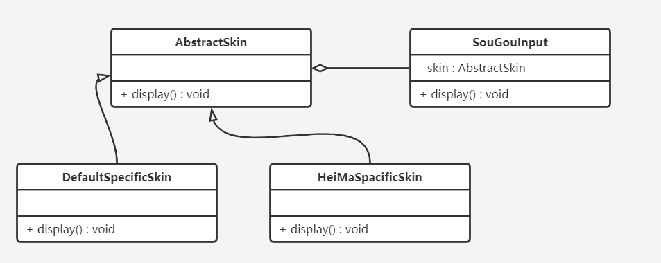

```java
// 抽象皮肤类
public abstract class AbstractSkin {
    //显示的方法
    public abstract void display();
}
```

```java
// 默认皮肤类
public class DefaultSkin extends AbstractSkin {
    public void display() {
        System.out.println("默认皮肤");
    }
}
```

```java
// 黑马程序员皮肤
public class HeimaSkin extends AbstractSkin {
    public void display() {
        System.out.println("黑马皮肤");
    }
}
```

```java
// 搜狗输入法
public class SougouInput {
    private AbstractSkin skin;

    public void setSkin(AbstractSkin skin) {
        this.skin = skin;
    }

    public void display() {
        skin.display();
    }
}
```

```java
// 测试类
public class Client {
    public static void main(String[] args) {
        //1,创建搜狗输入法对象
        SougouInput input = new SougouInput();
        //2,创建皮肤对象
        //DefaultSkin skin = new DefaultSkin();
        HeimaSkin skin = new HeimaSkin();
        //3,将皮肤设置到输入法中
        input.setSkin(skin);
        //4,显示皮肤
        input.display();
    }
}
```


### 2 里氏代换原则

里氏代换原则是面向对象设计的基本原则之一。

里氏代换原则：任何基类可以出现的地方，子类一定可以出现。通俗理解：子类可以扩展父类的功能，但不能改变父类原有的功能。换句话说，子类继承父类时，除添加新的方法完成新增功能外，尽量不要重写父类的方法。

如果通过重写父类的方法来完成新的功能，这样写起来虽然简单，但是整个继承体系的可复用性会比较差，特别是运用多态比较频繁时，程序运行出错的概率会非常大。

下面看一个里氏替换原则中经典的一个例子

**【例】正方形不是长方形。**

在数学领域里，正方形毫无疑问是长方形，它是一个长宽相等的长方形。所以，我们开发的一个与几何图形相关的软件系统，就可以顺理成章的让正方形继承自长方形。

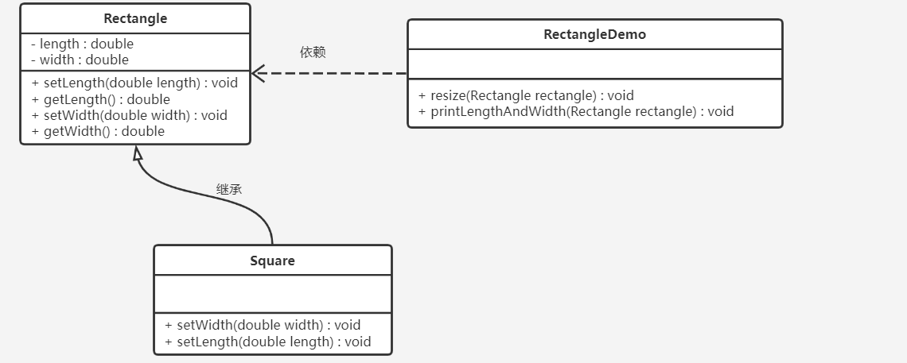

代码如下：

**长方形类（Rectangle）：**

```java
// 长方形类
public class Rectangle {
    private double length;
    private double width;

    public double getLength() {
        return length;
    }
    public void setLength(double length) {
        this.length = length;
    }
    public double getWidth() {
        return width;
    }
    public void setWidth(double width) {
        this.width = width;
    }
}
```

**正方形（Square）：**

由于正方形的长和宽相同，所以在方法setLength和setWidth中，对长度和宽度都需要赋相同值。

```java
// 正方形类 继承于长方形类
public class Square extends Rectangle {
    public void setWidth(double width) {
        super.setLength(width);
        super.setWidth(width);
    }

    public void setLength(double length) {
        super.setLength(length);
        super.setWidth(length);
    }
}
```

类RectangleDemo是我们的软件系统中的一个组件，它有一个resize方法依赖基类Rectangle，resize方法是RectandleDemo类中的一个方法，用来实现宽度逐渐增长的效果。

```java
public class RectangleDemo {
    public static void main(String[] args) {
        //创建长方形对象
        Rectangle r = new Rectangle();
        //设置长和宽
        r.setLength(20);
        r.setWidth(10);
        //调用resize方法进行扩宽
        resize(r);
        printLengthAndWidth(r);

        System.out.println("==================");
        //创建正方形对象
        Square s = new Square();
        //设置长和宽
        s.setLength(10);
        //调用resize方法进行扩宽
        resize(s);
        printLengthAndWidth(s);
    }

    //扩宽方法
    public static void resize(Rectangle rectangle) {
        //判断宽如果比长小，进行扩宽的操作
        while(rectangle.getWidth() <= rectangle.getLength()) {
            rectangle.setWidth(rectangle.getWidth() + 1);
        }
    }

    //打印长和宽
    public static void printLengthAndWidth(Rectangle rectangle) {
        System.out.println(rectangle.getLength());
        System.out.println(rectangle.getWidth());
    }
}
```

我们运行一下这段代码就会发现，假如我们把一个普通长方形作为参数传入resize方法，就会看到长方形宽度逐渐增长的效果，当宽度大于长度，代码就会停止，这种行为的结果符合我们的预期；假如我们再把一个正方形作为参数传入resize方法后，就会看到正方形的宽度和长度都在不断增长，代码会一直运行下去，直至系统产生溢出错误。所以，普通的长方形是适合这段代码的，正方形不适合。

我们得出结论：在resize方法中，Rectangle类型的参数是不能被Square类型的参数所代替，如果进行了替换就得不到预期结果。因此，Square类和Rectangle类之间的继承关系违反了里氏代换原则，它们之间的继承关系不成立，正方形不是长方形。


如何改进呢？此时我们需要重新设计他们之间的关系。抽象出来一个四边形接口(Quadrilateral)，让Rectangle类和Square类实现Quadrilateral接口

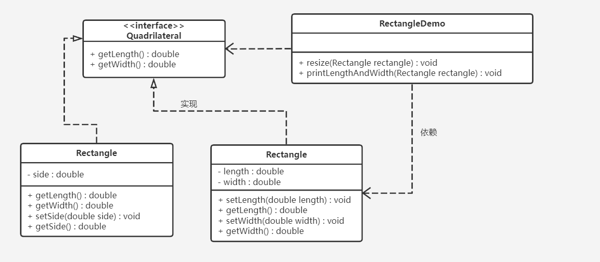

```java
// 四边形接口
public interface Quadrilateral {
    //获取长
    double getLength();
    //获取宽
    double getWidth();
}
```

```java
// 长方形类
public class Rectangle implements Quadrilateral {
    private double length;
    private double width;
    public void setLength(double length) {
        this.length = length;
    }
    public void setWidth(double width) {
        this.width = width;
    }

    public double getLength() {
        return length;
    }
    public double getWidth() {
        return width;
    }
}
```

```java
// 正方形
public class Square implements Quadrilateral {
    private double side;
    public double getSide() {
        return side;
    }
    public void setSide(double side) {
        this.side = side;
    }

    public double getLength() {
        return side;
    }
    public double getWidth() {
        return side;
    }
}
```

```java
public class RectangleDemo {
    public static void main(String[] args) {
        //创建长方形对象
        Rectangle r = new Rectangle();
        r.setLength(20);
        r.setWidth(10);
        //调用方法进行扩宽操作
        resize(r);

        printLengthAndWidth(r);
    }

    //扩宽的方法
    public static void resize(Rectangle rectangle) {
        //判断宽如果比长小，进行扩宽的操作
        while(rectangle.getWidth() <= rectangle.getLength()) {
            rectangle.setWidth(rectangle.getWidth() + 1);
        }
    }

    //打印长和宽
    public static void printLengthAndWidth(Quadrilateral quadrilateral) {
        System.out.println(quadrilateral.getLength());
        System.out.println(quadrilateral.getWidth());
    }
}
```


### 3 依赖倒转原则

高层模块不应该依赖低层模块，两者都应该依赖其抽象；抽象不应该依赖细节，细节应该依赖抽象。简单的说就是要求对抽象进行编程，不要对实现进行编程，这样就降低了客户与实现模块间的耦合。

下面看一个例子来理解依赖倒转原则

**【例】组装电脑**

现要组装一台电脑，需要配件cpu，硬盘，内存条。只有这些配置都有了，计算机才能正常的运行。选择`cpu`有很多选择，如`Intel，AMD`等，`硬盘`可以选择`希捷，西数`等，`内存条`可以选择`金士顿，海盗船`等。

**类图如下：**

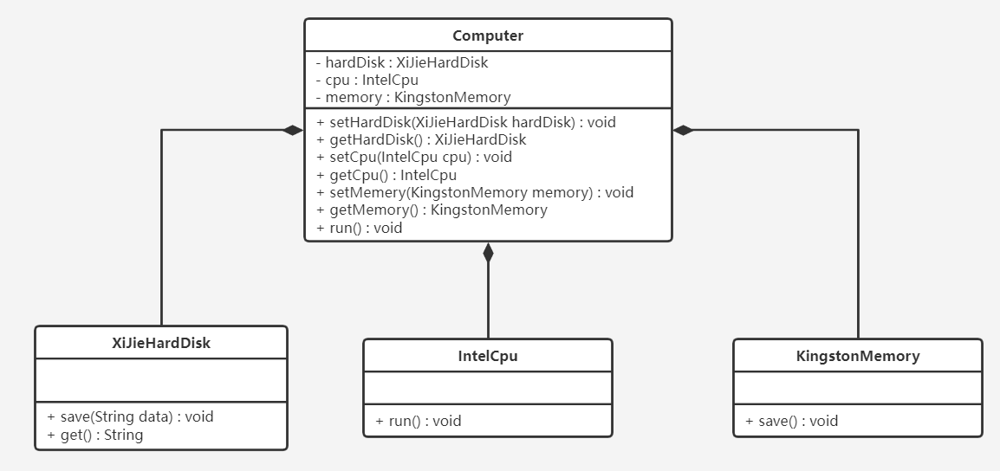

代码如下：

**希捷硬盘类（XiJieHardDisk）:**

```java
public class XiJieHardDisk implements HardDisk {
    public void save(String data) {
        System.out.println("使用希捷硬盘存储数据" + data);
    }

    public String get() {
        System.out.println("使用希捷希捷硬盘取数据");
        return "数据";
    }
}
```

**Intel处理器（IntelCpu）：**

```java
public class IntelCpu implements Cpu {
    public void run() {
        System.out.println("使用Intel处理器");
    }
}
```

**金士顿内存条（KingstonMemory）：**

```java
public class KingstonMemory implements Memory {
    public void save() {
        System.out.println("使用金士顿作为内存条");
    }
}
```

**电脑（Computer）：**

```java
public class Computer {
    private XiJieHardDisk hardDisk;
    private IntelCpu cpu;
    private KingstonMemory memory;

    public IntelCpu getCpu() {
        return cpu;
    }
    public void setCpu(IntelCpu cpu) {
        this.cpu = cpu;
    }
    public KingstonMemory getMemory() {
        return memory;
    }
    public void setMemory(KingstonMemory memory) {
        this.memory = memory;
    }
    public XiJieHardDisk getHardDisk() {
        return hardDisk;
    }
    public void setHardDisk(XiJieHardDisk hardDisk) {
        this.hardDisk = hardDisk;
    }

    public void run() {
        System.out.println("计算机工作");
        cpu.run();
        memory.save();
        String data = hardDisk.get();
        System.out.println("从硬盘中获取的数据为：" + data);
    }
}
```

**测试类（TestComputer）：**

测试类用来组装电脑。

```java
public class TestComputer {
    public static void main(String[] args) {
        //创建组件对象
        XiJieHardDisk hardDisk = new XiJieHardDisk();
        IntelCpu cpu = new IntelCpu();
        KingstonMemory memory = new KingstonMemory();
        
        //创建计算机对象
        Computer computer = new Computer();
        computer.setHardDisk(hardDisk);
        computer.setCpu(cpu);
        computer.setMemory(memory);

        //运行计算机
        computer.run();
    }
}
```

上面代码可以看到已经组装了一台电脑，但是似乎组装的电脑的cpu只能是Intel的，内存条只能是金士顿的，硬盘只能是希捷的，这对用户肯定是不友好的，用户有了机箱肯定是想按照自己的喜好，选择自己喜欢的配件。

根据依赖倒转原则进行改进：

代码我们只需要修改Computer类，让Computer类依赖抽象（各个配件的接口），而不是依赖于各个组件具体的实现类。

**类图如下：**

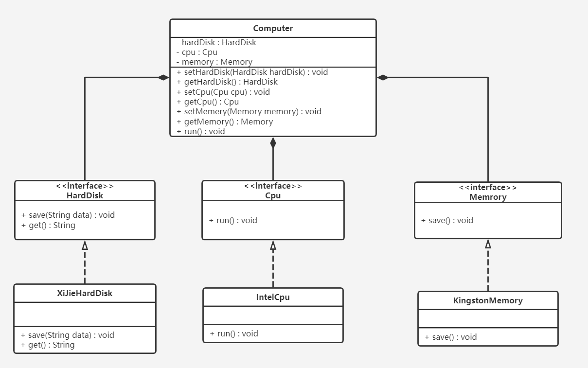

**电脑（Computer）：**

```java
public class Computer {
    private HardDisk hardDisk;
    private Cpu cpu;
    private Memory memory;

    public HardDisk getHardDisk() {
        return hardDisk;
    }
    public void setHardDisk(HardDisk hardDisk) {
        this.hardDisk = hardDisk;
    }
    public Cpu getCpu() {
        return cpu;
    }
    public void setCpu(Cpu cpu) {
        this.cpu = cpu;
    }
    public Memory getMemory() {
        return memory;
    }
    public void setMemory(Memory memory) {
        this.memory = memory;
    }

    public void run() {
        System.out.println("计算机工作");
    }
}
```

面向对象的开发很好的解决了这个问题，一般情况下抽象的变化概率很小，让用户程序依赖于抽象，实现的细节也依赖于抽象。即使实现细节不断变动，只要抽象不变，客户程序就不需要变化。这大大降低了客户程序与实现细节的耦合度。


### 4 接口隔离原则

客户端不应该被迫依赖于它不使用的方法；一个类对另一个类的依赖应该建立在最小的接口上。

下面看一个例子来理解接口隔离原则

**【例】安全门案例**

我们需要创建一个`黑马`品牌的安全门，该安全门具有防火、防水、防盗的功能。可以将防火，防水，防盗功能提取成一个接口，形成一套规范。类图如下：


上面的设计我们发现了它存在的问题，黑马品牌的安全门具有防盗，防水，防火的功能。现在如果我们还需要再创建一个传智品牌的安全门，而该安全门只具有防盗、防水功能呢？很显然如果实现SafetyDoor接口就违背了接口隔离原则，那么我们如何进行修改呢？看如下类图：


代码如下：

**AntiTheft（接口）：**

```java
public interface AntiTheft {
    void antiTheft();
}
```

**Fireproof（接口）：**

```java
public interface Fireproof {
    void fireproof();
}
```

**Waterproof（接口）：**

```java
public interface Waterproof {
    void waterproof();
}
```

**HeiMaSafetyDoor（类）：**

```java
public class HeiMaSafetyDoor implements AntiTheft,Fireproof,Waterproof {
    public void antiTheft() {
        System.out.println("防盗");
    }

    public void fireproof() {
        System.out.println("防火");
    }


    public void waterproof() {
        System.out.println("防水");
    }
}
```

**ItcastSafetyDoor（类）：**

```java
public class ItcastSafetyDoor implements AntiTheft,Fireproof {
    public void antiTheft() {
        System.out.println("防盗");
    }

    public void fireproof() {
        System.out.println("防火");
    }
}
```


### 5 迪米特法则

迪米特法则又叫最少知识原则。

只和你的直接朋友交谈，不跟“陌生人”说话（`Talk only to your immediate friends and not to strangers`）。

其含义是：如果两个软件实体无须直接通信，那么就不应当发生直接的相互调用，可以通过第三方转发该调用。其目的是降低类之间的耦合度，提高模块的相对独立性。

迪米特法则中的`“朋友”`是指：`当前对象本身`、`当前对象的成员对象`、`当前对象所创建的对象`、`当前对象的方法参数`等，这些对象同当前对象存在**关联**、**聚合**或**组合**关系，可以直接访问这些对象的方法。

下面看一个例子来理解迪米特法则

**【例】明星与经纪人的关系实例**

明星由于全身心投入艺术，所以许多日常事务由经纪人负责处理，如和粉丝的见面会，和媒体公司的业务洽淡等。这里的经纪人是明星的朋友，而粉丝和媒体公司是陌生人，所以适合使用迪米特法则。

类图如下：

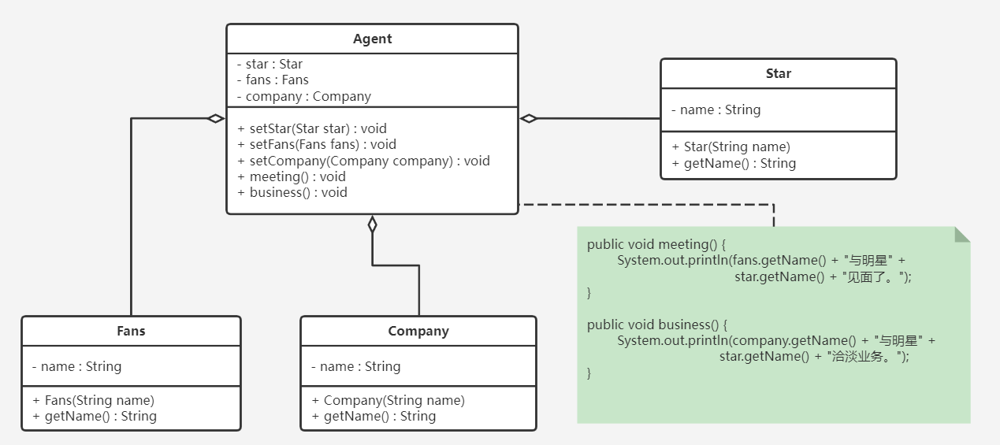

代码如下：

**明星类（Star）**

```java
public class Star {
    private String name;
    public Star(String name) {
        this.name=name;
    }
    public String getName() {
        return name;
    }
}
```

**粉丝类（Fans）**

```java
public class Fans {
    private String name;
    public Fans(String name) {
        this.name=name;
    }
    public String getName() {
        return name;
    }
}
```

**媒体公司类（Company）**

```java
public class Company {
    private String name;
    public Company(String name) {
        this.name=name;
    }
    public String getName() {
        return name;
    }
}
```

**经纪人类（Agent）**

```java
public class Agent {
    private Star star;
    private Fans fans;
    private Company company;

    public void setStar(Star star) {
        this.star = star;
    }
    public void setFans(Fans fans) {
        this.fans = fans;
    }
    public void setCompany(Company company) {
        this.company = company;
    }

    //和粉丝见面的方法
    public void meeting() {
        System.out.println(fans.getName() + "与明星" + star.getName() + "见面了。");
    }
    //和媒体公司洽谈的方法
    public void business() {
        System.out.println(company.getName() + "与明星" + star.getName() + "洽淡业务。");
    }
}
```


### 6 合成复用原则

合成复用原则是指：尽量先使用`组合或者聚合`等关联关系来实现，其次才考虑使用`继承关系`来实现。

通常类的复用分为`继承复用`和`合成复用`两种。

继承复用虽然有简单和易实现的优点，但它也存在以下缺点：

1. 继承复用破坏了类的封装性。因为继承会将父类的实现细节暴露给子类，父类对子类是透明的，所以这种复用又称为“白箱”复用。
2. 子类与父类的耦合度高。父类的实现的任何改变都会导致子类的实现发生变化，这不利于类的扩展与维护。
3. 它限制了复用的灵活性。从父类继承而来的实现是静态的，在编译时已经定义，所以在运行时不可能发生变化。


采用`组合或聚合复用`时，可以将已有对象纳入新对象中，使之成为新对象的一部分，新对象可以调用已有对象的功能，它有以下优点：

1. 它维持了类的封装性。因为成分对象的内部细节是新对象看不见的，所以这种复用又称为“黑箱”复用。
2. 对象间的耦合度低。可以在类的成员位置声明抽象。
3. 复用的灵活性高。这种复用可以在运行时动态进行，新对象可以动态地引用与成分对象类型相同的对象。

下面看一个例子来理解合成复用原则

【例】汽车分类管理程序

汽车按“动力源”划分可分为汽油汽车、电动汽车等；按“颜色”划分可分为白色汽车、黑色汽车和红色汽车等。如果同时考虑这两种分类，其组合就很多。类图如下：


从上面类图我们可以看到使用继承复用产生了很多子类，如果现在又有新的动力源或者新的颜色的话，就需要再定义新的类。我们试着将继承复用改为聚合复用看一下。

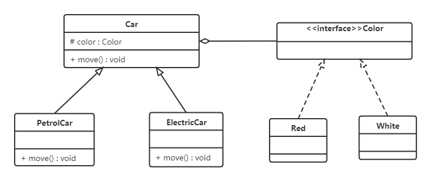

------

## 四、创建者模式

创建型模式的主要关注点是“怎样创建对象？”，它的主要特点是“将对象的创建与使用分离”。

这样可以降低系统的耦合度，使用者不需要关注对象的创建细节。

创建型模式分为：

* 单例模式
* 工厂方法模式
* 抽象工程模式
* 原型模式
* 建造者模式

### 1 单例设计模式

单例模式（Singleton Pattern）是 Java 中最简单的设计模式之一。这种类型的设计模式属于创建型模式，它提供了一种创建对象的最佳方式。

这种模式涉及到一个单一的类，该类负责`创建自己的对象`，同时`确保只有单个对象被创建`。这个类`提供了一种访问其唯一的对象的方式`，可以直接访问，`不需要实例化该类的对象`。

#### 1.1 单例模式的结构

单例模式的主要有以下角色：

* 单例类：只能创建一个实例的类
* 访问类：使用单例类

#### 1.2 单例模式的实现

> 单例设计模式分类两种：
>
> ​	饿汉式：类加载就会导致该单实例对象被创建。
>
> ​	懒汉式：类加载不会导致该单实例对象被创建，而是首次使用该对象时才会创建。

1. 饿汉式-方式1（静态成员变量方式）

   ```java
   /**
    * 饿汉式
    *      静态变量创建类的对象
    */
   public class Singleton {
       //1.私有构造方法
       private Singleton() {}
   
       //2.在本类中创建本类对象
       private static Singleton instance = new Singleton();
   
       //3.提供一个公共的访问方式，让外界获取该对象
       public static Singleton getInstance() {
           return instance;
       }
   }
   ```

   ``` java
   public class Client {
       public static void main(String[] args) {
           //创建Singletion类的对象
           Singleton instance = Singleton.getInstance();
   
           Singleton instance1 = Singleton.getInstance();
   
           //判断获取到的两个是否是同一个对象
           System.out.println(instance == instance1);//true
       }
   }
   ```

   <font color='red'>说明：</font>

   该方式在成员位置声明Singleton类型的静态变量，并创建Singleton类的对象instance。instance对象是随着类的加载而创建的。如果该对象足够大的话，而一直没有使用就会造成内存的浪费。

   

2. 饿汉式-方式2（静态代码块方式）

   ```java
   /**
    * 恶汉式
    *      在静态代码块中创建该类对象
    */
   public class Singleton {
       // 私有构造方法
       private Singleton() {}
   
      // 声明Singleton类型的变量
       private static Singleton instance; //null
   
       // 在静态代码块中进行赋值
       static {
           instance = new Singleton();
       }
   
       // 对外提供静态方法获取该对象
       public static Singleton getInstance() {
           return instance;
       }
   }
   ```

   <font color='red'>说明：</font>

   该方式在成员位置声明Singleton类型的静态变量，而对象的创建是在静态代码块中，也是对着类的加载而创建。所以和饿汉式的方式1基本上一样，当然该方式也存在内存浪费问题。

   

3. 懒汉式-方式1（线程不安全）

   ```java
   /**
    * 懒汉式
    *  线程不安全
    */
   public class Singleton {
       //私有构造方法
       private Singleton() {}
   
       //在成员位置创建该类的对象
       private static Singleton instance;//只是声明一个该类型的变量，并没有进行赋值
   
       //对外提供静态方法获取该对象
       public static Singleton getInstance() {
           //判断instance是否为null，如果为null，说明还没有创建Singleton类的对象
           //如果没有，创建一个并返回，如果有，直接返回
           if(instance == null) {
               instance = new Singleton();
           }
           return instance;
       }
   }
   ```

   <font color='red'>说明：</font>

   从上面代码我们可以看出该方式在成员位置声明Singleton类型的静态变量，并没有进行对象的赋值操作，那么什么时候赋值的呢？当调用getInstance()方法获取Singleton类的对象的时候才创建Singleton类的对象，这样就实现了懒加载的效果。但是，如果是多线程环境，会出现线程安全问题。

   

4. 懒汉式-方式2（线程安全）

   ```java
   /**
    * 懒汉式
    *  线程安全
    */
   public class Singleton {
       //私有构造方法
       private Singleton() {}
   
       //在成员位置创建该类的对象
       private static Singleton instance;
   
       //对外提供静态方法获取该对象
       public static synchronized Singleton getInstance() {
           if(instance == null) {
               instance = new Singleton();
           }
           return instance;
       }
   }
   ```
   
   <font color='red'>说明：</font>
   
   该方式也实现了懒加载效果，同时又解决了线程安全问题。但是在getInstance()方法上添加了synchronized关键字，导致该方法的执行效果特别低。从上面代码我们可以看出，其实就是在初始化instance的时候才会出现线程安全问题，一旦初始化完成就不存在了。
   
   
   
5. 懒汉式-方式3（双重检查锁）

   再来讨论一下懒汉模式中加锁的问题，对于 `getInstance()` 方法来说，绝大部分的操作都是读操作，读操作是线程安全的，所以我们没必让每个线程必须持有锁才能调用该方法，我们需要调整加锁的时机。由此也产生了一种新的实现模式：双重检查锁模式

   ```java
   /**
    * 双重检查方式
    */
   public class Singleton { 
       //私有构造方法
       private Singleton() {}
   
       private static Singleton instance;
   
      //对外提供静态方法获取该对象
       public static Singleton getInstance() {
   		//第一次判断，如果instance不为null，不进入抢锁阶段，直接返回实例
           if(instance == null) {
               synchronized (Singleton.class) {
                   //第二次判断:抢到锁之后再次判断是否为null
                   if(instance == null) {
                       instance = new Singleton();
                   }
               }
           }
           return instance;
       }
   }
   ```
   
   双重检查锁模式是一种非常好的单例实现模式，解决了单例、性能、线程安全问题，上面的双重检测锁模式看上去完美无缺，其实是存在问题，在多线程的情况下，可能会出现空指针问题，出现问题的原因是JVM在实例化对象的时候会进行优化和指令重排序操作。
   
   要解决双重检查锁模式带来空指针异常的问题，只需要使用 `volatile` 关键字, `volatile` 关键字可以保证可见性和有序性。
   
   ```java
   /**
    * 双重检查方式
    */
   public class Singleton {
       //私有构造方法
       private Singleton() {}
   
       private static volatile Singleton instance;
   
       //对外提供静态方法获取该对象
       public static Singleton getInstance() {
   	//第一次判断，如果instance不为null，不进入抢锁阶段，直接返回实际
           if(instance == null) {
               synchronized (Singleton.class) {
                   //抢到锁之后再次判断是否为空
                   if(instance == null) {
                       instance = new Singleton();
                   }
               }
           }
           return instance;
       }
   }
   ```
   
   <font color="red">小结：</font>

   添加 `volatile` 关键字之后的双重检查锁模式是一种比较好的单例实现模式，能够保证在多线程的情况下线程安全也不会有性能问题。

 


6. 懒汉式-方式4（静态内部类方式）

   静态内部类单例模式中实例由内部类创建，由于 JVM 在加载外部类的过程中, 是不会加载静态内部类的, 只有内部类的属性/方法被调用时才会被加载, 并初始化其静态属性。静态属性由于被 `static` 修饰，保证只被实例化一次，并且严格保证实例化顺序。

   ```java
   /**
    * 静态内部类方式
    */
   public class Singleton {
       //私有构造方法
       private Singleton() {}
   
       //定义一个静态内部类
       private static class SingletonHolder {
           //在内部类中声明并初始化外部类的对象
           private static final Singleton INSTANCE = new Singleton();
       }
   
       //提供公共的访问方式
       public static Singleton getInstance() {
           return SingletonHolder.INSTANCE;
       }
   }
   ```

   <font color='red'>说明：</font>

   第一次加载Singleton类时不会去初始化INSTANCE，只有第一次调用getInstance，虚拟机加载SingletonHolder并初始化INSTANCE，这样不仅能确保线程安全，也能保证 Singleton 类的唯一性。

   <font color="red">小结：</font>

   静态内部类单例模式是一种优秀的单例模式，是开源项目中比较常用的一种单例模式。在没有加任何锁的情况下，保证了多线程下的安全，并且没有任何性能影响和空间的浪费。

   

7. 枚举方式

   枚举类实现单例模式是极力推荐的单例实现模式，因为枚举类型是线程安全的，并且只会装载一次，设计者充分的利用了枚举的这个特性来实现单例模式，枚举的写法非常简单，而且枚举类型是所用单例实现中唯一一种不会被破坏的单例实现模式。

   ```java
   /**
    * 枚举方式
    */
   public enum Singleton {
       INSTANCE;
   }
   ```

   ```java
   public class Client {
       public static void main(String[] args) {
           Singleton instance = Singleton.INSTANCE;
           Singleton instance1 = Singleton.INSTANCE;
   
           System.out.println(instance == instance1);//true
       }
   }
   ```
   
   <font color='red'>说明：</font>
   
   枚举方式属于饿汉式方式。


#### 1.3 存在的问题

##### 1.3.1 问题演示

破坏单例模式：

使上面定义的单例类（Singleton）可以创建多个对象，枚举方式除外。有两种方式，分别是`序列化`和`反射`。

* 序列化反序列化

  **Singleton类：**

  ```java
  public class Singleton implements Serializable {
      //私有构造方法
      private Singleton() {}
  
      //定义一个静态内部类
      private static class SingletonHolder {
          //在内部类中声明并初始化外部类的对象
          private static final Singleton INSTANCE = new Singleton();
      }
  
      //提供公共的访问方式
      public static Singleton getInstance() {
          return SingletonHolder.INSTANCE;
      }
  }
  ```

  **Test类：**

  ```java
  public class Client {
      public static void main(String[] args) throws Exception {
          //writeObject2File();
          readObjectFromFile();
          readObjectFromFile();
      }
  
      //从文件读取数据（对象）
      public static void readObjectFromFile() throws Exception {
          //1,创建对象输入流对象
          ObjectInputStream ois = new ObjectInputStream(new FileInputStream("C:\\Users\\Think\\Desktop\\a.txt"));
          //2,读取对象
          Singleton instance = (Singleton) ois.readObject();
          System.out.println(instance);
          //释放资源
          ois.close();
      }
  
      //向文件中写数据（对象）
      public static void writeObject2File() throws Exception {
          //1,获取Singleton对象
          Singleton instance = Singleton.getInstance();
          //2,创建对象输出流对象
          ObjectOutputStream oos = new ObjectOutputStream(new FileOutputStream("C:\\Users\\Think\\Desktop\\a.txt"));
          //3,写对象
          oos.writeObject(instance);
          //4,释放资源
          oos.close();
      }
  }
  ```

  > 上面代码运行结果是两次获取的对象的地址不一样，表明序列化和反序列化已经破坏了单例设计模式。

* 反射

  **Singleton类：**

  ```java
  public class Singleton {
      //私有构造方法
      private Singleton() {}
  
      //定义一个静态内部类
      private static class SingletonHolder {
          //在内部类中声明并初始化外部类的对象
          private static final Singleton INSTANCE = new Singleton();
      }
  
      //提供公共的访问方式
      public static Singleton getInstance() {
          return SingletonHolder.INSTANCE;
      }
  }
  ```
  
  **Test类：**
  
  ```java
  public class Client {
      public static void main(String[] args) throws Exception {
          //1,获取Singleton的字节码对象
          Class clazz = Singleton.class;
          //2,获取无参构造方法对象
          Constructor cons = clazz.getDeclaredConstructor();
          //3,取消访问检查
          cons.setAccessible(true);
          //4,创建Singleton对象
          Singleton s1 = (Singleton) cons.newInstance();
          Singleton s2 = (Singleton) cons.newInstance();
  
          System.out.println(s1 == s2); //如果返回的是true，说明并没有破坏单例模式，如果是false，说明破坏了单例模式
      }
  }
  ```
  
  > 上面代码运行结果是`false`，表明序列化和反序列化已经破坏了单例设计模式

> <font color="red">注意：</font>枚举方式不会出现这两个问题。


##### 1.3.2 问题的解决

* 序列化、反序列方式破坏单例模式的解决方法

  在Singleton类中添加`readResolve()`方法，在反序列化时被反射调用，如果定义了这个方法，就返回这个方法的值，如果没有定义，则返回新new出来的对象。

  **Singleton类：**

  ```java
  public class Singleton implements Serializable {
      //私有构造方法
      private Singleton() {}
  
      //定义一个静态内部类
      private static class SingletonHolder {
          //在内部类中声明并初始化外部类的对象
          private static final Singleton INSTANCE = new Singleton();
      }
  
      //提供公共的访问方式
      public static Singleton getInstance() {
          return SingletonHolder.INSTANCE;
      }
  
      //当进行反序列化时，会自动调用该方法，将该方法的返回值直接返回
      public Object readResolve() {
          return SingletonHolder.INSTANCE;
      }
  }
  ```

  **源码解析：**

  ObjectInputStream类

  ```java
  public final Object readObject() throws IOException, ClassNotFoundException{
      ...
      // if nested read, passHandle contains handle of enclosing object
      int outerHandle = passHandle;
      try {
          Object obj = readObject0(false);//重点查看readObject0方法
      .....
  }
      
  private Object readObject0(boolean unshared) throws IOException {
  	...
      try {
  		switch (tc) {
  			...
  			case TC_OBJECT:
  				return checkResolve(readOrdinaryObject(unshared));//重点查看readOrdinaryObject方法
  			...
          }
      } finally {
          depth--;
          bin.setBlockDataMode(oldMode);
      }    
  }
      
  private Object readOrdinaryObject(boolean unshared) throws IOException {
  	...
  	//isInstantiable 返回true，执行 desc.newInstance()，通过反射创建新的单例类，
      obj = desc.isInstantiable() ? desc.newInstance() : null; 
      ...
      // 在Singleton类中添加 readResolve 方法后 desc.hasReadResolveMethod() 方法执行结果为true
      if (obj != null && handles.lookupException(passHandle) == null && desc.hasReadResolveMethod()) {
      	// 通过反射调用 Singleton 类中的 readResolve 方法，将返回值赋值给rep变量
      	// 这样多次调用ObjectInputStream类中的readObject方法，继而就会调用我们定义的readResolve方法，所以返回的是同一个对象。
      	Object rep = desc.invokeReadResolve(obj);
       	...
      }
      return obj;
  }
  ```

* 反射方式破解单例的解决方法

  ```java
  public class Singleton {
      private static boolean flag = false;
  
      //私有构造方法
      private Singleton() {
          synchronized (Singleton.class) {
              //判断flag的值是否是true，如果是true，说明非第一次访问，直接抛一个异常，如果是false的话，说明第一次访问
              if (flag) {
                  throw new RuntimeException("不能创建多个对象");
              }
              //将flag的值设置为true
              flag = true;
          }
      }
  
      //定义一个静态内部类
      private static class SingletonHolder {
          //在内部类中声明并初始化外部类的对象
          private static final Singleton INSTANCE = new Singleton();
      }
  
      //提供公共的访问方式
      public static Singleton getInstance() {
          return SingletonHolder.INSTANCE;
      }
  }
  ```
  
  <font color="red">说明:</font>
  
  这种方式比较好理解。当通过反射方式调用构造方法进行创建创建时，直接抛异常。不运行此中操作。


#### 1.4 JDK源码解析-Runtime类

Runtime类就是使用的单例设计模式。

1. 通过源代码查看使用的是哪儿种单例模式

   ```java
   public class Runtime {
       private static Runtime currentRuntime = new Runtime();
   
       /**
        * Returns the runtime object associated with the current Java application.
        * Most of the methods of class <code>Runtime</code> are instance
        * methods and must be invoked with respect to the current runtime object.
        *
        * @return  the <code>Runtime</code> object associated with the current
        *          Java application.
        */
       public static Runtime getRuntime() {
           return currentRuntime;
       }
   
       /** Don't let anyone else instantiate this class */
       private Runtime() {}
       ...
   }
   ```

   从上面源代码中可以看出Runtime类使用的是恶汉式（静态属性）方式来实现单例模式的。

   

2. 使用Runtime类中的方法

   ```java
   public class RuntimeDemo {
       public static void main(String[] args) throws IOException {
           //获取Runtime类对象
           Runtime runtime = Runtime.getRuntime();
   
           //返回 Java 虚拟机中的内存总量。
           System.out.println(runtime.totalMemory());
           //返回 Java 虚拟机试图使用的最大内存量。
           System.out.println(runtime.maxMemory());
   
           //创建一个新的进程执行指定的字符串命令，返回进程对象
           Process process = runtime.exec("ipconfig");
           //获取命令执行后的结果，通过输入流获取
           InputStream inputStream = process.getInputStream();
           byte[] arr = new byte[1024 * 1024* 100];
           int b = inputStream.read(arr);
           System.out.println(new String(arr,0,b,"gbk"));
       }
   }
   ```


### 2 工厂模式

#### 2.1 概述

需求：设计一个咖啡店点餐系统。  

设计一个咖啡类（Coffee），并定义其两个子类（美式咖啡【AmericanCoffee】和拿铁咖啡【LatteCoffee】）；再设计一个咖啡店类（CoffeeStore），咖啡店具有点咖啡的功能。

具体类的设计如下：

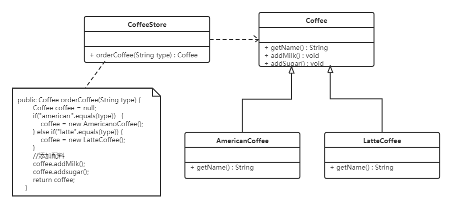

在java中，万物皆对象，这些对象都需要创建，如果创建的时候直接new该对象，就会对该对象耦合严重，假如我们要更换对象，所有new对象的地方都需要修改一遍，这显然违背了软件设计的开闭原则。如果我们使用工厂来生产对象，我们就只和工厂打交道就可以了，彻底和对象解耦，如果要更换对象，直接在工厂里更换该对象即可，达到了与对象解耦的目的；所以说，工厂模式最大的优点就是：**解耦**。

在本教程中会介绍三种工厂的使用

* 简单工厂模式（不属于GOF的23种经典设计模式）
* 工厂方法模式
* 抽象工厂模式


#### 2.2 简单工厂模式

简单工厂不是一种设计模式，反而比较像是一种编程习惯。

##### 2.2.1 结构

简单工厂包含如下角色：

* 抽象产品：定义了产品的规范，描述了产品的主要特性和功能。
* 具体产品：实现或者继承抽象产品的子类。
* 具体工厂：提供了创建产品的方法，调用者通过该方法来获取产品。

##### 2.2.2 实现

现在使用简单工厂对上面案例进行改进，类图如下：


**咖啡类**：

```java
public abstract class Coffee {
    public abstract String getName();
    //加糖
    public void addsugar() {
        System.out.println("加糖");
    }
    //加奶
    public void addMilk() {
        System.out.println("加奶");
    }
}
```

**美式咖啡类**：

```java
public class AmericanCoffee extends Coffee {
    public String getName() {
        return "美式咖啡";
    }
}
```

**拿铁咖啡类**：

```java
public class LatteCoffee extends Coffee {
    public String getName() {
        return "拿铁咖啡";
    }
}
```

**咖啡工厂类**：

```java
// 简单咖啡工厂类，用来生产咖啡
public class SimpleCoffeeFactory {
    public Coffee createCoffee(String type) {
        //声明Coffee类型的变量，根据不同类型创建不同的coffee子类对象
        Coffee coffee = null;
        if("american".equals(type)) {
            coffee = new AmericanCoffee();
        } else if("latte".equals(type)) {
            coffee = new LatteCoffee();
        } else {
            throw new RuntimeException("对不起，您所点的咖啡没有");
        }
        return coffee;
    }
}
```

**咖啡店类**：

```java
public class CoffeeStore {
    public Coffee orderCoffee(String type) {
        SimpleCoffeeFactory factory = new SimpleCoffeeFactory();
        //调用生产咖啡的方法
        Coffee coffee = factory.createCoffee(type);
        //加配料
        coffee.addMilk();
        coffee.addsugar();
        return coffee;
    }
}
```

**测试类**：

```java
public class Client {
    public static void main(String[] args) {
        //创建咖啡店类对象
        CoffeeStore store = new CoffeeStore();
        // Coffee coffee = store.orderCoffee("latte");
        Coffee coffee = store.orderCoffee("american");

        System.out.println(coffee.getName());
    }
}
```

工厂（factory）处理创建对象的细节，一旦有了SimpleCoffeeFactory，CoffeeStore类中的orderCoffee()就变成此对象的客户，后期如果需要Coffee对象直接从工厂中获取即可。这样也就解除了和Coffee实现类的耦合，同时又产生了新的耦合，CoffeeStore对象和SimpleCoffeeFactory工厂对象的耦合，工厂对象和商品对象的耦合。

后期如果再加新品种的咖啡，我们势必要需求修改SimpleCoffeeFactory的代码，违反了开闭原则。工厂类的客户端可能有很多，比如创建美团外卖等，这样只需要修改工厂类的代码，省去其他的修改操作。

##### 2.2.3 优缺点

**优点：**

封装了创建对象的过程，可以通过参数直接获取对象。把对象的创建和业务逻辑层分开，这样以后就避免了修改客户代码，如果要实现新产品直接修改工厂类，而不需要在原代码中修改，这样就降低了客户代码修改的可能性，更加容易扩展。

**缺点：**

增加新产品时还是需要修改工厂类的代码，违背了“开闭原则”。


##### 2.2.4 扩展

**静态工厂**

在开发中也有一部分人将工厂类中的创建对象的功能定义为静态的，这个就是静态工厂模式，它也不是23种设计模式中的。代码如下：

```java
// 简单咖啡工厂类，用来生产咖啡
public class SimpleCoffeeFactory {
    public static Coffee createCoffee(String type) {
        //声明Coffee类型的变量，根据不同类型创建不同的coffee子类对象
        Coffee coffee = null;
        if("american".equals(type)) {
            coffee = new AmericanCoffee();
        } else if("latte".equals(type)) {
            coffee = new LatteCoffee();
        } else {
            throw new RuntimeException("对不起，您所点的咖啡没有");
        }
        return coffee;
    }
}
```

```java
public class CoffeeStore {
    public Coffee orderCoffee(String type) {
        /*SimpleCoffeeFactory factory = new SimpleCoffeeFactory();
        //调用生产咖啡的方法
        Coffee coffee = factory.createCoffee(type);*/
        
        Coffee coffee = SimpleCoffeeFactory.createCoffee(type);
        //加配料
        coffee.addMilk();
        coffee.addsugar();
        return coffee;
    }
}
```


#### 2.3 工厂方法模式

针对上例中的缺点，使用工厂方法模式就可以完美的解决，完全遵循开闭原则。

##### 2.3.1 概念

定义一个用于创建对象的接口，让子类决定实例化哪个产品类对象。工厂方法使一个产品类的实例化延迟到其工厂的子类。

##### 2.3.2 结构

工厂方法模式的主要角色：

* 抽象工厂（Abstract Factory）：提供了创建产品的接口，调用者通过它访问具体工厂的工厂方法来创建产品。
* 具体工厂（ConcreteFactory）：主要是实现抽象工厂中的抽象方法，完成具体产品的创建。
* 抽象产品（Product）：定义了产品的规范，描述了产品的主要特性和功能。
* 具体产品（ConcreteProduct）：实现了抽象产品角色所定义的接口，由具体工厂来创建，它同具体工厂之间一一对应。

##### 2.3.3 实现

使用工厂方法模式对上例进行改进，类图如下：

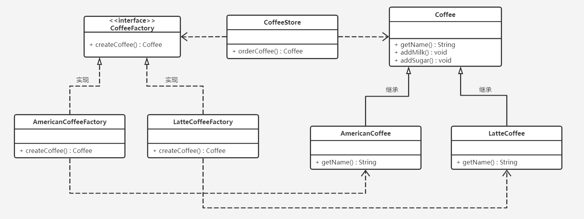

代码如下：

**咖啡类**：

```java
public abstract class Coffee {
    public abstract String getName();
    //加糖
    public void addsugar() {
        System.out.println("加糖");
    }
    //加奶
    public void addMilk() {
        System.out.println("加奶");
    }
}
```

**美式咖啡类**：

```java
public class AmericanCoffee extends Coffee {
    public String getName() {
        return "美式咖啡";
    }
}
```

**拿铁咖啡类**：

```java
public class LatteCoffee extends Coffee {
    public String getName() {
        return "拿铁咖啡";
    }
}
```

**抽象咖啡工厂类**

```java
public interface CoffeeFactory {
    //创建咖啡对象的方法
    Coffee createCoffee();
}
```

**美式咖啡工厂类**：

```java
// 美式咖啡工厂对象，专门用来生产美式咖啡
public class AmericanCoffeeFactory implements CoffeeFactory {
    public Coffee createCoffee() {
        return new AmericanCoffee();
    }
}
```

**拿铁咖啡工厂类**：

```java
// 拿铁咖啡工厂，专门用来生产拿铁咖啡
public class LatteCoffeeFactory implements CoffeeFactory {
    public Coffee createCoffee() {
        return new LatteCoffee();
    }
}
```

**咖啡店类**：

```java
public class CoffeeStore {
    private CoffeeFactory factory;
    public void setFactory(CoffeeFactory factory) {
        this.factory = factory;
    }

    //点咖啡功能
    public Coffee orderCoffee() {
        Coffee coffee = factory.createCoffee();
        //加配料
        coffee.addMilk();
        coffee.addsugar();
        return coffee;
    }
}
```

**测试类**：

```java
public class Client {
    public static void main(String[] args) {
        //创建咖啡店对象
        CoffeeStore store = new CoffeeStore();
        //创建咖啡工厂对象
        //CoffeeFactory factory = new AmericanCoffeeFactory();
        CoffeeFactory factory = new LatteCoffeeFactory();
        store.setFactory(factory);

        //点咖啡
        Coffee coffee = store.orderCoffee();
        System.out.println(coffee.getName());
    }
}
```

从以上的编写的代码可以看到，要增加产品类时也要相应地增加工厂类，不需要修改工厂类的代码了，这样就解决了简单工厂模式的缺点。工厂方法模式是简单工厂模式的进一步抽象。由于使用了多态性，工厂方法模式保持了简单工厂模式的优点，而且克服了它的缺点。


##### 2.3.4 优缺点

**优点：**

- 用户只需要知道具体工厂的名称就可得到所要的产品，无须知道产品的具体创建过程；
- 在系统增加新的产品时只需要添加具体产品类和对应的具体工厂类，无须对原工厂进行任何修改，满足开闭原则；

**缺点：**

* 每增加一个产品就要增加一个具体产品类和一个对应的具体工厂类，这增加了系统的复杂度。


#### 2.4 抽象工厂模式

前面介绍的工厂方法模式中考虑的是一类产品的生产，如畜牧场只养动物、电视机厂只生产电视机、传智播客只培养计算机软件专业的学生等。

这些工厂只生产同种类产品，同种类产品称为同等级产品，也就是说：工厂方法模式只考虑生产同等级的产品，但是在现实生活中许多工厂是综合型的工厂，能生产多等级（种类）的产品，如电器厂既生产电视机又生产洗衣机或空调，大学既有软件专业又有生物专业等。

本节要介绍的抽象工厂模式将考虑多等级产品的生产，将同一个具体工厂所生产的位于不同等级的一组产品称为一个产品族，下图所示横轴是产品等级，也就是同一类产品；纵轴是产品族，也就是同一品牌的产品，同一品牌的产品产自同一个工厂。


##### 2.4.1 概念

是一种为访问类提供一个创建一组相关或相互依赖对象的接口，且访问类无须指定所要产品的具体类就能得到同族的不同等级的产品的模式结构。

抽象工厂模式是工厂方法模式的升级版本，工厂方法模式只生产一个等级的产品，而抽象工厂模式可生产多个等级的产品。


##### 2.4.2 结构

抽象工厂模式的主要角色如下：

* 抽象工厂（Abstract Factory）：提供了创建产品的接口，它包含多个创建产品的方法，可以创建多个不同等级的产品。
* 具体工厂（Concrete Factory）：主要是实现抽象工厂中的多个抽象方法，完成具体产品的创建。
* 抽象产品（Product）：定义了产品的规范，描述了产品的主要特性和功能，抽象工厂模式有多个抽象产品。
* 具体产品（ConcreteProduct）：实现了抽象产品角色所定义的接口，由具体工厂来创建，它 同具体工厂之间是多对一的关系。


##### 2.4.2 实现

现咖啡店业务发生改变，不仅要生产咖啡还要生产甜点，如提拉米苏、抹茶慕斯等，要是按照工厂方法模式，需要定义提拉米苏类、抹茶慕斯类、提拉米苏工厂、抹茶慕斯工厂、甜点工厂类，很容易发生类爆炸情况。其中拿铁咖啡、美式咖啡是一个产品等级，都是咖啡；提拉米苏、抹茶慕斯也是一个产品等级；拿铁咖啡和提拉米苏是同一产品族（也就是都属于意大利风味），美式咖啡和抹茶慕斯是同一产品族（也就是都属于美式风味）。所以这个案例可以使用抽象工厂模式实现。类图如下：

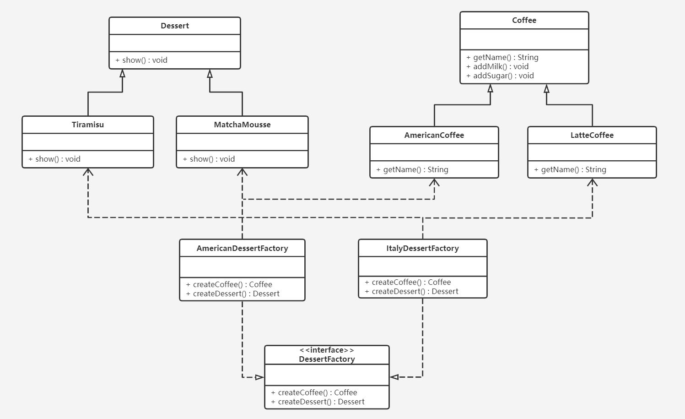

代码如下：

**甜品抽象类**：

```java
public abstract class Dessert {
    public abstract void show();
}
```

**甜饼抽象类的子类：抹茶慕斯类，提拉米苏类**：

```java
// 抹茶慕斯类
public class MatchaMousse extends Dessert {
    public void show() {
        System.out.println("抹茶慕斯");
    }
}

// 提拉米苏类
public class Trimisu extends Dessert {
    public void show() {
        System.out.println("提拉米苏");
    }
}
```

**咖啡类**：

```java
public abstract class Coffee {
    public abstract String getName();
    //加糖
    public void addsugar() {
        System.out.println("加糖");
    }
    //加奶
    public void addMilk() {
        System.out.println("加奶");
    }
}
```

**咖啡类的子类：美式咖啡，拿铁咖啡**：

```java
// 美式咖啡
public class AmericanCoffee extends Coffee {
    public String getName() {
        return "美式咖啡";
    }
}

// 拿铁咖啡
public class LatteCoffee extends Coffee {
    public String getName() {
        return "拿铁咖啡";
    }
}
```

**生产工厂接口**：

```java
public interface DessertFactory {
    //生产咖啡的功能
    Coffee createCoffee();
    //生产甜品的功能
    Dessert createDessert();
}
```

**生产工厂接口的实现类**：

```java
// 美式风味的甜品工厂：生产美式咖啡和抹茶慕斯甜饼
public class AmericanDessertFactory implements DessertFactory {
    public Coffee createCoffee() {
        return new AmericanCoffee(); // 生产美式咖啡
    }
    
    public Dessert createDessert() {
        return new MatchaMousse(); // 生产抹茶慕斯
    }
}

// 意大利风味甜品工厂：生产拿铁咖啡和提拉米苏甜品
public class ItalyDessertFactory implements DessertFactory {
    public Coffee createCoffee() {
        return new LatteCoffee(); // 生产拿铁咖啡
    }
    
    public Dessert createDessert() {
        return new Trimisu(); // 生产提拉米苏
    }
}
```

**测试类**：

```java
public class Client {
    public static void main(String[] args) {
        //创建的是意大利风味甜品工厂对象
        //ItalyDessertFactory factory = new ItalyDessertFactory();
        AmericanDessertFactory factory = new AmericanDessertFactory();
        //获取拿铁咖啡和提拉米苏甜品
        Coffee coffee = factory.createCoffee();
        Dessert dessert = factory.createDessert();

        System.out.println(coffee.getName());
        dessert.show();
    }
}
```

如果要加同一个产品族的话，只需要再加一个对应的工厂类即可，不需要修改其他的类。


##### 2.4.3 优缺点

**优点：**

当一个产品族中的多个对象被设计成一起工作时，它能保证客户端始终只使用同一个产品族中的对象。

**缺点：**

当产品族中需要增加一个新的产品时，所有的工厂类都需要进行修改。

##### 2.4.4 使用场景

* 当需要创建的对象是一系列相互关联或相互依赖的产品族时，如电器工厂中的电视机、洗衣机、空调等。

* 系统中有多个产品族，但每次只使用其中的某一族产品。如有人只喜欢穿某一个品牌的衣服和鞋。

* 系统中提供了产品的类库，且所有产品的接口相同，客户端不依赖产品实例的创建细节和内部结构。

如：输入法换皮肤，一整套一起换。生成不同操作系统的程序。


#### 2.5 模式扩展

**简单工厂+配置文件解除耦合**

可以通过工厂模式+配置文件的方式解除工厂对象和产品对象的耦合。在工厂类中加载配置文件中的全类名，并创建对象进行存储，客户端如果需要对象，直接进行获取即可。

**第一步：定义配置文件**

为了演示方便，我们使用properties文件作为配置文件，名称为bean.properties

```properties
american=com.itheima.pattern.factory.config_factory.AmericanCoffee
latte=com.itheima.pattern.factory.config_factory.LatteCoffee
```

**第二步：改进工厂类**

```java
public class CoffeeFactory {
    //加载配置文件，获取配置文件中配置的全类名，并创建该类的对象进行存储
    //1,定义容器对象存储咖啡对象
    private static HashMap<String,Coffee> map = new HashMap<String, Coffee>();

    //2,加载配置文件， 只需要加载一次
    static {
        //2.1 创建Properties对象
        Properties p = new Properties();
        //2.2 调用p对象中的load方法进行配置文件的加载
        InputStream is = CoffeeFactory.class.getClassLoader().getResourceAsStream("bean.properties");
        try {
            p.load(is);
            //从p集合中获取全类名并创建对象
            Set<Object> keys = p.keySet();
            for (Object key : keys) {
                String className = p.getProperty((String) key);
                //通过反射技术创建对象
                Class clazz = Class.forName(className);
                Coffee coffee = (Coffee) clazz.newInstance();
                //将名称和对象存储到容器中
                map.put((String)key, coffee);
            }
        } catch (Exception e) {
            e.printStackTrace();
        }
    }

    //根据名称获取对象
    public static Coffee createCoffee(String name) {
        return map.get(name);
    }
}
```

**测试类**：

```java
public class Client {
    public static void main(String[] args) {
        Coffee coffee = CoffeeFactory.createCoffee("american");
        System.out.println(coffee.getName());

        System.out.println("=============");
        
        Coffee latte = CoffeeFactory.createCoffee("latte");
        System.out.println(latte.getName());
    }
}
```

静态成员变量用来存储创建的对象（键存储的是名称，值存储的是对应的对象），而读取配置文件以及创建对象写在静态代码块中，目的就是只需要执行一次。


#### 2.6 JDK源码解析-Collection.iterator方法

```java
public class Demo {
    public static void main(String[] args) {
        List<String> list = new ArrayList<>();
        list.add("令狐冲");
        list.add("风清扬");
        list.add("任我行");

        //获取迭代器对象
        Iterator<String> it = list.iterator();
        //使用迭代器遍历
        while(it.hasNext()) {
            String ele = it.next();
            System.out.println(ele);
        }
    }
}
```

对上面的代码大家应该很熟，使用迭代器遍历集合，获取集合中的元素。而单列集合获取迭代器的方法就使用到了工厂方法模式。我们看通过类图看看结构：

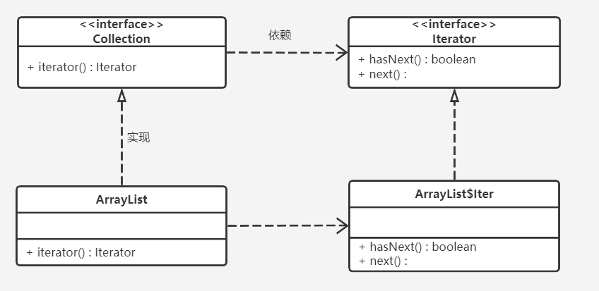

Collection接口是抽象工厂类，ArrayList是具体的工厂类；Iterator接口是抽象商品类，ArrayList类中的Iter内部类是具体的商品类。在具体的工厂类中iterator()方法创建具体的商品类的对象。

> 另：
>
> 1. DateForamt类中的getInstance()方法使用的是工厂模式；
>
> 2. Calendar类中的getInstance()方法使用的是工厂模式；


### 3 原型模式

#### 3.1 概述

用一个已经创建的实例作为原型，通过复制该原型对象来创建一个和原型对象相同的新对象。

#### 3.2 结构

原型模式包含如下角色：

* 抽象原型类：规定了具体原型对象必须实现的的 clone() 方法。（**Cloneable接口**）
* 具体原型类：实现抽象原型类的 clone() 方法，它是可被复制的对象。（**实现了Cloneable接口的类**）
* 访问类：使用具体原型类中的 clone() 方法来复制新的对象。

接口类图如下：


#### 3.3 实现

原型模式的克隆分为浅克隆和深克隆。

> 浅克隆：创建一个新对象，新对象的属性和原来对象完全相同，对于非基本类型属性，仍指向原有属性所指向的对象的内存地址。
>
> 深克隆：创建一个新对象，属性中引用的其他对象也会被克隆，不再指向原有对象地址。

Java中的Object类中提供了 `clone()` 方法来实现浅克隆。

Cloneable接口是上面的类图中的抽象原型类，而实现了Cloneable接口的子实现类就是具体的原型类。代码如下：

**Realizetype（具体的原型类）：**

```java
public class Realizetype implements Cloneable {
    public Realizetype() {
        System.out.println("具体的原型对象创建完成！");
    }

    @Override
    public Realizetype clone() throws CloneNotSupportedException {
        System.out.println("具体原型复制成功！");
        return (Realizetype) super.clone();
    }
}
```

**PrototypeTest（测试访问类）：**

```java
public class PrototypeTest {
    public static void main(String[] args) throws CloneNotSupportedException {
        //创建一个原型类对象
        Realizetype realizetype = new Realizetype();

        //调用Realizetype类中的clone方法进行对象的克隆
        Realizetype clone = realizetype.clone();

        System.out.println("原型对象和克隆出来的是否是同一个对象？" + (realizetype == clone));
    }
}
/*
具体的原型对象创建完成！
具体原型复制成功！
原型对象和克隆出来的是否是同一个对象？false
*/
```


#### 3.4 案例

**用原型模式生成“三好学生”奖状**

同一学校的“三好学生”奖状除了获奖人姓名不同，其他都相同，可以使用原型模式复制多个“三好学生”奖状出来，然后在修改奖状上的名字即可。

类图如下：


代码如下：

```java
//奖状类
public class Citation implements Cloneable {
    private String name;

    public void setName(String name) {
        this.name = name;
    }
    public String getName() {
        return (this.name);
    }

    public void show() {
        System.out.println(name + "同学：在2022学年第一学期中表现优秀，被评为三好学生。特发此状！");
    }

    @Override
    public Citation clone() throws CloneNotSupportedException {
        return (Citation) super.clone();
    }
}

//测试访问类
public class CitaionTest {
    public static void main(String[] args) throws CloneNotSupportedException {
        //1.创建原型对象
        Citation citation = new Citation();
        //2.克隆奖状对象
        Citation citation1 = citation.clone();

        citation.setName("张三");
        citation1.setName("李四");

        //3.调用show方法展示
        citation.show();
        citation1.show();
    }
}
/*
张三同学：在2022学年第一学期中表现优秀，被评为三好学生。特发此状！
李四同学：在2022学年第一学期中表现优秀，被评为三好学生。特发此状！
*/
```

#### 3.5 使用场景

* 对象的创建非常复杂，可以使用原型模式快捷的创建对象。
* 性能和安全要求比较高。


#### 3.6 扩展（深克隆）

将上面的“三好学生”奖状的案例中Citation类的name属性修改为Student类型的属性。代码如下：

```java
//学生类
public class Student {
    private String name;
    private String address;
    public Student(String name, String address) {
        this.name = name;
        this.address = address;
    }
    public Student() {}
    //get set toString
}

//奖状类
public class Citation implements Cloneable {
    private Student stu;

    public Student getStu() {
        return stu;
    }
    public void setStu(Student stu) {
        this.stu = stu;
    }

    void show() {
        System.out.println(stu.getName() + "同学：在2020学年第一学期中表现优秀，被评为三好学生。特发此状！");
    }

    @Override
    public Citation clone() throws CloneNotSupportedException {
        return (Citation) super.clone();
    }
}

//测试类
public class CitationTest {
    public static void main(String[] args) throws CloneNotSupportedException {
        Citation c1 = new Citation();
        Student stu = new Student("张三", "西安");
        c1.setStu(stu);

        //复制奖状
        Citation c2 = c1.clone();
        //获取c2奖状所属学生对象
        Student stu1 = c2.getStu();
        stu1.setName("李四");

        //判断stu对象和stu1对象是否是同一个对象
        System.out.println("stu和stu1是同一个对象？" + (stu == stu1));

        c1.show();
        c2.show();
    }
}
```

运行结果为：


<font color="red">说明：</font>

stu对象和stu1对象是同一个对象，就会产生将stu1对象中name属性值改为“李四”，两个Citation（奖状）对象中显示的都是李四。这就是浅克隆的效果，对具体原型类（Citation）中的引用类型的属性进行引用的复制。这种情况需要使用深克隆，而进行深克隆需要使用对象流。代码如下：

```java
public class CitationTest1 {
    public static void main(String[] args) throws Exception {
        Citation c1 = new Citation();
        Student stu = new Student("张三", "西安");
        c1.setStu(stu);

        //注意：Citation类和Student类必须实现Serializable接口，否则会抛NotSerializableException异常。
        //创建对象输出流对象
        ObjectOutputStream oos = new ObjectOutputStream(new FileOutputStream("C:\\Users\\Think\\Desktop\\b.txt"));
        //将c1对象写出到文件中
        oos.writeObject(c1);
        oos.close();

        //创建对象出入流对象
        ObjectInputStream ois = new ObjectInputStream(new FileInputStream("C:\\Users\\Think\\Desktop\\b.txt"));
        //读取对象
        Citation c2 = (Citation) ois.readObject();
        ois.close();
        //获取c2奖状所属学生对象
        Student stu1 = c2.getStu();
        stu1.setName("李四");

        //判断stu对象和stu1对象是否是同一个对象
        System.out.println("stu和stu1是同一个对象？" + (stu == stu1));

        c1.show();
        c2.show();
    }
}
```

运行结果为：

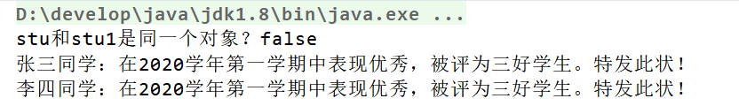

> 注意：Citation类和Student类必须实现Serializable接口，否则会抛NotSerializableException异常。


### 4 建造者模式

#### 4.1 概述

将一个复杂对象的构建与表示分离，使得同样的构建过程可以创建不同的表示。


* 分离了部件的构造(由Builder来负责)和装配(由Director负责)。从而可以构造出复杂的对象。这个模式适用于：某个对象的构建过程复杂的情况。
* 由于实现了构建和装配的解耦。不同的构建器，相同的装配，也可以做出不同的对象；相同的构建器，不同的装配顺序也可以做出不同的对象。也就是实现了构建算法、装配算法的解耦，实现了更好的复用。
* 建造者模式可以将部件和其组装过程分开，一步一步创建一个复杂的对象。用户只需要指定复杂对象的类型就可以得到该对象，而无须知道其内部的具体构造细节。


#### 4.2 结构

建造者（Builder）模式包含如下角色：

* 抽象建造者类（Builder）：这个接口规定要实现复杂对象的那些部分的创建，并不涉及具体的部件对象的创建。

* 具体建造者类（ConcreteBuilder）：实现 Builder 接口，完成复杂产品的各个部件的具体创建方法。在构造过程完成后，提供产品的实例。 

* 产品类（Product）：要创建的复杂对象。

* 指挥者类（Director）：调用具体建造者来创建复杂对象的各个部分，在指导者中不涉及具体产品的信息，只负责保证对象各部分完整创建或按某种顺序创建。

类图如下：

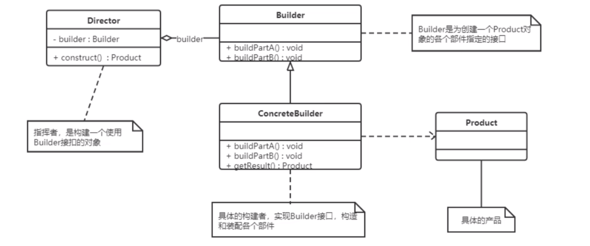


#### 4.3 实例

**创建共享单车**

生产自行车是一个复杂的过程，它包含了车架，车座等组件的生产。而车架又有碳纤维，铝合金等材质的，车座有橡胶，真皮等材质。对于自行车的生产就可以使用建造者模式。

这里Bike是产品，包含车架，车座等组件；Builder是抽象建造者，MobikeBuilder和OfoBuilder是具体的建造者；Director是指挥者。类图如下：

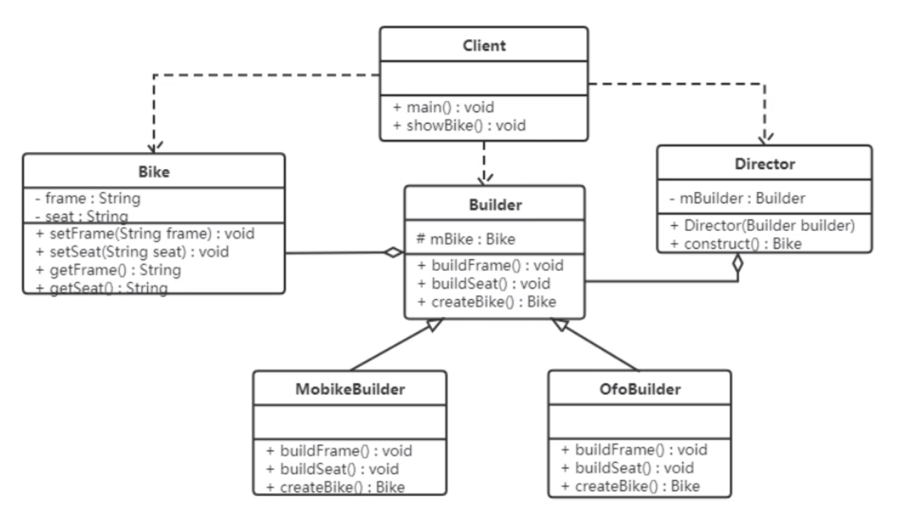

具体的代码如下：

**自行车类**：

```java
public class Bike {
    private String frame;//车架
    private String seat;//车座

    public String getFrame() { return frame; }
    public void setFrame(String frame) { this.frame = frame; }
    public String getSeat() { return seat; }
    public void setSeat(String seat) { this.seat = seat; }

    @Override
    public String toString() {
        return "Bike{" + "frame='" + frame + '\'' +
                ", seat='" + seat + '\'' + '}';
    }
}
```

**抽象Builder类**：

```java
public abstract class Builder {
    //声明Bike类型的变量，并进行赋值
    protected Bike bike = new Bike();

    public abstract void buildFrame();
    public abstract void buildSeat();
    //构建自行车的方法
    public abstract Bike createBike();
}
```

**摩拜单车Builder类**：

```java
public class MobileBuilder extends Builder {
    public void buildFrame() { bike.setFrame("碳纤维车架"); }
    public void buildSeat() { bike.setSeat("真皮车座"); }
    public Bike createBike() {
        return bike;
    }
}
```

**ofo单车Builder类**：

```java
public class OfoBuilder extends Builder {
    public void buildFrame() { bike.setFrame("铝合金车架"); }
    public void buildSeat() { bike.setSeat("橡胶车座"); }
    public Bike createBike() { return bike; }
}
```

**指挥者Director类**：

```java
public class Director {
    //声明builder类型的变量
    private Builder builder;

    public Director(Builder builder) { this.builder = builder; }

    //组装自行车的功能
    public Bike construct() {
        builder.buildFrame();
        builder.buildSeat();
        return builder.createBike();
    }
}
```

**测试类**：

```java
public class Client {
    public static void main(String[] args) {
        showBike(new MobileBuilder());
        showBike(new OfoBuilder());
    }
    private static void showBike(Builder builder){
        //创建指挥者对象
        Director director = new Director(builder);
        //让指挥者只会组装自行车
        Bike bike = director.construct();
        System.out.println(bike);
    }
}
/*
Bike{frame='碳纤维车架', seat='真皮车座'}
Bike{frame='铝合金车架', seat='橡胶车座'}
*/
```

**注意：**

上面示例是Builder模式的常规用法，指挥者类 Director 在建造者模式中具有很重要的作用，它用于指导具体构建者如何构建产品，控制调用先后次序，并向调用者返回完整的产品类，但是有些情况下需要简化系统结构，可以把指挥者类和抽象建造者进行结合

```java
// 抽象 builder 类
public abstract class Builder {
    protected Bike bike = new Bike();

    public abstract void buildFrame();
    public abstract void buildSeat();
    public abstract Bike createBike();
    
    public Bike construct() {
        this.buildFrame();
        this.BuildSeat();
        return this.createBike();
    }
}
```

**说明：**

这样做确实简化了系统结构，但同时也加重了抽象建造者类的职责，也不是太符合单一职责原则，如果construct()过于复杂，建议还是封装到Director中。


#### 4.4 优缺点

**优点：**

- 建造者模式的封装性很好。使用建造者模式可以有效的封装变化，在使用建造者模式的场景中，一般产品类和建造者类是比较稳定的，因此，将主要的业务逻辑封装在指挥者类中对整体而言可以取得比较好的稳定性。
- 在建造者模式中，客户端不必知道产品内部组成的细节，将产品本身与产品的创建过程解耦，使得相同的创建过程可以创建不同的产品对象。
- 可以更加精细地控制产品的创建过程。将复杂产品的创建步骤分解在不同的方法中，使得创建过程更加清晰，也更方便使用程序来控制创建过程。
- 建造者模式很容易进行扩展。如果有新的需求，通过实现一个新的建造者类就可以完成，基本上不用修改之前已经测试通过的代码，因此也就不会对原有功能引入风险。符合开闭原则。

**缺点：**

- 造者模式所创建的产品一般具有较多的共同点，其组成部分相似，如果产品之间的差异性很大，则不适合使用建造者模式，因此其使用范围受到一定的限制。


#### 4.5 使用场景

建造者（Builder）模式创建的是复杂对象，其产品的各个部分经常面临着剧烈的变化，但将它们组合在一起的算法却相对稳定，所以它通常在以下场合使用。

- 创建的对象较复杂，由多个部件构成，各部件面临着复杂的变化，但构件间的建造顺序是稳定的。
- 创建复杂对象的算法独立于该对象的组成部分以及它们的装配方式，即产品的构建过程和最终的表示是独立的。


#### 4.6 模式扩展

建造者模式除了上面的用途外，在开发中还有一个常用的使用方式，就是当一个类构造器需要传入很多参数时，如果创建这个类的实例，代码可读性会非常差，而且很容易引入错误，此时就可以利用建造者模式进行重构。

重构前代码如下：

```java
public class Phone {
    private String cpu;
    private String screen;
    private String memory;
    private String mainboard;

    public Phone(String cpu, String screen, String memory, String mainboard) {
        this.cpu = cpu;
        this.screen = screen;
        this.memory = memory;
        this.mainboard = mainboard;
    }

    public String getCpu() {
        return cpu;
    }

    public void setCpu(String cpu) {
        this.cpu = cpu;
    }

    public String getScreen() {
        return screen;
    }

    public void setScreen(String screen) {
        this.screen = screen;
    }

    public String getMemory() {
        return memory;
    }

    public void setMemory(String memory) {
        this.memory = memory;
    }

    public String getMainboard() {
        return mainboard;
    }

    public void setMainboard(String mainboard) {
        this.mainboard = mainboard;
    }

    @Override
    public String toString() {
        return "Phone{" +
                "cpu='" + cpu + '\'' +
                ", screen='" + screen + '\'' +
                ", memory='" + memory + '\'' +
                ", mainboard='" + mainboard + '\'' +
                '}';
    }
}

public class Client {
    public static void main(String[] args) {
        //构建Phone对象
        Phone phone = new Phone("intel","三星屏幕","金士顿","华硕");
        System.out.println(phone);
    }
}
```

上面在客户端代码中构建Phone对象，传递了四个参数，如果参数更多呢？代码的可读性及使用的成本就是比较高。

重构后代码：

```java
public class Phone {
    private String cpu;         // 处理器
    private String screen;      // 屏幕
    private String memory;      // 内存
    private String mainboard;   // 主板

    // 私有构造方法
    private Phone(Builder builder){
        this.cpu = builder.cpu;
        this.screen = builder.screen;
        this.memory = builder.memory;
        this.mainboard = builder.mainboard;
    }

    @Override
    public String toString() {
        return "Phone{" +
                "cpu='" + cpu + '\'' +
                ", screen='" + screen + '\'' +
                ", memory='" + memory + '\'' +
                ", mainboard='" + mainboard + '\'' +
                '}';
    }

    public static final class Builder {
        private String cpu;         // 处理器
        private String screen;      // 屏幕
        private String memory;      // 内存
        private String mainboard;   // 主板

        public Builder cpu(String cpu) {
            this.cpu = cpu;
            return this;
        }
        public Builder screen(String screen) {
            this.screen = screen;
            return this;
        }
        public Builder memory(String memory) {
            this.memory = memory;
            return this;
        }
        public Builder mainboard(String mainboard) {
            this.mainboard = mainboard;
            return this;
        }

        //使用创建者创建Phone对象
        public Phone build(){
            return new Phone(this);
        }
    }
}

public class Client {
    public static void main(String[] args) {
        // 创建手机对象  通过构建者对象获取手机对象
        Phone phone = new Phone.Builder()
                .cpu("inter")
                .screen("三星屏幕")
                .memory("金士顿内存")
                .mainboard("华硕主板")
                .build();
        System.out.println(phone);
    }
}
```

重构后的代码在使用起来更方便，某种程度上也可以提高开发效率。从软件设计上，对程序员的要求比较高。


### 5 创建者模式对比

#### 5.1 工厂方法模式VS建造者模式

工厂方法模式注重的是整体对象的创建方式；而建造者模式注重的是部件构建的过程，意在通过一步一步地精确构造创建出一个复杂的对象。

我们举个简单例子来说明两者的差异，如要制造一个超人，如果使用工厂方法模式，直接产生出来的就是一个力大无穷、能够飞翔、内裤外穿的超人；而如果使用建造者模式，则需要组装手、头、脚、躯干等部分，然后再把内裤外穿，于是一个超人就诞生了。

#### 5.2 抽象工厂模式VS建造者模式

抽象工厂模式实现对产品家族的创建，一个产品家族是这样的一系列产品：具有不同分类维度的产品组合，采用抽象工厂模式则是不需要关心构建过程，只关心什么产品由什么工厂生产即可。

建造者模式则是要求按照指定的蓝图建造产品，它的主要目的是通过组装零配件而产生一个新产品。

如果将抽象工厂模式看成汽车配件生产工厂，生产一个产品族的产品，那么建造者模式就是一个汽车组装工厂，通过对部件的组装可以返回一辆完整的汽车。

------

## 五、结构型模式

结构型模式描述如何将类或对象按某种布局组成更大的结构。它分为`类结构型模式`和`对象结构型模式`，前者采用`继承机制`来组织接口和类，后者釆用`组合或聚合`来组合对象。

由于组合关系或聚合关系比继承关系耦合度低，满足“合成复用原则”，所以对象结构型模式比类结构型模式具有更大的灵活性。

结构型模式分为以下 7 种：

* 代理模式
* 适配器模式
* 装饰者模式
* 桥接模式
* 外观模式
* 组合模式
* 享元模式


### 1 代理模式

#### 1.1 概述

由于某些原因需要给某对象提供一个代理以控制对该对象的访问。这时，访问对象不适合或者不能直接引用目标对象，代理对象作为访问对象和目标对象之间的中介。

Java中的代理按照代理类生成时机不同又分为静态代理和动态代理。静态代理代理类在编译期就生成，而动态代理代理类则是在Java运行时动态生成。动态代理又有JDK代理和CGLib代理两种。


#### 1.2 结构

代理（Proxy）模式分为三种角色：

* 抽象主题（Subject）类：通过接口或抽象类声明真实主题和代理对象实现的业务方法。
* 真实主题（Real Subject）类：实现了抽象主题中的具体业务，是代理对象所代表的真实对象，是最终要引用的对象。
* 代理（Proxy）类：提供了与真实主题相同的接口，其内部含有对真实主题的引用，它可以访问、控制或扩展真实主题的功能。


#### 1.3 静态代理

我们通过案例来感受一下静态代理。

【例】火车站卖票

如果要买火车票的话，需要去火车站买票，坐车到火车站，排队等一系列的操作，显然比较麻烦。而火车站在多个地方都有代售点，我们去代售点买票就方便很多了。这个例子其实就是典型的代理模式，火车站是目标对象，代售点是代理对象。类图如下：

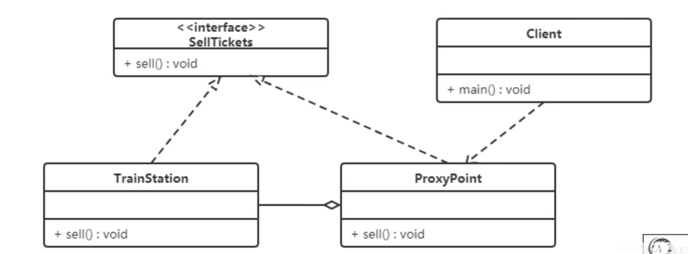

代码如下：

```java
//卖票接口
public interface SellTickets {
    void sell();
}

//火车站  火车站具有卖票功能，所以需要实现SellTickets接口
public class TrainStation implements SellTickets {
    public void sell() {
        System.out.println("火车站卖票");
    }
}

//代售点
public class ProxyPoint implements SellTickets {
    //声明火车站类对象
    private TrainStation station = new TrainStation(); // 组合
    public void sell() {
        System.out.println("代理点收取一些服务费用");
        station.sell();
    }
}

//测试类
public class Client {
    public static void main(String[] args) {
        //创建代售点类对象
        ProxyPoint proxyPoint = new ProxyPoint();
        //调用方法进行买票
        proxyPoint.sell();
    }
}
/*
代售点收取一些服务费用
火车站卖票
*/
```

从上面代码中可以看出测试类直接访问的是ProxyPoint类对象，也就是说ProxyPoint作为访问对象和目标对象的中介。同时也对sell方法进行了增强（代理点收取一些服务费用）。


#### 1.4 JDK动态代理

接下来我们使用动态代理实现上面案例，先说说JDK提供的动态代理。Java中提供了一个动态代理类Proxy，Proxy并不是我们上述所说的代理对象的类，而是提供了一个创建代理对象的静态方法（newProxyInstance方法）来获取代理对象。

代码如下：

```java
//卖票接口
public interface SellTickets {
    void sell();
}
```

```java
//火车站  火车站具有卖票功能，所以需要实现SellTickets接口
public class TrainStation implements SellTickets {
    public void sell() {
        System.out.println("火车站卖票");
    }
}
```

```java
//代理工厂，用来创建代理对象
public class ProxyFactory {
    //声明目标对象
    private TrainStation station = new TrainStation();

    //获取代理对象的方法
    public SellTickets getProxyObject() {
        //返回代理对象
        /*
            ClassLoader loader：类加载器，用于加载代理类。可以通过目标对象获取类加载器
            Class<?>[] interfaces：代理类实现的接口的字节码对象
            InvocationHandler h：代理对象的调用处理程序
         */
        SellTickets proxyObject = (SellTickets) Proxy.newProxyInstance(
                station.getClass().getClassLoader(),
                station.getClass().getInterfaces(),
                new InvocationHandler() {
                    /*
                        Object proxy：代理对象。和proxyObject对象是同一个对象，在invoke方法中基本不用
                        Method method：对接口中的方法进行封装的method对象
                        Object[] args：调用方法的实际参数

                        返回值： 方法的返回值。
                     */
                    public Object invoke(Object proxy, Method method, Object[] args) throws Throwable {
                        System.out.println("代售点收取一定的服务费用(jdk动态代理)"); // 功能增强
                        //执行目标对象的方法
                        Object obj = method.invoke(station, args);
                        return obj;
                    }
                }
        );
        return proxyObject;
    }
}
```

```java
//测试类
public class Client {
    public static void main(String[] args) {
        //获取代理对象
        //1,创建代理工厂对象
        ProxyFactory factory = new ProxyFactory();
        //2,使用factory对象的方法获取代理对象
        SellTickets proxyObject = factory.getProxyObject();
        //3,调用卖调用的方法
        proxyObject.sell();
    }
}
/*
代售点收取一定的服务费用(jdk动态代理)
火车站卖票
*/
```

<font color="red">使用了动态代理，我们思考下面问题：</font>

* ProxyFactory是代理类吗？

  ProxyFactory不是代理模式中所说的代理类，而代理类是程序在运行过程中动态的在内存中生成的类。通过阿里巴巴开源的Java诊断工具（Arthas【阿尔萨斯】）查看代理类的结构：

  ```java
  package com.sun.proxy;
  
  import com.itheima.proxy.dynamic.jdk.SellTickets;
  import java.lang.reflect.InvocationHandler;
  import java.lang.reflect.Method;
  import java.lang.reflect.Proxy;
  import java.lang.reflect.UndeclaredThrowableException;
  
  public final class $Proxy0 extends Proxy implements SellTickets {
      private static Method m1;
      private static Method m2;
      private static Method m3;
      private static Method m0;
  
      public $Proxy0(InvocationHandler invocationHandler) {
          super(invocationHandler);
      }
  
      static {
          try {
              m1 = Class.forName("java.lang.Object").getMethod("equals", Class.forName("java.lang.Object"));
              m2 = Class.forName("java.lang.Object").getMethod("toString", new Class[0]);
              m3 = Class.forName("com.itheima.proxy.dynamic.jdk.SellTickets").getMethod("sell", new Class[0]);
              m0 = Class.forName("java.lang.Object").getMethod("hashCode", new Class[0]);
              return;
          }
          catch (NoSuchMethodException noSuchMethodException) {
              throw new NoSuchMethodError(noSuchMethodException.getMessage());
          }
          catch (ClassNotFoundException classNotFoundException) {
              throw new NoClassDefFoundError(classNotFoundException.getMessage());
          }
      }
  
      public final boolean equals(Object object) {
          try {
              return (Boolean)this.h.invoke(this, m1, new Object[]{object});
          }
          catch (Error | RuntimeException throwable) {
              throw throwable;
          }
          catch (Throwable throwable) {
              throw new UndeclaredThrowableException(throwable);
          }
      }
  
      public final String toString() {
          try {
              return (String)this.h.invoke(this, m2, null);
          }
          catch (Error | RuntimeException throwable) {
              throw throwable;
          }
          catch (Throwable throwable) {
              throw new UndeclaredThrowableException(throwable);
          }
      }
  
      public final int hashCode() {
          try {
              return (Integer)this.h.invoke(this, m0, null);
          }
          catch (Error | RuntimeException throwable) {
              throw throwable;
          }
          catch (Throwable throwable) {
              throw new UndeclaredThrowableException(throwable);
          }
      }
  
      public final void sell() {
          try {
              this.h.invoke(this, m3, null);
              return;
          }
          catch (Error | RuntimeException throwable) {
              throw throwable;
          }
          catch (Throwable throwable) {
              throw new UndeclaredThrowableException(throwable);
          }
      }
  }
  ```

  从上面的类中，我们可以看到以下几个信息：

  * 代理类（$Proxy0）实现了SellTickets。这也就印证了我们之前说的真实类和代理类实现同样的接口。
  * 代理类（$Proxy0）将我们提供了的匿名内部类对象传递给了父类。

* 动态代理的执行流程是什么样？

  下面是摘取的重点代码：

  ```java
  //程序运行过程中动态生成的代理类
  public final class $Proxy0 extends Proxy implements SellTickets {
      private static Method m3;
  
      public $Proxy0(InvocationHandler invocationHandler) {
          super(invocationHandler);
      }
  
      static {
          m3 = Class.forName("com.itheima.proxy.dynamic.jdk.SellTickets").getMethod("sell", new Class[0]);
      }
  
      public final void sell() {
          this.h.invoke(this, m3, null);
      }
  }
  
  //Java提供的动态代理相关类
  public class Proxy implements java.io.Serializable {
  	protected InvocationHandler h;
  	 
  	protected Proxy(InvocationHandler h) {
          this.h = h;
      }
  }
  
  //代理工厂类
  public class ProxyFactory {
      private TrainStation station = new TrainStation();
  
      public SellTickets getProxyObject() {
          SellTickets sellTickets = (SellTickets) Proxy.newProxyInstance(station.getClass().getClassLoader(),
                  station.getClass().getInterfaces(),
                  new InvocationHandler() {
                      
                      public Object invoke(Object proxy, Method method, Object[] args) throws Throwable {
  
                          System.out.println("代理点收取一些服务费用(JDK动态代理方式)");
                          Object result = method.invoke(station, args);
                          return result;
                      }
                  });
          return sellTickets;
      }
  }
  
  //测试访问类
  public class Client {
      public static void main(String[] args) {
          //获取代理对象
          ProxyFactory factory = new ProxyFactory();
          SellTickets proxyObject = factory.getProxyObject();
          proxyObject.sell();
      }
  }
  ```


执行流程如下：

    1. 在测试类中通过代理对象调用sell()方法
    2. 根据多态的特性，执行的是代理类（$Proxy0）中的sell()方法
    3. 代理类（$Proxy0）中的sell()方法中又调用了InvocationHandler接口的子实现类对象的invoke方法
    4. invoke方法通过反射执行了真实对象所属类(TrainStation)中的sell()方法


#### 1.5 CGLIB动态代理

同样是上面的案例，我们再次使用CGLIB代理实现。

如果没有定义SellTickets接口，只定义了TrainStation(火车站类)。很显然JDK代理是无法使用了，因为JDK动态代理要求必须定义接口，对接口进行代理。

CGLIB是一个功能强大，高性能的代码生成包。它为没有实现接口的类提供代理，为JDK的动态代理提供了很好的补充。

CGLIB是第三方提供的包，所以需要引入jar包的坐标：

```xml
<dependency>
    <groupId>cglib</groupId>
    <artifactId>cglib</artifactId>
    <version>2.2.2</version>
</dependency>
```

代码如下：

**火车站类**：

```java
public class TrainStation {
    public void sell() {
        System.out.println("火车站卖票");
    }
}
```

**代理对象工厂，用来获取代理对象**：

```java
代理对象工厂，用来获取代理对象public class ProxyFactory implements MethodInterceptor {
    //声明火车站对象
    private TrainStation station = new TrainStation();

    public TrainStation getProxyObject() {
        //创建Enhancer对象，类似于JDK代理中的Proxy类
        Enhancer enhancer = new Enhancer();
        //设置父类的字节码对象。指定父类
        enhancer.setSuperclass(TrainStation.class);
        //设置回调函数
        enhancer.setCallback(this);
        //创建代理对象
        TrainStation proxyObject = (TrainStation) enhancer.create();
        return proxyObject;
    }

    /*
        intercept方法参数说明：
            o：代理对象
            method：真实对象中的方法的Method实例
            objects：实际参数
            methodProxy：代理对象中的方法的method实例
     */
    public Object intercept(Object o, Method method, Object[] objects, MethodProxy methodProxy) throws Throwable {
        System.out.println("代售点收取一定的服务费用(CGLib代理)");
        //要调用目标对象的方法
        Object obj = method.invoke(station, objects);
        return obj;
    }
}
```

**测试类**：

```java
public class Client {
    public static void main(String[] args) {
        //创建代理工厂对象
        ProxyFactory factory = new ProxyFactory();
        //获取代理对象
        TrainStation proxyObject = factory.getProxyObject();
        //调用代理对象中的sell方法卖票
        proxyObject.sell();
    }
}
```


#### 1.6 三种代理的对比

* jdk代理和CGLIB代理

  使用CGLib实现动态代理，CGLib底层采用ASM字节码生成框架，使用字节码技术生成代理类，在JDK1.6之前比使用Java反射效率要高。唯一需要注意的是，CGLib不能对声明为final的类或者方法进行代理，因为CGLib原理是动态生成被代理类的子类。

  在JDK1.6、JDK1.7、JDK1.8逐步对JDK动态代理优化之后，在调用次数较少的情况下，JDK代理效率高于CGLib代理效率，只有当进行大量调用的时候，JDK1.6和JDK1.7比CGLib代理效率低一点，但是到JDK1.8的时候，JDK代理效率高于CGLib代理。

  所以如果有接口使用JDK动态代理，如果没有接口使用CGLIB代理。

* 动态代理和静态代理

  动态代理与静态代理相比较，最大的好处是接口中声明的所有方法都被转移到调用处理器一个集中的方法中处理（InvocationHandler.invoke）。这样，在接口方法数量比较多的时候，我们可以进行灵活处理，而不需要像静态代理那样每一个方法进行中转。

  如果接口增加一个方法，静态代理模式除了所有实现类需要实现这个方法外，所有代理类也需要实现此方法。增加了代码维护的复杂度。而动态代理不会出现该问题


#### 1.7 优缺点

**优点：**

- 代理模式在客户端与目标对象之间起到一个中介作用和保护目标对象的作用；
- 代理对象可以扩展目标对象的功能；
- 代理模式能将客户端与目标对象分离，在一定程度上降低了系统的耦合度；

**缺点：**

* 增加了系统的复杂度；


#### 1.8 使用场景

* 远程（Remote）代理

  本地服务通过网络请求远程服务。为了实现本地到远程的通信，我们需要实现网络通信，处理其中可能的异常。为良好的代码设计和可维护性，我们将网络通信部分隐藏起来，只暴露给本地服务一个接口，通过该接口即可访问远程服务提供的功能，而不必过多关心通信部分的细节。

* 防火墙（Firewall）代理

  当你将浏览器配置成使用代理功能时，防火墙就将你的浏览器的请求转给互联网；当互联网返回响应时，代理服务器再把它转给你的浏览器。

* 保护（Protect or Access）代理

  控制对一个对象的访问，如果需要，可以给不同的用户提供不同级别的使用权限。


### 2 适配器模式

#### 2.1 概述

如果去欧洲国家去旅游的话，他们的插座如下图最左边，是欧洲标准。而我们使用的插头如下图最右边的。因此我们的笔记本电脑，手机在当地不能直接充电。所以就需要一个插座转换器，转换器第1面插入当地的插座，第2面供我们充电，这样使得我们的插头在当地能使用。生活中这样的例子很多，手机充电器（将220v转换为5v的电压），读卡器等，其实就是使用到了适配器模式。


**定义：**

将一个类的接口转换成客户希望的另外一个接口，使得原本由于接口不兼容而不能一起工作的那些类能一起工作。

适配器模式分为`类适配器模式`和`对象适配器模式`，前者类之间的耦合度比后者高，且要求程序员了解现有组件库中的相关组件的内部结构，所以应用相对较少些。


#### 2.2 结构

适配器模式（Adapter）包含以下主要角色：

* 目标（Target）接口：当前系统业务所期待的接口，它可以是抽象类或接口。
* 适配者（Adaptee）类：它是被访问和适配的现存组件库中的组件接口。
* 适配器（Adapter）类：它是一个转换器，通过继承或引用适配者的对象，把适配者接口转换成目标接口，让客户按目标接口的格式访问适配者。


#### 2.3 类适配器模式

实现方式：定义一个适配器类来实现当前系统的业务接口，同时又继承现有组件库中已经存在的组件。

**【例】读卡器**

现有一台电脑只能读取SD卡，而要读取TF卡中的内容的话就需要使用到适配器模式。创建一个读卡器，将TF卡中的内容读取出来。

类图如下：

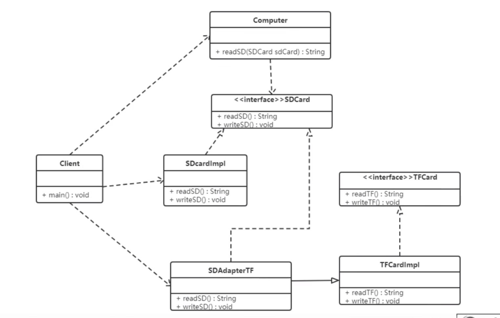

代码如下：

```java
// 适配者类的接口
public interface TFCard {
    //从TF卡中读取数据
    String readTF();
    //往TF卡中写数据
    void writeTF(String msg);
}
```

```java
// 适配者类
public class TFCardImpl implements TFCard {
    public String readTF() {
        String msg = "TFCard read msg：hello word TFcard";
        return msg;
    }

    public void writeTF(String msg) {
        System.out.println("TFCard write msg：" + msg);
    }
}
```

```java
// 目标接口
public interface SDCard {
    //从SD卡中读取数据
    String readSD();
    //往SD卡中写数据
    void writeSD(String msg);
}
```

```java
//具体的SD卡
public class SDCardImpl implements SDCard {
    public String readSD() {
        String msg = "SDCard read msg：hello word SD";
        return msg;
    }

    public void writeSD(String msg) {
        System.out.println("SDCard write msg：" + msg);
    }
}
```

```java
// 计算机类
public class Computer {
    //从SD卡中读取数据
    public String readSD(SDCard sdCard) {
        if(sdCard == null) {
            throw  new NullPointerException("sd card is not null");
        }
        return sdCard.readSD();
    }
}
```

```java
// 适配器类
public class SDAdapterTF extends TFCardImpl implements SDCard {
    public String readSD() {
        System.out.println("adapter read tf card");
        return readTF();
    }

    public void writeSD(String msg) {
        System.out.println("adapter write tf card");
        writeTF(msg);
    }
}
```

```java
// 测试类
public class Client {
    public static void main(String[] args) {
        //创建计算机对象
        Computer computer = new Computer();
        //读取SD卡中的数据
        String msg = computer.readSD(new SDCardImpl());
        System.out.println(msg);

        System.out.println("===============");
        //使用该电脑读取TF卡中的数据
        //定义适配器类
        String msg1 = computer.readSD(new SDAdapterTF());
        System.out.println(msg1);
    }
}
/*
SDCard read msg：hello word SD
===============
adapter read tf card
TFCard read msg：hello word TFcard
 */
```

类适配器模式违背了合成复用原则。类适配器是客户类有一个接口规范的情况下可用，反之不可用。


#### 2.4 对象适配器模式

实现方式：对象适配器模式可釆用将现有组件库中已经实现的组件引入适配器类中，该类同时实现当前系统的业务接口。

【例】读卡器

我们使用对象适配器模式将读卡器的案例进行改写。类图如下：

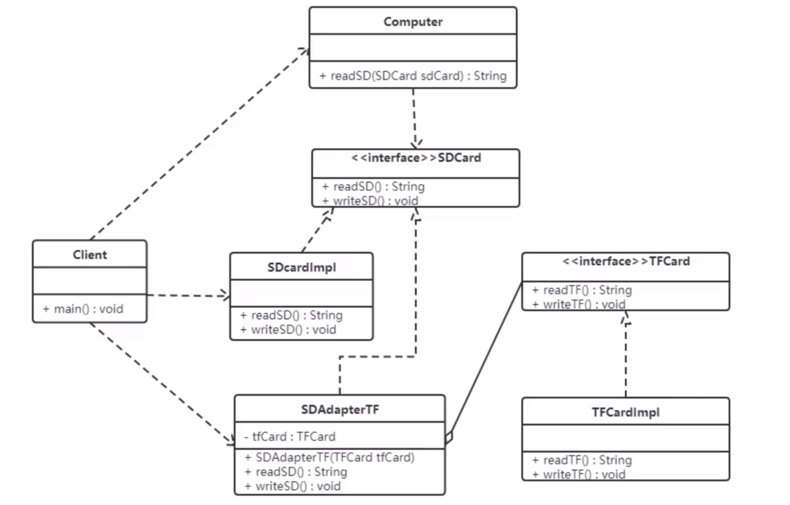

代码如下：

类适配器模式的代码，我们只需要修改适配器类（SDAdapterTF）和测试类。

```java
//创建适配器对象（SD兼容TF）
public class SDAdapterTF implements SDCard {
    //声明适配者类
    private TFCard tfCard;

    public SDAdapterTF(TFCard tfCard) {
        this.tfCard = tfCard;
    }

    @Override
    public String readSD() {
        System.out.println("adapter read tf card");
        return tfCard.readTF();
    }
    @Override
    public void writeSD(String msg) {
        System.out.println("adapter write tf card");
        tfCard.writeTF(msg);
    }
}

//测试类
public class Client {
    public static void main(String[] args) {
        //创建计算机对象
        Computer computer = new Computer();
        //读取SD卡中的数据
        String msg = computer.readSD(new SDCardImpl());
        System.out.println(msg);

        System.out.println("===============");
        //使用该电脑读取TF卡中的数据
        //创建适配器类对象
        SDCard sdAdapterTF = new SDAdapterTF(new TFCardImpl());
        String msg1 = computer.readSD(sdAdapterTF);
        System.out.println(msg1);
    }
}
```

> 注意：
>
> 还有一个适配器模式是接口适配器模式。当不希望实现一个接口中所有的方法时，可以创建一个抽象类Adapter，实现所有方法。而此时我们只需要继承该抽象类即可。


#### 2.5 应用场景

* 以前开发的系统存在满足新系统功能需求的类，但其接口同新系统的接口不一致。
* 使用第三方提供的组件，但组件接口定义和自己要求的接口定义不同。


#### 2.6 JDK源码解析

Reader（字符流）、InputStream（字节流）的适配使用的是InputStreamReader。

InputStreamReader继承自java.io包中的Reader，对他中的抽象的未实现的方法给出实现。如：

```java
public int read() throws IOException {
    return sd.read();
}

public int read(char cbuf[], int offset, int length) throws IOException {
    return sd.read(cbuf, offset, length);
}
```

如上代码中的sd（StreamDecoder类对象），在Sun的JDK实现中，实际的方法实现是对sun.nio.cs.StreamDecoder类的同名方法的调用封装。类结构图如下：

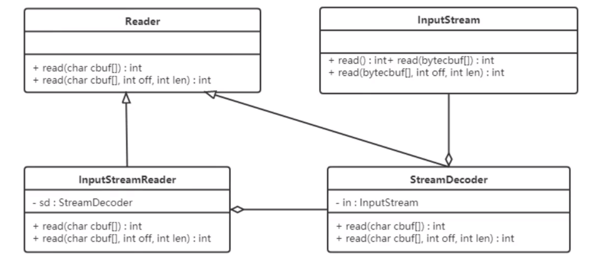

从上图可以看出：

* InputStreamReader是对同样实现了Reader的StreamDecoder的封装。
* StreamDecoder不是Java SE API中的内容，是Sun JDK给出的自身实现。但我们知道他们对构造方法中的字节流类（InputStream）进行封装，并通过该类进行了字节流和字符流之间的解码转换。

<font color="red">结论：</font>

从表层来看，InputStreamReader做了InputStream字节流类到Reader字符流之间的转换。而从如上Sun JDK中的实现类关系结构中可以看出，是StreamDecoder的设计实现在实际上采用了适配器模式。


### 3 装饰者模式

#### 3.1 概述

我们先来看一个快餐店的例子。

快餐店有炒面、炒饭这些快餐，可以额外附加鸡蛋、火腿、培根这些配菜，当然加配菜需要额外加钱，每个配菜的价钱通常不太一样，那么计算总价就会显得比较麻烦。

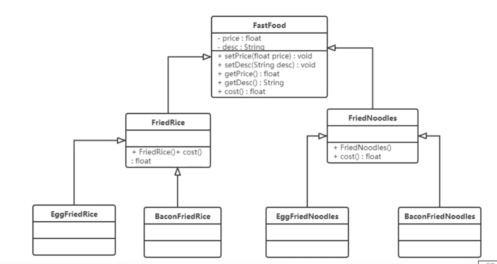

使用继承的方式存在的问题：

* 扩展性不好

  如果要再加一种配料（火腿肠），我们就会发现需要给FriedRice和FriedNoodles分别定义一个子类。如果要新增一个快餐品类（炒河粉）的话，就需要定义更多的子类。

* 产生过多的子类

**定义：**

指在不改变现有对象结构的情况下，动态地给该对象增加一些职责（即增加其额外功能）的模式。


#### 3.2 结构

装饰（Decorator）模式中的角色：

* 抽象构件（Component）角色：定义一个抽象接口以规范准备接收附加责任的对象。
* 具体构件（Concrete Component）角色：实现抽象构件，通过装饰角色为其添加一些职责。
* 抽象装饰（Decorator）角色：继承或实现抽象构件，并包含具体构件的实例，可以通过其子类扩展具体构件的功能。
* 具体装饰（ConcreteDecorator）角色：实现抽象装饰的相关方法，并给具体构件对象添加附加的责任。


#### 3.3 案例

我们使用装饰者模式对快餐店案例进行改进，体会装饰者模式的精髓。

类图如下：

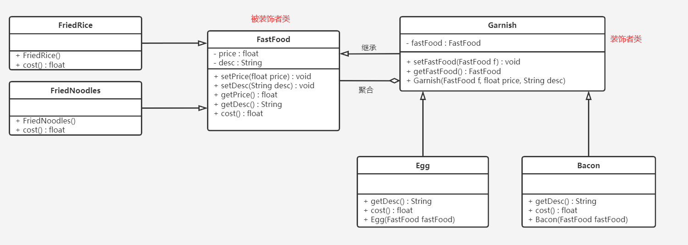

代码如下：

```java
//快餐类(抽象构件角色)
public abstract class FastFood {
    private float price; //价格
    private String desc; //描述
    
    public FastFood(float price, String desc) {
        this.price = price;
        this.desc = desc;
    }
    public FastFood() {}

    public float getPrice() { return price; }
    public void setPrice(float price) { this.price = price; }
    public String getDesc() { return desc; }
    public void setDesc(String desc) { this.desc = desc; }

    public abstract float cost();
}
```

```java
// 炒饭(具体构件角色)
public class FriedRice extends FastFood {
    public FriedRice() { super(10, "炒饭"); }
    public float cost() { return getPrice(); }
}
```

```java
//炒面(具体的构件角色)
public class FriedNoodles extends FastFood {
    public FriedNoodles() { super(12, "炒面"); }
    public float cost() { return getPrice(); }
}
```

```java
//装饰者类(抽象装饰者角色)
public abstract class Garnish extends FastFood {
    //声明快餐类的变量
    private FastFood fastFood;
    public FastFood getFastFood() { return fastFood; }
    public void setFastFood(FastFood fastFood) { 
        this.fastFood = fastFood; 
    }

    public Garnish(FastFood fastFood, float price, String desc) {
        super(price, desc);
        this.fastFood = fastFood;
    }
}
```

```java
//培根类(具体的装饰者角色)
public class Bacon extends Garnish {
    public Bacon(FastFood fastFood) { super(fastFood,2,"培根"); }

    public float cost() {
        //计算价格
        return getPrice() + getFastFood().cost();
    }

    @Override
    public String getDesc() { return super.getDesc() + getFastFood().getDesc(); }
}
```

```java
//鸡蛋类(具体的装饰者角色)
public class Egg extends Garnish {

    public Egg(FastFood fastFood) { super(fastFood,1,"鸡蛋"); }

    public float cost() {
        //计算价格
        return getPrice() + getFastFood().cost();
    }

    @Override
    public String getDesc() { return super.getDesc() + getFastFood().getDesc(); }
}
```

```java
//测试类
public class Client {
    public static void main(String[] args) {
        //点一份炒饭
        FastFood food = new FriedRice();

        System.out.println(food.getDesc() + "  " + food.cost() + "元");

        System.out.println("===============");

        //在上面的炒饭中加一个鸡蛋
        food = new Egg(food);
        System.out.println(food.getDesc() + "  " + food.cost() + "元");

        System.out.println("================");
        //再加一个鸡蛋
        food = new Egg(food);
        System.out.println(food.getDesc() + "  " + food.cost() + "元");

        System.out.println("================");
        food = new Bacon(food);
        System.out.println(food.getDesc() + "  " + food.cost() + "元");
    }
}
```

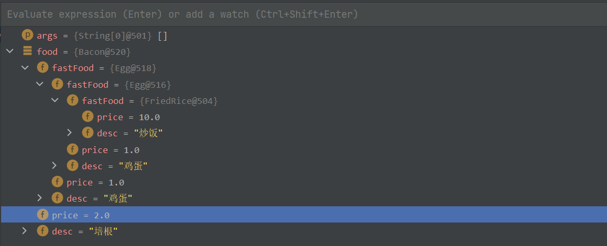

**好处：**

* 饰者模式可以带来比继承更加灵活性的扩展功能，使用更加方便，可以通过组合不同的装饰者对象来获取具有不同行为状态的多样化的结果。装饰者模式比继承更具良好的扩展性，完美的遵循开闭原则，继承是静态的附加责任，装饰者则是动态的附加责任。

* 装饰类和被装饰类可以独立发展，不会相互耦合，装饰模式是继承的一个替代模式，装饰模式可以动态扩展一个实现类的功能。


#### 3.4 使用场景

* 当不能采用继承的方式对系统进行扩充或者采用继承不利于系统扩展和维护时。

  不能采用继承的情况主要有两类：

  * 第一类是系统中存在大量独立的扩展，为支持每一种组合将产生大量的子类，使得子类数目呈爆炸性增长；
  * 第二类是因为类定义不能继承（如final类）

* 在不影响其他对象的情况下，以动态、透明的方式给单个对象添加职责。

* 当对象的功能要求可以动态地添加，也可以再动态地撤销时。


#### 3.5 JDK源码解析

IO流中的包装类使用到了装饰者模式。BufferedInputStream，BufferedOutputStream，BufferedReader，BufferedWriter。

我们以BufferedWriter举例来说明，先看看如何使用BufferedWriter

```java
public class Demo {
    public static void main(String[] args) throws Exception{
        //创建BufferedWriter对象
        //创建FileWriter对象
        FileWriter fw = new FileWriter("C:\\Users\\Think\\Desktop\\a.txt");
        BufferedWriter bw = new BufferedWriter(fw);

        //写数据
        bw.write("hello Buffered");

        bw.close();
    }
}
```

使用起来感觉确实像是装饰者模式，接下来看它们的结构：

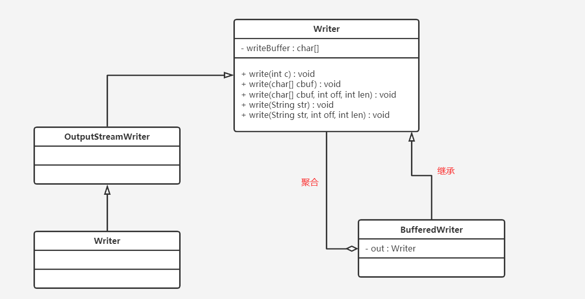

> <font color="red">小结：</font>
>
> ​	BufferedWriter使用装饰者模式对Writer子实现类进行了增强，添加了缓冲区，提高了写数据的效率。


#### 3.6 代理和装饰者的区别

静态代理和装饰者模式的区别：

* 相同点：
  * 都要实现与目标类相同的业务接口
  * 在两个类中都要声明目标对象
  * 都可以在不修改目标类的前提下增强目标方法
* 不同点：
  * 目的不同
    * 装饰者是为了增强目标对象
    * 静态代理是为了保护和隐藏目标对象
  * 获取目标对象构建的地方不同
    * 装饰者是由外界传递进来，可以通过构造方法传递
    * 静态代理是在代理类内部创建，以此来隐藏目标对象


### 4 桥接模式

#### 4.1 概述

现在有一个需求，需要创建不同的图形，并且每个图形都有可能会有不同的颜色。我们可以利用继承的方式来设计类的关系：


我们可以发现有很多的类，假如我们再增加一个形状或再增加一种颜色，就需要创建更多的类。

试想，在一个有多种可能会变化的维度的系统中，用继承方式会造成类爆炸，扩展起来不灵活。每次在一个维度上新增一个具体实现都要增加多个子类。为了更加灵活的设计系统，我们此时可以考虑使用桥接模式。

**定义：**

将抽象与实现分离，使它们可以独立变化。它是用组合关系代替继承关系来实现，从而降低了抽象和实现这两个可变维度的耦合度。


#### 4.2 结构

桥接（Bridge）模式包含以下主要角色：

* 抽象化（Abstraction）角色：定义抽象类，并包含一个对实现化对象的引用。
* 扩展抽象化（Refined Abstraction）角色：是抽象化角色的子类，实现父类中的业务方法，并通过组合关系调用实现化角色中的业务方法。
* 实现化（Implementor）角色：定义实现化角色的接口，供扩展抽象化角色调用。
* 具体实现化（Concrete Implementor）角色：给出实现化角色接口的具体实现。


#### 4.3 案例

【例】视频播放器

需要开发一个跨平台视频播放器，可以在不同操作系统平台（如Windows、Mac、Linux等）上播放多种格式的视频文件，常见的视频格式包括RMVB、AVI、WMV等。该播放器包含了两个维度，适合使用桥接模式。

类图如下：


代码如下：

```java
// 视频文件(实现化角色)
public interface VideoFile {
    void decode(String fileName); // 解码功能
}
```

```java
// avi视频文件（具体的实现化角色）
public class AviFile implements VideoFile {
    public void decode(String fileName) {
        System.out.println("avi视频文件：" + fileName);
    }
}
```

```java
// rmvb视频文件（具体的实现化角色）
public class RmvbFile implements VideoFile {
    public void decode(String fileName) {
        System.out.println("rmvb视频文件 ：" + fileName);
    }
}
```

```java
// 抽象的操作系统类(抽象化角色)
public abstract class OpratingSystem {
    protected VideoFile videoFile; // 声明videFile变量
    public OpratingSystem(VideoFile videoFile) { this.videoFile = videoFile; }
    public abstract void play(String fileName);
}
```

```java
// Mac操作系统(扩展抽象化角色)
public class Mac extends OpratingSystem {
    public Mac(VideoFile videoFile) { super(videoFile); }
    public void play(String fileName) { videoFile.decode(fileName); }
}
```

```java
// windows操作系统(扩展抽象化角色)
public class Windows extends OpratingSystem {
    public Windows(VideoFile videoFile) { super(videoFile); }
    public void play(String fileName) { videoFile.decode(fileName); }
}
```

```java
// 测试类
public class Client {
    public static void main(String[] args) {
        //创建mac系统对象
        OpratingSystem system = new Mac(new AviFile());
        //使用操作系统播放视频文件
        system.play("战狼3");
    }
}
```

**好处：**

* 桥接模式提高了系统的可扩充性，在两个变化维度中任意扩展一个维度，都不需要修改原有系统。

  如：如果现在还有一种视频文件类型wmv，我们只需要再定义一个类实现VideoFile接口即可，其他类不需要发生变化。

* 实现细节对客户透明

#### 4.4 使用场景

* 当一个类存在两个独立变化的维度，且这两个维度都需要进行扩展时。
* 当一个系统不希望使用继承或因为多层次继承导致系统类的个数急剧增加时。
* 当一个系统需要在构件的抽象化角色和具体化角色之间增加更多的灵活性时。避免在两个层次之间建立静态的继承联系，通过桥接模式可以使它们在抽象层建立一个关联关系。


### 5 外观模式

#### 5.1 概述

有些人可能炒过股票，但其实大部分人都不太懂，这种没有足够了解证券知识的情况下做股票是很容易亏钱的，刚开始炒股肯定都会想，如果有个懂行的帮帮手就好，其实基金就是个好帮手，支付宝里就有许多的基金，它将投资者分散的资金集中起来，交由专业的经理人进行管理，投资于股票、债券、外汇等领域，而基金投资的收益归持有者所有，管理机构收取一定比例的托管管理费用。

**定义：**

又名门面模式，是一种通过为多个复杂的子系统提供一个一致的接口，而使这些子系统更加容易被访问的模式。该模式对外有一个统一接口，外部应用程序不用关心内部子系统的具体的细节，这样会大大降低应用程序的复杂度，提高了程序的可维护性。

外观（Facade）模式是“迪米特法则”的典型应用


#### 5.2 结构

外观（Facade）模式包含以下主要角色：

* 外观（Facade）角色：为多个子系统对外提供一个共同的接口。
* 子系统（Sub System）角色：实现系统的部分功能，客户可以通过外观角色访问它。


#### 5.3 案例

**【例】智能家电控制**：

小明的爷爷已经60岁了，一个人在家生活：每次都需要打开灯、打开电视、打开空调；睡觉时关闭灯、关闭电视、关闭空调；操作起来都比较麻烦。所以小明给爷爷买了智能音箱，可以通过语音直接控制这些智能家电的开启和关闭。类图如下：


代码如下：

```java
// 电灯类
public class Light {
    public void on() { System.out.println("打开电灯。。。。"); }
    public void off() { System.out.println("关闭电灯。。。。"); }
}
```

```java
// 电视机类
public class TV {
    public void on() { System.out.println("打开电视机。。。。"); }
    public void off() { System.out.println("关闭电视机。。。。"); }
}
```

```java
// 空调类
public class AirCondition {
    public void on() { System.out.println("打开空调。。。。"); }
    public void off() { System.out.println("关闭空调。。。。"); }
}
```

```java
// 外观类，用户主要和该类对象进行交互
// 智能音箱类
public class SmartAppliancesFacade {
    //聚合 电灯对象，电视机对象，空调对象
    private Light light;
    private TV tv;
    private AirCondition airCondition;

    public SmartAppliancesFacade() {
        light = new Light();
        tv = new TV();
        airCondition = new AirCondition();
    }

    //通过语言控制
    public void say(String message) {
        if(message.contains("打开")) {
            on();
        } else if(message.contains("关闭")) {
            off();
        } else {
            System.out.println("我还听不懂你说的！！！");
        }
    }

    //一键打开功能
    private void on() {
        light.on();
        tv.on();
        airCondition.on();
    }

    //一键关闭功能
    private void off() {
        light.off();
        tv.off();
        airCondition.off();
    }
}
```

```java
// 测试类
public class Client {
    public static void main(String[] args) {
        //创建智能音箱对象
        SmartAppliancesFacade facade = new SmartAppliancesFacade();
        //控制家电
        facade.say("打开家电");
        System.out.println("==================");
        facade.say("关闭家电");
    }
}
```

**好处：**

* 降低了子系统与客户端之间的耦合度，使得子系统的变化不会影响调用它的客户类。
* 对客户屏蔽了子系统组件，减少了客户处理的对象数目，并使得子系统使用起来更加容易。

**缺点：**

* 不符合开闭原则，修改很麻烦


#### 5.4 使用场景

* 对分层结构系统构建时，使用外观模式定义子系统中每层的入口点可以简化子系统之间的依赖关系。
* 当一个复杂系统的子系统很多时，外观模式可以为系统设计一个简单的接口供外界访问。
* 当客户端与多个子系统之间存在很大的联系时，引入外观模式可将它们分离，从而提高子系统的独立性和可移植性。


#### 5.5 源码解析

使用tomcat作为web容器时，接收浏览器发送过来的请求，tomcat会将请求信息封装成ServletRequest对象，如下图①处对象。但是大家想想ServletRequest是一个接口，它还有一个子接口HttpServletRequest，而我们知道该request对象肯定是一个HttpServletRequest对象的子实现类对象，到底是哪个类的对象呢？可以通过输出request对象，我们就会发现是一个名为RequestFacade的类的对象。


RequestFacade类就使用了外观模式。先看结构图：

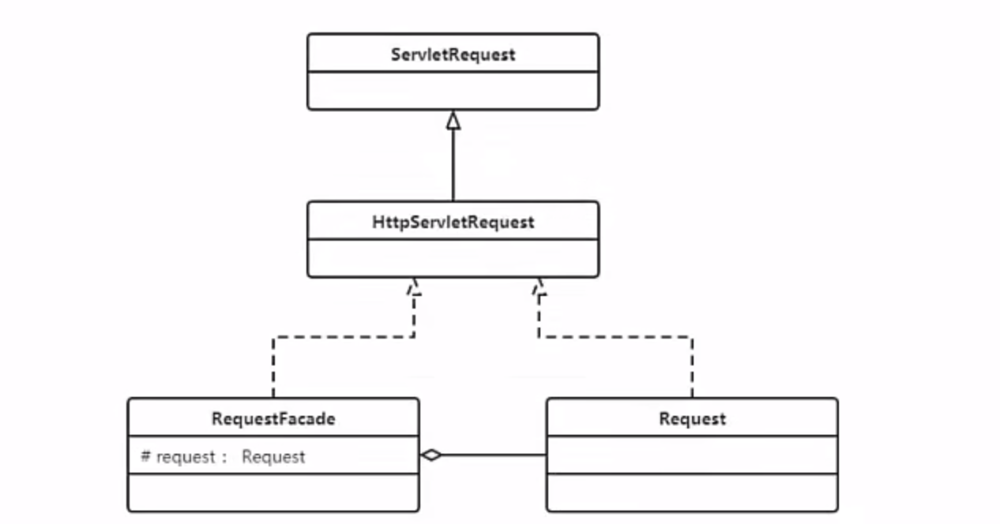

**为什么在此处使用外观模式呢？**

定义RequestFacade类，分别实现ServletRequest，同时定义私有成员变量Request，并且方法的实现调用Request的实现。然后，将 RequestFacade上转为ServletRequest传给servlet的service方法，这样即使在servlet中被下转为RequestFacade，也不能访问私有成员变量对象中的方法。既用了Request，又能防止其中方法被不合理的访问。


### 6 组合模式

#### 6.1 概述


对于这个图片肯定会非常熟悉，上图我们可以看做是一个文件系统，对于这样的结构我们称之为树形结构。在树形结构中可以通过调用某个方法来遍历整个树，当我们找到某个叶子节点后，就可以对叶子节点进行相关的操作。可以将这颗树理解成一个大的容器，容器里面包含很多的成员对象，这些成员对象即可是容器对象也可以是叶子对象。但是由于容器对象和叶子对象在功能上面的区别，使得我们在使用的过程中必须要区分容器对象和叶子对象，但是这样就会给客户带来不必要的麻烦，作为客户而已，它始终希望能够一致的对待容器对象和叶子对象。

**定义：**

又名`部分整体模式`，是用于把一组相似的对象当作一个单一的对象。组合模式依据树形结构来组合对象，用来表示部分以及整体层次。这种类型的设计模式属于结构型模式，它创建了对象组的树形结构。


#### 6.2 结构

组合模式主要包含三种角色：

* 抽象根节点（Component）：定义系统各层次对象的共有方法和属性，可以预先定义一些默认行为和属性。
* 树枝节点（Composite）：定义树枝节点的行为，存储子节点，组合树枝节点和叶子节点形成一个树形结构。
* 叶子节点（Leaf）：叶子节点对象，其下再无分支，是系统层次遍历的最小单位。


#### 6.3 案例实现

【例】软件菜单

如下图，我们在访问别的一些管理系统时，经常可以看到类似的菜单。一个菜单可以包含菜单项（菜单项是指不再包含其他内容的菜单条目），也可以包含带有其他菜单项的菜单，因此使用组合模式描述菜单就很恰当，我们的需求是针对一个菜单，打印出其包含的所有菜单以及菜单项的名称。


要实现该案例，我们先画出类图：

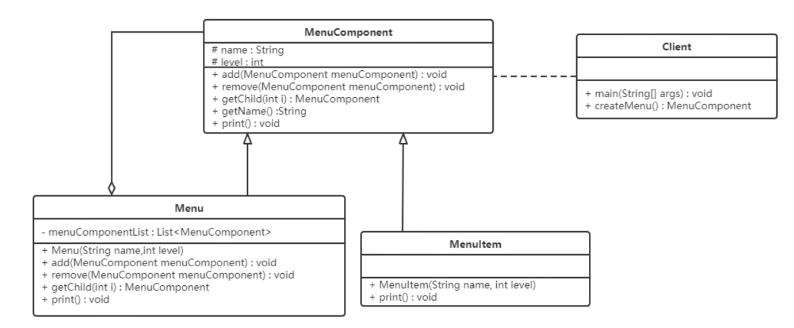

**代码实现：**

不管是菜单还是菜单项，都应该继承自统一的接口，这里姑且将这个统一的接口称为菜单组件。

```java
//菜单组件：不管是菜单还是菜单项，都应该继承该类
// 菜单组件：属于抽象根节点
public abstract class MenuComponent {
    //菜单组件的名称
    protected String name;
    //菜单组件的层级
    protected int level;

    //添加子菜单
    public void add(MenuComponent menuComponent) {
        throw new UnsupportedOperationException();
    }

    //移除子菜单
    public void remove(MenuComponent menuComponent) {
        throw new UnsupportedOperationException();
    }

    //获取指定的子菜单
    public MenuComponent getChild(int index) {
        throw new UnsupportedOperationException();
    }

    //获取菜单或者菜单项的名称
    public String getName() {
        return name;
    }

    //打印菜单名称的方法（包含子菜单和子菜单项）
    public abstract void print();
}
```

这里的MenuComponent定义为抽象类，因为有一些共有的属性和行为要在该类中实现，Menu和MenuItem类就可以只覆盖自己感兴趣的方法，而不用搭理不需要或者不感兴趣的方法，举例来说，Menu类可以包含子菜单，因此需要覆盖add()、remove()、getChild()方法，但是MenuItem就不应该有这些方法。这里给出的默认实现是抛出异常，你也可以根据自己的需要改写默认实现。

```java
// 菜单类：属于树枝节点
public class Menu extends MenuComponent {
    //菜单可以有多个子菜单或者子菜单项
    private List<MenuComponent> menuComponentList = new ArrayList<>();

    //构造方法
    public Menu(String name,int level) {
        this.name = name;
        this.level = level;
    }

    @Override
    public void add(MenuComponent menuComponent) {
        menuComponentList.add(menuComponent);
    }

    @Override
    public void remove(MenuComponent menuComponent) {
        menuComponentList.remove(menuComponent);
    }

    @Override
    public MenuComponent getChild(int index) {
        return menuComponentList.get(index);
    }

    @Override
    public void print() {
        //打印菜单名称
        for(int i = 0; i < level; i++) {
            System.out.print("----");
        }
        System.out.println(name);

        //打印子菜单或者子菜单项名称
        for (MenuComponent component : menuComponentList) {
            component.print();
        }
    }
}
```

Menu类已经实现了除了getName方法的其他所有方法，因为Menu类具有添加菜单，移除菜单和获取子菜单的功能。

```java
// 菜单项类：属于叶子节点
public class MenuItem extends MenuComponent {
    public MenuItem(String name,int level) {
        this.name = name;
        this.level = level;
    }

    public void print() {
        //打印菜单项的名称
        for(int i = 0; i < level; i++) {
            System.out.print("----");
        }
        System.out.println(name);
    }
}
```

MenuItem是菜单项，不能再有子菜单，所以添加菜单，移除菜单和获取子菜单的功能并不能实现。

```java
// 测试类
public class Client {
    public static void main(String[] args) {
        //创建菜单树
        MenuComponent menu1 = new Menu("菜单管理",2);
        menu1.add(new MenuItem("页面访问",3));
        menu1.add(new MenuItem("展开菜单",3));
        menu1.add(new MenuItem("编辑菜单",3));
        menu1.add(new MenuItem("删除菜单",3));
        menu1.add(new MenuItem("新增菜单",3));

        MenuComponent menu2 = new Menu("权限管理",2);
        menu2.add(new MenuItem("页面访问",3));
        menu2.add(new MenuItem("提交保存",3));

        MenuComponent menu3 = new Menu("角色管理",2);
        menu3.add(new MenuItem("页面访问",3));
        menu3.add(new MenuItem("新增角色",3));
        menu3.add(new MenuItem("修改角色",3));

        //创建一级菜单
        MenuComponent component = new Menu("系统管理",1);
        //将二级菜单添加到一级菜单中
        component.add(menu1);
        component.add(menu2);
        component.add(menu3);

        //打印菜单名称(如果有子菜单一块打印)
        component.print();
    }
}
/*
----系统管理
--------菜单管理
------------页面访问
------------展开菜单
------------编辑菜单
------------删除菜单
------------新增菜单
--------权限管理
------------页面访问
------------提交保存
--------角色管理
------------页面访问
------------新增角色
------------修改角色
*/
```


#### 6.4 组合模式的分类

在使用组合模式时，根据抽象构件类的定义形式，我们可将组合模式分为透明组合模式和安全组合模式两种形式。

* **透明组合模式**

  透明组合模式中，抽象根节点角色中声明了所有用于管理成员对象的方法，比如在示例中`MenuComponent`声明了`add`、`remove`、`getChild`方法，这样做的好处是确保所有的构件类都有相同的接口。透明组合模式也是组合模式的标准形式。

  透明组合模式的缺点是不够安全，因为叶子对象和容器对象在本质上是有区别的，叶子对象不可能有下一个层次的对象，即不可能包含成员对象，因此为其提供add()、remove()等方法是没有意义的，这在编译阶段不会出错，但在运行阶段如果调用这些方法可能会出错（如果没有提供相应的错误处理代码）。

* **安全组合模式**

  在安全组合模式中，在抽象构件角色中没有声明任何用于管理成员对象的方法，而是在树枝节点`Menu`类中声明并实现这些方法。安全组合模式的缺点是不够透明，因为叶子构件和容器构件具有不同的方法，且容器构件中那些用于管理成员对象的方法没有在抽象构件类中定义，因此客户端不能完全针对抽象编程，必须有区别地对待叶子构件和容器构件。

  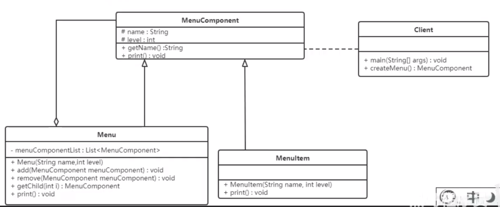


#### 6.5 优点

* 组合模式可以清楚地定义分层次的复杂对象，表示对象的全部或部分层次，它让客户端忽略了层次的差异，方便对整个层次结构进行控制。
* 客户端可以一致地使用一个组合结构或其中单个对象，不必关心处理的是单个对象还是整个组合结构，简化了客户端代码。
* 在组合模式中增加新的树枝节点和叶子节点都很方便，无须对现有类库进行任何修改，符合“开闭原则”。
* 组合模式为树形结构的面向对象实现提供了一种灵活的解决方案，通过叶子节点和树枝节点的递归组合，可以形成复杂的树形结构，但对树形结构的控制却非常简单。


#### 6.6 使用场景

组合模式正是应树形结构而生，所以组合模式的使用场景就是出现树形结构的地方。比如：文件目录显示，多级目录呈现等树形结构数据的操作。


### 7 享元模式

#### 7.1 概述

**定义：**

运用共享技术来有效地支持大量细粒度对象的复用。它通过共享已经存在的对象来大幅度减少需要创建的对象数量、避免大量相似对象的开销，从而提高系统资源的利用率。


#### 7.2 结构

享元（Flyweight）模式中存在以下两种状态：

1. 内部状态，即不会随着环境的改变而改变的可共享部分。
2. 外部状态，指随环境改变而改变的不可以共享的部分。享元模式的实现要领就是区分应用中的这两种状态，并将外部状态外部化。

享元模式的主要有以下角色：

* **抽象享元角色（Flyweight）**：通常是一个接口或抽象类，在抽象享元类中声明了具体享元类公共的方法，这些方法可以向外界提供享元对象的内部数据（内部状态），同时也可以通过这些方法来设置外部数据（外部状态）。
* **具体享元（Concrete Flyweight）角色**：它实现了抽象享元类，称为享元对象；在具体享元类中为内部状态提供了存储空间。通常我们可以结合单例模式来设计具体享元类，为每一个具体享元类提供唯一的享元对象。
* **非享元（Unsharable Flyweight)角色**：并不是所有的抽象享元类的子类都需要被共享，不能被共享的子类可设计为非共享具体享元类；当需要一个非共享具体享元类的对象时可以直接通过实例化创建。
* **享元工厂（Flyweight Factory）角色**：负责创建和管理享元角色。当客户对象请求一个享元对象时，享元工厂检査系统中是否存在符合要求的享元对象，如果存在则提供给客户；如果不存在的话，则创建一个新的享元对象。


#### 7.3 案例实现

**【例】俄罗斯方块**

下面的图片是众所周知的俄罗斯方块中的一个个方块，如果在俄罗斯方块这个游戏中，每个不同的方块都是一个实例对象，这些对象就要占用很多的内存空间，下面利用享元模式进行实现。


**先来看类图：**

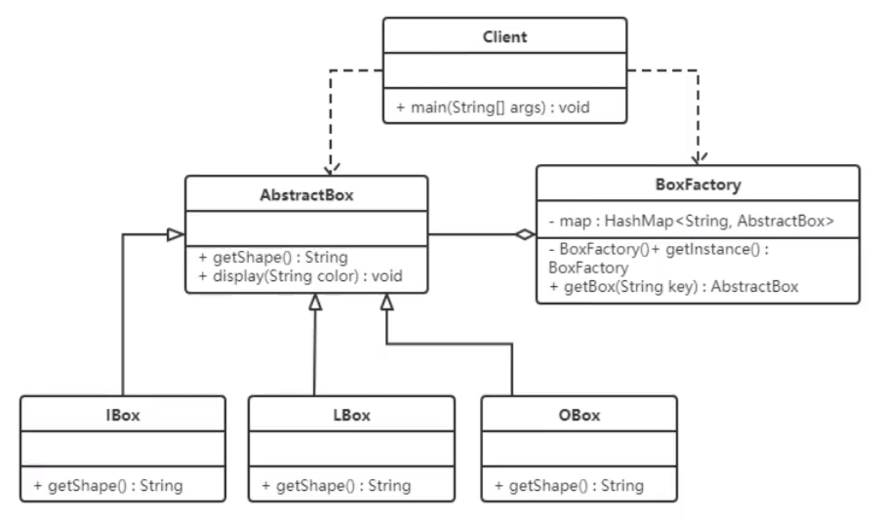

**代码如下：**

俄罗斯方块有不同的形状，我们可以对这些形状向上抽取出AbstractBox，用来定义共性的属性和行为。

```java
// 抽象享元角色
public abstract class AbstractBox {
    //获取图形的方法
    public abstract String getShape();
    //显示图形及颜色
    public void display(String color) {
        System.out.println("方块形状：" + getShape() + ", 颜色：" + color);
    }
}
```

接下来就是定义不同的形状了，IBox类、LBox类、OBox类等。

```java
// I图形类(具体享元角色)
public class IBox extends AbstractBox {
    public String getShape() { return "I"; }
}

// L图形类(具体享元角色)
public class LBox extends AbstractBox {
    public String getShape() { return "L"; }
}

// O图形类(具体享元角色)
public class OBox extends AbstractBox {
    public String getShape() { return "O"; }
}
```

提供了一个工厂类（BoxFactory），用来管理享元对象（也就是AbstractBox子类对象），该工厂类对象只需要一个，所以可以使用单例模式。并给工厂类提供一个获取形状的方法。

```java
// 工厂类，将该类设计为单例
public class BoxFactory {
    private HashMap<String,AbstractBox> map;

    //在构造方法中进行初始化操作
    private BoxFactory() {
        map = new HashMap<String, AbstractBox>();
        map.put("I",new IBox());
        map.put("L",new LBox());
        map.put("O",new OBox());
    }

    private static BoxFactory factory = new BoxFactory();
    //提供一个方法获取该工厂类对象
    public static BoxFactory getInstance() { return factory; }

    //根据名称获取图形对象
    public AbstractBox getShape(String name) { return map.get(name); }
}
```

```java
// 测试类
public class Client {
    public static void main(String[] args) {
        //获取I图形对象
        AbstractBox box1 = BoxFactory.getInstance().getShape("I");
        box1.display("灰色");

        //获取L图形对象
        AbstractBox box2 = BoxFactory.getInstance().getShape("L");
        box2.display("绿色");

        //获取O图形对象
        AbstractBox box3 = BoxFactory.getInstance().getShape("O");
        box3.display("灰色");

        //获取O图形对象
        AbstractBox box4 = BoxFactory.getInstance().getShape("O");
        box4.display("红色");

        System.out.println("两次获取到的O图形对象是否是同一个对象：" + (box3 == box4)); // true
    }
}
```


#### 7.4 优缺点和使用场景

**1，优点**

- 极大减少内存中相似或相同对象数量，节约系统资源，提供系统性能
- 享元模式中的外部状态相对独立，且不影响内部状态

**2，缺点：**

- 为了使对象可以共享，需要将享元对象的部分状态外部化，分离内部状态和外部状态，使程序逻辑复杂


**3，使用场景：**

- 一个系统有大量相同或者相似的对象，造成内存的大量耗费。
- 对象的大部分状态都可以外部化，可以将这些外部状态传入对象中。
- 在使用享元模式时需要维护一个存储享元对象的享元池，而这需要耗费一定的系统资源，因此，应当在需要多次重复使用享元对象时才值得使用享元模式。


#### 7.5 JDK源码解析

Integer类使用了享元模式。我们先看下面的例子：

```java
public class Demo {
    public static void main(String[] args) {
        Integer i1 = 127;
        Integer i2 = 127;
        System.out.println("i1和i2对象是否是同一个对象？" + (i1 == i2)); // true

        Integer i3 = 128;
        Integer i4 = 128;

        System.out.println("i3和i4对象是否是同一个对象？" + (i3 == i4)); // false
    }
}
```

运行上面代码，结果如下：


为什么第一个输出语句输出的是true，第二个输出语句输出的是false？通过反编译软件进行反编译，代码如下：

```java
public class Demo {
    public static void main(String[] args) {
        Integer i1 = Integer.valueOf((int)127);
        Integer i2 = Integer.valueOf((int)127);
        System.out.println((String)new StringBuilder().append((String)"i1\u548ci2\u5bf9\u8c61\u662f\u5426\u662f\u540c\u4e00\u4e2a\u5bf9\u8c61\uff1f").append((boolean)(i1 == i2)).toString());
        Integer i3 = Integer.valueOf((int)128);
        Integer i4 = Integer.valueOf((int)128);
        System.out.println((String)new StringBuilder().append((String)"i3\u548ci4\u5bf9\u8c61\u662f\u5426\u662f\u540c\u4e00\u4e2a\u5bf9\u8c61\uff1f").append((boolean)(i3 == i4)).toString());
    }
}
```

上面代码可以看到，直接给Integer类型的变量赋值基本数据类型数据的操作底层使用的是 `valueOf()` ，所以只需要看该方法即可

```java
public final class Integer extends Number implements Comparable<Integer> {
	public static Integer valueOf(int i) {
        if (i >= IntegerCache.low && i <= IntegerCache.high)
            return IntegerCache.cache[i + (-IntegerCache.low)];
        return new Integer(i);
    }
    
    private static class IntegerCache {
        static final int low = -128;
        static final int high;
        static final Integer cache[];

        static {
            int h = 127;
            String integerCacheHighPropValue =
                sun.misc.VM.getSavedProperty("java.lang.Integer.IntegerCache.high");
            if (integerCacheHighPropValue != null) {
                try {
                    int i = parseInt(integerCacheHighPropValue);
                    i = Math.max(i, 127);
                    // Maximum array size is Integer.MAX_VALUE
                    h = Math.min(i, Integer.MAX_VALUE - (-low) -1);
                } catch( NumberFormatException nfe) {
                }
            }
            high = h;
            cache = new Integer[(high - low) + 1];
            int j = low;
            for(int k = 0; k < cache.length; k++)
                cache[k] = new Integer(j++);
            // range [-128, 127] must be interned (JLS7 5.1.7)
            assert IntegerCache.high >= 127;
        }

        private IntegerCache() {}
    }
}
```

可以看到`Integer`默认先创建并缓存`-128 ~ 127`之间数的`Integer`对象，当调用`valueOf`时如果参数在`-128 ~ 127`之间则计算下标并从缓存中返回，否则创建一个新的`Integer`对象。


------

## 六、行为型模式

行为型模式用于描述程序在运行时复杂的流程控制，即描述多个类或对象之间怎样相互协作共同完成单个对象都无法单独完成的任务，它涉及算法与对象间职责的分配。

行为型模式分为`类行为模式`和`对象行为模式`，前者采用`继承机制`来在类间分派行为，后者采用`组合或聚合`在对象间分配行为。由于组合关系或聚合关系比继承关系耦合度低，满足“合成复用原则”，所以对象行为模式比类行为模式具有更大的灵活性。

行为型模式分为：

* 模板方法模式
* 策略模式
* 命令模式
* 职责链模式
* 状态模式
* 观察者模式
* 中介者模式
* 迭代器模式
* 访问者模式
* 备忘录模式
* 解释器模式

以上 11 种行为型模式，除了模板方法模式和解释器模式是类行为型模式，其他的全部属于对象行为型模式。


### 1 模板方法模式

#### 1.1 概述

在面向对象程序设计过程中，程序员常常会遇到这种情况：设计一个系统时知道了算法所需的关键步骤，而且确定了这些步骤的执行顺序，但某些步骤的具体实现还未知，或者说某些步骤的实现与具体的环境相关。

例如，去银行办理业务一般要经过以下4个流程：取号、排队、办理具体业务、对银行工作人员进行评分等，其中取号、排队和对银行工作人员进行评分的业务对每个客户是一样的，可以在父类中实现，但是办理具体业务却因人而异，它可能是存款、取款或者转账等，可以延迟到子类中实现。

**定义：**

定义一个操作中的算法骨架，而将算法的一些步骤延迟到子类中，使得子类可以不改变该算法结构的情况下重定义该算法的某些特定步骤。


####  1.2 结构

模板方法（Template Method）模式包含以下主要角色：

1. **抽象类（Abstract Class）**：负责给出一个算法的轮廓和骨架。它由一个模板方法和若干个基本方法构成。

   * **模板方法**：定义了算法的骨架，按某种顺序调用其包含的基本方法。

   * **基本方法**：是实现算法各个步骤的方法，是模板方法的组成部分。基本方法又可以分为三种：

     * **抽象方法(Abstract Method)**：一个抽象方法由抽象类声明、由其具体子类实现。

     * **具体方法(Concrete Method)**：一个具体方法由一个抽象类或具体类声明并实现，其子类可以进行覆盖也可以直接继承。

     * **钩子方法(Hook Method)**：在抽象类中已经实现，包括用于判断的逻辑方法和需要子类重写的空方法两种。

       一般钩子方法是用于判断的逻辑方法，这类方法名一般为isXxx，返回值类型为boolean类型。

2. **具体子类（Concrete Class）**：实现抽象类中所定义的抽象方法和钩子方法，它们是一个顶级逻辑的组成步骤。


#### 1.3 案例实现

【例】炒菜

炒菜的步骤是固定的，分为倒油、热油、倒蔬菜、倒调料品、翻炒等步骤。现通过模板方法模式来用代码模拟。类图如下：

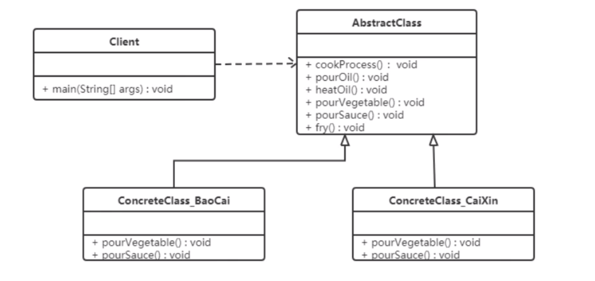

代码如下：

```java
// 抽象类（定义模板方法和基本方法）
public abstract class AbstractClass {
    //模板方法定义
    public final void cookProcess() {
        this.pourOil();      //第一步：倒油
        this.heatOil();      //第二步：热油
        this.pourVegetable();//第三步：倒蔬菜
        this.pourSauce();    //第四步：倒调味料
        this.fry();          //第五步：翻炒
    }

    //第一步：倒油是一样的，所以直接实现；具体方法
    public void pourOil() { System.out.println("倒油"); }

    //第二步：热油是一样的，所以直接实现；具体方法
    public void heatOil() { System.out.println("热油"); }

    //第三步：倒蔬菜是不一样的（一个下包菜，一个是下菜心）；抽象方法
    public abstract void pourVegetable();

    //第四步：倒调味料是不一样；抽象方法
    public abstract void pourSauce();

    //第五步：翻炒是一样的，所以直接实现；具体方法
    public void fry(){ System.out.println("炒啊炒啊炒到熟啊"); }
}
```

```java
// 具体子类：炒包菜类
public class ConcreteClass_BaoCai extends AbstractClass {
    // 倒蔬菜
    public void pourVegetable() { System.out.println("下锅的蔬菜是包菜"); }
    // 倒调味料
    public void pourSauce() { System.out.println("下锅的酱料是辣椒"); }
}

// 具体子类：炒菜心类
public class ConcreteClass_CaiXin extends AbstractClass {
    // 倒蔬菜
    public void pourVegetable() { System.out.println("下锅的蔬菜是菜心"); }
    // 倒调味料
    public void pourSauce() { System.out.println("下锅的酱料是蒜蓉"); }
}
```

```java
// 测试类
public class Client {
    public static void main(String[] args) {
        //创建对象：炒包菜
        ConcreteClass_BaoCai baoCai = new ConcreteClass_BaoCai();
        //调用炒菜的功能
        baoCai.cookProcess();
        System.out.println("=======================");
        //创建对象：炒包菜
        ConcreteClass_CaiXin caiXin = new ConcreteClass_CaiXin();
        caiXin.cookProcess();
    }
}
/*
倒油
热油
下锅的蔬菜是包菜
下锅的酱料是辣椒
炒啊炒啊炒到熟啊
=======================
倒油
热油
下锅的蔬菜是菜心
下锅的酱料是蒜蓉
炒啊炒啊炒到熟啊
*/
```

> 注意：为防止恶意操作，一般模板方法都加上 final 关键词。


#### 1.4 优缺点

**优点：**

* 提高代码复用性

  将相同部分的代码放在抽象的父类中，而将不同的代码放入不同的子类中。

* 实现了反向控制

  通过一个父类调用其子类的操作，通过对子类的具体实现扩展不同的行为，实现了反向控制 ，并符合“开闭原则”。

**缺点：**

* 对每个不同的实现都需要定义一个子类，这会导致类的个数增加，系统更加庞大，设计也更加抽象。
* 父类中的抽象方法由子类实现，子类执行的结果会影响父类的结果，这导致一种反向的控制结构，它提高了代码阅读的难度。


#### 1.5 适用场景

* 算法的整体步骤很固定，但其中个别部分易变时，这时候可以使用模板方法模式，将容易变的部分抽象出来，供子类实现。
* 需要通过子类来决定父类算法中某个步骤是否执行，实现子类对父类的反向控制。


#### 1.6 JDK源码解析

InputStream类就使用了模板方法模式。在InputStream类中定义了多个`read()`方法，如下：

```java
public abstract class InputStream implements Closeable {
    //抽象方法，要求子类必须重写
    public abstract int read() throws IOException;

    public int read(byte b[]) throws IOException {
        return read(b, 0, b.length);
    }

    //模板方法
    public int read(byte b[], int off, int len) throws IOException {
        if (b == null) {
            throw new NullPointerException();
        } else if (off < 0 || len < 0 || len > b.length - off) {
            throw new IndexOutOfBoundsException();
        } else if (len == 0) {
            return 0;
        }

        int c = read(); //调用了无参的read方法，该方法是每次读取一个字节数据
        if (c == -1) {
            return -1;
        }
        b[off] = (byte)c;

        int i = 1;
        try {
            for (; i < len ; i++) {
                c = read();
                if (c == -1) {
                    break;
                }
                b[off + i] = (byte)c;
            }
        } catch (IOException ee) {
        }
        return i;
    }
}
```

从上面代码可以看到，无参的`read()`方法是抽象方法，要求子类必须实现。而`read(byte b[])`方法调用了`read(byte b[], int off, int len)`方法，所以在此处重点看的方法是带三个参数的方法。 

在该方法中第19行、28行，可以看到调用了无参的抽象的`read()`方法。

总结如下：在InputStream父类中已经定义好了读取一个字节数组数据的方法是每次读取一个字节，并将其存储到数组的第一个索引位置，读取len个字节数据。具体如何读取一个字节数据呢？由子类实现。


### 2 策略模式

#### 2.1 概述

先看下面的图片，我们去旅游选择出行模式有很多种，可以骑自行车、可以坐汽车、可以坐火车、可以坐飞机。


作为一个程序猿，开发需要选择一款开发工具，当然可以进行代码开发的工具有很多，可以选择Idea进行开发，也可以使用eclipse进行开发，也可以使用其他的一些开发工具。


**定义：**

该模式定义了一系列算法，并将每个算法封装起来，使它们可以相互替换，且算法的变化不会影响使用算法的客户。策略模式属于对象行为模式，它通过对算法进行封装，把使用算法的责任和算法的实现分割开来，并委派给不同的对象对这些算法进行管理。


#### 2.2 结构

策略模式的主要角色如下：

* **抽象策略（Strategy）类**：这是一个抽象角色，通常由一个接口或抽象类实现。此角色给出所有的具体策略类所需的接口。
* **具体策略（Concrete Strategy）类**：实现了抽象策略定义的接口，提供具体的算法实现或行为。
* **环境（Context）类**：持有一个策略类的引用，最终给客户端调用。


#### 2.3 案例实现

【例】促销活动

一家百货公司在定年度的促销活动。针对不同的节日（春节、中秋节、圣诞节）推出不同的促销活动，由促销员将促销活动展示给客户。类图如下：

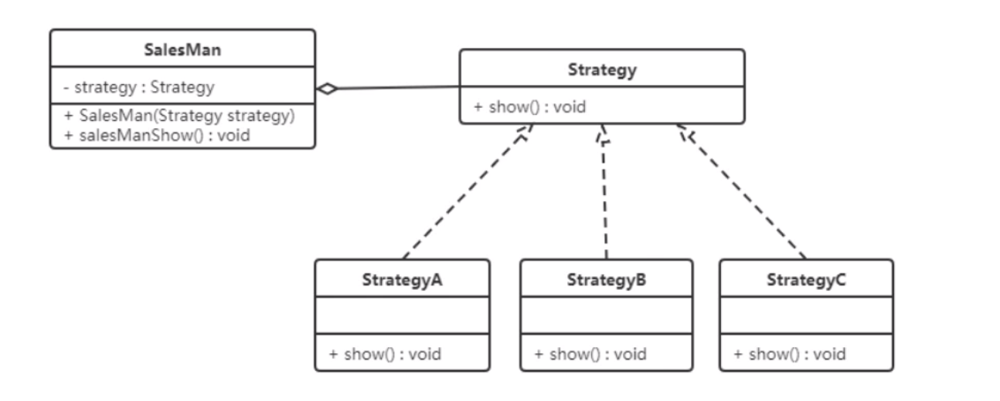

代码如下：

定义百货公司所有促销活动的共同接口

```java
public interface Strategy {
    void show();
}
```

定义具体策略角色（Concrete Strategy）：每个节日具体的促销活动

```java
//为春节准备的促销活动A
public class StrategyA implements Strategy {
    public void show() {
        System.out.println("买一送一");
    }
}

//为中秋准备的促销活动B
public class StrategyB implements Strategy {
    public void show() {
        System.out.println("满200元减50元");
    }
}

//为圣诞准备的促销活动C
public class StrategyC implements Strategy {
    public void show() {
        System.out.println("满1000元加一元换购任意200元以下商品");
    }
}
```

定义环境角色（Context）：用于连接上下文，即把促销活动推销给客户，这里可以理解为销售员

```java
// 促销员(环境类)
public class SalesMan {
    //聚合策略类对象
    private Strategy strategy;

    public SalesMan(Strategy strategy) { this.strategy = strategy; }

    public Strategy getStrategy() { return strategy; }

    public void setStrategy(Strategy strategy) { this.strategy = strategy; }

    //由促销员展示促销活动给用户
    public void salesManShow() { strategy.show(); }
}                                            
```

测试类：

```java
public class Client {
    public static void main(String[] args) {
        //春节来了，使用春节促销活动
        SalesMan salesMan = new SalesMan(new StrategyA());
        //展示促销活动
        salesMan.salesManShow();

        System.out.println("==============");
        //中秋节到了，使用中秋节的促销活动
        salesMan.setStrategy(new StrategyB());
        //展示促销活动
        salesMan.salesManShow();

        System.out.println("==============");
        //圣诞节到了，使用圣诞节的促销活动
        salesMan.setStrategy(new StrategyC());
        //展示促销活动
        salesMan.salesManShow();
    }
}
/*
买一送一
==============
满200元减50元
==============
满1000元加一元换购任意200元以下商品
*/
```


#### 2.4 优缺点

**1，优点：**

* 策略类之间可以自由切换

  由于策略类都实现同一个接口，所以使它们之间可以自由切换。

* 易于扩展

  增加一个新的策略只需要添加一个具体的策略类即可，基本不需要改变原有的代码，符合“开闭原则“

* 避免使用多重条件选择语句（if else），充分体现面向对象设计思想。

**2，缺点：**

* 客户端必须知道所有的策略类，并自行决定使用哪一个策略类。
* 策略模式将造成产生很多策略类，可以通过使用享元模式在一定程度上减少对象的数量。


#### 2.5 使用场景

* 一个系统需要动态地在几种算法中选择一种时，可将每个算法封装到策略类中。
* 一个类定义了多种行为，并且这些行为在这个类的操作中以多个条件语句的形式出现，可将每个条件分支移入它们各自的策略类中以代替这些条件语句。
* 系统中各算法彼此完全独立，且要求对客户隐藏具体算法的实现细节时。
* 系统要求使用算法的客户不应该知道其操作的数据时，可使用策略模式来隐藏与算法相关的数据结构。
* 多个类只区别在表现行为不同，可以使用策略模式，在运行时动态选择具体要执行的行为。


#### 2.6 JDK源码解析

`Comparator`中的策略模式。在Arrays类中有一个`sort()`方法，如下：

```java
public class Arrays{
    public static <T> void sort(T[] a, Comparator<? super T> c) {
        if (c == null) {
            sort(a);
        } else {
            if (LegacyMergeSort.userRequested)
                legacyMergeSort(a, c);
            else
                TimSort.sort(a, 0, a.length, c, null, 0, 0);
        }
    }
}
```

Arrays就是一个环境角色类，这个sort方法可以传一个新策略让Arrays根据这个策略来进行排序。就比如下面的测试类。

```java
public class demo {
    public static void main(String[] args) {
        Integer[] data = {12, 2, 3, 2, 4, 5, 1};
        // 实现降序排序
        Arrays.sort(data, new Comparator<Integer>() {
            public int compare(Integer o1, Integer o2) {
                return o2 - o1;
            }
        });
        System.out.println(Arrays.toString(data)); //[12, 5, 4, 3, 2, 2, 1]
    }
}
```

这里我们在调用Arrays的sort方法时，第二个参数传递的是Comparator接口的子实现类对象。所以Comparator充当的是抽象策略角色，而具体的子实现类充当的是具体策略角色。环境角色类（Arrays）应该持有抽象策略的引用来调用。那么，Arrays类的sort方法到底有没有使用Comparator子实现类中的`compare()`方法吗？让我们继续查看TimSort类的`sort()`方法，代码如下：

```java
class TimSort<T> {
    static <T> void sort(T[] a, int lo, int hi, Comparator<? super T> c,
                         T[] work, int workBase, int workLen) {
        assert c != null && a != null && lo >= 0 && lo <= hi && hi <= a.length;

        int nRemaining  = hi - lo;
        if (nRemaining < 2)
            return;  // Arrays of size 0 and 1 are always sorted

        // If array is small, do a "mini-TimSort" with no merges
        if (nRemaining < MIN_MERGE) {
            int initRunLen = countRunAndMakeAscending(a, lo, hi, c);
            binarySort(a, lo, hi, lo + initRunLen, c);
            return;
        }
        ...
    }   
        
    private static <T> int countRunAndMakeAscending(T[] a, int lo, int hi, Comparator<? super T> c) {
        assert lo < hi;
        int runHi = lo + 1;
        if (runHi == hi)
            return 1;

        // Find end of run, and reverse range if descending
        if (c.compare(a[runHi++], a[lo]) < 0) { // Descending
            while (runHi < hi && c.compare(a[runHi], a[runHi - 1]) < 0)
                runHi++;
            reverseRange(a, lo, runHi);
        } else {                              // Ascending
            while (runHi < hi && c.compare(a[runHi], a[runHi - 1]) >= 0)
                runHi++;
        }

        return runHi - lo;
    }
}
```

上面的代码中最终会跑到`countRunAndMakeAscending()`这个方法中。我们可以看见，只用了compare方法，所以在调用Arrays.sort方法只传具体compare重写方法的类对象就行，这也是Comparator接口中必须要子类实现的一个方法。


### 3 命令模式

#### 3.1 概述

日常生活中，我们出去吃饭都会遇到下面的场景。


**定义：**

将一个请求封装为一个对象，使发出请求的责任和执行请求的责任分割开。这样两者之间通过命令对象进行沟通，这样方便将命令对象进行存储、传递、调用、增加与管理。


#### 3.2 结构

命令模式包含以下主要角色：

* **抽象命令类（Command）角色**：定义命令的接口，声明执行的方法。
* **具体命令（Concrete Command）角色**：具体的命令，实现命令接口；通常会持有接收者，并调用接收者的功能来完成命令要执行的操作。
* **实现者/接收者（Receiver）角色**：接收者，真正执行命令的对象。任何类都可能成为一个接收者，只要它能够实现命令要求实现的相应功能。
* **调用者/请求者（Invoker）角色**：要求命令对象执行请求，通常会持有命令对象，可以持有很多的命令对象。这个是客户端真正触发命令并要求命令执行相应操作的地方，也就是说相当于使用命令对象的入口。


#### 3.3 案例实现

将上面的案例用代码实现，那我们就需要分析命令模式的角色在该案例中由谁来充当。

服务员：就是调用者角色，由她来发起命令。

资深大厨：就是接收者角色，真正命令执行的对象。

订单：命令中包含订单。

类图如下：

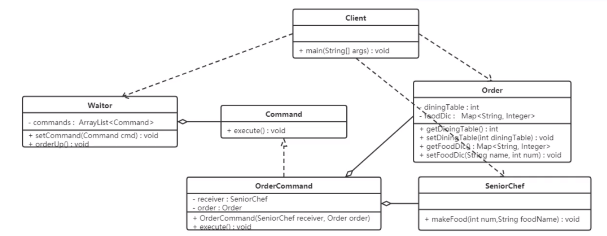

代码如下：

```java
// 订单类
public class Order {
    //餐桌号码
    private int diningTable;
    //所下的餐品及份数
    private Map<String, Integer> foodDir = new HashMap<>();

    public int getDiningTable() { return diningTable; }
    public void setDiningTable(int diningTable) { this.diningTable = diningTable; }

    public Map<String, Integer> getFoodDir() { return foodDir; }
    public void setFood(String name, int num) { foodDir.put(name, num); }
}
```

```java
// 厨师类
public class SeniorChef {
    public void makeFood(String name, int num) {
        System.out.println(num + "份" + name);
    }
}
```

```java
// 抽象命令类
public interface Command {
    void execute();
}
```

```java
// 具体的命令类
public class OrderCommand implements Command {
    //持有接收者对象
    private SeniorChef receiver;
    //持有订单对象
    private Order order;

    public OrderCommand(SeniorChef receiver, Order order) {
        this.receiver = receiver;
        this.order = order;
    }

    public void execute() {
        System.out.println(order.getDiningTable() + "桌的订单：");
        Map<String, Integer> foodDir = order.getFoodDir();
        //遍历map集合
        Set<String> keys = foodDir.keySet();
        for (String foodName : keys) {
            receiver.makeFood(foodName, foodDir.get(foodName));
        }
        System.out.println(order.getDiningTable() + "桌的饭准备完毕！！！");
    }
}
```

```java
// 服务员类（属于请求者角色）
public class Waitor {
    //持有多个命令对象
    private List<Command> commands = new ArrayList<>();

    public void setCommand(Command cmd) {
        //将cmd对象存储到list集合中
        commands.add(cmd);
    }

    //发起命令功能  喊 订单来了
    public void orderUp() {
        System.out.println("美女服务员：大厨，新订单来了。。。。");
        //遍历list集合
        for (Command command : commands) {
           if(command != null) {
               command.execute();
           }
        }
    }
}
```

```java
// 测试类
public class Client {
    public static void main(String[] args) {
        //创建第一个订单对象
        Order order1 = new Order();
        order1.setDiningTable(1);
        order1.setFood("西红柿鸡蛋面",1);
        order1.setFood("小杯可乐",2);

        //创建第二个订单对象
        Order order2 = new Order();
        order2.setDiningTable(2);
        order2.setFood("尖椒肉丝盖饭",1);
        order2.setFood("小杯雪碧",1);

        //创建厨师对象
        SeniorChef receiver = new SeniorChef();
        //创建命令对象
        OrderCommand cmd1 = new OrderCommand(receiver,order1);
        OrderCommand cmd2 = new OrderCommand(receiver,order2);

        //创建调用者（服务员对象）
        Waitor invoke = new Waitor();
        invoke.setCommand(cmd1);
        invoke.setCommand(cmd2);

        //让服务员发起命令
        invoke.orderUp();
    }
}
/*
美女服务员：大厨，新订单来了。。。。
1桌的订单：
1份西红柿鸡蛋面
2份小杯可乐
1桌的饭准备完毕！！！
2桌的订单：
1份尖椒肉丝盖饭
1份小杯雪碧
2桌的饭准备完毕！！！
*/
```


#### 3.4 优缺点

**1，优点：**

* 降低系统的耦合度。命令模式能将调用操作的对象与实现该操作的对象解耦。
* 增加或删除命令非常方便。采用命令模式增加与删除命令不会影响其他类，它满足“开闭原则”，对扩展比较灵活。
* 可以实现宏命令。命令模式可以与组合模式结合，将多个命令装配成一个组合命令，即宏命令。
* 方便实现 Undo 和 Redo 操作。命令模式可以与后面介绍的备忘录模式结合，实现命令的撤销与恢复。

**2，缺点：**

* 使用命令模式可能会导致某些系统有过多的具体命令类。
* 系统结构更加复杂。


#### 3.5 使用场景

* 系统需要将请求调用者和请求接收者解耦，使得调用者和接收者不直接交互。
* 系统需要在不同的时间指定请求、将请求排队和执行请求。
* 系统需要支持命令的撤销(Undo)操作和恢复(Redo)操作。


#### 3.6 JDK源码解析

Runable是一个典型命令模式，Runnable担当命令的角色，Thread充当的是调用者，start方法就是其执行方法

```java
//命令接口(抽象命令角色)
public interface Runnable {
	public abstract void run();
}

//调用者
public class Thread implements Runnable {
    private Runnable target;
    
    public synchronized void start() {
        if (threadStatus != 0)
            throw new IllegalThreadStateException();

        group.add(this);

        boolean started = false;
        try {
            start0();
            started = true;
        } finally {
            try {
                if (!started) {
                    group.threadStartFailed(this);
                }
            } catch (Throwable ignore) {
            }
        }
    }
    
    private native void start0();
}
```

会调用一个native方法start0()，调用系统方法，开启一个线程。而接收者是对程序员开放的，可以自己定义接收者。

```java
/**
 * jdk Runnable 命令模式
 *		TurnOffThread ： 属于具体
 */
public class TurnOffThread implements Runnable{
     private Receiver receiver;
    
     public TurnOffThread(Receiver receiver) {
     	this.receiver = receiver;
     }
     public void run() {
     	receiver.turnOFF();
     }
}
```

```java
/**
 * 测试类
 */
public class Demo {
     public static void main(String[] args) {
         Receiver receiver = new Receiver();
         TurnOffThread turnOffThread = new TurnOffThread(receiver);
         Thread thread = new Thread(turnOffThread);
         thread.start();
     }
}
```


### 4 责任链模式

#### 4.1 概述

在现实生活中，常常会出现这样的事例：一个请求有多个对象可以处理，但每个对象的处理条件或权限不同。例如，公司员工请假，可批假的领导有部门负责人、副总经理、总经理等，但每个领导能批准的天数不同，员工必须根据自己要请假的天数去找不同的领导签名，也就是说员工必须记住每个领导的姓名、电话和地址等信息，这增加了难度。这样的例子还有很多，如找领导出差报销、生活中的“击鼓传花”游戏等。

**定义：**

又名职责链模式，为了避免请求发送者与多个请求处理者耦合在一起，将所有请求的处理者通过前一对象记住其下一个对象的引用而连成一条链；当有请求发生时，可将请求沿着这条链传递，直到有对象处理它为止。


#### 4.2 结构

职责链模式主要包含以下角色:

* **抽象处理者（Handler）角色**：定义一个处理请求的接口，包含抽象处理方法和一个后继连接。
* **具体处理者（Concrete Handler）角色**：实现抽象处理者的处理方法，判断能否处理本次请求，如果可以处理请求则处理，否则将该请求转给它的后继者。
* **客户类（Client）角色**：创建处理链，并向链头的具体处理者对象提交请求，它不关心处理细节和请求的传递过程。


#### 4.3 案例实现

现需要开发一个请假流程控制系统。请假一天以下的假只需要小组长同意即可；请假1天到3天的假还需要部门经理同意；请求3天到7天还需要总经理同意才行。

类图如下：

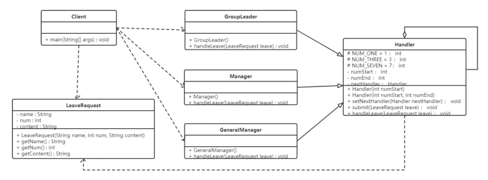

代码如下：

```java
// 请假条类
public class LeaveRequest {
    //请假人的姓名
    private String name;
    //请假天数
    private Integer num;
    //请假的内容
    private String content;

    public LeaveRequest(String name, Integer num, String content) {
        this.name = name;
        this.num = num;
        this.content = content;
    }

    public String getName() { return name; }
    public Integer getNum() { return num; }
    public String getContent() { return content; }
}
```

```java
//抽象处理者类
public abstract class Handler {
    //定义常量
    protected final static int NUM_ONE = 1;
    protected final static int NUM_THREE = 3;
    protected final static int NUM_SEVEN = 7;

    //该领导处理的请求天数区间
    private int numStart;
    private int numEnd;

    //声明后继者（声明上级领导）
    private Handler nextHandler;
    
    public Handler(int numStart, int numEnd) {
        this.numStart = numStart;
        this.numEnd = numEnd;
    }

    // 设置上级领导
    public void setNextHandler(Handler nextHandler) {
        this.nextHandler = nextHandler;
    }

    //各级领导处理请假条的方法
    protected abstract void handlerLeave(LeaveRequest leave);

   //提交请假条
    public final void submit(LeaveRequest leave){
        if (this.nextHandler != null && leave.getNum() > this.numEnd){
            if (this instanceof GeneralManager && leave.getNum() > this.numEnd){
                System.out.println("总经理审批：不同意，请假天数过长");
            } else {
                // 提交给上层领导进行审批
                this.nextHandler.submit(leave);
            }
        } else {
            // 该领导进行审批
            this.handlerLeave(leave);
            System.out.println("流程结束！");
        }
    }
}
```

```java
// 小组长类（具体的处理者类）
public class GroupLeader extends Handler{
    public GroupLeader(){
        super(0, NUM_ONE);
    }

    @Override
    protected void handlerLeave(LeaveRequest leave) {
        System.out.println(leave.getName() + "请假" + leave.getNum() + "天，" + leave.getContent());
        System.out.println("小组长审批：同意");
    }
}
```

```java
// 部门经理类（具体的处理者类）
public class Manager extends Handler{
    public Manager(){
        super(NUM_ONE, NUM_THREE);
    }

    @Override
    protected void handlerLeave(LeaveRequest leave) {
        System.out.println(leave.getName() + "请假" + leave.getNum() + "天，" + leave.getContent());
        System.out.println("部门经理审批：同意");
    }
}
```

```java
// 总经理类（具体的处理者类）
public class GeneralManager extends Handler{
    public GeneralManager(){
        super(NUM_THREE, NUM_SEVEN);
    }

    @Override
    protected void handlerLeave(LeaveRequest leave) {
        System.out.println(leave.getName() + "请假" + leave.getNum() + "天，" + leave.getContent());
        System.out.println("总经理审批：同意");
    }
}
```

```java
// 测试类
public class Client {
    public static void main(String[] args) {
        //创建一个请假条对象
        LeaveRequest leave = new LeaveRequest("小明", 4, "身体不适");

        //创建各级领导对象
        GroupLeader groupLeader = new GroupLeader();
        Manager manager = new Manager();
        GeneralManager generalManager = new GeneralManager();

        //设置处理者链
        groupLeader.setNextHandler(manager);
        manager.setNextHandler(generalManager);

        //小明提交请假申请
        groupLeader.submit(leave);
    }
}
```


#### 4.4 优缺点

**1，优点：**

* 降低了对象之间的耦合度

  该模式降低了请求发送者和接收者的耦合度。

* 增强了系统的可扩展性

  可以根据需要增加新的请求处理类，满足开闭原则。

* 增强了给对象指派职责的灵活性

  当工作流程发生变化，可以动态地改变链内的成员或者修改它们的次序，也可动态地新增或者删除责任。

* 责任链简化了对象之间的连接

  一个对象只需保持一个指向其后继者的引用，不需保持其他所有处理者的引用，这避免了使用众多的 if 或者 if···else 语句。

* 责任分担

  每个类只需要处理自己该处理的工作，不能处理的传递给下一个对象完成，明确各类的责任范围，符合类的单一职责原则。

**2，缺点：**

* 不能保证每个请求一定被处理。由于一个请求没有明确的接收者，所以不能保证它一定会被处理，该请求可能一直传到链的末端都得不到处理。
* 对比较长的职责链，请求的处理可能涉及多个处理对象，系统性能将受到一定影响。
* 职责链建立的合理性要靠客户端来保证，增加了客户端的复杂性，可能会由于职责链的错误设置而导致系统出错，如可能会造成循环调用。


#### 4.5 源码解析

在javaWeb应用开发中，FilterChain是职责链（过滤器）模式的典型应用，以下是Filter的模拟实现分析:

* 模拟web请求Request以及web响应Response

  ```java
  public interface Request{
  }
  
  public interface Response{
  }
  ```
  
* 模拟web过滤器Filter

  ```java
   public interface Filter {
   	public void doFilter(Request req, Response res, FilterChain c);
   }
  ```

* 模拟实现具体过滤器  

  ```java
  public class FirstFilter implements Filter {
      @Override
      public void doFilter(Request request, Response response, FilterChain chain) {
          System.out.println("过滤器1 前置处理");
  
          // 先执行所有request再倒序执行所有response
          chain.doFilter(request, response);
  
          System.out.println("过滤器1 后置处理");
      }
  }
  
  public class SecondFilter  implements Filter {
      @Override
      public void doFilter(Request request, Response response, FilterChain chain) {
          System.out.println("过滤器2 前置处理");
  
          // 先执行所有request再倒序执行所有response
          chain.doFilter(request, response);
  
          System.out.println("过滤器2 后置处理");
      }
  }
  ```
  
* 模拟实现过滤器链FilterChain  

  ```java
  public class FilterChain {
      private List<Filter> filters = new ArrayList<Filter>();
  
      private int index = 0;
  
      // 链式调用
      public FilterChain addFilter(Filter filter) {
          this.filters.add(filter);
          return this;
      }
  
      public void doFilter(Request request, Response response) {
          if (index == filters.size()) {
              return;
          }
          Filter filter = filters.get(index);
          index++;
          filter.doFilter(request, response, this);
      }
  }
  ```
  
* 测试类

  ```java
  public class Client {
      public static void main(String[] args) {
          Request  req = null;
          Response res = null ;
  
          FilterChain filterChain = new FilterChain();
          filterChain.addFilter(new FirstFilter()).addFilter(new SecondFilter());
          filterChain.doFilter(req, res);
      }
  }
  ```


### 5 状态模式

#### 5.1 概述

【例】通过按钮来控制一个电梯的状态，一个电梯有开门状态，关门状态，停止状态，运行状态。每一种状态改变，都有可能要根据其他状态来更新处理。例如，如果电梯门现在处于运行时状态，就不能进行开门操作，而如果电梯门是停止状态，就可以执行开门操作。

类图如下：

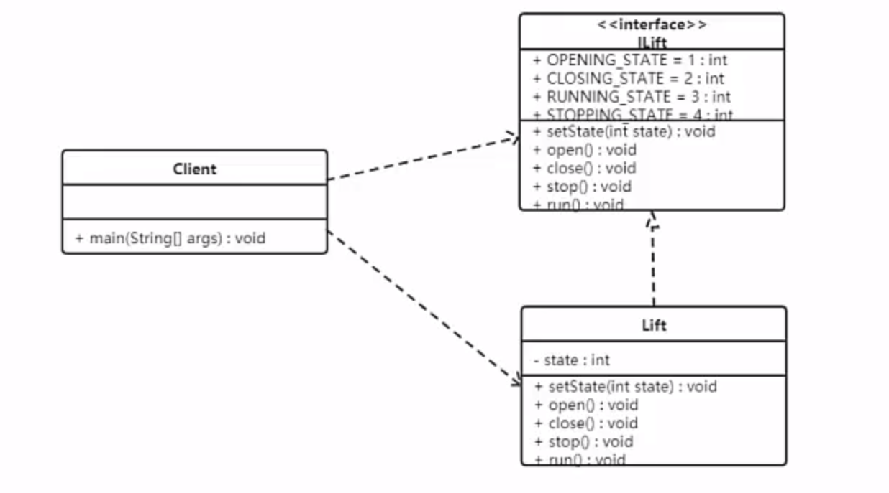

代码如下：

```java
// 电梯接口
public interface ILift {
    //定义四个电梯状态的常量
    int OPENING_STATE = 1;      // 开门状态
    int CLOSING_STATE = 2;      // 关门状态
    int RUNNING_STATE = 3;      // 运行状态
    int STOPPING_STATE = 4;     // 停止状态

    //设置电梯状态的功能
    void setState(int state);
    //电梯操作功能
    void open();
    void close();
    void run();
    void stop();
}
```

```java
// 电梯类(ILift的子实现类)
public class Lift implements ILift {
    //声明一个记录当前电梯的状态
    private int state;
    @Override
    public void setState(int state) {
        this.state = state;
    }

    @Override
    public void open() {
        switch (state) { //当前电梯状态
            case OPENING_STATE :
                //什么事都不做
                break;
            case CLOSING_STATE :
                System.out.println("电梯打开了...");
                //设置当前电梯状态为开启状态
                setState(OPENING_STATE);
                break;
            case STOPPING_STATE :
                System.out.println("电梯打开了...");
                //设置当前电梯状态为开启状态
                setState(OPENING_STATE);
                break;
            case RUNNING_STATE :
                //什么事都不做
                break;
        }
    }

    @Override
    public void close() {
        switch (this.state) {
            case OPENING_STATE:
                System.out.println("电梯关门了。。。");//只有开门状态可以关闭电梯门，可以对应电梯状态表来看
                this.setState(CLOSING_STATE);//关门之后电梯就是关闭状态了
                break;
            case CLOSING_STATE:
                //do nothing //已经是关门状态，不能关门
                break;
            case RUNNING_STATE:
                //do nothing //运行时电梯门是关着的，不能关门
                break;
            case STOPPING_STATE:
                //do nothing //停止时电梯也是关着的，不能关门
                break;
        }
    }

    @Override
    public void run() {
        switch (this.state) {
            case OPENING_STATE://电梯不能开着门就走
                //do nothing
                break;
            case CLOSING_STATE://门关了，可以运行了
                System.out.println("电梯开始运行了。。。");
                this.setState(RUNNING_STATE);//现在是运行状态
                break;
            case RUNNING_STATE:
                //do nothing 已经是运行状态了
                break;
            case STOPPING_STATE:
                System.out.println("电梯开始运行了。。。");
                this.setState(RUNNING_STATE);
                break;
        }
    }
    @Override
    public void stop() {
        switch (this.state) {
            case OPENING_STATE: //开门的电梯已经是是停止的了(正常情况下)
                //do nothing
                break;
            case CLOSING_STATE://关门时才可以停止
                System.out.println("电梯停止了。。。");
                this.setState(STOPPING_STATE);
                break;
            case RUNNING_STATE://运行时当然可以停止了
                System.out.println("电梯停止了。。。");
                this.setState(STOPPING_STATE);
                break;
            case STOPPING_STATE:
                //do nothing
                break;
        }
    }
}
```

```java
// 测试类
public class Client {
    public static void main(String[] args) {
        Lift lift = new Lift();
        lift.setState(ILift.STOPPING_STATE);//电梯是停止的
        lift.open();//开门
        lift.close();//关门
        lift.run();//运行
        lift.stop();//停止
    }
}
```

问题分析：

* 使用了大量的switch…case这样的判断（if…else也是一样)，使程序的可阅读性变差。
* 扩展性很差。如果新加了断电的状态，我们需要修改上面判断逻辑

**定义：**

对有状态的对象，把复杂的“判断逻辑”提取到不同的状态对象中，允许状态对象在其内部状态发生改变时改变其行为。


#### 5.2 结构

状态模式包含以下主要角色。

* **环境（Context）角色**：也称为上下文，它定义了客户程序需要的接口，维护一个当前状态，并将与状态相关的操作委托给当前状态对象来处理。
* **抽象状态（State）角色**：定义一个接口，用以封装环境对象中的特定状态所对应的行为。
* **具体状态（Concrete  State）角色**：实现抽象状态所对应的行为。


#### 5.3 案例实现

对上述电梯的案例使用状态模式进行改进。类图如下：

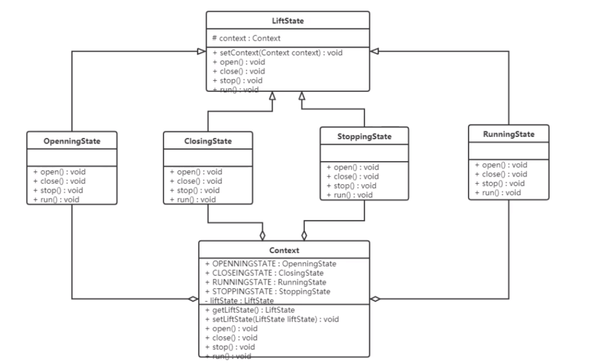

代码如下：

```java
// 抽象状态类
public abstract class LiftState {
    //声明环境角色类变量
    protected Context context;
    public void setContext(Context context) {
        this.context = context;
    }

    //电梯开启操作
    public abstract void open();
    //电梯关闭操作
    public abstract void close();
    //电梯运行操作
    public abstract void run();
    //电梯停止操作
    public abstract void stop();
}
```

```java
// 电梯开启状态类
public class OpeningState extends LiftState {
    //当前状态要执行的方法
    @Override
    public void open() {
        System.out.println("电梯开启。。。");
    }
    @Override
    public void close() {
        //修改状态
        super.context.setLiftState(Context.CLOSING_STATE);
        //调用当前状态中的context中的close方法
        super.context.close();
    }
    @Override
    public void run() {
        //什么都不做
    }
    @Override
    public void stop() {
        //什么都不做
    }
}
```

```java
// 电梯关闭状态类
public class ClosingState extends LiftState {
    @Override
    //电梯门关闭，这是关闭状态要实现的动作
    public void close() {
        System.out.println("电梯门关闭...");
    }

    //电梯门关了再打开，逗你玩呢，那这个允许呀
    @Override
    public void open() {
        super.context.setLiftState(Context.OPENING_STATE);
        super.context.open();
    }

    //电梯门关了就跑，这是再正常不过了
    @Override
    public void run() {
        super.context.setLiftState(Context.RUNNING_STATE);
        super.context.run();
    }

    //电梯门关着，我就不按楼层
    @Override
    public void stop() {
        super.context.setLiftState(Context.STOPPING_STATE);
        super.context.stop();
    }
}
```

```java
// 电梯运行状态类
public class RunningState extends LiftState {
    //运行的时候开电梯门？你疯了！电梯不会给你开的
    @Override
    public void open() {
        //do nothing
    }

    //电梯门关闭？这是肯定了
    @Override
    public void close() {//虽然可以关门，但这个动作不归我执行
        //do nothing
    }

    //这是在运行状态下要实现的方法
    @Override
    public void run() {
        System.out.println("电梯正在运行...");
    }

    //这个事绝对是合理的，光运行不停止还有谁敢做这个电梯？！估计只有上帝了
    @Override
    public void stop() {
        super.context.setLiftState(Context.STOPPING_STATE);
        super.context.stop();
    }
}
```

```java
// 电梯停止状态类
public class StoppingState extends LiftState {
    //停止状态，开门，那是要的！
    @Override
    public void open() {
        //状态修改
        super.context.setLiftState(Context.OPENING_STATE);
        //动作委托为CloseState来执行，也就是委托给了ClosingState子类执行这个动作
        super.context.getLiftState().open();
    }

    @Override
    public void close() {//虽然可以关门，但这个动作不归我执行
        //状态修改
        super.context.setLiftState(Context.CLOSING_STATE);
        //动作委托为CloseState来执行，也就是委托给了ClosingState子类执行这个动作
        super.context.getLiftState().close();
    }

    //停止状态再跑起来，正常的很
    @Override
    public void run() {
        //状态修改
        super.context.setLiftState(Context.RUNNING_STATE);
        //动作委托为CloseState来执行，也就是委托给了ClosingState子类执行这个动作
        super.context.getLiftState().run();
    }

    //停止状态是怎么发生的呢？当然是停止方法执行了
    @Override
    public void stop() {
        System.out.println("电梯停止了...");
    }
}
```

```java
// 环境角色类
public class Context {
    //定义对应状态对象的常量
    public final static OpeningState OPENING_STATE = new OpeningState();
    public final static ClosingState CLOSING_STATE = new ClosingState();
    public final static RunningState RUNNING_STATE = new RunningState();
    public final static StoppingState STOPPING_STATE = new StoppingState();

    //定义一个当前电梯状态变量
    private LiftState liftState;
    public LiftState getLiftState() {
        return liftState;
    }

    //设置当前状态对象
    public void setLiftState(LiftState liftState) {
        this.liftState = liftState;
        //设置当前状态对象中的Context对象
        this.liftState.setContext(this);
    }

    public void open() { this.liftState.open(); }
    public void close() { this.liftState.close(); }
    public void run() { this.liftState.run(); }
    public void stop() { this.liftState.stop(); }
}
```

```java
//测试类
public class Client {
    public static void main(String[] args) {
        //创建环境角色对象
        Context context = new Context();
        //设置当前电梯装填
        context.setLiftState(new ClosingState());

        context.open();
        context.close();
        context.run();
        context.stop();
    }
}
```


#### 5.4 优缺点

**1，优点：**

* 将所有与某个状态有关的行为放到一个类中，并且可以方便地增加新的状态，只需要改变对象状态即可改变对象的行为。
* 允许状态转换逻辑与状态对象合成一体，而不是某一个巨大的条件语句块。

**2，缺点：**

* 状态模式的使用必然会增加系统类和对象的个数。 
* 状态模式的结构与实现都较为复杂，如果使用不当将导致程序结构和代码的混乱。
* 状态模式对"开闭原则"的支持并不太好。


#### 5.5 使用场景

- 当一个对象的行为取决于它的状态，并且它必须在运行时根据状态改变它的行为时，就可以考虑使用状态模式。
- 一个操作中含有庞大的分支结构，并且这些分支决定于对象的状态时。


### 6 观察者模式

#### 6.1 概述

**定义：**

又被称为发布-订阅（Publish/Subscribe）模式，它定义了一种一对多的依赖关系，让多个观察者对象同时监听某一个主题对象。这个主题对象在状态变化时，会通知所有的观察者对象，使他们能够自动更新自己。


#### 6.2 结构

在观察者模式中有如下角色：

* Subject：抽象主题（抽象被观察者），抽象主题角色把所有观察者对象保存在一个集合里，每个主题都可以有任意数量的观察者，抽象主题提供一个接口，可以增加和删除观察者对象。
* ConcreteSubject：具体主题（具体被观察者），该角色将有关状态存入具体观察者对象，在具体主题的内部状态发生改变时，给所有注册过的观察者发送通知。
* Observer：抽象观察者，是观察者的抽象类，它定义了一个更新接口，使得在得到主题更改通知时更新自己。
* ConcrereObserver：具体观察者，实现抽象观察者定义的更新接口，以便在得到主题更改通知时更新自身的状态。


#### 6.3 案例实现

【例】微信公众号

在使用微信公众号时，大家都会有这样的体验，当你关注的公众号中有新内容更新的话，它就会推送给关注公众号的微信用户端。我们使用观察者模式来模拟这样的场景，微信用户就是观察者，微信公众号是被观察者，有多个的微信用户关注了程序猿这个公众号。

类图如下：


代码如下：

定义抽象观察者类，里面定义一个更新的方法

```java
public interface Observer {
    void update(String message);
}
```

定义具体观察者类，微信用户是观察者，里面实现了更新的方法

```java
public class WeixinUser implements Observer {
    // 微信用户名
    private String name;

    public WeixinUser(String name) {
        this.name = name;
    }
    @Override
    public void update(String message) {
        System.out.println(name + "-" + message);
    }
}
```

定义抽象主题类，提供了attach、detach、notify三个方法

```java
public interface Subject {
    //增加订阅者
    public void attach(Observer observer);

    //删除订阅者
    public void detach(Observer observer);
    
    //通知订阅者更新消息
    public void notify(String message);
}

```

微信公众号是具体主题（具体被观察者），里面存储了订阅该公众号的微信用户，并实现了抽象主题中的方法

```java
public class SubscriptionSubject implements Subject {
    //储存订阅公众号的微信用户
    private List<Observer> weixinUserlist = new ArrayList<Observer>();

    @Override
    public void attach(Observer observer) {
        weixinUserlist.add(observer);
    }

    @Override
    public void detach(Observer observer) {
        weixinUserlist.remove(observer);
    }

    @Override
    public void notify(String message) {
        for (Observer observer : weixinUserlist) {
            observer.update(message);
        }
    }
}
```

客户端程序

```java
public class Client {
    public static void main(String[] args) {
        SubscriptionSubject mSubscriptionSubject=new SubscriptionSubject();
        //创建微信用户
        WeixinUser user1=new WeixinUser("孙悟空");
        WeixinUser user2=new WeixinUser("猪悟能");
        WeixinUser user3=new WeixinUser("沙悟净");
        //订阅公众号
        mSubscriptionSubject.attach(user1);
        mSubscriptionSubject.attach(user2);
        mSubscriptionSubject.attach(user3);
        //公众号更新发出消息给订阅的微信用户
        mSubscriptionSubject.notify("传智黑马的专栏更新了");
    }
}

```


#### 6.4 优缺点

**1，优点：**

* 降低了目标与观察者之间的耦合关系，两者之间是抽象耦合关系。
* 被观察者发送通知，所有注册的观察者都会收到信息【可以实现广播机制】

**2，缺点：**

* 如果观察者非常多的话，那么所有的观察者收到被观察者发送的通知会耗时
* 如果被观察者有循环依赖的话，那么被观察者发送通知会使观察者循环调用，会导致系统崩溃


#### 6.5 使用场景

* 对象间存在一对多关系，一个对象的状态发生改变会影响其他对象。
* 当一个抽象模型有两个方面，其中一个方面依赖于另一方面时。


#### 6.6 JDK中提供的实现

在 Java 中，通过 java.util.Observable 类和 java.util.Observer 接口定义了观察者模式，只要实现它们的子类就可以编写观察者模式实例。

**1，Observable类**

Observable 类是抽象目标类（被观察者），它有一个 Vector 集合成员变量，用于保存所有要通知的观察者对象，下面来介绍它最重要的 3 个方法。

* void addObserver(Observer o) 方法：用于将新的观察者对象添加到集合中。

* void notifyObservers(Object arg) 方法：调用集合中的所有观察者对象的 update方法，通知它们数据发生改变。通常越晚加入集合的观察者越先得到通知。

* void setChange() 方法：用来设置一个 boolean 类型的内部标志，注明目标对象发生了变化。当它为true时，notifyObservers() 才会通知观察者。

**2，Observer 接口**

Observer 接口是抽象观察者，它监视目标对象的变化，当目标对象发生变化时，观察者得到通知，并调用 update 方法，进行相应的工作。

【例】警察抓小偷

警察抓小偷也可以使用观察者模式来实现，警察是观察者，小偷是被观察者。代码如下：

小偷是一个被观察者，所以需要继承Observable类

```java
public class Thief extends Observable {

    private String name;

    public Thief(String name) {
        this.name = name;
    }
    
    public void setName(String name) {
        this.name = name;
    }

    public String getName() {
        return name;
    }

    public void steal() {
        System.out.println("小偷：我偷东西了，有没有人来抓我！！！");
        super.setChanged(); //changed  = true
        super.notifyObservers();
    }
}

```

警察是一个观察者，所以需要让其实现Observer接口

```java
public class Policemen implements Observer {

    private String name;

    public Policemen(String name) {
        this.name = name;
    }
    public void setName(String name) {
        this.name = name;
    }

    public String getName() {
        return name;
    }

    @Override
    public void update(Observable o, Object arg) {
        System.out.println("警察：" + ((Thief) o).getName() + "，我已经盯你很久了，你可以保持沉默，但你所说的将成为呈堂证供！！！");
    }
}
```

客户端代码

```java
public class Client {
    public static void main(String[] args) {
        //创建小偷对象
        Thief t = new Thief("隔壁老王");
        //创建警察对象
        Policemen p = new Policemen("小李");
        //让警察盯着小偷
        t.addObserver(p);
        //小偷偷东西
        t.steal();
    }
}
```


### 7 中介者模式

#### 7.1 概述

一般来说，同事类之间的关系是比较复杂的，多个同事类之间互相关联时，他们之间的关系会呈现为复杂的网状结构，这是一种过度耦合的架构，即不利于类的复用，也不稳定。例如在下左图中，有六个同事类对象，假如对象1发生变化，那么将会有4个对象受到影响。如果对象2发生变化，那么将会有5个对象受到影响。也就是说，同事类之间直接关联的设计是不好的。

如果引入中介者模式，那么同事类之间的关系将变为星型结构，从下右图中可以看到，任何一个类的变动，只会影响的类本身，以及中介者，这样就减小了系统的耦合。一个好的设计，必定不会把所有的对象关系处理逻辑封装在本类中，而是使用一个专门的类来管理那些不属于自己的行为。


**定义：**

又叫调停模式，定义一个中介角色来封装一系列对象之间的交互，使原有对象之间的耦合松散，且可以独立地改变它们之间的交互。


#### 7.2 结构

中介者模式包含以下主要角色：

* 抽象中介者（Mediator）角色：它是中介者的接口，提供了同事对象注册与转发同事对象信息的抽象方法。

* 具体中介者（ConcreteMediator）角色：实现中介者接口，定义一个 List 来管理同事对象，协调各个同事角色之间的交互关系，因此它依赖于同事角色。
* 抽象同事类（Colleague）角色：定义同事类的接口，保存中介者对象，提供同事对象交互的抽象方法，实现所有相互影响的同事类的公共功能。
* 具体同事类（Concrete Colleague）角色：是抽象同事类的实现者，当需要与其他同事对象交互时，由中介者对象负责后续的交互。


#### 7.3 案例实现

【例】租房

现在租房基本都是通过房屋中介，房主将房屋托管给房屋中介，而租房者从房屋中介获取房屋信息。房屋中介充当租房者与房屋所有者之间的中介者。

类图如下：


代码如下：

```java
//抽象中介者
public abstract class Mediator {
    //申明一个联络方法
    public abstract void constact(String message,Person person);
}

//抽象同事类
public abstract class Person {
    protected String name;
    protected Mediator mediator;

    public Person(String name,Mediator mediator){
        this.name = name;
        this.mediator = mediator;
    }
}

//具体同事类 房屋拥有者
public class HouseOwner extends Person {

    public HouseOwner(String name, Mediator mediator) {
        super(name, mediator);
    }

    //与中介者联系
    public void constact(String message){
        mediator.constact(message, this);
    }

    //获取信息
    public void getMessage(String message){
        System.out.println("房主" + name +"获取到的信息：" + message);
    }
}

//具体同事类 承租人
public class Tenant extends Person {
    public Tenant(String name, Mediator mediator) {
        super(name, mediator);
    }

    //与中介者联系
    public void constact(String message){
        mediator.constact(message, this);
    }

    //获取信息
    public void getMessage(String message){
        System.out.println("租房者" + name +"获取到的信息：" + message);
    }
}

//中介机构
public class MediatorStructure extends Mediator {
    //首先中介结构必须知道所有房主和租房者的信息
    private HouseOwner houseOwner;
    private Tenant tenant;

    public HouseOwner getHouseOwner() {
        return houseOwner;
    }

    public void setHouseOwner(HouseOwner houseOwner) {
        this.houseOwner = houseOwner;
    }

    public Tenant getTenant() {
        return tenant;
    }

    public void setTenant(Tenant tenant) {
        this.tenant = tenant;
    }

    public void constact(String message, Person person) {
        if (person == houseOwner) {          //如果是房主，则租房者获得信息
            tenant.getMessage(message);
        } else {       //反正则是房主获得信息
            houseOwner.getMessage(message);
        }
    }
}

//测试类
public class Client {
    public static void main(String[] args) {
        //一个房主、一个租房者、一个中介机构
        MediatorStructure mediator = new MediatorStructure();

        //房主和租房者只需要知道中介机构即可
        HouseOwner houseOwner = new HouseOwner("张三", mediator);
        Tenant tenant = new Tenant("李四", mediator);

        //中介结构要知道房主和租房者
        mediator.setHouseOwner(houseOwner);
        mediator.setTenant(tenant);

        tenant.constact("需要租三室的房子");
        houseOwner.constact("我这有三室的房子，你需要租吗？");
    }
}
```


#### 7.4 优缺点

**1，优点：**

* 松散耦合

  中介者模式通过把多个同事对象之间的交互封装到中介者对象里面，从而使得同事对象之间松散耦合，基本上可以做到互补依赖。这样一来，同事对象就可以独立地变化和复用，而不再像以前那样“牵一处而动全身”了。

* 集中控制交互

  多个同事对象的交互，被封装在中介者对象里面集中管理，使得这些交互行为发生变化的时候，只需要修改中介者对象就可以了，当然如果是已经做好的系统，那么就扩展中介者对象，而各个同事类不需要做修改。

* 一对多关联转变为一对一的关联

  没有使用中介者模式的时候，同事对象之间的关系通常是一对多的，引入中介者对象以后，中介者对象和同事对象的关系通常变成双向的一对一，这会让对象的关系更容易理解和实现。

**2，缺点：**

当同事类太多时，中介者的职责将很大，它会变得复杂而庞大，以至于系统难以维护。


#### 7.5 使用场景

* 系统中对象之间存在复杂的引用关系，系统结构混乱且难以理解。
* 当想创建一个运行于多个类之间的对象，又不想生成新的子类时。


### 8 迭代器模式

#### 8.1 概述

**定义：**

提供一个对象来顺序访问聚合对象中的一系列数据，而不暴露聚合对象的内部表示。 


#### 8.2 结构

迭代器模式主要包含以下角色：

* 抽象聚合（Aggregate）角色：定义存储、添加、删除聚合元素以及创建迭代器对象的接口。

* 具体聚合（ConcreteAggregate）角色：实现抽象聚合类，返回一个具体迭代器的实例。
* 抽象迭代器（Iterator）角色：定义访问和遍历聚合元素的接口，通常包含 hasNext()、next() 等方法。
* 具体迭代器（Concretelterator）角色：实现抽象迭代器接口中所定义的方法，完成对聚合对象的遍历，记录遍历的当前位置。


#### 8.3 案例实现

【例】定义一个可以存储学生对象的容器对象，将遍历该容器的功能交由迭代器实现，涉及到的类如下：

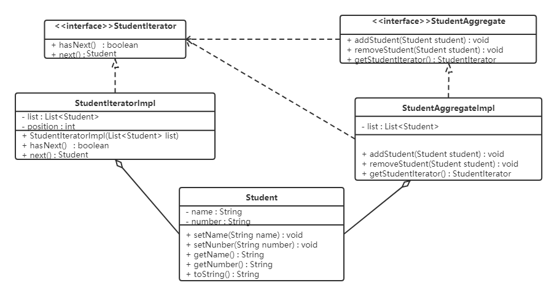


代码如下：

定义迭代器接口，声明hasNext、next方法

```java
public interface StudentIterator {
    boolean hasNext();
    Student next();
}
```

定义具体的迭代器类，重写所有的抽象方法

```java
public class StudentIteratorImpl implements StudentIterator {
    private List<Student> list;
    private int position = 0;

    public StudentIteratorImpl(List<Student> list) {
        this.list = list;
    }

    @Override
    public boolean hasNext() {
        return position < list.size();
    }

    @Override
    public Student next() {
        Student currentStudent = list.get(position);
        position ++;
        return currentStudent;
    }
}
```

定义抽象容器类，包含添加元素，删除元素，获取迭代器对象的方法

```java
public interface StudentAggregate {
    void addStudent(Student student);

    void removeStudent(Student student);

    StudentIterator getStudentIterator();
}
```

定义具体的容器类，重写所有的方法

```java
public class StudentAggregateImpl implements StudentAggregate {

    private List<Student> list = new ArrayList<Student>();  // 学生列表

    @Override
    public void addStudent(Student student) {
        this.list.add(student);
    }

    @Override
    public void removeStudent(Student student) {
        this.list.remove(student);
    }

    @Override
    public StudentIterator getStudentIterator() {
        return new StudentIteratorImpl(list);
    }
}
```


#### 8.4 优缺点

**1，优点：**

* 它支持以不同的方式遍历一个聚合对象，在同一个聚合对象上可以定义多种遍历方式。在迭代器模式中只需要用一个不同的迭代器来替换原有迭代器即可改变遍历算法，我们也可以自己定义迭代器的子类以支持新的遍历方式。
* 迭代器简化了聚合类。由于引入了迭代器，在原有的聚合对象中不需要再自行提供数据遍历等方法，这样可以简化聚合类的设计。
* 在迭代器模式中，由于引入了抽象层，增加新的聚合类和迭代器类都很方便，无须修改原有代码，满足 “开闭原则” 的要求。

**2，缺点：**

增加了类的个数，这在一定程度上增加了系统的复杂性。


#### 8.5 使用场景

* 当需要为聚合对象提供多种遍历方式时。
* 当需要为遍历不同的聚合结构提供一个统一的接口时。
* 当访问一个聚合对象的内容而无须暴露其内部细节的表示时。


#### 8.6 JDK源码解析

迭代器模式在JAVA的很多集合类中被广泛应用，接下来看看JAVA源码中是如何使用迭代器模式的。

```java
List<String> list = new ArrayList<>();
Iterator<String> iterator = list.iterator(); //list.iterator()方法返回的肯定是Iterator接口的子实现类对象
while (iterator.hasNext()) {
    System.out.println(iterator.next());
}
```

看完这段代码是不是很熟悉，与我们上面代码基本类似。单列集合都使用到了迭代器，我们以ArrayList举例来说明

- List：抽象聚合类
- ArrayList：具体的聚合类
- Iterator：抽象迭代器
- list.iterator()：返回的是实现了 `Iterator` 接口的具体迭代器对象

具体的来看看 ArrayList的代码实现

```java
public class ArrayList<E> extends AbstractList<E>
        implements List<E>, RandomAccess, Cloneable, java.io.Serializable {
    
    public Iterator<E> iterator() {
        return new Itr();
    }
    
    private class Itr implements Iterator<E> {
        int cursor;       // 下一个要返回元素的索引
        int lastRet = -1; // 上一个返回元素的索引
        int expectedModCount = modCount;

        Itr() {}
		
        //判断是否还有元素
        public boolean hasNext() {
            return cursor != size;
        }

        //获取下一个元素
        public E next() {
            checkForComodification();
            int i = cursor;
            if (i >= size)
                throw new NoSuchElementException();
            Object[] elementData = ArrayList.this.elementData;
            if (i >= elementData.length)
                throw new ConcurrentModificationException();
            cursor = i + 1;
            return (E) elementData[lastRet = i];
        }
        ...
}
```

这部分代码还是比较简单，大致就是在 `iterator` 方法中返回了一个实例化的 `Iterator` 对象。Itr是一个内部类，它实现了 `Iterator` 接口并重写了其中的抽象方法。

> 注意： 
>
> ​	当我们在使用JAVA开发的时候，想使用迭代器模式的话，只要让我们自己定义的容器类实现`java.util.Iterable`并实现其中的iterator()方法使其返回一个 `java.util.Iterator` 的实现类就可以了。


### 9 访问者模式

#### 9.1 概述

**定义：**

封装一些作用于某种数据结构中的各元素的操作，它可以在不改变这个数据结构的前提下定义作用于这些元素的新的操作。


#### 9.2 结构

访问者模式包含以下主要角色:

* 抽象访问者（Visitor）角色：定义了对每一个元素`（Element）`访问的行为，它的参数就是可以访问的元素，它的方法个数理论上来讲与元素类个数（Element的实现类个数）是一样的，从这点不难看出，访问者模式要求元素类的个数不能改变。
* 具体访问者（ConcreteVisitor）角色：给出对每一个元素类访问时所产生的具体行为。
* 抽象元素（Element）角色：定义了一个接受访问者的方法（`accept`），其意义是指，每一个元素都要可以被访问者访问。
* 具体元素（ConcreteElement）角色： 提供接受访问方法的具体实现，而这个具体的实现，通常情况下是使用访问者提供的访问该元素类的方法。
* 对象结构（Object Structure）角色：定义当中所提到的对象结构，对象结构是一个抽象表述，具体点可以理解为一个具有容器性质或者复合对象特性的类，它会含有一组元素（`Element`），并且可以迭代这些元素，供访问者访问。


#### 9.3 案例实现

【例】给宠物喂食

现在养宠物的人特别多，我们就以这个为例，当然宠物还分为狗，猫等，要给宠物喂食的话，主人可以喂，其他人也可以喂食。

- 访问者角色：给宠物喂食的人
- 具体访问者角色：主人、其他人
- 抽象元素角色：动物抽象类
- 具体元素角色：宠物狗、宠物猫
- 结构对象角色：主人家

类图如下：


代码如下：

创建抽象访问者接口

```java
public interface Person {
    void feed(Cat cat);

    void feed(Dog dog);
}
```

创建不同的具体访问者角色（主人和其他人），都需要实现 `Person`接口

```java
public class Owner implements Person {

    @Override
    public void feed(Cat cat) {
        System.out.println("主人喂食猫");
    }

    @Override
    public void feed(Dog dog) {
        System.out.println("主人喂食狗");
    }
}

public class Someone implements Person {
    @Override
    public void feed(Cat cat) {
        System.out.println("其他人喂食猫");
    }

    @Override
    public void feed(Dog dog) {
        System.out.println("其他人喂食狗");
    }
}
```

定义抽象节点 -- 宠物

```java
public interface Animal {
    void accept(Person person);
}
```

定义实现`Animal`接口的 具体节点（元素）

```java
public class Dog implements Animal {

    @Override
    public void accept(Person person) {
        person.feed(this);
        System.out.println("好好吃，汪汪汪！！！");
    }
}

public class Cat implements Animal {

    @Override
    public void accept(Person person) {
        person.feed(this);
        System.out.println("好好吃，喵喵喵！！！");
    }
}
```

定义对象结构，此案例中就是主人的家

```java
public class Home {
    private List<Animal> nodeList = new ArrayList<Animal>();

    public void action(Person person) {
        for (Animal node : nodeList) {
            node.accept(person);
        }
    }

    //添加操作
    public void add(Animal animal) {
        nodeList.add(animal);
    }
}

```

测试类

```java
public class Client {
    public static void main(String[] args) {
        Home home = new Home();
        home.add(new Dog());
        home.add(new Cat());

        Owner owner = new Owner();
        home.action(owner);

        Someone someone = new Someone();
        home.action(someone);
    }
}
```


#### 9.4 优缺点

**1，优点：**

* 扩展性好

  在不修改对象结构中的元素的情况下，为对象结构中的元素添加新的功能。

* 复用性好

  通过访问者来定义整个对象结构通用的功能，从而提高复用程度。

* 分离无关行为

  通过访问者来分离无关的行为，把相关的行为封装在一起，构成一个访问者，这样每一个访问者的功能都比较单一。

**2，缺点：**

* 对象结构变化很困难

  在访问者模式中，每增加一个新的元素类，都要在每一个具体访问者类中增加相应的具体操作，这违背了“开闭原则”。

* 违反了依赖倒置原则

  访问者模式依赖了具体类，而没有依赖抽象类。


#### 9.5  使用场景

* 对象结构相对稳定，但其操作算法经常变化的程序。

* 对象结构中的对象需要提供多种不同且不相关的操作，而且要避免让这些操作的变化影响对象的结构。

  

#### 9.6 扩展

访问者模式用到了一种双分派的技术。

**1，分派：**

变量被声明时的类型叫做变量的静态类型，有些人又把静态类型叫做明显类型；而变量所引用的对象的真实类型又叫做变量的实际类型。比如 `Map map = new HashMap()` ，map变量的静态类型是 `Map` ，实际类型是 `HashMap` 。根据对象的类型而对方法进行的选择，就是分派(Dispatch)，分派(Dispatch)又分为两种，即静态分派和动态分派。

**静态分派(Static Dispatch)** 发生在编译时期，分派根据静态类型信息发生。静态分派对于我们来说并不陌生，方法重载就是静态分派。

**动态分派(Dynamic Dispatch)** 发生在运行时期，动态分派动态地置换掉某个方法。Java通过方法的重写支持动态分派。

**2，动态分派：**

通过方法的重写支持动态分派。

```java
public class Animal {
    public void execute() {
        System.out.println("Animal");
    }
}

public class Dog extends Animal {
    @Override
    public void execute() {
        System.out.println("dog");
    }
}

public class Cat extends Animal {
     @Override
    public void execute() {
        System.out.println("cat");
    }
}

public class Client {
   	public static void main(String[] args) {
        Animal a = new Dog();
        a.execute();
        
        Animal a1 = new Cat();
        a1.execute();
    }
}
```

上面代码的结果大家应该直接可以说出来，这不就是多态吗！运行执行的是子类中的方法。

Java编译器在编译时期并不总是知道哪些代码会被执行，因为编译器仅仅知道对象的静态类型，而不知道对象的真实类型；而方法的调用则是根据对象的真实类型，而不是静态类型。

**3，静态分派：**

通过方法重载支持静态分派。

```java
public class Animal {
}

public class Dog extends Animal {
}

public class Cat extends Animal {
}

public class Execute {
    public void execute(Animal a) {
        System.out.println("Animal");
    }

    public void execute(Dog d) {
        System.out.println("dog");
    }

    public void execute(Cat c) {
        System.out.println("cat");
    }
}

public class Client {
    public static void main(String[] args) {
        Animal a = new Animal();
        Animal a1 = new Dog();
        Animal a2 = new Cat();

        Execute exe = new Execute();
        exe.execute(a);
        exe.execute(a1);
        exe.execute(a2);
    }
}
```

运行结果：


这个结果可能出乎一些人的意料了，为什么呢？

**重载方法的分派是根据静态类型进行的，这个分派过程在编译时期就完成了。**

**4，双分派：**

所谓双分派技术就是在选择一个方法的时候，不仅仅要根据消息接收者（receiver）的运行时区别，还要根据参数的运行时区别。

```java
public class Animal {
    public void accept(Execute exe) {
        exe.execute(this);
    }
}

public class Dog extends Animal {
    public void accept(Execute exe) {
        exe.execute(this);
    }
}

public class Cat extends Animal {
    public void accept(Execute exe) {
        exe.execute(this);
    }
}

public class Execute {
    public void execute(Animal a) {
        System.out.println("animal");
    }

    public void execute(Dog d) {
        System.out.println("dog");
    }

    public void execute(Cat c) {
        System.out.println("cat");
    }
}

public class Client {
    public static void main(String[] args) {
        Animal a = new Animal();
        Animal d = new Dog();
        Animal c = new Cat();

        Execute exe = new Execute();
        a.accept(exe);
        d.accept(exe);
        c.accept(exe);
    }
}
```

在上面代码中，客户端将Execute对象做为参数传递给Animal类型的变量调用的方法，这里完成第一次分派，这里是方法重写，所以是动态分派，也就是执行实际类型中的方法，同时也`将自己this作为参数传递进去，这里就完成了第二次分派`，这里的Execute类中有多个重载的方法，而传递进行的是this，就是具体的实际类型的对象。

说到这里，我们已经明白双分派是怎么回事了，但是它有什么效果呢？就是可以实现方法的动态绑定，我们可以对上面的程序进行修改。

运行结果如下：


**双分派实现动态绑定的本质，就是在重载方法委派的前面加上了继承体系中覆盖的环节，由于覆盖是动态的，所以重载就是动态的了。**


### 10 备忘录模式

#### 10.1 概述

备忘录模式提供了一种状态恢复的实现机制，使得用户可以方便地回到一个特定的历史步骤，当新的状态无效或者存在问题时，可以使用暂时存储起来的备忘录将状态复原，很多软件都提供了撤销（Undo）操作，如 Word、记事本、Photoshop、IDEA等软件在编辑时按 Ctrl+Z 组合键时能撤销当前操作，使文档恢复到之前的状态；还有在 浏览器 中的后退键、数据库事务管理中的回滚操作、玩游戏时的中间结果存档功能、数据库与操作系统的备份操作、棋类游戏中的悔棋功能等都属于这类。

**定义：**

又叫快照模式，在不破坏封装性的前提下，捕获一个对象的内部状态，并在该对象之外保存这个状态，以便以后当需要时能将该对象恢复到原先保存的状态。


#### 10.2 结构

备忘录模式的主要角色如下：

* 发起人（Originator）角色：记录当前时刻的内部状态信息，提供创建备忘录和恢复备忘录数据的功能，实现其他业务功能，它可以访问备忘录里的所有信息。
* 备忘录（Memento）角色：负责存储发起人的内部状态，在需要的时候提供这些内部状态给发起人。
* 管理者（Caretaker）角色：对备忘录进行管理，提供保存与获取备忘录的功能，但其不能对备忘录的内容进行访问与修改。

> 备忘录有两个等效的接口：
>
> * **窄接口**：管理者(Caretaker)对象（和其他发起人对象之外的任何对象）看到的是备忘录的窄接口(narror Interface)，这个窄接口只允许他把备忘录对象传给其他的对象。
> * **宽接口**：与管理者看到的窄接口相反，发起人对象可以看到一个宽接口(wide Interface)，这个宽接口允许它读取所有的数据，以便根据这些数据恢复这个发起人对象的内部状态。


#### 10.3 案例实现

【例】游戏挑战BOSS

游戏中的某个场景，一游戏角色有生命力、攻击力、防御力等数据，在打Boss前和后一定会不一样的，我们允许玩家如果感觉与Boss决斗的效果不理想可以让游戏恢复到决斗之前的状态。

要实现上述案例，有两种方式：

* “白箱”备忘录模式
* “黑箱”备忘录模式


##### 10.3.1 “白箱”备忘录模式

备忘录角色对任何对象都提供一个接口，即宽接口，备忘录角色的内部所存储的状态就对所有对象公开。类图如下：


代码如下：

```java
//游戏角色类
public class GameRole {
    private int vit; //生命力
    private int atk; //攻击力
    private int def; //防御力

    //初始化状态
    public void initState() {
        this.vit = 100;
        this.atk = 100;
        this.def = 100;
    }

    //战斗
    public void fight() {
        this.vit = 0;
        this.atk = 0;
        this.def = 0;
    }

    //保存角色状态
    public RoleStateMemento saveState() {
        return new RoleStateMemento(vit, atk, def);
    }

    //回复角色状态
    public void recoverState(RoleStateMemento roleStateMemento) {
        this.vit = roleStateMemento.getVit();
        this.atk = roleStateMemento.getAtk();
        this.def = roleStateMemento.getDef();
    }

    public void stateDisplay() {
        System.out.println("角色生命力：" + vit);
        System.out.println("角色攻击力：" + atk);
        System.out.println("角色防御力：" + def);
    }

    public int getVit() {
        return vit;
    }

    public void setVit(int vit) {
        this.vit = vit;
    }

    public int getAtk() {
        return atk;
    }

    public void setAtk(int atk) {
        this.atk = atk;
    }

    public int getDef() {
        return def;
    }

    public void setDef(int def) {
        this.def = def;
    }
}

//游戏状态存储类(备忘录类)
public class RoleStateMemento {
    private int vit;
    private int atk;
    private int def;

    public RoleStateMemento(int vit, int atk, int def) {
        this.vit = vit;
        this.atk = atk;
        this.def = def;
    }

    public int getVit() {
        return vit;
    }

    public void setVit(int vit) {
        this.vit = vit;
    }

    public int getAtk() {
        return atk;
    }

    public void setAtk(int atk) {
        this.atk = atk;
    }

    public int getDef() {
        return def;
    }

    public void setDef(int def) {
        this.def = def;
    }
}

//角色状态管理者类
public class RoleStateCaretaker {
    private RoleStateMemento roleStateMemento;

    public RoleStateMemento getRoleStateMemento() {
        return roleStateMemento;
    }

    public void setRoleStateMemento(RoleStateMemento roleStateMemento) {
        this.roleStateMemento = roleStateMemento;
    }
}

//测试类
public class Client {
    public static void main(String[] args) {
        System.out.println("------------大战Boss前------------");
        //大战Boss前
        GameRole gameRole = new GameRole();
        gameRole.initState();
        gameRole.stateDisplay();

        //保存进度
        RoleStateCaretaker roleStateCaretaker = new RoleStateCaretaker();
        roleStateCaretaker.setRoleStateMemento(gameRole.saveState());

        System.out.println("------------大战Boss后------------");
        //大战Boss时，损耗严重
        gameRole.fight();
        gameRole.stateDisplay();
        System.out.println("------------恢复之前状态------------");
        //恢复之前状态
        gameRole.recoverState(roleStateCaretaker.getRoleStateMemento());
        gameRole.stateDisplay();

    }
}
```

> 分析：白箱备忘录模式是破坏封装性的。但是通过程序员自律，同样可以在一定程度上实现模式的大部分用意。


##### 10.3.2 “黑箱”备忘录模式

备忘录角色对发起人对象提供一个宽接口，而为其他对象提供一个窄接口。在Java语言中，实现双重接口的办法就是将**备忘录类**设计成**发起人类**的内部成员类。

将 `RoleStateMemento` 设为 `GameRole` 的内部类，从而将 `RoleStateMemento` 对象封装在 `GameRole` 里面；在外面提供一个标识接口 `Memento` 给 `RoleStateCaretaker` 及其他对象使用。这样 `GameRole` 类看到的是 `RoleStateMemento` 所有的接口，而`RoleStateCaretaker`  及其他对象看到的仅仅是标识接口 `Memento` 所暴露出来的接口，从而维护了封装型。类图如下：


代码如下：

窄接口`Memento`，这是一个标识接口，因此没有定义出任何的方法

```java
public interface Memento {
}
```

定义发起人类 `GameRole`，并在内部定义备忘录内部类 `RoleStateMemento`（该内部类设置为私有的）

```java
/游戏角色类
public class GameRole {
    private int vit; //生命力
    private int atk; //攻击力
    private int def; //防御力

    //初始化状态
    public void initState() {
        this.vit = 100;
        this.atk = 100;
        this.def = 100;
    }

    //战斗
    public void fight() {
        this.vit = 0;
        this.atk = 0;
        this.def = 0;
    }

    //保存角色状态
    public Memento saveState() {
        return new RoleStateMemento(vit, atk, def);
    }

    //回复角色状态
    public void recoverState(Memento memento) {
        RoleStateMemento roleStateMemento = (RoleStateMemento) memento;
        this.vit = roleStateMemento.getVit();
        this.atk = roleStateMemento.getAtk();
        this.def = roleStateMemento.getDef();
    }

    public void stateDisplay() {
        System.out.println("角色生命力：" + vit);
        System.out.println("角色攻击力：" + atk);
        System.out.println("角色防御力：" + def);

    }

    public int getVit() {
        return vit;
    }

    public void setVit(int vit) {
        this.vit = vit;
    }

    public int getAtk() {
        return atk;
    }

    public void setAtk(int atk) {
        this.atk = atk;
    }

    public int getDef() {
        return def;
    }

    public void setDef(int def) {
        this.def = def;
    }

    private class RoleStateMemento implements Memento {
        private int vit;
        private int atk;
        private int def;

        public RoleStateMemento(int vit, int atk, int def) {
            this.vit = vit;
            this.atk = atk;
            this.def = def;
        }

        public int getVit() {
            return vit;
        }

        public void setVit(int vit) {
            this.vit = vit;
        }

        public int getAtk() {
            return atk;
        }

        public void setAtk(int atk) {
            this.atk = atk;
        }

        public int getDef() {
            return def;
        }

        public void setDef(int def) {
            this.def = def;
        }
    }
}
```

负责人角色类 `RoleStateCaretaker` 能够得到的备忘录对象是以 `Memento` 为接口的，由于这个接口仅仅是一个标识接口，因此负责人角色不可能改变这个备忘录对象的内容

```java
//角色状态管理者类
public class RoleStateCaretaker {
    private Memento memento;

    public Memento getMemento() {
        return memento;
    }

    public void setMemento(Memento memento) {
        this.memento = memento;
    }
}
```

客户端测试类

```java
public class Client {
    public static void main(String[] args) {
        System.out.println("------------大战Boss前------------");
        //大战Boss前
        GameRole gameRole = new GameRole();
        gameRole.initState();
        gameRole.stateDisplay();

        //保存进度
        RoleStateCaretaker roleStateCaretaker = new RoleStateCaretaker();
        roleStateCaretaker.setMemento(gameRole.saveState());
        
        System.out.println("------------大战Boss后------------");
        //大战Boss时，损耗严重
        gameRole.fight();
        gameRole.stateDisplay();
        System.out.println("------------恢复之前状态------------");
        //恢复之前状态
        gameRole.recoverState(roleStateCaretaker.getMemento());
        gameRole.stateDisplay();
    }
}

```


#### 10.4 优缺点

**1，优点：**

- 提供了一种可以恢复状态的机制。当用户需要时能够比较方便地将数据恢复到某个历史的状态。
- 实现了内部状态的封装。除了创建它的发起人之外，其他对象都不能够访问这些状态信息。
- 简化了发起人类。发起人不需要管理和保存其内部状态的各个备份，所有状态信息都保存在备忘录中，并由管理者进行管理，这符合单一职责原则。

**2，缺点：**

* 资源消耗大。如果要保存的内部状态信息过多或者特别频繁，将会占用比较大的内存资源。


#### 10.5 使用场景

* 需要保存与恢复数据的场景，如玩游戏时的中间结果的存档功能。

* 需要提供一个可回滚操作的场景，如 Word、记事本、Photoshop，idea等软件在编辑时按 Ctrl+Z 组合键，还有数据库中事务操作。


