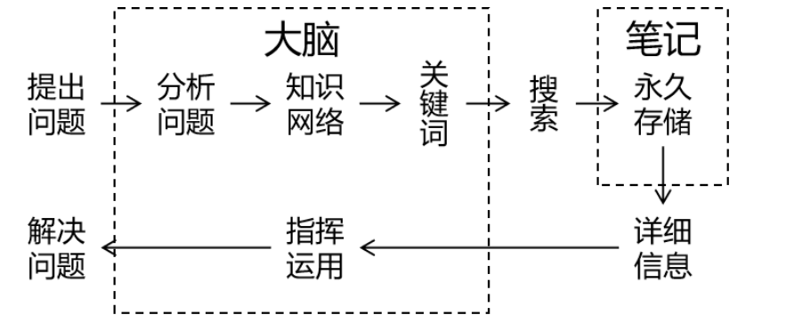
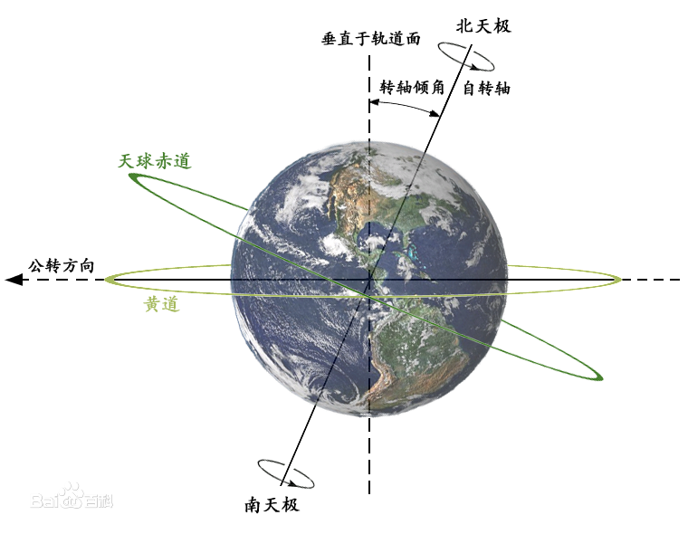
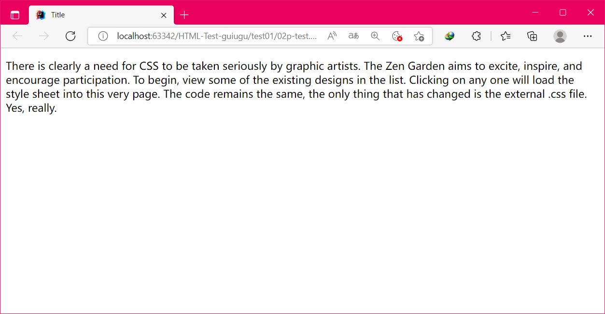
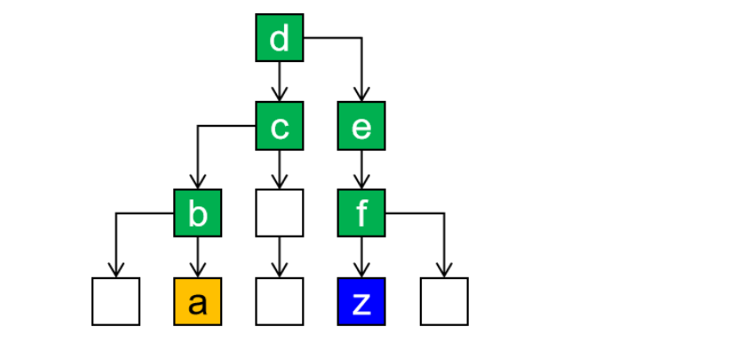
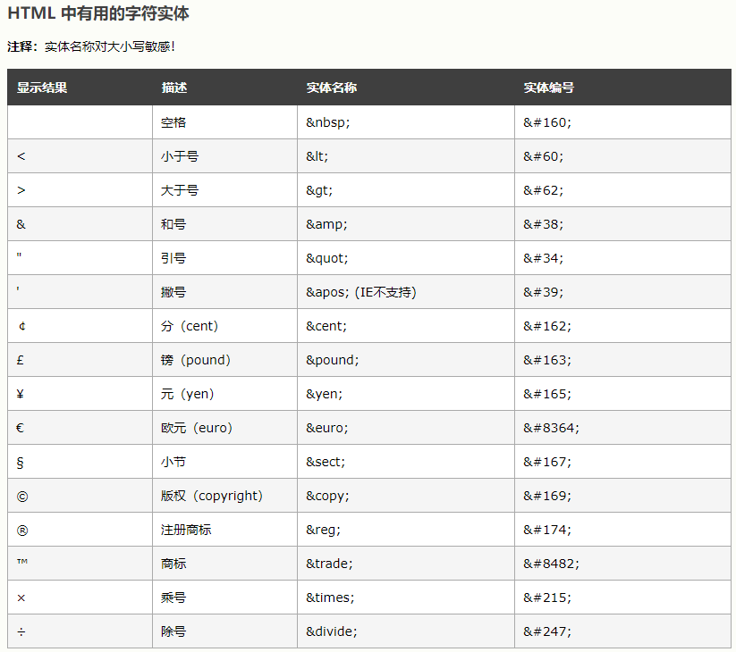
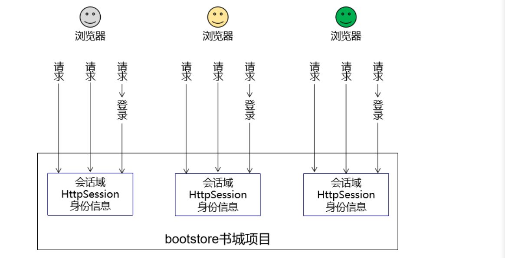
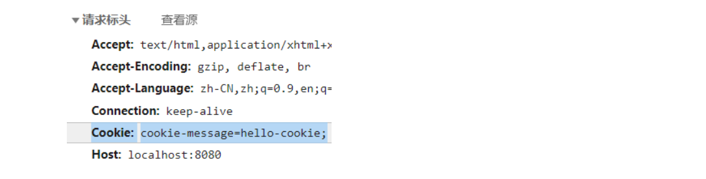

# JavaWeb

> 讲师：尚硅谷-张益桃
>
> 尚硅谷官网：http://www.atguigu.com
>
> 视频链接：https://www.bilibili.com/video/BV1AS4y177xJ?vd_source=6e6b2286ee9a603d7bdb2bc5ba80e449

+++

## 一、Web开发概述

### 1 Web基础概念

#### 1.1 服务器与客户端

1. 线下的服务器与客户端

   

2. 线上的服务器与客户端

   

3. 客户端的各种形式

   - PC端网页

   

   - 移动端网页

   

   - Iot设备

   

   4. 服务器的各种形式

   **概述**：

   “服务器”是一个非常宽泛的概念，Tomcat是服务器，MySQL是服务器，Redis也是服务器。同时Linux是服务器，阿里云上租用的虚拟机也是服务器。此时有的小伙伴就会混淆。

   其实具体来说，服务器分为下面这些类型。

   

   **硬件服务器**：

   1. 刀片式服务器

      

      

      

   2. 塔式服务器

      

   3. 机房

      

   

   **虚拟机服务器**：

   1. VMWare虚拟机

      通常来说VMWare用于开发人员在本地电脑上搭建一个模拟的服务器环境，或自己装一些东西测试，不是团队共同使用的正式环境。

      

   2. 弹性云服务器

      使用弹性云服务器最大的好处就是弹性伸缩。什么是弹性伸缩呢？我现在的服务器是20G内存，因为访问量暴涨我需要把内存扩容到80G，要是物理的硬件服务器就需要买来新的内存条插入主板上的内存插槽。而弹性云服务器只需要改一下内存容量的参数就行了，非常方便。等访问量下降了，再把内存容量调回来就可以，不仅方便，而且可以精准的在访问高峰期提高服务器配置而不是一直维持高配，节约成本。

      ![images](data:image/png;base64,iVBORw0KGgoAAAANSUhEUgAAAYgAAADpCAIAAACx/jc6AAAhBElEQVR42u2de3QU5d3Hn5CEJEAg3ORiGrI0KAha4gseEijW1Ui5eQFrDQGKhNLWaPUVqkcJaY1Ej5e0KGJ9KaBVQji2iVIuFsHVIoQczSEUQShGNqThJrdIIHfC+8xt57KzuzO7s9lnyffzx56Z3dnZ2WdmPvt7fvPs/CKuXr169OhRAgAAbDB06NAIQUyJiYmh3hgAACC1tbUQEwCALSAmAABzQEwAAOaAmAAAzAExAQCYA2ICADAHxAQAYA6ICQDAHBATAIA5ICYAgAXUVWx8Zd3e492HLcyZnT440LVBTACAgGnev3JxSVk7P500aeXT6QmBrQ9iAgBYQeOlhtYjRUs2ftYelZAQG+1lyZ43zFtw7+i+3lYWqJjObVm0PrHwsR/JEx7594pFtbMKp/Y1vnIvH7tp0fQXh64qyxl1YGX6wiK319Oe2VQ4nX7SgZWLnD8rnH4dnUj/dEKZvHlWbgwAQODM9vw33jltYMEBdy7Pm9jf8+uBiem7TYv+ZivMGUUUhuKefIk8Wzj9pK4ylGRxZuGnDqxIX0j+XObNa8JydJ1Eete/V6T/hmRmVSfz6lEutWKRc5a+mKSXXGKiW3tf9cNlj40Kyn4CoFPR9uWbzy8/yE0l3JCeNT6u8m+flJFh8352U+vubUVVcRn322/4rmzV5ydbyaB5f/h1hmczBSImlU1EMREqi+pnPtSYgsdDkMKHPJmZWcVkgg8x0Y94gRpPL8wRvUM/fdcdorY447y4R3g5a9UqslBfTPyGye8CAATAwb/+/oUvuImMhc/N+xE5s3n5cpJVMK0/+feGrI2DuSipff9fHiv5jPSfl/doxgCP6/FbTHxnag/JVIhpesEeRRBEBHMVe1xD5ipFnKLtaulA1/bpHcJbOOl89hNRf3K3TtqMZNeafUdM4nd5gTytJ1MAgBnOfPTGE5vP0Inonj8YPzyqusJZTXqPHTOw9fChfRejkkfelFx/5LOaJhIkMQnn+R27hLNdKympi0dElSgsIEU9ZNOi9bZCM2LSBlzch1bPdW2DIp5SREAKMQkTumLyFosBAIzTumfdvHXfkFCJSYCzSfIz1QVc8JL+pZz8ls7zk64Yx62rdc6smHwuoCsXg2JCLhwAa/iqZN5b+1sJ+cnDz/1yDDle8sor5KHlM39AKjZkbe6//A939m/eu/LJjWVBF9MERZTkyumQND7NxHe+Pkx+W35eJPPPm5LftURMnnqLYj/RuJiQZgLAAk7v/EP+JzRkSrh50u8mxW55izpoWM6vb2/Ztu4vB3vft2Dq6KotBY6TrUEVkwsPXSFFVohoopLAIyZ1YkjUoipvRcTMOvVkZiYhd3Afh4gJgGAiBkQ+Cc5VuQOGhgJwOSaSVVzsvmTWM88crTYlJq37pEEJfaXph+2fvU1+klxQrUiQv5gspL3khT3mmHwMwgIAGOLQOzkbtneJ6t8z1stC19183xMPDevmeYGwiZhUJlKqhPbC3k3eVDidyImtt5NV4xWUwxpwVQ6AoCKMsRzxuxUPje7i/1o6XEyJ69N/wyeFpMHZpj5FimvENQ/asmh69cOugQLSNhxQukl/2zCOCYCgcKnsj6+s/NbrIj1uK3hparLXRcLrv3LcEIHP7JusTAZh5DcAltL6VckTb+2v87JEl1ueXTFzpNeVhJeYAADhwZkdb/3ug6b7Hltwt3QLlOjmIysLNlaPmf3K7GHRvt4OMQEALKfty7eeX/4VSf/F0pzbosTnarc99WLZ8b7pL+dPut7X+yEmAEAQaG9raCDdekSpnmy81BrVI9pnvAQxAQAYBGICADAHxAQAYA6ICQDAHBATAIA5ICYAAHNATAAA5oCYAADMoRITnQr19gAAABF0BDEBABgCYgIAMAfEBABgDogJAMAcEBMAgDkgJgAAc0BMAADmgJgAAMwBMQEAmANiAgAwB8QEAGAOiAkAwBwQEwCAOSAmAABzQEwAAOaAmAAAzAExAQCYA2ICADAHxAQAYA6ICQDAHBATsJjvv2+gj716dQtkJU31p5wnvj5JBt2UaBvYPTbU3wl0NBATsJiAxNRed6hi5bKDW+p62u09etMnLlxyOC4mTB2ZmzNmREKXYG73dxsfX0byXr+3rzA95fnd7svMXVvx21tcc/tfH7Mmedtr43bpLJy+dJuwKjXiW+5xf8UQZz59esy+cn7y5x/87yO3BrM9QgvEBCzGfzE1HFqzOXtPv8JlP04bGK14vvWUw5GT+/2UNdOyRwQUh/ng3D8en1SdrVSPj4V32HXt44VAxMRbaYjgo72lt99/4amK7Kn9g9geoQRiAmzQ7lz//gLnLSVLbkrQfb3u64KZ+22rH5xlC2bcRMXhmFjxxGjfi82vWmrASvuXj5m/zvsi6ijMMwdX/OkRcte/HruZnzu95Vfrd06Z9dK9A4LYGiEEYgJMUFfxaPblRSW327ws4/zXzMLua94Yk2B4rX7hqR/HM3t1xZyax/NJHhf17Fs+Zqfdq1aomNbYtr5273XSvCZi8r0GCa2Jzm9cc//WoR/83x19gtsaIQJiAhZz8WIjfezZM87MmyoL3ylJnbXM3lV64szWlc4RObepPdXiyF1fOXPeolTrt/rcxt9Oer6MTsxeW/GE6AnOUA67QisqxFeznVM8xERcKEQsE9NXbw7ZQRR5JYgJADP4k2P6bv3ML2wl09LkZ86sn/lB1sn+JUXTZtjkfFOT48OsU+kls64zsW4z0ADHYZfE5Eo50QkxRFItOZ+sduv0KTPo4mIQkz9ATMBi/BHT4YKZ57NL0gfKz/BiKqUTXXOK7nh11hBxxIBz18z1/UqWDA/StivFpJlW+EXq682GmIIGxAQshh5L9DEiIsLEe6iYzs4qmaDouLnE1MW+ZEzRstGiszpMTNooiRpkrY3PdtNOXz7Jfc22QS9NriMmi5LfXI7p2K/UYqq5TcqFX3NATIABaFeubGDRfXZ5JCUvprLuy0onL0mTY4KO6sp5yH8rQyT963fBi5hwVQ6AQLh0qYk+9uhhari2e/K7NHfvoMUZaapBlUFMfvNwPnJmVzxx/T8en5S/W9tTo69usL0mScSYmLQEOo7p6ERh7BI3jom8eWzGyCC1RMiBmIDF+DfAUjtcoJ124rTLBHW4AJfqzidL82zP5zuXeroSp6DjxUQEHx3jp4Zcy1YiEBOwHD9Hfod4gKWYOeJ85HUc0/g8USsqMSne4lpAlwDF1HmAmIDFXLlCox0SGWneH8JfUgaufDUtNUH1l5S6yj2Lc06lBfsvKYAdICbAEiH8Ey9gCYgJWMzly830sXv3mEBW0nT5lLOWv+3JYNvAeNz2pNMBMQGLseR+TKCTAzEBi4GYQOBATMBi2tqu0MeoqMhQbwgIYyAmAABzQEzAYhobW+hjXFzXgNcEOi8QE7AY5JhA4EBMwGIgJhA4EBOwmJaWNvrYtWtUqDcEhDEQEwCAOSAmYDFNTa30MTY2OuA1gc4LxAQsBjkmEDgQE7AYiAkEDsQELKa5mevKxcT425VrPXv4y/L9VafrmrgR5JGxCQNSbhk3dni/YHcNvdzjzXW7Janwt/K2StKNmTS391aUgZLWQNxv1STdSvz462Pmvyu9c7XyNk/cHTUNlQZWw9/3brfOloQJEBNgiPpvHJt3ne6dOn7cTUnd6qpOxaYkxdbVfF2+u/LCgAnT7MPig/rpyhLhihObMn6p+r7dLom4mL16LVkg3d5bKxSh1tM229pJz6fwpQdcEpRrHPDQ2QVkbcUcp1jkTsl4I/fVlL9Ivk3wkeGiwWwBMQGL8Xu4QMPhze/v62m/Z2IS3ws8W1Zc3idzmlAQpaFm5z8cF0c/OG14cHuIrvtSKiWlu5hexKQrJlUFOlETuSTfXUzu9TXl9WiLGnj/Eqqad97LdrIKxAQsxs8cU8P+jX+vufEB2TyymM6fPhs/oF/rwc2lzhSqpg75r4tPMSmDJr7zpdeV05MCJzUym1TZ1GKS1aMO1tQYqfWk/VCuyLDjrjC7ny/EBCzGPzGd2LluV+y0B2+Tb/gtiqlP+fsfnxg2aUZqf1L3xfsftdkz0/sFYaulEuFSFsmjHXg1GIuYaI8s35lC1r2rWg9nscHarhxRfJxejslMxCT2B10dSYgJAD//xFtXvuHjyKkPjlUkkTgxtdsaqk/Y7p4xVjgh6798fxuZ/MDYYKWaFPlvVcSkyQR5jJh0unLqyItzhHO+jpiUa3ZM5LNRfueYICYALKLqn6urUhb8NEXxFBVT6ZGY1CmSlTgOb377vyMfzrCZ/wBDKMSkKmeipw+DOSY3MfG1WIhWTMfFFRK5WAvx96ocxASAO62t3GX+6GhTN4rTERM573QSm00ow0vXya2w5XT1hfjkAcFKgMtiUnedjIpJZ7iAWkzSat3EJE7kknzORHaHXmFx74WhVN9CpTMpTBvt+63sADEBi/Erx6TTlVNwdndxeV/pAl0QkcTEZXx22FVX8WUxSdkoNbPzljrzJR24RUzbkteIKaS5noYLcM4ic8k6osi4+zmOCVflAHDDv+Q37bg5oiYrk9/KFztWTLb3NJlmt4jJ1SmzbRBDJ1Vk5LErR1SVNTVr5rpgXBHgCeWersoZTTOdU4iVS4cRA9fyGANiAhbT0MCVb+rWzWT5ppbDm9+vss2YNlIptPr9mz/Ye5aQKy0tpGtX2pdLSp9nTzG3YoMIgxKX5jmfV8ZK+miHJq1JXmrLd8gu8yImTRAki0kRiLnGBAQw8ltOzxsZYcAeEBNgBc0ASwUdETHtf/1x50O8WbjIZZ2nxcbnbbDveEiTsqH2ySd5XALI9V6VXFQFx7lU0bhd6pLiRJGf1u8qioSnZfwAYgIW09bGlQiPivKnbG5DlWPj5+JfUhLk8QYd1ZUDzAAxAYsJ9O4C3J94K752nrrQ2DJgQva04dzVvbrqmsjkpOD+Uw6wBMQELAa3PQGBAzEBi7l8uYk+du8eG+oNAWEMxOQvbd9X7q5dub1pzWXxiRF9YnImD84Z0yfUWwZA2AMx+cX5Y7nLzxbU67ySltKn6Dc2mz+Z32uE9var9LFLl4hQbwgIYyAm8zTWFhSczuUDJfuQ7jkTuyUQ0nT8YuFnzQ7uehRJSxtc9uCgUG9lyECOCQQOxGSWpsqiQ7dWcAaadXdS0eT+8isnq7Je/X4990rk6sWjs68P9ZaGCIgJBA7EZJK6bxc8V7eGTvSJP7rkBk2X7dTH+wZ9xP2FNfW2QXszB4d6W0NDfX0jfYyPjwv1hoAwBmIyh0s92felrL69l/bleuejeedX0om47ntfGJ4a6q0FIEyBmExRv3XFkalH6URk0TOjZ+n8nbKu9NVvZx7nF3hq9KxOmWi6yuW+SQRy3yAAICZT1BYsOp3b7i0gqny/8tY9XJ5p2fz/WXJzqLc3FCDHBAIHYjLD2W+zCurW04nrE04u/uFAvUVcfb0Zk20ld3fGMU0QEwgciMkMx47cubzeQSdGD7j6i0T9ZfYejHiPG/o84+4hJZODcdt81rl4kRNTz54QE/AfiMkMXx2KWMuddd7EZGQZ4J3qSvKpg5zlp/vZSJqdDE8IcJUgvICYzAAxBZtTDvJkIUnLJhnpZCD/b7tTe8mm9eTTBPLHZWR4UP9/p7lpt3CnpOOqJ9PlkrbyPZiEN+veKHLf8jE77R7uoKStyGS67LhX6jcuPPmHf/GT83tXPt3f2LvYwSoxaXeqBuk+6sqbYI1fujWPLHO/J5a69bUlH/Q+272WDlHf68uq22tBTAbwvytXXkBWDSR/zCbu4VHdIfLkYnL/G2R6sCqk8Mewwy4daZJ3jqtqn0g1VIhaTHpFw2e7KnTL1Va0HyeLyXzZcW/wVvqh4KMzy2+8UFUw6I0HwuumMR0cMbkKNgh7hROT6maA6n3v7V6Cit8uxb6X1k/kWyl7L6lqDjNist+e+Ml9A4LcniziZ/K7tpTkNZG1s+RnygvJmSwy3XWNwUnmLiBPfkKCVe3DoJhs7/H31Z1T41pAced/cT3znXJFE2G1+oVPBISfbTNlx71TeSz1IbL2P0OEy8an/17104/j/rnq+rA6GBkT0z61UPLJ+PTdu1PU8Q5vq9mKQ6HjIqaTVTNf/r6UeBNT3ecHepdyN73GVTkzb2oiz2aTR4qIslG3LyancsgcRYh0yUHmOklpdnA23FNXzj1i4lxjy3M6iF241bdtg9iPE+r3zl5tpFaSTlfOUNlxnyvWmujs8UfHN2bsTrk3nC7FhEBMmq6cWJhUugWyuFPdDMXXhxD2k3b3eIqYlqY4yEN8zQmrIibXcIHrep18JkV3uIDzo31DP+aGC3TacUz+DLCs20pejiUv2FVPFs8kVYvJ0jTVk69MJRlbghM0+d+Vcx3Y6tJv6rLj9O0bbK/Jx6HBHJP5iKnypSPziSKvBDH5xlfE5OltrsruBmIf+YixvqLWycJnTyzm/goWW1Y4Mk3n3iZNjlUH7zxEJ6JLltwyI5yOhJCyK5c05pIMdW5bV0wVBeTQLFUYZRn+iCm7ehIf5siFlXTKoiiq+/K6cX2ckYgJYvJbTF6rSshwvxsTdrmJSS/5PcepLhQh/xDtc+ujTXQY+nRrenMu73R59depi250e739RGHuSc5cCfFHf39D8PK0LOPPn3ipg2wlZJz6ybwI0vQJeVkdRtWuJ2/btLayBuNdOSIlktbad8z3UdFE+y6XjBAxecP6iMlrgT29iCll9roqqeafJvmtWKeHSxtqeG3R44n/HTNxbdU4TV8ciCvmUki69w9oqjhoK2o6RcgUe9KW6WF3idYa/MkxuYupvICk5ZJnPtH274IrJoMRk7rjpu6jeYmYOPYtf7xmDn8kB224AJdj+raXWkxt2VIuPEywWkw+ru7r5pi22daKtUk1+8b9AqqMdFVOtZgqLFLvVKvy3821Bc+dzuVigsiip26eNShSfqn99JqC2gXnaTgVs2XpqCmddUigP2LavpicXUwypaxd9XqStojkO8gvR2iXpJ2+/z4qL2klLjEpDaXQh5T3FAqIr73LsUbKMSll5ENMOh9HzJYd9wWuymlRF03XkZSrPrI6xyRc3Z/vnKQtxMzjvkvU49Y67qocT93nB0aUNtOwiERFvvrzxJzR/WKjWpuOnyx850wuP1h51uQhRXeHU9hsLf7cWpfGQXmxZO0McbaqlDjtJEOh9rpD5L2tpF86+XECiR1BgtK6ClOoLsCtIXPJune5FKfUueMWu147wFKsl6kVk1t5cc81co2WHfcJN45p+93C2CVuHBPZcMMTYRUvWSsmvQ6XJl51zWqT3/ze0i3Nfk5RpFTCTUwdNI5J5PKeoiMzKtpP6b1mHzNgS1YiKoSYpIk8ZSf3OMgEvZarLSVji8imZWTVTSRqC3lzSlA2wa1kLh+V295Td7hcaEZ+K59XRU9BKDtuBM5Hf+WnfhF+ViIWisnN7qp9LA8CEGMolZjm1HD7b/bcdevUbvI0KkRjwA6OmHhanbuPLP6wqbRNfmpgTPTiBxIXdfoqKX6Wb6L2uaOEbC8iyW4v/elW8mRv8s0npDiC5C0jV5cEZbu5g9OpOfzeS8qWx16rcROTnDqQjlhX/8DqsuOdAIvEpGl3xbBsnv3K6Fe6wqq4+ia3OL936dtpt46uULknVLJTZQE7PGJy0dp09nxlTXMjibYN62WLx//pOfy/7cm+QjKnjLy9hoxR5+c2PUruWUmWriYVCwhZTbYGaYAlYAj8iRdYTED3Yzq7hzySRS5NIXOmkBEjSEIdOXSIRNnIR7mkLpWcqiNvrtYJqcA1B8QELKatjbuBZ1RUAKX1aivJ52WklusSksRUMtlOOuslzk4LxAQAYA6ICVhMQwM3ALVbt5hQbwgIYyAmYDG45zcIHIgJWAzEBAIHYgIW09rK3fUlOjoy4DWBzgvEBABgDogJWExjYwt9jIvrGuoNAWEMxAQsBjkmEDgQE7AYiAkEDsQELKalhftnc9euUaHeEBDGQEwAAOaAmIDFNDe30seYmGj/V4ES4Z0eiAlYTEA5JpZKhLsh3WwHhb+DD8QELMZ/MYW4RLhX1DeQROHvYAMxAYtpauK6crGxJrtyoS8R7hWtQVD4O7hATIAFWCgR7vVmp0YNgsLf1gAxAYvxZ7gAEyXCDYoJhb87AogJWIw/OSYmSoQrKtHrowhtUPg7yEBMwGKsqcRLOr5EuJmuHAp/BxmICViMP3/iZaJEuJmCOij8HWQgJsAATJQI9y0m2TIo/B1kICZgMW1t3I3ioqLM3CiOiRLhhsQkppNQ+DvIQEzAYvwaYMlAiXBBTN5qeYvdtAnlKPwddCAmYDF+jvwOeYlwDh//SuHHTBIU/u4AICZgMZcvc+Wbunc3X74JJcKBBMQEWAIlwgEPxAQs5soVrkR4ZCRKhAP/gZiAxeDWuiBwICZgMRATCByICVjMpUtcF6xHj6De1A1c40BMAADmgJiAxdBjiT5GRESEekNAGAMxAYtBjgkEDsQELAZiAoEDMQGLuXixkT727BkX6g0BYQzEBABgDogJAMAcEBOwGOSYQOBATMBiICYQOBATsBiICQQOxAQAYA6ICQDAHBATAIA5ICYAAHNATAAA5oCYAADMATEBAJgDYgIAMAfEBABgDogJAMAcEBMAgDkgJgAAc0BMAADmgJgAAMwBMQEAmANiAgAwB8QEAGAOiAkAwBwQEwCAOSAmAABzQEwAAOYIVExCSQwiVcXwPnvxYsPVq9xsz57dIiK4WtJX+fmePeMiIiJMzdbXN7a3c7Px8XFduvicbWpvb+dnY7t06XLpUtOVK9xsjx6xkZEBzV6+3NTWxs127x4bFUVnm9varvCzMVFRkaZmGxqaW1u52W7dYqKjfc62tLa28bNdo6OjGhtbWlq42bi4rl27BjTb1NTS3MzNxsZ2jYmhs63Nza38bHRMTLSpWTpNn6GzdJo+42u2jX40PxtFP5puEt0wOks3iW5YILO0oWhz0VnaULS5aDPSxuRnI2ljmpql+4vuNTpL9xfda75m2+nhwc92oYcHPWzowUNn6WFDD55AZunBTA9pOksPZnpI00OdHvD8bAQ94E3N0nNKKOlOzyl6Zvma5U5hfpY7hc2e/hATxAQxQUydW0wAAGA5EBMAgDkgJgAAc0BMAADmgJgAAMwBMQEAmANiAgAwB8QEAGAOiAkAwBwQEwCAOSAmAABzQEwAAOaAmAAAzAExAQCYA2ICADCHhWI6u7u4tGbIjMz0fuTw5lU760fenzm+v3qJsuLSA/XKZ+JHzcgc9p/iHSQjc3w/7gn6zqqUhdOGh7pd6KZupxuV3s/11S6k6m0W3d7K3jPEjfeHw1tX7awV2mJkIOvpENz2zpndin2nePKDg67dPHjiwpSj0neUoU8b3cuGm4g77E5IM9yhlS4dU3pHYzjCnUF1qQunKFqOa239Y1M8OvkvzrXh9wEcYIp9amLPBYB1YlIdFTpI34ee5NvJXWJjVSbwR49wfN9Ftnts4uAiH/qKTZX25Y3/cbeS+txTkThRddz4/FzxcOHcd7CXifeGAuNiEhuMfsGqocIb5JPE1M+P0SbiDz/lOSN/9DUkJnV76p1vSndLv5pEGxDEm2sN/miPn9ihjWmRmJSbLjaJ+5HHH1huZ3N8fHx9vfpZM+e2hYh7va8B6UgnJFH/gun8oPlotJok1z7mdjnpkF8jf+C/Wvzg2hMn+BioSueskA53PTFxfiGK1jP4C2SwibSH3zWK4ueQjwfJ7uLyvpnCl1Z6X0AM88edp1aS20aOBgyj2nfKjlEwsURMXKPUu+lFhewaVXipaKOQd+JUG6DoyultmKIHp5SROTFpTzOmzcQ3SFL8gQspnJWkBpHbQXFiaLtyE8nOnfV8x8rVl5f7WVY0kfrM8bmScMXdKfJR6p5SEJ5JvVDqsR9jMG7SmojbiceSgp12sEBMh7cWnxubQXYo+zv6ltHNMWWQ7TqJpyD7WO9rbC4+P062ZPG5cXSnVvaeOKSmqk8m97MjGMdXj9X4V3DbwUyfQHzsQxWj3q10k4+m8EbQiMm9K+cPxprIcwYwDNrVRGPs3rq9plb49Y8fnEhO1OoHAlIwVXqQ8N062VnKhnKPsDyhbb6wEZPYanrdNBlXxCQfyu7fP4QRk2L7E+lPfBWZMo0Ip+JRMm1KP+2hL+3ss+qcoqmIKazEJBzHqRc+8EtMOr1jQylUY02keVLx0yEcdSy3q1nkpJ6cq1U1F3/48e1G4klShiAm/Z9SgxFT+IvJZ8RE3IMmVRcvZGIStoqeK3yHXNq8+JGKSFhxIrknPo6mzEioFN5o/JpFWInJtYV0H4075/lHSLzMqr4qx4lJlSM3uq/9EpP0rKt/x367GkJzzXFi0rGdOnuBP6EOb91MxvaulNtc+t1VxgdG2yT8xeQtYhLPWNpFqqwXRK7Kp6rp6AvndOPLL/Q6QYYudHXZ6LaV9xHziuqhA8ZjYF9o8wLWrTlYaIUiXM3Uuti6iMlgE+nmmK45MfEYi5jkJcVfVj44OseZLX7UyPgDB/krGOP6nenXz1iOSdldMJdI9ZegDLBUn8mq58tJUv0xkuGWNg51V048hSQxES7HJP/aqI8AL2MFOAzHTGF1VU7aRMU+EgQ0kewMbCSXBU2kdw27E4ip1FPEpF5SCrboS0OruKYwucvC9qqc4Xxwal25MsJkV0xDqzaTaXSa0yvtmHzZN5PuUVdqzBUReJkw/KHSLu+g/R1gIyn2kXy6uwcs0p5V5OYUi5va0QabiI/dlEkTxaAnhZjkUVHyCAPeaiG53uIH0oi/8m/69j5WSe4Ss36Ev2DHXUfSjZjE/h397oMHk/red2X2/dLMeEvlz0NHWd7aiElQ1OCRo+prSCrfB3YLHzThBhs5JqIcY5k4ciQhN04Rjt0LSaPqL9A+XV/FvrFOTMoucGiuRZpsJHEf8TuRyBssfAtpX2uOY/dLQuaGyxtuIs0PpCshcI2JiTt9hKaWTS2PJHC1rSJicqVQ+S+rGAtODA8YlNu2YwZ+WzNcwDVsWtxo9SAg6WCJH6nTXoxFTNJvu34AGD/KnnTM4T2VJhKiMaJBht9H/LAkD/83IvR57teY6AxbUyZNAxxG0GmRThnCH6NyhKi6piQce/K/KbifEHlQTpgcmfgTLwCAOSAmAABzQEwAAOaAmAAAzAExAQCYA2ICADAHxAQAYA6ICQDAHBATAIA5ICYAAHNATAAA5oCYAADMATEBAJgDYgIAMAfEBABgDkFH/w8BvOw8FoilogAAAABJRU5ErkJggg==)

   

   **服务器系统**：

   - 总述：有了服务器这台计算机，不管它是物理机还是虚拟机，我们都需要在上面安装操作系统，才能进行其他工作。

   - Linux：使用最多的服务器系统，安全稳定、性能强劲、开源免费（或少许费用）。

     

   - Unix：和硬件服务器捆绑销售，版权不公开，用法和Linux一样。

   - Windows：源代码不开放，费用高昂，漏洞较多，性能较差，运维成本高。


**软件服务器**：

硬件服务器装好系统，就可以安装应用软件了，像我们熟知的Tomcat、MySQL、Redis、FastDFS、ElasticSearch等等都是服务器应用软件。它们分别提供自己特定的服务器功能。如果一台服务器上安装了Tomcat，我们会就会把这台服务器叫做Tomcat服务器；如果装了MySQL，就叫做MySQL服务器。很显然，开发过程中需要很多这样的服务器。


#### 1.2 服务器端应用程序

我们要开发的就是**服务器端应用程序**。


#### 1.3 业务

项目中的功能就是业务。


#### 1.4 请求和响应

1. 发生在饭馆的请求和响应

   

2. 项目中的请求和响应

   


#### 1.5 项目的逻辑构成

- 请求：请求是项目中最基本的逻辑单元，就像万事万物都由原子构成

  > 举例：点超链接跳转到注册页面

- 功能：一个功能包含很多个请求

  > 举例：注册用户功能
  >
  > - 请求1：点超链接跳转到注册页面
  > - 请求2：发送请求获取短信验证码
  > - 请求3：检查用户名是否可用
  > - 请求4：提交表单完成注册

- 模块：一个模块包含很多功能

  > 举例：用户信息管理模块
  >
  > - 功能1：用户注册功能
  > - 功能2：用户登录功能
  > - 功能3：个人中心——账户安全功能
  > - 功能4：个人中心——账户绑定功能
  > - 功能5：个人中心——收货地址功能
  > - 功能6：个人中心——我的银行卡功能

- 子系统：根据项目规模的不同，子系统这层逻辑概念可能有也可能没有。如果设置了子系统，那么子系统中也必然包含很多模块。其实庞大项目的子系统已经相当于一个项目了，甚至比小型项目整个都大。

  > 举例：认证中心子系统
  >
  > - 模块1：用户信息管理模块
  > - 模块2：权限管理模块
  > - 模块3：授权管理模块
  > - 模块4：权限检查模块

- 项目：为了解决现实生活中的实际问题开发一个项目，这个项目就是为这个需求提供的一整套解决方案。

  > 举例：电商项目
  >
  > - 子系统1：认证中心子系统
  > - 子系统2：商品管理子系统
  > - 子系统3：购物车子系统
  > - 子系统4：仓储子系统
  > - 子系统5：物流子系统
  > - 子系统6：订单子系统


#### 1.6 架构

##### 1.6.1 概念

**『架构』其实就是项目的『结构』**。只不过『结构』这个词太小了，不适合用来描述项目这么大的东西，所以换了另一个更大的词：架构。所以当我们聊一个项目的架构时，我们聊的是项目是由哪些部分组成的。


##### 1.6.2 发展演变历程

1. 单一架构

   一个项目就是一个工程，这样的结构就是单一架构，也叫all in one。我们现在的JavaWeb阶段、SSM阶段都是学习单一架构开发技术。

2. 分布式架构

   一个项目中包含很多工程，每个工程作为一个模块。模块之间存在调用关系。分布式架构阶段的技术分为两类：

   - Java框架：SpringBoot、SpringCloud、Dubbo等等。
   - 中间件：Redis、ElasticSearch、FastDFS、Nginx、Zookeeper、RabbitMQ等等。

   

3. 单一架构技术体系

   - 视图：用户的操作界面+数据的动态显示
     - 前端技术：HTML/CSS/JavaScript
     - 服务器端页面模板技术：Thymeleaf
   - 控制层：处理请求+跳转页面
     - 服务器：Tomcat
     - 控制器：Servlet
     - 域对象：request、session、servletContext、cookie
     - 过滤器：Filter
     - 监听器：Listener
     - 异步交互：Ajax
   - 业务逻辑层：业务逻辑计算
   - 持久化层：操作数据库

   


#### 1.7 本阶段技术体系


#### 1.8 本阶段案例简介


### 2 拜托了大脑

#### 2.0 学习中的痛点问题

- 为什么明明很努力了，但就是没效果？
- 学完记不住怎么办？
- 每天上课老师讲的代码我也都敲（抄）了，但是感觉什么都没学会怎么办？
- 为什么学着学着会感觉跟不上了？
- 学的东西太多感觉非常混乱怎么办？


#### 2.1 人和人的差异是『系统』的差异

##### 2.1.1 起点、路径、目标

为什么同样是毕业5年，你和你的同学差距特别大？起点、路径、目标这三个东西哪个对人影响最大？

- 目标：有的人目标是1亿，有的人目标是够吃饭就行。目标不同活法肯定不同。
- 路径：有的人根本不知道路在哪，有的人靠两条腿狂奔，有的人开汽车，有的人坐飞机，有的人坐火箭。
- 起点：最不重要的就是起点。对那些靠两条腿跑的人来说，10公里是非常遥远的距离，但是对开汽车的人来说很近。

如果一个问题的解决办法已经**有别人反复验证过可行、有效的路径存在**，那这种问题就非常容易解决。但即使这样不同的人应对同样问题时效果也完全不同。从深圳到北京，徒步、开车、高铁、飞机就是效率完全不同的解决方案。

在路上使用的**交通工具**不同就是人和人之间**系统**的不同，而系统其实就是一个人的**认知水平、思维方式、学习和工作的方法**。


##### 2.1.2 思维跃迁

世界本身是极其复杂的，即使是细分之后的领域仍然非常复杂，比如一颗小小的芯片背后就是一个非常庞大、复杂的体系：科学、技术、设计、制造、供应链、操作系统、市场等等。面对这么复杂的世界，简单的思维方式是没法理解和应对的。而比我们成功的人一定是从更底层把握了**复杂世界中简单规律**的人。

1. **穿透现象看本质**

   实现同一个功能，代码可以有很多种不同的写法，我们要做的并不是把某一种代码背下来，而是**直击本质**，**把握规律**，**以不变应万变**。

2. **宏观视野**

   将来大家走上工作岗位，参与开发都是非常庞大的系统，此时要求大家能够把视角拔高，**从最高处俯瞰整个项目的架构**。而在具体的开发过程中对于微观的代码编写和故障调试又要求能够做到细致认真，对程序员来说这两种看似矛盾的能力必须同时具备。

3. **目标导向**

   任何项目、任何技术都是为了解决实际问题而生的，所以我们不论是在技术学习过程中还是在项目开发过程中都要锻炼自己理解需求的能力和根据需求设定目标的能力。有了明确的**目标**下一步才能一步一步分析出实现目标的**思路**，然后根据思路中的各个环节编写**代码**，最终把需求落地实现。

4. **抽象空间**

   一个人每天按时上课，按时自习，从不违纪，身体确实在教室，但是灵魂早已不知到哪里游荡，他算努力吗？

   一个人把老师的代码抄了一遍又一遍，把课件背了一回又一回，他算努力吗？

   一个人顶着狂风烈日面试了一家又一家公司，屡战屡败，屡败屡战，他算努力吗？

   另一个人看着好像也没怎么努力，该打球打球，该拍拖拍拖，面试没几家就拿到N个不错的offer，老师劝他不着急入职，再多面几家肯定有更好的，他说现在这个不错了，懒的面了。你好像确实没法说他**『努力』**，但是你不得不承认至少单纯在**『参加培训找工作』**这一件事上他很**『成功』**。

   所以老师不必费力向你证明前面那三个人并没有**『真正努力』**，而只是**『用战术上的勤奋掩盖战略上的懒惰』**——老师希望你注意到：即使是**『真正的努力』**仍然只是**『手段』**而不是**『目的』**，我们真正的目的是**『成功』**。不管过程中再怎么努力，最后达不成目的不还是白搭？当然，如果因此你得出一个结论就是那我不用努力了我也没有办法，毕竟谁都没法叫醒一个装睡的人不是？

   那怎么做算是**『战略正确』**呢？

   进军**抽象空间**，到抽象空间里占领一个又一个知识高地。

   **学习的真正过程发生在人的意识中**，而意识是**看不见、摸不着**的。所以当一个同学『人在教室、神游天外』时，老师明知道他没在学习可是还真不好说啥，因为他确实没有违反纪律。纪律只能在物质世界设置规则，而没法限制你的想法。

   但所谓知识其实就是人类认识世界过程中总结、提炼的结晶，全部都是**抽象的概念**，同样看不见、摸不着。我们上课的过程就是老师把他自己的意识空间用声音和图像投影到教室里，然后再投影到你的意识空间——毕竟老师没法双掌贴着你的后背把毕生功力传给你。

   大家需要**接收**到声音和图像的**信号**，然后**理解**它们的**含义**，再重新**凝练**成一个一个的概念**结晶**，最后还要分门别类、井然有序的**保存**起来以备将来使用。

   所以学习真要比的话应该比的就是在意识空间中**知识晶体的\**数量\**和\**秩序\****。

   很多人为什么学习起来非常吃力？就是因为他完全没有办法进入抽象空间，完全没法理解任何抽象的东西。这里我们举个例子：

   具象：3×2=6，2×3=6，4×7=28，7×4=28，……

   抽象：乘法交换律

   用具象的算式描述这个规律可以写出无限多个，可是用抽象的规律短短五个字就概括了。这就是掌握规律的力量，这就是为什么培根说『知识就是力量』。好在老师会用**举例、类比、画图等等手段把抽象的东西尽量具象化**，但是谁也代替不了你自己的理解、提炼和总结。不过好消息是现在你知道怎么努力了。

   所以各位朝气蓬勃的少男少女们，充分调动起你活跃的大脑，一起来提炼闪闪发光的知识晶体吧！


#### 2.2 『学习能力』就是一个系统


##### 2.2.1 倘开心扉

你真的对技术感兴趣吗？

小明拿瓶子去接水，咕咚咕咚一通灌。完事儿一看，瓶子里一滴水都没有。

为啥？瓶塞没有拔出来。

像不像你叫嚷着学Java，但其实真正的内心对Java没有任何兴趣，只是因为听说它很赚钱才学。你**『真正喜欢』**的是**『钱』**而不是**『Java』**。

而真正学的时候内心是**『抗拒』**的，你觉得这东西和你一点关系都没有。禁闭的心扉如同没有拔掉木塞的瓶子。这样谁都帮不了你，不管听了多少课都学不到东西的。

正确的状态是：**对『Java本身』贼啦好奇**，**『挖空心思』**想闹明白到底是咋回事，谁不让我学我跟谁急。

学会以后干活，**不给钱也干**，谁不让我干我跟谁急，然后肯定会干得特别好，**『意外』**赚了很多钱。

任何成功都来自于**『内心深处强烈的渴求』**。而程序员的成功秘诀是**『敲代码本身即是最大幸福和最高奖赏』**。

很多同学总是问学完Java用不用再学学大数据呀？Java干3年以后转型什么呀？

其实Java也好，大数据也好，都是『路径』，不是『目标』。你的**『好奇心』**决定了你在这条路上能够走多远。而培训完的起薪都只是『起点』，前面说过了，三者中『起点』是最不重要的。

在以后的学习中我们任何技术点都会通过提出问题的方式来引入，大家要留意这个环节，在揭示答案之前用这个问题问问自己，看看这个问题是否能在你的心里**引起共鸣**，**激发**你的**好奇心**，这是我们迈向成功的第一步。


##### 2.2.2 大脑的工作机制

1. **大脑的结构**

   - 最内层：爬行动物脑，只在乎吃饭和制造下一代，再复杂点的事情就理解不了了。

   - 中间层：哺乳动物脑，感情中枢，很多哺乳动物都进化出了这一层大脑，所以你会感觉到你家狗狗对你非常有感情——相信我，那是真感情。
   - 最外层：**大脑皮层**，人的理性思维在这里生成，语言、视觉、听觉、逻辑思维、空间想象力等等都在大脑皮层这里有专门的负责区域。其中学Java的时候要用到的理性思维是大脑皮层中的**『前额叶』**这个部分。可以说迄今为止人类文明所造就的所有辉煌成果都是建立在前额叶的基础上。

2. **死记硬背？**

   不会吧，不会吧？现在还有同学想靠死记硬背来学Java？请马上停止！

   相比较**『记忆』**来说，大脑更擅长**『思考』**。前面说过思考是由前额叶来负责的，下面说说记忆：

   - 临时记忆：海马体。比如别人和你说忙完给他打个电话，你当时答应了但是一转眼就忘了。信息刚刚进入大脑的时候其实是在海马体临时存储的。
   - 长期记忆：写入大脑皮层。这可不容易，死记硬背就是通过大量的重复把信息强行写入大脑皮层。就好比你非要靠脑子记住一个手机号，大致就是这个办法。但遗憾的是一个**孤立的信息**即使通过大量重复强行写入到大脑皮层也不会存在太久。小学同学朝夕相处，但是分开20年还是会忘记很多人的名字。

   这就是为什么总有同学很困扰：学完了记不住呀！对于这个问题我的回应如下：

   - 你想记住啥？

     你想记住代码怎么写吗？需求会变，代码永远要跟着变。

     你想记住老师说的每一句话吗？老师一天能说一万句话。

     想记住这些这不是痴心妄想吗？

   - 你该记住啥？

     具象：3×2=6，2×3=6，4×7=28，7×4=28，……

     抽象：乘法交换律

     你该记住的是从现象中提取出来的规律而不是现象。甚至这么说也不准确。因为这个规律你**理解了自然就记住了**，不需要背。

   - 知识的网络

     任何孤立的信息都很容易忘，但是点和点之间组成一个彼此联系的**网络**就很**不容易忘**记了。

   - 细节记不住咋办？

     即使理解并且记住了要点，但是知识点相关的细节还是记不住怎么办？比如大段的配置，代码调用的API方法，特定场景需要传递的参数等等。好办，**『好记性不如烂笔头』**，这些东西记到笔记里永久保存。

3. **外接硬盘**

   通过前面的分析我们看到，大脑是一个有CPU（前额叶）有内存（海马体）的电脑，但是没有硬盘来做永久存储。所以我们需要给大脑连接一个能够永久存储信息的外部设备：笔记。由此我们就得出了大脑要扮演的第一个角色：**搜索引擎**。

   首先，学习的过程就是建设索引库的过程：

   

   然后在解决实际问题时需要运用学过的知识就到索引库中去检索：

   

4. **快思维和慢思维**

   大脑的第二个角色是：**司令部**。而你是**司令**。对，你没看错，其实『你不是你的大脑，你的大脑也不是你』。就像手、脚、胯骨轴是你的一部分一样，大脑同样只是你的一部分。但是大脑对人来说太重要了，人的很多无意识行为都是大脑来协调和指挥的。比如：人走路时的身体平衡，身体各个系统和脏器的正常工作，应激反应等等都是大脑来指挥的，而这些事情你完全不知道是怎么做的，也无法干涉。**司令部协助司令指挥部队，司令把握总体的战略方向**。

   而司令部这个角色和学习有关系的部分就是大脑的快思维和慢思维。

   小孩子没法一边穿衣服、系扣子一边走路。因为它穿衣服、系扣子需要慢慢做，一边做一边想。所以事情不熟练、需要慢慢思考的时候，大脑就需要以慢思维的模式工作——这个过程是需要**『你』**参与的。

   大人穿衣服、系扣子都很熟练了，不需要想，所以可以一边走路，一边穿衣服。这个过程就**不需要『你』参与**了，大脑调用现成的『路径』在快思维的工作模式下完成动作。

   这是因为**『慢思维』**非常消耗能量，而**『快思维』**能耗非常低，大脑会优先选择能耗低的路径执行动作，节约能量。这就是为什么人会有**『习惯』**，而习惯一旦养成很难改变。本质原因就是大脑的这种**『路径依赖』**的机制。


##### 2.2.3 知识的知识：元知识

1. **知识点**

   比如：**『黄赤交角导致地球上四季更迭』**这就是一个知识点。

   

2. **前置知识**

   想理解『黄赤交角导致地球上四季更迭』这个知识点的前提是知道『赤道』、『黄道』、『地球自转』、『地球公转』等等概念，还必须具备一定的『立体几何』的基础。这就说明知识的大厦是一砖一瓦建成的，没有1楼别想上2楼。

   

   如果想理解B的**前提**是知道A，那么A就是B的前置知识点。

3. **知识链**

   

   把所有前置知识连起来就形成了一条知识的链条。虽然我们学习的时候不需要把这个链条画出来，但是它可以帮助你理解你**为什么会跟不上**：在知识的链条中前置知识点缺失太多了。不知道『赤道』、『黄道』、『地球自转』、『地球公转』等等概念也不理解两个平面之间的夹角是怎么回事的时候听别人给你讲地球上为什么会有春夏秋冬那就是听天书，完全不明白什么意思。

4. **知识树**

   为什么老师讲课的课件总是划分成章节，章节里面还有一、二、三、……1、2、3、……①、②、③、……这样的小点？就是因为知识点根据彼此之间的归类和相关性可以『纵向抽取』，从而整理成一个树形结构，这样也是为了大家更好理解。

   但是老师讲课的时候还是要从这根葡萄梗上把葡萄一颗一颗摘下来给你。

   而你拿到葡萄以后就乱放了，散落一地的葡萄非常不好拿，到用的时候各种颜色的葡萄混杂的胡乱堆放在一起，根本找不到你要的。

   所以大家听完课还是要在自己的精神世界里把葡萄往葡萄梗上一颗一颗装回去。用专业术语来说就是**把节点按照树形结构重新组装**起来。

5. **知识网络**

   哲学知识点：矛盾是对立统一，矛盾中对立的双方都不能脱离对方而单独存在。

   化学知识点：在碱溶液中会有极少量的H+离子，在酸溶液中会有极少量的OH-离子。

   横向来看，知识点之间很容易找到相通或类似的情况。有些知识点之间的横向对比能够彼此印证，帮助我们理解；而有些看起来相似但实质不同的知识点却会干扰我们的判断和使用。

   所以**知识点融会贯通之后必然会打破彼此的界限连成网络，这个网络越发达你的视野越开阔，网络中的具体知识点掌握越牢固**。

6. **知识体系**

   在生物学中把生物划分为了界、门、纲、目、科、属、种，这有什么好处呢？不仅让已知的生物更易于研究和学习，将来发现新物种就直接按照这个划分方法**纳入体系**就好了。

   有了知识体系之后，你的学习会非常快速，因为新的知识点会快速被已有的知识体系接纳，旧的知识会帮助你理解新的知识。

   |              | MySQL                                                        | Redis           |
   | ------------ | ------------------------------------------------------------ | --------------- |
   | 数据库连接   | Connection                                                   | Jedis           |
   | 数据库连接池 | Druid                                                        | JedisPool       |
   | 连接信息     | 主协议:子协议://主机地址:端口号/数据库名称 用户名 密码 数据库驱动 | 主机地址:端口号 |

   当你不断的感受到旧知识点在帮助你理解新知识点，你的知识体系就在不断扩大；知识系统不断扩大之后，旧知识点对新知识点的帮助能力就更大，形成一个**『增强回路』**，让你的学习越来越快，形成一条指数曲线。

   

##### 2.2.4 卖油翁的微笑

> 陈康肃公善射，当世无双 ，公亦以此自矜。尝射于家圃，有卖油翁释担而立，睨之久而不去。见其发矢十中八九，但微颔之。康肃问曰：“汝亦知射乎？吾射不亦精乎？”。翁曰：“无他，但手熟尔。”康肃忿然曰：“尔安敢轻吾射！”翁曰：“以我酌油知之。”乃取一葫芦置于地，以钱覆其口，徐以杓酌油沥之，自钱孔入，而钱不湿。因曰：“我亦无他，惟手熟尔。”康肃笑而遣之。

编程本质上是一个技能，而任何技能都需要通过大量的重复练习才能够熟练掌握。李小龙说：**『我不怕会一万种招式的人，我怕把一种招式练一万次的人』**。神枪手是用一匣一匣的子弹喂出来的，优秀的程序员就是用一堆又一堆的bug给练出来的。所以学编程肯定要多敲多练。

但是我说的是**『敲』**不是**『抄』**！很多同学照着老师的代码敲自己的代码，看着是敲了一遍，其实只是抄了一遍。抄完发现没有什么效果。关上电脑什么都不记得。这其实是正常的认知规律的体现。

在『抄』的时候大脑其实不需要多想什么，因为它只需要考虑A处是什么单词，再到B处敲同样的单词就行了，这是一件很简单的事情，大脑调用5%就足够了——这调用深度远远不够。而且你不觉得非常枯燥无聊吗？

真正的学习状态是什么？向知识点提问、打草稿、分析思路、画流程图、和别人讨论、敲代码验证、分析结果为什么和老师不一样、把验证结果写到笔记里……

你看看这是不是**热火朝天**？这么整的话大脑的利用率可是有95%啊！而且**兴趣盎然**啊有木有？这么学习既高效又开心，谁不让我学我和谁急！

这时大脑扮演了第三个角色：**教练**。


##### 2.2.5 输出倒逼输入

你有没有发现看老师讲课的视频特别容易睡着？这不是老师讲得不好，也不是你不爱学习，而是单纯的看视频只是被动接受，大脑还是没有充分调动起来。大脑进入闲置状态自然会**昏昏欲睡**。

而当你和别人讨论问题，把你的观点讲出来，就会越聊越兴奋甚至争得脸红脖子粗有木有？

甚至是在和别人表达自己观点的时候会发现自己以前理解的某个知识点其实完全不是那么回事，开始以为自己懂了但是要说的时候才发现自己根本没有懂，理解的不透彻。

其实在大脑里很多角落都在黑暗中，当我们想拿出来的时候才会用手电筒照过去，把那个地方**照亮**，照亮以后才能**看清楚**那里到底放着什么。

所以一切形式的**『输出』**都会非常有效的提高学习效率。那么输出的形式包括哪些呢？

- 做笔记：自己亲手做，不是抄别人的。
- 敲代码：不是抄啊！
- 和别人讨论：有问有答的那种
- 调bug：bug虐我千百遍，我待bug如初恋
- 发博客：积累多了对职业发展很有帮助的哟


##### 2.2.6 总结

说了这么多，我们具体在学习的时候应该怎么学呢？

- 第一步：提出问题，激发好奇。
- 第二步：思考分析，理解原理。
- 第三步：敲代码、调bug练习，验证原理，修正理解。
- 第四步：做笔记，既是备忘，又是建设自己的索引库和知识体系。
- 第五步：遇到相似知识点就详细辨析比对，直到充分区别不会混淆。
- 第六步：回归到真实场景，在项目中运用，彻底掌握这个技术，让所学技术真正落地。

所以**『学习』**两个字中，**『学』**指的是理解原理，建立知识体系，而**『习』**则是练习技能，引申到各种形式的输出都算**『习』**。而只有拿学过、练过的东西真正的解决了现实生活中真正的实际问题才算是**『会』**。而任何形式的市场都只会为能够真正解决问题的人付**『钱』**。

+++

## 二、HTML && CSS

### 1 单一架构回顾

我们从现在的JavaWeb阶段到后面学习SSM框架阶段都是在学习单一架构项目开发的技术。而在JavaWeb阶段由于重点是探讨如何实现Web开发，所以必须学习一部分前端开发的技术。本节就是让大家明确我们现在要学习的内容在整个架构体系中处于什么位置。

#### 1.1 单一架构技术体系


#### 1.2 视图层

严格来说视图分成两层：

- 前端技术：HTML/CSS/JavaScript
- 服务器端页面模板技术：Thymeleaf

其中HTML、CSS、JavaScript都是工作在浏览器上的，所以它们都属于前端技术。而Thymeleaf是在服务器上把动态内容计算出具体数据，所以严格来说Thymeleaf是后端技术。


> 这里大家会有个疑问：为什么在『视图』这个地方已经有HTML、CSS、JavaScript这些前端技术了，能够生成用户可以操作的界面，那为什么还需要Thymeleaf这样一个后端技术呢？
>
> 简单来说原因是Thymeleaf=HTML+动态数据，而HTML不支持动态数据，这部分需要借助Thymeleaf来完成。
>
> 更进一步的细节咱们讲到那再说啦！

#### 1.3 Web2.0

Web2.0是相对于更早的网页开发规范而提出的新规范。Web2.0规范之前的网页开发并没有明确的将HTML、CSS、JavaScript代码分开，而是互相之间纠缠在一起，导致代码维护困难，开发效率很低。

> 在开发中我们把这样彼此纠缠、互相影响的现象称为『耦合』。而把耦合在一起的东西拆解开，让他们彼此独立出来称为『解耦』。各个组成部分独立完成自己负责的功能，和其他模块无关称为『内聚』。
>
> 将来大家经常会听到一句话：软件开发提倡『高内聚，低耦合』。
>
> 一个软件项目只有做到了高内聚、低耦合才能算得上结构严谨，模块化程度高，有利于开发和维护。

所以Web2.0规范主张将网页代码分成下面三个部分：

- 结构：由HTML实现，负责管理网页的内容。将来网页上不管是静态还是动态的数据都是填写到HTML的标签里。
- 表现：由CSS实现，负责管理网页内容的表现形式。比如：颜色、尺寸、位置、层级等等。也就是给数据穿上一身漂亮的衣服。
- 行为：由JavaScript实现，负责实现网页的动态交互效果。比如：轮播图、表单验证、鼠标滑过显示下拉菜单、鼠标滑过改变背景颜色等等。


### 2 HTML简介

#### 2.1 名词解释

HTML是**H**yper **T**ext **M**arkup **L**anguage的缩写。意思是**『超文本标记语言』**。

#### 2.2 超文本

HTML文件本质上是文本文件，而普通的文本文件只能显示字符。但是HTML技术则通过HTML标签把其他网页、图片、音频、视频等各种多媒体资源引入到当前网页中，让网页有了非常丰富的呈现方式，这就是超文本的含义——本身是文本，但是呈现出来的最终效果超越了文本。


#### 2.3 标记语言

说HTML是一种『标记语言』是因为它不是向Java这样的『编程语言』，因为它是由一系列『标签』组成的，没有常量、变量、流程控制、异常处理、IO等等这些功能。HTML很简单，每个标签都有它固定的含义和确定的页面显示效果。

标签是通过一组`尖括号+标签名`的方式来定义的：

```html
<p>HTML is a very popular fore-end technology.</p>
```

这个例子中使用了一个p标签来定义一个段落，`<p>`叫**『开始标签』**，`</p>`叫**『结束标签』**。开始标签和结束标签一起构成了一个完整的标签。开始标签和结束标签之间的部分叫**『文本标签体』**，也简称**『标签体』**。


有的时候标签里还带有**『属性』**：

```html
<a href="http://www.xxx.com">show detail</a>
```

`href="http://www.xxx.com"`就是属性，href是**『属性名』**，`"http://www.xxx.com"`是**『属性值』**。


还有一种标签是**『单标签』**：

```html
<input type="text" name="username" />
```


#### 2.4 HelloWorld


#### 2.5 HTML文件结构

1. 文档类型声明

   HTML文件中第一行的内容，用来告诉浏览器当前HTML文档的基本信息，其中最重要的就是当前HTML文档遵循的语法标准。这里我们只需要知道HTML有4和5这两个大的版本，HTML4版本的文档类型声明是：

   ```html
   <!DOCTYPE HTML PUBLIC "-//W3C//DTD HTML 4.01 Transitional//EN"
   "http://www.w3.org/TR/html4/loose.dtd">
   ```

   HTML5版本的文档类型声明是：

   ```html
   <!DOCTYPE html>
   ```

   现在主流的技术选型都是使用HTML5，之前的版本基本不用了。

   历史上HTML的各个版本：

   | 版本名称 | 年份 |
   | :------- | ---- |
   | HTML     | 1991 |
   | HTML+    | 1993 |
   | HTML2.0  | 1995 |
   | HTML3.2  | 1997 |
   | HTML4.01 | 1999 |
   | XHTML1.0 | 2000 |
   | HTML5    | 2012 |
   | XHTML5   | 2013 |

2. 根标签

   **html**标签是整个文档的根标签，所有其他标签都必须放在html标签里面。上面的文档类型不能当做普通标签看待。

   > 所谓『根』其实是『树根』的意思。在一个树形结构中，根节点只能有一个。

3. 头部

   **head**标签用于定义文档的头部，其他头部元素都放在head标签里。头部元素包括title标签、script标签、style标签、link标签、meta标签等等。

4. 主体

   **body**标签定义网页的主体内容，在浏览器窗口内显示的内容都定义到body标签内。

5. 注释

   HTML注释的写法是：

   ```html
   <!-- 注释内容 -->
   ```

   注释的内容不会显示到浏览器窗口内，是开发人员用来对代码内容进行解释说明。


#### 2.6、HTML语法规则

- 根标签有且只能有一个
- 无论是双标签还是单标签都必须正确关闭
- 标签可以嵌套但不能交叉嵌套
- 注释不能嵌套
- 属性必须有值，值必须加引号，单引号或双引号均可
- 标签名不区分大小写但建议使用小写


### 3 使用HTML展示文章

以文章的组织形式展示数据是HTML最基本的功能了，网页上显示的文章在没有做任何CSS样式设定的情况下如下图所示：


本节我们要学习的HTML标签如下表：

| 标签名称 | 功能                   |
| -------- | ---------------------- |
| h1~h6    | 1级标题~6级标题        |
| p        | 段落                   |
| a        | 超链接                 |
| ul/li    | 无序列表               |
| img      | 图片                   |
| div      | 定义一个前后有换行的块 |
| span     | 定义一个前后无换行的块 |


#### 3.1 标题标签

1. 代码

   ```html
   <!DOCTYPE html>
   <html lang="en">
   <head>
       <meta charset="UTF-8">
       <title>Title</title>
   </head>
   <body>
       <h1>这是一级标题</h1>
       <h2>这是二级标题</h2>
       <h3>这是三级标题</h3>
       <h4>这是四级标题</h4>
       <h5>这是五级标题</h5>
       <h6>这是六级标题</h6>
   </body>
   </html>
   ```

2. 页面展示效果

   **注意**：标题标签前后有换行。


#### 3.2 段落标签

1. 代码

   ```html
   <!DOCTYPE html>
   <html lang="en">
   <head>
       <meta charset="UTF-8">
       <title>Title</title>
   </head>
   <body>
   <p>There is clearly a need for CSS to be taken seriously by graphic artists. The Zen Garden aims to excite, inspire, and encourage participation. To begin, view some of the existing designs in the list. Clicking on any one will load the style sheet into this very page. The code remains the same, the only thing that has changed is the external .css file. Yes, really.</p>
   </body>
   </html>
   ```

2. 代码展示

   

   **注意**：段落标签前后有换行。


#### 3.3 超链接

1. 代码

   ```html
   <!DOCTYPE html>
   <html lang="en">
   <head>
       <meta charset="UTF-8">
       <title>Title</title>
   </head>
   <body>
     <a href="https://www.baidu.com" target="_self">点我跳转到百度百科页面</a>
   </body>
   </html>
   <!--
   href 链接的地址
   target:
   	_self 在本窗口打开
   	_blank 在一个新窗口打开
   	_parent 在父窗口打开
   	_top  在顶层窗口打开
   -->
   ```

2. 页面展示

   

   点击后跳转到href属性指定的页面

   


#### 3.4 路径

在我们整个Web开发技术体系中，『路径』是一个贯穿始终的重要概念。凡是需要获取另外一个资源的时候都需要用到路径。要想理解路径这个概念，我们首先要认识一个概念：『文件系统』。

1. 文件系统

我们写代码的时候通常都是在Windows系统来操作，而一个项目开发完成后想要让所有人都能够访问到就必须『部署』到服务器上，也叫『发布』。而服务器通常是Linux系统。

Windows系统和Linux系统的文件系统有很大差别，为了让我们编写的代码不会因为从Windows系统部署到了Linux系统而出现故障，实际开发时不允许使用**物理路径**。

> 物理路径举例：
>
> D:\aaa\pro01-HTML\page01-article-tag.html
>
> D:\aaa\pro01-HTML\page02-anchor-target.html

幸运的是不管是Windows系统还是Linux系统环境下，目录结构都是**树形结构**，编写路径的规则是一样的。


所以我们**以项目的树形目录结构为依据**来编写路径就不用担心操作系统平台发生变化之后路径错误的问题了。有了这个大前提，我们具体编写路径时有两种具体写法：

- 相对路径
- 绝对路径（建议使用）


2. 相对路径

**相对路径都是以『当前位置』为基准**来编写的。假设我们现在正在浏览a页面，想在a页面内通过超链接跳转到z页面。


那么按照相对路径的规则，我们现在所在的位置是a.html所在的b目录：


z.html并不在b目录下，所以我们要从b目录出发，向上走，进入b的父目录——c目录：


c目录还是不行，继续向上走，进入c的父目录——d目录：


在从d目录向下经过两级子目录——e目录、f目录才能找到z.html：



所以整个路径的写法是：

```html
<a href="../../e/f/z.html">To z.html</a>
```

可以看到使用相对路径有可能会很繁琐，而且在后面我们结合了在服务器上运行的Java程序后，相对路径的基准是有可能发生变化的，所以**不建议使用相对路径**。


3. 绝对路径

**通过IDEA服务器打开HTML文件**

测试绝对路径的前提是通过IDEA的内置服务器访问我们编写的HTML页面——这样访问地址的组成结构才能和我们以后在服务器上运行的Java程序一致。


**服务器访问地址的组成**


**绝对路径的写法**

绝对路径要求必须是以**『正斜线』**开头。这个开头的正斜线在整个服务器访问地址中对应的位置如下图所示：


这里标注出的这个位置代表的是**『服务器根目录』**，从这里开始我们就是在服务器的内部查找一个具体的Web应用。

所以我们编写绝对路径时就从这个位置开始，**按照目录结构找到目标文件**即可。拿前面相对路径中的例子来说，我们想在a.html页面中通过超链接访问z.html。此时路径从正斜线开始，和a.html自身所在位置没有任何关系：


```html
<a href="/d/e/f/z.html">To z.html</a>
```


**具体例子**

编写超链接访问下面的页面：


```html
<a href="/aaa/pro01-HTML/animal/cat/miao.html">Cat Page</a>
```


**小结**

为了和我们后面学习的内容和正确的编码方式保持一致，建议大家从现在开始就使用绝对路径。


#### 3.5 换行

1. 代码

   ```html
   <!DOCTYPE html>
   <html lang="en">
   <head>
       <meta charset="UTF-8">
       <title>Title</title>
   </head>
   <body>
   We would like to see as much CSS1 as possible. <br>CSS2 should be limited to widely-supported elements only.<br>The css Zen Garden is about functional,<br> practical CSS and not the latest bleeding-edge tricks viewable by 2% of the browsing public.
   <br/>The only real requirement we have is that your CSS validates.
   </body>
   </html>
   <!--
   <br/>表示换行 。br标签是一个单标签。单标签：开始标签和结束标签是同一个，斜杠放在单词后面
   -->
   ```

2. 页面展示

   


#### 3.6 无序/有序列表

1. 代码

   ```html
   <!DOCTYPE html>
   <html lang="en">
   <head>
       <meta charset="UTF-8">
       <title>Title</title>
   </head>
   <body>
   武林高手排行榜<!--有序列表 <ol>-->
     <ol type="1" start="3">
       <li>扫地僧</li>
       <li>萧远山</li>
       <li>慕容复</li>
       <li>虚竹</li>
       <li>阿紫</li>
     </ol>
   
   武林大会人员名单<!--无序列表 <ul>-->
     <ul>
       <li>乔峰</li>
       <li>阿朱</li>
       <li>白世镜</li>
       <li>段誉</li>
     </ul>
   </body>
   </html>
   <!--
   列表标签:
   - ol 有序列表
   	start 表示从*开始，type 显示的类型：A a I i 1(deafult)
   - ul 无序列表
   	type disc(default) , circle , square
   -->
   ```

2. 页面展示

   


#### 3.7 图片

1. 准备图片文件

   

2. 代码

   ```html
   <!DOCTYPE html>
   <html lang="en">
   <head>
       <meta charset="UTF-8">
       <title>imgTest</title>
   </head>
   <body>
   
   </body>
   </html>
   <!--
   img 标签图片标签
   	src属性表示图片文件的路径
   	width和height表示图片的大小
   	alt表示图片的提示
   -->
   ```

3. 页面展示

   


#### 3.8 块

**『块』**并不是为了显示文章内容的，而是为了方便结合CSS对页面进行布局。

块有两种，div是前后有换行的块，span是前后没有换行的块。

把下面代码粘贴到HTML文件中查看他们的区别：

```html
<!DOCTYPE html>
<html lang="en">
<head>
    <meta charset="UTF-8">
    <title>Title</title>
</head>
<body>
<div style="border: 1px solid black;width: 100px;height: 100px;">This is a div block</div>
<div style="border: 1px solid black;width: 100px;height: 100px;">This is a div block</div>

<span style="border: 1px solid black;width: 100px;height: 100px;">This is a span block</span>
<span style="border: 1px solid black;width: 100px;height: 100px;">This is a span block</span>
</body>
</html>
```

页面显示效果为：


#### 3.9 HTML实体

在HTML文件中，`<`、`>`等等这样的符号已经被赋予了特定含义，不会作为符号本身显示到页面上，此时如果我们想使用符号本身怎么办呢？那就是使用HTML实体来转义。




#### 3.10 frameset && iframe

1. 资源文件

   

2. 代码

   ```html
   <!DOCTYPE html>
   <html lang="en">
   <head>
       <meta charset="UTF-8">
       <title>Title</title>
   </head>
   <frameset rows="20%,*" > <!-- frameborder="no" -->
     <frame src="../frames/top.html"/>
     <frameset cols="15%,*">
       <frame src="../frames/left.html"/>
       <frameset rows="80%,*">
         <frame src="../frames/main.html"/>
         <frame src="../frames/bottom.html"/>
       </frameset>
     </frameset>
   </frameset>
   </html>
   <!--
   frameset 表示页面框架 ， 这个标签已经淘汰，了解，不需要掌握
   frame表示框架中的具体页面引用
   
   iframe 在一个页面嵌入一个子页面
   -->
   ```

3. 页面显示效果

   

4. iframe 代码

   ```html
   <!DOCTYPE html>
   <html lang="en">
   <head>
       <meta charset="UTF-8">
       <title>Title</title>
   </head>
   <body>
   	这里是demo06页面的内容！！
   	<iframe src="../frames/top.html"/>
   </body>
   </html>
   <!--
   iframe 在一个页面嵌入一个子页面
   -->
   ```

5. 页面展示效果

   


#### 3.11 其它常用标签

1. 代码

   ```html
   <!DOCTYPE html>
   <html lang="en">
   <head>
       <meta charset="UTF-8">
       <title>Title</title>
   </head>
   <body>
   <b>粗体</b><br>
   <i>斜体</i><br>
   <u>下划线</u><br><br>
   你是<b><i><u>喜欢</u></i></b>是<b>甜</b>月饼还是<i>咸</i><u>月饼</u>？<br/><br>
   水分子的化学式： H<sub>2</sub>O <br/>
   氧气的化学式： O<sup>2</sup><br/>
   </body>
   </html>
   <!--
   u 下划线 
   b 粗体  
   i 斜体
   
   sup 上标
   sub 下标
   -->
   ```

2. 页面展示

   


### 4 使用HTML表格展示数据

```html
<!DOCTYPE html>
<html lang="en">
<head>
    <meta charset="UTF-8">
    <title>Table</title>
</head>
<body>
<table border="1" width="600" cellspacing="0" cellpadding="4">
  <tr align="center">
    <th>姓名</th>
    <th>门派</th>
    <th>成名绝技</th>
    <th>内功值</th>
  </tr>
  <tr align="center">
    <td>乔峰</td>
    <td>丐帮</td>
    <td>少林长拳</td>
    <td>5000</td>
  </tr>
  <tr align="center">
    <td>虚竹</td>
    <td>灵鹫宫</td>
    <td>北冥神功</td>
    <td>15000</td>
  </tr>
  <tr align="center">
    <td>扫地僧</td>
    <td>少林寺</td>
    <td>七十二绝技</td>
    <td>未知</td>
  </tr>
</table>

<hr/>
    
<table border="1" cellspacing="0" cellpadding="4" width="600">
  <tr>
    <th>名称</th>
    <th>单价</th>
    <th>数量</th>
    <th>小计</th>
    <th>操作</th>
  </tr>
  <tr align="center">
    <td>苹果</td>
    <td rowspan="2">5</td>
    <td>20</td>
    <td>100</td>
    <td></td>
  </tr>
  <tr align="center">
    <td>菠萝</td>
    <td>15</td>
    <td>45</td>
    <td></td>
  </tr>
  <tr align="center">
    <td>西瓜</td>
    <td>6</td>
    <td>6</td>
    <td>36</td>
    <td></td>
  </tr>
  <tr align="center">
    <td>总计</td>
    <td colspan="4">181</td>
  </tr>
</table>

</body>
</html>
```


```
表格	table
行	 tr
列	 td
表头列	th

table中有如下属性（虽然已经淘汰，但是最好了解一下）
	- border：表格边框的粗细
	- width:表格的宽度
	- cellspacing：单元格间距
	- cellpadding：单元格填充

tr中有一个属性： align -> center , left , right 

rowspan : 行合并
colspan : 列合并
```


### 5 使用HTML表单收集数据

#### 5.1 什么是表单

在项目开发过程中，凡是需要用户填写的信息都需要用到表单。


#### 5.2 form标签

在HTML中我们使用form标签来定义一个表单。而对于form标签来说有两个最重要的属性：action和method。

```html
<form action="/aaa/pro01-HTML/page05-form-target.html" method="post">
    
</form>
```

1. action属性

   用户在表单里填写的信息需要发送到服务器端，对于Java项目来说就是交给Java代码来处理。那么在页面上我们就必须正确填写服务器端的能够接收表单数据的地址。

   这个地址要写在form标签的action属性中。但是现在暂时我们还没有服务器端环境，所以先借用一个HTML页面来当作服务器端地址使用。

2. method属性

   『method』这个单词的意思是『方式、方法』，在form标签中method属性用来定义提交表单的**『请求方式』**。method属性只有两个可选值：get或post，没有极特殊情况的话使用post即可。

   > 什么是**『请求方式』**？
   >
   > 浏览器和服务器之间在互相通信时有大量的**『数据』**需要传输。但是不论是浏览器还是服务器都有很多不同厂商提供的不同产品。
   >
   > 常见的浏览器有：
   >
   > - Chrome
   > - Firefox
   > - Safari
   > - Opera
   > - Edge
   >
   > 常见的Java服务器有：
   >
   > - Tomcat
   > - Weblogic
   > - WebSphere
   > - Glassfish
   > - Jetty
   >
   > 这么多不同厂商各自开发的应用程序怎么能保证它们彼此之间传输的**『数据』**能够被对方正确理解呢？
   >
   > 很简单，我们给这些数据设定**『格式』**，发送端按照格式发送数据，接收端按照格式解析数据，这样就能够实现数据的**『跨平台传输』**了。
   >
   > 而这里定义的**『数据格式』**就是应用程序之间的**『通信协议』**。
   >
   > 在JavaSE阶段的网络编程章节我们接触过TCP/IP、UDP这样的协议，而我们现在使用的**『HTTP协议』**的底层就是TCP/IP协议。
   >
   > HTTP1.1中共定义了八种请求方式：
   >
   > - GET
   > - POST
   > - PUT
   > - DELETE
   > - HEAD
   > - CONNECT
   > - OPTIONS
   > - TRACE
   >
   > 但是在HTML标签中，点击超链接是GET方式的请求，提交一个表单可以通过form标签的method属性指定GET或POST请求，其他请求方式无法通过HTML标签实现。除了GET、POST之外的其他请求方式暂时我们不需要涉及（到我们学习SpringMVC时会用到PUT和DELETE）。至于**GET请求和POST请求的区别**我们会在讲HTTP协议的时候详细介绍，现在大家可以从表面现象来观察一下。


#### 5.3 name和value

在用户使用一个软件系统时，需要一次性提交很多数据是非常正常的现象。我们肯定不能要求用户一个数据一个数据的提交，而肯定是所有数据填好后一起提交。那就带来一个问题，服务器怎么从众多数据中识别出来收货人、所在地区、详细地址、手机号码……？

很简单，**给每个数据都起一个『名字』**，发送数据时用**『名字』**携带对应的数据，接收数据时通过**『名字』**获取对应的数据。

在各个具体的表单标签中，我们通过**『name属性』**来给数据起**『名字』**，通过**『value属性』**来保存要发送给服务器的**『值』**。

但是名字和值之间既有可能是**『一个名字对应一个值』**，也有可能是**『一个名字对应多个值』**。

这么看来这样的关系很像我们Java中的Map，而事实上在服务器端就是使用Map类型来接收请求参数的。具体的是类型是：**Map<String,String[]>**。

name属性就是Map的键，value属性就是Map的值。

有了上面介绍的基础知识，下面我们就可以来看具体的表单标签了。


#### 5.4 单行文本框

1. 代码

   ```html
   个性签名：<input type="text" name="signal"/><br/>
   ```

2. 显示效果


#### 5.5 密码框

1. 代码

   ```html
   密码：<input type="password" name="secret"/><br/>
   ```

2. 显示效果

   


#### 5.6 单选框

1. 代码

   ```html
   你最喜欢的季节是：
   <input type="radio" name="season" value="spring" />春天
   <input type="radio" name="season" value="summer" checked="checked" />夏天
   <input type="radio" name="season" value="autumn" />秋天
   <input type="radio" name="season" value="winter" />冬天
   
   <br/><br/>
   
   你最喜欢的动物是：
   <input type="radio" name="animal" value="tiger" />路虎
   <input type="radio" name="animal" value="horse" checked="checked" />宝马
   <input type="radio" name="animal" value="cheetah" />捷豹
   ```

2. 效果

   

3. 说明

   - name属性相同的radio为一组，组内互斥
   - 当用户选择了一个radio并提交表单，这个radio的name属性和value属性组成一个键值对发送给服务器
   - 设置checked="checked"属性设置默认被选中的radio


#### 5.7 多选框

1. 代码：

   ```html
   你最喜欢的球队是：
   <input type="checkbox" name="team" value="Brazil"/>巴西
   <input type="checkbox" name="team" value="German" checked="checked"/>德国
   <input type="checkbox" name="team" value="France"/>法国
   <input type="checkbox" name="team" value="China" checked="checked"/>中国
   <input type="checkbox" name="team" value="Italian"/>意大利
   ```

2. 效果

   


#### 5.8 下拉列表

1. 代码

   ```html
   你喜欢的运动是：
   <select name="interesting">
       <option value="swimming">游泳</option>
       <option value="running">跑步</option>
       <option value="shooting" selected="selected">射击</option>
       <option value="skating">溜冰</option>
   </select>
   ```

2. 效果

   

3. 说明

   - 下拉列表用到了两种标签，其中select标签用来定义下拉列表，而option标签设置列表项。
   - name属性在select标签中设置。
   - value属性在option标签中设置。
   - option标签的标签体是显示出来给用户看的，提交到服务器的是value属性的值。
   - 通过在option标签中设置selected="selected"属性实现默认选中的效果。


#### 5.9 按钮

1. 代码

   ```html
   <button type="button">普通按钮</button>
   <button type="reset">重置按钮</button>
   <button type="submit">提交按钮</button>
   ```

2. 效果

   

3. 说明

   | 类型     | 功能                                             |
   | -------- | ------------------------------------------------ |
   | 普通按钮 | 点击后无效果，需要通过JavaScript绑定单击响应函数 |
   | 重置按钮 | 点击后将表单内的所有表单项都恢复为默认值         |
   | 提交按钮 | 点击后提交表单                                   |


#### 5.10 表单隐藏域

1. 代码

   ```html
   <input type="hidden" name="userId" value="2233"/>
   ```

2. 说明

   通过表单隐藏域设置的表单项不会显示到页面上，用户看不到。但是提交表单时会一起被提交。用来设置一些需要和表单一起提交但是不希望用户看到的数据，例如：用户id等等。


#### 5.11 多行文本框

1. 代码

   ```html
   自我介绍：<textarea name="desc"></textarea>
   ```

2. 效果

   

3. 说明

   textarea没有value属性，如果要设置默认值需要写在开始和结束标签之间。


#### 5.12 综合

1. 代码

   ```html
   <form action="demo04.html" method="post">
     昵称：<input type="text" value="请输入你的昵称"/><br/>
     密码：<input type="password" name="pwd"/><br/>
     性别：<input type="radio" name="gender" value="male"/>男
          <input type="radio" name="gender" value="female" checked/>女<br/>
     爱好：<input type="checkbox" name="hobby" value="basketball"/>篮球
          <input type="checkbox" name="hobby" value="football" checked/>足球
          <input type="checkbox" name="hobby" value="earth" checked/>地球<br/>
     星座：<select name="star">
           <option value="1">白羊座</option>
           <option value="2" selected>金牛座</option>
           <option value="3">双子座</option>
           <option value="4">天蝎座</option>
           <option value="5">天秤座</option>
          </select><br/>
     备注：<textarea name="remark" rows="4" cols="50"></textarea><br/>
   
          <input type="submit" value=" 注 册 "/>
          <input type="reset" value="重置"/>
          <input type="button" value="这是一个普通按钮"/>
   </form>
   ```

2. 效果

   

3. 说明

   ```
   表单	form
   
   input type="text" 表示文本框，其中name属性必须要指定，否则这个文本框的数据将来是不会发送给服务器的
   input type="password" 表示密码框
   input type="radio" 表示单选按钮。需要注意的是，name属性值保持一致，这样才会有互斥的效果;可以通过checked属性设置默认选中的项
   input type="checkbox" 表示复选框。name属性值建议保持一致，这样将来我们服务器端获取值的时候获取的是一个数组
   select 表示下拉列表。每一个选项是option，其中value属性是发送给服务器的值 , selected表示默认选中的项
   textarea 表示多行文本框（或者称之为文本域）,它的value值就是开始结束标签之间的内容
   input type="submit" 表示提交按钮
   input type="reset" 表示重置按钮
   input type="button" 表示普通按钮
   ```


### 6 CSS的简单应用

#### 6.1 CSS效果示例


#### 6.2 设置CSS样式的三种方式

1. 在HTML标签内设置

   仅对当前标签有效

   ```html
   <div style="border: 1px solid black;width: 100px; height: 100px;">&nbsp;</div>
   ```

   

2. 在head标签内设置

   对当前页面有效

   ```html
   <!DOCTYPE html>
   <html lang="en">
   <head>
       <meta charset="UTF-8">
       <title>Title</title>
       <style type="text/css">
           .one{
               border: 1px solid red;
               width: 100px;
               height: 100px;
               background-color: lightgreen;
               margin-top: 5px;
           }
       </style>
   </head>
   <body>
     <div style="border: 1px solid black; width: 100px; height: 100px">&nbsp;</div>
   
     <div class="one">&nbsp;</div>
     <div class="one">&nbsp;</div>
     <div class="one">&nbsp;</div>
   </body>
   </html>
   ```

   

3. 引入外部CSS样式文件

   1. 创建CSS文件

      

   2. 编辑CSS文件

      ```css
      .two {
          border: 1px solid black;
          width: 100px;
          height: 100px;
          background-color: yellow;
          margin-top: 5px;
      }
      ```

   3. 引入外部CSS文件

      在需要使用这个CSS文件的HTML页面的head标签内加入：

      ```html
      <link rel="stylesheet" type="text/css" href="/aaa/pro01-HTML/style/example.css" />
      ```

      于是下面HTML代码的显示效果是：

      ```html
      <div class="two">&nbsp;</div>
      <div class="two">&nbsp;</div>
      <div class="two">&nbsp;</div>
      ```

      


#### 6.3 CSS代码语法

- CSS样式由选择器和声明组成，而声明又由属性和值组成。
- 属性和值之间用冒号隔开。
- 多条声明之间用分号隔开。
- 使用/* ... */声明注释。


#### 6.4 CSS选择器

##### 6.4.1 标签选择器

HTML代码：

```html
<p>Hello, this is a p tag.</p>
<p>Hello, this is a p tag.</p>
<p>Hello, this is a p tag.</p>
<p>Hello, this is a p tag.</p>
<p>Hello, this is a p tag.</p>
```

CSS代码：

```css
p {
	color: blue;
	font-weight: bold;
}
```


##### 6.4.2 id选择器

HTML代码：

```html
<p>Hello, this is a p tag.</p>
<p>Hello, this is a p tag.</p>
<p id="special">Hello, this is a p tag.</p>
<p>Hello, this is a p tag.</p>
<p>Hello, this is a p tag.</p>
```

CSS代码：

```css
#special {
	font-size: 20px;
	background-color: aqua;
}
```


##### 6.4.3 类选择器

HTML代码：

```html
<div class="one">&nbsp;</div>
<div class="one">&nbsp;</div>
<div class="one">&nbsp;</div>
```

CSS代码：

```css
.one {
	border: 1px solid black;
	width: 100px;
	height: 100px;
	background-color: lightgreen;
	margin-top: 5px;
}
```


+++

## 三、JavaScript

### 1 JavaScript简介

#### 1.1 起源

在**1995**年时，由**Netscape**公司的**Brendan Eich**，在网景导航者浏览器上首次设计实现而成。Netscape在最初将其脚本语言命名为LiveScript，因为Netscape与Sun合作，网景公司管理层希望它外观看起来像Java，因此取名为JavaScript。


#### 1.2 特性

1. **脚本语言**

   JavaScript是一种解释型的脚本语言。不同于C、C++、Java等语言先编译后执行, JavaScript不会产生编译出来的字节码文件，而是在程序的运行过程中对源文件逐行进行解释。

2. **基于对象**

   JavaScript是一种基于对象的脚本语言，它不仅可以创建对象，也能使用现有的对象。但是面向对象的三大特性：『封装』、『继承』、『多态』中，JavaScript能够实现封装，可以模拟继承，不支持多态，所以它不是一门面向对象的编程语言。

3. **弱类型**

   JavaScript中也有明确的数据类型，但是声明一个变量后它可以接收任何类型的数据，并且会在程序执行过程中根据上下文自动转换类型。

4. **事件驱动**

   JavaScript是一种采用事件驱动的脚本语言，它不需要经过Web服务器就可以对用户的输入做出响应

5. **跨平台性**

   JavaScript脚本语言不依赖于操作系统，仅需要浏览器的支持。因此一个JavaScript脚本在编写后可以带到任意机器上使用，前提是机器上的浏览器支持JavaScript脚本语言。目前JavaScript已被大多数的浏览器所支持。


### 2 HelloWorld


1. 功能效果图


2. 代码实现

```html
<!DOCTYPE html>
<html>
	<head>
		<meta charset="utf-8">
		<title>HelloWorld</title>
	</head>
	<body>
		<!-- 在HTML代码中定义一个按钮 -->
		<button type="button" id="helloBtn">SayHello</button>
	</body>
	
	<!-- 在script标签中编写JavaScript代码 -->
	<script type="text/javascript">
		
		// document对象代表整个HTML文档
		// document对象调用getElementById()方法表示根据id查找对应的元素对象
		var btnElement = document.getElementById("helloBtn");
		
		// 给按钮元素对象绑定单击响应函数
		btnElement.onclick = function(){
			// 弹出警告框
			alert("hello");
		};
	</script>
</html>
```


### 3 JavaScript基本语法

#### 3.1 JavaScript代码嵌入方式

##### 3.1.1 HTML文档内

- JavaScript代码要写在script标签内
- script标签可以写在文档内的任意位置
- 为了能够方便查询或操作HTML标签（元素）script标签可以写在body标签后面

可以参考简化版的HelloWorld

```html
<!-- 在HBuilderX中，script标签通过打字“sc”两个字母就可以直接完整生成 -->
<script type="text/javascript">
	
	// 下面是同样实现HelloWorld功能的简化版代码
	document.getElementById("helloBtn").onclick = function() {
		alert("Hello simple");
	};
	
</script>
```


##### 3.1.2 引入外部JavaScript文档

在script标签内通过src属性指定外部xxx.js文件的路径即可。但是要注意以下两点：

- 引用外部JavaScript文件的script标签里面不能写JavaScript代码
- 先引入，再使用
- script标签不能写成单标签


引入方式如下：

```html
<body>
</body>

<!-- 使用script标签的src属性引用外部JavaScript文件，和Java中的import语句类似 -->
<!-- 引用外部JavaScript文件的script标签里面不能写JavaScript代码 -->
<!-- 引用外部JavaScript文件的script标签不能改成单标签 -->
<!-- 外部JavaScript文件一定要先引入再使用 -->
<script src="/pro02-JavaScript/scripts/outter.js" type="text/javascript" charset="utf-8"></script>

<script type="text/javascript">
	
	// 调用外部JavaScript文件中声明的方法
	showMessage();
</script>
```


#### 3.2 声明和使用变量

##### 3.2.1 JavaScript数据类型

- **基本数据类型**

  - 数值型：JavaScript不区分整数、小数

  - 字符串：JavaScript不区分字符、字符串；单引号、双引号意思一样。

  - 布尔型：true、false

    在JavaScript中，其他类型和布尔类型的自动转换。

    true：非零的数值，非空字符串，非空对象

    false：零，空字符串，null，undefined

    例如："false"放在if判断中

    ```javascript
    // "false"是一个非空字符串，直接放在if判断中会被当作『真』处理
    if("false"){
    	alert("true");
    }else{
    	alert("false");
    }
    ```

- **引用类型**

  - 所有new出来的对象
  - 用[]声明的数组
  - 用{}声明的JSON对象


##### 3.2.2 变量

- 关键字：var

- 数据类型：JavaScript变量可以接收任意类型的数据

- 标识符：严格区分大小写

- 变量使用规则

  - 如果使用了一个没有声明的变量，那么会在运行时报错

    `Uncaught ReferenceError: b is not defined`

  - 如果声明一个变量没有初始化，那么这个变量的值就是undefined


#### 3.3 函数

##### 3.3.1 内置函数

内置函数：系统已经声明好了可以直接使用的函数。

1. 弹出警告框

   ```js
   alert("警告框内容");
   ```

2. 弹出确认框

   用户点击『确定』返回true，点击『取消』返回false

   ```js
   var result = confirm("老板，你真的不加个钟吗？");
   if(result) {
   	console.log("老板点了确定，表示要加钟");
   }else{
   	console.log("老板点了确定，表示不加钟");
   }
   ```

3. 在控制台打印日志

   ```javascript
   console.log("日志内容");
   ```

   

##### 3.3.2 声明函数

写法1：

```javascript
function sum(a, b) {
	return a+b;
}
```

写法2：

```javascript
var total = function() {
	return a+b;
};
```

写法2可以这样解读：声明一个函数，相当于创建了一个『函数对象』，将这个对象的『引用』赋值给变量total。最后加的分号不是给函数声明加的，而是给整体的赋值语句加的分号。


##### 3.3.3 调用函数

JavaScript中函数本身就是一种对象，函数名就是这个**『对象』**的**『引用』**。而调用函数的格式是：**函数引用()**。

```javascript
function sum(a, b) {
	return a+b;
}
	
var result = sum(2, 3);
console.log("result="+result);
```

或：

```javascript
var total = function() {
	return a+b;
}
		
var totalResult = total(3,6);
console.log("totalResult="+totalResult);
```


#### 3.4 对象

JavaScript中没有『类』的概念，对于系统内置的对象可以直接创建使用。

1. 使用new关键字创建对象

   ```java
   // 创建对象
   var obj01 = new Object();
   		
   // 给对象设置属性和属性值
   obj01.stuName = "tom";
   obj01.stuAge = 20;
   obj01.stuSubject = "java";
   		
   // 在控制台输出对象
   console.log(obj01);
   ```

   

2. 使用{}创建对象

   ```javascript
   // 创建对象
   var obj02 = {
   	"soldierName":"john",
   	"soldierAge":35,
   	"soldierWeapon":"gun"
   };
   		
   // 在控制台输出对象
   console.log(obj02);
   ```

   

3. 给对象设置函数属性

   ```javascript
   // 创建对象
   var obj01 = new Object();
   
   // 给对象设置属性和属性值
   obj01.stuName = "tom";
   obj01.stuAge = 20;
   obj01.stuSubject = "java";
   
   obj01.study = function() {
   	console.log(this.stuName + " is studying");
   };
   
   // 在控制台输出对象
   console.log(obj01);
   // 调用函数
   obj01.study();
   ```

   或

   ```javascript
   // 创建对象
   var obj02 = {
   	"soldierName":"john",
   	"soldierAge":35,
   	"soldierWeapon":"gun",
   	"soldierShoot":function(){
   		console.log(this.soldierName + " is using " + this.soldierWeapon);
   	}
   };
   
   // 在控制台输出对象
   console.log(obj02);
   // 调用函数
   obj02.soldierShoot();
   ```

   

4. this关键字

   this关键字只有两种情况：

   - 在函数外面：this关键字指向window对象（代表当前浏览器窗口）
   - 在函数里面：this关键字指向调用函数的对象

   ```javascript
   // 直接打印this
   console.log(this);
   
   // 函数中的this
   // 1.声明函数
   function getName() {
   	console.log(this.name);
   }
   
   // 2.创建对象
   var obj01 = {
   	"name":"tom",
   	"getName":getName
   };
   var obj02 = {
   	"name":"jerry",
   	"getName":getName
   };
   
   // 3.调用函数
   obj01.getName();
   obj02.getName();
   ```

   


#### 3.5 数组

1. 使用new关键字创建数组

   ```javascript
   // 1.创建数组对象
   var arr01 = new Array();
   
   // 2.压入数据
   arr01.push("apple");
   arr01.push("orange");
   arr01.push("banana");
   arr01.push("grape");
   
   // 3.遍历数组
   for (var i = 0; i < arr01.length; i++) {
   	console.log(arr01[i]);
   }
   
   console.log("===================================");
   
   // 4.数组元素反序
   arr01.reverse();
   for (var i = 0; i < arr01.length; i++) {
   	console.log(arr01[i]);
   }
   
   console.log("===================================");
   
   // 5.数组元素拼接成字符串
   var arrStr = arr01.join(",");
   console.log(arrStr);
   
   console.log("===================================");
   
   // 6.字符串拆分成数组
   var arr02 = arrStr.split(",");
   for (var i = 0; i < arr02.length; i++) {
   	console.log(arr02[i]);
   }
   
   console.log("===================================");
   
   // 7.弹出数组中最后一个元素
   var ele = arr01.pop();
   console.log(ele);
   console.log(arr01);
   ```

   

2. 使用[]创建数组

   ```js
   // 8.使用[]创建数组
   var arr03 = ["cat","dog","tiger"];
   console.log(arr03);
   ```


#### 3.6 JSON

1. JSON格式的用途

   在开发中凡是涉及到**『跨平台数据传输』**，JSON格式一定是首选。

2. JSON格式的说明

   - JSON数据两端要么是**{}**，要么是**[]**
   - **{}**定义JSON对象
   - **[]**定义JSON数组
   - JSON对象的格式是：

   ```json
   {key:value, key:value, ..., key:value}
   ```

   - JOSN数组的格式是：

   ```json
   [value,value,...,value]
   ```

   - key的类型固定是字符串
   - value的类型可以是：
     - 基本数据类型
     - 引用类型：JSON对象或JSON数组

   正因为JSON格式中value部分还可以继续使用JSON对象或JSON数组，所以JSON格式是可以**『多层嵌套』**的，所以JSON格式不论多么复杂的数据类型都可以表达。

   ```json
   {
   	"stuId":556,
   	"stuName":"carl",
   	"school":{
   		"schoolId":339,
   		"schoolName":"atguigu"
   	},
   	"subjectList":[
   		{
   			"subjectName":"java",
   			"subjectScore":50
   		},
   		{
   			"subjectName":"PHP",
   			"subjectScore":35
   		},
   		{
   			"subjectName":"python",
   			"subjectScore":24
   		}
   	],
   	"teacherMap":{
   		"aaa":{
   			"teacherName":"zhangsan",
   			"teacherAge":20
   		},
   		"bbb":{
   			"teacherName":"zhangsanfeng",
   			"teacherAge":108
   		},
   		"ccc":{
   			"teacherName":"zhangwuji",
   			"teacherAge":25
   		}
   	}
   }
   ```

3. JSON对象和JSON字符串互换

   - JSON对象 --> JSON字符串

     ```javascript
     var jsonObj = {"stuName":"tom", "stuAge":20};
     var jsonStr = JSON.stringify(jsonObj);
     
     console.log(typeof jsonObj); // object
     console.log(typeof jsonStr); // string
     ```

   - JSON字符串 --> JSON对象

     ```javascript
     jsonObj = JSON.parse(jsonStr);
     console.log(jsonObj); // {stuName: "tom", stuAge: 20}
     ```


### 4 DOM

#### 4.1 概念

1. **名词解释**

   DOM是 **D**ocument **O**bject **M**odel的缩写，意思是**『文档对象模型』**—— 将HTML文档抽象成模型，再封装成对象方便用程序操作。

   这是一种非常常用的编程思想：将现实世界的事物抽象成模型，这样就非常容易使用对象来量化的描述现实事物，从而把生活中的问题转化成一个程序问题，最终实现用应用软件协助解决现实问题。而在这其中**『模型』**就是那个连通现实世界和代码世界的桥梁。

2. **DOM树**

   浏览器把HTML文档从服务器上下载下来之后就开始按照**『从上到下』**的顺序**『读取HTML标签』**。每一个标签都会被封装成一个**『对象』**。

   而第一个读取到的肯定是根标签html，然后是它的子标签head，再然后是head标签里的子标签……所以从html标签开始，整个文档中的所有标签都会根据它们之间的**『父子关系』**被放到一个**『树形结构』**的对象中。

   

   这个包含了所有标签对象的整个树形结构对象就是JavaScript中的一个**可以直接使用的内置对象**：**document**。

   例如，下面的标签结构：

   

   会被解析为：

   


#### 4.2 具体概念

1. 各个组成部分的类型

   整个文档中的一切都可以看做Node。各个具体组成部分的具体类型可以看做Node类型的子类。

   > 其实严格来说，JavaScript并不支持真正意义上的『继承』，这里我们借用Java中的『继承』概念，从逻辑上来帮助我们理解各个类型之间的关系。

   | **组成部分**     | **节点类型** | **具体类型** |
   | ---------------- | ------------ | ------------ |
   | 整个文档         | 文档节点     | Document     |
   | HTML标签         | 元素节点     | Element      |
   | HTML标签内的文本 | 文本节点     | Text         |
   | HTML标签内的属性 | 属性节点     | Attr         |
   | 注释             | 注释节点     | Comment      |

2. 父子关系

   

3. 先辈后代关系

   


#### 4.3 DOM操作

由于实际开发时基本上都是使用JavaScript的各种框架来操作，而框架中的操作方式和我们现在看到的原生操作完全不同，所以下面罗列的API仅供参考，不做要求。

1. **在整个文档范围内查询元素节点**

| 功能               | API                                     | 返回值           |
| ------------------ | --------------------------------------- | ---------------- |
| 根据id值查询       | document.getElementById(“id值”)         | 一个具体的元素节 |
| 根据标签名查询     | document.getElementsByTagName(“标签名”) | 元素节点数组     |
| 根据name属性值查询 | document.getElementsByName(“name值”)    | 元素节点数组     |

2. **在具体元素节点范围内查找子节点**

| 功能               | API                                            | 返回值   |
| ------------------ | ---------------------------------------------- | -------- |
| 查找全部子节点     | element.childNodes 【W3C考虑换行，IE≤8不考虑】 | 节点数组 |
| 查找第一个子节点   | element.firstChild 【W3C考虑换行，IE≤8不考虑】 | 节点对象 |
| 查找最后一个子节点 | element.lastChild 【W3C考虑换行，IE≤8不考虑】  | 节点对象 |

3. **查找指定元素节点的父节点**

| 功能                     | API                | 返回值   |
| ------------------------ | ------------------ | -------- |
| 查找指定元素节点的父节点 | element.parentNode | 节点对象 |

4. **查找指定元素节点的兄弟节点**

| 功能               | API                                              | 返回值   |
| ------------------ | ------------------------------------------------ | -------- |
| 查找前一个兄弟节点 | node.previousSibling 【W3C考虑换行，IE≤8不考虑】 | 节点对象 |
| 查找后一个兄弟节点 | node.nextSibling 【W3C考虑换行，IE≤8不考虑】     | 节点对象 |

5. **属性操作**

| 需求       | 操作方式                   |
| ---------- | -------------------------- |
| 读取属性值 | 元素对象.属性名            |
| 修改属性值 | 元素对象.属性名=新的属性值 |

6. **文本操作**

| 需求       | 操作方式                              |
| ---------- | ------------------------------------- |
| 读取文本值 | element.firstChild.nodeValue          |
| 修改文本值 | element.firstChild.nodeValue=新文本值 |

7. **DOM增删改操作**

| API                                      | 功能                                       |
| ---------------------------------------- | ------------------------------------------ |
| document.createElement(“标签名”)         | 创建元素节点并返回，但不会自动添加到文档中 |
| document.createTextNode(“文本值”)        | 创建文本节点并返回，但不会自动添加到文档中 |
| element.appendChild(ele)                 | 将ele添加到element所有子节点后面           |
| parentEle.insertBefore(newEle,targetEle) | 将newEle插入到targetEle前面                |
| parentEle.replaceChild(newEle, oldEle)   | 用新节点替换原有的旧子节点                 |
| parentEle.removeChild(childNode)         | 删除指定的子节点                           |
| element.innerHTML                        | 读写HTML代码                               |


### 5 JavaScript事件驱动


```html
<!DOCTYPE html>
<html>
	<head>
		<meta charset="utf-8">
		<title></title>
		<style type="text/css">
			#eventArea {
				border: 1px solid black;
				width: 100px;
				height: 100px;
			}
		</style>
	</head>
	<body>
		<!-- 用div作为鼠标移动区域 -->
		<div id="eventArea"></div>
		
		<!-- 在p标签内显示鼠标坐标 -->
		<p id="showData"></p>
	</body>
	<script type="text/javascript">
		// 根据id找到div标签对应的元素对象
		var divEle = document.getElementById("eventArea");
		
		// 根据id找到p标签对应的元素对象
		var pEle = document.getElementById("showData");
		
		// 声明事件响应函数
		function whenMouseMove(event){
			pEle.innerText = event.clientX + " " + event.clientY;
		}
		
		// 将事件响应函数赋值给对应的事件属性		
		// onmousemove表示在鼠标移动的时候
		divEle.onmousemove = whenMouseMove;
	</script>
</html>
```

下面是简化的代码：

```javascript
document.getElementById("eventArea").onmousemove = function (event){
	document.getElementById("showData").innerText = event.clientX + " " + event.clientY;
};
```

+++

## 四、Vue.js


+++

## 五、Tomcat

### 1 配置文件

#### 1.1 配置

1. **设置**

   所谓设置其实就是通过修改一个一个的**参数**，告诉**应用软件**它该**怎么工作**。

   

2. **配置**

   本质上配置和设置是一样的，只是对象和形式不同：

   |      | 配置                       | 设置               |
   | ---- | -------------------------- | ------------------ |
   | 对象 | 开发中使用的应用程序或框架 | 应用软件           |
   | 形式 | 特定格式的配置文件         | 应用软件的友好界面 |


#### 1.2 配置文件

##### 1.2.1 XML

先来个例子：

```xml
<?xml version="1.0" encoding="UTF-8"?>
<web-app xmlns="http://xmlns.jcp.org/xml/ns/javaee"
         xmlns:xsi="http://www.w3.org/2001/XMLSchema-instance"
         xsi:schemaLocation="http://xmlns.jcp.org/xml/ns/javaee http://xmlns.jcp.org/xml/ns/javaee/web-app_4_0.xsd"
         version="4.0">

    <!-- 配置SpringMVC前端控制器 -->
    <servlet>
        <servlet-name>dispatcherServlet</servlet-name>
        <servlet-class>org.springframework.web.servlet.DispatcherServlet</servlet-class>

        <!-- 在初始化参数中指定SpringMVC配置文件位置 -->
        <init-param>
            <param-name>contextConfigLocation</param-name>
            <param-value>classpath:spring-mvc.xml</param-value>
        </init-param>

        <!-- 设置当前Servlet创建对象的时机是在Web应用启动时 -->
        <load-on-startup>1</load-on-startup>

    </servlet>
    <servlet-mapping>
        <servlet-name>dispatcherServlet</servlet-name>

        <!-- url-pattern配置斜杠表示匹配所有请求 -->
        <!-- 两种可选的配置方式：
                1、斜杠开头：/
                2、包含星号：*.atguigu
             不允许的配置方式：前面有斜杠，中间有星号
                /*.app
         -->
        <url-pattern>/</url-pattern>
    </servlet-mapping>
</web-app>
```

1. **名词解释**

   XML是e**X**tensible **M**arkup **L**anguage的缩写，翻译过来就是**可扩展标记语言**。所以很明显，XML和HTML一样都是标记语言，也就是说它们的基本语法都是标签。

2. **可扩展**

   **可扩展**三个字**表面上**的意思是XML允许**自定义格式**。但是别美，这**不代表**你**可以随便写**。

   

   在XML基本语法规范的基础上，你使用的那些第三方应用程序、框架会通过设计**『XML约束』**的方式**『强制规定』**配置文件中可以写什么和怎么写，规定之外的都不可以写。

   XML基本语法这个知识点的定位是：我们不需要从零开始，从头到尾的一行一行编写XML文档，而是在第三方应用程序、框架**已提供的配置文件**的基础上**修改**。要改成什么样取决于你的需求，而怎么改取决于**XML基本语法**和**具体的XML约束**。

3. XML基本语法

   - XML声明

   这部分基本上就是固定格式，大家知道就好

   ```xml
   <?xml version="1.0" encoding="UTF-8"?>
   ```

   - 根标签

     根标签有且只能有一个。

   - 标签关闭
     - 双标签：开始标签和结束标签必须成对出现。
     - 单标签：单标签在标签内关闭。
   - 标签嵌套
     - 可以嵌套，但是不能交叉嵌套。
   - 注释不能嵌套
   - 标签名、属性名建议使用小写字母
   - 属性
     - 属性必须有值
     - 属性值必须加引号，单双都行

   看到这里大家一定会发现XML的基本语法和HTML的基本语法简直如出一辙。其实这不是偶然的，XML基本语法+HTML约束=HTML语法。在逻辑上HTML确实是XML的子集。

   ```xml
   <!DOCTYPE HTML PUBLIC "-//W3C//DTD HTML 4.01 Transitional//EN"
   "http://www.w3.org/TR/html4/loose.dtd">
   ```

   从HTML4.01版本的文档类型声明中可以看出，这里使用的DTD类型的XML约束。也就是说`http://www.w3.org/TR/html4/loose.dtd`这个文件定义了HTML文档中可以写哪些标签，标签内可以写哪些属性，某个标签可以有什么样的子标签。

4. XML约束

   将来我们主要就是根据XML约束中的规定来编写XML配置文件。而XML约束主要包括DTD和Schema两种。如果XML配置文件使用的是DTD，那么对我们几乎没有影响。如果是Schema约束，需要我们稍微参与一点点。

   - DTD

     将来在IDEA中有代码提示的协助，在DTD文档的约束下进行配置非常简单。

     ```xml
     <!ENTITY % fontstyle
      "TT | I | B | U | S | STRIKE | BIG | SMALL">
     
     <!ENTITY % phrase "EM | STRONG | DFN | CODE |
                        SAMP | KBD | VAR | CITE | ABBR | ACRONYM" >
     
     <!ENTITY % special
        "A | IMG | APPLET | OBJECT | FONT | BASEFONT | BR | SCRIPT |
         MAP | Q | SUB | SUP | SPAN | BDO | IFRAME">
     
     <!ENTITY % formctrl "INPUT | SELECT | TEXTAREA | LABEL | BUTTON">
     
     <!-- %inline; covers inline or "text-level" elements -->
     <!ENTITY % inline "#PCDATA | %fontstyle; | %phrase; | %special; | %formctrl;">
     
     <!ELEMENT (%fontstyle;|%phrase;) - - (%inline;)*>
     <!ATTLIST (%fontstyle;|%phrase;)
       %attrs;                              -- %coreattrs, %i18n, %events --
       >
     ```

   - Schema

     我们将来使用SSM框架中的Spring、SpringMVC框架时，会涉及到一点点对Schema约束的设置。不过不必紧张，有IDEA的支持操作会非常简单，我们现在只需要理解基本概念即可。

     首先我们要理解一个概念：**『名称空间』**，英文：name space

     

     Schema约束要求我们一个XML文档中，所有标签，所有属性都必须在约束中有明确的定义。

     下面我们以web.xml的约束声明为例来做个说明：

     ```xml
     <web-app xmlns="http://xmlns.jcp.org/xml/ns/javaee"
              xmlns:xsi="http://www.w3.org/2001/XMLSchema-instance"
              xsi:schemaLocation="http://xmlns.jcp.org/xml/ns/javaee http://xmlns.jcp.org/xml/ns/javaee/web-app_4_0.xsd"
              version="4.0">
     ```

     | 属性名             | 作用                                                         |
     | ------------------ | ------------------------------------------------------------ |
     | xmlns              | 指出当前XML文档约束规则的名称空间在哪里 <br />我们就是通过这个属性来引用一个具体的名称空间 |
     | xmlns:xsi          | 指出xmlns这个属性是在哪个约束文档中被定义的                  |
     | xsi:schemaLocation | 语法格式：在xsi名称空间下引用schemaLocation属性 <br />配置含义：指定当前XML文档中所用到的约束文档本身的文件的地址 |

     xmlns和xsi:schemaLocation对应关系如下图：

     

     引入多个名称空间的例子如下：

     ```xml
     <?xml version="1.0" encoding="UTF-8"?>
     <beans xmlns="http://www.springframework.org/schema/beans"
     	xmlns:xsi="http://www.w3.org/2001/XMLSchema-instance"
     	xmlns:context="http://www.springframework.org/schema/context"
     	xmlns:mvc="http://www.springframework.org/schema/mvc"
     	xsi:schemaLocation="http://www.springframework.org/schema/mvc http://www.springframework.org/schema/mvc/spring-mvc-4.0.xsd
     		http://www.springframework.org/schema/beans http://www.springframework.org/schema/beans/spring-beans.xsd
     		http://www.springframework.org/schema/context http://www.springframework.org/schema/context/spring-context-4.0.xsd">
     
     	<context:component-scan base-package="com.atguigu.crud.component"/>
     	
     	<bean id="viewResolver" class="org.springframework.web.servlet.view.InternalResourceViewResolver">
     		<property name="prefix" value="/WEB-INF/pages/"/>
     		<property name="suffix" value=".jsp"/>
     	</bean>
     	
     	<mvc:default-servlet-handler/>
     	<mvc:annotation-driven/>
     
     </beans>
     ```

     

     看到这么复杂，这么长的名称空间字符串，我们会觉得很担心，根本记不住。但是其实不需要记，在IDEA中编写配置文件时，IDEA会协助我们导入，会有提示。我们**理解各个部分的含义能够调整**即可。


##### 1.2.2 属性配置文件

以properties作为扩展名的文件。

```properties
atguigu.jdbc.url=jdbc:mysql://192.168.198.100:3306/mybatis1026
atguigu.jdbc.driver=com.mysql.jdbc.Driver
atguigu.jdbc.username=root
atguigu.jdbc.password=atguigu
```

- 由键值对组成
- 键和值之间的符号是等号
- 每一行都必须顶格写，前面不能有空格之类的其他符号

也有人叫资源文件。


##### 1.2.3 其他形式

YAML语言的配置文件：在SpringBoot中使用。

```yaml
spring:
  profiles:
    active: fc
  datasource:
    name: mydb
    type: com.alibaba.druid.pool.DruidDataSource
    url: jdbc:mysql://192.168.41.100:3306/spring_boot?serverTimezone=UTC
    username: root
    password: atguigu
    driver-class-name: com.mysql.cj.jdbc.Driver
mybatis:
  mapper-locations: classpath*:/mybatis-mapper/*Mapper.xml
logging:
  level:
    com.atguigu.function.compute.mapper: debug
```

JSON格式的配置文件：一般是前端使用。


### 2 Tomcat的部署和启动

#### 2.1 Tomcat扮演的角色

1. **对外：Web服务器**

   

2. **对内：Servlet容器**

   


#### 2.2 部署

1. **前提**

   Tomcat本身是一个Java程序，所以当前系统中必须正确配置了JAVA_HOME环境变量。我们可以通过下面的命令检测：

   

2. **解压**

   将Tomcat压缩包解压到一个**非中文无空格**的目录下。

   

3. **Tomcat目录结构**

   

4. **启动Tomcat并访问首页**

   启动Tomcat：运行Tomcat解压后根目录下\bin\startup.bat即可，例如：

   > X:\newTool\Tomcat\apache-tomcat-9.0.56\bin\startup.bat

   

   如果需要停止Tomcat，则运行shutdown.bat程序，例如：

   > X:\newTool\Tomcat\apache-tomcat-9.0.56\bin\shutdown.bat

   小提示：将来我们在IDEA中启动Tomcat，如果IDEA卡死强关，Tomcat不会正常退出。下次再启动Tomcat会因为残留进程仍然占用8080端口，导致新的进程无法启动。此时可以使用shutdown.bat结束残留进程。

5. **部署一个war包并启动Tomcat**

   

   在Tomcat启动过程中，会打印启动日志，其中我们能看到hello.war被部署的日志信息：

   > 信息: Deployment of web application archive D:\software\apache-tomcat-7.0.79\webapps\hello.war has finished in 1,150 ms

   此时，我们回到webapps目录，能看到hello.war被解压了：

   

6. **访问刚才部署的Web应用**

   

7. **关于Tomcat端口号**

   

   配置文件节选：

   ```xml
   ……
   <!-- 第22行 -->
   <Server port="8005" shutdown="SHUTDOWN">
   ……
   <!-- 第71行 -->
   <Connector port="8080" protocol="HTTP/1.1"
   		   connectionTimeout="20000"
   		   redirectPort="8443" />
   ……
   <!-- 第93行 -->
   <Connector port="8009" protocol="AJP/1.3" redirectPort="8443" />
   ```

   三个位置共定义了3个端口号，Tomcat启动后，这个三个端口号都会被占用。


### 3 在IDEA中关联Tomcat

1. 通知IDEA管理的Tomcat位置

   a. File -> Setting

   

   b. Build,Execution,Deployment -> Application Servers 

   

   c. OK

   

   d. OK

   

2. 设置 Tomcat 启动与关闭按钮

   a. Run -> Edit Configurations

   

   b.  + -> Tomcat Server -> Local

   

   c. OK

   

   d. 

   

   e.  点击启动或调试按钮后

   

### 4 创建动态Web工程并部署运行

#### 4.1 第一步

创建empty project


#### 4.2 第二步

以下操作基于IDEA2018.3


创建动态Web工程：


创建好的工程如下所示：


**注意**：src目录应该是蓝色的，web目录的图标上有个蓝色的圆点。


#### 4.3 动态Web工程目录结构介绍

| 目录或文件名            | 功能                                                         |
| ----------------------- | ------------------------------------------------------------ |
| src目录                 | 存放Java源文件                                               |
| web目录                 | 存放Web开发相关资源                                          |
| web/WEB-INF目录         | 存放web.xml文件、classes目录、lib目录                        |
| web/WEB-INF/web.xml文件 | 别名：部署描述符deployment descriptor 作用：Web工程的核心配置文件 |
| web/WEB-INF/classes目录 | 存放编译得到的*.class字节码文件                              |
| web/WEB-INF/lib目录     | 存放第三方jar包                                              |


#### 4.4 创建用来部署Web工程的Tomcat实例


通常我们会觉得现在这个Application context太长了，改简短一些会更方便。


创建好的效果如下：


#### 4.5 编写简单的测试代码

##### 4.5.1 Java代码


```java
public class Hello {
    public String getMessage() {
        return "年少不知软饭香";
    }
}
```


##### 4.5.2 JSP代码


```jsp
<%=new Hello().getMessage() %>
```


##### 4.5.3 启动专门为这个工程创建的Tomcat实例


##### 4.5.4 错误提示


提示信息的含义：未指定编译结果的保存目录。

错误原因：

- 父工程只是一个empty project
- 当前模块继承父工程的编译输出路径

为了解决这个问题我们可以在父工程中设置输出路径：


#### 4.6 IDEA运行程序时界面布局


### 5 在IDEA中重新部署运行

#### 5.1 为什么需要重新部署？

对于已经运行过的Web项目，如果我们增加了目录和文件，那么部署目录有可能不会自动同步过来，从而造成实际运行的效果和我们期望的不同。

如下图中，我们在工程目录已经新增了./images目录和两个图片：


但是在部署目录并没有出现：


哪怕我们执行了重新部署也没有起作用。


#### 5.2 如何重新部署

1. 清理部署目录


2. 构建


3. 效果


### 6 导入别人的web moudle

如果你想把老师发给你的module导入自己的project中运行起来，可以参考下面的操作：

> 做下面操作前，需要把要导入的module复制到project目录下。


+++

## 六、HTTP协议

### 1 介绍

HTTP：**H**yper **T**ext **T**ransfer **P**rotocol超文本传输协议。HTTP最大的作用就是确定了请求和响应数据的格式。浏览器发送给服务器的数据：请求报文；服务器返回给浏览器的数据：响应报文。


### 2 请求报文

1. **在开发者工具中浏览报文源码**

   


2. **请求报文的三个部分**

   


3. **请求行**

   作用：展示当前请求的最基本信息

   > POST /dynamic/target.jsp HTTP/1.1

   - 请求方式
   - 访问地址
   - HTTP协议的版本


4. **请求消息头**

   作用：通过具体的参数对本次请求进行详细的说明

   格式：键值对，键和值之间使用冒号隔开

   相对比较重要的请求消息头：

   | 名称           | 功能                                                 |
   | -------------- | ---------------------------------------------------- |
   | Host           | 服务器的主机地址                                     |
   | Accept         | 声明当前请求能够接受的『媒体类型』                   |
   | Referer        | 当前请求来源页面的地址                               |
   | Content-Length | 请求体内容的长度                                     |
   | Content-Type   | 请求体的内容类型，这一项的具体值是媒体类型中的某一种 |
   | Cookie         | 浏览器访问服务器时携带的Cookie数据                   |


5. **请求体**

   作用：作为请求的主体，发送数据给服务器。具体来说其实就是POST请求方式下的请求参数。

   格式：

   - form data

     含义：当前请求体是一个表单提交的请求参数。

     

     查看源码后，发现格式如下：

     > username=tom&password=123456

     - 每一组请求参数是一个键值对
     - 键和值中间是等号
     - 键值对之间是&号

   - Request Payload

     含义：整个请求体以某种特定格式来组织数据，例如JSON格式。

     

### 3 请求方式

#### 3.1 HTTP协议已定义的请求方式

HTTP1.1中共定义了八种请求方式：

- **GET**：从服务器端`获取`数据
- **POST**：将数据`保存`到服务器端
- **PUT**：命令服务器对数据执行`更新`
- **DELETE**：命令服务器`删除`数据
- HEAD
- CONNECT
- OPTIONS
- TRACE


#### 3.2 Get请求

- 特征1：没有请求体
- 特征2：请求参数附着在URL地址后面
- 特征3：请求参数在浏览器地址栏能够直接被看到，存在安全隐患
- 特征4：在URL地址后面携带请求参数，数据容量非常有限。如果数据量大，那么超出容量的数据会丢失
- 特征5：从报文角度分析，请求参数是在请求行中携带的，因为访问地址在请求行


#### 3.3 POST请求

- 特征1：有请求体
- 特征2：请求参数放在请求体中
- 特征3：请求体发送数据的空间没有限制
- 特征4：可以发送各种不同类型的数据
- 特征5：从报文角度分析，请求参数是在请求体中携带的
- 特征6：由于请求参数是放在请求体中，所以浏览器地址栏看不到


### 4 媒体类型

1. HTTP协议中的MIME类型

   Multipurpose Internet Mail Extensions

2. 用途

   为了让用户通过浏览器和服务器端交互的过程中有更好、更丰富的体验，HTTP协议需要支持丰富的数据类型。

3. MIME类型定义参考

   我们可以通过查看Tomcat解压目录下conf/web.xml配置文件，了解HTTP协议中定义的MIME类型。

   ```xml
   <mime-mapping>
   	<extension>mp4</extension>
   	<mime-type>video/mp4</mime-type>
   </mime-mapping>
   
   <mime-mapping>
   	<extension>doc</extension>
   	<mime-type>application/msword</mime-type>
   </mime-mapping>
   
   <mime-mapping>
   	<extension>json</extension>
   	<mime-type>application/json</mime-type>
   </mime-mapping>
   
   <mime-mapping>
   	<extension>html</extension>
   	<mime-type>text/html</mime-type>
   </mime-mapping>
   ```

   从上面的例子中可以看出：MIME的基本格式是

   > 大类/具体类型

   MIME类型在HTTP报文中对应的是内容类型：Content-type


### 5 响应报文


#### 5.1 响应状态行

> HTTP/1.1 200 OK

- HTTP协议版本
- **响应状态码**
- 响应状态的说明文字


#### 5.2 响应消息头

- 响应体的说明书。
- 服务器端对浏览器端设置数据，例如：服务器端返回Cookie信息。

| 名称           | 功能                                                 |
| -------------- | ---------------------------------------------------- |
| Content-Type   | 响应体的内容类型                                     |
| Content-Length | 响应体的内容长度                                     |
| Set-Cookie     | 服务器返回新的Cookie信息给浏览器                     |
| location       | 在**重定向**的情况下，告诉浏览器访问下一个资源的地址 |


#### 5.3 响应体

服务器返回的数据主体，有可能是各种数据类型。

- HTML页面
- 图片
- 视频
- 以下载形式返回的文件
- CSS文件
- JavaScript文件


#### 5.4 响应状态码

作用：以编码的形式告诉浏览器当前请求处理的结果

| 状态码 | 含义                                                      |
| ------ | --------------------------------------------------------- |
| 200    | 服务器成功处理了当前请求，成功返回响应                    |
| 302    | 重定向                                                    |
| 400    | [SpringMVC特定环境]请求参数问题                           |
| 403    | 没有权限                                                  |
| 404    | 找不到目标资源                                            |
| 405    | 请求方式和服务器端对应的处理方式不一致                    |
| 406    | [SpringMVC特定环境]请求扩展名和实际返回的响应体类型不一致 |
| 50X    | 服务器端内部错误，通常都是服务器端抛异常了                |

404产生的具体原因：

- 访问地址写错了，确实是没有这个资源
- 访问了WEB-INF目录下的资源
- Web应用启动的时候，控制台已经抛出异常，导致整个Web应用不可用，访问任何资源都是404
- 服务器端缓存

+++

## 七、Servlet

### 1 Servlet概述

#### 1.1 Servlet名字

Servlet = Server + applet

Server：服务器

applet：小程序

Servlet含义是服务器端的小程序


#### 1.2 Servlet在整个Web应用中起到的作用

1. 生活中的例子

   

2. 对应Web应用

   

3. 具体细节

   

4. Servlet扮演角色

   在整个Web应用中，Servlet主要负责处理请求、协调调度功能。我们可以把Servlet称为Web应用中的**『控制器』**


### 2 Servlet HelloWorld

#### 2.1 HelloWorld分析

1. **目标**

   在页面上点击超链接，由Servlet处理这个请求，并返回一个响应字符串：Hello,I am Servlet

2. **思路**

   


#### 2.2 具体操作

1. **创建动态Web module**


2. **创建超链接**

```html
<!-- /Web应用地址/Servlet地址 -->
<a href="/app/helloServlet">Servlet Hello World</a>
```


3. **创建HelloServlet的Java类**

```java
public class HelloServlet implements Servlet {
    @Override
    public void init(ServletConfig servletConfig) throws ServletException {

    }

    @Override
    public ServletConfig getServletConfig() {
        return null;
    }

    @Override
    public void service(ServletRequest servletRequest, ServletResponse servletResponse) throws ServletException, IOException {

        // 控制台打印，证明这个方法被调用了
        System.out.println("我是HelloServlet，我执行了！");

        // 返回响应字符串
        // 1、获取能够返回响应数据的字符流对象
        PrintWriter writer = servletResponse.getWriter();

        // 2、向字符流对象写入数据
        writer.write("Hello,I am Servlet");
    }

    @Override
    public String getServletInfo() {
        return null;
    }

    @Override
    public void destroy() {

    }
}
```


4. **配置HelloServlet**

配置文件位置：WEB-INF/web.xml


```xml
<!-- 配置Servlet本身 -->
<servlet>
    <!-- 全类名太长，给Servlet设置一个简短名称 -->
    <servlet-name>HelloServlet</servlet-name>
    <!-- 配置Servlet的全类名 -->
    <servlet-class>com.atguigu.servlet.HelloServlet</servlet-class>
</servlet>

<!-- 将Servlet和访问地址关联起来 -->
<servlet-mapping>
    <servlet-name>HelloServlet</servlet-name>
    <url-pattern>/helloServlet</url-pattern>
</servlet-mapping>
```

**『虚拟路径』**：Servlet并**不是**文件系统中**实际存在**的**目录或文件**，所以为了方便浏览器访问，我们创建了**虚拟**出来的路径来访问它。


5. **小结**

- 需求：在浏览器上点超链接能够访问Java程序


#### 2.3 梳理概念

1. **原生Tomcat**


2. **IDEA中的Tomcat实例**


3. **IDEA中的Web工程**


4. **根据Web工程生成的war包**


5. **Web工程中的资源**

- 静态资源
  - HTML文件
  - CSS文件
  - JavaScript文件
  - 图片文件
- 动态资源
  - Servlet


6. **访问资源的地址**

- 静态资源

  > /Web应用名称/静态资源本身的路径

- 动态资源

  > /Web应用名称/虚拟路径


7. **Web应用名称**


8. **总体的逻辑架构**


### 3 Servlet生命周期

#### 3.1 从Servlet接口说起


```
2. Servlet的继承关系 - 重点查看的是服务方法（service()）
    1. 继承关系
      javax.servlet.Servlet接口
          javax.servlet.GenericServlet抽象类
              javax.servlet.http.HttpServlet抽象子类

    2. 相关方法
      javax.servlet.Servlet接口:
        void init(config) - 初始化方法
        void service(request,response) - 服务方法
        void destory() - 销毁方法

      javax.servlet.GenericServlet抽象类：
        void service(request,response) - 仍然是抽象的

      javax.servlet.http.HttpServlet 抽象子类：
        void service(request,response) - 不是抽象的
        1. String method = req.getMethod(); 获取请求的方式
        2. 各种if判断，根据请求方式不同，决定去调用不同的do方法
            if (method.equals("GET")) {
                this.doGet(req,resp);
            } else if (method.equals("HEAD")) {
                this.doHead(req, resp);
            } else if (method.equals("POST")) {
                this.doPost(req, resp);
            } else if (method.equals("PUT")) {
        3. 在HttpServlet这个抽象类中，do方法都差不多:
        protected void doGet(HttpServletRequest req, HttpServletResponse resp) throws ServletException, IOException {
            String protocol = req.getProtocol();
            String msg = lStrings.getString("http.method_get_not_supported");
            if (protocol.endsWith("1.1")) {
                resp.sendError(405, msg);
            } else {
                resp.sendError(400, msg);
            }
        }
```


#### 3.2 Servlet创建对象的时机

1. **验证方式**

在HelloServlet的构造器中执行控制台打印


2. **打印结果**


3. **结论**

- 默认情况下：Servlet在**第一次接收到请求**的时候才创建对象
- 创建对象后，所有的URL地址匹配的请求都由这同一个对象来处理
- Tomcat中，每一个请求会被分配一个线程来处理，所以可以说：Servlet是**单实例，多线程**方式运行的。
- 既然Servlet是多线程方式运行，所以有线程安全方面的可能性，所以不能在处理请求的方法中修改公共属性。


4. **修改Servlet创建对象的时机**

修改web.xml中Servlet的配置：

```xml
<!-- 配置Servlet本身 -->
<servlet>
    <!-- 全类名太长，给Servlet设置一个简短名称 -->
    <servlet-name>HelloServlet</servlet-name>

    <!-- 配置Servlet的全类名 -->
    <servlet-class>com.atguigu.servlet.HelloServlet</servlet-class>

    <!-- 配置Servlet启动顺序 -->
    <load-on-startup>1</load-on-startup>
</servlet>
```

效果：Web应用启动的时候创建Servlet对象


友情提示：将来配置SpringMVC的时候会看到这样的配置。


#### 3.3 其它环节


#### 3.4 Servlet容器

1. **容器**

在开发使用的各种技术中，经常会有很多对象会放在容器中。

2. **容器提供的功能**

容器会管理内部对象的整个生命周期。对象在容器中才能够正常的工作，得到来自容器的全方位的支持。

- 创建对象
- 初始化
- 工作
- 清理

3. **容器本身也是对象**

- 特点1：往往是非常大的对象
- 特点2：通常的单例的

4. **典型Servlet容器产品举例**

- Tomcat
- jetty
- jboss
- Weblogic
- WebSphere
- glassfish


#### 3.5 总结

| 名称       | 时机                                                         | 次数 |
| ---------- | ------------------------------------------------------------ | ---- |
| 创建对象   | 默认情况：接收到第一次请求 <br />修改启动顺序后：Web应用启动过程中 | 一次 |
| 初始化操作 | 创建对象之后                                                 | 一次 |
| 处理请求   | 接收到请求                                                   | 多次 |
| 销毁操作   | Web应用卸载之前                                              | 一次 |

> 小提示：
>
> 我们学习任何一章的知识，通常都包括两类：
>
> - 现在用得上的——优先级高
> - 以后才用的——优先级低
>
> 生命周期部分就属于以后才用的知识。


### 4 ServletConfig 和 ServletContext

#### 4.1 类比


#### 4.2 ServletConfig接口

1. **接口预览**


2. **接口方法介绍**

| 方法名                   | 作用                                                         |
| ------------------------ | ------------------------------------------------------------ |
| getServletName()         | 获取<servlet-name>HelloServlet</servlet-name>定义的Servlet名称 |
| **getServletContext()**  | 获取ServletContext对象                                       |
| getInitParameter(String) | 获取配置Servlet时设置的『初始化参数』，根据名字获取值        |
| getInitParameterNames()  | 获取所有初始化参数名组成的Enumeration对象                    |

3. **初始化参数举例**

```xml
<!-- 配置Servlet本身 -->
<servlet>
    <!-- 全类名太长，给Servlet设置一个简短名称 -->
    <servlet-name>HelloServlet</servlet-name>
    <!-- 配置Servlet的全类名 -->
    <servlet-class>com.atguigu.servlet.HelloServlet</servlet-class>

    <!-- 配置初始化参数 -->
    <init-param>
        <param-name>goodMan</param-name>
        <param-value>me</param-value>
    </init-param>

    <!-- 配置Servlet启动顺序 -->
    <load-on-startup>1</load-on-startup>
</servlet>
```

4. **体验**

在HelloServlet中增加代码：

```java
public class HelloServlet implements Servlet {

    // 声明一个成员变量，用来接收init()方法传入的servletConfig对象
    private ServletConfig servletConfig;

    public HelloServlet(){
        System.out.println("我来了！HelloServlet对象创建！");
    }

    @Override
    public void init(ServletConfig servletConfig) throws ServletException {

        System.out.println("HelloServlet对象初始化");

        // 将Tomcat调用init()方法时传入的servletConfig对象赋值给成员变量
        this.servletConfig = servletConfig;

    }

    @Override
    public ServletConfig getServletConfig() {

        // 返回成员变量servletConfig，方便使用
        return this.servletConfig;
    }

    @Override
    public void service(ServletRequest servletRequest, ServletResponse servletResponse) throws ServletException, IOException {

        // 控制台打印，证明这个方法被调用了
        System.out.println("我是HelloServlet，我执行了！");

        // 返回响应字符串
        // 1、获取能够返回响应数据的字符流对象
        PrintWriter writer = servletResponse.getWriter();

        // 2、向字符流对象写入数据
        writer.write("Hello,I am Servlet");

        // =============分割线===============
        // 测试ServletConfig对象的使用
        // 1.获取ServletConfig对象：在init()方法中完成
        System.out.println("servletConfig = " + servletConfig.getClass().getName());

        // 2.通过servletConfig对象获取ServletContext对象
        ServletContext servletContext = this.servletConfig.getServletContext();
        System.out.println("servletContext = " + servletContext.getClass().getName());

        // 3.通过servletConfig对象获取初始化参数
        Enumeration<String> enumeration = this.servletConfig.getInitParameterNames();
        while (enumeration.hasMoreElements()) {
            String name = enumeration.nextElement();
            System.out.println("name = " + name);

            String value = this.servletConfig.getInitParameter(name);
            System.out.println("value = " + value);
        }
    }

    @Override
    public String getServletInfo() {
        return null;
    }

    @Override
    public void destroy() {
        System.out.println("HelloServlet对象即将销毁，现在执行清理操作");
    }
}
```

打印效果：

> 我是HelloServlet，我执行了！ 
>
> servletConfig = org.apache.catalina.core.StandardWrapperFacade servletContext = org.apache.catalina.core.ApplicationContextFacade 
>
> name = goodMan 
>
> value = me

引申：

- 广义Servlet：javax.servlet包下的一系列接口定义的一组**Web开发标准**。遵循这一套标准，不同的Servlet容器提供了不同的实现。
- 狭义Servlet：javax.servlet.Servlet接口和它的实现类，也就是实际开发时使用的具体的Servlet。

Servlet标准和JDBC标准对比：

| Servlet标准                     | JDBC标准                             |
| ------------------------------- | ------------------------------------ |
| javax.servlet包下的一系列接口   | javax.sql包下的一系列接口            |
| Servlet容器厂商提供的具体实现类 | 数据库厂商提供的实现类（数据库驱动） |

同样都体现了**面向接口编程**的思想，同时也体现了**解耦**的思想：只要接口不变，下层方法有任何变化，都不会影响上层方法。


#### 4.3 ServletContext接口

1. **简介**

- 代表：整个Web应用
- 是否单例：是
- 典型的功能：
  - 获取某个资源的真实路径：getRealPath()
  - 获取整个Web应用级别的初始化参数：getInitParameter()
  - 作为Web应用范围的域对象
    - 存入数据：setAttribute()
    - 取出数据：getAttribute()


2. **体验**

- 配置Web应用级别的初始化参数

  ```xml
  <!-- 配置Web应用的初始化参数 -->
  <context-param>
      <param-name>handsomeMan</param-name>
      <param-value>alsoMe</param-value>
  </context-param>
  ```

- 获取参数

  ```java
  String handsomeMan = servletContext.getInitParameter("handsomeMan");
  System.out.println("handsomeMan = " + handsomeMan);
  ```


### 5 使用IDEA创建Servlet


```xml
<!-- IDEA会自动生成servlet标签 -->
<servlet>
    <servlet-name>QuickServlet</servlet-name>
    <servlet-class>com.atguigu.servlet.QuickServlet</servlet-class>
</servlet>

<!-- 我们自己补充servlet-mapping标签 -->
<servlet-mapping>
    <servlet-name>QuickServlet</servlet-name>
    <url-pattern>/QuickServlet</url-pattern>
</servlet-mapping>
```

IDEA生成的Servlet自动继承了HttpServlet

```java
public class QuickServlet extends HttpServlet {
    protected void doPost(HttpServletRequest request, HttpServletResponse response) throws ServletException, IOException {

    }

    protected void doGet(HttpServletRequest request, HttpServletResponse response) throws ServletException, IOException {

    }
}
```

下面是测试代码：

```java
public class QuickServlet extends HttpServlet {
    protected void doPost(HttpServletRequest request, HttpServletResponse response) throws ServletException, IOException {
        response.getWriter().write("doPost method processed");
    }

    protected void doGet(HttpServletRequest request, HttpServletResponse response) throws ServletException, IOException {
        response.getWriter().write("doGet method processed");
    }
}
```

1
2
3
4
5
6
7
8
9

```html
<form action="/app/QuickServlet" method="get">
    <button type="submit">发送GET请求</button>
</form>

<br/>

<form action="/app/QuickServlet" method="post">
    <button type="submit">发送POST请求</button>
</form>
```


### 6 继承关系

1. **提出问题**

- 为什么IDEA创建Servlet之后不再**实现Servlet接口**而是**继承HttpServlet类**？
- **Servlet接口**和**HttpServlet类**有什么关系？
- **doXxx()方法**和**service()方法**有什么关系？


2. **类型关系**


3. **方法关系**


### 7 动态Web工程内编写路径

#### 7.1 为什么要写路径？

- 整个系统要根据功能拆分成许许多多**独立**的**资源**
- 资源之间既要完成自身的功能又要和其他资源**配合**
- 写路径就是为了从一个资源**跳转**到下一个资源


#### 7.2 为什么写路径这事有点复杂？

1. 先开发再部署

   

   - **工程目录**：我们写代码的地方，但是在服务器上运行的不是这个。
   - **部署目录**：经过Java源文件**编译**和**目录重组**后，IDEA就替我们准备好了可以在服务器上运行的部署目录。
   - **区别**：因为从工程目录到部署目录经过了**目录重组**，所以它们的目录结构是**不同**的。
   - **基准**：用户通过浏览器访问服务器，而服务器上运行的是部署目录，所以写路径的时候**参考部署目录**而不是工程目录。
   - **对应关系**：**工程目录下的web目录对应部署目录的根目录**，同时部署目录的根目录也是路径中的**Web应用根目录**。

   

2. 路径的各个组成部分

   从最前面一直到`Web应用名称`这里都是固定写法，到资源名这里要看具体是什么资源。

   

   - 具体文件

     我们写代码的时候都是在工程目录下操作，所以参照工程目录来说最方便。按照工程目录的目录结构来说，从web目录开始按照实际目录结构写就好了（不包括web目录本身）。

     

   - Servlet

     访问Servlet的路径是我们在web.xml中配置的，大家可能注意到了，url-pattern里面的路径我们也是**斜杠开头**的，但是这个开头的斜杠代表**Web应用根目录**。

     

     同样是开头的斜杠，超链接路径中的开头斜杠代表服务器根目录，Servlet地址开头的斜杠，代表Web应用根目录，怎么记呢？请看下面的准则：


#### 7.3 准则

> 用通俗的大白话来解释：一个路径由谁来解析，其实就是这个路径是谁来用。

| 路径类型           | 解析方式                  |
| ------------------ | ------------------------- |
| 由浏览器解析的路径 | 开头斜杠代表服务器根目录  |
| 由服务器解析的路径 | 开头斜杠代表Web应用根目录 |


那么具体来说，哪些路径是浏览器解析的，哪些路径是服务器解析的呢？

- 浏览器解析的路径举例：
  - 所有HTML标签中的路径
  - 重定向过程中指定的路径
- 服务器解析的路径举例：
  - 所有web.xml中配置的路径
  - 请求转发过程中指定的路径


#### 7.4 写路径的步骤


#### 7.5 动态获取上下文路径

1. 上下文路径的概念

   上下文路径（context path）=/Web应用名称

2. 动态获取

   由于项目部署的时候，上下文路径是可以变化的，所以写死有可能发生错误。此时我们通过request对象动态获取上下文路径就不用担心这个问题了。调用下面这个方法，每一次获取的都是当前环境下实际的上下文路径的值。

   ```java
   request.getContextPath()
   ```

   > 如果本节让你感觉很复杂，建议你放慢节奏，尝试下面的步骤：
   >
   > - 第一步：先弄清楚每个『名词概念』，清楚的知道我们提到的每一个名词指的是什么。
   > - 第二步：弄清楚底层运行原理，其实就是工程目录和部署目录的区别。
   > - 第三步：按照我们介绍的步骤一步一步慢慢写，写一步想一想，弄清楚各个部分的对应关系。


### 8 请求转发和重定向

#### 8.1 接力

发一个请求给Servlet，接力棒就传递到了Servlet手中。而绝大部分情况下，Servlet不能独自完成一切，需要把接力棒继续传递下去，此时我们就需要请求的**『转发』**或**『重定向』**。


#### 8.2 转发

本质：**转交**

完整定义：在请求的处理过程中，Servlet完成了自己的任务，需要把请求**转交给下一个资源**继续处理。


代码：

```java
request.getRequestDispatcher("/fruit/apple/red/sweet/big.html").forward(request, response);
```

类比：

| 代码                             | 类比           |
| -------------------------------- | -------------- |
| request                          | 小货车         |
| getRequestDispatcher("转发地址") | 告诉司机要去哪 |
| forward(request, response)       | 出发           |

关键：由于转发操作的核心部分是**在服务器端完成**的，所以浏览器感知不到，整个过程中浏览器**只发送一次请求**。


#### 8.3 重定向

本质：**一种特殊的响应**

完整定义：在请求的处理过程中，Servlet完成了自己的任务，然后以一个**响应**的方式告诉浏览器：“要完成这个任务还需要你另外**再访问下一个资源**”。


代码：

```java
response.sendRedirect("/app/fruit/apple/red/sweet/big.html");
```


关键：由于重定向操作的核心部分是**在浏览器端完成**的，所以整个过程中浏览器**共发送两次请求**。


#### 8.4 对比

| 请求转发                             | 重定向                               |
| ------------------------------------ | ------------------------------------ |
| **一次请求**                         | **两次请求**                         |
| 浏览器地址栏显示的是第一个资源的地址 | 浏览器地址栏显示的是第二个资源的地址 |
| 全程使用的是同一个request对象        | 全程使用的是不同的request对象        |
| 在服务器端完成                       | 在浏览器端完成                       |
| 目标资源地址由服务器解析             | 目标资源地址由浏览器解析             |
| 目标资源可以在WEB-INF目录下          | 目标资源不能在WEB-INF目录下          |
| 目标资源仅限于本应用内部             | 目标资源可以是外部资源               |


#### 8.5 转发和重定向的应用场景

可以简单的判断：能用转发的先用转发，如果转发不行，再使用重定向。

- 需要通过同一个request对象把数据携带到目标资源：只能用转发
- 如果希望前往下一个资源之后，浏览器刷新访问的是第二个资源：只能用重定向


### 9 获取请求参数

#### 9.1 请求参数的概念

浏览器在给服务器发送请求的同时，携带的参数数据。


#### 9.2 浏览器端发送请求参数的基本形式

- URL地址后面附着的请求参数

  > /orange/CharacterServlet?username=汤姆

- 表单
- Ajax请求


#### 9.3 服务器端对请求参数的封装

总体上来说，服务器端将请求参数封装为**Map<String, String[]>**。

- 键：请求参数的名字
- 值：请求参数的值组成的数组


#### 9.4 获取请求参数的方法

| 方法名                                       | 返回值类型            |
| -------------------------------------------- | --------------------- |
| request.getParameterMap()                    | Map<String, String[]> |
| request.getParameter("请求参数的名字")       | String                |
| request.getParameterValues("请求参数的名字") | String []             |
| request.getParameterNames()                  | Enumeration<String>   |


#### 9.5 测试

1. HTML代码

   ```html
   <!-- 测试请求参数的表单 -->
   <form action="/orange/ParamServlet" method="post">
   
       <!-- 单行文本框 -->
       <!-- input标签配合type="text"属性生成单行文本框 -->
       <!-- name属性定义的是请求参数的名字 -->
       <!-- 如果设置了value属性，那么这个值就是单行文本框的默认值 -->
       个性签名：<input type="text" name="signal" value="单行文本框的默认值" /><br/>
   
       <!-- 密码框 -->
       <!-- input标签配合type="password"属性生成密码框 -->
       <!-- 用户在密码框中填写的内容不会被一明文形式显示 -->
       密码：<input type="password" name="secret" /><br/>
   
       <!-- 单选框 -->
       <!-- input标签配合type="radio"属性生成单选框 -->
       <!-- name属性一致的radio会被浏览器识别为同一组单选框，同一组内只能选择一个 -->
       <!-- 提交表单后，真正发送给服务器的是name属性和value属性的值 -->
       <!-- 使用checked="checked"属性设置默认被选中 -->
       请选择你最喜欢的季节：
       <input type="radio" name="season" value="spring" />春天
       <input type="radio" name="season" value="summer" checked="checked" />夏天
       <input type="radio" name="season" value="autumn" />秋天
       <input type="radio" name="season" value="winter" />冬天
   
       <br/><br/>
   
       你最喜欢的动物是：
       <input type="radio" name="animal" value="tiger" />路虎
       <input type="radio" name="animal" value="horse" checked="checked" />宝马
       <input type="radio" name="animal" value="cheetah" />捷豹
   
       <br/>
   
       <!-- 多选框 -->
       <!-- input标签和type="checkbox"配合生成多选框 -->
       <!-- 多选框被用户选择多个并提交表单后会产生『一个名字携带多个值』的情况 -->
       你最喜欢的球队是：
       <input type="checkbox" name="team" value="Brazil"/>巴西
       <input type="checkbox" name="team" value="German" checked="checked"/>德国
       <input type="checkbox" name="team" value="France"/>法国
       <input type="checkbox" name="team" value="China" checked="checked"/>中国
       <input type="checkbox" name="team" value="Italian"/>意大利
   
       <br/>
   
       <!-- 下拉列表 -->
       <!-- 使用select标签定义下拉列表整体，在select标签内设置name属性 -->
       你最喜欢的运动是：
       <select name="sport">
           <!-- 使用option属性定义下拉列表的列表项 -->
           <!-- 使用option标签的value属性设置提交给服务器的值，在option标签的标签体中设置给用户看的值 -->
           <option value="swimming">游泳</option>
           <option value="running">跑步</option>
   
           <!-- 使用option标签的selected="selected"属性设置这个列表项默认被选中 -->
           <option value="shooting" selected="selected">射击</option>
           <option value="skating">溜冰</option>
       </select>
   
       <br/>
   
       <br/><br/>
   
       <!-- 表单隐藏域 -->
       <!-- input标签和type="hidden"配合生成表单隐藏域 -->
       <!-- 表单隐藏域在页面上不会有任何显示，用来保存要提交到服务器但是又不想让用户看到的数据 -->
       <input type="hidden" name="userId" value="234654745" />
   
       <!-- 多行文本框 -->
       自我介绍：<textarea name="desc">多行文本框的默认值</textarea>
   
       <br/>
   
       <!-- 普通按钮 -->
       <button type="button">普通按钮</button>
   
       <!-- 重置按钮 -->
       <button type="reset">重置按钮</button>
   
       <!-- 表单提交按钮 -->
       <button type="submit">提交按钮</button>
   </form>
   ```

2. Java代码

   ```java
   protected void doPost(HttpServletRequest request, HttpServletResponse response) 
       throws ServletException, IOException {
       
       // 使用request对象设置字符集
       request.setCharacterEncoding("UTF-8");
   
       // 获取包含全部请求参数的Map
       Map<String, String[]> parameterMap = request.getParameterMap();
   
       // 遍历这个包含全部请求参数的Map
       Set<String> keySet = parameterMap.keySet();
   
       for (String key : keySet) {
   
           String[] values = parameterMap.get(key);
   
           System.out.println(key + "=" + Arrays.asList(values));
       }
   
       System.out.println("---------------------------");
   
       // 根据请求参数名称获取指定的请求参数值
       // getParameter()方法：获取单选框的请求参数
       String season = request.getParameter("season");
       System.out.println("season = " + season);
   
       // getParameter()方法：获取多选框的请求参数
       // 只能获取到多个值中的第一个
       String team = request.getParameter("team");
       System.out.println("team = " + team);
   
       // getParameterValues()方法：取单选框的请求参数
       String[] seasons = request.getParameterValues("season");
       System.out.println("Arrays.asList(seasons) = " + Arrays.asList(seasons));
   
       // getParameterValues()方法：取多选框的请求参数
       String[] teams = request.getParameterValues("team");
       System.out.println("Arrays.asList(teams) = " + Arrays.asList(teams));
   
   }
   ```


### 10 请求响应设置字符集

#### 10.1 请求

##### 10.1.1 GET请求

1. 设置之前

   发送请求参数：

   ```html
   <a href="/orange/CharacterServlet?username=汤姆">测试请求字符集设置：GET请求</a>
   ```

   接收到的数据：

   > username = ?±¤?§?

2. 设置方式

   

   在server.xml第71行的Connector标签中增加URIEncoding属性：

   ```xml
   <Connector port="8080" protocol="HTTP/1.1"
   		   connectionTimeout="20000"
   		   redirectPort="8443" 
   		   URIEncoding="UTF-8"
   		   />
   ```

   重启Tomcat实例即可。再重新测试的结果是：

   > username = 汤姆


##### 10.1.2 POST请求

1. 设置之前

   发送请求参数：

   ```html
   <!-- 测试请求字符集设置：POST请求 -->
   <form action="/orange/CharacterServlet" method="post">
       用户名：<input type="text" name="username" /><br/>
       <button type="submit">保存</button>
   </form>
   ```

   接收到的数据：

   > username = ?????????

2. 设置方式

   ```java
   // 使用request对象设置字符集
   request.setCharacterEncoding("UTF-8");
   
   // 获取请求参数
   String username = request.getParameter("username");
   
   System.out.println("username = " + username);
   ```

   接收到的数据：

   > username = 林志玲

3. 需要注意的问题

   不能在设置字符集之前获取请求参数！下面是错误的**示范**：

   ```java
   // 获取请求参数（先获取请求参数会导致设置字符集失效）
   String username = request.getParameter("username");
   
   // 使用request对象设置字符集
   request.setCharacterEncoding("UTF-8");
   
   System.out.println("username = " + username);
   ```


#### 10.2 响应

1. 设置之前

   服务器端代码：

   ```java
   PrintWriter writer = response.getWriter();
   writer.write("志玲姐姐你好！");
   ```

   浏览器显示：

   > ???????

2. 设置方式1

   编码字符集和解码字符集一致

   ```java
   // 设置服务器端的编码字符集
   response.setCharacterEncoding("UTF-8");
   
   PrintWriter writer = response.getWriter();
   
   writer.write("<!DOCTYPE html>                  ");
   writer.write("<html>                           ");
   writer.write("<head>                           ");
   writer.write("<!-- 设置浏览器端的解码字符集 -->");
   writer.write("    <meta charset='UTF-8'>       ");
   writer.write("    <title>Title</title>         ");
   writer.write("</head>                          ");
   writer.write("<body>                           ");
   writer.write("<p>志玲姐姐你好！</p>            ");
   writer.write("</body>                          ");
   writer.write("</html>                          ");
   ```

3. 设置方式2

   ```java
   response.setContentType("text/html;charset=UTF-8");
   ```

4. 需要注意的问题

   response.getWriter()不能出现在设置字符集操作的前面（两种方式都不行）。

------

## 八、Thymeleaf

### 1 MVC

#### 1.1 提出问题

我们对HTML的新的期待：既能够正常显示页面，又能在页面中包含动态数据部分。而动态数据单靠HTML本身是无法做到的，所以此时我们需要引入服务器端动态视图模板技术。


#### 1.2 从三层结构到MVC

1. MVC概念

   M：Model模型

   V：View视图

   C：Controller控制器

   MVC是在表述层开发中运用的一种设计理念。主张把**封装数据的『模型』**、**显示用户界面的『视图』**、**协调调度的『控制器』**分开。

   好处：

   - 进一步实现各个组件之间的解耦
   - 让各个组件可以单独维护
   - 将视图分离出来以后，我们后端工程师和前端工程师的对接更方便

2. MVC和三层架构之间的关系

   


#### 1.3 前后端工程师对接方式

- **服务器端渲染**：前端工程师把前端页面一整套做好交给后端工程师

  除了我们熟悉的JSP，还有Velocity、Freemarker、Thymeleaf等视图模板技术。虽然具体语法各不相同，但是它们都有一个共通的特点，就是在固定内容中可以穿插表达式等形式的动态内容。将视图模板中的动态内容转换为对应的Java代码并执行，然后使用计算得到的具体数据替换原来的动态部分。这样整个文件的动态内容就可以作为确定的响应结果返回给浏览器。在这种模式下，前端工程师将前端页面全部开发完成，交给后端程序员加入到项目中。此时不可避免的需要后端程序员根据需要对前端代码进行补充和调整。

  

- **前后端分离**：开会商量JSON格式，然后分头开发。在后端程序尚不可用时，前端工程师会使用Mock.js生成假数据使用，在后端程序可用后再连接实际后端程序获取真实数据。

  前后端分离模式下，前端程序和后端程序使用JSON格式进行交互，所以项目启动时前端工程和后端工程师需要坐在一起开会，商量确定JSON格式的具体细节。然后分头开发。后端工程师在把后端的代码发布到测试服务器前，前端工程师无法调用后端程序拿到真实数据，所以使用Mock.js生成假数据。直到后端工程师开发完成，后端程序发布到了测试服务器上，前端工程师再从Mock.js切换到实际后端代码。

  


### 2 Thymeleaf简介

#### 2.1 Thymeleaf的同行

JSP、Freemarker、Velocity等等，它们有一个共同的名字：**服务器端模板技术**。


#### 2.2 Thymeleaf官方文档中的介绍

[官网地址](https://www.thymeleaf.org/)

> Thymeleaf is a modern server-side Java template engine for both web and standalone environments, capable of processing HTML, XML, JavaScript, CSS and even plain text. The main goal of Thymeleaf is to provide an elegant and highly-maintainable way of creating templates. To achieve this, it builds on the concept of Natural Templates to inject its logic into template files in a way that doesn’t affect the template from being used as a design prototype. This improves communication of design and bridges the gap between design and development teams. Thymeleaf has also been designed from the beginning with Web Standards in mind – especially HTML5 – allowing you to create fully validating templates if that is a need for you.

> Thymeleaf 是一个现代服务器端 Java 模板引擎，适用于 Web 和独立环境，能够处理 HTML、XML、JavaScript、CSS 甚至纯文本。Thymeleaf 的主要目标是提供一种优雅且高度可维护的模板创建方式。为了实现这一点，它建立在自然模板的概念之上，以不影响模板用作设计原型的方式将其逻辑注入模板文件。这改善了设计的沟通并弥合了设计和开发团队之间的差距。Thymeleaf 的设计从一开始就考虑到了 Web 标准——尤其是 HTML5——允许您在需要时创建完全验证模板。


#### 2.3 Thymeleaf优势

- SpringBoot官方推荐使用的视图模板技术，和SpringBoot完美整合。
- 不经过服务器运算仍然可以直接查看原始值，对前端工程师更友好。

```html
<!DOCTYPE html>
<html lang="en" xmlns:th="http://www.thymeleaf.org">
<head>
    <meta charset="UTF-8">
    <title>Title</title>
</head>
<body>

    <p th:text="${hello}">Original Value</p>

</body>
</html>
```


#### 2.4 物理视图和逻辑视图

1. **物理视图**

   在Servlet中，将请求转发到一个HTML页面文件时，使用的完整的转发路径就是**物理视图**。

   

   > /pages/user/login_success.html

   如果我们把所有的HTML页面都放在某个统一的目录下，那么转发地址就会呈现出明显的规律：

   > /pages/user/login.html 
   >
   > /pages/user/login_success.html 
   >
   > /pages/user/regist.html 
   >
   > /pages/user/regist_success.html
   >
   > ……

   路径的开头都是：/pages/user/

   路径的结尾都是：.html

   所以，路径开头的部分我们称之为**视图前缀**，路径结尾的部分我们称之为**视图后缀**。

2. **逻辑视图**

   物理视图 = 视图前缀 + 逻辑视图 + 视图后缀

   上面的例子中：

   | 视图前缀     | 逻辑视图      | 视图后缀 | 物理视图                       |
   | ------------ | ------------- | -------- | ------------------------------ |
   | /pages/user/ | login         | .html    | /pages/user/login.html         |
   | /pages/user/ | login_success | .html    | /pages/user/login_success.html |


### 3 在服务器端引入Thymeleaf环境

#### 3.1 加入jar包


#### 3.2 配置上下文参数


物理视图 = 视图前缀 + 逻辑视图 + 视图后缀

```xml
<!-- 在上下文参数中配置视图前缀和视图后缀 -->
<context-param>
    <param-name>view-prefix</param-name>
    <param-value>/WEB-INF/view/</param-value>
</context-param>
<context-param>
    <param-name>view-suffix</param-name>
    <param-value>.html</param-value>
</context-param>
```

说明：param-value中设置的前缀、后缀的值不是必须叫这个名字，可以根据实际情况和需求进行修改。

> 为什么要放在WEB-INF目录下？
>
> 原因：WEB-INF目录不允许浏览器直接访问，所以我们的视图模板文件放在这个目录下，是一种保护。以免外界可以随意访问视图模板文件。
>
> 访问WEB-INF目录下的页面，都必须通过Servlet转发过来，简单说就是：不经过Servlet访问不了。
>
> 这样就方便我们在Servlet中检查当前用户是否有权限访问。
>
> 那放在WEB-INF目录下之后，重定向进不去怎么办？
>
> 重定向到Servlet，再通过Servlet转发到WEB-INF下。


#### 3.3 创建Servlet基类

这个类大家直接**复制粘贴**即可，将来使用框架后，这些代码都将被取代。

```java
import org.thymeleaf.TemplateEngine;
import org.thymeleaf.context.WebContext;
import org.thymeleaf.templatemode.TemplateMode;
import org.thymeleaf.templateresolver.ServletContextTemplateResolver;

import javax.servlet.ServletContext;
import javax.servlet.ServletException;
import javax.servlet.http.HttpServlet;
import javax.servlet.http.HttpServletRequest;
import javax.servlet.http.HttpServletResponse;
import java.io.IOException;

public class ViewBaseServlet extends HttpServlet {

    private TemplateEngine templateEngine;

    @Override
    public void init() throws ServletException {

        // 1.获取ServletContext对象
        ServletContext servletContext = this.getServletContext();

        // 2.创建Thymeleaf解析器对象
        ServletContextTemplateResolver templateResolver = new ServletContextTemplateResolver(servletContext);

        // 3.给解析器对象设置参数
        // ①HTML是默认模式，明确设置是为了代码更容易理解
        templateResolver.setTemplateMode(TemplateMode.HTML);

        // ②设置前缀
        String viewPrefix = servletContext.getInitParameter("view-prefix");

        templateResolver.setPrefix(viewPrefix);

        // ③设置后缀
        String viewSuffix = servletContext.getInitParameter("view-suffix");

        templateResolver.setSuffix(viewSuffix);

        // ④设置缓存过期时间（毫秒）
        templateResolver.setCacheTTLMs(60000L);

        // ⑤设置是否缓存
        templateResolver.setCacheable(true);

        // ⑥设置服务器端编码方式
        templateResolver.setCharacterEncoding("utf-8");

        // 4.创建模板引擎对象
        templateEngine = new TemplateEngine();

        // 5.给模板引擎对象设置模板解析器
        templateEngine.setTemplateResolver(templateResolver);

    }

    protected void processTemplate(String templateName, HttpServletRequest req, HttpServletResponse resp) throws IOException {
        // 1.设置响应体内容类型和字符集
        resp.setContentType("text/html;charset=UTF-8");

        // 2.创建WebContext对象
        WebContext webContext = new WebContext(req, resp, getServletContext());

        // 3.处理模板数据
        templateEngine.process(templateName, webContext, resp.getWriter());
    }
}
```


#### 3.4 HelloWorld

1. **创建index.html**


2. **在index.html编写超链接**

```html
<a href="/view/TestThymeleafServlet">初步测试Thymeleaf</a>
```


3. **创建Servlet**


```xml
<servlet>
    <servlet-name>TestThymeleafServlet</servlet-name>
    <servlet-class>com.atguigu.thymeleaf.servlet.TestThymeleafServlet</servlet-class>
</servlet>
<servlet-mapping>
    <servlet-name>TestThymeleafServlet</servlet-name>
    <url-pattern>/TestThymeleafServlet</url-pattern>
</servlet-mapping>
```


4. **修改Servlet继承的父类**

```java
public class TestThymeleafServlet extends ViewBaseServlet{
    
}
```


5. **在doGet()方法中跳转到Thymeleaf页面**

```java
protected void doGet(HttpServletRequest request, HttpServletResponse response) 
    throws ServletException, IOException {
    
    // 1.声明当前请求要前往的视图名称
    String viewName = "target";
    
    // 2.调用ViewBaseServlet父类中的解析视图模板的方法
    super.processTemplate(viewName, request, response);
}
```


6. **Thymeleaf页面**

```html
<!DOCTYPE html>

<!-- 在html标签内加入Thymeleaf名称空间的声明 -->
<html lang="en" xmlns:th="http://www.thymeleaf.org">
<head>
    <meta charset="UTF-8">
    <title>Title</title>
</head>
<body>

    <!-- 在p标签的基础上，使用Thymeleaf的表达式，解析了一个URL地址 -->
    <p th:text="@{'/aaa/bbb/ccc'}">Thymeleaf将在这里显示一个解析出来的URL地址</p>

</body>
</html>
```


### 4 基本语法：th名称空间


### 5 基本语法：表达式语法

#### 5.1 修改标签文本值

代码示例：

```html
<p th:text="标签体新值">标签体原始值</p>
```

1. th:text 作用

   - 不经过服务器解析，直接用浏览器打开HTML文件，看到的是『标签体原始值』
   - 经过服务器解析，Thymeleaf引擎根据 th:text 属性指定的『标签体新值』去**替换**『标签体原始值』

2. 字面量

   『字面量』是一个经常会遇到的概念，我们可以对照『变量』来理解它的含义。

   ```java
   // a是变量，100是字面量
   int a = 100;
   System.out.println("a = " + a);
   ```

   - 变量：变量名字符串本身不是它的值，它指向的才是它的值
   - 字面量：它就是字面上的含义，我们从『字面』上看到的直接就是它的值

   现在我们在 th:text 属性中使用的就是『字面量』，它**不指代任何其他值**。


#### 5.2 修改指定属性值

代码示例：

```html
<input type="text" name="username" th:value="文本框新值" value="文本框旧值" />
```

语法：任何HTML标签原有的属性，前面加上『th:』就都可以通过Thymeleaf来设定新值。


#### 5.3 解析URL地址

1. **基本语法**

代码示例：

```html
<p th:text="@{/aaa/bbb/ccc}">标签体原始值</p>
```

经过解析后得到：

> /view/aaa/bbb/ccc

所以@{}的作用是**在字符串前附加『上下文路径』**

> 这个语法的好处是：实际开发过程中，项目在不同环境部署时，Web应用的名字有可能发生变化。所以上下文路径不能写死。而通过@{}动态获取上下文路径后，不管怎么变都不怕啦！


2. **首页使用URL地址解析**


如果我们直接访问index.html本身，那么index.html是不需要通过Servlet，当然也不经过模板引擎，所以index.html上的Thymeleaf的任何表达式都不会被解析。

解决办法：通过Servlet访问index.html，这样就可以让模板引擎渲染页面了：


> 进一步的好处：
>
> 通过上面的例子我们看到，所有和业务功能相关的请求都能够确保它们通过Servlet来处理，这样就方便我们统一对这些请求进行特定规则的限定。


3. **给URL地址后面附加请求参数**

参照官方文档说明：

> - We are allowed to use expressions for URL parameters (as you can see in `orderId=${o.id}`). The required URL-parameter-encoding operations will also be automatically performed.
> - If several parameters are needed, these will be separated by commas: `@{/order/process(execId=${execId},execType='FAST')}`

> - 我们可以对 URL 参数使用表达式（如您在`orderId=${o.id}`中所见）。所需的 URL 参数编码操作也将自动执行。
> - 如果需要多个参数，这些参数将用逗号分隔：`@{/order/process(execId=${execId},execType='FAST')}`


#### 5.4 直接执行表达式

Servlet代码：

```java
request.setAttribute("reqAttrName", "<span>hello-value</span>");
```

页面代码：

```html
<p>有转义效果：[[${reqAttrName}]]</p>
<p>无转义效果：[(${reqAttrName})]</p>
```

执行效果：

```html
    <p>有转义效果：&lt;span&gt;hello-value&lt;/span&gt;</p>
    <p>无转义效果：<span>hello-value</span></p>
```


### 6 基本语法：访问域对象

#### 6.1 域对象

##### 6.1.1 请求域

在请求转发的场景下，我们可以借助`HttpServletRequest`对象内部给我们提供的存储空间，帮助我们携带数据，把数据发送给转发的目标资源。

请求域：`HttpServletRequest`对象内部给我们提供的存储空间


##### 6.1.2 会话域




##### 6.1.3 应用域


> PS：在我们使用的视图是JSP的时候，域对象有4个
>
> - pageContext
> - request：请求域
> - session：会话域
> - application：应用域
>
> 所以在JSP的使用背景下，我们可以说域对象有4个，现在使用Thymeleaf了，没有pageContext。
>
> - request：一次请求响应范围
> - session：一次会话范围有效
> - application：一次应用程序范围有效


#### 6.2 在Servlet中将数据存入属性域

##### 6.2.1 操作请求域

Servlet中代码：

```java
String requestAttrName = "helloRequestAttr";
String requestAttrValue = "helloRequestAttr-VALUE";

request.setAttribute(requestAttrName, requestAttrValue);
```

Thymeleaf表达式：

```html
<p th:text="${helloRequestAttr}">request field value</p>
```


##### 6.2.2 操作会话域

Servlet中代码：

```java
// ①通过request对象获取session对象
HttpSession session = request.getSession();

// ②存入数据
session.setAttribute("helloSessionAttr", "helloSessionAttr-VALUE");
```

Thymeleaf表达式：

```html
<p th:text="${session.helloSessionAttr}">这里显示会话域数据</p>
```


##### 6.2.3 操作应用域

Servlet中代码：

```java
// ①通过调用父类的方法获取ServletContext对象
ServletContext servletContext =  request.getServletContext();

// ②存入数据
servletContext.setAttribute("helloAppAttr", "helloAppAttr-VALUE");
```

Thymeleaf表达式：

```html
<p th:text="${application.helloAppAttr}">这里显示应用域数据</p>
```


### 7 基本语法：获取请求参数

具体来说，我们这里探讨的是在页面上（模板页面）获取请求参数。底层机制是：


#### 7.1 一个名字一个值

页面代码：

```html
<p th:text="${param.username}">这里替换为请求参数的值</p>
```

页面展示效果：


#### 7.2 一个名字多个值

页面代码：

```html
<p th:text="${param.team}">这里替换为请求参数的值</p>
```

页面显示效果：


如果想要精确获取某一个值，可以使用数组下标。页面代码：

```html
<p th:text="${param.team[0]}">这里替换为请求参数的值</p>
<p th:text="${param.team[1]}">这里替换为请求参数的值</p>
```

页面显示效果：


### 8 基本语法：内置对象

#### 8.1 概念

所谓内置对象其实就是在表达式中**可以直接使用**的对象。


#### 8.2 基本内置对象

> When evaluating OGNL expressions on the context variables, some objects are made available to expressions for higher flexibility. These objects will be referenced (per OGNL standard) starting with the `#` symbol:
>
> - `#ctx`: the context object.
> - `#vars:` the context variables.
> - `#locale`: the context locale.
> - `#request`: (only in Web Contexts) the `HttpServletRequest` object.
> - `#response`: (only in Web Contexts) the `HttpServletResponse` object.
> - `#session`: (only in Web Contexts) the `HttpSession` object.
> - `#servletContext`: (only in Web Contexts) the `ServletContext` object.
>
> So we can do this:
>
> ```html
> Established locale country: <span th:text="${#locale.country}">US</span>.
> ```
>
> You can read the full reference of these objects in [Appendix A](https://www.thymeleaf.org/doc/tutorials/3.0/usingthymeleaf.html#appendix-a-expression-basic-objects).

> 在上下文变量上评估 OGNL 表达式时，某些对象可用于表达式以获得更高的灵活性。`#`这些对象将被引用（根据 OGNL 标准），以符号开头：
>
> - `#ctx`: 上下文对象。
> - `#vars:`上下文变量。
> - `#locale`: 上下文语言环境。
> - `#request`: （仅在 Web 上下文中）`HttpServletRequest`对象。
> - `#response`: （仅在 Web 上下文中）`HttpServletResponse`对象。
> - `#session`: （仅在 Web 上下文中）`HttpSession`对象。
> - `#servletContext`: （仅在 Web 上下文中）`ServletContext`对象。
>
> 所以我们可以这样做：
>
> ```html
> Established locale country: <span th:text="${#locale.country}">US</span>.
> ```
>
> 您可以在[附录 A](https://www.thymeleaf.org/doc/tutorials/3.0/usingthymeleaf.html#appendix-a-expression-basic-objects)中阅读这些对象的完整参考。

用法举例：

```html
<h3>表达式的基本内置对象</h3>
<p th:text="${#request.getClass().getName()}">这里显示#request对象的全类名</p>
<p th:text="${#request.getContextPath()}">调用#request对象的getContextPath()方法</p>
<p th:text="${#request.getAttribute('helloRequestAttr')}">调用#request对象的getAttribute()方法，读取属性域</p>
```

基本思路：

- 如果不清楚这个对象有哪些方法可以使用，那么就通过getClass().getName()获取全类名，再回到Java环境查看这个对象有哪些方法
- 内置对象的方法可以直接调用
- 调用方法时需要传参的也可以直接传入参数


#### 8.3 公共内置对象

> - `#execInfo`: information about the template being processed.
> - `#messages`: methods for obtaining externalized messages inside variables expressions, in the same way as they would be obtained using #{…} syntax.
> - `#uris`: methods for escaping parts of URLs/URIs
> - `#conversions`: methods for executing the configured *conversion service* (if any).
> - `#dates`: methods for `java.util.Date` objects: formatting, component extraction, etc.
> - `#calendars`: analogous to `#dates`, but for `java.util.Calendar` objects.
> - `#numbers`: methods for formatting numeric objects.
> - `#strings`: methods for `String` objects: contains, startsWith, prepending/appending, etc.
> - `#objects`: methods for objects in general.
> - `#bools`: methods for boolean evaluation.
> - `#arrays`: methods for arrays.
> - `#lists`: methods for lists.
> - `#sets`: methods for sets.
> - `#maps`: methods for maps.
> - `#aggregates`: methods for creating aggregates on arrays or collections.
> - `#ids`: methods for dealing with id attributes that might be repeated (for example, as a result of an iteration).

> - `#execInfo`：有关正在处理的模板的信息。
> - `#messages`: 在变量表达式中获取外部化消息的方法，与使用 #{...} 语法获取它们的方式相同。
> - `#uris`: 转义部分 URL/URI 的方法
> - `#conversions`: 执行配置的*转换服务*的方法（如果有的话）。
> - `#dates`:`java.util.Date`对象的方法：格式化、组件提取等。
> - `#calendars`: 类似于`#dates`，但用于`java.util.Calendar`对象。
> - `#numbers`: 格式化数字对象的方法。
> - `#strings`:`String`对象的方法：包含、startsWith、前置/附加等。
> - `#objects`：一般对象的方法。
> - `#bools`: 布尔评估方法。
> - `#arrays`: 数组的方法。
> - `#lists`: 列表的方法。
> - `#sets`: 集合的方法。
> - `#maps`: k-v集合方法。
> - `#aggregates`: 在数组或集合上创建聚合的方法。
> - `#ids`: 处理可能重复的 id 属性的方法（例如，作为迭代的结果）。
>
> [您可以在附录 B](https://www.thymeleaf.org/doc/tutorials/3.0/usingthymeleaf.html#appendix-b-expression-utility-objects)中查看这些实用程序对象中的每一个都提供了哪些功能。

Servlet中将List集合数据存入请求域：

```java
request.setAttribute("aNotEmptyList", Arrays.asList("aaa","bbb","ccc"));
request.setAttribute("anEmptyList", new ArrayList<>());
```

页面代码：

```html
<p>#list对象isEmpty方法判断集合整体是否为空aNotEmptyList：
    <span th:text="${#lists.isEmpty(aNotEmptyList)}">测试#lists</span>
</p>

<p>#list对象isEmpty方法判断集合整体是否为空anEmptyList：
    <span th:text="${#lists.isEmpty(anEmptyList)}">测试#lists</span>
</p>
```

公共内置对象对应的源码位置：


### 9 基本语法：${}中的表达式本质是OGNL

#### 9.1 OGNL

OGNL：Object-Graph Navigation Language 对象-图导航语言


#### 9.2 对象图

从根对象触发，通过特定的语法，逐层访问对象的各种属性。


#### 9.3 OGNL语法

##### 9.3.1 起点

在Thymeleaf环境下，${}中的表达式可以从下列元素开始：

- 访问属性域的起点
  - 请求域属性名
  - session
  - application
- param
- 内置对象
  - \#request
  - \#session
  - \#lists
  - \#strings


##### 9.3.2 属性访问方法

- 访问对象属性：使用getXxx()、setXxx()方法定义的属性
  - 对象.属性名
- 访问List集合或数组
  - 集合或数组[下标]
- 访问Map集合
  - Map集合.key
  - Map集合['key']


### 10 基本语法：分支与迭代

#### 10.1 分支

##### 10.1.1 if和unless

让标记了th:if、th:unless的标签根据条件决定是否显示。

示例的实体类：

```java
public class Employee {

    private Integer empId;
    private String empName;
    private Double empSalary;
}
```

示例的Servlet代码：

```java
protected void doGet(HttpServletRequest request, HttpServletResponse response) throws ServletException, IOException {

    // 1.创建ArrayList对象并填充
    List<Employee> employeeList = new ArrayList<>();

    employeeList.add(new Employee(1, "tom", 500.00));
    employeeList.add(new Employee(2, "jerry", 600.00));
    employeeList.add(new Employee(3, "harry", 700.00));

    // 2.将集合数据存入请求域
    request.setAttribute("employeeList", employeeList);

    // 3.调用父类方法渲染视图
    super.processTemplate("list", request, response);
}
```

示例的HTML代码：

```html
<table>
    <tr>
        <th>员工编号</th>
        <th>员工姓名</th>
        <th>员工工资</th>
    </tr>
    <tr th:if="${#lists.isEmpty(employeeList)}">
        <td colspan="3">抱歉！没有查询到你搜索的数据！</td>
    </tr>
    <tr th:if="${not #lists.isEmpty(employeeList)}">
        <td colspan="3">有数据！</td>
    </tr>
    <tr th:unless="${#lists.isEmpty(employeeList)}">
        <td colspan="3">有数据！</td>
    </tr>
</table>
```

if配合not关键词和unless配合原表达式效果是一样的，看自己的喜好。


##### 10.1.2 switch

```html
<h3>测试switch</h3>
<div th:switch="${user.memberLevel}">
    <p th:case="level-1">银牌会员</p>
    <p th:case="level-2">金牌会员</p>
    <p th:case="level-3">白金会员</p>
    <p th:case="level-4">钻石会员</p>
</div>
```


#### 10.2 迭代

```html
<h3>测试each</h3>
<table>
    <thead>
        <tr>
            <th>员工编号</th>
            <th>员工姓名</th>
            <th>员工工资</th>
        </tr>
    </thead>
    <tbody th:if="${#lists.isEmpty(employeeList)}">
        <tr>
            <td colspan="3">抱歉！没有查询到你搜索的数据！</td>
        </tr>
    </tbody>
    <tbody th:if="${not #lists.isEmpty(employeeList)}">
        <!-- 遍历出来的每一个元素的名字 : ${要遍历的集合} -->
        <tr th:each="employee : ${employeeList}">
            <td th:text="${employee.empId}">empId</td>
            <td th:text="${employee.empName}">empName</td>
            <td th:text="${employee.empSalary}">empSalary</td>
        </tr>
    </tbody>
</table>
```

在迭代过程中，可以参考下面的说明使用迭代状态：在迭代过程中，可以参考下面的说明使用迭代状态：

> When using `th:each`, Thymeleaf offers a mechanism useful for keeping track of the status of your iteration: the *status variable*.
>
> Status variables are defined within a `th:each` attribute and contain the following data:
>
> - The current *iteration index*, starting with 0. This is the `index` property.
> - The current *iteration index*, starting with 1. This is the `count` property.
> - The total amount of elements in the iterated variable. This is the `size` property.
> - The *iter variable* for each iteration. This is the `current` property.
> - Whether the current iteration is even or odd. These are the `even/odd` boolean properties.
> - Whether the current iteration is the first one. This is the `first` boolean property.
> - Whether the current iteration is the last one. This is the `last` boolean property.

> 使用`th:each`时，Thymeleaf 提供了一种用于跟踪迭代状态的机制：*状态变量*。
>
> 状态变量在`th:each`属性中定义并包含以下数据：
>
> - index：当前*迭代索引*，从 0 开始。
> - count：当前*迭代索引*，从 1 开始。
> - size：迭代变量中的元素总数。
> - current：每次迭代的*iter 变量*。
> - even/odd：当前迭代是偶数还是奇数。这些是`even/odd`布尔属性。
> - first：当前迭代是否是第一个。这是`first`布尔属性。
> - last：当前迭代是否是最后一个。这是`last`布尔属性。

```html
<h3>测试each</h3>
<table>
    <thead>
        <tr>
            <th>员工编号</th>
            <th>员工姓名</th>
            <th>员工工资</th>
            <th>迭代状态</th>
        </tr>
    </thead>
    <tbody th:if="${#lists.isEmpty(employeeList)}">
        <tr>
            <td colspan="3">抱歉！没有查询到你搜索的数据！</td>
        </tr>
    </tbody>
    <tbody th:if="${not #lists.isEmpty(employeeList)}">
        <!-- 遍历出来的每一个元素的名字 : ${要遍历的集合} -->
        <tr th:each="employee, empStatus : ${employeeList}">
            <td th:text="${employee.empId}">empId</td>
            <td th:text="${employee.empName}">empName</td>
            <td th:text="${employee.empSalary}">empSalary</td>
            <td th:text="${empStatus.count}">count</td>
        </tr>
    </tbody>
</table>
```


### 11 基本语法：包含其他模板文件

#### 11.1 应用场景

抽取各个页面的公共部分：


#### 11.2 创建页面的代码片段

使用th:fragment来给这个片段命名：

```html
<div th:fragment="header">
    <p>被抽取出来的头部内容</p>
</div>
```


#### 11.3 包含到有需要的页面

| 语法       | 效果                                                     |
| ---------- | -------------------------------------------------------- |
| th:insert  | 把目标的代码片段整个插入到当前标签内部                   |
| th:replace | 用目标的代码替换当前标签                                 |
| th:include | 把目标的代码片段去除最外层标签，然后再插入到当前标签内部 |

页面代码举例：

```html
<!-- 代码片段所在页面的逻辑视图 :: 代码片段的名称 -->
<div id="badBoy" th:insert="segment :: header">
    div标签的原始内容
</div>

<div id="worseBoy" th:replace="segment :: header">
    div标签的原始内容
</div>

<div id="worstBoy" th:include="segment :: header">
    div标签的原始内容
</div>
```


### 12 加餐：CRUD练习

#### 12.1 建模

1. 物理建模

   ```mysql
   CREATE DATABASE `view-demo`CHARACTER SET utf8;
   USE `view-demo`;
   CREATE TABLE t_soldier(
       soldier_id INT PRIMARY KEY AUTO_INCREMENT,
       soldier_name CHAR(100),
       soldier_weapon CHAR(100)
   );
   ```

2. 逻辑建模

   ```java
   public class Soldier {
       
       private Integer soldierId;
       private String soldierName;
       private String soldierWeapon;
       //get set toString
   }
   ```


#### 12.2 总体架构


#### 12.3 搭建持久化层所需环境

1. 导入jar包

   > commons-dbutils-1.6.jar 
   >
   > druid-1.1.9.jar 
   >
   > hamcrest-core-1.3.jar 
   >
   > junit-4.12.jar 
   >
   > mysql-connector-java-5.1.37-bin.jar

2. 创建jdbc.properties

   维护基本连接信息

   ```properties
   driverClassName=com.mysql.jdbc.Driver
   url=jdbc:mysql://192.168.198.100:3306/view-demo
   username=root
   password=atguigu
   initialSize=10
   maxActive=20
   maxWait=10000
   ```

3. 创建JDBCUtil工具类

   ```java
   public class JDBCUtil {
       // 将数据源对象设置为静态属性，保证大对象的单一实例
       private static DataSource dataSource;
   
       static {
   
           // 1.创建一个用于存储外部属性文件信息的Properties对象
           Properties properties = new Properties();
   
           // 2.使用当前类的类加载器加载外部属性文件：jdbc.properties
           InputStream inputStream = JDBCUtil.class.getClassLoader().getResourceAsStream("jdbc.properties");
   
           try {
   
               // 3.将外部属性文件jdbc.properties中的数据加载到properties对象中
               properties.load(inputStream);
   
               // 4.创建数据源对象
               dataSource = DruidDataSourceFactory.createDataSource(properties);
   
           } catch (Exception e) {
               e.printStackTrace();
           }
   
       }
   
       /**
        * 从数据源中获取数据库连接
        * @return 数据库连接对象
        */
       public static Connection getConnection() {
   
           Connection connection = null;
   
           try {
               connection = dataSource.getConnection();
           } catch (SQLException e) {
               e.printStackTrace();
   
               throw new RuntimeException(e);
           }
   
           return connection;
   
       }
   
       /**
        * 释放数据库连接
        * @param connection 要执行释放操作的连接对象
        */
       public static void releaseConnection(Connection connection) {
   
           if (connection != null) {
   
               try {
                   connection.close();
               } catch (SQLException e) {
                   e.printStackTrace();
   
                   throw new RuntimeException(e);
               }
   
           }
   
       }
       
   }
   ```

   测试能否正常连接数据库：

   ```java
   public class DemoTest {
   
       @Test
       public void testConnection() {
           Connection connection = JDBCUtil.getConnection();
           System.out.println("connection = " + connection);
       }
   
   }
   ```

4. BaseDao

   ```java
   public class BaseDao<T> {
   
       private QueryRunner queryRunner = new QueryRunner();
   
       /**
        * 通用的增删改方法
        * @param sql
        * @param param
        * @return
        */
       public int update(String sql, Object ... param) {
   
           Connection connection = JDBCUtil.getConnection();
   
           int count = 0;
           try {
               count = queryRunner.update(connection, sql, param);
           } catch (SQLException e) {
               e.printStackTrace();
   
               throw new RuntimeException(e);
   
           } finally {
               
               // 关闭数据库连接
               JDBCUtil.releaseConnection(connection);
               
           }
   
           return count;
       }
   
       /**
        * 查询单个对象的通用方法
        * @param clazz
        * @param sql
        * @param param
        * @return
        */
       public T getBean(Class<T> clazz, String sql, Object ... param) {
   
           Connection connection = JDBCUtil.getConnection();
   
           T bean = null;
           try {
               bean = queryRunner.query(connection, sql, new BeanHandler<>(clazz), param);
           } catch (SQLException e) {
               e.printStackTrace();
               throw new RuntimeException(e);
           } finally {
               
               // 关闭数据库连接
               JDBCUtil.releaseConnection(connection);
               
           }
   
           return bean;
       }
   
       /**
        * 查询集合对象的通用方法
        * @param clazz
        * @param sql
        * @param param
        * @return
        */
       public List<T> getBeanList(Class<T> clazz, String sql, Object ... param) {
   
           Connection connection = JDBCUtil.getConnection();
   
           List<T> beanList = null;
   
           try {
               beanList = queryRunner.query(connection, sql, new BeanListHandler<>(clazz), param);
           } catch (SQLException e) {
               e.printStackTrace();
               throw new RuntimeException(e);
           } finally {
               
               // 关闭数据库连接
               JDBCUtil.releaseConnection(connection);
               
           }
   
           return beanList;
       }
   }
   ```


#### 12.4 搭建表述层所需环境

本质上就是Thymeleaf所需要的环境

1. 导入jar包

   > attoparser-2.0.5.RELEASE.jar 
   >
   > javassist-3.20.0-GA.jar 
   >
   > log4j-1.2.15.jar ognl-3.1.26.jar 
   >
   > slf4j-api-1.7.25.jar slf4j-log4j12-1.7.25.jar 
   >
   > thymeleaf-3.0.12.RELEASE.jar 
   >
   > unbescape-1.1.6.RELEASE.jar

2. 创建ViewBaseServlet

   ```java
   public class ViewBaseServlet extends HttpServlet {
   
       private TemplateEngine templateEngine;
   
       @Override
       public void init() throws ServletException {
   
           // 1.获取ServletContext对象
           ServletContext servletContext = this.getServletContext();
   
           // 2.创建Thymeleaf解析器对象
           ServletContextTemplateResolver templateResolver = new ServletContextTemplateResolver(servletContext);
   
           // 3.给解析器对象设置参数
           // ①HTML是默认模式，明确设置是为了代码更容易理解
           templateResolver.setTemplateMode(TemplateMode.HTML);
   
           // ②设置前缀
           String viewPrefix = servletContext.getInitParameter("view-prefix");
   
           templateResolver.setPrefix(viewPrefix);
   
           // ③设置后缀
           String viewSuffix = servletContext.getInitParameter("view-suffix");
   
           templateResolver.setSuffix(viewSuffix);
   
           // ④设置缓存过期时间（毫秒）
           templateResolver.setCacheTTLMs(60000L);
   
           // ⑤设置是否缓存
           templateResolver.setCacheable(true);
   
           // ⑥设置服务器端编码方式
           templateResolver.setCharacterEncoding("utf-8");
   
           // 4.创建模板引擎对象
           templateEngine = new TemplateEngine();
   
           // 5.给模板引擎对象设置模板解析器
           templateEngine.setTemplateResolver(templateResolver);
   
       }
   
       protected void processTemplate(String templateName, HttpServletRequest req, HttpServletResponse resp) throws IOException {
           // 1.设置响应体内容类型和字符集
           resp.setContentType("text/html;charset=UTF-8");
   
           // 2.创建WebContext对象
           WebContext webContext = new WebContext(req, resp, getServletContext());
   
           // 3.处理模板数据
           templateEngine.process(templateName, webContext, resp.getWriter());
       }
   }
   ```

3. 配置web.xml

   ```xml
   <!-- 在上下文参数中配置视图前缀和视图后缀 -->
   <context-param>
       <param-name>view-prefix</param-name>
       <param-value>/WEB-INF/view/</param-value>
   </context-param>
   <context-param>
       <param-name>view-suffix</param-name>
       <param-value>.html</param-value>
   </context-param>
   ```

4. 创建view目录

   


#### 12.5 功能清单

- 显示首页：浏览器通过index.html访问首页Servlet，然后再解析对应的模板视图
- 显示列表：在首页点击超链接，跳转到目标页面把所有士兵的信息列表显示出来
- 删除信息：在列表上点击删除超链接，执行信息的删除操作
- 新增信息：
  - 在列表页面点击超链接跳转到新增士兵信息的表单页面
  - 在新增信息的表单页面点击提交按钮执行保存
- 更新信息：
  - 在列表上点击更新超链接，跳转到更新士兵信息的表单页面：表单回显
  - 在更新信息的表单页面点击提交按钮执行更新


#### 12.6 显示首页

1. 目标

   浏览器访问index.html，通过首页Servlet，渲染视图，显示首页。

2. 思路

   

3. 代码

   - 创建PortalServlet

     ```java
     @WebServlet("/index.html")
     public class PortalServlet extends ViewBaseServlet {
     
         @Override
         protected void doGet(HttpServletRequest request, HttpServletResponse response) throws ServletException, IOException {
     
             String viewName = "portal";
     
             super.processTemplate(viewName, request, response);
     
         }
     
         @Override
         protected void doPost(HttpServletRequest request, HttpServletResponse response) throws ServletException, IOException {
         }
     }
     ```

   - 创建portal.html

     

     ```html
     <!DOCTYPE html>
     <html lang="en" xmlns:th="http://www.thymeleaf.org">
     <head>
         <meta charset="UTF-8">
         <title>士兵信息管理系统</title>
     </head>
     <body>
     
         <a th:href="@{/SoldierServlet?method=showList}">显示士兵信息列表</a>
     
     </body>
     </html>
     ```


#### 12.7 显示列表

1. 目标

   在目标页面显示所有士兵信息，士兵信息是从数据库查询出来的

2. 思路

   

3. 代码

   - ModelBaseServlet

     创建这个基类的原因是：我们希望每一个模块能够对应同一个Servlet，这个模块所需要调用的所有方法都集中在同一个Servlet中。如果没有这个ModelBaseServlet基类，我们doGet()、doPost()方法可以用来处理请求，这样一来，每一个方法都需要专门创建一个Servlet（就好比咱们之前的LoginServlet、RegisterServlet其实都应该合并为UserServlet）。

     ```java
     public class ModelBaseServlet extends ViewBaseServlet {
     
         protected void doGet(HttpServletRequest request, HttpServletResponse response) throws ServletException, IOException {
     
             // 在doGet()方法中调用doPost()方法，这样就可以在doPost()方法中集中处理所有请求
             doPost(request, response);
         }
     
         protected void doPost(HttpServletRequest request, HttpServletResponse response) throws ServletException, IOException {
             // 0.使用request对象设置字符集
     	    request.setCharacterEncoding("UTF-8");
     
             // 1.从请求参数中获取method对应的数据
             String method = request.getParameter("method");
     
             // 2.通过反射调用method对应的方法
             // ①获取Class对象
             Class<? extends ModelBaseServlet> clazz = this.getClass();
     
             try {
                 // ②获取method对应的Method对象
                 Method methodObject = clazz.getDeclaredMethod(method, HttpServletRequest.class, HttpServletResponse.class);
                 
                 // ③打开访问权限
                 methodObject.setAccessible(true);
                 
                 // ④通过Method对象调用目标方法
                 methodObject.invoke(this, request, response);
             } catch (Exception e) {
                 e.printStackTrace();
                 
                 throw new RuntimeException(e);
             }
         }
     
     }
     ```

   - SoldierDao.selectSoldierList()

     ```java
     @WebServlet("/SoldierServlet")
     public class SoldierServlet extends ModelBaseServlet{
         private soldierService soldierService = new soldierServiceImpl();
     
         public void showList(HttpServletRequest request, HttpServletResponse response) throws ServletException, IOException {
     
             // 1.调用Service方法获取集合数据
             List<Soldier> soldierList = soldierService.getSoldierList();
     
             // 2.将集合数据存入请求域
             request.setAttribute("soldierList", soldierList);
     
             // 3.渲染视图（在渲染的过程中，已经包含了转发）
             processTemplate("list", request, response);
         }
     
     }
     ```


#### 12.8 删除功能

1. 目标

   点击页面上的超链接，把数据库表中的记录删除。

2. 思路

   先不考虑后续

   

   加上后续返回响应页面

   

3. 代码

   - 完成删除超链接

     

     ```html
     <a th:href="@{/SoldierServlet(soldierId=${soldier.soldierId},method='remove')}">删除</a>
     ```

     关于@{地址}附加请求参数的语法格式：

     - 只有一个请求参数：@{地址(请求参数名=普通字符串)}或@{地址(请求参数名=${需要解析的表达式})}
     - 多个请求参数：@{地址(名=值,名=值)}

     官方文档中的说明如下：

     > - We are allowed to use expressions for URL parameters (as you can see in `orderId=${o.id}`). The required URL-parameter-encoding operations will also be automatically performed.
     > - If several parameters are needed, these will be separated by commas: `@{/order/process(execId=${execId},execType='FAST')}`

     > - 我们可以对 URL 参数使用表达式（如您在`orderId=${o.id}`中所见）。所需的 URL 参数编码操作也将自动执行。
     > - 如果需要多个参数，这些参数将用逗号分隔：`@{/order/process(execId=${execId},execType='FAST')}`

   - Servlet方法

     ```java
     protected void remove(HttpServletRequest request, HttpServletResponse response) throws ServletException, IOException {
     
         // 1.从请求参数中获取士兵信息的id值
         String soldierId = request.getParameter("soldierId");
     
         // 2.调用Service方法执行删除操作
         soldierService.remove(soldierId);
     
         // 3.后续……
         // 方案一：还是直接前往list.html，需要重新查询soldierList数据，代码重复
         // 1.调用Service方法获取集合数据
         // List<Soldier> soldierList = soldierService.getSoldierList();
     
         // 2.将集合数据存入请求域
         // request.setAttribute("soldierList", soldierList);
     
         // processTemplate("list", request, response);
     
         // 方案二：直接调用隔壁的showList()
         // 也能实现需求，但是总感觉这样调用方法破坏了程序的结构
         // showList(request, response);
     
         // 方案三：通过请求转发的方式间接调用showList()方法
         // request.getRequestDispatcher("/SoldierServlet?method=showList").forward(request, response);
     
         // 方案四：通过请求重定向的方式间接调用showList()方法
         response.sendRedirect(request.getContextPath() + "/SoldierServlet?method=showList");
     }
     ```

   - Service方法

     ```java
     	@Override
         public void remove(String soldierId) {
             soldierDao.delete(soldierId);
         }
     ```

   - Dao方法

     ```java
      @Override
         public void delete(String soldierId) {
             String sql = "delete from t_soldier where soldier_id=?";
     
             update(sql, soldierId);
         }
     ```


#### 12.9 前往新增信息的表单功能

1. 创建超链接

   ```html
   <a th:href="@{/SoldierServlet?method=toAddPage}">前往新增页面</a>
   ```

2. Servlet

   ```java
   protected void toAddPage(HttpServletRequest request, HttpServletResponse response) throws ServletException, IOException {
       processTemplate("add-page", request, response);
   }
   ```

3. 创建表单页面

   

   ```html
   <form th:action="@{/SoldierServlet}" method="post">
   
       <input type="hidden" name="method" value="saveSoldier" />
   
       士兵姓名：<input type="text" name="soldierName" /><br/>
       士兵武器：<input type="text" name="soldierWeapon" /><br/>
   
       <button type="submit">保存</button>
   
   </form>
   ```


#### 12.10 执行保存

1. 目标

   提交表单后，将表单数据封装为Soldier对象，然后将Soldier对象保存到数据库。

2. 思路

   

3. 代码

   - Servlet代码

     ```java
     protected void saveSoldier(HttpServletRequest request, HttpServletResponse response) throws ServletException, IOException {
         
         // 1.获取请求参数
         String soldierName = request.getParameter("soldierName");
         String soldierWeapon = request.getParameter("soldierWeapon");
         
         // 2.创建Soldier对象
         Soldier soldier = new Soldier(null, soldierName, soldierWeapon);
     
         // 3.调用Service方法
         soldierService.saveSoldier(soldier);
     
         // 4.重定向请求
         response.sendRedirect(request.getContextPath() + "/SoldierServlet?method=showList");
     }
     ```

   - Service代码

     ```java
     @Override
     public void saveSoldier(Soldier soldier) {
         soldierDao.insertSoldier(soldier);
     }
     ```

   - Dao代码

     ```java
     @Override
     public void insertSoldier(Soldier soldier) {
         String sql = "insert into t_soldier(soldier_name,soldier_weapon) values(?,?)";
         update(sql, soldier.getSoldierName(), soldier.getSoldierWeapon());
     }
     ```


#### 12.11 前往修改信息的表单页面


1. 创建超链接

   ```html
   <a th:href="@{/SoldierServlet(soldierId=${soldier.soldierId},method=toEditPage)}">编辑</a>
   ```

2. Servlet方法

   ```java
   protected void toEditPage(HttpServletRequest request, HttpServletResponse response) throws ServletException, IOException {
   
       // 1.从请求参数获取soldierId
       String soldierId = request.getParameter("soldierId");
   
       // 2.根据soldierId查询Soldier对象
       Soldier soldier = soldierService.getSoldierById(soldierId);
   
       // 3.将Soldier对象存入请求域
       request.setAttribute("soldier", soldier);
   
       // 4.前往更新的表单页面
       processTemplate("edit-page", request, response);
   }
   ```

3. Service方法

   ```java
   	@Override
       public Soldier getSoldierById(String soldierId) {
           return soldierDao.selectSoldierByPrimaryKey(soldierId);
       }
   ```

4. Dao方法

   ```java
   @Override
   public Soldier selectSoldierByPrimaryKey(String soldierId) {
       String sql = "select soldier_id soldierId,soldier_name soldierName,soldier_weapon soldierWeapon from t_soldier where soldier_id=?";
   
       return getBean(Soldier.class, sql, soldierId);
   }
   ```

5. 表单页面

   ```html
   <form th:action="@{/SoldierServlet}" method="post">
   
       <input type="hidden" name="method" value="updateSoldier" />
       <input type="hidden" name="soldierId" th:value="${soldier.soldierId}" />
   
       士兵姓名：<input type="text" name="soldierName" th:value="${soldier.soldierName}" /><br/>
       士兵武器：<input type="text" name="soldierWeapon" th:value="${soldier.soldierWeapon}" /><br/>
   
       <button type="submit">更新</button>
   
   </form>
   ```


#### 12.12 执行更新


1. Servlet方法

   ```java
   protected void updateSoldier(HttpServletRequest request, HttpServletResponse response) throws ServletException, IOException {
   
       // 1.获取请求参数
       String soldierIdOrigin = request.getParameter("soldierId");
       Integer soldierId = Integer.parseInt(soldierIdOrigin);
       String soldierName = request.getParameter("soldierName");
       String soldierWeapon = request.getParameter("soldierWeapon");
   
       // 2.封装对象
       Soldier soldier = new Soldier(soldierId, soldierName, soldierWeapon);
   
       // 3.调用Service方法执行更新
       soldierService.updateSoldier(soldier);
   
       // 4.重定向请求
       response.sendRedirect(request.getContextPath() + "/SoldierServlet?method=showList");
   }
   ```

2. Service方法

   ```java
   	@Override
       public void updateSoldier(Soldier soldier) {
           soldierDao.updateSoldier(soldier);
       }
   ```

3. Dao方法

   ```java
   @Override
   public void updateSoldier(Soldier soldier) {
       String sql = "update t_soldier set soldier_name=?,soldier_weapon=? where soldier_id=?";
       update(sql, soldier.getSoldierName(), soldier.getSoldierWeapon(), soldier.getSoldierId());
   }
   ```


#### 12.13 请求字符集设置

- 设置请求体字符集需要调用request.setCharacterEncoding("UTF-8");
- request.setCharacterEncoding("UTF-8");要求在所有request.getParameter()前面
- 在执行子类Servlet方法时，其实都是先调用父类ModelBaseServlet的doPost()方法
- doPost()方法中包含获取method请求参数的操作
- 所以最前面的request.getParameter()在doPost()方法中
- 所以request.setCharacterEncoding("UTF-8");要放在doPost()方法的request.getParameter()前面

```java
protected void doPost(HttpServletRequest request, HttpServletResponse response) throws ServletException, IOException {

    // 0.在所有request.getParameter()前面设置解析请求体的字符集
    request.setCharacterEncoding("UTF-8");

    // 1.从请求参数中获取method对应的数据
    String method = request.getParameter("method");
    
    // ……
```

+++

## 九、会话控制

### 1 提出问题与解决方案核心代码

#### 1.1 提出问题


保持用户登录状态，背后的底层逻辑是：服务器在接收到用户请求的时候，有办法判断这个请求来自于之前的某一个用户。所以保持登录状态，本质上是保持**『会话状态』**。


#### 1.2 解决方案

##### 1.2.1 结论

使用HttpSession对象，将数据存入**会话域**就能保持会话状态。

```java
HttpSession session = request.getSession();
session.setAttribute("user", user);
```


##### 1.2.2 demo体验

1. 创建将数据存入会话域的Servlet

   ```java
   public class HelloWorldServlet extends ModelBaseServlet {
       protected void setValue(HttpServletRequest request, HttpServletResponse response) throws ServletException, IOException {
   
           // 1.通过request对象获取session对象
           HttpSession session = request.getSession();
   
           // 2.设置数据名称和数据的值
           String attrName = "sessionHelloAttrName";
           String attrValue = "sessionHelloAttrValue";
   
           // 3.将数据存入会话域
           session.setAttribute(attrName, attrValue);
   
           // 4.渲染视图
           processTemplate("page-target", request, response);
       }
   }
   ```

2. 在其他页面从会话域取出数据

   

   ```html
   <div th:if="${#strings.isEmpty(session.sessionHelloAttrName)}">
       没有从会话域获取到数据
   </div>
   <div th:if="${not #strings.isEmpty(session.sessionHelloAttrName)}">
       <p>从会话域读取到：<span th:text="${session.sessionHelloAttrName}"></span></p>
   </div>
   ```

3. 操作效果

   


### 2 Cookie的工作机制

#### 2.1 HTTP协议和会话控制

HTTP协议本身是无状态的。单靠HTTP协议本身无法判断一个请求来自于哪一个浏览器，所以也就没法识别用户的身份状态。


#### 2.2 Cookie介绍

##### 2.2.1 本质

- 在`浏览器端`临时存储数据
- 键值对
- 键和值都是字符串类型
- 数据量很小


##### 2.2.2 Cookie在浏览器和服务器之间的传递

1. **没有Cookie的状态**

   在服务器端没有创建Cookie并返回的情况下，浏览器端不会保存Cookie信息。双方在请求和响应的过程中也不会携带Cookie的数据。

2. **创建Cookie对象并返回**

   ```java
   // 1.创建Cookie对象
   Cookie cookie = new Cookie("cookie-message", "hello-cookie");
   
   // 2.将Cookie对象添加到响应中
   response.addCookie(cookie);
   
   // 3.返回响应
   processTemplate("page-target", request, response);
   ```

3. **服务器端返回Cookie的消息响应头**

   

4. **浏览器拿到Cookie之后**

   浏览器拿到Cookie之后，以后的每一个请求都会携带Cookie信息。

   

5. **服务器端读取Cookie的信息**

   ```java
   // 1.通过request对象获取Cookie的数组
   Cookie[] cookies = request.getCookies();
   
   // 2.遍历数组
   for (Cookie cookie : cookies) {
       System.out.println("cookie.getName() = " + cookie.getName());
       System.out.println("cookie.getValue() = " + cookie.getValue());
       System.out.println();
   }
   ```


##### 2.2.3 Cookie的时效性

1. **理论**

   - 会话级Cookie
     - 服务器端并没有明确指定Cookie的存在时间
     - 在浏览器端，Cookie数据存在于内存中
     - 只要浏览器还开着，Cookie数据就一直都在
     - 浏览器关闭，内存中的Cookie数据就会被释放
   - 持久化Cookie
     - 服务器端明确设置了Cookie的存在时间
     - 在浏览器端，Cookie数据会被保存到硬盘上
     - Cookie在硬盘上存在的时间根据服务器端限定的时间来管控，不受浏览器关闭的影响
     - 持久化Cookie到达了预设的时间会被释放

   服务器端返回Cookie时附带过期时间的响应消息头如下：

   服务器通知浏览器删除Cookie时的响应消息头如下：

   

2. **代码**

   ```java
   // ※给Cookie设置过期时间
   // 正数：Cookie的过期时间，以秒为单位
   // 负数：表示这个Cookie是会话级的Cookie，浏览器关闭时释放
   // 0：通知浏览器立即删除这个Cookie
   cookie.setMaxAge(20);
   ```

3. **会话和持久化Cookie对比**

   


##### 2.2.4 Cookie的domain和path

上网时间长了，本地会保存很多Cookie。对浏览器来说，访问互联网资源时不能每次都把所有Cookie带上。浏览器会使用Cookie的domain和path属性值来和当前访问的地址进行比较，从而决定是否携带这个Cookie。


### 3 Session的工作机制

#### 3.1 文字描述

前提：浏览器正常访问服务器

- 服务器端没调用request.getSession()方法：什么都不会发生
- 服务器端调用了request.getSession()方法
  - 服务器端检查当前请求中是否携带了JSESSIONID的Cookie
    - 有：根据JSESSIONID在服务器端查找对应的HttpSession对象
      - 能找到：将找到的HttpSession对象作为request.getSession()方法的返回值返回
      - 找不到：服务器端新建一个HttpSession对象作为request.getSession()方法的返回值返回
    - 无：服务器端新建一个HttpSession对象作为request.getSession()方法的返回值返回


#### 3.2 流程图描述

```flow
st=>start: request.getSession()
cond1=>condition: 请求中是否携带了JESSIONID
cond2=>condition: 是否找到
op1=>operation: 根据JESSIONID在服务器端查找HttpSession对象
op2=>operation: 将找到的HttpSession对象返回
op3=>operation: 创建新的HttpSession对象

e=>end: 结束框
st->cond1
cond1(yes)->op1->cond2
cond1(no)->op3
cond2(yes)->op2
cond2(no)->op3
```


#### 3.3 代码验证

```java
// 1.调用request对象的方法尝试获取HttpSession对象
HttpSession session = request.getSession();

// 2.调用HttpSession对象的isNew()方法
boolean wetherNew = session.isNew();

// 3.打印HttpSession对象是否为新对象
System.out.println("wetherNew = " + (wetherNew?"HttpSession对象是新的":"HttpSession对象是旧的"));

// 4.调用HttpSession对象的getId()方法
String id = session.getId();

// 5.打印JSESSIONID的值
System.out.println("JSESSIONID = " + id);
```


#### 3.4 时效性

1. **为什么Session要设置时限**

   用户量很大之后，Session对象相应的也要创建很多。如果一味创建不释放，那么服务器端的内存迟早要被耗尽。

2. **设置时限的难点**

   从服务器端的角度，很难精确得知类似浏览器关闭的动作。而且即使浏览器一直没有关闭，也不代表用户仍然在使用。

3. **服务器端给Session对象设置最大闲置时间**

   默认值：1800秒，即半个小时

   ```java
   void setMaxInactiveInterval(int var1);
   
   int getMaxInactiveInterval();
   ```

   最大闲置时间生效的机制如下：

   

4. **代码验证**

   ```java
   // ※测试时效性
   // 获取默认的最大闲置时间
   int maxInactiveIntervalSecond = session.getMaxInactiveInterval();
   System.out.println("maxInactiveIntervalSecond = " + maxInactiveIntervalSecond);
   
   // 设置默认的最大闲置时间
   session.setMaxInactiveInterval(15);
   ```

5. **强制Session立即失效**

   ```java
   session.invalidate();
   ```


### 4 cookie与session的区别

1. **存储的位置不同**

   cookie数据保存在客户端，session数据保存在服务器端。session存储的数据比较安全。服务器也可以通过URL重写的方式来传递SessionID的值，因此不是完全依赖Cookie。如果客户端Cookie禁用，则服务器可以自动通过重写URL的方式来保存Session的值，并且这个过程对程序员透明。可以试一下，即使不写Cookie，在使用request.getCookies();取出的Cookie数组的长度也是1，而这个Cookie的名字就是JSESSIONID，还有一个很长的二进制的字符串，是SessionID的值。

2. **存储的数据类型不同**

   两者都是key-value结构，但针对value的类型是有差异的。Cookie:value只能是字符串类型，session:value是object类型。

3. **存储的数据大小限制不同**

   cookie大小受浏览器的限制，很多是4k的大小，session理论受内存的限制

4. **生命周期的控制**

   cookie的生命周期当浏览器关闭的时候就消亡了，cookie的生命周期是累计的，从创建时就开始计时，30min后cookie生命周期结束

   session的生命周期是间隔的，从创建时开始计时如在30min内没有访问session，那么session生命周期就被销毁

+++

## 十 过滤器Filter


