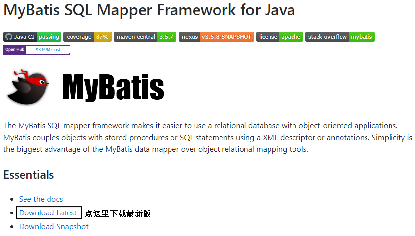
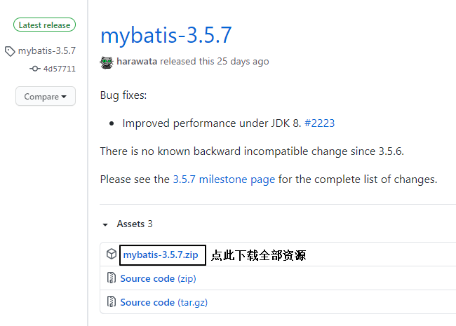

# SSM

> 讲师：尚硅谷-杨博超
>
> 尚硅谷官网：http://www.atguigu.com
>
> 视频链接：https://www.bilibili.com/video/BV1Ya411S7aT?vd_source=6e6b2286ee9a603d7bdb2bc5ba80e449

+++

## 一、MyBatis

### 1 MyBatis简介

#### 1.1 MyBatis历史

MyBatis最初是Apache的一个开源项目iBatis, 2010年6月这个项目由Apache Software Foundation迁移到了Google Code。随着开发团队转投Google Code旗下，iBatis3.x正式更名为MyBatis。代码于2013年11月迁移到Github。

iBatis一词来源于“internet”和“abatis”的组合，是一个基于Java的持久层框架。iBatis提供的持久层框架包括SQL Maps和Data Access Objects（DAO）。


#### 1.2 MyBatis特性

- MyBatis 是支持定制化 SQL、存储过程以及高级映射的优秀的持久层框架

- MyBatis 避免了几乎所有的 JDBC 代码和手动设置参数以及获取结果集

- MyBatis 可以使用简单的XML或注解用于配置和原始映射，将接口和Java的POJO（Plain Old Java Objects，普通的Java对象）映射成数据库中的记录

- MyBatis 是一个半自动的ORM（Object Relation Mapping）框架


#### 1.3 Mybatis下载

MyBatis下载地址：https://github.com/mybatis/mybatis-3





#### 1.4 和其它持久化层技术对比

- JDBC
  - SQL 夹杂在Java代码中耦合度高，导致硬编码内伤
  - 维护不易且实际开发需求中 SQL 有变化，频繁修改的情况多见
  - 代码冗长，开发效率低
- Hibernate 和 JPA
  - 操作简便，开发效率高
  - 程序中的长难复杂 SQL 需要绕过框架
  - 内部自动生产的 SQL，不容易做特殊优化
  - 基于全映射的全自动框架，大量字段的 POJO 进行部分映射时比较困难。
  - 反射操作太多，导致数据库性能下降
- MyBatis
  - 轻量级，性能出色
  - SQL 和 Java 编码分开，功能边界清晰。Java代码专注业务、SQL语句专注数据
  - 开发效率稍逊于HIbernate，但是完全能够接受


### 2 搭建MyBatis

#### 2.1 开发环境

IDE：idea 2022.2

构建工具：maven 3.8.1

MySQL版本：MySQL 5.5

MyBatis版本：MyBatis 3.5.7

> MySQL不同版本的注意事项
>
> 1. 驱动类driver-class-name
>    - MySQL 5版本使用jdbc5驱动，驱动类使用：com.mysql.jdbc.Driver
>    - MySQL 8版本使用jdbc8驱动，驱动类使用：com.mysql.cj.jdbc.Driver
>
> 2. 连接地址url
>    - MySQL 5版本的url：jdbc:mysql://localhost:3306/ssm
>    - MySQL 8版本的url：jdbc:mysql://localhost:3306/ssm?serverTimezone=UTC
>    - 否则运行测试用例报告如下错误：java.sql.SQLException: The server time zone value 'Öйú±ê׼ʱ¼ä' is unrecognized orrepresents more


#### 2.2 创建maven工程

方式一：打包方式jar

方式二：Maven 引入依赖

```xml
<dependencies>
   <!-- Mybatis核心 -->
   <dependency>
       <groupId>org.mybatis</groupId>
       <artifactId>mybatis</artifactId>
       <version>3.5.7</version>
   </dependency>
    
   <!-- junit测试 -->
   <dependency>
       <groupId>junit</groupId>
       <artifactId>junit</artifactId>
       <version>4.12</version>
       <scope>test</scope>
   </dependency>
    
   <!-- MySQL驱动 -->
   <dependency>
       <groupId>mysql</groupId>
       <artifactId>mysql-connector-java</artifactId>
       <version>8.0.16</version>
   </dependency>
</dependencies>
```


#### 2.3 创建MyBatis的核心配置文件

> 习惯上命名为`mybatis-config.xml`，这个文件名仅仅只是建议，并非强制要求。将来整合Spring之后，这个配置文件可以省略，所以大家操作时可以直接复制、粘贴。
>
> 核心配置文件主要用于配置连接数据库的环境以及MyBatis的全局配置信息
>
> 核心配置文件存放的位置是*src/main/resources*目录下

```xml
<?xml version="1.0" encoding="UTF-8" ?>
<!DOCTYPE configuration
        PUBLIC "-//mybatis.org//DTD Config 3.0//EN"
        "http://mybatis.org/dtd/mybatis-3-config.dtd">
<configuration>
	<!--设置连接数据库的环境-->
	<environments default="dev">
		<environment id="dev">
			<transactionManager type="JDBC"/>
			<dataSource type="POOLED">
				<property name="driver" value="com.mysql.cj.jdbc.Driver"/>
				<property name="url" value="jdbc:mysql://localhost:3306/ssm?serverTimezone=UTC"/>
				<property name="username" value="root"/>
				<property name="password" value="123456"/>
			</dataSource>
		</environment>
	</environments>
    
    
	<!--引入映射文件-->
	<mappers>
        <mapper resource="mappers/UserMapper.xml" />
	</mappers>
</configuration>
```


#### 2.4 创建mapper接口

> MyBatis中的mapper接口相当于以前的dao。但是区别在于，mapper仅仅是接口，我们不需要提供实现类。
>

```java
package com.atguigu.mybatis.mapper;

public interface UserMapper {
	/**
	* 添加用户信息
	*/
	int insertUser();
}
```


#### 2.5 创建MyBatis的映射文件

相关概念：**ORM**（**O**bject **R**elationship **M**apping）对象关系映射。

- 对象：Java的实体类对象
- 关系：关系型数据库
- 映射：二者之间的对应关系

| **Java概念** | **数据库概念** |
| ------------ | -------------- |
| 类           | 表             |
| 属性         | 字段/列        |
| 对象         | 记录/行        |

> 1. 映射文件的命名规则：
>
>    表所对应的实体类的`类名+Mapper.xml`
>
>    例如：表`t_user`，映射的实体类为`User`，所对应的映射文件为`UserMapper.xml`
>
>    因此一个映射文件对应一个实体类，对应一张表的操作
>
>    MyBatis映射文件用于编写SQL，访问以及操作表中的数据
>
>    MyBatis映射文件存放的位置是`src/main/resources/mappers`目录下
>
> 2. MyBatis中可以面向接口操作数据，要保证两个一致：
>    - mapper接口的全类名和映射文件的命名空间（namespace）保持一致
>    - mapper接口中方法的方法名和映射文件中编写SQL的标签的id属性保持一致

```
<?xml version="1.0" encoding="UTF-8" ?>
<!DOCTYPE mapper
        PUBLIC "-//mybatis.org//DTD Mapper 3.0//EN"
		"http://mybatis.org/dtd/mybatis-3-mapper.dtd">
<mapper namespace="com.atguigu.mybatis.mapper.UserMapper">
	<!--int insertUser();-->
	<insert id="insertUser">
		<insert into t_user values(null,'admin','123456',23,'男','12345@qq.com');
	</insert>
</mapper>
```


#### 2.6 通过junit测试功能

```java
@Test
public void testInsert1(){
    try {
        // 获取核心配置文件的输入流
        InputStream is = Resources.getResourceAsStream("mybatis-config.xml");
        // 获取 SqlSessionFactoryBuilder 对象
        SqlSessionFactoryBuilder sqlSessionFactoryBuilder = 
            new SqlSessionFactoryBuilder();
        // 获取 SqlSessionFactory 对象
        SqlSessionFactory sqlSessionFactory = sqlSessionFactoryBuilder.build(is);
        // 获取sql的会话对象SqlSession，是MyBatis提供的操作数据库的对象
        // sqlSessionFactory.openSession(); // 不会自动提交事务
        // sqlSessionFactory.openSession(true); // 自动提交事务
        SqlSession session = sqlSessionFactory.openSession(true);
        // 获取UserMapper的代理实现类对象
        UserMapper mapper = session.getMapper(UserMapper.class);
        // 调用mapper接口中的方法，实现添加用户信息的功能
        int count = mapper.insertUser();
        System.out.println(count == 1 ? "添加数据成功！" : "添加数据失败！");
        // 提交事务
        // session.commit();
        // 关闭session
        session.close();
    } catch (IOException e) {
        throw new RuntimeException(e);
    }
}
```

> - SqlSession：代表Java程序和**数据库**之间的**会话**。（HttpSession是Java程序和浏览器之间的会话）
>
> - SqlSessionFactory：是“生产”SqlSession的“工厂”。
> - 工厂模式：如果创建某一个对象，使用的过程基本固定，那么我们就可以把创建这个对象的相关代码封装到一个“工厂类”中，以后都使用这个工厂类来“生产”我们需要的对象。
>


#### 2.7 加入log4j日志功能

1. 加入依赖

   ```xml
   <!-- log4j日志 -->
   <dependency>
       <groupId>log4j</groupId>
       <artifactId>log4j</artifactId>
       <version>1.2.17</version>
   </dependency>
   ```

2. 加入log4j的配置文件

   > log4j的配置文件名为log4j.xml，存放的位置是*src/main/resources*目录下

   ```xml
   <?xml version="1.0" encoding="UTF-8" ?>
   <!DOCTYPE log4j:configuration SYSTEM "log4j.dtd">
   <log4j:configuration xmlns:log4j="http://jakarta.apache.org/log4j/">
   	<appender name="STDOUT" class="org.apache.log4j.ConsoleAppender">
   		<param name="Encoding" value="UTF-8" />
   		<layout class="org.apache.log4j.PatternLayout">
   			<param name="ConversionPattern" value="%-5p %d{MM-dd HH:mm:ss,SSS}%m (%F:%L) \n" />
   		</layout>
   	</appender>
   	<logger name="java.sql">
   		<level value="debug" />
   	</logger>
   	<logger name="org.apache.ibatis">
   		<level value="info" />
   	</logger>
   	<root>
   		<level value="debug" />
   		<appender-ref ref="STDOUT" />
   	</root>
   </log4j:configuration>
   ```

   > 日志的级别
   > FATAL(致命) > ERROR(错误) > WARN(警告) > INFO(信息) > DEBUG(调试)
   >
   > 从左到右打印的内容越来越详细


### 3 核心配置文件详解

> 核心配置文件中的标签必须按照固定的顺序：
>
> properties?,
>
> settings?,
>
> typeAliases?,
>
> typeHandlers?,
>
> objectFactory?,
>
> objectWrapperFactory?,
>
> reflectorFactory?,
>
> plugins?,
>
> environments?,
>
> databaseIdProvider?,
>
> mappers?

```xml
<?xml version="1.0" encoding="UTF-8" ?>
<!DOCTYPE configuration
        PUBLIC "-//mybatis.org//DTD Config 3.0//EN"
        "http://mybatis.org/dtd/mybatis-3-config.dtd">
<configuration>
    <!--
        MyBatis核心配置文件中的标签必须要按照指定的顺序配置
        properties?,settings?,typeAliases?,typeHandlers?,objectFactory?,
        objectWrapperFactory?,reflectorFactory?,plugins?,environments?,
        databaseIdProvider?,mappers?
    -->

    <!-- 引入properties文件，此后就可以在当前文件中使用${key}的方式访问value -->
    <properties resource="jdbc.properties" />

    <!--
        typeAliases：设置类型别名，即为某个具体的类型设置一个别名
        在MyBatis的范围中，就可以使用别名表示一个具体的类型
    -->
    <typeAliases>
        <!--
            type：需要取别名的类型
            alias：设置某个类型的别名
        -->
        <!-- <typeAlias type="com.xk.mybatis.pojo.User" alias="user" /> -->
        <!--
            如果不设置alias，当前的类型拥有默认的别名，即类名且不区分大小写
        -->
        <!-- <typeAlias type="com.xk.mybatis.pojo.User" /> -->
        <!--
            通过包设置类型别名，指定包下所有的类型将全部拥有默认的别名，即类名且不区分大小写
        -->
        <package name="com.xk.mybatis.pojo" />
    </typeAliases>

    <!--配置连接数据库的环境-->
    <!--
        environments : 配置连接数据库的环境
            default : 设置默认使用的环境的id
    -->
    <environments default="dev">
        <environment id="dev">
            <transactionManager type="JDBC" />
            <dataSource type="POOLED">
                <property name="driver" value="${jdbc.driver}" />
                <property name="url" value="${jdbc.url}" />
                <property name="username" value="${jdbc.username}" />
                <property name="password" value="${jdbc.password}" />
            </dataSource>
        </environment>

        <!--
            environment：设置一个具体的连接数据库的环境
            属性：
                id：设置环境的唯一标识，不能重复
            子标签：
                transactionManager：设置事务管理器
                属性：
                    type：事务管理的方式
                    type="JDBC|MANAGED"
                    JDBC    表示使用JDBC中原生的事务管理方式，事务的提交和回滚需要手动处理
                    MANAGED 被管理，例如Spring

                dataSource：设置数据源
                属性：
                    type：设置数据源的类型
                    type="POOLED|UNPOOLED|JNDI"
                    POOLED      表示使用数据库连接池缓存数据库连接
                    UNPOOLED    表示不使用数据库连接池
                    JNDI        表示使用上下文中的数据源
        -->
        <environment id="test">
            <transactionManager type="JDBC" />
            <dataSource type="POOLED">
                <!--设置连接数据库的驱动-->
                <property name="driver" value="com.mysql.jdbc.Driver"/>
                <!--设置连接数据库的连接地址-->
                <property name="url" value="jdbc:mysql://localhost:3306/ssm-guigu"/>
                <!--设置连接数据库的用户名-->
                <property name="username" value="root"/>
                <!--设置连接数据库的密码-->
                <property name="password" value="111"/>
            </dataSource>
        </environment>

    </environments>

    <!--引入mybatis的映射文件-->
    <mappers>
        <!-- <mapper resource="mappers/UserMapper.xml" /> -->
        <!--
            以包的方式引入映射文件，但是必须满足两个条件
            1.mapper接口和映射文件所在的包必须一致
            2.mapper接口的名字和映射文件的名字必须一致
        -->
        <package name="com.xk.mybatis.mapper" />
    </mappers>
</configuration>
```


### 4 MyBatis的增删改查

#### 4.1 新增

```java
package com.xk.mybatis.mapper;

public interface UserMapper {
    /**
     * 添加用户信息
     * @return
     */
    int insertUser();
}
```

```xml
<!--  int insertUser(User user);  -->
<insert id="insertUser">
    insert into t_user values (null,'admin','123456',20,'男','admin@qq.com');
</insert>
```


#### 4.2 删除

```java
package com.xk.mybatis.mapper;

public interface UserMapper {
    /**
     * 删除用户信息
     */
    int deleteUser();
}
```

```xml
<!--  int deleteUser();  -->
<delete id="deleteUser" >
    delete from t_user where id = 4;
</delete>
```


#### 4.3 修改

```java
package com.xk.mybatis.mapper;

public interface UserMapper {
    /**
     * 修改用户信息
     * @return
     */
    int updateUser();
}
```

```xml
<!--  int updateUser();  -->
<update id="updateUser" >
    update t_user set username = 'root', password = '123123' where id = 5;
</update>
```


#### 4.4 查询一个实体类对象

```java
package com.xk.mybatis.mapper;

import com.xk.mybatis.pojo.User;
import java.util.List;

public interface UserMapper {
    /**
     * 根据id查询用户信息
     * @return
     */
    User getUserBuyId();
}
```

```xml
<!--  User getUserBuyId();  -->
<!--
    resultType: 设置结果类型，即查询的数据要转换为的Java类型
    resultMap: 自定义映射，处理多对一 或 一对多的映射
-->
<select id="getUserBuyId" resultType="com.xk.mybatis.pojo.User" >
    select * from t_user where id = 5;
</select>
```


#### 4.5 查询list集合

```java
package com.xk.mybatis.mapper;

import com.xk.mybatis.pojo.User;
import java.util.List;

public interface UserMapper {
    /**
     * 查询所有的用户信息
     * @return
     */
    List<User> getAllUser();
}
```

```xml
<!--  List<User> getAllUser();  -->
<select id="getAllUser" resultType="User" >
    select * from t_user;
</select>
```

> 注意：
>
> 查询的标签select必须设置属性`resultType`或`resultMap`，用于设置实体类和数据库表的映射关系
>
> - resultType：自动映射，用于属性名和表中字段名一致的情况
>
> - resultMap：自定义映射，用于一对多或多对一 或 字段名和属性名不一致的情况


### 5 MyBatis获取参数值的两种方式

> MyBatis获取参数值的两种方式：**${} **和 **#{}**
>
> ${} 的本质就是字符串拼接，#{} 的本质就是占位符赋值
>
> ${} 使用字符串拼接的方式拼接sql，若为字符串类型或日期类型的字段进行赋值时，需要手动加单引号；
>
> 但是 #{} 使用占位符赋值的方式拼接sql，此时为字符串类型或日期类型的字段进行赋值时，可以自动添加单引号


#### 5.1 单个字面量类型的参数

> 若mapper接口中的方法参数为单个的字面量类型
>
> 此时可以使用\${}和#{}以任意的名称获取参数的值，注意\${}需要手动加单引号


#### 5.2 多个字面量类型的参数

> 若mapper接口中的方法参数为多个时
>
> 此时MyBatis会自动将这些参数放在一个map集合中，
>
> - 以arg0,arg1...为键，以参数为值；
> - 以param1,param2...为键，以参数为值；
>
> 因此只需要通过\${}和#{}访问map集合的键就可以获取相对应的值，注意\${}需要手动加单引号


#### 5.3 map集合类型的参数

> 若mapper接口中的方法需要的参数为多个时，此时可以手动创建map集合，将这些数据放在map中
>
> 只需要通过\${}和#{}访问map集合的键就可以获取相对应的值，注意\${}需要手动加单引号


#### 5.4 实体类类型的参数

> 若mapper接口中的方法参数为实体类对象时
>
> 此时可以使用\${}和#{}，通过访问实体类对象中的属性名获取属性值，注意\${}需要手动加单引号


#### 5.5 使用@Param标识参数

> 可以通过@Param注解标识mapper接口中的方法参数
>
> 此时，会将这些参数放在map集合中，
>
> - 以@Param注解的value属性值为键，以参数为值；
> - 以param1,param2...为键，以参数为值；
>
> 只需要通过\${}和#{}访问map集合的键就可以获取相对应的值，注意\${}需要手动加单引号


#### 5.6 代码实例

*UserMapper.java*接口：

```java
package com.xk01.mybatis.mapper;

import com.xk01.mybatis.pojo.User;
import org.apache.ibatis.annotations.Param;

import java.util.Map;

public interface UserMapper {
    /**
     * 根据用户名获取用户信息 5.1
     * @param userName
     * @return
     */
    User getUserByUsername(String userName);

    /**
     * 验证登录 5.2
     * @param username
     * @param password
     * @return
     */
    User checkLogin(String username, String password);

    /**
     * 验证登录（以map集合作为参数） 5.3
     * @param userMap
     * @return
     */
    User checkLoginByMap(Map<String, Object> userMap);

    /**
     * 添加用户信息 5.4
     * @param user
     * @return
     */
    void insertUser(User user);

    /**
     * 验证登录（使用 @param 注解） 5.5
     * @param username
     * @param password
     * @return
     */
    User checkLoginByParam(@Param("username") String username,
                           @Param("password") String password);
}
```

*UserMapper.xml*映射文件：

```java
<?xml version="1.0" encoding="UTF-8" ?>
<!DOCTYPE mapper
        PUBLIC "-//mybatis.org//DTD Mapper 3.0//EN"
        "http://mybatis.org/dtd/mybatis-3-mapper.dtd">
<mapper namespace="com.xk01.mybatis.mapper.UserMapper">
    <!--
        MyBatis获取参数值的两种方式：#{} 和 ${}
        #{} 的本质是占位符赋值
        ${} 的本质是字符串拼接
        1.若mapper接口方法的参数为单个的字面量类型
          此时可以通过#{}和${}以任意的内容获取参数值，一定注意${}的单引号问题
        2.若mapper接口方法的参数为多个的字面量类型
          此时MyBatis会将参数放在map集合中，以两种方式存储数据
          2.1 以 arg0, arg1......为键，以参数为值
          2.2 以 param1, param2......为键，以参数为值
          因此，只需要通过#{}和${}访问map集合的键，就可以获取相对应的值，一定注意${}的单引号问题
        3.若mapper接口方法的参数为map集合的参数
          只需要通过#{}和${}访问map集合的键，就可以获取相对应的值，一定注意${}的单引号问题
        4.若mapper接口方法的参数为实体类类型的参数
          只需要通过#{}和${}访问实体类中的属性名，就可以获取相对应的属性值，一定注意${}的单引号问题
        5.可以在mapper接口方法的参数上设置 @Param 注解
          此时MyBatis会将这些参数放在map中，以两种方式进行存储
          5.1 以 @Param 注解的value属性值为键，以参数为值
          5.2 以 param1, param2......为键，以参数为值
          只需要通过#{}和${}访问map集合的键，就可以获取相对应的值，一定注意${}的单引号问题
    -->

    <!--  User getUserByUsername(String userName);  单个字面量类型的参数  --> 
    <select id="getUserByUsername" resultType="User" >
        <!-- select * from t_user where username = #{userName}; -->
        select * from t_user where username = '${userName}';
    </select>

    <!--  User checkLogin(String username, String password); 多个字面量类型的参数  -->
    <select id="checkLogin" resultType="User" >
        <!-- select * from t_user where username = #{param1} and password = #{param2}; -->
        select * from t_user where username = '${arg0}' and password = '${arg1}';
    </select>

    <!--  User checkLoginByMap(Map<String, Object> userMap);  map集合类型的参数  -->
    <select id="checkLoginByMap" resultType="User" >
        select * from t_user where username = #{username} and password = #{password};
    </select>

    <!--  void insertUser(User user); 实体类类型的参数  -->
    <select id="insertUser" >
        insert into t_user values(null, #{username}, #{password}, #{age}, #{gender}, #{email});
    </select>

    <!--
        User checkLoginByParam(@Param("username") String username,
                               @Param("password") String password);
	    使用@Param标识参数
    -->
    <select id="checkLoginByParam" resultType="User">
        select * from t_user where username = #{username} and password = #{password};
    </select>

</mapper>
```

*测试类*：

```java
package com.xk.mybatis.test;

import com.xk01.mybatis.mapper.UserMapper;
import com.xk01.mybatis.pojo.User;
import com.xk01.mybatis.utils.SqlSessionUtil;
import org.apache.ibatis.session.SqlSession;
import org.junit.After;
import org.junit.Before;
import org.junit.Test;

import java.util.HashMap;
import java.util.Map;

/**
 * @description:
 * @author: xu
 * @date: 2022/11/13 16:24
 */
public class MyBatisTest {
    private SqlSession sqlSession;
    private UserMapper mapper;
    @Before
    public void getSqlSession(){
        sqlSession = SqlSessionUtil.getSqlSession();
        mapper = sqlSession.getMapper(UserMapper.class);
    }
    @After
    public void closeSqlSession(){
        sqlSession.close();
    }


    @Test
    public void testGetUserByUsername(){
        User user = mapper.getUserByUsername("admin");
        System.out.println(user);
    }

    @Test
    public void testCheckLogin(){
        User admin = mapper.checkLogin("root", "123123");
        System.out.println(admin);
    }

    @Test
    public void testCheckLoginByMap(){
        Map<String, Object> userMap = new HashMap<>();
        userMap.put("username", "admin");
        userMap.put("password", "123456");
        User admin = mapper.checkLoginByMap(userMap);
        System.out.println(admin);
    }

    @Test
    public void testInsertUser(){
        User user = new User(null, "rose", "111222", 20, "女", "rose@gmail.com");
        mapper.insertUser(user);
    }

    @Test
    public void testCheckLoginByParam(){
        User admin = mapper.checkLoginByParam("rose", "111222");
        System.out.println(admin);
    }
}
```

*获取SqlSession的工具类*：

```java
package com.xk01.mybatis.utils;

import org.apache.ibatis.io.Resources;
import org.apache.ibatis.session.SqlSession;
import org.apache.ibatis.session.SqlSessionFactory;
import org.apache.ibatis.session.SqlSessionFactoryBuilder;

import java.io.IOException;
import java.io.InputStream;

/**
 * @description: 获取SqlSession的工具类
 * @author: xu
 * @date: 2022/11/13 0:47
 */
public class SqlSessionUtil {
    public static final String PATH = "mybatis-config.xml";

    public static SqlSession getSqlSession() {
        SqlSession session = null;
        try {
            // 获取核心配置文件的输入流
            InputStream is = Resources.getResourceAsStream(PATH);
            // 获取 SqlSessionFactoryBuilder 对象
            SqlSessionFactoryBuilder sqlSessionFactoryBuilder = new SqlSessionFactoryBuilder();
            // 获取 SqlSessionFactory 对象
            SqlSessionFactory sqlSessionFactory = sqlSessionFactoryBuilder.build(is);
            // 获取sql的会话对象SqlSession，是MyBatis提供的操作数据库的对象
            session = sqlSessionFactory.openSession(true);
        } catch (IOException e) {
            throw new RuntimeException(e);
        }
        if (session == null) {
            throw new IllegalArgumentException("session is null");
        }
        return session;
    }
}
```


### 6 MyBatis的各种查询功能

#### 6.1 查询一个实体类对象

```java
/**
 * 根据id查询用户信息
 * @param id
 * @return
 */
User getUserById(@Param("id") Integer id);
```

```xml
<!--  User getUserById(Integer id);  -->
<select id="getUserById" resultType="User">
    select * from t_user where id = #{id};
</select>
```


#### 6.2 查询一个list集合

```java
/**
 * 查询所有的用户信息
 * @return
 */
List<User> getAllUser();
```

```xml
<!--  List<User> getAllUser();  -->
<select id="getAllUser" resultType="User">
    select * from t_user;
</select>
```

> 当查询的数据为多条时，不能使用实体类作为返回值，否则会抛出异常TooManyResultsException；
>
> 但是若查询的数据只有一条，可以使用实体类或集合作为返回值


#### 6.3 查询单个数据

```java
/**
 * 查询用户的总数量
 * @return
 */
Integer getCount();
```

```xml
<!--  Integer getCount();  -->
<!--
    MyBatis中为Java中常用的类型设置了类型别名
    Integer：Integer、int
    int：_int、_integer
    Map：map
    String：string
-->
<select id="getCount" resultType="int">
    select count(*) from t_user;
</select>
```


#### 6.4 查询一条数据为map集合

```java
/**
 * 根据id查询用户信息为map集合
 * @param id
 * @return
 */
Map<String, Object> getUserByIdToMap(@Param("id") Integer id);
```

```xml
<!--  Map<String, Object> getUserByIdToMap(@Param("id") Integer id);  -->
<!--结果：{password=123456, sex=男 , id=1, age=23, username=admin}  -->
<select id="getUserByIdToMap" resultType="map">
    select * from t_user where id = #{id};
</select>
```


#### 6.5 查询多条数据为map集合

*方式一*：

```java
/**
 * 查询所有的用户信息为map集合
 * @return
 */
List<Map<String, Object>> getAllUserToMap();
/*
结果：
{password=123123, gender=男, id=5, age=20, email=root@qq.com, username=root}
{password=123456, gender=女, id=6, age=22, email=admin@qq.com, username=admin}
{password=666777, gender=女, id=9, age=23, email=jim@gmail.com, username=jim}
{password=111222, gender=女, id=13, age=20, email=rose@gmail.com, username=rose}
{password=xiaom, gender=男, id=16, age=18, email=ming@126.com, username=xiaoming}
*/
```

```xml
<!--  List<Map<String, Object>> getAllUserToMap();  -->
<select id="getAllUserToMap" resultType="java.util.Map">
    select * from t_user
</select>
```

*方式二*：

```java
/**
 * 查询所有的用户信息为map集合
 * @return
 */
@MapKey("id")
Map<Integer, Object> getAllUserToMap();
/*
结果：
16={password=xiaom, gender=男, id=16, age=18, email=ming@126.com, username=xiaoming}
5={password=123123, gender=男, id=5, age=20, email=root@qq.com, username=root}
6={password=123456, gender=女, id=6, age=22, email=admin@qq.com, username=admin}
9={password=666777, gender=女, id=9, age=23, email=jim@gmail.com, username=jim}
13={password=111222, gender=女, id=13, age=20, email=rose@gmail.com, username=rose}
*/
```

```xml
<!--
    查询所有的用户信息为map集合
    若查询的数据有多条时，并且要将每条数据转换为map集合
    此时有两种解决方案：
    1.将mapper接口方法的返回值设置为泛型是map的list集合
      List<Map<String, Object>> getAllUserToMap();
    2.可以将每条数据转换的map集合放在一个大的map中，但是必须要通过 @MapKey 注解
      将查询的某个字段的值作为大的map的键
      @MapKey("id")
      Map<Integer, Object> getAllUserToMap();
-->

<!--  Map<String, Object> getAllUserToMap();  -->
<select id="getAllUserToMap" resultType="java.util.Map">
    select * from t_user
</select>
```


### 7 特殊SQL的执行

#### 7.1 模糊查询

```java
/**
 * 通过用户名模糊查询用户信息
 * @param like
 * @return
 */
List<User> getUserByLike(@Param("like") String like);
```

```xml
<!--  List<User> getUserByLike(@Param("like") String like);  -->
<select id="getUserByLike" resultType="User">
    <!-- select * from t_user where username like '%${like}%'; -->
    <!-- select * from t_user where username like concat('%',#{like},'%'); -->
    select * from t_user where username like "%"#{like}"%";
</select>
```


#### 7.2 批量删除

```java
/**
 * 批量删除
 * @param ids
 */
void deleteMoreUsers(@Param("ids") String ids);
```

```xml
<!--  void deleteMoreUsers(@Param("ids") String ids);//ids = "9,10"  -->
<delete id="deleteMoreUsers">
    delete from t_user where id in(${ids});
</delete>
```


#### 7.3 动态设置表名

```java
/**
 * 动态设置表名，查询用户信息
 * @param typeName
 * @return
 */
List<User> getUserList(@Param("typeName") String typeName);
```

```xml
<!--  List<User> getUserList(@Param("typeName") String typeName);  -->
<select id="getUserList" resultType="User">
    select * from ${typeName};
</select>
```


#### 7.4 添加功能获取自增的主键

> 场景模拟：
>
> t_clazz(clazz_id,clazz_name)
>
> t_student(student_id,student_name,clazz_id)
>
> 1. 添加班级信息
>
> 2. 获取新添加的班级的id
>
> 3. 为班级分配学生，即将某学的班级id修改为新添加的班级的id

```java
/**
 * 添加用户信息并获取自增的主键
 * @param user
 */
void insertUser(User user);
```

```xml
<!--  void insertUser(User user);  -->
<!--
    useGeneratedKeys：表示当前添加功能使用自增主键
    keyProperty：将添加的数据的自增主键为实体类类型的参数的属性赋值
-->
<insert id="insertUser" useGeneratedKeys="true" keyProperty="id" >
    insert into t_user values(null, #{username}, #{password}, #{age}, #{gender}, #{email});
</insert>
```

*测试*：

```java
@Test
public void testInsertUser(){
    User user = new User(null,"xiaoming","xiaom",18,"男","ming@126.com");
    System.out.println(user); // 数据库添加之前，user的id为null
    mapper.insertUser(user);
    System.out.println(user); // 数据添加之后，user的id为自增之后的值
}
```


### 8 自定义映射resultMap

t_dept表：

t_emp表：

```sql
DROP TABLE IF EXISTS `t_dept`;
CREATE TABLE `t_dept` (
  `dept_id` int(11) NOT NULL AUTO_INCREMENT,
  `dept_name` varchar(20) DEFAULT NULL,
  PRIMARY KEY (`dept_id`)
) ENGINE=InnoDB AUTO_INCREMENT=4 DEFAULT CHARSET=utf8mb4;

INSERT INTO `t_dept` VALUES ('1', 'A');
INSERT INTO `t_dept` VALUES ('2', 'B');
INSERT INTO `t_dept` VALUES ('3', 'C');


DROP TABLE IF EXISTS `t_emp`;
CREATE TABLE `t_emp` (
  `emp_id` int(11) NOT NULL AUTO_INCREMENT,
  `emp_name` varchar(20) DEFAULT NULL,
  `age` int(11) DEFAULT NULL,
  `gender` char(255) DEFAULT NULL,
  `dept_id` int(11) DEFAULT NULL,
  PRIMARY KEY (`emp_id`)
) ENGINE=InnoDB AUTO_INCREMENT=5 DEFAULT CHARSET=utf8mb4;

INSERT INTO `t_emp` VALUES ('1', '张三', '20', '男', '1');
INSERT INTO `t_emp` VALUES ('2', '李四', '22', '女', '2');
INSERT INTO `t_emp` VALUES ('3', '王五', '23', '男', '3');
INSERT INTO `t_emp` VALUES ('4', '赵六', '20', '女', '1');
```


#### 8.1 resultMap处理字段和属性的映射关系

> 若字段名和实体类中的属性名不一致，
>
> 1. 为查询的字段设置别名，和属性名保持一致
> 2. 可以在MyBatis的核心配置文件中设置一个全局配置，可以自动将下划线映射为驼峰
> 3. 可以通过resultMap设置自定义映射

| *MySQL字段名* | *Java属性名* |
| ------------- | ------------ |
| emp_id        | empId        |
| emp_name      | empName      |
| age           | age          |
| gender        | gender       |

```java
/**
 * 根据id查询员工信息
 * @param id
 * @return
 */
Emp getEmpById(@Param("empId") Integer id);
```

*方式一*：为查询的字段设置别名，和属性名保持一致

```xml
<!--  Emp getEmpById(@Param("empId") Integer id);  -->
<select id="getEmpById" resultType="Emp">
    select emp_id As "empId", emp_name As "empName", age, gender
    from t_emp where emp_id = #{empId};
</select>
```

*方式二*：在MyBatis的核心配置文件中设置一个全局配置，可以自动将下划线映射为驼峰

前提：当字段符合MySql的要求使用_(蛇形)，而属性符合java的要求使用驼峰

```xml
<!-- mybatis核心配置文件 -->
<settings>
    <!-- 将下划线(蛇形)映射为驼峰 -->
    <setting name="mapUnderscoreToCamelCase" value="true"/>
</settings>
```

```xml
<!-- mapper映射文件 -->
<!--  Emp getEmpById(@Param("empId") Integer id);  -->
<select id="getEmpById" resultMap="empResultMap" >
    select * from t_emp where emp_id = #{empId};
</select>
```

*方式三*：可以通过resultMap设置自定义映射

```xml
<!--
    字段名和属性名不一致的情况，如何处理映射关系
    1.为查询的字段设置别名，和属性名保持一致
    2.当字段符合MySql的要求使用_(蛇形)，而属性符合java的要求使用驼峰
      此时可以在MyBatis的核心配置文件中设置一个全局配置，可以自动将下划线映射为驼峰
      emp_id -> empID   emp_name -> empName
      <settings>
          <setting name="mapUnderscoreToCamelCase" value="true"/>
      </settings>
    3.使用resultMap自定义映射处理
-->
<!--
    resultMap：设置自定义的映射关系
        id：唯一标识
        type：处理映射关系的实体类的类型
    常用的标签
        id：处理主键和实体类中属性的映射关系
        result：处理普通字段和实体类中属性的映射关系
            column：设置映射关系中的字段名，必须是sql查询出的某个字段
            property：设置映射关系中的属性名，必须是处理的实体类类型中的属性名
        association：处理多对一的映射关系（处理实体类类型的属性）
            property：设置需要处理映射关系的属性的属性名
            javaType：设置要处理的属性的类型
            select：设置分步查询的sql的唯一标识
            column：将查询出的某个字段作为分布查询的sql的条件
            fetchType：在开启了延时加载的环境中，通过该属性设置当前的分布查询是否使用延迟加载
        collection：处理一对多的映射关系（处理集合类型的属性）
            ofType：设置集合类型的属性中存储的数据的类型
-->
<resultMap id="empResultMap" type="Emp" >
    <id column="emp_id" property="empId" />
    <result column="emp_name" property="empName" />
    <result column="age" property="age" />
    <result column="gender" property="gender" />
</resultMap>

<!--  Emp getEmpById(@Param("empId") Integer id);  -->
<select id="getEmpById" resultMap="empResultMap" >
    select * from t_emp where emp_id = #{empId};
</select>
```


#### 8.2 多对一映射处理

> 场景模拟：查询员工信息以及员工所对应的部门信息

```java
/**
 * 根据id查询员工信息
 * @param id
 * @return
 */
Emp getEmpById(@Param("empId") Integer id);
```

##### 8.2.1 级联方式处理映射关系

```xml
<!-- 1.级联方式 -->
<resultMap id="empAndDeptResultMapOne" type="Emp" >
    <id column="emp_id" property="empId" />
    <result column="emp_name" property="empName" />
    <result column="age" property="age" />
    <result column="gender" property="gender" />
    <result column="dept_id" property="dept.deptId" />
    <result column="dept_name" property="dept.deptName" />
</resultMap>

<!--  Emp getEmpAndDeptById(@Param("empId") Integer empId);  -->
<select id="getEmpAndDeptById" resultMap="empAndDeptResultMapOne">
    select t_emp.*, t_dept.* from t_emp
    left join t_dept on t_emp.dept_id = t_dept.dept_id
    where t_emp.emp_id = #{empId};
</select>
```


##### 8.2.2 使用association处理映射关系

```xml
<!-- 2.association -->
<resultMap id="empAndDeptResultMap" type="Emp" >
    <id column="emp_id" property="empId" />
    <result column="emp_name" property="empName" />
    <result column="age" property="age" />
    <result column="gender" property="gender" />
    <!--
        association：处理多对一的映射关系（处理实体类类型的属性）
            property：设置需要处理映射关系的属性的属性名
            javaType：设置要处理的属性的类型
    -->
    <association property="dept" javaType="Dept" >
        <id column="dept_id" property="deptId" />
        <result column="dept_name" property="deptName" />
    </association>
</resultMap>
<!--  Emp getEmpAndDeptById(@Param("empId") Integer empId);  -->
<select id="getEmpAndDeptById" resultMap="empAndDeptResultMap">
    select t_emp.*, t_dept.* from t_emp
    left join t_dept on t_emp.dept_id = t_dept.dept_id
    where t_emp.emp_id = #{empId};
</select>
```


##### 8.2.3 分步查询

1. 查询员工信息

   ```java
   package com.xk02.mybatis.mapper;
   
   import com.xk02.mybatis.pojo.Emp;
   import org.apache.ibatis.annotations.Param;
   
   public interface EmpMapper {
       /**
        * 通过分步查询查询员工以及所对应的部门信息的第一步
        * @param empId
        * @return
        */
       Emp getEmpAndDeptByStepOne(@Param("empId") Integer empId);
   }
   ```

   ```xml
   <!-- 3.分步查询 -->
   <resultMap id="empAndDeptByStepResultMap" type="Emp" >
       <id column="emp_id" property="empId" />
       <result column="emp_name" property="empName" />
       <result column="age" property="age" />
       <result column="gender" property="gender" />
       <!--
           property：设置需要处理映射关系的属性的属性名
           select：设置分步查询的sql的唯一标识
           column：将查询出的某个字段作为分布查询的sql的条件
           fetchType：在开启了延时加载的环境中，通过该属性设置当前的分布查询是否使用延迟加载
           fetchType=“eager(立即加载)|lazy(延迟加载)”
       -->
       <association property="dept" fetchType="eager"
                    select="com.xk02.mybatis.mapper.DeptMapper.getEmpAndDeptByStepTwo"
                    column="dept_id"  ></association>
   </resultMap>
   
   <!--  Emp getEmpAndDeptByStepOne(@Param("empId") Integer empId);  -->
   <select id="getEmpAndDeptByStepOne" resultMap="empAndDeptByStepResultMap">
       select * from t_emp where emp_id = #{empId};
   </select>
   ```

2. 根据员工所对应的部门id查询部门信息

   ```java
   package com.xk02.mybatis.mapper;
   
   import com.xk02.mybatis.pojo.Dept;
   import org.apache.ibatis.annotations.Param;
   
   public interface DeptMapper {
       /**
        * 通过分步查询查询员工以及所对应的部门信息的第二步
        * @param deptId
        * @return
        */
       Dept getEmpAndDeptByStepTwo(@Param("deptId") Integer deptId);
   }
   ```

   ```xml
   <!--  Dept getEmpAndDeptByStepTwo(@Param("deptId") Integer deptId);  -->
   <select id="getEmpAndDeptByStepTwo" resultType="Dept">
       select * from t_dept where dept_id = #{deptId};
   </select>
   ```


#### 8.3 一对多映射处理

##### 8.3.1 collection

```java
/**
 * 查询部门以及部门中的员工信息
 * @param deptId
 * @return
 */
Dept getDeptAndEmpByDeptId(@Param("deptId") Integer deptId);
```

```xml
<!-- 1.collection -->
<resultMap id="deptAndEmpResultMap" type="Dept" >
    <id column="dept_id" property="deptId" />
    <result column="dept_name" property="deptName" />
    <collection property="empList" ofType="Emp">
        <id column="emp_id" property="empId" />
        <result column="emp_name" property="empName" />
        <result column="age" property="age" />
        <result column="gender" property="gender" />
    </collection>
</resultMap>

<!--  Dept getDeptAndEmpByDeptId(@Param("deptId") Integer deptId);  -->
<select id="getDeptAndEmpByDeptId" resultMap="deptAndEmpResultMap">
    select * from t_dept
    left join t_emp on t_dept.dept_id = t_emp.dept_id
    where t_dept.dept_id = #{deptId};
</select>
```


##### 8.3.2 分步查询

1. 查询部门信息

   ```java
   /**
    * 通过分步查询查询部门以及部门中的员工信息的第一步
    * @param deptId
    * @return
    */
   Dept getDeptAndEmpByStepOne(@Param("deptId") Integer deptId);
   ```

   ```xml
   <resultMap id="deptAndEmpByStepResultMap" type="Dept" >
       <id column="dept_id" property="deptId" />
       <result column="dept_name" property="deptName" />
       <!--
           collection：处理一对多的映射关系（处理集合类型的属性）
               ofType：设置集合类型的属性中存储的数据的类型
               select：设置分步查询的sql的唯一标识
               column：将查询出的某个字段作为分布查询的sql的条件
       -->
       <collection property="empList"
                   select="com.xk02.mybatis.mapper.EmpMapper.getDeptAndEmpByStepTwo"
                   column="dept_id"></collection>
   </resultMap>
   
   <!--  Dept getDeptAndEmpByStepOne(@Param("deptId") Integer deptId);  -->
   <select id="getDeptAndEmpByStepOne" resultMap="deptAndEmpByStepResultMap">
       select * from t_dept where dept_id = #{deptId};
   </select>
   ```

2. 根据部门id查询部门中的所有员工

   ```java
   /**
    * 通过分步查询查询部门以及部门中的员工信息的第二步
    * @param deptId
    * @return
    */
   List<Emp> getDeptAndEmpByStepTwo(@Param("deptId") Integer deptId);
   ```

   ```xml
   <!--  List<Emp> getDeptAndEmpByStepTwo(@Param("deptId") Integer deptId);  -->
   <select id="getDeptAndEmpByStepTwo" resultType="Emp">
       select * from t_emp where dept_id = #{deptId};
   </select>
   ```

> 分步查询的优点：可以实现延迟加载
>
> 但是必须在*核心配置文件*中设置全局配置信息：
>
> - lazyLoadingEnabled：延迟加载的全局开关。当开启时，所有关联对象都会延迟加载
> - aggressiveLazyLoading：当开启时，任何方法的调用都会加载该对象的所有属性。否则，每个属性会按需加载
>
> 此时就可以实现按需加载，获取的数据是什么，就只会执行相应的sql。此时可通过association和collection中的fetchType属性设置当前的分步查询是否使用延迟加载，fetchType="lazy(延迟加载)|eager(立即加载)"


